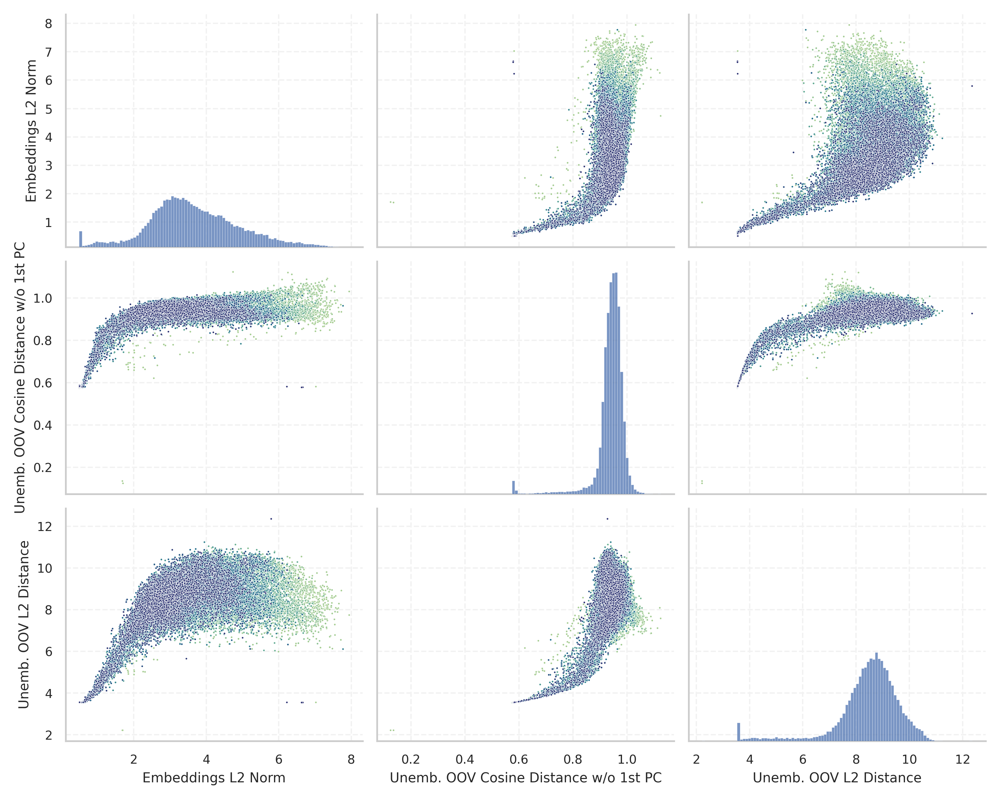

# Report for `deepseek-ai/deepseek-coder-33b-base`

## Model info

* Tied embeddings: no
* Unembeddings use bias: no
* Metric for under-trained tokens: Embeddings L2 Norm
  * Overall distribution 3.660 +/- 1.221
  * Token used for verification prompt building: `ArgumentException`
  * Verification threshold: 1.236
  * Threshold for showing candidate under-trained tokens: 0.724
  * Median verified threshold (for bytes, unreachable and special tokens): 0.688
* Embeddings shape: (32256, 7168)
* Vocabulary size: 32022
  * Number of single byte tokens: 256, of which 0 below metric threshold
  * Number of special tokens: 9, of which 3 below metric threshold
  * Number of unreachable non-single-byte tokens: 53, of which 53 below metric threshold
  * Number of non-single-byte UTF-fragment tokens: 327, 0 below soft metric threshold
  * Number of tested under-trained tokens: 628, 108 below p = 0.01 threshold, 70 below soft metric threshold

## Metrics plot


## Verification plot


## Under-trained token verification results
70 entries below threshold of 0.724

|   token_id | token                     |   metric | max_prob                                                         | in_other_tokens                                                                |
|------------|---------------------------|----------|------------------------------------------------------------------|--------------------------------------------------------------------------------|
|       6968 | ````` \xa0anys `````      | 0.503183 | <span style='border: 1px solid rgb(169, 68, 66);'>3.8e-07</span> |                                                                                |
|      24847 | ````` \xa0milions `````   | 0.509945 | <span style='border: 1px solid rgb(169, 68, 66);'>2.1e-07</span> |                                                                                |
|       9232 | ````` \xa0persones `````  | 0.527892 | <span style='border: 1px solid rgb(169, 68, 66);'>4.7e-08</span> |                                                                                |
|      31142 | ````` ▁desocupats `````   | 0.52957  | <span style='border: 1px solid rgb(169, 68, 66);'>2e-08</span>   |                                                                                |
|      28453 | ````` Polítics `````      | 0.531442 | <span style='border: 1px solid rgb(169, 68, 66);'>1.9e-07</span> |                                                                                |
|      26287 | ````` automòbils `````    | 0.533945 | <span style='border: 1px solid rgb(169, 68, 66);'>3e-07</span>   |                                                                                |
|      30088 | ````` ▁capbaix `````      | 0.537156 | <span style='border: 1px solid rgb(169, 68, 66);'>1.6e-07</span> |                                                                                |
|      30188 | ````` ▁unipersonals ````` | 0.539675 | <span style='border: 1px solid rgb(169, 68, 66);'>2.6e-06</span> |                                                                                |
|      17744 | ````` Родени `````        | 0.547032 | <span style='border: 1px solid rgb(169, 68, 66);'>5.7e-07</span> |                                                                                |
|      26042 | ````` ▁херцо `````        | 0.549482 | <span style='border: 1px solid rgb(169, 68, 66);'>6.1e-08</span> | <span style='border: 1px solid rgb(169, 68, 66);'>````` ▁херцог `````</span>   |
|      30963 | ````` ▁solteres `````     | 0.554075 | <span style='border: 1px solid rgb(169, 68, 66);'>1.9e-06</span> |                                                                                |
|      30168 | ````` Piràmide `````      | 0.568648 | <span style='border: 1px solid rgb(169, 68, 66);'>1.5e-07</span> |                                                                                |
|      29906 | ````` ▁херцог `````       | 0.570143 | <span style='border: 1px solid rgb(169, 68, 66);'>1.4e-07</span> |                                                                                |
|      28726 | ````` ▁disposaven `````   | 0.572149 | <span style='border: 1px solid rgb(169, 68, 66);'>3.9e-06</span> |                                                                                |
|      29471 | ````` Naixements `````    | 0.572227 | <span style='border: 1px solid rgb(169, 68, 66);'>1.7e-05</span> |                                                                                |
|      26851 | ````` ▁agrícoles `````    | 0.574596 | <span style='border: 1px solid rgb(169, 68, 66);'>6.1e-07</span> |                                                                                |
|      29542 | ````` ▁corresponia `````  | 0.580997 | <span style='border: 1px solid rgb(169, 68, 66);'>1.1e-08</span> |                                                                                |
|      16651 | ````` \xa0aC `````        | 0.581797 | <span style='border: 1px solid rgb(169, 68, 66);'>2.1e-07</span> |                                                                                |
|      30103 | ````` ▁llogaters `````    | 0.584133 | <span style='border: 1px solid rgb(169, 68, 66);'>1.4e-05</span> |                                                                                |
|      29856 | ````` ▁pàrqu `````        | 0.586816 | <span style='border: 1px solid rgb(169, 68, 66);'>4.1e-08</span> | <span style='border: 1px solid rgb(169, 68, 66);'>````` ▁pàrquing `````</span> |
<details><summary>50 additional entries below threshold</summary>

|   token_id | token                       |   metric | max_prob                                                         | in_other_tokens                                                                                                                                                                                                                                                                                                                                                                                           |
|------------|-----------------------------|----------|------------------------------------------------------------------|-----------------------------------------------------------------------------------------------------------------------------------------------------------------------------------------------------------------------------------------------------------------------------------------------------------------------------------------------------------------------------------------------------------|
|       8790 | ````` \xa0habitants `````   | 0.599214 | <span style='border: 1px solid rgb(169, 68, 66);'>1.7e-07</span> |                                                                                                                                                                                                                                                                                                                                                                                                           |
|      15510 | ````` ▁Olímpics `````       | 0.605718 | <span style='border: 1px solid rgb(169, 68, 66);'>7.3e-06</span> |                                                                                                                                                                                                                                                                                                                                                                                                           |
|      30427 | ````` ▁jubilades `````      | 0.608062 | <span style='border: 1px solid rgb(169, 68, 66);'>2.9e-05</span> |                                                                                                                                                                                                                                                                                                                                                                                                           |
|      18064 | ````` àmide `````           | 0.612484 | <span style='border: 1px solid rgb(169, 68, 66);'>2.8e-05</span> | <span style='border: 1px solid rgb(251, 189, 8);'>````` ▁piràmide `````</span>, <span style='border: 1px solid rgb(169, 68, 66);'>````` Piràmide `````</span>                                                                                                                                                                                                                                             |
|      22551 | ````` ▁contemporanis `````  | 0.616108 | <span style='border: 1px solid rgb(169, 68, 66);'>4.8e-05</span> |                                                                                                                                                                                                                                                                                                                                                                                                           |
|      29894 | ````` ▁residències `````    | 0.618363 | <span style='border: 1px solid rgb(169, 68, 66);'>2.9e-05</span> |                                                                                                                                                                                                                                                                                                                                                                                                           |
|      29976 | ````` ▁censats `````        | 0.621773 | <span style='border: 1px solid rgb(251, 189, 8);'>0.068</span>   |                                                                                                                                                                                                                                                                                                                                                                                                           |
|      24735 | ````` ▁alemanys `````       | 0.622736 | <span style='border: 1px solid rgb(169, 68, 66);'>0.0002</span>  |                                                                                                                                                                                                                                                                                                                                                                                                           |
|      25186 | ````` òrnia `````           | 0.625991 | <span style='border: 1px solid rgb(169, 68, 66);'>2.4e-05</span> | <span style='border: 1px solid rgb(169, 68, 66);'>````` ▁Califòrnia `````</span>                                                                                                                                                                                                                                                                                                                          |
|      29115 | ````` ▁príncep `````        | 0.626678 | <span style='border: 1px solid rgb(169, 68, 66);'>4.5e-07</span> |                                                                                                                                                                                                                                                                                                                                                                                                           |
|      10708 | ````` ogrà `````            | 0.627548 | <span style='border: 1px solid rgb(169, 68, 66);'>3.9e-06</span> | <span style='border: 1px solid rgb(40, 167, 69);'>````` ▁geogràfica `````</span>, <span style='border: 1px solid rgb(40, 167, 69);'>````` ogràfic `````</span>, <span style='border: 1px solid rgb(40, 167, 69);'>````` ogràfica `````</span>, <span style='border: 1px solid rgb(251, 189, 8);'>````` ogràf `````</span>                                                                                 |
|      25055 | ````` Esportistes `````     | 0.628171 | <span style='border: 1px solid rgb(255, 145, 0);'>0.0011</span>  |                                                                                                                                                                                                                                                                                                                                                                                                           |
|      29013 | ````` ▁automòbil `````      | 0.629375 | <span style='border: 1px solid rgb(169, 68, 66);'>8.2e-07</span> |                                                                                                                                                                                                                                                                                                                                                                                                           |
|      30090 | ````` ▁britànics `````      | 0.634724 | <span style='border: 1px solid rgb(169, 68, 66);'>4.9e-07</span> |                                                                                                                                                                                                                                                                                                                                                                                                           |
|      14837 | ````` Futbolistes `````     | 0.635706 | <span style='border: 1px solid rgb(169, 68, 66);'>0.00022</span> |                                                                                                                                                                                                                                                                                                                                                                                                           |
|      27783 | ````` ▁Califòrnia `````     | 0.638095 | <span style='border: 1px solid rgb(169, 68, 66);'>4.9e-06</span> |                                                                                                                                                                                                                                                                                                                                                                                                           |
|      25037 | ````` àbitat `````          | 0.642786 | <span style='border: 1px solid rgb(169, 68, 66);'>5e-06</span>   |                                                                                                                                                                                                                                                                                                                                                                                                           |
|      13039 | ````` lemanya `````         | 0.64283  | <span style='border: 1px solid rgb(255, 145, 0);'>0.0059</span>  | <span style='border: 1px solid rgb(40, 167, 69);'>````` Alemanya `````</span>, <span style='border: 1px solid rgb(251, 189, 8);'>````` ▁Alemanya `````</span>                                                                                                                                                                                                                                             |
|      22969 | ````` Починали `````        | 0.645541 | <span style='border: 1px solid rgb(169, 68, 66);'>0.00074</span> |                                                                                                                                                                                                                                                                                                                                                                                                           |
|      31793 | ````` glésies `````         | 0.651159 | <span style='border: 1px solid rgb(169, 68, 66);'>2.7e-06</span> |                                                                                                                                                                                                                                                                                                                                                                                                           |
|      15366 | ````` unidenc `````         | 0.653983 | <span style='border: 1px solid rgb(169, 68, 66);'>3.1e-05</span> | <span style='border: 1px solid rgb(255, 145, 0);'>````` ▁estatunidencs `````</span>, <span style='border: 1px solid rgb(169, 68, 66);'>````` ▁estatunidenc `````</span>                                                                                                                                                                                                                                   |
|      30659 | ````` ▁repartia `````       | 0.656056 | <span style='border: 1px solid rgb(169, 68, 66);'>1.4e-07</span> |                                                                                                                                                                                                                                                                                                                                                                                                           |
|      26261 | ````` Разпространение ````` | 0.659405 | <span style='border: 1px solid rgb(169, 68, 66);'>1e-05</span>   |                                                                                                                                                                                                                                                                                                                                                                                                           |
|      31975 | ````` ▁Canadà `````         | 0.660188 | <span style='border: 1px solid rgb(169, 68, 66);'>3.6e-05</span> |                                                                                                                                                                                                                                                                                                                                                                                                           |
|      30507 | ````` ▁llogats `````        | 0.661058 | <span style='border: 1px solid rgb(169, 68, 66);'>4.8e-05</span> |                                                                                                                                                                                                                                                                                                                                                                                                           |
|      30401 | ````` ▁britànic `````       | 0.661628 | <span style='border: 1px solid rgb(169, 68, 66);'>4.4e-07</span> |                                                                                                                                                                                                                                                                                                                                                                                                           |
|      15850 | ````` ▁estatunidenc `````   | 0.663608 | <span style='border: 1px solid rgb(169, 68, 66);'>2.2e-07</span> | <span style='border: 1px solid rgb(255, 145, 0);'>````` ▁estatunidencs `````</span>                                                                                                                                                                                                                                                                                                                       |
|      21952 | ````` ▁francesos `````      | 0.663708 | <span style='border: 1px solid rgb(169, 68, 66);'>3.4e-05</span> |                                                                                                                                                                                                                                                                                                                                                                                                           |
|      30461 | ````` ▁explotacions `````   | 0.663847 | <span style='border: 1px solid rgb(251, 189, 8);'>0.021</span>   |                                                                                                                                                                                                                                                                                                                                                                                                           |
|      30828 | ````` ▁aturades `````       | 0.665324 | <span style='border: 1px solid rgb(169, 68, 66);'>2e-06</span>   |                                                                                                                                                                                                                                                                                                                                                                                                           |
|      19342 | ````` ▁façana `````         | 0.667547 | <span style='border: 1px solid rgb(169, 68, 66);'>0.00071</span> |                                                                                                                                                                                                                                                                                                                                                                                                           |
|      21788 | ````` Escriptors `````      | 0.67077  | <span style='border: 1px solid rgb(251, 189, 8);'>0.036</span>   |                                                                                                                                                                                                                                                                                                                                                                                                           |
|      29278 | ````` ▁detallades `````     | 0.671464 | <span style='border: 1px solid rgb(169, 68, 66);'>1.7e-08</span> |                                                                                                                                                                                                                                                                                                                                                                                                           |
|      31273 | ````` Acadèmia `````        | 0.676665 | <span style='border: 1px solid rgb(169, 68, 66);'>2.2e-07</span> |                                                                                                                                                                                                                                                                                                                                                                                                           |
|      29121 | ````` ▁segones `````        | 0.679905 | <span style='border: 1px solid rgb(169, 68, 66);'>1.9e-07</span> |                                                                                                                                                                                                                                                                                                                                                                                                           |
|      22061 | ````` adèmia `````          | 0.682464 | <span style='border: 1px solid rgb(251, 189, 8);'>0.02</span>    | <span style='border: 1px solid rgb(169, 68, 66);'>````` Acadèmia `````</span>                                                                                                                                                                                                                                                                                                                             |
|      29921 | ````` ▁Anglaterra `````     | 0.6844   | <span style='border: 1px solid rgb(169, 68, 66);'>1.1e-07</span> |                                                                                                                                                                                                                                                                                                                                                                                                           |
|      28243 | ````` ▁espanyols `````      | 0.685977 | <span style='border: 1px solid rgb(255, 145, 0);'>0.0021</span>  |                                                                                                                                                                                                                                                                                                                                                                                                           |
|      30041 | ````` quitectònic `````     | 0.69054  | <span style='border: 1px solid rgb(169, 68, 66);'>4.9e-05</span> |                                                                                                                                                                                                                                                                                                                                                                                                           |
|       6433 | ````` мври `````            | 0.691087 | <span style='border: 1px solid rgb(255, 145, 0);'>0.0026</span>  | <span style='border: 1px solid rgb(251, 189, 8);'>````` ▁октомври `````</span>, <span style='border: 1px solid rgb(40, 167, 69);'>````` ември `````</span>, <span style='border: 1px solid rgb(40, 167, 69);'>````` ▁ноември `````</span>, <span style='border: 1px solid rgb(40, 167, 69);'>````` кември `````</span>, <span style='border: 1px solid rgb(251, 189, 8);'>````` птември `````</span>, ... |
|      16297 | ````` \xa0metres `````      | 0.694776 | <span style='border: 1px solid rgb(251, 189, 8);'>0.033</span>   |                                                                                                                                                                                                                                                                                                                                                                                                           |
|      21558 | ````` ànics `````           | 0.696152 | <span style='border: 1px solid rgb(169, 68, 66);'>0.00033</span> | <span style='border: 1px solid rgb(169, 68, 66);'>````` ▁britànics `````</span>                                                                                                                                                                                                                                                                                                                           |
|      31564 | ````` ▁mascles `````        | 0.70156  | <span style='border: 1px solid rgb(169, 68, 66);'>4.2e-05</span> |                                                                                                                                                                                                                                                                                                                                                                                                           |
|       9805 | ````` ▁espèc `````          | 0.703921 | <span style='border: 1px solid rgb(169, 68, 66);'>4.2e-07</span> | <span style='border: 1px solid rgb(40, 167, 69);'>````` ▁espècies `````</span>, <span style='border: 1px solid rgb(40, 167, 69);'>````` ▁espècie `````</span>                                                                                                                                                                                                                                             |
|      30030 | ````` ▁inactius `````       | 0.705957 | <span style='border: 1px solid rgb(251, 189, 8);'>0.024</span>   |                                                                                                                                                                                                                                                                                                                                                                                                           |
|      28335 | ````` ▁омъ `````            | 0.707027 | <span style='border: 1px solid rgb(169, 68, 66);'>0.00047</span> |                                                                                                                                                                                                                                                                                                                                                                                                           |
|      25714 | ````` ▁italià `````         | 0.713196 | <span style='border: 1px solid rgb(251, 189, 8);'>0.031</span>   |                                                                                                                                                                                                                                                                                                                                                                                                           |
|      29895 | ````` ▁pàrquing `````       | 0.716446 | <span style='border: 1px solid rgb(169, 68, 66);'>0.00014</span> |                                                                                                                                                                                                                                                                                                                                                                                                           |
|      27335 | ````` ▁influència `````     | 0.718459 | <span style='border: 1px solid rgb(169, 68, 66);'>1.3e-07</span> |                                                                                                                                                                                                                                                                                                                                                                                                           |
|      26672 | ````` ▁estatunidencs `````  | 0.720075 | <span style='border: 1px solid rgb(255, 145, 0);'>0.0017</span>  |                                                                                                                                                                                                                                                                                                                                                                                                           |
</details>
<details><summary>558 additional entries above threshold</summary>

|   token_id | token                         |   metric | max_prob                                                         | in_other_tokens                                                                                                                                                                                                                                                                                                         |
|------------|-------------------------------|----------|------------------------------------------------------------------|-------------------------------------------------------------------------------------------------------------------------------------------------------------------------------------------------------------------------------------------------------------------------------------------------------------------------|
|      24160 | ````` íncep `````             | 0.723528 | <span style='border: 1px solid rgb(169, 68, 66);'>0.00033</span> | <span style='border: 1px solid rgb(169, 68, 66);'>````` ▁príncep `````</span>                                                                                                                                                                                                                                           |
|      28639 | ````` ▁allClassesLink `````   | 0.727283 | <span style='border: 1px solid rgb(40, 167, 69);'>0.44</span>    |                                                                                                                                                                                                                                                                                                                         |
|      16772 | ````` església `````          | 0.728486 | <span style='border: 1px solid rgb(255, 145, 0);'>0.0011</span>  |                                                                                                                                                                                                                                                                                                                         |
|      30264 | ````` òlegs `````             | 0.729631 | <span style='border: 1px solid rgb(255, 145, 0);'>0.0089</span>  |                                                                                                                                                                                                                                                                                                                         |
|      17441 | ````` ▁nomenat `````          | 0.729933 | <span style='border: 1px solid rgb(169, 68, 66);'>0.00037</span> |                                                                                                                                                                                                                                                                                                                         |
|      30644 | ````` ▁Grècia `````           | 0.730249 | <span style='border: 1px solid rgb(169, 68, 66);'>8.4e-05</span> |                                                                                                                                                                                                                                                                                                                         |
|      28612 | ````` ▁evolucionat `````      | 0.738137 | <span style='border: 1px solid rgb(255, 145, 0);'>0.0078</span>  |                                                                                                                                                                                                                                                                                                                         |
|      27425 | ````` ▁victòria `````         | 0.739517 | <span style='border: 1px solid rgb(251, 189, 8);'>0.016</span>   |                                                                                                                                                                                                                                                                                                                         |
|      18313 | ````` ▁селото `````           | 0.741411 | <span style='border: 1px solid rgb(169, 68, 66);'>2e-07</span>   |                                                                                                                                                                                                                                                                                                                         |
|      28777 | ````` aixements `````         | 0.742389 | <span style='border: 1px solid rgb(251, 189, 8);'>0.022</span>   | <span style='border: 1px solid rgb(169, 68, 66);'>````` Naixements `````</span>                                                                                                                                                                                                                                         |
|      12674 | ````` èrcit `````             | 0.743299 | <span style='border: 1px solid rgb(251, 189, 8);'>0.031</span>   | <span style='border: 1px solid rgb(169, 68, 66);'>````` exèrcit `````</span>                                                                                                                                                                                                                                            |
|      24834 | ````` ▁econòmiques `````      | 0.747341 | <span style='border: 1px solid rgb(251, 189, 8);'>0.038</span>   |                                                                                                                                                                                                                                                                                                                         |
|      27830 | ````` ▁църква `````           | 0.749044 | <span style='border: 1px solid rgb(169, 68, 66);'>1.6e-05</span> |                                                                                                                                                                                                                                                                                                                         |
|      28545 | ````` ▁militars `````         | 0.749846 | <span style='border: 1px solid rgb(40, 167, 69);'>0.87</span>    |                                                                                                                                                                                                                                                                                                                         |
|      25060 | ````` щайн `````              | 0.75085  | <span style='border: 1px solid rgb(251, 189, 8);'>0.029</span>   |                                                                                                                                                                                                                                                                                                                         |
|      20993 | ````` ▁Mèxic `````            | 0.752339 | <span style='border: 1px solid rgb(255, 145, 0);'>0.0017</span>  |                                                                                                                                                                                                                                                                                                                         |
|      19319 | ````` exèrcit `````           | 0.754693 | <span style='border: 1px solid rgb(169, 68, 66);'>3.4e-05</span> |                                                                                                                                                                                                                                                                                                                         |
|      25301 | ````` ▁comtat `````           | 0.757928 | <span style='border: 1px solid rgb(169, 68, 66);'>4.8e-05</span> |                                                                                                                                                                                                                                                                                                                         |
|      25412 | ````` Itàlia `````            | 0.758529 | <span style='border: 1px solid rgb(40, 167, 69);'>0.66</span>    |                                                                                                                                                                                                                                                                                                                         |
|      18656 | ````` ▁дъщеря `````           | 0.75952  | <span style='border: 1px solid rgb(169, 68, 66);'>0.00077</span> |                                                                                                                                                                                                                                                                                                                         |
|      10723 | ````` ▁препратки `````        | 0.759559 | <span style='border: 1px solid rgb(251, 189, 8);'>0.017</span>   |                                                                                                                                                                                                                                                                                                                         |
|      29322 | ````` Habitatges `````        | 0.760315 | <span style='border: 1px solid rgb(251, 189, 8);'>0.015</span>   |                                                                                                                                                                                                                                                                                                                         |
|      10187 | ````` glésia `````            | 0.760714 | <span style='border: 1px solid rgb(255, 145, 0);'>0.0061</span>  | <span style='border: 1px solid rgb(251, 189, 8);'>````` Església `````</span>, <span style='border: 1px solid rgb(255, 145, 0);'>````` església `````</span>                                                                                                                                                            |
|      28065 | ````` ловди `````             | 0.766125 | <span style='border: 1px solid rgb(251, 189, 8);'>0.03</span>    | <span style='border: 1px solid rgb(40, 167, 69);'>````` ловдив `````</span>                                                                                                                                                                                                                                             |
|      30879 | ````` ▁общината `````         | 0.768708 | <span style='border: 1px solid rgb(255, 145, 0);'>0.0088</span>  |                                                                                                                                                                                                                                                                                                                         |
|      27661 | ````` ▁actriu `````           | 0.771121 | <span style='border: 1px solid rgb(251, 189, 8);'>0.018</span>   |                                                                                                                                                                                                                                                                                                                         |
|      21864 | ````` ▁Alemanya `````         | 0.771155 | <span style='border: 1px solid rgb(251, 189, 8);'>0.066</span>   |                                                                                                                                                                                                                                                                                                                         |
|      30610 | ````` ▁nombrosos `````        | 0.772582 | <span style='border: 1px solid rgb(169, 68, 66);'>9e-05</span>   |                                                                                                                                                                                                                                                                                                                         |
|       9714 | ````` ▁espany `````           | 0.775009 | <span style='border: 1px solid rgb(251, 189, 8);'>0.021</span>   | <span style='border: 1px solid rgb(251, 189, 8);'>````` ▁espanyola `````</span>, <span style='border: 1px solid rgb(255, 145, 0);'>````` ▁espanyols `````</span>, <span style='border: 1px solid rgb(40, 167, 69);'>````` ▁espanyol `````</span>                                                                        |
|      18367 | ````` ▁ocupats `````          | 0.775126 | <span style='border: 1px solid rgb(251, 189, 8);'>0.025</span>   |                                                                                                                                                                                                                                                                                                                         |
|      22583 | ````` ▁Japó `````             | 0.776316 | <span style='border: 1px solid rgb(251, 189, 8);'>0.021</span>   |                                                                                                                                                                                                                                                                                                                         |
|      30265 | ````` ètics `````             | 0.778119 | <span style='border: 1px solid rgb(40, 167, 69);'>0.6</span>     |                                                                                                                                                                                                                                                                                                                         |
|      24686 | ````` ▁Itàlia `````           | 0.778657 | <span style='border: 1px solid rgb(251, 189, 8);'>0.023</span>   |                                                                                                                                                                                                                                                                                                                         |
|       5569 | ````` lícul `````             | 0.779889 | <span style='border: 1px solid rgb(255, 145, 0);'>0.0021</span>  | <span style='border: 1px solid rgb(40, 167, 69);'>````` lícula `````</span>, <span style='border: 1px solid rgb(251, 189, 8);'>````` lícules `````</span>                                                                                                                                                               |
|      24289 | ````` ▁classificades `````    | 0.781315 | <span style='border: 1px solid rgb(255, 145, 0);'>0.0066</span>  |                                                                                                                                                                                                                                                                                                                         |
|      14849 | ````` ítics `````             | 0.781816 | <span style='border: 1px solid rgb(40, 167, 69);'>0.39</span>    | <span style='border: 1px solid rgb(169, 68, 66);'>````` Polítics `````</span>, <span style='border: 1px solid rgb(169, 68, 66);'>````` ▁polítics `````</span>                                                                                                                                                           |
|       3123 | ````` Referències `````       | 0.783123 | <span style='border: 1px solid rgb(40, 167, 69);'>0.26</span>    |                                                                                                                                                                                                                                                                                                                         |
|      29602 | ````` ▁polítics `````         | 0.784546 | <span style='border: 1px solid rgb(169, 68, 66);'>0.00055</span> |                                                                                                                                                                                                                                                                                                                         |
|       7638 | ````` Източници `````         | 0.785845 | <span style='border: 1px solid rgb(40, 167, 69);'>0.55</span>    |                                                                                                                                                                                                                                                                                                                         |
|      23390 | ````` ▁internacionals `````   | 0.793682 | <span style='border: 1px solid rgb(40, 167, 69);'>0.58</span>    |                                                                                                                                                                                                                                                                                                                         |
|      10742 | ````` Външни `````            | 0.793917 | <span style='border: 1px solid rgb(40, 167, 69);'>0.82</span>    |                                                                                                                                                                                                                                                                                                                         |
|      31788 | ````` ▁monestir `````         | 0.79416  | <span style='border: 1px solid rgb(169, 68, 66);'>1.8e-05</span> |                                                                                                                                                                                                                                                                                                                         |
|      19784 | ````` ▁trasllad `````         | 0.795329 | <span style='border: 1px solid rgb(255, 145, 0);'>0.0022</span>  | <span style='border: 1px solid rgb(40, 167, 69);'>````` ▁traslladar `````</span>                                                                                                                                                                                                                                        |
|      31561 | ````` ▁reial `````            | 0.796322 | <span style='border: 1px solid rgb(169, 68, 66);'>4.2e-06</span> |                                                                                                                                                                                                                                                                                                                         |
|      24091 | ````` ▁llatí `````            | 0.797383 | <span style='border: 1px solid rgb(40, 167, 69);'>0.13</span>    |                                                                                                                                                                                                                                                                                                                         |
|      25466 | ````` талиан `````            | 0.798018 | <span style='border: 1px solid rgb(40, 167, 69);'>0.29</span>    |                                                                                                                                                                                                                                                                                                                         |
|      18616 | ````` ▁establiments `````     | 0.801193 | <span style='border: 1px solid rgb(40, 167, 69);'>0.65</span>    |                                                                                                                                                                                                                                                                                                                         |
|      25926 | ````` ▁Гърция `````           | 0.802642 | <span style='border: 1px solid rgb(255, 145, 0);'>0.0064</span>  |                                                                                                                                                                                                                                                                                                                         |
|      27512 | ````` ▁fabricació `````       | 0.805011 | <span style='border: 1px solid rgb(255, 145, 0);'>0.0031</span>  |                                                                                                                                                                                                                                                                                                                         |
|      26307 | ````` ▁geogràfica `````       | 0.805194 | <span style='border: 1px solid rgb(40, 167, 69);'>0.26</span>    |                                                                                                                                                                                                                                                                                                                         |
|      31347 | ````` ▁malgrat `````          | 0.80569  | <span style='border: 1px solid rgb(40, 167, 69);'>0.81</span>    |                                                                                                                                                                                                                                                                                                                         |
|      22546 | ````` ▁световна `````         | 0.808362 | <span style='border: 1px solid rgb(251, 189, 8);'>0.018</span>   |                                                                                                                                                                                                                                                                                                                         |
|      27652 | ````` ífics `````             | 0.809539 | <span style='border: 1px solid rgb(251, 189, 8);'>0.024</span>   |                                                                                                                                                                                                                                                                                                                         |
|      22079 | ````` ▁bisbe `````            | 0.809842 | <span style='border: 1px solid rgb(255, 145, 0);'>0.0043</span>  |                                                                                                                                                                                                                                                                                                                         |
|      28410 | ````` ▁aparèixer `````        | 0.810101 | <span style='border: 1px solid rgb(251, 189, 8);'>0.031</span>   |                                                                                                                                                                                                                                                                                                                         |
|      24441 | ````` ▁Гър `````              | 0.81023  | <span style='border: 1px solid rgb(169, 68, 66);'>1e-05</span>   | <span style='border: 1px solid rgb(255, 145, 0);'>````` ▁Гърция `````</span>                                                                                                                                                                                                                                            |
|      21608 | ````` ximadament `````        | 0.811935 | <span style='border: 1px solid rgb(255, 145, 0);'>0.0046</span>  | <span style='border: 1px solid rgb(40, 167, 69);'>````` ▁aproximadament `````</span>                                                                                                                                                                                                                                    |
|      28044 | ````` ustràlia `````          | 0.812998 | <span style='border: 1px solid rgb(251, 189, 8);'>0.062</span>   |                                                                                                                                                                                                                                                                                                                         |
|      28805 | ````` ▁ocupades `````         | 0.813157 | <span style='border: 1px solid rgb(169, 68, 66);'>0.00052</span> |                                                                                                                                                                                                                                                                                                                         |
|      18097 | ````` ▁Spacewatch `````       | 0.814843 | <span style='border: 1px solid rgb(40, 167, 69);'>0.25</span>    |                                                                                                                                                                                                                                                                                                                         |
|      18182 | ````` ▁ноември `````          | 0.818944 | <span style='border: 1px solid rgb(40, 167, 69);'>0.2</span>     |                                                                                                                                                                                                                                                                                                                         |
|      28464 | ````` òmetres `````           | 0.821613 | <span style='border: 1px solid rgb(40, 167, 69);'>0.21</span>    |                                                                                                                                                                                                                                                                                                                         |
|      28167 | ````` ▁piràmide `````         | 0.822302 | <span style='border: 1px solid rgb(251, 189, 8);'>0.021</span>   |                                                                                                                                                                                                                                                                                                                         |
|      16292 | ````` ècia `````              | 0.823027 | <span style='border: 1px solid rgb(40, 167, 69);'>0.2</span>     | <span style='border: 1px solid rgb(169, 68, 66);'>````` ▁Grècia `````</span>                                                                                                                                                                                                                                            |
|      28636 | ````` ▁traslladar `````       | 0.8253   | <span style='border: 1px solid rgb(40, 167, 69);'>0.13</span>    |                                                                                                                                                                                                                                                                                                                         |
|      28382 | ````` 亿亿亿亿 `````          | 0.825579 | <span style='border: 1px solid rgb(251, 189, 8);'>0.045</span>   |                                                                                                                                                                                                                                                                                                                         |
|      31361 | ````` onesos `````            | 0.828629 | <span style='border: 1px solid rgb(40, 167, 69);'>0.37</span>    |                                                                                                                                                                                                                                                                                                                         |
|      26323 | ````` ▁населението `````      | 0.828637 | <span style='border: 1px solid rgb(40, 167, 69);'>0.76</span>    |                                                                                                                                                                                                                                                                                                                         |
|      18185 | ````` кември `````            | 0.830136 | <span style='border: 1px solid rgb(40, 167, 69);'>0.25</span>    | <span style='border: 1px solid rgb(40, 167, 69);'>````` ▁декември `````</span>                                                                                                                                                                                                                                          |
|      19434 | ````` època `````             | 0.830504 | <span style='border: 1px solid rgb(169, 68, 66);'>2.6e-05</span> | <span style='border: 1px solid rgb(255, 145, 0);'>````` ▁època `````</span>                                                                                                                                                                                                                                             |
|      13574 | ````` ïsos `````              | 0.83259  | <span style='border: 1px solid rgb(255, 145, 0);'>0.0014</span>  | <span style='border: 1px solid rgb(40, 167, 69);'>````` ▁països `````</span>, <span style='border: 1px solid rgb(40, 167, 69);'>````` ▁Països `````</span>                                                                                                                                                              |
|      11134 | ````` ▁properes `````         | 0.832618 | <span style='border: 1px solid rgb(40, 167, 69);'>0.84</span>    |                                                                                                                                                                                                                                                                                                                         |
|      12123 | ````` ▁dècada `````           | 0.833375 | <span style='border: 1px solid rgb(40, 167, 69);'>0.26</span>    |                                                                                                                                                                                                                                                                                                                         |
|      31434 | ````` ▁inclosa `````          | 0.834003 | <span style='border: 1px solid rgb(40, 167, 69);'>0.15</span>    |                                                                                                                                                                                                                                                                                                                         |
|      26670 | ````` ▁Congrés `````          | 0.83582  | <span style='border: 1px solid rgb(251, 189, 8);'>0.085</span>   |                                                                                                                                                                                                                                                                                                                         |
|      30009 | ````` ogràf `````             | 0.836106 | <span style='border: 1px solid rgb(251, 189, 8);'>0.061</span>   |                                                                                                                                                                                                                                                                                                                         |
|      19271 | ````` евру `````              | 0.83721  | <span style='border: 1px solid rgb(251, 189, 8);'>0.078</span>   | <span style='border: 1px solid rgb(40, 167, 69);'>````` ▁февруари `````</span>, <span style='border: 1px solid rgb(251, 189, 8);'>````` евруари `````</span>                                                                                                                                                            |
|      28956 | ````` ▁Tanmateix `````        | 0.839098 | <span style='border: 1px solid rgb(255, 145, 0);'>0.0036</span>  |                                                                                                                                                                                                                                                                                                                         |
|      22688 | ````` ▁època `````            | 0.839102 | <span style='border: 1px solid rgb(255, 145, 0);'>0.0027</span>  |                                                                                                                                                                                                                                                                                                                         |
|      25978 | ````` ▁reparació `````        | 0.839965 | <span style='border: 1px solid rgb(40, 167, 69);'>0.24</span>    |                                                                                                                                                                                                                                                                                                                         |
|      30050 | ````` ▁importància `````      | 0.840806 | <span style='border: 1px solid rgb(40, 167, 69);'>0.49</span>    |                                                                                                                                                                                                                                                                                                                         |
|      16461 | ````` ▁цър `````              | 0.842136 | <span style='border: 1px solid rgb(40, 167, 69);'>0.12</span>    | <span style='border: 1px solid rgb(169, 68, 66);'>````` ▁църква `````</span>                                                                                                                                                                                                                                            |
|       7390 | ````` точници `````           | 0.845498 | <span style='border: 1px solid rgb(40, 167, 69);'>0.17</span>    | <span style='border: 1px solid rgb(40, 167, 69);'>````` Източници `````</span>                                                                                                                                                                                                                                          |
|      29300 | ````` ▁tradició `````         | 0.850243 | <span style='border: 1px solid rgb(169, 68, 66);'>0.00061</span> |                                                                                                                                                                                                                                                                                                                         |
|      21146 | ````` ▁alemany `````          | 0.850571 | <span style='border: 1px solid rgb(40, 167, 69);'>0.96</span>    | <span style='border: 1px solid rgb(169, 68, 66);'>````` ▁alemanys `````</span>                                                                                                                                                                                                                                          |
|      18311 | ````` ▁germà `````            | 0.852569 | <span style='border: 1px solid rgb(40, 167, 69);'>0.1</span>     |                                                                                                                                                                                                                                                                                                                         |
|      18566 | ````` ▁habitatge `````        | 0.855972 | <span style='border: 1px solid rgb(40, 167, 69);'>0.53</span>    |                                                                                                                                                                                                                                                                                                                         |
|      16553 | ````` ▁econòm `````           | 0.86065  | <span style='border: 1px solid rgb(40, 167, 69);'>0.2</span>     | <span style='border: 1px solid rgb(251, 189, 8);'>````` ▁econòmiques `````</span>                                                                                                                                                                                                                                       |
|      20430 | ````` ▁espanyola `````        | 0.861114 | <span style='border: 1px solid rgb(251, 189, 8);'>0.039</span>   |                                                                                                                                                                                                                                                                                                                         |
|      10865 | ````` ▁dèc `````              | 0.861432 | <span style='border: 1px solid rgb(169, 68, 66);'>4.9e-06</span> | <span style='border: 1px solid rgb(40, 167, 69);'>````` ▁dècada `````</span>                                                                                                                                                                                                                                            |
|      17273 | ````` ogràfica `````          | 0.863128 | <span style='border: 1px solid rgb(40, 167, 69);'>0.28</span>    | <span style='border: 1px solid rgb(40, 167, 69);'>````` ▁geogràfica `````</span>                                                                                                                                                                                                                                        |
|      27099 | ````` ▁segles `````           | 0.864287 | <span style='border: 1px solid rgb(251, 189, 8);'>0.038</span>   |                                                                                                                                                                                                                                                                                                                         |
|      17567 | ````` èmia `````              | 0.864365 | <span style='border: 1px solid rgb(251, 189, 8);'>0.091</span>   | <span style='border: 1px solid rgb(169, 68, 66);'>````` Acadèmia `````</span>, <span style='border: 1px solid rgb(251, 189, 8);'>````` adèmia `````</span>                                                                                                                                                              |
|      16901 | ````` Бележки `````           | 0.864725 | <span style='border: 1px solid rgb(40, 167, 69);'>0.95</span>    |                                                                                                                                                                                                                                                                                                                         |
|      31829 | ````` ▁muntanyes `````        | 0.86496  | <span style='border: 1px solid rgb(40, 167, 69);'>0.35</span>    |                                                                                                                                                                                                                                                                                                                         |
|      17340 | ````` òleg `````              | 0.86734  | <span style='border: 1px solid rgb(251, 189, 8);'>0.018</span>   | <span style='border: 1px solid rgb(255, 145, 0);'>````` òlegs `````</span>                                                                                                                                                                                                                                              |
|      27573 | ````` ▁pobresa `````          | 0.86857  | <span style='border: 1px solid rgb(40, 167, 69);'>0.28</span>    |                                                                                                                                                                                                                                                                                                                         |
|      27816 | ````` ▁restauració `````      | 0.869494 | <span style='border: 1px solid rgb(40, 167, 69);'>0.58</span>    |                                                                                                                                                                                                                                                                                                                         |
|      17926 | ````` ▁дъщер `````            | 0.870327 | <span style='border: 1px solid rgb(40, 167, 69);'>0.27</span>    | <span style='border: 1px solid rgb(169, 68, 66);'>````` ▁дъщеря `````</span>                                                                                                                                                                                                                                            |
|       7642 | ````` ▁habitatges `````       | 0.871729 | <span style='border: 1px solid rgb(169, 68, 66);'>0.00025</span> |                                                                                                                                                                                                                                                                                                                         |
|      12998 | ````` Vegeu `````             | 0.872036 | <span style='border: 1px solid rgb(40, 167, 69);'>0.51</span>    |                                                                                                                                                                                                                                                                                                                         |
|      26783 | ````` òlica `````             | 0.87473  | <span style='border: 1px solid rgb(255, 145, 0);'>0.0026</span>  |                                                                                                                                                                                                                                                                                                                         |
|      29970 | ````` Amèrica `````           | 0.874822 | <span style='border: 1px solid rgb(40, 167, 69);'>0.32</span>    |                                                                                                                                                                                                                                                                                                                         |
|      31865 | ````` Aragó `````             | 0.876083 | <span style='border: 1px solid rgb(40, 167, 69);'>0.7</span>     |                                                                                                                                                                                                                                                                                                                         |
|      26580 | ````` йската `````            | 0.878288 | <span style='border: 1px solid rgb(40, 167, 69);'>0.15</span>    |                                                                                                                                                                                                                                                                                                                         |
|      30686 | ````` ▁casades `````          | 0.879985 | <span style='border: 1px solid rgb(40, 167, 69);'>0.78</span>    |                                                                                                                                                                                                                                                                                                                         |
|      16086 | ````` òlic `````              | 0.880283 | <span style='border: 1px solid rgb(40, 167, 69);'>0.8</span>     | <span style='border: 1px solid rgb(255, 145, 0);'>````` òlica `````</span>                                                                                                                                                                                                                                              |
|      28399 | ````` ▁Països `````           | 0.880551 | <span style='border: 1px solid rgb(40, 167, 69);'>0.74</span>    |                                                                                                                                                                                                                                                                                                                         |
|      27730 | ````` eriorment `````         | 0.88111  | <span style='border: 1px solid rgb(251, 189, 8);'>0.094</span>   |                                                                                                                                                                                                                                                                                                                         |
|      26204 | ````` òrica `````             | 0.881179 | <span style='border: 1px solid rgb(40, 167, 69);'>0.15</span>    |                                                                                                                                                                                                                                                                                                                         |
|      10200 | ````` ▁francès `````          | 0.882812 | <span style='border: 1px solid rgb(251, 189, 8);'>0.055</span>   |                                                                                                                                                                                                                                                                                                                         |
|      29609 | ````` ▁generalment `````      | 0.882846 | <span style='border: 1px solid rgb(169, 68, 66);'>0.00076</span> |                                                                                                                                                                                                                                                                                                                         |
|      27331 | ````` ▁Nacions `````          | 0.885005 | <span style='border: 1px solid rgb(40, 167, 69);'>0.11</span>    |                                                                                                                                                                                                                                                                                                                         |
|      11110 | ````` ▁juliol `````           | 0.886747 | <span style='border: 1px solid rgb(40, 167, 69);'>0.98</span>    |                                                                                                                                                                                                                                                                                                                         |
|      18670 | ````` alsevol `````           | 0.887267 | <span style='border: 1px solid rgb(40, 167, 69);'>0.26</span>    | ````` ▁qualsevol `````                                                                                                                                                                                                                                                                                                  |
|      10579 | ````` ▁desembre `````         | 0.888967 | <span style='border: 1px solid rgb(40, 167, 69);'>0.94</span>    |                                                                                                                                                                                                                                                                                                                         |
|      23709 | ````` ▁clàss `````            | 0.889588 | <span style='border: 1px solid rgb(40, 167, 69);'>0.51</span>    |                                                                                                                                                                                                                                                                                                                         |
|      29028 | ````` Alemanya `````          | 0.890589 | <span style='border: 1px solid rgb(40, 167, 69);'>0.63</span>    |                                                                                                                                                                                                                                                                                                                         |
|      29665 | ````` ▁esdevenir `````        | 0.89132  | <span style='border: 1px solid rgb(251, 189, 8);'>0.053</span>   |                                                                                                                                                                                                                                                                                                                         |
|       9550 | ````` lícules `````           | 0.891468 | <span style='border: 1px solid rgb(251, 189, 8);'>0.068</span>   |                                                                                                                                                                                                                                                                                                                         |
|      22215 | ````` ▁смърт `````            | 0.892621 | <span style='border: 1px solid rgb(40, 167, 69);'>0.2</span>     | <span style='border: 1px solid rgb(251, 189, 8);'>````` ▁смъртта `````</span>                                                                                                                                                                                                                                           |
|      19601 | ````` ▁февруари `````         | 0.896072 | <span style='border: 1px solid rgb(40, 167, 69);'>0.32</span>    |                                                                                                                                                                                                                                                                                                                         |
|      21218 | ````` ческата `````           | 0.896617 | <span style='border: 1px solid rgb(40, 167, 69);'>0.13</span>    |                                                                                                                                                                                                                                                                                                                         |
|      18585 | ````` ръц `````               | 0.897433 | <span style='border: 1px solid rgb(40, 167, 69);'>0.31</span>    | <span style='border: 1px solid rgb(251, 189, 8);'>````` ▁гръц `````</span>                                                                                                                                                                                                                                              |
|      23959 | ````` ▁гръц `````             | 0.897485 | <span style='border: 1px solid rgb(251, 189, 8);'>0.013</span>   |                                                                                                                                                                                                                                                                                                                         |
|      27921 | ````` ▁malalt `````           | 0.89914  | <span style='border: 1px solid rgb(40, 167, 69);'>0.94</span>    | <span style='border: 1px solid rgb(40, 167, 69);'>````` ▁malaltia `````</span>                                                                                                                                                                                                                                          |
|      19509 | ````` Poblacions `````        | 0.899335 | <span style='border: 1px solid rgb(40, 167, 69);'>0.85</span>    |                                                                                                                                                                                                                                                                                                                         |
|      25646 | ````` ▁castellà `````         | 0.899601 | <span style='border: 1px solid rgb(40, 167, 69);'>0.27</span>    |                                                                                                                                                                                                                                                                                                                         |
|      22418 | ````` йския `````             | 0.899867 | <span style='border: 1px solid rgb(251, 189, 8);'>0.037</span>   |                                                                                                                                                                                                                                                                                                                         |
|      15588 | ````` ▁havien `````           | 0.9012   | <span style='border: 1px solid rgb(40, 167, 69);'>0.27</span>    |                                                                                                                                                                                                                                                                                                                         |
|      16904 | ````` ▁tèc `````              | 0.903429 | <span style='border: 1px solid rgb(40, 167, 69);'>0.29</span>    | <span style='border: 1px solid rgb(40, 167, 69);'>````` ▁tècn `````</span>, <span style='border: 1px solid rgb(40, 167, 69);'>````` ▁tècnica `````</span>                                                                                                                                                               |
|      20069 | ````` ▁Segona `````           | 0.904717 | <span style='border: 1px solid rgb(40, 167, 69);'>1</span>       |                                                                                                                                                                                                                                                                                                                         |
|      16763 | ````` éixer `````             | 0.904737 | <span style='border: 1px solid rgb(251, 189, 8);'>0.025</span>   | <span style='border: 1px solid rgb(40, 167, 69);'>````` ▁néixer `````</span>                                                                                                                                                                                                                                            |
|      26615 | ````` ▁pobles `````           | 0.905544 | <span style='border: 1px solid rgb(40, 167, 69);'>0.76</span>    |                                                                                                                                                                                                                                                                                                                         |
|      29245 | ````` ògraf `````             | 0.906818 | <span style='border: 1px solid rgb(40, 167, 69);'>0.11</span>    |                                                                                                                                                                                                                                                                                                                         |
|      27966 | ````` ▁смъртта `````          | 0.906859 | <span style='border: 1px solid rgb(251, 189, 8);'>0.055</span>   |                                                                                                                                                                                                                                                                                                                         |
|      31483 | ````` ▁malaltia `````         | 0.906907 | <span style='border: 1px solid rgb(40, 167, 69);'>0.93</span>    |                                                                                                                                                                                                                                                                                                                         |
|      27824 | ````` ▁competició `````       | 0.906928 | <span style='border: 1px solid rgb(40, 167, 69);'>0.38</span>    |                                                                                                                                                                                                                                                                                                                         |
|      27405 | ````` administració `````     | 0.907845 | <span style='border: 1px solid rgb(40, 167, 69);'>0.99</span>    |                                                                                                                                                                                                                                                                                                                         |
|      19243 | ````` ▁nombros `````          | 0.911605 | <span style='border: 1px solid rgb(40, 167, 69);'>0.15</span>    | <span style='border: 1px solid rgb(169, 68, 66);'>````` ▁nombrosos `````</span>                                                                                                                                                                                                                                         |
|      28155 | ````` стеза `````             | 0.914238 | <span style='border: 1px solid rgb(40, 167, 69);'>0.19</span>    | <span style='border: 1px solid rgb(40, 167, 69);'>````` ▁състеза `````</span>                                                                                                                                                                                                                                           |
|       6105 | ````` Enllaços `````          | 0.915173 | <span style='border: 1px solid rgb(40, 167, 69);'>0.82</span>    |                                                                                                                                                                                                                                                                                                                         |
|      24559 | ````` ▁esment `````           | 0.915773 | <span style='border: 1px solid rgb(40, 167, 69);'>0.28</span>    |                                                                                                                                                                                                                                                                                                                         |
|      30493 | ````` ▁composició `````       | 0.915848 | <span style='border: 1px solid rgb(40, 167, 69);'>0.91</span>    |                                                                                                                                                                                                                                                                                                                         |
|      11044 | ````` Història `````          | 0.915956 | <span style='border: 1px solid rgb(40, 167, 69);'>0.98</span>    |                                                                                                                                                                                                                                                                                                                         |
|      24839 | ````` Edificis `````          | 0.91647  | <span style='border: 1px solid rgb(40, 167, 69);'>0.84</span>    |                                                                                                                                                                                                                                                                                                                         |
|      22641 | ````` òbils `````             | 0.916575 | <span style='border: 1px solid rgb(40, 167, 69);'>0.25</span>    | <span style='border: 1px solid rgb(169, 68, 66);'>````` automòbils `````</span>                                                                                                                                                                                                                                         |
|      25115 | ````` ▁propietaris `````      | 0.918785 | <span style='border: 1px solid rgb(40, 167, 69);'>0.99</span>    |                                                                                                                                                                                                                                                                                                                         |
|      29065 | ````` ческите `````           | 0.919067 | <span style='border: 1px solid rgb(251, 189, 8);'>0.033</span>   |                                                                                                                                                                                                                                                                                                                         |
|      18668 | ````` ▁coneguda `````         | 0.919743 | <span style='border: 1px solid rgb(169, 68, 66);'>9.2e-05</span> |                                                                                                                                                                                                                                                                                                                         |
|      17345 | ````` ▁октомври `````         | 0.91977  | <span style='border: 1px solid rgb(251, 189, 8);'>0.091</span>   |                                                                                                                                                                                                                                                                                                                         |
|      28103 | ````` ▁estadístiques `````    | 0.91988  | <span style='border: 1px solid rgb(40, 167, 69);'>0.85</span>    |                                                                                                                                                                                                                                                                                                                         |
|       9300 | ````` ▁setembre `````         | 0.922735 | <span style='border: 1px solid rgb(40, 167, 69);'>0.95</span>    |                                                                                                                                                                                                                                                                                                                         |
|      23850 | ````` ▁presència `````        | 0.923884 | <span style='border: 1px solid rgb(40, 167, 69);'>0.98</span>    |                                                                                                                                                                                                                                                                                                                         |
|      16544 | ````` ележки `````            | 0.924817 | <span style='border: 1px solid rgb(251, 189, 8);'>0.017</span>   | <span style='border: 1px solid rgb(40, 167, 69);'>````` Бележки `````</span>                                                                                                                                                                                                                                            |
|      16350 | ````` ▁histò `````            | 0.92589  | <span style='border: 1px solid rgb(40, 167, 69);'>0.11</span>    | <span style='border: 1px solid rgb(251, 189, 8);'>````` ▁històric `````</span>                                                                                                                                                                                                                                          |
|      28037 | ````` ▁Lliga `````            | 0.926048 | <span style='border: 1px solid rgb(40, 167, 69);'>0.99</span>    |                                                                                                                                                                                                                                                                                                                         |
|       5695 | ````` ▁estaven `````          | 0.926351 | <span style='border: 1px solid rgb(251, 189, 8);'>0.013</span>   |                                                                                                                                                                                                                                                                                                                         |
|      27713 | ````` ▁манасти `````          | 0.926434 | <span style='border: 1px solid rgb(40, 167, 69);'>0.38</span>    |                                                                                                                                                                                                                                                                                                                         |
|      28470 | ````` ▁treballs `````         | 0.927033 | <span style='border: 1px solid rgb(40, 167, 69);'>0.94</span>    |                                                                                                                                                                                                                                                                                                                         |
|      24641 | ````` ïnes `````              | 0.928667 | <span style='border: 1px solid rgb(40, 167, 69);'>0.83</span>    |                                                                                                                                                                                                                                                                                                                         |
|      21216 | ````` ▁sobretot `````         | 0.929198 | <span style='border: 1px solid rgb(251, 189, 8);'>0.024</span>   |                                                                                                                                                                                                                                                                                                                         |
|      22392 | ````` ▁Reial `````            | 0.92993  | <span style='border: 1px solid rgb(40, 167, 69);'>0.65</span>    |                                                                                                                                                                                                                                                                                                                         |
|      30422 | ````` ▁històric `````         | 0.929951 | <span style='border: 1px solid rgb(251, 189, 8);'>0.024</span>   |                                                                                                                                                                                                                                                                                                                         |
|      16936 | ````` ктомври `````           | 0.930675 | <span style='border: 1px solid rgb(40, 167, 69);'>0.27</span>    | <span style='border: 1px solid rgb(251, 189, 8);'>````` ▁октомври `````</span>                                                                                                                                                                                                                                          |
|      15939 | ````` Municipis `````         | 0.93169  | <span style='border: 1px solid rgb(40, 167, 69);'>0.96</span>    |                                                                                                                                                                                                                                                                                                                         |
|      25820 | ````` ▁assolir `````          | 0.931782 | <span style='border: 1px solid rgb(255, 145, 0);'>0.0048</span>  |                                                                                                                                                                                                                                                                                                                         |
|      26354 | ````` ▁desenvolupar `````     | 0.933598 | <span style='border: 1px solid rgb(40, 167, 69);'>0.95</span>    |                                                                                                                                                                                                                                                                                                                         |
|      27776 | ````` квата `````             | 0.934174 | <span style='border: 1px solid rgb(40, 167, 69);'>0.73</span>    |                                                                                                                                                                                                                                                                                                                         |
|      29464 | ````` ▁баща `````             | 0.934639 | <span style='border: 1px solid rgb(255, 145, 0);'>0.0015</span>  |                                                                                                                                                                                                                                                                                                                         |
|      10605 | ````` Вън `````               | 0.936838 | <span style='border: 1px solid rgb(40, 167, 69);'>0.56</span>    | <span style='border: 1px solid rgb(40, 167, 69);'>````` Външни `````</span>                                                                                                                                                                                                                                             |
|      23757 | ````` espèc `````             | 0.937079 | <span style='border: 1px solid rgb(40, 167, 69);'>0.58</span>    |                                                                                                                                                                                                                                                                                                                         |
|      18375 | ````` ▁декември `````         | 0.9385   | <span style='border: 1px solid rgb(40, 167, 69);'>0.62</span>    |                                                                                                                                                                                                                                                                                                                         |
|      10834 | ````` ▁famílies `````         | 0.93908  | <span style='border: 1px solid rgb(40, 167, 69);'>0.99</span>    |                                                                                                                                                                                                                                                                                                                         |
|      20267 | ````` ▁gairebé `````          | 0.939318 | <span style='border: 1px solid rgb(169, 68, 66);'>5e-06</span>   |                                                                                                                                                                                                                                                                                                                         |
|      27860 | ````` ▁lluita `````           | 0.941476 | <span style='border: 1px solid rgb(40, 167, 69);'>0.6</span>     |                                                                                                                                                                                                                                                                                                                         |
|      21072 | ````` ínce `````              | 0.941725 | <span style='border: 1px solid rgb(255, 145, 0);'>0.0046</span>  | <span style='border: 1px solid rgb(169, 68, 66);'>````` íncep `````</span>, <span style='border: 1px solid rgb(169, 68, 66);'>````` ▁príncep `````</span>                                                                                                                                                               |
|      29729 | ````` ▁Александър `````       | 0.941818 | <span style='border: 1px solid rgb(40, 167, 69);'>0.98</span>    |                                                                                                                                                                                                                                                                                                                         |
|      20705 | ````` ▁съпру `````            | 0.942255 | <span style='border: 1px solid rgb(251, 189, 8);'>0.077</span>   |                                                                                                                                                                                                                                                                                                                         |
|      26129 | ````` ▁Està `````             | 0.942383 | <span style='border: 1px solid rgb(40, 167, 69);'>0.98</span>    |                                                                                                                                                                                                                                                                                                                         |
|      21310 | ````` ítiques `````           | 0.943423 | <span style='border: 1px solid rgb(251, 189, 8);'>0.039</span>   |                                                                                                                                                                                                                                                                                                                         |
|      28313 | ````` ческия `````            | 0.943789 | <span style='border: 1px solid rgb(40, 167, 69);'>0.34</span>    |                                                                                                                                                                                                                                                                                                                         |
|      30323 | ````` ▁tècnica `````          | 0.944474 | <span style='border: 1px solid rgb(40, 167, 69);'>0.97</span>    |                                                                                                                                                                                                                                                                                                                         |
|      24488 | ````` Església `````          | 0.945121 | <span style='border: 1px solid rgb(251, 189, 8);'>0.097</span>   |                                                                                                                                                                                                                                                                                                                         |
|      21555 | ````` òmic `````              | 0.945199 | <span style='border: 1px solid rgb(40, 167, 69);'>0.83</span>    |                                                                                                                                                                                                                                                                                                                         |
|      30174 | ````` ▁gratuït `````          | 0.946608 | <span style='border: 1px solid rgb(40, 167, 69);'>0.77</span>    |                                                                                                                                                                                                                                                                                                                         |
|      28125 | ````` ▁роден `````            | 0.948419 | <span style='border: 1px solid rgb(40, 167, 69);'>0.83</span>    |                                                                                                                                                                                                                                                                                                                         |
|      17281 | ````` ▁януари `````           | 0.949227 | <span style='border: 1px solid rgb(40, 167, 69);'>0.92</span>    |                                                                                                                                                                                                                                                                                                                         |
|      27377 | ````` ▁Patrimoni `````        | 0.94985  | <span style='border: 1px solid rgb(40, 167, 69);'>0.47</span>    |                                                                                                                                                                                                                                                                                                                         |
|      23005 | ````` ▁romà `````             | 0.950653 | <span style='border: 1px solid rgb(251, 189, 8);'>0.069</span>   |                                                                                                                                                                                                                                                                                                                         |
|      18602 | ````` ▁edats `````            | 0.951477 | <span style='border: 1px solid rgb(40, 167, 69);'>0.98</span>    |                                                                                                                                                                                                                                                                                                                         |
|      27224 | ````` ítols `````             | 0.951548 | <span style='border: 1px solid rgb(251, 189, 8);'>0.074</span>   |                                                                                                                                                                                                                                                                                                                         |
|      24495 | ````` ▁Русия `````            | 0.951574 | <span style='border: 1px solid rgb(40, 167, 69);'>0.69</span>    |                                                                                                                                                                                                                                                                                                                         |
|      20498 | ````` ▁néixer `````           | 0.952258 | <span style='border: 1px solid rgb(40, 167, 69);'>0.47</span>    |                                                                                                                                                                                                                                                                                                                         |
|      18505 | ````` ▁especialment `````     | 0.953336 | <span style='border: 1px solid rgb(40, 167, 69);'>0.19</span>    |                                                                                                                                                                                                                                                                                                                         |
|      24549 | ````` Patrimoni `````         | 0.954843 | <span style='border: 1px solid rgb(40, 167, 69);'>0.93</span>    | <span style='border: 1px solid rgb(40, 167, 69);'>````` ▁Patrimoni `````</span>                                                                                                                                                                                                                                         |
|      29072 | ````` ▁cèl `````              | 0.95524  | <span style='border: 1px solid rgb(40, 167, 69);'>0.54</span>    |                                                                                                                                                                                                                                                                                                                         |
|      27420 | ````` ▁съюз `````             | 0.957096 | <span style='border: 1px solid rgb(251, 189, 8);'>0.039</span>   |                                                                                                                                                                                                                                                                                                                         |
|      22673 | ````` onès `````              | 0.957243 | <span style='border: 1px solid rgb(40, 167, 69);'>0.35</span>    |                                                                                                                                                                                                                                                                                                                         |
|      24164 | ````` àtics `````             | 0.958653 | <span style='border: 1px solid rgb(40, 167, 69);'>0.16</span>    |                                                                                                                                                                                                                                                                                                                         |
|      27879 | ````` emperador `````         | 0.959095 | <span style='border: 1px solid rgb(40, 167, 69);'>1</span>       |                                                                                                                                                                                                                                                                                                                         |
|       8829 | ````` lícula `````            | 0.95988  | <span style='border: 1px solid rgb(40, 167, 69);'>0.85</span>    |                                                                                                                                                                                                                                                                                                                         |
|       8426 | ````` ▁tenien `````           | 0.960944 | <span style='border: 1px solid rgb(255, 145, 0);'>0.0014</span>  |                                                                                                                                                                                                                                                                                                                         |
|      15822 | ````` ànic `````              | 0.961271 | <span style='border: 1px solid rgb(40, 167, 69);'>0.8</span>     | <span style='border: 1px solid rgb(169, 68, 66);'>````` ànics `````</span>, <span style='border: 1px solid rgb(169, 68, 66);'>````` ▁britànic `````</span>, <span style='border: 1px solid rgb(169, 68, 66);'>````` ▁britànics `````</span>, <span style='border: 1px solid rgb(40, 167, 69);'>````` ànica `````</span> |
|      19304 | ````` ▁països `````           | 0.96167  | <span style='border: 1px solid rgb(40, 167, 69);'>0.48</span>    |                                                                                                                                                                                                                                                                                                                         |
|      28936 | ````` ▁matrimoni `````        | 0.961846 | <span style='border: 1px solid rgb(40, 167, 69);'>0.65</span>    |                                                                                                                                                                                                                                                                                                                         |
|      30253 | ````` ▁Aquestes `````         | 0.962203 | <span style='border: 1px solid rgb(40, 167, 69);'>0.79</span>    |                                                                                                                                                                                                                                                                                                                         |
|      31500 | ````` Palmarès `````          | 0.963076 | <span style='border: 1px solid rgb(40, 167, 69);'>0.93</span>    |                                                                                                                                                                                                                                                                                                                         |
|      17933 | ````` àcies `````             | 0.963833 | <span style='border: 1px solid rgb(40, 167, 69);'>0.68</span>    | <span style='border: 1px solid rgb(40, 167, 69);'>````` ▁gràcies `````</span>                                                                                                                                                                                                                                           |
|      30416 | ````` escacs `````            | 0.963841 | <span style='border: 1px solid rgb(40, 167, 69);'>0.98</span>    |                                                                                                                                                                                                                                                                                                                         |
|      17809 | ````` ▁trasll `````           | 0.964346 | <span style='border: 1px solid rgb(40, 167, 69);'>0.86</span>    | <span style='border: 1px solid rgb(40, 167, 69);'>````` ▁traslladar `````</span>, <span style='border: 1px solid rgb(255, 145, 0);'>````` ▁trasllad `````</span>                                                                                                                                                        |
|      16379 | ````` късно `````             | 0.96507  | <span style='border: 1px solid rgb(40, 167, 69);'>0.98</span>    |                                                                                                                                                                                                                                                                                                                         |
|      25372 | ````` ▁gràcies `````          | 0.965591 | <span style='border: 1px solid rgb(40, 167, 69);'>1</span>       |                                                                                                                                                                                                                                                                                                                         |
|      27282 | ````` NavBarFont `````        | 0.967101 | <span style='border: 1px solid rgb(40, 167, 69);'>0.49</span>    |                                                                                                                                                                                                                                                                                                                         |
|      21924 | ````` ▁llind `````            | 0.96834  | <span style='border: 1px solid rgb(40, 167, 69);'>0.98</span>    | <span style='border: 1px solid rgb(40, 167, 69);'>````` ▁llindar `````</span>                                                                                                                                                                                                                                           |
|      30025 | ````` itució `````            | 0.969068 | <span style='border: 1px solid rgb(40, 167, 69);'>0.24</span>    |                                                                                                                                                                                                                                                                                                                         |
|      29874 | ````` ._-- `````              | 0.969992 | <span style='border: 1px solid rgb(40, 167, 69);'>0.99</span>    |                                                                                                                                                                                                                                                                                                                         |
|      31036 | ````` ▁tècn `````             | 0.970292 | <span style='border: 1px solid rgb(40, 167, 69);'>0.66</span>    |                                                                                                                                                                                                                                                                                                                         |
|      27977 | ````` ïta `````               | 0.971663 | <span style='border: 1px solid rgb(40, 167, 69);'>0.98</span>    |                                                                                                                                                                                                                                                                                                                         |
|      11631 | ````` èrc `````               | 0.972905 | <span style='border: 1px solid rgb(40, 167, 69);'>0.7</span>     | <span style='border: 1px solid rgb(169, 68, 66);'>````` exèrcit `````</span>, <span style='border: 1px solid rgb(251, 189, 8);'>````` èrcit `````</span>                                                                                                                                                                |
|      27230 | ````` ològic `````            | 0.973489 | <span style='border: 1px solid rgb(40, 167, 69);'>0.43</span>    |                                                                                                                                                                                                                                                                                                                         |
|      28256 | ````` Població `````          | 0.97382  | <span style='border: 1px solid rgb(40, 167, 69);'>0.98</span>    |                                                                                                                                                                                                                                                                                                                         |
|      30439 | ````` ▁Българ `````           | 0.974431 | <span style='border: 1px solid rgb(40, 167, 69);'>0.77</span>    |                                                                                                                                                                                                                                                                                                                         |
|      22936 | ````` erència `````           | 0.974885 | <span style='border: 1px solid rgb(40, 167, 69);'>0.42</span>    | <span style='border: 1px solid rgb(40, 167, 69);'>````` ▁referència `````</span>, <span style='border: 1px solid rgb(40, 167, 69);'>````` ▁diferència `````</span>                                                                                                                                                      |
|      29747 | ````` ▁aproximadament `````   | 0.975717 | <span style='border: 1px solid rgb(40, 167, 69);'>0.81</span>    |                                                                                                                                                                                                                                                                                                                         |
|      17207 | ````` ▁Македония `````        | 0.977276 | <span style='border: 1px solid rgb(40, 167, 69);'>0.93</span>    |                                                                                                                                                                                                                                                                                                                         |
|      26456 | ````` ▁pròpia `````           | 0.977326 | <span style='border: 1px solid rgb(40, 167, 69);'>0.82</span>    |                                                                                                                                                                                                                                                                                                                         |
|       5752 | ````` ългар `````             | 0.97772  | <span style='border: 1px solid rgb(40, 167, 69);'>0.13</span>    | ````` ▁България `````, <span style='border: 1px solid rgb(251, 189, 8);'>````` ългария `````</span>, ````` ▁български `````, <span style='border: 1px solid rgb(40, 167, 69);'>````` ▁българ `````</span>, ````` Български `````, ...                                                                                   |
|      16514 | ````` ▁септември `````        | 0.977722 | <span style='border: 1px solid rgb(40, 167, 69);'>0.76</span>    |                                                                                                                                                                                                                                                                                                                         |
|      24676 | ````` àrqu `````              | 0.979194 | <span style='border: 1px solid rgb(40, 167, 69);'>0.66</span>    | <span style='border: 1px solid rgb(169, 68, 66);'>````` ▁pàrquing `````</span>, <span style='border: 1px solid rgb(169, 68, 66);'>````` ▁pàrqu `````</span>                                                                                                                                                             |
|      29090 | ````` изто `````              | 0.979448 | <span style='border: 1px solid rgb(40, 167, 69);'>0.83</span>    | <span style='border: 1px solid rgb(40, 167, 69);'>````` ▁изто `````</span>                                                                                                                                                                                                                                              |
|      13181 | ````` ▁espècie `````          | 0.979693 | <span style='border: 1px solid rgb(40, 167, 69);'>0.74</span>    | <span style='border: 1px solid rgb(40, 167, 69);'>````` ▁espècies `````</span>                                                                                                                                                                                                                                          |
|      18812 | ````` ministració `````       | 0.980454 | <span style='border: 1px solid rgb(40, 167, 69);'>0.17</span>    | <span style='border: 1px solid rgb(40, 167, 69);'>````` administració `````</span>                                                                                                                                                                                                                                      |
|      24220 | ````` ▁densitat `````         | 0.981746 | <span style='border: 1px solid rgb(40, 167, 69);'>1</span>       |                                                                                                                                                                                                                                                                                                                         |
|      13499 | ````` èixer `````             | 0.982156 | <span style='border: 1px solid rgb(251, 189, 8);'>0.01</span>    | <span style='border: 1px solid rgb(251, 189, 8);'>````` ▁aparèixer `````</span>, <span style='border: 1px solid rgb(40, 167, 69);'>````` ▁conèixer `````</span>                                                                                                                                                         |
|      20470 | ````` àtiques `````           | 0.983567 | <span style='border: 1px solid rgb(40, 167, 69);'>0.74</span>    |                                                                                                                                                                                                                                                                                                                         |
|      28902 | ````` ▁бълга `````            | 0.985654 | <span style='border: 1px solid rgb(40, 167, 69);'>0.82</span>    |                                                                                                                                                                                                                                                                                                                         |
|      29985 | ````` ▁изто `````             | 0.986758 | <span style='border: 1px solid rgb(40, 167, 69);'>0.19</span>    |                                                                                                                                                                                                                                                                                                                         |
|      15803 | ````` ▁anglès `````           | 0.987864 | <span style='border: 1px solid rgb(40, 167, 69);'>0.83</span>    |                                                                                                                                                                                                                                                                                                                         |
|      30922 | ````` olució `````            | 0.988181 | <span style='border: 1px solid rgb(40, 167, 69);'>0.35</span>    |                                                                                                                                                                                                                                                                                                                         |
|      21585 | ````` ▁èxit `````             | 0.990298 | <span style='border: 1px solid rgb(40, 167, 69);'>0.97</span>    |                                                                                                                                                                                                                                                                                                                         |
|      26726 | ````` habitatge `````         | 0.991166 | <span style='border: 1px solid rgb(40, 167, 69);'>0.94</span>    |                                                                                                                                                                                                                                                                                                                         |
|      17774 | ````` ▁eleccions `````        | 0.991361 | <span style='border: 1px solid rgb(40, 167, 69);'>0.99</span>    |                                                                                                                                                                                                                                                                                                                         |
|       5981 | ````` llaços `````            | 0.992273 | <span style='border: 1px solid rgb(40, 167, 69);'>0.26</span>    | <span style='border: 1px solid rgb(40, 167, 69);'>````` Enllaços `````</span>                                                                                                                                                                                                                                           |
|      21213 | ````` icà `````               | 0.992735 | <span style='border: 1px solid rgb(251, 189, 8);'>0.061</span>   |                                                                                                                                                                                                                                                                                                                         |
|      29604 | ````` яването `````           | 0.992845 | <span style='border: 1px solid rgb(251, 189, 8);'>0.055</span>   |                                                                                                                                                                                                                                                                                                                         |
|      30448 | ````` ▁sòl `````              | 0.99355  | <span style='border: 1px solid rgb(251, 189, 8);'>0.075</span>   |                                                                                                                                                                                                                                                                                                                         |
|      23952 | ````` ▁център `````           | 0.993715 | <span style='border: 1px solid rgb(40, 167, 69);'>0.97</span>    |                                                                                                                                                                                                                                                                                                                         |
|      12779 | ````` ològ `````              | 0.993983 | <span style='border: 1px solid rgb(40, 167, 69);'>0.26</span>    | <span style='border: 1px solid rgb(40, 167, 69);'>````` ològic `````</span>                                                                                                                                                                                                                                             |
|      15247 | ````` ▁càrrec `````           | 0.994642 | <span style='border: 1px solid rgb(40, 167, 69);'>0.78</span>    |                                                                                                                                                                                                                                                                                                                         |
|      22490 | ````` ▁anomenada `````        | 0.994725 | <span style='border: 1px solid rgb(40, 167, 69);'>0.66</span>    |                                                                                                                                                                                                                                                                                                                         |
|      27771 | ````` àlis `````              | 0.995427 | <span style='border: 1px solid rgb(40, 167, 69);'>0.35</span>    | ````` àlisi `````                                                                                                                                                                                                                                                                                                       |
|      22487 | ````` ▁Campionat `````        | 0.995602 | <span style='border: 1px solid rgb(40, 167, 69);'>0.98</span>    |                                                                                                                                                                                                                                                                                                                         |
|      15048 | ````` ▁guanyar `````          | 0.995648 | <span style='border: 1px solid rgb(40, 167, 69);'>0.99</span>    |                                                                                                                                                                                                                                                                                                                         |
|      12024 | ````` ▁història `````         | 0.995781 | <span style='border: 1px solid rgb(40, 167, 69);'>0.63</span>    |                                                                                                                                                                                                                                                                                                                         |
|      25957 | ````` ▁fusta `````            | 0.995914 | <span style='border: 1px solid rgb(40, 167, 69);'>0.96</span>    |                                                                                                                                                                                                                                                                                                                         |
|      30833 | ````` ▁atorg `````            | 0.995947 | <span style='border: 1px solid rgb(40, 167, 69);'>0.98</span>    |                                                                                                                                                                                                                                                                                                                         |
|      18000 | ````` èria `````              | 0.996975 | <span style='border: 1px solid rgb(40, 167, 69);'>0.93</span>    |                                                                                                                                                                                                                                                                                                                         |
|      28848 | ````` ▁провежда `````         | 0.997801 | <span style='border: 1px solid rgb(40, 167, 69);'>0.8</span>     |                                                                                                                                                                                                                                                                                                                         |
|      26966 | ````` Вижте `````             | 0.999423 | <span style='border: 1px solid rgb(40, 167, 69);'>0.98</span>    |                                                                                                                                                                                                                                                                                                                         |
|      24469 | ````` ònim `````              | 1.00037  | <span style='border: 1px solid rgb(40, 167, 69);'>0.57</span>    |                                                                                                                                                                                                                                                                                                                         |
|      26248 | ````` ▁cançons `````          | 1.00173  | <span style='border: 1px solid rgb(40, 167, 69);'>0.94</span>    |                                                                                                                                                                                                                                                                                                                         |
|      29386 | ````` àmica `````             | 1.00197  | <span style='border: 1px solid rgb(40, 167, 69);'>0.36</span>    |                                                                                                                                                                                                                                                                                                                         |
|      16299 | ````` ▁poblacions `````       | 1.00364  | <span style='border: 1px solid rgb(40, 167, 69);'>0.99</span>    |                                                                                                                                                                                                                                                                                                                         |
|      23642 | ````` ▁muntanya `````         | 1.00436  | <span style='border: 1px solid rgb(40, 167, 69);'>0.93</span>    |                                                                                                                                                                                                                                                                                                                         |
|      17883 | ````` ември `````             | 1.00437  | <span style='border: 1px solid rgb(40, 167, 69);'>0.34</span>    | <span style='border: 1px solid rgb(40, 167, 69);'>````` ▁ноември `````</span>, <span style='border: 1px solid rgb(40, 167, 69);'>````` кември `````</span>, <span style='border: 1px solid rgb(40, 167, 69);'>````` ▁декември `````</span>                                                                              |
|      31973 | ````` ▁филми `````            | 1.00514  | <span style='border: 1px solid rgb(40, 167, 69);'>0.98</span>    |                                                                                                                                                                                                                                                                                                                         |
|      30343 | ````` ▁joves `````            | 1.0052   | <span style='border: 1px solid rgb(40, 167, 69);'>0.49</span>    |                                                                                                                                                                                                                                                                                                                         |
|      19373 | ````` евруари `````           | 1.00571  | <span style='border: 1px solid rgb(251, 189, 8);'>0.065</span>   | <span style='border: 1px solid rgb(40, 167, 69);'>````` ▁февруари `````</span>                                                                                                                                                                                                                                          |
|      19511 | ````` ▁classificació `````    | 1.00599  | <span style='border: 1px solid rgb(40, 167, 69);'>0.98</span>    |                                                                                                                                                                                                                                                                                                                         |
|      30729 | ````` organització `````      | 1.00606  | <span style='border: 1px solid rgb(40, 167, 69);'>0.97</span>    |                                                                                                                                                                                                                                                                                                                         |
|      14337 | ````` ▁període `````          | 1.00616  | <span style='border: 1px solid rgb(40, 167, 69);'>0.46</span>    |                                                                                                                                                                                                                                                                                                                         |
|      19446 | ````` ▁catalans `````         | 1.00632  | <span style='border: 1px solid rgb(40, 167, 69);'>1</span>       |                                                                                                                                                                                                                                                                                                                         |
|      25622 | ````` ogràfic `````           | 1.00744  | <span style='border: 1px solid rgb(40, 167, 69);'>0.27</span>    | <span style='border: 1px solid rgb(40, 167, 69);'>````` ▁geogràfica `````</span>                                                                                                                                                                                                                                        |
|      28073 | ````` ▁Millor `````           | 1.00818  | <span style='border: 1px solid rgb(40, 167, 69);'>1</span>       |                                                                                                                                                                                                                                                                                                                         |
|      16702 | ````` ànica `````             | 1.01058  | <span style='border: 1px solid rgb(40, 167, 69);'>0.25</span>    |                                                                                                                                                                                                                                                                                                                         |
|      20294 | ````` ▁fiscals `````          | 1.01132  | <span style='border: 1px solid rgb(40, 167, 69);'>1</span>       |                                                                                                                                                                                                                                                                                                                         |
|      20371 | ````` ▁principalment `````    | 1.01151  | <span style='border: 1px solid rgb(251, 189, 8);'>0.068</span>   |                                                                                                                                                                                                                                                                                                                         |
|      28950 | ````` ▁davall `````           | 1.01168  | <span style='border: 1px solid rgb(40, 167, 69);'>0.43</span>    |                                                                                                                                                                                                                                                                                                                         |
|      11457 | ````` ▁febrer `````           | 1.01295  | <span style='border: 1px solid rgb(40, 167, 69);'>0.96</span>    |                                                                                                                                                                                                                                                                                                                         |
|      17996 | ````` ▁април `````            | 1.01409  | <span style='border: 1px solid rgb(40, 167, 69);'>0.32</span>    |                                                                                                                                                                                                                                                                                                                         |
|      29023 | ````` ▁reconeg `````          | 1.01411  | <span style='border: 1px solid rgb(251, 189, 8);'>0.091</span>   |                                                                                                                                                                                                                                                                                                                         |
|      17468 | ````` ▁Espanya `````          | 1.01451  | <span style='border: 1px solid rgb(40, 167, 69);'>0.96</span>    |                                                                                                                                                                                                                                                                                                                         |
|      15442 | ````` ▁districte `````        | 1.01591  | <span style='border: 1px solid rgb(40, 167, 69);'>0.99</span>    |                                                                                                                                                                                                                                                                                                                         |
|      21156 | ````` ▁espècies `````         | 1.0164   | <span style='border: 1px solid rgb(40, 167, 69);'>0.38</span>    |                                                                                                                                                                                                                                                                                                                         |
|       9065 | ````` ▁anomen `````           | 1.01677  | <span style='border: 1px solid rgb(40, 167, 69);'>0.29</span>    | <span style='border: 1px solid rgb(40, 167, 69);'>````` ▁anomenat `````</span>, <span style='border: 1px solid rgb(40, 167, 69);'>````` ▁anomenada `````</span>                                                                                                                                                         |
|      23171 | ````` òbil `````              | 1.01736  | <span style='border: 1px solid rgb(251, 189, 8);'>0.092</span>   | <span style='border: 1px solid rgb(169, 68, 66);'>````` automòbils `````</span>, <span style='border: 1px solid rgb(169, 68, 66);'>````` ▁automòbil `````</span>                                                                                                                                                        |
|      24369 | ````` ▁cançó `````            | 1.01772  | <span style='border: 1px solid rgb(40, 167, 69);'>0.76</span>    |                                                                                                                                                                                                                                                                                                                         |
|      29515 | ````` дрих `````              | 1.01802  | <span style='border: 1px solid rgb(251, 189, 8);'>0.096</span>   |                                                                                                                                                                                                                                                                                                                         |
|      21806 | ````` ▁formació `````         | 1.01891  | <span style='border: 1px solid rgb(40, 167, 69);'>0.77</span>    |                                                                                                                                                                                                                                                                                                                         |
|      22172 | ````` ▁posteriorment `````    | 1.01918  | <span style='border: 1px solid rgb(255, 145, 0);'>0.0087</span>  |                                                                                                                                                                                                                                                                                                                         |
|      30266 | ````` inació `````            | 1.01981  | <span style='border: 1px solid rgb(40, 167, 69);'>0.18</span>    |                                                                                                                                                                                                                                                                                                                         |
|      29155 | ````` ▁cantant `````          | 1.01988  | <span style='border: 1px solid rgb(40, 167, 69);'>0.99</span>    |                                                                                                                                                                                                                                                                                                                         |
|      17090 | ````` нуари `````             | 1.02063  | <span style='border: 1px solid rgb(40, 167, 69);'>0.38</span>    | <span style='border: 1px solid rgb(40, 167, 69);'>````` ▁януари `````</span>                                                                                                                                                                                                                                            |
|      26595 | ````` ▁recerca `````          | 1.0243   | <span style='border: 1px solid rgb(40, 167, 69);'>1</span>       |                                                                                                                                                                                                                                                                                                                         |
|      29130 | ````` ▁llindar `````          | 1.02445  | <span style='border: 1px solid rgb(40, 167, 69);'>0.65</span>    |                                                                                                                                                                                                                                                                                                                         |
|      30749 | ````` ènia `````              | 1.02497  | <span style='border: 1px solid rgb(40, 167, 69);'>0.48</span>    |                                                                                                                                                                                                                                                                                                                         |
|      26370 | ````` òries `````             | 1.02656  | <span style='border: 1px solid rgb(40, 167, 69);'>0.47</span>    |                                                                                                                                                                                                                                                                                                                         |
|      21339 | ````` ▁империя `````          | 1.0276   | <span style='border: 1px solid rgb(40, 167, 69);'>0.79</span>    |                                                                                                                                                                                                                                                                                                                         |
|      23109 | ````` ▁situació `````         | 1.0292   | <span style='border: 1px solid rgb(40, 167, 69);'>0.98</span>    |                                                                                                                                                                                                                                                                                                                         |
|      16879 | ````` ▁gènere `````           | 1.03026  | <span style='border: 1px solid rgb(40, 167, 69);'>0.78</span>    |                                                                                                                                                                                                                                                                                                                         |
|      31340 | ````` ▁millors `````          | 1.03195  | <span style='border: 1px solid rgb(40, 167, 69);'>0.84</span>    |                                                                                                                                                                                                                                                                                                                         |
|      12087 | ````` ístiques `````          | 1.03211  | <span style='border: 1px solid rgb(40, 167, 69);'>0.57</span>    | <span style='border: 1px solid rgb(40, 167, 69);'>````` ▁característiques `````</span>, <span style='border: 1px solid rgb(40, 167, 69);'>````` ▁estadístiques `````</span>                                                                                                                                             |
|      17642 | ````` ▁sovint `````           | 1.03246  | <span style='border: 1px solid rgb(40, 167, 69);'>0.16</span>    |                                                                                                                                                                                                                                                                                                                         |
|      15800 | ````` ètica `````             | 1.03314  | <span style='border: 1px solid rgb(40, 167, 69);'>0.98</span>    |                                                                                                                                                                                                                                                                                                                         |
|      21489 | ````` ▁албу `````             | 1.03459  | <span style='border: 1px solid rgb(40, 167, 69);'>0.7</span>     |                                                                                                                                                                                                                                                                                                                         |
|      30936 | ````` ▁езе `````              | 1.0347   | <span style='border: 1px solid rgb(40, 167, 69);'>0.63</span>    |                                                                                                                                                                                                                                                                                                                         |
|      26639 | ````` aquestes `````          | 1.03478  | <span style='border: 1px solid rgb(40, 167, 69);'>0.91</span>    |                                                                                                                                                                                                                                                                                                                         |
|      11318 | ````` ▁aconsegu `````         | 1.03544  | <span style='border: 1px solid rgb(40, 167, 69);'>0.29</span>    | <span style='border: 1px solid rgb(40, 167, 69);'>````` ▁aconseguir `````</span>                                                                                                                                                                                                                                        |
|      26056 | ````` ▁Aquests `````          | 1.0356   | <span style='border: 1px solid rgb(40, 167, 69);'>0.75</span>    |                                                                                                                                                                                                                                                                                                                         |
|      26489 | ````` ▁височина `````         | 1.0357   | <span style='border: 1px solid rgb(40, 167, 69);'>0.85</span>    |                                                                                                                                                                                                                                                                                                                         |
|      31316 | ````` ▁Димитър `````          | 1.03593  | <span style='border: 1px solid rgb(40, 167, 69);'>0.98</span>    |                                                                                                                                                                                                                                                                                                                         |
|       1614 | ````` ènc `````               | 1.03707  | <span style='border: 1px solid rgb(40, 167, 69);'>0.57</span>    | <span style='border: 1px solid rgb(40, 167, 69);'>````` erència `````</span>, <span style='border: 1px solid rgb(40, 167, 69);'>````` Referències `````</span>, ````` ència `````, ````` qüència `````, ````` ències `````, ...                                                                                         |
|      11573 | ````` empreses `````          | 1.03757  | <span style='border: 1px solid rgb(40, 167, 69);'>1</span>       |                                                                                                                                                                                                                                                                                                                         |
|      14264 | ````` ▁vivint `````           | 1.03813  | <span style='border: 1px solid rgb(40, 167, 69);'>0.98</span>    |                                                                                                                                                                                                                                                                                                                         |
|      23892 | ````` ▁Déu `````              | 1.03923  | <span style='border: 1px solid rgb(40, 167, 69);'>0.65</span>    |                                                                                                                                                                                                                                                                                                                         |
|      13768 | ````` èrica `````             | 1.04084  | <span style='border: 1px solid rgb(40, 167, 69);'>0.16</span>    | <span style='border: 1px solid rgb(40, 167, 69);'>````` Amèrica `````</span>                                                                                                                                                                                                                                            |
|      20220 | ````` ▁крал `````             | 1.04101  | <span style='border: 1px solid rgb(40, 167, 69);'>0.67</span>    |                                                                                                                                                                                                                                                                                                                         |
|      26912 | ````` Obres `````             | 1.04124  | <span style='border: 1px solid rgb(40, 167, 69);'>0.99</span>    |                                                                                                                                                                                                                                                                                                                         |
|      11246 | ````` ània `````              | 1.04374  | <span style='border: 1px solid rgb(251, 189, 8);'>0.096</span>   |                                                                                                                                                                                                                                                                                                                         |
|      18062 | ````` ▁община `````           | 1.04553  | <span style='border: 1px solid rgb(40, 167, 69);'>0.86</span>    | <span style='border: 1px solid rgb(255, 145, 0);'>````` ▁общината `````</span>                                                                                                                                                                                                                                          |
|      26666 | ````` ▁sistemes `````         | 1.04568  | <span style='border: 1px solid rgb(40, 167, 69);'>1</span>       |                                                                                                                                                                                                                                                                                                                         |
|      25052 | ````` ▁personatges `````      | 1.04617  | <span style='border: 1px solid rgb(40, 167, 69);'>0.99</span>    |                                                                                                                                                                                                                                                                                                                         |
|      31097 | ````` кновено `````           | 1.04685  | <span style='border: 1px solid rgb(255, 145, 0);'>0.0034</span>  |                                                                                                                                                                                                                                                                                                                         |
|      20639 | ````` ▁establir `````         | 1.049    | <span style='border: 1px solid rgb(40, 167, 69);'>0.98</span>    |                                                                                                                                                                                                                                                                                                                         |
|      30038 | ````` ersonals `````          | 1.05014  | <span style='border: 1px solid rgb(40, 167, 69);'>0.98</span>    | <span style='border: 1px solid rgb(169, 68, 66);'>````` ▁unipersonals `````</span>                                                                                                                                                                                                                                      |
|      20535 | ````` ▁espanyol `````         | 1.05087  | <span style='border: 1px solid rgb(40, 167, 69);'>0.99</span>    | <span style='border: 1px solid rgb(255, 145, 0);'>````` ▁espanyols `````</span>                                                                                                                                                                                                                                         |
|      30161 | ````` ▁Teatre `````           | 1.05146  | <span style='border: 1px solid rgb(40, 167, 69);'>1</span>       |                                                                                                                                                                                                                                                                                                                         |
|      30867 | ````` àmb `````               | 1.05331  | <span style='border: 1px solid rgb(40, 167, 69);'>0.99</span>    |                                                                                                                                                                                                                                                                                                                         |
|      22081 | ````` encià `````             | 1.05442  | <span style='border: 1px solid rgb(40, 167, 69);'>0.1</span>     |                                                                                                                                                                                                                                                                                                                         |
|      31210 | ````` шната `````             | 1.05522  | <span style='border: 1px solid rgb(251, 189, 8);'>0.064</span>   |                                                                                                                                                                                                                                                                                                                         |
|      19614 | ````` ▁teatre `````           | 1.05658  | <span style='border: 1px solid rgb(40, 167, 69);'>0.99</span>    |                                                                                                                                                                                                                                                                                                                         |
|      14535 | ````` ènere `````             | 1.05668  | <span style='border: 1px solid rgb(40, 167, 69);'>0.93</span>    | <span style='border: 1px solid rgb(40, 167, 69);'>````` ▁gènere `````</span>                                                                                                                                                                                                                                            |
|      23237 | ````` ▁разположе `````        | 1.05852  | <span style='border: 1px solid rgb(40, 167, 69);'>0.84</span>    |                                                                                                                                                                                                                                                                                                                         |
|      17184 | ````` ▁llengua `````          | 1.05944  | <span style='border: 1px solid rgb(40, 167, 69);'>0.96</span>    |                                                                                                                                                                                                                                                                                                                         |
|       2991 | ````` erències `````          | 1.06009  | <span style='border: 1px solid rgb(40, 167, 69);'>0.3</span>     | <span style='border: 1px solid rgb(40, 167, 69);'>````` Referències `````</span>                                                                                                                                                                                                                                        |
|      24690 | ````` ▁завършва `````         | 1.06029  | <span style='border: 1px solid rgb(40, 167, 69);'>0.89</span>    |                                                                                                                                                                                                                                                                                                                         |
|      10806 | ````` àlia `````              | 1.0619   | <span style='border: 1px solid rgb(40, 167, 69);'>0.61</span>    | <span style='border: 1px solid rgb(251, 189, 8);'>````` ustràlia `````</span>, <span style='border: 1px solid rgb(40, 167, 69);'>````` Itàlia `````</span>, <span style='border: 1px solid rgb(251, 189, 8);'>````` ▁Itàlia `````</span>                                                                                |
|      28351 | ````` ▁икономи `````          | 1.06231  | <span style='border: 1px solid rgb(40, 167, 69);'>0.63</span>    |                                                                                                                                                                                                                                                                                                                         |
|      22383 | ````` ▁comerç `````           | 1.06246  | <span style='border: 1px solid rgb(40, 167, 69);'>0.97</span>    |                                                                                                                                                                                                                                                                                                                         |
|      26845 | ````` ▁característiques ````` | 1.06304  | <span style='border: 1px solid rgb(40, 167, 69);'>0.97</span>    |                                                                                                                                                                                                                                                                                                                         |
|      21212 | ````` issió `````             | 1.0638   | <span style='border: 1px solid rgb(40, 167, 69);'>0.76</span>    |                                                                                                                                                                                                                                                                                                                         |
|      19485 | ````` ▁seua `````             | 1.06404  | <span style='border: 1px solid rgb(40, 167, 69);'>0.49</span>    |                                                                                                                                                                                                                                                                                                                         |
|      27665 | ````` ▁conèixer `````         | 1.06409  | <span style='border: 1px solid rgb(40, 167, 69);'>0.82</span>    |                                                                                                                                                                                                                                                                                                                         |
|      15639 | ````` ▁algunes `````          | 1.06409  | <span style='border: 1px solid rgb(40, 167, 69);'>0.88</span>    |                                                                                                                                                                                                                                                                                                                         |
|      29461 | ````` ▁изслед `````           | 1.06698  | <span style='border: 1px solid rgb(40, 167, 69);'>0.96</span>    |                                                                                                                                                                                                                                                                                                                         |
|      13798 | ````` ▁parelles `````         | 1.06776  | <span style='border: 1px solid rgb(40, 167, 69);'>1</span>       |                                                                                                                                                                                                                                                                                                                         |
|      29752 | ````` interès `````           | 1.06792  | <span style='border: 1px solid rgb(40, 167, 69);'>0.61</span>    |                                                                                                                                                                                                                                                                                                                         |
|      28713 | ````` ▁cambra `````           | 1.06862  | <span style='border: 1px solid rgb(40, 167, 69);'>0.99</span>    |                                                                                                                                                                                                                                                                                                                         |
|      22421 | ````` ▁mitjans `````          | 1.06955  | <span style='border: 1px solid rgb(40, 167, 69);'>0.99</span>    |                                                                                                                                                                                                                                                                                                                         |
|      13461 | ````` ▁conegut `````          | 1.07003  | <span style='border: 1px solid rgb(40, 167, 69);'>0.9</span>     |                                                                                                                                                                                                                                                                                                                         |
|      17807 | ````` ▁САЩ `````              | 1.07135  | <span style='border: 1px solid rgb(40, 167, 69);'>0.47</span>    |                                                                                                                                                                                                                                                                                                                         |
|      15589 | ````` птември `````           | 1.07173  | <span style='border: 1px solid rgb(251, 189, 8);'>0.027</span>   | <span style='border: 1px solid rgb(40, 167, 69);'>````` ▁септември `````</span>                                                                                                                                                                                                                                         |
|      17274 | ````` ският `````             | 1.07435  | <span style='border: 1px solid rgb(40, 167, 69);'>0.52</span>    |                                                                                                                                                                                                                                                                                                                         |
|      21040 | ````` NavBarCell `````        | 1.07593  | <span style='border: 1px solid rgb(40, 167, 69);'>0.8</span>     |                                                                                                                                                                                                                                                                                                                         |
|      31186 | ````` ▁състеза `````          | 1.07635  | <span style='border: 1px solid rgb(40, 167, 69);'>0.73</span>    |                                                                                                                                                                                                                                                                                                                         |
|      31536 | ````` ▁pèr `````              | 1.07675  | <span style='border: 1px solid rgb(40, 167, 69);'>0.17</span>    |                                                                                                                                                                                                                                                                                                                         |
|      19370 | ````` ▁finalment `````        | 1.07678  | <span style='border: 1px solid rgb(40, 167, 69);'>0.49</span>    |                                                                                                                                                                                                                                                                                                                         |
|      27624 | ````` зъм `````               | 1.07776  | <span style='border: 1px solid rgb(40, 167, 69);'>0.72</span>    |                                                                                                                                                                                                                                                                                                                         |
|      29458 | ````` ▁състав `````           | 1.07909  | <span style='border: 1px solid rgb(40, 167, 69);'>0.96</span>    |                                                                                                                                                                                                                                                                                                                         |
|      15479 | ````` ърт `````               | 1.07944  | <span style='border: 1px solid rgb(40, 167, 69);'>0.76</span>    | <span style='border: 1px solid rgb(40, 167, 69);'>````` ▁смърт `````</span>, <span style='border: 1px solid rgb(251, 189, 8);'>````` ▁смъртта `````</span>                                                                                                                                                              |
|      16707 | ````` ▁Segons `````           | 1.07965  | <span style='border: 1px solid rgb(40, 167, 69);'>0.98</span>    |                                                                                                                                                                                                                                                                                                                         |
|      12673 | ````` ▁càr `````              | 1.08071  | <span style='border: 1px solid rgb(40, 167, 69);'>0.67</span>    | <span style='border: 1px solid rgb(40, 167, 69);'>````` ▁càrrec `````</span>                                                                                                                                                                                                                                            |
|      26185 | ````` яват `````              | 1.08134  | <span style='border: 1px solid rgb(40, 167, 69);'>0.39</span>    |                                                                                                                                                                                                                                                                                                                         |
|      20754 | ````` ▁mantenir `````         | 1.08165  | <span style='border: 1px solid rgb(40, 167, 69);'>1</span>       |                                                                                                                                                                                                                                                                                                                         |
|      28191 | ````` ▁Според `````           | 1.08204  | <span style='border: 1px solid rgb(40, 167, 69);'>0.63</span>    |                                                                                                                                                                                                                                                                                                                         |
|      16804 | ````` ▁lluit `````            | 1.08242  | <span style='border: 1px solid rgb(40, 167, 69);'>0.99</span>    | <span style='border: 1px solid rgb(40, 167, 69);'>````` ▁lluita `````</span>                                                                                                                                                                                                                                            |
|      27653 | ````` ▁cantó `````            | 1.08388  | <span style='border: 1px solid rgb(40, 167, 69);'>0.43</span>    |                                                                                                                                                                                                                                                                                                                         |
|      14618 | ````` ▁majoria `````          | 1.0848   | <span style='border: 1px solid rgb(40, 167, 69);'>0.55</span>    |                                                                                                                                                                                                                                                                                                                         |
|      21828 | ````` ▁ciutats `````          | 1.08521  | <span style='border: 1px solid rgb(40, 167, 69);'>0.96</span>    |                                                                                                                                                                                                                                                                                                                         |
|      25100 | ````` ▁incloent `````         | 1.08556  | <span style='border: 1px solid rgb(40, 167, 69);'>0.12</span>    |                                                                                                                                                                                                                                                                                                                         |
|      20710 | ````` ▁produir `````          | 1.0861   | <span style='border: 1px solid rgb(40, 167, 69);'>0.99</span>    |                                                                                                                                                                                                                                                                                                                         |
|      31656 | ````` àncies `````            | 1.0863   | <span style='border: 1px solid rgb(40, 167, 69);'>0.2</span>     |                                                                                                                                                                                                                                                                                                                         |
|      26345 | ````` ▁окръ `````             | 1.08703  | <span style='border: 1px solid rgb(40, 167, 69);'>0.94</span>    |                                                                                                                                                                                                                                                                                                                         |
|      17534 | ````` ▁juntament `````        | 1.08707  | <span style='border: 1px solid rgb(40, 167, 69);'>0.46</span>    |                                                                                                                                                                                                                                                                                                                         |
|      23417 | ````` ▁Италия `````           | 1.08763  | <span style='border: 1px solid rgb(40, 167, 69);'>1</span>       |                                                                                                                                                                                                                                                                                                                         |
|      17342 | ````` ▁plaça `````            | 1.08768  | <span style='border: 1px solid rgb(40, 167, 69);'>0.89</span>    |                                                                                                                                                                                                                                                                                                                         |
|      27182 | ````` ingué `````             | 1.08814  | <span style='border: 1px solid rgb(40, 167, 69);'>0.41</span>    |                                                                                                                                                                                                                                                                                                                         |
|      21719 | ````` ▁primeres `````         | 1.08842  | <span style='border: 1px solid rgb(40, 167, 69);'>0.98</span>    |                                                                                                                                                                                                                                                                                                                         |
|      29420 | ````` ▁печели `````           | 1.09056  | <span style='border: 1px solid rgb(40, 167, 69);'>0.6</span>     |                                                                                                                                                                                                                                                                                                                         |
|      23258 | ````` ïna `````               | 1.09062  | <span style='border: 1px solid rgb(40, 167, 69);'>0.99</span>    |                                                                                                                                                                                                                                                                                                                         |
|      25750 | ````` винция `````            | 1.09141  | <span style='border: 1px solid rgb(40, 167, 69);'>0.51</span>    |                                                                                                                                                                                                                                                                                                                         |
|      26142 | ````` ▁ràpid `````            | 1.09142  | <span style='border: 1px solid rgb(40, 167, 69);'>0.82</span>    |                                                                                                                                                                                                                                                                                                                         |
|      28481 | ````` ▁partits `````          | 1.09144  | <span style='border: 1px solid rgb(40, 167, 69);'>1</span>       |                                                                                                                                                                                                                                                                                                                         |
|      27868 | ````` ▁relacions `````        | 1.09273  | <span style='border: 1px solid rgb(40, 167, 69);'>1</span>       |                                                                                                                                                                                                                                                                                                                         |
|      28285 | ````` ▁оръ `````              | 1.09368  | <span style='border: 1px solid rgb(40, 167, 69);'>0.47</span>    |                                                                                                                                                                                                                                                                                                                         |
|      30335 | ````` лението `````           | 1.09397  | <span style='border: 1px solid rgb(40, 167, 69);'>0.72</span>    |                                                                                                                                                                                                                                                                                                                         |
|      18619 | ````` ▁estudis `````          | 1.09413  | <span style='border: 1px solid rgb(40, 167, 69);'>0.99</span>    |                                                                                                                                                                                                                                                                                                                         |
|      22822 | ````` ▁drets `````            | 1.09421  | <span style='border: 1px solid rgb(40, 167, 69);'>0.99</span>    |                                                                                                                                                                                                                                                                                                                         |
|      29345 | ````` ▁utilitzat `````        | 1.09531  | <span style='border: 1px solid rgb(40, 167, 69);'>0.97</span>    |                                                                                                                                                                                                                                                                                                                         |
|      12773 | ````` òb `````                | 1.09582  | <span style='border: 1px solid rgb(40, 167, 69);'>0.99</span>    | <span style='border: 1px solid rgb(40, 167, 69);'>````` òbils `````</span>, <span style='border: 1px solid rgb(251, 189, 8);'>````` òbil `````</span>, <span style='border: 1px solid rgb(169, 68, 66);'>````` automòbils `````</span>, <span style='border: 1px solid rgb(169, 68, 66);'>````` ▁automòbil `````</span> |
|      16287 | ````` кедония `````           | 1.09652  | <span style='border: 1px solid rgb(40, 167, 69);'>0.49</span>    | <span style='border: 1px solid rgb(40, 167, 69);'>````` ▁Македония `````</span>                                                                                                                                                                                                                                         |
|      29257 | ````` ▁escriptor `````        | 1.09755  | <span style='border: 1px solid rgb(40, 167, 69);'>1</span>       |                                                                                                                                                                                                                                                                                                                         |
|      18465 | ````` Després `````           | 1.09908  | <span style='border: 1px solid rgb(40, 167, 69);'>0.81</span>    |                                                                                                                                                                                                                                                                                                                         |
|      26192 | ````` ▁llei `````             | 1.09942  | <span style='border: 1px solid rgb(40, 167, 69);'>0.96</span>    |                                                                                                                                                                                                                                                                                                                         |
|      28944 | ````` Activitats `````        | 1.09954  | <span style='border: 1px solid rgb(40, 167, 69);'>1</span>       |                                                                                                                                                                                                                                                                                                                         |
|      29677 | ````` ▁realitat `````         | 1.10067  | <span style='border: 1px solid rgb(40, 167, 69);'>0.81</span>    |                                                                                                                                                                                                                                                                                                                         |
|      22043 | ````` ètic `````              | 1.10282  | <span style='border: 1px solid rgb(40, 167, 69);'>0.83</span>    | <span style='border: 1px solid rgb(40, 167, 69);'>````` ètics `````</span>                                                                                                                                                                                                                                              |
|      24208 | ````` marès `````             | 1.10386  | <span style='border: 1px solid rgb(251, 189, 8);'>0.076</span>   | <span style='border: 1px solid rgb(40, 167, 69);'>````` Palmarès `````</span>                                                                                                                                                                                                                                           |
|      16989 | ````` ▁obstant `````          | 1.104    | <span style='border: 1px solid rgb(169, 68, 66);'>0.00062</span> |                                                                                                                                                                                                                                                                                                                         |
|      22123 | ````` тората `````            | 1.10403  | <span style='border: 1px solid rgb(40, 167, 69);'>0.77</span>    |                                                                                                                                                                                                                                                                                                                         |
|      25093 | ````` ▁personatge `````       | 1.10421  | <span style='border: 1px solid rgb(40, 167, 69);'>0.99</span>    |                                                                                                                                                                                                                                                                                                                         |
|      31154 | ````` ▁màxima `````           | 1.10512  | <span style='border: 1px solid rgb(40, 167, 69);'>0.9</span>     |                                                                                                                                                                                                                                                                                                                         |
|      20268 | ````` ueixen `````            | 1.10562  | <span style='border: 1px solid rgb(40, 167, 69);'>0.16</span>    |                                                                                                                                                                                                                                                                                                                         |
|      24498 | ````` ▁Франция `````          | 1.10602  | <span style='border: 1px solid rgb(40, 167, 69);'>0.99</span>    |                                                                                                                                                                                                                                                                                                                         |
|      17193 | ````` ▁anomenat `````         | 1.10722  | <span style='border: 1px solid rgb(40, 167, 69);'>0.53</span>    |                                                                                                                                                                                                                                                                                                                         |
|      31171 | ````` ▁produeix `````         | 1.10932  | <span style='border: 1px solid rgb(40, 167, 69);'>0.99</span>    |                                                                                                                                                                                                                                                                                                                         |
|      28477 | ````` ▁император `````        | 1.10944  | <span style='border: 1px solid rgb(40, 167, 69);'>0.23</span>    |                                                                                                                                                                                                                                                                                                                         |
|      19963 | ````` ▁заедно `````           | 1.10958  | <span style='border: 1px solid rgb(40, 167, 69);'>0.99</span>    |                                                                                                                                                                                                                                                                                                                         |
|      20285 | ````` ▁actualment `````       | 1.11121  | <span style='border: 1px solid rgb(40, 167, 69);'>0.94</span>    |                                                                                                                                                                                                                                                                                                                         |
|      26608 | ````` Entitats `````          | 1.11185  | <span style='border: 1px solid rgb(40, 167, 69);'>0.97</span>    |                                                                                                                                                                                                                                                                                                                         |
|      29229 | ````` àst `````               | 1.11217  | <span style='border: 1px solid rgb(40, 167, 69);'>0.96</span>    |                                                                                                                                                                                                                                                                                                                         |
|      17563 | ````` ▁llanç `````            | 1.11227  | <span style='border: 1px solid rgb(40, 167, 69);'>0.98</span>    |                                                                                                                                                                                                                                                                                                                         |
|      27828 | ````` ▁diferència `````       | 1.11367  | <span style='border: 1px solid rgb(40, 167, 69);'>0.97</span>    |                                                                                                                                                                                                                                                                                                                         |
|      27153 | ````` ▁обаче `````            | 1.11368  | <span style='border: 1px solid rgb(251, 189, 8);'>0.062</span>   |                                                                                                                                                                                                                                                                                                                         |
|      31910 | ````` ▁продължава `````       | 1.11389  | <span style='border: 1px solid rgb(40, 167, 69);'>0.54</span>    |                                                                                                                                                                                                                                                                                                                         |
|      23199 | ````` ▁музика `````           | 1.1158   | <span style='border: 1px solid rgb(40, 167, 69);'>0.97</span>    |                                                                                                                                                                                                                                                                                                                         |
|      30621 | ````` ▁групата `````          | 1.11611  | <span style='border: 1px solid rgb(40, 167, 69);'>0.9</span>     |                                                                                                                                                                                                                                                                                                                         |
|      25442 | ````` ▁companyia `````        | 1.11623  | <span style='border: 1px solid rgb(40, 167, 69);'>0.98</span>    |                                                                                                                                                                                                                                                                                                                         |
|      28502 | ````` ▁филм `````             | 1.11705  | <span style='border: 1px solid rgb(40, 167, 69);'>0.95</span>    | <span style='border: 1px solid rgb(40, 167, 69);'>````` ▁филми `````</span>                                                                                                                                                                                                                                             |
|      16073 | ````` ificis `````            | 1.11759  | <span style='border: 1px solid rgb(40, 167, 69);'>0.86</span>    | <span style='border: 1px solid rgb(40, 167, 69);'>````` Edificis `````</span>                                                                                                                                                                                                                                           |
|      24204 | ````` ▁viure `````            | 1.11788  | <span style='border: 1px solid rgb(40, 167, 69);'>0.77</span>    |                                                                                                                                                                                                                                                                                                                         |
|       9630 | ````` ългария `````           | 1.11819  | <span style='border: 1px solid rgb(251, 189, 8);'>0.043</span>   | ````` ▁България `````                                                                                                                                                                                                                                                                                                   |
|      17603 | ````` ▁юли `````              | 1.1185   | <span style='border: 1px solid rgb(40, 167, 69);'>0.64</span>    |                                                                                                                                                                                                                                                                                                                         |
|      27627 | ````` ▁barcelon `````         | 1.11943  | <span style='border: 1px solid rgb(40, 167, 69);'>1</span>       |                                                                                                                                                                                                                                                                                                                         |
|      25218 | ````` сън `````               | 1.12125  | <span style='border: 1px solid rgb(40, 167, 69);'>0.99</span>    |                                                                                                                                                                                                                                                                                                                         |
|      30967 | ````` ▁anteriors `````        | 1.12178  | <span style='border: 1px solid rgb(40, 167, 69);'>0.93</span>    |                                                                                                                                                                                                                                                                                                                         |
|      18424 | ````` liments `````           | 1.12335  | <span style='border: 1px solid rgb(40, 167, 69);'>1</span>       | <span style='border: 1px solid rgb(40, 167, 69);'>````` ▁establiments `````</span>                                                                                                                                                                                                                                      |
|      14811 | ````` unicipis `````          | 1.12358  | <span style='border: 1px solid rgb(40, 167, 69);'>0.45</span>    | <span style='border: 1px solid rgb(40, 167, 69);'>````` Municipis `````</span>, ````` ▁municipis `````                                                                                                                                                                                                                  |
|      25358 | ````` ▁reconeix `````         | 1.12414  | <span style='border: 1px solid rgb(40, 167, 69);'>1</span>       |                                                                                                                                                                                                                                                                                                                         |
|      11605 | ````` ònia `````              | 1.12503  | <span style='border: 1px solid rgb(40, 167, 69);'>0.98</span>    |                                                                                                                                                                                                                                                                                                                         |
|      19908 | ````` uretat `````            | 1.12517  | <span style='border: 1px solid rgb(40, 167, 69);'>0.15</span>    | ````` ▁seguretat `````                                                                                                                                                                                                                                                                                                  |
|      28863 | ````` ▁деца `````             | 1.12699  | <span style='border: 1px solid rgb(40, 167, 69);'>0.86</span>    |                                                                                                                                                                                                                                                                                                                         |
|      23628 | ````` Imperi `````            | 1.12856  | <span style='border: 1px solid rgb(40, 167, 69);'>1</span>       | ````` ▁Imperial `````                                                                                                                                                                                                                                                                                                   |
|      22302 | ````` ▁vuit `````             | 1.12879  | <span style='border: 1px solid rgb(40, 167, 69);'>1</span>       |                                                                                                                                                                                                                                                                                                                         |
|      18210 | ````` ▁moltes `````           | 1.12882  | <span style='border: 1px solid rgb(40, 167, 69);'>0.68</span>    |                                                                                                                                                                                                                                                                                                                         |
|      31422 | ````` ▁Castella `````         | 1.13058  | <span style='border: 1px solid rgb(40, 167, 69);'>1</span>       |                                                                                                                                                                                                                                                                                                                         |
|       8244 | ````` ▁българ `````           | 1.13231  | <span style='border: 1px solid rgb(40, 167, 69);'>0.64</span>    | ````` ▁български `````                                                                                                                                                                                                                                                                                                  |
|      29687 | ````` ▁llac `````             | 1.13375  | <span style='border: 1px solid rgb(40, 167, 69);'>0.99</span>    |                                                                                                                                                                                                                                                                                                                         |
|      27486 | ````` ▁comença `````          | 1.13436  | <span style='border: 1px solid rgb(40, 167, 69);'>0.98</span>    |                                                                                                                                                                                                                                                                                                                         |
|      25927 | ````` ▁enfront `````          | 1.13794  | <span style='border: 1px solid rgb(40, 167, 69);'>0.92</span>    |                                                                                                                                                                                                                                                                                                                         |
|       7920 | ````` ▁començ `````           | 1.13875  | <span style='border: 1px solid rgb(40, 167, 69);'>0.94</span>    | <span style='border: 1px solid rgb(40, 167, 69);'>````` ▁comença `````</span>, ````` ▁començar `````                                                                                                                                                                                                                    |
|      21292 | ````` uït `````               | 1.13899  | <span style='border: 1px solid rgb(40, 167, 69);'>0.99</span>    | <span style='border: 1px solid rgb(40, 167, 69);'>````` ▁gratuït `````</span>                                                                                                                                                                                                                                           |
|      24566 | ````` ▁caràcter `````         | 1.14062  | <span style='border: 1px solid rgb(40, 167, 69);'>0.96</span>    |                                                                                                                                                                                                                                                                                                                         |
|      26678 | ````` ▁територия `````        | 1.14208  | <span style='border: 1px solid rgb(40, 167, 69);'>0.63</span>    |                                                                                                                                                                                                                                                                                                                         |
|      22066 | ````` ▁activitats `````       | 1.1425   | <span style='border: 1px solid rgb(40, 167, 69);'>1</span>       |                                                                                                                                                                                                                                                                                                                         |
|      22997 | ````` ▁участва `````          | 1.143    | <span style='border: 1px solid rgb(40, 167, 69);'>0.97</span>    |                                                                                                                                                                                                                                                                                                                         |
|      30243 | ````` ленове `````            | 1.14376  | <span style='border: 1px solid rgb(40, 167, 69);'>0.5</span>     |                                                                                                                                                                                                                                                                                                                         |
|      13716 | ````` ▁Fitxa `````            | 1.14614  | <span style='border: 1px solid rgb(40, 167, 69);'>0.96</span>    |                                                                                                                                                                                                                                                                                                                         |
|      18935 | ````` ▁Unió `````             | 1.14639  | <span style='border: 1px solid rgb(40, 167, 69);'>0.71</span>    |                                                                                                                                                                                                                                                                                                                         |
|      15717 | ````` ясто `````              | 1.14648  | <span style='border: 1px solid rgb(40, 167, 69);'>0.96</span>    | ````` ▁място `````                                                                                                                                                                                                                                                                                                      |
|      30906 | ````` ▁motiu `````            | 1.14701  | <span style='border: 1px solid rgb(40, 167, 69);'>0.93</span>    |                                                                                                                                                                                                                                                                                                                         |
|      29762 | ````` вния `````              | 1.14721  | <span style='border: 1px solid rgb(40, 167, 69);'>0.64</span>    |                                                                                                                                                                                                                                                                                                                         |
|      12657 | ````` ▁obres `````            | 1.14804  | <span style='border: 1px solid rgb(40, 167, 69);'>1</span>       |                                                                                                                                                                                                                                                                                                                         |
|      30983 | ````` icionals `````          | 1.14827  | <span style='border: 1px solid rgb(40, 167, 69);'>0.91</span>    |                                                                                                                                                                                                                                                                                                                         |
|       6535 | ````` ▁daugh `````            | 1.14867  | <span style='border: 1px solid rgb(40, 167, 69);'>1</span>       | ````` ▁daughter `````, ````` ▁daughters `````                                                                                                                                                                                                                                                                           |
|      24223 | ````` мът `````               | 1.14886  | <span style='border: 1px solid rgb(40, 167, 69);'>0.72</span>    |                                                                                                                                                                                                                                                                                                                         |
|      20135 | ````` ▁troben `````           | 1.1502   | <span style='border: 1px solid rgb(40, 167, 69);'>0.2</span>     |                                                                                                                                                                                                                                                                                                                         |
|      24094 | ````` ▁meitat `````           | 1.15023  | <span style='border: 1px solid rgb(40, 167, 69);'>0.97</span>    |                                                                                                                                                                                                                                                                                                                         |
|      17515 | ````` ▁voltant `````          | 1.15233  | <span style='border: 1px solid rgb(40, 167, 69);'>0.58</span>    |                                                                                                                                                                                                                                                                                                                         |
|      22230 | ````` чинали `````            | 1.15245  | <span style='border: 1px solid rgb(40, 167, 69);'>0.8</span>     | <span style='border: 1px solid rgb(169, 68, 66);'>````` Починали `````</span>                                                                                                                                                                                                                                           |
|      15199 | ````` acionals `````          | 1.15291  | <span style='border: 1px solid rgb(40, 167, 69);'>1</span>       | <span style='border: 1px solid rgb(40, 167, 69);'>````` ▁internacionals `````</span>                                                                                                                                                                                                                                    |
|      26738 | ````` itzacions `````         | 1.15293  | <span style='border: 1px solid rgb(40, 167, 69);'>0.98</span>    |                                                                                                                                                                                                                                                                                                                         |
|      26437 | ````` èct `````               | 1.1539   | <span style='border: 1px solid rgb(40, 167, 69);'>0.8</span>     |                                                                                                                                                                                                                                                                                                                         |
|      28369 | ````` ръб `````               | 1.15457  | <span style='border: 1px solid rgb(40, 167, 69);'>0.71</span>    |                                                                                                                                                                                                                                                                                                                         |
|      14063 | ````` ▁mitjà `````            | 1.15472  | <span style='border: 1px solid rgb(40, 167, 69);'>0.97</span>    |                                                                                                                                                                                                                                                                                                                         |
|      29373 | ````` ристия `````            | 1.15569  | <span style='border: 1px solid rgb(40, 167, 69);'>0.49</span>    |                                                                                                                                                                                                                                                                                                                         |
|      22022 | ````` ▁училище `````          | 1.15651  | <span style='border: 1px solid rgb(40, 167, 69);'>0.96</span>    |                                                                                                                                                                                                                                                                                                                         |
|      29366 | ````` ▁ciutad `````           | 1.15816  | <span style='border: 1px solid rgb(40, 167, 69);'>0.87</span>    |                                                                                                                                                                                                                                                                                                                         |
|      27593 | ````` ▁campanya `````         | 1.15817  | <span style='border: 1px solid rgb(40, 167, 69);'>0.97</span>    |                                                                                                                                                                                                                                                                                                                         |
|      27684 | ````` ▁permetre `````         | 1.15845  | <span style='border: 1px solid rgb(40, 167, 69);'>0.95</span>    |                                                                                                                                                                                                                                                                                                                         |
|      30714 | ````` рията `````             | 1.15944  | <span style='border: 1px solid rgb(40, 167, 69);'>0.94</span>    |                                                                                                                                                                                                                                                                                                                         |
|      25720 | ````` ▁comunicació `````      | 1.15966  | <span style='border: 1px solid rgb(40, 167, 69);'>0.95</span>    |                                                                                                                                                                                                                                                                                                                         |
|      30237 | ````` ▁Évolution `````        | 1.1597   | <span style='border: 1px solid rgb(40, 167, 69);'>1</span>       |                                                                                                                                                                                                                                                                                                                         |
|      17439 | ````` àss `````               | 1.1606   | <span style='border: 1px solid rgb(40, 167, 69);'>0.95</span>    | <span style='border: 1px solid rgb(40, 167, 69);'>````` ▁clàss `````</span>                                                                                                                                                                                                                                             |
|      21136 | ````` ▁catalana `````         | 1.1618   | <span style='border: 1px solid rgb(40, 167, 69);'>0.96</span>    |                                                                                                                                                                                                                                                                                                                         |
|      21617 | ````` ▁Així `````             | 1.16593  | <span style='border: 1px solid rgb(40, 167, 69);'>0.73</span>    |                                                                                                                                                                                                                                                                                                                         |
|      12200 | ````` ▁Després `````          | 1.16623  | <span style='border: 1px solid rgb(40, 167, 69);'>0.98</span>    |                                                                                                                                                                                                                                                                                                                         |
|      13180 | ````` ▁Jocs `````             | 1.16777  | <span style='border: 1px solid rgb(40, 167, 69);'>1</span>       |                                                                                                                                                                                                                                                                                                                         |
|      16273 | ````` Espanya `````           | 1.16781  | <span style='border: 1px solid rgb(40, 167, 69);'>1</span>       | <span style='border: 1px solid rgb(40, 167, 69);'>````` ▁Espanya `````</span>                                                                                                                                                                                                                                           |
|      23853 | ````` usió `````              | 1.16782  | <span style='border: 1px solid rgb(40, 167, 69);'>0.93</span>    |                                                                                                                                                                                                                                                                                                                         |
|      28957 | ````` ▁сгра `````             | 1.1684   | <span style='border: 1px solid rgb(40, 167, 69);'>0.94</span>    |                                                                                                                                                                                                                                                                                                                         |
|      23068 | ````` ▁Però `````             | 1.16863  | <span style='border: 1px solid rgb(40, 167, 69);'>0.76</span>    |                                                                                                                                                                                                                                                                                                                         |
|      26319 | ````` ▁gràfic `````           | 1.16872  | <span style='border: 1px solid rgb(40, 167, 69);'>0.89</span>    |                                                                                                                                                                                                                                                                                                                         |
|      23193 | ````` ▁referència `````       | 1.16896  | <span style='border: 1px solid rgb(40, 167, 69);'>0.99</span>    |                                                                                                                                                                                                                                                                                                                         |
|      30057 | ````` ▁aconseg `````          | 1.16904  | <span style='border: 1px solid rgb(40, 167, 69);'>0.67</span>    |                                                                                                                                                                                                                                                                                                                         |
|      21760 | ````` ▁realitz `````          | 1.16971  | <span style='border: 1px solid rgb(40, 167, 69);'>0.68</span>    |                                                                                                                                                                                                                                                                                                                         |
|      17190 | ````` ▁gaire `````            | 1.17099  | <span style='border: 1px solid rgb(40, 167, 69);'>0.91</span>    | <span style='border: 1px solid rgb(169, 68, 66);'>````` ▁gairebé `````</span>                                                                                                                                                                                                                                           |
|      22174 | ````` mateix `````            | 1.17143  | <span style='border: 1px solid rgb(40, 167, 69);'>1</span>       | <span style='border: 1px solid rgb(255, 145, 0);'>````` ▁Tanmateix `````</span>                                                                                                                                                                                                                                         |
|      16607 | ````` вършва `````            | 1.17198  | <span style='border: 1px solid rgb(40, 167, 69);'>0.28</span>    | <span style='border: 1px solid rgb(40, 167, 69);'>````` ▁завършва `````</span>                                                                                                                                                                                                                                          |
|      23820 | ````` ▁llibres `````          | 1.17238  | <span style='border: 1px solid rgb(40, 167, 69);'>0.98</span>    |                                                                                                                                                                                                                                                                                                                         |
|      27426 | ````` ▁включва `````          | 1.17241  | <span style='border: 1px solid rgb(251, 189, 8);'>0.025</span>   |                                                                                                                                                                                                                                                                                                                         |
|      22830 | ````` aquests `````           | 1.17471  | <span style='border: 1px solid rgb(40, 167, 69);'>1</span>       |                                                                                                                                                                                                                                                                                                                         |
|      29756 | ````` ▁излиза `````           | 1.17491  | <span style='border: 1px solid rgb(40, 167, 69);'>0.98</span>    |                                                                                                                                                                                                                                                                                                                         |
|      19758 | ````` òpia `````              | 1.17574  | <span style='border: 1px solid rgb(40, 167, 69);'>0.91</span>    | <span style='border: 1px solid rgb(40, 167, 69);'>````` ▁pròpia `````</span>                                                                                                                                                                                                                                            |
|      30853 | ````` ▁distància `````        | 1.17593  | <span style='border: 1px solid rgb(40, 167, 69);'>0.99</span>    |                                                                                                                                                                                                                                                                                                                         |
|      22194 | ````` ▁vaix `````             | 1.17755  | <span style='border: 1px solid rgb(40, 167, 69);'>0.95</span>    |                                                                                                                                                                                                                                                                                                                         |
|      24243 | ````` \xa0mil `````           | 1.17795  | <span style='border: 1px solid rgb(40, 167, 69);'>1</span>       | <span style='border: 1px solid rgb(169, 68, 66);'>````` \xa0milions `````</span>                                                                                                                                                                                                                                        |
|      28680 | ````` ▁четири `````           | 1.17804  | <span style='border: 1px solid rgb(40, 167, 69);'>0.71</span>    |                                                                                                                                                                                                                                                                                                                         |
|      22243 | ````` ▁ръко `````             | 1.17864  | <span style='border: 1px solid rgb(40, 167, 69);'>0.45</span>    |                                                                                                                                                                                                                                                                                                                         |
|      31727 | ````` ▁llic `````             | 1.17918  | <span style='border: 1px solid rgb(40, 167, 69);'>0.95</span>    |                                                                                                                                                                                                                                                                                                                         |
|      23946 | ````` чват `````              | 1.17971  | <span style='border: 1px solid rgb(40, 167, 69);'>0.76</span>    |                                                                                                                                                                                                                                                                                                                         |
|      13896 | ````` àries `````             | 1.1798   | <span style='border: 1px solid rgb(40, 167, 69);'>0.84</span>    |                                                                                                                                                                                                                                                                                                                         |
|      16458 | ````` ▁срещу `````            | 1.18091  | <span style='border: 1px solid rgb(40, 167, 69);'>1</span>       |                                                                                                                                                                                                                                                                                                                         |
|       7962 | ````` ▁Estats `````           | 1.18101  | <span style='border: 1px solid rgb(40, 167, 69);'>0.99</span>    |                                                                                                                                                                                                                                                                                                                         |
|      18159 | ````` Segons `````            | 1.18245  | <span style='border: 1px solid rgb(40, 167, 69);'>0.98</span>    |                                                                                                                                                                                                                                                                                                                         |
|      29063 | ````` ▁Unides `````           | 1.18466  | <span style='border: 1px solid rgb(40, 167, 69);'>0.99</span>    |                                                                                                                                                                                                                                                                                                                         |
|      12454 | ````` ▁títol `````            | 1.18479  | <span style='border: 1px solid rgb(40, 167, 69);'>1</span>       |                                                                                                                                                                                                                                                                                                                         |
|      22611 | ````` ▁армия `````            | 1.18682  | <span style='border: 1px solid rgb(40, 167, 69);'>0.97</span>    |                                                                                                                                                                                                                                                                                                                         |
|      31386 | ````` ▁línies `````           | 1.1869   | <span style='border: 1px solid rgb(40, 167, 69);'>0.96</span>    |                                                                                                                                                                                                                                                                                                                         |
|      11466 | ````` ▁sèrie `````            | 1.18871  | <span style='border: 1px solid rgb(40, 167, 69);'>0.99</span>    |                                                                                                                                                                                                                                                                                                                         |
|      23835 | ````` ▁френ `````             | 1.19066  | <span style='border: 1px solid rgb(40, 167, 69);'>0.93</span>    |                                                                                                                                                                                                                                                                                                                         |
|      13674 | ````` ▁ѝ `````                | 1.19097  | <span style='border: 1px solid rgb(251, 189, 8);'>0.085</span>   |                                                                                                                                                                                                                                                                                                                         |
|      20117 | ````` èdia `````              | 1.1919   | <span style='border: 1px solid rgb(40, 167, 69);'>0.9</span>     |                                                                                                                                                                                                                                                                                                                         |
|      21589 | ````` ▁petita `````           | 1.19382  | <span style='border: 1px solid rgb(40, 167, 69);'>1</span>       |                                                                                                                                                                                                                                                                                                                         |
|      25993 | ````` ▁camí `````             | 1.19411  | <span style='border: 1px solid rgb(40, 167, 69);'>0.97</span>    |                                                                                                                                                                                                                                                                                                                         |
|      22376 | ````` ▁llocs `````            | 1.19499  | <span style='border: 1px solid rgb(40, 167, 69);'>0.99</span>    |                                                                                                                                                                                                                                                                                                                         |
|      19919 | ````` ▁inclo `````            | 1.19517  | <span style='border: 1px solid rgb(40, 167, 69);'>1</span>       | <span style='border: 1px solid rgb(40, 167, 69);'>````` ▁inclosa `````</span>, <span style='border: 1px solid rgb(40, 167, 69);'>````` ▁incloent `````</span>                                                                                                                                                           |
|      27138 | ````` Índia `````             | 1.19568  | <span style='border: 1px solid rgb(40, 167, 69);'>0.99</span>    |                                                                                                                                                                                                                                                                                                                         |
|      13717 | ````` ▁treballar `````        | 1.19732  | <span style='border: 1px solid rgb(40, 167, 69);'>0.98</span>    |                                                                                                                                                                                                                                                                                                                         |
|       9443 | ````` ържа `````              | 1.19804  | <span style='border: 1px solid rgb(40, 167, 69);'>0.45</span>    | ````` държа `````, ````` ▁държа `````, ````` ▁съдържа `````                                                                                                                                                                                                                                                             |
|      18160 | ````` ▁desenvolupament `````  | 1.19873  | <span style='border: 1px solid rgb(40, 167, 69);'>0.66</span>    |                                                                                                                                                                                                                                                                                                                         |
|      18018 | ````` ▁началото `````         | 1.19996  | <span style='border: 1px solid rgb(40, 167, 69);'>0.93</span>    |                                                                                                                                                                                                                                                                                                                         |
|      17150 | ````` àcia `````              | 1.20157  | <span style='border: 1px solid rgb(40, 167, 69);'>0.26</span>    |                                                                                                                                                                                                                                                                                                                         |
|      20141 | ````` поред `````             | 1.20237  | <span style='border: 1px solid rgb(40, 167, 69);'>0.96</span>    | <span style='border: 1px solid rgb(40, 167, 69);'>````` ▁Според `````</span>, ````` ▁според `````                                                                                                                                                                                                                       |
|      20008 | ````` ▁apareix `````          | 1.20291  | <span style='border: 1px solid rgb(40, 167, 69);'>0.99</span>    |                                                                                                                                                                                                                                                                                                                         |
|      28616 | ````` ▁изгра `````            | 1.20602  | <span style='border: 1px solid rgb(40, 167, 69);'>0.78</span>    |                                                                                                                                                                                                                                                                                                                         |
|      28792 | ````` Американски `````       | 1.20611  | <span style='border: 1px solid rgb(40, 167, 69);'>0.95</span>    |                                                                                                                                                                                                                                                                                                                         |
|      30369 | ````` ▁тъй `````              | 1.20628  | <span style='border: 1px solid rgb(40, 167, 69);'>0.24</span>    |                                                                                                                                                                                                                                                                                                                         |
|       9894 | ````` ▁vivien `````           | 1.20891  | <span style='border: 1px solid rgb(40, 167, 69);'>1</span>       |                                                                                                                                                                                                                                                                                                                         |
|      21774 | ````` ▁съвет `````            | 1.2099   | <span style='border: 1px solid rgb(40, 167, 69);'>0.53</span>    |                                                                                                                                                                                                                                                                                                                         |
|      21471 | ````` laterra `````           | 1.20993  | <span style='border: 1px solid rgb(40, 167, 69);'>0.97</span>    | <span style='border: 1px solid rgb(169, 68, 66);'>````` ▁Anglaterra `````</span>                                                                                                                                                                                                                                        |
|       9465 | ````` ▁desenvolup `````       | 1.21037  | <span style='border: 1px solid rgb(40, 167, 69);'>0.84</span>    | <span style='border: 1px solid rgb(40, 167, 69);'>````` ▁desenvolupament `````</span>, <span style='border: 1px solid rgb(40, 167, 69);'>````` ▁desenvolupar `````</span>                                                                                                                                               |
|      27173 | ````` àp `````                | 1.21104  | <span style='border: 1px solid rgb(40, 167, 69);'>1</span>       |                                                                                                                                                                                                                                                                                                                         |
|      15695 | ````` Persones `````          | 1.21256  | <span style='border: 1px solid rgb(40, 167, 69);'>0.99</span>    |                                                                                                                                                                                                                                                                                                                         |
|      15762 | ````` ▁срещ `````             | 1.21527  | <span style='border: 1px solid rgb(40, 167, 69);'>0.73</span>    | <span style='border: 1px solid rgb(40, 167, 69);'>````` ▁срещу `````</span>, ````` ▁среща `````                                                                                                                                                                                                                         |
|      22850 | ````` ▁creació `````          | 1.21588  | <span style='border: 1px solid rgb(40, 167, 69);'>0.9</span>     |                                                                                                                                                                                                                                                                                                                         |
|      13906 | ````` ▁segona `````           | 1.21638  | <span style='border: 1px solid rgb(40, 167, 69);'>0.98</span>    |                                                                                                                                                                                                                                                                                                                         |
|      23700 | ````` вната `````             | 1.21716  | <span style='border: 1px solid rgb(40, 167, 69);'>0.77</span>    |                                                                                                                                                                                                                                                                                                                         |
|      17097 | ````` ▁mitjançant `````       | 1.21912  | <span style='border: 1px solid rgb(40, 167, 69);'>0.99</span>    |                                                                                                                                                                                                                                                                                                                         |
|      14927 | ````` вява `````              | 1.21946  | <span style='border: 1px solid rgb(40, 167, 69);'>0.36</span>    |                                                                                                                                                                                                                                                                                                                         |
|      28797 | ````` ▁condicions `````       | 1.22312  | <span style='border: 1px solid rgb(40, 167, 69);'>1</span>       |                                                                                                                                                                                                                                                                                                                         |
|      29117 | ````` ▁dià `````              | 1.22589  | <span style='border: 1px solid rgb(40, 167, 69);'>0.99</span>    |                                                                                                                                                                                                                                                                                                                         |
|      25257 | ````` ▁отново `````           | 1.22702  | <span style='border: 1px solid rgb(40, 167, 69);'>0.9</span>     |                                                                                                                                                                                                                                                                                                                         |
|      17459 | ````` мерикански `````        | 1.22744  | <span style='border: 1px solid rgb(40, 167, 69);'>0.53</span>    | ````` ▁американски `````, <span style='border: 1px solid rgb(40, 167, 69);'>````` Американски `````</span>                                                                                                                                                                                                              |
|       4010 | ````` ълга `````              | 1.22815  | <span style='border: 1px solid rgb(40, 167, 69);'>0.53</span>    | <span style='border: 1px solid rgb(40, 167, 69);'>````` ългар `````</span>, ````` ▁България `````, <span style='border: 1px solid rgb(251, 189, 8);'>````` ългария `````</span>, <span style='border: 1px solid rgb(40, 167, 69);'>````` ▁бълга `````</span>, ````` ▁български `````, ...                               |
|      17891 | ````` ▁aquestes `````         | 1.23028  | <span style='border: 1px solid rgb(40, 167, 69);'>0.85</span>    |                                                                                                                                                                                                                                                                                                                         |
|      14619 | ````` ▁aconseguir `````       | 1.2305   | <span style='border: 1px solid rgb(40, 167, 69);'>0.96</span>    |                                                                                                                                                                                                                                                                                                                         |
|      31673 | ````` ▁Ciutat `````           | 1.23061  | <span style='border: 1px solid rgb(40, 167, 69);'>1</span>       |                                                                                                                                                                                                                                                                                                                         |
|      23225 | ````` ▁societat `````         | 1.23079  | <span style='border: 1px solid rgb(40, 167, 69);'>0.95</span>    |                                                                                                                                                                                                                                                                                                                         |
|      18556 | ````` ▁Геор `````             | 1.23132  | <span style='border: 1px solid rgb(40, 167, 69);'>1</span>       | ````` ▁Георги `````                                                                                                                                                                                                                                                                                                     |
|      26304 | ````` ▁esdev `````            | 1.23178  | <span style='border: 1px solid rgb(40, 167, 69);'>0.97</span>    | <span style='border: 1px solid rgb(251, 189, 8);'>````` ▁esdevenir `````</span>                                                                                                                                                                                                                                         |
|      29275 | ````` ▁temes `````            | 1.23193  | <span style='border: 1px solid rgb(40, 167, 69);'>1</span>       |                                                                                                                                                                                                                                                                                                                         |
|      22455 | ````` ▁някои `````            | 1.23263  | <span style='border: 1px solid rgb(40, 167, 69);'>0.67</span>    |                                                                                                                                                                                                                                                                                                                         |
|      28731 | ````` ловдив `````            | 1.23372  | <span style='border: 1px solid rgb(40, 167, 69);'>0.64</span>    |                                                                                                                                                                                                                                                                                                                         |
|      22625 | ````` ▁Германия `````         | 1.23418  | <span style='border: 1px solid rgb(40, 167, 69);'>1</span>       |                                                                                                                                                                                                                                                                                                                         |
|      17632 | ````` ▁август `````           | 1.23549  | <span style='border: 1px solid rgb(40, 167, 69);'>0.75</span>    |                                                                                                                                                                                                                                                                                                                         |
|      21768 | ````` ▁Xina `````             | 1.23579  | <span style='border: 1px solid rgb(40, 167, 69);'>1</span>       |                                                                                                                                                                                                                                                                                                                         |
</details>

## Undecodable tokens
0 entries below threshold of 0.724


<details><summary>327 additional entries above threshold</summary>

|   token_id | token                           |   metric | in_other_tokens                                                                                                                                                                                                                                                                        |
|------------|---------------------------------|----------|----------------------------------------------------------------------------------------------------------------------------------------------------------------------------------------------------------------------------------------------------------------------------------------|
|       6950 | ````` <0x89>s `````             |  1.23694 | ````` És `````, ````` ▁És `````                                                                                                                                                                                                                                                        |
|      12730 | ````` <0xB1>乐 `````            |  1.39933 | ````` 娱乐圈 `````, ````` 娱乐 `````, ````` 俱乐 `````                                                                                                                                                                                                                                 |
|        868 | ````` <0xA6><0x81> `````        |  2.54123 | ````` 想要 `````, ````` 就要 `````, ````` 主要是 `````, ````` 的要求 `````, ````` 都要 `````, ...                                                                                                                                                                                      |
|      20353 | ````` <0xEF><0xBB> `````        |  2.58194 | ````` \ufeff `````                                                                                                                                                                                                                                                                     |
|      22709 | ````` ▁<0xF0><0x9F><0x99> ````` |  2.6995  | ````` ▁🙂 `````                                                                                                                                                                                                                                                                        |
|       2720 | ````` <0xA5><0xBF> `````        |  2.76006 | ````` 山西 `````, ````` 西方 `````, ````` 东西 `````, ````` 西 `````, ````` 西安 `````, ...                                                                                                                                                                                            |
|       7703 | ````` <0xA4><0x90> `````        |  2.76583 | ````` 餐饮 `````, ````` 餐厅 `````, ````` 餐 `````                                                                                                                                                                                                                                     |
|       7793 | ````` <0xE9><0xB1> `````        |  2.78158 | ````` 鱼 `````                                                                                                                                                                                                                                                                         |
|        684 | ````` <0x83><0xBD> `````        |  2.84403 | ````` 都能 `````, ````` 能量 `````, ````` 还能 `````, ````` 都有 `````, ````` 都要 `````, ...                                                                                                                                                                                          |
|       9547 | ````` <0xE9><0xBD> `````        |  2.88576 | ````` 齿 `````, ````` 齐 `````                                                                                                                                                                                                                                                         |
|      18780 | ````` <0xE9><0xAC> `````        |  3.04327 | ````` 鬼 `````                                                                                                                                                                                                                                                                         |
|      16476 | ````` <0xE9><0x89> `````        |  3.04485 | ````` 鉴定 `````, ````` 鉴 `````                                                                                                                                                                                                                                                       |
|       4897 | ````` <0xE8><0x9E> `````        |  3.05897 | ````` 融合 `````, ````` 螺 `````, ````` 融资 `````, ````` 融 `````, ````` 金融 `````                                                                                                                                                                                                   |
|       2210 | ````` <0xE7><0xB1> `````        |  3.06911 | ````` 小米 `````, ````` 类似 `````, ````` 类 `````, ````` 平方米 `````, ````` 各类 `````, ...                                                                                                                                                                                          |
|       1747 | ````` <0xE7><0xA4> `````        |  3.09822 | ````` 提示 `````, ````` 示范 `````, ````` 数据显示 `````, ````` 礼 `````, ````` 社会主义 `````, ...                                                                                                                                                                                    |
|       9548 | ````` <0xEF><0xBF> `````        |  3.19834 | ````` �� `````, ````` � `````                                                                                                                                                                                                                                                          |
|        796 | ````` <0xE8><0xA7> `````        |  3.20723 | ````` 电视剧 `````, ````` 电视 `````, ````` 觉 `````, ````` 视 `````, ````` 观众 `````, ...                                                                                                                                                                                            |
|       6855 | ````` <0xE9><0xBC> `````        |  3.25024 | ````` 鼓 `````, ````` 鼓励 `````, ````` 鼻 `````, ````` 鼠 `````                                                                                                                                                                                                                       |
|        287 | ````` ▁<0xD0> `````             |  3.26365 | <span style='border: 1px solid rgb(40, 167, 69);'>````` ▁община `````</span>, ````` ▁Та `````, ````` ▁вклю `````, ````` ▁път `````, ````` ▁Рим `````, ...                                                                                                                              |
|       5219 | ````` <0xE5><0xA1> `````        |  3.31421 | ````` 填 `````, ````` 塘 `````, ````` 塞 `````, ````` 塑 `````, ````` 塔 `````                                                                                                                                                                                                         |
|       6680 | ````` <0xE9><0x86> `````        |  3.33592 | ````` 醋 `````, ````` 醉 `````, ````` 提醒 `````, ````` 醒 `````, ````` 醇 `````                                                                                                                                                                                                       |
|       6553 | ````` <0xE8><0x92> `````        |  3.33776 | ````` 蒂 `````, ````` 蒙古 `````, ````` 蒙 `````, ````` 蒋 `````, ````` 蒸 `````, ...                                                                                                                                                                                                  |
|       7182 | ````` <0xE9><0xAD> `````        |  3.34788 | ````` 魏 `````, ````` 魅 `````, ````` 魂 `````, ````` 魅力 `````, ````` 魔 `````                                                                                                                                                                                                       |
|       8506 | ````` <0xE7><0x87> `````        |  3.36013 | ````` 燕 `````, ````` 燥 `````, ````` 燃 `````                                                                                                                                                                                                                                         |
|       1297 | ````` <0xE6><0xB4> `````        |  3.36284 | ````` 派 `````, ````` 洗 `````, ````` 生活 `````, ````` 活 `````, ````` 津 `````, ...                                                                                                                                                                                                  |
|        678 | ````` <0xE9><0x87> `````        |  3.36777 | ````` 阿里 `````, ````` 质量 `````, ````` 在这里 `````, ````` 能量 `````, ````` 子里 `````, ...                                                                                                                                                                                        |
|        814 | ````` <0xE7><0x8E> `````        |  3.3687  | ````` 环 `````, ````` 出现在 `````, ````` 发现 `````, ````` 玲 `````, ````` 玻璃 `````, ...                                                                                                                                                                                            |
|       7348 | ````` <0xE5><0xAA> `````        |  3.38174 | ````` 媒体 `````, ````` 媒 `````                                                                                                                                                                                                                                                       |
|      27910 | ````` <0xE5><0x9A> `````        |  3.39219 |                                                                                                                                                                                                                                                                                        |
|       8400 | ````` <0xE5><0xAB> `````        |  3.39698 | ````` 嫌 `````, ````` 嫩 `````, ````` 嫌疑 `````, ````` 嫁 `````                                                                                                                                                                                                                       |
|       1944 | ````` <0xE8><0xA2> `````        |  3.39953 | ````` 袖 `````, ````` 袋 `````, ````` 袭 `````, ````` 被 `````, ````` 被告 `````, ...                                                                                                                                                                                                  |
|      25950 | ````` <0xE8><0x9F> `````        |  3.39958 |                                                                                                                                                                                                                                                                                        |
|       3600 | ````` <0xE6><0x91> `````        |  3.40089 | ````` 摄 `````, ````` 拍摄 `````, ````` 摄影 `````, ````` 摇 `````, ````` 摆 `````, ...                                                                                                                                                                                                |
|       9417 | ````` <0xE8><0xB8> `````        |  3.40263 | ````` 踏 `````, ````` 踪 `````, ````` 踩 `````                                                                                                                                                                                                                                         |
|        916 | ````` <0xE6><0x94> `````        |  3.4171  | ````` 进攻 `````, ````` 开放 `````, ````` 支持 `````, ````` 整改 `````, ````` 政策 `````, ...                                                                                                                                                                                          |
|      18319 | ````` <0xE6><0x86> `````        |  3.42822 | ````` 憾 `````                                                                                                                                                                                                                                                                         |
|      12162 | ````` <0xE9><0x9E> `````        |  3.42886 | ````` 鞋 `````                                                                                                                                                                                                                                                                         |
|       1482 | ````` <0xE7><0xAE> `````        |  3.42886 | ````` 简 `````, ````` 算是 `````, ````` 计算 `````, ````` 管 `````, ````` 简单 `````, ...                                                                                                                                                                                              |
|       3432 | ````` <0xE7><0x8A> `````        |  3.43292 | ````` 犹 `````, ````` 症状 `````, ````` 犬 `````, ````` 状 `````, ````` 状态 `````, ...                                                                                                                                                                                                |
|       1346 | ````` <0xE8><0xB7> `````        |  3.43563 | ````` 一路 `````, ````` 跌 `````, ````` 跨 `````, ````` 距 `````, ````` 思路 `````, ...                                                                                                                                                                                                |
|        336 | ````` <0xE7><0x9A> `````        |  3.43618 | ````` 更多的 `````, ````` 的原因 `````, ````` 新的 `````, ````` 做的 `````, ````` 式的 `````, ...                                                                                                                                                                                      |
|       6198 | ````` <0xE7><0x93> `````        |  3.45167 | ````` 瓦 `````, ````` 瓜 `````, ````` 瓷 `````, ````` 瓶 `````                                                                                                                                                                                                                         |
|       1135 | ````` <0xE6><0xAC> `````        |  3.45332 | ````` 欲 `````, ````` 欣 `````, ````` 一次 `````, ````` 一款 `````, ````` 款 `````, ...                                                                                                                                                                                                |
|       3065 | ````` <0xE5><0x94> `````        |  3.45352 | ````` 售价 `````, ````` 唐 `````, ````` 零售 `````, ````` 售 `````, ````` 唤 `````, ...                                                                                                                                                                                                |
|       9554 | ````` <0xE7><0x98> `````        |  3.4565  | ````` 肿瘤 `````, ````` 瘦 `````, ````` 瘤 `````                                                                                                                                                                                                                                       |
|       6202 | ````` <0xE6><0xBF> `````        |  3.46053 | ````` 刺激 `````, ````` 激 `````                                                                                                                                                                                                                                                       |
|       1463 | ````` <0xE8><0xB6> `````        |  3.48742 | ````` 兴趣 `````, ````` 满足 `````, ````` 足 `````, ````` 不足 `````, ````` 足球 `````, ...                                                                                                                                                                                            |
|       2378 | ````` <0xE7><0xA1> `````        |  3.49794 | ````` 确保 `````, ````` 硬 `````, ````` 的基础 `````, ````` 确认 `````, ````` 的确 `````, ...                                                                                                                                                                                          |
|       1882 | ````` <0xE5><0xA2> `````        |  3.50479 | ````` 增强 `````, ````` 增速 `````, ````` 墙 `````, ````` 境 `````, ````` 增长 `````, ...                                                                                                                                                                                              |
|        837 | ````` <0xE8><0x87> `````        |  3.50584 | ````` 致 `````, ````` 自己 `````, ````` 自 `````, ````` 导致 `````, ````` 精致 `````, ...                                                                                                                                                                                              |
|       3989 | ````` <0xE6><0x9A> `````        |  3.51021 | ````` 温暖 `````, ````` 暴 `````, ````` 暑 `````, ````` 暗 `````, ````` 暂 `````, ...                                                                                                                                                                                                  |
|       1655 | ````` <0xE8><0x89> `````        |  3.51182 | ````` 红色 `````, ````` 不良 `````, ````` 色彩 `````, ````` 良好的 `````, ````` 色 `````, ...                                                                                                                                                                                          |
|        901 | ````` <0xE7><0x89> `````        |  3.52657 | ````` 博物馆 `````, ````` 独特 `````, ````` 版权 `````, ````` 物理 `````, ````` 食物 `````, ...                                                                                                                                                                                        |
|       1931 | ````` <0xE7><0xB3> `````        |  3.52743 | ````` 系 `````, ````` 系列 `````, ````` 糖尿病 `````, ````` 联系 `````, ````` 关系 `````, ...                                                                                                                                                                                          |
|       1562 | ````` <0xE9><0xA3> `````        |  3.52803 | ````` 食物 `````, ````` 食用 `````, ````` 飘 `````, ````` 美食 `````, ````` 风景 `````, ...                                                                                                                                                                                            |
|       1209 | ````` <0xE5><0x81> `````        |  3.53293 | ````` 做的 `````, ````` 保健 `````, ````` 停 `````, ````` 做法 `````, ````` 做 `````, ...                                                                                                                                                                                              |
|        815 | ````` <0xE5><0xBF> `````        |  3.54033 | ````` 小心 `````, ````` 纪念 `````, ````` 忠 `````, ````` 快 `````, ````` 快递 `````, ...                                                                                                                                                                                              |
|       8354 | ````` <0xE7><0xA3> `````        |  3.54275 | ````` 磨 `````, ````` 磁 `````                                                                                                                                                                                                                                                         |
|       3184 | ````` <0xE7><0x85> `````        |  3.5498  | ````` 照顾 `````, ````` 按照 `````, ````` 煮 `````, ````` 煤 `````, ````` 照 `````, ...                                                                                                                                                                                                |
|       3770 | ````` <0xE9><0x9F> `````        |  3.56255 | ````` 音乐 `````, ````` 音 `````, ````` 声音 `````, ````` 韩国 `````, ````` 韵 `````, ...                                                                                                                                                                                              |
|       1955 | ````` <0xE7><0x96> `````        |  3.56827 | ````` 疲 `````, ````` 无疑 `````, ````` 疾病 `````, ````` 新疆 `````, ````` 疑 `````, ...                                                                                                                                                                                              |
|        864 | ````` <0xE7><0xA7> `````        |  3.57624 | ````` 移 `````, ````` 出租 `````, ````` 本科 `````, ````` 两种 `````, ````` 各种 `````, ...                                                                                                                                                                                            |
|        571 | ````` <0xE5><0x9B> `````        |  3.58072 | ````` 的原因 `````, ````` 集团 `````, ````` 氛围 `````, ````` 国家 `````, ````` 公园 `````, ...                                                                                                                                                                                        |
|        951 | ````` <0xE8><0xBD> `````        |  3.58872 | ````` 火车 `````, ````` 轻松 `````, ````` 轻 `````, ````` 载 `````, ````` 车 `````, ...                                                                                                                                                                                                |
|       2175 | ````` <0xE7><0x81> `````        |  3.59189 | ````` 火车 `````, ````` 灰 `````, ````` 灵 `````, ````` 灾 `````, ````` 灭 `````, ...                                                                                                                                                                                                  |
|       3636 | ````` <0xE6><0xB9> `````        |  3.59881 | ````` 湖北 `````, ````` 湖 `````, ````` 湖南 `````, ````` 湾 `````, ````` 湘 `````, ...                                                                                                                                                                                                |
|       4275 | ````` <0xE9><0xBE> `````        |  3.59884 | ````` 龙 `````, ````` 龄 `````, ````` 年龄 `````                                                                                                                                                                                                                                       |
|       2254 | ````` <0xE9><0xA6> `````        |  3.60096 | ````` 博物馆 `````, ````` 香港 `````, ````` 首次 `````, ````` 馆 `````, ````` 首 `````, ...                                                                                                                                                                                            |
|        777 | ````` <0xE8><0xB5> `````        |  3.60362 | ````` 赴 `````, ````` 赏 `````, ````` 资格 `````, ````` 赶 `````, ````` 起 `````, ...                                                                                                                                                                                                  |
|       7734 | ````` <0xE8><0x93> `````        |  3.60641 | ````` 蓝 `````, ````` 蓄 `````                                                                                                                                                                                                                                                         |
|      17031 | ````` <0xE8><0x95> `````        |  3.60836 |                                                                                                                                                                                                                                                                                        |
|       7601 | ````` <0xE8><0x86> `````        |  3.6171  | ````` 膏 `````, ````` 膜 `````, ````` 膝 `````                                                                                                                                                                                                                                         |
|       4231 | ````` <0xE5><0xA9> `````        |  3.62296 | ````` 老婆 `````, ````` 离婚 `````, ````` 结婚 `````, ````` 婚 `````, ````` 婴 `````, ...                                                                                                                                                                                              |
|       8640 | ````` <0xE8><0x9C> `````        |  3.62479 | ````` 蜂 `````, ````` 蜜 `````                                                                                                                                                                                                                                                         |
|        549 | ````` <0xE6><0x97> `````        |  3.6261  | ````` 这时 `````, ````` 日报 `````, ````` 日内 `````, ````` 无数 `````, ````` 近日 `````, ...                                                                                                                                                                                          |
|       1381 | ````` <0xE7><0x9D> `````        |  3.62626 | ````` 睛 `````, ````` 穿着 `````, ````` 看着 `````, ````` 睡眠 `````, ````` 着 `````, ...                                                                                                                                                                                              |
|       2046 | ````` <0xE8><0x83> `````        |  3.62632 | ````` 细胞 `````, ````` 都能 `````, ````` 能量 `````, ````` 背景 `````, ````` 还能 `````, ...                                                                                                                                                                                          |
|      10692 | ````` <0xE6><0xBE> `````        |  3.62866 | ````` 澳 `````                                                                                                                                                                                                                                                                         |
|        596 | ````` <0xE4><0xBC> `````        |  3.63    | ````` 机会 `````, ````` 会上 `````, ````` 传 `````, ````` 评估 `````, ````` 伍 `````, ...                                                                                                                                                                                              |
|      13589 | ````` <0xE7><0x92> `````        |  3.64966 | ````` 玻璃 `````, ````` 璃 `````                                                                                                                                                                                                                                                       |
|       2543 | ````` <0xE5><0x9E> `````        |  3.65076 | ````` 垃圾 `````, ````` 型 `````, ````` 垃 `````, ````` 垫 `````, ````` 造型 `````, ...                                                                                                                                                                                                |
|        966 | ````` <0xE6><0xAF> `````        |  3.65332 | ````` 比较 `````, ````` 毫 `````, ````` 每个人 `````, ````` 毒 `````, ````` 场比赛 `````, ...                                                                                                                                                                                          |
|        932 | ````` <0xE5><0x91> `````        |  3.66665 | ````` 党员 `````, ````` 成员 `````, ````` 呵 `````, ````` 委员 `````, ````` 呼吸 `````, ...                                                                                                                                                                                            |
|       3128 | ````` <0xE9><0xA5> `````        |  3.67425 | ````` 餐饮 `````, ````` 饰 `````, ````` 吃饭 `````, ````` 装饰 `````, ````` 饱 `````, ...                                                                                                                                                                                              |
|       1986 | ````` <0xE8><0xBA> `````        |  3.67741 | ````` 身边 `````, ````` 身 `````, ````` 身体 `````, ````` 本身 `````, ````` 身材 `````, ...                                                                                                                                                                                            |
|       3022 | ````` <0xE6><0xBC> `````        |  3.67781 | ````` 表演 `````, ````` 演员 `````, ````` 演 `````, ````` 漫 `````, ````` 漏 `````, ...                                                                                                                                                                                                |
|       7515 | ````` <0xE5><0xB3> `````        |  3.68362 | ````` 峰 `````, ````` 峡 `````                                                                                                                                                                                                                                                         |
|       1331 | ````` <0xE7><0xAB> `````        |  3.69174 | ````` 竹 `````, ````` 儿童 `````, ````` 成立 `````, ````` 网站 `````, ````` 究竟 `````, ...                                                                                                                                                                                            |
|      17473 | ````` <0xE8><0x9D> `````        |  3.69487 |                                                                                                                                                                                                                                                                                        |
|        869 | ````` <0xE5><0x8E> `````        |  3.69618 | ````` 的原因 `````, ````` 历史 `````, ````` 下去 `````, ````` 去年 `````, ````` 血压 `````, ...                                                                                                                                                                                        |
|      30291 | ````` <0xE6><0xAA> `````        |  3.69726 |                                                                                                                                                                                                                                                                                        |
|       5747 | ````` <0xE9><0xB2> `````        |  3.70474 | ````` 鲁 `````, ````` 新鲜 `````, ````` 鲜 `````                                                                                                                                                                                                                                       |
|       5894 | ````` <0xE6><0xA4> `````        |  3.70522 | ````` 种植 `````, ````` 椅 `````, ````` 植物 `````, ````` 椒 `````, ````` 植 `````                                                                                                                                                                                                     |
|       2489 | ````` <0xE6><0xBB> `````        |  3.70523 | ````` 满足 `````, ````` 满意 `````, ````` 滋 `````, ````` 满 `````, ````` 充满 `````, ...                                                                                                                                                                                              |
|       1701 | ````` <0xE7><0x88> `````        |  3.70538 | ````` 爸爸 `````, ````` 爆 `````, ````` 爱的 `````, ````` 爱心 `````, ````` 爽 `````, ...                                                                                                                                                                                              |
|        602 | ````` <0xE5><0xB9> `````        |  3.71155 | ````` 广 `````, ````` 幸 `````, ````` 今年 `````, ````` 广州 `````, ````` 幻 `````, ...                                                                                                                                                                                                |
|       1954 | ````` <0xE9><0x9C> `````        |  3.71208 | ````` 霍 `````, ````` 震荡 `````, ````` 不需要 `````, ````` 需要 `````, ````` 透露 `````, ...                                                                                                                                                                                          |
|       7187 | ````` <0xE9><0xBA> `````        |  3.7125  | ````` 麻烦 `````, ````` 麦 `````, ````` 麻 `````                                                                                                                                                                                                                                       |
|       7447 | ````` <0xE8><0x97> `````        |  3.71492 | ````` 藏 `````, ````` 收藏 `````                                                                                                                                                                                                                                                       |
|       4908 | ````` <0xE8><0x91> `````        |  3.71658 | ````` 显著 `````, ````` 董事 `````, ````` 董事长 `````, ````` 董 `````, ````` 葡萄 `````, ...                                                                                                                                                                                          |
|       6421 | ````` <0xE5><0x98> `````        |  3.719   | ````` 嘛 `````, ````` 嘉 `````, ````` 嘴 `````                                                                                                                                                                                                                                         |
|      13515 | ````` <0xB9><0x81> `````        |  3.72453 | ````` 繁 `````                                                                                                                                                                                                                                                                         |
|       1345 | ````` <0xE5><0x9F> `````        |  3.72464 | ````` 基层 `````, ````` 基本 `````, ````` 基本上 `````, ````` 的基础 `````, ````` 城 `````, ...                                                                                                                                                                                        |
|       1514 | ````` <0xE7><0xAC> `````        |  3.72943 | ````` 笔 `````, ````` 第十 `````, ````` 符合 `````, ````` 第三 `````, ````` 的第一 `````, ...                                                                                                                                                                                          |
|       1518 | ````` <0xE7><0x9F> `````        |  3.72983 | ````` 知名 `````, ````` 短 `````, ````` 知道 `````, ````` 通知 `````, ````` 知识 `````, ...                                                                                                                                                                                            |
|        525 | ````` <0xE5><0x8A> `````        |  3.72991 | ````` 助力 `````, ````` 举办 `````, ````` 行动 `````, ````` 辅助 `````, ````` 努 `````, ...                                                                                                                                                                                            |
|       4261 | ````` <0xE5><0x99> `````        |  3.73077 | ````` 机器人 `````, ````` 武器 `````, ````` 机器 `````, ````` 器 `````                                                                                                                                                                                                                 |
|       2081 | ````` <0xE7><0xB2> `````        |  3.73307 | ````` 粮 `````, ````` 精 `````, ````` 精致 `````, ````` 粉丝 `````, ````` 粉 `````, ...                                                                                                                                                                                                |
|       2262 | ````` <0xE7><0xA0> `````        |  3.73501 | ````` 研发 `````, ````` 破 `````, ````` 研究 `````, ````` 砂 `````, ````` 码 `````, ...                                                                                                                                                                                                |
|        712 | ````` <0xE5><0xA5> `````        |  3.73621 | ````` 女子 `````, ````` 的好 `````, ````` 套 `````, ````` 奉 `````, ````` 好看 `````, ...                                                                                                                                                                                              |
|       1318 | ````` <0xE9><0xAB> `````        |  3.73768 | ````` 高兴 `````, ````` 高于 `````, ````` 高校 `````, ````` 高质量 `````, ````` 高的 `````, ...                                                                                                                                                                                        |
|       2940 | ````` <0xE6><0xAE> `````        |  3.73925 | ````` 养殖 `````, ````` 殊 `````, ````` 一段时间 `````, ````` 殿 `````, ````` 阶段 `````, ...                                                                                                                                                                                          |
|       2060 | ````` <0xE7><0x83> `````        |  3.74365 | ````` 烟 `````, ````` 麻烦 `````, ````` 烂 `````, ````` 强烈 `````, ````` 烦 `````, ...                                                                                                                                                                                                |
|       1131 | ````` <0xE7><0xAD> `````        |  3.74769 | ````` 政策 `````, ````` 签订 `````, ````` 答案 `````, ````` 等等 `````, ````` 签 `````, ...                                                                                                                                                                                            |
|       9992 | ````` <0xE8><0x94> `````        |  3.76003 | ````` 蔡 `````, ````` 蔬菜 `````, ````` 蔬 `````                                                                                                                                                                                                                                       |
|       3343 | ````` <0xE7><0x8B> `````        |  3.76651 | ````` 独特 `````, ````` 狂 `````, ````` 狱 `````, ````` 独 `````, ````` 独立 `````, ...                                                                                                                                                                                                |
|        824 | ````` <0xE6><0x80> `````        |  3.76848 | ````` 性 `````, ````` 性格 `````, ````` 思 `````, ````` 性和 `````, ````` 害怕 `````, ...                                                                                                                                                                                              |
|        501 | ````` <0xE4><0xB9> `````        |  3.77342 | ````` 乡 `````, ````` 缺乏 `````, ````` 之一 `````, ````` 也就是 `````, ````` 音乐 `````, ...                                                                                                                                                                                          |
|        766 | ````` <0xE7><0x9B> `````        |  3.77536 | ````` 相同 `````, ````` 项目 `````, ````` 监 `````, ````` 权益 `````, ````` 相 `````, ...                                                                                                                                                                                              |
|       2546 | ````` <0xE7><0xA6> `````        |  3.77706 | ````` 福建 `````, ````` 禅 `````, ````` 禁 `````, ````` 离婚 `````, ````` 福利 `````, ...                                                                                                                                                                                              |
|        443 | ````` <0xE8><0xBF> `````        |  3.77985 | ````` 这个 `````, ````` 这时 `````, ````` 进攻 `````, ````` 在这里 `````, ````` 运 `````, ...                                                                                                                                                                                          |
|       3914 | ````` <0xE6><0x90> `````        |  3.78228 | ````` 搅 `````, ````` 搜 `````, ````` 搬 `````, ````` 搭 `````, ````` 搭配 `````, ...                                                                                                                                                                                                  |
|       2089 | ````` <0xE8><0x84> `````        |  3.7832  | ````` 脉 `````, ````` 脆 `````, ````` 电脑 `````, ````` 脱 `````, ````` 脸 `````, ...                                                                                                                                                                                                  |
|       3679 | ````` <0xE6><0x85> `````        |  3.78341 | ````` 慢 `````, ````` 智慧 `````, ````` 慈 `````, ````` 慰 `````, ````` 慢慢 `````, ...                                                                                                                                                                                                |
|       2930 | ````` <0xE8><0xB1> `````        |  3.78399 | ````` 豪华 `````, ````` 形象 `````, ````` 象 `````, ````` 现象 `````, ````` 想象 `````, ...                                                                                                                                                                                            |
|       3163 | ````` <0xE8><0x85> `````        |  3.78733 | ````` 腹 `````, ````` 腐 `````, ````` 腾 `````, ````` 腺 `````, ````` 腔 `````, ...                                                                                                                                                                                                    |
|        947 | ````` <0xE6><0x83> `````        |  3.79094 | ````` 想要 `````, ````` 行情 `````, ````` 理想 `````, ````` 情 `````, ````` 惜 `````, ...                                                                                                                                                                                              |
|      14593 | ````` <0xE8><0xB9> `````        |  3.79855 |                                                                                                                                                                                                                                                                                        |
|       2550 | ````` <0xE6><0x82> `````        |  3.80192 | ````` 悦 `````, ````` 据悉 `````, ````` 您的 `````, ````` 悠 `````, ````` 患者 `````, ...                                                                                                                                                                                              |
|       1921 | ````` <0xE6><0x81> `````        |  3.80245 | ````` 息 `````, ````` 恐 `````, ````` 休息 `````, ````` 恩 `````, ````` 恢 `````, ...                                                                                                                                                                                                  |
|       1769 | ````` <0xE8><0x81> `````        |  3.80417 | ````` 聪 `````, ````` 职业 `````, ````` 聊 `````, ````` 聪明 `````, ````` 联赛 `````, ...                                                                                                                                                                                              |
|       1124 | ````` <0xE8><0x82> `````        |  3.80877 | ````` 股份 `````, ````` 肾 `````, ````` 肿 `````, ````` 肉 `````, ````` 肌肤 `````, ...                                                                                                                                                                                                |
|        354 | ````` <0xE4><0xBA> `````        |  3.80975 | ````` 京 `````, ````` 老人 `````, ````` 发生了 `````, ````` 死亡 `````, ````` 人士 `````, ...                                                                                                                                                                                          |
|      31274 | ````` <0xE8><0xA4> `````        |  3.81094 |                                                                                                                                                                                                                                                                                        |
|        892 | ````` <0xE9><0x9D> `````        |  3.81324 | ````` 靠 `````, ````` 青岛 `````, ````` 上面 `````, ````` 非法 `````, ````` 改革 `````, ...                                                                                                                                                                                            |
|       4238 | ````` <0xE7><0x8C> `````        |  3.8142  | ````` 献 `````, ````` 猪 `````, ````` 猫 `````, ````` 猜 `````, ````` 贡献 `````, ...                                                                                                                                                                                                  |
|      31121 | ````` <0xE9><0xB3> `````        |  3.81601 |                                                                                                                                                                                                                                                                                        |
|      15201 | ````` <0xE5><0x97> `````        |  3.82005 |                                                                                                                                                                                                                                                                                        |
|       3273 | ````` <0xE5><0x84> `````        |  3.82168 | ````` 儿童 `````, ````` 女儿 `````, ````` 幼儿园 `````, ````` 儿子 `````, ````` 儿 `````, ...                                                                                                                                                                                          |
|      11089 | ````` <0xE7><0x9E> `````        |  3.82858 | ````` 瞬 `````, ````` 瞬间 `````                                                                                                                                                                                                                                                       |
|       6276 | ````` <0xE6><0xA6> `````        |  3.83349 | ````` 大概 `````, ````` 概 `````, ````` 概念 `````, ````` 榜 `````                                                                                                                                                                                                                     |
|       6396 | ````` <0xE8><0x9B> `````        |  3.85013 | ````` 蛋白 `````, ````` 鸡蛋 `````, ````` 蛋 `````, ````` 蛇 `````                                                                                                                                                                                                                     |
|       3841 | ````` <0xE5><0x83> `````        |  3.85383 | ````` 好像 `````, ````` 像 `````, ````` 就像 `````                                                                                                                                                                                                                                     |
|       1611 | ````` <0xE6><0x8F> `````        |  3.85664 | ````` 提示 `````, ````` 插 `````, ````` 描 `````, ````` 提 `````, ````` 援 `````, ...                                                                                                                                                                                                  |
|       5231 | ````` <0xE9><0xB8> `````        |  3.86018 | ````` 鸣 `````, ````` 鸟 `````, ````` 鸡蛋 `````, ````` 鸡 `````, ````` 鸭 `````                                                                                                                                                                                                       |
|       3899 | ````` <0xE8><0x8F> `````        |  3.86206 | ````` 菜 `````, ````` 菩 `````, ````` 蔬菜 `````, ````` 菲 `````, ````` 菌 `````                                                                                                                                                                                                       |
|       1662 | ````` <0xE6><0x8D> `````        |  3.86781 | ````` 据悉 `````, ````` 数据显示 `````, ````` 换 `````, ````` 据了解 `````, ````` 数据 `````, ...                                                                                                                                                                                      |
|       1937 | ````` <0xE7><0x97> `````        |  3.86807 | ````` 痕 `````, ````` 痛 `````, ````` 疾病 `````, ````` 症状 `````, ````` 病 `````, ...                                                                                                                                                                                                |
|       1827 | ````` <0xE5><0xBB> `````        |  3.86841 | ````` 创建 `````, ````` 构建 `````, ````` 福建 `````, ````` 建立 `````, ````` 建成 `````, ...                                                                                                                                                                                          |
|       2578 | ````` <0xE9><0xBB> `````        |  3.8698  | ````` 黎 `````, ````` 黑色 `````, ````` 黄 `````, ````` 黑 `````, ````` 黄金 `````, ...                                                                                                                                                                                                |
|       1035 | ````` <0xE6><0x9E> `````        |  3.87162 | ````` 苹果 `````, ````` 机构 `````, ````` 结构 `````, ````` 枣 `````, ````` 构建 `````, ...                                                                                                                                                                                            |
|       7995 | ````` <0xE8><0x96> `````        |  3.87286 | ````` 薄 `````, ````` 薪 `````                                                                                                                                                                                                                                                         |
|       1350 | ````` <0xE9><0x95> `````        |  3.87394 | ````` 成长 `````, ````` 镜头 `````, ````` 校长 `````, ````` 长大 `````, ````` 董事长 `````, ...                                                                                                                                                                                        |
|        921 | ````` <0xE7><0xBA> `````        |  3.87419 | ````` 红色 `````, ````` 纸 `````, ````` 纪念 `````, ````` 级别 `````, ````` 在线 `````, ...                                                                                                                                                                                            |
|      15109 | ````` <0xE8><0x9A> `````        |  3.8755  |                                                                                                                                                                                                                                                                                        |
|       3979 | ````` <0xE6><0x92> `````        |  3.87663 | ````` 撒 `````, ````` 支撑 `````, ````` 撑 `````, ````` 直播 `````, ````` 撤 `````, ...                                                                                                                                                                                                |
|       1498 | ````` <0xE9><0x83> `````        |  3.87742 | ````` 都能 `````, ````` 都有 `````, ````` 都要 `````, ````` 人都 `````, ````` 内部 `````, ...                                                                                                                                                                                          |
|       1376 | ````` <0xE7><0xBD> `````        |  3.87743 | ````` 俄罗斯 `````, ````` 罩 `````, ````` 配置 `````, ````` 罪 `````, ````` 网站 `````, ...                                                                                                                                                                                            |
|        918 | ````` <0xE7><0x9C> `````        |  3.87819 | ````` 看着 `````, ````` 睡眠 `````, ````` 全省 `````, ````` 查看 `````, ````` 好看 `````, ...                                                                                                                                                                                          |
|       8468 | ````` <0xE7><0x91> `````        |  3.87824 | ````` 瑞 `````                                                                                                                                                                                                                                                                         |
|       2876 | ````` <0xE5><0xB2> `````        |  3.88675 | ````` 青岛 `````, ````` 岳 `````, ````` 岁的 `````, ````` 岗位 `````, ````` 岁 `````, ...                                                                                                                                                                                              |
|       5703 | ````` <0xE8><0xAD> `````        |  3.88725 | ````` 警方 `````, ````` 交警 `````, ````` 民警 `````, ````` 警 `````                                                                                                                                                                                                                   |
|       2329 | ````` <0xE8><0x8D> `````        |  3.89039 | ````` 荣 `````, ````` 荣耀 `````, ````` 药物 `````, ````` 震荡 `````, ````` 药 `````, ...                                                                                                                                                                                              |
|        801 | ````` <0xE6><0x8A> `````        |  3.89602 | ````` 技术 `````, ````` 日报 `````, ````` 抹 `````, ````` 护理 `````, ````` 技巧 `````, ...                                                                                                                                                                                            |
|       1805 | ````` <0xE9><0x94> `````        |  3.89647 | ````` 锦 `````, ````` 销 `````, ````` 锐 `````, ````` 锻炼 `````, ````` 不错 `````, ...                                                                                                                                                                                                |
|        914 | ````` <0xE5><0xBD> `````        |  3.90586 | ````` 当地 `````, ````` 归 `````, ````` 形成 `````, ````` 形 `````, ````` 色彩 `````, ...                                                                                                                                                                                              |
|       1842 | ````` <0xE7><0xA9> `````        |  3.90597 | ````` 穿着 `````, ````` 究 `````, ````` 空 `````, ````` 空调 `````, ````` 穿 `````, ...                                                                                                                                                                                                |
|       2396 | ````` <0xE5><0xA3> `````        |  3.90877 | ````` 人士 `````, ````` 壁 `````, ````` 声音 `````, ````` 女士 `````, ````` 壮 `````, ...                                                                                                                                                                                              |
|       2196 | ````` <0xE9><0xA9> `````        |  3.9127  | ````` 驾 `````, ````` 驾驶 `````, ````` 驻 `````, ````` 马 `````, ````` 驶 `````, ...                                                                                                                                                                                                  |
|       7745 | ````` <0xE7><0xAF> `````        |  3.91801 | ````` 篇 `````, ````` 篮 `````                                                                                                                                                                                                                                                         |
|       2279 | ````` <0xE6><0xA1> `````        |  3.91861 | ````` 桑 `````, ````` 方案 `````, ````` 桌 `````, ````` 答案 `````, ````` 案件 `````, ...                                                                                                                                                                                              |
|       2072 | ````` <0xE8><0x8B> `````        |  3.92512 | ````` 苹果 `````, ````` 苹 `````, ````` 痛苦 `````, ````` 辛苦 `````, ````` 苗 `````, ...                                                                                                                                                                                              |
|       2177 | ````` <0xE6><0xB7> `````        |  3.93142 | ````` 深度 `````, ````` 添 `````, ````` 淋 `````, ````` 淀 `````, ````` 淡 `````, ...                                                                                                                                                                                                  |
|       6704 | ````` <0xE5><0x82> `````        |  3.94007 | ````` 傲 `````, ````` 催 `````, ````` 傻 `````, ````` 傅 `````, ````` 储 `````                                                                                                                                                                                                         |
|        635 | ````` <0xE8><0xAE> `````        |  3.95118 | ````` 许 `````, ````` 让我们 `````, ````` 订 `````, ````` 允许 `````, ````` 登记 `````, ...                                                                                                                                                                                            |
|       8464 | ````` <0xE6><0x87> `````        |  3.95371 | ````` 懂得 `````, ````` 懂 `````, ````` 懒 `````                                                                                                                                                                                                                                       |
|        775 | ````` <0xE5><0x8C> `````        |  3.95483 | ````` 医院 `````, ````` 文化 `````, ````` 区 `````, ````` 医生 `````, ````` 北 `````, ...                                                                                                                                                                                              |
|       1167 | ````` <0xE6><0x8C> `````        |  3.95507 | ````` 挑 `````, ````` 挤 `````, ````` 指 `````, ````` 指标 `````, ````` 支持 `````, ...                                                                                                                                                                                                |
|       1122 | ````` <0xE9><0xA2> `````        |  3.95639 | ````` 颗 `````, ````` 预防 `````, ````` 颇 `````, ````` 带领 `````, ````` 领导 `````, ...                                                                                                                                                                                              |
|        964 | ````` <0xE6><0xB3> `````        |  3.96138 | ````` 方法 `````, ````` 非法 `````, ````` 说法 `````, ````` 做法 `````, ````` 注意 `````, ...                                                                                                                                                                                          |
|       3958 | ````` <0xE5><0xA8> `````        |  3.96164 | ````` 姑娘 `````, ````` 威 `````, ````` 娘 `````, ````` 娃 `````, ````` 娇 `````, ...                                                                                                                                                                                                  |
|        418 | ````` <0xE5><0xA4> `````        |  3.96272 | ````` 更多的 `````, ````` 大 `````, ````` 处于 `````, ````` 夜 `````, ````` 最多 `````, ...                                                                                                                                                                                            |
|        643 | ````` <0xE6><0x89> `````        |  3.96333 | ````` 承 `````, ````` 扬 `````, ````` 承诺 `````, ````` 扭 `````, ````` 才 `````, ...                                                                                                                                                                                                  |
|       1100 | ````` <0xE6><0x84> `````        |  3.96681 | ````` 愿 `````, ````` 感 `````, ````` 满意 `````, ````` 感动 `````, ````` 注意 `````, ...                                                                                                                                                                                              |
|       2038 | ````` <0xE8><0x90> `````        |  3.96991 | ````` 营养 `````, ````` 落 `````, ````` 经营 `````, ````` 落地 `````, ````` 营业 `````, ...                                                                                                                                                                                            |
|       9375 | ````` <0xE9><0xB9> `````        |  3.98041 | ````` 鹿 `````, ````` 鹏 `````                                                                                                                                                                                                                                                         |
|        614 | ````` <0xE5><0xAD> `````        |  3.98271 | ````` 女子 `````, ````` 数学 `````, ````` 季度 `````, ````` 学校 `````, ````` 子里 `````, ...                                                                                                                                                                                          |
|       3692 | ````` <0xE6><0xA2> `````        |  3.98422 | ````` 梦 `````, ````` 梦想 `````, ````` 械 `````, ````` 梯 `````, ````` 梁 `````, ...                                                                                                                                                                                                  |
|      10698 | ````` <0xE5><0xB4> `````        |  3.98637 | ````` 崇 `````                                                                                                                                                                                                                                                                         |
|       5343 | ````` <0xE7><0x86> `````        |  3.99504 | ````` 熟 `````, ````` 熬 `````, ````` 熊 `````, ````` 熟悉 `````, ````` 成熟 `````                                                                                                                                                                                                     |
|       1104 | ````` <0xE6><0xB5> `````        |  4.00174 | ````` 浪 `````, ````` 浅 `````, ````` 物流 `````, ````` 浙江 `````, ````` 测 `````, ...                                                                                                                                                                                                |
|        677 | ````` <0xE5><0xB7> `````        |  4.00398 | ````` 巧 `````, ````` 自己 `````, ````` 技巧 `````, ````` 的工作 `````, ````` 工资 `````, ...                                                                                                                                                                                          |
|       1054 | ````` <0xE4><0xBF> `````        |  4.00906 | ````` 确保 `````, ````` 保健 `````, ````` 俄罗斯 `````, ````` 保持 `````, ````` 装修 `````, ...                                                                                                                                                                                        |
|        470 | ````` <0xE5><0x88> `````        |  4.01364 | ````` 分 `````, ````` 创建 `````, ````` 百分 `````, ````` 判断 `````, ````` 刷 `````, ...                                                                                                                                                                                              |
|       3870 | ````` <0xE7><0xAA> `````        |  4.02124 | ````` 突 `````, ````` 窗 `````, ````` 突然 `````, ````` 突破 `````, ````` 窝 `````, ...                                                                                                                                                                                                |
|       6348 | ````` <0xE6><0xBD> `````        |  4.02131 | ````` 潜 `````, ````` 潮 `````                                                                                                                                                                                                                                                         |
|       1867 | ````` <0xE6><0x9F> `````        |  4.02704 | ````` 某些 `````, ````` 查看 `````, ````` 柳 `````, ````` 柔 `````, ````` 柱 `````, ...                                                                                                                                                                                                |
|       2528 | ````` <0xE9><0xAA> `````        |  4.02911 | ````` 经验 `````, ````` 骑 `````, ````` 验 `````, ````` 骨 `````, ````` 骗 `````, ...                                                                                                                                                                                                  |
|        478 | ````` <0xE5><0x9C> `````        |  4.03218 | ````` 当地 `````, ````` 在这里 `````, ````` 场 `````, ````` 但在 `````, ````` 出现在 `````, ...                                                                                                                                                                                        |
|        606 | ````` <0xE6><0x9D> `````        |  4.0363  | ````` 杆 `````, ````` 李 `````, ````` 带来 `````, ````` 农村 `````, ````` 版权 `````, ...                                                                                                                                                                                              |
|       1448 | ````` <0xE7><0xBE> `````        |  4.03833 | ````` 的美 `````, ````` 人群 `````, ````` 亿美元 `````, ````` 羊 `````, ````` 美丽 `````, ...                                                                                                                                                                                          |
|        739 | ````` <0xE5><0xBA> `````        |  4.03867 | ````` 酒店 `````, ````` 床 `````, ````` 季度 `````, ````` 应该 `````, ````` 深度 `````, ...                                                                                                                                                                                            |
|       1347 | ````` <0xE6><0x9B> `````        |  4.04211 | ````` 更多的 `````, ````` 曾经 `````, ````` 更有 `````, ````` 更为 `````, ````` 更好的 `````, ...                                                                                                                                                                                      |
|        395 | ````` <0xE5><0x8F> `````        |  4.04211 | ````` 可以说 `````, ````` 取得 `````, ````` 受 `````, ````` 发布 `````, ````` 口 `````, ...                                                                                                                                                                                            |
|       3047 | ````` <0xE8><0x8E> `````        |  4.04611 | ````` 莲 `````, ````` 莱 `````, ````` 获 `````, ````` 获得 `````, ````` 莫 `````, ...                                                                                                                                                                                                  |
|       4148 | ````` <0xE7><0x8F> `````        |  4.04644 | ````` 珠 `````, ````` 上班 `````, ````` 班 `````, ````` 珍 `````                                                                                                                                                                                                                       |
|        900 | ````` <0xE9><0x97> `````        |  4.04798 | ````` 民间 `````, ````` 问 `````, ````` 闲 `````, ````` 出门 `````, ````` 门口 `````, ...                                                                                                                                                                                              |
|       3389 | ````` <0xE6><0xA3> `````        |  4.0505  | ````` 森林 `````, ````` 检察 `````, ````` 棉 `````, ````` 棋 `````, ````` 检 `````, ...                                                                                                                                                                                                |
|       2168 | ````` <0xE5><0x95> `````        |  4.05332 | ````` 咖啡 `````, ````` 商品 `````, ````` 啡 `````, ````` 啥 `````, ````` 啊 `````, ...                                                                                                                                                                                                |
|       3862 | ````` <0xE6><0xA8> `````        |  4.05366 | ````` 模 `````, ````` 横 `````, ````` 模式 `````, ````` 规模 `````                                                                                                                                                                                                                     |
|        595 | ````` <0xE6><0x96> `````        |  4.05478 | ````` 新的 `````, ````` 文化 `````, ````` 判断 `````, ````` 方法 `````, ````` 断 `````, ...                                                                                                                                                                                            |
|       5802 | ````` <0xE7><0xBF> `````        |  4.05857 | ````` 翻 `````, ````` 翔 `````, ````` 翼 `````, ````` 翠 `````                                                                                                                                                                                                                         |
|       1073 | ````` <0xE5><0xA6> `````        |  4.06178 | ````` 妇 `````, ````` 如此 `````, ````` 妹 `````, ````` 妻子 `````, ````` 妻 `````, ...                                                                                                                                                                                                |
|       1678 | ````` <0xE5><0xA7> `````        |  4.06836 | ````` 始终 `````, ````` 姑 `````, ````` 委员 `````, ````` 姜 `````, ````` 姑娘 `````, ...                                                                                                                                                                                              |
|        475 | ````` <0xE4><0xBD> `````        |  4.0692  | ````` 实体 `````, ````` 体 `````, ````` 但在 `````, ````` 作文 `````, ````` 一位 `````, ...                                                                                                                                                                                            |
|        682 | ````` <0xE8><0x80> `````        |  4.0756  | ````` 老人 `````, ````` 考试 `````, ````` 或者是 `````, ````` 记者 `````, ````` 荣耀 `````, ...                                                                                                                                                                                        |
|       1174 | ````` <0xE9><0x98> `````        |  4.07582 | ````` 阻 `````, ````` 防 `````, ````` 阿里 `````, ````` 预防 `````, ````` 阴 `````, ...                                                                                                                                                                                                |
|        803 | ````` <0xE8><0xB4> `````        |  4.07675 | ````` 质量 `````, ````` 责任 `````, ````` 贝 `````, ````` 本质 `````, ````` 性质 `````, ...                                                                                                                                                                                            |
|      16854 | ````` <0xE6><0xA7> `````        |  4.08362 | ````` 槽 `````                                                                                                                                                                                                                                                                         |
|       1676 | ````` <0xE6><0xB6> `````        |  4.08604 | ````` 润 `````, ````` 消费 `````, ````` 利润 `````, ````` 涉及 `````, ````` 取消 `````, ...                                                                                                                                                                                            |
|       2158 | ````` <0xE5><0x96> `````        |  4.08607 | ````` 喊 `````, ````` 喝 `````, ````` 完善 `````, ````` 喜欢 `````, ````` 善 `````, ...                                                                                                                                                                                                |
|        737 | ````` <0xE8><0xA1> `````        |  4.08646 | ````` 行动 `````, ````` 行情 `````, ````` 表达 `````, ````` 衡 `````, ````` 衬 `````, ...                                                                                                                                                                                              |
|       1940 | ````` <0xE9><0x85> `````        |  4.09216 | ````` 酒店 `````, ````` 配合 `````, ````` 配置 `````, ````` 酸 `````, ````` 配备 `````, ...                                                                                                                                                                                            |
|       3083 | ````` <0xE6><0xBA> `````        |  4.09264 | ````` 新能源 `````, ````` 源 `````, ````` 溪 `````, ````` 溶 `````, ````` 能源 `````, ...                                                                                                                                                                                              |
|       1608 | ````` <0xE9><0x82> `````        |  4.094   | ````` 那个 `````, ````` 那样 `````, ````` 那 `````, ````` 那些 `````, ````` 邀请 `````, ...                                                                                                                                                                                            |
|       5114 | ````` <0xE6><0xA5> `````        |  4.09652 | ````` 楚 `````, ````` 清楚 `````, ````` 楼 `````                                                                                                                                                                                                                                       |
|      16932 | ````` <0xE2><0x91> `````        |  4.09769 |                                                                                                                                                                                                                                                                                        |
|       1911 | ````` <0xE7><0x95> `````        |  4.10032 | ````` 战略 `````, ````` 留言 `````, ````` 世界上 `````, ````` 保留 `````, ````` 世界 `````, ...                                                                                                                                                                                        |
|      23516 | ````` <0xE0><0xA5> `````        |  4.10545 |                                                                                                                                                                                                                                                                                        |
|        514 | ````` <0xE7><0x94> `````        |  4.10586 | ````` 男 `````, ````` 发生了 `````, ````` 运用 `````, ````` 电视剧 `````, ````` 用于 `````, ...                                                                                                                                                                                        |
|       1041 | ````` <0xE6><0x8E> `````        |  4.10587 | ````` 接受 `````, ````` 授 `````, ````` 接下来 `````, ````` 措施 `````, ````` 推 `````, ...                                                                                                                                                                                            |
|       1094 | ````` <0xE8><0xBE> `````        |  4.1072  | ````` 身边 `````, ````` 辅助 `````, ````` 比较 `````, ````` 辑 `````, ````` 表达 `````, ...                                                                                                                                                                                            |
|       1845 | ````` <0xE7><0x99> `````        |  4.1083  | ````` 百分 `````, ````` 登记 `````, ````` 百 `````, ````` 登 `````, ````` 癌 `````, ...                                                                                                                                                                                                |
|        433 | ````` <0xE5><0x85> `````        |  4.11095 | ````` 高兴 `````, ````` 党员 `````, ````` 营养 `````, ````` 养殖 `````, ````` 兴趣 `````, ...                                                                                                                                                                                          |
|      16485 | ````` <0xE8><0xB2> `````        |  4.11898 | ````` 貌 `````                                                                                                                                                                                                                                                                         |
|       2078 | ````` <0xE7><0xA5> `````        |  4.11982 | ````` 祥 `````, ````` 祝 `````, ````` 祖 `````, ````` 票 `````, ````` 精神 `````, ...                                                                                                                                                                                                  |
|       5513 | ````` <0xE6><0x93> `````        |  4.12254 | ````` 擦 `````, ````` 操 `````, ````` 操作 `````                                                                                                                                                                                                                                       |
|       2278 | ````` <0xE7><0xBC> `````        |  4.12361 | ````` 缺乏 `````, ````` 缺 `````, ````` 缓 `````, ````` 缝 `````, ````` 缴 `````, ...                                                                                                                                                                                                  |
|       2616 | ````` <0xE8><0x99> `````        |  4.12609 | ````` 虾 `````, ````` 虑 `````, ````` 虎 `````, ````` 考虑 `````, ````` 虚 `````, ...                                                                                                                                                                                                  |
|       1158 | ````` <0xE7><0x90> `````        |  4.1271  | ````` 护理 `````, ````` 物理 `````, ````` 理想 `````, ````` 理论 `````, ````` 代理 `````, ...                                                                                                                                                                                          |
|        933 | ````` <0xE9><0x99> `````        |  4.12821 | ````` 下降 `````, ````` 医院 `````, ````` 陕 `````, ````` 陶 `````, ````` 限制 `````, ...                                                                                                                                                                                              |
|        831 | ````` <0xE5><0x92> `````        |  4.12912 | ````` 咨 `````, ````` 咖啡 `````, ````` 性和 `````, ````` 我和 `````, ````` 和平 `````, ...                                                                                                                                                                                            |
|        483 | ````` <0xE5><0x90> `````        |  4.13483 | ````` 是否 `````, ````` 相同 `````, ````` 合格 `````, ````` 适合 `````, ````` 融合 `````, ...                                                                                                                                                                                          |
|        586 | ````` <0xE8><0xAF> `````        |  4.138   | ````` 可以说 `````, ````` 请 `````, ````` 应该 `````, ````` 考试 `````, ````` 详 `````, ...                                                                                                                                                                                            |
|       2222 | ````` <0xE8><0x88> `````        |  4.13921 | ````` 舞台 `````, ````` 一般 `````, ````` 舒适 `````, ````` 船 `````, ````` 舍 `````, ...                                                                                                                                                                                              |
|       2688 | ````` ▁<0xC2> `````             |  4.14014 | ````` ▁© `````, ````` ▁« `````, ````` ▁£ `````, ````` ▁¿ `````, ````` ▁· `````, ...                                                                                                                                                                                                    |
|       1533 | ````` <0xE7><0x84> `````        |  4.15462 | ````` 焦 `````, ````` 天然 `````, ````` 显然 `````, ````` 居然 `````, ````` 仍然 `````, ...                                                                                                                                                                                            |
|       1637 | ````` <0xE8><0x8A> `````        |  4.16088 | ````` 季节 `````, ````` 细节 `````, ````` 花 `````, ````` 关节 `````, ````` 春节 `````, ...                                                                                                                                                                                            |
|       1592 | ````` <0xE5><0x9D> `````        |  4.16352 | ````` 坦 `````, ````` 坊 `````, ````` 坏 `````, ````` 坐 `````, ````` 均匀 `````, ...                                                                                                                                                                                                  |
|      16756 | ````` <0xE6><0xA9> `````        |  4.1668  |                                                                                                                                                                                                                                                                                        |
|       2556 | ````` <0xE8><0xA3> `````        |  4.17173 | ````` 装 `````, ````` 装修 `````, ````` 总裁 `````, ````` 安装 `````, ````` 装饰 `````, ...                                                                                                                                                                                            |
|       2206 | ````` <0xE7><0xB4> `````        |  4.17569 | ````` 累计 `````, ````` 维生素 `````, ````` 素质 `````, ````` 紧张 `````, ````` 积累 `````, ...                                                                                                                                                                                        |
|        718 | ````` <0xE5><0x86> `````        |  4.17875 | ````` 日内 `````, ````` 农村 `````, ````` 判决 `````, ````` 的情况 `````, ````` 感冒 `````, ...                                                                                                                                                                                        |
|       1123 | ````` <0xE5><0x93> `````        |  4.1845  | ````` 哪 `````, ````` 哭 `````, ````` 商品 `````, ````` 影响 `````, ````` 响 `````, ...                                                                                                                                                                                                |
|       1136 | ````` <0xE5><0x89> `````        |  4.1865  | ````` 剧 `````, ````` 副 `````, ````` 电视剧 `````, ````` 的前 `````, ````` 年前 `````, ...                                                                                                                                                                                            |
|        398 | ````` <0xE4><0xBB> `````        |  4.19132 | ````` 可以说 `````, ````` 股份 `````, ````` 售价 `````, ````` 从 `````, ````` 不仅仅 `````, ...                                                                                                                                                                                        |
|       1665 | ````` <0xE9><0xA1> `````        |  4.19254 | ````` 项目 `````, ````` 顺 `````, ````` 照顾 `````, ````` 顾 `````, ````` 专项 `````, ...                                                                                                                                                                                              |
|       1291 | ````` <0xE6><0xB1> `````        |  4.20493 | ````` 汉 `````, ````` 请求 `````, ````` 浙江 `````, ````` 的要求 `````, ````` 汇 `````, ...                                                                                                                                                                                            |
|       1285 | ````` <0xE7><0x82> `````        |  4.20758 | ````` 点 `````, ````` 炎 `````, ````` 炸 `````, ````` 锻炼 `````, ````` 点的 `````, ...                                                                                                                                                                                                |
|      18886 | ````` ▁<0xC5> `````             |  4.21288 | ````` ▁ž `````, ````` ▁ří `````                                                                                                                                                                                                                                                        |
|        455 | ````` <0xE5><0xAE> `````        |  4.2272  | ````` 实体 `````, ````` 宝 `````, ````` 国家 `````, ````` 家里 `````, ````` 宠 `````, ...                                                                                                                                                                                              |
|        880 | ````` <0xE5><0xB1> `````        |  4.23021 | ````` 层 `````, ````` 布局 `````, ````` 山西 `````, ````` 屋 `````, ````` 基层 `````, ...                                                                                                                                                                                              |
|        894 | ````` <0xE6><0xB0> `````        |  4.23035 | ````` 民间 `````, ````` 氛围 `````, ````` 市民 `````, ````` 气温 `````, ````` 氏 `````, ...                                                                                                                                                                                            |
|       4667 | ````` <0xE7><0xA2> `````        |  4.23228 | ````` 碳 `````, ````` 碎 `````, ````` 碧 `````, ````` 碰 `````, ````` 障碍 `````, ...                                                                                                                                                                                                  |
|       1282 | ````` <0xE6><0xB8> `````        |  4.23405 | ````` 温 `````, ````` 香港 `````, ````` 气温 `````, ````` 温暖 `````, ````` 清洁 `````, ...                                                                                                                                                                                            |
|        693 | ````` <0xE5><0xBC> `````        |  4.2397  | ````` 增强 `````, ````` 不开 `````, ````` 开放 `````, ````` 式的 `````, ````` 引 `````, ...                                                                                                                                                                                            |
|      29855 | ````` <0xE8><0xA9> `````        |  4.24744 | ````` 詹 `````                                                                                                                                                                                                                                                                         |
|       1357 | ````` <0xE4><0xBE> `````        |  4.26097 | ````` 便是 `````, ````` 侯 `````, ````` 侵 `````, ````` 供 `````, ````` 即便 `````, ...                                                                                                                                                                                                |
|        884 | ````` <0xE6><0xAD> `````        |  4.26098 | ````` 死亡 `````, ````` 如此 `````, ````` 武器 `````, ````` 此 `````, ````` 停止 `````, ...                                                                                                                                                                                            |
|       2529 | ````` <0xE9><0x93> `````        |  4.27059 | ````` 铜 `````, ````` 地铁 `````, ````` 铁 `````, ````` 铝 `````, ````` 铺 `````, ...                                                                                                                                                                                                  |
|        510 | ````` <0xE6><0x88> `````        |  4.27705 | ````` 战略 `````, ````` 是我 `````, ````` 让我们 `````, ````` 成长 `````, ````` 或者是 `````, ...                                                                                                                                                                                      |
|        448 | ````` <0xE6><0x98> `````        |  4.27712 | ````` 显得 `````, ````` 是否 `````, ````` 显著 `````, ````` 便是 `````, ````` 是我 `````, ...                                                                                                                                                                                          |
|       1520 | ````` <0xE6><0x99> `````        |  4.27779 | ````` 晓 `````, ````` 背景 `````, ````` 晒 `````, ````` 晚上 `````, ````` 晋 `````, ...                                                                                                                                                                                                |
|       1681 | ````` <0xE9><0x9A> `````        |  4.27918 | ````` 障 `````, ````` 随时 `````, ````` 随 `````, ````` 难以 `````, ````` 很难 `````, ...                                                                                                                                                                                              |
|       1722 | ````` <0xE7><0xA8> `````        |  4.28664 | ````` 程度 `````, ````` 工程 `````, ````` 税 `````, ````` 的过程中 `````, ````` 稳定 `````, ...                                                                                                                                                                                        |
|       1534 | ````` <0xE8><0xB0> `````        |  4.30553 | ````` 谋 `````, ````` 可谓 `````, ````` 谐 `````, ````` 空调 `````, ````` 感谢 `````, ...                                                                                                                                                                                              |
|        391 | ````` <0xE6><0x9C> `````        |  4.33039 | ````` 机会 `````, ````` 技术 `````, ````` 本 `````, ````` 有个 `````, ````` 服 `````, ...                                                                                                                                                                                              |
|        620 | ````` <0xE5><0x8D> `````        |  4.33151 | ````` 第十 `````, ````` 博物馆 `````, ````` 千万 `````, ````` 豪华 `````, ````` 千 `````, ...                                                                                                                                                                                          |
|        539 | ````` <0xE7><0xBB> `````        |  4.34804 | ````` 细胞 `````, ````` 始终 `````, ````` 经验 `````, ````` 维持 `````, ````` 结构 `````, ...                                                                                                                                                                                          |
|        749 | ````` <0xE5><0xAF> `````        |  4.35055 | ````` 尺寸 `````, ````` 寸 `````, ````` 寄 `````, ````` 领导 `````, ````` 考察 `````, ...                                                                                                                                                                                              |
|      15429 | ````` <0xE8><0xA6> `````        |  4.3534  | ````` 主要是 `````, ````` 的要求 `````, ````` 覆盖 `````, ````` 都要 `````, ````` 不需要 `````, ...                                                                                                                                                                                    |
|        663 | ````` <0xE5><0xBE> `````        |  4.36669 | ````` 显得 `````, ````` 取得 `````, ````` 徐 `````, ````` 很有 `````, ````` 御 `````, ...                                                                                                                                                                                              |
|        819 | ````` <0xE6><0xA0> `````        |  4.38275 | ````` 合格 `````, ````` 学校 `````, ````` 性格 `````, ````` 资格 `````, ````` 指标 `````, ...                                                                                                                                                                                          |
|      11662 | ````` ▁<0xD1> `````             |  4.38737 | <span style='border: 1px solid rgb(40, 167, 69);'>````` ▁територия `````</span>, <span style='border: 1px solid rgb(40, 167, 69);'>````` ▁януари `````</span>, <span style='border: 1px solid rgb(40, 167, 69);'>````` ▁срещу `````</span>, ````` ▁участи `````, ````` ▁рай `````, ... |
|       5308 | ````` <0xE5><0xA0> `````        |  4.38806 | ````` 堡 `````, ````` 堪 `````, ````` 堆 `````, ````` 堂 `````, ````` 堵 `````, ...                                                                                                                                                                                                    |
|      31298 | ````` <0xE2><0x98> `````        |  4.40259 |                                                                                                                                                                                                                                                                                        |
|        924 | ````` <0xE6><0xB2> `````        |  4.40606 | ````` 河 `````, ````` 沟 `````, ````` 就没有 `````, ````` 沙 `````, ````` 也没 `````, ...                                                                                                                                                                                              |
|      28513 | ````` <0xE2><0x97> `````        |  4.41086 |                                                                                                                                                                                                                                                                                        |
|       4668 | ````` <0xE5><0x8B> `````        |  4.43052 | ````` 勤 `````, ````` 勇 `````, ````` 勾 `````, ````` 勃 `````, ````` 募 `````, ...                                                                                                                                                                                                    |
|       3085 | ````` <0xE8><0x8C> `````        |  4.4618  | ````` 示范 `````, ````` 规范 `````, ````` 范围 `````, ````` 茶 `````, ````` 范围内 `````, ...                                                                                                                                                                                          |
|       1653 | ````` <0xE9><0x9B> `````        |  4.48718 | ````` 集团 `````, ````` 集 `````, ````` 零 `````, ````` 零售 `````, ````` 雕 `````, ...                                                                                                                                                                                                |
|        808 | ````` <0xE6><0x95> `````        |  4.4959  | ````` 整个 `````, ````` 数学 `````, ````` 无数 `````, ````` 救 `````, ````` 数字 `````, ...                                                                                                                                                                                            |
|        298 | ````` <0xE4><0xB8> `````        |  4.50554 | ````` 丢 `````, ````` 下降 `````, ````` 上下 `````, ````` 这个 `````, ````` 整个 `````, ...                                                                                                                                                                                            |
|       1095 | ````` <0xE6><0x8B> `````        |  4.52593 | ````` 拖 `````, ````` 拥 `````, ````` 招 `````, ````` 拍摄 `````, ````` 担任 `````, ...                                                                                                                                                                                                |
|      13099 | ````` <0xE8><0xAA> `````        |  4.5414  | ````` 誉 `````                                                                                                                                                                                                                                                                         |
|       2101 | ````` <0xE9><0x92> `````        |  4.56203 | ````` 分钟 `````, ````` 针对 `````, ````` 钻 `````, ````` 赚钱 `````, ````` 钱 `````, ...                                                                                                                                                                                              |
|        743 | ````` <0xE9><0x80> `````        |  4.59662 | ````` 适合 `````, ````` 退 `````, ````` 逸 `````, ````` 逢 `````, ````` 创造 `````, ...                                                                                                                                                                                                |
|        517 | ````` <0xE5><0xB0> `````        |  4.60304 | ````` 封 `````, ````` 小心 `````, ````` 就要 `````, ````` 就业 `````, ````` 尺寸 `````, ...                                                                                                                                                                                            |
|       8797 | ````` <0xE2><0x86> `````        |  4.61572 | ````` ↓ `````, ````` → `````                                                                                                                                                                                                                                                           |
|        661 | ````` <0xE5><0xB8> `````        |  4.62123 | ````` 布局 `````, ````` 发布 `````, ````` 带来 `````, ````` 市 `````, ````` 带来了 `````, ...                                                                                                                                                                                          |
|      13247 | ````` <0xE1><0x83> `````        |  4.63162 |                                                                                                                                                                                                                                                                                        |
|       1394 | ````` <0xE5><0x80> `````        |  4.6391  | ````` 有时候 `````, ````` 颜值 `````, ````` 倡 `````, ````` 凭借 `````, ````` 这个时候 `````, ...                                                                                                                                                                                      |
|      21305 | ````` ▁<0xD7> `````             |  4.64791 |                                                                                                                                                                                                                                                                                        |
|       1247 | ````` <0xE9><0x81> `````        |  4.72804 | ````` 遥 `````, ````` 遵 `````, ````` 遇 `````, ````` 知道 `````, ````` 道理 `````, ...                                                                                                                                                                                                |
|       7813 | ````` <0xE2><0x95> `````        |  4.74441 | ````` ══ `````, ````` ║ `````, ````` ════ `````, ````` ═ `````                                                                                                                                                                                                                         |
|       4556 | ````` <0xE8><0xA8> `````        |  4.74678 | ````` 留言 `````, ````` 语言 `````, ````` 而言 `````, ````` 言 `````                                                                                                                                                                                                                   |
|       9441 | ````` <0xE2><0x84> `````        |  4.74956 | ````` ℃ `````, ````` ™ `````, ````` № `````                                                                                                                                                                                                                                            |
|        343 | ````` <0xE3><0x80> `````        |  4.85257 | ````` 》《 `````, ````` 、 `````, ````` 《 `````, ````` 、《 `````, ````` 》、《 `````, ...                                                                                                                                                                                            |
|      12394 | ````` ▁<0xF0><0x9F> `````       |  4.85467 | ````` ▁<0xF0><0x9F><0x99> `````, ````` ▁🙂 `````                                                                                                                                                                                                                                       |
|      20965 | ````` ▁<0xC4> `````             |  4.91763 | ````` ▁Č `````, ````` ▁červ `````                                                                                                                                                                                                                                                      |
|       3892 | ````` <0xE2><0x94> `````        |  4.95594 | ````` │ `````, ````` ─ `````, ````` ──── `````, ````` ├ `````, ````` ── `````                                                                                                                                                                                                          |
|       7935 | ````` <0xE2><0x82> `````        |  4.97643 | ````` € `````, ````` ₂ `````                                                                                                                                                                                                                                                           |
|      10073 | ````` <0xE0><0xA4> `````        |  4.9991  |                                                                                                                                                                                                                                                                                        |
|       3831 | ````` ▁<0xC3> `````             |  5.04717 | <span style='border: 1px solid rgb(255, 145, 0);'>````` ▁època `````</span>, ````` ▁últ `````, ````` ▁é `````, ````` ▁ú `````, ````` ▁ò `````, ...                                                                                                                                     |
|        697 | ````` <0xE5><0x87> `````        |  5.05148 | ````` 出现在 `````, ````` 标准 `````, ````` 出租 `````, ````` 凌 `````, ````` 出门 `````, ...                                                                                                                                                                                          |
|      10047 | ````` <0xF0><0x9F> `````        |  5.05949 | ````` ▁<0xF0><0x9F> `````, ````` ▁<0xF0><0x9F><0x99> `````, ````` ▁🙂 `````                                                                                                                                                                                                            |
|        350 | ````` <0xE2><0x80> `````        |  5.06552 | ````` • `````, ````` \u200b `````, ````` ———— `````, ````` „ `````, ````` ″ `````, ...                                                                                                                                                                                                 |
|      17726 | ````` ▁<0xD8> `````             |  5.19848 | ````` ▁ا `````                                                                                                                                                                                                                                                                         |
|      15065 | ````` <0xE2><0x88> `````        |  5.45823 | ````` − `````                                                                                                                                                                                                                                                                          |
|       9158 | ````` <0xE3><0x82> `````        |  5.59235 |                                                                                                                                                                                                                                                                                        |
|       7559 | ````` ▁<0xCE> `````             |  5.63295 | ````` ▁μ `````                                                                                                                                                                                                                                                                         |
|      11028 | ````` <0xE2><0x96> `````        |  5.83468 |                                                                                                                                                                                                                                                                                        |
|       8553 | ````` <0xE3><0x83> `````        |  5.885   |                                                                                                                                                                                                                                                                                        |
|       7222 | ````` <0xE3><0x81> `````        |  5.89523 | ````` の `````                                                                                                                                                                                                                                                                         |
|      16567 | ````` <0xE0><0xB8> `````        |  5.89839 |                                                                                                                                                                                                                                                                                        |
|      24625 | ````` <0xEC><0x9D> `````        |  6.2541  |                                                                                                                                                                                                                                                                                        |
|        942 | ````` <0xEF><0xBC> `````        |  6.95335 | ````` ！ `````, ````` ， `````, ````` %； `````, ````` ； `````, ````` ？ `````                                                                                                                                                                                                        |
</details>

## Byte tokens
0 entries below threshold of 0.688


<details><summary>256 additional entries above threshold</summary>

|   token_id | token              |   metric |   ord | hex   | byte_type   |
|------------|--------------------|----------|-------|-------|-------------|
|        172 | ````` <0xF2> ````` |  1.68776 |   242 | 0xF2  | utf8        |
|        171 | ````` <0xF1> ````` |  1.70461 |   241 | 0xF1  | utf8        |
|        200 | ````` \x19 `````   |  1.79427 |    25 | 0x19  | ascii       |
|        196 | ````` \x15 `````   |  1.83506 |    21 | 0x15  | ascii       |
|        199 | ````` \x18 `````   |  1.84762 |    24 | 0x18  | ascii       |
|        192 | ````` \x11 `````   |  1.84967 |    17 | 0x11  | ascii       |
|        193 | ````` \x12 `````   |  1.85323 |    18 | 0x12  | ascii       |
|        205 | ````` \x1e `````   |  1.86743 |    30 | 0x1E  | ascii       |
|        194 | ````` \x13 `````   |  1.89916 |    19 | 0x13  | ascii       |
|        204 | ````` \x1d `````   |  1.98117 |    29 | 0x1D  | ascii       |
|        189 | ````` \x0e `````   |  1.98499 |    14 | 0x0E  | ascii       |
|        198 | ````` \x17 `````   |  2.00868 |    23 | 0x17  | ascii       |
|        180 | ````` \x05 `````   |  2.00963 |     5 | 0x05  | ascii       |
|        190 | ````` \x0f `````   |  2.01196 |    15 | 0x0F  | ascii       |
|        181 | ````` \x06 `````   |  2.01567 |     6 | 0x06  | ascii       |
|        191 | ````` \x10 `````   |  2.01793 |    16 | 0x10  | ascii       |
|        206 | ````` \x1f `````   |  2.07004 |    31 | 0x1F  | ascii       |
|        186 | ````` \x0b `````   |  2.11729 |    11 | 0x0B  | ascii       |
|        151 | ````` <0xDD> ````` |  2.18398 |   221 | 0xDD  | utf8        |
|        174 | ````` <0xF4> ````` |  2.26021 |   244 | 0xF4  | utf8        |
|        195 | ````` \x14 `````   |  2.26062 |    20 | 0x14  | ascii       |
|        179 | ````` \x04 `````   |  2.29537 |     4 | 0x04  | ascii       |
|        203 | ````` \x1c `````   |  2.30716 |    28 | 0x1C  | ascii       |
|        197 | ````` \x16 `````   |  2.31226 |    22 | 0x16  | ascii       |
|        177 | ````` \x02 `````   |  2.44366 |     2 | 0x02  | ascii       |
|        178 | ````` \x03 `````   |  2.4685  |     3 | 0x03  | ascii       |
|      32005 | ````` <0xFF> ````` |  2.53469 |   255 | 0xFF  | unused_utf8 |
|        175 | ````` \x00 `````   |  2.55362 |       | 0x00  | ascii       |
|        173 | ````` <0xF3> ````` |  2.55464 |   243 | 0xF3  | utf8        |
|        208 | ````` \x7f `````   |  2.58278 |   127 | 0x7F  | ascii       |
|      32001 | ````` <0xF7> ````` |  2.61127 |   247 | 0xF7  | unused_utf8 |
|        160 | ````` <0xE6> ````` |  2.65257 |   230 | 0xE6  | utf8        |
|        150 | ````` <0xDC> ````` |  2.65265 |   220 | 0xDC  | utf8        |
|      32008 | ````` <0xFE> ````` |  2.76117 |   254 | 0xFE  | unused_utf8 |
|      32004 | ````` <0xC0> ````` |  2.81291 |   192 | 0xC0  | unused_utf8 |
|        176 | ````` \x01 `````   |  2.83015 |     1 | 0x01  | ascii       |
|        182 | ````` \x07 `````   |  2.87459 |     7 | 0x07  | ascii       |
|      32012 | ````` <0xFB> ````` |  2.95699 |   251 | 0xFB  | unused_utf8 |
|        201 | ````` \x1a `````   |  3.01315 |    26 | 0x1A  | ascii       |
|        142 | ````` <0xD4> ````` |  3.08731 |   212 | 0xD4  | utf8        |
|        158 | ````` <0xE4> ````` |  3.27606 |   228 | 0xE4  | utf8        |
|      32002 | ````` <0xC1> ````` |  3.31036 |   193 | 0xC1  | unused_utf8 |
|        183 | ````` \x08 `````   |  3.38304 |     8 | 0x08  | ascii       |
|        152 | ````` <0xDE> ````` |  3.5258  |   222 | 0xDE  | utf8        |
|        135 | ````` <0xCD> ````` |  3.56171 |   205 | 0xCD  | utf8        |
|      32010 | ````` <0xF9> ````` |  3.63091 |   249 | 0xF9  | unused_utf8 |
|        153 | ````` <0xDF> ````` |  3.63738 |   223 | 0xDF  | utf8        |
|        141 | ````` <0xD3> ````` |  3.7974  |   211 | 0xD3  | utf8        |
|        133 | ````` <0xCB> ````` |  3.83116 |   203 | 0xCB  | utf8        |
|        168 | ````` <0xEE> ````` |  3.86047 |   238 | 0xEE  | utf8        |
|      32003 | ````` <0xFD> ````` |  3.91303 |   253 | 0xFD  | unused_utf8 |
|        159 | ````` <0xE5> ````` |  3.9473  |   229 | 0xE5  | utf8        |
|        187 | ````` \x0c `````   |  4.13811 |    12 | 0x0C  | ascii       |
|      32006 | ````` <0xF8> ````` |  4.17687 |   248 | 0xF8  | unused_utf8 |
|        130 | ````` <0xC8> ````` |  4.17898 |   200 | 0xC8  | utf8        |
|      32000 | ````` <0xF5> ````` |  4.19654 |   245 | 0xF5  | unused_utf8 |
|        132 | ````` <0xCA> ````` |  4.31236 |   202 | 0xCA  | utf8        |
|        129 | ````` <0xC7> ````` |  4.34595 |   199 | 0xC7  | utf8        |
|        140 | ````` <0xD2> ````` |  4.39198 |   210 | 0xD2  | utf8        |
|      32007 | ````` <0xFA> ````` |  4.42482 |   250 | 0xFA  | unused_utf8 |
|        138 | ````` <0xD0> ````` |  4.43724 |   208 | 0xD0  | utf8        |
|        131 | ````` <0xC9> ````` |  4.46073 |   201 | 0xC9  | utf8        |
|        157 | ````` <0xE3> ````` |  4.5521  |   227 | 0xE3  | utf8        |
|        143 | ````` <0xD5> ````` |  4.58517 |   213 | 0xD5  | utf8        |
|        202 | ````` \x1b `````   |  4.59355 |    27 | 0x1B  | ascii       |
|        144 | ````` <0xD6> ````` |  4.60268 |   214 | 0xD6  | utf8        |
|        185 | ````` \n `````     |  4.73981 |    10 | 0x0A  | ascii       |
|        170 | ````` <0xF0> ````` |  4.77316 |   240 | 0xF0  | utf8        |
|        162 | ````` <0xE8> ````` |  4.81693 |   232 | 0xE8  | utf8        |
|        149 | ````` <0xDB> ````` |  4.84277 |   219 | 0xDB  | utf8        |
|        137 | ````` <0xCF> ````` |  4.87447 |   207 | 0xCF  | utf8        |
|        128 | ````` <0xC6> ````` |  4.87847 |   198 | 0xC6  | utf8        |
|        134 | ````` <0xCC> ````` |  4.90701 |   204 | 0xCC  | utf8        |
|        139 | ````` <0xD1> ````` |  4.90705 |   209 | 0xD1  | utf8        |
|        161 | ````` <0xE7> ````` |  4.96243 |   231 | 0xE7  | utf8        |
|        169 | ````` <0xEF> ````` |  4.97141 |   239 | 0xEF  | utf8        |
|        124 | ````` <0xC2> ````` |  4.99854 |   194 | 0xC2  | utf8        |
|      32009 | ````` <0xFC> ````` |  5.06167 |   252 | 0xFC  | unused_utf8 |
|        148 | ````` <0xDA> ````` |  5.07932 |   218 | 0xDA  | utf8        |
|         11 | ````` , `````      |  5.1986  |    44 | 0x2C  | ascii       |
|        147 | ````` <0xD9> ````` |  5.22316 |   217 | 0xD9  | utf8        |
|      32011 | ````` <0xF6> ````` |  5.24119 |   246 | 0xF6  | unused_utf8 |
|        136 | ````` <0xCE> ````` |  5.26679 |   206 | 0xCE  | utf8        |
|         13 | ````` . `````      |  5.30703 |    46 | 0x2E  | ascii       |
|        146 | ````` <0xD8> ````` |  5.31254 |   216 | 0xD8  | utf8        |
|        145 | ````` <0xD7> ````` |  5.37254 |   215 | 0xD7  | utf8        |
|        163 | ````` <0xE9> ````` |  5.43167 |   233 | 0xE9  | utf8        |
|          7 | ````` ( `````      |  5.4577  |    40 | 0x28  | ascii       |
|        125 | ````` <0xC3> ````` |  5.54326 |   195 | 0xC3  | utf8        |
|        127 | ````` <0xC5> ````` |  5.56855 |   197 | 0xC5  | utf8        |
|         62 | ````` _ `````      |  5.62372 |    95 | 0x5F  | ascii       |
|        126 | ````` <0xC4> ````` |  5.6698  |   196 | 0xC4  | utf8        |
|        156 | ````` <0xE2> ````` |  6.06381 |   226 | 0xE2  | utf8        |
|        154 | ````` <0xE0> ````` |  6.07905 |   224 | 0xE0  | utf8        |
|          8 | ````` ) `````      |  6.09765 |    41 | 0x29  | ascii       |
|         25 | ````` : `````      |  6.19115 |    58 | 0x3A  | ascii       |
|        155 | ````` <0xE1> ````` |  6.19288 |   225 | 0xE1  | utf8        |
|        118 | ````` <0xBA> ````` |  6.23924 |   186 | 0xBA  | utf8        |
|         93 | ````` ~ `````      |  6.24197 |   126 | 0x7E  | ascii       |
|         26 | ````` ; `````      |  6.24336 |    59 | 0x3B  | ascii       |
|        207 | ````` ▁ `````      |  6.2542  |    32 | 0x20  | ascii       |
|        212 | ````` <0x83> ````` |  6.25453 |   131 | 0x83  | utf8        |
|         71 | ````` h `````      |  6.25724 |   104 | 0x68  | ascii       |
|        123 | ````` <0xBF> ````` |  6.33106 |   191 | 0xBF  | utf8        |
|         15 | ````` 0 `````      |  6.33536 |    48 | 0x30  | ascii       |
|         28 | ````` = `````      |  6.35854 |    61 | 0x3D  | ascii       |
|         95 | ````` <0xA2> ````` |  6.37026 |   162 | 0xA2  | utf8        |
|        110 | ````` <0xB2> ````` |  6.37897 |   178 | 0xB2  | utf8        |
|         14 | ````` / `````      |  6.37909 |    47 | 0x2F  | ascii       |
|         12 | ````` - `````      |  6.38309 |    45 | 0x2D  | ascii       |
|         99 | ````` <0xA6> ````` |  6.39995 |   166 | 0xA6  | utf8        |
|        119 | ````` <0xBB> ````` |  6.43414 |   187 | 0xBB  | utf8        |
|        239 | ````` <0x9E> ````` |  6.45458 |   158 | 0x9E  | utf8        |
|         69 | ````` f `````      |  6.45621 |   102 | 0x66  | ascii       |
|         46 | ````` O `````      |  6.46244 |    79 | 0x4F  | ascii       |
|        164 | ````` <0xEA> ````` |  6.46801 |   234 | 0xEA  | utf8        |
|         29 | ````` > `````      |  6.47252 |    62 | 0x3E  | ascii       |
|        114 | ````` <0xB6> ````` |  6.47503 |   182 | 0xB6  | utf8        |
|        167 | ````` <0xED> ````` |  6.47694 |   237 | 0xED  | utf8        |
|         50 | ````` S `````      |  6.51315 |    83 | 0x53  | ascii       |
|         49 | ````` R `````      |  6.51483 |    82 | 0x52  | ascii       |
|        115 | ````` <0xB7> ````` |  6.52099 |   183 | 0xB7  | utf8        |
|         20 | ````` 5 `````      |  6.53716 |    53 | 0x35  | ascii       |
|        216 | ````` <0x87> ````` |  6.55352 |   135 | 0x87  | utf8        |
|         76 | ````` m `````      |  6.55794 |   109 | 0x6D  | ascii       |
|        106 | ````` <0xAE> ````` |  6.56644 |   174 | 0xAE  | utf8        |
|        222 | ````` <0x8D> ````` |  6.60074 |   141 | 0x8D  | utf8        |
|         34 | ````` C `````      |  6.63108 |    67 | 0x43  | ascii       |
|         98 | ````` <0xA5> ````` |  6.63852 |   165 | 0xA5  | utf8        |
|         80 | ````` q `````      |  6.64145 |   113 | 0x71  | ascii       |
|        240 | ````` <0x9F> ````` |  6.64214 |   159 | 0x9F  | utf8        |
|        231 | ````` <0x96> ````` |  6.64228 |   150 | 0x96  | utf8        |
|          5 | ````` & `````      |  6.64293 |    38 | 0x26  | ascii       |
|        100 | ````` <0xA7> ````` |  6.64463 |   167 | 0xA7  | utf8        |
|        210 | ````` <0x81> ````` |  6.66378 |   129 | 0x81  | utf8        |
|         44 | ````` M `````      |  6.67363 |    77 | 0x4D  | ascii       |
|         48 | ````` Q `````      |  6.68049 |    81 | 0x51  | ascii       |
|        122 | ````` <0xBE> ````` |  6.6827  |   190 | 0xBE  | utf8        |
|        223 | ````` <0x8E> ````` |  6.70952 |   142 | 0x8E  | utf8        |
|         96 | ````` <0xA3> ````` |  6.71676 |   163 | 0xA3  | utf8        |
|         37 | ````` F `````      |  6.72305 |    70 | 0x46  | ascii       |
|        215 | ````` <0x86> ````` |  6.72601 |   134 | 0x86  | utf8        |
|        113 | ````` <0xB5> ````` |  6.74552 |   181 | 0xB5  | utf8        |
|        107 | ````` <0xAF> ````` |  6.74905 |   175 | 0xAF  | utf8        |
|        104 | ````` <0xAB> ````` |  6.75294 |   171 | 0xAB  | utf8        |
|        232 | ````` <0x97> ````` |  6.75444 |   151 | 0x97  | utf8        |
|        211 | ````` <0x82> ````` |  6.75916 |   130 | 0x82  | utf8        |
|         92 | ````` } `````      |  6.77338 |   125 | 0x7D  | ascii       |
|         94 | ````` <0xA1> ````` |  6.77917 |   161 | 0xA1  | utf8        |
|         53 | ````` V `````      |  6.81613 |    86 | 0x56  | ascii       |
|        103 | ````` <0xAA> ````` |  6.83614 |   170 | 0xAA  | utf8        |
|        227 | ````` <0x92> ````` |  6.85279 |   146 | 0x92  | utf8        |
|         18 | ````` 3 `````      |  6.85811 |    51 | 0x33  | ascii       |
|        241 | ````` <0xA0> ````` |  6.86063 |   160 | 0xA0  | utf8        |
|         77 | ````` n `````      |  6.86179 |   110 | 0x6E  | ascii       |
|         36 | ````` E `````      |  6.86511 |    69 | 0x45  | ascii       |
|        236 | ````` <0x9B> ````` |  6.87329 |   155 | 0x9B  | utf8        |
|         83 | ````` t `````      |  6.87386 |   116 | 0x74  | ascii       |
|        121 | ````` <0xBD> ````` |  6.88929 |   189 | 0xBD  | utf8        |
|         60 | ````` ] `````      |  6.90534 |    93 | 0x5D  | ascii       |
|        238 | ````` <0x9D> ````` |  6.91919 |   157 | 0x9D  | utf8        |
|         42 | ````` K `````      |  6.9196  |    75 | 0x4B  | ascii       |
|        224 | ````` <0x8F> ````` |  6.92131 |   143 | 0x8F  | utf8        |
|          1 | ````` " `````      |  6.92428 |    34 | 0x22  | ascii       |
|        219 | ````` <0x8A> ````` |  6.92477 |   138 | 0x8A  | utf8        |
|         61 | ````` ^ `````      |  6.92582 |    94 | 0x5E  | ascii       |
|        109 | ````` <0xB1> ````` |  6.92849 |   177 | 0xB1  | utf8        |
|         47 | ````` P `````      |  6.93111 |    80 | 0x50  | ascii       |
|         85 | ````` v `````      |  6.93349 |   118 | 0x76  | ascii       |
|          2 | ````` # `````      |  6.94063 |    35 | 0x23  | ascii       |
|        242 | ````` <0xAD> ````` |  6.94441 |   173 | 0xAD  | utf8        |
|        228 | ````` <0x93> ````` |  6.95394 |   147 | 0x93  | utf8        |
|         33 | ````` B `````      |  6.96141 |    66 | 0x42  | ascii       |
|         56 | ````` Y `````      |  6.9659  |    89 | 0x59  | ascii       |
|         39 | ````` H `````      |  6.96659 |    72 | 0x48  | ascii       |
|        102 | ````` <0xA9> ````` |  6.97375 |   169 | 0xA9  | utf8        |
|         70 | ````` g `````      |  6.99341 |   103 | 0x67  | ascii       |
|         81 | ````` r `````      |  6.99462 |   114 | 0x72  | ascii       |
|         51 | ````` T `````      |  7.00263 |    84 | 0x54  | ascii       |
|         16 | ````` 1 `````      |  7.0045  |    49 | 0x31  | ascii       |
|         89 | ````` z `````      |  7.00812 |   122 | 0x7A  | ascii       |
|         41 | ````` J `````      |  7.01278 |    74 | 0x4A  | ascii       |
|         10 | ````` + `````      |  7.01417 |    43 | 0x2B  | ascii       |
|        214 | ````` <0x85> ````` |  7.01597 |   133 | 0x85  | utf8        |
|         90 | ````` { `````      |  7.01732 |   123 | 0x7B  | ascii       |
|          0 | ````` ! `````      |  7.02541 |    33 | 0x21  | ascii       |
|         57 | ````` Z `````      |  7.02645 |    90 | 0x5A  | ascii       |
|        234 | ````` <0x99> ````` |  7.03215 |   153 | 0x99  | utf8        |
|         82 | ````` s `````      |  7.03977 |   115 | 0x73  | ascii       |
|        117 | ````` <0xB9> ````` |  7.04719 |   185 | 0xB9  | utf8        |
|         32 | ````` A `````      |  7.04979 |    65 | 0x41  | ascii       |
|        101 | ````` <0xA8> ````` |  7.05057 |   168 | 0xA8  | utf8        |
|         72 | ````` i `````      |  7.05272 |   105 | 0x69  | ascii       |
|         58 | ````` [ `````      |  7.0715  |    91 | 0x5B  | ascii       |
|         75 | ````` l `````      |  7.07805 |   108 | 0x6C  | ascii       |
|         97 | ````` <0xA4> ````` |  7.0789  |   164 | 0xA4  | utf8        |
|         45 | ````` N `````      |  7.07918 |    78 | 0x4E  | ascii       |
|          3 | ````` $ `````      |  7.08308 |    36 | 0x24  | ascii       |
|        220 | ````` <0x8B> ````` |  7.08407 |   139 | 0x8B  | utf8        |
|          6 | ````` ' `````      |  7.08985 |    39 | 0x27  | ascii       |
|         30 | ````` ? `````      |  7.09325 |    63 | 0x3F  | ascii       |
|        230 | ````` <0x95> ````` |  7.10176 |   149 | 0x95  | utf8        |
|        111 | ````` <0xB3> ````` |  7.10441 |   179 | 0xB3  | utf8        |
|        105 | ````` <0xAC> ````` |  7.10534 |   172 | 0xAC  | utf8        |
|        225 | ````` <0x90> ````` |  7.11371 |   144 | 0x90  | utf8        |
|         88 | ````` y `````      |  7.11608 |   121 | 0x79  | ascii       |
|        217 | ````` <0x88> ````` |  7.11815 |   136 | 0x88  | utf8        |
|         74 | ````` k `````      |  7.13978 |   107 | 0x6B  | ascii       |
|         68 | ````` e `````      |  7.14008 |   101 | 0x65  | ascii       |
|         65 | ````` b `````      |  7.14782 |    98 | 0x62  | ascii       |
|         43 | ````` L `````      |  7.14907 |    76 | 0x4C  | ascii       |
|        226 | ````` <0x91> ````` |  7.15023 |   145 | 0x91  | utf8        |
|        165 | ````` <0xEB> ````` |  7.15195 |   235 | 0xEB  | utf8        |
|        184 | ````` \t `````     |  7.16204 |     9 | 0x09  | ascii       |
|         40 | ````` I `````      |  7.16629 |    73 | 0x49  | ascii       |
|         59 | ````` \ `````      |  7.17374 |    92 | 0x5C  | ascii       |
|         19 | ````` 4 `````      |  7.20066 |    52 | 0x34  | ascii       |
|         73 | ````` j `````      |  7.22105 |   106 | 0x6A  | ascii       |
|          4 | ````` % `````      |  7.22185 |    37 | 0x25  | ascii       |
|         54 | ````` W `````      |  7.23527 |    87 | 0x57  | ascii       |
|         38 | ````` G `````      |  7.23981 |    71 | 0x47  | ascii       |
|         17 | ````` 2 `````      |  7.24608 |    50 | 0x32  | ascii       |
|         52 | ````` U `````      |  7.25646 |    85 | 0x55  | ascii       |
|         22 | ````` 7 `````      |  7.25664 |    55 | 0x37  | ascii       |
|         84 | ````` u `````      |  7.25815 |   117 | 0x75  | ascii       |
|         63 | ````` ` `````      |  7.26047 |    96 | 0x60  | ascii       |
|         55 | ````` X `````      |  7.27648 |    88 | 0x58  | ascii       |
|        229 | ````` <0x94> ````` |  7.28418 |   148 | 0x94  | utf8        |
|         35 | ````` D `````      |  7.31044 |    68 | 0x44  | ascii       |
|        116 | ````` <0xB8> ````` |  7.31844 |   184 | 0xB8  | utf8        |
|        218 | ````` <0x89> ````` |  7.32024 |   137 | 0x89  | utf8        |
|         86 | ````` w `````      |  7.32043 |   119 | 0x77  | ascii       |
|         27 | ````` < `````      |  7.32143 |    60 | 0x3C  | ascii       |
|         31 | ````` @ `````      |  7.33743 |    64 | 0x40  | ascii       |
|         66 | ````` c `````      |  7.3444  |    99 | 0x63  | ascii       |
|         87 | ````` x `````      |  7.35131 |   120 | 0x78  | ascii       |
|        237 | ````` <0x9C> ````` |  7.35496 |   156 | 0x9C  | utf8        |
|         64 | ````` a `````      |  7.35962 |    97 | 0x61  | ascii       |
|         67 | ````` d `````      |  7.36596 |   100 | 0x64  | ascii       |
|        235 | ````` <0x9A> ````` |  7.38827 |   154 | 0x9A  | utf8        |
|         91 | ````` \| `````     |  7.40658 |   124 | 0x7C  | ascii       |
|        166 | ````` <0xEC> ````` |  7.40769 |   236 | 0xEC  | utf8        |
|         79 | ````` p `````      |  7.43415 |   112 | 0x70  | ascii       |
|        112 | ````` <0xB4> ````` |  7.44087 |   180 | 0xB4  | utf8        |
|         21 | ````` 6 `````      |  7.44971 |    54 | 0x36  | ascii       |
|        209 | ````` <0x80> ````` |  7.4663  |   128 | 0x80  | utf8        |
|         78 | ````` o `````      |  7.46842 |   111 | 0x6F  | ascii       |
|         23 | ````` 8 `````      |  7.49008 |    56 | 0x38  | ascii       |
|         24 | ````` 9 `````      |  7.53544 |    57 | 0x39  | ascii       |
|        221 | ````` <0x8C> ````` |  7.57134 |   140 | 0x8C  | utf8        |
|          9 | ````` * `````      |  7.574   |    42 | 0x2A  | ascii       |
|        233 | ````` <0x98> ````` |  7.60996 |   152 | 0x98  | utf8        |
|        213 | ````` <0x84> ````` |  7.62374 |   132 | 0x84  | utf8        |
|        108 | ````` <0xB0> ````` |  7.64476 |   176 | 0xB0  | utf8        |
|        120 | ````` <0xBC> ````` |  7.72815 |   188 | 0xBC  | utf8        |
|        188 | ````` \r `````     |  7.94412 |    13 | 0x0D  | ascii       |
</details>

## Special tokens
3 entries below threshold of 0.688

|   token_id | token                       |   metric | max_prob                                                         |
|------------|-----------------------------|----------|------------------------------------------------------------------|
|      32019 | ````` <\|User\|> `````      | 0.5096   | <span style='border: 1px solid rgb(169, 68, 66);'>2.4e-07</span> |
|      32020 | ````` <\|Assistant\|> ````` | 0.509701 | <span style='border: 1px solid rgb(169, 68, 66);'>5e-07</span>   |
|      32021 | ````` <\|EOT\|> `````       | 0.515563 | <span style='border: 1px solid rgb(169, 68, 66);'>2.3e-07</span> |
<details><summary>6 additional entries above threshold</summary>

|   token_id | token                                 |   metric |
|------------|---------------------------------------|----------|
|      32018 | ````` <pad> `````                     |  2.499   |
|      32014 | ````` ¿<｜end▁of▁sentence｜>? `````   |  5.7846  |
|      32013 | ````` ¿<｜begin▁of▁sentence｜>? ````` |  5.79269 |
|      32015 | ````` ¿<｜fim▁hole｜>? `````          |  6.22548 |
|      32017 | ````` ¿<｜fim▁end｜>? `````           |  6.63103 |
|      32016 | ````` ¿<｜fim▁begin｜>? `````         |  6.66528 |
</details>

## Unreachable tokens
53 entries below threshold of 0.688

|   token_id | token                  |   metric | reencoded                                                                                     |
|------------|------------------------|----------|-----------------------------------------------------------------------------------------------|
|      31750 | ````` ▁indústria ````` | 0.496724 | 1539: ````` ▁ind `````, 32007: ````` <0xFA> `````, 292: ````` st `````, 2122: ````` ria ````` |
|      14862 | ````` ▁últ `````       | 0.500333 | 207: ````` ▁ `````, 32007: ````` <0xFA> `````, 4025: ````` lt `````                           |
|       9660 | ````` ública `````     | 0.500659 | 32007: ````` <0xFA> `````, 65: ````` b `````, 28120: ````` lica `````                         |
|      19498 | ````` ▁següents `````  | 0.50129  | 2048: ````` ▁seg `````, 32009: ````` <0xFC> `````, 708: ````` ents `````                      |
|       1601 | ````` ú `````          | 0.501457 | 32007: ````` <0xFA> `````                                                                     |
|      23333 | ````` ▁pública `````   | 0.502575 | 265: ````` ▁p `````, 32007: ````` <0xFA> `````, 65: ````` b `````, 28120: ````` lica `````    |
|      13921 | ````` ▁República ````` | 0.503042 | 4396: ````` ▁Rep `````, 32007: ````` <0xFA> `````, 65: ````` b `````, 28120: ````` lica ````` |
|       5547 | ````` ús `````         | 0.503524 | 32007: ````` <0xFA> `````, 82: ````` s `````                                                  |
|      17665 | ````` últ `````        | 0.503793 | 32007: ````` <0xFA> `````, 4025: ````` lt `````                                               |
|      26633 | ````` igües `````      | 0.504358 | 311: ````` ig `````, 32009: ````` <0xFC> `````, 257: ````` es `````                           |
|      16549 | ````` ússia `````      | 0.504379 | 32007: ````` <0xFA> `````, 15965: ````` ssia `````                                            |
|      15195 | ````` ún `````         | 0.504562 | 32007: ````` <0xFA> `````, 77: ````` n `````                                                  |
|      12789 | ````` ▁música `````    | 0.504724 | 273: ````` ▁m `````, 32007: ````` <0xFA> `````, 82: ````` s `````, 1168: ````` ica `````      |
|      15886 | ````` ▁públic `````    | 0.504736 | 265: ````` ▁p `````, 32007: ````` <0xFA> `````, 65: ````` b `````, 807: ````` lic `````       |
|      21795 | ````` ický `````       | 0.504738 | 767: ````` ick `````, 32003: ````` <0xFD> `````                                               |
|      24553 | ````` únic `````       | 0.505019 | 32007: ````` <0xFA> `````, 5072: ````` nic `````                                              |
|      10815 | ````` úsica `````      | 0.505234 | 32007: ````` <0xFA> `````, 82: ````` s `````, 1168: ````` ica `````                           |
|      30604 | ````` ▁comú `````      | 0.505463 | 385: ````` ▁com `````, 32007: ````` <0xFA> `````                                              |
|      18411 | ````` ür `````         | 0.505948 | 32009: ````` <0xFC> `````, 81: ````` r `````                                                  |
|      11499 | ````` qü `````         | 0.506093 | 80: ````` q `````, 32009: ````` <0xFC> `````                                                  |
<details><summary>33 additional entries below threshold</summary>

|   token_id | token                 |   metric | reencoded                                                                                  |
|------------|-----------------------|----------|--------------------------------------------------------------------------------------------|
|      28052 | ````` ústria `````    | 0.506341 | 32007: ````` <0xFA> `````, 292: ````` st `````, 2122: ````` ria `````                      |
|      30914 | ````` ▁freqü `````    | 0.506356 | 2491: ````` ▁fre `````, 80: ````` q `````, 32009: ````` <0xFC> `````                       |
|      19771 | ````` ▁Rússia `````   | 0.506409 | 432: ````` ▁R `````, 32007: ````` <0xFA> `````, 15965: ````` ssia `````                    |
|      27658 | ````` ▁núm `````      | 0.506626 | 291: ````` ▁n `````, 32007: ````` <0xFA> `````, 76: ````` m `````                          |
|      15356 | ````` ▁À `````        | 0.507567 | 207: ````` ▁ `````, 32004: ````` <0xC0> `````                                              |
|      20095 | ````` qüència `````   | 0.507576 | 80: ````` q `````, 32009: ````` <0xFC> `````, 2859: ````` ència `````                      |
|       9407 | ````` ▁nú `````       | 0.507797 | 291: ````` ▁n `````, 32007: ````` <0xFA> `````                                             |
|      28069 | ````` ▁Á `````        | 0.507899 | 207: ````` ▁ `````, 32002: ````` <0xC1> `````                                              |
|      28350 | ````` Àfrica `````    | 0.508551 | 32004: ````` <0xC0> `````, 15591: ````` frica `````                                        |
|      30251 | ````` ▁números `````  | 0.508815 | 291: ````` ▁n `````, 32007: ````` <0xFA> `````, 1320: ````` mer `````, 378: ````` os ````` |
|      29699 | ````` ▁ús `````       | 0.509047 | 207: ````` ▁ `````, 32007: ````` <0xFA> `````, 82: ````` s `````                           |
|       5009 | ````` ý `````         | 0.509236 | 32003: ````` <0xFD> `````                                                                  |
|      14976 | ````` ký `````        | 0.509242 | 74: ````` k `````, 32003: ````` <0xFD> `````                                               |
|      15411 | ````` ües `````       | 0.509414 | 32009: ````` <0xFC> `````, 257: ````` es `````                                             |
|      27495 | ````` ▁llengües ````` | 0.510193 | 11185: ````` ▁lleng `````, 32009: ````` <0xFC> `````, 257: ````` es `````                  |
|      25591 | ````` ø `````         | 0.510211 | 32006: ````` <0xF8> `````                                                                  |
|      29640 | ````` ▁ún `````       | 0.510539 | 207: ````` ▁ `````, 32007: ````` <0xFA> `````, 77: ````` n `````                           |
|       8575 | ````` ▁següent `````  | 0.510763 | 2048: ````` ▁seg `````, 32009: ````` <0xFC> `````, 289: ````` ent `````                    |
|       7157 | ````` úblic `````     | 0.510763 | 32007: ````` <0xFA> `````, 65: ````` b `````, 807: ````` lic `````                         |
|      21280 | ````` ▁únic `````     | 0.510998 | 207: ````` ▁ `````, 32007: ````` <0xFA> `````, 5072: ````` nic `````                       |
|       2864 | ````` ü `````         | 0.511202 | 32009: ````` <0xFC> `````                                                                  |
|      12794 | ````` À `````         | 0.511406 | 32004: ````` <0xC0> `````                                                                  |
|      25638 | ````` ých `````       | 0.511888 | 32003: ````` <0xFD> `````, 358: ````` ch `````                                             |
|      11998 | ````` ▁númer `````    | 0.512092 | 291: ````` ▁n `````, 32007: ````` <0xFA> `````, 1320: ````` mer `````                      |
|       7068 | ````` ▁segü `````     | 0.512663 | 2048: ````` ▁seg `````, 32009: ````` <0xFC> `````                                          |
|      30970 | ````` ▁mús `````      | 0.513038 | 273: ````` ▁m `````, 32007: ````` <0xFA> `````, 82: ````` s `````                          |
|       7051 | ````` ▁ú `````        | 0.513144 | 207: ````` ▁ `````, 32007: ````` <0xFA> `````                                              |
|      30434 | ````` ▁qü `````       | 0.51369  | 4652: ````` ▁q `````, 32009: ````` <0xFC> `````                                            |
|       7972 | ````` ö `````         | 0.514278 | 32011: ````` <0xF6> `````                                                                  |
|      20658 | ````` ský `````       | 0.514622 | 2939: ````` sk `````, 32003: ````` <0xFD> `````                                            |
|      21912 | ````` úst `````       | 0.514701 | 32007: ````` <0xFA> `````, 292: ````` st `````                                             |
|      14689 | ````` ▁número `````   | 0.515995 | 291: ````` ▁n `````, 32007: ````` <0xFA> `````, 1320: ````` mer `````, 78: ````` o `````   |
|       6576 | ````` úb `````        | 0.517918 | 32007: ````` <0xFA> `````, 65: ````` b `````                                               |
</details>

