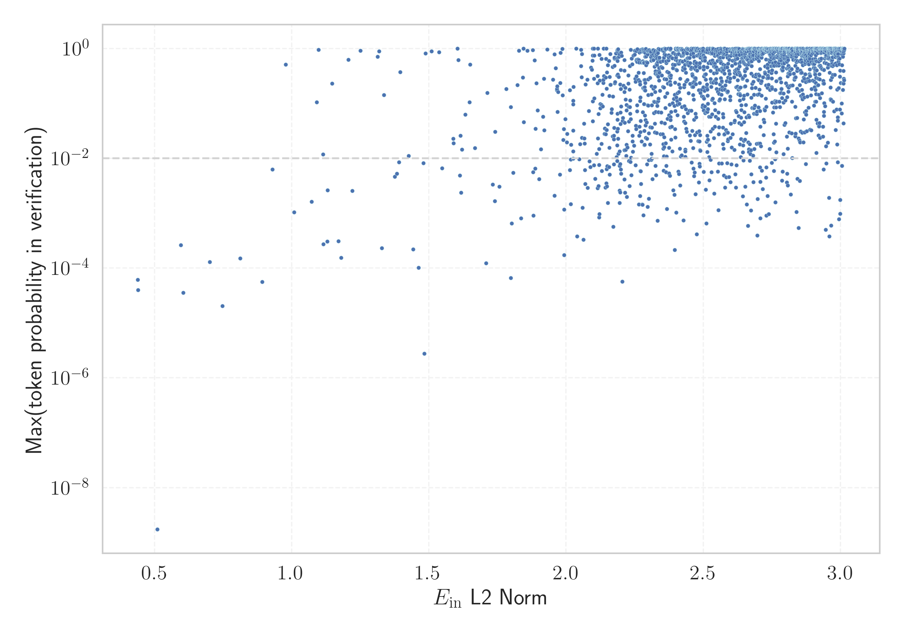

# Report for `deepseek-ai/deepseek-math-7b-base`

## Model info

* Tied embeddings: no
* LM head uses bias: no
* Indicator for under-trained tokens: E_{in} L2 Norm
  * Overall distribution 10.963 +/- 3.144
  * Token used for verification prompt building: `IllegalArgumentException`
  * Verification threshold: 3.014
  * Threshold for showing candidate under-trained tokens: 1.092
  * Median verified threshold (for bytes, unreachable and special tokens): 2.288
* Embeddings shape: (102400, 4096)
* Vocabulary size: 100002
  * Number of single byte tokens: 243, of which 0 below indicator threshold
  * Number of special tokens: 2, of which 0 below indicator threshold
  * Number of non-single-byte unreachable tokens: 12, of which 0 below indicator threshold
  * Number of non-single-byte UTF-fragment tokens: 438, 0 below soft indicator threshold
  * Number of tested under-trained tokens: 1989, 1989 non-special, 202 below p = 0.01 threshold, 13 below soft indicator threshold

## Under-trained token indicators plot


## Verification plot


## Under-trained token verification results
13 entries below threshold of 1.092

|   token_id | token                           |   indicator | max_prob                                                         | in_other_tokens                                                                                                                                                                      |
|------------|---------------------------------|-------------|------------------------------------------------------------------|--------------------------------------------------------------------------------------------------------------------------------------------------------------------------------------|
|      63291 | ````` IconSuccessEncoded `````  |    0.439327 | <span style='border: 1px solid rgb(169, 68, 66);'>6.2e-05</span> |                                                                                                                                                                                      |
|      87662 | ````` 日内与新浪看点 `````      |    0.43966  | <span style='border: 1px solid rgb(169, 68, 66);'>4e-05</span>   | <span style='border: 1px solid rgb(169, 68, 66);'>````` 日内与新浪看点联系 `````</span>                                                                                              |
|      40482 | ````` IconErrorEncoded `````    |    0.510684 | <span style='border: 1px solid rgb(169, 68, 66);'>1.7e-09</span> |                                                                                                                                                                                      |
|      74777 | ````` orangehilldev `````       |    0.596192 | <span style='border: 1px solid rgb(169, 68, 66);'>0.00026</span> |                                                                                                                                                                                      |
|      87661 | ````` 不代表新浪看点 `````      |    0.605036 | <span style='border: 1px solid rgb(169, 68, 66);'>3.6e-05</span> | <span style='border: 1px solid rgb(169, 68, 66);'>````` 不代表新浪看点观点或立场 `````</span>                                                                                        |
|      98098 | ````` ="../../../../..">< ````` |    0.701254 | <span style='border: 1px solid rgb(169, 68, 66);'>0.00013</span> |                                                                                                                                                                                      |
|      81096 | ````` ▁EDIPU `````              |    0.747061 | <span style='border: 1px solid rgb(169, 68, 66);'>2e-05</span>   | <span style='border: 1px solid rgb(255, 145, 0);'>````` ▁EDIPUCRS `````</span>                                                                                                       |
|      13009 | ````` lemanya `````             |    0.812841 | <span style='border: 1px solid rgb(169, 68, 66);'>0.00015</span> | <span style='border: 1px solid rgb(40, 167, 69);'>````` Alemanya `````</span>, <span style='border: 1px solid rgb(40, 167, 69);'>````` ▁alemanya `````</span>, ````` ▁Alemanya ````` |
|      60623 | ````` odeciclismo `````         |    0.892729 | <span style='border: 1px solid rgb(169, 68, 66);'>5.6e-05</span> | <span style='border: 1px solid rgb(169, 68, 66);'>````` iodeciclismo `````</span>, <span style='border: 1px solid rgb(251, 189, 8);'>````` ▁sitiodeciclismo `````</span>             |
|      16238 | ````` кедония `````             |    0.929747 | <span style='border: 1px solid rgb(255, 145, 0);'>0.0063</span>  | ````` Македония `````, ````` ▁Македония `````                                                                                                                                        |
|      84405 | ````` RecordedVote `````        |    0.978604 | <span style='border: 1px solid rgb(40, 167, 69);'>0.51</span>    |                                                                                                                                                                                      |
|      97672 | ````` 基督教基督教基督教 `````  |    1.00834  | <span style='border: 1px solid rgb(255, 145, 0);'>0.001</span>   |                                                                                                                                                                                      |
|      86826 | ````` солство `````             |    1.07232  | <span style='border: 1px solid rgb(255, 145, 0);'>0.0016</span>  | <span style='border: 1px solid rgb(169, 68, 66);'>````` посолство `````</span>                                                                                                       |
<details><summary>1976 additional entries above threshold</summary>

|   token_id | token                                        |   indicator | max_prob                                                         | in_other_tokens                                                                                                                                                                                                                                                                                                                                                                                      |
|------------|----------------------------------------------|-------------|------------------------------------------------------------------|------------------------------------------------------------------------------------------------------------------------------------------------------------------------------------------------------------------------------------------------------------------------------------------------------------------------------------------------------------------------------------------------------|
|      59602 | ````` linkedExternalProjectPath `````        |     1.0917  | <span style='border: 1px solid rgb(40, 167, 69);'>0.1</span>     |                                                                                                                                                                                                                                                                                                                                                                                                      |
|      83041 | ````` sympad `````                           |     1.09821 | <span style='border: 1px solid rgb(40, 167, 69);'>0.95</span>    |                                                                                                                                                                                                                                                                                                                                                                                                      |
|      38174 | ````` ExternalTaskPojo `````                 |     1.114   | <span style='border: 1px solid rgb(251, 189, 8);'>0.012</span>   |                                                                                                                                                                                                                                                                                                                                                                                                      |
|       5758 | ````` ългар `````                            |     1.11497 | <span style='border: 1px solid rgb(169, 68, 66);'>0.00027</span> | <span style='border: 1px solid rgb(251, 189, 8);'>````` ългария `````</span>, <span style='border: 1px solid rgb(40, 167, 69);'>````` ▁българското `````</span>, ````` ▁българската `````, ````` ▁Българската `````, ````` ▁българско `````, ...                                                                                                                                                     |
|      78552 | ````` ▁Междусъюз `````                       |     1.1301  | <span style='border: 1px solid rgb(169, 68, 66);'>0.00031</span> | <span style='border: 1px solid rgb(255, 145, 0);'>````` ▁Междусъюзническата `````</span>                                                                                                                                                                                                                                                                                                             |
|       9710 | ````` ▁espany `````                          |     1.13116 | <span style='border: 1px solid rgb(255, 145, 0);'>0.0026</span>  | ````` ▁espanyol `````, <span style='border: 1px solid rgb(40, 167, 69);'>````` ▁espanyoles `````</span>, ````` ▁espanyola `````, <span style='border: 1px solid rgb(40, 167, 69);'>````` ▁espanyols `````</span>                                                                                                                                                                                     |
|      91136 | ````` controlcap `````                       |     1.14736 | <span style='border: 1px solid rgb(40, 167, 69);'>0.23</span>    |                                                                                                                                                                                                                                                                                                                                                                                                      |
|      49293 | ````` ▁lampister `````                       |     1.17032 | <span style='border: 1px solid rgb(169, 68, 66);'>0.00031</span> | <span style='border: 1px solid rgb(169, 68, 66);'>````` ▁lampisteries `````</span>, <span style='border: 1px solid rgb(169, 68, 66);'>````` ▁lampisteria `````</span>                                                                                                                                                                                                                                |
|      49112 | ````` iberament `````                        |     1.17994 | <span style='border: 1px solid rgb(169, 68, 66);'>0.00015</span> | <span style='border: 1px solid rgb(255, 145, 0);'>````` Alliberament `````</span>, <span style='border: 1px solid rgb(40, 167, 69);'>````` alliberament `````</span>                                                                                                                                                                                                                                 |
|      74713 | ````` photonui `````                         |     1.20689 | <span style='border: 1px solid rgb(40, 167, 69);'>0.62</span>    |                                                                                                                                                                                                                                                                                                                                                                                                      |
|      70532 | ````` \xa0veg `````                          |     1.22061 | <span style='border: 1px solid rgb(255, 145, 0);'>0.0026</span>  | <span style='border: 1px solid rgb(255, 145, 0);'>````` \xa0vegades `````</span>                                                                                                                                                                                                                                                                                                                     |
|      97018 | ````` Supamiu `````                          |     1.25061 | <span style='border: 1px solid rgb(40, 167, 69);'>0.91</span>    |                                                                                                                                                                                                                                                                                                                                                                                                      |
|      89626 | ````` memSeparator `````                     |     1.31276 | <span style='border: 1px solid rgb(40, 167, 69);'>0.71</span>    |                                                                                                                                                                                                                                                                                                                                                                                                      |
|      84002 | ````` ▁sideWeight `````                      |     1.31856 | <span style='border: 1px solid rgb(40, 167, 69);'>0.88</span>    |                                                                                                                                                                                                                                                                                                                                                                                                      |
|      90785 | ````` посолство `````                        |     1.32828 | <span style='border: 1px solid rgb(169, 68, 66);'>0.00023</span> |                                                                                                                                                                                                                                                                                                                                                                                                      |
|      51244 | ````` ecesito `````                          |     1.33615 | <span style='border: 1px solid rgb(40, 167, 69);'>0.14</span>    | ````` Necesito `````, ````` ▁Necesito `````                                                                                                                                                                                                                                                                                                                                                          |
|      73129 | ````` жентина `````                          |     1.37536 | <span style='border: 1px solid rgb(255, 145, 0);'>0.0046</span>  | <span style='border: 1px solid rgb(40, 167, 69);'>````` ▁Аржентина `````</span>                                                                                                                                                                                                                                                                                                                      |
|      59771 | ````` 基督教基督教 `````                     |     1.38383 | <span style='border: 1px solid rgb(255, 145, 0);'>0.0052</span>  | <span style='border: 1px solid rgb(255, 145, 0);'>````` 基督教基督教基督教 `````</span>                                                                                                                                                                                                                                                                                                              |
|      93494 | ````` atrals `````                           |     1.39071 | <span style='border: 1px solid rgb(255, 145, 0);'>0.0085</span>  | <span style='border: 1px solid rgb(251, 189, 8);'>````` ▁teatrals `````</span>                                                                                                                                                                                                                                                                                                                       |
|      84716 | ````` ▁cachedSer `````                       |     1.39511 | <span style='border: 1px solid rgb(40, 167, 69);'>0.37</span>    |                                                                                                                                                                                                                                                                                                                                                                                                      |
|      94822 | ````` orpdfstring `````                      |     1.4258  | <span style='border: 1px solid rgb(251, 189, 8);'>0.011</span>   | ````` texorpdfstring `````                                                                                                                                                                                                                                                                                                                                                                           |
|      90292 | ````` битава `````                           |     1.44219 | <span style='border: 1px solid rgb(169, 68, 66);'>0.00022</span> | <span style='border: 1px solid rgb(255, 145, 0);'>````` Обитава `````</span>                                                                                                                                                                                                                                                                                                                         |
|      52246 | ````` ▁опъл `````                            |     1.46299 | <span style='border: 1px solid rgb(169, 68, 66);'>0.0001</span>  | <span style='border: 1px solid rgb(169, 68, 66);'>````` ▁опълчение `````</span>, <span style='border: 1px solid rgb(255, 145, 0);'>````` ▁опълчен `````</span>, <span style='border: 1px solid rgb(255, 145, 0);'>````` ▁опълченец `````</span>                                                                                                                                                      |
|      21516 | ````` ximadament `````                       |     1.47983 | <span style='border: 1px solid rgb(255, 145, 0);'>0.0081</span>  | ````` ▁aproximadament `````, <span style='border: 1px solid rgb(40, 167, 69);'>````` ▁Aproximadament `````</span>, <span style='border: 1px solid rgb(40, 167, 69);'>````` aproximadament `````</span>                                                                                                                                                                                               |
|      99639 | ````` 亿亿亿亿亿亿亿亿亿亿亿亿亿亿亿亿 ````` |     1.48357 | <span style='border: 1px solid rgb(169, 68, 66);'>2.8e-06</span> |                                                                                                                                                                                                                                                                                                                                                                                                      |
|      59389 | ````` linkedExternal `````                   |     1.48819 | <span style='border: 1px solid rgb(40, 167, 69);'>0.82</span>    | <span style='border: 1px solid rgb(40, 167, 69);'>````` linkedExternalProjectPath `````</span>                                                                                                                                                                                                                                                                                                       |
|      38991 | ````` rgell `````                            |     1.51022 | <span style='border: 1px solid rgb(40, 167, 69);'>0.89</span>    | ````` ▁Urgell `````, ````` Urgell `````                                                                                                                                                                                                                                                                                                                                                              |
|      52739 | ````` ▁itemMembers `````                     |     1.53698 | <span style='border: 1px solid rgb(40, 167, 69);'>0.86</span>    |                                                                                                                                                                                                                                                                                                                                                                                                      |
|      73157 | ````` ническата `````                        |     1.54759 | <span style='border: 1px solid rgb(255, 145, 0);'>0.0066</span>  | <span style='border: 1px solid rgb(255, 145, 0);'>````` ▁Междусъюзническата `````</span>                                                                                                                                                                                                                                                                                                             |
|      51641 | ````` мъния `````                            |     1.58826 | <span style='border: 1px solid rgb(251, 189, 8);'>0.023</span>   | <span style='border: 1px solid rgb(40, 167, 69);'>````` ▁Румъния `````</span>                                                                                                                                                                                                                                                                                                                        |
|      18114 | ````` кември `````                           |     1.59034 | <span style='border: 1px solid rgb(251, 189, 8);'>0.019</span>   | ````` ▁декември `````                                                                                                                                                                                                                                                                                                                                                                                |
|      50113 | ````` memItem `````                          |     1.60395 | <span style='border: 1px solid rgb(40, 167, 69);'>0.99</span>    | <span style='border: 1px solid rgb(40, 167, 69);'>````` memItemLeft `````</span>, <span style='border: 1px solid rgb(40, 167, 69);'>````` memItemRight `````</span>                                                                                                                                                                                                                                  |
|      40247 | ````` OpenTl `````                           |     1.60761 | <span style='border: 1px solid rgb(40, 167, 69);'>0.62</span>    |                                                                                                                                                                                                                                                                                                                                                                                                      |
|      44942 | ````` министративен `````                    |     1.61251 | <span style='border: 1px solid rgb(255, 145, 0);'>0.0049</span>  | <span style='border: 1px solid rgb(251, 189, 8);'>````` ▁Административен `````</span>, <span style='border: 1px solid rgb(40, 167, 69);'>````` ▁административен `````</span>                                                                                                                                                                                                                         |
|      87336 | ````` estirs `````                           |     1.61547 | <span style='border: 1px solid rgb(251, 189, 8);'>0.026</span>   | <span style='border: 1px solid rgb(251, 189, 8);'>````` ▁monestirs `````</span>                                                                                                                                                                                                                                                                                                                      |
|      85684 | ````` товче `````                            |     1.61762 | <span style='border: 1px solid rgb(255, 145, 0);'>0.0024</span>  | <span style='border: 1px solid rgb(251, 189, 8);'>````` ▁братовче `````</span>                                                                                                                                                                                                                                                                                                                       |
|      43247 | ````` питаници `````                         |     1.62009 | <span style='border: 1px solid rgb(251, 189, 8);'>0.015</span>   | <span style='border: 1px solid rgb(169, 68, 66);'>````` Възпитаници `````</span>                                                                                                                                                                                                                                                                                                                     |
|       9630 | ````` ългария `````                          |     1.63306 | <span style='border: 1px solid rgb(251, 189, 8);'>0.062</span>   | ````` България `````, ````` ▁България `````                                                                                                                                                                                                                                                                                                                                                          |
|      28621 | ````` aixements `````                        |     1.64774 | <span style='border: 1px solid rgb(40, 167, 69);'>0.1</span>     | <span style='border: 1px solid rgb(255, 145, 0);'>````` Naixements `````</span>                                                                                                                                                                                                                                                                                                                      |
|      49104 | ````` изток `````                            |     1.64976 | <span style='border: 1px solid rgb(40, 167, 69);'>0.51</span>    | <span style='border: 1px solid rgb(251, 189, 8);'>````` ▁североизток `````</span>, <span style='border: 1px solid rgb(255, 145, 0);'>````` ▁югоизток `````</span>                                                                                                                                                                                                                                    |
|      96803 | ````` afrug `````                            |     1.66799 | <span style='border: 1px solid rgb(251, 189, 8);'>0.015</span>   | <span style='border: 1px solid rgb(40, 167, 69);'>````` afrugell `````</span>                                                                                                                                                                                                                                                                                                                        |
|      89920 | ````` ▁guixaires `````                       |     1.70864 | <span style='border: 1px solid rgb(169, 68, 66);'>0.00012</span> |                                                                                                                                                                                                                                                                                                                                                                                                      |
|      27591 | ````` eriorment `````                        |     1.71233 | <span style='border: 1px solid rgb(40, 167, 69);'>0.16</span>    | <span style='border: 1px solid rgb(40, 167, 69);'>````` ▁Posteriorment `````</span>, ````` ▁anteriorment `````, ````` ▁anteriormente `````, <span style='border: 1px solid rgb(40, 167, 69);'>````` Posteriorment `````</span>                                                                                                                                                                       |
|      77640 | ````` ▁renaixent `````                       |     1.73244 | <span style='border: 1px solid rgb(255, 145, 0);'>0.0033</span>  | <span style='border: 1px solid rgb(251, 189, 8);'>````` ▁renaixentista `````</span>                                                                                                                                                                                                                                                                                                                  |
|      82137 | ````` ждестран `````                         |     1.74052 | <span style='border: 1px solid rgb(255, 145, 0);'>0.0017</span>  | <span style='border: 1px solid rgb(251, 189, 8);'>````` ▁чуждестран `````</span>                                                                                                                                                                                                                                                                                                                     |
|      91684 | ````` ▁canadencs `````                       |     1.74183 | <span style='border: 1px solid rgb(251, 189, 8);'>0.03</span>    |                                                                                                                                                                                                                                                                                                                                                                                                      |
|      98475 | ````` ▁irlandesos `````                      |     1.75723 | <span style='border: 1px solid rgb(255, 145, 0);'>0.0031</span>  |                                                                                                                                                                                                                                                                                                                                                                                                      |
|      71563 | ````` 亿亿亿次 `````                         |     1.78157 | <span style='border: 1px solid rgb(40, 167, 69);'>0.18</span>    |                                                                                                                                                                                                                                                                                                                                                                                                      |
|      46336 | ````` 作品发表后的 `````                     |     1.79818 | <span style='border: 1px solid rgb(169, 68, 66);'>6.6e-05</span> | <span style='border: 1px solid rgb(169, 68, 66);'>````` 版权或其它问题请于作品发表后的 `````</span>                                                                                                                                                                                                                                                                                                  |
|      97171 | ````` ▁brasilers `````                       |     1.79839 | <span style='border: 1px solid rgb(251, 189, 8);'>0.086</span>   |                                                                                                                                                                                                                                                                                                                                                                                                      |
|      62274 | ````` 新浪网联系 `````                       |     1.8013  | <span style='border: 1px solid rgb(169, 68, 66);'>0.00065</span> | <span style='border: 1px solid rgb(169, 68, 66);'>````` 日内与新浪网联系 `````</span>                                                                                                                                                                                                                                                                                                                |
|      78672 | ````` ▁Хърват `````                          |     1.8076  | <span style='border: 1px solid rgb(255, 145, 0);'>0.0055</span>  | <span style='border: 1px solid rgb(251, 189, 8);'>````` ▁Хърватия `````</span>                                                                                                                                                                                                                                                                                                                       |
|      50373 | ````` нгария `````                           |     1.82259 | <span style='border: 1px solid rgb(40, 167, 69);'>0.22</span>    | <span style='border: 1px solid rgb(40, 167, 69);'>````` ▁Унгария `````</span>                                                                                                                                                                                                                                                                                                                        |
|      81175 | ````` ▁visbl `````                           |     1.82845 | <span style='border: 1px solid rgb(40, 167, 69);'>0.91</span>    |                                                                                                                                                                                                                                                                                                                                                                                                      |
|      99741 | ````` ▁londinencs `````                      |     1.83581 | <span style='border: 1px solid rgb(169, 68, 66);'>0.0008</span>  |                                                                                                                                                                                                                                                                                                                                                                                                      |
|       6432 | ````` мври `````                             |     1.8422  | <span style='border: 1px solid rgb(40, 167, 69);'>0.3</span>     | ````` ▁септември `````, <span style='border: 1px solid rgb(40, 167, 69);'>````` птември `````</span>, ````` ▁декември `````, ````` ▁ноември `````, <span style='border: 1px solid rgb(40, 167, 69);'>````` ември `````</span>, ...                                                                                                                                                                   |
|      49918 | ````` magatzem `````                         |     1.84494 | <span style='border: 1px solid rgb(40, 167, 69);'>1</span>       | ````` ▁emmagatzem `````, <span style='border: 1px solid rgb(40, 167, 69);'>````` emmagatzematge `````</span>, <span style='border: 1px solid rgb(40, 167, 69);'>````` emmagatzem `````</span>                                                                                                                                                                                                        |
|      58888 | ````` 亿亿亿亿亿亿亿亿 `````                 |     1.84581 | <span style='border: 1px solid rgb(251, 189, 8);'>0.046</span>   | <span style='border: 1px solid rgb(169, 68, 66);'>````` 亿亿亿亿亿亿亿亿亿亿亿亿亿亿亿亿 `````</span>                                                                                                                                                                                                                                                                                                |
|      62141 | ````` legalforms `````                       |     1.85838 | <span style='border: 1px solid rgb(40, 167, 69);'>0.91</span>    |                                                                                                                                                                                                                                                                                                                                                                                                      |
|      89953 | ````` CharacterOffsetEnd `````               |     1.87847 | <span style='border: 1px solid rgb(40, 167, 69);'>0.93</span>    |                                                                                                                                                                                                                                                                                                                                                                                                      |
|       7388 | ````` точници `````                          |     1.88031 | <span style='border: 1px solid rgb(255, 145, 0);'>0.0056</span>  | ````` Източници `````, <span style='border: 1px solid rgb(40, 167, 69);'>````` ▁източници `````</span>                                                                                                                                                                                                                                                                                               |
|      93913 | ````` ▁derrotats `````                       |     1.88074 | <span style='border: 1px solid rgb(169, 68, 66);'>0.0009</span>  |                                                                                                                                                                                                                                                                                                                                                                                                      |
|      98601 | ````` йците `````                            |     1.88573 | <span style='border: 1px solid rgb(40, 167, 69);'>0.61</span>    |                                                                                                                                                                                                                                                                                                                                                                                                      |
|      95091 | ````` ▁певци `````                           |     1.88711 | <span style='border: 1px solid rgb(255, 145, 0);'>0.0065</span>  |                                                                                                                                                                                                                                                                                                                                                                                                      |
|      79171 | ````` ▁neerlandesos `````                    |     1.88893 | <span style='border: 1px solid rgb(251, 189, 8);'>0.035</span>   |                                                                                                                                                                                                                                                                                                                                                                                                      |
|      85130 | ````` ▁activament `````                      |     1.89171 | <span style='border: 1px solid rgb(40, 167, 69);'>0.23</span>    |                                                                                                                                                                                                                                                                                                                                                                                                      |
|      97642 | ````` ▁лъче `````                            |     1.89644 | <span style='border: 1px solid rgb(251, 189, 8);'>0.075</span>   |                                                                                                                                                                                                                                                                                                                                                                                                      |
|      42203 | ````` metratge `````                         |     1.90219 | <span style='border: 1px solid rgb(255, 145, 0);'>0.0042</span>  | <span style='border: 1px solid rgb(251, 189, 8);'>````` ▁llargmetratge `````</span>, <span style='border: 1px solid rgb(255, 145, 0);'>````` metratges `````</span>, <span style='border: 1px solid rgb(40, 167, 69);'>````` ▁curtmetratge `````</span>                                                                                                                                              |
|      99932 | ````` ▁reconeixements `````                  |     1.90796 | <span style='border: 1px solid rgb(251, 189, 8);'>0.015</span>   |                                                                                                                                                                                                                                                                                                                                                                                                      |
|      87378 | ````` ▁hongaresos `````                      |     1.91577 | <span style='border: 1px solid rgb(251, 189, 8);'>0.057</span>   |                                                                                                                                                                                                                                                                                                                                                                                                      |
|      83630 | ````` ▁reials `````                          |     1.91916 | <span style='border: 1px solid rgb(40, 167, 69);'>0.28</span>    |                                                                                                                                                                                                                                                                                                                                                                                                      |
|      85365 | ````` ▁Анджелис `````                        |     1.91991 | <span style='border: 1px solid rgb(251, 189, 8);'>0.032</span>   |                                                                                                                                                                                                                                                                                                                                                                                                      |
|      98266 | ````` americanes `````                       |     1.93182 | <span style='border: 1px solid rgb(40, 167, 69);'>0.96</span>    |                                                                                                                                                                                                                                                                                                                                                                                                      |
|      94556 | ````` Италиански `````                       |     1.95185 | <span style='border: 1px solid rgb(40, 167, 69);'>0.27</span>    |                                                                                                                                                                                                                                                                                                                                                                                                      |
|      77697 | ````` ▁Кън `````                             |     1.95722 | <span style='border: 1px solid rgb(40, 167, 69);'>0.78</span>    | <span style='border: 1px solid rgb(169, 68, 66);'>````` ▁Кънчов `````</span>                                                                                                                                                                                                                                                                                                                         |
|      97617 | ````` ▁империята `````                       |     1.95762 | <span style='border: 1px solid rgb(255, 145, 0);'>0.0021</span>  |                                                                                                                                                                                                                                                                                                                                                                                                      |
|      74417 | ````` ardenya `````                          |     1.96213 | <span style='border: 1px solid rgb(40, 167, 69);'>0.44</span>    | <span style='border: 1px solid rgb(40, 167, 69);'>````` ▁Sardenya `````</span>                                                                                                                                                                                                                                                                                                                       |
|      84162 | ````` OnSearchSelect `````                   |     1.96667 | <span style='border: 1px solid rgb(40, 167, 69);'>0.17</span>    |                                                                                                                                                                                                                                                                                                                                                                                                      |
|      54556 | ````` крация `````                           |     1.96695 | <span style='border: 1px solid rgb(40, 167, 69);'>0.18</span>    | <span style='border: 1px solid rgb(169, 68, 66);'>````` ▁аристокрация `````</span>                                                                                                                                                                                                                                                                                                                   |
|      96188 | ````` ▁canadenc `````                        |     1.96772 | <span style='border: 1px solid rgb(40, 167, 69);'>0.21</span>    |                                                                                                                                                                                                                                                                                                                                                                                                      |
|      91928 | ````` ▁italianes `````                       |     1.96863 | <span style='border: 1px solid rgb(251, 189, 8);'>0.07</span>    |                                                                                                                                                                                                                                                                                                                                                                                                      |
|      94538 | ````` ▁periodistes `````                     |     1.97124 | <span style='border: 1px solid rgb(40, 167, 69);'>0.16</span>    |                                                                                                                                                                                                                                                                                                                                                                                                      |
|      96090 | ````` ▁parisencs `````                       |     1.97802 | <span style='border: 1px solid rgb(255, 145, 0);'>0.0051</span>  |                                                                                                                                                                                                                                                                                                                                                                                                      |
|      79974 | ````` ▁femenins `````                        |     1.97829 | <span style='border: 1px solid rgb(40, 167, 69);'>0.24</span>    |                                                                                                                                                                                                                                                                                                                                                                                                      |
|      44330 | ````` последствие `````                      |     1.97968 | <span style='border: 1px solid rgb(40, 167, 69);'>0.84</span>    | <span style='border: 1px solid rgb(40, 167, 69);'>````` ▁впоследствие `````</span>, <span style='border: 1px solid rgb(251, 189, 8);'>````` ▁Впоследствие `````</span>                                                                                                                                                                                                                               |
|      18692 | ````` ministraci `````                       |     1.98614 | <span style='border: 1px solid rgb(40, 167, 69);'>0.98</span>    | ````` Administraci `````, ````` ▁administraci `````, ````` administraci `````                                                                                                                                                                                                                                                                                                                        |
|      99443 | ````` ▁дъщери `````                          |     1.98724 | <span style='border: 1px solid rgb(40, 167, 69);'>0.14</span>    |                                                                                                                                                                                                                                                                                                                                                                                                      |
|      96256 | ````` ▁teatrals `````                        |     1.99002 | <span style='border: 1px solid rgb(251, 189, 8);'>0.022</span>   |                                                                                                                                                                                                                                                                                                                                                                                                      |
|      69271 | ````` съюз `````                             |     1.99234 | <span style='border: 1px solid rgb(251, 189, 8);'>0.034</span>   | <span style='border: 1px solid rgb(255, 145, 0);'>````` ▁Междусъюзническата `````</span>, <span style='border: 1px solid rgb(169, 68, 66);'>````` ▁Междусъюз `````</span>                                                                                                                                                                                                                            |
|      45290 | ````` ▁крайце `````                          |     1.99286 | <span style='border: 1px solid rgb(255, 145, 0);'>0.0012</span>  | <span style='border: 1px solid rgb(255, 145, 0);'>````` ▁крайцера `````</span>, <span style='border: 1px solid rgb(251, 189, 8);'>````` ▁крайцер `````</span>, <span style='border: 1px solid rgb(251, 189, 8);'>````` ▁крайцери `````</span>                                                                                                                                                        |
|      82878 | ````` ▁guixaire `````                        |     1.99289 | <span style='border: 1px solid rgb(169, 68, 66);'>0.00017</span> | <span style='border: 1px solid rgb(169, 68, 66);'>````` ▁guixaires `````</span>                                                                                                                                                                                                                                                                                                                      |
|      71488 | ````` кграф `````                            |     1.9977  | <span style='border: 1px solid rgb(251, 189, 8);'>0.052</span>   | <span style='border: 1px solid rgb(40, 167, 69);'>````` ▁маркграф `````</span>                                                                                                                                                                                                                                                                                                                       |
|      93437 | ````` ▁estatals `````                        |     2.00244 | <span style='border: 1px solid rgb(251, 189, 8);'>0.02</span>    |                                                                                                                                                                                                                                                                                                                                                                                                      |
|      91460 | ````` ▁оркестър `````                        |     2.00391 | <span style='border: 1px solid rgb(251, 189, 8);'>0.028</span>   |                                                                                                                                                                                                                                                                                                                                                                                                      |
|      89536 | ````` ▁Филмът `````                          |     2.01363 | <span style='border: 1px solid rgb(255, 145, 0);'>0.0061</span>  |                                                                                                                                                                                                                                                                                                                                                                                                      |
|      74785 | ````` ▁belgues `````                         |     2.01428 | <span style='border: 1px solid rgb(40, 167, 69);'>0.17</span>    |                                                                                                                                                                                                                                                                                                                                                                                                      |
|      87582 | ````` lustracions `````                      |     2.01694 | <span style='border: 1px solid rgb(255, 145, 0);'>0.0095</span>  |                                                                                                                                                                                                                                                                                                                                                                                                      |
|      56147 | ````` юсюл `````                             |     2.01736 | <span style='border: 1px solid rgb(255, 145, 0);'>0.0015</span>  | <span style='border: 1px solid rgb(40, 167, 69);'>````` ▁мюсюл `````</span>                                                                                                                                                                                                                                                                                                                          |
|      60891 | ````` кулп `````                             |     2.01818 | <span style='border: 1px solid rgb(251, 189, 8);'>0.018</span>   | <span style='border: 1px solid rgb(40, 167, 69);'>````` ▁скулп `````</span>                                                                                                                                                                                                                                                                                                                          |
|      98004 | ````` esclaus `````                          |     2.02583 | <span style='border: 1px solid rgb(251, 189, 8);'>0.032</span>   |                                                                                                                                                                                                                                                                                                                                                                                                      |
|      78574 | ````` ▁ferits `````                          |     2.02596 | <span style='border: 1px solid rgb(251, 189, 8);'>0.013</span>   |                                                                                                                                                                                                                                                                                                                                                                                                      |
|      98559 | ````` ▁reconeguts `````                      |     2.02602 | <span style='border: 1px solid rgb(40, 167, 69);'>0.11</span>    |                                                                                                                                                                                                                                                                                                                                                                                                      |
|      93338 | ````` ▁cantants `````                        |     2.0263  | <span style='border: 1px solid rgb(251, 189, 8);'>0.096</span>   |                                                                                                                                                                                                                                                                                                                                                                                                      |
|      95929 | ````` Estocolm `````                         |     2.02631 | <span style='border: 1px solid rgb(255, 145, 0);'>0.0099</span>  | <span style='border: 1px solid rgb(255, 145, 0);'>````` ▁Estocolm `````</span>                                                                                                                                                                                                                                                                                                                       |
|      28579 | ````` ловдив `````                           |     2.02672 | <span style='border: 1px solid rgb(40, 167, 69);'>0.2</span>     | <span style='border: 1px solid rgb(40, 167, 69);'>````` Пловдив `````</span>, ````` ▁Пловдив `````                                                                                                                                                                                                                                                                                                   |
|      98757 | ````` edificis `````                         |     2.03702 | <span style='border: 1px solid rgb(40, 167, 69);'>1</span>       |                                                                                                                                                                                                                                                                                                                                                                                                      |
|      76687 | ````` ▁lampisteria `````                     |     2.04052 | <span style='border: 1px solid rgb(169, 68, 66);'>0.00038</span> |                                                                                                                                                                                                                                                                                                                                                                                                      |
|      93880 | ````` ▁принуден `````                        |     2.04796 | <span style='border: 1px solid rgb(255, 145, 0);'>0.0096</span>  |                                                                                                                                                                                                                                                                                                                                                                                                      |
|      69129 | ````` ▁alemanyes `````                       |     2.05096 | <span style='border: 1px solid rgb(251, 189, 8);'>0.018</span>   |                                                                                                                                                                                                                                                                                                                                                                                                      |
|      61687 | ````` ratges `````                           |     2.05412 | <span style='border: 1px solid rgb(40, 167, 69);'>0.94</span>    | <span style='border: 1px solid rgb(255, 145, 0);'>````` metratges `````</span>                                                                                                                                                                                                                                                                                                                       |
|      83682 | ````` ьорски `````                           |     2.05458 | <span style='border: 1px solid rgb(40, 167, 69);'>0.48</span>    | <span style='border: 1px solid rgb(255, 145, 0);'>````` Актьорски `````</span>                                                                                                                                                                                                                                                                                                                       |
|      97955 | ````` ▁constantment `````                    |     2.05663 | <span style='border: 1px solid rgb(40, 167, 69);'>0.3</span>     |                                                                                                                                                                                                                                                                                                                                                                                                      |
|      99891 | ````` ▁guerrers `````                        |     2.05783 | <span style='border: 1px solid rgb(251, 189, 8);'>0.024</span>   |                                                                                                                                                                                                                                                                                                                                                                                                      |
|      96221 | ````` ▁teatres `````                         |     2.05813 | <span style='border: 1px solid rgb(40, 167, 69);'>0.79</span>    |                                                                                                                                                                                                                                                                                                                                                                                                      |
|      95396 | ````` ▁electricistes `````                   |     2.0603  | <span style='border: 1px solid rgb(255, 145, 0);'>0.0013</span>  |                                                                                                                                                                                                                                                                                                                                                                                                      |
|      60749 | ````` iodeciclismo `````                     |     2.0634  | <span style='border: 1px solid rgb(169, 68, 66);'>0.00033</span> | <span style='border: 1px solid rgb(251, 189, 8);'>````` ▁sitiodeciclismo `````</span>                                                                                                                                                                                                                                                                                                                |
|      96315 | ````` ▁monestirs `````                       |     2.06546 | <span style='border: 1px solid rgb(251, 189, 8);'>0.043</span>   |                                                                                                                                                                                                                                                                                                                                                                                                      |
|      70114 | ````` ▁polonesos `````                       |     2.06622 | <span style='border: 1px solid rgb(251, 189, 8);'>0.023</span>   |                                                                                                                                                                                                                                                                                                                                                                                                      |
|      85293 | ````` ▁poguessin `````                       |     2.06758 | <span style='border: 1px solid rgb(251, 189, 8);'>0.019</span>   |                                                                                                                                                                                                                                                                                                                                                                                                      |
|      79792 | ````` ▁командването `````                    |     2.0687  | <span style='border: 1px solid rgb(255, 145, 0);'>0.0061</span>  |                                                                                                                                                                                                                                                                                                                                                                                                      |
|      94638 | ````` ▁enfrontaments `````                   |     2.06977 | <span style='border: 1px solid rgb(255, 145, 0);'>0.0034</span>  |                                                                                                                                                                                                                                                                                                                                                                                                      |
|      99341 | ````` ▁музикална `````                       |     2.07069 | <span style='border: 1px solid rgb(40, 167, 69);'>0.22</span>    |                                                                                                                                                                                                                                                                                                                                                                                                      |
|      80011 | ````` ▁esportius `````                       |     2.07709 | <span style='border: 1px solid rgb(40, 167, 69);'>0.27</span>    |                                                                                                                                                                                                                                                                                                                                                                                                      |
|      97589 | ````` ▁andalusos `````                       |     2.07805 | <span style='border: 1px solid rgb(255, 145, 0);'>0.0029</span>  |                                                                                                                                                                                                                                                                                                                                                                                                      |
|      81863 | ````` ▁traslladat `````                      |     2.08339 | <span style='border: 1px solid rgb(251, 189, 8);'>0.073</span>   |                                                                                                                                                                                                                                                                                                                                                                                                      |
|      94385 | ````` ▁armats `````                          |     2.08496 | <span style='border: 1px solid rgb(255, 145, 0);'>0.0088</span>  |                                                                                                                                                                                                                                                                                                                                                                                                      |
|      61278 | ````` ▁hongares `````                        |     2.08792 | <span style='border: 1px solid rgb(255, 145, 0);'>0.0069</span>  | <span style='border: 1px solid rgb(251, 189, 8);'>````` ▁hongaresos `````</span>                                                                                                                                                                                                                                                                                                                     |
|      78010 | ````` Икономи `````                          |     2.09032 | <span style='border: 1px solid rgb(40, 167, 69);'>0.45</span>    | <span style='border: 1px solid rgb(40, 167, 69);'>````` Икономика `````</span>                                                                                                                                                                                                                                                                                                                       |
|      92757 | ````` ▁gregues `````                         |     2.09356 | <span style='border: 1px solid rgb(40, 167, 69);'>0.41</span>    |                                                                                                                                                                                                                                                                                                                                                                                                      |
|      93925 | ````` вайг `````                             |     2.09618 | <span style='border: 1px solid rgb(40, 167, 69);'>0.6</span>     | <span style='border: 1px solid rgb(251, 189, 8);'>````` швайг `````</span>                                                                                                                                                                                                                                                                                                                           |
|      72767 | ````` elrte `````                            |     2.09671 | <span style='border: 1px solid rgb(40, 167, 69);'>0.75</span>    |                                                                                                                                                                                                                                                                                                                                                                                                      |
|      79283 | ````` typecol `````                          |     2.09706 | <span style='border: 1px solid rgb(40, 167, 69);'>1</span>       |                                                                                                                                                                                                                                                                                                                                                                                                      |
|      89686 | ````` ▁mundials `````                        |     2.09751 | <span style='border: 1px solid rgb(40, 167, 69);'>0.11</span>    |                                                                                                                                                                                                                                                                                                                                                                                                      |
|      94846 | ````` blicament `````                        |     2.09767 | <span style='border: 1px solid rgb(251, 189, 8);'>0.047</span>   |                                                                                                                                                                                                                                                                                                                                                                                                      |
|      73105 | ````` ▁опълчен `````                         |     2.10111 | <span style='border: 1px solid rgb(255, 145, 0);'>0.0075</span>  | <span style='border: 1px solid rgb(169, 68, 66);'>````` ▁опълчение `````</span>, <span style='border: 1px solid rgb(255, 145, 0);'>````` ▁опълченец `````</span>                                                                                                                                                                                                                                     |
|      85871 | ````` ▁sacerdots `````                       |     2.10127 | <span style='border: 1px solid rgb(40, 167, 69);'>0.28</span>    |                                                                                                                                                                                                                                                                                                                                                                                                      |
|      64695 | ````` rellotge `````                         |     2.10166 | <span style='border: 1px solid rgb(40, 167, 69);'>0.99</span>    | <span style='border: 1px solid rgb(255, 145, 0);'>````` ▁contrarellotge `````</span>, ````` ▁rellotge `````                                                                                                                                                                                                                                                                                          |
|      96089 | ````` ▁промишленост `````                    |     2.10247 | <span style='border: 1px solid rgb(40, 167, 69);'>0.12</span>    |                                                                                                                                                                                                                                                                                                                                                                                                      |
|      88721 | ````` ▁estrangera `````                      |     2.10292 | <span style='border: 1px solid rgb(40, 167, 69);'>0.75</span>    |                                                                                                                                                                                                                                                                                                                                                                                                      |
|      87721 | ````` ▁арестуван `````                       |     2.10623 | <span style='border: 1px solid rgb(255, 145, 0);'>0.0042</span>  |                                                                                                                                                                                                                                                                                                                                                                                                      |
|      95559 | ````` ▁noruec `````                          |     2.11174 | <span style='border: 1px solid rgb(251, 189, 8);'>0.012</span>   |                                                                                                                                                                                                                                                                                                                                                                                                      |
|      78213 | ````` евград `````                           |     2.11472 | <span style='border: 1px solid rgb(255, 145, 0);'>0.0029</span>  | <span style='border: 1px solid rgb(40, 167, 69);'>````` ▁Благоевград `````</span>                                                                                                                                                                                                                                                                                                                    |
|      94092 | ````` ▁dissenyada `````                      |     2.11497 | <span style='border: 1px solid rgb(40, 167, 69);'>0.23</span>    |                                                                                                                                                                                                                                                                                                                                                                                                      |
|      99325 | ````` ▁съпротива `````                       |     2.11533 | <span style='border: 1px solid rgb(40, 167, 69);'>0.31</span>    |                                                                                                                                                                                                                                                                                                                                                                                                      |
|      91764 | ````` ▁desapareguts `````                    |     2.11538 | <span style='border: 1px solid rgb(251, 189, 8);'>0.023</span>   |                                                                                                                                                                                                                                                                                                                                                                                                      |
|      24543 | ````` wlwifi `````                           |     2.11592 | <span style='border: 1px solid rgb(40, 167, 69);'>0.99</span>    | ````` iwlwifi `````, ````` ▁iwlwifi `````                                                                                                                                                                                                                                                                                                                                                            |
|      22106 | ````` ▁vaix `````                            |     2.11835 | <span style='border: 1px solid rgb(251, 189, 8);'>0.064</span>   | ````` ▁vaixell `````, <span style='border: 1px solid rgb(40, 167, 69);'>````` ▁vaixells `````</span>                                                                                                                                                                                                                                                                                                 |
|      97545 | ````` ▁титли `````                           |     2.11845 | <span style='border: 1px solid rgb(255, 145, 0);'>0.0031</span>  |                                                                                                                                                                                                                                                                                                                                                                                                      |
|      54237 | ````` \xa0gols `````                         |     2.12026 | <span style='border: 1px solid rgb(169, 68, 66);'>0.00084</span> |                                                                                                                                                                                                                                                                                                                                                                                                      |
|      58142 | ````` ▁desapareg `````                       |     2.12074 | <span style='border: 1px solid rgb(255, 145, 0);'>0.0076</span>  | <span style='border: 1px solid rgb(40, 167, 69);'>````` ▁desaparegut `````</span>, <span style='border: 1px solid rgb(251, 189, 8);'>````` ▁desapareguts `````</span>                                                                                                                                                                                                                                |
|      92899 | ````` ▁periodisme `````                      |     2.12076 | <span style='border: 1px solid rgb(251, 189, 8);'>0.015</span>   |                                                                                                                                                                                                                                                                                                                                                                                                      |
|      85658 | ````` ▁alliberat `````                       |     2.12138 | <span style='border: 1px solid rgb(40, 167, 69);'>0.77</span>    |                                                                                                                                                                                                                                                                                                                                                                                                      |
|      28179 | ````` ▁омъ `````                             |     2.12156 | <span style='border: 1px solid rgb(169, 68, 66);'>0.00096</span> | <span style='border: 1px solid rgb(169, 68, 66);'>````` ▁омъжва `````</span>, <span style='border: 1px solid rgb(255, 145, 0);'>````` ▁омъжена `````</span>                                                                                                                                                                                                                                          |
|      82011 | ````` ▁comerciants `````                     |     2.12227 | <span style='border: 1px solid rgb(40, 167, 69);'>0.26</span>    |                                                                                                                                                                                                                                                                                                                                                                                                      |
|      86845 | ````` станбул `````                          |     2.12422 | <span style='border: 1px solid rgb(251, 189, 8);'>0.097</span>   | <span style='border: 1px solid rgb(40, 167, 69);'>````` ▁Истанбул `````</span>                                                                                                                                                                                                                                                                                                                       |
|      87472 | ````` ▁supervivents `````                    |     2.12437 | <span style='border: 1px solid rgb(251, 189, 8);'>0.081</span>   |                                                                                                                                                                                                                                                                                                                                                                                                      |
|      94831 | ````` ▁sisena `````                          |     2.12862 | <span style='border: 1px solid rgb(40, 167, 69);'>0.65</span>    |                                                                                                                                                                                                                                                                                                                                                                                                      |
|      95296 | ````` ▁profundament `````                    |     2.12877 | <span style='border: 1px solid rgb(251, 189, 8);'>0.094</span>   |                                                                                                                                                                                                                                                                                                                                                                                                      |
|      92255 | ````` ▁governants `````                      |     2.12935 | <span style='border: 1px solid rgb(251, 189, 8);'>0.018</span>   |                                                                                                                                                                                                                                                                                                                                                                                                      |
|      89934 | ````` ▁войските `````                        |     2.12982 | <span style='border: 1px solid rgb(255, 145, 0);'>0.0059</span>  |                                                                                                                                                                                                                                                                                                                                                                                                      |
|      72735 | ````` ▁художници `````                       |     2.13257 | <span style='border: 1px solid rgb(40, 167, 69);'>0.14</span>    |                                                                                                                                                                                                                                                                                                                                                                                                      |
|      70310 | ````` ▁Hongria `````                         |     2.13387 | <span style='border: 1px solid rgb(251, 189, 8);'>0.088</span>   |                                                                                                                                                                                                                                                                                                                                                                                                      |
|      91106 | ````` ▁отборът `````                         |     2.13555 | <span style='border: 1px solid rgb(40, 167, 69);'>0.24</span>    |                                                                                                                                                                                                                                                                                                                                                                                                      |
|      70650 | ````` icletes `````                          |     2.13597 | <span style='border: 1px solid rgb(40, 167, 69);'>0.27</span>    | <span style='border: 1px solid rgb(40, 167, 69);'>````` ▁motocicletes `````</span>                                                                                                                                                                                                                                                                                                                   |
|      84135 | ````` линден `````                           |     2.13623 | <span style='border: 1px solid rgb(40, 167, 69);'>1</span>       | <span style='border: 1px solid rgb(40, 167, 69);'>````` ▁Илинден `````</span>                                                                                                                                                                                                                                                                                                                        |
|      56829 | ````` ▁japonesos `````                       |     2.13809 | <span style='border: 1px solid rgb(40, 167, 69);'>0.32</span>    |                                                                                                                                                                                                                                                                                                                                                                                                      |
|      79951 | ````` ▁empresonat `````                      |     2.14027 | <span style='border: 1px solid rgb(251, 189, 8);'>0.028</span>   |                                                                                                                                                                                                                                                                                                                                                                                                      |
|      15312 | ````` unidenc `````                          |     2.14099 | <span style='border: 1px solid rgb(251, 189, 8);'>0.035</span>   | <span style='border: 1px solid rgb(255, 145, 0);'>````` ▁estatunidenca `````</span>, <span style='border: 1px solid rgb(40, 167, 69);'>````` ▁estatunidencs `````</span>, <span style='border: 1px solid rgb(40, 167, 69);'>````` ▁estatunidenc `````</span>                                                                                                                                         |
|      95748 | ````` ▁турците `````                         |     2.14381 | <span style='border: 1px solid rgb(255, 145, 0);'>0.0029</span>  |                                                                                                                                                                                                                                                                                                                                                                                                      |
|      95712 | ````` ▁литературни `````                     |     2.14413 | <span style='border: 1px solid rgb(251, 189, 8);'>0.028</span>   |                                                                                                                                                                                                                                                                                                                                                                                                      |
|      89121 | ````` ▁regularment `````                     |     2.14419 | <span style='border: 1px solid rgb(40, 167, 69);'>0.3</span>     |                                                                                                                                                                                                                                                                                                                                                                                                      |
|      68044 | ````` ▁espectadors `````                     |     2.14561 | <span style='border: 1px solid rgb(40, 167, 69);'>0.65</span>    |                                                                                                                                                                                                                                                                                                                                                                                                      |
|      43904 | ````` ionats `````                           |     2.14642 | <span style='border: 1px solid rgb(40, 167, 69);'>1</span>       | <span style='border: 1px solid rgb(251, 189, 8);'>````` ▁campionats `````</span>, ````` ▁relacionats `````, <span style='border: 1px solid rgb(251, 189, 8);'>````` ▁Campionats `````</span>                                                                                                                                                                                                         |
|      83485 | ````` ▁погребан `````                        |     2.14701 | <span style='border: 1px solid rgb(255, 145, 0);'>0.0035</span>  |                                                                                                                                                                                                                                                                                                                                                                                                      |
|      99846 | ````` ▁артилерийски `````                    |     2.14783 | <span style='border: 1px solid rgb(255, 145, 0);'>0.0064</span>  |                                                                                                                                                                                                                                                                                                                                                                                                      |
|      79936 | ````` \xa0membres `````                      |     2.14787 | <span style='border: 1px solid rgb(251, 189, 8);'>0.033</span>   |                                                                                                                                                                                                                                                                                                                                                                                                      |
|      87809 | ````` ▁мъжка `````                           |     2.14817 | <span style='border: 1px solid rgb(40, 167, 69);'>0.19</span>    |                                                                                                                                                                                                                                                                                                                                                                                                      |
|      75107 | ````` ▁organitzada `````                     |     2.14836 | <span style='border: 1px solid rgb(40, 167, 69);'>0.37</span>    |                                                                                                                                                                                                                                                                                                                                                                                                      |
|      96952 | ````` ▁Estocolm `````                        |     2.14865 | <span style='border: 1px solid rgb(255, 145, 0);'>0.0031</span>  |                                                                                                                                                                                                                                                                                                                                                                                                      |
|      90840 | ````` ▁убийството `````                      |     2.14955 | <span style='border: 1px solid rgb(255, 145, 0);'>0.0072</span>  |                                                                                                                                                                                                                                                                                                                                                                                                      |
|      71747 | ````` \xa0vegades `````                      |     2.15191 | <span style='border: 1px solid rgb(255, 145, 0);'>0.0015</span>  |                                                                                                                                                                                                                                                                                                                                                                                                      |
|      20325 | ````` uetooth `````                          |     2.15227 | <span style='border: 1px solid rgb(40, 167, 69);'>0.5</span>     | ````` Bluetooth `````, ````` ▁bluetooth `````, ````` bluetooth `````                                                                                                                                                                                                                                                                                                                                 |
|      98905 | ````` ▁comunament `````                      |     2.15236 | <span style='border: 1px solid rgb(251, 189, 8);'>0.042</span>   |                                                                                                                                                                                                                                                                                                                                                                                                      |
|      18599 | ````` alsevol `````                          |     2.15613 | <span style='border: 1px solid rgb(40, 167, 69);'>0.59</span>    | ````` ▁qualsevol `````                                                                                                                                                                                                                                                                                                                                                                               |
|      99079 | ````` obreixen `````                         |     2.15665 | <span style='border: 1px solid rgb(255, 145, 0);'>0.0069</span>  |                                                                                                                                                                                                                                                                                                                                                                                                      |
|      91480 | ````` ▁ferides `````                         |     2.1571  | <span style='border: 1px solid rgb(251, 189, 8);'>0.016</span>   |                                                                                                                                                                                                                                                                                                                                                                                                      |
|      87563 | ````` ▁paisatges `````                       |     2.15728 | <span style='border: 1px solid rgb(40, 167, 69);'>0.14</span>    |                                                                                                                                                                                                                                                                                                                                                                                                      |
|      32367 | ````` ▁lleug `````                           |     2.15868 | <span style='border: 1px solid rgb(255, 145, 0);'>0.0051</span>  | <span style='border: 1px solid rgb(40, 167, 69);'>````` ▁lleugerament `````</span>, <span style='border: 1px solid rgb(40, 167, 69);'>````` ▁lleugera `````</span>, <span style='border: 1px solid rgb(40, 167, 69);'>````` ▁lleuger `````</span>                                                                                                                                                    |
|      82891 | ````` ▁egipcis `````                         |     2.15905 | <span style='border: 1px solid rgb(40, 167, 69);'>0.3</span>     |                                                                                                                                                                                                                                                                                                                                                                                                      |
|      73774 | ````` ▁suecs `````                           |     2.16069 | <span style='border: 1px solid rgb(40, 167, 69);'>0.22</span>    |                                                                                                                                                                                                                                                                                                                                                                                                      |
|      25359 | ````` талиан `````                           |     2.16075 | <span style='border: 1px solid rgb(40, 167, 69);'>0.79</span>    | <span style='border: 1px solid rgb(40, 167, 69);'>````` ▁италиан `````</span>, <span style='border: 1px solid rgb(251, 189, 8);'>````` Италиан `````</span>, <span style='border: 1px solid rgb(40, 167, 69);'>````` ▁италиански `````</span>, <span style='border: 1px solid rgb(40, 167, 69);'>````` Италиански `````</span>                                                                       |
|      62410 | ````` actriu `````                           |     2.16154 | <span style='border: 1px solid rgb(40, 167, 69);'>0.22</span>    |                                                                                                                                                                                                                                                                                                                                                                                                      |
|      97339 | ````` швайг `````                            |     2.16478 | <span style='border: 1px solid rgb(251, 189, 8);'>0.068</span>   |                                                                                                                                                                                                                                                                                                                                                                                                      |
|      95046 | ````` ▁pertanyents `````                     |     2.16642 | <span style='border: 1px solid rgb(251, 189, 8);'>0.079</span>   |                                                                                                                                                                                                                                                                                                                                                                                                      |
|      82428 | ````` ▁llacs `````                           |     2.17003 | <span style='border: 1px solid rgb(40, 167, 69);'>0.46</span>    |                                                                                                                                                                                                                                                                                                                                                                                                      |
|      82676 | ````` ▁esmenta `````                         |     2.17009 | <span style='border: 1px solid rgb(251, 189, 8);'>0.025</span>   | <span style='border: 1px solid rgb(40, 167, 69);'>````` ▁esmentada `````</span>, <span style='border: 1px solid rgb(40, 167, 69);'>````` ▁esmentar `````</span>                                                                                                                                                                                                                                      |
|      78960 | ````` ▁escultures `````                      |     2.17063 | <span style='border: 1px solid rgb(40, 167, 69);'>0.13</span>    |                                                                                                                                                                                                                                                                                                                                                                                                      |
|      75215 | ````` ▁fusteries `````                       |     2.17245 | <span style='border: 1px solid rgb(169, 68, 66);'>0.00056</span> |                                                                                                                                                                                                                                                                                                                                                                                                      |
|      35015 | ````` айнрих `````                           |     2.17363 | <span style='border: 1px solid rgb(251, 189, 8);'>0.022</span>   | <span style='border: 1px solid rgb(40, 167, 69);'>````` ▁Хайнрих `````</span>                                                                                                                                                                                                                                                                                                                        |
|      78036 | ````` ▁nomenament `````                      |     2.1738  | <span style='border: 1px solid rgb(255, 145, 0);'>0.0077</span>  |                                                                                                                                                                                                                                                                                                                                                                                                      |
|      99075 | ````` ▁donaven `````                         |     2.17434 | <span style='border: 1px solid rgb(251, 189, 8);'>0.026</span>   |                                                                                                                                                                                                                                                                                                                                                                                                      |
|      95585 | ````` ▁sofrir `````                          |     2.17514 | <span style='border: 1px solid rgb(251, 189, 8);'>0.036</span>   |                                                                                                                                                                                                                                                                                                                                                                                                      |
|      97987 | ````` ▁significativament `````               |     2.17597 | <span style='border: 1px solid rgb(40, 167, 69);'>0.48</span>    |                                                                                                                                                                                                                                                                                                                                                                                                      |
|      99183 | ````` ▁cultius `````                         |     2.17614 | <span style='border: 1px solid rgb(40, 167, 69);'>0.65</span>    |                                                                                                                                                                                                                                                                                                                                                                                                      |
|      88809 | ````` ▁progressivament `````                 |     2.17666 | <span style='border: 1px solid rgb(40, 167, 69);'>0.69</span>    |                                                                                                                                                                                                                                                                                                                                                                                                      |
|      95833 | ````` textquoted `````                       |     2.1777  | <span style='border: 1px solid rgb(40, 167, 69);'>0.23</span>    | ````` textquotedbl `````                                                                                                                                                                                                                                                                                                                                                                             |
|      88422 | ````` ▁creences `````                        |     2.17885 | <span style='border: 1px solid rgb(40, 167, 69);'>0.25</span>    |                                                                                                                                                                                                                                                                                                                                                                                                      |
|      99595 | ````` ▁arquitectes `````                     |     2.18155 | <span style='border: 1px solid rgb(40, 167, 69);'>0.82</span>    |                                                                                                                                                                                                                                                                                                                                                                                                      |
|      87876 | ````` ▁popularment `````                     |     2.18365 | <span style='border: 1px solid rgb(251, 189, 8);'>0.01</span>    |                                                                                                                                                                                                                                                                                                                                                                                                      |
|      93423 | ````` ▁temporalment `````                    |     2.18458 | <span style='border: 1px solid rgb(40, 167, 69);'>0.66</span>    |                                                                                                                                                                                                                                                                                                                                                                                                      |
|      82468 | ````` ▁publicades `````                      |     2.18604 | <span style='border: 1px solid rgb(40, 167, 69);'>0.32</span>    |                                                                                                                                                                                                                                                                                                                                                                                                      |
|      83452 | ````` ▁съпруг `````                          |     2.18617 | <span style='border: 1px solid rgb(251, 189, 8);'>0.017</span>   |                                                                                                                                                                                                                                                                                                                                                                                                      |
|      93529 | ````` ▁defensors `````                       |     2.18622 | <span style='border: 1px solid rgb(40, 167, 69);'>0.92</span>    |                                                                                                                                                                                                                                                                                                                                                                                                      |
|      87914 | ````` ▁assumptes `````                       |     2.18656 | <span style='border: 1px solid rgb(255, 145, 0);'>0.009</span>   |                                                                                                                                                                                                                                                                                                                                                                                                      |
|      95749 | ````` ▁местното `````                        |     2.18668 | <span style='border: 1px solid rgb(251, 189, 8);'>0.031</span>   |                                                                                                                                                                                                                                                                                                                                                                                                      |
|      62986 | ````` ▁съоръ `````                           |     2.18706 | <span style='border: 1px solid rgb(40, 167, 69);'>0.59</span>    | <span style='border: 1px solid rgb(251, 189, 8);'>````` ▁съоръжения `````</span>                                                                                                                                                                                                                                                                                                                     |
|      27151 | ````` NavBarFont `````                       |     2.18707 | <span style='border: 1px solid rgb(40, 167, 69);'>0.87</span>    |                                                                                                                                                                                                                                                                                                                                                                                                      |
|      87781 | ````` ▁estretament `````                     |     2.18738 | <span style='border: 1px solid rgb(251, 189, 8);'>0.05</span>    |                                                                                                                                                                                                                                                                                                                                                                                                      |
|      70709 | ````` ▁negociacions `````                    |     2.18749 | <span style='border: 1px solid rgb(251, 189, 8);'>0.065</span>   |                                                                                                                                                                                                                                                                                                                                                                                                      |
|      88630 | ````` lelament `````                         |     2.1885  | <span style='border: 1px solid rgb(40, 167, 69);'>0.34</span>    |                                                                                                                                                                                                                                                                                                                                                                                                      |
|      84253 | ````` ▁отбраната `````                       |     2.1888  | <span style='border: 1px solid rgb(251, 189, 8);'>0.034</span>   |                                                                                                                                                                                                                                                                                                                                                                                                      |
|      93752 | ````` actualment `````                       |     2.18885 | <span style='border: 1px solid rgb(40, 167, 69);'>0.94</span>    |                                                                                                                                                                                                                                                                                                                                                                                                      |
|      86211 | ````` ▁Txeca `````                           |     2.18969 | <span style='border: 1px solid rgb(251, 189, 8);'>0.023</span>   |                                                                                                                                                                                                                                                                                                                                                                                                      |
|      96020 | ````` ▁pagesos `````                         |     2.18973 | <span style='border: 1px solid rgb(40, 167, 69);'>0.69</span>    |                                                                                                                                                                                                                                                                                                                                                                                                      |
|      54600 | ````` Окръ `````                             |     2.18994 | <span style='border: 1px solid rgb(40, 167, 69);'>0.97</span>    | <span style='border: 1px solid rgb(255, 145, 0);'>````` Окръг `````</span>                                                                                                                                                                                                                                                                                                                           |
|      94621 | ````` ▁armades `````                         |     2.19085 | <span style='border: 1px solid rgb(251, 189, 8);'>0.012</span>   |                                                                                                                                                                                                                                                                                                                                                                                                      |
|      53200 | ````` частва `````                           |     2.19139 | <span style='border: 1px solid rgb(40, 167, 69);'>0.3</span>     | <span style='border: 1px solid rgb(255, 145, 0);'>````` ▁Участва `````</span>                                                                                                                                                                                                                                                                                                                        |
|      95479 | ````` Advocats `````                         |     2.19271 | <span style='border: 1px solid rgb(40, 167, 69);'>0.71</span>    |                                                                                                                                                                                                                                                                                                                                                                                                      |
|      85852 | ````` Empresaris `````                       |     2.19468 | <span style='border: 1px solid rgb(255, 145, 0);'>0.0073</span>  |                                                                                                                                                                                                                                                                                                                                                                                                      |
|      98935 | ````` ▁obligats `````                        |     2.19495 | <span style='border: 1px solid rgb(40, 167, 69);'>0.79</span>    |                                                                                                                                                                                                                                                                                                                                                                                                      |
|      99424 | ````` ▁renaixentista `````                   |     2.19522 | <span style='border: 1px solid rgb(251, 189, 8);'>0.013</span>   |                                                                                                                                                                                                                                                                                                                                                                                                      |
|      99585 | ````` rprets `````                           |     2.19538 | <span style='border: 1px solid rgb(255, 145, 0);'>0.0015</span>  |                                                                                                                                                                                                                                                                                                                                                                                                      |
|      61383 | ````` ▁enterrat `````                        |     2.19543 | <span style='border: 1px solid rgb(255, 145, 0);'>0.0026</span>  |                                                                                                                                                                                                                                                                                                                                                                                                      |
|      72649 | ````` стието `````                           |     2.19705 | <span style='border: 1px solid rgb(40, 167, 69);'>0.22</span>    | <span style='border: 1px solid rgb(255, 145, 0);'>````` ▁устието `````</span>                                                                                                                                                                                                                                                                                                                        |
|      81929 | ````` ждават `````                           |     2.1972  | <span style='border: 1px solid rgb(255, 145, 0);'>0.0079</span>  |                                                                                                                                                                                                                                                                                                                                                                                                      |
|      99137 | ````` Актьорски `````                        |     2.1974  | <span style='border: 1px solid rgb(255, 145, 0);'>0.0024</span>  |                                                                                                                                                                                                                                                                                                                                                                                                      |
|      75320 | ````` ▁atorgat `````                         |     2.1985  | <span style='border: 1px solid rgb(251, 189, 8);'>0.042</span>   |                                                                                                                                                                                                                                                                                                                                                                                                      |
|      59524 | ````` стендил `````                          |     2.19879 | <span style='border: 1px solid rgb(251, 189, 8);'>0.068</span>   | ````` ▁Кюстендил `````                                                                                                                                                                                                                                                                                                                                                                               |
|      95440 | ````` честър `````                           |     2.19907 | <span style='border: 1px solid rgb(40, 167, 69);'>0.18</span>    |                                                                                                                                                                                                                                                                                                                                                                                                      |
|      91079 | ````` ▁замъка `````                          |     2.1992  | <span style='border: 1px solid rgb(255, 145, 0);'>0.0063</span>  |                                                                                                                                                                                                                                                                                                                                                                                                      |
|      93534 | ````` байджан `````                          |     2.19969 | <span style='border: 1px solid rgb(40, 167, 69);'>0.4</span>     | ````` зербайджан `````                                                                                                                                                                                                                                                                                                                                                                               |
|      96951 | ````` ▁consideraven `````                    |     2.20063 | <span style='border: 1px solid rgb(255, 145, 0);'>0.0053</span>  |                                                                                                                                                                                                                                                                                                                                                                                                      |
|      87580 | ````` ▁ubicat `````                          |     2.20072 | <span style='border: 1px solid rgb(40, 167, 69);'>0.85</span>    |                                                                                                                                                                                                                                                                                                                                                                                                      |
|      97372 | ````` ▁mallorquins `````                     |     2.20097 | <span style='border: 1px solid rgb(251, 189, 8);'>0.088</span>   |                                                                                                                                                                                                                                                                                                                                                                                                      |
|      74391 | ````` ▁китара `````                          |     2.2027  | <span style='border: 1px solid rgb(40, 167, 69);'>0.73</span>    |                                                                                                                                                                                                                                                                                                                                                                                                      |
|      77318 | ````` ▁lampisteries `````                    |     2.20442 | <span style='border: 1px solid rgb(169, 68, 66);'>5.6e-05</span> |                                                                                                                                                                                                                                                                                                                                                                                                      |
|      82268 | ````` ▁excavacions `````                     |     2.20637 | <span style='border: 1px solid rgb(251, 189, 8);'>0.048</span>   |                                                                                                                                                                                                                                                                                                                                                                                                      |
|      93706 | ````` ▁envoltada `````                       |     2.2066  | <span style='border: 1px solid rgb(251, 189, 8);'>0.054</span>   |                                                                                                                                                                                                                                                                                                                                                                                                      |
|      72123 | ````` ▁градът `````                          |     2.20973 | <span style='border: 1px solid rgb(40, 167, 69);'>0.21</span>    |                                                                                                                                                                                                                                                                                                                                                                                                      |
|      90082 | ````` ▁personalitats `````                   |     2.21199 | <span style='border: 1px solid rgb(255, 145, 0);'>0.0041</span>  |                                                                                                                                                                                                                                                                                                                                                                                                      |
|      94535 | ````` ▁breument `````                        |     2.21217 | <span style='border: 1px solid rgb(40, 167, 69);'>0.62</span>    |                                                                                                                                                                                                                                                                                                                                                                                                      |
|      84059 | ````` ▁esmentar `````                        |     2.2126  | <span style='border: 1px solid rgb(40, 167, 69);'>0.39</span>    |                                                                                                                                                                                                                                                                                                                                                                                                      |
|      85960 | ````` ▁lluites `````                         |     2.21289 | <span style='border: 1px solid rgb(251, 189, 8);'>0.014</span>   |                                                                                                                                                                                                                                                                                                                                                                                                      |
|      82950 | ````` ▁especialitzada `````                  |     2.213   | <span style='border: 1px solid rgb(40, 167, 69);'>0.16</span>    |                                                                                                                                                                                                                                                                                                                                                                                                      |
|      64271 | ````` ▁jueva `````                           |     2.21385 | <span style='border: 1px solid rgb(251, 189, 8);'>0.044</span>   |                                                                                                                                                                                                                                                                                                                                                                                                      |
|      99453 | ````` ▁Републикански `````                   |     2.21465 | <span style='border: 1px solid rgb(255, 145, 0);'>0.0024</span>  |                                                                                                                                                                                                                                                                                                                                                                                                      |
|      93976 | ````` ▁музикален `````                       |     2.21638 | <span style='border: 1px solid rgb(40, 167, 69);'>0.19</span>    |                                                                                                                                                                                                                                                                                                                                                                                                      |
|      91525 | ````` ▁nadius `````                          |     2.21646 | <span style='border: 1px solid rgb(40, 167, 69);'>0.12</span>    |                                                                                                                                                                                                                                                                                                                                                                                                      |
|      89062 | ````` ▁suposadament `````                    |     2.21682 | <span style='border: 1px solid rgb(251, 189, 8);'>0.014</span>   |                                                                                                                                                                                                                                                                                                                                                                                                      |
|      82937 | ````` ▁крайбрежие `````                      |     2.21869 | <span style='border: 1px solid rgb(251, 189, 8);'>0.011</span>   |                                                                                                                                                                                                                                                                                                                                                                                                      |
|      75851 | ````` ▁музикални `````                       |     2.21973 | <span style='border: 1px solid rgb(251, 189, 8);'>0.094</span>   |                                                                                                                                                                                                                                                                                                                                                                                                      |
|      94052 | ````` ▁островите `````                       |     2.21995 | <span style='border: 1px solid rgb(251, 189, 8);'>0.075</span>   |                                                                                                                                                                                                                                                                                                                                                                                                      |
|      66792 | ````` ▁noblesa `````                         |     2.22055 | <span style='border: 1px solid rgb(251, 189, 8);'>0.018</span>   |                                                                                                                                                                                                                                                                                                                                                                                                      |
|      79441 | ````` вечето `````                           |     2.22157 | <span style='border: 1px solid rgb(255, 145, 0);'>0.002</span>   | <span style='border: 1px solid rgb(251, 189, 8);'>````` ▁Повечето `````</span>                                                                                                                                                                                                                                                                                                                       |
|      65358 | ````` esdeven `````                          |     2.22304 | <span style='border: 1px solid rgb(251, 189, 8);'>0.016</span>   | <span style='border: 1px solid rgb(40, 167, 69);'>````` esdeveniment `````</span>                                                                                                                                                                                                                                                                                                                    |
|      74402 | ````` ▁партията `````                        |     2.2257  | <span style='border: 1px solid rgb(251, 189, 8);'>0.031</span>   |                                                                                                                                                                                                                                                                                                                                                                                                      |
|      95880 | ````` ▁plenament `````                       |     2.22643 | <span style='border: 1px solid rgb(40, 167, 69);'>0.32</span>    |                                                                                                                                                                                                                                                                                                                                                                                                      |
|      94392 | ````` ▁асоциация `````                       |     2.22703 | <span style='border: 1px solid rgb(40, 167, 69);'>0.23</span>    |                                                                                                                                                                                                                                                                                                                                                                                                      |
|      87793 | ````` ▁църкви `````                          |     2.22762 | <span style='border: 1px solid rgb(251, 189, 8);'>0.087</span>   |                                                                                                                                                                                                                                                                                                                                                                                                      |
|      68715 | ````` ▁югоизто `````                         |     2.22877 | <span style='border: 1px solid rgb(255, 145, 0);'>0.0089</span>  | <span style='border: 1px solid rgb(255, 145, 0);'>````` ▁югоизток `````</span>                                                                                                                                                                                                                                                                                                                       |
|      99026 | ````` ▁llegendes `````                       |     2.22948 | <span style='border: 1px solid rgb(251, 189, 8);'>0.047</span>   |                                                                                                                                                                                                                                                                                                                                                                                                      |
|      80693 | ````` ▁изкуства `````                        |     2.23125 | <span style='border: 1px solid rgb(255, 145, 0);'>0.0031</span>  |                                                                                                                                                                                                                                                                                                                                                                                                      |
|      96547 | ````` ▁localitzat `````                      |     2.23145 | <span style='border: 1px solid rgb(40, 167, 69);'>0.18</span>    |                                                                                                                                                                                                                                                                                                                                                                                                      |
|      94847 | ````` laborador `````                        |     2.23179 | <span style='border: 1px solid rgb(40, 167, 69);'>0.48</span>    |                                                                                                                                                                                                                                                                                                                                                                                                      |
|      99136 | ````` ▁bombardeig `````                      |     2.23218 | <span style='border: 1px solid rgb(251, 189, 8);'>0.086</span>   |                                                                                                                                                                                                                                                                                                                                                                                                      |
|      80120 | ````` ▁офицери `````                         |     2.23345 | <span style='border: 1px solid rgb(251, 189, 8);'>0.065</span>   |                                                                                                                                                                                                                                                                                                                                                                                                      |
|      88637 | ````` ▁песните `````                         |     2.23376 | <span style='border: 1px solid rgb(40, 167, 69);'>0.11</span>    |                                                                                                                                                                                                                                                                                                                                                                                                      |
|      61862 | ````` ▁Разположено `````                     |     2.23492 | <span style='border: 1px solid rgb(255, 145, 0);'>0.0086</span>  |                                                                                                                                                                                                                                                                                                                                                                                                      |
|      96322 | ````` ▁учители `````                         |     2.23556 | <span style='border: 1px solid rgb(40, 167, 69);'>0.94</span>    |                                                                                                                                                                                                                                                                                                                                                                                                      |
|      76252 | ````` ▁comunistes `````                      |     2.23565 | <span style='border: 1px solid rgb(251, 189, 8);'>0.052</span>   |                                                                                                                                                                                                                                                                                                                                                                                                      |
|      82677 | ````` ▁североизток `````                     |     2.23619 | <span style='border: 1px solid rgb(251, 189, 8);'>0.01</span>    |                                                                                                                                                                                                                                                                                                                                                                                                      |
|      29905 | ````` ▁aconseg `````                         |     2.23737 | <span style='border: 1px solid rgb(255, 145, 0);'>0.0049</span>  | <span style='border: 1px solid rgb(40, 167, 69);'>````` ▁aconseguint `````</span>, ````` ▁aconsegueix `````, ````` ▁aconseguit `````                                                                                                                                                                                                                                                                 |
|      99787 | ````` ▁пиано `````                           |     2.23863 | <span style='border: 1px solid rgb(40, 167, 69);'>0.65</span>    |                                                                                                                                                                                                                                                                                                                                                                                                      |
|      65349 | ````` ▁situades `````                        |     2.2408  | <span style='border: 1px solid rgb(40, 167, 69);'>0.52</span>    |                                                                                                                                                                                                                                                                                                                                                                                                      |
|      99617 | ````` ▁телевизионен `````                    |     2.24178 | <span style='border: 1px solid rgb(251, 189, 8);'>0.026</span>   |                                                                                                                                                                                                                                                                                                                                                                                                      |
|      86798 | ````` ▁provinents `````                      |     2.24229 | <span style='border: 1px solid rgb(251, 189, 8);'>0.02</span>    |                                                                                                                                                                                                                                                                                                                                                                                                      |
|      92641 | ````` ▁въстанието `````                      |     2.24302 | <span style='border: 1px solid rgb(251, 189, 8);'>0.013</span>   |                                                                                                                                                                                                                                                                                                                                                                                                      |
|      85415 | ````` Posteriorment `````                    |     2.24545 | <span style='border: 1px solid rgb(40, 167, 69);'>0.75</span>    |                                                                                                                                                                                                                                                                                                                                                                                                      |
|      87814 | ````` ▁селището `````                        |     2.24718 | <span style='border: 1px solid rgb(251, 189, 8);'>0.017</span>   |                                                                                                                                                                                                                                                                                                                                                                                                      |
|      90300 | ````` ▁educatiu `````                        |     2.24946 | <span style='border: 1px solid rgb(40, 167, 69);'>0.91</span>    |                                                                                                                                                                                                                                                                                                                                                                                                      |
|      86565 | ````` ▁esmentada `````                       |     2.24979 | <span style='border: 1px solid rgb(40, 167, 69);'>0.78</span>    |                                                                                                                                                                                                                                                                                                                                                                                                      |
|      95941 | ````` ▁adquirit `````                        |     2.25095 | <span style='border: 1px solid rgb(40, 167, 69);'>0.91</span>    |                                                                                                                                                                                                                                                                                                                                                                                                      |
|      62707 | ````` ▁войници `````                         |     2.2523  | <span style='border: 1px solid rgb(40, 167, 69);'>0.28</span>    |                                                                                                                                                                                                                                                                                                                                                                                                      |
|      91320 | ````` ▁американския `````                    |     2.25298 | <span style='border: 1px solid rgb(40, 167, 69);'>0.25</span>    |                                                                                                                                                                                                                                                                                                                                                                                                      |
|      98623 | ````` Църквата `````                         |     2.25334 | <span style='border: 1px solid rgb(255, 145, 0);'>0.0075</span>  |                                                                                                                                                                                                                                                                                                                                                                                                      |
|      88687 | ````` ▁perruqueria `````                     |     2.25384 | <span style='border: 1px solid rgb(251, 189, 8);'>0.039</span>   |                                                                                                                                                                                                                                                                                                                                                                                                      |
|      55156 | ````` ▁pintors `````                         |     2.25543 | <span style='border: 1px solid rgb(40, 167, 69);'>0.91</span>    |                                                                                                                                                                                                                                                                                                                                                                                                      |
|      86577 | ````` ▁comtessa `````                        |     2.25575 | <span style='border: 1px solid rgb(251, 189, 8);'>0.034</span>   |                                                                                                                                                                                                                                                                                                                                                                                                      |
|      64475 | ````` ▁fundadors `````                       |     2.25608 | <span style='border: 1px solid rgb(40, 167, 69);'>0.31</span>    |                                                                                                                                                                                                                                                                                                                                                                                                      |
|      94760 | ````` неното `````                           |     2.25632 | <span style='border: 1px solid rgb(40, 167, 69);'>0.63</span>    |                                                                                                                                                                                                                                                                                                                                                                                                      |
|      98749 | ````` ▁espectacle `````                      |     2.25635 | <span style='border: 1px solid rgb(40, 167, 69);'>0.6</span>     |                                                                                                                                                                                                                                                                                                                                                                                                      |
|      79272 | ````` ▁especialitzat `````                   |     2.25826 | <span style='border: 1px solid rgb(251, 189, 8);'>0.093</span>   |                                                                                                                                                                                                                                                                                                                                                                                                      |
|      94816 | ````` ▁nacionalistes `````                   |     2.25854 | <span style='border: 1px solid rgb(251, 189, 8);'>0.072</span>   |                                                                                                                                                                                                                                                                                                                                                                                                      |
|      93987 | ````` ▁salvatge `````                        |     2.25909 | <span style='border: 1px solid rgb(40, 167, 69);'>0.57</span>    |                                                                                                                                                                                                                                                                                                                                                                                                      |
|      83261 | ````` ▁tretze `````                          |     2.25987 | <span style='border: 1px solid rgb(40, 167, 69);'>0.98</span>    |                                                                                                                                                                                                                                                                                                                                                                                                      |
|      91681 | ````` ▁gravaci `````                         |     2.2624  | <span style='border: 1px solid rgb(40, 167, 69);'>0.63</span>    |                                                                                                                                                                                                                                                                                                                                                                                                      |
|      95676 | ````` ▁състезания `````                      |     2.26387 | <span style='border: 1px solid rgb(40, 167, 69);'>0.36</span>    |                                                                                                                                                                                                                                                                                                                                                                                                      |
|      86452 | ````` ▁mantingut `````                       |     2.26401 | <span style='border: 1px solid rgb(40, 167, 69);'>0.27</span>    |                                                                                                                                                                                                                                                                                                                                                                                                      |
|      19166 | ````` ▁nombros `````                         |     2.26473 | <span style='border: 1px solid rgb(40, 167, 69);'>0.62</span>    | ````` ▁nombrosos `````, <span style='border: 1px solid rgb(40, 167, 69);'>````` ▁nombroses `````</span>                                                                                                                                                                                                                                                                                              |
|      96691 | ````` Обитава `````                          |     2.2651  | <span style='border: 1px solid rgb(255, 145, 0);'>0.0014</span>  |                                                                                                                                                                                                                                                                                                                                                                                                      |
|      71787 | ````` ▁творби `````                          |     2.26586 | <span style='border: 1px solid rgb(251, 189, 8);'>0.026</span>   |                                                                                                                                                                                                                                                                                                                                                                                                      |
|      77911 | ````` ▁estreta `````                         |     2.26604 | <span style='border: 1px solid rgb(40, 167, 69);'>0.56</span>    | <span style='border: 1px solid rgb(251, 189, 8);'>````` ▁estretament `````</span>                                                                                                                                                                                                                                                                                                                    |
|      89784 | ````` ▁галерия `````                         |     2.26732 | <span style='border: 1px solid rgb(40, 167, 69);'>0.84</span>    |                                                                                                                                                                                                                                                                                                                                                                                                      |
|      71823 | ````` ▁Pennsilv `````                        |     2.26754 | <span style='border: 1px solid rgb(251, 189, 8);'>0.038</span>   |                                                                                                                                                                                                                                                                                                                                                                                                      |
|      75909 | ````` ▁Аржентина `````                       |     2.26885 | <span style='border: 1px solid rgb(40, 167, 69);'>0.25</span>    |                                                                                                                                                                                                                                                                                                                                                                                                      |
|      79803 | ````` ▁lideratge `````                       |     2.26922 | <span style='border: 1px solid rgb(40, 167, 69);'>0.11</span>    |                                                                                                                                                                                                                                                                                                                                                                                                      |
|      79337 | ````` ▁volien `````                          |     2.26943 | <span style='border: 1px solid rgb(255, 145, 0);'>0.0021</span>  |                                                                                                                                                                                                                                                                                                                                                                                                      |
|      97916 | ````` enginyer `````                         |     2.26952 | <span style='border: 1px solid rgb(40, 167, 69);'>0.22</span>    |                                                                                                                                                                                                                                                                                                                                                                                                      |
|      71577 | ````` ▁Административен `````                 |     2.27053 | <span style='border: 1px solid rgb(251, 189, 8);'>0.03</span>    |                                                                                                                                                                                                                                                                                                                                                                                                      |
|      64801 | ````` ▁esclaus `````                         |     2.27082 | <span style='border: 1px solid rgb(40, 167, 69);'>0.13</span>    |                                                                                                                                                                                                                                                                                                                                                                                                      |
|      76187 | ````` \xa0vots `````                         |     2.27118 | <span style='border: 1px solid rgb(255, 145, 0);'>0.0059</span>  |                                                                                                                                                                                                                                                                                                                                                                                                      |
|      39725 | ````` ▁Вилхел `````                          |     2.27144 | <span style='border: 1px solid rgb(251, 189, 8);'>0.048</span>   | <span style='border: 1px solid rgb(40, 167, 69);'>````` ▁Вилхелм `````</span>                                                                                                                                                                                                                                                                                                                        |
|      98512 | ````` ▁llurs `````                           |     2.27171 | <span style='border: 1px solid rgb(40, 167, 69);'>0.88</span>    |                                                                                                                                                                                                                                                                                                                                                                                                      |
|      83597 | ````` ▁югоизток `````                        |     2.27195 | <span style='border: 1px solid rgb(255, 145, 0);'>0.0058</span>  |                                                                                                                                                                                                                                                                                                                                                                                                      |
|      78239 | ````` ▁escrites `````                        |     2.27241 | <span style='border: 1px solid rgb(40, 167, 69);'>0.95</span>    |                                                                                                                                                                                                                                                                                                                                                                                                      |
|      97900 | ````` ▁presidencials `````                   |     2.2731  | <span style='border: 1px solid rgb(255, 145, 0);'>0.0034</span>  |                                                                                                                                                                                                                                                                                                                                                                                                      |
|      93672 | ````` ▁motocicletes `````                    |     2.27454 | <span style='border: 1px solid rgb(40, 167, 69);'>0.55</span>    |                                                                                                                                                                                                                                                                                                                                                                                                      |
|      98067 | ````` ▁френската `````                       |     2.2752  | <span style='border: 1px solid rgb(251, 189, 8);'>0.02</span>    |                                                                                                                                                                                                                                                                                                                                                                                                      |
|      20621 | ````` ▁съпру `````                           |     2.27737 | <span style='border: 1px solid rgb(255, 145, 0);'>0.0015</span>  | <span style='border: 1px solid rgb(255, 145, 0);'>````` ▁съпругата `````</span>, <span style='border: 1px solid rgb(251, 189, 8);'>````` ▁съпруга `````</span>, <span style='border: 1px solid rgb(251, 189, 8);'>````` ▁съпруг `````</span>                                                                                                                                                         |
|      79535 | ````` ▁associacions `````                    |     2.27823 | <span style='border: 1px solid rgb(40, 167, 69);'>0.98</span>    |                                                                                                                                                                                                                                                                                                                                                                                                      |
|      84383 | ````` ▁rodalia `````                         |     2.27894 | <span style='border: 1px solid rgb(255, 145, 0);'>0.0014</span>  |                                                                                                                                                                                                                                                                                                                                                                                                      |
|      99044 | ````` ▁malalts `````                         |     2.27901 | <span style='border: 1px solid rgb(40, 167, 69);'>0.95</span>    |                                                                                                                                                                                                                                                                                                                                                                                                      |
|      77235 | ````` ▁batalles `````                        |     2.27959 | <span style='border: 1px solid rgb(40, 167, 69);'>0.59</span>    |                                                                                                                                                                                                                                                                                                                                                                                                      |
|      86907 | ````` ▁comtats `````                         |     2.27981 | <span style='border: 1px solid rgb(251, 189, 8);'>0.069</span>   |                                                                                                                                                                                                                                                                                                                                                                                                      |
|      82211 | ````` emmagatzem `````                       |     2.28057 | <span style='border: 1px solid rgb(40, 167, 69);'>0.9</span>     | <span style='border: 1px solid rgb(40, 167, 69);'>````` emmagatzematge `````</span>                                                                                                                                                                                                                                                                                                                  |
|      77850 | ````` ▁executiu `````                        |     2.28078 | <span style='border: 1px solid rgb(40, 167, 69);'>0.55</span>    |                                                                                                                                                                                                                                                                                                                                                                                                      |
|      91429 | ````` ssiques `````                          |     2.28096 | <span style='border: 1px solid rgb(40, 167, 69);'>0.19</span>    |                                                                                                                                                                                                                                                                                                                                                                                                      |
|      58742 | ````` \xa0etapes `````                       |     2.28154 | <span style='border: 1px solid rgb(169, 68, 66);'>0.00092</span> |                                                                                                                                                                                                                                                                                                                                                                                                      |
|      79885 | ````` ▁amistat `````                         |     2.2826  | <span style='border: 1px solid rgb(40, 167, 69);'>0.56</span>    |                                                                                                                                                                                                                                                                                                                                                                                                      |
|      74773 | ````` orangehill `````                       |     2.28275 | <span style='border: 1px solid rgb(40, 167, 69);'>0.55</span>    | <span style='border: 1px solid rgb(169, 68, 66);'>````` orangehilldev `````</span>                                                                                                                                                                                                                                                                                                                   |
|      87158 | ````` ▁espectacles `````                     |     2.28285 | <span style='border: 1px solid rgb(40, 167, 69);'>0.36</span>    |                                                                                                                                                                                                                                                                                                                                                                                                      |
|      86586 | ````` ▁desenvolupada `````                   |     2.28289 | <span style='border: 1px solid rgb(40, 167, 69);'>0.87</span>    |                                                                                                                                                                                                                                                                                                                                                                                                      |
|      64999 | ````` ▁universitats `````                    |     2.2835  | <span style='border: 1px solid rgb(40, 167, 69);'>0.94</span>    |                                                                                                                                                                                                                                                                                                                                                                                                      |
|      92776 | ````` ▁situen `````                          |     2.28355 | <span style='border: 1px solid rgb(251, 189, 8);'>0.098</span>   |                                                                                                                                                                                                                                                                                                                                                                                                      |
|      93528 | ````` ▁turons `````                          |     2.28403 | <span style='border: 1px solid rgb(40, 167, 69);'>0.19</span>    |                                                                                                                                                                                                                                                                                                                                                                                                      |
|      95281 | ````` ▁revolucionari `````                   |     2.28446 | <span style='border: 1px solid rgb(40, 167, 69);'>0.55</span>    |                                                                                                                                                                                                                                                                                                                                                                                                      |
|      79187 | ````` Resolucions `````                      |     2.28467 | <span style='border: 1px solid rgb(40, 167, 69);'>0.87</span>    |                                                                                                                                                                                                                                                                                                                                                                                                      |
|      70906 | ````` ▁Atenes `````                          |     2.28474 | <span style='border: 1px solid rgb(251, 189, 8);'>0.032</span>   |                                                                                                                                                                                                                                                                                                                                                                                                      |
|      93533 | ````` ▁освободен `````                       |     2.2851  | <span style='border: 1px solid rgb(40, 167, 69);'>0.27</span>    |                                                                                                                                                                                                                                                                                                                                                                                                      |
|      84025 | ````` ▁trastorns `````                       |     2.28537 | <span style='border: 1px solid rgb(251, 189, 8);'>0.017</span>   |                                                                                                                                                                                                                                                                                                                                                                                                      |
|      77935 | ````` ▁Нидерландия `````                     |     2.2856  | <span style='border: 1px solid rgb(40, 167, 69);'>0.17</span>    |                                                                                                                                                                                                                                                                                                                                                                                                      |
|      62130 | ````` ▁portuguesos `````                     |     2.28617 | <span style='border: 1px solid rgb(251, 189, 8);'>0.018</span>   |                                                                                                                                                                                                                                                                                                                                                                                                      |
|      70581 | ````` ▁desaparegut `````                     |     2.28664 | <span style='border: 1px solid rgb(40, 167, 69);'>0.2</span>     | <span style='border: 1px solid rgb(251, 189, 8);'>````` ▁desapareguts `````</span>                                                                                                                                                                                                                                                                                                                   |
|      66396 | ````` ▁esportives `````                      |     2.28719 | <span style='border: 1px solid rgb(40, 167, 69);'>0.27</span>    |                                                                                                                                                                                                                                                                                                                                                                                                      |
|      60533 | ````` ▁historiadors `````                    |     2.28753 | <span style='border: 1px solid rgb(251, 189, 8);'>0.06</span>    |                                                                                                                                                                                                                                                                                                                                                                                                      |
|      76023 | ````` овеч `````                             |     2.28779 | <span style='border: 1px solid rgb(40, 167, 69);'>0.83</span>    | <span style='border: 1px solid rgb(40, 167, 69);'>````` ▁Ловеч `````</span>, <span style='border: 1px solid rgb(251, 189, 8);'>````` ▁Повечето `````</span>                                                                                                                                                                                                                                          |
|      79113 | ````` ▁сътрудничество `````                  |     2.28788 | <span style='border: 1px solid rgb(40, 167, 69);'>0.17</span>    |                                                                                                                                                                                                                                                                                                                                                                                                      |
|      83414 | ````` ▁anuals `````                          |     2.28849 | <span style='border: 1px solid rgb(40, 167, 69);'>0.71</span>    |                                                                                                                                                                                                                                                                                                                                                                                                      |
|      89702 | ````` ▁darreres `````                        |     2.28858 | <span style='border: 1px solid rgb(40, 167, 69);'>0.24</span>    |                                                                                                                                                                                                                                                                                                                                                                                                      |
|      83242 | ````` ▁крепостта `````                       |     2.28909 | <span style='border: 1px solid rgb(251, 189, 8);'>0.05</span>    |                                                                                                                                                                                                                                                                                                                                                                                                      |
|      93441 | ````` ▁avantpass `````                       |     2.28935 | <span style='border: 1px solid rgb(251, 189, 8);'>0.04</span>    |                                                                                                                                                                                                                                                                                                                                                                                                      |
|      92061 | ````` ▁significatiu `````                    |     2.28966 | <span style='border: 1px solid rgb(40, 167, 69);'>0.93</span>    |                                                                                                                                                                                                                                                                                                                                                                                                      |
|      80099 | ````` ▁retrats `````                         |     2.29004 | <span style='border: 1px solid rgb(251, 189, 8);'>0.024</span>   |                                                                                                                                                                                                                                                                                                                                                                                                      |
|      96265 | ````` ▁pessetes `````                        |     2.29081 | <span style='border: 1px solid rgb(40, 167, 69);'>0.98</span>    |                                                                                                                                                                                                                                                                                                                                                                                                      |
|      89852 | ````` ▁обществото `````                      |     2.29107 | <span style='border: 1px solid rgb(40, 167, 69);'>0.5</span>     |                                                                                                                                                                                                                                                                                                                                                                                                      |
|      41204 | ````` ▁lleuger `````                         |     2.29114 | <span style='border: 1px solid rgb(40, 167, 69);'>0.71</span>    | <span style='border: 1px solid rgb(40, 167, 69);'>````` ▁lleugerament `````</span>, <span style='border: 1px solid rgb(40, 167, 69);'>````` ▁lleugera `````</span>                                                                                                                                                                                                                                   |
|      68865 | ````` ▁Белгия `````                          |     2.29323 | <span style='border: 1px solid rgb(40, 167, 69);'>0.56</span>    |                                                                                                                                                                                                                                                                                                                                                                                                      |
|      86001 | ````` ▁езера `````                           |     2.2935  | <span style='border: 1px solid rgb(251, 189, 8);'>0.045</span>   |                                                                                                                                                                                                                                                                                                                                                                                                      |
|      94160 | ````` ▁Juntament `````                       |     2.29442 | <span style='border: 1px solid rgb(255, 145, 0);'>0.0078</span>  |                                                                                                                                                                                                                                                                                                                                                                                                      |
|      97839 | ````` ▁Txecoslov `````                       |     2.29479 | <span style='border: 1px solid rgb(251, 189, 8);'>0.023</span>   |                                                                                                                                                                                                                                                                                                                                                                                                      |
|      49102 | ````` долф `````                             |     2.29653 | <span style='border: 1px solid rgb(40, 167, 69);'>0.55</span>    | <span style='border: 1px solid rgb(40, 167, 69);'>````` ▁Рудолф `````</span>, <span style='border: 1px solid rgb(40, 167, 69);'>````` ▁Адолф `````</span>                                                                                                                                                                                                                                            |
|      73735 | ````` ▁FASTFORMAT `````                      |     2.29668 | <span style='border: 1px solid rgb(40, 167, 69);'>0.78</span>    |                                                                                                                                                                                                                                                                                                                                                                                                      |
|      95570 | ````` ▁trasllat `````                        |     2.29719 | <span style='border: 1px solid rgb(40, 167, 69);'>0.9</span>     |                                                                                                                                                                                                                                                                                                                                                                                                      |
|      89423 | ````` ▁pretenia `````                        |     2.2972  | <span style='border: 1px solid rgb(255, 145, 0);'>0.0013</span>  |                                                                                                                                                                                                                                                                                                                                                                                                      |
|      80886 | ````` ▁революционери `````                   |     2.29759 | <span style='border: 1px solid rgb(251, 189, 8);'>0.092</span>   |                                                                                                                                                                                                                                                                                                                                                                                                      |
|      93958 | ````` ▁pintat `````                          |     2.29778 | <span style='border: 1px solid rgb(40, 167, 69);'>0.9</span>     |                                                                                                                                                                                                                                                                                                                                                                                                      |
|      82549 | ````` ▁biblioteques `````                    |     2.29807 | <span style='border: 1px solid rgb(40, 167, 69);'>0.92</span>    |                                                                                                                                                                                                                                                                                                                                                                                                      |
|      93524 | ````` ▁difondre `````                        |     2.29885 | <span style='border: 1px solid rgb(40, 167, 69);'>0.14</span>    |                                                                                                                                                                                                                                                                                                                                                                                                      |
|      45192 | ````` obreix `````                           |     2.29971 | <span style='border: 1px solid rgb(251, 189, 8);'>0.091</span>   | <span style='border: 1px solid rgb(40, 167, 69);'>````` ▁cobreix `````</span>, <span style='border: 1px solid rgb(40, 167, 69);'>````` ▁descobreix `````</span>, <span style='border: 1px solid rgb(255, 145, 0);'>````` obreixen `````</span>                                                                                                                                                       |
|      74151 | ````` ▁atorgar `````                         |     2.29981 | <span style='border: 1px solid rgb(40, 167, 69);'>0.28</span>    |                                                                                                                                                                                                                                                                                                                                                                                                      |
|      90319 | ````` ▁Romanticisme `````                    |     2.30151 | <span style='border: 1px solid rgb(255, 145, 0);'>0.0092</span>  |                                                                                                                                                                                                                                                                                                                                                                                                      |
|      87473 | ````` ▁Съветския `````                       |     2.30169 | <span style='border: 1px solid rgb(255, 145, 0);'>0.0018</span>  |                                                                                                                                                                                                                                                                                                                                                                                                      |
|      77954 | ````` ▁склонове `````                        |     2.30194 | <span style='border: 1px solid rgb(251, 189, 8);'>0.028</span>   |                                                                                                                                                                                                                                                                                                                                                                                                      |
|      94478 | ````` ▁noranta `````                         |     2.30241 | <span style='border: 1px solid rgb(40, 167, 69);'>0.94</span>    |                                                                                                                                                                                                                                                                                                                                                                                                      |
|      95397 | ````` ▁градче `````                          |     2.30567 | <span style='border: 1px solid rgb(251, 189, 8);'>0.018</span>   |                                                                                                                                                                                                                                                                                                                                                                                                      |
|      97814 | ````` ▁mercaderies `````                     |     2.30585 | <span style='border: 1px solid rgb(40, 167, 69);'>0.89</span>    |                                                                                                                                                                                                                                                                                                                                                                                                      |
|      96965 | ````` ▁considerades `````                    |     2.30626 | <span style='border: 1px solid rgb(40, 167, 69);'>0.29</span>    |                                                                                                                                                                                                                                                                                                                                                                                                      |
|      98247 | ````` ▁споразумение `````                    |     2.30657 | <span style='border: 1px solid rgb(251, 189, 8);'>0.037</span>   |                                                                                                                                                                                                                                                                                                                                                                                                      |
|      64010 | ````` ▁estrangers `````                      |     2.30878 | <span style='border: 1px solid rgb(40, 167, 69);'>0.7</span>     |                                                                                                                                                                                                                                                                                                                                                                                                      |
|      86373 | ````` ▁Южен `````                            |     2.30903 | <span style='border: 1px solid rgb(40, 167, 69);'>0.87</span>    |                                                                                                                                                                                                                                                                                                                                                                                                      |
|      72899 | ````` ▁източната `````                       |     2.31001 | <span style='border: 1px solid rgb(255, 145, 0);'>0.0093</span>  |                                                                                                                                                                                                                                                                                                                                                                                                      |
|      88783 | ````` ▁dedicats `````                        |     2.31009 | <span style='border: 1px solid rgb(40, 167, 69);'>0.6</span>     |                                                                                                                                                                                                                                                                                                                                                                                                      |
|      93279 | ````` ▁световен `````                        |     2.31098 | <span style='border: 1px solid rgb(40, 167, 69);'>0.15</span>    |                                                                                                                                                                                                                                                                                                                                                                                                      |
|      84197 | ````` ▁aparegut `````                        |     2.31113 | <span style='border: 1px solid rgb(40, 167, 69);'>0.21</span>    |                                                                                                                                                                                                                                                                                                                                                                                                      |
|      97797 | ````` курещ `````                            |     2.31125 | <span style='border: 1px solid rgb(251, 189, 8);'>0.012</span>   |                                                                                                                                                                                                                                                                                                                                                                                                      |
|      74283 | ````` ▁establerta `````                      |     2.31222 | <span style='border: 1px solid rgb(40, 167, 69);'>0.75</span>    |                                                                                                                                                                                                                                                                                                                                                                                                      |
|      97938 | ````` ▁provinent `````                       |     2.31229 | <span style='border: 1px solid rgb(251, 189, 8);'>0.093</span>   |                                                                                                                                                                                                                                                                                                                                                                                                      |
|      80855 | ````` ▁deessa `````                          |     2.31278 | <span style='border: 1px solid rgb(255, 145, 0);'>0.0099</span>  |                                                                                                                                                                                                                                                                                                                                                                                                      |
|      86559 | ````` ▁dirigents `````                       |     2.31284 | <span style='border: 1px solid rgb(251, 189, 8);'>0.036</span>   |                                                                                                                                                                                                                                                                                                                                                                                                      |
|      70059 | ````` ▁fusteria `````                        |     2.31504 | <span style='border: 1px solid rgb(255, 145, 0);'>0.0042</span>  |                                                                                                                                                                                                                                                                                                                                                                                                      |
|      83525 | ````` ▁envoltat `````                        |     2.31527 | <span style='border: 1px solid rgb(40, 167, 69);'>0.62</span>    |                                                                                                                                                                                                                                                                                                                                                                                                      |
|      89103 | ````` шър `````                              |     2.31702 | <span style='border: 1px solid rgb(40, 167, 69);'>0.93</span>    |                                                                                                                                                                                                                                                                                                                                                                                                      |
|      96466 | ````` mfasi `````                            |     2.31775 | <span style='border: 1px solid rgb(40, 167, 69);'>0.19</span>    |                                                                                                                                                                                                                                                                                                                                                                                                      |
|      72797 | ````` Френски `````                          |     2.31796 | <span style='border: 1px solid rgb(40, 167, 69);'>0.62</span>    |                                                                                                                                                                                                                                                                                                                                                                                                      |
|      67148 | ````` ▁financeres `````                      |     2.31814 | <span style='border: 1px solid rgb(40, 167, 69);'>0.79</span>    |                                                                                                                                                                                                                                                                                                                                                                                                      |
|      95416 | ````` хайд `````                             |     2.31827 | <span style='border: 1px solid rgb(40, 167, 69);'>0.94</span>    |                                                                                                                                                                                                                                                                                                                                                                                                      |
|      57345 | ````` ▁religioses `````                      |     2.31965 | <span style='border: 1px solid rgb(251, 189, 8);'>0.066</span>   |                                                                                                                                                                                                                                                                                                                                                                                                      |
|      93233 | ````` Икономика `````                        |     2.32022 | <span style='border: 1px solid rgb(40, 167, 69);'>0.11</span>    |                                                                                                                                                                                                                                                                                                                                                                                                      |
|      97540 | ````` ▁treballen `````                       |     2.32163 | <span style='border: 1px solid rgb(40, 167, 69);'>0.86</span>    |                                                                                                                                                                                                                                                                                                                                                                                                      |
|      65648 | ````` ▁tradicions `````                      |     2.3225  | <span style='border: 1px solid rgb(40, 167, 69);'>0.11</span>    |                                                                                                                                                                                                                                                                                                                                                                                                      |
|      74874 | ````` ▁отбори `````                          |     2.3225  | <span style='border: 1px solid rgb(40, 167, 69);'>0.46</span>    |                                                                                                                                                                                                                                                                                                                                                                                                      |
|      81845 | ````` ▁Маргарета `````                       |     2.32303 | <span style='border: 1px solid rgb(40, 167, 69);'>0.73</span>    |                                                                                                                                                                                                                                                                                                                                                                                                      |
|      83363 | ````` atletisme `````                        |     2.32318 | <span style='border: 1px solid rgb(40, 167, 69);'>0.2</span>     |                                                                                                                                                                                                                                                                                                                                                                                                      |
|      85453 | ````` ▁Mentrestant `````                     |     2.32326 | <span style='border: 1px solid rgb(251, 189, 8);'>0.03</span>    |                                                                                                                                                                                                                                                                                                                                                                                                      |
|      85810 | ````` ▁Битоля `````                          |     2.32337 | <span style='border: 1px solid rgb(251, 189, 8);'>0.043</span>   |                                                                                                                                                                                                                                                                                                                                                                                                      |
|      92927 | ````` ▁Голямата `````                        |     2.32482 | <span style='border: 1px solid rgb(40, 167, 69);'>0.16</span>    |                                                                                                                                                                                                                                                                                                                                                                                                      |
|      81288 | ````` ▁generacions `````                     |     2.32499 | <span style='border: 1px solid rgb(40, 167, 69);'>0.91</span>    |                                                                                                                                                                                                                                                                                                                                                                                                      |
|      90314 | ````` ▁използвана `````                      |     2.32533 | <span style='border: 1px solid rgb(40, 167, 69);'>0.39</span>    |                                                                                                                                                                                                                                                                                                                                                                                                      |
|      41391 | ````` Видът `````                            |     2.32533 | <span style='border: 1px solid rgb(40, 167, 69);'>0.35</span>    |                                                                                                                                                                                                                                                                                                                                                                                                      |
|      69718 | ````` ▁madrilenys `````                      |     2.32598 | <span style='border: 1px solid rgb(255, 145, 0);'>0.0073</span>  |                                                                                                                                                                                                                                                                                                                                                                                                      |
|      93729 | ````` ▁митология `````                       |     2.32624 | <span style='border: 1px solid rgb(251, 189, 8);'>0.07</span>    |                                                                                                                                                                                                                                                                                                                                                                                                      |
|      30771 | ````` ▁езе `````                             |     2.32738 | <span style='border: 1px solid rgb(40, 167, 69);'>0.75</span>    | <span style='border: 1px solid rgb(40, 167, 69);'>````` ▁езеро `````</span>, <span style='border: 1px solid rgb(251, 189, 8);'>````` ▁езера `````</span>, <span style='border: 1px solid rgb(40, 167, 69);'>````` ▁езерото `````</span>                                                                                                                                                              |
|      84902 | ````` ▁крайцера `````                        |     2.32769 | <span style='border: 1px solid rgb(255, 145, 0);'>0.005</span>   |                                                                                                                                                                                                                                                                                                                                                                                                      |
|      96074 | ````` ▁dissenyador `````                     |     2.32894 | <span style='border: 1px solid rgb(40, 167, 69);'>0.51</span>    |                                                                                                                                                                                                                                                                                                                                                                                                      |
|      84588 | ````` ▁enviats `````                         |     2.32933 | <span style='border: 1px solid rgb(40, 167, 69);'>0.77</span>    |                                                                                                                                                                                                                                                                                                                                                                                                      |
|      68132 | ````` динанд `````                           |     2.32964 | <span style='border: 1px solid rgb(40, 167, 69);'>0.53</span>    | ````` ▁Фердинанд `````                                                                                                                                                                                                                                                                                                                                                                               |
|      90139 | ````` торията `````                          |     2.3304  | <span style='border: 1px solid rgb(40, 167, 69);'>0.71</span>    |                                                                                                                                                                                                                                                                                                                                                                                                      |
|      60294 | ````` ▁bisbes `````                          |     2.33052 | <span style='border: 1px solid rgb(251, 189, 8);'>0.029</span>   |                                                                                                                                                                                                                                                                                                                                                                                                      |
|      63645 | ````` ▁escriptors `````                      |     2.33063 | <span style='border: 1px solid rgb(40, 167, 69);'>0.35</span>    |                                                                                                                                                                                                                                                                                                                                                                                                      |
|      76753 | ````` ▁dissenys `````                        |     2.33082 | <span style='border: 1px solid rgb(40, 167, 69);'>0.5</span>     |                                                                                                                                                                                                                                                                                                                                                                                                      |
|      22033 | ````` тората `````                           |     2.33098 | <span style='border: 1px solid rgb(40, 167, 69);'>0.33</span>    | ````` ▁втората `````, <span style='border: 1px solid rgb(40, 167, 69);'>````` ▁Втората `````</span>                                                                                                                                                                                                                                                                                                  |
|      92905 | ````` ▁lleugera `````                        |     2.33137 | <span style='border: 1px solid rgb(40, 167, 69);'>0.66</span>    |                                                                                                                                                                                                                                                                                                                                                                                                      |
|      90402 | ````` ▁Bolonya `````                         |     2.33142 | <span style='border: 1px solid rgb(40, 167, 69);'>0.11</span>    |                                                                                                                                                                                                                                                                                                                                                                                                      |
|      82460 | ````` ▁civilitzaci `````                     |     2.33194 | <span style='border: 1px solid rgb(251, 189, 8);'>0.091</span>   |                                                                                                                                                                                                                                                                                                                                                                                                      |
|      96469 | ````` eccions `````                          |     2.33245 | <span style='border: 1px solid rgb(40, 167, 69);'>0.89</span>    |                                                                                                                                                                                                                                                                                                                                                                                                      |
|      97234 | ````` ▁опълчение `````                       |     2.33379 | <span style='border: 1px solid rgb(169, 68, 66);'>0.00073</span> |                                                                                                                                                                                                                                                                                                                                                                                                      |
|      79189 | ````` ▁свещеник `````                        |     2.3341  | <span style='border: 1px solid rgb(40, 167, 69);'>0.33</span>    |                                                                                                                                                                                                                                                                                                                                                                                                      |
|      71080 | ````` ▁carreteres `````                      |     2.33446 | <span style='border: 1px solid rgb(40, 167, 69);'>0.9</span>     |                                                                                                                                                                                                                                                                                                                                                                                                      |
|      81392 | ````` ▁extremadament `````                   |     2.33478 | <span style='border: 1px solid rgb(40, 167, 69);'>0.83</span>    |                                                                                                                                                                                                                                                                                                                                                                                                      |
|      93990 | ````` ▁строителството `````                  |     2.33497 | <span style='border: 1px solid rgb(40, 167, 69);'>0.57</span>    |                                                                                                                                                                                                                                                                                                                                                                                                      |
|      89149 | ````` ▁expulsat `````                        |     2.33528 | <span style='border: 1px solid rgb(40, 167, 69);'>0.31</span>    |                                                                                                                                                                                                                                                                                                                                                                                                      |
|      90676 | ````` нството `````                          |     2.33581 | <span style='border: 1px solid rgb(40, 167, 69);'>0.11</span>    |                                                                                                                                                                                                                                                                                                                                                                                                      |
|      96939 | ````` ▁fonamentalment `````                  |     2.33639 | <span style='border: 1px solid rgb(40, 167, 69);'>0.12</span>    |                                                                                                                                                                                                                                                                                                                                                                                                      |
|      99635 | ````` ▁trobats `````                         |     2.33663 | <span style='border: 1px solid rgb(40, 167, 69);'>0.98</span>    |                                                                                                                                                                                                                                                                                                                                                                                                      |
|      86331 | ````` ▁чужбина `````                         |     2.33708 | <span style='border: 1px solid rgb(251, 189, 8);'>0.069</span>   |                                                                                                                                                                                                                                                                                                                                                                                                      |
|      81406 | ````` ▁espacials `````                       |     2.33754 | <span style='border: 1px solid rgb(40, 167, 69);'>0.63</span>    |                                                                                                                                                                                                                                                                                                                                                                                                      |
|      85249 | ````` ▁fleca `````                           |     2.33778 | <span style='border: 1px solid rgb(40, 167, 69);'>0.39</span>    |                                                                                                                                                                                                                                                                                                                                                                                                      |
|      82129 | ````` ▁Inicialment `````                     |     2.33832 | <span style='border: 1px solid rgb(40, 167, 69);'>0.44</span>    |                                                                                                                                                                                                                                                                                                                                                                                                      |
|      43684 | ````` ▁desconeg `````                        |     2.33875 | <span style='border: 1px solid rgb(40, 167, 69);'>0.26</span>    | <span style='border: 1px solid rgb(40, 167, 69);'>````` ▁desconeguda `````</span>, <span style='border: 1px solid rgb(40, 167, 69);'>````` ▁desconegut `````</span>                                                                                                                                                                                                                                  |
|      98714 | ````` ▁realitzant `````                      |     2.33906 | <span style='border: 1px solid rgb(40, 167, 69);'>0.66</span>    |                                                                                                                                                                                                                                                                                                                                                                                                      |
|      59451 | ````` ▁xinesos `````                         |     2.33942 | <span style='border: 1px solid rgb(40, 167, 69);'>0.36</span>    |                                                                                                                                                                                                                                                                                                                                                                                                      |
|      99826 | ````` ▁classificats `````                    |     2.34017 | <span style='border: 1px solid rgb(40, 167, 69);'>0.68</span>    |                                                                                                                                                                                                                                                                                                                                                                                                      |
|      19192 | ````` евру `````                             |     2.34146 | <span style='border: 1px solid rgb(40, 167, 69);'>0.96</span>    | <span style='border: 1px solid rgb(40, 167, 69);'>````` евруари `````</span>, ````` ▁февруари `````                                                                                                                                                                                                                                                                                                  |
|      68823 | ````` ▁ръце `````                            |     2.34254 | <span style='border: 1px solid rgb(40, 167, 69);'>0.17</span>    | <span style='border: 1px solid rgb(40, 167, 69);'>````` ▁ръцете `````</span>                                                                                                                                                                                                                                                                                                                         |
|      80347 | ````` ▁бозай `````                           |     2.3442  | <span style='border: 1px solid rgb(251, 189, 8);'>0.028</span>   |                                                                                                                                                                                                                                                                                                                                                                                                      |
|      91270 | ````` ▁desconeguda `````                     |     2.34486 | <span style='border: 1px solid rgb(40, 167, 69);'>0.57</span>    |                                                                                                                                                                                                                                                                                                                                                                                                      |
|      70992 | ````` Atenes `````                           |     2.34635 | <span style='border: 1px solid rgb(40, 167, 69);'>0.46</span>    |                                                                                                                                                                                                                                                                                                                                                                                                      |
|      88283 | ````` ▁literalment `````                     |     2.34648 | <span style='border: 1px solid rgb(251, 189, 8);'>0.068</span>   |                                                                                                                                                                                                                                                                                                                                                                                                      |
|      90672 | ````` bisbat `````                           |     2.3479  | <span style='border: 1px solid rgb(251, 189, 8);'>0.045</span>   |                                                                                                                                                                                                                                                                                                                                                                                                      |
|      93498 | ````` ▁produint `````                        |     2.34827 | <span style='border: 1px solid rgb(40, 167, 69);'>0.32</span>    |                                                                                                                                                                                                                                                                                                                                                                                                      |
|      96340 | ````` Metges `````                           |     2.35053 | <span style='border: 1px solid rgb(40, 167, 69);'>0.96</span>    |                                                                                                                                                                                                                                                                                                                                                                                                      |
|      61740 | ````` ракия `````                            |     2.35086 | <span style='border: 1px solid rgb(40, 167, 69);'>0.93</span>    | <span style='border: 1px solid rgb(40, 167, 69);'>````` ▁Тракия `````</span>                                                                                                                                                                                                                                                                                                                         |
|      93727 | ````` ▁profundes `````                       |     2.35096 | <span style='border: 1px solid rgb(40, 167, 69);'>0.44</span>    |                                                                                                                                                                                                                                                                                                                                                                                                      |
|      52916 | ````` iguitat `````                          |     2.35106 | <span style='border: 1px solid rgb(40, 167, 69);'>0.97</span>    | <span style='border: 1px solid rgb(40, 167, 69);'>````` antiguitat `````</span>                                                                                                                                                                                                                                                                                                                      |
|      77028 | ````` ▁administratiu `````                   |     2.3513  | <span style='border: 1px solid rgb(40, 167, 69);'>0.96</span>    |                                                                                                                                                                                                                                                                                                                                                                                                      |
|      88596 | ````` ▁турци `````                           |     2.35195 | <span style='border: 1px solid rgb(251, 189, 8);'>0.027</span>   | <span style='border: 1px solid rgb(255, 145, 0);'>````` ▁турците `````</span>                                                                                                                                                                                                                                                                                                                        |
|      90758 | ````` ▁metges `````                          |     2.35309 | <span style='border: 1px solid rgb(40, 167, 69);'>0.59</span>    |                                                                                                                                                                                                                                                                                                                                                                                                      |
|      88336 | ````` iosament `````                         |     2.35333 | <span style='border: 1px solid rgb(40, 167, 69);'>0.2</span>     |                                                                                                                                                                                                                                                                                                                                                                                                      |
|      71425 | ````` ▁nomenada `````                        |     2.35367 | <span style='border: 1px solid rgb(251, 189, 8);'>0.015</span>   |                                                                                                                                                                                                                                                                                                                                                                                                      |
|      84173 | ````` ▁Църквата `````                        |     2.35414 | <span style='border: 1px solid rgb(251, 189, 8);'>0.018</span>   |                                                                                                                                                                                                                                                                                                                                                                                                      |
|      73445 | ````` ▁успяват `````                         |     2.35551 | <span style='border: 1px solid rgb(255, 145, 0);'>0.006</span>   |                                                                                                                                                                                                                                                                                                                                                                                                      |
|      76347 | ````` ▁nascuda `````                         |     2.35636 | <span style='border: 1px solid rgb(251, 189, 8);'>0.011</span>   |                                                                                                                                                                                                                                                                                                                                                                                                      |
|      98285 | ````` майстор `````                          |     2.35637 | <span style='border: 1px solid rgb(40, 167, 69);'>0.2</span>     |                                                                                                                                                                                                                                                                                                                                                                                                      |
|      76355 | ````` ▁dirigits `````                        |     2.35667 | <span style='border: 1px solid rgb(40, 167, 69);'>0.68</span>    |                                                                                                                                                                                                                                                                                                                                                                                                      |
|      91398 | ````` ▁guanyadora `````                      |     2.35676 | <span style='border: 1px solid rgb(40, 167, 69);'>0.89</span>    |                                                                                                                                                                                                                                                                                                                                                                                                      |
|      94068 | ````` ▁запознава `````                       |     2.35741 | <span style='border: 1px solid rgb(251, 189, 8);'>0.016</span>   |                                                                                                                                                                                                                                                                                                                                                                                                      |
|      70494 | ````` ▁замъ `````                            |     2.35769 | <span style='border: 1px solid rgb(251, 189, 8);'>0.024</span>   | <span style='border: 1px solid rgb(251, 189, 8);'>````` ▁замък `````</span>, <span style='border: 1px solid rgb(255, 145, 0);'>````` ▁замъка `````</span>                                                                                                                                                                                                                                            |
|      74216 | ````` Sinergi `````                          |     2.35827 | <span style='border: 1px solid rgb(40, 167, 69);'>1</span>       |                                                                                                                                                                                                                                                                                                                                                                                                      |
|      91211 | ````` ▁морето `````                          |     2.35839 | <span style='border: 1px solid rgb(40, 167, 69);'>0.78</span>    |                                                                                                                                                                                                                                                                                                                                                                                                      |
|      79946 | ````` ▁obtingu `````                         |     2.35879 | <span style='border: 1px solid rgb(40, 167, 69);'>0.28</span>    |                                                                                                                                                                                                                                                                                                                                                                                                      |
|      95814 | ````` ▁публикуван `````                      |     2.35926 | <span style='border: 1px solid rgb(251, 189, 8);'>0.043</span>   |                                                                                                                                                                                                                                                                                                                                                                                                      |
|      93684 | ````` esclat `````                           |     2.3595  | <span style='border: 1px solid rgb(40, 167, 69);'>0.97</span>    |                                                                                                                                                                                                                                                                                                                                                                                                      |
|      70691 | ````` ▁partidaris `````                      |     2.36035 | <span style='border: 1px solid rgb(40, 167, 69);'>0.13</span>    |                                                                                                                                                                                                                                                                                                                                                                                                      |
|      67798 | ````` ▁destacades `````                      |     2.36217 | <span style='border: 1px solid rgb(251, 189, 8);'>0.083</span>   |                                                                                                                                                                                                                                                                                                                                                                                                      |
|      71948 | ````` ▁produccions `````                     |     2.36234 | <span style='border: 1px solid rgb(40, 167, 69);'>0.96</span>    |                                                                                                                                                                                                                                                                                                                                                                                                      |
|      91122 | ````` aviaci `````                           |     2.36309 | <span style='border: 1px solid rgb(40, 167, 69);'>0.98</span>    |                                                                                                                                                                                                                                                                                                                                                                                                      |
|      95804 | ````` ▁prevere `````                         |     2.36331 | <span style='border: 1px solid rgb(251, 189, 8);'>0.019</span>   |                                                                                                                                                                                                                                                                                                                                                                                                      |
|      76918 | ````` aprovaci `````                         |     2.36338 | <span style='border: 1px solid rgb(40, 167, 69);'>0.76</span>    |                                                                                                                                                                                                                                                                                                                                                                                                      |
|      58009 | ````` niament `````                          |     2.36378 | <span style='border: 1px solid rgb(40, 167, 69);'>0.57</span>    |                                                                                                                                                                                                                                                                                                                                                                                                      |
|      76019 | ````` ▁Campiona `````                        |     2.3644  | <span style='border: 1px solid rgb(255, 145, 0);'>0.0056</span>  | <span style='border: 1px solid rgb(251, 189, 8);'>````` ▁Campionats `````</span>                                                                                                                                                                                                                                                                                                                     |
|      98655 | ````` Гръц `````                             |     2.36484 | <span style='border: 1px solid rgb(40, 167, 69);'>0.54</span>    |                                                                                                                                                                                                                                                                                                                                                                                                      |
|      98064 | ````` ▁чичо `````                            |     2.36503 | <span style='border: 1px solid rgb(40, 167, 69);'>0.27</span>    |                                                                                                                                                                                                                                                                                                                                                                                                      |
|      90793 | ````` ▁voluntaris `````                      |     2.36505 | <span style='border: 1px solid rgb(40, 167, 69);'>0.59</span>    |                                                                                                                                                                                                                                                                                                                                                                                                      |
|      91700 | ````` ▁общественик `````                     |     2.3651  | <span style='border: 1px solid rgb(255, 145, 0);'>0.0073</span>  |                                                                                                                                                                                                                                                                                                                                                                                                      |
|      69431 | ````` ▁североизто `````                      |     2.36613 | <span style='border: 1px solid rgb(251, 189, 8);'>0.011</span>   | <span style='border: 1px solid rgb(251, 189, 8);'>````` ▁североизток `````</span>                                                                                                                                                                                                                                                                                                                    |
|      94994 | ````` ▁изиграва `````                        |     2.3674  | <span style='border: 1px solid rgb(255, 145, 0);'>0.0012</span>  |                                                                                                                                                                                                                                                                                                                                                                                                      |
|      70866 | ````` ▁antigament `````                      |     2.36835 | <span style='border: 1px solid rgb(40, 167, 69);'>0.15</span>    |                                                                                                                                                                                                                                                                                                                                                                                                      |
|      98855 | ````` ▁въздуха `````                         |     2.36878 | <span style='border: 1px solid rgb(40, 167, 69);'>0.38</span>    |                                                                                                                                                                                                                                                                                                                                                                                                      |
|      93682 | ````` ▁братята `````                         |     2.36945 | <span style='border: 1px solid rgb(251, 189, 8);'>0.053</span>   |                                                                                                                                                                                                                                                                                                                                                                                                      |
|      93195 | ````` ▁ciutadania `````                      |     2.37048 | <span style='border: 1px solid rgb(40, 167, 69);'>0.23</span>    |                                                                                                                                                                                                                                                                                                                                                                                                      |
|      92612 | ````` ▁subministrament `````                 |     2.37281 | <span style='border: 1px solid rgb(40, 167, 69);'>0.61</span>    |                                                                                                                                                                                                                                                                                                                                                                                                      |
|      83394 | ````` ▁documentals `````                     |     2.37287 | <span style='border: 1px solid rgb(40, 167, 69);'>0.99</span>    |                                                                                                                                                                                                                                                                                                                                                                                                      |
|      56960 | ````` ▁europees `````                        |     2.37301 | <span style='border: 1px solid rgb(40, 167, 69);'>0.71</span>    |                                                                                                                                                                                                                                                                                                                                                                                                      |
|      74855 | ````` ▁funcionaris `````                     |     2.3738  | <span style='border: 1px solid rgb(40, 167, 69);'>0.76</span>    |                                                                                                                                                                                                                                                                                                                                                                                                      |
|      19293 | ````` евруари `````                          |     2.3738  | <span style='border: 1px solid rgb(40, 167, 69);'>0.36</span>    | ````` ▁февруари `````                                                                                                                                                                                                                                                                                                                                                                                |
|      81300 | ````` luminaci `````                         |     2.37413 | <span style='border: 1px solid rgb(40, 167, 69);'>0.68</span>    |                                                                                                                                                                                                                                                                                                                                                                                                      |
|      74496 | ````` ▁избух `````                           |     2.37468 | <span style='border: 1px solid rgb(251, 189, 8);'>0.016</span>   | <span style='border: 1px solid rgb(255, 145, 0);'>````` ▁избухването `````</span>                                                                                                                                                                                                                                                                                                                    |
|      68562 | ````` ▁pertanyia `````                       |     2.37515 | <span style='border: 1px solid rgb(251, 189, 8);'>0.061</span>   |                                                                                                                                                                                                                                                                                                                                                                                                      |
|      92166 | ````` ▁portaven `````                        |     2.37561 | <span style='border: 1px solid rgb(255, 145, 0);'>0.0053</span>  |                                                                                                                                                                                                                                                                                                                                                                                                      |
|      97060 | ````` ▁destinats `````                       |     2.37725 | <span style='border: 1px solid rgb(40, 167, 69);'>0.31</span>    |                                                                                                                                                                                                                                                                                                                                                                                                      |
|      82390 | ````` laboradors `````                       |     2.37731 | <span style='border: 1px solid rgb(251, 189, 8);'>0.095</span>   |                                                                                                                                                                                                                                                                                                                                                                                                      |
|      70493 | ````` ▁formaven `````                        |     2.37819 | <span style='border: 1px solid rgb(255, 145, 0);'>0.0048</span>  |                                                                                                                                                                                                                                                                                                                                                                                                      |
|      68796 | ````` ▁jueu `````                            |     2.37892 | <span style='border: 1px solid rgb(40, 167, 69);'>0.25</span>    |                                                                                                                                                                                                                                                                                                                                                                                                      |
|      63155 | ````` ▁centenars `````                       |     2.37906 | <span style='border: 1px solid rgb(40, 167, 69);'>0.96</span>    |                                                                                                                                                                                                                                                                                                                                                                                                      |
|      78725 | ````` esmenta `````                          |     2.37934 | <span style='border: 1px solid rgb(251, 189, 8);'>0.037</span>   | <span style='border: 1px solid rgb(40, 167, 69);'>````` ▁esmentada `````</span>, <span style='border: 1px solid rgb(40, 167, 69);'>````` ▁esmentar `````</span>, <span style='border: 1px solid rgb(251, 189, 8);'>````` ▁esmenta `````</span>                                                                                                                                                       |
|      81729 | ````` ▁formalment `````                      |     2.38002 | <span style='border: 1px solid rgb(40, 167, 69);'>0.22</span>    |                                                                                                                                                                                                                                                                                                                                                                                                      |
|      91226 | ````` ▁mantingu `````                        |     2.38005 | <span style='border: 1px solid rgb(251, 189, 8);'>0.057</span>   |                                                                                                                                                                                                                                                                                                                                                                                                      |
|      83154 | ````` ▁Кипър `````                           |     2.38018 | <span style='border: 1px solid rgb(40, 167, 69);'>0.22</span>    |                                                                                                                                                                                                                                                                                                                                                                                                      |
|      99448 | ````` ▁RTValue `````                         |     2.3802  | <span style='border: 1px solid rgb(40, 167, 69);'>1</span>       |                                                                                                                                                                                                                                                                                                                                                                                                      |
|      27920 | ````` ловди `````                            |     2.38037 | <span style='border: 1px solid rgb(40, 167, 69);'>0.3</span>     | <span style='border: 1px solid rgb(40, 167, 69);'>````` Пловдив `````</span>, ````` ▁Пловдив `````, <span style='border: 1px solid rgb(40, 167, 69);'>````` ловдив `````</span>                                                                                                                                                                                                                      |
|      95606 | ````` ▁ofereixen `````                       |     2.38044 | <span style='border: 1px solid rgb(40, 167, 69);'>0.29</span>    |                                                                                                                                                                                                                                                                                                                                                                                                      |
|      90515 | ````` ▁неговият `````                        |     2.38081 | <span style='border: 1px solid rgb(251, 189, 8);'>0.05</span>    |                                                                                                                                                                                                                                                                                                                                                                                                      |
|      74033 | ````` ▁utilitzades `````                     |     2.38084 | <span style='border: 1px solid rgb(40, 167, 69);'>0.71</span>    |                                                                                                                                                                                                                                                                                                                                                                                                      |
|      70961 | ````` ▁refugiats `````                       |     2.38204 | <span style='border: 1px solid rgb(40, 167, 69);'>0.33</span>    |                                                                                                                                                                                                                                                                                                                                                                                                      |
|      78446 | ````` ▁кралица `````                         |     2.38232 | <span style='border: 1px solid rgb(251, 189, 8);'>0.07</span>    |                                                                                                                                                                                                                                                                                                                                                                                                      |
|      64009 | ````` ▁северната `````                       |     2.38243 | <span style='border: 1px solid rgb(251, 189, 8);'>0.022</span>   |                                                                                                                                                                                                                                                                                                                                                                                                      |
|      75811 | ````` arquebisbe `````                       |     2.3845  | <span style='border: 1px solid rgb(251, 189, 8);'>0.038</span>   |                                                                                                                                                                                                                                                                                                                                                                                                      |
|      78436 | ````` ▁oposar `````                          |     2.38712 | <span style='border: 1px solid rgb(251, 189, 8);'>0.013</span>   |                                                                                                                                                                                                                                                                                                                                                                                                      |
|      80180 | ````` ▁икономика `````                       |     2.3876  | <span style='border: 1px solid rgb(40, 167, 69);'>0.66</span>    |                                                                                                                                                                                                                                                                                                                                                                                                      |
|      85588 | ````` ▁rellevants `````                      |     2.38807 | <span style='border: 1px solid rgb(40, 167, 69);'>0.83</span>    |                                                                                                                                                                                                                                                                                                                                                                                                      |
|      76619 | ````` ▁monjos `````                          |     2.38872 | <span style='border: 1px solid rgb(40, 167, 69);'>0.1</span>     |                                                                                                                                                                                                                                                                                                                                                                                                      |
|      93168 | ````` ▁превзема `````                        |     2.38912 | <span style='border: 1px solid rgb(40, 167, 69);'>0.44</span>    |                                                                                                                                                                                                                                                                                                                                                                                                      |
|      75925 | ````` ▁detingut `````                        |     2.38973 | <span style='border: 1px solid rgb(40, 167, 69);'>0.51</span>    |                                                                                                                                                                                                                                                                                                                                                                                                      |
|      73902 | ````` Окръг `````                            |     2.39045 | <span style='border: 1px solid rgb(255, 145, 0);'>0.0026</span>  |                                                                                                                                                                                                                                                                                                                                                                                                      |
|      68478 | ````` ▁competicions `````                    |     2.39051 | <span style='border: 1px solid rgb(40, 167, 69);'>0.84</span>    |                                                                                                                                                                                                                                                                                                                                                                                                      |
|      63850 | ````` ▁южната `````                          |     2.39296 | <span style='border: 1px solid rgb(40, 167, 69);'>0.12</span>    |                                                                                                                                                                                                                                                                                                                                                                                                      |
|      77964 | ````` ▁френския `````                        |     2.39459 | <span style='border: 1px solid rgb(255, 145, 0);'>0.0022</span>  |                                                                                                                                                                                                                                                                                                                                                                                                      |
|      99618 | ````` ▁съвместно `````                       |     2.39463 | <span style='border: 1px solid rgb(251, 189, 8);'>0.09</span>    |                                                                                                                                                                                                                                                                                                                                                                                                      |
|      99808 | ````` Guionistes `````                       |     2.39627 | <span style='border: 1px solid rgb(40, 167, 69);'>0.14</span>    |                                                                                                                                                                                                                                                                                                                                                                                                      |
|      84614 | ````` одрински `````                         |     2.39629 | <span style='border: 1px solid rgb(169, 68, 66);'>0.00021</span> |                                                                                                                                                                                                                                                                                                                                                                                                      |
|      97838 | ````` ▁Питър `````                           |     2.39632 | <span style='border: 1px solid rgb(40, 167, 69);'>0.51</span>    |                                                                                                                                                                                                                                                                                                                                                                                                      |
|      79975 | ````` ▁съоръжения `````                      |     2.39653 | <span style='border: 1px solid rgb(251, 189, 8);'>0.034</span>   |                                                                                                                                                                                                                                                                                                                                                                                                      |
|      90518 | ````` ▁aparentment `````                     |     2.39671 | <span style='border: 1px solid rgb(40, 167, 69);'>0.24</span>    |                                                                                                                                                                                                                                                                                                                                                                                                      |
|      80768 | ````` ▁protestes `````                       |     2.39776 | <span style='border: 1px solid rgb(251, 189, 8);'>0.073</span>   |                                                                                                                                                                                                                                                                                                                                                                                                      |
|      71825 | ````` ▁arquitecte `````                      |     2.39808 | <span style='border: 1px solid rgb(40, 167, 69);'>0.78</span>    | <span style='border: 1px solid rgb(40, 167, 69);'>````` ▁arquitectes `````</span>                                                                                                                                                                                                                                                                                                                    |
|      89748 | ````` ▁Хърватия `````                        |     2.3984  | <span style='border: 1px solid rgb(251, 189, 8);'>0.024</span>   |                                                                                                                                                                                                                                                                                                                                                                                                      |
|      88257 | ````` ▁оръжия `````                          |     2.39896 | <span style='border: 1px solid rgb(40, 167, 69);'>0.64</span>    |                                                                                                                                                                                                                                                                                                                                                                                                      |
|      31201 | ````` onesos `````                           |     2.39925 | <span style='border: 1px solid rgb(40, 167, 69);'>0.99</span>    | <span style='border: 1px solid rgb(251, 189, 8);'>````` ▁polonesos `````</span>, <span style='border: 1px solid rgb(40, 167, 69);'>````` ▁japonesos `````</span>                                                                                                                                                                                                                                     |
|      80738 | ````` ▁железопът `````                       |     2.39929 | <span style='border: 1px solid rgb(40, 167, 69);'>0.62</span>    |                                                                                                                                                                                                                                                                                                                                                                                                      |
|      84081 | ````` ▁mercats `````                         |     2.39955 | <span style='border: 1px solid rgb(40, 167, 69);'>0.99</span>    |                                                                                                                                                                                                                                                                                                                                                                                                      |
|      80054 | ````` ▁tancs `````                           |     2.39981 | <span style='border: 1px solid rgb(40, 167, 69);'>0.97</span>    |                                                                                                                                                                                                                                                                                                                                                                                                      |
|      63610 | ````` ▁сгради `````                          |     2.40013 | <span style='border: 1px solid rgb(40, 167, 69);'>0.68</span>    |                                                                                                                                                                                                                                                                                                                                                                                                      |
|      70605 | ````` ▁училището `````                       |     2.40114 | <span style='border: 1px solid rgb(40, 167, 69);'>0.41</span>    |                                                                                                                                                                                                                                                                                                                                                                                                      |
|      93584 | ````` ▁llicenciar `````                      |     2.40117 | <span style='border: 1px solid rgb(255, 145, 0);'>0.001</span>   |                                                                                                                                                                                                                                                                                                                                                                                                      |
|      81984 | ````` ▁краля `````                           |     2.40198 | <span style='border: 1px solid rgb(40, 167, 69);'>0.13</span>    |                                                                                                                                                                                                                                                                                                                                                                                                      |
|      97667 | ````` ▁Северен `````                         |     2.40336 | <span style='border: 1px solid rgb(40, 167, 69);'>0.4</span>     |                                                                                                                                                                                                                                                                                                                                                                                                      |
|      72546 | ````` ▁societats `````                       |     2.40479 | <span style='border: 1px solid rgb(40, 167, 69);'>0.77</span>    |                                                                                                                                                                                                                                                                                                                                                                                                      |
|      85888 | ````` ческият `````                          |     2.40484 | <span style='border: 1px solid rgb(40, 167, 69);'>0.11</span>    |                                                                                                                                                                                                                                                                                                                                                                                                      |
|      92124 | ````` ▁electorals `````                      |     2.40526 | <span style='border: 1px solid rgb(40, 167, 69);'>0.99</span>    |                                                                                                                                                                                                                                                                                                                                                                                                      |
|      65726 | ````` ▁fronteres `````                       |     2.40536 | <span style='border: 1px solid rgb(40, 167, 69);'>0.99</span>    |                                                                                                                                                                                                                                                                                                                                                                                                      |
|      99276 | ````` Organitzacions `````                   |     2.40557 | <span style='border: 1px solid rgb(251, 189, 8);'>0.061</span>   |                                                                                                                                                                                                                                                                                                                                                                                                      |
|      62791 | ````` Hongria `````                          |     2.40566 | <span style='border: 1px solid rgb(40, 167, 69);'>0.59</span>    | <span style='border: 1px solid rgb(251, 189, 8);'>````` ▁Hongria `````</span>                                                                                                                                                                                                                                                                                                                        |
|      90065 | ````` ▁considerablement `````                |     2.40623 | <span style='border: 1px solid rgb(40, 167, 69);'>0.15</span>    |                                                                                                                                                                                                                                                                                                                                                                                                      |
|      67866 | ````` ▁muralles `````                        |     2.40626 | <span style='border: 1px solid rgb(251, 189, 8);'>0.095</span>   |                                                                                                                                                                                                                                                                                                                                                                                                      |
|      82406 | ````` ultors `````                           |     2.40681 | <span style='border: 1px solid rgb(40, 167, 69);'>0.99</span>    |                                                                                                                                                                                                                                                                                                                                                                                                      |
|      92702 | ````` ▁obertes `````                         |     2.40695 | <span style='border: 1px solid rgb(40, 167, 69);'>0.94</span>    |                                                                                                                                                                                                                                                                                                                                                                                                      |
|      89619 | ````` ▁obtenint `````                        |     2.40818 | <span style='border: 1px solid rgb(40, 167, 69);'>0.53</span>    |                                                                                                                                                                                                                                                                                                                                                                                                      |
|      87635 | ````` ▁едноименния `````                     |     2.40889 | <span style='border: 1px solid rgb(255, 145, 0);'>0.0057</span>  |                                                                                                                                                                                                                                                                                                                                                                                                      |
|      56289 | ````` ▁dirigides `````                       |     2.40981 | <span style='border: 1px solid rgb(40, 167, 69);'>0.94</span>    |                                                                                                                                                                                                                                                                                                                                                                                                      |
|      80200 | ````` micament `````                         |     2.41072 | <span style='border: 1px solid rgb(40, 167, 69);'>0.8</span>     |                                                                                                                                                                                                                                                                                                                                                                                                      |
|      98183 | ````` avantatge `````                        |     2.41077 | <span style='border: 1px solid rgb(40, 167, 69);'>0.96</span>    |                                                                                                                                                                                                                                                                                                                                                                                                      |
|      46634 | ````` кедоно `````                           |     2.4109  | <span style='border: 1px solid rgb(255, 145, 0);'>0.0052</span>  | <span style='border: 1px solid rgb(251, 189, 8);'>````` ▁македоно `````</span>                                                                                                                                                                                                                                                                                                                       |
|      75556 | ````` ▁провеждат `````                       |     2.41114 | <span style='border: 1px solid rgb(40, 167, 69);'>0.22</span>    |                                                                                                                                                                                                                                                                                                                                                                                                      |
|      91452 | ````` ▁exposar `````                         |     2.4116  | <span style='border: 1px solid rgb(40, 167, 69);'>0.53</span>    |                                                                                                                                                                                                                                                                                                                                                                                                      |
|      86413 | ````` ▁американската `````                   |     2.41168 | <span style='border: 1px solid rgb(40, 167, 69);'>0.16</span>    |                                                                                                                                                                                                                                                                                                                                                                                                      |
|      55950 | ````` ▁derrotat `````                        |     2.41203 | <span style='border: 1px solid rgb(251, 189, 8);'>0.099</span>   | <span style='border: 1px solid rgb(169, 68, 66);'>````` ▁derrotats `````</span>                                                                                                                                                                                                                                                                                                                      |
|      82702 | ````` ▁градовете `````                       |     2.41392 | <span style='border: 1px solid rgb(40, 167, 69);'>0.59</span>    |                                                                                                                                                                                                                                                                                                                                                                                                      |
|      92502 | ````` entrenament `````                      |     2.41445 | <span style='border: 1px solid rgb(40, 167, 69);'>0.98</span>    |                                                                                                                                                                                                                                                                                                                                                                                                      |
|      89216 | ````` ▁Впоследствие `````                    |     2.41482 | <span style='border: 1px solid rgb(251, 189, 8);'>0.015</span>   |                                                                                                                                                                                                                                                                                                                                                                                                      |
|      81050 | ````` ▁mantenint `````                       |     2.41515 | <span style='border: 1px solid rgb(40, 167, 69);'>0.57</span>    |                                                                                                                                                                                                                                                                                                                                                                                                      |
|      70057 | ````` ▁fortament `````                       |     2.41529 | <span style='border: 1px solid rgb(40, 167, 69);'>0.98</span>    |                                                                                                                                                                                                                                                                                                                                                                                                      |
|      88951 | ````` sticament `````                        |     2.41536 | <span style='border: 1px solid rgb(40, 167, 69);'>0.19</span>    |                                                                                                                                                                                                                                                                                                                                                                                                      |
|      73393 | ````` ▁заявява `````                         |     2.41587 | <span style='border: 1px solid rgb(40, 167, 69);'>0.28</span>    |                                                                                                                                                                                                                                                                                                                                                                                                      |
|      97386 | ````` ▁essencialment `````                   |     2.41595 | <span style='border: 1px solid rgb(40, 167, 69);'>0.12</span>    |                                                                                                                                                                                                                                                                                                                                                                                                      |
|      74082 | ````` ▁esclatar `````                        |     2.41625 | <span style='border: 1px solid rgb(255, 145, 0);'>0.0032</span>  |                                                                                                                                                                                                                                                                                                                                                                                                      |
|      97519 | ````` ▁ръководство `````                     |     2.41665 | <span style='border: 1px solid rgb(40, 167, 69);'>0.6</span>     |                                                                                                                                                                                                                                                                                                                                                                                                      |
|      85719 | ````` Музикални `````                        |     2.41796 | <span style='border: 1px solid rgb(251, 189, 8);'>0.011</span>   |                                                                                                                                                                                                                                                                                                                                                                                                      |
|      99971 | ````` ▁cremar `````                          |     2.41909 | <span style='border: 1px solid rgb(40, 167, 69);'>0.96</span>    |                                                                                                                                                                                                                                                                                                                                                                                                      |
|      76905 | ````` ▁concloure `````                       |     2.42049 | <span style='border: 1px solid rgb(40, 167, 69);'>0.73</span>    |                                                                                                                                                                                                                                                                                                                                                                                                      |
|      86050 | ````` ificades `````                         |     2.42079 | <span style='border: 1px solid rgb(40, 167, 69);'>0.98</span>    |                                                                                                                                                                                                                                                                                                                                                                                                      |
|      92982 | ````` adriu `````                            |     2.42093 | <span style='border: 1px solid rgb(40, 167, 69);'>0.95</span>    |                                                                                                                                                                                                                                                                                                                                                                                                      |
|      92265 | ````` ▁експедиция `````                      |     2.42119 | <span style='border: 1px solid rgb(251, 189, 8);'>0.011</span>   |                                                                                                                                                                                                                                                                                                                                                                                                      |
|      94221 | ````` ▁lligat `````                          |     2.42207 | <span style='border: 1px solid rgb(40, 167, 69);'>0.95</span>    |                                                                                                                                                                                                                                                                                                                                                                                                      |
|      89886 | ````` ▁чуждестран `````                      |     2.42225 | <span style='border: 1px solid rgb(251, 189, 8);'>0.085</span>   |                                                                                                                                                                                                                                                                                                                                                                                                      |
|      82165 | ````` ▁creuar `````                          |     2.42323 | <span style='border: 1px solid rgb(40, 167, 69);'>0.58</span>    |                                                                                                                                                                                                                                                                                                                                                                                                      |
|      59664 | ````` ▁Aproximadament `````                  |     2.42446 | <span style='border: 1px solid rgb(40, 167, 69);'>0.58</span>    |                                                                                                                                                                                                                                                                                                                                                                                                      |
|      79204 | ````` ▁Sovint `````                          |     2.42569 | <span style='border: 1px solid rgb(40, 167, 69);'>0.41</span>    |                                                                                                                                                                                                                                                                                                                                                                                                      |
|      97652 | ````` ▁tractaments `````                     |     2.42589 | <span style='border: 1px solid rgb(40, 167, 69);'>0.75</span>    |                                                                                                                                                                                                                                                                                                                                                                                                      |
|      32074 | ````` манската `````                         |     2.4264  | <span style='border: 1px solid rgb(40, 167, 69);'>0.45</span>    | <span style='border: 1px solid rgb(251, 189, 8);'>````` ▁Османската `````</span>                                                                                                                                                                                                                                                                                                                     |
|      98321 | ````` emmagatzematge `````                   |     2.42694 | <span style='border: 1px solid rgb(40, 167, 69);'>0.92</span>    |                                                                                                                                                                                                                                                                                                                                                                                                      |
|      96872 | ````` ▁jugat `````                           |     2.42753 | <span style='border: 1px solid rgb(40, 167, 69);'>0.78</span>    |                                                                                                                                                                                                                                                                                                                                                                                                      |
|      78515 | ````` ционния `````                          |     2.42793 | <span style='border: 1px solid rgb(40, 167, 69);'>0.79</span>    |                                                                                                                                                                                                                                                                                                                                                                                                      |
|      94589 | ````` ▁privilegis `````                      |     2.4281  | <span style='border: 1px solid rgb(40, 167, 69);'>0.83</span>    |                                                                                                                                                                                                                                                                                                                                                                                                      |
|      89395 | ````` ▁дебютира `````                        |     2.42826 | <span style='border: 1px solid rgb(169, 68, 66);'>0.00074</span> |                                                                                                                                                                                                                                                                                                                                                                                                      |
|      60349 | ````` ▁cristianisme `````                    |     2.4285  | <span style='border: 1px solid rgb(251, 189, 8);'>0.057</span>   |                                                                                                                                                                                                                                                                                                                                                                                                      |
|      97607 | ````` ▁насочва `````                         |     2.42975 | <span style='border: 1px solid rgb(40, 167, 69);'>0.2</span>     |                                                                                                                                                                                                                                                                                                                                                                                                      |
|      57369 | ````` ▁presoners `````                       |     2.43051 | <span style='border: 1px solid rgb(251, 189, 8);'>0.047</span>   |                                                                                                                                                                                                                                                                                                                                                                                                      |
|      73239 | ````` ▁науките `````                         |     2.43098 | <span style='border: 1px solid rgb(251, 189, 8);'>0.089</span>   |                                                                                                                                                                                                                                                                                                                                                                                                      |
|      16875 | ````` ктомври `````                          |     2.43103 | <span style='border: 1px solid rgb(40, 167, 69);'>0.22</span>    | ````` ▁октомври `````                                                                                                                                                                                                                                                                                                                                                                                |
|      28879 | ````` ▁reconeg `````                         |     2.4325  | <span style='border: 1px solid rgb(40, 167, 69);'>0.42</span>    | <span style='border: 1px solid rgb(40, 167, 69);'>````` ▁reconeguts `````</span>, <span style='border: 1px solid rgb(40, 167, 69);'>````` ▁reconegut `````</span>, <span style='border: 1px solid rgb(40, 167, 69);'>````` ▁reconeguda `````</span>                                                                                                                                                  |
|      34303 | ````` ▁xines `````                           |     2.43293 | <span style='border: 1px solid rgb(40, 167, 69);'>0.5</span>     | <span style='border: 1px solid rgb(40, 167, 69);'>````` ▁xinesa `````</span>, <span style='border: 1px solid rgb(40, 167, 69);'>````` ▁xinesos `````</span>                                                                                                                                                                                                                                          |
|      97418 | ````` ▁nacionalisme `````                    |     2.4339  | <span style='border: 1px solid rgb(251, 189, 8);'>0.044</span>   |                                                                                                                                                                                                                                                                                                                                                                                                      |
|      89468 | ````` ▁assentaments `````                    |     2.43401 | <span style='border: 1px solid rgb(251, 189, 8);'>0.014</span>   |                                                                                                                                                                                                                                                                                                                                                                                                      |
|      97358 | ````` ▁вкарва `````                          |     2.4341  | <span style='border: 1px solid rgb(40, 167, 69);'>0.61</span>    |                                                                                                                                                                                                                                                                                                                                                                                                      |
|      95444 | ````` ▁създадени `````                       |     2.43473 | <span style='border: 1px solid rgb(251, 189, 8);'>0.013</span>   |                                                                                                                                                                                                                                                                                                                                                                                                      |
|      89187 | ````` ▁оттегля `````                         |     2.43475 | <span style='border: 1px solid rgb(251, 189, 8);'>0.011</span>   |                                                                                                                                                                                                                                                                                                                                                                                                      |
|      91716 | ````` aronja `````                           |     2.43494 | <span style='border: 1px solid rgb(40, 167, 69);'>0.93</span>    | <span style='border: 1px solid rgb(40, 167, 69);'>````` ▁taronja `````</span>                                                                                                                                                                                                                                                                                                                        |
|      90911 | ````` ▁dissoldre `````                       |     2.43621 | <span style='border: 1px solid rgb(251, 189, 8);'>0.079</span>   |                                                                                                                                                                                                                                                                                                                                                                                                      |
|      78040 | ````` ▁conreu `````                          |     2.43671 | <span style='border: 1px solid rgb(40, 167, 69);'>0.36</span>    |                                                                                                                                                                                                                                                                                                                                                                                                      |
|      74870 | ````` ▁secundaris `````                      |     2.43737 | <span style='border: 1px solid rgb(40, 167, 69);'>0.84</span>    |                                                                                                                                                                                                                                                                                                                                                                                                      |
|      80130 | ````` ▁победата `````                        |     2.43742 | <span style='border: 1px solid rgb(251, 189, 8);'>0.035</span>   |                                                                                                                                                                                                                                                                                                                                                                                                      |
|      57779 | ````` ▁xinesa `````                          |     2.43753 | <span style='border: 1px solid rgb(40, 167, 69);'>0.25</span>    |                                                                                                                                                                                                                                                                                                                                                                                                      |
|      70705 | ````` ▁treballava `````                      |     2.44004 | <span style='border: 1px solid rgb(251, 189, 8);'>0.03</span>    |                                                                                                                                                                                                                                                                                                                                                                                                      |
|      70338 | ````` ▁cinquena `````                        |     2.44011 | <span style='border: 1px solid rgb(40, 167, 69);'>1</span>       |                                                                                                                                                                                                                                                                                                                                                                                                      |
|      41580 | ````` ▁експе `````                           |     2.44043 | <span style='border: 1px solid rgb(40, 167, 69);'>0.81</span>    | ````` ▁експери `````, <span style='border: 1px solid rgb(251, 189, 8);'>````` ▁експедиция `````</span>, ````` ▁експеди `````                                                                                                                                                                                                                                                                         |
|      71591 | ````` ▁музиката `````                        |     2.44079 | <span style='border: 1px solid rgb(40, 167, 69);'>0.65</span>    |                                                                                                                                                                                                                                                                                                                                                                                                      |
|      78719 | ````` ▁alliberar `````                       |     2.44172 | <span style='border: 1px solid rgb(40, 167, 69);'>0.27</span>    |                                                                                                                                                                                                                                                                                                                                                                                                      |
|      74447 | ````` ▁cavallers `````                       |     2.44178 | <span style='border: 1px solid rgb(40, 167, 69);'>0.66</span>    |                                                                                                                                                                                                                                                                                                                                                                                                      |
|      96660 | ````` ▁мисия `````                           |     2.44214 | <span style='border: 1px solid rgb(40, 167, 69);'>0.55</span>    |                                                                                                                                                                                                                                                                                                                                                                                                      |
|      79138 | ````` ▁художествена `````                    |     2.44296 | <span style='border: 1px solid rgb(251, 189, 8);'>0.067</span>   |                                                                                                                                                                                                                                                                                                                                                                                                      |
|      71621 | ````` ▁passatgers `````                      |     2.44366 | <span style='border: 1px solid rgb(40, 167, 69);'>0.98</span>    |                                                                                                                                                                                                                                                                                                                                                                                                      |
|      71926 | ````` ▁realitzades `````                     |     2.44375 | <span style='border: 1px solid rgb(40, 167, 69);'>0.56</span>    |                                                                                                                                                                                                                                                                                                                                                                                                      |
|      78577 | ````` ▁bacteris `````                        |     2.44439 | <span style='border: 1px solid rgb(40, 167, 69);'>0.68</span>    |                                                                                                                                                                                                                                                                                                                                                                                                      |
|      92208 | ````` ▁изборите `````                        |     2.4444  | <span style='border: 1px solid rgb(40, 167, 69);'>0.51</span>    |                                                                                                                                                                                                                                                                                                                                                                                                      |
|      94599 | ````` ▁formacions `````                      |     2.44468 | <span style='border: 1px solid rgb(40, 167, 69);'>0.97</span>    |                                                                                                                                                                                                                                                                                                                                                                                                      |
|      70806 | ````` ▁западната `````                       |     2.44617 | <span style='border: 1px solid rgb(40, 167, 69);'>0.15</span>    |                                                                                                                                                                                                                                                                                                                                                                                                      |
|      84655 | ````` ▁изградена `````                       |     2.44783 | <span style='border: 1px solid rgb(40, 167, 69);'>0.49</span>    |                                                                                                                                                                                                                                                                                                                                                                                                      |
|      36461 | ````` bisbe `````                            |     2.44975 | <span style='border: 1px solid rgb(40, 167, 69);'>0.95</span>    | <span style='border: 1px solid rgb(251, 189, 8);'>````` ▁arquebisbe `````</span>, <span style='border: 1px solid rgb(251, 189, 8);'>````` arquebisbe `````</span>, <span style='border: 1px solid rgb(251, 189, 8);'>````` ▁bisbes `````</span>                                                                                                                                                      |
|      78093 | ````` ▁Албрехт `````                         |     2.44996 | <span style='border: 1px solid rgb(40, 167, 69);'>0.67</span>    |                                                                                                                                                                                                                                                                                                                                                                                                      |
|      99792 | ````` ▁осъден `````                          |     2.45002 | <span style='border: 1px solid rgb(251, 189, 8);'>0.074</span>   |                                                                                                                                                                                                                                                                                                                                                                                                      |
|      97567 | ````` ▁encuny `````                          |     2.45108 | <span style='border: 1px solid rgb(251, 189, 8);'>0.026</span>   |                                                                                                                                                                                                                                                                                                                                                                                                      |
|      82439 | ````` ▁ръководи `````                        |     2.45112 | <span style='border: 1px solid rgb(251, 189, 8);'>0.026</span>   |                                                                                                                                                                                                                                                                                                                                                                                                      |
|      76419 | ````` ▁оръжие `````                          |     2.45187 | <span style='border: 1px solid rgb(40, 167, 69);'>0.23</span>    |                                                                                                                                                                                                                                                                                                                                                                                                      |
|      97227 | ````` ▁serveixen `````                       |     2.45209 | <span style='border: 1px solid rgb(40, 167, 69);'>0.54</span>    |                                                                                                                                                                                                                                                                                                                                                                                                      |
|      91188 | ````` avinguda `````                         |     2.45372 | <span style='border: 1px solid rgb(40, 167, 69);'>0.91</span>    |                                                                                                                                                                                                                                                                                                                                                                                                      |
|      75176 | ````` ▁Националния `````                     |     2.45406 | <span style='border: 1px solid rgb(251, 189, 8);'>0.021</span>   |                                                                                                                                                                                                                                                                                                                                                                                                      |
|      92481 | ````` Родена `````                           |     2.45518 | <span style='border: 1px solid rgb(40, 167, 69);'>0.43</span>    |                                                                                                                                                                                                                                                                                                                                                                                                      |
|      94789 | ````` ▁науката `````                         |     2.45533 | <span style='border: 1px solid rgb(40, 167, 69);'>0.79</span>    |                                                                                                                                                                                                                                                                                                                                                                                                      |
|      69333 | ````` Италиан `````                          |     2.45624 | <span style='border: 1px solid rgb(251, 189, 8);'>0.073</span>   | <span style='border: 1px solid rgb(40, 167, 69);'>````` Италиански `````</span>                                                                                                                                                                                                                                                                                                                      |
|      91184 | ````` escultor `````                         |     2.45689 | <span style='border: 1px solid rgb(40, 167, 69);'>1</span>       |                                                                                                                                                                                                                                                                                                                                                                                                      |
|      86961 | ````` ▁руския `````                          |     2.45759 | <span style='border: 1px solid rgb(255, 145, 0);'>0.0084</span>  |                                                                                                                                                                                                                                                                                                                                                                                                      |
|      74229 | ````` itzadors `````                         |     2.45771 | <span style='border: 1px solid rgb(40, 167, 69);'>0.45</span>    |                                                                                                                                                                                                                                                                                                                                                                                                      |
|      89896 | ````` almirall `````                         |     2.45771 | <span style='border: 1px solid rgb(40, 167, 69);'>0.95</span>    |                                                                                                                                                                                                                                                                                                                                                                                                      |
|      70280 | ````` artilleria `````                       |     2.45792 | <span style='border: 1px solid rgb(40, 167, 69);'>0.94</span>    |                                                                                                                                                                                                                                                                                                                                                                                                      |
|      93473 | ````` ▁requereixen `````                     |     2.45928 | <span style='border: 1px solid rgb(40, 167, 69);'>0.34</span>    |                                                                                                                                                                                                                                                                                                                                                                                                      |
|      51023 | ````` ▁футболисти `````                      |     2.45931 | <span style='border: 1px solid rgb(40, 167, 69);'>0.2</span>     |                                                                                                                                                                                                                                                                                                                                                                                                      |
|      51380 | ````` ▁преимен `````                         |     2.45941 | <span style='border: 1px solid rgb(251, 189, 8);'>0.031</span>   | <span style='border: 1px solid rgb(40, 167, 69);'>````` ▁преименува `````</span>                                                                                                                                                                                                                                                                                                                     |
|      78692 | ````` ▁acompanyar `````                      |     2.46087 | <span style='border: 1px solid rgb(40, 167, 69);'>0.32</span>    |                                                                                                                                                                                                                                                                                                                                                                                                      |
|      80679 | ````` ▁llargmetratge `````                   |     2.46289 | <span style='border: 1px solid rgb(251, 189, 8);'>0.015</span>   |                                                                                                                                                                                                                                                                                                                                                                                                      |
|      58350 | ````` йското `````                           |     2.46302 | <span style='border: 1px solid rgb(40, 167, 69);'>0.2</span>     |                                                                                                                                                                                                                                                                                                                                                                                                      |
|      76873 | ````` ▁troball `````                         |     2.46318 | <span style='border: 1px solid rgb(40, 167, 69);'>0.24</span>    |                                                                                                                                                                                                                                                                                                                                                                                                      |
|      82581 | ````` ▁играят `````                          |     2.46322 | <span style='border: 1px solid rgb(40, 167, 69);'>0.14</span>    |                                                                                                                                                                                                                                                                                                                                                                                                      |
|      62949 | ````` ▁voltants `````                        |     2.46333 | <span style='border: 1px solid rgb(40, 167, 69);'>0.82</span>    |                                                                                                                                                                                                                                                                                                                                                                                                      |
|      91527 | ````` ▁Llenguadoc `````                      |     2.46362 | <span style='border: 1px solid rgb(255, 145, 0);'>0.0065</span>  |                                                                                                                                                                                                                                                                                                                                                                                                      |
|      84189 | ````` ▁gossos `````                          |     2.46415 | <span style='border: 1px solid rgb(40, 167, 69);'>0.99</span>    |                                                                                                                                                                                                                                                                                                                                                                                                      |
|      75795 | ````` ▁capelles `````                        |     2.46504 | <span style='border: 1px solid rgb(40, 167, 69);'>0.12</span>    |                                                                                                                                                                                                                                                                                                                                                                                                      |
|      74765 | ````` ▁llatina `````                         |     2.4652  | <span style='border: 1px solid rgb(40, 167, 69);'>0.71</span>    |                                                                                                                                                                                                                                                                                                                                                                                                      |
|      79665 | ````` ▁изпратен `````                        |     2.46602 | <span style='border: 1px solid rgb(251, 189, 8);'>0.051</span>   |                                                                                                                                                                                                                                                                                                                                                                                                      |
|      98283 | ````` ▁третата `````                         |     2.46616 | <span style='border: 1px solid rgb(40, 167, 69);'>0.44</span>    |                                                                                                                                                                                                                                                                                                                                                                                                      |
|      56363 | ````` ▁армията `````                         |     2.4666  | <span style='border: 1px solid rgb(255, 145, 0);'>0.0047</span>  |                                                                                                                                                                                                                                                                                                                                                                                                      |
|      96376 | ````` ▁политиката `````                      |     2.46694 | <span style='border: 1px solid rgb(40, 167, 69);'>0.25</span>    |                                                                                                                                                                                                                                                                                                                                                                                                      |
|      94540 | ````` ▁taques `````                          |     2.46722 | <span style='border: 1px solid rgb(40, 167, 69);'>0.54</span>    |                                                                                                                                                                                                                                                                                                                                                                                                      |
|      66686 | ````` ▁tradicionalment `````                 |     2.46831 | <span style='border: 1px solid rgb(40, 167, 69);'>0.29</span>    |                                                                                                                                                                                                                                                                                                                                                                                                      |
|      84995 | ````` ▁vestits `````                         |     2.46842 | <span style='border: 1px solid rgb(40, 167, 69);'>0.58</span>    |                                                                                                                                                                                                                                                                                                                                                                                                      |
|      61595 | ````` ▁capdavant `````                       |     2.46882 | <span style='border: 1px solid rgb(255, 145, 0);'>0.0055</span>  |                                                                                                                                                                                                                                                                                                                                                                                                      |
|      83673 | ````` ▁съветник `````                        |     2.46974 | <span style='border: 1px solid rgb(251, 189, 8);'>0.027</span>   |                                                                                                                                                                                                                                                                                                                                                                                                      |
|      94743 | ````` ▁capacitats `````                      |     2.47102 | <span style='border: 1px solid rgb(40, 167, 69);'>0.99</span>    |                                                                                                                                                                                                                                                                                                                                                                                                      |
|      94541 | ````` ▁escollida `````                       |     2.47114 | <span style='border: 1px solid rgb(40, 167, 69);'>0.92</span>    |                                                                                                                                                                                                                                                                                                                                                                                                      |
|      77699 | ````` фтуер `````                            |     2.47124 | <span style='border: 1px solid rgb(251, 189, 8);'>0.065</span>   | ````` ▁софтуер `````                                                                                                                                                                                                                                                                                                                                                                                 |
|      35745 | ````` ▁anglesos `````                        |     2.47128 | <span style='border: 1px solid rgb(40, 167, 69);'>0.27</span>    |                                                                                                                                                                                                                                                                                                                                                                                                      |
|      90260 | ````` ▁Normalment `````                      |     2.47137 | <span style='border: 1px solid rgb(40, 167, 69);'>0.42</span>    |                                                                                                                                                                                                                                                                                                                                                                                                      |
|      72193 | ````` ▁nacions `````                         |     2.47161 | <span style='border: 1px solid rgb(40, 167, 69);'>0.94</span>    |                                                                                                                                                                                                                                                                                                                                                                                                      |
|      84083 | ````` ▁museociclismo `````                   |     2.47175 | <span style='border: 1px solid rgb(255, 145, 0);'>0.0022</span>  |                                                                                                                                                                                                                                                                                                                                                                                                      |
|      79909 | ````` мисъл `````                            |     2.47194 | <span style='border: 1px solid rgb(40, 167, 69);'>0.29</span>    | ````` ▁смисъл `````                                                                                                                                                                                                                                                                                                                                                                                  |
|      89209 | ````` ▁придобива `````                       |     2.47259 | <span style='border: 1px solid rgb(40, 167, 69);'>0.23</span>    |                                                                                                                                                                                                                                                                                                                                                                                                      |
|      60822 | ````` ▁seguidors `````                       |     2.47288 | <span style='border: 1px solid rgb(40, 167, 69);'>0.97</span>    |                                                                                                                                                                                                                                                                                                                                                                                                      |
|      74407 | ````` ▁presoner `````                        |     2.47333 | <span style='border: 1px solid rgb(40, 167, 69);'>0.47</span>    |                                                                                                                                                                                                                                                                                                                                                                                                      |
|      86387 | ````` Traductors `````                       |     2.47365 | <span style='border: 1px solid rgb(40, 167, 69);'>0.91</span>    |                                                                                                                                                                                                                                                                                                                                                                                                      |
|      93602 | ````` атър `````                             |     2.47382 | <span style='border: 1px solid rgb(251, 189, 8);'>0.056</span>   |                                                                                                                                                                                                                                                                                                                                                                                                      |
|      82267 | ````` ▁realitzen `````                       |     2.47524 | <span style='border: 1px solid rgb(40, 167, 69);'>0.54</span>    |                                                                                                                                                                                                                                                                                                                                                                                                      |
|      66838 | ````` ▁diputats `````                        |     2.47541 | <span style='border: 1px solid rgb(40, 167, 69);'>0.94</span>    |                                                                                                                                                                                                                                                                                                                                                                                                      |
|      52927 | ````` \xa0partits `````                      |     2.47616 | <span style='border: 1px solid rgb(169, 68, 66);'>0.00041</span> |                                                                                                                                                                                                                                                                                                                                                                                                      |
|      74063 | ````` ▁suggereix `````                       |     2.47688 | <span style='border: 1px solid rgb(40, 167, 69);'>0.4</span>     |                                                                                                                                                                                                                                                                                                                                                                                                      |
|      55999 | ````` anesos `````                           |     2.4771  | <span style='border: 1px solid rgb(40, 167, 69);'>0.75</span>    |                                                                                                                                                                                                                                                                                                                                                                                                      |
|      78059 | ````` дъх `````                              |     2.47713 | <span style='border: 1px solid rgb(251, 189, 8);'>0.03</span>    | ````` ▁вдъх `````                                                                                                                                                                                                                                                                                                                                                                                    |
|      74418 | ````` ▁vegetals `````                        |     2.47836 | <span style='border: 1px solid rgb(40, 167, 69);'>1</span>       |                                                                                                                                                                                                                                                                                                                                                                                                      |
|      66736 | ````` ▁бежан `````                           |     2.48206 | <span style='border: 1px solid rgb(251, 189, 8);'>0.021</span>   | <span style='border: 1px solid rgb(251, 189, 8);'>````` ▁бежанци `````</span>                                                                                                                                                                                                                                                                                                                        |
|      68964 | ````` ▁dissenyar `````                       |     2.48245 | <span style='border: 1px solid rgb(40, 167, 69);'>0.78</span>    |                                                                                                                                                                                                                                                                                                                                                                                                      |
|      55463 | ````` ▁definitivament `````                  |     2.48311 | <span style='border: 1px solid rgb(40, 167, 69);'>0.96</span>    |                                                                                                                                                                                                                                                                                                                                                                                                      |
|      92584 | ````` ▁съдове `````                          |     2.48357 | <span style='border: 1px solid rgb(40, 167, 69);'>0.9</span>     |                                                                                                                                                                                                                                                                                                                                                                                                      |
|      62824 | ````` ▁rodatge `````                         |     2.484   | <span style='border: 1px solid rgb(255, 145, 0);'>0.0036</span>  |                                                                                                                                                                                                                                                                                                                                                                                                      |
|      54835 | ````` ▁promoure `````                        |     2.48413 | <span style='border: 1px solid rgb(40, 167, 69);'>0.17</span>    |                                                                                                                                                                                                                                                                                                                                                                                                      |
|      69580 | ````` ▁селата `````                          |     2.48468 | <span style='border: 1px solid rgb(251, 189, 8);'>0.031</span>   |                                                                                                                                                                                                                                                                                                                                                                                                      |
|      97177 | ````` ▁състезанието `````                    |     2.48532 | <span style='border: 1px solid rgb(40, 167, 69);'>0.49</span>    |                                                                                                                                                                                                                                                                                                                                                                                                      |
|      67001 | ````` ▁investigacions `````                  |     2.48589 | <span style='border: 1px solid rgb(40, 167, 69);'>0.96</span>    |                                                                                                                                                                                                                                                                                                                                                                                                      |
|      49043 | ````` ▁щати `````                            |     2.4861  | <span style='border: 1px solid rgb(251, 189, 8);'>0.02</span>    |                                                                                                                                                                                                                                                                                                                                                                                                      |
|      99171 | ````` Германска `````                        |     2.48614 | <span style='border: 1px solid rgb(40, 167, 69);'>0.8</span>     |                                                                                                                                                                                                                                                                                                                                                                                                      |
|      95283 | ````` Численост `````                        |     2.48619 | <span style='border: 1px solid rgb(255, 145, 0);'>0.0079</span>  |                                                                                                                                                                                                                                                                                                                                                                                                      |
|      59115 | ````` ▁conquerir `````                       |     2.48684 | <span style='border: 1px solid rgb(40, 167, 69);'>0.54</span>    |                                                                                                                                                                                                                                                                                                                                                                                                      |
|      65078 | ````` ▁procedents `````                      |     2.48694 | <span style='border: 1px solid rgb(40, 167, 69);'>0.24</span>    |                                                                                                                                                                                                                                                                                                                                                                                                      |
|      89719 | ````` ▁земедели `````                        |     2.48701 | <span style='border: 1px solid rgb(255, 145, 0);'>0.0071</span>  |                                                                                                                                                                                                                                                                                                                                                                                                      |
|      76295 | ````` ▁международни `````                    |     2.48718 | <span style='border: 1px solid rgb(40, 167, 69);'>0.45</span>    |                                                                                                                                                                                                                                                                                                                                                                                                      |
|      77442 | ````` ▁Площта `````                          |     2.48782 | <span style='border: 1px solid rgb(40, 167, 69);'>0.89</span>    |                                                                                                                                                                                                                                                                                                                                                                                                      |
|      72526 | ````` ▁Съединените `````                     |     2.48787 | <span style='border: 1px solid rgb(251, 189, 8);'>0.026</span>   |                                                                                                                                                                                                                                                                                                                                                                                                      |
|      73038 | ````` ▁campionats `````                      |     2.488   | <span style='border: 1px solid rgb(251, 189, 8);'>0.014</span>   |                                                                                                                                                                                                                                                                                                                                                                                                      |
|      93907 | ````` ▁Corunya `````                         |     2.48905 | <span style='border: 1px solid rgb(251, 189, 8);'>0.014</span>   |                                                                                                                                                                                                                                                                                                                                                                                                      |
|      62287 | ````` ▁joventut `````                        |     2.48909 | <span style='border: 1px solid rgb(40, 167, 69);'>0.89</span>    |                                                                                                                                                                                                                                                                                                                                                                                                      |
|      74034 | ````` ▁птици `````                           |     2.48933 | <span style='border: 1px solid rgb(40, 167, 69);'>0.68</span>    |                                                                                                                                                                                                                                                                                                                                                                                                      |
|      98329 | ````` emptat `````                           |     2.48975 | <span style='border: 1px solid rgb(40, 167, 69);'>0.15</span>    |                                                                                                                                                                                                                                                                                                                                                                                                      |
|      73798 | ````` ▁femenines `````                       |     2.49117 | <span style='border: 1px solid rgb(40, 167, 69);'>0.74</span>    |                                                                                                                                                                                                                                                                                                                                                                                                      |
|      86803 | ````` ▁hongar `````                          |     2.4927  | <span style='border: 1px solid rgb(40, 167, 69);'>0.81</span>    | <span style='border: 1px solid rgb(251, 189, 8);'>````` ▁hongaresos `````</span>                                                                                                                                                                                                                                                                                                                     |
|      87109 | ````` ▁самолети `````                        |     2.49419 | <span style='border: 1px solid rgb(40, 167, 69);'>0.98</span>    |                                                                                                                                                                                                                                                                                                                                                                                                      |
|      84199 | ````` picament `````                         |     2.49426 | <span style='border: 1px solid rgb(40, 167, 69);'>0.13</span>    |                                                                                                                                                                                                                                                                                                                                                                                                      |
|      58271 | ````` itzava `````                           |     2.49503 | <span style='border: 1px solid rgb(40, 167, 69);'>0.18</span>    |                                                                                                                                                                                                                                                                                                                                                                                                      |
|      70009 | ````` ▁investigadors `````                   |     2.49578 | <span style='border: 1px solid rgb(40, 167, 69);'>0.89</span>    |                                                                                                                                                                                                                                                                                                                                                                                                      |
|      99671 | ````` ▁aportacions `````                     |     2.49638 | <span style='border: 1px solid rgb(40, 167, 69);'>0.98</span>    |                                                                                                                                                                                                                                                                                                                                                                                                      |
|      94199 | ````` ▁masies `````                          |     2.49743 | <span style='border: 1px solid rgb(251, 189, 8);'>0.086</span>   |                                                                                                                                                                                                                                                                                                                                                                                                      |
|      77725 | ````` ▁manifestacions `````                  |     2.49791 | <span style='border: 1px solid rgb(40, 167, 69);'>0.61</span>    |                                                                                                                                                                                                                                                                                                                                                                                                      |
|      79941 | ````` ▁cobertes `````                        |     2.49831 | <span style='border: 1px solid rgb(40, 167, 69);'>0.81</span>    |                                                                                                                                                                                                                                                                                                                                                                                                      |
|      84039 | ````` ловения `````                          |     2.49846 | <span style='border: 1px solid rgb(251, 189, 8);'>0.092</span>   | <span style='border: 1px solid rgb(40, 167, 69);'>````` ▁Словения `````</span>                                                                                                                                                                                                                                                                                                                       |
|      80058 | ````` ▁localitats `````                      |     2.49901 | <span style='border: 1px solid rgb(40, 167, 69);'>0.99</span>    |                                                                                                                                                                                                                                                                                                                                                                                                      |
|      85478 | ````` ▁contribucions `````                   |     2.49935 | <span style='border: 1px solid rgb(40, 167, 69);'>0.91</span>    |                                                                                                                                                                                                                                                                                                                                                                                                      |
|      39637 | ````` oventut `````                          |     2.49939 | <span style='border: 1px solid rgb(40, 167, 69);'>0.13</span>    | <span style='border: 1px solid rgb(40, 167, 69);'>````` ▁joventut `````</span>, ````` ▁Joventut `````                                                                                                                                                                                                                                                                                                |
|      93268 | ````` ▁aparells `````                        |     2.49959 | <span style='border: 1px solid rgb(40, 167, 69);'>0.76</span>    |                                                                                                                                                                                                                                                                                                                                                                                                      |
|      89239 | ````` ▁determinades `````                    |     2.49987 | <span style='border: 1px solid rgb(40, 167, 69);'>0.74</span>    |                                                                                                                                                                                                                                                                                                                                                                                                      |
|      87658 | ````` ▁coneixia `````                        |     2.49999 | <span style='border: 1px solid rgb(40, 167, 69);'>0.2</span>     |                                                                                                                                                                                                                                                                                                                                                                                                      |
|      85286 | ````` ▁prengu `````                          |     2.50078 | <span style='border: 1px solid rgb(40, 167, 69);'>0.2</span>     |                                                                                                                                                                                                                                                                                                                                                                                                      |
|      44496 | ````` ▁сътру `````                           |     2.50099 | <span style='border: 1px solid rgb(255, 145, 0);'>0.0057</span>  | <span style='border: 1px solid rgb(40, 167, 69);'>````` ▁сътрудни `````</span>, <span style='border: 1px solid rgb(40, 167, 69);'>````` ▁сътрудничество `````</span>                                                                                                                                                                                                                                 |
|      81285 | ````` nquing `````                           |     2.50141 | <span style='border: 1px solid rgb(251, 189, 8);'>0.075</span>   |                                                                                                                                                                                                                                                                                                                                                                                                      |
|      98908 | ````` ▁prenen `````                          |     2.50159 | <span style='border: 1px solid rgb(40, 167, 69);'>0.68</span>    |                                                                                                                                                                                                                                                                                                                                                                                                      |
|      74317 | ````` ▁продължават `````                     |     2.50167 | <span style='border: 1px solid rgb(40, 167, 69);'>0.42</span>    |                                                                                                                                                                                                                                                                                                                                                                                                      |
|      81151 | ````` шкия `````                             |     2.50173 | <span style='border: 1px solid rgb(40, 167, 69);'>0.47</span>    |                                                                                                                                                                                                                                                                                                                                                                                                      |
|      14765 | ````` unicipis `````                         |     2.50213 | <span style='border: 1px solid rgb(40, 167, 69);'>0.12</span>    | ````` Municipis `````, ````` ▁municipis `````, <span style='border: 1px solid rgb(255, 145, 0);'>````` \xa0municipis `````</span>                                                                                                                                                                                                                                                                    |
|      75078 | ````` ▁deixeble `````                        |     2.50246 | <span style='border: 1px solid rgb(40, 167, 69);'>0.31</span>    |                                                                                                                                                                                                                                                                                                                                                                                                      |
|      73899 | ````` ▁vuitanta `````                        |     2.50302 | <span style='border: 1px solid rgb(40, 167, 69);'>0.65</span>    |                                                                                                                                                                                                                                                                                                                                                                                                      |
|      88963 | ````` змът `````                             |     2.50439 | <span style='border: 1px solid rgb(40, 167, 69);'>0.17</span>    |                                                                                                                                                                                                                                                                                                                                                                                                      |
|      68635 | ````` ▁considerats `````                     |     2.50482 | <span style='border: 1px solid rgb(40, 167, 69);'>0.63</span>    |                                                                                                                                                                                                                                                                                                                                                                                                      |
|      98950 | ````` ▁тежко `````                           |     2.50522 | <span style='border: 1px solid rgb(40, 167, 69);'>0.68</span>    |                                                                                                                                                                                                                                                                                                                                                                                                      |
|      35243 | ````` начално `````                          |     2.50552 | <span style='border: 1px solid rgb(40, 167, 69);'>0.34</span>    | <span style='border: 1px solid rgb(40, 167, 69);'>````` ▁Първоначално `````</span>, ````` ▁първоначално `````                                                                                                                                                                                                                                                                                        |
|      79476 | ````` ▁замък `````                           |     2.50553 | <span style='border: 1px solid rgb(251, 189, 8);'>0.088</span>   | <span style='border: 1px solid rgb(255, 145, 0);'>````` ▁замъка `````</span>                                                                                                                                                                                                                                                                                                                         |
|      99263 | ````` ▁Comandant `````                       |     2.50624 | <span style='border: 1px solid rgb(40, 167, 69);'>0.6</span>     |                                                                                                                                                                                                                                                                                                                                                                                                      |
|      77545 | ````` ▁basats `````                          |     2.50736 | <span style='border: 1px solid rgb(251, 189, 8);'>0.067</span>   |                                                                                                                                                                                                                                                                                                                                                                                                      |
|      88387 | ````` ▁Кралство `````                        |     2.50857 | <span style='border: 1px solid rgb(40, 167, 69);'>0.27</span>    |                                                                                                                                                                                                                                                                                                                                                                                                      |
|      77510 | ````` сленост `````                          |     2.50878 | <span style='border: 1px solid rgb(40, 167, 69);'>0.34</span>    | <span style='border: 1px solid rgb(255, 145, 0);'>````` Численост `````</span>                                                                                                                                                                                                                                                                                                                       |
|      52189 | ````` ▁compondre `````                       |     2.5094  | <span style='border: 1px solid rgb(40, 167, 69);'>0.87</span>    |                                                                                                                                                                                                                                                                                                                                                                                                      |
|      83962 | ````` ▁protagonitzar `````                   |     2.50943 | <span style='border: 1px solid rgb(255, 145, 0);'>0.0027</span>  |                                                                                                                                                                                                                                                                                                                                                                                                      |
|      98580 | ````` ▁държавни `````                        |     2.5101  | <span style='border: 1px solid rgb(251, 189, 8);'>0.07</span>    |                                                                                                                                                                                                                                                                                                                                                                                                      |
|      87200 | ````` ▁династията `````                      |     2.51155 | <span style='border: 1px solid rgb(169, 68, 66);'>0.00065</span> |                                                                                                                                                                                                                                                                                                                                                                                                      |
|      96598 | ````` ▁acull `````                           |     2.51232 | <span style='border: 1px solid rgb(40, 167, 69);'>0.95</span>    |                                                                                                                                                                                                                                                                                                                                                                                                      |
|      45087 | ````` ▁изчезване `````                       |     2.51262 | <span style='border: 1px solid rgb(251, 189, 8);'>0.02</span>    |                                                                                                                                                                                                                                                                                                                                                                                                      |
|      46698 | ````` iclisme `````                          |     2.51278 | <span style='border: 1px solid rgb(40, 167, 69);'>0.2</span>     | <span style='border: 1px solid rgb(40, 167, 69);'>````` ▁ciclisme `````</span>                                                                                                                                                                                                                                                                                                                       |
|      96372 | ````` ▁родителите `````                      |     2.51371 | <span style='border: 1px solid rgb(40, 167, 69);'>0.22</span>    |                                                                                                                                                                                                                                                                                                                                                                                                      |
|      88645 | ````` ▁vescomte `````                        |     2.51416 | <span style='border: 1px solid rgb(251, 189, 8);'>0.013</span>   |                                                                                                                                                                                                                                                                                                                                                                                                      |
|      94542 | ````` ▁големия `````                         |     2.51418 | <span style='border: 1px solid rgb(40, 167, 69);'>0.46</span>    |                                                                                                                                                                                                                                                                                                                                                                                                      |
|      98383 | ````` ▁Повечето `````                        |     2.51435 | <span style='border: 1px solid rgb(251, 189, 8);'>0.026</span>   |                                                                                                                                                                                                                                                                                                                                                                                                      |
|      95834 | ````` ▁transcurs `````                       |     2.51443 | <span style='border: 1px solid rgb(251, 189, 8);'>0.07</span>    |                                                                                                                                                                                                                                                                                                                                                                                                      |
|      71895 | ````` aproximadament `````                   |     2.5145  | <span style='border: 1px solid rgb(40, 167, 69);'>0.98</span>    |                                                                                                                                                                                                                                                                                                                                                                                                      |
|      97655 | ````` indicats `````                         |     2.51469 | <span style='border: 1px solid rgb(40, 167, 69);'>0.99</span>    |                                                                                                                                                                                                                                                                                                                                                                                                      |
|      89954 | ````` CharacterOffsetBegin `````             |     2.51478 | <span style='border: 1px solid rgb(40, 167, 69);'>0.99</span>    |                                                                                                                                                                                                                                                                                                                                                                                                      |
|      97056 | ````` ▁Inclou `````                          |     2.51496 | <span style='border: 1px solid rgb(40, 167, 69);'>0.86</span>    |                                                                                                                                                                                                                                                                                                                                                                                                      |
|      73628 | ````` ▁административен `````                 |     2.51506 | <span style='border: 1px solid rgb(40, 167, 69);'>0.18</span>    |                                                                                                                                                                                                                                                                                                                                                                                                      |
|      92884 | ````` rtirs `````                            |     2.51524 | <span style='border: 1px solid rgb(251, 189, 8);'>0.079</span>   |                                                                                                                                                                                                                                                                                                                                                                                                      |
|      92381 | ````` ▁nacionalitat `````                    |     2.51536 | <span style='border: 1px solid rgb(40, 167, 69);'>0.95</span>    |                                                                                                                                                                                                                                                                                                                                                                                                      |
|      65391 | ````` ▁сингъл `````                          |     2.51551 | <span style='border: 1px solid rgb(251, 189, 8);'>0.021</span>   |                                                                                                                                                                                                                                                                                                                                                                                                      |
|      62451 | ````` ▁Скопие `````                          |     2.51599 | <span style='border: 1px solid rgb(40, 167, 69);'>0.14</span>    |                                                                                                                                                                                                                                                                                                                                                                                                      |
|      91566 | ````` ▁борбата `````                         |     2.51656 | <span style='border: 1px solid rgb(251, 189, 8);'>0.022</span>   |                                                                                                                                                                                                                                                                                                                                                                                                      |
|      98314 | ````` годишната `````                        |     2.51676 | <span style='border: 1px solid rgb(251, 189, 8);'>0.079</span>   |                                                                                                                                                                                                                                                                                                                                                                                                      |
|      85335 | ````` ▁изграждането `````                    |     2.51697 | <span style='border: 1px solid rgb(251, 189, 8);'>0.098</span>   |                                                                                                                                                                                                                                                                                                                                                                                                      |
|      67482 | ````` ▁guanyant `````                        |     2.51934 | <span style='border: 1px solid rgb(40, 167, 69);'>0.55</span>    |                                                                                                                                                                                                                                                                                                                                                                                                      |
|      82044 | ````` ▁военните `````                        |     2.52068 | <span style='border: 1px solid rgb(251, 189, 8);'>0.01</span>    |                                                                                                                                                                                                                                                                                                                                                                                                      |
|      94674 | ````` ▁Първите `````                         |     2.52158 | <span style='border: 1px solid rgb(251, 189, 8);'>0.057</span>   |                                                                                                                                                                                                                                                                                                                                                                                                      |
|      75698 | ````` \xa0segons `````                       |     2.52186 | <span style='border: 1px solid rgb(255, 145, 0);'>0.004</span>   |                                                                                                                                                                                                                                                                                                                                                                                                      |
|      63546 | ````` ▁exposicions `````                     |     2.52233 | <span style='border: 1px solid rgb(40, 167, 69);'>0.83</span>    |                                                                                                                                                                                                                                                                                                                                                                                                      |
|      70145 | ````` ▁otomans `````                         |     2.52257 | <span style='border: 1px solid rgb(251, 189, 8);'>0.017</span>   |                                                                                                                                                                                                                                                                                                                                                                                                      |
|      77039 | ````` infanteria `````                       |     2.52353 | <span style='border: 1px solid rgb(40, 167, 69);'>1</span>       |                                                                                                                                                                                                                                                                                                                                                                                                      |
|      30090 | ````` ленове `````                           |     2.52494 | <span style='border: 1px solid rgb(40, 167, 69);'>0.95</span>    | <span style='border: 1px solid rgb(251, 189, 8);'>````` ▁членовете `````</span>, <span style='border: 1px solid rgb(40, 167, 69);'>````` Членове `````</span>, <span style='border: 1px solid rgb(40, 167, 69);'>````` ▁членове `````</span>                                                                                                                                                         |
|      96503 | ````` ▁длъжност `````                        |     2.52533 | <span style='border: 1px solid rgb(40, 167, 69);'>0.59</span>    |                                                                                                                                                                                                                                                                                                                                                                                                      |
|      54981 | ````` Muntanyes `````                        |     2.52669 | <span style='border: 1px solid rgb(40, 167, 69);'>0.28</span>    |                                                                                                                                                                                                                                                                                                                                                                                                      |
|      95985 | ````` ▁руските `````                         |     2.52686 | <span style='border: 1px solid rgb(251, 189, 8);'>0.057</span>   |                                                                                                                                                                                                                                                                                                                                                                                                      |
|      84661 | ````` ▁Виетнам `````                         |     2.52688 | <span style='border: 1px solid rgb(40, 167, 69);'>0.39</span>    |                                                                                                                                                                                                                                                                                                                                                                                                      |
|      56248 | ````` нското `````                           |     2.52696 | <span style='border: 1px solid rgb(251, 189, 8);'>0.031</span>   |                                                                                                                                                                                                                                                                                                                                                                                                      |
|      73311 | ````` ▁remunta `````                         |     2.52705 | <span style='border: 1px solid rgb(255, 145, 0);'>0.0094</span>  |                                                                                                                                                                                                                                                                                                                                                                                                      |
|      86200 | ````` ▁пътища `````                          |     2.52726 | <span style='border: 1px solid rgb(40, 167, 69);'>0.82</span>    |                                                                                                                                                                                                                                                                                                                                                                                                      |
|      91006 | ````` ейнт `````                             |     2.52771 | <span style='border: 1px solid rgb(40, 167, 69);'>0.85</span>    | <span style='border: 1px solid rgb(40, 167, 69);'>````` ▁Сейнт `````</span>                                                                                                                                                                                                                                                                                                                          |
|      94697 | ````` ▁селско `````                          |     2.52859 | <span style='border: 1px solid rgb(40, 167, 69);'>0.2</span>     |                                                                                                                                                                                                                                                                                                                                                                                                      |
|      96126 | ````` ▁любовта `````                         |     2.52868 | <span style='border: 1px solid rgb(40, 167, 69);'>0.54</span>    |                                                                                                                                                                                                                                                                                                                                                                                                      |
|      72673 | ````` ▁enginyer `````                        |     2.52874 | <span style='border: 1px solid rgb(40, 167, 69);'>0.84</span>    |                                                                                                                                                                                                                                                                                                                                                                                                      |
|      88468 | ````` ▁приет `````                           |     2.52905 | <span style='border: 1px solid rgb(40, 167, 69);'>0.24</span>    |                                                                                                                                                                                                                                                                                                                                                                                                      |
|      74141 | ````` ▁споразуме `````                       |     2.52968 | <span style='border: 1px solid rgb(255, 145, 0);'>0.0056</span>  | <span style='border: 1px solid rgb(251, 189, 8);'>````` ▁споразумение `````</span>                                                                                                                                                                                                                                                                                                                   |
|      86129 | ````` ▁femella `````                         |     2.53163 | <span style='border: 1px solid rgb(40, 167, 69);'>1</span>       |                                                                                                                                                                                                                                                                                                                                                                                                      |
|      65611 | ````` ▁родена `````                          |     2.53206 | <span style='border: 1px solid rgb(40, 167, 69);'>0.12</span>    |                                                                                                                                                                                                                                                                                                                                                                                                      |
|      92532 | ````` ▁Двамата `````                         |     2.5321  | <span style='border: 1px solid rgb(251, 189, 8);'>0.064</span>   |                                                                                                                                                                                                                                                                                                                                                                                                      |
|      71290 | ````` ▁descobreix `````                      |     2.53214 | <span style='border: 1px solid rgb(40, 167, 69);'>0.96</span>    |                                                                                                                                                                                                                                                                                                                                                                                                      |
|      99876 | ````` ▁urbanitzaci `````                     |     2.53331 | <span style='border: 1px solid rgb(40, 167, 69);'>0.81</span>    |                                                                                                                                                                                                                                                                                                                                                                                                      |
|      86657 | ````` oportunitat `````                      |     2.53355 | <span style='border: 1px solid rgb(40, 167, 69);'>1</span>       |                                                                                                                                                                                                                                                                                                                                                                                                      |
|      79147 | ````` ▁аресту `````                          |     2.53372 | <span style='border: 1px solid rgb(40, 167, 69);'>0.61</span>    | <span style='border: 1px solid rgb(255, 145, 0);'>````` ▁арестуван `````</span>                                                                                                                                                                                                                                                                                                                      |
|      88293 | ````` ▁mobles `````                          |     2.5338  | <span style='border: 1px solid rgb(40, 167, 69);'>0.99</span>    |                                                                                                                                                                                                                                                                                                                                                                                                      |
|      88916 | ````` ▁зимата `````                          |     2.53381 | <span style='border: 1px solid rgb(40, 167, 69);'>0.24</span>    |                                                                                                                                                                                                                                                                                                                                                                                                      |
|      75042 | ````` Periodistes `````                      |     2.53413 | <span style='border: 1px solid rgb(251, 189, 8);'>0.035</span>   |                                                                                                                                                                                                                                                                                                                                                                                                      |
|      18512 | ````` ръц `````                              |     2.53456 | <span style='border: 1px solid rgb(40, 167, 69);'>0.12</span>    | <span style='border: 1px solid rgb(40, 167, 69);'>````` ▁ръце `````</span>, <span style='border: 1px solid rgb(40, 167, 69);'>````` ▁гръц `````</span>, <span style='border: 1px solid rgb(40, 167, 69);'>````` ▁гръцката `````</span>, <span style='border: 1px solid rgb(40, 167, 69);'>````` ▁ръцете `````</span>, <span style='border: 1px solid rgb(40, 167, 69);'>````` Гръц `````</span>, ... |
|      84337 | ````` ▁propostes `````                       |     2.53461 | <span style='border: 1px solid rgb(40, 167, 69);'>0.95</span>    |                                                                                                                                                                                                                                                                                                                                                                                                      |
|      85624 | ````` ▁стопанство `````                      |     2.53559 | <span style='border: 1px solid rgb(40, 167, 69);'>0.24</span>    |                                                                                                                                                                                                                                                                                                                                                                                                      |
|      98221 | ````` ▁Тайланд `````                         |     2.5363  | <span style='border: 1px solid rgb(40, 167, 69);'>0.99</span>    |                                                                                                                                                                                                                                                                                                                                                                                                      |
|      92760 | ````` ▁consells `````                        |     2.53788 | <span style='border: 1px solid rgb(40, 167, 69);'>0.55</span>    |                                                                                                                                                                                                                                                                                                                                                                                                      |
|      78063 | ````` ▁lleial `````                          |     2.5384  | <span style='border: 1px solid rgb(251, 189, 8);'>0.023</span>   |                                                                                                                                                                                                                                                                                                                                                                                                      |
|      71250 | ````` ▁побеждава `````                       |     2.53875 | <span style='border: 1px solid rgb(40, 167, 69);'>0.47</span>    |                                                                                                                                                                                                                                                                                                                                                                                                      |
|      76969 | ````` ▁emprar `````                          |     2.53915 | <span style='border: 1px solid rgb(40, 167, 69);'>0.35</span>    |                                                                                                                                                                                                                                                                                                                                                                                                      |
|      62557 | ````` ▁fossin `````                          |     2.54022 | <span style='border: 1px solid rgb(255, 145, 0);'>0.0023</span>  |                                                                                                                                                                                                                                                                                                                                                                                                      |
|      70658 | ````` канската `````                         |     2.54089 | <span style='border: 1px solid rgb(40, 167, 69);'>0.1</span>     | <span style='border: 1px solid rgb(40, 167, 69);'>````` ▁американската `````</span>                                                                                                                                                                                                                                                                                                                  |
|      95903 | ````` Masies `````                           |     2.54149 | <span style='border: 1px solid rgb(40, 167, 69);'>0.74</span>    |                                                                                                                                                                                                                                                                                                                                                                                                      |
|      71845 | ````` alliberament `````                     |     2.54156 | <span style='border: 1px solid rgb(40, 167, 69);'>0.53</span>    |                                                                                                                                                                                                                                                                                                                                                                                                      |
|      90149 | ````` uneixen `````                          |     2.54163 | <span style='border: 1px solid rgb(251, 189, 8);'>0.038</span>   |                                                                                                                                                                                                                                                                                                                                                                                                      |
|      27800 | ````` ▁същест `````                          |     2.54247 | <span style='border: 1px solid rgb(40, 167, 69);'>0.26</span>    | ````` ▁съществува `````, <span style='border: 1px solid rgb(40, 167, 69);'>````` ▁съществу `````</span>, <span style='border: 1px solid rgb(40, 167, 69);'>````` ▁съществуват `````</span>                                                                                                                                                                                                           |
|      86941 | ````` ▁класиране `````                       |     2.5429  | <span style='border: 1px solid rgb(40, 167, 69);'>0.79</span>    |                                                                                                                                                                                                                                                                                                                                                                                                      |
|      48971 | ````` ▁песента `````                         |     2.54291 | <span style='border: 1px solid rgb(40, 167, 69);'>0.46</span>    |                                                                                                                                                                                                                                                                                                                                                                                                      |
|      97836 | ````` ▁virrei `````                          |     2.54349 | <span style='border: 1px solid rgb(251, 189, 8);'>0.076</span>   |                                                                                                                                                                                                                                                                                                                                                                                                      |
|      92891 | ````` ▁външните `````                        |     2.54357 | <span style='border: 1px solid rgb(40, 167, 69);'>0.47</span>    |                                                                                                                                                                                                                                                                                                                                                                                                      |
|      50261 | ````` ▁Виена `````                           |     2.54462 | <span style='border: 1px solid rgb(40, 167, 69);'>0.93</span>    |                                                                                                                                                                                                                                                                                                                                                                                                      |
|      98147 | ````` ▁noucent `````                         |     2.54507 | <span style='border: 1px solid rgb(251, 189, 8);'>0.058</span>   |                                                                                                                                                                                                                                                                                                                                                                                                      |
|      95603 | ````` ▁ръцете `````                          |     2.54638 | <span style='border: 1px solid rgb(40, 167, 69);'>0.28</span>    |                                                                                                                                                                                                                                                                                                                                                                                                      |
|      85567 | ````` ▁къщата `````                          |     2.54648 | <span style='border: 1px solid rgb(40, 167, 69);'>0.24</span>    |                                                                                                                                                                                                                                                                                                                                                                                                      |
|      76429 | ````` espectacle `````                       |     2.54689 | <span style='border: 1px solid rgb(40, 167, 69);'>0.96</span>    | <span style='border: 1px solid rgb(40, 167, 69);'>````` ▁espectacles `````</span>, <span style='border: 1px solid rgb(40, 167, 69);'>````` ▁espectacle `````</span>                                                                                                                                                                                                                                  |
|      64922 | ````` gicament `````                         |     2.54798 | <span style='border: 1px solid rgb(40, 167, 69);'>0.46</span>    |                                                                                                                                                                                                                                                                                                                                                                                                      |
|      94214 | ````` ▁llinatge `````                        |     2.54819 | <span style='border: 1px solid rgb(40, 167, 69);'>0.36</span>    |                                                                                                                                                                                                                                                                                                                                                                                                      |
|      72541 | ````` ▁гърци `````                           |     2.54851 | <span style='border: 1px solid rgb(40, 167, 69);'>0.18</span>    |                                                                                                                                                                                                                                                                                                                                                                                                      |
|      49571 | ````` ▁viatjar `````                         |     2.55094 | <span style='border: 1px solid rgb(40, 167, 69);'>0.41</span>    |                                                                                                                                                                                                                                                                                                                                                                                                      |
|      86322 | ````` ▁uneix `````                           |     2.55099 | <span style='border: 1px solid rgb(40, 167, 69);'>0.8</span>     |                                                                                                                                                                                                                                                                                                                                                                                                      |
|      70342 | ````` Галерия `````                          |     2.55121 | <span style='border: 1px solid rgb(40, 167, 69);'>0.92</span>    |                                                                                                                                                                                                                                                                                                                                                                                                      |
|      96889 | ````` ▁senyora `````                         |     2.55132 | <span style='border: 1px solid rgb(40, 167, 69);'>0.81</span>    |                                                                                                                                                                                                                                                                                                                                                                                                      |
|      93177 | ````` ▁suggerir `````                        |     2.55145 | <span style='border: 1px solid rgb(40, 167, 69);'>0.6</span>     |                                                                                                                                                                                                                                                                                                                                                                                                      |
|      59530 | ````` ▁Унгария `````                         |     2.55164 | <span style='border: 1px solid rgb(40, 167, 69);'>0.76</span>    |                                                                                                                                                                                                                                                                                                                                                                                                      |
|      59160 | ````` ▁среднове `````                        |     2.55253 | <span style='border: 1px solid rgb(255, 145, 0);'>0.0058</span>  | <span style='border: 1px solid rgb(40, 167, 69);'>````` ▁средновеков `````</span>                                                                                                                                                                                                                                                                                                                    |
|      58773 | ````` ▁enemics `````                         |     2.55323 | <span style='border: 1px solid rgb(40, 167, 69);'>0.78</span>    |                                                                                                                                                                                                                                                                                                                                                                                                      |
|      73082 | ````` ▁Методий `````                         |     2.55328 | <span style='border: 1px solid rgb(40, 167, 69);'>0.16</span>    |                                                                                                                                                                                                                                                                                                                                                                                                      |
|      66579 | ````` ▁държавен `````                        |     2.55335 | <span style='border: 1px solid rgb(40, 167, 69);'>0.74</span>    |                                                                                                                                                                                                                                                                                                                                                                                                      |
|      78631 | ````` ▁Campionats `````                      |     2.55373 | <span style='border: 1px solid rgb(251, 189, 8);'>0.052</span>   |                                                                                                                                                                                                                                                                                                                                                                                                      |
|      82753 | ````` fullcomment `````                      |     2.55439 | <span style='border: 1px solid rgb(40, 167, 69);'>0.99</span>    |                                                                                                                                                                                                                                                                                                                                                                                                      |
|      98018 | ````` ▁забележителности `````                |     2.55553 | <span style='border: 1px solid rgb(251, 189, 8);'>0.068</span>   |                                                                                                                                                                                                                                                                                                                                                                                                      |
|      95340 | ````` ▁дотогава `````                        |     2.55567 | <span style='border: 1px solid rgb(255, 145, 0);'>0.0011</span>  |                                                                                                                                                                                                                                                                                                                                                                                                      |
|      16408 | ````` ▁цър `````                             |     2.55611 | <span style='border: 1px solid rgb(251, 189, 8);'>0.027</span>   | <span style='border: 1px solid rgb(40, 167, 69);'>````` ▁църква `````</span>, <span style='border: 1px solid rgb(40, 167, 69);'>````` ▁църквата `````</span>, <span style='border: 1px solid rgb(251, 189, 8);'>````` ▁църкви `````</span>, <span style='border: 1px solid rgb(251, 189, 8);'>````` ▁църков `````</span>                                                                             |
|      99091 | ````` ▁siluriformes `````                    |     2.55696 | <span style='border: 1px solid rgb(251, 189, 8);'>0.037</span>   |                                                                                                                                                                                                                                                                                                                                                                                                      |
|      96768 | ````` ▁завръщането `````                     |     2.5571  | <span style='border: 1px solid rgb(255, 145, 0);'>0.008</span>   |                                                                                                                                                                                                                                                                                                                                                                                                      |
|      65593 | ````` ▁reconeguda `````                      |     2.5572  | <span style='border: 1px solid rgb(40, 167, 69);'>0.15</span>    |                                                                                                                                                                                                                                                                                                                                                                                                      |
|      75375 | ````` ▁централната `````                     |     2.55801 | <span style='border: 1px solid rgb(40, 167, 69);'>0.68</span>    |                                                                                                                                                                                                                                                                                                                                                                                                      |
|      58361 | ````` ▁treballat `````                       |     2.55818 | <span style='border: 1px solid rgb(40, 167, 69);'>0.93</span>    |                                                                                                                                                                                                                                                                                                                                                                                                      |
|      99194 | ````` ▁отличава `````                        |     2.55829 | <span style='border: 1px solid rgb(40, 167, 69);'>0.11</span>    |                                                                                                                                                                                                                                                                                                                                                                                                      |
|      44280 | ````` ▁espanyoles `````                      |     2.55876 | <span style='border: 1px solid rgb(40, 167, 69);'>0.41</span>    |                                                                                                                                                                                                                                                                                                                                                                                                      |
|      90131 | ````` ▁светлина `````                        |     2.55996 | <span style='border: 1px solid rgb(40, 167, 69);'>0.82</span>    |                                                                                                                                                                                                                                                                                                                                                                                                      |
|      68244 | ````` ▁територии `````                       |     2.56019 | <span style='border: 1px solid rgb(40, 167, 69);'>0.6</span>     |                                                                                                                                                                                                                                                                                                                                                                                                      |
|      97737 | ````` ▁поставени `````                       |     2.56048 | <span style='border: 1px solid rgb(40, 167, 69);'>0.22</span>    |                                                                                                                                                                                                                                                                                                                                                                                                      |
|      91348 | ````` ▁semblava `````                        |     2.56091 | <span style='border: 1px solid rgb(40, 167, 69);'>0.12</span>    |                                                                                                                                                                                                                                                                                                                                                                                                      |
|      85496 | ````` ▁подкрепя `````                        |     2.56135 | <span style='border: 1px solid rgb(40, 167, 69);'>0.18</span>    |                                                                                                                                                                                                                                                                                                                                                                                                      |
|      91036 | ````` ▁рицар `````                           |     2.56276 | <span style='border: 1px solid rgb(40, 167, 69);'>0.68</span>    |                                                                                                                                                                                                                                                                                                                                                                                                      |
|      90833 | ````` ▁Истанбул `````                        |     2.56296 | <span style='border: 1px solid rgb(40, 167, 69);'>1</span>       |                                                                                                                                                                                                                                                                                                                                                                                                      |
|      70212 | ````` ▁riquesa `````                         |     2.56314 | <span style='border: 1px solid rgb(40, 167, 69);'>0.95</span>    |                                                                                                                                                                                                                                                                                                                                                                                                      |
|      84704 | ````` ▁reflecteix `````                      |     2.56368 | <span style='border: 1px solid rgb(40, 167, 69);'>0.57</span>    |                                                                                                                                                                                                                                                                                                                                                                                                      |
|      67998 | ````` ▁ciclisme `````                        |     2.56374 | <span style='border: 1px solid rgb(40, 167, 69);'>0.54</span>    |                                                                                                                                                                                                                                                                                                                                                                                                      |
|      63644 | ````` ▁албуми `````                          |     2.56439 | <span style='border: 1px solid rgb(40, 167, 69);'>0.29</span>    |                                                                                                                                                                                                                                                                                                                                                                                                      |
|      30814 | ````` icionals `````                         |     2.56564 | <span style='border: 1px solid rgb(40, 167, 69);'>0.89</span>    | <span style='border: 1px solid rgb(40, 167, 69);'>````` ▁tradicionals `````</span>, <span style='border: 1px solid rgb(40, 167, 69);'>````` ▁addicionals `````</span>                                                                                                                                                                                                                                |
|      79045 | ````` ▁transmetre `````                      |     2.56607 | <span style='border: 1px solid rgb(40, 167, 69);'>0.85</span>    |                                                                                                                                                                                                                                                                                                                                                                                                      |
|      92248 | ````` ▁сцената `````                         |     2.56637 | <span style='border: 1px solid rgb(40, 167, 69);'>0.14</span>    |                                                                                                                                                                                                                                                                                                                                                                                                      |
|      94528 | ````` ▁senzills `````                        |     2.56674 | <span style='border: 1px solid rgb(40, 167, 69);'>0.44</span>    |                                                                                                                                                                                                                                                                                                                                                                                                      |
|      73874 | ````` ▁serralada `````                       |     2.56738 | <span style='border: 1px solid rgb(255, 145, 0);'>0.0081</span>  |                                                                                                                                                                                                                                                                                                                                                                                                      |
|      66277 | ````` ▁ръководството `````                   |     2.56748 | <span style='border: 1px solid rgb(40, 167, 69);'>0.25</span>    |                                                                                                                                                                                                                                                                                                                                                                                                      |
|      62884 | ````` ▁seixanta `````                        |     2.56755 | <span style='border: 1px solid rgb(40, 167, 69);'>0.97</span>    |                                                                                                                                                                                                                                                                                                                                                                                                      |
|      77829 | ````` ▁constitueixen `````                   |     2.56763 | <span style='border: 1px solid rgb(40, 167, 69);'>0.26</span>    |                                                                                                                                                                                                                                                                                                                                                                                                      |
|      96061 | ````` ▁Херцеговина `````                     |     2.56811 | <span style='border: 1px solid rgb(40, 167, 69);'>0.43</span>    |                                                                                                                                                                                                                                                                                                                                                                                                      |
|      86470 | ````` ▁altament `````                        |     2.56836 | <span style='border: 1px solid rgb(40, 167, 69);'>0.38</span>    |                                                                                                                                                                                                                                                                                                                                                                                                      |
|      59549 | ````` ▁националния `````                     |     2.56858 | <span style='border: 1px solid rgb(40, 167, 69);'>0.39</span>    |                                                                                                                                                                                                                                                                                                                                                                                                      |
|      47980 | ````` върх `````                             |     2.5692  | <span style='border: 1px solid rgb(40, 167, 69);'>0.2</span>     | <span style='border: 1px solid rgb(40, 167, 69);'>````` ▁повърхността `````</span>, <span style='border: 1px solid rgb(40, 167, 69);'>````` ▁повърхност `````</span>, <span style='border: 1px solid rgb(40, 167, 69);'>````` ▁повърх `````</span>, ````` ▁върха `````, ````` ▁върхо `````                                                                                                           |
|      84319 | ````` ▁Заедно `````                          |     2.56999 | <span style='border: 1px solid rgb(40, 167, 69);'>0.18</span>    |                                                                                                                                                                                                                                                                                                                                                                                                      |
|      51046 | ````` бележител `````                        |     2.5713  | <span style='border: 1px solid rgb(251, 189, 8);'>0.036</span>   | <span style='border: 1px solid rgb(40, 167, 69);'>````` ▁забележител `````</span>, <span style='border: 1px solid rgb(251, 189, 8);'>````` ▁забележителности `````</span>                                                                                                                                                                                                                            |
|      80434 | ````` ▁Съвета `````                          |     2.57148 | <span style='border: 1px solid rgb(251, 189, 8);'>0.064</span>   |                                                                                                                                                                                                                                                                                                                                                                                                      |
|      92167 | ````` ▁necessiten `````                      |     2.57153 | <span style='border: 1px solid rgb(40, 167, 69);'>0.42</span>    |                                                                                                                                                                                                                                                                                                                                                                                                      |
|      81866 | ````` ▁въоръжение `````                      |     2.5716  | <span style='border: 1px solid rgb(251, 189, 8);'>0.018</span>   |                                                                                                                                                                                                                                                                                                                                                                                                      |
|      61046 | ````` ▁exclusivament `````                   |     2.5722  | <span style='border: 1px solid rgb(40, 167, 69);'>0.69</span>    |                                                                                                                                                                                                                                                                                                                                                                                                      |
|      43583 | ````` ereixen `````                          |     2.57282 | <span style='border: 1px solid rgb(40, 167, 69);'>0.51</span>    | <span style='border: 1px solid rgb(40, 167, 69);'>````` ▁ofereixen `````</span>, <span style='border: 1px solid rgb(40, 167, 69);'>````` ▁requereixen `````</span>                                                                                                                                                                                                                                   |
|      70351 | ````` ▁pertanyen `````                       |     2.57286 | <span style='border: 1px solid rgb(40, 167, 69);'>0.79</span>    | <span style='border: 1px solid rgb(251, 189, 8);'>````` ▁pertanyents `````</span>                                                                                                                                                                                                                                                                                                                    |
|      51358 | ````` ▁разположено `````                     |     2.5729  | <span style='border: 1px solid rgb(251, 189, 8);'>0.056</span>   |                                                                                                                                                                                                                                                                                                                                                                                                      |
|      73663 | ````` Кариера `````                          |     2.57334 | <span style='border: 1px solid rgb(251, 189, 8);'>0.015</span>   |                                                                                                                                                                                                                                                                                                                                                                                                      |
|      62810 | ````` ▁Filipines `````                       |     2.57376 | <span style='border: 1px solid rgb(40, 167, 69);'>0.4</span>     |                                                                                                                                                                                                                                                                                                                                                                                                      |
|      89616 | ````` ▁velocitats `````                      |     2.57467 | <span style='border: 1px solid rgb(40, 167, 69);'>1</span>       |                                                                                                                                                                                                                                                                                                                                                                                                      |
|      92680 | ````` Segona `````                           |     2.57472 | <span style='border: 1px solid rgb(40, 167, 69);'>1</span>       |                                                                                                                                                                                                                                                                                                                                                                                                      |
|      90943 | ````` Bisbes `````                           |     2.57475 | <span style='border: 1px solid rgb(255, 145, 0);'>0.0049</span>  |                                                                                                                                                                                                                                                                                                                                                                                                      |
|      68328 | ````` ▁traduccions `````                     |     2.575   | <span style='border: 1px solid rgb(40, 167, 69);'>0.9</span>     |                                                                                                                                                                                                                                                                                                                                                                                                      |
|      63140 | ````` ▁negocis `````                         |     2.57511 | <span style='border: 1px solid rgb(40, 167, 69);'>0.82</span>    |                                                                                                                                                                                                                                                                                                                                                                                                      |
|      15281 | ````` ctrine `````                           |     2.57567 | <span style='border: 1px solid rgb(40, 167, 69);'>0.98</span>    | ````` ▁Doctrine `````, ````` doctrine `````, ````` ▁doctrine `````, ````` Doctrine `````, ````` ▁doctrines `````                                                                                                                                                                                                                                                                                     |
|      91896 | ````` ▁бежанци `````                         |     2.57568 | <span style='border: 1px solid rgb(251, 189, 8);'>0.027</span>   |                                                                                                                                                                                                                                                                                                                                                                                                      |
|      92122 | ````` ▁fidels `````                          |     2.57654 | <span style='border: 1px solid rgb(40, 167, 69);'>0.99</span>    |                                                                                                                                                                                                                                                                                                                                                                                                      |
|      78432 | ````` ▁separades `````                       |     2.57672 | <span style='border: 1px solid rgb(40, 167, 69);'>0.97</span>    |                                                                                                                                                                                                                                                                                                                                                                                                      |
|      99912 | ````` ▁направени `````                       |     2.57708 | <span style='border: 1px solid rgb(40, 167, 69);'>0.35</span>    |                                                                                                                                                                                                                                                                                                                                                                                                      |
|      98826 | ````` ▁contraforts `````                     |     2.57743 | <span style='border: 1px solid rgb(251, 189, 8);'>0.028</span>   |                                                                                                                                                                                                                                                                                                                                                                                                      |
|      55957 | ````` ▁popularitat `````                     |     2.57764 | <span style='border: 1px solid rgb(40, 167, 69);'>0.94</span>    |                                                                                                                                                                                                                                                                                                                                                                                                      |
|      99597 | ````` ▁басейни `````                         |     2.57803 | <span style='border: 1px solid rgb(40, 167, 69);'>0.48</span>    |                                                                                                                                                                                                                                                                                                                                                                                                      |
|      60279 | ````` ▁llargues `````                        |     2.57805 | <span style='border: 1px solid rgb(40, 167, 69);'>0.99</span>    |                                                                                                                                                                                                                                                                                                                                                                                                      |
|      63132 | ````` ▁campanyes `````                       |     2.57815 | <span style='border: 1px solid rgb(40, 167, 69);'>0.78</span>    |                                                                                                                                                                                                                                                                                                                                                                                                      |
|      55954 | ````` ▁concedir `````                        |     2.57861 | <span style='border: 1px solid rgb(40, 167, 69);'>0.18</span>    |                                                                                                                                                                                                                                                                                                                                                                                                      |
|      88473 | ````` ▁институции `````                      |     2.57874 | <span style='border: 1px solid rgb(40, 167, 69);'>0.12</span>    |                                                                                                                                                                                                                                                                                                                                                                                                      |
|      79624 | ````` ▁cobreix `````                         |     2.57927 | <span style='border: 1px solid rgb(40, 167, 69);'>0.49</span>    |                                                                                                                                                                                                                                                                                                                                                                                                      |
|      86767 | ````` ▁fitxar `````                          |     2.5793  | <span style='border: 1px solid rgb(255, 145, 0);'>0.0029</span>  |                                                                                                                                                                                                                                                                                                                                                                                                      |
|      55958 | ````` ▁земи `````                            |     2.5799  | <span style='border: 1px solid rgb(40, 167, 69);'>0.45</span>    |                                                                                                                                                                                                                                                                                                                                                                                                      |
|      61224 | ````` ▁occidentals `````                     |     2.5804  | <span style='border: 1px solid rgb(40, 167, 69);'>0.94</span>    |                                                                                                                                                                                                                                                                                                                                                                                                      |
|      61655 | ````` Pobles `````                           |     2.58045 | <span style='border: 1px solid rgb(40, 167, 69);'>0.21</span>    |                                                                                                                                                                                                                                                                                                                                                                                                      |
|      63666 | ````` ▁trobaven `````                        |     2.58263 | <span style='border: 1px solid rgb(251, 189, 8);'>0.033</span>   |                                                                                                                                                                                                                                                                                                                                                                                                      |
|      87316 | ````` ▁cipriniformes `````                   |     2.58412 | <span style='border: 1px solid rgb(255, 145, 0);'>0.0045</span>  |                                                                                                                                                                                                                                                                                                                                                                                                      |
|      17030 | ````` нуари `````                            |     2.58457 | <span style='border: 1px solid rgb(40, 167, 69);'>0.76</span>    | ````` ▁януари `````                                                                                                                                                                                                                                                                                                                                                                                  |
|      79385 | ````` ▁privades `````                        |     2.58501 | <span style='border: 1px solid rgb(40, 167, 69);'>0.92</span>    |                                                                                                                                                                                                                                                                                                                                                                                                      |
|      65532 | ````` ▁Националната `````                    |     2.58537 | <span style='border: 1px solid rgb(40, 167, 69);'>0.26</span>    |                                                                                                                                                                                                                                                                                                                                                                                                      |
|      56815 | ````` ▁conflictes `````                      |     2.58548 | <span style='border: 1px solid rgb(40, 167, 69);'>0.75</span>    |                                                                                                                                                                                                                                                                                                                                                                                                      |
|      84509 | ````` ▁ordinadors `````                      |     2.58597 | <span style='border: 1px solid rgb(40, 167, 69);'>0.87</span>    |                                                                                                                                                                                                                                                                                                                                                                                                      |
|      79233 | ````` ▁появяват `````                        |     2.58612 | <span style='border: 1px solid rgb(251, 189, 8);'>0.03</span>    |                                                                                                                                                                                                                                                                                                                                                                                                      |
|      79021 | ````` ▁завлад `````                          |     2.58625 | <span style='border: 1px solid rgb(40, 167, 69);'>0.17</span>    |                                                                                                                                                                                                                                                                                                                                                                                                      |
|      89114 | ````` ▁escenaris `````                       |     2.58674 | <span style='border: 1px solid rgb(40, 167, 69);'>0.45</span>    |                                                                                                                                                                                                                                                                                                                                                                                                      |
|      84238 | ````` ▁destacant `````                       |     2.58743 | <span style='border: 1px solid rgb(255, 145, 0);'>0.0082</span>  |                                                                                                                                                                                                                                                                                                                                                                                                      |
|      54168 | ````` ▁fotografies `````                     |     2.58751 | <span style='border: 1px solid rgb(40, 167, 69);'>0.98</span>    |                                                                                                                                                                                                                                                                                                                                                                                                      |
|      54158 | ````` ▁utilitzats `````                      |     2.58804 | <span style='border: 1px solid rgb(40, 167, 69);'>0.68</span>    |                                                                                                                                                                                                                                                                                                                                                                                                      |
|      90046 | ````` ▁Вътрешната `````                      |     2.58851 | <span style='border: 1px solid rgb(40, 167, 69);'>0.16</span>    |                                                                                                                                                                                                                                                                                                                                                                                                      |
|      80149 | ````` ▁Европейския `````                     |     2.5888  | <span style='border: 1px solid rgb(40, 167, 69);'>0.17</span>    |                                                                                                                                                                                                                                                                                                                                                                                                      |
|      92079 | ````` ▁световното `````                      |     2.58916 | <span style='border: 1px solid rgb(251, 189, 8);'>0.02</span>    |                                                                                                                                                                                                                                                                                                                                                                                                      |
|      80254 | ````` ▁Насау `````                           |     2.58976 | <span style='border: 1px solid rgb(251, 189, 8);'>0.029</span>   |                                                                                                                                                                                                                                                                                                                                                                                                      |
|      71446 | ````` ▁tractats `````                        |     2.58992 | <span style='border: 1px solid rgb(40, 167, 69);'>0.53</span>    |                                                                                                                                                                                                                                                                                                                                                                                                      |
|      69188 | ````` ▁Renaixement `````                     |     2.59011 | <span style='border: 1px solid rgb(40, 167, 69);'>0.3</span>     |                                                                                                                                                                                                                                                                                                                                                                                                      |
|      99811 | ````` ▁Дебър `````                           |     2.5907  | <span style='border: 1px solid rgb(251, 189, 8);'>0.022</span>   |                                                                                                                                                                                                                                                                                                                                                                                                      |
|      43094 | ````` ▁tradicionals `````                    |     2.59329 | <span style='border: 1px solid rgb(40, 167, 69);'>0.39</span>    |                                                                                                                                                                                                                                                                                                                                                                                                      |
|      72815 | ````` ▁Руската `````                         |     2.59354 | <span style='border: 1px solid rgb(255, 145, 0);'>0.0046</span>  |                                                                                                                                                                                                                                                                                                                                                                                                      |
|      91458 | ````` образни `````                          |     2.59419 | <span style='border: 1px solid rgb(40, 167, 69);'>0.72</span>    |                                                                                                                                                                                                                                                                                                                                                                                                      |
|      94935 | ````` ▁вътрешните `````                      |     2.59474 | <span style='border: 1px solid rgb(40, 167, 69);'>0.62</span>    |                                                                                                                                                                                                                                                                                                                                                                                                      |
|      91241 | ````` ▁fullComment `````                     |     2.59542 | <span style='border: 1px solid rgb(40, 167, 69);'>0.97</span>    |                                                                                                                                                                                                                                                                                                                                                                                                      |
|      79252 | ````` Afers `````                            |     2.5959  | <span style='border: 1px solid rgb(40, 167, 69);'>0.34</span>    |                                                                                                                                                                                                                                                                                                                                                                                                      |
|      63440 | ````` ▁сградата `````                        |     2.59619 | <span style='border: 1px solid rgb(40, 167, 69);'>0.25</span>    |                                                                                                                                                                                                                                                                                                                                                                                                      |
|      48791 | ````` ▁organitzacions `````                  |     2.59638 | <span style='border: 1px solid rgb(40, 167, 69);'>0.91</span>    |                                                                                                                                                                                                                                                                                                                                                                                                      |
|      85735 | ````` ndards `````                           |     2.59749 | <span style='border: 1px solid rgb(40, 167, 69);'>0.9</span>     |                                                                                                                                                                                                                                                                                                                                                                                                      |
|      38618 | ````` ▁войски `````                          |     2.59778 | <span style='border: 1px solid rgb(40, 167, 69);'>0.13</span>    | <span style='border: 1px solid rgb(255, 145, 0);'>````` ▁войските `````</span>                                                                                                                                                                                                                                                                                                                       |
|      72433 | ````` ▁governant `````                       |     2.59807 | <span style='border: 1px solid rgb(40, 167, 69);'>0.11</span>    | <span style='border: 1px solid rgb(251, 189, 8);'>````` ▁governants `````</span>                                                                                                                                                                                                                                                                                                                     |
|      61594 | ````` ▁vescom `````                          |     2.59849 | <span style='border: 1px solid rgb(40, 167, 69);'>0.28</span>    | <span style='border: 1px solid rgb(251, 189, 8);'>````` ▁vescomte `````</span>                                                                                                                                                                                                                                                                                                                       |
|      56913 | ````` ▁arquebisbe `````                      |     2.59873 | <span style='border: 1px solid rgb(251, 189, 8);'>0.023</span>   |                                                                                                                                                                                                                                                                                                                                                                                                      |
|      83561 | ````` ▁устието `````                         |     2.59894 | <span style='border: 1px solid rgb(255, 145, 0);'>0.0037</span>  |                                                                                                                                                                                                                                                                                                                                                                                                      |
|      72021 | ````` ▁dirigeix `````                        |     2.6003  | <span style='border: 1px solid rgb(40, 167, 69);'>0.74</span>    |                                                                                                                                                                                                                                                                                                                                                                                                      |
|      56651 | ````` ▁escriptora `````                      |     2.60068 | <span style='border: 1px solid rgb(251, 189, 8);'>0.043</span>   |                                                                                                                                                                                                                                                                                                                                                                                                      |
|      94317 | ````` ▁procediments `````                    |     2.60173 | <span style='border: 1px solid rgb(40, 167, 69);'>0.98</span>    |                                                                                                                                                                                                                                                                                                                                                                                                      |
|      80219 | ````` ▁Разположен `````                      |     2.60206 | <span style='border: 1px solid rgb(255, 145, 0);'>0.0078</span>  |                                                                                                                                                                                                                                                                                                                                                                                                      |
|      64134 | ````` ▁permetia `````                        |     2.60304 | <span style='border: 1px solid rgb(251, 189, 8);'>0.016</span>   |                                                                                                                                                                                                                                                                                                                                                                                                      |
|      81187 | ````` ▁jugant `````                          |     2.60359 | <span style='border: 1px solid rgb(40, 167, 69);'>0.97</span>    |                                                                                                                                                                                                                                                                                                                                                                                                      |
|      73144 | ````` ▁футболен `````                        |     2.60452 | <span style='border: 1px solid rgb(40, 167, 69);'>0.8</span>     |                                                                                                                                                                                                                                                                                                                                                                                                      |
|      86070 | ````` ▁permetent `````                       |     2.60504 | <span style='border: 1px solid rgb(40, 167, 69);'>0.49</span>    |                                                                                                                                                                                                                                                                                                                                                                                                      |
|      95446 | ````` Eleccions `````                        |     2.60563 | <span style='border: 1px solid rgb(40, 167, 69);'>0.98</span>    |                                                                                                                                                                                                                                                                                                                                                                                                      |
|      81768 | ````` шкото `````                            |     2.60605 | <span style='border: 1px solid rgb(40, 167, 69);'>0.86</span>    |                                                                                                                                                                                                                                                                                                                                                                                                      |
|      43899 | ````` ▁cristians `````                       |     2.60649 | <span style='border: 1px solid rgb(40, 167, 69);'>0.6</span>     |                                                                                                                                                                                                                                                                                                                                                                                                      |
|      97216 | ````` ▁международен `````                    |     2.60689 | <span style='border: 1px solid rgb(251, 189, 8);'>0.027</span>   |                                                                                                                                                                                                                                                                                                                                                                                                      |
|      96920 | ````` ▁perfectament `````                    |     2.60754 | <span style='border: 1px solid rgb(40, 167, 69);'>0.99</span>    |                                                                                                                                                                                                                                                                                                                                                                                                      |
|      72828 | ````` ▁comunicacions `````                   |     2.6093  | <span style='border: 1px solid rgb(40, 167, 69);'>0.94</span>    |                                                                                                                                                                                                                                                                                                                                                                                                      |
|      62013 | ````` ▁blanques `````                        |     2.61023 | <span style='border: 1px solid rgb(40, 167, 69);'>0.94</span>    |                                                                                                                                                                                                                                                                                                                                                                                                      |
|      85193 | ````` Aquests `````                          |     2.61069 | <span style='border: 1px solid rgb(40, 167, 69);'>0.97</span>    |                                                                                                                                                                                                                                                                                                                                                                                                      |
|      67822 | ````` ▁associaci `````                       |     2.61152 | <span style='border: 1px solid rgb(40, 167, 69);'>0.92</span>    | <span style='border: 1px solid rgb(40, 167, 69);'>````` ▁associacions `````</span>                                                                                                                                                                                                                                                                                                                   |
|      68214 | ````` ционната `````                         |     2.61193 | <span style='border: 1px solid rgb(40, 167, 69);'>0.3</span>     |                                                                                                                                                                                                                                                                                                                                                                                                      |
|      90480 | ````` ▁condueix `````                        |     2.61224 | <span style='border: 1px solid rgb(40, 167, 69);'>0.8</span>     |                                                                                                                                                                                                                                                                                                                                                                                                      |
|      32057 | ````` селението `````                        |     2.6129  | <span style='border: 1px solid rgb(251, 189, 8);'>0.014</span>   | <span style='border: 1px solid rgb(251, 189, 8);'>````` ▁Населението `````</span>                                                                                                                                                                                                                                                                                                                    |
|      61015 | ````` algunes `````                          |     2.6131  | <span style='border: 1px solid rgb(40, 167, 69);'>0.8</span>     |                                                                                                                                                                                                                                                                                                                                                                                                      |
|      63176 | ````` ▁tractava `````                        |     2.61365 | <span style='border: 1px solid rgb(251, 189, 8);'>0.046</span>   |                                                                                                                                                                                                                                                                                                                                                                                                      |
|      86099 | ````` ▁millores `````                        |     2.61369 | <span style='border: 1px solid rgb(40, 167, 69);'>0.89</span>    |                                                                                                                                                                                                                                                                                                                                                                                                      |
|      91224 | ````` ▁banderes `````                        |     2.61383 | <span style='border: 1px solid rgb(40, 167, 69);'>0.75</span>    |                                                                                                                                                                                                                                                                                                                                                                                                      |
|      76574 | ````` ▁поезия `````                          |     2.61388 | <span style='border: 1px solid rgb(40, 167, 69);'>0.81</span>    |                                                                                                                                                                                                                                                                                                                                                                                                      |
|      77244 | ````` ▁дейността `````                       |     2.61413 | <span style='border: 1px solid rgb(40, 167, 69);'>0.36</span>    |                                                                                                                                                                                                                                                                                                                                                                                                      |
|      94640 | ````` ▁приблизително `````                   |     2.61473 | <span style='border: 1px solid rgb(40, 167, 69);'>0.61</span>    |                                                                                                                                                                                                                                                                                                                                                                                                      |
|      81007 | ````` ▁esdevingut `````                      |     2.61493 | <span style='border: 1px solid rgb(251, 189, 8);'>0.048</span>   |                                                                                                                                                                                                                                                                                                                                                                                                      |
|      64301 | ````` ▁кралство `````                        |     2.61563 | <span style='border: 1px solid rgb(40, 167, 69);'>0.4</span>     |                                                                                                                                                                                                                                                                                                                                                                                                      |
|      85039 | ````` ▁дейности `````                        |     2.61602 | <span style='border: 1px solid rgb(40, 167, 69);'>0.79</span>    |                                                                                                                                                                                                                                                                                                                                                                                                      |
|      94786 | ````` ▁ocupant `````                         |     2.61634 | <span style='border: 1px solid rgb(40, 167, 69);'>1</span>       |                                                                                                                                                                                                                                                                                                                                                                                                      |
|      75837 | ````` ▁командва `````                        |     2.6165  | <span style='border: 1px solid rgb(255, 145, 0);'>0.0051</span>  | <span style='border: 1px solid rgb(255, 145, 0);'>````` ▁командването `````</span>                                                                                                                                                                                                                                                                                                                   |
|      99159 | ````` ▁dimitir `````                         |     2.61718 | <span style='border: 1px solid rgb(40, 167, 69);'>0.53</span>    |                                                                                                                                                                                                                                                                                                                                                                                                      |
|      99550 | ````` Enginyers `````                        |     2.61804 | <span style='border: 1px solid rgb(40, 167, 69);'>0.94</span>    |                                                                                                                                                                                                                                                                                                                                                                                                      |
|      91979 | ````` ▁тениси `````                          |     2.61839 | <span style='border: 1px solid rgb(251, 189, 8);'>0.073</span>   |                                                                                                                                                                                                                                                                                                                                                                                                      |
|      65240 | ````` ▁Участва `````                         |     2.61845 | <span style='border: 1px solid rgb(255, 145, 0);'>0.0029</span>  |                                                                                                                                                                                                                                                                                                                                                                                                      |
|      90800 | ````` ▁organitz `````                        |     2.619   | <span style='border: 1px solid rgb(40, 167, 69);'>0.64</span>    |                                                                                                                                                                                                                                                                                                                                                                                                      |
|      95511 | ````` ▁класира `````                         |     2.61918 | <span style='border: 1px solid rgb(40, 167, 69);'>0.38</span>    |                                                                                                                                                                                                                                                                                                                                                                                                      |
|      61432 | ````` славия `````                           |     2.61928 | <span style='border: 1px solid rgb(40, 167, 69);'>0.89</span>    | ````` ▁Югославия `````                                                                                                                                                                                                                                                                                                                                                                               |
|      59768 | ````` ▁viatges `````                         |     2.61943 | <span style='border: 1px solid rgb(40, 167, 69);'>0.84</span>    |                                                                                                                                                                                                                                                                                                                                                                                                      |
|      61985 | ````` ▁esportiu `````                        |     2.61973 | <span style='border: 1px solid rgb(40, 167, 69);'>0.9</span>     | <span style='border: 1px solid rgb(40, 167, 69);'>````` ▁esportius `````</span>                                                                                                                                                                                                                                                                                                                      |
|      62502 | ````` ▁забележител `````                     |     2.61997 | <span style='border: 1px solid rgb(40, 167, 69);'>0.2</span>     | <span style='border: 1px solid rgb(251, 189, 8);'>````` ▁забележителности `````</span>                                                                                                                                                                                                                                                                                                               |
|      87984 | ````` ▁Copenhaguen `````                     |     2.62061 | <span style='border: 1px solid rgb(40, 167, 69);'>0.86</span>    |                                                                                                                                                                                                                                                                                                                                                                                                      |
|      71439 | ````` ▁използван `````                       |     2.62072 | <span style='border: 1px solid rgb(40, 167, 69);'>0.42</span>    | <span style='border: 1px solid rgb(40, 167, 69);'>````` ▁използване `````</span>, <span style='border: 1px solid rgb(40, 167, 69);'>````` ▁използвана `````</span>                                                                                                                                                                                                                                   |
|      81938 | ````` ▁mantenen `````                        |     2.62131 | <span style='border: 1px solid rgb(40, 167, 69);'>0.75</span>    |                                                                                                                                                                                                                                                                                                                                                                                                      |
|      88472 | ````` ▁специални `````                       |     2.62155 | <span style='border: 1px solid rgb(251, 189, 8);'>0.069</span>   |                                                                                                                                                                                                                                                                                                                                                                                                      |
|      58130 | ````` ▁превзе `````                          |     2.62162 | <span style='border: 1px solid rgb(255, 145, 0);'>0.0075</span>  | <span style='border: 1px solid rgb(40, 167, 69);'>````` ▁превзема `````</span>                                                                                                                                                                                                                                                                                                                       |
|      89659 | ````` ▁plataformes `````                     |     2.62171 | <span style='border: 1px solid rgb(40, 167, 69);'>1</span>       |                                                                                                                                                                                                                                                                                                                                                                                                      |
|      91607 | ````` ▁нощта `````                           |     2.62342 | <span style='border: 1px solid rgb(40, 167, 69);'>0.34</span>    |                                                                                                                                                                                                                                                                                                                                                                                                      |
|      68491 | ````` Цър `````                              |     2.62408 | <span style='border: 1px solid rgb(40, 167, 69);'>0.65</span>    | <span style='border: 1px solid rgb(255, 145, 0);'>````` Църквата `````</span>, <span style='border: 1px solid rgb(251, 189, 8);'>````` ▁Църквата `````</span>                                                                                                                                                                                                                                        |
|      82741 | ````` ▁testimonis `````                      |     2.62434 | <span style='border: 1px solid rgb(40, 167, 69);'>0.96</span>    |                                                                                                                                                                                                                                                                                                                                                                                                      |
|      45853 | ````` ▁пореди `````                          |     2.62457 | <span style='border: 1px solid rgb(40, 167, 69);'>0.2</span>     | ````` ▁поредица `````, <span style='border: 1px solid rgb(40, 167, 69);'>````` ▁поредицата `````</span>                                                                                                                                                                                                                                                                                              |
|      84800 | ````` ▁сръбски `````                         |     2.62532 | <span style='border: 1px solid rgb(40, 167, 69);'>0.88</span>    |                                                                                                                                                                                                                                                                                                                                                                                                      |
|      53441 | ````` ▁съществу `````                        |     2.62593 | <span style='border: 1px solid rgb(40, 167, 69);'>0.26</span>    | <span style='border: 1px solid rgb(40, 167, 69);'>````` ▁съществуват `````</span>                                                                                                                                                                                                                                                                                                                    |
|      94309 | ````` ▁голямата `````                        |     2.62609 | <span style='border: 1px solid rgb(40, 167, 69);'>0.43</span>    |                                                                                                                                                                                                                                                                                                                                                                                                      |
|      59931 | ````` ▁parcialment `````                     |     2.62658 | <span style='border: 1px solid rgb(40, 167, 69);'>0.91</span>    |                                                                                                                                                                                                                                                                                                                                                                                                      |
|      62186 | ````` ▁esmentat `````                        |     2.62714 | <span style='border: 1px solid rgb(40, 167, 69);'>0.15</span>    |                                                                                                                                                                                                                                                                                                                                                                                                      |
|      97293 | ````` ▁taronja `````                         |     2.62727 | <span style='border: 1px solid rgb(40, 167, 69);'>1</span>       |                                                                                                                                                                                                                                                                                                                                                                                                      |
|      17743 | ````` ▁trasll `````                          |     2.62738 | <span style='border: 1px solid rgb(40, 167, 69);'>0.88</span>    | <span style='border: 1px solid rgb(40, 167, 69);'>````` ▁trasllat `````</span>, <span style='border: 1px solid rgb(40, 167, 69);'>````` ▁trasllad `````</span>, <span style='border: 1px solid rgb(251, 189, 8);'>````` ▁traslladat `````</span>, <span style='border: 1px solid rgb(40, 167, 69);'>````` ▁traslladar `````</span>                                                                   |
|      55204 | ````` Egipte `````                           |     2.62903 | <span style='border: 1px solid rgb(40, 167, 69);'>0.94</span>    |                                                                                                                                                                                                                                                                                                                                                                                                      |
|      70034 | ````` ▁bisbat `````                          |     2.62911 | <span style='border: 1px solid rgb(251, 189, 8);'>0.059</span>   |                                                                                                                                                                                                                                                                                                                                                                                                      |
|      73812 | ````` ▁гръцката `````                        |     2.62928 | <span style='border: 1px solid rgb(40, 167, 69);'>0.18</span>    |                                                                                                                                                                                                                                                                                                                                                                                                      |
|      54758 | ````` ▁треньор `````                         |     2.6295  | <span style='border: 1px solid rgb(40, 167, 69);'>0.37</span>    |                                                                                                                                                                                                                                                                                                                                                                                                      |
|      81222 | ````` ▁fonamentals `````                     |     2.62963 | <span style='border: 1px solid rgb(40, 167, 69);'>0.97</span>    |                                                                                                                                                                                                                                                                                                                                                                                                      |
|      88454 | ````` Sinopsi `````                          |     2.6303  | <span style='border: 1px solid rgb(40, 167, 69);'>0.93</span>    |                                                                                                                                                                                                                                                                                                                                                                                                      |
|      95659 | ````` ▁природата `````                       |     2.63065 | <span style='border: 1px solid rgb(40, 167, 69);'>0.54</span>    |                                                                                                                                                                                                                                                                                                                                                                                                      |
|      57156 | ````` ▁basades `````                         |     2.63073 | <span style='border: 1px solid rgb(251, 189, 8);'>0.044</span>   |                                                                                                                                                                                                                                                                                                                                                                                                      |
|      73863 | ````` ▁ocells `````                          |     2.63097 | <span style='border: 1px solid rgb(40, 167, 69);'>0.99</span>    |                                                                                                                                                                                                                                                                                                                                                                                                      |
|      84669 | ````` ▁creure `````                          |     2.6315  | <span style='border: 1px solid rgb(40, 167, 69);'>0.86</span>    |                                                                                                                                                                                                                                                                                                                                                                                                      |
|      99017 | ````` ▁independentment `````                 |     2.63184 | <span style='border: 1px solid rgb(40, 167, 69);'>0.34</span>    |                                                                                                                                                                                                                                                                                                                                                                                                      |
|      56326 | ````` ▁разположена `````                     |     2.63205 | <span style='border: 1px solid rgb(40, 167, 69);'>0.19</span>    |                                                                                                                                                                                                                                                                                                                                                                                                      |
|      70067 | ````` ▁posseeix `````                        |     2.63205 | <span style='border: 1px solid rgb(40, 167, 69);'>0.76</span>    |                                                                                                                                                                                                                                                                                                                                                                                                      |
|      57745 | ````` нските `````                           |     2.63232 | <span style='border: 1px solid rgb(40, 167, 69);'>0.47</span>    |                                                                                                                                                                                                                                                                                                                                                                                                      |
|      72180 | ````` ▁българите `````                       |     2.63254 | <span style='border: 1px solid rgb(40, 167, 69);'>0.19</span>    |                                                                                                                                                                                                                                                                                                                                                                                                      |
|      82528 | ````` ▁съветски `````                        |     2.63301 | <span style='border: 1px solid rgb(40, 167, 69);'>0.11</span>    |                                                                                                                                                                                                                                                                                                                                                                                                      |
|      64648 | ````` ▁долината `````                        |     2.63304 | <span style='border: 1px solid rgb(251, 189, 8);'>0.018</span>   |                                                                                                                                                                                                                                                                                                                                                                                                      |
|      61608 | ````` mptomes `````                          |     2.63308 | <span style='border: 1px solid rgb(40, 167, 69);'>0.15</span>    |                                                                                                                                                                                                                                                                                                                                                                                                      |
|      70345 | ````` ▁произлиза `````                       |     2.63374 | <span style='border: 1px solid rgb(40, 167, 69);'>0.32</span>    |                                                                                                                                                                                                                                                                                                                                                                                                      |
|      67219 | ````` ▁senyors `````                         |     2.63385 | <span style='border: 1px solid rgb(40, 167, 69);'>0.14</span>    |                                                                                                                                                                                                                                                                                                                                                                                                      |
|      87136 | ````` известните `````                       |     2.63509 | <span style='border: 1px solid rgb(40, 167, 69);'>0.2</span>     |                                                                                                                                                                                                                                                                                                                                                                                                      |
|      77624 | ````` ▁Xipre `````                           |     2.6358  | <span style='border: 1px solid rgb(40, 167, 69);'>0.57</span>    |                                                                                                                                                                                                                                                                                                                                                                                                      |
|      92745 | ````` ▁притоци `````                         |     2.63604 | <span style='border: 1px solid rgb(251, 189, 8);'>0.011</span>   |                                                                                                                                                                                                                                                                                                                                                                                                      |
|      46218 | ````` ▁ciutadans `````                       |     2.63672 | <span style='border: 1px solid rgb(40, 167, 69);'>0.91</span>    |                                                                                                                                                                                                                                                                                                                                                                                                      |
|      68882 | ````` ▁режисьора `````                       |     2.63739 | <span style='border: 1px solid rgb(251, 189, 8);'>0.023</span>   |                                                                                                                                                                                                                                                                                                                                                                                                      |
|      82756 | ````` ▁наричан `````                         |     2.63739 | <span style='border: 1px solid rgb(251, 189, 8);'>0.055</span>   |                                                                                                                                                                                                                                                                                                                                                                                                      |
|      77355 | ````` ▁envair `````                          |     2.63857 | <span style='border: 1px solid rgb(40, 167, 69);'>0.9</span>     |                                                                                                                                                                                                                                                                                                                                                                                                      |
|      25642 | ````` ▁Espany `````                          |     2.63897 | <span style='border: 1px solid rgb(251, 189, 8);'>0.092</span>   | ````` ▁Espanyol `````, <span style='border: 1px solid rgb(40, 167, 69);'>````` ▁Espanyola `````</span>                                                                                                                                                                                                                                                                                               |
|      53788 | ````` icialment `````                        |     2.63907 | <span style='border: 1px solid rgb(251, 189, 8);'>0.041</span>   | <span style='border: 1px solid rgb(40, 167, 69);'>````` ▁Inicialment `````</span>                                                                                                                                                                                                                                                                                                                    |
|      55722 | ````` ▁Софийския `````                       |     2.63915 | <span style='border: 1px solid rgb(251, 189, 8);'>0.075</span>   |                                                                                                                                                                                                                                                                                                                                                                                                      |
|      66929 | ````` Членове `````                          |     2.64057 | <span style='border: 1px solid rgb(40, 167, 69);'>0.86</span>    |                                                                                                                                                                                                                                                                                                                                                                                                      |
|      56726 | ````` ▁dissenyat `````                       |     2.64112 | <span style='border: 1px solid rgb(40, 167, 69);'>0.68</span>    |                                                                                                                                                                                                                                                                                                                                                                                                      |
|      98836 | ````` ▁condemna `````                        |     2.64125 | <span style='border: 1px solid rgb(40, 167, 69);'>0.67</span>    |                                                                                                                                                                                                                                                                                                                                                                                                      |
|      59968 | ````` ▁llegend `````                         |     2.64254 | <span style='border: 1px solid rgb(40, 167, 69);'>0.77</span>    | <span style='border: 1px solid rgb(251, 189, 8);'>````` ▁llegendes `````</span>                                                                                                                                                                                                                                                                                                                      |
|      64681 | ````` ▁използвани `````                      |     2.64283 | <span style='border: 1px solid rgb(40, 167, 69);'>0.28</span>    |                                                                                                                                                                                                                                                                                                                                                                                                      |
|      95711 | ````` ▁rebuig `````                          |     2.64314 | <span style='border: 1px solid rgb(40, 167, 69);'>0.98</span>    |                                                                                                                                                                                                                                                                                                                                                                                                      |
|      75715 | ````` ▁vermella `````                        |     2.64351 | <span style='border: 1px solid rgb(40, 167, 69);'>0.96</span>    |                                                                                                                                                                                                                                                                                                                                                                                                      |
|      81135 | ````` ▁EDIPUCRS `````                        |     2.64387 | <span style='border: 1px solid rgb(255, 145, 0);'>0.002</span>   |                                                                                                                                                                                                                                                                                                                                                                                                      |
|      25932 | ````` ▁херцо `````                           |     2.64401 | <span style='border: 1px solid rgb(251, 189, 8);'>0.013</span>   | <span style='border: 1px solid rgb(251, 189, 8);'>````` ▁херцог `````</span>                                                                                                                                                                                                                                                                                                                         |
|      67480 | ````` nascut `````                           |     2.64418 | <span style='border: 1px solid rgb(40, 167, 69);'>0.68</span>    |                                                                                                                                                                                                                                                                                                                                                                                                      |
|      66286 | ````` ▁съхран `````                          |     2.64445 | <span style='border: 1px solid rgb(40, 167, 69);'>0.29</span>    | <span style='border: 1px solid rgb(40, 167, 69);'>````` ▁съхранява `````</span>                                                                                                                                                                                                                                                                                                                      |
|      91810 | ````` ▁нахлу `````                           |     2.64555 | <span style='border: 1px solid rgb(251, 189, 8);'>0.017</span>   |                                                                                                                                                                                                                                                                                                                                                                                                      |
|      18274 | ````` ▁голя `````                            |     2.64556 | <span style='border: 1px solid rgb(40, 167, 69);'>0.58</span>    | ````` ▁голям `````, <span style='border: 1px solid rgb(40, 167, 69);'>````` ▁голямата `````</span>, ````` ▁голяма `````, ````` ▁голямо `````                                                                                                                                                                                                                                                         |
|      52681 | ````` ▁districtes `````                      |     2.64569 | <span style='border: 1px solid rgb(40, 167, 69);'>0.96</span>    |                                                                                                                                                                                                                                                                                                                                                                                                      |
|      77813 | ````` ▁епизод `````                          |     2.64649 | <span style='border: 1px solid rgb(40, 167, 69);'>0.55</span>    | <span style='border: 1px solid rgb(40, 167, 69);'>````` ▁епизода `````</span>                                                                                                                                                                                                                                                                                                                        |
|      69262 | ````` ▁contrarellotge `````                  |     2.64651 | <span style='border: 1px solid rgb(255, 145, 0);'>0.0092</span>  |                                                                                                                                                                                                                                                                                                                                                                                                      |
|      86853 | ````` ▁portaveu `````                        |     2.64673 | <span style='border: 1px solid rgb(40, 167, 69);'>0.12</span>    |                                                                                                                                                                                                                                                                                                                                                                                                      |
|      57859 | ````` ▁Constantinoble `````                  |     2.64694 | <span style='border: 1px solid rgb(251, 189, 8);'>0.021</span>   |                                                                                                                                                                                                                                                                                                                                                                                                      |
|      49800 | ````` renentatge `````                       |     2.64804 | <span style='border: 1px solid rgb(40, 167, 69);'>0.14</span>    | ````` aprenentatge `````                                                                                                                                                                                                                                                                                                                                                                             |
|      46890 | ````` ▁viuen `````                           |     2.64842 | <span style='border: 1px solid rgb(40, 167, 69);'>0.71</span>    |                                                                                                                                                                                                                                                                                                                                                                                                      |
|      39330 | ````` ▁разпространен `````                   |     2.64866 | <span style='border: 1px solid rgb(251, 189, 8);'>0.045</span>   |                                                                                                                                                                                                                                                                                                                                                                                                      |
|      67197 | ````` Videojocs `````                        |     2.64867 | <span style='border: 1px solid rgb(40, 167, 69);'>0.85</span>    |                                                                                                                                                                                                                                                                                                                                                                                                      |
|      47949 | ````` ▁protegir `````                        |     2.64913 | <span style='border: 1px solid rgb(40, 167, 69);'>0.53</span>    |                                                                                                                                                                                                                                                                                                                                                                                                      |
|      70507 | ````` ionalment `````                        |     2.64947 | <span style='border: 1px solid rgb(251, 189, 8);'>0.069</span>   | <span style='border: 1px solid rgb(40, 167, 69);'>````` icionalment `````</span>                                                                                                                                                                                                                                                                                                                     |
|      84893 | ````` ▁Рудолф `````                          |     2.64987 | <span style='border: 1px solid rgb(40, 167, 69);'>0.91</span>    |                                                                                                                                                                                                                                                                                                                                                                                                      |
|      55279 | ````` ▁cementiri `````                       |     2.65051 | <span style='border: 1px solid rgb(40, 167, 69);'>0.2</span>     |                                                                                                                                                                                                                                                                                                                                                                                                      |
|      65882 | ````` ▁pugu `````                            |     2.65103 | <span style='border: 1px solid rgb(40, 167, 69);'>0.96</span>    | <span style='border: 1px solid rgb(251, 189, 8);'>````` ▁puguin `````</span>                                                                                                                                                                                                                                                                                                                         |
|      76726 | ````` ▁крайцери `````                        |     2.65171 | <span style='border: 1px solid rgb(251, 189, 8);'>0.022</span>   |                                                                                                                                                                                                                                                                                                                                                                                                      |
|      87561 | ````` ▁croats `````                          |     2.65184 | <span style='border: 1px solid rgb(40, 167, 69);'>0.41</span>    |                                                                                                                                                                                                                                                                                                                                                                                                      |
|      70393 | ````` ▁cultiu `````                          |     2.65202 | <span style='border: 1px solid rgb(40, 167, 69);'>0.78</span>    | <span style='border: 1px solid rgb(40, 167, 69);'>````` ▁cultius `````</span>                                                                                                                                                                                                                                                                                                                        |
|      17861 | ````` ▁дъщер `````                           |     2.65218 | <span style='border: 1px solid rgb(40, 167, 69);'>0.71</span>    | <span style='border: 1px solid rgb(40, 167, 69);'>````` ▁дъщери `````</span>, ````` ▁дъщеря `````                                                                                                                                                                                                                                                                                                    |
|      93591 | ````` ▁привлича `````                        |     2.65226 | <span style='border: 1px solid rgb(40, 167, 69);'>0.9</span>     |                                                                                                                                                                                                                                                                                                                                                                                                      |
|      88492 | ````` ▁повърхността `````                    |     2.65235 | <span style='border: 1px solid rgb(40, 167, 69);'>0.39</span>    |                                                                                                                                                                                                                                                                                                                                                                                                      |
|      85808 | ````` icionalment `````                      |     2.65236 | <span style='border: 1px solid rgb(40, 167, 69);'>0.32</span>    |                                                                                                                                                                                                                                                                                                                                                                                                      |
|      44780 | ````` ▁застрашен `````                       |     2.65322 | <span style='border: 1px solid rgb(255, 145, 0);'>0.0031</span>  |                                                                                                                                                                                                                                                                                                                                                                                                      |
|      71677 | ````` зацията `````                          |     2.65322 | <span style='border: 1px solid rgb(40, 167, 69);'>0.21</span>    |                                                                                                                                                                                                                                                                                                                                                                                                      |
|      90163 | ````` Aquestes `````                         |     2.65371 | <span style='border: 1px solid rgb(40, 167, 69);'>0.69</span>    |                                                                                                                                                                                                                                                                                                                                                                                                      |
|      72466 | ````` ▁assenyalar `````                      |     2.65381 | <span style='border: 1px solid rgb(40, 167, 69);'>0.51</span>    |                                                                                                                                                                                                                                                                                                                                                                                                      |
|      45284 | ````` ▁malalties `````                       |     2.65459 | <span style='border: 1px solid rgb(40, 167, 69);'>0.96</span>    |                                                                                                                                                                                                                                                                                                                                                                                                      |
|      92813 | ````` ▁смятат `````                          |     2.65563 | <span style='border: 1px solid rgb(251, 189, 8);'>0.093</span>   |                                                                                                                                                                                                                                                                                                                                                                                                      |
|      86468 | ````` ▁Днес `````                            |     2.65574 | <span style='border: 1px solid rgb(40, 167, 69);'>0.96</span>    |                                                                                                                                                                                                                                                                                                                                                                                                      |
|      75973 | ````` ▁Майкъл `````                          |     2.65604 | <span style='border: 1px solid rgb(40, 167, 69);'>0.91</span>    |                                                                                                                                                                                                                                                                                                                                                                                                      |
|      74455 | ````` ▁създават `````                        |     2.65625 | <span style='border: 1px solid rgb(251, 189, 8);'>0.029</span>   |                                                                                                                                                                                                                                                                                                                                                                                                      |
|      96970 | ````` ▁canviant `````                        |     2.6573  | <span style='border: 1px solid rgb(40, 167, 69);'>0.88</span>    |                                                                                                                                                                                                                                                                                                                                                                                                      |
|      90013 | ````` ▁братовче `````                        |     2.65742 | <span style='border: 1px solid rgb(251, 189, 8);'>0.056</span>   |                                                                                                                                                                                                                                                                                                                                                                                                      |
|      97050 | ````` ▁свири `````                           |     2.65847 | <span style='border: 1px solid rgb(40, 167, 69);'>0.43</span>    |                                                                                                                                                                                                                                                                                                                                                                                                      |
|      29937 | ````` ▁capbaix `````                         |     2.65873 | <span style='border: 1px solid rgb(255, 145, 0);'>0.0015</span>  |                                                                                                                                                                                                                                                                                                                                                                                                      |
|      73100 | ````` ▁germanes `````                        |     2.65889 | <span style='border: 1px solid rgb(40, 167, 69);'>0.99</span>    |                                                                                                                                                                                                                                                                                                                                                                                                      |
|      98202 | ````` ▁Senyora `````                         |     2.65936 | <span style='border: 1px solid rgb(40, 167, 69);'>0.66</span>    |                                                                                                                                                                                                                                                                                                                                                                                                      |
|      80086 | ````` ▁Адолф `````                           |     2.65952 | <span style='border: 1px solid rgb(40, 167, 69);'>0.51</span>    |                                                                                                                                                                                                                                                                                                                                                                                                      |
|      61778 | ````` ocolm `````                            |     2.65954 | <span style='border: 1px solid rgb(40, 167, 69);'>0.97</span>    | <span style='border: 1px solid rgb(255, 145, 0);'>````` Estocolm `````</span>, <span style='border: 1px solid rgb(255, 145, 0);'>````` ▁Estocolm `````</span>                                                                                                                                                                                                                                        |
|      81953 | ````` ▁Хитлер `````                          |     2.65986 | <span style='border: 1px solid rgb(40, 167, 69);'>0.26</span>    |                                                                                                                                                                                                                                                                                                                                                                                                      |
|      88142 | ````` ▁fosca `````                           |     2.65988 | <span style='border: 1px solid rgb(40, 167, 69);'>0.96</span>    |                                                                                                                                                                                                                                                                                                                                                                                                      |
|      38518 | ````` atgeria `````                          |     2.65995 | <span style='border: 1px solid rgb(40, 167, 69);'>0.63</span>    | <span style='border: 1px solid rgb(255, 145, 0);'>````` hostatgeria `````</span>                                                                                                                                                                                                                                                                                                                     |
|      66090 | ````` ▁местните `````                        |     2.661   | <span style='border: 1px solid rgb(40, 167, 69);'>0.15</span>    |                                                                                                                                                                                                                                                                                                                                                                                                      |
|      75695 | ````` ▁desconegut `````                      |     2.66107 | <span style='border: 1px solid rgb(40, 167, 69);'>0.96</span>    |                                                                                                                                                                                                                                                                                                                                                                                                      |
|      72774 | ````` Algunes `````                          |     2.6623  | <span style='border: 1px solid rgb(40, 167, 69);'>0.62</span>    |                                                                                                                                                                                                                                                                                                                                                                                                      |
|      50630 | ````` ▁дейци `````                           |     2.66299 | <span style='border: 1px solid rgb(169, 68, 66);'>0.00059</span> |                                                                                                                                                                                                                                                                                                                                                                                                      |
|      84140 | ````` ▁седмици `````                         |     2.6638  | <span style='border: 1px solid rgb(40, 167, 69);'>0.93</span>    |                                                                                                                                                                                                                                                                                                                                                                                                      |
|      87864 | ````` ърд `````                              |     2.66409 | <span style='border: 1px solid rgb(40, 167, 69);'>0.99</span>    |                                                                                                                                                                                                                                                                                                                                                                                                      |
|      67374 | ````` ▁Габро `````                           |     2.66418 | <span style='border: 1px solid rgb(40, 167, 69);'>0.97</span>    | <span style='border: 1px solid rgb(40, 167, 69);'>````` ▁Габрово `````</span>                                                                                                                                                                                                                                                                                                                        |
|      67523 | ````` ▁comptava `````                        |     2.66421 | <span style='border: 1px solid rgb(251, 189, 8);'>0.019</span>   |                                                                                                                                                                                                                                                                                                                                                                                                      |
|      79511 | ````` ▁necessaris `````                      |     2.66471 | <span style='border: 1px solid rgb(40, 167, 69);'>0.88</span>    |                                                                                                                                                                                                                                                                                                                                                                                                      |
|      79381 | ````` ▁poetes `````                          |     2.66533 | <span style='border: 1px solid rgb(40, 167, 69);'>0.52</span>    |                                                                                                                                                                                                                                                                                                                                                                                                      |
|      71901 | ````` ▁Баща `````                            |     2.66553 | <span style='border: 1px solid rgb(251, 189, 8);'>0.06</span>    |                                                                                                                                                                                                                                                                                                                                                                                                      |
|      63891 | ````` ▁източно `````                         |     2.6656  | <span style='border: 1px solid rgb(251, 189, 8);'>0.015</span>   |                                                                                                                                                                                                                                                                                                                                                                                                      |
|      72679 | ````` ▁Купата `````                          |     2.66639 | <span style='border: 1px solid rgb(251, 189, 8);'>0.013</span>   |                                                                                                                                                                                                                                                                                                                                                                                                      |
|      95509 | ````` ▁comparteixen `````                    |     2.66685 | <span style='border: 1px solid rgb(40, 167, 69);'>0.75</span>    |                                                                                                                                                                                                                                                                                                                                                                                                      |
|      68639 | ````` ▁разкази `````                         |     2.66772 | <span style='border: 1px solid rgb(251, 189, 8);'>0.056</span>   |                                                                                                                                                                                                                                                                                                                                                                                                      |
|      49922 | ````` ▁bellesa `````                         |     2.66774 | <span style='border: 1px solid rgb(40, 167, 69);'>0.56</span>    |                                                                                                                                                                                                                                                                                                                                                                                                      |
|      53450 | ````` ilitats `````                          |     2.66853 | <span style='border: 1px solid rgb(40, 167, 69);'>0.98</span>    | <span style='border: 1px solid rgb(40, 167, 69);'>````` ▁possibilitats `````</span>, <span style='border: 1px solid rgb(40, 167, 69);'>````` ▁habilitats `````</span>                                                                                                                                                                                                                                |
|      50086 | ````` NamedCell `````                        |     2.66885 | <span style='border: 1px solid rgb(40, 167, 69);'>1</span>       |                                                                                                                                                                                                                                                                                                                                                                                                      |
|      91386 | ````` ▁quedava `````                         |     2.66904 | <span style='border: 1px solid rgb(251, 189, 8);'>0.018</span>   |                                                                                                                                                                                                                                                                                                                                                                                                      |
|      57715 | ````` ▁construccions `````                   |     2.66927 | <span style='border: 1px solid rgb(40, 167, 69);'>0.97</span>    |                                                                                                                                                                                                                                                                                                                                                                                                      |
|      57689 | ````` ▁актриси `````                         |     2.66951 | <span style='border: 1px solid rgb(255, 145, 0);'>0.009</span>   |                                                                                                                                                                                                                                                                                                                                                                                                      |
|      68227 | ````` ▁подкрепа `````                        |     2.66973 | <span style='border: 1px solid rgb(40, 167, 69);'>0.79</span>    |                                                                                                                                                                                                                                                                                                                                                                                                      |
|       8952 | ````` envolup `````                          |     2.67101 | <span style='border: 1px solid rgb(40, 167, 69);'>0.97</span>    | ````` ▁desenvolupament `````, <span style='border: 1px solid rgb(40, 167, 69);'>````` ▁desenvolupada `````</span>, ````` ▁Desenvolupament `````, <span style='border: 1px solid rgb(40, 167, 69);'>````` ▁desenvolupat `````</span>, ````` ▁desenvolupar `````, ...                                                                                                                                  |
|      69426 | ````` ▁veuen `````                           |     2.67142 | <span style='border: 1px solid rgb(40, 167, 69);'>0.81</span>    |                                                                                                                                                                                                                                                                                                                                                                                                      |
|      28463 | ````` ▁evolucionat `````                     |     2.67181 | <span style='border: 1px solid rgb(251, 189, 8);'>0.012</span>   |                                                                                                                                                                                                                                                                                                                                                                                                      |
|      77523 | ````` Nascut `````                           |     2.67204 | <span style='border: 1px solid rgb(40, 167, 69);'>0.71</span>    |                                                                                                                                                                                                                                                                                                                                                                                                      |
|      95653 | ````` ▁contractar `````                      |     2.67243 | <span style='border: 1px solid rgb(40, 167, 69);'>0.61</span>    |                                                                                                                                                                                                                                                                                                                                                                                                      |
|      67730 | ````` ▁acompanyat `````                      |     2.6725  | <span style='border: 1px solid rgb(40, 167, 69);'>0.58</span>    |                                                                                                                                                                                                                                                                                                                                                                                                      |
|      40613 | ````` ▁antigues `````                        |     2.67386 | <span style='border: 1px solid rgb(40, 167, 69);'>0.89</span>    |                                                                                                                                                                                                                                                                                                                                                                                                      |
|      96916 | ````` ▁опълченец `````                       |     2.67397 | <span style='border: 1px solid rgb(255, 145, 0);'>0.0011</span>  |                                                                                                                                                                                                                                                                                                                                                                                                      |
|      30343 | ````` ▁llogats `````                         |     2.67433 | <span style='border: 1px solid rgb(251, 189, 8);'>0.014</span>   |                                                                                                                                                                                                                                                                                                                                                                                                      |
|      68361 | ````` ▁utilitzaci `````                      |     2.6744  | <span style='border: 1px solid rgb(40, 167, 69);'>0.13</span>    |                                                                                                                                                                                                                                                                                                                                                                                                      |
|      46895 | ````` ▁правителство `````                    |     2.67467 | <span style='border: 1px solid rgb(255, 145, 0);'>0.0051</span>  | <span style='border: 1px solid rgb(40, 167, 69);'>````` ▁правителството `````</span>                                                                                                                                                                                                                                                                                                                 |
|      74336 | ````` ▁assassinats `````                     |     2.67536 | <span style='border: 1px solid rgb(40, 167, 69);'>0.35</span>    |                                                                                                                                                                                                                                                                                                                                                                                                      |
|      80030 | ````` ▁proximitat `````                      |     2.67545 | <span style='border: 1px solid rgb(40, 167, 69);'>0.48</span>    |                                                                                                                                                                                                                                                                                                                                                                                                      |
|      76676 | ````` esperit `````                          |     2.67581 | <span style='border: 1px solid rgb(40, 167, 69);'>0.99</span>    |                                                                                                                                                                                                                                                                                                                                                                                                      |
|      84075 | ````` ▁contenia `````                        |     2.67624 | <span style='border: 1px solid rgb(40, 167, 69);'>0.58</span>    |                                                                                                                                                                                                                                                                                                                                                                                                      |
|      17818 | ````` ември `````                            |     2.67712 | <span style='border: 1px solid rgb(40, 167, 69);'>0.19</span>    | ````` ▁декември `````, ````` ▁ноември `````, <span style='border: 1px solid rgb(251, 189, 8);'>````` кември `````</span>                                                                                                                                                                                                                                                                             |
|      95495 | ````` ▁загуба `````                          |     2.67799 | <span style='border: 1px solid rgb(40, 167, 69);'>0.72</span>    |                                                                                                                                                                                                                                                                                                                                                                                                      |
|      90307 | ````` ▁руската `````                         |     2.67806 | <span style='border: 1px solid rgb(251, 189, 8);'>0.082</span>   |                                                                                                                                                                                                                                                                                                                                                                                                      |
|      68292 | ````` ▁организацията `````                   |     2.6781  | <span style='border: 1px solid rgb(40, 167, 69);'>0.23</span>    |                                                                                                                                                                                                                                                                                                                                                                                                      |
|      62763 | ````` ▁sobreviure `````                      |     2.67813 | <span style='border: 1px solid rgb(40, 167, 69);'>0.81</span>    |                                                                                                                                                                                                                                                                                                                                                                                                      |
|      73585 | ````` ▁acusat `````                          |     2.67952 | <span style='border: 1px solid rgb(40, 167, 69);'>0.74</span>    |                                                                                                                                                                                                                                                                                                                                                                                                      |
|      69575 | ````` ▁aprovat `````                         |     2.67967 | <span style='border: 1px solid rgb(40, 167, 69);'>0.99</span>    |                                                                                                                                                                                                                                                                                                                                                                                                      |
|      64150 | ````` ▁comencen `````                        |     2.6807  | <span style='border: 1px solid rgb(40, 167, 69);'>0.93</span>    |                                                                                                                                                                                                                                                                                                                                                                                                      |
|      88497 | ````` ▁разслед `````                         |     2.68097 | <span style='border: 1px solid rgb(40, 167, 69);'>0.89</span>    |                                                                                                                                                                                                                                                                                                                                                                                                      |
|      61577 | ````` ▁присъединява `````                    |     2.68156 | <span style='border: 1px solid rgb(251, 189, 8);'>0.011</span>   |                                                                                                                                                                                                                                                                                                                                                                                                      |
|      78623 | ````` estabilitat `````                      |     2.68183 | <span style='border: 1px solid rgb(40, 167, 69);'>0.99</span>    |                                                                                                                                                                                                                                                                                                                                                                                                      |
|      87157 | ````` ▁redueix `````                         |     2.68225 | <span style='border: 1px solid rgb(40, 167, 69);'>0.75</span>    |                                                                                                                                                                                                                                                                                                                                                                                                      |
|      44937 | ````` ▁щата `````                            |     2.68255 | <span style='border: 1px solid rgb(40, 167, 69);'>0.32</span>    |                                                                                                                                                                                                                                                                                                                                                                                                      |
|      63760 | ````` ▁кариерата `````                       |     2.68268 | <span style='border: 1px solid rgb(255, 145, 0);'>0.0037</span>  |                                                                                                                                                                                                                                                                                                                                                                                                      |
|      74030 | ````` ▁унгар `````                           |     2.68301 | <span style='border: 1px solid rgb(40, 167, 69);'>0.99</span>    |                                                                                                                                                                                                                                                                                                                                                                                                      |
|      83616 | ````` ▁проучва `````                         |     2.68313 | <span style='border: 1px solid rgb(40, 167, 69);'>0.25</span>    |                                                                                                                                                                                                                                                                                                                                                                                                      |
|      72174 | ````` ▁emprat `````                          |     2.68321 | <span style='border: 1px solid rgb(40, 167, 69);'>0.98</span>    |                                                                                                                                                                                                                                                                                                                                                                                                      |
|      61328 | ````` ▁terrenys `````                        |     2.68338 | <span style='border: 1px solid rgb(40, 167, 69);'>0.88</span>    |                                                                                                                                                                                                                                                                                                                                                                                                      |
|      60416 | ````` ▁създадена `````                       |     2.68379 | <span style='border: 1px solid rgb(251, 189, 8);'>0.081</span>   |                                                                                                                                                                                                                                                                                                                                                                                                      |
|      73428 | ````` ▁tancament `````                       |     2.68395 | <span style='border: 1px solid rgb(40, 167, 69);'>1</span>       |                                                                                                                                                                                                                                                                                                                                                                                                      |
|      77288 | ````` ▁publicitat `````                      |     2.68441 | <span style='border: 1px solid rgb(40, 167, 69);'>0.98</span>    |                                                                                                                                                                                                                                                                                                                                                                                                      |
|      83817 | ````` ▁productors `````                      |     2.68448 | <span style='border: 1px solid rgb(40, 167, 69);'>1</span>       |                                                                                                                                                                                                                                                                                                                                                                                                      |
|      95916 | ````` ▁Сирия `````                           |     2.68476 | <span style='border: 1px solid rgb(40, 167, 69);'>1</span>       |                                                                                                                                                                                                                                                                                                                                                                                                      |
|      59539 | ````` ▁властта `````                         |     2.68476 | <span style='border: 1px solid rgb(40, 167, 69);'>0.64</span>    |                                                                                                                                                                                                                                                                                                                                                                                                      |
|      67912 | ````` ▁llicenci `````                        |     2.685   | <span style='border: 1px solid rgb(251, 189, 8);'>0.083</span>   | <span style='border: 1px solid rgb(255, 145, 0);'>````` ▁llicenciar `````</span>                                                                                                                                                                                                                                                                                                                     |
|      84637 | ````` ▁обявен `````                          |     2.68522 | <span style='border: 1px solid rgb(40, 167, 69);'>0.14</span>    |                                                                                                                                                                                                                                                                                                                                                                                                      |
|      87114 | ````` ▁tindria `````                         |     2.68524 | <span style='border: 1px solid rgb(251, 189, 8);'>0.065</span>   |                                                                                                                                                                                                                                                                                                                                                                                                      |
|      81966 | ````` ▁нейния `````                          |     2.68565 | <span style='border: 1px solid rgb(251, 189, 8);'>0.015</span>   |                                                                                                                                                                                                                                                                                                                                                                                                      |
|      64709 | ````` historiador `````                      |     2.68636 | <span style='border: 1px solid rgb(40, 167, 69);'>1</span>       |                                                                                                                                                                                                                                                                                                                                                                                                      |
|      39749 | ````` Anglaterra `````                       |     2.68769 | <span style='border: 1px solid rgb(251, 189, 8);'>0.092</span>   |                                                                                                                                                                                                                                                                                                                                                                                                      |
|      57507 | ````` ▁composicions `````                    |     2.68804 | <span style='border: 1px solid rgb(40, 167, 69);'>1</span>       |                                                                                                                                                                                                                                                                                                                                                                                                      |
|      89759 | ````` ▁concedit `````                        |     2.68876 | <span style='border: 1px solid rgb(40, 167, 69);'>0.94</span>    |                                                                                                                                                                                                                                                                                                                                                                                                      |
|      90306 | ````` ▁запазени `````                        |     2.68991 | <span style='border: 1px solid rgb(40, 167, 69);'>0.31</span>    |                                                                                                                                                                                                                                                                                                                                                                                                      |
|      66213 | ````` ▁sobirania `````                       |     2.68992 | <span style='border: 1px solid rgb(251, 189, 8);'>0.065</span>   |                                                                                                                                                                                                                                                                                                                                                                                                      |
|      51143 | ````` ърват `````                            |     2.69011 | <span style='border: 1px solid rgb(40, 167, 69);'>0.19</span>    | <span style='border: 1px solid rgb(251, 189, 8);'>````` ▁Хърватия `````</span>, <span style='border: 1px solid rgb(255, 145, 0);'>````` ▁Хърват `````</span>                                                                                                                                                                                                                                         |
|      86341 | ````` ▁музиканти `````                       |     2.69125 | <span style='border: 1px solid rgb(40, 167, 69);'>0.66</span>    |                                                                                                                                                                                                                                                                                                                                                                                                      |
|      83450 | ````` ▁дълги `````                           |     2.69194 | <span style='border: 1px solid rgb(40, 167, 69);'>0.34</span>    |                                                                                                                                                                                                                                                                                                                                                                                                      |
|      26554 | ````` ▁територия `````                       |     2.692   | <span style='border: 1px solid rgb(40, 167, 69);'>0.79</span>    | ````` ▁територията `````                                                                                                                                                                                                                                                                                                                                                                             |
|      98200 | ````` ствения `````                          |     2.69272 | <span style='border: 1px solid rgb(40, 167, 69);'>0.7</span>     |                                                                                                                                                                                                                                                                                                                                                                                                      |
|      75584 | ````` ▁acords `````                          |     2.69332 | <span style='border: 1px solid rgb(40, 167, 69);'>0.99</span>    |                                                                                                                                                                                                                                                                                                                                                                                                      |
|      68201 | ````` ▁жителите `````                        |     2.69335 | <span style='border: 1px solid rgb(40, 167, 69);'>0.73</span>    |                                                                                                                                                                                                                                                                                                                                                                                                      |
|      80562 | ````` ▁Долна `````                           |     2.6934  | <span style='border: 1px solid rgb(40, 167, 69);'>0.99</span>    |                                                                                                                                                                                                                                                                                                                                                                                                      |
|      75021 | ````` ▁poblat `````                          |     2.69386 | <span style='border: 1px solid rgb(40, 167, 69);'>0.66</span>    |                                                                                                                                                                                                                                                                                                                                                                                                      |
|      94290 | ````` incloent `````                         |     2.69412 | <span style='border: 1px solid rgb(251, 189, 8);'>0.018</span>   |                                                                                                                                                                                                                                                                                                                                                                                                      |
|      56782 | ````` inatge `````                           |     2.69413 | <span style='border: 1px solid rgb(40, 167, 69);'>0.85</span>    | <span style='border: 1px solid rgb(40, 167, 69);'>````` ▁llinatge `````</span>                                                                                                                                                                                                                                                                                                                       |
|      88947 | ````` ▁hebreu `````                          |     2.69442 | <span style='border: 1px solid rgb(40, 167, 69);'>0.73</span>    |                                                                                                                                                                                                                                                                                                                                                                                                      |
|      86036 | ````` ▁членовете `````                       |     2.69482 | <span style='border: 1px solid rgb(251, 189, 8);'>0.064</span>   |                                                                                                                                                                                                                                                                                                                                                                                                      |
|      61271 | ````` ▁desenvolupa `````                     |     2.69488 | <span style='border: 1px solid rgb(40, 167, 69);'>0.93</span>    | <span style='border: 1px solid rgb(40, 167, 69);'>````` ▁desenvolupada `````</span>                                                                                                                                                                                                                                                                                                                  |
|      80819 | ````` ▁escollir `````                        |     2.69493 | <span style='border: 1px solid rgb(40, 167, 69);'>0.85</span>    |                                                                                                                                                                                                                                                                                                                                                                                                      |
|      95601 | ````` ▁oberts `````                          |     2.69501 | <span style='border: 1px solid rgb(40, 167, 69);'>0.83</span>    |                                                                                                                                                                                                                                                                                                                                                                                                      |
|      62288 | ````` ▁ambaix `````                          |     2.69559 | <span style='border: 1px solid rgb(251, 189, 8);'>0.071</span>   |                                                                                                                                                                                                                                                                                                                                                                                                      |
|      72709 | ````` ▁собственост `````                     |     2.69577 | <span style='border: 1px solid rgb(40, 167, 69);'>0.89</span>    |                                                                                                                                                                                                                                                                                                                                                                                                      |
|      62389 | ````` ▁doblades `````                        |     2.69717 | <span style='border: 1px solid rgb(169, 68, 66);'>0.00039</span> |                                                                                                                                                                                                                                                                                                                                                                                                      |
|      73873 | ````` ▁средновеков `````                     |     2.69767 | <span style='border: 1px solid rgb(40, 167, 69);'>0.14</span>    |                                                                                                                                                                                                                                                                                                                                                                                                      |
|      84398 | ````` Alliberament `````                     |     2.69832 | <span style='border: 1px solid rgb(255, 145, 0);'>0.0018</span>  |                                                                                                                                                                                                                                                                                                                                                                                                      |
|      51370 | ````` deveniments `````                      |     2.69889 | <span style='border: 1px solid rgb(40, 167, 69);'>0.69</span>    | ````` Esdeveniments `````                                                                                                                                                                                                                                                                                                                                                                            |
|      79562 | ````` ▁inscripcions `````                    |     2.69897 | <span style='border: 1px solid rgb(40, 167, 69);'>0.99</span>    |                                                                                                                                                                                                                                                                                                                                                                                                      |
|      66382 | ````` ▁esquerre `````                        |     2.70041 | <span style='border: 1px solid rgb(40, 167, 69);'>1</span>       |                                                                                                                                                                                                                                                                                                                                                                                                      |
|      86928 | ````` ▁открита `````                         |     2.70053 | <span style='border: 1px solid rgb(40, 167, 69);'>0.27</span>    |                                                                                                                                                                                                                                                                                                                                                                                                      |
|      58146 | ````` фове `````                             |     2.70081 | <span style='border: 1px solid rgb(40, 167, 69);'>1</span>       | <span style='border: 1px solid rgb(255, 145, 0);'>````` Графове `````</span>                                                                                                                                                                                                                                                                                                                         |
|      70087 | ````` ▁нейната `````                         |     2.70094 | <span style='border: 1px solid rgb(40, 167, 69);'>0.34</span>    |                                                                                                                                                                                                                                                                                                                                                                                                      |
|      76037 | ````` шният `````                            |     2.70125 | <span style='border: 1px solid rgb(251, 189, 8);'>0.085</span>   |                                                                                                                                                                                                                                                                                                                                                                                                      |
|      46921 | ````` ▁ръковод `````                         |     2.70171 | <span style='border: 1px solid rgb(251, 189, 8);'>0.019</span>   | <span style='border: 1px solid rgb(40, 167, 69);'>````` ▁ръководство `````</span>, <span style='border: 1px solid rgb(251, 189, 8);'>````` ▁ръководи `````</span>, <span style='border: 1px solid rgb(40, 167, 69);'>````` ▁ръководител `````</span>, <span style='border: 1px solid rgb(40, 167, 69);'>````` ▁ръководството `````</span>                                                            |
|      76748 | ````` ▁anaven `````                          |     2.70186 | <span style='border: 1px solid rgb(40, 167, 69);'>0.86</span>    |                                                                                                                                                                                                                                                                                                                                                                                                      |
|      24348 | ````` ▁Гър `````                             |     2.70219 | <span style='border: 1px solid rgb(40, 167, 69);'>0.8</span>     | ````` ▁Гърция `````                                                                                                                                                                                                                                                                                                                                                                                  |
|      90336 | ````` ▁provocant `````                       |     2.70233 | <span style='border: 1px solid rgb(40, 167, 69);'>0.59</span>    |                                                                                                                                                                                                                                                                                                                                                                                                      |
|      59830 | ````` ▁езеро `````                           |     2.70271 | <span style='border: 1px solid rgb(40, 167, 69);'>0.27</span>    |                                                                                                                                                                                                                                                                                                                                                                                                      |
|      78455 | ````` ▁икономически `````                    |     2.70332 | <span style='border: 1px solid rgb(40, 167, 69);'>0.85</span>    |                                                                                                                                                                                                                                                                                                                                                                                                      |
|      91812 | ````` geixen `````                           |     2.70344 | <span style='border: 1px solid rgb(40, 167, 69);'>0.74</span>    |                                                                                                                                                                                                                                                                                                                                                                                                      |
|      92376 | ````` ▁motocr `````                          |     2.70372 | <span style='border: 1px solid rgb(40, 167, 69);'>0.15</span>    |                                                                                                                                                                                                                                                                                                                                                                                                      |
|      91472 | ````` ▁болница `````                         |     2.70402 | <span style='border: 1px solid rgb(40, 167, 69);'>0.32</span>    |                                                                                                                                                                                                                                                                                                                                                                                                      |
|      41853 | ````` ▁organitzar `````                      |     2.70406 | <span style='border: 1px solid rgb(40, 167, 69);'>0.83</span>    |                                                                                                                                                                                                                                                                                                                                                                                                      |
|      74409 | ````` ▁habilitats `````                      |     2.70413 | <span style='border: 1px solid rgb(40, 167, 69);'>0.96</span>    |                                                                                                                                                                                                                                                                                                                                                                                                      |
|      56863 | ````` ▁езерото `````                         |     2.70487 | <span style='border: 1px solid rgb(40, 167, 69);'>0.18</span>    |                                                                                                                                                                                                                                                                                                                                                                                                      |
|      73941 | ````` ▁enderro `````                         |     2.70643 | <span style='border: 1px solid rgb(251, 189, 8);'>0.019</span>   |                                                                                                                                                                                                                                                                                                                                                                                                      |
|      47122 | ````` arquitecte `````                       |     2.7067  | <span style='border: 1px solid rgb(40, 167, 69);'>0.42</span>    | <span style='border: 1px solid rgb(40, 167, 69);'>````` ▁arquitectes `````</span>, <span style='border: 1px solid rgb(40, 167, 69);'>````` ▁arquitecte `````</span>                                                                                                                                                                                                                                  |
|      77912 | ````` ▁десетиле `````                        |     2.70683 | <span style='border: 1px solid rgb(251, 189, 8);'>0.073</span>   |                                                                                                                                                                                                                                                                                                                                                                                                      |
|      45575 | ````` Разпространен `````                    |     2.70695 | <span style='border: 1px solid rgb(255, 145, 0);'>0.0069</span>  |                                                                                                                                                                                                                                                                                                                                                                                                      |
|      77050 | ````` arribar `````                          |     2.70713 | <span style='border: 1px solid rgb(40, 167, 69);'>0.98</span>    |                                                                                                                                                                                                                                                                                                                                                                                                      |
|      94124 | ````` esquena `````                          |     2.70727 | <span style='border: 1px solid rgb(40, 167, 69);'>0.94</span>    |                                                                                                                                                                                                                                                                                                                                                                                                      |
|      46988 | ````` ▁escenes `````                         |     2.70738 | <span style='border: 1px solid rgb(40, 167, 69);'>0.79</span>    |                                                                                                                                                                                                                                                                                                                                                                                                      |
|      70498 | ````` ▁изкуството `````                      |     2.70772 | <span style='border: 1px solid rgb(251, 189, 8);'>0.038</span>   |                                                                                                                                                                                                                                                                                                                                                                                                      |
|      71420 | ````` Historiadors `````                     |     2.70792 | <span style='border: 1px solid rgb(169, 68, 66);'>0.00081</span> |                                                                                                                                                                                                                                                                                                                                                                                                      |
|      61718 | ````` Дейци `````                            |     2.70812 | <span style='border: 1px solid rgb(255, 145, 0);'>0.0037</span>  |                                                                                                                                                                                                                                                                                                                                                                                                      |
|      83143 | ````` quessa `````                           |     2.70896 | <span style='border: 1px solid rgb(40, 167, 69);'>0.93</span>    |                                                                                                                                                                                                                                                                                                                                                                                                      |
|      86004 | ````` ▁фрайхер `````                         |     2.70986 | <span style='border: 1px solid rgb(251, 189, 8);'>0.017</span>   |                                                                                                                                                                                                                                                                                                                                                                                                      |
|      61159 | ````` ▁впоследствие `````                    |     2.71005 | <span style='border: 1px solid rgb(40, 167, 69);'>0.24</span>    |                                                                                                                                                                                                                                                                                                                                                                                                      |
|      86631 | ````` ▁canviat `````                         |     2.71055 | <span style='border: 1px solid rgb(40, 167, 69);'>0.96</span>    |                                                                                                                                                                                                                                                                                                                                                                                                      |
|      84309 | ````` enginyeria `````                       |     2.71097 | <span style='border: 1px solid rgb(40, 167, 69);'>0.98</span>    |                                                                                                                                                                                                                                                                                                                                                                                                      |
|      41032 | ````` Градове `````                          |     2.71123 | <span style='border: 1px solid rgb(40, 167, 69);'>0.81</span>    |                                                                                                                                                                                                                                                                                                                                                                                                      |
|      78192 | ````` чаването `````                         |     2.712   | <span style='border: 1px solid rgb(40, 167, 69);'>0.26</span>    |                                                                                                                                                                                                                                                                                                                                                                                                      |
|      79092 | ````` ▁национална `````                      |     2.71214 | <span style='border: 1px solid rgb(40, 167, 69);'>0.68</span>    |                                                                                                                                                                                                                                                                                                                                                                                                      |
|      60200 | ````` ▁conjuntament `````                    |     2.71214 | <span style='border: 1px solid rgb(40, 167, 69);'>0.96</span>    |                                                                                                                                                                                                                                                                                                                                                                                                      |
|      90543 | ````` lustraci `````                         |     2.7124  | <span style='border: 1px solid rgb(40, 167, 69);'>0.95</span>    |                                                                                                                                                                                                                                                                                                                                                                                                      |
|      72396 | ````` ▁Атина `````                           |     2.71261 | <span style='border: 1px solid rgb(40, 167, 69);'>0.81</span>    |                                                                                                                                                                                                                                                                                                                                                                                                      |
|      70278 | ````` ▁сравнително `````                     |     2.71277 | <span style='border: 1px solid rgb(40, 167, 69);'>0.14</span>    |                                                                                                                                                                                                                                                                                                                                                                                                      |
|      86834 | ````` ▁sobrenom `````                        |     2.71283 | <span style='border: 1px solid rgb(40, 167, 69);'>0.78</span>    |                                                                                                                                                                                                                                                                                                                                                                                                      |
|      92681 | ````` ▁efectiu `````                         |     2.71315 | <span style='border: 1px solid rgb(40, 167, 69);'>0.99</span>    |                                                                                                                                                                                                                                                                                                                                                                                                      |
|      69701 | ````` ▁variacions `````                      |     2.71318 | <span style='border: 1px solid rgb(40, 167, 69);'>0.99</span>    |                                                                                                                                                                                                                                                                                                                                                                                                      |
|      52444 | ````` ▁arribant `````                        |     2.71322 | <span style='border: 1px solid rgb(40, 167, 69);'>0.84</span>    |                                                                                                                                                                                                                                                                                                                                                                                                      |
|      88112 | ````` ▁довежда `````                         |     2.71353 | <span style='border: 1px solid rgb(255, 145, 0);'>0.006</span>   |                                                                                                                                                                                                                                                                                                                                                                                                      |
|      58359 | ````` ▁paisatge `````                        |     2.71358 | <span style='border: 1px solid rgb(40, 167, 69);'>0.79</span>    | <span style='border: 1px solid rgb(40, 167, 69);'>````` ▁paisatges `````</span>                                                                                                                                                                                                                                                                                                                      |
|      93532 | ````` ▁afegint `````                         |     2.7143  | <span style='border: 1px solid rgb(40, 167, 69);'>0.78</span>    |                                                                                                                                                                                                                                                                                                                                                                                                      |
|      93583 | ````` ▁cristalls `````                       |     2.71613 | <span style='border: 1px solid rgb(40, 167, 69);'>0.98</span>    |                                                                                                                                                                                                                                                                                                                                                                                                      |
|      57926 | ````` navBarCell `````                       |     2.71636 | <span style='border: 1px solid rgb(255, 145, 0);'>0.0027</span>  |                                                                                                                                                                                                                                                                                                                                                                                                      |
|      28811 | ````` ▁сгра `````                            |     2.71665 | <span style='border: 1px solid rgb(40, 167, 69);'>0.95</span>    | <span style='border: 1px solid rgb(40, 167, 69);'>````` ▁сгради `````</span>, <span style='border: 1px solid rgb(40, 167, 69);'>````` ▁сграда `````</span>, <span style='border: 1px solid rgb(40, 167, 69);'>````` ▁сградата `````</span>                                                                                                                                                           |
|      96829 | ````` ▁pitjor `````                          |     2.71705 | <span style='border: 1px solid rgb(40, 167, 69);'>0.9</span>     |                                                                                                                                                                                                                                                                                                                                                                                                      |
|      76127 | ````` ▁комисия `````                         |     2.71769 | <span style='border: 1px solid rgb(40, 167, 69);'>0.81</span>    |                                                                                                                                                                                                                                                                                                                                                                                                      |
|      83703 | ````` гията `````                            |     2.7182  | <span style='border: 1px solid rgb(40, 167, 69);'>0.3</span>     |                                                                                                                                                                                                                                                                                                                                                                                                      |
|      79001 | ````` ▁modificacions `````                   |     2.71901 | <span style='border: 1px solid rgb(40, 167, 69);'>0.97</span>    |                                                                                                                                                                                                                                                                                                                                                                                                      |
|      72009 | ````` ▁repressi `````                        |     2.72021 | <span style='border: 1px solid rgb(251, 189, 8);'>0.051</span>   |                                                                                                                                                                                                                                                                                                                                                                                                      |
|      58179 | ````` Pintors `````                          |     2.72042 | <span style='border: 1px solid rgb(251, 189, 8);'>0.027</span>   |                                                                                                                                                                                                                                                                                                                                                                                                      |
|      48569 | ````` ▁Съеди `````                           |     2.72115 | <span style='border: 1px solid rgb(40, 167, 69);'>0.97</span>    | <span style='border: 1px solid rgb(251, 189, 8);'>````` ▁Съединените `````</span>                                                                                                                                                                                                                                                                                                                    |
|      54441 | ````` ▁осъщест `````                         |     2.72175 | <span style='border: 1px solid rgb(251, 189, 8);'>0.045</span>   | <span style='border: 1px solid rgb(40, 167, 69);'>````` ▁осъществява `````</span>                                                                                                                                                                                                                                                                                                                    |
|      58670 | ````` ▁reformes `````                        |     2.72263 | <span style='border: 1px solid rgb(40, 167, 69);'>0.97</span>    |                                                                                                                                                                                                                                                                                                                                                                                                      |
|      92824 | ````` ▁despeses `````                        |     2.72314 | <span style='border: 1px solid rgb(40, 167, 69);'>1</span>       |                                                                                                                                                                                                                                                                                                                                                                                                      |
|      88386 | ````` ▁единственият `````                    |     2.72342 | <span style='border: 1px solid rgb(251, 189, 8);'>0.078</span>   |                                                                                                                                                                                                                                                                                                                                                                                                      |
|      99548 | ````` ▁Флоренция `````                       |     2.72391 | <span style='border: 1px solid rgb(40, 167, 69);'>1</span>       |                                                                                                                                                                                                                                                                                                                                                                                                      |
|      55352 | ````` ▁ciclistes `````                       |     2.72399 | <span style='border: 1px solid rgb(40, 167, 69);'>0.97</span>    |                                                                                                                                                                                                                                                                                                                                                                                                      |
|      58220 | ````` itedefault `````                       |     2.72413 | <span style='border: 1px solid rgb(40, 167, 69);'>0.96</span>    | <span style='border: 1px solid rgb(40, 167, 69);'>````` mcitedefault `````</span>                                                                                                                                                                                                                                                                                                                    |
|      71485 | ````` ▁изигра `````                          |     2.72429 | <span style='border: 1px solid rgb(40, 167, 69);'>0.37</span>    | <span style='border: 1px solid rgb(255, 145, 0);'>````` ▁изиграва `````</span>                                                                                                                                                                                                                                                                                                                       |
|      99544 | ````` ▁пуснат `````                          |     2.72466 | <span style='border: 1px solid rgb(251, 189, 8);'>0.075</span>   |                                                                                                                                                                                                                                                                                                                                                                                                      |
|      99106 | ````` teniment `````                         |     2.72524 | <span style='border: 1px solid rgb(40, 167, 69);'>0.47</span>    |                                                                                                                                                                                                                                                                                                                                                                                                      |
|      77683 | ````` ▁trobades `````                        |     2.72556 | <span style='border: 1px solid rgb(40, 167, 69);'>0.35</span>    |                                                                                                                                                                                                                                                                                                                                                                                                      |
|      68444 | ````` ativament `````                        |     2.72697 | <span style='border: 1px solid rgb(40, 167, 69);'>0.87</span>    | <span style='border: 1px solid rgb(40, 167, 69);'>````` ▁significativament `````</span>                                                                                                                                                                                                                                                                                                              |
|      93282 | ````` ▁pavell `````                          |     2.72749 | <span style='border: 1px solid rgb(40, 167, 69);'>0.96</span>    |                                                                                                                                                                                                                                                                                                                                                                                                      |
|      47103 | ````` ▁живеят `````                          |     2.72794 | <span style='border: 1px solid rgb(40, 167, 69);'>0.12</span>    |                                                                                                                                                                                                                                                                                                                                                                                                      |
|      62922 | ````` associaci `````                        |     2.72813 | <span style='border: 1px solid rgb(40, 167, 69);'>0.97</span>    | <span style='border: 1px solid rgb(40, 167, 69);'>````` ▁associaci `````</span>, <span style='border: 1px solid rgb(40, 167, 69);'>````` ▁associacions `````</span>                                                                                                                                                                                                                                  |
|      72068 | ````` ▁hereu `````                           |     2.72814 | <span style='border: 1px solid rgb(40, 167, 69);'>0.91</span>    |                                                                                                                                                                                                                                                                                                                                                                                                      |
|      85538 | ````` Empreses `````                         |     2.72824 | <span style='border: 1px solid rgb(40, 167, 69);'>0.99</span>    |                                                                                                                                                                                                                                                                                                                                                                                                      |
|      88195 | ````` ▁Името `````                           |     2.72833 | <span style='border: 1px solid rgb(40, 167, 69);'>0.63</span>    |                                                                                                                                                                                                                                                                                                                                                                                                      |
|      52483 | ````` цяло `````                             |     2.72848 | <span style='border: 1px solid rgb(40, 167, 69);'>0.95</span>    | ````` ▁цялото `````, ````` ▁цялост `````, ````` ▁изцяло `````                                                                                                                                                                                                                                                                                                                                        |
|      57493 | ````` ▁национален `````                      |     2.72871 | <span style='border: 1px solid rgb(40, 167, 69);'>0.9</span>     |                                                                                                                                                                                                                                                                                                                                                                                                      |
|      74315 | ````` ▁Съюза `````                           |     2.72892 | <span style='border: 1px solid rgb(40, 167, 69);'>0.21</span>    |                                                                                                                                                                                                                                                                                                                                                                                                      |
|      99583 | ````` ▁Среднове `````                        |     2.72922 | <span style='border: 1px solid rgb(255, 145, 0);'>0.0045</span>  |                                                                                                                                                                                                                                                                                                                                                                                                      |
|      87645 | ````` ▁Ловеч `````                           |     2.72932 | <span style='border: 1px solid rgb(40, 167, 69);'>0.95</span>    |                                                                                                                                                                                                                                                                                                                                                                                                      |
|      88617 | ````` ▁източник `````                        |     2.72935 | <span style='border: 1px solid rgb(40, 167, 69);'>0.92</span>    |                                                                                                                                                                                                                                                                                                                                                                                                      |
|      91567 | ````` ▁Кънчов `````                          |     2.72949 | <span style='border: 1px solid rgb(169, 68, 66);'>0.00091</span> |                                                                                                                                                                                                                                                                                                                                                                                                      |
|      78265 | ````` Activistes `````                       |     2.72975 | <span style='border: 1px solid rgb(255, 145, 0);'>0.0069</span>  |                                                                                                                                                                                                                                                                                                                                                                                                      |
|      79136 | ````` ▁dibuixant `````                       |     2.72977 | <span style='border: 1px solid rgb(40, 167, 69);'>0.93</span>    |                                                                                                                                                                                                                                                                                                                                                                                                      |
|      74367 | ````` ▁споменава `````                       |     2.7299  | <span style='border: 1px solid rgb(251, 189, 8);'>0.087</span>   |                                                                                                                                                                                                                                                                                                                                                                                                      |
|      71317 | ````` estranger `````                        |     2.73104 | <span style='border: 1px solid rgb(40, 167, 69);'>1</span>       | <span style='border: 1px solid rgb(40, 167, 69);'>````` ▁estrangera `````</span>                                                                                                                                                                                                                                                                                                                     |
|      92864 | ````` ▁Vermella `````                        |     2.73333 | <span style='border: 1px solid rgb(40, 167, 69);'>0.98</span>    |                                                                                                                                                                                                                                                                                                                                                                                                      |
|      38405 | ````` ▁jueus `````                           |     2.73341 | <span style='border: 1px solid rgb(40, 167, 69);'>0.29</span>    |                                                                                                                                                                                                                                                                                                                                                                                                      |
|      61416 | ````` ▁segurament `````                      |     2.73369 | <span style='border: 1px solid rgb(40, 167, 69);'>0.51</span>    |                                                                                                                                                                                                                                                                                                                                                                                                      |
|      63043 | ````` ▁мюсюл `````                           |     2.73405 | <span style='border: 1px solid rgb(40, 167, 69);'>0.19</span>    |                                                                                                                                                                                                                                                                                                                                                                                                      |
|      53406 | ````` ителите `````                          |     2.7344  | <span style='border: 1px solid rgb(40, 167, 69);'>0.44</span>    | <span style='border: 1px solid rgb(40, 167, 69);'>````` дителите `````</span>, <span style='border: 1px solid rgb(40, 167, 69);'>````` ▁жителите `````</span>, <span style='border: 1px solid rgb(40, 167, 69);'>````` ▁родителите `````</span>                                                                                                                                                      |
|      72436 | ````` турската `````                         |     2.73464 | <span style='border: 1px solid rgb(255, 145, 0);'>0.002</span>   |                                                                                                                                                                                                                                                                                                                                                                                                      |
|      35732 | ````` ▁alemanya `````                        |     2.73511 | <span style='border: 1px solid rgb(40, 167, 69);'>0.32</span>    |                                                                                                                                                                                                                                                                                                                                                                                                      |
|      99087 | ````` ▁Сейнт `````                           |     2.7354  | <span style='border: 1px solid rgb(40, 167, 69);'>0.97</span>    |                                                                                                                                                                                                                                                                                                                                                                                                      |
|      66224 | ````` letisme `````                          |     2.73666 | <span style='border: 1px solid rgb(40, 167, 69);'>0.88</span>    | <span style='border: 1px solid rgb(40, 167, 69);'>````` atletisme `````</span>                                                                                                                                                                                                                                                                                                                       |
|      61600 | ````` ▁създаден `````                        |     2.73701 | <span style='border: 1px solid rgb(40, 167, 69);'>0.22</span>    | <span style='border: 1px solid rgb(251, 189, 8);'>````` ▁създадени `````</span>                                                                                                                                                                                                                                                                                                                      |
|      84713 | ````` ▁разпростран `````                     |     2.73793 | <span style='border: 1px solid rgb(40, 167, 69);'>0.29</span>    |                                                                                                                                                                                                                                                                                                                                                                                                      |
|      63318 | ````` ▁teories `````                         |     2.73807 | <span style='border: 1px solid rgb(40, 167, 69);'>0.91</span>    |                                                                                                                                                                                                                                                                                                                                                                                                      |
|      34481 | ````` ▁monoparentals `````                   |     2.7384  | <span style='border: 1px solid rgb(169, 68, 66);'>0.00097</span> |                                                                                                                                                                                                                                                                                                                                                                                                      |
|      95279 | ````` ▁бяга `````                            |     2.73867 | <span style='border: 1px solid rgb(40, 167, 69);'>0.96</span>    |                                                                                                                                                                                                                                                                                                                                                                                                      |
|      74728 | ````` ▁reaccions `````                       |     2.73889 | <span style='border: 1px solid rgb(40, 167, 69);'>0.98</span>    |                                                                                                                                                                                                                                                                                                                                                                                                      |
|      64196 | ````` ▁ръководител `````                     |     2.73938 | <span style='border: 1px solid rgb(40, 167, 69);'>0.38</span>    |                                                                                                                                                                                                                                                                                                                                                                                                      |
|      42130 | ````` ▁organitzaci `````                     |     2.73951 | <span style='border: 1px solid rgb(40, 167, 69);'>0.61</span>    | <span style='border: 1px solid rgb(40, 167, 69);'>````` ▁organitzacions `````</span>                                                                                                                                                                                                                                                                                                                 |
|      50833 | ````` ▁aliats `````                          |     2.74138 | <span style='border: 1px solid rgb(251, 189, 8);'>0.015</span>   |                                                                                                                                                                                                                                                                                                                                                                                                      |
|      82707 | ````` ▁образованието `````                   |     2.7423  | <span style='border: 1px solid rgb(40, 167, 69);'>0.57</span>    |                                                                                                                                                                                                                                                                                                                                                                                                      |
|      59591 | ````` envolupament `````                     |     2.74244 | <span style='border: 1px solid rgb(40, 167, 69);'>0.79</span>    | ````` ▁Desenvolupament `````                                                                                                                                                                                                                                                                                                                                                                         |
|      76408 | ````` ▁камък `````                           |     2.74255 | <span style='border: 1px solid rgb(40, 167, 69);'>0.97</span>    |                                                                                                                                                                                                                                                                                                                                                                                                      |
|      53111 | ````` ▁Румъния `````                         |     2.74308 | <span style='border: 1px solid rgb(40, 167, 69);'>0.18</span>    |                                                                                                                                                                                                                                                                                                                                                                                                      |
|      68045 | ````` раел `````                             |     2.74314 | <span style='border: 1px solid rgb(40, 167, 69);'>0.94</span>    | ````` ▁Израел `````                                                                                                                                                                                                                                                                                                                                                                                  |
|      89849 | ````` ▁Торино `````                          |     2.74367 | <span style='border: 1px solid rgb(40, 167, 69);'>1</span>       |                                                                                                                                                                                                                                                                                                                                                                                                      |
|      90437 | ````` добрите `````                          |     2.74377 | <span style='border: 1px solid rgb(40, 167, 69);'>0.98</span>    |                                                                                                                                                                                                                                                                                                                                                                                                      |
|      77991 | ````` ▁senzilla `````                        |     2.7447  | <span style='border: 1px solid rgb(40, 167, 69);'>0.62</span>    |                                                                                                                                                                                                                                                                                                                                                                                                      |
|      49914 | ````` ▁sorgir `````                          |     2.74508 | <span style='border: 1px solid rgb(40, 167, 69);'>0.82</span>    |                                                                                                                                                                                                                                                                                                                                                                                                      |
|      59232 | ````` източна `````                          |     2.74519 | <span style='border: 1px solid rgb(40, 167, 69);'>0.73</span>    | <span style='border: 1px solid rgb(255, 145, 0);'>````` ▁източната `````</span>                                                                                                                                                                                                                                                                                                                      |
|      68480 | ````` ▁подписва `````                        |     2.74519 | <span style='border: 1px solid rgb(40, 167, 69);'>0.79</span>    |                                                                                                                                                                                                                                                                                                                                                                                                      |
|      53866 | ````` Entrenadors `````                      |     2.74544 | <span style='border: 1px solid rgb(40, 167, 69);'>0.98</span>    |                                                                                                                                                                                                                                                                                                                                                                                                      |
|      78368 | ````` ▁tancada `````                         |     2.74596 | <span style='border: 1px solid rgb(40, 167, 69);'>0.95</span>    |                                                                                                                                                                                                                                                                                                                                                                                                      |
|      76879 | ````` ▁големите `````                        |     2.74735 | <span style='border: 1px solid rgb(40, 167, 69);'>0.48</span>    |                                                                                                                                                                                                                                                                                                                                                                                                      |
|      48954 | ````` ▁reconegut `````                       |     2.74833 | <span style='border: 1px solid rgb(40, 167, 69);'>0.87</span>    | <span style='border: 1px solid rgb(40, 167, 69);'>````` ▁reconeguts `````</span>                                                                                                                                                                                                                                                                                                                     |
|      55307 | ````` ▁produeixen `````                      |     2.74847 | <span style='border: 1px solid rgb(40, 167, 69);'>0.68</span>    |                                                                                                                                                                                                                                                                                                                                                                                                      |
|      64632 | ````` ▁teulada `````                         |     2.74891 | <span style='border: 1px solid rgb(40, 167, 69);'>0.36</span>    |                                                                                                                                                                                                                                                                                                                                                                                                      |
|      55652 | ````` mpliament `````                        |     2.74907 | <span style='border: 1px solid rgb(255, 145, 0);'>0.0083</span>  |                                                                                                                                                                                                                                                                                                                                                                                                      |
|      74766 | ````` ▁enfons `````                          |     2.74909 | <span style='border: 1px solid rgb(40, 167, 69);'>0.98</span>    |                                                                                                                                                                                                                                                                                                                                                                                                      |
|      84930 | ````` ▁creuer `````                          |     2.74956 | <span style='border: 1px solid rgb(40, 167, 69);'>0.2</span>     |                                                                                                                                                                                                                                                                                                                                                                                                      |
|      35899 | ````` ▁alliber `````                         |     2.74985 | <span style='border: 1px solid rgb(40, 167, 69);'>0.28</span>    | <span style='border: 1px solid rgb(40, 167, 69);'>````` ▁alliberat `````</span>, <span style='border: 1px solid rgb(40, 167, 69);'>````` ▁alliberar `````</span>                                                                                                                                                                                                                                     |
|      85503 | ````` ▁operatiu `````                        |     2.75032 | <span style='border: 1px solid rgb(40, 167, 69);'>0.93</span>    |                                                                                                                                                                                                                                                                                                                                                                                                      |
|      89969 | ````` ▁nasqu `````                           |     2.75051 | <span style='border: 1px solid rgb(40, 167, 69);'>0.1</span>     |                                                                                                                                                                                                                                                                                                                                                                                                      |
|      57134 | ````` rcits `````                            |     2.75054 | <span style='border: 1px solid rgb(40, 167, 69);'>0.4</span>     |                                                                                                                                                                                                                                                                                                                                                                                                      |
|      51574 | ````` ▁Diputats `````                        |     2.75102 | <span style='border: 1px solid rgb(40, 167, 69);'>0.19</span>    |                                                                                                                                                                                                                                                                                                                                                                                                      |
|      92146 | ````` ▁nuclears `````                        |     2.75126 | <span style='border: 1px solid rgb(40, 167, 69);'>1</span>       |                                                                                                                                                                                                                                                                                                                                                                                                      |
|      75689 | ````` ▁separats `````                        |     2.7536  | <span style='border: 1px solid rgb(40, 167, 69);'>0.84</span>    |                                                                                                                                                                                                                                                                                                                                                                                                      |
|      87244 | ````` ителна `````                           |     2.75389 | <span style='border: 1px solid rgb(40, 167, 69);'>0.76</span>    |                                                                                                                                                                                                                                                                                                                                                                                                      |
|      93677 | ````` маните `````                           |     2.75395 | <span style='border: 1px solid rgb(40, 167, 69);'>0.81</span>    |                                                                                                                                                                                                                                                                                                                                                                                                      |
|      51697 | ````` enginy `````                           |     2.75399 | <span style='border: 1px solid rgb(40, 167, 69);'>1</span>       | <span style='border: 1px solid rgb(40, 167, 69);'>````` ▁enginyer `````</span>, <span style='border: 1px solid rgb(40, 167, 69);'>````` enginyer `````</span>, <span style='border: 1px solid rgb(40, 167, 69);'>````` enginyeria `````</span>                                                                                                                                                       |
|      54666 | ````` ▁rellev `````                          |     2.75404 | <span style='border: 1px solid rgb(40, 167, 69);'>0.49</span>    | <span style='border: 1px solid rgb(40, 167, 69);'>````` ▁rellevant `````</span>, <span style='border: 1px solid rgb(40, 167, 69);'>````` ▁rellevants `````</span>                                                                                                                                                                                                                                    |
|      19828 | ````` uretat `````                           |     2.75421 | <span style='border: 1px solid rgb(40, 167, 69);'>0.98</span>    | ````` ▁seguretat `````, ````` ▁Seguretat `````                                                                                                                                                                                                                                                                                                                                                       |
|      69596 | ````` ▁паметник `````                        |     2.75425 | <span style='border: 1px solid rgb(40, 167, 69);'>0.54</span>    |                                                                                                                                                                                                                                                                                                                                                                                                      |
|      50882 | ````` ▁Borgonya `````                        |     2.75432 | <span style='border: 1px solid rgb(251, 189, 8);'>0.069</span>   |                                                                                                                                                                                                                                                                                                                                                                                                      |
|      61502 | ````` ▁comissi `````                         |     2.75442 | <span style='border: 1px solid rgb(40, 167, 69);'>0.94</span>    |                                                                                                                                                                                                                                                                                                                                                                                                      |
|      85420 | ````` ▁последният `````                      |     2.75476 | <span style='border: 1px solid rgb(40, 167, 69);'>0.66</span>    |                                                                                                                                                                                                                                                                                                                                                                                                      |
|      90126 | ````` ▁главната `````                        |     2.75501 | <span style='border: 1px solid rgb(40, 167, 69);'>0.92</span>    |                                                                                                                                                                                                                                                                                                                                                                                                      |
|      81029 | ````` ▁прекарва `````                        |     2.75633 | <span style='border: 1px solid rgb(251, 189, 8);'>0.028</span>   |                                                                                                                                                                                                                                                                                                                                                                                                      |
|      94839 | ````` ▁силите `````                          |     2.75657 | <span style='border: 1px solid rgb(40, 167, 69);'>0.96</span>    |                                                                                                                                                                                                                                                                                                                                                                                                      |
|      60618 | ````` ▁anomenades `````                      |     2.7571  | <span style='border: 1px solid rgb(251, 189, 8);'>0.019</span>   |                                                                                                                                                                                                                                                                                                                                                                                                      |
|      74244 | ````` ▁disposava `````                       |     2.75731 | <span style='border: 1px solid rgb(255, 145, 0);'>0.0058</span>  |                                                                                                                                                                                                                                                                                                                                                                                                      |
|      81625 | ````` ▁световно `````                        |     2.75785 | <span style='border: 1px solid rgb(251, 189, 8);'>0.085</span>   | <span style='border: 1px solid rgb(251, 189, 8);'>````` ▁световното `````</span>                                                                                                                                                                                                                                                                                                                     |
|      73964 | ````` ▁ciprin `````                          |     2.75822 | <span style='border: 1px solid rgb(40, 167, 69);'>0.49</span>    | <span style='border: 1px solid rgb(255, 145, 0);'>````` ▁cipriniformes `````</span>                                                                                                                                                                                                                                                                                                                  |
|      90225 | ````` ▁forats `````                          |     2.7588  | <span style='border: 1px solid rgb(40, 167, 69);'>0.99</span>    |                                                                                                                                                                                                                                                                                                                                                                                                      |
|      72960 | ````` ▁търговски `````                       |     2.75897 | <span style='border: 1px solid rgb(40, 167, 69);'>0.87</span>    |                                                                                                                                                                                                                                                                                                                                                                                                      |
|      39821 | ````` ▁ВМО `````                             |     2.75984 | <span style='border: 1px solid rgb(40, 167, 69);'>1</span>       | <span style='border: 1px solid rgb(251, 189, 8);'>````` ▁ВМОРО `````</span>                                                                                                                                                                                                                                                                                                                          |
|      56184 | ````` ▁utilitzen `````                       |     2.75996 | <span style='border: 1px solid rgb(40, 167, 69);'>0.68</span>    |                                                                                                                                                                                                                                                                                                                                                                                                      |
|      58885 | ````` провинция `````                        |     2.75997 | <span style='border: 1px solid rgb(40, 167, 69);'>0.99</span>    |                                                                                                                                                                                                                                                                                                                                                                                                      |
|      68466 | ````` ▁puguin `````                          |     2.76023 | <span style='border: 1px solid rgb(251, 189, 8);'>0.02</span>    |                                                                                                                                                                                                                                                                                                                                                                                                      |
|      74330 | ````` utilitzar `````                        |     2.76145 | <span style='border: 1px solid rgb(40, 167, 69);'>0.97</span>    |                                                                                                                                                                                                                                                                                                                                                                                                      |
|      74845 | ````` ▁travessar `````                       |     2.7615  | <span style='border: 1px solid rgb(40, 167, 69);'>0.11</span>    |                                                                                                                                                                                                                                                                                                                                                                                                      |
|      44415 | ````` \xa0quil `````                         |     2.76155 | <span style='border: 1px solid rgb(255, 145, 0);'>0.0097</span>  |                                                                                                                                                                                                                                                                                                                                                                                                      |
|      79149 | ````` ▁образуват `````                       |     2.76206 | <span style='border: 1px solid rgb(40, 167, 69);'>0.1</span>     |                                                                                                                                                                                                                                                                                                                                                                                                      |
|      89705 | ````` мпанията `````                         |     2.76253 | <span style='border: 1px solid rgb(40, 167, 69);'>0.57</span>    |                                                                                                                                                                                                                                                                                                                                                                                                      |
|      96708 | ````` телното `````                          |     2.76253 | <span style='border: 1px solid rgb(40, 167, 69);'>0.18</span>    |                                                                                                                                                                                                                                                                                                                                                                                                      |
|      81720 | ````` \xa0municipis `````                    |     2.76283 | <span style='border: 1px solid rgb(255, 145, 0);'>0.0016</span>  |                                                                                                                                                                                                                                                                                                                                                                                                      |
|      79806 | ````` futbolista `````                       |     2.76341 | <span style='border: 1px solid rgb(40, 167, 69);'>1</span>       | <span style='border: 1px solid rgb(40, 167, 69);'>````` ▁exfutbolista `````</span>                                                                                                                                                                                                                                                                                                                   |
|      61959 | ````` ▁jaciment `````                        |     2.76447 | <span style='border: 1px solid rgb(251, 189, 8);'>0.085</span>   |                                                                                                                                                                                                                                                                                                                                                                                                      |
|      92267 | ````` llament `````                          |     2.76475 | <span style='border: 1px solid rgb(40, 167, 69);'>0.99</span>    |                                                                                                                                                                                                                                                                                                                                                                                                      |
|      74319 | ````` ▁брега `````                           |     2.76485 | <span style='border: 1px solid rgb(40, 167, 69);'>0.99</span>    |                                                                                                                                                                                                                                                                                                                                                                                                      |
|      89961 | ````` ▁postguerra `````                      |     2.76491 | <span style='border: 1px solid rgb(40, 167, 69);'>0.37</span>    |                                                                                                                                                                                                                                                                                                                                                                                                      |
|      76177 | ````` ▁totalitat `````                       |     2.76493 | <span style='border: 1px solid rgb(40, 167, 69);'>0.7</span>     |                                                                                                                                                                                                                                                                                                                                                                                                      |
|       8236 | ````` ▁българ `````                          |     2.76496 | <span style='border: 1px solid rgb(251, 189, 8);'>0.043</span>   | <span style='border: 1px solid rgb(40, 167, 69);'>````` ▁българското `````</span>, ````` ▁българската `````, ````` ▁българско `````, <span style='border: 1px solid rgb(40, 167, 69);'>````` ▁българите `````</span>, ````` ▁българските `````, ...                                                                                                                                                  |
|      45638 | ````` ▁defensar `````                        |     2.76509 | <span style='border: 1px solid rgb(40, 167, 69);'>0.9</span>     |                                                                                                                                                                                                                                                                                                                                                                                                      |
|      77203 | ````` ▁есента `````                          |     2.76596 | <span style='border: 1px solid rgb(251, 189, 8);'>0.013</span>   |                                                                                                                                                                                                                                                                                                                                                                                                      |
|      43725 | ````` нския `````                            |     2.76606 | <span style='border: 1px solid rgb(40, 167, 69);'>0.26</span>    | <span style='border: 1px solid rgb(255, 145, 0);'>````` ▁френския `````</span>, <span style='border: 1px solid rgb(40, 167, 69);'>````` ▁американския `````</span>                                                                                                                                                                                                                                   |
|      99752 | ````` ▁vigent `````                          |     2.76606 | <span style='border: 1px solid rgb(40, 167, 69);'>0.99</span>    |                                                                                                                                                                                                                                                                                                                                                                                                      |
|      70210 | ````` жието `````                            |     2.76659 | <span style='border: 1px solid rgb(40, 167, 69);'>0.11</span>    |                                                                                                                                                                                                                                                                                                                                                                                                      |
|      79487 | ````` ▁предизвиква `````                     |     2.76663 | <span style='border: 1px solid rgb(40, 167, 69);'>0.11</span>    |                                                                                                                                                                                                                                                                                                                                                                                                      |
|      65008 | ````` ▁botigues `````                        |     2.7675  | <span style='border: 1px solid rgb(40, 167, 69);'>0.96</span>    |                                                                                                                                                                                                                                                                                                                                                                                                      |
|      70827 | ````` ▁cotxes `````                          |     2.76759 | <span style='border: 1px solid rgb(40, 167, 69);'>1</span>       |                                                                                                                                                                                                                                                                                                                                                                                                      |
|      99540 | ````` ▁разказ `````                          |     2.76842 | <span style='border: 1px solid rgb(40, 167, 69);'>0.49</span>    |                                                                                                                                                                                                                                                                                                                                                                                                      |
|      73968 | ````` ънс `````                              |     2.76933 | <span style='border: 1px solid rgb(40, 167, 69);'>0.74</span>    |                                                                                                                                                                                                                                                                                                                                                                                                      |
|      67990 | ````` ▁oficines `````                        |     2.77026 | <span style='border: 1px solid rgb(40, 167, 69);'>0.99</span>    |                                                                                                                                                                                                                                                                                                                                                                                                      |
|      83541 | ````` ▁monjo `````                           |     2.77037 | <span style='border: 1px solid rgb(40, 167, 69);'>0.94</span>    |                                                                                                                                                                                                                                                                                                                                                                                                      |
|      88731 | ````` ▁събор `````                           |     2.77093 | <span style='border: 1px solid rgb(40, 167, 69);'>0.69</span>    |                                                                                                                                                                                                                                                                                                                                                                                                      |
|      75490 | ````` ▁революционна `````                    |     2.7725  | <span style='border: 1px solid rgb(40, 167, 69);'>0.88</span>    |                                                                                                                                                                                                                                                                                                                                                                                                      |
|      74025 | ````` ▁diumenge `````                        |     2.77252 | <span style='border: 1px solid rgb(40, 167, 69);'>0.99</span>    |                                                                                                                                                                                                                                                                                                                                                                                                      |
|      85903 | ````` ▁Monestir `````                        |     2.773   | <span style='border: 1px solid rgb(40, 167, 69);'>0.94</span>    |                                                                                                                                                                                                                                                                                                                                                                                                      |
|      63171 | ````` ▁financera `````                       |     2.77466 | <span style='border: 1px solid rgb(40, 167, 69);'>0.72</span>    |                                                                                                                                                                                                                                                                                                                                                                                                      |
|      76392 | ````` женията `````                          |     2.77504 | <span style='border: 1px solid rgb(40, 167, 69);'>0.49</span>    |                                                                                                                                                                                                                                                                                                                                                                                                      |
|      89341 | ````` ▁полски `````                          |     2.77536 | <span style='border: 1px solid rgb(40, 167, 69);'>0.54</span>    |                                                                                                                                                                                                                                                                                                                                                                                                      |
|      73359 | ````` ▁pluja `````                           |     2.77537 | <span style='border: 1px solid rgb(40, 167, 69);'>1</span>       |                                                                                                                                                                                                                                                                                                                                                                                                      |
|      51933 | ````` ▁lleugerament `````                    |     2.77552 | <span style='border: 1px solid rgb(40, 167, 69);'>0.83</span>    |                                                                                                                                                                                                                                                                                                                                                                                                      |
|      72757 | ````` ▁издадена `````                        |     2.77728 | <span style='border: 1px solid rgb(40, 167, 69);'>0.11</span>    |                                                                                                                                                                                                                                                                                                                                                                                                      |
|      89592 | ````` ▁спът `````                            |     2.77845 | <span style='border: 1px solid rgb(40, 167, 69);'>0.61</span>    |                                                                                                                                                                                                                                                                                                                                                                                                      |
|      92492 | ````` ▁rellevant `````                       |     2.7786  | <span style='border: 1px solid rgb(40, 167, 69);'>0.98</span>    |                                                                                                                                                                                                                                                                                                                                                                                                      |
|      81133 | ````` arxip `````                            |     2.77866 | <span style='border: 1px solid rgb(40, 167, 69);'>0.28</span>    |                                                                                                                                                                                                                                                                                                                                                                                                      |
|      47145 | ````` ▁режисьор `````                        |     2.77929 | <span style='border: 1px solid rgb(251, 189, 8);'>0.086</span>   | <span style='border: 1px solid rgb(251, 189, 8);'>````` ▁режисьора `````</span>                                                                                                                                                                                                                                                                                                                      |
|      60537 | ````` ▁representacions `````                 |     2.77977 | <span style='border: 1px solid rgb(40, 167, 69);'>0.98</span>    |                                                                                                                                                                                                                                                                                                                                                                                                      |
|      91449 | ````` ▁границите `````                       |     2.77983 | <span style='border: 1px solid rgb(40, 167, 69);'>0.15</span>    |                                                                                                                                                                                                                                                                                                                                                                                                      |
|      87214 | ````` ▁съществуват `````                     |     2.78032 | <span style='border: 1px solid rgb(40, 167, 69);'>0.28</span>    |                                                                                                                                                                                                                                                                                                                                                                                                      |
|       5123 | ````` ▁ciut `````                            |     2.7807  | <span style='border: 1px solid rgb(40, 167, 69);'>0.97</span>    | ````` ▁ciutat `````, <span style='border: 1px solid rgb(40, 167, 69);'>````` ▁ciutadania `````</span>, ````` ▁ciutad `````, ````` ▁ciutats `````, <span style='border: 1px solid rgb(40, 167, 69);'>````` ▁ciutadans `````</span>                                                                                                                                                                    |
|      84649 | ````` ▁enmig `````                           |     2.78071 | <span style='border: 1px solid rgb(40, 167, 69);'>0.83</span>    |                                                                                                                                                                                                                                                                                                                                                                                                      |
|      75443 | ````` ▁поредицата `````                      |     2.78076 | <span style='border: 1px solid rgb(40, 167, 69);'>0.68</span>    |                                                                                                                                                                                                                                                                                                                                                                                                      |
|      21398 | ````` ▁албу `````                            |     2.78116 | <span style='border: 1px solid rgb(40, 167, 69);'>0.9</span>     | <span style='border: 1px solid rgb(40, 167, 69);'>````` ▁албуми `````</span>, <span style='border: 1px solid rgb(40, 167, 69);'>````` ▁албума `````</span>, <span style='border: 1px solid rgb(40, 167, 69);'>````` ▁албум `````</span>                                                                                                                                                              |
|      69962 | ````` ▁Вътре `````                           |     2.78182 | <span style='border: 1px solid rgb(40, 167, 69);'>0.98</span>    | <span style='border: 1px solid rgb(40, 167, 69);'>````` ▁Вътрешната `````</span>                                                                                                                                                                                                                                                                                                                     |
|      56204 | ````` ▁aconseguint `````                     |     2.78186 | <span style='border: 1px solid rgb(40, 167, 69);'>0.74</span>    |                                                                                                                                                                                                                                                                                                                                                                                                      |
|      67175 | ````` execuci `````                          |     2.78286 | <span style='border: 1px solid rgb(40, 167, 69);'>0.61</span>    |                                                                                                                                                                                                                                                                                                                                                                                                      |
|      84801 | ````` ▁повърхност `````                      |     2.78329 | <span style='border: 1px solid rgb(40, 167, 69);'>0.97</span>    | <span style='border: 1px solid rgb(40, 167, 69);'>````` ▁повърхността `````</span>                                                                                                                                                                                                                                                                                                                   |
|      73093 | ````` ▁relleus `````                         |     2.78333 | <span style='border: 1px solid rgb(40, 167, 69);'>0.15</span>    |                                                                                                                                                                                                                                                                                                                                                                                                      |
|      91867 | ````` ▁granota `````                         |     2.78341 | <span style='border: 1px solid rgb(40, 167, 69);'>0.99</span>    |                                                                                                                                                                                                                                                                                                                                                                                                      |
|      85759 | ````` ▁rugbi `````                           |     2.78343 | <span style='border: 1px solid rgb(40, 167, 69);'>0.24</span>    |                                                                                                                                                                                                                                                                                                                                                                                                      |
|      94914 | ````` ▁projectar `````                       |     2.78349 | <span style='border: 1px solid rgb(40, 167, 69);'>0.89</span>    |                                                                                                                                                                                                                                                                                                                                                                                                      |
|      28490 | ````` ▁allClassesLink `````                  |     2.78373 | <span style='border: 1px solid rgb(40, 167, 69);'>0.68</span>    |                                                                                                                                                                                                                                                                                                                                                                                                      |
|      34725 | ````` ▁llengu `````                          |     2.7841  | <span style='border: 1px solid rgb(40, 167, 69);'>0.74</span>    | ````` ▁llenguatge `````                                                                                                                                                                                                                                                                                                                                                                              |
|      48007 | ````` ▁бряг `````                            |     2.78434 | <span style='border: 1px solid rgb(40, 167, 69);'>0.18</span>    |                                                                                                                                                                                                                                                                                                                                                                                                      |
|      73319 | ````` ▁curtmetratge `````                    |     2.78483 | <span style='border: 1px solid rgb(40, 167, 69);'>0.18</span>    |                                                                                                                                                                                                                                                                                                                                                                                                      |
|      45648 | ````` годишна `````                          |     2.78492 | <span style='border: 1px solid rgb(40, 167, 69);'>0.79</span>    | <span style='border: 1px solid rgb(251, 189, 8);'>````` годишната `````</span>                                                                                                                                                                                                                                                                                                                       |
|      78055 | ````` ▁срещи `````                           |     2.78535 | <span style='border: 1px solid rgb(40, 167, 69);'>0.76</span>    |                                                                                                                                                                                                                                                                                                                                                                                                      |
|      88735 | ````` ▁Голяма `````                          |     2.78569 | <span style='border: 1px solid rgb(40, 167, 69);'>0.42</span>    | <span style='border: 1px solid rgb(40, 167, 69);'>````` ▁Голямата `````</span>                                                                                                                                                                                                                                                                                                                       |
|      99164 | ````` ▁empla `````                           |     2.7863  | <span style='border: 1px solid rgb(40, 167, 69);'>0.99</span>    |                                                                                                                                                                                                                                                                                                                                                                                                      |
|      60417 | ````` expedici `````                         |     2.78654 | <span style='border: 1px solid rgb(40, 167, 69);'>0.99</span>    |                                                                                                                                                                                                                                                                                                                                                                                                      |
|      49414 | ````` ▁правителството `````                  |     2.78661 | <span style='border: 1px solid rgb(40, 167, 69);'>0.12</span>    |                                                                                                                                                                                                                                                                                                                                                                                                      |
|      69507 | ````` ▁situacions `````                      |     2.78715 | <span style='border: 1px solid rgb(40, 167, 69);'>0.94</span>    |                                                                                                                                                                                                                                                                                                                                                                                                      |
|      46430 | ````` omenatge `````                         |     2.78736 | <span style='border: 1px solid rgb(255, 145, 0);'>0.0039</span>  | <span style='border: 1px solid rgb(40, 167, 69);'>````` ▁homenatge `````</span>                                                                                                                                                                                                                                                                                                                      |
|      98892 | ````` idament `````                          |     2.7874  | <span style='border: 1px solid rgb(40, 167, 69);'>0.99</span>    |                                                                                                                                                                                                                                                                                                                                                                                                      |
|      80463 | ````` ▁acollir `````                         |     2.78763 | <span style='border: 1px solid rgb(40, 167, 69);'>0.4</span>     |                                                                                                                                                                                                                                                                                                                                                                                                      |
|      83735 | ````` ▁contrafort `````                      |     2.78784 | <span style='border: 1px solid rgb(40, 167, 69);'>0.72</span>    | <span style='border: 1px solid rgb(251, 189, 8);'>````` ▁contraforts `````</span>                                                                                                                                                                                                                                                                                                                    |
|      51935 | ````` ▁cavalls `````                         |     2.78823 | <span style='border: 1px solid rgb(40, 167, 69);'>1</span>       |                                                                                                                                                                                                                                                                                                                                                                                                      |
|      92640 | ````` ▁движението `````                      |     2.78844 | <span style='border: 1px solid rgb(40, 167, 69);'>0.72</span>    |                                                                                                                                                                                                                                                                                                                                                                                                      |
|      67863 | ````` ▁retirat `````                         |     2.78864 | <span style='border: 1px solid rgb(40, 167, 69);'>0.4</span>     |                                                                                                                                                                                                                                                                                                                                                                                                      |
|      86918 | ````` ▁планини `````                         |     2.7888  | <span style='border: 1px solid rgb(40, 167, 69);'>0.47</span>    |                                                                                                                                                                                                                                                                                                                                                                                                      |
|      99966 | ````` ▁comparteix `````                      |     2.78947 | <span style='border: 1px solid rgb(40, 167, 69);'>0.53</span>    |                                                                                                                                                                                                                                                                                                                                                                                                      |
|      44071 | ````` ▁сръб `````                            |     2.78957 | <span style='border: 1px solid rgb(255, 145, 0);'>0.0057</span>  | <span style='border: 1px solid rgb(40, 167, 69);'>````` ▁сръбски `````</span>                                                                                                                                                                                                                                                                                                                        |
|      97530 | ````` ▁недостатъ `````                       |     2.79046 | <span style='border: 1px solid rgb(40, 167, 69);'>0.76</span>    |                                                                                                                                                                                                                                                                                                                                                                                                      |
|      80146 | ````` ▁веднага `````                         |     2.79055 | <span style='border: 1px solid rgb(40, 167, 69);'>0.46</span>    |                                                                                                                                                                                                                                                                                                                                                                                                      |
|      64562 | ````` големият `````                         |     2.79201 | <span style='border: 1px solid rgb(40, 167, 69);'>0.15</span>    |                                                                                                                                                                                                                                                                                                                                                                                                      |
|      97795 | ````` ▁местен `````                          |     2.79209 | <span style='border: 1px solid rgb(40, 167, 69);'>0.1</span>     |                                                                                                                                                                                                                                                                                                                                                                                                      |
|      60376 | ````` ксония `````                           |     2.7923  | <span style='border: 1px solid rgb(40, 167, 69);'>0.99</span>    | <span style='border: 1px solid rgb(40, 167, 69);'>````` ▁Саксония `````</span>                                                                                                                                                                                                                                                                                                                       |
|      33266 | ````` ▁въста `````                           |     2.7929  | <span style='border: 1px solid rgb(251, 189, 8);'>0.012</span>   | <span style='border: 1px solid rgb(251, 189, 8);'>````` ▁въстанието `````</span>, <span style='border: 1px solid rgb(251, 189, 8);'>````` ▁въстание `````</span>                                                                                                                                                                                                                                     |
|      65563 | ````` ▁местообита `````                      |     2.79358 | <span style='border: 1px solid rgb(40, 167, 69);'>0.56</span>    | <span style='border: 1px solid rgb(40, 167, 69);'>````` ▁местообитание `````</span>                                                                                                                                                                                                                                                                                                                  |
|      29308 | ````` ▁изслед `````                          |     2.79425 | <span style='border: 1px solid rgb(40, 167, 69);'>0.54</span>    | <span style='border: 1px solid rgb(40, 167, 69);'>````` ▁изследва `````</span>, <span style='border: 1px solid rgb(40, 167, 69);'>````` ▁изследвания `````</span>, <span style='border: 1px solid rgb(40, 167, 69);'>````` ▁изследване `````</span>, <span style='border: 1px solid rgb(40, 167, 69);'>````` ▁изследовател `````</span>                                                              |
|      90997 | ````` ▁barana `````                          |     2.79444 | <span style='border: 1px solid rgb(40, 167, 69);'>0.86</span>    |                                                                                                                                                                                                                                                                                                                                                                                                      |
|      58099 | ````` ▁clarament `````                       |     2.79449 | <span style='border: 1px solid rgb(40, 167, 69);'>0.75</span>    |                                                                                                                                                                                                                                                                                                                                                                                                      |
|      92843 | ````` Известни `````                         |     2.79457 | <span style='border: 1px solid rgb(40, 167, 69);'>0.87</span>    |                                                                                                                                                                                                                                                                                                                                                                                                      |
|      90622 | ````` ▁Костур `````                          |     2.79484 | <span style='border: 1px solid rgb(40, 167, 69);'>0.54</span>    |                                                                                                                                                                                                                                                                                                                                                                                                      |
|      78189 | ````` ▁brasiler `````                        |     2.79507 | <span style='border: 1px solid rgb(40, 167, 69);'>1</span>       | <span style='border: 1px solid rgb(251, 189, 8);'>````` ▁brasilers `````</span>                                                                                                                                                                                                                                                                                                                      |
|      86688 | ````` aixec `````                            |     2.79523 | <span style='border: 1px solid rgb(40, 167, 69);'>0.97</span>    |                                                                                                                                                                                                                                                                                                                                                                                                      |
|      62029 | ````` ▁Уилям `````                           |     2.79561 | <span style='border: 1px solid rgb(40, 167, 69);'>0.96</span>    |                                                                                                                                                                                                                                                                                                                                                                                                      |
|      65087 | ````` ▁greus `````                           |     2.79561 | <span style='border: 1px solid rgb(40, 167, 69);'>0.66</span>    |                                                                                                                                                                                                                                                                                                                                                                                                      |
|      49829 | ````` добър `````                            |     2.79569 | <span style='border: 1px solid rgb(40, 167, 69);'>0.97</span>    |                                                                                                                                                                                                                                                                                                                                                                                                      |
|      67803 | ````` ▁indrets `````                         |     2.79586 | <span style='border: 1px solid rgb(251, 189, 8);'>0.04</span>    |                                                                                                                                                                                                                                                                                                                                                                                                      |
|      70600 | ````` ▁estils `````                          |     2.79596 | <span style='border: 1px solid rgb(40, 167, 69);'>0.84</span>    |                                                                                                                                                                                                                                                                                                                                                                                                      |
|      69959 | ````` ▁вторият `````                         |     2.79633 | <span style='border: 1px solid rgb(40, 167, 69);'>0.9</span>     |                                                                                                                                                                                                                                                                                                                                                                                                      |
|      53775 | ````` ▁treballant `````                      |     2.7969  | <span style='border: 1px solid rgb(40, 167, 69);'>0.89</span>    |                                                                                                                                                                                                                                                                                                                                                                                                      |
|      87532 | ````` intercanvi `````                       |     2.79815 | <span style='border: 1px solid rgb(40, 167, 69);'>0.99</span>    | <span style='border: 1px solid rgb(40, 167, 69);'>````` ▁intercanvi `````</span>                                                                                                                                                                                                                                                                                                                     |
|      63858 | ````` ▁срещат `````                          |     2.79854 | <span style='border: 1px solid rgb(251, 189, 8);'>0.044</span>   |                                                                                                                                                                                                                                                                                                                                                                                                      |
|      60932 | ````` ▁reeix `````                           |     2.79861 | <span style='border: 1px solid rgb(40, 167, 69);'>0.11</span>    |                                                                                                                                                                                                                                                                                                                                                                                                      |
|      87797 | ````` ▁Благоевград `````                     |     2.79918 | <span style='border: 1px solid rgb(40, 167, 69);'>0.98</span>    |                                                                                                                                                                                                                                                                                                                                                                                                      |
|      94708 | ````` полд `````                             |     2.8007  | <span style='border: 1px solid rgb(40, 167, 69);'>1</span>       |                                                                                                                                                                                                                                                                                                                                                                                                      |
|      71692 | ````` ▁Министерството `````                  |     2.80132 | <span style='border: 1px solid rgb(40, 167, 69);'>0.23</span>    |                                                                                                                                                                                                                                                                                                                                                                                                      |
|      73187 | ````` телните `````                          |     2.8014  | <span style='border: 1px solid rgb(40, 167, 69);'>0.65</span>    |                                                                                                                                                                                                                                                                                                                                                                                                      |
|      49465 | ````` ▁episodis `````                        |     2.80192 | <span style='border: 1px solid rgb(40, 167, 69);'>0.91</span>    |                                                                                                                                                                                                                                                                                                                                                                                                      |
|      83538 | ````` enemic `````                           |     2.80284 | <span style='border: 1px solid rgb(40, 167, 69);'>1</span>       |                                                                                                                                                                                                                                                                                                                                                                                                      |
|      56467 | ````` ▁столицата `````                       |     2.8031  | <span style='border: 1px solid rgb(40, 167, 69);'>0.58</span>    |                                                                                                                                                                                                                                                                                                                                                                                                      |
|      94959 | ````` ▁continuen `````                       |     2.80399 | <span style='border: 1px solid rgb(40, 167, 69);'>1</span>       |                                                                                                                                                                                                                                                                                                                                                                                                      |
|      47111 | ````` ▁utilitzada `````                      |     2.80414 | <span style='border: 1px solid rgb(40, 167, 69);'>0.43</span>    |                                                                                                                                                                                                                                                                                                                                                                                                      |
|      78311 | ````` ▁пролетта `````                        |     2.8043  | <span style='border: 1px solid rgb(251, 189, 8);'>0.025</span>   |                                                                                                                                                                                                                                                                                                                                                                                                      |
|      75037 | ````` ▁четата `````                          |     2.80437 | <span style='border: 1px solid rgb(255, 145, 0);'>0.0036</span>  |                                                                                                                                                                                                                                                                                                                                                                                                      |
|      67054 | ````` ▁Тракия `````                          |     2.80466 | <span style='border: 1px solid rgb(40, 167, 69);'>0.57</span>    |                                                                                                                                                                                                                                                                                                                                                                                                      |
|      62641 | ````` ▁personalitat `````                    |     2.8049  | <span style='border: 1px solid rgb(40, 167, 69);'>0.95</span>    | <span style='border: 1px solid rgb(255, 145, 0);'>````` ▁personalitats `````</span>                                                                                                                                                                                                                                                                                                                  |
|      77621 | ````` ▁Хесен `````                           |     2.80533 | <span style='border: 1px solid rgb(40, 167, 69);'>0.13</span>    |                                                                                                                                                                                                                                                                                                                                                                                                      |
|      64839 | ````` ▁imposar `````                         |     2.80542 | <span style='border: 1px solid rgb(40, 167, 69);'>0.7</span>     |                                                                                                                                                                                                                                                                                                                                                                                                      |
|      82887 | ````` ▁Moltes `````                          |     2.80556 | <span style='border: 1px solid rgb(40, 167, 69);'>0.95</span>    |                                                                                                                                                                                                                                                                                                                                                                                                      |
|      98267 | ````` Nominacions `````                      |     2.80575 | <span style='border: 1px solid rgb(255, 145, 0);'>0.0053</span>  |                                                                                                                                                                                                                                                                                                                                                                                                      |
|      68840 | ````` ▁румън `````                           |     2.80616 | <span style='border: 1px solid rgb(40, 167, 69);'>0.98</span>    |                                                                                                                                                                                                                                                                                                                                                                                                      |
|      53752 | ````` ▁италиански `````                      |     2.80642 | <span style='border: 1px solid rgb(40, 167, 69);'>0.91</span>    |                                                                                                                                                                                                                                                                                                                                                                                                      |
|      76591 | ````` ▁нейните `````                         |     2.80685 | <span style='border: 1px solid rgb(40, 167, 69);'>0.21</span>    |                                                                                                                                                                                                                                                                                                                                                                                                      |
|      70606 | ````` ▁защитава `````                        |     2.80753 | <span style='border: 1px solid rgb(40, 167, 69);'>0.31</span>    |                                                                                                                                                                                                                                                                                                                                                                                                      |
|      51042 | ````` ▁protagonitzada `````                  |     2.80756 | <span style='border: 1px solid rgb(251, 189, 8);'>0.015</span>   |                                                                                                                                                                                                                                                                                                                                                                                                      |
|      55952 | ````` ▁possee `````                          |     2.80798 | <span style='border: 1px solid rgb(40, 167, 69);'>0.92</span>    | <span style='border: 1px solid rgb(40, 167, 69);'>````` ▁posseeix `````</span>                                                                                                                                                                                                                                                                                                                       |
|      56592 | ````` ▁videojocs `````                       |     2.80808 | <span style='border: 1px solid rgb(40, 167, 69);'>0.67</span>    |                                                                                                                                                                                                                                                                                                                                                                                                      |
|      66399 | ````` metratges `````                        |     2.80821 | <span style='border: 1px solid rgb(255, 145, 0);'>0.0032</span>  |                                                                                                                                                                                                                                                                                                                                                                                                      |
|      92850 | ````` typeNameLabel `````                    |     2.80827 | <span style='border: 1px solid rgb(40, 167, 69);'>0.94</span>    |                                                                                                                                                                                                                                                                                                                                                                                                      |
|      46486 | ````` ▁държави `````                         |     2.80888 | <span style='border: 1px solid rgb(40, 167, 69);'>0.62</span>    |                                                                                                                                                                                                                                                                                                                                                                                                      |
|      68557 | ````` ▁местообитание `````                   |     2.80926 | <span style='border: 1px solid rgb(40, 167, 69);'>0.89</span>    |                                                                                                                                                                                                                                                                                                                                                                                                      |
|      79297 | ````` ▁Габрово `````                         |     2.80967 | <span style='border: 1px solid rgb(40, 167, 69);'>0.91</span>    |                                                                                                                                                                                                                                                                                                                                                                                                      |
|      86068 | ````` ▁cantonada `````                       |     2.80972 | <span style='border: 1px solid rgb(40, 167, 69);'>0.94</span>    |                                                                                                                                                                                                                                                                                                                                                                                                      |
|      69273 | ````` ▁съвмест `````                         |     2.80977 | <span style='border: 1px solid rgb(40, 167, 69);'>0.44</span>    | <span style='border: 1px solid rgb(251, 189, 8);'>````` ▁съвместно `````</span>                                                                                                                                                                                                                                                                                                                      |
|      91719 | ````` ▁приемат `````                         |     2.81003 | <span style='border: 1px solid rgb(40, 167, 69);'>0.36</span>    |                                                                                                                                                                                                                                                                                                                                                                                                      |
|      66673 | ````` ▁производството `````                  |     2.81012 | <span style='border: 1px solid rgb(40, 167, 69);'>0.44</span>    |                                                                                                                                                                                                                                                                                                                                                                                                      |
|      59867 | ````` ▁concretament `````                    |     2.81032 | <span style='border: 1px solid rgb(40, 167, 69);'>0.49</span>    |                                                                                                                                                                                                                                                                                                                                                                                                      |
|      82286 | ````` ▁възви `````                           |     2.81044 | <span style='border: 1px solid rgb(40, 167, 69);'>0.16</span>    |                                                                                                                                                                                                                                                                                                                                                                                                      |
|      48488 | ````` ▁Algunes `````                         |     2.81074 | <span style='border: 1px solid rgb(40, 167, 69);'>0.81</span>    |                                                                                                                                                                                                                                                                                                                                                                                                      |
|      58603 | ````` ▁interessos `````                      |     2.81109 | <span style='border: 1px solid rgb(40, 167, 69);'>0.94</span>    |                                                                                                                                                                                                                                                                                                                                                                                                      |
|      97196 | ````` ▁щат `````                             |     2.81123 | <span style='border: 1px solid rgb(40, 167, 69);'>0.19</span>    |                                                                                                                                                                                                                                                                                                                                                                                                      |
|      48247 | ````` ▁реката `````                          |     2.812   | <span style='border: 1px solid rgb(40, 167, 69);'>0.86</span>    |                                                                                                                                                                                                                                                                                                                                                                                                      |
|      81082 | ````` ▁derivats `````                        |     2.81236 | <span style='border: 1px solid rgb(40, 167, 69);'>0.99</span>    |                                                                                                                                                                                                                                                                                                                                                                                                      |
|      77208 | ````` Osona `````                            |     2.81289 | <span style='border: 1px solid rgb(40, 167, 69);'>0.94</span>    |                                                                                                                                                                                                                                                                                                                                                                                                      |
|      64688 | ````` ▁Робърт `````                          |     2.81329 | <span style='border: 1px solid rgb(40, 167, 69);'>0.79</span>    |                                                                                                                                                                                                                                                                                                                                                                                                      |
|      84535 | ````` ▁llegat `````                          |     2.81333 | <span style='border: 1px solid rgb(251, 189, 8);'>0.03</span>    |                                                                                                                                                                                                                                                                                                                                                                                                      |
|      97765 | ````` ▁събират `````                         |     2.81351 | <span style='border: 1px solid rgb(40, 167, 69);'>0.36</span>    |                                                                                                                                                                                                                                                                                                                                                                                                      |
|      93097 | ````` ▁Muntanya `````                        |     2.81353 | <span style='border: 1px solid rgb(40, 167, 69);'>0.98</span>    |                                                                                                                                                                                                                                                                                                                                                                                                      |
|      94343 | ````` ▁argentins `````                       |     2.81359 | <span style='border: 1px solid rgb(40, 167, 69);'>0.99</span>    |                                                                                                                                                                                                                                                                                                                                                                                                      |
|      59897 | ````` борите `````                           |     2.81554 | <span style='border: 1px solid rgb(40, 167, 69);'>0.43</span>    | <span style='border: 1px solid rgb(40, 167, 69);'>````` ▁изборите `````</span>                                                                                                                                                                                                                                                                                                                       |
|      68615 | ````` ▁ajudant `````                         |     2.81568 | <span style='border: 1px solid rgb(40, 167, 69);'>0.76</span>    |                                                                                                                                                                                                                                                                                                                                                                                                      |
|      63582 | ````` ▁constitueix `````                     |     2.81588 | <span style='border: 1px solid rgb(40, 167, 69);'>0.44</span>    | <span style='border: 1px solid rgb(40, 167, 69);'>````` ▁constitueixen `````</span>                                                                                                                                                                                                                                                                                                                  |
|      77705 | ````` ▁Sembla `````                          |     2.81592 | <span style='border: 1px solid rgb(40, 167, 69);'>0.34</span>    |                                                                                                                                                                                                                                                                                                                                                                                                      |
|      49291 | ````` ▁recentment `````                      |     2.81616 | <span style='border: 1px solid rgb(40, 167, 69);'>0.4</span>     |                                                                                                                                                                                                                                                                                                                                                                                                      |
|      65292 | ````` ▁videojoc `````                        |     2.81676 | <span style='border: 1px solid rgb(40, 167, 69);'>0.95</span>    |                                                                                                                                                                                                                                                                                                                                                                                                      |
|      89929 | ````` ▁feble `````                           |     2.81805 | <span style='border: 1px solid rgb(40, 167, 69);'>0.91</span>    |                                                                                                                                                                                                                                                                                                                                                                                                      |
|      59418 | ````` ▁югозапад `````                        |     2.81838 | <span style='border: 1px solid rgb(40, 167, 69);'>0.21</span>    |                                                                                                                                                                                                                                                                                                                                                                                                      |
|      96260 | ````` ▁Ебер `````                            |     2.81846 | <span style='border: 1px solid rgb(40, 167, 69);'>0.97</span>    |                                                                                                                                                                                                                                                                                                                                                                                                      |
|      28574 | ````` ▁disposaven `````                      |     2.81853 | <span style='border: 1px solid rgb(255, 145, 0);'>0.0022</span>  |                                                                                                                                                                                                                                                                                                                                                                                                      |
|      92471 | ````` ▁свързана `````                        |     2.81867 | <span style='border: 1px solid rgb(40, 167, 69);'>0.77</span>    |                                                                                                                                                                                                                                                                                                                                                                                                      |
|      44452 | ````` ▁anglesa `````                         |     2.8189  | <span style='border: 1px solid rgb(40, 167, 69);'>0.92</span>    |                                                                                                                                                                                                                                                                                                                                                                                                      |
|      56961 | ````` ▁сграда `````                          |     2.81919 | <span style='border: 1px solid rgb(40, 167, 69);'>0.81</span>    | <span style='border: 1px solid rgb(40, 167, 69);'>````` ▁сградата `````</span>                                                                                                                                                                                                                                                                                                                       |
|      28229 | ````` 亿亿亿亿 `````                         |     2.81969 | <span style='border: 1px solid rgb(40, 167, 69);'>0.95</span>    | <span style='border: 1px solid rgb(251, 189, 8);'>````` 亿亿亿亿亿亿亿亿 `````</span>, <span style='border: 1px solid rgb(169, 68, 66);'>````` 亿亿亿亿亿亿亿亿亿亿亿亿亿亿亿亿 `````</span>                                                                                                                                                                                                         |
|      54752 | ````` ▁horitz `````                          |     2.81989 | <span style='border: 1px solid rgb(40, 167, 69);'>0.98</span>    | ````` ▁horitzontal `````                                                                                                                                                                                                                                                                                                                                                                             |
|      39575 | ````` ▁кариера `````                         |     2.82075 | <span style='border: 1px solid rgb(40, 167, 69);'>0.42</span>    | <span style='border: 1px solid rgb(255, 145, 0);'>````` ▁кариерата `````</span>                                                                                                                                                                                                                                                                                                                      |
|      46335 | ````` blics `````                            |     2.82097 | <span style='border: 1px solid rgb(40, 167, 69);'>0.96</span>    |                                                                                                                                                                                                                                                                                                                                                                                                      |
|      44442 | ````` ▁temporades `````                      |     2.82153 | <span style='border: 1px solid rgb(40, 167, 69);'>0.71</span>    |                                                                                                                                                                                                                                                                                                                                                                                                      |
|      79533 | ````` ▁Сръб `````                            |     2.82179 | <span style='border: 1px solid rgb(40, 167, 69);'>0.42</span>    |                                                                                                                                                                                                                                                                                                                                                                                                      |
|      55111 | ````` ▁реките `````                          |     2.82187 | <span style='border: 1px solid rgb(251, 189, 8);'>0.028</span>   |                                                                                                                                                                                                                                                                                                                                                                                                      |
|      36700 | ````` ▁podien `````                          |     2.82192 | <span style='border: 1px solid rgb(40, 167, 69);'>0.85</span>    |                                                                                                                                                                                                                                                                                                                                                                                                      |
|      72229 | ````` ▁Първоначално `````                    |     2.82261 | <span style='border: 1px solid rgb(40, 167, 69);'>0.77</span>    |                                                                                                                                                                                                                                                                                                                                                                                                      |
|      15803 | ````` ▁estatunidenc `````                    |     2.82288 | <span style='border: 1px solid rgb(40, 167, 69);'>0.11</span>    | <span style='border: 1px solid rgb(255, 145, 0);'>````` ▁estatunidenca `````</span>, <span style='border: 1px solid rgb(40, 167, 69);'>````` ▁estatunidencs `````</span>                                                                                                                                                                                                                             |
|      96316 | ````` ▁escenari `````                        |     2.82294 | <span style='border: 1px solid rgb(40, 167, 69);'>1</span>       |                                                                                                                                                                                                                                                                                                                                                                                                      |
|      73909 | ````` ▁излъчва `````                         |     2.82298 | <span style='border: 1px solid rgb(40, 167, 69);'>0.96</span>    |                                                                                                                                                                                                                                                                                                                                                                                                      |
|      61450 | ````` Германски `````                        |     2.8231  | <span style='border: 1px solid rgb(40, 167, 69);'>0.97</span>    |                                                                                                                                                                                                                                                                                                                                                                                                      |
|      72136 | ````` ▁пехотен `````                         |     2.82421 | <span style='border: 1px solid rgb(251, 189, 8);'>0.01</span>    |                                                                                                                                                                                                                                                                                                                                                                                                      |
|      78300 | ````` memItemRight `````                     |     2.82469 | <span style='border: 1px solid rgb(40, 167, 69);'>0.87</span>    |                                                                                                                                                                                                                                                                                                                                                                                                      |
|      32442 | ````` ▁италиан `````                         |     2.82511 | <span style='border: 1px solid rgb(40, 167, 69);'>0.21</span>    | <span style='border: 1px solid rgb(40, 167, 69);'>````` ▁италиански `````</span>                                                                                                                                                                                                                                                                                                                     |
|      86154 | ````` ▁специалност `````                     |     2.82676 | <span style='border: 1px solid rgb(40, 167, 69);'>0.91</span>    |                                                                                                                                                                                                                                                                                                                                                                                                      |
|      50815 | ````` ▁кораби `````                          |     2.82793 | <span style='border: 1px solid rgb(40, 167, 69);'>0.62</span>    |                                                                                                                                                                                                                                                                                                                                                                                                      |
|      74454 | ````` Segle `````                            |     2.82855 | <span style='border: 1px solid rgb(40, 167, 69);'>0.8</span>     |                                                                                                                                                                                                                                                                                                                                                                                                      |
|      10596 | ````` Вън `````                              |     2.83027 | <span style='border: 1px solid rgb(40, 167, 69);'>0.35</span>    | ````` Външни `````                                                                                                                                                                                                                                                                                                                                                                                   |
|      97770 | ````` Cavallers `````                        |     2.83143 | <span style='border: 1px solid rgb(40, 167, 69);'>0.8</span>     |                                                                                                                                                                                                                                                                                                                                                                                                      |
|      11911 | ````` ▁изпол `````                           |     2.8321  | <span style='border: 1px solid rgb(40, 167, 69);'>0.27</span>    | <span style='border: 1px solid rgb(40, 167, 69);'>````` ▁използването `````</span>, <span style='border: 1px solid rgb(40, 167, 69);'>````` ▁използване `````</span>, ````` ▁използва `````, <span style='border: 1px solid rgb(40, 167, 69);'>````` ▁използвана `````</span>, <span style='border: 1px solid rgb(40, 167, 69);'>````` ▁използван `````</span>, ...                                  |
|      60927 | ````` тинопол `````                          |     2.83282 | <span style='border: 1px solid rgb(40, 167, 69);'>0.29</span>    | ````` ▁Константинопол `````                                                                                                                                                                                                                                                                                                                                                                          |
|      95196 | ````` ▁uruguai `````                         |     2.83307 | <span style='border: 1px solid rgb(40, 167, 69);'>1</span>       |                                                                                                                                                                                                                                                                                                                                                                                                      |
|      77819 | ````` ▁ражда `````                           |     2.83393 | <span style='border: 1px solid rgb(40, 167, 69);'>0.97</span>    |                                                                                                                                                                                                                                                                                                                                                                                                      |
|      94274 | ````` ▁пясъ `````                            |     2.83398 | <span style='border: 1px solid rgb(40, 167, 69);'>0.83</span>    |                                                                                                                                                                                                                                                                                                                                                                                                      |
|      97169 | ````` ▁vassall `````                         |     2.8344  | <span style='border: 1px solid rgb(40, 167, 69);'>0.73</span>    |                                                                                                                                                                                                                                                                                                                                                                                                      |
|      75768 | ````` aconseguir `````                       |     2.83456 | <span style='border: 1px solid rgb(40, 167, 69);'>1</span>       |                                                                                                                                                                                                                                                                                                                                                                                                      |
|      83371 | ````` ▁teula `````                           |     2.83483 | <span style='border: 1px solid rgb(251, 189, 8);'>0.025</span>   |                                                                                                                                                                                                                                                                                                                                                                                                      |
|      57030 | ````` Cantants `````                         |     2.83498 | <span style='border: 1px solid rgb(251, 189, 8);'>0.087</span>   |                                                                                                                                                                                                                                                                                                                                                                                                      |
|      50277 | ````` ▁осигур `````                          |     2.83527 | <span style='border: 1px solid rgb(40, 167, 69);'>0.48</span>    | ````` ▁осигурява `````                                                                                                                                                                                                                                                                                                                                                                               |
|      79801 | ````` ▁изследване `````                      |     2.83601 | <span style='border: 1px solid rgb(40, 167, 69);'>0.85</span>    |                                                                                                                                                                                                                                                                                                                                                                                                      |
|      41222 | ````` ▁Видът `````                           |     2.83626 | <span style='border: 1px solid rgb(251, 189, 8);'>0.028</span>   |                                                                                                                                                                                                                                                                                                                                                                                                      |
|      66166 | ````` ▁condemnat `````                       |     2.83634 | <span style='border: 1px solid rgb(40, 167, 69);'>0.62</span>    | ````` ▁condemnation `````                                                                                                                                                                                                                                                                                                                                                                            |
|      49158 | ````` laborar `````                          |     2.83648 | <span style='border: 1px solid rgb(40, 167, 69);'>0.94</span>    | ````` ▁elaborar `````                                                                                                                                                                                                                                                                                                                                                                                |
|      95620 | ````` ▁restriccions `````                    |     2.83676 | <span style='border: 1px solid rgb(40, 167, 69);'>0.99</span>    |                                                                                                                                                                                                                                                                                                                                                                                                      |
|      90700 | ````` ▁стени `````                           |     2.83679 | <span style='border: 1px solid rgb(40, 167, 69);'>1</span>       |                                                                                                                                                                                                                                                                                                                                                                                                      |
|      98059 | ````` ията `````                             |     2.83684 | <span style='border: 1px solid rgb(40, 167, 69);'>0.3</span>     |                                                                                                                                                                                                                                                                                                                                                                                                      |
|      29886 | ````` ersonals `````                         |     2.83696 | <span style='border: 1px solid rgb(40, 167, 69);'>0.77</span>    | ````` ▁personals `````, <span style='border: 1px solid rgb(169, 68, 66);'>````` ▁unipersonals `````</span>                                                                                                                                                                                                                                                                                           |
|      77198 | ````` ▁semblen `````                         |     2.83716 | <span style='border: 1px solid rgb(251, 189, 8);'>0.054</span>   |                                                                                                                                                                                                                                                                                                                                                                                                      |
|      56250 | ````` ▁particularment `````                  |     2.83774 | <span style='border: 1px solid rgb(40, 167, 69);'>0.61</span>    |                                                                                                                                                                                                                                                                                                                                                                                                      |
|      49549 | ````` ▁conegudes `````                       |     2.83812 | <span style='border: 1px solid rgb(40, 167, 69);'>0.72</span>    |                                                                                                                                                                                                                                                                                                                                                                                                      |
|      60187 | ````` establiment `````                      |     2.8384  | <span style='border: 1px solid rgb(40, 167, 69);'>1</span>       | ````` ▁establiment `````                                                                                                                                                                                                                                                                                                                                                                             |
|      30266 | ````` ▁jubilades `````                       |     2.8393  | <span style='border: 1px solid rgb(255, 145, 0);'>0.0011</span>  |                                                                                                                                                                                                                                                                                                                                                                                                      |
|      69148 | ````` ▁llargs `````                          |     2.83965 | <span style='border: 1px solid rgb(40, 167, 69);'>1</span>       |                                                                                                                                                                                                                                                                                                                                                                                                      |
|      75574 | ````` ▁resolucions `````                     |     2.83986 | <span style='border: 1px solid rgb(40, 167, 69);'>0.57</span>    |                                                                                                                                                                                                                                                                                                                                                                                                      |
|      61537 | ````` ▁parlants `````                        |     2.84067 | <span style='border: 1px solid rgb(40, 167, 69);'>0.79</span>    |                                                                                                                                                                                                                                                                                                                                                                                                      |
|      32546 | ````` ▁cadasc `````                          |     2.84134 | <span style='border: 1px solid rgb(251, 189, 8);'>0.055</span>   | ````` ▁cadascuna `````, ````` ▁cadascun `````                                                                                                                                                                                                                                                                                                                                                        |
|      51397 | ````` ▁originalment `````                    |     2.84195 | <span style='border: 1px solid rgb(40, 167, 69);'>0.39</span>    |                                                                                                                                                                                                                                                                                                                                                                                                      |
|      80660 | ````` ▁изследва `````                        |     2.84197 | <span style='border: 1px solid rgb(40, 167, 69);'>0.91</span>    |                                                                                                                                                                                                                                                                                                                                                                                                      |
|      71383 | ````` ▁guardonat `````                       |     2.8421  | <span style='border: 1px solid rgb(40, 167, 69);'>0.19</span>    |                                                                                                                                                                                                                                                                                                                                                                                                      |
|      83028 | ````` ▁raigs `````                           |     2.84232 | <span style='border: 1px solid rgb(40, 167, 69);'>0.93</span>    |                                                                                                                                                                                                                                                                                                                                                                                                      |
|      90297 | ````` ▁localitzaci `````                     |     2.84238 | <span style='border: 1px solid rgb(40, 167, 69);'>1</span>       |                                                                                                                                                                                                                                                                                                                                                                                                      |
|      66255 | ````` memitem `````                          |     2.84265 | <span style='border: 1px solid rgb(40, 167, 69);'>0.99</span>    |                                                                                                                                                                                                                                                                                                                                                                                                      |
|      64878 | ````` Селото `````                           |     2.84272 | <span style='border: 1px solid rgb(255, 145, 0);'>0.0042</span>  |                                                                                                                                                                                                                                                                                                                                                                                                      |
|      87221 | ````` ▁observacions `````                    |     2.84301 | <span style='border: 1px solid rgb(40, 167, 69);'>1</span>       |                                                                                                                                                                                                                                                                                                                                                                                                      |
|      57785 | ````` ▁Цър `````                             |     2.84336 | <span style='border: 1px solid rgb(40, 167, 69);'>0.59</span>    | <span style='border: 1px solid rgb(251, 189, 8);'>````` ▁Църквата `````</span>                                                                                                                                                                                                                                                                                                                       |
|      62407 | ````` ▁situats `````                         |     2.84345 | <span style='border: 1px solid rgb(40, 167, 69);'>0.43</span>    |                                                                                                                                                                                                                                                                                                                                                                                                      |
|      46982 | ````` ▁dotze `````                           |     2.84349 | <span style='border: 1px solid rgb(40, 167, 69);'>0.92</span>    |                                                                                                                                                                                                                                                                                                                                                                                                      |
|      58463 | ````` ▁addicionals `````                     |     2.84405 | <span style='border: 1px solid rgb(40, 167, 69);'>0.9</span>     |                                                                                                                                                                                                                                                                                                                                                                                                      |
|      63496 | ````` antiguitat `````                       |     2.84412 | <span style='border: 1px solid rgb(40, 167, 69);'>0.99</span>    |                                                                                                                                                                                                                                                                                                                                                                                                      |
|      75798 | ````` ▁capturat `````                        |     2.84454 | <span style='border: 1px solid rgb(40, 167, 69);'>1</span>       |                                                                                                                                                                                                                                                                                                                                                                                                      |
|      44022 | ````` ▁лято `````                            |     2.84536 | <span style='border: 1px solid rgb(40, 167, 69);'>0.97</span>    | <span style='border: 1px solid rgb(40, 167, 69);'>````` ▁лятото `````</span>                                                                                                                                                                                                                                                                                                                         |
|      57045 | ````` ▁титлата `````                         |     2.8468  | <span style='border: 1px solid rgb(169, 68, 66);'>0.00054</span> |                                                                                                                                                                                                                                                                                                                                                                                                      |
|      83524 | ````` ▁нейното `````                         |     2.84711 | <span style='border: 1px solid rgb(251, 189, 8);'>0.023</span>   |                                                                                                                                                                                                                                                                                                                                                                                                      |
|      62532 | ````` ▁установява `````                      |     2.84768 | <span style='border: 1px solid rgb(40, 167, 69);'>0.79</span>    |                                                                                                                                                                                                                                                                                                                                                                                                      |
|      51987 | ````` ▁музикан `````                         |     2.84925 | <span style='border: 1px solid rgb(40, 167, 69);'>0.17</span>    | ````` ▁музикант `````, <span style='border: 1px solid rgb(40, 167, 69);'>````` ▁музиканти `````</span>                                                                                                                                                                                                                                                                                               |
|      52680 | ````` ▁guanyat `````                         |     2.84928 | <span style='border: 1px solid rgb(40, 167, 69);'>0.91</span>    |                                                                                                                                                                                                                                                                                                                                                                                                      |
|      87486 | ````` ▁писателка `````                       |     2.85011 | <span style='border: 1px solid rgb(251, 189, 8);'>0.021</span>   |                                                                                                                                                                                                                                                                                                                                                                                                      |
|      58204 | ````` дителите `````                         |     2.85059 | <span style='border: 1px solid rgb(40, 167, 69);'>0.59</span>    | <span style='border: 1px solid rgb(40, 167, 69);'>````` ▁родителите `````</span>                                                                                                                                                                                                                                                                                                                     |
|      68342 | ````` фалц `````                             |     2.85183 | <span style='border: 1px solid rgb(255, 145, 0);'>0.0039</span>  |                                                                                                                                                                                                                                                                                                                                                                                                      |
|      71088 | ````` ievals `````                           |     2.85192 | <span style='border: 1px solid rgb(40, 167, 69);'>0.99</span>    | ````` ▁medievals `````                                                                                                                                                                                                                                                                                                                                                                               |
|      64192 | ````` ционните `````                         |     2.8522  | <span style='border: 1px solid rgb(40, 167, 69);'>0.22</span>    |                                                                                                                                                                                                                                                                                                                                                                                                      |
|      70297 | ````` ▁arreboss `````                        |     2.85274 | <span style='border: 1px solid rgb(251, 189, 8);'>0.02</span>    |                                                                                                                                                                                                                                                                                                                                                                                                      |
|      75322 | ````` ▁projecci `````                        |     2.85285 | <span style='border: 1px solid rgb(40, 167, 69);'>0.94</span>    |                                                                                                                                                                                                                                                                                                                                                                                                      |
|      77767 | ````` sendcoins `````                        |     2.85365 | <span style='border: 1px solid rgb(40, 167, 69);'>1</span>       |                                                                                                                                                                                                                                                                                                                                                                                                      |
|      96802 | ````` ▁корабо `````                          |     2.85407 | <span style='border: 1px solid rgb(40, 167, 69);'>0.4</span>     |                                                                                                                                                                                                                                                                                                                                                                                                      |
|      73400 | ````` ▁golfes `````                          |     2.85456 | <span style='border: 1px solid rgb(251, 189, 8);'>0.031</span>   |                                                                                                                                                                                                                                                                                                                                                                                                      |
|      69174 | ````` ▁титла `````                           |     2.8546  | <span style='border: 1px solid rgb(40, 167, 69);'>0.95</span>    |                                                                                                                                                                                                                                                                                                                                                                                                      |
|      77837 | ````` ▁жените `````                          |     2.85503 | <span style='border: 1px solid rgb(40, 167, 69);'>0.82</span>    |                                                                                                                                                                                                                                                                                                                                                                                                      |
|      47245 | ````` ▁novament `````                        |     2.85576 | <span style='border: 1px solid rgb(40, 167, 69);'>0.62</span>    |                                                                                                                                                                                                                                                                                                                                                                                                      |
|      34859 | ````` ▁vaixells `````                        |     2.85577 | <span style='border: 1px solid rgb(40, 167, 69);'>0.96</span>    |                                                                                                                                                                                                                                                                                                                                                                                                      |
|      54669 | ````` ▁стопан `````                          |     2.85593 | <span style='border: 1px solid rgb(40, 167, 69);'>0.14</span>    | <span style='border: 1px solid rgb(40, 167, 69);'>````` ▁стопанство `````</span>                                                                                                                                                                                                                                                                                                                     |
|      51742 | ````` ▁участват `````                        |     2.85608 | <span style='border: 1px solid rgb(40, 167, 69);'>0.36</span>    |                                                                                                                                                                                                                                                                                                                                                                                                      |
|      79621 | ````` ▁асоциа `````                          |     2.85716 | <span style='border: 1px solid rgb(40, 167, 69);'>0.84</span>    | <span style='border: 1px solid rgb(40, 167, 69);'>````` ▁асоциация `````</span>                                                                                                                                                                                                                                                                                                                      |
|      57464 | ````` ▁junts `````                           |     2.85721 | <span style='border: 1px solid rgb(40, 167, 69);'>0.97</span>    |                                                                                                                                                                                                                                                                                                                                                                                                      |
|      95347 | ````` ▁борда `````                           |     2.85779 | <span style='border: 1px solid rgb(40, 167, 69);'>0.99</span>    |                                                                                                                                                                                                                                                                                                                                                                                                      |
|      83132 | ````` ctrics `````                           |     2.8579  | <span style='border: 1px solid rgb(40, 167, 69);'>0.92</span>    |                                                                                                                                                                                                                                                                                                                                                                                                      |
|      87107 | ````` ▁язови `````                           |     2.85793 | <span style='border: 1px solid rgb(40, 167, 69);'>0.36</span>    |                                                                                                                                                                                                                                                                                                                                                                                                      |
|      69910 | ````` ▁beneficis `````                       |     2.85807 | <span style='border: 1px solid rgb(40, 167, 69);'>0.94</span>    |                                                                                                                                                                                                                                                                                                                                                                                                      |
|      74521 | ````` zerbaidjan `````                       |     2.85826 | <span style='border: 1px solid rgb(40, 167, 69);'>0.77</span>    | <span style='border: 1px solid rgb(40, 167, 69);'>````` Azerbaidjan `````</span>                                                                                                                                                                                                                                                                                                                     |
|      85445 | ````` дието `````                            |     2.85869 | <span style='border: 1px solid rgb(40, 167, 69);'>1</span>       |                                                                                                                                                                                                                                                                                                                                                                                                      |
|      71263 | ````` ▁aixecar `````                         |     2.85889 | <span style='border: 1px solid rgb(40, 167, 69);'>0.72</span>    |                                                                                                                                                                                                                                                                                                                                                                                                      |
|      53748 | ````` ▁планината `````                       |     2.85896 | <span style='border: 1px solid rgb(40, 167, 69);'>0.55</span>    |                                                                                                                                                                                                                                                                                                                                                                                                      |
|      71008 | ````` ▁използването `````                    |     2.8596  | <span style='border: 1px solid rgb(40, 167, 69);'>0.18</span>    |                                                                                                                                                                                                                                                                                                                                                                                                      |
|      52912 | ````` aleshores `````                        |     2.8601  | <span style='border: 1px solid rgb(40, 167, 69);'>0.9</span>     |                                                                                                                                                                                                                                                                                                                                                                                                      |
|      71810 | ````` ▁народен `````                         |     2.86086 | <span style='border: 1px solid rgb(251, 189, 8);'>0.029</span>   |                                                                                                                                                                                                                                                                                                                                                                                                      |
|      55053 | ````` anomenada `````                        |     2.86103 | <span style='border: 1px solid rgb(40, 167, 69);'>0.13</span>    |                                                                                                                                                                                                                                                                                                                                                                                                      |
|      96566 | ````` броява `````                           |     2.86107 | <span style='border: 1px solid rgb(40, 167, 69);'>0.75</span>    |                                                                                                                                                                                                                                                                                                                                                                                                      |
|      95265 | ````` ▁proclamat `````                       |     2.86125 | <span style='border: 1px solid rgb(40, 167, 69);'>0.12</span>    |                                                                                                                                                                                                                                                                                                                                                                                                      |
|      63479 | ````` йцария `````                           |     2.86219 | <span style='border: 1px solid rgb(40, 167, 69);'>0.15</span>    | ````` ▁Швейцария `````                                                                                                                                                                                                                                                                                                                                                                               |
|      82966 | ````` ▁convidat `````                        |     2.86233 | <span style='border: 1px solid rgb(40, 167, 69);'>0.97</span>    |                                                                                                                                                                                                                                                                                                                                                                                                      |
|      75562 | ````` ▁дълбочина `````                       |     2.86244 | <span style='border: 1px solid rgb(40, 167, 69);'>0.73</span>    |                                                                                                                                                                                                                                                                                                                                                                                                      |
|      49432 | ````` ^@^@^@^@ `````                         |     2.8628  | <span style='border: 1px solid rgb(40, 167, 69);'>1</span>       | <span style='border: 1px solid rgb(40, 167, 69);'>````` ^@^@^@^@^@^@^@^@ `````</span>                                                                                                                                                                                                                                                                                                                |
|      76086 | ````` жаване `````                           |     2.86304 | <span style='border: 1px solid rgb(40, 167, 69);'>0.26</span>    |                                                                                                                                                                                                                                                                                                                                                                                                      |
|      53389 | ````` anomenat `````                         |     2.8631  | <span style='border: 1px solid rgb(40, 167, 69);'>0.5</span>     |                                                                                                                                                                                                                                                                                                                                                                                                      |
|      77771 | ````` ▁actius `````                          |     2.86344 | <span style='border: 1px solid rgb(40, 167, 69);'>1</span>       |                                                                                                                                                                                                                                                                                                                                                                                                      |
|      37754 | ````` Футболисти `````                       |     2.86436 | <span style='border: 1px solid rgb(251, 189, 8);'>0.02</span>    |                                                                                                                                                                                                                                                                                                                                                                                                      |
|      58072 | ````` ▁turcs `````                           |     2.86511 | <span style='border: 1px solid rgb(40, 167, 69);'>0.79</span>    |                                                                                                                                                                                                                                                                                                                                                                                                      |
|      99924 | ````` ▁изтре `````                           |     2.86551 | <span style='border: 1px solid rgb(251, 189, 8);'>0.051</span>   |                                                                                                                                                                                                                                                                                                                                                                                                      |
|      76746 | ````` ▁гроби `````                           |     2.8658  | <span style='border: 1px solid rgb(40, 167, 69);'>0.78</span>    |                                                                                                                                                                                                                                                                                                                                                                                                      |
|      83838 | ````` ▁показват `````                        |     2.8663  | <span style='border: 1px solid rgb(40, 167, 69);'>0.3</span>     |                                                                                                                                                                                                                                                                                                                                                                                                      |
|      83398 | ````` anomenen `````                         |     2.8673  | <span style='border: 1px solid rgb(40, 167, 69);'>0.71</span>    |                                                                                                                                                                                                                                                                                                                                                                                                      |
|      48375 | ````` ▁immediatament `````                   |     2.86753 | <span style='border: 1px solid rgb(40, 167, 69);'>0.72</span>    |                                                                                                                                                                                                                                                                                                                                                                                                      |
|      91717 | ````` редиземно `````                        |     2.86771 | <span style='border: 1px solid rgb(40, 167, 69);'>0.13</span>    | ````` ▁Средиземно `````                                                                                                                                                                                                                                                                                                                                                                              |
|      93807 | ````` ▁задържа `````                         |     2.86824 | <span style='border: 1px solid rgb(40, 167, 69);'>0.91</span>    |                                                                                                                                                                                                                                                                                                                                                                                                      |
|      53443 | ````` ▁realitzada `````                      |     2.86844 | <span style='border: 1px solid rgb(40, 167, 69);'>0.86</span>    |                                                                                                                                                                                                                                                                                                                                                                                                      |
|      43748 | ````` ▁setmanes `````                        |     2.86848 | <span style='border: 1px solid rgb(40, 167, 69);'>0.95</span>    |                                                                                                                                                                                                                                                                                                                                                                                                      |
|      71911 | ````` rdues `````                            |     2.86849 | <span style='border: 1px solid rgb(40, 167, 69);'>0.98</span>    |                                                                                                                                                                                                                                                                                                                                                                                                      |
|      70974 | ````` ▁връзки `````                          |     2.86858 | <span style='border: 1px solid rgb(40, 167, 69);'>0.83</span>    |                                                                                                                                                                                                                                                                                                                                                                                                      |
|      61663 | ````` ▁migdia `````                          |     2.86863 | <span style='border: 1px solid rgb(40, 167, 69);'>0.28</span>    |                                                                                                                                                                                                                                                                                                                                                                                                      |
|      91428 | ````` ▁adonar `````                          |     2.86953 | <span style='border: 1px solid rgb(251, 189, 8);'>0.03</span>    |                                                                                                                                                                                                                                                                                                                                                                                                      |
|      71252 | ````` inguda `````                           |     2.86958 | <span style='border: 1px solid rgb(40, 167, 69);'>0.85</span>    | <span style='border: 1px solid rgb(40, 167, 69);'>````` avinguda `````</span>, ````` vinguda `````                                                                                                                                                                                                                                                                                                   |
|      69737 | ````` ▁крайцер `````                         |     2.86992 | <span style='border: 1px solid rgb(251, 189, 8);'>0.069</span>   | <span style='border: 1px solid rgb(255, 145, 0);'>````` ▁крайцера `````</span>, <span style='border: 1px solid rgb(251, 189, 8);'>````` ▁крайцери `````</span>                                                                                                                                                                                                                                       |
|      59401 | ````` ▁Шампион `````                         |     2.87047 | <span style='border: 1px solid rgb(40, 167, 69);'>0.52</span>    |                                                                                                                                                                                                                                                                                                                                                                                                      |
|      85546 | ````` ▁нямат `````                           |     2.87067 | <span style='border: 1px solid rgb(40, 167, 69);'>0.69</span>    |                                                                                                                                                                                                                                                                                                                                                                                                      |
|      53232 | ````` ▁длъ `````                             |     2.87109 | <span style='border: 1px solid rgb(40, 167, 69);'>0.34</span>    | <span style='border: 1px solid rgb(40, 167, 69);'>````` ▁длъжност `````</span>                                                                                                                                                                                                                                                                                                                       |
|      62098 | ````` ▁realitzaci `````                      |     2.8713  | <span style='border: 1px solid rgb(40, 167, 69);'>0.88</span>    |                                                                                                                                                                                                                                                                                                                                                                                                      |
|      56928 | ````` ▁компанията `````                      |     2.87162 | <span style='border: 1px solid rgb(40, 167, 69);'>0.56</span>    |                                                                                                                                                                                                                                                                                                                                                                                                      |
|      63875 | ````` ▁quantitats `````                      |     2.87186 | <span style='border: 1px solid rgb(40, 167, 69);'>0.63</span>    |                                                                                                                                                                                                                                                                                                                                                                                                      |
|      56586 | ````` ▁necessitats `````                     |     2.87202 | <span style='border: 1px solid rgb(40, 167, 69);'>0.96</span>    |                                                                                                                                                                                                                                                                                                                                                                                                      |
|      42760 | ````` ▁pintures `````                        |     2.87212 | <span style='border: 1px solid rgb(40, 167, 69);'>0.72</span>    |                                                                                                                                                                                                                                                                                                                                                                                                      |
|      86053 | ````` ▁новите `````                          |     2.87343 | <span style='border: 1px solid rgb(40, 167, 69);'>0.75</span>    |                                                                                                                                                                                                                                                                                                                                                                                                      |
|      75195 | ````` ▁земедел `````                         |     2.87344 | <span style='border: 1px solid rgb(40, 167, 69);'>0.24</span>    | <span style='border: 1px solid rgb(255, 145, 0);'>````` ▁земедели `````</span>                                                                                                                                                                                                                                                                                                                       |
|      66226 | ````` ▁посещава `````                        |     2.87382 | <span style='border: 1px solid rgb(40, 167, 69);'>0.6</span>     |                                                                                                                                                                                                                                                                                                                                                                                                      |
|      51231 | ````` ▁esdevingu `````                       |     2.87412 | <span style='border: 1px solid rgb(255, 145, 0);'>0.0079</span>  | <span style='border: 1px solid rgb(251, 189, 8);'>````` ▁esdevingut `````</span>                                                                                                                                                                                                                                                                                                                     |
|      39107 | ````` ▁oficialment `````                     |     2.8745  | <span style='border: 1px solid rgb(251, 189, 8);'>0.073</span>   |                                                                                                                                                                                                                                                                                                                                                                                                      |
|      40067 | ````` ▁предимно `````                        |     2.87466 | <span style='border: 1px solid rgb(251, 189, 8);'>0.063</span>   |                                                                                                                                                                                                                                                                                                                                                                                                      |
|      70529 | ````` ▁премества `````                       |     2.87493 | <span style='border: 1px solid rgb(40, 167, 69);'>0.91</span>    |                                                                                                                                                                                                                                                                                                                                                                                                      |
|      81610 | ````` emissi `````                           |     2.87591 | <span style='border: 1px solid rgb(40, 167, 69);'>1</span>       |                                                                                                                                                                                                                                                                                                                                                                                                      |
|      66980 | ````` ▁новия `````                           |     2.87636 | <span style='border: 1px solid rgb(40, 167, 69);'>0.69</span>    |                                                                                                                                                                                                                                                                                                                                                                                                      |
|      78591 | ````` ▁линията `````                         |     2.87672 | <span style='border: 1px solid rgb(40, 167, 69);'>0.93</span>    |                                                                                                                                                                                                                                                                                                                                                                                                      |
|      71593 | ````` ▁Римската `````                        |     2.87705 | <span style='border: 1px solid rgb(251, 189, 8);'>0.031</span>   |                                                                                                                                                                                                                                                                                                                                                                                                      |
|      50031 | ````` ascuda `````                           |     2.87786 | <span style='border: 1px solid rgb(40, 167, 69);'>0.87</span>    | <span style='border: 1px solid rgb(251, 189, 8);'>````` ▁nascuda `````</span>                                                                                                                                                                                                                                                                                                                        |
|      71921 | ````` ▁mesurar `````                         |     2.87806 | <span style='border: 1px solid rgb(40, 167, 69);'>0.98</span>    |                                                                                                                                                                                                                                                                                                                                                                                                      |
|      96905 | ````` Llibres `````                          |     2.87861 | <span style='border: 1px solid rgb(40, 167, 69);'>1</span>       |                                                                                                                                                                                                                                                                                                                                                                                                      |
|      48460 | ````` ▁destacat `````                        |     2.87867 | <span style='border: 1px solid rgb(40, 167, 69);'>0.98</span>    |                                                                                                                                                                                                                                                                                                                                                                                                      |
|      45825 | ````` жават `````                            |     2.87881 | <span style='border: 1px solid rgb(40, 167, 69);'>0.13</span>    | <span style='border: 1px solid rgb(40, 167, 69);'>````` ▁държавата `````</span>, <span style='border: 1px solid rgb(40, 167, 69);'>````` ▁продължават `````</span>                                                                                                                                                                                                                                   |
|      81017 | ````` ▁empresari `````                       |     2.87889 | <span style='border: 1px solid rgb(40, 167, 69);'>0.7</span>     |                                                                                                                                                                                                                                                                                                                                                                                                      |
|      96283 | ````` ▁proporcions `````                     |     2.87892 | <span style='border: 1px solid rgb(40, 167, 69);'>1</span>       |                                                                                                                                                                                                                                                                                                                                                                                                      |
|      97514 | ````` ▁complexitat `````                     |     2.87892 | <span style='border: 1px solid rgb(40, 167, 69);'>0.71</span>    |                                                                                                                                                                                                                                                                                                                                                                                                      |
|      76926 | ````` ▁братя `````                           |     2.87899 | <span style='border: 1px solid rgb(40, 167, 69);'>0.66</span>    | <span style='border: 1px solid rgb(251, 189, 8);'>````` ▁братята `````</span>                                                                                                                                                                                                                                                                                                                        |
|      59551 | ````` ▁caracteritza `````                    |     2.87945 | <span style='border: 1px solid rgb(40, 167, 69);'>0.72</span>    |                                                                                                                                                                                                                                                                                                                                                                                                      |
|      59857 | ````` ▁detalls `````                         |     2.87962 | <span style='border: 1px solid rgb(40, 167, 69);'>0.88</span>    |                                                                                                                                                                                                                                                                                                                                                                                                      |
|      87827 | ````` utilitz `````                          |     2.87987 | <span style='border: 1px solid rgb(40, 167, 69);'>0.92</span>    |                                                                                                                                                                                                                                                                                                                                                                                                      |
|      50478 | ````` utilitzen `````                        |     2.88011 | <span style='border: 1px solid rgb(40, 167, 69);'>0.64</span>    | <span style='border: 1px solid rgb(40, 167, 69);'>````` ▁utilitzen `````</span>                                                                                                                                                                                                                                                                                                                      |
|      38535 | ````` ▁romandre `````                        |     2.88074 | <span style='border: 1px solid rgb(40, 167, 69);'>0.56</span>    |                                                                                                                                                                                                                                                                                                                                                                                                      |
|      91634 | ````` ▁убити `````                           |     2.88124 | <span style='border: 1px solid rgb(40, 167, 69);'>0.28</span>    |                                                                                                                                                                                                                                                                                                                                                                                                      |
|      59434 | ````` ▁Някои `````                           |     2.88176 | <span style='border: 1px solid rgb(40, 167, 69);'>0.25</span>    |                                                                                                                                                                                                                                                                                                                                                                                                      |
|      61217 | ````` Organitzaci `````                      |     2.88303 | <span style='border: 1px solid rgb(40, 167, 69);'>0.9</span>     | <span style='border: 1px solid rgb(251, 189, 8);'>````` Organitzacions `````</span>                                                                                                                                                                                                                                                                                                                  |
|      60667 | ````` ▁rebutjar `````                        |     2.88308 | <span style='border: 1px solid rgb(40, 167, 69);'>0.59</span>    |                                                                                                                                                                                                                                                                                                                                                                                                      |
|      59016 | ````` ssics `````                            |     2.88311 | <span style='border: 1px solid rgb(40, 167, 69);'>0.99</span>    | ````` ▁Classics `````                                                                                                                                                                                                                                                                                                                                                                                |
|      40886 | ````` ▁autoritats `````                      |     2.88315 | <span style='border: 1px solid rgb(251, 189, 8);'>0.084</span>   |                                                                                                                                                                                                                                                                                                                                                                                                      |
|      97430 | ````` ▁intercanvi `````                      |     2.88392 | <span style='border: 1px solid rgb(40, 167, 69);'>0.9</span>     |                                                                                                                                                                                                                                                                                                                                                                                                      |
|      62883 | ````` ▁distingir `````                       |     2.88424 | <span style='border: 1px solid rgb(40, 167, 69);'>0.91</span>    |                                                                                                                                                                                                                                                                                                                                                                                                      |
|      60234 | ````` ▁organitzat `````                      |     2.88426 | <span style='border: 1px solid rgb(40, 167, 69);'>0.79</span>    |                                                                                                                                                                                                                                                                                                                                                                                                      |
|      49403 | ````` ▁битката `````                         |     2.88512 | <span style='border: 1px solid rgb(40, 167, 69);'>0.51</span>    |                                                                                                                                                                                                                                                                                                                                                                                                      |
|      79238 | ````` ▁proposat `````                        |     2.88516 | <span style='border: 1px solid rgb(40, 167, 69);'>0.68</span>    |                                                                                                                                                                                                                                                                                                                                                                                                      |
|      60727 | ````` ▁Pertany `````                         |     2.88531 | <span style='border: 1px solid rgb(40, 167, 69);'>0.83</span>    |                                                                                                                                                                                                                                                                                                                                                                                                      |
|      29768 | ````` ▁Anglaterra `````                      |     2.88634 | <span style='border: 1px solid rgb(40, 167, 69);'>0.34</span>    |                                                                                                                                                                                                                                                                                                                                                                                                      |
|      92045 | ````` ▁тежки `````                           |     2.88681 | <span style='border: 1px solid rgb(40, 167, 69);'>0.26</span>    |                                                                                                                                                                                                                                                                                                                                                                                                      |
|      62197 | ````` ▁literari `````                        |     2.88686 | <span style='border: 1px solid rgb(40, 167, 69);'>0.69</span>    | ````` ▁literaris `````                                                                                                                                                                                                                                                                                                                                                                               |
|      28388 | ````` ▁militars `````                        |     2.88715 | <span style='border: 1px solid rgb(40, 167, 69);'>0.8</span>     |                                                                                                                                                                                                                                                                                                                                                                                                      |
|      45891 | ````` ▁escrits `````                         |     2.8874  | <span style='border: 1px solid rgb(40, 167, 69);'>0.95</span>    |                                                                                                                                                                                                                                                                                                                                                                                                      |
|      54247 | ````` ▁dibuixos `````                        |     2.88754 | <span style='border: 1px solid rgb(40, 167, 69);'>0.96</span>    |                                                                                                                                                                                                                                                                                                                                                                                                      |
|      82719 | ````` ▁fonament `````                        |     2.88757 | <span style='border: 1px solid rgb(40, 167, 69);'>0.99</span>    | <span style='border: 1px solid rgb(40, 167, 69);'>````` ▁fonamentalment `````</span>                                                                                                                                                                                                                                                                                                                 |
|      67327 | ````` ▁Земята `````                          |     2.88765 | <span style='border: 1px solid rgb(40, 167, 69);'>0.65</span>    |                                                                                                                                                                                                                                                                                                                                                                                                      |
|      48531 | ````` ▁крайбре `````                         |     2.88807 | <span style='border: 1px solid rgb(40, 167, 69);'>0.42</span>    | <span style='border: 1px solid rgb(251, 189, 8);'>````` ▁крайбрежие `````</span>                                                                                                                                                                                                                                                                                                                     |
|      66469 | ````` ▁държавата `````                       |     2.88807 | <span style='border: 1px solid rgb(40, 167, 69);'>0.32</span>    |                                                                                                                                                                                                                                                                                                                                                                                                      |
|      64141 | ````` ▁църков `````                          |     2.88867 | <span style='border: 1px solid rgb(251, 189, 8);'>0.033</span>   |                                                                                                                                                                                                                                                                                                                                                                                                      |
|      73750 | ````` ▁работят `````                         |     2.88927 | <span style='border: 1px solid rgb(40, 167, 69);'>0.31</span>    |                                                                                                                                                                                                                                                                                                                                                                                                      |
|      71852 | ````` ▁costums `````                         |     2.88948 | <span style='border: 1px solid rgb(40, 167, 69);'>0.94</span>    |                                                                                                                                                                                                                                                                                                                                                                                                      |
|      81499 | ````` ▁enemic `````                          |     2.88968 | <span style='border: 1px solid rgb(40, 167, 69);'>0.92</span>    |                                                                                                                                                                                                                                                                                                                                                                                                      |
|      73985 | ````` ▁possibilitats `````                   |     2.8904  | <span style='border: 1px solid rgb(40, 167, 69);'>0.89</span>    |                                                                                                                                                                                                                                                                                                                                                                                                      |
|      94323 | ````` ▁lliurament `````                      |     2.89127 | <span style='border: 1px solid rgb(40, 167, 69);'>0.96</span>    |                                                                                                                                                                                                                                                                                                                                                                                                      |
|      54012 | ````` ▁наградата `````                       |     2.89189 | <span style='border: 1px solid rgb(40, 167, 69);'>0.14</span>    |                                                                                                                                                                                                                                                                                                                                                                                                      |
|      88875 | ````` ▁extractiva `````                      |     2.89272 | <span style='border: 1px solid rgb(40, 167, 69);'>0.76</span>    |                                                                                                                                                                                                                                                                                                                                                                                                      |
|      42442 | ````` ▁lluitar `````                         |     2.89338 | <span style='border: 1px solid rgb(251, 189, 8);'>0.032</span>   |                                                                                                                                                                                                                                                                                                                                                                                                      |
|      28081 | ````` ▁espanyols `````                       |     2.89341 | <span style='border: 1px solid rgb(40, 167, 69);'>0.57</span>    |                                                                                                                                                                                                                                                                                                                                                                                                      |
|      71783 | ````` ▁contemporani `````                    |     2.89418 | <span style='border: 1px solid rgb(40, 167, 69);'>0.18</span>    |                                                                                                                                                                                                                                                                                                                                                                                                      |
|      41932 | ````` ▁torneig `````                         |     2.89433 | <span style='border: 1px solid rgb(40, 167, 69);'>0.98</span>    |                                                                                                                                                                                                                                                                                                                                                                                                      |
|      58715 | ````` ▁relacionat `````                      |     2.89541 | <span style='border: 1px solid rgb(40, 167, 69);'>0.91</span>    |                                                                                                                                                                                                                                                                                                                                                                                                      |
|      94031 | ````` совата `````                           |     2.89634 | <span style='border: 1px solid rgb(40, 167, 69);'>0.87</span>    |                                                                                                                                                                                                                                                                                                                                                                                                      |
|      85150 | ````` Llocs `````                            |     2.89686 | <span style='border: 1px solid rgb(40, 167, 69);'>1</span>       |                                                                                                                                                                                                                                                                                                                                                                                                      |
|      94172 | ````` ▁приятели `````                        |     2.89714 | <span style='border: 1px solid rgb(40, 167, 69);'>0.88</span>    |                                                                                                                                                                                                                                                                                                                                                                                                      |
|      32128 | ````` ▁Втората `````                         |     2.89731 | <span style='border: 1px solid rgb(40, 167, 69);'>0.9</span>     |                                                                                                                                                                                                                                                                                                                                                                                                      |
|      70348 | ````` ▁teixits `````                         |     2.89739 | <span style='border: 1px solid rgb(40, 167, 69);'>0.82</span>    |                                                                                                                                                                                                                                                                                                                                                                                                      |
|      83961 | ````` ▁determinats `````                     |     2.89811 | <span style='border: 1px solid rgb(40, 167, 69);'>0.92</span>    |                                                                                                                                                                                                                                                                                                                                                                                                      |
|      58832 | ````` ▁понякога `````                        |     2.89851 | <span style='border: 1px solid rgb(40, 167, 69);'>0.26</span>    |                                                                                                                                                                                                                                                                                                                                                                                                      |
|      61714 | ````` ▁земя `````                            |     2.89867 | <span style='border: 1px solid rgb(40, 167, 69);'>0.94</span>    | ````` ▁земята `````                                                                                                                                                                                                                                                                                                                                                                                  |
|      41086 | ````` йските `````                           |     2.89982 | <span style='border: 1px solid rgb(40, 167, 69);'>0.53</span>    | <span style='border: 1px solid rgb(255, 145, 0);'>````` ▁войските `````</span>                                                                                                                                                                                                                                                                                                                       |
|      54997 | ````` ▁официално `````                       |     2.89991 | <span style='border: 1px solid rgb(40, 167, 69);'>0.52</span>    |                                                                                                                                                                                                                                                                                                                                                                                                      |
|      87953 | ````` Lleng `````                            |     2.90044 | <span style='border: 1px solid rgb(40, 167, 69);'>0.64</span>    | <span style='border: 1px solid rgb(255, 145, 0);'>````` ▁Llenguadoc `````</span>                                                                                                                                                                                                                                                                                                                     |
|      93516 | ````` рът `````                              |     2.90165 | <span style='border: 1px solid rgb(40, 167, 69);'>0.91</span>    |                                                                                                                                                                                                                                                                                                                                                                                                      |
|      89827 | ````` ▁suau `````                            |     2.90222 | <span style='border: 1px solid rgb(40, 167, 69);'>0.99</span>    |                                                                                                                                                                                                                                                                                                                                                                                                      |
|      78131 | ````` ▁quedant `````                         |     2.90278 | <span style='border: 1px solid rgb(40, 167, 69);'>0.44</span>    |                                                                                                                                                                                                                                                                                                                                                                                                      |
|      95845 | ````` ▁изпълняват `````                      |     2.90283 | <span style='border: 1px solid rgb(251, 189, 8);'>0.091</span>   |                                                                                                                                                                                                                                                                                                                                                                                                      |
|      91588 | ````` стопан `````                           |     2.90302 | <span style='border: 1px solid rgb(40, 167, 69);'>0.85</span>    |                                                                                                                                                                                                                                                                                                                                                                                                      |
|      26549 | ````` ▁estatunidencs `````                   |     2.90366 | <span style='border: 1px solid rgb(40, 167, 69);'>0.57</span>    |                                                                                                                                                                                                                                                                                                                                                                                                      |
|      70128 | ````` ▁отглежда `````                        |     2.9044  | <span style='border: 1px solid rgb(40, 167, 69);'>0.52</span>    |                                                                                                                                                                                                                                                                                                                                                                                                      |
|      53316 | ````` ▁Източна `````                         |     2.90453 | <span style='border: 1px solid rgb(40, 167, 69);'>0.25</span>    |                                                                                                                                                                                                                                                                                                                                                                                                      |
|      60772 | ````` ▁poders `````                          |     2.90458 | <span style='border: 1px solid rgb(40, 167, 69);'>0.97</span>    |                                                                                                                                                                                                                                                                                                                                                                                                      |
|      19707 | ````` ▁trasllad `````                        |     2.90526 | <span style='border: 1px solid rgb(40, 167, 69);'>0.2</span>     | <span style='border: 1px solid rgb(251, 189, 8);'>````` ▁traslladat `````</span>, <span style='border: 1px solid rgb(40, 167, 69);'>````` ▁traslladar `````</span>                                                                                                                                                                                                                                   |
|      69083 | ````` ▁Милано `````                          |     2.90586 | <span style='border: 1px solid rgb(40, 167, 69);'>0.99</span>    |                                                                                                                                                                                                                                                                                                                                                                                                      |
|      60134 | ````` ▁barreja `````                         |     2.906   | <span style='border: 1px solid rgb(40, 167, 69);'>0.99</span>    |                                                                                                                                                                                                                                                                                                                                                                                                      |
|      83914 | ````` ▁култури `````                         |     2.9063  | <span style='border: 1px solid rgb(40, 167, 69);'>0.44</span>    |                                                                                                                                                                                                                                                                                                                                                                                                      |
|      79353 | ````` Roine `````                            |     2.90677 | <span style='border: 1px solid rgb(40, 167, 69);'>1</span>       |                                                                                                                                                                                                                                                                                                                                                                                                      |
|      77503 | ````` esdeveniment `````                     |     2.90688 | <span style='border: 1px solid rgb(40, 167, 69);'>1</span>       |                                                                                                                                                                                                                                                                                                                                                                                                      |
|      95982 | ````` шаването `````                         |     2.90715 | <span style='border: 1px solid rgb(40, 167, 69);'>0.34</span>    |                                                                                                                                                                                                                                                                                                                                                                                                      |
|      60148 | ````` Poetes `````                           |     2.90718 | <span style='border: 1px solid rgb(40, 167, 69);'>0.38</span>    |                                                                                                                                                                                                                                                                                                                                                                                                      |
|      73241 | ````` ▁осъществява `````                     |     2.9072  | <span style='border: 1px solid rgb(40, 167, 69);'>0.41</span>    |                                                                                                                                                                                                                                                                                                                                                                                                      |
|      63085 | ````` ▁arriben `````                         |     2.90747 | <span style='border: 1px solid rgb(40, 167, 69);'>0.11</span>    |                                                                                                                                                                                                                                                                                                                                                                                                      |
|      33658 | ````` Irefn `````                            |     2.90758 | <span style='border: 1px solid rgb(40, 167, 69);'>0.88</span>    |                                                                                                                                                                                                                                                                                                                                                                                                      |
|      80376 | ````` aderies `````                          |     2.90801 | <span style='border: 1px solid rgb(40, 167, 69);'>0.9</span>     | <span style='border: 1px solid rgb(40, 167, 69);'>````` ▁mercaderies `````</span>                                                                                                                                                                                                                                                                                                                    |
|      42181 | ````` ▁fortalesa `````                       |     2.9081  | <span style='border: 1px solid rgb(40, 167, 69);'>0.65</span>    |                                                                                                                                                                                                                                                                                                                                                                                                      |
|      63467 | ````` вяването `````                         |     2.90812 | <span style='border: 1px solid rgb(40, 167, 69);'>0.34</span>    |                                                                                                                                                                                                                                                                                                                                                                                                      |
|      48295 | ````` ▁poemes `````                          |     2.90815 | <span style='border: 1px solid rgb(40, 167, 69);'>0.95</span>    |                                                                                                                                                                                                                                                                                                                                                                                                      |
|      52536 | ````` ▁ambdues `````                         |     2.90849 | <span style='border: 1px solid rgb(40, 167, 69);'>0.59</span>    |                                                                                                                                                                                                                                                                                                                                                                                                      |
|      95496 | ````` ▁второто `````                         |     2.9087  | <span style='border: 1px solid rgb(40, 167, 69);'>0.95</span>    |                                                                                                                                                                                                                                                                                                                                                                                                      |
|      90904 | ````` licitar `````                          |     2.90874 | <span style='border: 1px solid rgb(40, 167, 69);'>1</span>       |                                                                                                                                                                                                                                                                                                                                                                                                      |
|      67546 | ````` ▁responsabilitat `````                 |     2.90899 | <span style='border: 1px solid rgb(40, 167, 69);'>1</span>       |                                                                                                                                                                                                                                                                                                                                                                                                      |
|      59677 | ````` ▁homenatge `````                       |     2.90911 | <span style='border: 1px solid rgb(40, 167, 69);'>0.18</span>    |                                                                                                                                                                                                                                                                                                                                                                                                      |
|      61050 | ````` лният `````                            |     2.90939 | <span style='border: 1px solid rgb(40, 167, 69);'>0.75</span>    |                                                                                                                                                                                                                                                                                                                                                                                                      |
|      68106 | ````` ▁Първият `````                         |     2.9099  | <span style='border: 1px solid rgb(40, 167, 69);'>0.24</span>    |                                                                                                                                                                                                                                                                                                                                                                                                      |
|      31879 | ````` ▁революцио `````                       |     2.9101  | <span style='border: 1px solid rgb(40, 167, 69);'>0.59</span>    | ````` ▁революционер `````, <span style='border: 1px solid rgb(40, 167, 69);'>````` ▁революционна `````</span>, <span style='border: 1px solid rgb(251, 189, 8);'>````` ▁революционери `````</span>                                                                                                                                                                                                   |
|      76761 | ````` ▁noies `````                           |     2.91032 | <span style='border: 1px solid rgb(40, 167, 69);'>1</span>       |                                                                                                                                                                                                                                                                                                                                                                                                      |
|      89034 | ````` ▁запазва `````                         |     2.91069 | <span style='border: 1px solid rgb(40, 167, 69);'>0.9</span>     |                                                                                                                                                                                                                                                                                                                                                                                                      |
|      86453 | ````` ;->< `````                             |     2.91105 | <span style='border: 1px solid rgb(40, 167, 69);'>0.15</span>    |                                                                                                                                                                                                                                                                                                                                                                                                      |
|      81086 | ````` ▁посвете `````                         |     2.91107 | <span style='border: 1px solid rgb(40, 167, 69);'>0.11</span>    |                                                                                                                                                                                                                                                                                                                                                                                                      |
|      82600 | ````` ▁arrodon `````                         |     2.91129 | <span style='border: 1px solid rgb(40, 167, 69);'>0.99</span>    |                                                                                                                                                                                                                                                                                                                                                                                                      |
|      86289 | ````` typeNameLink `````                     |     2.91139 | <span style='border: 1px solid rgb(40, 167, 69);'>0.29</span>    |                                                                                                                                                                                                                                                                                                                                                                                                      |
|      79930 | ````` premta `````                           |     2.91172 | <span style='border: 1px solid rgb(40, 167, 69);'>1</span>       |                                                                                                                                                                                                                                                                                                                                                                                                      |
|      34216 | ````` laboraci `````                         |     2.91225 | <span style='border: 1px solid rgb(251, 189, 8);'>0.051</span>   | ````` elaboraci `````                                                                                                                                                                                                                                                                                                                                                                                |
|      67206 | ````` ▁наричат `````                         |     2.91263 | <span style='border: 1px solid rgb(251, 189, 8);'>0.013</span>   |                                                                                                                                                                                                                                                                                                                                                                                                      |
|      58459 | ````` ▁inclosos `````                        |     2.9131  | <span style='border: 1px solid rgb(40, 167, 69);'>0.4</span>     |                                                                                                                                                                                                                                                                                                                                                                                                      |
|      56400 | ````` ▁mateixes `````                        |     2.91316 | <span style='border: 1px solid rgb(40, 167, 69);'>0.58</span>    |                                                                                                                                                                                                                                                                                                                                                                                                      |
|      72952 | ````` ▁Дейвид `````                          |     2.91578 | <span style='border: 1px solid rgb(40, 167, 69);'>1</span>       |                                                                                                                                                                                                                                                                                                                                                                                                      |
|      45498 | ````` хрид `````                             |     2.91602 | <span style='border: 1px solid rgb(40, 167, 69);'>0.82</span>    | ````` ▁Охрид `````, <span style='border: 1px solid rgb(251, 189, 8);'>````` ▁Охридски `````</span>                                                                                                                                                                                                                                                                                                   |
|      65675 | ````` ▁motll `````                           |     2.91614 | <span style='border: 1px solid rgb(251, 189, 8);'>0.043</span>   |                                                                                                                                                                                                                                                                                                                                                                                                      |
|      43269 | ````` ▁darrers `````                         |     2.91649 | <span style='border: 1px solid rgb(40, 167, 69);'>0.21</span>    |                                                                                                                                                                                                                                                                                                                                                                                                      |
|      72771 | ````` ▁barroc `````                          |     2.91764 | <span style='border: 1px solid rgb(40, 167, 69);'>0.96</span>    |                                                                                                                                                                                                                                                                                                                                                                                                      |
|      65514 | ````` ▁влизат `````                          |     2.91855 | <span style='border: 1px solid rgb(40, 167, 69);'>0.28</span>    |                                                                                                                                                                                                                                                                                                                                                                                                      |
|      69012 | ````` днага `````                            |     2.91856 | <span style='border: 1px solid rgb(40, 167, 69);'>0.22</span>    | <span style='border: 1px solid rgb(40, 167, 69);'>````` ▁веднага `````</span>                                                                                                                                                                                                                                                                                                                        |
|      46672 | ````` ▁въстание `````                        |     2.91946 | <span style='border: 1px solid rgb(251, 189, 8);'>0.026</span>   | <span style='border: 1px solid rgb(251, 189, 8);'>````` ▁въстанието `````</span>                                                                                                                                                                                                                                                                                                                     |
|      61306 | ````` ▁branques `````                        |     2.92013 | <span style='border: 1px solid rgb(40, 167, 69);'>0.94</span>    |                                                                                                                                                                                                                                                                                                                                                                                                      |
|      89508 | ````` ▁revoltar `````                        |     2.92038 | <span style='border: 1px solid rgb(251, 189, 8);'>0.038</span>   |                                                                                                                                                                                                                                                                                                                                                                                                      |
|      48831 | ````` mplia `````                            |     2.92081 | <span style='border: 1px solid rgb(40, 167, 69);'>0.14</span>    | ````` compliant `````, <span style='border: 1px solid rgb(255, 145, 0);'>````` mpliament `````</span>, ````` compliance `````, ````` ▁Compliance `````, ````` ▁ampliar `````                                                                                                                                                                                                                         |
|      64463 | ````` ждението `````                         |     2.92134 | <span style='border: 1px solid rgb(40, 167, 69);'>0.58</span>    |                                                                                                                                                                                                                                                                                                                                                                                                      |
|      98187 | ````` rsega `````                            |     2.92171 | <span style='border: 1px solid rgb(251, 189, 8);'>0.038</span>   |                                                                                                                                                                                                                                                                                                                                                                                                      |
|      66560 | ````` ▁respondre `````                       |     2.92264 | <span style='border: 1px solid rgb(40, 167, 69);'>1</span>       |                                                                                                                                                                                                                                                                                                                                                                                                      |
|      94022 | ````` osament `````                          |     2.92327 | <span style='border: 1px solid rgb(40, 167, 69);'>1</span>       |                                                                                                                                                                                                                                                                                                                                                                                                      |
|      77864 | ````` ▁родния `````                          |     2.92342 | <span style='border: 1px solid rgb(251, 189, 8);'>0.044</span>   |                                                                                                                                                                                                                                                                                                                                                                                                      |
|      95464 | ````` ▁главните `````                        |     2.92348 | <span style='border: 1px solid rgb(40, 167, 69);'>0.34</span>    |                                                                                                                                                                                                                                                                                                                                                                                                      |
|      89919 | ````` ▁vinculat `````                        |     2.92355 | <span style='border: 1px solid rgb(40, 167, 69);'>0.48</span>    |                                                                                                                                                                                                                                                                                                                                                                                                      |
|      98389 | ````` ▁предаване `````                       |     2.92358 | <span style='border: 1px solid rgb(40, 167, 69);'>0.89</span>    |                                                                                                                                                                                                                                                                                                                                                                                                      |
|      76648 | ````` ▁издига `````                          |     2.92366 | <span style='border: 1px solid rgb(40, 167, 69);'>0.64</span>    |                                                                                                                                                                                                                                                                                                                                                                                                      |
|      90142 | ````` ▁протича `````                         |     2.92467 | <span style='border: 1px solid rgb(40, 167, 69);'>0.27</span>    |                                                                                                                                                                                                                                                                                                                                                                                                      |
|      17151 | ````` ▁esdeven `````                         |     2.92492 | <span style='border: 1px solid rgb(40, 167, 69);'>0.13</span>    | ````` ▁esdevenir `````, ````` ▁esdeveniment `````, ````` ▁esdeveniments `````                                                                                                                                                                                                                                                                                                                        |
|      75582 | ````` българ `````                           |     2.92513 | <span style='border: 1px solid rgb(40, 167, 69);'>0.93</span>    |                                                                                                                                                                                                                                                                                                                                                                                                      |
|      74679 | ````` ▁idiomes `````                         |     2.92539 | <span style='border: 1px solid rgb(40, 167, 69);'>0.99</span>    |                                                                                                                                                                                                                                                                                                                                                                                                      |
|      57337 | ````` ▁tanmateix `````                       |     2.92583 | <span style='border: 1px solid rgb(251, 189, 8);'>0.023</span>   |                                                                                                                                                                                                                                                                                                                                                                                                      |
|      91883 | ````` халт `````                             |     2.92601 | <span style='border: 1px solid rgb(40, 167, 69);'>0.99</span>    |                                                                                                                                                                                                                                                                                                                                                                                                      |
|      92435 | ````` каните `````                           |     2.92657 | <span style='border: 1px solid rgb(40, 167, 69);'>1</span>       |                                                                                                                                                                                                                                                                                                                                                                                                      |
|      46883 | ````` ▁разположен `````                      |     2.9268  | <span style='border: 1px solid rgb(40, 167, 69);'>0.49</span>    | <span style='border: 1px solid rgb(251, 189, 8);'>````` ▁разположени `````</span>, <span style='border: 1px solid rgb(251, 189, 8);'>````` ▁разположено `````</span>, <span style='border: 1px solid rgb(40, 167, 69);'>````` ▁разположена `````</span>                                                                                                                                              |
|      88372 | ````` ▁Върхо `````                           |     2.92691 | <span style='border: 1px solid rgb(40, 167, 69);'>0.89</span>    |                                                                                                                                                                                                                                                                                                                                                                                                      |
|      71193 | ````` ▁segrest `````                         |     2.92785 | <span style='border: 1px solid rgb(40, 167, 69);'>0.61</span>    |                                                                                                                                                                                                                                                                                                                                                                                                      |
|      71513 | ````` ▁regidors `````                        |     2.92816 | <span style='border: 1px solid rgb(40, 167, 69);'>0.97</span>    |                                                                                                                                                                                                                                                                                                                                                                                                      |
|      67370 | ````` ▁българското `````                     |     2.92839 | <span style='border: 1px solid rgb(40, 167, 69);'>0.45</span>    |                                                                                                                                                                                                                                                                                                                                                                                                      |
|      55419 | ````` ▁dificultats `````                     |     2.92846 | <span style='border: 1px solid rgb(40, 167, 69);'>0.82</span>    |                                                                                                                                                                                                                                                                                                                                                                                                      |
|      85634 | ````` ▁mascle `````                          |     2.92848 | <span style='border: 1px solid rgb(40, 167, 69);'>1</span>       |                                                                                                                                                                                                                                                                                                                                                                                                      |
|      71058 | ````` ▁obtingut `````                        |     2.92924 | <span style='border: 1px solid rgb(40, 167, 69);'>0.66</span>    |                                                                                                                                                                                                                                                                                                                                                                                                      |
|      71148 | ````` ▁Ернст `````                           |     2.92944 | <span style='border: 1px solid rgb(40, 167, 69);'>0.97</span>    |                                                                                                                                                                                                                                                                                                                                                                                                      |
|      83445 | ````` алната `````                           |     2.93052 | <span style='border: 1px solid rgb(40, 167, 69);'>0.84</span>    |                                                                                                                                                                                                                                                                                                                                                                                                      |
|      72097 | ````` Partits `````                          |     2.93116 | <span style='border: 1px solid rgb(40, 167, 69);'>0.97</span>    |                                                                                                                                                                                                                                                                                                                                                                                                      |
|      78934 | ````` ▁guanya `````                          |     2.93143 | <span style='border: 1px solid rgb(40, 167, 69);'>0.96</span>    | <span style='border: 1px solid rgb(40, 167, 69);'>````` ▁guanyadora `````</span>                                                                                                                                                                                                                                                                                                                     |
|      78416 | ````` ъци `````                              |     2.93149 | <span style='border: 1px solid rgb(40, 167, 69);'>0.15</span>    |                                                                                                                                                                                                                                                                                                                                                                                                      |
|      76624 | ````` ▁associats `````                       |     2.93344 | <span style='border: 1px solid rgb(40, 167, 69);'>0.93</span>    |                                                                                                                                                                                                                                                                                                                                                                                                      |
|      73292 | ````` ▁abandonat `````                       |     2.9335  | <span style='border: 1px solid rgb(40, 167, 69);'>0.9</span>     |                                                                                                                                                                                                                                                                                                                                                                                                      |
|      81099 | ````` ▁Работи `````                          |     2.93352 | <span style='border: 1px solid rgb(40, 167, 69);'>0.42</span>    |                                                                                                                                                                                                                                                                                                                                                                                                      |
|      44844 | ````` ▁institucions `````                    |     2.93366 | <span style='border: 1px solid rgb(40, 167, 69);'>1</span>       |                                                                                                                                                                                                                                                                                                                                                                                                      |
|      89554 | ````` ▁llur `````                            |     2.93424 | <span style='border: 1px solid rgb(40, 167, 69);'>1</span>       | <span style='border: 1px solid rgb(40, 167, 69);'>````` ▁llurs `````</span>                                                                                                                                                                                                                                                                                                                          |
|      57396 | ````` раства `````                           |     2.9366  | <span style='border: 1px solid rgb(251, 189, 8);'>0.025</span>   | <span style='border: 1px solid rgb(40, 167, 69);'>````` ▁нараства `````</span>                                                                                                                                                                                                                                                                                                                       |
|      44012 | ````` ▁първенство `````                      |     2.93664 | <span style='border: 1px solid rgb(251, 189, 8);'>0.037</span>   |                                                                                                                                                                                                                                                                                                                                                                                                      |
|      52942 | ````` ricament `````                         |     2.93679 | <span style='border: 1px solid rgb(40, 167, 69);'>0.99</span>    |                                                                                                                                                                                                                                                                                                                                                                                                      |
|      59690 | ````` ▁пристига `````                        |     2.93685 | <span style='border: 1px solid rgb(40, 167, 69);'>0.23</span>    |                                                                                                                                                                                                                                                                                                                                                                                                      |
|      68970 | ````` ▁primerenc `````                       |     2.93708 | <span style='border: 1px solid rgb(40, 167, 69);'>0.26</span>    |                                                                                                                                                                                                                                                                                                                                                                                                      |
|      68443 | ````` ▁recollir `````                        |     2.93837 | <span style='border: 1px solid rgb(40, 167, 69);'>0.95</span>    |                                                                                                                                                                                                                                                                                                                                                                                                      |
|      30934 | ````` кновено `````                          |     2.93866 | <span style='border: 1px solid rgb(255, 145, 0);'>0.0063</span>  | ````` ▁обикновено `````                                                                                                                                                                                                                                                                                                                                                                              |
|      80455 | ````` ▁valls `````                           |     2.93891 | <span style='border: 1px solid rgb(40, 167, 69);'>1</span>       |                                                                                                                                                                                                                                                                                                                                                                                                      |
|      26152 | ````` Разпространение `````                  |     2.93903 | <span style='border: 1px solid rgb(251, 189, 8);'>0.06</span>    |                                                                                                                                                                                                                                                                                                                                                                                                      |
|      76293 | ````` ▁християни `````                       |     2.93928 | <span style='border: 1px solid rgb(40, 167, 69);'>0.41</span>    |                                                                                                                                                                                                                                                                                                                                                                                                      |
|      86214 | ````` ▁aprofitant `````                      |     2.93931 | <span style='border: 1px solid rgb(251, 189, 8);'>0.07</span>    |                                                                                                                                                                                                                                                                                                                                                                                                      |
|      87608 | ````` алните `````                           |     2.93967 | <span style='border: 1px solid rgb(40, 167, 69);'>0.23</span>    |                                                                                                                                                                                                                                                                                                                                                                                                      |
|      80034 | ````` ▁постъпва `````                        |     2.93991 | <span style='border: 1px solid rgb(40, 167, 69);'>0.41</span>    |                                                                                                                                                                                                                                                                                                                                                                                                      |
|      65392 | ````` ▁retaule `````                         |     2.94031 | <span style='border: 1px solid rgb(40, 167, 69);'>0.1</span>     |                                                                                                                                                                                                                                                                                                                                                                                                      |
|      95536 | ````` handbol `````                          |     2.9408  | <span style='border: 1px solid rgb(40, 167, 69);'>0.99</span>    |                                                                                                                                                                                                                                                                                                                                                                                                      |
|      74038 | ````` жът `````                              |     2.94082 | <span style='border: 1px solid rgb(40, 167, 69);'>0.85</span>    |                                                                                                                                                                                                                                                                                                                                                                                                      |
|      84172 | ````` ▁gallec `````                          |     2.94157 | <span style='border: 1px solid rgb(40, 167, 69);'>0.93</span>    |                                                                                                                                                                                                                                                                                                                                                                                                      |
|      39627 | ````` ▁Разпо `````                           |     2.94169 | <span style='border: 1px solid rgb(40, 167, 69);'>0.96</span>    | <span style='border: 1px solid rgb(255, 145, 0);'>````` ▁Разположено `````</span>, <span style='border: 1px solid rgb(255, 145, 0);'>````` ▁Разположен `````</span>                                                                                                                                                                                                                                  |
|      55193 | ````` estrena `````                          |     2.94177 | <span style='border: 1px solid rgb(40, 167, 69);'>0.99</span>    | ````` ▁estrena `````                                                                                                                                                                                                                                                                                                                                                                                 |
|      67110 | ````` ▁turisme `````                         |     2.94189 | <span style='border: 1px solid rgb(40, 167, 69);'>0.98</span>    |                                                                                                                                                                                                                                                                                                                                                                                                      |
|      47741 | ````` ▁nomenar `````                         |     2.94206 | <span style='border: 1px solid rgb(40, 167, 69);'>0.55</span>    |                                                                                                                                                                                                                                                                                                                                                                                                      |
|      32801 | ````` ▁edificis `````                        |     2.94263 | <span style='border: 1px solid rgb(40, 167, 69);'>0.98</span>    |                                                                                                                                                                                                                                                                                                                                                                                                      |
|      45752 | ````` ерата `````                            |     2.9431  | <span style='border: 1px solid rgb(40, 167, 69);'>0.66</span>    | <span style='border: 1px solid rgb(255, 145, 0);'>````` ▁кариерата `````</span>, ````` ферата `````                                                                                                                                                                                                                                                                                                  |
|      82703 | ````` ▁disposar `````                        |     2.94404 | <span style='border: 1px solid rgb(251, 189, 8);'>0.089</span>   |                                                                                                                                                                                                                                                                                                                                                                                                      |
|      76034 | ````` ▁ordinador `````                       |     2.9444  | <span style='border: 1px solid rgb(40, 167, 69);'>0.99</span>    | <span style='border: 1px solid rgb(40, 167, 69);'>````` ▁ordinadors `````</span>                                                                                                                                                                                                                                                                                                                     |
|      52222 | ````` ▁riques `````                          |     2.94448 | <span style='border: 1px solid rgb(40, 167, 69);'>0.93</span>    | <span style='border: 1px solid rgb(40, 167, 69);'>````` ▁riquesa `````</span>                                                                                                                                                                                                                                                                                                                        |
|      98903 | ````` ▁Етнография `````                      |     2.94642 | <span style='border: 1px solid rgb(169, 68, 66);'>0.0005</span>  |                                                                                                                                                                                                                                                                                                                                                                                                      |
|      71764 | ````` Finalment `````                        |     2.94665 | <span style='border: 1px solid rgb(40, 167, 69);'>0.74</span>    |                                                                                                                                                                                                                                                                                                                                                                                                      |
|      52645 | ````` ▁nominacions `````                     |     2.94694 | <span style='border: 1px solid rgb(251, 189, 8);'>0.017</span>   |                                                                                                                                                                                                                                                                                                                                                                                                      |
|      91839 | ````` ▁разпада `````                         |     2.94719 | <span style='border: 1px solid rgb(40, 167, 69);'>0.68</span>    |                                                                                                                                                                                                                                                                                                                                                                                                      |
|      80423 | ````` ▁цяла `````                            |     2.94735 | <span style='border: 1px solid rgb(40, 167, 69);'>0.95</span>    |                                                                                                                                                                                                                                                                                                                                                                                                      |
|      67097 | ````` ▁ensenyar `````                        |     2.94752 | <span style='border: 1px solid rgb(40, 167, 69);'>0.71</span>    |                                                                                                                                                                                                                                                                                                                                                                                                      |
|      52966 | ````` ▁неговия `````                         |     2.94792 | <span style='border: 1px solid rgb(255, 145, 0);'>0.0081</span>  | <span style='border: 1px solid rgb(251, 189, 8);'>````` ▁неговият `````</span>                                                                                                                                                                                                                                                                                                                       |
|      98039 | ````` ..">< `````                            |     2.94832 | <span style='border: 1px solid rgb(40, 167, 69);'>0.75</span>    | <span style='border: 1px solid rgb(169, 68, 66);'>````` ="../../../../..">< `````</span>                                                                                                                                                                                                                                                                                                             |
|      62795 | ````` ▁combatre `````                        |     2.94877 | <span style='border: 1px solid rgb(40, 167, 69);'>0.9</span>     |                                                                                                                                                                                                                                                                                                                                                                                                      |
|      74083 | ````` ▁estableix `````                       |     2.9489  | <span style='border: 1px solid rgb(40, 167, 69);'>0.53</span>    |                                                                                                                                                                                                                                                                                                                                                                                                      |
|      97279 | ````` assalt `````                           |     2.94914 | <span style='border: 1px solid rgb(40, 167, 69);'>1</span>       |                                                                                                                                                                                                                                                                                                                                                                                                      |
|      38326 | ````` TableRowColor `````                    |     2.95236 | <span style='border: 1px solid rgb(40, 167, 69);'>1</span>       |                                                                                                                                                                                                                                                                                                                                                                                                      |
|      70569 | ````` ▁diversitat `````                      |     2.95241 | <span style='border: 1px solid rgb(40, 167, 69);'>0.99</span>    |                                                                                                                                                                                                                                                                                                                                                                                                      |
|      96437 | ````` ▁assaig `````                          |     2.95274 | <span style='border: 1px solid rgb(40, 167, 69);'>0.96</span>    |                                                                                                                                                                                                                                                                                                                                                                                                      |
|      68778 | ````` ▁заминава `````                        |     2.954   | <span style='border: 1px solid rgb(251, 189, 8);'>0.019</span>   |                                                                                                                                                                                                                                                                                                                                                                                                      |
|      84592 | ````` рието `````                            |     2.95402 | <span style='border: 1px solid rgb(40, 167, 69);'>0.45</span>    |                                                                                                                                                                                                                                                                                                                                                                                                      |
|      95760 | ````` ненията `````                          |     2.95435 | <span style='border: 1px solid rgb(40, 167, 69);'>0.67</span>    |                                                                                                                                                                                                                                                                                                                                                                                                      |
|      85887 | ````` ▁Словения `````                        |     2.95455 | <span style='border: 1px solid rgb(40, 167, 69);'>0.96</span>    |                                                                                                                                                                                                                                                                                                                                                                                                      |
|      43171 | ````` няват `````                            |     2.9554  | <span style='border: 1px solid rgb(40, 167, 69);'>0.85</span>    | <span style='border: 1px solid rgb(251, 189, 8);'>````` ▁изпълняват `````</span>                                                                                                                                                                                                                                                                                                                     |
|      28753 | ````` ▁бълга `````                           |     2.95562 | <span style='border: 1px solid rgb(40, 167, 69);'>0.79</span>    | <span style='border: 1px solid rgb(40, 167, 69);'>````` ▁българското `````</span>, ````` ▁българската `````, ````` ▁българско `````, <span style='border: 1px solid rgb(40, 167, 69);'>````` ▁българите `````</span>, ````` ▁българските `````, ...                                                                                                                                                  |
|      73338 | ````` ▁Николов `````                         |     2.95616 | <span style='border: 1px solid rgb(40, 167, 69);'>0.99</span>    |                                                                                                                                                                                                                                                                                                                                                                                                      |
|      72731 | ````` енбург `````                           |     2.95626 | <span style='border: 1px solid rgb(40, 167, 69);'>0.51</span>    | ````` ▁Бранденбург `````                                                                                                                                                                                                                                                                                                                                                                             |
|       9201 | ````` persones `````                         |     2.9565  | <span style='border: 1px solid rgb(40, 167, 69);'>1</span>       | <span style='border: 1px solid rgb(255, 145, 0);'>````` \xa0persones `````</span>                                                                                                                                                                                                                                                                                                                    |
|      78718 | ````` ▁благодарение `````                    |     2.95658 | <span style='border: 1px solid rgb(40, 167, 69);'>0.7</span>     |                                                                                                                                                                                                                                                                                                                                                                                                      |
|      66766 | ````` ▁coneixements `````                    |     2.95673 | <span style='border: 1px solid rgb(40, 167, 69);'>0.82</span>    |                                                                                                                                                                                                                                                                                                                                                                                                      |
|      65084 | ````` ionistes `````                         |     2.95736 | <span style='border: 1px solid rgb(40, 167, 69);'>0.66</span>    | <span style='border: 1px solid rgb(40, 167, 69);'>````` Guionistes `````</span>                                                                                                                                                                                                                                                                                                                      |
|      42798 | ````` ▁atacs `````                           |     2.95741 | <span style='border: 1px solid rgb(40, 167, 69);'>1</span>       |                                                                                                                                                                                                                                                                                                                                                                                                      |
|      81685 | ````` вицата `````                           |     2.95768 | <span style='border: 1px solid rgb(40, 167, 69);'>0.87</span>    |                                                                                                                                                                                                                                                                                                                                                                                                      |
|      92126 | ````` ▁избухването `````                     |     2.95825 | <span style='border: 1px solid rgb(255, 145, 0);'>0.0019</span>  |                                                                                                                                                                                                                                                                                                                                                                                                      |
|      50753 | ````` ▁estret `````                          |     2.95855 | <span style='border: 1px solid rgb(40, 167, 69);'>0.98</span>    | <span style='border: 1px solid rgb(40, 167, 69);'>````` ▁estreta `````</span>, <span style='border: 1px solid rgb(251, 189, 8);'>````` ▁estretament `````</span>                                                                                                                                                                                                                                     |
|      84484 | ````` ▁passeig `````                         |     2.95859 | <span style='border: 1px solid rgb(40, 167, 69);'>0.91</span>    |                                                                                                                                                                                                                                                                                                                                                                                                      |
|      66712 | ````` ▁аристокрация `````                    |     2.95906 | <span style='border: 1px solid rgb(169, 68, 66);'>0.00038</span> |                                                                                                                                                                                                                                                                                                                                                                                                      |
|      82186 | ````` ▁gravetat `````                        |     2.95928 | <span style='border: 1px solid rgb(40, 167, 69);'>1</span>       |                                                                                                                                                                                                                                                                                                                                                                                                      |
|      79708 | ````` ▁Сливен `````                          |     2.95972 | <span style='border: 1px solid rgb(40, 167, 69);'>0.82</span>    |                                                                                                                                                                                                                                                                                                                                                                                                      |
|      53045 | ````` ▁proposar `````                        |     2.95998 | <span style='border: 1px solid rgb(40, 167, 69);'>0.97</span>    |                                                                                                                                                                                                                                                                                                                                                                                                      |
|      51264 | ````` ▁развитието `````                      |     2.96023 | <span style='border: 1px solid rgb(40, 167, 69);'>0.36</span>    |                                                                                                                                                                                                                                                                                                                                                                                                      |
|      35184 | ````` ▁cedits `````                          |     2.96063 | <span style='border: 1px solid rgb(40, 167, 69);'>0.95</span>    |                                                                                                                                                                                                                                                                                                                                                                                                      |
|      91740 | ````` Пловдив `````                          |     2.96068 | <span style='border: 1px solid rgb(40, 167, 69);'>0.98</span>    |                                                                                                                                                                                                                                                                                                                                                                                                      |
|      89537 | ````` ▁барабани `````                        |     2.96096 | <span style='border: 1px solid rgb(40, 167, 69);'>0.99</span>    |                                                                                                                                                                                                                                                                                                                                                                                                      |
|      49579 | ````` ▁изследвания `````                     |     2.96104 | <span style='border: 1px solid rgb(40, 167, 69);'>0.66</span>    |                                                                                                                                                                                                                                                                                                                                                                                                      |
|      62373 | ````` autoritat `````                        |     2.96138 | <span style='border: 1px solid rgb(40, 167, 69);'>1</span>       | ````` ▁autoritat `````                                                                                                                                                                                                                                                                                                                                                                               |
|      96946 | ````` ▁онова `````                           |     2.96278 | <span style='border: 1px solid rgb(40, 167, 69);'>0.95</span>    |                                                                                                                                                                                                                                                                                                                                                                                                      |
|      99645 | ````` лска `````                             |     2.96291 | <span style='border: 1px solid rgb(40, 167, 69);'>0.95</span>    |                                                                                                                                                                                                                                                                                                                                                                                                      |
|      20947 | ````` NavBarCell `````                       |     2.96376 | <span style='border: 1px solid rgb(40, 167, 69);'>0.84</span>    |                                                                                                                                                                                                                                                                                                                                                                                                      |
|      84537 | ````` ▁precisament `````                     |     2.96379 | <span style='border: 1px solid rgb(40, 167, 69);'>0.2</span>     |                                                                                                                                                                                                                                                                                                                                                                                                      |
|      58098 | ````` ▁donava `````                          |     2.96383 | <span style='border: 1px solid rgb(40, 167, 69);'>0.12</span>    |                                                                                                                                                                                                                                                                                                                                                                                                      |
|      41626 | ````` ▁Официален `````                       |     2.96455 | <span style='border: 1px solid rgb(40, 167, 69);'>0.12</span>    |                                                                                                                                                                                                                                                                                                                                                                                                      |
|      66165 | ````` rgans `````                            |     2.96486 | <span style='border: 1px solid rgb(40, 167, 69);'>0.98</span>    |                                                                                                                                                                                                                                                                                                                                                                                                      |
|      82171 | ````` ▁настъп `````                          |     2.96536 | <span style='border: 1px solid rgb(40, 167, 69);'>0.27</span>    |                                                                                                                                                                                                                                                                                                                                                                                                      |
|      52095 | ````` ▁езици `````                           |     2.96572 | <span style='border: 1px solid rgb(40, 167, 69);'>0.12</span>    |                                                                                                                                                                                                                                                                                                                                                                                                      |
|      95736 | ````` ▁mesquita `````                        |     2.96593 | <span style='border: 1px solid rgb(40, 167, 69);'>1</span>       |                                                                                                                                                                                                                                                                                                                                                                                                      |
|      57618 | ````` ▁омъжва `````                          |     2.9662  | <span style='border: 1px solid rgb(169, 68, 66);'>0.0006</span>  |                                                                                                                                                                                                                                                                                                                                                                                                      |
|      99304 | ````` ▁наследява `````                       |     2.96678 | <span style='border: 1px solid rgb(40, 167, 69);'>0.6</span>     |                                                                                                                                                                                                                                                                                                                                                                                                      |
|      64153 | ````` ▁източници `````                       |     2.96701 | <span style='border: 1px solid rgb(40, 167, 69);'>0.48</span>    |                                                                                                                                                                                                                                                                                                                                                                                                      |
|      40062 | ````` bliques `````                          |     2.96712 | <span style='border: 1px solid rgb(40, 167, 69);'>0.83</span>    |                                                                                                                                                                                                                                                                                                                                                                                                      |
|      58245 | ````` големите `````                         |     2.96746 | <span style='border: 1px solid rgb(40, 167, 69);'>0.84</span>    | <span style='border: 1px solid rgb(40, 167, 69);'>````` ▁големите `````</span>                                                                                                                                                                                                                                                                                                                       |
|      75850 | ````` ▁dissoluci `````                       |     2.96748 | <span style='border: 1px solid rgb(40, 167, 69);'>0.94</span>    |                                                                                                                                                                                                                                                                                                                                                                                                      |
|      53621 | ````` ▁emetre `````                          |     2.96755 | <span style='border: 1px solid rgb(40, 167, 69);'>0.64</span>    |                                                                                                                                                                                                                                                                                                                                                                                                      |
|      87380 | ````` ▁autonegot `````                       |     2.96764 | <span style='border: 1px solid rgb(40, 167, 69);'>0.84</span>    | ````` ▁autonegotiation `````                                                                                                                                                                                                                                                                                                                                                                         |
|      71600 | ````` ▁conceptes `````                       |     2.96804 | <span style='border: 1px solid rgb(40, 167, 69);'>0.92</span>    |                                                                                                                                                                                                                                                                                                                                                                                                      |
|      83042 | ````` ▁prenent `````                         |     2.96883 | <span style='border: 1px solid rgb(40, 167, 69);'>0.3</span>     |                                                                                                                                                                                                                                                                                                                                                                                                      |
|      89054 | ````` TableHeadingColor `````                |     2.96886 | <span style='border: 1px solid rgb(40, 167, 69);'>0.53</span>    |                                                                                                                                                                                                                                                                                                                                                                                                      |
|      32165 | ````` ▁nombroses `````                       |     2.96891 | <span style='border: 1px solid rgb(40, 167, 69);'>0.61</span>    |                                                                                                                                                                                                                                                                                                                                                                                                      |
|      41359 | ````` ▁destacats `````                       |     2.96905 | <span style='border: 1px solid rgb(40, 167, 69);'>0.89</span>    |                                                                                                                                                                                                                                                                                                                                                                                                      |
|      74299 | ````` ▁bestiar `````                         |     2.97034 | <span style='border: 1px solid rgb(40, 167, 69);'>0.99</span>    |                                                                                                                                                                                                                                                                                                                                                                                                      |
|      91670 | ````` ▁calia `````                           |     2.97044 | <span style='border: 1px solid rgb(40, 167, 69);'>0.98</span>    |                                                                                                                                                                                                                                                                                                                                                                                                      |
|      76518 | ````` ▁участък `````                         |     2.97051 | <span style='border: 1px solid rgb(40, 167, 69);'>0.69</span>    |                                                                                                                                                                                                                                                                                                                                                                                                      |
|      80457 | ````` ▁curtes `````                          |     2.97074 | <span style='border: 1px solid rgb(40, 167, 69);'>0.99</span>    |                                                                                                                                                                                                                                                                                                                                                                                                      |
|      64085 | ````` тинента `````                          |     2.97152 | <span style='border: 1px solid rgb(40, 167, 69);'>0.69</span>    | ````` ▁континента `````                                                                                                                                                                                                                                                                                                                                                                              |
|      42937 | ````` ▁Елизабет `````                        |     2.97156 | <span style='border: 1px solid rgb(40, 167, 69);'>0.48</span>    |                                                                                                                                                                                                                                                                                                                                                                                                      |
|      44664 | ````` cticament `````                        |     2.97219 | <span style='border: 1px solid rgb(40, 167, 69);'>0.11</span>    |                                                                                                                                                                                                                                                                                                                                                                                                      |
|      73810 | ````` ▁procedent `````                       |     2.97266 | <span style='border: 1px solid rgb(40, 167, 69);'>0.33</span>    |                                                                                                                                                                                                                                                                                                                                                                                                      |
|      84175 | ````` Azerbaidjan `````                      |     2.97421 | <span style='border: 1px solid rgb(40, 167, 69);'>0.99</span>    |                                                                                                                                                                                                                                                                                                                                                                                                      |
|      51021 | ````` ▁pedres `````                          |     2.97423 | <span style='border: 1px solid rgb(40, 167, 69);'>1</span>       |                                                                                                                                                                                                                                                                                                                                                                                                      |
|      47842 | ````` ▁objectius `````                       |     2.97468 | <span style='border: 1px solid rgb(40, 167, 69);'>1</span>       |                                                                                                                                                                                                                                                                                                                                                                                                      |
|      18352 | ````` liments `````                          |     2.97559 | <span style='border: 1px solid rgb(40, 167, 69);'>0.97</span>    | ````` ▁aliments `````, ````` aliments `````, ````` ▁compliments `````, ````` ▁establiments `````                                                                                                                                                                                                                                                                                                     |
|      48636 | ````` ▁Няко `````                            |     2.97604 | <span style='border: 1px solid rgb(40, 167, 69);'>0.51</span>    | <span style='border: 1px solid rgb(40, 167, 69);'>````` ▁Някои `````</span>                                                                                                                                                                                                                                                                                                                          |
|      27636 | ````` квата `````                            |     2.97648 | <span style='border: 1px solid rgb(40, 167, 69);'>0.99</span>    | <span style='border: 1px solid rgb(255, 145, 0);'>````` Църквата `````</span>, <span style='border: 1px solid rgb(40, 167, 69);'>````` ▁църквата `````</span>, <span style='border: 1px solid rgb(251, 189, 8);'>````` ▁Църквата `````</span>                                                                                                                                                        |
|      57106 | ````` ▁значително `````                      |     2.97677 | <span style='border: 1px solid rgb(251, 189, 8);'>0.072</span>   |                                                                                                                                                                                                                                                                                                                                                                                                      |
|      46758 | ````` ▁escollit `````                        |     2.97705 | <span style='border: 1px solid rgb(40, 167, 69);'>0.99</span>    |                                                                                                                                                                                                                                                                                                                                                                                                      |
|      98857 | ````` ▁съхранява `````                       |     2.9772  | <span style='border: 1px solid rgb(40, 167, 69);'>0.78</span>    |                                                                                                                                                                                                                                                                                                                                                                                                      |
|      78775 | ````` ▁Sardenya `````                        |     2.97736 | <span style='border: 1px solid rgb(40, 167, 69);'>0.82</span>    |                                                                                                                                                                                                                                                                                                                                                                                                      |
|      91297 | ````` ▁Венеция `````                         |     2.97841 | <span style='border: 1px solid rgb(40, 167, 69);'>1</span>       |                                                                                                                                                                                                                                                                                                                                                                                                      |
|      24196 | ````` ▁classificades `````                   |     2.97861 | <span style='border: 1px solid rgb(40, 167, 69);'>0.33</span>    |                                                                                                                                                                                                                                                                                                                                                                                                      |
|      70300 | ````` ▁cyclebase `````                       |     2.97875 | <span style='border: 1px solid rgb(40, 167, 69);'>0.92</span>    |                                                                                                                                                                                                                                                                                                                                                                                                      |
|      37082 | ````` itzades `````                          |     2.97876 | <span style='border: 1px solid rgb(40, 167, 69);'>0.8</span>     | <span style='border: 1px solid rgb(40, 167, 69);'>````` ▁utilitzades `````</span>, <span style='border: 1px solid rgb(40, 167, 69);'>````` ▁realitzades `````</span>                                                                                                                                                                                                                                 |
|      88326 | ````` ▁catorze `````                         |     2.97883 | <span style='border: 1px solid rgb(40, 167, 69);'>1</span>       |                                                                                                                                                                                                                                                                                                                                                                                                      |
|      83111 | ````` inclo `````                            |     2.97908 | <span style='border: 1px solid rgb(40, 167, 69);'>1</span>       | <span style='border: 1px solid rgb(251, 189, 8);'>````` incloent `````</span>                                                                                                                                                                                                                                                                                                                        |
|      54060 | ````` Estiu `````                            |     2.98018 | <span style='border: 1px solid rgb(40, 167, 69);'>0.81</span>    |                                                                                                                                                                                                                                                                                                                                                                                                      |
|      67569 | ````` ▁rurals `````                          |     2.98048 | <span style='border: 1px solid rgb(40, 167, 69);'>0.98</span>    |                                                                                                                                                                                                                                                                                                                                                                                                      |
|      87673 | ````` ▁взри `````                            |     2.98115 | <span style='border: 1px solid rgb(40, 167, 69);'>0.7</span>     |                                                                                                                                                                                                                                                                                                                                                                                                      |
|      55429 | ````` ▁actuacions `````                      |     2.98209 | <span style='border: 1px solid rgb(40, 167, 69);'>1</span>       |                                                                                                                                                                                                                                                                                                                                                                                                      |
|      91197 | ````` ofensiva `````                         |     2.9821  | <span style='border: 1px solid rgb(40, 167, 69);'>1</span>       |                                                                                                                                                                                                                                                                                                                                                                                                      |
|      88813 | ````` ▁кръв `````                            |     2.98213 | <span style='border: 1px solid rgb(40, 167, 69);'>0.78</span>    |                                                                                                                                                                                                                                                                                                                                                                                                      |
|      84954 | ````` ▁inaugurat `````                       |     2.98237 | <span style='border: 1px solid rgb(40, 167, 69);'>0.54</span>    | ````` ▁inauguration `````, ````` ▁inaugurated `````                                                                                                                                                                                                                                                                                                                                                  |
|      71346 | ````` ▁aturar `````                          |     2.98248 | <span style='border: 1px solid rgb(40, 167, 69);'>0.86</span>    |                                                                                                                                                                                                                                                                                                                                                                                                      |
|      57212 | ````` ▁българския `````                      |     2.98253 | <span style='border: 1px solid rgb(251, 189, 8);'>0.033</span>   |                                                                                                                                                                                                                                                                                                                                                                                                      |
|      73220 | ````` ▁чия `````                             |     2.98321 | <span style='border: 1px solid rgb(40, 167, 69);'>0.98</span>    | ````` ▁чиято `````                                                                                                                                                                                                                                                                                                                                                                                   |
|      69277 | ````` ▁майстор `````                         |     2.98575 | <span style='border: 1px solid rgb(251, 189, 8);'>0.077</span>   |                                                                                                                                                                                                                                                                                                                                                                                                      |
|      52935 | ````` Militars `````                         |     2.98591 | <span style='border: 1px solid rgb(40, 167, 69);'>0.98</span>    |                                                                                                                                                                                                                                                                                                                                                                                                      |
|      43367 | ````` ▁desenvolupat `````                    |     2.98595 | <span style='border: 1px solid rgb(40, 167, 69);'>0.9</span>     |                                                                                                                                                                                                                                                                                                                                                                                                      |
|      72070 | ````` ▁обхваща `````                         |     2.98616 | <span style='border: 1px solid rgb(40, 167, 69);'>0.87</span>    |                                                                                                                                                                                                                                                                                                                                                                                                      |
|      43137 | ````` ▁augmentar `````                       |     2.9864  | <span style='border: 1px solid rgb(40, 167, 69);'>0.96</span>    |                                                                                                                                                                                                                                                                                                                                                                                                      |
|      58781 | ````` ▁Централна `````                       |     2.98655 | <span style='border: 1px solid rgb(40, 167, 69);'>0.73</span>    |                                                                                                                                                                                                                                                                                                                                                                                                      |
|      59276 | ````` ▁Esgl `````                            |     2.98683 | <span style='border: 1px solid rgb(40, 167, 69);'>0.5</span>     |                                                                                                                                                                                                                                                                                                                                                                                                      |
|      57673 | ````` ▁dispositius `````                     |     2.98704 | <span style='border: 1px solid rgb(40, 167, 69);'>0.91</span>    |                                                                                                                                                                                                                                                                                                                                                                                                      |
|      53612 | ````` ▁едноимен `````                        |     2.98754 | <span style='border: 1px solid rgb(251, 189, 8);'>0.018</span>   | <span style='border: 1px solid rgb(255, 145, 0);'>````` ▁едноименния `````</span>                                                                                                                                                                                                                                                                                                                    |
|      99340 | ````` годишни `````                          |     2.98775 | <span style='border: 1px solid rgb(40, 167, 69);'>0.18</span>    |                                                                                                                                                                                                                                                                                                                                                                                                      |
|      39781 | ````` ▁членове `````                         |     2.98894 | <span style='border: 1px solid rgb(40, 167, 69);'>0.8</span>     | <span style='border: 1px solid rgb(251, 189, 8);'>````` ▁членовете `````</span>                                                                                                                                                                                                                                                                                                                      |
|      65863 | ````` ▁местността `````                      |     2.98959 | <span style='border: 1px solid rgb(251, 189, 8);'>0.056</span>   |                                                                                                                                                                                                                                                                                                                                                                                                      |
|      30660 | ````` ▁aturades `````                        |     2.9898  | <span style='border: 1px solid rgb(255, 145, 0);'>0.0085</span>  |                                                                                                                                                                                                                                                                                                                                                                                                      |
|      63119 | ````` годишен `````                          |     2.99013 | <span style='border: 1px solid rgb(40, 167, 69);'>0.94</span>    |                                                                                                                                                                                                                                                                                                                                                                                                      |
|      47140 | ````` ▁разположени `````                     |     2.99025 | <span style='border: 1px solid rgb(251, 189, 8);'>0.048</span>   |                                                                                                                                                                                                                                                                                                                                                                                                      |
|      51559 | ````` ▁немски `````                          |     2.99081 | <span style='border: 1px solid rgb(40, 167, 69);'>0.79</span>    |                                                                                                                                                                                                                                                                                                                                                                                                      |
|      97333 | ````` ъла `````                              |     2.99142 | <span style='border: 1px solid rgb(40, 167, 69);'>0.68</span>    |                                                                                                                                                                                                                                                                                                                                                                                                      |
|      84327 | ````` статъ `````                            |     2.99191 | <span style='border: 1px solid rgb(40, 167, 69);'>0.58</span>    | <span style='border: 1px solid rgb(40, 167, 69);'>````` ▁недостатъ `````</span>                                                                                                                                                                                                                                                                                                                      |
|      71767 | ````` ecoslov `````                          |     2.99226 | <span style='border: 1px solid rgb(40, 167, 69);'>0.69</span>    | <span style='border: 1px solid rgb(251, 189, 8);'>````` ▁Txecoslov `````</span>                                                                                                                                                                                                                                                                                                                      |
|      79776 | ````` ▁criteris `````                        |     2.99233 | <span style='border: 1px solid rgb(40, 167, 69);'>1</span>       |                                                                                                                                                                                                                                                                                                                                                                                                      |
|      59203 | ````` ▁водата `````                          |     2.99263 | <span style='border: 1px solid rgb(40, 167, 69);'>0.95</span>    |                                                                                                                                                                                                                                                                                                                                                                                                      |
|      75704 | ````` ▁Плевен `````                          |     2.99311 | <span style='border: 1px solid rgb(40, 167, 69);'>0.98</span>    |                                                                                                                                                                                                                                                                                                                                                                                                      |
|      68802 | ````` ▁миналото `````                        |     2.99311 | <span style='border: 1px solid rgb(40, 167, 69);'>0.19</span>    |                                                                                                                                                                                                                                                                                                                                                                                                      |
|      48700 | ````` ▁събрание `````                        |     2.99351 | <span style='border: 1px solid rgb(40, 167, 69);'>0.64</span>    |                                                                                                                                                                                                                                                                                                                                                                                                      |
|      44382 | ````` Възпитаници `````                      |     2.99454 | <span style='border: 1px solid rgb(169, 68, 66);'>0.00077</span> |                                                                                                                                                                                                                                                                                                                                                                                                      |
|      60660 | ````` логията `````                          |     2.99535 | <span style='border: 1px solid rgb(40, 167, 69);'>0.99</span>    |                                                                                                                                                                                                                                                                                                                                                                                                      |
|      85100 | ````` rregues `````                          |     2.99603 | <span style='border: 1px solid rgb(40, 167, 69);'>0.52</span>    |                                                                                                                                                                                                                                                                                                                                                                                                      |
|      49172 | ````` нените `````                           |     2.99664 | <span style='border: 1px solid rgb(40, 167, 69);'>0.65</span>    | <span style='border: 1px solid rgb(251, 189, 8);'>````` ▁Съединените `````</span>                                                                                                                                                                                                                                                                                                                    |
|      63801 | ````` ▁къща `````                            |     2.99683 | <span style='border: 1px solid rgb(40, 167, 69);'>0.93</span>    | <span style='border: 1px solid rgb(40, 167, 69);'>````` ▁къщата `````</span>                                                                                                                                                                                                                                                                                                                         |
|      47714 | ````` ▁Сърбия `````                          |     2.99729 | <span style='border: 1px solid rgb(40, 167, 69);'>0.31</span>    |                                                                                                                                                                                                                                                                                                                                                                                                      |
|      83727 | ````` юрте `````                             |     2.99786 | <span style='border: 1px solid rgb(251, 189, 8);'>0.078</span>   | <span style='border: 1px solid rgb(40, 167, 69);'>````` юртемберг `````</span>                                                                                                                                                                                                                                                                                                                       |
|      77773 | ````` ▁утвър `````                           |     2.99845 | <span style='border: 1px solid rgb(40, 167, 69);'>0.4</span>     |                                                                                                                                                                                                                                                                                                                                                                                                      |
|      38309 | ````` ▁ocupaven `````                        |     2.99883 | <span style='border: 1px solid rgb(169, 68, 66);'>0.00097</span> |                                                                                                                                                                                                                                                                                                                                                                                                      |
|      98232 | ````` ▁четник `````                          |     2.99915 | <span style='border: 1px solid rgb(255, 145, 0);'>0.0018</span>  |                                                                                                                                                                                                                                                                                                                                                                                                      |
|      56656 | ````` ▁platja `````                          |     2.99953 | <span style='border: 1px solid rgb(40, 167, 69);'>0.97</span>    |                                                                                                                                                                                                                                                                                                                                                                                                      |
|      62503 | ````` hoquei `````                           |     2.99989 | <span style='border: 1px solid rgb(40, 167, 69);'>0.99</span>    |                                                                                                                                                                                                                                                                                                                                                                                                      |
|      61301 | ````` ▁coneixen `````                        |     3.00131 | <span style='border: 1px solid rgb(40, 167, 69);'>0.24</span>    |                                                                                                                                                                                                                                                                                                                                                                                                      |
|      91650 | ````` ▁здраве `````                          |     3.0015  | <span style='border: 1px solid rgb(40, 167, 69);'>0.92</span>    |                                                                                                                                                                                                                                                                                                                                                                                                      |
|      84880 | ````` ▁apoderar `````                        |     3.00397 | <span style='border: 1px solid rgb(251, 189, 8);'>0.1</span>     |                                                                                                                                                                                                                                                                                                                                                                                                      |
|      92838 | ````` надесет `````                          |     3.00424 | <span style='border: 1px solid rgb(40, 167, 69);'>0.88</span>    |                                                                                                                                                                                                                                                                                                                                                                                                      |
|      89602 | ````` ▁преминават `````                      |     3.00489 | <span style='border: 1px solid rgb(251, 189, 8);'>0.066</span>   |                                                                                                                                                                                                                                                                                                                                                                                                      |
|      47259 | ````` ▁valencians `````                      |     3.00528 | <span style='border: 1px solid rgb(40, 167, 69);'>0.5</span>     |                                                                                                                                                                                                                                                                                                                                                                                                      |
|      66639 | ````` ▁escons `````                          |     3.00535 | <span style='border: 1px solid rgb(40, 167, 69);'>1</span>       |                                                                                                                                                                                                                                                                                                                                                                                                      |
|      55115 | ````` ▁преброяването `````                   |     3.00557 | <span style='border: 1px solid rgb(255, 145, 0);'>0.0073</span>  |                                                                                                                                                                                                                                                                                                                                                                                                      |
|      85066 | ````` soyc `````                             |     3.00583 | <span style='border: 1px solid rgb(40, 167, 69);'>0.99</span>    |                                                                                                                                                                                                                                                                                                                                                                                                      |
|      84165 | ````` ▁нараства `````                        |     3.00592 | <span style='border: 1px solid rgb(40, 167, 69);'>0.78</span>    |                                                                                                                                                                                                                                                                                                                                                                                                      |
|      79545 | ````` ambaix `````                           |     3.00693 | <span style='border: 1px solid rgb(40, 167, 69);'>1</span>       |                                                                                                                                                                                                                                                                                                                                                                                                      |
|      54526 | ````` ▁Districte `````                       |     3.00782 | <span style='border: 1px solid rgb(40, 167, 69);'>1</span>       |                                                                                                                                                                                                                                                                                                                                                                                                      |
|      49774 | ````` ▁намират `````                         |     3.00838 | <span style='border: 1px solid rgb(40, 167, 69);'>0.23</span>    |                                                                                                                                                                                                                                                                                                                                                                                                      |
|      39945 | ````` lacions `````                          |     3.00852 | <span style='border: 1px solid rgb(40, 167, 69);'>1</span>       | <span style='border: 1px solid rgb(40, 167, 69);'>````` ulacions `````</span>                                                                                                                                                                                                                                                                                                                        |
|      95417 | ````` ▁lligada `````                         |     3.00852 | <span style='border: 1px solid rgb(40, 167, 69);'>0.86</span>    |                                                                                                                                                                                                                                                                                                                                                                                                      |
|      74044 | ````` ▁използване `````                      |     3.0087  | <span style='border: 1px solid rgb(40, 167, 69);'>0.71</span>    |                                                                                                                                                                                                                                                                                                                                                                                                      |
|      35497 | ````` ▁изток `````                           |     3.00915 | <span style='border: 1px solid rgb(40, 167, 69);'>0.18</span>    |                                                                                                                                                                                                                                                                                                                                                                                                      |
|      81806 | ````` вайки `````                            |     3.00917 | <span style='border: 1px solid rgb(40, 167, 69);'>0.98</span>    |                                                                                                                                                                                                                                                                                                                                                                                                      |
|      54049 | ````` ficament `````                         |     3.01006 | <span style='border: 1px solid rgb(40, 167, 69);'>0.98</span>    |                                                                                                                                                                                                                                                                                                                                                                                                      |
|      50374 | ````` Guanyadors `````                       |     3.01064 | <span style='border: 1px solid rgb(40, 167, 69);'>0.23</span>    |                                                                                                                                                                                                                                                                                                                                                                                                      |
|      68175 | ````` timologia `````                        |     3.01075 | <span style='border: 1px solid rgb(40, 167, 69);'>0.81</span>    | ````` Etimologia `````                                                                                                                                                                                                                                                                                                                                                                               |
|      88215 | ````` ▁Босна `````                           |     3.01097 | <span style='border: 1px solid rgb(40, 167, 69);'>0.39</span>    |                                                                                                                                                                                                                                                                                                                                                                                                      |
|      55216 | ````` ▁trencar `````                         |     3.0112  | <span style='border: 1px solid rgb(40, 167, 69);'>0.88</span>    |                                                                                                                                                                                                                                                                                                                                                                                                      |
|      96344 | ````` ▁нарежда `````                         |     3.01125 | <span style='border: 1px solid rgb(251, 189, 8);'>0.043</span>   |                                                                                                                                                                                                                                                                                                                                                                                                      |
|      83166 | ````` ▁градина `````                         |     3.01148 | <span style='border: 1px solid rgb(40, 167, 69);'>0.97</span>    |                                                                                                                                                                                                                                                                                                                                                                                                      |
|      50904 | ````` ▁артиле `````                          |     3.01166 | <span style='border: 1px solid rgb(40, 167, 69);'>0.28</span>    | <span style='border: 1px solid rgb(255, 145, 0);'>````` ▁артилерийски `````</span>                                                                                                                                                                                                                                                                                                                   |
|      27779 | ````` ▁malalt `````                          |     3.01214 | <span style='border: 1px solid rgb(40, 167, 69);'>0.99</span>    | <span style='border: 1px solid rgb(40, 167, 69);'>````` ▁malalts `````</span>, <span style='border: 1px solid rgb(40, 167, 69);'>````` ▁malalties `````</span>, ````` ▁malaltia `````                                                                                                                                                                                                                |
|      96132 | ````` ▁Егей `````                            |     3.01307 | <span style='border: 1px solid rgb(40, 167, 69);'>0.26</span>    |                                                                                                                                                                                                                                                                                                                                                                                                      |
|      61920 | ````` ▁малък `````                           |     3.01326 | <span style='border: 1px solid rgb(40, 167, 69);'>0.94</span>    |                                                                                                                                                                                                                                                                                                                                                                                                      |
|      59778 | ````` entitats `````                         |     3.01401 | <span style='border: 1px solid rgb(40, 167, 69);'>1</span>       |                                                                                                                                                                                                                                                                                                                                                                                                      |
</details>

## Partial UTF-8 tokens
0 entries below threshold of 1.092


<details><summary>438 additional entries above threshold</summary>

|   token_id | token                           |   indicator | in_other_tokens                                                                                                                                                                                                                     |
|------------|---------------------------------|-------------|-------------------------------------------------------------------------------------------------------------------------------------------------------------------------------------------------------------------------------------|
|      82229 | ````` 癫<0xE7><0x97> `````      |     3.73006 | ````` 癫痫 `````                                                                                                                                                                                                                    |
|       2731 | ````` <0xA5><0xBF> `````        |     4.91936 | ````` 西湖 `````, ````` 江西 `````, ````` 西游 `````, ````` 西 `````, ````` 西红柿 `````, ...                                                                                                                                       |
|      73191 | ````` <0xE2><0xB5> `````        |     7.17886 |                                                                                                                                                                                                                                     |
|      12699 | ````` <0xB1>乐 `````            |     7.41887 | ````` 俱乐 `````, ````` 娱乐 `````, ````` 娱乐圈 `````, ````` 在娱乐圈 `````, ````` 俱乐部 `````                                                                                                                                    |
|      68786 | ````` 骨<0xE9><0xAA> `````      |     8.00918 | ````` 骨骼 `````                                                                                                                                                                                                                    |
|       7697 | ````` <0xA4><0x90> `````        |     8.65344 | ````` 午餐 `````, ````` 餐厅 `````, ````` 餐馆 `````, ````` 褐 `````, ````` 就餐 `````, ...                                                                                                                                         |
|      59244 | ````` <0xAB><0xE7><0x97> `````  |     9.50805 | ````` 癫痫 `````, ````` 癫<0xE7><0x97> `````                                                                                                                                                                                        |
|      90506 | ````` 黄<0xE8><0x8A> `````      |    10.3168  |                                                                                                                                                                                                                                     |
|      34918 | ````` <0x8E><0xA1> `````        |    11.0417  | ````` ㎡ `````                                                                                                                                                                                                                      |
|      95934 | ````` ▁<0xF0><0x9F><0x8F> ````` |    11.1768  |                                                                                                                                                                                                                                     |
|      95300 | ````` <0x9A><0x80> `````        |    11.3562  |                                                                                                                                                                                                                                     |
|      22625 | ````` ▁<0xF0><0x9F><0x99> ````` |    11.3766  | ````` ▁🙂 `````                                                                                                                                                                                                                     |
|        287 | ````` ▁<0xD0> `````             |    11.5122  | ````` ▁нова `````, ````` ▁ефек `````, ````` ▁полковник `````, ````` ▁отде `````, ````` ▁воде `````, ...                                                                                                                             |
|        872 | ````` <0xA6><0x81> `````        |    11.7089  | ````` 为主要 `````, ````` 要做到 `````, ````` 的主要 `````, ````` 是需要 `````, ````` 的一个重要 `````, ...                                                                                                                         |
|      20272 | ````` <0xEF><0xBB> `````        |    11.7356  | ````` \ufeff\ufeff `````, ````` \ufeff\ufeff\ufeff\ufeff `````, ````` \ufeff `````                                                                                                                                                  |
|      39473 | ````` <0x9B>起 `````            |    11.82    | ````` 崛起 `````                                                                                                                                                                                                                    |
|      90428 | ````` ═<0xE2><0x95> `````       |    11.8349  |                                                                                                                                                                                                                                     |
|      15015 | ````` <0xE2><0x88> `````        |    11.9343  | ````` ∞ `````, ````` √ `````, ````` − `````                                                                                                                                                                                         |
|       7785 | ````` <0xE9><0xB1> `````        |    11.9708  | ````` 鱼肉 `````, ````` 双鱼 `````, ````` 小鱼 `````, ````` 鱼的 `````, ````` 钓鱼 `````, ...                                                                                                                                       |
|       6855 | ````` <0xE9><0xBC> `````        |    12.2005  | ````` 鼻炎 `````, ````` 鼻子 `````, ````` 鼓 `````, ````` 鼠标 `````, ````` 鼓舞 `````, ...                                                                                                                                         |
|      20535 | ````` <0xA9>▁ `````             |    12.3882  | ````` ▁©▁ `````, ````` ©▁ `````                                                                                                                                                                                                     |
|       9544 | ````` <0xEF><0xBF> `````        |    12.4308  | ````` ▁� `````, ````` ���� `````, ````` ￥ `````, ````` �������� `````, ````` �� `````, ...                                                                                                                                         |
|        503 | ````` <0xE4><0xB9> `````        |    12.4584  | ````` 言之 `````, ````` 中之 `````, ````` 乔治 `````, ````` 同时也是 `````, ````` 该怎么办 `````, ...                                                                                                                               |
|       1996 | ````` <0xE8><0xBA> `````        |    12.4592  | ````` 量身 `````, ````` 浮躁 `````, ````` 的身份 `````, ````` 化身 `````, ````` 躯 `````, ...                                                                                                                                       |
|       1287 | ````` <0xE7><0x82> `````        |    12.4973  | ````` 终点 `````, ````` 卖点 `````, ````` 炒作 `````, ````` 个百分点 `````, ````` 肝炎 `````, ...                                                                                                                                   |
|        868 | ````` <0xE7><0xA7> `````        |    12.5976  | ````` 四种 `````, ````` 科学技术 `````, ````` 无私 `````, ````` 秋季 `````, ````` 科学家 `````, ...                                                                                                                                 |
|      11633 | ````` ▁<0xD1> `````             |    12.6601  | <span style='border: 1px solid rgb(40, 167, 69);'>````` ▁ръце `````</span>, ````` ▁сайта `````, ````` ▁храма `````, ````` ▁съдържание `````, ````` ▁регион `````, ...                                                               |
|      69126 | ````` <0xE0><0xBD> `````        |    12.7841  |                                                                                                                                                                                                                                     |
|       7344 | ````` <0xE5><0xAA> `````        |    12.842   | ````` 多媒体 `````, ````` 外媒 `````, ````` 媒体的 `````, ````` 社交媒体 `````, ````` 媲 `````, ...                                                                                                                                 |
|      66130 | ````` <0x95><0xE3><0x82> `````  |    12.8485  | ````` さ<0xE3><0x82> `````                                                                                                                                                                                                          |
|       2389 | ````` <0xE7><0xA1> `````        |    12.8886  | ````` 确认 `````, ````` 硬盘 `````, ````` 明确的 `````, ````` 基础设施建设 `````, ````` 确实 `````, ...                                                                                                                             |
|        392 | ````` <0xE6><0x9C> `````        |    12.9539  | ````` 最高的 `````, ````` 本事 `````, ````` 科学技术 `````, ````` 仅有 `````, ````` 服务中心 `````, ...                                                                                                                             |
|       7558 | ````` ▁<0xCE> `````             |    12.9765  | ````` ▁β `````, ````` ▁δ `````, ````` ▁γ `````, ````` ▁Α `````, ````` ▁ε `````, ...                                                                                                                                                 |
|       1399 | ````` <0xE5><0x80> `````        |    12.9776  | ````` 倡议 `````, ````` 估值 `````, ````` 值班 `````, ````` 升值 `````, ````` 债券 `````, ...                                                                                                                                       |
|      69806 | ````` ი<0xE1><0x83> `````       |    13.0483  |                                                                                                                                                                                                                                     |
|       4916 | ````` <0xE8><0x91> `````        |    13.0712  | ````` 董事长 `````, ````` 葫 `````, ````` 董事 `````, ````` 诸葛 `````, ````` 著 `````, ...                                                                                                                                         |
|      43681 | ````` <0xE0><0xB7> `````        |    13.093   |                                                                                                                                                                                                                                     |
|      92968 | ````` <0x88>다 `````            |    13.1129  |                                                                                                                                                                                                                                     |
|       1126 | ````` <0xE8><0x82> `````        |    13.1207  | ````` 生肖 `````, ````` 的皮肤 `````, ````` 肝炎 `````, ````` 瘦肉 `````, ````` 每股 `````, ...                                                                                                                                     |
|      34868 | ````` <0xE5><0xB5> `````        |    13.1289  | ````` 嵩 `````, ````` 嵌 `````                                                                                                                                                                                                      |
|       1755 | ````` <0xE7><0xA4> `````        |    13.1368  | ````` 社会保险 `````, ````` 和社会 `````, ````` 社保 `````, ````` 示 `````, ````` 中国特色社会主义 `````, ...                                                                                                                       |
|      45743 | ````` <0xE8><0xA5> `````        |    13.144   | ````` 西湖 `````, ````` 襄 `````, ````` 西游 `````, ````` 西红柿 `````, ````` 西瓜 `````, ...                                                                                                                                       |
|      73475 | ````` ე<0xE1><0x83> `````       |    13.2129  |                                                                                                                                                                                                                                     |
|       3842 | ````` ▁<0xC3> `````             |    13.2139  | ````` ▁à `````, ````` ▁ç `````, ````` ▁þ `````, ````` ▁ú `````, ````` ▁ó `````, ...                                                                                                                                                 |
|      95138 | ````` さ<0xE3><0x82> `````      |    13.2588  |                                                                                                                                                                                                                                     |
|       3971 | ````` <0xE5><0xA8> `````        |    13.2631  | ````` 新娘 `````, ````` 娩 `````, ````` 娘 `````, ````` 娃娃 `````, ````` 娱乐 `````, ...                                                                                                                                           |
|       4905 | ````` <0xE8><0x9E> `````        |    13.2822  | ````` 融资 `````, ````` 螺丝 `````, ````` 螺 `````, ````` 金融危机 `````, ````` 互联网金融 `````, ...                                                                                                                               |
|      20877 | ````` ▁<0xC4> `````             |    13.2958  | ````` ▁đ `````, ````` ▁čí `````, ````` ▁Č `````, ````` ▁čá `````                                                                                                                                                                    |
|        689 | ````` <0x83><0xBD> `````        |    13.2986  | ````` 是不可能 `````, ````` 什么都不 `````, ````` 动能 `````, ````` 人工智能 `````, ````` 技能 `````, ...                                                                                                                           |
|       7174 | ````` <0xE9><0xAD> `````        |    13.3133  | ````` 魂 `````, ````` 魄 `````, ````` 魔 `````, ````` 魅力 `````, ````` 魅 `````, ...                                                                                                                                               |
|       3703 | ````` <0xE6><0xA2> `````        |    13.3397  | ````` 电梯 `````, ````` 梭 `````, ````` 梧 `````, ````` 器械 `````, ````` 楼梯 `````, ...                                                                                                                                           |
|       2072 | ````` <0xE7><0x83> `````        |    13.3519  | ````` 烟草 `````, ````` 烧热 `````, ````` 烟台 `````, ````` 热量 `````, ````` 热火 `````, ...                                                                                                                                       |
|      99831 | ````` <0xE1><0xB4> `````        |    13.3558  |                                                                                                                                                                                                                                     |
|       1954 | ````` <0xE8><0xA2> `````        |    13.3698  | ````` 抄袭 `````, ````` 在被 `````, ````` 被害人 `````, ````` 袭击 `````, ````` 是被 `````, ...                                                                                                                                     |
|      12135 | ````` <0xE9><0x9E> `````        |    13.3741  | ````` 鞠 `````, ````` 鞋子 `````, ````` 高跟鞋 `````, ````` 鞭炮 `````, ````` 鞭 `````, ...                                                                                                                                         |
|      16424 | ````` <0xE9><0x89> `````        |    13.3898  | ````` 鉴于 `````, ````` 鉴 `````, ````` 借鉴 `````, ````` 鉴别 `````, ````` 鉴定 `````                                                                                                                                              |
|      18811 | ````` ▁<0xC5> `````             |    13.3906  | ````` ▁ří `````, ````` ▁ř `````, ````` ▁Š `````, ````` ▁ž `````, ````` ▁š `````, ...                                                                                                                                                |
|      40259 | ````` <0xE0><0xB6> `````        |    13.4223  |                                                                                                                                                                                                                                     |
|      15059 | ````` <0xE8><0x9A> `````        |    13.4522  | ````` 蚕 `````, ````` 蚂蚁 `````, ````` 蚀 `````, ````` 蚊 `````, ````` 蚝 `````, ...                                                                                                                                               |
|       1101 | ````` <0xE6><0x84> `````        |    13.4565  | ````` 愉悦 `````, ````` 志愿 `````, ````` 刻意 `````, ````` 大意 `````, ````` 惬意 `````, ...                                                                                                                                       |
|       1362 | ````` <0xE4><0xBE> `````        |    13.4799  | ````` 随便 `````, ````` 伴侣 `````, ````` 便利 `````, ````` 侃 `````, ````` 便 `````, ...                                                                                                                                           |
|        681 | ````` <0xE5><0xB7> `````        |    13.4888  | ````` 巨额 `````, ````` 工厂 `````, ````` 农民工 `````, ````` 巨大 `````, ````` 徐州 `````, ...                                                                                                                                     |
|      32552 | ````` <0xE2><0x89> `````        |    13.4912  | ````` ≥ `````, ````` ≤ `````                                                                                                                                                                                                        |
|       3782 | ````` <0xE9><0x9F> `````        |    13.5062  | ````` 韵 `````, ````` 韭菜 `````, ````` 韦 `````, ````` 的声音 `````, ````` 韩 `````, ...                                                                                                                                           |
|        687 | ````` <0xE8><0x80> `````        |    13.5139  | ````` 参考 `````, ````` 耐 `````, ````` 养老金 `````, ````` 前者 `````, ````` 而不 `````, ...                                                                                                                                       |
|       4154 | ````` <0xE7><0x8F> `````        |    13.5286  | ````` 值班 `````, ````` 上班族 `````, ````` 珍惜 `````, ````` 珠 `````, ````` 航班 `````, ...                                                                                                                                       |
|       1528 | ````` <0xE6><0x99> `````        |    13.54    | ````` 晋升 `````, ````` 晋 `````, ````` 景区 `````, ````` 情景 `````, ````` 人工智能 `````, ...                                                                                                                                     |
|      89277 | ````` <0xE0><0xAA> `````        |    13.5466  |                                                                                                                                                                                                                                     |
|       1299 | ````` <0xE6><0xB4> `````        |    13.5602  | ````` 洽谈 `````, ````` 洽 `````, ````` 京津 `````, ````` 和生活 `````, ````` 洗脸 `````, ...                                                                                                                                       |
|        552 | ````` <0xE6><0x97> `````        |    13.5677  | ````` 分时 `````, ````` 同时也是 `````, ````` 无私 `````, ````` 上班族 `````, ````` 时效 `````, ...                                                                                                                                 |
|      38052 | ````` <0xE8><0xA0> `````        |    13.6194  | ````` 蠢 `````, ````` 愚蠢 `````, ````` 蠕动 `````, ````` 蠕 `````                                                                                                                                                                  |
|      76448 | ````` <0xE2><0x8E> `````        |    13.6416  |                                                                                                                                                                                                                                     |
|      33701 | ````` ▁<0xF0><0x9F><0x98> ````` |    13.6585  | ````` ▁😀 `````, ````` ▁😉 `````                                                                                                                                                                                                    |
|       5354 | ````` <0xE7><0x86> `````        |    13.6695  | ````` 熊市 `````, ````` 熔 `````, ````` 熟 `````, ````` 熊猫 `````, ````` 熬夜 `````, ...                                                                                                                                           |
|      95065 | ````` <0xF0><0x9F><0x93> `````  |    13.679   |                                                                                                                                                                                                                                     |
|      45749 | ````` <0xE2><0x8C> `````        |    13.6868  | ````` ⌘ `````                                                                                                                                                                                                                       |
|       1662 | ````` <0xE8><0x89> `````        |    13.6979  | ````` 紫色 `````, ````` 艰 `````, ````` 色调 `````, ````` 艰苦 `````, ````` 黑色的 `````, ...                                                                                                                                       |
|        828 | ````` <0xE6><0x80> `````        |    13.7066  | ````` 该怎么办 `````, ````` 总投资 `````, ````` 情怀 `````, ````` 怎 `````, ````` 怡 `````, ...                                                                                                                                     |
|       1526 | ````` <0xE7><0x9F> `````        |    13.7229  | ````` 短信 `````, ````` 矛 `````, ````` 短时间内 `````, ````` 石油 `````, ````` 结石 `````, ...                                                                                                                                     |
|       1471 | ````` <0xE8><0xB6> `````        |    13.7254  | ````` 十足的 `````, ````` 越高 `````, ````` 越发 `````, ````` 有趣 `````, ````` 足以 `````, ...                                                                                                                                     |
|       2093 | ````` <0xE7><0xB2> `````        |    13.7319  | ````` 淀粉 `````, ````` 粉丝 `````, ````` 精细化 `````, ````` 精神和 `````, ````` 精密 `````, ...                                                                                                                                   |
|      71899 | ````` <0xF0><0x9F><0x98> `````  |    13.7561  | ````` ▁😀 `````                                                                                                                                                                                                                     |
|       1875 | ````` <0xE6><0x9F> `````        |    13.7722  | ````` 柔 `````, ````` 柿 `````, ````` 某些 `````, ````` 西红柿 `````, ````` 渲染 `````, ...                                                                                                                                         |
|       1103 | ````` <0xE6><0xB5> `````        |    13.7783  | ````` 浊 `````, ````` 浮躁 `````, ````` 不代表新浪网 `````, ````` 流泪 `````, ````` 利物浦 `````, ...                                                                                                                               |
|       1386 | ````` <0xE7><0x9D> `````        |    13.7788  | ````` 睐 `````, ````` 睫毛 `````, ````` 对着 `````, ````` 着我 `````, ````` 眼睛 `````, ...                                                                                                                                         |
|       6551 | ````` <0xE8><0x92> `````        |    13.7803  | ````` 蒋 `````, ````` 蒙 `````, ````` 蒸汽 `````, ````` 蒸 `````, ````` 蒸发 `````, ...                                                                                                                                             |
|       2706 | ````` ▁<0xC2> `````             |    13.7853  | ````` ▁¡ `````, ````` ▁\x97 `````, ````` ▁· `````, ````` ▁¬ `````, ````` ▁§ `````, ...                                                                                                                                              |
|       1351 | ````` <0xE8><0xB7> `````        |    13.7915  | ````` 的道路 `````, ````` 线路 `````, ````` 跋 `````, ````` 跟你 `````, ````` 路段 `````, ...                                                                                                                                       |
|      45344 | ````` <0xE5><0xAC> `````        |    13.8251  | ````` 嬛 `````, ````` 甄嬛 `````, ````` 嬉 `````                                                                                                                                                                                    |
|       1038 | ````` <0xE6><0x9E> `````        |    13.8275  | ````` 如果没有 `````, ````` 结构性 `````, ````` 极易 `````, ````` 果断 `````, ````` 构筑 `````, ...                                                                                                                                 |
|      61227 | ````` <0xE1><0xB8> `````        |    13.8474  |                                                                                                                                                                                                                                     |
|        823 | ````` <0xE6><0xA0> `````        |    13.8544  | ````` 目标 `````, ````` 人格 `````, ````` 阿根廷 `````, ````` 在这样的 `````, ````` 招标 `````, ...                                                                                                                                 |
|       1541 | ````` <0xE7><0x84> `````        |    13.8673  | ````` 然后将 `````, ````` 仍然 `````, ````` 偶然 `````, ````` 焖 `````, ````` 然 `````, ...                                                                                                                                         |
|      79832 | ````` <0xEB><0xA5> `````        |    13.8756  | ````` 를 `````                                                                                                                                                                                                                      |
|       1891 | ````` <0xE5><0xA2> `````        |    13.8961  | ````` 增进 `````, ````` 墙壁 `````, ````` 增添 `````, ````` 环境的 `````, ````` 营商环境 `````, ...                                                                                                                                 |
|       1730 | ````` <0xE7><0xA8> `````        |    13.9034  | ````` 的过程中 `````, ````` 全程 `````, ````` 工程 `````, ````` 稀释 `````, ````` 稀 `````, ...                                                                                                                                     |
|       1601 | ````` <0xE5><0x9D> `````        |    13.9102  | ````` 坚定 `````, ````` 场均 `````, ````` 巴基斯坦 `````, ````` 平均 `````, ````` 均线 `````, ...                                                                                                                                   |
|      57947 | ````` <0xE2><0x87> `````        |    13.9134  | ````` ⇒ `````                                                                                                                                                                                                                       |
|      13479 | ````` <0xB9><0x81> `````        |    13.9339  | ````` 繁殖 `````, ````` 频繁 `````, ````` 繁荣 `````, ````` 繁 `````, ````` 繁华 `````, ...                                                                                                                                         |
|      71122 | ````` <0xEC><0x9A> `````        |    13.9363  |                                                                                                                                                                                                                                     |
|        924 | ````` <0xE7><0x9C> `````        |    13.9384  | ````` 看作 `````, ````` 广东省 `````, ````` 的真实 `````, ````` 上来看 `````, ````` 真相 `````, ...                                                                                                                                 |
|       4287 | ````` <0xE9><0xBE> `````        |    13.9408  | ````` 龙虾 `````, ````` 成龙 `````, ````` 猛龙 `````, ````` 小龙 `````, ````` 龟 `````, ...                                                                                                                                         |
|       2588 | ````` <0xE9><0xBB> `````        |    13.9485  | ````` 黑色的 `````, ````` 黏膜 `````, ````` 扫黑 `````, ````` 黄河 `````, ````` 黄瓜 `````, ...                                                                                                                                     |
|       2058 | ````` <0xE8><0x83> `````        |    13.9549  | ````` 是不可能 `````, ````` 通胀 `````, ````` 胶原蛋白 `````, ````` 动能 `````, ````` 胆固醇 `````, ...                                                                                                                             |
|        610 | ````` <0xE6><0x9D> `````        |    13.9598  | ````` 进来 `````, ````` 一来 `````, ````` 出来 `````, ````` 村干部 `````, ````` 平板 `````, ...                                                                                                                                     |
|       8352 | ````` <0xE7><0xA3> `````        |    13.9599  | ````` 折磨 `````, ````` 磁 `````, ````` 重磅 `````, ````` 琢磨 `````, ````` 打磨 `````, ...                                                                                                                                         |
|       2553 | ````` <0xE5><0x9E> `````        |    13.9602  | ````` 户型 `````, ````` 机型 `````, ````` 模型 `````, ````` 垒 `````, ````` 垃圾分类 `````, ...                                                                                                                                     |
|        806 | ````` <0xE6><0x8A> `````        |    13.9615  | ````` 拥抱 `````, ````` 把控 `````, ````` 守护 `````, ````` 总投资 `````, ````` 科学技术 `````, ...                                                                                                                                 |
|       9435 | ````` <0xE2><0x84> `````        |    13.9648  | ````` № `````, ````` ™ `````, ````` ℃ `````, ````` €™ `````                                                                                                                                                                         |
|       3447 | ````` <0xE7><0x8A> `````        |    13.9737  | ````` 犯罪嫌疑人 `````, ````` 冠状病毒 `````, ````` 甲状 `````, ````` 状 `````, ````` 犯罪的 `````, ...                                                                                                                             |
|      17403 | ````` <0xE8><0x9D> `````        |    13.9744  | ````` 天蝎座 `````, ````` 蝉 `````, ````` 蝇 `````, ````` 蝎 `````, ````` 蝴 `````, ...                                                                                                                                             |
|       1335 | ````` <0xE7><0xAB> `````        |    13.9745  | ````` 站点 `````, ````` 文章内容 `````, ````` 立方 `````, ````` 端 `````, ````` 客户端 `````, ...                                                                                                                                   |
|        747 | ````` <0xE9><0x80> `````        |    13.9748  | ````` 逼 `````, ````` 通讯员 `````, ````` 通胀 `````, ````` 通透 `````, ````` 选用 `````, ...                                                                                                                                       |
|       1137 | ````` <0xE6><0xAC> `````        |    13.9844  | ````` 欺骗 `````, ````` 欧盟 `````, ````` 次于 `````, ````` 第一款 `````, ````` 拖欠 `````, ...                                                                                                                                     |
|       1505 | ````` <0xE9><0x83> `````        |    14.0137  | ````` 行政部门 `````, ````` 腰部 `````, ````` 村干部 `````, ````` 什么都不 `````, ````` 部门 `````, ...                                                                                                                             |
|       8793 | ````` <0xE2><0x86> `````        |    14.0243  | ````` ↓↓ `````, ````` ↓ `````, ````` ↑ `````, ````` ↓↓↓ `````, ````` → `````, ...                                                                                                                                                   |
|       6200 | ````` <0xE7><0x93> `````        |    14.0251  | ````` 冬瓜 `````, ````` 南瓜 `````, ````` 瓷器 `````, ````` 黄瓜 `````, ````` 瓷 `````, ...                                                                                                                                         |
|       7802 | ````` <0xE2><0x95> `````        |    14.0274  | ````` ════ `````, ````` ═ `````, ````` ══ `````, ````` ═<0xE2><0x95> `````, ````` ════════ `````, ...                                                                                                                               |
|       8465 | ````` <0xE7><0x91> `````        |    14.029   | ````` 瑕 `````, ````` 瑞士 `````, ````` 瑟 `````, ````` 瑕疵 `````, ````` 瑰 `````, ...                                                                                                                                             |
|        455 | ````` <0xE5><0xAE> `````        |    14.0302  | ````` 实际 `````, ````` 守护 `````, ````` 回家的 `````, ````` 实际情况 `````, ````` 客厅 `````, ...                                                                                                                                 |
|      37083 | ````` <0xE7><0x80> `````        |    14.0312  | ````` 瀑 `````, ````` 瀑布 `````, ````` 瀚 `````                                                                                                                                                                                    |
|       3140 | ````` <0xE9><0xA5> `````        |    14.0373  | ````` 饮料 `````, ````` 饶 `````, ````` 米饭 `````, ````` 饱满 `````, ````` 饵 `````, ...                                                                                                                                           |
|        399 | ````` <0xE4><0xBB> `````        |    14.0397  | ````` 物价 `````, ````` 从严 `````, ````` 付出的 `````, ````` 些什么 `````, ````` 们在 `````, ...                                                                                                                                   |
|       2050 | ````` <0xE8><0x90> `````        |    14.0489  | ````` 萧 `````, ````` 雷克萨斯 `````, ````` 民营企业 `````, ````` 萎 `````, ````` 营商环境 `````, ...                                                                                                                               |
|      10681 | ````` <0xE6><0xBE> `````        |    14.0496  | ````` 澳 `````, ````` 港澳 `````, ````` 澳大利 `````, ````` 澳大利亚 `````, ````` 澈 `````, ...                                                                                                                                     |
|      43101 | ````` <0xE8><0x98> `````        |    14.0523  | ````` 蘑 `````, ````` 蘑菇 `````, ````` 蘸 `````                                                                                                                                                                                    |
|        952 | ````` <0xE6><0x83> `````        |    14.0613  | ````` 实际情况 `````, ````` 情怀 `````, ````` 我不想 `````, ````` 可惜 `````, ````` 激情 `````, ...                                                                                                                                 |
|        818 | ````` <0xE7><0x8E> `````        |    14.0721  | ````` 率高 `````, ````` 我们现在 `````, ````` 好玩 `````, ````` 会出现 `````, ````` 国王 `````, ...                                                                                                                                 |
|        873 | ````` <0xE5><0x8E> `````        |    14.08    | ````` 厉 `````, ````` 就去 `````, ````` 工厂 `````, ````` 除去 `````, ````` 原创 `````, ...                                                                                                                                         |
|        971 | ````` <0xE6><0xAF> `````        |    14.0821  | ````` 毛泽东 `````, ````` 有毒 `````, ````` 的比赛 `````, ````` 睫毛 `````, ````` 毛 `````, ...                                                                                                                                     |
|       8637 | ````` <0xE8><0x9C> `````        |    14.0865  | ````` 蜜 `````, ````` 蜂蜜 `````, ````` 蜘 `````, ````` 蜕 `````, ````` 蜘蛛 `````, ...                                                                                                                                             |
|        665 | ````` <0xE5><0xB8> `````        |    14.09    | ````` 北京市 `````, ````` 中国市场 `````, ````` 帽 `````, ````` 希 `````, ````` 师资 `````, ...                                                                                                                                     |
|      59948 | ````` ▁<0xF0><0x9F><0x91> ````` |    14.093   | <span style='border: 1px solid rgb(40, 167, 69);'>````` ▁👼 `````</span>                                                                                                                                                            |
|       8395 | ````` <0xE5><0xAB> `````        |    14.0935  | ````` 嫌疑人 `````, ````` 嫉妒 `````, ````` 嫁给 `````, ````` 犯罪嫌疑人 `````, ````` 嫣 `````, ...                                                                                                                                 |
|      90826 | ````` <0xE2><0x9E> `````        |    14.0973  |                                                                                                                                                                                                                                     |
|       2185 | ````` <0xE7><0x81> `````        |    14.0987  | ````` 灾难 `````, ````` 大火 `````, ````` 火箭队 `````, ````` 灌 `````, ````` 热火 `````, ...                                                                                                                                       |
|       5753 | ````` <0xE9><0xB2> `````        |    14.1065  | ````` 鲜美 `````, ````` 布鲁 `````, ````` 生鲜 `````, ````` 海鲜 `````, ````` 鲜花 `````, ...                                                                                                                                       |
|       1160 | ````` <0xE7><0x90> `````        |    14.1178  | ````` 篮球 `````, ````` 月球 `````, ````` 眼球 `````, ````` 理赔 `````, ````` 三分球 `````, ...                                                                                                                                     |
|       5319 | ````` <0xE5><0xA0> `````        |    14.1272  | ````` 堂 `````, ````` 堕 `````, ````` 堪 `````, ````` 食堂 `````, ````` 课堂教学 `````, ...                                                                                                                                         |
|        698 | ````` <0xE5><0xBC> `````        |    14.1273  | ````` 引发 `````, ````` 引导 `````, ````` 模式 `````, ````` 开始的 `````, ````` 也开始 `````, ...                                                                                                                                   |
|       1075 | ````` <0xE5><0xA6> `````        |    14.1325  | ````` 妨 `````, ````` 妮 `````, ````` 如是 `````, ````` 嫉妒 `````, ````` 就如 `````, ...                                                                                                                                           |
|      69765 | ````` ー<0xE3><0x82> `````      |    14.1424  |                                                                                                                                                                                                                                     |
|       4240 | ````` <0xE5><0xA9> `````        |    14.1488  | ````` 婉 `````, ````` 婴儿 `````, ````` 婆 `````, ````` 婚礼 `````, ````` 婆婆 `````, ...                                                                                                                                           |
|      41563 | ````` <0xEF><0xB8> `````        |    14.1513  | ````` ️ `````                                                                                                                                                                                                                        |
|       3405 | ````` <0xE6><0xA3> `````        |    14.1517  | ````` 人民检察院 `````, ````` 检疫 `````, ````` 纪检监察 `````, ````` 检察 `````, ````` 棺 `````, ...                                                                                                                               |
|       3902 | ````` <0xE2><0x94> `````        |    14.1526  | ````` ──── `````, ````` ━━━━ `````, ````` ┈ `````, ````` ━━ `````, ````` ├─ `````, ...                                                                                                                                              |
|        948 | ````` <0xEF><0xBC> `````        |    14.1535  | ````` （ `````, ````` ） `````, ````` ？！ `````, ````` ， `````, ````` %； `````, ...                                                                                                                                              |
|      52063 | ````` <0xEF><0xB9> `````        |    14.1538  | ````` ﹐ `````                                                                                                                                                                                                                      |
|       3612 | ````` <0xE6><0x91> `````        |    14.1565  | ````` 按摩 `````, ````` 摄像 `````, ````` 摄入 `````, ````` 触摸 `````, ````` 摸 `````, ...                                                                                                                                         |
|        819 | ````` <0xE5><0xBF> `````        |    14.1672  | ````` 残忍 `````, ````` 忘 `````, ````` 不忍 `````, ````` 心目 `````, ````` 志愿 `````, ...                                                                                                                                         |
|        783 | ````` <0xE8><0xB5> `````        |    14.1698  | ````` 总投资 `````, ````` 师资 `````, ````` 融资 `````, ````` 投资 `````, ````` 的比赛 `````, ...                                                                                                                                   |
|      89813 | ````` <0xE0><0xB2> `````        |    14.1799  |                                                                                                                                                                                                                                     |
|        800 | ````` <0xE8><0xA7> `````        |    14.1894  | ````` 电视 `````, ````` 不解 `````, ````` 角质 `````, ````` 可视 `````, ````` 视为 `````, ...                                                                                                                                       |
|       1948 | ````` <0xE7><0x97> `````        |    14.1896  | ````` 病的 `````, ````` 头痛 `````, ````` 病患者 `````, ````` 病人 `````, ````` 痛苦 `````, ...                                                                                                                                     |
|       2084 | ````` <0xE8><0x8B> `````        |    14.1931  | ````` 艰苦 `````, ````` 苏宁 `````, ````` 英格兰 `````, ````` 痛苦 `````, ````` 英语 `````, ...                                                                                                                                     |
|      16792 | ````` <0xE6><0xA7> `````        |    14.1992  | ````` 门槛 `````, ````` 槛 `````, ````` 槽 `````, ````` 吐槽 `````, ````` 槐 `````                                                                                                                                                  |
|       1644 | ````` <0xE8><0x8A> `````        |    14.2006  | ````` 节目的 `````, ````` 芭 `````, ````` 花园 `````, ````` 花样 `````, ````` 芸 `````, ...                                                                                                                                         |
|      59960 | ````` <0xEB><0x8A> `````        |    14.2023  | ````` 는 `````                                                                                                                                                                                                                      |
|       9551 | ````` <0xE7><0x98> `````        |    14.2153  | ````` 瘦肉 `````, ````` 瘦 `````, ````` 瘫 `````, ````` 肿瘤 `````, ````` 瘀 `````, ...                                                                                                                                             |
|       1942 | ````` <0xE7><0xB3> `````        |    14.2179  | ````` 系的 `````, <span style='border: 1px solid rgb(169, 68, 66);'>````` 新浪网联系 `````</span>, ````` 系列 `````, ````` 一系列 `````, <span style='border: 1px solid rgb(169, 68, 66);'>````` 日内与新浪网联系 `````</span>, ... |
|       9543 | ````` <0xE9><0xBD> `````        |    14.2354  | ````` 牙齿 `````, ````` 整齐 `````, ````` 乌鲁木齐 `````, ````` 齐 `````, ````` 齿 `````, ...                                                                                                                                       |
|       5242 | ````` <0xE9><0xB8> `````        |    14.2358  | ````` 鸭 `````, ````` 鸡 `````, ````` 耳鸣 `````, ````` 鸣 `````, ````` 鸟 `````, ...                                                                                                                                               |
|       1293 | ````` <0xE6><0xB1> `````        |    14.2377  | ````` 江西 `````, ````` 江区 `````, ````` 请求 `````, ````` 江市 `````, ````` 汤匙 `````, ...                                                                                                                                       |
|       7512 | ````` <0xE5><0xB3> `````        |    14.2383  | ````` 海峡 `````, ````` 峰值扭矩 `````, ````` 峻 `````, ````` 峰 `````, ````` 峨 `````, ...                                                                                                                                         |
|      80729 | ````` <0xEC><0x8A> `````        |    14.2462  |                                                                                                                                                                                                                                     |
|        470 | ````` <0xE5><0x88> `````        |    14.2467  | ````` 分时 `````, ````` 听到 `````, ````` 得不到 `````, ````` 原创 `````, ````` 个百分点 `````, ...                                                                                                                                 |
|       3689 | ````` <0xE6><0x85> `````        |    14.2484  | ````` 慰 `````, ````` 恐慌 `````, ````` 慌 `````, ````` 慈禧 `````, ````` 慢慢地 `````, ...                                                                                                                                         |
|       9990 | ````` <0xE8><0x94> `````        |    14.2486  | ````` 蔽 `````, ````` 蔓延 `````, ````` 隐蔽 `````, ````` 蔬 `````, ````` 蔚 `````, ...                                                                                                                                             |
|      56166 | ````` ა<0xE1><0x83> `````       |    14.2611  |                                                                                                                                                                                                                                     |
|       1350 | ````` <0xE5><0x9F> `````        |    14.27    | ````` 基金会 `````, ````` 基数 `````, ````` 巴基斯坦 `````, ````` 宅基地 `````, ````` 埋 `````, ...                                                                                                                                 |
|       3908 | ````` <0xE8><0x8F> `````        |    14.2764  | ````` 菇 `````, ````` 细菌 `````, ````` 韭菜 `````, ````` 菲特 `````, ````` 杀菌 `````, ...                                                                                                                                         |
|      25846 | ````` <0xE8><0x9F> `````        |    14.2784  | ````` 巨蟹座 `````, ````` 蟹 `````, ````` 巨蟹 `````, ````` 螃蟹 `````                                                                                                                                                              |
|       5899 | ````` <0xE6><0xA4> `````        |    14.2939  | ````` 椒 `````, ````` 移植 `````, ````` 植入 `````, ````` 花椒 `````, ````` 椎 `````, ...                                                                                                                                           |
|       3360 | ````` <0xE7><0x8B> `````        |    14.3148  | ````` 地狱 `````, ````` 狮 `````, ````` 狭窄 `````, ````` 狄 `````, ````` 狠狠 `````, ...                                                                                                                                           |
|       5229 | ````` <0xE5><0xA1> `````        |    14.317   | ````` 塘 `````, ````` 雕塑 `````, ````` 塔尔 `````, ````` 塞尔 `````, ````` 塔 `````, ...                                                                                                                                           |
|        741 | ````` <0xE8><0xA1> `````        |    14.3191  | ````` 上行 `````, ````` 行政部门 `````, ````` 不代表新浪网 `````, ````` 衣 `````, ````` 各行各 `````, ...                                                                                                                           |
|      68217 | ````` <0xEB><0xA1> `````        |    14.3236  | ````` 로 `````                                                                                                                                                                                                                      |
|       1965 | ````` <0xE7><0x96> `````        |    14.3296  | ````` 嫌疑人 `````, ````` 检疫 `````, ````` 疫情期间 `````, ````` 化疗 `````, ````` 犯罪嫌疑人 `````, ...                                                                                                                           |
|      28357 | ````` <0xE2><0x97> `````        |    14.3324  | ````` ◎ `````, ````` ● `````, ````` ○ `````                                                                                                                                                                                         |
|      31137 | ````` <0xE2><0x98> `````        |    14.3388  | ````` ★ `````, ````` ★★ `````                                                                                                                                                                                                       |
|       4248 | ````` <0xE7><0x8C> `````        |    14.3404  | ````` 猴子 `````, ````` 迅猛 `````, ````` 猛龙 `````, ````` 献血 `````, ````` 熊猫 `````, ...                                                                                                                                       |
|       5126 | ````` <0xE6><0xA5> `````        |    14.3425  | ````` 楼下 `````, ````` 山楂 `````, ````` 楚 `````, ````` 楼梯 `````, ````` 楷 `````, ...                                                                                                                                           |
|       1685 | ````` <0xE5><0xA7> `````        |    14.3492  | ````` 开始的 `````, ````` 也开始 `````, ````` 姬 `````, ````` 姗 `````, ````` 詹姆斯 `````, ...                                                                                                                                     |
|       1355 | ````` <0xE9><0x95> `````        |    14.351   | ````` 副院长 `````, ````` 会长 `````, ````` 董事长 `````, ````` 擅长 `````, ````` 镶 `````, ...                                                                                                                                     |
|       4679 | ````` <0xE5><0x8B> `````        |    14.3588  | ````` 勒 `````, ````` 勇敢 `````, ````` 勉强 `````, ````` 勺 `````, ````` 辛勤 `````, ...                                                                                                                                           |
|       2560 | ````` <0xE6><0x82> `````        |    14.3594  | ````` 愉悦 `````, ````` 后悔 `````, ````` 病患者 `````, ````` 患者的 `````, ````` 患处 `````, ...                                                                                                                                   |
|       1169 | ````` <0xE6><0x8C> `````        |    14.3666  | ````` 按摩 `````, ````` 挽回 `````, ````` 指出 `````, ````` 的支持 `````, ````` 挂 `````, ...                                                                                                                                       |
|      35382 | ````` <0xE7><0xB0> `````        |    14.3675  | ````` 簧 `````, ````` 簇 `````, ````` 簿 `````                                                                                                                                                                                      |
|      39867 | ````` <0xE9><0x91> `````        |    14.3762  | ````` 鑫 `````                                                                                                                                                                                                                      |
|      10687 | ````` <0xE5><0xB4> `````        |    14.3967  | ````` 悬崖 `````, ````` 崔 `````, ````` 崭 `````, ````` 推崇 `````, ````` 崇拜 `````, ...                                                                                                                                           |
|      85824 | ````` <0xE9><0x96> `````        |    14.3968  |                                                                                                                                                                                                                                     |
|       1455 | ````` <0xE7><0xBE> `````        |    14.4019  | ````` 和美国 `````, ````` 白羊 `````, ````` 美团 `````, ````` 美女 `````, ````` 鲜美 `````, ...                                                                                                                                     |
|       6678 | ````` <0xE9><0x86> `````        |    14.4081  | ````` 胆固醇 `````, ````` 提醒大家 `````, ````` 提醒 `````, ````` 醇 `````, ````` 醒来 `````, ...                                                                                                                                   |
|       9156 | ````` <0xE3><0x82> `````        |    14.4127  | ````` ク `````, ````` <0x95><0xE3><0x82> `````, ````` する `````, ````` ア `````, ````` さ<0xE3><0x82> `````, ...                                                                                                                   |
|      93979 | ````` <0xF0><0x9D> `````        |    14.415   |                                                                                                                                                                                                                                     |
|      39537 | ````` <0xEB><0x8B> `````        |    14.4189  | ````` <0x88>다 `````, ````` 다 `````                                                                                                                                                                                                |
|      86083 | ````` <0xE0><0xAF> `````        |    14.4231  |                                                                                                                                                                                                                                     |
|       2101 | ````` <0xE8><0x84> `````        |    14.4327  | ````` 脱发 `````, ````` 脸 `````, ````` 发脾气 `````, ````` 脸上的 `````, ````` 脾胃 `````, ...                                                                                                                                     |
|       2272 | ````` <0xE7><0xA0> `````        |    14.4369  | ````` 砸 `````, ````` 数码 `````, ````` 码头 `````, ````` 研究生 `````, ````` 研 `````, ...                                                                                                                                         |
|        336 | ````` <0xE7><0x9A> `````        |    14.4374  | ````` 最高的 `````, ````` 更大的 `````, ````` 的法律 `````, ````` 的过程中 `````, ````` 付出的 `````, ...                                                                                                                           |
|        477 | ````` <0xE5><0x9C> `````        |    14.4375  | ````` 中国市场 `````, ````` 集中在 `````, ````` 们在 `````, ````` 地狱 `````, ````` 我们现在 `````, ...                                                                                                                             |
|        896 | ````` <0xE9><0x9D> `````        |    14.4416  | ````` 静静 `````, ````` 外面的 `````, ````` 总面积 `````, ````` 大面积 `````, ````` 面包 `````, ...                                                                                                                                 |
|       7925 | ````` <0xE2><0x82> `````        |    14.4423  | ````` ₃ `````, ````` € `````, ````` ₂ `````, ````` ₄ `````, ````` €™ `````                                                                                                                                                          |
|      13554 | ````` <0xE7><0x92> `````        |    14.4425  | ````` 璐 `````, ````` 玻璃 `````, ````` 璀璨 `````, ````` 璋 `````, ````` 璨 `````, ...                                                                                                                                             |
|        928 | ````` <0xE7><0xBA> `````        |    14.464   | ````` 线路 `````, ````` 在线 `````, ````` 级的 `````, ````` 红 `````, ````` 单纯 `````, ...                                                                                                                                         |
|       7598 | ````` <0xE8><0x86> `````        |    14.4705  | ````` 黏膜 `````, ````` 膊 `````, ````` 膳食纤维 `````, ````` 膜 `````, ````` 内膜 `````, ...                                                                                                                                       |
|        443 | ````` <0xE8><0xBF> `````        |    14.4763  | ````` 进来 `````, ````` 的过程中 `````, ````` 过大 `````, ````` 增进 `````, ````` 听说过 `````, ...                                                                                                                                 |
|        574 | ````` <0xE5><0x9B> `````        |    14.4766  | ````` 中国市场 `````, ````` 四种 `````, ````` 和美国 `````, ````` 三国 `````, ````` 我国的 `````, ...                                                                                                                               |
|       9411 | ````` <0xE8><0xB8> `````        |    14.484   | ````` 踩 `````, ````` 追踪 `````, ````` 踪 `````, ````` 踢 `````, ````` 踏实 `````, ...                                                                                                                                             |
|      52479 | ````` <0xE1><0xB9> `````        |    14.487   |                                                                                                                                                                                                                                     |
|       9369 | ````` <0xE9><0xB9> `````        |    14.4918  | ````` 鹅 `````, ````` 鹊 `````, ````` 鹿 `````, ````` 鹿晗 `````, ````` 鹏 `````, ...                                                                                                                                               |
|        448 | ````` <0xE6><0x98> `````        |    14.4981  | ````` 是不可能 `````, ````` 声明 `````, ````` 同时也是 `````, ````` 昕 `````, ````` 也许是 `````, ...                                                                                                                               |
|       7447 | ````` <0xE8><0x97> `````        |    14.5066  | ````` 藩 `````, ````` 隐藏 `````, ````` 藏 `````, ````` 藻 `````, ````` 藕 `````, ...                                                                                                                                               |
|       1381 | ````` <0xE7><0xBD> `````        |    14.5103  | ````` 不代表新浪网 `````, ````` 口罩 `````, ````` 网的 `````, <span style='border: 1px solid rgb(169, 68, 66);'>````` 新浪网联系 `````</span>, ````` 后置 `````, ...                                                                |
|       7727 | ````` <0xE8><0x93> `````        |    14.5115  | ````` 蓉 `````, ````` 芙蓉 `````, ````` 蓝色的 `````, ````` 蓄 `````, ````` 积蓄 `````, ...                                                                                                                                         |
|        969 | ````` <0xE6><0xB3> `````        |    14.5122  | ````` 的法律 `````, ````` 流泪 `````, ````` 毛泽东 `````, ````` 没办法 `````, ````` 分泌 `````, ...                                                                                                                                 |
|       1950 | ````` <0xE9><0x85> `````        |    14.5143  | ````` 料酒 `````, ````` 尿酸 `````, ````` 啤酒 `````, ````` 配 `````, ````` 发酵 `````, ...                                                                                                                                         |
|       2556 | ````` <0xE7><0xA6> `````        |    14.5157  | ````` 不离 `````, ````` 逃离 `````, ````` 福田 `````, ````` 离职 `````, ````` 离不开 `````, ...                                                                                                                                     |
|       1125 | ````` <0xE5><0x93> `````        |    14.5168  | ````` 的品牌 `````, ````` 哈哈 `````, ````` 商品房 `````, ````` 商品 `````, ````` 哈佛 `````, ...                                                                                                                                   |
|       3077 | ````` <0xE5><0x94> `````        |    14.5186  | ````` 发售 `````, ````` 出售 `````, ````` 唤 `````, ````` 销售的 `````, ````` 销售额 `````, ...                                                                                                                                     |
|        542 | ````` <0xE7><0xBB> `````        |    14.5259  | ````` 络 `````, ````` 统计局 `````, ````` 绵 `````, ````` 终点 `````, ````` 细微 `````, ...                                                                                                                                         |
|      33948 | ````` <0xE9><0x84> `````        |    14.5286  | ````` 鄂 `````, ````` 鄙 `````                                                                                                                                                                                                      |
|        743 | ````` <0xE5><0xBA> `````        |    14.5403  | ````` 座 `````, ````` 库存 `````, ````` 底蕴 `````, ````` 底盘 `````, ````` 力度 `````, ...                                                                                                                                         |
|        717 | ````` <0xE5><0xA5> `````        |    14.5408  | ````` 好好 `````, ````` 奥特 `````, ````` 让她 `````, ````` 好玩 `````, ````` 美女 `````, ...                                                                                                                                       |
|       6275 | ````` <0xE6><0xA6> `````        |    14.5416  | ````` 榜单 `````, ````` 橄榄 `````, ````` 石榴 `````, ````` 的概率 `````, ````` 榆 `````, ...                                                                                                                                       |
|        600 | ````` <0xE4><0xBC> `````        |    14.5434  | ````` 社会保险 `````, ````` 和社会 `````, ````` 估值 `````, ````` 伟大的 `````, ````` 企业家 `````, ...                                                                                                                             |
|        906 | ````` <0xE7><0x89> `````        |    14.5436  | ````` 物价 `````, ````` 文物 `````, ````` 奥特 `````, ````` 牙齿 `````, ````` 利物浦 `````, ...                                                                                                                                     |
|       3195 | ````` <0xE7><0x85> `````        |    14.5501  | ````` 照顾 `````, ````` 照样 `````, ````` 照射 `````, ````` 煲 `````, ````` 煞 `````, ...                                                                                                                                           |
|       3058 | ````` <0xE8><0x8E> `````        |    14.5696  | ````` 东莞 `````, ````` 抓获 `````, ````` 获得了 `````, ````` 莫 `````, ````` 莞 `````, ...                                                                                                                                         |
|       1320 | ````` <0xE9><0xAB> `````        |    14.572   | ````` 最高的 `````, ````` 高兴 `````, ````` 率高 `````, ````` 太高 `````, ````` 越高 `````, ...                                                                                                                                     |
|        527 | ````` <0xE5><0x8A> `````        |    14.5749  | ````` 功德 `````, ````` 办事 `````, ````` 手动 `````, ````` 该怎么办 `````, ````` 任务 `````, ...                                                                                                                                   |
|      71500 | ````` <0xE0><0xB4> `````        |    14.5778  |                                                                                                                                                                                                                                     |
|       1522 | ````` <0xE7><0xAC> `````        |    14.5779  | ````` 笔记 `````, ````` 第三个 `````, ````` 第一款 `````, ````` 微笑 `````, ````` 第十二 `````, ...                                                                                                                                 |
|       1964 | ````` <0xE9><0x9C> `````        |    14.5818  | ````` 是需要 `````, ````` 震撼 `````, ````` 霸气 `````, ````` 霞 `````, ````` 只需要 `````, ...                                                                                                                                     |
|        624 | ````` <0xE5><0x8D> `````        |    14.5889  | ````` 晋升 `````, ````` 上半 `````, ````` 十足的 `````, ````` 卖点 `````, ````` 中华人民共和国 `````, ...                                                                                                                           |
|       2178 | ````` <0xE5><0x95> `````        |    14.5911  | ````` 商业模式 `````, ````` 商铺 `````, ````` 啤酒 `````, ````` 招商 `````, ````` 商品房 `````, ...                                                                                                                                 |
|      27766 | ````` <0xE5><0x9A> `````        |    14.5925  | ````` 嚣 `````, ````` 喧嚣 `````, ````` 嚼 `````                                                                                                                                                                                    |
|       1352 | ````` <0xE6><0x9B> `````        |    14.5957  | ````` 更大的 `````, ````` 曙 `````, ````` 变得更加 `````, ````` 更像 `````, ````` 更何况 `````, ...                                                                                                                                 |
|       3173 | ````` <0xE8><0x85> `````        |    14.5977  | ````` 腰部 `````, ````` 腋 `````, ````` 腿 `````, ````` 腮 `````, ````` 双腿 `````, ...                                                                                                                                             |
|        343 | ````` <0xE3><0x80> `````        |    14.5979  | ````` 《大 `````, ````` 剧《 `````, ````` 【 `````, ````` 方案》 `````, ````` 「 `````, ...                                                                                                                                         |
|      16872 | ````` <0xE2><0x91> `````        |    14.5989  | ````` ③ `````, ````` ④ `````, ````` ① `````, ````` ② `````                                                                                                                                                                          |
|      33513 | ````` <0xE2><0x99> `````        |    14.6026  | ````` ♥ `````                                                                                                                                                                                                                       |
|       3874 | ````` <0xE6><0xA8> `````        |    14.6041  | ````` 模式 `````, ````` 商业模式 `````, ````` 模式的 `````, ````` 模拟 `````, ````` 模型 `````, ...                                                                                                                                 |
|        898 | ````` <0xE6><0xB0> `````        |    14.6101  | ````` 山水 `````, ````` 人民检察院 `````, ````` 中华人民共和国 `````, ````` 清水 `````, ````` 农民工 `````, ...                                                                                                                     |
|       7217 | ````` <0xE3><0x81> `````        |    14.6182  | ````` す `````, ````` する `````, ````` の `````, ````` は `````, ````` し<0xE3><0x81> `````, ...                                                                                                                                   |
|      54449 | ````` <0xEF><0xAC> `````        |    14.6194  | ````` fi `````                                                                                                                                                                                                                       |
|       1138 | ````` <0xE5><0x89> `````        |    14.6203  | ````` 副院长 `````, ````` 前者 `````, ````` 前排 `````, ````` 剧《 `````, ````` 前 `````, ...                                                                                                                                       |
|       1284 | ````` <0xE6><0xB8> `````        |    14.6256  | ````` 降温 `````, ````` 清水 `````, ````` 不清 `````, ````` 温泉 `````, ````` 游戏中 `````, ...                                                                                                                                     |
|       3649 | ````` <0xE6><0xB9> `````        |    14.6267  | ````` 西湖 `````, ````` 湖南 `````, ````` 江湖 `````, ````` 保湿 `````, ````` 湿度 `````, ...                                                                                                                                       |
|      84639 | ````` <0xE0><0xA7> `````        |    14.6307  |                                                                                                                                                                                                                                     |
|        354 | ````` <0xE4><0xBA> `````        |    14.6383  | ````` 位于 `````, ````` 人和 `````, ````` 本事 `````, ````` 北京市 `````, ````` 办事 `````, ...                                                                                                                                     |
|       4678 | ````` <0xE7><0xA2> `````        |    14.6434  | ````` 碧 `````, ````` 障碍 `````, ````` 碑 `````, ````` 碧桂园 `````, ````` 破碎 `````, ...                                                                                                                                         |
|      23424 | ````` <0xE0><0xA5> `````        |    14.6474  | ````` े `````, ````` ् `````, ````` ी `````, ````` ्<0xE0><0xA4> `````                                                                                                                                                                  |
|      51620 | ````` <0xE2><0x85> `````        |    14.6477  |                                                                                                                                                                                                                                     |
|       1672 | ````` <0xE9><0xA1> `````        |    14.6554  | ````` 不顺 `````, ````` 照顾 `````, ````` 专项行动 `````, ````` 顽强 `````, ````` 顺便 `````, ...                                                                                                                                   |
|        667 | ````` <0xE5><0xBE> `````        |    14.6607  | ````` 向往 `````, ````` 功德 `````, ````` 的法律 `````, ````` 得不到 `````, ````` 微量 `````, ...                                                                                                                                   |
|      16696 | ````` <0xE6><0xA9> `````        |    14.6662  | ````` 橘 `````, ````` 橄榄 `````, ````` 橘子 `````, ````` 橄 `````, ````` 橱 `````, ...                                                                                                                                             |
|        648 | ````` <0xE6><0x89> `````        |    14.6671  | ````` 扩建 `````, ````` 手动 `````, ````` 打出 `````, ````` 找回 `````, ````` 手术 `````, ...                                                                                                                                       |
|      94951 | ````` <0xEC><0x88> `````        |    14.6785  |                                                                                                                                                                                                                                     |
|        808 | ````` <0xE8><0xB4> `````        |    14.6787  | ````` 房贷 `````, ````` 免费咨询电话 `````, ````` 优质的 `````, ````` 角质 `````, ````` 财物 `````, ...                                                                                                                             |
|       1133 | ````` <0xE7><0xAD> `````        |    14.6857  | ````` 回答 `````, ````` 构筑 `````, ````` 策略 `````, ````` 签约 `````, ````` 等地 `````, ...                                                                                                                                       |
|       1816 | ````` <0xE9><0x94> `````        |    14.6906  | ````` 锌 `````, ````` 促销 `````, ````` 锤 `````, ````` 锦 `````, ````` 销售的 `````, ...                                                                                                                                           |
|      89923 | ````` <0xEB><0xA6> `````        |    14.6971  |                                                                                                                                                                                                                                     |
|       5805 | ````` <0xE7><0xBF> `````        |    14.7057  | ````` 翔 `````, ````` 翻译 `````, ````` 翼翼 `````, ````` 翠 `````, ````` 翅 `````, ...                                                                                                                                             |
|        780 | ````` <0xE5><0x8C> `````        |    14.7138  | ````` 北京市 `````, ````` 匿 `````, ````` 包子 `````, ````` 景区 `````, ````` 包围 `````, ...                                                                                                                                       |
|       2218 | ````` <0xE7><0xB1> `````        |    14.7163  | ````` 大米 `````, ````` 各类 `````, ````` 米饭 `````, ````` 毫米 `````, ````` 垃圾分类 `````, ...                                                                                                                                   |
|       2113 | ````` <0xE9><0x92> `````        |    14.7163  | ````` 钱 `````, ````` 钟 `````, ````` 钥 `````, ````` 钞 `````, ````` 没钱 `````, ...                                                                                                                                               |
|       1124 | ````` <0xE9><0xA2> `````        |    14.7183  | ````` 巨额 `````, ````` 颈 `````, ````` 预报 `````, ````` 领导干部 `````, ````` 领军 `````, ...                                                                                                                                     |
|       2169 | ````` <0xE5><0x96> `````        |    14.7283  | ````` 喜 `````, ````` 喝 `````, ````` 欢喜 `````, ````` 恭喜 `````, ````` 善于 `````, ...                                                                                                                                           |
|       2628 | ````` <0xE8><0x99> `````        |    14.7345  | ````` 虞 `````, ````` 龙虾 `````, ````` 虽 `````, ````` 虑 `````, ````` 虚 `````, ...                                                                                                                                               |
|       1932 | ````` <0xE6><0x81> `````        |    14.7379  | ````` 恢 `````, ````` 利息 `````, ````` 除恶 `````, ````` 的信息 `````, ````` 恐慌 `````, ...                                                                                                                                       |
|        297 | ````` <0xE4><0xB8> `````        |    14.7405  | ````` 上行 `````, ````` 失业 `````, ````` 不离 `````, ````` 是不可能 `````, ````` 中之 `````, ...                                                                                                                                   |
|      30131 | ````` <0xE6><0xAA> `````        |    14.7645  | ````` 檐 `````, ````` 檬 `````, ````` 柠檬 `````, ````` 檀 `````                                                                                                                                                                    |
|       1489 | ````` <0xE7><0xAE> `````        |    14.7681  | ````` 火箭队 `````, ````` 分管 `````, ````` 血管 `````, ````` 图片发自简书 `````, ````` 不算 `````, ...                                                                                                                             |
|       6396 | ````` <0xE8><0x9B> `````        |    14.7698  | ````` 胶原蛋白 `````, ````` 蛋白质 `````, ````` 蛋糕 `````, ````` 蛇 `````, ````` 蜘蛛 `````, ...                                                                                                                                   |
|       6344 | ````` <0xE6><0xBD> `````        |    14.7721  | ````` 潜艇 `````, ````` 潜能 `````, ````` 潜在 `````, ````` 潍坊 `````, ````` 潇 `````, ...                                                                                                                                         |
|      31115 | ````` <0xE8><0xA4> `````        |    14.7783  | ````` 褶 `````, ````` 褐 `````, ````` 褚 `````, ````` 褪 `````, ````` 褐色 `````                                                                                                                                                    |
|        812 | ````` <0xE6><0x95> `````        |    14.7819  | ````` 事故 `````, ````` 数量 `````, ````` 佛教 `````, ````` 散步 `````, ````` 数码 `````, ...                                                                                                                                       |
|       2288 | ````` <0xE7><0xBC> `````        |    14.7828  | ````` 缴 `````, ````` 小编 `````, ````` 编辑 `````, ````` 稀缺 `````, ````` 无缘 `````, ...                                                                                                                                         |
|        835 | ````` <0xE5><0x92> `````        |    14.7829  | ````` 人和 `````, ````` 和个人 `````, ````` 和社会 `````, ````` 和美国 `````, ````` 中华人民共和国 `````, ...                                                                                                                       |
|       2540 | ````` <0xE9><0xAA> `````        |    14.7899  | ````` 欺骗 `````, ````` 骁 `````, ````` 验收 `````, ````` 验证 `````, ````` 经验 `````, ...                                                                                                                                         |
|      11009 | ````` <0xE2><0x96> `````        |    14.7902  | ````` ▄ `````, ````` ■ `````, ````` ████ `````, ````` █ `````, ````` ► `````, ...                                                                                                                                                   |
|      17736 | ````` ▁<0xD8> `````             |    14.8041  | ````` ▁ب `````, ````` ▁ال `````, ````` ▁د `````, ````` ▁ا `````, ````` ▁ت `````, ...                                                                                                                                                |
|        350 | ````` <0xE2><0x80> `````        |    14.8073  | ````` \u2009 `````, ````` —— `````, ````` ’’ `````, ````` •• `````, ````` ′ `````, ...                                                                                                                                              |
|       1849 | ````` <0xE7><0xA9> `````        |    14.821   | ````` 冷空气 `````, ````` 研究生 `````, ````` 出不穷 `````, ````` 高空 `````, ````` 空气 `````, ...                                                                                                                                 |
|       2337 | ````` <0xE8><0x8D> `````        |    14.8232  | ````` 烟草 `````, ````` 荧 `````, ````` 荔枝 `````, ````` 服药 `````, ````` 花草 `````, ...                                                                                                                                         |
|      21507 | ````` ▁<0xD7> `````             |    14.8237  | ````` ▁ה `````, ````` ▁א `````, ````` ▁ל `````                                                                                                                                                                                      |
|        931 | ````` <0xE6><0xB2> `````        |    14.8351  | ````` 乔治 `````, ````` 机油 `````, ````` 没办法 `````, ````` 如果没有 `````, ````` 沿 `````, ...                                                                                                                                   |
|       2264 | ````` <0xE9><0xA6> `````        |    14.8353  | ````` 首个 `````, ````` 香味 `````, ````` 馈 `````, ````` 一首 `````, ````` 首款 `````, ...                                                                                                                                         |
|        905 | ````` <0xE9><0x97> `````        |    14.8383  | ````` 行政部门 `````, ````` 请问 `````, ````` 部门 `````, ````` 门槛 `````, ````` 疫情期间 `````, ...                                                                                                                               |
|       1621 | ````` <0xE6><0x8F> `````        |    14.8435  | ````` 援助 `````, ````` 提醒大家 `````, ````` 揣 `````, ````` 值得一提 `````, ````` 提名 `````, ...                                                                                                                                 |
|      71374 | ````` <0xE1><0x9E> `````        |    14.8485  |                                                                                                                                                                                                                                     |
|        956 | ````` <0xE8><0xBD> `````        |    14.8555  | ````` 上车 `````, ````` 轻 `````, ````` 转发 `````, ````` 车队 `````, ````` 转向 `````, ...                                                                                                                                         |
|       3094 | ````` <0xE6><0xBA> `````        |    14.8629  | ````` 溯 `````, ````` 来源于网络 `````, ````` 溺 `````, ````` 溪 `````, ````` 溶液 `````, ...                                                                                                                                       |
|      47737 | ````` <0xE2><0x81> `````        |    14.8683  |                                                                                                                                                                                                                                     |
|      52865 | ````` <0xE2><0x9D> `````        |    14.8705  | ````` ❤ `````                                                                                                                                                                                                                       |
|       4564 | ````` <0xE8><0xA8> `````        |    14.8725  | ````` 言之 `````, ````` 发言 `````, ````` 言语 `````, ````` 而言之 `````, ````` 坦言 `````, ...                                                                                                                                     |
|      14553 | ````` <0xE8><0xB9> `````        |    14.8758  | ````` 蹦 `````, ````` 舞蹈 `````, ````` 蹄 `````, ````` 蹲 `````, ````` 蹭 `````, ...                                                                                                                                               |
|      16971 | ````` <0xE8><0x95> `````        |    14.8765  | ````` 底蕴 `````, ````` 蕾 `````, ````` 蕉 `````, ````` 蕴含 `````, ````` 香蕉 `````, ...                                                                                                                                           |
|      18702 | ````` <0xE9><0xAC> `````        |    14.8772  | ````` 鬼 `````, ````` 魔鬼 `````                                                                                                                                                                                                    |
|      69855 | ````` <0xE0><0xB0> `````        |    14.8806  |                                                                                                                                                                                                                                     |
|      42614 | ````` <0xE1><0xBA> `````        |    14.8821  |                                                                                                                                                                                                                                     |
|        640 | ````` <0xE8><0xAE> `````        |    14.8828  | ````` 笔记 `````, ````` 倡议 `````, ````` 不允许 `````, ````` 也许是 `````, ````` 统计局 `````, ...                                                                                                                                 |
|       7986 | ````` <0xE8><0x96> `````        |    14.884   | ````` 年薪 `````, ````` 薯 `````, ````` 薄的 `````, ````` 薪资 `````, ````` 薇 `````, ...                                                                                                                                           |
|       2886 | ````` <0xE5><0xB2> `````        |    14.899   | ````` 周岁 `````, ````` 岂 `````, ````` 岁 `````, ````` 岛上 `````, ````` 两岸 `````, ...                                                                                                                                           |
|       2941 | ````` <0xE8><0xB1> `````        |    14.9064  | ````` 好象 `````, ````` 富豪 `````, ````` 印象深刻 `````, ````` 绿豆 `````, ````` 豪华 `````, ...                                                                                                                                   |
|       8550 | ````` <0xE3><0x83> `````        |    14.9094  | ````` レ `````, ````` プ `````, ````` ー `````, ````` リ `````, ````` ・ `````, ...                                                                                                                                                 |
|      37103 | ````` <0xE2><0x9C> `````        |    14.9172  | ````` ✔ `````, ````` ✓ `````                                                                                                                                                                                                        |
|       2541 | ````` <0xE9><0x93> `````        |    14.9336  | ````` 铲 `````, ````` 铁 `````, ````` 商铺 `````, ````` 白银 `````, ````` 铺设 `````, ...                                                                                                                                           |
|       8460 | ````` <0xE6><0x87> `````        |    14.935   | ````` 懈 `````, ````` 不懈 `````, ````` 懂 `````, ````` 懂得 `````, ````` 懵 `````, ...                                                                                                                                             |
|       1852 | ````` <0xE7><0x99> `````        |    14.9353  | ````` 白癜 `````, ````` 白羊 `````, ````` 个百分点 `````, ````` 胶原蛋白 `````, ````` 百合 `````, ...                                                                                                                               |
|       4002 | ````` <0xE6><0x9A> `````        |    14.9399  | ````` 风暴 `````, ````` 暮 `````, ````` 暇 `````, ````` 暑假 `````, ````` 暴力 `````, ...                                                                                                                                           |
|       1618 | ````` <0xE9><0x82> `````        |    14.9515  | ````` 那天 `````, ````` 那些 `````, ````` 邀 `````, ````` 邮政 `````, ````` 那一刻 `````, ...                                                                                                                                       |
|       5710 | ````` <0xE8><0xAD> `````        |    14.9545  | ````` 警方 `````, ````` 警察 `````, ````` 干警 `````, ````` 警惕 `````, ````` 预警 `````, ...                                                                                                                                       |
|      59835 | ````` <0xE1><0xBF> `````        |    14.957   |                                                                                                                                                                                                                                     |
|       1542 | ````` <0xE8><0xB0> `````        |    14.967   | ````` 色调 `````, ````` 洽谈 `````, ````` 调味 `````, ````` 谈谈 `````, ````` 谐 `````, ...                                                                                                                                         |
|       1249 | ````` <0xE9><0x81> `````        |    14.9706  | ````` 的道路 `````, ````` 说道 `````, ````` 遗 `````, ````` 轨道交通 `````, ````` 道 `````, ...                                                                                                                                     |
|        618 | ````` <0xE5><0xAD> `````        |    14.9712  | ````` 猴子 `````, ````` 存放 `````, ````` 科学技术 `````, ````` 保存 `````, ````` 库存 `````, ...                                                                                                                                   |
|        888 | ````` <0xE6><0xAD> `````        |    14.9758  | ````` 散步 `````, ````` 据此 `````, ````` 此刻 `````, ````` 歪 `````, ````` 此外 `````, ...                                                                                                                                         |
|      15147 | ````` <0xE5><0x97> `````        |    14.9844  | ````` 嗯 `````, ````` 嗜 `````, ````` 嗨 `````, ````` 嗅 `````, ````` 嗓 `````, ...                                                                                                                                                 |
|      15378 | ````` <0xE8><0xA6> `````        |    14.9845  | ````` 为主要 `````, ````` 要做到 `````, ````` 的主要 `````, ````` 是需要 `````, ````` 的一个重要 `````, ...                                                                                                                         |
|        939 | ````` <0xE5><0x91> `````        |    14.9981  | ````` 生命 `````, ````` 广告 `````, ````` 周岁 `````, ````` 通讯员 `````, ````` 香味 `````, ...                                                                                                                                     |
|       2498 | ````` <0xE6><0xBB> `````        |    15.001   | ````` 满满 `````, ````` 滋 `````, ````` 滴滴 `````, ````` 滕 `````, ````` 圆满 `````, ...                                                                                                                                           |
|       2090 | ````` <0xE7><0xA5> `````        |    15.0034  | ````` 彩票 `````, ````` 神器 `````, ````` 投票 `````, ````` 精神和 `````, ````` 神 `````, ...                                                                                                                                       |
|        396 | ````` <0xE5><0x8F> `````        |    15.0039  | ````` 参考 `````, ````` 是不可能 `````, ````` 台风 `````, ````` 战友 `````, ````` 反击 `````, ...                                                                                                                                   |
|       3852 | ````` <0xE5><0x83> `````        |    15.0067  | ````` 录像 `````, ````` 更像 `````, ````` 摄像 `````, ````` 万像素 `````, ````` 画像 `````, ...                                                                                                                                     |
|       1096 | ````` <0xE6><0x8B> `````        |    15.0117  | ````` 拥抱 `````, ````` 招聘 `````, ````` 拇 `````, ````` 担保 `````, ````` 大招 `````, ...                                                                                                                                         |
|        922 | ````` <0xE6><0x94> `````        |    15.0207  | ````` 行政部门 `````, ````` 存放 `````, ````` 放大 `````, ````` 的支持 `````, ````` 整改 `````, ...                                                                                                                                 |
|       1688 | ````` <0xE9><0x9A> `````        |    15.0297  | ````` 随便 `````, ````` 灾难 `````, ````` 很难 `````, ````` 随后 `````, ````` 隔壁 `````, ...                                                                                                                                       |
|        434 | ````` <0xE5><0x85> `````        |    15.0368  | ````` 不允许 `````, ````` 高兴 `````, ````` 公诉 `````, ````` 健全 `````, ````` 公务 `````, ...                                                                                                                                     |
|      13222 | ````` <0xE1><0x83> `````        |    15.0413  | ````` ი `````, ````` ა<0xE1><0x83> `````, ````` ა `````, ````` ე<0xE1><0x83> `````, ````` ე `````, ...                                                                                                                              |
|       2289 | ````` <0xE6><0xA1> `````        |    15.0583  | ````` 桥 `````, ````` 桩 `````, ````` 方案》 `````, ````` 桶 `````, ````` 万桶 `````, ...                                                                                                                                           |
|      32555 | ````` <0xE1><0xBB> `````        |    15.0618  |                                                                                                                                                                                                                                     |
|      79366 | ````` ー<0xE3><0x83> `````      |    15.069   |                                                                                                                                                                                                                                     |
|      30960 | ````` <0xE9><0xB3> `````        |    15.0709  | ````` 鳞 `````, ````` 鳄 `````                                                                                                                                                                                                      |
|        884 | ````` <0xE5><0xB1> `````        |    15.0783  | ````` 山水 `````, ````` 屑 `````, ````` 统计局 `````, ````` 山楂 `````, ````` 市公安局 `````, ...                                                                                                                                   |
|       3924 | ````` <0xE6><0x90> `````        |    15.0828  | ````` 搞定 `````, ````` 搞 `````, ````` 搭 `````, ````` 搞笑 `````, ````` 搜狐 `````, ...                                                                                                                                           |
|       1095 | ````` <0xE8><0xBE> `````        |    15.0878  | ````` 一边 `````, ````` 辣 `````, ````` 较 `````, ````` 编辑 `````, ````` 辄 `````, ...                                                                                                                                             |
|        512 | ````` <0xE6><0x88> `````        |    15.0943  | ````` 战友 `````, ````` 我就是 `````, ````` 我国的 `````, ````` 我们现在 `````, ````` 房贷 `````, ...                                                                                                                               |
|      75706 | ````` <0xEC><0x9C> `````        |    15.0994  |                                                                                                                                                                                                                                     |
|      93755 | ````` า<0xE0><0xB8> `````       |    15.1009  |                                                                                                                                                                                                                                     |
|        723 | ````` <0xE5><0x86> `````        |    15.1128  | ````` 实际情况 `````, ````` 农民工 `````, ````` 冷空气 `````, ````` 冠 `````, ````` 领军 `````, ...                                                                                                                                 |
|      29703 | ````` <0xE8><0xA9> `````        |    15.1151  | ````` 詹姆斯 `````, ````` 詹 `````                                                                                                                                                                                                  |
|      12356 | ````` ▁<0xF0><0x9F> `````       |    15.143   | ````` ▁😀 `````, ````` ▁<0xF0><0x9F><0x8F> `````, ````` ▁<0xF0><0x9F><0x99> `````, ````` ▁🙂 `````, ````` ▁<0xF0><0x9F><0x98> `````, ...                                                                                            |
|        702 | ````` <0xE5><0x87> `````        |    15.1484  | ````` 付出的 `````, ````` 出来 `````, ````` 打出 `````, ````` 反击 `````, ````` 推出了 `````, ...                                                                                                                                   |
|       3032 | ````` <0xE6><0xBC> `````        |    15.1489  | ````` 漓 `````, ````` 演绎 `````, ````` 演唱会 `````, ````` 饰演 `````, ````` 演唱 `````, ...                                                                                                                                       |
|        519 | ````` <0xE5><0xB0> `````        |    15.1537  | ````` 就去 `````, ````` 我就是 `````, ````` 将对 `````, ````` 然后将 `````, ````` 又将 `````, ...                                                                                                                                   |
|       2205 | ````` <0xE9><0xA9> `````        |    15.156   | ````` 马刺 `````, ````` 巴马 `````, ````` 驾驶人 `````, ````` 驱动 `````, ````` 亚马逊 `````, ...                                                                                                                                   |
|        419 | ````` <0xE5><0xA4> `````        |    15.1572  | ````` 失业 `````, ````` 更大的 `````, ````` 过大 `````, ````` 大陆 `````, ````` 太高 `````, ...                                                                                                                                     |
|        606 | ````` <0xE5><0xB9> `````        |    15.1593  | ````` 年薪 `````, ````` 村干部 `````, ````` 年上半年 `````, ````` 广告 `````, ````` 广东省 `````, ...                                                                                                                               |
|      94627 | ````` <0xEC><0x96> `````        |    15.1598  |                                                                                                                                                                                                                                     |
|       1570 | ````` <0xE9><0xA3> `````        |    15.1617  | ````` 台风 `````, ````` 风暴 `````, ````` 东风 `````, ````` 通风 `````, ````` 风险 `````, ...                                                                                                                                       |
|       1683 | ````` <0xE6><0xB6> `````        |    15.1646  | ````` 涕 `````, ````` 涵盖 `````, ````` 消化不良 `````, ````` 消失 `````, ````` 涯 `````, ...                                                                                                                                       |
|        589 | ````` <0xE8><0xAF> `````        |    15.1759  | ````` 该怎么办 `````, ````` 公诉 `````, ````` 请问 `````, ````` 说道 `````, ````` 取证 `````, ...                                                                                                                                   |
|       2187 | ````` <0xE6><0xB7> `````        |    15.1772  | ````` 淀 `````, ````` 淀粉 `````, ````` 添 `````, ````` 淌 `````, ````` 混凝土 `````, ...                                                                                                                                           |
|        482 | ````` <0xE5><0x90> `````        |    15.1854  | ````` 向往 `````, ````` 听到 `````, ````` 同时也是 `````, ````` 后悔 `````, ````` 含 `````, ...                                                                                                                                     |
|      80337 | ````` <0xEB><0x93> `````        |    15.2032  |                                                                                                                                                                                                                                     |
|      11065 | ````` <0xE7><0x9E> `````        |    15.2046  | ````` 瞄 `````, ````` 瞻 `````, ````` 瞒 `````, ````` 隐瞒 `````, ````` 瞬 `````, ...                                                                                                                                               |
|       6203 | ````` <0xE6><0xBF> `````        |    15.2124  | ````` 刺激 `````, ````` 激情 `````, ````` 激发 `````, ````` 感激 `````, ````` 激动 `````, ...                                                                                                                                       |
|       3881 | ````` <0xE7><0xAA> `````        |    15.2174  | ````` 冲突 `````, ````` 狭窄 `````, ````` 突然 `````, ````` 窝 `````, ````` 窜 `````, ...                                                                                                                                           |
|       7739 | ````` <0xE7><0xAF> `````        |    15.22    | ````` 篮球 `````, ````` 一篇 `````, ````` 投篮 `````, ````` 篆 `````, ````` 男篮 `````, ...                                                                                                                                         |
|        940 | ````` <0xE9><0x99> `````        |    15.2234  | ````` 社会保险 `````, ````` 副院长 `````, ````` 实际 `````, ````` 保险 `````, ````` 大陆 `````, ...                                                                                                                                 |
|        753 | ````` <0xE5><0xAF> `````        |    15.239   | ````` 寂 `````, ````` 将对 `````, ````` 人民检察院 `````, ````` 寂寞 `````, ````` 寡 `````, ...                                                                                                                                     |
|       8505 | ````` <0xE7><0x87> `````        |    15.2427  | ````` 燥 `````, ````` 干燥 `````, ````` 燃油 `````, ````` 燃 `````, ````` 枯燥 `````, ...                                                                                                                                           |
|       2230 | ````` <0xE8><0x88> `````        |    15.2519  | ````` 舆 `````, ````` 舞台 `````, ````` 航班 `````, ````` 舞台上 `````, ````` 舟 `````, ...                                                                                                                                         |
|       1056 | ````` <0xE4><0xBF> `````        |    15.258   | ````` 社会保险 `````, ````` 保险 `````, ````` 保存 `````, ````` 担保 `````, ````` 的保护 `````, ...                                                                                                                                 |
|       2952 | ````` <0xE6><0xAE> `````        |    15.2584  | ````` 残忍 `````, ````` 路段 `````, ````` 手段 `````, ````` 繁殖 `````, ````` 现阶段 `````, ...                                                                                                                                     |
|      24516 | ````` <0xEC><0x9D> `````        |    15.2615  | ````` 의 `````, ````` 이 `````, ````` 을 `````                                                                                                                                                                                      |
|       1176 | ````` <0xE9><0x98> `````        |    15.2666  | ````` 阔 `````, ````` 太阳 `````, ````` 阿根廷 `````, ````` 车队 `````, ````` 火箭队 `````, ...                                                                                                                                     |
|      81967 | ````` <0xEB><0x8F> `````        |    15.2796  |                                                                                                                                                                                                                                     |
|        841 | ````` <0xE8><0x87> `````        |    15.2802  | ````` 图片来自 `````, ````` 自信 `````, ````` 自己的孩子 `````, ````` 图片发自简书 `````, ````` 给自己的 `````, ...                                                                                                                 |
|       1211 | ````` <0xE5><0x81> `````        |    15.2839  | ````` 健全 `````, ````` 要做到 `````, ````` 做事 `````, ````` 赔偿 `````, ````` 要做好 `````, ...                                                                                                                                   |
|      55361 | ````` <0xE7><0xB5> `````        |    15.2884  | ````` 絮 `````                                                                                                                                                                                                                      |
|       4273 | ````` <0xE5><0x99> `````        |    15.3058  | ````` 噪 `````, ````` 神器 `````, ````` 器的 `````, ````` 噬 `````, ````` 传感器 `````, ...                                                                                                                                         |
|        682 | ````` <0xE9><0x87> `````        |    15.3085  | ````` 量身 `````, ````` 微量 `````, ````` 数量 `````, ````` 基金会 `````, ````` 养老金 `````, ...                                                                                                                                   |
|        771 | ````` <0xE7><0x9B> `````        |    15.3183  | ````` 欧盟 `````, ````` 心目 `````, ````` 节目的 `````, ````` 目标 `````, ````` 监护 `````, ...                                                                                                                                     |
|       2406 | ````` <0xE5><0xA3> `````        |    15.3315  | ````` 声明 `````, ````` 华声 `````, ````` 大声 `````, ````` 墙壁 `````, ````` 名声 `````, ...                                                                                                                                       |
|      45735 | ````` <0xE0><0xB9> `````        |    15.3418  |                                                                                                                                                                                                                                     |
|       1777 | ````` <0xE8><0x81> `````        |    15.3485  | ````` 招聘 `````, <span style='border: 1px solid rgb(169, 68, 66);'>````` 新浪网联系 `````</span>, ````` 离职 `````, ````` 联手 `````, ````` 应聘 `````, ...                                                                        |
|      52539 | ````` ्<0xE0><0xA4> `````        |    15.3505  |                                                                                                                                                                                                                                     |
|      66470 | ````` <0xEA><0xB8> `````        |    15.351   | ````` 기 `````                                                                                                                                                                                                                      |
|       1660 | ````` <0xE9><0x9B> `````        |    15.3634  | ````` 集中在 `````, ````` 雷克萨斯 `````, ````` 集中 `````, ````` 孔雀 `````, ````` 大雨 `````, ...                                                                                                                                 |
|       1669 | ````` <0xE6><0x8D> `````        |    15.3692  | ````` 据此 `````, ````` 切换 `````, ````` 抓捕 `````, ````` 捐款 `````, ````` 便捷 `````, ...                                                                                                                                       |
|       2214 | ````` <0xE7><0xB4> `````        |    15.3847  | ````` 紫色 `````, ````` 探索 `````, ````` 紧紧 `````, ````` 色素 `````, ````` 紧凑 `````, ...                                                                                                                                       |
|       7180 | ````` <0xE9><0xBA> `````        |    15.3972  | ````` 麻 `````, ````` 麻辣 `````, ````` 麦克 `````, ````` 麓 `````, ````` 麻木 `````, ...                                                                                                                                           |
|      68940 | ````` <0xEF><0xBD> `````        |    15.405   |                                                                                                                                                                                                                                     |
|        599 | ````` <0xE6><0x96> `````        |    15.4219  | ````` 斋 `````, ````` 文物 `````, ````` 斤 `````, ````` 不代表新浪网 `````, ````` 中断 `````, ...                                                                                                                                   |
|       3096 | ````` <0xE8><0x8C> `````        |    15.4344  | ````` 茫 `````, ````` 师范大学 `````, ````` 茸 `````, ````` 茄 `````, ````` 茂 `````, ...                                                                                                                                           |
|      82532 | ````` <0xEC><0x83> `````        |    15.4495  |                                                                                                                                                                                                                                     |
|      47529 | ````` <0xEC><0xA0> `````        |    15.4628  |                                                                                                                                                                                                                                     |
|      93870 | ````` <0xEB><0x90> `````        |    15.4662  |                                                                                                                                                                                                                                     |
|      57676 | ````` し<0xE3><0x81> `````      |    15.4758  |                                                                                                                                                                                                                                     |
|      18250 | ````` <0xE6><0x86> `````        |    15.4879  | ````` 遗憾 `````, ````` 憧 `````, ````` 憾 `````, ````` 憋 `````, ````` 憧憬 `````, ...                                                                                                                                             |
|       6702 | ````` <0xE5><0x82> `````        |    15.5091  | ````` 傲 `````, ````` 储存 `````, ````` 联储 `````, ````` 存储 `````, ````` 储 `````, ...                                                                                                                                           |
|      48848 | ````` <0xEC><0x9E> `````        |    15.5093  |                                                                                                                                                                                                                                     |
|       1707 | ````` <0xE7><0x88> `````        |    15.5356  | ````` 爆 `````, ````` 爵士 `````, ````` 郑爽 `````, ````` 谈恋爱 `````, ````` 烟花爆竹 `````, ...                                                                                                                                   |
|      40926 | ````` י<0xD7> `````             |    15.5437  |                                                                                                                                                                                                                                     |
|       6418 | ````` <0xE5><0x98> `````        |    15.5506  | ````` 嘲 `````, ````` 嘉宾 `````, ````` 嘻 `````, ````` 嘴巴 `````, ````` 干嘛 `````, ...                                                                                                                                           |
|      60383 | ````` ा<0xE0><0xA4> `````        |    15.5693  |                                                                                                                                                                                                                                     |
|      68320 | ````` <0xEC><0xA7> `````        |    15.5764  | ````` 지 `````                                                                                                                                                                                                                      |
|      56321 | ````` ا<0xD8> `````             |    15.5829  | ````` ار `````                                                                                                                                                                                                                      |
|       1920 | ````` <0xE7><0x95> `````        |    15.5847  | ````` 留意 `````, ````` 在世界 `````, ````` 畏惧 `````, ````` 留在 `````, ````` 留学 `````, ...                                                                                                                                     |
|        920 | ````` <0xE5><0xBD> `````        |    15.5984  | ````` 彩 `````, ````` 录像 `````, ````` 彩票 `````, ````` 在当时 `````, ````` 图形 `````, ...                                                                                                                                       |
|      56118 | ````` <0xEC><0x84> `````        |    15.6086  | ````` 서 `````                                                                                                                                                                                                                      |
|      13072 | ````` <0xE8><0xAA> `````        |    15.6133  | ````` 被誉为 `````, ````` 誉 `````, ````` 荣誉 `````, ````` 誓 `````, ````` 信誉 `````, ...                                                                                                                                         |
|      85339 | ````` <0xEC><0x82> `````        |    15.6152  |                                                                                                                                                                                                                                     |
|      10044 | ````` <0xF0><0x9F> `````        |    15.6201  | ````` ▁<0xF0><0x9F> `````, ````` <0xF0><0x9F><0x98> `````, ````` <0xF0><0x9F><0x93> `````, ````` ▁😀 `````, ````` ▁<0xF0><0x9F><0x8F> `````, ...                                                                                    |
|       1836 | ````` <0xE5><0xBB> `````        |    15.6223  | ````` 扩建 `````, ````` 建成后 `````, ````` 阿根廷 `````, ````` 走廊 `````, ````` 建成 `````, ...                                                                                                                                   |
|        516 | ````` <0xE7><0x94> `````        |    15.6605  | ````` 生命 `````, ````` 生肖 `````, ````` 电梯 `````, ````` 电视 `````, ````` 使用权 `````, ...                                                                                                                                     |
|      91765 | ````` <0xEA><0xB5> `````        |    15.6758  |                                                                                                                                                                                                                                     |
|      63795 | ````` <0xEC><0x8B> `````        |    15.686   | ````` 시 `````                                                                                                                                                                                                                      |
|      36533 | ````` ו<0xD7> `````             |    15.7504  |                                                                                                                                                                                                                                     |
|       5527 | ````` <0xE6><0x93> `````        |    15.7521  | ````` 擅长 `````, ````` 擅 `````, ````` 操作 `````, ````` 擅自 `````, ````` 操控 `````, ...                                                                                                                                         |
|      97292 | ````` <0xEB><0x82> `````        |    15.7525  |                                                                                                                                                                                                                                     |
|       2566 | ````` <0xE8><0xA3> `````        |    15.7607  | ````` 安装 `````, ````` 裤子 `````, ````` 包装 `````, ````` 武装 `````, ````` 集装箱 `````, ...                                                                                                                                     |
|      16510 | ````` <0xE0><0xB8> `````        |    15.7754  | ````` า<0xE0><0xB8> `````, ````` า `````                                                                                                                                                                                            |
|      87306 | ````` <0xE7><0x8D> `````        |    15.7775  |                                                                                                                                                                                                                                     |
|       3286 | ````` <0xE5><0x84> `````        |    15.7867  | ````` 哪儿 `````, ````` 儒 `````, ````` 育儿 `````, ````` 幼儿 `````, ````` 事儿 `````, ...                                                                                                                                         |
|       1044 | ````` <0xE6><0x8E> `````        |    15.8199  | ````` 把控 `````, ````` 推出了 `````, ````` 前排 `````, ````` 推介 `````, ````` 教授 `````, ...                                                                                                                                     |
|      33723 | ````` <0xED><0x95> `````        |    15.8298  | ````` 하 `````, ````` 한 `````                                                                                                                                                                                                      |
|      43617 | ````` <0xEC><0x97> `````        |    15.8408  | ````` 에 `````                                                                                                                                                                                                                      |
|      53055 | ````` <0xEA><0xB0> `````        |    15.8504  | ````` 가 `````                                                                                                                                                                                                                      |
|       3992 | ````` <0xE6><0x92> `````        |    15.8703  | ````` 震撼 `````, ````` 播 `````, ````` 传播 `````, ````` 撼 `````, ````` 撤 `````, ...                                                                                                                                             |
|      44355 | ````` <0xE1><0xBC> `````        |    15.996   |                                                                                                                                                                                                                                     |
|      61410 | ````` <0xEA><0xB3> `````        |    16.0512  |                                                                                                                                                                                                                                     |
|      40751 | ````` <0xE1><0xBD> `````        |    16.1062  |                                                                                                                                                                                                                                     |
|      86157 | ````` <0xEB><0xB3> `````        |    16.1405  |                                                                                                                                                                                                                                     |
|      98272 | ````` <0xEB><0xB6> `````        |    16.1534  |                                                                                                                                                                                                                                     |
|      37472 | ````` <0xE0><0xA6> `````        |    16.1717  |                                                                                                                                                                                                                                     |
|      10072 | ````` <0xE0><0xA4> `````        |    16.1909  | ````` र `````, ````` न `````, ````` ल `````, ````` क `````, ````` त `````, ...                                                                                                                                                      |
|      16434 | ````` <0xE8><0xB2> `````        |    16.2276  | ````` 风貌 `````, ````` 貌 `````, ````` 貌似 `````, ````` 礼貌 `````, ````` 面貌 `````                                                                                                                                              |
|      74727 | ````` <0xEC><0x95> `````        |    16.2557  |                                                                                                                                                                                                                                     |
|      75432 | ````` <0xEA><0xB2> `````        |    16.2711  |                                                                                                                                                                                                                                     |
|      74419 | ````` <0xEB><0xB0> `````        |    16.2836  |                                                                                                                                                                                                                                     |
|      50252 | ````` <0xE0><0xAE> `````        |    16.2912  |                                                                                                                                                                                                                                     |
|      96381 | ````` <0xEB><0xA7> `````        |    16.3948  |                                                                                                                                                                                                                                     |
|        474 | ````` <0xE4><0xBD> `````        |    16.4128  | ````` 位于 `````, ````` 你 `````, ````` 看作 `````, ````` 炒作 `````, ````` 低位 `````, ...                                                                                                                                         |
|      72051 | ````` <0xE1><0x80> `````        |    16.5893  |                                                                                                                                                                                                                                     |
</details>

## Byte tokens
0 entries below threshold of 2.288


<details><summary>243 additional entries above threshold</summary>

|   token_id | token              |   indicator |   ord | hex   | byte_type   |
|------------|--------------------|-------------|-------|-------|-------------|
|        172 | ````` <0xF2> ````` |     5.91272 |   242 | 0xF2  | utf8        |
|        185 | ````` \n `````     |     5.95529 |    10 | 0x0A  | ascii       |
|        171 | ````` <0xF1> ````` |     6.45393 |   241 | 0xF1  | utf8        |
|         11 | ````` , `````      |     7.09589 |    44 | 0x2C  | ascii       |
|        207 | ````` ▁ `````      |     7.30445 |    32 | 0x20  | ascii       |
|        220 | ````` <0x8B> ````` |     7.45488 |   139 | 0x8B  | utf8        |
|        239 | ````` <0x9E> ````` |     7.52387 |   158 | 0x9E  | utf8        |
|         13 | ````` . `````      |     7.58194 |    46 | 0x2E  | ascii       |
|        209 | ````` <0x80> ````` |     7.61412 |   128 | 0x80  | utf8        |
|        219 | ````` <0x8A> ````` |     7.64258 |   138 | 0x8A  | utf8        |
|        116 | ````` <0xB8> ````` |     7.66219 |   184 | 0xB8  | utf8        |
|         10 | ````` + `````      |     7.72409 |    43 | 0x2B  | ascii       |
|        110 | ````` <0xB2> ````` |     7.72526 |   178 | 0xB2  | utf8        |
|        218 | ````` <0x89> ````` |     7.75631 |   137 | 0x89  | utf8        |
|        228 | ````` <0x93> ````` |     7.76243 |   147 | 0x93  | utf8        |
|        108 | ````` <0xB0> ````` |     7.78095 |   176 | 0xB0  | utf8        |
|        186 | ````` \x0b `````   |     7.78105 |    11 | 0x0B  | ascii       |
|        216 | ````` <0x87> ````` |     7.81715 |   135 | 0x87  | utf8        |
|        217 | ````` <0x88> ````` |     7.82956 |   136 | 0x88  | utf8        |
|        105 | ````` <0xAC> ````` |     7.85421 |   172 | 0xAC  | utf8        |
|        223 | ````` <0x8E> ````` |     7.88176 |   142 | 0x8E  | utf8        |
|        213 | ````` <0x84> ````` |     7.88417 |   132 | 0x84  | utf8        |
|        112 | ````` <0xB4> ````` |     7.89798 |   180 | 0xB4  | utf8        |
|         96 | ````` <0xA3> ````` |     7.90649 |   163 | 0xA3  | utf8        |
|        109 | ````` <0xB1> ````` |     7.924   |   177 | 0xB1  | utf8        |
|        222 | ````` <0x8D> ````` |     7.92848 |   141 | 0x8D  | utf8        |
|        120 | ````` <0xBC> ````` |     7.96225 |   188 | 0xBC  | utf8        |
|        121 | ````` <0xBD> ````` |     7.98214 |   189 | 0xBD  | utf8        |
|         99 | ````` <0xA6> ````` |     7.99803 |   166 | 0xA6  | utf8        |
|        118 | ````` <0xBA> ````` |     8.0242  |   186 | 0xBA  | utf8        |
|        215 | ````` <0x86> ````` |     8.05699 |   134 | 0x86  | utf8        |
|        104 | ````` <0xAB> ````` |     8.07312 |   171 | 0xAB  | utf8        |
|        114 | ````` <0xB6> ````` |     8.08315 |   182 | 0xB6  | utf8        |
|        234 | ````` <0x99> ````` |     8.08562 |   153 | 0x99  | utf8        |
|        229 | ````` <0x94> ````` |     8.08783 |   148 | 0x94  | utf8        |
|        102 | ````` <0xA9> ````` |     8.091   |   169 | 0xA9  | utf8        |
|        242 | ````` <0xAD> ````` |     8.10655 |   173 | 0xAD  | utf8        |
|        115 | ````` <0xB7> ````` |     8.11372 |   183 | 0xB7  | utf8        |
|        204 | ````` \x1d `````   |     8.119   |    29 | 0x1D  | ascii       |
|        237 | ````` <0x9C> ````` |     8.11981 |   156 | 0x9C  | utf8        |
|        233 | ````` <0x98> ````` |     8.12868 |   152 | 0x98  | utf8        |
|        211 | ````` <0x82> ````` |     8.13767 |   130 | 0x82  | utf8        |
|        230 | ````` <0x95> ````` |     8.14018 |   149 | 0x95  | utf8        |
|         94 | ````` <0xA1> ````` |     8.1456  |   161 | 0xA1  | utf8        |
|        236 | ````` <0x9B> ````` |     8.14787 |   155 | 0x9B  | utf8        |
|        238 | ````` <0x9D> ````` |     8.16036 |   157 | 0x9D  | utf8        |
|        221 | ````` <0x8C> ````` |     8.16952 |   140 | 0x8C  | utf8        |
|        103 | ````` <0xAA> ````` |     8.19658 |   170 | 0xAA  | utf8        |
|         95 | ````` <0xA2> ````` |     8.20441 |   162 | 0xA2  | utf8        |
|         97 | ````` <0xA4> ````` |     8.21613 |   164 | 0xA4  | utf8        |
|        241 | ````` <0xA0> ````` |     8.24732 |   160 | 0xA0  | utf8        |
|        205 | ````` \x1e `````   |     8.25122 |    30 | 0x1E  | ascii       |
|        106 | ````` <0xAE> ````` |     8.28073 |   174 | 0xAE  | utf8        |
|         82 | ````` s `````      |     8.29404 |   115 | 0x73  | ascii       |
|        231 | ````` <0x96> ````` |     8.30984 |   150 | 0x96  | utf8        |
|        212 | ````` <0x83> ````` |     8.31531 |   131 | 0x83  | utf8        |
|        101 | ````` <0xA8> ````` |     8.32872 |   168 | 0xA8  | utf8        |
|        240 | ````` <0x9F> ````` |     8.33149 |   159 | 0x9F  | utf8        |
|        113 | ````` <0xB5> ````` |     8.33712 |   181 | 0xB5  | utf8        |
|        214 | ````` <0x85> ````` |     8.34114 |   133 | 0x85  | utf8        |
|        122 | ````` <0xBE> ````` |     8.35625 |   190 | 0xBE  | utf8        |
|          8 | ````` ) `````      |     8.39507 |    41 | 0x29  | ascii       |
|         26 | ````` ; `````      |     8.40669 |    59 | 0x3B  | ascii       |
|        107 | ````` <0xAF> ````` |     8.41741 |   175 | 0xAF  | utf8        |
|        225 | ````` <0x90> ````` |     8.43909 |   144 | 0x90  | utf8        |
|        174 | ````` <0xF4> ````` |     8.45368 |   244 | 0xF4  | utf8        |
|         78 | ````` o `````      |     8.45453 |   111 | 0x6F  | ascii       |
|        227 | ````` <0x92> ````` |     8.46337 |   146 | 0x92  | utf8        |
|        203 | ````` \x1c `````   |     8.46362 |    28 | 0x1C  | ascii       |
|         12 | ````` - `````      |     8.46554 |    45 | 0x2D  | ascii       |
|          7 | ````` ( `````      |     8.47824 |    40 | 0x28  | ascii       |
|        123 | ````` <0xBF> ````` |     8.48954 |   191 | 0xBF  | utf8        |
|        232 | ````` <0x97> ````` |     8.51491 |   151 | 0x97  | utf8        |
|         77 | ````` n `````      |     8.51521 |   110 | 0x6E  | ascii       |
|         68 | ````` e `````      |     8.51813 |   101 | 0x65  | ascii       |
|         98 | ````` <0xA5> ````` |     8.53053 |   165 | 0xA5  | utf8        |
|         29 | ````` > `````      |     8.55913 |    62 | 0x3E  | ascii       |
|        235 | ````` <0x9A> ````` |     8.57021 |   154 | 0x9A  | utf8        |
|         28 | ````` = `````      |     8.57388 |    61 | 0x3D  | ascii       |
|        100 | ````` <0xA7> ````` |     8.58714 |   167 | 0xA7  | utf8        |
|        226 | ````` <0x91> ````` |     8.59411 |   145 | 0x91  | utf8        |
|        119 | ````` <0xBB> ````` |     8.59583 |   187 | 0xBB  | utf8        |
|         83 | ````` t `````      |     8.6314  |   116 | 0x74  | ascii       |
|         25 | ````` : `````      |     8.65043 |    58 | 0x3A  | ascii       |
|         92 | ````` } `````      |     8.66137 |   125 | 0x7D  | ascii       |
|         90 | ````` { `````      |     8.67594 |   123 | 0x7B  | ascii       |
|         72 | ````` i `````      |     8.68153 |   105 | 0x69  | ascii       |
|          1 | ````` " `````      |     8.74263 |    34 | 0x22  | ascii       |
|        111 | ````` <0xB3> ````` |     8.81581 |   179 | 0xB3  | utf8        |
|         76 | ````` m `````      |     8.87043 |   109 | 0x6D  | ascii       |
|         62 | ````` _ `````      |     8.87611 |    95 | 0x5F  | ascii       |
|         64 | ````` a `````      |     8.92941 |    97 | 0x61  | ascii       |
|         60 | ````` ] `````      |     8.94355 |    93 | 0x5D  | ascii       |
|        210 | ````` <0x81> ````` |     8.9469  |   129 | 0x81  | utf8        |
|        224 | ````` <0x8F> ````` |     9.00266 |   143 | 0x8F  | utf8        |
|         88 | ````` y `````      |     9.02691 |   121 | 0x79  | ascii       |
|          3 | ````` $ `````      |     9.09086 |    36 | 0x24  | ascii       |
|         81 | ````` r `````      |     9.09589 |   114 | 0x72  | ascii       |
|        117 | ````` <0xB9> ````` |     9.10536 |   185 | 0xB9  | utf8        |
|         84 | ````` u `````      |     9.11233 |   117 | 0x75  | ascii       |
|          6 | ````` ' `````      |     9.1262  |    39 | 0x27  | ascii       |
|         50 | ````` S `````      |     9.18563 |    83 | 0x53  | ascii       |
|         91 | ````` \| `````     |     9.2131  |   124 | 0x7C  | ascii       |
|         66 | ````` c `````      |     9.2549  |    99 | 0x63  | ascii       |
|         59 | ````` \ `````      |     9.26146 |    92 | 0x5C  | ascii       |
|         79 | ````` p `````      |     9.26615 |   112 | 0x70  | ascii       |
|        173 | ````` <0xF3> ````` |     9.27496 |   243 | 0xF3  | utf8        |
|          2 | ````` # `````      |     9.31731 |    35 | 0x23  | ascii       |
|         74 | ````` k `````      |     9.37648 |   107 | 0x6B  | ascii       |
|         75 | ````` l `````      |     9.38095 |   108 | 0x6C  | ascii       |
|         67 | ````` d `````      |     9.40925 |   100 | 0x64  | ascii       |
|         58 | ````` [ `````      |     9.41591 |    91 | 0x5B  | ascii       |
|         30 | ````` ? `````      |     9.41791 |    63 | 0x3F  | ascii       |
|        188 | ````` \r `````     |     9.42393 |    13 | 0x0D  | ascii       |
|          9 | ````` * `````      |     9.43784 |    42 | 0x2A  | ascii       |
|         51 | ````` T `````      |     9.49569 |    84 | 0x54  | ascii       |
|         32 | ````` A `````      |     9.49729 |    65 | 0x41  | ascii       |
|         14 | ````` / `````      |     9.50841 |    47 | 0x2F  | ascii       |
|         46 | ````` O `````      |     9.51232 |    79 | 0x4F  | ascii       |
|         87 | ````` x `````      |     9.58218 |   120 | 0x78  | ascii       |
|         71 | ````` h `````      |     9.58843 |   104 | 0x68  | ascii       |
|         40 | ````` I `````      |     9.60538 |    73 | 0x49  | ascii       |
|         70 | ````` g `````      |     9.637   |   103 | 0x67  | ascii       |
|         44 | ````` M `````      |     9.65064 |    77 | 0x4D  | ascii       |
|         45 | ````` N `````      |     9.67465 |    78 | 0x4E  | ascii       |
|         89 | ````` z `````      |     9.70492 |   122 | 0x7A  | ascii       |
|         36 | ````` E `````      |     9.73012 |    69 | 0x45  | ascii       |
|         69 | ````` f `````      |     9.73093 |   102 | 0x66  | ascii       |
|         85 | ````` v `````      |     9.76039 |   118 | 0x76  | ascii       |
|        198 | ````` \x17 `````   |     9.79917 |    23 | 0x17  | ascii       |
|         56 | ````` Y `````      |     9.8037  |    89 | 0x59  | ascii       |
|         47 | ````` P `````      |     9.85118 |    80 | 0x50  | ascii       |
|         34 | ````` C `````      |     9.854   |    67 | 0x43  | ascii       |
|         65 | ````` b `````      |     9.8566  |    98 | 0x62  | ascii       |
|         63 | ````` ` `````      |     9.88449 |    96 | 0x60  | ascii       |
|         35 | ````` D `````      |     9.91006 |    68 | 0x44  | ascii       |
|          0 | ````` ! `````      |     9.91236 |    33 | 0x21  | ascii       |
|         27 | ````` < `````      |     9.93029 |    60 | 0x3C  | ascii       |
|         73 | ````` j `````      |     9.93989 |   106 | 0x6A  | ascii       |
|        206 | ````` \x1f `````   |     9.95808 |    31 | 0x1F  | ascii       |
|         37 | ````` F `````      |     9.97205 |    70 | 0x46  | ascii       |
|         49 | ````` R `````      |     9.97607 |    82 | 0x52  | ascii       |
|          4 | ````` % `````      |     9.97885 |    37 | 0x25  | ascii       |
|         52 | ````` U `````      |    10.0297  |    85 | 0x55  | ascii       |
|         42 | ````` K `````      |    10.0402  |    75 | 0x4B  | ascii       |
|         33 | ````` B `````      |    10.0973  |    66 | 0x42  | ascii       |
|         43 | ````` L `````      |    10.1155  |    76 | 0x4C  | ascii       |
|         39 | ````` H `````      |    10.1233  |    72 | 0x48  | ascii       |
|        197 | ````` \x16 `````   |    10.1344  |    22 | 0x16  | ascii       |
|         38 | ````` G `````      |    10.1837  |    71 | 0x47  | ascii       |
|         55 | ````` X `````      |    10.1942  |    88 | 0x58  | ascii       |
|         17 | ````` 2 `````      |    10.195   |    50 | 0x32  | ascii       |
|         53 | ````` V `````      |    10.2019  |    86 | 0x56  | ascii       |
|         86 | ````` w `````      |    10.2032  |   119 | 0x77  | ascii       |
|          5 | ````` & `````      |    10.2394  |    38 | 0x26  | ascii       |
|        200 | ````` \x19 `````   |    10.2606  |    25 | 0x19  | ascii       |
|         16 | ````` 1 `````      |    10.3543  |    49 | 0x31  | ascii       |
|         80 | ````` q `````      |    10.4959  |   113 | 0x71  | ascii       |
|        194 | ````` \x13 `````   |    10.503   |    19 | 0x13  | ascii       |
|        184 | ````` \t `````     |    10.5234  |     9 | 0x09  | ascii       |
|         61 | ````` ^ `````      |    10.5279  |    94 | 0x5E  | ascii       |
|         57 | ````` Z `````      |    10.5543  |    90 | 0x5A  | ascii       |
|        193 | ````` \x12 `````   |    10.5564  |    18 | 0x12  | ascii       |
|        199 | ````` \x18 `````   |    10.5707  |    24 | 0x18  | ascii       |
|         54 | ````` W `````      |    10.6077  |    87 | 0x57  | ascii       |
|         48 | ````` Q `````      |    10.6787  |    81 | 0x51  | ascii       |
|        151 | ````` <0xDD> ````` |    10.6817  |   221 | 0xDD  | utf8        |
|        150 | ````` <0xDC> ````` |    10.7835  |   220 | 0xDC  | utf8        |
|        196 | ````` \x15 `````   |    10.7898  |    21 | 0x15  | ascii       |
|         15 | ````` 0 `````      |    10.8055  |    48 | 0x30  | ascii       |
|        189 | ````` \x0e `````   |    10.8123  |    14 | 0x0E  | ascii       |
|        192 | ````` \x11 `````   |    10.8781  |    17 | 0x11  | ascii       |
|         93 | ````` ~ `````      |    10.8946  |   126 | 0x7E  | ascii       |
|         41 | ````` J `````      |    10.9659  |    74 | 0x4A  | ascii       |
|         31 | ````` @ `````      |    11.0125  |    64 | 0x40  | ascii       |
|        201 | ````` \x1a `````   |    11.0705  |    26 | 0x1A  | ascii       |
|        191 | ````` \x10 `````   |    11.1166  |    16 | 0x10  | ascii       |
|        152 | ````` <0xDE> ````` |    11.1195  |   222 | 0xDE  | utf8        |
|        190 | ````` \x0f `````   |    11.1409  |    15 | 0x0F  | ascii       |
|        179 | ````` \x04 `````   |    11.2469  |     4 | 0x04  | ascii       |
|         18 | ````` 3 `````      |    11.2629  |    51 | 0x33  | ascii       |
|        181 | ````` \x06 `````   |    11.2794  |     6 | 0x06  | ascii       |
|         20 | ````` 5 `````      |    11.4194  |    53 | 0x35  | ascii       |
|         19 | ````` 4 `````      |    11.4278  |    52 | 0x34  | ascii       |
|        180 | ````` \x05 `````   |    11.4972  |     5 | 0x05  | ascii       |
|        175 | ````` \x00 `````   |    11.5347  |       | 0x00  | ascii       |
|        153 | ````` <0xDF> ````` |    11.5369  |   223 | 0xDF  | utf8        |
|         21 | ````` 6 `````      |    11.626   |    54 | 0x36  | ascii       |
|         22 | ````` 7 `````      |    11.7598  |    55 | 0x37  | ascii       |
|         24 | ````` 9 `````      |    11.7797  |    57 | 0x39  | ascii       |
|        158 | ````` <0xE4> ````` |    11.8229  |   228 | 0xE4  | utf8        |
|         23 | ````` 8 `````      |    11.8553  |    56 | 0x38  | ascii       |
|        182 | ````` \x07 `````   |    11.9178  |     7 | 0x07  | ascii       |
|        177 | ````` \x02 `````   |    12.0813  |     2 | 0x02  | ascii       |
|        178 | ````` \x03 `````   |    12.1486  |     3 | 0x03  | ascii       |
|        183 | ````` \x08 `````   |    12.2922  |     8 | 0x08  | ascii       |
|        176 | ````` \x01 `````   |    12.3654  |     1 | 0x01  | ascii       |
|        138 | ````` <0xD0> ````` |    12.5659  |   208 | 0xD0  | utf8        |
|        170 | ````` <0xF0> ````` |    12.6033  |   240 | 0xF0  | utf8        |
|        195 | ````` \x14 `````   |    12.8966  |    20 | 0x14  | ascii       |
|        160 | ````` <0xE6> ````` |    12.981   |   230 | 0xE6  | utf8        |
|        187 | ````` \x0c `````   |    13.0008  |    12 | 0x0C  | ascii       |
|        130 | ````` <0xC8> ````` |    13.0723  |   200 | 0xC8  | utf8        |
|        133 | ````` <0xCB> ````` |    13.1172  |   203 | 0xCB  | utf8        |
|        202 | ````` \x1b `````   |    13.119   |    27 | 0x1B  | ascii       |
|        159 | ````` <0xE5> ````` |    13.1453  |   229 | 0xE5  | utf8        |
|        137 | ````` <0xCF> ````` |    13.1795  |   207 | 0xCF  | utf8        |
|        124 | ````` <0xC2> ````` |    13.1833  |   194 | 0xC2  | utf8        |
|        156 | ````` <0xE2> ````` |    13.2952  |   226 | 0xE2  | utf8        |
|        141 | ````` <0xD3> ````` |    13.375   |   211 | 0xD3  | utf8        |
|        136 | ````` <0xCE> ````` |    13.398   |   206 | 0xCE  | utf8        |
|        208 | ````` \x7f `````   |    13.4124  |   127 | 0x7F  | ascii       |
|        131 | ````` <0xC9> ````` |    13.5515  |   201 | 0xC9  | utf8        |
|        142 | ````` <0xD4> ````` |    13.6205  |   212 | 0xD4  | utf8        |
|        127 | ````` <0xC5> ````` |    13.6578  |   197 | 0xC5  | utf8        |
|        125 | ````` <0xC3> ````` |    13.7064  |   195 | 0xC3  | utf8        |
|        139 | ````` <0xD1> ````` |    13.7588  |   209 | 0xD1  | utf8        |
|        135 | ````` <0xCD> ````` |    13.9014  |   205 | 0xCD  | utf8        |
|        129 | ````` <0xC7> ````` |    14.0015  |   199 | 0xC7  | utf8        |
|        126 | ````` <0xC4> ````` |    14.0413  |   196 | 0xC4  | utf8        |
|        140 | ````` <0xD2> ````` |    14.0767  |   210 | 0xD2  | utf8        |
|        154 | ````` <0xE0> ````` |    14.3093  |   224 | 0xE0  | utf8        |
|        168 | ````` <0xEE> ````` |    14.3114  |   238 | 0xEE  | utf8        |
|        132 | ````` <0xCA> ````` |    14.329   |   202 | 0xCA  | utf8        |
|        134 | ````` <0xCC> ````` |    14.3657  |   204 | 0xCC  | utf8        |
|        169 | ````` <0xEF> ````` |    14.4492  |   239 | 0xEF  | utf8        |
|        162 | ````` <0xE8> ````` |    14.4503  |   232 | 0xE8  | utf8        |
|        128 | ````` <0xC6> ````` |    14.5059  |   198 | 0xC6  | utf8        |
|        148 | ````` <0xDA> ````` |    14.646   |   218 | 0xDA  | utf8        |
|        155 | ````` <0xE1> ````` |    14.7187  |   225 | 0xE1  | utf8        |
|        161 | ````` <0xE7> ````` |    14.8241  |   231 | 0xE7  | utf8        |
|        163 | ````` <0xE9> ````` |    14.9133  |   233 | 0xE9  | utf8        |
|        144 | ````` <0xD6> ````` |    14.9187  |   214 | 0xD6  | utf8        |
|        157 | ````` <0xE3> ````` |    15.0625  |   227 | 0xE3  | utf8        |
|        149 | ````` <0xDB> ````` |    15.0848  |   219 | 0xDB  | utf8        |
|        146 | ````` <0xD8> ````` |    15.1525  |   216 | 0xD8  | utf8        |
|        147 | ````` <0xD9> ````` |    15.2014  |   217 | 0xD9  | utf8        |
|        166 | ````` <0xEC> ````` |    15.468   |   236 | 0xEC  | utf8        |
|        165 | ````` <0xEB> ````` |    15.4731  |   235 | 0xEB  | utf8        |
|        145 | ````` <0xD7> ````` |    15.5492  |   215 | 0xD7  | utf8        |
|        143 | ````` <0xD5> ````` |    15.8108  |   213 | 0xD5  | utf8        |
|        167 | ````` <0xED> ````` |    15.8289  |   237 | 0xED  | utf8        |
|        164 | ````` <0xEA> ````` |    16.0379  |   234 | 0xEA  | utf8        |
</details>

## Special tokens
0 entries below threshold of 2.288


<details><summary>2 additional entries above threshold</summary>

|   token_id | token                                 |   indicator |
|------------|---------------------------------------|-------------|
|     100001 | ````` ¿<｜end▁of▁sentence｜>? `````   |     6.00662 |
|     100000 | ````` ¿<｜begin▁of▁sentence｜>? ````` |     7.92018 |
</details>

## Unreachable tokens
0 entries below threshold of 2.288


<details><summary>12 additional entries above threshold</summary>

|   token_id | token             |   indicator | reencoded                                   |
|------------|-------------------|-------------|---------------------------------------------|
|      78878 | ````` \xad▁ ````` |     9.67211 | 14894: ````` \xad `````, 207: ````` ▁ ````` |
|      71009 | ````` º▁ `````    |    10.5978  | 26737: ````` º `````, 207: ````` ▁ `````    |
|      92976 | ````` ®▁ `````    |    10.9055  | 10847: ````` ® `````, 207: ````` ▁ `````    |
|      65781 | ````` §▁ `````    |    12.7086  | 43448: ````` § `````, 207: ````` ▁ `````    |
|      78660 | ````` ·▁ `````    |    12.7825  | 1681: ````` · `````, 207: ````` ▁ `````     |
|      37668 | ````` ▁×▁ `````   |    13.1599  | 28845: ````` ▁× `````, 207: ````` ▁ `````   |
|      71204 | ````` °▁ `````    |    13.3411  | 8641: ````` ° `````, 207: ````` ▁ `````     |
|      61178 | ````` ▁±▁ `````   |    13.3717  | 41307: ````` ▁± `````, 207: ````` ▁ `````   |
|      48551 | ````` ▁·▁ `````   |    13.3853  | 15929: ````` ▁· `````, 207: ````` ▁ `````   |
|      41013 | ````` ▁§▁ `````   |    13.8335  | 31425: ````` ▁§ `````, 207: ````` ▁ `````   |
|      38824 | ````` ©▁ `````    |    14.6381  | 35410: ````` © `````, 207: ````` ▁ `````    |
|      32224 | ````` ▁©▁ `````   |    15.6122  | 34261: ````` ▁© `````, 207: ````` ▁ `````   |
</details>
