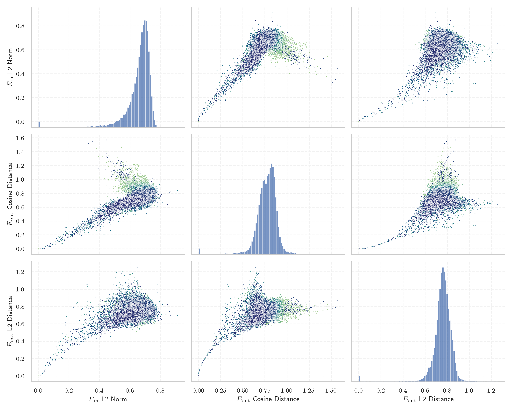
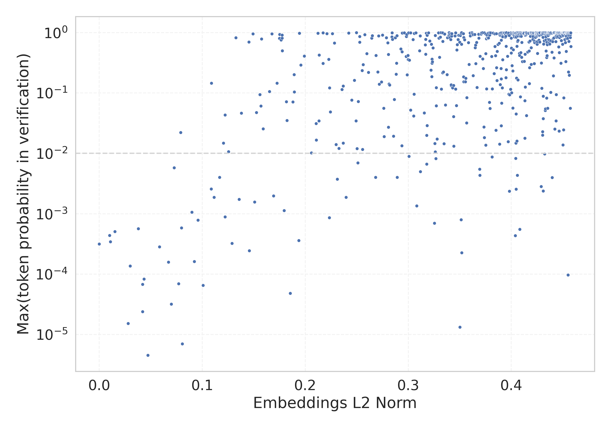

# Report for `h2oai/h2o-danube2-1.8b-base`

## Model info

* Tied embeddings: no
* LM head uses bias: no
* Indicator for under-trained tokens: E_{in} L2 Norm
  * Overall distribution 0.659 +/- 0.083
  * Token used for verification prompt building: `includegraphics`
  * Verification threshold: 0.458
  * Threshold for showing candidate under-trained tokens: 0.109
  * Median verified threshold (for bytes, unreachable and special tokens): 0.182
* Embeddings shape: (32000, 2560)
* Vocabulary size: 32000
  * Number of single byte tokens: 380, of which 140 below indicator threshold
  * Number of special tokens: 3, of which 2 below indicator threshold
  * Number of tested under-trained tokens: 637, 617 non-special, 62 below p = 0.01 threshold, 23 below soft indicator threshold

## Under-trained token indicators plot


## Verification plot


## Under-trained token verification results
23 entries below threshold of 0.109

|   token_id | token                      |   indicator | max_prob                                                         | in_other_tokens                                                                   |
|------------|----------------------------|-------------|------------------------------------------------------------------|-----------------------------------------------------------------------------------|
|      26382 | ````` \+\_\ `````          |   0.0101104 | <span style='border: 1px solid rgb(169, 68, 66);'>0.00044</span> |                                                                                   |
|      31738 | ````` \uefc0 `````         |   0.0107981 | <span style='border: 1px solid rgb(169, 68, 66);'>0.00034</span> |                                                                                   |
|      25900 | ````` iNdEx `````          |   0.0151775 | <span style='border: 1px solid rgb(169, 68, 66);'>0.00051</span> |                                                                                   |
|      22803 | ````` .^{[ `````           |   0.0281363 | <span style='border: 1px solid rgb(169, 68, 66);'>1.5e-05</span> |                                                                                   |
|      15739 | ````` ▁beginnetje `````    |   0.0300512 | <span style='border: 1px solid rgb(169, 68, 66);'>0.00014</span> |                                                                                   |
|      30929 | ````` ᥀ `````              |   0.0380323 | <span style='border: 1px solid rgb(169, 68, 66);'>0.00057</span> |                                                                                   |
|      26831 | ````` ▁febbra `````        |   0.0421692 | <span style='border: 1px solid rgb(169, 68, 66);'>2.4e-05</span> | <span style='border: 1px solid rgb(40, 167, 69);'>````` ▁febbraio `````</span>    |
|      25975 | ````` ▁Населення `````     |   0.0422046 | <span style='border: 1px solid rgb(169, 68, 66);'>6.7e-05</span> |                                                                                   |
|      19248 | ````` NdEx `````           |   0.0435411 | <span style='border: 1px solid rgb(169, 68, 66);'>8.3e-05</span> | <span style='border: 1px solid rgb(169, 68, 66);'>````` iNdEx `````</span>        |
|      18927 | ````` ederbörd `````       |   0.0471718 | <span style='border: 1px solid rgb(169, 68, 66);'>4.5e-06</span> | <span style='border: 1px solid rgb(169, 68, 66);'>````` ▁nederbörd `````</span>   |
|      27916 | ````` ▁Marcatori `````     |   0.0585935 | <span style='border: 1px solid rgb(169, 68, 66);'>0.00028</span> |                                                                                   |
|      22350 | ````` ▁насеље `````        |   0.0671451 | <span style='border: 1px solid rgb(169, 68, 66);'>0.00016</span> |                                                                                   |
|      26718 | ````` eltemperaturen ````` |   0.0700269 | <span style='border: 1px solid rgb(169, 68, 66);'>3.2e-05</span> |                                                                                   |
|      27265 | ````` ▁SDValue `````       |   0.0727615 | <span style='border: 1px solid rgb(255, 145, 0);'>0.0058</span>  |                                                                                   |
|      12872 | ````` ▁underarter `````    |   0.0770717 | <span style='border: 1px solid rgb(169, 68, 66);'>7e-05</span>   |                                                                                   |
|      28593 | ````` pgfscope `````       |   0.0791623 | <span style='border: 1px solid rgb(251, 189, 8);'>0.022</span>   |                                                                                   |
|      28373 | ````` ▁nederbörd `````     |   0.0799257 | <span style='border: 1px solid rgb(169, 68, 66);'>0.00058</span> |                                                                                   |
|      15641 | ````` ▁uitgen `````        |   0.0806028 | <span style='border: 1px solid rgb(169, 68, 66);'>7e-06</span>   | <span style='border: 1px solid rgb(251, 189, 8);'>````` ▁uitgenodigd `````</span> |
|      18699 | ````` ▁становника `````    |   0.0899587 | <span style='border: 1px solid rgb(255, 145, 0);'>0.0011</span>  |                                                                                   |
|      21160 | ````` ▁Становништво `````  |   0.0922849 | <span style='border: 1px solid rgb(169, 68, 66);'>0.00016</span> |                                                                                   |
<details><summary>3 additional entries below threshold</summary>

|   token_id | token                 |   indicator | max_prob                                                         | in_other_tokens                                                                |
|------------|-----------------------|-------------|------------------------------------------------------------------|--------------------------------------------------------------------------------|
|      14052 | ````` ▁Jahrhund ````` |   0.0959119 | <span style='border: 1px solid rgb(169, 68, 66);'>0.00079</span> | ````` ▁Jahrhundert `````, ````` ▁Jahrhunderts `````                            |
|      12645 | ````` ▁släktet `````  |   0.10091   | <span style='border: 1px solid rgb(169, 68, 66);'>6.5e-05</span> |                                                                                |
|      15500 | ````` itempty `````   |   0.108821  | <span style='border: 1px solid rgb(255, 145, 0);'>0.0026</span>  | <span style='border: 1px solid rgb(40, 167, 69);'>````` omitempty `````</span> |
</details>
<details><summary>594 additional entries above threshold</summary>

|   token_id | token                      |   indicator | max_prob                                                         | in_other_tokens                                                                                                                                                                                                                                                                                                                                                                                       |
|------------|----------------------------|-------------|------------------------------------------------------------------|-------------------------------------------------------------------------------------------------------------------------------------------------------------------------------------------------------------------------------------------------------------------------------------------------------------------------------------------------------------------------------------------------------|
|      30813 | ````` ︙ `````             |    0.10898  | <span style='border: 1px solid rgb(40, 167, 69);'>0.15</span>    |                                                                                                                                                                                                                                                                                                                                                                                                       |
|      20624 | ````` ништво `````         |    0.111577 | <span style='border: 1px solid rgb(255, 145, 0);'>0.0019</span>  | <span style='border: 1px solid rgb(169, 68, 66);'>````` ▁Становништво `````</span>                                                                                                                                                                                                                                                                                                                    |
|      26939 | ````` ▁invån `````         |    0.116925 | <span style='border: 1px solid rgb(255, 145, 0);'>0.004</span>   | <span style='border: 1px solid rgb(251, 189, 8);'>````` ▁invånare `````</span>                                                                                                                                                                                                                                                                                                                        |
|      28557 | ````` referto `````        |    0.120634 | <span style='border: 1px solid rgb(251, 189, 8);'>0.015</span>   |                                                                                                                                                                                                                                                                                                                                                                                                       |
|      27108 | ````` ▁налази `````        |    0.122135 | <span style='border: 1px solid rgb(169, 68, 66);'>0.00089</span> |                                                                                                                                                                                                                                                                                                                                                                                                       |
|      21622 | ````` .~(\ `````           |    0.122192 | <span style='border: 1px solid rgb(251, 189, 8);'>0.043</span>   |                                                                                                                                                                                                                                                                                                                                                                                                       |
|      23270 | ````` ByComparator `````   |    0.125535 | <span style='border: 1px solid rgb(251, 189, 8);'>0.011</span>   |                                                                                                                                                                                                                                                                                                                                                                                                       |
|      12755 | ````` ▁beskrevs `````      |    0.128999 | <span style='border: 1px solid rgb(169, 68, 66);'>0.00032</span> |                                                                                                                                                                                                                                                                                                                                                                                                       |
|      10762 | ````` qpoint `````         |    0.132691 | <span style='border: 1px solid rgb(40, 167, 69);'>0.82</span>    | <span style='border: 1px solid rgb(251, 189, 8);'>````` pgfqpoint `````</span>                                                                                                                                                                                                                                                                                                                        |
|      26607 | ````` ▁Arbitro `````       |    0.135743 | <span style='border: 1px solid rgb(255, 145, 0);'>0.0017</span>  |                                                                                                                                                                                                                                                                                                                                                                                                       |
|      13129 | ````` ▁listade `````       |    0.138025 | <span style='border: 1px solid rgb(251, 189, 8);'>0.047</span>   |                                                                                                                                                                                                                                                                                                                                                                                                       |
|      25471 | ````` +\_\ `````           |    0.145378 | <span style='border: 1px solid rgb(40, 167, 69);'>0.7</span>     | <span style='border: 1px solid rgb(169, 68, 66);'>````` \+\_\ `````</span>                                                                                                                                                                                                                                                                                                                            |
|      17779 | ````` ▁gepublice `````     |    0.145705 | <span style='border: 1px solid rgb(169, 68, 66);'>0.00024</span> | <span style='border: 1px solid rgb(40, 167, 69);'>````` ▁gepubliceerd `````</span>                                                                                                                                                                                                                                                                                                                    |
|      29934 | ````` ⣿ `````              |    0.149355 | <span style='border: 1px solid rgb(40, 167, 69);'>0.95</span>    |                                                                                                                                                                                                                                                                                                                                                                                                       |
|      28563 | ````` ▁саве `````          |    0.150834 | <span style='border: 1px solid rgb(255, 145, 0);'>0.0016</span>  |                                                                                                                                                                                                                                                                                                                                                                                                       |
|      10765 | ````` pgfqpoint `````      |    0.152705 | <span style='border: 1px solid rgb(251, 189, 8);'>0.048</span>   |                                                                                                                                                                                                                                                                                                                                                                                                       |
|      20896 | ````` ▁Станов `````        |    0.156008 | <span style='border: 1px solid rgb(251, 189, 8);'>0.094</span>   | <span style='border: 1px solid rgb(169, 68, 66);'>````` ▁Становништво `````</span>                                                                                                                                                                                                                                                                                                                    |
|      12683 | ````` pgfpathlineto `````  |    0.156959 | <span style='border: 1px solid rgb(251, 189, 8);'>0.061</span>   |                                                                                                                                                                                                                                                                                                                                                                                                       |
|      30142 | ````` ⚭ `````              |    0.157594 | <span style='border: 1px solid rgb(40, 167, 69);'>0.79</span>    |                                                                                                                                                                                                                                                                                                                                                                                                       |
|      16772 | ````` :%.* `````           |    0.159071 | <span style='border: 1px solid rgb(251, 189, 8);'>0.026</span>   | <span style='border: 1px solid rgb(40, 167, 69);'>````` :%.*]] `````</span>                                                                                                                                                                                                                                                                                                                           |
|      16681 | ````` börd `````           |    0.165362 | <span style='border: 1px solid rgb(40, 167, 69);'>0.11</span>    | <span style='border: 1px solid rgb(169, 68, 66);'>````` ederbörd `````</span>, <span style='border: 1px solid rgb(169, 68, 66);'>````` ▁nederbörd `````</span>                                                                                                                                                                                                                                        |
|      30897 | ````` ⠄ `````              |    0.167648 | <span style='border: 1px solid rgb(40, 167, 69);'>0.96</span>    |                                                                                                                                                                                                                                                                                                                                                                                                       |
|      24736 | ````` ској `````           |    0.169233 | <span style='border: 1px solid rgb(255, 145, 0);'>0.002</span>   |                                                                                                                                                                                                                                                                                                                                                                                                       |
|      27456 | ````` :%.*]] `````         |    0.172572 | <span style='border: 1px solid rgb(40, 167, 69);'>0.15</span>    |                                                                                                                                                                                                                                                                                                                                                                                                       |
|      31172 | ````` ┆ `````              |    0.17504  | <span style='border: 1px solid rgb(40, 167, 69);'>0.8</span>     |                                                                                                                                                                                                                                                                                                                                                                                                       |
|      31656 | ````` ≮ `````              |    0.175099 | <span style='border: 1px solid rgb(40, 167, 69);'>0.93</span>    |                                                                                                                                                                                                                                                                                                                                                                                                       |
|      12473 | ````` ▁Насе `````          |    0.1766   | <span style='border: 1px solid rgb(40, 167, 69);'>0.76</span>    | <span style='border: 1px solid rgb(40, 167, 69);'>````` ▁Население `````</span>, <span style='border: 1px solid rgb(169, 68, 66);'>````` ▁Населення `````</span>                                                                                                                                                                                                                                      |
|      31645 | ````` ≯ `````              |    0.177472 | <span style='border: 1px solid rgb(40, 167, 69);'>0.81</span>    |                                                                                                                                                                                                                                                                                                                                                                                                       |
|      30413 | ````` ⌁ `````              |    0.177605 | <span style='border: 1px solid rgb(40, 167, 69);'>0.91</span>    |                                                                                                                                                                                                                                                                                                                                                                                                       |
|      25089 | ````` ▁Население `````     |    0.177761 | <span style='border: 1px solid rgb(40, 167, 69);'>0.5</span>     |                                                                                                                                                                                                                                                                                                                                                                                                       |
|      27432 | ````` ▁månaden `````       |    0.179466 | <span style='border: 1px solid rgb(255, 145, 0);'>0.0011</span>  |                                                                                                                                                                                                                                                                                                                                                                                                       |
|      19145 | ````` ▁осіб `````          |    0.181601 | <span style='border: 1px solid rgb(251, 189, 8);'>0.072</span>   |                                                                                                                                                                                                                                                                                                                                                                                                       |
|      15649 | ````` ▁uitgenodigd `````   |    0.182274 | <span style='border: 1px solid rgb(251, 189, 8);'>0.035</span>   |                                                                                                                                                                                                                                                                                                                                                                                                       |
|       7941 | ````` ICENSE `````         |    0.185481 | <span style='border: 1px solid rgb(169, 68, 66);'>4.8e-05</span> | ````` LICENSE `````, ````` ▁LICENSE `````                                                                                                                                                                                                                                                                                                                                                             |
|      31853 | ````` ⇽ `````              |    0.187929 | <span style='border: 1px solid rgb(251, 189, 8);'>0.071</span>   |                                                                                                                                                                                                                                                                                                                                                                                                       |
|      31733 | ````` ⵙ `````              |    0.189187 | <span style='border: 1px solid rgb(40, 167, 69);'>0.2</span>     |                                                                                                                                                                                                                                                                                                                                                                                                       |
|      25776 | ````` ▁држа `````          |    0.189332 | <span style='border: 1px solid rgb(40, 167, 69);'>0.1</span>     |                                                                                                                                                                                                                                                                                                                                                                                                       |
|      15630 | ````` odigd `````          |    0.193671 | <span style='border: 1px solid rgb(169, 68, 66);'>0.00036</span> | <span style='border: 1px solid rgb(251, 189, 8);'>````` ▁uitgenodigd `````</span>                                                                                                                                                                                                                                                                                                                     |
|      31894 | ````` ฌ `````              |    0.194281 | <span style='border: 1px solid rgb(40, 167, 69);'>0.97</span>    |                                                                                                                                                                                                                                                                                                                                                                                                       |
|      31922 | ````` ⵓ `````              |    0.195664 | <span style='border: 1px solid rgb(40, 167, 69);'>0.29</span>    |                                                                                                                                                                                                                                                                                                                                                                                                       |
|      15509 | ````` omitempty `````      |    0.199141 | <span style='border: 1px solid rgb(40, 167, 69);'>0.41</span>    |                                                                                                                                                                                                                                                                                                                                                                                                       |
|      13380 | ````` ▁referenties `````   |    0.205943 | <span style='border: 1px solid rgb(251, 189, 8);'>0.01</span>    |                                                                                                                                                                                                                                                                                                                                                                                                       |
|      27496 | ````` олові `````          |    0.210526 | <span style='border: 1px solid rgb(251, 189, 8);'>0.031</span>   |                                                                                                                                                                                                                                                                                                                                                                                                       |
|      11370 | ````` pgfpath `````        |    0.210751 | <span style='border: 1px solid rgb(251, 189, 8);'>0.017</span>   | <span style='border: 1px solid rgb(251, 189, 8);'>````` pgfpathlineto `````</span>                                                                                                                                                                                                                                                                                                                    |
|      27862 | ````` getOperand `````     |    0.212355 | <span style='border: 1px solid rgb(40, 167, 69);'>0.98</span>    |                                                                                                                                                                                                                                                                                                                                                                                                       |
|      22929 | ````` ▁који `````          |    0.213383 | <span style='border: 1px solid rgb(251, 189, 8);'>0.035</span>   |                                                                                                                                                                                                                                                                                                                                                                                                       |
|      21350 | ````` ▁пів `````           |    0.213473 | <span style='border: 1px solid rgb(40, 167, 69);'>0.42</span>    |                                                                                                                                                                                                                                                                                                                                                                                                       |
|      15320 | ````` ▁/***/ `````         |    0.217237 | <span style='border: 1px solid rgb(40, 167, 69);'>0.31</span>    |                                                                                                                                                                                                                                                                                                                                                                                                       |
|      24713 | ````` vscale `````         |    0.217349 | <span style='border: 1px solid rgb(40, 167, 69);'>0.99</span>    |                                                                                                                                                                                                                                                                                                                                                                                                       |
|      31179 | ````` ┈ `````              |    0.221046 | <span style='border: 1px solid rgb(40, 167, 69);'>0.97</span>    |                                                                                                                                                                                                                                                                                                                                                                                                       |
|      29498 | ````` ѝ `````              |    0.222863 | <span style='border: 1px solid rgb(40, 167, 69);'>0.36</span>    |                                                                                                                                                                                                                                                                                                                                                                                                       |
|      21636 | ````` стратив `````        |    0.223324 | <span style='border: 1px solid rgb(169, 68, 66);'>0.00086</span> | <span style='border: 1px solid rgb(169, 68, 66);'>````` министратив `````</span>                                                                                                                                                                                                                                                                                                                      |
|      26292 | ````` emperaturen `````    |    0.223631 | <span style='border: 1px solid rgb(40, 167, 69);'>0.12</span>    | <span style='border: 1px solid rgb(169, 68, 66);'>````` eltemperaturen `````</span>                                                                                                                                                                                                                                                                                                                   |
|      31443 | ````` ⵏ `````              |    0.224374 | <span style='border: 1px solid rgb(251, 189, 8);'>0.049</span>   |                                                                                                                                                                                                                                                                                                                                                                                                       |
|      30983 | ````` ڕ `````              |    0.226369 | <span style='border: 1px solid rgb(40, 167, 69);'>0.96</span>    |                                                                                                                                                                                                                                                                                                                                                                                                       |
|      25097 | ````` ▁Биография `````     |    0.228275 | <span style='border: 1px solid rgb(40, 167, 69);'>0.67</span>    |                                                                                                                                                                                                                                                                                                                                                                                                       |
|      28423 | ````` Fatalf `````         |    0.229986 | <span style='border: 1px solid rgb(251, 189, 8);'>0.014</span>   |                                                                                                                                                                                                                                                                                                                                                                                                       |
|      13554 | ````` ▁році `````          |    0.231043 | <span style='border: 1px solid rgb(255, 145, 0);'>0.0037</span>  |                                                                                                                                                                                                                                                                                                                                                                                                       |
|      25224 | ````` ▁февра `````         |    0.232738 | <span style='border: 1px solid rgb(251, 189, 8);'>0.012</span>   | <span style='border: 1px solid rgb(251, 189, 8);'>````` ▁февраля `````</span>                                                                                                                                                                                                                                                                                                                         |
|      21770 | ````` ▁міс `````           |    0.235681 | <span style='border: 1px solid rgb(40, 167, 69);'>0.11</span>    | <span style='border: 1px solid rgb(40, 167, 69);'>````` ▁місце `````</span>                                                                                                                                                                                                                                                                                                                           |
|      31317 | ````` ⵉ `````              |    0.236761 | <span style='border: 1px solid rgb(40, 167, 69);'>0.13</span>    |                                                                                                                                                                                                                                                                                                                                                                                                       |
|      28401 | ````` ције `````           |    0.236906 | <span style='border: 1px solid rgb(251, 189, 8);'>0.015</span>   |                                                                                                                                                                                                                                                                                                                                                                                                       |
|      25501 | ````` ▁као `````           |    0.23967  | <span style='border: 1px solid rgb(255, 145, 0);'>0.0019</span>  |                                                                                                                                                                                                                                                                                                                                                                                                       |
|      29225 | ````` ๐ `````              |    0.242169 | <span style='border: 1px solid rgb(40, 167, 69);'>0.99</span>    |                                                                                                                                                                                                                                                                                                                                                                                                       |
|      23401 | ````` лази `````           |    0.245204 | <span style='border: 1px solid rgb(251, 189, 8);'>0.076</span>   | <span style='border: 1px solid rgb(169, 68, 66);'>````` ▁налази `````</span>                                                                                                                                                                                                                                                                                                                          |
|      17623 | ````` ▁був `````           |    0.24771  | <span style='border: 1px solid rgb(40, 167, 69);'>0.16</span>    |                                                                                                                                                                                                                                                                                                                                                                                                       |
|      19107 | ````` pgfset `````         |    0.249307 | <span style='border: 1px solid rgb(251, 189, 8);'>0.035</span>   |                                                                                                                                                                                                                                                                                                                                                                                                       |
|      31841 | ````` ❒ `````              |    0.249664 | <span style='border: 1px solid rgb(40, 167, 69);'>0.99</span>    |                                                                                                                                                                                                                                                                                                                                                                                                       |
|      31895 | ````` ❍ `````              |    0.249673 | <span style='border: 1px solid rgb(40, 167, 69);'>1</span>       |                                                                                                                                                                                                                                                                                                                                                                                                       |
|      19250 | ````` ▁/******/ `````      |    0.250254 | <span style='border: 1px solid rgb(251, 189, 8);'>0.012</span>   |                                                                                                                                                                                                                                                                                                                                                                                                       |
|      26360 | ````` ському `````         |    0.251065 | <span style='border: 1px solid rgb(255, 145, 0);'>0.0069</span>  |                                                                                                                                                                                                                                                                                                                                                                                                       |
|      24596 | ````` ▁були `````          |    0.251433 | <span style='border: 1px solid rgb(251, 189, 8);'>0.072</span>   |                                                                                                                                                                                                                                                                                                                                                                                                       |
|      11167 | ````` ityEngine `````      |    0.252771 | <span style='border: 1px solid rgb(40, 167, 69);'>0.69</span>    | ````` ▁UnityEngine `````, <span style='border: 1px solid rgb(40, 167, 69);'>````` UnityEngine `````</span>                                                                                                                                                                                                                                                                                            |
|      27720 | ````` ▁Мекси `````         |    0.252793 | <span style='border: 1px solid rgb(40, 167, 69);'>0.87</span>    |                                                                                                                                                                                                                                                                                                                                                                                                       |
|      11847 | ````` ▁familjen `````      |    0.255217 | <span style='border: 1px solid rgb(40, 167, 69);'>0.24</span>    |                                                                                                                                                                                                                                                                                                                                                                                                       |
|      27946 | ````` пня `````            |    0.255585 | <span style='border: 1px solid rgb(251, 189, 8);'>0.012</span>   |                                                                                                                                                                                                                                                                                                                                                                                                       |
|      14027 | ````` ▁године `````        |    0.256209 | <span style='border: 1px solid rgb(40, 167, 69);'>0.3</span>     |                                                                                                                                                                                                                                                                                                                                                                                                       |
|      28513 | ````` dentry `````         |    0.257789 | <span style='border: 1px solid rgb(40, 167, 69);'>0.92</span>    |                                                                                                                                                                                                                                                                                                                                                                                                       |
|      28398 | ````` ▁деревня `````       |    0.259787 | <span style='border: 1px solid rgb(40, 167, 69);'>0.45</span>    |                                                                                                                                                                                                                                                                                                                                                                                                       |
|      26342 | ````` ▁була `````          |    0.261288 | <span style='border: 1px solid rgb(40, 167, 69);'>0.22</span>    |                                                                                                                                                                                                                                                                                                                                                                                                       |
|      21876 | ````` imeq `````           |    0.26447  | <span style='border: 1px solid rgb(40, 167, 69);'>0.81</span>    | ````` simeq `````                                                                                                                                                                                                                                                                                                                                                                                     |
|      15377 | ````` ▁село `````          |    0.265013 | <span style='border: 1px solid rgb(40, 167, 69);'>0.89</span>    |                                                                                                                                                                                                                                                                                                                                                                                                       |
|      28561 | ````` ▁області `````       |    0.268265 | <span style='border: 1px solid rgb(255, 145, 0);'>0.004</span>   |                                                                                                                                                                                                                                                                                                                                                                                                       |
|      22643 | ````` ▁DCHECK `````        |    0.268609 | <span style='border: 1px solid rgb(40, 167, 69);'>0.42</span>    |                                                                                                                                                                                                                                                                                                                                                                                                       |
|      19057 | ````` ▁років `````         |    0.270489 | <span style='border: 1px solid rgb(40, 167, 69);'>0.22</span>    |                                                                                                                                                                                                                                                                                                                                                                                                       |
|      27728 | ````` ▁дивизи `````        |    0.271324 | <span style='border: 1px solid rgb(40, 167, 69);'>0.88</span>    |                                                                                                                                                                                                                                                                                                                                                                                                       |
|      28200 | ````` ▁серед `````         |    0.271929 | <span style='border: 1px solid rgb(40, 167, 69);'>0.14</span>    |                                                                                                                                                                                                                                                                                                                                                                                                       |
|      27953 | ````` ▁особи `````         |    0.273937 | <span style='border: 1px solid rgb(40, 167, 69);'>0.15</span>    |                                                                                                                                                                                                                                                                                                                                                                                                       |
|      30654 | ````` ⴰ `````              |    0.27491  | <span style='border: 1px solid rgb(40, 167, 69);'>0.91</span>    |                                                                                                                                                                                                                                                                                                                                                                                                       |
|      24506 | ````` нії `````            |    0.276164 | <span style='border: 1px solid rgb(251, 189, 8);'>0.056</span>   |                                                                                                                                                                                                                                                                                                                                                                                                       |
|      25000 | ````` istrzost `````       |    0.276524 | <span style='border: 1px solid rgb(251, 189, 8);'>0.019</span>   |                                                                                                                                                                                                                                                                                                                                                                                                       |
|      23242 | ````` ▁апре `````          |    0.27873  | <span style='border: 1px solid rgb(40, 167, 69);'>0.83</span>    | <span style='border: 1px solid rgb(40, 167, 69);'>````` ▁апреля `````</span>                                                                                                                                                                                                                                                                                                                          |
|      16724 | ````` tagHelper `````      |    0.28004  | <span style='border: 1px solid rgb(40, 167, 69);'>0.68</span>    |                                                                                                                                                                                                                                                                                                                                                                                                       |
|      18961 | ````` ▁чемпи `````         |    0.280645 | <span style='border: 1px solid rgb(40, 167, 69);'>0.44</span>    | <span style='border: 1px solid rgb(40, 167, 69);'>````` ▁чемпиона `````</span>                                                                                                                                                                                                                                                                                                                        |
|      27692 | ````` ▁inwon `````         |    0.280694 | <span style='border: 1px solid rgb(251, 189, 8);'>0.027</span>   |                                                                                                                                                                                                                                                                                                                                                                                                       |
|      25833 | ````` >?[< `````           |    0.281393 | <span style='border: 1px solid rgb(40, 167, 69);'>0.14</span>    |                                                                                                                                                                                                                                                                                                                                                                                                       |
|      22697 | ````` ▁янва `````          |    0.281945 | <span style='border: 1px solid rgb(40, 167, 69);'>0.14</span>    | <span style='border: 1px solid rgb(40, 167, 69);'>````` ▁января `````</span>                                                                                                                                                                                                                                                                                                                          |
|      15617 | ````` netje `````          |    0.284124 | <span style='border: 1px solid rgb(40, 167, 69);'>0.85</span>    | <span style='border: 1px solid rgb(169, 68, 66);'>````` ▁beginnetje `````</span>                                                                                                                                                                                                                                                                                                                      |
|      31636 | ````` ⬜ `````             |    0.284283 | <span style='border: 1px solid rgb(40, 167, 69);'>0.99</span>    |                                                                                                                                                                                                                                                                                                                                                                                                       |
|      31773 | ````` ѐ `````              |    0.284727 | <span style='border: 1px solid rgb(40, 167, 69);'>0.77</span>    |                                                                                                                                                                                                                                                                                                                                                                                                       |
|      27942 | ````` ське `````           |    0.285649 | <span style='border: 1px solid rgb(251, 189, 8);'>0.019</span>   |                                                                                                                                                                                                                                                                                                                                                                                                       |
|      22807 | ````` ▁населення `````     |    0.286365 | <span style='border: 1px solid rgb(251, 189, 8);'>0.078</span>   |                                                                                                                                                                                                                                                                                                                                                                                                       |
|      27214 | ````` ђе `````             |    0.287542 | <span style='border: 1px solid rgb(40, 167, 69);'>0.83</span>    |                                                                                                                                                                                                                                                                                                                                                                                                       |
|      18058 | ````` англ `````           |    0.288182 | <span style='border: 1px solid rgb(40, 167, 69);'>0.2</span>     |                                                                                                                                                                                                                                                                                                                                                                                                       |
|      26156 | ````` ▁годах `````         |    0.288611 | <span style='border: 1px solid rgb(40, 167, 69);'>0.31</span>    |                                                                                                                                                                                                                                                                                                                                                                                                       |
|      27935 | ````` ▁реки `````          |    0.289104 | <span style='border: 1px solid rgb(40, 167, 69);'>0.89</span>    |                                                                                                                                                                                                                                                                                                                                                                                                       |
|      16821 | ````` іб `````             |    0.289146 | <span style='border: 1px solid rgb(255, 145, 0);'>0.004</span>   | <span style='border: 1px solid rgb(251, 189, 8);'>````` ▁осіб `````</span>                                                                                                                                                                                                                                                                                                                            |
|      26972 | ````` ▁місце `````         |    0.292729 | <span style='border: 1px solid rgb(40, 167, 69);'>0.54</span>    |                                                                                                                                                                                                                                                                                                                                                                                                       |
|      26962 | ````` кої `````            |    0.293828 | <span style='border: 1px solid rgb(251, 189, 8);'>0.013</span>   |                                                                                                                                                                                                                                                                                                                                                                                                       |
|      23290 | ````` ▁він `````           |    0.293912 | <span style='border: 1px solid rgb(40, 167, 69);'>0.48</span>    |                                                                                                                                                                                                                                                                                                                                                                                                       |
|      12770 | ````` ▁рай `````           |    0.294128 | <span style='border: 1px solid rgb(40, 167, 69);'>0.98</span>    | <span style='border: 1px solid rgb(251, 189, 8);'>````` ▁райо `````</span>, <span style='border: 1px solid rgb(40, 167, 69);'>````` ▁район `````</span>, <span style='border: 1px solid rgb(40, 167, 69);'>````` ▁района `````</span>, <span style='border: 1px solid rgb(251, 189, 8);'>````` ▁районе `````</span>                                                                                   |
|      30546 | ````` ๏ `````              |    0.296143 | <span style='border: 1px solid rgb(40, 167, 69);'>0.99</span>    |                                                                                                                                                                                                                                                                                                                                                                                                       |
|      23006 | ````` графі `````          |    0.297887 | <span style='border: 1px solid rgb(40, 167, 69);'>0.4</span>     |                                                                                                                                                                                                                                                                                                                                                                                                       |
|      25464 | ````` ће `````             |    0.298049 | <span style='border: 1px solid rgb(40, 167, 69);'>0.86</span>    |                                                                                                                                                                                                                                                                                                                                                                                                       |
|      19743 | ````` љу `````             |    0.298505 | <span style='border: 1px solid rgb(40, 167, 69);'>0.93</span>    |                                                                                                                                                                                                                                                                                                                                                                                                       |
|      18829 | ````` bitro `````          |    0.298929 | <span style='border: 1px solid rgb(40, 167, 69);'>0.2</span>     | <span style='border: 1px solid rgb(255, 145, 0);'>````` ▁Arbitro `````</span>                                                                                                                                                                                                                                                                                                                         |
|      20607 | ````` ісля `````           |    0.299764 | <span style='border: 1px solid rgb(40, 167, 69);'>0.42</span>    |                                                                                                                                                                                                                                                                                                                                                                                                       |
|      15880 | ````` >:]< `````           |    0.299804 | <span style='border: 1px solid rgb(40, 167, 69);'>0.36</span>    |                                                                                                                                                                                                                                                                                                                                                                                                       |
|      28165 | ````` ▁меда `````          |    0.300377 | <span style='border: 1px solid rgb(40, 167, 69);'>0.99</span>    |                                                                                                                                                                                                                                                                                                                                                                                                       |
|      18840 | ````` iejsc `````          |    0.300752 | <span style='border: 1px solid rgb(255, 145, 0);'>0.009</span>   | ````` ▁miejsc `````, <span style='border: 1px solid rgb(40, 167, 69);'>````` ▁miejsce `````</span>                                                                                                                                                                                                                                                                                                    |
|      18614 | ````` ▁година `````        |    0.301073 | <span style='border: 1px solid rgb(40, 167, 69);'>0.35</span>    |                                                                                                                                                                                                                                                                                                                                                                                                       |
|      12251 | ````` ября `````           |    0.30222  | <span style='border: 1px solid rgb(251, 189, 8);'>0.052</span>   | <span style='border: 1px solid rgb(40, 167, 69);'>````` ▁сентября `````</span>, <span style='border: 1px solid rgb(40, 167, 69);'>````` ▁октября `````</span>, <span style='border: 1px solid rgb(40, 167, 69);'>````` ▁ноября `````</span>                                                                                                                                                           |
|      12582 | ````` lineto `````         |    0.302317 | <span style='border: 1px solid rgb(40, 167, 69);'>1</span>       | <span style='border: 1px solid rgb(251, 189, 8);'>````` pgfpathlineto `````</span>                                                                                                                                                                                                                                                                                                                    |
|      17011 | ````` HasColumn `````      |    0.304643 | <span style='border: 1px solid rgb(40, 167, 69);'>0.77</span>    | <span style='border: 1px solid rgb(251, 189, 8);'>````` HasColumnType `````</span>                                                                                                                                                                                                                                                                                                                    |
|      18239 | ````` HasColumnType `````  |    0.305279 | <span style='border: 1px solid rgb(251, 189, 8);'>0.042</span>   |                                                                                                                                                                                                                                                                                                                                                                                                       |
|      25140 | ````` ▁який `````          |    0.305633 | <span style='border: 1px solid rgb(251, 189, 8);'>0.096</span>   |                                                                                                                                                                                                                                                                                                                                                                                                       |
|      30690 | ````` ێ `````              |    0.305759 | <span style='border: 1px solid rgb(40, 167, 69);'>0.97</span>    |                                                                                                                                                                                                                                                                                                                                                                                                       |
|      31668 | ````` 刪 `````             |    0.30735  | <span style='border: 1px solid rgb(40, 167, 69);'>0.99</span>    |                                                                                                                                                                                                                                                                                                                                                                                                       |
|      15652 | ````` ▁voegen `````        |    0.308122 | <span style='border: 1px solid rgb(255, 145, 0);'>0.0014</span>  |                                                                                                                                                                                                                                                                                                                                                                                                       |
|      18997 | ````` ▁вій `````           |    0.310919 | <span style='border: 1px solid rgb(40, 167, 69);'>0.5</span>     |                                                                                                                                                                                                                                                                                                                                                                                                       |
|      25213 | ````` ћи `````             |    0.311597 | <span style='border: 1px solid rgb(40, 167, 69);'>0.88</span>    |                                                                                                                                                                                                                                                                                                                                                                                                       |
|      23667 | ````` єю `````             |    0.311713 | <span style='border: 1px solid rgb(255, 145, 0);'>0.005</span>   |                                                                                                                                                                                                                                                                                                                                                                                                       |
|      22220 | ````` нва `````            |    0.315544 | <span style='border: 1px solid rgb(251, 189, 8);'>0.047</span>   | <span style='border: 1px solid rgb(40, 167, 69);'>````` ▁янва `````</span>, <span style='border: 1px solid rgb(40, 167, 69);'>````` ▁января `````</span>                                                                                                                                                                                                                                              |
|      18784 | ````` ▁авгу `````          |    0.316528 | <span style='border: 1px solid rgb(40, 167, 69);'>0.63</span>    | <span style='border: 1px solid rgb(40, 167, 69);'>````` ▁августа `````</span>                                                                                                                                                                                                                                                                                                                         |
|      24285 | ````` ▁соста `````         |    0.316854 | <span style='border: 1px solid rgb(40, 167, 69);'>0.44</span>    | <span style='border: 1px solid rgb(40, 167, 69);'>````` ▁составе `````</span>                                                                                                                                                                                                                                                                                                                         |
|      30867 | ````` 🟠 `````             |    0.316989 | <span style='border: 1px solid rgb(40, 167, 69);'>0.77</span>    |                                                                                                                                                                                                                                                                                                                                                                                                       |
|      21316 | ````` ▁ImGui `````         |    0.317329 | <span style='border: 1px solid rgb(40, 167, 69);'>0.99</span>    |                                                                                                                                                                                                                                                                                                                                                                                                       |
|      24319 | ````` ~$\ `````            |    0.317563 | <span style='border: 1px solid rgb(40, 167, 69);'>0.98</span>    |                                                                                                                                                                                                                                                                                                                                                                                                       |
|      15708 | ````` ▁klikken `````       |    0.317794 | <span style='border: 1px solid rgb(251, 189, 8);'>0.02</span>    |                                                                                                                                                                                                                                                                                                                                                                                                       |
|      19799 | ````` ських `````          |    0.317918 | <span style='border: 1px solid rgb(255, 145, 0);'>0.0066</span>  |                                                                                                                                                                                                                                                                                                                                                                                                       |
|      22301 | ````` ▁През `````          |    0.318247 | <span style='border: 1px solid rgb(40, 167, 69);'>0.9</span>     |                                                                                                                                                                                                                                                                                                                                                                                                       |
|      25474 | ````` рії `````            |    0.318268 | <span style='border: 1px solid rgb(251, 189, 8);'>0.029</span>   |                                                                                                                                                                                                                                                                                                                                                                                                       |
|      13228 | ````` ▁Bronnen `````       |    0.319435 | <span style='border: 1px solid rgb(40, 167, 69);'>0.99</span>    |                                                                                                                                                                                                                                                                                                                                                                                                       |
|       8080 | ````` .~\ `````            |    0.319649 | <span style='border: 1px solid rgb(40, 167, 69);'>0.99</span>    |                                                                                                                                                                                                                                                                                                                                                                                                       |
|      26204 | ````` ▁фі `````            |    0.320828 | <span style='border: 1px solid rgb(40, 167, 69);'>0.73</span>    |                                                                                                                                                                                                                                                                                                                                                                                                       |
|      16613 | ````` CLUD `````           |    0.321986 | <span style='border: 1px solid rgb(40, 167, 69);'>0.24</span>    | ````` CLUDING `````, ````` ▁INCLUDING `````, ````` INCLUDING `````                                                                                                                                                                                                                                                                                                                                    |
|      28667 | ````` ▁села `````          |    0.322401 | <span style='border: 1px solid rgb(40, 167, 69);'>0.64</span>    |                                                                                                                                                                                                                                                                                                                                                                                                       |
|      11262 | ````` ји `````             |    0.32275  | <span style='border: 1px solid rgb(40, 167, 69);'>0.19</span>    | <span style='border: 1px solid rgb(251, 189, 8);'>````` ▁који `````</span>                                                                                                                                                                                                                                                                                                                            |
|      27403 | ````` ▁furono `````        |    0.323098 | <span style='border: 1px solid rgb(40, 167, 69);'>0.36</span>    |                                                                                                                                                                                                                                                                                                                                                                                                       |
|      25498 | ````` дів `````            |    0.323124 | <span style='border: 1px solid rgb(40, 167, 69);'>0.31</span>    |                                                                                                                                                                                                                                                                                                                                                                                                       |
|       7339 | ````` ▁року `````          |    0.323404 | <span style='border: 1px solid rgb(40, 167, 69);'>0.33</span>    |                                                                                                                                                                                                                                                                                                                                                                                                       |
|      18140 | ````` ССР `````            |    0.324033 | <span style='border: 1px solid rgb(40, 167, 69);'>0.56</span>    | <span style='border: 1px solid rgb(40, 167, 69);'>````` ▁СССР `````</span>                                                                                                                                                                                                                                                                                                                            |
|      20768 | ````` ▁також `````         |    0.325491 | <span style='border: 1px solid rgb(169, 68, 66);'>0.0007</span>  |                                                                                                                                                                                                                                                                                                                                                                                                       |
|      24409 | ````` чних `````           |    0.325702 | <span style='border: 1px solid rgb(251, 189, 8);'>0.015</span>   |                                                                                                                                                                                                                                                                                                                                                                                                       |
|      30350 | ````` ѣ `````              |    0.326122 | <span style='border: 1px solid rgb(40, 167, 69);'>0.9</span>     |                                                                                                                                                                                                                                                                                                                                                                                                       |
|      27908 | ````` кою `````            |    0.326184 | <span style='border: 1px solid rgb(251, 189, 8);'>0.011</span>   |                                                                                                                                                                                                                                                                                                                                                                                                       |
|      25582 | ````` ються `````          |    0.326805 | <span style='border: 1px solid rgb(255, 145, 0);'>0.0082</span>  |                                                                                                                                                                                                                                                                                                                                                                                                       |
|      15947 | ````` BPACK `````          |    0.327198 | <span style='border: 1px solid rgb(40, 167, 69);'>0.12</span>    | ````` WEBPACK `````                                                                                                                                                                                                                                                                                                                                                                                   |
|      27158 | ````` ▁invånare `````      |    0.327231 | <span style='border: 1px solid rgb(251, 189, 8);'>0.061</span>   |                                                                                                                                                                                                                                                                                                                                                                                                       |
|      24620 | ````` вої `````            |    0.328056 | <span style='border: 1px solid rgb(251, 189, 8);'>0.017</span>   |                                                                                                                                                                                                                                                                                                                                                                                                       |
|      11945 | ````` ље `````             |    0.329678 | <span style='border: 1px solid rgb(40, 167, 69);'>0.81</span>    | <span style='border: 1px solid rgb(169, 68, 66);'>````` ▁насеље `````</span>                                                                                                                                                                                                                                                                                                                          |
|      18395 | ````` ▁було `````          |    0.33039  | <span style='border: 1px solid rgb(40, 167, 69);'>0.39</span>    |                                                                                                                                                                                                                                                                                                                                                                                                       |
|      25866 | ````` bbra `````           |    0.331213 | <span style='border: 1px solid rgb(40, 167, 69);'>0.85</span>    | <span style='border: 1px solid rgb(169, 68, 66);'>````` ▁febbra `````</span>, <span style='border: 1px solid rgb(40, 167, 69);'>````` ▁febbraio `````</span>                                                                                                                                                                                                                                          |
|      22801 | ````` crtc `````           |    0.331794 | <span style='border: 1px solid rgb(40, 167, 69);'>1</span>       |                                                                                                                                                                                                                                                                                                                                                                                                       |
|      20720 | ````` ▁дея `````           |    0.332187 | <span style='border: 1px solid rgb(40, 167, 69);'>0.12</span>    | ````` ▁деятель `````                                                                                                                                                                                                                                                                                                                                                                                  |
|      11292 | ````` краї `````           |    0.333245 | <span style='border: 1px solid rgb(40, 167, 69);'>0.22</span>    | ````` ▁Украї `````, <span style='border: 1px solid rgb(40, 167, 69);'>````` ▁України `````</span>, ````` країн `````, <span style='border: 1px solid rgb(40, 167, 69);'>````` ▁україн `````</span>                                                                                                                                                                                                    |
|      25506 | ````` ▁↘ `````             |    0.333262 | <span style='border: 1px solid rgb(40, 167, 69);'>0.99</span>    |                                                                                                                                                                                                                                                                                                                                                                                                       |
|      19509 | ````` jsce `````           |    0.33359  | <span style='border: 1px solid rgb(40, 167, 69);'>0.72</span>    | <span style='border: 1px solid rgb(40, 167, 69);'>````` ▁miejsce `````</span>                                                                                                                                                                                                                                                                                                                         |
|      15695 | ````` ▁bewerken `````      |    0.334183 | <span style='border: 1px solid rgb(40, 167, 69);'>0.22</span>    |                                                                                                                                                                                                                                                                                                                                                                                                       |
|      27851 | ````` ціональ `````        |    0.334651 | <span style='border: 1px solid rgb(251, 189, 8);'>0.014</span>   |                                                                                                                                                                                                                                                                                                                                                                                                       |
|      31994 | ````` ٓ `````               |    0.335278 | <span style='border: 1px solid rgb(40, 167, 69);'>0.95</span>    |                                                                                                                                                                                                                                                                                                                                                                                                       |
|      23279 | ````` лів `````            |    0.335997 | <span style='border: 1px solid rgb(251, 189, 8);'>0.063</span>   |                                                                                                                                                                                                                                                                                                                                                                                                       |
|      18136 | ````` ▁його `````          |    0.337591 | <span style='border: 1px solid rgb(40, 167, 69);'>0.2</span>     |                                                                                                                                                                                                                                                                                                                                                                                                       |
|      28442 | ````` ▁пі `````            |    0.337989 | <span style='border: 1px solid rgb(40, 167, 69);'>0.83</span>    |                                                                                                                                                                                                                                                                                                                                                                                                       |
|      21284 | ````` ља `````             |    0.339205 | <span style='border: 1px solid rgb(40, 167, 69);'>0.89</span>    |                                                                                                                                                                                                                                                                                                                                                                                                       |
|      22854 | ````` subfigure `````      |    0.339711 | <span style='border: 1px solid rgb(40, 167, 69);'>1</span>       |                                                                                                                                                                                                                                                                                                                                                                                                       |
|      31252 | ````` ۆ `````              |    0.339761 | <span style='border: 1px solid rgb(40, 167, 69);'>0.89</span>    |                                                                                                                                                                                                                                                                                                                                                                                                       |
|      11169 | ````` ▁ingår `````         |    0.340129 | <span style='border: 1px solid rgb(40, 167, 69);'>0.83</span>    |                                                                                                                                                                                                                                                                                                                                                                                                       |
|      16394 | ````` ▁йо `````            |    0.340251 | <span style='border: 1px solid rgb(40, 167, 69);'>0.96</span>    | <span style='border: 1px solid rgb(40, 167, 69);'>````` ▁його `````</span>                                                                                                                                                                                                                                                                                                                            |
|      28657 | ````` ▁honom `````         |    0.34118  | <span style='border: 1px solid rgb(40, 167, 69);'>0.77</span>    |                                                                                                                                                                                                                                                                                                                                                                                                       |
|      19088 | ````` ▁geldig `````        |    0.341541 | <span style='border: 1px solid rgb(40, 167, 69);'>0.13</span>    |                                                                                                                                                                                                                                                                                                                                                                                                       |
|      23338 | ````` rdev `````           |    0.341543 | <span style='border: 1px solid rgb(40, 167, 69);'>0.97</span>    |                                                                                                                                                                                                                                                                                                                                                                                                       |
|      24860 | ````` њи `````             |    0.341661 | <span style='border: 1px solid rgb(40, 167, 69);'>0.14</span>    |                                                                                                                                                                                                                                                                                                                                                                                                       |
|      20411 | ````` ][< `````            |    0.342101 | <span style='border: 1px solid rgb(40, 167, 69);'>0.88</span>    |                                                                                                                                                                                                                                                                                                                                                                                                       |
|      13130 | ````` ▁aapt `````          |    0.34229  | <span style='border: 1px solid rgb(40, 167, 69);'>0.96</span>    |                                                                                                                                                                                                                                                                                                                                                                                                       |
|      25827 | ````` ския `````           |    0.342902 | <span style='border: 1px solid rgb(40, 167, 69);'>0.12</span>    |                                                                                                                                                                                                                                                                                                                                                                                                       |
|      20061 | ````` istrz `````          |    0.343928 | <span style='border: 1px solid rgb(40, 167, 69);'>0.13</span>    | <span style='border: 1px solid rgb(251, 189, 8);'>````` istrzost `````</span>                                                                                                                                                                                                                                                                                                                         |
|      22151 | ````` ців `````            |    0.343947 | <span style='border: 1px solid rgb(251, 189, 8);'>0.041</span>   |                                                                                                                                                                                                                                                                                                                                                                                                       |
|      23975 | ````` ючи `````            |    0.344236 | <span style='border: 1px solid rgb(251, 189, 8);'>0.013</span>   |                                                                                                                                                                                                                                                                                                                                                                                                       |
|      24230 | ````` ▁чемпиона `````      |    0.345365 | <span style='border: 1px solid rgb(40, 167, 69);'>0.88</span>    |                                                                                                                                                                                                                                                                                                                                                                                                       |
|      31327 | ````` ̞ `````               |    0.345907 | <span style='border: 1px solid rgb(40, 167, 69);'>0.98</span>    |                                                                                                                                                                                                                                                                                                                                                                                                       |
|      30663 | ````` ┃ `````              |    0.345985 | <span style='border: 1px solid rgb(40, 167, 69);'>0.99</span>    |                                                                                                                                                                                                                                                                                                                                                                                                       |
|      23477 | ````` рія `````            |    0.346036 | <span style='border: 1px solid rgb(40, 167, 69);'>0.12</span>    |                                                                                                                                                                                                                                                                                                                                                                                                       |
|      28502 | ````` ▁біль `````          |    0.346762 | <span style='border: 1px solid rgb(251, 189, 8);'>0.062</span>   |                                                                                                                                                                                                                                                                                                                                                                                                       |
|      25664 | ````` хі `````             |    0.347235 | <span style='border: 1px solid rgb(40, 167, 69);'>0.52</span>    |                                                                                                                                                                                                                                                                                                                                                                                                       |
|      22283 | ````` ▁сент `````          |    0.34761  | <span style='border: 1px solid rgb(40, 167, 69);'>0.63</span>    | <span style='border: 1px solid rgb(40, 167, 69);'>````` ▁сентября `````</span>                                                                                                                                                                                                                                                                                                                        |
|      26883 | ````` ▁зі `````            |    0.348263 | <span style='border: 1px solid rgb(40, 167, 69);'>0.77</span>    |                                                                                                                                                                                                                                                                                                                                                                                                       |
|      31357 | ````` ұ `````              |    0.348961 | <span style='border: 1px solid rgb(40, 167, 69);'>0.9</span>     |                                                                                                                                                                                                                                                                                                                                                                                                       |
|      28497 | ````` ▁але `````           |    0.349891 | <span style='border: 1px solid rgb(40, 167, 69);'>0.7</span>     |                                                                                                                                                                                                                                                                                                                                                                                                       |
|      25780 | ````` benfalls `````       |    0.350047 | <span style='border: 1px solid rgb(169, 68, 66);'>1.3e-05</span> | ````` ▁ebenfalls `````                                                                                                                                                                                                                                                                                                                                                                                |
|      21218 | ````` шти `````            |    0.350505 | <span style='border: 1px solid rgb(40, 167, 69);'>0.9</span>     |                                                                                                                                                                                                                                                                                                                                                                                                       |
|      18953 | ````` утбо `````           |    0.351244 | <span style='border: 1px solid rgb(169, 68, 66);'>0.0008</span>  | ````` ▁футбо `````                                                                                                                                                                                                                                                                                                                                                                                    |
|      31330 | ````` 숫 `````             |    0.351279 | <span style='border: 1px solid rgb(40, 167, 69);'>0.96</span>    |                                                                                                                                                                                                                                                                                                                                                                                                       |
|      25271 | ````` ▁сві `````           |    0.351704 | <span style='border: 1px solid rgb(40, 167, 69);'>0.64</span>    |                                                                                                                                                                                                                                                                                                                                                                                                       |
|      22847 | ````` omsnitt `````        |    0.351806 | <span style='border: 1px solid rgb(169, 68, 66);'>0.00023</span> |                                                                                                                                                                                                                                                                                                                                                                                                       |
|      21871 | ````` ▁дека `````          |    0.353378 | <span style='border: 1px solid rgb(40, 167, 69);'>0.96</span>    | <span style='border: 1px solid rgb(40, 167, 69);'>````` ▁декабря `````</span>                                                                                                                                                                                                                                                                                                                         |
|      26838 | ````` ▁живе `````          |    0.353617 | <span style='border: 1px solid rgb(40, 167, 69);'>0.19</span>    |                                                                                                                                                                                                                                                                                                                                                                                                       |
|      24016 | ````` чний `````           |    0.353842 | <span style='border: 1px solid rgb(40, 167, 69);'>0.15</span>    |                                                                                                                                                                                                                                                                                                                                                                                                       |
|      21394 | ````` ▁сезо `````          |    0.353935 | <span style='border: 1px solid rgb(40, 167, 69);'>0.83</span>    |                                                                                                                                                                                                                                                                                                                                                                                                       |
|      12054 | ````` ktet `````           |    0.354652 | <span style='border: 1px solid rgb(40, 167, 69);'>0.76</span>    | <span style='border: 1px solid rgb(169, 68, 66);'>````` ▁släktet `````</span>                                                                                                                                                                                                                                                                                                                         |
|      26895 | ````` ција `````           |    0.355436 | <span style='border: 1px solid rgb(40, 167, 69);'>0.15</span>    |                                                                                                                                                                                                                                                                                                                                                                                                       |
|      26811 | ````` ▁*« `````            |    0.355761 | <span style='border: 1px solid rgb(40, 167, 69);'>0.18</span>    |                                                                                                                                                                                                                                                                                                                                                                                                       |
|      19537 | ````` ската `````          |    0.356669 | <span style='border: 1px solid rgb(251, 189, 8);'>0.032</span>   |                                                                                                                                                                                                                                                                                                                                                                                                       |
|      23838 | ````` ▁районе `````        |    0.356899 | <span style='border: 1px solid rgb(251, 189, 8);'>0.084</span>   |                                                                                                                                                                                                                                                                                                                                                                                                       |
|      16909 | ````` ▁wetenschapp `````   |    0.358478 | <span style='border: 1px solid rgb(40, 167, 69);'>0.68</span>    |                                                                                                                                                                                                                                                                                                                                                                                                       |
|      27062 | ````` тів `````            |    0.359037 | <span style='border: 1px solid rgb(40, 167, 69);'>0.3</span>     |                                                                                                                                                                                                                                                                                                                                                                                                       |
|      26778 | ````` ▁gewann `````        |    0.360016 | <span style='border: 1px solid rgb(40, 167, 69);'>0.99</span>    |                                                                                                                                                                                                                                                                                                                                                                                                       |
|      28155 | ````` ▁són `````           |    0.360139 | <span style='border: 1px solid rgb(40, 167, 69);'>0.88</span>    |                                                                                                                                                                                                                                                                                                                                                                                                       |
|      29091 | ````` ↘ `````              |    0.361757 | <span style='border: 1px solid rgb(40, 167, 69);'>1</span>       |                                                                                                                                                                                                                                                                                                                                                                                                       |
|      20952 | ````` ▁venne `````         |    0.361952 | <span style='border: 1px solid rgb(40, 167, 69);'>0.96</span>    |                                                                                                                                                                                                                                                                                                                                                                                                       |
|      27095 | ````` ▁худож `````         |    0.362649 | <span style='border: 1px solid rgb(40, 167, 69);'>0.92</span>    |                                                                                                                                                                                                                                                                                                                                                                                                       |
|      13358 | ````` ▁noten `````         |    0.362928 | <span style='border: 1px solid rgb(40, 167, 69);'>0.93</span>    |                                                                                                                                                                                                                                                                                                                                                                                                       |
|      24020 | ````` сій `````            |    0.362947 | <span style='border: 1px solid rgb(40, 167, 69);'>0.19</span>    |                                                                                                                                                                                                                                                                                                                                                                                                       |
|      31847 | ````` ན `````              |    0.36454  | <span style='border: 1px solid rgb(40, 167, 69);'>0.93</span>    |                                                                                                                                                                                                                                                                                                                                                                                                       |
|      23075 | ````` ▁із `````            |    0.364948 | <span style='border: 1px solid rgb(40, 167, 69);'>0.56</span>    |                                                                                                                                                                                                                                                                                                                                                                                                       |
|      24445 | ````` ▁ні `````            |    0.365297 | <span style='border: 1px solid rgb(40, 167, 69);'>0.62</span>    |                                                                                                                                                                                                                                                                                                                                                                                                       |
|      23997 | ````` цю `````             |    0.365435 | <span style='border: 1px solid rgb(40, 167, 69);'>0.31</span>    |                                                                                                                                                                                                                                                                                                                                                                                                       |
|      28482 | ````` ▁gemeente `````      |    0.366263 | <span style='border: 1px solid rgb(40, 167, 69);'>0.69</span>    |                                                                                                                                                                                                                                                                                                                                                                                                       |
|      22546 | ````` ▁окт `````           |    0.366689 | <span style='border: 1px solid rgb(40, 167, 69);'>0.12</span>    | <span style='border: 1px solid rgb(40, 167, 69);'>````` ▁октября `````</span>                                                                                                                                                                                                                                                                                                                         |
|      22076 | ````` ▁skb `````           |    0.368375 | <span style='border: 1px solid rgb(40, 167, 69);'>0.94</span>    |                                                                                                                                                                                                                                                                                                                                                                                                       |
|      17264 | ````` ниш `````            |    0.368478 | <span style='border: 1px solid rgb(40, 167, 69);'>0.81</span>    | <span style='border: 1px solid rgb(255, 145, 0);'>````` ништво `````</span>, <span style='border: 1px solid rgb(169, 68, 66);'>````` ▁Становништво `````</span>                                                                                                                                                                                                                                       |
|      26986 | ````` чні `````            |    0.369326 | <span style='border: 1px solid rgb(255, 145, 0);'>0.0055</span>  |                                                                                                                                                                                                                                                                                                                                                                                                       |
|      22979 | ````` anzös `````          |    0.369391 | <span style='border: 1px solid rgb(255, 145, 0);'>0.0043</span>  | <span style='border: 1px solid rgb(255, 145, 0);'>````` ▁französ `````</span>                                                                                                                                                                                                                                                                                                                         |
|      15857 | ````` ња `````             |    0.369759 | <span style='border: 1px solid rgb(40, 167, 69);'>0.41</span>    |                                                                                                                                                                                                                                                                                                                                                                                                       |
|      18802 | ````` liferay `````        |    0.37071  | <span style='border: 1px solid rgb(40, 167, 69);'>0.95</span>    |                                                                                                                                                                                                                                                                                                                                                                                                       |
|      30073 | ````` ▌ `````              |    0.37114  | <span style='border: 1px solid rgb(40, 167, 69);'>0.99</span>    |                                                                                                                                                                                                                                                                                                                                                                                                       |
|      25931 | ````` tcx `````            |    0.372017 | <span style='border: 1px solid rgb(40, 167, 69);'>1</span>       |                                                                                                                                                                                                                                                                                                                                                                                                       |
|      11066 | ````` ју `````             |    0.372218 | <span style='border: 1px solid rgb(40, 167, 69);'>0.37</span>    |                                                                                                                                                                                                                                                                                                                                                                                                       |
|      27144 | ````` ▁també `````         |    0.372759 | <span style='border: 1px solid rgb(40, 167, 69);'>0.25</span>    |                                                                                                                                                                                                                                                                                                                                                                                                       |
|      31858 | ````` ེ `````               |    0.373354 | <span style='border: 1px solid rgb(251, 189, 8);'>0.027</span>   |                                                                                                                                                                                                                                                                                                                                                                                                       |
|      13137 | ````` ється `````          |    0.373734 | <span style='border: 1px solid rgb(251, 189, 8);'>0.018</span>   |                                                                                                                                                                                                                                                                                                                                                                                                       |
|      29455 | ````` ە `````              |    0.373858 | <span style='border: 1px solid rgb(40, 167, 69);'>1</span>       |                                                                                                                                                                                                                                                                                                                                                                                                       |
|      25059 | ````` ▁августа `````       |    0.375166 | <span style='border: 1px solid rgb(40, 167, 69);'>0.45</span>    |                                                                                                                                                                                                                                                                                                                                                                                                       |
|      10120 | ````` ського `````         |    0.375196 | <span style='border: 1px solid rgb(251, 189, 8);'>0.014</span>   |                                                                                                                                                                                                                                                                                                                                                                                                       |
|      26267 | ````` ▁Мі `````            |    0.375286 | <span style='border: 1px solid rgb(40, 167, 69);'>0.95</span>    |                                                                                                                                                                                                                                                                                                                                                                                                       |
|      31989 | ````` འ `````              |    0.375813 | <span style='border: 1px solid rgb(40, 167, 69);'>0.8</span>     |                                                                                                                                                                                                                                                                                                                                                                                                       |
|      16144 | ````` хід `````            |    0.375948 | <span style='border: 1px solid rgb(40, 167, 69);'>0.12</span>    |                                                                                                                                                                                                                                                                                                                                                                                                       |
|      31558 | ````` ང `````              |    0.376306 | <span style='border: 1px solid rgb(40, 167, 69);'>0.91</span>    |                                                                                                                                                                                                                                                                                                                                                                                                       |
|      31932 | ````` ҽ `````              |    0.376722 | <span style='border: 1px solid rgb(40, 167, 69);'>0.83</span>    |                                                                                                                                                                                                                                                                                                                                                                                                       |
|      23112 | ````` ▁бі `````            |    0.377441 | <span style='border: 1px solid rgb(40, 167, 69);'>0.82</span>    | <span style='border: 1px solid rgb(251, 189, 8);'>````` ▁біль `````</span>                                                                                                                                                                                                                                                                                                                            |
|      30374 | ````` ▀ `````              |    0.377735 | <span style='border: 1px solid rgb(40, 167, 69);'>0.99</span>    |                                                                                                                                                                                                                                                                                                                                                                                                       |
|      23203 | ````` ▁erhielt `````       |    0.377804 | <span style='border: 1px solid rgb(40, 167, 69);'>0.82</span>    |                                                                                                                                                                                                                                                                                                                                                                                                       |
|      21159 | ````` каде `````           |    0.378686 | <span style='border: 1px solid rgb(251, 189, 8);'>0.07</span>    | <span style='border: 1px solid rgb(40, 167, 69);'>````` ▁акаде `````</span>                                                                                                                                                                                                                                                                                                                           |
|      28490 | ````` ▁ство `````          |    0.379021 | <span style='border: 1px solid rgb(40, 167, 69);'>0.91</span>    |                                                                                                                                                                                                                                                                                                                                                                                                       |
|      12460 | ````` Errorf `````         |    0.379366 | <span style='border: 1px solid rgb(251, 189, 8);'>0.055</span>   |                                                                                                                                                                                                                                                                                                                                                                                                       |
|      31606 | ````` མ `````              |    0.379968 | <span style='border: 1px solid rgb(40, 167, 69);'>0.99</span>    |                                                                                                                                                                                                                                                                                                                                                                                                       |
|      23008 | ````` ▁які `````           |    0.380938 | <span style='border: 1px solid rgb(40, 167, 69);'>0.4</span>     |                                                                                                                                                                                                                                                                                                                                                                                                       |
|      18708 | ````` ські `````           |    0.381274 | <span style='border: 1px solid rgb(255, 145, 0);'>0.0088</span>  |                                                                                                                                                                                                                                                                                                                                                                                                       |
|      18168 | ````` ография `````        |    0.381567 | <span style='border: 1px solid rgb(40, 167, 69);'>0.12</span>    | <span style='border: 1px solid rgb(40, 167, 69);'>````` ▁Биография `````</span>                                                                                                                                                                                                                                                                                                                       |
|      25583 | ````` netdev `````         |    0.382322 | <span style='border: 1px solid rgb(40, 167, 69);'>0.99</span>    |                                                                                                                                                                                                                                                                                                                                                                                                       |
|      23588 | ````` слі `````            |    0.383417 | <span style='border: 1px solid rgb(40, 167, 69);'>0.21</span>    |                                                                                                                                                                                                                                                                                                                                                                                                       |
|      31264 | ````` ⬛ `````             |    0.383825 | <span style='border: 1px solid rgb(40, 167, 69);'>0.96</span>    |                                                                                                                                                                                                                                                                                                                                                                                                       |
|      27820 | ````` ▁акаде `````         |    0.383932 | <span style='border: 1px solid rgb(40, 167, 69);'>0.96</span>    |                                                                                                                                                                                                                                                                                                                                                                                                       |
|      21851 | ````` ▁фев `````           |    0.384131 | <span style='border: 1px solid rgb(40, 167, 69);'>0.59</span>    | <span style='border: 1px solid rgb(251, 189, 8);'>````` ▁февра `````</span>, <span style='border: 1px solid rgb(251, 189, 8);'>````` ▁февраля `````</span>                                                                                                                                                                                                                                            |
|      31469 | ````` ӏ `````              |    0.384631 | <span style='border: 1px solid rgb(40, 167, 69);'>0.41</span>    |                                                                                                                                                                                                                                                                                                                                                                                                       |
|      21074 | ````` ття `````            |    0.385107 | <span style='border: 1px solid rgb(251, 189, 8);'>0.024</span>   |                                                                                                                                                                                                                                                                                                                                                                                                       |
|      16527 | ````` ША `````             |    0.385578 | <span style='border: 1px solid rgb(40, 167, 69);'>0.96</span>    | ````` ▁США `````                                                                                                                                                                                                                                                                                                                                                                                      |
|      21738 | ````` ньо `````            |    0.38561  | <span style='border: 1px solid rgb(40, 167, 69);'>0.26</span>    |                                                                                                                                                                                                                                                                                                                                                                                                       |
|      22948 | ````` чення `````          |    0.386152 | <span style='border: 1px solid rgb(40, 167, 69);'>0.16</span>    |                                                                                                                                                                                                                                                                                                                                                                                                       |
|      26076 | ````` ▁июля `````          |    0.386219 | <span style='border: 1px solid rgb(40, 167, 69);'>0.49</span>    |                                                                                                                                                                                                                                                                                                                                                                                                       |
|      30494 | ````` ╝ `````              |    0.387012 | <span style='border: 1px solid rgb(40, 167, 69);'>0.64</span>    |                                                                                                                                                                                                                                                                                                                                                                                                       |
|      17811 | ````` ▁gepubliceerd `````  |    0.388251 | <span style='border: 1px solid rgb(40, 167, 69);'>0.67</span>    |                                                                                                                                                                                                                                                                                                                                                                                                       |
|      25431 | ````` ▁пр `````            |    0.388522 | <span style='border: 1px solid rgb(40, 167, 69);'>0.95</span>    | ````` ▁призна `````, ````` ▁приня `````                                                                                                                                                                                                                                                                                                                                                               |
|      16503 | ````` мерикан `````        |    0.388615 | <span style='border: 1px solid rgb(251, 189, 8);'>0.014</span>   | <span style='border: 1px solid rgb(40, 167, 69);'>````` ▁американ `````</span>                                                                                                                                                                                                                                                                                                                        |
|      16141 | ````` ▁станов `````        |    0.389053 | <span style='border: 1px solid rgb(40, 167, 69);'>0.91</span>    | <span style='border: 1px solid rgb(255, 145, 0);'>````` ▁становника `````</span>, ````` ▁станови `````                                                                                                                                                                                                                                                                                                |
|      31903 | ````` Ս `````              |    0.389109 | <span style='border: 1px solid rgb(40, 167, 69);'>0.98</span>    |                                                                                                                                                                                                                                                                                                                                                                                                       |
|      27653 | ````` ▁составе `````       |    0.389167 | <span style='border: 1px solid rgb(40, 167, 69);'>0.14</span>    |                                                                                                                                                                                                                                                                                                                                                                                                       |
|      18941 | ````` рів `````            |    0.389958 | <span style='border: 1px solid rgb(40, 167, 69);'>0.26</span>    |                                                                                                                                                                                                                                                                                                                                                                                                       |
|      12400 | ````` ▁км `````            |    0.389987 | <span style='border: 1px solid rgb(40, 167, 69);'>0.94</span>    |                                                                                                                                                                                                                                                                                                                                                                                                       |
|      10507 | ````` лення `````          |    0.390191 | <span style='border: 1px solid rgb(251, 189, 8);'>0.029</span>   | <span style='border: 1px solid rgb(251, 189, 8);'>````` ▁населення `````</span>, <span style='border: 1px solid rgb(169, 68, 66);'>````` ▁Населення `````</span>                                                                                                                                                                                                                                      |
|      17185 | ````` ublice `````         |    0.390265 | <span style='border: 1px solid rgb(40, 167, 69);'>0.17</span>    | <span style='border: 1px solid rgb(169, 68, 66);'>````` ▁gepublice `````</span>, <span style='border: 1px solid rgb(40, 167, 69);'>````` ▁gepubliceerd `````</span>                                                                                                                                                                                                                                   |
|      31710 | ````` 젝 `````             |    0.390337 | <span style='border: 1px solid rgb(40, 167, 69);'>0.75</span>    |                                                                                                                                                                                                                                                                                                                                                                                                       |
|      31383 | ````` ฆ `````              |    0.390452 | <span style='border: 1px solid rgb(40, 167, 69);'>0.88</span>    |                                                                                                                                                                                                                                                                                                                                                                                                       |
|      14215 | ````` вав `````            |    0.390597 | <span style='border: 1px solid rgb(251, 189, 8);'>0.068</span>   |                                                                                                                                                                                                                                                                                                                                                                                                       |
|      16109 | ````` лександ `````        |    0.391231 | <span style='border: 1px solid rgb(40, 167, 69);'>0.12</span>    | ````` ▁Александ `````                                                                                                                                                                                                                                                                                                                                                                                 |
|      24070 | ````` ▁fün `````           |    0.391337 | <span style='border: 1px solid rgb(40, 167, 69);'>0.87</span>    | ````` ▁fünf `````                                                                                                                                                                                                                                                                                                                                                                                     |
|      31629 | ````` 옵 `````             |    0.391507 | <span style='border: 1px solid rgb(40, 167, 69);'>0.97</span>    |                                                                                                                                                                                                                                                                                                                                                                                                       |
|      17425 | ````` вся `````            |    0.391568 | <span style='border: 1px solid rgb(40, 167, 69);'>0.85</span>    |                                                                                                                                                                                                                                                                                                                                                                                                       |
|      27567 | ````` ctxt `````           |    0.39164  | <span style='border: 1px solid rgb(40, 167, 69);'>1</span>       |                                                                                                                                                                                                                                                                                                                                                                                                       |
|      13238 | ````` ній `````            |    0.391652 | <span style='border: 1px solid rgb(40, 167, 69);'>0.36</span>    |                                                                                                                                                                                                                                                                                                                                                                                                       |
|      17149 | ````` ▁biologie `````      |    0.392879 | <span style='border: 1px solid rgb(40, 167, 69);'>1</span>       |                                                                                                                                                                                                                                                                                                                                                                                                       |
|      31024 | ````` ▓ `````              |    0.393094 | <span style='border: 1px solid rgb(40, 167, 69);'>0.99</span>    |                                                                                                                                                                                                                                                                                                                                                                                                       |
|        272 | ````` ▁the `````           |    0.393252 | <span style='border: 1px solid rgb(40, 167, 69);'>0.99</span>    | ````` ▁they `````, ````` ▁their `````, ````` ▁them `````, ````` ▁there `````, ````` ▁then `````, ...                                                                                                                                                                                                                                                                                                  |
|      23964 | ````` ▁сі `````            |    0.394278 | <span style='border: 1px solid rgb(40, 167, 69);'>0.84</span>    |                                                                                                                                                                                                                                                                                                                                                                                                       |
|      30732 | ````` ٱ `````              |    0.394328 | <span style='border: 1px solid rgb(40, 167, 69);'>1</span>       |                                                                                                                                                                                                                                                                                                                                                                                                       |
|      31549 | ````` 拦 `````             |    0.394388 | <span style='border: 1px solid rgb(40, 167, 69);'>0.94</span>    |                                                                                                                                                                                                                                                                                                                                                                                                       |
|      21196 | ````` ▁худо `````          |    0.394514 | <span style='border: 1px solid rgb(40, 167, 69);'>0.87</span>    | <span style='border: 1px solid rgb(40, 167, 69);'>````` ▁худож `````</span>                                                                                                                                                                                                                                                                                                                           |
|      25803 | ````` ▁сентября `````      |    0.394736 | <span style='border: 1px solid rgb(40, 167, 69);'>0.18</span>    |                                                                                                                                                                                                                                                                                                                                                                                                       |
|      31913 | ````` ḩ `````              |    0.394963 | <span style='border: 1px solid rgb(40, 167, 69);'>0.6</span>     |                                                                                                                                                                                                                                                                                                                                                                                                       |
|       8004 | ````` bolds `````          |    0.395103 | <span style='border: 1px solid rgb(40, 167, 69);'>0.99</span>    | ````` boldsymbol `````                                                                                                                                                                                                                                                                                                                                                                                |
|      31860 | ````` 塊 `````             |    0.395245 | <span style='border: 1px solid rgb(40, 167, 69);'>1</span>       |                                                                                                                                                                                                                                                                                                                                                                                                       |
|      31561 | ````` ུ `````               |    0.395261 | <span style='border: 1px solid rgb(40, 167, 69);'>0.24</span>    |                                                                                                                                                                                                                                                                                                                                                                                                       |
|      26825 | ````` ▁июня `````          |    0.396337 | <span style='border: 1px solid rgb(40, 167, 69);'>0.41</span>    |                                                                                                                                                                                                                                                                                                                                                                                                       |
|      23870 | ````` ▁Ві `````            |    0.397017 | <span style='border: 1px solid rgb(40, 167, 69);'>0.95</span>    |                                                                                                                                                                                                                                                                                                                                                                                                       |
|      11443 | ````` ської `````          |    0.397044 | <span style='border: 1px solid rgb(251, 189, 8);'>0.016</span>   |                                                                                                                                                                                                                                                                                                                                                                                                       |
|      19881 | ````` XFF `````            |    0.397273 | <span style='border: 1px solid rgb(40, 167, 69);'>0.98</span>    |                                                                                                                                                                                                                                                                                                                                                                                                       |
|      28248 | ````` ▁első `````          |    0.397598 | <span style='border: 1px solid rgb(251, 189, 8);'>0.096</span>   |                                                                                                                                                                                                                                                                                                                                                                                                       |
|      31949 | ````` Ḩ `````              |    0.39802  | <span style='border: 1px solid rgb(40, 167, 69);'>0.9</span>     |                                                                                                                                                                                                                                                                                                                                                                                                       |
|      14611 | ````` ють `````            |    0.398222 | <span style='border: 1px solid rgb(255, 145, 0);'>0.0024</span>  | <span style='border: 1px solid rgb(255, 145, 0);'>````` ються `````</span>                                                                                                                                                                                                                                                                                                                            |
|      23825 | ````` ében `````           |    0.398426 | <span style='border: 1px solid rgb(251, 189, 8);'>0.093</span>   |                                                                                                                                                                                                                                                                                                                                                                                                       |
|      26785 | ````` вича `````           |    0.399357 | <span style='border: 1px solid rgb(40, 167, 69);'>0.11</span>    |                                                                                                                                                                                                                                                                                                                                                                                                       |
|      31678 | ````` ɯ `````              |    0.399448 | <span style='border: 1px solid rgb(40, 167, 69);'>0.99</span>    |                                                                                                                                                                                                                                                                                                                                                                                                       |
|      25486 | ````` ▁fő `````            |    0.399973 | <span style='border: 1px solid rgb(40, 167, 69);'>0.81</span>    |                                                                                                                                                                                                                                                                                                                                                                                                       |
|      26561 | ````` ън `````             |    0.399975 | <span style='border: 1px solid rgb(40, 167, 69);'>0.46</span>    |                                                                                                                                                                                                                                                                                                                                                                                                       |
|      24299 | ````` їв `````             |    0.400095 | <span style='border: 1px solid rgb(40, 167, 69);'>0.55</span>    |                                                                                                                                                                                                                                                                                                                                                                                                       |
|      31000 | ````` ң `````              |    0.400175 | <span style='border: 1px solid rgb(40, 167, 69);'>0.96</span>    |                                                                                                                                                                                                                                                                                                                                                                                                       |
|      20572 | ````` ▁вико `````          |    0.400314 | <span style='border: 1px solid rgb(40, 167, 69);'>0.1</span>     |                                                                                                                                                                                                                                                                                                                                                                                                       |
|      19448 | ````` ▁др `````            |    0.400735 | <span style='border: 1px solid rgb(40, 167, 69);'>0.28</span>    | <span style='border: 1px solid rgb(40, 167, 69);'>````` ▁држа `````</span>                                                                                                                                                                                                                                                                                                                            |
|      31527 | ````` ჩ `````              |    0.400948 | <span style='border: 1px solid rgb(40, 167, 69);'>0.98</span>    |                                                                                                                                                                                                                                                                                                                                                                                                       |
|      28240 | ````` ▁февраля `````       |    0.401471 | <span style='border: 1px solid rgb(251, 189, 8);'>0.056</span>   |                                                                                                                                                                                                                                                                                                                                                                                                       |
|      31375 | ````` ི `````               |    0.401573 | <span style='border: 1px solid rgb(40, 167, 69);'>0.23</span>    |                                                                                                                                                                                                                                                                                                                                                                                                       |
|      20656 | ````` ▁район `````         |    0.401885 | <span style='border: 1px solid rgb(40, 167, 69);'>0.98</span>    | <span style='border: 1px solid rgb(40, 167, 69);'>````` ▁района `````</span>, <span style='border: 1px solid rgb(251, 189, 8);'>````` ▁районе `````</span>                                                                                                                                                                                                                                            |
|      26582 | ````` ▁апреля `````        |    0.401989 | <span style='border: 1px solid rgb(40, 167, 69);'>0.52</span>    |                                                                                                                                                                                                                                                                                                                                                                                                       |
|      31979 | ````` 袁 `````             |    0.402028 | <span style='border: 1px solid rgb(40, 167, 69);'>1</span>       |                                                                                                                                                                                                                                                                                                                                                                                                       |
|      31863 | ````` Մ `````              |    0.402275 | <span style='border: 1px solid rgb(40, 167, 69);'>0.98</span>    |                                                                                                                                                                                                                                                                                                                                                                                                       |
|      21276 | ````` ▁цер `````           |    0.402299 | <span style='border: 1px solid rgb(40, 167, 69);'>0.92</span>    |                                                                                                                                                                                                                                                                                                                                                                                                       |
|      31702 | ````` ʐ `````              |    0.402696 | <span style='border: 1px solid rgb(40, 167, 69);'>0.9</span>     |                                                                                                                                                                                                                                                                                                                                                                                                       |
|        288 | ````` ing `````            |    0.402858 | <span style='border: 1px solid rgb(40, 167, 69);'>0.98</span>    | ````` ring `````, ````` ings `````, ````` tring `````, ````` ning `````, ````` ating `````, ...                                                                                                                                                                                                                                                                                                       |
|      31185 | ````` ར `````              |    0.403099 | <span style='border: 1px solid rgb(40, 167, 69);'>0.85</span>    |                                                                                                                                                                                                                                                                                                                                                                                                       |
|      30215 | ````` Љ `````              |    0.403655 | <span style='border: 1px solid rgb(40, 167, 69);'>0.99</span>    |                                                                                                                                                                                                                                                                                                                                                                                                       |
|      17375 | ````` версите `````        |    0.403893 | <span style='border: 1px solid rgb(169, 68, 66);'>0.00044</span> | ````` ▁университе `````                                                                                                                                                                                                                                                                                                                                                                               |
|      23949 | ````` ▁anys `````          |    0.403921 | <span style='border: 1px solid rgb(40, 167, 69);'>0.99</span>    |                                                                                                                                                                                                                                                                                                                                                                                                       |
|      27250 | ````` ▁située `````        |    0.404218 | <span style='border: 1px solid rgb(40, 167, 69);'>0.86</span>    |                                                                                                                                                                                                                                                                                                                                                                                                       |
|      25351 | ````` __(/*! `````         |    0.404292 | <span style='border: 1px solid rgb(255, 145, 0);'>0.0083</span>  |                                                                                                                                                                                                                                                                                                                                                                                                       |
|      18095 | ````` вих `````            |    0.404412 | <span style='border: 1px solid rgb(251, 189, 8);'>0.015</span>   |                                                                                                                                                                                                                                                                                                                                                                                                       |
|      10406 | ````` ostał `````          |    0.404595 | <span style='border: 1px solid rgb(255, 145, 0);'>0.0025</span>  | ````` ▁został `````                                                                                                                                                                                                                                                                                                                                                                                   |
|       9294 | ````` бря `````            |    0.404633 | <span style='border: 1px solid rgb(40, 167, 69);'>0.85</span>    | <span style='border: 1px solid rgb(251, 189, 8);'>````` ября `````</span>, <span style='border: 1px solid rgb(40, 167, 69);'>````` ▁сентября `````</span>, <span style='border: 1px solid rgb(40, 167, 69);'>````` ▁декабря `````</span>, <span style='border: 1px solid rgb(40, 167, 69);'>````` ▁октября `````</span>, <span style='border: 1px solid rgb(40, 167, 69);'>````` ▁ноября `````</span> |
|      19130 | ````` ною `````            |    0.404699 | <span style='border: 1px solid rgb(251, 189, 8);'>0.045</span>   |                                                                                                                                                                                                                                                                                                                                                                                                       |
|      20102 | ````` ▁latach `````        |    0.405048 | <span style='border: 1px solid rgb(40, 167, 69);'>0.18</span>    |                                                                                                                                                                                                                                                                                                                                                                                                       |
|      27668 | ````` meisterschaft `````  |    0.405475 | <span style='border: 1px solid rgb(40, 167, 69);'>0.59</span>    |                                                                                                                                                                                                                                                                                                                                                                                                       |
|      19147 | ````` ність `````          |    0.405516 | <span style='border: 1px solid rgb(251, 189, 8);'>0.016</span>   |                                                                                                                                                                                                                                                                                                                                                                                                       |
|      31997 | ````` 벨 `````             |    0.405521 | <span style='border: 1px solid rgb(40, 167, 69);'>1</span>       |                                                                                                                                                                                                                                                                                                                                                                                                       |
|      24490 | ````` unächst `````        |    0.405776 | <span style='border: 1px solid rgb(255, 145, 0);'>0.0043</span>  | ````` ▁zunächst `````                                                                                                                                                                                                                                                                                                                                                                                 |
|      20321 | ````` arono `````          |    0.405797 | <span style='border: 1px solid rgb(40, 167, 69);'>0.95</span>    |                                                                                                                                                                                                                                                                                                                                                                                                       |
|      19173 | ````` ▁janu `````          |    0.405996 | <span style='border: 1px solid rgb(40, 167, 69);'>0.72</span>    | ````` ▁januari `````                                                                                                                                                                                                                                                                                                                                                                                  |
|      30706 | ````` ╚ `````              |    0.406105 | <span style='border: 1px solid rgb(40, 167, 69);'>0.99</span>    |                                                                                                                                                                                                                                                                                                                                                                                                       |
|      30863 | ````` ╔ `````              |    0.406328 | <span style='border: 1px solid rgb(40, 167, 69);'>0.88</span>    |                                                                                                                                                                                                                                                                                                                                                                                                       |
|      24898 | ````` ▁марта `````         |    0.406451 | <span style='border: 1px solid rgb(40, 167, 69);'>0.16</span>    |                                                                                                                                                                                                                                                                                                                                                                                                       |
|      26833 | ````` ▁febbraio `````      |    0.406502 | <span style='border: 1px solid rgb(40, 167, 69);'>0.75</span>    |                                                                                                                                                                                                                                                                                                                                                                                                       |
|      30821 | ````` 帧 `````             |    0.406598 | <span style='border: 1px solid rgb(40, 167, 69);'>1</span>       |                                                                                                                                                                                                                                                                                                                                                                                                       |
|      31101 | ````` ḫ `````              |    0.407181 | <span style='border: 1px solid rgb(40, 167, 69);'>0.98</span>    |                                                                                                                                                                                                                                                                                                                                                                                                       |
|      30628 | ````` ╗ `````              |    0.407224 | <span style='border: 1px solid rgb(40, 167, 69);'>0.94</span>    |                                                                                                                                                                                                                                                                                                                                                                                                       |
|      18956 | ````` чі `````             |    0.407735 | <span style='border: 1px solid rgb(40, 167, 69);'>0.45</span>    |                                                                                                                                                                                                                                                                                                                                                                                                       |
|      21399 | ````` TagHelpers `````     |    0.408031 | <span style='border: 1px solid rgb(40, 167, 69);'>0.42</span>    |                                                                                                                                                                                                                                                                                                                                                                                                       |
|      26332 | ````` министратив `````    |    0.408213 | <span style='border: 1px solid rgb(169, 68, 66);'>0.00055</span> |                                                                                                                                                                                                                                                                                                                                                                                                       |
|      31856 | ````` ҳ `````              |    0.408517 | <span style='border: 1px solid rgb(40, 167, 69);'>1</span>       |                                                                                                                                                                                                                                                                                                                                                                                                       |
|      31943 | ````` 轩 `````             |    0.408517 | <span style='border: 1px solid rgb(40, 167, 69);'>0.88</span>    |                                                                                                                                                                                                                                                                                                                                                                                                       |
|      30832 | ````` 🟢 `````             |    0.408549 | <span style='border: 1px solid rgb(40, 167, 69);'>0.96</span>    |                                                                                                                                                                                                                                                                                                                                                                                                       |
|      31268 | ````` ┴ `````              |    0.408588 | <span style='border: 1px solid rgb(40, 167, 69);'>0.98</span>    |                                                                                                                                                                                                                                                                                                                                                                                                       |
|      25906 | ````` egründ `````         |    0.408781 | <span style='border: 1px solid rgb(251, 189, 8);'>0.086</span>   | <span style='border: 1px solid rgb(40, 167, 69);'>````` ▁gegründ `````</span>                                                                                                                                                                                                                                                                                                                         |
|      19138 | ````` нів `````            |    0.409157 | <span style='border: 1px solid rgb(40, 167, 69);'>0.47</span>    |                                                                                                                                                                                                                                                                                                                                                                                                       |
|        302 | ````` ▁of `````            |    0.409378 | <span style='border: 1px solid rgb(40, 167, 69);'>0.99</span>    | ````` ▁off `````, ````` ▁offer `````, ````` ▁often `````, ````` ▁offic `````, ````` ▁office `````, ...                                                                                                                                                                                                                                                                                                |
|      31035 | ````` ག `````              |    0.409607 | <span style='border: 1px solid rgb(40, 167, 69);'>0.87</span>    |                                                                                                                                                                                                                                                                                                                                                                                                       |
|       8481 | ````` ▁годи `````          |    0.409851 | <span style='border: 1px solid rgb(40, 167, 69);'>0.97</span>    | <span style='border: 1px solid rgb(40, 167, 69);'>````` ▁године `````</span>, <span style='border: 1px solid rgb(40, 167, 69);'>````` ▁година `````</span>                                                                                                                                                                                                                                            |
|      26490 | ````` ▁октября `````       |    0.410095 | <span style='border: 1px solid rgb(40, 167, 69);'>0.39</span>    |                                                                                                                                                                                                                                                                                                                                                                                                       |
|      22575 | ````` ▁habitantes `````    |    0.410172 | <span style='border: 1px solid rgb(40, 167, 69);'>0.69</span>    |                                                                                                                                                                                                                                                                                                                                                                                                       |
|      26317 | ````` ▁декабря `````       |    0.410807 | <span style='border: 1px solid rgb(40, 167, 69);'>0.33</span>    |                                                                                                                                                                                                                                                                                                                                                                                                       |
|      29102 | ````` ɵ `````              |    0.410855 | <span style='border: 1px solid rgb(40, 167, 69);'>0.99</span>    |                                                                                                                                                                                                                                                                                                                                                                                                       |
|      21714 | ````` ▁Вла `````           |    0.410966 | <span style='border: 1px solid rgb(40, 167, 69);'>1</span>       | ````` ▁Влади `````                                                                                                                                                                                                                                                                                                                                                                                    |
|      15528 | ````` анг `````            |    0.411803 | <span style='border: 1px solid rgb(40, 167, 69);'>0.99</span>    | <span style='border: 1px solid rgb(40, 167, 69);'>````` англ `````</span>, ````` ▁анг `````                                                                                                                                                                                                                                                                                                           |
|      31666 | ````` ☃ `````              |    0.411949 | <span style='border: 1px solid rgb(40, 167, 69);'>1</span>       |                                                                                                                                                                                                                                                                                                                                                                                                       |
|      14337 | ````` pdev `````           |    0.41215  | <span style='border: 1px solid rgb(40, 167, 69);'>1</span>       |                                                                                                                                                                                                                                                                                                                                                                                                       |
|      30512 | ````` 삭 `````             |    0.412195 | <span style='border: 1px solid rgb(40, 167, 69);'>0.97</span>    |                                                                                                                                                                                                                                                                                                                                                                                                       |
|      11970 | ````` ње `````             |    0.412667 | <span style='border: 1px solid rgb(40, 167, 69);'>0.33</span>    |                                                                                                                                                                                                                                                                                                                                                                                                       |
|       5205 | ````` сько `````           |    0.413093 | <span style='border: 1px solid rgb(251, 189, 8);'>0.075</span>   | <span style='border: 1px solid rgb(251, 189, 8);'>````` ського `````</span>, <span style='border: 1px solid rgb(251, 189, 8);'>````` ської `````</span>, <span style='border: 1px solid rgb(255, 145, 0);'>````` ському `````</span>                                                                                                                                                                  |
|      19195 | ````` ження `````          |    0.413197 | <span style='border: 1px solid rgb(251, 189, 8);'>0.018</span>   |                                                                                                                                                                                                                                                                                                                                                                                                       |
|      28337 | ````` ното `````           |    0.413342 | <span style='border: 1px solid rgb(40, 167, 69);'>0.44</span>    |                                                                                                                                                                                                                                                                                                                                                                                                       |
|      25053 | ````` __[" `````           |    0.413522 | <span style='border: 1px solid rgb(40, 167, 69);'>0.13</span>    |                                                                                                                                                                                                                                                                                                                                                                                                       |
|      31285 | ````` 튼 `````             |    0.413533 | <span style='border: 1px solid rgb(40, 167, 69);'>0.91</span>    |                                                                                                                                                                                                                                                                                                                                                                                                       |
|      30850 | ````` 渲 `````             |    0.413666 | <span style='border: 1px solid rgb(40, 167, 69);'>0.94</span>    |                                                                                                                                                                                                                                                                                                                                                                                                       |
|      30996 | ````` ས `````              |    0.4142   | <span style='border: 1px solid rgb(40, 167, 69);'>0.95</span>    |                                                                                                                                                                                                                                                                                                                                                                                                       |
|      31090 | ````` 갑 `````             |    0.414278 | <span style='border: 1px solid rgb(40, 167, 69);'>0.93</span>    |                                                                                                                                                                                                                                                                                                                                                                                                       |
|      30660 | ````` ☽ `````              |    0.414451 | <span style='border: 1px solid rgb(40, 167, 69);'>1</span>       |                                                                                                                                                                                                                                                                                                                                                                                                       |
|      30597 | ````` \ue934 `````         |    0.414584 | <span style='border: 1px solid rgb(40, 167, 69);'>0.97</span>    |                                                                                                                                                                                                                                                                                                                                                                                                       |
|      20158 | ````` évrier `````         |    0.414768 | <span style='border: 1px solid rgb(251, 189, 8);'>0.042</span>   | ````` ▁février `````                                                                                                                                                                                                                                                                                                                                                                                  |
|      31207 | ````` བ `````              |    0.415161 | <span style='border: 1px solid rgb(40, 167, 69);'>0.98</span>    |                                                                                                                                                                                                                                                                                                                                                                                                       |
|      27251 | ````` ▁ноября `````        |    0.415903 | <span style='border: 1px solid rgb(40, 167, 69);'>0.48</span>    |                                                                                                                                                                                                                                                                                                                                                                                                       |
|      28074 | ````` pfn `````            |    0.416504 | <span style='border: 1px solid rgb(40, 167, 69);'>0.99</span>    |                                                                                                                                                                                                                                                                                                                                                                                                       |
|      31505 | ````` ད `````              |    0.416979 | <span style='border: 1px solid rgb(40, 167, 69);'>0.98</span>    |                                                                                                                                                                                                                                                                                                                                                                                                       |
|      26186 | ````` ▁фран `````          |    0.417149 | <span style='border: 1px solid rgb(40, 167, 69);'>0.7</span>     |                                                                                                                                                                                                                                                                                                                                                                                                       |
|      31843 | ````` 렬 `````             |    0.417286 | <span style='border: 1px solid rgb(40, 167, 69);'>0.5</span>     |                                                                                                                                                                                                                                                                                                                                                                                                       |
|      24662 | ````` rezent `````         |    0.417491 | <span style='border: 1px solid rgb(40, 167, 69);'>0.14</span>    | ````` ▁reprezent `````                                                                                                                                                                                                                                                                                                                                                                                |
|      28358 | ````` вана `````           |    0.417687 | <span style='border: 1px solid rgb(40, 167, 69);'>0.26</span>    |                                                                                                                                                                                                                                                                                                                                                                                                       |
|      22860 | ````` ▁або `````           |    0.418176 | <span style='border: 1px solid rgb(40, 167, 69);'>0.73</span>    |                                                                                                                                                                                                                                                                                                                                                                                                       |
|      31604 | ````` ಠ `````              |    0.418424 | <span style='border: 1px solid rgb(40, 167, 69);'>1</span>       |                                                                                                                                                                                                                                                                                                                                                                                                       |
|      16407 | ````` ця `````             |    0.418432 | <span style='border: 1px solid rgb(40, 167, 69);'>0.87</span>    |                                                                                                                                                                                                                                                                                                                                                                                                       |
|      10530 | ````` ▁franç `````         |    0.418621 | <span style='border: 1px solid rgb(40, 167, 69);'>0.98</span>    | ````` ▁français `````, ````` ▁française `````                                                                                                                                                                                                                                                                                                                                                         |
|        298 | ````` ▁to `````            |    0.418974 | <span style='border: 1px solid rgb(40, 167, 69);'>1</span>       | ````` ▁too `````, ````` ▁top `````, ````` ▁took `````, ````` ▁tot `````, ````` ▁told `````, ...                                                                                                                                                                                                                                                                                                       |
|      21763 | ````` subsubsection `````  |    0.419228 | <span style='border: 1px solid rgb(40, 167, 69);'>0.99</span>    |                                                                                                                                                                                                                                                                                                                                                                                                       |
|      31399 | ````` 됨 `````             |    0.419268 | <span style='border: 1px solid rgb(40, 167, 69);'>0.56</span>    |                                                                                                                                                                                                                                                                                                                                                                                                       |
|      10180 | ````` ків `````            |    0.41937  | <span style='border: 1px solid rgb(40, 167, 69);'>0.3</span>     | <span style='border: 1px solid rgb(40, 167, 69);'>````` ▁років `````</span>                                                                                                                                                                                                                                                                                                                           |
|      26570 | ````` AtA `````            |    0.419839 | <span style='border: 1px solid rgb(40, 167, 69);'>0.96</span>    |                                                                                                                                                                                                                                                                                                                                                                                                       |
|      24651 | ````` ▁войны `````         |    0.420393 | <span style='border: 1px solid rgb(40, 167, 69);'>0.93</span>    |                                                                                                                                                                                                                                                                                                                                                                                                       |
|      20492 | ````` kfree `````          |    0.420551 | <span style='border: 1px solid rgb(40, 167, 69);'>0.98</span>    |                                                                                                                                                                                                                                                                                                                                                                                                       |
|      18850 | ````` ▁мат `````           |    0.420797 | <span style='border: 1px solid rgb(40, 167, 69);'>0.96</span>    |                                                                                                                                                                                                                                                                                                                                                                                                       |
|      31287 | ````` ყ `````              |    0.420861 | <span style='border: 1px solid rgb(40, 167, 69);'>0.78</span>    |                                                                                                                                                                                                                                                                                                                                                                                                       |
|      21340 | ````` ▁къ `````            |    0.421094 | <span style='border: 1px solid rgb(40, 167, 69);'>0.86</span>    |                                                                                                                                                                                                                                                                                                                                                                                                       |
|      24248 | ````` ▁stagione `````      |    0.421258 | <span style='border: 1px solid rgb(40, 167, 69);'>0.97</span>    |                                                                                                                                                                                                                                                                                                                                                                                                       |
|      15106 | ````` THOD `````           |    0.422168 | <span style='border: 1px solid rgb(40, 167, 69);'>0.31</span>    | ````` METHOD `````                                                                                                                                                                                                                                                                                                                                                                                    |
|      31801 | ````` շ `````              |    0.422193 | <span style='border: 1px solid rgb(40, 167, 69);'>0.73</span>    |                                                                                                                                                                                                                                                                                                                                                                                                       |
|      23161 | ````` ▁Бер `````           |    0.422284 | <span style='border: 1px solid rgb(40, 167, 69);'>0.99</span>    |                                                                                                                                                                                                                                                                                                                                                                                                       |
|      23835 | ````` Opcode `````         |    0.42235  | <span style='border: 1px solid rgb(40, 167, 69);'>0.99</span>    |                                                                                                                                                                                                                                                                                                                                                                                                       |
|      25540 | ````` ▁gennaio `````       |    0.422678 | <span style='border: 1px solid rgb(40, 167, 69);'>0.68</span>    |                                                                                                                                                                                                                                                                                                                                                                                                       |
|      20159 | ````` ші `````             |    0.423378 | <span style='border: 1px solid rgb(40, 167, 69);'>0.84</span>    |                                                                                                                                                                                                                                                                                                                                                                                                       |
|        304 | ````` ▁and `````           |    0.423464 | <span style='border: 1px solid rgb(40, 167, 69);'>1</span>       | ````` ▁android `````, ````` ▁andere `````, ````` ▁anderen `````, ````` ▁ander `````, ````` ▁andra `````, ...                                                                                                                                                                                                                                                                                          |
|      31419 | ````` Қ `````              |    0.423721 | <span style='border: 1px solid rgb(40, 167, 69);'>0.91</span>    |                                                                                                                                                                                                                                                                                                                                                                                                       |
|      26932 | ````` =*/ `````            |    0.42373  | <span style='border: 1px solid rgb(40, 167, 69);'>0.97</span>    |                                                                                                                                                                                                                                                                                                                                                                                                       |
|      30184 | ````` ⛔ `````             |    0.423767 | <span style='border: 1px solid rgb(40, 167, 69);'>0.94</span>    |                                                                                                                                                                                                                                                                                                                                                                                                       |
|      31766 | ````` 魏 `````             |    0.423787 | <span style='border: 1px solid rgb(40, 167, 69);'>1</span>       |                                                                                                                                                                                                                                                                                                                                                                                                       |
|      31670 | ````` ☉ `````              |    0.423945 | <span style='border: 1px solid rgb(40, 167, 69);'>1</span>       |                                                                                                                                                                                                                                                                                                                                                                                                       |
|      25960 | ````` ▁века `````          |    0.424014 | <span style='border: 1px solid rgb(40, 167, 69);'>0.95</span>    |                                                                                                                                                                                                                                                                                                                                                                                                       |
|      18855 | ````` ▁mús `````           |    0.424176 | <span style='border: 1px solid rgb(40, 167, 69);'>0.7</span>     | ````` ▁música `````                                                                                                                                                                                                                                                                                                                                                                                   |
|      15299 | ````` ▁лі `````            |    0.424243 | <span style='border: 1px solid rgb(40, 167, 69);'>0.95</span>    |                                                                                                                                                                                                                                                                                                                                                                                                       |
|      30770 | ````` 🟡 `````             |    0.424603 | <span style='border: 1px solid rgb(40, 167, 69);'>0.99</span>    |                                                                                                                                                                                                                                                                                                                                                                                                       |
|      20943 | ````` визи `````           |    0.424815 | <span style='border: 1px solid rgb(40, 167, 69);'>0.91</span>    | <span style='border: 1px solid rgb(40, 167, 69);'>````` ▁дивизи `````</span>                                                                                                                                                                                                                                                                                                                          |
|      17452 | ````` ▁ї `````             |    0.424922 | <span style='border: 1px solid rgb(40, 167, 69);'>0.88</span>    |                                                                                                                                                                                                                                                                                                                                                                                                       |
|      21991 | ````` ▁Einwohner `````     |    0.425014 | <span style='border: 1px solid rgb(40, 167, 69);'>1</span>       |                                                                                                                                                                                                                                                                                                                                                                                                       |
|      22084 | ````` >{@ `````            |    0.425043 | <span style='border: 1px solid rgb(40, 167, 69);'>0.64</span>    |                                                                                                                                                                                                                                                                                                                                                                                                       |
|      17279 | ````` uvud `````           |    0.425326 | <span style='border: 1px solid rgb(40, 167, 69);'>0.71</span>    | <span style='border: 1px solid rgb(40, 167, 69);'>````` ▁huvud `````</span>                                                                                                                                                                                                                                                                                                                           |
|      15143 | ````` ▁як `````            |    0.425422 | <span style='border: 1px solid rgb(40, 167, 69);'>0.45</span>    | <span style='border: 1px solid rgb(40, 167, 69);'>````` ▁які `````</span>, <span style='border: 1px solid rgb(251, 189, 8);'>````` ▁який `````</span>                                                                                                                                                                                                                                                 |
|      25247 | ````` ▁Blockly `````       |    0.425455 | <span style='border: 1px solid rgb(40, 167, 69);'>0.99</span>    |                                                                                                                                                                                                                                                                                                                                                                                                       |
|      11158 | ````` ▁slä `````           |    0.425549 | <span style='border: 1px solid rgb(40, 167, 69);'>0.91</span>    | <span style='border: 1px solid rgb(169, 68, 66);'>````` ▁släktet `````</span>                                                                                                                                                                                                                                                                                                                         |
|       4557 | ````` ▁је `````            |    0.425924 | <span style='border: 1px solid rgb(40, 167, 69);'>0.92</span>    |                                                                                                                                                                                                                                                                                                                                                                                                       |
|      31878 | ````` ͜ `````               |    0.426032 | <span style='border: 1px solid rgb(40, 167, 69);'>0.99</span>    |                                                                                                                                                                                                                                                                                                                                                                                                       |
|      31464 | ````` ძ `````              |    0.42628  | <span style='border: 1px solid rgb(40, 167, 69);'>0.97</span>    |                                                                                                                                                                                                                                                                                                                                                                                                       |
|      25919 | ````` ▁dicembre `````      |    0.426902 | <span style='border: 1px solid rgb(40, 167, 69);'>0.75</span>    |                                                                                                                                                                                                                                                                                                                                                                                                       |
|      21984 | ````` GroupLayout `````    |    0.42704  | <span style='border: 1px solid rgb(40, 167, 69);'>1</span>       |                                                                                                                                                                                                                                                                                                                                                                                                       |
|      31682 | ````` ǧ `````              |    0.427178 | <span style='border: 1px solid rgb(40, 167, 69);'>0.9</span>     |                                                                                                                                                                                                                                                                                                                                                                                                       |
|      15388 | ````` бур `````            |    0.427485 | <span style='border: 1px solid rgb(40, 167, 69);'>0.92</span>    | <span style='border: 1px solid rgb(40, 167, 69);'>````` бург `````</span>                                                                                                                                                                                                                                                                                                                             |
|      27059 | ````` ▁luglio `````        |    0.427524 | <span style='border: 1px solid rgb(40, 167, 69);'>0.7</span>     |                                                                                                                                                                                                                                                                                                                                                                                                       |
|      12402 | ````` СР `````             |    0.427532 | <span style='border: 1px solid rgb(40, 167, 69);'>0.98</span>    | <span style='border: 1px solid rgb(40, 167, 69);'>````` ССР `````</span>, <span style='border: 1px solid rgb(40, 167, 69);'>````` ▁СССР `````</span>                                                                                                                                                                                                                                                  |
|      31277 | ````` Ť `````              |    0.427834 | <span style='border: 1px solid rgb(40, 167, 69);'>0.99</span>    |                                                                                                                                                                                                                                                                                                                                                                                                       |
|      31477 | ````` 啟 `````             |    0.427854 | <span style='border: 1px solid rgb(40, 167, 69);'>0.99</span>    |                                                                                                                                                                                                                                                                                                                                                                                                       |
|      13078 | ````` ERCHANTABILITY ````` |    0.42906  | <span style='border: 1px solid rgb(255, 145, 0);'>0.0028</span>  | ````` ▁MERCHANTABILITY `````                                                                                                                                                                                                                                                                                                                                                                          |
|      31367 | ````` 됩 `````             |    0.429192 | <span style='border: 1px solid rgb(40, 167, 69);'>0.32</span>    |                                                                                                                                                                                                                                                                                                                                                                                                       |
|      31509 | ````` 擇 `````             |    0.429285 | <span style='border: 1px solid rgb(40, 167, 69);'>0.96</span>    |                                                                                                                                                                                                                                                                                                                                                                                                       |
|      24658 | ````` UnityEngine `````    |    0.429544 | <span style='border: 1px solid rgb(40, 167, 69);'>0.93</span>    |                                                                                                                                                                                                                                                                                                                                                                                                       |
|      26170 | ````` вано `````           |    0.429646 | <span style='border: 1px solid rgb(40, 167, 69);'>0.12</span>    |                                                                                                                                                                                                                                                                                                                                                                                                       |
|      23512 | ````` smithy `````         |    0.429691 | <span style='border: 1px solid rgb(40, 167, 69);'>1</span>       |                                                                                                                                                                                                                                                                                                                                                                                                       |
|      25701 | ````` ▁Бра `````           |    0.429903 | <span style='border: 1px solid rgb(40, 167, 69);'>0.99</span>    |                                                                                                                                                                                                                                                                                                                                                                                                       |
|      10625 | ````` ної `````            |    0.430273 | <span style='border: 1px solid rgb(251, 189, 8);'>0.023</span>   |                                                                                                                                                                                                                                                                                                                                                                                                       |
|      28268 | ````` rcu `````            |    0.430279 | <span style='border: 1px solid rgb(40, 167, 69);'>0.99</span>    |                                                                                                                                                                                                                                                                                                                                                                                                       |
|      27216 | ````` ▁область `````       |    0.430287 | <span style='border: 1px solid rgb(40, 167, 69);'>0.96</span>    |                                                                                                                                                                                                                                                                                                                                                                                                       |
|      14159 | ````` ▁райо `````          |    0.430326 | <span style='border: 1px solid rgb(251, 189, 8);'>0.02</span>    | <span style='border: 1px solid rgb(40, 167, 69);'>````` ▁район `````</span>, <span style='border: 1px solid rgb(40, 167, 69);'>````` ▁района `````</span>, <span style='border: 1px solid rgb(251, 189, 8);'>````` ▁районе `````</span>                                                                                                                                                               |
|      19120 | ````` ▁има `````           |    0.430734 | <span style='border: 1px solid rgb(40, 167, 69);'>0.84</span>    |                                                                                                                                                                                                                                                                                                                                                                                                       |
|      31652 | ````` ┘ `````              |    0.43087  | <span style='border: 1px solid rgb(40, 167, 69);'>0.97</span>    |                                                                                                                                                                                                                                                                                                                                                                                                       |
|      24869 | ````` ▁französ `````       |    0.430884 | <span style='border: 1px solid rgb(255, 145, 0);'>0.0024</span>  |                                                                                                                                                                                                                                                                                                                                                                                                       |
|      21989 | ````` ▁bekan `````         |    0.430894 | <span style='border: 1px solid rgb(251, 189, 8);'>0.038</span>   | ````` ▁bekannt `````                                                                                                                                                                                                                                                                                                                                                                                  |
|      17263 | ````` ція `````            |    0.430996 | <span style='border: 1px solid rgb(251, 189, 8);'>0.089</span>   |                                                                                                                                                                                                                                                                                                                                                                                                       |
|      27380 | ````` чёт `````            |    0.431419 | <span style='border: 1px solid rgb(40, 167, 69);'>0.65</span>    |                                                                                                                                                                                                                                                                                                                                                                                                       |
|        286 | ````` ed `````             |    0.43171  | <span style='border: 1px solid rgb(40, 167, 69);'>1</span>       | ````` ated `````, ````` ied `````, ````` hed `````, ````` red `````, ````` ▁need `````, ...                                                                                                                                                                                                                                                                                                           |
|      26397 | ````` чё `````             |    0.432007 | <span style='border: 1px solid rgb(40, 167, 69);'>0.73</span>    | <span style='border: 1px solid rgb(40, 167, 69);'>````` чёт `````</span>                                                                                                                                                                                                                                                                                                                              |
|      31831 | ````` 므 `````             |    0.432385 | <span style='border: 1px solid rgb(255, 145, 0);'>0.0098</span>  |                                                                                                                                                                                                                                                                                                                                                                                                       |
|      31633 | ````` ʋ `````              |    0.432693 | <span style='border: 1px solid rgb(40, 167, 69);'>1</span>       |                                                                                                                                                                                                                                                                                                                                                                                                       |
|      16680 | ````` цій `````            |    0.432892 | <span style='border: 1px solid rgb(251, 189, 8);'>0.051</span>   |                                                                                                                                                                                                                                                                                                                                                                                                       |
|      12267 | ````` вання `````          |    0.433104 | <span style='border: 1px solid rgb(251, 189, 8);'>0.055</span>   |                                                                                                                                                                                                                                                                                                                                                                                                       |
|      20585 | ````` Pyx `````            |    0.433219 | <span style='border: 1px solid rgb(40, 167, 69);'>1</span>       |                                                                                                                                                                                                                                                                                                                                                                                                       |
|      28075 | ````` ▁україн `````        |    0.433382 | <span style='border: 1px solid rgb(40, 167, 69);'>0.94</span>    |                                                                                                                                                                                                                                                                                                                                                                                                       |
|      27487 | ````` ▁aprile `````        |    0.433464 | <span style='border: 1px solid rgb(40, 167, 69);'>0.75</span>    |                                                                                                                                                                                                                                                                                                                                                                                                       |
|      22307 | ````` ▁miejsce `````       |    0.433541 | <span style='border: 1px solid rgb(40, 167, 69);'>0.86</span>    |                                                                                                                                                                                                                                                                                                                                                                                                       |
|      19461 | ````` ▁ál `````            |    0.433667 | <span style='border: 1px solid rgb(40, 167, 69);'>0.98</span>    | ````` ▁áll `````, ````` ▁álbum `````                                                                                                                                                                                                                                                                                                                                                                  |
|      28222 | ````` ▁gegründ `````       |    0.433803 | <span style='border: 1px solid rgb(40, 167, 69);'>0.5</span>     |                                                                                                                                                                                                                                                                                                                                                                                                       |
|      31370 | ````` 🤡 `````             |    0.434035 | <span style='border: 1px solid rgb(40, 167, 69);'>1</span>       |                                                                                                                                                                                                                                                                                                                                                                                                       |
|      22514 | ````` ▁Є `````             |    0.434146 | <span style='border: 1px solid rgb(40, 167, 69);'>0.99</span>    |                                                                                                                                                                                                                                                                                                                                                                                                       |
|      31162 | ````` ོ `````               |    0.434295 | <span style='border: 1px solid rgb(40, 167, 69);'>0.39</span>    |                                                                                                                                                                                                                                                                                                                                                                                                       |
|      14704 | ````` ння `````            |    0.434349 | <span style='border: 1px solid rgb(251, 189, 8);'>0.083</span>   | <span style='border: 1px solid rgb(251, 189, 8);'>````` ження `````</span>, <span style='border: 1px solid rgb(251, 189, 8);'>````` ▁населення `````</span>, <span style='border: 1px solid rgb(40, 167, 69);'>````` чення `````</span>, <span style='border: 1px solid rgb(169, 68, 66);'>````` ▁Населення `````</span>                                                                              |
|      22243 | ````` ▁района `````        |    0.434547 | <span style='border: 1px solid rgb(40, 167, 69);'>0.69</span>    |                                                                                                                                                                                                                                                                                                                                                                                                       |
|      16389 | ````` льта `````           |    0.434624 | <span style='border: 1px solid rgb(40, 167, 69);'>0.42</span>    | <span style='border: 1px solid rgb(169, 68, 66);'>````` зульта `````</span>, ````` ▁результа `````                                                                                                                                                                                                                                                                                                    |
|      31892 | ````` ᴜ `````              |    0.434849 | <span style='border: 1px solid rgb(40, 167, 69);'>0.63</span>    |                                                                                                                                                                                                                                                                                                                                                                                                       |
|      13566 | ````` зі `````             |    0.434905 | <span style='border: 1px solid rgb(40, 167, 69);'>0.97</span>    | <span style='border: 1px solid rgb(40, 167, 69);'>````` ▁зі `````</span>                                                                                                                                                                                                                                                                                                                              |
|      19890 | ````` pdata `````          |    0.434923 | <span style='border: 1px solid rgb(40, 167, 69);'>0.97</span>    |                                                                                                                                                                                                                                                                                                                                                                                                       |
|      23145 | ````` ▁бри `````           |    0.434989 | <span style='border: 1px solid rgb(40, 167, 69);'>0.92</span>    |                                                                                                                                                                                                                                                                                                                                                                                                       |
|      26099 | ````` ▁Васи `````          |    0.43508  | <span style='border: 1px solid rgb(40, 167, 69);'>0.99</span>    |                                                                                                                                                                                                                                                                                                                                                                                                       |
|      21035 | ````` taient `````         |    0.435342 | <span style='border: 1px solid rgb(251, 189, 8);'>0.056</span>   | ````` ▁étaient `````                                                                                                                                                                                                                                                                                                                                                                                  |
|      28510 | ````` ▁Politiker `````     |    0.435617 | <span style='border: 1px solid rgb(40, 167, 69);'>0.77</span>    |                                                                                                                                                                                                                                                                                                                                                                                                       |
|      24864 | ````` ▁settembre `````     |    0.435685 | <span style='border: 1px solid rgb(40, 167, 69);'>0.9</span>     |                                                                                                                                                                                                                                                                                                                                                                                                       |
|      18548 | ````` printk `````         |    0.435738 | <span style='border: 1px solid rgb(40, 167, 69);'>0.99</span>    |                                                                                                                                                                                                                                                                                                                                                                                                       |
|      31790 | ````` 帐 `````             |    0.436059 | <span style='border: 1px solid rgb(40, 167, 69);'>1</span>       |                                                                                                                                                                                                                                                                                                                                                                                                       |
|      21595 | ````` сон `````            |    0.436189 | <span style='border: 1px solid rgb(40, 167, 69);'>0.95</span>    |                                                                                                                                                                                                                                                                                                                                                                                                       |
|      31850 | ````` 拷 `````             |    0.436266 | <span style='border: 1px solid rgb(40, 167, 69);'>1</span>       |                                                                                                                                                                                                                                                                                                                                                                                                       |
|      31852 | ````` 벤 `````             |    0.436712 | <span style='border: 1px solid rgb(40, 167, 69);'>0.98</span>    |                                                                                                                                                                                                                                                                                                                                                                                                       |
|      22224 | ````` ▁України `````       |    0.436721 | <span style='border: 1px solid rgb(40, 167, 69);'>0.76</span>    |                                                                                                                                                                                                                                                                                                                                                                                                       |
|      26069 | ````` ▁января `````        |    0.436767 | <span style='border: 1px solid rgb(40, 167, 69);'>0.68</span>    |                                                                                                                                                                                                                                                                                                                                                                                                       |
|      25338 | ````` ▁família `````       |    0.437068 | <span style='border: 1px solid rgb(40, 167, 69);'>0.99</span>    |                                                                                                                                                                                                                                                                                                                                                                                                       |
|      26781 | ````` ▁ottobre `````       |    0.437364 | <span style='border: 1px solid rgb(40, 167, 69);'>0.65</span>    |                                                                                                                                                                                                                                                                                                                                                                                                       |
|      31983 | ````` 岗 `````             |    0.437553 | <span style='border: 1px solid rgb(40, 167, 69);'>0.96</span>    |                                                                                                                                                                                                                                                                                                                                                                                                       |
|      15326 | ````` ін `````             |    0.43782  | <span style='border: 1px solid rgb(40, 167, 69);'>0.99</span>    | <span style='border: 1px solid rgb(40, 167, 69);'>````` ▁він `````</span>                                                                                                                                                                                                                                                                                                                             |
|      20769 | ````` ▁СССР `````          |    0.438206 | <span style='border: 1px solid rgb(40, 167, 69);'>0.99</span>    |                                                                                                                                                                                                                                                                                                                                                                                                       |
|      31610 | ````` ṯ `````              |    0.43825  | <span style='border: 1px solid rgb(40, 167, 69);'>0.73</span>    |                                                                                                                                                                                                                                                                                                                                                                                                       |
|      10379 | ````` ський `````          |    0.438323 | <span style='border: 1px solid rgb(40, 167, 69);'>0.1</span>     |                                                                                                                                                                                                                                                                                                                                                                                                       |
|      25442 | ````` ▁giugno `````        |    0.439492 | <span style='border: 1px solid rgb(40, 167, 69);'>0.47</span>    |                                                                                                                                                                                                                                                                                                                                                                                                       |
|      14801 | ````` plaatst `````        |    0.439639 | <span style='border: 1px solid rgb(255, 145, 0);'>0.004</span>   | ````` Geplaatst `````                                                                                                                                                                                                                                                                                                                                                                                 |
|      25591 | ````` spieler `````        |    0.439656 | <span style='border: 1px solid rgb(40, 167, 69);'>0.98</span>    |                                                                                                                                                                                                                                                                                                                                                                                                       |
|      27217 | ````` рович `````          |    0.440093 | <span style='border: 1px solid rgb(40, 167, 69);'>0.71</span>    |                                                                                                                                                                                                                                                                                                                                                                                                       |
|      13435 | ````` анд `````            |    0.440651 | <span style='border: 1px solid rgb(40, 167, 69);'>0.98</span>    | <span style='border: 1px solid rgb(40, 167, 69);'>````` лександ `````</span>, ````` ▁Александ `````                                                                                                                                                                                                                                                                                                   |
|      27635 | ````` ▁ост `````           |    0.440664 | <span style='border: 1px solid rgb(40, 167, 69);'>0.8</span>     |                                                                                                                                                                                                                                                                                                                                                                                                       |
|      25357 | ````` cció `````           |    0.440754 | <span style='border: 1px solid rgb(40, 167, 69);'>0.19</span>    |                                                                                                                                                                                                                                                                                                                                                                                                       |
|      21439 | ````` бург `````           |    0.441335 | <span style='border: 1px solid rgb(40, 167, 69);'>0.82</span>    |                                                                                                                                                                                                                                                                                                                                                                                                       |
|      31174 | ````` 郡 `````             |    0.441479 | <span style='border: 1px solid rgb(40, 167, 69);'>1</span>       |                                                                                                                                                                                                                                                                                                                                                                                                       |
|      25452 | ````` ának `````           |    0.441507 | <span style='border: 1px solid rgb(40, 167, 69);'>0.38</span>    |                                                                                                                                                                                                                                                                                                                                                                                                       |
|      19687 | ````` peonato `````        |    0.442257 | <span style='border: 1px solid rgb(251, 189, 8);'>0.025</span>   | ````` ▁Campeonato `````                                                                                                                                                                                                                                                                                                                                                                               |
|        404 | ````` ers `````            |    0.442713 | <span style='border: 1px solid rgb(40, 167, 69);'>0.99</span>    | ````` vers `````, ````` erson `````, ````` ▁person `````, ````` ters `````, ````` ivers `````, ...                                                                                                                                                                                                                                                                                                    |
|      31083 | ````` ᴛ `````              |    0.443138 | <span style='border: 1px solid rgb(40, 167, 69);'>0.71</span>    |                                                                                                                                                                                                                                                                                                                                                                                                       |
|      29559 | ````` Ґ `````              |    0.44337  | <span style='border: 1px solid rgb(40, 167, 69);'>0.97</span>    |                                                                                                                                                                                                                                                                                                                                                                                                       |
|       7716 | ````` ▁ві `````            |    0.443372 | <span style='border: 1px solid rgb(40, 167, 69);'>0.87</span>    | <span style='border: 1px solid rgb(40, 167, 69);'>````` ▁вій `````</span>, <span style='border: 1px solid rgb(40, 167, 69);'>````` ▁він `````</span>                                                                                                                                                                                                                                                  |
|      15398 | ````` вня `````            |    0.44338  | <span style='border: 1px solid rgb(251, 189, 8);'>0.035</span>   | <span style='border: 1px solid rgb(40, 167, 69);'>````` ▁деревня `````</span>                                                                                                                                                                                                                                                                                                                         |
|      11071 | ````` ції `````            |    0.443617 | <span style='border: 1px solid rgb(251, 189, 8);'>0.094</span>   |                                                                                                                                                                                                                                                                                                                                                                                                       |
|      31266 | ````` 錢 `````             |    0.443778 | <span style='border: 1px solid rgb(40, 167, 69);'>1</span>       |                                                                                                                                                                                                                                                                                                                                                                                                       |
|      30141 | ````` ә `````              |    0.443947 | <span style='border: 1px solid rgb(40, 167, 69);'>1</span>       |                                                                                                                                                                                                                                                                                                                                                                                                       |
|      31995 | ````` အ `````              |    0.444145 | <span style='border: 1px solid rgb(40, 167, 69);'>0.84</span>    |                                                                                                                                                                                                                                                                                                                                                                                                       |
|       7754 | ````` imary `````          |    0.444156 | <span style='border: 1px solid rgb(40, 167, 69);'>0.98</span>    | ````` primary `````, ````` Primary `````, ````` ▁Primary `````                                                                                                                                                                                                                                                                                                                                        |
|      15020 | ````` ▁є `````             |    0.444785 | <span style='border: 1px solid rgb(40, 167, 69);'>0.92</span>    |                                                                                                                                                                                                                                                                                                                                                                                                       |
|      11032 | ````` %%%% `````           |    0.444847 | <span style='border: 1px solid rgb(40, 167, 69);'>0.99</span>    | ````` %%%%%%%% `````                                                                                                                                                                                                                                                                                                                                                                                  |
|      23362 | ````` ▁giornata `````      |    0.44497  | <span style='border: 1px solid rgb(40, 167, 69);'>0.85</span>    |                                                                                                                                                                                                                                                                                                                                                                                                       |
|      30880 | ````` ფ `````              |    0.444976 | <span style='border: 1px solid rgb(40, 167, 69);'>0.98</span>    |                                                                                                                                                                                                                                                                                                                                                                                                       |
|      31948 | ````` ǝ `````              |    0.445056 | <span style='border: 1px solid rgb(40, 167, 69);'>1</span>       |                                                                                                                                                                                                                                                                                                                                                                                                       |
|      12468 | ````` revs `````           |    0.445505 | <span style='border: 1px solid rgb(40, 167, 69);'>1</span>       | <span style='border: 1px solid rgb(169, 68, 66);'>````` ▁beskrevs `````</span>                                                                                                                                                                                                                                                                                                                        |
|      21677 | ````` ври `````            |    0.446008 | <span style='border: 1px solid rgb(40, 167, 69);'>0.58</span>    |                                                                                                                                                                                                                                                                                                                                                                                                       |
|        349 | ````` ▁is `````            |    0.446035 | <span style='border: 1px solid rgb(40, 167, 69);'>0.99</span>    | ````` ▁iss `````, ````` ▁ist `````, ````` ▁isn `````, ````` ▁issue `````, ````` ▁issues `````, ...                                                                                                                                                                                                                                                                                                    |
|      17651 | ````` isterschaft `````    |    0.446323 | <span style='border: 1px solid rgb(251, 189, 8);'>0.023</span>   | <span style='border: 1px solid rgb(40, 167, 69);'>````` meisterschaft `````</span>                                                                                                                                                                                                                                                                                                                    |
|      31167 | ````` 턴 `````             |    0.446516 | <span style='border: 1px solid rgb(40, 167, 69);'>0.98</span>    |                                                                                                                                                                                                                                                                                                                                                                                                       |
|      31741 | ````` ል `````              |    0.446671 | <span style='border: 1px solid rgb(40, 167, 69);'>0.47</span>    |                                                                                                                                                                                                                                                                                                                                                                                                       |
|      15754 | ````` ▁ді `````            |    0.446716 | <span style='border: 1px solid rgb(40, 167, 69);'>0.83</span>    |                                                                                                                                                                                                                                                                                                                                                                                                       |
|      26349 | ````` ▁*/, `````           |    0.447019 | <span style='border: 1px solid rgb(40, 167, 69);'>0.93</span>    |                                                                                                                                                                                                                                                                                                                                                                                                       |
|       4440 | ````` teger `````          |    0.447078 | <span style='border: 1px solid rgb(40, 167, 69);'>0.9</span>     | ````` Integer `````, ````` ▁Integer `````, ````` ▁integer `````, ````` integer `````                                                                                                                                                                                                                                                                                                                  |
|      28705 | ````` ▁ `````              |    0.447229 | <span style='border: 1px solid rgb(40, 167, 69);'>1</span>       |                                                                                                                                                                                                                                                                                                                                                                                                       |
|      31965 | ````` 램 `````             |    0.447866 | <span style='border: 1px solid rgb(40, 167, 69);'>0.98</span>    |                                                                                                                                                                                                                                                                                                                                                                                                       |
|      31881 | ````` պ `````              |    0.448101 | <span style='border: 1px solid rgb(40, 167, 69);'>0.31</span>    |                                                                                                                                                                                                                                                                                                                                                                                                       |
|      28196 | ````` ▁nahm `````          |    0.448404 | <span style='border: 1px solid rgb(40, 167, 69);'>0.87</span>    |                                                                                                                                                                                                                                                                                                                                                                                                       |
|      24748 | ````` ▁secolo `````        |    0.448648 | <span style='border: 1px solid rgb(40, 167, 69);'>0.74</span>    |                                                                                                                                                                                                                                                                                                                                                                                                       |
|        297 | ````` ▁in `````            |    0.448743 | <span style='border: 1px solid rgb(40, 167, 69);'>0.99</span>    | ````` ▁int `````, ````` ▁into `````, ````` ▁inter `````, ````` ▁inst `````, ````` ▁incl `````, ...                                                                                                                                                                                                                                                                                                    |
|      31593 | ````` 陵 `````             |    0.449125 | <span style='border: 1px solid rgb(40, 167, 69);'>1</span>       |                                                                                                                                                                                                                                                                                                                                                                                                       |
|      21460 | ````` ▁Гер `````           |    0.449561 | <span style='border: 1px solid rgb(40, 167, 69);'>1</span>       |                                                                                                                                                                                                                                                                                                                                                                                                       |
|      31009 | ````` \x8a `````           |    0.449642 | <span style='border: 1px solid rgb(40, 167, 69);'>0.99</span>    |                                                                                                                                                                                                                                                                                                                                                                                                       |
|      30980 | ````` 栈 `````             |    0.449672 | <span style='border: 1px solid rgb(40, 167, 69);'>0.99</span>    |                                                                                                                                                                                                                                                                                                                                                                                                       |
|      20100 | ````` ▁Й `````             |    0.449731 | <span style='border: 1px solid rgb(40, 167, 69);'>0.99</span>    |                                                                                                                                                                                                                                                                                                                                                                                                       |
|       2931 | ````` perties `````        |    0.449792 | <span style='border: 1px solid rgb(40, 167, 69);'>0.64</span>    | ````` ▁properties `````, ````` Properties `````, ````` properties `````, ````` ▁Properties `````                                                                                                                                                                                                                                                                                                      |
|      26051 | ````` $~ `````             |    0.449815 | <span style='border: 1px solid rgb(40, 167, 69);'>0.99</span>    |                                                                                                                                                                                                                                                                                                                                                                                                       |
|      30862 | ````` ზ `````              |    0.449918 | <span style='border: 1px solid rgb(40, 167, 69);'>0.89</span>    |                                                                                                                                                                                                                                                                                                                                                                                                       |
|      24080 | ````` ▁maggio `````        |    0.449923 | <span style='border: 1px solid rgb(40, 167, 69);'>0.93</span>    |                                                                                                                                                                                                                                                                                                                                                                                                       |
|      16846 | ````` IMPORTED `````       |    0.450096 | <span style='border: 1px solid rgb(40, 167, 69);'>1</span>       |                                                                                                                                                                                                                                                                                                                                                                                                       |
|      20957 | ````` ником `````          |    0.450127 | <span style='border: 1px solid rgb(251, 189, 8);'>0.014</span>   |                                                                                                                                                                                                                                                                                                                                                                                                       |
|      31870 | ````` ǀ `````              |    0.450483 | <span style='border: 1px solid rgb(40, 167, 69);'>0.99</span>    |                                                                                                                                                                                                                                                                                                                                                                                                       |
|      30652 | ````` 檔 `````             |    0.450627 | <span style='border: 1px solid rgb(40, 167, 69);'>1</span>       |                                                                                                                                                                                                                                                                                                                                                                                                       |
|      19505 | ````` віт `````            |    0.450668 | <span style='border: 1px solid rgb(251, 189, 8);'>0.025</span>   |                                                                                                                                                                                                                                                                                                                                                                                                       |
|      31836 | ````` 딩 `````             |    0.450847 | <span style='border: 1px solid rgb(251, 189, 8);'>0.083</span>   |                                                                                                                                                                                                                                                                                                                                                                                                       |
|      31490 | ````` 溪 `````             |    0.450995 | <span style='border: 1px solid rgb(40, 167, 69);'>1</span>       |                                                                                                                                                                                                                                                                                                                                                                                                       |
|      30340 | ````` ө `````              |    0.451217 | <span style='border: 1px solid rgb(40, 167, 69);'>0.99</span>    |                                                                                                                                                                                                                                                                                                                                                                                                       |
|      31023 | ````` ғ `````              |    0.451872 | <span style='border: 1px solid rgb(40, 167, 69);'>0.77</span>    |                                                                                                                                                                                                                                                                                                                                                                                                       |
|      25789 | ````` Autow `````          |    0.452003 | <span style='border: 1px solid rgb(40, 167, 69);'>1</span>       | ````` Autowired `````                                                                                                                                                                                                                                                                                                                                                                                 |
|      31820 | ````` 迭 `````             |    0.452544 | <span style='border: 1px solid rgb(40, 167, 69);'>0.98</span>    |                                                                                                                                                                                                                                                                                                                                                                                                       |
|      31117 | ````` 쪽 `````             |    0.45257  | <span style='border: 1px solid rgb(40, 167, 69);'>0.68</span>    |                                                                                                                                                                                                                                                                                                                                                                                                       |
|      30991 | ````` ც `````              |    0.452734 | <span style='border: 1px solid rgb(40, 167, 69);'>0.93</span>    |                                                                                                                                                                                                                                                                                                                                                                                                       |
|      31293 | ````` բ `````              |    0.452997 | <span style='border: 1px solid rgb(40, 167, 69);'>0.33</span>    |                                                                                                                                                                                                                                                                                                                                                                                                       |
|      27436 | ````` ▁Аль `````           |    0.453028 | <span style='border: 1px solid rgb(40, 167, 69);'>0.98</span>    |                                                                                                                                                                                                                                                                                                                                                                                                       |
|      11206 | ````` фі `````             |    0.453229 | <span style='border: 1px solid rgb(40, 167, 69);'>0.49</span>    | <span style='border: 1px solid rgb(40, 167, 69);'>````` графі `````</span>, <span style='border: 1px solid rgb(40, 167, 69);'>````` ▁фі `````</span>                                                                                                                                                                                                                                                  |
|      31665 | ````` ʟ `````              |    0.453238 | <span style='border: 1px solid rgb(40, 167, 69);'>0.87</span>    |                                                                                                                                                                                                                                                                                                                                                                                                       |
|      21791 | ````` ▁американ `````      |    0.453369 | <span style='border: 1px solid rgb(40, 167, 69);'>0.99</span>    |                                                                                                                                                                                                                                                                                                                                                                                                       |
|      15389 | ````` ▁kennis `````        |    0.453422 | <span style='border: 1px solid rgb(40, 167, 69);'>0.99</span>    |                                                                                                                                                                                                                                                                                                                                                                                                       |
|      31098 | ````` 錯 `````             |    0.453496 | <span style='border: 1px solid rgb(40, 167, 69);'>1</span>       |                                                                                                                                                                                                                                                                                                                                                                                                       |
|       2043 | ````` ING `````            |    0.45358  | <span style='border: 1px solid rgb(40, 167, 69);'>1</span>       | ````` STRING `````, ````` TING `````, ````` CLUDING `````, ````` WARNING `````, ````` SETTING `````, ...                                                                                                                                                                                                                                                                                              |
|      29473 | ````` Џ `````              |    0.453715 | <span style='border: 1px solid rgb(40, 167, 69);'>0.8</span>     |                                                                                                                                                                                                                                                                                                                                                                                                       |
|      26654 | ````` цер `````            |    0.45393  | <span style='border: 1px solid rgb(40, 167, 69);'>0.98</span>    |                                                                                                                                                                                                                                                                                                                                                                                                       |
|      31455 | ````` 좌 `````             |    0.453998 | <span style='border: 1px solid rgb(40, 167, 69);'>0.98</span>    |                                                                                                                                                                                                                                                                                                                                                                                                       |
|      30888 | ````` Ћ `````              |    0.45452  | <span style='border: 1px solid rgb(40, 167, 69);'>0.99</span>    |                                                                                                                                                                                                                                                                                                                                                                                                       |
|      10000 | ````` widet `````          |    0.454747 | <span style='border: 1px solid rgb(40, 167, 69);'>0.8</span>     | ````` widetilde `````                                                                                                                                                                                                                                                                                                                                                                                 |
|      31708 | ````` စ `````              |    0.454863 | <span style='border: 1px solid rgb(40, 167, 69);'>0.96</span>    |                                                                                                                                                                                                                                                                                                                                                                                                       |
|      17674 | ````` зульта `````         |    0.45503  | <span style='border: 1px solid rgb(169, 68, 66);'>9.7e-05</span> | ````` ▁результа `````                                                                                                                                                                                                                                                                                                                                                                                 |
|      14369 | ````` plaat `````          |    0.45517  | <span style='border: 1px solid rgb(40, 167, 69);'>1</span>       | <span style='border: 1px solid rgb(255, 145, 0);'>````` plaatst `````</span>, ````` Geplaatst `````, ````` ▁plaats `````                                                                                                                                                                                                                                                                              |
|      30937 | ````` წ `````              |    0.455221 | <span style='border: 1px solid rgb(40, 167, 69);'>0.98</span>    |                                                                                                                                                                                                                                                                                                                                                                                                       |
|      26439 | ````` ито `````            |    0.455519 | <span style='border: 1px solid rgb(40, 167, 69);'>0.22</span>    |                                                                                                                                                                                                                                                                                                                                                                                                       |
|      28447 | ````` ▁havet `````         |    0.455831 | <span style='border: 1px solid rgb(40, 167, 69);'>0.71</span>    |                                                                                                                                                                                                                                                                                                                                                                                                       |
|      19295 | ````` ▁huvud `````         |    0.455965 | <span style='border: 1px solid rgb(40, 167, 69);'>0.9</span>     |                                                                                                                                                                                                                                                                                                                                                                                                       |
|      31053 | ````` პ `````              |    0.456157 | <span style='border: 1px solid rgb(40, 167, 69);'>0.99</span>    |                                                                                                                                                                                                                                                                                                                                                                                                       |
|      27894 | ````` ▁amely `````         |    0.456353 | <span style='border: 1px solid rgb(40, 167, 69);'>0.2</span>     |                                                                                                                                                                                                                                                                                                                                                                                                       |
|      31742 | ````` 殿 `````             |    0.456839 | <span style='border: 1px solid rgb(40, 167, 69);'>1</span>       |                                                                                                                                                                                                                                                                                                                                                                                                       |
|      25717 | ````` ▁także `````         |    0.457168 | <span style='border: 1px solid rgb(251, 189, 8);'>0.056</span>   |                                                                                                                                                                                                                                                                                                                                                                                                       |
|      30956 | ````` ̪ `````               |    0.457187 | <span style='border: 1px solid rgb(40, 167, 69);'>0.83</span>    |                                                                                                                                                                                                                                                                                                                                                                                                       |
|      31318 | ````` 릭 `````             |    0.457258 | <span style='border: 1px solid rgb(40, 167, 69);'>0.92</span>    |                                                                                                                                                                                                                                                                                                                                                                                                       |
|      30946 | ````` 碼 `````             |    0.457271 | <span style='border: 1px solid rgb(40, 167, 69);'>1</span>       |                                                                                                                                                                                                                                                                                                                                                                                                       |
|      30300 | ````` შ `````              |    0.457474 | <span style='border: 1px solid rgb(40, 167, 69);'>0.99</span>    |                                                                                                                                                                                                                                                                                                                                                                                                       |
|      29035 | ````` Є `````              |    0.457524 | <span style='border: 1px solid rgb(40, 167, 69);'>0.98</span>    |                                                                                                                                                                                                                                                                                                                                                                                                       |
|        274 | ````` es `````             |    0.457637 | <span style='border: 1px solid rgb(40, 167, 69);'>0.99</span>    | ````` est `````, ````` ess `````, ````` res `````, ````` ies `````, ````` ▁res `````, ...                                                                                                                                                                                                                                                                                                             |
|      15629 | ````` ▁рі `````            |    0.457881 | <span style='border: 1px solid rgb(40, 167, 69);'>0.59</span>    |                                                                                                                                                                                                                                                                                                                                                                                                       |
</details>

## Byte tokens
140 entries below threshold of 0.182

|   token_id | token              |   indicator |   ord | hex   | byte_type   | reencoded               |
|------------|--------------------|-------------|-------|-------|-------------|-------------------------|
|         93 | ````` <0x5A> ````` | 3.48395e-08 |    90 | 0x5A  | ascii       | 28828: ````` Z `````    |
|         32 | ````` <0x1D> ````` | 3.48718e-08 |    29 | 0x1D  | ascii       | 31236: ````` \x1d ````` |
|        112 | ````` <0x6D> ````` | 3.50091e-08 |   109 | 0x6D  | ascii       | 28719: ````` m `````    |
|         17 | ````` <0x0E> ````` | 3.5068e-08  |    14 | 0x0E  | ascii       | 30517: ````` \x0e ````` |
|         19 | ````` <0x10> ````` | 3.5076e-08  |    16 | 0x10  | ascii       | 30388: ````` \x10 ````` |
|         73 | ````` <0x46> ````` | 3.51179e-08 |    70 | 0x46  | ascii       | 28765: ````` F `````    |
|         27 | ````` <0x18> ````` | 3.51436e-08 |    24 | 0x18  | ascii       | 30555: ````` \x18 ````` |
|         48 | ````` <0x2D> ````` | 3.51733e-08 |    45 | 0x2D  | ascii       | 28733: ````` - `````    |
|          6 | ````` <0x03> ````` | 3.52463e-08 |     3 | 0x03  | ascii       | 30662: ````` \x03 ````` |
|         71 | ````` <0x44> ````` | 3.52539e-08 |    68 | 0x44  | ascii       | 28757: ````` D `````    |
|        102 | ````` <0x63> ````` | 3.52799e-08 |    99 | 0x63  | ascii       | 28717: ````` c `````    |
|        104 | ````` <0x65> ````` | 3.53477e-08 |   101 | 0x65  | ascii       | 28706: ````` e `````    |
|         42 | ````` <0x27> ````` | 3.53498e-08 |    39 | 0x27  | ascii       | 28742: ````` ' `````    |
|          4 | ````` <0x01> ````` | 3.53514e-08 |     1 | 0x01  | ascii       | 29534: ````` \x01 ````` |
|        118 | ````` <0x73> ````` | 3.53524e-08 |   115 | 0x73  | ascii       | 28713: ````` s `````    |
|         92 | ````` <0x59> ````` | 3.53692e-08 |    89 | 0x59  | ascii       | 28802: ````` Y `````    |
|        127 | ````` <0x7C> ````` | 3.54028e-08 |   124 | 0x7C  | ascii       | 28766: ````` \| `````   |
|         72 | ````` <0x45> ````` | 3.54074e-08 |    69 | 0x45  | ascii       | 28749: ````` E `````    |
|         10 | ````` <0x07> ````` | 3.54211e-08 |     7 | 0x07  | ascii       | 30963: ````` \x07 ````` |
|        256 | ````` <0xFD> ````` | 3.54266e-08 |   253 | 0xFD  | unused_utf8 |                         |
<details><summary>120 additional entries below threshold</summary>

|   token_id | token              |   indicator |   ord | hex   | byte_type   | reencoded               |
|------------|--------------------|-------------|-------|-------|-------------|-------------------------|
|         41 | ````` <0x26> ````` | 3.54453e-08 |    38 | 0x26  | ascii       | 28800: ````` & `````    |
|        115 | ````` <0x70> ````` | 3.54526e-08 |   112 | 0x70  | ascii       | 28720: ````` p `````    |
|         47 | ````` <0x2C> ````` | 3.55137e-08 |    44 | 0x2C  | ascii       | 28725: ````` , `````    |
|        257 | ````` <0xFE> ````` | 3.55179e-08 |   254 | 0xFE  | unused_utf8 |                         |
|        109 | ````` <0x6A> ````` | 3.55382e-08 |   106 | 0x6A  | ascii       | 28768: ````` j `````    |
|         58 | ````` <0x37> ````` | 3.5545e-08  |    55 | 0x37  | ascii       | 28787: ````` 7 `````    |
|         57 | ````` <0x36> ````` | 3.55506e-08 |    54 | 0x36  | ascii       | 28784: ````` 6 `````    |
|        119 | ````` <0x74> ````` | 3.55867e-08 |   116 | 0x74  | ascii       | 28707: ````` t `````    |
|         75 | ````` <0x48> ````` | 3.55958e-08 |    72 | 0x48  | ascii       | 28769: ````` H `````    |
|        251 | ````` <0xF8> ````` | 3.56107e-08 |   248 | 0xF8  | unused_utf8 |                         |
|         46 | ````` <0x2B> ````` | 3.5626e-08  |    43 | 0x2B  | ascii       | 28806: ````` + `````    |
|          7 | ````` <0x04> ````` | 3.56293e-08 |     4 | 0x04  | ascii       | 30724: ````` \x04 ````` |
|         55 | ````` <0x34> ````` | 3.56711e-08 |    52 | 0x34  | ascii       | 28781: ````` 4 `````    |
|         76 | ````` <0x49> ````` | 3.56851e-08 |    73 | 0x49  | ascii       | 28737: ````` I `````    |
|        111 | ````` <0x6C> ````` | 3.56981e-08 |   108 | 0x6C  | ascii       | 28714: ````` l `````    |
|        113 | ````` <0x6E> ````` | 3.5743e-08  |   110 | 0x6E  | ascii       | 28711: ````` n `````    |
|        107 | ````` <0x68> ````` | 3.57451e-08 |   104 | 0x68  | ascii       | 28716: ````` h `````    |
|        255 | ````` <0xFC> ````` | 3.57592e-08 |   252 | 0xFC  | unused_utf8 |                         |
|        123 | ````` <0x78> ````` | 3.57783e-08 |   120 | 0x78  | ascii       | 28744: ````` x `````    |
|        116 | ````` <0x71> ````` | 3.5781e-08  |   113 | 0x71  | ascii       | 28775: ````` q `````    |
|          8 | ````` <0x05> ````` | 3.57865e-08 |     5 | 0x05  | ascii       | 30550: ````` \x05 ````` |
|         94 | ````` <0x5B> ````` | 3.57902e-08 |    91 | 0x5B  | ascii       | 28792: ````` [ `````    |
|         20 | ````` <0x11> ````` | 3.57971e-08 |    17 | 0x11  | ascii       | 30557: ````` \x11 ````` |
|         66 | ````` <0x3F> ````` | 3.58069e-08 |    63 | 0x3F  | ascii       | 28804: ````` ? `````    |
|          5 | ````` <0x02> ````` | 3.58153e-08 |     2 | 0x02  | ascii       | 30551: ````` \x02 ````` |
|        254 | ````` <0xFB> ````` | 3.58166e-08 |   251 | 0xFB  | unused_utf8 |                         |
|        122 | ````` <0x77> ````` | 3.58311e-08 |   119 | 0x77  | ascii       | 28727: ````` w `````    |
|         24 | ````` <0x15> ````` | 3.58557e-08 |    21 | 0x15  | ascii       | 30675: ````` \x15 ````` |
|        250 | ````` <0xF7> ````` | 3.58678e-08 |   247 | 0xF7  | unused_utf8 |                         |
|        126 | ````` <0x7B> ````` | 3.58801e-08 |   123 | 0x7B  | ascii       | 28751: ````` { `````    |
|        195 | ````` <0xC0> ````` | 3.58839e-08 |   192 | 0xC0  | unused_utf8 |                         |
|         38 | ````` <0x23> ````` | 3.58914e-08 |    35 | 0x23  | ascii       | 28771: ````` # `````    |
|         69 | ````` <0x42> ````` | 3.58949e-08 |    66 | 0x42  | ascii       | 28760: ````` B `````    |
|        248 | ````` <0xF5> ````` | 3.58961e-08 |   245 | 0xF5  | unused_utf8 |                         |
|         33 | ````` <0x1E> ````` | 3.59043e-08 |    30 | 0x1E  | ascii       | 31150: ````` \x1e ````` |
|          9 | ````` <0x06> ````` | 3.59044e-08 |     6 | 0x06  | ascii       | 30314: ````` \x06 ````` |
|         31 | ````` <0x1C> ````` | 3.59153e-08 |    28 | 0x1C  | ascii       | 31134: ````` \x1c ````` |
|         30 | ````` <0x1B> ````` | 3.59261e-08 |    27 | 0x1B  | ascii       | 30246: ````` \x1b ````` |
|         84 | ````` <0x51> ````` | 3.59478e-08 |    81 | 0x51  | ascii       | 28824: ````` Q `````    |
|        128 | ````` <0x7D> ````` | 3.59607e-08 |   125 | 0x7D  | ascii       | 28752: ````` } `````    |
|         77 | ````` <0x4A> ````` | 3.59646e-08 |    74 | 0x4A  | ascii       | 28798: ````` J `````    |
|         95 | ````` <0x5C> ````` | 3.5978e-08  |    92 | 0x5C  | ascii       | 28756: ````` \ `````    |
|         39 | ````` <0x24> ````` | 3.59826e-08 |    36 | 0x24  | ascii       | 28776: ````` $ `````    |
|         65 | ````` <0x3E> ````` | 3.59866e-08 |    62 | 0x3E  | ascii       | 28767: ````` > `````    |
|         80 | ````` <0x4D> ````` | 3.59903e-08 |    77 | 0x4D  | ascii       | 28755: ````` M `````    |
|         83 | ````` <0x50> ````` | 3.60037e-08 |    80 | 0x50  | ascii       | 28753: ````` P `````    |
|        125 | ````` <0x7A> ````` | 3.60055e-08 |   122 | 0x7A  | ascii       | 28764: ````` z `````    |
|        121 | ````` <0x76> ````` | 3.60173e-08 |   118 | 0x76  | ascii       | 28728: ````` v `````    |
|         63 | ````` <0x3C> ````` | 3.6018e-08  |    60 | 0x3C  | ascii       | 28789: ````` < `````    |
|         61 | ````` <0x3A> ````` | 3.60263e-08 |    58 | 0x3A  | ascii       | 28747: ````` : `````    |
|         78 | ````` <0x4B> ````` | 3.60284e-08 |    75 | 0x4B  | ascii       | 28796: ````` K `````    |
|         56 | ````` <0x35> ````` | 3.60342e-08 |    53 | 0x35  | ascii       | 28782: ````` 5 `````    |
|        114 | ````` <0x6F> ````` | 3.60457e-08 |   111 | 0x6F  | ascii       | 28709: ````` o `````    |
|         21 | ````` <0x12> ````` | 3.60554e-08 |    18 | 0x12  | ascii       | 30298: ````` \x12 ````` |
|         49 | ````` <0x2E> ````` | 3.60665e-08 |    46 | 0x2E  | ascii       | 28723: ````` . `````    |
|        258 | ````` <0xFF> ````` | 3.60827e-08 |   255 | 0xFF  | unused_utf8 |                         |
|         70 | ````` <0x43> ````` | 3.60944e-08 |    67 | 0x43  | ascii       | 28743: ````` C `````    |
|         29 | ````` <0x1A> ````` | 3.61049e-08 |    26 | 0x1A  | ascii       | 30759: ````` \x1a ````` |
|        124 | ````` <0x79> ````` | 3.61051e-08 |   121 | 0x79  | ascii       | 28724: ````` y `````    |
|         87 | ````` <0x54> ````` | 3.61168e-08 |    84 | 0x54  | ascii       | 28738: ````` T `````    |
|        103 | ````` <0x64> ````` | 3.61285e-08 |   100 | 0x64  | ascii       | 28715: ````` d `````    |
|         26 | ````` <0x17> ````` | 3.61327e-08 |    23 | 0x17  | ascii       | 30841: ````` \x17 ````` |
|         86 | ````` <0x53> ````` | 3.61473e-08 |    83 | 0x53  | ascii       | 28735: ````` S `````    |
|        198 | ````` <0xC3> ````` | 3.61504e-08 |   195 | 0xC3  | utf8        |                         |
|        101 | ````` <0x62> ````` | 3.61512e-08 |    98 | 0x62  | ascii       | 28726: ````` b `````    |
|         23 | ````` <0x14> ````` | 3.6152e-08  |    20 | 0x14  | ascii       | 30721: ````` \x14 ````` |
|         62 | ````` <0x3B> ````` | 3.61538e-08 |    59 | 0x3B  | ascii       | 28745: ````` ; `````    |
|         16 | ````` <0x0D> ````` | 3.6177e-08  |    13 | 0x0D  | ascii       | 28801: ````` \r `````   |
|        253 | ````` <0xFA> ````` | 3.61815e-08 |   250 | 0xFA  | unused_utf8 |                         |
|         97 | ````` <0x5E> ````` | 3.61834e-08 |    94 | 0x5E  | ascii       | 28815: ````` ^ `````    |
|        252 | ````` <0xF9> ````` | 3.62119e-08 |   249 | 0xF9  | unused_utf8 |                         |
|         89 | ````` <0x56> ````` | 3.62145e-08 |    86 | 0x56  | ascii       | 28790: ````` V `````    |
|         68 | ````` <0x41> ````` | 3.62149e-08 |    65 | 0x41  | ascii       | 28741: ````` A `````    |
|        196 | ````` <0xC1> ````` | 3.62408e-08 |   193 | 0xC1  | unused_utf8 |                         |
|         53 | ````` <0x32> ````` | 3.62499e-08 |    50 | 0x32  | ascii       | 28750: ````` 2 `````    |
|        117 | ````` <0x72> ````` | 3.62567e-08 |   114 | 0x72  | ascii       | 28712: ````` r `````    |
|         40 | ````` <0x25> ````` | 3.62725e-08 |    37 | 0x25  | ascii       | 28823: ````` % `````    |
|         99 | ````` <0x60> ````` | 3.62907e-08 |    96 | 0x60  | ascii       | 28832: ````` ` `````    |
|        120 | ````` <0x75> ````` | 3.63033e-08 |   117 | 0x75  | ascii       | 28718: ````` u `````    |
|         25 | ````` <0x16> ````` | 3.63129e-08 |    22 | 0x16  | ascii       | 30935: ````` \x16 ````` |
|         67 | ````` <0x40> ````` | 3.63172e-08 |    64 | 0x40  | ascii       | 28818: ````` @ `````    |
|         45 | ````` <0x2A> ````` | 3.63192e-08 |    42 | 0x2A  | ascii       | 28736: ````` * `````    |
|         43 | ````` <0x28> ````` | 3.63264e-08 |    40 | 0x28  | ascii       | 28732: ````` ( `````    |
|        100 | ````` <0x61> ````` | 3.63328e-08 |    97 | 0x61  | ascii       | 28708: ````` a `````    |
|         14 | ````` <0x0B> ````` | 3.63343e-08 |    11 | 0x0B  | ascii       | 30638: ````` \x0b ````` |
|         52 | ````` <0x31> ````` | 3.6353e-08  |    49 | 0x31  | ascii       | 28740: ````` 1 `````    |
|         90 | ````` <0x57> ````` | 3.63732e-08 |    87 | 0x57  | ascii       | 28780: ````` W `````    |
|         79 | ````` <0x4C> ````` | 3.63958e-08 |    76 | 0x4C  | ascii       | 28758: ````` L `````    |
|        249 | ````` <0xF6> ````` | 3.6409e-08  |   246 | 0xF6  | unused_utf8 |                         |
|        108 | ````` <0x69> ````` | 3.64194e-08 |   105 | 0x69  | ascii       | 28710: ````` i `````    |
|        105 | ````` <0x66> ````` | 3.64334e-08 |   102 | 0x66  | ascii       | 28722: ````` f `````    |
|         37 | ````` <0x22> ````` | 3.64461e-08 |    34 | 0x22  | ascii       | 28739: ````` " `````    |
|        110 | ````` <0x6B> ````` | 3.64492e-08 |   107 | 0x6B  | ascii       | 28729: ````` k `````    |
|         59 | ````` <0x38> ````` | 3.64785e-08 |    56 | 0x38  | ascii       | 28783: ````` 8 `````    |
|         44 | ````` <0x29> ````` | 3.64788e-08 |    41 | 0x29  | ascii       | 28731: ````` ) `````    |
|         18 | ````` <0x0F> ````` | 3.64868e-08 |    15 | 0x0F  | ascii       | 30698: ````` \x0f ````` |
|         35 | ````` <0x20> ````` | 3.65155e-08 |    32 | 0x20  | ascii       | 28705: ````` ▁ `````    |
|        130 | ````` <0x7F> ````` | 3.6529e-08  |   127 | 0x7F  | ascii       | 30982: ````` \x7f ````` |
|         60 | ````` <0x39> ````` | 3.65306e-08 |    57 | 0x39  | ascii       | 28774: ````` 9 `````    |
|         64 | ````` <0x3D> ````` | 3.65521e-08 |    61 | 0x3D  | ascii       | 28746: ````` = `````    |
|         88 | ````` <0x55> ````` | 3.65631e-08 |    85 | 0x55  | ascii       | 28779: ````` U `````    |
|         91 | ````` <0x58> ````` | 3.66015e-08 |    88 | 0x58  | ascii       | 28814: ````` X `````    |
|         98 | ````` <0x5F> ````` | 3.6638e-08  |    95 | 0x5F  | ascii       | 28730: ````` _ `````    |
|         51 | ````` <0x30> ````` | 3.66819e-08 |    48 | 0x30  | ascii       | 28734: ````` 0 `````    |
|         85 | ````` <0x52> ````` | 3.66943e-08 |    82 | 0x52  | ascii       | 28754: ````` R `````    |
|         11 | ````` <0x08> ````` | 3.67145e-08 |     8 | 0x08  | ascii       | 31129: ````` \x08 ````` |
|         34 | ````` <0x1F> ````` | 3.67174e-08 |    31 | 0x1F  | ascii       | 31217: ````` \x1f ````` |
|         82 | ````` <0x4F> ````` | 3.67361e-08 |    79 | 0x4F  | ascii       | 28762: ````` O `````    |
|         36 | ````` <0x21> ````` | 3.67627e-08 |    33 | 0x21  | ascii       | 28808: ````` ! `````    |
|         74 | ````` <0x47> ````` | 3.68409e-08 |    71 | 0x47  | ascii       | 28777: ````` G `````    |
|         81 | ````` <0x4E> ````` | 3.68774e-08 |    78 | 0x4E  | ascii       | 28759: ````` N `````    |
|        106 | ````` <0x67> ````` | 3.68857e-08 |   103 | 0x67  | ascii       | 28721: ````` g `````    |
|         50 | ````` <0x2F> ````` | 3.68978e-08 |    47 | 0x2F  | ascii       | 28748: ````` / `````    |
|         28 | ````` <0x19> ````` | 3.70187e-08 |    25 | 0x19  | ascii       | 30969: ````` \x19 ````` |
|         96 | ````` <0x5D> ````` | 3.70761e-08 |    93 | 0x5D  | ascii       | 28793: ````` ] `````    |
|         54 | ````` <0x33> ````` | 3.71352e-08 |    51 | 0x33  | ascii       | 28770: ````` 3 `````    |
|         22 | ````` <0x13> ````` | 3.72037e-08 |    19 | 0x13  | ascii       | 30453: ````` \x13 ````` |
|        129 | ````` <0x7E> ````` | 3.72633e-08 |   126 | 0x7E  | ascii       | 28845: ````` ~ `````    |
|         15 | ````` <0x0C> ````` | 0.000123783 |    12 | 0x0C  | ascii       | 29683: ````` \x0c ````` |
|        197 | ````` <0xC2> ````` | 0.000208018 |   194 | 0xC2  | utf8        |                         |
</details>
<details><summary>240 additional entries above threshold</summary>

|   token_id | token              |   indicator |   ord | hex   | byte_type   |
|------------|--------------------|-------------|-------|-------|-------------|
|        245 | ````` <0xF2> ````` |    0.197986 |   242 | 0xF2  | utf8        |
|        244 | ````` <0xF1> ````` |    0.264663 |   241 | 0xF1  | utf8        |
|      28723 | ````` . `````      |    0.329322 |    46 | 0x2E  | ascii       |
|      28725 | ````` , `````      |    0.351614 |    44 | 0x2C  | ascii       |
|         13 | ````` <0x0A> ````` |    0.379121 |    10 | 0x0A  | ascii       |
|      28713 | ````` s `````      |    0.390276 |   115 | 0x73  | ascii       |
|      30841 | ````` \x17 `````   |    0.404454 |    23 | 0x17  | ascii       |
|      31134 | ````` \x1c `````   |    0.407422 |    28 | 0x1C  | ascii       |
|      30724 | ````` \x04 `````   |    0.412004 |     4 | 0x04  | ascii       |
|      30517 | ````` \x0e `````   |    0.414635 |    14 | 0x0E  | ascii       |
|      30675 | ````` \x15 `````   |    0.41495  |    21 | 0x15  | ascii       |
|      30935 | ````` \x16 `````   |    0.421362 |    22 | 0x16  | ascii       |
|        247 | ````` <0xF4> ````` |    0.423503 |   244 | 0xF4  | utf8        |
|      30555 | ````` \x18 `````   |    0.435613 |    24 | 0x18  | ascii       |
|      31150 | ````` \x1e `````   |    0.435654 |    30 | 0x1E  | ascii       |
|        224 | ````` <0xDD> ````` |    0.440868 |   221 | 0xDD  | utf8        |
|      28735 | ````` S `````      |    0.441251 |    83 | 0x53  | ascii       |
|      30698 | ````` \x0f `````   |    0.441674 |    15 | 0x0F  | ascii       |
|      28740 | ````` 1 `````      |    0.444402 |    49 | 0x31  | ascii       |
|      28750 | ````` 2 `````      |    0.44816  |    50 | 0x32  | ascii       |
|      28747 | ````` : `````      |    0.451302 |    58 | 0x3A  | ascii       |
|      28742 | ````` ' `````      |    0.45561  |    39 | 0x27  | ascii       |
|        225 | ````` <0xDE> ````` |    0.455984 |   222 | 0xDE  | utf8        |
|      30557 | ````` \x11 `````   |    0.460595 |    17 | 0x11  | ascii       |
|      30721 | ````` \x14 `````   |    0.460983 |    20 | 0x14  | ascii       |
|      30298 | ````` \x12 `````   |    0.467968 |    18 | 0x12  | ascii       |
|      28734 | ````` 0 `````      |    0.469694 |    48 | 0x30  | ascii       |
|      31236 | ````` \x1d `````   |    0.47271  |    29 | 0x1D  | ascii       |
|      30759 | ````` \x1a `````   |    0.474915 |    26 | 0x1A  | ascii       |
|      28724 | ````` y `````      |    0.479614 |   121 | 0x79  | ascii       |
|      28706 | ````` e `````      |    0.487721 |   101 | 0x65  | ascii       |
|      30453 | ````` \x13 `````   |    0.490321 |    19 | 0x13  | ascii       |
|      28708 | ````` a `````      |    0.490685 |    97 | 0x61  | ascii       |
|      30388 | ````` \x10 `````   |    0.491012 |    16 | 0x10  | ascii       |
|      28745 | ````` ; `````      |    0.493709 |    59 | 0x3B  | ascii       |
|      28739 | ````` " `````      |    0.496476 |    34 | 0x22  | ascii       |
|        246 | ````` <0xF3> ````` |    0.497269 |   243 | 0xF3  | utf8        |
|      28741 | ````` A `````      |    0.498044 |    65 | 0x41  | ascii       |
|      28707 | ````` t `````      |    0.500236 |   116 | 0x74  | ascii       |
|      31217 | ````` \x1f `````   |    0.506457 |    31 | 0x1F  | ascii       |
|      28804 | ````` ? `````      |    0.506662 |    63 | 0x3F  | ascii       |
|      28710 | ````` i `````      |    0.50691  |   105 | 0x69  | ascii       |
|      30246 | ````` \x1b `````   |    0.508737 |    27 | 0x1B  | ascii       |
|      28711 | ````` n `````      |    0.509658 |   110 | 0x6E  | ascii       |
|      30638 | ````` \x0b `````   |    0.51076  |    11 | 0x0B  | ascii       |
|      30550 | ````` \x05 `````   |    0.511324 |     5 | 0x05  | ascii       |
|      28709 | ````` o `````      |    0.511405 |   111 | 0x6F  | ascii       |
|      28808 | ````` ! `````      |    0.512455 |    33 | 0x21  | ascii       |
|      28719 | ````` m `````      |    0.516493 |   109 | 0x6D  | ascii       |
|      28715 | ````` d `````      |    0.519624 |   100 | 0x64  | ascii       |
|      30314 | ````` \x06 `````   |    0.520087 |     6 | 0x06  | ascii       |
|      28726 | ````` b `````      |    0.520748 |    98 | 0x62  | ascii       |
|      29534 | ````` \x01 `````   |    0.522375 |     1 | 0x01  | ascii       |
|        223 | ````` <0xDC> ````` |    0.523226 |   220 | 0xDC  | utf8        |
|      28770 | ````` 3 `````      |    0.52478  |    51 | 0x33  | ascii       |
|      28802 | ````` Y `````      |    0.5265   |    89 | 0x59  | ascii       |
|      28729 | ````` k `````      |    0.527444 |   107 | 0x6B  | ascii       |
|      28733 | ````` - `````      |    0.528686 |    45 | 0x2D  | ascii       |
|      28749 | ````` E `````      |    0.528971 |    69 | 0x45  | ascii       |
|      28757 | ````` D `````      |    0.529502 |    68 | 0x44  | ascii       |
|      28714 | ````` l `````      |    0.530618 |   108 | 0x6C  | ascii       |
|      28731 | ````` ) `````      |    0.530907 |    41 | 0x29  | ascii       |
|      28720 | ````` p `````      |    0.531466 |   112 | 0x70  | ascii       |
|      28738 | ````` T `````      |    0.534326 |    84 | 0x54  | ascii       |
|      28737 | ````` I `````      |    0.535311 |    73 | 0x49  | ascii       |
|      28782 | ````` 5 `````      |    0.537297 |    53 | 0x35  | ascii       |
|      28781 | ````` 4 `````      |    0.537765 |    52 | 0x34  | ascii       |
|      28764 | ````` z `````      |    0.53818  |   122 | 0x7A  | ascii       |
|      28721 | ````` g `````      |    0.539229 |   103 | 0x67  | ascii       |
|      28784 | ````` 6 `````      |    0.539261 |    54 | 0x36  | ascii       |
|      28717 | ````` c `````      |    0.539961 |    99 | 0x63  | ascii       |
|      28767 | ````` > `````      |    0.541571 |    62 | 0x3E  | ascii       |
|      28769 | ````` H `````      |    0.54225  |    72 | 0x48  | ascii       |
|      28716 | ````` h `````      |    0.54275  |   104 | 0x68  | ascii       |
|      28759 | ````` N `````      |    0.542799 |    78 | 0x4E  | ascii       |
|      28787 | ````` 7 `````      |    0.5433   |    55 | 0x37  | ascii       |
|      28748 | ````` / `````      |    0.543354 |    47 | 0x2F  | ascii       |
|      28744 | ````` x `````      |    0.543545 |   120 | 0x78  | ascii       |
|      30969 | ````` \x19 `````   |    0.544247 |    25 | 0x19  | ascii       |
|      28796 | ````` K `````      |    0.545049 |    75 | 0x4B  | ascii       |
|      28755 | ````` M `````      |    0.545469 |    77 | 0x4D  | ascii       |
|      28712 | ````` r `````      |    0.547296 |   114 | 0x72  | ascii       |
|      28743 | ````` C `````      |    0.547485 |    67 | 0x43  | ascii       |
|      28722 | ````` f `````      |    0.547524 |   102 | 0x66  | ascii       |
|      28760 | ````` B `````      |    0.547959 |    66 | 0x42  | ascii       |
|      28777 | ````` G `````      |    0.54997  |    71 | 0x47  | ascii       |
|      28765 | ````` F `````      |    0.552871 |    70 | 0x46  | ascii       |
|      28718 | ````` u `````      |    0.553426 |   117 | 0x75  | ascii       |
|      30551 | ````` \x02 `````   |    0.553504 |     2 | 0x02  | ascii       |
|      28774 | ````` 9 `````      |    0.554635 |    57 | 0x39  | ascii       |
|      28753 | ````` P `````      |    0.554992 |    80 | 0x50  | ascii       |
|        226 | ````` <0xDF> ````` |    0.555197 |   223 | 0xDF  | utf8        |
|      28790 | ````` V `````      |    0.55585  |    86 | 0x56  | ascii       |
|      28762 | ````` O `````      |    0.556298 |    79 | 0x4F  | ascii       |
|      28728 | ````` v `````      |    0.557355 |   118 | 0x76  | ascii       |
|      28783 | ````` 8 `````      |    0.558146 |    56 | 0x38  | ascii       |
|      28758 | ````` L `````      |    0.559377 |    76 | 0x4C  | ascii       |
|      28793 | ````` ] `````      |    0.561527 |    93 | 0x5D  | ascii       |
|      28727 | ````` w `````      |    0.563158 |   119 | 0x77  | ascii       |
|      28780 | ````` W `````      |    0.563646 |    87 | 0x57  | ascii       |
|      28779 | ````` U `````      |    0.570966 |    85 | 0x55  | ascii       |
|      28746 | ````` = `````      |    0.571054 |    61 | 0x3D  | ascii       |
|      28814 | ````` X `````      |    0.572054 |    88 | 0x58  | ascii       |
|      28732 | ````` ( `````      |    0.572353 |    40 | 0x28  | ascii       |
|      28828 | ````` Z `````      |    0.573177 |    90 | 0x5A  | ascii       |
|        219 | ````` <0xD8> ````` |    0.575181 |   216 | 0xD8  | utf8        |
|      28754 | ````` R `````      |    0.576125 |    82 | 0x52  | ascii       |
|        218 | ````` <0xD7> ````` |    0.577006 |   215 | 0xD7  | utf8        |
|      28776 | ````` $ `````      |    0.578617 |    36 | 0x24  | ascii       |
|      28824 | ````` Q `````      |    0.579774 |    81 | 0x51  | ascii       |
|      28752 | ````` } `````      |    0.585738 |   125 | 0x7D  | ascii       |
|      28768 | ````` j `````      |    0.585951 |   106 | 0x6A  | ascii       |
|      28798 | ````` J `````      |    0.587052 |    74 | 0x4A  | ascii       |
|      28806 | ````` + `````      |    0.589122 |    43 | 0x2B  | ascii       |
|      28766 | ````` \| `````     |    0.590042 |   124 | 0x7C  | ascii       |
|        212 | ````` <0xD1> ````` |    0.591368 |   209 | 0xD1  | utf8        |
|        221 | ````` <0xDA> ````` |    0.592028 |   218 | 0xDA  | utf8        |
|      28832 | ````` ` `````      |    0.592803 |    96 | 0x60  | ascii       |
|         12 | ````` <0x09> ````` |    0.593289 |     9 | 0x09  | ascii       |
|      28792 | ````` [ `````      |    0.594654 |    91 | 0x5B  | ascii       |
|      28756 | ````` \ `````      |    0.598475 |    92 | 0x5C  | ascii       |
|      28771 | ````` # `````      |    0.599899 |    35 | 0x23  | ascii       |
|        214 | ````` <0xD3> ````` |    0.601485 |   211 | 0xD3  | utf8        |
|        208 | ````` <0xCD> ````` |    0.602001 |   205 | 0xCD  | utf8        |
|        211 | ````` <0xD0> ````` |    0.602364 |   208 | 0xD0  | utf8        |
|        216 | ````` <0xD5> ````` |    0.602386 |   213 | 0xD5  | utf8        |
|      28736 | ````` * `````      |    0.602621 |    42 | 0x2A  | ascii       |
|      28730 | ````` _ `````      |    0.606583 |    95 | 0x5F  | ascii       |
|        220 | ````` <0xD9> ````` |    0.607013 |   217 | 0xD9  | utf8        |
|      28751 | ````` { `````      |    0.610857 |   123 | 0x7B  | ascii       |
|      28789 | ````` < `````      |    0.613387 |    60 | 0x3C  | ascii       |
|        215 | ````` <0xD4> ````` |    0.613846 |   212 | 0xD4  | utf8        |
|        213 | ````` <0xD2> ````` |    0.615209 |   210 | 0xD2  | utf8        |
|      28775 | ````` q `````      |    0.618788 |   113 | 0x71  | ascii       |
|          3 | ````` <0x00> ````` |    0.621998 |       | 0x00  | ascii       |
|      30982 | ````` \x7f `````   |    0.62212  |   127 | 0x7F  | ascii       |
|        192 | ````` <0xBD> ````` |    0.622897 |   189 | 0xBD  | utf8        |
|        168 | ````` <0xA5> ````` |    0.625443 |   165 | 0xA5  | utf8        |
|      28823 | ````` % `````      |    0.627483 |    37 | 0x25  | ascii       |
|        131 | ````` <0x80> ````` |    0.628876 |   128 | 0x80  | utf8        |
|      28818 | ````` @ `````      |    0.62949  |    64 | 0x40  | ascii       |
|        136 | ````` <0x85> ````` |    0.630938 |   133 | 0x85  | utf8        |
|        202 | ````` <0xC7> ````` |    0.63177  |   199 | 0xC7  | utf8        |
|      28845 | ````` ~ `````      |    0.632592 |   126 | 0x7E  | ascii       |
|      28801 | ````` \r `````     |    0.632792 |    13 | 0x0D  | ascii       |
|        149 | ````` <0x92> ````` |    0.634375 |   146 | 0x92  | utf8        |
|        190 | ````` <0xBB> ````` |    0.634876 |   187 | 0xBB  | utf8        |
|        217 | ````` <0xD6> ````` |    0.635369 |   214 | 0xD6  | utf8        |
|        160 | ````` <0x9D> ````` |    0.635907 |   157 | 0x9D  | utf8        |
|        167 | ````` <0xA4> ````` |    0.636039 |   164 | 0xA4  | utf8        |
|      28800 | ````` & `````      |    0.636494 |    38 | 0x26  | ascii       |
|        165 | ````` <0xA2> ````` |    0.638673 |   162 | 0xA2  | utf8        |
|        184 | ````` <0xB5> ````` |    0.639094 |   181 | 0xB5  | utf8        |
|      31129 | ````` \x08 `````   |    0.639154 |     8 | 0x08  | ascii       |
|        163 | ````` <0xA0> ````` |    0.639194 |   160 | 0xA0  | utf8        |
|      30963 | ````` \x07 `````   |    0.639309 |     7 | 0x07  | ascii       |
|        164 | ````` <0xA1> ````` |    0.639845 |   161 | 0xA1  | utf8        |
|        201 | ````` <0xC6> ````` |    0.640521 |   198 | 0xC6  | utf8        |
|        177 | ````` <0xAE> ````` |    0.640538 |   174 | 0xAE  | utf8        |
|        191 | ````` <0xBC> ````` |    0.641596 |   188 | 0xBC  | utf8        |
|        189 | ````` <0xBA> ````` |    0.641704 |   186 | 0xBA  | utf8        |
|        156 | ````` <0x99> ````` |    0.642251 |   153 | 0x99  | utf8        |
|        162 | ````` <0x9F> ````` |    0.642519 |   159 | 0x9F  | utf8        |
|        132 | ````` <0x81> ````` |    0.642664 |   129 | 0x81  | utf8        |
|        135 | ````` <0x84> ````` |    0.643128 |   132 | 0x84  | utf8        |
|        180 | ````` <0xB1> ````` |    0.644787 |   177 | 0xB1  | utf8        |
|        199 | ````` <0xC4> ````` |    0.644959 |   196 | 0xC4  | utf8        |
|        178 | ````` <0xAF> ````` |    0.644964 |   175 | 0xAF  | utf8        |
|        150 | ````` <0x93> ````` |    0.64517  |   147 | 0x93  | utf8        |
|        174 | ````` <0xAB> ````` |    0.645478 |   171 | 0xAB  | utf8        |
|        161 | ````` <0x9E> ````` |    0.645821 |   158 | 0x9E  | utf8        |
|        153 | ````` <0x96> ````` |    0.645897 |   150 | 0x96  | utf8        |
|        154 | ````` <0x97> ````` |    0.646044 |   151 | 0x97  | utf8        |
|        155 | ````` <0x98> ````` |    0.646085 |   152 | 0x98  | utf8        |
|        205 | ````` <0xCA> ````` |    0.646928 |   202 | 0xCA  | utf8        |
|        166 | ````` <0xA3> ````` |    0.647085 |   163 | 0xA3  | utf8        |
|        145 | ````` <0x8E> ````` |    0.6472   |   142 | 0x8E  | utf8        |
|      29683 | ````` \x0c `````   |    0.647301 |    12 | 0x0C  | ascii       |
|        182 | ````` <0xB3> ````` |    0.647772 |   179 | 0xB3  | utf8        |
|        140 | ````` <0x89> ````` |    0.64888  |   137 | 0x89  | utf8        |
|        181 | ````` <0xB2> ````` |    0.649534 |   178 | 0xB2  | utf8        |
|        203 | ````` <0xC8> ````` |    0.649637 |   200 | 0xC8  | utf8        |
|        227 | ````` <0xE0> ````` |    0.649708 |   224 | 0xE0  | utf8        |
|        183 | ````` <0xB4> ````` |    0.650597 |   180 | 0xB4  | utf8        |
|        134 | ````` <0x83> ````` |    0.651098 |   131 | 0x83  | utf8        |
|        143 | ````` <0x8C> ````` |    0.651642 |   140 | 0x8C  | utf8        |
|        139 | ````` <0x88> ````` |    0.651814 |   136 | 0x88  | utf8        |
|        137 | ````` <0x86> ````` |    0.652314 |   134 | 0x86  | utf8        |
|        142 | ````` <0x8B> ````` |    0.652599 |   139 | 0x8B  | utf8        |
|        159 | ````` <0x9C> ````` |    0.652684 |   156 | 0x9C  | utf8        |
|        151 | ````` <0x94> ````` |    0.652742 |   148 | 0x94  | utf8        |
|        186 | ````` <0xB7> ````` |    0.653805 |   183 | 0xB7  | utf8        |
|        185 | ````` <0xB6> ````` |    0.654118 |   182 | 0xB6  | utf8        |
|        152 | ````` <0x95> ````` |    0.654178 |   149 | 0x95  | utf8        |
|        148 | ````` <0x91> ````` |    0.654371 |   145 | 0x91  | utf8        |
|        193 | ````` <0xBE> ````` |    0.654468 |   190 | 0xBE  | utf8        |
|        144 | ````` <0x8D> ````` |    0.654559 |   141 | 0x8D  | utf8        |
|        204 | ````` <0xC9> ````` |    0.654759 |   201 | 0xC9  | utf8        |
|        147 | ````` <0x90> ````` |    0.654765 |   144 | 0x90  | utf8        |
|        209 | ````` <0xCE> ````` |    0.655475 |   206 | 0xCE  | utf8        |
|        179 | ````` <0xB0> ````` |    0.656407 |   176 | 0xB0  | utf8        |
|        188 | ````` <0xB9> ````` |    0.657361 |   185 | 0xB9  | utf8        |
|      28815 | ````` ^ `````      |    0.65795  |    94 | 0x5E  | ascii       |
|        175 | ````` <0xAC> ````` |    0.658587 |   172 | 0xAC  | utf8        |
|        176 | ````` <0xAD> ````` |    0.658694 |   173 | 0xAD  | utf8        |
|        157 | ````` <0x9A> ````` |    0.659338 |   154 | 0x9A  | utf8        |
|        171 | ````` <0xA8> ````` |    0.659889 |   168 | 0xA8  | utf8        |
|        172 | ````` <0xA9> ````` |    0.660105 |   169 | 0xA9  | utf8        |
|        170 | ````` <0xA7> ````` |    0.660416 |   167 | 0xA7  | utf8        |
|        173 | ````` <0xAA> ````` |    0.660744 |   170 | 0xAA  | utf8        |
|        228 | ````` <0xE1> ````` |    0.661734 |   225 | 0xE1  | utf8        |
|        158 | ````` <0x9B> ````` |    0.662526 |   155 | 0x9B  | utf8        |
|      30662 | ````` \x03 `````   |    0.66493  |     3 | 0x03  | ascii       |
|        206 | ````` <0xCB> ````` |    0.665038 |   203 | 0xCB  | utf8        |
|        141 | ````` <0x8A> ````` |    0.665279 |   138 | 0x8A  | utf8        |
|        229 | ````` <0xE2> ````` |    0.665703 |   226 | 0xE2  | utf8        |
|        222 | ````` <0xDB> ````` |    0.666398 |   219 | 0xDB  | utf8        |
|        187 | ````` <0xB8> ````` |    0.667151 |   184 | 0xB8  | utf8        |
|        210 | ````` <0xCF> ````` |    0.667966 |   207 | 0xCF  | utf8        |
|        169 | ````` <0xA6> ````` |    0.668053 |   166 | 0xA6  | utf8        |
|        237 | ````` <0xEA> ````` |    0.668175 |   234 | 0xEA  | utf8        |
|        238 | ````` <0xEB> ````` |    0.668286 |   235 | 0xEB  | utf8        |
|        138 | ````` <0x87> ````` |    0.669534 |   135 | 0x87  | utf8        |
|        240 | ````` <0xED> ````` |    0.671967 |   237 | 0xED  | utf8        |
|        133 | ````` <0x82> ````` |    0.672435 |   130 | 0x82  | utf8        |
|        194 | ````` <0xBF> ````` |    0.675993 |   191 | 0xBF  | utf8        |
|        146 | ````` <0x8F> ````` |    0.676738 |   143 | 0x8F  | utf8        |
|        239 | ````` <0xEC> ````` |    0.677188 |   236 | 0xEC  | utf8        |
|        207 | ````` <0xCC> ````` |    0.679573 |   204 | 0xCC  | utf8        |
|        231 | ````` <0xE4> ````` |    0.683649 |   228 | 0xE4  | utf8        |
|        230 | ````` <0xE3> ````` |    0.690627 |   227 | 0xE3  | utf8        |
|        200 | ````` <0xC5> ````` |    0.691998 |   197 | 0xC5  | utf8        |
|        241 | ````` <0xEE> ````` |    0.702939 |   238 | 0xEE  | utf8        |
|        232 | ````` <0xE5> ````` |    0.704804 |   229 | 0xE5  | utf8        |
|        235 | ````` <0xE8> ````` |    0.705023 |   232 | 0xE8  | utf8        |
|        242 | ````` <0xEF> ````` |    0.707176 |   239 | 0xEF  | utf8        |
|        233 | ````` <0xE6> ````` |    0.717232 |   230 | 0xE6  | utf8        |
|        234 | ````` <0xE7> ````` |    0.721975 |   231 | 0xE7  | utf8        |
|        243 | ````` <0xF0> ````` |    0.723102 |   240 | 0xF0  | utf8        |
|        236 | ````` <0xE9> ````` |    0.724042 |   233 | 0xE9  | utf8        |
</details>

## Special tokens
2 entries below threshold of 0.182

|   token_id | token             |   indicator | max_prob                                                         |
|------------|-------------------|-------------|------------------------------------------------------------------|
|          1 | ````` <s> `````   | 3.60892e-08 | <span style='border: 1px solid rgb(169, 68, 66);'>0.00031</span> |
|          0 | ````` <unk> ````` | 3.64456e-08 | <span style='border: 1px solid rgb(169, 68, 66);'>0.00031</span> |
<details><summary>1 additional entries above threshold</summary>

|   token_id | token            |   indicator |
|------------|------------------|-------------|
|          2 | ````` </s> ````` |    0.663405 |
</details>
