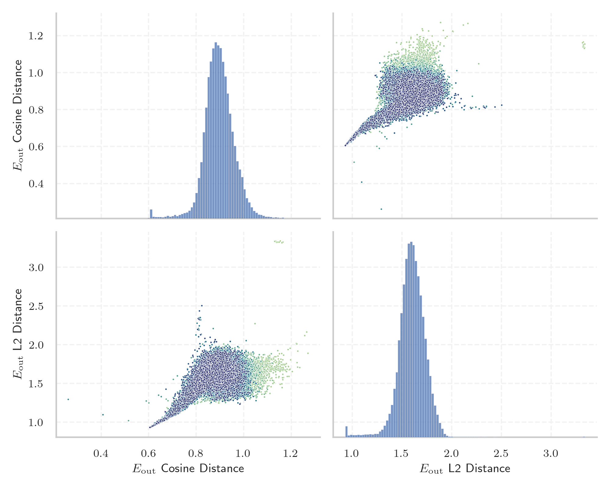
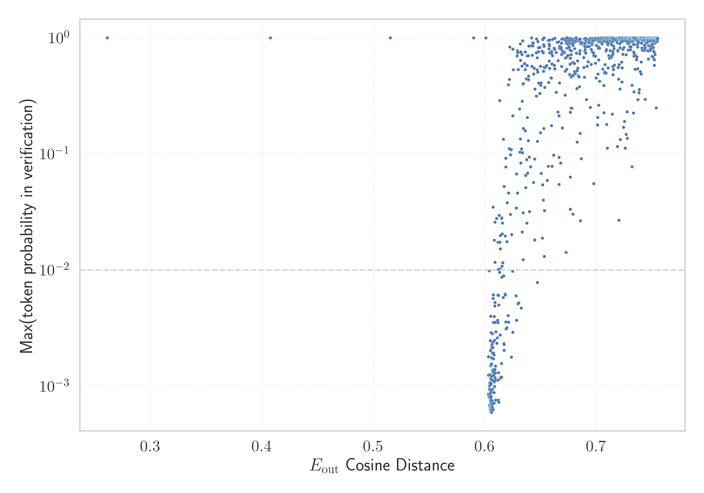

# Report for `ibm-granite/granite-3.0-8b-base`

## Model info

* Model Info: 
  * Tied embeddings: True
  * LM head uses bias: False
  * Embeddings shape: [49152, 4096]
* Tokenizer Info: 
  * Vocab Size: 49152
  * Tokenizer Class: GPT2Tokenizer
  * Tokenizer Type: BPE
  * Bytes handling: Byte Input
  * Token for verification prompt building: InvalidProtocolBufferException
  * Token id for verification prompt building: 31516
* Indicator summary: 
  * Indicator for under-trained tokens: E_{out} Cosine Distance
  * Overall distribution: 0.896 +/- 0.064
* Detected Token Counts: 
  * Number of tested under-trained tokens: 979, 967 non-special, 198 below p = 0.01 threshold, 177 below soft indicator threshold
  * Number of single byte tokens: 242, of which 0 below indicator threshold
  * Number of special tokens: 0, of which 0 below indicator threshold
  * Number of non-single-byte UTF-fragment tokens:  675, of which 8 below soft indicator threshold

## Under-trained token indicators plot


## Verification plot


## Under-trained token verification results
177 entries below threshold of 0.612

|   token_id | token                                      |   indicator | max_prob                                                         | in_other_tokens                                                                                                                                                                                                                                                                                                                                                                                            |
|------------|--------------------------------------------|-------------|------------------------------------------------------------------|------------------------------------------------------------------------------------------------------------------------------------------------------------------------------------------------------------------------------------------------------------------------------------------------------------------------------------------------------------------------------------------------------------|
|      23519 | ````` ecto `````                           |    0.261491 | <span style='border: 1px solid rgb(40, 167, 69);'>1</span>       | ````` DirectoryPath `````, ````` ▁director `````, ````` ▁Selector `````, ````` ▁ColumnVector `````, ````` yecto `````, ...                                                                                                                                                                                                                                                                                 |
|      27012 | ````` ▁subscriptions `````                 |    0.407698 | <span style='border: 1px solid rgb(40, 167, 69);'>1</span>       |                                                                                                                                                                                                                                                                                                                                                                                                            |
|      12740 | ````` ▁▁▁▁▁▁▁▁▁▁▁▁▁▁▁▁▁▁▁▁▁▁▁▁▁▁▁▁▁▁ ````` |    0.515254 | <span style='border: 1px solid rgb(40, 167, 69);'>1</span>       | ````` ▁▁▁▁▁▁▁▁▁▁▁▁▁▁▁▁▁▁▁▁▁▁▁▁▁▁▁▁▁▁▁▁▁▁▁▁▁▁▁▁▁▁▁▁▁▁▁▁▁▁▁▁▁▁▁▁▁▁▁▁▁▁▁▁▁▁▁▁▁▁▁ `````, ````` \n▁▁▁▁▁▁▁▁▁▁▁▁▁▁▁▁▁▁▁▁▁▁▁▁▁▁▁▁▁▁▁▁▁▁▁▁▁▁▁▁▁▁ `````, ````` ▁▁▁▁▁▁▁▁▁▁▁▁▁▁▁▁▁▁▁▁▁▁▁▁▁▁▁▁▁▁▁▁▁▁▁▁▁▁▁▁▁▁▁▁▁▁▁▁▁▁▁▁▁▁▁▁▁▁▁ `````, ````` \n\n▁▁▁▁▁▁▁▁▁▁▁▁▁▁▁▁▁▁▁▁▁▁▁▁▁▁▁▁▁▁▁▁▁▁▁▁▁▁▁▁▁▁▁▁▁▁▁ `````, ````` ▁▁▁▁▁▁▁▁▁▁▁▁▁▁▁▁▁▁▁▁▁▁▁▁▁▁▁▁▁▁▁▁▁▁▁▁▁▁▁▁▁▁▁▁▁▁▁▁▁▁▁▁▁▁▁▁▁▁▁▁▁▁▁▁▁▁▁▁▁▁▁▁▁▁▁▁▁▁▁▁▁▁▁▁▁▁▁▁▁▁▁▁▁▁▁▁ `````, ... |
|      16550 | ````` subscriptions `````                  |    0.58995  | <span style='border: 1px solid rgb(40, 167, 69);'>1</span>       | <span style='border: 1px solid rgb(40, 167, 69);'>````` ▁subscriptions `````</span>                                                                                                                                                                                                                                                                                                                        |
|      10776 | ````` ▁subscription `````                  |    0.600929 | <span style='border: 1px solid rgb(40, 167, 69);'>1</span>       | <span style='border: 1px solid rgb(40, 167, 69);'>````` ▁subscriptions `````</span>                                                                                                                                                                                                                                                                                                                        |
|      15322 | ````` DetalleNotaCreditoPuntoVenta `````   |    0.603233 | <span style='border: 1px solid rgb(169, 68, 66);'>0.00086</span> |                                                                                                                                                                                                                                                                                                                                                                                                            |
|      38134 | ````` strmojo `````                        |    0.603272 | <span style='border: 1px solid rgb(255, 145, 0);'>0.0012</span>  | <span style='border: 1px solid rgb(255, 145, 0);'>````` ▁mstrmojo `````</span>                                                                                                                                                                                                                                                                                                                             |
|      36912 | ````` ExperimentResultSet `````            |    0.603282 | <span style='border: 1px solid rgb(255, 145, 0);'>0.0018</span>  |                                                                                                                                                                                                                                                                                                                                                                                                            |
|      45042 | ````` DocSyntaxParser `````                |    0.603557 | <span style='border: 1px solid rgb(169, 68, 66);'>0.00081</span> |                                                                                                                                                                                                                                                                                                                                                                                                            |
|      34160 | ````` ParamCaption `````                   |    0.603876 | <span style='border: 1px solid rgb(169, 68, 66);'>0.00082</span> | <span style='border: 1px solid rgb(40, 167, 69);'>````` DoxyParamCaption `````</span>                                                                                                                                                                                                                                                                                                                      |
|      27257 | ````` DetalleOrdenCompra `````             |    0.603914 | <span style='border: 1px solid rgb(255, 145, 0);'>0.0099</span>  |                                                                                                                                                                                                                                                                                                                                                                                                            |
|      43325 | ````` MODRST `````                         |    0.603938 | <span style='border: 1px solid rgb(169, 68, 66);'>0.00081</span> |                                                                                                                                                                                                                                                                                                                                                                                                            |
|      44211 | ````` esatterwhite `````                   |    0.603982 | <span style='border: 1px solid rgb(169, 68, 66);'>0.00095</span> |                                                                                                                                                                                                                                                                                                                                                                                                            |
|      26839 | ````` DetalleFacturaProveedor `````        |    0.604144 | <span style='border: 1px solid rgb(169, 68, 66);'>0.00069</span> |                                                                                                                                                                                                                                                                                                                                                                                                            |
|      48678 | ````` StatusPointer `````                  |    0.604282 | <span style='border: 1px solid rgb(255, 145, 0);'>0.001</span>   |                                                                                                                                                                                                                                                                                                                                                                                                            |
|      35495 | ````` TipoProrrateoImpor `````             |    0.604439 | <span style='border: 1px solid rgb(255, 145, 0);'>0.0011</span>  |                                                                                                                                                                                                                                                                                                                                                                                                            |
|      27240 | ````` detallenotacreditopuntoventa `````   |    0.604494 | <span style='border: 1px solid rgb(169, 68, 66);'>0.00081</span> |                                                                                                                                                                                                                                                                                                                                                                                                            |
|      36795 | ````` GribCollection `````                 |    0.604494 | <span style='border: 1px solid rgb(255, 145, 0);'>0.0013</span>  | <span style='border: 1px solid rgb(251, 189, 8);'>````` GribCollectionProto `````</span>                                                                                                                                                                                                                                                                                                                   |
|      43914 | ````` ▁AsyncIClusCfg `````                 |    0.604551 | <span style='border: 1px solid rgb(169, 68, 66);'>0.00066</span> |                                                                                                                                                                                                                                                                                                                                                                                                            |
|      23511 | ````` iPagoOrdenCompra `````               |    0.604728 | <span style='border: 1px solid rgb(169, 68, 66);'>0.00064</span> | <span style='border: 1px solid rgb(169, 68, 66);'>````` AutoriPagoOrdenCompra `````</span>                                                                                                                                                                                                                                                                                                                 |
<details><summary>157 additional entries below threshold</summary>

|   token_id | token                                                                       |   indicator | max_prob                                                         | in_other_tokens                                                                                                                                                                                                                                                                                                                                                                                                                                                                                                                    |
|------------|-----------------------------------------------------------------------------|-------------|------------------------------------------------------------------|------------------------------------------------------------------------------------------------------------------------------------------------------------------------------------------------------------------------------------------------------------------------------------------------------------------------------------------------------------------------------------------------------------------------------------------------------------------------------------------------------------------------------------|
|      48495 | ````` ClusterSimulationProtos `````                                         |    0.604733 | <span style='border: 1px solid rgb(169, 68, 66);'>0.00093</span> |                                                                                                                                                                                                                                                                                                                                                                                                                                                                                                                                    |
|      41532 | ````` classificationSet `````                                               |    0.604865 | <span style='border: 1px solid rgb(169, 68, 66);'>0.00071</span> |                                                                                                                                                                                                                                                                                                                                                                                                                                                                                                                                    |
|      20887 | ````` ▁postCellId `````                                                     |    0.604871 | <span style='border: 1px solid rgb(255, 145, 0);'>0.0025</span>  |                                                                                                                                                                                                                                                                                                                                                                                                                                                                                                                                    |
|      44118 | ````` twngo `````                                                           |    0.604877 | <span style='border: 1px solid rgb(169, 68, 66);'>0.00062</span> |                                                                                                                                                                                                                                                                                                                                                                                                                                                                                                                                    |
|      39012 | ````` callGoStackCheck `````                                                |    0.604967 | <span style='border: 1px solid rgb(169, 68, 66);'>0.00086</span> |                                                                                                                                                                                                                                                                                                                                                                                                                                                                                                                                    |
|      42713 | ````` classShapeBase `````                                                  |    0.605013 | <span style='border: 1px solid rgb(169, 68, 66);'>0.00067</span> |                                                                                                                                                                                                                                                                                                                                                                                                                                                                                                                                    |
|      44752 | ````` cmpqp `````                                                           |    0.605081 | <span style='border: 1px solid rgb(169, 68, 66);'>0.00088</span> |                                                                                                                                                                                                                                                                                                                                                                                                                                                                                                                                    |
|      48766 | ````` ▁shlwapidll `````                                                     |    0.605116 | <span style='border: 1px solid rgb(169, 68, 66);'>0.00075</span> |                                                                                                                                                                                                                                                                                                                                                                                                                                                                                                                                    |
|      20891 | ````` ▁postsynapticPopulation `````                                         |    0.605152 | <span style='border: 1px solid rgb(255, 145, 0);'>0.002</span>   |                                                                                                                                                                                                                                                                                                                                                                                                                                                                                                                                    |
|      27328 | ````` LPADDING `````                                                        |    0.605152 | <span style='border: 1px solid rgb(169, 68, 66);'>0.00061</span> | ````` ▁CELLPADDING `````                                                                                                                                                                                                                                                                                                                                                                                                                                                                                                           |
|      41293 | ````` ffijson `````                                                         |    0.605177 | <span style='border: 1px solid rgb(169, 68, 66);'>0.00076</span> |                                                                                                                                                                                                                                                                                                                                                                                                                                                                                                                                    |
|      23619 | ````` AutoriPagoOrdenCompra `````                                           |    0.605225 | <span style='border: 1px solid rgb(169, 68, 66);'>0.00072</span> |                                                                                                                                                                                                                                                                                                                                                                                                                                                                                                                                    |
|      38400 | ````` ADynArray `````                                                       |    0.605254 | <span style='border: 1px solid rgb(169, 68, 66);'>0.00062</span> |                                                                                                                                                                                                                                                                                                                                                                                                                                                                                                                                    |
|      28041 | ````` PHPSandbox `````                                                      |    0.605263 | <span style='border: 1px solid rgb(255, 145, 0);'>0.0012</span>  |                                                                                                                                                                                                                                                                                                                                                                                                                                                                                                                                    |
|      48424 | ````` SimulationProtos `````                                                |    0.605264 | <span style='border: 1px solid rgb(169, 68, 66);'>0.00065</span> | <span style='border: 1px solid rgb(169, 68, 66);'>````` ClusterSimulationProtos `````</span>                                                                                                                                                                                                                                                                                                                                                                                                                                       |
|      14203 | ````` aCreditoPunto `````                                                   |    0.605285 | <span style='border: 1px solid rgb(169, 68, 66);'>0.00071</span> | <span style='border: 1px solid rgb(169, 68, 66);'>````` NotaCreditoPunto `````</span>, <span style='border: 1px solid rgb(169, 68, 66);'>````` DetalleNotaCreditoPuntoVenta `````</span>, <span style='border: 1px solid rgb(255, 145, 0);'>````` NotaCreditoPuntoVenta `````</span>                                                                                                                                                                                                                                               |
|      44289 | ````` INCEXPRS `````                                                        |    0.605285 | <span style='border: 1px solid rgb(255, 145, 0);'>0.0015</span>  |                                                                                                                                                                                                                                                                                                                                                                                                                                                                                                                                    |
|      46992 | ````` ▁DartLib `````                                                        |    0.60532  | <span style='border: 1px solid rgb(169, 68, 66);'>0.00063</span> |                                                                                                                                                                                                                                                                                                                                                                                                                                                                                                                                    |
|      43853 | ````` umdolorsitamet `````                                                  |    0.605328 | <span style='border: 1px solid rgb(169, 68, 66);'>0.00062</span> | <span style='border: 1px solid rgb(169, 68, 66);'>````` ittrLoremipumdolorsitametconsecteturadipiscingelitIntegervelvel `````</span>, <span style='border: 1px solid rgb(169, 68, 66);'>````` Loremipumdolorsitamet `````</span>, <span style='border: 1px solid rgb(169, 68, 66);'>````` Loremipumdolorsitametconsecteturadipiscingelit `````</span>, <span style='border: 1px solid rgb(169, 68, 66);'>````` LoremipumdolorsitametconsecteturadipiscingelitIntegervelvel `````</span>                                            |
|      44914 | ````` coverflowdemo `````                                                   |    0.605337 | <span style='border: 1px solid rgb(169, 68, 66);'>0.00079</span> |                                                                                                                                                                                                                                                                                                                                                                                                                                                                                                                                    |
|      42125 | ````` bzZBlucMZQg `````                                                     |    0.605338 | <span style='border: 1px solid rgb(169, 68, 66);'>0.00068</span> |                                                                                                                                                                                                                                                                                                                                                                                                                                                                                                                                    |
|      44659 | ````` ÔòÉÔòÉ `````                                                          |    0.605339 | <span style='border: 1px solid rgb(169, 68, 66);'>0.00064</span> |                                                                                                                                                                                                                                                                                                                                                                                                                                                                                                                                    |
|      42124 | ````` cfUOQOae `````                                                        |    0.605342 | <span style='border: 1px solid rgb(169, 68, 66);'>0.00065</span> |                                                                                                                                                                                                                                                                                                                                                                                                                                                                                                                                    |
|      16875 | ````` lcsStatus `````                                                       |    0.605344 | <span style='border: 1px solid rgb(169, 68, 66);'>0.00062</span> | <span style='border: 1px solid rgb(169, 68, 66);'>````` lcsStatusWlan `````</span>                                                                                                                                                                                                                                                                                                                                                                                                                                                 |
|      14638 | ````` NotaCreditoPuntoVenta `````                                           |    0.60536  | <span style='border: 1px solid rgb(255, 145, 0);'>0.004</span>   | <span style='border: 1px solid rgb(169, 68, 66);'>````` DetalleNotaCreditoPuntoVenta `````</span>                                                                                                                                                                                                                                                                                                                                                                                                                                  |
|      11456 | ````` ldytsch `````                                                         |    0.605364 | <span style='border: 1px solid rgb(169, 68, 66);'>0.00062</span> | <span style='border: 1px solid rgb(169, 68, 66);'>````` Baseldytsch `````</span>, <span style='border: 1px solid rgb(255, 145, 0);'>````` ▁Baseldytsch `````</span>                                                                                                                                                                                                                                                                                                                                                                |
|      23144 | ````` Ostschwiz `````                                                       |    0.605367 | <span style='border: 1px solid rgb(169, 68, 66);'>0.00062</span> | <span style='border: 1px solid rgb(169, 68, 66);'>````` Ostschwizertütsch `````</span>                                                                                                                                                                                                                                                                                                                                                                                                                                             |
|      27037 | ````` reUIe `````                                                           |    0.605369 | <span style='border: 1px solid rgb(169, 68, 66);'>0.00062</span> | <span style='border: 1px solid rgb(255, 145, 0);'>````` kSiPTcNreUIeJgWVA `````</span>, <span style='border: 1px solid rgb(169, 68, 66);'>````` reUIeJgWVA `````</span>                                                                                                                                                                                                                                                                                                                                                            |
|      35701 | ````` keyedLiteral `````                                                    |    0.605371 | <span style='border: 1px solid rgb(169, 68, 66);'>0.00061</span> | <span style='border: 1px solid rgb(40, 167, 69);'>````` NoUnkeyedLiteral `````</span>                                                                                                                                                                                                                                                                                                                                                                                                                                              |
|      45018 | ````` vjHPpWa `````                                                         |    0.605371 | <span style='border: 1px solid rgb(169, 68, 66);'>0.00062</span> |                                                                                                                                                                                                                                                                                                                                                                                                                                                                                                                                    |
|      42539 | ````` tableOBJECT `````                                                     |    0.605372 | <span style='border: 1px solid rgb(169, 68, 66);'>0.00062</span> |                                                                                                                                                                                                                                                                                                                                                                                                                                                                                                                                    |
|      42102 | ````` ucMZQg `````                                                          |    0.605373 | <span style='border: 1px solid rgb(169, 68, 66);'>0.00062</span> | <span style='border: 1px solid rgb(169, 68, 66);'>````` bzZBlucMZQg `````</span>                                                                                                                                                                                                                                                                                                                                                                                                                                                   |
|      45021 | ````` hqSLBjKPZFqxj `````                                                   |    0.605373 | <span style='border: 1px solid rgb(169, 68, 66);'>0.00062</span> |                                                                                                                                                                                                                                                                                                                                                                                                                                                                                                                                    |
|      46191 | ````` sqrtFPL `````                                                         |    0.605374 | <span style='border: 1px solid rgb(169, 68, 66);'>0.00062</span> |                                                                                                                                                                                                                                                                                                                                                                                                                                                                                                                                    |
|      27049 | ````` reUIeJgWVA `````                                                      |    0.605374 | <span style='border: 1px solid rgb(169, 68, 66);'>0.00062</span> | <span style='border: 1px solid rgb(255, 145, 0);'>````` kSiPTcNreUIeJgWVA `````</span>                                                                                                                                                                                                                                                                                                                                                                                                                                             |
|      39195 | ````` lcsStatusWlan `````                                                   |    0.605374 | <span style='border: 1px solid rgb(169, 68, 66);'>0.00062</span> |                                                                                                                                                                                                                                                                                                                                                                                                                                                                                                                                    |
|      37277 | ````` trimDRE `````                                                         |    0.605374 | <span style='border: 1px solid rgb(169, 68, 66);'>0.00062</span> |                                                                                                                                                                                                                                                                                                                                                                                                                                                                                                                                    |
|      40455 | ````` ▁只看该 `````                                                         |    0.605374 | <span style='border: 1px solid rgb(169, 68, 66);'>0.00062</span> | <span style='border: 1px solid rgb(40, 167, 69);'>````` ▁只看该作者 `````</span>                                                                                                                                                                                                                                                                                                                                                                                                                                                   |
|      38999 | ````` GoStackCheck `````                                                    |    0.605374 | <span style='border: 1px solid rgb(169, 68, 66);'>0.00062</span> | <span style='border: 1px solid rgb(169, 68, 66);'>````` callGoStackCheck `````</span>                                                                                                                                                                                                                                                                                                                                                                                                                                              |
|      45824 | ````` Integervelvel `````                                                   |    0.605374 | <span style='border: 1px solid rgb(169, 68, 66);'>0.00062</span> | <span style='border: 1px solid rgb(169, 68, 66);'>````` ittrLoremipumdolorsitametconsecteturadipiscingelitIntegervelvel `````</span>, <span style='border: 1px solid rgb(169, 68, 66);'>````` LoremipumdolorsitametconsecteturadipiscingelitIntegervelvel `````</span>                                                                                                                                                                                                                                                             |
|      13414 | ````` ArccosX `````                                                         |    0.605375 | <span style='border: 1px solid rgb(169, 68, 66);'>0.00062</span> | <span style='border: 1px solid rgb(169, 68, 66);'>````` fpArccosXTest `````</span>, <span style='border: 1px solid rgb(169, 68, 66);'>````` fpArccosX `````</span>                                                                                                                                                                                                                                                                                                                                                                 |
|      45015 | ````` fWILIM `````                                                          |    0.605375 | <span style='border: 1px solid rgb(169, 68, 66);'>0.00062</span> | <span style='border: 1px solid rgb(169, 68, 66);'>````` fWILIMmJNUZLIEMNV `````</span>                                                                                                                                                                                                                                                                                                                                                                                                                                             |
|      45013 | ````` mJNUZLI `````                                                         |    0.605375 | <span style='border: 1px solid rgb(169, 68, 66);'>0.00062</span> | <span style='border: 1px solid rgb(169, 68, 66);'>````` mJNUZLIEMNV `````</span>, <span style='border: 1px solid rgb(169, 68, 66);'>````` fWILIMmJNUZLIEMNV `````</span>                                                                                                                                                                                                                                                                                                                                                           |
|      32970 | ````` trimBalanco `````                                                     |    0.605376 | <span style='border: 1px solid rgb(169, 68, 66);'>0.00062</span> |                                                                                                                                                                                                                                                                                                                                                                                                                                                                                                                                    |
|      27047 | ````` JgWVA `````                                                           |    0.605376 | <span style='border: 1px solid rgb(169, 68, 66);'>0.00062</span> | <span style='border: 1px solid rgb(255, 145, 0);'>````` kSiPTcNreUIeJgWVA `````</span>, <span style='border: 1px solid rgb(169, 68, 66);'>````` reUIeJgWVA `````</span>                                                                                                                                                                                                                                                                                                                                                            |
|      45011 | ````` vjHPp `````                                                           |    0.605376 | <span style='border: 1px solid rgb(169, 68, 66);'>0.00062</span> | <span style='border: 1px solid rgb(169, 68, 66);'>````` vjHPpWa `````</span>                                                                                                                                                                                                                                                                                                                                                                                                                                                       |
|      45014 | ````` BjKPZFq `````                                                         |    0.605376 | <span style='border: 1px solid rgb(169, 68, 66);'>0.00062</span> | <span style='border: 1px solid rgb(169, 68, 66);'>````` hqSLBjKPZFq `````</span>, <span style='border: 1px solid rgb(169, 68, 66);'>````` hqSLBjKPZFqxj `````</span>                                                                                                                                                                                                                                                                                                                                                               |
|      43917 | ````` Loremipumdolorsitametconsecteturadipiscingelit `````                  |    0.605376 | <span style='border: 1px solid rgb(169, 68, 66);'>0.00062</span> | <span style='border: 1px solid rgb(169, 68, 66);'>````` ittrLoremipumdolorsitametconsecteturadipiscingelitIntegervelvel `````</span>, <span style='border: 1px solid rgb(169, 68, 66);'>````` LoremipumdolorsitametconsecteturadipiscingelitIntegervelvel `````</span>                                                                                                                                                                                                                                                             |
|      45009 | ````` KPZFq `````                                                           |    0.605376 | <span style='border: 1px solid rgb(169, 68, 66);'>0.00062</span> | <span style='border: 1px solid rgb(169, 68, 66);'>````` BjKPZFq `````</span>, <span style='border: 1px solid rgb(169, 68, 66);'>````` hqSLBjKPZFq `````</span>, <span style='border: 1px solid rgb(169, 68, 66);'>````` hqSLBjKPZFqxj `````</span>                                                                                                                                                                                                                                                                                 |
|      45020 | ````` fWILIMmJNUZLIEMNV `````                                               |    0.605376 | <span style='border: 1px solid rgb(169, 68, 66);'>0.00062</span> |                                                                                                                                                                                                                                                                                                                                                                                                                                                                                                                                    |
|      48323 | ````` ittrLoremipumdolorsitametconsecteturadipiscingelitIntegervelvel ````` |    0.605376 | <span style='border: 1px solid rgb(169, 68, 66);'>0.00062</span> |                                                                                                                                                                                                                                                                                                                                                                                                                                                                                                                                    |
|      46199 | ````` SMKTHB `````                                                          |    0.605376 | <span style='border: 1px solid rgb(169, 68, 66);'>0.00062</span> | <span style='border: 1px solid rgb(169, 68, 66);'>````` SMKTHBISA `````</span>                                                                                                                                                                                                                                                                                                                                                                                                                                                     |
|      48792 | ````` ▁cKVisitor `````                                                      |    0.605377 | <span style='border: 1px solid rgb(169, 68, 66);'>0.00062</span> |                                                                                                                                                                                                                                                                                                                                                                                                                                                                                                                                    |
|      38414 | ````` idiomasvw `````                                                       |    0.605377 | <span style='border: 1px solid rgb(169, 68, 66);'>0.00062</span> |                                                                                                                                                                                                                                                                                                                                                                                                                                                                                                                                    |
|      43902 | ````` Loremipumdolorsitamet `````                                           |    0.605377 | <span style='border: 1px solid rgb(169, 68, 66);'>0.00062</span> | <span style='border: 1px solid rgb(169, 68, 66);'>````` ittrLoremipumdolorsitametconsecteturadipiscingelitIntegervelvel `````</span>, <span style='border: 1px solid rgb(169, 68, 66);'>````` Loremipumdolorsitametconsecteturadipiscingelit `````</span>, <span style='border: 1px solid rgb(169, 68, 66);'>````` LoremipumdolorsitametconsecteturadipiscingelitIntegervelvel `````</span>                                                                                                                                        |
|      13440 | ````` fpArccosXTest `````                                                   |    0.605377 | <span style='border: 1px solid rgb(169, 68, 66);'>0.00062</span> |                                                                                                                                                                                                                                                                                                                                                                                                                                                                                                                                    |
|      13579 | ````` openlocfile `````                                                     |    0.605377 | <span style='border: 1px solid rgb(169, 68, 66);'>0.00062</span> | <span style='border: 1px solid rgb(40, 167, 69);'>````` openlocfilehash `````</span>                                                                                                                                                                                                                                                                                                                                                                                                                                               |
|      42293 | ````` INCEXPR `````                                                         |    0.605377 | <span style='border: 1px solid rgb(169, 68, 66);'>0.00062</span> | <span style='border: 1px solid rgb(255, 145, 0);'>````` INCEXPRS `````</span>                                                                                                                                                                                                                                                                                                                                                                                                                                                      |
|      34451 | ````` arcsinL `````                                                         |    0.605378 | <span style='border: 1px solid rgb(169, 68, 66);'>0.00062</span> |                                                                                                                                                                                                                                                                                                                                                                                                                                                                                                                                    |
|      42060 | ````` ▁DexReferenceItem `````                                               |    0.605378 | <span style='border: 1px solid rgb(169, 68, 66);'>0.00062</span> |                                                                                                                                                                                                                                                                                                                                                                                                                                                                                                                                    |
|      21267 | ````` ▁codigoAssunto `````                                                  |    0.605378 | <span style='border: 1px solid rgb(169, 68, 66);'>0.00062</span> | <span style='border: 1px solid rgb(169, 68, 66);'>````` ▁codigoAssuntoPai `````</span>                                                                                                                                                                                                                                                                                                                                                                                                                                             |
|      23145 | ````` Ostschwizertütsch `````                                               |    0.605378 | <span style='border: 1px solid rgb(169, 68, 66);'>0.00062</span> |                                                                                                                                                                                                                                                                                                                                                                                                                                                                                                                                    |
|      27048 | ````` kSiPTcN `````                                                         |    0.605378 | <span style='border: 1px solid rgb(169, 68, 66);'>0.00062</span> | <span style='border: 1px solid rgb(255, 145, 0);'>````` kSiPTcNreUIeJgWVA `````</span>                                                                                                                                                                                                                                                                                                                                                                                                                                             |
|      45017 | ````` hqSLBjKPZFq `````                                                     |    0.605378 | <span style='border: 1px solid rgb(169, 68, 66);'>0.00062</span> | <span style='border: 1px solid rgb(169, 68, 66);'>````` hqSLBjKPZFqxj `````</span>                                                                                                                                                                                                                                                                                                                                                                                                                                                 |
|      21268 | ````` ▁codigoAssuntoPai `````                                               |    0.605378 | <span style='border: 1px solid rgb(169, 68, 66);'>0.00062</span> |                                                                                                                                                                                                                                                                                                                                                                                                                                                                                                                                    |
|      13439 | ````` fpArccosX `````                                                       |    0.605379 | <span style='border: 1px solid rgb(169, 68, 66);'>0.00062</span> | <span style='border: 1px solid rgb(169, 68, 66);'>````` fpArccosXTest `````</span>                                                                                                                                                                                                                                                                                                                                                                                                                                                 |
|      45019 | ````` mJNUZLIEMNV `````                                                     |    0.605379 | <span style='border: 1px solid rgb(169, 68, 66);'>0.00062</span> | <span style='border: 1px solid rgb(169, 68, 66);'>````` fWILIMmJNUZLIEMNV `````</span>                                                                                                                                                                                                                                                                                                                                                                                                                                             |
|      42344 | ````` GQGantt `````                                                         |    0.605379 | <span style='border: 1px solid rgb(169, 68, 66);'>0.00062</span> |                                                                                                                                                                                                                                                                                                                                                                                                                                                                                                                                    |
|      13434 | ````` ritüütsch `````                                                       |    0.605379 | <span style='border: 1px solid rgb(169, 68, 66);'>0.00062</span> | <span style='border: 1px solid rgb(255, 145, 0);'>````` Züritüütsch `````</span>, <span style='border: 1px solid rgb(169, 68, 66);'>````` üritüütsch `````</span>, <span style='border: 1px solid rgb(255, 145, 0);'>````` ▁Züritüütsch `````</span>                                                                                                                                                                                                                                                                               |
|      42117 | ````` bzZBl `````                                                           |    0.60538  | <span style='border: 1px solid rgb(169, 68, 66);'>0.00062</span> | <span style='border: 1px solid rgb(169, 68, 66);'>````` bzZBlucMZQg `````</span>                                                                                                                                                                                                                                                                                                                                                                                                                                                   |
|      47061 | ````` DocFxV `````                                                          |    0.60538  | <span style='border: 1px solid rgb(169, 68, 66);'>0.00062</span> |                                                                                                                                                                                                                                                                                                                                                                                                                                                                                                                                    |
|      45861 | ````` LoremipumdolorsitametconsecteturadipiscingelitIntegervelvel `````     |    0.60538  | <span style='border: 1px solid rgb(169, 68, 66);'>0.00062</span> | <span style='border: 1px solid rgb(169, 68, 66);'>````` ittrLoremipumdolorsitametconsecteturadipiscingelitIntegervelvel `````</span>                                                                                                                                                                                                                                                                                                                                                                                               |
|      42461 | ````` zuotzuot `````                                                        |    0.60538  | <span style='border: 1px solid rgb(169, 68, 66);'>0.00062</span> |                                                                                                                                                                                                                                                                                                                                                                                                                                                                                                                                    |
|      25771 | ````` ReferenciaPersonal `````                                              |    0.605394 | <span style='border: 1px solid rgb(255, 145, 0);'>0.0029</span>  |                                                                                                                                                                                                                                                                                                                                                                                                                                                                                                                                    |
|      35430 | ````` getExecSqlList `````                                                  |    0.605408 | <span style='border: 1px solid rgb(169, 68, 66);'>0.00062</span> |                                                                                                                                                                                                                                                                                                                                                                                                                                                                                                                                    |
|      47306 | ````` ▁PHYBOEH `````                                                        |    0.605485 | <span style='border: 1px solid rgb(169, 68, 66);'>0.00065</span> |                                                                                                                                                                                                                                                                                                                                                                                                                                                                                                                                    |
|      45002 | ````` NUZLI `````                                                           |    0.605491 | <span style='border: 1px solid rgb(169, 68, 66);'>0.00066</span> | <span style='border: 1px solid rgb(169, 68, 66);'>````` mJNUZLIEMNV `````</span>, <span style='border: 1px solid rgb(169, 68, 66);'>````` fWILIMmJNUZLIEMNV `````</span>, <span style='border: 1px solid rgb(169, 68, 66);'>````` mJNUZLI `````</span>                                                                                                                                                                                                                                                                             |
|      34250 | ````` kFontPackage `````                                                    |    0.605511 | <span style='border: 1px solid rgb(169, 68, 66);'>0.00063</span> |                                                                                                                                                                                                                                                                                                                                                                                                                                                                                                                                    |
|      25423 | ````` detallenotacreditopunto `````                                         |    0.605515 | <span style='border: 1px solid rgb(169, 68, 66);'>0.00065</span> | <span style='border: 1px solid rgb(169, 68, 66);'>````` detallenotacreditopuntoventa `````</span>                                                                                                                                                                                                                                                                                                                                                                                                                                  |
|      19917 | ````` lcsSetup `````                                                        |    0.605523 | <span style='border: 1px solid rgb(169, 68, 66);'>0.00062</span> |                                                                                                                                                                                                                                                                                                                                                                                                                                                                                                                                    |
|      35999 | ````` LCJwYWNrYWdl `````                                                    |    0.605583 | <span style='border: 1px solid rgb(169, 68, 66);'>0.00061</span> |                                                                                                                                                                                                                                                                                                                                                                                                                                                                                                                                    |
|      14219 | ````` NotaCreditoPunto `````                                                |    0.605587 | <span style='border: 1px solid rgb(169, 68, 66);'>0.00074</span> | <span style='border: 1px solid rgb(169, 68, 66);'>````` DetalleNotaCreditoPuntoVenta `````</span>, <span style='border: 1px solid rgb(255, 145, 0);'>````` NotaCreditoPuntoVenta `````</span>                                                                                                                                                                                                                                                                                                                                      |
|      24052 | ````` allenotacreditopunto `````                                            |    0.605595 | <span style='border: 1px solid rgb(169, 68, 66);'>0.00066</span> | <span style='border: 1px solid rgb(169, 68, 66);'>````` detallenotacreditopuntoventa `````</span>, <span style='border: 1px solid rgb(169, 68, 66);'>````` detallenotacreditopunto `````</span>                                                                                                                                                                                                                                                                                                                                    |
|      24028 | ````` otacreditopunto `````                                                 |    0.605604 | <span style='border: 1px solid rgb(169, 68, 66);'>0.00061</span> | <span style='border: 1px solid rgb(169, 68, 66);'>````` allenotacreditopunto `````</span>, <span style='border: 1px solid rgb(169, 68, 66);'>````` detallenotacreditopuntoventa `````</span>, <span style='border: 1px solid rgb(169, 68, 66);'>````` detallenotacreditopunto `````</span>                                                                                                                                                                                                                                         |
|      35241 | ````` ProrrateoImpor `````                                                  |    0.605635 | <span style='border: 1px solid rgb(169, 68, 66);'>0.0007</span>  | <span style='border: 1px solid rgb(255, 145, 0);'>````` TipoProrrateoImpor `````</span>                                                                                                                                                                                                                                                                                                                                                                                                                                            |
|      46200 | ````` SMKTHBISA `````                                                       |    0.605655 | <span style='border: 1px solid rgb(169, 68, 66);'>0.0009</span>  |                                                                                                                                                                                                                                                                                                                                                                                                                                                                                                                                    |
|      37536 | ````` IClus `````                                                           |    0.605707 | <span style='border: 1px solid rgb(169, 68, 66);'>0.00066</span> | <span style='border: 1px solid rgb(169, 68, 66);'>````` ▁AsyncIClusCfg `````</span>, <span style='border: 1px solid rgb(255, 145, 0);'>````` ▁IClusCfg `````</span>, <span style='border: 1px solid rgb(255, 145, 0);'>````` IClusCfg `````</span>                                                                                                                                                                                                                                                                                 |
|      22361 | ````` ",[$] `````                                                           |    0.605736 | <span style='border: 1px solid rgb(169, 68, 66);'>0.00068</span> |                                                                                                                                                                                                                                                                                                                                                                                                                                                                                                                                    |
|      44130 | ````` PoliticaProducto `````                                                |    0.605747 | <span style='border: 1px solid rgb(169, 68, 66);'>0.00081</span> |                                                                                                                                                                                                                                                                                                                                                                                                                                                                                                                                    |
|      21396 | ````` ▁clEOA `````                                                          |    0.605794 | <span style='border: 1px solid rgb(255, 145, 0);'>0.0011</span>  |                                                                                                                                                                                                                                                                                                                                                                                                                                                                                                                                    |
|      39172 | ````` sykesdev `````                                                        |    0.605819 | <span style='border: 1px solid rgb(255, 145, 0);'>0.0018</span>  |                                                                                                                                                                                                                                                                                                                                                                                                                                                                                                                                    |
|      36911 | ````` ExperimentEnv `````                                                   |    0.60586  | <span style='border: 1px solid rgb(255, 145, 0);'>0.0016</span>  |                                                                                                                                                                                                                                                                                                                                                                                                                                                                                                                                    |
|      39173 | ````` sheridango `````                                                      |    0.605909 | <span style='border: 1px solid rgb(255, 145, 0);'>0.0022</span>  |                                                                                                                                                                                                                                                                                                                                                                                                                                                                                                                                    |
|      27996 | ````` SERIALE `````                                                         |    0.605918 | <span style='border: 1px solid rgb(169, 68, 66);'>0.00069</span> |                                                                                                                                                                                                                                                                                                                                                                                                                                                                                                                                    |
|      44977 | ````` ▁[💾]( `````                                                          |    0.605966 | <span style='border: 1px solid rgb(169, 68, 66);'>0.0006</span>  |                                                                                                                                                                                                                                                                                                                                                                                                                                                                                                                                    |
|      29249 | ````` Drealtime `````                                                       |    0.606    | <span style='border: 1px solid rgb(169, 68, 66);'>0.00062</span> | <span style='border: 1px solid rgb(251, 189, 8);'>````` Drealtimehot `````</span>                                                                                                                                                                                                                                                                                                                                                                                                                                                  |
|      24141 | ````` DoxyCompact `````                                                     |    0.60618  | <span style='border: 1px solid rgb(169, 68, 66);'>0.00072</span> | <span style='border: 1px solid rgb(40, 167, 69);'>````` DoxyCompactList `````</span>, <span style='border: 1px solid rgb(40, 167, 69);'>````` DoxyCompactItemize `````</span>                                                                                                                                                                                                                                                                                                                                                      |
|      34590 | ````` ＯＯＯＯ `````                                                        |    0.606185 | <span style='border: 1px solid rgb(255, 145, 0);'>0.0011</span>  |                                                                                                                                                                                                                                                                                                                                                                                                                                                                                                                                    |
|      20381 | ````` ▁clSetq `````                                                         |    0.606195 | <span style='border: 1px solid rgb(255, 145, 0);'>0.0012</span>  |                                                                                                                                                                                                                                                                                                                                                                                                                                                                                                                                    |
|      42062 | ````` MZQg `````                                                            |    0.606227 | <span style='border: 1px solid rgb(169, 68, 66);'>0.00069</span> | <span style='border: 1px solid rgb(169, 68, 66);'>````` bzZBlucMZQg `````</span>, <span style='border: 1px solid rgb(169, 68, 66);'>````` ucMZQg `````</span>                                                                                                                                                                                                                                                                                                                                                                      |
|      10458 | ````` ärndütsch `````                                                       |    0.606307 | <span style='border: 1px solid rgb(169, 68, 66);'>0.00067</span> | <span style='border: 1px solid rgb(255, 145, 0);'>````` Bärndütsch `````</span>, <span style='border: 1px solid rgb(255, 145, 0);'>````` ▁Bärndütsch `````</span>                                                                                                                                                                                                                                                                                                                                                                  |
|      32053 | ````` ▁ZrLogUtil `````                                                      |    0.606356 | <span style='border: 1px solid rgb(169, 68, 66);'>0.00073</span> |                                                                                                                                                                                                                                                                                                                                                                                                                                                                                                                                    |
|      13810 | ````` Baseldytsch `````                                                     |    0.606377 | <span style='border: 1px solid rgb(169, 68, 66);'>0.00075</span> | <span style='border: 1px solid rgb(255, 145, 0);'>````` ▁Baseldytsch `````</span>                                                                                                                                                                                                                                                                                                                                                                                                                                                  |
|      29500 | ````` >@[+ `````                                                            |    0.606399 | <span style='border: 1px solid rgb(169, 68, 66);'>0.00069</span> | <span style='border: 1px solid rgb(40, 167, 69);'>````` >@[+][< `````</span>                                                                                                                                                                                                                                                                                                                                                                                                                                                       |
|      28983 | ````` zHjZQW `````                                                          |    0.606419 | <span style='border: 1px solid rgb(255, 145, 0);'>0.0023</span>  |                                                                                                                                                                                                                                                                                                                                                                                                                                                                                                                                    |
|      28982 | ````` hglBI `````                                                           |    0.606548 | <span style='border: 1px solid rgb(255, 145, 0);'>0.0021</span>  |                                                                                                                                                                                                                                                                                                                                                                                                                                                                                                                                    |
|      13418 | ````` ▁learnedat `````                                                      |    0.606602 | <span style='border: 1px solid rgb(169, 68, 66);'>0.00072</span> |                                                                                                                                                                                                                                                                                                                                                                                                                                                                                                                                    |
|      29421 | ````` rLogUtil `````                                                        |    0.606649 | <span style='border: 1px solid rgb(169, 68, 66);'>0.0007</span>  | <span style='border: 1px solid rgb(169, 68, 66);'>````` ▁ZrLogUtil `````</span>                                                                                                                                                                                                                                                                                                                                                                                                                                                    |
|      20890 | ````` ▁presynapticPopulation `````                                          |    0.606714 | <span style='border: 1px solid rgb(255, 145, 0);'>0.0019</span>  |                                                                                                                                                                                                                                                                                                                                                                                                                                                                                                                                    |
|      20885 | ````` ▁preCellId `````                                                      |    0.606719 | <span style='border: 1px solid rgb(255, 145, 0);'>0.0028</span>  |                                                                                                                                                                                                                                                                                                                                                                                                                                                                                                                                    |
|      45620 | ````` ▁outputStatusMessage `````                                            |    0.606786 | <span style='border: 1px solid rgb(169, 68, 66);'>0.00066</span> |                                                                                                                                                                                                                                                                                                                                                                                                                                                                                                                                    |
|      43731 | ````` orsitamet `````                                                       |    0.606813 | <span style='border: 1px solid rgb(169, 68, 66);'>0.00094</span> | <span style='border: 1px solid rgb(169, 68, 66);'>````` ittrLoremipumdolorsitametconsecteturadipiscingelitIntegervelvel `````</span>, <span style='border: 1px solid rgb(169, 68, 66);'>````` umdolorsitamet `````</span>, <span style='border: 1px solid rgb(169, 68, 66);'>````` Loremipumdolorsitamet `````</span>, <span style='border: 1px solid rgb(169, 68, 66);'>````` Loremipumdolorsitametconsecteturadipiscingelit `````</span>, <span style='border: 1px solid rgb(40, 167, 69);'>````` dolorsitamet `````</span>, ... |
|      43840 | ````` adipiscingelit `````                                                  |    0.606957 | <span style='border: 1px solid rgb(255, 145, 0);'>0.0014</span>  | <span style='border: 1px solid rgb(169, 68, 66);'>````` ittrLoremipumdolorsitametconsecteturadipiscingelitIntegervelvel `````</span>, <span style='border: 1px solid rgb(251, 189, 8);'>````` consecteturadipiscingelit `````</span>, <span style='border: 1px solid rgb(169, 68, 66);'>````` Loremipumdolorsitametconsecteturadipiscingelit `````</span>, <span style='border: 1px solid rgb(169, 68, 66);'>````` LoremipumdolorsitametconsecteturadipiscingelitIntegervelvel `````</span>                                        |
|      23245 | ````` acreditopunto `````                                                   |    0.607055 | <span style='border: 1px solid rgb(255, 145, 0);'>0.0011</span>  | <span style='border: 1px solid rgb(169, 68, 66);'>````` allenotacreditopunto `````</span>, <span style='border: 1px solid rgb(169, 68, 66);'>````` detallenotacreditopuntoventa `````</span>, <span style='border: 1px solid rgb(169, 68, 66);'>````` otacreditopunto `````</span>, <span style='border: 1px solid rgb(169, 68, 66);'>````` detallenotacreditopunto `````</span>                                                                                                                                                   |
|       6796 | ````` NdEx `````                                                            |    0.607116 | <span style='border: 1px solid rgb(255, 145, 0);'>0.0022</span>  | <span style='border: 1px solid rgb(40, 167, 69);'>````` ▁iNdEx `````</span>, ````` iNdEx `````                                                                                                                                                                                                                                                                                                                                                                                                                                     |
|      32484 | ````` 🔅🔅 `````                                                            |    0.607246 | <span style='border: 1px solid rgb(255, 145, 0);'>0.0024</span>  |                                                                                                                                                                                                                                                                                                                                                                                                                                                                                                                                    |
|      26406 | ````` FacturaProveedor `````                                                |    0.607298 | <span style='border: 1px solid rgb(251, 189, 8);'>0.035</span>   | <span style='border: 1px solid rgb(169, 68, 66);'>````` DetalleFacturaProveedor `````</span>                                                                                                                                                                                                                                                                                                                                                                                                                                       |
|      13435 | ````` üritüütsch `````                                                      |    0.607417 | <span style='border: 1px solid rgb(169, 68, 66);'>0.00063</span> | <span style='border: 1px solid rgb(255, 145, 0);'>````` Züritüütsch `````</span>, <span style='border: 1px solid rgb(255, 145, 0);'>````` ▁Züritüütsch `````</span>                                                                                                                                                                                                                                                                                                                                                                |
|      44349 | ````` Mmcsd `````                                                           |    0.607428 | <span style='border: 1px solid rgb(255, 145, 0);'>0.0057</span>  |                                                                                                                                                                                                                                                                                                                                                                                                                                                                                                                                    |
|      35211 | ````` Prorrateo `````                                                       |    0.607467 | <span style='border: 1px solid rgb(255, 145, 0);'>0.0013</span>  | <span style='border: 1px solid rgb(169, 68, 66);'>````` ProrrateoImpor `````</span>, <span style='border: 1px solid rgb(255, 145, 0);'>````` TipoProrrateoImpor `````</span>                                                                                                                                                                                                                                                                                                                                                       |
|      28981 | ````` GOJT `````                                                            |    0.607518 | <span style='border: 1px solid rgb(255, 145, 0);'>0.0036</span>  |                                                                                                                                                                                                                                                                                                                                                                                                                                                                                                                                    |
|      22430 | ````` Newobject `````                                                       |    0.607549 | <span style='border: 1px solid rgb(255, 145, 0);'>0.0019</span>  |                                                                                                                                                                                                                                                                                                                                                                                                                                                                                                                                    |
|      43671 | ````` icaProducto `````                                                     |    0.607594 | <span style='border: 1px solid rgb(255, 145, 0);'>0.0017</span>  | <span style='border: 1px solid rgb(169, 68, 66);'>````` PoliticaProducto `````</span>                                                                                                                                                                                                                                                                                                                                                                                                                                              |
|      14696 | ````` ▁GLConstant `````                                                     |    0.607623 | <span style='border: 1px solid rgb(255, 145, 0);'>0.0061</span>  |                                                                                                                                                                                                                                                                                                                                                                                                                                                                                                                                    |
|      35885 | ````` SchedulingSimulation `````                                            |    0.607775 | <span style='border: 1px solid rgb(255, 145, 0);'>0.0014</span>  |                                                                                                                                                                                                                                                                                                                                                                                                                                                                                                                                    |
|      37189 | ````` ▁LNControlPoint `````                                                 |    0.607821 | <span style='border: 1px solid rgb(255, 145, 0);'>0.0012</span>  |                                                                                                                                                                                                                                                                                                                                                                                                                                                                                                                                    |
|      47505 | ````` ▁mstrmojo `````                                                       |    0.608032 | <span style='border: 1px solid rgb(255, 145, 0);'>0.0013</span>  |                                                                                                                                                                                                                                                                                                                                                                                                                                                                                                                                    |
|      48601 | ````` strHomeaddressLive `````                                              |    0.608127 | <span style='border: 1px solid rgb(255, 145, 0);'>0.0019</span>  |                                                                                                                                                                                                                                                                                                                                                                                                                                                                                                                                    |
|      21508 | ````` memItem `````                                                         |    0.608173 | <span style='border: 1px solid rgb(169, 68, 66);'>0.00088</span> | ````` memItemLeft `````, ````` memItemRight `````                                                                                                                                                                                                                                                                                                                                                                                                                                                                                  |
|      27043 | ````` PTcN `````                                                            |    0.608238 | <span style='border: 1px solid rgb(169, 68, 66);'>0.00072</span> | <span style='border: 1px solid rgb(169, 68, 66);'>````` kSiPTcN `````</span>, <span style='border: 1px solid rgb(255, 145, 0);'>````` kSiPTcNreUIeJgWVA `````</span>                                                                                                                                                                                                                                                                                                                                                               |
|      19288 | ````` Homeaddress `````                                                     |    0.608346 | <span style='border: 1px solid rgb(255, 145, 0);'>0.004</span>   | <span style='border: 1px solid rgb(255, 145, 0);'>````` strHomeaddressLive `````</span>, <span style='border: 1px solid rgb(255, 145, 0);'>````` strHomeaddress `````</span>                                                                                                                                                                                                                                                                                                                                                       |
|      39429 | ````` ▁CNWVirtualMachineCommands `````                                      |    0.608376 | <span style='border: 1px solid rgb(251, 189, 8);'>0.018</span>   |                                                                                                                                                                                                                                                                                                                                                                                                                                                                                                                                    |
|      39025 | ````` matthamlin `````                                                      |    0.608512 | <span style='border: 1px solid rgb(255, 145, 0);'>0.0011</span>  |                                                                                                                                                                                                                                                                                                                                                                                                                                                                                                                                    |
|      44915 | ````` moondroid `````                                                       |    0.60861  | <span style='border: 1px solid rgb(169, 68, 66);'>0.001</span>   |                                                                                                                                                                                                                                                                                                                                                                                                                                                                                                                                    |
|      21662 | ````` strHomeaddress `````                                                  |    0.608677 | <span style='border: 1px solid rgb(255, 145, 0);'>0.0025</span>  | <span style='border: 1px solid rgb(255, 145, 0);'>````` strHomeaddressLive `````</span>                                                                                                                                                                                                                                                                                                                                                                                                                                            |
|      11433 | ````` 微博热度 `````                                                        |    0.608758 | <span style='border: 1px solid rgb(255, 145, 0);'>0.0049</span>  |                                                                                                                                                                                                                                                                                                                                                                                                                                                                                                                                    |
|      37762 | ````` ▁BibleDownload `````                                                  |    0.609091 | <span style='border: 1px solid rgb(255, 145, 0);'>0.0036</span>  |                                                                                                                                                                                                                                                                                                                                                                                                                                                                                                                                    |
|      37763 | ````` GribCollectionProto `````                                             |    0.609112 | <span style='border: 1px solid rgb(251, 189, 8);'>0.012</span>   |                                                                                                                                                                                                                                                                                                                                                                                                                                                                                                                                    |
|      41702 | ````` softposit `````                                                       |    0.609123 | <span style='border: 1px solid rgb(255, 145, 0);'>0.0014</span>  |                                                                                                                                                                                                                                                                                                                                                                                                                                                                                                                                    |
|      30235 | ````` ▁PYGLOW `````                                                         |    0.609136 | <span style='border: 1px solid rgb(255, 145, 0);'>0.0053</span>  |                                                                                                                                                                                                                                                                                                                                                                                                                                                                                                                                    |
|      41106 | ````` mangledNameHash `````                                                 |    0.609144 | <span style='border: 1px solid rgb(251, 189, 8);'>0.026</span>   |                                                                                                                                                                                                                                                                                                                                                                                                                                                                                                                                    |
|      27121 | ````` RopeObj `````                                                         |    0.609161 | <span style='border: 1px solid rgb(255, 145, 0);'>0.0012</span>  |                                                                                                                                                                                                                                                                                                                                                                                                                                                                                                                                    |
|      44959 | ````` ▁[💾 `````                                                            |    0.609311 | <span style='border: 1px solid rgb(255, 145, 0);'>0.0013</span>  | <span style='border: 1px solid rgb(169, 68, 66);'>````` ▁[💾]( `````</span>                                                                                                                                                                                                                                                                                                                                                                                                                                                        |
|      17263 | ````` allEmoji `````                                                        |    0.60956  | <span style='border: 1px solid rgb(255, 145, 0);'>0.0015</span>  |                                                                                                                                                                                                                                                                                                                                                                                                                                                                                                                                    |
|      42107 | ````` cfUO `````                                                            |    0.609614 | <span style='border: 1px solid rgb(169, 68, 66);'>0.00076</span> | <span style='border: 1px solid rgb(169, 68, 66);'>````` cfUOQOae `````</span>                                                                                                                                                                                                                                                                                                                                                                                                                                                      |
|      29109 | ````` ";\'} `````                                                           |    0.609764 | <span style='border: 1px solid rgb(255, 145, 0);'>0.0011</span>  |                                                                                                                                                                                                                                                                                                                                                                                                                                                                                                                                    |
|      13607 | ````` apticPopulation `````                                                 |    0.609969 | <span style='border: 1px solid rgb(255, 145, 0);'>0.0029</span>  | <span style='border: 1px solid rgb(255, 145, 0);'>````` ▁presynapticPopulation `````</span>, <span style='border: 1px solid rgb(255, 145, 0);'>````` ▁postsynapticPopulation `````</span>                                                                                                                                                                                                                                                                                                                                          |
|      28669 | ````` shortsands `````                                                      |    0.610545 | <span style='border: 1px solid rgb(251, 189, 8);'>0.028</span>   |                                                                                                                                                                                                                                                                                                                                                                                                                                                                                                                                    |
|      44316 | ````` icGFja `````                                                          |    0.610726 | <span style='border: 1px solid rgb(255, 145, 0);'>0.0023</span>  |                                                                                                                                                                                                                                                                                                                                                                                                                                                                                                                                    |
|      20486 | ````` dpiMode `````                                                         |    0.611237 | <span style='border: 1px solid rgb(255, 145, 0);'>0.0026</span>  | <span style='border: 1px solid rgb(40, 167, 69);'>````` hdpiMode `````</span>, <span style='border: 1px solid rgb(40, 167, 69);'>````` ▁hdpiMode `````</span>, <span style='border: 1px solid rgb(251, 189, 8);'>````` setHdpiMode `````</span>, <span style='border: 1px solid rgb(40, 167, 69);'>````` HdpiMode `````</span>                                                                                                                                                                                                     |
|      37545 | ````` IClusCfg `````                                                        |    0.611348 | <span style='border: 1px solid rgb(255, 145, 0);'>0.0037</span>  | <span style='border: 1px solid rgb(169, 68, 66);'>````` ▁AsyncIClusCfg `````</span>, <span style='border: 1px solid rgb(255, 145, 0);'>````` ▁IClusCfg `````</span>                                                                                                                                                                                                                                                                                                                                                                |
|      40489 | ````` BulkMutateJobService `````                                            |    0.611625 | <span style='border: 1px solid rgb(255, 145, 0);'>0.0061</span>  |                                                                                                                                                                                                                                                                                                                                                                                                                                                                                                                                    |
|      35981 | ````` PERATURAN `````                                                       |    0.611695 | <span style='border: 1px solid rgb(255, 145, 0);'>0.0011</span>  |                                                                                                                                                                                                                                                                                                                                                                                                                                                                                                                                    |
|      34406 | ````` playerDataArray `````                                                 |    0.611804 | <span style='border: 1px solid rgb(255, 145, 0);'>0.0035</span>  |                                                                                                                                                                                                                                                                                                                                                                                                                                                                                                                                    |
|      12730 | ````` Bärndütsch `````                                                      |    0.611852 | <span style='border: 1px solid rgb(255, 145, 0);'>0.0011</span>  | <span style='border: 1px solid rgb(255, 145, 0);'>````` ▁Bärndütsch `````</span>                                                                                                                                                                                                                                                                                                                                                                                                                                                   |
|      46269 | ````` BTESH `````                                                           |    0.611885 | <span style='border: 1px solid rgb(251, 189, 8);'>0.017</span>   |                                                                                                                                                                                                                                                                                                                                                                                                                                                                                                                                    |
|      44948 | ````` hqSL `````                                                            |    0.611957 | <span style='border: 1px solid rgb(169, 68, 66);'>0.00076</span> | <span style='border: 1px solid rgb(169, 68, 66);'>````` hqSLBjKPZFq `````</span>, <span style='border: 1px solid rgb(169, 68, 66);'>````` hqSLBjKPZFqxj `````</span>                                                                                                                                                                                                                                                                                                                                                               |
</details>
<details><summary>790 additional entries above threshold</summary>

|   token_id | token                                                                                     |   indicator | max_prob                                                         | in_other_tokens                                                                                                                                                                                                                                                                                                                                                                                                                                                                                                                                                                  |
|------------|-------------------------------------------------------------------------------------------|-------------|------------------------------------------------------------------|----------------------------------------------------------------------------------------------------------------------------------------------------------------------------------------------------------------------------------------------------------------------------------------------------------------------------------------------------------------------------------------------------------------------------------------------------------------------------------------------------------------------------------------------------------------------------------|
|      39333 | ````` BulkMutate `````                                                                    |    0.612112 | <span style='border: 1px solid rgb(251, 189, 8);'>0.01</span>    | <span style='border: 1px solid rgb(255, 145, 0);'>````` BulkMutateJobService `````</span>                                                                                                                                                                                                                                                                                                                                                                                                                                                                                        |
|      27050 | ````` kSiPTcNreUIeJgWVA `````                                                             |    0.612171 | <span style='border: 1px solid rgb(255, 145, 0);'>0.0061</span>  |                                                                                                                                                                                                                                                                                                                                                                                                                                                                                                                                                                                  |
|      36487 | ````` ▁FOLDEF `````                                                                       |    0.61224  | <span style='border: 1px solid rgb(255, 145, 0);'>0.0013</span>  |                                                                                                                                                                                                                                                                                                                                                                                                                                                                                                                                                                                  |
|      45380 | ````` DieArray `````                                                                      |    0.612361 | <span style='border: 1px solid rgb(255, 145, 0);'>0.005</span>   |                                                                                                                                                                                                                                                                                                                                                                                                                                                                                                                                                                                  |
|      27592 | ````` ׃", `````                                                                           |    0.612361 | <span style='border: 1px solid rgb(169, 68, 66);'>0.00073</span> |                                                                                                                                                                                                                                                                                                                                                                                                                                                                                                                                                                                  |
|       9829 | ````` avsop `````                                                                         |    0.612946 | <span style='border: 1px solid rgb(251, 189, 8);'>0.03</span>    | <span style='border: 1px solid rgb(40, 167, 69);'>````` ▁aavsop `````</span>                                                                                                                                                                                                                                                                                                                                                                                                                                                                                                     |
|      23391 | ````` iPago `````                                                                         |    0.613247 | <span style='border: 1px solid rgb(40, 167, 69);'>0.29</span>    | <span style='border: 1px solid rgb(169, 68, 66);'>````` AutoriPagoOrdenCompra `````</span>, <span style='border: 1px solid rgb(169, 68, 66);'>````` iPagoOrdenCompra `````</span>                                                                                                                                                                                                                                                                                                                                                                                                |
|      46935 | ````` ▁pBNS `````                                                                         |    0.613373 | <span style='border: 1px solid rgb(255, 145, 0);'>0.0096</span>  |                                                                                                                                                                                                                                                                                                                                                                                                                                                                                                                                                                                  |
|      21441 | ````` nativeplace `````                                                                   |    0.61343  | <span style='border: 1px solid rgb(251, 189, 8);'>0.01</span>    |                                                                                                                                                                                                                                                                                                                                                                                                                                                                                                                                                                                  |
|      34722 | ````` ClusCfg `````                                                                       |    0.613439 | <span style='border: 1px solid rgb(251, 189, 8);'>0.017</span>   | <span style='border: 1px solid rgb(169, 68, 66);'>````` ▁AsyncIClusCfg `````</span>, <span style='border: 1px solid rgb(255, 145, 0);'>````` ▁IClusCfg `````</span>, <span style='border: 1px solid rgb(255, 145, 0);'>````` IClusCfg `````</span>                                                                                                                                                                                                                                                                                                                               |
|      37362 | ````` %;""> `````                                                                         |    0.613622 | <span style='border: 1px solid rgb(255, 145, 0);'>0.0028</span>  |                                                                                                                                                                                                                                                                                                                                                                                                                                                                                                                                                                                  |
|      30566 | ````` ▁clObject `````                                                                     |    0.613858 | <span style='border: 1px solid rgb(251, 189, 8);'>0.015</span>   |                                                                                                                                                                                                                                                                                                                                                                                                                                                                                                                                                                                  |
|      10903 | ````` IndexQueryParserTests `````                                                         |    0.61387  | <span style='border: 1px solid rgb(255, 145, 0);'>0.0012</span>  | <span style='border: 1px solid rgb(40, 167, 69);'>````` ▁simpleIndexQueryParserTests `````</span>, <span style='border: 1px solid rgb(251, 189, 8);'>````` SimpleIndexQueryParserTests `````</span>                                                                                                                                                                                                                                                                                                                                                                              |
|      40714 | ````` ▁RubyLint `````                                                                     |    0.613921 | <span style='border: 1px solid rgb(251, 189, 8);'>0.02</span>    |                                                                                                                                                                                                                                                                                                                                                                                                                                                                                                                                                                                  |
|      26814 | ````` ▁Baseldytsch `````                                                                  |    0.614294 | <span style='border: 1px solid rgb(255, 145, 0);'>0.0012</span>  |                                                                                                                                                                                                                                                                                                                                                                                                                                                                                                                                                                                  |
|      41682 | ````` willyb `````                                                                        |    0.614883 | <span style='border: 1px solid rgb(251, 189, 8);'>0.028</span>   |                                                                                                                                                                                                                                                                                                                                                                                                                                                                                                                                                                                  |
|      44002 | ````` ÔòÉ `````                                                                           |    0.614955 | <span style='border: 1px solid rgb(255, 145, 0);'>0.0012</span>  | <span style='border: 1px solid rgb(169, 68, 66);'>````` ÔòÉÔòÉ `````</span>                                                                                                                                                                                                                                                                                                                                                                                                                                                                                                      |
|      23548 | ````` ▁Bärndütsch `````                                                                   |    0.614956 | <span style='border: 1px solid rgb(255, 145, 0);'>0.0016</span>  |                                                                                                                                                                                                                                                                                                                                                                                                                                                                                                                                                                                  |
|      33899 | ````` ▁kZone `````                                                                        |    0.615142 | <span style='border: 1px solid rgb(255, 145, 0);'>0.0087</span>  |                                                                                                                                                                                                                                                                                                                                                                                                                                                                                                                                                                                  |
|      43901 | ````` consecteturadipiscingelit `````                                                     |    0.61522  | <span style='border: 1px solid rgb(251, 189, 8);'>0.028</span>   | <span style='border: 1px solid rgb(169, 68, 66);'>````` ittrLoremipumdolorsitametconsecteturadipiscingelitIntegervelvel `````</span>, <span style='border: 1px solid rgb(169, 68, 66);'>````` Loremipumdolorsitametconsecteturadipiscingelit `````</span>, <span style='border: 1px solid rgb(169, 68, 66);'>````` LoremipumdolorsitametconsecteturadipiscingelitIntegervelvel `````</span>                                                                                                                                                                                      |
|      39722 | ````` ▁PyNs `````                                                                         |    0.615296 | <span style='border: 1px solid rgb(251, 189, 8);'>0.011</span>   |                                                                                                                                                                                                                                                                                                                                                                                                                                                                                                                                                                                  |
|      46929 | ````` ▁crocksdb `````                                                                     |    0.615589 | <span style='border: 1px solid rgb(251, 189, 8);'>0.02</span>    |                                                                                                                                                                                                                                                                                                                                                                                                                                                                                                                                                                                  |
|      23791 | ````` MySQLParser `````                                                                   |    0.615898 | <span style='border: 1px solid rgb(251, 189, 8);'>0.025</span>   |                                                                                                                                                                                                                                                                                                                                                                                                                                                                                                                                                                                  |
|      40340 | ````` ">\({\ `````                                                                        |    0.616094 | <span style='border: 1px solid rgb(251, 189, 8);'>0.012</span>   |                                                                                                                                                                                                                                                                                                                                                                                                                                                                                                                                                                                  |
|      45996 | ````` ▁IClusCfg `````                                                                     |    0.616342 | <span style='border: 1px solid rgb(255, 145, 0);'>0.0058</span>  |                                                                                                                                                                                                                                                                                                                                                                                                                                                                                                                                                                                  |
|      11769 | ````` StepShape `````                                                                     |    0.616568 | <span style='border: 1px solid rgb(40, 167, 69);'>0.13</span>    |                                                                                                                                                                                                                                                                                                                                                                                                                                                                                                                                                                                  |
|      18665 | ````` CONSTFN `````                                                                       |    0.61685  | <span style='border: 1px solid rgb(255, 145, 0);'>0.0089</span>  |                                                                                                                                                                                                                                                                                                                                                                                                                                                                                                                                                                                  |
|      42123 | ````` QOae `````                                                                          |    0.61701  | <span style='border: 1px solid rgb(255, 145, 0);'>0.0023</span>  | <span style='border: 1px solid rgb(169, 68, 66);'>````` cfUOQOae `````</span>                                                                                                                                                                                                                                                                                                                                                                                                                                                                                                    |
|      21606 | ````` ~\|', `````                                                                         |    0.617222 | <span style='border: 1px solid rgb(255, 145, 0);'>0.002</span>   |                                                                                                                                                                                                                                                                                                                                                                                                                                                                                                                                                                                  |
|      42941 | ````` emitInstruction `````                                                               |    0.617282 | <span style='border: 1px solid rgb(251, 189, 8);'>0.052</span>   |                                                                                                                                                                                                                                                                                                                                                                                                                                                                                                                                                                                  |
|      48456 | ````` ▁Züritüütsch `````                                                                  |    0.617312 | <span style='border: 1px solid rgb(255, 145, 0);'>0.0023</span>  |                                                                                                                                                                                                                                                                                                                                                                                                                                                                                                                                                                                  |
|      43246 | ````` PyNs `````                                                                          |    0.618073 | <span style='border: 1px solid rgb(255, 145, 0);'>0.0062</span>  |                                                                                                                                                                                                                                                                                                                                                                                                                                                                                                                                                                                  |
|      41983 | ````` rpapi `````                                                                         |    0.618396 | <span style='border: 1px solid rgb(255, 145, 0);'>0.0061</span>  |                                                                                                                                                                                                                                                                                                                                                                                                                                                                                                                                                                                  |
|      19582 | ````` .\|__ `````                                                                         |    0.61843  | <span style='border: 1px solid rgb(251, 189, 8);'>0.02</span>    |                                                                                                                                                                                                                                                                                                                                                                                                                                                                                                                                                                                  |
|      44448 | ````` HdfsServerProtos `````                                                              |    0.618682 | <span style='border: 1px solid rgb(255, 145, 0);'>0.0036</span>  |                                                                                                                                                                                                                                                                                                                                                                                                                                                                                                                                                                                  |
|      40393 | ````` perfilusuario `````                                                                 |    0.618688 | <span style='border: 1px solid rgb(251, 189, 8);'>0.077</span>   |                                                                                                                                                                                                                                                                                                                                                                                                                                                                                                                                                                                  |
|      20020 | ````` ▁VRType `````                                                                       |    0.618722 | <span style='border: 1px solid rgb(251, 189, 8);'>0.092</span>   |                                                                                                                                                                                                                                                                                                                                                                                                                                                                                                                                                                                  |
|      39011 | ````` mattham `````                                                                       |    0.619068 | <span style='border: 1px solid rgb(255, 145, 0);'>0.0031</span>  | <span style='border: 1px solid rgb(255, 145, 0);'>````` matthamlin `````</span>                                                                                                                                                                                                                                                                                                                                                                                                                                                                                                  |
|      27029 | ````` OFzf `````                                                                          |    0.619707 | <span style='border: 1px solid rgb(255, 145, 0);'>0.0032</span>  |                                                                                                                                                                                                                                                                                                                                                                                                                                                                                                                                                                                  |
|      43590 | ````` instalearner `````                                                                  |    0.619769 | <span style='border: 1px solid rgb(251, 189, 8);'>0.018</span>   |                                                                                                                                                                                                                                                                                                                                                                                                                                                                                                                                                                                  |
|      39374 | ````` VirtualMachineCommands `````                                                        |    0.619959 | <span style='border: 1px solid rgb(251, 189, 8);'>0.038</span>   | <span style='border: 1px solid rgb(251, 189, 8);'>````` ▁CNWVirtualMachineCommands `````</span>                                                                                                                                                                                                                                                                                                                                                                                                                                                                                  |
|      45001 | ````` EMNV `````                                                                          |    0.620945 | <span style='border: 1px solid rgb(255, 145, 0);'>0.0041</span>  | <span style='border: 1px solid rgb(169, 68, 66);'>````` mJNUZLIEMNV `````</span>, <span style='border: 1px solid rgb(169, 68, 66);'>````` fWILIMmJNUZLIEMNV `````</span>                                                                                                                                                                                                                                                                                                                                                                                                         |
|      42596 | ````` AdventureWorksModel `````                                                           |    0.621155 | <span style='border: 1px solid rgb(40, 167, 69);'>0.39</span>    |                                                                                                                                                                                                                                                                                                                                                                                                                                                                                                                                                                                  |
|      29699 | ````` ▁CNWSCreature `````                                                                 |    0.621226 | <span style='border: 1px solid rgb(251, 189, 8);'>0.046</span>   |                                                                                                                                                                                                                                                                                                                                                                                                                                                                                                                                                                                  |
|      23143 | ````` schwiz `````                                                                        |    0.621242 | <span style='border: 1px solid rgb(255, 145, 0);'>0.0036</span>  | <span style='border: 1px solid rgb(169, 68, 66);'>````` Ostschwiz `````</span>, <span style='border: 1px solid rgb(169, 68, 66);'>````` Ostschwizertütsch `````</span>                                                                                                                                                                                                                                                                                                                                                                                                           |
|      41942 | ````` PeriodoDeclara `````                                                                |    0.62182  | <span style='border: 1px solid rgb(40, 167, 69);'>0.11</span>    |                                                                                                                                                                                                                                                                                                                                                                                                                                                                                                                                                                                  |
|      43594 | ````` ▁thisApi `````                                                                      |    0.622059 | <span style='border: 1px solid rgb(40, 167, 69);'>0.44</span>    |                                                                                                                                                                                                                                                                                                                                                                                                                                                                                                                                                                                  |
|      31499 | ````` hlslpp `````                                                                        |    0.622417 | <span style='border: 1px solid rgb(40, 167, 69);'>0.83</span>    |                                                                                                                                                                                                                                                                                                                                                                                                                                                                                                                                                                                  |
|      37940 | ````` truiton `````                                                                       |    0.622975 | <span style='border: 1px solid rgb(251, 189, 8);'>0.03</span>    |                                                                                                                                                                                                                                                                                                                                                                                                                                                                                                                                                                                  |
|      27248 | ````` RSTMGR `````                                                                        |    0.623003 | <span style='border: 1px solid rgb(251, 189, 8);'>0.099</span>   |                                                                                                                                                                                                                                                                                                                                                                                                                                                                                                                                                                                  |
|      23441 | ````` ▁ArrowBox `````                                                                     |    0.623605 | <span style='border: 1px solid rgb(40, 167, 69);'>0.11</span>    |                                                                                                                                                                                                                                                                                                                                                                                                                                                                                                                                                                                  |
|      44856 | ````` ా'), `````                                                                           |    0.623907 | <span style='border: 1px solid rgb(255, 145, 0);'>0.0018</span>  |                                                                                                                                                                                                                                                                                                                                                                                                                                                                                                                                                                                  |
|      44474 | ````` ▁libsais `````                                                                      |    0.624096 | <span style='border: 1px solid rgb(251, 189, 8);'>0.02</span>    |                                                                                                                                                                                                                                                                                                                                                                                                                                                                                                                                                                                  |
|      32641 | ````` wYWNr `````                                                                         |    0.624865 | <span style='border: 1px solid rgb(255, 145, 0);'>0.0098</span>  | <span style='border: 1px solid rgb(255, 145, 0);'>````` wYWNrYWdl `````</span>, <span style='border: 1px solid rgb(169, 68, 66);'>````` LCJwYWNrYWdl `````</span>                                                                                                                                                                                                                                                                                                                                                                                                                |
|      44059 | ````` XOCL `````                                                                          |    0.625064 | <span style='border: 1px solid rgb(40, 167, 69);'>0.21</span>    |                                                                                                                                                                                                                                                                                                                                                                                                                                                                                                                                                                                  |
|      44205 | ````` ి'), `````                                                                           |    0.62515  | <span style='border: 1px solid rgb(255, 145, 0);'>0.0029</span>  |                                                                                                                                                                                                                                                                                                                                                                                                                                                                                                                                                                                  |
|      32801 | ````` Balanco `````                                                                       |    0.625152 | <span style='border: 1px solid rgb(40, 167, 69);'>0.8</span>     | <span style='border: 1px solid rgb(169, 68, 66);'>````` trimBalanco `````</span>                                                                                                                                                                                                                                                                                                                                                                                                                                                                                                 |
|      41251 | ````` ADDRGP `````                                                                        |    0.625474 | <span style='border: 1px solid rgb(40, 167, 69);'>0.53</span>    |                                                                                                                                                                                                                                                                                                                                                                                                                                                                                                                                                                                  |
|      44724 | ````` ்< `````                                                                             |    0.627994 | <span style='border: 1px solid rgb(255, 145, 0);'>0.006</span>   |                                                                                                                                                                                                                                                                                                                                                                                                                                                                                                                                                                                  |
|      41814 | ````` ు', `````                                                                            |    0.628269 | <span style='border: 1px solid rgb(251, 189, 8);'>0.034</span>   |                                                                                                                                                                                                                                                                                                                                                                                                                                                                                                                                                                                  |
|      43569 | ````` lyEnum `````                                                                        |    0.628412 | <span style='border: 1px solid rgb(251, 189, 8);'>0.067</span>   |                                                                                                                                                                                                                                                                                                                                                                                                                                                                                                                                                                                  |
|      29574 | ````` VisualStyleBackColor `````                                                          |    0.628489 | <span style='border: 1px solid rgb(255, 145, 0);'>0.0037</span>  | ````` UseVisualStyleBackColor `````                                                                                                                                                                                                                                                                                                                                                                                                                                                                                                                                              |
|      22604 | ````` trimData `````                                                                      |    0.628816 | <span style='border: 1px solid rgb(40, 167, 69);'>0.7</span>     |                                                                                                                                                                                                                                                                                                                                                                                                                                                                                                                                                                                  |
|      40713 | ````` getNumRelational `````                                                              |    0.629228 | <span style='border: 1px solid rgb(251, 189, 8);'>0.046</span>   |                                                                                                                                                                                                                                                                                                                                                                                                                                                                                                                                                                                  |
|      43776 | ````` Loremip `````                                                                       |    0.629364 | <span style='border: 1px solid rgb(40, 167, 69);'>0.77</span>    | <span style='border: 1px solid rgb(169, 68, 66);'>````` ittrLoremipumdolorsitametconsecteturadipiscingelitIntegervelvel `````</span>, <span style='border: 1px solid rgb(169, 68, 66);'>````` Loremipumdolorsitamet `````</span>, <span style='border: 1px solid rgb(169, 68, 66);'>````` Loremipumdolorsitametconsecteturadipiscingelit `````</span>, <span style='border: 1px solid rgb(169, 68, 66);'>````` LoremipumdolorsitametconsecteturadipiscingelitIntegervelvel `````</span>                                                                                          |
|      35076 | ````` ▁CExo `````                                                                         |    0.629532 | <span style='border: 1px solid rgb(40, 167, 69);'>0.74</span>    |                                                                                                                                                                                                                                                                                                                                                                                                                                                                                                                                                                                  |
|      29261 | ````` ు'), `````                                                                           |    0.629775 | <span style='border: 1px solid rgb(255, 145, 0);'>0.0051</span>  |                                                                                                                                                                                                                                                                                                                                                                                                                                                                                                                                                                                  |
|      31447 | ````` ADDRLP `````                                                                        |    0.63     | <span style='border: 1px solid rgb(40, 167, 69);'>0.53</span>    |                                                                                                                                                                                                                                                                                                                                                                                                                                                                                                                                                                                  |
|      32721 | ````` wYWNrYWdl `````                                                                     |    0.630376 | <span style='border: 1px solid rgb(255, 145, 0);'>0.0052</span>  | <span style='border: 1px solid rgb(169, 68, 66);'>````` LCJwYWNrYWdl `````</span>                                                                                                                                                                                                                                                                                                                                                                                                                                                                                                |
|      27340 | ````` rowsHTML `````                                                                      |    0.631167 | <span style='border: 1px solid rgb(40, 167, 69);'>0.24</span>    |                                                                                                                                                                                                                                                                                                                                                                                                                                                                                                                                                                                  |
|      45656 | ````` GenericInst `````                                                                   |    0.631315 | <span style='border: 1px solid rgb(40, 167, 69);'>0.1</span>     | <span style='border: 1px solid rgb(40, 167, 69);'>````` CppGenericInst `````</span>                                                                                                                                                                                                                                                                                                                                                                                                                                                                                              |
|      38842 | ````` GoStack `````                                                                       |    0.631768 | <span style='border: 1px solid rgb(40, 167, 69);'>0.88</span>    | <span style='border: 1px solid rgb(169, 68, 66);'>````` callGoStackCheck `````</span>, <span style='border: 1px solid rgb(169, 68, 66);'>````` GoStackCheck `````</span>                                                                                                                                                                                                                                                                                                                                                                                                         |
|      42119 | ````` SequentialGroup `````                                                               |    0.631864 | <span style='border: 1px solid rgb(40, 167, 69);'>0.13</span>    | <span style='border: 1px solid rgb(40, 167, 69);'>````` createSequentialGroup `````</span>                                                                                                                                                                                                                                                                                                                                                                                                                                                                                       |
|      31774 | ````` cellrow `````                                                                       |    0.631969 | <span style='border: 1px solid rgb(40, 167, 69);'>0.64</span>    | <span style='border: 1px solid rgb(40, 167, 69);'>````` cellrowborder `````</span>                                                                                                                                                                                                                                                                                                                                                                                                                                                                                               |
|      10902 | ````` IndexQueryParser `````                                                              |    0.632118 | <span style='border: 1px solid rgb(251, 189, 8);'>0.084</span>   | <span style='border: 1px solid rgb(255, 145, 0);'>````` IndexQueryParserTests `````</span>, <span style='border: 1px solid rgb(40, 167, 69);'>````` ▁simpleIndexQueryParserTests `````</span>, <span style='border: 1px solid rgb(251, 189, 8);'>````` SimpleIndexQueryParserTests `````</span>                                                                                                                                                                                                                                                                                  |
|      38470 | ````` ▁auxInt `````                                                                       |    0.632209 | <span style='border: 1px solid rgb(40, 167, 69);'>0.75</span>    | <span style='border: 1px solid rgb(251, 189, 8);'>````` ▁auxIntToInt `````</span>                                                                                                                                                                                                                                                                                                                                                                                                                                                                                                |
|      14643 | ````` Züritüütsch `````                                                                   |    0.632724 | <span style='border: 1px solid rgb(255, 145, 0);'>0.0047</span>  | <span style='border: 1px solid rgb(255, 145, 0);'>````` ▁Züritüütsch `````</span>                                                                                                                                                                                                                                                                                                                                                                                                                                                                                                |
|      43644 | ````` isGeneratedId `````                                                                 |    0.632832 | <span style='border: 1px solid rgb(40, 167, 69);'>0.11</span>    |                                                                                                                                                                                                                                                                                                                                                                                                                                                                                                                                                                                  |
|      30546 | ````` ▁MTLK `````                                                                         |    0.633276 | <span style='border: 1px solid rgb(40, 167, 69);'>0.72</span>    |                                                                                                                                                                                                                                                                                                                                                                                                                                                                                                                                                                                  |
|      43221 | ````` froger `````                                                                        |    0.63336  | <span style='border: 1px solid rgb(40, 167, 69);'>0.57</span>    |                                                                                                                                                                                                                                                                                                                                                                                                                                                                                                                                                                                  |
|      29536 | ````` SCreature `````                                                                     |    0.633401 | <span style='border: 1px solid rgb(40, 167, 69);'>0.28</span>    | <span style='border: 1px solid rgb(251, 189, 8);'>````` ▁CNWSCreature `````</span>                                                                                                                                                                                                                                                                                                                                                                                                                                                                                               |
|      48733 | ````` apidll `````                                                                        |    0.633468 | <span style='border: 1px solid rgb(251, 189, 8);'>0.021</span>   | <span style='border: 1px solid rgb(169, 68, 66);'>````` ▁shlwapidll `````</span>                                                                                                                                                                                                                                                                                                                                                                                                                                                                                                 |
|      34822 | ````` mrmq `````                                                                          |    0.633692 | <span style='border: 1px solid rgb(40, 167, 69);'>0.1</span>     |                                                                                                                                                                                                                                                                                                                                                                                                                                                                                                                                                                                  |
|      25428 | ````` actionExpression `````                                                              |    0.633823 | <span style='border: 1px solid rgb(40, 167, 69);'>0.94</span>    |                                                                                                                                                                                                                                                                                                                                                                                                                                                                                                                                                                                  |
|      23971 | ````` METHODCALL `````                                                                    |    0.634162 | <span style='border: 1px solid rgb(40, 167, 69);'>0.4</span>     | <span style='border: 1px solid rgb(40, 167, 69);'>````` ▁STDMETHODCALLTYPE `````</span>, <span style='border: 1px solid rgb(251, 189, 8);'>````` METHODCALLTYPE `````</span>                                                                                                                                                                                                                                                                                                                                                                                                     |
|      28241 | ````` ꙋ `````                                                                             |    0.634361 | <span style='border: 1px solid rgb(251, 189, 8);'>0.031</span>   |                                                                                                                                                                                                                                                                                                                                                                                                                                                                                                                                                                                  |
|      48079 | ````` ▁virtuális `````                                                                    |    0.634388 | <span style='border: 1px solid rgb(251, 189, 8);'>0.012</span>   |                                                                                                                                                                                                                                                                                                                                                                                                                                                                                                                                                                                  |
|      38931 | ````` ▁mtlk `````                                                                         |    0.634486 | <span style='border: 1px solid rgb(40, 167, 69);'>0.4</span>     |                                                                                                                                                                                                                                                                                                                                                                                                                                                                                                                                                                                  |
|      42644 | ````` getEnableLog `````                                                                  |    0.634528 | <span style='border: 1px solid rgb(40, 167, 69);'>0.17</span>    |                                                                                                                                                                                                                                                                                                                                                                                                                                                                                                                                                                                  |
|      14791 | ````` ▁CarbonIconType `````                                                               |    0.635652 | <span style='border: 1px solid rgb(40, 167, 69);'>0.6</span>     |                                                                                                                                                                                                                                                                                                                                                                                                                                                                                                                                                                                  |
|      46658 | ````` DocFx `````                                                                         |    0.636163 | <span style='border: 1px solid rgb(40, 167, 69);'>0.75</span>    | <span style='border: 1px solid rgb(169, 68, 66);'>````` DocFxV `````</span>                                                                                                                                                                                                                                                                                                                                                                                                                                                                                                      |
|      43602 | ````` defaultTagName `````                                                                |    0.636179 | <span style='border: 1px solid rgb(40, 167, 69);'>0.53</span>    |                                                                                                                                                                                                                                                                                                                                                                                                                                                                                                                                                                                  |
|      43879 | ````` velvel `````                                                                        |    0.636229 | <span style='border: 1px solid rgb(40, 167, 69);'>0.16</span>    | <span style='border: 1px solid rgb(169, 68, 66);'>````` ittrLoremipumdolorsitametconsecteturadipiscingelitIntegervelvel `````</span>, <span style='border: 1px solid rgb(169, 68, 66);'>````` Integervelvel `````</span>, <span style='border: 1px solid rgb(169, 68, 66);'>````` LoremipumdolorsitametconsecteturadipiscingelitIntegervelvel `````</span>                                                                                                                                                                                                                       |
|      47363 | ````` ToAuxInt `````                                                                      |    0.636649 | <span style='border: 1px solid rgb(251, 189, 8);'>0.065</span>   |                                                                                                                                                                                                                                                                                                                                                                                                                                                                                                                                                                                  |
|      46850 | ````` ▁MENTER `````                                                                       |    0.636649 | <span style='border: 1px solid rgb(251, 189, 8);'>0.051</span>   | <span style='border: 1px solid rgb(40, 167, 69);'>````` ▁MENTERI `````</span>                                                                                                                                                                                                                                                                                                                                                                                                                                                                                                    |
|      32518 | ````` CApplicationModel `````                                                             |    0.63731  | <span style='border: 1px solid rgb(40, 167, 69);'>0.44</span>    |                                                                                                                                                                                                                                                                                                                                                                                                                                                                                                                                                                                  |
|      20712 | ````` xabababab `````                                                                     |    0.637415 | <span style='border: 1px solid rgb(251, 189, 8);'>0.089</span>   |                                                                                                                                                                                                                                                                                                                                                                                                                                                                                                                                                                                  |
|      37339 | ````` ProtoLens `````                                                                     |    0.637715 | <span style='border: 1px solid rgb(40, 167, 69);'>0.58</span>    |                                                                                                                                                                                                                                                                                                                                                                                                                                                                                                                                                                                  |
|      47231 | ````` bgwy `````                                                                          |    0.637793 | <span style='border: 1px solid rgb(251, 189, 8);'>0.025</span>   |                                                                                                                                                                                                                                                                                                                                                                                                                                                                                                                                                                                  |
|      44801 | ````` ▁cvmx `````                                                                         |    0.637977 | <span style='border: 1px solid rgb(40, 167, 69);'>0.58</span>    |                                                                                                                                                                                                                                                                                                                                                                                                                                                                                                                                                                                  |
|      43129 | ````` DedicatedCloud `````                                                                |    0.637988 | <span style='border: 1px solid rgb(40, 167, 69);'>0.7</span>     |                                                                                                                                                                                                                                                                                                                                                                                                                                                                                                                                                                                  |
|      34251 | ````` kFontFam `````                                                                      |    0.638214 | <span style='border: 1px solid rgb(40, 167, 69);'>0.21</span>    |                                                                                                                                                                                                                                                                                                                                                                                                                                                                                                                                                                                  |
|      32696 | ````` Awsjson `````                                                                       |    0.638341 | <span style='border: 1px solid rgb(251, 189, 8);'>0.069</span>   | <span style='border: 1px solid rgb(40, 167, 69);'>````` ▁awsAwsjson `````</span>                                                                                                                                                                                                                                                                                                                                                                                                                                                                                                 |
|      36121 | ````` ComponentPrivate `````                                                              |    0.638968 | <span style='border: 1px solid rgb(40, 167, 69);'>0.7</span>     |                                                                                                                                                                                                                                                                                                                                                                                                                                                                                                                                                                                  |
|      32904 | ````` ELABSCOPES `````                                                                    |    0.639001 | <span style='border: 1px solid rgb(40, 167, 69);'>0.13</span>    |                                                                                                                                                                                                                                                                                                                                                                                                                                                                                                                                                                                  |
|      43778 | ````` dolorsitamet `````                                                                  |    0.639133 | <span style='border: 1px solid rgb(40, 167, 69);'>0.44</span>    | <span style='border: 1px solid rgb(169, 68, 66);'>````` ittrLoremipumdolorsitametconsecteturadipiscingelitIntegervelvel `````</span>, <span style='border: 1px solid rgb(169, 68, 66);'>````` umdolorsitamet `````</span>, <span style='border: 1px solid rgb(169, 68, 66);'>````` Loremipumdolorsitamet `````</span>, <span style='border: 1px solid rgb(169, 68, 66);'>````` Loremipumdolorsitametconsecteturadipiscingelit `````</span>, <span style='border: 1px solid rgb(169, 68, 66);'>````` LoremipumdolorsitametconsecteturadipiscingelitIntegervelvel `````</span>     |
|      37244 | ````` aiflow `````                                                                        |    0.639247 | <span style='border: 1px solid rgb(40, 167, 69);'>0.47</span>    |                                                                                                                                                                                                                                                                                                                                                                                                                                                                                                                                                                                  |
|      25004 | ````` ▁actionExpression `````                                                             |    0.639272 | <span style='border: 1px solid rgb(40, 167, 69);'>0.85</span>    |                                                                                                                                                                                                                                                                                                                                                                                                                                                                                                                                                                                  |
|      41054 | ````` AEJB `````                                                                          |    0.639895 | <span style='border: 1px solid rgb(251, 189, 8);'>0.094</span>   | <span style='border: 1px solid rgb(40, 167, 69);'>````` ISUSAEJB `````</span>                                                                                                                                                                                                                                                                                                                                                                                                                                                                                                    |
|      35397 | ````` nableReference `````                                                                |    0.640002 | <span style='border: 1px solid rgb(251, 189, 8);'>0.032</span>   | <span style='border: 1px solid rgb(40, 167, 69);'>````` GetPinnableReference `````</span>                                                                                                                                                                                                                                                                                                                                                                                                                                                                                        |
|      48917 | ````` BindingEncoder `````                                                                |    0.640984 | <span style='border: 1px solid rgb(251, 189, 8);'>0.078</span>   |                                                                                                                                                                                                                                                                                                                                                                                                                                                                                                                                                                                  |
|      28800 | ````` yyDollar `````                                                                      |    0.641727 | <span style='border: 1px solid rgb(40, 167, 69);'>0.85</span>    | <span style='border: 1px solid rgb(40, 167, 69);'>````` ▁yyDollar `````</span>                                                                                                                                                                                                                                                                                                                                                                                                                                                                                                   |
|      18865 | ````` ▁Subscription `````                                                                 |    0.641867 | <span style='border: 1px solid rgb(40, 167, 69);'>1</span>       |                                                                                                                                                                                                                                                                                                                                                                                                                                                                                                                                                                                  |
|      41399 | ````` ▁GLEnum `````                                                                       |    0.642178 | <span style='border: 1px solid rgb(40, 167, 69);'>0.57</span>    |                                                                                                                                                                                                                                                                                                                                                                                                                                                                                                                                                                                  |
|      41174 | ````` ▁jSONScanner `````                                                                  |    0.64258  | <span style='border: 1px solid rgb(40, 167, 69);'>0.71</span>    |                                                                                                                                                                                                                                                                                                                                                                                                                                                                                                                                                                                  |
|      42499 | ````` Datacatalog `````                                                                   |    0.64272  | <span style='border: 1px solid rgb(40, 167, 69);'>0.91</span>    |                                                                                                                                                                                                                                                                                                                                                                                                                                                                                                                                                                                  |
|      20222 | ````` PerfilUsuario `````                                                                 |    0.643037 | <span style='border: 1px solid rgb(40, 167, 69);'>0.85</span>    |                                                                                                                                                                                                                                                                                                                                                                                                                                                                                                                                                                                  |
|      34312 | ````` TypedDataSet `````                                                                  |    0.643391 | <span style='border: 1px solid rgb(40, 167, 69);'>0.9</span>     | <span style='border: 1px solid rgb(40, 167, 69);'>````` TypedDataSetGenerator `````</span>                                                                                                                                                                                                                                                                                                                                                                                                                                                                                       |
|      47348 | ````` ▁NpcID `````                                                                        |    0.643656 | <span style='border: 1px solid rgb(251, 189, 8);'>0.057</span>   |                                                                                                                                                                                                                                                                                                                                                                                                                                                                                                                                                                                  |
|      40077 | ````` INDIRI `````                                                                        |    0.643822 | <span style='border: 1px solid rgb(40, 167, 69);'>0.49</span>    |                                                                                                                                                                                                                                                                                                                                                                                                                                                                                                                                                                                  |
|      37584 | ````` Delaborator `````                                                                   |    0.644131 | <span style='border: 1px solid rgb(40, 167, 69);'>0.54</span>    |                                                                                                                                                                                                                                                                                                                                                                                                                                                                                                                                                                                  |
|      44055 | ````` skyring `````                                                                       |    0.644223 | <span style='border: 1px solid rgb(40, 167, 69);'>0.55</span>    |                                                                                                                                                                                                                                                                                                                                                                                                                                                                                                                                                                                  |
|      39775 | ````` ▁auxIntToInt `````                                                                  |    0.644546 | <span style='border: 1px solid rgb(251, 189, 8);'>0.091</span>   |                                                                                                                                                                                                                                                                                                                                                                                                                                                                                                                                                                                  |
|      45449 | ````` isnewpage `````                                                                     |    0.644698 | <span style='border: 1px solid rgb(251, 189, 8);'>0.018</span>   |                                                                                                                                                                                                                                                                                                                                                                                                                                                                                                                                                                                  |
|      38662 | ````` ▁DiskBox `````                                                                      |    0.644776 | <span style='border: 1px solid rgb(40, 167, 69);'>0.36</span>    |                                                                                                                                                                                                                                                                                                                                                                                                                                                                                                                                                                                  |
|      29945 | ````` nameWithType `````                                                                  |    0.646103 | <span style='border: 1px solid rgb(40, 167, 69);'>0.32</span>    |                                                                                                                                                                                                                                                                                                                                                                                                                                                                                                                                                                                  |
|      30555 | ````` BKSGE `````                                                                         |    0.646134 | <span style='border: 1px solid rgb(40, 167, 69);'>0.74</span>    |                                                                                                                                                                                                                                                                                                                                                                                                                                                                                                                                                                                  |
|      23460 | ````` GLBINDING `````                                                                     |    0.646322 | <span style='border: 1px solid rgb(40, 167, 69);'>0.98</span>    |                                                                                                                                                                                                                                                                                                                                                                                                                                                                                                                                                                                  |
|      33418 | ````` ▁kInstruction `````                                                                 |    0.646932 | <span style='border: 1px solid rgb(40, 167, 69);'>0.53</span>    |                                                                                                                                                                                                                                                                                                                                                                                                                                                                                                                                                                                  |
|      38608 | ````` Mngmt `````                                                                         |    0.646981 | <span style='border: 1px solid rgb(40, 167, 69);'>0.67</span>    |                                                                                                                                                                                                                                                                                                                                                                                                                                                                                                                                                                                  |
|      36288 | ````` uttify `````                                                                        |    0.647192 | <span style='border: 1px solid rgb(40, 167, 69);'>0.13</span>    | <span style='border: 1px solid rgb(40, 167, 69);'>````` fluttify `````</span>                                                                                                                                                                                                                                                                                                                                                                                                                                                                                                    |
|      40322 | ````` olgált `````                                                                        |    0.647207 | <span style='border: 1px solid rgb(255, 145, 0);'>0.0078</span>  | <span style='border: 1px solid rgb(251, 189, 8);'>````` olgáltat `````</span>                                                                                                                                                                                                                                                                                                                                                                                                                                                                                                    |
|      34240 | ````` ▁fontPackage `````                                                                  |    0.64746  | <span style='border: 1px solid rgb(40, 167, 69);'>0.51</span>    |                                                                                                                                                                                                                                                                                                                                                                                                                                                                                                                                                                                  |
|      39015 | ````` FindConfig `````                                                                    |    0.647612 | <span style='border: 1px solid rgb(40, 167, 69);'>0.93</span>    |                                                                                                                                                                                                                                                                                                                                                                                                                                                                                                                                                                                  |
|      40964 | ````` ▁ImmutableString `````                                                              |    0.647908 | <span style='border: 1px solid rgb(40, 167, 69);'>0.82</span>    |                                                                                                                                                                                                                                                                                                                                                                                                                                                                                                                                                                                  |
|      39409 | ````` akashaproject `````                                                                 |    0.647938 | <span style='border: 1px solid rgb(40, 167, 69);'>0.76</span>    |                                                                                                                                                                                                                                                                                                                                                                                                                                                                                                                                                                                  |
|      33331 | ````` ▁chxj `````                                                                         |    0.648219 | <span style='border: 1px solid rgb(40, 167, 69);'>0.41</span>    |                                                                                                                                                                                                                                                                                                                                                                                                                                                                                                                                                                                  |
|      41547 | ````` linkU `````                                                                         |    0.649346 | <span style='border: 1px solid rgb(40, 167, 69);'>0.82</span>    |                                                                                                                                                                                                                                                                                                                                                                                                                                                                                                                                                                                  |
|      47994 | ````` swiffy `````                                                                        |    0.649346 | <span style='border: 1px solid rgb(40, 167, 69);'>0.33</span>    |                                                                                                                                                                                                                                                                                                                                                                                                                                                                                                                                                                                  |
|      37382 | ````` ▁yypt `````                                                                         |    0.64993  | <span style='border: 1px solid rgb(40, 167, 69);'>0.57</span>    |                                                                                                                                                                                                                                                                                                                                                                                                                                                                                                                                                                                  |
|      48082 | ````` getValorProporcion `````                                                            |    0.649962 | <span style='border: 1px solid rgb(40, 167, 69);'>0.15</span>    |                                                                                                                                                                                                                                                                                                                                                                                                                                                                                                                                                                                  |
|      44350 | ````` HdfsServer `````                                                                    |    0.650168 | <span style='border: 1px solid rgb(40, 167, 69);'>0.39</span>    | <span style='border: 1px solid rgb(255, 145, 0);'>````` HdfsServerProtos `````</span>                                                                                                                                                                                                                                                                                                                                                                                                                                                                                            |
|      26489 | ````` HdpiMode `````                                                                      |    0.650226 | <span style='border: 1px solid rgb(40, 167, 69);'>0.41</span>    | <span style='border: 1px solid rgb(251, 189, 8);'>````` setHdpiMode `````</span>                                                                                                                                                                                                                                                                                                                                                                                                                                                                                                 |
|      12027 | ````` ancellationToken `````                                                              |    0.650536 | <span style='border: 1px solid rgb(251, 189, 8);'>0.068</span>   | ````` CancellationToken `````, ````` ▁cancellationToken `````, ````` cancellationToken `````, ````` ▁CancellationToken `````                                                                                                                                                                                                                                                                                                                                                                                                                                                     |
|      33687 | ````` ▁WORKB `````                                                                        |    0.651426 | <span style='border: 1px solid rgb(40, 167, 69);'>0.76</span>    |                                                                                                                                                                                                                                                                                                                                                                                                                                                                                                                                                                                  |
|      39556 | ````` setInitialBackgroundColor `````                                                     |    0.651519 | <span style='border: 1px solid rgb(251, 189, 8);'>0.019</span>   |                                                                                                                                                                                                                                                                                                                                                                                                                                                                                                                                                                                  |
|      33346 | ````` destlen `````                                                                       |    0.651811 | <span style='border: 1px solid rgb(40, 167, 69);'>0.97</span>    | <span style='border: 1px solid rgb(40, 167, 69);'>````` ▁destlen `````</span>                                                                                                                                                                                                                                                                                                                                                                                                                                                                                                    |
|      24009 | ````` METHODCALLTYPE `````                                                                |    0.651871 | <span style='border: 1px solid rgb(251, 189, 8);'>0.054</span>   | <span style='border: 1px solid rgb(40, 167, 69);'>````` ▁STDMETHODCALLTYPE `````</span>                                                                                                                                                                                                                                                                                                                                                                                                                                                                                          |
|      38110 | ````` beamY `````                                                                         |    0.652333 | <span style='border: 1px solid rgb(40, 167, 69);'>0.75</span>    |                                                                                                                                                                                                                                                                                                                                                                                                                                                                                                                                                                                  |
|      40321 | ````` NICALL `````                                                                        |    0.652443 | <span style='border: 1px solid rgb(251, 189, 8);'>0.04</span>    | <span style='border: 1px solid rgb(40, 167, 69);'>````` ▁JNICALL `````</span>                                                                                                                                                                                                                                                                                                                                                                                                                                                                                                    |
|      40732 | ````` ▁yyDollar `````                                                                     |    0.652638 | <span style='border: 1px solid rgb(40, 167, 69);'>0.87</span>    |                                                                                                                                                                                                                                                                                                                                                                                                                                                                                                                                                                                  |
|      44477 | ````` DetalleForm `````                                                                   |    0.652641 | <span style='border: 1px solid rgb(40, 167, 69);'>0.52</span>    | <span style='border: 1px solid rgb(40, 167, 69);'>````` jInternalFrameDetalleForm `````</span>                                                                                                                                                                                                                                                                                                                                                                                                                                                                                   |
|      47563 | ````` setFullscreenMode `````                                                             |    0.652892 | <span style='border: 1px solid rgb(40, 167, 69);'>0.17</span>    |                                                                                                                                                                                                                                                                                                                                                                                                                                                                                                                                                                                  |
|      21771 | ````` Subscriptions `````                                                                 |    0.65298  | <span style='border: 1px solid rgb(40, 167, 69);'>1</span>       |                                                                                                                                                                                                                                                                                                                                                                                                                                                                                                                                                                                  |
|      36852 | ````` ▁tButton `````                                                                      |    0.653001 | <span style='border: 1px solid rgb(40, 167, 69);'>0.85</span>    |                                                                                                                                                                                                                                                                                                                                                                                                                                                                                                                                                                                  |
|      35400 | ````` GetPinnableReference `````                                                          |    0.653027 | <span style='border: 1px solid rgb(40, 167, 69);'>0.56</span>    |                                                                                                                                                                                                                                                                                                                                                                                                                                                                                                                                                                                  |
|      23141 | ````` ertütsch `````                                                                      |    0.653184 | <span style='border: 1px solid rgb(251, 189, 8);'>0.013</span>   | <span style='border: 1px solid rgb(169, 68, 66);'>````` Ostschwizertütsch `````</span>                                                                                                                                                                                                                                                                                                                                                                                                                                                                                           |
|      27110 | ````` pirantos `````                                                                      |    0.653543 | <span style='border: 1px solid rgb(251, 189, 8);'>0.033</span>   |                                                                                                                                                                                                                                                                                                                                                                                                                                                                                                                                                                                  |
|      44953 | ````` ▁BCMLTD `````                                                                       |    0.653748 | <span style='border: 1px solid rgb(40, 167, 69);'>0.37</span>    |                                                                                                                                                                                                                                                                                                                                                                                                                                                                                                                                                                                  |
|      46537 | ````` ▁optionsOrCb `````                                                                  |    0.65416  | <span style='border: 1px solid rgb(40, 167, 69);'>0.55</span>    |                                                                                                                                                                                                                                                                                                                                                                                                                                                                                                                                                                                  |
|      30449 | ````` ▁OpConst `````                                                                      |    0.655465 | <span style='border: 1px solid rgb(40, 167, 69);'>0.58</span>    |                                                                                                                                                                                                                                                                                                                                                                                                                                                                                                                                                                                  |
|      27721 | ````` SimpleIndexQueryParserTests `````                                                   |    0.6561   | <span style='border: 1px solid rgb(251, 189, 8);'>0.059</span>   |                                                                                                                                                                                                                                                                                                                                                                                                                                                                                                                                                                                  |
|      38048 | ````` setWindowListener `````                                                             |    0.656805 | <span style='border: 1px solid rgb(251, 189, 8);'>0.079</span>   |                                                                                                                                                                                                                                                                                                                                                                                                                                                                                                                                                                                  |
|      46257 | ````` pypacker `````                                                                      |    0.656808 | <span style='border: 1px solid rgb(40, 167, 69);'>0.95</span>    |                                                                                                                                                                                                                                                                                                                                                                                                                                                                                                                                                                                  |
|      37479 | ````` *)(*@\ `````                                                                        |    0.65726  | <span style='border: 1px solid rgb(40, 167, 69);'>0.41</span>    | <span style='border: 1px solid rgb(40, 167, 69);'>````` }@*)(*@\ `````</span>                                                                                                                                                                                                                                                                                                                                                                                                                                                                                                    |
|      14179 | ````` aCredito `````                                                                      |    0.657474 | <span style='border: 1px solid rgb(40, 167, 69);'>0.8</span>     | <span style='border: 1px solid rgb(169, 68, 66);'>````` aCreditoPunto `````</span>, <span style='border: 1px solid rgb(169, 68, 66);'>````` NotaCreditoPunto `````</span>, <span style='border: 1px solid rgb(169, 68, 66);'>````` DetalleNotaCreditoPuntoVenta `````</span>, <span style='border: 1px solid rgb(255, 145, 0);'>````` NotaCreditoPuntoVenta `````</span>                                                                                                                                                                                                         |
|      35298 | ````` yyVAL `````                                                                         |    0.657646 | <span style='border: 1px solid rgb(40, 167, 69);'>0.88</span>    |                                                                                                                                                                                                                                                                                                                                                                                                                                                                                                                                                                                  |
|      43593 | ````` yfilter `````                                                                       |    0.657769 | <span style='border: 1px solid rgb(40, 167, 69);'>0.63</span>    |                                                                                                                                                                                                                                                                                                                                                                                                                                                                                                                                                                                  |
|      25760 | ````` BeatmapLevel `````                                                                  |    0.657988 | <span style='border: 1px solid rgb(40, 167, 69);'>0.86</span>    |                                                                                                                                                                                                                                                                                                                                                                                                                                                                                                                                                                                  |
|      45106 | ````` ChangeTimes `````                                                                   |    0.658052 | <span style='border: 1px solid rgb(40, 167, 69);'>0.54</span>    | ````` ▁CellChangeTimes `````                                                                                                                                                                                                                                                                                                                                                                                                                                                                                                                                                     |
|      27227 | ````` xtreem `````                                                                        |    0.658081 | <span style='border: 1px solid rgb(40, 167, 69);'>0.74</span>    | <span style='border: 1px solid rgb(40, 167, 69);'>````` xtreemfs `````</span>                                                                                                                                                                                                                                                                                                                                                                                                                                                                                                    |
|      32445 | ````` ▁toolSettings `````                                                                 |    0.658127 | <span style='border: 1px solid rgb(40, 167, 69);'>0.96</span>    |                                                                                                                                                                                                                                                                                                                                                                                                                                                                                                                                                                                  |
|      41401 | ````` CppCodeGen `````                                                                    |    0.65925  | <span style='border: 1px solid rgb(40, 167, 69);'>0.45</span>    | ````` CppCodeGenWriteBarrier `````                                                                                                                                                                                                                                                                                                                                                                                                                                                                                                                                               |
|      39821 | ````` OfBenefit `````                                                                     |    0.659645 | <span style='border: 1px solid rgb(40, 167, 69);'>0.45</span>    | <span style='border: 1px solid rgb(40, 167, 69);'>````` ExplanationOfBenefit `````</span>                                                                                                                                                                                                                                                                                                                                                                                                                                                                                        |
|      45803 | ````` GNULIB `````                                                                        |    0.659747 | <span style='border: 1px solid rgb(40, 167, 69);'>0.76</span>    |                                                                                                                                                                                                                                                                                                                                                                                                                                                                                                                                                                                  |
|      47646 | ````` byteimg `````                                                                       |    0.659814 | <span style='border: 1px solid rgb(40, 167, 69);'>0.17</span>    |                                                                                                                                                                                                                                                                                                                                                                                                                                                                                                                                                                                  |
|      19585 | ````` EXTERNALSYM `````                                                                   |    0.65987  | <span style='border: 1px solid rgb(40, 167, 69);'>0.74</span>    |                                                                                                                                                                                                                                                                                                                                                                                                                                                                                                                                                                                  |
|      44409 | ````` hdpiMode `````                                                                      |    0.660168 | <span style='border: 1px solid rgb(40, 167, 69);'>0.6</span>     |                                                                                                                                                                                                                                                                                                                                                                                                                                                                                                                                                                                  |
|      38997 | ````` vhfontsize `````                                                                    |    0.660243 | <span style='border: 1px solid rgb(251, 189, 8);'>0.079</span>   |                                                                                                                                                                                                                                                                                                                                                                                                                                                                                                                                                                                  |
|      45988 | ````` SISWA `````                                                                         |    0.660718 | <span style='border: 1px solid rgb(40, 167, 69);'>0.7</span>     |                                                                                                                                                                                                                                                                                                                                                                                                                                                                                                                                                                                  |
|      31874 | ````` sideY `````                                                                         |    0.66082  | <span style='border: 1px solid rgb(40, 167, 69);'>0.97</span>    |                                                                                                                                                                                                                                                                                                                                                                                                                                                                                                                                                                                  |
|      46441 | ````` setHdpiMode `````                                                                   |    0.661717 | <span style='border: 1px solid rgb(251, 189, 8);'>0.098</span>   |                                                                                                                                                                                                                                                                                                                                                                                                                                                                                                                                                                                  |
|      20100 | ````` xabab `````                                                                         |    0.662178 | <span style='border: 1px solid rgb(40, 167, 69);'>0.81</span>    | <span style='border: 1px solid rgb(251, 189, 8);'>````` xabababab `````</span>                                                                                                                                                                                                                                                                                                                                                                                                                                                                                                   |
|      44628 | ````` lastCompletedBuild `````                                                            |    0.662284 | <span style='border: 1px solid rgb(40, 167, 69);'>0.58</span>    |                                                                                                                                                                                                                                                                                                                                                                                                                                                                                                                                                                                  |
|      36913 | ````` CallableWrapper `````                                                               |    0.662435 | <span style='border: 1px solid rgb(40, 167, 69);'>0.8</span>     | <span style='border: 1px solid rgb(40, 167, 69);'>````` ComCallableWrapper `````</span>                                                                                                                                                                                                                                                                                                                                                                                                                                                                                          |
|      12701 | ````` WindowConfiguration `````                                                           |    0.66269  | <span style='border: 1px solid rgb(40, 167, 69);'>0.99</span>    |                                                                                                                                                                                                                                                                                                                                                                                                                                                                                                                                                                                  |
|      45394 | ````` extparam `````                                                                      |    0.662742 | <span style='border: 1px solid rgb(40, 167, 69);'>0.54</span>    |                                                                                                                                                                                                                                                                                                                                                                                                                                                                                                                                                                                  |
|      37647 | ````` fluttify `````                                                                      |    0.663948 | <span style='border: 1px solid rgb(40, 167, 69);'>0.75</span>    |                                                                                                                                                                                                                                                                                                                                                                                                                                                                                                                                                                                  |
|      46590 | ````` ppdet `````                                                                         |    0.664    | <span style='border: 1px solid rgb(40, 167, 69);'>0.34</span>    |                                                                                                                                                                                                                                                                                                                                                                                                                                                                                                                                                                                  |
|      40416 | ````` ExplanationOfBenefit `````                                                          |    0.66488  | <span style='border: 1px solid rgb(40, 167, 69);'>0.91</span>    |                                                                                                                                                                                                                                                                                                                                                                                                                                                                                                                                                                                  |
|      29734 | ````` DIPSETTING `````                                                                    |    0.665559 | <span style='border: 1px solid rgb(40, 167, 69);'>0.23</span>    |                                                                                                                                                                                                                                                                                                                                                                                                                                                                                                                                                                                  |
|      30567 | ````` fbpfcp `````                                                                        |    0.665759 | <span style='border: 1px solid rgb(40, 167, 69);'>0.64</span>    |                                                                                                                                                                                                                                                                                                                                                                                                                                                                                                                                                                                  |
|      32815 | ````` mtlk `````                                                                          |    0.666343 | <span style='border: 1px solid rgb(40, 167, 69);'>0.92</span>    | <span style='border: 1px solid rgb(40, 167, 69);'>````` ▁mtlk `````</span>                                                                                                                                                                                                                                                                                                                                                                                                                                                                                                       |
|      46994 | ````` PrependError `````                                                                  |    0.666432 | <span style='border: 1px solid rgb(40, 167, 69);'>0.21</span>    |                                                                                                                                                                                                                                                                                                                                                                                                                                                                                                                                                                                  |
|      33334 | ````` loudFormation `````                                                                 |    0.66645  | <span style='border: 1px solid rgb(251, 189, 8);'>0.093</span>   | ````` ▁CloudFormation `````, ````` AWSCloudFormation `````                                                                                                                                                                                                                                                                                                                                                                                                                                                                                                                       |
|      34146 | ````` ToSizedBuffer `````                                                                 |    0.666602 | <span style='border: 1px solid rgb(251, 189, 8);'>0.055</span>   | <span style='border: 1px solid rgb(40, 167, 69);'>````` MarshalToSizedBuffer `````</span>                                                                                                                                                                                                                                                                                                                                                                                                                                                                                        |
|      38930 | ````` XmlSchemaForm `````                                                                 |    0.666782 | <span style='border: 1px solid rgb(40, 167, 69);'>0.82</span>    |                                                                                                                                                                                                                                                                                                                                                                                                                                                                                                                                                                                  |
|      21612 | ````` DOTOMP `````                                                                        |    0.666928 | <span style='border: 1px solid rgb(40, 167, 69);'>0.41</span>    |                                                                                                                                                                                                                                                                                                                                                                                                                                                                                                                                                                                  |
|      45102 | ````` packageStatus `````                                                                 |    0.6672   | <span style='border: 1px solid rgb(40, 167, 69);'>0.84</span>    |                                                                                                                                                                                                                                                                                                                                                                                                                                                                                                                                                                                  |
|       6676 | ````` ikariConfig `````                                                                   |    0.667948 | <span style='border: 1px solid rgb(251, 189, 8);'>0.084</span>   | <span style='border: 1px solid rgb(40, 167, 69);'>````` HikariConfig `````</span>, <span style='border: 1px solid rgb(40, 167, 69);'>````` ▁hikariConfig `````</span>                                                                                                                                                                                                                                                                                                                                                                                                            |
|      18639 | ````` ▁testInstances `````                                                                |    0.668239 | <span style='border: 1px solid rgb(40, 167, 69);'>0.8</span>     |                                                                                                                                                                                                                                                                                                                                                                                                                                                                                                                                                                                  |
|      33057 | ````` ParallelGroup `````                                                                 |    0.668342 | <span style='border: 1px solid rgb(40, 167, 69);'>0.82</span>    | <span style='border: 1px solid rgb(40, 167, 69);'>````` createParallelGroup `````</span>                                                                                                                                                                                                                                                                                                                                                                                                                                                                                         |
|      34184 | ````` NimStringDesc `````                                                                 |    0.668814 | <span style='border: 1px solid rgb(40, 167, 69);'>0.57</span>    |                                                                                                                                                                                                                                                                                                                                                                                                                                                                                                                                                                                  |
|      28305 | ````` CMOF `````                                                                          |    0.668832 | <span style='border: 1px solid rgb(40, 167, 69);'>0.97</span>    |                                                                                                                                                                                                                                                                                                                                                                                                                                                                                                                                                                                  |
|      36375 | ````` ▁localVarHttpResponse `````                                                         |    0.668862 | <span style='border: 1px solid rgb(40, 167, 69);'>0.9</span>     |                                                                                                                                                                                                                                                                                                                                                                                                                                                                                                                                                                                  |
|      34715 | ````` Thetest `````                                                                       |    0.66888  | <span style='border: 1px solid rgb(40, 167, 69);'>0.72</span>    |                                                                                                                                                                                                                                                                                                                                                                                                                                                                                                                                                                                  |
|      41089 | ````` subadmin `````                                                                      |    0.66902  | <span style='border: 1px solid rgb(40, 167, 69);'>0.97</span>    |                                                                                                                                                                                                                                                                                                                                                                                                                                                                                                                                                                                  |
|      47872 | ````` ▁MENTERI `````                                                                      |    0.669526 | <span style='border: 1px solid rgb(40, 167, 69);'>0.17</span>    |                                                                                                                                                                                                                                                                                                                                                                                                                                                                                                                                                                                  |
|      12788 | ````` ▁simpleIndexQueryParserTests `````                                                  |    0.669763 | <span style='border: 1px solid rgb(40, 167, 69);'>0.77</span>    |                                                                                                                                                                                                                                                                                                                                                                                                                                                                                                                                                                                  |
|      23253 | ````` zuot `````                                                                          |    0.670099 | <span style='border: 1px solid rgb(40, 167, 69);'>0.74</span>    | <span style='border: 1px solid rgb(169, 68, 66);'>````` zuotzuot `````</span>                                                                                                                                                                                                                                                                                                                                                                                                                                                                                                    |
|      48068 | ````` subservice `````                                                                    |    0.6703   | <span style='border: 1px solid rgb(40, 167, 69);'>0.98</span>    |                                                                                                                                                                                                                                                                                                                                                                                                                                                                                                                                                                                  |
|      14795 | ````` ULKAN `````                                                                         |    0.67136  | <span style='border: 1px solid rgb(40, 167, 69);'>0.75</span>    | ````` ▁VULKAN `````, ````` VULKAN `````                                                                                                                                                                                                                                                                                                                                                                                                                                                                                                                                          |
|       9861 | ````` ▁aavsop `````                                                                       |    0.67196  | <span style='border: 1px solid rgb(40, 167, 69);'>0.32</span>    |                                                                                                                                                                                                                                                                                                                                                                                                                                                                                                                                                                                  |
|      24251 | ````` ▁mgos `````                                                                         |    0.671969 | <span style='border: 1px solid rgb(40, 167, 69);'>0.96</span>    |                                                                                                                                                                                                                                                                                                                                                                                                                                                                                                                                                                                  |
|      46780 | ````` ▁outboundMarshaler `````                                                            |    0.672027 | <span style='border: 1px solid rgb(40, 167, 69);'>0.52</span>    |                                                                                                                                                                                                                                                                                                                                                                                                                                                                                                                                                                                  |
|      16195 | ````` OrdenCompra `````                                                                   |    0.672078 | <span style='border: 1px solid rgb(40, 167, 69);'>0.96</span>    | <span style='border: 1px solid rgb(169, 68, 66);'>````` AutoriPagoOrdenCompra `````</span>, <span style='border: 1px solid rgb(169, 68, 66);'>````` iPagoOrdenCompra `````</span>, <span style='border: 1px solid rgb(255, 145, 0);'>````` DetalleOrdenCompra `````</span>                                                                                                                                                                                                                                                                                                       |
|      31711 | ````` ▁GNUNET `````                                                                       |    0.672294 | <span style='border: 1px solid rgb(40, 167, 69);'>0.67</span>    |                                                                                                                                                                                                                                                                                                                                                                                                                                                                                                                                                                                  |
|      43109 | ````` olgáltat `````                                                                      |    0.672929 | <span style='border: 1px solid rgb(251, 189, 8);'>0.014</span>   |                                                                                                                                                                                                                                                                                                                                                                                                                                                                                                                                                                                  |
|      40267 | ````` ▁subscribed `````                                                                   |    0.672996 | <span style='border: 1px solid rgb(40, 167, 69);'>1</span>       |                                                                                                                                                                                                                                                                                                                                                                                                                                                                                                                                                                                  |
|      32113 | ````` StringDesc `````                                                                    |    0.673129 | <span style='border: 1px solid rgb(40, 167, 69);'>0.9</span>     | <span style='border: 1px solid rgb(40, 167, 69);'>````` NimStringDesc `````</span>                                                                                                                                                                                                                                                                                                                                                                                                                                                                                               |
|      48112 | ````` ▁InstantiateClassGenerator `````                                                    |    0.673465 | <span style='border: 1px solid rgb(40, 167, 69);'>0.54</span>    |                                                                                                                                                                                                                                                                                                                                                                                                                                                                                                                                                                                  |
|      33140 | ````` thycotic `````                                                                      |    0.673607 | <span style='border: 1px solid rgb(40, 167, 69);'>0.69</span>    |                                                                                                                                                                                                                                                                                                                                                                                                                                                                                                                                                                                  |
|      30969 | ````` TOPp `````                                                                          |    0.67362  | <span style='border: 1px solid rgb(40, 167, 69);'>0.81</span>    | <span style='border: 1px solid rgb(40, 167, 69);'>````` vlTOPp `````</span>                                                                                                                                                                                                                                                                                                                                                                                                                                                                                                      |
|      28974 | ````` PLIO `````                                                                          |    0.673717 | <span style='border: 1px solid rgb(40, 167, 69);'>0.97</span>    |                                                                                                                                                                                                                                                                                                                                                                                                                                                                                                                                                                                  |
|      10736 | ````` subscription `````                                                                  |    0.673855 | <span style='border: 1px solid rgb(40, 167, 69);'>1</span>       | <span style='border: 1px solid rgb(40, 167, 69);'>````` subscriptionId `````</span>, <span style='border: 1px solid rgb(40, 167, 69);'>````` subscriptions `````</span>, <span style='border: 1px solid rgb(40, 167, 69);'>````` ▁subscription `````</span>, <span style='border: 1px solid rgb(40, 167, 69);'>````` ▁subscriptions `````</span>                                                                                                                                                                                                                                 |
|      42619 | ````` ICDCode `````                                                                       |    0.674404 | <span style='border: 1px solid rgb(40, 167, 69);'>0.89</span>    |                                                                                                                                                                                                                                                                                                                                                                                                                                                                                                                                                                                  |
|      23208 | ````` IntOverflow `````                                                                   |    0.67445  | <span style='border: 1px solid rgb(40, 167, 69);'>0.71</span>    | <span style='border: 1px solid rgb(40, 167, 69);'>````` ▁ErrIntOverflow `````</span>                                                                                                                                                                                                                                                                                                                                                                                                                                                                                             |
|      26967 | ````` policyDefinitions `````                                                             |    0.674569 | <span style='border: 1px solid rgb(40, 167, 69);'>0.88</span>    |                                                                                                                                                                                                                                                                                                                                                                                                                                                                                                                                                                                  |
|      46355 | ````` RegisterM `````                                                                     |    0.674761 | <span style='border: 1px solid rgb(40, 167, 69);'>0.94</span>    | <span style='border: 1px solid rgb(251, 189, 8);'>````` RegisterMbeans `````</span>                                                                                                                                                                                                                                                                                                                                                                                                                                                                                              |
|      42511 | ````` StepThrough `````                                                                   |    0.675477 | <span style='border: 1px solid rgb(40, 167, 69);'>0.81</span>    | <span style='border: 1px solid rgb(40, 167, 69);'>````` DebuggerStepThrough `````</span>                                                                                                                                                                                                                                                                                                                                                                                                                                                                                         |
|      23635 | ````` ISWING `````                                                                        |    0.675593 | <span style='border: 1px solid rgb(40, 167, 69);'>0.83</span>    |                                                                                                                                                                                                                                                                                                                                                                                                                                                                                                                                                                                  |
|      31439 | ````` ]">& `````                                                                          |    0.675922 | <span style='border: 1px solid rgb(40, 167, 69);'>0.89</span>    |                                                                                                                                                                                                                                                                                                                                                                                                                                                                                                                                                                                  |
|      35274 | ````` SqlList `````                                                                       |    0.675995 | <span style='border: 1px solid rgb(40, 167, 69);'>0.99</span>    | <span style='border: 1px solid rgb(169, 68, 66);'>````` getExecSqlList `````</span>                                                                                                                                                                                                                                                                                                                                                                                                                                                                                              |
|       9600 | ````` NECTION `````                                                                       |    0.676032 | <span style='border: 1px solid rgb(40, 167, 69);'>0.48</span>    | ````` ▁CONNECTION `````, ````` CONNECTION `````                                                                                                                                                                                                                                                                                                                                                                                                                                                                                                                                  |
|      37801 | ````` ▁postingsEnum `````                                                                 |    0.676061 | <span style='border: 1px solid rgb(40, 167, 69);'>0.94</span>    |                                                                                                                                                                                                                                                                                                                                                                                                                                                                                                                                                                                  |
|      29139 | ````` ingsEnum `````                                                                      |    0.676464 | <span style='border: 1px solid rgb(40, 167, 69);'>0.59</span>    | <span style='border: 1px solid rgb(40, 167, 69);'>````` ▁postingsEnum `````</span>                                                                                                                                                                                                                                                                                                                                                                                                                                                                                               |
|      19823 | ````` ▁⧺ `````                                                                            |    0.676518 | <span style='border: 1px solid rgb(40, 167, 69);'>0.78</span>    |                                                                                                                                                                                                                                                                                                                                                                                                                                                                                                                                                                                  |
|      46782 | ````` RegisterMbeans `````                                                                |    0.676537 | <span style='border: 1px solid rgb(251, 189, 8);'>0.063</span>   |                                                                                                                                                                                                                                                                                                                                                                                                                                                                                                                                                                                  |
|      29263 | ````` Drealtimehot `````                                                                  |    0.67658  | <span style='border: 1px solid rgb(251, 189, 8);'>0.033</span>   |                                                                                                                                                                                                                                                                                                                                                                                                                                                                                                                                                                                  |
|      14555 | ````` ＯＯ `````                                                                          |    0.67667  | <span style='border: 1px solid rgb(40, 167, 69);'>0.23</span>    | <span style='border: 1px solid rgb(255, 145, 0);'>````` ＯＯＯＯ `````</span>                                                                                                                                                                                                                                                                                                                                                                                                                                                                                                    |
|      46267 | ````` CppGenericInst `````                                                                |    0.676699 | <span style='border: 1px solid rgb(40, 167, 69);'>0.67</span>    |                                                                                                                                                                                                                                                                                                                                                                                                                                                                                                                                                                                  |
|      40457 | ````` ▁只看该作者 `````                                                                   |    0.677054 | <span style='border: 1px solid rgb(40, 167, 69);'>0.47</span>    |                                                                                                                                                                                                                                                                                                                                                                                                                                                                                                                                                                                  |
|      40414 | ````` ▁awsAwsjson `````                                                                   |    0.677184 | <span style='border: 1px solid rgb(40, 167, 69);'>0.72</span>    |                                                                                                                                                                                                                                                                                                                                                                                                                                                                                                                                                                                  |
|      23042 | ````` ▁ocrtext `````                                                                      |    0.677304 | <span style='border: 1px solid rgb(40, 167, 69);'>0.25</span>    |                                                                                                                                                                                                                                                                                                                                                                                                                                                                                                                                                                                  |
|      35805 | ````` CASELIST `````                                                                      |    0.677399 | <span style='border: 1px solid rgb(40, 167, 69);'>0.9</span>     |                                                                                                                                                                                                                                                                                                                                                                                                                                                                                                                                                                                  |
|      28001 | ````` ,''),( `````                                                                        |    0.677407 | <span style='border: 1px solid rgb(40, 167, 69);'>0.77</span>    |                                                                                                                                                                                                                                                                                                                                                                                                                                                                                                                                                                                  |
|      34453 | ````` TypedDataSetGenerator `````                                                         |    0.67747  | <span style='border: 1px solid rgb(40, 167, 69);'>0.46</span>    |                                                                                                                                                                                                                                                                                                                                                                                                                                                                                                                                                                                  |
|      36654 | ````` nimiq `````                                                                         |    0.677727 | <span style='border: 1px solid rgb(40, 167, 69);'>0.99</span>    |                                                                                                                                                                                                                                                                                                                                                                                                                                                                                                                                                                                  |
|      46811 | ````` VerbForm `````                                                                      |    0.677861 | <span style='border: 1px solid rgb(40, 167, 69);'>0.96</span>    |                                                                                                                                                                                                                                                                                                                                                                                                                                                                                                                                                                                  |
|      39393 | ````` omidou `````                                                                        |    0.677875 | <span style='border: 1px solid rgb(40, 167, 69);'>0.25</span>    | ````` baomidou `````                                                                                                                                                                                                                                                                                                                                                                                                                                                                                                                                                             |
|      40247 | ````` tcex `````                                                                          |    0.677958 | <span style='border: 1px solid rgb(40, 167, 69);'>0.91</span>    |                                                                                                                                                                                                                                                                                                                                                                                                                                                                                                                                                                                  |
|      36125 | ````` evalcond `````                                                                      |    0.678138 | <span style='border: 1px solid rgb(40, 167, 69);'>0.89</span>    |                                                                                                                                                                                                                                                                                                                                                                                                                                                                                                                                                                                  |
|      47462 | ````` ▁getStaticField `````                                                               |    0.678158 | <span style='border: 1px solid rgb(40, 167, 69);'>0.89</span>    |                                                                                                                                                                                                                                                                                                                                                                                                                                                                                                                                                                                  |
|      36994 | ````` serializeOp `````                                                                   |    0.67844  | <span style='border: 1px solid rgb(40, 167, 69);'>0.61</span>    |                                                                                                                                                                                                                                                                                                                                                                                                                                                                                                                                                                                  |
|      31008 | ````` ProtocolBufferException `````                                                       |    0.678461 | <span style='border: 1px solid rgb(40, 167, 69);'>0.47</span>    | <span style='border: 1px solid rgb(40, 167, 69);'>````` InvalidProtocolBufferException `````</span>                                                                                                                                                                                                                                                                                                                                                                                                                                                                              |
|      42778 | ````` ▁SimFlow `````                                                                      |    0.67864  | <span style='border: 1px solid rgb(40, 167, 69);'>0.95</span>    |                                                                                                                                                                                                                                                                                                                                                                                                                                                                                                                                                                                  |
|      45202 | ````` LbConfig `````                                                                      |    0.678817 | <span style='border: 1px solid rgb(40, 167, 69);'>0.96</span>    |                                                                                                                                                                                                                                                                                                                                                                                                                                                                                                                                                                                  |
|      41561 | ````` NIMCALL `````                                                                       |    0.678963 | <span style='border: 1px solid rgb(251, 189, 8);'>0.03</span>    |                                                                                                                                                                                                                                                                                                                                                                                                                                                                                                                                                                                  |
|      36428 | ````` bibinfo `````                                                                       |    0.678974 | <span style='border: 1px solid rgb(40, 167, 69);'>0.86</span>    |                                                                                                                                                                                                                                                                                                                                                                                                                                                                                                                                                                                  |
|      14356 | ````` sectetur `````                                                                      |    0.679196 | <span style='border: 1px solid rgb(40, 167, 69);'>0.47</span>    | <span style='border: 1px solid rgb(169, 68, 66);'>````` ittrLoremipumdolorsitametconsecteturadipiscingelitIntegervelvel `````</span>, <span style='border: 1px solid rgb(251, 189, 8);'>````` consecteturadipiscingelit `````</span>, <span style='border: 1px solid rgb(169, 68, 66);'>````` Loremipumdolorsitametconsecteturadipiscingelit `````</span>, ````` ▁consectetur `````, <span style='border: 1px solid rgb(40, 167, 69);'>````` consectetur `````</span>, ...                                                                                                       |
|      21206 | ````` sourceLineNo `````                                                                  |    0.679467 | <span style='border: 1px solid rgb(40, 167, 69);'>0.61</span>    |                                                                                                                                                                                                                                                                                                                                                                                                                                                                                                                                                                                  |
|      39590 | ````` swigCPtr `````                                                                      |    0.679694 | <span style='border: 1px solid rgb(40, 167, 69);'>0.91</span>    |                                                                                                                                                                                                                                                                                                                                                                                                                                                                                                                                                                                  |
|      42489 | ````` vlTOPp `````                                                                        |    0.679894 | <span style='border: 1px solid rgb(40, 167, 69);'>0.97</span>    |                                                                                                                                                                                                                                                                                                                                                                                                                                                                                                                                                                                  |
|      21913 | ````` AuxInt `````                                                                        |    0.680173 | <span style='border: 1px solid rgb(40, 167, 69);'>0.6</span>     | <span style='border: 1px solid rgb(251, 189, 8);'>````` ToAuxInt `````</span>                                                                                                                                                                                                                                                                                                                                                                                                                                                                                                    |
|      40840 | ````` StoreMessageInfo `````                                                              |    0.680373 | <span style='border: 1px solid rgb(40, 167, 69);'>0.51</span>    |                                                                                                                                                                                                                                                                                                                                                                                                                                                                                                                                                                                  |
|      41839 | ````` litsec `````                                                                        |    0.680473 | <span style='border: 1px solid rgb(40, 167, 69);'>0.81</span>    |                                                                                                                                                                                                                                                                                                                                                                                                                                                                                                                                                                                  |
|      15249 | ````` \|-: `````                                                                          |    0.680794 | <span style='border: 1px solid rgb(40, 167, 69);'>0.99</span>    |                                                                                                                                                                                                                                                                                                                                                                                                                                                                                                                                                                                  |
|      13009 | ````` \_\+ `````                                                                          |    0.680957 | <span style='border: 1px solid rgb(40, 167, 69);'>0.49</span>    | <span style='border: 1px solid rgb(40, 167, 69);'>````` \+\_\+\+ `````</span>, ````` \+\_\+ `````                                                                                                                                                                                                                                                                                                                                                                                                                                                                                |
|      27339 | ````` methodResult `````                                                                  |    0.681241 | <span style='border: 1px solid rgb(40, 167, 69);'>1</span>       |                                                                                                                                                                                                                                                                                                                                                                                                                                                                                                                                                                                  |
|       8859 | ````` Subscription `````                                                                  |    0.681386 | <span style='border: 1px solid rgb(40, 167, 69);'>1</span>       | <span style='border: 1px solid rgb(40, 167, 69);'>````` Subscriptions `````</span>, <span style='border: 1px solid rgb(40, 167, 69);'>````` ▁Subscription `````</span>                                                                                                                                                                                                                                                                                                                                                                                                           |
|      15099 | ````` UnexpectedEOF `````                                                                 |    0.681476 | <span style='border: 1px solid rgb(40, 167, 69);'>0.93</span>    | <span style='border: 1px solid rgb(40, 167, 69);'>````` ErrUnexpectedEOF `````</span>                                                                                                                                                                                                                                                                                                                                                                                                                                                                                            |
|      19982 | ````` gridBagConstraints `````                                                            |    0.681611 | <span style='border: 1px solid rgb(40, 167, 69);'>0.99</span>    |                                                                                                                                                                                                                                                                                                                                                                                                                                                                                                                                                                                  |
|      35539 | ````` ▁yyS `````                                                                          |    0.681658 | <span style='border: 1px solid rgb(40, 167, 69);'>0.94</span>    |                                                                                                                                                                                                                                                                                                                                                                                                                                                                                                                                                                                  |
|      11457 | ````` ▁▁▁▁▁▁▁▁▁▁▁▁▁▁▁▁▁▁▁▁▁▁▁▁▁▁▁▁▁▁▁ `````                                               |    0.681811 | <span style='border: 1px solid rgb(40, 167, 69);'>1</span>       | ````` ▁▁▁▁▁▁▁▁▁▁▁▁▁▁▁▁▁▁▁▁▁▁▁▁▁▁▁▁▁▁▁▁▁▁▁▁▁▁▁▁▁▁▁▁▁▁▁▁▁▁▁▁▁▁▁▁▁▁▁▁▁▁▁▁▁▁▁▁▁▁▁ `````, ````` \n▁▁▁▁▁▁▁▁▁▁▁▁▁▁▁▁▁▁▁▁▁▁▁▁▁▁▁▁▁▁▁▁▁▁▁▁▁▁▁▁▁▁ `````, ````` ▁▁▁▁▁▁▁▁▁▁▁▁▁▁▁▁▁▁▁▁▁▁▁▁▁▁▁▁▁▁▁▁▁▁▁▁▁▁▁▁▁▁▁▁▁▁▁▁▁▁▁▁▁▁▁▁▁▁▁ `````, ````` \n\n▁▁▁▁▁▁▁▁▁▁▁▁▁▁▁▁▁▁▁▁▁▁▁▁▁▁▁▁▁▁▁▁▁▁▁▁▁▁▁▁▁▁▁▁▁▁▁ `````, ````` ▁▁▁▁▁▁▁▁▁▁▁▁▁▁▁▁▁▁▁▁▁▁▁▁▁▁▁▁▁▁▁▁▁▁▁▁▁▁▁▁▁▁▁▁▁▁▁▁▁▁▁▁▁▁▁▁▁▁▁▁▁▁▁▁▁▁▁▁▁▁▁▁▁▁▁▁▁▁▁▁▁▁▁▁▁▁▁▁▁▁▁▁▁▁▁▁ `````, ...                                                                                                                                                                       |
|      40604 | ````` ▁hdpiMode `````                                                                     |    0.682022 | <span style='border: 1px solid rgb(40, 167, 69);'>0.74</span>    |                                                                                                                                                                                                                                                                                                                                                                                                                                                                                                                                                                                  |
|      44576 | ````` iyouport `````                                                                      |    0.682621 | <span style='border: 1px solid rgb(40, 167, 69);'>0.37</span>    |                                                                                                                                                                                                                                                                                                                                                                                                                                                                                                                                                                                  |
|      45463 | ````` luicode `````                                                                       |    0.682688 | <span style='border: 1px solid rgb(40, 167, 69);'>0.52</span>    |                                                                                                                                                                                                                                                                                                                                                                                                                                                                                                                                                                                  |
|      36484 | ````` FILMA `````                                                                         |    0.682757 | <span style='border: 1px solid rgb(40, 167, 69);'>0.13</span>    |                                                                                                                                                                                                                                                                                                                                                                                                                                                                                                                                                                                  |
|      46669 | ````` ▁IKFAST `````                                                                       |    0.683233 | <span style='border: 1px solid rgb(40, 167, 69);'>0.63</span>    |                                                                                                                                                                                                                                                                                                                                                                                                                                                                                                                                                                                  |
|      15595 | ````` ERRUP `````                                                                         |    0.683259 | <span style='border: 1px solid rgb(40, 167, 69);'>0.94</span>    | ````` INTERRUP `````, ````` ▁INTERRUP `````, ````` INTERRUPT `````, ````` ▁INTERRUPTION `````                                                                                                                                                                                                                                                                                                                                                                                                                                                                                    |
|      41061 | ````` ISUSAEJB `````                                                                      |    0.683294 | <span style='border: 1px solid rgb(40, 167, 69);'>0.55</span>    |                                                                                                                                                                                                                                                                                                                                                                                                                                                                                                                                                                                  |
|      43148 | ````` UNDANG `````                                                                        |    0.6834   | <span style='border: 1px solid rgb(40, 167, 69);'>0.96</span>    |                                                                                                                                                                                                                                                                                                                                                                                                                                                                                                                                                                                  |
|      37978 | ````` henderit `````                                                                      |    0.683721 | <span style='border: 1px solid rgb(40, 167, 69);'>0.47</span>    | ````` ▁reprehenderit `````                                                                                                                                                                                                                                                                                                                                                                                                                                                                                                                                                       |
|      43274 | ````` CppGenericClass `````                                                               |    0.684314 | <span style='border: 1px solid rgb(40, 167, 69);'>0.46</span>    |                                                                                                                                                                                                                                                                                                                                                                                                                                                                                                                                                                                  |
|      11712 | ````` LAUL `````                                                                          |    0.684375 | <span style='border: 1px solid rgb(40, 167, 69);'>0.95</span>    |                                                                                                                                                                                                                                                                                                                                                                                                                                                                                                                                                                                  |
|      24238 | ````` tyObject `````                                                                      |    0.684554 | <span style='border: 1px solid rgb(40, 167, 69);'>0.95</span>    |                                                                                                                                                                                                                                                                                                                                                                                                                                                                                                                                                                                  |
|      40498 | ````` checkSuccess `````                                                                  |    0.684777 | <span style='border: 1px solid rgb(40, 167, 69);'>0.97</span>    |                                                                                                                                                                                                                                                                                                                                                                                                                                                                                                                                                                                  |
|      39938 | ````` ▁destlen `````                                                                      |    0.684792 | <span style='border: 1px solid rgb(40, 167, 69);'>0.38</span>    |                                                                                                                                                                                                                                                                                                                                                                                                                                                                                                                                                                                  |
|      35179 | ````` PVRTX `````                                                                         |    0.685011 | <span style='border: 1px solid rgb(40, 167, 69);'>0.73</span>    |                                                                                                                                                                                                                                                                                                                                                                                                                                                                                                                                                                                  |
|      37964 | ````` ▁FuncionesSwing `````                                                               |    0.685344 | <span style='border: 1px solid rgb(40, 167, 69);'>0.77</span>    |                                                                                                                                                                                                                                                                                                                                                                                                                                                                                                                                                                                  |
|      42923 | ````` DartType `````                                                                      |    0.685461 | <span style='border: 1px solid rgb(40, 167, 69);'>0.97</span>    |                                                                                                                                                                                                                                                                                                                                                                                                                                                                                                                                                                                  |
|      40848 | ````` MessageStateOf `````                                                                |    0.685544 | <span style='border: 1px solid rgb(40, 167, 69);'>0.15</span>    |                                                                                                                                                                                                                                                                                                                                                                                                                                                                                                                                                                                  |
|      44508 | ````` ▁▁\n\n▁▁\n\n▁▁\n\n\n\n `````                                                        |    0.6856   | <span style='border: 1px solid rgb(251, 189, 8);'>0.027</span>   | <span style='border: 1px solid rgb(40, 167, 69);'>````` ▁▁\n\n▁▁\n\n▁▁\n\n\n\n\n\n▁▁\n `````</span>                                                                                                                                                                                                                                                                                                                                                                                                                                                                              |
|      26106 | ````` ▁>-( `````                                                                          |    0.685738 | <span style='border: 1px solid rgb(40, 167, 69);'>0.89</span>    |                                                                                                                                                                                                                                                                                                                                                                                                                                                                                                                                                                                  |
|      46826 | ````` ARFoundation `````                                                                  |    0.68595  | <span style='border: 1px solid rgb(40, 167, 69);'>0.89</span>    |                                                                                                                                                                                                                                                                                                                                                                                                                                                                                                                                                                                  |
|      25918 | ````` ▁TENTANG `````                                                                      |    0.686496 | <span style='border: 1px solid rgb(251, 189, 8);'>0.091</span>   |                                                                                                                                                                                                                                                                                                                                                                                                                                                                                                                                                                                  |
|      16231 | ````` jshop `````                                                                         |    0.686524 | <span style='border: 1px solid rgb(40, 167, 69);'>0.92</span>    |                                                                                                                                                                                                                                                                                                                                                                                                                                                                                                                                                                                  |
|      41831 | ````` ▁gocheck `````                                                                      |    0.686823 | <span style='border: 1px solid rgb(40, 167, 69);'>0.89</span>    |                                                                                                                                                                                                                                                                                                                                                                                                                                                                                                                                                                                  |
|      36422 | ````` ▁mapDispatch `````                                                                  |    0.687105 | <span style='border: 1px solid rgb(40, 167, 69);'>0.91</span>    | ````` ▁mapDispatchToProps `````                                                                                                                                                                                                                                                                                                                                                                                                                                                                                                                                                  |
|      45099 | ````` readMessageEnd `````                                                                |    0.688581 | <span style='border: 1px solid rgb(40, 167, 69);'>0.67</span>    |                                                                                                                                                                                                                                                                                                                                                                                                                                                                                                                                                                                  |
|      26263 | ````` ">\(\ `````                                                                         |    0.688738 | <span style='border: 1px solid rgb(40, 167, 69);'>0.55</span>    |                                                                                                                                                                                                                                                                                                                                                                                                                                                                                                                                                                                  |
|      26568 | ````` vinfos `````                                                                        |    0.689148 | <span style='border: 1px solid rgb(40, 167, 69);'>0.97</span>    |                                                                                                                                                                                                                                                                                                                                                                                                                                                                                                                                                                                  |
|      44734 | ````` leControl `````                                                                     |    0.689304 | <span style='border: 1px solid rgb(40, 167, 69);'>0.46</span>    |                                                                                                                                                                                                                                                                                                                                                                                                                                                                                                                                                                                  |
|      38495 | ````` tshop `````                                                                         |    0.689357 | <span style='border: 1px solid rgb(40, 167, 69);'>0.85</span>    |                                                                                                                                                                                                                                                                                                                                                                                                                                                                                                                                                                                  |
|      42839 | ````` MDRV `````                                                                          |    0.689455 | <span style='border: 1px solid rgb(40, 167, 69);'>0.97</span>    |                                                                                                                                                                                                                                                                                                                                                                                                                                                                                                                                                                                  |
|      41638 | ````` GDBus `````                                                                         |    0.689532 | <span style='border: 1px solid rgb(40, 167, 69);'>0.99</span>    |                                                                                                                                                                                                                                                                                                                                                                                                                                                                                                                                                                                  |
|      25667 | ````` ▁CNWS `````                                                                         |    0.689762 | <span style='border: 1px solid rgb(40, 167, 69);'>0.76</span>    | <span style='border: 1px solid rgb(251, 189, 8);'>````` ▁CNWSCreature `````</span>                                                                                                                                                                                                                                                                                                                                                                                                                                                                                               |
|      45103 | ````` libgst `````                                                                        |    0.689813 | <span style='border: 1px solid rgb(40, 167, 69);'>0.9</span>     |                                                                                                                                                                                                                                                                                                                                                                                                                                                                                                                                                                                  |
|      47636 | ````` tplv `````                                                                          |    0.689887 | <span style='border: 1px solid rgb(40, 167, 69);'>0.79</span>    |                                                                                                                                                                                                                                                                                                                                                                                                                                                                                                                                                                                  |
|      29128 | ````` tagHelperExecutionContext `````                                                     |    0.689989 | <span style='border: 1px solid rgb(40, 167, 69);'>0.84</span>    |                                                                                                                                                                                                                                                                                                                                                                                                                                                                                                                                                                                  |
|      30170 | ````` CWindows `````                                                                      |    0.69025  | <span style='border: 1px solid rgb(40, 167, 69);'>0.99</span>    |                                                                                                                                                                                                                                                                                                                                                                                                                                                                                                                                                                                  |
|      19174 | ````` quantitativo `````                                                                  |    0.690434 | <span style='border: 1px solid rgb(40, 167, 69);'>0.74</span>    |                                                                                                                                                                                                                                                                                                                                                                                                                                                                                                                                                                                  |
|       8875 | ````` locfile `````                                                                       |    0.690629 | <span style='border: 1px solid rgb(40, 167, 69);'>0.93</span>    | <span style='border: 1px solid rgb(169, 68, 66);'>````` openlocfile `````</span>, <span style='border: 1px solid rgb(251, 189, 8);'>````` locfileid `````</span>, <span style='border: 1px solid rgb(40, 167, 69);'>````` openlocfilehash `````</span>                                                                                                                                                                                                                                                                                                                           |
|      25759 | ````` ▁NOMOR `````                                                                        |    0.690786 | <span style='border: 1px solid rgb(40, 167, 69);'>0.94</span>    |                                                                                                                                                                                                                                                                                                                                                                                                                                                                                                                                                                                  |
|      42781 | ````` marshallOut `````                                                                   |    0.69113  | <span style='border: 1px solid rgb(40, 167, 69);'>0.29</span>    |                                                                                                                                                                                                                                                                                                                                                                                                                                                                                                                                                                                  |
|      39384 | ````` incidunt `````                                                                      |    0.691538 | <span style='border: 1px solid rgb(40, 167, 69);'>0.84</span>    | ````` ▁tincidunt `````                                                                                                                                                                                                                                                                                                                                                                                                                                                                                                                                                           |
|      26987 | ````` stepfunc `````                                                                      |    0.691793 | <span style='border: 1px solid rgb(40, 167, 69);'>0.97</span>    |                                                                                                                                                                                                                                                                                                                                                                                                                                                                                                                                                                                  |
|      38975 | ````` DoxyCodeLine `````                                                                  |    0.691856 | <span style='border: 1px solid rgb(40, 167, 69);'>0.57</span>    |                                                                                                                                                                                                                                                                                                                                                                                                                                                                                                                                                                                  |
|      48428 | ````` Ezsign `````                                                                        |    0.692202 | <span style='border: 1px solid rgb(40, 167, 69);'>0.94</span>    |                                                                                                                                                                                                                                                                                                                                                                                                                                                                                                                                                                                  |
|      33264 | ````` DoxyCode `````                                                                      |    0.692547 | <span style='border: 1px solid rgb(40, 167, 69);'>0.62</span>    | <span style='border: 1px solid rgb(40, 167, 69);'>````` DoxyCodeLine `````</span>                                                                                                                                                                                                                                                                                                                                                                                                                                                                                                |
|      23774 | ````` postinc `````                                                                       |    0.692615 | <span style='border: 1px solid rgb(40, 167, 69);'>0.96</span>    |                                                                                                                                                                                                                                                                                                                                                                                                                                                                                                                                                                                  |
|      28081 | ````` ᚋ `````                                                                             |    0.693162 | <span style='border: 1px solid rgb(40, 167, 69);'>0.95</span>    |                                                                                                                                                                                                                                                                                                                                                                                                                                                                                                                                                                                  |
|      42430 | ````` ▁argsLen `````                                                                      |    0.693431 | <span style='border: 1px solid rgb(40, 167, 69);'>0.9</span>     |                                                                                                                                                                                                                                                                                                                                                                                                                                                                                                                                                                                  |
|      46745 | ````` MockRecorder `````                                                                  |    0.693448 | <span style='border: 1px solid rgb(40, 167, 69);'>0.84</span>    |                                                                                                                                                                                                                                                                                                                                                                                                                                                                                                                                                                                  |
|      30853 | ````` mapapi `````                                                                        |    0.693664 | <span style='border: 1px solid rgb(40, 167, 69);'>0.94</span>    |                                                                                                                                                                                                                                                                                                                                                                                                                                                                                                                                                                                  |
|      36500 | ````` cryptocompare `````                                                                 |    0.694207 | <span style='border: 1px solid rgb(40, 167, 69);'>0.99</span>    |                                                                                                                                                                                                                                                                                                                                                                                                                                                                                                                                                                                  |
|      21964 | ````` readOp `````                                                                        |    0.69447  | <span style='border: 1px solid rgb(40, 167, 69);'>0.98</span>    |                                                                                                                                                                                                                                                                                                                                                                                                                                                                                                                                                                                  |
|      43424 | ````` ▁zmdi `````                                                                         |    0.694577 | <span style='border: 1px solid rgb(40, 167, 69);'>0.94</span>    |                                                                                                                                                                                                                                                                                                                                                                                                                                                                                                                                                                                  |
|      40357 | ````` 看该 `````                                                                          |    0.69458  | <span style='border: 1px solid rgb(40, 167, 69);'>0.25</span>    | <span style='border: 1px solid rgb(169, 68, 66);'>````` ▁只看该 `````</span>, <span style='border: 1px solid rgb(40, 167, 69);'>````` ▁只看该作者 `````</span>                                                                                                                                                                                                                                                                                                                                                                                                                   |
|      49064 | ````` psrld `````                                                                         |    0.694582 | <span style='border: 1px solid rgb(40, 167, 69);'>0.97</span>    |                                                                                                                                                                                                                                                                                                                                                                                                                                                                                                                                                                                  |
|      34378 | ````` ▁wnode `````                                                                        |    0.6949   | <span style='border: 1px solid rgb(40, 167, 69);'>0.99</span>    |                                                                                                                                                                                                                                                                                                                                                                                                                                                                                                                                                                                  |
|      34195 | ````` ▁StringConcatenation `````                                                          |    0.695305 | <span style='border: 1px solid rgb(40, 167, 69);'>0.8</span>     |                                                                                                                                                                                                                                                                                                                                                                                                                                                                                                                                                                                  |
|      45791 | ````` mmstv `````                                                                         |    0.695388 | <span style='border: 1px solid rgb(40, 167, 69);'>0.59</span>    |                                                                                                                                                                                                                                                                                                                                                                                                                                                                                                                                                                                  |
|      37084 | ````` bottomnavigation `````                                                              |    0.695754 | <span style='border: 1px solid rgb(40, 167, 69);'>0.93</span>    |                                                                                                                                                                                                                                                                                                                                                                                                                                                                                                                                                                                  |
|      42374 | ````` vpxor `````                                                                         |    0.6959   | <span style='border: 1px solid rgb(40, 167, 69);'>0.98</span>    |                                                                                                                                                                                                                                                                                                                                                                                                                                                                                                                                                                                  |
|      40209 | ````` NotFoundFault `````                                                                 |    0.695929 | <span style='border: 1px solid rgb(40, 167, 69);'>0.94</span>    |                                                                                                                                                                                                                                                                                                                                                                                                                                                                                                                                                                                  |
|      30275 | ````` ATURAN `````                                                                        |    0.696035 | <span style='border: 1px solid rgb(40, 167, 69);'>0.87</span>    | <span style='border: 1px solid rgb(255, 145, 0);'>````` PERATURAN `````</span>                                                                                                                                                                                                                                                                                                                                                                                                                                                                                                   |
|      43896 | ````` AKTIF `````                                                                         |    0.696175 | <span style='border: 1px solid rgb(40, 167, 69);'>0.92</span>    |                                                                                                                                                                                                                                                                                                                                                                                                                                                                                                                                                                                  |
|       3683 | ````` avascript `````                                                                     |    0.696297 | <span style='border: 1px solid rgb(40, 167, 69);'>0.9</span>     | ````` ▁Javascript `````, ````` ▁javascript `````, ````` Javascript `````, ````` javascript `````                                                                                                                                                                                                                                                                                                                                                                                                                                                                                 |
|      13347 | ````` Lwjgl `````                                                                         |    0.696325 | <span style='border: 1px solid rgb(40, 167, 69);'>0.99</span>    |                                                                                                                                                                                                                                                                                                                                                                                                                                                                                                                                                                                  |
|      41840 | ````` APIProtocol `````                                                                   |    0.696379 | <span style='border: 1px solid rgb(40, 167, 69);'>0.76</span>    |                                                                                                                                                                                                                                                                                                                                                                                                                                                                                                                                                                                  |
|      39168 | ````` ▁serializedName `````                                                               |    0.696414 | <span style='border: 1px solid rgb(40, 167, 69);'>0.96</span>    |                                                                                                                                                                                                                                                                                                                                                                                                                                                                                                                                                                                  |
|      40320 | ````` ▁DartType `````                                                                     |    0.696844 | <span style='border: 1px solid rgb(40, 167, 69);'>0.93</span>    |                                                                                                                                                                                                                                                                                                                                                                                                                                                                                                                                                                                  |
|      37065 | ````` openapiv `````                                                                      |    0.696857 | <span style='border: 1px solid rgb(40, 167, 69);'>0.94</span>    |                                                                                                                                                                                                                                                                                                                                                                                                                                                                                                                                                                                  |
|      29152 | ````` jeky `````                                                                          |    0.697035 | <span style='border: 1px solid rgb(40, 167, 69);'>0.98</span>    | ````` ▁jekyll `````, ````` jekyll `````                                                                                                                                                                                                                                                                                                                                                                                                                                                                                                                                          |
|      27291 | ````` xtreemfs `````                                                                      |    0.697481 | <span style='border: 1px solid rgb(40, 167, 69);'>0.95</span>    |                                                                                                                                                                                                                                                                                                                                                                                                                                                                                                                                                                                  |
|      40517 | ````` ▁▁\n\n▁▁\n\n▁▁ `````                                                                |    0.697509 | <span style='border: 1px solid rgb(40, 167, 69);'>0.74</span>    | <span style='border: 1px solid rgb(251, 189, 8);'>````` ▁▁\n\n▁▁\n\n▁▁\n\n\n\n `````</span>, <span style='border: 1px solid rgb(40, 167, 69);'>````` ▁▁\n\n▁▁\n\n▁▁\n\n\n\n\n\n▁▁\n `````</span>                                                                                                                                                                                                                                                                                                                                                                                 |
|      31132 | ````` ▁UNPROVIDED `````                                                                   |    0.697604 | <span style='border: 1px solid rgb(40, 167, 69);'>0.7</span>     |                                                                                                                                                                                                                                                                                                                                                                                                                                                                                                                                                                                  |
|      19194 | ````` EMPLARY `````                                                                       |    0.697662 | <span style='border: 1px solid rgb(251, 189, 8);'>0.055</span>   | ````` ▁EXEMPLARY `````                                                                                                                                                                                                                                                                                                                                                                                                                                                                                                                                                           |
|      42329 | ````` adipis `````                                                                        |    0.698495 | <span style='border: 1px solid rgb(40, 167, 69);'>0.99</span>    | <span style='border: 1px solid rgb(169, 68, 66);'>````` ittrLoremipumdolorsitametconsecteturadipiscingelitIntegervelvel `````</span>, <span style='border: 1px solid rgb(251, 189, 8);'>````` consecteturadipiscingelit `````</span>, <span style='border: 1px solid rgb(40, 167, 69);'>````` adipiscing `````</span>, <span style='border: 1px solid rgb(169, 68, 66);'>````` Loremipumdolorsitametconsecteturadipiscingelit `````</span>, <span style='border: 1px solid rgb(255, 145, 0);'>````` adipiscingelit `````</span>, ...                                             |
|      43150 | ````` SyntaxParser `````                                                                  |    0.698691 | <span style='border: 1px solid rgb(40, 167, 69);'>0.99</span>    | <span style='border: 1px solid rgb(169, 68, 66);'>````` DocSyntaxParser `````</span>                                                                                                                                                                                                                                                                                                                                                                                                                                                                                             |
|      27136 | ````` codeph `````                                                                        |    0.698944 | <span style='border: 1px solid rgb(40, 167, 69);'>0.98</span>    |                                                                                                                                                                                                                                                                                                                                                                                                                                                                                                                                                                                  |
|      23138 | ````` ▁GenInst `````                                                                      |    0.699063 | <span style='border: 1px solid rgb(40, 167, 69);'>0.6</span>     |                                                                                                                                                                                                                                                                                                                                                                                                                                                                                                                                                                                  |
|      32839 | ````` CppGuid `````                                                                       |    0.699132 | <span style='border: 1px solid rgb(40, 167, 69);'>0.69</span>    |                                                                                                                                                                                                                                                                                                                                                                                                                                                                                                                                                                                  |
|      47049 | ````` GeneralPath `````                                                                   |    0.699159 | <span style='border: 1px solid rgb(40, 167, 69);'>0.99</span>    |                                                                                                                                                                                                                                                                                                                                                                                                                                                                                                                                                                                  |
|      23237 | ````` opunto `````                                                                        |    0.699421 | <span style='border: 1px solid rgb(40, 167, 69);'>0.97</span>    | <span style='border: 1px solid rgb(169, 68, 66);'>````` allenotacreditopunto `````</span>, <span style='border: 1px solid rgb(169, 68, 66);'>````` detallenotacreditopuntoventa `````</span>, <span style='border: 1px solid rgb(255, 145, 0);'>````` acreditopunto `````</span>, <span style='border: 1px solid rgb(169, 68, 66);'>````` otacreditopunto `````</span>, <span style='border: 1px solid rgb(169, 68, 66);'>````` detallenotacreditopunto `````</span>                                                                                                             |
|      40273 | ````` HXDLIN `````                                                                        |    0.699812 | <span style='border: 1px solid rgb(40, 167, 69);'>0.45</span>    |                                                                                                                                                                                                                                                                                                                                                                                                                                                                                                                                                                                  |
|      41587 | ````` ▁IKabs `````                                                                        |    0.699964 | <span style='border: 1px solid rgb(40, 167, 69);'>0.86</span>    |                                                                                                                                                                                                                                                                                                                                                                                                                                                                                                                                                                                  |
|      30259 | ````` BufferException `````                                                               |    0.700682 | <span style='border: 1px solid rgb(40, 167, 69);'>0.96</span>    | <span style='border: 1px solid rgb(40, 167, 69);'>````` InvalidProtocolBufferException `````</span>, <span style='border: 1px solid rgb(40, 167, 69);'>````` ProtocolBufferException `````</span>                                                                                                                                                                                                                                                                                                                                                                                |
|      13427 | ````` üütsch `````                                                                        |    0.700957 | <span style='border: 1px solid rgb(40, 167, 69);'>0.18</span>    | <span style='border: 1px solid rgb(255, 145, 0);'>````` Züritüütsch `````</span>, <span style='border: 1px solid rgb(169, 68, 66);'>````` üritüütsch `````</span>, <span style='border: 1px solid rgb(255, 145, 0);'>````` ▁Züritüütsch `````</span>, <span style='border: 1px solid rgb(169, 68, 66);'>````` ritüütsch `````</span>                                                                                                                                                                                                                                             |
|      15746 | ````` NonUser `````                                                                       |    0.701191 | <span style='border: 1px solid rgb(40, 167, 69);'>0.97</span>    | <span style='border: 1px solid rgb(40, 167, 69);'>````` DebuggerNonUserCodeAttribute `````</span>, <span style='border: 1px solid rgb(40, 167, 69);'>````` DebuggerNonUser `````</span>                                                                                                                                                                                                                                                                                                                                                                                          |
|       4218 | ````` wjgl `````                                                                          |    0.701316 | <span style='border: 1px solid rgb(40, 167, 69);'>0.21</span>    | <span style='border: 1px solid rgb(40, 167, 69);'>````` Lwjgl `````</span>, ````` ▁lwjgl `````, ````` lwjgl `````                                                                                                                                                                                                                                                                                                                                                                                                                                                                |
|      28549 | ````` ▁migrationBuilder `````                                                             |    0.701404 | <span style='border: 1px solid rgb(40, 167, 69);'>0.99</span>    |                                                                                                                                                                                                                                                                                                                                                                                                                                                                                                                                                                                  |
|      46421 | ````` GenInst `````                                                                       |    0.701451 | <span style='border: 1px solid rgb(40, 167, 69);'>0.49</span>    |                                                                                                                                                                                                                                                                                                                                                                                                                                                                                                                                                                                  |
|      48708 | ````` setDecorated `````                                                                  |    0.701598 | <span style='border: 1px solid rgb(40, 167, 69);'>0.84</span>    |                                                                                                                                                                                                                                                                                                                                                                                                                                                                                                                                                                                  |
|      27195 | ````` :\"\"; `````                                                                        |    0.701741 | <span style='border: 1px solid rgb(40, 167, 69);'>0.81</span>    |                                                                                                                                                                                                                                                                                                                                                                                                                                                                                                                                                                                  |
|      39463 | ````` ▁WDOT `````                                                                         |    0.701878 | <span style='border: 1px solid rgb(40, 167, 69);'>0.96</span>    |                                                                                                                                                                                                                                                                                                                                                                                                                                                                                                                                                                                  |
|      34262 | ````` HasColumnName `````                                                                 |    0.702004 | <span style='border: 1px solid rgb(40, 167, 69);'>0.92</span>    |                                                                                                                                                                                                                                                                                                                                                                                                                                                                                                                                                                                  |
|      36376 | ````` setWindowedMode `````                                                               |    0.702083 | <span style='border: 1px solid rgb(40, 167, 69);'>0.26</span>    |                                                                                                                                                                                                                                                                                                                                                                                                                                                                                                                                                                                  |
|      43997 | ````` òÉ `````                                                                            |    0.702089 | <span style='border: 1px solid rgb(40, 167, 69);'>0.65</span>    | <span style='border: 1px solid rgb(255, 145, 0);'>````` ÔòÉ `````</span>, <span style='border: 1px solid rgb(169, 68, 66);'>````` ÔòÉÔòÉ `````</span>                                                                                                                                                                                                                                                                                                                                                                                                                            |
|      34049 | ````` izedBuffer `````                                                                    |    0.702659 | <span style='border: 1px solid rgb(40, 167, 69);'>0.81</span>    | <span style='border: 1px solid rgb(40, 167, 69);'>````` MarshalToSizedBuffer `````</span>, <span style='border: 1px solid rgb(251, 189, 8);'>````` ToSizedBuffer `````</span>                                                                                                                                                                                                                                                                                                                                                                                                    |
|      46376 | ````` \r\r\n\t\t\t\t `````                                                                |    0.702695 | <span style='border: 1px solid rgb(40, 167, 69);'>0.94</span>    |                                                                                                                                                                                                                                                                                                                                                                                                                                                                                                                                                                                  |
|      41311 | ````` ▁CanSend `````                                                                      |    0.702699 | <span style='border: 1px solid rgb(40, 167, 69);'>0.99</span>    |                                                                                                                                                                                                                                                                                                                                                                                                                                                                                                                                                                                  |
|      28072 | ````` tableblock `````                                                                    |    0.70271  | <span style='border: 1px solid rgb(40, 167, 69);'>0.95</span>    |                                                                                                                                                                                                                                                                                                                                                                                                                                                                                                                                                                                  |
|      37500 | ````` ▁GlobalNamespace `````                                                              |    0.702759 | <span style='border: 1px solid rgb(40, 167, 69);'>0.96</span>    |                                                                                                                                                                                                                                                                                                                                                                                                                                                                                                                                                                                  |
|      17053 | ````` ruptedException `````                                                               |    0.702907 | <span style='border: 1px solid rgb(40, 167, 69);'>0.42</span>    | ````` InterruptedException `````, ````` ▁InterruptedException `````                                                                                                                                                                                                                                                                                                                                                                                                                                                                                                              |
|       7014 | ````` precated `````                                                                      |    0.703616 | <span style='border: 1px solid rgb(40, 167, 69);'>0.93</span>    | ````` Deprecated `````, ````` ▁deprecated `````, ````` deprecated `````, ````` ▁Deprecated `````                                                                                                                                                                                                                                                                                                                                                                                                                                                                                 |
|      18530 | ````` HikariConfig `````                                                                  |    0.703747 | <span style='border: 1px solid rgb(40, 167, 69);'>0.96</span>    |                                                                                                                                                                                                                                                                                                                                                                                                                                                                                                                                                                                  |
|      13979 | ````` ectl `````                                                                          |    0.703877 | <span style='border: 1px solid rgb(40, 167, 69);'>1</span>       | ````` ▁perfectly `````, ````` ubectl `````, ````` ▁kubectl `````, ````` kubectl `````, ````` ▁incorrectly `````                                                                                                                                                                                                                                                                                                                                                                                                                                                                  |
|      20648 | ````` ▁subscribe `````                                                                    |    0.703877 | <span style='border: 1px solid rgb(40, 167, 69);'>1</span>       | <span style='border: 1px solid rgb(40, 167, 69);'>````` ▁subscribed `````</span>, <span style='border: 1px solid rgb(40, 167, 69);'>````` ▁subscribers `````</span>, <span style='border: 1px solid rgb(40, 167, 69);'>````` ▁subscriber `````</span>                                                                                                                                                                                                                                                                                                                            |
|      38686 | ````` vfloat `````                                                                        |    0.70437  | <span style='border: 1px solid rgb(40, 167, 69);'>1</span>       |                                                                                                                                                                                                                                                                                                                                                                                                                                                                                                                                                                                  |
|      35084 | ````` notNullable `````                                                                   |    0.704405 | <span style='border: 1px solid rgb(40, 167, 69);'>0.97</span>    |                                                                                                                                                                                                                                                                                                                                                                                                                                                                                                                                                                                  |
|      40137 | ````` ▁}{@ `````                                                                          |    0.704589 | <span style='border: 1px solid rgb(40, 167, 69);'>0.97</span>    |                                                                                                                                                                                                                                                                                                                                                                                                                                                                                                                                                                                  |
|      15857 | ````` EXTINF `````                                                                        |    0.704734 | <span style='border: 1px solid rgb(40, 167, 69);'>0.93</span>    |                                                                                                                                                                                                                                                                                                                                                                                                                                                                                                                                                                                  |
|       5109 | ````` TWARE `````                                                                         |    0.704948 | <span style='border: 1px solid rgb(40, 167, 69);'>0.89</span>    | ````` SOFTWARE `````, ````` ▁SOFTWARE `````, ````` OFTWARE `````                                                                                                                                                                                                                                                                                                                                                                                                                                                                                                                 |
|      48739 | ````` sTipo `````                                                                         |    0.705412 | <span style='border: 1px solid rgb(40, 167, 69);'>1</span>       |                                                                                                                                                                                                                                                                                                                                                                                                                                                                                                                                                                                  |
|      44310 | ````` buyed `````                                                                         |    0.705513 | <span style='border: 1px solid rgb(40, 167, 69);'>0.93</span>    |                                                                                                                                                                                                                                                                                                                                                                                                                                                                                                                                                                                  |
|      29501 | ````` >@[+][< `````                                                                       |    0.705585 | <span style='border: 1px solid rgb(40, 167, 69);'>0.54</span>    |                                                                                                                                                                                                                                                                                                                                                                                                                                                                                                                                                                                  |
|      14272 | ````` NameLink `````                                                                      |    0.705612 | <span style='border: 1px solid rgb(40, 167, 69);'>0.99</span>    | <span style='border: 1px solid rgb(40, 167, 69);'>````` typeNameLink `````</span>, ````` memberNameLink `````                                                                                                                                                                                                                                                                                                                                                                                                                                                                    |
|      43442 | ````` AppCompatTheme `````                                                                |    0.705827 | <span style='border: 1px solid rgb(40, 167, 69);'>0.99</span>    |                                                                                                                                                                                                                                                                                                                                                                                                                                                                                                                                                                                  |
|      30982 | ````` StructEnd `````                                                                     |    0.705861 | <span style='border: 1px solid rgb(40, 167, 69);'>0.95</span>    |                                                                                                                                                                                                                                                                                                                                                                                                                                                                                                                                                                                  |
|      44054 | ````` HLJL `````                                                                          |    0.706162 | <span style='border: 1px solid rgb(40, 167, 69);'>0.96</span>    |                                                                                                                                                                                                                                                                                                                                                                                                                                                                                                                                                                                  |
|      48900 | ````` ▁MREQ `````                                                                         |    0.706237 | <span style='border: 1px solid rgb(40, 167, 69);'>0.96</span>    |                                                                                                                                                                                                                                                                                                                                                                                                                                                                                                                                                                                  |
|      48744 | ````` ▁namemap `````                                                                      |    0.706469 | <span style='border: 1px solid rgb(40, 167, 69);'>0.95</span>    |                                                                                                                                                                                                                                                                                                                                                                                                                                                                                                                                                                                  |
|      12602 | ````` camatan `````                                                                       |    0.706617 | <span style='border: 1px solid rgb(40, 167, 69);'>0.23</span>    | ````` kecamatan `````                                                                                                                                                                                                                                                                                                                                                                                                                                                                                                                                                            |
|      47657 | ````` DeepCopyInto `````                                                                  |    0.706627 | <span style='border: 1px solid rgb(40, 167, 69);'>0.96</span>    |                                                                                                                                                                                                                                                                                                                                                                                                                                                                                                                                                                                  |
|      40750 | ````` WriteBarrier `````                                                                  |    0.706699 | <span style='border: 1px solid rgb(40, 167, 69);'>0.98</span>    | ````` CppCodeGenWriteBarrier `````                                                                                                                                                                                                                                                                                                                                                                                                                                                                                                                                               |
|      32072 | ````` }\)</ `````                                                                         |    0.706724 | <span style='border: 1px solid rgb(40, 167, 69);'>0.39</span>    |                                                                                                                                                                                                                                                                                                                                                                                                                                                                                                                                                                                  |
|      41602 | ````` descname `````                                                                      |    0.706958 | <span style='border: 1px solid rgb(40, 167, 69);'>0.94</span>    |                                                                                                                                                                                                                                                                                                                                                                                                                                                                                                                                                                                  |
|      35395 | ````` ConvertF `````                                                                      |    0.707073 | <span style='border: 1px solid rgb(40, 167, 69);'>1</span>       |                                                                                                                                                                                                                                                                                                                                                                                                                                                                                                                                                                                  |
|      35680 | ````` sizecache `````                                                                     |    0.707169 | <span style='border: 1px solid rgb(40, 167, 69);'>0.5</span>     |                                                                                                                                                                                                                                                                                                                                                                                                                                                                                                                                                                                  |
|      32502 | ````` writeFieldEnd `````                                                                 |    0.707548 | <span style='border: 1px solid rgb(40, 167, 69);'>0.51</span>    |                                                                                                                                                                                                                                                                                                                                                                                                                                                                                                                                                                                  |
|      38766 | ````` ExperimentResult `````                                                              |    0.707641 | <span style='border: 1px solid rgb(40, 167, 69);'>0.99</span>    |                                                                                                                                                                                                                                                                                                                                                                                                                                                                                                                                                                                  |
|      37845 | ````` sfEvent `````                                                                       |    0.707741 | <span style='border: 1px solid rgb(40, 167, 69);'>0.94</span>    |                                                                                                                                                                                                                                                                                                                                                                                                                                                                                                                                                                                  |
|      46388 | ````` fieldAccessorTable `````                                                            |    0.707865 | <span style='border: 1px solid rgb(40, 167, 69);'>0.59</span>    |                                                                                                                                                                                                                                                                                                                                                                                                                                                                                                                                                                                  |
|      45938 | ````` toISO `````                                                                         |    0.708278 | <span style='border: 1px solid rgb(40, 167, 69);'>0.99</span>    | ````` toISOString `````                                                                                                                                                                                                                                                                                                                                                                                                                                                                                                                                                          |
|      44250 | ````` ISyntax `````                                                                       |    0.708349 | <span style='border: 1px solid rgb(40, 167, 69);'>0.98</span>    | <span style='border: 1px solid rgb(40, 167, 69);'>````` ISyntaxException `````</span>                                                                                                                                                                                                                                                                                                                                                                                                                                                                                            |
|      34307 | ````` rateo `````                                                                         |    0.708521 | <span style='border: 1px solid rgb(40, 167, 69);'>0.98</span>    | <span style='border: 1px solid rgb(255, 145, 0);'>````` Prorrateo `````</span>, <span style='border: 1px solid rgb(169, 68, 66);'>````` ProrrateoImpor `````</span>, <span style='border: 1px solid rgb(255, 145, 0);'>````` TipoProrrateoImpor `````</span>                                                                                                                                                                                                                                                                                                                     |
|      22849 | ````` CURITY `````                                                                        |    0.708555 | <span style='border: 1px solid rgb(40, 167, 69);'>0.5</span>     | ````` ▁SECURITY `````, ````` SECURITY `````                                                                                                                                                                                                                                                                                                                                                                                                                                                                                                                                      |
|      40945 | ````` refguide `````                                                                      |    0.708569 | <span style='border: 1px solid rgb(40, 167, 69);'>0.77</span>    |                                                                                                                                                                                                                                                                                                                                                                                                                                                                                                                                                                                  |
|      43158 | ````` adipiscing `````                                                                    |    0.708923 | <span style='border: 1px solid rgb(40, 167, 69);'>0.97</span>    | <span style='border: 1px solid rgb(169, 68, 66);'>````` ittrLoremipumdolorsitametconsecteturadipiscingelitIntegervelvel `````</span>, <span style='border: 1px solid rgb(251, 189, 8);'>````` consecteturadipiscingelit `````</span>, <span style='border: 1px solid rgb(169, 68, 66);'>````` Loremipumdolorsitametconsecteturadipiscingelit `````</span>, <span style='border: 1px solid rgb(255, 145, 0);'>````` adipiscingelit `````</span>, <span style='border: 1px solid rgb(169, 68, 66);'>````` LoremipumdolorsitametconsecteturadipiscingelitIntegervelvel `````</span> |
|       5777 | ````` ubernetes `````                                                                     |    0.709106 | <span style='border: 1px solid rgb(40, 167, 69);'>0.79</span>    | ````` ▁kubernetes `````, ````` ▁Kubernetes `````, ````` Kubernetes `````, ````` kubernetes `````                                                                                                                                                                                                                                                                                                                                                                                                                                                                                 |
|      21927 | ````` kFont `````                                                                         |    0.709121 | <span style='border: 1px solid rgb(40, 167, 69);'>0.99</span>    | <span style='border: 1px solid rgb(40, 167, 69);'>````` kFontFam `````</span>, <span style='border: 1px solid rgb(169, 68, 66);'>````` kFontPackage `````</span>                                                                                                                                                                                                                                                                                                                                                                                                                 |
|      27930 | ````` pfcp `````                                                                          |    0.709218 | <span style='border: 1px solid rgb(40, 167, 69);'>0.92</span>    | <span style='border: 1px solid rgb(40, 167, 69);'>````` fbpfcp `````</span>                                                                                                                                                                                                                                                                                                                                                                                                                                                                                                      |
|      24002 | ````` luştur `````                                                                        |    0.709346 | <span style='border: 1px solid rgb(40, 167, 69);'>0.18</span>    | ````` ▁oluştur `````                                                                                                                                                                                                                                                                                                                                                                                                                                                                                                                                                             |
|      37686 | ````` setWindowPosition `````                                                             |    0.709554 | <span style='border: 1px solid rgb(40, 167, 69);'>0.96</span>    |                                                                                                                                                                                                                                                                                                                                                                                                                                                                                                                                                                                  |
|      26840 | ````` AccessorTable `````                                                                 |    0.709955 | <span style='border: 1px solid rgb(40, 167, 69);'>0.11</span>    | <span style='border: 1px solid rgb(40, 167, 69);'>````` FieldAccessorTable `````</span>, <span style='border: 1px solid rgb(40, 167, 69);'>````` fieldAccessorTable `````</span>                                                                                                                                                                                                                                                                                                                                                                                                 |
|      34882 | ````` yypt `````                                                                          |    0.710099 | <span style='border: 1px solid rgb(40, 167, 69);'>0.96</span>    | <span style='border: 1px solid rgb(40, 167, 69);'>````` ▁yypt `````</span>                                                                                                                                                                                                                                                                                                                                                                                                                                                                                                       |
|      29823 | ````` displayProperty `````                                                               |    0.710185 | <span style='border: 1px solid rgb(40, 167, 69);'>0.96</span>    |                                                                                                                                                                                                                                                                                                                                                                                                                                                                                                                                                                                  |
|      40660 | ````` ▁subscribers `````                                                                  |    0.710193 | <span style='border: 1px solid rgb(40, 167, 69);'>1</span>       |                                                                                                                                                                                                                                                                                                                                                                                                                                                                                                                                                                                  |
|      32076 | ````` CStore `````                                                                        |    0.710267 | <span style='border: 1px solid rgb(40, 167, 69);'>1</span>       |                                                                                                                                                                                                                                                                                                                                                                                                                                                                                                                                                                                  |
|      36253 | ````` grouporg `````                                                                      |    0.710361 | <span style='border: 1px solid rgb(40, 167, 69);'>0.87</span>    |                                                                                                                                                                                                                                                                                                                                                                                                                                                                                                                                                                                  |
|      34088 | ````` DoxyCompactList `````                                                               |    0.710377 | <span style='border: 1px solid rgb(40, 167, 69);'>0.93</span>    |                                                                                                                                                                                                                                                                                                                                                                                                                                                                                                                                                                                  |
|      45987 | ````` ParseTreeListener `````                                                             |    0.710393 | <span style='border: 1px solid rgb(40, 167, 69);'>0.99</span>    |                                                                                                                                                                                                                                                                                                                                                                                                                                                                                                                                                                                  |
|      42414 | ````` }@*)(*@\ `````                                                                      |    0.710538 | <span style='border: 1px solid rgb(40, 167, 69);'>0.89</span>    |                                                                                                                                                                                                                                                                                                                                                                                                                                                                                                                                                                                  |
|      23279 | ````` ▁SubLObject `````                                                                   |    0.710558 | <span style='border: 1px solid rgb(40, 167, 69);'>0.55</span>    |                                                                                                                                                                                                                                                                                                                                                                                                                                                                                                                                                                                  |
|      42480 | ````` ThisFunction `````                                                                  |    0.710584 | <span style='border: 1px solid rgb(40, 167, 69);'>0.99</span>    |                                                                                                                                                                                                                                                                                                                                                                                                                                                                                                                                                                                  |
|      26749 | ````` 础 `````                                                                            |    0.711087 | <span style='border: 1px solid rgb(40, 167, 69);'>0.7</span>     | ````` 基础 `````                                                                                                                                                                                                                                                                                                                                                                                                                                                                                                                                                                 |
|      44873 | ````` wordcounts `````                                                                    |    0.711599 | <span style='border: 1px solid rgb(40, 167, 69);'>0.98</span>    |                                                                                                                                                                                                                                                                                                                                                                                                                                                                                                                                                                                  |
|      42267 | ````` SVEX `````                                                                          |    0.711689 | <span style='border: 1px solid rgb(40, 167, 69);'>1</span>       |                                                                                                                                                                                                                                                                                                                                                                                                                                                                                                                                                                                  |
|      48814 | ````` PUART `````                                                                         |    0.711714 | <span style='border: 1px solid rgb(40, 167, 69);'>0.97</span>    |                                                                                                                                                                                                                                                                                                                                                                                                                                                                                                                                                                                  |
|      44505 | ````` IkReal `````                                                                        |    0.711719 | <span style='border: 1px solid rgb(40, 167, 69);'>0.98</span>    |                                                                                                                                                                                                                                                                                                                                                                                                                                                                                                                                                                                  |
|      28731 | ````` ixOS `````                                                                          |    0.711773 | <span style='border: 1px solid rgb(40, 167, 69);'>0.67</span>    | ````` ▁NixOS `````, <span style='border: 1px solid rgb(40, 167, 69);'>````` NixOS `````</span>                                                                                                                                                                                                                                                                                                                                                                                                                                                                                   |
|      25025 | ````` HXLINE `````                                                                        |    0.711865 | <span style='border: 1px solid rgb(40, 167, 69);'>0.67</span>    |                                                                                                                                                                                                                                                                                                                                                                                                                                                                                                                                                                                  |
|       7771 | ````` ▁hikariConfig `````                                                                 |    0.712178 | <span style='border: 1px solid rgb(40, 167, 69);'>0.98</span>    |                                                                                                                                                                                                                                                                                                                                                                                                                                                                                                                                                                                  |
|      48163 | ````` MapAccess `````                                                                     |    0.712304 | <span style='border: 1px solid rgb(40, 167, 69);'>1</span>       |                                                                                                                                                                                                                                                                                                                                                                                                                                                                                                                                                                                  |
|      43582 | ````` 젝 `````                                                                            |    0.712345 | <span style='border: 1px solid rgb(40, 167, 69);'>0.77</span>    | ````` 젝트 `````                                                                                                                                                                                                                                                                                                                                                                                                                                                                                                                                                                 |
|      31745 | ````` 🔅 `````                                                                            |    0.71245  | <span style='border: 1px solid rgb(40, 167, 69);'>0.94</span>    | <span style='border: 1px solid rgb(255, 145, 0);'>````` 🔅🔅 `````</span>                                                                                                                                                                                                                                                                                                                                                                                                                                                                                                        |
|      40800 | ````` subscriptionId `````                                                                |    0.712517 | <span style='border: 1px solid rgb(40, 167, 69);'>1</span>       |                                                                                                                                                                                                                                                                                                                                                                                                                                                                                                                                                                                  |
|      43355 | ````` openliberty `````                                                                   |    0.712617 | <span style='border: 1px solid rgb(40, 167, 69);'>0.91</span>    |                                                                                                                                                                                                                                                                                                                                                                                                                                                                                                                                                                                  |
|       9051 | ````` ">\( `````                                                                          |    0.712953 | <span style='border: 1px solid rgb(40, 167, 69);'>0.91</span>    | <span style='border: 1px solid rgb(251, 189, 8);'>````` ">\({\ `````</span>, <span style='border: 1px solid rgb(40, 167, 69);'>````` ">\(\ `````</span>                                                                                                                                                                                                                                                                                                                                                                                                                          |
|      39482 | ````` \r\r\n\t\t\t `````                                                                  |    0.712985 | <span style='border: 1px solid rgb(40, 167, 69);'>0.92</span>    | <span style='border: 1px solid rgb(40, 167, 69);'>````` \r\r\n\t\t\t\t `````</span>                                                                                                                                                                                                                                                                                                                                                                                                                                                                                              |
|      40598 | ````` Dinamico `````                                                                      |    0.713123 | <span style='border: 1px solid rgb(40, 167, 69);'>0.99</span>    |                                                                                                                                                                                                                                                                                                                                                                                                                                                                                                                                                                                  |
|      13654 | ````` contentlocale `````                                                                 |    0.713525 | <span style='border: 1px solid rgb(40, 167, 69);'>0.68</span>    |                                                                                                                                                                                                                                                                                                                                                                                                                                                                                                                                                                                  |
|      16592 | ````` LAPACKE `````                                                                       |    0.713678 | <span style='border: 1px solid rgb(40, 167, 69);'>0.94</span>    |                                                                                                                                                                                                                                                                                                                                                                                                                                                                                                                                                                                  |
|      41192 | ````` DataMemberAttribute `````                                                           |    0.713787 | <span style='border: 1px solid rgb(40, 167, 69);'>0.87</span>    |                                                                                                                                                                                                                                                                                                                                                                                                                                                                                                                                                                                  |
|      35256 | ````` jComboBox `````                                                                     |    0.713813 | <span style='border: 1px solid rgb(40, 167, 69);'>1</span>       |                                                                                                                                                                                                                                                                                                                                                                                                                                                                                                                                                                                  |
|      48422 | ````` ComputeV `````                                                                      |    0.713929 | <span style='border: 1px solid rgb(40, 167, 69);'>0.98</span>    |                                                                                                                                                                                                                                                                                                                                                                                                                                                                                                                                                                                  |
|      25593 | ````` sqlparser `````                                                                     |    0.714028 | <span style='border: 1px solid rgb(40, 167, 69);'>0.98</span>    |                                                                                                                                                                                                                                                                                                                                                                                                                                                                                                                                                                                  |
|      39591 | ````` entesque `````                                                                      |    0.714128 | <span style='border: 1px solid rgb(40, 167, 69);'>0.92</span>    | ````` ellentesque `````                                                                                                                                                                                                                                                                                                                                                                                                                                                                                                                                                          |
|      46521 | ````` FieldAccessorTable `````                                                            |    0.714236 | <span style='border: 1px solid rgb(40, 167, 69);'>0.22</span>    |                                                                                                                                                                                                                                                                                                                                                                                                                                                                                                                                                                                  |
|      40453 | ````` AVXalign `````                                                                      |    0.714264 | <span style='border: 1px solid rgb(40, 167, 69);'>0.71</span>    |                                                                                                                                                                                                                                                                                                                                                                                                                                                                                                                                                                                  |
|      47447 | ````` JavaBridge `````                                                                    |    0.714269 | <span style='border: 1px solid rgb(40, 167, 69);'>0.99</span>    |                                                                                                                                                                                                                                                                                                                                                                                                                                                                                                                                                                                  |
|      39420 | ````` ┊ `````                                                                             |    0.714523 | <span style='border: 1px solid rgb(40, 167, 69);'>0.99</span>    |                                                                                                                                                                                                                                                                                                                                                                                                                                                                                                                                                                                  |
|      34883 | ````` >:][< `````                                                                         |    0.714633 | <span style='border: 1px solid rgb(40, 167, 69);'>0.76</span>    |                                                                                                                                                                                                                                                                                                                                                                                                                                                                                                                                                                                  |
|      12992 | ````` ▁▁▁▁▁▁▁▁▁▁▁▁▁▁▁▁▁▁▁▁▁▁▁▁▁▁▁▁▁ `````                                                 |    0.714751 | <span style='border: 1px solid rgb(40, 167, 69);'>1</span>       | ````` \r\n▁▁▁▁▁▁▁▁▁▁▁▁▁▁▁▁▁▁▁▁▁▁▁▁▁▁▁▁▁ `````, ````` ▁▁▁▁▁▁▁▁▁▁▁▁▁▁▁▁▁▁▁▁▁▁▁▁▁▁▁▁▁▁▁▁▁▁▁▁▁▁▁▁▁▁▁▁▁▁▁▁▁▁▁▁▁▁▁▁▁▁▁▁▁▁▁▁▁▁▁▁▁▁▁ `````, ````` ▁▁▁▁▁▁▁▁▁▁▁▁▁▁▁▁▁▁▁▁▁▁▁▁▁▁▁▁▁▁▁▁▁▁▁▁▁▁▁▁▁▁▁▁▁▁▁▁▁▁▁▁▁▁▁▁▁▁▁ `````, ````` \n\n▁▁▁▁▁▁▁▁▁▁▁▁▁▁▁▁▁▁▁▁▁▁▁▁▁▁▁▁▁▁▁▁▁▁▁▁▁▁▁▁▁▁▁▁▁▁▁ `````, ````` ▁▁▁▁▁▁▁▁▁▁▁▁▁▁▁▁▁▁▁▁▁▁▁▁▁▁▁▁▁▁▁▁▁▁▁▁▁▁▁▁▁▁▁▁▁▁▁▁▁▁▁▁▁▁▁▁▁▁▁▁▁▁▁▁▁▁▁▁▁▁▁▁▁▁▁▁▁▁▁▁▁▁▁▁▁▁▁▁▁▁▁▁▁▁▁▁ `````, ...                                                                                                                                                                                  |
|      39169 | ````` UnsafeEnabled `````                                                                 |    0.714779 | <span style='border: 1px solid rgb(40, 167, 69);'>0.57</span>    |                                                                                                                                                                                                                                                                                                                                                                                                                                                                                                                                                                                  |
|      43754 | ````` 更新プログラム `````                                                                |    0.714887 | <span style='border: 1px solid rgb(40, 167, 69);'>0.94</span>    |                                                                                                                                                                                                                                                                                                                                                                                                                                                                                                                                                                                  |
|      27621 | ````` ▁safecall `````                                                                     |    0.714894 | <span style='border: 1px solid rgb(40, 167, 69);'>0.94</span>    |                                                                                                                                                                                                                                                                                                                                                                                                                                                                                                                                                                                  |
|      31798 | ````` cellrowborder `````                                                                 |    0.714898 | <span style='border: 1px solid rgb(40, 167, 69);'>0.48</span>    |                                                                                                                                                                                                                                                                                                                                                                                                                                                                                                                                                                                  |
|      39569 | ````` macrocode `````                                                                     |    0.714963 | <span style='border: 1px solid rgb(40, 167, 69);'>0.74</span>    |                                                                                                                                                                                                                                                                                                                                                                                                                                                                                                                                                                                  |
|      42187 | ````` ShapeBase `````                                                                     |    0.715099 | <span style='border: 1px solid rgb(40, 167, 69);'>1</span>       | <span style='border: 1px solid rgb(169, 68, 66);'>````` classShapeBase `````</span>                                                                                                                                                                                                                                                                                                                                                                                                                                                                                              |
|      39446 | ````` ▁PythonQt `````                                                                     |    0.715324 | <span style='border: 1px solid rgb(40, 167, 69);'>0.97</span>    |                                                                                                                                                                                                                                                                                                                                                                                                                                                                                                                                                                                  |
|      48307 | ````` kerhets `````                                                                       |    0.715347 | <span style='border: 1px solid rgb(40, 167, 69);'>0.53</span>    |                                                                                                                                                                                                                                                                                                                                                                                                                                                                                                                                                                                  |
|       9106 | ````` ▁jupy `````                                                                         |    0.715473 | <span style='border: 1px solid rgb(40, 167, 69);'>0.84</span>    | ````` ▁jupyter `````, ````` ▁jupytext `````                                                                                                                                                                                                                                                                                                                                                                                                                                                                                                                                      |
|      26118 | ````` helpviewer `````                                                                    |    0.715846 | <span style='border: 1px solid rgb(40, 167, 69);'>0.81</span>    |                                                                                                                                                                                                                                                                                                                                                                                                                                                                                                                                                                                  |
|      35297 | ````` readybrides `````                                                                   |    0.716265 | <span style='border: 1px solid rgb(40, 167, 69);'>0.58</span>    |                                                                                                                                                                                                                                                                                                                                                                                                                                                                                                                                                                                  |
|      35760 | ````` CppI `````                                                                          |    0.716731 | <span style='border: 1px solid rgb(40, 167, 69);'>0.97</span>    |                                                                                                                                                                                                                                                                                                                                                                                                                                                                                                                                                                                  |
|      32104 | ````` TextBoxColumn `````                                                                 |    0.717959 | <span style='border: 1px solid rgb(40, 167, 69);'>0.96</span>    | <span style='border: 1px solid rgb(40, 167, 69);'>````` DataGridViewTextBoxColumn `````</span>                                                                                                                                                                                                                                                                                                                                                                                                                                                                                   |
|      25045 | ````` OptionPane `````                                                                    |    0.71801  | <span style='border: 1px solid rgb(40, 167, 69);'>0.99</span>    | ````` JOptionPane `````, ````` ▁JOptionPane `````                                                                                                                                                                                                                                                                                                                                                                                                                                                                                                                                |
|      44303 | ````` lastCompleted `````                                                                 |    0.718105 | <span style='border: 1px solid rgb(40, 167, 69);'>0.99</span>    | <span style='border: 1px solid rgb(40, 167, 69);'>````` lastCompletedBuild `````</span>                                                                                                                                                                                                                                                                                                                                                                                                                                                                                          |
|      27412 | ````` OrWhiteSpace `````                                                                  |    0.71882  | <span style='border: 1px solid rgb(40, 167, 69);'>0.91</span>    | ````` IsNullOrWhiteSpace `````                                                                                                                                                                                                                                                                                                                                                                                                                                                                                                                                                   |
|      42206 | ````` createSequentialGroup `````                                                         |    0.718992 | <span style='border: 1px solid rgb(40, 167, 69);'>0.12</span>    |                                                                                                                                                                                                                                                                                                                                                                                                                                                                                                                                                                                  |
|      46055 | ````` ▁▁\n\n▁▁\n\n▁▁\n\n\n\n\n\n▁▁\n `````                                                |    0.71906  | <span style='border: 1px solid rgb(40, 167, 69);'>0.77</span>    |                                                                                                                                                                                                                                                                                                                                                                                                                                                                                                                                                                                  |
|      34548 | ````` HikariPool `````                                                                    |    0.719161 | <span style='border: 1px solid rgb(40, 167, 69);'>0.96</span>    |                                                                                                                                                                                                                                                                                                                                                                                                                                                                                                                                                                                  |
|      20622 | ````` tagHelper `````                                                                     |    0.71922  | <span style='border: 1px solid rgb(40, 167, 69);'>0.98</span>    | <span style='border: 1px solid rgb(40, 167, 69);'>````` tagHelperExecutionContext `````</span>                                                                                                                                                                                                                                                                                                                                                                                                                                                                                   |
|      17941 | ````` ATFORM `````                                                                        |    0.719421 | <span style='border: 1px solid rgb(40, 167, 69);'>0.78</span>    | ````` PLATFORM `````, ````` ▁PLATFORM `````                                                                                                                                                                                                                                                                                                                                                                                                                                                                                                                                      |
|      46333 | ````` /.*, `````                                                                          |    0.719653 | <span style='border: 1px solid rgb(40, 167, 69);'>0.56</span>    |                                                                                                                                                                                                                                                                                                                                                                                                                                                                                                                                                                                  |
|      36571 | ````` ▁indexReader `````                                                                  |    0.719742 | <span style='border: 1px solid rgb(40, 167, 69);'>0.98</span>    |                                                                                                                                                                                                                                                                                                                                                                                                                                                                                                                                                                                  |
|      40999 | ````` paddd `````                                                                         |    0.719746 | <span style='border: 1px solid rgb(40, 167, 69);'>1</span>       |                                                                                                                                                                                                                                                                                                                                                                                                                                                                                                                                                                                  |
|      30517 | ````` MappingURL `````                                                                    |    0.719943 | <span style='border: 1px solid rgb(40, 167, 69);'>0.44</span>    | ````` ▁sourceMappingURL `````                                                                                                                                                                                                                                                                                                                                                                                                                                                                                                                                                    |
|      44593 | ````` WriteField `````                                                                    |    0.720046 | <span style='border: 1px solid rgb(40, 167, 69);'>1</span>       |                                                                                                                                                                                                                                                                                                                                                                                                                                                                                                                                                                                  |
|      25861 | ````` NativeApi `````                                                                     |    0.720081 | <span style='border: 1px solid rgb(40, 167, 69);'>0.98</span>    |                                                                                                                                                                                                                                                                                                                                                                                                                                                                                                                                                                                  |
|      47239 | ````` ljande `````                                                                        |    0.720113 | <span style='border: 1px solid rgb(251, 189, 8);'>0.027</span>   |                                                                                                                                                                                                                                                                                                                                                                                                                                                                                                                                                                                  |
|      29619 | ````` ▁dispid `````                                                                       |    0.72023  | <span style='border: 1px solid rgb(40, 167, 69);'>0.99</span>    |                                                                                                                                                                                                                                                                                                                                                                                                                                                                                                                                                                                  |
|      36488 | ````` GattCharacteristic `````                                                            |    0.720321 | <span style='border: 1px solid rgb(40, 167, 69);'>1</span>       |                                                                                                                                                                                                                                                                                                                                                                                                                                                                                                                                                                                  |
|      37057 | ````` `"}], `````                                                                         |    0.720454 | <span style='border: 1px solid rgb(40, 167, 69);'>0.59</span>    |                                                                                                                                                                                                                                                                                                                                                                                                                                                                                                                                                                                  |
|      31072 | ````` jobform `````                                                                       |    0.720468 | <span style='border: 1px solid rgb(40, 167, 69);'>0.89</span>    |                                                                                                                                                                                                                                                                                                                                                                                                                                                                                                                                                                                  |
|      41328 | ````` ▁optionsOr `````                                                                    |    0.720943 | <span style='border: 1px solid rgb(40, 167, 69);'>0.9</span>     | <span style='border: 1px solid rgb(40, 167, 69);'>````` ▁optionsOrCb `````</span>                                                                                                                                                                                                                                                                                                                                                                                                                                                                                                |
|      17755 | ````` 订 `````                                                                            |    0.720976 | <span style='border: 1px solid rgb(40, 167, 69);'>1</span>       | ````` 订单 `````                                                                                                                                                                                                                                                                                                                                                                                                                                                                                                                                                                 |
|      32154 | ````` xfffffffd `````                                                                     |    0.721184 | <span style='border: 1px solid rgb(40, 167, 69);'>0.36</span>    |                                                                                                                                                                                                                                                                                                                                                                                                                                                                                                                                                                                  |
|      42712 | ````` ](~/ `````                                                                          |    0.721233 | <span style='border: 1px solid rgb(40, 167, 69);'>0.82</span>    |                                                                                                                                                                                                                                                                                                                                                                                                                                                                                                                                                                                  |
|      42055 | ````` initelyTyped `````                                                                  |    0.721473 | <span style='border: 1px solid rgb(40, 167, 69);'>0.13</span>    | ````` DefinitelyTyped `````                                                                                                                                                                                                                                                                                                                                                                                                                                                                                                                                                      |
|      22414 | ````` ▁subscriber `````                                                                   |    0.721722 | <span style='border: 1px solid rgb(40, 167, 69);'>1</span>       | <span style='border: 1px solid rgb(40, 167, 69);'>````` ▁subscribers `````</span>                                                                                                                                                                                                                                                                                                                                                                                                                                                                                                |
|      45148 | ````` IndentedString `````                                                                |    0.722225 | <span style='border: 1px solid rgb(40, 167, 69);'>0.95</span>    |                                                                                                                                                                                                                                                                                                                                                                                                                                                                                                                                                                                  |
|      46193 | ````` hmcts `````                                                                         |    0.722226 | <span style='border: 1px solid rgb(40, 167, 69);'>0.94</span>    |                                                                                                                                                                                                                                                                                                                                                                                                                                                                                                                                                                                  |
|      45277 | ````` RefN `````                                                                          |    0.722362 | <span style='border: 1px solid rgb(40, 167, 69);'>0.99</span>    | <span style='border: 1px solid rgb(40, 167, 69);'>````` RefNanny `````</span>                                                                                                                                                                                                                                                                                                                                                                                                                                                                                                    |
|      40129 | ````` ▁℞ `````                                                                            |    0.72278  | <span style='border: 1px solid rgb(40, 167, 69);'>0.99</span>    |                                                                                                                                                                                                                                                                                                                                                                                                                                                                                                                                                                                  |
|      49101 | ````` ▁PEMER `````                                                                        |    0.722815 | <span style='border: 1px solid rgb(40, 167, 69);'>0.62</span>    |                                                                                                                                                                                                                                                                                                                                                                                                                                                                                                                                                                                  |
|      47902 | ````` QiOiJ `````                                                                         |    0.722872 | <span style='border: 1px solid rgb(40, 167, 69);'>0.42</span>    |                                                                                                                                                                                                                                                                                                                                                                                                                                                                                                                                                                                  |
|      32695 | ````` ConstantesFunciones `````                                                           |    0.723053 | <span style='border: 1px solid rgb(40, 167, 69);'>0.93</span>    |                                                                                                                                                                                                                                                                                                                                                                                                                                                                                                                                                                                  |
|      32181 | ````` ynArray `````                                                                       |    0.723163 | <span style='border: 1px solid rgb(40, 167, 69);'>0.55</span>    | <span style='border: 1px solid rgb(169, 68, 66);'>````` ADynArray `````</span>                                                                                                                                                                                                                                                                                                                                                                                                                                                                                                   |
|      46005 | ````` subscribers `````                                                                   |    0.723239 | <span style='border: 1px solid rgb(40, 167, 69);'>1</span>       |                                                                                                                                                                                                                                                                                                                                                                                                                                                                                                                                                                                  |
|      31075 | ````` StructBegin `````                                                                   |    0.723335 | <span style='border: 1px solid rgb(40, 167, 69);'>0.98</span>    |                                                                                                                                                                                                                                                                                                                                                                                                                                                                                                                                                                                  |
|      13250 | ````` andatory `````                                                                      |    0.723673 | <span style='border: 1px solid rgb(40, 167, 69);'>0.79</span>    | ````` mandatory `````, ````` Mandatory `````, ````` ▁Mandatory `````, ````` ▁mandatory `````                                                                                                                                                                                                                                                                                                                                                                                                                                                                                     |
|      41616 | ````` ▁intStringLen `````                                                                 |    0.723693 | <span style='border: 1px solid rgb(40, 167, 69);'>0.72</span>    |                                                                                                                                                                                                                                                                                                                                                                                                                                                                                                                                                                                  |
|      33440 | ````` jInternalFrame `````                                                                |    0.72403  | <span style='border: 1px solid rgb(40, 167, 69);'>0.99</span>    | <span style='border: 1px solid rgb(40, 167, 69);'>````` jInternalFrameDetalleForm `````</span>                                                                                                                                                                                                                                                                                                                                                                                                                                                                                   |
|      43967 | ````` )_: `````                                                                           |    0.724196 | <span style='border: 1px solid rgb(40, 167, 69);'>1</span>       |                                                                                                                                                                                                                                                                                                                                                                                                                                                                                                                                                                                  |
|      36581 | ````` UnaryServer `````                                                                   |    0.724241 | <span style='border: 1px solid rgb(40, 167, 69);'>0.95</span>    |                                                                                                                                                                                                                                                                                                                                                                                                                                                                                                                                                                                  |
|      13623 | ````` lasthandoff `````                                                                   |    0.724317 | <span style='border: 1px solid rgb(40, 167, 69);'>0.17</span>    |                                                                                                                                                                                                                                                                                                                                                                                                                                                                                                                                                                                  |
|      22572 | ````` pertarget `````                                                                     |    0.72475  | <span style='border: 1px solid rgb(40, 167, 69);'>0.82</span>    | ````` hypertarget `````, <span style='border: 1px solid rgb(40, 167, 69);'>````` Hypertarget `````</span>                                                                                                                                                                                                                                                                                                                                                                                                                                                                        |
|      42315 | ````` hdinsight `````                                                                     |    0.724844 | <span style='border: 1px solid rgb(40, 167, 69);'>0.99</span>    |                                                                                                                                                                                                                                                                                                                                                                                                                                                                                                                                                                                  |
|      43773 | ````` ▁▁\n▁▁\n▁▁▁▁ `````                                                                  |    0.725131 | <span style='border: 1px solid rgb(40, 167, 69);'>0.97</span>    |                                                                                                                                                                                                                                                                                                                                                                                                                                                                                                                                                                                  |
|      40665 | ````` ▁webResponse `````                                                                  |    0.7252   | <span style='border: 1px solid rgb(40, 167, 69);'>1</span>       |                                                                                                                                                                                                                                                                                                                                                                                                                                                                                                                                                                                  |
|      39129 | ````` XmlElementAttribute `````                                                           |    0.725216 | <span style='border: 1px solid rgb(40, 167, 69);'>0.98</span>    |                                                                                                                                                                                                                                                                                                                                                                                                                                                                                                                                                                                  |
|      17992 | ````` GLIGENCE `````                                                                      |    0.725344 | <span style='border: 1px solid rgb(40, 167, 69);'>0.19</span>    | ````` ▁NEGLIGENCE `````                                                                                                                                                                                                                                                                                                                                                                                                                                                                                                                                                          |
|      40208 | ````` mediapipe `````                                                                     |    0.725348 | <span style='border: 1px solid rgb(40, 167, 69);'>0.99</span>    |                                                                                                                                                                                                                                                                                                                                                                                                                                                                                                                                                                                  |
|      49021 | ````` BidRequest `````                                                                    |    0.725811 | <span style='border: 1px solid rgb(40, 167, 69);'>1</span>       |                                                                                                                                                                                                                                                                                                                                                                                                                                                                                                                                                                                  |
|      10991 | ````` lyphicon `````                                                                      |    0.725867 | <span style='border: 1px solid rgb(40, 167, 69);'>0.11</span>    | ````` glyphicon `````, ````` ▁glyphicon `````                                                                                                                                                                                                                                                                                                                                                                                                                                                                                                                                    |
|      48559 | ````` ▁methodsFor `````                                                                   |    0.725931 | <span style='border: 1px solid rgb(40, 167, 69);'>0.94</span>    |                                                                                                                                                                                                                                                                                                                                                                                                                                                                                                                                                                                  |
|      41504 | ````` stringLen `````                                                                     |    0.726079 | <span style='border: 1px solid rgb(40, 167, 69);'>1</span>       |                                                                                                                                                                                                                                                                                                                                                                                                                                                                                                                                                                                  |
|      33804 | ````` pwsz `````                                                                          |    0.72625  | <span style='border: 1px solid rgb(40, 167, 69);'>0.99</span>    |                                                                                                                                                                                                                                                                                                                                                                                                                                                                                                                                                                                  |
|      31330 | ````` delivr `````                                                                        |    0.726371 | <span style='border: 1px solid rgb(40, 167, 69);'>0.98</span>    | ````` jsdelivr `````                                                                                                                                                                                                                                                                                                                                                                                                                                                                                                                                                             |
|      32841 | ````` キュリティ `````                                                                    |    0.726739 | <span style='border: 1px solid rgb(40, 167, 69);'>0.15</span>    | ````` セキュリティ `````                                                                                                                                                                                                                                                                                                                                                                                                                                                                                                                                                         |
|      46401 | ````` jInternalFrameDetalleForm `````                                                     |    0.726802 | <span style='border: 1px solid rgb(40, 167, 69);'>0.72</span>    |                                                                                                                                                                                                                                                                                                                                                                                                                                                                                                                                                                                  |
|      26526 | ````` ▁addCriterion `````                                                                 |    0.727041 | <span style='border: 1px solid rgb(40, 167, 69);'>0.97</span>    |                                                                                                                                                                                                                                                                                                                                                                                                                                                                                                                                                                                  |
|      39945 | ````` ▁invokingState `````                                                                |    0.727091 | <span style='border: 1px solid rgb(40, 167, 69);'>0.95</span>    |                                                                                                                                                                                                                                                                                                                                                                                                                                                                                                                                                                                  |
|      46530 | ````` DirectConnect `````                                                                 |    0.72711  | <span style='border: 1px solid rgb(40, 167, 69);'>1</span>       |                                                                                                                                                                                                                                                                                                                                                                                                                                                                                                                                                                                  |
|      19667 | ````` ALISTP `````                                                                        |    0.72713  | <span style='border: 1px solid rgb(40, 167, 69);'>0.98</span>    |                                                                                                                                                                                                                                                                                                                                                                                                                                                                                                                                                                                  |
|      44861 | ````` EClass `````                                                                        |    0.7272   | <span style='border: 1px solid rgb(40, 167, 69);'>1</span>       |                                                                                                                                                                                                                                                                                                                                                                                                                                                                                                                                                                                  |
|      33671 | ````` HeadingColor `````                                                                  |    0.727272 | <span style='border: 1px solid rgb(40, 167, 69);'>0.93</span>    | <span style='border: 1px solid rgb(40, 167, 69);'>````` TableHeadingColor `````</span>                                                                                                                                                                                                                                                                                                                                                                                                                                                                                           |
|      27872 | ````` CompactTextString `````                                                             |    0.727564 | <span style='border: 1px solid rgb(40, 167, 69);'>0.23</span>    |                                                                                                                                                                                                                                                                                                                                                                                                                                                                                                                                                                                  |
|      25904 | ````` ▁jobbuilder `````                                                                   |    0.727661 | <span style='border: 1px solid rgb(40, 167, 69);'>0.14</span>    |                                                                                                                                                                                                                                                                                                                                                                                                                                                                                                                                                                                  |
|      42042 | ````` consectetur `````                                                                   |    0.727766 | <span style='border: 1px solid rgb(40, 167, 69);'>1</span>       | <span style='border: 1px solid rgb(169, 68, 66);'>````` ittrLoremipumdolorsitametconsecteturadipiscingelitIntegervelvel `````</span>, <span style='border: 1px solid rgb(251, 189, 8);'>````` consecteturadipiscingelit `````</span>, <span style='border: 1px solid rgb(169, 68, 66);'>````` Loremipumdolorsitametconsecteturadipiscingelit `````</span>, <span style='border: 1px solid rgb(169, 68, 66);'>````` LoremipumdolorsitametconsecteturadipiscingelitIntegervelvel `````</span>                                                                                      |
|      47673 | ````` linkerd `````                                                                       |    0.72799  | <span style='border: 1px solid rgb(40, 167, 69);'>0.99</span>    |                                                                                                                                                                                                                                                                                                                                                                                                                                                                                                                                                                                  |
|      34325 | ````` pltfrm `````                                                                        |    0.728188 | <span style='border: 1px solid rgb(40, 167, 69);'>0.89</span>    |                                                                                                                                                                                                                                                                                                                                                                                                                                                                                                                                                                                  |
|      33598 | ````` kilda `````                                                                         |    0.728217 | <span style='border: 1px solid rgb(40, 167, 69);'>0.99</span>    |                                                                                                                                                                                                                                                                                                                                                                                                                                                                                                                                                                                  |
|      47767 | ````` IsMutable `````                                                                     |    0.728475 | <span style='border: 1px solid rgb(40, 167, 69);'>1</span>       |                                                                                                                                                                                                                                                                                                                                                                                                                                                                                                                                                                                  |
|      48735 | ````` RefNanny `````                                                                      |    0.728521 | <span style='border: 1px solid rgb(40, 167, 69);'>0.78</span>    |                                                                                                                                                                                                                                                                                                                                                                                                                                                                                                                                                                                  |
|      30667 | ````` ▁chartInstance `````                                                                |    0.728704 | <span style='border: 1px solid rgb(40, 167, 69);'>0.98</span>    |                                                                                                                                                                                                                                                                                                                                                                                                                                                                                                                                                                                  |
|      40246 | ````` HeaderAccept `````                                                                  |    0.728742 | <span style='border: 1px solid rgb(40, 167, 69);'>0.99</span>    |                                                                                                                                                                                                                                                                                                                                                                                                                                                                                                                                                                                  |
|      19873 | ````` ▁clSet `````                                                                        |    0.728914 | <span style='border: 1px solid rgb(40, 167, 69);'>1</span>       | <span style='border: 1px solid rgb(255, 145, 0);'>````` ▁clSetq `````</span>                                                                                                                                                                                                                                                                                                                                                                                                                                                                                                     |
|      48543 | ````` ▁CServer `````                                                                      |    0.729064 | <span style='border: 1px solid rgb(40, 167, 69);'>0.98</span>    |                                                                                                                                                                                                                                                                                                                                                                                                                                                                                                                                                                                  |
|      39919 | ````` DataGridViewTextBoxColumn `````                                                     |    0.729192 | <span style='border: 1px solid rgb(40, 167, 69);'>1</span>       |                                                                                                                                                                                                                                                                                                                                                                                                                                                                                                                                                                                  |
|      44306 | ````` coverflow `````                                                                     |    0.729234 | <span style='border: 1px solid rgb(40, 167, 69);'>0.99</span>    | <span style='border: 1px solid rgb(169, 68, 66);'>````` coverflowdemo `````</span>                                                                                                                                                                                                                                                                                                                                                                                                                                                                                               |
|      41383 | ````` bankid `````                                                                        |    0.729241 | <span style='border: 1px solid rgb(40, 167, 69);'>1</span>       |                                                                                                                                                                                                                                                                                                                                                                                                                                                                                                                                                                                  |
|      36452 | ````` IndentingNewLine `````                                                              |    0.72949  | <span style='border: 1px solid rgb(40, 167, 69);'>0.91</span>    |                                                                                                                                                                                                                                                                                                                                                                                                                                                                                                                                                                                  |
|      32503 | ````` writeFieldBegin `````                                                               |    0.72956  | <span style='border: 1px solid rgb(40, 167, 69);'>0.94</span>    |                                                                                                                                                                                                                                                                                                                                                                                                                                                                                                                                                                                  |
|      32737 | ````` HasColumnType `````                                                                 |    0.729724 | <span style='border: 1px solid rgb(40, 167, 69);'>0.96</span>    |                                                                                                                                                                                                                                                                                                                                                                                                                                                                                                                                                                                  |
|      46343 | ````` setFullscreen `````                                                                 |    0.729749 | <span style='border: 1px solid rgb(40, 167, 69);'>0.99</span>    | <span style='border: 1px solid rgb(40, 167, 69);'>````` setFullscreenMode `````</span>                                                                                                                                                                                                                                                                                                                                                                                                                                                                                           |
|      28272 | ````` ="#[ `````                                                                          |    0.729917 | <span style='border: 1px solid rgb(40, 167, 69);'>0.98</span>    |                                                                                                                                                                                                                                                                                                                                                                                                                                                                                                                                                                                  |
|      32960 | ````` ▁usługi `````                                                                       |    0.729923 | <span style='border: 1px solid rgb(40, 167, 69);'>0.84</span>    |                                                                                                                                                                                                                                                                                                                                                                                                                                                                                                                                                                                  |
|      45498 | ````` \r\r\n\t\t `````                                                                    |    0.729957 | <span style='border: 1px solid rgb(40, 167, 69);'>0.93</span>    | <span style='border: 1px solid rgb(40, 167, 69);'>````` \r\r\n\t\t\t\t `````</span>                                                                                                                                                                                                                                                                                                                                                                                                                                                                                              |
|      46181 | ````` textblob `````                                                                      |    0.730294 | <span style='border: 1px solid rgb(40, 167, 69);'>0.99</span>    |                                                                                                                                                                                                                                                                                                                                                                                                                                                                                                                                                                                  |
|      38083 | ````` AccelerationStructure `````                                                         |    0.730298 | <span style='border: 1px solid rgb(40, 167, 69);'>0.99</span>    |                                                                                                                                                                                                                                                                                                                                                                                                                                                                                                                                                                                  |
|      17324 | ````` DebuggerNonUserCodeAttribute `````                                                  |    0.730347 | <span style='border: 1px solid rgb(40, 167, 69);'>0.98</span>    |                                                                                                                                                                                                                                                                                                                                                                                                                                                                                                                                                                                  |
|      45383 | ````` \+::\+ `````                                                                        |    0.730524 | <span style='border: 1px solid rgb(40, 167, 69);'>0.79</span>    |                                                                                                                                                                                                                                                                                                                                                                                                                                                                                                                                                                                  |
|      14182 | ````` :%.* `````                                                                          |    0.731025 | <span style='border: 1px solid rgb(40, 167, 69);'>0.83</span>    | <span style='border: 1px solid rgb(40, 167, 69);'>````` :%.*]] `````</span>                                                                                                                                                                                                                                                                                                                                                                                                                                                                                                      |
|      45564 | ````` getValor `````                                                                      |    0.731045 | <span style='border: 1px solid rgb(40, 167, 69);'>1</span>       | <span style='border: 1px solid rgb(40, 167, 69);'>````` getValorProporcion `````</span>                                                                                                                                                                                                                                                                                                                                                                                                                                                                                          |
|      23459 | ````` wwdc `````                                                                          |    0.731144 | <span style='border: 1px solid rgb(40, 167, 69);'>0.98</span>    |                                                                                                                                                                                                                                                                                                                                                                                                                                                                                                                                                                                  |
|      19294 | ````` ▁webpackChunkName `````                                                             |    0.731325 | <span style='border: 1px solid rgb(40, 167, 69);'>0.93</span>    |                                                                                                                                                                                                                                                                                                                                                                                                                                                                                                                                                                                  |
|      44771 | ````` pPlayer `````                                                                       |    0.731692 | <span style='border: 1px solid rgb(40, 167, 69);'>1</span>       |                                                                                                                                                                                                                                                                                                                                                                                                                                                                                                                                                                                  |
|      27546 | ````` rLog `````                                                                          |    0.731786 | <span style='border: 1px solid rgb(40, 167, 69);'>1</span>       | <span style='border: 1px solid rgb(169, 68, 66);'>````` ▁ZrLogUtil `````</span>, <span style='border: 1px solid rgb(169, 68, 66);'>````` rLogUtil `````</span>                                                                                                                                                                                                                                                                                                                                                                                                                   |
|      42333 | ````` AddArg `````                                                                        |    0.731887 | <span style='border: 1px solid rgb(40, 167, 69);'>1</span>       |                                                                                                                                                                                                                                                                                                                                                                                                                                                                                                                                                                                  |
|      42864 | ````` ">--}} `````                                                                        |    0.732046 | <span style='border: 1px solid rgb(40, 167, 69);'>0.94</span>    |                                                                                                                                                                                                                                                                                                                                                                                                                                                                                                                                                                                  |
|      15648 | ````` :%.*]] `````                                                                        |    0.732052 | <span style='border: 1px solid rgb(40, 167, 69);'>0.39</span>    |                                                                                                                                                                                                                                                                                                                                                                                                                                                                                                                                                                                  |
|      48857 | ````` cję `````                                                                           |    0.732052 | <span style='border: 1px solid rgb(251, 189, 8);'>0.078</span>   |                                                                                                                                                                                                                                                                                                                                                                                                                                                                                                                                                                                  |
|      43666 | ````` CellContext `````                                                                   |    0.7322   | <span style='border: 1px solid rgb(40, 167, 69);'>1</span>       |                                                                                                                                                                                                                                                                                                                                                                                                                                                                                                                                                                                  |
|      33819 | ````` rctx `````                                                                          |    0.732291 | <span style='border: 1px solid rgb(40, 167, 69);'>1</span>       |                                                                                                                                                                                                                                                                                                                                                                                                                                                                                                                                                                                  |
|      42202 | ````` spfv `````                                                                          |    0.732349 | <span style='border: 1px solid rgb(40, 167, 69);'>0.94</span>    |                                                                                                                                                                                                                                                                                                                                                                                                                                                                                                                                                                                  |
|      13545 | ````` gitcommit `````                                                                     |    0.732593 | <span style='border: 1px solid rgb(40, 167, 69);'>1</span>       | ````` sourcegitcommit `````                                                                                                                                                                                                                                                                                                                                                                                                                                                                                                                                                      |
|      28518 | ````` ▁spirv `````                                                                        |    0.732607 | <span style='border: 1px solid rgb(40, 167, 69);'>0.99</span>    |                                                                                                                                                                                                                                                                                                                                                                                                                                                                                                                                                                                  |
|       9655 | ````` IMARY `````                                                                         |    0.732678 | <span style='border: 1px solid rgb(40, 167, 69);'>0.93</span>    | ````` ▁PRIMARY `````, ````` PRIMARY `````                                                                                                                                                                                                                                                                                                                                                                                                                                                                                                                                        |
|      39425 | ````` MarshalToSizedBuffer `````                                                          |    0.732931 | <span style='border: 1px solid rgb(40, 167, 69);'>0.88</span>    |                                                                                                                                                                                                                                                                                                                                                                                                                                                                                                                                                                                  |
|      38096 | ````` JsonPropertyName `````                                                              |    0.733058 | <span style='border: 1px solid rgb(40, 167, 69);'>0.99</span>    |                                                                                                                                                                                                                                                                                                                                                                                                                                                                                                                                                                                  |
|      48618 | ````` instancemethod `````                                                                |    0.73312  | <span style='border: 1px solid rgb(40, 167, 69);'>1</span>       |                                                                                                                                                                                                                                                                                                                                                                                                                                                                                                                                                                                  |
|      24429 | ````` >?[< `````                                                                          |    0.733223 | <span style='border: 1px solid rgb(40, 167, 69);'>0.23</span>    |                                                                                                                                                                                                                                                                                                                                                                                                                                                                                                                                                                                  |
|      34976 | ````` noversion `````                                                                     |    0.733248 | <span style='border: 1px solid rgb(40, 167, 69);'>1</span>       |                                                                                                                                                                                                                                                                                                                                                                                                                                                                                                                                                                                  |
|      29816 | ````` ▁irule `````                                                                        |    0.733384 | <span style='border: 1px solid rgb(40, 167, 69);'>0.96</span>    |                                                                                                                                                                                                                                                                                                                                                                                                                                                                                                                                                                                  |
|      43680 | ````` **\|** `````                                                                        |    0.733412 | <span style='border: 1px solid rgb(40, 167, 69);'>0.97</span>    |                                                                                                                                                                                                                                                                                                                                                                                                                                                                                                                                                                                  |
|      44642 | ````` devlang `````                                                                       |    0.733501 | <span style='border: 1px solid rgb(40, 167, 69);'>0.75</span>    |                                                                                                                                                                                                                                                                                                                                                                                                                                                                                                                                                                                  |
|      22006 | ````` ▁extensionRegistry `````                                                            |    0.733524 | <span style='border: 1px solid rgb(40, 167, 69);'>1</span>       |                                                                                                                                                                                                                                                                                                                                                                                                                                                                                                                                                                                  |
|      29621 | ````` PtrOutput `````                                                                     |    0.733582 | <span style='border: 1px solid rgb(40, 167, 69);'>0.98</span>    |                                                                                                                                                                                                                                                                                                                                                                                                                                                                                                                                                                                  |
|      10456 | ````` ärnd `````                                                                          |    0.73361  | <span style='border: 1px solid rgb(40, 167, 69);'>0.34</span>    | <span style='border: 1px solid rgb(169, 68, 66);'>````` ärndütsch `````</span>, <span style='border: 1px solid rgb(255, 145, 0);'>````` Bärndütsch `````</span>, <span style='border: 1px solid rgb(255, 145, 0);'>````` ▁Bärndütsch `````</span>                                                                                                                                                                                                                                                                                                                                |
|      44446 | ````` ▁yapıland `````                                                                     |    0.73371  | <span style='border: 1px solid rgb(40, 167, 69);'>0.7</span>     |                                                                                                                                                                                                                                                                                                                                                                                                                                                                                                                                                                                  |
|      42491 | ````` tagext `````                                                                        |    0.733855 | <span style='border: 1px solid rgb(40, 167, 69);'>0.73</span>    |                                                                                                                                                                                                                                                                                                                                                                                                                                                                                                                                                                                  |
|      40683 | ````` sizeCache `````                                                                     |    0.73389  | <span style='border: 1px solid rgb(40, 167, 69);'>0.88</span>    |                                                                                                                                                                                                                                                                                                                                                                                                                                                                                                                                                                                  |
|      44913 | ````` multipliedBy `````                                                                  |    0.734053 | <span style='border: 1px solid rgb(40, 167, 69);'>0.99</span>    |                                                                                                                                                                                                                                                                                                                                                                                                                                                                                                                                                                                  |
|      40013 | ````` objPHPExcel `````                                                                   |    0.734383 | <span style='border: 1px solid rgb(40, 167, 69);'>0.99</span>    |                                                                                                                                                                                                                                                                                                                                                                                                                                                                                                                                                                                  |
|      37562 | ````` tość `````                                                                          |    0.734756 | <span style='border: 1px solid rgb(40, 167, 69);'>0.54</span>    |                                                                                                                                                                                                                                                                                                                                                                                                                                                                                                                                                                                  |
|      20115 | ````` ▁descricao `````                                                                    |    0.735061 | <span style='border: 1px solid rgb(40, 167, 69);'>0.99</span>    |                                                                                                                                                                                                                                                                                                                                                                                                                                                                                                                                                                                  |
|      25197 | ````` maphore `````                                                                       |    0.73545  | <span style='border: 1px solid rgb(40, 167, 69);'>0.7</span>     | ````` ▁semaphore `````, ````` semaphore `````, ````` Semaphore `````                                                                                                                                                                                                                                                                                                                                                                                                                                                                                                             |
|      33301 | ````` tableLayoutPanel `````                                                              |    0.735665 | <span style='border: 1px solid rgb(40, 167, 69);'>0.97</span>    |                                                                                                                                                                                                                                                                                                                                                                                                                                                                                                                                                                                  |
|      15775 | ````` DebuggerNonUser `````                                                               |    0.73583  | <span style='border: 1px solid rgb(40, 167, 69);'>0.96</span>    | <span style='border: 1px solid rgb(40, 167, 69);'>````` DebuggerNonUserCodeAttribute `````</span>                                                                                                                                                                                                                                                                                                                                                                                                                                                                                |
|      33248 | ````` createParallelGroup `````                                                           |    0.735939 | <span style='border: 1px solid rgb(40, 167, 69);'>0.65</span>    |                                                                                                                                                                                                                                                                                                                                                                                                                                                                                                                                                                                  |
|      31925 | ````` ▁rowheader `````                                                                    |    0.736156 | <span style='border: 1px solid rgb(40, 167, 69);'>0.95</span>    |                                                                                                                                                                                                                                                                                                                                                                                                                                                                                                                                                                                  |
|      23632 | ````` ▁ErrIntOverflow `````                                                               |    0.736314 | <span style='border: 1px solid rgb(40, 167, 69);'>0.68</span>    |                                                                                                                                                                                                                                                                                                                                                                                                                                                                                                                                                                                  |
|      38283 | ````` Hypertarget `````                                                                   |    0.736508 | <span style='border: 1px solid rgb(40, 167, 69);'>0.94</span>    |                                                                                                                                                                                                                                                                                                                                                                                                                                                                                                                                                                                  |
|      47237 | ````` HYPRE `````                                                                         |    0.736528 | <span style='border: 1px solid rgb(40, 167, 69);'>1</span>       |                                                                                                                                                                                                                                                                                                                                                                                                                                                                                                                                                                                  |
|      30758 | ````` chartInstance `````                                                                 |    0.736552 | <span style='border: 1px solid rgb(40, 167, 69);'>0.95</span>    |                                                                                                                                                                                                                                                                                                                                                                                                                                                                                                                                                                                  |
|      32708 | ````` ▁jspb `````                                                                         |    0.736689 | <span style='border: 1px solid rgb(40, 167, 69);'>0.95</span>    |                                                                                                                                                                                                                                                                                                                                                                                                                                                                                                                                                                                  |
|      32682 | ````` ancetype `````                                                                      |    0.736861 | <span style='border: 1px solid rgb(40, 167, 69);'>0.88</span>    | ````` instancetype `````                                                                                                                                                                                                                                                                                                                                                                                                                                                                                                                                                         |
|      39656 | ````` xffffffe `````                                                                      |    0.737026 | <span style='border: 1px solid rgb(40, 167, 69);'>0.54</span>    |                                                                                                                                                                                                                                                                                                                                                                                                                                                                                                                                                                                  |
|      30959 | ````` vkCmd `````                                                                         |    0.737094 | <span style='border: 1px solid rgb(40, 167, 69);'>0.99</span>    | <span style='border: 1px solid rgb(40, 167, 69);'>````` ▁vkCmd `````</span>                                                                                                                                                                                                                                                                                                                                                                                                                                                                                                      |
|      34248 | ````` DoxyParamCaption `````                                                              |    0.737128 | <span style='border: 1px solid rgb(40, 167, 69);'>0.83</span>    |                                                                                                                                                                                                                                                                                                                                                                                                                                                                                                                                                                                  |
|      32929 | ````` InternalMessageInfo `````                                                           |    0.737273 | <span style='border: 1px solid rgb(40, 167, 69);'>0.29</span>    |                                                                                                                                                                                                                                                                                                                                                                                                                                                                                                                                                                                  |
|      27718 | ````` vcomponents `````                                                                   |    0.737454 | <span style='border: 1px solid rgb(40, 167, 69);'>0.95</span>    |                                                                                                                                                                                                                                                                                                                                                                                                                                                                                                                                                                                  |
|      25838 | ````` ▁seedu `````                                                                        |    0.737582 | <span style='border: 1px solid rgb(40, 167, 69);'>0.92</span>    |                                                                                                                                                                                                                                                                                                                                                                                                                                                                                                                                                                                  |
|      19884 | ````` ▁SubL `````                                                                         |    0.737844 | <span style='border: 1px solid rgb(40, 167, 69);'>1</span>       | <span style='border: 1px solid rgb(40, 167, 69);'>````` ▁SubLObject `````</span>                                                                                                                                                                                                                                                                                                                                                                                                                                                                                                 |
|      45342 | ````` SGIX `````                                                                          |    0.737998 | <span style='border: 1px solid rgb(40, 167, 69);'>0.99</span>    |                                                                                                                                                                                                                                                                                                                                                                                                                                                                                                                                                                                  |
|      30390 | ````` errHandler `````                                                                    |    0.738078 | <span style='border: 1px solid rgb(40, 167, 69);'>1</span>       |                                                                                                                                                                                                                                                                                                                                                                                                                                                                                                                                                                                  |
|      41331 | ````` tkown `````                                                                         |    0.738203 | <span style='border: 1px solid rgb(40, 167, 69);'>0.34</span>    | ````` ▁użytkown `````                                                                                                                                                                                                                                                                                                                                                                                                                                                                                                                                                            |
|      11347 | ````` ▁▁▁▁▁▁▁▁▁▁▁▁▁▁▁▁▁▁▁▁▁▁▁▁▁▁▁▁ `````                                                  |    0.738211 | <span style='border: 1px solid rgb(40, 167, 69);'>1</span>       | ````` \r\n▁▁▁▁▁▁▁▁▁▁▁▁▁▁▁▁▁▁▁▁▁▁▁▁▁▁▁▁▁ `````, ````` ▁▁▁▁▁▁▁▁▁▁▁▁▁▁▁▁▁▁▁▁▁▁▁▁▁▁▁▁▁▁▁▁▁▁▁▁▁▁▁▁▁▁▁▁▁▁▁▁▁▁▁▁▁▁▁▁▁▁▁▁▁▁▁▁▁▁▁▁▁▁▁ `````, ````` \n▁▁▁▁▁▁▁▁▁▁▁▁▁▁▁▁▁▁▁▁▁▁▁▁▁▁▁▁▁▁▁▁▁▁▁▁▁▁▁▁▁▁ `````, ````` ▁▁▁▁▁▁▁▁▁▁▁▁▁▁▁▁▁▁▁▁▁▁▁▁▁▁▁▁▁▁▁▁▁▁▁▁▁▁▁▁▁▁▁▁▁▁▁▁▁▁▁▁▁▁▁▁▁▁▁ `````, ````` \n\n▁▁▁▁▁▁▁▁▁▁▁▁▁▁▁▁▁▁▁▁▁▁▁▁▁▁▁▁▁▁▁▁▁▁▁▁▁▁▁▁▁▁▁▁▁▁▁ `````, ...                                                                                                                                                                                                                                      |
|      42716 | ````` MessageBegin `````                                                                  |    0.738326 | <span style='border: 1px solid rgb(40, 167, 69);'>0.98</span>    |                                                                                                                                                                                                                                                                                                                                                                                                                                                                                                                                                                                  |
|      36716 | ````` ▁létre `````                                                                        |    0.738501 | <span style='border: 1px solid rgb(40, 167, 69);'>0.36</span>    |                                                                                                                                                                                                                                                                                                                                                                                                                                                                                                                                                                                  |
|      32266 | ````` ▁vkCmd `````                                                                        |    0.738612 | <span style='border: 1px solid rgb(40, 167, 69);'>1</span>       |                                                                                                                                                                                                                                                                                                                                                                                                                                                                                                                                                                                  |
|      21270 | ````` ZBOT `````                                                                          |    0.73878  | <span style='border: 1px solid rgb(40, 167, 69);'>1</span>       |                                                                                                                                                                                                                                                                                                                                                                                                                                                                                                                                                                                  |
|      27699 | ````` 钮 `````                                                                            |    0.738824 | <span style='border: 1px solid rgb(40, 167, 69);'>0.99</span>    | ````` 按钮 `````                                                                                                                                                                                                                                                                                                                                                                                                                                                                                                                                                                 |
|      38424 | ````` subscribed `````                                                                    |    0.738912 | <span style='border: 1px solid rgb(40, 167, 69);'>1</span>       | <span style='border: 1px solid rgb(40, 167, 69);'>````` ▁subscribed `````</span>                                                                                                                                                                                                                                                                                                                                                                                                                                                                                                 |
|      37858 | ````` ▁allClasses `````                                                                   |    0.739125 | <span style='border: 1px solid rgb(40, 167, 69);'>1</span>       | <span style='border: 1px solid rgb(40, 167, 69);'>````` ▁allClassesLink `````</span>                                                                                                                                                                                                                                                                                                                                                                                                                                                                                             |
|      46492 | ````` ParserRuleContext `````                                                             |    0.739155 | <span style='border: 1px solid rgb(40, 167, 69);'>0.99</span>    |                                                                                                                                                                                                                                                                                                                                                                                                                                                                                                                                                                                  |
|      46420 | ````` realpos `````                                                                       |    0.739291 | <span style='border: 1px solid rgb(40, 167, 69);'>0.97</span>    |                                                                                                                                                                                                                                                                                                                                                                                                                                                                                                                                                                                  |
|      36221 | ````` GFja `````                                                                          |    0.739305 | <span style='border: 1px solid rgb(40, 167, 69);'>0.51</span>    | <span style='border: 1px solid rgb(255, 145, 0);'>````` icGFja `````</span>                                                                                                                                                                                                                                                                                                                                                                                                                                                                                                      |
|      47908 | ````` pLocal `````                                                                        |    0.739353 | <span style='border: 1px solid rgb(40, 167, 69);'>1</span>       |                                                                                                                                                                                                                                                                                                                                                                                                                                                                                                                                                                                  |
|      44675 | ````` BoundingClientRect `````                                                            |    0.739494 | <span style='border: 1px solid rgb(40, 167, 69);'>0.98</span>    | ````` getBoundingClientRect `````                                                                                                                                                                                                                                                                                                                                                                                                                                                                                                                                                |
|      34714 | ````` readField `````                                                                     |    0.739556 | <span style='border: 1px solid rgb(40, 167, 69);'>1</span>       |                                                                                                                                                                                                                                                                                                                                                                                                                                                                                                                                                                                  |
|      27897 | ````` SerializationError `````                                                            |    0.739693 | <span style='border: 1px solid rgb(40, 167, 69);'>1</span>       |                                                                                                                                                                                                                                                                                                                                                                                                                                                                                                                                                                                  |
|      45334 | ````` TagNumber `````                                                                     |    0.739774 | <span style='border: 1px solid rgb(40, 167, 69);'>1</span>       |                                                                                                                                                                                                                                                                                                                                                                                                                                                                                                                                                                                  |
|      19075 | ````` ▁▁▁▁▁▁▁▁▁▁▁▁▁▁▁▁▁▁▁▁▁▁▁▁▁▁▁▁▁▁▁▁▁▁ `````                                            |    0.739816 | <span style='border: 1px solid rgb(40, 167, 69);'>1</span>       | ````` ▁▁▁▁▁▁▁▁▁▁▁▁▁▁▁▁▁▁▁▁▁▁▁▁▁▁▁▁▁▁▁▁▁▁▁▁▁▁▁▁▁▁▁▁▁▁▁▁▁▁▁▁▁▁▁▁▁▁▁▁▁▁▁▁▁▁▁▁▁▁▁ `````, ````` ▁▁▁▁▁▁▁▁▁▁▁▁▁▁▁▁▁▁▁▁▁▁▁▁▁▁▁▁▁▁▁▁▁▁▁▁▁▁▁▁▁▁▁▁▁▁▁▁▁▁▁▁▁▁▁▁▁▁▁ `````, ````` \n\n▁▁▁▁▁▁▁▁▁▁▁▁▁▁▁▁▁▁▁▁▁▁▁▁▁▁▁▁▁▁▁▁▁▁▁▁▁▁▁▁▁▁▁▁▁▁▁ `````, ````` ▁▁▁▁▁▁▁▁▁▁▁▁▁▁▁▁▁▁▁▁▁▁▁▁▁▁▁▁▁▁▁▁▁▁▁▁▁▁▁▁▁▁▁▁▁▁▁▁▁▁▁▁▁▁▁▁▁▁▁▁▁▁▁▁▁▁▁▁▁▁▁▁▁▁▁▁▁▁▁▁▁▁▁▁▁▁▁▁▁▁▁▁▁▁▁▁ `````, ````` ▁▁▁▁▁▁▁▁▁▁▁▁▁▁▁▁▁▁▁▁▁▁▁▁▁▁▁▁▁▁▁▁▁▁▁▁▁▁▁▁▁▁▁▁▁▁▁▁▁▁▁▁▁▁▁▁▁▁▁▁▁▁▁▁▁▁▁▁▁▁▁▁▁ `````, ...                                                                                                                                          |
|      33307 | ````` ▁encodeVarint `````                                                                 |    0.739887 | <span style='border: 1px solid rgb(40, 167, 69);'>0.9</span>     |                                                                                                                                                                                                                                                                                                                                                                                                                                                                                                                                                                                  |
|      23868 | ````` ▁[[` `````                                                                          |    0.739988 | <span style='border: 1px solid rgb(40, 167, 69);'>0.99</span>    |                                                                                                                                                                                                                                                                                                                                                                                                                                                                                                                                                                                  |
|      30662 | ````` MessageEnd `````                                                                    |    0.740094 | <span style='border: 1px solid rgb(40, 167, 69);'>1</span>       | <span style='border: 1px solid rgb(40, 167, 69);'>````` readMessageEnd `````</span>                                                                                                                                                                                                                                                                                                                                                                                                                                                                                              |
|      35702 | ````` NoUnkeyedLiteral `````                                                              |    0.740113 | <span style='border: 1px solid rgb(40, 167, 69);'>0.49</span>    |                                                                                                                                                                                                                                                                                                                                                                                                                                                                                                                                                                                  |
|      13332 | ````` JSImport `````                                                                      |    0.740178 | <span style='border: 1px solid rgb(40, 167, 69);'>0.99</span>    |                                                                                                                                                                                                                                                                                                                                                                                                                                                                                                                                                                                  |
|      34490 | ````` rawDesc `````                                                                       |    0.740188 | <span style='border: 1px solid rgb(40, 167, 69);'>0.62</span>    |                                                                                                                                                                                                                                                                                                                                                                                                                                                                                                                                                                                  |
|      33363 | ````` gomock `````                                                                        |    0.740198 | <span style='border: 1px solid rgb(40, 167, 69);'>0.99</span>    |                                                                                                                                                                                                                                                                                                                                                                                                                                                                                                                                                                                  |
|      41746 | ````` commandBuffer `````                                                                 |    0.740591 | <span style='border: 1px solid rgb(40, 167, 69);'>1</span>       |                                                                                                                                                                                                                                                                                                                                                                                                                                                                                                                                                                                  |
|      46959 | ````` ▁"}"}], `````                                                                       |    0.740604 | <span style='border: 1px solid rgb(40, 167, 69);'>0.9</span>     |                                                                                                                                                                                                                                                                                                                                                                                                                                                                                                                                                                                  |
|      43366 | ````` xcccccccc `````                                                                     |    0.740837 | <span style='border: 1px solid rgb(40, 167, 69);'>0.82</span>    |                                                                                                                                                                                                                                                                                                                                                                                                                                                                                                                                                                                  |
|      46091 | ````` definitionId `````                                                                  |    0.741246 | <span style='border: 1px solid rgb(40, 167, 69);'>0.99</span>    |                                                                                                                                                                                                                                                                                                                                                                                                                                                                                                                                                                                  |
|      48745 | ````` typeNameLink `````                                                                  |    0.74126  | <span style='border: 1px solid rgb(40, 167, 69);'>0.78</span>    |                                                                                                                                                                                                                                                                                                                                                                                                                                                                                                                                                                                  |
|      42194 | ````` ResponseBodyData `````                                                              |    0.741406 | <span style='border: 1px solid rgb(40, 167, 69);'>0.95</span>    |                                                                                                                                                                                                                                                                                                                                                                                                                                                                                                                                                                                  |
|      46177 | ````` ▁getDispatcher `````                                                                |    0.741424 | <span style='border: 1px solid rgb(40, 167, 69);'>0.97</span>    |                                                                                                                                                                                                                                                                                                                                                                                                                                                                                                                                                                                  |
|      47769 | ````` CheckIndex `````                                                                    |    0.742103 | <span style='border: 1px solid rgb(40, 167, 69);'>1</span>       |                                                                                                                                                                                                                                                                                                                                                                                                                                                                                                                                                                                  |
|      44016 | ````` openfl `````                                                                        |    0.742145 | <span style='border: 1px solid rgb(40, 167, 69);'>0.99</span>    |                                                                                                                                                                                                                                                                                                                                                                                                                                                                                                                                                                                  |
|      34889 | ````` WireFormatLite `````                                                                |    0.742202 | <span style='border: 1px solid rgb(40, 167, 69);'>0.96</span>    |                                                                                                                                                                                                                                                                                                                                                                                                                                                                                                                                                                                  |
|      35552 | ````` sylius `````                                                                        |    0.742203 | <span style='border: 1px solid rgb(40, 167, 69);'>0.95</span>    |                                                                                                                                                                                                                                                                                                                                                                                                                                                                                                                                                                                  |
|      29968 | ````` ▁&___ `````                                                                         |    0.742237 | <span style='border: 1px solid rgb(40, 167, 69);'>0.99</span>    |                                                                                                                                                                                                                                                                                                                                                                                                                                                                                                                                                                                  |
|      19192 | ````` ChunkName `````                                                                     |    0.742319 | <span style='border: 1px solid rgb(40, 167, 69);'>1</span>       | <span style='border: 1px solid rgb(40, 167, 69);'>````` ▁webpackChunkName `````</span>                                                                                                                                                                                                                                                                                                                                                                                                                                                                                           |
|      48103 | ````` JavaUtil `````                                                                      |    0.742325 | <span style='border: 1px solid rgb(40, 167, 69);'>1</span>       |                                                                                                                                                                                                                                                                                                                                                                                                                                                                                                                                                                                  |
|      39896 | ````` jspb `````                                                                          |    0.742532 | <span style='border: 1px solid rgb(40, 167, 69);'>0.98</span>    |                                                                                                                                                                                                                                                                                                                                                                                                                                                                                                                                                                                  |
|      39942 | ````` ▁purescript `````                                                                   |    0.742638 | <span style='border: 1px solid rgb(40, 167, 69);'>0.99</span>    |                                                                                                                                                                                                                                                                                                                                                                                                                                                                                                                                                                                  |
|      15955 | ````` PointerException `````                                                              |    0.742644 | <span style='border: 1px solid rgb(40, 167, 69);'>0.99</span>    | ````` ▁NullPointerException `````, ````` NullPointerException `````                                                                                                                                                                                                                                                                                                                                                                                                                                                                                                              |
|      30688 | ````` Urho `````                                                                          |    0.742718 | <span style='border: 1px solid rgb(40, 167, 69);'>1</span>       |                                                                                                                                                                                                                                                                                                                                                                                                                                                                                                                                                                                  |
|      33033 | ````` InitStruct `````                                                                    |    0.742833 | <span style='border: 1px solid rgb(40, 167, 69);'>1</span>       |                                                                                                                                                                                                                                                                                                                                                                                                                                                                                                                                                                                  |
|      13406 | ````` BagConstraints `````                                                                |    0.742868 | <span style='border: 1px solid rgb(40, 167, 69);'>0.78</span>    | <span style='border: 1px solid rgb(40, 167, 69);'>````` gridBagConstraints `````</span>, ````` ▁GridBagConstraints `````                                                                                                                                                                                                                                                                                                                                                                                                                                                         |
|       9656 | ````` ifecycle `````                                                                      |    0.742916 | <span style='border: 1px solid rgb(40, 167, 69);'>0.96</span>    | ````` lifecycle `````, ````` ▁lifecycle `````, ````` Lifecycle `````, ````` ▁Lifecycle `````                                                                                                                                                                                                                                                                                                                                                                                                                                                                                     |
|      27778 | ````` ▁TAHUN `````                                                                        |    0.743145 | <span style='border: 1px solid rgb(40, 167, 69);'>0.78</span>    |                                                                                                                                                                                                                                                                                                                                                                                                                                                                                                                                                                                  |
|      30655 | ````` lpVtbl `````                                                                        |    0.743228 | <span style='border: 1px solid rgb(40, 167, 69);'>0.86</span>    |                                                                                                                                                                                                                                                                                                                                                                                                                                                                                                                                                                                  |
|      30928 | ````` ▁jSON `````                                                                         |    0.743397 | <span style='border: 1px solid rgb(40, 167, 69);'>0.98</span>    | <span style='border: 1px solid rgb(40, 167, 69);'>````` ▁jSONScanner `````</span>                                                                                                                                                                                                                                                                                                                                                                                                                                                                                                |
|      46141 | ````` ▁fieldId `````                                                                      |    0.743602 | <span style='border: 1px solid rgb(40, 167, 69);'>1</span>       |                                                                                                                                                                                                                                                                                                                                                                                                                                                                                                                                                                                  |
|      27463 | ````` expData `````                                                                       |    0.743641 | <span style='border: 1px solid rgb(40, 167, 69);'>1</span>       |                                                                                                                                                                                                                                                                                                                                                                                                                                                                                                                                                                                  |
|      29995 | ````` cvename `````                                                                       |    0.743667 | <span style='border: 1px solid rgb(40, 167, 69);'>0.29</span>    |                                                                                                                                                                                                                                                                                                                                                                                                                                                                                                                                                                                  |
|      48234 | ````` TableHeadingColor `````                                                             |    0.743671 | <span style='border: 1px solid rgb(40, 167, 69);'>0.82</span>    |                                                                                                                                                                                                                                                                                                                                                                                                                                                                                                                                                                                  |
|      21238 | ````` DiscardUnknown `````                                                                |    0.744004 | <span style='border: 1px solid rgb(40, 167, 69);'>0.97</span>    |                                                                                                                                                                                                                                                                                                                                                                                                                                                                                                                                                                                  |
|      38196 | ````` regtype `````                                                                       |    0.74429  | <span style='border: 1px solid rgb(40, 167, 69);'>1</span>       |                                                                                                                                                                                                                                                                                                                                                                                                                                                                                                                                                                                  |
|      45004 | ````` SUBSETP `````                                                                       |    0.744292 | <span style='border: 1px solid rgb(40, 167, 69);'>0.99</span>    |                                                                                                                                                                                                                                                                                                                                                                                                                                                                                                                                                                                  |
|      32504 | ````` FuncionesSwing `````                                                                |    0.744359 | <span style='border: 1px solid rgb(40, 167, 69);'>0.9</span>     | <span style='border: 1px solid rgb(40, 167, 69);'>````` ▁FuncionesSwing `````</span>                                                                                                                                                                                                                                                                                                                                                                                                                                                                                             |
|      47355 | ````` iaddr `````                                                                         |    0.744478 | <span style='border: 1px solid rgb(40, 167, 69);'>1</span>       |                                                                                                                                                                                                                                                                                                                                                                                                                                                                                                                                                                                  |
|      48524 | ````` PyUnicode `````                                                                     |    0.744544 | <span style='border: 1px solid rgb(40, 167, 69);'>0.99</span>    |                                                                                                                                                                                                                                                                                                                                                                                                                                                                                                                                                                                  |
|      25675 | ````` MicrosoftDocs `````                                                                 |    0.744597 | <span style='border: 1px solid rgb(40, 167, 69);'>0.98</span>    |                                                                                                                                                                                                                                                                                                                                                                                                                                                                                                                                                                                  |
|      40645 | ````` ;"& `````                                                                           |    0.74489  | <span style='border: 1px solid rgb(40, 167, 69);'>0.99</span>    |                                                                                                                                                                                                                                                                                                                                                                                                                                                                                                                                                                                  |
|      38466 | ````` [:]); `````                                                                         |    0.744962 | <span style='border: 1px solid rgb(40, 167, 69);'>0.91</span>    |                                                                                                                                                                                                                                                                                                                                                                                                                                                                                                                                                                                  |
|      29533 | ````` KSGE `````                                                                          |    0.745008 | <span style='border: 1px solid rgb(40, 167, 69);'>1</span>       | <span style='border: 1px solid rgb(40, 167, 69);'>````` BKSGE `````</span>                                                                                                                                                                                                                                                                                                                                                                                                                                                                                                       |
|      22721 | ````` ▁areaName `````                                                                     |    0.745423 | <span style='border: 1px solid rgb(40, 167, 69);'>1</span>       |                                                                                                                                                                                                                                                                                                                                                                                                                                                                                                                                                                                  |
|      30466 | ````` AccessorImpl `````                                                                  |    0.745448 | <span style='border: 1px solid rgb(40, 167, 69);'>1</span>       | ````` MethodAccessorImpl `````                                                                                                                                                                                                                                                                                                                                                                                                                                                                                                                                                   |
|      28002 | ````` ullong `````                                                                        |    0.745562 | <span style='border: 1px solid rgb(40, 167, 69);'>0.99</span>    |                                                                                                                                                                                                                                                                                                                                                                                                                                                                                                                                                                                  |
|      34017 | ````` ExtensionRegistryLite `````                                                         |    0.745595 | <span style='border: 1px solid rgb(40, 167, 69);'>0.78</span>    |                                                                                                                                                                                                                                                                                                                                                                                                                                                                                                                                                                                  |
|      48436 | ````` RUnlock `````                                                                       |    0.745617 | <span style='border: 1px solid rgb(40, 167, 69);'>1</span>       |                                                                                                                                                                                                                                                                                                                                                                                                                                                                                                                                                                                  |
|      30625 | ````` PayOrder `````                                                                      |    0.745632 | <span style='border: 1px solid rgb(40, 167, 69);'>1</span>       |                                                                                                                                                                                                                                                                                                                                                                                                                                                                                                                                                                                  |
|      42226 | ````` \+: `````                                                                           |    0.745647 | <span style='border: 1px solid rgb(40, 167, 69);'>0.98</span>    | <span style='border: 1px solid rgb(40, 167, 69);'>````` \+::\+ `````</span>                                                                                                                                                                                                                                                                                                                                                                                                                                                                                                      |
|      32228 | ````` AggressiveInlining `````                                                            |    0.745711 | <span style='border: 1px solid rgb(40, 167, 69);'>0.96</span>    |                                                                                                                                                                                                                                                                                                                                                                                                                                                                                                                                                                                  |
|      15969 | ````` ▁StObject `````                                                                     |    0.745715 | <span style='border: 1px solid rgb(40, 167, 69);'>0.95</span>    |                                                                                                                                                                                                                                                                                                                                                                                                                                                                                                                                                                                  |
|      36105 | ````` containerid `````                                                                   |    0.745787 | <span style='border: 1px solid rgb(40, 167, 69);'>1</span>       |                                                                                                                                                                                                                                                                                                                                                                                                                                                                                                                                                                                  |
|      46448 | ````` MethodResult `````                                                                  |    0.745831 | <span style='border: 1px solid rgb(40, 167, 69);'>1</span>       |                                                                                                                                                                                                                                                                                                                                                                                                                                                                                                                                                                                  |
|      45349 | ````` ISyntaxException `````                                                              |    0.745839 | <span style='border: 1px solid rgb(40, 167, 69);'>0.78</span>    |                                                                                                                                                                                                                                                                                                                                                                                                                                                                                                                                                                                  |
|      30115 | ````` toolStrip `````                                                                     |    0.745846 | <span style='border: 1px solid rgb(40, 167, 69);'>0.99</span>    |                                                                                                                                                                                                                                                                                                                                                                                                                                                                                                                                                                                  |
|      45261 | ````` \r\r\n\t `````                                                                      |    0.745922 | <span style='border: 1px solid rgb(40, 167, 69);'>0.98</span>    | <span style='border: 1px solid rgb(40, 167, 69);'>````` \r\r\n\t\t\t\t `````</span>, <span style='border: 1px solid rgb(40, 167, 69);'>````` \r\r\n\t\t `````</span>                                                                                                                                                                                                                                                                                                                                                                                                             |
|      32085 | ````` dataRow `````                                                                       |    0.746021 | <span style='border: 1px solid rgb(40, 167, 69);'>1</span>       |                                                                                                                                                                                                                                                                                                                                                                                                                                                                                                                                                                                  |
|      34717 | ````` ▁ModelMapper `````                                                                  |    0.746072 | <span style='border: 1px solid rgb(40, 167, 69);'>0.99</span>    |                                                                                                                                                                                                                                                                                                                                                                                                                                                                                                                                                                                  |
|      24193 | ````` zmdi `````                                                                          |    0.746131 | <span style='border: 1px solid rgb(40, 167, 69);'>0.92</span>    | <span style='border: 1px solid rgb(40, 167, 69);'>````` ▁zmdi `````</span>                                                                                                                                                                                                                                                                                                                                                                                                                                                                                                       |
|      43824 | ````` ▁govuk `````                                                                        |    0.74614  | <span style='border: 1px solid rgb(40, 167, 69);'>0.99</span>    |                                                                                                                                                                                                                                                                                                                                                                                                                                                                                                                                                                                  |
|      46913 | ````` ▁\|-------------------------------------------------------------------------- ````` |    0.74621  | <span style='border: 1px solid rgb(40, 167, 69);'>0.96</span>    |                                                                                                                                                                                                                                                                                                                                                                                                                                                                                                                                                                                  |
|      14363 | ````` NullException `````                                                                 |    0.746342 | <span style='border: 1px solid rgb(40, 167, 69);'>0.99</span>    | ````` ArgumentNullException `````, ````` ▁ArgumentNullException `````                                                                                                                                                                                                                                                                                                                                                                                                                                                                                                            |
|      30864 | ````` ffero `````                                                                         |    0.746405 | <span style='border: 1px solid rgb(40, 167, 69);'>0.99</span>    | ````` ▁Affero `````                                                                                                                                                                                                                                                                                                                                                                                                                                                                                                                                                              |
|      46871 | ````` idatat `````                                                                        |    0.746424 | <span style='border: 1px solid rgb(40, 167, 69);'>0.77</span>    |                                                                                                                                                                                                                                                                                                                                                                                                                                                                                                                                                                                  |
|      30683 | ````` vkGet `````                                                                         |    0.746526 | <span style='border: 1px solid rgb(40, 167, 69);'>0.99</span>    | ````` ▁vkGet `````                                                                                                                                                                                                                                                                                                                                                                                                                                                                                                                                                               |
|      48642 | ````` ▁jenv `````                                                                         |    0.746574 | <span style='border: 1px solid rgb(40, 167, 69);'>0.96</span>    |                                                                                                                                                                                                                                                                                                                                                                                                                                                                                                                                                                                  |
|      35921 | ````` CCEEDED `````                                                                       |    0.746605 | <span style='border: 1px solid rgb(40, 167, 69);'>0.66</span>    | ````` SUCCEEDED `````                                                                                                                                                                                                                                                                                                                                                                                                                                                                                                                                                            |
|      35385 | ````` edMode `````                                                                        |    0.746632 | <span style='border: 1px solid rgb(40, 167, 69);'>0.86</span>    | <span style='border: 1px solid rgb(40, 167, 69);'>````` setWindowedMode `````</span>                                                                                                                                                                                                                                                                                                                                                                                                                                                                                             |
|      30394 | ````` datacatalog `````                                                                   |    0.746752 | <span style='border: 1px solid rgb(40, 167, 69);'>1</span>       |                                                                                                                                                                                                                                                                                                                                                                                                                                                                                                                                                                                  |
|      19491 | ````` ToProps `````                                                                       |    0.746987 | <span style='border: 1px solid rgb(40, 167, 69);'>0.99</span>    | ````` ▁mapDispatchToProps `````, ````` ▁mapStateToProps `````, <span style='border: 1px solid rgb(40, 167, 69);'>````` StateToProps `````</span>                                                                                                                                                                                                                                                                                                                                                                                                                                 |
|      37055 | ````` ▁[\# `````                                                                          |    0.747489 | <span style='border: 1px solid rgb(40, 167, 69);'>1</span>       |                                                                                                                                                                                                                                                                                                                                                                                                                                                                                                                                                                                  |
|      11684 | ````` ElementDefinition `````                                                             |    0.747687 | <span style='border: 1px solid rgb(40, 167, 69);'>1</span>       |                                                                                                                                                                                                                                                                                                                                                                                                                                                                                                                                                                                  |
|      44368 | ````` ▁protoreflect `````                                                                 |    0.747718 | <span style='border: 1px solid rgb(40, 167, 69);'>0.98</span>    |                                                                                                                                                                                                                                                                                                                                                                                                                                                                                                                                                                                  |
|      44343 | ````` executionContext `````                                                              |    0.747795 | <span style='border: 1px solid rgb(40, 167, 69);'>1</span>       |                                                                                                                                                                                                                                                                                                                                                                                                                                                                                                                                                                                  |
|      30298 | ````` ▁resourceCulture `````                                                              |    0.747817 | <span style='border: 1px solid rgb(40, 167, 69);'>0.95</span>    |                                                                                                                                                                                                                                                                                                                                                                                                                                                                                                                                                                                  |
|      47089 | ````` OperationCompleted `````                                                            |    0.747847 | <span style='border: 1px solid rgb(40, 167, 69);'>1</span>       |                                                                                                                                                                                                                                                                                                                                                                                                                                                                                                                                                                                  |
|      43469 | ````` juejin `````                                                                        |    0.747969 | <span style='border: 1px solid rgb(40, 167, 69);'>0.94</span>    |                                                                                                                                                                                                                                                                                                                                                                                                                                                                                                                                                                                  |
|      37031 | ````` ComCallableWrapper `````                                                            |    0.74812  | <span style='border: 1px solid rgb(40, 167, 69);'>0.8</span>     |                                                                                                                                                                                                                                                                                                                                                                                                                                                                                                                                                                                  |
|      16183 | ````` Beatmap `````                                                                       |    0.748232 | <span style='border: 1px solid rgb(40, 167, 69);'>1</span>       | <span style='border: 1px solid rgb(40, 167, 69);'>````` BeatmapLevel `````</span>                                                                                                                                                                                                                                                                                                                                                                                                                                                                                                |
|      19686 | ````` ongsTo `````                                                                        |    0.748415 | <span style='border: 1px solid rgb(40, 167, 69);'>0.78</span>    | ````` belongsTo `````                                                                                                                                                                                                                                                                                                                                                                                                                                                                                                                                                            |
|      48850 | ````` prevSize `````                                                                      |    0.748433 | <span style='border: 1px solid rgb(40, 167, 69);'>1</span>       |                                                                                                                                                                                                                                                                                                                                                                                                                                                                                                                                                                                  |
|      46863 | ````` MustCompile `````                                                                   |    0.748468 | <span style='border: 1px solid rgb(40, 167, 69);'>0.85</span>    |                                                                                                                                                                                                                                                                                                                                                                                                                                                                                                                                                                                  |
|      48409 | ````` KeyStroke `````                                                                     |    0.748494 | <span style='border: 1px solid rgb(40, 167, 69);'>1</span>       |                                                                                                                                                                                                                                                                                                                                                                                                                                                                                                                                                                                  |
|      39831 | ````` ▁BCML `````                                                                         |    0.748745 | <span style='border: 1px solid rgb(40, 167, 69);'>1</span>       | <span style='border: 1px solid rgb(40, 167, 69);'>````` ▁BCMLTD `````</span>                                                                                                                                                                                                                                                                                                                                                                                                                                                                                                     |
|      22984 | ````` ▁ProtoMessage `````                                                                 |    0.748749 | <span style='border: 1px solid rgb(40, 167, 69);'>1</span>       |                                                                                                                                                                                                                                                                                                                                                                                                                                                                                                                                                                                  |
|      13581 | ````` openlocfilehash `````                                                               |    0.748848 | <span style='border: 1px solid rgb(40, 167, 69);'>0.8</span>     |                                                                                                                                                                                                                                                                                                                                                                                                                                                                                                                                                                                  |
|      43555 | ````` ▁alkalmaz `````                                                                     |    0.74898  | <span style='border: 1px solid rgb(40, 167, 69);'>0.86</span>    |                                                                                                                                                                                                                                                                                                                                                                                                                                                                                                                                                                                  |
|      38395 | ````` ▁allClassesLink `````                                                               |    0.749083 | <span style='border: 1px solid rgb(40, 167, 69);'>0.95</span>    |                                                                                                                                                                                                                                                                                                                                                                                                                                                                                                                                                                                  |
|      41275 | ````` isGenerated `````                                                                   |    0.749092 | <span style='border: 1px solid rgb(40, 167, 69);'>1</span>       | <span style='border: 1px solid rgb(40, 167, 69);'>````` isGeneratedId `````</span>                                                                                                                                                                                                                                                                                                                                                                                                                                                                                               |
|      40116 | ````` ▁dataObject `````                                                                   |    0.749162 | <span style='border: 1px solid rgb(40, 167, 69);'>1</span>       |                                                                                                                                                                                                                                                                                                                                                                                                                                                                                                                                                                                  |
|      22655 | ````` ▁areaCode `````                                                                     |    0.749663 | <span style='border: 1px solid rgb(40, 167, 69);'>1</span>       |                                                                                                                                                                                                                                                                                                                                                                                                                                                                                                                                                                                  |
|      39289 | ````` BeNil `````                                                                         |    0.749717 | <span style='border: 1px solid rgb(40, 167, 69);'>0.99</span>    |                                                                                                                                                                                                                                                                                                                                                                                                                                                                                                                                                                                  |
|      41346 | ````` ▁srtm `````                                                                         |    0.74978  | <span style='border: 1px solid rgb(40, 167, 69);'>0.99</span>    |                                                                                                                                                                                                                                                                                                                                                                                                                                                                                                                                                                                  |
|      41175 | ````` NixOS `````                                                                         |    0.74983  | <span style='border: 1px solid rgb(40, 167, 69);'>0.99</span>    | ````` ▁NixOS `````                                                                                                                                                                                                                                                                                                                                                                                                                                                                                                                                                               |
|      17618 | ````` ASCADE `````                                                                        |    0.749869 | <span style='border: 1px solid rgb(40, 167, 69);'>0.89</span>    | ````` CASCADE `````, ````` ▁CASCADE `````                                                                                                                                                                                                                                                                                                                                                                                                                                                                                                                                        |
|       8698 | ````` \)</ `````                                                                          |    0.749884 | <span style='border: 1px solid rgb(40, 167, 69);'>0.69</span>    | <span style='border: 1px solid rgb(40, 167, 69);'>````` }\)</ `````</span>, <span style='border: 1px solid rgb(40, 167, 69);'>````` )\)</ `````</span>                                                                                                                                                                                                                                                                                                                                                                                                                           |
|      22903 | ````` >--}} `````                                                                         |    0.750081 | <span style='border: 1px solid rgb(40, 167, 69);'>0.88</span>    | <span style='border: 1px solid rgb(40, 167, 69);'>````` ">--}} `````</span>                                                                                                                                                                                                                                                                                                                                                                                                                                                                                                      |
|      44101 | ````` Rsvp `````                                                                          |    0.750247 | <span style='border: 1px solid rgb(40, 167, 69);'>1</span>       |                                                                                                                                                                                                                                                                                                                                                                                                                                                                                                                                                                                  |
|      22518 | ````` pberry `````                                                                        |    0.750378 | <span style='border: 1px solid rgb(40, 167, 69);'>0.97</span>    | ````` aspberry `````, ````` raspberry `````, ````` ▁Raspberry `````                                                                                                                                                                                                                                                                                                                                                                                                                                                                                                              |
|      46576 | ````` ▄▄▄▄ `````                                                                          |    0.750564 | <span style='border: 1px solid rgb(40, 167, 69);'>1</span>       |                                                                                                                                                                                                                                                                                                                                                                                                                                                                                                                                                                                  |
|      21479 | ````` ▁ErrInvalidLength `````                                                             |    0.75063  | <span style='border: 1px solid rgb(40, 167, 69);'>0.68</span>    |                                                                                                                                                                                                                                                                                                                                                                                                                                                                                                                                                                                  |
|      24798 | ````` CppType `````                                                                       |    0.750736 | <span style='border: 1px solid rgb(40, 167, 69);'>1</span>       |                                                                                                                                                                                                                                                                                                                                                                                                                                                                                                                                                                                  |
|      42854 | ````` DebuggerStepThrough `````                                                           |    0.751013 | <span style='border: 1px solid rgb(40, 167, 69);'>0.98</span>    |                                                                                                                                                                                                                                                                                                                                                                                                                                                                                                                                                                                  |
|      36093 | ````` ▁SUBSETP `````                                                                      |    0.751034 | <span style='border: 1px solid rgb(40, 167, 69);'>0.94</span>    |                                                                                                                                                                                                                                                                                                                                                                                                                                                                                                                                                                                  |
|      25364 | ````` ▁OnNext `````                                                                       |    0.75104  | <span style='border: 1px solid rgb(40, 167, 69);'>1</span>       |                                                                                                                                                                                                                                                                                                                                                                                                                                                                                                                                                                                  |
|      26065 | ````` '>; `````                                                                           |    0.751073 | <span style='border: 1px solid rgb(40, 167, 69);'>0.99</span>    |                                                                                                                                                                                                                                                                                                                                                                                                                                                                                                                                                                                  |
|      21859 | ````` ArgsConstructor `````                                                               |    0.751119 | <span style='border: 1px solid rgb(40, 167, 69);'>0.82</span>    | ````` AllArgsConstructor `````, ````` NoArgsConstructor `````                                                                                                                                                                                                                                                                                                                                                                                                                                                                                                                    |
|      16544 | ````` okemon `````                                                                        |    0.751173 | <span style='border: 1px solid rgb(40, 167, 69);'>1</span>       | ````` Pokemon `````, ````` ▁Pokemon `````, ````` ▁pokemon `````, ````` pokemon `````                                                                                                                                                                                                                                                                                                                                                                                                                                                                                             |
|      31348 | ````` WireFormat `````                                                                    |    0.751181 | <span style='border: 1px solid rgb(40, 167, 69);'>1</span>       | <span style='border: 1px solid rgb(40, 167, 69);'>````` WireFormatLite `````</span>                                                                                                                                                                                                                                                                                                                                                                                                                                                                                              |
|      25411 | ````` jPanel `````                                                                        |    0.751191 | <span style='border: 1px solid rgb(40, 167, 69);'>1</span>       | ````` ▁jPanel `````                                                                                                                                                                                                                                                                                                                                                                                                                                                                                                                                                              |
|      20275 | ````` GeneratedMessage `````                                                              |    0.75128  | <span style='border: 1px solid rgb(40, 167, 69);'>1</span>       | ````` GeneratedMessageV `````                                                                                                                                                                                                                                                                                                                                                                                                                                                                                                                                                    |
|      32981 | ````` ▁parseFrom `````                                                                    |    0.7513   | <span style='border: 1px solid rgb(40, 167, 69);'>1</span>       |                                                                                                                                                                                                                                                                                                                                                                                                                                                                                                                                                                                  |
|      19126 | ````` totime `````                                                                        |    0.751304 | <span style='border: 1px solid rgb(40, 167, 69);'>1</span>       | ````` strtotime `````, ````` ▁strtotime `````                                                                                                                                                                                                                                                                                                                                                                                                                                                                                                                                    |
|      45445 | ````` Dtor `````                                                                          |    0.751329 | <span style='border: 1px solid rgb(40, 167, 69);'>1</span>       |                                                                                                                                                                                                                                                                                                                                                                                                                                                                                                                                                                                  |
|      25215 | ````` ▁usł `````                                                                          |    0.751337 | <span style='border: 1px solid rgb(40, 167, 69);'>0.77</span>    | <span style='border: 1px solid rgb(40, 167, 69);'>````` ▁usługi `````</span>                                                                                                                                                                                                                                                                                                                                                                                                                                                                                                     |
|      48986 | ````` ▁mergeFrom `````                                                                    |    0.751554 | <span style='border: 1px solid rgb(40, 167, 69);'>1</span>       |                                                                                                                                                                                                                                                                                                                                                                                                                                                                                                                                                                                  |
|      20102 | ````` )\)</ `````                                                                         |    0.751826 | <span style='border: 1px solid rgb(40, 167, 69);'>0.76</span>    |                                                                                                                                                                                                                                                                                                                                                                                                                                                                                                                                                                                  |
|      47855 | ````` NewEncoder `````                                                                    |    0.7519   | <span style='border: 1px solid rgb(40, 167, 69);'>0.98</span>    |                                                                                                                                                                                                                                                                                                                                                                                                                                                                                                                                                                                  |
|      37483 | ````` ▁pathParams `````                                                                   |    0.751934 | <span style='border: 1px solid rgb(40, 167, 69);'>1</span>       |                                                                                                                                                                                                                                                                                                                                                                                                                                                                                                                                                                                  |
|      49082 | ````` haszn `````                                                                         |    0.751944 | <span style='border: 1px solid rgb(40, 167, 69);'>0.65</span>    |                                                                                                                                                                                                                                                                                                                                                                                                                                                                                                                                                                                  |
|      16912 | ````` toHaveBeen `````                                                                    |    0.751945 | <span style='border: 1px solid rgb(40, 167, 69);'>0.58</span>    | ````` toHaveBeenCalledWith `````, ````` toHaveBeenCalledTimes `````, ````` toHaveBeenCalled `````                                                                                                                                                                                                                                                                                                                                                                                                                                                                                |
|      25589 | ````` AnchorStyles `````                                                                  |    0.751951 | <span style='border: 1px solid rgb(40, 167, 69);'>0.98</span>    |                                                                                                                                                                                                                                                                                                                                                                                                                                                                                                                                                                                  |
|      41680 | ````` CodedInputStream `````                                                              |    0.751978 | <span style='border: 1px solid rgb(40, 167, 69);'>0.99</span>    |                                                                                                                                                                                                                                                                                                                                                                                                                                                                                                                                                                                  |
|      32442 | ````` pxor `````                                                                          |    0.752    | <span style='border: 1px solid rgb(40, 167, 69);'>1</span>       | <span style='border: 1px solid rgb(40, 167, 69);'>````` vpxor `````</span>                                                                                                                                                                                                                                                                                                                                                                                                                                                                                                       |
|      34197 | ````` invokevirtual `````                                                                 |    0.752238 | <span style='border: 1px solid rgb(40, 167, 69);'>1</span>       |                                                                                                                                                                                                                                                                                                                                                                                                                                                                                                                                                                                  |
|      33528 | ````` UnknownFieldSet `````                                                               |    0.752254 | <span style='border: 1px solid rgb(40, 167, 69);'>0.99</span>    |                                                                                                                                                                                                                                                                                                                                                                                                                                                                                                                                                                                  |
|      30868 | ````` >\(\ `````                                                                          |    0.752452 | <span style='border: 1px solid rgb(40, 167, 69);'>0.97</span>    |                                                                                                                                                                                                                                                                                                                                                                                                                                                                                                                                                                                  |
|      29341 | ````` andExpect `````                                                                     |    0.752498 | <span style='border: 1px solid rgb(40, 167, 69);'>0.9</span>     |                                                                                                                                                                                                                                                                                                                                                                                                                                                                                                                                                                                  |
|      40061 | ````` HaveOccurred `````                                                                  |    0.752574 | <span style='border: 1px solid rgb(40, 167, 69);'>0.72</span>    |                                                                                                                                                                                                                                                                                                                                                                                                                                                                                                                                                                                  |
|      47207 | ````` gport `````                                                                         |    0.752666 | <span style='border: 1px solid rgb(40, 167, 69);'>1</span>       |                                                                                                                                                                                                                                                                                                                                                                                                                                                                                                                                                                                  |
|      26909 | ````` ▁▁▁▁▁▁▁▁▁▁▁▁▁▁▁▁▁▁▁▁▁▁▁▁▁▁▁▁▁▁▁▁▁▁▁▁▁▁▁▁▁▁▁▁▁▁ `````                                |    0.752711 | <span style='border: 1px solid rgb(40, 167, 69);'>1</span>       | ````` ▁▁▁▁▁▁▁▁▁▁▁▁▁▁▁▁▁▁▁▁▁▁▁▁▁▁▁▁▁▁▁▁▁▁▁▁▁▁▁▁▁▁▁▁▁▁▁▁▁▁▁▁▁▁▁▁▁▁▁ `````, ````` \n\n▁▁▁▁▁▁▁▁▁▁▁▁▁▁▁▁▁▁▁▁▁▁▁▁▁▁▁▁▁▁▁▁▁▁▁▁▁▁▁▁▁▁▁▁▁▁▁ `````, ````` ▁▁▁▁▁▁▁▁▁▁▁▁▁▁▁▁▁▁▁▁▁▁▁▁▁▁▁▁▁▁▁▁▁▁▁▁▁▁▁▁▁▁▁▁▁▁▁▁▁▁▁▁▁▁▁▁▁▁▁▁▁▁▁▁▁▁▁▁▁▁▁▁▁ `````, ````` \n▁▁▁▁▁▁▁▁▁▁▁▁▁▁▁▁▁▁▁▁▁▁▁▁▁▁▁▁▁▁▁▁▁▁▁▁▁▁▁▁▁▁▁▁▁▁▁▁▁▁▁▁▁▁▁▁▁▁▁▁ `````, ````` ▁▁▁▁▁▁▁▁▁▁▁▁▁▁▁▁▁▁▁▁▁▁▁▁▁▁▁▁▁▁▁▁▁▁▁▁▁▁▁▁▁▁▁▁▁▁▁▁▁▁▁▁▁▁ `````, ...                                                                                                                                                                                             |
|      47054 | ````` ▁TabOrder `````                                                                     |    0.75282  | <span style='border: 1px solid rgb(40, 167, 69);'>0.99</span>    |                                                                                                                                                                                                                                                                                                                                                                                                                                                                                                                                                                                  |
|      41509 | ````` ReferenceItem `````                                                                 |    0.752907 | <span style='border: 1px solid rgb(40, 167, 69);'>1</span>       | <span style='border: 1px solid rgb(169, 68, 66);'>````` ▁DexReferenceItem `````</span>                                                                                                                                                                                                                                                                                                                                                                                                                                                                                           |
|      35398 | ````` UITests `````                                                                       |    0.753058 | <span style='border: 1px solid rgb(40, 167, 69);'>1</span>       |                                                                                                                                                                                                                                                                                                                                                                                                                                                                                                                                                                                  |
|      28501 | ````` ]](../ `````                                                                        |    0.753207 | <span style='border: 1px solid rgb(40, 167, 69);'>0.91</span>    |                                                                                                                                                                                                                                                                                                                                                                                                                                                                                                                                                                                  |
|      39641 | ````` ▁GLdouble `````                                                                     |    0.753387 | <span style='border: 1px solid rgb(40, 167, 69);'>1</span>       |                                                                                                                                                                                                                                                                                                                                                                                                                                                                                                                                                                                  |
|      41618 | ````` ▁stringArray `````                                                                  |    0.753428 | <span style='border: 1px solid rgb(40, 167, 69);'>1</span>       |                                                                                                                                                                                                                                                                                                                                                                                                                                                                                                                                                                                  |
|      15308 | ````` ErrUnexpectedEOF `````                                                              |    0.753577 | <span style='border: 1px solid rgb(40, 167, 69);'>0.92</span>    |                                                                                                                                                                                                                                                                                                                                                                                                                                                                                                                                                                                  |
|      40583 | ````` *>{ `````                                                                           |    0.753609 | <span style='border: 1px solid rgb(40, 167, 69);'>0.97</span>    |                                                                                                                                                                                                                                                                                                                                                                                                                                                                                                                                                                                  |
|      48925 | ````` ▁uzys `````                                                                         |    0.753669 | <span style='border: 1px solid rgb(40, 167, 69);'>0.25</span>    |                                                                                                                                                                                                                                                                                                                                                                                                                                                                                                                                                                                  |
|      42980 | ````` CellGroupData `````                                                                 |    0.753751 | <span style='border: 1px solid rgb(40, 167, 69);'>0.93</span>    |                                                                                                                                                                                                                                                                                                                                                                                                                                                                                                                                                                                  |
|      44870 | ````` ▁EINA `````                                                                         |    0.753794 | <span style='border: 1px solid rgb(40, 167, 69);'>0.98</span>    |                                                                                                                                                                                                                                                                                                                                                                                                                                                                                                                                                                                  |
|      27475 | ````` ','= `````                                                                          |    0.753911 | <span style='border: 1px solid rgb(40, 167, 69);'>0.96</span>    | ````` ','=',' `````, ````` ','=',$ `````                                                                                                                                                                                                                                                                                                                                                                                                                                                                                                                                         |
|      32390 | ````` protoimpl `````                                                                     |    0.753928 | <span style='border: 1px solid rgb(40, 167, 69);'>0.99</span>    |                                                                                                                                                                                                                                                                                                                                                                                                                                                                                                                                                                                  |
|      24761 | ````` localctx `````                                                                      |    0.753985 | <span style='border: 1px solid rgb(40, 167, 69);'>1</span>       |                                                                                                                                                                                                                                                                                                                                                                                                                                                                                                                                                                                  |
|       6671 | ````` ▁fhir `````                                                                         |    0.754243 | <span style='border: 1px solid rgb(40, 167, 69);'>0.99</span>    |                                                                                                                                                                                                                                                                                                                                                                                                                                                                                                                                                                                  |
|      30954 | ````` MessageState `````                                                                  |    0.754266 | <span style='border: 1px solid rgb(40, 167, 69);'>1</span>       | <span style='border: 1px solid rgb(40, 167, 69);'>````` MessageStateOf `````</span>                                                                                                                                                                                                                                                                                                                                                                                                                                                                                              |
|      36514 | ````` msgstr `````                                                                        |    0.754298 | <span style='border: 1px solid rgb(40, 167, 69);'>1</span>       |                                                                                                                                                                                                                                                                                                                                                                                                                                                                                                                                                                                  |
|      17710 | ````` writeField `````                                                                    |    0.754338 | <span style='border: 1px solid rgb(40, 167, 69);'>0.99</span>    | <span style='border: 1px solid rgb(40, 167, 69);'>````` writeFieldBegin `````</span>, <span style='border: 1px solid rgb(40, 167, 69);'>````` writeFieldEnd `````</span>                                                                                                                                                                                                                                                                                                                                                                                                         |
|      38147 | ````` edEventArgs `````                                                                   |    0.754402 | <span style='border: 1px solid rgb(40, 167, 69);'>0.95</span>    | ````` ▁RoutedEventArgs `````, ````` CompletedEventArgs `````                                                                                                                                                                                                                                                                                                                                                                                                                                                                                                                     |
|      39253 | ````` igateway `````                                                                      |    0.75444  | <span style='border: 1px solid rgb(40, 167, 69);'>0.97</span>    | ````` apigateway `````                                                                                                                                                                                                                                                                                                                                                                                                                                                                                                                                                           |
|      15862 | ````` ▁tvg `````                                                                          |    0.75454  | <span style='border: 1px solid rgb(40, 167, 69);'>1</span>       |                                                                                                                                                                                                                                                                                                                                                                                                                                                                                                                                                                                  |
|      29668 | ````` ONESIA `````                                                                        |    0.754632 | <span style='border: 1px solid rgb(40, 167, 69);'>0.95</span>    | ````` ▁INDONESIA `````                                                                                                                                                                                                                                                                                                                                                                                                                                                                                                                                                           |
|      23850 | ````` ▁WindowsError `````                                                                 |    0.754636 | <span style='border: 1px solid rgb(40, 167, 69);'>1</span>       |                                                                                                                                                                                                                                                                                                                                                                                                                                                                                                                                                                                  |
|      27138 | ````` StateToProps `````                                                                  |    0.754704 | <span style='border: 1px solid rgb(40, 167, 69);'>0.94</span>    | ````` ▁mapStateToProps `````                                                                                                                                                                                                                                                                                                                                                                                                                                                                                                                                                     |
|      23303 | ````` mutationtest `````                                                                  |    0.754787 | <span style='border: 1px solid rgb(40, 167, 69);'>0.98</span>    |                                                                                                                                                                                                                                                                                                                                                                                                                                                                                                                                                                                  |
|      21611 | ````` GlobalNamespace `````                                                               |    0.7548   | <span style='border: 1px solid rgb(40, 167, 69);'>0.99</span>    | <span style='border: 1px solid rgb(40, 167, 69);'>````` ▁GlobalNamespace `````</span>                                                                                                                                                                                                                                                                                                                                                                                                                                                                                            |
|      23612 | ````` enderror `````                                                                      |    0.754867 | <span style='border: 1px solid rgb(40, 167, 69);'>0.99</span>    |                                                                                                                                                                                                                                                                                                                                                                                                                                                                                                                                                                                  |
</details>

## Tokens with partial UTF-8 sequences
8 entries below threshold of 0.612

|   token_id | token                |   indicator | in_other_tokens                       |
|------------|----------------------|-------------|---------------------------------------|
|      23219 | ````` <0xB1>от ````` |    0.605368 | ````` работ `````, ````` ▁работ ````` |
|      21369 | ````` ▁a<0xE4> ````` |    0.605915 |                                       |
|      25313 | ````` ▁a<0xEB> ````` |    0.606059 |                                       |
|      46909 | ````` ▁a<0xED> ````` |    0.606947 |                                       |
|      22465 | ````` ▁a<0xE3> ````` |    0.607201 |                                       |
|      25326 | ````` ▁a<0xEC> ````` |    0.607558 |                                       |
|      29424 | ````` ▁a<0xE9> ````` |    0.607856 |                                       |
|      22796 | ````` ▁a<0xEA> ````` |    0.610948 |                                       |
<details><summary>667 additional entries above threshold</summary>

|   token_id | token                           |   indicator | in_other_tokens                                                                                                                                                                                                                                                  |
|------------|---------------------------------|-------------|------------------------------------------------------------------------------------------------------------------------------------------------------------------------------------------------------------------------------------------------------------------|
|      13526 | ````` <0x9C>── `````            |    0.633624 | ````` ▁├── `````, ````` ├── `````                                                                                                                                                                                                                                |
|      15906 | ````` <0x8D><0xB0>이터 `````    |    0.63681  | ````` ▁데이터를 `````, ````` ▁데이터 `````, ````` 데이터 `````                                                                                                                                                                                                   |
|      30293 | ````` <0x9E><0x98>스 `````      |    0.673821 | ````` ▁클래스 `````                                                                                                                                                                                                                                              |
|      27612 | ````` <0x9D>체 `````            |    0.725707 | ````` ▁객체 `````                                                                                                                                                                                                                                                |
|      17910 | ````` <0xA1><0xB0> `````        |    0.731461 | ````` ▁조 `````, ````` 조 `````                                                                                                                                                                                                                                  |
|      39949 | ````` <0xB2>染 `````            |    0.737252 | ````` 渲染 `````                                                                                                                                                                                                                                                 |
|      19774 | ````` <0xA7><0xBA> `````        |    0.750122 | <span style='border: 1px solid rgb(40, 167, 69);'>````` ▁⧺ `````</span>                                                                                                                                                                                          |
|      11149 | ````` <0xB7><0xB8> `````        |    0.751557 | ````` 그 `````, ````` ▁그 `````, ````` ▁프로그 `````                                                                                                                                                                                                             |
|      12078 | ````` <0xBB>加 `````            |    0.761368 | ````` ▁添加 `````, ````` 添加 `````                                                                                                                                                                                                                              |
|      27079 | ````` <0xB6></ `````            |    0.763664 | ````` ">¶</ `````                                                                                                                                                                                                                                                |
|       2829 | ````` е<0xD0> `````             |    0.773436 | ````` ред `````, ````` его `````, ````` ез `````, ````` ект `````, ````` ▁объект `````, ...                                                                                                                                                                      |
|       1496 | ````` о<0xD0> `````             |    0.77602  | ````` ков `````, ````` озд `````, ````` од `````, ````` ▁команд `````, ````` ▁пользоват `````, ...                                                                                                                                                               |
|      24675 | ````` <0xBD><0x94>드 `````      |    0.777207 | ````` ▁코드 `````                                                                                                                                                                                                                                                |
|      13676 | ````` <0xA9>니다 `````          |    0.778286 | ````` 합니다 `````, ````` ▁합니다 `````                                                                                                                                                                                                                          |
|      47870 | ````` ე<0xE1><0x83> `````       |    0.778407 |                                                                                                                                                                                                                                                                  |
|      27842 | ````` <0x8F>览 `````            |    0.781269 | ````` 浏览器 `````, ````` 浏览 `````                                                                                                                                                                                                                             |
|      24855 | ````` <0xEB><0xB8> `````        |    0.781336 | ````` 블 `````, ````` 브 `````, ````` ▁<0xEB><0xB8> `````                                                                                                                                                                                                        |
|      20541 | ````` <0x9C>索 `````            |    0.789857 | ````` 搜索 `````                                                                                                                                                                                                                                                 |
|      47866 | ````` <0xF0><0x9D><0x99> `````  |    0.790147 |                                                                                                                                                                                                                                                                  |
|      20402 | ````` <0xA1>イル `````          |    0.794643 | ````` ファイル `````                                                                                                                                                                                                                                             |
|      21411 | ````` <0xE1><0x9A> `````        |    0.796629 | <span style='border: 1px solid rgb(40, 167, 69);'>````` ᚋ `````</span>                                                                                                                                                                                           |
|      47568 | ````` <0xA2>复 `````            |    0.798447 |                                                                                                                                                                                                                                                                  |
|      20501 | ````` <0x8F><0xAC> `````        |    0.80025  | ````` 포 `````, ````` ▁포 `````                                                                                                                                                                                                                                  |
|      48362 | ````` <0xB4>보 `````            |    0.800314 |                                                                                                                                                                                                                                                                  |
|      12951 | ````` <0xB5><0xAC> `````        |    0.802183 | ````` ▁구 `````, ````` ▁구현 `````, ````` ▁구성 `````, ````` 구 `````                                                                                                                                                                                            |
|       2485 | ````` а<0xD0> `````             |    0.804301 | ````` ▁команд `````, ````` прав `````, ````` ображ `````, ````` ап `````, ````` став `````, ...                                                                                                                                                                  |
|      18975 | ````` <0xA4><0x91> `````        |    0.804989 | ````` 중 `````, ````` ▁중 `````                                                                                                                                                                                                                                  |
|      14723 | ````` <0x8D><0xB0>이 `````      |    0.805137 | ````` <0x8D><0xB0>이터 `````, ````` ▁데이터를 `````, ````` ▁데이터 `````, ````` 데이터 `````                                                                                                                                                                     |
|      33785 | ````` <0x98>리 `````            |    0.807216 | ````` ▁처리 `````                                                                                                                                                                                                                                                |
|      37785 | ````` ა<0xE1><0x83> `````       |    0.809022 |                                                                                                                                                                                                                                                                  |
|      39755 | ````` ▁어<0xEB><0x96> `````     |    0.809025 |                                                                                                                                                                                                                                                                  |
|       3584 | ````` <0x83><0xBD> `````        |    0.810121 | ````` 能 `````, ````` 能够 `````, ````` 功能 `````, ````` 可能 `````, ````` 才能 `````, ...                                                                                                                                                                      |
|      28019 | ````` <0xA6>ーザー `````        |    0.81106  | ````` ユーザー `````                                                                                                                                                                                                                                             |
|      45448 | ````` <0xA4>트 `````            |    0.812128 |                                                                                                                                                                                                                                                                  |
|       5432 | ````` <0x9F><0xA5> `````        |    0.812965 | ````` 知道 `````, ````` 知识 `````, ````` 查 `````, ````` 知 `````, ````` 查询 `````, ...                                                                                                                                                                        |
|      41390 | ````` ▁フ<0xE3><0x82> `````     |    0.813627 |                                                                                                                                                                                                                                                                  |
|      28037 | ````` ▁<0xED><0x8A> `````       |    0.814222 | ````` ▁특 `````                                                                                                                                                                                                                                                  |
|      24164 | ````` "><0xC2> `````            |    0.814771 | ````` ">¶</ `````                                                                                                                                                                                                                                                |
|      14725 | ````` <0xA3><0xBC> `````        |    0.816621 | ````` ▁주 `````, ````` 주 `````                                                                                                                                                                                                                                  |
|      13958 | ````` ▁<0xEC><0x9C> `````       |    0.816649 | ````` ▁위해 `````, ````` ▁위 `````, ````` ▁유 `````                                                                                                                                                                                                              |
|      21738 | ````` ա<0xD5> `````             |    0.818065 |                                                                                                                                                                                                                                                                  |
|      46671 | ````` ი<0xE1><0x83> `````       |    0.818088 |                                                                                                                                                                                                                                                                  |
|      27586 | ````` ▁클<0xEB> `````           |    0.818242 | ````` ▁클래스 `````                                                                                                                                                                                                                                              |
|      27344 | ````` <0xE1><0x8F> `````        |    0.819836 |                                                                                                                                                                                                                                                                  |
|      33108 | ````` ▁<0xEB><0xA1> `````       |    0.821387 | ````` ▁로 `````                                                                                                                                                                                                                                                  |
|       4355 | ````` <0xEF><0xBB> `````        |    0.821792 | ````` \ufeff `````, ````` \ufeff// `````, ````` \ufeff# `````                                                                                                                                                                                                    |
|      14524 | ````` <0x94><0x84> `````        |    0.82205  | ````` 프 `````, ````` ▁프로 `````, ````` ▁프로그 `````, ````` ▁프 `````                                                                                                                                                                                          |
|       6483 | ````` <0xB8><0xB0> `````        |    0.823494 | ````` ▁기능 `````, ````` ระ `````, ````` 기 `````, ````` ▁기 `````, ````` 하기 `````, ...                                                                                                                                                                        |
|      25737 | ````` ▁a<0xE1> `````            |    0.824614 |                                                                                                                                                                                                                                                                  |
|       9728 | ````` <0xED><0x84> `````        |    0.824733 | ````` <0x8D><0xB0>이터 `````, ````` 턴 `````, ````` 터 `````, ````` ▁데이터를 `````, ````` ▁데이터 `````, ...                                                                                                                                                    |
|      19099 | ````` <0xB4><0x80> `````        |    0.825095 | ````` 관 `````, ````` ▁관 `````, ````` ▁관리 `````                                                                                                                                                                                                               |
|      45745 | ````` <0xE9><0xB1> `````        |    0.82523  | ````` 鱼 `````                                                                                                                                                                                                                                                   |
|       9908 | ````` ▁<0xEC><0x84> `````       |    0.825616 | ````` ▁설치 `````, ````` ▁선택 `````, ````` ▁서비스 `````, ````` ▁세 `````, ````` ▁서 `````, ...                                                                                                                                                                 |
|      30491 | ````` ▁<0xEB><0xA6> `````       |    0.826858 | ````` ▁리 `````                                                                                                                                                                                                                                                  |
|      27440 | ````` <0x91><0x90> `````        |    0.828061 | ````` 두 `````, ````` ▁두 `````                                                                                                                                                                                                                                  |
|      23223 | ````` ▁<0xEB><0x94> `````       |    0.828781 | ````` ▁따 `````, ````` ▁따라 `````, ````` ▁디 `````                                                                                                                                                                                                              |
|      29515 | ````` <0x8D><0x94> `````        |    0.829118 | ````` ▁더 `````, ````` 더 `````                                                                                                                                                                                                                                  |
|      13982 | ````` <0xEC><0x9B> `````        |    0.829994 | ````` 원 `````, ````` 워 `````, ````` ▁<0xEC><0x9B> `````, ````` 월 `````, ````` ▁원 `````                                                                                                                                                                       |
|      35304 | ````` <0xA1><0xB4> `````        |    0.830726 |                                                                                                                                                                                                                                                                  |
|      18084 | ````` ▁<0xEB><0x8F> `````       |    0.831481 | ````` ▁도 `````, ````` ▁동 `````                                                                                                                                                                                                                                 |
|      45547 | ````` ▁<0xEB><0xA0> `````       |    0.832292 |                                                                                                                                                                                                                                                                  |
|      46758 | ````` <0x80>로 `````            |    0.832297 |                                                                                                                                                                                                                                                                  |
|      33366 | ````` <0xE1><0x8E> `````        |    0.832912 |                                                                                                                                                                                                                                                                  |
|      25422 | ````` ▁<0xEC><0xA2> `````       |    0.833255 | ````` ▁좋 `````                                                                                                                                                                                                                                                  |
|      16468 | ````` <0x95><0x8C> `````        |    0.833311 | ````` ▁알 `````, ````` 世界 `````, ````` 界 `````, ````` ▁때 `````, ````` ▁때문 `````, ...                                                                                                                                                                       |
|      30506 | ````` ▁<0xE6><0xAF> `````       |    0.834887 | ````` ▁每 `````                                                                                                                                                                                                                                                  |
|      11845 | ````` <0xEB><0xB2> `````        |    0.834936 | ````` ▁<0xEB><0xB2> `````, ````` ▁방법 `````, ````` 버 `````, ````` ▁버 `````, ````` 법 `````, ...                                                                                                                                                               |
|      10147 | ````` <0x8D>作 `````            |    0.83573  | ````` 操作 `````                                                                                                                                                                                                                                                 |
|      47807 | ````` <0xE5><0xB5> `````        |    0.835738 |                                                                                                                                                                                                                                                                  |
|       8715 | ````` <0xE9><0x95> `````        |    0.835866 | ````` 长度 `````, ````` 長 `````, ````` 镇 `````, ````` 长 `````, ````` 镜 `````                                                                                                                                                                                 |
|      41400 | ````` ═<0xE2><0x95> `````       |    0.836296 |                                                                                                                                                                                                                                                                  |
|       4745 | ````` <0xE7><0xAE> `````        |    0.836657 | ````` 简 `````, ````` 运算 `````, ````` 管理员 `````, ````` 计算机 `````, ````` 箱 `````, ...                                                                                                                                                                    |
|      32249 | ````` ▁<0xED><0x85> `````       |    0.836663 |                                                                                                                                                                                                                                                                  |
|      19530 | ````` ▁<0xEB><0xA9> `````       |    0.836796 | ````` ▁메 `````                                                                                                                                                                                                                                                  |
|      47716 | ````` ▁<0xEA><0xB5> `````       |    0.836879 |                                                                                                                                                                                                                                                                  |
|      40700 | ````` ▁a<0xEF> `````            |    0.836936 |                                                                                                                                                                                                                                                                  |
|      23867 | ````` ▁<0xEC><0xB2> `````       |    0.837324 | ````` ▁처리 `````                                                                                                                                                                                                                                                |
|      24772 | ````` <0xA6>ーザ `````          |    0.837669 | ````` ユーザー `````, ````` <0xA6>ーザー `````                                                                                                                                                                                                                   |
|      15080 | ````` <0xE8><0xBA> `````        |    0.837744 | ````` 身 `````, ````` 身份 `````                                                                                                                                                                                                                                 |
|       4854 | ````` <0xEB><0xA5> `````        |    0.838112 | ````` 르 `````, ````` 드를 `````, ````` 류 `````, ````` 른 `````, ````` 지를 `````, ...                                                                                                                                                                          |
|      22794 | ````` ▁<0xE6><0x8F> `````       |    0.838296 | ````` ▁提 `````                                                                                                                                                                                                                                                  |
|      36017 | ````` <0xB4><0xEB><0xB3> `````  |    0.838536 | ````` <0xB4>보 `````                                                                                                                                                                                                                                             |
|      28980 | ````` ▁<0xED><0x83> `````       |    0.838775 | ````` ▁타 `````                                                                                                                                                                                                                                                  |
|      31215 | ````` <0x9A><0xA8> `````        |    0.839012 |                                                                                                                                                                                                                                                                  |
|      16169 | ````` ▁<0xED><0x8C> `````       |    0.839401 | ````` ▁파 `````, ````` ▁파일 `````, ````` ▁패 `````                                                                                                                                                                                                              |
|      38188 | ````` <0xE9><0xBC> `````        |    0.839544 |                                                                                                                                                                                                                                                                  |
|      21388 | ````` ▁<0xEC><0x86> `````       |    0.839801 | ````` ▁소 `````, ````` ▁속 `````                                                                                                                                                                                                                                 |
|      12976 | ````` ▁<0xEA><0xB3> `````       |    0.839805 | ````` ▁과 `````, ````` ▁고 `````, ````` ▁계 `````, ````` ▁공 `````                                                                                                                                                                                               |
|      26143 | ````` <0xE9><0xA5> `````        |    0.840182 |                                                                                                                                                                                                                                                                  |
|      30358 | ````` ─<0xE2><0x94> `````       |    0.840187 | ````` ──────────────────────────────── `````, ````` ────── `````                                                                                                                                                                                                 |
|      22940 | ````` ▁<0xEC><0xBB> `````       |    0.840425 | ````` ▁컴 `````, ````` ▁컨 `````                                                                                                                                                                                                                                 |
|       9341 | ````` <0xEB><0x8F> `````        |    0.841023 | ````` 동 `````, ````` ▁도 `````, ````` 도록 `````, ````` 도 `````, ````` ▁동 `````, ...                                                                                                                                                                          |
|      27788 | ````` <0xB5><0x9C> `````        |    0.842323 | ````` ▁최 `````                                                                                                                                                                                                                                                  |
|      16461 | ````` ▁<0xEB><0x90> `````       |    0.842436 | ````` ▁되 `````, ````` ▁된 `````, ````` ▁된다 `````                                                                                                                                                                                                              |
|      31300 | ````` <0x9B><0x84> `````        |    0.842538 | ````` ▁후 `````                                                                                                                                                                                                                                                  |
|      38631 | ````` <0xEC><0xBC> `````        |    0.842882 |                                                                                                                                                                                                                                                                  |
|      32720 | ````` ▁<0xF0><0x9F><0x9B> ````` |    0.84324  | ````` ▁🛑 `````                                                                                                                                                                                                                                                  |
|      23464 | ````` <0xEB><0x84> `````        |    0.843633 | ````` ▁<0xEB><0x84> `````                                                                                                                                                                                                                                        |
|      17207 | ````` <0xB9><0x84> `````        |    0.843967 | ````` ▁서비스 `````, ````` 비스 `````, ````` ▁비 `````, ````` ไ `````, ````` 비 `````                                                                                                                                                                            |
|      21475 | ````` ▁<0xEB><0xB2> `````       |    0.844294 | ````` ▁버 `````, ````` ▁번 `````                                                                                                                                                                                                                                 |
|      20526 | ````` ▁<0xEB><0x93> `````       |    0.844337 | ````` ▁등 `````, ````` ▁들 `````                                                                                                                                                                                                                                 |
|      25799 | ````` ▁<0xEC><0x9B> `````       |    0.84472  | ````` ▁원 `````                                                                                                                                                                                                                                                  |
|      40993 | ````` ▁<0xEB><0xB8> `````       |    0.844765 |                                                                                                                                                                                                                                                                  |
|       4052 | ````` <0xEB><0x8A> `````        |    0.844922 | ````` ▁기능 `````, ````` ▁가능 `````, ````` ▁하는 `````, ````` 하는 `````, ````` 에는 `````, ...                                                                                                                                                                 |
|      15203 | ````` <0xED><0x83> `````        |    0.845037 | ````` 택 `````, ````` ▁선택 `````, ````` 태 `````, ````` ▁상태 `````, ````` ▁타 `````, ...                                                                                                                                                                       |
|      41669 | ````` ▁<0xEC><0xB1> `````       |    0.845203 |                                                                                                                                                                                                                                                                  |
|      18049 | ````` ▁<0xED><0x81> `````       |    0.845233 | ````` ▁클<0xEB> `````, ````` ▁클래스 `````, ````` ▁크 `````                                                                                                                                                                                                      |
|      30610 | ````` ▁어<0xEB> `````           |    0.846338 | ````` ▁어<0xEB><0x96> `````                                                                                                                                                                                                                                      |
|      22866 | ````` <0x91><0x9C> `````        |    0.846445 | ````` 표 `````, ````` ▁표 `````                                                                                                                                                                                                                                  |
|      37498 | ````` ▁<0xED><0x96> `````       |    0.846548 |                                                                                                                                                                                                                                                                  |
|      41373 | ````` ▁<0xEC><0x82> `````       |    0.846653 | ````` ▁사용할 `````                                                                                                                                                                                                                                              |
|      41705 | ````` <0xEC><0xBB> `````        |    0.8467   | ````` ▁컴 `````, ````` ▁컨 `````                                                                                                                                                                                                                                 |
|      49131 | ````` ▁<0xE6><0x93> `````       |    0.847047 |                                                                                                                                                                                                                                                                  |
|      37233 | ````` ▁<0xEC><0x88> `````       |    0.847054 |                                                                                                                                                                                                                                                                  |
|      35435 | ````` <0xE7><0xA3> `````        |    0.847067 |                                                                                                                                                                                                                                                                  |
|       6836 | ````` <0xEB><0xA6> `````        |    0.847131 | ````` ▁리 `````, ````` 름 `````, ````` ▁이름 `````, ````` 리 `````, ````` ▁<0xEB><0xA6> `````, ...                                                                                                                                                               |
|       9731 | ````` <0xEB><0xA7> `````        |    0.84722  | ````` 만 `````, ````` ▁만 `````, ````` 링 `````, ````` ▁많 `````, ````` 매 `````, ...                                                                                                                                                                            |
|      45239 | ````` <0xE0><0xBB> `````        |    0.847352 |                                                                                                                                                                                                                                                                  |
|      32345 | ````` <0x98>이 `````            |    0.847752 |                                                                                                                                                                                                                                                                  |
|      35623 | ````` ▁<0xEB><0x82> `````       |    0.848658 | ````` ▁내용 `````                                                                                                                                                                                                                                                |
|      11181 | ````` <0xE0><0xB1> `````        |    0.848669 | ````` ్ `````, <span style='border: 1px solid rgb(251, 189, 8);'>````` ు', `````</span>, <span style='border: 1px solid rgb(255, 145, 0);'>````` ు'), `````</span>, ````` ు `````                                                                                    |
|      15800 | ````` ▁<0xEB><0xB6> `````       |    0.848915 | ````` ▁부 `````, ````` ▁불 `````, ````` ▁분 `````                                                                                                                                                                                                                |
|      11427 | ````` <0xE9><0x93> `````        |    0.849029 | ````` 链表 `````, ````` 链接 `````, ````` 银 `````, ````` 链 `````                                                                                                                                                                                               |
|      10962 | ````` ▁<0xEB><0xA7> `````       |    0.849184 | ````` ▁만 `````, ````` ▁많 `````, ````` ▁만들 `````, ````` ▁마 `````, ````` ▁매 `````                                                                                                                                                                            |
|      42152 | ````` <0xE8><0x9B> `````        |    0.849653 |                                                                                                                                                                                                                                                                  |
|      34597 | ````` <0xB4><0x88> `````        |    0.849992 |                                                                                                                                                                                                                                                                  |
|      36057 | ````` <0xE0><0xB2> `````        |    0.849997 |                                                                                                                                                                                                                                                                  |
|       9852 | ````` <0xEB><0xA0> `````        |    0.85009  | ````` 력 `````, ````` 려 `````, ````` 레 `````, ````` ▁<0xEB><0xA0> `````, ````` 련 `````, ...                                                                                                                                                                   |
|      28556 | ````` <0x9D>i `````             |    0.85036  | ````` ▁người `````, ````` ười `````                                                                                                                                                                                                                              |
|       4585 | ````` <0xE7><0x90> `````        |    0.85079  | ````` 処理 `````, ````` 球 `````, ````` 理解 `````, ````` 管理员 `````, ````` 处理 `````, ...                                                                                                                                                                    |
|      40511 | ````` ▁<0xE6><0xA3> `````       |    0.850799 | ````` ▁检 `````                                                                                                                                                                                                                                                  |
|      37450 | ````` <0x8C>이 `````            |    0.850932 |                                                                                                                                                                                                                                                                  |
|      45401 | ````` ▁<0xEB><0x8A> `````       |    0.851348 |                                                                                                                                                                                                                                                                  |
|       7536 | ````` <0xE7><0xB3> `````        |    0.851704 | ````` 联系 `````, ````` 系列 `````, ````` 关系 `````, ````` 系 `````, ````` 系统 `````                                                                                                                                                                           |
|      10196 | ````` <0xE9><0x92> `````        |    0.851819 | ````` 钥 `````, ````` 钱 `````, ````` 针对 `````, ````` 指针 `````, ````` 按钮 `````, ...                                                                                                                                                                        |
|      28213 | ````` <0x9A><0x8C> `````        |    0.851954 | ````` 회 `````                                                                                                                                                                                                                                                   |
|       4265 | ````` <0xA6><0x82> `````        |    0.852144 | ````` 例如 `````, ````` ▁如果 `````, ````` 如下 `````, ````` 比如 `````, ````` 如 `````, ...                                                                                                                                                                     |
|      27017 | ````` <0x99><0x8B> `````        |    0.852187 | <span style='border: 1px solid rgb(251, 189, 8);'>````` ꙋ `````</span>                                                                                                                                                                                           |
|      31984 | ````` <0x86><0xA0> `````        |    0.852278 | ````` 토 `````                                                                                                                                                                                                                                                   |
|      39602 | ````` ▁<0xED><0x8E> `````       |    0.852357 |                                                                                                                                                                                                                                                                  |
|      43601 | ````` ▁<0xEC><0xA4> `````       |    0.852638 |                                                                                                                                                                                                                                                                  |
|       7158 | ````` <0xEC><0x8B> `````        |    0.852697 | ````` ▁실 `````, ````` ▁시간 `````, ````` 신 `````, ````` ▁시작 `````, ````` 시 `````, ...                                                                                                                                                                       |
|      47315 | ````` <0x8D><0xBC> `````        |    0.85273  |                                                                                                                                                                                                                                                                  |
|      23757 | ````` ▁<0xEC><0x8A> `````       |    0.852908 | ````` ▁스 `````                                                                                                                                                                                                                                                  |
|      11654 | ````` <0x86><0x92> `````        |    0.853453 | ````` ▁→ `````, ````` → `````                                                                                                                                                                                                                                    |
|       9329 | ````` <0xE9><0xAB> `````        |    0.853613 | ````` 高度 `````, ````` 高 `````                                                                                                                                                                                                                                 |
|      27439 | ````` <0xE5><0xA8> `````        |    0.853865 | ````` 威 `````                                                                                                                                                                                                                                                   |
|       6472 | ````` ー<0xE3><0x82> `````      |    0.854078 | ````` ユーザー `````, ````` ーザ `````, ````` ▁データ `````, ````` ソース `````, ````` ページ `````, ...                                                                                                                                                         |
|      37789 | ````` <0x80>이 `````            |    0.85424  |                                                                                                                                                                                                                                                                  |
|      11744 | ````` ▁<0xEC><0x83> `````       |    0.854316 | ````` ▁생 `````, ````` ▁상태 `````, ````` ▁새 `````, ````` ▁생성 `````, ````` ▁상 `````                                                                                                                                                                          |
|      32224 | ````` ▁<0xF0><0x9F><0x93> ````` |    0.85446  |                                                                                                                                                                                                                                                                  |
|      44453 | ````` <0xED><0x97> `````        |    0.854615 |                                                                                                                                                                                                                                                                  |
|      19780 | ````` <0xE1><0x80> `````        |    0.854673 |                                                                                                                                                                                                                                                                  |
|      10551 | ````` ▁<0xEC><0x8B> `````       |    0.854725 | ````` ▁실 `````, ````` ▁시간 `````, ````` ▁시작 `````, ````` ▁시 `````, ````` ▁실행 `````                                                                                                                                                                        |
|      25597 | ````` <0xEA><0xB9> `````        |    0.854843 | ````` 까 `````, ````` 까지 `````                                                                                                                                                                                                                                 |
|      27796 | ````` <0xEC><0x82> `````        |    0.855543 | ````` ▁<0xEC><0x82> `````, ````` 산 `````, ````` ▁사용자 `````, ````` ▁사용할 `````                                                                                                                                                                              |
|      11673 | ````` <0x9D><0xBC> `````        |    0.855884 | ````` ▁일 `````, ````` ▁따라 `````, ````` ▁파일 `````, ````` 일 `````, ````` 라 `````, ...                                                                                                                                                                       |
|      12514 | ````` <0xEC><0xB2> `````        |    0.855928 | ````` ▁<0xEC><0xB2> `````, ````` <0x9D>체 `````, ````` 체 `````, ````` 처 `````, ````` ▁객체 `````, ...                                                                                                                                                          |
|      18111 | ````` <0xED><0x81> `````        |    0.855979 | ````` ▁클<0xEB> `````, ````` ▁클래스 `````, ````` ▁크 `````, ````` 크 `````                                                                                                                                                                                      |
|      11004 | ````` ▁<0xEB><0xB3> `````       |    0.856065 | ````` ▁변경 `````, ````` ▁변 `````, ````` ▁변수 `````, ````` ▁보 `````                                                                                                                                                                                           |
|      47783 | ````` <0xE9><0xB9> `````        |    0.856184 |                                                                                                                                                                                                                                                                  |
|      42387 | ````` <0xE7><0x93> `````        |    0.856461 |                                                                                                                                                                                                                                                                  |
|      41915 | ````` 어<0xEB> `````            |    0.856627 |                                                                                                                                                                                                                                                                  |
|      14654 | ````` ư<0xE1><0xBB> `````       |    0.857132 | ````` ướ `````, ````` ▁người `````, ````` ▁được `````, ````` ười `````, ````` ược `````, ...                                                                                                                                                                     |
|       4525 | ````` <0xE7><0x8E> `````        |    0.857351 | ````` 环境 `````, ````` 发现 `````, ````` 现在 `````, ````` 环 `````, ````` 现 `````, ...                                                                                                                                                                        |
|      12096 | ````` <0x82><0x98> `````        |    0.857379 | ````` 나 `````, ````` ▁나 `````, ````` ▁하나 `````, ````` 거나 `````                                                                                                                                                                                             |
|      29671 | ````` <0xED><0x8B> `````        |    0.857584 | ````` 티 `````                                                                                                                                                                                                                                                   |
|      13869 | ````` <0xE7><0x9D> `````        |    0.85774  | ````` 着 `````                                                                                                                                                                                                                                                   |
|       4829 | ````` <0xEC><0xA0> `````        |    0.857961 | ````` 적인 `````, ````` 정 `````, ````` 젝트 `````, ````` ▁전 `````, ````` ▁저장 `````, ...                                                                                                                                                                      |
|       3530 | ````` <0xE6><0x8D> `````        |    0.858253 | ````` ▁数据 `````, ````` 换 `````, ````` ▁根据 `````, ````` 切换 `````, ````` 的数据 `````, ...                                                                                                                                                                  |
|       4353 | ````` <0xE5><0x92> `````        |    0.858259 | ````` 和 `````, ````` ▁和 `````                                                                                                                                                                                                                                  |
|      17082 | ````` ▁<0xED><0x99> `````       |    0.85828  | ````` ▁확 `````, ````` ▁활 `````, ````` ▁확인 `````                                                                                                                                                                                                              |
|       7953 | ````` <0xEA><0xB2> `````        |    0.858565 | ````` 겠 `````, ````` ▁검 `````, ````` ▁결과 `````, ````` 게 `````, ````` 경 `````, ...                                                                                                                                                                          |
|      23904 | ````` <0xE1><0xBC> `````        |    0.858866 | ````` ἀ `````                                                                                                                                                                                                                                                    |
|        691 | ````` <0xE3><0x81> `````        |    0.85909  | ````` して `````, ````` こ `````, ````` ため `````, ````` するため `````, ````` ど `````, ...                                                                                                                                                                    |
|       9916 | ````` <0xE8><0x89> `````        |    0.859184 | ````` 良 `````, ````` 色 `````, ````` 艺 `````, ````` 颜色 `````, ````` 角色 `````                                                                                                                                                                               |
|      28936 | ````` ▁<0xEC><0x99> `````       |    0.859777 |                                                                                                                                                                                                                                                                  |
|       5819 | ````` <0xEC><0x8A> `````        |    0.859809 | ````` ▁<0xEC><0x8A> `````, ````` ▁있습니다 `````, ````` ▁클래스 `````, ````` 습 `````, ````` ▁서비스 `````, ...                                                                                                                                                  |
|      47808 | ````` <0x93><0xB0> `````        |    0.860068 |                                                                                                                                                                                                                                                                  |
|      15136 | ````` フ<0xE3><0x82> `````      |    0.86015  | ````` ▁フ<0xE3><0x82> `````, ````` フィ `````, ````` フォ `````, ````` ファイル `````                                                                                                                                                                            |
|       9432 | ````` <0xE7><0x8A> `````        |    0.860152 | ````` 状态 `````, ````` 状 `````, ````` 状態 `````                                                                                                                                                                                                               |
|       9736 | ````` <0xE8><0xB6> `````        |    0.860168 | ````` 越 `````, ````` 超时 `````, ````` 超 `````, ````` 超过 `````, ````` 足 `````, ...                                                                                                                                                                          |
|      29089 | ````` ▁<0xE6><0xB7> `````       |    0.860246 | ````` ▁添加 `````                                                                                                                                                                                                                                                |
|       8966 | ````` <0xE7><0x83> `````        |    0.860335 | ````` 热度 `````, <span style='border: 1px solid rgb(255, 145, 0);'>````` 微博热度 `````</span>, ````` 热 `````                                                                                                                                                  |
|       5787 | ````` <0xE7><0xAD> `````        |    0.860398 | ````` 签名 `````, ````` 等待 `````, ````` 策略 `````, ````` 标签 `````, ````` 策 `````, ...                                                                                                                                                                      |
|      12296 | ````` ▁<0xEB><0xAA> `````       |    0.860399 | ````` ▁모 `````, ````` ▁모든 `````, ````` ▁명 `````, ````` ▁목 `````, ````` ▁모델 `````                                                                                                                                                                          |
|      26369 | ````` ▁<0xE6><0x9B> `````       |    0.860418 | ````` ▁更新 `````, ````` ▁更 `````                                                                                                                                                                                                                               |
|       8942 | ````` <0xE9><0x96> `````        |    0.861169 | ````` 関 `````, ````` 開始 `````, ````` に関する `````, ````` 時間 `````, ````` 関数 `````, ...                                                                                                                                                                  |
|      12727 | ````` <0xAC><0xB8> `````        |    0.861211 | ````` ▁때문 `````, ````` ▁문제 `````, ````` ▁문 `````, ````` 문 `````, ````` ▁때문에 `````                                                                                                                                                                       |
|      35034 | ````` ▁<0xE6><0xB5> `````       |    0.861374 |                                                                                                                                                                                                                                                                  |
|       6163 | ````` <0xE7><0xBC> `````        |    0.861437 | ````` 压缩 `````, ````` 缩 `````, ````` 编写 `````, ````` 缓存 `````, ````` 编译 `````, ...                                                                                                                                                                      |
|       1828 | ````` <0xE6><0x96> `````        |    0.861621 | ````` 斯 `````, ````` 的方式 `````, ````` 文章 `````, ````` 方 `````, ````` 文档 `````, ...                                                                                                                                                                      |
|      21040 | ````` <0xEA><0xB1> `````        |    0.861714 | ````` ▁<0xEA><0xB1> `````, ````` 거나 `````, ````` 거 `````                                                                                                                                                                                                      |
|      11058 | ````` <0xE8><0x8B> `````        |    0.8618   | ````` 英 `````, ````` 苏 `````, ````` 若 `````                                                                                                                                                                                                                   |
|       9943 | ````` <0xEB><0x90> `````        |    0.86187  | ````` 된 `````, ````` ▁되 `````, ````` ▁된 `````, ````` 되어 `````, ````` 되 `````, ...                                                                                                                                                                          |
|      38836 | ````` ▁<0xE1><0x83> `````       |    0.861992 |                                                                                                                                                                                                                                                                  |
|       5855 | ````` <0xE5><0x99> `````        |    0.862017 | ````` 机器 `````, ````` 服务器 `````, ````` 器 `````, ````` 容器 `````, ````` 控制器 `````, ...                                                                                                                                                                  |
|       2311 | ````` <0xE8><0xAE> `````        |    0.862034 | ````` 设 `````, ````` 设置 `````, ````` 认 `````, ````` 访问 `````, ````` 许 `````, ...                                                                                                                                                                          |
|      19348 | ````` ▁<0xEC><0x9A> `````       |    0.862162 | ````` ▁우 `````, ````` ▁요 `````                                                                                                                                                                                                                                 |
|      32608 | ````` <0xE9><0xB8> `````        |    0.862178 |                                                                                                                                                                                                                                                                  |
|      15087 | ````` <0xE7><0x85> `````        |    0.86239  | ````` 照 `````, ````` を参照 `````, ````` 按照 `````, ````` 参照 `````                                                                                                                                                                                           |
|      33072 | ````` <0xED><0x9E> `````        |    0.862562 | ````` 히 `````                                                                                                                                                                                                                                                   |
|      38552 | ````` ▁<0xED><0x94> `````       |    0.862864 | ````` ▁프로그 `````                                                                                                                                                                                                                                              |
|      37267 | ````` <0xE6><0xAA> `````        |    0.863004 |                                                                                                                                                                                                                                                                  |
|      14834 | ````` <0xE7><0x9F> `````        |    0.863322 | ````` 知道 `````, ````` 知识 `````, ````` 矩 `````, ````` 石 `````, ````` 矩阵 `````, ...                                                                                                                                                                        |
|       6799 | ````` <0xE9><0x83> `````        |    0.86336  | ````` 部分 `````, ````` 全部 `````, ````` 部门 `````, ````` 都会 `````, ````` 部署 `````, ...                                                                                                                                                                    |
|      24944 | ````` <0x9B>i `````             |    0.863364 | ````` ới `````, ````` ▁với `````                                                                                                                                                                                                                                 |
|      15827 | ````` <0xE6><0x90> `````        |    0.863419 | ````` 搜索 `````                                                                                                                                                                                                                                                 |
|       5105 | ````` <0xEC><0x9A> `````        |    0.863548 | ````` ▁적용 `````, ````` ▁내용 `````, ````` 우 `````, ````` 요 `````, ````` ▁이용 `````, ...                                                                                                                                                                     |
|      13778 | ````` <0xEC><0x86> `````        |    0.863584 | ````` 속 `````, ````` ▁소 `````, ````` 소 `````, ````` ▁속 `````, ````` ▁<0xEC><0x86> `````                                                                                                                                                                      |
|      16568 | ````` <0xE7><0x8F> `````        |    0.863711 | ````` 班 `````, ````` 現 `````, ````` 現在 `````                                                                                                                                                                                                                 |
|      29838 | ````` <0xEB><0x94> `````        |    0.863732 | ````` ▁따 `````, ````` 디 `````, ````` ▁따라 `````, ````` ▁디 `````                                                                                                                                                                                              |
|      20044 | ````` <0xBD><0x94> `````        |    0.863777 | ````` <0xBD><0x94>드 `````, ````` ▁코드 `````                                                                                                                                                                                                                    |
|      29691 | ````` ▁<0xE6><0xA8> `````       |    0.863781 | ````` ▁模 `````                                                                                                                                                                                                                                                  |
|       4171 | ````` ▁<0xE2><0x94> `````       |    0.863849 | ````` ▁├── `````, ````` ▁└── `````, ````` ▁│ `````, ````` ▁└ `````, ````` ▁├ `````                                                                                                                                                                               |
|       9171 | ````` <0xE5><0x95> `````        |    0.863899 | ````` 問 `````, ````` 問題 `````, ````` 啊 `````, ````` 商 `````, ````` 商品 `````                                                                                                                                                                               |
|       8582 | ````` <0xE7><0x84> `````        |    0.864128 | ````` 虽然 `````, ````` 当然 `````, ````` 無 `````, ````` 然 `````, ````` 然后 `````                                                                                                                                                                             |
|      18657 | ````` <0xE8><0xB3> `````        |    0.864219 | ````` 資 `````, ````` 資料 `````                                                                                                                                                                                                                                 |
|      18786 | ````` <0xAF><0xB8> `````        |    0.86422  | ````` 미 `````, ````` ▁이미 `````                                                                                                                                                                                                                                |
|      40778 | ````` ▁<0xED><0x8F> `````       |    0.864307 |                                                                                                                                                                                                                                                                  |
|      34517 | ````` <0xEC><0x88> `````        |    0.864339 | ````` ▁변수 `````, ````` ▁<0xEC><0x88> `````                                                                                                                                                                                                                     |
|       4507 | ````` <0xEC><0x84> `````        |    0.864404 | ````` 선 `````, ````` ▁설치 `````, ````` 세 `````, ````` ▁선택 `````, ````` ▁작성 `````, ...                                                                                                                                                                     |
|       4853 | ````` <0xE7><0xB1> `````        |    0.864429 | ````` 类型的 `````, ````` 类型 `````, ````` 类 `````, ````` 米 `````, ````` 类似 `````, ...                                                                                                                                                                      |
|       3598 | ````` <0xE8><0xA7> `````        |    0.864641 | ````` 视 `````, ````` 规范 `````, ````` 视图 `````, ````` 解析 `````, ````` 解释 `````, ...                                                                                                                                                                      |
|      47155 | ````` ▁<0xF0><0x9F><0x90> ````` |    0.864673 |                                                                                                                                                                                                                                                                  |
|      18029 | ````` <0xE0><0xBA> `````        |    0.864825 |                                                                                                                                                                                                                                                                  |
|      34537 | ````` <0xEC><0xB8> `````        |    0.864825 |                                                                                                                                                                                                                                                                  |
|      21975 | ````` <0x86><0xB5> `````        |    0.864865 | ````` ▁통 `````, ````` ▁통해 `````, ````` 情况下 `````                                                                                                                                                                                                           |
|      26760 | ````` <0xEC><0xA4> `````        |    0.86488  | ````` ▁<0xEC><0xA4> `````, ````` 준 `````, ````` 중 `````                                                                                                                                                                                                        |
|      12912 | ````` <0xE8><0xA5> `````        |    0.86511  | ````` 东西 `````, ````` 西 `````                                                                                                                                                                                                                                 |
|       6399 | ````` <0xE9><0x9C> `````        |    0.865142 | ````` 需 `````, ````` 需要 `````, ````` 需求 `````, ````` 不需要 `````, ````` ▁需要 `````                                                                                                                                                                        |
|       5620 | ````` <0xEA><0xB3> `````        |    0.865379 | ````` ▁결과 `````, ````` ▁과 `````, ````` 하고 `````, ````` 과 `````, ````` ▁고 `````, ...                                                                                                                                                                       |
|       7907 | ````` <0xEC><0x9C> `````        |    0.865412 | ````` ▁<0xEC><0x9C> `````, ````` 으 `````, ````` 적으로 `````, ````` ▁위해 `````, ````` ▁위 `````, ...                                                                                                                                                           |
|       6065 | ````` <0x88>다 `````            |    0.865431 | ````` 합니다 `````, ````` <0xA9>니다 `````, ````` ▁있습니다 `````, ````` ▁합니다 `````, ````` 습니다 `````, ...                                                                                                                                                  |
|      12509 | ````` <0xEC><0x83> `````        |    0.865452 | ````` 색 `````, ````` ▁생 `````, ````` 상 `````, ````` 생 `````, ````` ▁상태 `````, ...                                                                                                                                                                          |
|      36475 | ````` <0xE8><0xA4> `````        |    0.865551 | ````` 複 `````                                                                                                                                                                                                                                                   |
|      19685 | ````` ▁<0xED><0x98> `````       |    0.865658 | ````` ▁호출 `````, ````` ▁호 `````, ````` ▁현 `````, ````` ▁형 `````                                                                                                                                                                                             |
|       4301 | ````` し<0xE3><0x81> `````      |    0.865728 | ````` して `````, ````` を使用して `````, ````` しました `````, ````` している `````, ````` しない `````, ...                                                                                                                                                    |
|      37842 | ````` ▁<0xEA><0xB8> `````       |    0.86574  | ````` ▁기능 `````, ````` ▁기본 `````                                                                                                                                                                                                                             |
|      24413 | ````` <0xEC><0xB0> `````        |    0.865834 | ````` 차 `````, ````` ▁참 `````                                                                                                                                                                                                                                  |
|       2792 | ````` <0xEB><0x8B> `````        |    0.865871 | ````` 다 `````, ````` 합니다 `````, ````` ▁다 `````, ````` <0xA9>니다 `````, ````` ▁있습니다 `````, ...                                                                                                                                                          |
|      31414 | ````` <0xE7><0x86> `````        |    0.866123 |                                                                                                                                                                                                                                                                  |
|      28592 | ````` <0xEA><0xB5> `````        |    0.866165 | ````` ▁<0xEA><0xB5> `````, ````` ▁구현 `````, ````` 국 `````, ````` ▁구성 `````                                                                                                                                                                                  |
|      27080 | ````` <0x87><0x92> `````        |    0.866231 | ````` ▁⇒ `````                                                                                                                                                                                                                                                   |
|       5530 | ````` <0xEC><0x9E> `````        |    0.866496 | ````` 재 `````, ````` ▁있습니다 `````, ````` 자 `````, ````` ▁작업 `````, ````` ▁저장 `````, ...                                                                                                                                                                 |
|       4366 | ````` <0xE9><0xA1> `````        |    0.866542 | ````` 分页 `````, ````` 顶 `````, ````` 须 `````, ````` 顺 `````, ````` 問題 `````, ...                                                                                                                                                                          |
|      19762 | ````` <0xE7><0xAF> `````        |    0.866721 | ````` 篇 `````, ````` 範 `````                                                                                                                                                                                                                                   |
|      11106 | ````` ▁<0xEB><0x8B> `````       |    0.8669   | ````` ▁다 `````, ````` ▁단 `````, ````` ▁다음 `````, ````` ▁다른 `````                                                                                                                                                                                           |
|      12963 | ````` <0xE7><0xB5> `````        |    0.866911 | ````` 組 `````, ````` 統 `````, ````` 結 `````, ````` 終 `````, ````` 結果 `````                                                                                                                                                                                 |
|      13158 | ````` <0xED><0x96> `````        |    0.867175 | ````` 행 `````, ````` 했 `````, ````` ▁<0xED><0x96> `````, ````` 향 `````, ````` ▁실행 `````                                                                                                                                                                     |
|      22776 | ````` <0xED><0x85> `````        |    0.867192 | ````` 템 `````, ````` ▁<0xED><0x85> `````                                                                                                                                                                                                                        |
|      37161 | ````` <0xEB><0x82> `````        |    0.867269 | ````` ▁내용 `````, ````` 내 `````, ````` ▁하나 `````, ````` 거나 `````                                                                                                                                                                                           |
|      31422 | ````` ▁<0xE6><0x8B> `````       |    0.867481 | ````` ▁拉 `````                                                                                                                                                                                                                                                  |
|      35032 | ````` ▁<0xEA><0xB1> `````       |    0.867614 |                                                                                                                                                                                                                                                                  |
|       9636 | ````` <0xED><0x8A> `````        |    0.867635 | ````` 젝트 `````, ````` ▁특 `````, ````` <0xA4>트 `````, ````` 트 `````, ````` ▁<0xED><0x8A> `````, ...                                                                                                                                                          |
|      17370 | ````` ▁<0xEC><0xB6> `````       |    0.867649 | ````` ▁추 `````, ````` ▁출 `````, ````` ▁추가 `````, ````` ▁출력 `````                                                                                                                                                                                           |
|      36540 | ````` ▁<0xEB><0x85> `````       |    0.867766 | ````` ▁노 `````                                                                                                                                                                                                                                                  |
|       9614 | ````` <0xE7><0xA1> `````        |    0.867851 | ````` 确 `````, ````` 确认 `````, ````` 基础 `````, ````` 正确 `````, ````` 硬 `````, ...                                                                                                                                                                        |
|      38030 | ````` ▁<0xEB><0xB9> `````       |    0.86793  |                                                                                                                                                                                                                                                                  |
|      40902 | ````` ▁<0xF0><0x9F><0x8E> ````` |    0.868246 |                                                                                                                                                                                                                                                                  |
|      19592 | ````` <0xEC><0x85> `````        |    0.868277 | ````` 션 `````                                                                                                                                                                                                                                                   |
|       9743 | ````` <0xE9><0xAA> `````        |    0.868417 | ````` 验 `````, ````` 验证码 `````, ````` 骤 `````, ````` 校验 `````, ````` 步骤 `````, ...                                                                                                                                                                      |
|      30134 | ````` <0xE8><0x91> `````        |    0.868918 | ````` 著 `````                                                                                                                                                                                                                                                   |
|      13525 | ````` <0xE0><0xB5> `````        |    0.868951 | ````` ു `````, ````` ് `````                                                                                                                                                                                                                                       |
|      45904 | ````` <0xE7><0xB0> `````        |    0.868956 |                                                                                                                                                                                                                                                                  |
|      33505 | ````` <0xE5><0xA9> `````        |    0.868973 |                                                                                                                                                                                                                                                                  |
|      29175 | ````` ▁<0xEB><0x84> `````       |    0.869526 |                                                                                                                                                                                                                                                                  |
|      27496 | ````` <0xED><0x8E> `````        |    0.869528 | ````` ▁<0xED><0x8E> `````                                                                                                                                                                                                                                        |
|      41343 | ````` <0xB3>ت `````             |    0.869551 |                                                                                                                                                                                                                                                                  |
|       6408 | ````` ▁<0xEA><0xB0> `````       |    0.869583 | ````` ▁가능 `````, ````` ▁개 `````, ````` ▁가 `````, ````` ▁가지 `````, ````` ▁같 `````, ...                                                                                                                                                                     |
|      16727 | ````` <0xE7><0xAA> `````        |    0.8699   | ````` 窗 `````, ````` 窗口 `````, ````` 突 `````                                                                                                                                                                                                                 |
|       8507 | ````` ▁<0xEC><0x95> `````       |    0.87037  | ````` ▁알 `````, ````` ▁않 `````, ````` ▁아 `````, ````` ▁안 `````, ````` ▁아래 `````                                                                                                                                                                            |
|       9310 | ````` <0xE5><0xA0> `````        |    0.870391 | ````` 情報 `````, ````` 場合は `````, ````` 場合 `````, ````` 堆 `````, ````` 場 `````, ...                                                                                                                                                                      |
|       1642 | ````` <0xE0><0xB8> `````        |    0.870495 | ````` ข `````, ````` จ `````, ````` ท `````, ````` ต `````, ````` าง `````, ...                                                                                                                                                                                  |
|      37103 | ````` <0x9A><0xA0>️ `````        |    0.870841 | ````` ▁⚠️ `````                                                                                                                                                                                                                                                  |
|      46896 | ````` ▁<0xF0><0x9F><0x9A> ````` |    0.870904 |                                                                                                                                                                                                                                                                  |
|       5621 | ````` <0xE7><0xA0> `````        |    0.870975 | ````` 码 `````, ````` 的代码 `````, ````` 破 `````, ````` 密码 `````, ````` 研究 `````, ...                                                                                                                                                                      |
|       9765 | ````` <0xEB><0xA9> `````        |    0.870995 | ````` ▁메 `````, ````` 면 `````, ````` ▁<0xEB><0xA9> `````, ````` 하면 `````, ````` 며 `````                                                                                                                                                                     |
|      35379 | ````` <0xE7><0x92> `````        |    0.871098 | ````` 環境 `````, ````` 環 `````                                                                                                                                                                                                                                 |
|      15876 | ````` <0xEB><0xAA> `````        |    0.871194 | ````` ▁모 `````, ````` ▁모든 `````, ````` ▁명 `````, ````` 목 `````, ````` 모 `````, ...                                                                                                                                                                         |
|       8700 | ````` <0xE8><0xA2> `````        |    0.871253 | ````` 被 `````                                                                                                                                                                                                                                                   |
|      27805 | ````` <0x9A><0xA0> `````        |    0.871443 | ````` ▁⚠️ `````, ````` <0x9A><0xA0>️ `````                                                                                                                                                                                                                        |
|      33742 | ````` <0xE8><0xB8> `````        |    0.871469 | ````` 踪 `````                                                                                                                                                                                                                                                   |
|      34541 | ````` ▁<0xEB><0xAC> `````       |    0.871474 |                                                                                                                                                                                                                                                                  |
|       8879 | ````` ▁<0xEA><0xB2> `````       |    0.871601 | ````` ▁검 `````, ````` ▁결과 `````, ````` ▁경우 `````, ````` ▁결 `````, ````` ▁것이 `````, ...                                                                                                                                                                   |
|      20999 | ````` ▁<0xEC><0xB0> `````       |    0.871741 | ````` ▁참 `````                                                                                                                                                                                                                                                  |
|      13735 | ````` ▁ра<0xD0> `````           |    0.871874 | ````` ▁раз `````, ````` ▁работ `````                                                                                                                                                                                                                             |
|      40461 | ````` <0xEB><0xAF> `````        |    0.872073 | ````` ▁이미 `````                                                                                                                                                                                                                                                |
|      32949 | ````` <0xE8><0x92> `````        |    0.872144 |                                                                                                                                                                                                                                                                  |
|      38592 | ````` <0xE5><0xAA> `````        |    0.872145 | ````` 媒 `````                                                                                                                                                                                                                                                   |
|      23099 | ````` <0xE7><0x97> `````        |    0.872212 | ````` 病 `````                                                                                                                                                                                                                                                   |
|       5847 | ````` <0xE0><0xAF> `````        |    0.872225 | ````` ு `````, ````` ் `````, ````` ே `````, ````` ை `````, <span style='border: 1px solid rgb(255, 145, 0);'>````` ்< `````</span>                                                                                                                                   |
|      20839 | ````` <0xE7><0xBF> `````        |    0.872251 | ````` 翻 `````                                                                                                                                                                                                                                                   |
|       8960 | ````` <0xE5><0xA2> `````        |    0.872387 | ````` 環境 `````, ````` 环境 `````, ````` 新增 `````, ````` 境 `````, ````` 增加 `````, ...                                                                                                                                                                      |
|       6347 | ````` <0xE8><0xA8> `````        |    0.872458 | ````` 許 `````, ````` 証 `````, ````` を設定 `````, ````` 設定 `````, ````` 記 `````, ...                                                                                                                                                                        |
|      13867 | ````` ▁<0xEC><0xA7> `````       |    0.872627 | ````` ▁지정 `````, ````` ▁진 `````, ````` ▁지 `````                                                                                                                                                                                                              |
|       3102 | ````` <0xE6><0xA0> `````        |    0.872668 | ````` 标识 `````, ````` ▁根据 `````, ````` 标签 `````, ````` 样式 `````, ````` 标准 `````, ...                                                                                                                                                                   |
|      18555 | ````` <0xEA><0xB8> `````        |    0.872802 | ````` ▁기능 `````, ````` ▁<0xEA><0xB8> `````, ````` 하기 `````, ````` 금 `````, ````` ▁기본 `````                                                                                                                                                                |
|      42530 | ````` <0xE8><0x9E> `````        |    0.872865 |                                                                                                                                                                                                                                                                  |
|      14262 | ````` <0xEB><0x9F> `````        |    0.872905 | ````` 러 `````                                                                                                                                                                                                                                                   |
|      11780 | ````` <0x8D><0xB0> `````        |    0.872948 | ````` <0x8D><0xB0>이터 `````, ````` 데 `````, ````` <0x8D><0xB0>이 `````, ````` ▁데이터를 `````, ````` 印 `````, ...                                                                                                                                             |
|       6454 | ````` <0xE8><0xB7> `````        |    0.873257 | ````` 路 `````, ````` 跨 `````, ````` 距 `````, ````` 距离 `````, ````` 跟 `````, ...                                                                                                                                                                            |
|      14231 | ````` <0xEC><0x99> `````        |    0.873291 | ````` 와 `````, ````` ▁<0xEC><0x99> `````, ````` 외 `````                                                                                                                                                                                                        |
|       1860 | ````` <0xE8><0xAF> `````        |    0.87332  | ````` 该 `````, ````` 请求 `````, ````` 申请 `````, ````` 标识 `````, ````` 详情 `````, ...                                                                                                                                                                      |
|      41154 | ````` <0xE6><0xBD> `````        |    0.873344 |                                                                                                                                                                                                                                                                  |
|       6292 | ````` <0x88><0x98> `````        |    0.873429 | ````` ▁함수 `````, ````` ▁수 `````, ````` 수 `````, ````` 战 `````, ````` ▁변수 `````                                                                                                                                                                            |
|      18704 | ````` <0xE6><0xBC> `````        |    0.873566 | ````` 漏 `````, ````` 演 `````                                                                                                                                                                                                                                   |
|      25798 | ````` <0xEC><0xA6> `````        |    0.873791 |                                                                                                                                                                                                                                                                  |
|      16023 | ````` <0xE7><0xA2> `````        |    0.873934 | ````` 確 `````, ````` 確認 `````                                                                                                                                                                                                                                 |
|      24089 | ````` <0xE6><0xA4> `````        |    0.874075 | ````` 検 `````                                                                                                                                                                                                                                                   |
|      11020 | ````` <0x8C><0x80> `````        |    0.874195 | ````` ▁대한 `````, ````` ▁대 `````, ````` 대 `````                                                                                                                                                                                                               |
|      21701 | ````` <0xED><0x8C> `````        |    0.874246 | ````` ▁파일 `````, ````` ▁패 `````, ````` 파 `````                                                                                                                                                                                                               |
|       5663 | ````` ー<0xE3><0x83> `````      |    0.874254 | ````` ール `````, ````` ーン `````, ````` コード `````, ````` ループ `````, ````` インストール `````, ...                                                                                                                                                        |
|       5627 | ````` <0xE6><0xB5> `````        |    0.874259 | ````` 检测 `````, ````` 济 `````, ````` 测试 `````, ````` 海 `````, ````` 经济 `````, ...                                                                                                                                                                        |
|       3873 | ````` <0xEC><0x97> `````        |    0.874377 | ````` 역 `````, ````` ▁없 `````, ````` ▁작업 `````, ````` 에는 `````, ````` 에서는 `````, ...                                                                                                                                                                    |
|      27459 | ````` <0x9E><0x98> `````        |    0.874619 | ````` ▁클래스 `````, ````` ▁아래 `````, ````` <0x9E><0x98>스 `````                                                                                                                                                                                               |
|      26651 | ````` <0x82><0xA4> `````        |    0.874821 | ````` インストール `````, ````` イズ `````, ````` イト `````, ````` タイ `````, ````` インスト `````, ...                                                                                                                                                        |
|      17183 | ````` <0xE5><0x94> `````        |    0.874836 | ````` 售 `````, ````` 唯一 `````, ````` 唯 `````                                                                                                                                                                                                                 |
|       3504 | ````` <0xE0><0xAE> `````        |    0.874987 | ````` ல `````, ````` த `````, ````` ▁<0xE0><0xAE> `````, ````` ய `````, ````` ா `````, ...                                                                                                                                                                        |
|      10131 | ````` <0xE0><0xA5> `````        |    0.875147 | ````` ु `````, ````` ् `````, ````` । `````, ````` ी `````, ````` े `````                                                                                                                                                                                            |
|      29887 | ````` ▁<0xE6><0x8A> `````       |    0.875236 |                                                                                                                                                                                                                                                                  |
|      10868 | ````` <0xEB><0xB3> `````        |    0.875401 | ````` 본 `````, ````` ▁<0xEB><0xB3> `````, ````` 보 `````, ````` ▁변경 `````, ````` ▁정보 `````, ...                                                                                                                                                             |
|       5458 | ````` <0xE0><0xB0> `````        |    0.875559 | ````` త `````, ````` ల `````, <span style='border: 1px solid rgb(255, 145, 0);'>````` ా'), `````</span>, ````` మ `````, ````` ప `````, ...                                                                                                                        |
|      32396 | ````` <0xE6><0xBF> `````        |    0.875719 | ````` 激 `````                                                                                                                                                                                                                                                   |
|       9290 | ````` <0xE1><0x83> `````        |    0.875861 | ````` ი `````, ````` ე `````, ````` ▁<0xE1><0x83> `````, ````` ე<0xE1><0x83> `````, ````` ა<0xE1><0x83> `````, ...                                                                                                                                               |
|      37510 | ````` <0xE8><0x93> `````        |    0.875926 | ````` 蓝 `````                                                                                                                                                                                                                                                   |
|      44967 | ````` <0xF0><0x9F><0x8C> `````  |    0.875943 |                                                                                                                                                                                                                                                                  |
|      16375 | ````` <0xE9><0xA3> `````        |    0.876095 | ````` 飞 `````, ````` 食 `````, ````` 风 `````                                                                                                                                                                                                                   |
|      46435 | ````` <0xE9><0xA4> `````        |    0.876341 |                                                                                                                                                                                                                                                                  |
|      24299 | ````` ▁<0xE2><0x95> `````       |    0.876475 | ````` ▁║ `````                                                                                                                                                                                                                                                   |
|      24202 | ````` ▁ا<0xD8> `````            |    0.876486 |                                                                                                                                                                                                                                                                  |
|      21210 | ````` <0xE7><0x96> `````        |    0.876563 | ````` 疑 `````                                                                                                                                                                                                                                                   |
|       3506 | ````` <0xE5><0xBD> `````        |    0.8766   | ````` 归 `````, ````` ▁当前 `````, ````` 登录 `````, ````` 当 `````, ````` ▁当 `````, ...                                                                                                                                                                        |
|       6296 | ````` <0xE9><0x85> `````        |    0.876621 | ````` 匹配 `````, ````` 分配 `````, ````` ▁配置 `````, ````` 配置文件 `````, ````` 配 `````, ...                                                                                                                                                                 |
|      17257 | ````` <0xE7><0xB2> `````        |    0.876964 | ````` 精 `````                                                                                                                                                                                                                                                   |
|       7160 | ````` ▁<0xEC><0xA0> `````       |    0.877285 | ````` ▁전 `````, ````` ▁저장 `````, ````` ▁적용 `````, ````` ▁적 `````, ````` ▁제 `````, ...                                                                                                                                                                     |
|       3446 | ````` <0xE6><0x9E> `````        |    0.877377 | ````` 解析 `````, ````` ▁如果 `````, ````` 极 `````, ````` 林 `````, ````` 构 `````, ...                                                                                                                                                                         |
|       9411 | ````` า<0xE0><0xB8> `````       |    0.87758  | ````` าง `````, ````` าน `````, ````` าม `````, ````` าร `````, ````` าย `````, ...                                                                                                                                                                              |
|      19228 | ````` <0xE7><0xB6> `````        |    0.87776  | ````` 接続 `````, ````` 網 `````, ````` 続 `````                                                                                                                                                                                                                 |
|       3591 | ````` <0xE6><0x80> `````        |    0.877788 | ````` 状态 `````, ````` 态 `````, ````` 思 `````, ````` 怎么 `````, ````` ▁属性 `````, ...                                                                                                                                                                       |
|       6133 | ````` <0xE9><0x94> `````        |    0.877861 | ````` 锁 `````, ````` 键 `````, ````` 错 `````, ````` 关键字 `````, ````` 报错 `````, ...                                                                                                                                                                        |
|       6743 | ````` <0xEB><0x93> `````        |    0.87794  | ````` 드를 `````, ````` 들을 `````, ````` 들 `````, ````` ▁모든 `````, ````` 드 `````, ...                                                                                                                                                                       |
|      18708 | ````` ▁이<0xEB> `````           |    0.878014 | ````` ▁이미 `````, ````` ▁이름 `````                                                                                                                                                                                                                             |
|       8318 | ````` <0xE8><0x8A> `````        |    0.878179 | ````` 节 `````, ````` 花 `````, ````` 字节 `````, ````` 节点 `````                                                                                                                                                                                               |
|      16659 | ````` <0xE8><0x83> `````        |    0.87819  | ````` 能够 `````, ````` 背 `````, ````` 才能 `````, ````` 只能 `````, ````` 能力 `````, ...                                                                                                                                                                      |
|      11151 | ````` <0xE5><0x8B> `````        |    0.878197 | ````` 動 `````, ````` 務 `````, ````` 自動 `````                                                                                                                                                                                                                 |
|      20131 | ````` ▁đ<0xE1><0xBB> `````      |    0.878446 | ````` ▁để `````                                                                                                                                                                                                                                                  |
|       8889 | ````` <0xEC><0x95> `````        |    0.878821 | ````` ▁알 `````, ````` 해야 `````, ````` 안 `````, ````` ▁않 `````, ````` ▁아 `````, ...                                                                                                                                                                         |
|       4957 | ````` <0xE9><0xA2> `````        |    0.879114 | ````` 颜 `````, ````` 题 `````, ````` 视频 `````, ````` 频 `````, ````` 领 `````, ...                                                                                                                                                                            |
|      13227 | ````` <0xE9><0xA6> `````        |    0.879221 | ````` 首先 `````, ````` 香 `````, ````` 首页 `````, ````` 首 `````                                                                                                                                                                                               |
|       1838 | ````` <0xE5><0xA4> `````        |    0.87979  | ````` 今天 `````, ````` 多 `````, ````` <0xA2>复 `````, ````` 変 `````, ````` 能够 `````, ...                                                                                                                                                                    |
|       3837 | ````` <0xE8><0x80> `````        |    0.879834 | ````` 而且 `````, ````` 者 `````, ````` 而不是 `````, ````` ▁作者 `````, ````` 考虑 `````, ...                                                                                                                                                                   |
|       3757 | ````` <0xE5><0xB8> `````        |    0.879864 | ````` 帮助 `````, ````` 市 `````, ````` 常 `````, ````` 正常 `````, ````` 异常 `````, ...                                                                                                                                                                        |
|       6610 | ````` <0xE8><0x8E> `````        |    0.879959 | ````` 获 `````, ````` 获取 `````, ````` 获得 `````, ````` ▁获取 `````                                                                                                                                                                                            |
|       7031 | ````` <0xE5><0xA7> `````        |    0.880054 | ````` 初始 `````, ````` 開始 `````, ````` 始 `````, ````` 姓 `````, ````` 原始 `````, ...                                                                                                                                                                        |
|      23675 | ````` <0xE6><0x91> `````        |    0.880159 |                                                                                                                                                                                                                                                                  |
|       6581 | ````` <0xE5><0x93> `````        |    0.880175 | ````` 影响 `````, ````` 响 `````, ````` 哈 `````, ````` 品 `````, ````` 哪 `````, ...                                                                                                                                                                            |
|       3794 | ````` <0xE6><0xAD> `````        |    0.88024  | ````` 正在 `````, ````` 正常 `````, ````` 一步 `````, ````` 止 `````, ````` 此 `````, ...                                                                                                                                                                        |
|       6952 | ````` <0xE9><0x98> `````        |    0.880327 | ````` 阶 `````, ````` 阵 `````, ````` 阶段 `````, ````` 阅读 `````, ````` 防 `````, ...                                                                                                                                                                          |
|      43315 | ````` <0xE5><0xB4> `````        |    0.880336 |                                                                                                                                                                                                                                                                  |
|       4633 | ````` <0xE0><0xB9> `````        |    0.880385 | ````` ี่ `````, ````` ▁เ `````, ````` ่ `````, ````` ื่ `````, ````` ้ `````, ...                                                                                                                                                                                      |
|      33555 | ````` <0xE5><0x98> `````        |    0.880584 |                                                                                                                                                                                                                                                                  |
|      14574 | ````` <0xE1><0x9E> `````        |    0.880735 |                                                                                                                                                                                                                                                                  |
|      26008 | ````` <0xE7><0x8C> `````        |    0.880776 |                                                                                                                                                                                                                                                                  |
|       7783 | ````` <0xB4><0xEB> `````        |    0.880885 | ````` ▁클<0xEB> `````, ````` ▁클래스 `````, ````` ▁어<0xEB> `````, ````` ▁이미 `````, ````` ▁이름 `````, ...                                                                                                                                                     |
|       5693 | ````` <0xEC><0xA7> `````        |    0.880976 | ````` 진 `````, ````` 지 `````, ````` 하지 `````, ````` ▁지정 `````, ````` 집 `````, ...                                                                                                                                                                         |
|       4864 | ````` <0xE0><0xA7> `````        |    0.88112  | ````` ু `````, ````` ্ `````, ````` য় `````, ````` ে `````, ````` ী `````, ...                                                                                                                                                                                       |
|      27251 | ````` ▁<0xE0><0xB4> `````       |    0.881411 |                                                                                                                                                                                                                                                                  |
|       5256 | ````` <0xE7><0x82> `````        |    0.881521 | ````` 為 `````, ````` 点 `````, ````` 结点 `````, ````` 点击 `````, ````` 节点 `````                                                                                                                                                                             |
|      47755 | ````` <0xE7><0x91> `````        |    0.881806 |                                                                                                                                                                                                                                                                  |
|      20668 | ````` <0xEC><0xB6> `````        |    0.88206  | ````` ▁호출 `````, ````` ▁추 `````, ````` ▁출 `````, ````` ▁추가 `````, ````` ▁출력 `````, ...                                                                                                                                                                   |
|       5031 | ````` <0xE7><0xA4> `````        |    0.882095 | ````` 社会 `````, ````` 显示 `````, ````` 提示 `````, ````` ▁表示 `````, ````` 表示 `````, ...                                                                                                                                                                   |
|       9776 | ````` <0xE6><0xB7> `````        |    0.882196 | ````` ▁添加 `````, ````` 添加 `````, ````` ▁<0xE6><0xB7> `````, ````` 深 `````, ````` 混 `````                                                                                                                                                                   |
|      14729 | ````` י<0xD7> `````             |    0.88227  | ````` ים `````                                                                                                                                                                                                                                                   |
|      28779 | ````` <0xEB><0x85> `````        |    0.882304 | ````` ▁<0xEB><0x85> `````, ````` 년 `````, ````` ▁노 `````                                                                                                                                                                                                       |
|      18625 | ````` <0x82><0xB4> `````        |    0.882653 | ````` ▁내 `````, ````` ▁내용 `````, ````` 내 `````                                                                                                                                                                                                               |
|       6489 | ````` <0xE5><0xA5> `````        |    0.882724 | ````` 好 `````, ````` 女 `````, ````` 好的 `````, ````` 奇 `````, ````` 套 `````, ...                                                                                                                                                                            |
|       3510 | ````` <0xE6><0x94> `````        |    0.88288  | ````` 接收 `````, ````` 支付 `````, ````` 放在 `````, ````` 放 `````, ````` 政府 `````, ...                                                                                                                                                                      |
|       5709 | ````` <0xE6><0xAF> `````        |    0.88309  | ````` 每 `````, ````` 每次 `````, ````` ▁<0xE6><0xAF> `````, ````` ▁每 `````, ````` 每个 `````, ...                                                                                                                                                              |
|       1699 | ````` <0xE8><0xBF> `````        |    0.883144 | ````` 可以通过 `````, ````` 不过 `````, ````` 远程 `````, ````` ▁返回 `````, ````` 通过 `````, ...                                                                                                                                                               |
|       4951 | ````` <0xE8><0xBD> `````        |    0.883156 | ````` 载 `````, ````` 轻 `````, ````` 轮 `````, ````` 车 `````, ````` 加载 `````, ...                                                                                                                                                                            |
|       4221 | ````` <0xE7><0x89> `````        |    0.88322  | ````` 物 `````, ````` 版本 `````, ````` 片 `````, ````` 牌 `````, ````` 版 `````, ...                                                                                                                                                                            |
|       6878 | ````` ра<0xD0> `````            |    0.88326  | ````` прав `````, ````` ображ `````, ````` раз `````, ````` работ `````, ````` рав `````, ...                                                                                                                                                                    |
|      21714 | ````` <0xE6><0xA9> `````        |    0.883306 | ````` 機 `````, ````` 機能 `````                                                                                                                                                                                                                                 |
|       5588 | ````` <0xE8><0xB5> `````        |    0.883384 | ````` 赖 `````, ````` 起来 `````, ````` 起 `````, ````` 赋 `````, ````` 赋值 `````, ...                                                                                                                                                                          |
|       4515 | ````` <0xE9><0x9D> `````        |    0.883428 | ````` 青 `````, ````` 静 `````, ````` 非 `````, ````` 里面 `````, ````` 上面 `````, ...                                                                                                                                                                          |
|      13661 | ````` <0xEB><0xB6> `````        |    0.8835   | ````` ▁부 `````, ````` 분 `````, ````` ▁<0xEB><0xB6> `````, ````` 부 `````, ````` ▁불 `````, ...                                                                                                                                                                 |
|       1948 | ````` <0xE6><0x88> `````        |    0.883535 | ````` 完成 `````, ````` 用户 `````, ````` 游戏 `````, ````` 我们的 `````, ````` 成为 `````, ...                                                                                                                                                                  |
|      22241 | ````` ▁<0xD5> `````             |    0.883688 |                                                                                                                                                                                                                                                                  |
|      12366 | ````` <0xE6><0x9F> `````        |    0.883786 | ````` 某 `````, ````` 查询 `````, ````` <0xB2>染 `````, ````` 查找 `````, ````` 染 `````, ...                                                                                                                                                                    |
|       6290 | ````` <0xE6><0xAC> `````        |    0.884093 | ````` 每次 `````, ````` 次数 `````, ````` 一次 `````, ````` 欢 `````, ````` 次 `````, ...                                                                                                                                                                        |
|      23802 | ````` <0xE0><0xB7> `````        |    0.884103 |                                                                                                                                                                                                                                                                  |
|       6328 | ````` <0xE5><0x9F> `````        |    0.884162 | ````` 城 `````, ````` 基本 `````, ````` 基 `````, ````` 区域 `````, ````` 基础 `````, ...                                                                                                                                                                        |
|      19265 | ````` <0xEB><0x8D> `````        |    0.884176 | ````` 델 `````, ````` 데 `````, ````` ▁더 `````, ````` ▁데이터를 `````, ````` 더 `````, ...                                                                                                                                                                      |
|       8264 | ````` ▁<0xED><0x95> `````       |    0.884196 | ````` ▁함 `````, ````` ▁함수 `````, ````` ▁하는 `````, ````` ▁해 `````, ````` ▁한다 `````, ...                                                                                                                                                                   |
|       2189 | ````` <0xED><0x95> `````        |    0.884211 | ````` ▁함 `````, ````` 합니다 `````, ````` ▁함수 `````, ````` ▁하는 `````, ````` 해야 `````, ...                                                                                                                                                                 |
|      21064 | ````` <0xE5><0xB2> `````        |    0.884225 |                                                                                                                                                                                                                                                                  |
|      19238 | ````` <0xE6><0x9A> `````        |    0.884326 | ````` 暂 `````, ````` 暴 `````                                                                                                                                                                                                                                   |
|       2486 | ````` <0xE5><0x9B> `````        |    0.884355 | ````` 回 `````, ````` 视图 `````, ````` ▁返回 `````, ````` 中国 `````, ````` 图像 `````, ...                                                                                                                                                                     |
|      14640 | ````` <0xEC><0xB9> `````        |    0.884393 | ````` ▁설치 `````, ````` 카 `````, ````` ▁<0xEC><0xB9> `````, ````` 치 `````                                                                                                                                                                                     |
|       9559 | ````` ▁<0xEC><0x97> `````       |    0.884473 | ````` ▁없 `````, ````` ▁여 `````, ````` ▁업 `````, ````` ▁연 `````, ````` ▁에 `````                                                                                                                                                                              |
|       7271 | ````` <0xE6><0x84> `````        |    0.884502 | ````` 注意 `````, ````` 意 `````, ````` 感 `````, ````` 任意 `````                                                                                                                                                                                               |
|      26104 | ````` <0xED><0x94> `````        |    0.885249 | ````` ▁<0xED><0x94> `````, ````` 플 `````, ````` ▁프로그 `````                                                                                                                                                                                                   |
|      13207 | ````` <0xED><0x98> `````        |    0.8855   | ````` 호 `````, ````` ▁호출 `````, ````` 형 `````, ````` ▁호 `````, ````` ▁현 `````, ...                                                                                                                                                                         |
|      23876 | ````` <0xF0><0x9F><0x87> `````  |    0.88561  |                                                                                                                                                                                                                                                                  |
|      17631 | ````` <0xE8><0x8D> `````        |    0.885793 | ````` 推荐 `````, ````` 荐 `````                                                                                                                                                                                                                                 |
|       2666 | ````` <0xE9><0x80> `````        |    0.885964 | ````` 可以通过 `````, ````` 通过 `````, ````` 传递 `````, ````` 連 `````, ````` 发送 `````, ...                                                                                                                                                                  |
|      10342 | ````` <0xE8><0xAA> `````        |    0.885997 | ````` 説明 `````, ````` 読 `````, ````` 調 `````, ````` 説 `````, ````` 読み `````, ...                                                                                                                                                                          |
|      30457 | ````` <0xE1><0x9F> `````        |    0.88602  |                                                                                                                                                                                                                                                                  |
|      31573 | ````` <0xE8><0xBB> `````        |    0.886022 |                                                                                                                                                                                                                                                                  |
|       1329 | ````` <0xE4><0xBB> `````        |    0.886066 | ````` 组件 `````, ````` ▁从 `````, ````` 它们 `````, ````` 可以通过 `````, ````` 今天 `````, ...                                                                                                                                                                 |
|      18322 | ````` <0xE8><0x8F> `````        |    0.886082 | ````` 菜单 `````, ````` 菜 `````                                                                                                                                                                                                                                 |
|      15039 | ````` <0xE8><0x82> `````        |    0.886085 | ````` 股 `````, ````` 育 `````                                                                                                                                                                                                                                   |
|       5116 | ````` <0xEA><0xB0> `````        |    0.886093 | ````` ▁가능 `````, ````` ▁개 `````, ````` ▁시간 `````, ````` ▁가 `````, ````` ▁가지 `````, ...                                                                                                                                                                   |
|      28163 | ````` <0xEA><0xB7> `````        |    0.886321 | ````` 근 `````, ````` ▁프로그 `````                                                                                                                                                                                                                              |
|      17287 | ````` <0xE7><0x8B> `````        |    0.886443 | ````` 独立 `````, ````` 独 `````                                                                                                                                                                                                                                 |
|      39689 | ````` <0xE9><0xB2> `````        |    0.886782 |                                                                                                                                                                                                                                                                  |
|      24187 | ````` <0xE5><0xA6> `````        |    0.887228 | ````` 比如 `````, ````` 如果你 `````                                                                                                                                                                                                                             |
|       5988 | ````` <0xE5><0x9E> `````        |    0.887349 | ````` 类型的 `````, ````` 类型 `````, ````` 型 `````, ````` 模型 `````                                                                                                                                                                                           |
|      16795 | ````` <0xE8><0x8C> `````        |    0.887355 | ````` 规范 `````, ````` 范围 `````, ````` 范 `````                                                                                                                                                                                                               |
|      43297 | ````` ▁<0xEC><0xB9> `````       |    0.887551 |                                                                                                                                                                                                                                                                  |
|      37591 | ````` <0xE5><0xB3> `````        |    0.88766  |                                                                                                                                                                                                                                                                  |
|       4757 | ````` <0xE5><0x91> `````        |    0.887704 | ````` 人员 `````, ````` 命名 `````, ````` 广告 `````, ````` 味 `````, ````` 管理员 `````, ...                                                                                                                                                                    |
|      31393 | ````` <0x98><0x90> `````        |    0.887753 | ````` ▁또 `````, ````` ▁또는 `````                                                                                                                                                                                                                               |
|       8699 | ````` <0xE6><0xB0> `````        |    0.887875 | ````` 水 `````, ````` 永 `````, ````` 民 `````, ````` 气 `````                                                                                                                                                                                                   |
|      19498 | ````` <0xE8><0x90> `````        |    0.887876 | ````` 营 `````, ````` 落 `````                                                                                                                                                                                                                                   |
|      14733 | ````` <0xE7><0xA5> `````        |    0.887905 | ````` 票 `````, ````` 神 `````                                                                                                                                                                                                                                   |
|       8423 | ````` ▁<0xEB><0xB0> `````       |    0.887958 | ````` ▁받 `````, ````` ▁및 `````, ````` ▁배 `````, ````` ▁방법 `````, ````` ▁방 `````, ...                                                                                                                                                                       |
|       1445 | ````` <0xE5><0x88> `````        |    0.88797  | ````` 初始 `````, ````` 删除 `````, ````` 找到 `````, ````` 分页 `````, ````` 计划 `````, ...                                                                                                                                                                    |
|      12819 | ````` <0xEB><0x9E> `````        |    0.88813  | ````` ▁클래스 `````, ````` 래 `````, ````` ▁아래 `````, ````` 램 `````                                                                                                                                                                                           |
|       1939 | ````` <0xE0><0xA6> `````        |    0.888158 | ````` ▁অ `````, ````` ম `````, ````` ক `````, ````` ▁আ `````, ````` ▁কর `````, ...                                                                                                                                                                               |
|       8796 | ````` <0xEC><0x96> `````        |    0.888283 | ````` 언 `````, ````` ▁<0xEC><0x96> `````, ````` ▁어<0xEB> `````, ````` 되어 `````, ````` ▁어<0xEB><0x96> `````, ...                                                                                                                                             |
|      13298 | ````` <0xEF><0xB8> `````        |    0.888397 | ````` ▁⚠️ `````, ````` <0x9A><0xA0>️ `````, ````` ️ `````                                                                                                                                                                                                          |
|       9948 | ````` <0xE7><0xBE> `````        |    0.8885   | ````` 義 `````, ````` 群 `````, ````` 集群 `````, ````` 美国 `````, ````` 定義 `````, ...                                                                                                                                                                        |
|       2707 | ````` <0xE4><0xB9> `````        |    0.888562 | ````` 之间的 `````, ````` 乎 `````, ````` 之间 `````, ````` 怎么 `````, ````` 学习 `````, ...                                                                                                                                                                    |
|      12458 | ````` <0xE6><0xBB> `````        |    0.888791 | ````` 滑 `````, ````` 滚 `````, ````` 过滤 `````, ````` 满 `````, ````` 滤 `````, ...                                                                                                                                                                            |
|       1635 | ````` <0xE5><0xAE> `````        |    0.888863 | ````` 它们 `````, ````` 完成 `````, ````` 家 `````, ````` 完全 `````, ````` 害 `````, ...                                                                                                                                                                        |
|       2335 | ````` <0xE6><0x97> `````        |    0.888924 | ````` 的时间 `````, ````` 日本 `````, ````` 日志 `````, ````` 时间 `````, ````` 超时 `````, ...                                                                                                                                                                  |
|       1303 | ````` ▁<0xEC> `````             |    0.889219 | ````` ▁실 `````, ````` ▁<0xEC><0x8A> `````, ````` ▁사 `````, ````` ▁인 `````, ````` ▁<0xEC><0x9D> `````, ...                                                                                                                                                     |
|       4469 | ````` <0xE5><0xBF> `````        |    0.889247 | ````` 念 `````, ````` 日志 `````, ````` 必 `````, ````` 志 `````, ````` する必要 `````, ...                                                                                                                                                                      |
|      42030 | ````` ▁<0xE2><0x9E> `````       |    0.889297 |                                                                                                                                                                                                                                                                  |
|      16733 | ````` <0xE5><0x96> `````        |    0.889822 | ````` 善 `````, ````` 喜 `````                                                                                                                                                                                                                                   |
|      13379 | ````` ▁<0xEC><0x98> `````       |    0.889868 | ````` ▁영 `````, ````` ▁오 `````, ````` ▁예 `````                                                                                                                                                                                                                |
|       2954 | ````` ▁<0xEA> `````             |    0.889886 | ````` ▁<0xEA><0xB5> `````, ````` ▁검 `````, ````` ▁기능 `````, ````` ▁가능 `````, ````` ▁결과 `````, ...                                                                                                                                                         |
|      41953 | ````` ▁<0xE6><0xB8> `````       |    0.889898 |                                                                                                                                                                                                                                                                  |
|      14492 | ````` <0xEC><0x98> `````        |    0.88995  | ````` 오 `````, ````` 영 `````, ````` ▁영 `````, ````` ▁오 `````, ````` ▁예 `````                                                                                                                                                                                |
|      14579 | ````` <0xE9><0xA0> `````        |    0.890034 | ````` 項 `````, ````` 順 `````                                                                                                                                                                                                                                   |
|      26191 | ````` <0xF0><0x9F><0x92> `````  |    0.890179 | ````` ▁<0xF0><0x9F><0x92> `````, <span style='border: 1px solid rgb(169, 68, 66);'>````` ▁[💾]( `````</span>, <span style='border: 1px solid rgb(40, 167, 69);'>````` 💾 `````</span>, <span style='border: 1px solid rgb(255, 145, 0);'>````` ▁[💾 `````</span> |
|      41036 | ````` <0xE9><0xBD> `````        |    0.890528 | ````` 齐 `````                                                                                                                                                                                                                                                   |
|      24287 | ````` <0xE5><0x84> `````        |    0.8909   | ````` 儿 `````                                                                                                                                                                                                                                                   |
|       3461 | ````` <0xE6><0x8E> `````        |    0.891042 | ````` 接收 `````, ````` 授 `````, ````` 掉 `````, ````` 推 `````, ````` 接続 `````, ...                                                                                                                                                                          |
|      26131 | ````` <0xE8><0x85> `````        |    0.89111  |                                                                                                                                                                                                                                                                  |
|       3450 | ````` <0xE7><0xBD> `````        |    0.891142 | ````` 设置 `````, ````` 部署 `````, ````` 罗 `````, ````` ▁配置 `````, ````` 配置文件 `````, ...                                                                                                                                                                 |
|       5278 | ````` <0xE6><0x8F> `````        |    0.891248 | ````` 提示 `````, ````` ▁提 `````, ````` 提供 `````, ````` 插件 `````, ````` 提交 `````, ...                                                                                                                                                                     |
|      47314 | ````` <0xE8><0x94> `````        |    0.891324 |                                                                                                                                                                                                                                                                  |
|       3508 | ````` <0xE4><0xBF> `````        |    0.891488 | ````` 保 `````, ````` 保持 `````, ````` 保存 `````, ````` 保留 `````, ````` 保证 `````, ...                                                                                                                                                                      |
|       9917 | ````` <0x82><0xA8> `````        |    0.891648 | ````` 存储 `````, ````` 您的 `````, ````` ▁エ `````, ````` 储 `````, ````` エラ `````, ...                                                                                                                                                                       |
|      15229 | ````` <0xE9><0xA9> `````        |    0.891702 | ````` 驱动 `````, ````` 马 `````, ````` 驱 `````                                                                                                                                                                                                                 |
|      23753 | ````` <0xEB><0xA3> `````        |    0.89173  | ````` 료 `````                                                                                                                                                                                                                                                   |
|      12965 | ````` <0xE8><0x99> `````        |    0.891945 | ````` 虽然 `````, ````` 考虑 `````, ````` 虚拟 `````, ````` 虚 `````, ````` 虽 `````, ...                                                                                                                                                                        |
|      23433 | ````` <0xE7><0xB7> `````        |    0.89209  |                                                                                                                                                                                                                                                                  |
|       4141 | ````` <0xE7><0xA7> `````        |    0.892222 | ````` 秒 `````, ````` 一种 `````, ````` 移动 `````, ````` 移 `````, ````` 种 `````, ...                                                                                                                                                                          |
|       5027 | ````` <0xE8><0xB4> `````        |    0.89233  | ````` 败 `````, ````` 质 `````, ````` 负 `````, ````` 消费 `````, ````` 失败 `````, ...                                                                                                                                                                          |
|      43006 | ````` ▁<0xF0><0x9F><0x94> ````` |    0.892416 |                                                                                                                                                                                                                                                                  |
|       4681 | ````` <0xE2><0x95> `````        |    0.892664 | ````` ═ `````, ````` ▁║ `````, ````` ══ `````, ````` ╗ `````, ````` ║ `````, ...                                                                                                                                                                                 |
|       4708 | ````` <0xE8><0x87> `````        |    0.892878 | ````` 自己 `````, ````` 至 `````, ````` 自由 `````, ````` 自 `````, ````` 致 `````, ...                                                                                                                                                                          |
|       3407 | ````` <0xE6><0xB3> `````        |    0.892959 | ````` 注意 `````, ````` 注释 `````, ````` 语法 `````, ````` 的方法 `````, ````` ▁方法 `````, ...                                                                                                                                                                 |
|       5906 | ````` ▁<0xEC><0x9D> `````       |    0.893068 | ````` ▁인 `````, ````` ▁이 `````, ````` ▁일 `````, ````` ▁의 `````, ````` ▁이미 `````, ...                                                                                                                                                                       |
|      16894 | ````` <0xE7><0x81> `````        |    0.893094 | ````` 火 `````                                                                                                                                                                                                                                                   |
|      38835 | ````` <0xE9><0xAD> `````        |    0.893321 |                                                                                                                                                                                                                                                                  |
|       1740 | ````` <0xE2><0x94> `````        |    0.893479 | ````` ──────────────── `````, ````` ▁├── `````, ````` <0x9C>── `````, <span style='border: 1px solid rgb(40, 167, 69);'>````` ━━━━ `````</span>, ````` ├── `````, ...                                                                                            |
|       7156 | ````` <0x82><0xAC> `````        |    0.893512 | ````` ▁사 `````, ````` ▁사용자 `````, ````` 사 `````, ````` ▁사용 `````, ````` ガ `````, ...                                                                                                                                                                     |
|       8807 | ````` <0xE6><0xBA> `````        |    0.893671 | ````` 源 `````, ````` 準 `````, ````` 开源 `````, ````` 资源 `````, ````` 源码 `````                                                                                                                                                                             |
|      43739 | ````` <0xE8><0x96> `````        |    0.893898 |                                                                                                                                                                                                                                                                  |
|       5340 | ````` <0xE7><0xAC> `````        |    0.893906 | ````` 字符 `````, ````` 笔 `````, ````` 第一个 `````, ````` 第 `````, ````` 符 `````, ...                                                                                                                                                                        |
|      14042 | ````` <0xE8><0x84> `````        |    0.894028 | ````` 脆 `````, ````` 脚 `````, ````` 脑 `````, ````` 脚本 `````                                                                                                                                                                                                 |
|      42964 | ````` <0xF0><0x9F><0x93> `````  |    0.894139 |                                                                                                                                                                                                                                                                  |
|       7364 | ````` <0xE5><0x81> `````        |    0.894228 | ````` 停 `````, ````` 假 `````, ````` 做 `````, ````` 停止 `````, ````` 偏 `````                                                                                                                                                                                 |
|       1697 | ````` <0xE4><0xBD> `````        |    0.894298 | ````` 你的 `````, ````` 作 `````, ````` 余 `````, ````` を使用して `````, ````` 工作 `````, ...                                                                                                                                                                  |
|      16393 | ````` <0xE8><0xA9> `````        |    0.894309 | ````` 詳 `````, ````` 詳細 `````                                                                                                                                                                                                                                 |
|        868 | ````` <0xE3><0x83> `````        |    0.89461  | ````` ラ `````, ````` コン `````, ````` ブジェクト `````, ````` ユーザー `````, ````` ▁フ<0xE3><0x82> `````, ...                                                                                                                                                 |
|       3802 | ````` <0xE5><0xB7> `````        |    0.894672 | ````` 差 `````, ````` 自己 `````, ````` 工作 `````, ````` 州 `````, ````` 工具 `````, ...                                                                                                                                                                        |
|       1072 | ````` <0xE7><0x9A> `````        |    0.89489  | ````` 下的 `````, ````` 之间的 `````, ````` 的一个 `````, ````` 对应的 `````, ````` 你的 `````, ...                                                                                                                                                              |
|       8840 | ````` <0xE9><0x9A> `````        |    0.895114 | ````` 难 `````, ````` 随机 `````, ````` 障 `````, ````` 隐 `````, ````` 隔 `````, ...                                                                                                                                                                            |
|       3074 | ````` <0xE5><0xBE> `````        |    0.895127 | ````` 微博 `````, ````` 往 `````, ````` 等待 `````, ````` 径 `````, ````` 很多 `````, ...                                                                                                                                                                        |
|      37061 | ````` <0xE2><0x9F> `````        |    0.895267 | ````` ▁<0xE2><0x9F> `````                                                                                                                                                                                                                                        |
|      17133 | ````` <0xE6><0xA5> `````        |    0.895296 | ````` 楼 `````, ````` 業 `````                                                                                                                                                                                                                                   |
|       6017 | ````` <0xE6><0xB1> `````        |    0.895301 | ````` 请求 `````, ````` 江 `````, ````` 汉 `````, ````` 求 `````, ````` 需求 `````, ...                                                                                                                                                                          |
|       6254 | ````` <0xE6><0x83> `````        |    0.895344 | ````` 详情 `````, ````` 情報 `````, ````` 情 `````, ````` 想 `````, ````` 情况 `````, ...                                                                                                                                                                        |
|      33020 | ````` <0xE7><0xB9> `````        |    0.895496 |                                                                                                                                                                                                                                                                  |
|       4454 | ````` <0xE5><0x8E> `````        |    0.895708 | ````` 压缩 `````, ````` 去 `````, ````` 历史 `````, ````` 原 `````, ````` 历 `````, ...                                                                                                                                                                          |
|      13422 | ````` <0xE6><0xA3> `````        |    0.895753 | ````` 检测 `````, ````` 检 `````, ````` ▁检 `````, ````` 检查 `````, ````` ▁<0xE6><0xA3> `````                                                                                                                                                                   |
|       5993 | ````` <0xE7><0x9C> `````        |    0.896022 | ````` 真 `````, <span style='border: 1px solid rgb(169, 68, 66);'>````` ▁只看该 `````</span>, ````` 省 `````, ````` 看到 `````, ````` 看 `````, ...                                                                                                              |
|       7706 | ````` <0xE7><0x99> `````        |    0.896076 | ````` 登録 `````, ````` 百 `````, ````` 登录 `````, ````` 登 `````, ````` 白 `````, ...                                                                                                                                                                          |
|      11974 | ````` <0xED><0x99> `````        |    0.896086 | ````` ▁<0xED><0x99> `````, ````` ▁확 `````, ````` ▁활 `````, ````` 화 `````, ````` 환 `````, ...                                                                                                                                                                 |
|       3161 | ````` <0xE9><0x87> `````        |    0.896098 | ````` 解释 `````, ````` 注释 `````, ````` 重新 `````, ````` 金 `````, ````` 数量 `````, ...                                                                                                                                                                      |
|       7928 | ````` <0xE6><0xA1> `````        |    0.896488 | ````` 文档 `````, ````` 案 `````, ````` 框 `````, ````` 档 `````, ````` 方案 `````, ...                                                                                                                                                                          |
|      46240 | ````` <0xE1><0xB5> `````        |    0.896804 |                                                                                                                                                                                                                                                                  |
|       3094 | ````` <0xE6><0x9D> `````        |    0.896807 | ````` 起来 `````, ````` 结束 `````, ````` 板 `````, ````` 用来 `````, ````` 一条 `````, ...                                                                                                                                                                      |
|       9837 | ````` <0xE6><0xB4> `````        |    0.896818 | ````` 洞 `````, ````` 派 `````, ````` 生活 `````, ````` 活 `````, ````` 活动 `````                                                                                                                                                                               |
|       5128 | ````` <0xE7><0xBA> `````        |    0.897002 | ````` 级 `````, ````` 线程 `````, ````` 线 `````, ````` 级别 `````, ````` 升级 `````, ...                                                                                                                                                                        |
|       1880 | ````` <0xE6><0x98> `````        |    0.897495 | ````` 是在 `````, ````` ▁是 `````, ````` 説明 `````, ````` ▁是否 `````, ````` 是 `````, ...                                                                                                                                                                      |
|      44200 | ````` <0xF0><0x9F><0x8F> `````  |    0.897688 |                                                                                                                                                                                                                                                                  |
|       2749 | ````` <0xE6><0x89> `````        |    0.897882 | ````` 手 `````, ````` 找到 `````, ````` 手机 `````, ````` 手动 `````, ````` 扩展 `````, ...                                                                                                                                                                      |
|      24397 | ````` <0xE9><0x8C> `````        |    0.897932 | ````` 登録 `````, ````` 録 `````                                                                                                                                                                                                                                 |
|       1463 | ````` <0xE6><0x9C> `````        |    0.897944 | ````` 月 `````, ````` 服务 `````, ````` 主机 `````, ````` 手机 `````, ````` 日本 `````, ...                                                                                                                                                                      |
|      21527 | ````` <0xE0><0xB6> `````        |    0.898054 |                                                                                                                                                                                                                                                                  |
|       3016 | ````` <0xE5><0x86> `````        |    0.8981   | ````` 军 `````, ````` 编写 `````, ````` 况 `````, ````` 情况 `````, ````` 再 `````, ...                                                                                                                                                                          |
|       1863 | ````` <0xEC><0x9D> `````        |    0.898242 | ````` <0x8D><0xB0>이터 `````, ````` ▁인 `````, ````` ▁<0xEC><0x9D> `````, ````` 들을 `````, ````` 적인 `````, ...                                                                                                                                                |
|       2249 | ````` <0xE5><0x9C> `````        |    0.898347 | ````` 是在 `````, ````` 地 `````, ````` ▁在 `````, ````` 正在 `````, ````` 放在 `````, ...                                                                                                                                                                       |
|       3562 | ````` <0xE9><0x97> `````        |    0.898534 | ````` 之间的 `````, ````` 中间 `````, ````` 的时间 `````, ````` 门 `````, ````` 访问 `````, ...                                                                                                                                                                  |
|       1982 | ````` <0xE6><0x95> `````        |    0.898789 | ````` ▁数据 `````, ````` 整个 `````, ````` 次数 `````, ````` 教 `````, ````` ▁函数 `````, ...                                                                                                                                                                    |
|       1239 | ````` <0xE5><0x8F> `````        |    0.898842 | ````` 可以通过 `````, ````` 获取 `````, ````` 叫 `````, ````` 变化 `````, <span style='border: 1px solid rgb(169, 68, 66);'>````` ▁只看该 `````</span>, ...                                                                                                      |
|       2213 | ````` <0xE7><0xBB> `````        |    0.898863 | ````` 组件 `````, ````` 维 `````, ````` 统 `````, ````` 结束 `````, ````` 给 `````, ...                                                                                                                                                                          |
|      13799 | ````` <0xE7><0x88> `````        |    0.899018 | ````` 爱 `````, ````` 父 `````                                                                                                                                                                                                                                   |
|       6352 | ````` ▁<0xD1> `````             |    0.899121 | ````` ▁это `````, ````` ▁сл `````, ````` ▁ш `````, ````` ▁файл `````, ````` ▁ре `````, ...                                                                                                                                                                       |
|       4115 | ````` <0xE6><0x8C> `````        |    0.899141 | ````` 指 `````, ````` を指定 `````, ````` 保持 `````, ````` 按 `````, ````` 指令 `````, ...                                                                                                                                                                      |
|       4263 | ````` <0xE4><0xBE> `````        |    0.899145 | ````` 便 `````, ````` 來 `````, ````` 方便 `````, ````` 価 `````, ````` 例如 `````, ...                                                                                                                                                                          |
|       3344 | ````` <0xE1><0xBB> `````        |    0.899245 | ````` ướ `````, ````` ề `````, ````` ủ `````, ````` ▁để `````, ````` ới `````, ...                                                                                                                                                                               |
|       3262 | ````` <0xE7><0x9B> `````        |    0.899246 | ````` 相应 `````, ````` 监 `````, ````` 直 `````, ````` 一直 `````, ````` 直接 `````, ...                                                                                                                                                                        |
|       5723 | ````` ▁<0xEC><0x9E> `````       |    0.899856 | ````` ▁있습니다 `````, ````` ▁작업 `````, ````` ▁있 `````, ````` ▁작성 `````, ````` ▁있다 `````, ...                                                                                                                                                             |
|      25732 | ````` <0xE8><0xBC> `````        |    0.900051 |                                                                                                                                                                                                                                                                  |
|       3545 | ````` <0xE8><0xA6> `````        |    0.900547 | ````` 見 `````, ````` 覧 `````, ````` 要 `````, ````` 覆 `````, ````` する必要 `````, ...                                                                                                                                                                        |
|       6750 | ````` <0xE6><0xA8> `````        |    0.900644 | ````` ▁模 `````, ````` 模型 `````, ````` 模板 `````, ````` ▁<0xE6><0xA8> `````, ````` 模块 `````, ...                                                                                                                                                            |
|       5666 | ````` <0xE6><0x8B> `````        |    0.900764 | ````` ▁<0xE6><0x8B> `````, ````` 拟 `````, ````` ▁拉 `````, ````` 拥 `````, ````` 择 `````, ...                                                                                                                                                                  |
|       9133 | ````` <0xE6><0x93> `````        |    0.900799 | ````` 操作 `````, ````` ▁<0xE6><0x93> `````                                                                                                                                                                                                                      |
|        879 | ````` <0xE3><0x82> `````        |    0.900852 | ````` コン `````, ````` ブジェクト `````, ````` ユーザー `````, ````` ため `````, ````` するため `````, ...                                                                                                                                                      |
|      18259 | ````` ▁<0xF0><0x9F><0x91> ````` |    0.90088  | ````` ▁👍 `````                                                                                                                                                                                                                                                  |
|      23873 | ````` <0xEF><0xBD> `````        |    0.900968 | ````` ～ `````                                                                                                                                                                                                                                                   |
|       7564 | ````` <0xE8><0xB1> `````        |    0.901179 | ````` 対象 `````, ````` 对象 `````, ````` 象 `````, ````` ▁对象 `````, ````` 对象的 `````                                                                                                                                                                        |
|      18220 | ````` ▁<0xEC><0x96> `````       |    0.901332 | ````` ▁어<0xEB> `````, ````` ▁어<0xEB><0x96> `````                                                                                                                                                                                                               |
|      14041 | ````` <0xE5><0xA3> `````        |    0.901388 | ````` 声 `````, ````` 士 `````, ````` 声明 `````                                                                                                                                                                                                                 |
|       4136 | ````` <0xE9><0x99> `````        |    0.901601 | ````` 降 `````, ````` 删除 `````, ````` ▁删除 `````, ````` 陆 `````, ````` 移除 `````, ...                                                                                                                                                                       |
|      11543 | ````` ▁<0xE0><0xAE> `````       |    0.901689 | ````` ▁ம `````, ````` ▁ப `````, ````` ▁க `````, ````` ▁த `````                                                                                                                                                                                                   |
|       4569 | ````` <0xE5><0xB1> `````        |    0.901781 | ````` 局 `````, ````` ▁属性 `````, ````` 属 `````, ````` 扩展 `````, ````` 全局 `````, ...                                                                                                                                                                       |
|      13664 | ````` <0xE7><0xA6> `````        |    0.901958 | ````` 禁 `````, ````` 距离 `````, ````` 离 `````, ````` 福 `````                                                                                                                                                                                                 |
|      43420 | ````` <0xEC><0xA2> `````        |    0.902173 |                                                                                                                                                                                                                                                                  |
|       3884 | ````` ▁<0xED> `````             |    0.902285 | ````` ▁함 `````, ````` ▁클<0xEB> `````, ````` ▁<0xED><0x99> `````, ````` ▁함수 `````, ````` ▁하는 `````, ...                                                                                                                                                     |
|      36577 | ````` ▁<0xF0><0x9F><0xA4> ````` |    0.902406 |                                                                                                                                                                                                                                                                  |
|      15069 | ````` <0xE6><0x92> `````        |    0.902602 | ````` 播 `````, ````` 播放 `````                                                                                                                                                                                                                                 |
|      19070 | ````` <0xE6><0x85> `````        |    0.902618 | ````` 慢 `````, ````` 状態 `````, ````` 態 `````                                                                                                                                                                                                                 |
|      15292 | ````` <0xE9><0x9F> `````        |    0.902657 | ````` 音 `````                                                                                                                                                                                                                                                   |
|       7023 | ````` <0xE9><0x9B> `````        |    0.902834 | ````` 集合 `````, ````` 集 `````, ````` 電 `````, ````` 集群 `````, ````` 零 `````, ...                                                                                                                                                                          |
|      15768 | ````` <0xE8><0xAD> `````        |    0.902938 | ````` 警 `````                                                                                                                                                                                                                                                   |
|      12160 | ````` <0xE5><0x83> `````        |    0.902992 | ````` 图像 `````, ````` 像 `````                                                                                                                                                                                                                                 |
|       8747 | ````` <0xE0><0xB4> `````        |    0.903002 | ````` ക `````, ````` ▁<0xE0><0xB4> `````, ````` ന `````, ````` ി `````                                                                                                                                                                                            |
|      27300 | ````` <0xE8><0xAB> `````        |    0.903044 | ````` 請 `````                                                                                                                                                                                                                                                   |
|       2428 | ````` <0xE5><0xBA> `````        |    0.903152 | ````` 相应 `````, ````` 对应的 `````, ````` 长度 `````, ````` 热度 `````, ````` 库 `````, ...                                                                                                                                                                    |
|       5639 | ````` ▁<0xE0><0xA6> `````       |    0.903155 | ````` ▁অ `````, ````` ▁আ `````, ````` ▁কর `````, ````` ▁য `````, ````` ▁এ `````, ...                                                                                                                                                                             |
|      37312 | ````` ▁<0xE2><0x9F> `````       |    0.903277 |                                                                                                                                                                                                                                                                  |
|       6167 | ````` <0xE5><0xBB> `````        |    0.903377 | ````` 建立 `````, ````` ▁创建 `````, ````` 创建一个 `````, ````` 创建 `````, ````` 建议 `````, ...                                                                                                                                                               |
|      31476 | ````` <0xE2><0x9D> `````        |    0.903392 | ````` ▁<0xE2><0x9D> `````                                                                                                                                                                                                                                        |
|      22758 | ````` <0xF0><0x9F><0x94> `````  |    0.903597 | <span style='border: 1px solid rgb(40, 167, 69);'>````` 🔅 `````</span>, <span style='border: 1px solid rgb(255, 145, 0);'>````` 🔅🔅 `````</span>, ````` ▁<0xF0><0x9F><0x94> `````                                                                              |
|       8178 | ````` <0xE7><0xA9> `````        |    0.903796 | ````` 研究 `````, ````` 为空 `````, ````` 不能为空 `````, ````` 空 `````, ````` 究 `````, ...                                                                                                                                                                    |
|      15093 | ````` <0xE5><0xA1> `````        |    0.904013 | ````` 填写 `````, ````` 填 `````, ````` 塞 `````                                                                                                                                                                                                                 |
|      27985 | ````` <0xE6><0xB9> `````        |    0.904066 |                                                                                                                                                                                                                                                                  |
|      23674 | ````` <0xE6><0xA2> `````        |    0.90425  |                                                                                                                                                                                                                                                                  |
|       4730 | ````` <0xE7><0xA8> `````        |    0.904411 | ````` 远程 `````, ````` 进程 `````, ````` 线程 `````, ````` 过程 `````, ````` 程 `````, ...                                                                                                                                                                      |
|      32769 | ````` <0xE9><0xBA> `````        |    0.904447 |                                                                                                                                                                                                                                                                  |
|       6185 | ````` <0xE7><0xB4> `````        |    0.904916 | ````` 約 `````, ````` 搜索 `````, ````` 索引 `````, ````` 細 `````, ````` 素 `````, ...                                                                                                                                                                          |
|       3138 | ````` <0xE4><0xBC> `````        |    0.904945 | ````` 社会 `````, ````` 优 `````, ````` 传递 `````, ````` 众 `````, ````` 不会 `````, ...                                                                                                                                                                        |
|       6030 | ````` ▁<0xD7> `````             |    0.905079 | ````` ▁ל `````, ````` ▁ע `````, ````` ▁י `````, ````` ▁א `````, ````` ▁ש `````, ...                                                                                                                                                                              |
|       3069 | ````` <0xE5><0x87> `````        |    0.905085 | ````` 函 `````, ````` ▁函数 `````, ````` 処理 `````, ````` 几个 `````, ````` 几 `````, ...                                                                                                                                                                       |
|      33961 | ````` <0xE6><0x87> `````        |    0.905133 |                                                                                                                                                                                                                                                                  |
|      12153 | ````` <0xEB><0xB0> `````        |    0.905153 | ````` 발 `````, ````` ▁받 `````, ````` ▁및 `````, ````` ▁배 `````, ````` ▁방법 `````, ...                                                                                                                                                                        |
|       4885 | ````` <0xEB><0xA1> `````        |    0.905587 | ````` ▁로 `````, ````` 록 `````, ````` ▁프로 `````, ````` 적으로 `````, ````` 로 `````, ...                                                                                                                                                                      |
|      13815 | ````` ו<0xD7> `````             |    0.905595 | ````` ות `````                                                                                                                                                                                                                                                   |
|       9470 | ````` <0xE6><0xAE> `````        |    0.905958 | ````` 字段 `````, ````` 殊 `````, ````` 阶段 `````, ````` 特殊 `````, ````` 段 `````                                                                                                                                                                             |
|      34981 | ````` ▁<0xF0><0x9F><0x92> ````` |    0.90617  |                                                                                                                                                                                                                                                                  |
|      42092 | ````` <0xED><0x8F> `````        |    0.906348 |                                                                                                                                                                                                                                                                  |
|       8236 | ````` <0xE7><0x95> `````        |    0.906684 | ````` 策略 `````, ````` 世界 `````, ````` 界 `````, ````` 保留 `````, ````` 略 `````, ...                                                                                                                                                                        |
|      28875 | ````` <0xE9><0xBE> `````        |    0.907579 | ````` 龙 `````                                                                                                                                                                                                                                                   |
|      12814 | ````` <0xE8><0x88> `````        |    0.907732 | ````` 般 `````, ````` 與 `````, ````` 航 `````, ````` 导航 `````, ````` 一般 `````                                                                                                                                                                               |
|      25773 | ````` <0xE8><0xB2> `````        |    0.907776 |                                                                                                                                                                                                                                                                  |
|       1661 | ````` <0xE5><0x85> `````        |    0.90819  | ````` 字典 `````, ````` 输入 `````, ````` 首先 `````, ````` 允 `````, ````` 完全 `````, ...                                                                                                                                                                      |
|       8323 | ````` ▁<0xE3><0x83> `````       |    0.908344 | ````` ▁フ<0xE3><0x82> `````, ````` ▁データ `````, ````` ▁パ `````, ````` ▁メ `````, ````` ▁デ `````, ...                                                                                                                                                         |
|       5032 | ````` <0xE6><0x8A> `````        |    0.908617 | <span style='border: 1px solid rgb(40, 167, 69);'>````` 択 `````</span>, ````` 技术 `````, ````` 選択 `````, ````` 维护 `````, ````` 护 `````, ...                                                                                                               |
|       8498 | ````` <0xE9><0xBB> `````        |    0.908735 | ````` 黑 `````, ````` 默 `````, ````` ▁默认 `````, ````` 默认 `````, ````` 黄 `````, ...                                                                                                                                                                         |
|      28049 | ````` <0xEB><0xAC> `````        |    0.908843 | ````` ▁<0xEB><0xAC> `````, ````` ▁때문 `````, ````` ▁문제 `````, ````` ▁때문에 `````, ````` 무 `````                                                                                                                                                             |
|       2566 | ````` <0xE5><0xBC> `````        |    0.909017 | ````` 开启 `````, ````` 的方式 `````, ````` 弱 `````, ````` 异常 `````, ````` 方式 `````, ...                                                                                                                                                                    |
|      36446 | ````` ▁<0xE2><0x9D> `````       |    0.909356 |                                                                                                                                                                                                                                                                  |
|       8961 | ````` <0xE6><0xB6> `````        |    0.910024 | ````` 消费 `````, ````` 取消 `````, ````` 消息 `````, ````` 消 `````                                                                                                                                                                                             |
|       8926 | ````` <0xE6><0xB8> `````        |    0.910071 | ````` 游戏 `````, ````` 游 `````, ````` ▁<0xE6><0xB8> `````, ````` 港 `````, ````` 渲染 `````, ...                                                                                                                                                               |
|      48537 | ````` <0xE2><0x8B> `````        |    0.910154 |                                                                                                                                                                                                                                                                  |
|      14392 | ````` ▁<0xE2><0x9C> `````       |    0.910625 | ````` ▁✅ `````, ````` ▁✓ `````, ````` ▁✔ `````                                                                                                                                                                                                                  |
|       3146 | ````` <0xE5><0x8C> `````        |    0.910688 | ````` 匹 `````, ````` 匹配 `````, ````` 变化 `````, ````` 区 `````, ````` 北京 `````, ...                                                                                                                                                                        |
|      28768 | ````` <0xE1><0xBD> `````        |    0.911503 |                                                                                                                                                                                                                                                                  |
|       3710 | ````` <0xE5><0xB9> `````        |    0.911654 | ````` 幕 `````, ````` 并且 `````, ````` 广告 `````, ````` ▁年 `````, ````` 年 `````, ...                                                                                                                                                                         |
|       9272 | ````` <0xE8><0xA3> `````        |    0.912619 | ````` ▁安装 `````, ````` 封装 `````, ````` 安装 `````, ````` 装 `````                                                                                                                                                                                            |
|      22029 | ````` <0xE8><0x97> `````        |    0.912709 | ````` 隐藏 `````, ````` 藏 `````                                                                                                                                                                                                                                 |
|       2528 | ````` <0xE5><0xB0> `````        |    0.913104 | ````` 對 `````, ````` 尼 `````, ````` ▁小 `````, ````` 就是 `````, ````` 將 `````, ...                                                                                                                                                                           |
|       4493 | ````` <0xE8><0xBE> `````        |    0.913246 | ````` 输入 `````, ````` 输出 `````, ````` 逻辑 `````, ````` 边 `````, ````` 达 `````, ...                                                                                                                                                                        |
|       4132 | ````` <0xE5><0x80> `````        |    0.913514 | ````` 個 `````, ````` 的时候 `````, ````` 值 `````, ````` 时候 `````, ````` 赋值 `````, ...                                                                                                                                                                      |
|       5446 | ````` <0xE6><0x9B> `````        |    0.91376  | ````` 書 `````, ````` 更新 `````, ````` 曲 `````, ````` 更多 `````, ````` ▁<0xE6><0x9B> `````, ...                                                                                                                                                               |
|       6379 | ````` <0xE5><0x9D> `````        |    0.913827 | ````` 均 `````, ````` 址 `````, ````` 模块 `````, ````` 块 `````, ````` 地址 `````, ...                                                                                                                                                                          |
|      26338 | ````` <0xE6><0x82> `````        |    0.913877 | ````` 您的 `````                                                                                                                                                                                                                                                 |
|       6032 | ````` <0xE9><0x81> `````        |    0.913923 | ````` 知道 `````, ````` 避 `````, ````` 選択 `````, ````` 過 `````, ````` 遍历 `````, ...                                                                                                                                                                        |
|       8344 | ````` <0xE6><0x99> `````        |    0.914122 | ````` 场景 `````, ````` 景 `````, ````` 時間 `````, ````` 普通 `````, ````` 智 `````, ...                                                                                                                                                                        |
|       5236 | ````` <0xE7><0xAB> `````        |    0.914326 | ````` 建立 `````, ````` 文章 `````, ````` 客户端 `````, ````` 独立 `````, ````` 前端 `````, ...                                                                                                                                                                  |
|       1839 | ````` ▁<0xEB> `````             |    0.914473 | ````` ▁<0xEB><0xAA> `````, ````` ▁다 `````, ````` ▁리 `````, ````` ▁메 `````, ````` ▁로 `````, ...                                                                                                                                                               |
|      43259 | ````` <0xE7><0xB8> `````        |    0.914558 |                                                                                                                                                                                                                                                                  |
|       6402 | ````` <0xE8><0xB0> `````        |    0.914659 | ````` 谢 `````, ````` 回调 `````, ````` 调用 `````, ````` 调试 `````, ````` 调 `````, ...                                                                                                                                                                        |
|       8243 | ````` ا<0xD8> `````             |    0.914785 | ````` اب `````, ````` ▁ا<0xD8> `````, ````` ات `````, ````` اد `````, ````` ار `````                                                                                                                                                                             |
|       9481 | ````` ▁<0xE3><0x82> `````       |    0.915009 | ````` ▁を `````, ````` ▁エ `````, ````` ▁ア `````, ````` ▁コ `````, ````` ▁サ `````                                                                                                                                                                              |
|      26733 | ````` <0xE5><0x82> `````        |    0.916346 |                                                                                                                                                                                                                                                                  |
|       2089 | ````` <0xE5><0x8A> `````        |    0.916468 | ````` 帮助 `````, ````` 务 `````, ````` 服务 `````, ````` <0xBB>加 `````, ````` 加密 `````, ...                                                                                                                                                                  |
|       2578 | ````` <0xE5><0x8D> `````        |    0.917087 | ````` 微博 `````, ````` 表单 `````, ````` 卷 `````, ````` 半 `````, ````` 却 `````, ...                                                                                                                                                                          |
|      13447 | ````` <0xE2><0x82> `````        |    0.917428 | ````` ₂ `````, ````` ₁ `````                                                                                                                                                                                                                                     |
|       8173 | ````` <0xEF><0xBF> `````        |    0.917891 | ````` ���� `````, ````` ▁� `````, ````` � `````, ````` �� `````                                                                                                                                                                                                  |
|      18215 | ````` <0xE2><0x9C> `````        |    0.918088 | ````` ▁✅ `````, ````` ✓ `````, ````` ▁✓ `````, ````` ✔ `````, ````` ▁✔ `````                                                                                                                                                                                    |
|      36628 | ````` <0xF0><0x9F><0x98> `````  |    0.918163 | ````` ▁😄 `````                                                                                                                                                                                                                                                  |
|       1624 | ````` <0xE7><0x94> `````        |    0.918257 | ````` 生产 `````, ````` 用户 `````, ````` 用于 `````, ````` 申请 `````, ````` 产生 `````, ...                                                                                                                                                                    |
|       3008 | ````` <0xE5><0xAF> `````        |    0.918494 | ````` 密 `````, ````` 对应的 `````, ````` 富 `````, ````` 加密 `````, ````` 对应 `````, ...                                                                                                                                                                      |
|       5730 | ````` ▁<0xD8> `````             |    0.918533 | ````` ▁ر `````, ````` ▁د `````, ````` ▁س `````, ````` ▁ا<0xD8> `````, ````` ▁الم `````, ...                                                                                                                                                                      |
|       2346 | ````` <0xE8><0xA1> `````        |    0.919047 | ````` 表单 `````, ````` 表 `````, ````` ▁发表于 `````, ````` を実行 `````, ````` 补 `````, ...                                                                                                                                                                   |
|      18929 | ````` <0xE6><0xA7> `````        |    0.91923  | ````` 構 `````, ````` 構成 `````                                                                                                                                                                                                                                 |
|       4589 | ````` <0xE1><0xBA> `````        |    0.919571 | ````` ến `````, ````` ất `````, ````` ầ `````, ````` ả `````, ````` ản `````, ...                                                                                                                                                                                |
|       2382 | ````` <0xE5><0xAD> `````        |    0.921167 | ````` 字典 `````, ````` 名字 `````, ````` 存储 `````, ````` 字段 `````, ````` 字符 `````, ...                                                                                                                                                                    |
|       1502 | ````` <0xE4><0xBA> `````        |    0.922114 | ````` 生产 `````, ````` 为了 `````, ````` 人员 `````, ````` 事件 `````, ````` 用于 `````, ...                                                                                                                                                                    |
|       5945 | ````` ▁<0xF0><0x9F> `````       |    0.922592 | ````` ▁<0xF0><0x9F><0x92> `````, ````` ▁<0xF0><0x9F><0x90> `````, ````` ▁😄 `````, ````` ▁🛑 `````, ````` ▁<0xF0><0x9F><0x91> `````, ...                                                                                                                         |
|      18064 | ````` <0xE1><0xB9> `````        |    0.922702 | ````` ṃ `````, ````` ṭ `````                                                                                                                                                                                                                                     |
|        949 | ````` ▁<0xD0> `````             |    0.923538 | ````` ▁вс `````, ````` ▁буд `````, ````` ▁М `````, ````` ▁команд `````, ````` ▁пользоват `````, ...                                                                                                                                                              |
|        797 | ````` <0xE4><0xB8> `````        |    0.923547 | ````` 下的 `````, ````` 的一个 `````, ````` 不过 `````, ````` 为了 `````, ````` 以上 `````, ...                                                                                                                                                                  |
|      12834 | ````` <0xF0><0x9D> `````        |    0.924117 | ````` <0xF0><0x9D><0x99> `````, <span style='border: 1px solid rgb(40, 167, 69);'>````` 𝑺 `````</span>, ````` <0xF0><0x9D><0x91> `````                                                                                                                           |
|       4580 | ````` <0xE5><0x89> `````        |    0.924649 | ````` 削 `````, ````` ▁当前 `````, ````` 名前 `````, ````` 割 `````, ````` 前端 `````, ...                                                                                                                                                                       |
|      42483 | ````` ▁<0xE2><0x97> `````       |    0.925083 |                                                                                                                                                                                                                                                                  |
|       1616 | ````` <0xE5><0x90> `````        |    0.925366 | ````` 开启 `````, ````` 名字 `````, ````` 同 `````, ````` 集合 `````, ````` 签名 `````, ...                                                                                                                                                                      |
|      41977 | ````` ▁<0xE2><0x8B> `````       |    0.925825 |                                                                                                                                                                                                                                                                  |
|        865 | ````` <0xEF><0xBC> `````        |    0.927687 | <span style='border: 1px solid rgb(40, 167, 69);'>````` ？]( `````</span>, ````` ； `````, ````` ：** `````, ````` ：< `````, ````` `， `````, ...                                                                                                               |
|      14214 | ````` ▁<0xE0><0xA4> `````       |    0.928055 | ````` ▁क `````                                                                                                                                                                                                                                                   |
|       6342 | ````` <0xE6><0xB2> `````        |    0.928964 | ````` 没有 `````, ````` 政治 `````, ````` 自治 `````, ````` 河 `````, ````` 没 `````, ...                                                                                                                                                                        |
|      32343 | ````` <0xE2><0x98> `````        |    0.92954  |                                                                                                                                                                                                                                                                  |
|      10232 | ````` <0xE8><0x81> `````        |    0.930598 | ````` 聚 `````, ````` 联系 `````, ````` 联 `````, ````` 关联 `````, ````` 职 `````                                                                                                                                                                               |
|       8852 | ````` <0xE9><0x82> `````        |    0.930877 | ````` 邮 `````, ````` 那 `````, ````` 邮箱 `````, ````` 那么 `````, ````` 邮件 `````                                                                                                                                                                             |
|      25503 | ````` <0xF0><0x9F><0x91> `````  |    0.931043 | ````` ▁👍 `````                                                                                                                                                                                                                                                  |
|       3807 | ````` <0xF0><0x9F> `````        |    0.935635 | ````` ▁<0xF0><0x9F><0x92> `````, ````` <0xF0><0x9F><0x92> `````, ````` <0xF0><0x9F><0x87> `````, ````` ▁<0xF0><0x9F><0x90> `````, ````` <0xF0><0x9F><0x94> `````, ...                                                                                            |
|      19311 | ````` <0xE2><0x97> `````        |    0.936242 | <span style='border: 1px solid rgb(40, 167, 69);'>````` ◌ `````</span>, ````` ▁<0xE2><0x97> `````, <span style='border: 1px solid rgb(40, 167, 69);'>````` ◉ `````</span>                                                                                        |
|       4969 | ````` <0xE0><0xA4> `````        |    0.940152 | ````` क `````, ````` ा `````, ````` न `````, ````` ▁क `````, ````` ▁<0xE0><0xA4> `````, ...                                                                                                                                                                       |
|      25381 | ````` ▁<0xE2><0x84> `````       |    0.94403  | <span style='border: 1px solid rgb(40, 167, 69);'>````` ▁℞ `````</span>                                                                                                                                                                                          |
|      17736 | ````` ▁<0xE1> `````             |    0.947771 | ````` ▁<0xE1><0x83> `````                                                                                                                                                                                                                                        |
|       6559 | ````` ▁<0xC4> `````             |    0.949796 | ````` ▁đi `````, ````` ▁để `````, ````` ▁đ<0xE1><0xBB> `````, ````` ▁đ `````, ````` ▁được `````, ...                                                                                                                                                             |
|      34140 | ````` ▁<0xE2><0x8A> `````       |    0.952184 |                                                                                                                                                                                                                                                                  |
|      23789 | ````` <0xF0><0x9D><0x91> `````  |    0.953575 | <span style='border: 1px solid rgb(40, 167, 69);'>````` 𝑺 `````</span>                                                                                                                                                                                           |
|       5509 | ````` <0xE6><0x81> `````        |    0.957402 | ````` 息 `````, ````` 消息 `````, ````` 信息 `````, ````` 的信息 `````                                                                                                                                                                                           |
|       4813 | ````` ▁<0xE6> `````             |    0.959638 | ````` ▁是 `````, ````` ▁数据 `````, ````` ▁<0xE6><0xAF> `````, ````` ▁模 `````, ````` ▁每 `````, ...                                                                                                                                                             |
|       1034 | ````` <0xE3><0x80> `````        |    0.961272 | ````` \u3000 `````, ````` 【 `````, ````` 《 `````, ````` \u3000\u3000 `````, ````` 。 `````, ...                                                                                                                                                                |
|      29982 | ````` ▁<0xE2><0x86> `````       |    0.962437 |                                                                                                                                                                                                                                                                  |
|      29800 | ````` <0xE2><0x86> `````        |    0.962693 | ````` → `````, ````` ▁<0xE2><0x86> `````                                                                                                                                                                                                                         |
|      35483 | ````` <0xE2><0x81> `````        |    0.963845 |                                                                                                                                                                                                                                                                  |
|      31654 | ````` <0xE2><0x99> `````        |    0.964804 |                                                                                                                                                                                                                                                                  |
|       4606 | ````` <0xE2><0x96> `````        |    0.968036 | ````` ▀ `````, ````` ████████ `````, <span style='border: 1px solid rgb(40, 167, 69);'>````` ▄▄ `````</span>, ````` ████████████████ `````, ````` ▁██ `````, ...                                                                                                 |
|      18458 | ````` ▁<0xF0><0x9F><0x98> ````` |    0.9695   | ````` ▁😄 `````                                                                                                                                                                                                                                                  |
|      15057 | ````` ▁<0xE2><0x96> `````       |    0.969647 | ````` ▁██ `````, ````` ▁█ `````                                                                                                                                                                                                                                  |
|      39303 | ````` ▁<0xC5> `````             |    0.97025  | ````` ▁ś `````, ````` ▁że `````, ````` ▁ř `````                                                                                                                                                                                                                  |
|      41460 | ````` ▁<0xF0><0x9F><0x99> ````` |    0.972329 |                                                                                                                                                                                                                                                                  |
|      24738 | ````` <0xE2><0x89> `````        |    0.982029 |                                                                                                                                                                                                                                                                  |
|       3392 | ````` ▁<0xE2> `````             |    0.992978 | ````` ▁„ `````, ````` ▁├── `````, ````` ▁✅ `````, ````` ▁⚠️ `````, ````` ▁→ `````, ...                                                                                                                                                                          |
|      12918 | ````` ▁<0xCF> `````             |    0.993077 | ````` ▁τ `````, ````` ▁σ `````, ````` ▁π `````                                                                                                                                                                                                                   |
|      32726 | ````` <0xE2><0x84> `````        |    0.997071 | <span style='border: 1px solid rgb(40, 167, 69);'>````` ▁℞ `````</span>                                                                                                                                                                                          |
|      21426 | ````` ▁<0xE2><0x89> `````       |    1.01333  |                                                                                                                                                                                                                                                                  |
|       7826 | ````` ▁<0xCE> `````             |    1.02482  | ````` ▁μ `````, ````` ▁λ `````, ````` ▁Δ `````, ````` ▁ε `````, ````` ▁κ `````, ...                                                                                                                                                                              |
|       3441 | ````` ▁<0xC3> `````             |    1.04272  | ````` ▁Ü `````, ````` ▁× `````, ````` ▁ç `````, ````` ▁és `````, ````` ▁É `````, ...                                                                                                                                                                             |
|       6629 | ````` ▁<0xC2> `````             |    1.05413  | ````` ▁¿ `````, ````` ▁» `````, ````` ▁« `````, ````` ▁· `````, ````` ▁\xa0 `````, ...                                                                                                                                                                           |
|      14502 | ````` ▁<0xE2><0x88> `````       |    1.05829  | ````` ▁∩ `````                                                                                                                                                                                                                                                   |
|       3283 | ````` ▁<0xE2><0x80> `````       |    1.06789  | ````` ▁„ `````, ````` ▁– `````, ````` ▁— `````, ````` ▁… `````, ````` ▁‘ `````, ...                                                                                                                                                                              |
|      20901 | ````` <0xE2><0x88> `````        |    1.06947  | ````` ▁∩ `````                                                                                                                                                                                                                                                   |
|       1248 | ````` <0xE2><0x80> `````        |    1.08171  | ````` ▁„ `````, ````` –––– `````, ````` .” `````, ````` ———— `````, ````` … `````, ...                                                                                                                                                                           |
</details>

## Byte tokens
0 entries below threshold of 0.606


<details><summary>242 additional entries above threshold</summary>

|   token_id | token              |   indicator |   ord | hex   | byte_type   |
|------------|--------------------|-------------|-------|-------|-------------|
|        190 | ````` <0xF2> ````` |    0.827842 |   242 | 0xF2  | utf8        |
|        189 | ````` <0xF0> ````` |    0.850184 |   240 | 0xF0  | utf8        |
|        192 | ````` <0xF4> ````` |    0.853116 |   244 | 0xF4  | utf8        |
|        216 | ````` \x17 `````   |    0.853982 |    23 | 0x17  | ascii       |
|        191 | ````` <0xF3> ````` |    0.85437  |   243 | 0xF3  | utf8        |
|        177 | ````` <0xE4> ````` |    0.858051 |   228 | 0xE4  | utf8        |
|        219 | ````` \x1a `````   |    0.859409 |    26 | 0x1A  | ascii       |
|        204 | ````` \x0b `````   |    0.863346 |    11 | 0x0B  | ascii       |
|        172 | ````` <0xDF> ````` |    0.864083 |   223 | 0xDF  | utf8        |
|        215 | ````` \x16 `````   |    0.867437 |    22 | 0x16  | ascii       |
|        171 | ````` <0xDE> ````` |    0.869724 |   222 | 0xDE  | utf8        |
|        212 | ````` \x13 `````   |    0.872533 |    19 | 0x13  | ascii       |
|        207 | ````` \x0e `````   |    0.87344  |    14 | 0x0E  | ascii       |
|        217 | ````` \x18 `````   |    0.877224 |    24 | 0x18  | ascii       |
|        210 | ````` \x11 `````   |    0.878872 |    17 | 0x11  | ascii       |
|        180 | ````` <0xE7> ````` |    0.885475 |   231 | 0xE7  | utf8        |
|        169 | ````` <0xDC> ````` |    0.885952 |   220 | 0xDC  | utf8        |
|        218 | ````` \x19 `````   |    0.888496 |    25 | 0x19  | ascii       |
|        160 | ````` <0xD3> ````` |    0.888798 |   211 | 0xD3  | utf8        |
|        183 | ````` <0xEA> ````` |    0.88899  |   234 | 0xEA  | utf8        |
|        193 | ````` \x00 `````   |    0.889942 |       | 0x00  | ascii       |
|        240 | ````` <0x8D> ````` |    0.890907 |   141 | 0x8D  | utf8        |
|        123 | ````` <0xAB> ````` |    0.891567 |   171 | 0xAB  | utf8        |
|        178 | ````` <0xE5> ````` |    0.891879 |   229 | 0xE5  | utf8        |
|        161 | ````` <0xD4> ````` |    0.892726 |   212 | 0xD4  | utf8        |
|        211 | ````` \x12 `````   |    0.892956 |    18 | 0x12  | ascii       |
|        208 | ````` \x0f `````   |    0.89381  |    15 | 0x0F  | ascii       |
|        223 | ````` \x1e `````   |    0.893889 |    30 | 0x1E  | ascii       |
|        162 | ````` <0xD5> ````` |    0.89486  |   213 | 0xD5  | utf8        |
|        214 | ````` \x15 `````   |    0.895316 |    21 | 0x15  | ascii       |
|        176 | ````` <0xE3> ````` |    0.896327 |   227 | 0xE3  | utf8        |
|        170 | ````` <0xDD> ````` |    0.896892 |   221 | 0xDD  | utf8        |
|        222 | ````` \x1d `````   |    0.896901 |    29 | 0x1D  | ascii       |
|        220 | ````` \x1b `````   |    0.897517 |    27 | 0x1B  | ascii       |
|        115 | ````` <0xA3> ````` |    0.898149 |   163 | 0xA3  | utf8        |
|        137 | ````` <0xBA> ````` |    0.899415 |   186 | 0xBA  | utf8        |
|        119 | ````` <0xA7> ````` |    0.899429 |   167 | 0xA7  | utf8        |
|        213 | ````` \x14 `````   |    0.900456 |    20 | 0x14  | ascii       |
|        159 | ````` <0xD2> ````` |    0.900641 |   210 | 0xD2  | utf8        |
|        197 | ````` \x04 `````   |    0.901437 |     4 | 0x04  | ascii       |
|        150 | ````` <0xC9> ````` |    0.902635 |   201 | 0xC9  | utf8        |
|        138 | ````` <0xBB> ````` |    0.902654 |   187 | 0xBB  | utf8        |
|        185 | ````` <0xEC> ````` |    0.903323 |   236 | 0xEC  | utf8        |
|        167 | ````` <0xDA> ````` |    0.904091 |   218 | 0xDA  | utf8        |
|        129 | ````` <0xB2> ````` |    0.904583 |   178 | 0xB2  | utf8        |
|        254 | ````` <0x9B> ````` |    0.904818 |   155 | 0x9B  | utf8        |
|        198 | ````` \x05 `````   |    0.905582 |     5 | 0x05  | ascii       |
|        247 | ````` <0x94> ````` |    0.906628 |   148 | 0x94  | utf8        |
|        126 | ````` <0xAF> ````` |    0.906727 |   175 | 0xAF  | utf8        |
|        255 | ````` <0x9C> ````` |    0.907719 |   156 | 0x9C  | utf8        |
|        209 | ````` \x10 `````   |    0.908354 |    16 | 0x10  | ascii       |
|        149 | ````` <0xC8> ````` |    0.908553 |   200 | 0xC8  | utf8        |
|        147 | ````` <0xC6> ````` |    0.908561 |   198 | 0xC6  | utf8        |
|        168 | ````` <0xDB> ````` |    0.908677 |   219 | 0xDB  | utf8        |
|        199 | ````` \x06 `````   |    0.909036 |     6 | 0x06  | ascii       |
|        221 | ````` \x1c `````   |    0.909344 |    28 | 0x1C  | ascii       |
|        239 | ````` <0x8C> ````` |    0.909658 |   140 | 0x8C  | utf8        |
|        179 | ````` <0xE6> ````` |    0.910496 |   230 | 0xE6  | utf8        |
|        173 | ````` <0xE0> ````` |    0.911189 |   224 | 0xE0  | utf8        |
|        184 | ````` <0xEB> ````` |    0.911485 |   235 | 0xEB  | utf8        |
|        241 | ````` <0x8E> ````` |    0.911943 |   142 | 0x8E  | utf8        |
|        154 | ````` <0xCD> ````` |    0.912361 |   205 | 0xCD  | utf8        |
|        237 | ````` <0x8A> ````` |    0.912459 |   138 | 0x8A  | utf8        |
|        232 | ````` <0x85> ````` |    0.912512 |   133 | 0x85  | utf8        |
|        182 | ````` <0xE9> ````` |    0.912841 |   233 | 0xE9  | utf8        |
|        235 | ````` <0x88> ````` |    0.913666 |   136 | 0x88  | utf8        |
|        186 | ````` <0xED> ````` |    0.914427 |   237 | 0xED  | utf8        |
|        166 | ````` <0xD9> ````` |    0.915037 |   217 | 0xD9  | utf8        |
|        238 | ````` <0x8B> ````` |    0.915861 |   139 | 0x8B  | utf8        |
|        121 | ````` <0xA9> ````` |    0.915986 |   169 | 0xA9  | utf8        |
|        131 | ````` <0xB4> ````` |    0.917652 |   180 | 0xB4  | utf8        |
|        117 | ````` <0xA5> ````` |    0.917927 |   165 | 0xA5  | utf8        |
|        181 | ````` <0xE8> ````` |    0.918331 |   232 | 0xE8  | utf8        |
|        231 | ````` <0x84> ````` |    0.918414 |   132 | 0x84  | utf8        |
|        205 | ````` \x0c `````   |    0.918983 |    12 | 0x0C  | ascii       |
|        116 | ````` <0xA4> ````` |    0.91931  |   164 | 0xA4  | utf8        |
|        163 | ````` <0xD6> ````` |    0.919366 |   214 | 0xD6  | utf8        |
|        142 | ````` <0xBF> ````` |    0.919404 |   191 | 0xBF  | utf8        |
|        165 | ````` <0xD8> ````` |    0.919576 |   216 | 0xD8  | utf8        |
|        120 | ````` <0xA8> ````` |    0.920253 |   168 | 0xA8  | utf8        |
|        122 | ````` <0xAA> ````` |    0.920417 |   170 | 0xAA  | utf8        |
|        134 | ````` <0xB7> ````` |    0.92125  |   183 | 0xB7  | utf8        |
|        224 | ````` \x1f `````   |    0.921694 |    31 | 0x1F  | ascii       |
|        256 | ````` <0x9D> ````` |    0.92278  |   157 | 0x9D  | utf8        |
|        195 | ````` \x02 `````   |    0.922898 |     2 | 0x02  | ascii       |
|        257 | ````` <0x9E> ````` |    0.923239 |   158 | 0x9E  | utf8        |
|        113 | ````` <0xA1> ````` |    0.923427 |   161 | 0xA1  | utf8        |
|        124 | ````` <0xAC> ````` |    0.923878 |   172 | 0xAC  | utf8        |
|        156 | ````` <0xCF> ````` |    0.923991 |   207 | 0xCF  | utf8        |
|        130 | ````` <0xB3> ````` |    0.924733 |   179 | 0xB3  | utf8        |
|        250 | ````` <0x97> ````` |    0.92589  |   151 | 0x97  | utf8        |
|        200 | ````` \x07 `````   |    0.926178 |     7 | 0x07  | ascii       |
|        164 | ````` <0xD7> ````` |    0.926228 |   215 | 0xD7  | utf8        |
|        246 | ````` <0x93> ````` |    0.926451 |   147 | 0x93  | utf8        |
|        230 | ````` <0x83> ````` |    0.926782 |   131 | 0x83  | utf8        |
|        133 | ````` <0xB6> ````` |    0.927417 |   182 | 0xB6  | utf8        |
|        260 | ````` <0xAD> ````` |    0.928037 |   173 | 0xAD  | utf8        |
|        252 | ````` <0x99> ````` |    0.928177 |   153 | 0x99  | utf8        |
|        127 | ````` <0xB0> ````` |    0.928316 |   176 | 0xB0  | utf8        |
|        248 | ````` <0x95> ````` |    0.928524 |   149 | 0x95  | utf8        |
|        139 | ````` <0xBC> ````` |    0.928696 |   188 | 0xBC  | utf8        |
|        128 | ````` <0xB1> ````` |    0.929008 |   177 | 0xB1  | utf8        |
|        157 | ````` <0xD0> ````` |    0.929086 |   208 | 0xD0  | utf8        |
|        114 | ````` <0xA2> ````` |    0.929353 |   162 | 0xA2  | utf8        |
|        258 | ````` <0x9F> ````` |    0.930348 |   159 | 0x9F  | utf8        |
|        140 | ````` <0xBD> ````` |    0.930374 |   189 | 0xBD  | utf8        |
|        125 | ````` <0xAE> ````` |    0.931735 |   174 | 0xAE  | utf8        |
|        194 | ````` \x01 `````   |    0.932707 |     1 | 0x01  | ascii       |
|        136 | ````` <0xB9> ````` |    0.933802 |   185 | 0xB9  | utf8        |
|        141 | ````` <0xBE> ````` |    0.934043 |   190 | 0xBE  | utf8        |
|        253 | ````` <0x9A> ````` |    0.934142 |   154 | 0x9A  | utf8        |
|        201 | ````` \x08 `````   |    0.934289 |     8 | 0x08  | ascii       |
|        259 | ````` <0xA0> ````` |    0.935032 |   160 | 0xA0  | utf8        |
|        226 | ````` \x7f `````   |    0.935269 |   127 | 0x7F  | ascii       |
|        187 | ````` <0xEE> ````` |    0.937447 |   238 | 0xEE  | utf8        |
|        243 | ````` <0x90> ````` |    0.937532 |   144 | 0x90  | utf8        |
|        251 | ````` <0x98> ````` |    0.93788  |   152 | 0x98  | utf8        |
|        233 | ````` <0x86> ````` |    0.938017 |   134 | 0x86  | utf8        |
|        244 | ````` <0x91> ````` |    0.938376 |   145 | 0x91  | utf8        |
|        229 | ````` <0x82> ````` |    0.939336 |   130 | 0x82  | utf8        |
|        135 | ````` <0xB8> ````` |    0.939558 |   184 | 0xB8  | utf8        |
|        249 | ````` <0x96> ````` |    0.939672 |   150 | 0x96  | utf8        |
|        227 | ````` <0x80> ````` |    0.939734 |   128 | 0x80  | utf8        |
|        242 | ````` <0x8F> ````` |    0.941857 |   143 | 0x8F  | utf8        |
|        132 | ````` <0xB5> ````` |    0.943819 |   181 | 0xB5  | utf8        |
|        151 | ````` <0xCA> ````` |    0.945028 |   202 | 0xCA  | utf8        |
|        158 | ````` <0xD1> ````` |    0.946698 |   209 | 0xD1  | utf8        |
|        174 | ````` <0xE1> ````` |    0.947448 |   225 | 0xE1  | utf8        |
|        118 | ````` <0xA6> ````` |    0.950712 |   166 | 0xA6  | utf8        |
|        196 | ````` \x03 `````   |    0.951074 |     3 | 0x03  | ascii       |
|        145 | ````` <0xC4> ````` |    0.953171 |   196 | 0xC4  | utf8        |
|        234 | ````` <0x87> ````` |    0.954016 |   135 | 0x87  | utf8        |
|        236 | ````` <0x89> ````` |    0.954176 |   137 | 0x89  | utf8        |
|        245 | ````` <0x92> ````` |    0.954533 |   146 | 0x92  | utf8        |
|        228 | ````` <0x81> ````` |    0.956569 |   129 | 0x81  | utf8        |
|        148 | ````` <0xC7> ````` |    0.960444 |   199 | 0xC7  | utf8        |
|        152 | ````` <0xCB> ````` |    0.970222 |   203 | 0xCB  | utf8        |
|        153 | ````` <0xCC> ````` |    0.981767 |   204 | 0xCC  | utf8        |
|        155 | ````` <0xCE> ````` |    0.984388 |   206 | 0xCE  | utf8        |
|        146 | ````` <0xC5> ````` |    0.994988 |   197 | 0xC5  | utf8        |
|        188 | ````` <0xEF> ````` |    1.0037   |   239 | 0xEF  | utf8        |
|        175 | ````` <0xE2> ````` |    1.00966  |   226 | 0xE2  | utf8        |
|        206 | ````` \r `````     |    1.03359  |    13 | 0x0D  | ascii       |
|        144 | ````` <0xC3> ````` |    1.04061  |   195 | 0xC3  | utf8        |
|        112 | ````` ~ `````      |    1.04924  |   126 | 0x7E  | ascii       |
|        111 | ````` } `````      |    1.05071  |   125 | 0x7D  | ascii       |
|        109 | ````` { `````      |    1.0587   |   123 | 0x7B  | ascii       |
|         82 | ````` ` `````      |    1.06749  |    96 | 0x60  | ascii       |
|         99 | ````` q `````      |    1.0678   |   113 | 0x71  | ascii       |
|        202 | ````` \t `````     |    1.06862  |     9 | 0x09  | ascii       |
|         22 | ````` $ `````      |    1.072    |    36 | 0x24  | ascii       |
|         50 | ````` @ `````      |    1.08249  |    64 | 0x40  | ascii       |
|        100 | ````` r `````      |    1.0826   |   114 | 0x72  | ascii       |
|         80 | ````` ^ `````      |    1.08352  |    94 | 0x5E  | ascii       |
|         21 | ````` # `````      |    1.0847   |    35 | 0x23  | ascii       |
|         67 | ````` Q `````      |    1.08544  |    81 | 0x51  | ascii       |
|         76 | ````` Z `````      |    1.08564  |    90 | 0x5A  | ascii       |
|        103 | ````` u `````      |    1.08714  |   117 | 0x75  | ascii       |
|         46 | ````` < `````      |    1.08838  |    60 | 0x3C  | ascii       |
|         71 | ````` U `````      |    1.09063  |    85 | 0x55  | ascii       |
|        108 | ````` z `````      |    1.0908   |   122 | 0x7A  | ascii       |
|        110 | ````` \| `````     |    1.09496  |   124 | 0x7C  | ascii       |
|         75 | ````` Y `````      |    1.09535  |    89 | 0x59  | ascii       |
|        104 | ````` v `````      |    1.09926  |   118 | 0x76  | ascii       |
|         92 | ````` j `````      |    1.09931  |   106 | 0x6A  | ascii       |
|         23 | ````` % `````      |    1.10005  |    37 | 0x25  | ascii       |
|         89 | ````` g `````      |    1.10282  |   103 | 0x67  | ascii       |
|         74 | ````` X `````      |    1.10315  |    88 | 0x58  | ascii       |
|         87 | ````` e `````      |    1.10496  |   101 | 0x65  | ascii       |
|         90 | ````` h `````      |    1.10565  |   104 | 0x68  | ascii       |
|         24 | ````` & `````      |    1.10588  |    38 | 0x26  | ascii       |
|         48 | ````` > `````      |    1.1061   |    62 | 0x3E  | ascii       |
|         65 | ````` O `````      |    1.10627  |    79 | 0x4F  | ascii       |
|         57 | ````` G `````      |    1.10681  |    71 | 0x47  | ascii       |
|         97 | ````` o `````      |    1.10828  |   111 | 0x6F  | ascii       |
|         78 | ````` \ `````      |    1.10899  |    92 | 0x5C  | ascii       |
|         98 | ````` p `````      |    1.10906  |   112 | 0x70  | ascii       |
|         72 | ````` V `````      |    1.11025  |    86 | 0x56  | ascii       |
|         94 | ````` l `````      |    1.1104   |   108 | 0x6C  | ascii       |
|         55 | ````` E `````      |    1.11045  |    69 | 0x45  | ascii       |
|        106 | ````` x `````      |    1.11239  |   120 | 0x78  | ascii       |
|        105 | ````` w `````      |    1.11469  |   119 | 0x77  | ascii       |
|         47 | ````` = `````      |    1.11478  |    61 | 0x3D  | ascii       |
|         60 | ````` J `````      |    1.1153   |    74 | 0x4A  | ascii       |
|         79 | ````` ] `````      |    1.11537  |    93 | 0x5D  | ascii       |
|        143 | ````` <0xC2> ````` |    1.11619  |   194 | 0xC2  | utf8        |
|         56 | ````` F `````      |    1.11637  |    70 | 0x46  | ascii       |
|         95 | ````` m `````      |    1.11785  |   109 | 0x6D  | ascii       |
|         25 | ````` ' `````      |    1.11822  |    39 | 0x27  | ascii       |
|         86 | ````` d `````      |    1.11961  |   100 | 0x64  | ascii       |
|         88 | ````` f `````      |    1.12019  |   102 | 0x66  | ascii       |
|         85 | ````` c `````      |    1.12506  |    99 | 0x63  | ascii       |
|        102 | ````` t `````      |    1.12577  |   116 | 0x74  | ascii       |
|         66 | ````` P `````      |    1.12665  |    80 | 0x50  | ascii       |
|         84 | ````` b `````      |    1.12673  |    98 | 0x62  | ascii       |
|         61 | ````` K `````      |    1.12963  |    75 | 0x4B  | ascii       |
|         91 | ````` i `````      |    1.13013  |   105 | 0x69  | ascii       |
|         43 | ````` 9 `````      |    1.13075  |    57 | 0x39  | ascii       |
|         68 | ````` R `````      |    1.13127  |    82 | 0x52  | ascii       |
|         42 | ````` 8 `````      |    1.13183  |    56 | 0x38  | ascii       |
|         96 | ````` n `````      |    1.13191  |   110 | 0x6E  | ascii       |
|        107 | ````` y `````      |    1.13345  |   121 | 0x79  | ascii       |
|         64 | ````` N `````      |    1.13385  |    78 | 0x4E  | ascii       |
|         41 | ````` 7 `````      |    1.13427  |    55 | 0x37  | ascii       |
|         29 | ````` + `````      |    1.13575  |    43 | 0x2B  | ascii       |
|         40 | ````` 6 `````      |    1.13668  |    54 | 0x36  | ascii       |
|         73 | ````` W `````      |    1.13781  |    87 | 0x57  | ascii       |
|         93 | ````` k `````      |    1.13823  |   107 | 0x6B  | ascii       |
|         39 | ````` 5 `````      |    1.13825  |    53 | 0x35  | ascii       |
|         54 | ````` D `````      |    1.14178  |    68 | 0x44  | ascii       |
|         62 | ````` L `````      |    1.14315  |    76 | 0x4C  | ascii       |
|         38 | ````` 4 `````      |    1.14322  |    52 | 0x34  | ascii       |
|         83 | ````` a `````      |    1.14434  |    97 | 0x61  | ascii       |
|         28 | ````` * `````      |    1.14485  |    42 | 0x2A  | ascii       |
|         70 | ````` T `````      |    1.14556  |    84 | 0x54  | ascii       |
|         77 | ````` [ `````      |    1.14615  |    91 | 0x5B  | ascii       |
|         63 | ````` M `````      |    1.14674  |    77 | 0x4D  | ascii       |
|         37 | ````` 3 `````      |    1.14948  |    51 | 0x33  | ascii       |
|         20 | ````` " `````      |    1.15209  |    34 | 0x22  | ascii       |
|         34 | ````` 0 `````      |    1.15417  |    48 | 0x30  | ascii       |
|         52 | ````` B `````      |    1.15418  |    66 | 0x42  | ascii       |
|         53 | ````` C `````      |    1.15526  |    67 | 0x43  | ascii       |
|         69 | ````` S `````      |    1.15809  |    83 | 0x53  | ascii       |
|         58 | ````` H `````      |    1.15997  |    72 | 0x48  | ascii       |
|        101 | ````` s `````      |    1.16019  |   115 | 0x73  | ascii       |
|         36 | ````` 2 `````      |    1.16093  |    50 | 0x32  | ascii       |
|         45 | ````` ; `````      |    1.16376  |    59 | 0x3B  | ascii       |
|         81 | ````` _ `````      |    1.1647   |    95 | 0x5F  | ascii       |
|         27 | ````` ) `````      |    1.16481  |    41 | 0x29  | ascii       |
|         35 | ````` 1 `````      |    1.16541  |    49 | 0x31  | ascii       |
|         19 | ````` ! `````      |    1.16761  |    33 | 0x21  | ascii       |
|         59 | ````` I `````      |    1.17708  |    73 | 0x49  | ascii       |
|         49 | ````` ? `````      |    1.18346  |    63 | 0x3F  | ascii       |
|         26 | ````` ( `````      |    1.18688  |    40 | 0x28  | ascii       |
|         51 | ````` A `````      |    1.18903  |    65 | 0x41  | ascii       |
|         33 | ````` / `````      |    1.19582  |    47 | 0x2F  | ascii       |
|         44 | ````` : `````      |    1.19775  |    58 | 0x3A  | ascii       |
|         31 | ````` - `````      |    1.22167  |    45 | 0x2D  | ascii       |
|        203 | ````` \n `````     |    1.22784  |    10 | 0x0A  | ascii       |
|        225 | ````` ▁ `````      |    1.25705  |    32 | 0x20  | ascii       |
|         30 | ````` , `````      |    1.26558  |    44 | 0x2C  | ascii       |
|         32 | ````` . `````      |    1.27069  |    46 | 0x2E  | ascii       |
</details>

## Special tokens
11 entries below threshold of 0.606

|   token_id | token                       |   indicator | max_prob                                                         |
|------------|-----------------------------|-------------|------------------------------------------------------------------|
|         16 | ````` <commit_msg> `````    |    0.605064 | <span style='border: 1px solid rgb(169, 68, 66);'>0.00064</span> |
|          7 | ````` <issue_start> `````   |    0.605067 | <span style='border: 1px solid rgb(169, 68, 66);'>0.00065</span> |
|         15 | ````` <commit_before> ````` |    0.605206 | <span style='border: 1px solid rgb(169, 68, 66);'>0.00064</span> |
|          3 | ````` <fim_suffix> `````    |    0.605362 | <span style='border: 1px solid rgb(169, 68, 66);'>0.00062</span> |
|          1 | ````` <fim_prefix> `````    |    0.605365 | <span style='border: 1px solid rgb(169, 68, 66);'>0.00062</span> |
|          9 | ````` <issue_closed> `````  |    0.60537  | <span style='border: 1px solid rgb(169, 68, 66);'>0.00062</span> |
|          2 | ````` <fim_middle> `````    |    0.605375 | <span style='border: 1px solid rgb(169, 68, 66);'>0.00062</span> |
|          4 | ````` <fim_pad> `````       |    0.605383 | <span style='border: 1px solid rgb(169, 68, 66);'>0.00062</span> |
|          8 | ````` <issue_comment> ````` |    0.60552  | <span style='border: 1px solid rgb(169, 68, 66);'>0.00062</span> |
|          6 | ````` <gh_stars> `````      |    0.605531 | <span style='border: 1px solid rgb(169, 68, 66);'>0.00062</span> |
|         17 | ````` <commit_after> `````  |    0.605609 | <span style='border: 1px solid rgb(169, 68, 66);'>0.00062</span> |
<details><summary>8 additional entries above threshold</summary>

|   token_id | token                        |   indicator | max_prob                                                      |
|------------|------------------------------|-------------|---------------------------------------------------------------|
|         18 | ````` <reponame> `````       |    0.677203 | <span style='border: 1px solid rgb(40, 167, 69);'>0.91</span> |
|         14 | ````` <empty_output> `````   |    0.821397 |                                                               |
|         10 | ````` <jupyter_start> `````  |    0.863371 |                                                               |
|         11 | ````` <jupyter_text> `````   |    0.86833  |                                                               |
|         13 | ````` <jupyter_output> ````` |    0.869691 |                                                               |
|         12 | ````` <jupyter_code> `````   |    0.899472 |                                                               |
|          5 | ````` <filename> `````       |    1.01592  |                                                               |
|          0 | ````` <\|endoftext\|> `````  |    1.11838  |                                                               |
</details>
