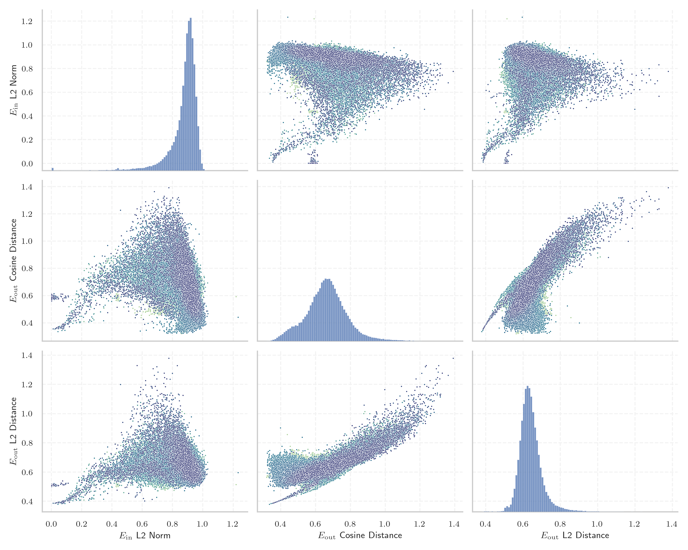
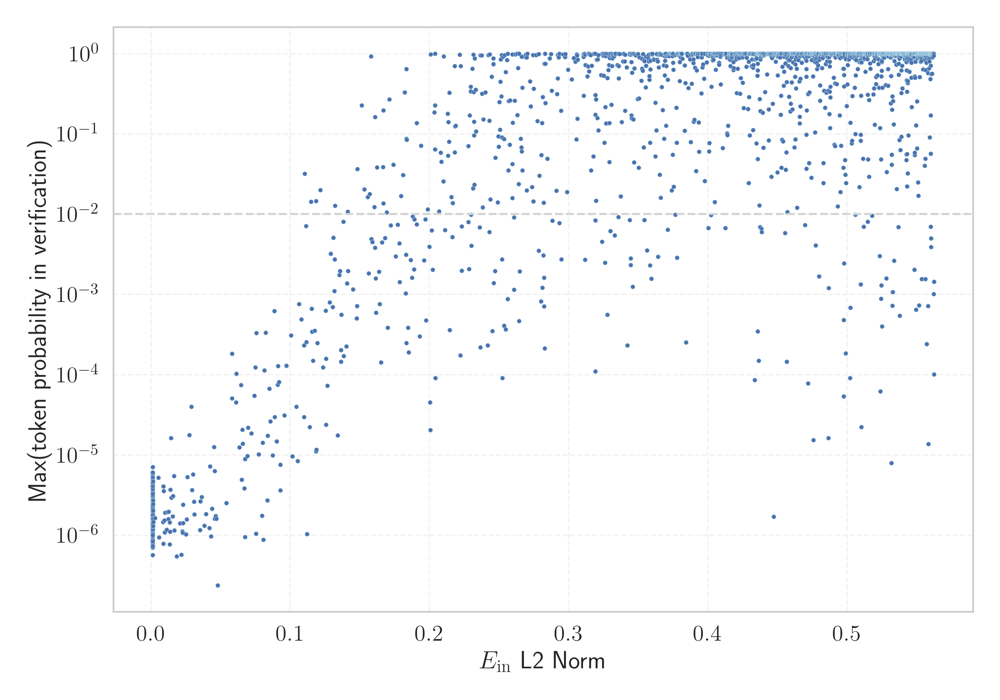

# Report for `internlm/internlm2_5-7b-chat`

## Model info

* Tied embeddings: no
* LM head uses bias: no
* Indicator for under-trained tokens: E_{in} L2 Norm
  * Overall distribution 0.871 +/- 0.105
  * Token used for verification prompt building: `InvalidArgumentException`
  * Verification threshold: 0.563
  * Threshold for showing candidate under-trained tokens: 0.145
  * Median verified threshold (for bytes, unreachable and special tokens): 0.146
* Embeddings shape: (92544, 4096)
* Vocabulary size: 92544
  * Number of single byte tokens: 383, of which 3 below indicator threshold
  * Number of special tokens: 150, of which 148 below indicator threshold
  * Number of non-single-byte unreachable tokens: 64, of which 0 below indicator threshold
  * Number of tested under-trained tokens: 1845, 1700 non-special, 312 below p = 0.01 threshold, 161 below soft indicator threshold

## Under-trained token indicators plot


## Verification plot


## Under-trained token verification results
161 entries below threshold of 0.145

|   token_id | token                              |   indicator | max_prob                                                         | in_other_tokens                                                                                                                                                          |
|------------|------------------------------------|-------------|------------------------------------------------------------------|--------------------------------------------------------------------------------------------------------------------------------------------------------------------------|
|      83790 | ````` 現時由南極條約體系管理 ````` |  0.00106708 | <span style='border: 1px solid rgb(169, 68, 66);'>8.5e-07</span> |                                                                                                                                                                          |
|      83469 | ````` 南極條約體系管理 `````       |  0.00111888 | <span style='border: 1px solid rgb(169, 68, 66);'>2.7e-06</span> | <span style='border: 1px solid rgb(169, 68, 66);'>````` 現時由南極條約體系管理 `````</span>                                                                              |
|      80869 | ````` 年美國人口普查的數據 `````   |  0.00113782 | <span style='border: 1px solid rgb(169, 68, 66);'>1.5e-06</span> |                                                                                                                                                                          |
|      79720 | ````` 而該地的平均海拔高度為 ````` |  0.00113863 | <span style='border: 1px solid rgb(169, 68, 66);'>7e-07</span>   |                                                                                                                                                                          |
|      81490 | ````` 當中陸地面積為 `````         |  0.00117276 | <span style='border: 1px solid rgb(169, 68, 66);'>2.5e-06</span> |                                                                                                                                                                          |
|      80552 | ````` 該地的面積和人口 `````       |  0.00122101 | <span style='border: 1px solid rgb(169, 68, 66);'>1.4e-06</span> | <span style='border: 1px solid rgb(169, 68, 66);'>````` 該地的面積和人口皆未知 `````</span>                                                                              |
|      80891 | ````` 而人口密度為每平方千米 ````` |  0.00124144 | <span style='border: 1px solid rgb(169, 68, 66);'>8.4e-07</span> |                                                                                                                                                                          |
|      80888 | ````` 人口密度為每平方千米 `````   |  0.00126075 | <span style='border: 1px solid rgb(169, 68, 66);'>1e-06</span>   | <span style='border: 1px solid rgb(169, 68, 66);'>````` 而人口密度為每平方千米 `````</span>                                                                              |
|      89705 | ````` 不会自动计算在总价中 `````   |  0.00129459 | <span style='border: 1px solid rgb(169, 68, 66);'>1.6e-06</span> | <span style='border: 1px solid rgb(169, 68, 66);'>````` 附加费用不会自动计算在总价中 `````</span>                                                                        |
|      81489 | ````` 而水域面積為 `````           |  0.00129814 | <span style='border: 1px solid rgb(169, 68, 66);'>1e-06</span>   |                                                                                                                                                                          |
|      87527 | ````` 屬下的一个种 `````           |  0.0013211  | <span style='border: 1px solid rgb(169, 68, 66);'>6.1e-06</span> |                                                                                                                                                                          |
|      89348 | ````` 位於該國東南部 `````         |  0.00137418 | <span style='border: 1px solid rgb(169, 68, 66);'>2e-06</span>   |                                                                                                                                                                          |
|      84487 | ````` 坐标为赤經 `````             |  0.00139848 | <span style='border: 1px solid rgb(169, 68, 66);'>1.3e-06</span> |                                                                                                                                                                          |
|      80885 | ````` 當地共有人口 `````           |  0.00142727 | <span style='border: 1px solid rgb(169, 68, 66);'>2.7e-06</span> |                                                                                                                                                                          |
|      84485 | ````` 位于銀經 `````               |  0.00142839 | <span style='border: 1px solid rgb(169, 68, 66);'>1.6e-06</span> |                                                                                                                                                                          |
|      82199 | ````` 附带不同的取消 `````         |  0.00143763 | <span style='border: 1px solid rgb(169, 68, 66);'>2.5e-06</span> | ````` 不同类型的客房附带不同的取消 `````                                                                                                                                 |
|      80082 | ````` 位於該國東 `````             |  0.00146693 | <span style='border: 1px solid rgb(169, 68, 66);'>4.7e-06</span> | <span style='border: 1px solid rgb(169, 68, 66);'>````` 位於該國東南部 `````</span>, <span style='border: 1px solid rgb(169, 68, 66);'>````` 位於該國東北部 `````</span> |
|      78349 | ````` 而該地的 `````               |  0.00163537 | <span style='border: 1px solid rgb(169, 68, 66);'>1.5e-06</span> | <span style='border: 1px solid rgb(169, 68, 66);'>````` 而該地的平均海拔高度為 `````</span>                                                                              |
|      79717 | ````` 平均海拔高度為 `````         |  0.00290261 | <span style='border: 1px solid rgb(169, 68, 66);'>1.6e-06</span> | <span style='border: 1px solid rgb(169, 68, 66);'>````` 而該地的平均海拔高度為 `````</span>                                                                              |
|      45446 | ````` webElementXpaths `````       |  0.005365   | <span style='border: 1px solid rgb(169, 68, 66);'>5.2e-06</span> |                                                                                                                                                                          |
<details><summary>141 additional entries below threshold</summary>

|   token_id | token                                |   indicator | max_prob                                                         | in_other_tokens                                                                                                                                                                                                                                                                                                                                                                                                                    |
|------------|--------------------------------------|-------------|------------------------------------------------------------------|------------------------------------------------------------------------------------------------------------------------------------------------------------------------------------------------------------------------------------------------------------------------------------------------------------------------------------------------------------------------------------------------------------------------------------|
|      91998 | ````` 為輻鰭魚綱鱸形目 `````         |  0.00573614 | <span style='border: 1px solid rgb(169, 68, 66);'>9.4e-07</span> |                                                                                                                                                                                                                                                                                                                                                                                                                                    |
|      89347 | ````` 位於該國南部 `````             |  0.00872311 | <span style='border: 1px solid rgb(169, 68, 66);'>1.5e-06</span> |                                                                                                                                                                                                                                                                                                                                                                                                                                    |
|      85979 | ````` 底層水域 `````                 |  0.00877862 | <span style='border: 1px solid rgb(169, 68, 66);'>7.9e-07</span> |                                                                                                                                                                                                                                                                                                                                                                                                                                    |
|      85919 | ````` 注意调料根据自己口味 `````     |  0.00897476 | <span style='border: 1px solid rgb(169, 68, 66);'>4.1e-06</span> | ````` 注意调料根据自己口味适量增减 `````                                                                                                                                                                                                                                                                                                                                                                                           |
|      84023 | ````` 省負責管轄 `````               |  0.00923175 | <span style='border: 1px solid rgb(169, 68, 66);'>3.6e-06</span> |                                                                                                                                                                                                                                                                                                                                                                                                                                    |
|      87583 | ````` 位於該國中部 `````             |  0.00958838 | <span style='border: 1px solid rgb(169, 68, 66);'>1.5e-06</span> |                                                                                                                                                                                                                                                                                                                                                                                                                                    |
|      89095 | ````` 位於該國西南部 `````           |  0.00983656 | <span style='border: 1px solid rgb(169, 68, 66);'>1.1e-06</span> |                                                                                                                                                                                                                                                                                                                                                                                                                                    |
|      78211 | ````` 文章来自豆果美食达人作者 ````` |  0.0100826  | <span style='border: 1px solid rgb(169, 68, 66);'>1.9e-06</span> | ````` 该文章来自豆果美食达人作者 `````                                                                                                                                                                                                                                                                                                                                                                                             |
|      77349 | ````` 生活習性不明 `````             |  0.011304   | <span style='border: 1px solid rgb(169, 68, 66);'>1.2e-06</span> |                                                                                                                                                                                                                                                                                                                                                                                                                                    |
|      80803 | ````` 水域面積為 `````               |  0.0116494  | <span style='border: 1px solid rgb(169, 68, 66);'>2e-06</span>   | <span style='border: 1px solid rgb(169, 68, 66);'>````` 而水域面積為 `````</span>                                                                                                                                                                                                                                                                                                                                                  |
|      81190 | ````` 縣的一個非建制地區 `````       |  0.0125105  | <span style='border: 1px solid rgb(169, 68, 66);'>1.6e-06</span> |                                                                                                                                                                                                                                                                                                                                                                                                                                    |
|      33925 | ````` ▁+#+#+#+ `````                 |  0.0127084  | <span style='border: 1px solid rgb(169, 68, 66);'>2e-06</span>   | <span style='border: 1px solid rgb(169, 68, 66);'>````` ▁+#+#+#+#+#+ `````</span>                                                                                                                                                                                                                                                                                                                                                  |
|      91816 | ````` 位於該國東北部 `````           |  0.0133417  | <span style='border: 1px solid rgb(169, 68, 66);'>7.7e-07</span> |                                                                                                                                                                                                                                                                                                                                                                                                                                    |
|      56255 | ````` :-------------</ `````         |  0.0134696  | <span style='border: 1px solid rgb(169, 68, 66);'>1.4e-06</span> |                                                                                                                                                                                                                                                                                                                                                                                                                                    |
|      32810 | ````` webElementProperties `````     |  0.0137047  | <span style='border: 1px solid rgb(169, 68, 66);'>1.1e-06</span> |                                                                                                                                                                                                                                                                                                                                                                                                                                    |
|      83387 | ````` 南極條約體系 `````             |  0.0138894  | <span style='border: 1px solid rgb(169, 68, 66);'>3.7e-06</span> | <span style='border: 1px solid rgb(169, 68, 66);'>````` 南極條約體系管理 `````</span>, <span style='border: 1px solid rgb(169, 68, 66);'>````` 現時由南極條約體系管理 `````</span>                                                                                                                                                                                                                                                 |
|      80556 | ````` 該地的面積和人口皆未知 `````   |  0.0143349  | <span style='border: 1px solid rgb(169, 68, 66);'>1.6e-05</span> |                                                                                                                                                                                                                                                                                                                                                                                                                                    |
|      92269 | ````` 是南極洲的 `````               |  0.0146674  | <span style='border: 1px solid rgb(169, 68, 66);'>2.9e-06</span> |                                                                                                                                                                                                                                                                                                                                                                                                                                    |
|      73798 | ````` 區負責管轄 `````               |  0.0155705  | <span style='border: 1px solid rgb(169, 68, 66);'>1.7e-06</span> |                                                                                                                                                                                                                                                                                                                                                                                                                                    |
|      84008 | ````` 河道全長 `````                 |  0.0158706  | <span style='border: 1px solid rgb(169, 68, 66);'>3.1e-06</span> |                                                                                                                                                                                                                                                                                                                                                                                                                                    |
|      74132 | ````` 輻鰭魚綱 `````                 |  0.0166554  | <span style='border: 1px solid rgb(169, 68, 66);'>5.4e-06</span> | <span style='border: 1px solid rgb(169, 68, 66);'>````` 為輻鰭魚綱 `````</span>, <span style='border: 1px solid rgb(169, 68, 66);'>````` 為輻鰭魚綱鱸形目 `````</span>                                                                                                                                                                                                                                                             |
|      76013 | ````` 是烏克蘭的村落 `````           |  0.0168909  | <span style='border: 1px solid rgb(169, 68, 66);'>1.2e-06</span> |                                                                                                                                                                                                                                                                                                                                                                                                                                    |
|      78509 | ````` 位於該國西部 `````             |  0.0184384  | <span style='border: 1px solid rgb(169, 68, 66);'>5.5e-07</span> |                                                                                                                                                                                                                                                                                                                                                                                                                                    |
|      89702 | ````` 需在入住时 `````               |  0.0207848  | <span style='border: 1px solid rgb(169, 68, 66);'>1.4e-06</span> | <span style='border: 1px solid rgb(169, 68, 66);'>````` 需在入住时另行支付 `````</span>, <span style='border: 1px solid rgb(169, 68, 66);'>````` 您需在入住时另行支付 `````</span>                                                                                                                                                                                                                                                 |
|      50425 | ````` SpecWarn `````                 |  0.0217366  | <span style='border: 1px solid rgb(169, 68, 66);'>5.7e-07</span> |                                                                                                                                                                                                                                                                                                                                                                                                                                    |
|      82215 | ````` 预订和预先 `````               |  0.0225592  | <span style='border: 1px solid rgb(169, 68, 66);'>1.1e-06</span> | ````` 预订和预先付费政策 `````                                                                                                                                                                                                                                                                                                                                                                                                     |
|      80808 | ````` 陸地面積為 `````               |  0.0228559  | <span style='border: 1px solid rgb(169, 68, 66);'>1.1e-06</span> | <span style='border: 1px solid rgb(169, 68, 66);'>````` 當中陸地面積為 `````</span>                                                                                                                                                                                                                                                                                                                                                |
|      45445 | ````` webElementX `````              |  0.0229652  | <span style='border: 1px solid rgb(169, 68, 66);'>1.4e-06</span> | <span style='border: 1px solid rgb(169, 68, 66);'>````` webElementXpaths `````</span>                                                                                                                                                                                                                                                                                                                                              |
|      80690 | ````` 人口密度為每 `````             |  0.0231007  | <span style='border: 1px solid rgb(169, 68, 66);'>2.4e-06</span> | <span style='border: 1px solid rgb(169, 68, 66);'>````` 人口密度為每平方千米 `````</span>, <span style='border: 1px solid rgb(169, 68, 66);'>````` 而人口密度為每平方千米 `````</span>                                                                                                                                                                                                                                             |
|      83935 | ````` 位於該國北部 `````             |  0.0250792  | <span style='border: 1px solid rgb(169, 68, 66);'>1e-06</span>   |                                                                                                                                                                                                                                                                                                                                                                                                                                    |
|      74111 | ````` 輻鰭魚 `````                   |  0.0257552  | <span style='border: 1px solid rgb(169, 68, 66);'>1.6e-06</span> | <span style='border: 1px solid rgb(169, 68, 66);'>````` 輻鰭魚綱 `````</span>, <span style='border: 1px solid rgb(169, 68, 66);'>````` 為輻鰭魚綱 `````</span>, <span style='border: 1px solid rgb(169, 68, 66);'>````` 為輻鰭魚綱鱸形目 `````</span>                                                                                                                                                                              |
|      79781 | ````` 層水域 `````                   |  0.0260072  | <span style='border: 1px solid rgb(169, 68, 66);'>5.3e-06</span> | <span style='border: 1px solid rgb(169, 68, 66);'>````` 底層水域 `````</span>                                                                                                                                                                                                                                                                                                                                                      |
|      84462 | ````` 銀緯 `````                     |  0.0274496  | <span style='border: 1px solid rgb(169, 68, 66);'>1.8e-05</span> |                                                                                                                                                                                                                                                                                                                                                                                                                                    |
|      83203 | ````` 南極條約 `````                 |  0.0290841  | <span style='border: 1px solid rgb(169, 68, 66);'>4e-05</span>   | <span style='border: 1px solid rgb(169, 68, 66);'>````` 南極條約體系 `````</span>, <span style='border: 1px solid rgb(169, 68, 66);'>````` 南極條約體系管理 `````</span>, <span style='border: 1px solid rgb(169, 68, 66);'>````` 現時由南極條約體系管理 `````</span>                                                                                                                                                              |
|      80523 | ````` 鄰車站 `````                   |  0.0294802  | <span style='border: 1px solid rgb(169, 68, 66);'>3.6e-06</span> |                                                                                                                                                                                                                                                                                                                                                                                                                                    |
|      78968 | ````` 是南極洲 `````                 |  0.0301938  | <span style='border: 1px solid rgb(169, 68, 66);'>5.7e-06</span> | <span style='border: 1px solid rgb(169, 68, 66);'>````` 是南極洲的 `````</span>                                                                                                                                                                                                                                                                                                                                                    |
|      79859 | ````` 非建制地區 `````               |  0.0308583  | <span style='border: 1px solid rgb(169, 68, 66);'>2.6e-06</span> | <span style='border: 1px solid rgb(169, 68, 66);'>````` 縣的一個非建制地區 `````</span>                                                                                                                                                                                                                                                                                                                                            |
|      79507 | ````` 州負責管轄 `````               |  0.0312634  | <span style='border: 1px solid rgb(169, 68, 66);'>1.8e-06</span> |                                                                                                                                                                                                                                                                                                                                                                                                                                    |
|      89311 | ````` 鱸形目 `````                   |  0.0351945  | <span style='border: 1px solid rgb(169, 68, 66);'>1.2e-06</span> | <span style='border: 1px solid rgb(169, 68, 66);'>````` 為輻鰭魚綱鱸形目 `````</span>                                                                                                                                                                                                                                                                                                                                              |
|      76502 | ````` 科的其中一種 `````             |  0.0355322  | <span style='border: 1px solid rgb(169, 68, 66);'>2.6e-06</span> |                                                                                                                                                                                                                                                                                                                                                                                                                                    |
|      89088 | ````` 棲息深度 `````                 |  0.0365379  | <span style='border: 1px solid rgb(169, 68, 66);'>3e-06</span>   |                                                                                                                                                                                                                                                                                                                                                                                                                                    |
|      83000 | ````` 山脈的一部分 `````             |  0.038324   | <span style='border: 1px solid rgb(169, 68, 66);'>1.3e-06</span> |                                                                                                                                                                                                                                                                                                                                                                                                                                    |
|      70411 | ````` 位於該國 `````                 |  0.0394326  | <span style='border: 1px solid rgb(169, 68, 66);'>1.8e-06</span> | <span style='border: 1px solid rgb(169, 68, 66);'>````` 位於該國西部 `````</span>, <span style='border: 1px solid rgb(169, 68, 66);'>````` 位於該國東 `````</span>, <span style='border: 1px solid rgb(169, 68, 66);'>````` 位於該國北部 `````</span>, <span style='border: 1px solid rgb(169, 68, 66);'>````` 位於該國中部 `````</span>, <span style='border: 1px solid rgb(169, 68, 66);'>````` 位於該國西南部 `````</span>, ... |
|      84474 | ````` 銀經 `````                     |  0.0419633  | <span style='border: 1px solid rgb(169, 68, 66);'>1.2e-06</span> | <span style='border: 1px solid rgb(169, 68, 66);'>````` 位于銀經 `````</span>                                                                                                                                                                                                                                                                                                                                                      |
|      74536 | ````` 是烏克蘭的 `````               |  0.0424551  | <span style='border: 1px solid rgb(169, 68, 66);'>7.2e-06</span> | <span style='border: 1px solid rgb(169, 68, 66);'>````` 是烏克蘭的村落 `````</span>                                                                                                                                                                                                                                                                                                                                                |
|      55082 | ````` ▁;;^ `````                     |  0.0430051  | <span style='border: 1px solid rgb(169, 68, 66);'>9.7e-07</span> |                                                                                                                                                                                                                                                                                                                                                                                                                                    |
|      82138 | ````` 車人次 `````                   |  0.0437772  | <span style='border: 1px solid rgb(169, 68, 66);'>2.2e-06</span> |                                                                                                                                                                                                                                                                                                                                                                                                                                    |
|      87817 | ````` 地面車站 `````                 |  0.0451711  | <span style='border: 1px solid rgb(169, 68, 66);'>1.3e-05</span> |                                                                                                                                                                                                                                                                                                                                                                                                                                    |
|      89982 | ````` 加床或婴儿床 `````             |  0.0456711  | <span style='border: 1px solid rgb(169, 68, 66);'>6.3e-06</span> | <span style='border: 1px solid rgb(169, 68, 66);'>````` 所提出的任何加床或婴儿床 `````</span>                                                                                                                                                                                                                                                                                                                                      |
|      86080 | ````` 準決賽及決賽 `````             |  0.0458402  | <span style='border: 1px solid rgb(169, 68, 66);'>1.6e-06</span> |                                                                                                                                                                                                                                                                                                                                                                                                                                    |
|      75089 | ````` 為輻鰭魚綱 `````               |  0.0464653  | <span style='border: 1px solid rgb(169, 68, 66);'>1.7e-06</span> | <span style='border: 1px solid rgb(169, 68, 66);'>````` 為輻鰭魚綱鱸形目 `````</span>                                                                                                                                                                                                                                                                                                                                              |
|      92069 | ````` 灰色即表示 `````               |  0.0470089  | <span style='border: 1px solid rgb(169, 68, 66);'>1.6e-06</span> | <span style='border: 1px solid rgb(255, 145, 0);'>````` 后面的圆点变为灰色即表示 `````</span>                                                                                                                                                                                                                                                                                                                                      |
|      84129 | ````` 印地安納州 `````               |  0.0479914  | <span style='border: 1px solid rgb(169, 68, 66);'>2.4e-07</span> |                                                                                                                                                                                                                                                                                                                                                                                                                                    |
|      49826 | ````` ▁prostituerte `````            |  0.0541535  | <span style='border: 1px solid rgb(169, 68, 66);'>2.5e-06</span> |                                                                                                                                                                                                                                                                                                                                                                                                                                    |
|      81306 | ````` 脂鯉 `````                     |  0.0583067  | <span style='border: 1px solid rgb(169, 68, 66);'>5.1e-05</span> |                                                                                                                                                                                                                                                                                                                                                                                                                                    |
|      79498 | ````` 海拔高度為 `````               |  0.058311   | <span style='border: 1px solid rgb(169, 68, 66);'>0.00018</span> | <span style='border: 1px solid rgb(169, 68, 66);'>````` 平均海拔高度為 `````</span>, <span style='border: 1px solid rgb(169, 68, 66);'>````` 而該地的平均海拔高度為 `````</span>                                                                                                                                                                                                                                                   |
|      54094 | ````` .sulake `````                  |  0.0609712  | <span style='border: 1px solid rgb(169, 68, 66);'>4.5e-05</span> |                                                                                                                                                                                                                                                                                                                                                                                                                                    |
|      80789 | ````` 旅客鐵道 `````                 |  0.0612463  | <span style='border: 1px solid rgb(169, 68, 66);'>0.0001</span>  |                                                                                                                                                                                                                                                                                                                                                                                                                                    |
|      91612 | ````` 島式月台 `````                 |  0.0634915  | <span style='border: 1px solid rgb(169, 68, 66);'>1.2e-05</span> |                                                                                                                                                                                                                                                                                                                                                                                                                                    |
|      90482 | ````` 而該地 `````                   |  0.0646358  | <span style='border: 1px solid rgb(169, 68, 66);'>7.5e-05</span> |                                                                                                                                                                                                                                                                                                                                                                                                                                    |
|      80533 | ````` 面積和人口 `````               |  0.0651382  | <span style='border: 1px solid rgb(169, 68, 66);'>4.9e-06</span> | <span style='border: 1px solid rgb(169, 68, 66);'>````` 該地的面積和人口 `````</span>, <span style='border: 1px solid rgb(169, 68, 66);'>````` 該地的面積和人口皆未知 `````</span>                                                                                                                                                                                                                                                 |
|      45337 | ````` ▁swingerclub `````             |  0.0656844  | <span style='border: 1px solid rgb(169, 68, 66);'>2.1e-05</span> |                                                                                                                                                                                                                                                                                                                                                                                                                                    |
|      70873 | ````` 負責管轄 `````                 |  0.0658305  | <span style='border: 1px solid rgb(169, 68, 66);'>1.4e-05</span> | <span style='border: 1px solid rgb(169, 68, 66);'>````` 區負責管轄 `````</span>, <span style='border: 1px solid rgb(169, 68, 66);'>````` 州負責管轄 `````</span>, <span style='border: 1px solid rgb(169, 68, 66);'>````` 省負責管轄 `````</span>                                                                                                                                                                                  |
|      85882 | ````` 及決賽 `````                   |  0.066971   | <span style='border: 1px solid rgb(169, 68, 66);'>3.8e-06</span> | <span style='border: 1px solid rgb(169, 68, 66);'>````` 準決賽及決賽 `````</span>                                                                                                                                                                                                                                                                                                                                                  |
|      75157 | ````` 是位於美國 `````               |  0.067565   | <span style='border: 1px solid rgb(169, 68, 66);'>9.5e-07</span> |                                                                                                                                                                                                                                                                                                                                                                                                                                    |
|      89762 | ````` 車站大樓 `````                 |  0.0676385  | <span style='border: 1px solid rgb(169, 68, 66);'>8.9e-06</span> |                                                                                                                                                                                                                                                                                                                                                                                                                                    |
|      55518 | ````` ▁;;= `````                     |  0.0691518  | <span style='border: 1px solid rgb(169, 68, 66);'>9.7e-06</span> |                                                                                                                                                                                                                                                                                                                                                                                                                                    |
|      78624 | ````` 人口密度為 `````               |  0.0697895  | <span style='border: 1px solid rgb(169, 68, 66);'>2.2e-05</span> | <span style='border: 1px solid rgb(169, 68, 66);'>````` 人口密度為每 `````</span>, <span style='border: 1px solid rgb(169, 68, 66);'>````` 人口密度為每平方千米 `````</span>, <span style='border: 1px solid rgb(169, 68, 66);'>````` 而人口密度為每平方千米 `````</span>                                                                                                                                                          |
|      87207 | ````` 總教區 `````                   |  0.0722181  | <span style='border: 1px solid rgb(169, 68, 66);'>1.9e-05</span> |                                                                                                                                                                                                                                                                                                                                                                                                                                    |
|      78070 | ````` 年美國人口普查 `````           |  0.0743354  | <span style='border: 1px solid rgb(169, 68, 66);'>5.5e-05</span> | <span style='border: 1px solid rgb(169, 68, 66);'>````` 年美國人口普查的數據 `````</span>                                                                                                                                                                                                                                                                                                                                          |
|      41550 | ````` \tNullCheck `````              |  0.0749475  | <span style='border: 1px solid rgb(169, 68, 66);'>0.00012</span> |                                                                                                                                                                                                                                                                                                                                                                                                                                    |
|      85602 | ````` 名舉人 `````                   |  0.0754824  | <span style='border: 1px solid rgb(169, 68, 66);'>1e-06</span>   |                                                                                                                                                                                                                                                                                                                                                                                                                                    |
|      86832 | ````` 本魚 `````                     |  0.0757248  | <span style='border: 1px solid rgb(169, 68, 66);'>0.00033</span> |                                                                                                                                                                                                                                                                                                                                                                                                                                    |
|      83995 | ````` 赤經 `````                     |  0.0772708  | <span style='border: 1px solid rgb(169, 68, 66);'>1e-05</span>   | <span style='border: 1px solid rgb(169, 68, 66);'>````` 坐标为赤經 `````</span>                                                                                                                                                                                                                                                                                                                                                    |
|      84710 | ````` 合作两次以上的 `````           |  0.0797078  | <span style='border: 1px solid rgb(169, 68, 66);'>1.7e-06</span> | ````` 合作两次以上的影人 `````                                                                                                                                                                                                                                                                                                                                                                                                     |
|      92161 | ````` 號月台 `````                   |  0.0802564  | <span style='border: 1px solid rgb(169, 68, 66);'>1.4e-05</span> |                                                                                                                                                                                                                                                                                                                                                                                                                                    |
|      72262 | ````` 下辖以下地区 `````             |  0.0808345  | <span style='border: 1px solid rgb(169, 68, 66);'>8.8e-07</span> | <span style='border: 1px solid rgb(169, 68, 66);'>````` 镇下辖以下地区 `````</span>, <span style='border: 1px solid rgb(169, 68, 66);'>````` 乡下辖以下地区 `````</span>, <span style='border: 1px solid rgb(169, 68, 66);'>````` 街道下辖以下地区 `````</span>                                                                                                                                                                    |
|      91912 | ````` 年夏季奧林匹克運動會 `````     |  0.0815058  | <span style='border: 1px solid rgb(169, 68, 66);'>0.00011</span> |                                                                                                                                                                                                                                                                                                                                                                                                                                    |
|      74006 | ````` 鰭魚 `````                     |  0.0824024  | <span style='border: 1px solid rgb(169, 68, 66);'>0.00033</span> | <span style='border: 1px solid rgb(169, 68, 66);'>````` 輻鰭魚 `````</span>, <span style='border: 1px solid rgb(169, 68, 66);'>````` 輻鰭魚綱 `````</span>, <span style='border: 1px solid rgb(169, 68, 66);'>````` 為輻鰭魚綱 `````</span>, <span style='border: 1px solid rgb(169, 68, 66);'>````` 為輻鰭魚綱鱸形目 `````</span>                                                                                                 |
|      86088 | ````` 是一颗围绕太阳公转 `````       |  0.0836523  | <span style='border: 1px solid rgb(169, 68, 66);'>2.7e-06</span> | <span style='border: 1px solid rgb(255, 145, 0);'>````` 是一颗围绕太阳公转的小行星 `````</span>                                                                                                                                                                                                                                                                                                                                    |
|      84740 | ````` 科會試 `````                   |  0.0837438  | <span style='border: 1px solid rgb(169, 68, 66);'>1.7e-05</span> |                                                                                                                                                                                                                                                                                                                                                                                                                                    |
|      81659 | ````` 該庄 `````                     |  0.0851025  | <span style='border: 1px solid rgb(169, 68, 66);'>6.7e-05</span> |                                                                                                                                                                                                                                                                                                                                                                                                                                    |
|      42371 | ````` ▁prostituerade `````           |  0.0857547  | <span style='border: 1px solid rgb(169, 68, 66);'>2.6e-05</span> |                                                                                                                                                                                                                                                                                                                                                                                                                                    |
|      53464 | ````` ((&___ `````                   |  0.087357   | <span style='border: 1px solid rgb(169, 68, 66);'>9.9e-06</span> |                                                                                                                                                                                                                                                                                                                                                                                                                                    |
|      57565 | ````` ▁principalColumn `````         |  0.088734   | <span style='border: 1px solid rgb(169, 68, 66);'>0.00062</span> |                                                                                                                                                                                                                                                                                                                                                                                                                                    |
|      56753 | ````` ▁{{--< `````                   |  0.0888864  | <span style='border: 1px solid rgb(169, 68, 66);'>3e-05</span>   |                                                                                                                                                                                                                                                                                                                                                                                                                                    |
|      92216 | ````` 張單曲 `````                   |  0.0903982  | <span style='border: 1px solid rgb(169, 68, 66);'>1.5e-05</span> |                                                                                                                                                                                                                                                                                                                                                                                                                                    |
|      40107 | ````` rigesimal `````                |  0.0910731  | <span style='border: 1px solid rgb(169, 68, 66);'>7.5e-05</span> | <span style='border: 1px solid rgb(169, 68, 66);'>````` atrigesimal `````</span>, <span style='border: 1px solid rgb(169, 68, 66);'>````` ▁hexatrigesimal `````</span>                                                                                                                                                                                                                                                             |
|      57274 | ````` IntoConstraints `````          |  0.091309   | <span style='border: 1px solid rgb(169, 68, 66);'>0.00013</span> | <span style='border: 1px solid rgb(255, 145, 0);'>````` AutoresizingMaskIntoConstraints `````</span>, ````` latesAutoresizingMaskIntoConstraints `````                                                                                                                                                                                                                                                                             |
|      89877 | ````` 庄為 `````                     |  0.0919976  | <span style='border: 1px solid rgb(169, 68, 66);'>8.1e-05</span> |                                                                                                                                                                                                                                                                                                                                                                                                                                    |
|      89983 | ````` 的要求均需获得 `````           |  0.0928538  | <span style='border: 1px solid rgb(169, 68, 66);'>3.6e-06</span> | <span style='border: 1px solid rgb(169, 68, 66);'>````` 的要求均需获得酒店的确认 `````</span>                                                                                                                                                                                                                                                                                                                                      |
|      79524 | ````` 的座標為 `````                 |  0.0929539  | <span style='border: 1px solid rgb(169, 68, 66);'>7.6e-06</span> |                                                                                                                                                                                                                                                                                                                                                                                                                                    |
|      81612 | ````` 乡下辖以下地区 `````           |  0.0957371  | <span style='border: 1px solid rgb(169, 68, 66);'>3.1e-05</span> |                                                                                                                                                                                                                                                                                                                                                                                                                                    |
|      78170 | ````` 文章来自豆果美食达人 `````     |  0.0972068  | <span style='border: 1px solid rgb(169, 68, 66);'>0.00013</span> | <span style='border: 1px solid rgb(169, 68, 66);'>````` 文章来自豆果美食达人作者 `````</span>, ````` 该文章来自豆果美食达人作者 `````                                                                                                                                                                                                                                                                                              |
|      44235 | ````` >tagger `````                  |  0.100594   | <span style='border: 1px solid rgb(169, 68, 66);'>0.00031</span> |                                                                                                                                                                                                                                                                                                                                                                                                                                    |
|      74599 | ````` 體長可達 `````                 |  0.101562   | <span style='border: 1px solid rgb(169, 68, 66);'>9.6e-06</span> |                                                                                                                                                                                                                                                                                                                                                                                                                                    |
|      77014 | ````` 亞目 `````                     |  0.104485   | <span style='border: 1px solid rgb(169, 68, 66);'>4e-05</span>   |                                                                                                                                                                                                                                                                                                                                                                                                                                    |
|      59829 | ````` .`\|`\n `````                  |  0.105473   | <span style='border: 1px solid rgb(169, 68, 66);'>8.4e-06</span> |                                                                                                                                                                                                                                                                                                                                                                                                                                    |
|      42140 | ````` atrigesimal `````              |  0.106416   | <span style='border: 1px solid rgb(169, 68, 66);'>0.00076</span> | <span style='border: 1px solid rgb(169, 68, 66);'>````` ▁hexatrigesimal `````</span>                                                                                                                                                                                                                                                                                                                                               |
|      38967 | ````` wcsstore `````                 |  0.108042   | <span style='border: 1px solid rgb(169, 68, 66);'>0.00049</span> |                                                                                                                                                                                                                                                                                                                                                                                                                                    |
|      83299 | ````` 包括以下物种 `````             |  0.109865   | <span style='border: 1px solid rgb(169, 68, 66);'>0.00023</span> | <span style='border: 1px solid rgb(169, 68, 66);'>````` 本属包括以下物种 `````</span>                                                                                                                                                                                                                                                                                                                                              |
|      85703 | ````` 一项住宿 `````                 |  0.109983   | <span style='border: 1px solid rgb(169, 68, 66);'>3e-05</span>   | <span style='border: 1px solid rgb(169, 68, 66);'>````` 一项住宿的免费政策 `````</span>, <span style='border: 1px solid rgb(169, 68, 66);'>````` 还会提供一项住宿的免费政策 `````</span>, ````` 酒店还会提供一项住宿的免费政策 `````                                                                                                                                                                                               |
|      85076 | ````` 鐵路車站 `````                 |  0.110375   | <span style='border: 1px solid rgb(251, 189, 8);'>0.032</span>   |                                                                                                                                                                                                                                                                                                                                                                                                                                    |
|      57726 | ````` MASConstraintMaker `````       |  0.11136    | <span style='border: 1px solid rgb(255, 145, 0);'>0.0071</span>  |                                                                                                                                                                                                                                                                                                                                                                                                                                    |
|      56787 | ````` ▁hexatrigesimal `````          |  0.111538   | <span style='border: 1px solid rgb(169, 68, 66);'>0.00026</span> |                                                                                                                                                                                                                                                                                                                                                                                                                                    |
|      84837 | ````` 客房条款 `````                 |  0.112078   | <span style='border: 1px solid rgb(169, 68, 66);'>1e-06</span>   | <span style='border: 1px solid rgb(255, 145, 0);'>````` 请参阅客房条款 `````</span>                                                                                                                                                                                                                                                                                                                                                |
|      75437 | ````` 縣的一個 `````                 |  0.113972   | <span style='border: 1px solid rgb(169, 68, 66);'>2.2e-05</span> | <span style='border: 1px solid rgb(169, 68, 66);'>````` 縣的一個非建制地區 `````</span>                                                                                                                                                                                                                                                                                                                                            |
|      84032 | ````` 赤緯 `````                     |  0.115036   | <span style='border: 1px solid rgb(251, 189, 8);'>0.014</span>   |                                                                                                                                                                                                                                                                                                                                                                                                                                    |
|      43617 | ````` %timeout `````                 |  0.115472   | <span style='border: 1px solid rgb(169, 68, 66);'>0.00066</span> |                                                                                                                                                                                                                                                                                                                                                                                                                                    |
|      58536 | ````` ▁typingsSlinky `````           |  0.115594   | <span style='border: 1px solid rgb(169, 68, 66);'>0.00034</span> |                                                                                                                                                                                                                                                                                                                                                                                                                                    |
|      57426 | ````` ▁principalTable `````          |  0.116496   | <span style='border: 1px solid rgb(169, 68, 66);'>0.00015</span> |                                                                                                                                                                                                                                                                                                                                                                                                                                    |
|      31479 | ````` ▁neuken `````                  |  0.117504   | <span style='border: 1px solid rgb(169, 68, 66);'>0.00035</span> |                                                                                                                                                                                                                                                                                                                                                                                                                                    |
|      89781 | ````` 國家足球隊 `````               |  0.118668   | <span style='border: 1px solid rgb(251, 189, 8);'>0.015</span>   |                                                                                                                                                                                                                                                                                                                                                                                                                                    |
|      89703 | ````` 不会自动计算 `````             |  0.118681   | <span style='border: 1px solid rgb(169, 68, 66);'>1.1e-05</span> | <span style='border: 1px solid rgb(169, 68, 66);'>````` 不会自动计算在总价中 `````</span>, <span style='border: 1px solid rgb(169, 68, 66);'>````` 附加费用不会自动计算在总价中 `````</span>                                                                                                                                                                                                                                       |
|      77059 | ````` 镇下辖以下地区 `````           |  0.118868   | <span style='border: 1px solid rgb(169, 68, 66);'>1.2e-05</span> |                                                                                                                                                                                                                                                                                                                                                                                                                                    |
|      89669 | ````` 電視動畫 `````                 |  0.119462   | <span style='border: 1px solid rgb(169, 68, 66);'>0.00025</span> |                                                                                                                                                                                                                                                                                                                                                                                                                                    |
|      77296 | ````` 生活習性 `````                 |  0.121738   | <span style='border: 1px solid rgb(251, 189, 8);'>0.02</span>    | <span style='border: 1px solid rgb(169, 68, 66);'>````` 生活習性不明 `````</span>                                                                                                                                                                                                                                                                                                                                                  |
|      82712 | ````` 現時由 `````                   |  0.123581   | <span style='border: 1px solid rgb(169, 68, 66);'>0.00012</span> | <span style='border: 1px solid rgb(169, 68, 66);'>````` 現時由南極條約體系管理 `````</span>                                                                                                                                                                                                                                                                                                                                        |
|      59509 | ````` _RGCTX `````                   |  0.125609   | <span style='border: 1px solid rgb(169, 68, 66);'>0.00063</span> |                                                                                                                                                                                                                                                                                                                                                                                                                                    |
|      91582 | ````` 街道下辖以下地区 `````         |  0.125668   | <span style='border: 1px solid rgb(169, 68, 66);'>2.4e-05</span> |                                                                                                                                                                                                                                                                                                                                                                                                                                    |
|      76761 | ````` 中华人民共和国政治人物 `````   |  0.125697   | <span style='border: 1px solid rgb(169, 68, 66);'>0.00016</span> |                                                                                                                                                                                                                                                                                                                                                                                                                                    |
|      39717 | ````` ▁bakeca `````                  |  0.126592   | <span style='border: 1px solid rgb(169, 68, 66);'>7.3e-05</span> |                                                                                                                                                                                                                                                                                                                                                                                                                                    |
|      49938 | ````` $IFn `````                     |  0.128271   | <span style='border: 1px solid rgb(169, 68, 66);'>0.0008</span>  |                                                                                                                                                                                                                                                                                                                                                                                                                                    |
|      51911 | ````` ▁erotique `````                |  0.129173   | <span style='border: 1px solid rgb(255, 145, 0);'>0.0032</span>  |                                                                                                                                                                                                                                                                                                                                                                                                                                    |
|      45542 | ````` ▁bryster `````                 |  0.130558   | <span style='border: 1px solid rgb(169, 68, 66);'>0.0007</span>  |                                                                                                                                                                                                                                                                                                                                                                                                                                    |
|      84076 | ````` 爾蘭 `````                     |  0.13111    | <span style='border: 1px solid rgb(255, 145, 0);'>0.0051</span>  | <span style='border: 1px solid rgb(40, 167, 69);'>````` 愛爾蘭 `````</span>                                                                                                                                                                                                                                                                                                                                                        |
|      39254 | ````` ▁erotici `````                 |  0.131787   | <span style='border: 1px solid rgb(255, 145, 0);'>0.0011</span>  |                                                                                                                                                                                                                                                                                                                                                                                                                                    |
|      29727 | ````` ▁StObject `````                |  0.131869   | <span style='border: 1px solid rgb(255, 145, 0);'>0.0027</span>  |                                                                                                                                                                                                                                                                                                                                                                                                                                    |
|      86901 | ````` 流域面積 `````                 |  0.132122   | <span style='border: 1px solid rgb(251, 189, 8);'>0.013</span>   |                                                                                                                                                                                                                                                                                                                                                                                                                                    |
|      81664 | ````` 名進士 `````                   |  0.134123   | <span style='border: 1px solid rgb(169, 68, 66);'>1.8e-05</span> |                                                                                                                                                                                                                                                                                                                                                                                                                                    |
|      82672 | ````` 伊利諾伊州 `````               |  0.135337   | <span style='border: 1px solid rgb(255, 145, 0);'>0.0017</span>  |                                                                                                                                                                                                                                                                                                                                                                                                                                    |
|      73967 | ````` 是烏克蘭 `````                 |  0.135896   | <span style='border: 1px solid rgb(255, 145, 0);'>0.002</span>   | <span style='border: 1px solid rgb(169, 68, 66);'>````` 是烏克蘭的 `````</span>, <span style='border: 1px solid rgb(169, 68, 66);'>````` 是烏克蘭的村落 `````</span>                                                                                                                                                                                                                                                               |
|      34226 | ````` ▁########. `````               |  0.136455   | <span style='border: 1px solid rgb(169, 68, 66);'>0.00014</span> |                                                                                                                                                                                                                                                                                                                                                                                                                                    |
|      87009 | ````` 為熱帶 `````                   |  0.136586   | <span style='border: 1px solid rgb(169, 68, 66);'>0.0002</span>  |                                                                                                                                                                                                                                                                                                                                                                                                                                    |
|      85152 | ````` 的绝对星等为 `````             |  0.136747   | <span style='border: 1px solid rgb(169, 68, 66);'>0.00056</span> | ````` 这颗小行星的绝对星等为 `````                                                                                                                                                                                                                                                                                                                                                                                                 |
|      43574 | ````` compileComponents `````        |  0.138289   | <span style='border: 1px solid rgb(255, 145, 0);'>0.0081</span>  |                                                                                                                                                                                                                                                                                                                                                                                                                                    |
|      71949 | ````` 下辖以下 `````                 |  0.138414   | <span style='border: 1px solid rgb(169, 68, 66);'>0.00017</span> | <span style='border: 1px solid rgb(169, 68, 66);'>````` 下辖以下地区 `````</span>, <span style='border: 1px solid rgb(169, 68, 66);'>````` 镇下辖以下地区 `````</span>, <span style='border: 1px solid rgb(169, 68, 66);'>````` 乡下辖以下地区 `````</span>, <span style='border: 1px solid rgb(169, 68, 66);'>````` 街道下辖以下地区 `````</span>                                                                                 |
|      32788 | ````` .UndefOr `````                 |  0.14029    | <span style='border: 1px solid rgb(169, 68, 66);'>0.00023</span> |                                                                                                                                                                                                                                                                                                                                                                                                                                    |
|      24478 | ````` :UIControl `````               |  0.14095    | <span style='border: 1px solid rgb(255, 145, 0);'>0.0014</span>  | <span style='border: 1px solid rgb(255, 145, 0);'>````` :UIControlState `````</span>, <span style='border: 1px solid rgb(255, 145, 0);'>````` :UIControlStateNormal `````</span>, <span style='border: 1px solid rgb(251, 189, 8);'>````` :UIControlEvent `````</span>, <span style='border: 1px solid rgb(251, 189, 8);'>````` :UIControlEventTouchUpInside `````</span>                                                          |
|      89904 | ````` 愛荷華州 `````                 |  0.141388   | <span style='border: 1px solid rgb(251, 189, 8);'>0.011</span>   |                                                                                                                                                                                                                                                                                                                                                                                                                                    |
|      55175 | ````` _REALTYPE `````                |  0.141574   | <span style='border: 1px solid rgb(255, 145, 0);'>0.002</span>   |                                                                                                                                                                                                                                                                                                                                                                                                                                    |
</details>
<details><summary>1539 additional entries above threshold</summary>

|   token_id | token                                                                                       |   indicator | max_prob                                                         | in_other_tokens                                                                                                                                                                                                                                                                                                                                                                                                              |
|------------|---------------------------------------------------------------------------------------------|-------------|------------------------------------------------------------------|------------------------------------------------------------------------------------------------------------------------------------------------------------------------------------------------------------------------------------------------------------------------------------------------------------------------------------------------------------------------------------------------------------------------------|
|      72501 | ````` 乡镇级行政单位 `````                                                                  |    0.145219 | <span style='border: 1px solid rgb(255, 145, 0);'>0.0012</span>  | <span style='border: 1px solid rgb(169, 68, 66);'>````` 下辖的一个乡镇级行政单位 `````</span>                                                                                                                                                                                                                                                                                                                                |
|      83321 | ````` 安納州 `````                                                                          |    0.147677 | <span style='border: 1px solid rgb(169, 68, 66);'>0.0005</span>  | <span style='border: 1px solid rgb(169, 68, 66);'>````` 印地安納州 `````</span>                                                                                                                                                                                                                                                                                                                                              |
|      38585 | ````` .xrLabel `````                                                                        |    0.147993 | <span style='border: 1px solid rgb(169, 68, 66);'>0.00072</span> |                                                                                                                                                                                                                                                                                                                                                                                                                              |
|      83468 | ````` 的面積為 `````                                                                        |    0.148251 | <span style='border: 1px solid rgb(251, 189, 8);'>0.036</span>   |                                                                                                                                                                                                                                                                                                                                                                                                                              |
|      85323 | ````` 足球運動員 `````                                                                      |    0.151269 | <span style='border: 1px solid rgb(40, 167, 69);'>0.23</span>    |                                                                                                                                                                                                                                                                                                                                                                                                                              |
|      88094 | ````` 背鰭 `````                                                                            |    0.153342 | <span style='border: 1px solid rgb(251, 189, 8);'>0.02</span>    |                                                                                                                                                                                                                                                                                                                                                                                                                              |
|      49935 | ````` ▁geschichten `````                                                                    |    0.155603 | <span style='border: 1px solid rgb(251, 189, 8);'>0.016</span>   |                                                                                                                                                                                                                                                                                                                                                                                                                              |
|      39688 | ````` ▁prostituer `````                                                                     |    0.156496 | <span style='border: 1px solid rgb(255, 145, 0);'>0.0018</span>  | <span style='border: 1px solid rgb(169, 68, 66);'>````` ▁prostituerade `````</span>, <span style='border: 1px solid rgb(169, 68, 66);'>````` ▁prostituerte `````</span>                                                                                                                                                                                                                                                      |
|      84587 | ````` 是一個位於 `````                                                                      |    0.157165 | <span style='border: 1px solid rgb(251, 189, 8);'>0.018</span>   |                                                                                                                                                                                                                                                                                                                                                                                                                              |
|      78090 | ````` 南極洲 `````                                                                          |    0.158012 | <span style='border: 1px solid rgb(40, 167, 69);'>0.93</span>    | <span style='border: 1px solid rgb(169, 68, 66);'>````` 是南極洲 `````</span>, <span style='border: 1px solid rgb(169, 68, 66);'>````` 是南極洲的 `````</span>                                                                                                                                                                                                                                                               |
|      38015 | ````` ▁eskorte `````                                                                        |    0.158248 | <span style='border: 1px solid rgb(255, 145, 0);'>0.0049</span>  |                                                                                                                                                                                                                                                                                                                                                                                                                              |
|      25189 | ````` yalty `````                                                                           |    0.159074 | <span style='border: 1px solid rgb(255, 145, 0);'>0.0045</span>  | ````` ▁loyalty `````, ````` ▁royalty `````                                                                                                                                                                                                                                                                                                                                                                                   |
|      88882 | ````` 愛荷 `````                                                                            |    0.160491 | <span style='border: 1px solid rgb(251, 189, 8);'>0.012</span>   | <span style='border: 1px solid rgb(251, 189, 8);'>````` 愛荷華州 `````</span>                                                                                                                                                                                                                                                                                                                                                |
|      89084 | ````` 足球聯賽 `````                                                                        |    0.160866 | <span style='border: 1px solid rgb(40, 167, 69);'>0.16</span>    |                                                                                                                                                                                                                                                                                                                                                                                                                              |
|      60104 | ````` rgctx `````                                                                           |    0.161037 | <span style='border: 1px solid rgb(255, 145, 0);'>0.0038</span>  |                                                                                                                                                                                                                                                                                                                                                                                                                              |
|      92242 | ````` 后面的圆点变为灰色即表示 `````                                                        |    0.161356 | <span style='border: 1px solid rgb(255, 145, 0);'>0.0016</span>  |                                                                                                                                                                                                                                                                                                                                                                                                                              |
|      88263 | ````` 科進士 `````                                                                          |    0.161788 | <span style='border: 1px solid rgb(169, 68, 66);'>0.00059</span> |                                                                                                                                                                                                                                                                                                                                                                                                                              |
|      49482 | ````` )paren `````                                                                          |    0.162342 | <span style='border: 1px solid rgb(251, 189, 8);'>0.038</span>   |                                                                                                                                                                                                                                                                                                                                                                                                                              |
|      38794 | ````` ▁erotisk `````                                                                        |    0.163807 | <span style='border: 1px solid rgb(255, 145, 0);'>0.0019</span>  |                                                                                                                                                                                                                                                                                                                                                                                                                              |
|      90181 | ````` 额外的床 `````                                                                        |    0.164303 | <span style='border: 1px solid rgb(169, 68, 66);'>0.00076</span> | ````` 张额外的床 `````                                                                                                                                                                                                                                                                                                                                                                                                       |
|      51957 | ````` CppMethodInitialized `````                                                            |    0.165329 | <span style='border: 1px solid rgb(169, 68, 66);'>0.00014</span> |                                                                                                                                                                                                                                                                                                                                                                                                                              |
|      54831 | ````` \tpstmt `````                                                                         |    0.16608  | <span style='border: 1px solid rgb(255, 145, 0);'>0.0044</span>  |                                                                                                                                                                                                                                                                                                                                                                                                                              |
|      46145 | ````` :semicolon `````                                                                      |    0.166755 | <span style='border: 1px solid rgb(251, 189, 8);'>0.039</span>   |                                                                                                                                                                                                                                                                                                                                                                                                                              |
|      23889 | ````` <lemma `````                                                                          |    0.166949 | <span style='border: 1px solid rgb(40, 167, 69);'>0.2</span>     |                                                                                                                                                                                                                                                                                                                                                                                                                              |
|      91155 | ````` 日發行 `````                                                                          |    0.16703  | <span style='border: 1px solid rgb(251, 189, 8);'>0.014</span>   |                                                                                                                                                                                                                                                                                                                                                                                                                              |
|      55965 | ````` InternalEnumerator `````                                                              |    0.168186 | <span style='border: 1px solid rgb(255, 145, 0);'>0.005</span>   |                                                                                                                                                                                                                                                                                                                                                                                                                              |
|      31077 | ````` quotelev `````                                                                        |    0.169289 | <span style='border: 1px solid rgb(251, 189, 8);'>0.01</span>    |                                                                                                                                                                                                                                                                                                                                                                                                                              |
|      86085 | ````` 登進士 `````                                                                          |    0.169934 | <span style='border: 1px solid rgb(169, 68, 66);'>0.00039</span> |                                                                                                                                                                                                                                                                                                                                                                                                                              |
|      32684 | ````` ▁XCTAssertEqual `````                                                                 |    0.171226 | <span style='border: 1px solid rgb(40, 167, 69);'>0.27</span>    |                                                                                                                                                                                                                                                                                                                                                                                                                              |
|      73959 | ````` 該地的 `````                                                                          |    0.172236 | <span style='border: 1px solid rgb(255, 145, 0);'>0.0072</span>  | <span style='border: 1px solid rgb(169, 68, 66);'>````` 而該地的 `````</span>, <span style='border: 1px solid rgb(169, 68, 66);'>````` 而該地的平均海拔高度為 `````</span>, <span style='border: 1px solid rgb(169, 68, 66);'>````` 該地的面積和人口 `````</span>, <span style='border: 1px solid rgb(169, 68, 66);'>````` 該地的面積和人口皆未知 `````</span>                                                               |
|      90149 | ````` 聲優 `````                                                                            |    0.174151 | <span style='border: 1px solid rgb(251, 189, 8);'>0.041</span>   |                                                                                                                                                                                                                                                                                                                                                                                                                              |
|      74509 | ````` 下的一个种 `````                                                                      |    0.175752 | <span style='border: 1px solid rgb(255, 145, 0);'>0.003</span>   | <span style='border: 1px solid rgb(169, 68, 66);'>````` 属下的一个种 `````</span>, <span style='border: 1px solid rgb(169, 68, 66);'>````` 屬下的一个种 `````</span>                                                                                                                                                                                                                                                         |
|      57885 | ````` ▁QCOMPARE `````                                                                       |    0.177293 | <span style='border: 1px solid rgb(255, 145, 0);'>0.0074</span>  |                                                                                                                                                                                                                                                                                                                                                                                                                              |
|      55081 | ````` CppGenericClass `````                                                                 |    0.178518 | <span style='border: 1px solid rgb(255, 145, 0);'>0.0043</span>  |                                                                                                                                                                                                                                                                                                                                                                                                                              |
|      28395 | ````` ▁)\n\n\n\n\n\n\n\n `````                                                              |    0.178732 | <span style='border: 1px solid rgb(255, 145, 0);'>0.0014</span>  |                                                                                                                                                                                                                                                                                                                                                                                                                              |
|      39405 | ````` \tTokenName `````                                                                     |    0.179694 | <span style='border: 1px solid rgb(251, 189, 8);'>0.017</span>   |                                                                                                                                                                                                                                                                                                                                                                                                                              |
|      23728 | ````` SequentialGroup `````                                                                 |    0.181065 | <span style='border: 1px solid rgb(251, 189, 8);'>0.031</span>   | ````` .createSequentialGroup `````                                                                                                                                                                                                                                                                                                                                                                                           |
|      82331 | ````` 奧林匹克運動會 `````                                                                  |    0.182166 | <span style='border: 1px solid rgb(40, 167, 69);'>0.33</span>    | <span style='border: 1px solid rgb(169, 68, 66);'>````` 年夏季奧林匹克運動會 `````</span>                                                                                                                                                                                                                                                                                                                                    |
|      34321 | ````` addPreferredGap `````                                                                 |    0.182917 | <span style='border: 1px solid rgb(255, 145, 0);'>0.001</span>   |                                                                                                                                                                                                                                                                                                                                                                                                                              |
|      89700 | ````` 在总价中 `````                                                                        |    0.183195 | <span style='border: 1px solid rgb(255, 145, 0);'>0.0031</span>  | <span style='border: 1px solid rgb(169, 68, 66);'>````` 不会自动计算在总价中 `````</span>, <span style='border: 1px solid rgb(169, 68, 66);'>````` 附加费用不会自动计算在总价中 `````</span>                                                                                                                                                                                                                                 |
|      85512 | ````` 無綫電視 `````                                                                        |    0.183382 | <span style='border: 1px solid rgb(40, 167, 69);'>0.64</span>    |                                                                                                                                                                                                                                                                                                                                                                                                                              |
|      76803 | ````` 座標為 `````                                                                          |    0.183398 | <span style='border: 1px solid rgb(251, 189, 8);'>0.087</span>   | <span style='border: 1px solid rgb(169, 68, 66);'>````` 的座標為 `````</span>                                                                                                                                                                                                                                                                                                                                                |
|      85673 | ````` 调料根据自己口味 `````                                                                |    0.183566 | <span style='border: 1px solid rgb(169, 68, 66);'>0.00025</span> | <span style='border: 1px solid rgb(169, 68, 66);'>````` 注意调料根据自己口味 `````</span>, ````` 注意调料根据自己口味适量增减 `````                                                                                                                                                                                                                                                                                          |
|      59182 | ````` ▁lesbienne `````                                                                      |    0.183633 | <span style='border: 1px solid rgb(251, 189, 8);'>0.084</span>   |                                                                                                                                                                                                                                                                                                                                                                                                                              |
|      89981 | ````` 酒店的确认 `````                                                                      |    0.18469  | <span style='border: 1px solid rgb(169, 68, 66);'>0.00038</span> | <span style='border: 1px solid rgb(169, 68, 66);'>````` 的要求均需获得酒店的确认 `````</span>                                                                                                                                                                                                                                                                                                                                |
|      54772 | ````` \tRTLR `````                                                                          |    0.185164 | <span style='border: 1px solid rgb(169, 68, 66);'>0.00019</span> |                                                                                                                                                                                                                                                                                                                                                                                                                              |
|      30951 | ````` {EIF `````                                                                            |    0.186625 | <span style='border: 1px solid rgb(255, 145, 0);'>0.0027</span>  |                                                                                                                                                                                                                                                                                                                                                                                                                              |
|      55574 | ````` \tRTLU `````                                                                          |    0.187545 | <span style='border: 1px solid rgb(255, 145, 0);'>0.0016</span>  |                                                                                                                                                                                                                                                                                                                                                                                                                              |
|      46449 | ````` .xrTableCell `````                                                                    |    0.188081 | <span style='border: 1px solid rgb(255, 145, 0);'>0.0094</span>  |                                                                                                                                                                                                                                                                                                                                                                                                                              |
|      80894 | ````` 進士出身 `````                                                                        |    0.188973 | <span style='border: 1px solid rgb(255, 145, 0);'>0.002</span>   |                                                                                                                                                                                                                                                                                                                                                                                                                              |
|      91160 | ````` 司職 `````                                                                            |    0.189145 | <span style='border: 1px solid rgb(255, 145, 0);'>0.0086</span>  |                                                                                                                                                                                                                                                                                                                                                                                                                              |
|      92279 | ````` 區議會選舉 `````                                                                      |    0.190804 | <span style='border: 1px solid rgb(40, 167, 69);'>0.14</span>    |                                                                                                                                                                                                                                                                                                                                                                                                                              |
|      54883 | ````` aimassage `````                                                                       |    0.190854 | <span style='border: 1px solid rgb(255, 145, 0);'>0.0075</span>  |                                                                                                                                                                                                                                                                                                                                                                                                                              |
|      40197 | ````` \tRTHOOK `````                                                                        |    0.193049 | <span style='border: 1px solid rgb(169, 68, 66);'>0.0003</span>  |                                                                                                                                                                                                                                                                                                                                                                                                                              |
|      43293 | ````` ▁crossAxisAlignment `````                                                             |    0.193967 | <span style='border: 1px solid rgb(251, 189, 8);'>0.071</span>   |                                                                                                                                                                                                                                                                                                                                                                                                                              |
|      52277 | ````` ontvangst `````                                                                       |    0.196277 | <span style='border: 1px solid rgb(255, 145, 0);'>0.0027</span>  |                                                                                                                                                                                                                                                                                                                                                                                                                              |
|      82184 | ````` 附带不同的 `````                                                                      |    0.197218 | <span style='border: 1px solid rgb(255, 145, 0);'>0.0086</span>  | <span style='border: 1px solid rgb(169, 68, 66);'>````` 附带不同的取消 `````</span>, ````` 不同类型的客房附带不同的取消 `````                                                                                                                                                                                                                                                                                                |
|      81288 | ````` 后面的圆点变为 `````                                                                  |    0.197605 | <span style='border: 1px solid rgb(169, 68, 66);'>0.00047</span> | <span style='border: 1px solid rgb(255, 145, 0);'>````` 后面的圆点变为灰色即表示 `````</span>                                                                                                                                                                                                                                                                                                                                |
|      45198 | ````` ▁massaggi `````                                                                       |    0.198692 | <span style='border: 1px solid rgb(251, 189, 8);'>0.011</span>   |                                                                                                                                                                                                                                                                                                                                                                                                                              |
|      52247 | ````` CppGeneric `````                                                                      |    0.199912 | <span style='border: 1px solid rgb(255, 145, 0);'>0.0039</span>  | <span style='border: 1px solid rgb(255, 145, 0);'>````` CppGenericClass `````</span>                                                                                                                                                                                                                                                                                                                                         |
|      91675 | ````` 人口变化图示 `````                                                                    |    0.200477 | <span style='border: 1px solid rgb(169, 68, 66);'>4.5e-05</span> |                                                                                                                                                                                                                                                                                                                                                                                                                              |
|      89704 | ````` 需在入住时另行支付 `````                                                              |    0.200623 | <span style='border: 1px solid rgb(169, 68, 66);'>2e-05</span>   | <span style='border: 1px solid rgb(169, 68, 66);'>````` 您需在入住时另行支付 `````</span>                                                                                                                                                                                                                                                                                                                                    |
|      47502 | ````` ▁FStar `````                                                                          |    0.200942 | <span style='border: 1px solid rgb(40, 167, 69);'>0.98</span>    |                                                                                                                                                                                                                                                                                                                                                                                                                              |
|      83237 | ````` 效力於 `````                                                                          |    0.201619 | <span style='border: 1px solid rgb(255, 145, 0);'>0.0063</span>  |                                                                                                                                                                                                                                                                                                                                                                                                                              |
|      30422 | ````` ▁massasje `````                                                                       |    0.202321 | <span style='border: 1px solid rgb(255, 145, 0);'>0.002</span>   |                                                                                                                                                                                                                                                                                                                                                                                                                              |
|      23412 | ````` ▁[-]: `````                                                                           |    0.203487 | <span style='border: 1px solid rgb(40, 167, 69);'>0.19</span>    |                                                                                                                                                                                                                                                                                                                                                                                                                              |
|      80278 | ````` 雙打 `````                                                                            |    0.203953 | <span style='border: 1px solid rgb(40, 167, 69);'>1</span>       |                                                                                                                                                                                                                                                                                                                                                                                                                              |
|      76837 | ````` 棲息在 `````                                                                          |    0.203975 | <span style='border: 1px solid rgb(251, 189, 8);'>0.064</span>   |                                                                                                                                                                                                                                                                                                                                                                                                                              |
|      49318 | ````` ▁escorte `````                                                                        |    0.204062 | <span style='border: 1px solid rgb(40, 167, 69);'>0.23</span>    |                                                                                                                                                                                                                                                                                                                                                                                                                              |
|      88608 | ````` 縣知縣 `````                                                                          |    0.204347 | <span style='border: 1px solid rgb(169, 68, 66);'>9.1e-05</span> |                                                                                                                                                                                                                                                                                                                                                                                                                              |
|      40287 | ````` ▁eskort `````                                                                         |    0.207032 | <span style='border: 1px solid rgb(251, 189, 8);'>0.011</span>   |                                                                                                                                                                                                                                                                                                                                                                                                                              |
|      79688 | ````` 的城鎮 `````                                                                          |    0.20813  | <span style='border: 1px solid rgb(251, 189, 8);'>0.058</span>   |                                                                                                                                                                                                                                                                                                                                                                                                                              |
|      88547 | ````` 殿試 `````                                                                            |    0.208518 | <span style='border: 1px solid rgb(251, 189, 8);'>0.045</span>   |                                                                                                                                                                                                                                                                                                                                                                                                                              |
|      35928 | ````` _GenericClass `````                                                                   |    0.20993  | <span style='border: 1px solid rgb(251, 189, 8);'>0.026</span>   |                                                                                                                                                                                                                                                                                                                                                                                                                              |
|      55564 | ````` LIBINT `````                                                                          |    0.210239 | <span style='border: 1px solid rgb(40, 167, 69);'>0.92</span>    |                                                                                                                                                                                                                                                                                                                                                                                                                              |
|      58609 | ````` .StylePriority `````                                                                  |    0.211267 | <span style='border: 1px solid rgb(255, 145, 0);'>0.0063</span>  |                                                                                                                                                                                                                                                                                                                                                                                                                              |
|      86524 | ````` 是俄羅斯 `````                                                                        |    0.213208 | <span style='border: 1px solid rgb(40, 167, 69);'>0.18</span>    |                                                                                                                                                                                                                                                                                                                                                                                                                              |
|      18547 | ````` ▁salope `````                                                                         |    0.213506 | <span style='border: 1px solid rgb(251, 189, 8);'>0.053</span>   |                                                                                                                                                                                                                                                                                                                                                                                                                              |
|      35839 | ````` ▁ficken `````                                                                         |    0.213586 | <span style='border: 1px solid rgb(40, 167, 69);'>0.14</span>    |                                                                                                                                                                                                                                                                                                                                                                                                                              |
|      48784 | ````` VMLINUX `````                                                                         |    0.214195 | <span style='border: 1px solid rgb(251, 189, 8);'>0.08</span>    |                                                                                                                                                                                                                                                                                                                                                                                                                              |
|      80924 | ````` 本地區 `````                                                                          |    0.214464 | <span style='border: 1px solid rgb(40, 167, 69);'>0.33</span>    |                                                                                                                                                                                                                                                                                                                                                                                                                              |
|      14417 | ````` ▁/*<<< `````                                                                          |    0.214534 | <span style='border: 1px solid rgb(169, 68, 66);'>0.00036</span> |                                                                                                                                                                                                                                                                                                                                                                                                                              |
|      82028 | ````` 用户的需求呢 `````                                                                    |    0.215915 | <span style='border: 1px solid rgb(251, 189, 8);'>0.016</span>   | <span style='border: 1px solid rgb(255, 145, 0);'>````` 以满足不同用户的需求呢 `````</span>                                                                                                                                                                                                                                                                                                                                  |
|      24547 | ````` ▁geile `````                                                                          |    0.216561 | <span style='border: 1px solid rgb(255, 145, 0);'>0.0052</span>  |                                                                                                                                                                                                                                                                                                                                                                                                                              |
|      48375 | ````` PlainOldData `````                                                                    |    0.216682 | <span style='border: 1px solid rgb(251, 189, 8);'>0.014</span>   | <span style='border: 1px solid rgb(255, 145, 0);'>````` ▁IsPlainOldData `````</span>                                                                                                                                                                                                                                                                                                                                         |
|      78884 | ````` 準決賽 `````                                                                          |    0.218127 | <span style='border: 1px solid rgb(40, 167, 69);'>0.7</span>     | <span style='border: 1px solid rgb(169, 68, 66);'>````` 準決賽及決賽 `````</span>                                                                                                                                                                                                                                                                                                                                            |
|      67957 | ````` 鱺 `````                                                                              |    0.218186 | <span style='border: 1px solid rgb(251, 189, 8);'>0.059</span>   |                                                                                                                                                                                                                                                                                                                                                                                                                              |
|      75573 | ````` 錦標 `````                                                                            |    0.218484 | <span style='border: 1px solid rgb(40, 167, 69);'>0.12</span>    | <span style='border: 1px solid rgb(40, 167, 69);'>````` 錦標賽 `````</span>                                                                                                                                                                                                                                                                                                                                                  |
|      66947 | ````` 鰨 `````                                                                              |    0.218819 | <span style='border: 1px solid rgb(40, 167, 69);'>0.13</span>    |                                                                                                                                                                                                                                                                                                                                                                                                                              |
|      90776 | ````` 足協 `````                                                                            |    0.221741 | <span style='border: 1px solid rgb(40, 167, 69);'>0.97</span>    |                                                                                                                                                                                                                                                                                                                                                                                                                              |
|      89188 | ````` 打开个人信息界面 `````                                                                |    0.222149 | <span style='border: 1px solid rgb(169, 68, 66);'>0.00017</span> |                                                                                                                                                                                                                                                                                                                                                                                                                              |
|      46365 | ````` _Tis `````                                                                            |    0.222433 | <span style='border: 1px solid rgb(40, 167, 69);'>0.7</span>     |                                                                                                                                                                                                                                                                                                                                                                                                                              |
|      42489 | ````` orThunk `````                                                                         |    0.223182 | <span style='border: 1px solid rgb(255, 145, 0);'>0.007</span>   | <span style='border: 1px solid rgb(255, 145, 0);'>````` _AdjustorThunk `````</span>                                                                                                                                                                                                                                                                                                                                          |
|      78169 | ````` 豆果美食达人 `````                                                                    |    0.223295 | <span style='border: 1px solid rgb(255, 145, 0);'>0.002</span>   | <span style='border: 1px solid rgb(169, 68, 66);'>````` 文章来自豆果美食达人 `````</span>, <span style='border: 1px solid rgb(169, 68, 66);'>````` 文章来自豆果美食达人作者 `````</span>, ````` 该文章来自豆果美食达人作者 `````                                                                                                                                                                                             |
|      59850 | ````` >xpath `````                                                                          |    0.227917 | <span style='border: 1px solid rgb(255, 145, 0);'>0.008</span>   |                                                                                                                                                                                                                                                                                                                                                                                                                              |
|      40024 | ````` NetBar `````                                                                          |    0.228127 | <span style='border: 1px solid rgb(251, 189, 8);'>0.071</span>   | <span style='border: 1px solid rgb(255, 145, 0);'>````` .DotNetBar `````</span>                                                                                                                                                                                                                                                                                                                                              |
|      36214 | ````` \tEIF `````                                                                           |    0.228542 | <span style='border: 1px solid rgb(255, 145, 0);'>0.0021</span>  |                                                                                                                                                                                                                                                                                                                                                                                                                              |
|      90278 | ````` 維多 `````                                                                            |    0.22908  | <span style='border: 1px solid rgb(40, 167, 69);'>0.17</span>    | <span style='border: 1px solid rgb(40, 167, 69);'>````` 維多利亞 `````</span>                                                                                                                                                                                                                                                                                                                                                |
|      67356 | ````` 鱨 `````                                                                              |    0.229584 | <span style='border: 1px solid rgb(40, 167, 69);'>0.34</span>    |                                                                                                                                                                                                                                                                                                                                                                                                                              |
|      20450 | ````` ▁XCTAssert `````                                                                      |    0.229797 | <span style='border: 1px solid rgb(40, 167, 69);'>0.39</span>    | <span style='border: 1px solid rgb(40, 167, 69);'>````` ▁XCTAssertEqual `````</span>                                                                                                                                                                                                                                                                                                                                         |
|      41632 | ````` .layoutControlItem `````                                                              |    0.229833 | <span style='border: 1px solid rgb(255, 145, 0);'>0.0098</span>  |                                                                                                                                                                                                                                                                                                                                                                                                                              |
|      18718 | ````` _gshared `````                                                                        |    0.230268 | <span style='border: 1px solid rgb(255, 145, 0);'>0.004</span>   |                                                                                                                                                                                                                                                                                                                                                                                                                              |
|      80921 | ````` 外部連結 `````                                                                        |    0.230825 | <span style='border: 1px solid rgb(40, 167, 69);'>0.65</span>    |                                                                                                                                                                                                                                                                                                                                                                                                                              |
|      87932 | ````` 薩斯州 `````                                                                          |    0.231259 | <span style='border: 1px solid rgb(251, 189, 8);'>0.021</span>   |                                                                                                                                                                                                                                                                                                                                                                                                                              |
|      82792 | ````` 職棒 `````                                                                            |    0.231563 | <span style='border: 1px solid rgb(40, 167, 69);'>0.97</span>    |                                                                                                                                                                                                                                                                                                                                                                                                                              |
|      90843 | ````` 羅夫 `````                                                                            |    0.231955 | <span style='border: 1px solid rgb(40, 167, 69);'>0.33</span>    |                                                                                                                                                                                                                                                                                                                                                                                                                              |
|      78492 | ````` 人民共和國 `````                                                                      |    0.231966 | <span style='border: 1px solid rgb(251, 189, 8);'>0.096</span>   | <span style='border: 1px solid rgb(40, 167, 69);'>````` 中華人民共和國 `````</span>                                                                                                                                                                                                                                                                                                                                          |
|      87757 | ````` 的模式产地 `````                                                                      |    0.232009 | <span style='border: 1px solid rgb(40, 167, 69);'>0.14</span>    | <span style='border: 1px solid rgb(255, 145, 0);'>````` 该物种的模式产地 `````</span>, <span style='border: 1px solid rgb(251, 189, 8);'>````` 该物种的模式产地在 `````</span>                                                                                                                                                                                                                                               |
|      22488 | ````` ▁erotische `````                                                                      |    0.232249 | <span style='border: 1px solid rgb(251, 189, 8);'>0.023</span>   |                                                                                                                                                                                                                                                                                                                                                                                                                              |
|      83882 | ````` 加利福尼亞州 `````                                                                    |    0.232644 | <span style='border: 1px solid rgb(40, 167, 69);'>0.88</span>    |                                                                                                                                                                                                                                                                                                                                                                                                                              |
|      33765 | ````` ▁mainAxisAlignment `````                                                              |    0.233382 | <span style='border: 1px solid rgb(40, 167, 69);'>0.35</span>    |                                                                                                                                                                                                                                                                                                                                                                                                                              |
|      55101 | ````` ▁prostitut `````                                                                      |    0.233634 | <span style='border: 1px solid rgb(40, 167, 69);'>0.11</span>    |                                                                                                                                                                                                                                                                                                                                                                                                                              |
|      83345 | ````` 所选定的客房 `````                                                                    |    0.23611  | <span style='border: 1px solid rgb(255, 145, 0);'>0.0068</span>  | ````` 您所选定的客房 `````                                                                                                                                                                                                                                                                                                                                                                                                   |
|      72527 | ````` 下辖的一个乡镇级行政单位 `````                                                        |    0.236587 | <span style='border: 1px solid rgb(169, 68, 66);'>0.00022</span> |                                                                                                                                                                                                                                                                                                                                                                                                                              |
|      68215 | ````` 鼴 `````                                                                              |    0.23673  | <span style='border: 1px solid rgb(40, 167, 69);'>0.95</span>    |                                                                                                                                                                                                                                                                                                                                                                                                                              |
|      87357 | ````` 哥倫 `````                                                                            |    0.23752  | <span style='border: 1px solid rgb(40, 167, 69);'>0.95</span>    | <span style='border: 1px solid rgb(40, 167, 69);'>````` 哥倫比亞 `````</span>                                                                                                                                                                                                                                                                                                                                                |
|      80890 | ````` 改制為 `````                                                                          |    0.237912 | <span style='border: 1px solid rgb(40, 167, 69);'>0.32</span>    |                                                                                                                                                                                                                                                                                                                                                                                                                              |
|      40756 | ````` ▁//}\n\n `````                                                                        |    0.238318 | <span style='border: 1px solid rgb(251, 189, 8);'>0.012</span>   |                                                                                                                                                                                                                                                                                                                                                                                                                              |
|      43769 | ````` $arity `````                                                                          |    0.238735 | <span style='border: 1px solid rgb(40, 167, 69);'>0.15</span>    |                                                                                                                                                                                                                                                                                                                                                                                                                              |
|      83527 | ````` 足球隊 `````                                                                          |    0.240144 | <span style='border: 1px solid rgb(40, 167, 69);'>0.33</span>    | <span style='border: 1px solid rgb(251, 189, 8);'>````` 國家足球隊 `````</span>                                                                                                                                                                                                                                                                                                                                              |
|      84436 | ````` 酒店为您提供 `````                                                                    |    0.241975 | <span style='border: 1px solid rgb(169, 68, 66);'>0.00023</span> | ````` 酒店为您提供免费的停车服务 `````                                                                                                                                                                                                                                                                                                                                                                                       |
|      81476 | ````` 伊利諾 `````                                                                          |    0.242274 | <span style='border: 1px solid rgb(40, 167, 69);'>0.96</span>    | <span style='border: 1px solid rgb(255, 145, 0);'>````` 伊利諾伊州 `````</span>                                                                                                                                                                                                                                                                                                                                              |
|      86858 | ````` 華州 `````                                                                            |    0.24298  | <span style='border: 1px solid rgb(40, 167, 69);'>0.15</span>    | <span style='border: 1px solid rgb(251, 189, 8);'>````` 愛荷華州 `````</span>                                                                                                                                                                                                                                                                                                                                                |
|      60158 | ````` ▁bacheca `````                                                                        |    0.243199 | <span style='border: 1px solid rgb(255, 145, 0);'>0.006</span>   |                                                                                                                                                                                                                                                                                                                                                                                                                              |
|      81853 | ````` 大區 `````                                                                            |    0.243218 | <span style='border: 1px solid rgb(40, 167, 69);'>0.98</span>    |                                                                                                                                                                                                                                                                                                                                                                                                                              |
|      25925 | ````` ▁&___ `````                                                                           |    0.243889 | <span style='border: 1px solid rgb(251, 189, 8);'>0.015</span>   |                                                                                                                                                                                                                                                                                                                                                                                                                              |
|      76345 | ````` 鄉試 `````                                                                            |    0.244807 | <span style='border: 1px solid rgb(40, 167, 69);'>0.51</span>    |                                                                                                                                                                                                                                                                                                                                                                                                                              |
|      86992 | ````` 投票点赞吧 `````                                                                      |    0.245203 | <span style='border: 1px solid rgb(169, 68, 66);'>0.00035</span> |                                                                                                                                                                                                                                                                                                                                                                                                                              |
|      18572 | ````` ParallelGroup `````                                                                   |    0.245914 | <span style='border: 1px solid rgb(40, 167, 69);'>0.87</span>    | ````` .createParallelGroup `````                                                                                                                                                                                                                                                                                                                                                                                             |
|      31102 | ````` ▁nuest `````                                                                          |    0.245928 | <span style='border: 1px solid rgb(40, 167, 69);'>0.73</span>    | ````` ▁nuestra `````, ````` ▁nuestro `````, ````` ▁nuestros `````                                                                                                                                                                                                                                                                                                                                                            |
|      48409 | ````` .updateDynamic `````                                                                  |    0.24607  | <span style='border: 1px solid rgb(40, 167, 69);'>0.74</span>    |                                                                                                                                                                                                                                                                                                                                                                                                                              |
|      56670 | ````` /Subthreshold `````                                                                   |    0.246213 | <span style='border: 1px solid rgb(255, 145, 0);'>0.0014</span>  |                                                                                                                                                                                                                                                                                                                                                                                                                              |
|      43327 | ````` ▁nettsteder `````                                                                     |    0.247101 | <span style='border: 1px solid rgb(255, 145, 0);'>0.002</span>   |                                                                                                                                                                                                                                                                                                                                                                                                                              |
|      82170 | ````` 不同类型的客房 `````                                                                  |    0.247496 | <span style='border: 1px solid rgb(251, 189, 8);'>0.051</span>   | ````` 不同类型的客房附带不同的取消 `````                                                                                                                                                                                                                                                                                                                                                                                     |
|      33052 | ````` vangst `````                                                                          |    0.249157 | <span style='border: 1px solid rgb(251, 189, 8);'>0.014</span>   | <span style='border: 1px solid rgb(251, 189, 8);'>````` ▁ontvangst `````</span>, <span style='border: 1px solid rgb(255, 145, 0);'>````` ontvangst `````</span>                                                                                                                                                                                                                                                              |
|      20776 | ````` ▁prostitutas `````                                                                    |    0.249467 | <span style='border: 1px solid rgb(251, 189, 8);'>0.093</span>   |                                                                                                                                                                                                                                                                                                                                                                                                                              |
|      25388 | ````` methodVisitor `````                                                                   |    0.249707 | <span style='border: 1px solid rgb(251, 189, 8);'>0.069</span>   |                                                                                                                                                                                                                                                                                                                                                                                                                              |
|      54478 | ````` _equalTo `````                                                                        |    0.25018  | <span style='border: 1px solid rgb(40, 167, 69);'>0.25</span>    |                                                                                                                                                                                                                                                                                                                                                                                                                              |
|      27941 | ````` ▁erotik `````                                                                         |    0.25077  | <span style='border: 1px solid rgb(40, 167, 69);'>0.11</span>    |                                                                                                                                                                                                                                                                                                                                                                                                                              |
|      73130 | ````` 鎮區 `````                                                                            |    0.251093 | <span style='border: 1px solid rgb(40, 167, 69);'>0.45</span>    |                                                                                                                                                                                                                                                                                                                                                                                                                              |
|      58914 | ````` ▁limburg `````                                                                        |    0.251215 | <span style='border: 1px solid rgb(40, 167, 69);'>0.85</span>    |                                                                                                                                                                                                                                                                                                                                                                                                                              |
|      55231 | ````` _Statics `````                                                                        |    0.251634 | <span style='border: 1px solid rgb(40, 167, 69);'>0.29</span>    |                                                                                                                                                                                                                                                                                                                                                                                                                              |
|      68166 | ````` 鯡 `````                                                                              |    0.252068 | <span style='border: 1px solid rgb(40, 167, 69);'>0.96</span>    |                                                                                                                                                                                                                                                                                                                                                                                                                              |
|      52796 | ````` ETwitter `````                                                                        |    0.252183 | <span style='border: 1px solid rgb(251, 189, 8);'>0.09</span>    |                                                                                                                                                                                                                                                                                                                                                                                                                              |
|      84416 | ````` 主界面点击右下角的 `````                                                              |    0.252219 | <span style='border: 1px solid rgb(255, 145, 0);'>0.0027</span>  |                                                                                                                                                                                                                                                                                                                                                                                                                              |
|      85526 | ````` 请留评 `````                                                                          |    0.252484 | <span style='border: 1px solid rgb(169, 68, 66);'>9.1e-05</span> |                                                                                                                                                                                                                                                                                                                                                                                                                              |
|      65879 | ````` 藔 `````                                                                              |    0.252983 | <span style='border: 1px solid rgb(40, 167, 69);'>0.92</span>    |                                                                                                                                                                                                                                                                                                                                                                                                                              |
|      91290 | ````` 年时的人口 `````                                                                      |    0.253526 | <span style='border: 1px solid rgb(169, 68, 66);'>0.00041</span> | <span style='border: 1px solid rgb(169, 68, 66);'>````` 年时的人口为 `````</span>                                                                                                                                                                                                                                                                                                                                            |
|      84049 | ````` 所属的省级 `````                                                                      |    0.253676 | <span style='border: 1px solid rgb(251, 189, 8);'>0.086</span>   | ````` 所属的省级选区为 `````                                                                                                                                                                                                                                                                                                                                                                                                 |
|      54551 | ````` ▁fileprivate `````                                                                    |    0.254183 | <span style='border: 1px solid rgb(40, 167, 69);'>0.96</span>    |                                                                                                                                                                                                                                                                                                                                                                                                                              |
|      33926 | ````` ▁+#+#+#+#+#+ `````                                                                    |    0.254761 | <span style='border: 1px solid rgb(169, 68, 66);'>0.00037</span> |                                                                                                                                                                                                                                                                                                                                                                                                                              |
|      67722 | ````` 鮃 `````                                                                              |    0.254873 | <span style='border: 1px solid rgb(40, 167, 69);'>0.59</span>    |                                                                                                                                                                                                                                                                                                                                                                                                                              |
|      71369 | ````` 林匹克 `````                                                                          |    0.255872 | <span style='border: 1px solid rgb(40, 167, 69);'>0.83</span>    | ````` 奥林匹克 `````, ````` 奥林匹克运动会 `````, <span style='border: 1px solid rgb(40, 167, 69);'>````` 年夏季奥林匹克运动会 `````</span>, <span style='border: 1px solid rgb(40, 167, 69);'>````` 奧林匹克 `````</span>, <span style='border: 1px solid rgb(40, 167, 69);'>````` 奧林匹克運動會 `````</span>, ...                                                                                                         |
|      89110 | ````` 机场等接 `````                                                                        |    0.256168 | <span style='border: 1px solid rgb(169, 68, 66);'>0.00087</span> | <span style='border: 1px solid rgb(169, 68, 66);'>````` 机场等接车服务 `````</span>, <span style='border: 1px solid rgb(169, 68, 66);'>````` 还提供机场等接车服务 `````</span>, ````` 酒店还提供机场等接车服务 `````                                                                                                                                                                                                         |
|      89450 | ````` 喬治亞 `````                                                                          |    0.256298 | <span style='border: 1px solid rgb(40, 167, 69);'>0.99</span>    |                                                                                                                                                                                                                                                                                                                                                                                                                              |
|      45626 | ````` ▁reife `````                                                                          |    0.256631 | <span style='border: 1px solid rgb(251, 189, 8);'>0.035</span>   |                                                                                                                                                                                                                                                                                                                                                                                                                              |
|      23924 | ````` CppMethod `````                                                                       |    0.256903 | <span style='border: 1px solid rgb(40, 167, 69);'>0.26</span>    | <span style='border: 1px solid rgb(255, 145, 0);'>````` CppMethodPointer `````</span>, <span style='border: 1px solid rgb(169, 68, 66);'>````` CppMethodInitialized `````</span>                                                                                                                                                                                                                                             |
|      81208 | ````` 俱樂 `````                                                                            |    0.257734 | <span style='border: 1px solid rgb(251, 189, 8);'>0.074</span>   | <span style='border: 1px solid rgb(40, 167, 69);'>````` 俱樂部 `````</span>                                                                                                                                                                                                                                                                                                                                                  |
|      89654 | ````` 女演員 `````                                                                          |    0.257996 | <span style='border: 1px solid rgb(40, 167, 69);'>0.26</span>    |                                                                                                                                                                                                                                                                                                                                                                                                                              |
|      80229 | ````` 尼亞州 `````                                                                          |    0.259561 | <span style='border: 1px solid rgb(251, 189, 8);'>0.016</span>   | <span style='border: 1px solid rgb(40, 167, 69);'>````` 加利福尼亞州 `````</span>                                                                                                                                                                                                                                                                                                                                            |
|      83484 | ````` 富汗 `````                                                                            |    0.259692 | <span style='border: 1px solid rgb(40, 167, 69);'>0.98</span>    | ````` 阿富汗 `````                                                                                                                                                                                                                                                                                                                                                                                                           |
|      37058 | ````` ▁jenter `````                                                                         |    0.25973  | <span style='border: 1px solid rgb(251, 189, 8);'>0.042</span>   |                                                                                                                                                                                                                                                                                                                                                                                                                              |
|      85710 | ````` 的免费政策 `````                                                                      |    0.25984  | <span style='border: 1px solid rgb(40, 167, 69);'>0.14</span>    | <span style='border: 1px solid rgb(169, 68, 66);'>````` 一项住宿的免费政策 `````</span>, <span style='border: 1px solid rgb(169, 68, 66);'>````` 还会提供一项住宿的免费政策 `````</span>, ````` 酒店还会提供一项住宿的免费政策 `````                                                                                                                                                                                         |
|      33782 | ````` addContainerGap `````                                                                 |    0.260844 | <span style='border: 1px solid rgb(255, 145, 0);'>0.0091</span>  |                                                                                                                                                                                                                                                                                                                                                                                                                              |
|      58264 | ````` )localObject `````                                                                    |    0.260918 | <span style='border: 1px solid rgb(255, 145, 0);'>0.0011</span>  |                                                                                                                                                                                                                                                                                                                                                                                                                              |
|      43434 | ````` ▁naken `````                                                                          |    0.261275 | <span style='border: 1px solid rgb(40, 167, 69);'>0.26</span>    |                                                                                                                                                                                                                                                                                                                                                                                                                              |
|      44128 | ````` ▁sourceMapping `````                                                                  |    0.261829 | <span style='border: 1px solid rgb(40, 167, 69);'>0.98</span>    | ````` ▁sourceMappingURL `````                                                                                                                                                                                                                                                                                                                                                                                                |
|      88451 | ````` 羅馬尼亞 `````                                                                        |    0.262929 | <span style='border: 1px solid rgb(40, 167, 69);'>1</span>       |                                                                                                                                                                                                                                                                                                                                                                                                                              |
|      74201 | ````` 演示手机 `````                                                                        |    0.263119 | <span style='border: 1px solid rgb(40, 167, 69);'>0.17</span>    |                                                                                                                                                                                                                                                                                                                                                                                                                              |
|      89120 | ````` 省道台 `````                                                                          |    0.263578 | <span style='border: 1px solid rgb(40, 167, 69);'>0.66</span>    |                                                                                                                                                                                                                                                                                                                                                                                                                              |
|      45099 | ````` .bindingNavigator `````                                                               |    0.264117 | <span style='border: 1px solid rgb(251, 189, 8);'>0.024</span>   |                                                                                                                                                                                                                                                                                                                                                                                                                              |
|      67738 | ````` 櫸 `````                                                                              |    0.264333 | <span style='border: 1px solid rgb(40, 167, 69);'>0.99</span>    |                                                                                                                                                                                                                                                                                                                                                                                                                              |
|      82644 | ````` 清朝政治人物 `````                                                                    |    0.264464 | <span style='border: 1px solid rgb(169, 68, 66);'>0.00047</span> |                                                                                                                                                                                                                                                                                                                                                                                                                              |
|      48513 | ````` adaptiveStyles `````                                                                  |    0.264997 | <span style='border: 1px solid rgb(255, 145, 0);'>0.0019</span>  |                                                                                                                                                                                                                                                                                                                                                                                                                              |
|      26256 | ````` .scalajs `````                                                                        |    0.265707 | <span style='border: 1px solid rgb(251, 189, 8);'>0.087</span>   |                                                                                                                                                                                                                                                                                                                                                                                                                              |
|      80546 | ````` 皆未知 `````                                                                          |    0.266187 | <span style='border: 1px solid rgb(251, 189, 8);'>0.068</span>   | <span style='border: 1px solid rgb(169, 68, 66);'>````` 該地的面積和人口皆未知 `````</span>                                                                                                                                                                                                                                                                                                                                  |
|      57506 | ````` ConstraintMaker `````                                                                 |    0.266217 | <span style='border: 1px solid rgb(251, 189, 8);'>0.06</span>    | <span style='border: 1px solid rgb(255, 145, 0);'>````` MASConstraintMaker `````</span>                                                                                                                                                                                                                                                                                                                                      |
|      66729 | ````` 鰈 `````                                                                              |    0.266346 | <span style='border: 1px solid rgb(40, 167, 69);'>0.91</span>    |                                                                                                                                                                                                                                                                                                                                                                                                                              |
|      67537 | ````` 嚛 `````                                                                              |    0.266712 | <span style='border: 1px solid rgb(40, 167, 69);'>0.38</span>    |                                                                                                                                                                                                                                                                                                                                                                                                                              |
|      50453 | ````` ▁<!--< `````                                                                          |    0.266898 | <span style='border: 1px solid rgb(251, 189, 8);'>0.035</span>   |                                                                                                                                                                                                                                                                                                                                                                                                                              |
|      88082 | ````` 是德國 `````                                                                          |    0.269145 | <span style='border: 1px solid rgb(40, 167, 69);'>0.9</span>     |                                                                                                                                                                                                                                                                                                                                                                                                                              |
|      90967 | ````` 選秀 `````                                                                            |    0.269321 | <span style='border: 1px solid rgb(40, 167, 69);'>0.97</span>    |                                                                                                                                                                                                                                                                                                                                                                                                                              |
|      66358 | ````` 蛺 `````                                                                              |    0.269817 | <span style='border: 1px solid rgb(40, 167, 69);'>0.89</span>    |                                                                                                                                                                                                                                                                                                                                                                                                                              |
|      60272 | ````` .layoutControl `````                                                                  |    0.270038 | <span style='border: 1px solid rgb(251, 189, 8);'>0.02</span>    |                                                                                                                                                                                                                                                                                                                                                                                                                              |
|      67501 | ````` 鈾 `````                                                                              |    0.270421 | <span style='border: 1px solid rgb(40, 167, 69);'>1</span>       |                                                                                                                                                                                                                                                                                                                                                                                                                              |
|      91995 | ````` 裔美國 `````                                                                          |    0.27236  | <span style='border: 1px solid rgb(40, 167, 69);'>0.45</span>    |                                                                                                                                                                                                                                                                                                                                                                                                                              |
|      34285 | ````` CppCodeGen `````                                                                      |    0.272801 | <span style='border: 1px solid rgb(40, 167, 69);'>0.22</span>    | <span style='border: 1px solid rgb(169, 68, 66);'>````` CppCodeGenWriteBarrier `````</span>                                                                                                                                                                                                                                                                                                                                  |
|      41944 | ````` .labelControl `````                                                                   |    0.273796 | <span style='border: 1px solid rgb(251, 189, 8);'>0.022</span>   |                                                                                                                                                                                                                                                                                                                                                                                                                              |
|      24348 | ````` matchCondition `````                                                                  |    0.27446  | <span style='border: 1px solid rgb(40, 167, 69);'>0.96</span>    |                                                                                                                                                                                                                                                                                                                                                                                                                              |
|      87250 | ````` 面體 `````                                                                            |    0.274687 | <span style='border: 1px solid rgb(251, 189, 8);'>0.014</span>   |                                                                                                                                                                                                                                                                                                                                                                                                                              |
|      89513 | ````` 邊為 `````                                                                            |    0.274837 | <span style='border: 1px solid rgb(40, 167, 69);'>0.37</span>    |                                                                                                                                                                                                                                                                                                                                                                                                                              |
|      84836 | ````` 大聯盟 `````                                                                          |    0.276596 | <span style='border: 1px solid rgb(40, 167, 69);'>0.96</span>    |                                                                                                                                                                                                                                                                                                                                                                                                                              |
|      56225 | ````` \tassertThat `````                                                                    |    0.277465 | <span style='border: 1px solid rgb(40, 167, 69);'>0.14</span>    |                                                                                                                                                                                                                                                                                                                                                                                                                              |
|      87536 | ````` 秘魯 `````                                                                            |    0.278553 | <span style='border: 1px solid rgb(40, 167, 69);'>0.99</span>    |                                                                                                                                                                                                                                                                                                                                                                                                                              |
|      41969 | ````` .DotNetBar `````                                                                      |    0.278567 | <span style='border: 1px solid rgb(255, 145, 0);'>0.0035</span>  |                                                                                                                                                                                                                                                                                                                                                                                                                              |
|      30089 | ````` ernetes `````                                                                         |    0.279075 | <span style='border: 1px solid rgb(251, 189, 8);'>0.03</span>    | ````` ubernetes `````                                                                                                                                                                                                                                                                                                                                                                                                        |
|      38743 | ````` CppCodeGenWriteBarrier `````                                                          |    0.28012  | <span style='border: 1px solid rgb(169, 68, 66);'>0.00082</span> |                                                                                                                                                                                                                                                                                                                                                                                                                              |
|      55811 | ````` jejer `````                                                                           |    0.280503 | <span style='border: 1px solid rgb(251, 189, 8);'>0.055</span>   |                                                                                                                                                                                                                                                                                                                                                                                                                              |
|      24074 | ````` addGap `````                                                                          |    0.280898 | <span style='border: 1px solid rgb(40, 167, 69);'>0.14</span>    |                                                                                                                                                                                                                                                                                                                                                                                                                              |
|      88130 | ````` 发自简书 `````                                                                        |    0.281076 | <span style='border: 1px solid rgb(255, 145, 0);'>0.0012</span>  |                                                                                                                                                                                                                                                                                                                                                                                                                              |
|      91653 | ````` 公開賽 `````                                                                          |    0.281474 | <span style='border: 1px solid rgb(40, 167, 69);'>0.29</span>    |                                                                                                                                                                                                                                                                                                                                                                                                                              |
|      40938 | ````` ▁DevComponents `````                                                                  |    0.281889 | <span style='border: 1px solid rgb(255, 145, 0);'>0.0031</span>  |                                                                                                                                                                                                                                                                                                                                                                                                                              |
|      20698 | ````` ▁#+# `````                                                                            |    0.282034 | <span style='border: 1px solid rgb(251, 189, 8);'>0.014</span>   |                                                                                                                                                                                                                                                                                                                                                                                                                              |
|      34831 | ````` CppMethodPointer `````                                                                |    0.282454 | <span style='border: 1px solid rgb(255, 145, 0);'>0.0016</span>  |                                                                                                                                                                                                                                                                                                                                                                                                                              |
|      75506 | ````` 明朝政治人物 `````                                                                    |    0.282485 | <span style='border: 1px solid rgb(169, 68, 66);'>0.00071</span> |                                                                                                                                                                                                                                                                                                                                                                                                                              |
|      74153 | ````` 體長 `````                                                                            |    0.282583 | <span style='border: 1px solid rgb(40, 167, 69);'>0.75</span>    | <span style='border: 1px solid rgb(169, 68, 66);'>````` 體長可達 `````</span>                                                                                                                                                                                                                                                                                                                                                |
|      75015 | ````` 后面的圆点 `````                                                                      |    0.282827 | <span style='border: 1px solid rgb(169, 68, 66);'>0.00021</span> | <span style='border: 1px solid rgb(169, 68, 66);'>````` 后面的圆点变为 `````</span>, <span style='border: 1px solid rgb(255, 145, 0);'>````` 后面的圆点变为灰色即表示 `````</span>                                                                                                                                                                                                                                           |
|      27270 | ````` <LM `````                                                                             |    0.283187 | <span style='border: 1px solid rgb(40, 167, 69);'>1</span>       |                                                                                                                                                                                                                                                                                                                                                                                                                              |
|      81300 | ````` 安納 `````                                                                            |    0.283242 | <span style='border: 1px solid rgb(40, 167, 69);'>0.75</span>    | <span style='border: 1px solid rgb(169, 68, 66);'>````` 安納州 `````</span>, <span style='border: 1px solid rgb(169, 68, 66);'>````` 印地安納州 `````</span>                                                                                                                                                                                                                                                                 |
|      55563 | ````` ▁nackt `````                                                                          |    0.28344  | <span style='border: 1px solid rgb(40, 167, 69);'>0.24</span>    |                                                                                                                                                                                                                                                                                                                                                                                                                              |
|      58419 | ````` .guna `````                                                                           |    0.284873 | <span style='border: 1px solid rgb(251, 189, 8);'>0.049</span>   |                                                                                                                                                                                                                                                                                                                                                                                                                              |
|      90991 | ````` 切爾 `````                                                                            |    0.286522 | <span style='border: 1px solid rgb(40, 167, 69);'>0.88</span>    |                                                                                                                                                                                                                                                                                                                                                                                                                              |
|      89675 | ````` 市鎮 `````                                                                            |    0.287428 | <span style='border: 1px solid rgb(40, 167, 69);'>0.99</span>    |                                                                                                                                                                                                                                                                                                                                                                                                                              |
|      39535 | ````` ▁STDMETHOD `````                                                                      |    0.287767 | <span style='border: 1px solid rgb(40, 167, 69);'>0.34</span>    | ````` ▁STDMETHODCALLTYPE `````                                                                                                                                                                                                                                                                                                                                                                                               |
|      53251 | ````` Winvalid `````                                                                        |    0.288349 | <span style='border: 1px solid rgb(255, 145, 0);'>0.0083</span>  |                                                                                                                                                                                                                                                                                                                                                                                                                              |
|      37602 | ````` _StaticFields `````                                                                   |    0.291269 | <span style='border: 1px solid rgb(251, 189, 8);'>0.02</span>    |                                                                                                                                                                                                                                                                                                                                                                                                                              |
|      49159 | ````` .XtraPrinting `````                                                                   |    0.291735 | <span style='border: 1px solid rgb(40, 167, 69);'>0.31</span>    |                                                                                                                                                                                                                                                                                                                                                                                                                              |
|      89980 | ````` 均需获得 `````                                                                        |    0.292123 | <span style='border: 1px solid rgb(40, 167, 69);'>0.96</span>    | <span style='border: 1px solid rgb(169, 68, 66);'>````` 的要求均需获得 `````</span>, <span style='border: 1px solid rgb(169, 68, 66);'>````` 的要求均需获得酒店的确认 `````</span>                                                                                                                                                                                                                                           |
|      91479 | ````` 流經 `````                                                                            |    0.292255 | <span style='border: 1px solid rgb(40, 167, 69);'>0.49</span>    |                                                                                                                                                                                                                                                                                                                                                                                                                              |
|      84611 | ````` 直隸 `````                                                                            |    0.292668 | <span style='border: 1px solid rgb(40, 167, 69);'>0.94</span>    |                                                                                                                                                                                                                                                                                                                                                                                                                              |
|      85808 | ````` 最高點 `````                                                                          |    0.292866 | <span style='border: 1px solid rgb(40, 167, 69);'>0.89</span>    |                                                                                                                                                                                                                                                                                                                                                                                                                              |
|      67554 | ````` 廍 `````                                                                              |    0.293431 | <span style='border: 1px solid rgb(40, 167, 69);'>0.99</span>    |                                                                                                                                                                                                                                                                                                                                                                                                                              |
|      42542 | ````` _AdjustorThunk `````                                                                  |    0.293468 | <span style='border: 1px solid rgb(255, 145, 0);'>0.0078</span>  |                                                                                                                                                                                                                                                                                                                                                                                                                              |
|      44655 | ````` HeadersHeight `````                                                                   |    0.294648 | <span style='border: 1px solid rgb(40, 167, 69);'>0.19</span>    | ````` HeadersHeightSizeMode `````                                                                                                                                                                                                                                                                                                                                                                                            |
|      82109 | ````` 以满足不同用户的需求呢 `````                                                          |    0.29475  | <span style='border: 1px solid rgb(255, 145, 0);'>0.0027</span>  |                                                                                                                                                                                                                                                                                                                                                                                                                              |
|      81590 | ````` 區議會 `````                                                                          |    0.29595  | <span style='border: 1px solid rgb(40, 167, 69);'>0.98</span>    | <span style='border: 1px solid rgb(40, 167, 69);'>````` 區議會選舉 `````</span>                                                                                                                                                                                                                                                                                                                                              |
|      83833 | ````` 單打 `````                                                                            |    0.297348 | <span style='border: 1px solid rgb(40, 167, 69);'>0.9</span>     |                                                                                                                                                                                                                                                                                                                                                                                                                              |
|      67691 | ````` 鯙 `````                                                                              |    0.297595 | <span style='border: 1px solid rgb(40, 167, 69);'>0.99</span>    |                                                                                                                                                                                                                                                                                                                                                                                                                              |
|      88137 | ````` 下的一个属 `````                                                                      |    0.299012 | <span style='border: 1px solid rgb(251, 189, 8);'>0.019</span>   | <span style='border: 1px solid rgb(169, 68, 66);'>````` 科下的一个属 `````</span>                                                                                                                                                                                                                                                                                                                                            |
|      64169 | ````` 鯰 `````                                                                              |    0.299594 | <span style='border: 1px solid rgb(40, 167, 69);'>0.63</span>    |                                                                                                                                                                                                                                                                                                                                                                                                                              |
|      41546 | ````` (EIF `````                                                                            |    0.302193 | <span style='border: 1px solid rgb(40, 167, 69);'>0.48</span>    |                                                                                                                                                                                                                                                                                                                                                                                                                              |
|      67999 | ````` 鱧 `````                                                                              |    0.303745 | <span style='border: 1px solid rgb(40, 167, 69);'>0.88</span>    |                                                                                                                                                                                                                                                                                                                                                                                                                              |
|      92278 | ````` 總站 `````                                                                            |    0.30486  | <span style='border: 1px solid rgb(40, 167, 69);'>0.8</span>     |                                                                                                                                                                                                                                                                                                                                                                                                                              |
|      87863 | ````` 更名為 `````                                                                          |    0.305598 | <span style='border: 1px solid rgb(251, 189, 8);'>0.086</span>   |                                                                                                                                                                                                                                                                                                                                                                                                                              |
|      51350 | ````` BitFields `````                                                                       |    0.305931 | <span style='border: 1px solid rgb(40, 167, 69);'>0.98</span>    |                                                                                                                                                                                                                                                                                                                                                                                                                              |
|      72394 | ````` 面積為 `````                                                                          |    0.306121 | <span style='border: 1px solid rgb(40, 167, 69);'>0.95</span>    | <span style='border: 1px solid rgb(169, 68, 66);'>````` 水域面積為 `````</span>, <span style='border: 1px solid rgb(169, 68, 66);'>````` 陸地面積為 `````</span>, <span style='border: 1px solid rgb(169, 68, 66);'>````` 而水域面積為 `````</span>, <span style='border: 1px solid rgb(169, 68, 66);'>````` 當中陸地面積為 `````</span>, <span style='border: 1px solid rgb(251, 189, 8);'>````` 的面積為 `````</span>      |
|      33354 | ````` ▁:::::::: `````                                                                       |    0.306317 | <span style='border: 1px solid rgb(40, 167, 69);'>0.15</span>    |                                                                                                                                                                                                                                                                                                                                                                                                                              |
|      73476 | ````` 教區 `````                                                                            |    0.306549 | <span style='border: 1px solid rgb(40, 167, 69);'>0.84</span>    | <span style='border: 1px solid rgb(169, 68, 66);'>````` 總教區 `````</span>                                                                                                                                                                                                                                                                                                                                                  |
|      74020 | ````` 單曲 `````                                                                            |    0.310631 | <span style='border: 1px solid rgb(40, 167, 69);'>0.96</span>    | <span style='border: 1px solid rgb(169, 68, 66);'>````` 張單曲 `````</span>                                                                                                                                                                                                                                                                                                                                                  |
|      82976 | ````` 薩斯 `````                                                                            |    0.310745 | <span style='border: 1px solid rgb(40, 167, 69);'>0.9</span>     | <span style='border: 1px solid rgb(251, 189, 8);'>````` 薩斯州 `````</span>                                                                                                                                                                                                                                                                                                                                                  |
|      58105 | ````` \tJSONObject `````                                                                    |    0.310849 | <span style='border: 1px solid rgb(40, 167, 69);'>0.91</span>    |                                                                                                                                                                                                                                                                                                                                                                                                                              |
|      85501 | ````` 恆星 `````                                                                            |    0.310875 | <span style='border: 1px solid rgb(40, 167, 69);'>0.99</span>    |                                                                                                                                                                                                                                                                                                                                                                                                                              |
|      58071 | ````` \tPreparedStatement `````                                                             |    0.310921 | <span style='border: 1px solid rgb(40, 167, 69);'>0.3</span>     |                                                                                                                                                                                                                                                                                                                                                                                                                              |
|      68071 | ````` 鋰 `````                                                                              |    0.311293 | <span style='border: 1px solid rgb(40, 167, 69);'>1</span>       |                                                                                                                                                                                                                                                                                                                                                                                                                              |
|      31896 | ````` ▁))}\n `````                                                                          |    0.311809 | <span style='border: 1px solid rgb(255, 145, 0);'>0.0027</span>  |                                                                                                                                                                                                                                                                                                                                                                                                                              |
|      88132 | ````` 為食 `````                                                                            |    0.311837 | <span style='border: 1px solid rgb(40, 167, 69);'>0.97</span>    |                                                                                                                                                                                                                                                                                                                                                                                                                              |
|      65323 | ````` 鱂 `````                                                                              |    0.312104 | <span style='border: 1px solid rgb(40, 167, 69);'>0.72</span>    |                                                                                                                                                                                                                                                                                                                                                                                                                              |
|      34825 | ````` ▁baise `````                                                                          |    0.313392 | <span style='border: 1px solid rgb(40, 167, 69);'>0.52</span>    |                                                                                                                                                                                                                                                                                                                                                                                                                              |
|      68000 | ````` 壠 `````                                                                              |    0.313969 | <span style='border: 1px solid rgb(40, 167, 69);'>0.69</span>    |                                                                                                                                                                                                                                                                                                                                                                                                                              |
|      66269 | ````` 堊 `````                                                                              |    0.314038 | <span style='border: 1px solid rgb(40, 167, 69);'>0.99</span>    |                                                                                                                                                                                                                                                                                                                                                                                                                              |
|      76275 | ````` 錦標賽 `````                                                                          |    0.314262 | <span style='border: 1px solid rgb(40, 167, 69);'>0.98</span>    |                                                                                                                                                                                                                                                                                                                                                                                                                              |
|      67944 | ````` 鎳 `````                                                                              |    0.31445  | <span style='border: 1px solid rgb(40, 167, 69);'>1</span>       |                                                                                                                                                                                                                                                                                                                                                                                                                              |
|      68082 | ````` 鰺 `````                                                                              |    0.314782 | <span style='border: 1px solid rgb(40, 167, 69);'>0.6</span>     |                                                                                                                                                                                                                                                                                                                                                                                                                              |
|      67734 | ````` 鮡 `````                                                                              |    0.315234 | <span style='border: 1px solid rgb(40, 167, 69);'>0.99</span>    |                                                                                                                                                                                                                                                                                                                                                                                                                              |
|      79023 | ````` 奧林匹克 `````                                                                        |    0.315828 | <span style='border: 1px solid rgb(40, 167, 69);'>0.96</span>    | <span style='border: 1px solid rgb(40, 167, 69);'>````` 奧林匹克運動會 `````</span>, <span style='border: 1px solid rgb(169, 68, 66);'>````` 年夏季奧林匹克運動會 `````</span>                                                                                                                                                                                                                                               |
|      58291 | ````` ystatechange `````                                                                    |    0.316023 | <span style='border: 1px solid rgb(251, 189, 8);'>0.035</span>   | ````` readystatechange `````                                                                                                                                                                                                                                                                                                                                                                                                 |
|      38448 | ````` ▁prostitu `````                                                                       |    0.316568 | <span style='border: 1px solid rgb(40, 167, 69);'>0.71</span>    | <span style='border: 1px solid rgb(255, 145, 0);'>````` ▁prostituer `````</span>, <span style='border: 1px solid rgb(169, 68, 66);'>````` ▁prostituerade `````</span>, ````` ▁prostitution `````, <span style='border: 1px solid rgb(169, 68, 66);'>````` ▁prostituerte `````</span>, <span style='border: 1px solid rgb(40, 167, 69);'>````` ▁prostitut `````</span>                                                        |
|      25412 | ````` ▁//{\n `````                                                                          |    0.317824 | <span style='border: 1px solid rgb(251, 189, 8);'>0.052</span>   |                                                                                                                                                                                                                                                                                                                                                                                                                              |
|      67488 | ````` 蜆 `````                                                                              |    0.318228 | <span style='border: 1px solid rgb(40, 167, 69);'>1</span>       |                                                                                                                                                                                                                                                                                                                                                                                                                              |
|      25943 | ````` senal `````                                                                           |    0.319197 | <span style='border: 1px solid rgb(40, 167, 69);'>1</span>       | ````` ▁Arsenal `````, ````` ▁arsenal `````                                                                                                                                                                                                                                                                                                                                                                                   |
|      89934 | ````` 所提出的任何 `````                                                                    |    0.319218 | <span style='border: 1px solid rgb(40, 167, 69);'>0.31</span>    | <span style='border: 1px solid rgb(169, 68, 66);'>````` 所提出的任何加床或婴儿床 `````</span>                                                                                                                                                                                                                                                                                                                                |
|      87048 | ````` 可以在下面提出疑问 `````                                                              |    0.31924  | <span style='border: 1px solid rgb(169, 68, 66);'>0.00011</span> |                                                                                                                                                                                                                                                                                                                                                                                                                              |
|      30023 | ````` ollectors `````                                                                       |    0.319346 | <span style='border: 1px solid rgb(40, 167, 69);'>0.17</span>    | ````` (Collectors `````, ````` ▁collectors `````, ````` .Collectors `````                                                                                                                                                                                                                                                                                                                                                    |
|      31171 | ````` :UIControlState `````                                                                 |    0.319348 | <span style='border: 1px solid rgb(255, 145, 0);'>0.0084</span>  | <span style='border: 1px solid rgb(255, 145, 0);'>````` :UIControlStateNormal `````</span>                                                                                                                                                                                                                                                                                                                                   |
|      82210 | ````` 付费政策 `````                                                                        |    0.319634 | <span style='border: 1px solid rgb(40, 167, 69);'>0.27</span>    | ````` 预订和预先付费政策 `````                                                                                                                                                                                                                                                                                                                                                                                               |
|      52704 | ````` ▁RuntimeObject `````                                                                  |    0.319696 | <span style='border: 1px solid rgb(251, 189, 8);'>0.015</span>   |                                                                                                                                                                                                                                                                                                                                                                                                                              |
|      92152 | ````` 瓦爾 `````                                                                            |    0.320331 | <span style='border: 1px solid rgb(40, 167, 69);'>0.84</span>    |                                                                                                                                                                                                                                                                                                                                                                                                                              |
|      36572 | ````` -------------</ `````                                                                 |    0.320755 | <span style='border: 1px solid rgb(40, 167, 69);'>0.16</span>    | <span style='border: 1px solid rgb(169, 68, 66);'>````` :-------------</ `````</span>                                                                                                                                                                                                                                                                                                                                        |
|      90651 | ````` 改名為 `````                                                                          |    0.320867 | <span style='border: 1px solid rgb(40, 167, 69);'>0.85</span>    |                                                                                                                                                                                                                                                                                                                                                                                                                              |
|      81071 | ````` 執導 `````                                                                            |    0.321365 | <span style='border: 1px solid rgb(40, 167, 69);'>0.96</span>    |                                                                                                                                                                                                                                                                                                                                                                                                                              |
|      86586 | ````` 號線 `````                                                                            |    0.321374 | <span style='border: 1px solid rgb(40, 167, 69);'>0.11</span>    |                                                                                                                                                                                                                                                                                                                                                                                                                              |
|      81033 | ````` 會試 `````                                                                            |    0.323297 | <span style='border: 1px solid rgb(40, 167, 69);'>0.54</span>    | <span style='border: 1px solid rgb(169, 68, 66);'>````` 科會試 `````</span>                                                                                                                                                                                                                                                                                                                                                  |
|      57275 | ````` AutoresizingMaskIntoConstraints `````                                                 |    0.324049 | <span style='border: 1px solid rgb(255, 145, 0);'>0.0045</span>  | ````` latesAutoresizingMaskIntoConstraints `````                                                                                                                                                                                                                                                                                                                                                                             |
|      75319 | ````` 運動會 `````                                                                          |    0.324363 | <span style='border: 1px solid rgb(40, 167, 69);'>1</span>       | <span style='border: 1px solid rgb(40, 167, 69);'>````` 奧林匹克運動會 `````</span>, <span style='border: 1px solid rgb(169, 68, 66);'>````` 年夏季奧林匹克運動會 `````</span>                                                                                                                                                                                                                                               |
|      76615 | ````` 球會 `````                                                                            |    0.325012 | <span style='border: 1px solid rgb(40, 167, 69);'>0.99</span>    |                                                                                                                                                                                                                                                                                                                                                                                                                              |
|      54127 | ````` CloseOperation `````                                                                  |    0.325094 | <span style='border: 1px solid rgb(40, 167, 69);'>0.94</span>    | ````` DefaultCloseOperation `````                                                                                                                                                                                                                                                                                                                                                                                            |
|      55527 | ````` \tResultSet `````                                                                     |    0.325197 | <span style='border: 1px solid rgb(40, 167, 69);'>0.53</span>    |                                                                                                                                                                                                                                                                                                                                                                                                                              |
|      40902 | ````` .gridColumn `````                                                                     |    0.325805 | <span style='border: 1px solid rgb(40, 167, 69);'>0.98</span>    |                                                                                                                                                                                                                                                                                                                                                                                                                              |
|      82579 | ````` 景点的距离 `````                                                                      |    0.325828 | <span style='border: 1px solid rgb(251, 189, 8);'>0.078</span>   | <span style='border: 1px solid rgb(169, 68, 66);'>````` 景点的距离如下 `````</span>, <span style='border: 1px solid rgb(169, 68, 66);'>````` 各主要景点的距离如下 `````</span>, ````` 以各主要景点的距离如下 `````                                                                                                                                                                                                           |
|      86234 | ````` 張專輯 `````                                                                          |    0.326147 | <span style='border: 1px solid rgb(255, 145, 0);'>0.0025</span>  |                                                                                                                                                                                                                                                                                                                                                                                                                              |
|      59033 | ````` NICALL `````                                                                          |    0.32649  | <span style='border: 1px solid rgb(40, 167, 69);'>0.22</span>    | ````` ▁JNICALL `````                                                                                                                                                                                                                                                                                                                                                                                                         |
|      67753 | ````` 蟎 `````                                                                              |    0.326573 | <span style='border: 1px solid rgb(40, 167, 69);'>0.94</span>    |                                                                                                                                                                                                                                                                                                                                                                                                                              |
|      68249 | ````` 銆 `````                                                                              |    0.326858 | <span style='border: 1px solid rgb(40, 167, 69);'>0.14</span>    |                                                                                                                                                                                                                                                                                                                                                                                                                              |
|      68019 | ````` 瀘 `````                                                                              |    0.32702  | <span style='border: 1px solid rgb(40, 167, 69);'>1</span>       |                                                                                                                                                                                                                                                                                                                                                                                                                              |
|      23299 | ````` ▁taxp `````                                                                           |    0.327808 | <span style='border: 1px solid rgb(40, 167, 69);'>0.5</span>     | ````` ▁taxpayers `````, ````` ▁taxpayer `````                                                                                                                                                                                                                                                                                                                                                                                |
|      46394 | ````` .dataGridViewTextBoxColumn `````                                                      |    0.327849 | <span style='border: 1px solid rgb(169, 68, 66);'>0.00056</span> |                                                                                                                                                                                                                                                                                                                                                                                                                              |
|      91181 | ````` 里亞 `````                                                                            |    0.32834  | <span style='border: 1px solid rgb(40, 167, 69);'>0.99</span>    |                                                                                                                                                                                                                                                                                                                                                                                                                              |
|      83400 | ````` 收視 `````                                                                            |    0.328529 | <span style='border: 1px solid rgb(40, 167, 69);'>0.62</span>    |                                                                                                                                                                                                                                                                                                                                                                                                                              |
|      65619 | ````` 鰍 `````                                                                              |    0.329001 | <span style='border: 1px solid rgb(40, 167, 69);'>0.72</span>    |                                                                                                                                                                                                                                                                                                                                                                                                                              |
|      46496 | ````` ▁kvinner `````                                                                        |    0.329215 | <span style='border: 1px solid rgb(251, 189, 8);'>0.045</span>   |                                                                                                                                                                                                                                                                                                                                                                                                                              |
|      75492 | ````` 根廷 `````                                                                            |    0.32927  | <span style='border: 1px solid rgb(40, 167, 69);'>0.95</span>    | ````` 阿根廷 `````                                                                                                                                                                                                                                                                                                                                                                                                           |
|      50676 | ````` ▁CPPUNIT `````                                                                        |    0.329351 | <span style='border: 1px solid rgb(40, 167, 69);'>0.14</span>    |                                                                                                                                                                                                                                                                                                                                                                                                                              |
|      24466 | ````` MemoryWarning `````                                                                   |    0.329511 | <span style='border: 1px solid rgb(40, 167, 69);'>0.88</span>    | <span style='border: 1px solid rgb(40, 167, 69);'>````` ReceiveMemoryWarning `````</span>, <span style='border: 1px solid rgb(40, 167, 69);'>````` ▁didReceiveMemoryWarning `````</span>, <span style='border: 1px solid rgb(40, 167, 69);'>````` )didReceiveMemoryWarning `````</span>                                                                                                                                      |
|      89968 | ````` 加床或 `````                                                                          |    0.329985 | <span style='border: 1px solid rgb(255, 145, 0);'>0.0062</span>  | <span style='border: 1px solid rgb(169, 68, 66);'>````` 加床或婴儿床 `````</span>, <span style='border: 1px solid rgb(169, 68, 66);'>````` 所提出的任何加床或婴儿床 `````</span>                                                                                                                                                                                                                                             |
|      67387 | ````` 撾 `````                                                                              |    0.330195 | <span style='border: 1px solid rgb(40, 167, 69);'>0.94</span>    |                                                                                                                                                                                                                                                                                                                                                                                                                              |
|      67469 | ````` 韃 `````                                                                              |    0.330248 | <span style='border: 1px solid rgb(40, 167, 69);'>1</span>       |                                                                                                                                                                                                                                                                                                                                                                                                                              |
|      54234 | ````` ▁MaterialPageRoute `````                                                              |    0.33072  | <span style='border: 1px solid rgb(40, 167, 69);'>0.23</span>    |                                                                                                                                                                                                                                                                                                                                                                                                                              |
|      79961 | ````` 本線 `````                                                                            |    0.331113 | <span style='border: 1px solid rgb(40, 167, 69);'>0.7</span>     |                                                                                                                                                                                                                                                                                                                                                                                                                              |
|      84058 | ````` 國家隊 `````                                                                          |    0.331209 | <span style='border: 1px solid rgb(40, 167, 69);'>0.94</span>    |                                                                                                                                                                                                                                                                                                                                                                                                                              |
|      89646 | ````` 轄區 `````                                                                            |    0.331481 | <span style='border: 1px solid rgb(40, 167, 69);'>0.88</span>    |                                                                                                                                                                                                                                                                                                                                                                                                                              |
|      92006 | ````` 職業生涯 `````                                                                        |    0.331625 | <span style='border: 1px solid rgb(40, 167, 69);'>0.99</span>    |                                                                                                                                                                                                                                                                                                                                                                                                                              |
|      72301 | ````` 克蘭 `````                                                                            |    0.331992 | <span style='border: 1px solid rgb(40, 167, 69);'>0.95</span>    | <span style='border: 1px solid rgb(40, 167, 69);'>````` 烏克蘭 `````</span>, <span style='border: 1px solid rgb(255, 145, 0);'>````` 是烏克蘭 `````</span>, <span style='border: 1px solid rgb(169, 68, 66);'>````` 是烏克蘭的 `````</span>, <span style='border: 1px solid rgb(169, 68, 66);'>````` 是烏克蘭的村落 `````</span>                                                                                             |
|      27087 | ````` >manual `````                                                                         |    0.332731 | <span style='border: 1px solid rgb(40, 167, 69);'>0.93</span>    |                                                                                                                                                                                                                                                                                                                                                                                                                              |
|      13364 | ````` ▁+#+ `````                                                                            |    0.333095 | <span style='border: 1px solid rgb(255, 145, 0);'>0.0054</span>  | <span style='border: 1px solid rgb(169, 68, 66);'>````` ▁+#+#+#+ `````</span>, <span style='border: 1px solid rgb(169, 68, 66);'>````` ▁+#+#+#+#+#+ `````</span>                                                                                                                                                                                                                                                             |
|      65471 | ````` 鮋 `````                                                                              |    0.333274 | <span style='border: 1px solid rgb(40, 167, 69);'>0.99</span>    |                                                                                                                                                                                                                                                                                                                                                                                                                              |
|      88785 | ````` 克羅 `````                                                                            |    0.333549 | <span style='border: 1px solid rgb(40, 167, 69);'>1</span>       |                                                                                                                                                                                                                                                                                                                                                                                                                              |
|      83863 | ````` 选区为 `````                                                                          |    0.333576 | <span style='border: 1px solid rgb(40, 167, 69);'>1</span>       | ````` 所属的省级选区为 `````                                                                                                                                                                                                                                                                                                                                                                                                 |
|      47823 | ````` taboola `````                                                                         |    0.334942 | <span style='border: 1px solid rgb(40, 167, 69);'>0.72</span>    |                                                                                                                                                                                                                                                                                                                                                                                                                              |
|      91389 | ````` 解决这种问题的方法 `````                                                              |    0.335721 | <span style='border: 1px solid rgb(255, 145, 0);'>0.0092</span>  | <span style='border: 1px solid rgb(169, 68, 66);'>````` 下面就把解决这种问题的方法 `````</span>                                                                                                                                                                                                                                                                                                                              |
|      88432 | ````` 國家公園 `````                                                                        |    0.335866 | <span style='border: 1px solid rgb(40, 167, 69);'>1</span>       |                                                                                                                                                                                                                                                                                                                                                                                                                              |
|      53340 | ````` ▁seins `````                                                                          |    0.33604  | <span style='border: 1px solid rgb(40, 167, 69);'>0.7</span>     |                                                                                                                                                                                                                                                                                                                                                                                                                              |
|      75197 | ````` 隸屬於 `````                                                                          |    0.336102 | <span style='border: 1px solid rgb(40, 167, 69);'>0.49</span>    |                                                                                                                                                                                                                                                                                                                                                                                                                              |
|      89733 | ````` 艾尔登 `````                                                                          |    0.336818 | <span style='border: 1px solid rgb(40, 167, 69);'>0.99</span>    | ````` 艾尔登法环 `````                                                                                                                                                                                                                                                                                                                                                                                                       |
|      75912 | ````` 年美國 `````                                                                          |    0.337428 | <span style='border: 1px solid rgb(251, 189, 8);'>0.017</span>   | <span style='border: 1px solid rgb(169, 68, 66);'>````` 年美國人口普查 `````</span>, <span style='border: 1px solid rgb(169, 68, 66);'>````` 年美國人口普查的數據 `````</span>                                                                                                                                                                                                                                               |
|      30492 | ````` ▁//}\n `````                                                                          |    0.338282 | <span style='border: 1px solid rgb(40, 167, 69);'>0.14</span>    | <span style='border: 1px solid rgb(251, 189, 8);'>````` ▁//}\n\n `````</span>                                                                                                                                                                                                                                                                                                                                                |
|      74950 | ````` 縣人 `````                                                                            |    0.339071 | <span style='border: 1px solid rgb(40, 167, 69);'>0.8</span>     |                                                                                                                                                                                                                                                                                                                                                                                                                              |
|      76923 | ````` 舉人 `````                                                                            |    0.339511 | <span style='border: 1px solid rgb(40, 167, 69);'>0.99</span>    | <span style='border: 1px solid rgb(169, 68, 66);'>````` 名舉人 `````</span>                                                                                                                                                                                                                                                                                                                                                  |
|      86651 | ````` 國道 `````                                                                            |    0.340244 | <span style='border: 1px solid rgb(40, 167, 69);'>0.8</span>     |                                                                                                                                                                                                                                                                                                                                                                                                                              |
|      46178 | ````` -lnd `````                                                                            |    0.340526 | <span style='border: 1px solid rgb(40, 167, 69);'>0.2</span>     |                                                                                                                                                                                                                                                                                                                                                                                                                              |
|      67222 | ````` 櫚 `````                                                                              |    0.340634 | <span style='border: 1px solid rgb(40, 167, 69);'>0.97</span>    |                                                                                                                                                                                                                                                                                                                                                                                                                              |
|      78590 | ````` 知縣 `````                                                                            |    0.341766 | <span style='border: 1px solid rgb(40, 167, 69);'>0.67</span>    | <span style='border: 1px solid rgb(169, 68, 66);'>````` 縣知縣 `````</span>                                                                                                                                                                                                                                                                                                                                                  |
|      86811 | ````` 还会提供一项住宿的免费政策 `````                                                      |    0.342139 | <span style='border: 1px solid rgb(169, 68, 66);'>0.00023</span> | ````` 酒店还会提供一项住宿的免费政策 `````                                                                                                                                                                                                                                                                                                                                                                                   |
|      52619 | ````` >NN `````                                                                             |    0.343596 | <span style='border: 1px solid rgb(40, 167, 69);'>0.98</span>    |                                                                                                                                                                                                                                                                                                                                                                                                                              |
|      36026 | ````` .bunifu `````                                                                         |    0.343802 | <span style='border: 1px solid rgb(255, 145, 0);'>0.0085</span>  |                                                                                                                                                                                                                                                                                                                                                                                                                              |
|      80846 | ````` 格蘭 `````                                                                            |    0.343828 | <span style='border: 1px solid rgb(40, 167, 69);'>1</span>       | <span style='border: 1px solid rgb(40, 167, 69);'>````` 蘇格蘭 `````</span>                                                                                                                                                                                                                                                                                                                                                  |
|      57757 | ````` .awtextra `````                                                                       |    0.344521 | <span style='border: 1px solid rgb(255, 145, 0);'>0.0023</span>  |                                                                                                                                                                                                                                                                                                                                                                                                                              |
|      52671 | ````` ▁IsPlainOldData `````                                                                 |    0.344525 | <span style='border: 1px solid rgb(255, 145, 0);'>0.0028</span>  |                                                                                                                                                                                                                                                                                                                                                                                                                              |
|      73174 | ````` 鐵道 `````                                                                            |    0.344659 | <span style='border: 1px solid rgb(40, 167, 69);'>0.97</span>    | <span style='border: 1px solid rgb(169, 68, 66);'>````` 旅客鐵道 `````</span>                                                                                                                                                                                                                                                                                                                                                |
|      68102 | ````` 齦 `````                                                                              |    0.345099 | <span style='border: 1px solid rgb(40, 167, 69);'>0.99</span>    |                                                                                                                                                                                                                                                                                                                                                                                                                              |
|      36453 | ````` .XtraReports `````                                                                    |    0.34511  | <span style='border: 1px solid rgb(40, 167, 69);'>0.17</span>    |                                                                                                                                                                                                                                                                                                                                                                                                                              |
|      66353 | ````` 魨 `````                                                                              |    0.345152 | <span style='border: 1px solid rgb(40, 167, 69);'>0.78</span>    |                                                                                                                                                                                                                                                                                                                                                                                                                              |
|      53749 | ````` VarInsn `````                                                                         |    0.345266 | <span style='border: 1px solid rgb(40, 167, 69);'>0.16</span>    | <span style='border: 1px solid rgb(251, 189, 8);'>````` .visitVarInsn `````</span>                                                                                                                                                                                                                                                                                                                                           |
|      38590 | ````` ▁piger `````                                                                          |    0.345662 | <span style='border: 1px solid rgb(40, 167, 69);'>0.58</span>    |                                                                                                                                                                                                                                                                                                                                                                                                                              |
|      67299 | ````` 鏢 `````                                                                              |    0.345688 | <span style='border: 1px solid rgb(40, 167, 69);'>0.99</span>    |                                                                                                                                                                                                                                                                                                                                                                                                                              |
|      13855 | ````` VisualStyleBackColor `````                                                            |    0.346077 | <span style='border: 1px solid rgb(255, 145, 0);'>0.0012</span>  | ````` .UseVisualStyleBackColor `````                                                                                                                                                                                                                                                                                                                                                                                         |
|      75027 | ````` 選區 `````                                                                            |    0.346547 | <span style='border: 1px solid rgb(40, 167, 69);'>0.99</span>    |                                                                                                                                                                                                                                                                                                                                                                                                                              |
|      53202 | ````` -offsetof `````                                                                       |    0.346591 | <span style='border: 1px solid rgb(40, 167, 69);'>0.15</span>    |                                                                                                                                                                                                                                                                                                                                                                                                                              |
|      50620 | ````` :UIControlEvent `````                                                                 |    0.34715  | <span style='border: 1px solid rgb(251, 189, 8);'>0.044</span>   | <span style='border: 1px solid rgb(251, 189, 8);'>````` :UIControlEventTouchUpInside `````</span>                                                                                                                                                                                                                                                                                                                            |
|      46417 | ````` CALLTYPE `````                                                                        |    0.347186 | <span style='border: 1px solid rgb(40, 167, 69);'>0.65</span>    | ````` ▁STDMETHODCALLTYPE `````                                                                                                                                                                                                                                                                                                                                                                                               |
|      88636 | ````` 連任 `````                                                                            |    0.347574 | <span style='border: 1px solid rgb(40, 167, 69);'>0.98</span>    |                                                                                                                                                                                                                                                                                                                                                                                                                              |
|      67795 | ````` 鯽 `````                                                                              |    0.348273 | <span style='border: 1px solid rgb(40, 167, 69);'>0.95</span>    |                                                                                                                                                                                                                                                                                                                                                                                                                              |
|      66935 | ````` 颶 `````                                                                              |    0.34961  | <span style='border: 1px solid rgb(40, 167, 69);'>0.99</span>    |                                                                                                                                                                                                                                                                                                                                                                                                                              |
|      38597 | ````` ▁RuntimeMethod `````                                                                  |    0.34965  | <span style='border: 1px solid rgb(40, 167, 69);'>0.27</span>    |                                                                                                                                                                                                                                                                                                                                                                                                                              |
|      59712 | ````` ▁creampie `````                                                                       |    0.349852 | <span style='border: 1px solid rgb(40, 167, 69);'>0.99</span>    |                                                                                                                                                                                                                                                                                                                                                                                                                              |
|      78825 | ````` 該地 `````                                                                            |    0.350297 | <span style='border: 1px solid rgb(251, 189, 8);'>0.038</span>   | <span style='border: 1px solid rgb(169, 68, 66);'>````` 而該地的平均海拔高度為 `````</span>, <span style='border: 1px solid rgb(169, 68, 66);'>````` 該地的面積和人口 `````</span>, <span style='border: 1px solid rgb(169, 68, 66);'>````` 該地的面積和人口皆未知 `````</span>, <span style='border: 1px solid rgb(169, 68, 66);'>````` 而該地 `````</span>                                                                 |
|      67453 | ````` 鄺 `````                                                                              |    0.350684 | <span style='border: 1px solid rgb(40, 167, 69);'>0.28</span>    |                                                                                                                                                                                                                                                                                                                                                                                                                              |
|      65555 | ````` 頜 `````                                                                              |    0.350829 | <span style='border: 1px solid rgb(40, 167, 69);'>0.9</span>     |                                                                                                                                                                                                                                                                                                                                                                                                                              |
|      91494 | ````` 干净净 `````                                                                          |    0.352202 | <span style='border: 1px solid rgb(40, 167, 69);'>0.46</span>    | ````` 干干净净 `````                                                                                                                                                                                                                                                                                                                                                                                                         |
|      52890 | ````` ▁chatte `````                                                                         |    0.352706 | <span style='border: 1px solid rgb(40, 167, 69);'>0.65</span>    |                                                                                                                                                                                                                                                                                                                                                                                                                              |
|      77898 | ````` 每个客房 `````                                                                        |    0.352771 | <span style='border: 1px solid rgb(40, 167, 69);'>0.87</span>    | ````` 每个客房都配有 `````                                                                                                                                                                                                                                                                                                                                                                                                   |
|      42793 | ````` EditingController `````                                                               |    0.353195 | <span style='border: 1px solid rgb(40, 167, 69);'>0.62</span>    | <span style='border: 1px solid rgb(40, 167, 69);'>````` ▁TextEditingController `````</span>                                                                                                                                                                                                                                                                                                                                  |
|      52275 | ````` localObject `````                                                                     |    0.353598 | <span style='border: 1px solid rgb(40, 167, 69);'>0.99</span>    | <span style='border: 1px solid rgb(40, 167, 69);'>````` ▁localObject `````</span>, <span style='border: 1px solid rgb(255, 145, 0);'>````` )localObject `````</span>                                                                                                                                                                                                                                                         |
|      88000 | ````` 稳产农田 `````                                                                        |    0.354075 | <span style='border: 1px solid rgb(251, 189, 8);'>0.068</span>   | <span style='border: 1px solid rgb(251, 189, 8);'>````` 高稳产农田 `````</span>, ````` 高稳产农田地面积 `````                                                                                                                                                                                                                                                                                                                |
|      90677 | ````` 歷任 `````                                                                            |    0.354358 | <span style='border: 1px solid rgb(40, 167, 69);'>0.85</span>    |                                                                                                                                                                                                                                                                                                                                                                                                                              |
|      53704 | ````` ▁ZeroConstructor `````                                                                |    0.354426 | <span style='border: 1px solid rgb(255, 145, 0);'>0.0084</span>  |                                                                                                                                                                                                                                                                                                                                                                                                                              |
|      91968 | ````` 模特兒 `````                                                                          |    0.354486 | <span style='border: 1px solid rgb(40, 167, 69);'>0.81</span>    |                                                                                                                                                                                                                                                                                                                                                                                                                              |
|      40140 | ````` THOOK `````                                                                           |    0.355533 | <span style='border: 1px solid rgb(40, 167, 69);'>0.38</span>    | <span style='border: 1px solid rgb(169, 68, 66);'>````` \tRTHOOK `````</span>                                                                                                                                                                                                                                                                                                                                                |
|      66618 | ````` 壢 `````                                                                              |    0.355558 | <span style='border: 1px solid rgb(40, 167, 69);'>0.91</span>    |                                                                                                                                                                                                                                                                                                                                                                                                                              |
|      34046 | ````` (CType `````                                                                          |    0.35556  | <span style='border: 1px solid rgb(40, 167, 69);'>0.71</span>    |                                                                                                                                                                                                                                                                                                                                                                                                                              |
|      29099 | ````` <<"\ `````                                                                            |    0.356331 | <span style='border: 1px solid rgb(255, 145, 0);'>0.0035</span>  |                                                                                                                                                                                                                                                                                                                                                                                                                              |
|      92050 | ````` 街庄 `````                                                                            |    0.357047 | <span style='border: 1px solid rgb(40, 167, 69);'>0.89</span>    |                                                                                                                                                                                                                                                                                                                                                                                                                              |
|      54062 | ````` TouchUpInside `````                                                                   |    0.35761  | <span style='border: 1px solid rgb(40, 167, 69);'>0.97</span>    | <span style='border: 1px solid rgb(251, 189, 8);'>````` :UIControlEventTouchUpInside `````</span>                                                                                                                                                                                                                                                                                                                            |
|      75521 | ````` 其中一種 `````                                                                        |    0.357691 | <span style='border: 1px solid rgb(40, 167, 69);'>0.8</span>     | <span style='border: 1px solid rgb(169, 68, 66);'>````` 科的其中一種 `````</span>                                                                                                                                                                                                                                                                                                                                            |
|      38669 | ````` \">\ `````                                                                            |    0.357949 | <span style='border: 1px solid rgb(40, 167, 69);'>0.47</span>    |                                                                                                                                                                                                                                                                                                                                                                                                                              |
|      23954 | ````` ▁</>\n `````                                                                          |    0.358031 | <span style='border: 1px solid rgb(40, 167, 69);'>0.52</span>    |                                                                                                                                                                                                                                                                                                                                                                                                                              |
|      47352 | ````` ----------</ `````                                                                    |    0.358487 | <span style='border: 1px solid rgb(251, 189, 8);'>0.077</span>   | <span style='border: 1px solid rgb(169, 68, 66);'>````` :-------------</ `````</span>                                                                                                                                                                                                                                                                                                                                        |
|      58697 | ````` :aload `````                                                                          |    0.358573 | <span style='border: 1px solid rgb(255, 145, 0);'>0.0023</span>  |                                                                                                                                                                                                                                                                                                                                                                                                                              |
|      68050 | ````` 璉 `````                                                                              |    0.358664 | <span style='border: 1px solid rgb(40, 167, 69);'>0.82</span>    |                                                                                                                                                                                                                                                                                                                                                                                                                              |
|      91668 | ````` 隸屬 `````                                                                            |    0.358746 | <span style='border: 1px solid rgb(40, 167, 69);'>0.64</span>    |                                                                                                                                                                                                                                                                                                                                                                                                                              |
|      85377 | ````` 蘇格蘭 `````                                                                          |    0.358969 | <span style='border: 1px solid rgb(40, 167, 69);'>0.99</span>    |                                                                                                                                                                                                                                                                                                                                                                                                                              |
|      87832 | ````` 该物种的模式产地 `````                                                                |    0.359578 | <span style='border: 1px solid rgb(255, 145, 0);'>0.0016</span>  | <span style='border: 1px solid rgb(251, 189, 8);'>````` 该物种的模式产地在 `````</span>                                                                                                                                                                                                                                                                                                                                      |
|      33700 | ````` ▁shemale `````                                                                        |    0.3599   | <span style='border: 1px solid rgb(40, 167, 69);'>0.98</span>    |                                                                                                                                                                                                                                                                                                                                                                                                                              |
|      87163 | ````` 簡歷 `````                                                                            |    0.360314 | <span style='border: 1px solid rgb(40, 167, 69);'>1</span>       |                                                                                                                                                                                                                                                                                                                                                                                                                              |
|      52990 | ````` ▁eapply `````                                                                         |    0.361124 | <span style='border: 1px solid rgb(40, 167, 69);'>0.86</span>    |                                                                                                                                                                                                                                                                                                                                                                                                                              |
|      17791 | ````` ▁styleUrls `````                                                                      |    0.361361 | <span style='border: 1px solid rgb(40, 167, 69);'>0.84</span>    |                                                                                                                                                                                                                                                                                                                                                                                                                              |
|      88057 | ````` 高稳产农田 `````                                                                      |    0.362389 | <span style='border: 1px solid rgb(251, 189, 8);'>0.053</span>   | ````` 高稳产农田地面积 `````                                                                                                                                                                                                                                                                                                                                                                                                 |
|      68101 | ````` 鏞 `````                                                                              |    0.362465 | <span style='border: 1px solid rgb(40, 167, 69);'>0.24</span>    |                                                                                                                                                                                                                                                                                                                                                                                                                              |
|       9782 | ````` utowired `````                                                                        |    0.363049 | <span style='border: 1px solid rgb(40, 167, 69);'>0.11</span>    | ````` Autowired `````, ````` .Autowired `````, ````` @Autowired `````                                                                                                                                                                                                                                                                                                                                                        |
|      85147 | ````` 愛爾蘭 `````                                                                          |    0.363275 | <span style='border: 1px solid rgb(40, 167, 69);'>1</span>       |                                                                                                                                                                                                                                                                                                                                                                                                                              |
|      64319 | ````` 鱸 `````                                                                              |    0.363336 | <span style='border: 1px solid rgb(40, 167, 69);'>0.98</span>    | <span style='border: 1px solid rgb(169, 68, 66);'>````` 鱸形目 `````</span>, <span style='border: 1px solid rgb(169, 68, 66);'>````` 為輻鰭魚綱鱸形目 `````</span>                                                                                                                                                                                                                                                           |
|      40511 | ````` .cljs `````                                                                           |    0.363423 | <span style='border: 1px solid rgb(40, 167, 69);'>0.99</span>    |                                                                                                                                                                                                                                                                                                                                                                                                                              |
|      87869 | ````` 江戶 `````                                                                            |    0.363457 | <span style='border: 1px solid rgb(40, 167, 69);'>0.84</span>    |                                                                                                                                                                                                                                                                                                                                                                                                                              |
|      45470 | ````` ▁TextEditingController `````                                                          |    0.364019 | <span style='border: 1px solid rgb(40, 167, 69);'>0.8</span>     |                                                                                                                                                                                                                                                                                                                                                                                                                              |
|      79502 | ````` 由人工引种栽培 `````                                                                  |    0.364303 | <span style='border: 1px solid rgb(255, 145, 0);'>0.0029</span>  | ````` 目前尚未由人工引种栽培 `````                                                                                                                                                                                                                                                                                                                                                                                           |
|      82453 | ````` 發售 `````                                                                            |    0.364722 | <span style='border: 1px solid rgb(40, 167, 69);'>0.67</span>    |                                                                                                                                                                                                                                                                                                                                                                                                                              |
|      68216 | ````` 獺 `````                                                                              |    0.364948 | <span style='border: 1px solid rgb(40, 167, 69);'>0.97</span>    |                                                                                                                                                                                                                                                                                                                                                                                                                              |
|      75651 | ````` 设置界面点击 `````                                                                    |    0.365557 | <span style='border: 1px solid rgb(251, 189, 8);'>0.031</span>   |                                                                                                                                                                                                                                                                                                                                                                                                                              |
|      84439 | ````` 米爾 `````                                                                            |    0.365599 | <span style='border: 1px solid rgb(40, 167, 69);'>0.97</span>    |                                                                                                                                                                                                                                                                                                                                                                                                                              |
|      65711 | ````` 鰓 `````                                                                              |    0.365711 | <span style='border: 1px solid rgb(40, 167, 69);'>1</span>       |                                                                                                                                                                                                                                                                                                                                                                                                                              |
|      53582 | ````` ▁//_ `````                                                                            |    0.366217 | <span style='border: 1px solid rgb(251, 189, 8);'>0.016</span>   |                                                                                                                                                                                                                                                                                                                                                                                                                              |
|      70237 | ````` 該國 `````                                                                            |    0.366362 | <span style='border: 1px solid rgb(40, 167, 69);'>0.97</span>    | <span style='border: 1px solid rgb(169, 68, 66);'>````` 位於該國 `````</span>, <span style='border: 1px solid rgb(169, 68, 66);'>````` 位於該國西部 `````</span>, <span style='border: 1px solid rgb(169, 68, 66);'>````` 位於該國東 `````</span>, <span style='border: 1px solid rgb(169, 68, 66);'>````` 位於該國北部 `````</span>, <span style='border: 1px solid rgb(169, 68, 66);'>````` 位於該國中部 `````</span>, ... |
|      30423 | ````` ▁practition `````                                                                     |    0.366951 | <span style='border: 1px solid rgb(40, 167, 69);'>0.38</span>    | ````` ▁practitioners `````, ````` ▁practitioner `````                                                                                                                                                                                                                                                                                                                                                                        |
|      72963 | ````` 棲息 `````                                                                            |    0.367538 | <span style='border: 1px solid rgb(40, 167, 69);'>0.96</span>    | <span style='border: 1px solid rgb(251, 189, 8);'>````` 棲息在 `````</span>, <span style='border: 1px solid rgb(169, 68, 66);'>````` 棲息深度 `````</span>                                                                                                                                                                                                                                                                   |
|       9009 | ````` ▁rencont `````                                                                        |    0.367713 | <span style='border: 1px solid rgb(40, 167, 69);'>0.2</span>     | ````` ▁rencontre `````, ````` ▁rencontres `````                                                                                                                                                                                                                                                                                                                                                                              |
|      90221 | ````` 爾特 `````                                                                            |    0.368231 | <span style='border: 1px solid rgb(40, 167, 69);'>0.71</span>    |                                                                                                                                                                                                                                                                                                                                                                                                                              |
|      50544 | ````` ▁},{\n `````                                                                          |    0.368516 | <span style='border: 1px solid rgb(251, 189, 8);'>0.087</span>   |                                                                                                                                                                                                                                                                                                                                                                                                                              |
|      62897 | ````` 鰭 `````                                                                              |    0.368976 | <span style='border: 1px solid rgb(40, 167, 69);'>0.93</span>    | <span style='border: 1px solid rgb(169, 68, 66);'>````` 鰭魚 `````</span>, <span style='border: 1px solid rgb(169, 68, 66);'>````` 輻鰭魚 `````</span>, <span style='border: 1px solid rgb(169, 68, 66);'>````` 輻鰭魚綱 `````</span>, <span style='border: 1px solid rgb(169, 68, 66);'>````` 為輻鰭魚綱 `````</span>, <span style='border: 1px solid rgb(251, 189, 8);'>````` 背鰭 `````</span>, ...                       |
|      81082 | ````` 維亞 `````                                                                            |    0.369159 | <span style='border: 1px solid rgb(40, 167, 69);'>0.53</span>    |                                                                                                                                                                                                                                                                                                                                                                                                                              |
|      24240 | ````` webElement `````                                                                      |    0.369204 | <span style='border: 1px solid rgb(40, 167, 69);'>0.99</span>    | <span style='border: 1px solid rgb(169, 68, 66);'>````` webElementProperties `````</span>, <span style='border: 1px solid rgb(169, 68, 66);'>````` webElementX `````</span>, <span style='border: 1px solid rgb(169, 68, 66);'>````` webElementXpaths `````</span>                                                                                                                                                           |
|      86759 | ````` 上陣 `````                                                                            |    0.369239 | <span style='border: 1px solid rgb(40, 167, 69);'>0.98</span>    |                                                                                                                                                                                                                                                                                                                                                                                                                              |
|      28486 | ````` -wsj `````                                                                            |    0.369297 | <span style='border: 1px solid rgb(40, 167, 69);'>1</span>       |                                                                                                                                                                                                                                                                                                                                                                                                                              |
|      29621 | ````` ▁subur `````                                                                          |    0.369309 | <span style='border: 1px solid rgb(40, 167, 69);'>0.82</span>    | ````` ▁suburban `````, ````` ▁suburbs `````, ````` ▁suburb `````                                                                                                                                                                                                                                                                                                                                                             |
|      86995 | ````` 探險 `````                                                                            |    0.369771 | <span style='border: 1px solid rgb(40, 167, 69);'>1</span>       |                                                                                                                                                                                                                                                                                                                                                                                                                              |
|      77341 | ````` 晋江文学网 `````                                                                      |    0.37005  | <span style='border: 1px solid rgb(40, 167, 69);'>0.13</span>    | ````` 发表于晋江文学网 `````                                                                                                                                                                                                                                                                                                                                                                                                 |
|      66983 | ````` 魮 `````                                                                              |    0.370275 | <span style='border: 1px solid rgb(40, 167, 69);'>0.7</span>     |                                                                                                                                                                                                                                                                                                                                                                                                                              |
|      20012 | ````` ▁frauen `````                                                                         |    0.370806 | <span style='border: 1px solid rgb(40, 167, 69);'>0.94</span>    |                                                                                                                                                                                                                                                                                                                                                                                                                              |
|      71974 | ````` 是位於 `````                                                                          |    0.371104 | <span style='border: 1px solid rgb(40, 167, 69);'>0.47</span>    | <span style='border: 1px solid rgb(169, 68, 66);'>````` 是位於美國 `````</span>                                                                                                                                                                                                                                                                                                                                              |
|      86373 | ````` 此天体 `````                                                                          |    0.371324 | <span style='border: 1px solid rgb(255, 145, 0);'>0.0064</span>  | <span style='border: 1px solid rgb(169, 68, 66);'>````` 发现了此天体 `````</span>                                                                                                                                                                                                                                                                                                                                            |
|      65860 | ````` 鱈 `````                                                                              |    0.371473 | <span style='border: 1px solid rgb(40, 167, 69);'>0.95</span>    |                                                                                                                                                                                                                                                                                                                                                                                                                              |
|      91192 | ````` 佛羅 `````                                                                            |    0.372112 | <span style='border: 1px solid rgb(40, 167, 69);'>0.97</span>    |                                                                                                                                                                                                                                                                                                                                                                                                                              |
|      87677 | ````` 亞歷 `````                                                                            |    0.372149 | <span style='border: 1px solid rgb(40, 167, 69);'>1</span>       |                                                                                                                                                                                                                                                                                                                                                                                                                              |
|      92255 | ````` 監製 `````                                                                            |    0.372196 | <span style='border: 1px solid rgb(40, 167, 69);'>0.99</span>    |                                                                                                                                                                                                                                                                                                                                                                                                                              |
|      90601 | ````` 綜藝 `````                                                                            |    0.372533 | <span style='border: 1px solid rgb(40, 167, 69);'>0.93</span>    |                                                                                                                                                                                                                                                                                                                                                                                                                              |
|      68232 | ````` 鋅 `````                                                                              |    0.373169 | <span style='border: 1px solid rgb(40, 167, 69);'>1</span>       |                                                                                                                                                                                                                                                                                                                                                                                                                              |
|      79709 | ````` 學名 `````                                                                            |    0.373343 | <span style='border: 1px solid rgb(40, 167, 69);'>1</span>       |                                                                                                                                                                                                                                                                                                                                                                                                                              |
|      81417 | ````` 魚類 `````                                                                            |    0.373736 | <span style='border: 1px solid rgb(40, 167, 69);'>0.99</span>    |                                                                                                                                                                                                                                                                                                                                                                                                                              |
|      82305 | ````` 打开设置界面 `````                                                                    |    0.374201 | <span style='border: 1px solid rgb(251, 189, 8);'>0.02</span>    |                                                                                                                                                                                                                                                                                                                                                                                                                              |
|      72608 | ````` 烏克蘭 `````                                                                          |    0.374215 | <span style='border: 1px solid rgb(40, 167, 69);'>0.99</span>    | <span style='border: 1px solid rgb(255, 145, 0);'>````` 是烏克蘭 `````</span>, <span style='border: 1px solid rgb(169, 68, 66);'>````` 是烏克蘭的 `````</span>, <span style='border: 1px solid rgb(169, 68, 66);'>````` 是烏克蘭的村落 `````</span>                                                                                                                                                                          |
|      66190 | ````` 蘚 `````                                                                              |    0.374523 | <span style='border: 1px solid rgb(40, 167, 69);'>0.93</span>    |                                                                                                                                                                                                                                                                                                                                                                                                                              |
|      89062 | ````` 哥倫比亞 `````                                                                        |    0.374617 | <span style='border: 1px solid rgb(40, 167, 69);'>1</span>       |                                                                                                                                                                                                                                                                                                                                                                                                                              |
|      54005 | ````` */), `````                                                                            |    0.374803 | <span style='border: 1px solid rgb(251, 189, 8);'>0.055</span>   |                                                                                                                                                                                                                                                                                                                                                                                                                              |
|      84776 | ````` 編劇 `````                                                                            |    0.375079 | <span style='border: 1px solid rgb(40, 167, 69);'>1</span>       |                                                                                                                                                                                                                                                                                                                                                                                                                              |
|      88273 | ````` 縣的 `````                                                                            |    0.375118 | <span style='border: 1px solid rgb(40, 167, 69);'>0.77</span>    |                                                                                                                                                                                                                                                                                                                                                                                                                              |
|      32713 | ````` \tIl `````                                                                            |    0.375413 | <span style='border: 1px solid rgb(40, 167, 69);'>0.63</span>    |                                                                                                                                                                                                                                                                                                                                                                                                                              |
|      56656 | ````` :UIControlEventTouchUpInside `````                                                    |    0.375531 | <span style='border: 1px solid rgb(251, 189, 8);'>0.022</span>   |                                                                                                                                                                                                                                                                                                                                                                                                                              |
|      56510 | ````` _DIPSETTING `````                                                                     |    0.376646 | <span style='border: 1px solid rgb(255, 145, 0);'>0.0098</span>  |                                                                                                                                                                                                                                                                                                                                                                                                                              |
|      86572 | ````` 立陶 `````                                                                            |    0.376789 | <span style='border: 1px solid rgb(40, 167, 69);'>0.96</span>    | ````` 立陶宛 `````                                                                                                                                                                                                                                                                                                                                                                                                           |
|      12888 | ````` .IsNullOr `````                                                                       |    0.377401 | <span style='border: 1px solid rgb(40, 167, 69);'>0.21</span>    | ````` .IsNullOrEmpty `````, ````` .IsNullOrWhiteSpace `````                                                                                                                                                                                                                                                                                                                                                                  |
|      24735 | ````` \r\r\r\n `````                                                                        |    0.377639 | <span style='border: 1px solid rgb(251, 189, 8);'>0.078</span>   |                                                                                                                                                                                                                                                                                                                                                                                                                              |
|      10231 | ````` oolStrip `````                                                                        |    0.377859 | <span style='border: 1px solid rgb(255, 145, 0);'>0.0029</span>  | ````` .ToolStrip `````, ````` ToolStrip `````, ````` ToolStripMenuItem `````, ````` .ToolStripMenuItem `````, ````` .toolStrip `````, ...                                                                                                                                                                                                                                                                                    |
|      76612 | ````` 習性 `````                                                                            |    0.377925 | <span style='border: 1px solid rgb(40, 167, 69);'>0.98</span>    | <span style='border: 1px solid rgb(251, 189, 8);'>````` 生活習性 `````</span>, <span style='border: 1px solid rgb(169, 68, 66);'>````` 生活習性不明 `````</span>                                                                                                                                                                                                                                                             |
|      41385 | ````` ▁bdsm `````                                                                           |    0.378231 | <span style='border: 1px solid rgb(40, 167, 69);'>1</span>       |                                                                                                                                                                                                                                                                                                                                                                                                                              |
|      58039 | ````` stringLiteral `````                                                                   |    0.379064 | <span style='border: 1px solid rgb(40, 167, 69);'>1</span>       |                                                                                                                                                                                                                                                                                                                                                                                                                              |
|      80203 | ````` 馬來 `````                                                                            |    0.379312 | <span style='border: 1px solid rgb(40, 167, 69);'>0.96</span>    | <span style='border: 1px solid rgb(40, 167, 69);'>````` 馬來西亞 `````</span>                                                                                                                                                                                                                                                                                                                                                |
|      92037 | ````` 維多利亞 `````                                                                        |    0.379326 | <span style='border: 1px solid rgb(40, 167, 69);'>1</span>       |                                                                                                                                                                                                                                                                                                                                                                                                                              |
|      82870 | ````` 奪得 `````                                                                            |    0.379906 | <span style='border: 1px solid rgb(40, 167, 69);'>0.46</span>    |                                                                                                                                                                                                                                                                                                                                                                                                                              |
|      68173 | ````` 魷 `````                                                                              |    0.379937 | <span style='border: 1px solid rgb(40, 167, 69);'>0.78</span>    |                                                                                                                                                                                                                                                                                                                                                                                                                              |
|      92045 | ````` 馬爾 `````                                                                            |    0.380087 | <span style='border: 1px solid rgb(40, 167, 69);'>1</span>       |                                                                                                                                                                                                                                                                                                                                                                                                                              |
|      49636 | ````` AntiForgeryToken `````                                                                |    0.38041  | <span style='border: 1px solid rgb(40, 167, 69);'>1</span>       | ````` ValidateAntiForgeryToken `````                                                                                                                                                                                                                                                                                                                                                                                         |
|      90544 | ````` 選為 `````                                                                            |    0.380554 | <span style='border: 1px solid rgb(40, 167, 69);'>0.9</span>     |                                                                                                                                                                                                                                                                                                                                                                                                                              |
|      66781 | ````` 婭 `````                                                                              |    0.380848 | <span style='border: 1px solid rgb(40, 167, 69);'>0.99</span>    |                                                                                                                                                                                                                                                                                                                                                                                                                              |
|      80812 | ````` 波蘭 `````                                                                            |    0.381157 | <span style='border: 1px solid rgb(40, 167, 69);'>1</span>       |                                                                                                                                                                                                                                                                                                                                                                                                                              |
|      66957 | ````` 槳 `````                                                                              |    0.381384 | <span style='border: 1px solid rgb(40, 167, 69);'>1</span>       |                                                                                                                                                                                                                                                                                                                                                                                                                              |
|      81583 | ````` 劇集 `````                                                                            |    0.381828 | <span style='border: 1px solid rgb(40, 167, 69);'>0.87</span>    |                                                                                                                                                                                                                                                                                                                                                                                                                              |
|      68020 | ````` 鵜 `````                                                                              |    0.383336 | <span style='border: 1px solid rgb(40, 167, 69);'>0.71</span>    |                                                                                                                                                                                                                                                                                                                                                                                                                              |
|      42187 | ````` .GridColumn `````                                                                     |    0.383476 | <span style='border: 1px solid rgb(40, 167, 69);'>0.11</span>    |                                                                                                                                                                                                                                                                                                                                                                                                                              |
|      90135 | ````` 晉級 `````                                                                            |    0.383863 | <span style='border: 1px solid rgb(40, 167, 69);'>0.43</span>    |                                                                                                                                                                                                                                                                                                                                                                                                                              |
|      81511 | ````` 如果这篇经验 `````                                                                    |    0.384503 | <span style='border: 1px solid rgb(169, 68, 66);'>0.00025</span> |                                                                                                                                                                                                                                                                                                                                                                                                                              |
|      88315 | ````` 丹麥 `````                                                                            |    0.38493  | <span style='border: 1px solid rgb(40, 167, 69);'>1</span>       |                                                                                                                                                                                                                                                                                                                                                                                                                              |
|      77996 | ````` 时的人口 `````                                                                        |    0.385413 | <span style='border: 1px solid rgb(40, 167, 69);'>0.99</span>    | ````` 时的人口数量为 `````, <span style='border: 1px solid rgb(169, 68, 66);'>````` 年时的人口 `````</span>, <span style='border: 1px solid rgb(169, 68, 66);'>````` 年时的人口为 `````</span>                                                                                                                                                                                                                               |
|      32662 | ````` .Undef `````                                                                          |    0.385512 | <span style='border: 1px solid rgb(40, 167, 69);'>0.95</span>    | <span style='border: 1px solid rgb(169, 68, 66);'>````` .UndefOr `````</span>                                                                                                                                                                                                                                                                                                                                                |
|      49508 | ````` ▁eauto `````                                                                          |    0.385977 | <span style='border: 1px solid rgb(40, 167, 69);'>0.37</span>    |                                                                                                                                                                                                                                                                                                                                                                                                                              |
|      85693 | ````` 本屆 `````                                                                            |    0.387293 | <span style='border: 1px solid rgb(40, 167, 69);'>0.85</span>    |                                                                                                                                                                                                                                                                                                                                                                                                                              |
|      89588 | ````` 發行的 `````                                                                          |    0.387688 | <span style='border: 1px solid rgb(40, 167, 69);'>0.97</span>    |                                                                                                                                                                                                                                                                                                                                                                                                                              |
|      49523 | ````` ▁ontvangst `````                                                                      |    0.387846 | <span style='border: 1px solid rgb(251, 189, 8);'>0.079</span>   |                                                                                                                                                                                                                                                                                                                                                                                                                              |
|      56201 | ````` AutoresizingMask `````                                                                |    0.388375 | <span style='border: 1px solid rgb(40, 167, 69);'>0.42</span>    | <span style='border: 1px solid rgb(255, 145, 0);'>````` AutoresizingMaskIntoConstraints `````</span>, ````` latesAutoresizingMaskIntoConstraints `````                                                                                                                                                                                                                                                                       |
|      27405 | ````` ▁onPressed `````                                                                      |    0.388671 | <span style='border: 1px solid rgb(40, 167, 69);'>0.99</span>    |                                                                                                                                                                                                                                                                                                                                                                                                                              |
|      57990 | ````` \tdataType `````                                                                      |    0.389039 | <span style='border: 1px solid rgb(40, 167, 69);'>0.97</span>    |                                                                                                                                                                                                                                                                                                                                                                                                                              |
|      67415 | ````` 蝨 `````                                                                              |    0.389503 | <span style='border: 1px solid rgb(40, 167, 69);'>0.98</span>    |                                                                                                                                                                                                                                                                                                                                                                                                                              |
|      66866 | ````` 鵡 `````                                                                              |    0.389611 | <span style='border: 1px solid rgb(40, 167, 69);'>0.84</span>    |                                                                                                                                                                                                                                                                                                                                                                                                                              |
|      78440 | ````` 全長 `````                                                                            |    0.389637 | <span style='border: 1px solid rgb(40, 167, 69);'>0.76</span>    | <span style='border: 1px solid rgb(169, 68, 66);'>````` 河道全長 `````</span>                                                                                                                                                                                                                                                                                                                                                |
|      29223 | ````` \tHX `````                                                                            |    0.389901 | <span style='border: 1px solid rgb(40, 167, 69);'>0.14</span>    |                                                                                                                                                                                                                                                                                                                                                                                                                              |
|      42289 | ````` .XtraBars `````                                                                       |    0.390391 | <span style='border: 1px solid rgb(40, 167, 69);'>0.15</span>    |                                                                                                                                                                                                                                                                                                                                                                                                                              |
|      64482 | ````` 礎 `````                                                                              |    0.390625 | <span style='border: 1px solid rgb(40, 167, 69);'>1</span>       | ````` 基礎 `````                                                                                                                                                                                                                                                                                                                                                                                                             |
|      68225 | ````` ༎ `````                                                                               |    0.390919 | <span style='border: 1px solid rgb(40, 167, 69);'>0.66</span>    |                                                                                                                                                                                                                                                                                                                                                                                                                              |
|      87342 | ````` 內閣 `````                                                                            |    0.390968 | <span style='border: 1px solid rgb(40, 167, 69);'>1</span>       |                                                                                                                                                                                                                                                                                                                                                                                                                              |
|      88291 | ````` 是台灣 `````                                                                          |    0.391163 | <span style='border: 1px solid rgb(40, 167, 69);'>1</span>       |                                                                                                                                                                                                                                                                                                                                                                                                                              |
|      58632 | ````` _UnityEngine `````                                                                    |    0.391583 | <span style='border: 1px solid rgb(251, 189, 8);'>0.035</span>   |                                                                                                                                                                                                                                                                                                                                                                                                                              |
|      81223 | ````` 無綫 `````                                                                            |    0.392058 | <span style='border: 1px solid rgb(40, 167, 69);'>0.62</span>    | <span style='border: 1px solid rgb(40, 167, 69);'>````` 無綫電視 `````</span>                                                                                                                                                                                                                                                                                                                                                |
|      87514 | ````` 編曲 `````                                                                            |    0.392305 | <span style='border: 1px solid rgb(40, 167, 69);'>0.99</span>    |                                                                                                                                                                                                                                                                                                                                                                                                                              |
|      68075 | ````` 覲 `````                                                                              |    0.392502 | <span style='border: 1px solid rgb(40, 167, 69);'>0.98</span>    |                                                                                                                                                                                                                                                                                                                                                                                                                              |
|      50282 | ````` BOOLE `````                                                                           |    0.392604 | <span style='border: 1px solid rgb(40, 167, 69);'>1</span>       | ````` ▁BOOLEAN `````                                                                                                                                                                                                                                                                                                                                                                                                         |
|      68208 | ````` 煬 `````                                                                              |    0.39286  | <span style='border: 1px solid rgb(40, 167, 69);'>0.98</span>    |                                                                                                                                                                                                                                                                                                                                                                                                                              |
|      67371 | ````` 鐮 `````                                                                              |    0.392871 | <span style='border: 1px solid rgb(40, 167, 69);'>0.91</span>    |                                                                                                                                                                                                                                                                                                                                                                                                                              |
|      30338 | ````` ▁predecess `````                                                                      |    0.393467 | <span style='border: 1px solid rgb(40, 167, 69);'>0.14</span>    | ````` ▁predecessor `````, ````` ▁predecessors `````                                                                                                                                                                                                                                                                                                                                                                          |
|      89907 | ````` 他於 `````                                                                            |    0.39364  | <span style='border: 1px solid rgb(251, 189, 8);'>0.06</span>    |                                                                                                                                                                                                                                                                                                                                                                                                                              |
|      87584 | ````` 空軍 `````                                                                            |    0.393993 | <span style='border: 1px solid rgb(40, 167, 69);'>1</span>       |                                                                                                                                                                                                                                                                                                                                                                                                                              |
|      75230 | ````` 群島 `````                                                                            |    0.395193 | <span style='border: 1px solid rgb(40, 167, 69);'>0.99</span>    |                                                                                                                                                                                                                                                                                                                                                                                                                              |
|      81423 | ````` 萬曆 `````                                                                            |    0.395218 | <span style='border: 1px solid rgb(40, 167, 69);'>1</span>       |                                                                                                                                                                                                                                                                                                                                                                                                                              |
|      53056 | ````` ▁Incontri `````                                                                       |    0.395468 | <span style='border: 1px solid rgb(40, 167, 69);'>0.32</span>    |                                                                                                                                                                                                                                                                                                                                                                                                                              |
|      92156 | ````` 哈利波特魔法觉醒 `````                                                                |    0.395643 | <span style='border: 1px solid rgb(40, 167, 69);'>0.9</span>     |                                                                                                                                                                                                                                                                                                                                                                                                                              |
|      44994 | ````` ▁Sexe `````                                                                           |    0.39568  | <span style='border: 1px solid rgb(40, 167, 69);'>0.99</span>    |                                                                                                                                                                                                                                                                                                                                                                                                                              |
|      66646 | ````` 鈉 `````                                                                              |    0.395893 | <span style='border: 1px solid rgb(40, 167, 69);'>1</span>       |                                                                                                                                                                                                                                                                                                                                                                                                                              |
|      31110 | ````` _TypeInfo `````                                                                       |    0.396015 | <span style='border: 1px solid rgb(40, 167, 69);'>0.68</span>    |                                                                                                                                                                                                                                                                                                                                                                                                                              |
|      57073 | ````` ▁localObject `````                                                                    |    0.396553 | <span style='border: 1px solid rgb(40, 167, 69);'>0.74</span>    |                                                                                                                                                                                                                                                                                                                                                                                                                              |
|      47197 | ````` KindOfClass `````                                                                     |    0.397296 | <span style='border: 1px solid rgb(40, 167, 69);'>0.49</span>    | ````` ▁isKindOfClass `````                                                                                                                                                                                                                                                                                                                                                                                                   |
|      58446 | ````` .Bunifu `````                                                                         |    0.3977   | <span style='border: 1px solid rgb(251, 189, 8);'>0.026</span>   |                                                                                                                                                                                                                                                                                                                                                                                                                              |
|      84512 | ````` 奧地利 `````                                                                          |    0.397774 | <span style='border: 1px solid rgb(40, 167, 69);'>1</span>       |                                                                                                                                                                                                                                                                                                                                                                                                                              |
|      54121 | ````` FunctionFlags `````                                                                   |    0.399213 | <span style='border: 1px solid rgb(40, 167, 69);'>0.78</span>    |                                                                                                                                                                                                                                                                                                                                                                                                                              |
|      67426 | ````` 釧 `````                                                                              |    0.399813 | <span style='border: 1px solid rgb(40, 167, 69);'>0.99</span>    |                                                                                                                                                                                                                                                                                                                                                                                                                              |
|      89783 | ````` 喜劇 `````                                                                            |    0.399997 | <span style='border: 1px solid rgb(40, 167, 69);'>1</span>       |                                                                                                                                                                                                                                                                                                                                                                                                                              |
|      87724 | ````` 瑪麗 `````                                                                            |    0.400044 | <span style='border: 1px solid rgb(40, 167, 69);'>0.95</span>    |                                                                                                                                                                                                                                                                                                                                                                                                                              |
|      74167 | ````` 始建於 `````                                                                          |    0.40056  | <span style='border: 1px solid rgb(255, 145, 0);'>0.0067</span>  |                                                                                                                                                                                                                                                                                                                                                                                                                              |
|      41127 | ````` ▁kvinder `````                                                                        |    0.40082  | <span style='border: 1px solid rgb(251, 189, 8);'>0.06</span>    |                                                                                                                                                                                                                                                                                                                                                                                                                              |
|      89497 | ````` 廢除 `````                                                                            |    0.400902 | <span style='border: 1px solid rgb(40, 167, 69);'>0.94</span>    |                                                                                                                                                                                                                                                                                                                                                                                                                              |
|      59878 | ````` ▁\|--------------------------------------------------------------------------\n ````` |    0.401062 | <span style='border: 1px solid rgb(251, 189, 8);'>0.077</span>   |                                                                                                                                                                                                                                                                                                                                                                                                                              |
|      87944 | ````` 演藝 `````                                                                            |    0.401143 | <span style='border: 1px solid rgb(40, 167, 69);'>0.99</span>    |                                                                                                                                                                                                                                                                                                                                                                                                                              |
|      67505 | ````` 鉀 `````                                                                              |    0.401221 | <span style='border: 1px solid rgb(40, 167, 69);'>1</span>       |                                                                                                                                                                                                                                                                                                                                                                                                                              |
|      85403 | ````` 大獎 `````                                                                            |    0.401233 | <span style='border: 1px solid rgb(40, 167, 69);'>0.98</span>    |                                                                                                                                                                                                                                                                                                                                                                                                                              |
|      40531 | ````` ▁SimpleName `````                                                                     |    0.401292 | <span style='border: 1px solid rgb(40, 167, 69);'>1</span>       |                                                                                                                                                                                                                                                                                                                                                                                                                              |
|      79629 | ````` 牠們 `````                                                                            |    0.401917 | <span style='border: 1px solid rgb(40, 167, 69);'>1</span>       |                                                                                                                                                                                                                                                                                                                                                                                                                              |
|      86549 | ````` 巧板 `````                                                                            |    0.402179 | <span style='border: 1px solid rgb(40, 167, 69);'>0.98</span>    | ````` 七巧板 `````                                                                                                                                                                                                                                                                                                                                                                                                           |
|      37084 | ````` queueReusable `````                                                                   |    0.402444 | <span style='border: 1px solid rgb(255, 145, 0);'>0.0097</span>  | ````` queueReusableCell `````, ````` .dequeueReusableCell `````                                                                                                                                                                                                                                                                                                                                                              |
|      42910 | ````` ▁CrossAxisAlignment `````                                                             |    0.402516 | <span style='border: 1px solid rgb(40, 167, 69);'>0.39</span>    |                                                                                                                                                                                                                                                                                                                                                                                                                              |
|      80165 | ````` 喬治 `````                                                                            |    0.403333 | <span style='border: 1px solid rgb(40, 167, 69);'>1</span>       | <span style='border: 1px solid rgb(40, 167, 69);'>````` 喬治亞 `````</span>                                                                                                                                                                                                                                                                                                                                                  |
|      65951 | ````` 鎊 `````                                                                              |    0.403342 | <span style='border: 1px solid rgb(40, 167, 69);'>0.99</span>    |                                                                                                                                                                                                                                                                                                                                                                                                                              |
|      67784 | ````` 諏 `````                                                                              |    0.403445 | <span style='border: 1px solid rgb(40, 167, 69);'>0.82</span>    |                                                                                                                                                                                                                                                                                                                                                                                                                              |
|      87853 | ````` 世界大戰 `````                                                                        |    0.403522 | <span style='border: 1px solid rgb(40, 167, 69);'>1</span>       |                                                                                                                                                                                                                                                                                                                                                                                                                              |
|      88841 | ````` 命名為 `````                                                                          |    0.403632 | <span style='border: 1px solid rgb(40, 167, 69);'>0.9</span>     |                                                                                                                                                                                                                                                                                                                                                                                                                              |
|      67934 | ````` 鏽 `````                                                                              |    0.403724 | <span style='border: 1px solid rgb(40, 167, 69);'>0.97</span>    |                                                                                                                                                                                                                                                                                                                                                                                                                              |
|      76634 | ````` 星等为 `````                                                                          |    0.403933 | <span style='border: 1px solid rgb(40, 167, 69);'>0.84</span>    | <span style='border: 1px solid rgb(40, 167, 69);'>````` 视星等为 `````</span>, <span style='border: 1px solid rgb(169, 68, 66);'>````` 的绝对星等为 `````</span>, ````` 这颗小行星的绝对星等为 `````                                                                                                                                                                                                                         |
|      90631 | ````` 的成員 `````                                                                          |    0.404355 | <span style='border: 1px solid rgb(40, 167, 69);'>1</span>       |                                                                                                                                                                                                                                                                                                                                                                                                                              |
|      67809 | ````` 擄 `````                                                                              |    0.40456  | <span style='border: 1px solid rgb(40, 167, 69);'>1</span>       |                                                                                                                                                                                                                                                                                                                                                                                                                              |
|      73708 | ````` 南極 `````                                                                            |    0.405088 | <span style='border: 1px solid rgb(40, 167, 69);'>1</span>       | <span style='border: 1px solid rgb(40, 167, 69);'>````` 南極洲 `````</span>, <span style='border: 1px solid rgb(169, 68, 66);'>````` 是南極洲 `````</span>, <span style='border: 1px solid rgb(169, 68, 66);'>````` 南極條約 `````</span>, <span style='border: 1px solid rgb(169, 68, 66);'>````` 南極條約體系 `````</span>, <span style='border: 1px solid rgb(169, 68, 66);'>````` 南極條約體系管理 `````</span>, ...     |
|      12832 | ````` upportInitialize `````                                                                |    0.405101 | <span style='border: 1px solid rgb(251, 189, 8);'>0.014</span>   | ````` .ISupportInitialize `````                                                                                                                                                                                                                                                                                                                                                                                              |
|      84820 | ````` 客房时 `````                                                                          |    0.405612 | <span style='border: 1px solid rgb(40, 167, 69);'>0.63</span>    | <span style='border: 1px solid rgb(169, 68, 66);'>````` 选择上述客房时 `````</span>                                                                                                                                                                                                                                                                                                                                          |
|      66650 | ````` 軼 `````                                                                              |    0.405636 | <span style='border: 1px solid rgb(40, 167, 69);'>0.99</span>    |                                                                                                                                                                                                                                                                                                                                                                                                                              |
|      21829 | ````` ▁cigaret `````                                                                        |    0.406414 | <span style='border: 1px solid rgb(40, 167, 69);'>0.96</span>    | ````` ▁cigarettes `````, ````` ▁cigarette `````                                                                                                                                                                                                                                                                                                                                                                              |
|      65197 | ````` 鱷 `````                                                                              |    0.406775 | <span style='border: 1px solid rgb(40, 167, 69);'>1</span>       |                                                                                                                                                                                                                                                                                                                                                                                                                              |
|      67606 | ````` 鎂 `````                                                                              |    0.407076 | <span style='border: 1px solid rgb(40, 167, 69);'>1</span>       |                                                                                                                                                                                                                                                                                                                                                                                                                              |
|      66397 | ````` 嬪 `````                                                                              |    0.407989 | <span style='border: 1px solid rgb(40, 167, 69);'>0.98</span>    |                                                                                                                                                                                                                                                                                                                                                                                                                              |
|      50707 | ````` ▁Milf `````                                                                           |    0.408022 | <span style='border: 1px solid rgb(40, 167, 69);'>0.77</span>    |                                                                                                                                                                                                                                                                                                                                                                                                                              |
|      50498 | ````` ▁jTextField `````                                                                     |    0.408041 | <span style='border: 1px solid rgb(40, 167, 69);'>0.98</span>    |                                                                                                                                                                                                                                                                                                                                                                                                                              |
|      18400 | ````` ▁sesso `````                                                                          |    0.408167 | <span style='border: 1px solid rgb(40, 167, 69);'>0.73</span>    |                                                                                                                                                                                                                                                                                                                                                                                                                              |
|      59697 | ````` RuntimeObject `````                                                                   |    0.408445 | <span style='border: 1px solid rgb(40, 167, 69);'>1</span>       |                                                                                                                                                                                                                                                                                                                                                                                                                              |
|      41460 | ````` ▁milano `````                                                                         |    0.409016 | <span style='border: 1px solid rgb(40, 167, 69);'>0.91</span>    |                                                                                                                                                                                                                                                                                                                                                                                                                              |
|      73929 | ````` 分布於 `````                                                                          |    0.409228 | <span style='border: 1px solid rgb(40, 167, 69);'>0.41</span>    |                                                                                                                                                                                                                                                                                                                                                                                                                              |
|      83739 | ````` 戰役 `````                                                                            |    0.409371 | <span style='border: 1px solid rgb(40, 167, 69);'>1</span>       |                                                                                                                                                                                                                                                                                                                                                                                                                              |
|      56660 | ````` weakSelf `````                                                                        |    0.409648 | <span style='border: 1px solid rgb(40, 167, 69);'>0.96</span>    |                                                                                                                                                                                                                                                                                                                                                                                                                              |
|      46987 | ````` ▁ragazze `````                                                                        |    0.410727 | <span style='border: 1px solid rgb(251, 189, 8);'>0.066</span>   |                                                                                                                                                                                                                                                                                                                                                                                                                              |
|      66291 | ````` 鸚 `````                                                                              |    0.410803 | <span style='border: 1px solid rgb(40, 167, 69);'>1</span>       |                                                                                                                                                                                                                                                                                                                                                                                                                              |
|      65952 | ````` 訥 `````                                                                              |    0.412046 | <span style='border: 1px solid rgb(40, 167, 69);'>1</span>       |                                                                                                                                                                                                                                                                                                                                                                                                                              |
|      40488 | ````` ▁gangbang `````                                                                       |    0.412481 | <span style='border: 1px solid rgb(40, 167, 69);'>1</span>       |                                                                                                                                                                                                                                                                                                                                                                                                                              |
|      79974 | ````` 維爾 `````                                                                            |    0.412524 | <span style='border: 1px solid rgb(40, 167, 69);'>0.98</span>    |                                                                                                                                                                                                                                                                                                                                                                                                                              |
|      27071 | ````` :CGRect `````                                                                         |    0.412575 | <span style='border: 1px solid rgb(255, 145, 0);'>0.0067</span>  | ````` :CGRectMake `````                                                                                                                                                                                                                                                                                                                                                                                                      |
|      67032 | ````` 嫻 `````                                                                              |    0.412711 | <span style='border: 1px solid rgb(40, 167, 69);'>1</span>       |                                                                                                                                                                                                                                                                                                                                                                                                                              |
|      84187 | ````` 卡爾 `````                                                                            |    0.413015 | <span style='border: 1px solid rgb(40, 167, 69);'>1</span>       |                                                                                                                                                                                                                                                                                                                                                                                                                              |
|      25899 | ````` ----</ `````                                                                          |    0.413746 | <span style='border: 1px solid rgb(40, 167, 69);'>0.1</span>     | <span style='border: 1px solid rgb(40, 167, 69);'>````` -------------</ `````</span>, <span style='border: 1px solid rgb(251, 189, 8);'>````` ----------</ `````</span>, <span style='border: 1px solid rgb(169, 68, 66);'>````` :-------------</ `````</span>                                                                                                                                                               |
|      58575 | ````` (jButton `````                                                                        |    0.413805 | <span style='border: 1px solid rgb(40, 167, 69);'>0.89</span>    |                                                                                                                                                                                                                                                                                                                                                                                                                              |
|      88317 | ````` 時任 `````                                                                            |    0.41407  | <span style='border: 1px solid rgb(251, 189, 8);'>0.096</span>   |                                                                                                                                                                                                                                                                                                                                                                                                                              |
|      35345 | ````` .XtraGrid `````                                                                       |    0.414524 | <span style='border: 1px solid rgb(40, 167, 69);'>0.13</span>    |                                                                                                                                                                                                                                                                                                                                                                                                                              |
|      65367 | ````` 鰻 `````                                                                              |    0.41521  | <span style='border: 1px solid rgb(40, 167, 69);'>0.98</span>    |                                                                                                                                                                                                                                                                                                                                                                                                                              |
|      67627 | ````` 靂 `````                                                                              |    0.415252 | <span style='border: 1px solid rgb(40, 167, 69);'>0.94</span>    |                                                                                                                                                                                                                                                                                                                                                                                                                              |
|      67611 | ````` 煒 `````                                                                              |    0.415453 | <span style='border: 1px solid rgb(40, 167, 69);'>0.99</span>    |                                                                                                                                                                                                                                                                                                                                                                                                                              |
|      84738 | ````` 塞爾 `````                                                                            |    0.415515 | <span style='border: 1px solid rgb(40, 167, 69);'>0.97</span>    |                                                                                                                                                                                                                                                                                                                                                                                                                              |
|      68032 | ````` 鯖 `````                                                                              |    0.415545 | <span style='border: 1px solid rgb(40, 167, 69);'>0.99</span>    |                                                                                                                                                                                                                                                                                                                                                                                                                              |
|      40960 | ````` \tassertTrue `````                                                                    |    0.415551 | <span style='border: 1px solid rgb(40, 167, 69);'>0.86</span>    |                                                                                                                                                                                                                                                                                                                                                                                                                              |
|      60269 | ````` .gridView `````                                                                       |    0.415568 | <span style='border: 1px solid rgb(40, 167, 69);'>0.87</span>    |                                                                                                                                                                                                                                                                                                                                                                                                                              |
|      84842 | ````` 法蘭 `````                                                                            |    0.415614 | <span style='border: 1px solid rgb(40, 167, 69);'>1</span>       |                                                                                                                                                                                                                                                                                                                                                                                                                              |
|      82273 | ````` 爾德 `````                                                                            |    0.41589  | <span style='border: 1px solid rgb(40, 167, 69);'>0.84</span>    |                                                                                                                                                                                                                                                                                                                                                                                                                              |
|      67443 | ````` 楨 `````                                                                              |    0.416002 | <span style='border: 1px solid rgb(40, 167, 69);'>0.98</span>    |                                                                                                                                                                                                                                                                                                                                                                                                                              |
|      29634 | ````` $_[' `````                                                                            |    0.416258 | <span style='border: 1px solid rgb(40, 167, 69);'>0.7</span>     |                                                                                                                                                                                                                                                                                                                                                                                                                              |
|      77530 | ````` 英格蘭 `````                                                                          |    0.416581 | <span style='border: 1px solid rgb(40, 167, 69);'>0.99</span>    |                                                                                                                                                                                                                                                                                                                                                                                                                              |
|      67271 | ````` 苳 `````                                                                              |    0.416687 | <span style='border: 1px solid rgb(40, 167, 69);'>1</span>       |                                                                                                                                                                                                                                                                                                                                                                                                                              |
|      59716 | ````` \|`\n `````                                                                           |    0.41693  | <span style='border: 1px solid rgb(40, 167, 69);'>1</span>       | <span style='border: 1px solid rgb(169, 68, 66);'>````` .`\|`\n `````</span>                                                                                                                                                                                                                                                                                                                                                 |
|      76801 | ````` 飾演 `````                                                                            |    0.416953 | <span style='border: 1px solid rgb(40, 167, 69);'>0.88</span>    |                                                                                                                                                                                                                                                                                                                                                                                                                              |
|      67518 | ````` 鎬 `````                                                                              |    0.417204 | <span style='border: 1px solid rgb(40, 167, 69);'>0.99</span>    |                                                                                                                                                                                                                                                                                                                                                                                                                              |
|      90363 | ````` 客運 `````                                                                            |    0.417482 | <span style='border: 1px solid rgb(40, 167, 69);'>0.91</span>    |                                                                                                                                                                                                                                                                                                                                                                                                                              |
|      68109 | ````` 謫 `````                                                                              |    0.417506 | <span style='border: 1px solid rgb(40, 167, 69);'>0.98</span>    |                                                                                                                                                                                                                                                                                                                                                                                                                              |
|      67963 | ````` 謚 `````                                                                              |    0.418334 | <span style='border: 1px solid rgb(40, 167, 69);'>0.62</span>    |                                                                                                                                                                                                                                                                                                                                                                                                                              |
|      56403 | ````` \tfinally `````                                                                       |    0.418394 | <span style='border: 1px solid rgb(40, 167, 69);'>0.78</span>    |                                                                                                                                                                                                                                                                                                                                                                                                                              |
|      30712 | ````` jspx `````                                                                            |    0.418552 | <span style='border: 1px solid rgb(40, 167, 69);'>0.66</span>    |                                                                                                                                                                                                                                                                                                                                                                                                                              |
|      23219 | ````` ▁SizedBox `````                                                                       |    0.418989 | <span style='border: 1px solid rgb(40, 167, 69);'>0.98</span>    |                                                                                                                                                                                                                                                                                                                                                                                                                              |
|      86867 | ````` 出戰 `````                                                                            |    0.419435 | <span style='border: 1px solid rgb(40, 167, 69);'>0.95</span>    |                                                                                                                                                                                                                                                                                                                                                                                                                              |
|      58572 | ````` :maj `````                                                                            |    0.419608 | <span style='border: 1px solid rgb(40, 167, 69);'>1</span>       |                                                                                                                                                                                                                                                                                                                                                                                                                              |
|      82237 | ````` 東日本 `````                                                                          |    0.419794 | <span style='border: 1px solid rgb(40, 167, 69);'>0.95</span>    |                                                                                                                                                                                                                                                                                                                                                                                                                              |
|      82945 | ````` 賽季 `````                                                                            |    0.420269 | <span style='border: 1px solid rgb(40, 167, 69);'>0.95</span>    |                                                                                                                                                                                                                                                                                                                                                                                                                              |
|      51255 | ````` ▁strSql `````                                                                         |    0.420377 | <span style='border: 1px solid rgb(40, 167, 69);'>0.85</span>    |                                                                                                                                                                                                                                                                                                                                                                                                                              |
|      67474 | ````` 殯 `````                                                                              |    0.420502 | <span style='border: 1px solid rgb(40, 167, 69);'>1</span>       |                                                                                                                                                                                                                                                                                                                                                                                                                              |
|      84730 | ````` 要细品 `````                                                                          |    0.420687 | <span style='border: 1px solid rgb(40, 167, 69);'>0.32</span>    |                                                                                                                                                                                                                                                                                                                                                                                                                              |
|      67875 | ````` 睞 `````                                                                              |    0.42077  | <span style='border: 1px solid rgb(40, 167, 69);'>0.9</span>     |                                                                                                                                                                                                                                                                                                                                                                                                                              |
|      74140 | ````` 運動員 `````                                                                          |    0.420851 | <span style='border: 1px solid rgb(40, 167, 69);'>1</span>       | <span style='border: 1px solid rgb(40, 167, 69);'>````` 足球運動員 `````</span>                                                                                                                                                                                                                                                                                                                                              |
|      91255 | ````` 是一颗恒星 `````                                                                      |    0.420876 | <span style='border: 1px solid rgb(40, 167, 69);'>1</span>       |                                                                                                                                                                                                                                                                                                                                                                                                                              |
|      88243 | ````` 布魯 `````                                                                            |    0.421549 | <span style='border: 1px solid rgb(40, 167, 69);'>1</span>       |                                                                                                                                                                                                                                                                                                                                                                                                                              |
|      76993 | ````` 式月台 `````                                                                          |    0.421625 | <span style='border: 1px solid rgb(40, 167, 69);'>0.65</span>    | <span style='border: 1px solid rgb(169, 68, 66);'>````` 島式月台 `````</span>                                                                                                                                                                                                                                                                                                                                                |
|      67498 | ````` 殲 `````                                                                              |    0.421778 | <span style='border: 1px solid rgb(40, 167, 69);'>0.96</span>    |                                                                                                                                                                                                                                                                                                                                                                                                                              |
|      67363 | ````` 櫛 `````                                                                              |    0.422304 | <span style='border: 1px solid rgb(40, 167, 69);'>1</span>       |                                                                                                                                                                                                                                                                                                                                                                                                                              |
|      67282 | ````` 鵑 `````                                                                              |    0.422418 | <span style='border: 1px solid rgb(40, 167, 69);'>0.88</span>    |                                                                                                                                                                                                                                                                                                                                                                                                                              |
|      67956 | ````` 薊 `````                                                                              |    0.422459 | <span style='border: 1px solid rgb(40, 167, 69);'>0.99</span>    |                                                                                                                                                                                                                                                                                                                                                                                                                              |
|      81281 | ````` 个人信息界面 `````                                                                    |    0.422785 | <span style='border: 1px solid rgb(40, 167, 69);'>1</span>       | <span style='border: 1px solid rgb(169, 68, 66);'>````` 打开个人信息界面 `````</span>                                                                                                                                                                                                                                                                                                                                        |
|      67066 | ````` 礫 `````                                                                              |    0.42308  | <span style='border: 1px solid rgb(40, 167, 69);'>0.98</span>    |                                                                                                                                                                                                                                                                                                                                                                                                                              |
|      20098 | ````` itempty `````                                                                         |    0.423245 | <span style='border: 1px solid rgb(40, 167, 69);'>0.32</span>    | ````` omitempty `````, ````` ,omitempty `````                                                                                                                                                                                                                                                                                                                                                                                |
|      15514 | ````` ▁guarante `````                                                                       |    0.423612 | <span style='border: 1px solid rgb(40, 167, 69);'>0.5</span>     | ````` ▁guarantee `````, ````` ▁guaranteed `````, ````` ▁guarantees `````                                                                                                                                                                                                                                                                                                                                                     |
|      53341 | ````` fillType `````                                                                        |    0.423658 | <span style='border: 1px solid rgb(40, 167, 69);'>0.96</span>    |                                                                                                                                                                                                                                                                                                                                                                                                                              |
|      44538 | ````` CppObject `````                                                                       |    0.423943 | <span style='border: 1px solid rgb(40, 167, 69);'>0.99</span>    |                                                                                                                                                                                                                                                                                                                                                                                                                              |
|      44477 | ````` \tpanel `````                                                                         |    0.424096 | <span style='border: 1px solid rgb(40, 167, 69);'>0.98</span>    |                                                                                                                                                                                                                                                                                                                                                                                                                              |
|      66019 | ````` 鹼 `````                                                                              |    0.424228 | <span style='border: 1px solid rgb(40, 167, 69);'>1</span>       |                                                                                                                                                                                                                                                                                                                                                                                                                              |
|      67454 | ````` 鮠 `````                                                                              |    0.42475  | <span style='border: 1px solid rgb(40, 167, 69);'>0.99</span>    |                                                                                                                                                                                                                                                                                                                                                                                                                              |
|      39635 | ````` $MESS `````                                                                           |    0.424852 | <span style='border: 1px solid rgb(40, 167, 69);'>0.9</span>     |                                                                                                                                                                                                                                                                                                                                                                                                                              |
|      35368 | ````` fulWidget `````                                                                       |    0.425066 | <span style='border: 1px solid rgb(40, 167, 69);'>0.43</span>    | ````` ▁StatefulWidget `````                                                                                                                                                                                                                                                                                                                                                                                                  |
|      92350 | ````` 哈爾 `````                                                                            |    0.425302 | <span style='border: 1px solid rgb(40, 167, 69);'>0.99</span>    |                                                                                                                                                                                                                                                                                                                                                                                                                              |
|      68087 | ````` 賂 `````                                                                              |    0.425521 | <span style='border: 1px solid rgb(40, 167, 69);'>0.97</span>    |                                                                                                                                                                                                                                                                                                                                                                                                                              |
|      49982 | ````` ▁UIBar `````                                                                          |    0.425766 | <span style='border: 1px solid rgb(40, 167, 69);'>0.21</span>    | ````` ▁UIBarButtonItem `````                                                                                                                                                                                                                                                                                                                                                                                                 |
|      54844 | ````` Slinky `````                                                                          |    0.425815 | <span style='border: 1px solid rgb(40, 167, 69);'>1</span>       | <span style='border: 1px solid rgb(169, 68, 66);'>````` ▁typingsSlinky `````</span>                                                                                                                                                                                                                                                                                                                                          |
|      80984 | ````` 獎項 `````                                                                            |    0.425817 | <span style='border: 1px solid rgb(40, 167, 69);'>1</span>       |                                                                                                                                                                                                                                                                                                                                                                                                                              |
|      81068 | ````` 芝加 `````                                                                            |    0.426077 | <span style='border: 1px solid rgb(40, 167, 69);'>1</span>       | ````` 芝加哥 `````                                                                                                                                                                                                                                                                                                                                                                                                           |
|      67163 | ````` 檳 `````                                                                              |    0.426843 | <span style='border: 1px solid rgb(40, 167, 69);'>0.99</span>    |                                                                                                                                                                                                                                                                                                                                                                                                                              |
|      67378 | ````` 湳 `````                                                                              |    0.42742  | <span style='border: 1px solid rgb(40, 167, 69);'>1</span>       |                                                                                                                                                                                                                                                                                                                                                                                                                              |
|      78196 | ````` 陸軍 `````                                                                            |    0.427572 | <span style='border: 1px solid rgb(40, 167, 69);'>1</span>       |                                                                                                                                                                                                                                                                                                                                                                                                                              |
|       8569 | ````` ▁citiz `````                                                                          |    0.42785  | <span style='border: 1px solid rgb(40, 167, 69);'>0.69</span>    | ````` ▁citizens `````, ````` ▁citizen `````, ````` ▁citizenship `````                                                                                                                                                                                                                                                                                                                                                        |
|      67543 | ````` 鑾 `````                                                                              |    0.428031 | <span style='border: 1px solid rgb(40, 167, 69);'>0.89</span>    |                                                                                                                                                                                                                                                                                                                                                                                                                              |
|      58312 | ````` ]initWithFrame `````                                                                  |    0.429031 | <span style='border: 1px solid rgb(40, 167, 69);'>0.2</span>     |                                                                                                                                                                                                                                                                                                                                                                                                                              |
|      66403 | ````` 諜 `````                                                                              |    0.429252 | <span style='border: 1px solid rgb(40, 167, 69);'>0.99</span>    |                                                                                                                                                                                                                                                                                                                                                                                                                              |
|      67264 | ````` ⁍ `````                                                                               |    0.429324 | <span style='border: 1px solid rgb(40, 167, 69);'>0.8</span>     |                                                                                                                                                                                                                                                                                                                                                                                                                              |
|      47697 | ````` EDIATEK `````                                                                         |    0.42941  | <span style='border: 1px solid rgb(251, 189, 8);'>0.024</span>   | <span style='border: 1px solid rgb(40, 167, 69);'>````` ▁MEDIATEK `````</span>                                                                                                                                                                                                                                                                                                                                               |
|      44609 | ````` \tyield `````                                                                         |    0.429575 | <span style='border: 1px solid rgb(40, 167, 69);'>0.99</span>    |                                                                                                                                                                                                                                                                                                                                                                                                                              |
|      22735 | ````` ▁vrou `````                                                                           |    0.42967  | <span style='border: 1px solid rgb(40, 167, 69);'>0.29</span>    | <span style='border: 1px solid rgb(251, 189, 8);'>````` ▁vrouwen `````</span>, <span style='border: 1px solid rgb(40, 167, 69);'>````` ▁vrouw `````</span>                                                                                                                                                                                                                                                                   |
|      66680 | ````` 鮭 `````                                                                              |    0.429905 | <span style='border: 1px solid rgb(40, 167, 69);'>1</span>       |                                                                                                                                                                                                                                                                                                                                                                                                                              |
|      54132 | ````` .visitVarInsn `````                                                                   |    0.430082 | <span style='border: 1px solid rgb(251, 189, 8);'>0.096</span>   |                                                                                                                                                                                                                                                                                                                                                                                                                              |
|      85003 | ````` 參選 `````                                                                            |    0.430173 | <span style='border: 1px solid rgb(40, 167, 69);'>0.99</span>    |                                                                                                                                                                                                                                                                                                                                                                                                                              |
|      78536 | ````` 條約 `````                                                                            |    0.430256 | <span style='border: 1px solid rgb(40, 167, 69);'>1</span>       | <span style='border: 1px solid rgb(169, 68, 66);'>````` 南極條約 `````</span>, <span style='border: 1px solid rgb(169, 68, 66);'>````` 南極條約體系 `````</span>, <span style='border: 1px solid rgb(169, 68, 66);'>````` 南極條約體系管理 `````</span>, <span style='border: 1px solid rgb(169, 68, 66);'>````` 現時由南極條約體系管理 `````</span>                                                                         |
|      67680 | ````` 殭 `````                                                                              |    0.430675 | <span style='border: 1px solid rgb(40, 167, 69);'>1</span>       |                                                                                                                                                                                                                                                                                                                                                                                                                              |
|      86167 | ````` 顾名思 `````                                                                          |    0.431404 | <span style='border: 1px solid rgb(40, 167, 69);'>0.7</span>     | ````` 顾名思义 `````                                                                                                                                                                                                                                                                                                                                                                                                         |
|      89162 | ````` 觀測 `````                                                                            |    0.431461 | <span style='border: 1px solid rgb(40, 167, 69);'>1</span>       |                                                                                                                                                                                                                                                                                                                                                                                                                              |
|      80379 | ````` 鲍菇 `````                                                                            |    0.431644 | <span style='border: 1px solid rgb(40, 167, 69);'>0.99</span>    | ````` 杏鲍菇 `````                                                                                                                                                                                                                                                                                                                                                                                                           |
|      67903 | ````` 釗 `````                                                                              |    0.431813 | <span style='border: 1px solid rgb(40, 167, 69);'>0.85</span>    |                                                                                                                                                                                                                                                                                                                                                                                                                              |
|      66015 | ````` 僉 `````                                                                              |    0.431889 | <span style='border: 1px solid rgb(40, 167, 69);'>0.71</span>    |                                                                                                                                                                                                                                                                                                                                                                                                                              |
|      53046 | ````` \traise `````                                                                         |    0.431964 | <span style='border: 1px solid rgb(40, 167, 69);'>1</span>       |                                                                                                                                                                                                                                                                                                                                                                                                                              |
|      67340 | ````` 瀋 `````                                                                              |    0.432008 | <span style='border: 1px solid rgb(40, 167, 69);'>1</span>       |                                                                                                                                                                                                                                                                                                                                                                                                                              |
|      53620 | ````` ▁},\r\n\r\n `````                                                                     |    0.432458 | <span style='border: 1px solid rgb(40, 167, 69);'>0.11</span>    |                                                                                                                                                                                                                                                                                                                                                                                                                              |
|      56383 | ````` ▁FactoryGirl `````                                                                    |    0.432598 | <span style='border: 1px solid rgb(40, 167, 69);'>0.67</span>    |                                                                                                                                                                                                                                                                                                                                                                                                                              |
|      79473 | ````` 臺南 `````                                                                            |    0.432682 | <span style='border: 1px solid rgb(40, 167, 69);'>1</span>       |                                                                                                                                                                                                                                                                                                                                                                                                                              |
|      48782 | ````` styleType `````                                                                       |    0.432841 | <span style='border: 1px solid rgb(40, 167, 69);'>0.72</span>    |                                                                                                                                                                                                                                                                                                                                                                                                                              |
|       5803 | ````` <quote `````                                                                          |    0.433127 | <span style='border: 1px solid rgb(40, 167, 69);'>0.99</span>    |                                                                                                                                                                                                                                                                                                                                                                                                                              |
|      92334 | ````` 下面就把解决这种问题的方法 `````                                                      |    0.433729 | <span style='border: 1px solid rgb(169, 68, 66);'>8.6e-05</span> |                                                                                                                                                                                                                                                                                                                                                                                                                              |
|      68147 | ````` ຶ `````                                                                                |    0.433984 | <span style='border: 1px solid rgb(40, 167, 69);'>0.85</span>    |                                                                                                                                                                                                                                                                                                                                                                                                                              |
|      85820 | ````` 作詞 `````                                                                            |    0.434296 | <span style='border: 1px solid rgb(40, 167, 69);'>0.98</span>    |                                                                                                                                                                                                                                                                                                                                                                                                                              |
|      68005 | ````` 塭 `````                                                                              |    0.434573 | <span style='border: 1px solid rgb(40, 167, 69);'>0.86</span>    |                                                                                                                                                                                                                                                                                                                                                                                                                              |
|      54565 | ````` ▁UIAlertAction `````                                                                  |    0.434878 | <span style='border: 1px solid rgb(40, 167, 69);'>0.96</span>    |                                                                                                                                                                                                                                                                                                                                                                                                                              |
|      50270 | ````` \t\t\t\t\t\t\t\t▁ `````                                                               |    0.435013 | <span style='border: 1px solid rgb(251, 189, 8);'>0.076</span>   |                                                                                                                                                                                                                                                                                                                                                                                                                              |
|      67372 | ````` 飪 `````                                                                              |    0.435234 | <span style='border: 1px solid rgb(40, 167, 69);'>0.87</span>    |                                                                                                                                                                                                                                                                                                                                                                                                                              |
|      67694 | ````` 涇 `````                                                                              |    0.435295 | <span style='border: 1px solid rgb(40, 167, 69);'>1</span>       |                                                                                                                                                                                                                                                                                                                                                                                                                              |
|      48167 | ````` scriptId `````                                                                        |    0.435474 | <span style='border: 1px solid rgb(40, 167, 69);'>1</span>       |                                                                                                                                                                                                                                                                                                                                                                                                                              |
|      89843 | ````` 相当今 `````                                                                          |    0.435656 | <span style='border: 1px solid rgb(40, 167, 69);'>0.53</span>    | ````` 辖境相当今 `````                                                                                                                                                                                                                                                                                                                                                                                                       |
|      67411 | ````` 檜 `````                                                                              |    0.435695 | <span style='border: 1px solid rgb(40, 167, 69);'>1</span>       |                                                                                                                                                                                                                                                                                                                                                                                                                              |
|      83589 | ````` 视星等为 `````                                                                        |    0.43583  | <span style='border: 1px solid rgb(40, 167, 69);'>0.75</span>    |                                                                                                                                                                                                                                                                                                                                                                                                                              |
|      88743 | ````` 点投票 `````                                                                          |    0.435873 | <span style='border: 1px solid rgb(40, 167, 69);'>0.62</span>    |                                                                                                                                                                                                                                                                                                                                                                                                                              |
|      48043 | ````` ▁/*!\n `````                                                                          |    0.435898 | <span style='border: 1px solid rgb(251, 189, 8);'>0.048</span>   |                                                                                                                                                                                                                                                                                                                                                                                                                              |
|      89246 | ````` 机场等接车服务 `````                                                                  |    0.435949 | <span style='border: 1px solid rgb(169, 68, 66);'>0.00035</span> | <span style='border: 1px solid rgb(169, 68, 66);'>````` 还提供机场等接车服务 `````</span>, ````` 酒店还提供机场等接车服务 `````                                                                                                                                                                                                                                                                                              |
|      83640 | ````` 發電 `````                                                                            |    0.436031 | <span style='border: 1px solid rgb(40, 167, 69);'>1</span>       |                                                                                                                                                                                                                                                                                                                                                                                                                              |
|      67248 | ````` 轎 `````                                                                              |    0.436271 | <span style='border: 1px solid rgb(40, 167, 69);'>1</span>       |                                                                                                                                                                                                                                                                                                                                                                                                                              |
|      50931 | ````` __(/*! `````                                                                          |    0.436555 | <span style='border: 1px solid rgb(169, 68, 66);'>0.00015</span> |                                                                                                                                                                                                                                                                                                                                                                                                                              |
|      76113 | ````` 物種 `````                                                                            |    0.436566 | <span style='border: 1px solid rgb(40, 167, 69);'>1</span>       |                                                                                                                                                                                                                                                                                                                                                                                                                              |
|      82270 | ````` 籃球 `````                                                                            |    0.436595 | <span style='border: 1px solid rgb(40, 167, 69);'>1</span>       |                                                                                                                                                                                                                                                                                                                                                                                                                              |
|      66504 | ````` 鋁 `````                                                                              |    0.436904 | <span style='border: 1px solid rgb(40, 167, 69);'>1</span>       |                                                                                                                                                                                                                                                                                                                                                                                                                              |
|      54879 | ````` isicing `````                                                                         |    0.437041 | <span style='border: 1px solid rgb(251, 189, 8);'>0.013</span>   | ````` ▁adipisicing `````                                                                                                                                                                                                                                                                                                                                                                                                     |
|      35710 | ````` _OCCURRED `````                                                                       |    0.437096 | <span style='border: 1px solid rgb(40, 167, 69);'>0.99</span>    |                                                                                                                                                                                                                                                                                                                                                                                                                              |
|      36116 | ````` (hObject `````                                                                        |    0.437239 | <span style='border: 1px solid rgb(40, 167, 69);'>0.27</span>    |                                                                                                                                                                                                                                                                                                                                                                                                                              |
|      73658 | ````` 共和國 `````                                                                          |    0.437286 | <span style='border: 1px solid rgb(40, 167, 69);'>1</span>       | <span style='border: 1px solid rgb(251, 189, 8);'>````` 人民共和國 `````</span>, <span style='border: 1px solid rgb(40, 167, 69);'>````` 中華人民共和國 `````</span>                                                                                                                                                                                                                                                         |
|      34086 | ````` :UIControlStateNormal `````                                                           |    0.437621 | <span style='border: 1px solid rgb(255, 145, 0);'>0.0069</span>  |                                                                                                                                                                                                                                                                                                                                                                                                                              |
|      91369 | ````` 簽約 `````                                                                            |    0.43782  | <span style='border: 1px solid rgb(40, 167, 69);'>0.85</span>    |                                                                                                                                                                                                                                                                                                                                                                                                                              |
|      80742 | ````` 旧市镇 `````                                                                          |    0.437847 | <span style='border: 1px solid rgb(40, 167, 69);'>0.19</span>    | ````` 或旧市镇 `````                                                                                                                                                                                                                                                                                                                                                                                                         |
|      66814 | ````` 蝸 `````                                                                              |    0.43788  | <span style='border: 1px solid rgb(40, 167, 69);'>1</span>       |                                                                                                                                                                                                                                                                                                                                                                                                                              |
|      40854 | ````` \tMe `````                                                                            |    0.438223 | <span style='border: 1px solid rgb(40, 167, 69);'>0.98</span>    | ````` \tMessage `````                                                                                                                                                                                                                                                                                                                                                                                                        |
|      10887 | ````` CLUD `````                                                                            |    0.438248 | <span style='border: 1px solid rgb(40, 167, 69);'>0.97</span>    | ````` CLUDING `````, ````` ▁INCLUDING `````, ````` INCLUDING `````, ````` CLUDE `````, ````` CLUDED `````, ...                                                                                                                                                                                                                                                                                                               |
|      89063 | ````` 演示软件 `````                                                                        |    0.438255 | <span style='border: 1px solid rgb(40, 167, 69);'>1</span>       |                                                                                                                                                                                                                                                                                                                                                                                                                              |
|      82150 | ````` 設於 `````                                                                            |    0.438319 | <span style='border: 1px solid rgb(40, 167, 69);'>0.92</span>    |                                                                                                                                                                                                                                                                                                                                                                                                                              |
|      28722 | ````` GLIGENCE `````                                                                        |    0.438487 | <span style='border: 1px solid rgb(255, 145, 0);'>0.0066</span>  | ````` ▁NEGLIGENCE `````                                                                                                                                                                                                                                                                                                                                                                                                      |
|      88123 | ````` 民主黨 `````                                                                          |    0.438652 | <span style='border: 1px solid rgb(40, 167, 69);'>0.99</span>    |                                                                                                                                                                                                                                                                                                                                                                                                                              |
|      27841 | ````` asterxml `````                                                                        |    0.438723 | <span style='border: 1px solid rgb(255, 145, 0);'>0.006</span>   | ````` .fasterxml `````                                                                                                                                                                                                                                                                                                                                                                                                       |
|      60285 | ````` \tslot `````                                                                          |    0.439004 | <span style='border: 1px solid rgb(40, 167, 69);'>0.95</span>    |                                                                                                                                                                                                                                                                                                                                                                                                                              |
|      67095 | ````` 銓 `````                                                                              |    0.439427 | <span style='border: 1px solid rgb(40, 167, 69);'>0.96</span>    |                                                                                                                                                                                                                                                                                                                                                                                                                              |
|      66240 | ````` 纜 `````                                                                              |    0.439486 | <span style='border: 1px solid rgb(40, 167, 69);'>1</span>       |                                                                                                                                                                                                                                                                                                                                                                                                                              |
|      50495 | ````` .DataPropertyName `````                                                               |    0.439521 | <span style='border: 1px solid rgb(40, 167, 69);'>0.18</span>    |                                                                                                                                                                                                                                                                                                                                                                                                                              |
|      35192 | ````` ▁vrouwen `````                                                                        |    0.439882 | <span style='border: 1px solid rgb(251, 189, 8);'>0.067</span>   |                                                                                                                                                                                                                                                                                                                                                                                                                              |
|      90193 | ````` 頒獎 `````                                                                            |    0.440085 | <span style='border: 1px solid rgb(40, 167, 69);'>0.95</span>    |                                                                                                                                                                                                                                                                                                                                                                                                                              |
|      84357 | ````` 議院 `````                                                                            |    0.4401   | <span style='border: 1px solid rgb(40, 167, 69);'>0.98</span>    |                                                                                                                                                                                                                                                                                                                                                                                                                              |
|      78455 | ````` 陸地 `````                                                                            |    0.440206 | <span style='border: 1px solid rgb(40, 167, 69);'>1</span>       | <span style='border: 1px solid rgb(169, 68, 66);'>````` 陸地面積為 `````</span>, <span style='border: 1px solid rgb(169, 68, 66);'>````` 當中陸地面積為 `````</span>                                                                                                                                                                                                                                                         |
|      59447 | ````` ▁fkk `````                                                                            |    0.44116  | <span style='border: 1px solid rgb(40, 167, 69);'>0.33</span>    |                                                                                                                                                                                                                                                                                                                                                                                                                              |
|      65007 | ````` 鯛 `````                                                                              |    0.441206 | <span style='border: 1px solid rgb(40, 167, 69);'>0.98</span>    |                                                                                                                                                                                                                                                                                                                                                                                                                              |
|      82669 | ````` 總督 `````                                                                            |    0.442297 | <span style='border: 1px solid rgb(40, 167, 69);'>0.99</span>    |                                                                                                                                                                                                                                                                                                                                                                                                                              |
|      86598 | ````` 澳大利亞 `````                                                                        |    0.442357 | <span style='border: 1px solid rgb(40, 167, 69);'>1</span>       |                                                                                                                                                                                                                                                                                                                                                                                                                              |
|      14923 | ````` .AutoScale `````                                                                      |    0.442572 | <span style='border: 1px solid rgb(40, 167, 69);'>0.55</span>    | ````` .AutoScaleMode `````, ````` .AutoScaleDimensions `````                                                                                                                                                                                                                                                                                                                                                                 |
|      72641 | ````` 羅斯 `````                                                                            |    0.443174 | <span style='border: 1px solid rgb(40, 167, 69);'>1</span>       | <span style='border: 1px solid rgb(40, 167, 69);'>````` 俄羅斯 `````</span>, <span style='border: 1px solid rgb(40, 167, 69);'>````` 是俄羅斯 `````</span>                                                                                                                                                                                                                                                                   |
|      67681 | ````` 毆 `````                                                                              |    0.443476 | <span style='border: 1px solid rgb(40, 167, 69);'>1</span>       |                                                                                                                                                                                                                                                                                                                                                                                                                              |
|      56138 | ````` \tScanner `````                                                                       |    0.443718 | <span style='border: 1px solid rgb(251, 189, 8);'>0.083</span>   |                                                                                                                                                                                                                                                                                                                                                                                                                              |
|      67872 | ````` ԅ `````                                                                               |    0.443725 | <span style='border: 1px solid rgb(40, 167, 69);'>0.2</span>     |                                                                                                                                                                                                                                                                                                                                                                                                                              |
|      90088 | ````` 屏東 `````                                                                            |    0.444079 | <span style='border: 1px solid rgb(40, 167, 69);'>1</span>       |                                                                                                                                                                                                                                                                                                                                                                                                                              |
|      84460 | ````` 島嶼 `````                                                                            |    0.444207 | <span style='border: 1px solid rgb(40, 167, 69);'>1</span>       |                                                                                                                                                                                                                                                                                                                                                                                                                              |
|      86256 | ````` 威爾 `````                                                                            |    0.444216 | <span style='border: 1px solid rgb(40, 167, 69);'>0.99</span>    |                                                                                                                                                                                                                                                                                                                                                                                                                              |
|      54296 | ````` ▁adulte `````                                                                         |    0.444776 | <span style='border: 1px solid rgb(40, 167, 69);'>0.99</span>    |                                                                                                                                                                                                                                                                                                                                                                                                                              |
|      66206 | ````` 顱 `````                                                                              |    0.445127 | <span style='border: 1px solid rgb(40, 167, 69);'>0.99</span>    |                                                                                                                                                                                                                                                                                                                                                                                                                              |
|      66532 | ````` 瀧 `````                                                                              |    0.445675 | <span style='border: 1px solid rgb(40, 167, 69);'>0.92</span>    |                                                                                                                                                                                                                                                                                                                                                                                                                              |
|      88928 | ````` 个人口味酌情增减 `````                                                                |    0.445818 | <span style='border: 1px solid rgb(251, 189, 8);'>0.029</span>   |                                                                                                                                                                                                                                                                                                                                                                                                                              |
|      82386 | ````` 蘇聯 `````                                                                            |    0.445875 | <span style='border: 1px solid rgb(40, 167, 69);'>1</span>       |                                                                                                                                                                                                                                                                                                                                                                                                                              |
|      43584 | ````` ▁eventdata `````                                                                      |    0.446067 | <span style='border: 1px solid rgb(40, 167, 69);'>0.88</span>    |                                                                                                                                                                                                                                                                                                                                                                                                                              |
|      91089 | ````` 之戰 `````                                                                            |    0.446689 | <span style='border: 1px solid rgb(40, 167, 69);'>0.99</span>    |                                                                                                                                                                                                                                                                                                                                                                                                                              |
|      53484 | ````` ▁InputDecoration `````                                                                |    0.446754 | <span style='border: 1px solid rgb(40, 167, 69);'>0.24</span>    |                                                                                                                                                                                                                                                                                                                                                                                                                              |
|      89984 | ````` 所提出的任何加床或婴儿床 `````                                                        |    0.44749  | <span style='border: 1px solid rgb(169, 68, 66);'>1.7e-06</span> |                                                                                                                                                                                                                                                                                                                                                                                                                              |
|      40987 | ````` \tConsole `````                                                                       |    0.447547 | <span style='border: 1px solid rgb(40, 167, 69);'>0.95</span>    |                                                                                                                                                                                                                                                                                                                                                                                                                              |
|      67396 | ````` 儂 `````                                                                              |    0.447621 | <span style='border: 1px solid rgb(40, 167, 69);'>1</span>       |                                                                                                                                                                                                                                                                                                                                                                                                                              |
|      66687 | ````` 鳚 `````                                                                              |    0.447838 | <span style='border: 1px solid rgb(40, 167, 69);'>0.97</span>    |                                                                                                                                                                                                                                                                                                                                                                                                                              |
|      65843 | ````` 襪 `````                                                                              |    0.448101 | <span style='border: 1px solid rgb(40, 167, 69);'>1</span>       |                                                                                                                                                                                                                                                                                                                                                                                                                              |
|      86550 | ````` 親王 `````                                                                            |    0.448477 | <span style='border: 1px solid rgb(40, 167, 69);'>0.99</span>    |                                                                                                                                                                                                                                                                                                                                                                                                                              |
|      91652 | ````` 長子 `````                                                                            |    0.448628 | <span style='border: 1px solid rgb(40, 167, 69);'>1</span>       |                                                                                                                                                                                                                                                                                                                                                                                                                              |
|      67522 | ````` 鉉 `````                                                                              |    0.448865 | <span style='border: 1px solid rgb(40, 167, 69);'>0.79</span>    |                                                                                                                                                                                                                                                                                                                                                                                                                              |
|      23398 | ````` ▁Tradable `````                                                                       |    0.449072 | <span style='border: 1px solid rgb(40, 167, 69);'>1</span>       |                                                                                                                                                                                                                                                                                                                                                                                                                              |
|      53819 | ````` .sul `````                                                                            |    0.449857 | <span style='border: 1px solid rgb(40, 167, 69);'>1</span>       | <span style='border: 1px solid rgb(169, 68, 66);'>````` .sulake `````</span>                                                                                                                                                                                                                                                                                                                                                 |
|      66192 | ````` 隕 `````                                                                              |    0.45     | <span style='border: 1px solid rgb(40, 167, 69);'>1</span>       |                                                                                                                                                                                                                                                                                                                                                                                                                              |
|       6663 | ````` izontal `````                                                                         |    0.450111 | <span style='border: 1px solid rgb(40, 167, 69);'>0.95</span>    | ````` orizontal `````, ````` Horizontal `````, ````` ▁horizontal `````, ````` horizontal `````, ````` .setHorizontal `````, ...                                                                                                                                                                                                                                                                                              |
|      67326 | ````` 壟 `````                                                                              |    0.450117 | <span style='border: 1px solid rgb(40, 167, 69);'>1</span>       |                                                                                                                                                                                                                                                                                                                                                                                                                              |
|      49606 | ````` .DataGridViewCellStyle `````                                                          |    0.450127 | <span style='border: 1px solid rgb(251, 189, 8);'>0.033</span>   |                                                                                                                                                                                                                                                                                                                                                                                                                              |
|      81804 | ````` 畢業於 `````                                                                          |    0.450171 | <span style='border: 1px solid rgb(40, 167, 69);'>0.54</span>    |                                                                                                                                                                                                                                                                                                                                                                                                                              |
|      52602 | ````` ▁Sesso `````                                                                          |    0.450452 | <span style='border: 1px solid rgb(40, 167, 69);'>0.92</span>    |                                                                                                                                                                                                                                                                                                                                                                                                                              |
|      16464 | ````` ▁Palestin `````                                                                       |    0.450494 | <span style='border: 1px solid rgb(40, 167, 69);'>0.99</span>    | ````` ▁Palestinian `````, ````` ▁Palestinians `````, ````` ▁Palestine `````                                                                                                                                                                                                                                                                                                                                                  |
|      85702 | ````` 畢業後 `````                                                                          |    0.450575 | <span style='border: 1px solid rgb(40, 167, 69);'>0.96</span>    |                                                                                                                                                                                                                                                                                                                                                                                                                              |
|      66699 | ````` 顎 `````                                                                              |    0.450678 | <span style='border: 1px solid rgb(40, 167, 69);'>1</span>       |                                                                                                                                                                                                                                                                                                                                                                                                                              |
|      80106 | ````` 奧運 `````                                                                            |    0.450681 | <span style='border: 1px solid rgb(40, 167, 69);'>1</span>       |                                                                                                                                                                                                                                                                                                                                                                                                                              |
|      67688 | ````` 詛 `````                                                                              |    0.450965 | <span style='border: 1px solid rgb(40, 167, 69);'>0.99</span>    |                                                                                                                                                                                                                                                                                                                                                                                                                              |
|      74623 | ````` 城鎮 `````                                                                            |    0.451325 | <span style='border: 1px solid rgb(40, 167, 69);'>0.99</span>    | <span style='border: 1px solid rgb(251, 189, 8);'>````` 的城鎮 `````</span>                                                                                                                                                                                                                                                                                                                                                  |
|      42657 | ````` \tbtn `````                                                                           |    0.451878 | <span style='border: 1px solid rgb(40, 167, 69);'>0.9</span>     |                                                                                                                                                                                                                                                                                                                                                                                                                              |
|      65920 | ````` 鯊 `````                                                                              |    0.452046 | <span style='border: 1px solid rgb(40, 167, 69);'>1</span>       |                                                                                                                                                                                                                                                                                                                                                                                                                              |
|      77939 | ````` 樂團 `````                                                                            |    0.452344 | <span style='border: 1px solid rgb(40, 167, 69);'>1</span>       |                                                                                                                                                                                                                                                                                                                                                                                                                              |
|      35591 | ````` ▁//---------------------------------------------------------------- `````             |    0.452431 | <span style='border: 1px solid rgb(40, 167, 69);'>0.17</span>    |                                                                                                                                                                                                                                                                                                                                                                                                                              |
|      52538 | ````` ::$_ `````                                                                            |    0.452682 | <span style='border: 1px solid rgb(40, 167, 69);'>0.3</span>     |                                                                                                                                                                                                                                                                                                                                                                                                                              |
|      67178 | ````` 贛 `````                                                                              |    0.452753 | <span style='border: 1px solid rgb(40, 167, 69);'>1</span>       |                                                                                                                                                                                                                                                                                                                                                                                                                              |
|      59794 | ````` ▁@_;\n\n `````                                                                        |    0.452905 | <span style='border: 1px solid rgb(251, 189, 8);'>0.038</span>   |                                                                                                                                                                                                                                                                                                                                                                                                                              |
|      52673 | ````` fragistics `````                                                                      |    0.453407 | <span style='border: 1px solid rgb(251, 189, 8);'>0.085</span>   | <span style='border: 1px solid rgb(40, 167, 69);'>````` ▁Infragistics `````</span>                                                                                                                                                                                                                                                                                                                                           |
|      16076 | ````` ▁:+: `````                                                                            |    0.453517 | <span style='border: 1px solid rgb(40, 167, 69);'>0.69</span>    |                                                                                                                                                                                                                                                                                                                                                                                                                              |
|      67006 | ````` 鈣 `````                                                                              |    0.453937 | <span style='border: 1px solid rgb(40, 167, 69);'>1</span>       |                                                                                                                                                                                                                                                                                                                                                                                                                              |
|      68022 | ````` ˵ `````                                                                               |    0.454026 | <span style='border: 1px solid rgb(251, 189, 8);'>0.08</span>    |                                                                                                                                                                                                                                                                                                                                                                                                                              |
|      55092 | ````` \tjava `````                                                                          |    0.454606 | <span style='border: 1px solid rgb(40, 167, 69);'>0.4</span>     |                                                                                                                                                                                                                                                                                                                                                                                                                              |
|      58146 | ````` \tdialog `````                                                                        |    0.45478  | <span style='border: 1px solid rgb(40, 167, 69);'>0.6</span>     |                                                                                                                                                                                                                                                                                                                                                                                                                              |
|      67553 | ````` 黴 `````                                                                              |    0.454891 | <span style='border: 1px solid rgb(40, 167, 69);'>0.91</span>    |                                                                                                                                                                                                                                                                                                                                                                                                                              |
|      30275 | ````` ControlItem `````                                                                     |    0.455006 | <span style='border: 1px solid rgb(40, 167, 69);'>0.98</span>    | <span style='border: 1px solid rgb(255, 145, 0);'>````` .layoutControlItem `````</span>                                                                                                                                                                                                                                                                                                                                      |
|      85683 | ````` 國防 `````                                                                            |    0.455151 | <span style='border: 1px solid rgb(40, 167, 69);'>1</span>       |                                                                                                                                                                                                                                                                                                                                                                                                                              |
|      87317 | ````` 政黨 `````                                                                            |    0.455153 | <span style='border: 1px solid rgb(40, 167, 69);'>1</span>       |                                                                                                                                                                                                                                                                                                                                                                                                                              |
|      67478 | ````` 巒 `````                                                                              |    0.455206 | <span style='border: 1px solid rgb(40, 167, 69);'>0.98</span>    |                                                                                                                                                                                                                                                                                                                                                                                                                              |
|      68240 | ````` 訖 `````                                                                              |    0.455371 | <span style='border: 1px solid rgb(40, 167, 69);'>0.99</span>    |                                                                                                                                                                                                                                                                                                                                                                                                                              |
|      33009 | ````` interopRequire `````                                                                  |    0.455601 | <span style='border: 1px solid rgb(255, 145, 0);'>0.0058</span>  | ````` interopRequireDefault `````                                                                                                                                                                                                                                                                                                                                                                                            |
|      48346 | ````` asInstanceOf `````                                                                    |    0.455697 | <span style='border: 1px solid rgb(40, 167, 69);'>0.75</span>    |                                                                                                                                                                                                                                                                                                                                                                                                                              |
|      40494 | ````` ▁bbw `````                                                                            |    0.455917 | <span style='border: 1px solid rgb(40, 167, 69);'>1</span>       |                                                                                                                                                                                                                                                                                                                                                                                                                              |
|      76905 | ````` 他曾代表 `````                                                                        |    0.456097 | <span style='border: 1px solid rgb(251, 189, 8);'>0.036</span>   |                                                                                                                                                                                                                                                                                                                                                                                                                              |
|      88027 | ````` 陨坑 `````                                                                            |    0.456276 | <span style='border: 1px solid rgb(40, 167, 69);'>0.95</span>    |                                                                                                                                                                                                                                                                                                                                                                                                                              |
|      38244 | ````` ▁]),\n `````                                                                          |    0.45651  | <span style='border: 1px solid rgb(251, 189, 8);'>0.059</span>   |                                                                                                                                                                                                                                                                                                                                                                                                                              |
|      23023 | ````` ICollectionView `````                                                                 |    0.456625 | <span style='border: 1px solid rgb(40, 167, 69);'>0.44</span>    | ````` ▁UICollectionView `````, ````` UICollectionView `````                                                                                                                                                                                                                                                                                                                                                                  |
|      90182 | ````` 还提供机场等接车服务 `````                                                            |    0.456754 | <span style='border: 1px solid rgb(169, 68, 66);'>0.00014</span> | ````` 酒店还提供机场等接车服务 `````                                                                                                                                                                                                                                                                                                                                                                                         |
|      66622 | ````` 龔 `````                                                                              |    0.456818 | <span style='border: 1px solid rgb(40, 167, 69);'>1</span>       |                                                                                                                                                                                                                                                                                                                                                                                                                              |
|      34382 | ````` ▁],\r\n `````                                                                         |    0.457133 | <span style='border: 1px solid rgb(251, 189, 8);'>0.011</span>   |                                                                                                                                                                                                                                                                                                                                                                                                                              |
|      43299 | ````` ▁zoekt `````                                                                          |    0.457139 | <span style='border: 1px solid rgb(40, 167, 69);'>0.87</span>    |                                                                                                                                                                                                                                                                                                                                                                                                                              |
|      50951 | ````` ▁systemFontOfSize `````                                                               |    0.457842 | <span style='border: 1px solid rgb(40, 167, 69);'>0.7</span>     |                                                                                                                                                                                                                                                                                                                                                                                                                              |
|      72438 | ````` 聯賽 `````                                                                            |    0.457868 | <span style='border: 1px solid rgb(40, 167, 69);'>1</span>       | <span style='border: 1px solid rgb(40, 167, 69);'>````` 足球聯賽 `````</span>                                                                                                                                                                                                                                                                                                                                                |
|      19581 | ````` ▁entreprene `````                                                                     |    0.457895 | <span style='border: 1px solid rgb(40, 167, 69);'>0.83</span>    | ````` ▁entrepreneur `````, ````` ▁entrepreneurs `````                                                                                                                                                                                                                                                                                                                                                                        |
|      38575 | ````` WriteBarrier `````                                                                    |    0.457965 | <span style='border: 1px solid rgb(40, 167, 69);'>0.84</span>    | <span style='border: 1px solid rgb(169, 68, 66);'>````` CppCodeGenWriteBarrier `````</span>                                                                                                                                                                                                                                                                                                                                  |
|      76311 | ````` 年夏季奥林匹克运动会 `````                                                            |    0.458425 | <span style='border: 1px solid rgb(40, 167, 69);'>0.29</span>    |                                                                                                                                                                                                                                                                                                                                                                                                                              |
|      80915 | ````` 中華人民共和國 `````                                                                  |    0.458603 | <span style='border: 1px solid rgb(40, 167, 69);'>1</span>       |                                                                                                                                                                                                                                                                                                                                                                                                                              |
|      65185 | ````` 瀨 `````                                                                              |    0.458744 | <span style='border: 1px solid rgb(40, 167, 69);'>0.97</span>    |                                                                                                                                                                                                                                                                                                                                                                                                                              |
|      83467 | ````` 舉行的 `````                                                                          |    0.458925 | <span style='border: 1px solid rgb(40, 167, 69);'>0.83</span>    |                                                                                                                                                                                                                                                                                                                                                                                                                              |
|      52576 | ````` \tGameObject `````                                                                    |    0.459431 | <span style='border: 1px solid rgb(40, 167, 69);'>0.19</span>    |                                                                                                                                                                                                                                                                                                                                                                                                                              |
|      69518 | ````` 上角的 `````                                                                          |    0.459492 | <span style='border: 1px solid rgb(40, 167, 69);'>0.98</span>    | ````` 点击右上角的 `````, ````` 右上角的 `````, ````` 点击左上角的 `````, ````` 左上角的 `````                                                                                                                                                                                                                                                                                                                               |
|      67982 | ````` 聾 `````                                                                              |    0.459582 | <span style='border: 1px solid rgb(40, 167, 69);'>1</span>       |                                                                                                                                                                                                                                                                                                                                                                                                                              |
|      55640 | ````` ~-~- `````                                                                            |    0.459668 | <span style='border: 1px solid rgb(40, 167, 69);'>0.66</span>    |                                                                                                                                                                                                                                                                                                                                                                                                                              |
|      42111 | ````` UpInside `````                                                                        |    0.459695 | <span style='border: 1px solid rgb(40, 167, 69);'>0.24</span>    | <span style='border: 1px solid rgb(40, 167, 69);'>````` TouchUpInside `````</span>, <span style='border: 1px solid rgb(251, 189, 8);'>````` :UIControlEventTouchUpInside `````</span>                                                                                                                                                                                                                                        |
|      53625 | ````` ▁#{@ `````                                                                            |    0.459882 | <span style='border: 1px solid rgb(40, 167, 69);'>0.97</span>    |                                                                                                                                                                                                                                                                                                                                                                                                                              |
|      68128 | ````` 箏 `````                                                                              |    0.459935 | <span style='border: 1px solid rgb(40, 167, 69);'>0.99</span>    |                                                                                                                                                                                                                                                                                                                                                                                                                              |
|      83548 | ````` 入選 `````                                                                            |    0.460342 | <span style='border: 1px solid rgb(40, 167, 69);'>0.9</span>     |                                                                                                                                                                                                                                                                                                                                                                                                                              |
|      77298 | ````` 參賽 `````                                                                            |    0.460393 | <span style='border: 1px solid rgb(40, 167, 69);'>0.99</span>    |                                                                                                                                                                                                                                                                                                                                                                                                                              |
|      41509 | ````` ▁putas `````                                                                          |    0.460419 | <span style='border: 1px solid rgb(40, 167, 69);'>0.44</span>    |                                                                                                                                                                                                                                                                                                                                                                                                                              |
|      65272 | ````` 氫 `````                                                                              |    0.46058  | <span style='border: 1px solid rgb(40, 167, 69);'>1</span>       |                                                                                                                                                                                                                                                                                                                                                                                                                              |
|      24471 | ````` ReceiveMemoryWarning `````                                                            |    0.460757 | <span style='border: 1px solid rgb(40, 167, 69);'>0.2</span>     | <span style='border: 1px solid rgb(40, 167, 69);'>````` ▁didReceiveMemoryWarning `````</span>, <span style='border: 1px solid rgb(40, 167, 69);'>````` )didReceiveMemoryWarning `````</span>                                                                                                                                                                                                                                 |
|      68177 | ````` 薔 `````                                                                              |    0.461031 | <span style='border: 1px solid rgb(40, 167, 69);'>1</span>       |                                                                                                                                                                                                                                                                                                                                                                                                                              |
|      66274 | ````` 塢 `````                                                                              |    0.461168 | <span style='border: 1px solid rgb(40, 167, 69);'>0.96</span>    |                                                                                                                                                                                                                                                                                                                                                                                                                              |
|      80116 | ````` 的數據 `````                                                                          |    0.461217 | <span style='border: 1px solid rgb(40, 167, 69);'>1</span>       | <span style='border: 1px solid rgb(169, 68, 66);'>````` 年美國人口普查的數據 `````</span>                                                                                                                                                                                                                                                                                                                                    |
|      60020 | ````` astreet `````                                                                         |    0.461315 | <span style='border: 1px solid rgb(40, 167, 69);'>0.78</span>    |                                                                                                                                                                                                                                                                                                                                                                                                                              |
|      67902 | ````` 輟 `````                                                                              |    0.461318 | <span style='border: 1px solid rgb(40, 167, 69);'>1</span>       |                                                                                                                                                                                                                                                                                                                                                                                                                              |
|      45684 | ````` ▁DCHECK `````                                                                         |    0.461936 | <span style='border: 1px solid rgb(40, 167, 69);'>1</span>       |                                                                                                                                                                                                                                                                                                                                                                                                                              |
|      89596 | ````` 在总价 `````                                                                          |    0.462027 | <span style='border: 1px solid rgb(40, 167, 69);'>1</span>       | <span style='border: 1px solid rgb(255, 145, 0);'>````` 在总价中 `````</span>, <span style='border: 1px solid rgb(169, 68, 66);'>````` 不会自动计算在总价中 `````</span>, <span style='border: 1px solid rgb(169, 68, 66);'>````` 附加费用不会自动计算在总价中 `````</span>                                                                                                                                                  |
|      22520 | ````` unifu `````                                                                           |    0.462239 | <span style='border: 1px solid rgb(251, 189, 8);'>0.068</span>   | <span style='border: 1px solid rgb(255, 145, 0);'>````` .bunifu `````</span>, <span style='border: 1px solid rgb(251, 189, 8);'>````` .Bunifu `````</span>                                                                                                                                                                                                                                                                   |
|      78956 | ````` 比亞 `````                                                                            |    0.462244 | <span style='border: 1px solid rgb(40, 167, 69);'>1</span>       | <span style='border: 1px solid rgb(40, 167, 69);'>````` 哥倫比亞 `````</span>                                                                                                                                                                                                                                                                                                                                                |
|      48341 | ````` (&_ `````                                                                             |    0.462665 | <span style='border: 1px solid rgb(40, 167, 69);'>0.51</span>    | <span style='border: 1px solid rgb(169, 68, 66);'>````` ((&___ `````</span>                                                                                                                                                                                                                                                                                                                                                  |
|      49546 | ````` ($. `````                                                                             |    0.462829 | <span style='border: 1px solid rgb(40, 167, 69);'>0.73</span>    |                                                                                                                                                                                                                                                                                                                                                                                                                              |
|      67920 | ````` 嶄 `````                                                                              |    0.46283  | <span style='border: 1px solid rgb(40, 167, 69);'>0.99</span>    |                                                                                                                                                                                                                                                                                                                                                                                                                              |
|      33311 | ````` ▁MainAxisAlignment `````                                                              |    0.462902 | <span style='border: 1px solid rgb(251, 189, 8);'>0.085</span>   |                                                                                                                                                                                                                                                                                                                                                                                                                              |
|      82843 | ````` 演唱會 `````                                                                          |    0.462908 | <span style='border: 1px solid rgb(40, 167, 69);'>1</span>       |                                                                                                                                                                                                                                                                                                                                                                                                                              |
|      37576 | ````` >equals `````                                                                         |    0.463112 | <span style='border: 1px solid rgb(40, 167, 69);'>0.87</span>    |                                                                                                                                                                                                                                                                                                                                                                                                                              |
|      91100 | ````` 在设置页面 `````                                                                      |    0.463266 | <span style='border: 1px solid rgb(40, 167, 69);'>0.85</span>    |                                                                                                                                                                                                                                                                                                                                                                                                                              |
|      88964 | ````` 然后在打开的 `````                                                                    |    0.463485 | <span style='border: 1px solid rgb(40, 167, 69);'>0.37</span>    |                                                                                                                                                                                                                                                                                                                                                                                                                              |
|      65611 | ````` 噸 `````                                                                              |    0.463611 | <span style='border: 1px solid rgb(40, 167, 69);'>0.98</span>    |                                                                                                                                                                                                                                                                                                                                                                                                                              |
|      67590 | ````` 緋 `````                                                                              |    0.463752 | <span style='border: 1px solid rgb(40, 167, 69);'>0.98</span>    |                                                                                                                                                                                                                                                                                                                                                                                                                              |
|      73581 | ````` 可達 `````                                                                            |    0.46379  | <span style='border: 1px solid rgb(40, 167, 69);'>1</span>       | <span style='border: 1px solid rgb(169, 68, 66);'>````` 體長可達 `````</span>                                                                                                                                                                                                                                                                                                                                                |
|      79554 | ````` 是美國 `````                                                                          |    0.46392  | <span style='border: 1px solid rgb(40, 167, 69);'>0.91</span>    |                                                                                                                                                                                                                                                                                                                                                                                                                              |
|      55345 | ````` UIAlertAction `````                                                                   |    0.464025 | <span style='border: 1px solid rgb(40, 167, 69);'>0.65</span>    |                                                                                                                                                                                                                                                                                                                                                                                                                              |
|      68123 | ````` ㉨ `````                                                                              |    0.464078 | <span style='border: 1px solid rgb(251, 189, 8);'>0.012</span>   |                                                                                                                                                                                                                                                                                                                                                                                                                              |
|      90838 | ````` 第三甲 `````                                                                          |    0.464408 | <span style='border: 1px solid rgb(40, 167, 69);'>1</span>       |                                                                                                                                                                                                                                                                                                                                                                                                                              |
|      78969 | ````` 改編 `````                                                                            |    0.464796 | <span style='border: 1px solid rgb(40, 167, 69);'>0.99</span>    |                                                                                                                                                                                                                                                                                                                                                                                                                              |
|      35238 | ````` \tROM `````                                                                           |    0.464932 | <span style='border: 1px solid rgb(40, 167, 69);'>0.98</span>    |                                                                                                                                                                                                                                                                                                                                                                                                                              |
|      57601 | ````` uitka `````                                                                           |    0.465061 | <span style='border: 1px solid rgb(40, 167, 69);'>0.83</span>    |                                                                                                                                                                                                                                                                                                                                                                                                                              |
|      48414 | ````` !(: `````                                                                             |    0.465647 | <span style='border: 1px solid rgb(40, 167, 69);'>1</span>       |                                                                                                                                                                                                                                                                                                                                                                                                                              |
|      67272 | ````` 鷗 `````                                                                              |    0.465694 | <span style='border: 1px solid rgb(40, 167, 69);'>0.99</span>    |                                                                                                                                                                                                                                                                                                                                                                                                                              |
|      52651 | ````` HasMaxLength `````                                                                    |    0.465752 | <span style='border: 1px solid rgb(40, 167, 69);'>0.45</span>    |                                                                                                                                                                                                                                                                                                                                                                                                                              |
|      66223 | ````` 幟 `````                                                                              |    0.466086 | <span style='border: 1px solid rgb(40, 167, 69);'>0.93</span>    |                                                                                                                                                                                                                                                                                                                                                                                                                              |
|      44299 | ````` FontOfSize `````                                                                      |    0.4661   | <span style='border: 1px solid rgb(40, 167, 69);'>0.16</span>    | <span style='border: 1px solid rgb(40, 167, 69);'>````` ▁systemFontOfSize `````</span>                                                                                                                                                                                                                                                                                                                                       |
|      86328 | ````` 日於 `````                                                                            |    0.466128 | <span style='border: 1px solid rgb(40, 167, 69);'>0.14</span>    |                                                                                                                                                                                                                                                                                                                                                                                                                              |
|      40636 | ````` \tNull `````                                                                          |    0.466544 | <span style='border: 1px solid rgb(40, 167, 69);'>0.94</span>    | <span style='border: 1px solid rgb(169, 68, 66);'>````` \tNullCheck `````</span>                                                                                                                                                                                                                                                                                                                                             |
|      90557 | ````` 在设置界面 `````                                                                      |    0.466635 | <span style='border: 1px solid rgb(40, 167, 69);'>0.49</span>    |                                                                                                                                                                                                                                                                                                                                                                                                                              |
|      47785 | ````` grese `````                                                                           |    0.466644 | <span style='border: 1px solid rgb(40, 167, 69);'>0.22</span>    | ````` Ingrese `````                                                                                                                                                                                                                                                                                                                                                                                                          |
|      67054 | ````` 綬 `````                                                                              |    0.466777 | <span style='border: 1px solid rgb(40, 167, 69);'>0.99</span>    |                                                                                                                                                                                                                                                                                                                                                                                                                              |
|      67499 | ````` 葦 `````                                                                              |    0.467216 | <span style='border: 1px solid rgb(40, 167, 69);'>1</span>       |                                                                                                                                                                                                                                                                                                                                                                                                                              |
|      82442 | ````` 埔寨 `````                                                                            |    0.467394 | <span style='border: 1px solid rgb(40, 167, 69);'>0.97</span>    | ````` 柬埔寨 `````                                                                                                                                                                                                                                                                                                                                                                                                           |
|      67588 | ````` 餉 `````                                                                              |    0.467559 | <span style='border: 1px solid rgb(40, 167, 69);'>0.99</span>    |                                                                                                                                                                                                                                                                                                                                                                                                                              |
|      40484 | ````` ▁paramInt `````                                                                       |    0.467606 | <span style='border: 1px solid rgb(40, 167, 69);'>0.77</span>    |                                                                                                                                                                                                                                                                                                                                                                                                                              |
|      76495 | ````` 熱帶 `````                                                                            |    0.468301 | <span style='border: 1px solid rgb(40, 167, 69);'>1</span>       | <span style='border: 1px solid rgb(169, 68, 66);'>````` 為熱帶 `````</span>                                                                                                                                                                                                                                                                                                                                                  |
|      68230 | ````` 癱 `````                                                                              |    0.469067 | <span style='border: 1px solid rgb(40, 167, 69);'>0.92</span>    |                                                                                                                                                                                                                                                                                                                                                                                                                              |
|      89519 | ````` 遺址 `````                                                                            |    0.469374 | <span style='border: 1px solid rgb(40, 167, 69);'>1</span>       |                                                                                                                                                                                                                                                                                                                                                                                                                              |
|      58953 | ````` ▁NSLocalizedString `````                                                              |    0.469703 | <span style='border: 1px solid rgb(40, 167, 69);'>0.99</span>    |                                                                                                                                                                                                                                                                                                                                                                                                                              |
|      56838 | ````` ":[{\n `````                                                                          |    0.469883 | <span style='border: 1px solid rgb(255, 145, 0);'>0.0074</span>  |                                                                                                                                                                                                                                                                                                                                                                                                                              |
|      87700 | ````` 臺中 `````                                                                            |    0.470179 | <span style='border: 1px solid rgb(40, 167, 69);'>1</span>       |                                                                                                                                                                                                                                                                                                                                                                                                                              |
|      42683 | ````` .dgv `````                                                                            |    0.470405 | <span style='border: 1px solid rgb(40, 167, 69);'>0.85</span>    |                                                                                                                                                                                                                                                                                                                                                                                                                              |
|      27701 | ````` ▁homosex `````                                                                        |    0.47046  | <span style='border: 1px solid rgb(40, 167, 69);'>0.99</span>    | ````` ▁homosexual `````, ````` ▁homosexuality `````                                                                                                                                                                                                                                                                                                                                                                          |
|      87735 | ````` 約為 `````                                                                            |    0.470732 | <span style='border: 1px solid rgb(40, 167, 69);'>1</span>       |                                                                                                                                                                                                                                                                                                                                                                                                                              |
|      86164 | ````` 然后我们点击 `````                                                                    |    0.470833 | <span style='border: 1px solid rgb(251, 189, 8);'>0.098</span>   |                                                                                                                                                                                                                                                                                                                                                                                                                              |
|      85335 | ````` 年時 `````                                                                            |    0.470857 | <span style='border: 1px solid rgb(40, 167, 69);'>0.65</span>    |                                                                                                                                                                                                                                                                                                                                                                                                                              |
|      27840 | ````` ▁kotlinx `````                                                                        |    0.470867 | <span style='border: 1px solid rgb(40, 167, 69);'>0.82</span>    |                                                                                                                                                                                                                                                                                                                                                                                                                              |
|      59903 | ````` ▁})\n\n\n `````                                                                       |    0.470938 | <span style='border: 1px solid rgb(251, 189, 8);'>0.037</span>   |                                                                                                                                                                                                                                                                                                                                                                                                                              |
|      85519 | ````` 适量增减 `````                                                                        |    0.470969 | <span style='border: 1px solid rgb(40, 167, 69);'>0.51</span>    | ````` 注意调料根据自己口味适量增减 `````                                                                                                                                                                                                                                                                                                                                                                                     |
|      67927 | ````` \ue007 `````                                                                          |    0.471049 | <span style='border: 1px solid rgb(40, 167, 69);'>0.98</span>    |                                                                                                                                                                                                                                                                                                                                                                                                                              |
|      92340 | ````` 选项进入 `````                                                                        |    0.471092 | <span style='border: 1px solid rgb(40, 167, 69);'>0.2</span>     |                                                                                                                                                                                                                                                                                                                                                                                                                              |
|      66228 | ````` 聶 `````                                                                              |    0.471116 | <span style='border: 1px solid rgb(40, 167, 69);'>1</span>       |                                                                                                                                                                                                                                                                                                                                                                                                                              |
|      47572 | ````` _TAC `````                                                                            |    0.471121 | <span style='border: 1px solid rgb(40, 167, 69);'>1</span>       |                                                                                                                                                                                                                                                                                                                                                                                                                              |
|      52934 | ````` ▁'''\r\n `````                                                                        |    0.471126 | <span style='border: 1px solid rgb(40, 167, 69);'>0.94</span>    |                                                                                                                                                                                                                                                                                                                                                                                                                              |
|      42775 | ````` ▁"\( `````                                                                            |    0.471424 | <span style='border: 1px solid rgb(40, 167, 69);'>0.91</span>    |                                                                                                                                                                                                                                                                                                                                                                                                                              |
|      78346 | ````` 在使用现有的床铺 `````                                                                |    0.471934 | <span style='border: 1px solid rgb(169, 68, 66);'>7.8e-05</span> | ````` 岁以下的儿童在使用现有的床铺 `````                                                                                                                                                                                                                                                                                                                                                                                     |
|      39083 | ````` ▁)),\n `````                                                                          |    0.472039 | <span style='border: 1px solid rgb(40, 167, 69);'>0.99</span>    |                                                                                                                                                                                                                                                                                                                                                                                                                              |
|       9585 | ````` ITableView `````                                                                      |    0.47212  | <span style='border: 1px solid rgb(40, 167, 69);'>0.31</span>    | ````` ▁UITableView `````, ````` UITableView `````, ````` ▁UITableViewCell `````, ````` UITableViewCell `````                                                                                                                                                                                                                                                                                                                 |
|      79723 | ````` 非建制 `````                                                                          |    0.472458 | <span style='border: 1px solid rgb(40, 167, 69);'>0.99</span>    | <span style='border: 1px solid rgb(169, 68, 66);'>````` 非建制地區 `````</span>, <span style='border: 1px solid rgb(169, 68, 66);'>````` 縣的一個非建制地區 `````</span>                                                                                                                                                                                                                                                     |
|      75036 | ````` 山脈 `````                                                                            |    0.472546 | <span style='border: 1px solid rgb(40, 167, 69);'>1</span>       | <span style='border: 1px solid rgb(169, 68, 66);'>````` 山脈的一部分 `````</span>                                                                                                                                                                                                                                                                                                                                            |
|      52290 | ````` .Ultra `````                                                                          |    0.472691 | <span style='border: 1px solid rgb(40, 167, 69);'>0.98</span>    |                                                                                                                                                                                                                                                                                                                                                                                                                              |
|      49615 | ````` \tStringBuilder `````                                                                 |    0.472806 | <span style='border: 1px solid rgb(40, 167, 69);'>0.93</span>    |                                                                                                                                                                                                                                                                                                                                                                                                                              |
|      91694 | ````` 並由 `````                                                                            |    0.472827 | <span style='border: 1px solid rgb(251, 189, 8);'>0.044</span>   |                                                                                                                                                                                                                                                                                                                                                                                                                              |
|      68165 | ````` 韜 `````                                                                              |    0.472876 | <span style='border: 1px solid rgb(40, 167, 69);'>1</span>       |                                                                                                                                                                                                                                                                                                                                                                                                                              |
|      85455 | ````` 發射 `````                                                                            |    0.472906 | <span style='border: 1px solid rgb(40, 167, 69);'>1</span>       |                                                                                                                                                                                                                                                                                                                                                                                                                              |
|      15496 | ````` ▁incontri `````                                                                       |    0.4731   | <span style='border: 1px solid rgb(40, 167, 69);'>0.33</span>    |                                                                                                                                                                                                                                                                                                                                                                                                                              |
|      86487 | ````` 國民黨 `````                                                                          |    0.473154 | <span style='border: 1px solid rgb(40, 167, 69);'>0.99</span>    |                                                                                                                                                                                                                                                                                                                                                                                                                              |
|      47218 | ````` ▁DispatchQueue `````                                                                  |    0.473218 | <span style='border: 1px solid rgb(40, 167, 69);'>1</span>       |                                                                                                                                                                                                                                                                                                                                                                                                                              |
|      71162 | ````` 進士 `````                                                                            |    0.473875 | <span style='border: 1px solid rgb(40, 167, 69);'>0.99</span>    | <span style='border: 1px solid rgb(255, 145, 0);'>````` 進士出身 `````</span>, <span style='border: 1px solid rgb(169, 68, 66);'>````` 名進士 `````</span>, <span style='border: 1px solid rgb(169, 68, 66);'>````` 登進士 `````</span>, <span style='border: 1px solid rgb(169, 68, 66);'>````` 科進士 `````</span>                                                                                                         |
|      71540 | ````` 專輯 `````                                                                            |    0.474347 | <span style='border: 1px solid rgb(40, 167, 69);'>1</span>       | <span style='border: 1px solid rgb(255, 145, 0);'>````` 張專輯 `````</span>                                                                                                                                                                                                                                                                                                                                                  |
|      52407 | ````` omidou `````                                                                          |    0.474532 | <span style='border: 1px solid rgb(251, 189, 8);'>0.029</span>   | ````` .baomidou `````                                                                                                                                                                                                                                                                                                                                                                                                        |
|      91081 | ````` 魔法觉醒 `````                                                                        |    0.474626 | <span style='border: 1px solid rgb(40, 167, 69);'>0.83</span>    | <span style='border: 1px solid rgb(40, 167, 69);'>````` 哈利波特魔法觉醒 `````</span>                                                                                                                                                                                                                                                                                                                                        |
|      66589 | ````` 綏 `````                                                                              |    0.474699 | <span style='border: 1px solid rgb(40, 167, 69);'>1</span>       |                                                                                                                                                                                                                                                                                                                                                                                                                              |
|      89123 | ````` 典禮 `````                                                                            |    0.474857 | <span style='border: 1px solid rgb(40, 167, 69);'>0.99</span>    |                                                                                                                                                                                                                                                                                                                                                                                                                              |
|      44792 | ````` ▁whiteColor `````                                                                     |    0.474858 | <span style='border: 1px solid rgb(40, 167, 69);'>0.99</span>    |                                                                                                                                                                                                                                                                                                                                                                                                                              |
|      81629 | ````` 嘉義 `````                                                                            |    0.474929 | <span style='border: 1px solid rgb(40, 167, 69);'>1</span>       |                                                                                                                                                                                                                                                                                                                                                                                                                              |
|      36942 | ````` ▁frau `````                                                                           |    0.474952 | <span style='border: 1px solid rgb(40, 167, 69);'>0.97</span>    | ````` ▁fraudulent `````                                                                                                                                                                                                                                                                                                                                                                                                      |
|      66903 | ````` 閏 `````                                                                              |    0.474967 | <span style='border: 1px solid rgb(40, 167, 69);'>1</span>       |                                                                                                                                                                                                                                                                                                                                                                                                                              |
|      82153 | ````` 俱樂部 `````                                                                          |    0.475512 | <span style='border: 1px solid rgb(40, 167, 69);'>1</span>       |                                                                                                                                                                                                                                                                                                                                                                                                                              |
|      89143 | ````` 页面中点击 `````                                                                      |    0.475658 | <span style='border: 1px solid rgb(40, 167, 69);'>0.52</span>    |                                                                                                                                                                                                                                                                                                                                                                                                                              |
|      89706 | ````` 附加费用不会自动计算在总价中 `````                                                    |    0.475875 | <span style='border: 1px solid rgb(169, 68, 66);'>1.5e-05</span> |                                                                                                                                                                                                                                                                                                                                                                                                                              |
|      43948 | ````` ▁assertFalse `````                                                                    |    0.475893 | <span style='border: 1px solid rgb(40, 167, 69);'>1</span>       |                                                                                                                                                                                                                                                                                                                                                                                                                              |
|      67832 | ````` 鈺 `````                                                                              |    0.475936 | <span style='border: 1px solid rgb(40, 167, 69);'>0.99</span>    |                                                                                                                                                                                                                                                                                                                                                                                                                              |
|      90089 | ````` 巡迴 `````                                                                            |    0.476007 | <span style='border: 1px solid rgb(40, 167, 69);'>0.98</span>    |                                                                                                                                                                                                                                                                                                                                                                                                                              |
|      67880 | ````` 頷 `````                                                                              |    0.476096 | <span style='border: 1px solid rgb(40, 167, 69);'>0.92</span>    |                                                                                                                                                                                                                                                                                                                                                                                                                              |
|      60244 | ````` (ierr `````                                                                           |    0.476143 | <span style='border: 1px solid rgb(40, 167, 69);'>0.98</span>    |                                                                                                                                                                                                                                                                                                                                                                                                                              |
|      66837 | ````` 勛 `````                                                                              |    0.476226 | <span style='border: 1px solid rgb(40, 167, 69);'>1</span>       |                                                                                                                                                                                                                                                                                                                                                                                                                              |
|      75175 | ````` 電視劇 `````                                                                          |    0.476254 | <span style='border: 1px solid rgb(40, 167, 69);'>1</span>       |                                                                                                                                                                                                                                                                                                                                                                                                                              |
|      47944 | ````` _Checked `````                                                                        |    0.476328 | <span style='border: 1px solid rgb(40, 167, 69);'>0.88</span>    | ````` _CheckedChanged `````                                                                                                                                                                                                                                                                                                                                                                                                  |
|      54150 | ````` .textAlignment `````                                                                  |    0.476451 | <span style='border: 1px solid rgb(40, 167, 69);'>0.93</span>    |                                                                                                                                                                                                                                                                                                                                                                                                                              |
|      54110 | ````` \tclassName `````                                                                     |    0.476546 | <span style='border: 1px solid rgb(40, 167, 69);'>0.92</span>    |                                                                                                                                                                                                                                                                                                                                                                                                                              |
|      47991 | ````` OldData `````                                                                         |    0.476754 | <span style='border: 1px solid rgb(40, 167, 69);'>1</span>       | <span style='border: 1px solid rgb(251, 189, 8);'>````` PlainOldData `````</span>, <span style='border: 1px solid rgb(255, 145, 0);'>````` ▁IsPlainOldData `````</span>                                                                                                                                                                                                                                                      |
|      68021 | ````` 鵰 `````                                                                              |    0.476794 | <span style='border: 1px solid rgb(40, 167, 69);'>1</span>       |                                                                                                                                                                                                                                                                                                                                                                                                                              |
|      66144 | ````` 橢 `````                                                                              |    0.476884 | <span style='border: 1px solid rgb(40, 167, 69);'>1</span>       |                                                                                                                                                                                                                                                                                                                                                                                                                              |
|      85350 | ````` 收購 `````                                                                            |    0.476911 | <span style='border: 1px solid rgb(40, 167, 69);'>0.99</span>    |                                                                                                                                                                                                                                                                                                                                                                                                                              |
|      70567 | ````` 管轄 `````                                                                            |    0.47692  | <span style='border: 1px solid rgb(40, 167, 69);'>1</span>       | <span style='border: 1px solid rgb(169, 68, 66);'>````` 負責管轄 `````</span>, <span style='border: 1px solid rgb(169, 68, 66);'>````` 區負責管轄 `````</span>, <span style='border: 1px solid rgb(169, 68, 66);'>````` 州負責管轄 `````</span>, <span style='border: 1px solid rgb(169, 68, 66);'>````` 省負責管轄 `````</span>                                                                                             |
|      30432 | ````` igDecimal `````                                                                       |    0.476981 | <span style='border: 1px solid rgb(40, 167, 69);'>0.78</span>    | ````` (BigDecimal `````, ````` .BigDecimal `````                                                                                                                                                                                                                                                                                                                                                                             |
|      53272 | ````` ▁gridBagConstraints `````                                                             |    0.477001 | <span style='border: 1px solid rgb(40, 167, 69);'>0.1</span>     |                                                                                                                                                                                                                                                                                                                                                                                                                              |
|      67958 | ````` 鰲 `````                                                                              |    0.47706  | <span style='border: 1px solid rgb(40, 167, 69);'>1</span>       |                                                                                                                                                                                                                                                                                                                                                                                                                              |
|      77543 | ````` 收錄 `````                                                                            |    0.477264 | <span style='border: 1px solid rgb(40, 167, 69);'>0.95</span>    |                                                                                                                                                                                                                                                                                                                                                                                                                              |
|      67897 | ````` ˍ `````                                                                               |    0.477367 | <span style='border: 1px solid rgb(40, 167, 69);'>0.95</span>    |                                                                                                                                                                                                                                                                                                                                                                                                                              |
|      26870 | ````` ▁dataGridViewCellStyle `````                                                          |    0.477613 | <span style='border: 1px solid rgb(255, 145, 0);'>0.0041</span>  |                                                                                                                                                                                                                                                                                                                                                                                                                              |
|      67109 | ````` 誣 `````                                                                              |    0.477654 | <span style='border: 1px solid rgb(40, 167, 69);'>1</span>       |                                                                                                                                                                                                                                                                                                                                                                                                                              |
|      75656 | ````` 莫名其 `````                                                                          |    0.477927 | <span style='border: 1px solid rgb(40, 167, 69);'>0.99</span>    | ````` 莫名其妙 `````, ````` 莫名其妙的 `````                                                                                                                                                                                                                                                                                                                                                                                 |
|      59711 | ````` ERRQ `````                                                                            |    0.477932 | <span style='border: 1px solid rgb(40, 167, 69);'>0.88</span>    |                                                                                                                                                                                                                                                                                                                                                                                                                              |
|      67473 | ````` 頰 `````                                                                              |    0.477947 | <span style='border: 1px solid rgb(40, 167, 69);'>0.96</span>    |                                                                                                                                                                                                                                                                                                                                                                                                                              |
|      33247 | ````` $core `````                                                                           |    0.478162 | <span style='border: 1px solid rgb(40, 167, 69);'>0.77</span>    |                                                                                                                                                                                                                                                                                                                                                                                                                              |
|      26718 | ````` ▁cljs `````                                                                           |    0.478568 | <span style='border: 1px solid rgb(40, 167, 69);'>0.64</span>    |                                                                                                                                                                                                                                                                                                                                                                                                                              |
|      33524 | ````` <AM `````                                                                             |    0.4787   | <span style='border: 1px solid rgb(40, 167, 69);'>1</span>       |                                                                                                                                                                                                                                                                                                                                                                                                                              |
|      87875 | ````` 地帶 `````                                                                            |    0.478729 | <span style='border: 1px solid rgb(40, 167, 69);'>1</span>       |                                                                                                                                                                                                                                                                                                                                                                                                                              |
|      65195 | ````` 欖 `````                                                                              |    0.478794 | <span style='border: 1px solid rgb(40, 167, 69);'>0.93</span>    |                                                                                                                                                                                                                                                                                                                                                                                                                              |
|      66728 | ````` 瑋 `````                                                                              |    0.478837 | <span style='border: 1px solid rgb(40, 167, 69);'>0.98</span>    |                                                                                                                                                                                                                                                                                                                                                                                                                              |
|      86510 | ````` 臺北市 `````                                                                          |    0.479211 | <span style='border: 1px solid rgb(40, 167, 69);'>1</span>       |                                                                                                                                                                                                                                                                                                                                                                                                                              |
|      46691 | ````` Autoresizing `````                                                                    |    0.479278 | <span style='border: 1px solid rgb(40, 167, 69);'>0.71</span>    | <span style='border: 1px solid rgb(40, 167, 69);'>````` AutoresizingMask `````</span>, <span style='border: 1px solid rgb(255, 145, 0);'>````` AutoresizingMaskIntoConstraints `````</span>, ````` latesAutoresizingMaskIntoConstraints `````                                                                                                                                                                                |
|      84440 | ````` 菲律賓 `````                                                                          |    0.479751 | <span style='border: 1px solid rgb(40, 167, 69);'>1</span>       |                                                                                                                                                                                                                                                                                                                                                                                                                              |
|      51201 | ````` \tperror `````                                                                        |    0.479911 | <span style='border: 1px solid rgb(255, 145, 0);'>0.0017</span>  |                                                                                                                                                                                                                                                                                                                                                                                                                              |
|      23092 | ````` ▁lesb `````                                                                           |    0.480101 | <span style='border: 1px solid rgb(40, 167, 69);'>0.84</span>    | ````` ▁lesbian `````, ````` ▁lesbians `````, <span style='border: 1px solid rgb(251, 189, 8);'>````` ▁lesbienne `````</span>                                                                                                                                                                                                                                                                                                 |
|      39818 | ````` ▁kvin `````                                                                           |    0.480734 | <span style='border: 1px solid rgb(40, 167, 69);'>0.26</span>    | <span style='border: 1px solid rgb(251, 189, 8);'>````` ▁kvinder `````</span>, <span style='border: 1px solid rgb(251, 189, 8);'>````` ▁kvinner `````</span>, <span style='border: 1px solid rgb(40, 167, 69);'>````` ▁kvinn `````</span>                                                                                                                                                                                    |
|      57871 | ````` ▁"*. `````                                                                            |    0.480771 | <span style='border: 1px solid rgb(40, 167, 69);'>0.4</span>     |                                                                                                                                                                                                                                                                                                                                                                                                                              |
|      67342 | ````` 譴 `````                                                                              |    0.480859 | <span style='border: 1px solid rgb(40, 167, 69);'>0.9</span>     |                                                                                                                                                                                                                                                                                                                                                                                                                              |
|      79117 | ````` 電視台 `````                                                                          |    0.480935 | <span style='border: 1px solid rgb(40, 167, 69);'>0.99</span>    |                                                                                                                                                                                                                                                                                                                                                                                                                              |
|      65949 | ````` 墾 `````                                                                              |    0.4812   | <span style='border: 1px solid rgb(40, 167, 69);'>1</span>       |                                                                                                                                                                                                                                                                                                                                                                                                                              |
|      90291 | ````` 共產 `````                                                                            |    0.481285 | <span style='border: 1px solid rgb(40, 167, 69);'>1</span>       |                                                                                                                                                                                                                                                                                                                                                                                                                              |
|      68224 | ````` 貽 `````                                                                              |    0.481305 | <span style='border: 1px solid rgb(40, 167, 69);'>1</span>       |                                                                                                                                                                                                                                                                                                                                                                                                                              |
|      67824 | ````` 蠍 `````                                                                              |    0.481456 | <span style='border: 1px solid rgb(40, 167, 69);'>0.98</span>    |                                                                                                                                                                                                                                                                                                                                                                                                                              |
|      78516 | ````` 光緒 `````                                                                            |    0.48159  | <span style='border: 1px solid rgb(40, 167, 69);'>1</span>       |                                                                                                                                                                                                                                                                                                                                                                                                                              |
|      67533 | ````` 矚 `````                                                                              |    0.481692 | <span style='border: 1px solid rgb(40, 167, 69);'>0.99</span>    |                                                                                                                                                                                                                                                                                                                                                                                                                              |
|      54461 | ````` )didReceiveMemoryWarning `````                                                        |    0.482168 | <span style='border: 1px solid rgb(40, 167, 69);'>0.66</span>    |                                                                                                                                                                                                                                                                                                                                                                                                                              |
|      91845 | ````` 董事長 `````                                                                          |    0.482384 | <span style='border: 1px solid rgb(40, 167, 69);'>1</span>       |                                                                                                                                                                                                                                                                                                                                                                                                                              |
|      15238 | ````` TextBoxColumn `````                                                                   |    0.482518 | <span style='border: 1px solid rgb(40, 167, 69);'>0.88</span>    | <span style='border: 1px solid rgb(251, 189, 8);'>````` .DataGridViewTextBoxColumn `````</span>, <span style='border: 1px solid rgb(169, 68, 66);'>````` .dataGridViewTextBoxColumn `````</span>                                                                                                                                                                                                                             |
|      84869 | ````` 時段 `````                                                                            |    0.482632 | <span style='border: 1px solid rgb(40, 167, 69);'>1</span>       |                                                                                                                                                                                                                                                                                                                                                                                                                              |
|      54890 | ````` !\n\n\n\n\n\n `````                                                                   |    0.482974 | <span style='border: 1px solid rgb(251, 189, 8);'>0.024</span>   |                                                                                                                                                                                                                                                                                                                                                                                                                              |
|      67812 | ````` 瓚 `````                                                                              |    0.483041 | <span style='border: 1px solid rgb(40, 167, 69);'>1</span>       |                                                                                                                                                                                                                                                                                                                                                                                                                              |
|      66730 | ````` ᷅ `````                                                                                |    0.483083 | <span style='border: 1px solid rgb(251, 189, 8);'>0.043</span>   |                                                                                                                                                                                                                                                                                                                                                                                                                              |
|      67360 | ````` 蠅 `````                                                                              |    0.483112 | <span style='border: 1px solid rgb(40, 167, 69);'>0.98</span>    |                                                                                                                                                                                                                                                                                                                                                                                                                              |
|      67940 | ````` ≖ `````                                                                               |    0.483196 | <span style='border: 1px solid rgb(40, 167, 69);'>1</span>       |                                                                                                                                                                                                                                                                                                                                                                                                                              |
|       5911 | ````` antity `````                                                                          |    0.48338  | <span style='border: 1px solid rgb(40, 167, 69);'>0.96</span>    | ````` ▁quantity `````, ````` quantity `````, ````` Quantity `````, ````` _quantity `````, ````` ▁Quantity `````, ...                                                                                                                                                                                                                                                                                                         |
|      80817 | ````` 投票点赞 `````                                                                        |    0.48359  | <span style='border: 1px solid rgb(40, 167, 69);'>0.34</span>    | <span style='border: 1px solid rgb(169, 68, 66);'>````` 投票点赞吧 `````</span>                                                                                                                                                                                                                                                                                                                                              |
|      75524 | ````` 阿爾 `````                                                                            |    0.483853 | <span style='border: 1px solid rgb(40, 167, 69);'>1</span>       |                                                                                                                                                                                                                                                                                                                                                                                                                              |
|      66082 | ````` 鄒 `````                                                                              |    0.484341 | <span style='border: 1px solid rgb(40, 167, 69);'>0.99</span>    |                                                                                                                                                                                                                                                                                                                                                                                                                              |
|      57767 | ````` ▁buurt `````                                                                          |    0.48435  | <span style='border: 1px solid rgb(40, 167, 69);'>0.21</span>    |                                                                                                                                                                                                                                                                                                                                                                                                                              |
|      53595 | ````` \til `````                                                                            |    0.48469  | <span style='border: 1px solid rgb(40, 167, 69);'>1</span>       |                                                                                                                                                                                                                                                                                                                                                                                                                              |
|      66822 | ````` 駝 `````                                                                              |    0.484765 | <span style='border: 1px solid rgb(40, 167, 69);'>1</span>       |                                                                                                                                                                                                                                                                                                                                                                                                                              |
|      54919 | ````` ▁standardUserDefaults `````                                                           |    0.484841 | <span style='border: 1px solid rgb(40, 167, 69);'>0.74</span>    |                                                                                                                                                                                                                                                                                                                                                                                                                              |
|      71353 | ````` 的一个市镇 `````                                                                      |    0.485189 | <span style='border: 1px solid rgb(40, 167, 69);'>0.33</span>    | ````` 省的一个市镇 `````, <span style='border: 1px solid rgb(169, 68, 66);'>````` 州的一个市镇 `````</span>                                                                                                                                                                                                                                                                                                                  |
|      66893 | ````` 鷺 `````                                                                              |    0.485603 | <span style='border: 1px solid rgb(40, 167, 69);'>1</span>       |                                                                                                                                                                                                                                                                                                                                                                                                                              |
|      67844 | ````` 灝 `````                                                                              |    0.485633 | <span style='border: 1px solid rgb(40, 167, 69);'>0.8</span>     |                                                                                                                                                                                                                                                                                                                                                                                                                              |
|      47696 | ````` ▁porr `````                                                                           |    0.485938 | <span style='border: 1px solid rgb(40, 167, 69);'>0.91</span>    |                                                                                                                                                                                                                                                                                                                                                                                                                              |
|      49503 | ````` \tspeed `````                                                                         |    0.4862   | <span style='border: 1px solid rgb(40, 167, 69);'>1</span>       |                                                                                                                                                                                                                                                                                                                                                                                                                              |
|      39859 | ````` \t\t\t\t\t\t\t▁ `````                                                                 |    0.48652  | <span style='border: 1px solid rgb(40, 167, 69);'>0.34</span>    | <span style='border: 1px solid rgb(251, 189, 8);'>````` \t\t\t\t\t\t\t\t▁ `````</span>, ````` \t\t\t\t\t\t\t▁▁ `````                                                                                                                                                                                                                                                                                                         |
|      88433 | ````` 发现了此天体 `````                                                                    |    0.486552 | <span style='border: 1px solid rgb(169, 68, 66);'>1.6e-05</span> |                                                                                                                                                                                                                                                                                                                                                                                                                              |
|      84861 | ````` 请参阅客房条款 `````                                                                  |    0.486936 | <span style='border: 1px solid rgb(255, 145, 0);'>0.0012</span>  |                                                                                                                                                                                                                                                                                                                                                                                                                              |
|      83268 | ````` 球場 `````                                                                            |    0.486992 | <span style='border: 1px solid rgb(40, 167, 69);'>0.99</span>    |                                                                                                                                                                                                                                                                                                                                                                                                                              |
|      57490 | ````` .DateTimePicker `````                                                                 |    0.487087 | <span style='border: 1px solid rgb(40, 167, 69);'>0.91</span>    |                                                                                                                                                                                                                                                                                                                                                                                                                              |
|      67624 | ````` ‸ `````                                                                               |    0.487418 | <span style='border: 1px solid rgb(40, 167, 69);'>0.18</span>    |                                                                                                                                                                                                                                                                                                                                                                                                                              |
|      67375 | ````` 擱 `````                                                                              |    0.48753  | <span style='border: 1px solid rgb(40, 167, 69);'>0.98</span>    |                                                                                                                                                                                                                                                                                                                                                                                                                              |
|      26566 | ````` ▁lateinit `````                                                                       |    0.487575 | <span style='border: 1px solid rgb(40, 167, 69);'>0.79</span>    |                                                                                                                                                                                                                                                                                                                                                                                                                              |
|      86296 | ````` 界面之后 `````                                                                        |    0.487606 | <span style='border: 1px solid rgb(40, 167, 69);'>0.34</span>    |                                                                                                                                                                                                                                                                                                                                                                                                                              |
|      78842 | ````` 當選 `````                                                                            |    0.487641 | <span style='border: 1px solid rgb(40, 167, 69);'>1</span>       |                                                                                                                                                                                                                                                                                                                                                                                                                              |
|      80970 | ````` 年開始 `````                                                                          |    0.487685 | <span style='border: 1px solid rgb(40, 167, 69);'>0.69</span>    |                                                                                                                                                                                                                                                                                                                                                                                                                              |
|      85086 | ````` 马拉雅 `````                                                                          |    0.487755 | <span style='border: 1px solid rgb(40, 167, 69);'>1</span>       | ````` 喜马拉雅 `````                                                                                                                                                                                                                                                                                                                                                                                                         |
|       9805 | ````` umbn `````                                                                            |    0.48797  | <span style='border: 1px solid rgb(40, 167, 69);'>0.12</span>    | ````` umbnail `````, ````` thumbnail `````, ````` ▁thumbnail `````, ````` umbnails `````, ````` _thumbnail `````, ...                                                                                                                                                                                                                                                                                                        |
|      56386 | ````` ▁jadx `````                                                                           |    0.488074 | <span style='border: 1px solid rgb(40, 167, 69);'>0.29</span>    |                                                                                                                                                                                                                                                                                                                                                                                                                              |
|      39171 | ````` ▁pornos `````                                                                         |    0.488196 | <span style='border: 1px solid rgb(40, 167, 69);'>0.39</span>    |                                                                                                                                                                                                                                                                                                                                                                                                                              |
|      69998 | ````` 下角的 `````                                                                          |    0.488305 | <span style='border: 1px solid rgb(40, 167, 69);'>0.99</span>    | ````` 点击右下角的 `````, ````` 右下角的 `````, ````` 左下角的 `````, ````` 点击左下角的 `````, <span style='border: 1px solid rgb(255, 145, 0);'>````` 主界面点击右下角的 `````</span>                                                                                                                                                                                                                                      |
|      66139 | ````` 艙 `````                                                                              |    0.488536 | <span style='border: 1px solid rgb(40, 167, 69);'>1</span>       |                                                                                                                                                                                                                                                                                                                                                                                                                              |
|      67638 | ````` 瀝 `````                                                                              |    0.488756 | <span style='border: 1px solid rgb(40, 167, 69);'>0.99</span>    |                                                                                                                                                                                                                                                                                                                                                                                                                              |
|      74642 | ````` 西亞 `````                                                                            |    0.4893   | <span style='border: 1px solid rgb(40, 167, 69);'>0.97</span>    | <span style='border: 1px solid rgb(40, 167, 69);'>````` 馬來西亞 `````</span>                                                                                                                                                                                                                                                                                                                                                |
|      66782 | ````` 駱 `````                                                                              |    0.489352 | <span style='border: 1px solid rgb(40, 167, 69);'>0.98</span>    |                                                                                                                                                                                                                                                                                                                                                                                                                              |
|      67976 | ````` 奬 `````                                                                              |    0.489939 | <span style='border: 1px solid rgb(40, 167, 69);'>1</span>       |                                                                                                                                                                                                                                                                                                                                                                                                                              |
|      67412 | ````` 隴 `````                                                                              |    0.490089 | <span style='border: 1px solid rgb(40, 167, 69);'>1</span>       |                                                                                                                                                                                                                                                                                                                                                                                                                              |
|      43196 | ````` BackingField `````                                                                    |    0.490222 | <span style='border: 1px solid rgb(40, 167, 69);'>0.99</span>    |                                                                                                                                                                                                                                                                                                                                                                                                                              |
|      87856 | ````` 并点击进入 `````                                                                      |    0.490475 | <span style='border: 1px solid rgb(40, 167, 69);'>0.5</span>     |                                                                                                                                                                                                                                                                                                                                                                                                                              |
|      48887 | ````` (paren `````                                                                          |    0.49086  | <span style='border: 1px solid rgb(40, 167, 69);'>1</span>       |                                                                                                                                                                                                                                                                                                                                                                                                                              |
|      57515 | ````` extAlignment `````                                                                    |    0.49095  | <span style='border: 1px solid rgb(251, 189, 8);'>0.073</span>   |                                                                                                                                                                                                                                                                                                                                                                                                                              |
|      65720 | ````` 壩 `````                                                                              |    0.491125 | <span style='border: 1px solid rgb(40, 167, 69);'>1</span>       |                                                                                                                                                                                                                                                                                                                                                                                                                              |
|      91645 | ````` 这种类似的问题 `````                                                                  |    0.491412 | <span style='border: 1px solid rgb(251, 189, 8);'>0.07</span>    |                                                                                                                                                                                                                                                                                                                                                                                                                              |
|      55885 | ````` +'_ `````                                                                             |    0.491491 | <span style='border: 1px solid rgb(40, 167, 69);'>0.43</span>    |                                                                                                                                                                                                                                                                                                                                                                                                                              |
|      87337 | ````` 候選 `````                                                                            |    0.491591 | <span style='border: 1px solid rgb(40, 167, 69);'>1</span>       |                                                                                                                                                                                                                                                                                                                                                                                                                              |
|      91876 | ````` 志同道 `````                                                                          |    0.491717 | <span style='border: 1px solid rgb(40, 167, 69);'>0.9</span>     | ````` 志同道合 `````                                                                                                                                                                                                                                                                                                                                                                                                         |
|      66860 | ````` 綸 `````                                                                              |    0.492581 | <span style='border: 1px solid rgb(40, 167, 69);'>1</span>       |                                                                                                                                                                                                                                                                                                                                                                                                                              |
|      57827 | ````` arResult `````                                                                        |    0.492622 | <span style='border: 1px solid rgb(40, 167, 69);'>0.42</span>    |                                                                                                                                                                                                                                                                                                                                                                                                                              |
|      81200 | ````` 邮政编码为 `````                                                                      |    0.492797 | <span style='border: 1px solid rgb(40, 167, 69);'>1</span>       | <span style='border: 1px solid rgb(255, 145, 0);'>````` 的邮政编码为 `````</span>                                                                                                                                                                                                                                                                                                                                            |
|      66073 | ````` 鋸 `````                                                                              |    0.493006 | <span style='border: 1px solid rgb(40, 167, 69);'>1</span>       |                                                                                                                                                                                                                                                                                                                                                                                                                              |
|      15602 | ````` uspendLayout `````                                                                    |    0.493251 | <span style='border: 1px solid rgb(251, 189, 8);'>0.012</span>   | ````` .SuspendLayout `````                                                                                                                                                                                                                                                                                                                                                                                                   |
|      49519 | ````` \toverride `````                                                                      |    0.493299 | <span style='border: 1px solid rgb(40, 167, 69);'>0.95</span>    |                                                                                                                                                                                                                                                                                                                                                                                                                              |
|      67119 | ````` 婁 `````                                                                              |    0.493319 | <span style='border: 1px solid rgb(40, 167, 69);'>1</span>       |                                                                                                                                                                                                                                                                                                                                                                                                                              |
|      89416 | ````` 西蘭 `````                                                                            |    0.493321 | <span style='border: 1px solid rgb(40, 167, 69);'>0.98</span>    |                                                                                                                                                                                                                                                                                                                                                                                                                              |
|      25838 | ````` ▁milf `````                                                                           |    0.493644 | <span style='border: 1px solid rgb(40, 167, 69);'>1</span>       |                                                                                                                                                                                                                                                                                                                                                                                                                              |
|      66651 | ````` 閔 `````                                                                              |    0.493722 | <span style='border: 1px solid rgb(40, 167, 69);'>0.95</span>    |                                                                                                                                                                                                                                                                                                                                                                                                                              |
|      66722 | ````` 樺 `````                                                                              |    0.49381  | <span style='border: 1px solid rgb(40, 167, 69);'>1</span>       |                                                                                                                                                                                                                                                                                                                                                                                                                              |
|      37785 | ````` \tredirect `````                                                                      |    0.493927 | <span style='border: 1px solid rgb(40, 167, 69);'>0.97</span>    |                                                                                                                                                                                                                                                                                                                                                                                                                              |
|      85056 | ````` 邊界 `````                                                                            |    0.494684 | <span style='border: 1px solid rgb(40, 167, 69);'>1</span>       |                                                                                                                                                                                                                                                                                                                                                                                                                              |
|      67983 | ````` 賑 `````                                                                              |    0.494732 | <span style='border: 1px solid rgb(40, 167, 69);'>1</span>       |                                                                                                                                                                                                                                                                                                                                                                                                                              |
|      51663 | ````` /**/*. `````                                                                          |    0.494801 | <span style='border: 1px solid rgb(40, 167, 69);'>0.17</span>    |                                                                                                                                                                                                                                                                                                                                                                                                                              |
|      44129 | ````` ▁Rencontre `````                                                                      |    0.494999 | <span style='border: 1px solid rgb(40, 167, 69);'>0.88</span>    |                                                                                                                                                                                                                                                                                                                                                                                                                              |
|      74679 | ````` 菲律 `````                                                                            |    0.495143 | <span style='border: 1px solid rgb(40, 167, 69);'>1</span>       | ````` 菲律宾 `````, <span style='border: 1px solid rgb(40, 167, 69);'>````` 菲律賓 `````</span>                                                                                                                                                                                                                                                                                                                              |
|      50513 | ````` ▁MetroFramework `````                                                                 |    0.495257 | <span style='border: 1px solid rgb(251, 189, 8);'>0.019</span>   |                                                                                                                                                                                                                                                                                                                                                                                                                              |
|      68228 | ````` 儼 `````                                                                              |    0.495342 | <span style='border: 1px solid rgb(40, 167, 69);'>0.98</span>    |                                                                                                                                                                                                                                                                                                                                                                                                                              |
|      42782 | ````` ▁}\n\n\n\n\n `````                                                                    |    0.495716 | <span style='border: 1px solid rgb(251, 189, 8);'>0.071</span>   |                                                                                                                                                                                                                                                                                                                                                                                                                              |
|      67550 | ````` 槓 `````                                                                              |    0.49603  | <span style='border: 1px solid rgb(40, 167, 69);'>1</span>       |                                                                                                                                                                                                                                                                                                                                                                                                                              |
|      77238 | ````` 爾斯 `````                                                                            |    0.496213 | <span style='border: 1px solid rgb(40, 167, 69);'>0.96</span>    |                                                                                                                                                                                                                                                                                                                                                                                                                              |
|      76158 | ````` 海軍 `````                                                                            |    0.496285 | <span style='border: 1px solid rgb(40, 167, 69);'>1</span>       |                                                                                                                                                                                                                                                                                                                                                                                                                              |
|      39740 | ````` ]._ `````                                                                             |    0.496416 | <span style='border: 1px solid rgb(40, 167, 69);'>0.92</span>    |                                                                                                                                                                                                                                                                                                                                                                                                                              |
|      66152 | ````` 瀕 `````                                                                              |    0.496889 | <span style='border: 1px solid rgb(40, 167, 69);'>1</span>       |                                                                                                                                                                                                                                                                                                                                                                                                                              |
|      21979 | ````` \tassertEquals `````                                                                  |    0.497118 | <span style='border: 1px solid rgb(40, 167, 69);'>0.65</span>    |                                                                                                                                                                                                                                                                                                                                                                                                                              |
|      82841 | ````` 貝爾 `````                                                                            |    0.497354 | <span style='border: 1px solid rgb(40, 167, 69);'>1</span>       |                                                                                                                                                                                                                                                                                                                                                                                                                              |
|      44987 | ````` \']."</ `````                                                                         |    0.497413 | <span style='border: 1px solid rgb(251, 189, 8);'>0.038</span>   |                                                                                                                                                                                                                                                                                                                                                                                                                              |
|      88476 | ````` 猶太 `````                                                                            |    0.49755  | <span style='border: 1px solid rgb(40, 167, 69);'>1</span>       |                                                                                                                                                                                                                                                                                                                                                                                                                              |
|      86679 | ````` 选择上述客房时 `````                                                                  |    0.497641 | <span style='border: 1px solid rgb(169, 68, 66);'>0.00048</span> |                                                                                                                                                                                                                                                                                                                                                                                                                              |
|      91815 | ````` 年时的人口为 `````                                                                    |    0.497646 | <span style='border: 1px solid rgb(169, 68, 66);'>5.4e-05</span> |                                                                                                                                                                                                                                                                                                                                                                                                                              |
|      58568 | ````` \tboard `````                                                                         |    0.497695 | <span style='border: 1px solid rgb(40, 167, 69);'>0.65</span>    |                                                                                                                                                                                                                                                                                                                                                                                                                              |
|      84139 | ````` 夏威 `````                                                                            |    0.497744 | <span style='border: 1px solid rgb(40, 167, 69);'>0.97</span>    | ````` 夏威夷 `````                                                                                                                                                                                                                                                                                                                                                                                                           |
|      20222 | ````` achuset `````                                                                         |    0.49783  | <span style='border: 1px solid rgb(255, 145, 0);'>0.0024</span>  | ````` achusetts `````, ````` ▁Massachusetts `````                                                                                                                                                                                                                                                                                                                                                                            |
|      84111 | ````` 鄰近 `````                                                                            |    0.497846 | <span style='border: 1px solid rgb(40, 167, 69);'>0.54</span>    |                                                                                                                                                                                                                                                                                                                                                                                                                              |
|      53855 | ````` \tUP `````                                                                            |    0.497889 | <span style='border: 1px solid rgb(40, 167, 69);'>1</span>       | <span style='border: 1px solid rgb(255, 145, 0);'>````` \tUPROPERTY `````</span>                                                                                                                                                                                                                                                                                                                                             |
|      74857 | ````` 哔哩 `````                                                                            |    0.497963 | <span style='border: 1px solid rgb(40, 167, 69);'>0.39</span>    | ````` 哔哩哔哩 `````                                                                                                                                                                                                                                                                                                                                                                                                         |
|      53885 | ````` ▁Infragistics `````                                                                   |    0.498084 | <span style='border: 1px solid rgb(40, 167, 69);'>0.97</span>    |                                                                                                                                                                                                                                                                                                                                                                                                                              |
|      67343 | ````` 鷲 `````                                                                              |    0.49817  | <span style='border: 1px solid rgb(40, 167, 69);'>0.94</span>    |                                                                                                                                                                                                                                                                                                                                                                                                                              |
|      43057 | ````` .coroutines `````                                                                     |    0.498345 | <span style='border: 1px solid rgb(40, 167, 69);'>1</span>       |                                                                                                                                                                                                                                                                                                                                                                                                                              |
|      47851 | ````` ▁kostenlose `````                                                                     |    0.498718 | <span style='border: 1px solid rgb(251, 189, 8);'>0.047</span>   |                                                                                                                                                                                                                                                                                                                                                                                                                              |
|      48117 | ````` ▁forControlEvents `````                                                               |    0.498904 | <span style='border: 1px solid rgb(251, 189, 8);'>0.031</span>   |                                                                                                                                                                                                                                                                                                                                                                                                                              |
|      58293 | ````` \',\'".$ `````                                                                        |    0.499103 | <span style='border: 1px solid rgb(169, 68, 66);'>0.00018</span> |                                                                                                                                                                                                                                                                                                                                                                                                                              |
|      87344 | ````` 任職 `````                                                                            |    0.499228 | <span style='border: 1px solid rgb(40, 167, 69);'>0.86</span>    |                                                                                                                                                                                                                                                                                                                                                                                                                              |
|      87424 | ````` 属下的一个 `````                                                                      |    0.499237 | <span style='border: 1px solid rgb(251, 189, 8);'>0.024</span>   |                                                                                                                                                                                                                                                                                                                                                                                                                              |
|      16435 | ````` ▁ngOn `````                                                                           |    0.499843 | <span style='border: 1px solid rgb(40, 167, 69);'>0.22</span>    | ````` ▁ngOnInit `````                                                                                                                                                                                                                                                                                                                                                                                                        |
|      65641 | ````` 鑲 `````                                                                              |    0.500097 | <span style='border: 1px solid rgb(40, 167, 69);'>1</span>       |                                                                                                                                                                                                                                                                                                                                                                                                                              |
|      45177 | ````` \tIL `````                                                                            |    0.500194 | <span style='border: 1px solid rgb(40, 167, 69);'>0.97</span>    |                                                                                                                                                                                                                                                                                                                                                                                                                              |
|      67331 | ````` 諺 `````                                                                              |    0.500282 | <span style='border: 1px solid rgb(40, 167, 69);'>1</span>       |                                                                                                                                                                                                                                                                                                                                                                                                                              |
|      22206 | ````` .asInstanceOf `````                                                                   |    0.500302 | <span style='border: 1px solid rgb(40, 167, 69);'>0.41</span>    |                                                                                                                                                                                                                                                                                                                                                                                                                              |
|      66919 | ````` 謨 `````                                                                              |    0.500498 | <span style='border: 1px solid rgb(40, 167, 69);'>1</span>       |                                                                                                                                                                                                                                                                                                                                                                                                                              |
|      37257 | ````` ",@" `````                                                                            |    0.500505 | <span style='border: 1px solid rgb(40, 167, 69);'>0.72</span>    |                                                                                                                                                                                                                                                                                                                                                                                                                              |
|      67318 | ````` 斃 `````                                                                              |    0.500506 | <span style='border: 1px solid rgb(40, 167, 69);'>1</span>       |                                                                                                                                                                                                                                                                                                                                                                                                                              |
|      50665 | ````` .VarChar `````                                                                        |    0.50136  | <span style='border: 1px solid rgb(40, 167, 69);'>0.84</span>    |                                                                                                                                                                                                                                                                                                                                                                                                                              |
|      67089 | ````` 龕 `````                                                                              |    0.501414 | <span style='border: 1px solid rgb(40, 167, 69);'>0.97</span>    |                                                                                                                                                                                                                                                                                                                                                                                                                              |
|      43883 | ````` ▁assertNotNull `````                                                                  |    0.501508 | <span style='border: 1px solid rgb(40, 167, 69);'>1</span>       |                                                                                                                                                                                                                                                                                                                                                                                                                              |
|      31776 | ````` ▁BorderRadius `````                                                                   |    0.501605 | <span style='border: 1px solid rgb(40, 167, 69);'>0.85</span>    |                                                                                                                                                                                                                                                                                                                                                                                                                              |
|      67863 | ````` 籬 `````                                                                              |    0.501757 | <span style='border: 1px solid rgb(40, 167, 69);'>0.98</span>    |                                                                                                                                                                                                                                                                                                                                                                                                                              |
|      65723 | ````` 鰕 `````                                                                              |    0.50201  | <span style='border: 1px solid rgb(40, 167, 69);'>1</span>       |                                                                                                                                                                                                                                                                                                                                                                                                                              |
|      83267 | ````` 各主要景点的距离如下 `````                                                            |    0.50212  | <span style='border: 1px solid rgb(169, 68, 66);'>9.1e-05</span> | ````` 以各主要景点的距离如下 `````                                                                                                                                                                                                                                                                                                                                                                                           |
|      66695 | ````` 賄 `````                                                                              |    0.50219  | <span style='border: 1px solid rgb(40, 167, 69);'>1</span>       |                                                                                                                                                                                                                                                                                                                                                                                                                              |
|      50928 | ````` xampp `````                                                                           |    0.502291 | <span style='border: 1px solid rgb(40, 167, 69);'>0.93</span>    |                                                                                                                                                                                                                                                                                                                                                                                                                              |
|      78002 | ````` 州的一个市镇 `````                                                                    |    0.502461 | <span style='border: 1px solid rgb(169, 68, 66);'>0.00068</span> |                                                                                                                                                                                                                                                                                                                                                                                                                              |
|      54368 | ````` ."< `````                                                                             |    0.502483 | <span style='border: 1px solid rgb(40, 167, 69);'>0.14</span>    |                                                                                                                                                                                                                                                                                                                                                                                                                              |
|      88395 | ````` 馬拉 `````                                                                            |    0.502834 | <span style='border: 1px solid rgb(40, 167, 69);'>1</span>       |                                                                                                                                                                                                                                                                                                                                                                                                                              |
|      67280 | ````` 璽 `````                                                                              |    0.503288 | <span style='border: 1px solid rgb(40, 167, 69);'>0.98</span>    |                                                                                                                                                                                                                                                                                                                                                                                                                              |
|      58474 | ````` racuse `````                                                                          |    0.503326 | <span style='border: 1px solid rgb(251, 189, 8);'>0.077</span>   | ````` ▁Syracuse `````                                                                                                                                                                                                                                                                                                                                                                                                        |
|      41934 | ````` ▁datings `````                                                                        |    0.503356 | <span style='border: 1px solid rgb(40, 167, 69);'>0.91</span>    |                                                                                                                                                                                                                                                                                                                                                                                                                              |
|      24161 | ````` \telseif `````                                                                        |    0.503556 | <span style='border: 1px solid rgb(251, 189, 8);'>0.082</span>   |                                                                                                                                                                                                                                                                                                                                                                                                                              |
|      78640 | ````` 劇情 `````                                                                            |    0.503792 | <span style='border: 1px solid rgb(40, 167, 69);'>1</span>       |                                                                                                                                                                                                                                                                                                                                                                                                                              |
|      49907 | ````` ▁MEDIATEK `````                                                                       |    0.503935 | <span style='border: 1px solid rgb(40, 167, 69);'>0.3</span>     |                                                                                                                                                                                                                                                                                                                                                                                                                              |
|      84212 | ````` 列為 `````                                                                            |    0.50405  | <span style='border: 1px solid rgb(40, 167, 69);'>0.99</span>    |                                                                                                                                                                                                                                                                                                                                                                                                                              |
|      25057 | ````` ▁jButton `````                                                                        |    0.504213 | <span style='border: 1px solid rgb(40, 167, 69);'>0.98</span>    |                                                                                                                                                                                                                                                                                                                                                                                                                              |
|      82214 | ````` 藝人 `````                                                                            |    0.504642 | <span style='border: 1px solid rgb(40, 167, 69);'>1</span>       |                                                                                                                                                                                                                                                                                                                                                                                                                              |
|      67704 | ````` 鈎 `````                                                                              |    0.504815 | <span style='border: 1px solid rgb(40, 167, 69);'>0.96</span>    |                                                                                                                                                                                                                                                                                                                                                                                                                              |
|      81143 | ````` 迪士 `````                                                                            |    0.505041 | <span style='border: 1px solid rgb(40, 167, 69);'>1</span>       | ````` 迪士尼 `````                                                                                                                                                                                                                                                                                                                                                                                                           |
|      50156 | ````` ▁dgv `````                                                                            |    0.50514  | <span style='border: 1px solid rgb(40, 167, 69);'>0.88</span>    |                                                                                                                                                                                                                                                                                                                                                                                                                              |
|      47601 | ````` \tsn `````                                                                            |    0.505257 | <span style='border: 1px solid rgb(40, 167, 69);'>1</span>       | ````` \tsnprintf `````                                                                                                                                                                                                                                                                                                                                                                                                       |
|      44861 | ````` CppType `````                                                                         |    0.505489 | <span style='border: 1px solid rgb(40, 167, 69);'>1</span>       |                                                                                                                                                                                                                                                                                                                                                                                                                              |
|      68140 | ````` 銃 `````                                                                              |    0.505517 | <span style='border: 1px solid rgb(40, 167, 69);'>0.93</span>    |                                                                                                                                                                                                                                                                                                                                                                                                                              |
|      67798 | ````` ˶ `````                                                                               |    0.505569 | <span style='border: 1px solid rgb(40, 167, 69);'>0.38</span>    |                                                                                                                                                                                                                                                                                                                                                                                                                              |
|      88076 | ````` 进入设置界面 `````                                                                    |    0.505966 | <span style='border: 1px solid rgb(251, 189, 8);'>0.099</span>   |                                                                                                                                                                                                                                                                                                                                                                                                                              |
|      47992 | ````` ▁/*\r\n `````                                                                         |    0.506051 | <span style='border: 1px solid rgb(255, 145, 0);'>0.0098</span>  |                                                                                                                                                                                                                                                                                                                                                                                                                              |
|      67370 | ````` 棧 `````                                                                              |    0.506184 | <span style='border: 1px solid rgb(40, 167, 69);'>1</span>       |                                                                                                                                                                                                                                                                                                                                                                                                                              |
|      49944 | ````` ▁}()\n `````                                                                          |    0.506395 | <span style='border: 1px solid rgb(40, 167, 69);'>0.53</span>    |                                                                                                                                                                                                                                                                                                                                                                                                                              |
|      43867 | ````` (withIdentifier `````                                                                 |    0.506495 | <span style='border: 1px solid rgb(40, 167, 69);'>0.91</span>    |                                                                                                                                                                                                                                                                                                                                                                                                                              |
|      91685 | ````` 建築物 `````                                                                          |    0.506571 | <span style='border: 1px solid rgb(40, 167, 69);'>1</span>       |                                                                                                                                                                                                                                                                                                                                                                                                                              |
|      91669 | ````` 不及待 `````                                                                          |    0.506614 | <span style='border: 1px solid rgb(40, 167, 69);'>0.83</span>    | ````` 迫不及待 `````                                                                                                                                                                                                                                                                                                                                                                                                         |
|      86152 | ````` 參考資料 `````                                                                        |    0.506973 | <span style='border: 1px solid rgb(40, 167, 69);'>0.99</span>    |                                                                                                                                                                                                                                                                                                                                                                                                                              |
|      67559 | ````` 餡 `````                                                                              |    0.507004 | <span style='border: 1px solid rgb(40, 167, 69);'>1</span>       |                                                                                                                                                                                                                                                                                                                                                                                                                              |
|      64200 | ````` 嶼 `````                                                                              |    0.507055 | <span style='border: 1px solid rgb(40, 167, 69);'>0.99</span>    | <span style='border: 1px solid rgb(40, 167, 69);'>````` 島嶼 `````</span>                                                                                                                                                                                                                                                                                                                                                    |
|      72249 | ````` 決賽 `````                                                                            |    0.507074 | <span style='border: 1px solid rgb(40, 167, 69);'>0.95</span>    | <span style='border: 1px solid rgb(40, 167, 69);'>````` 準決賽 `````</span>, <span style='border: 1px solid rgb(169, 68, 66);'>````` 及決賽 `````</span>, <span style='border: 1px solid rgb(169, 68, 66);'>````` 準決賽及決賽 `````</span>                                                                                                                                                                                  |
|      78783 | ````` 擊敗 `````                                                                            |    0.507343 | <span style='border: 1px solid rgb(40, 167, 69);'>0.98</span>    |                                                                                                                                                                                                                                                                                                                                                                                                                              |
|      79334 | ````` 戰後 `````                                                                            |    0.507643 | <span style='border: 1px solid rgb(40, 167, 69);'>0.99</span>    |                                                                                                                                                                                                                                                                                                                                                                                                                              |
|      38525 | ````` .splitContainer `````                                                                 |    0.507694 | <span style='border: 1px solid rgb(40, 167, 69);'>0.65</span>    |                                                                                                                                                                                                                                                                                                                                                                                                                              |
|      44602 | ````` \ticon `````                                                                          |    0.507865 | <span style='border: 1px solid rgb(40, 167, 69);'>1</span>       |                                                                                                                                                                                                                                                                                                                                                                                                                              |
|      75731 | ````` 球員 `````                                                                            |    0.507896 | <span style='border: 1px solid rgb(40, 167, 69);'>1</span>       |                                                                                                                                                                                                                                                                                                                                                                                                                              |
|      39544 | ````` ▁],\n\n `````                                                                         |    0.508043 | <span style='border: 1px solid rgb(40, 167, 69);'>0.99</span>    |                                                                                                                                                                                                                                                                                                                                                                                                                              |
|      38390 | ````` _Il `````                                                                             |    0.508396 | <span style='border: 1px solid rgb(40, 167, 69);'>0.99</span>    |                                                                                                                                                                                                                                                                                                                                                                                                                              |
|      55701 | ````` ▁Sexo `````                                                                           |    0.508482 | <span style='border: 1px solid rgb(40, 167, 69);'>0.96</span>    |                                                                                                                                                                                                                                                                                                                                                                                                                              |
|      84112 | ````` 该省份 `````                                                                          |    0.508642 | <span style='border: 1px solid rgb(40, 167, 69);'>1</span>       | ````` 该省份为法国 `````                                                                                                                                                                                                                                                                                                                                                                                                     |
|      85340 | ````` 被認為 `````                                                                          |    0.508659 | <span style='border: 1px solid rgb(40, 167, 69);'>1</span>       |                                                                                                                                                                                                                                                                                                                                                                                                                              |
|      88878 | ````` 總理 `````                                                                            |    0.508797 | <span style='border: 1px solid rgb(40, 167, 69);'>1</span>       |                                                                                                                                                                                                                                                                                                                                                                                                                              |
|      86872 | ````` 页面之后 `````                                                                        |    0.508855 | <span style='border: 1px solid rgb(40, 167, 69);'>0.78</span>    |                                                                                                                                                                                                                                                                                                                                                                                                                              |
|      59945 | ````` );\r\r\n `````                                                                        |    0.508891 | <span style='border: 1px solid rgb(251, 189, 8);'>0.022</span>   |                                                                                                                                                                                                                                                                                                                                                                                                                              |
|      68098 | ````` 冪 `````                                                                              |    0.509413 | <span style='border: 1px solid rgb(40, 167, 69);'>1</span>       |                                                                                                                                                                                                                                                                                                                                                                                                                              |
|      41570 | ````` steder `````                                                                          |    0.509738 | <span style='border: 1px solid rgb(40, 167, 69);'>0.83</span>    | <span style='border: 1px solid rgb(255, 145, 0);'>````` ▁nettsteder `````</span>                                                                                                                                                                                                                                                                                                                                             |
|      53416 | ````` .MiddleCenter `````                                                                   |    0.5099   | <span style='border: 1px solid rgb(251, 189, 8);'>0.098</span>   |                                                                                                                                                                                                                                                                                                                                                                                                                              |
|      10824 | ````` .Xtra `````                                                                           |    0.509907 | <span style='border: 1px solid rgb(255, 145, 0);'>0.0013</span>  | <span style='border: 1px solid rgb(40, 167, 69);'>````` .XtraEditors `````</span>, <span style='border: 1px solid rgb(40, 167, 69);'>````` .XtraGrid `````</span>, <span style='border: 1px solid rgb(40, 167, 69);'>````` .XtraReports `````</span>, <span style='border: 1px solid rgb(40, 167, 69);'>````` .XtraBars `````</span>, <span style='border: 1px solid rgb(40, 167, 69);'>````` .XtraPrinting `````</span>     |
|      78584 | ````` 成立於 `````                                                                          |    0.509918 | <span style='border: 1px solid rgb(40, 167, 69);'>0.96</span>    |                                                                                                                                                                                                                                                                                                                                                                                                                              |
|      14925 | ````` AxisAlignment `````                                                                   |    0.509961 | <span style='border: 1px solid rgb(40, 167, 69);'>0.78</span>    | <span style='border: 1px solid rgb(251, 189, 8);'>````` ▁MainAxisAlignment `````</span>, <span style='border: 1px solid rgb(40, 167, 69);'>````` ▁mainAxisAlignment `````</span>, <span style='border: 1px solid rgb(40, 167, 69);'>````` ▁CrossAxisAlignment `````</span>, <span style='border: 1px solid rgb(251, 189, 8);'>````` ▁crossAxisAlignment `````</span>                                                         |
|      50195 | ````` .ToolStripButton `````                                                                |    0.50997  | <span style='border: 1px solid rgb(251, 189, 8);'>0.082</span>   |                                                                                                                                                                                                                                                                                                                                                                                                                              |
|      59095 | ````` \tscore `````                                                                         |    0.510113 | <span style='border: 1px solid rgb(40, 167, 69);'>1</span>       |                                                                                                                                                                                                                                                                                                                                                                                                                              |
|      54325 | ````` .reloadData `````                                                                     |    0.510138 | <span style='border: 1px solid rgb(40, 167, 69);'>0.3</span>     |                                                                                                                                                                                                                                                                                                                                                                                                                              |
|      44481 | ````` (forKey `````                                                                         |    0.510268 | <span style='border: 1px solid rgb(40, 167, 69);'>0.97</span>    |                                                                                                                                                                                                                                                                                                                                                                                                                              |
|      36043 | ````` ▁BoxDecoration `````                                                                  |    0.510318 | <span style='border: 1px solid rgb(40, 167, 69);'>0.78</span>    |                                                                                                                                                                                                                                                                                                                                                                                                                              |
|      89991 | ````` 的要求均需获得酒店的确认 `````                                                        |    0.510326 | <span style='border: 1px solid rgb(169, 68, 66);'>2.2e-05</span> |                                                                                                                                                                                                                                                                                                                                                                                                                              |
|      45460 | ````` \tcell `````                                                                          |    0.51035  | <span style='border: 1px solid rgb(40, 167, 69);'>1</span>       |                                                                                                                                                                                                                                                                                                                                                                                                                              |
|      41207 | ````` ▁colorWith `````                                                                      |    0.510488 | <span style='border: 1px solid rgb(40, 167, 69);'>0.97</span>    | ````` ▁colorWithRed `````                                                                                                                                                                                                                                                                                                                                                                                                    |
|      90895 | ````` 曾於 `````                                                                            |    0.510514 | <span style='border: 1px solid rgb(40, 167, 69);'>0.93</span>    |                                                                                                                                                                                                                                                                                                                                                                                                                              |
|      67643 | ````` 鬍 `````                                                                              |    0.511244 | <span style='border: 1px solid rgb(40, 167, 69);'>1</span>       |                                                                                                                                                                                                                                                                                                                                                                                                                              |
|      91149 | ````` 市長 `````                                                                            |    0.511324 | <span style='border: 1px solid rgb(40, 167, 69);'>1</span>       |                                                                                                                                                                                                                                                                                                                                                                                                                              |
|      77477 | ````` 興建 `````                                                                            |    0.511424 | <span style='border: 1px solid rgb(40, 167, 69);'>0.91</span>    |                                                                                                                                                                                                                                                                                                                                                                                                                              |
|      28128 | ````` ▁breat `````                                                                          |    0.511457 | <span style='border: 1px solid rgb(40, 167, 69);'>0.95</span>    | ````` ▁breathe `````, ````` ▁breathtaking `````                                                                                                                                                                                                                                                                                                                                                                              |
|      67616 | ````` 誥 `````                                                                              |    0.511517 | <span style='border: 1px solid rgb(40, 167, 69);'>0.99</span>    |                                                                                                                                                                                                                                                                                                                                                                                                                              |
|      89223 | ````` 首先打开手机 `````                                                                    |    0.511545 | <span style='border: 1px solid rgb(251, 189, 8);'>0.049</span>   |                                                                                                                                                                                                                                                                                                                                                                                                                              |
|      92003 | ````` 雲南 `````                                                                            |    0.511678 | <span style='border: 1px solid rgb(40, 167, 69);'>1</span>       |                                                                                                                                                                                                                                                                                                                                                                                                                              |
|      53497 | ````` "]);\r\n `````                                                                        |    0.512097 | <span style='border: 1px solid rgb(255, 145, 0);'>0.007</span>   |                                                                                                                                                                                                                                                                                                                                                                                                                              |
|      67612 | ````` 蠶 `````                                                                              |    0.512323 | <span style='border: 1px solid rgb(40, 167, 69);'>1</span>       |                                                                                                                                                                                                                                                                                                                                                                                                                              |
|      44474 | ````` ControlEvents `````                                                                   |    0.512447 | <span style='border: 1px solid rgb(40, 167, 69);'>0.99</span>    | <span style='border: 1px solid rgb(251, 189, 8);'>````` ▁forControlEvents `````</span>                                                                                                                                                                                                                                                                                                                                       |
|      54245 | ````` .btnCancel `````                                                                      |    0.512566 | <span style='border: 1px solid rgb(40, 167, 69);'>0.86</span>    |                                                                                                                                                                                                                                                                                                                                                                                                                              |
|      64783 | ````` 鐸 `````                                                                              |    0.512575 | <span style='border: 1px solid rgb(40, 167, 69);'>1</span>       |                                                                                                                                                                                                                                                                                                                                                                                                                              |
|      47743 | ````` \tsetTimeout `````                                                                    |    0.512624 | <span style='border: 1px solid rgb(40, 167, 69);'>0.88</span>    |                                                                                                                                                                                                                                                                                                                                                                                                                              |
|      67382 | ````` 轍 `````                                                                              |    0.512797 | <span style='border: 1px solid rgb(40, 167, 69);'>1</span>       |                                                                                                                                                                                                                                                                                                                                                                                                                              |
|      83448 | ````` 馬來西亞 `````                                                                        |    0.512912 | <span style='border: 1px solid rgb(40, 167, 69);'>1</span>       |                                                                                                                                                                                                                                                                                                                                                                                                                              |
|      65125 | ````` 颱 `````                                                                              |    0.512915 | <span style='border: 1px solid rgb(40, 167, 69);'>1</span>       |                                                                                                                                                                                                                                                                                                                                                                                                                              |
|      20587 | ````` .dataGridView `````                                                                   |    0.513211 | <span style='border: 1px solid rgb(40, 167, 69);'>0.59</span>    | <span style='border: 1px solid rgb(169, 68, 66);'>````` .dataGridViewTextBoxColumn `````</span>                                                                                                                                                                                                                                                                                                                              |
|      66706 | ````` 閥 `````                                                                              |    0.513379 | <span style='border: 1px solid rgb(40, 167, 69);'>0.99</span>    |                                                                                                                                                                                                                                                                                                                                                                                                                              |
|      37627 | ````` ,nil `````                                                                            |    0.513429 | <span style='border: 1px solid rgb(40, 167, 69);'>1</span>       |                                                                                                                                                                                                                                                                                                                                                                                                                              |
|      37776 | ````` _Collections `````                                                                    |    0.51352  | <span style='border: 1px solid rgb(40, 167, 69);'>0.99</span>    |                                                                                                                                                                                                                                                                                                                                                                                                                              |
|      40525 | ````` andExpect `````                                                                       |    0.513603 | <span style='border: 1px solid rgb(40, 167, 69);'>0.97</span>    |                                                                                                                                                                                                                                                                                                                                                                                                                              |
|      67500 | ````` 輾 `````                                                                              |    0.513624 | <span style='border: 1px solid rgb(40, 167, 69);'>1</span>       |                                                                                                                                                                                                                                                                                                                                                                                                                              |
|      13007 | ````` contri `````                                                                          |    0.513673 | <span style='border: 1px solid rgb(40, 167, 69);'>0.99</span>    | <span style='border: 1px solid rgb(40, 167, 69);'>````` ▁incontri `````</span>, ````` .contrib `````, ````` ▁contribute `````, ````` ▁contribution `````, ````` ▁contributions `````, ...                                                                                                                                                                                                                                    |
|      41949 | ````` ▁appBar `````                                                                         |    0.513676 | <span style='border: 1px solid rgb(40, 167, 69);'>1</span>       |                                                                                                                                                                                                                                                                                                                                                                                                                              |
|      67479 | ````` 鎧 `````                                                                              |    0.514029 | <span style='border: 1px solid rgb(40, 167, 69);'>0.98</span>    |                                                                                                                                                                                                                                                                                                                                                                                                                              |
|      72780 | ````` 鐵路 `````                                                                            |    0.514368 | <span style='border: 1px solid rgb(40, 167, 69);'>1</span>       | <span style='border: 1px solid rgb(251, 189, 8);'>````` 鐵路車站 `````</span>                                                                                                                                                                                                                                                                                                                                                |
|      46215 | ````` (fontSize `````                                                                       |    0.514778 | <span style='border: 1px solid rgb(40, 167, 69);'>1</span>       |                                                                                                                                                                                                                                                                                                                                                                                                                              |
|      91820 | ````` 連載 `````                                                                            |    0.514791 | <span style='border: 1px solid rgb(40, 167, 69);'>0.86</span>    |                                                                                                                                                                                                                                                                                                                                                                                                                              |
|      67329 | ````` ̛ `````                                                                                |    0.514847 | <span style='border: 1px solid rgb(40, 167, 69);'>0.99</span>    |                                                                                                                                                                                                                                                                                                                                                                                                                              |
|      60279 | ````` \tUPROPERTY `````                                                                     |    0.514876 | <span style='border: 1px solid rgb(255, 145, 0);'>0.0081</span>  |                                                                                                                                                                                                                                                                                                                                                                                                                              |
|      89234 | ````` 点击右边的 `````                                                                      |    0.514908 | <span style='border: 1px solid rgb(40, 167, 69);'>0.31</span>    |                                                                                                                                                                                                                                                                                                                                                                                                                              |
|      56605 | ````` <UnityEngine `````                                                                    |    0.51506  | <span style='border: 1px solid rgb(251, 189, 8);'>0.048</span>   |                                                                                                                                                                                                                                                                                                                                                                                                                              |
|      25202 | ````` ▁tatto `````                                                                          |    0.515115 | <span style='border: 1px solid rgb(40, 167, 69);'>0.95</span>    | ````` ▁tattoo `````, ````` ▁tattoos `````                                                                                                                                                                                                                                                                                                                                                                                    |
|      34191 | ````` .LayoutStyle `````                                                                    |    0.515756 | <span style='border: 1px solid rgb(251, 189, 8);'>0.029</span>   |                                                                                                                                                                                                                                                                                                                                                                                                                              |
|      80441 | ````` 荷蘭 `````                                                                            |    0.515826 | <span style='border: 1px solid rgb(40, 167, 69);'>1</span>       |                                                                                                                                                                                                                                                                                                                                                                                                                              |
|      55788 | ````` ietet `````                                                                           |    0.515922 | <span style='border: 1px solid rgb(40, 167, 69);'>0.26</span>    | ````` ▁bietet `````                                                                                                                                                                                                                                                                                                                                                                                                          |
|      59513 | ````` ▁onChangeText `````                                                                   |    0.516126 | <span style='border: 1px solid rgb(40, 167, 69);'>0.97</span>    |                                                                                                                                                                                                                                                                                                                                                                                                                              |
|      66188 | ````` 鑼 `````                                                                              |    0.516415 | <span style='border: 1px solid rgb(40, 167, 69);'>1</span>       |                                                                                                                                                                                                                                                                                                                                                                                                                              |
|      41372 | ````` HasColumnName `````                                                                   |    0.516551 | <span style='border: 1px solid rgb(40, 167, 69);'>0.75</span>    |                                                                                                                                                                                                                                                                                                                                                                                                                              |
|      53418 | ````` ▁TextAlign `````                                                                      |    0.516607 | <span style='border: 1px solid rgb(40, 167, 69);'>0.98</span>    |                                                                                                                                                                                                                                                                                                                                                                                                                              |
|      80750 | ````` 國會 `````                                                                            |    0.516618 | <span style='border: 1px solid rgb(40, 167, 69);'>1</span>       |                                                                                                                                                                                                                                                                                                                                                                                                                              |
|      72239 | ````` 賽事 `````                                                                            |    0.516751 | <span style='border: 1px solid rgb(40, 167, 69);'>0.65</span>    |                                                                                                                                                                                                                                                                                                                                                                                                                              |
|      13760 | ````` VisualStyle `````                                                                     |    0.517642 | <span style='border: 1px solid rgb(40, 167, 69);'>0.99</span>    | <span style='border: 1px solid rgb(255, 145, 0);'>````` VisualStyleBackColor `````</span>, ````` .UseVisualStyleBackColor `````                                                                                                                                                                                                                                                                                              |
|      67171 | ````` 鮟 `````                                                                              |    0.51782  | <span style='border: 1px solid rgb(40, 167, 69);'>1</span>       |                                                                                                                                                                                                                                                                                                                                                                                                                              |
|      72422 | ````` 人口密度每平方公里 `````                                                              |    0.517951 | <span style='border: 1px solid rgb(255, 145, 0);'>0.0096</span>  |                                                                                                                                                                                                                                                                                                                                                                                                                              |
|      67985 | ````` 啞 `````                                                                              |    0.518662 | <span style='border: 1px solid rgb(40, 167, 69);'>1</span>       |                                                                                                                                                                                                                                                                                                                                                                                                                              |
|      63397 | ````` 輻 `````                                                                              |    0.518732 | <span style='border: 1px solid rgb(40, 167, 69);'>1</span>       | <span style='border: 1px solid rgb(169, 68, 66);'>````` 輻鰭魚 `````</span>, <span style='border: 1px solid rgb(169, 68, 66);'>````` 輻鰭魚綱 `````</span>, <span style='border: 1px solid rgb(169, 68, 66);'>````` 為輻鰭魚綱 `````</span>, <span style='border: 1px solid rgb(169, 68, 66);'>````` 為輻鰭魚綱鱸形目 `````</span>                                                                                           |
|      36319 | ````` ▁vrouw `````                                                                          |    0.519077 | <span style='border: 1px solid rgb(40, 167, 69);'>0.31</span>    |                                                                                                                                                                                                                                                                                                                                                                                                                              |
|      87606 | ````` 桌面上找到 `````                                                                      |    0.519133 | <span style='border: 1px solid rgb(40, 167, 69);'>0.81</span>    |                                                                                                                                                                                                                                                                                                                                                                                                                              |
|      80398 | ````` 現任 `````                                                                            |    0.519266 | <span style='border: 1px solid rgb(40, 167, 69);'>0.99</span>    |                                                                                                                                                                                                                                                                                                                                                                                                                              |
|      45552 | ````` :Boolean `````                                                                        |    0.519418 | <span style='border: 1px solid rgb(40, 167, 69);'>1</span>       |                                                                                                                                                                                                                                                                                                                                                                                                                              |
|      34205 | ````` \tunset `````                                                                         |    0.519442 | <span style='border: 1px solid rgb(40, 167, 69);'>0.96</span>    |                                                                                                                                                                                                                                                                                                                                                                                                                              |
|      68190 | ````` 澗 `````                                                                              |    0.519459 | <span style='border: 1px solid rgb(40, 167, 69);'>0.99</span>    |                                                                                                                                                                                                                                                                                                                                                                                                                              |
|      16505 | ````` ▁WithEvents `````                                                                     |    0.519542 | <span style='border: 1px solid rgb(40, 167, 69);'>0.98</span>    |                                                                                                                                                                                                                                                                                                                                                                                                                              |
|      58078 | ````` ibName `````                                                                          |    0.519564 | <span style='border: 1px solid rgb(40, 167, 69);'>0.37</span>    | ````` NibName `````                                                                                                                                                                                                                                                                                                                                                                                                          |
|      29823 | ````` .SEVER `````                                                                          |    0.519593 | <span style='border: 1px solid rgb(40, 167, 69);'>0.93</span>    | ````` .SEVERE `````                                                                                                                                                                                                                                                                                                                                                                                                          |
|      91561 | ````` 山區 `````                                                                            |    0.519675 | <span style='border: 1px solid rgb(40, 167, 69);'>0.99</span>    |                                                                                                                                                                                                                                                                                                                                                                                                                              |
|      67327 | ````` 翹 `````                                                                              |    0.520027 | <span style='border: 1px solid rgb(40, 167, 69);'>1</span>       |                                                                                                                                                                                                                                                                                                                                                                                                                              |
|      39309 | ````` utedString `````                                                                      |    0.520035 | <span style='border: 1px solid rgb(40, 167, 69);'>0.13</span>    | ````` AttributedString `````                                                                                                                                                                                                                                                                                                                                                                                                 |
|      78770 | ````` 就讀 `````                                                                            |    0.520068 | <span style='border: 1px solid rgb(40, 167, 69);'>0.86</span>    |                                                                                                                                                                                                                                                                                                                                                                                                                              |
|      87001 | ````` 是一款手机 `````                                                                      |    0.520647 | <span style='border: 1px solid rgb(40, 167, 69);'>0.99</span>    |                                                                                                                                                                                                                                                                                                                                                                                                                              |
|      35869 | ````` \tExpect `````                                                                        |    0.520796 | <span style='border: 1px solid rgb(40, 167, 69);'>0.99</span>    |                                                                                                                                                                                                                                                                                                                                                                                                                              |
|      75730 | ````` 漫畫 `````                                                                            |    0.520818 | <span style='border: 1px solid rgb(40, 167, 69);'>1</span>       |                                                                                                                                                                                                                                                                                                                                                                                                                              |
|      27589 | ````` (_. `````                                                                             |    0.520875 | <span style='border: 1px solid rgb(40, 167, 69);'>0.51</span>    |                                                                                                                                                                                                                                                                                                                                                                                                                              |
|      87416 | ````` 账号与安全 `````                                                                      |    0.520954 | <span style='border: 1px solid rgb(40, 167, 69);'>0.42</span>    |                                                                                                                                                                                                                                                                                                                                                                                                                              |
|      66122 | ````` ﹉ `````                                                                              |    0.521058 | <span style='border: 1px solid rgb(40, 167, 69);'>0.93</span>    |                                                                                                                                                                                                                                                                                                                                                                                                                              |
|      53813 | ````` ▁ApplicationRecord `````                                                              |    0.52109  | <span style='border: 1px solid rgb(40, 167, 69);'>1</span>       |                                                                                                                                                                                                                                                                                                                                                                                                                              |
|      83265 | ````` 義大利 `````                                                                          |    0.521371 | <span style='border: 1px solid rgb(40, 167, 69);'>1</span>       |                                                                                                                                                                                                                                                                                                                                                                                                                              |
|      66861 | ````` 閻 `````                                                                              |    0.521452 | <span style='border: 1px solid rgb(40, 167, 69);'>1</span>       |                                                                                                                                                                                                                                                                                                                                                                                                                              |
|      67544 | ````` 鴿 `````                                                                              |    0.521598 | <span style='border: 1px solid rgb(40, 167, 69);'>0.99</span>    |                                                                                                                                                                                                                                                                                                                                                                                                                              |
|      54328 | ````` ▁jScrollPane `````                                                                    |    0.521691 | <span style='border: 1px solid rgb(40, 167, 69);'>0.99</span>    |                                                                                                                                                                                                                                                                                                                                                                                                                              |
|      58299 | ````` ▁NSLayoutConstraint `````                                                             |    0.52172  | <span style='border: 1px solid rgb(40, 167, 69);'>0.97</span>    |                                                                                                                                                                                                                                                                                                                                                                                                                              |
|      41392 | ````` _Adjust `````                                                                         |    0.521838 | <span style='border: 1px solid rgb(40, 167, 69);'>1</span>       | <span style='border: 1px solid rgb(255, 145, 0);'>````` _AdjustorThunk `````</span>                                                                                                                                                                                                                                                                                                                                          |
|      84625 | ````` 歲時 `````                                                                            |    0.5219   | <span style='border: 1px solid rgb(40, 167, 69);'>0.54</span>    |                                                                                                                                                                                                                                                                                                                                                                                                                              |
|      90678 | ````` 種族 `````                                                                            |    0.522548 | <span style='border: 1px solid rgb(40, 167, 69);'>1</span>       |                                                                                                                                                                                                                                                                                                                                                                                                                              |
|      52539 | ````` SGlobal `````                                                                         |    0.522673 | <span style='border: 1px solid rgb(40, 167, 69);'>0.74</span>    |                                                                                                                                                                                                                                                                                                                                                                                                                              |
|      91523 | ````` 獲得了 `````                                                                          |    0.522713 | <span style='border: 1px solid rgb(40, 167, 69);'>1</span>       |                                                                                                                                                                                                                                                                                                                                                                                                                              |
|      43741 | ````` .Btn `````                                                                            |    0.522757 | <span style='border: 1px solid rgb(40, 167, 69);'>1</span>       |                                                                                                                                                                                                                                                                                                                                                                                                                              |
|      85478 | ````` 市區 `````                                                                            |    0.522798 | <span style='border: 1px solid rgb(40, 167, 69);'>0.85</span>    |                                                                                                                                                                                                                                                                                                                                                                                                                              |
|      89261 | ````` 点击左侧的 `````                                                                      |    0.522965 | <span style='border: 1px solid rgb(40, 167, 69);'>0.38</span>    |                                                                                                                                                                                                                                                                                                                                                                                                                              |
|      71431 | ````` 尼亞 `````                                                                            |    0.523213 | <span style='border: 1px solid rgb(40, 167, 69);'>1</span>       | <span style='border: 1px solid rgb(251, 189, 8);'>````` 尼亞州 `````</span>, <span style='border: 1px solid rgb(40, 167, 69);'>````` 加利福尼亞州 `````</span>, <span style='border: 1px solid rgb(40, 167, 69);'>````` 羅馬尼亞 `````</span>                                                                                                                                                                                |
|      67990 | ````` 鵙 `````                                                                              |    0.52344  | <span style='border: 1px solid rgb(40, 167, 69);'>1</span>       |                                                                                                                                                                                                                                                                                                                                                                                                                              |
|      57656 | ````` \']."\' `````                                                                         |    0.52355  | <span style='border: 1px solid rgb(255, 145, 0);'>0.003</span>   |                                                                                                                                                                                                                                                                                                                                                                                                                              |
|      84948 | ````` 这颗小行星 `````                                                                      |    0.523578 | <span style='border: 1px solid rgb(40, 167, 69);'>1</span>       | ````` 这颗小行星的绝对星等为 `````                                                                                                                                                                                                                                                                                                                                                                                           |
|      43304 | ````` \telement `````                                                                       |    0.523675 | <span style='border: 1px solid rgb(40, 167, 69);'>1</span>       |                                                                                                                                                                                                                                                                                                                                                                                                                              |
|      63790 | ````` 鯉 `````                                                                              |    0.523796 | <span style='border: 1px solid rgb(40, 167, 69);'>1</span>       | <span style='border: 1px solid rgb(169, 68, 66);'>````` 脂鯉 `````</span>                                                                                                                                                                                                                                                                                                                                                    |
|      23825 | ````` .XtraEditors `````                                                                    |    0.523889 | <span style='border: 1px solid rgb(40, 167, 69);'>0.12</span>    |                                                                                                                                                                                                                                                                                                                                                                                                                              |
|      89836 | ````` 您需在入住时另行支付 `````                                                            |    0.523932 | <span style='border: 1px solid rgb(169, 68, 66);'>6.2e-05</span> |                                                                                                                                                                                                                                                                                                                                                                                                                              |
|      68218 | ````` 鄴 `````                                                                              |    0.524003 | <span style='border: 1px solid rgb(40, 167, 69);'>1</span>       |                                                                                                                                                                                                                                                                                                                                                                                                                              |
|      66894 | ````` ᷄ `````                                                                                |    0.524398 | <span style='border: 1px solid rgb(251, 189, 8);'>0.048</span>   |                                                                                                                                                                                                                                                                                                                                                                                                                              |
|      77010 | ````` 属下的一个种 `````                                                                    |    0.524495 | <span style='border: 1px solid rgb(169, 68, 66);'>0.00088</span> |                                                                                                                                                                                                                                                                                                                                                                                                                              |
|      67130 | ````` 兗 `````                                                                              |    0.524498 | <span style='border: 1px solid rgb(40, 167, 69);'>0.99</span>    |                                                                                                                                                                                                                                                                                                                                                                                                                              |
|      74420 | ````` 議會 `````                                                                            |    0.524507 | <span style='border: 1px solid rgb(40, 167, 69);'>1</span>       | <span style='border: 1px solid rgb(40, 167, 69);'>````` 區議會 `````</span>, <span style='border: 1px solid rgb(40, 167, 69);'>````` 區議會選舉 `````</span>                                                                                                                                                                                                                                                                 |
|      47497 | ````` ']?></ `````                                                                          |    0.524652 | <span style='border: 1px solid rgb(255, 145, 0);'>0.0013</span>  |                                                                                                                                                                                                                                                                                                                                                                                                                              |
|      55426 | ````` libft `````                                                                           |    0.524747 | <span style='border: 1px solid rgb(40, 167, 69);'>0.82</span>    |                                                                                                                                                                                                                                                                                                                                                                                                                              |
|      65255 | ````` 諡 `````                                                                              |    0.524757 | <span style='border: 1px solid rgb(40, 167, 69);'>1</span>       |                                                                                                                                                                                                                                                                                                                                                                                                                              |
|      43586 | ````` ▁providedIn `````                                                                     |    0.524769 | <span style='border: 1px solid rgb(40, 167, 69);'>0.52</span>    |                                                                                                                                                                                                                                                                                                                                                                                                                              |
|      46499 | ````` .titleLabel `````                                                                     |    0.524953 | <span style='border: 1px solid rgb(40, 167, 69);'>0.61</span>    |                                                                                                                                                                                                                                                                                                                                                                                                                              |
|       5740 | ````` lluminate `````                                                                       |    0.525046 | <span style='border: 1px solid rgb(40, 167, 69);'>0.79</span>    | ````` ▁Illuminate `````, ````` Illuminate `````                                                                                                                                                                                                                                                                                                                                                                              |
|      90317 | ````` 点击确定按钮 `````                                                                    |    0.525052 | <span style='border: 1px solid rgb(40, 167, 69);'>0.8</span>     |                                                                                                                                                                                                                                                                                                                                                                                                                              |
|      78394 | ````` 酒店的房型 `````                                                                      |    0.525148 | <span style='border: 1px solid rgb(169, 68, 66);'>0.0004</span>  | ````` 酒店的房型有多种选择 `````                                                                                                                                                                                                                                                                                                                                                                                             |
|      90299 | ````` 碼頭 `````                                                                            |    0.52519  | <span style='border: 1px solid rgb(40, 167, 69);'>0.95</span>    |                                                                                                                                                                                                                                                                                                                                                                                                                              |
|      66078 | ````` 鶯 `````                                                                              |    0.525323 | <span style='border: 1px solid rgb(40, 167, 69);'>1</span>       |                                                                                                                                                                                                                                                                                                                                                                                                                              |
|      67208 | ````` 侖 `````                                                                              |    0.525386 | <span style='border: 1px solid rgb(40, 167, 69);'>1</span>       |                                                                                                                                                                                                                                                                                                                                                                                                                              |
|      89122 | ````` 怎么开启 `````                                                                        |    0.52539  | <span style='border: 1px solid rgb(40, 167, 69);'>0.37</span>    |                                                                                                                                                                                                                                                                                                                                                                                                                              |
|      58762 | ````` \tdispatch `````                                                                      |    0.525395 | <span style='border: 1px solid rgb(40, 167, 69);'>0.96</span>    |                                                                                                                                                                                                                                                                                                                                                                                                                              |
|      34861 | ````` ▁qDebug `````                                                                         |    0.525443 | <span style='border: 1px solid rgb(40, 167, 69);'>0.99</span>    |                                                                                                                                                                                                                                                                                                                                                                                                                              |
|      91538 | ````` 進攻 `````                                                                            |    0.525453 | <span style='border: 1px solid rgb(40, 167, 69);'>0.98</span>    |                                                                                                                                                                                                                                                                                                                                                                                                                              |
|      35367 | ````` ▁onTap `````                                                                          |    0.525591 | <span style='border: 1px solid rgb(40, 167, 69);'>1</span>       |                                                                                                                                                                                                                                                                                                                                                                                                                              |
|      67838 | ````` 撿 `````                                                                              |    0.525778 | <span style='border: 1px solid rgb(40, 167, 69);'>1</span>       |                                                                                                                                                                                                                                                                                                                                                                                                                              |
|      82444 | ````` 中國大陸 `````                                                                        |    0.526121 | <span style='border: 1px solid rgb(40, 167, 69);'>0.91</span>    |                                                                                                                                                                                                                                                                                                                                                                                                                              |
|      65588 | ````` 錐 `````                                                                              |    0.526218 | <span style='border: 1px solid rgb(40, 167, 69);'>1</span>       |                                                                                                                                                                                                                                                                                                                                                                                                                              |
|      66753 | ````` Ծ `````                                                                               |    0.526343 | <span style='border: 1px solid rgb(40, 167, 69);'>0.98</span>    |                                                                                                                                                                                                                                                                                                                                                                                                                              |
|      53257 | ````` ▁CGContext `````                                                                      |    0.526488 | <span style='border: 1px solid rgb(40, 167, 69);'>0.98</span>    |                                                                                                                                                                                                                                                                                                                                                                                                                              |
|      63878 | ````` 娛 `````                                                                              |    0.526673 | <span style='border: 1px solid rgb(40, 167, 69);'>0.89</span>    | ````` 娛樂 `````                                                                                                                                                                                                                                                                                                                                                                                                             |
|      24578 | ````` \talert `````                                                                         |    0.5267   | <span style='border: 1px solid rgb(40, 167, 69);'>0.99</span>    |                                                                                                                                                                                                                                                                                                                                                                                                                              |
|      67002 | ````` 柵 `````                                                                              |    0.526773 | <span style='border: 1px solid rgb(40, 167, 69);'>1</span>       |                                                                                                                                                                                                                                                                                                                                                                                                                              |
|      67953 | ````` ▔ `````                                                                               |    0.527683 | <span style='border: 1px solid rgb(40, 167, 69);'>0.99</span>    |                                                                                                                                                                                                                                                                                                                                                                                                                              |
|      84256 | ````` 戲劇 `````                                                                            |    0.52772  | <span style='border: 1px solid rgb(40, 167, 69);'>1</span>       |                                                                                                                                                                                                                                                                                                                                                                                                                              |
|      27258 | ````` asje `````                                                                            |    0.52781  | <span style='border: 1px solid rgb(40, 167, 69);'>0.98</span>    | <span style='border: 1px solid rgb(255, 145, 0);'>````` ▁massasje `````</span>                                                                                                                                                                                                                                                                                                                                               |
|      33007 | ````` ▁IndexPath `````                                                                      |    0.527853 | <span style='border: 1px solid rgb(40, 167, 69);'>1</span>       |                                                                                                                                                                                                                                                                                                                                                                                                                              |
|      52629 | ````` ▁getContentPane `````                                                                 |    0.52786  | <span style='border: 1px solid rgb(40, 167, 69);'>0.41</span>    |                                                                                                                                                                                                                                                                                                                                                                                                                              |
|      57218 | ````` _producto `````                                                                       |    0.528295 | <span style='border: 1px solid rgb(40, 167, 69);'>1</span>       |                                                                                                                                                                                                                                                                                                                                                                                                                              |
|      57775 | ````` ');?></ `````                                                                         |    0.528381 | <span style='border: 1px solid rgb(255, 145, 0);'>0.0016</span>  |                                                                                                                                                                                                                                                                                                                                                                                                                              |
|      88602 | ````` 工廠 `````                                                                            |    0.528485 | <span style='border: 1px solid rgb(40, 167, 69);'>1</span>       |                                                                                                                                                                                                                                                                                                                                                                                                                              |
|      90011 | ````` 窗口中点击 `````                                                                      |    0.528682 | <span style='border: 1px solid rgb(251, 189, 8);'>0.033</span>   |                                                                                                                                                                                                                                                                                                                                                                                                                              |
|      67131 | ````` 檸 `````                                                                              |    0.528746 | <span style='border: 1px solid rgb(40, 167, 69);'>0.98</span>    |                                                                                                                                                                                                                                                                                                                                                                                                                              |
|      45272 | ````` \tInteger `````                                                                       |    0.528769 | <span style='border: 1px solid rgb(40, 167, 69);'>0.97</span>    |                                                                                                                                                                                                                                                                                                                                                                                                                              |
|      20941 | ````` <src `````                                                                            |    0.528801 | <span style='border: 1px solid rgb(40, 167, 69);'>1</span>       |                                                                                                                                                                                                                                                                                                                                                                                                                              |
|      66739 | ````` 蠟 `````                                                                              |    0.528965 | <span style='border: 1px solid rgb(40, 167, 69);'>1</span>       |                                                                                                                                                                                                                                                                                                                                                                                                                              |
|      67967 | ````` 絹 `````                                                                              |    0.529195 | <span style='border: 1px solid rgb(40, 167, 69);'>0.98</span>    |                                                                                                                                                                                                                                                                                                                                                                                                                              |
|      81401 | ````` 學位 `````                                                                            |    0.529409 | <span style='border: 1px solid rgb(40, 167, 69);'>1</span>       |                                                                                                                                                                                                                                                                                                                                                                                                                              |
|      54106 | ````` lpVtbl `````                                                                          |    0.529476 | <span style='border: 1px solid rgb(40, 167, 69);'>0.64</span>    |                                                                                                                                                                                                                                                                                                                                                                                                                              |
|      60012 | ````` +'\ `````                                                                             |    0.529543 | <span style='border: 1px solid rgb(40, 167, 69);'>1</span>       |                                                                                                                                                                                                                                                                                                                                                                                                                              |
|      37991 | ````` ▁didReceiveMemoryWarning `````                                                        |    0.529552 | <span style='border: 1px solid rgb(40, 167, 69);'>0.4</span>     |                                                                                                                                                                                                                                                                                                                                                                                                                              |
|      73715 | ````` 動畫 `````                                                                            |    0.529557 | <span style='border: 1px solid rgb(40, 167, 69);'>1</span>       | <span style='border: 1px solid rgb(169, 68, 66);'>````` 電視動畫 `````</span>                                                                                                                                                                                                                                                                                                                                                |
|      75949 | ````` 東部 `````                                                                            |    0.529848 | <span style='border: 1px solid rgb(40, 167, 69);'>0.92</span>    |                                                                                                                                                                                                                                                                                                                                                                                                                              |
|      66671 | ````` 竇 `````                                                                              |    0.53003  | <span style='border: 1px solid rgb(40, 167, 69);'>1</span>       |                                                                                                                                                                                                                                                                                                                                                                                                                              |
|      87311 | ````` 作戰 `````                                                                            |    0.530112 | <span style='border: 1px solid rgb(40, 167, 69);'>1</span>       |                                                                                                                                                                                                                                                                                                                                                                                                                              |
|      83749 | ````` 消歧 `````                                                                            |    0.530248 | <span style='border: 1px solid rgb(40, 167, 69);'>1</span>       |                                                                                                                                                                                                                                                                                                                                                                                                                              |
|      55834 | ````` \tmysql `````                                                                         |    0.530438 | <span style='border: 1px solid rgb(40, 167, 69);'>0.98</span>    |                                                                                                                                                                                                                                                                                                                                                                                                                              |
|      66681 | ````` 絨 `````                                                                              |    0.530462 | <span style='border: 1px solid rgb(40, 167, 69);'>1</span>       |                                                                                                                                                                                                                                                                                                                                                                                                                              |
|      67864 | ````` 蕪 `````                                                                              |    0.530852 | <span style='border: 1px solid rgb(40, 167, 69);'>0.99</span>    |                                                                                                                                                                                                                                                                                                                                                                                                                              |
|      82133 | ````` 预订和 `````                                                                          |    0.530889 | <span style='border: 1px solid rgb(40, 167, 69);'>1</span>       | <span style='border: 1px solid rgb(169, 68, 66);'>````` 预订和预先 `````</span>, ````` 预订和预先付费政策 `````                                                                                                                                                                                                                                                                                                              |
|      66688 | ````` 滬 `````                                                                              |    0.531142 | <span style='border: 1px solid rgb(40, 167, 69);'>1</span>       |                                                                                                                                                                                                                                                                                                                                                                                                                              |
|      52084 | ````` )section `````                                                                        |    0.531346 | <span style='border: 1px solid rgb(40, 167, 69);'>0.24</span>    |                                                                                                                                                                                                                                                                                                                                                                                                                              |
|      52843 | ````` ▁nieu `````                                                                           |    0.531453 | <span style='border: 1px solid rgb(40, 167, 69);'>0.9</span>     | ````` ▁nieuwe `````                                                                                                                                                                                                                                                                                                                                                                                                          |
|      72215 | ````` 球隊 `````                                                                            |    0.531696 | <span style='border: 1px solid rgb(40, 167, 69);'>1</span>       | <span style='border: 1px solid rgb(40, 167, 69);'>````` 足球隊 `````</span>, <span style='border: 1px solid rgb(251, 189, 8);'>````` 國家足球隊 `````</span>                                                                                                                                                                                                                                                                 |
|      59959 | ````` =\'". `````                                                                           |    0.531703 | <span style='border: 1px solid rgb(40, 167, 69);'>0.53</span>    |                                                                                                                                                                                                                                                                                                                                                                                                                              |
|      82605 | ````` 景点的距离如下 `````                                                                  |    0.531861 | <span style='border: 1px solid rgb(169, 68, 66);'>8e-06</span>   | <span style='border: 1px solid rgb(169, 68, 66);'>````` 各主要景点的距离如下 `````</span>, ````` 以各主要景点的距离如下 `````                                                                                                                                                                                                                                                                                                |
|      48722 | ````` .tabControl `````                                                                     |    0.531878 | <span style='border: 1px solid rgb(40, 167, 69);'>0.96</span>    |                                                                                                                                                                                                                                                                                                                                                                                                                              |
|      55228 | ````` luet `````                                                                            |    0.53189  | <span style='border: 1px solid rgb(40, 167, 69);'>0.98</span>    | ````` luetooth `````                                                                                                                                                                                                                                                                                                                                                                                                         |
|      84595 | ````` 就画好了 `````                                                                        |    0.531964 | <span style='border: 1px solid rgb(40, 167, 69);'>0.98</span>    |                                                                                                                                                                                                                                                                                                                                                                                                                              |
|      65816 | ````` 莖 `````                                                                              |    0.532007 | <span style='border: 1px solid rgb(40, 167, 69);'>1</span>       |                                                                                                                                                                                                                                                                                                                                                                                                                              |
|      48765 | ````` PageRoute `````                                                                       |    0.532059 | <span style='border: 1px solid rgb(40, 167, 69);'>0.99</span>    | <span style='border: 1px solid rgb(40, 167, 69);'>````` ▁MaterialPageRoute `````</span>                                                                                                                                                                                                                                                                                                                                      |
|      38514 | ````` ]initWith `````                                                                       |    0.532085 | <span style='border: 1px solid rgb(251, 189, 8);'>0.055</span>   | <span style='border: 1px solid rgb(40, 167, 69);'>````` ]initWithFrame `````</span>                                                                                                                                                                                                                                                                                                                                          |
|      83937 | ````` 榮譽 `````                                                                            |    0.532212 | <span style='border: 1px solid rgb(40, 167, 69);'>0.99</span>    |                                                                                                                                                                                                                                                                                                                                                                                                                              |
|      18873 | ````` ▁addCriterion `````                                                                   |    0.532275 | <span style='border: 1px solid rgb(251, 189, 8);'>0.041</span>   |                                                                                                                                                                                                                                                                                                                                                                                                                              |
|      36175 | ````` activex `````                                                                         |    0.532453 | <span style='border: 1px solid rgb(40, 167, 69);'>1</span>       | ````` .reactivex `````                                                                                                                                                                                                                                                                                                                                                                                                       |
|      30024 | ````` :@"% `````                                                                            |    0.532461 | <span style='border: 1px solid rgb(40, 167, 69);'>0.2</span>     | <span style='border: 1px solid rgb(251, 189, 8);'>````` :@"%@ `````</span>                                                                                                                                                                                                                                                                                                                                                   |
|      58127 | ````` :animated `````                                                                       |    0.532564 | <span style='border: 1px solid rgb(40, 167, 69);'>1</span>       |                                                                                                                                                                                                                                                                                                                                                                                                                              |
|      41723 | ````` ▁iParam `````                                                                         |    0.532564 | <span style='border: 1px solid rgb(40, 167, 69);'>0.29</span>    |                                                                                                                                                                                                                                                                                                                                                                                                                              |
|      75932 | ````` 发表于起点 `````                                                                      |    0.532567 | <span style='border: 1px solid rgb(169, 68, 66);'>0.00072</span> | ````` 发表于起点网 `````                                                                                                                                                                                                                                                                                                                                                                                                     |
|      84559 | ````` 怎么关闭 `````                                                                        |    0.532623 | <span style='border: 1px solid rgb(40, 167, 69);'>0.99</span>    |                                                                                                                                                                                                                                                                                                                                                                                                                              |
|      84470 | ````` 電台 `````                                                                            |    0.532628 | <span style='border: 1px solid rgb(40, 167, 69);'>1</span>       |                                                                                                                                                                                                                                                                                                                                                                                                                              |
|      78064 | ````` 行政區 `````                                                                          |    0.532738 | <span style='border: 1px solid rgb(40, 167, 69);'>0.99</span>    |                                                                                                                                                                                                                                                                                                                                                                                                                              |
|      42686 | ````` \tgtk `````                                                                           |    0.532992 | <span style='border: 1px solid rgb(255, 145, 0);'>0.0011</span>  |                                                                                                                                                                                                                                                                                                                                                                                                                              |
|      88474 | ````` 學士 `````                                                                            |    0.533037 | <span style='border: 1px solid rgb(40, 167, 69);'>1</span>       |                                                                                                                                                                                                                                                                                                                                                                                                                              |
|      91211 | ````` 点击应用 `````                                                                        |    0.533089 | <span style='border: 1px solid rgb(40, 167, 69);'>0.26</span>    |                                                                                                                                                                                                                                                                                                                                                                                                                              |
|      81856 | ````` 總部 `````                                                                            |    0.533556 | <span style='border: 1px solid rgb(40, 167, 69);'>0.98</span>    |                                                                                                                                                                                                                                                                                                                                                                                                                              |
|      41996 | ````` '].'</ `````                                                                          |    0.533657 | <span style='border: 1px solid rgb(40, 167, 69);'>0.13</span>    |                                                                                                                                                                                                                                                                                                                                                                                                                              |
|      86921 | ````` 開設 `````                                                                            |    0.533666 | <span style='border: 1px solid rgb(40, 167, 69);'>1</span>       |                                                                                                                                                                                                                                                                                                                                                                                                                              |
|      10735 | ````` ▁/**\r\n `````                                                                        |    0.533731 | <span style='border: 1px solid rgb(255, 145, 0);'>0.0026</span>  |                                                                                                                                                                                                                                                                                                                                                                                                                              |
|      51204 | ````` \t\t\t▁▁▁▁▁▁▁▁▁▁▁ `````                                                               |    0.533748 | <span style='border: 1px solid rgb(40, 167, 69);'>0.97</span>    |                                                                                                                                                                                                                                                                                                                                                                                                                              |
|      66319 | ````` 紡 `````                                                                              |    0.533771 | <span style='border: 1px solid rgb(40, 167, 69);'>1</span>       |                                                                                                                                                                                                                                                                                                                                                                                                                              |
|      49202 | ````` \tplt `````                                                                           |    0.534066 | <span style='border: 1px solid rgb(40, 167, 69);'>0.99</span>    |                                                                                                                                                                                                                                                                                                                                                                                                                              |
|      38757 | ````` ▁mulher `````                                                                         |    0.534166 | <span style='border: 1px solid rgb(40, 167, 69);'>0.81</span>    | ````` ▁mulheres `````                                                                                                                                                                                                                                                                                                                                                                                                        |
|      67418 | ````` 窪 `````                                                                              |    0.534206 | <span style='border: 1px solid rgb(40, 167, 69);'>1</span>       |                                                                                                                                                                                                                                                                                                                                                                                                                              |
|      67449 | ````` ✯ `````                                                                               |    0.534352 | <span style='border: 1px solid rgb(40, 167, 69);'>1</span>       |                                                                                                                                                                                                                                                                                                                                                                                                                              |
|      58454 | ````` ▁CGPointMake `````                                                                    |    0.534371 | <span style='border: 1px solid rgb(40, 167, 69);'>0.97</span>    |                                                                                                                                                                                                                                                                                                                                                                                                                              |
|      44356 | ````` \tlua `````                                                                           |    0.534528 | <span style='border: 1px solid rgb(40, 167, 69);'>0.93</span>    |                                                                                                                                                                                                                                                                                                                                                                                                                              |
|      80766 | ````` 半島 `````                                                                            |    0.53455  | <span style='border: 1px solid rgb(40, 167, 69);'>0.98</span>    |                                                                                                                                                                                                                                                                                                                                                                                                                              |
|      67013 | ````` 鸞 `````                                                                              |    0.534579 | <span style='border: 1px solid rgb(40, 167, 69);'>1</span>       |                                                                                                                                                                                                                                                                                                                                                                                                                              |
|      80703 | ````` 教練 `````                                                                            |    0.535057 | <span style='border: 1px solid rgb(40, 167, 69);'>1</span>       |                                                                                                                                                                                                                                                                                                                                                                                                                              |
|      52066 | ````` \tentity `````                                                                        |    0.535071 | <span style='border: 1px solid rgb(40, 167, 69);'>0.95</span>    |                                                                                                                                                                                                                                                                                                                                                                                                                              |
|      54626 | ````` .Cursors `````                                                                        |    0.535206 | <span style='border: 1px solid rgb(40, 167, 69);'>0.99</span>    |                                                                                                                                                                                                                                                                                                                                                                                                                              |
|      49226 | ````` ▁kvinn `````                                                                          |    0.535469 | <span style='border: 1px solid rgb(40, 167, 69);'>0.73</span>    |                                                                                                                                                                                                                                                                                                                                                                                                                              |
|      66593 | ````` 綾 `````                                                                              |    0.53548  | <span style='border: 1px solid rgb(40, 167, 69);'>0.95</span>    |                                                                                                                                                                                                                                                                                                                                                                                                                              |
|      81021 | ````` 印度尼 `````                                                                          |    0.535488 | <span style='border: 1px solid rgb(40, 167, 69);'>0.99</span>    | ````` 印度尼西亚 `````                                                                                                                                                                                                                                                                                                                                                                                                       |
|      89908 | ````` 卵管 `````                                                                            |    0.535622 | <span style='border: 1px solid rgb(40, 167, 69);'>1</span>       | ````` 输卵管 `````                                                                                                                                                                                                                                                                                                                                                                                                           |
|      57797 | ````` }>\r\n `````                                                                          |    0.535804 | <span style='border: 1px solid rgb(251, 189, 8);'>0.021</span>   |                                                                                                                                                                                                                                                                                                                                                                                                                              |
|      36964 | ````` \tThread `````                                                                        |    0.535873 | <span style='border: 1px solid rgb(40, 167, 69);'>0.99</span>    |                                                                                                                                                                                                                                                                                                                                                                                                                              |
|      54599 | ````` ▁defaultCenter `````                                                                  |    0.535962 | <span style='border: 1px solid rgb(40, 167, 69);'>0.99</span>    |                                                                                                                                                                                                                                                                                                                                                                                                                              |
|      79322 | ````` 約翰 `````                                                                            |    0.535988 | <span style='border: 1px solid rgb(40, 167, 69);'>1</span>       |                                                                                                                                                                                                                                                                                                                                                                                                                              |
|      88245 | ````` 交流道 `````                                                                          |    0.536101 | <span style='border: 1px solid rgb(40, 167, 69);'>1</span>       |                                                                                                                                                                                                                                                                                                                                                                                                                              |
|      59468 | ````` ▁titleLabel `````                                                                     |    0.536315 | <span style='border: 1px solid rgb(40, 167, 69);'>1</span>       |                                                                                                                                                                                                                                                                                                                                                                                                                              |
|      59360 | ````` ▁stringBuffer `````                                                                   |    0.536374 | <span style='border: 1px solid rgb(40, 167, 69);'>0.99</span>    |                                                                                                                                                                                                                                                                                                                                                                                                                              |
|      67666 | ````` 峠 `````                                                                              |    0.536739 | <span style='border: 1px solid rgb(40, 167, 69);'>1</span>       |                                                                                                                                                                                                                                                                                                                                                                                                                              |
|      57259 | ````` \tpoint `````                                                                         |    0.536777 | <span style='border: 1px solid rgb(40, 167, 69);'>0.99</span>    |                                                                                                                                                                                                                                                                                                                                                                                                                              |
|      66249 | ````` 渦 `````                                                                              |    0.536789 | <span style='border: 1px solid rgb(40, 167, 69);'>1</span>       |                                                                                                                                                                                                                                                                                                                                                                                                                              |
|      50125 | ````` "){\r\n `````                                                                         |    0.536964 | <span style='border: 1px solid rgb(255, 145, 0);'>0.0069</span>  |                                                                                                                                                                                                                                                                                                                                                                                                                              |
|      67157 | ````` 鱇 `````                                                                              |    0.537027 | <span style='border: 1px solid rgb(40, 167, 69);'>0.98</span>    |                                                                                                                                                                                                                                                                                                                                                                                                                              |
|      42582 | ````` ."\ `````                                                                             |    0.537136 | <span style='border: 1px solid rgb(40, 167, 69);'>0.75</span>    |                                                                                                                                                                                                                                                                                                                                                                                                                              |
|      58161 | ````` \tImGui `````                                                                         |    0.53715  | <span style='border: 1px solid rgb(40, 167, 69);'>0.55</span>    |                                                                                                                                                                                                                                                                                                                                                                                                                              |
|      67705 | ````` 駭 `````                                                                              |    0.537202 | <span style='border: 1px solid rgb(40, 167, 69);'>1</span>       |                                                                                                                                                                                                                                                                                                                                                                                                                              |
|      43688 | ````` OfSize `````                                                                          |    0.537322 | <span style='border: 1px solid rgb(40, 167, 69);'>1</span>       | <span style='border: 1px solid rgb(40, 167, 69);'>````` FontOfSize `````</span>, <span style='border: 1px solid rgb(40, 167, 69);'>````` ▁systemFontOfSize `````</span>                                                                                                                                                                                                                                                      |
|      52092 | ````` .navigationItem `````                                                                 |    0.537434 | <span style='border: 1px solid rgb(40, 167, 69);'>0.9</span>     |                                                                                                                                                                                                                                                                                                                                                                                                                              |
|      42478 | ````` ▁}*/\n `````                                                                          |    0.537552 | <span style='border: 1px solid rgb(251, 189, 8);'>0.084</span>   |                                                                                                                                                                                                                                                                                                                                                                                                                              |
|      79489 | ````` 營運 `````                                                                            |    0.537677 | <span style='border: 1px solid rgb(40, 167, 69);'>1</span>       |                                                                                                                                                                                                                                                                                                                                                                                                                              |
|      45051 | ````` ,www `````                                                                            |    0.53773  | <span style='border: 1px solid rgb(40, 167, 69);'>0.87</span>    |                                                                                                                                                                                                                                                                                                                                                                                                                              |
|      88977 | ````` 请投票 `````                                                                          |    0.537745 | <span style='border: 1px solid rgb(40, 167, 69);'>0.96</span>    |                                                                                                                                                                                                                                                                                                                                                                                                                              |
|       6312 | ````` ▁weap `````                                                                           |    0.537943 | <span style='border: 1px solid rgb(40, 167, 69);'>1</span>       | ````` ▁weapons `````, ````` ▁weapon `````                                                                                                                                                                                                                                                                                                                                                                                    |
|      59282 | ````` ▁"")\r\n `````                                                                        |    0.538006 | <span style='border: 1px solid rgb(169, 68, 66);'>0.00054</span> |                                                                                                                                                                                                                                                                                                                                                                                                                              |
|      67525 | ````` 禿 `````                                                                              |    0.538299 | <span style='border: 1px solid rgb(40, 167, 69);'>1</span>       |                                                                                                                                                                                                                                                                                                                                                                                                                              |
|      66136 | ````` 綽 `````                                                                              |    0.538302 | <span style='border: 1px solid rgb(40, 167, 69);'>1</span>       |                                                                                                                                                                                                                                                                                                                                                                                                                              |
|      23559 | ````` .DataGridViewTextBoxColumn `````                                                      |    0.53831  | <span style='border: 1px solid rgb(251, 189, 8);'>0.063</span>   |                                                                                                                                                                                                                                                                                                                                                                                                                              |
|      67695 | ````` 熾 `````                                                                              |    0.538363 | <span style='border: 1px solid rgb(40, 167, 69);'>1</span>       |                                                                                                                                                                                                                                                                                                                                                                                                                              |
|      58851 | ````` ▁Swinger `````                                                                        |    0.538491 | <span style='border: 1px solid rgb(40, 167, 69);'>0.99</span>    |                                                                                                                                                                                                                                                                                                                                                                                                                              |
|      64932 | ````` 禎 `````                                                                              |    0.538801 | <span style='border: 1px solid rgb(40, 167, 69);'>1</span>       |                                                                                                                                                                                                                                                                                                                                                                                                                              |
|      85847 | ````` 电脑一台 `````                                                                        |    0.538902 | <span style='border: 1px solid rgb(40, 167, 69);'>0.93</span>    |                                                                                                                                                                                                                                                                                                                                                                                                                              |
|      25701 | ````` _IMPORTED `````                                                                       |    0.538931 | <span style='border: 1px solid rgb(40, 167, 69);'>1</span>       |                                                                                                                                                                                                                                                                                                                                                                                                                              |
|      48606 | ````` ▁dansk `````                                                                          |    0.539068 | <span style='border: 1px solid rgb(40, 167, 69);'>0.32</span>    | <span style='border: 1px solid rgb(40, 167, 69);'>````` ▁danske `````</span>                                                                                                                                                                                                                                                                                                                                                 |
|      50494 | ````` ▁CHtml `````                                                                          |    0.539098 | <span style='border: 1px solid rgb(40, 167, 69);'>0.62</span>    |                                                                                                                                                                                                                                                                                                                                                                                                                              |
|      83907 | ````` 合約 `````                                                                            |    0.539106 | <span style='border: 1px solid rgb(40, 167, 69);'>1</span>       |                                                                                                                                                                                                                                                                                                                                                                                                                              |
|      53711 | ````` :@"%@ `````                                                                           |    0.539137 | <span style='border: 1px solid rgb(251, 189, 8);'>0.092</span>   |                                                                                                                                                                                                                                                                                                                                                                                                                              |
|      67659 | ````` 羈 `````                                                                              |    0.53936  | <span style='border: 1px solid rgb(40, 167, 69);'>1</span>       |                                                                                                                                                                                                                                                                                                                                                                                                                              |
|      56654 | ````` ofday `````                                                                           |    0.539563 | <span style='border: 1px solid rgb(40, 167, 69);'>0.71</span>    | ````` timeofday `````                                                                                                                                                                                                                                                                                                                                                                                                        |
|      21797 | ````` (jPanel `````                                                                         |    0.539581 | <span style='border: 1px solid rgb(40, 167, 69);'>0.99</span>    |                                                                                                                                                                                                                                                                                                                                                                                                                              |
|      72496 | ````` 演員 `````                                                                            |    0.539608 | <span style='border: 1px solid rgb(40, 167, 69);'>1</span>       | <span style='border: 1px solid rgb(40, 167, 69);'>````` 女演員 `````</span>                                                                                                                                                                                                                                                                                                                                                  |
|      42278 | ````` .menuStrip `````                                                                      |    0.539746 | <span style='border: 1px solid rgb(40, 167, 69);'>0.37</span>    |                                                                                                                                                                                                                                                                                                                                                                                                                              |
|      35964 | ````` \tfalse `````                                                                         |    0.539809 | <span style='border: 1px solid rgb(40, 167, 69);'>1</span>       |                                                                                                                                                                                                                                                                                                                                                                                                                              |
|      48885 | ````` ▁aload `````                                                                          |    0.539946 | <span style='border: 1px solid rgb(40, 167, 69);'>0.99</span>    |                                                                                                                                                                                                                                                                                                                                                                                                                              |
|      67663 | ````` ❛ `````                                                                               |    0.540126 | <span style='border: 1px solid rgb(40, 167, 69);'>1</span>       |                                                                                                                                                                                                                                                                                                                                                                                                                              |
|      90936 | ````` 與其他 `````                                                                          |    0.540346 | <span style='border: 1px solid rgb(40, 167, 69);'>0.99</span>    |                                                                                                                                                                                                                                                                                                                                                                                                                              |
|      50756 | ````` \tAND `````                                                                           |    0.540522 | <span style='border: 1px solid rgb(40, 167, 69);'>1</span>       |                                                                                                                                                                                                                                                                                                                                                                                                                              |
|      87464 | ````` 民籍 `````                                                                            |    0.540659 | <span style='border: 1px solid rgb(40, 167, 69);'>1</span>       |                                                                                                                                                                                                                                                                                                                                                                                                                              |
|      40807 | ````` __$ `````                                                                             |    0.540661 | <span style='border: 1px solid rgb(40, 167, 69);'>1</span>       |                                                                                                                                                                                                                                                                                                                                                                                                                              |
|       8978 | ````` ntax `````                                                                            |    0.540969 | <span style='border: 1px solid rgb(40, 167, 69);'>0.99</span>    | ````` yntax `````, ````` ▁syntax `````, ````` ▁Syntax `````, ````` Syntax `````, <span style='border: 1px solid rgb(40, 167, 69);'>````` _Syntax `````</span>, ...                                                                                                                                                                                                                                                           |
|      67978 | ````` 癮 `````                                                                              |    0.540985 | <span style='border: 1px solid rgb(40, 167, 69);'>1</span>       |                                                                                                                                                                                                                                                                                                                                                                                                                              |
|      48037 | ````` =cut `````                                                                            |    0.541034 | <span style='border: 1px solid rgb(40, 167, 69);'>1</span>       |                                                                                                                                                                                                                                                                                                                                                                                                                              |
|      67005 | ````` 窯 `````                                                                              |    0.541068 | <span style='border: 1px solid rgb(40, 167, 69);'>1</span>       |                                                                                                                                                                                                                                                                                                                                                                                                                              |
|      67885 | ````` 舺 `````                                                                              |    0.541072 | <span style='border: 1px solid rgb(40, 167, 69);'>0.94</span>    |                                                                                                                                                                                                                                                                                                                                                                                                                              |
|      59993 | ````` \tretval `````                                                                        |    0.541117 | <span style='border: 1px solid rgb(40, 167, 69);'>0.98</span>    |                                                                                                                                                                                                                                                                                                                                                                                                                              |
|      28577 | ````` ▁forState `````                                                                       |    0.541173 | <span style='border: 1px solid rgb(40, 167, 69);'>0.95</span>    |                                                                                                                                                                                                                                                                                                                                                                                                                              |
|      58624 | ````` _mex `````                                                                            |    0.5412   | <span style='border: 1px solid rgb(40, 167, 69);'>1</span>       |                                                                                                                                                                                                                                                                                                                                                                                                                              |
|      88133 | ````` 觀光 `````                                                                            |    0.541214 | <span style='border: 1px solid rgb(40, 167, 69);'>1</span>       |                                                                                                                                                                                                                                                                                                                                                                                                                              |
|      40953 | ````` ▁XCTest `````                                                                         |    0.541343 | <span style='border: 1px solid rgb(40, 167, 69);'>1</span>       |                                                                                                                                                                                                                                                                                                                                                                                                                              |
|      15145 | ````` SCRI `````                                                                            |    0.541365 | <span style='border: 1px solid rgb(40, 167, 69);'>0.86</span>    | ````` SCRIPTION `````, ````` SCRIPT `````, ````` ▁DESCRIPTION `````, ````` _DESCRIPTION `````, ````` DESCRIPTION `````, ...                                                                                                                                                                                                                                                                                                  |
|      59858 | ````` InteractionEnabled `````                                                              |    0.541438 | <span style='border: 1px solid rgb(40, 167, 69);'>0.85</span>    |                                                                                                                                                                                                                                                                                                                                                                                                                              |
|      55763 | ````` ?(: `````                                                                             |    0.541727 | <span style='border: 1px solid rgb(40, 167, 69);'>0.96</span>    |                                                                                                                                                                                                                                                                                                                                                                                                                              |
|      17575 | ````` ▁($_ `````                                                                            |    0.541818 | <span style='border: 1px solid rgb(40, 167, 69);'>0.87</span>    |                                                                                                                                                                                                                                                                                                                                                                                                                              |
|      73940 | ````` 俄羅斯 `````                                                                          |    0.541916 | <span style='border: 1px solid rgb(40, 167, 69);'>1</span>       | <span style='border: 1px solid rgb(40, 167, 69);'>````` 是俄羅斯 `````</span>                                                                                                                                                                                                                                                                                                                                                |
|      66413 | ````` 虜 `````                                                                              |    0.541954 | <span style='border: 1px solid rgb(40, 167, 69);'>1</span>       |                                                                                                                                                                                                                                                                                                                                                                                                                              |
|      56686 | ````` ▁fatalError `````                                                                     |    0.541957 | <span style='border: 1px solid rgb(40, 167, 69);'>1</span>       |                                                                                                                                                                                                                                                                                                                                                                                                                              |
|      55507 | ````` .ToDecimal `````                                                                      |    0.542122 | <span style='border: 1px solid rgb(40, 167, 69);'>0.99</span>    |                                                                                                                                                                                                                                                                                                                                                                                                                              |
|      66202 | ````` 暱 `````                                                                              |    0.542164 | <span style='border: 1px solid rgb(40, 167, 69);'>0.97</span>    |                                                                                                                                                                                                                                                                                                                                                                                                                              |
|      49039 | ````` ▁//# `````                                                                            |    0.542437 | <span style='border: 1px solid rgb(40, 167, 69);'>0.91</span>    |                                                                                                                                                                                                                                                                                                                                                                                                                              |
|      47793 | ````` \tHttp `````                                                                          |    0.542452 | <span style='border: 1px solid rgb(40, 167, 69);'>0.94</span>    |                                                                                                                                                                                                                                                                                                                                                                                                                              |
|      67698 | ````` 饑 `````                                                                              |    0.542524 | <span style='border: 1px solid rgb(40, 167, 69);'>0.98</span>    |                                                                                                                                                                                                                                                                                                                                                                                                                              |
|      56339 | ````` ()?. `````                                                                            |    0.542626 | <span style='border: 1px solid rgb(40, 167, 69);'>0.78</span>    |                                                                                                                                                                                                                                                                                                                                                                                                                              |
|      30272 | ````` \t\t\t\t\t\t▁ `````                                                                   |    0.54264  | <span style='border: 1px solid rgb(251, 189, 8);'>0.047</span>   | <span style='border: 1px solid rgb(40, 167, 69);'>````` \t\t\t\t\t\t\t▁ `````</span>, ````` \t\t\t\t\t\t▁▁ `````, ````` \t\t\t\t\t\t▁▁▁ `````, <span style='border: 1px solid rgb(251, 189, 8);'>````` \t\t\t\t\t\t\t\t▁ `````</span>, ````` \t\t\t\t\t\t\t▁▁ `````                                                                                                                                                          |
|      45560 | ````` .synthetic `````                                                                      |    0.542697 | <span style='border: 1px solid rgb(40, 167, 69);'>1</span>       |                                                                                                                                                                                                                                                                                                                                                                                                                              |
|      82851 | ````` 原创经验 `````                                                                        |    0.542769 | <span style='border: 1px solid rgb(251, 189, 8);'>0.056</span>   |                                                                                                                                                                                                                                                                                                                                                                                                                              |
|      50075 | ````` ReuseIdentifier `````                                                                 |    0.542848 | <span style='border: 1px solid rgb(40, 167, 69);'>0.62</span>    |                                                                                                                                                                                                                                                                                                                                                                                                                              |
|      37535 | ````` \|(\n `````                                                                           |    0.542899 | <span style='border: 1px solid rgb(40, 167, 69);'>0.62</span>    |                                                                                                                                                                                                                                                                                                                                                                                                                              |
|      32630 | ````` [indexPath `````                                                                      |    0.543035 | <span style='border: 1px solid rgb(40, 167, 69);'>0.86</span>    |                                                                                                                                                                                                                                                                                                                                                                                                                              |
|      83406 | ````` 酒店交通 `````                                                                        |    0.543037 | <span style='border: 1px solid rgb(40, 167, 69);'>0.46</span>    | ````` 酒店交通比较方便 `````                                                                                                                                                                                                                                                                                                                                                                                                 |
|      82049 | ````` 泰國 `````                                                                            |    0.543134 | <span style='border: 1px solid rgb(40, 167, 69);'>1</span>       |                                                                                                                                                                                                                                                                                                                                                                                                                              |
|      64853 | ````` 鹉 `````                                                                              |    0.543145 | <span style='border: 1px solid rgb(40, 167, 69);'>0.34</span>    | ````` 鹦鹉 `````                                                                                                                                                                                                                                                                                                                                                                                                             |
|      59776 | ````` ."\', `````                                                                           |    0.543214 | <span style='border: 1px solid rgb(251, 189, 8);'>0.056</span>   |                                                                                                                                                                                                                                                                                                                                                                                                                              |
|      91478 | ````` 该物种的模式产地在 `````                                                              |    0.543273 | <span style='border: 1px solid rgb(251, 189, 8);'>0.022</span>   |                                                                                                                                                                                                                                                                                                                                                                                                                              |
|      80241 | ````` 聯邦 `````                                                                            |    0.543289 | <span style='border: 1px solid rgb(40, 167, 69);'>1</span>       |                                                                                                                                                                                                                                                                                                                                                                                                                              |
|      48843 | ````` ▁pstmt `````                                                                          |    0.543317 | <span style='border: 1px solid rgb(40, 167, 69);'>0.98</span>    |                                                                                                                                                                                                                                                                                                                                                                                                                              |
|      83449 | ````` 地鐵 `````                                                                            |    0.543405 | <span style='border: 1px solid rgb(40, 167, 69);'>1</span>       |                                                                                                                                                                                                                                                                                                                                                                                                                              |
|      41141 | ````` ▁allowNull `````                                                                      |    0.543464 | <span style='border: 1px solid rgb(40, 167, 69);'>0.99</span>    |                                                                                                                                                                                                                                                                                                                                                                                                                              |
|      67918 | ````` 絃 `````                                                                              |    0.543498 | <span style='border: 1px solid rgb(40, 167, 69);'>1</span>       |                                                                                                                                                                                                                                                                                                                                                                                                                              |
|      46239 | ````` ,tp `````                                                                             |    0.543524 | <span style='border: 1px solid rgb(40, 167, 69);'>1</span>       |                                                                                                                                                                                                                                                                                                                                                                                                                              |
|      80253 | ````` 圖書 `````                                                                            |    0.543564 | <span style='border: 1px solid rgb(40, 167, 69);'>1</span>       | ````` 圖書館 `````                                                                                                                                                                                                                                                                                                                                                                                                           |
|      46714 | ````` ▁gratuite `````                                                                       |    0.543602 | <span style='border: 1px solid rgb(251, 189, 8);'>0.032</span>   |                                                                                                                                                                                                                                                                                                                                                                                                                              |
|      51739 | ````` yyval `````                                                                           |    0.543617 | <span style='border: 1px solid rgb(40, 167, 69);'>0.43</span>    |                                                                                                                                                                                                                                                                                                                                                                                                                              |
|      10515 | ````` redients `````                                                                        |    0.543707 | <span style='border: 1px solid rgb(40, 167, 69);'>0.46</span>    | ````` ▁ingredients `````, ````` ingredients `````, ````` Ingredients `````, ````` ▁Ingredients `````                                                                                                                                                                                                                                                                                                                         |
|      81402 | ````` 分佈 `````                                                                            |    0.54385  | <span style='border: 1px solid rgb(40, 167, 69);'>1</span>       |                                                                                                                                                                                                                                                                                                                                                                                                                              |
|      12520 | ````` readcr `````                                                                          |    0.543887 | <span style='border: 1px solid rgb(40, 167, 69);'>0.94</span>    | ````` readcrumb `````, ````` breadcrumb `````, ````` readcrumbs `````, ````` breadcrumbs `````                                                                                                                                                                                                                                                                                                                               |
|      58786 | ````` _InitStructure `````                                                                  |    0.544067 | <span style='border: 1px solid rgb(40, 167, 69);'>0.82</span>    |                                                                                                                                                                                                                                                                                                                                                                                                                              |
|      66832 | ````` 驛 `````                                                                              |    0.54418  | <span style='border: 1px solid rgb(40, 167, 69);'>1</span>       |                                                                                                                                                                                                                                                                                                                                                                                                                              |
|      56673 | ````` ▁reloadData `````                                                                     |    0.544192 | <span style='border: 1px solid rgb(40, 167, 69);'>1</span>       |                                                                                                                                                                                                                                                                                                                                                                                                                              |
|      38456 | ````` yyvsp `````                                                                           |    0.544239 | <span style='border: 1px solid rgb(251, 189, 8);'>0.096</span>   |                                                                                                                                                                                                                                                                                                                                                                                                                              |
|      58955 | ````` \tnull `````                                                                          |    0.544253 | <span style='border: 1px solid rgb(40, 167, 69);'>0.99</span>    |                                                                                                                                                                                                                                                                                                                                                                                                                              |
|      67185 | ````` 炱 `````                                                                              |    0.544269 | <span style='border: 1px solid rgb(40, 167, 69);'>1</span>       |                                                                                                                                                                                                                                                                                                                                                                                                                              |
|      44710 | ````` .rawValue `````                                                                       |    0.544387 | <span style='border: 1px solid rgb(40, 167, 69);'>1</span>       |                                                                                                                                                                                                                                                                                                                                                                                                                              |
|      49257 | ````` AJOR `````                                                                            |    0.54458  | <span style='border: 1px solid rgb(40, 167, 69);'>0.99</span>    | ````` _MAJOR `````                                                                                                                                                                                                                                                                                                                                                                                                           |
|      41954 | ````` :indexPath `````                                                                      |    0.544707 | <span style='border: 1px solid rgb(40, 167, 69);'>0.86</span>    |                                                                                                                                                                                                                                                                                                                                                                                                                              |
|      44725 | ````` ▁StartCoroutine `````                                                                 |    0.544905 | <span style='border: 1px solid rgb(40, 167, 69);'>0.59</span>    |                                                                                                                                                                                                                                                                                                                                                                                                                              |
|      51841 | ````` ,cp `````                                                                             |    0.545195 | <span style='border: 1px solid rgb(40, 167, 69);'>1</span>       |                                                                                                                                                                                                                                                                                                                                                                                                                              |
|      67012 | ````` 雛 `````                                                                              |    0.545333 | <span style='border: 1px solid rgb(40, 167, 69);'>1</span>       |                                                                                                                                                                                                                                                                                                                                                                                                                              |
|      91126 | ````` 馬克 `````                                                                            |    0.545391 | <span style='border: 1px solid rgb(40, 167, 69);'>0.99</span>    |                                                                                                                                                                                                                                                                                                                                                                                                                              |
|      67445 | ````` 檻 `````                                                                              |    0.545434 | <span style='border: 1px solid rgb(40, 167, 69);'>0.96</span>    |                                                                                                                                                                                                                                                                                                                                                                                                                              |
|      51901 | ````` ▁Prostit `````                                                                        |    0.545664 | <span style='border: 1px solid rgb(40, 167, 69);'>0.99</span>    |                                                                                                                                                                                                                                                                                                                                                                                                                              |
|      59738 | ````` \tlayout `````                                                                        |    0.545731 | <span style='border: 1px solid rgb(40, 167, 69);'>0.83</span>    |                                                                                                                                                                                                                                                                                                                                                                                                                              |
|      45709 | ````` ]init `````                                                                           |    0.545757 | <span style='border: 1px solid rgb(40, 167, 69);'>0.97</span>    | <span style='border: 1px solid rgb(40, 167, 69);'>````` ]initWithFrame `````</span>                                                                                                                                                                                                                                                                                                                                          |
|      59269 | ````` ▁xtype `````                                                                          |    0.545939 | <span style='border: 1px solid rgb(40, 167, 69);'>1</span>       |                                                                                                                                                                                                                                                                                                                                                                                                                              |
|      24887 | ````` ▁elsif `````                                                                          |    0.545955 | <span style='border: 1px solid rgb(40, 167, 69);'>1</span>       |                                                                                                                                                                                                                                                                                                                                                                                                                              |
|      57103 | ````` ▁MySqlCommand `````                                                                   |    0.546072 | <span style='border: 1px solid rgb(40, 167, 69);'>0.99</span>    |                                                                                                                                                                                                                                                                                                                                                                                                                              |
|      59472 | ````` .RowIndex `````                                                                       |    0.546176 | <span style='border: 1px solid rgb(40, 167, 69);'>0.77</span>    |                                                                                                                                                                                                                                                                                                                                                                                                                              |
|      52421 | ````` ▁meis `````                                                                           |    0.546279 | <span style='border: 1px solid rgb(40, 167, 69);'>0.5</span>     |                                                                                                                                                                                                                                                                                                                                                                                                                              |
|      66331 | ````` 蟬 `````                                                                              |    0.546467 | <span style='border: 1px solid rgb(40, 167, 69);'>1</span>       |                                                                                                                                                                                                                                                                                                                                                                                                                              |
|      55182 | ````` ',...\n `````                                                                         |    0.546481 | <span style='border: 1px solid rgb(40, 167, 69);'>0.22</span>    |                                                                                                                                                                                                                                                                                                                                                                                                                              |
|      59586 | ````` \tattr `````                                                                          |    0.546502 | <span style='border: 1px solid rgb(40, 167, 69);'>0.98</span>    |                                                                                                                                                                                                                                                                                                                                                                                                                              |
|      87855 | ````` 预热好的 `````                                                                        |    0.547443 | <span style='border: 1px solid rgb(40, 167, 69);'>0.92</span>    | ````` 预热好的烤箱 `````                                                                                                                                                                                                                                                                                                                                                                                                     |
|      66953 | ````` 鞏 `````                                                                              |    0.547443 | <span style='border: 1px solid rgb(40, 167, 69);'>1</span>       |                                                                                                                                                                                                                                                                                                                                                                                                                              |
|      86541 | ````` 木齐 `````                                                                            |    0.547889 | <span style='border: 1px solid rgb(40, 167, 69);'>0.89</span>    | ````` 乌鲁木齐 `````                                                                                                                                                                                                                                                                                                                                                                                                         |
|      81323 | ````` 軌道 `````                                                                            |    0.547904 | <span style='border: 1px solid rgb(40, 167, 69);'>1</span>       |                                                                                                                                                                                                                                                                                                                                                                                                                              |
|      57080 | ````` \tsocket `````                                                                        |    0.547962 | <span style='border: 1px solid rgb(40, 167, 69);'>0.98</span>    |                                                                                                                                                                                                                                                                                                                                                                                                                              |
|      44439 | ````` ▁numberOfRows `````                                                                   |    0.54816  | <span style='border: 1px solid rgb(40, 167, 69);'>0.99</span>    | ````` ▁numberOfRowsInSection `````                                                                                                                                                                                                                                                                                                                                                                                           |
|      67226 | ````` 齣 `````                                                                              |    0.54843  | <span style='border: 1px solid rgb(40, 167, 69);'>0.93</span>    |                                                                                                                                                                                                                                                                                                                                                                                                                              |
|      32267 | ````` ▁antibiot `````                                                                       |    0.548508 | <span style='border: 1px solid rgb(40, 167, 69);'>1</span>       | ````` ▁antibiotics `````, ````` ▁antibiotic `````                                                                                                                                                                                                                                                                                                                                                                            |
|      52033 | ````` ']?> `````                                                                            |    0.548523 | <span style='border: 1px solid rgb(255, 145, 0);'>0.002</span>   |                                                                                                                                                                                                                                                                                                                                                                                                                              |
|      28828 | ````` ▁sublic `````                                                                         |    0.548614 | <span style='border: 1px solid rgb(40, 167, 69);'>0.52</span>    | ````` ▁sublicense `````                                                                                                                                                                                                                                                                                                                                                                                                      |
|      53269 | ````` ","\ `````                                                                            |    0.5487   | <span style='border: 1px solid rgb(251, 189, 8);'>0.055</span>   |                                                                                                                                                                                                                                                                                                                                                                                                                              |
|      60165 | ````` _<? `````                                                                             |    0.548781 | <span style='border: 1px solid rgb(251, 189, 8);'>0.058</span>   |                                                                                                                                                                                                                                                                                                                                                                                                                              |
|      79332 | ````` 國王 `````                                                                            |    0.548825 | <span style='border: 1px solid rgb(40, 167, 69);'>1</span>       |                                                                                                                                                                                                                                                                                                                                                                                                                              |
|      42492 | ````` /#{ `````                                                                             |    0.548921 | <span style='border: 1px solid rgb(40, 167, 69);'>1</span>       |                                                                                                                                                                                                                                                                                                                                                                                                                              |
|      37482 | ````` \tthrows `````                                                                        |    0.549005 | <span style='border: 1px solid rgb(40, 167, 69);'>0.5</span>     |                                                                                                                                                                                                                                                                                                                                                                                                                              |
|      53297 | ````` ▁thuis `````                                                                          |    0.549131 | <span style='border: 1px solid rgb(40, 167, 69);'>0.8</span>     |                                                                                                                                                                                                                                                                                                                                                                                                                              |
|      43276 | ````` '];?></ `````                                                                         |    0.549555 | <span style='border: 1px solid rgb(169, 68, 66);'>0.00065</span> |                                                                                                                                                                                                                                                                                                                                                                                                                              |
|      54701 | ````` ▁danske `````                                                                         |    0.549597 | <span style='border: 1px solid rgb(40, 167, 69);'>0.13</span>    |                                                                                                                                                                                                                                                                                                                                                                                                                              |
|      77736 | ````` 豆果 `````                                                                            |    0.549747 | <span style='border: 1px solid rgb(40, 167, 69);'>0.99</span>    | ````` 豆果美食 `````, <span style='border: 1px solid rgb(255, 145, 0);'>````` 豆果美食达人 `````</span>, <span style='border: 1px solid rgb(169, 68, 66);'>````` 文章来自豆果美食达人 `````</span>, <span style='border: 1px solid rgb(169, 68, 66);'>````` 文章来自豆果美食达人作者 `````</span>, ````` 该文章来自豆果美食达人作者 `````                                                                                    |
|      57183 | ````` \tchild `````                                                                         |    0.549759 | <span style='border: 1px solid rgb(40, 167, 69);'>1</span>       |                                                                                                                                                                                                                                                                                                                                                                                                                              |
|      43021 | ````` _keeper `````                                                                         |    0.549791 | <span style='border: 1px solid rgb(40, 167, 69);'>1</span>       |                                                                                                                                                                                                                                                                                                                                                                                                                              |
|      77914 | ````` 倫敦 `````                                                                            |    0.549871 | <span style='border: 1px solid rgb(40, 167, 69);'>1</span>       |                                                                                                                                                                                                                                                                                                                                                                                                                              |
|      92086 | ````` 勾选上 `````                                                                          |    0.549891 | <span style='border: 1px solid rgb(40, 167, 69);'>1</span>       |                                                                                                                                                                                                                                                                                                                                                                                                                              |
|      66484 | ````` 緝 `````                                                                              |    0.550138 | <span style='border: 1px solid rgb(40, 167, 69);'>1</span>       |                                                                                                                                                                                                                                                                                                                                                                                                                              |
|      85997 | ````` 在美國 `````                                                                          |    0.550202 | <span style='border: 1px solid rgb(40, 167, 69);'>1</span>       |                                                                                                                                                                                                                                                                                                                                                                                                                              |
|      40974 | ````` (animated `````                                                                       |    0.550224 | <span style='border: 1px solid rgb(40, 167, 69);'>1</span>       |                                                                                                                                                                                                                                                                                                                                                                                                                              |
|      81683 | ````` 創辦 `````                                                                            |    0.550284 | <span style='border: 1px solid rgb(40, 167, 69);'>0.25</span>    |                                                                                                                                                                                                                                                                                                                                                                                                                              |
|      42246 | ````` _InitStruct `````                                                                     |    0.550349 | <span style='border: 1px solid rgb(251, 189, 8);'>0.066</span>   | <span style='border: 1px solid rgb(40, 167, 69);'>````` _InitStructure `````</span>                                                                                                                                                                                                                                                                                                                                          |
|      89944 | ````` 大賽 `````                                                                            |    0.550646 | <span style='border: 1px solid rgb(40, 167, 69);'>0.97</span>    |                                                                                                                                                                                                                                                                                                                                                                                                                              |
|      82737 | ````` 車輛 `````                                                                            |    0.55072  | <span style='border: 1px solid rgb(40, 167, 69);'>1</span>       |                                                                                                                                                                                                                                                                                                                                                                                                                              |
|      79343 | ````` 創立 `````                                                                            |    0.550726 | <span style='border: 1px solid rgb(40, 167, 69);'>1</span>       |                                                                                                                                                                                                                                                                                                                                                                                                                              |
|      76461 | ````` 大樓 `````                                                                            |    0.550754 | <span style='border: 1px solid rgb(40, 167, 69);'>1</span>       | <span style='border: 1px solid rgb(169, 68, 66);'>````` 車站大樓 `````</span>                                                                                                                                                                                                                                                                                                                                                |
|      53328 | ````` ▁ComVisible `````                                                                     |    0.550832 | <span style='border: 1px solid rgb(40, 167, 69);'>0.88</span>    |                                                                                                                                                                                                                                                                                                                                                                                                                              |
|        982 | ````` rray `````                                                                            |    0.550881 | <span style='border: 1px solid rgb(40, 167, 69);'>0.88</span>    | ````` ▁array `````, ````` array `````, ````` Array `````, ````` ▁Array `````, ````` _array `````, ...                                                                                                                                                                                                                                                                                                                        |
|      83693 | ````` 王國 `````                                                                            |    0.550941 | <span style='border: 1px solid rgb(40, 167, 69);'>1</span>       |                                                                                                                                                                                                                                                                                                                                                                                                                              |
|      85343 | ````` 该市镇 `````                                                                          |    0.551125 | <span style='border: 1px solid rgb(251, 189, 8);'>0.025</span>   |                                                                                                                                                                                                                                                                                                                                                                                                                              |
|      56391 | ````` \temail `````                                                                         |    0.551182 | <span style='border: 1px solid rgb(40, 167, 69);'>1</span>       |                                                                                                                                                                                                                                                                                                                                                                                                                              |
|      24970 | ````` FRINGEMENT `````                                                                      |    0.55135  | <span style='border: 1px solid rgb(251, 189, 8);'>0.017</span>   | ````` INFRINGEMENT `````, ````` ▁NONINFRINGEMENT `````                                                                                                                                                                                                                                                                                                                                                                       |
|      68229 | ````` 勗 `````                                                                              |    0.551645 | <span style='border: 1px solid rgb(40, 167, 69);'>0.91</span>    |                                                                                                                                                                                                                                                                                                                                                                                                                              |
|      86578 | ````` 下属物种 `````                                                                        |    0.551688 | <span style='border: 1px solid rgb(169, 68, 66);'>0.00073</span> |                                                                                                                                                                                                                                                                                                                                                                                                                              |
|      55159 | ````` ▁ipairs `````                                                                         |    0.551714 | <span style='border: 1px solid rgb(40, 167, 69);'>0.92</span>    |                                                                                                                                                                                                                                                                                                                                                                                                                              |
|      90571 | ````` 止於 `````                                                                            |    0.551762 | <span style='border: 1px solid rgb(40, 167, 69);'>1</span>       |                                                                                                                                                                                                                                                                                                                                                                                                                              |
|      89191 | ````` 如成功 `````                                                                          |    0.552037 | <span style='border: 1px solid rgb(40, 167, 69);'>1</span>       |                                                                                                                                                                                                                                                                                                                                                                                                                              |
|      51890 | ````` ='_ `````                                                                             |    0.552086 | <span style='border: 1px solid rgb(40, 167, 69);'>0.95</span>    |                                                                                                                                                                                                                                                                                                                                                                                                                              |
|      47767 | ````` _Syntax `````                                                                         |    0.552122 | <span style='border: 1px solid rgb(40, 167, 69);'>1</span>       |                                                                                                                                                                                                                                                                                                                                                                                                                              |
|      37250 | ````` \tbutton `````                                                                        |    0.552197 | <span style='border: 1px solid rgb(40, 167, 69);'>1</span>       |                                                                                                                                                                                                                                                                                                                                                                                                                              |
|      27439 | ````` SEQUENTIAL `````                                                                      |    0.552226 | <span style='border: 1px solid rgb(40, 167, 69);'>1</span>       | ````` ▁CONSEQUENTIAL `````                                                                                                                                                                                                                                                                                                                                                                                                   |
|      84644 | ````` 然后点击确定 `````                                                                    |    0.552288 | <span style='border: 1px solid rgb(40, 167, 69);'>0.51</span>    |                                                                                                                                                                                                                                                                                                                                                                                                                              |
|      56959 | ````` \ttab `````                                                                           |    0.55237  | <span style='border: 1px solid rgb(40, 167, 69);'>1</span>       |                                                                                                                                                                                                                                                                                                                                                                                                                              |
|      42303 | ````` \tmenu `````                                                                          |    0.552419 | <span style='border: 1px solid rgb(40, 167, 69);'>0.94</span>    |                                                                                                                                                                                                                                                                                                                                                                                                                              |
|      35066 | ````` (Icons `````                                                                          |    0.55252  | <span style='border: 1px solid rgb(40, 167, 69);'>1</span>       |                                                                                                                                                                                                                                                                                                                                                                                                                              |
|      91266 | ````` 箭头所指的 `````                                                                      |    0.552575 | <span style='border: 1px solid rgb(40, 167, 69);'>0.98</span>    |                                                                                                                                                                                                                                                                                                                                                                                                                              |
|      49559 | ````` ▁francais `````                                                                       |    0.552811 | <span style='border: 1px solid rgb(40, 167, 69);'>0.99</span>    |                                                                                                                                                                                                                                                                                                                                                                                                                              |
|      67867 | ````` 餵 `````                                                                              |    0.552911 | <span style='border: 1px solid rgb(40, 167, 69);'>1</span>       |                                                                                                                                                                                                                                                                                                                                                                                                                              |
|      58627 | ````` pictureBox `````                                                                      |    0.552919 | <span style='border: 1px solid rgb(40, 167, 69);'>0.98</span>    |                                                                                                                                                                                                                                                                                                                                                                                                                              |
|      67570 | ````` 澱 `````                                                                              |    0.552971 | <span style='border: 1px solid rgb(40, 167, 69);'>1</span>       |                                                                                                                                                                                                                                                                                                                                                                                                                              |
|      83999 | ````` 被稱為 `````                                                                          |    0.553059 | <span style='border: 1px solid rgb(40, 167, 69);'>0.79</span>    |                                                                                                                                                                                                                                                                                                                                                                                                                              |
|      90881 | ````` 设置项 `````                                                                          |    0.553183 | <span style='border: 1px solid rgb(40, 167, 69);'>1</span>       |                                                                                                                                                                                                                                                                                                                                                                                                                              |
|      67942 | ````` 瓌 `````                                                                              |    0.553349 | <span style='border: 1px solid rgb(40, 167, 69);'>0.98</span>    |                                                                                                                                                                                                                                                                                                                                                                                                                              |
|      58838 | ````` ["_ `````                                                                             |    0.553374 | <span style='border: 1px solid rgb(40, 167, 69);'>0.87</span>    |                                                                                                                                                                                                                                                                                                                                                                                                                              |
|      66975 | ````` 鈕 `````                                                                              |    0.553394 | <span style='border: 1px solid rgb(40, 167, 69);'>1</span>       |                                                                                                                                                                                                                                                                                                                                                                                                                              |
|      86820 | ````` 境內 `````                                                                            |    0.553486 | <span style='border: 1px solid rgb(40, 167, 69);'>0.81</span>    |                                                                                                                                                                                                                                                                                                                                                                                                                              |
|      42663 | ````` \tputs `````                                                                          |    0.553505 | <span style='border: 1px solid rgb(40, 167, 69);'>0.96</span>    |                                                                                                                                                                                                                                                                                                                                                                                                                              |
|      24616 | ````` RowAt `````                                                                           |    0.55351  | <span style='border: 1px solid rgb(40, 167, 69);'>1</span>       | ````` RowAtIndexPath `````                                                                                                                                                                                                                                                                                                                                                                                                   |
|      86014 | ````` 的邮政编码为 `````                                                                    |    0.553763 | <span style='border: 1px solid rgb(255, 145, 0);'>0.0016</span>  |                                                                                                                                                                                                                                                                                                                                                                                                                              |
|      67144 | ````` 訶 `````                                                                              |    0.553892 | <span style='border: 1px solid rgb(40, 167, 69);'>1</span>       |                                                                                                                                                                                                                                                                                                                                                                                                                              |
|      67527 | ````` 愷 `````                                                                              |    0.553934 | <span style='border: 1px solid rgb(40, 167, 69);'>0.99</span>    |                                                                                                                                                                                                                                                                                                                                                                                                                              |
|      82074 | ````` 地圖 `````                                                                            |    0.554042 | <span style='border: 1px solid rgb(40, 167, 69);'>1</span>       |                                                                                                                                                                                                                                                                                                                                                                                                                              |
|      59910 | ````` ▁cudaMemcpy `````                                                                     |    0.554166 | <span style='border: 1px solid rgb(40, 167, 69);'>0.99</span>    |                                                                                                                                                                                                                                                                                                                                                                                                                              |
|      67405 | ````` 頤 `````                                                                              |    0.554262 | <span style='border: 1px solid rgb(40, 167, 69);'>0.97</span>    |                                                                                                                                                                                                                                                                                                                                                                                                                              |
|      89025 | ````` 点击关闭 `````                                                                        |    0.554291 | <span style='border: 1px solid rgb(40, 167, 69);'>0.98</span>    |                                                                                                                                                                                                                                                                                                                                                                                                                              |
|      28071 | ````` \tPORT `````                                                                          |    0.554317 | <span style='border: 1px solid rgb(40, 167, 69);'>0.99</span>    |                                                                                                                                                                                                                                                                                                                                                                                                                              |
|      67814 | ````` 謁 `````                                                                              |    0.554506 | <span style='border: 1px solid rgb(40, 167, 69);'>1</span>       |                                                                                                                                                                                                                                                                                                                                                                                                                              |
|      33043 | ````` cljs `````                                                                            |    0.554566 | <span style='border: 1px solid rgb(40, 167, 69);'>0.97</span>    | <span style='border: 1px solid rgb(40, 167, 69);'>````` .cljs `````</span>                                                                                                                                                                                                                                                                                                                                                   |
|      75880 | ````` 改為 `````                                                                            |    0.554628 | <span style='border: 1px solid rgb(40, 167, 69);'>0.64</span>    |                                                                                                                                                                                                                                                                                                                                                                                                                              |
|      58866 | ````` \twhen `````                                                                          |    0.554818 | <span style='border: 1px solid rgb(40, 167, 69);'>1</span>       |                                                                                                                                                                                                                                                                                                                                                                                                                              |
|      67508 | ````` 矯 `````                                                                              |    0.555029 | <span style='border: 1px solid rgb(40, 167, 69);'>1</span>       |                                                                                                                                                                                                                                                                                                                                                                                                                              |
|      80889 | ````` 軍隊 `````                                                                            |    0.555238 | <span style='border: 1px solid rgb(40, 167, 69);'>1</span>       |                                                                                                                                                                                                                                                                                                                                                                                                                              |
|      58017 | ````` ▁PlayerPrefs `````                                                                    |    0.555349 | <span style='border: 1px solid rgb(40, 167, 69);'>0.99</span>    |                                                                                                                                                                                                                                                                                                                                                                                                                              |
|      63850 | ````` 輛 `````                                                                              |    0.555398 | <span style='border: 1px solid rgb(40, 167, 69);'>1</span>       | <span style='border: 1px solid rgb(40, 167, 69);'>````` 車輛 `````</span>                                                                                                                                                                                                                                                                                                                                                    |
|      67150 | ````` 謊 `````                                                                              |    0.555443 | <span style='border: 1px solid rgb(40, 167, 69);'>1</span>       |                                                                                                                                                                                                                                                                                                                                                                                                                              |
|      58573 | ````` \tmat `````                                                                           |    0.555515 | <span style='border: 1px solid rgb(40, 167, 69);'>1</span>       | <span style='border: 1px solid rgb(40, 167, 69);'>````` \tmatrix `````</span>                                                                                                                                                                                                                                                                                                                                                |
|      89953 | ````` 江蘇 `````                                                                            |    0.555689 | <span style='border: 1px solid rgb(40, 167, 69);'>1</span>       |                                                                                                                                                                                                                                                                                                                                                                                                                              |
|      87901 | ````` 劇場 `````                                                                            |    0.555726 | <span style='border: 1px solid rgb(40, 167, 69);'>1</span>       |                                                                                                                                                                                                                                                                                                                                                                                                                              |
|      43583 | ````` .contentView `````                                                                    |    0.555744 | <span style='border: 1px solid rgb(40, 167, 69);'>1</span>       |                                                                                                                                                                                                                                                                                                                                                                                                                              |
|      24158 | ````` FRING `````                                                                           |    0.555802 | <span style='border: 1px solid rgb(40, 167, 69);'>1</span>       | <span style='border: 1px solid rgb(251, 189, 8);'>````` FRINGEMENT `````</span>, ````` INFRINGEMENT `````, ````` ▁NONINFRINGEMENT `````                                                                                                                                                                                                                                                                                      |
|      34404 | ````` .HeaderText `````                                                                     |    0.555803 | <span style='border: 1px solid rgb(40, 167, 69);'>0.87</span>    |                                                                                                                                                                                                                                                                                                                                                                                                                              |
|      67913 | ````` 挾 `````                                                                              |    0.555913 | <span style='border: 1px solid rgb(40, 167, 69);'>0.98</span>    |                                                                                                                                                                                                                                                                                                                                                                                                                              |
|      77446 | ````` 廣播 `````                                                                            |    0.555977 | <span style='border: 1px solid rgb(40, 167, 69);'>1</span>       |                                                                                                                                                                                                                                                                                                                                                                                                                              |
|      57898 | ````` .FixedSingle `````                                                                    |    0.555984 | <span style='border: 1px solid rgb(251, 189, 8);'>0.04</span>    |                                                                                                                                                                                                                                                                                                                                                                                                                              |
|      23016 | ````` ▁]);\n\n `````                                                                        |    0.556196 | <span style='border: 1px solid rgb(40, 167, 69);'>0.84</span>    |                                                                                                                                                                                                                                                                                                                                                                                                                              |
|      90857 | ````` 今天的这篇经验 `````                                                                  |    0.556389 | <span style='border: 1px solid rgb(255, 145, 0);'>0.0015</span>  |                                                                                                                                                                                                                                                                                                                                                                                                                              |
|      22426 | ````` .tableLayoutPanel `````                                                               |    0.55641  | <span style='border: 1px solid rgb(251, 189, 8);'>0.049</span>   |                                                                                                                                                                                                                                                                                                                                                                                                                              |
|      84354 | ````` 爭議 `````                                                                            |    0.556429 | <span style='border: 1px solid rgb(40, 167, 69);'>1</span>       |                                                                                                                                                                                                                                                                                                                                                                                                                              |
|      45103 | ````` >(_ `````                                                                             |    0.556474 | <span style='border: 1px solid rgb(40, 167, 69);'>0.62</span>    |                                                                                                                                                                                                                                                                                                                                                                                                                              |
|      67278 | ````` 撈 `````                                                                              |    0.556542 | <span style='border: 1px solid rgb(40, 167, 69);'>1</span>       |                                                                                                                                                                                                                                                                                                                                                                                                                              |
|      52322 | ````` ▁UIAlertController `````                                                              |    0.556645 | <span style='border: 1px solid rgb(40, 167, 69);'>0.99</span>    |                                                                                                                                                                                                                                                                                                                                                                                                                              |
|      19225 | ````` ▁jPanel `````                                                                         |    0.556686 | <span style='border: 1px solid rgb(40, 167, 69);'>0.96</span>    |                                                                                                                                                                                                                                                                                                                                                                                                                              |
|      36213 | ````` +"\ `````                                                                             |    0.556738 | <span style='border: 1px solid rgb(40, 167, 69);'>0.88</span>    |                                                                                                                                                                                                                                                                                                                                                                                                                              |
|      45094 | ````` \tcurl `````                                                                          |    0.556792 | <span style='border: 1px solid rgb(40, 167, 69);'>0.93</span>    |                                                                                                                                                                                                                                                                                                                                                                                                                              |
|      52804 | ````` \tlocation `````                                                                      |    0.556819 | <span style='border: 1px solid rgb(40, 167, 69);'>1</span>       |                                                                                                                                                                                                                                                                                                                                                                                                                              |
|      66326 | ````` 濾 `````                                                                              |    0.556934 | <span style='border: 1px solid rgb(40, 167, 69);'>1</span>       |                                                                                                                                                                                                                                                                                                                                                                                                                              |
|      49657 | ````` \t▁▁▁▁▁▁▁▁▁▁▁▁▁▁▁▁▁▁▁▁▁▁▁ `````                                                       |    0.556963 | <span style='border: 1px solid rgb(40, 167, 69);'>1</span>       |                                                                                                                                                                                                                                                                                                                                                                                                                              |
|      33214 | ````` ▁seiz `````                                                                           |    0.556983 | <span style='border: 1px solid rgb(40, 167, 69);'>0.77</span>    | ````` ▁seize `````, ````` ▁seizure `````, ````` ▁seizures `````                                                                                                                                                                                                                                                                                                                                                              |
|      68158 | ````` 摯 `````                                                                              |    0.557102 | <span style='border: 1px solid rgb(40, 167, 69);'>1</span>       |                                                                                                                                                                                                                                                                                                                                                                                                                              |
|      85711 | ````` 一项住宿的免费政策 `````                                                              |    0.557258 | <span style='border: 1px solid rgb(169, 68, 66);'>0.00024</span> | <span style='border: 1px solid rgb(169, 68, 66);'>````` 还会提供一项住宿的免费政策 `````</span>, ````` 酒店还会提供一项住宿的免费政策 `````                                                                                                                                                                                                                                                                                  |
|      31777 | ````` \twp `````                                                                            |    0.557452 | <span style='border: 1px solid rgb(40, 167, 69);'>1</span>       |                                                                                                                                                                                                                                                                                                                                                                                                                              |
|      66263 | ````` 鎌 `````                                                                              |    0.557606 | <span style='border: 1px solid rgb(40, 167, 69);'>0.98</span>    |                                                                                                                                                                                                                                                                                                                                                                                                                              |
|      11975 | ````` \tRT `````                                                                            |    0.557691 | <span style='border: 1px solid rgb(40, 167, 69);'>1</span>       | <span style='border: 1px solid rgb(169, 68, 66);'>````` \tRTHOOK `````</span>, <span style='border: 1px solid rgb(169, 68, 66);'>````` \tRTLR `````</span>, <span style='border: 1px solid rgb(255, 145, 0);'>````` \tRTLU `````</span>                                                                                                                                                                                      |
|      75858 | ````` 導演 `````                                                                            |    0.557695 | <span style='border: 1px solid rgb(40, 167, 69);'>1</span>       |                                                                                                                                                                                                                                                                                                                                                                                                                              |
|      57254 | ````` ▁canActivate `````                                                                    |    0.557825 | <span style='border: 1px solid rgb(40, 167, 69);'>0.99</span>    |                                                                                                                                                                                                                                                                                                                                                                                                                              |
|      67068 | ````` 糞 `````                                                                              |    0.557899 | <span style='border: 1px solid rgb(40, 167, 69);'>1</span>       |                                                                                                                                                                                                                                                                                                                                                                                                                              |
|      30305 | ````` ▁UIAlert `````                                                                        |    0.558043 | <span style='border: 1px solid rgb(40, 167, 69);'>0.95</span>    | <span style='border: 1px solid rgb(40, 167, 69);'>````` ▁UIAlertController `````</span>, <span style='border: 1px solid rgb(40, 167, 69);'>````` ▁UIAlertAction `````</span>                                                                                                                                                                                                                                                 |
|      66603 | ````` 誅 `````                                                                              |    0.55811  | <span style='border: 1px solid rgb(40, 167, 69);'>1</span>       |                                                                                                                                                                                                                                                                                                                                                                                                                              |
|      54424 | ````` \tSession `````                                                                       |    0.558177 | <span style='border: 1px solid rgb(40, 167, 69);'>1</span>       |                                                                                                                                                                                                                                                                                                                                                                                                                              |
|      56792 | ````` entialAction `````                                                                    |    0.558258 | <span style='border: 1px solid rgb(40, 167, 69);'>0.57</span>    | ````` ▁ReferentialAction `````                                                                                                                                                                                                                                                                                                                                                                                               |
|      67988 | ````` 甕 `````                                                                              |    0.558295 | <span style='border: 1px solid rgb(40, 167, 69);'>1</span>       |                                                                                                                                                                                                                                                                                                                                                                                                                              |
|      89155 | ````` 科下的一个属 `````                                                                    |    0.558345 | <span style='border: 1px solid rgb(169, 68, 66);'>0.00072</span> |                                                                                                                                                                                                                                                                                                                                                                                                                              |
|      77531 | ````` 现有的床铺 `````                                                                      |    0.558429 | <span style='border: 1px solid rgb(169, 68, 66);'>1.4e-05</span> | <span style='border: 1px solid rgb(169, 68, 66);'>````` 在使用现有的床铺 `````</span>, ````` 岁以下的儿童在使用现有的床铺 `````                                                                                                                                                                                                                                                                                              |
|      54872 | ````` ▁amsterdam `````                                                                      |    0.558469 | <span style='border: 1px solid rgb(40, 167, 69);'>1</span>       |                                                                                                                                                                                                                                                                                                                                                                                                                              |
|      45715 | ````` \t\t▁▁▁▁▁▁▁▁▁▁▁▁▁▁▁ `````                                                             |    0.558893 | <span style='border: 1px solid rgb(40, 167, 69);'>0.85</span>    |                                                                                                                                                                                                                                                                                                                                                                                                                              |
|      42667 | ````` .Invariant `````                                                                      |    0.558908 | <span style='border: 1px solid rgb(40, 167, 69);'>0.66</span>    | ````` .InvariantCulture `````                                                                                                                                                                                                                                                                                                                                                                                                |
|      23386 | ````` ▁Marketable `````                                                                     |    0.558983 | <span style='border: 1px solid rgb(40, 167, 69);'>1</span>       |                                                                                                                                                                                                                                                                                                                                                                                                                              |
|      85914 | ````` 地區的 `````                                                                          |    0.559126 | <span style='border: 1px solid rgb(40, 167, 69);'>0.8</span>     |                                                                                                                                                                                                                                                                                                                                                                                                                              |
|      66041 | ````` 紳 `````                                                                              |    0.55918  | <span style='border: 1px solid rgb(40, 167, 69);'>1</span>       |                                                                                                                                                                                                                                                                                                                                                                                                                              |
|      42096 | ````` collectionView `````                                                                  |    0.55939  | <span style='border: 1px solid rgb(40, 167, 69);'>1</span>       |                                                                                                                                                                                                                                                                                                                                                                                                                              |
|      50995 | ````` .DataGridViewColumn `````                                                             |    0.559405 | <span style='border: 1px solid rgb(251, 189, 8);'>0.09</span>    |                                                                                                                                                                                                                                                                                                                                                                                                                              |
|      67714 | ````` 簷 `````                                                                              |    0.55955  | <span style='border: 1px solid rgb(40, 167, 69);'>1</span>       |                                                                                                                                                                                                                                                                                                                                                                                                                              |
|      49301 | ````` ▁uom `````                                                                            |    0.559571 | <span style='border: 1px solid rgb(40, 167, 69);'>1</span>       | ````` ▁uomini `````                                                                                                                                                                                                                                                                                                                                                                                                          |
|      68092 | ````` 藨 `````                                                                              |    0.559686 | <span style='border: 1px solid rgb(40, 167, 69);'>1</span>       |                                                                                                                                                                                                                                                                                                                                                                                                                              |
|      83305 | ````` 桃園 `````                                                                            |    0.559707 | <span style='border: 1px solid rgb(40, 167, 69);'>0.97</span>    |                                                                                                                                                                                                                                                                                                                                                                                                                              |
|      10498 | ````` ▁oppon `````                                                                          |    0.55979  | <span style='border: 1px solid rgb(40, 167, 69);'>0.99</span>    | ````` ▁opponent `````, ````` ▁opponents `````                                                                                                                                                                                                                                                                                                                                                                                |
|      66648 | ````` 鹛 `````                                                                              |    0.559804 | <span style='border: 1px solid rgb(40, 167, 69);'>1</span>       |                                                                                                                                                                                                                                                                                                                                                                                                                              |
|      92385 | ````` ｑ `````                                                                              |    0.559832 | <span style='border: 1px solid rgb(40, 167, 69);'>1</span>       |                                                                                                                                                                                                                                                                                                                                                                                                                              |
|      54302 | ````` \twx `````                                                                            |    0.560052 | <span style='border: 1px solid rgb(40, 167, 69);'>0.48</span>    |                                                                                                                                                                                                                                                                                                                                                                                                                              |
|      39427 | ````` \tglVertex `````                                                                      |    0.560101 | <span style='border: 1px solid rgb(251, 189, 8);'>0.057</span>   |                                                                                                                                                                                                                                                                                                                                                                                                                              |
|      41630 | ````` ▁damer `````                                                                          |    0.560134 | <span style='border: 1px solid rgb(40, 167, 69);'>0.71</span>    |                                                                                                                                                                                                                                                                                                                                                                                                                              |
|      40078 | ````` "]];\n `````                                                                          |    0.560153 | <span style='border: 1px solid rgb(255, 145, 0);'>0.0069</span>  |                                                                                                                                                                                                                                                                                                                                                                                                                              |
|      57391 | ````` .TableLayoutPanel `````                                                               |    0.560169 | <span style='border: 1px solid rgb(40, 167, 69);'>0.17</span>    |                                                                                                                                                                                                                                                                                                                                                                                                                              |
|      54640 | ````` ▁descripcion `````                                                                    |    0.560285 | <span style='border: 1px solid rgb(40, 167, 69);'>0.99</span>    |                                                                                                                                                                                                                                                                                                                                                                                                                              |
|      57175 | ````` bairro `````                                                                          |    0.560346 | <span style='border: 1px solid rgb(40, 167, 69);'>1</span>       |                                                                                                                                                                                                                                                                                                                                                                                                                              |
|      50921 | ````` '];?> `````                                                                           |    0.560377 | <span style='border: 1px solid rgb(255, 145, 0);'>0.005</span>   |                                                                                                                                                                                                                                                                                                                                                                                                                              |
|      51824 | ````` ;?>" `````                                                                            |    0.56038  | <span style='border: 1px solid rgb(255, 145, 0);'>0.0039</span>  |                                                                                                                                                                                                                                                                                                                                                                                                                              |
|      89893 | ````` 种加 `````                                                                            |    0.560523 | <span style='border: 1px solid rgb(40, 167, 69);'>0.56</span>    | ````` 种加词 `````                                                                                                                                                                                                                                                                                                                                                                                                           |
|      48881 | ````` \tdest `````                                                                          |    0.560765 | <span style='border: 1px solid rgb(40, 167, 69);'>1</span>       |                                                                                                                                                                                                                                                                                                                                                                                                                              |
|      91295 | ````` 當時的 `````                                                                          |    0.56089  | <span style='border: 1px solid rgb(40, 167, 69);'>0.99</span>    |                                                                                                                                                                                                                                                                                                                                                                                                                              |
|      67050 | ````` 繡 `````                                                                              |    0.561001 | <span style='border: 1px solid rgb(40, 167, 69);'>1</span>       |                                                                                                                                                                                                                                                                                                                                                                                                                              |
|      51708 | ````` .MiddleLeft `````                                                                     |    0.561063 | <span style='border: 1px solid rgb(40, 167, 69);'>0.56</span>    |                                                                                                                                                                                                                                                                                                                                                                                                                              |
|      48874 | ````` ▁glBind `````                                                                         |    0.561096 | <span style='border: 1px solid rgb(40, 167, 69);'>1</span>       |                                                                                                                                                                                                                                                                                                                                                                                                                              |
|      51752 | ````` ▁reuseIdentifier `````                                                                |    0.561221 | <span style='border: 1px solid rgb(40, 167, 69);'>0.96</span>    |                                                                                                                                                                                                                                                                                                                                                                                                                              |
|      36769 | ````` ONTAL `````                                                                           |    0.561399 | <span style='border: 1px solid rgb(40, 167, 69);'>1</span>       | ````` ORIZONTAL `````                                                                                                                                                                                                                                                                                                                                                                                                        |
|      76670 | ````` 出生於 `````                                                                          |    0.561409 | <span style='border: 1px solid rgb(40, 167, 69);'>0.9</span>     |                                                                                                                                                                                                                                                                                                                                                                                                                              |
|      59573 | ````` \tmatrix `````                                                                        |    0.561459 | <span style='border: 1px solid rgb(40, 167, 69);'>0.99</span>    |                                                                                                                                                                                                                                                                                                                                                                                                                              |
|      64640 | ````` 緬 `````                                                                              |    0.561465 | <span style='border: 1px solid rgb(40, 167, 69);'>0.99</span>    |                                                                                                                                                                                                                                                                                                                                                                                                                              |
|      45612 | ````` ProgressHUD `````                                                                     |    0.561503 | <span style='border: 1px solid rgb(40, 167, 69);'>1</span>       |                                                                                                                                                                                                                                                                                                                                                                                                                              |
|      58646 | ````` ▁pObj `````                                                                           |    0.561719 | <span style='border: 1px solid rgb(40, 167, 69);'>1</span>       |                                                                                                                                                                                                                                                                                                                                                                                                                              |
|      66349 | ````` 煥 `````                                                                              |    0.561985 | <span style='border: 1px solid rgb(40, 167, 69);'>1</span>       |                                                                                                                                                                                                                                                                                                                                                                                                                              |
|      47625 | ````` \tPlayer `````                                                                        |    0.562016 | <span style='border: 1px solid rgb(40, 167, 69);'>0.99</span>    |                                                                                                                                                                                                                                                                                                                                                                                                                              |
|      42967 | ````` \tcallback `````                                                                      |    0.562123 | <span style='border: 1px solid rgb(40, 167, 69);'>1</span>       |                                                                                                                                                                                                                                                                                                                                                                                                                              |
|      67821 | ````` 瞞 `````                                                                              |    0.562232 | <span style='border: 1px solid rgb(40, 167, 69);'>1</span>       |                                                                                                                                                                                                                                                                                                                                                                                                                              |
|      66570 | ````` 錶 `````                                                                              |    0.562268 | <span style='border: 1px solid rgb(40, 167, 69);'>1</span>       |                                                                                                                                                                                                                                                                                                                                                                                                                              |
|      57132 | ````` ")));\r\n `````                                                                       |    0.562341 | <span style='border: 1px solid rgb(255, 145, 0);'>0.001</span>   |                                                                                                                                                                                                                                                                                                                                                                                                                              |
|      24835 | ````` .tabPage `````                                                                        |    0.562405 | <span style='border: 1px solid rgb(40, 167, 69);'>0.94</span>    |                                                                                                                                                                                                                                                                                                                                                                                                                              |
|      86096 | ````` 是一颗围绕太阳公转的小行星 `````                                                      |    0.562516 | <span style='border: 1px solid rgb(255, 145, 0);'>0.0014</span>  |                                                                                                                                                                                                                                                                                                                                                                                                                              |
|      83353 | ````` 本属包括以下物种 `````                                                                |    0.562522 | <span style='border: 1px solid rgb(169, 68, 66);'>0.0001</span>  |                                                                                                                                                                                                                                                                                                                                                                                                                              |
</details>

## Byte tokens
3 entries below threshold of 0.146

|   token_id | token              |   indicator |   ord | hex   | byte_type   | reencoded             |
|------------|--------------------|-------------|-------|-------|-------------|-----------------------|
|         13 | ````` <0x0A> ````` |  0.00214672 |    10 | 0x0A  | ascii       | 364: ````` \n `````   |
|         12 | ````` <0x09> ````` |  0.00248286 |     9 | 0x09  | ascii       | 363: ````` \t `````   |
|          3 | ````` <0x00> ````` |  0.0028125  |       | 0x00  | ascii       | 354: ````` \x00 ````` |
<details><summary>380 additional entries above threshold</summary>

|   token_id | token              |   indicator |   ord | hex   | byte_type   | reencoded             |
|------------|--------------------|-------------|-------|-------|-------------|-----------------------|
|        244 | ````` <0xF1> ````` |    0.32767  |   241 | 0xF1  | utf8        |                       |
|        245 | ````` <0xF2> ````` |    0.338003 |   242 | 0xF2  | utf8        |                       |
|          9 | ````` <0x06> ````` |    0.425788 |     6 | 0x06  | ascii       | 360: ````` \x06 ````` |
|         97 | ````` <0x5E> ````` |    0.425979 |    94 | 0x5E  | ascii       | 353: ````` ^ `````    |
|         15 | ````` <0x0C> ````` |    0.426002 |    12 | 0x0C  | ascii       | 366: ````` \x0c ````` |
|         37 | ````` <0x22> ````` |    0.426582 |    34 | 0x22  | ascii       | 278: ````` " `````    |
|         11 | ````` <0x08> ````` |    0.427068 |     8 | 0x08  | ascii       | 362: ````` \x08 ````` |
|        104 | ````` <0x65> ````` |    0.427237 |   101 | 0x65  | ascii       | 261: ````` e `````    |
|        126 | ````` <0x7B> ````` |    0.428005 |   123 | 0x7B  | ascii       | 339: ````` { `````    |
|         14 | ````` <0x0B> ````` |    0.428601 |    11 | 0x0B  | ascii       | 365: ````` \x0b ````` |
|        129 | ````` <0x7E> ````` |    0.428619 |   126 | 0x7E  | ascii       | 351: ````` ~ `````    |
|        120 | ````` <0x75> ````` |    0.428819 |   117 | 0x75  | ascii       | 275: ````` u `````    |
|        102 | ````` <0x63> ````` |    0.429009 |    99 | 0x63  | ascii       | 271: ````` c `````    |
|         32 | ````` <0x1D> ````` |    0.429153 |    29 | 0x1D  | ascii       | 383: ````` \x1d ````` |
|         88 | ````` <0x55> ````` |    0.429252 |    85 | 0x55  | ascii       | 315: ````` U `````    |
|         61 | ````` <0x3A> ````` |    0.4293   |    58 | 0x3A  | ascii       | 334: ````` : `````    |
|        107 | ````` <0x68> ````` |    0.429585 |   104 | 0x68  | ascii       | 280: ````` h `````    |
|         25 | ````` <0x16> ````` |    0.429908 |    22 | 0x16  | ascii       | 376: ````` \x16 ````` |
|        255 | ````` <0xFC> ````` |    0.430022 |   252 | 0xFC  | unused_utf8 |                       |
|         49 | ````` <0x2E> ````` |    0.430105 |    46 | 0x2E  | ascii       | 281: ````` . `````    |
|         94 | ````` <0x5B> ````` |    0.43021  |    91 | 0x5B  | ascii       | 336: ````` [ `````    |
|        112 | ````` <0x6D> ````` |    0.430229 |   109 | 0x6D  | ascii       | 277: ````` m `````    |
|        100 | ````` <0x61> ````` |    0.430339 |    97 | 0x61  | ascii       | 264: ````` a `````    |
|         21 | ````` <0x12> ````` |    0.43035  |    18 | 0x12  | ascii       | 372: ````` \x12 ````` |
|        196 | ````` <0xC1> ````` |    0.430369 |   193 | 0xC1  | unused_utf8 |                       |
|         70 | ````` <0x43> ````` |    0.430465 |    67 | 0x43  | ascii       | 289: ````` C `````    |
|         59 | ````` <0x38> ````` |    0.43066  |    56 | 0x38  | ascii       | 294: ````` 8 `````    |
|        127 | ````` <0x7C> ````` |    0.431193 |   124 | 0x7C  | ascii       | 352: ````` \| `````   |
|         99 | ````` <0x60> ````` |    0.431232 |    96 | 0x60  | ascii       | 350: ````` ` `````    |
|         18 | ````` <0x0F> ````` |    0.431329 |    15 | 0x0F  | ascii       | 369: ````` \x0f ````` |
|         43 | ````` <0x28> ````` |    0.431342 |    40 | 0x28  | ascii       | 298: ````` ( `````    |
|         45 | ````` <0x2A> ````` |    0.43181  |    42 | 0x2A  | ascii       | 297: ````` * `````    |
|        113 | ````` <0x6E> ````` |    0.431895 |   110 | 0x6E  | ascii       | 265: ````` n `````    |
|        105 | ````` <0x66> ````` |    0.432033 |   102 | 0x66  | ascii       | 283: ````` f `````    |
|        251 | ````` <0xF8> ````` |    0.432099 |   248 | 0xF8  | unused_utf8 |                       |
|         53 | ````` <0x32> ````` |    0.432124 |    50 | 0x32  | ascii       | 314: ````` 2 `````    |
|         29 | ````` <0x1A> ````` |    0.432198 |    26 | 0x1A  | ascii       | 380: ````` \x1a ````` |
|        249 | ````` <0xF6> ````` |    0.432277 |   246 | 0xF6  | unused_utf8 |                       |
|        130 | ````` <0x7F> ````` |    0.432313 |   127 | 0x7F  | ascii       | 386: ````` \x7f ````` |
|        108 | ````` <0x69> ````` |    0.432386 |   105 | 0x69  | ascii       | 266: ````` i `````    |
|         78 | ````` <0x4B> ````` |    0.43239  |    75 | 0x4B  | ascii       | 331: ````` K `````    |
|         30 | ````` <0x1B> ````` |    0.432403 |    27 | 0x1B  | ascii       | 381: ````` \x1b ````` |
|         46 | ````` <0x2B> ````` |    0.432415 |    43 | 0x2B  | ascii       | 342: ````` + `````    |
|         80 | ````` <0x4D> ````` |    0.432463 |    77 | 0x4D  | ascii       | 307: ````` M `````    |
|         90 | ````` <0x57> ````` |    0.432876 |    87 | 0x57  | ascii       | 325: ````` W `````    |
|        250 | ````` <0xF7> ````` |    0.432905 |   247 | 0xF7  | unused_utf8 |                       |
|         64 | ````` <0x3D> ````` |    0.433006 |    61 | 0x3D  | ascii       | 310: ````` = `````    |
|         40 | ````` <0x25> ````` |    0.433194 |    37 | 0x25  | ascii       | 344: ````` % `````    |
|         67 | ````` <0x40> ````` |    0.433281 |    64 | 0x40  | ascii       | 347: ````` @ `````    |
|         35 | ````` <0x20> ````` |    0.433302 |    32 | 0x20  | ascii       | 262: ````` ▁ `````    |
|        248 | ````` <0xF5> ````` |    0.433322 |   245 | 0xF5  | unused_utf8 |                       |
|        258 | ````` <0xFF> ````` |    0.433376 |   255 | 0xFF  | unused_utf8 |                       |
|         22 | ````` <0x13> ````` |    0.43339  |    19 | 0x13  | ascii       | 373: ````` \x13 ````` |
|         56 | ````` <0x35> ````` |    0.433621 |    53 | 0x35  | ascii       | 317: ````` 5 `````    |
|         57 | ````` <0x36> ````` |    0.433742 |    54 | 0x36  | ascii       | 321: ````` 6 `````    |
|         75 | ````` <0x48> ````` |    0.433745 |    72 | 0x48  | ascii       | 318: ````` H `````    |
|         36 | ````` <0x21> ````` |    0.433836 |    33 | 0x21  | ascii       | 346: ````` ! `````    |
|         58 | ````` <0x37> ````` |    0.433843 |    55 | 0x37  | ascii       | 323: ````` 7 `````    |
|          7 | ````` <0x04> ````` |    0.433999 |     4 | 0x04  | ascii       | 358: ````` \x04 ````` |
|         33 | ````` <0x1E> ````` |    0.434115 |    30 | 0x1E  | ascii       | 384: ````` \x1e ````` |
|         92 | ````` <0x59> ````` |    0.434174 |    89 | 0x59  | ascii       | 337: ````` Y `````    |
|        128 | ````` <0x7D> ````` |    0.434248 |   125 | 0x7D  | ascii       | 335: ````` } `````    |
|         20 | ````` <0x11> ````` |    0.434368 |    17 | 0x11  | ascii       | 371: ````` \x11 ````` |
|          8 | ````` <0x05> ````` |    0.434553 |     5 | 0x05  | ascii       | 359: ````` \x05 ````` |
|         96 | ````` <0x5D> ````` |    0.434559 |    93 | 0x5D  | ascii       | 332: ````` ] `````    |
|         79 | ````` <0x4C> ````` |    0.434669 |    76 | 0x4C  | ascii       | 303: ````` L `````    |
|         17 | ````` <0x0E> ````` |    0.4348   |    14 | 0x0E  | ascii       | 368: ````` \x0e ````` |
|        125 | ````` <0x7A> ````` |    0.434823 |   122 | 0x7A  | ascii       | 320: ````` z `````    |
|         69 | ````` <0x42> ````` |    0.434882 |    66 | 0x42  | ascii       | 309: ````` B `````    |
|        109 | ````` <0x6A> ````` |    0.434991 |   106 | 0x6A  | ascii       | 326: ````` j `````    |
|         71 | ````` <0x44> ````` |    0.435031 |    68 | 0x44  | ascii       | 302: ````` D `````    |
|        254 | ````` <0xFB> ````` |    0.435161 |   251 | 0xFB  | unused_utf8 |                       |
|         41 | ````` <0x26> ````` |    0.435472 |    38 | 0x26  | ascii       | 348: ````` & `````    |
|         39 | ````` <0x24> ````` |    0.435734 |    36 | 0x24  | ascii       | 340: ````` $ `````    |
|        103 | ````` <0x64> ````` |    0.435838 |   100 | 0x64  | ascii       | 273: ````` d `````    |
|         63 | ````` <0x3C> ````` |    0.436066 |    60 | 0x3C  | ascii       | 333: ````` < `````    |
|         98 | ````` <0x5F> ````` |    0.436183 |    95 | 0x5F  | ascii       | 284: ````` _ `````    |
|         86 | ````` <0x53> ````` |    0.436224 |    83 | 0x53  | ascii       | 287: ````` S `````    |
|        256 | ````` <0xFD> ````` |    0.436318 |   253 | 0xFD  | unused_utf8 |                       |
|         95 | ````` <0x5C> ````` |    0.436345 |    92 | 0x5C  | ascii       | 272: ````` \ `````    |
|         84 | ````` <0x51> ````` |    0.436406 |    81 | 0x51  | ascii       | 343: ````` Q `````    |
|         72 | ````` <0x45> ````` |    0.436459 |    69 | 0x45  | ascii       | 288: ````` E `````    |
|         34 | ````` <0x1F> ````` |    0.43655  |    31 | 0x1F  | ascii       | 385: ````` \x1f ````` |
|        101 | ````` <0x62> ````` |    0.436563 |    98 | 0x62  | ascii       | 260: ````` b `````    |
|         23 | ````` <0x14> ````` |    0.436638 |    20 | 0x14  | ascii       | 374: ````` \x14 ````` |
|         10 | ````` <0x07> ````` |    0.43665  |     7 | 0x07  | ascii       | 361: ````` \x07 ````` |
|         76 | ````` <0x49> ````` |    0.436803 |    73 | 0x49  | ascii       | 295: ````` I `````    |
|         26 | ````` <0x17> ````` |    0.436916 |    23 | 0x17  | ascii       | 377: ````` \x17 ````` |
|        121 | ````` <0x76> ````` |    0.436994 |   118 | 0x76  | ascii       | 286: ````` v `````    |
|         16 | ````` <0x0D> ````` |    0.437123 |    13 | 0x0D  | ascii       | 367: ````` \r `````   |
|        110 | ````` <0x6B> ````` |    0.43738  |   107 | 0x6B  | ascii       | 292: ````` k `````    |
|         50 | ````` <0x2F> ````` |    0.437386 |    47 | 0x2F  | ascii       | 301: ````` / `````    |
|         77 | ````` <0x4A> ````` |    0.437453 |    74 | 0x4A  | ascii       | 338: ````` J `````    |
|          6 | ````` <0x03> ````` |    0.437493 |     3 | 0x03  | ascii       | 357: ````` \x03 ````` |
|        252 | ````` <0xF9> ````` |    0.437659 |   249 | 0xF9  | unused_utf8 |                       |
|          5 | ````` <0x02> ````` |    0.437703 |     2 | 0x02  | ascii       | 356: ````` \x02 ````` |
|         85 | ````` <0x52> ````` |    0.437778 |    82 | 0x52  | ascii       | 296: ````` R `````    |
|        257 | ````` <0xFE> ````` |    0.437831 |   254 | 0xFE  | unused_utf8 |                       |
|         52 | ````` <0x31> ````` |    0.437869 |    49 | 0x31  | ascii       | 312: ````` 1 `````    |
|         83 | ````` <0x50> ````` |    0.43807  |    80 | 0x50  | ascii       | 299: ````` P `````    |
|         60 | ````` <0x39> ````` |    0.438113 |    57 | 0x39  | ascii       | 305: ````` 9 `````    |
|        123 | ````` <0x78> ````` |    0.438153 |   120 | 0x78  | ascii       | 274: ````` x `````    |
|         48 | ````` <0x2D> ````` |    0.438182 |    45 | 0x2D  | ascii       | 285: ````` - `````    |
|         31 | ````` <0x1C> ````` |    0.438313 |    28 | 0x1C  | ascii       | 382: ````` \x1c ````` |
|         87 | ````` <0x54> ````` |    0.438326 |    84 | 0x54  | ascii       | 291: ````` T `````    |
|         27 | ````` <0x18> ````` |    0.438372 |    24 | 0x18  | ascii       | 378: ````` \x18 ````` |
|         62 | ````` <0x3B> ````` |    0.438408 |    59 | 0x3B  | ascii       | 329: ````` ; `````    |
|        114 | ````` <0x6F> ````` |    0.438487 |   111 | 0x6F  | ascii       | 268: ````` o `````    |
|        195 | ````` <0xC0> ````` |    0.438695 |   192 | 0xC0  | unused_utf8 |                       |
|         42 | ````` <0x27> ````` |    0.438704 |    39 | 0x27  | ascii       | 259: ````` ' `````    |
|         82 | ````` <0x4F> ````` |    0.438734 |    79 | 0x4F  | ascii       | 306: ````` O `````    |
|         19 | ````` <0x10> ````` |    0.438758 |    16 | 0x10  | ascii       | 370: ````` \x10 ````` |
|         81 | ````` <0x4E> ````` |    0.438827 |    78 | 0x4E  | ascii       | 304: ````` N `````    |
|         89 | ````` <0x56> ````` |    0.438856 |    86 | 0x56  | ascii       | 322: ````` V `````    |
|         66 | ````` <0x3F> ````` |    0.439084 |    63 | 0x3F  | ascii       | 345: ````` ? `````    |
|         28 | ````` <0x19> ````` |    0.439094 |    25 | 0x19  | ascii       | 379: ````` \x19 ````` |
|         65 | ````` <0x3E> ````` |    0.439255 |    62 | 0x3E  | ascii       | 330: ````` > `````    |
|        118 | ````` <0x73> ````` |    0.439407 |   115 | 0x73  | ascii       | 269: ````` s `````    |
|        115 | ````` <0x70> ````` |    0.439926 |   112 | 0x70  | ascii       | 276: ````` p `````    |
|         93 | ````` <0x5A> ````` |    0.439938 |    90 | 0x5A  | ascii       | 349: ````` Z `````    |
|        117 | ````` <0x72> ````` |    0.440174 |   114 | 0x72  | ascii       | 267: ````` r `````    |
|         91 | ````` <0x58> ````` |    0.440334 |    88 | 0x58  | ascii       | 341: ````` X `````    |
|         38 | ````` <0x23> ````` |    0.440384 |    35 | 0x23  | ascii       | 324: ````` # `````    |
|         54 | ````` <0x33> ````` |    0.440619 |    51 | 0x33  | ascii       | 308: ````` 3 `````    |
|        253 | ````` <0xFA> ````` |    0.440809 |   250 | 0xFA  | unused_utf8 |                       |
|         68 | ````` <0x41> ````` |    0.441134 |    65 | 0x41  | ascii       | 290: ````` A `````    |
|         73 | ````` <0x46> ````` |    0.441344 |    70 | 0x46  | ascii       | 311: ````` F `````    |
|        122 | ````` <0x77> ````` |    0.441398 |   119 | 0x77  | ascii       | 293: ````` w `````    |
|         51 | ````` <0x30> ````` |    0.441461 |    48 | 0x30  | ascii       | 300: ````` 0 `````    |
|         24 | ````` <0x15> ````` |    0.441656 |    21 | 0x15  | ascii       | 375: ````` \x15 ````` |
|         47 | ````` <0x2C> ````` |    0.442091 |    44 | 0x2C  | ascii       | 328: ````` , `````    |
|         74 | ````` <0x47> ````` |    0.442544 |    71 | 0x47  | ascii       | 316: ````` G `````    |
|        124 | ````` <0x79> ````` |    0.44285  |   121 | 0x79  | ascii       | 282: ````` y `````    |
|         44 | ````` <0x29> ````` |    0.443049 |    41 | 0x29  | ascii       | 313: ````` ) `````    |
|        106 | ````` <0x67> ````` |    0.443244 |   103 | 0x67  | ascii       | 279: ````` g `````    |
|        111 | ````` <0x6C> ````` |    0.443907 |   108 | 0x6C  | ascii       | 270: ````` l `````    |
|        116 | ````` <0x71> ````` |    0.44441  |   113 | 0x71  | ascii       | 327: ````` q `````    |
|         55 | ````` <0x34> ````` |    0.445316 |    52 | 0x34  | ascii       | 319: ````` 4 `````    |
|        119 | ````` <0x74> ````` |    0.445651 |   116 | 0x74  | ascii       | 263: ````` t `````    |
|          4 | ````` <0x01> ````` |    0.447255 |     1 | 0x01  | ascii       | 355: ````` \x01 ````` |
|        354 | ````` \x00 `````   |    0.536695 |       | 0x00  | ascii       |                       |
|        281 | ````` . `````      |    0.538004 |    46 | 0x2E  | ascii       |                       |
|        269 | ````` s `````      |    0.551078 |   115 | 0x73  | ascii       |                       |
|        328 | ````` , `````      |    0.551555 |    44 | 0x2C  | ascii       |                       |
|        246 | ````` <0xF3> ````` |    0.556597 |   243 | 0xF3  | utf8        |                       |
|        364 | ````` \n `````     |    0.593836 |    10 | 0x0A  | ascii       |                       |
|        224 | ````` <0xDD> ````` |    0.619606 |   221 | 0xDD  | utf8        |                       |
|        334 | ````` : `````      |    0.621013 |    58 | 0x3A  | ascii       |                       |
|        264 | ````` a `````      |    0.624561 |    97 | 0x61  | ascii       |                       |
|        247 | ````` <0xF4> ````` |    0.631201 |   244 | 0xF4  | utf8        |                       |
|        225 | ````` <0xDE> ````` |    0.637992 |   222 | 0xDE  | utf8        |                       |
|        265 | ````` n `````      |    0.640977 |   110 | 0x6E  | ascii       |                       |
|        287 | ````` S `````      |    0.64176  |    83 | 0x53  | ascii       |                       |
|        266 | ````` i `````      |    0.642557 |   105 | 0x69  | ascii       |                       |
|        282 | ````` y `````      |    0.642849 |   121 | 0x79  | ascii       |                       |
|        268 | ````` o `````      |    0.648552 |   111 | 0x6F  | ascii       |                       |
|        263 | ````` t `````      |    0.652121 |   116 | 0x74  | ascii       |                       |
|        261 | ````` e `````      |    0.658182 |   101 | 0x65  | ascii       |                       |
|        290 | ````` A `````      |    0.658472 |    65 | 0x41  | ascii       |                       |
|        285 | ````` - `````      |    0.666974 |    45 | 0x2D  | ascii       |                       |
|        277 | ````` m `````      |    0.668533 |   109 | 0x6D  | ascii       |                       |
|        223 | ````` <0xDC> ````` |    0.67131  |   220 | 0xDC  | utf8        |                       |
|        273 | ````` d `````      |    0.67531  |   100 | 0x64  | ascii       |                       |
|        377 | ````` \x17 `````   |    0.679069 |    23 | 0x17  | ascii       |                       |
|        312 | ````` 1 `````      |    0.679728 |    49 | 0x31  | ascii       |                       |
|        226 | ````` <0xDF> ````` |    0.680436 |   223 | 0xDF  | utf8        |                       |
|        295 | ````` I `````      |    0.683823 |    73 | 0x49  | ascii       |                       |
|        267 | ````` r `````      |    0.683899 |   114 | 0x72  | ascii       |                       |
|        384 | ````` \x1e `````   |    0.684087 |    30 | 0x1E  | ascii       |                       |
|        313 | ````` ) `````      |    0.688328 |    41 | 0x29  | ascii       |                       |
|        337 | ````` Y `````      |    0.689855 |    89 | 0x59  | ascii       |                       |
|        314 | ````` 2 `````      |    0.689963 |    50 | 0x32  | ascii       |                       |
|        371 | ````` \x11 `````   |    0.693538 |    17 | 0x11  | ascii       |                       |
|        375 | ````` \x15 `````   |    0.695184 |    21 | 0x15  | ascii       |                       |
|        270 | ````` l `````      |    0.696464 |   108 | 0x6C  | ascii       |                       |
|        302 | ````` D `````      |    0.698879 |    68 | 0x44  | ascii       |                       |
|        306 | ````` O `````      |    0.700142 |    79 | 0x4F  | ascii       |                       |
|        308 | ````` 3 `````      |    0.702107 |    51 | 0x33  | ascii       |                       |
|        382 | ````` \x1c `````   |    0.707838 |    28 | 0x1C  | ascii       |                       |
|        319 | ````` 4 `````      |    0.708836 |    52 | 0x34  | ascii       |                       |
|        292 | ````` k `````      |    0.709012 |   107 | 0x6B  | ascii       |                       |
|        271 | ````` c `````      |    0.709121 |    99 | 0x63  | ascii       |                       |
|        307 | ````` M `````      |    0.709301 |    77 | 0x4D  | ascii       |                       |
|        280 | ````` h `````      |    0.709334 |   104 | 0x68  | ascii       |                       |
|        300 | ````` 0 `````      |    0.713244 |    48 | 0x30  | ascii       |                       |
|        289 | ````` C `````      |    0.715875 |    67 | 0x43  | ascii       |                       |
|        329 | ````` ; `````      |    0.716041 |    59 | 0x3B  | ascii       |                       |
|        278 | ````` " `````      |    0.719167 |    34 | 0x22  | ascii       |                       |
|        317 | ````` 5 `````      |    0.719207 |    53 | 0x35  | ascii       |                       |
|        276 | ````` p `````      |    0.719515 |   112 | 0x70  | ascii       |                       |
|        376 | ````` \x16 `````   |    0.720239 |    22 | 0x16  | ascii       |                       |
|        291 | ````` T `````      |    0.720695 |    84 | 0x54  | ascii       |                       |
|        288 | ````` E `````      |    0.720977 |    69 | 0x45  | ascii       |                       |
|        275 | ````` u `````      |    0.721021 |   117 | 0x75  | ascii       |                       |
|        373 | ````` \x13 `````   |    0.722051 |    19 | 0x13  | ascii       |                       |
|        309 | ````` B `````      |    0.722413 |    66 | 0x42  | ascii       |                       |
|        320 | ````` z `````      |    0.723499 |   122 | 0x7A  | ascii       |                       |
|        378 | ````` \x18 `````   |    0.725221 |    24 | 0x18  | ascii       |                       |
|        321 | ````` 6 `````      |    0.726341 |    54 | 0x36  | ascii       |                       |
|        379 | ````` \x19 `````   |    0.726616 |    25 | 0x19  | ascii       |                       |
|        259 | ````` ' `````      |    0.727613 |    39 | 0x27  | ascii       |                       |
|        372 | ````` \x12 `````   |    0.72784  |    18 | 0x12  | ascii       |                       |
|        303 | ````` L `````      |    0.728148 |    76 | 0x4C  | ascii       |                       |
|        324 | ````` # `````      |    0.728156 |    35 | 0x23  | ascii       |                       |
|        283 | ````` f `````      |    0.728426 |   102 | 0x66  | ascii       |                       |
|        370 | ````` \x10 `````   |    0.729432 |    16 | 0x10  | ascii       |                       |
|        304 | ````` N `````      |    0.729927 |    78 | 0x4E  | ascii       |                       |
|        260 | ````` b `````      |    0.730296 |    98 | 0x62  | ascii       |                       |
|        279 | ````` g `````      |    0.73093  |   103 | 0x67  | ascii       |                       |
|        215 | ````` <0xD4> ````` |    0.730936 |   212 | 0xD4  | utf8        |                       |
|        296 | ````` R `````      |    0.733282 |    82 | 0x52  | ascii       |                       |
|        318 | ````` H `````      |    0.735056 |    72 | 0x48  | ascii       |                       |
|        286 | ````` v `````      |    0.735326 |   118 | 0x76  | ascii       |                       |
|        345 | ````` ? `````      |    0.737297 |    63 | 0x3F  | ascii       |                       |
|        311 | ````` F `````      |    0.740848 |    70 | 0x46  | ascii       |                       |
|        316 | ````` G `````      |    0.741558 |    71 | 0x47  | ascii       |                       |
|        358 | ````` \x04 `````   |    0.743561 |     4 | 0x04  | ascii       |                       |
|        380 | ````` \x1a `````   |    0.744161 |    26 | 0x1A  | ascii       |                       |
|        298 | ````` ( `````      |    0.746313 |    40 | 0x28  | ascii       |                       |
|        322 | ````` V `````      |    0.747241 |    86 | 0x56  | ascii       |                       |
|        330 | ````` > `````      |    0.747994 |    62 | 0x3E  | ascii       |                       |
|        368 | ````` \x0e `````   |    0.748413 |    14 | 0x0E  | ascii       |                       |
|        323 | ````` 7 `````      |    0.749711 |    55 | 0x37  | ascii       |                       |
|        294 | ````` 8 `````      |    0.749833 |    56 | 0x38  | ascii       |                       |
|        331 | ````` K `````      |    0.750849 |    75 | 0x4B  | ascii       |                       |
|        293 | ````` w `````      |    0.751066 |   119 | 0x77  | ascii       |                       |
|        299 | ````` P `````      |    0.752153 |    80 | 0x50  | ascii       |                       |
|        310 | ````` = `````      |    0.752546 |    61 | 0x3D  | ascii       |                       |
|        274 | ````` x `````      |    0.754749 |   120 | 0x78  | ascii       |                       |
|        385 | ````` \x1f `````   |    0.75495  |    31 | 0x1F  | ascii       |                       |
|        369 | ````` \x0f `````   |    0.756187 |    15 | 0x0F  | ascii       |                       |
|        213 | ````` <0xD2> ````` |    0.756492 |   210 | 0xD2  | utf8        |                       |
|        360 | ````` \x06 `````   |    0.757014 |     6 | 0x06  | ascii       |                       |
|        284 | ````` _ `````      |    0.757819 |    95 | 0x5F  | ascii       |                       |
|        315 | ````` U `````      |    0.760185 |    85 | 0x55  | ascii       |                       |
|        332 | ````` ] `````      |    0.760249 |    93 | 0x5D  | ascii       |                       |
|        339 | ````` { `````      |    0.760532 |   123 | 0x7B  | ascii       |                       |
|        305 | ````` 9 `````      |    0.761632 |    57 | 0x39  | ascii       |                       |
|        326 | ````` j `````      |    0.761756 |   106 | 0x6A  | ascii       |                       |
|        297 | ````` * `````      |    0.76236  |    42 | 0x2A  | ascii       |                       |
|        336 | ````` [ `````      |    0.762564 |    91 | 0x5B  | ascii       |                       |
|        361 | ````` \x07 `````   |    0.76375  |     7 | 0x07  | ascii       |                       |
|        301 | ````` / `````      |    0.764599 |    47 | 0x2F  | ascii       |                       |
|        359 | ````` \x05 `````   |    0.76517  |     5 | 0x05  | ascii       |                       |
|        352 | ````` \| `````     |    0.766139 |   124 | 0x7C  | ascii       |                       |
|        346 | ````` ! `````      |    0.766186 |    33 | 0x21  | ascii       |                       |
|        340 | ````` $ `````      |    0.770093 |    36 | 0x24  | ascii       |                       |
|        272 | ````` \ `````      |    0.771227 |    92 | 0x5C  | ascii       |                       |
|        216 | ````` <0xD5> ````` |    0.773981 |   213 | 0xD5  | utf8        |                       |
|        335 | ````` } `````      |    0.775216 |   125 | 0x7D  | ascii       |                       |
|        383 | ````` \x1d `````   |    0.775677 |    29 | 0x1D  | ascii       |                       |
|        374 | ````` \x14 `````   |    0.778779 |    20 | 0x14  | ascii       |                       |
|        214 | ````` <0xD3> ````` |    0.780046 |   211 | 0xD3  | utf8        |                       |
|        325 | ````` W `````      |    0.785089 |    87 | 0x57  | ascii       |                       |
|        338 | ````` J `````      |    0.785871 |    74 | 0x4A  | ascii       |                       |
|        327 | ````` q `````      |    0.78793  |   113 | 0x71  | ascii       |                       |
|        342 | ````` + `````      |    0.795189 |    43 | 0x2B  | ascii       |                       |
|        208 | ````` <0xCD> ````` |    0.79704  |   205 | 0xCD  | utf8        |                       |
|        341 | ````` X `````      |    0.798473 |    88 | 0x58  | ascii       |                       |
|        347 | ````` @ `````      |    0.802    |    64 | 0x40  | ascii       |                       |
|        362 | ````` \x08 `````   |    0.803808 |     8 | 0x08  | ascii       |                       |
|        333 | ````` < `````      |    0.804368 |    60 | 0x3C  | ascii       |                       |
|        349 | ````` Z `````      |    0.804699 |    90 | 0x5A  | ascii       |                       |
|        343 | ````` Q `````      |    0.805287 |    81 | 0x51  | ascii       |                       |
|        138 | ````` <0x87> ````` |    0.80623  |   135 | 0x87  | utf8        |                       |
|        227 | ````` <0xE0> ````` |    0.807632 |   224 | 0xE0  | utf8        |                       |
|        381 | ````` \x1b `````   |    0.808949 |    27 | 0x1B  | ascii       |                       |
|        203 | ````` <0xC8> ````` |    0.809087 |   200 | 0xC8  | utf8        |                       |
|        221 | ````` <0xDA> ````` |    0.812272 |   218 | 0xDA  | utf8        |                       |
|        357 | ````` \x03 `````   |    0.813097 |     3 | 0x03  | ascii       |                       |
|        159 | ````` <0x9C> ````` |    0.817212 |   156 | 0x9C  | utf8        |                       |
|        161 | ````` <0x9E> ````` |    0.817526 |   158 | 0x9E  | utf8        |                       |
|        178 | ````` <0xAF> ````` |    0.818317 |   175 | 0xAF  | utf8        |                       |
|        171 | ````` <0xA8> ````` |    0.818326 |   168 | 0xA8  | utf8        |                       |
|        222 | ````` <0xDB> ````` |    0.81834  |   219 | 0xDB  | utf8        |                       |
|        344 | ````` % `````      |    0.822829 |    37 | 0x25  | ascii       |                       |
|        163 | ````` <0xA0> ````` |    0.826613 |   160 | 0xA0  | utf8        |                       |
|        363 | ````` \t `````     |    0.827346 |     9 | 0x09  | ascii       |                       |
|        228 | ````` <0xE1> ````` |    0.827531 |   225 | 0xE1  | utf8        |                       |
|        212 | ````` <0xD1> ````` |    0.828535 |   209 | 0xD1  | utf8        |                       |
|        348 | ````` & `````      |    0.82897  |    38 | 0x26  | ascii       |                       |
|        356 | ````` \x02 `````   |    0.830282 |     2 | 0x02  | ascii       |                       |
|        229 | ````` <0xE2> ````` |    0.830522 |   226 | 0xE2  | utf8        |                       |
|        189 | ````` <0xBA> ````` |    0.832187 |   186 | 0xBA  | utf8        |                       |
|        365 | ````` \x0b `````   |    0.833083 |    11 | 0x0B  | ascii       |                       |
|        198 | ````` <0xC3> ````` |    0.834084 |   195 | 0xC3  | utf8        |                       |
|        131 | ````` <0x80> ````` |    0.834842 |   128 | 0x80  | utf8        |                       |
|        350 | ````` ` `````      |    0.835538 |    96 | 0x60  | ascii       |                       |
|        152 | ````` <0x95> ````` |    0.835918 |   149 | 0x95  | utf8        |                       |
|        172 | ````` <0xA9> ````` |    0.839295 |   169 | 0xA9  | utf8        |                       |
|        164 | ````` <0xA1> ````` |    0.839456 |   161 | 0xA1  | utf8        |                       |
|        135 | ````` <0x84> ````` |    0.841253 |   132 | 0x84  | utf8        |                       |
|        169 | ````` <0xA6> ````` |    0.8429   |   166 | 0xA6  | utf8        |                       |
|        243 | ````` <0xF0> ````` |    0.843135 |   240 | 0xF0  | utf8        |                       |
|        386 | ````` \x7f `````   |    0.843952 |   127 | 0x7F  | ascii       |                       |
|        191 | ````` <0xBC> ````` |    0.844447 |   188 | 0xBC  | utf8        |                       |
|        217 | ````` <0xD6> ````` |    0.844637 |   214 | 0xD6  | utf8        |                       |
|        353 | ````` ^ `````      |    0.845114 |    94 | 0x5E  | ascii       |                       |
|        156 | ````` <0x99> ````` |    0.846347 |   153 | 0x99  | utf8        |                       |
|        157 | ````` <0x9A> ````` |    0.846579 |   154 | 0x9A  | utf8        |                       |
|        175 | ````` <0xAC> ````` |    0.847485 |   172 | 0xAC  | utf8        |                       |
|        136 | ````` <0x85> ````` |    0.849602 |   133 | 0x85  | utf8        |                       |
|        132 | ````` <0x81> ````` |    0.850384 |   129 | 0x81  | utf8        |                       |
|        155 | ````` <0x98> ````` |    0.850721 |   152 | 0x98  | utf8        |                       |
|        355 | ````` \x01 `````   |    0.851453 |     1 | 0x01  | ascii       |                       |
|        133 | ````` <0x82> ````` |    0.853193 |   130 | 0x82  | utf8        |                       |
|        144 | ````` <0x8D> ````` |    0.853478 |   141 | 0x8D  | utf8        |                       |
|        187 | ````` <0xB8> ````` |    0.853492 |   184 | 0xB8  | utf8        |                       |
|        177 | ````` <0xAE> ````` |    0.85456  |   174 | 0xAE  | utf8        |                       |
|        351 | ````` ~ `````      |    0.854661 |   126 | 0x7E  | ascii       |                       |
|        188 | ````` <0xB9> ````` |    0.854812 |   185 | 0xB9  | utf8        |                       |
|        148 | ````` <0x91> ````` |    0.855604 |   145 | 0x91  | utf8        |                       |
|        184 | ````` <0xB5> ````` |    0.856108 |   181 | 0xB5  | utf8        |                       |
|        160 | ````` <0x9D> ````` |    0.856239 |   157 | 0x9D  | utf8        |                       |
|        168 | ````` <0xA5> ````` |    0.856679 |   165 | 0xA5  | utf8        |                       |
|        147 | ````` <0x90> ````` |    0.858433 |   144 | 0x90  | utf8        |                       |
|        158 | ````` <0x9B> ````` |    0.858713 |   155 | 0x9B  | utf8        |                       |
|        143 | ````` <0x8C> ````` |    0.858805 |   140 | 0x8C  | utf8        |                       |
|        174 | ````` <0xAB> ````` |    0.859143 |   171 | 0xAB  | utf8        |                       |
|        145 | ````` <0x8E> ````` |    0.859517 |   142 | 0x8E  | utf8        |                       |
|        162 | ````` <0x9F> ````` |    0.85955  |   159 | 0x9F  | utf8        |                       |
|        185 | ````` <0xB6> ````` |    0.859914 |   182 | 0xB6  | utf8        |                       |
|        176 | ````` <0xAD> ````` |    0.860633 |   173 | 0xAD  | utf8        |                       |
|        179 | ````` <0xB0> ````` |    0.86088  |   176 | 0xB0  | utf8        |                       |
|        194 | ````` <0xBF> ````` |    0.86122  |   191 | 0xBF  | utf8        |                       |
|        166 | ````` <0xA3> ````` |    0.862691 |   163 | 0xA3  | utf8        |                       |
|        240 | ````` <0xED> ````` |    0.864658 |   237 | 0xED  | utf8        |                       |
|        153 | ````` <0x96> ````` |    0.865069 |   150 | 0x96  | utf8        |                       |
|        186 | ````` <0xB7> ````` |    0.86528  |   183 | 0xB7  | utf8        |                       |
|        154 | ````` <0x97> ````` |    0.867252 |   151 | 0x97  | utf8        |                       |
|        183 | ````` <0xB4> ````` |    0.867405 |   180 | 0xB4  | utf8        |                       |
|        211 | ````` <0xD0> ````` |    0.868552 |   208 | 0xD0  | utf8        |                       |
|        151 | ````` <0x94> ````` |    0.869111 |   148 | 0x94  | utf8        |                       |
|        202 | ````` <0xC7> ````` |    0.870863 |   199 | 0xC7  | utf8        |                       |
|        150 | ````` <0x93> ````` |    0.870968 |   147 | 0x93  | utf8        |                       |
|        200 | ````` <0xC5> ````` |    0.871439 |   197 | 0xC5  | utf8        |                       |
|        167 | ````` <0xA4> ````` |    0.872586 |   164 | 0xA4  | utf8        |                       |
|        139 | ````` <0x88> ````` |    0.873264 |   136 | 0x88  | utf8        |                       |
|        201 | ````` <0xC6> ````` |    0.874288 |   198 | 0xC6  | utf8        |                       |
|        204 | ````` <0xC9> ````` |    0.874712 |   201 | 0xC9  | utf8        |                       |
|        173 | ````` <0xAA> ````` |    0.874791 |   170 | 0xAA  | utf8        |                       |
|        181 | ````` <0xB2> ````` |    0.874933 |   178 | 0xB2  | utf8        |                       |
|        239 | ````` <0xEC> ````` |    0.875946 |   236 | 0xEC  | utf8        |                       |
|        146 | ````` <0x8F> ````` |    0.877029 |   143 | 0x8F  | utf8        |                       |
|        165 | ````` <0xA2> ````` |    0.878181 |   162 | 0xA2  | utf8        |                       |
|        182 | ````` <0xB3> ````` |    0.878768 |   179 | 0xB3  | utf8        |                       |
|        192 | ````` <0xBD> ````` |    0.878892 |   189 | 0xBD  | utf8        |                       |
|        142 | ````` <0x8B> ````` |    0.879667 |   139 | 0x8B  | utf8        |                       |
|        140 | ````` <0x89> ````` |    0.879898 |   137 | 0x89  | utf8        |                       |
|        209 | ````` <0xCE> ````` |    0.880646 |   206 | 0xCE  | utf8        |                       |
|        180 | ````` <0xB1> ````` |    0.883637 |   177 | 0xB1  | utf8        |                       |
|        238 | ````` <0xEB> ````` |    0.886248 |   235 | 0xEB  | utf8        |                       |
|        199 | ````` <0xC4> ````` |    0.88657  |   196 | 0xC4  | utf8        |                       |
|        193 | ````` <0xBE> ````` |    0.887163 |   190 | 0xBE  | utf8        |                       |
|        366 | ````` \x0c `````   |    0.887369 |    12 | 0x0C  | ascii       |                       |
|        170 | ````` <0xA7> ````` |    0.888909 |   167 | 0xA7  | utf8        |                       |
|        134 | ````` <0x83> ````` |    0.8894   |   131 | 0x83  | utf8        |                       |
|        220 | ````` <0xD9> ````` |    0.890319 |   217 | 0xD9  | utf8        |                       |
|        190 | ````` <0xBB> ````` |    0.890513 |   187 | 0xBB  | utf8        |                       |
|        141 | ````` <0x8A> ````` |    0.89143  |   138 | 0x8A  | utf8        |                       |
|        149 | ````` <0x92> ````` |    0.894966 |   146 | 0x92  | utf8        |                       |
|        237 | ````` <0xEA> ````` |    0.903185 |   234 | 0xEA  | utf8        |                       |
|        210 | ````` <0xCF> ````` |    0.904704 |   207 | 0xCF  | utf8        |                       |
|        242 | ````` <0xEF> ````` |    0.908378 |   239 | 0xEF  | utf8        |                       |
|        207 | ````` <0xCC> ````` |    0.910697 |   204 | 0xCC  | utf8        |                       |
|        219 | ````` <0xD8> ````` |    0.910715 |   216 | 0xD8  | utf8        |                       |
|        205 | ````` <0xCA> ````` |    0.913859 |   202 | 0xCA  | utf8        |                       |
|        218 | ````` <0xD7> ````` |    0.915514 |   215 | 0xD7  | utf8        |                       |
|        137 | ````` <0x86> ````` |    0.916494 |   134 | 0x86  | utf8        |                       |
|        206 | ````` <0xCB> ````` |    0.917029 |   203 | 0xCB  | utf8        |                       |
|        197 | ````` <0xC2> ````` |    0.930731 |   194 | 0xC2  | utf8        |                       |
|        233 | ````` <0xE6> ````` |    0.934422 |   230 | 0xE6  | utf8        |                       |
|        241 | ````` <0xEE> ````` |    0.935249 |   238 | 0xEE  | utf8        |                       |
|        232 | ````` <0xE5> ````` |    0.937813 |   229 | 0xE5  | utf8        |                       |
|        231 | ````` <0xE4> ````` |    0.939769 |   228 | 0xE4  | utf8        |                       |
|        236 | ````` <0xE9> ````` |    0.940194 |   233 | 0xE9  | utf8        |                       |
|        234 | ````` <0xE7> ````` |    0.944175 |   231 | 0xE7  | utf8        |                       |
|        235 | ````` <0xE8> ````` |    0.947654 |   232 | 0xE8  | utf8        |                       |
|        230 | ````` <0xE3> ````` |    0.951714 |   227 | 0xE3  | utf8        |                       |
|        367 | ````` \r `````     |    0.985157 |    13 | 0x0D  | ascii       |                       |
</details>

## Special tokens
148 entries below threshold of 0.146

|   token_id | token                          |   indicator | max_prob                                                         |
|------------|--------------------------------|-------------|------------------------------------------------------------------|
|      92501 | ````` [UNUSED_TOKEN_104] ````` |  0.00111271 | <span style='border: 1px solid rgb(169, 68, 66);'>1.5e-06</span> |
|      92537 | ````` [UNUSED_TOKEN_140] ````` |  0.00111271 | <span style='border: 1px solid rgb(169, 68, 66);'>1.6e-06</span> |
|      92499 | ````` [UNUSED_TOKEN_102] ````` |  0.00111332 | <span style='border: 1px solid rgb(169, 68, 66);'>1.7e-06</span> |
|      92517 | ````` [UNUSED_TOKEN_120] ````` |  0.00111332 | <span style='border: 1px solid rgb(169, 68, 66);'>1.3e-06</span> |
|      92521 | ````` [UNUSED_TOKEN_124] ````` |  0.00111438 | <span style='border: 1px solid rgb(169, 68, 66);'>1.2e-06</span> |
|      92522 | ````` [UNUSED_TOKEN_125] ````` |  0.00111524 | <span style='border: 1px solid rgb(169, 68, 66);'>1.6e-06</span> |
|      92526 | ````` [UNUSED_TOKEN_129] ````` |  0.0011153  | <span style='border: 1px solid rgb(169, 68, 66);'>2.4e-06</span> |
|      92505 | ````` [UNUSED_TOKEN_108] ````` |  0.00111591 | <span style='border: 1px solid rgb(169, 68, 66);'>2.9e-06</span> |
|      92525 | ````` [UNUSED_TOKEN_128] ````` |  0.00111618 | <span style='border: 1px solid rgb(169, 68, 66);'>1.3e-06</span> |
|      92500 | ````` [UNUSED_TOKEN_103] ````` |  0.00111707 | <span style='border: 1px solid rgb(169, 68, 66);'>1.9e-06</span> |
|      92527 | ````` [UNUSED_TOKEN_130] ````` |  0.00111707 | <span style='border: 1px solid rgb(169, 68, 66);'>1.1e-06</span> |
|      92502 | ````` [UNUSED_TOKEN_105] ````` |  0.0011174  | <span style='border: 1px solid rgb(169, 68, 66);'>2.5e-06</span> |
|      92511 | ````` [UNUSED_TOKEN_114] ````` |  0.00111771 | <span style='border: 1px solid rgb(169, 68, 66);'>1.2e-06</span> |
|      92498 | ````` [UNUSED_TOKEN_101] ````` |  0.00111893 | <span style='border: 1px solid rgb(169, 68, 66);'>1.9e-06</span> |
|      92507 | ````` [UNUSED_TOKEN_110] ````` |  0.00111893 | <span style='border: 1px solid rgb(169, 68, 66);'>2e-06</span>   |
|      92515 | ````` [UNUSED_TOKEN_118] ````` |  0.00111903 | <span style='border: 1px solid rgb(169, 68, 66);'>1.3e-06</span> |
|      92503 | ````` [UNUSED_TOKEN_106] ````` |  0.00111913 | <span style='border: 1px solid rgb(169, 68, 66);'>1.3e-06</span> |
|      92506 | ````` [UNUSED_TOKEN_109] ````` |  0.00111971 | <span style='border: 1px solid rgb(169, 68, 66);'>1.7e-06</span> |
|      92520 | ````` [UNUSED_TOKEN_123] ````` |  0.00112038 | <span style='border: 1px solid rgb(169, 68, 66);'>4.4e-06</span> |
|      92529 | ````` [UNUSED_TOKEN_132] ````` |  0.00112038 | <span style='border: 1px solid rgb(169, 68, 66);'>3.4e-06</span> |
<details><summary>128 additional entries below threshold</summary>

|   token_id | token                          |   indicator | max_prob                                                         | reencoded                                                 |
|------------|--------------------------------|-------------|------------------------------------------------------------------|-----------------------------------------------------------|
|      92509 | ````` [UNUSED_TOKEN_112] ````` |  0.00112048 | <span style='border: 1px solid rgb(169, 68, 66);'>1.3e-06</span> |                                                           |
|      92518 | ````` [UNUSED_TOKEN_121] ````` |  0.00112048 | <span style='border: 1px solid rgb(169, 68, 66);'>2.3e-06</span> |                                                           |
|      92512 | ````` [UNUSED_TOKEN_115] ````` |  0.00112055 | <span style='border: 1px solid rgb(169, 68, 66);'>4e-06</span>   |                                                           |
|      92523 | ````` [UNUSED_TOKEN_126] ````` |  0.00112094 | <span style='border: 1px solid rgb(169, 68, 66);'>1.5e-06</span> |                                                           |
|      92536 | ````` [UNUSED_TOKEN_139] ````` |  0.00112146 | <span style='border: 1px solid rgb(169, 68, 66);'>1.7e-06</span> |                                                           |
|      92516 | ````` [UNUSED_TOKEN_119] ````` |  0.00112197 | <span style='border: 1px solid rgb(169, 68, 66);'>2e-06</span>   |                                                           |
|      92535 | ````` [UNUSED_TOKEN_138] ````` |  0.00112214 | <span style='border: 1px solid rgb(169, 68, 66);'>3.4e-06</span> |                                                           |
|      92513 | ````` [UNUSED_TOKEN_116] ````` |  0.00112244 | <span style='border: 1px solid rgb(169, 68, 66);'>2.5e-06</span> |                                                           |
|      92531 | ````` [UNUSED_TOKEN_134] ````` |  0.00112268 | <span style='border: 1px solid rgb(169, 68, 66);'>4e-06</span>   |                                                           |
|      92524 | ````` [UNUSED_TOKEN_127] ````` |  0.00112284 | <span style='border: 1px solid rgb(169, 68, 66);'>2.5e-06</span> |                                                           |
|      92510 | ````` [UNUSED_TOKEN_113] ````` |  0.00112336 | <span style='border: 1px solid rgb(169, 68, 66);'>2.3e-06</span> |                                                           |
|      92528 | ````` [UNUSED_TOKEN_131] ````` |  0.00112336 | <span style='border: 1px solid rgb(169, 68, 66);'>1e-06</span>   |                                                           |
|      92504 | ````` [UNUSED_TOKEN_107] ````` |  0.00112343 | <span style='border: 1px solid rgb(169, 68, 66);'>2.3e-06</span> |                                                           |
|      92532 | ````` [UNUSED_TOKEN_135] ````` |  0.0011241  | <span style='border: 1px solid rgb(169, 68, 66);'>5.7e-06</span> |                                                           |
|      92533 | ````` [UNUSED_TOKEN_136] ````` |  0.00112776 | <span style='border: 1px solid rgb(169, 68, 66);'>1e-06</span>   |                                                           |
|      92514 | ````` [UNUSED_TOKEN_117] ````` |  0.00112918 | <span style='border: 1px solid rgb(169, 68, 66);'>1.7e-06</span> |                                                           |
|      92519 | ````` [UNUSED_TOKEN_122] ````` |  0.00113086 | <span style='border: 1px solid rgb(169, 68, 66);'>1.5e-06</span> |                                                           |
|      92534 | ````` [UNUSED_TOKEN_137] ````` |  0.00113217 | <span style='border: 1px solid rgb(169, 68, 66);'>1.9e-06</span> |                                                           |
|      92497 | ````` [UNUSED_TOKEN_100] ````` |  0.00113447 | <span style='border: 1px solid rgb(169, 68, 66);'>2e-06</span>   |                                                           |
|      92508 | ````` [UNUSED_TOKEN_111] ````` |  0.00113956 | <span style='border: 1px solid rgb(169, 68, 66);'>1.2e-06</span> |                                                           |
|      92530 | ````` [UNUSED_TOKEN_133] ````` |  0.00114834 | <span style='border: 1px solid rgb(169, 68, 66);'>3.1e-06</span> |                                                           |
|      92411 | ````` [UNUSED_TOKEN_14] `````  |  0.00116187 | <span style='border: 1px solid rgb(169, 68, 66);'>1.5e-06</span> |                                                           |
|      92438 | ````` [UNUSED_TOKEN_41] `````  |  0.00116187 | <span style='border: 1px solid rgb(169, 68, 66);'>1.5e-06</span> |                                                           |
|      92407 | ````` [UNUSED_TOKEN_10] `````  |  0.00116253 | <span style='border: 1px solid rgb(169, 68, 66);'>5e-06</span>   |                                                           |
|      92409 | ````` [UNUSED_TOKEN_12] `````  |  0.00116269 | <span style='border: 1px solid rgb(169, 68, 66);'>1.2e-06</span> |                                                           |
|      92418 | ````` [UNUSED_TOKEN_21] `````  |  0.00116269 | <span style='border: 1px solid rgb(169, 68, 66);'>4.9e-06</span> |                                                           |
|      92412 | ````` [UNUSED_TOKEN_15] `````  |  0.00116464 | <span style='border: 1px solid rgb(169, 68, 66);'>3e-06</span>   |                                                           |
|      92448 | ````` [UNUSED_TOKEN_51] `````  |  0.00116464 | <span style='border: 1px solid rgb(169, 68, 66);'>1.9e-06</span> |                                                           |
|      92415 | ````` [UNUSED_TOKEN_18] `````  |  0.00116755 | <span style='border: 1px solid rgb(169, 68, 66);'>1.1e-06</span> |                                                           |
|      92478 | ````` [UNUSED_TOKEN_81] `````  |  0.00116755 | <span style='border: 1px solid rgb(169, 68, 66);'>1.6e-06</span> |                                                           |
|      92410 | ````` [UNUSED_TOKEN_13] `````  |  0.00116802 | <span style='border: 1px solid rgb(169, 68, 66);'>1.2e-06</span> |                                                           |
|      92428 | ````` [UNUSED_TOKEN_31] `````  |  0.00116802 | <span style='border: 1px solid rgb(169, 68, 66);'>7.8e-07</span> |                                                           |
|      92413 | ````` [UNUSED_TOKEN_16] `````  |  0.00116928 | <span style='border: 1px solid rgb(169, 68, 66);'>1.6e-06</span> |                                                           |
|      92458 | ````` [UNUSED_TOKEN_61] `````  |  0.00116928 | <span style='border: 1px solid rgb(169, 68, 66);'>2.7e-06</span> |                                                           |
|      92416 | ````` [UNUSED_TOKEN_19] `````  |  0.00116928 | <span style='border: 1px solid rgb(169, 68, 66);'>3e-06</span>   |                                                           |
|      92488 | ````` [UNUSED_TOKEN_91] `````  |  0.00116928 | <span style='border: 1px solid rgb(169, 68, 66);'>1.1e-06</span> |                                                           |
|      92417 | ````` [UNUSED_TOKEN_20] `````  |  0.0011711  | <span style='border: 1px solid rgb(169, 68, 66);'>2.5e-06</span> |                                                           |
|      92408 | ````` [UNUSED_TOKEN_11] `````  |  0.00117118 | <span style='border: 1px solid rgb(169, 68, 66);'>1.6e-06</span> |                                                           |
|      92421 | ````` [UNUSED_TOKEN_24] `````  |  0.00117373 | <span style='border: 1px solid rgb(169, 68, 66);'>2.8e-06</span> |                                                           |
|      92439 | ````` [UNUSED_TOKEN_42] `````  |  0.00117373 | <span style='border: 1px solid rgb(169, 68, 66);'>1.3e-06</span> |                                                           |
|      92437 | ````` [UNUSED_TOKEN_40] `````  |  0.00117417 | <span style='border: 1px solid rgb(169, 68, 66);'>1.8e-06</span> |                                                           |
|      92414 | ````` [UNUSED_TOKEN_17] `````  |  0.00117516 | <span style='border: 1px solid rgb(169, 68, 66);'>1.2e-06</span> |                                                           |
|      92468 | ````` [UNUSED_TOKEN_71] `````  |  0.00117516 | <span style='border: 1px solid rgb(169, 68, 66);'>2.3e-06</span> |                                                           |
|      92422 | ````` [UNUSED_TOKEN_25] `````  |  0.00117517 | <span style='border: 1px solid rgb(169, 68, 66);'>1.7e-06</span> |                                                           |
|      92449 | ````` [UNUSED_TOKEN_52] `````  |  0.00117517 | <span style='border: 1px solid rgb(169, 68, 66);'>2.6e-06</span> |                                                           |
|      92426 | ````` [UNUSED_TOKEN_29] `````  |  0.00117626 | <span style='border: 1px solid rgb(169, 68, 66);'>7e-07</span>   |                                                           |
|      92489 | ````` [UNUSED_TOKEN_92] `````  |  0.00117626 | <span style='border: 1px solid rgb(169, 68, 66);'>2.6e-06</span> |                                                           |
|      92425 | ````` [UNUSED_TOKEN_28] `````  |  0.00117843 | <span style='border: 1px solid rgb(169, 68, 66);'>8.8e-07</span> |                                                           |
|      92479 | ````` [UNUSED_TOKEN_82] `````  |  0.00117843 | <span style='border: 1px solid rgb(169, 68, 66);'>1.7e-06</span> |                                                           |
|      92427 | ````` [UNUSED_TOKEN_30] `````  |  0.0011794  | <span style='border: 1px solid rgb(169, 68, 66);'>3.3e-06</span> |                                                           |
|      92447 | ````` [UNUSED_TOKEN_50] `````  |  0.00117943 | <span style='border: 1px solid rgb(169, 68, 66);'>2.5e-06</span> |                                                           |
|      92420 | ````` [UNUSED_TOKEN_23] `````  |  0.00117995 | <span style='border: 1px solid rgb(169, 68, 66);'>2e-06</span>   |                                                           |
|      92429 | ````` [UNUSED_TOKEN_32] `````  |  0.00117995 | <span style='border: 1px solid rgb(169, 68, 66);'>4.1e-06</span> |                                                           |
|      92477 | ````` [UNUSED_TOKEN_80] `````  |  0.00118057 | <span style='border: 1px solid rgb(169, 68, 66);'>2e-06</span>   |                                                           |
|      92423 | ````` [UNUSED_TOKEN_26] `````  |  0.00118164 | <span style='border: 1px solid rgb(169, 68, 66);'>2.3e-06</span> |                                                           |
|      92459 | ````` [UNUSED_TOKEN_62] `````  |  0.00118164 | <span style='border: 1px solid rgb(169, 68, 66);'>2.5e-06</span> |                                                           |
|      92487 | ````` [UNUSED_TOKEN_90] `````  |  0.00118266 | <span style='border: 1px solid rgb(169, 68, 66);'>6e-06</span>   |                                                           |
|      92457 | ````` [UNUSED_TOKEN_60] `````  |  0.00118321 | <span style='border: 1px solid rgb(169, 68, 66);'>7.1e-06</span> |                                                           |
|      92424 | ````` [UNUSED_TOKEN_27] `````  |  0.00118514 | <span style='border: 1px solid rgb(169, 68, 66);'>3.4e-06</span> |                                                           |
|      92469 | ````` [UNUSED_TOKEN_72] `````  |  0.00118514 | <span style='border: 1px solid rgb(169, 68, 66);'>1.3e-06</span> |                                                           |
|      92431 | ````` [UNUSED_TOKEN_34] `````  |  0.00118593 | <span style='border: 1px solid rgb(169, 68, 66);'>1.1e-06</span> |                                                           |
|      92440 | ````` [UNUSED_TOKEN_43] `````  |  0.00118593 | <span style='border: 1px solid rgb(169, 68, 66);'>4.9e-06</span> |                                                           |
|      92436 | ````` [UNUSED_TOKEN_39] `````  |  0.0011866  | <span style='border: 1px solid rgb(169, 68, 66);'>1.4e-06</span> |                                                           |
|      92490 | ````` [UNUSED_TOKEN_93] `````  |  0.0011866  | <span style='border: 1px solid rgb(169, 68, 66);'>3e-06</span>   |                                                           |
|      92467 | ````` [UNUSED_TOKEN_70] `````  |  0.0011869  | <span style='border: 1px solid rgb(169, 68, 66);'>2.3e-06</span> |                                                           |
|      92442 | ````` [UNUSED_TOKEN_45] `````  |  0.0011869  | <span style='border: 1px solid rgb(169, 68, 66);'>2.9e-06</span> |                                                           |
|      92451 | ````` [UNUSED_TOKEN_54] `````  |  0.0011869  | <span style='border: 1px solid rgb(169, 68, 66);'>2e-06</span>   |                                                           |
|      92432 | ````` [UNUSED_TOKEN_35] `````  |  0.00118709 | <span style='border: 1px solid rgb(169, 68, 66);'>1.1e-06</span> |                                                           |
|      92450 | ````` [UNUSED_TOKEN_53] `````  |  0.00118709 | <span style='border: 1px solid rgb(169, 68, 66);'>3e-06</span>   |                                                           |
|      92435 | ````` [UNUSED_TOKEN_38] `````  |  0.00118713 | <span style='border: 1px solid rgb(169, 68, 66);'>1.2e-06</span> |                                                           |
|      92480 | ````` [UNUSED_TOKEN_83] `````  |  0.00118713 | <span style='border: 1px solid rgb(169, 68, 66);'>7.4e-07</span> |                                                           |
|      92446 | ````` [UNUSED_TOKEN_49] `````  |  0.001188   | <span style='border: 1px solid rgb(169, 68, 66);'>8.9e-07</span> |                                                           |
|      92491 | ````` [UNUSED_TOKEN_94] `````  |  0.001188   | <span style='border: 1px solid rgb(169, 68, 66);'>1.9e-06</span> |                                                           |
|      92443 | ````` [UNUSED_TOKEN_46] `````  |  0.00118896 | <span style='border: 1px solid rgb(169, 68, 66);'>1.2e-06</span> |                                                           |
|      92461 | ````` [UNUSED_TOKEN_64] `````  |  0.00118896 | <span style='border: 1px solid rgb(169, 68, 66);'>3.8e-06</span> |                                                           |
|      92419 | ````` [UNUSED_TOKEN_22] `````  |  0.00118934 | <span style='border: 1px solid rgb(169, 68, 66);'>2e-06</span>   |                                                           |
|      92445 | ````` [UNUSED_TOKEN_48] `````  |  0.00118951 | <span style='border: 1px solid rgb(169, 68, 66);'>1.8e-06</span> |                                                           |
|      92481 | ````` [UNUSED_TOKEN_84] `````  |  0.00118951 | <span style='border: 1px solid rgb(169, 68, 66);'>1.5e-06</span> |                                                           |
|      92455 | ````` [UNUSED_TOKEN_58] `````  |  0.00118979 | <span style='border: 1px solid rgb(169, 68, 66);'>3.1e-06</span> |                                                           |
|      92482 | ````` [UNUSED_TOKEN_85] `````  |  0.00118979 | <span style='border: 1px solid rgb(169, 68, 66);'>1.8e-06</span> |                                                           |
|      92433 | ````` [UNUSED_TOKEN_36] `````  |  0.0011904  | <span style='border: 1px solid rgb(169, 68, 66);'>2.1e-06</span> |                                                           |
|      92460 | ````` [UNUSED_TOKEN_63] `````  |  0.0011904  | <span style='border: 1px solid rgb(169, 68, 66);'>2.3e-06</span> |                                                           |
|      92456 | ````` [UNUSED_TOKEN_59] `````  |  0.00119151 | <span style='border: 1px solid rgb(169, 68, 66);'>1.8e-06</span> |                                                           |
|      92492 | ````` [UNUSED_TOKEN_95] `````  |  0.00119151 | <span style='border: 1px solid rgb(169, 68, 66);'>8.8e-07</span> |                                                           |
|      92444 | ````` [UNUSED_TOKEN_47] `````  |  0.00119164 | <span style='border: 1px solid rgb(169, 68, 66);'>1.7e-06</span> |                                                           |
|      92471 | ````` [UNUSED_TOKEN_74] `````  |  0.00119164 | <span style='border: 1px solid rgb(169, 68, 66);'>4.9e-06</span> |                                                           |
|      92453 | ````` [UNUSED_TOKEN_56] `````  |  0.00119369 | <span style='border: 1px solid rgb(169, 68, 66);'>1.1e-06</span> |                                                           |
|      92462 | ````` [UNUSED_TOKEN_65] `````  |  0.00119369 | <span style='border: 1px solid rgb(169, 68, 66);'>2.3e-06</span> |                                                           |
|      92466 | ````` [UNUSED_TOKEN_69] `````  |  0.00119631 | <span style='border: 1px solid rgb(169, 68, 66);'>1.6e-06</span> |                                                           |
|      92493 | ````` [UNUSED_TOKEN_96] `````  |  0.00119631 | <span style='border: 1px solid rgb(169, 68, 66);'>2.1e-06</span> |                                                           |
|      92434 | ````` [UNUSED_TOKEN_37] `````  |  0.00119681 | <span style='border: 1px solid rgb(169, 68, 66);'>1.9e-06</span> |                                                           |
|      92470 | ````` [UNUSED_TOKEN_73] `````  |  0.00119681 | <span style='border: 1px solid rgb(169, 68, 66);'>5.3e-06</span> |                                                           |
|      92454 | ````` [UNUSED_TOKEN_57] `````  |  0.00119942 | <span style='border: 1px solid rgb(169, 68, 66);'>1.4e-06</span> |                                                           |
|      92472 | ````` [UNUSED_TOKEN_75] `````  |  0.00119942 | <span style='border: 1px solid rgb(169, 68, 66);'>2e-06</span>   |                                                           |
|      92465 | ````` [UNUSED_TOKEN_68] `````  |  0.00120065 | <span style='border: 1px solid rgb(169, 68, 66);'>4.1e-06</span> |                                                           |
|      92483 | ````` [UNUSED_TOKEN_86] `````  |  0.00120065 | <span style='border: 1px solid rgb(169, 68, 66);'>1.5e-06</span> |                                                           |
|      92486 | ````` [UNUSED_TOKEN_89] `````  |  0.00120445 | <span style='border: 1px solid rgb(169, 68, 66);'>1.5e-06</span> |                                                           |
|      92495 | ````` [UNUSED_TOKEN_98] `````  |  0.00120445 | <span style='border: 1px solid rgb(169, 68, 66);'>5.9e-06</span> |                                                           |
|      92475 | ````` [UNUSED_TOKEN_78] `````  |  0.00120713 | <span style='border: 1px solid rgb(169, 68, 66);'>1.1e-06</span> |                                                           |
|      92484 | ````` [UNUSED_TOKEN_87] `````  |  0.00120713 | <span style='border: 1px solid rgb(169, 68, 66);'>9.7e-07</span> |                                                           |
|      92476 | ````` [UNUSED_TOKEN_79] `````  |  0.00120722 | <span style='border: 1px solid rgb(169, 68, 66);'>1.6e-06</span> |                                                           |
|      92494 | ````` [UNUSED_TOKEN_97] `````  |  0.00120722 | <span style='border: 1px solid rgb(169, 68, 66);'>2e-06</span>   |                                                           |
|      92441 | ````` [UNUSED_TOKEN_44] `````  |  0.00120975 | <span style='border: 1px solid rgb(169, 68, 66);'>1.2e-06</span> |                                                           |
|      92464 | ````` [UNUSED_TOKEN_67] `````  |  0.00121003 | <span style='border: 1px solid rgb(169, 68, 66);'>1.1e-06</span> |                                                           |
|      92473 | ````` [UNUSED_TOKEN_76] `````  |  0.00121003 | <span style='border: 1px solid rgb(169, 68, 66);'>3.2e-06</span> |                                                           |
|      92430 | ````` [UNUSED_TOKEN_33] `````  |  0.0012135  | <span style='border: 1px solid rgb(169, 68, 66);'>4.5e-06</span> |                                                           |
|      92452 | ````` [UNUSED_TOKEN_55] `````  |  0.00121602 | <span style='border: 1px solid rgb(169, 68, 66);'>1.7e-06</span> |                                                           |
|      92485 | ````` [UNUSED_TOKEN_88] `````  |  0.00123051 | <span style='border: 1px solid rgb(169, 68, 66);'>2.4e-06</span> |                                                           |
|      92463 | ````` [UNUSED_TOKEN_66] `````  |  0.00123197 | <span style='border: 1px solid rgb(169, 68, 66);'>5.7e-07</span> |                                                           |
|      92496 | ````` [UNUSED_TOKEN_99] `````  |  0.00123859 | <span style='border: 1px solid rgb(169, 68, 66);'>2.7e-06</span> |                                                           |
|      92398 | ````` [UNUSED_TOKEN_1] `````   |  0.00124664 | <span style='border: 1px solid rgb(169, 68, 66);'>2.4e-06</span> |                                                           |
|      92474 | ````` [UNUSED_TOKEN_77] `````  |  0.00124943 | <span style='border: 1px solid rgb(169, 68, 66);'>1.9e-06</span> |                                                           |
|      92399 | ````` [UNUSED_TOKEN_2] `````   |  0.00125553 | <span style='border: 1px solid rgb(169, 68, 66);'>1.4e-06</span> |                                                           |
|      92397 | ````` [UNUSED_TOKEN_0] `````   |  0.00125849 | <span style='border: 1px solid rgb(169, 68, 66);'>1.2e-06</span> |                                                           |
|      92401 | ````` [UNUSED_TOKEN_4] `````   |  0.00125876 | <span style='border: 1px solid rgb(169, 68, 66);'>1.3e-06</span> |                                                           |
|      92400 | ````` [UNUSED_TOKEN_3] `````   |  0.00126242 | <span style='border: 1px solid rgb(169, 68, 66);'>2e-06</span>   |                                                           |
|      92402 | ````` [UNUSED_TOKEN_5] `````   |  0.00126245 | <span style='border: 1px solid rgb(169, 68, 66);'>2.2e-06</span> |                                                           |
|      92405 | ````` [UNUSED_TOKEN_8] `````   |  0.00126847 | <span style='border: 1px solid rgb(169, 68, 66);'>2.3e-06</span> |                                                           |
|      92406 | ````` [UNUSED_TOKEN_9] `````   |  0.00126891 | <span style='border: 1px solid rgb(169, 68, 66);'>2.1e-06</span> |                                                           |
|      92403 | ````` [UNUSED_TOKEN_6] `````   |  0.00126919 | <span style='border: 1px solid rgb(169, 68, 66);'>1.6e-06</span> |                                                           |
|      92404 | ````` [UNUSED_TOKEN_7] `````   |  0.00127624 | <span style='border: 1px solid rgb(169, 68, 66);'>1.8e-06</span> |                                                           |
|          0 | ````` <unk> `````              |  0.00170388 |                                                                  | 262: ````` ▁ `````, 0: ````` <unk> `````                  |
|      92538 | ````` <\|plugin\|> `````       |  0.0659253  |                                                                  | 262: ````` ▁ `````, 92538: ````` <\|plugin\|> `````       |
|      92540 | ````` <\|action_end\|> `````   |  0.0738474  |                                                                  | 262: ````` ▁ `````, 92540: ````` <\|action_end\|> `````   |
|      92539 | ````` <\|interpreter\|> `````  |  0.0745309  |                                                                  | 262: ````` ▁ `````, 92539: ````` <\|interpreter\|> `````  |
|      92541 | ````` <\|action_start\|> ````` |  0.0752911  |                                                                  | 262: ````` ▁ `````, 92541: ````` <\|action_start\|> ````` |
|      92543 | ````` <\|im_start\|> `````     |  0.0755186  |                                                                  | 262: ````` ▁ `````, 92543: ````` <\|im_start\|> `````     |
|      92542 | ````` <\|im_end\|> `````       |  0.079645   |                                                                  | 262: ````` ▁ `````, 92542: ````` <\|im_end\|> `````       |
</details>
<details><summary>2 additional entries above threshold</summary>

|   token_id | token            |   indicator | reencoded                               |
|------------|------------------|-------------|-----------------------------------------|
|          2 | ````` </s> ````` |    0.806236 | 262: ````` ▁ `````, 2: ````` </s> ````` |
|          1 | ````` <s> `````  |    1.21983  | 262: ````` ▁ `````, 1: ````` <s> `````  |
</details>

## Unreachable tokens
0 entries below threshold of 0.146


<details><summary>64 additional entries above threshold</summary>

|   token_id | token                   |   indicator | reencoded                                        |
|------------|-------------------------|-------------|--------------------------------------------------|
|      53614 | ````` ▁?>\r\n\r\n ````` |    0.534479 | 4944: ````` ?> `````, 1007: ````` \r\n\r\n ````` |
|      53149 | ````` ▁?>>\n `````      |    0.555154 | 4944: ````` ?> `````, 527: ````` >\n `````       |
|      49404 | ````` ▁?>"></ `````     |    0.568414 | 4944: ````` ?> `````, 2150: ````` "></ `````     |
|      48100 | ````` ▁?>">< `````      |    0.577104 | 4944: ````` ?> `````, 3253: ````` ">< `````      |
|      28331 | ````` ▁?>/ `````        |    0.584488 | 4944: ````` ?> `````, 301: ````` / `````         |
|      37621 | ````` ▁?>"><? `````     |    0.62559  | 4944: ````` ?> `````, 8200: ````` "><? `````     |
|      15992 | ````` ▁?>\r\n `````     |    0.633117 | 21043: ````` ?>\r\n `````                        |
|      54761 | ````` ▁,\r\n `````      |    0.634057 | 2020: ````` ,\r\n `````                          |
|      44649 | ````` ▁!_ `````         |    0.647895 | 346: ````` ! `````, 284: ````` _ `````           |
|      43662 | ````` ▁...\r\n `````    |    0.657339 | 34838: ````` ...\r\n `````                       |
|      19472 | ````` ▁?>">\n `````     |    0.679732 | 41745: ````` ?>">\n `````                        |
|      56771 | ````` ▁?', `````        |    0.679772 | 48899: ````` ?', `````                           |
|      37618 | ````` ▁?>"> `````       |    0.68048  | 4944: ````` ?> `````, 887: ````` "> `````        |
|      24282 | ````` ▁!!}\n `````      |    0.682344 | 3093: ````` !! `````, 663: ````` }\n `````       |
|      39040 | ````` ▁?>> `````        |    0.697983 | 345: ````` ? `````, 2606: ````` >> `````         |
|      42892 | ````` ▁?>< `````        |    0.698696 | 54283: ````` ?>< `````                           |
|       9675 | ````` ▁?>" `````        |    0.718276 | 17196: ````` ?>" `````                           |
|       6224 | ````` ▁?></ `````       |    0.719126 | 11686: ````` ?></ `````                          |
|      12431 | ````` ▁?>\n\n `````     |    0.72844  | 17614: ````` ?>\n\n `````                        |
|        790 | ````` ▁. `````          |    0.740087 | 281: ````` . `````                               |
|       1298 | ````` ▁, `````          |    0.757669 | 328: ````` , `````                               |
|      38177 | ````` ▁,' `````         |    0.764831 | 3057: ````` ,' `````                             |
|      43191 | ````` ▁.' `````         |    0.769678 | 3325: ````` .' `````                             |
|      58208 | ````` ▁..\n\n `````     |    0.781193 | 15642: ````` ..\n\n `````                        |
|      23714 | ````` ▁!$ `````         |    0.790106 | 346: ````` ! `````, 340: ````` $ `````           |
|      41973 | ````` ▁?", `````        |    0.797468 | 31220: ````` ?", `````                           |
|      27652 | ````` ▁?: `````         |    0.80798  | 4980: ````` ?: `````                             |
|      25169 | ````` ▁!\n\n `````      |    0.826053 | 2370: ````` !\n\n `````                          |
|       4025 | ````` ▁?>\n `````       |    0.826534 | 6147: ````` ?>\n `````                           |
|      12389 | ````` ▁...\n `````      |    0.83391  | 9466: ````` ...\n `````                          |
|      46802 | ````` ▁.* `````         |    0.83537  | 5066: ````` .* `````                             |
|      51383 | ````` ▁...)\n `````     |    0.839097 | 31417: ````` ...)\n `````                        |
|      33891 | ````` ▁," `````         |    0.841143 | 1481: ````` ," `````                             |
|      22761 | ````` ▁?, `````         |    0.842562 | 12773: ````` ?, `````                            |
|      16583 | ````` ▁.\n `````        |    0.843638 | 756: ````` .\n `````                             |
|       1075 | ````` ▁? `````          |    0.844509 | 345: ````` ? `````                               |
|       5483 | ````` ▁.= `````         |    0.847213 | 28707: ````` .= `````                            |
|       2659 | ````` ▁... `````        |    0.851525 | 1255: ````` ... `````                            |
|      44614 | ````` ▁........ `````   |    0.858947 | 4163: ````` ........ `````                       |
|       1102 | ````` ▁!= `````         |    0.866138 | 5978: ````` != `````                             |
|      41054 | ````` ▁." `````         |    0.866197 | 1334: ````` ." `````                             |
|       3533 | ````` ▁?> `````         |    0.866655 | 4944: ````` ?> `````                             |
|      44882 | ````` ▁.$ `````         |    0.867721 | 2572: ````` .$ `````                             |
|      18359 | ````` ▁!( `````         |    0.872804 | 10433: ````` !( `````                            |
|        885 | ````` ▁! `````          |    0.877458 | 346: ````` ! `````                               |
|      56878 | ````` ▁!\n `````        |    0.881002 | 5052: ````` !\n `````                            |
|      21393 | ````` ▁,\n\n `````      |    0.892097 | 3715: ````` ,\n\n `````                          |
|       5627 | ````` ▁...\n\n `````    |    0.893728 | 2299: ````` ...\n\n `````                        |
|      53539 | ````` ▁..\n `````       |    0.894003 | 34011: ````` ..\n `````                          |
|      22350 | ````` ▁../ `````        |    0.895629 | 1390: ````` ../ `````                            |
|      24118 | ````` ▁?\n\n `````      |    0.897407 | 2091: ````` ?\n\n `````                          |
|      46335 | ````` ▁...) `````       |    0.900596 | 32705: ````` ...) `````                          |
|      17747 | ````` ▁?\n `````        |    0.900801 | 5426: ````` ?\n `````                            |
|       4537 | ````` ▁!== `````        |    0.901389 | 48318: ````` !== `````                           |
|       5401 | ````` ▁.. `````         |    0.904892 | 627: ````` .. `````                              |
|       6913 | ````` ▁.\n\n `````      |    0.910453 | 512: ````` .\n\n `````                           |
|      13635 | ````` ▁,\n `````        |    0.911825 | 476: ````` ,\n `````                             |
|       9544 | ````` ▁?? `````         |    0.913746 | 7786: ````` ?? `````                             |
|      13139 | ````` ▁./ `````         |    0.918283 | 1876: ````` ./ `````                             |
|      50478 | ````` ▁??? `````        |    0.919542 | 33120: ````` ??? `````                           |
|      32984 | ````` ▁!!! `````        |    0.922226 | 12221: ````` !!! `````                           |
|      59028 | ````` ▁..., `````       |    0.937076 | 39538: ````` ..., `````                          |
|      11168 | ````` ▁!! `````         |    0.939645 | 3093: ````` !! `````                             |
|      22165 | ````` ▁.... `````       |    0.942379 | 2086: ````` .... `````                           |
</details>
