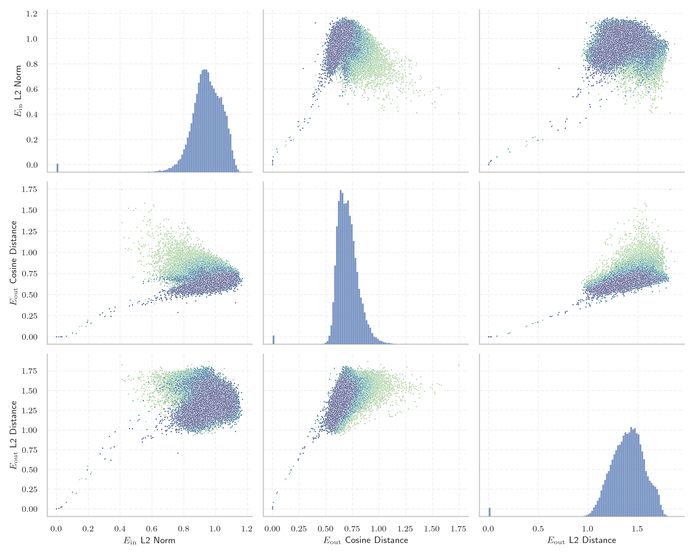
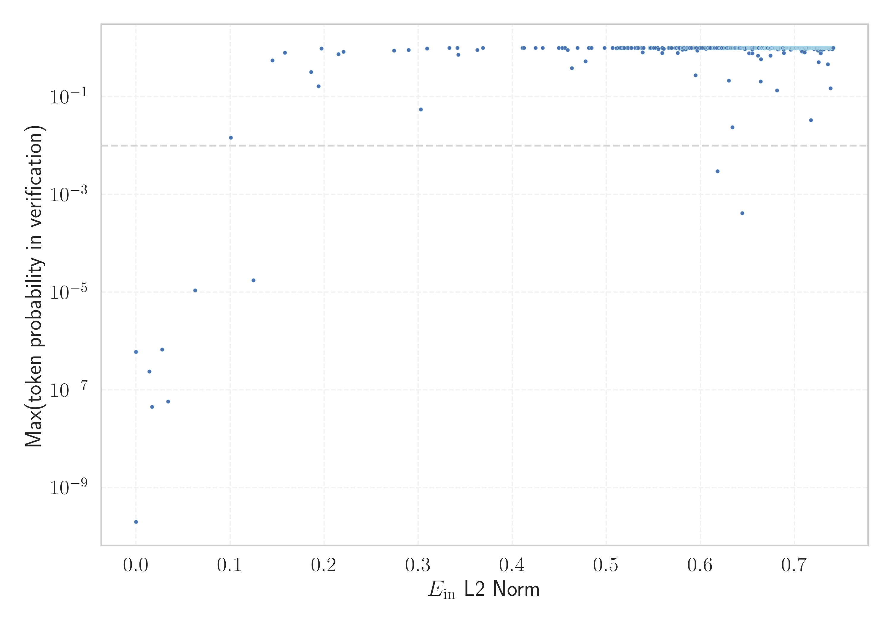

# Report for `kyutai/helium-1-preview-2b`

## Model info

* Model Info: 
  * Tied embeddings: False
  * LM head uses bias: False
  * Embeddings shape: [48000, 2560]
* Tokenizer Info: 
  * Vocab Size: 48000
  * Tokenizer Class: PreTrainedTokenizerFast
  * Tokenizer Type: Unigram
  * Bytes handling: Byte Fallback
  * Token for verification prompt building: considérablement
  * Token id for verification prompt building: 42598
* Indicator summary: 
  * Indicator for under-trained tokens: E_{in} L2 Norm
  * Overall distribution: 0.942 +/- 0.110
* Detected Token Counts: 
  * Number of tested under-trained tokens: 957, 773 non-special, 7 below p = 0.01 threshold, 11 below soft indicator threshold
  * Number of single byte tokens: 350, of which 109 below indicator threshold
  * Number of special tokens: 10, of which 0 below indicator threshold
  * Number of non-single-byte unreachable tokens: 10, of which 0 below indicator threshold

## Under-trained token indicators plot


## Verification plot


## Under-trained token verification results
11 entries below threshold of 0.221

|   token_id | token                  |   indicator | max_prob                                                         | in_other_tokens                                                                                                                                                                                                                                                                                                              |
|------------|------------------------|-------------|------------------------------------------------------------------|------------------------------------------------------------------------------------------------------------------------------------------------------------------------------------------------------------------------------------------------------------------------------------------------------------------------------|
|      46781 | ````` ▁TroveTag `````  | 3.91951e-07 | <span style='border: 1px solid rgb(169, 68, 66);'>6e-07</span>   |                                                                                                                                                                                                                                                                                                                              |
|      26259 | ````` ??(???)- `````   | 0.0140343   | <span style='border: 1px solid rgb(169, 68, 66);'>2.4e-07</span> |                                                                                                                                                                                                                                                                                                                              |
|      46039 | ````` libreTexts ````` | 0.0277668   | <span style='border: 1px solid rgb(169, 68, 66);'>6.7e-07</span> |                                                                                                                                                                                                                                                                                                                              |
|      41375 | ````` \({}^{-}\) ````` | 0.0341706   | <span style='border: 1px solid rgb(169, 68, 66);'>5.8e-08</span> |                                                                                                                                                                                                                                                                                                                              |
|      27051 | ````` \({}^{+}\) ````` | 0.0627526   | <span style='border: 1px solid rgb(169, 68, 66);'>1.1e-05</span> |                                                                                                                                                                                                                                                                                                                              |
|      23705 | ````` \({}_{\ `````    | 0.100691    | <span style='border: 1px solid rgb(251, 189, 8);'>0.014</span>   |                                                                                                                                                                                                                                                                                                                              |
|      22047 | ````` ??(???) `````    | 0.124622    | <span style='border: 1px solid rgb(169, 68, 66);'>1.7e-05</span> | <span style='border: 1px solid rgb(169, 68, 66);'>````` ??(???)- `````</span>                                                                                                                                                                                                                                                |
|       7203 | ````` \({}^{ `````     | 0.186033    | <span style='border: 1px solid rgb(40, 167, 69);'>0.32</span>    | <span style='border: 1px solid rgb(40, 167, 69);'>````` ▁\({}^{ `````</span>, <span style='border: 1px solid rgb(169, 68, 66);'>````` \({}^{-}\) `````</span>, <span style='border: 1px solid rgb(169, 68, 66);'>````` \({}^{+}\) `````</span>, <span style='border: 1px solid rgb(40, 167, 69);'>````` \({}^{\ `````</span> |
|      44675 | ````` ▁Arquivada ````` | 0.193836    | <span style='border: 1px solid rgb(40, 167, 69);'>0.16</span>    |                                                                                                                                                                                                                                                                                                                              |
|       9846 | ````` \({}^{\ `````    | 0.196977    | <span style='border: 1px solid rgb(40, 167, 69);'>0.97</span>    |                                                                                                                                                                                                                                                                                                                              |
|      21195 | ````` ▁\({}^{ `````    | 0.215154    | <span style='border: 1px solid rgb(40, 167, 69);'>0.75</span>    |                                                                                                                                                                                                                                                                                                                              |
<details><summary>762 additional entries above threshold</summary>

|   token_id | token                        |   indicator | max_prob                                                       | in_other_tokens                                                                                                                                                                                                                                                       |
|------------|------------------------------|-------------|----------------------------------------------------------------|-----------------------------------------------------------------------------------------------------------------------------------------------------------------------------------------------------------------------------------------------------------------------|
|       2793 | ````` \({}_{ `````           |    0.220514 | <span style='border: 1px solid rgb(40, 167, 69);'>0.83</span>  | <span style='border: 1px solid rgb(251, 189, 8);'>````` \({}_{\ `````</span>                                                                                                                                                                                          |
|      46658 | ````` \(>\) `````            |    0.274148 | <span style='border: 1px solid rgb(40, 167, 69);'>0.88</span>  |                                                                                                                                                                                                                                                                       |
|      45619 | ````` \(<\) `````            |    0.289752 | <span style='border: 1px solid rgb(40, 167, 69);'>0.91</span>  |                                                                                                                                                                                                                                                                       |
|      26053 | ````` LibreTexts `````       |    0.302604 | <span style='border: 1px solid rgb(251, 189, 8);'>0.055</span> |                                                                                                                                                                                                                                                                       |
|       8529 | ````` ▁AOCP `````            |    0.309187 | <span style='border: 1px solid rgb(40, 167, 69);'>0.97</span>  |                                                                                                                                                                                                                                                                       |
|      43032 | ````` \(-\) `````            |    0.332935 | <span style='border: 1px solid rgb(40, 167, 69);'>1</span>     |                                                                                                                                                                                                                                                                       |
|      36541 | ````` ▁CPRT `````            |    0.341509 | <span style='border: 1px solid rgb(40, 167, 69);'>1</span>     |                                                                                                                                                                                                                                                                       |
|      47146 | ````` ▁{{\| `````            |    0.342397 | <span style='border: 1px solid rgb(40, 167, 69);'>0.72</span>  |                                                                                                                                                                                                                                                                       |
|      40410 | ````` ▁\[= `````             |    0.362689 | <span style='border: 1px solid rgb(40, 167, 69);'>0.9</span>   |                                                                                                                                                                                                                                                                       |
|      39597 | ````` PMGD `````             |    0.368883 | <span style='border: 1px solid rgb(40, 167, 69);'>1</span>     |                                                                                                                                                                                                                                                                       |
|        363 | ````` ▁ `````                |    0.410829 | <span style='border: 1px solid rgb(40, 167, 69);'>1</span>     | ````` ▁Cela `````, ````` ▁Hand `````, ````` ▁enlaces `````, ````` ▁serpent `````, ````` ▁indizi `````, ...                                                                                                                                                            |
|        437 | ````` ing `````              |    0.432204 | <span style='border: 1px solid rgb(40, 167, 69);'>1</span>     | ````` ▁Operating `````, ````` inglese `````, ````` ▁superconducting `````, ````` keeping `````, ````` ▁positioning `````, ...                                                                                                                                         |
|        451 | ````` ed `````               |    0.449504 | <span style='border: 1px solid rgb(40, 167, 69);'>1</span>     | ````` ▁eliminated `````, ````` ▁attributed `````, ````` ▁mediated `````, ````` simplified `````, ````` zed `````, ...                                                                                                                                                 |
|        365 | ````` ▁the `````             |    0.453011 | <span style='border: 1px solid rgb(40, 167, 69);'>1</span>     | ````` ▁thereof `````, ````` ▁thermodynamic `````, ````` ▁theory `````, ````` ▁theologian `````, ````` ▁theatre `````, ...                                                                                                                                             |
|        447 | ````` er `````               |    0.456018 | <span style='border: 1px solid rgb(40, 167, 69);'>1</span>     | ````` ▁serpent `````, ````` ▁moderno `````, ````` ▁Denver `````, ````` ▁Operating `````, ````` ▁Raspberry `````, ...                                                                                                                                                  |
|      44591 | ````` Libretexts `````       |    0.458867 | <span style='border: 1px solid rgb(40, 167, 69);'>0.9</span>   |                                                                                                                                                                                                                                                                       |
|      22769 | ````` +}\) `````             |    0.46317  | <span style='border: 1px solid rgb(40, 167, 69);'>0.38</span>  | <span style='border: 1px solid rgb(169, 68, 66);'>````` \({}^{+}\) `````</span>                                                                                                                                                                                       |
|        442 | ````` es `````               |    0.469188 | <span style='border: 1px solid rgb(40, 167, 69);'>1</span>     | ````` ▁enlaces `````, ````` ▁Nuestra `````, ````` ▁species `````, ````` inglese `````, ````` ones `````, ...                                                                                                                                                          |
|      45251 | ````` ▁Suppongo `````        |    0.477697 | <span style='border: 1px solid rgb(40, 167, 69);'>0.53</span>  |                                                                                                                                                                                                                                                                       |
|      13586 | ````` ING `````              |    0.481405 | <span style='border: 1px solid rgb(40, 167, 69);'>1</span>     |                                                                                                                                                                                                                                                                       |
|      17379 | ````` .\xa0?? `````          |    0.510701 | <span style='border: 1px solid rgb(40, 167, 69);'>0.98</span>  |                                                                                                                                                                                                                                                                       |
|        422 | ````` en `````               |    0.515564 | <span style='border: 1px solid rgb(40, 167, 69);'>1</span>     | ````` ▁enlaces `````, ````` ▁serpent `````, ````` ▁wenige `````, ````` ▁Denver `````, ````` ▁engenheiro `````, ...                                                                                                                                                    |
|      24580 | ````` COCP `````             |    0.517825 | <span style='border: 1px solid rgb(40, 167, 69);'>1</span>     |                                                                                                                                                                                                                                                                       |
|      43208 | ````` ▁Pretas `````          |    0.518909 | <span style='border: 1px solid rgb(40, 167, 69);'>1</span>     |                                                                                                                                                                                                                                                                       |
|        900 | ````` ers `````              |    0.522931 | <span style='border: 1px solid rgb(40, 167, 69);'>1</span>     | ````` ▁verschoben `````, ````` ▁Emerson `````, ````` ▁believers `````, ````` iers `````, ````` ▁peers `````, ...                                                                                                                                                      |
|        510 | ````` ly `````               |    0.523098 | <span style='border: 1px solid rgb(40, 167, 69);'>1</span>     | ````` ▁intuitively `````, ````` ▁Marilyn `````, ````` analyze `````, ````` ▁Olympus `````, ````` ▁Flying `````, ...                                                                                                                                                   |
|        535 | ````` al `````               |    0.530645 | <span style='border: 1px solid rgb(40, 167, 69);'>1</span>     | ````` ▁archaeological `````, ````` ▁suicidal `````, ````` ▁periodontal `````, ````` ▁horizontal `````, ````` ▁Reginald `````, ...                                                                                                                                     |
|        800 | ````` ation `````            |    0.533726 | <span style='border: 1px solid rgb(40, 167, 69);'>1</span>     | ````` ▁illustrations `````, ````` ▁Aviation `````, ````` ▁interpretations `````, ````` ▁dissertation `````, ````` ▁association `````, ...                                                                                                                             |
|        777 | ````` ment `````             |    0.533747 | <span style='border: 1px solid rgb(40, 167, 69);'>1</span>     | ````` ▁lamenta `````, ````` ▁simplement `````, ````` ▁totalement `````, ````` ▁judgment `````, ````` ▁novamente `````, ...                                                                                                                                            |
|      40093 | ````` ▁suponho `````         |    0.538489 | <span style='border: 1px solid rgb(40, 167, 69);'>0.81</span>  |                                                                                                                                                                                                                                                                       |
|      44367 | ````` ▁pedone `````          |    0.53949  | <span style='border: 1px solid rgb(40, 167, 69);'>1</span>     |                                                                                                                                                                                                                                                                       |
|      38044 | ````` ATION `````            |    0.545942 | <span style='border: 1px solid rgb(40, 167, 69);'>1</span>     |                                                                                                                                                                                                                                                                       |
|        367 | ````` ▁of `````              |    0.545986 | <span style='border: 1px solid rgb(40, 167, 69);'>1</span>     | ````` ▁offizielle `````, ````` ▁offshore `````, ````` ▁offenbar `````, ````` ▁oficial `````, ````` ▁ofrece `````, ...                                                                                                                                                 |
|        540 | ````` te `````               |    0.546404 | <span style='border: 1px solid rgb(40, 167, 69);'>1</span>     | ````` ▁eliminated `````, ````` ▁testify `````, ````` ▁attributed `````, ````` ▁mediated `````, ````` ▁elevate `````, ...                                                                                                                                              |
|      31892 | ````` TION `````             |    0.546599 | <span style='border: 1px solid rgb(40, 167, 69);'>0.99</span>  | <span style='border: 1px solid rgb(40, 167, 69);'>````` ATION `````</span>                                                                                                                                                                                            |
|      46831 | ````` ▁Zauberspruch `````    |    0.54696  | <span style='border: 1px solid rgb(40, 167, 69);'>1</span>     |                                                                                                                                                                                                                                                                       |
|        462 | ````` re `````               |    0.550084 | <span style='border: 1px solid rgb(40, 167, 69);'>1</span>     | ````` ▁moisture `````, ````` ▁reazioni `````, ````` ▁reunir `````, ````` ▁repo `````, ````` ▁secured `````, ...                                                                                                                                                       |
|       1061 | ````` tion `````             |    0.550095 | <span style='border: 1px solid rgb(40, 167, 69);'>0.99</span>  | ````` ▁positioning `````, ````` ▁extraction `````, ````` ▁illustrations `````, ````` ▁Aviation `````, ````` ▁interpretations `````, ...                                                                                                                               |
|       5166 | ````` ES `````               |    0.550539 | <span style='border: 1px solid rgb(40, 167, 69);'>1</span>     | <span style='border: 1px solid rgb(40, 167, 69);'>````` EST `````</span>, ````` ▁UNESCO `````, ````` ▁REST `````, ````` ESA `````, ````` ESR `````, ...                                                                                                               |
|        373 | ````` ▁to `````              |    0.552407 | <span style='border: 1px solid rgb(40, 167, 69);'>1</span>     | ````` ▁totalement `````, ````` ▁todo `````, ````` ▁tools `````, ````` ▁tomography `````, ````` ▁tournaments `````, ...                                                                                                                                                |
|       1129 | ````` ción `````             |    0.555387 | <span style='border: 1px solid rgb(40, 167, 69);'>0.94</span>  | ````` ▁habitación `````, ````` ▁explicación `````, ````` ▁ecuación `````, ````` ▁organización `````, ````` ▁aprobación `````, ...                                                                                                                                     |
|      44707 | ````` }{*}{ `````            |    0.559409 | <span style='border: 1px solid rgb(40, 167, 69);'>0.78</span>  |                                                                                                                                                                                                                                                                       |
|        515 | ````` ’ `````                |    0.559476 | <span style='border: 1px solid rgb(40, 167, 69);'>1</span>     |                                                                                                                                                                                                                                                                       |
|       1151 | ````` ting `````             |    0.566079 | <span style='border: 1px solid rgb(40, 167, 69);'>1</span>     | ````` ▁Operating `````, ````` ▁superconducting `````, ````` ▁differentiating `````, ````` ▁fasting `````, ````` ▁atingir `````, ...                                                                                                                                   |
|        395 | ````` ▁as `````              |    0.566732 | <span style='border: 1px solid rgb(40, 167, 69);'>1</span>     | ````` ▁assign `````, ````` ▁astronomical `````, ````` ▁association `````, ````` ▁assumed `````, ````` ▁assegnato `````, ...                                                                                                                                           |
|      26694 | ````` Substantivo `````      |    0.568507 | <span style='border: 1px solid rgb(40, 167, 69);'>1</span>     |                                                                                                                                                                                                                                                                       |
|        385 | ````` ▁that `````            |    0.569205 | <span style='border: 1px solid rgb(40, 167, 69);'>1</span>     |                                                                                                                                                                                                                                                                       |
|       6388 | ````` ER `````               |    0.57289  | <span style='border: 1px solid rgb(40, 167, 69);'>1</span>     | <span style='border: 1px solid rgb(40, 167, 69);'>````` HER `````</span>, ````` SER `````, <span style='border: 1px solid rgb(40, 167, 69);'>````` ERS `````</span>, <span style='border: 1px solid rgb(40, 167, 69);'>````` DER `````</span>, ````` ▁ERA `````, ...  |
|        384 | ````` ▁for `````             |    0.573856 | <span style='border: 1px solid rgb(40, 167, 69);'>1</span>     | ````` ▁fora `````, ````` ▁forget `````, ````` ▁fornecida `````, ````` ▁forces `````, ````` ▁foresee `````, ...                                                                                                                                                        |
|        686 | ````` le `````               |    0.574466 | <span style='border: 1px solid rgb(40, 167, 69);'>1</span>     | ````` ▁faible `````, ````` inglese `````, ````` ▁elevate `````, ````` ▁simplement `````, ````` ▁Telescope `````, ...                                                                                                                                                  |
|      37517 | ````` ▁suppongo `````        |    0.575745 | <span style='border: 1px solid rgb(40, 167, 69);'>0.78</span>  |                                                                                                                                                                                                                                                                       |
|        487 | ````` in `````               |    0.576533 | <span style='border: 1px solid rgb(40, 167, 69);'>1</span>     | ````` ▁indizi `````, ````` ▁Hind `````, ````` ▁Operating `````, ````` ▁eliminated `````, ````` inglese `````, ...                                                                                                                                                     |
|        880 | ````` ity `````              |    0.576631 | <span style='border: 1px solid rgb(40, 167, 69);'>1</span>     | ````` ▁inability `````, ````` ▁parity `````, ````` ▁morbidity `````, ````` ▁Divinity `````, ````` ▁prosperity `````, ...                                                                                                                                              |
|       1002 | ````` ção `````              |    0.577255 | <span style='border: 1px solid rgb(40, 167, 69);'>0.97</span>  | ````` ▁separação `````, ````` dição `````, ````` ▁direção `````, ````` ▁corrupção `````, ````` ▁proporção `````, ...                                                                                                                                                  |
|      33920 | ````` MENT `````             |    0.577565 | <span style='border: 1px solid rgb(40, 167, 69);'>1</span>     |                                                                                                                                                                                                                                                                       |
|        392 | ````` ▁with `````            |    0.577818 | <span style='border: 1px solid rgb(40, 167, 69);'>1</span>     | ````` ▁withdrew `````, ````` ▁withdraw `````, ````` ▁withdrawn `````, ````` ▁without `````, ````` ▁withdrawal `````, ...                                                                                                                                              |
|        370 | ````` ▁and `````             |    0.580467 | <span style='border: 1px solid rgb(40, 167, 69);'>1</span>     | ````` ▁anderem `````, ````` ▁anderen `````, ````` ▁anderer `````, ````` ▁andere `````, ````` ▁andare `````, ...                                                                                                                                                       |
|       2214 | ````` ciones `````           |    0.580828 | <span style='border: 1px solid rgb(40, 167, 69);'>0.92</span>  | ````` ▁restricciones `````, ````` ▁emociones `````, <span style='border: 1px solid rgb(40, 167, 69);'>````` aciones `````</span>, ````` ducciones `````, ````` ▁aplicaciones `````, ...                                                                               |
|        610 | ````` or `````               |    0.580946 | <span style='border: 1px solid rgb(40, 167, 69);'>1</span>     | ````` ▁aorta `````, ````` Connor `````, ````` ▁gobernador `````, ````` ▁horizontal `````, ````` ▁liquor `````, ...                                                                                                                                                    |
|      34030 | ````` /]( `````              |    0.581573 | <span style='border: 1px solid rgb(40, 167, 69);'>0.98</span>  |                                                                                                                                                                                                                                                                       |
|       6106 | ````` LE `````               |    0.583646 | <span style='border: 1px solid rgb(40, 167, 69);'>1</span>     | ````` ILE `````, ````` ▁LED `````, ````` ▁SLE `````, ````` ▁LEGO `````, <span style='border: 1px solid rgb(40, 167, 69);'>````` LES `````</span>, ...                                                                                                                 |
|       1912 | ````` ções `````             |    0.584259 | <span style='border: 1px solid rgb(40, 167, 69);'>0.93</span>  | ````` ▁declarações `````, ````` ▁populações `````, ````` dições `````, ````` ▁operações `````, ````` posições `````, ...                                                                                                                                              |
|        661 | ````` se `````               |    0.584962 | <span style='border: 1px solid rgb(40, 167, 69);'>1</span>     | ````` ▁serpent `````, ````` inglese `````, ````` ▁secured `````, ````` ▁servant `````, ````` ▁searched `````, ...                                                                                                                                                     |
|       1214 | ````` ted `````              |    0.585507 | <span style='border: 1px solid rgb(40, 167, 69);'>1</span>     | ````` ▁eliminated `````, ````` ▁attributed `````, ````` ▁mediated `````, ````` ▁advocated `````, ````` related `````, ...                                                                                                                                             |
|        397 | ````` ▁on `````              |    0.585691 | <span style='border: 1px solid rgb(40, 167, 69);'>1</span>     | ````` ▁once `````, ````` ▁ontology `````, ````` ▁ongoing `````, ````` ▁only `````, ````` ▁onda `````, ...                                                                                                                                                             |
|       1268 | ````` zione `````            |    0.585754 | <span style='border: 1px solid rgb(40, 167, 69);'>1</span>     | ````` operazione `````, ````` ▁comunicazione `````, ````` ▁concentrazione `````, ````` ▁protezione `````, ````` assicurazione `````, ...                                                                                                                              |
|        379 | ````` ▁is `````              |    0.585896 | <span style='border: 1px solid rgb(40, 167, 69);'>1</span>     | ````` ▁issuing `````, ````` ▁isoliert `````, ````` ▁isolating `````, ````` ▁isomorphism `````, ````` ▁isso `````, ...                                                                                                                                                 |
|       5856 | ````` AL `````               |    0.588052 | <span style='border: 1px solid rgb(40, 167, 69);'>1</span>     | ````` MAL `````, <span style='border: 1px solid rgb(40, 167, 69);'>````` ALL `````</span>, ````` ALT `````, ````` GAL `````, ````` CAL `````, ...                                                                                                                     |
|        407 | ````` ▁from `````            |    0.593832 | <span style='border: 1px solid rgb(40, 167, 69);'>1</span>     |                                                                                                                                                                                                                                                                       |
|        377 | ````` ▁( `````               |    0.594272 | <span style='border: 1px solid rgb(40, 167, 69);'>1</span>     | ````` ▁($\ `````, ````` ▁(+ `````, ````` ▁(" `````, ````` ▁($ `````, ````` ▁(= `````, ...                                                                                                                                                                             |
|       1891 | ````` zioni `````            |    0.594604 | <span style='border: 1px solid rgb(40, 167, 69);'>1</span>     | ````` ▁reazioni `````, ````` ▁relazioni `````, ````` ▁azioni `````, ````` posizioni `````, ````` ▁applicazioni `````, ...                                                                                                                                             |
|      46992 | ````` ▁bezweifle `````       |    0.594905 | <span style='border: 1px solid rgb(40, 167, 69);'>0.27</span>  |                                                                                                                                                                                                                                                                       |
|       1233 | ````` ate `````              |    0.595238 | <span style='border: 1px solid rgb(40, 167, 69);'>1</span>     | ````` ▁eliminated `````, ````` ▁mediated `````, ````` ▁elevate `````, ````` ▁stimulate `````, ````` ▁heater `````, ...                                                                                                                                                |
|        626 | ````` ar `````               |    0.595982 | <span style='border: 1px solid rgb(40, 167, 69);'>1</span>     | ````` ▁Farm `````, ````` ▁archaeological `````, ````` ▁warm `````, ````` ▁barco `````, ````` ▁arches `````, ...                                                                                                                                                       |
|      47732 | ````` ▁supponendo `````      |    0.59682  | <span style='border: 1px solid rgb(40, 167, 69);'>0.87</span>  |                                                                                                                                                                                                                                                                       |
|       2015 | ````` rs `````               |    0.597797 | <span style='border: 1px solid rgb(40, 167, 69);'>1</span>     | ````` ▁verschoben `````, ````` ▁scorso `````, ````` ▁Emerson `````, ````` ▁Mrs `````, ````` ▁believers `````, ...                                                                                                                                                     |
|       1918 | ````` ación `````            |    0.598059 | <span style='border: 1px solid rgb(40, 167, 69);'>0.99</span>  | ````` ▁habitación `````, ````` ▁explicación `````, ````` ▁ecuación `````, ````` ▁organización `````, ````` ▁aprobación `````, ...                                                                                                                                     |
|        399 | ````` ▁by `````              |    0.602528 | <span style='border: 1px solid rgb(40, 167, 69);'>1</span>     | ````` ▁bypass `````, ````` ▁bytes `````                                                                                                                                                                                                                               |
|        732 | ````` us `````               |    0.604468 | <span style='border: 1px solid rgb(40, 167, 69);'>1</span>     | ````` ▁Russian `````, ````` ▁bust `````, ````` ▁illustrations `````, ````` russia `````, ````` ▁diffusion `````, ...                                                                                                                                                  |
|      17551 | ````` TER `````              |    0.605621 | <span style='border: 1px solid rgb(40, 167, 69);'>1</span>     |                                                                                                                                                                                                                                                                       |
|      45337 | ````` ▁elétron `````         |    0.605779 | <span style='border: 1px solid rgb(40, 167, 69);'>0.96</span>  |                                                                                                                                                                                                                                                                       |
|       2059 | ````` ance `````             |    0.606752 | <span style='border: 1px solid rgb(40, 167, 69);'>1</span>     | ````` ▁Renaissance `````, ````` ▁maintenance `````, ````` ▁ordinance `````, ````` ▁francese `````, ````` ▁lancement `````, ...                                                                                                                                        |
|        751 | ````` os `````               |    0.607413 | <span style='border: 1px solid rgb(40, 167, 69);'>1</span>     | ````` ▁próprios `````, ````` ▁Dios `````, ````` ▁positioning `````, ````` ▁miembros `````, ````` ▁muitos `````, ...                                                                                                                                                   |
|        489 | ````` to `````               |    0.607776 | <span style='border: 1px solid rgb(40, 167, 69);'>1</span>     | ````` ▁Christoph `````, ````` ▁totalement `````, ````` ▁Creator `````, ````` ▁voto `````, ````` ▁Moto `````, ...                                                                                                                                                      |
|        826 | ````` able `````             |    0.608029 | <span style='border: 1px solid rgb(40, 167, 69);'>1</span>     | ````` ▁fiable `````, ````` ▁applicable `````, ````` ▁improbable `````, ````` ▁identifiable `````, ````` ▁renewable `````, ...                                                                                                                                         |
|       5223 | ````` ments `````            |    0.609447 | <span style='border: 1px solid rgb(40, 167, 69);'>1</span>     | ````` ▁achievements `````, ````` ▁tournaments `````, ````` ▁sediments `````, ````` ▁treatments `````, ````` ▁changements `````, ...                                                                                                                                   |
|        369 | ````` ▁a `````               |    0.60964  | <span style='border: 1px solid rgb(40, 167, 69);'>1</span>     | ````` ▁aorta `````, ````` ▁archaeological `````, ````` ▁attributed `````, ````` ▁arches `````, ````` ▁assign `````, ...                                                                                                                                               |
|       3749 | ````` EN `````               |    0.610511 | <span style='border: 1px solid rgb(40, 167, 69);'>1</span>     | ````` END `````, <span style='border: 1px solid rgb(40, 167, 69);'>````` MENT `````</span>, <span style='border: 1px solid rgb(40, 167, 69);'>````` ENT `````</span>, ````` GEN `````                                                                                 |
|        371 | ````` ▁in `````              |    0.613518 | <span style='border: 1px solid rgb(40, 167, 69);'>1</span>     | ````` ▁indizi `````, ````` ▁integriert `````, ````` ▁internazionale `````, ````` ▁interna `````, ````` ▁indagini `````, ...                                                                                                                                           |
|      31732 | ````` ION `````              |    0.614232 | <span style='border: 1px solid rgb(40, 167, 69);'>1</span>     | <span style='border: 1px solid rgb(40, 167, 69);'>````` ATION `````</span>, <span style='border: 1px solid rgb(40, 167, 69);'>````` TION `````</span>                                                                                                                 |
|        405 | ````` ▁are `````             |    0.614385 | <span style='border: 1px solid rgb(40, 167, 69);'>1</span>     | ````` ▁area `````, ````` ▁areas `````, ````` ▁arena `````, ````` ▁aren `````                                                                                                                                                                                          |
|       1205 | ````` ion `````              |    0.614598 | <span style='border: 1px solid rgb(40, 167, 69);'>1</span>     | ````` ▁reazioni `````, ````` ▁positioning `````, ````` ▁internazionale `````, ````` ▁extraction `````, ````` ▁illustrations `````, ...                                                                                                                                |
|       1604 | ````` ação `````             |    0.614766 | <span style='border: 1px solid rgb(40, 167, 69);'>1</span>     | ````` ▁separação `````, ````` ▁configuração `````, ````` tração `````, ````` ▁publicação `````, ````` ▁instalação `````, ...                                                                                                                                          |
|       1751 | ````` ated `````             |    0.614918 | <span style='border: 1px solid rgb(40, 167, 69);'>1</span>     | ````` ▁eliminated `````, ````` ▁mediated `````, ````` ▁advocated `````, ````` related `````, ````` ▁repeatedly `````, ...                                                                                                                                             |
|       6457 | ````` ED `````               |    0.615004 | <span style='border: 1px solid rgb(40, 167, 69);'>1</span>     | ````` EED `````, ````` ▁ED `````, <span style='border: 1px solid rgb(40, 167, 69);'>````` TED `````</span>, ````` RED `````, ````` MED `````, ...                                                                                                                     |
|        643 | ````` on `````               |    0.616505 | <span style='border: 1px solid rgb(40, 167, 69);'>1</span>     | ````` Connor `````, ````` ▁reazioni `````, ````` ones `````, ````` ▁periodontal `````, ````` ▁superconducting `````, ...                                                                                                                                              |
|        672 | ````` an `````               |    0.617458 | <span style='border: 1px solid rgb(40, 167, 69);'>1</span>     | ````` ▁Hand `````, ````` ▁Russian `````, ````` ▁colocando `````, ````` ▁servant `````, ````` ▁Landwirtschaft `````, ...                                                                                                                                               |
|       1853 | ````` tes `````              |    0.617553 | <span style='border: 1px solid rgb(40, 167, 69);'>1</span>     | ````` ▁testify `````, ````` ▁testimony `````, ````` ▁habitantes `````, ````` ▁existentes `````, ````` ▁intestinal `````, ...                                                                                                                                          |
|        694 | ````` é `````                |    0.617655 | <span style='border: 1px solid rgb(40, 167, 69);'>1</span>     | ````` ▁modifié `````, ````` rés `````, ````` étape `````, ````` ▁livré `````, ````` ▁parlé `````, ...                                                                                                                                                                 |
|      40443 | ````` gnificativamente ````` |    0.618087 | <span style='border: 1px solid rgb(255, 145, 0);'>0.003</span> |                                                                                                                                                                                                                                                                       |
|        724 | ````` as `````               |    0.621038 | <span style='border: 1px solid rgb(40, 167, 69);'>1</span>     | ````` ▁Raspberry `````, ````` ▁treasurer `````, ````` ▁pervasive `````, ````` ▁assign `````, ````` ▁astronomical `````, ...                                                                                                                                           |
|        984 | ````` ant `````              |    0.621117 | <span style='border: 1px solid rgb(40, 167, 69);'>1</span>     | ````` ▁servant `````, ````` ▁pesanti `````, ````` ▁indépendante `````, ````` ▁variante `````, ````` ▁habitantes `````, ...                                                                                                                                            |
|       2252 | ````` ies `````              |    0.62228  | <span style='border: 1px solid rgb(40, 167, 69);'>1</span>     | ````` ▁remedies `````, ````` ▁Species `````, ````` ▁deficiencies `````, ````` ▁galaxies `````, ````` encies `````, ...                                                                                                                                                |
|       1119 | ````` et `````               |    0.622607 | <span style='border: 1px solid rgb(40, 167, 69);'>1</span>     | ````` ▁Better `````, ````` ▁interpretations `````, ````` ▁petite `````, ````` ▁corretto `````, ````` ▁erwartet `````, ...                                                                                                                                             |
|      42907 | ````` ▁peão `````            |    0.624502 | <span style='border: 1px solid rgb(40, 167, 69);'>0.98</span>  |                                                                                                                                                                                                                                                                       |
|       1962 | ````` ating `````            |    0.624574 | <span style='border: 1px solid rgb(40, 167, 69);'>1</span>     | ````` ▁Operating `````, ````` ▁differentiating `````, ````` ▁atingir `````, ````` ▁concentrating `````, ````` ▁mitigating `````, ...                                                                                                                                  |
|        469 | ````` ▁- `````               |    0.625917 | <span style='border: 1px solid rgb(40, 167, 69);'>1</span>     | ````` ▁-- `````, ````` ▁--> `````, ````` ▁-> `````                                                                                                                                                                                                                    |
|      44396 | ````` ▁Equação `````         |    0.626123 | <span style='border: 1px solid rgb(40, 167, 69);'>1</span>     |                                                                                                                                                                                                                                                                       |
|      41806 | ````` ▁polinomial `````      |    0.626295 | <span style='border: 1px solid rgb(40, 167, 69);'>0.99</span>  |                                                                                                                                                                                                                                                                       |
|       1328 | ````` ive `````              |    0.626806 | <span style='border: 1px solid rgb(40, 167, 69);'>1</span>     | ````` ▁pervasive `````, ````` ▁intuitively `````, ````` ▁investigative `````, ````` ▁estivesse `````, ````` ▁deceive `````, ...                                                                                                                                       |
|        762 | ````` st `````               |    0.626862 | <span style='border: 1px solid rgb(40, 167, 69);'>1</span>     | ````` ▁Nuestra `````, ````` ▁moisture `````, ````` ▁testify `````, ````` ▁estuda `````, ````` ▁Christoph `````, ...                                                                                                                                                   |
|        845 | ````` ic `````               |    0.626893 | <span style='border: 1px solid rgb(40, 167, 69);'>1</span>     | ````` ▁Democratic `````, ````` ▁archaeological `````, ````` ▁suicidal `````, ````` ▁Mathematica `````, ````` ▁chronological `````, ...                                                                                                                                |
|       5040 | ````` ations `````           |    0.626905 | <span style='border: 1px solid rgb(40, 167, 69);'>0.99</span>  | ````` ▁illustrations `````, ````` ▁interpretations `````, ````` ▁Relations `````, ````` ▁organisations `````, ````` informations `````, ...                                                                                                                           |
|        749 | ````` ia `````               |    0.627066 | <span style='border: 1px solid rgb(40, 167, 69);'>1</span>     | ````` ▁Russian `````, ````` ▁mediated `````, ````` ▁Aviation `````, ````` ▁variante `````, ````` russia `````, ...                                                                                                                                                    |
|        635 | ````` ve `````               |    0.627686 | <span style='border: 1px solid rgb(40, 167, 69);'>1</span>     | ````` ▁Denver `````, ````` ▁verschoben `````, ````` ▁pervasive `````, ````` ▁curves `````, ````` ▁overwhelming `````, ...                                                                                                                                             |
|       6041 | ````` tions `````            |    0.628007 | <span style='border: 1px solid rgb(40, 167, 69);'>1</span>     | ````` ▁illustrations `````, ````` ▁interpretations `````, ````` ▁assumptions `````, ````` ▁transactions `````, ````` ▁collections `````, ...                                                                                                                          |
|      23898 | ````` ERS `````              |    0.629143 | <span style='border: 1px solid rgb(40, 167, 69);'>1</span>     |                                                                                                                                                                                                                                                                       |
|        766 | ````` ce `````               |    0.629477 | <span style='border: 1px solid rgb(40, 167, 69);'>1</span>     | ````` ▁enlaces `````, ````` ▁pertenece `````, ````` intercept `````, ````` exercice `````, ````` ▁Peace `````, ...                                                                                                                                                    |
|       1140 | ````` ry `````               |    0.629548 | <span style='border: 1px solid rgb(40, 167, 69);'>1</span>     | ````` ▁Raspberry `````, ````` crypt `````, ````` ▁century `````, ````` ▁library `````, ````` ▁Secretary `````, ...                                                                                                                                                    |
|      40746 | ````` ▁orbitais `````        |    0.630235 | <span style='border: 1px solid rgb(40, 167, 69);'>0.21</span>  |                                                                                                                                                                                                                                                                       |
|        773 | ````` is `````               |    0.630938 | <span style='border: 1px solid rgb(40, 167, 69);'>1</span>     | ````` ▁moisture `````, ````` ▁dirais `````, ````` ▁choisir `````, ````` ▁Christoph `````, ````` established `````, ...                                                                                                                                                |
|        418 | ````` ▁or `````              |    0.631546 | <span style='border: 1px solid rgb(40, 167, 69);'>1</span>     | ````` ▁organización `````, ````` ▁oral `````, ````` ▁organise `````, ````` ▁ortogonal `````, ````` ▁ordered `````, ...                                                                                                                                                |
|       1273 | ````` age `````              |    0.631597 | <span style='border: 1px solid rgb(40, 167, 69);'>1</span>     | ````` ▁nuage `````, ````` ▁réglage `````, ````` ▁Passage `````, ````` ▁lavage `````, ````` ▁images `````, ...                                                                                                                                                         |
|       1512 | ````` ized `````             |    0.632218 | <span style='border: 1px solid rgb(40, 167, 69);'>1</span>     | ````` ▁criticized `````, ````` ▁seized `````, ````` ▁romanized `````, ````` ▁minimized `````, ````` organized `````, ...                                                                                                                                              |
|       1105 | ````` ent `````              |    0.63308  | <span style='border: 1px solid rgb(40, 167, 69);'>1</span>     | ````` ▁serpent `````, ````` ▁lamenta `````, ````` ▁simplement `````, ````` ▁totalement `````, ````` ▁judgment `````, ...                                                                                                                                              |
|      17560 | ````` LY `````               |    0.633643 | <span style='border: 1px solid rgb(40, 167, 69);'>1</span>     |                                                                                                                                                                                                                                                                       |
|      47839 | ````` obtiens `````          |    0.634026 | <span style='border: 1px solid rgb(251, 189, 8);'>0.024</span> |                                                                                                                                                                                                                                                                       |
|       1424 | ````` ling `````             |    0.634349 | <span style='border: 1px solid rgb(40, 167, 69);'>1</span>     | ````` ▁unwilling `````, ````` ▁revealing `````, ````` bling `````, ````` dling `````, ````` lingual `````, ...                                                                                                                                                        |
|        637 | ````` de `````               |    0.635245 | <span style='border: 1px solid rgb(40, 167, 69);'>1</span>     | ````` ▁moderno `````, ````` ▁murder `````, ````` ▁Todes `````, ````` ▁mode `````, ````` ▁regarded `````, ...                                                                                                                                                          |
|        857 | ````` mente `````            |    0.63593  | <span style='border: 1px solid rgb(40, 167, 69);'>1</span>     | ````` ▁novamente `````, ````` ▁personalmente `````, ````` ▁simplesmente `````, ````` ▁exclusivamente `````, ````` bilmente `````, ...                                                                                                                                 |
|       1561 | ````` ally `````             |    0.636041 | <span style='border: 1px solid rgb(40, 167, 69);'>1</span>     | ````` ▁partially `````, ````` ▁normally `````, ````` ▁visually `````, ````` ▁politically `````, ````` ▁Additionally `````, ...                                                                                                                                        |
|       1442 | ````` ty `````               |    0.636619 | <span style='border: 1px solid rgb(40, 167, 69);'>1</span>     | ````` ▁inability `````, ````` ▁parity `````, ````` ▁Treaty `````, ````` ▁morbidity `````, ````` ▁Divinity `````, ...                                                                                                                                                  |
|       1730 | ````` tive `````             |    0.637186 | <span style='border: 1px solid rgb(40, 167, 69);'>1</span>     | ````` ▁intuitively `````, ````` ▁investigative `````, ````` ▁estivesse `````, ````` ▁competitiveness `````, ````` ▁alternatively `````, ...                                                                                                                           |
|        387 | ````` ▁was `````             |    0.638388 | <span style='border: 1px solid rgb(40, 167, 69);'>1</span>     | ````` ▁wasn `````, ````` ▁washing `````, ````` ▁wastewater `````, ````` ▁waste `````, ````` ▁washed `````                                                                                                                                                             |
|        548 | ````` th `````               |    0.640039 | <span style='border: 1px solid rgb(40, 167, 69);'>1</span>     | ````` ▁Mathematica `````, ````` ▁brother `````, ````` ▁sixteenth `````, ````` ▁Cath `````, ````` ▁overthrow `````, ...                                                                                                                                                |
|       1994 | ````` azione `````           |    0.640303 | <span style='border: 1px solid rgb(40, 167, 69);'>1</span>     | ````` operazione `````, ````` ▁comunicazione `````, ````` ▁concentrazione `````, ````` assicurazione `````, ````` ▁spiegazione `````, ...                                                                                                                             |
|        897 | ````` ge `````               |    0.640713 | <span style='border: 1px solid rgb(40, 167, 69);'>1</span>     | ````` ▁wenige `````, ````` ▁nuage `````, ````` ▁engenheiro `````, ````` ▁gefolgt `````, ````` ▁dangereux `````, ...                                                                                                                                                   |
|        448 | ````` ▁y `````               |    0.640926 | <span style='border: 1px solid rgb(40, 167, 69);'>1</span>     | ````` ▁yard `````, ````` ▁yield `````, ````` ▁yellow `````, ````` ▁youth `````, <span style='border: 1px solid rgb(40, 167, 69);'>````` ▁your `````</span>, ...                                                                                                       |
|       5045 | ````` ors `````              |    0.641009 | <span style='border: 1px solid rgb(40, 167, 69);'>1</span>     | ````` ▁scorso `````, ````` ▁censorship `````, ````` ▁Warriors `````, ````` ▁racehorse `````, ````` ▁Alors `````, ...                                                                                                                                                  |
|        853 | ````` ll `````               |    0.641513 | <span style='border: 1px solid rgb(40, 167, 69);'>1</span>     | ````` ▁Hull `````, ````` ▁collègue `````, ````` ▁illustrations `````, ````` ▁unwilling `````, ````` ▁Mello `````, ...                                                                                                                                                 |
|       8125 | ````` IN `````               |    0.641619 | <span style='border: 1px solid rgb(40, 167, 69);'>1</span>     | ````` INS `````, ````` ▁IN `````, <span style='border: 1px solid rgb(40, 167, 69);'>````` INE `````</span>, ````` MIN `````, ````` IND `````, ...                                                                                                                     |
|       8480 | ````` ON `````               |    0.641635 | <span style='border: 1px solid rgb(40, 167, 69);'>1</span>     | ````` ▁NON `````, ````` SON `````, ````` ONU `````, ````` CON `````, ````` ▁CON `````, ...                                                                                                                                                                            |
|        406 | ````` ▁e `````               |    0.641688 | <span style='border: 1px solid rgb(40, 167, 69);'>1</span>     | ````` ▁enlaces `````, ````` ▁eliminated `````, ````` ▁engenheiro `````, ````` ▁elevate `````, ````` ▁espectro `````, ...                                                                                                                                              |
|       1265 | ````` der `````              |    0.641702 | <span style='border: 1px solid rgb(40, 167, 69);'>1</span>     | ````` ▁moderno `````, ````` ▁murder `````, ````` ▁Änderung `````, ````` ▁geändert `````, ````` ▁acceder `````, ...                                                                                                                                                    |
|        600 | ````` ta `````               |    0.642808 | <span style='border: 1px solid rgb(40, 167, 69);'>1</span>     | ````` ▁aorta `````, ````` ▁periodontal `````, ````` ▁horizontal `````, ````` ▁lamenta `````, ````` étape `````, ...                                                                                                                                                   |
|        902 | ````` ne `````               |    0.643361 | <span style='border: 1px solid rgb(40, 167, 69);'>1</span>     | ````` ones `````, ````` ▁pertenece `````, ````` dine `````, ````` ▁seine `````, ````` ▁necesitas `````, ...                                                                                                                                                           |
|        398 | ````` ▁que `````             |    0.644411 | <span style='border: 1px solid rgb(40, 167, 69);'>1</span>     | ````` ▁queima `````, ````` ▁questione `````, ````` ▁question `````, ````` ▁queda `````, ````` ▁quell `````, ...                                                                                                                                                       |
|        417 | ````` ). `````               |    0.645158 | <span style='border: 1px solid rgb(40, 167, 69);'>0.99</span>  | ````` %). `````, ````` \). `````, ````` ]). `````, ````` "). `````, ````` }\). `````, ...                                                                                                                                                                             |
|        943 | ````` el `````               |    0.64521  | <span style='border: 1px solid rgb(40, 167, 69);'>1</span>     | ````` ▁Cela `````, ````` ▁eliminated `````, ````` ▁Zweifel `````, ````` ▁elevate `````, ````` ▁Telescope `````, ...                                                                                                                                                   |
|       1081 | ````` ter `````              |    0.646622 | <span style='border: 1px solid rgb(40, 167, 69);'>1</span>     | ````` intercept `````, ````` ▁Better `````, ````` ▁internazionale `````, ````` ▁interna `````, ````` ▁Porter `````, ...                                                                                                                                               |
|       2465 | ````` idad `````             |    0.646693 | <span style='border: 1px solid rgb(40, 167, 69);'>1</span>     | ````` ▁actividades `````, ````` ▁cuidadosamente `````, ````` ▁personalidade `````, ````` ▁realidade `````, ````` ▁electricidad `````, ...                                                                                                                             |
|       2261 | ````` ement `````            |    0.646849 | <span style='border: 1px solid rgb(40, 167, 69);'>0.98</span>  | ````` ▁simplement `````, ````` ▁totalement `````, ````` ▁achievements `````, ````` Memento `````, ````` ▁également `````, ...                                                                                                                                         |
|       1736 | ````` ary `````              |    0.646861 | <span style='border: 1px solid rgb(40, 167, 69);'>1</span>     | ````` ▁library `````, ````` ▁Secretary `````, ````` ▁ternary `````, ````` ▁Judiciary `````, ````` ▁unitary `````, ...                                                                                                                                                 |
|      38713 | ````` \)\( `````             |    0.647134 | <span style='border: 1px solid rgb(40, 167, 69);'>0.94</span>  |                                                                                                                                                                                                                                                                       |
|       3036 | ````` led `````              |    0.647207 | <span style='border: 1px solid rgb(40, 167, 69);'>1</span>     | ````` ▁scheduled `````, ````` ▁recycled `````, ````` ▁sailed `````, ````` ▁spelled `````, ````` ledge `````, ...                                                                                                                                                      |
|       1074 | ````` at `````               |    0.647516 | <span style='border: 1px solid rgb(40, 167, 69);'>1</span>     | ````` ▁Democratic `````, ````` ▁Operating `````, ````` ▁eliminated `````, ````` ▁attributed `````, ````` ▁Mathematica `````, ...                                                                                                                                      |
|        425 | ````` ▁have `````            |    0.648082 | <span style='border: 1px solid rgb(40, 167, 69);'>1</span>     | ````` ▁haven `````                                                                                                                                                                                                                                                    |
|        934 | ````` nt `````               |    0.648355 | <span style='border: 1px solid rgb(40, 167, 69);'>1</span>     | ````` ▁serpent `````, ````` ▁periodontal `````, ````` ▁horizontal `````, ````` ▁lamenta `````, ````` ▁punteggio `````, ...                                                                                                                                            |
|      47253 | ````` talvez `````           |    0.648361 | <span style='border: 1px solid rgb(40, 167, 69);'>1</span>     |                                                                                                                                                                                                                                                                       |
|      37520 | ````` LES `````              |    0.648401 | <span style='border: 1px solid rgb(40, 167, 69);'>1</span>     |                                                                                                                                                                                                                                                                       |
|       2716 | ````` ence `````             |    0.648909 | <span style='border: 1px solid rgb(40, 167, 69);'>0.99</span>  | ````` ▁commencer `````, ````` ▁Référence `````, ````` gence `````, ````` ▁influences `````, ````` ▁dependence `````, ...                                                                                                                                              |
|      28055 | ````` RY `````               |    0.650772 | <span style='border: 1px solid rgb(40, 167, 69);'>1</span>     |                                                                                                                                                                                                                                                                       |
|       7953 | ````` CE `````               |    0.651019 | <span style='border: 1px solid rgb(40, 167, 69);'>1</span>     | ````` ▁ACE `````, ````` ACE `````, ````` SPACE `````, ````` ▁BCE `````, ````` ▁CE `````, ...                                                                                                                                                                          |
|       2615 | ````` ities `````            |    0.65138  | <span style='border: 1px solid rgb(40, 167, 69);'>1</span>     | ````` ▁entities `````, ````` ▁minorities `````, ````` ▁densities `````, ````` ▁facilities `````, ````` ▁probabilities `````, ...                                                                                                                                      |
|      47170 | ````` ▁sugiro `````          |    0.651784 | <span style='border: 1px solid rgb(40, 167, 69);'>0.77</span>  |                                                                                                                                                                                                                                                                       |
|        904 | ````` it `````               |    0.65202  | <span style='border: 1px solid rgb(40, 167, 69);'>1</span>     | ````` ▁positioning `````, ````` ▁Witch `````, ````` ▁qubits `````, ````` ▁inability `````, ````` ▁muitos `````, ...                                                                                                                                                   |
|       1720 | ````` les `````              |    0.652065 | <span style='border: 1px solid rgb(40, 167, 69);'>1</span>     | ````` inglese `````, ````` ▁Telescope `````, ````` ▁simplesmente `````, ````` ▁colesterol `````, ````` ▁resembles `````, ...                                                                                                                                          |
|      10507 | ````` AN `````               |    0.652237 | <span style='border: 1px solid rgb(40, 167, 69);'>1</span>     | ````` ▁VLAN `````, ````` ANS `````, ````` OTAN `````, <span style='border: 1px solid rgb(40, 167, 69);'>````` ANT `````</span>, ````` ANOVA `````, ...                                                                                                                |
|        389 | ````` ▁The `````             |    0.65234  | <span style='border: 1px solid rgb(40, 167, 69);'>1</span>     | ````` ▁Their `````, ````` ▁They `````, ````` ▁Then `````, ````` ▁Theoretical `````, ````` ▁Theodore `````, ...                                                                                                                                                        |
|       2337 | ````` res `````              |    0.652505 | <span style='border: 1px solid rgb(40, 167, 69);'>1</span>     | ````` ▁respeto `````, ````` ▁vicepresidente `````, ````` ▁Crescent `````, ````` ▁expressing `````, ````` ▁resembles `````, ...                                                                                                                                        |
|       4602 | ````` ions `````             |    0.65264  | <span style='border: 1px solid rgb(40, 167, 69);'>1</span>     | ````` ▁illustrations `````, ````` ▁interpretations `````, ````` ▁assumptions `````, ````` ▁transactions `````, ````` ▁pourrions `````, ...                                                                                                                            |
|        409 | ````` ▁at `````              |    0.652734 | <span style='border: 1px solid rgb(40, 167, 69);'>1</span>     | ````` ▁attributed `````, ````` ▁attending `````, ````` ▁atingir `````, ````` ▁athlete `````, ````` ▁atenção `````, ...                                                                                                                                                |
|       4486 | ````` ações `````            |    0.65276  | <span style='border: 1px solid rgb(40, 167, 69);'>1</span>     | ````` ▁declarações `````, ````` ▁populações `````, ````` ▁operações `````, ````` ▁Nações `````, ````` ▁configurações `````, ...                                                                                                                                       |
|        410 | ````` ▁an `````              |    0.65285  | <span style='border: 1px solid rgb(40, 167, 69);'>1</span>     | ````` ▁anisotropic `````, ````` ▁anderem `````, ````` ▁anno `````, ````` ▁angles `````, ````` ▁análise `````, ...                                                                                                                                                     |
|        609 | ````` do `````               |    0.652854 | <span style='border: 1px solid rgb(40, 167, 69);'>1</span>     | ````` ▁periodontal `````, ````` ▁gobernador `````, ````` ▁colocando `````, ````` ▁líquido `````, ````` ▁codon `````, ...                                                                                                                                              |
|       1642 | ````` ization `````          |    0.653167 | <span style='border: 1px solid rgb(40, 167, 69);'>1</span>     | ````` Characterization `````, ````` ▁Organization `````, ````` ▁privatization `````, ````` ▁stabilization `````, ````` ▁utilization `````, ...                                                                                                                        |
|       3349 | ````` izing `````            |    0.653205 | <span style='border: 1px solid rgb(40, 167, 69);'>1</span>     | ````` ▁characterizing `````, ````` ▁organizing `````, ````` ▁utilizing `````, ````` ▁stabilizing `````, ````` ▁emphasizing `````, ...                                                                                                                                 |
|      25313 | ````` TY `````               |    0.653872 | <span style='border: 1px solid rgb(40, 167, 69);'>1</span>     |                                                                                                                                                                                                                                                                       |
|      46856 | ````` ▁Pourriez `````        |    0.655178 | <span style='border: 1px solid rgb(40, 167, 69);'>0.93</span>  |                                                                                                                                                                                                                                                                       |
|      40290 | ````` Conifold `````         |    0.655213 | <span style='border: 1px solid rgb(40, 167, 69);'>0.77</span>  |                                                                                                                                                                                                                                                                       |
|       4559 | ````` aciones `````          |    0.655954 | <span style='border: 1px solid rgb(40, 167, 69);'>0.98</span>  | ````` ▁aplicaciones `````, ````` ▁operaciones `````, ````` ▁poblaciones `````, ````` ▁observaciones `````, ````` ▁situaciones `````, ...                                                                                                                              |
|        650 | ````` da `````               |    0.655974 | <span style='border: 1px solid rgb(40, 167, 69);'>1</span>     | ````` ▁suicidal `````, ````` ▁estuda `````, ````` ▁dangereux `````, ````` ▁indagini `````, ````` ▁indépendante `````, ...                                                                                                                                             |
|       1166 | ````` ie `````               |    0.656012 | <span style='border: 1px solid rgb(40, 167, 69);'>1</span>     | ````` simplified `````, ````` ▁integriert `````, ````` ▁Aktien `````, ````` ▁miembros `````, ````` ▁géométrie `````, ...                                                                                                                                              |
|       1059 | ````` ist `````              |    0.656857 | <span style='border: 1px solid rgb(40, 167, 69);'>1</span>     | ````` ▁moisture `````, ````` ▁Christoph `````, ````` ▁Komponist `````, ````` ▁Cristian `````, ````` ▁distinction `````, ...                                                                                                                                           |
|       3538 | ````` ture `````             |    0.657364 | <span style='border: 1px solid rgb(40, 167, 69);'>1</span>     | ````` ▁moisture `````, ````` ▁infrastructure `````, ````` ▁manufacturers `````, ````` ▁microstructure `````, ````` ▁naturelle `````, ...                                                                                                                              |
|       2946 | ````` ative `````            |    0.658516 | <span style='border: 1px solid rgb(40, 167, 69);'>1</span>     | ````` ▁investigative `````, ````` ▁alternatively `````, ````` ▁Quantitative `````, ````` ▁Native `````, ````` ▁Relative `````, ...                                                                                                                                    |
|        901 | ````` ten `````              |    0.658586 | <span style='border: 1px solid rgb(40, 167, 69);'>1</span>     | ````` ▁pertenece `````, ````` ▁attending `````, ````` ▁ottengo `````, ````` ▁existentes `````, ````` ▁maintenance `````, ...                                                                                                                                          |
|       3453 | ````` ised `````             |    0.659189 | <span style='border: 1px solid rgb(40, 167, 69);'>1</span>     | ````` ▁compromised `````, ````` ▁characterised `````, ````` ▁realised `````, ````` ▁raised `````, ````` ▁organised `````, ...                                                                                                                                         |
|       1269 | ````` ness `````             |    0.659571 | <span style='border: 1px solid rgb(40, 167, 69);'>1</span>     | ````` ▁competitiveness `````, ````` ▁wilderness `````, ````` ▁hardness `````, ````` ▁harness `````, ````` ▁sickness `````, ...                                                                                                                                        |
|      46409 | ````` ▁Capisco `````         |    0.659649 | <span style='border: 1px solid rgb(40, 167, 69);'>1</span>     |                                                                                                                                                                                                                                                                       |
|       3017 | ````` SE `````               |    0.660444 | <span style='border: 1px solid rgb(40, 167, 69);'>1</span>     | ````` SER `````, ````` ▁SEP `````, ````` MSE `````, ````` ▁SEM `````, ````` ▁RMSE `````, ...                                                                                                                                                                          |
|        429 | ````` ▁were `````            |    0.660979 | <span style='border: 1px solid rgb(40, 167, 69);'>1</span>     |                                                                                                                                                                                                                                                                       |
|      45391 | ````` Oddthinking `````      |    0.661086 | <span style='border: 1px solid rgb(40, 167, 69);'>0.7</span>   |                                                                                                                                                                                                                                                                       |
|       1653 | ````` ía `````               |    0.661196 | <span style='border: 1px solid rgb(40, 167, 69);'>1</span>     | ````` ▁estaría `````, ````` ▁fotografía `````, ````` Debería `````, ````` ología `````, ````` podría `````, ...                                                                                                                                                       |
|       2175 | ````` és `````               |    0.661289 | <span style='border: 1px solid rgb(40, 167, 69);'>1</span>     | ````` rés `````, ````` ▁résulte `````, ````` ▁Brésil `````, ````` ▁président `````, ````` ▁unités `````, ...                                                                                                                                                          |
|        440 | ````` ), `````               |    0.661533 | <span style='border: 1px solid rgb(40, 167, 69);'>1</span>     | ````` \), `````, ````` %), `````, ````` "), `````, ````` ]), `````, ````` }\), `````                                                                                                                                                                                  |
|        994 | ````` um `````               |    0.661581 | <span style='border: 1px solid rgb(40, 167, 69);'>1</span>     | ````` datum `````, ````` sumo `````, ````` ▁Tumor `````, ````` ▁instrument `````, ````` ▁assumed `````, ...                                                                                                                                                           |
|       5373 | ````` CH `````               |    0.662207 | <span style='border: 1px solid rgb(40, 167, 69);'>1</span>     | ````` CHE `````, ````` CHA `````, ````` CHO `````, ````` ▁CH `````, ````` ARCH `````                                                                                                                                                                                  |
|      29893 | ````` AY `````               |    0.663535 | <span style='border: 1px solid rgb(40, 167, 69);'>1</span>     |                                                                                                                                                                                                                                                                       |
|       1669 | ````` nte `````              |    0.663648 | <span style='border: 1px solid rgb(40, 167, 69);'>1</span>     | ````` ▁punteggio `````, ````` ▁integriert `````, ````` intercept `````, ````` ▁internazionale `````, ````` ▁interna `````, ...                                                                                                                                        |
|      41603 | ````` ▁mencionou `````       |    0.663983 | <span style='border: 1px solid rgb(40, 167, 69);'>0.2</span>   |                                                                                                                                                                                                                                                                       |
|      28240 | ````` ▁Selsoviet `````       |    0.664179 | <span style='border: 1px solid rgb(40, 167, 69);'>0.58</span>  |                                                                                                                                                                                                                                                                       |
|       3459 | ````` ões `````              |    0.664232 | <span style='border: 1px solid rgb(40, 167, 69);'>1</span>     | ````` ▁declarações `````, ````` ▁populações `````, ````` dições `````, ````` ▁operações `````, ````` posições `````, ...                                                                                                                                              |
|       1366 | ````` das `````              |    0.664491 | <span style='border: 1px solid rgb(40, 167, 69);'>1</span>     | ````` ▁dashed `````, ````` ▁oxidase `````, <span style='border: 1px solid rgb(40, 167, 69);'>````` izadas `````</span>, ````` ▁toneladas `````, ````` ▁relacionadas `````, ...                                                                                        |
|       1039 | ````` ur `````               |    0.664786 | <span style='border: 1px solid rgb(40, 167, 69);'>1</span>     | ````` ▁moisture `````, ````` ▁murder `````, ````` ▁secured `````, ````` ▁Futur `````, ````` ▁treasurer `````, ...                                                                                                                                                     |
|        454 | ````` ▁has `````             |    0.665208 | <span style='border: 1px solid rgb(40, 167, 69);'>1</span>     | ````` ▁hasta `````, ````` ▁hash `````, ````` ▁hast `````                                                                                                                                                                                                              |
|       2323 | ````` ité `````              |    0.665592 | <span style='border: 1px solid rgb(40, 167, 69);'>1</span>     | ````` ▁proximité `````, ````` ▁unités `````, ````` unité `````, ````` ▁nécessité `````, ````` ▁complexité `````, ...                                                                                                                                                  |
|        619 | ````` no `````               |    0.665711 | <span style='border: 1px solid rgb(40, 167, 69);'>1</span>     | ````` ▁moderno `````, ````` Connor `````, ````` ▁chronological `````, ````` ▁taxonomic `````, ````` ▁novamente `````, ...                                                                                                                                             |
|       2525 | ````` idade `````            |    0.666395 | <span style='border: 1px solid rgb(40, 167, 69);'>1</span>     | ````` ▁actividades `````, ````` ▁personalidade `````, ````` ▁realidade `````, ````` ▁gravidade `````, ````` ▁oportunidade `````, ...                                                                                                                                  |
|       2548 | ````` isation `````          |    0.666821 | <span style='border: 1px solid rgb(40, 167, 69);'>1</span>     | ````` ▁civilisation `````, ````` ▁organisations `````, ````` autorisation `````, ````` utilisation `````, ````` ▁improvisation `````, ...                                                                                                                             |
|        640 | ````` est `````              |    0.667375 | <span style='border: 1px solid rgb(40, 167, 69);'>1</span>     | ````` ▁Nuestra `````, ````` ▁testify `````, ````` ▁estuda `````, ````` ▁testimony `````, ````` established `````, ...                                                                                                                                                 |
|      23059 | ````` ENT `````              |    0.667426 | <span style='border: 1px solid rgb(40, 167, 69);'>1</span>     | <span style='border: 1px solid rgb(40, 167, 69);'>````` MENT `````</span>                                                                                                                                                                                             |
|        617 | ````` il `````               |    0.667587 | <span style='border: 1px solid rgb(40, 167, 69);'>1</span>     | ````` ▁illustrations `````, ````` ▁unwilling `````, ````` ▁Bildschirm `````, ````` ▁inability `````, ````` ▁Lille `````, ...                                                                                                                                          |
|      34558 | ````` ▁suposição `````       |    0.668103 | <span style='border: 1px solid rgb(40, 167, 69);'>0.99</span>  |                                                                                                                                                                                                                                                                       |
|        432 | ````` ▁which `````           |    0.668595 | <span style='border: 1px solid rgb(40, 167, 69);'>1</span>     |                                                                                                                                                                                                                                                                       |
|        952 | ````` ado `````              |    0.668671 | <span style='border: 1px solid rgb(40, 167, 69);'>1</span>     | ````` ▁gobernador `````, ````` vado `````, ````` ▁jugador `````, ````` ▁basado `````, ````` ▁comprado `````, ...                                                                                                                                                      |
|       4769 | ````` IA `````               |    0.668757 | <span style='border: 1px solid rgb(40, 167, 69);'>1</span>     | ````` ▁CIA `````, ````` ▁IA `````, ````` IAA `````, ````` IATA `````                                                                                                                                                                                                  |
|        669 | ````` ti `````               |    0.669039 | <span style='border: 1px solid rgb(40, 167, 69);'>1</span>     | ````` ▁Democratic `````, ````` ▁Operating `````, ````` ▁testify `````, ````` ▁superconducting `````, ````` ▁Mathematica `````, ...                                                                                                                                    |
|       1099 | ````` ” `````                |    0.669085 | <span style='border: 1px solid rgb(40, 167, 69);'>1</span>     | ````` .” `````, ````` ?” `````, ````` ”, `````, ````` ”. `````                                                                                                                                                                                                        |
|       2765 | ````` ize `````              |    0.669315 | <span style='border: 1px solid rgb(40, 167, 69);'>1</span>     | ````` size `````, ````` ▁Belize `````, ````` ▁criticized `````, ````` ▁citizens `````, ````` ▁seized `````, ...                                                                                                                                                       |
|       8830 | ````` TE `````               |    0.669395 | <span style='border: 1px solid rgb(40, 167, 69);'>1</span>     | <span style='border: 1px solid rgb(40, 167, 69);'>````` TED `````</span>, ````` ▁STEM `````, ````` STE `````, ````` ▁ACCEPTED `````, ````` ▁NOTE `````, ...                                                                                                           |
|        439 | ````` ▁et `````              |    0.669924 | <span style='border: 1px solid rgb(40, 167, 69);'>1</span>     | ````` ▁etwa `````, ````` ▁etiology `````, ````` ▁ethernet `````, ````` ▁etabliert `````, ````` ▁ethical `````, ...                                                                                                                                                    |
|       1988 | ````` ons `````              |    0.669987 | <span style='border: 1px solid rgb(40, 167, 69);'>1</span>     | ````` ▁illustrations `````, ````` ▁interpretations `````, ````` ▁Demonstration `````, ````` ▁construída `````, ````` ▁constrain `````, ...                                                                                                                            |
|       3648 | ````` dores `````            |    0.670196 | <span style='border: 1px solid rgb(40, 167, 69);'>1</span>     | ````` ▁investigadores `````, ````` ▁consumidores `````, ````` ▁computadores `````, ````` ▁trabalhadores `````, ````` ▁pesquisadores `````, ...                                                                                                                        |
|       4508 | ````` ants `````             |    0.670365 | <span style='border: 1px solid rgb(40, 167, 69);'>1</span>     | ````` ▁pants `````, ````` ▁Giants `````, ````` ▁remnants `````, ````` ▁pollutants `````, ````` ▁mutants `````, ...                                                                                                                                                    |
|      22360 | ````` CK `````               |    0.670996 | <span style='border: 1px solid rgb(40, 167, 69);'>1</span>     | <span style='border: 1px solid rgb(40, 167, 69);'>````` ACK `````</span>, ````` ▁CKD `````, ````` ▁CK `````                                                                                                                                                           |
|       1508 | ````` tor `````              |    0.671372 | <span style='border: 1px solid rgb(40, 167, 69);'>1</span>     | ````` ▁Creator `````, ````` ▁progenitor `````, ````` ▁navigator `````, ````` ▁vettore `````, ````` ▁actor `````, ...                                                                                                                                                  |
|        497 | ````` ▁time `````            |    0.671675 | <span style='border: 1px solid rgb(40, 167, 69);'>1</span>     | ````` ▁timestamp `````, <span style='border: 1px solid rgb(40, 167, 69);'>````` ▁times `````</span>, ````` ▁timeline `````, ````` ▁timescale `````                                                                                                                    |
|       8948 | ````` ates `````             |    0.67278  | <span style='border: 1px solid rgb(40, 167, 69);'>1</span>     | ````` ▁replicates `````, ````` ▁substrates `````, ````` ▁demonstrates `````, ````` ▁gates `````, ````` mates `````, ...                                                                                                                                               |
|       2668 | ````` ring `````             |    0.67304  | <span style='border: 1px solid rgb(40, 167, 69);'>1</span>     | ````` ▁brings `````, ````` ▁occurring `````, ````` bearing `````, ````` ▁syringe `````, ````` ▁ring `````, ...                                                                                                                                                        |
|       7111 | ````` EL `````               |    0.673215 | <span style='border: 1px solid rgb(40, 167, 69);'>1</span>     | ````` ▁ELISA `````, ````` DEL `````, <span style='border: 1px solid rgb(40, 167, 69);'>````` ELL `````</span>, ````` REL `````                                                                                                                                        |
|        419 | ````` ▁this `````            |    0.673226 | <span style='border: 1px solid rgb(40, 167, 69);'>1</span>     |                                                                                                                                                                                                                                                                       |
|       3587 | ````` ical `````             |    0.673344 | <span style='border: 1px solid rgb(40, 167, 69);'>1</span>     | ````` ▁archaeological `````, ````` ▁chronological `````, ````` ▁astronomical `````, ````` ▁Ethical `````, ````` ▁politically `````, ...                                                                                                                               |
|       2406 | ````` amento `````           |    0.673499 | <span style='border: 1px solid rgb(40, 167, 69);'>0.97</span>  | ````` ▁pagamento `````, ````` ▁equipamento `````, ````` ▁filamento `````, ````` ▁comportamento `````, ````` ▁parlamento `````, ...                                                                                                                                    |
|        400 | ````` ▁" `````               |    0.673813 | <span style='border: 1px solid rgb(40, 167, 69);'>1</span>     | ````` ▁"* `````, ````` ▁"¿ `````, ````` ▁"... `````, ````` ▁"[ `````                                                                                                                                                                                                  |
|       8267 | ````` RE `````               |    0.674182 | <span style='border: 1px solid rgb(40, 167, 69);'>1</span>     | ````` ▁RE `````, ````` REA `````, ````` ARE `````, ````` PRE `````, ````` RED `````, ...                                                                                                                                                                              |
|       1021 | ````` ung `````              |    0.674202 | <span style='border: 1px solid rgb(40, 167, 69);'>1</span>     | ````` lung `````, ````` ▁Änderung `````, ````` ▁fungi `````, ````` Bindung `````, ````` ▁Messung `````, ...                                                                                                                                                           |
|        774 | ````` la `````               |    0.67425  | <span style='border: 1px solid rgb(40, 167, 69);'>1</span>     | ````` ▁Cela `````, ````` ▁enlaces `````, ````` ▁lamenta `````, ````` ▁stimulate `````, ````` ▁dupla `````, ...                                                                                                                                                        |
|       2279 | ````` mento `````            |    0.674313 | <span style='border: 1px solid rgb(40, 167, 69);'>1</span>     | ````` Memento `````, ````` ▁fallimento `````, ````` esperimento `````, ````` ▁pagamento `````, ````` ▁equipamento `````, ...                                                                                                                                          |
|      47563 | ````` ▁razoavelmente `````   |    0.674457 | <span style='border: 1px solid rgb(40, 167, 69);'>0.69</span>  |                                                                                                                                                                                                                                                                       |
|        517 | ````` ▁about `````           |    0.674778 | <span style='border: 1px solid rgb(40, 167, 69);'>1</span>     |                                                                                                                                                                                                                                                                       |
|        424 | ````` ▁you `````             |    0.675005 | <span style='border: 1px solid rgb(40, 167, 69);'>1</span>     | ````` ▁youth `````, <span style='border: 1px solid rgb(40, 167, 69);'>````` ▁your `````</span>, ````` ▁young `````, ````` ▁yourself `````, ````` ▁younger `````, ...                                                                                                  |
|       3092 | ````` ning `````             |    0.675885 | <span style='border: 1px solid rgb(40, 167, 69);'>1</span>     | ````` ▁positioning `````, ````` ▁warning `````, ````` ▁mining `````, ````` ▁earnings `````, ````` ▁partitioning `````, ...                                                                                                                                            |
|       4214 | ````` ists `````             |    0.676129 | <span style='border: 1px solid rgb(40, 167, 69);'>1</span>     | ````` ▁colonists `````, ````` ▁activists `````, ````` ologists `````, ````` ▁scientists `````, ````` ▁tourists `````, ...                                                                                                                                             |
|      36386 | ````` DER `````              |    0.676242 | <span style='border: 1px solid rgb(40, 167, 69);'>1</span>     |                                                                                                                                                                                                                                                                       |
|      31642 | ````` ATE `````              |    0.67627  | <span style='border: 1px solid rgb(40, 167, 69);'>1</span>     |                                                                                                                                                                                                                                                                       |
|        727 | ````` man `````              |    0.676363 | <span style='border: 1px solid rgb(40, 167, 69);'>1</span>     | ````` ▁domande `````, ````` ▁manufacturers `````, ````` ▁demandé `````, ````` ▁commande `````, ````` ▁manifold `````, ...                                                                                                                                             |
|       4007 | ````` US `````               |    0.676402 | <span style='border: 1px solid rgb(40, 167, 69);'>1</span>     | ````` ▁USB `````, ````` ▁USD `````, ````` USD `````, ````` ▁SUSY `````, ````` ▁USS `````, ...                                                                                                                                                                         |
|        376 | ````` ▁de `````              |    0.6772   | <span style='border: 1px solid rgb(40, 167, 69);'>1</span>     | ````` ▁deals `````, ````` ▁deceive `````, ````` ▁descrever `````, ````` ▁deterioration `````, ````` ▁deficiencies `````, ...                                                                                                                                          |
|       1332 | ````` dos `````              |    0.67749  | <span style='border: 1px solid rgb(40, 167, 69);'>1</span>     | ````` ▁separados `````, ````` ▁cuidadosamente `````, ````` ▁endoscopic `````, ````` ▁métodos `````, ````` ▁resultados `````, ...                                                                                                                                      |
|       3505 | ````` ées `````              |    0.677596 | <span style='border: 1px solid rgb(40, 167, 69);'>0.99</span>  | ````` ▁années `````, ````` ▁coordonnées `````, ````` ▁données `````, ````` ▁idées `````, ````` ▁entrées `````, ...                                                                                                                                                    |
|       4660 | ````` TS `````               |    0.678357 | <span style='border: 1px solid rgb(40, 167, 69);'>1</span>     | ````` ▁PTSD `````, ````` ▁STS `````                                                                                                                                                                                                                                   |
|      38277 | ````` URE `````              |    0.678607 | <span style='border: 1px solid rgb(40, 167, 69);'>1</span>     | ````` ▁FIGURE `````                                                                                                                                                                                                                                                   |
|       4078 | ````` nce `````              |    0.678685 | <span style='border: 1px solid rgb(40, 167, 69);'>1</span>     | ````` ▁Renaissance `````, ````` ▁maintenance `````, ````` ▁commencer `````, ````` ▁Référence `````, ````` ▁pince `````, ...                                                                                                                                           |
|        438 | ````` ▁l `````               |    0.678773 | <span style='border: 1px solid rgb(40, 167, 69);'>1</span>     | ````` ▁lamenta `````, ````` ▁libera `````, ````` ▁líquido `````, ````` ▁liquor `````, ````` ▁livré `````, ...                                                                                                                                                         |
|      44395 | ````` ▁quântico `````        |    0.67886  | <span style='border: 1px solid rgb(40, 167, 69);'>0.98</span>  |                                                                                                                                                                                                                                                                       |
|       5704 | ````` ización `````          |    0.678916 | <span style='border: 1px solid rgb(40, 167, 69);'>0.99</span>  | ````` ▁organización `````                                                                                                                                                                                                                                             |
|        913 | ````` am `````               |    0.679368 | <span style='border: 1px solid rgb(40, 167, 69);'>1</span>     | ````` ▁lamenta `````, ````` ▁Kam `````, ````` ▁novamente `````, ````` ▁stream `````, ````` ▁cramp `````, ...                                                                                                                                                          |
|        520 | ````` ▁when `````            |    0.679422 | <span style='border: 1px solid rgb(40, 167, 69);'>1</span>     | ````` ▁whenever `````                                                                                                                                                                                                                                                 |
|       1357 | ````` ian `````              |    0.680026 | <span style='border: 1px solid rgb(40, 167, 69);'>1</span>     | ````` ▁Russian `````, ````` ▁variante `````, ````` ▁Tian `````, ````` ▁Cristian `````, ````` ▁Indians `````, ...                                                                                                                                                      |
|       2042 | ````` ados `````             |    0.680246 | <span style='border: 1px solid rgb(40, 167, 69);'>1</span>     | ````` ▁separados `````, ````` ▁cuidadosamente `````, ````` ▁resultados `````, ````` ▁lados `````, ````` ▁dados `````, ...                                                                                                                                             |
|       6988 | ````` ving `````             |    0.680396 | <span style='border: 1px solid rgb(40, 167, 69);'>1</span>     | ````` having `````, ````` ▁observing `````, ````` preserving `````, ````` ▁proving `````, ````` aving `````, ...                                                                                                                                                      |
|        652 | ````` ▁– `````               |    0.680731 | <span style='border: 1px solid rgb(40, 167, 69);'>1</span>     |                                                                                                                                                                                                                                                                       |
|        559 | ````` ▁up `````              |    0.680834 | <span style='border: 1px solid rgb(40, 167, 69);'>1</span>     | ````` ▁upwards `````, ````` ▁updating `````, ````` ▁upgrading `````, ````` ▁upright `````, ````` ▁upvote `````, ...                                                                                                                                                   |
|       1785 | ````` ão `````               |    0.680921 | <span style='border: 1px solid rgb(40, 167, 69);'>0.99</span>  | ````` ▁separação `````, ````` ▁órgão `````, ````` dição `````, ````` ▁Não `````, ````` ▁direção `````, ...                                                                                                                                                            |
|       3969 | ````` king `````             |    0.681146 | <span style='border: 1px solid rgb(40, 167, 69);'>1</span>     | ````` ▁kingdom `````, ````` ▁Buckinghamshire `````, ````` ▁Looking `````, ````` ▁Working `````, ````` making `````, ...                                                                                                                                               |
|      46650 | ````` \%\) `````             |    0.681448 | <span style='border: 1px solid rgb(40, 167, 69);'>0.13</span>  |                                                                                                                                                                                                                                                                       |
|        426 | ````` ▁o `````               |    0.681511 | <span style='border: 1px solid rgb(40, 167, 69);'>1</span>     | ````` ▁overwhelming `````, ````` ▁overthrow `````, ````` ▁obtuvo `````, ````` ▁ottengo `````, ````` ▁organización `````, ...                                                                                                                                          |
|       2347 | ````` ità `````              |    0.681567 | <span style='border: 1px solid rgb(40, 167, 69);'>0.99</span>  | ````` opportunità `````, ````` ▁gravità `````, ````` attività `````, ````` ▁necessità `````, ````` unità `````, ...                                                                                                                                                   |
|       5271 | ````` OR `````               |    0.681645 | <span style='border: 1px solid rgb(40, 167, 69);'>1</span>     | ````` ▁OR `````, ````` NOR `````, ````` ▁LORD `````, ````` ▁ORF `````, <span style='border: 1px solid rgb(40, 167, 69);'>````` TOR `````</span>, ...                                                                                                                  |
|        404 | ````` ▁it `````              |    0.681925 | <span style='border: 1px solid rgb(40, 167, 69);'>1</span>     | ````` ▁items `````, ````` ▁iteration `````, ````` ▁iterative `````, ````` ▁italiano `````, ````` ▁item `````, ...                                                                                                                                                     |
|       4861 | ````` ging `````             |    0.681963 | <span style='border: 1px solid rgb(40, 167, 69);'>1</span>     | ````` ▁bridging `````, ````` ▁managing `````, ````` ▁singing `````, ````` ▁acknowledging `````, ````` ▁imaging `````, ...                                                                                                                                             |
|        476 | ````` ▁da `````              |    0.682303 | <span style='border: 1px solid rgb(40, 167, 69);'>1</span>     | ````` ▁dangereux `````, ````` ▁dashed `````, ````` ▁dann `````, ````` ▁davon `````, ````` ▁dar `````, ...                                                                                                                                                             |
|      11315 | ````` ncing `````            |    0.682408 | <span style='border: 1px solid rgb(40, 167, 69);'>0.99</span>  | ````` ▁convincing `````, ````` ▁referencing `````, ````` ▁dancing `````, ````` ▁financing `````, ````` ▁balancing `````, ...                                                                                                                                          |
|      47207 | ````` presumiblemente `````  |    0.682434 | <span style='border: 1px solid rgb(40, 167, 69);'>0.93</span>  |                                                                                                                                                                                                                                                                       |
|       1138 | ````` den `````              |    0.682436 | <span style='border: 1px solid rgb(40, 167, 69);'>1</span>     | ````` ▁vicepresidente `````, ````` ▁Incident `````, ````` accident `````, ````` ▁independent `````, ````` ▁identifiable `````, ...                                                                                                                                    |
|       6273 | ````` AR `````               |    0.682617 | <span style='border: 1px solid rgb(40, 167, 69);'>1</span>     | ````` CAR `````, ````` ARS `````, ````` STAR `````, ````` ▁ARM `````, ````` FAR `````, ...                                                                                                                                                                            |
|       5862 | ````` cción `````            |    0.682882 | <span style='border: 1px solid rgb(40, 167, 69);'>0.98</span>  | ````` ▁selección `````, ````` ▁introducción `````, ````` ducción `````, ````` ▁acción `````, ````` ▁colección `````, ...                                                                                                                                              |
|        421 | ````` ▁not `````             |    0.683031 | <span style='border: 1px solid rgb(40, 167, 69);'>1</span>     | ````` ▁note `````, ````` ▁noticeably `````, ````` ▁notorious `````, ````` ▁noted `````, ````` ▁notable `````, ...                                                                                                                                                     |
|      30884 | ````` **} `````              |    0.683486 | <span style='border: 1px solid rgb(40, 167, 69);'>0.97</span>  |                                                                                                                                                                                                                                                                       |
|       7095 | ````` ET `````               |    0.683625 | <span style='border: 1px solid rgb(40, 167, 69);'>1</span>     | ````` ▁PET `````, ````` RET `````, ````` FET `````, ````` ▁ETF `````, ````` ▁MOSFET `````, ...                                                                                                                                                                        |
|       1842 | ````` tic `````              |    0.683928 | <span style='border: 1px solid rgb(40, 167, 69);'>1</span>     | ````` ▁Democratic `````, ````` ▁Mathematica `````, ````` arctic `````, ````` ▁matemática `````, ````` ▁Participa `````, ...                                                                                                                                           |
|       1421 | ````` ism `````              |    0.684061 | <span style='border: 1px solid rgb(40, 167, 69);'>1</span>     | ````` ▁polymorphism `````, ````` ▁organismo `````, ````` ▁dismiss `````, ````` ▁criticism `````, ````` ▁ciclismo `````, ...                                                                                                                                           |
|        878 | ````` ra `````               |    0.684219 | <span style='border: 1px solid rgb(40, 167, 69);'>1</span>     | ````` ▁Democratic `````, ````` ▁Nuestra `````, ````` ▁Operating `````, ````` ▁dirais `````, ````` ▁dragon `````, ...                                                                                                                                                  |
|      47571 | ````` ▁PAVN `````            |    0.68448  | <span style='border: 1px solid rgb(40, 167, 69);'>1</span>     |                                                                                                                                                                                                                                                                       |
|        549 | ````` ▁out `````             |    0.684747 | <span style='border: 1px solid rgb(40, 167, 69);'>1</span>     | ````` ▁outdoor `````, ````` ▁outbreak `````, ````` ▁outros `````, ````` ▁outline `````, ````` ▁outer `````, ...                                                                                                                                                       |
|       2162 | ````` té `````               |    0.685013 | <span style='border: 1px solid rgb(40, 167, 69);'>1</span>     | ````` ▁técnicas `````, ````` ▁connecté `````, <span style='border: 1px solid rgb(40, 167, 69);'>````` ▁astéroïde `````</span>, ````` ▁protéger `````, ````` intérieur `````, ...                                                                                      |
|       3883 | ````` ries `````             |    0.685148 | <span style='border: 1px solid rgb(40, 167, 69);'>1</span>     | ````` ▁Laboratories `````, ````` ▁galleries `````, ````` ▁arteries `````, ````` ▁injuries `````, ````` ▁contemporaries `````, ...                                                                                                                                     |
|      33049 | ````` ▁incantesimi `````     |    0.685453 | <span style='border: 1px solid rgb(40, 167, 69);'>0.99</span>  |                                                                                                                                                                                                                                                                       |
|        503 | ````` ▁if `````              |    0.686092 | <span style='border: 1px solid rgb(40, 167, 69);'>1</span>     |                                                                                                                                                                                                                                                                       |
|       1479 | ````` ner `````              |    0.686138 | <span style='border: 1px solid rgb(40, 167, 69);'>1</span>     | ````` ▁Einwohner `````, ````` ▁innerhalb `````, ````` ▁Berliner `````, ````` ▁nervous `````, ````` ▁Gegner `````, ...                                                                                                                                                 |
|       4349 | ````` ding `````             |    0.686366 | <span style='border: 1px solid rgb(40, 167, 69);'>1</span>     | ````` ▁attending `````, ````` ▁encoding `````, ````` ▁Adding `````, ````` ▁standing `````, ````` ▁heading `````, ...                                                                                                                                                  |
|       2956 | ````` ial `````              |    0.686652 | <span style='border: 1px solid rgb(40, 167, 69);'>1</span>     | ````` ▁partially `````, ````` ▁ministerial `````, ````` ▁spatial `````, ````` special `````, ````` ▁presidential `````, ...                                                                                                                                           |
|       1275 | ````` io `````               |    0.687068 | <span style='border: 1px solid rgb(40, 167, 69);'>1</span>     | ````` ▁reazioni `````, ````` ▁periodontal `````, ````` ▁punteggio `````, ````` ▁próprios `````, ````` ▁Dios `````, ...                                                                                                                                                |
|        453 | ````` ▁der `````             |    0.687412 | <span style='border: 1px solid rgb(40, 167, 69);'>1</span>     | ````` ▁derrota `````, ````` ▁derailleur `````, ````` ▁derselben `````, ````` ▁derive `````, ````` ▁derechos `````, ...                                                                                                                                                |
|       3378 | ````` ungen `````            |    0.687687 | <span style='border: 1px solid rgb(40, 167, 69);'>1</span>     | ````` ▁Anweisungen `````, ````` ▁aggiungendo `````, ````` ▁Anforderungen `````, ````` ▁Beziehungen `````, ````` ▁Einschränkungen `````, ...                                                                                                                           |
|       1827 | ````` ée `````               |    0.688393 | <span style='border: 1px solid rgb(40, 167, 69);'>0.91</span>  | ````` ▁pensée `````, ````` ▁appropriée `````, ````` lée `````, ````` ▁basée `````, ````` ▁néerlandais `````, ...                                                                                                                                                      |
|      11498 | ````` cciones `````          |    0.688692 | <span style='border: 1px solid rgb(40, 167, 69);'>0.78</span>  | ````` ▁restricciones `````, ````` ducciones `````, ````` ▁acciones `````, ````` ▁elecciones `````, ````` ▁instrucciones `````, ...                                                                                                                                    |
|      40226 | ````` elettrone `````        |    0.688752 | <span style='border: 1px solid rgb(40, 167, 69);'>0.98</span>  |                                                                                                                                                                                                                                                                       |
|       2358 | ````` ischen `````           |    0.688863 | <span style='border: 1px solid rgb(40, 167, 69);'>0.99</span>  | ````` tischen `````, ````` ▁zwischen `````, ````` istischen `````, ````` ▁politischen `````, ````` ▁britischen `````, ...                                                                                                                                             |
|       1814 | ````` ous `````              |    0.68939  | <span style='border: 1px solid rgb(40, 167, 69);'>1</span>     | ````` ▁Rousseau `````, ````` ▁nervous `````, ````` ▁unanimous `````, ````` ▁Sousa `````, ````` iferous `````, ...                                                                                                                                                     |
|        428 | ````` ▁A `````               |    0.690265 | <span style='border: 1px solid rgb(40, 167, 69);'>1</span>     | ````` ▁Aktien `````, ````` ▁Aviation `````, ````` ▁Acabo `````, ````` ▁Arte `````, ````` ▁Ang `````, ...                                                                                                                                                              |
|        441 | ````` ▁no `````              |    0.690488 | <span style='border: 1px solid rgb(40, 167, 69);'>1</span>     | ````` ▁novamente `````, ````` ▁nome `````, ````` ▁nonostante `````, ````` ▁nosso `````, ````` ▁normally `````, ...                                                                                                                                                    |
|       7726 | ````` sión `````             |    0.690501 | <span style='border: 1px solid rgb(40, 167, 69);'>0.98</span>  | ````` ▁expansión `````, ````` versión `````, ````` ▁sesión `````, ````` ▁presión `````, ````` cesión `````, ...                                                                                                                                                       |
|      37358 | ````` ▁astéroïde `````       |    0.691074 | <span style='border: 1px solid rgb(40, 167, 69);'>1</span>     |                                                                                                                                                                                                                                                                       |
|       1220 | ````` ine `````              |    0.691367 | <span style='border: 1px solid rgb(40, 167, 69);'>1</span>     | ````` dine `````, ````` ▁seine `````, ````` ▁scheinen `````, ````` ▁maintained `````, ````` ▁Fontaine `````, ...                                                                                                                                                      |
|       1485 | ````` ler `````              |    0.691592 | <span style='border: 1px solid rgb(40, 167, 69);'>1</span>     | ````` ▁contrôler `````, ````` ▁killer `````, ````` ller `````, ````` ▁cleric `````, ````` ▁microcontroller `````, ...                                                                                                                                                 |
|        512 | ````` ▁than `````            |    0.692007 | <span style='border: 1px solid rgb(40, 167, 69);'>1</span>     | ````` ▁thank `````, ````` ▁thanks `````                                                                                                                                                                                                                               |
|       1091 | ````` ch `````               |    0.692276 | <span style='border: 1px solid rgb(40, 167, 69);'>1</span>     | ````` ▁Noch `````, ````` ▁archaeological `````, ````` ▁choisir `````, ````` ▁verschoben `````, ````` ▁arches `````, ...                                                                                                                                               |
|       2939 | ````` tivo `````             |    0.692515 | <span style='border: 1px solid rgb(40, 167, 69);'>1</span>     | ````` ▁ejecutivo `````, ````` ▁substantivo `````, ````` ▁objetivo `````, ````` ▁positivo `````, ````` ▁competitivo `````, ...                                                                                                                                         |
|      37810 | ````` TED `````              |    0.692643 | <span style='border: 1px solid rgb(40, 167, 69);'>1</span>     | ````` ▁ACCEPTED `````                                                                                                                                                                                                                                                 |
|       1130 | ````` ▁book `````            |    0.692772 | <span style='border: 1px solid rgb(40, 167, 69);'>1</span>     | ````` ▁booklet `````, ````` ▁books `````                                                                                                                                                                                                                              |
|       6456 | ````` ties `````             |    0.692796 | <span style='border: 1px solid rgb(40, 167, 69);'>1</span>     | ````` ▁societies `````, ````` ▁entities `````, ````` ▁counties `````, ````` ▁minorities `````, ````` ▁densities `````, ...                                                                                                                                            |
|       2448 | ````` des `````              |    0.692891 | <span style='border: 1px solid rgb(40, 167, 69);'>1</span>     | ````` ▁Todes `````, ````` ▁descrever `````, ````` ▁desventaja `````, ````` ▁actividades `````, ````` ▁tedesca `````, ...                                                                                                                                              |
|        482 | ````` ▁um `````              |    0.692986 | <span style='border: 1px solid rgb(40, 167, 69);'>1</span>     | ````` ▁umfangreiche `````, ````` ▁umgekehrt `````, ````` ▁umstritten `````, ````` ▁umana `````, ````` ▁umgewandelt `````, ...                                                                                                                                         |
|        449 | ````` ▁but `````             |    0.693263 | <span style='border: 1px solid rgb(40, 167, 69);'>1</span>     | ````` ▁butter `````, ````` ▁butterfly `````, ````` ▁button `````, ````` ▁butterflies `````                                                                                                                                                                            |
|        450 | ````` ▁do `````              |    0.693624 | <span style='border: 1px solid rgb(40, 167, 69);'>1</span>     | ````` ▁domande `````, ````` ▁dollar `````, ````` ▁donation `````, ````` ▁doutorado `````, ````` ▁donor `````, ...                                                                                                                                                     |
|       6429 | ````` ising `````            |    0.693902 | <span style='border: 1px solid rgb(40, 167, 69);'>1</span>     | ````` ▁exercising `````, ````` ▁raising `````, ````` ▁Surprisingly `````, ````` ▁surprising `````, ````` ▁promising `````, ...                                                                                                                                        |
|      31770 | ````` HER `````              |    0.693904 | <span style='border: 1px solid rgb(40, 167, 69);'>1</span>     |                                                                                                                                                                                                                                                                       |
|        935 | ````` ro `````               |    0.694033 | <span style='border: 1px solid rgb(40, 167, 69);'>1</span>     | ````` ▁engenheiro `````, ````` ▁Lightroom `````, ````` ▁espectro `````, ````` ▁chronological `````, ````` ▁brother `````, ...                                                                                                                                         |
|      45729 | ````` astéroïdes `````       |    0.694057 | <span style='border: 1px solid rgb(40, 167, 69);'>1</span>     |                                                                                                                                                                                                                                                                       |
|        531 | ````` ▁into `````            |    0.694351 | <span style='border: 1px solid rgb(40, 167, 69);'>1</span>     | ````` ▁intorno `````                                                                                                                                                                                                                                                  |
|      47905 | ````` IGHT `````             |    0.694436 | <span style='border: 1px solid rgb(40, 167, 69);'>1</span>     |                                                                                                                                                                                                                                                                       |
|       2299 | ````` ische `````            |    0.69482  | <span style='border: 1px solid rgb(40, 167, 69);'>1</span>     | ````` ▁Bayerische `````, ````` tische `````, ````` ographische `````, ````` ▁akademische `````, ````` ▁typischerweise `````, ...                                                                                                                                      |
|       2573 | ````` ▁▁▁▁ `````             |    0.694864 | <span style='border: 1px solid rgb(40, 167, 69);'>1</span>     | ````` ▁▁▁▁▁ `````, ````` ▁▁▁▁▁▁▁▁▁▁▁▁▁▁▁▁ `````, ````` ▁▁▁▁▁▁ `````, ````` ▁▁▁▁▁▁▁▁▁▁▁▁ `````, ````` ▁▁▁▁▁▁▁▁ `````, ...                                                                                                                                              |
|      22381 | ````` ESS `````              |    0.694937 | <span style='border: 1px solid rgb(40, 167, 69);'>1</span>     |                                                                                                                                                                                                                                                                       |
|       2943 | ````` ins `````              |    0.695019 | <span style='border: 1px solid rgb(40, 167, 69);'>1</span>     | ````` ▁Minsk `````, ````` ▁grains `````, ````` ▁installation `````, ````` ▁Perkins `````, ````` ▁instrument `````, ...                                                                                                                                                |
|        848 | ````` na `````               |    0.695161 | <span style='border: 1px solid rgb(40, 167, 69);'>1</span>     | ````` ▁eliminated `````, ````` ▁gobernador `````, ````` ▁Reginald `````, ````` ▁internazionale `````, ````` ▁interna `````, ...                                                                                                                                       |
|       2865 | ````` adas `````             |    0.695335 | <span style='border: 1px solid rgb(40, 167, 69);'>1</span>     | <span style='border: 1px solid rgb(40, 167, 69);'>````` izadas `````</span>, ````` ▁toneladas `````, ````` ▁relacionadas `````, ````` ▁usadas `````, ````` ▁polegadas `````, ...                                                                                      |
|        415 | ````` ▁en `````              |    0.695371 | <span style='border: 1px solid rgb(40, 167, 69);'>1</span>     | ````` ▁enlaces `````, ````` ▁engenheiro `````, ````` ▁enregistré `````, ````` ▁enredo `````, ````` ▁enter `````, ...                                                                                                                                                  |
|       4082 | ````` ping `````             |    0.695473 | <span style='border: 1px solid rgb(40, 167, 69);'>1</span>     | ````` keeping `````, ````` ▁escaping `````, ````` ▁shopping `````, ````` ▁kidnapping `````, ````` ▁typing `````, ...                                                                                                                                                  |
|        953 | ````` me `````               |    0.695579 | <span style='border: 1px solid rgb(40, 167, 69);'>1</span>     | ````` ▁mediated `````, ````` ▁lamenta `````, ````` ▁simplement `````, ````` ▁totalement `````, ````` ▁judgment `````, ...                                                                                                                                             |
|      46923 | ````` ▁supporre `````        |    0.695828 | <span style='border: 1px solid rgb(40, 167, 69);'>0.92</span>  |                                                                                                                                                                                                                                                                       |
|       5636 | ````` eurs `````             |    0.695999 | <span style='border: 1px solid rgb(40, 167, 69);'>0.99</span>  | ````` entrepreneurship `````, ````` ▁chercheurs `````, ````` ▁couleurs `````, ````` ▁facteurs `````, ````` ▁travailleurs `````, ...                                                                                                                                   |
|       6329 | ````` azioni `````           |    0.696189 | <span style='border: 1px solid rgb(40, 167, 69);'>1</span>     | ````` ▁reazioni `````, ````` ▁relazioni `````, ````` ▁azioni `````, ````` ▁applicazioni `````, ````` ▁equazioni `````, ...                                                                                                                                            |
|        403 | ````` ▁be `````              |    0.696413 | <span style='border: 1px solid rgb(40, 167, 69);'>1</span>     | ````` ▁believers `````, ````` ▁bemerkt `````, ````` ▁began `````, ````` ▁bestehen `````, ````` ▁bewertet `````, ...                                                                                                                                                   |
|        443 | ````` ▁die `````             |    0.696838 | <span style='border: 1px solid rgb(40, 167, 69);'>1</span>     | ````` ▁dieta `````, ````` ▁diese `````, ````` ▁died `````, ````` ▁diesen `````, ````` ▁diejenigen `````, ...                                                                                                                                                          |
|       2370 | ````` red `````              |    0.697045 | <span style='border: 1px solid rgb(40, 167, 69);'>1</span>     | ````` ▁secured `````, ````` reduction `````, ````` ▁enredo `````, ````` ▁predation `````, ````` ▁vendredi `````, ...                                                                                                                                                  |
|       1307 | ````` per `````              |    0.697059 | <span style='border: 1px solid rgb(40, 167, 69);'>1</span>     | ````` ▁Operating `````, ````` ▁periodontal `````, ````` ▁superconducting `````, ````` ▁pertenece `````, ````` ▁pervasive `````, ...                                                                                                                                   |
|      47697 | ````` vielleicht `````       |    0.69724  | <span style='border: 1px solid rgb(40, 167, 69);'>0.97</span>  |                                                                                                                                                                                                                                                                       |
|        545 | ````` ▁como `````            |    0.697281 | <span style='border: 1px solid rgb(40, 167, 69);'>1</span>     | ````` ▁comorbidity `````, ````` ▁comorbidities `````                                                                                                                                                                                                                  |
|        552 | ````` ▁das `````             |    0.697861 | <span style='border: 1px solid rgb(40, 167, 69);'>1</span>     | ````` ▁dashed `````, ````` ▁dass `````, ````` ▁dasselbe `````                                                                                                                                                                                                         |
|       1125 | ````` son `````              |    0.697943 | <span style='border: 1px solid rgb(40, 167, 69);'>1</span>     | ````` ▁Emerson `````, ````` ▁treason `````, ````` ▁Comparison `````, ````` ▁personalmente `````, ````` ▁personaggi `````, ...                                                                                                                                         |
|       4692 | ````` ces `````              |    0.698132 | <span style='border: 1px solid rgb(40, 167, 69);'>1</span>     | ````` ▁enlaces `````, ````` ▁necesitas `````, ````` ▁surfaces `````, ````` procesador `````, ````` processed `````, ...                                                                                                                                               |
|        480 | ````` ▁they `````            |    0.698384 | <span style='border: 1px solid rgb(40, 167, 69);'>1</span>     |                                                                                                                                                                                                                                                                       |
|       4623 | ````` ntes `````             |    0.698525 | <span style='border: 1px solid rgb(40, 167, 69);'>0.99</span>  | ````` ▁habitantes `````, ````` ▁existentes `````, ````` ▁intestinal `````, ````` ▁fuentes `````, ````` ▁ingredientes `````, ...                                                                                                                                       |
|       1377 | ````` nd `````               |    0.698889 | <span style='border: 1px solid rgb(40, 167, 69);'>1</span>     | ````` ▁Hand `````, ````` ▁indizi `````, ````` ▁Hind `````, ````` ▁superconducting `````, ````` ▁colocando `````, ...                                                                                                                                                  |
|       3366 | ````` encia `````            |    0.699008 | <span style='border: 1px solid rgb(40, 167, 69);'>0.99</span>  | ````` ▁potencialmente `````, ````` ▁evidencia `````, ````` ▁creencia `````, ````` ▁apariencia `````, ````` ▁experiencia `````, ...                                                                                                                                    |
|        719 | ````` ... `````              |    0.699148 | <span style='border: 1px solid rgb(40, 167, 69);'>1</span>     | ````` [...] `````, ````` "... `````, ````` ▁[...] `````, ````` ▁"... `````, ````` ..." `````, ...                                                                                                                                                                     |
|       2983 | ````` ology `````            |    0.699458 | <span style='border: 1px solid rgb(40, 167, 69);'>0.99</span>  | ````` ▁ontology `````, ````` ▁etiology `````, ````` ▁morphology `````, ````` ▁methodology `````, ````` ▁archaeology `````, ...                                                                                                                                        |
|       1208 | ````` ada `````              |    0.699473 | <span style='border: 1px solid rgb(40, 167, 69);'>1</span>     | ````` ▁privada `````, ````` ▁guadagno `````, ````` ▁aplicada `````, ````` ▁publicada `````, ````` ▁jornada `````, ...                                                                                                                                                 |
|      23841 | ````` ECT `````              |    0.699559 | <span style='border: 1px solid rgb(40, 167, 69);'>1</span>     |                                                                                                                                                                                                                                                                       |
|      25873 | ````` INE `````              |    0.699895 | <span style='border: 1px solid rgb(40, 167, 69);'>1</span>     | ````` LINE `````                                                                                                                                                                                                                                                      |
|      15764 | ````` ICE `````              |    0.700013 | <span style='border: 1px solid rgb(40, 167, 69);'>1</span>     |                                                                                                                                                                                                                                                                       |
|       1048 | ````` ma `````               |    0.700131 | <span style='border: 1px solid rgb(40, 167, 69);'>1</span>     | ````` ▁Mathematica `````, ````` ▁magic `````, ````` ▁mauvaise `````, ````` ▁match `````, ````` ▁maioria `````, ...                                                                                                                                                    |
|       5845 | ````` ration `````           |    0.700184 | <span style='border: 1px solid rgb(40, 167, 69);'>0.99</span>  | ````` ▁illustrations `````, ````` ▁Demonstration `````, ````` ▁corporation `````, ````` ▁deterioration `````, ````` ▁vibration `````, ...                                                                                                                             |
|       1005 | ````` em `````               |    0.700406 | <span style='border: 1px solid rgb(40, 167, 69);'>1</span>     | ````` ▁Democratic `````, ````` ▁Mathematica `````, ````` ▁simplement `````, ````` ▁totalement `````, ````` ▁miembros `````, ...                                                                                                                                       |
|       1277 | ````` id `````               |    0.700439 | <span style='border: 1px solid rgb(40, 167, 69);'>1</span>     | ````` ▁suicidal `````, ````` ▁líquido `````, ````` recido `````, ````` lid `````, ````` ▁bridging `````, ...                                                                                                                                                          |
|        556 | ````` ▁after `````           |    0.700505 | <span style='border: 1px solid rgb(40, 167, 69);'>1</span>     | ````` ▁aftermath `````, ````` ▁afterwards `````, ````` ▁afternoon `````, ````` ▁afterward `````                                                                                                                                                                       |
|      40989 | ````` algoritmo `````        |    0.700759 | <span style='border: 1px solid rgb(40, 167, 69);'>1</span>     |                                                                                                                                                                                                                                                                       |
|       2535 | ````` ful `````              |    0.700772 | <span style='border: 1px solid rgb(40, 167, 69);'>1</span>     | ````` ▁wonderful `````, ````` ▁unlawful `````, ````` ▁fully `````, ````` ▁helpful `````, ````` ▁meaningful `````, ...                                                                                                                                                 |
|       2775 | ````` ability `````          |    0.700829 | <span style='border: 1px solid rgb(40, 167, 69);'>1</span>     | ````` ▁inability `````, ````` ▁vulnerability `````, ````` ▁profitability `````, ````` ▁permeability `````, ````` ▁liability `````, ...                                                                                                                                |
|       4639 | ````` ified `````            |    0.700861 | <span style='border: 1px solid rgb(40, 167, 69);'>1</span>     | ````` simplified `````, ````` ▁Modified `````, ````` ▁intensified `````, ````` classified `````, ````` ▁simplified `````, ...                                                                                                                                         |
|       1355 | ````` ft `````               |    0.700932 | <span style='border: 1px solid rgb(40, 167, 69);'>1</span>     | ````` ▁Landwirtschaft `````, ````` ▁verkauft `````, ````` left `````, ````` ▁shifted `````, ````` ▁Eigenschaft `````, ...                                                                                                                                             |
|        877 | ````` ▁take `````            |    0.701188 | <span style='border: 1px solid rgb(40, 167, 69);'>1</span>     | ````` ▁taken `````, ````` ▁takes `````                                                                                                                                                                                                                                |
|       2108 | ````` .\xa0 `````            |    0.701599 | <span style='border: 1px solid rgb(40, 167, 69);'>1</span>     | <span style='border: 1px solid rgb(40, 167, 69);'>````` .\xa0?? `````</span>, ````` .\xa0- `````                                                                                                                                                                      |
|        623 | ````` ▁work `````            |    0.701648 | <span style='border: 1px solid rgb(40, 167, 69);'>1</span>     | ````` ▁workshops `````, ````` ▁workout `````, ````` ▁worker `````, ````` ▁workforce `````, ````` ▁works `````, ...                                                                                                                                                    |
|       7083 | ````` ded `````              |    0.70167  | <span style='border: 1px solid rgb(40, 167, 69);'>1</span>     | ````` ▁regarded `````, ````` ▁graded `````, ````` ▁traded `````, ````` ▁blended `````, ````` ▁unbounded `````, ...                                                                                                                                                    |
|        554 | ````` ▁use `````             |    0.701674 | <span style='border: 1px solid rgb(40, 167, 69);'>1</span>     | ````` ▁useful `````, <span style='border: 1px solid rgb(40, 167, 69);'>````` ▁uses `````</span>, ````` ▁user `````, ````` ▁useless `````, ````` ▁users `````, ...                                                                                                     |
|        662 | ````` un `````               |    0.701739 | <span style='border: 1px solid rgb(40, 167, 69);'>1</span>     | ````` ▁reunir `````, ````` lung `````, ````` ▁punteggio `````, ````` ▁Änderung `````, ````` ▁unwilling `````, ...                                                                                                                                                     |
|       1452 | ````` ad `````               |    0.702224 | <span style='border: 1px solid rgb(40, 167, 69);'>1</span>     | ````` ▁gobernador `````, ````` Bad `````, ````` ▁facade `````, ````` vado `````, ````` ▁jugador `````, ...                                                                                                                                                            |
|      39078 | ````` ▁curada `````          |    0.702353 | <span style='border: 1px solid rgb(40, 167, 69);'>0.98</span>  |                                                                                                                                                                                                                                                                       |
|        461 | ````` ▁und `````             |    0.702641 | <span style='border: 1px solid rgb(40, 167, 69);'>1</span>     | ````` ▁undertaking `````, ````` ▁understood `````, ````` ▁undertake `````, ````` ▁understanding `````, ````` ▁underwater `````, ...                                                                                                                                   |
|       1711 | ````` ke `````               |    0.702884 | <span style='border: 1px solid rgb(40, 167, 69);'>1</span>     | ````` keeping `````, ````` Make `````, ````` ▁Mickey `````, ````` ske `````, ````` ▁breaker `````, ...                                                                                                                                                                |
|        490 | ````` ▁will `````            |    0.703062 | <span style='border: 1px solid rgb(40, 167, 69);'>1</span>     | ````` ▁willing `````, ````` ▁willst `````, ````` ▁willingness `````                                                                                                                                                                                                   |
|        477 | ````` ▁del `````             |    0.703186 | <span style='border: 1px solid rgb(40, 167, 69);'>1</span>     | ````` ▁delinea `````, ````` ▁della `````, ````` ▁delete `````, ````` ▁delicate `````, ````` ▁delays `````, ...                                                                                                                                                        |
|       5996 | ````` IT `````               |    0.703257 | <span style='border: 1px solid rgb(40, 167, 69);'>1</span>     | ````` ITA `````, ````` ▁EDIT `````, ````` ▁MIT `````, <span style='border: 1px solid rgb(40, 167, 69);'>````` ITE `````</span>, ````` FITC `````, ...                                                                                                                 |
|       2226 | ````` ite `````              |    0.703347 | <span style='border: 1px solid rgb(40, 167, 69);'>1</span>     | ````` ▁petite `````, ````` ▁Architectural `````, ````` titel `````, ````` arbeitet `````, ````` ▁exhibited `````, ...                                                                                                                                                 |
|        473 | ````` ▁all `````             |    0.70338  | <span style='border: 1px solid rgb(40, 167, 69);'>1</span>     | ````` ▁allegedly `````, ````` ▁allora `````, ````` ▁allergies `````, ````` ▁allein `````, ````` ▁allies `````, ...                                                                                                                                                    |
|      13090 | ````` OF `````               |    0.70352  | <span style='border: 1px solid rgb(40, 167, 69);'>1</span>     | ````` TOF `````, ````` OFF `````                                                                                                                                                                                                                                      |
|       2366 | ````` ure `````              |    0.703573 | <span style='border: 1px solid rgb(40, 167, 69);'>1</span>     | ````` ▁moisture `````, ````` ▁secured `````, ````` ▁treasurer `````, ````` pure `````, ````` ▁infrastructure `````, ...                                                                                                                                               |
|       5680 | ````` sion `````             |    0.703702 | <span style='border: 1px solid rgb(40, 167, 69);'>0.99</span>  | ````` ▁diffusion `````, ````` ▁hypertension `````, ````` ▁tensione `````, ````` ▁depression `````, ````` ▁incision `````, ...                                                                                                                                         |
|      46191 | ````` ▁Entiendo `````        |    0.703889 | <span style='border: 1px solid rgb(40, 167, 69);'>1</span>     |                                                                                                                                                                                                                                                                       |
|        435 | ````` ▁le `````              |    0.703996 | <span style='border: 1px solid rgb(40, 167, 69);'>1</span>     | ````` ▁legítimo `````, ````` ▁levels `````, ````` ▁lens `````, ````` ▁legume `````, ````` ▁lever `````, ...                                                                                                                                                           |
|        402 | ````` ▁I `````               |    0.704046 | <span style='border: 1px solid rgb(40, 167, 69);'>1</span>     | ````` ▁IL `````, ````` ▁Innocent `````, ````` ▁Incident `````, ````` ▁Importantly `````, ````` ▁Indians `````, ...                                                                                                                                                    |
|       3706 | ````` ice `````              |    0.704198 | <span style='border: 1px solid rgb(40, 167, 69);'>1</span>     | ````` exercice `````, ````` ▁vicepresidente `````, ````` ▁vicenda `````, ````` ▁felice `````, ````` service `````, ...                                                                                                                                                |
|        391 | ````` ▁la `````              |    0.70459  | <span style='border: 1px solid rgb(40, 167, 69);'>1</span>     | ````` ▁lamenta `````, ````` ▁labourer `````, ````` ▁lancement `````, ````` ▁lavage `````, ````` ▁lap `````, ...                                                                                                                                                       |
|        464 | ````` ▁che `````             |    0.704593 | <span style='border: 1px solid rgb(40, 167, 69);'>1</span>     | ````` ▁chemin `````, ````` ▁chess `````, ````` ▁chercheurs `````, ````` ▁check `````, ````` ▁chest `````, ...                                                                                                                                                         |
|       2384 | ````` ble `````              |    0.704981 | <span style='border: 1px solid rgb(40, 167, 69);'>1</span>     | ````` ▁faible `````, ````` ▁fiable `````, ````` ▁applicable `````, ````` ▁improbable `````, ````` ▁identifiable `````, ...                                                                                                                                            |
|       1403 | ````` one `````              |    0.704982 | <span style='border: 1px solid rgb(40, 167, 69);'>1</span>     | ````` ones `````, ````` ▁expone `````, ````` operazione `````, ````` ▁tensione `````, ````` ▁comunicazione `````, ...                                                                                                                                                 |
|        583 | ````` ▁like `````            |    0.70502  | <span style='border: 1px solid rgb(40, 167, 69);'>1</span>     | ````` ▁likewise `````, ````` ▁likely `````, ````` ▁likelihood `````, ````` ▁liked `````                                                                                                                                                                               |
|       9042 | ````` ían `````              |    0.705131 | <span style='border: 1px solid rgb(40, 167, 69);'>0.99</span>  | ````` ▁tenían `````, ````` ▁deberían `````, ````` ▁podrían `````, ````` ▁habían `````, ````` ▁podían `````, ...                                                                                                                                                       |
|        840 | ````` and `````              |    0.70529  | <span style='border: 1px solid rgb(40, 167, 69);'>1</span>     | ````` ▁Hand `````, ````` ▁colocando `````, ````` ▁Landwirtschaft `````, ````` tando `````, ````` ▁Uganda `````, ...                                                                                                                                                   |
|       1371 | ````` are `````              |    0.705294 | <span style='border: 1px solid rgb(40, 167, 69);'>1</span>     | ````` ▁impostare `````, ````` ▁titolare `````, ````` infrared `````, ````` ▁sarebbero `````, ````` ▁tarea `````, ...                                                                                                                                                  |
|       6209 | ````` ably `````             |    0.705524 | <span style='border: 1px solid rgb(40, 167, 69);'>1</span>     | ````` ▁considerably `````, ````` preferably `````, ````` ▁noticeably `````, ````` ▁interchangeably `````, ````` ▁reliably `````, ...                                                                                                                                  |
|      25345 | ````` AND `````              |    0.705565 | <span style='border: 1px solid rgb(40, 167, 69);'>1</span>     |                                                                                                                                                                                                                                                                       |
|       2932 | ````` ique `````             |    0.705589 | <span style='border: 1px solid rgb(40, 167, 69);'>1</span>     | ````` ▁Mozambique `````, ````` ▁physique `````, ````` étiquette `````, ````` ▁spécifique `````, ````` ▁Technique `````, ...                                                                                                                                           |
|       3224 | ````` ible `````             |    0.705683 | <span style='border: 1px solid rgb(40, 167, 69);'>1</span>     | ````` ▁faible `````, ````` ▁sensible `````, ````` visible `````, ````` ▁invisible `````, ````` ▁tangible `````, ...                                                                                                                                                   |
|        785 | ````` lo `````               |    0.705785 | <span style='border: 1px solid rgb(40, 167, 69);'>1</span>     | ````` ▁archaeological `````, ````` ▁colocando `````, ````` ▁chronological `````, ````` ▁Globo `````, ````` ▁global `````, ...                                                                                                                                         |
|        700 | ````` ▁make `````            |    0.705885 | <span style='border: 1px solid rgb(40, 167, 69);'>1</span>     | ````` ▁makers `````, ````` ▁makes `````, ````` ▁makeup `````, ````` ▁maker `````                                                                                                                                                                                      |
|       2242 | ````` ale `````              |    0.705909 | <span style='border: 1px solid rgb(40, 167, 69);'>1</span>     | ````` ▁internazionale `````, ````` ▁totalement `````, ````` ▁alemã `````, ````` ▁ambientale `````, ````` ▁Jerusalem `````, ...                                                                                                                                        |
|        655 | ````` ▁through `````         |    0.70594  | <span style='border: 1px solid rgb(40, 167, 69);'>1</span>     | ````` ▁throughout `````, ````` ▁throughput `````                                                                                                                                                                                                                      |
|      11568 | ````` ying `````             |    0.705987 | <span style='border: 1px solid rgb(40, 167, 69);'>1</span>     | ````` ▁Flying `````, ````` ▁lying `````, ````` ▁bullying `````, ````` ▁dying `````, ````` ▁classifying `````, ...                                                                                                                                                     |
|       4109 | ````` ped `````              |    0.706019 | <span style='border: 1px solid rgb(40, 167, 69);'>1</span>     | ````` ▁overlapped `````, ````` pedagog `````, ````` ▁stopped `````, ````` ▁grouped `````, ````` ▁pedant `````, ...                                                                                                                                                    |
|      10645 | ````` GE `````               |    0.706038 | <span style='border: 1px solid rgb(40, 167, 69);'>1</span>     | ````` ▁GE `````, ````` PAGE `````, <span style='border: 1px solid rgb(40, 167, 69);'>````` AGE `````</span>, ````` ▁GEO `````, ````` GEN `````, ...                                                                                                                   |
|        980 | ````` ó `````                |    0.706039 | <span style='border: 1px solid rgb(40, 167, 69);'>1</span>     | ````` ▁próprios `````, ````` ▁habitación `````, ````` ▁explicación `````, ````` ▁ecuación `````, ````` ▁organización `````, ...                                                                                                                                       |
|       1892 | ````` ▁• `````               |    0.706526 | <span style='border: 1px solid rgb(40, 167, 69);'>1</span>     |                                                                                                                                                                                                                                                                       |
|        542 | ````` ▁where `````           |    0.706591 | <span style='border: 1px solid rgb(40, 167, 69);'>1</span>     | ````` ▁whereas `````, ````` ▁wherever `````, ````` ▁whereby `````                                                                                                                                                                                                     |
|       2237 | ````` all `````              |    0.706682 | <span style='border: 1px solid rgb(40, 167, 69);'>1</span>     | ````` ▁hall `````, ````` ▁partially `````, ````` ▁normally `````, ````` ▁allegedly `````, ````` ▁calls `````, ...                                                                                                                                                     |
|      45483 | ````` ▁electrón `````        |    0.706839 | <span style='border: 1px solid rgb(40, 167, 69);'>0.98</span>  |                                                                                                                                                                                                                                                                       |
|        475 | ````` ▁des `````             |    0.707328 | <span style='border: 1px solid rgb(40, 167, 69);'>1</span>     | ````` ▁descrever `````, ````` ▁desventaja `````, ````` ▁destinado `````, ````` ▁destiné `````, ````` ▁desperate `````, ...                                                                                                                                            |
|      47304 | ````` ▁diminuisce `````      |    0.707359 | <span style='border: 1px solid rgb(40, 167, 69);'>0.9</span>   |                                                                                                                                                                                                                                                                       |
|        463 | ````` ▁il `````              |    0.707523 | <span style='border: 1px solid rgb(40, 167, 69);'>1</span>     | ````` ▁illustrations `````, ````` ▁illustra `````, ````` ▁ilha `````, ````` ▁illegitimate `````, ````` ▁illustration `````, ...                                                                                                                                       |
|       2942 | ````` eur `````              |    0.707536 | <span style='border: 1px solid rgb(40, 167, 69);'>1</span>     | ````` ▁facteur `````, ````` ▁coureur `````, ````` neur `````, ````` ▁vapeur `````, ````` entrepreneurship `````, ...                                                                                                                                                  |
|       3924 | ````` ification `````        |    0.707569 | <span style='border: 1px solid rgb(40, 167, 69);'>0.99</span>  | ````` ▁specification `````, ````` ▁vérification `````, ````` ▁signification `````, ````` ▁specifications `````, ````` ▁Identification `````, ...                                                                                                                      |
|       1734 | ````` line `````             |    0.707575 | <span style='border: 1px solid rgb(40, 167, 69);'>1</span>     | ````` underline `````, ````` ▁Berliner `````, ````` hline `````, ````` ▁outline `````, ````` ▁streamline `````, ...                                                                                                                                                   |
|       1890 | ````` ante `````             |    0.707838 | <span style='border: 1px solid rgb(40, 167, 69);'>1</span>     | ````` ▁indépendante `````, ````` ▁variante `````, ````` ▁habitantes `````, ````` ▁nonostante `````, ````` insegnante `````, ...                                                                                                                                       |
|       6955 | ````` ets `````              |    0.707841 | <span style='border: 1px solid rgb(40, 167, 69);'>1</span>     | ````` ▁déchets `````, ````` ▁stets `````, ````` ▁objets `````, ````` sets `````, ````` etsu `````, ...                                                                                                                                                                |
|      43611 | ````` ▁immagino `````        |    0.707986 | <span style='border: 1px solid rgb(40, 167, 69);'>0.84</span>  |                                                                                                                                                                                                                                                                       |
|       1110 | ````` ir `````               |    0.708339 | <span style='border: 1px solid rgb(40, 167, 69);'>1</span>     | ````` ▁mir `````, ````` ▁dirais `````, ````` ▁choisir `````, ````` ▁engenheiro `````, ````` ▁reunir `````, ...                                                                                                                                                        |
|       4755 | ````` ual `````              |    0.70852  | <span style='border: 1px solid rgb(40, 167, 69);'>1</span>     | ````` ▁visually `````, ````` ▁casual `````, ````` ▁eventualmente `````, ````` lingual `````, ````` actual `````, ...                                                                                                                                                  |
|        903 | ````` ▁show `````            |    0.708706 | <span style='border: 1px solid rgb(40, 167, 69);'>1</span>     | ````` ▁showed `````, ````` ▁showing `````, ````` ▁showcase `````, <span style='border: 1px solid rgb(40, 167, 69);'>````` ▁shows `````</span>, ````` ▁shown `````, ...                                                                                                |
|       1017 | ````` up `````               |    0.708755 | <span style='border: 1px solid rgb(40, 167, 69);'>1</span>     | ````` ▁superconducting `````, ````` ups `````, ````` ▁dupla `````, ````` ▁Rupert `````, ````` ▁occupa `````, ...                                                                                                                                                      |
|        521 | ````` ▁your `````            |    0.709108 | <span style='border: 1px solid rgb(40, 167, 69);'>1</span>     | ````` ▁yourself `````                                                                                                                                                                                                                                                 |
|      10640 | ````` ages `````             |    0.709247 | <span style='border: 1px solid rgb(40, 167, 69);'>1</span>     | ````` ▁wages `````, ````` ▁Tages `````, ````` ▁manages `````, ````` ▁dommages `````, ````` ▁disadvantages `````, ...                                                                                                                                                  |
|       2592 | ````` ría `````              |    0.709336 | <span style='border: 1px solid rgb(40, 167, 69);'>0.99</span>  | ````` ▁estaría `````, ````` Debería `````, ````` podría `````, ````` ▁diría `````, ````` ▁sería `````, ...                                                                                                                                                            |
|        676 | ````` ▁system `````          |    0.709343 | <span style='border: 1px solid rgb(40, 167, 69);'>1</span>     | ````` ▁systematic `````, ````` ▁systemic `````, ````` ▁systems `````, ````` ▁systematically `````                                                                                                                                                                     |
|      12073 | ````` ures `````             |    0.709558 | <span style='border: 1px solid rgb(40, 167, 69);'>0.99</span>  | ````` ▁mesures `````, ````` ▁heures `````, ````` ▁lectures `````, ````` ▁fractures `````, ````` ▁captures `````, ...                                                                                                                                                  |
|       7323 | ````` É `````                |    0.709601 | <span style='border: 1px solid rgb(40, 167, 69);'>1</span>     | ````` État `````, ````` Étienne `````, ````` ▁Étan `````, ````` Église `````, ````` ▁Éditions `````, ...                                                                                                                                                              |
|      12830 | ````` IO `````               |    0.709615 | <span style='border: 1px solid rgb(40, 167, 69);'>1</span>     | ````` ▁BIOS `````, <span style='border: 1px solid rgb(40, 167, 69);'>````` ATION `````</span>, <span style='border: 1px solid rgb(40, 167, 69);'>````` TION `````</span>, <span style='border: 1px solid rgb(40, 167, 69);'>````` ION `````</span>, ````` ▁GPIO ````` |
|       7038 | ````` IL `````               |    0.709711 | <span style='border: 1px solid rgb(40, 167, 69);'>1</span>     | ````` ILE `````, <span style='border: 1px solid rgb(40, 167, 69);'>````` ILL `````</span>                                                                                                                                                                             |
|       9618 | ````` TO `````               |    0.709794 | <span style='border: 1px solid rgb(40, 167, 69);'>1</span>     | ````` TOF `````, ````` ▁TO `````, <span style='border: 1px solid rgb(40, 167, 69);'>````` TOR `````</span>, ````` STO `````, ````` ▁NATO `````, ...                                                                                                                   |
|      15548 | ````` izes `````             |    0.709887 | <span style='border: 1px solid rgb(40, 167, 69);'>1</span>     |                                                                                                                                                                                                                                                                       |
|      29386 | ````` ANT `````              |    0.709993 | <span style='border: 1px solid rgb(40, 167, 69);'>1</span>     |                                                                                                                                                                                                                                                                       |
|       1089 | ````` li `````               |    0.710027 | <span style='border: 1px solid rgb(40, 167, 69);'>1</span>     | ````` ▁eliminated `````, ````` simplified `````, ````` ▁libera `````, ````` ▁liquor `````, ````` ▁livré `````, ...                                                                                                                                                    |
|        924 | ````` ton `````              |    0.710134 | <span style='border: 1px solid rgb(40, 167, 69);'>1</span>     | ````` ▁Sutton `````, ````` ▁Eaton `````, ````` tone `````, ````` ▁Esistono `````, ````` ▁proton `````, ...                                                                                                                                                            |
|        914 | ````` co `````               |    0.710137 | <span style='border: 1px solid rgb(40, 167, 69);'>1</span>     | ````` ▁barco `````, ````` ▁superconducting `````, ````` ▁colocando `````, ````` ▁codon `````, ````` ▁Telescope `````, ...                                                                                                                                             |
|       9997 | ````` ature `````            |    0.710152 | <span style='border: 1px solid rgb(40, 167, 69);'>0.99</span>  | ````` ▁naturelle `````, ````` ▁miniature `````, ````` temperature `````, ````` ▁Legislature `````, ````` ▁creatures `````, ...                                                                                                                                        |
|       2514 | ````` ise `````              |    0.710199 | <span style='border: 1px solid rgb(40, 167, 69);'>1</span>     | ````` ▁mauvaise `````, <span style='border: 1px solid rgb(40, 167, 69);'>````` ised `````</span>, ````` ▁organise `````, ````` ▁diseases `````, ````` rise `````, ...                                                                                                 |
|       5999 | ````` AS `````               |    0.71055  | <span style='border: 1px solid rgb(40, 167, 69);'>1</span>     | ````` ▁SAS `````, ````` ▁BLAST `````, ````` RAS `````, ````` ▁ASCII `````, ````` ASC `````, ...                                                                                                                                                                       |
|        721 | ````` ▁group `````           |    0.710551 | <span style='border: 1px solid rgb(40, 167, 69);'>1</span>     | ````` ▁grouped `````, ````` ▁grouping `````, ````` ▁groupe `````, ````` ▁groups `````, ````` ▁groupes `````                                                                                                                                                           |
|        702 | ````` ▁model `````           |    0.71061  | <span style='border: 1px solid rgb(40, 167, 69);'>1</span>     | <span style='border: 1px solid rgb(40, 167, 69);'>````` ▁models `````</span>, ````` ▁modeling `````, ````` ▁modello `````, ````` ▁modelled `````, ````` ▁modelo `````, ...                                                                                            |
|       1857 | ````` rd `````               |    0.710632 | <span style='border: 1px solid rgb(40, 167, 69);'>1</span>     | ````` ▁murder `````, ````` ▁regarded `````, ````` ▁Würde `````, ````` ▁Ward `````, ````` ▁Leonard `````, ...                                                                                                                                                          |
|       2436 | ````` amente `````           |    0.710849 | <span style='border: 1px solid rgb(40, 167, 69);'>0.81</span>  | ````` ▁novamente `````, ````` ▁exclusivamente `````, ````` ▁inmediatamente `````, ````` ▁praticamente `````, ````` ▁cuidadosamente `````, ...                                                                                                                         |
|        613 | ````` ▁For `````             |    0.711032 | <span style='border: 1px solid rgb(40, 167, 69);'>1</span>     | ````` ▁Forces `````, ````` ▁Force `````, ````` ▁Fortuna `````, ````` ▁Fortune `````, ````` ▁Formulierung `````, ...                                                                                                                                                   |
|       2558 | ````` ern `````              |    0.711402 | <span style='border: 1px solid rgb(40, 167, 69);'>1</span>     | ````` ▁moderno `````, ````` ▁gobernador `````, ````` ▁internazionale `````, ````` ▁interna `````, ````` ▁wilderness `````, ...                                                                                                                                        |
|        703 | ````` ▁point `````           |    0.711462 | <span style='border: 1px solid rgb(40, 167, 69);'>1</span>     | <span style='border: 1px solid rgb(40, 167, 69);'>````` ▁points `````</span>, ````` ▁pointer `````, ````` ▁pointing `````, ````` ▁pointed `````                                                                                                                       |
|        459 | ````` ▁one `````             |    0.711466 | <span style='border: 1px solid rgb(40, 167, 69);'>1</span>     | ````` ▁ones `````, ````` ▁oneself `````                                                                                                                                                                                                                               |
|       7631 | ````` TH `````               |    0.711508 | <span style='border: 1px solid rgb(40, 167, 69);'>1</span>     | ````` ▁THE `````                                                                                                                                                                                                                                                      |
|       2984 | ````` ase `````              |    0.711941 | <span style='border: 1px solid rgb(40, 167, 69);'>1</span>     | ````` ▁purchased `````, ````` ▁diseases `````, ````` ▁contraseña `````, ````` ▁cease `````, ````` ▁Basel `````, ...                                                                                                                                                   |
|      37355 | ````` TES `````              |    0.711993 | <span style='border: 1px solid rgb(40, 167, 69);'>1</span>     |                                                                                                                                                                                                                                                                       |
|      37841 | ````` ▁explicitamente `````  |    0.712142 | <span style='border: 1px solid rgb(40, 167, 69);'>0.95</span>  |                                                                                                                                                                                                                                                                       |
|       8488 | ````` pping `````            |    0.712278 | <span style='border: 1px solid rgb(40, 167, 69);'>0.98</span>  | ````` ▁shopping `````, ````` ▁kidnapping `````, ````` ▁overlapping `````, ````` ▁Mapping `````, ````` ▁stopping `````, ...                                                                                                                                            |
|       8438 | ````` ically `````           |    0.712441 | <span style='border: 1px solid rgb(40, 167, 69);'>1</span>     | ````` ▁politically `````, ````` ▁physically `````, ````` ▁dramatically `````, ````` ▁genetically `````, ````` ▁Typically `````, ...                                                                                                                                   |
|       5063 | ````` ência `````            |    0.71245  | <span style='border: 1px solid rgb(40, 167, 69);'>0.97</span>  | ````` ▁audiência `````, ````` ferência `````, ````` ▁sequência `````, ````` ▁emergência `````, ````` ▁Agência `````, ...                                                                                                                                              |
|       5454 | ````` aient `````            |    0.712529 | <span style='border: 1px solid rgb(40, 167, 69);'>0.99</span>  | ````` ▁devraient `````, ````` avaient `````, ````` raient `````, ````` ▁étaient `````, ````` étaient `````, ...                                                                                                                                                       |
|       2208 | ````` ard `````              |    0.712794 | <span style='border: 1px solid rgb(40, 167, 69);'>1</span>     | ````` ▁regarded `````, ````` ▁Ward `````, ````` ▁Leonard `````, ````` ▁retard `````, ````` ▁riguardo `````, ...                                                                                                                                                       |
|       8763 | ````` tors `````             |    0.712836 | <span style='border: 1px solid rgb(40, 167, 69);'>1</span>     | ````` ▁educators `````, ````` ▁investors `````, ````` ▁regulators `````, ````` ▁visitors `````, ````` ▁torso `````, ...                                                                                                                                               |
|       1227 | ````` ni `````               |    0.712916 | <span style='border: 1px solid rgb(40, 167, 69);'>1</span>     | ````` ▁wenige `````, ````` ▁reazioni `````, ````` ▁reunir `````, ````` ▁positioning `````, ````` ▁indagini `````, ...                                                                                                                                                 |
|        925 | ````` ▁down `````            |    0.713068 | <span style='border: 1px solid rgb(40, 167, 69);'>1</span>     | ````` ▁downregulation `````, ````` ▁downside `````, ````` ▁downhill `````, ````` ▁downstream `````, ````` ▁downloaded `````, ...                                                                                                                                      |
|       5529 | ````` ned `````              |    0.713078 | <span style='border: 1px solid rgb(40, 167, 69);'>1</span>     | ````` ▁maintained `````, ````` mentioned `````, ````` ▁refined `````, ````` ▁predefined `````, ````` ▁screened `````, ...                                                                                                                                             |
|       7325 | ````` ulation `````          |    0.713143 | <span style='border: 1px solid rgb(40, 167, 69);'>1</span>     | ````` population `````, ````` ▁Calculation `````, ````` ▁insulation `````, ````` ▁Simulation `````, ````` ▁speculation `````, ...                                                                                                                                     |
|      28743 | ````` ONE `````              |    0.713249 | <span style='border: 1px solid rgb(40, 167, 69);'>1</span>     |                                                                                                                                                                                                                                                                       |
|       9644 | ````` ators `````            |    0.713271 | <span style='border: 1px solid rgb(40, 167, 69);'>0.99</span>  | ````` ▁educators `````, ````` ▁regulators `````, ````` ▁dictatorship `````, ````` ▁predators `````, ````` ▁indicators `````, ...                                                                                                                                      |
|       5633 | ````` ização `````           |    0.71338  | <span style='border: 1px solid rgb(40, 167, 69);'>0.98</span>  | ````` ▁localização `````, ````` ▁organização `````, ````` ▁Organização `````, ````` ▁atualização `````                                                                                                                                                                |
|      16411 | ````` TOR `````              |    0.713418 | <span style='border: 1px solid rgb(40, 167, 69);'>1</span>     |                                                                                                                                                                                                                                                                       |
|       3755 | ````` liche `````            |    0.713676 | <span style='border: 1px solid rgb(40, 167, 69);'>1</span>     | ````` ▁öffentlichen `````, ````` ▁veröffentlichen `````, ````` ▁körperliche `````, ````` ▁ähnlichen `````, ````` ▁möglicherweise `````, ...                                                                                                                           |
|        430 | ````` ▁can `````             |    0.713861 | <span style='border: 1px solid rgb(40, 167, 69);'>1</span>     | ````` ▁canopy `````, ````` ▁canal `````, ````` ▁candidatura `````, ````` ▁cancer `````, ````` ▁canyon `````, ...                                                                                                                                                      |
|       9132 | ````` ency `````             |    0.714062 | <span style='border: 1px solid rgb(40, 167, 69);'>1</span>     | ````` consistency `````, ````` ▁Constituency `````, ````` ▁Agency `````, ````` ▁adjacency `````, ````` ▁transparency `````, ...                                                                                                                                       |
|        699 | ````` ndo `````              |    0.714149 | <span style='border: 1px solid rgb(40, 167, 69);'>1</span>     | ````` ▁colocando `````, ````` tando `````, ````` ▁Secondo `````, ````` ▁tentando `````, ````` ▁recebendo `````, ...                                                                                                                                                   |
|      37773 | ````` ▁suposición `````      |    0.71433  | <span style='border: 1px solid rgb(40, 167, 69);'>1</span>     |                                                                                                                                                                                                                                                                       |
|       8156 | ````` OL `````               |    0.714429 | <span style='border: 1px solid rgb(40, 167, 69);'>1</span>     | ````` QOL `````, ````` OLD `````, ````` OLO `````, ````` SOL `````                                                                                                                                                                                                    |
|      15212 | ````` UM `````               |    0.714496 | <span style='border: 1px solid rgb(40, 167, 69);'>1</span>     |                                                                                                                                                                                                                                                                       |
|        614 | ````` ▁my `````              |    0.714731 | <span style='border: 1px solid rgb(40, 167, 69);'>1</span>     | ````` ▁myosin `````, ````` ▁mystery `````, ````` ▁mysterious `````, ````` ▁myocardial `````, ````` ▁myriad `````, ...                                                                                                                                                 |
|      11053 | ````` ters `````             |    0.714822 | <span style='border: 1px solid rgb(40, 167, 69);'>1</span>     | ````` ▁registers `````, ````` ▁unterstützt `````, ````` ▁protesters `````, ````` ▁Reuters `````, ````` ▁headwaters `````, ...                                                                                                                                         |
|       1305 | ````` ri `````               |    0.714856 | <span style='border: 1px solid rgb(40, 167, 69);'>1</span>     | ````` ▁periodontal `````, ````` ▁attributed `````, ````` ▁horizontal `````, ````` ▁Christoph `````, ````` ▁próprios `````, ...                                                                                                                                        |
|       1933 | ````` ▁view `````            |    0.714892 | <span style='border: 1px solid rgb(40, 167, 69);'>1</span>     | ````` ▁viewing `````, ````` ▁views `````, ````` ▁viewed `````, ````` ▁viewpoint `````, ````` ▁viewers `````, ...                                                                                                                                                      |
|       1018 | ````` be `````               |    0.714921 | <span style='border: 1px solid rgb(40, 167, 69);'>1</span>     | ````` ▁Raspberry `````, ````` ▁gobernador `````, ````` ▁libera `````, ````` ▁sabe `````, ````` ▁verschoben `````, ...                                                                                                                                                 |
|        472 | ````` ▁à `````               |    0.714947 | <span style='border: 1px solid rgb(40, 167, 69);'>1</span>     |                                                                                                                                                                                                                                                                       |
|      43075 | ````` ▁Erebidae `````        |    0.715017 | <span style='border: 1px solid rgb(40, 167, 69);'>0.99</span>  |                                                                                                                                                                                                                                                                       |
|      13246 | ````` IE `````               |    0.715144 | <span style='border: 1px solid rgb(40, 167, 69);'>1</span>     | ````` ▁PIE `````, ````` IEC `````, ````` ▁IEEE `````                                                                                                                                                                                                                  |
|      10368 | ````` cing `````             |    0.71531  | <span style='border: 1px solid rgb(40, 167, 69);'>0.99</span>  | ````` ▁convincing `````, ````` ▁piercing `````, ````` ▁placing `````, ````` ▁Racing `````, ````` ▁splicing `````, ...                                                                                                                                                 |
|        483 | ````` ▁their `````           |    0.71532  | <span style='border: 1px solid rgb(40, 167, 69);'>1</span>     |                                                                                                                                                                                                                                                                       |
|       2698 | ````` ire `````              |    0.715941 | <span style='border: 1px solid rgb(40, 167, 69);'>1</span>     | ````` ▁Buckinghamshire `````, ````` ▁repertoire `````, ````` ▁inserire `````, ````` directed `````, ````` ▁direção `````, ...                                                                                                                                         |
|        446 | ````` ▁el `````              |    0.716152 | <span style='border: 1px solid rgb(40, 167, 69);'>1</span>     | ````` ▁eliminated `````, ````` ▁elevate `````, ````` ▁elder `````, ````` ▁elevated `````, ````` ▁elucidate `````, ...                                                                                                                                                 |
|        886 | ````` ▁“ `````               |    0.716318 | <span style='border: 1px solid rgb(40, 167, 69);'>1</span>     |                                                                                                                                                                                                                                                                       |
|        765 | ````` ▁see `````             |    0.716599 | <span style='border: 1px solid rgb(40, 167, 69);'>1</span>     | ````` ▁seemingly `````, ````` ▁seek `````, ````` ▁seeing `````, ````` ▁sees `````, ````` ▁seems `````, ...                                                                                                                                                            |
|       5617 | ````` OS `````               |    0.716754 | <span style='border: 1px solid rgb(40, 167, 69);'>1</span>     | ````` ▁EOS `````, ````` DOS `````, ````` NOS `````, ````` ▁iOS `````, ````` ▁BIOS `````, ...                                                                                                                                                                          |
|       2781 | ````` ny `````               |    0.716812 | <span style='border: 1px solid rgb(40, 167, 69);'>1</span>     | ````` ▁testimony `````, ````` ▁Sony `````, ````` ▁anonymous `````, ````` ▁anonymity `````, ````` ▁Destiny `````, ...                                                                                                                                                  |
|       3625 | ````` ón `````               |    0.716826 | <span style='border: 1px solid rgb(40, 167, 69);'>1</span>     | ````` ▁habitación `````, ````` ▁explicación `````, ````` ▁ecuación `````, ````` ▁organización `````, ````` ▁aprobación `````, ...                                                                                                                                     |
|      27064 | ````` incantesimo `````      |    0.716872 | <span style='border: 1px solid rgb(40, 167, 69);'>1</span>     |                                                                                                                                                                                                                                                                       |
|        868 | ````` ▁line `````            |    0.716919 | <span style='border: 1px solid rgb(40, 167, 69);'>1</span>     | <span style='border: 1px solid rgb(40, 167, 69);'>````` ▁lines `````</span>, ````` ▁lineage `````, ````` ▁lineal `````, ````` ▁lineup `````, ````` ▁linebacker `````, ...                                                                                             |
|       1000 | ````` ▁day `````             |    0.717369 | <span style='border: 1px solid rgb(40, 167, 69);'>1</span>     | ````` ▁days `````, ````` ▁daytime `````, ````` ▁daylight `````                                                                                                                                                                                                        |
|       3411 | ````` ue `````               |    0.717391 | <span style='border: 1px solid rgb(40, 167, 69);'>1</span>     | ````` ▁Nuestra `````, ````` ▁collègue `````, ````` ▁vuelto `````, ````` ▁Mozambique `````, ````` ▁Quer `````, ...                                                                                                                                                     |
|       2321 | ````` day `````              |    0.717392 | <span style='border: 1px solid rgb(40, 167, 69);'>1</span>     | ````` ▁weekday `````, ````` ▁Domesday `````, ````` ▁Yesterday `````, ````` ▁Saturday `````, ````` ▁Nowadays `````, ...                                                                                                                                                |
|        691 | ````` ▁get `````             |    0.717396 | <span style='border: 1px solid rgb(40, 167, 69);'>1</span>     | ````` ▁getestet `````, ````` ▁getting `````, ````` ▁geteilt `````, ````` ▁gets `````, ````` ▁getroffen `````, ...                                                                                                                                                     |
|      20485 | ````` )\). `````             |    0.717479 | <span style='border: 1px solid rgb(251, 189, 8);'>0.033</span> |                                                                                                                                                                                                                                                                       |
|        452 | ````` ▁para `````            |    0.717635 | <span style='border: 1px solid rgb(40, 167, 69);'>1</span>     | ````` ▁paraffin `````, ````` ▁paramètres `````, ````` ▁parameters `````, ````` ▁paralelo `````, ````` ▁parasite `````, ...                                                                                                                                            |
|       5102 | ````` ular `````             |    0.717708 | <span style='border: 1px solid rgb(40, 167, 69);'>1</span>     | ````` icular `````, ````` popular `````, ````` ▁cardiovascular `````, ````` ▁modular `````, ````` ▁spectacular `````, ...                                                                                                                                             |
|       2847 | ````` ck `````               |    0.717724 | <span style='border: 1px solid rgb(40, 167, 69);'>1</span>     | ````` rück `````, ````` ▁Brock `````, ````` ▁Mickey `````, ````` ▁Buckinghamshire `````, ````` ▁Buck `````, ...                                                                                                                                                       |
|       1675 | ````` out `````              |    0.71812  | <span style='border: 1px solid rgb(40, 167, 69);'>1</span>     | ````` ▁Dartmouth `````, ````` ▁southern `````, ````` ▁doutorado `````, ````` ▁Youtube `````, ````` ▁outdoor `````, ...                                                                                                                                                |
|       1757 | ````` ▁call `````            |    0.718312 | <span style='border: 1px solid rgb(40, 167, 69);'>1</span>     | ````` ▁calls `````, ````` ▁calle `````, ````` ▁calling `````                                                                                                                                                                                                          |
|       7643 | ````` aries `````            |    0.718502 | <span style='border: 1px solid rgb(40, 167, 69);'>1</span>     | ````` ▁contemporaries `````, ````` ▁summaries `````, ````` ▁dictionaries `````, ````` ▁boundaries `````, ````` ▁libraries `````, ...                                                                                                                                  |
|        644 | ````` ▁come `````            |    0.718567 | <span style='border: 1px solid rgb(40, 167, 69);'>1</span>     | ````` ▁comer `````, ````` ▁comentar `````, ````` ▁comerciais `````, ````` ▁comenta `````, ````` ▁começa `````, ...                                                                                                                                                    |
|        460 | ````` ▁we `````              |    0.71892  | <span style='border: 1px solid rgb(40, 167, 69);'>1</span>     | ````` ▁wenige `````, ````` ▁wegen `````, ````` ▁weekday `````, ````` ▁welcomed `````, ````` ▁weiteren `````, ...                                                                                                                                                      |
|        458 | ````` ▁his `````             |    0.719362 | <span style='border: 1px solid rgb(40, 167, 69);'>1</span>     | ````` ▁histórico `````, ````` ▁historians `````, ````` ▁histórica `````, ````` ▁historian `````, ````` ▁historiador `````, ...                                                                                                                                        |
|       1340 | ````` ▁models `````          |    0.719476 | <span style='border: 1px solid rgb(40, 167, 69);'>1</span>     |                                                                                                                                                                                                                                                                       |
|      42636 | ````` ▁escrevendo `````      |    0.719564 | <span style='border: 1px solid rgb(40, 167, 69);'>0.99</span>  |                                                                                                                                                                                                                                                                       |
|       5944 | ````` AD `````               |    0.719601 | <span style='border: 1px solid rgb(40, 167, 69);'>1</span>     | ````` ADE `````, ````` ADS `````, ````` ▁NADH `````, ````` ▁ADC `````, ````` ▁NAD `````, ...                                                                                                                                                                          |
|       1412 | ````` sa `````               |    0.719815 | <span style='border: 1px solid rgb(40, 167, 69);'>1</span>     | ````` ▁sabe `````, ````` ▁pesanti `````, ````` ▁Pesquisa `````, ````` ▁sabato `````, ````` ▁pasa `````, ...                                                                                                                                                           |
|       8590 | ````` tting `````            |    0.719844 | <span style='border: 1px solid rgb(40, 167, 69);'>0.99</span>  | ````` ▁blotting `````, ````` ▁committing `````, ````` ▁Nottinghamshire `````, ````` ▁submitting `````, ````` ▁sitting `````, ...                                                                                                                                      |
|        630 | ````` ▁mit `````             |    0.719891 | <span style='border: 1px solid rgb(40, 167, 69);'>1</span>     | ````` ▁mitigating `````, ````` ▁mittlere `````, ````` ▁mitad `````, ````` ▁mitochondria `````, ````` ▁mitotic `````, ...                                                                                                                                              |
|       1251 | ````` ▁free `````            |    0.719909 | <span style='border: 1px solid rgb(40, 167, 69);'>1</span>     | ````` ▁freedom `````, ````` ▁freely `````, ````` ▁freestyle `````, ````` ▁freelance `````, ````` ▁freezing `````, ...                                                                                                                                                 |
|       5181 | ````` urs `````              |    0.719981 | <span style='border: 1px solid rgb(40, 167, 69);'>1</span>     | ````` ▁cours `````, ````` ▁precursor `````, ````` entrepreneurship `````, ````` ▁excursion `````, ````` ▁nursery `````, ...                                                                                                                                           |
|       9929 | ````` idades `````           |    0.72019  | <span style='border: 1px solid rgb(40, 167, 69);'>1</span>     | ````` ▁actividades `````, ````` ▁comunidades `````, ````` ▁posibilidades `````, ````` ▁oportunidades `````, ````` ▁cantidades `````, ...                                                                                                                              |
|       7607 | ````` ión `````              |    0.720248 | <span style='border: 1px solid rgb(40, 167, 69);'>1</span>     | ````` ▁habitación `````, ````` ▁explicación `````, ````` ▁ecuación `````, ````` ▁organización `````, ````` ▁aprobación `````, ...                                                                                                                                     |
|        423 | ````` ▁In `````              |    0.720275 | <span style='border: 1px solid rgb(40, 167, 69);'>1</span>     | ````` ▁Innocent `````, ````` ▁Incident `````, ````` ▁Indians `````, ````` ▁Insgesamt `````, ````` ▁Input `````, ...                                                                                                                                                   |
|        527 | ````` ▁who `````             |    0.720398 | <span style='border: 1px solid rgb(40, 167, 69);'>1</span>     | ````` ▁whole `````, ````` ▁wholly `````, ````` ▁whorl `````, ````` ▁whoever `````, ````` ▁whom `````, ...                                                                                                                                                             |
|        692 | ````` ▁while `````           |    0.720765 | <span style='border: 1px solid rgb(40, 167, 69);'>1</span>     |                                                                                                                                                                                                                                                                       |
|      12611 | ````` mentos `````           |    0.720771 | <span style='border: 1px solid rgb(40, 167, 69);'>1</span>     | ````` ▁argumentos `````, ````` ▁documentos `````, ````` ▁instrumentos `````                                                                                                                                                                                           |
|        926 | ````` ▁change `````          |    0.720772 | <span style='border: 1px solid rgb(40, 167, 69);'>1</span>     | ````` ▁changements `````, ````` ▁changer `````, ````` ▁changement `````, ````` ▁changed `````, ````` ▁changes `````                                                                                                                                                   |
|      34919 | ````` ābād `````             |    0.720801 | <span style='border: 1px solid rgb(40, 167, 69);'>0.94</span>  |                                                                                                                                                                                                                                                                       |
|       5472 | ````` ient `````             |    0.720898 | <span style='border: 1px solid rgb(40, 167, 69);'>1</span>     | ````` ▁ambientale `````, ````` ▁procedimiento `````, ````` ▁Ambient `````, ````` ▁eficiente `````, ````` orientation `````, ...                                                                                                                                       |
|      17535 | ````` KE `````               |    0.720957 | <span style='border: 1px solid rgb(40, 167, 69);'>1</span>     | ````` ▁KEGG `````                                                                                                                                                                                                                                                     |
|       5151 | ````` antes `````            |    0.721053 | <span style='border: 1px solid rgb(40, 167, 69);'>1</span>     | ````` ▁habitantes `````, ````` ▁estudantes `````, ````` ▁manifestantes `````, ````` ▁semelhantes `````, <span style='border: 1px solid rgb(40, 167, 69);'>````` ▁incantesimi `````</span>, ...                                                                        |
|      17067 | ````` ALL `````              |    0.721069 | <span style='border: 1px solid rgb(40, 167, 69);'>1</span>     |                                                                                                                                                                                                                                                                       |
|      43770 | ````` ▁polinomio `````       |    0.72108  | <span style='border: 1px solid rgb(40, 167, 69);'>1</span>     |                                                                                                                                                                                                                                                                       |
|        408 | ````` ▁un `````              |    0.721172 | <span style='border: 1px solid rgb(40, 167, 69);'>1</span>     | ````` ▁unwilling `````, ````` ▁unmarried `````, ````` ▁unitary `````, ````` ▁unknown `````, ````` ▁unanimous `````, ...                                                                                                                                               |
|        470 | ````` ▁es `````              |    0.721414 | <span style='border: 1px solid rgb(40, 167, 69);'>1</span>     | ````` ▁espectro `````, ````` ▁estuda `````, ````` ▁estreou `````, ````` ▁estivesse `````, ````` ▁estudios `````, ...                                                                                                                                                  |
|      13563 | ````` NE `````               |    0.721497 | <span style='border: 1px solid rgb(40, 167, 69);'>1</span>     | <span style='border: 1px solid rgb(40, 167, 69);'>````` INE `````</span>, ````` ▁UNESCO `````, ````` LINE `````, ````` NER `````, ````` ▁NEC `````, ...                                                                                                               |
|      21258 | ````` ICA `````              |    0.721576 | <span style='border: 1px solid rgb(40, 167, 69);'>1</span>     |                                                                                                                                                                                                                                                                       |
|      44050 | ````` ▁respondida `````      |    0.721772 | <span style='border: 1px solid rgb(40, 167, 69);'>0.99</span>  |                                                                                                                                                                                                                                                                       |
|      10824 | ````` ifying `````           |    0.721776 | <span style='border: 1px solid rgb(40, 167, 69);'>1</span>     | ````` ▁classifying `````, ````` ▁Qualifying `````, ````` ▁modifying `````, ````` ▁specifying `````, ````` ▁qualifying `````                                                                                                                                           |
|       3213 | ````` ator `````             |    0.721778 | <span style='border: 1px solid rgb(40, 167, 69);'>1</span>     | ````` ▁Creator `````, ````` ▁navigator `````, ````` ▁Administrator `````, ````` ▁elevator `````, ````` inflammatory `````, ...                                                                                                                                        |
|      42729 | ````` ▁Desculpe `````        |    0.721909 | <span style='border: 1px solid rgb(40, 167, 69);'>1</span>     |                                                                                                                                                                                                                                                                       |
|        922 | ````` va `````               |    0.721965 | <span style='border: 1px solid rgb(40, 167, 69);'>1</span>     | ````` ▁elevate `````, ````` ▁servant `````, ````` ▁pervasive `````, ````` ▁mauvaise `````, ````` ▁novamente `````, ...                                                                                                                                                |
|       6579 | ````` NT `````               |    0.721997 | <span style='border: 1px solid rgb(40, 167, 69);'>1</span>     | <span style='border: 1px solid rgb(40, 167, 69);'>````` MENT `````</span>, <span style='border: 1px solid rgb(40, 167, 69);'>````` ANT `````</span>, ````` ▁NT `````, <span style='border: 1px solid rgb(40, 167, 69);'>````` ENT `````</span>, ````` INT `````       |
|      12623 | ````` UR `````               |    0.721999 | <span style='border: 1px solid rgb(40, 167, 69);'>1</span>     | ````` OUR `````, <span style='border: 1px solid rgb(40, 167, 69);'>````` URE `````</span>, ````` URSS `````, ````` ▁FIGURE `````                                                                                                                                      |
|       1571 | ````` by `````               |    0.722007 | <span style='border: 1px solid rgb(40, 167, 69);'>1</span>     | ````` ▁hobby `````, ````` ▁Derby `````, ````` ▁lobby `````, ````` ▁Libya `````, ````` ▁Shelby `````, ...                                                                                                                                                              |
|       1011 | ````` ▁play `````            |    0.722096 | <span style='border: 1px solid rgb(40, 167, 69);'>1</span>     | ````` ▁played `````, ````` ▁playground `````, ````` ▁players `````, ````` ▁playing `````, ````` ▁playoffs `````, ...                                                                                                                                                  |
|        839 | ````` ▁find `````            |    0.722166 | <span style='border: 1px solid rgb(40, 167, 69);'>1</span>     | ````` ▁findings `````, ````` ▁finds `````, ````` ▁finden `````, ````` ▁finding `````, ````` ▁findet `````                                                                                                                                                             |
|       2225 | ````` ais `````              |    0.722197 | <span style='border: 1px solid rgb(40, 167, 69);'>1</span>     | ````` ▁dirais `````, ````` ▁mauvaise `````, ````` ▁Renaissance `````, ````` ▁raising `````, ````` ▁comerciais `````, ...                                                                                                                                              |
|       2817 | ````` cy `````               |    0.722282 | <span style='border: 1px solid rgb(40, 167, 69);'>1</span>     | ````` ▁cytosol `````, ````` ▁recycled `````, ````` ▁Nancy `````, ````` ▁adipocytes `````, ````` ▁cycles `````, ...                                                                                                                                                    |
|        465 | ````` ▁una `````             |    0.722351 | <span style='border: 1px solid rgb(40, 167, 69);'>1</span>     | ````` ▁unanimous `````, ````` ▁unaware `````, ````` ▁unambiguous `````, ````` ▁unable `````, ````` ▁unacceptable `````, ...                                                                                                                                           |
|       1373 | ````` so `````               |    0.722428 | <span style='border: 1px solid rgb(40, 167, 69);'>1</span>     | ````` ▁scorso `````, ````` ▁sotto `````, ````` ▁Emerson `````, ````` ▁treason `````, ````` ▁association `````, ...                                                                                                                                                    |
|        412 | ````` ▁di `````              |    0.722505 | <span style='border: 1px solid rgb(40, 167, 69);'>1</span>     | ````` ▁dirais `````, ````` ▁dispar `````, ````` ▁dissertation `````, ````` ▁diffusion `````, ````` ▁distinction `````, ...                                                                                                                                            |
|        479 | ````` ▁al `````              |    0.722612 | <span style='border: 1px solid rgb(40, 167, 69);'>1</span>     | ````` ▁alemã `````, ````` ▁almacena `````, ````` ▁allegedly `````, ````` ▁alternatively `````, ````` ▁allora `````, ...                                                                                                                                               |
|       1575 | ````` for `````              |    0.722637 | <span style='border: 1px solid rgb(40, 167, 69);'>1</span>     | ````` uniform `````, ````` paraformaldehyde `````, ````` ▁performs `````, ````` ▁fora `````, ````` ▁forget `````, ...                                                                                                                                                 |
|        959 | ````` ou `````               |    0.722785 | <span style='border: 1px solid rgb(40, 167, 69);'>1</span>     | ````` ▁estreou `````, ````` ▁cour `````, ````` ▁council `````, ````` ▁Cloud `````, ````` ▁Aujourd `````, ...                                                                                                                                                          |
|      46862 | ````` Chatswood `````        |    0.722931 | <span style='border: 1px solid rgb(40, 167, 69);'>1</span>     |                                                                                                                                                                                                                                                                       |
|        679 | ````` ▁our `````             |    0.723067 | <span style='border: 1px solid rgb(40, 167, 69);'>1</span>     | ````` ▁ourselves `````                                                                                                                                                                                                                                                |
|       3266 | ````` ente `````             |    0.723381 | <span style='border: 1px solid rgb(40, 167, 69);'>1</span>     | ````` ▁novamente `````, ````` ▁excelente `````, ````` ▁vicepresidente `````, ````` ▁personalmente `````, ````` ▁existentes `````, ...                                                                                                                                 |
|      41550 | ````` ▁sbagliata `````       |    0.723563 | <span style='border: 1px solid rgb(40, 167, 69);'>0.96</span>  |                                                                                                                                                                                                                                                                       |
|      38120 | ````` UND `````              |    0.723638 | <span style='border: 1px solid rgb(40, 167, 69);'>1</span>     |                                                                                                                                                                                                                                                                       |
|      20645 | ````` RES `````              |    0.723658 | <span style='border: 1px solid rgb(40, 167, 69);'>1</span>     | ````` ▁REST `````                                                                                                                                                                                                                                                     |
|      47171 | ````` ▁teoricamente `````    |    0.723745 | <span style='border: 1px solid rgb(40, 167, 69);'>0.98</span>  |                                                                                                                                                                                                                                                                       |
|      24294 | ````` ARD `````              |    0.72377  | <span style='border: 1px solid rgb(40, 167, 69);'>1</span>     |                                                                                                                                                                                                                                                                       |
|       6661 | ````` IC `````               |    0.724384 | <span style='border: 1px solid rgb(40, 167, 69);'>1</span>     | <span style='border: 1px solid rgb(40, 167, 69);'>````` ICA `````</span>, ````` ▁IC `````, ````` DIC `````, ````` AIC `````, ````` LIC `````, ...                                                                                                                     |
|       1432 | ````` che `````              |    0.72447  | <span style='border: 1px solid rgb(40, 167, 69);'>1</span>     | ````` ▁arches `````, ````` brechen `````, ````` ▁searched `````, ````` ▁catches `````, ````` ▁öffentlichen `````, ...                                                                                                                                                 |
|       8558 | ````` ify `````              |    0.724755 | <span style='border: 1px solid rgb(40, 167, 69);'>1</span>     | ````` ▁testify `````, ````` ▁simplify `````, ````` ▁classifying `````, ````` ▁Identify `````, ````` ▁Qualifying `````, ...                                                                                                                                            |
|        742 | ````` ▁To `````              |    0.725045 | <span style='border: 1px solid rgb(40, 167, 69);'>1</span>     | ````` ▁Todes `````, ````` ▁Townsend `````, ````` ▁Toutefois `````, ````` ▁Tokugawa `````, ````` ▁Tomás `````, ...                                                                                                                                                     |
|       1314 | ````` ▁From `````            |    0.725061 | <span style='border: 1px solid rgb(40, 167, 69);'>1</span>     |                                                                                                                                                                                                                                                                       |
|      45002 | ````` ▁óbvia `````           |    0.725074 | <span style='border: 1px solid rgb(40, 167, 69);'>0.88</span>  |                                                                                                                                                                                                                                                                       |
|       6599 | ````` ias `````              |    0.725224 | <span style='border: 1px solid rgb(40, 167, 69);'>1</span>     | ````` ▁várias `````, ````` ▁Matthias `````, ````` ▁gracias `````, ````` ▁alias `````, ````` ▁enthusiastic `````, ...                                                                                                                                                  |
|       1481 | ````` ▁With `````            |    0.725348 | <span style='border: 1px solid rgb(40, 167, 69);'>1</span>     | ````` ▁Without `````, ````` ▁Within `````                                                                                                                                                                                                                             |
|        744 | ````` ▁state `````           |    0.725386 | <span style='border: 1px solid rgb(40, 167, 69);'>1</span>     | ````` ▁statements `````, ````` ▁statement `````, ````` ▁states `````, ````` ▁stated `````                                                                                                                                                                             |
|       1078 | ````` ▁points `````          |    0.725471 | <span style='border: 1px solid rgb(40, 167, 69);'>1</span>     |                                                                                                                                                                                                                                                                       |
|       1586 | ````` ger `````              |    0.725542 | <span style='border: 1px solid rgb(40, 167, 69);'>1</span>     | ````` ▁dangereux `````, ````` ▁ligera `````, ````` ▁suggeri `````, ````` ▁sugerir `````, ````` ▁ligero `````, ...                                                                                                                                                     |
|      33424 | ````` ▁Supponiamo `````      |    0.7256   | <span style='border: 1px solid rgb(40, 167, 69);'>0.97</span>  |                                                                                                                                                                                                                                                                       |
|      30005 | ````` ▁tentei `````          |    0.725634 | <span style='border: 1px solid rgb(40, 167, 69);'>0.51</span>  |                                                                                                                                                                                                                                                                       |
|       1759 | ````` dor `````              |    0.725848 | <span style='border: 1px solid rgb(40, 167, 69);'>1</span>     | ````` ▁gobernador `````, ````` ▁jugador `````, ````` procesador `````, ````` ▁programador `````, ````` ▁vendor `````, ...                                                                                                                                             |
|        457 | ````` ▁also `````            |    0.725918 | <span style='border: 1px solid rgb(40, 167, 69);'>1</span>     |                                                                                                                                                                                                                                                                       |
|       1302 | ````` mos `````              |    0.726016 | <span style='border: 1px solid rgb(40, 167, 69);'>1</span>     | ````` ▁precisamos `````, ````` ▁mostrando `````, ````` ▁debemos `````, ````` ▁mosque `````, ````` ▁foremost `````, ...                                                                                                                                                |
|        956 | ````` ▁off `````             |    0.726035 | <span style='border: 1px solid rgb(40, 167, 69);'>1</span>     | ````` ▁offizielle `````, ````` ▁offshore `````, ````` ▁offenbar `````, ````` ▁offspring `````, ````` ▁officially `````, ...                                                                                                                                           |
|        471 | ````` ▁d `````               |    0.726167 | <span style='border: 1px solid rgb(40, 167, 69);'>1</span>     | ````` ▁dirais `````, ````` ▁dragon `````, ````` ▁dangereux `````, ````` ▁deals `````, ````` ▁dispar `````, ...                                                                                                                                                        |
|      10779 | ````` LD `````               |    0.726185 | <span style='border: 1px solid rgb(40, 167, 69);'>1</span>     | ````` ▁LDL `````, ````` ▁LD `````, ````` OLD `````, ````` LDL `````, ````` ▁NAFLD `````                                                                                                                                                                               |
|      47258 | ````` ▁israelense `````      |    0.726304 | <span style='border: 1px solid rgb(40, 167, 69);'>0.99</span>  |                                                                                                                                                                                                                                                                       |
|      42172 | ````` ITE `````              |    0.726435 | <span style='border: 1px solid rgb(40, 167, 69);'>1</span>     |                                                                                                                                                                                                                                                                       |
|        518 | ````` ▁i `````               |    0.726463 | <span style='border: 1px solid rgb(40, 167, 69);'>1</span>     | ````` ▁indizi `````, ````` ▁integriert `````, ````` ▁internazionale `````, ````` ▁interna `````, ````` ▁illustrations `````, ...                                                                                                                                      |
|        575 | ````` ▁over `````            |    0.726512 | <span style='border: 1px solid rgb(40, 167, 69);'>1</span>     | ````` ▁overwhelming `````, ````` ▁overthrow `````, ````` ▁overnight `````, ````` ▁overlapped `````, ````` ▁overlap `````, ...                                                                                                                                         |
|      46975 | ````` ▁accettabile `````     |    0.726605 | <span style='border: 1px solid rgb(40, 167, 69);'>1</span>     |                                                                                                                                                                                                                                                                       |
|      45988 | ````` ▁gepostet `````        |    0.726635 | <span style='border: 1px solid rgb(40, 167, 69);'>0.98</span>  |                                                                                                                                                                                                                                                                       |
|       3544 | ````` nes `````              |    0.72668  | <span style='border: 1px solid rgb(40, 167, 69);'>1</span>     | ````` ones `````, ````` ▁competitiveness `````, ````` ▁wilderness `````, ````` ▁lignes `````, ````` ▁clones `````, ...                                                                                                                                                |
|        579 | ````` ▁using `````           |    0.726708 | <span style='border: 1px solid rgb(40, 167, 69);'>1</span>     |                                                                                                                                                                                                                                                                       |
|      28947 | ````` ▁menzionato `````      |    0.726726 | <span style='border: 1px solid rgb(40, 167, 69);'>0.98</span>  |                                                                                                                                                                                                                                                                       |
|      19087 | ````` EST `````              |    0.726727 | <span style='border: 1px solid rgb(40, 167, 69);'>1</span>     | ````` ▁REST `````                                                                                                                                                                                                                                                     |
|        711 | ````` ▁made `````            |    0.726849 | <span style='border: 1px solid rgb(40, 167, 69);'>1</span>     | ````` ▁madera `````, ````` ▁madeira `````                                                                                                                                                                                                                             |
|      42399 | ````` probablement `````     |    0.726866 | <span style='border: 1px solid rgb(40, 167, 69);'>1</span>     |                                                                                                                                                                                                                                                                       |
|       7079 | ````` iques `````            |    0.726882 | <span style='border: 1px solid rgb(40, 167, 69);'>1</span>     | ````` ▁scientifiques `````, ````` caractéristiques `````, ````` ▁politiques `````, ````` ▁mathématiques `````, ````` tiques `````, ...                                                                                                                                |
|       1250 | ````` ▁School `````          |    0.726936 | <span style='border: 1px solid rgb(40, 167, 69);'>1</span>     |                                                                                                                                                                                                                                                                       |
|       5021 | ````` iendo `````            |    0.727004 | <span style='border: 1px solid rgb(40, 167, 69);'>0.94</span>  | ````` ▁dependiendo `````, ````` ▁haciendo `````, ````` ▁escribiendo `````, ````` poniendo `````, ````` ▁siendo `````, ...                                                                                                                                             |
|      45316 | ````` ▁aceitável `````       |    0.727039 | <span style='border: 1px solid rgb(40, 167, 69);'>1</span>     |                                                                                                                                                                                                                                                                       |
|        468 | ````` ▁con `````             |    0.727132 | <span style='border: 1px solid rgb(40, 167, 69);'>1</span>     | ````` ▁convincing `````, ````` ▁conclu `````, ````` ▁contrôler `````, ````` ▁construída `````, ````` ▁confess `````, ...                                                                                                                                              |
|       6573 | ````` ierte `````            |    0.727159 | <span style='border: 1px solid rgb(40, 167, 69);'>0.99</span>  | ````` ▁absolvierte `````, ````` ierten `````, ````` ▁convierte `````, ````` ▁studierte `````, ````` basierte `````, ...                                                                                                                                               |
|      46701 | ````` ▁cortometraggio `````  |    0.727189 | <span style='border: 1px solid rgb(40, 167, 69);'>1</span>     |                                                                                                                                                                                                                                                                       |
|       1845 | ````` ze `````               |    0.72725  | <span style='border: 1px solid rgb(40, 167, 69);'>1</span>     | ````` zed `````, ````` analyze `````, ````` enze `````, ````` grenzen `````, ````` zehn `````, ...                                                                                                                                                                    |
|       2506 | ````` ▁Institute `````       |    0.72758  | <span style='border: 1px solid rgb(40, 167, 69);'>1</span>     |                                                                                                                                                                                                                                                                       |
|       5081 | ````` ever `````             |    0.727721 | <span style='border: 1px solid rgb(40, 167, 69);'>1</span>     | ````` ▁believers `````, ````` ▁descrever `````, ````` whatever `````, ````` ▁lever `````, ````` everything `````, ...                                                                                                                                                 |
|       8356 | ````` RO `````               |    0.72785  | <span style='border: 1px solid rgb(40, 167, 69);'>1</span>     | ````` PRO `````, ````` ROC `````, ````` ▁ROM `````, ````` ROM `````, ````` ▁ROI `````, ...                                                                                                                                                                            |
|      40910 | ````` ▁conheço `````         |    0.727879 | <span style='border: 1px solid rgb(40, 167, 69);'>0.81</span>  |                                                                                                                                                                                                                                                                       |
|      41672 | ````` jamesqf `````          |    0.727889 | <span style='border: 1px solid rgb(40, 167, 69);'>0.78</span>  |                                                                                                                                                                                                                                                                       |
|      16518 | ````` OW `````               |    0.72792  | <span style='border: 1px solid rgb(40, 167, 69);'>1</span>     |                                                                                                                                                                                                                                                                       |
|       1093 | ````` ca `````               |    0.728179 | <span style='border: 1px solid rgb(40, 167, 69);'>1</span>     | ````` ▁archaeological `````, ````` ▁Mathematica `````, ````` ▁colocando `````, ````` ▁chronological `````, ````` ▁catches `````, ...                                                                                                                                  |
|        603 | ````` ▁well `````            |    0.728204 | <span style='border: 1px solid rgb(40, 167, 69);'>1</span>     | ````` ▁wellbeing `````                                                                                                                                                                                                                                                |
|      38400 | ````` obwohl `````           |    0.72825  | <span style='border: 1px solid rgb(40, 167, 69);'>0.98</span>  |                                                                                                                                                                                                                                                                       |
|       5868 | ````` istas `````            |    0.728259 | <span style='border: 1px solid rgb(40, 167, 69);'>1</span>     | ````` ▁artistas `````                                                                                                                                                                                                                                                 |
|      11947 | ````` ered `````             |    0.728299 | <span style='border: 1px solid rgb(40, 167, 69);'>1</span>     | ````` ▁clustered `````, ````` ▁filtered `````, ````` administered `````, ````` ▁remembered `````, ````` ▁numbered `````, ...                                                                                                                                          |
|      13932 | ````` tivos `````            |    0.728516 | <span style='border: 1px solid rgb(40, 167, 69);'>0.99</span>  | ````` ativos `````, ````` ▁dispositivos `````, ````` ▁objetivos `````                                                                                                                                                                                                 |
|       9131 | ````` OD `````               |    0.728815 | <span style='border: 1px solid rgb(40, 167, 69);'>1</span>     | ````` ODE `````, ````` MOD `````, ````` ▁SOD `````                                                                                                                                                                                                                    |
|       1351 | ````` ando `````             |    0.728844 | <span style='border: 1px solid rgb(40, 167, 69);'>1</span>     | ````` ▁colocando `````, ````` tando `````, ````` ▁tentando `````, ````` ▁cuando `````, ````` ▁mostrando `````, ...                                                                                                                                                    |
|      22529 | ````` ▁elétrons `````        |    0.728945 | <span style='border: 1px solid rgb(40, 167, 69);'>0.96</span>  |                                                                                                                                                                                                                                                                       |
|       4280 | ````` ierung `````           |    0.728954 | <span style='border: 1px solid rgb(40, 167, 69);'>0.99</span>  | ````` regierung `````, ````` ▁Formulierung `````, ````` ierungen `````, ````` ▁Regierung `````, ````` ifizierung `````, ...                                                                                                                                           |
|        563 | ````` ▁von `````             |    0.728971 | <span style='border: 1px solid rgb(40, 167, 69);'>1</span>     | ````` ▁vont `````, ````` ▁vontade `````                                                                                                                                                                                                                               |
|       1709 | ````` ria `````              |    0.729079 | <span style='border: 1px solid rgb(40, 167, 69);'>1</span>     | ````` ▁variante `````, ````` ▁maioria `````, ````` ▁multivariate `````, ````` ▁variabile `````, ````` ▁utilitarian `````, ...                                                                                                                                         |
|       2824 | ````` ship `````             |    0.729086 | <span style='border: 1px solid rgb(40, 167, 69);'>1</span>     | ````` ▁censorship `````, ````` ▁Premiership `````, ````` entrepreneurship `````, ````` ▁Fellowship `````, ````` ▁sponsorship `````, ...                                                                                                                               |
|      36181 | ````` phoog `````            |    0.729159 | <span style='border: 1px solid rgb(40, 167, 69);'>0.91</span>  |                                                                                                                                                                                                                                                                       |
|       7521 | ````` RA `````               |    0.729171 | <span style='border: 1px solid rgb(40, 167, 69);'>1</span>     | ````` RAAF `````, ````` RAP `````, ````` RAS `````, ````` TRA `````, ````` ▁IRA `````, ...                                                                                                                                                                            |
|       7595 | ````` its `````              |    0.72918  | <span style='border: 1px solid rgb(40, 167, 69);'>1</span>     | ````` ▁qubits `````, ````` ▁droits `````, ````` ▁habits `````, ````` ▁credits `````, ````` ▁exhibits `````, ...                                                                                                                                                       |
|        493 | ````` ▁other `````           |    0.729198 | <span style='border: 1px solid rgb(40, 167, 69);'>1</span>     | ````` ▁otherwise `````, ````` ▁others `````                                                                                                                                                                                                                           |
|       1001 | ````` ▁say `````             |    0.72927  | <span style='border: 1px solid rgb(40, 167, 69);'>1</span>     | ````` ▁saying `````, ````` ▁says `````                                                                                                                                                                                                                                |
|      25768 | ````` PER `````              |    0.729278 | <span style='border: 1px solid rgb(40, 167, 69);'>1</span>     |                                                                                                                                                                                                                                                                       |
|       7250 | ````` ight `````             |    0.729337 | <span style='border: 1px solid rgb(40, 167, 69);'>0.99</span>  | ````` ▁Lightroom `````, ````` wright `````, ````` ▁overnight `````, ````` ▁midnight `````, ````` ▁straightforward `````, ...                                                                                                                                          |
|        649 | ````` ▁study `````           |    0.729382 | <span style='border: 1px solid rgb(40, 167, 69);'>1</span>     | ````` ▁studying `````                                                                                                                                                                                                                                                 |
|      11653 | ````` UE `````               |    0.729388 | <span style='border: 1px solid rgb(40, 167, 69);'>1</span>     | ````` QUE `````, ````` ▁UE `````, ````` ▁UEFA `````                                                                                                                                                                                                                   |
|       1417 | ````` ▁read `````            |    0.729426 | <span style='border: 1px solid rgb(40, 167, 69);'>1</span>     | ````` ▁ready `````, ````` ▁readiness `````, ````` ▁readily `````, ````` ▁readers `````, ````` ▁reader `````, ...                                                                                                                                                      |
|       1467 | ````` end `````              |    0.729448 | <span style='border: 1px solid rgb(40, 167, 69);'>1</span>     | ````` ▁indépendante `````, ````` ▁attending `````, ````` tausend `````, ````` ▁vendredi `````, ````` ▁genügend `````, ...                                                                                                                                             |
|       2418 | ````` ide `````              |    0.729664 | <span style='border: 1px solid rgb(40, 167, 69);'>1</span>     | ````` ▁vicepresidente `````, ````` ▁Incident `````, ````` accident `````, ````` ▁identifiable `````, ````` ▁condivide `````, ...                                                                                                                                      |
|        858 | ````` ▁place `````           |    0.729721 | <span style='border: 1px solid rgb(40, 167, 69);'>1</span>     | ````` ▁placement `````, ````` ▁placebo `````, ````` ▁placed `````, ````` ▁placenta `````, ````` ▁places `````                                                                                                                                                         |
|       7530 | ````` ches `````             |    0.730075 | <span style='border: 1px solid rgb(40, 167, 69);'>1</span>     | ````` ▁arches `````, ````` ▁catches `````, ````` ▁coaches `````, ````` ▁touches `````, ````` orchestre `````, ...                                                                                                                                                     |
|      42983 | ````` ▁approssimativa `````  |    0.730105 | <span style='border: 1px solid rgb(40, 167, 69);'>0.98</span>  |                                                                                                                                                                                                                                                                       |
|       6880 | ````` adores `````           |    0.730359 | <span style='border: 1px solid rgb(40, 167, 69);'>0.99</span>  | ````` ▁investigadores `````, ````` ▁computadores `````, ````` ▁trabalhadores `````, ````` ▁pesquisadores `````, ````` ▁espectadores `````, ...                                                                                                                        |
|       7505 | ````` ität `````             |    0.730427 | <span style='border: 1px solid rgb(40, 167, 69);'>1</span>     | ````` qualität `````, ````` ivität `````, ````` ▁Aktivität `````, ````` aktivität `````, ````` Universität `````, ...                                                                                                                                                 |
|      46654 | ````` ▁particella `````      |    0.730684 | <span style='border: 1px solid rgb(40, 167, 69);'>1</span>     |                                                                                                                                                                                                                                                                       |
|        505 | ````` ▁had `````             |    0.730846 | <span style='border: 1px solid rgb(40, 167, 69);'>1</span>     | ````` ▁hadron `````, ````` ▁hadronic `````                                                                                                                                                                                                                            |
|      10132 | ````` uring `````            |    0.730859 | <span style='border: 1px solid rgb(40, 167, 69);'>1</span>     | ````` ▁injuring `````, ````` ▁neighbouring `````, ````` ▁Manufacturing `````, ````` turing `````, ````` ▁capturing `````, ...                                                                                                                                         |
|      44986 | ````` ▁quântica `````        |    0.730888 | <span style='border: 1px solid rgb(40, 167, 69);'>0.93</span>  |                                                                                                                                                                                                                                                                       |
|       1095 | ````` he `````               |    0.730895 | <span style='border: 1px solid rgb(40, 167, 69);'>1</span>     | ````` ▁engenheiro `````, ````` ▁Mathematica `````, ````` ▁arches `````, ````` ▁vorherige `````, ````` brechen `````, ...                                                                                                                                              |
|       1364 | ````` ▁making `````          |    0.730931 | <span style='border: 1px solid rgb(40, 167, 69);'>1</span>     |                                                                                                                                                                                                                                                                       |
|       5847 | ````` action `````           |    0.731009 | <span style='border: 1px solid rgb(40, 167, 69);'>1</span>     | ````` ▁extraction `````, ````` ▁diffraction `````, ````` ▁transactions `````, ````` ▁transaction `````, ````` ▁Extraction `````, ...                                                                                                                                  |
|       4318 | ````` rate `````             |    0.731078 | <span style='border: 1px solid rgb(40, 167, 69);'>1</span>     | ````` ▁saturated `````, ````` ▁infiltrate `````, ````` ▁Strategic `````, ````` degenerate `````, ````` ▁générateur `````, ...                                                                                                                                         |
|        485 | ````` ▁les `````             |    0.731186 | <span style='border: 1px solid rgb(40, 167, 69);'>1</span>     | ````` ▁lesquelles `````, ````` ▁lesion `````, ````` ▁lesions `````, ````` ▁less `````, ````` ▁lesbian `````, ...                                                                                                                                                      |
|       9517 | ````` ening `````            |    0.731636 | <span style='border: 1px solid rgb(40, 167, 69);'>0.99</span>  | ````` ▁evening `````, ````` ▁broadening `````, ````` threatening `````, ````` ▁strengthening `````, ````` ▁shortening `````, ...                                                                                                                                      |
|        740 | ````` ▁does `````            |    0.731691 | <span style='border: 1px solid rgb(40, 167, 69);'>1</span>     | ````` ▁doesn `````                                                                                                                                                                                                                                                    |
|        488 | ````` ▁so `````              |    0.7318   | <span style='border: 1px solid rgb(40, 167, 69);'>1</span>     | ````` ▁sotto `````, ````` ▁southern `````, ````` ▁società `````, ````` ▁solicitar `````, ````` ▁sozialen `````, ...                                                                                                                                                   |
|       6845 | ````` AA `````               |    0.731853 | <span style='border: 1px solid rgb(40, 167, 69);'>1</span>     | ````` RAAF `````, ````` ▁NOAA `````, ````` ▁NCAA `````, ````` AAC `````, ````` CAA `````, ...                                                                                                                                                                         |
|       2485 | ````` ier `````              |    0.731915 | <span style='border: 1px solid rgb(40, 167, 69);'>1</span>     | ````` ▁integriert `````, ````` ▁piercing `````, ````` iers `````, ````` ▁modifier `````, ````` ▁Papier `````, ...                                                                                                                                                     |
|       1060 | ````` que `````              |    0.731983 | <span style='border: 1px solid rgb(40, 167, 69);'>1</span>     | ````` ▁Mozambique `````, ````` ▁physique `````, ````` ▁Coloque `````, ````` esque `````, ````` étiquette `````, ...                                                                                                                                                   |
|       1324 | ````` ▁service `````         |    0.732103 | <span style='border: 1px solid rgb(40, 167, 69);'>1</span>     | ````` ▁services `````                                                                                                                                                                                                                                                 |
|       1393 | ````` go `````               |    0.73212  | <span style='border: 1px solid rgb(40, 167, 69);'>1</span>     | ````` ▁dragon `````, ````` ▁gobernador `````, ````` ango `````, ````` ▁ottengo `````, ````` ▁ortogonal `````, ...                                                                                                                                                     |
|        945 | ````` mi `````               |    0.732153 | <span style='border: 1px solid rgb(40, 167, 69);'>1</span>     | ````` ▁mir `````, ````` ▁eliminated `````, ````` ▁miembros `````, ````` ▁taxonomic `````, ````` ▁overwhelming `````, ...                                                                                                                                              |
|      15123 | ````` ifies `````            |    0.73221  | <span style='border: 1px solid rgb(40, 167, 69);'>0.99</span>  | ````` ▁specifies `````, ````` ▁identifies `````, ````` ▁simplifies `````                                                                                                                                                                                              |
|       2612 | ````` ismo `````             |    0.732228 | <span style='border: 1px solid rgb(40, 167, 69);'>1</span>     | ````` ▁organismo `````, ````` ▁ciclismo `````, ````` umorismo `````, ````` ▁turismo `````, ````` morfismo `````, ...                                                                                                                                                  |
|       6487 | ````` IS `````               |    0.73225  | <span style='border: 1px solid rgb(40, 167, 69);'>1</span>     | ````` ISBN `````, ````` ▁ELISA `````, ````` ▁ArcGIS `````, ````` ▁IS `````, ````` MIS `````, ...                                                                                                                                                                      |
|      46911 | ````` ▁insiemi `````         |    0.732328 | <span style='border: 1px solid rgb(40, 167, 69);'>0.99</span>  |                                                                                                                                                                                                                                                                       |
|        784 | ````` the `````              |    0.732498 | <span style='border: 1px solid rgb(40, 167, 69);'>1</span>     | ````` ▁Mathematica `````, ````` ▁brother `````, ````` ▁grandmother `````, ````` then `````, ````` ▁southern `````, ...                                                                                                                                                |
|       1082 | ````` di `````               |    0.73254  | <span style='border: 1px solid rgb(40, 167, 69);'>1</span>     | ````` ▁indizi `````, ````` ▁modifié `````, ````` ▁dirais `````, ````` ▁mediated `````, ````` dine `````, ...                                                                                                                                                          |
|        689 | ````` ▁way `````             |    0.73254  | <span style='border: 1px solid rgb(40, 167, 69);'>1</span>     | ````` ▁ways `````                                                                                                                                                                                                                                                     |
|        816 | ````` ▁level `````           |    0.732549 | <span style='border: 1px solid rgb(40, 167, 69);'>1</span>     | ````` ▁levels `````                                                                                                                                                                                                                                                   |
|       5741 | ````` book `````             |    0.732626 | <span style='border: 1px solid rgb(40, 167, 69);'>1</span>     | ````` ▁textbooks `````, ````` ▁booklet `````, ````` ▁notebook `````, ````` facebook `````, ````` ▁textbook `````, ...                                                                                                                                                 |
|        564 | ````` ▁then `````            |    0.732713 | <span style='border: 1px solid rgb(40, 167, 69);'>1</span>     |                                                                                                                                                                                                                                                                       |
|        737 | ````` ▁On `````              |    0.732743 | <span style='border: 1px solid rgb(40, 167, 69);'>1</span>     | ````` ▁Once `````, ````` ▁Only `````, ````` ▁Ontario `````, ````` ▁One `````, ````` ▁Online `````                                                                                                                                                                     |
|       1178 | ````` ▁times `````           |    0.73285  | <span style='border: 1px solid rgb(40, 167, 69);'>1</span>     | ````` ▁timestamp `````, ````` ▁timescale `````                                                                                                                                                                                                                        |
|        533 | ````` ▁used `````            |    0.732917 | <span style='border: 1px solid rgb(40, 167, 69);'>1</span>     |                                                                                                                                                                                                                                                                       |
|        990 | ````` ▁field `````           |    0.732947 | <span style='border: 1px solid rgb(40, 167, 69);'>1</span>     | ````` ▁fields `````                                                                                                                                                                                                                                                   |
|       3785 | ````` ▁buy `````             |    0.73297  | <span style='border: 1px solid rgb(40, 167, 69);'>1</span>     | ````` ▁buyer `````, ````` ▁buying `````                                                                                                                                                                                                                               |
|       9289 | ````` iones `````            |    0.732974 | <span style='border: 1px solid rgb(40, 167, 69);'>1</span>     | ````` ▁restricciones `````, ````` ▁emociones `````, ````` ▁emisiones `````, ````` ducciones `````, ````` ▁aplicaciones `````, ...                                                                                                                                     |
|        495 | ````` ▁This `````            |    0.733024 | <span style='border: 1px solid rgb(40, 167, 69);'>1</span>     |                                                                                                                                                                                                                                                                       |
|       3361 | ````` tal `````              |    0.73314  | <span style='border: 1px solid rgb(40, 167, 69);'>1</span>     | ````` ▁periodontal `````, ````` ▁horizontal `````, ````` ▁totalement `````, ````` ▁ambientale `````, <span style='border: 1px solid rgb(40, 167, 69);'>````` talvez `````</span>, ...                                                                                 |
|       1069 | ````` ver `````              |    0.733216 | <span style='border: 1px solid rgb(40, 167, 69);'>1</span>     | ````` ▁Denver `````, ````` ▁verschoben `````, ````` ▁overwhelming `````, ````` ▁overthrow `````, ````` ▁believers `````, ...                                                                                                                                          |
|       6092 | ````` ans `````              |    0.733292 | <span style='border: 1px solid rgb(40, 167, 69);'>1</span>     | ````` ▁Indians `````, ````` ▁expansión `````, ````` ▁transactions `````, ````` ▁Christians `````, ````` ▁transaction `````, ...                                                                                                                                       |
|       7385 | ````` lation `````           |    0.733353 | <span style='border: 1px solid rgb(40, 167, 69);'>1</span>     | ````` ▁installation `````, ````` population `````, ````` ▁phosphorylation `````, ````` translation `````, ````` ▁relational `````, ...                                                                                                                                |
|        530 | ````` ▁its `````             |    0.733524 | <span style='border: 1px solid rgb(40, 167, 69);'>1</span>     | ````` ▁itself `````                                                                                                                                                                                                                                                   |
|       2661 | ````` ▁Center `````          |    0.733531 | <span style='border: 1px solid rgb(40, 167, 69);'>1</span>     |                                                                                                                                                                                                                                                                       |
|        687 | ````` ▁os `````              |    0.733688 | <span style='border: 1px solid rgb(40, 167, 69);'>1</span>     | ````` ▁oscillate `````, ````` ▁ospita `````, ````` ▁oscuro `````, ````` ▁osmotic `````, ````` ▁osserva `````, ...                                                                                                                                                     |
|      23761 | ````` AGE `````              |    0.733809 | <span style='border: 1px solid rgb(40, 167, 69);'>1</span>     | ````` PAGE `````                                                                                                                                                                                                                                                      |
|      12133 | ````` ering `````            |    0.733987 | <span style='border: 1px solid rgb(40, 167, 69);'>1</span>     | ````` ▁ordering `````, ````` ▁interfering `````, ````` ▁geringe `````, ````` ▁rendering `````, ````` ▁flowering `````, ...                                                                                                                                            |
|       6830 | ````` ks `````               |    0.734143 | <span style='border: 1px solid rgb(40, 167, 69);'>1</span>     | ````` ▁workshops `````, ````` ▁textbooks `````, ````` ▁walks `````, ````` ▁Workshop `````, ````` ▁tanks `````, ...                                                                                                                                                    |
|       3115 | ````` ador `````             |    0.734144 | <span style='border: 1px solid rgb(40, 167, 69);'>1</span>     | ````` ▁gobernador `````, ````` ▁jugador `````, ````` procesador `````, ````` ▁programador `````, ````` ▁investigadores `````, ...                                                                                                                                     |
|       1572 | ````` time `````             |    0.73429  | <span style='border: 1px solid rgb(40, 167, 69);'>1</span>     | ````` ▁investimento `````, ````` ▁lifetime `````, ````` ▁ultime `````, ````` ▁dipartimento `````, ````` ▁timestamp `````, ...                                                                                                                                         |
|       1701 | ````` “ `````                |    0.734292 | <span style='border: 1px solid rgb(40, 167, 69);'>0.99</span>  | ````` \xa0“ `````                                                                                                                                                                                                                                                     |
|        776 | ````` ▁since `````           |    0.734396 | <span style='border: 1px solid rgb(40, 167, 69);'>1</span>     |                                                                                                                                                                                                                                                                       |
|       2960 | ````` ros `````              |    0.734495 | <span style='border: 1px solid rgb(40, 167, 69);'>1</span>     | ````` ▁miembros `````, ````` ▁spectroscopy `````, ````` ▁prosecutor `````, ````` ▁microstructure `````, ````` ▁prosperity `````, ...                                                                                                                                  |
|       2341 | ````` ol `````               |    0.734537 | <span style='border: 1px solid rgb(40, 167, 69);'>1</span>     | ````` ▁archaeological `````, ````` ▁colocando `````, ````` ▁gefolgt `````, ````` ▁chronological `````, ````` ▁collègue `````, ...                                                                                                                                     |
|       7790 | ````` OT `````               |    0.734599 | <span style='border: 1px solid rgb(40, 167, 69);'>1</span>     | ````` OTAN `````, ````` OTU `````, ````` DOT `````, ````` NOT `````, ````` ▁NOTE `````, ...                                                                                                                                                                           |
|       1026 | ````` ▁States `````          |    0.734751 | <span style='border: 1px solid rgb(40, 167, 69);'>1</span>     |                                                                                                                                                                                                                                                                       |
|       2258 | ````` era `````              |    0.735109 | <span style='border: 1px solid rgb(40, 167, 69);'>1</span>     | ````` ▁Operating `````, ````` ▁libera `````, ````` ▁ligera `````, ````` operazione `````, ````` ▁carretera `````, ...                                                                                                                                                 |
|       3269 | ````` tore `````             |    0.735122 | <span style='border: 1px solid rgb(40, 167, 69);'>1</span>     | ````` ▁vettore `````, ````` ▁Store `````, ````` ▁store `````, ````` ▁restored `````, ````` ▁Salvatore `````, ...                                                                                                                                                      |
|      11527 | ````` ked `````              |    0.735126 | <span style='border: 1px solid rgb(40, 167, 69);'>1</span>     | ````` ▁knocked `````, ````` ▁tasked `````, ````` ▁masked `````, ````` ▁soaked `````, ````` ▁flanked `````, ...                                                                                                                                                        |
|      11305 | ````` tation `````           |    0.735266 | <span style='border: 1px solid rgb(40, 167, 69);'>1</span>     | ````` ▁interpretations `````, ````` ▁dissertation `````, ````` orientation `````, ````` ▁temptation `````, ````` ▁stationary `````, ...                                                                                                                               |
|       2451 | ````` iert `````             |    0.735306 | <span style='border: 1px solid rgb(40, 167, 69);'>1</span>     | ````` ▁integriert `````, ````` ▁absolvierte `````, ````` ierten `````, ````` ▁definiert `````, ````` ▁isoliert `````, ...                                                                                                                                             |
|      35294 | ````` ▁precisaria `````      |    0.73538  | <span style='border: 1px solid rgb(40, 167, 69);'>0.46</span>  |                                                                                                                                                                                                                                                                       |
|        484 | ````` ▁more `````            |    0.735385 | <span style='border: 1px solid rgb(40, 167, 69);'>1</span>     | ````` ▁moreover `````                                                                                                                                                                                                                                                 |
|       1435 | ````` ka `````               |    0.735447 | <span style='border: 1px solid rgb(40, 167, 69);'>1</span>     | ````` ovskaya `````, ````` ▁Hokkaido `````, ````` ▁Karnataka `````, ````` ▁verkauft `````, ````` ▁akademische `````, ...                                                                                                                                              |
|       1429 | ````` mo `````               |    0.735587 | <span style='border: 1px solid rgb(40, 167, 69);'>1</span>     | ````` ▁moderno `````, ````` ▁Democratic `````, ````` ▁modifié `````, ````` ▁moisture `````, ````` ▁mode `````, ...                                                                                                                                                    |
|       2417 | ````` ista `````             |    0.735819 | <span style='border: 1px solid rgb(40, 167, 69);'>1</span>     | ````` ▁crista `````, ````` ▁deportista `````, ````` ▁assistance `````, ````` ▁Pakistani `````, ````` ▁Comunista `````, ...                                                                                                                                            |
|      47511 | ````` ▁pendenza `````        |    0.736071 | <span style='border: 1px solid rgb(40, 167, 69);'>1</span>     |                                                                                                                                                                                                                                                                       |
|       1320 | ````` ▁class `````           |    0.73612  | <span style='border: 1px solid rgb(40, 167, 69);'>1</span>     | ````` ▁classe `````, ````` ▁classifying `````, ````` ▁classes `````, ````` ▁classic `````, ````` ▁classificado `````, ...                                                                                                                                             |
|       5222 | ````` ps `````               |    0.73612  | <span style='border: 1px solid rgb(40, 167, 69);'>1</span>     | ````` ups `````, ````` ▁troops `````, ````` ▁workshops `````, ````` perhaps `````, ````` ▁coups `````, ...                                                                                                                                                            |
|       4079 | ````` ct `````               |    0.736189 | <span style='border: 1px solid rgb(40, 167, 69);'>1</span>     | ````` ▁superconducting `````, ````` ▁espectro `````, ````` ▁extraction `````, ````` reduction `````, ````` ▁facteur `````, ...                                                                                                                                        |
|       7271 | ````` NO `````               |    0.736419 | <span style='border: 1px solid rgb(40, 167, 69);'>1</span>     | ````` NOR `````, ````` ▁NON `````, ````` NOS `````, ````` ▁NOAA `````, ````` ANOVA `````, ...                                                                                                                                                                         |
|      23797 | ````` izadas `````           |    0.736467 | <span style='border: 1px solid rgb(40, 167, 69);'>0.95</span>  |                                                                                                                                                                                                                                                                       |
|       2703 | ````` let `````              |    0.736474 | <span style='border: 1px solid rgb(40, 167, 69);'>1</span>     | ````` ▁athlete `````, ````` complete `````, <span style='border: 1px solid rgb(40, 167, 69);'>````` elettrone `````</span>, ````` ▁complet `````, ````` ▁triplet `````, ...                                                                                           |
|       4403 | ````` lichen `````           |    0.736567 | <span style='border: 1px solid rgb(40, 167, 69);'>1</span>     | ````` ▁öffentlichen `````, ````` ▁veröffentlichen `````, ````` ▁ähnlichen `````, ````` ▁zusätzlichen `````, ````` ▁ermöglichen `````, ...                                                                                                                             |
|       2959 | ````` net `````              |    0.736569 | <span style='border: 1px solid rgb(40, 167, 69);'>1</span>     | ````` ▁Magnet `````, ````` planet `````, ````` ▁berechnet `````, ````` ▁pharmacokinetic `````, ````` ▁ferromagnetic `````, ...                                                                                                                                        |
|        578 | ````` ▁what `````            |    0.736584 | <span style='border: 1px solid rgb(40, 167, 69);'>1</span>     | ````` ▁whatever `````, ````` ▁whatsoever `````                                                                                                                                                                                                                        |
|       1213 | ````` ▁give `````            |    0.736596 | <span style='border: 1px solid rgb(40, 167, 69);'>1</span>     | ````` ▁gives `````                                                                                                                                                                                                                                                    |
|        937 | ````` ▁called `````          |    0.736631 | <span style='border: 1px solid rgb(40, 167, 69);'>1</span>     |                                                                                                                                                                                                                                                                       |
|      46488 | ````` ▁producono `````       |    0.736972 | <span style='border: 1px solid rgb(40, 167, 69);'>0.95</span>  |                                                                                                                                                                                                                                                                       |
|      28026 | ````` ACK `````              |    0.737063 | <span style='border: 1px solid rgb(40, 167, 69);'>1</span>     |                                                                                                                                                                                                                                                                       |
|       1221 | ````` ▁shows `````           |    0.737205 | <span style='border: 1px solid rgb(40, 167, 69);'>1</span>     |                                                                                                                                                                                                                                                                       |
|      34241 | ````` embora `````           |    0.737301 | <span style='border: 1px solid rgb(40, 167, 69);'>1</span>     |                                                                                                                                                                                                                                                                       |
|        571 | ````` ]. `````               |    0.737434 | <span style='border: 1px solid rgb(40, 167, 69);'>0.99</span>  |                                                                                                                                                                                                                                                                       |
|       6506 | ````` ieron `````            |    0.737509 | <span style='border: 1px solid rgb(40, 167, 69);'>1</span>     | ````` ▁tuvieron `````, ````` ▁hicieron `````                                                                                                                                                                                                                          |
|       6980 | ````` ved `````              |    0.73755  | <span style='border: 1px solid rgb(40, 167, 69);'>1</span>     | ````` ▁reserved `````, ````` ▁beloved `````, ````` approved `````, ````` ▁resolved `````, ````` ▁cleaved `````, ...                                                                                                                                                   |
|        502 | ````` ▁there `````           |    0.737557 | <span style='border: 1px solid rgb(40, 167, 69);'>1</span>     | ````` ▁thereof `````, ````` ▁thereafter `````, ````` ▁therefore `````, ````` ▁thereby `````                                                                                                                                                                           |
|       8332 | ````` NS `````               |    0.737676 | <span style='border: 1px solid rgb(40, 167, 69);'>1</span>     | ````` ▁NSCLC `````, ````` INS `````, ````` ANS `````, ````` ▁DNS `````, ````` NSC `````, ...                                                                                                                                                                          |
|       2353 | ````` ▁uses `````            |    0.737766 | <span style='border: 1px solid rgb(40, 167, 69);'>1</span>     |                                                                                                                                                                                                                                                                       |
|       2137 | ````` ▁Of `````              |    0.737792 | <span style='border: 1px solid rgb(40, 167, 69);'>1</span>     | ````` ▁Office `````, ````` ▁Offensive `````, ````` ▁Offen `````, ````` ▁Officer `````, ````` ▁Oficina `````, ...                                                                                                                                                      |
|       6055 | ````` ales `````             |    0.737875 | <span style='border: 1px solid rgb(40, 167, 69);'>1</span>     | ````` ▁Morales `````, ````` ▁Sales `````, ````` ▁orbitales `````, ````` ▁finales `````, ````` ▁comerciales `````, ...                                                                                                                                                 |
|      33769 | ````` ELL `````              |    0.737911 | <span style='border: 1px solid rgb(40, 167, 69);'>1</span>     |                                                                                                                                                                                                                                                                       |
|      10314 | ````` ateur `````            |    0.737984 | <span style='border: 1px solid rgb(40, 167, 69);'>0.97</span>  | ````` ▁générateur `````, ````` utilisateur `````, ````` ▁réalisateur `````, ````` ▁Amateur `````, ````` ordinateur `````, ...                                                                                                                                         |
|       1509 | ````` ▁move `````            |    0.738003 | <span style='border: 1px solid rgb(40, 167, 69);'>1</span>     | ````` ▁movements `````, ````` ▁moves `````, ````` ▁mover `````, ````` ▁moved `````, ````` ▁movement `````, ...                                                                                                                                                        |
|       1613 | ````` of `````               |    0.73802  | <span style='border: 1px solid rgb(40, 167, 69);'>1</span>     | ````` stoff `````, ````` ▁thereof `````, ````` ▁Profil `````, ````` ▁offizielle `````, ````` ▁offshore `````, ...                                                                                                                                                     |
|       4376 | ````` ose `````              |    0.738124 | <span style='border: 1px solid rgb(40, 167, 69);'>0.99</span>  | ````` ▁loose `````, ````` ▁disclosed `````, ````` ▁prosecutor `````, ````` ▁Josef `````, ````` ▁prosecute `````, ...                                                                                                                                                  |
|       1770 | ````` gen `````              |    0.738229 | <span style='border: 1px solid rgb(40, 167, 69);'>1</span>     | ````` ▁engenheiro `````, ````` ▁wegen `````, ````` ▁progenitor `````, ````` genital `````, ````` ▁intelligent `````, ...                                                                                                                                              |
|      23376 | ````` })\) `````             |    0.738365 | <span style='border: 1px solid rgb(40, 167, 69);'>0.15</span>  |                                                                                                                                                                                                                                                                       |
|       2606 | ````` ell `````              |    0.738409 | <span style='border: 1px solid rgb(40, 167, 69);'>1</span>     | ````` ▁Mello `````, ````` ▁cerebellar `````, ````` ▁intelligent `````, ````` zell `````, ````` ▁Mitchell `````, ...                                                                                                                                                   |
|       1133 | ````` land `````             |    0.738445 | <span style='border: 1px solid rgb(40, 167, 69);'>1</span>     | ````` ▁England `````, ````` ▁land `````, ````` landes `````, ````` ▁landed `````, ````` ▁Highland `````, ...                                                                                                                                                          |
|       1915 | ````` pe `````               |    0.738485 | <span style='border: 1px solid rgb(40, 167, 69);'>1</span>     | ````` ▁serpent `````, ````` ▁Operating `````, ````` ▁periodontal `````, ````` ▁superconducting `````, ````` étape `````, ...                                                                                                                                          |
|       1458 | ````` ▁program `````         |    0.738514 | <span style='border: 1px solid rgb(40, 167, 69);'>1</span>     | ````` ▁programador `````, ````` ▁programmazione `````, ````` ▁programa `````, ````` ▁programma `````, ````` ▁programme `````, ...                                                                                                                                     |
|       2281 | ````` ng `````               |    0.738539 | <span style='border: 1px solid rgb(40, 167, 69);'>1</span>     | ````` ▁Operating `````, ````` inglese `````, ````` ▁engenheiro `````, ````` ▁superconducting `````, ````` lung `````, ...                                                                                                                                             |
|       2180 | ````` ▁Group `````           |    0.738608 | <span style='border: 1px solid rgb(40, 167, 69);'>1</span>     |                                                                                                                                                                                                                                                                       |
|       9663 | ````` ats `````              |    0.738652 | <span style='border: 1px solid rgb(40, 167, 69);'>1</span>     | ````` ▁Staats `````, ````` atsu `````, ````` ▁cats `````, ````` ▁Watson `````, ````` ▁résultats `````, ...                                                                                                                                                            |
|        526 | ````` ▁du `````              |    0.738679 | <span style='border: 1px solid rgb(40, 167, 69);'>1</span>     | ````` ▁dupla `````, ````` ▁duro `````, ````` ▁duplica `````, ````` ▁duda `````, ````` ▁durchaus `````, ...                                                                                                                                                            |
|       4653 | ````` work `````             |    0.738713 | <span style='border: 1px solid rgb(40, 167, 69);'>1</span>     | ````` ▁workshops `````, ````` ▁workout `````, ````` ▁worker `````, ````` ▁coworkers `````, ````` workers `````, ...                                                                                                                                                   |
|        696 | ````` ▁case `````            |    0.738828 | <span style='border: 1px solid rgb(40, 167, 69);'>1</span>     | ````` ▁cases `````                                                                                                                                                                                                                                                    |
|       2919 | ````` with `````             |    0.73891  | <span style='border: 1px solid rgb(40, 167, 69);'>1</span>     | ````` ▁withdrew `````, ````` without `````, ````` within `````, ````` ▁withdraw `````, ````` ▁withdrawn `````, ...                                                                                                                                                    |
|      45155 | ````` ▁supposons `````       |    0.739016 | <span style='border: 1px solid rgb(40, 167, 69);'>0.97</span>  |                                                                                                                                                                                                                                                                       |
|      15389 | ````` ateurs `````           |    0.739127 | <span style='border: 1px solid rgb(40, 167, 69);'>0.99</span>  | ````` ▁utilisateurs `````                                                                                                                                                                                                                                             |
|       2459 | ````` port `````             |    0.739194 | <span style='border: 1px solid rgb(40, 167, 69);'>1</span>     | ````` ▁Importantly `````, ````` opportunità `````, ````` ▁portátil `````, ````` ▁teleport `````, ````` ▁importantly `````, ...                                                                                                                                        |
|       3047 | ````` sen `````              |    0.73924  | <span style='border: 1px solid rgb(40, 167, 69);'>1</span>     | ````` ▁Hessen `````, ````` tausend `````, ````` ▁sensación `````, ````` ▁sensible `````, ````` ▁Townsend `````, ...                                                                                                                                                   |
|       1966 | ````` ida `````              |    0.739551 | <span style='border: 1px solid rgb(40, 167, 69);'>1</span>     | ````` ▁suicidal `````, ````` ▁affidabile `````, ````` ▁Avenida `````, ````` ▁definida `````, ````` ▁elucidate `````, ...                                                                                                                                              |
|       1361 | ````` ▁run `````             |    0.73974  | <span style='border: 1px solid rgb(40, 167, 69);'>1</span>     | ````` ▁runway `````, ````` ▁runners `````, ````` ▁runs `````, ````` ▁runoff `````, ````` ▁rund `````, ...                                                                                                                                                             |
|       2427 | ````` dy `````               |    0.739764 | <span style='border: 1px solid rgb(40, 167, 69);'>1</span>     | ````` ▁ready `````, ````` ▁Buddy `````, ````` ▁thermodynamic `````, ````` ▁Eddy `````, ````` ▁dynasty `````, ...                                                                                                                                                      |
|      10524 | ````` LI `````               |    0.73985  | <span style='border: 1px solid rgb(40, 167, 69);'>1</span>     | ````` LIP `````, ````` ▁ELISA `````, ````` LIC `````, ````` ▁LI `````, ````` LINE `````, ...                                                                                                                                                                          |
|        663 | ````` ▁years `````           |    0.739987 | <span style='border: 1px solid rgb(40, 167, 69);'>1</span>     |                                                                                                                                                                                                                                                                       |
|       9816 | ````` izzazione `````        |    0.740055 | <span style='border: 1px solid rgb(40, 167, 69);'>0.94</span>  | ````` ▁realizzazione `````, ````` organizzazione `````                                                                                                                                                                                                                |
|       1423 | ````` ley `````              |    0.740231 | <span style='border: 1px solid rgb(40, 167, 69);'>1</span>     | ````` awley `````, ````` ▁Wiley `````, ````` ▁Shirley `````, ````` sley `````, ````` ▁medley `````, ...                                                                                                                                                               |
|        932 | ````` ▁/ `````               |    0.740357 | <span style='border: 1px solid rgb(40, 167, 69);'>1</span>     | ````` ▁// `````                                                                                                                                                                                                                                                       |
|        817 | ````` ▁form `````            |    0.740381 | <span style='border: 1px solid rgb(40, 167, 69);'>1</span>     | ````` ▁format `````, ````` ▁formada `````, ````` ▁formation `````, ````` ▁forme `````, ````` ▁formalmente `````, ...                                                                                                                                                  |
|      39453 | ````` ILL `````              |    0.740387 | <span style='border: 1px solid rgb(40, 167, 69);'>1</span>     |                                                                                                                                                                                                                                                                       |
|       3019 | ````` ▁pass `````            |    0.740448 | <span style='border: 1px solid rgb(40, 167, 69);'>1</span>     | ````` ▁passing `````, ````` ▁passion `````, ````` ▁passive `````, ````` ▁passed `````, ````` ▁passaggi `````, ...                                                                                                                                                     |
|       3064 | ````` ert `````              |    0.740586 | <span style='border: 1px solid rgb(40, 167, 69);'>1</span>     | ````` ▁pertenece `````, ````` ▁integriert `````, ````` ▁dissertation `````, ````` ▁overthrow `````, ````` ▁geändert `````, ...                                                                                                                                        |
|       3556 | ````` wing `````             |    0.740623 | <span style='border: 1px solid rgb(40, 167, 69);'>1</span>     | ````` ▁viewing `````, ````` ▁flowing `````, ````` ▁drawings `````, ````` growing `````, ````` ▁allowing `````, ...                                                                                                                                                    |
|       4267 | ````` aire `````             |    0.740658 | <span style='border: 1px solid rgb(40, 167, 69);'>1</span>     | ````` ▁binaire `````, ````` ▁propriétaire `````, ````` ▁paire `````, ````` ▁militaire `````, ````` ▁secondaire `````, ...                                                                                                                                             |
|       3822 | ````` ▁drive `````           |    0.740789 | <span style='border: 1px solid rgb(40, 167, 69);'>1</span>     | ````` ▁drives `````, ````` ▁driven `````, ````` ▁driver `````, ````` ▁drivers `````                                                                                                                                                                                   |
|       3880 | ````` ute `````              |    0.740847 | <span style='border: 1px solid rgb(40, 167, 69);'>1</span>     | ````` ▁attributed `````, ````` ▁execute `````, ````` computer `````, ````` ▁haute `````, ````` ▁prosecute `````, ...                                                                                                                                                  |
|        456 | ````` ▁he `````              |    0.741006 | <span style='border: 1px solid rgb(40, 167, 69);'>1</span>     | ````` ▁heater `````, ````` ▁hemoglobin `````, ````` ▁health `````, ````` ▁herbicide `````, ````` ▁hear `````, ...                                                                                                                                                     |
|       4688 | ````` ges `````              |    0.741017 | <span style='border: 1px solid rgb(40, 167, 69);'>1</span>     | ````` ▁gesetzlich `````, ````` ▁Insgesamt `````, ````` geschnitten `````, ````` ▁wages `````, ````` ▁vorgeschlagen `````, ...                                                                                                                                         |
|       3613 | ````` ario `````             |    0.741032 | <span style='border: 1px solid rgb(40, 167, 69);'>1</span>     | ````` ▁horario `````, ````` ▁Rosario `````, ````` ▁scenarios `````, ````` ▁contrario `````, ````` ▁Szenario `````, ...                                                                                                                                                |
|       2092 | ````` way `````              |    0.741047 | <span style='border: 1px solid rgb(40, 167, 69);'>1</span>     | ````` ▁Broadway `````, ````` ▁runway `````, ````` always `````, ````` ▁Airways `````, ````` ▁Pathway `````, ...                                                                                                                                                       |
|       1762 | ````` ▁lines `````           |    0.74105  | <span style='border: 1px solid rgb(40, 167, 69);'>1</span>     |                                                                                                                                                                                                                                                                       |
</details>

## Byte tokens
109 entries below threshold of 0.034

|   token_id | token              |   indicator |   ord | hex   | byte_type   | reencoded           |
|------------|--------------------|-------------|-------|-------|-------------|---------------------|
|        175 | ````` <0x45> ````` | 3.76088e-07 |    69 | 0x45  | ascii       | 710: ````` E `````  |
|        197 | ````` <0x5B> ````` | 3.80792e-07 |    91 | 0x5B  | ascii       | 1883: ````` [ ````` |
|        361 | ````` <0xFF> ````` | 3.80954e-07 |   255 | 0xFF  | unused_utf8 |                     |
|        351 | ````` <0xF5> ````` | 3.81767e-07 |   245 | 0xF5  | unused_utf8 |                     |
|        150 | ````` <0x2C> ````` | 3.82249e-07 |    44 | 0x2C  | ascii       | 362: ````` , `````  |
|        148 | ````` <0x2A> ````` | 3.82917e-07 |    42 | 0x2A  | ascii       | 813: ````` * `````  |
|        358 | ````` <0xFC> ````` | 3.83248e-07 |   252 | 0xFC  | unused_utf8 |                     |
|        298 | ````` <0xC0> ````` | 3.83495e-07 |   192 | 0xC0  | unused_utf8 |                     |
|        181 | ````` <0x4B> ````` | 3.83571e-07 |    75 | 0x4B  | ascii       | 752: ````` K `````  |
|        139 | ````` <0x21> ````` | 3.83723e-07 |    33 | 0x21  | ascii       | 682: ````` ! `````  |
|        145 | ````` <0x27> ````` | 3.83956e-07 |    39 | 0x27  | ascii       | 378: ````` ' `````  |
|        193 | ````` <0x57> ````` | 3.84337e-07 |    87 | 0x57  | ascii       | 881: ````` W `````  |
|        299 | ````` <0xC1> ````` | 3.84575e-07 |   193 | 0xC1  | unused_utf8 |                     |
|        226 | ````` <0x78> ````` | 3.84652e-07 |   120 | 0x78  | ascii       | 525: ````` x `````  |
|        221 | ````` <0x73> ````` | 3.84802e-07 |   115 | 0x73  | ascii       | 366: ````` s `````  |
|        360 | ````` <0xFE> ````` | 3.85035e-07 |   254 | 0xFE  | unused_utf8 |                     |
|        178 | ````` <0x48> ````` | 3.85222e-07 |    72 | 0x48  | ascii       | 761: ````` H `````  |
|        203 | ````` <0x61> ````` | 3.85307e-07 |    97 | 0x61  | ascii       | 414: ````` a `````  |
|        166 | ````` <0x3C> ````` | 3.85424e-07 |    60 | 0x3C  | ascii       | 3398: ````` < ````` |
|        164 | ````` <0x3A> ````` | 3.85481e-07 |    58 | 0x3A  | ascii       | 396: ````` : `````  |
<details><summary>89 additional entries below threshold</summary>

|   token_id | token              |   indicator |   ord | hex   | byte_type   | reencoded            |
|------------|--------------------|-------------|-------|-------|-------------|----------------------|
|        227 | ````` <0x79> ````` | 3.85491e-07 |   121 | 0x79  | ascii       | 478: ````` y `````   |
|        355 | ````` <0xF9> ````` | 3.85585e-07 |   249 | 0xF9  | unused_utf8 |                      |
|        190 | ````` <0x54> ````` | 3.85643e-07 |    84 | 0x54  | ascii       | 707: ````` T `````   |
|        162 | ````` <0x38> ````` | 3.85667e-07 |    56 | 0x38  | ascii       | 388: ````` 8 `````   |
|        188 | ````` <0x52> ````` | 3.85708e-07 |    82 | 0x52  | ascii       | 720: ````` R `````   |
|        359 | ````` <0xFD> ````` | 3.8578e-07  |   253 | 0xFD  | unused_utf8 |                      |
|        218 | ````` <0x70> ````` | 3.85949e-07 |   112 | 0x70  | ascii       | 565: ````` p `````   |
|        152 | ````` <0x2E> ````` | 3.86018e-07 |    46 | 0x2E  | ascii       | 364: ````` . `````   |
|        182 | ````` <0x4C> ````` | 3.86058e-07 |    76 | 0x4C  | ascii       | 753: ````` L `````   |
|        142 | ````` <0x24> ````` | 3.86127e-07 |    36 | 0x24  | ascii       | 620: ````` $ `````   |
|        153 | ````` <0x2F> ````` | 3.86208e-07 |    47 | 0x2F  | ascii       | 416: ````` / `````   |
|        220 | ````` <0x72> ````` | 3.86258e-07 |   114 | 0x72  | ascii       | 431: ````` r `````   |
|        180 | ````` <0x4A> ````` | 3.86271e-07 |    74 | 0x4A  | ascii       | 1102: ````` J `````  |
|        353 | ````` <0xF7> ````` | 3.86462e-07 |   247 | 0xF7  | unused_utf8 |                      |
|        143 | ````` <0x25> ````` | 3.8666e-07  |    37 | 0x25  | ascii       | 496: ````` % `````   |
|        173 | ````` <0x43> ````` | 3.87104e-07 |    67 | 0x43  | ascii       | 541: ````` C `````   |
|        228 | ````` <0x7A> ````` | 3.87321e-07 |   122 | 0x7A  | ascii       | 582: ````` z `````   |
|        212 | ````` <0x6A> ````` | 3.87395e-07 |   106 | 0x6A  | ascii       | 970: ````` j `````   |
|        207 | ````` <0x65> ````` | 3.8758e-07  |   101 | 0x65  | ascii       | 390: ````` e `````   |
|        209 | ````` <0x67> ````` | 3.87673e-07 |   103 | 0x67  | ascii       | 514: ````` g `````   |
|        352 | ````` <0xF6> ````` | 3.8775e-07  |   246 | 0xF6  | unused_utf8 |                      |
|        189 | ````` <0x53> ````` | 3.87753e-07 |    83 | 0x53  | ascii       | 528: ````` S `````   |
|        194 | ````` <0x58> ````` | 3.87803e-07 |    88 | 0x58  | ascii       | 876: ````` X `````   |
|        155 | ````` <0x31> ````` | 3.87828e-07 |    49 | 0x31  | ascii       | 368: ````` 1 `````   |
|        219 | ````` <0x71> ````` | 3.8793e-07  |   113 | 0x71  | ascii       | 1342: ````` q `````  |
|        171 | ````` <0x41> ````` | 3.88001e-07 |    65 | 0x41  | ascii       | 524: ````` A `````   |
|        214 | ````` <0x6C> ````` | 3.88028e-07 |   108 | 0x6C  | ascii       | 561: ````` l `````   |
|        224 | ````` <0x76> ````` | 3.88112e-07 |   118 | 0x76  | ascii       | 698: ````` v `````   |
|        232 | ````` <0x7E> ````` | 3.88216e-07 |   126 | 0x7E  | ascii       | 7052: ````` ~ `````  |
|        184 | ````` <0x4E> ````` | 3.88321e-07 |    78 | 0x4E  | ascii       | 730: ````` N `````   |
|        195 | ````` <0x59> ````` | 3.88412e-07 |    89 | 0x59  | ascii       | 1349: ````` Y `````  |
|        210 | ````` <0x68> ````` | 3.88446e-07 |   104 | 0x68  | ascii       | 606: ````` h `````   |
|        140 | ````` <0x22> ````` | 3.88461e-07 |    34 | 0x22  | ascii       | 413: ````` " `````   |
|        158 | ````` <0x34> ````` | 3.88488e-07 |    52 | 0x34  | ascii       | 386: ````` 4 `````   |
|        157 | ````` <0x33> ````` | 3.88674e-07 |    51 | 0x33  | ascii       | 382: ````` 3 `````   |
|        146 | ````` <0x28> ````` | 3.88699e-07 |    40 | 0x28  | ascii       | 504: ````` ( `````   |
|        202 | ````` <0x60> ````` | 3.8871e-07  |    96 | 0x60  | ascii       | 2017: ````` ` `````  |
|        192 | ````` <0x56> ````` | 3.88878e-07 |    86 | 0x56  | ascii       | 889: ````` V `````   |
|        169 | ````` <0x3F> ````` | 3.88931e-07 |    63 | 0x3F  | ascii       | 420: ````` ? `````   |
|        222 | ````` <0x74> ````` | 3.88992e-07 |   116 | 0x74  | ascii       | 401: ````` t `````   |
|        223 | ````` <0x75> ````` | 3.89099e-07 |   117 | 0x75  | ascii       | 573: ````` u `````   |
|        356 | ````` <0xFA> ````` | 3.89151e-07 |   250 | 0xFA  | unused_utf8 |                      |
|        149 | ````` <0x2B> ````` | 3.89189e-07 |    43 | 0x2B  | ascii       | 835: ````` + `````   |
|        183 | ````` <0x4D> ````` | 3.89327e-07 |    77 | 0x4D  | ascii       | 734: ````` M `````   |
|        225 | ````` <0x77> ````` | 3.89344e-07 |   119 | 0x77  | ascii       | 832: ````` w `````   |
|        198 | ````` <0x5C> ````` | 3.89371e-07 |    92 | 0x5C  | ascii       | 735: ````` \ `````   |
|        160 | ````` <0x36> ````` | 3.89654e-07 |    54 | 0x36  | ascii       | 393: ````` 6 `````   |
|        165 | ````` <0x3B> ````` | 3.89724e-07 |    59 | 0x3B  | ascii       | 436: ````` ; `````   |
|        159 | ````` <0x35> ````` | 3.89737e-07 |    53 | 0x35  | ascii       | 383: ````` 5 `````   |
|        230 | ````` <0x7C> ````` | 3.89758e-07 |   124 | 0x7C  | ascii       | 1587: ````` \| ````` |
|        170 | ````` <0x40> ````` | 3.89763e-07 |    64 | 0x40  | ascii       | 6028: ````` @ `````  |
|        154 | ````` <0x30> ````` | 3.8983e-07  |    48 | 0x30  | ascii       | 372: ````` 0 `````   |
|        161 | ````` <0x37> ````` | 3.89896e-07 |    55 | 0x37  | ascii       | 394: ````` 7 `````   |
|        213 | ````` <0x6B> ````` | 3.90106e-07 |   107 | 0x6B  | ascii       | 562: ````` k `````   |
|        217 | ````` <0x6F> ````` | 3.90472e-07 |   111 | 0x6F  | ascii       | 433: ````` o `````   |
|        206 | ````` <0x64> ````` | 3.90584e-07 |   100 | 0x64  | ascii       | 434: ````` d `````   |
|        187 | ````` <0x51> ````` | 3.90587e-07 |    81 | 0x51  | ascii       | 1379: ````` Q `````  |
|        141 | ````` <0x23> ````` | 3.90757e-07 |    35 | 0x23  | ascii       | 2822: ````` # `````  |
|        147 | ````` <0x29> ````` | 3.90781e-07 |    41 | 0x29  | ascii       | 381: ````` ) `````   |
|        231 | ````` <0x7D> ````` | 3.91206e-07 |   125 | 0x7D  | ascii       | 898: ````` } `````   |
|        172 | ````` <0x42> ````` | 3.91277e-07 |    66 | 0x42  | ascii       | 595: ````` B `````   |
|        174 | ````` <0x44> ````` | 3.91389e-07 |    68 | 0x44  | ascii       | 594: ````` D `````   |
|        179 | ````` <0x49> ````` | 3.91429e-07 |    73 | 0x49  | ascii       | 665: ````` I `````   |
|        144 | ````` <0x26> ````` | 3.91534e-07 |    38 | 0x26  | ascii       | 1793: ````` & `````  |
|        186 | ````` <0x50> ````` | 3.91566e-07 |    80 | 0x50  | ascii       | 654: ````` P `````   |
|        199 | ````` <0x5D> ````` | 3.91567e-07 |    93 | 0x5D  | ascii       | 544: ````` ] `````   |
|        167 | ````` <0x3D> ````` | 3.91605e-07 |    61 | 0x3D  | ascii       | 808: ````` = `````   |
|        163 | ````` <0x39> ````` | 3.91972e-07 |    57 | 0x39  | ascii       | 380: ````` 9 `````   |
|        215 | ````` <0x6D> ````` | 3.9201e-07  |   109 | 0x6D  | ascii       | 445: ````` m `````   |
|        211 | ````` <0x69> ````` | 3.92086e-07 |   105 | 0x69  | ascii       | 427: ````` i `````   |
|        200 | ````` <0x5E> ````` | 3.92197e-07 |    94 | 0x5E  | ascii       | 1775: ````` ^ `````  |
|        205 | ````` <0x63> ````` | 3.92251e-07 |    99 | 0x63  | ascii       | 529: ````` c `````   |
|        208 | ````` <0x66> ````` | 3.92428e-07 |   102 | 0x66  | ascii       | 593: ````` f `````   |
|        201 | ````` <0x5F> ````` | 3.92608e-07 |    95 | 0x5F  | ascii       | 539: ````` _ `````   |
|        176 | ````` <0x46> ````` | 3.92804e-07 |    70 | 0x46  | ascii       | 708: ````` F `````   |
|        196 | ````` <0x5A> ````` | 3.92874e-07 |    90 | 0x5A  | ascii       | 1149: ````` Z `````  |
|        151 | ````` <0x2D> ````` | 3.93261e-07 |    45 | 0x2D  | ascii       | 375: ````` - `````   |
|        168 | ````` <0x3E> ````` | 3.93321e-07 |    62 | 0x3E  | ascii       | 2801: ````` > `````  |
|        138 | ````` <0x20> ````` | 3.93438e-07 |    32 | 0x20  | ascii       | 363: ````` ▁ `````   |
|        357 | ````` <0xFB> ````` | 3.93544e-07 |   251 | 0xFB  | unused_utf8 |                      |
|        156 | ````` <0x32> ````` | 3.93816e-07 |    50 | 0x32  | ascii       | 374: ````` 2 `````   |
|        204 | ````` <0x62> ````` | 3.93824e-07 |    98 | 0x62  | ascii       | 550: ````` b `````   |
|        177 | ````` <0x47> ````` | 3.94045e-07 |    71 | 0x47  | ascii       | 747: ````` G `````   |
|        185 | ````` <0x4F> ````` | 3.94404e-07 |    79 | 0x4F  | ascii       | 802: ````` O `````   |
|        354 | ````` <0xF8> ````` | 3.94982e-07 |   248 | 0xF8  | unused_utf8 |                      |
|        191 | ````` <0x55> ````` | 3.95543e-07 |    85 | 0x55  | ascii       | 1387: ````` U `````  |
|        216 | ````` <0x6E> ````` | 3.95718e-07 |   110 | 0x6E  | ascii       | 411: ````` n `````   |
|        229 | ````` <0x7B> ````` | 3.96068e-07 |   123 | 0x7B  | ascii       | 695: ````` { `````   |
|        106 | ````` <0x00> ````` | 0.0168114   |       | 0x00  | ascii       |                      |
</details>
<details><summary>241 additional entries above threshold</summary>

|   token_id | token              |   indicator |   ord | hex   | byte_type   |
|------------|--------------------|-------------|-------|-------|-------------|
|        366 | ````` s `````      |    0.412427 |   115 | 0x73  | ascii       |
|        390 | ````` e `````      |    0.424649 |   101 | 0x65  | ascii       |
|        401 | ````` t `````      |    0.456006 |   116 | 0x74  | ascii       |
|        434 | ````` d `````      |    0.484024 |   100 | 0x64  | ascii       |
|        116 | ````` \n `````     |    0.484248 |    10 | 0x0A  | ascii       |
|        364 | ````` . `````      |    0.497885 |    46 | 0x2E  | ascii       |
|        396 | ````` : `````      |    0.50646  |    58 | 0x3A  | ascii       |
|       1349 | ````` Y `````      |    0.512354 |    89 | 0x59  | ascii       |
|        411 | ````` n `````      |    0.513907 |   110 | 0x6E  | ascii       |
|        478 | ````` y `````      |    0.514031 |   121 | 0x79  | ascii       |
|        431 | ````` r `````      |    0.521641 |   114 | 0x72  | ascii       |
|        710 | ````` E `````      |    0.526464 |    69 | 0x45  | ascii       |
|        378 | ````` ' `````      |    0.530689 |    39 | 0x27  | ascii       |
|        445 | ````` m `````      |    0.532544 |   109 | 0x6D  | ascii       |
|        414 | ````` a `````      |    0.537478 |    97 | 0x61  | ascii       |
|        433 | ````` o `````      |    0.537653 |   111 | 0x6F  | ascii       |
|        528 | ````` S `````      |    0.538299 |    83 | 0x53  | ascii       |
|        427 | ````` i `````      |    0.54959  |   105 | 0x69  | ascii       |
|        362 | ````` , `````      |    0.554603 |    44 | 0x2C  | ascii       |
|        117 | ````` <0x0B> ````` |    0.560849 |    11 | 0x0B  | ascii       |
|        436 | ````` ; `````      |    0.581649 |    59 | 0x3B  | ascii       |
|        372 | ````` 0 `````      |    0.582386 |    48 | 0x30  | ascii       |
|        524 | ````` A `````      |    0.587034 |    65 | 0x41  | ascii       |
|        375 | ````` - `````      |    0.588916 |    45 | 0x2D  | ascii       |
|        368 | ````` 1 `````      |    0.590426 |    49 | 0x31  | ascii       |
|        730 | ````` N `````      |    0.599338 |    78 | 0x4E  | ascii       |
|        561 | ````` l `````      |    0.59938  |   108 | 0x6C  | ascii       |
|        562 | ````` k `````      |    0.600687 |   107 | 0x6B  | ascii       |
|        374 | ````` 2 `````      |    0.600703 |    50 | 0x32  | ascii       |
|        381 | ````` ) `````      |    0.607419 |    41 | 0x29  | ascii       |
|        802 | ````` O `````      |    0.614488 |    79 | 0x4F  | ascii       |
|        348 | ````` <0xF2> ````` |    0.615437 |   242 | 0xF2  | utf8        |
|        594 | ````` D `````      |    0.619381 |    68 | 0x44  | ascii       |
|        573 | ````` u `````      |    0.621836 |   117 | 0x75  | ascii       |
|        752 | ````` K `````      |    0.624588 |    75 | 0x4B  | ascii       |
|        529 | ````` c `````      |    0.625976 |    99 | 0x63  | ascii       |
|        606 | ````` h `````      |    0.635246 |   104 | 0x68  | ascii       |
|        665 | ````` I `````      |    0.635387 |    73 | 0x49  | ascii       |
|        707 | ````` T `````      |    0.638339 |    84 | 0x54  | ascii       |
|        413 | ````` " `````      |    0.639459 |    34 | 0x22  | ascii       |
|        525 | ````` x `````      |    0.640022 |   120 | 0x78  | ascii       |
|        720 | ````` R `````      |    0.640374 |    82 | 0x52  | ascii       |
|        753 | ````` L `````      |    0.645276 |    76 | 0x4C  | ascii       |
|        514 | ````` g `````      |    0.64585  |   103 | 0x67  | ascii       |
|        504 | ````` ( `````      |    0.645872 |    40 | 0x28  | ascii       |
|        582 | ````` z `````      |    0.648346 |   122 | 0x7A  | ascii       |
|        593 | ````` f `````      |    0.64841  |   102 | 0x66  | ascii       |
|        565 | ````` p `````      |    0.650326 |   112 | 0x70  | ascii       |
|        761 | ````` H `````      |    0.651691 |    72 | 0x48  | ascii       |
|        420 | ````` ? `````      |    0.653991 |    63 | 0x3F  | ascii       |
|        416 | ````` / `````      |    0.654148 |    47 | 0x2F  | ascii       |
|        550 | ````` b `````      |    0.65436  |    98 | 0x62  | ascii       |
|        382 | ````` 3 `````      |    0.655176 |    51 | 0x33  | ascii       |
|        386 | ````` 4 `````      |    0.660098 |    52 | 0x34  | ascii       |
|        541 | ````` C `````      |    0.669633 |    67 | 0x43  | ascii       |
|        544 | ````` ] `````      |    0.671411 |    93 | 0x5D  | ascii       |
|        383 | ````` 5 `````      |    0.674072 |    53 | 0x35  | ascii       |
|        698 | ````` v `````      |    0.674318 |   118 | 0x76  | ascii       |
|        832 | ````` w `````      |    0.680226 |   119 | 0x77  | ascii       |
|        734 | ````` M `````      |    0.683247 |    77 | 0x4D  | ascii       |
|        388 | ````` 8 `````      |    0.683687 |    56 | 0x38  | ascii       |
|        380 | ````` 9 `````      |    0.687012 |    57 | 0x39  | ascii       |
|        682 | ````` ! `````      |    0.687591 |    33 | 0x21  | ascii       |
|        393 | ````` 6 `````      |    0.688972 |    54 | 0x36  | ascii       |
|        279 | ````` <0xAD> ````` |    0.689664 |   173 | 0xAD  | utf8        |
|        595 | ````` B `````      |    0.691715 |    66 | 0x42  | ascii       |
|        236 | ````` <0x82> ````` |    0.694638 |   130 | 0x82  | utf8        |
|        394 | ````` 7 `````      |    0.700606 |    55 | 0x37  | ascii       |
|        654 | ````` P `````      |    0.703212 |    80 | 0x50  | ascii       |
|        881 | ````` W `````      |    0.703401 |    87 | 0x57  | ascii       |
|        234 | ````` <0x80> ````` |    0.703934 |   128 | 0x80  | utf8        |
|        708 | ````` F `````      |    0.706973 |    70 | 0x46  | ascii       |
|        747 | ````` G `````      |    0.70735  |    71 | 0x47  | ascii       |
|        347 | ````` <0xF1> ````` |    0.708862 |   241 | 0xF1  | utf8        |
|        246 | ````` <0x8C> ````` |    0.709673 |   140 | 0x8C  | utf8        |
|       2801 | ````` > `````      |    0.713916 |    62 | 0x3E  | ascii       |
|        876 | ````` X `````      |    0.714107 |    88 | 0x58  | ascii       |
|        889 | ````` V `````      |    0.716945 |    86 | 0x56  | ascii       |
|       1387 | ````` U `````      |    0.718421 |    85 | 0x55  | ascii       |
|        267 | ````` <0xA1> ````` |    0.718626 |   161 | 0xA1  | utf8        |
|       6028 | ````` @ `````      |    0.720387 |    64 | 0x40  | ascii       |
|        260 | ````` <0x9A> ````` |    0.722116 |   154 | 0x9A  | utf8        |
|       1149 | ````` Z `````      |    0.727245 |    90 | 0x5A  | ascii       |
|       1379 | ````` Q `````      |    0.728259 |    81 | 0x51  | ascii       |
|        238 | ````` <0x84> ````` |    0.728745 |   132 | 0x84  | utf8        |
|        251 | ````` <0x91> ````` |    0.729925 |   145 | 0x91  | utf8        |
|        808 | ````` = `````      |    0.739243 |    61 | 0x3D  | ascii       |
|        294 | ````` <0xBC> ````` |    0.742087 |   188 | 0xBC  | utf8        |
|        496 | ````` % `````      |    0.742584 |    37 | 0x25  | ascii       |
|       1342 | ````` q `````      |    0.742935 |   113 | 0x71  | ascii       |
|        253 | ````` <0x93> ````` |    0.74392  |   147 | 0x93  | utf8        |
|        235 | ````` <0x81> ````` |    0.745783 |   129 | 0x81  | utf8        |
|       1102 | ````` J `````      |    0.747963 |    74 | 0x4A  | ascii       |
|        275 | ````` <0xA9> ````` |    0.749173 |   169 | 0xA9  | utf8        |
|        278 | ````` <0xAC> ````` |    0.749531 |   172 | 0xAC  | utf8        |
|        262 | ````` <0x9C> ````` |    0.750252 |   156 | 0x9C  | utf8        |
|        970 | ````` j `````      |    0.751085 |   106 | 0x6A  | ascii       |
|        297 | ````` <0xBF> ````` |    0.752296 |   191 | 0xBF  | utf8        |
|        268 | ````` <0xA2> ````` |    0.752549 |   162 | 0xA2  | utf8        |
|        539 | ````` _ `````      |    0.753903 |    95 | 0x5F  | ascii       |
|        620 | ````` $ `````      |    0.756431 |    36 | 0x24  | ascii       |
|        252 | ````` <0x92> ````` |    0.757664 |   146 | 0x92  | utf8        |
|        255 | ````` <0x95> ````` |    0.762195 |   149 | 0x95  | utf8        |
|        265 | ````` <0x9F> ````` |    0.762712 |   159 | 0x9F  | utf8        |
|        295 | ````` <0xBD> ````` |    0.764268 |   189 | 0xBD  | utf8        |
|        259 | ````` <0x99> ````` |    0.764706 |   153 | 0x99  | utf8        |
|        261 | ````` <0x9B> ````` |    0.76471  |   155 | 0x9B  | utf8        |
|        239 | ````` <0x85> ````` |    0.767249 |   133 | 0x85  | utf8        |
|        254 | ````` <0x94> ````` |    0.770576 |   148 | 0x94  | utf8        |
|        835 | ````` + `````      |    0.772797 |    43 | 0x2B  | ascii       |
|        249 | ````` <0x8F> ````` |    0.775559 |   143 | 0x8F  | utf8        |
|       2822 | ````` # `````      |    0.778482 |    35 | 0x23  | ascii       |
|        237 | ````` <0x83> ````` |    0.778955 |   131 | 0x83  | utf8        |
|        247 | ````` <0x8D> ````` |    0.780663 |   141 | 0x8D  | utf8        |
|        241 | ````` <0x87> ````` |    0.781626 |   135 | 0x87  | utf8        |
|        250 | ````` <0x90> ````` |    0.78283  |   144 | 0x90  | utf8        |
|        350 | ````` <0xF4> ````` |    0.783113 |   244 | 0xF4  | utf8        |
|        240 | ````` <0x86> ````` |    0.787056 |   134 | 0x86  | utf8        |
|        266 | ````` <0xA0> ````` |    0.787569 |   160 | 0xA0  | utf8        |
|        283 | ````` <0xB1> ````` |    0.788381 |   177 | 0xB1  | utf8        |
|        296 | ````` <0xBE> ````` |    0.789717 |   190 | 0xBE  | utf8        |
|        269 | ````` <0xA3> ````` |    0.790611 |   163 | 0xA3  | utf8        |
|        695 | ````` { `````      |    0.790814 |   123 | 0x7B  | ascii       |
|       1883 | ````` [ `````      |    0.791614 |    91 | 0x5B  | ascii       |
|       1587 | ````` \| `````     |    0.792701 |   124 | 0x7C  | ascii       |
|       3398 | ````` < `````      |    0.795578 |    60 | 0x3C  | ascii       |
|        282 | ````` <0xB0> ````` |    0.79731  |   176 | 0xB0  | utf8        |
|        288 | ````` <0xB6> ````` |    0.797932 |   182 | 0xB6  | utf8        |
|        285 | ````` <0xB3> ````` |    0.799002 |   179 | 0xB3  | utf8        |
|        263 | ````` <0x9D> ````` |    0.799784 |   157 | 0x9D  | utf8        |
|        272 | ````` <0xA6> ````` |    0.800782 |   166 | 0xA6  | utf8        |
|        256 | ````` <0x96> ````` |    0.803818 |   150 | 0x96  | utf8        |
|        258 | ````` <0x98> ````` |    0.804562 |   152 | 0x98  | utf8        |
|        813 | ````` * `````      |    0.80479  |    42 | 0x2A  | ascii       |
|        332 | ````` <0xE2> ````` |    0.806364 |   226 | 0xE2  | utf8        |
|       7052 | ````` ~ `````      |    0.807814 |   126 | 0x7E  | ascii       |
|        300 | ````` <0xC2> ````` |    0.807845 |   194 | 0xC2  | utf8        |
|        274 | ````` <0xA8> ````` |    0.808209 |   168 | 0xA8  | utf8        |
|        245 | ````` <0x8B> ````` |    0.809018 |   139 | 0x8B  | utf8        |
|        242 | ````` <0x88> ````` |    0.809759 |   136 | 0x88  | utf8        |
|        281 | ````` <0xAF> ````` |    0.812274 |   175 | 0xAF  | utf8        |
|        257 | ````` <0x97> ````` |    0.814178 |   151 | 0x97  | utf8        |
|        735 | ````` \ `````      |    0.81623  |    92 | 0x5C  | ascii       |
|        264 | ````` <0x9E> ````` |    0.817092 |   158 | 0x9E  | utf8        |
|        286 | ````` <0xB4> ````` |    0.817174 |   180 | 0xB4  | utf8        |
|        270 | ````` <0xA4> ````` |    0.817571 |   164 | 0xA4  | utf8        |
|        248 | ````` <0x8E> ````` |    0.817716 |   142 | 0x8E  | utf8        |
|        898 | ````` } `````      |    0.820698 |   125 | 0x7D  | ascii       |
|        276 | ````` <0xAA> ````` |    0.821373 |   170 | 0xAA  | utf8        |
|        271 | ````` <0xA5> ````` |    0.829041 |   165 | 0xA5  | utf8        |
|       2017 | ````` ` `````      |    0.835177 |    96 | 0x60  | ascii       |
|        289 | ````` <0xB7> ````` |    0.838755 |   183 | 0xB7  | utf8        |
|        243 | ````` <0x89> ````` |    0.839605 |   137 | 0x89  | utf8        |
|        284 | ````` <0xB2> ````` |    0.839895 |   178 | 0xB2  | utf8        |
|        291 | ````` <0xB9> ````` |    0.840375 |   185 | 0xB9  | utf8        |
|        277 | ````` <0xAB> ````` |    0.840465 |   171 | 0xAB  | utf8        |
|        244 | ````` <0x8A> ````` |    0.840557 |   138 | 0x8A  | utf8        |
|       1793 | ````` & `````      |    0.841484 |    38 | 0x26  | ascii       |
|        292 | ````` <0xBA> ````` |    0.844054 |   186 | 0xBA  | utf8        |
|        293 | ````` <0xBB> ````` |    0.844732 |   187 | 0xBB  | utf8        |
|        290 | ````` <0xB8> ````` |    0.851185 |   184 | 0xB8  | utf8        |
|       1775 | ````` ^ `````      |    0.855301 |    94 | 0x5E  | ascii       |
|        273 | ````` <0xA7> ````` |    0.856491 |   167 | 0xA7  | utf8        |
|        301 | ````` <0xC3> ````` |    0.861747 |   195 | 0xC3  | utf8        |
|        280 | ````` <0xAE> ````` |    0.864457 |   174 | 0xAE  | utf8        |
|        287 | ````` <0xB5> ````` |    0.87147  |   181 | 0xB5  | utf8        |
|        345 | ````` <0xEF> ````` |    0.895584 |   239 | 0xEF  | utf8        |
|        315 | ````` <0xD1> ````` |    0.900175 |   209 | 0xD1  | utf8        |
|        328 | ````` <0xDE> ````` |    0.910362 |   222 | 0xDE  | utf8        |
|        349 | ````` <0xF3> ````` |    0.913078 |   243 | 0xF3  | utf8        |
|        314 | ````` <0xD0> ````` |    0.916826 |   208 | 0xD0  | utf8        |
|        335 | ````` <0xE5> ````` |    0.917974 |   229 | 0xE5  | utf8        |
|        108 | ````` <0x02> ````` |    0.92872  |     2 | 0x02  | ascii       |
|        330 | ````` <0xE0> ````` |    0.929236 |   224 | 0xE0  | utf8        |
|        346 | ````` <0xF0> ````` |    0.929877 |   240 | 0xF0  | utf8        |
|        107 | ````` <0x01> ````` |    0.935622 |     1 | 0x01  | ascii       |
|        326 | ````` <0xDC> ````` |    0.937979 |   220 | 0xDC  | utf8        |
|        329 | ````` <0xDF> ````` |    0.940042 |   223 | 0xDF  | utf8        |
|        312 | ````` <0xCE> ````` |    0.940084 |   206 | 0xCE  | utf8        |
|        126 | ````` <0x14> ````` |    0.945024 |    20 | 0x14  | ascii       |
|        321 | ````` <0xD7> ````` |    0.947129 |   215 | 0xD7  | utf8        |
|        318 | ````` <0xD4> ````` |    0.948379 |   212 | 0xD4  | utf8        |
|        310 | ````` <0xCC> ````` |    0.9505   |   204 | 0xCC  | utf8        |
|        327 | ````` <0xDD> ````` |    0.953606 |   221 | 0xDD  | utf8        |
|        128 | ````` <0x16> ````` |    0.954849 |    22 | 0x16  | ascii       |
|        130 | ````` <0x18> ````` |    0.962192 |    24 | 0x18  | ascii       |
|        302 | ````` <0xC4> ````` |    0.962487 |   196 | 0xC4  | utf8        |
|        333 | ````` <0xE3> ````` |    0.963283 |   227 | 0xE3  | utf8        |
|        129 | ````` <0x17> ````` |    0.967994 |    23 | 0x17  | ascii       |
|        125 | ````` <0x13> ````` |    0.969612 |    19 | 0x13  | ascii       |
|        331 | ````` <0xE1> ````` |    0.969912 |   225 | 0xE1  | utf8        |
|        111 | ````` <0x05> ````` |    0.971562 |     5 | 0x05  | ascii       |
|        317 | ````` <0xD3> ````` |    0.975381 |   211 | 0xD3  | utf8        |
|        303 | ````` <0xC5> ````` |    0.975422 |   197 | 0xC5  | utf8        |
|        115 | ````` <0x09> ````` |    0.975702 |     9 | 0x09  | ascii       |
|        316 | ````` <0xD2> ````` |    0.981257 |   210 | 0xD2  | utf8        |
|        132 | ````` <0x1A> ````` |    0.982006 |    26 | 0x1A  | ascii       |
|        133 | ````` <0x1B> ````` |    0.982939 |    27 | 0x1B  | ascii       |
|        131 | ````` <0x19> ````` |    0.984019 |    25 | 0x19  | ascii       |
|        112 | ````` <0x06> ````` |    0.984493 |     6 | 0x06  | ascii       |
|        124 | ````` <0x12> ````` |    0.987277 |    18 | 0x12  | ascii       |
|        137 | ````` <0x1F> ````` |    0.987547 |    31 | 0x1F  | ascii       |
|        322 | ````` <0xD8> ````` |    0.989466 |   216 | 0xD8  | utf8        |
|        110 | ````` <0x04> ````` |    0.9895   |     4 | 0x04  | ascii       |
|        338 | ````` <0xE8> ````` |    0.990461 |   232 | 0xE8  | utf8        |
|        127 | ````` <0x15> ````` |    0.991263 |    21 | 0x15  | ascii       |
|        336 | ````` <0xE6> ````` |    0.99138  |   230 | 0xE6  | utf8        |
|        334 | ````` <0xE4> ````` |    0.995459 |   228 | 0xE4  | utf8        |
|        135 | ````` <0x1D> ````` |    0.997745 |    29 | 0x1D  | ascii       |
|        121 | ````` <0x0F> ````` |    0.998951 |    15 | 0x0F  | ascii       |
|        319 | ````` <0xD5> ````` |    1.00018  |   213 | 0xD5  | utf8        |
|        320 | ````` <0xD6> ````` |    1.00461  |   214 | 0xD6  | utf8        |
|        339 | ````` <0xE9> ````` |    1.0091   |   233 | 0xE9  | utf8        |
|        118 | ````` <0x0C> ````` |    1.0095   |    12 | 0x0C  | ascii       |
|        323 | ````` <0xD9> ````` |    1.01079  |   217 | 0xD9  | utf8        |
|        136 | ````` <0x1E> ````` |    1.01135  |    30 | 0x1E  | ascii       |
|        341 | ````` <0xEB> ````` |    1.0127   |   235 | 0xEB  | utf8        |
|        134 | ````` <0x1C> ````` |    1.01523  |    28 | 0x1C  | ascii       |
|        304 | ````` <0xC6> ````` |    1.01575  |   198 | 0xC6  | utf8        |
|        311 | ````` <0xCD> ````` |    1.01692  |   205 | 0xCD  | utf8        |
|        313 | ````` <0xCF> ````` |    1.02504  |   207 | 0xCF  | utf8        |
|        120 | ````` <0x0E> ````` |    1.02512  |    14 | 0x0E  | ascii       |
|        307 | ````` <0xC9> ````` |    1.02663  |   201 | 0xC9  | utf8        |
|        109 | ````` <0x03> ````` |    1.02684  |     3 | 0x03  | ascii       |
|        344 | ````` <0xEE> ````` |    1.02913  |   238 | 0xEE  | utf8        |
|        123 | ````` <0x11> ````` |    1.03009  |    17 | 0x11  | ascii       |
|        337 | ````` <0xE7> ````` |    1.03014  |   231 | 0xE7  | utf8        |
|        113 | ````` <0x07> ````` |    1.03394  |     7 | 0x07  | ascii       |
|        308 | ````` <0xCA> ````` |    1.03453  |   202 | 0xCA  | utf8        |
|        309 | ````` <0xCB> ````` |    1.03468  |   203 | 0xCB  | utf8        |
|        342 | ````` <0xEC> ````` |    1.04005  |   236 | 0xEC  | utf8        |
|        122 | ````` <0x10> ````` |    1.04209  |    16 | 0x10  | ascii       |
|        233 | ````` <0x7F> ````` |    1.04627  |   127 | 0x7F  | ascii       |
|        325 | ````` <0xDB> ````` |    1.04862  |   219 | 0xDB  | utf8        |
|        340 | ````` <0xEA> ````` |    1.05544  |   234 | 0xEA  | utf8        |
|        324 | ````` <0xDA> ````` |    1.05754  |   218 | 0xDA  | utf8        |
|        343 | ````` <0xED> ````` |    1.0587   |   237 | 0xED  | utf8        |
|        114 | ````` <0x08> ````` |    1.06297  |     8 | 0x08  | ascii       |
|        305 | ````` <0xC7> ````` |    1.06431  |   199 | 0xC7  | utf8        |
|        306 | ````` <0xC8> ````` |    1.06635  |   200 | 0xC8  | utf8        |
|        119 | ````` <0x0D> ````` |    1.08933  |    13 | 0x0D  | ascii       |
</details>

## Special tokens
103 entries below threshold of 0.034

|   token_id | token                      |   indicator | max_prob                                                       |
|------------|----------------------------|-------------|----------------------------------------------------------------|
|         85 | ````` <\|im_sp_79\|> ````` | 3.79301e-07 | <span style='border: 1px solid rgb(169, 68, 66);'>6e-07</span> |
|          8 | ````` <\|im_sp_02\|> ````` | 3.794e-07   | <span style='border: 1px solid rgb(169, 68, 66);'>6e-07</span> |
|         41 | ````` <\|im_sp_35\|> ````` | 3.79933e-07 | <span style='border: 1px solid rgb(169, 68, 66);'>6e-07</span> |
|         39 | ````` <\|im_sp_33\|> ````` | 3.81836e-07 | <span style='border: 1px solid rgb(169, 68, 66);'>6e-07</span> |
|          7 | ````` <\|im_sp_01\|> ````` | 3.81836e-07 | <span style='border: 1px solid rgb(169, 68, 66);'>6e-07</span> |
|          9 | ````` <\|im_sp_03\|> ````` | 3.82071e-07 | <span style='border: 1px solid rgb(169, 68, 66);'>6e-07</span> |
|         69 | ````` <\|im_sp_63\|> ````` | 3.8235e-07  | <span style='border: 1px solid rgb(169, 68, 66);'>6e-07</span> |
|         83 | ````` <\|im_sp_77\|> ````` | 3.82867e-07 | <span style='border: 1px solid rgb(169, 68, 66);'>6e-07</span> |
|         52 | ````` <\|im_sp_46\|> ````` | 3.83137e-07 | <span style='border: 1px solid rgb(169, 68, 66);'>6e-07</span> |
|         75 | ````` <\|im_sp_69\|> ````` | 3.83596e-07 | <span style='border: 1px solid rgb(169, 68, 66);'>6e-07</span> |
|        105 | ````` <\|im_sp_99\|> ````` | 3.83686e-07 | <span style='border: 1px solid rgb(169, 68, 66);'>6e-07</span> |
|         90 | ````` <\|im_sp_84\|> ````` | 3.83896e-07 | <span style='border: 1px solid rgb(169, 68, 66);'>6e-07</span> |
|         36 | ````` <\|im_sp_30\|> ````` | 3.84032e-07 | <span style='border: 1px solid rgb(169, 68, 66);'>6e-07</span> |
|        103 | ````` <\|im_sp_97\|> ````` | 3.84079e-07 | <span style='border: 1px solid rgb(169, 68, 66);'>6e-07</span> |
|         86 | ````` <\|im_sp_80\|> ````` | 3.8446e-07  | <span style='border: 1px solid rgb(169, 68, 66);'>6e-07</span> |
|         89 | ````` <\|im_sp_83\|> ````` | 3.84623e-07 | <span style='border: 1px solid rgb(169, 68, 66);'>6e-07</span> |
|         97 | ````` <\|im_sp_91\|> ````` | 3.84709e-07 | <span style='border: 1px solid rgb(169, 68, 66);'>6e-07</span> |
|         88 | ````` <\|im_sp_82\|> ````` | 3.84749e-07 | <span style='border: 1px solid rgb(169, 68, 66);'>6e-07</span> |
|          0 | ````` <unk> `````          | 3.85248e-07 | <span style='border: 1px solid rgb(169, 68, 66);'>6e-07</span> |
|         70 | ````` <\|im_sp_64\|> ````` | 3.85303e-07 | <span style='border: 1px solid rgb(169, 68, 66);'>6e-07</span> |
<details><summary>83 additional entries below threshold</summary>

|   token_id | token                      |   indicator | max_prob                                                       |
|------------|----------------------------|-------------|----------------------------------------------------------------|
|         33 | ````` <\|im_sp_27\|> ````` | 3.85343e-07 | <span style='border: 1px solid rgb(169, 68, 66);'>6e-07</span> |
|         45 | ````` <\|im_sp_39\|> ````` | 3.85476e-07 | <span style='border: 1px solid rgb(169, 68, 66);'>6e-07</span> |
|         55 | ````` <\|im_sp_49\|> ````` | 3.85608e-07 | <span style='border: 1px solid rgb(169, 68, 66);'>6e-07</span> |
|         10 | ````` <\|im_sp_04\|> ````` | 3.85713e-07 | <span style='border: 1px solid rgb(169, 68, 66);'>6e-07</span> |
|         57 | ````` <\|im_sp_51\|> ````` | 3.85768e-07 | <span style='border: 1px solid rgb(169, 68, 66);'>6e-07</span> |
|         64 | ````` <\|im_sp_58\|> ````` | 3.85861e-07 | <span style='border: 1px solid rgb(169, 68, 66);'>6e-07</span> |
|         93 | ````` <\|im_sp_87\|> ````` | 3.85956e-07 | <span style='border: 1px solid rgb(169, 68, 66);'>6e-07</span> |
|         74 | ````` <\|im_sp_68\|> ````` | 3.86076e-07 | <span style='border: 1px solid rgb(169, 68, 66);'>6e-07</span> |
|         60 | ````` <\|im_sp_54\|> ````` | 3.86365e-07 | <span style='border: 1px solid rgb(169, 68, 66);'>6e-07</span> |
|         79 | ````` <\|im_sp_73\|> ````` | 3.86547e-07 | <span style='border: 1px solid rgb(169, 68, 66);'>6e-07</span> |
|         46 | ````` <\|im_sp_40\|> ````` | 3.86564e-07 | <span style='border: 1px solid rgb(169, 68, 66);'>6e-07</span> |
|         28 | ````` <\|im_sp_22\|> ````` | 3.86574e-07 | <span style='border: 1px solid rgb(169, 68, 66);'>6e-07</span> |
|         54 | ````` <\|im_sp_48\|> ````` | 3.86625e-07 | <span style='border: 1px solid rgb(169, 68, 66);'>6e-07</span> |
|         43 | ````` <\|im_sp_37\|> ````` | 3.86669e-07 | <span style='border: 1px solid rgb(169, 68, 66);'>6e-07</span> |
|          6 | ````` <\|im_sp_00\|> ````` | 3.8678e-07  | <span style='border: 1px solid rgb(169, 68, 66);'>6e-07</span> |
|         38 | ````` <\|im_sp_32\|> ````` | 3.86958e-07 | <span style='border: 1px solid rgb(169, 68, 66);'>6e-07</span> |
|         59 | ````` <\|im_sp_53\|> ````` | 3.86997e-07 | <span style='border: 1px solid rgb(169, 68, 66);'>6e-07</span> |
|        101 | ````` <\|im_sp_95\|> ````` | 3.871e-07   | <span style='border: 1px solid rgb(169, 68, 66);'>6e-07</span> |
|         12 | ````` <\|im_sp_06\|> ````` | 3.87329e-07 | <span style='border: 1px solid rgb(169, 68, 66);'>6e-07</span> |
|         18 | ````` <\|im_sp_12\|> ````` | 3.87384e-07 | <span style='border: 1px solid rgb(169, 68, 66);'>6e-07</span> |
|         35 | ````` <\|im_sp_29\|> ````` | 3.87619e-07 | <span style='border: 1px solid rgb(169, 68, 66);'>6e-07</span> |
|         44 | ````` <\|im_sp_38\|> ````` | 3.87656e-07 | <span style='border: 1px solid rgb(169, 68, 66);'>6e-07</span> |
|         81 | ````` <\|im_sp_75\|> ````` | 3.87721e-07 | <span style='border: 1px solid rgb(169, 68, 66);'>6e-07</span> |
|         34 | ````` <\|im_sp_28\|> ````` | 3.8773e-07  | <span style='border: 1px solid rgb(169, 68, 66);'>6e-07</span> |
|         91 | ````` <\|im_sp_85\|> ````` | 3.87741e-07 | <span style='border: 1px solid rgb(169, 68, 66);'>6e-07</span> |
|         37 | ````` <\|im_sp_31\|> ````` | 3.87747e-07 | <span style='border: 1px solid rgb(169, 68, 66);'>6e-07</span> |
|        104 | ````` <\|im_sp_98\|> ````` | 3.87781e-07 | <span style='border: 1px solid rgb(169, 68, 66);'>6e-07</span> |
|         22 | ````` <\|im_sp_16\|> ````` | 3.87814e-07 | <span style='border: 1px solid rgb(169, 68, 66);'>6e-07</span> |
|         53 | ````` <\|im_sp_47\|> ````` | 3.8782e-07  | <span style='border: 1px solid rgb(169, 68, 66);'>6e-07</span> |
|         63 | ````` <\|im_sp_57\|> ````` | 3.87832e-07 | <span style='border: 1px solid rgb(169, 68, 66);'>6e-07</span> |
|        102 | ````` <\|im_sp_96\|> ````` | 3.87856e-07 | <span style='border: 1px solid rgb(169, 68, 66);'>6e-07</span> |
|         94 | ````` <\|im_sp_88\|> ````` | 3.87954e-07 | <span style='border: 1px solid rgb(169, 68, 66);'>6e-07</span> |
|         71 | ````` <\|im_sp_65\|> ````` | 3.87966e-07 | <span style='border: 1px solid rgb(169, 68, 66);'>6e-07</span> |
|         40 | ````` <\|im_sp_34\|> ````` | 3.8797e-07  | <span style='border: 1px solid rgb(169, 68, 66);'>6e-07</span> |
|         73 | ````` <\|im_sp_67\|> ````` | 3.88226e-07 | <span style='border: 1px solid rgb(169, 68, 66);'>6e-07</span> |
|         15 | ````` <\|im_sp_09\|> ````` | 3.88389e-07 | <span style='border: 1px solid rgb(169, 68, 66);'>6e-07</span> |
|         68 | ````` <\|im_sp_62\|> ````` | 3.8851e-07  | <span style='border: 1px solid rgb(169, 68, 66);'>6e-07</span> |
|         80 | ````` <\|im_sp_74\|> ````` | 3.88574e-07 | <span style='border: 1px solid rgb(169, 68, 66);'>6e-07</span> |
|         17 | ````` <\|im_sp_11\|> ````` | 3.8864e-07  | <span style='border: 1px solid rgb(169, 68, 66);'>6e-07</span> |
|         67 | ````` <\|im_sp_61\|> ````` | 3.88695e-07 | <span style='border: 1px solid rgb(169, 68, 66);'>6e-07</span> |
|         29 | ````` <\|im_sp_23\|> ````` | 3.88851e-07 | <span style='border: 1px solid rgb(169, 68, 66);'>6e-07</span> |
|         72 | ````` <\|im_sp_66\|> ````` | 3.88911e-07 | <span style='border: 1px solid rgb(169, 68, 66);'>6e-07</span> |
|         25 | ````` <\|im_sp_19\|> ````` | 3.88964e-07 | <span style='border: 1px solid rgb(169, 68, 66);'>6e-07</span> |
|         84 | ````` <\|im_sp_78\|> ````` | 3.88999e-07 | <span style='border: 1px solid rgb(169, 68, 66);'>6e-07</span> |
|         31 | ````` <\|im_sp_25\|> ````` | 3.89059e-07 | <span style='border: 1px solid rgb(169, 68, 66);'>6e-07</span> |
|         23 | ````` <\|im_sp_17\|> ````` | 3.89242e-07 | <span style='border: 1px solid rgb(169, 68, 66);'>6e-07</span> |
|         51 | ````` <\|im_sp_45\|> ````` | 3.8943e-07  | <span style='border: 1px solid rgb(169, 68, 66);'>6e-07</span> |
|         27 | ````` <\|im_sp_21\|> ````` | 3.89445e-07 | <span style='border: 1px solid rgb(169, 68, 66);'>6e-07</span> |
|          3 | ````` <pad> `````          | 3.89462e-07 | <span style='border: 1px solid rgb(169, 68, 66);'>2e-10</span> |
|         82 | ````` <\|im_sp_76\|> ````` | 3.8952e-07  | <span style='border: 1px solid rgb(169, 68, 66);'>6e-07</span> |
|         42 | ````` <\|im_sp_36\|> ````` | 3.89575e-07 | <span style='border: 1px solid rgb(169, 68, 66);'>6e-07</span> |
|         16 | ````` <\|im_sp_10\|> ````` | 3.8965e-07  | <span style='border: 1px solid rgb(169, 68, 66);'>6e-07</span> |
|        100 | ````` <\|im_sp_94\|> ````` | 3.89719e-07 | <span style='border: 1px solid rgb(169, 68, 66);'>6e-07</span> |
|         24 | ````` <\|im_sp_18\|> ````` | 3.89736e-07 | <span style='border: 1px solid rgb(169, 68, 66);'>6e-07</span> |
|         65 | ````` <\|im_sp_59\|> ````` | 3.89754e-07 | <span style='border: 1px solid rgb(169, 68, 66);'>6e-07</span> |
|          2 | ````` </s> `````           | 3.89781e-07 | <span style='border: 1px solid rgb(169, 68, 66);'>6e-07</span> |
|         58 | ````` <\|im_sp_52\|> ````` | 3.90008e-07 | <span style='border: 1px solid rgb(169, 68, 66);'>6e-07</span> |
|         92 | ````` <\|im_sp_86\|> ````` | 3.90009e-07 | <span style='border: 1px solid rgb(169, 68, 66);'>6e-07</span> |
|         48 | ````` <\|im_sp_42\|> ````` | 3.90304e-07 | <span style='border: 1px solid rgb(169, 68, 66);'>6e-07</span> |
|         78 | ````` <\|im_sp_72\|> ````` | 3.90534e-07 | <span style='border: 1px solid rgb(169, 68, 66);'>6e-07</span> |
|         13 | ````` <\|im_sp_07\|> ````` | 3.9061e-07  | <span style='border: 1px solid rgb(169, 68, 66);'>6e-07</span> |
|         99 | ````` <\|im_sp_93\|> ````` | 3.90645e-07 | <span style='border: 1px solid rgb(169, 68, 66);'>6e-07</span> |
|         87 | ````` <\|im_sp_81\|> ````` | 3.9104e-07  | <span style='border: 1px solid rgb(169, 68, 66);'>6e-07</span> |
|         47 | ````` <\|im_sp_41\|> ````` | 3.9114e-07  | <span style='border: 1px solid rgb(169, 68, 66);'>6e-07</span> |
|         30 | ````` <\|im_sp_24\|> ````` | 3.91169e-07 | <span style='border: 1px solid rgb(169, 68, 66);'>6e-07</span> |
|         21 | ````` <\|im_sp_15\|> ````` | 3.91267e-07 | <span style='border: 1px solid rgb(169, 68, 66);'>6e-07</span> |
|         20 | ````` <\|im_sp_14\|> ````` | 3.91367e-07 | <span style='border: 1px solid rgb(169, 68, 66);'>6e-07</span> |
|         50 | ````` <\|im_sp_44\|> ````` | 3.91803e-07 | <span style='border: 1px solid rgb(169, 68, 66);'>6e-07</span> |
|         96 | ````` <\|im_sp_90\|> ````` | 3.91873e-07 | <span style='border: 1px solid rgb(169, 68, 66);'>6e-07</span> |
|         98 | ````` <\|im_sp_92\|> ````` | 3.92181e-07 | <span style='border: 1px solid rgb(169, 68, 66);'>6e-07</span> |
|         11 | ````` <\|im_sp_05\|> ````` | 3.9257e-07  | <span style='border: 1px solid rgb(169, 68, 66);'>6e-07</span> |
|         95 | ````` <\|im_sp_89\|> ````` | 3.92836e-07 | <span style='border: 1px solid rgb(169, 68, 66);'>6e-07</span> |
|         62 | ````` <\|im_sp_56\|> ````` | 3.92902e-07 | <span style='border: 1px solid rgb(169, 68, 66);'>6e-07</span> |
|         61 | ````` <\|im_sp_55\|> ````` | 3.93279e-07 | <span style='border: 1px solid rgb(169, 68, 66);'>6e-07</span> |
|         49 | ````` <\|im_sp_43\|> ````` | 3.93285e-07 | <span style='border: 1px solid rgb(169, 68, 66);'>6e-07</span> |
|         77 | ````` <\|im_sp_71\|> ````` | 3.9339e-07  | <span style='border: 1px solid rgb(169, 68, 66);'>6e-07</span> |
|         26 | ````` <\|im_sp_20\|> ````` | 3.93403e-07 | <span style='border: 1px solid rgb(169, 68, 66);'>6e-07</span> |
|         76 | ````` <\|im_sp_70\|> ````` | 3.93625e-07 | <span style='border: 1px solid rgb(169, 68, 66);'>6e-07</span> |
|         66 | ````` <\|im_sp_60\|> ````` | 3.93892e-07 | <span style='border: 1px solid rgb(169, 68, 66);'>6e-07</span> |
|         56 | ````` <\|im_sp_50\|> ````` | 3.94911e-07 | <span style='border: 1px solid rgb(169, 68, 66);'>6e-07</span> |
|         32 | ````` <\|im_sp_26\|> ````` | 3.95664e-07 | <span style='border: 1px solid rgb(169, 68, 66);'>6e-07</span> |
|         14 | ````` <\|im_sp_08\|> ````` | 3.96988e-07 | <span style='border: 1px solid rgb(169, 68, 66);'>6e-07</span> |
|         19 | ````` <\|im_sp_13\|> ````` | 3.97097e-07 | <span style='border: 1px solid rgb(169, 68, 66);'>6e-07</span> |
</details>
<details><summary>3 additional entries above threshold</summary>

|   token_id | token                      |   indicator | max_prob                                                         |
|------------|----------------------------|-------------|------------------------------------------------------------------|
|          5 | ````` <\|im_end\|> `````   |    0.144982 | <span style='border: 1px solid rgb(40, 167, 69);'>0.56</span>    |
|          4 | ````` <\|im_start\|> ````` |    0.158173 | <span style='border: 1px solid rgb(40, 167, 69);'>0.8</span>     |
|          1 | ````` <s> `````            |    0.64436  | <span style='border: 1px solid rgb(169, 68, 66);'>0.00042</span> |
</details>

## Unreachable tokens
0 entries below threshold of 0.034


<details><summary>10 additional entries above threshold</summary>

|   token_id | token             |   indicator | reencoded                                     |
|------------|-------------------|-------------|-----------------------------------------------|
|        506 | ````` \xa0 `````  |    0.653546 | 28886: ````` «\xa0 `````                      |
|       1493 | ````` \xa0: ````` |    0.836486 | 28886: ````` «\xa0 `````, 396: ````` : `````  |
|       8492 | ````` \xa0( ````` |    0.867873 | 28886: ````` «\xa0 `````, 504: ````` ( `````  |
|       5742 | ````` \xa0; ````` |    0.922202 | 28886: ````` «\xa0 `````, 436: ````` ; `````  |
|      10053 | ````` \xa0– ````` |    0.9304   | 28886: ````` «\xa0 `````, 570: ````` – `````  |
|       9646 | ````` \xa0% ````` |    0.966402 | 28886: ````` «\xa0 `````, 496: ````` % `````  |
|      12995 | ````` \xa0— ````` |    0.976914 | 28886: ````` «\xa0 `````, 2046: ````` — ````` |
|      11637 | ````` \xa0° ````` |    0.983273 | 28886: ````` «\xa0 `````, 1215: ````` ° ````` |
|       7242 | ````` \xa0[ ````` |    0.988542 | 28886: ````` «\xa0 `````, 1883: ````` [ ````` |
|      27511 | ````` \xa0“ ````` |    0.995651 | 28886: ````` «\xa0 `````, 1701: ````` “ ````` |
</details>
