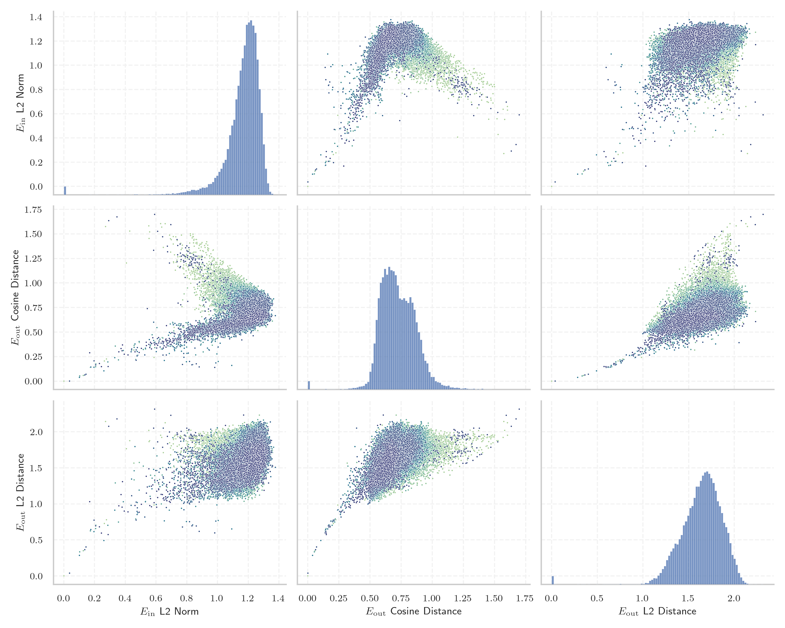
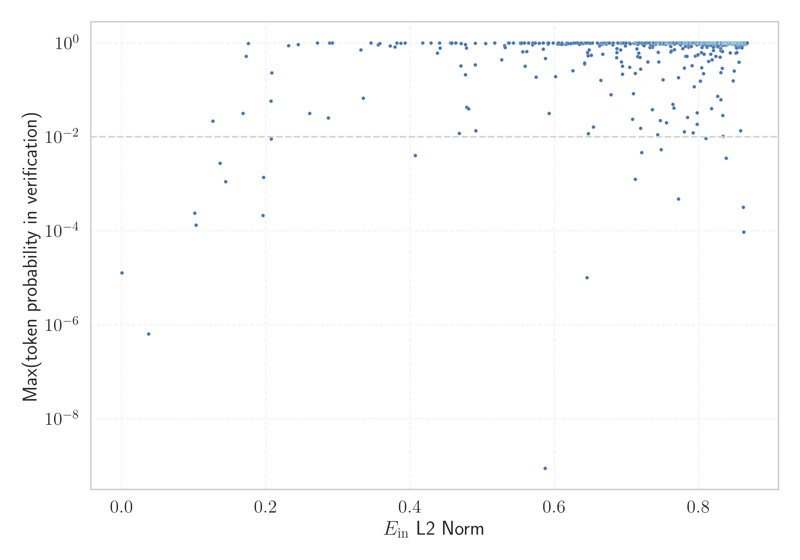

# Report for `meta-llama/Llama-2-13b-hf`

## Model info

* Model Info: 
  * Tied embeddings: False
  * LM head uses bias: False
  * Embeddings shape: [32000, 5120]
* Tokenizer Info: 
  * Vocab Size: 32000
  * Tokenizer Class: LlamaTokenizer
  * Tokenizer Type: BPE
  * Bytes handling: Byte Fallback
  * Token for verification prompt building: springframework
  * Token id for verification prompt building: 6688
* Indicator summary: 
  * Indicator for under-trained tokens: E_{in} L2 Norm
  * Overall distribution: 1.165 +/- 0.126
* Detected Token Counts: 
  * Number of tested under-trained tokens: 639, 567 non-special, 17 below p = 0.01 threshold, 11 below soft indicator threshold
  * Number of single byte tokens: 351, of which 118 below indicator threshold
  * Number of special tokens: 0, of which 0 below indicator threshold

## Under-trained token indicators plot


## Verification plot


## Under-trained token verification results
11 entries below threshold of 0.207

|   token_id | token                       |   indicator | max_prob                                                         | in_other_tokens                                                                                                                                                                            |
|------------|-----------------------------|-------------|------------------------------------------------------------------|--------------------------------------------------------------------------------------------------------------------------------------------------------------------------------------------|
|      28574 | ````` ▁Mediabestanden ````` |   0.0370611 | <span style='border: 1px solid rgb(169, 68, 66);'>6.4e-07</span> |                                                                                                                                                                                            |
|      20609 | ````` ▁Portály `````        |   0.101347  | <span style='border: 1px solid rgb(169, 68, 66);'>0.00024</span> |                                                                                                                                                                                            |
|      12731 | ````` ederbörd `````        |   0.103089  | <span style='border: 1px solid rgb(169, 68, 66);'>0.00013</span> | <span style='border: 1px solid rgb(40, 167, 69);'>````` ▁nederbörd `````</span>, <span style='border: 1px solid rgb(255, 145, 0);'>````` nederbörd `````</span>, ````` ▁årsnederbörd ````` |
|       3798 | ````` oreferrer `````       |   0.126474  | <span style='border: 1px solid rgb(251, 189, 8);'>0.022</span>   | ````` ▁noreferrer `````, ````` noreferrer `````                                                                                                                                            |
|      28633 | ````` nederbörd `````       |   0.136234  | <span style='border: 1px solid rgb(255, 145, 0);'>0.0027</span>  | ````` ▁årsnederbörd `````                                                                                                                                                                  |
|      28354 | ````` ▁Расподела `````      |   0.144101  | <span style='border: 1px solid rgb(255, 145, 0);'>0.0011</span>  |                                                                                                                                                                                            |
|      31664 | ````` ߬ `````                |   0.168151  | <span style='border: 1px solid rgb(251, 189, 8);'>0.032</span>   |                                                                                                                                                                                            |
|      12882 | ````` ITableView `````      |   0.172563  | <span style='border: 1px solid rgb(40, 167, 69);'>0.52</span>    | ````` ▁UITableView `````, ````` UITableView `````                                                                                                                                          |
|      23313 | ````` Obrázky `````         |   0.175522  | <span style='border: 1px solid rgb(40, 167, 69);'>0.97</span>    |                                                                                                                                                                                            |
|      19539 | ````` ▁demsel `````         |   0.195914  | <span style='border: 1px solid rgb(169, 68, 66);'>0.00021</span> | ````` ▁demselben `````                                                                                                                                                                     |
|      28642 | ````` ▁regnig `````         |   0.196489  | <span style='border: 1px solid rgb(255, 145, 0);'>0.0014</span>  | ````` ▁regnigaste `````                                                                                                                                                                    |
<details><summary>556 additional entries above threshold</summary>

|   token_id | token                       |   indicator | max_prob                                                         | in_other_tokens                                                                                                                                                                                                                                                                                                                  |
|------------|-----------------------------|-------------|------------------------------------------------------------------|----------------------------------------------------------------------------------------------------------------------------------------------------------------------------------------------------------------------------------------------------------------------------------------------------------------------------------|
|      11193 | ````` ▁Normdaten `````      |    0.20681  | <span style='border: 1px solid rgb(251, 189, 8);'>0.058</span>   |                                                                                                                                                                                                                                                                                                                                  |
|      28623 | ````` ▁Genomsnitt `````     |    0.207363 | <span style='border: 1px solid rgb(255, 145, 0);'>0.009</span>   | ````` ▁Genomsnittlig `````                                                                                                                                                                                                                                                                                                       |
|       9831 | ````` ▁челов `````          |    0.207967 | <span style='border: 1px solid rgb(40, 167, 69);'>0.23</span>    | ````` ▁человек `````, ````` ▁челове `````, ````` ▁человека `````                                                                                                                                                                                                                                                                 |
|      31477 | ````` ⸮ `````               |    0.231477 | <span style='border: 1px solid rgb(40, 167, 69);'>0.87</span>    |                                                                                                                                                                                                                                                                                                                                  |
|      31899 | ````` ⥤ `````               |    0.244538 | <span style='border: 1px solid rgb(40, 167, 69);'>0.92</span>    |                                                                                                                                                                                                                                                                                                                                  |
|      20486 | ````` tatywna `````         |    0.260556 | <span style='border: 1px solid rgb(251, 189, 8);'>0.032</span>   | ````` ▁autorytatywna `````                                                                                                                                                                                                                                                                                                       |
|      16056 | ````` љашње `````           |    0.28633  | <span style='border: 1px solid rgb(251, 189, 8);'>0.025</span>   | ````` ▁Спољашње `````                                                                                                                                                                                                                                                                                                            |
|      30772 | ````` ╌ `````               |    0.288213 | <span style='border: 1px solid rgb(40, 167, 69);'>0.99</span>    |                                                                                                                                                                                                                                                                                                                                  |
|      18596 | ````` ципа `````            |    0.331411 | <span style='border: 1px solid rgb(40, 167, 69);'>0.71</span>    | <span style='border: 1px solid rgb(251, 189, 8);'>````` ніципа `````</span>, <span style='border: 1px solid rgb(251, 189, 8);'>````` ніципалі `````</span>, ````` ▁муніципалі `````, <span style='border: 1px solid rgb(40, 167, 69);'>````` ниципа `````</span>, ````` ▁муниципа `````                                          |
|      10688 | ````` ▁gepublic `````       |    0.334868 | <span style='border: 1px solid rgb(251, 189, 8);'>0.067</span>   | ````` ▁gepubliceerd `````                                                                                                                                                                                                                                                                                                        |
|      12472 | ````` ateien `````          |    0.355444 | <span style='border: 1px solid rgb(40, 167, 69);'>0.91</span>    | ````` ▁Audiodateien `````                                                                                                                                                                                                                                                                                                        |
|      31772 | ````` ₗ `````               |    0.357911 | <span style='border: 1px solid rgb(40, 167, 69);'>0.97</span>    |                                                                                                                                                                                                                                                                                                                                  |
|      31926 | ````` 𝓝 `````               |    0.372228 | <span style='border: 1px solid rgb(40, 167, 69);'>0.87</span>    |                                                                                                                                                                                                                                                                                                                                  |
|      30994 | ````` 𝕜 `````               |    0.378993 | <span style='border: 1px solid rgb(40, 167, 69);'>0.81</span>    |                                                                                                                                                                                                                                                                                                                                  |
|      31884 | ````` ѫ `````               |    0.381631 | <span style='border: 1px solid rgb(40, 167, 69);'>1</span>       |                                                                                                                                                                                                                                                                                                                                  |
|      16013 | ````` temperaturen `````    |    0.386909 | <span style='border: 1px solid rgb(40, 167, 69);'>0.98</span>    | <span style='border: 1px solid rgb(251, 189, 8);'>````` eltemperaturen `````</span>                                                                                                                                                                                                                                              |
|      31483 | ````` ┈ `````               |    0.393087 | <span style='border: 1px solid rgb(40, 167, 69);'>0.99</span>    |                                                                                                                                                                                                                                                                                                                                  |
|      31591 | ````` ⍵ `````               |    0.417482 | <span style='border: 1px solid rgb(40, 167, 69);'>0.99</span>    |                                                                                                                                                                                                                                                                                                                                  |
|        278 | ````` ▁the `````            |    0.428758 | <span style='border: 1px solid rgb(40, 167, 69);'>1</span>       | <span style='border: 1px solid rgb(40, 167, 69);'>````` ▁there `````</span>, ````` ▁then `````, <span style='border: 1px solid rgb(40, 167, 69);'>````` ▁they `````</span>, ````` ▁them `````, ````` ▁their `````, ...                                                                                                           |
|      23767 | ````` egyzetek `````        |    0.437716 | <span style='border: 1px solid rgb(40, 167, 69);'>0.61</span>    | ````` ▁Jegyzetek `````                                                                                                                                                                                                                                                                                                           |
|      21721 | ````` archivi `````         |    0.440761 | <span style='border: 1px solid rgb(40, 167, 69);'>1</span>       | ````` archiviato `````                                                                                                                                                                                                                                                                                                           |
|      27706 | ````` ]{' `````             |    0.441256 | <span style='border: 1px solid rgb(40, 167, 69);'>0.77</span>    |                                                                                                                                                                                                                                                                                                                                  |
|       2639 | ````` Portail `````         |    0.455838 | <span style='border: 1px solid rgb(40, 167, 69);'>1</span>       |                                                                                                                                                                                                                                                                                                                                  |
|       9236 | ````` ▁pobla `````          |    0.457408 | <span style='border: 1px solid rgb(40, 167, 69);'>0.97</span>    | ````` ▁población `````, ````` ▁població `````                                                                                                                                                                                                                                                                                    |
|      16196 | ````` textt `````           |    0.457557 | <span style='border: 1px solid rgb(40, 167, 69);'>1</span>       | ````` texttt `````                                                                                                                                                                                                                                                                                                               |
|      20448 | ````` ▁Kontrola `````       |    0.462885 | <span style='border: 1px solid rgb(40, 167, 69);'>0.99</span>    |                                                                                                                                                                                                                                                                                                                                  |
|      31589 | ````` ▇ `````               |    0.463177 | <span style='border: 1px solid rgb(40, 167, 69);'>0.99</span>    |                                                                                                                                                                                                                                                                                                                                  |
|      11766 | ````` хівовано `````        |    0.467968 | <span style='border: 1px solid rgb(251, 189, 8);'>0.012</span>   | ````` Архівовано `````                                                                                                                                                                                                                                                                                                           |
|      28294 | ````` usztus `````          |    0.47026  | <span style='border: 1px solid rgb(40, 167, 69);'>0.33</span>    | <span style='border: 1px solid rgb(40, 167, 69);'>````` ▁augusztus `````</span>                                                                                                                                                                                                                                                  |
|      27600 | ````` prilis `````          |    0.47072  | <span style='border: 1px solid rgb(40, 167, 69);'>0.97</span>    | <span style='border: 1px solid rgb(40, 167, 69);'>````` ▁április `````</span>                                                                                                                                                                                                                                                    |
|      26335 | ````` llaços `````          |    0.476606 | <span style='border: 1px solid rgb(40, 167, 69);'>0.92</span>    | ````` ▁Enllaços `````                                                                                                                                                                                                                                                                                                            |
|      23441 | ````` któber `````          |    0.476742 | <span style='border: 1px solid rgb(40, 167, 69);'>0.21</span>    | ````` ▁október `````                                                                                                                                                                                                                                                                                                             |
|      21042 | ````` lês `````             |    0.477872 | <span style='border: 1px solid rgb(40, 167, 69);'>0.77</span>    | ````` ▁inglês `````                                                                                                                                                                                                                                                                                                              |
|      27660 | ````` ckså `````            |    0.478357 | <span style='border: 1px solid rgb(251, 189, 8);'>0.043</span>   | ````` ▁också `````                                                                                                                                                                                                                                                                                                               |
|      20696 | ````` adratkil `````        |    0.480967 | <span style='border: 1px solid rgb(251, 189, 8);'>0.04</span>    | ````` adratkilometer `````                                                                                                                                                                                                                                                                                                       |
|      31216 | ````` ╩ `````               |    0.490136 | <span style='border: 1px solid rgb(40, 167, 69);'>0.98</span>    |                                                                                                                                                                                                                                                                                                                                  |
|      16916 | ````` ▁invån `````          |    0.490149 | <span style='border: 1px solid rgb(40, 167, 69);'>0.34</span>    | ````` ▁invånare `````                                                                                                                                                                                                                                                                                                            |
|       6663 | ````` ▁Einzelnach `````     |    0.491006 | <span style='border: 1px solid rgb(251, 189, 8);'>0.013</span>   | ````` ▁Einzelnachweise `````                                                                                                                                                                                                                                                                                                     |
|      31626 | ````` ╣ `````               |    0.504505 | <span style='border: 1px solid rgb(40, 167, 69);'>0.97</span>    |                                                                                                                                                                                                                                                                                                                                  |
|      12479 | ````` ▁Audiod `````         |    0.517125 | <span style='border: 1px solid rgb(40, 167, 69);'>1</span>       | ````` ▁Audiodateien `````                                                                                                                                                                                                                                                                                                        |
|      26498 | ````` >\<^ `````            |    0.526683 | <span style='border: 1px solid rgb(40, 167, 69);'>0.44</span>    |                                                                                                                                                                                                                                                                                                                                  |
|      20072 | ````` ywna `````            |    0.531049 | <span style='border: 1px solid rgb(40, 167, 69);'>0.87</span>    | <span style='border: 1px solid rgb(251, 189, 8);'>````` tatywna `````</span>, ````` ▁autorytatywna `````                                                                                                                                                                                                                         |
|       7368 | ````` ября `````            |    0.531601 | <span style='border: 1px solid rgb(40, 167, 69);'>0.8</span>     | ````` ▁сентября `````, ````` ▁октября `````, ````` ▁ноября `````                                                                                                                                                                                                                                                                 |
|      31528 | ````` ℚ `````               |    0.536258 | <span style='border: 1px solid rgb(40, 167, 69);'>0.99</span>    |                                                                                                                                                                                                                                                                                                                                  |
|      30935 | ````` ╬ `````               |    0.537337 | <span style='border: 1px solid rgb(40, 167, 69);'>1</span>       |                                                                                                                                                                                                                                                                                                                                  |
|      30267 | ````` 。 `````              |    0.543234 | <span style='border: 1px solid rgb(40, 167, 69);'>1</span>       |                                                                                                                                                                                                                                                                                                                                  |
|        322 | ````` ▁and `````            |    0.552879 | <span style='border: 1px solid rgb(40, 167, 69);'>1</span>       | ````` ▁android `````, ````` ▁andere `````, ````` ▁anderen `````, ````` ▁anderem `````, ````` ▁andra `````                                                                                                                                                                                                                        |
|      31489 | ````` Ḩ `````               |    0.553456 | <span style='border: 1px solid rgb(40, 167, 69);'>0.97</span>    |                                                                                                                                                                                                                                                                                                                                  |
|        310 | ````` ▁of `````             |    0.554665 | <span style='border: 1px solid rgb(40, 167, 69);'>1</span>       | ````` ▁off `````, ````` ▁offic `````, ````` ▁often `````, ````` ▁offer `````, ````` ▁official `````, ...                                                                                                                                                                                                                         |
|      22918 | ````` prüft `````           |    0.556234 | <span style='border: 1px solid rgb(40, 167, 69);'>0.65</span>    | <span style='border: 1px solid rgb(40, 167, 69);'>````` ▁geprüft `````</span>                                                                                                                                                                                                                                                    |
|        304 | ````` ▁to `````             |    0.558415 | <span style='border: 1px solid rgb(40, 167, 69);'>1</span>       | ````` ▁tot `````, ````` ▁too `````, ````` ▁top `````, ````` ▁total `````, ````` ▁took `````, ...                                                                                                                                                                                                                                 |
|      31625 | ````` ൾ `````               |    0.559307 | <span style='border: 1px solid rgb(40, 167, 69);'>0.32</span>    |                                                                                                                                                                                                                                                                                                                                  |
|      15394 | ````` usetts `````          |    0.561652 | <span style='border: 1px solid rgb(40, 167, 69);'>0.66</span>    | ````` achusetts `````, ````` ▁Massachusetts `````                                                                                                                                                                                                                                                                                |
|      31586 | ````` ∉ `````               |    0.563917 | <span style='border: 1px solid rgb(40, 167, 69);'>1</span>       |                                                                                                                                                                                                                                                                                                                                  |
|      10775 | ````` ▁formatt `````        |    0.564276 | <span style='border: 1px solid rgb(40, 167, 69);'>0.99</span>    | ````` ▁formatting `````, ````` ▁formatted `````                                                                                                                                                                                                                                                                                  |
|      31892 | ````` ҡ `````               |    0.569608 | <span style='border: 1px solid rgb(40, 167, 69);'>0.91</span>    |                                                                                                                                                                                                                                                                                                                                  |
|      30841 | ````` ╠ `````               |    0.570295 | <span style='border: 1px solid rgb(40, 167, 69);'>1</span>       |                                                                                                                                                                                                                                                                                                                                  |
|      23247 | ````` ▁dátum `````          |    0.573413 | <span style='border: 1px solid rgb(40, 167, 69);'>1</span>       | <span style='border: 1px solid rgb(255, 145, 0);'>````` ▁dátummal `````</span>                                                                                                                                                                                                                                                   |
|      14545 | ````` ewnę `````            |    0.574556 | <span style='border: 1px solid rgb(40, 167, 69);'>0.19</span>    | <span style='border: 1px solid rgb(251, 189, 8);'>````` ewnętrz `````</span>, <span style='border: 1px solid rgb(40, 167, 69);'>````` ▁zewnętrz `````</span>, ````` ▁zewnętrzne `````                                                                                                                                            |
|      31336 | ````` ʐ `````               |    0.578996 | <span style='border: 1px solid rgb(40, 167, 69);'>0.98</span>    |                                                                                                                                                                                                                                                                                                                                  |
|      17835 | ````` ▁Станов `````         |    0.584417 | <span style='border: 1px solid rgb(40, 167, 69);'>0.99</span>    | <span style='border: 1px solid rgb(251, 189, 8);'>````` ▁Становништво `````</span>                                                                                                                                                                                                                                               |
|      25145 | ````` ▁kwiet `````          |    0.584515 | <span style='border: 1px solid rgb(40, 167, 69);'>0.74</span>    | ````` ▁kwietnia `````                                                                                                                                                                                                                                                                                                            |
|      31638 | ````` ൽ `````               |    0.587442 | <span style='border: 1px solid rgb(40, 167, 69);'>0.47</span>    |                                                                                                                                                                                                                                                                                                                                  |
|      29871 | ````` ▁ `````               |    0.590851 | <span style='border: 1px solid rgb(40, 167, 69);'>1</span>       |                                                                                                                                                                                                                                                                                                                                  |
|      31806 | ````` ӏ `````               |    0.591277 | <span style='border: 1px solid rgb(40, 167, 69);'>0.94</span>    |                                                                                                                                                                                                                                                                                                                                  |
|       9611 | ````` ViewById `````        |    0.59185  | <span style='border: 1px solid rgb(40, 167, 69);'>0.99</span>    | ````` findViewById `````, ````` ▁findViewById `````                                                                                                                                                                                                                                                                              |
|      14755 | ````` ewnętrz `````         |    0.592559 | <span style='border: 1px solid rgb(251, 189, 8);'>0.031</span>   | <span style='border: 1px solid rgb(40, 167, 69);'>````` ▁zewnętrz `````</span>, ````` ▁zewnętrzne `````                                                                                                                                                                                                                          |
|      28409 | ````` Sito `````            |    0.598055 | <span style='border: 1px solid rgb(40, 167, 69);'>1</span>       |                                                                                                                                                                                                                                                                                                                                  |
|      23280 | ````` ździer `````          |    0.601434 | <span style='border: 1px solid rgb(40, 167, 69);'>0.19</span>    | <span style='border: 1px solid rgb(40, 167, 69);'>````` ▁paździer `````</span>, <span style='border: 1px solid rgb(40, 167, 69);'>````` ▁października `````</span>                                                                                                                                                               |
|      31128 | ````` ╦ `````               |    0.604204 | <span style='border: 1px solid rgb(40, 167, 69);'>0.96</span>    |                                                                                                                                                                                                                                                                                                                                  |
|      31178 | ````` ⊢ `````               |    0.604721 | <span style='border: 1px solid rgb(40, 167, 69);'>1</span>       |                                                                                                                                                                                                                                                                                                                                  |
|      19330 | ````` ▁Википеди `````       |    0.605047 | <span style='border: 1px solid rgb(40, 167, 69);'>0.94</span>    | ````` ▁Википедии `````                                                                                                                                                                                                                                                                                                           |
|      15022 | ````` ▁zewnętrz `````       |    0.605828 | <span style='border: 1px solid rgb(40, 167, 69);'>0.99</span>    | ````` ▁zewnętrzne `````                                                                                                                                                                                                                                                                                                          |
|      27061 | ````` ▁Резултати `````      |    0.608809 | <span style='border: 1px solid rgb(40, 167, 69);'>0.94</span>    |                                                                                                                                                                                                                                                                                                                                  |
|      31956 | ````` ഞ `````               |    0.610575 | <span style='border: 1px solid rgb(40, 167, 69);'>0.93</span>    |                                                                                                                                                                                                                                                                                                                                  |
|      31670 | ````` ʑ `````               |    0.615593 | <span style='border: 1px solid rgb(40, 167, 69);'>0.93</span>    |                                                                                                                                                                                                                                                                                                                                  |
|      31444 | ````` ḩ `````               |    0.616607 | <span style='border: 1px solid rgb(40, 167, 69);'>1</span>       |                                                                                                                                                                                                                                                                                                                                  |
|      31794 | ````` ˠ `````               |    0.616659 | <span style='border: 1px solid rgb(40, 167, 69);'>0.99</span>    |                                                                                                                                                                                                                                                                                                                                  |
|      31771 | ````` ⊤ `````               |    0.617633 | <span style='border: 1px solid rgb(40, 167, 69);'>1</span>       |                                                                                                                                                                                                                                                                                                                                  |
|       6002 | ````` entication `````      |    0.617889 | <span style='border: 1px solid rgb(40, 167, 69);'>0.95</span>    | ````` ▁authentication `````, ````` Authentication `````, ````` authentication `````, ````` ▁Authentication `````                                                                                                                                                                                                                 |
|      26194 | ````` ▁Савез `````          |    0.619743 | <span style='border: 1px solid rgb(40, 167, 69);'>0.97</span>    | <span style='border: 1px solid rgb(40, 167, 69);'>````` ▁Савезне `````</span>                                                                                                                                                                                                                                                    |
|       6009 | ````` perties `````         |    0.623021 | <span style='border: 1px solid rgb(40, 167, 69);'>0.98</span>    | ````` properties `````, ````` Properties `````, ````` ▁Properties `````                                                                                                                                                                                                                                                          |
|      20739 | ````` ▁надмор `````         |    0.6255   | <span style='border: 1px solid rgb(40, 167, 69);'>0.25</span>    | <span style='border: 1px solid rgb(251, 189, 8);'>````` ▁надморској `````</span>                                                                                                                                                                                                                                                 |
|      25104 | ````` Zygote `````          |    0.626673 | <span style='border: 1px solid rgb(40, 167, 69);'>1</span>       | <span style='border: 1px solid rgb(40, 167, 69);'>````` ZygoteInit `````</span>                                                                                                                                                                                                                                                  |
|        297 | ````` ▁in `````             |    0.629923 | <span style='border: 1px solid rgb(40, 167, 69);'>1</span>       | ````` ▁inst `````, ````` ▁int `````, ````` ▁into `````, ````` ▁inter `````, ````` ▁incl `````, ...                                                                                                                                                                                                                               |
|      30770 | ````` ℤ `````               |    0.633171 | <span style='border: 1px solid rgb(40, 167, 69);'>1</span>       |                                                                                                                                                                                                                                                                                                                                  |
|      10553 | ````` \<^ `````             |    0.634731 | <span style='border: 1px solid rgb(40, 167, 69);'>0.94</span>    | <span style='border: 1px solid rgb(40, 167, 69);'>````` >\<^ `````</span>                                                                                                                                                                                                                                                        |
|        263 | ````` ▁a `````              |    0.637042 | <span style='border: 1px solid rgb(40, 167, 69);'>1</span>       | <span style='border: 1px solid rgb(40, 167, 69);'>````` ▁and `````</span>, <span style='border: 1px solid rgb(40, 167, 69);'>````` ▁an `````</span>, ````` ▁al `````, <span style='border: 1px solid rgb(40, 167, 69);'>````` ▁as `````</span>, <span style='border: 1px solid rgb(40, 167, 69);'>````` ▁at `````</span>, ...    |
|      10164 | ````` loyee `````           |    0.639999 | <span style='border: 1px solid rgb(40, 167, 69);'>0.98</span>    | ````` ▁employee `````, ````` Employee `````, ````` ▁employees `````, ````` ▁Employee `````, ````` employee `````                                                                                                                                                                                                                 |
|      31800 | ````` ܝ `````               |    0.641722 | <span style='border: 1px solid rgb(40, 167, 69);'>0.36</span>    |                                                                                                                                                                                                                                                                                                                                  |
|      21169 | ````` ▁prüfe `````          |    0.641975 | <span style='border: 1px solid rgb(40, 167, 69);'>0.37</span>    |                                                                                                                                                                                                                                                                                                                                  |
|      27563 | ````` datei `````           |    0.642355 | <span style='border: 1px solid rgb(40, 167, 69);'>1</span>       | <span style='border: 1px solid rgb(251, 189, 8);'>````` ▁Normdatei `````</span>                                                                                                                                                                                                                                                  |
|      10400 | ````` ▁Mitg `````           |    0.644042 | <span style='border: 1px solid rgb(40, 167, 69);'>0.99</span>    | ````` ▁Mitglied `````, ````` ▁Mitglieder `````                                                                                                                                                                                                                                                                                   |
|      28416 | ````` ▁Мексичка `````       |    0.645231 | <span style='border: 1px solid rgb(169, 68, 66);'>1e-05</span>   |                                                                                                                                                                                                                                                                                                                                  |
|      26782 | ````` ▁пописа `````         |    0.646111 | <span style='border: 1px solid rgb(40, 167, 69);'>0.63</span>    |                                                                                                                                                                                                                                                                                                                                  |
|      31808 | ````` എ `````               |    0.646748 | <span style='border: 1px solid rgb(40, 167, 69);'>0.53</span>    |                                                                                                                                                                                                                                                                                                                                  |
|      27918 | ````` ▁Хронологија `````    |    0.647087 | <span style='border: 1px solid rgb(251, 189, 8);'>0.012</span>   |                                                                                                                                                                                                                                                                                                                                  |
|        393 | ````` ▁that `````           |    0.647397 | <span style='border: 1px solid rgb(40, 167, 69);'>1</span>       | ````` ▁thats `````                                                                                                                                                                                                                                                                                                               |
|      28090 | ````` ▁Савезне `````        |    0.648155 | <span style='border: 1px solid rgb(40, 167, 69);'>0.71</span>    |                                                                                                                                                                                                                                                                                                                                  |
|      31913 | ````` ശ `````               |    0.650163 | <span style='border: 1px solid rgb(40, 167, 69);'>0.99</span>    |                                                                                                                                                                                                                                                                                                                                  |
|      20638 | ````` ungsseite `````       |    0.651164 | <span style='border: 1px solid rgb(40, 167, 69);'>0.55</span>    |                                                                                                                                                                                                                                                                                                                                  |
|      31515 | ````` ⴰ `````               |    0.652767 | <span style='border: 1px solid rgb(40, 167, 69);'>0.99</span>    |                                                                                                                                                                                                                                                                                                                                  |
|      20422 | ````` ніципалі `````        |    0.653903 | <span style='border: 1px solid rgb(251, 189, 8);'>0.016</span>   | ````` ▁муніципалі `````                                                                                                                                                                                                                                                                                                          |
|        313 | ````` ▁( `````              |    0.659647 | <span style='border: 1px solid rgb(40, 167, 69);'>1</span>       | ````` ▁(* `````, ````` ▁($ `````, ````` ▁(\ `````, ````` ▁() `````, ````` ▁(" `````, ...                                                                                                                                                                                                                                         |
|      31889 | ````` ദ `````               |    0.662414 | <span style='border: 1px solid rgb(40, 167, 69);'>0.87</span>    |                                                                                                                                                                                                                                                                                                                                  |
|      23910 | ````` ритор `````           |    0.663566 | <span style='border: 1px solid rgb(40, 167, 69);'>0.91</span>    | ````` ▁територ `````                                                                                                                                                                                                                                                                                                             |
|      31585 | ````` ർ `````               |    0.664551 | <span style='border: 1px solid rgb(40, 167, 69);'>0.16</span>    |                                                                                                                                                                                                                                                                                                                                  |
|      31342 | ````` അ `````               |    0.664773 | <span style='border: 1px solid rgb(40, 167, 69);'>0.98</span>    |                                                                                                                                                                                                                                                                                                                                  |
|      26964 | ````` ▁Хронологи `````      |    0.666098 | <span style='border: 1px solid rgb(40, 167, 69);'>0.98</span>    | <span style='border: 1px solid rgb(251, 189, 8);'>````` ▁Хронологија `````</span>                                                                                                                                                                                                                                                |
|      28142 | ````` ightarrow `````       |    0.667015 | <span style='border: 1px solid rgb(40, 167, 69);'>0.58</span>    | ````` trightarrow `````                                                                                                                                                                                                                                                                                                          |
|      31672 | ````` Ḫ `````               |    0.667071 | <span style='border: 1px solid rgb(40, 167, 69);'>0.95</span>    |                                                                                                                                                                                                                                                                                                                                  |
|      31663 | ````` Ս `````               |    0.667706 | <span style='border: 1px solid rgb(40, 167, 69);'>0.98</span>    |                                                                                                                                                                                                                                                                                                                                  |
|      31764 | ````` ɫ `````               |    0.667898 | <span style='border: 1px solid rgb(40, 167, 69);'>1</span>       |                                                                                                                                                                                                                                                                                                                                  |
|      31673 | ````` ℂ `````               |    0.66978  | <span style='border: 1px solid rgb(40, 167, 69);'>1</span>       |                                                                                                                                                                                                                                                                                                                                  |
|      31921 | ````` ഷ `````               |    0.670525 | <span style='border: 1px solid rgb(40, 167, 69);'>0.99</span>    |                                                                                                                                                                                                                                                                                                                                  |
|       9035 | ````` férés `````           |    0.672021 | <span style='border: 1px solid rgb(40, 167, 69);'>0.94</span>    | <span style='border: 1px solid rgb(40, 167, 69);'>````` ozzáférés `````</span>, ````` Hozzáférés `````                                                                                                                                                                                                                           |
|      30929 | ````` ┴ `````               |    0.673281 | <span style='border: 1px solid rgb(40, 167, 69);'>0.99</span>    |                                                                                                                                                                                                                                                                                                                                  |
|      30010 | ````` ’ `````               |    0.675277 | <span style='border: 1px solid rgb(40, 167, 69);'>0.99</span>    |                                                                                                                                                                                                                                                                                                                                  |
|      31269 | ````` ╝ `````               |    0.676156 | <span style='border: 1px solid rgb(40, 167, 69);'>0.99</span>    |                                                                                                                                                                                                                                                                                                                                  |
|      20870 | ````` kreich `````          |    0.678589 | <span style='border: 1px solid rgb(251, 189, 8);'>0.079</span>   | ````` ▁Frankreich `````                                                                                                                                                                                                                                                                                                          |
|      20070 | ````` ▁autory `````         |    0.681081 | <span style='border: 1px solid rgb(40, 167, 69);'>0.9</span>     | ````` ▁autorytatywna `````                                                                                                                                                                                                                                                                                                       |
|      27566 | ````` sime `````            |    0.681505 | <span style='border: 1px solid rgb(40, 167, 69);'>1</span>       | ````` simeq `````                                                                                                                                                                                                                                                                                                                |
|      17047 | ````` omsnitt `````         |    0.686357 | <span style='border: 1px solid rgb(40, 167, 69);'>0.49</span>    | ````` ▁genomsnitt `````, <span style='border: 1px solid rgb(255, 145, 0);'>````` ▁Genomsnitt `````</span>, ````` ▁Genomsnittlig `````                                                                                                                                                                                            |
|      30957 | ````` ങ `````               |    0.686489 | <span style='border: 1px solid rgb(40, 167, 69);'>0.76</span>    |                                                                                                                                                                                                                                                                                                                                  |
|      31646 | ````` ൻ `````               |    0.686562 | <span style='border: 1px solid rgb(40, 167, 69);'>0.63</span>    |                                                                                                                                                                                                                                                                                                                                  |
|      23658 | ````` ▁geprüft `````        |    0.68693  | <span style='border: 1px solid rgb(40, 167, 69);'>1</span>       |                                                                                                                                                                                                                                                                                                                                  |
|      30375 | ````` ﹕ `````              |    0.687157 | <span style='border: 1px solid rgb(40, 167, 69);'>1</span>       |                                                                                                                                                                                                                                                                                                                                  |
|      31766 | ````` ∷ `````               |    0.688152 | <span style='border: 1px solid rgb(40, 167, 69);'>1</span>       |                                                                                                                                                                                                                                                                                                                                  |
|        363 | ````` ▁for `````            |    0.688369 | <span style='border: 1px solid rgb(40, 167, 69);'>1</span>       | ````` ▁form `````, ````` ▁format `````, ````` ▁former `````, ````` ▁force `````, ````` ▁fort `````, ...                                                                                                                                                                                                                          |
|      18206 | ````` braio `````           |    0.691919 | <span style='border: 1px solid rgb(40, 167, 69);'>0.71</span>    | ````` ▁febbraio `````                                                                                                                                                                                                                                                                                                            |
|      31879 | ````` ▓ `````               |    0.692692 | <span style='border: 1px solid rgb(40, 167, 69);'>1</span>       |                                                                                                                                                                                                                                                                                                                                  |
|      15407 | ````` ▁statunit `````       |    0.692753 | <span style='border: 1px solid rgb(40, 167, 69);'>0.4</span>     | ````` ▁statunitense `````                                                                                                                                                                                                                                                                                                        |
|      31575 | ````` Մ `````               |    0.693015 | <span style='border: 1px solid rgb(40, 167, 69);'>0.98</span>    |                                                                                                                                                                                                                                                                                                                                  |
|        338 | ````` ▁is `````             |    0.694058 | <span style='border: 1px solid rgb(40, 167, 69);'>1</span>       | ````` ▁iss `````, ````` ▁ist `````, ````` ▁issue `````, ````` ▁isn `````, ````` ▁issues `````, ...                                                                                                                                                                                                                               |
|      31601 | ````` ུ `````                |    0.694437 | <span style='border: 1px solid rgb(40, 167, 69);'>0.32</span>    |                                                                                                                                                                                                                                                                                                                                  |
|      13591 | ````` ongodb `````          |    0.694519 | <span style='border: 1px solid rgb(40, 167, 69);'>0.22</span>    | ````` mongodb `````, ````` ▁mongodb `````                                                                                                                                                                                                                                                                                        |
|        372 | ````` ▁it `````             |    0.694984 | <span style='border: 1px solid rgb(40, 167, 69);'>1</span>       | ````` ▁its `````, ````` ▁item `````, ````` ▁itself `````, ````` ▁iter `````, ````` ▁items `````, ...                                                                                                                                                                                                                             |
|      31896 | ````` ྱ `````                |    0.698465 | <span style='border: 1px solid rgb(40, 167, 69);'>0.86</span>    |                                                                                                                                                                                                                                                                                                                                  |
|        472 | ````` ▁at `````             |    0.699376 | <span style='border: 1px solid rgb(40, 167, 69);'>1</span>       | ````` ▁att `````, ````` ▁attempt `````, ````` ▁attack `````, ````` ▁attribute `````, ````` ▁attributes `````, ...                                                                                                                                                                                                                |
|      31743 | ````` ʎ `````               |    0.703963 | <span style='border: 1px solid rgb(40, 167, 69);'>1</span>       |                                                                                                                                                                                                                                                                                                                                  |
|      12867 | ````` лання `````           |    0.704522 | <span style='border: 1px solid rgb(40, 167, 69);'>0.3</span>     | ````` силання `````, ````` ▁Посилання `````                                                                                                                                                                                                                                                                                      |
|      31777 | ````` ѐ `````               |    0.705281 | <span style='border: 1px solid rgb(40, 167, 69);'>0.96</span>    |                                                                                                                                                                                                                                                                                                                                  |
|      15571 | ````` ▁февра `````          |    0.708422 | <span style='border: 1px solid rgb(251, 189, 8);'>0.024</span>   | ````` ▁февраля `````                                                                                                                                                                                                                                                                                                             |
|      16153 | ````` gresql `````          |    0.709676 | <span style='border: 1px solid rgb(251, 189, 8);'>0.083</span>   | ````` ▁postgresql `````, ````` postgresql `````                                                                                                                                                                                                                                                                                  |
|      31614 | ````` ན `````               |    0.710396 | <span style='border: 1px solid rgb(40, 167, 69);'>0.98</span>    |                                                                                                                                                                                                                                                                                                                                  |
|        411 | ````` ▁with `````           |    0.712081 | <span style='border: 1px solid rgb(40, 167, 69);'>1</span>       | ````` ▁without `````, ````` ▁within `````, ````` ▁withdraw `````                                                                                                                                                                                                                                                                 |
|      31705 | ````` ལ `````               |    0.71211  | <span style='border: 1px solid rgb(40, 167, 69);'>0.99</span>    |                                                                                                                                                                                                                                                                                                                                  |
|      31588 | ````` ┃ `````               |    0.712184 | <span style='border: 1px solid rgb(40, 167, 69);'>1</span>       |                                                                                                                                                                                                                                                                                                                                  |
|      31644 | ````` ེ `````                |    0.712205 | <span style='border: 1px solid rgb(40, 167, 69);'>0.23</span>    |                                                                                                                                                                                                                                                                                                                                  |
|      26734 | ````` ▁Årsmed `````         |    0.712266 | <span style='border: 1px solid rgb(255, 145, 0);'>0.0012</span>  |                                                                                                                                                                                                                                                                                                                                  |
|        373 | ````` ▁on `````             |    0.712353 | <span style='border: 1px solid rgb(40, 167, 69);'>1</span>       | <span style='border: 1px solid rgb(40, 167, 69);'>````` ▁one `````</span>, ````` ▁only `````, ````` ▁once `````, ````` ▁ont `````, ````` ▁onder `````, ...                                                                                                                                                                       |
|      22768 | ````` ▁жовт `````           |    0.712501 | <span style='border: 1px solid rgb(40, 167, 69);'>0.97</span>    | <span style='border: 1px solid rgb(40, 167, 69);'>````` ▁жовтня `````</span>                                                                                                                                                                                                                                                     |
|      30560 | ````` ┼ `````               |    0.713528 | <span style='border: 1px solid rgb(40, 167, 69);'>1</span>       |                                                                                                                                                                                                                                                                                                                                  |
|        292 | ````` ing `````             |    0.71366  | <span style='border: 1px solid rgb(40, 167, 69);'>1</span>       | ````` ▁using `````, ````` ings `````, ````` tring `````, ````` ning `````, ````` ating `````, ...                                                                                                                                                                                                                                |
|      13594 | ````` ▁янва `````           |    0.714388 | <span style='border: 1px solid rgb(40, 167, 69);'>0.75</span>    | ````` ▁января `````                                                                                                                                                                                                                                                                                                              |
|        287 | ````` ed `````              |    0.71445  | <span style='border: 1px solid rgb(40, 167, 69);'>1</span>       | ````` ated `````, ````` ▁need `````, ````` led `````, ````` ied `````, ````` red `````, ...                                                                                                                                                                                                                                      |
|      31289 | ````` ┤ `````               |    0.715156 | <span style='border: 1px solid rgb(40, 167, 69);'>0.99</span>    |                                                                                                                                                                                                                                                                                                                                  |
|       8191 | ````` férences `````        |    0.715649 | <span style='border: 1px solid rgb(40, 167, 69);'>0.51</span>    | ````` ▁références `````, ````` ▁Références `````                                                                                                                                                                                                                                                                                 |
|      13606 | ````` oreign `````          |    0.715655 | <span style='border: 1px solid rgb(40, 167, 69);'>0.99</span>    | ````` ▁Foreign `````, ````` Foreign `````                                                                                                                                                                                                                                                                                        |
|      26338 | ````` ▁Års `````            |    0.71595  | <span style='border: 1px solid rgb(40, 167, 69);'>0.93</span>    | <span style='border: 1px solid rgb(255, 145, 0);'>````` ▁Årsmed `````</span>                                                                                                                                                                                                                                                     |
|      17391 | ````` ▁савез `````          |    0.716863 | <span style='border: 1px solid rgb(40, 167, 69);'>0.61</span>    | ````` ▁савезној `````                                                                                                                                                                                                                                                                                                            |
|      31311 | ````` Ű `````               |    0.717074 | <span style='border: 1px solid rgb(40, 167, 69);'>1</span>       |                                                                                                                                                                                                                                                                                                                                  |
|      24935 | ````` ▁RewriteCond `````    |    0.718061 | <span style='border: 1px solid rgb(40, 167, 69);'>0.99</span>    |                                                                                                                                                                                                                                                                                                                                  |
|      22755 | ````` źdz `````             |    0.718764 | <span style='border: 1px solid rgb(40, 167, 69);'>0.49</span>    | <span style='border: 1px solid rgb(40, 167, 69);'>````` ździer `````</span>, <span style='border: 1px solid rgb(40, 167, 69);'>````` ▁paździer `````</span>, <span style='border: 1px solid rgb(40, 167, 69);'>````` ▁października `````</span>                                                                                  |
|      21836 | ````` ▁надморској `````     |    0.719661 | <span style='border: 1px solid rgb(251, 189, 8);'>0.015</span>   |                                                                                                                                                                                                                                                                                                                                  |
|      23217 | ````` ▁zvuky `````          |    0.719692 | <span style='border: 1px solid rgb(40, 167, 69);'>0.28</span>    |                                                                                                                                                                                                                                                                                                                                  |
|        262 | ````` in `````              |    0.720106 | <span style='border: 1px solid rgb(40, 167, 69);'>1</span>       | <span style='border: 1px solid rgb(40, 167, 69);'>````` ing `````</span>, <span style='border: 1px solid rgb(40, 167, 69);'>````` ▁in `````</span>, ````` ine `````, ````` egin `````, ````` begin `````, ...                                                                                                                    |
|      20721 | ````` ▁bezeichneter `````   |    0.721041 | <span style='border: 1px solid rgb(255, 145, 0);'>0.0046</span>  |                                                                                                                                                                                                                                                                                                                                  |
|      31281 | ````` ‾ `````               |    0.72185  | <span style='border: 1px solid rgb(40, 167, 69);'>1</span>       |                                                                                                                                                                                                                                                                                                                                  |
|      24366 | ````` ▁sierp `````          |    0.722876 | <span style='border: 1px solid rgb(40, 167, 69);'>0.97</span>    | <span style='border: 1px solid rgb(40, 167, 69);'>````` ▁sierpnia `````</span>                                                                                                                                                                                                                                                   |
|      31816 | ````` զ `````               |    0.723    | <span style='border: 1px solid rgb(40, 167, 69);'>0.91</span>    |                                                                                                                                                                                                                                                                                                                                  |
|      26641 | ````` ▁Мексика `````        |    0.72441  | <span style='border: 1px solid rgb(40, 167, 69);'>0.87</span>    |                                                                                                                                                                                                                                                                                                                                  |
|        264 | ````` en `````              |    0.725706 | <span style='border: 1px solid rgb(40, 167, 69);'>1</span>       | <span style='border: 1px solid rgb(40, 167, 69);'>````` ent `````</span>, <span style='border: 1px solid rgb(40, 167, 69);'>````` end `````</span>, ````` ment `````, ````` ▁en `````, ````` ▁Comment `````, ...                                                                                                                 |
|        306 | ````` ▁I `````              |    0.728661 | <span style='border: 1px solid rgb(40, 167, 69);'>1</span>       | <span style='border: 1px solid rgb(40, 167, 69);'>````` ▁In `````</span>, <span style='border: 1px solid rgb(40, 167, 69);'>````` ▁It `````</span>, ````` ▁If `````, ````` ▁Is `````, ````` ▁Il `````, ...                                                                                                                       |
|      14949 | ````` кипеди `````          |    0.729445 | <span style='border: 1px solid rgb(40, 167, 69);'>0.39</span>    | <span style='border: 1px solid rgb(40, 167, 69);'>````` ▁Википеди `````</span>, ````` ▁Википедии `````                                                                                                                                                                                                                           |
|        366 | ````` ▁you `````            |    0.73052  | <span style='border: 1px solid rgb(40, 167, 69);'>1</span>       | ````` ▁your `````, ````` ▁young `````, ````` ▁yourself `````, ````` ▁youth `````, ````` ▁yours `````, ...                                                                                                                                                                                                                        |
|      24364 | ````` ▁Licencia `````       |    0.732001 | <span style='border: 1px solid rgb(40, 167, 69);'>1</span>       |                                                                                                                                                                                                                                                                                                                                  |
|      14262 | ````` ▁фев `````            |    0.732397 | <span style='border: 1px solid rgb(40, 167, 69);'>0.79</span>    | <span style='border: 1px solid rgb(251, 189, 8);'>````` ▁февра `````</span>, ````` ▁февраля `````                                                                                                                                                                                                                                |
|      26199 | ````` ▁mieszkań `````       |    0.733733 | <span style='border: 1px solid rgb(40, 167, 69);'>0.92</span>    | ````` ▁mieszkańców `````                                                                                                                                                                                                                                                                                                         |
|      31226 | ````` ە `````               |    0.735325 | <span style='border: 1px solid rgb(40, 167, 69);'>0.99</span>    |                                                                                                                                                                                                                                                                                                                                  |
|      25229 | ````` лтати `````           |    0.735895 | <span style='border: 1px solid rgb(251, 189, 8);'>0.038</span>   | <span style='border: 1px solid rgb(40, 167, 69);'>````` ▁Резултати `````</span>                                                                                                                                                                                                                                                  |
|      17398 | ````` ништво `````          |    0.736002 | <span style='border: 1px solid rgb(40, 167, 69);'>0.81</span>    | <span style='border: 1px solid rgb(251, 189, 8);'>````` ▁Становништво `````</span>                                                                                                                                                                                                                                               |
|      23875 | ````` ▁Насеље `````         |    0.73607  | <span style='border: 1px solid rgb(40, 167, 69);'>0.87</span>    |                                                                                                                                                                                                                                                                                                                                  |
|        526 | ````` ▁are `````            |    0.736076 | <span style='border: 1px solid rgb(40, 167, 69);'>1</span>       | ````` ▁area `````, ````` ▁aren `````, ````` ▁areas `````                                                                                                                                                                                                                                                                         |
|      31919 | ````` პ `````               |    0.737115 | <span style='border: 1px solid rgb(40, 167, 69);'>0.99</span>    |                                                                                                                                                                                                                                                                                                                                  |
|        408 | ````` ▁as `````             |    0.737812 | <span style='border: 1px solid rgb(40, 167, 69);'>1</span>       | ````` ▁ass `````, ````` ▁ask `````, ````` ▁assign `````, ````` ▁assum `````, ````` ▁associ `````, ...                                                                                                                                                                                                                            |
|      17467 | ````` ▁inwon `````          |    0.740611 | <span style='border: 1px solid rgb(40, 167, 69);'>0.93</span>    | ````` ▁inwoners `````                                                                                                                                                                                                                                                                                                            |
|        591 | ````` ▁we `````             |    0.741674 | <span style='border: 1px solid rgb(40, 167, 69);'>1</span>       | ````` ▁were `````, ````` ▁well `````, ````` ▁web `````, ````` ▁wer `````, ````` ▁went `````, ...                                                                                                                                                                                                                                 |
|        267 | ````` es `````              |    0.7418   | <span style='border: 1px solid rgb(40, 167, 69);'>1</span>       | ````` est `````, ````` ess `````, ````` ▁des `````, ````` ies `````, ````` estion `````, ...                                                                                                                                                                                                                                     |
|      14498 | ````` äsident `````         |    0.743148 | <span style='border: 1px solid rgb(251, 189, 8);'>0.011</span>   | ````` ▁Präsident `````, ````` präsident `````                                                                                                                                                                                                                                                                                    |
|      14155 | ````` multicol `````        |    0.743526 | <span style='border: 1px solid rgb(40, 167, 69);'>1</span>       | ````` multicolumn `````                                                                                                                                                                                                                                                                                                          |
|      30330 | ````` 、 `````              |    0.743696 | <span style='border: 1px solid rgb(40, 167, 69);'>1</span>       |                                                                                                                                                                                                                                                                                                                                  |
|      11628 | ````` ▁исполь `````         |    0.744037 | <span style='border: 1px solid rgb(40, 167, 69);'>0.63</span>    | ````` ▁использова `````, ````` ▁использу `````                                                                                                                                                                                                                                                                                   |
|      10137 | ````` itmap `````           |    0.744345 | <span style='border: 1px solid rgb(40, 167, 69);'>1</span>       | ````` Bitmap `````, ````` ▁Bitmap `````, ````` ▁bitmap `````                                                                                                                                                                                                                                                                     |
|      14374 | ````` ▁апре `````           |    0.744792 | <span style='border: 1px solid rgb(40, 167, 69);'>0.39</span>    | <span style='border: 1px solid rgb(40, 167, 69);'>````` ▁апреля `````</span>                                                                                                                                                                                                                                                     |
|      31769 | ````` Ἐ `````               |    0.745203 | <span style='border: 1px solid rgb(40, 167, 69);'>0.99</span>    |                                                                                                                                                                                                                                                                                                                                  |
|      31983 | ````` ɯ `````               |    0.74585  | <span style='border: 1px solid rgb(40, 167, 69);'>0.99</span>    |                                                                                                                                                                                                                                                                                                                                  |
|      31106 | ````` ച `````               |    0.746196 | <span style='border: 1px solid rgb(40, 167, 69);'>0.96</span>    |                                                                                                                                                                                                                                                                                                                                  |
|      25908 | ````` éricaine `````        |    0.746461 | <span style='border: 1px solid rgb(40, 167, 69);'>0.99</span>    | ````` ▁américaine `````                                                                                                                                                                                                                                                                                                          |
|      17578 | ````` estanden `````        |    0.746623 | <span style='border: 1px solid rgb(40, 167, 69);'>0.94</span>    | ````` abestanden `````, <span style='border: 1px solid rgb(169, 68, 66);'>````` ▁Mediabestanden `````</span>                                                                                                                                                                                                                     |
|      27645 | ````` ▁Попис `````          |    0.747072 | <span style='border: 1px solid rgb(251, 189, 8);'>0.022</span>   |                                                                                                                                                                                                                                                                                                                                  |
|      31372 | ````` ╚ `````               |    0.747171 | <span style='border: 1px solid rgb(40, 167, 69);'>0.95</span>    |                                                                                                                                                                                                                                                                                                                                  |
|      23117 | ````` brázky `````          |    0.747948 | <span style='border: 1px solid rgb(255, 145, 0);'>0.0054</span>  | <span style='border: 1px solid rgb(40, 167, 69);'>````` Obrázky `````</span>                                                                                                                                                                                                                                                     |
|      16364 | ````` фициаль `````         |    0.74853  | <span style='border: 1px solid rgb(40, 167, 69);'>0.99</span>    | ````` ▁официаль `````, ````` ▁Официаль `````                                                                                                                                                                                                                                                                                     |
|      14028 | ````` ▁сент `````           |    0.750181 | <span style='border: 1px solid rgb(40, 167, 69);'>0.94</span>    | ````` ▁сентября `````                                                                                                                                                                                                                                                                                                            |
|      13648 | ````` ══ `````              |    0.750219 | <span style='border: 1px solid rgb(40, 167, 69);'>0.99</span>    | ````` ════ `````                                                                                                                                                                                                                                                                                                                 |
|      30964 | ````` േ `````                |    0.750525 | <span style='border: 1px solid rgb(40, 167, 69);'>0.16</span>    |                                                                                                                                                                                                                                                                                                                                  |
|        425 | ````` ▁la `````             |    0.750949 | <span style='border: 1px solid rgb(40, 167, 69);'>1</span>       | ````` ▁last `````, ````` ▁las `````, ````` ▁lar `````, ````` ▁later `````, ````` ▁large `````, ...                                                                                                                                                                                                                               |
|      20172 | ````` ▁Przyp `````          |    0.751328 | <span style='border: 1px solid rgb(40, 167, 69);'>0.96</span>    | ````` ▁Przypisy `````                                                                                                                                                                                                                                                                                                            |
|      30347 | ````` ℕ `````               |    0.751916 | <span style='border: 1px solid rgb(40, 167, 69);'>0.99</span>    |                                                                                                                                                                                                                                                                                                                                  |
|      31215 | ````` ╗ `````               |    0.752458 | <span style='border: 1px solid rgb(40, 167, 69);'>0.98</span>    |                                                                                                                                                                                                                                                                                                                                  |
|      13959 | ````` ▁окт `````            |    0.754759 | <span style='border: 1px solid rgb(40, 167, 69);'>0.93</span>    | ````` ▁октября `````                                                                                                                                                                                                                                                                                                             |
|      30301 | ````` ₉ `````               |    0.755267 | <span style='border: 1px solid rgb(40, 167, 69);'>1</span>       |                                                                                                                                                                                                                                                                                                                                  |
|      20716 | ````` ▁Begriffsklär `````   |    0.755305 | <span style='border: 1px solid rgb(251, 189, 8);'>0.02</span>    |                                                                                                                                                                                                                                                                                                                                  |
|        508 | ````` ▁can `````            |    0.755799 | <span style='border: 1px solid rgb(40, 167, 69);'>1</span>       | ````` ▁cannot `````, ````` ▁cant `````, ````` ▁candid `````, ````` ▁canvas `````, ````` ▁cancel `````, ...                                                                                                                                                                                                                       |
|      31643 | ````` མ `````               |    0.75736  | <span style='border: 1px solid rgb(40, 167, 69);'>0.99</span>    |                                                                                                                                                                                                                                                                                                                                  |
|      30925 | ````` Қ `````               |    0.75747  | <span style='border: 1px solid rgb(40, 167, 69);'>0.99</span>    |                                                                                                                                                                                                                                                                                                                                  |
|      24330 | ````` ниципа `````          |    0.758475 | <span style='border: 1px solid rgb(40, 167, 69);'>0.99</span>    | ````` ▁муниципа `````                                                                                                                                                                                                                                                                                                            |
|        272 | ````` or `````              |    0.75906  | <span style='border: 1px solid rgb(40, 167, 69);'>1</span>       | <span style='border: 1px solid rgb(40, 167, 69);'>````` ▁for `````</span>, ````` ort `````, <span style='border: 1px solid rgb(40, 167, 69);'>````` ▁or `````</span>, ````` ore `````, ````` ord `````, ...                                                                                                                      |
|      31470 | ````` ʋ `````               |    0.759205 | <span style='border: 1px solid rgb(40, 167, 69);'>1</span>       |                                                                                                                                                                                                                                                                                                                                  |
|      16252 | ````` tembre `````          |    0.760064 | <span style='border: 1px solid rgb(40, 167, 69);'>0.94</span>    | ````` ▁settembre `````                                                                                                                                                                                                                                                                                                           |
|        739 | ````` ▁It `````             |    0.760514 | <span style='border: 1px solid rgb(40, 167, 69);'>0.99</span>    | ````` ▁Ital `````, ````` ▁Its `````, ````` ▁Italian `````, ````` ▁Item `````, ````` ▁Italia `````, ...                                                                                                                                                                                                                           |
|      31511 | ````` ☉ `````               |    0.760853 | <span style='border: 1px solid rgb(40, 167, 69);'>1</span>       |                                                                                                                                                                                                                                                                                                                                  |
|      23105 | ````` ▁videa `````          |    0.76087  | <span style='border: 1px solid rgb(40, 167, 69);'>1</span>       |                                                                                                                                                                                                                                                                                                                                  |
|        450 | ````` ▁The `````            |    0.760878 | <span style='border: 1px solid rgb(40, 167, 69);'>0.98</span>    | ````` ▁There `````, ````` ▁Then `````, ````` ▁They `````, ````` ▁These `````, ````` ▁Therefore `````, ...                                                                                                                                                                                                                        |
|      30214 | ````` ， `````              |    0.760964 | <span style='border: 1px solid rgb(40, 167, 69);'>1</span>       |                                                                                                                                                                                                                                                                                                                                  |
|      14840 | ````` пня `````             |    0.761    | <span style='border: 1px solid rgb(40, 167, 69);'>0.89</span>    | <span style='border: 1px solid rgb(40, 167, 69);'>````` ▁липня `````</span>, <span style='border: 1px solid rgb(40, 167, 69);'>````` ▁серпня `````</span>                                                                                                                                                                        |
|      31421 | ````` ܐ `````               |    0.761087 | <span style='border: 1px solid rgb(40, 167, 69);'>0.99</span>    |                                                                                                                                                                                                                                                                                                                                  |
|      23582 | ````` ▁RewriteRule `````    |    0.761109 | <span style='border: 1px solid rgb(40, 167, 69);'>1</span>       |                                                                                                                                                                                                                                                                                                                                  |
|      26378 | ````` iből `````            |    0.761236 | <span style='border: 1px solid rgb(40, 167, 69);'>0.64</span>    | <span style='border: 1px solid rgb(251, 189, 8);'>````` ▁eredetiből `````</span>                                                                                                                                                                                                                                                 |
|      27865 | ````` ]`. `````             |    0.761477 | <span style='border: 1px solid rgb(40, 167, 69);'>0.84</span>    |                                                                                                                                                                                                                                                                                                                                  |
|      31790 | ````` պ `````               |    0.762001 | <span style='border: 1px solid rgb(40, 167, 69);'>0.97</span>    |                                                                                                                                                                                                                                                                                                                                  |
|      23795 | ````` ▁paździer `````       |    0.762195 | <span style='border: 1px solid rgb(40, 167, 69);'>0.67</span>    | <span style='border: 1px solid rgb(40, 167, 69);'>````` ▁października `````</span>                                                                                                                                                                                                                                               |
|      25026 | ````` ▁Données `````        |    0.762868 | <span style='border: 1px solid rgb(40, 167, 69);'>0.99</span>    |                                                                                                                                                                                                                                                                                                                                  |
|        515 | ````` ▁from `````           |    0.76379  | <span style='border: 1px solid rgb(40, 167, 69);'>1</span>       |                                                                                                                                                                                                                                                                                                                                  |
|      18418 | ````` ▁людя `````           |    0.764254 | <span style='border: 1px solid rgb(251, 189, 8);'>0.049</span>   | ````` ▁людях `````                                                                                                                                                                                                                                                                                                               |
|      20824 | ````` >\< `````             |    0.765449 | <span style='border: 1px solid rgb(40, 167, 69);'>1</span>       | <span style='border: 1px solid rgb(40, 167, 69);'>````` >\<^ `````</span>                                                                                                                                                                                                                                                        |
|        319 | ````` ▁A `````              |    0.765464 | <span style='border: 1px solid rgb(40, 167, 69);'>1</span>       | ````` ▁An `````, ````` ▁Answer `````, ````` ▁Ar `````, ````` ▁Al `````, ````` ▁As `````, ...                                                                                                                                                                                                                                     |
|      18676 | ````` ніципа `````          |    0.76561  | <span style='border: 1px solid rgb(251, 189, 8);'>0.041</span>   | <span style='border: 1px solid rgb(251, 189, 8);'>````` ніципалі `````</span>, ````` ▁муніципалі `````                                                                                                                                                                                                                           |
|      25308 | ````` стову `````           |    0.766571 | <span style='border: 1px solid rgb(40, 167, 69);'>0.71</span>    | ````` ▁використову `````                                                                                                                                                                                                                                                                                                         |
|      21765 | ````` ▁(\< `````            |    0.767057 | <span style='border: 1px solid rgb(40, 167, 69);'>0.95</span>    |                                                                                                                                                                                                                                                                                                                                  |
|        606 | ````` ▁и `````              |    0.768944 | <span style='border: 1px solid rgb(40, 167, 69);'>1</span>       | ````` ▁из `````, ````` ▁ин `````, ````` ▁или `````, ````` ▁име `````, ````` ▁исто `````, ...                                                                                                                                                                                                                                     |
|        491 | ````` ▁by `````             |    0.769307 | <span style='border: 1px solid rgb(40, 167, 69);'>1</span>       | ````` ▁bytes `````, ````` ▁byte `````, ````` ▁byl `````, ````` ▁był `````, ````` ▁byla `````, ...                                                                                                                                                                                                                                |
|        385 | ````` ▁an `````             |    0.771524 | <span style='border: 1px solid rgb(40, 167, 69);'>1</span>       | ````` ▁any `````, ````` ▁answer `````, ````` ▁android `````, ````` ▁another `````, ````` ▁ang `````, ...                                                                                                                                                                                                                         |
|      27914 | ````` ▁archiválva `````     |    0.772048 | <span style='border: 1px solid rgb(169, 68, 66);'>0.00048</span> |                                                                                                                                                                                                                                                                                                                                  |
|       9147 | ````` ozzáférés `````       |    0.772162 | <span style='border: 1px solid rgb(40, 167, 69);'>0.18</span>    | ````` Hozzáférés `````                                                                                                                                                                                                                                                                                                           |
|       7702 | ````` ▁daugh `````          |    0.773412 | <span style='border: 1px solid rgb(40, 167, 69);'>0.99</span>    | ````` ▁daughter `````, ````` ▁daughters `````                                                                                                                                                                                                                                                                                    |
|       1966 | ````` \\ `````              |    0.773532 | <span style='border: 1px solid rgb(40, 167, 69);'>1</span>       | ````` ▁\\ `````, ````` }\\ `````, ````` )\\ `````, ````` :\\ `````                                                                                                                                                                                                                                                               |
|        271 | ````` at `````              |    0.774364 | <span style='border: 1px solid rgb(40, 167, 69);'>1</span>       | <span style='border: 1px solid rgb(40, 167, 69);'>````` ation `````</span>, <span style='border: 1px solid rgb(40, 167, 69);'>````` ▁that `````</span>, <span style='border: 1px solid rgb(40, 167, 69);'>````` ate `````</span>, <span style='border: 1px solid rgb(40, 167, 69);'>````` ▁at `````</span>, ````` ath `````, ... |
|      21532 | ````` чня `````             |    0.774899 | <span style='border: 1px solid rgb(40, 167, 69);'>0.91</span>    | <span style='border: 1px solid rgb(40, 167, 69);'>````` ▁січня `````</span>                                                                                                                                                                                                                                                      |
|      30849 | ````` ɲ `````               |    0.776155 | <span style='border: 1px solid rgb(40, 167, 69);'>1</span>       |                                                                                                                                                                                                                                                                                                                                  |
|        265 | ````` on `````              |    0.776883 | <span style='border: 1px solid rgb(40, 167, 69);'>1</span>       | ````` ion `````, <span style='border: 1px solid rgb(40, 167, 69);'>````` ation `````</span>, <span style='border: 1px solid rgb(40, 167, 69);'>````` ▁on `````</span>, ````` ▁con `````, ````` ction `````, ...                                                                                                                  |
|        277 | ````` it `````              |    0.777703 | <span style='border: 1px solid rgb(40, 167, 69);'>1</span>       | <span style='border: 1px solid rgb(40, 167, 69);'>````` ▁it `````</span>, ````` ith `````, <span style='border: 1px solid rgb(40, 167, 69);'>````` ▁with `````</span>, ````` ity `````, ````` ite `````, ...                                                                                                                     |
|       9840 | ````` судар `````           |    0.777856 | <span style='border: 1px solid rgb(40, 167, 69);'>0.75</span>    | ````` ▁государ `````, ````` ▁Государ `````                                                                                                                                                                                                                                                                                       |
|      26662 | ````` ▁varmaste `````       |    0.780189 | <span style='border: 1px solid rgb(251, 189, 8);'>0.013</span>   |                                                                                                                                                                                                                                                                                                                                  |
|        273 | ````` an `````              |    0.780269 | <span style='border: 1px solid rgb(40, 167, 69);'>1</span>       | <span style='border: 1px solid rgb(40, 167, 69);'>````` ▁and `````</span>, <span style='border: 1px solid rgb(40, 167, 69);'>````` ▁an `````</span>, ````` and `````, <span style='border: 1px solid rgb(40, 167, 69);'>````` ant `````</span>, <span style='border: 1px solid rgb(40, 167, 69);'>````` ▁can `````</span>, ...   |
|      21490 | ````` ▁Bedeut `````         |    0.78029  | <span style='border: 1px solid rgb(40, 167, 69);'>0.29</span>    | ````` ▁Bedeutung `````                                                                                                                                                                                                                                                                                                           |
|       6610 | ````` ▁Einzeln `````        |    0.780355 | <span style='border: 1px solid rgb(40, 167, 69);'>0.96</span>    | <span style='border: 1px solid rgb(251, 189, 8);'>````` ▁Einzelnach `````</span>, ````` ▁Einzelnachweise `````                                                                                                                                                                                                                   |
|      31693 | ````` ზ `````               |    0.780932 | <span style='border: 1px solid rgb(40, 167, 69);'>0.98</span>    |                                                                                                                                                                                                                                                                                                                                  |
|        261 | ````` er `````              |    0.780933 | <span style='border: 1px solid rgb(40, 167, 69);'>1</span>       | ````` ter `````, ````` ver `````, ````` ere `````, <span style='border: 1px solid rgb(40, 167, 69);'>````` ers `````</span>, ````` ber `````, ...                                                                                                                                                                                |
|      26557 | ````` embros `````          |    0.781384 | <span style='border: 1px solid rgb(40, 167, 69);'>0.99</span>    | ````` ▁miembros `````                                                                                                                                                                                                                                                                                                            |
|        896 | ````` ▁they `````           |    0.781493 | <span style='border: 1px solid rgb(40, 167, 69);'>1</span>       |                                                                                                                                                                                                                                                                                                                                  |
|      25587 | ````` ZygoteInit `````      |    0.781538 | <span style='border: 1px solid rgb(40, 167, 69);'>0.85</span>    |                                                                                                                                                                                                                                                                                                                                  |
|      26415 | ````` ríguez `````          |    0.782073 | <span style='border: 1px solid rgb(40, 167, 69);'>0.52</span>    | ````` ▁Rodríguez `````                                                                                                                                                                                                                                                                                                           |
|      11547 | ````` ▁konn `````           |    0.782455 | <span style='border: 1px solid rgb(40, 167, 69);'>0.99</span>    | ````` ▁konnte `````, ````` ▁konnten `````                                                                                                                                                                                                                                                                                        |
|      31922 | ````` သ `````               |    0.782565 | <span style='border: 1px solid rgb(40, 167, 69);'>0.98</span>    |                                                                                                                                                                                                                                                                                                                                  |
|      31720 | ````` շ `````               |    0.782567 | <span style='border: 1px solid rgb(40, 167, 69);'>0.99</span>    |                                                                                                                                                                                                                                                                                                                                  |
|       2277 | ````` ## `````              |    0.782804 | <span style='border: 1px solid rgb(40, 167, 69);'>1</span>       | ````` ▁#### `````, ````` #### `````, ````` ######## `````, ````` ################ `````, ````` ▁##### `````                                                                                                                                                                                                                      |
|      23807 | ````` ▁пун `````            |    0.783638 | <span style='border: 1px solid rgb(40, 167, 69);'>1</span>       | ````` ▁пункт `````                                                                                                                                                                                                                                                                                                               |
|      21173 | ````` ▁entferne `````       |    0.783723 | <span style='border: 1px solid rgb(40, 167, 69);'>0.52</span>    |                                                                                                                                                                                                                                                                                                                                  |
|      26527 | ````` ▁червня `````         |    0.784461 | <span style='border: 1px solid rgb(40, 167, 69);'>0.89</span>    |                                                                                                                                                                                                                                                                                                                                  |
|      21673 | ````` ▁висини `````         |    0.784753 | <span style='border: 1px solid rgb(251, 189, 8);'>0.026</span>   |                                                                                                                                                                                                                                                                                                                                  |
|      31937 | ````` Ġ `````               |    0.784781 | <span style='border: 1px solid rgb(40, 167, 69);'>1</span>       |                                                                                                                                                                                                                                                                                                                                  |
|      28525 | ````` doFilter `````        |    0.784961 | <span style='border: 1px solid rgb(40, 167, 69);'>1</span>       |                                                                                                                                                                                                                                                                                                                                  |
|        756 | ````` ▁has `````            |    0.785421 | <span style='border: 1px solid rgb(40, 167, 69);'>1</span>       | ````` ▁hash `````, ````` ▁hasta `````, ````` ▁hast `````, ````` ▁hasn `````                                                                                                                                                                                                                                                      |
|      30284 | ````` ₇ `````               |    0.785801 | <span style='border: 1px solid rgb(40, 167, 69);'>0.99</span>    |                                                                                                                                                                                                                                                                                                                                  |
|      22018 | ````` ▁wrześ `````          |    0.786243 | <span style='border: 1px solid rgb(40, 167, 69);'>0.81</span>    | ````` ▁września `````                                                                                                                                                                                                                                                                                                            |
|      31742 | ````` Ė `````               |    0.786393 | <span style='border: 1px solid rgb(40, 167, 69);'>1</span>       |                                                                                                                                                                                                                                                                                                                                  |
|      31452 | ````` ི `````                |    0.786583 | <span style='border: 1px solid rgb(40, 167, 69);'>0.86</span>    |                                                                                                                                                                                                                                                                                                                                  |
|      31890 | ````` ɵ `````               |    0.787281 | <span style='border: 1px solid rgb(40, 167, 69);'>1</span>       |                                                                                                                                                                                                                                                                                                                                  |
|      31208 | ````` ག `````               |    0.787457 | <span style='border: 1px solid rgb(40, 167, 69);'>0.93</span>    |                                                                                                                                                                                                                                                                                                                                  |
|       2781 | ````` ugust `````           |    0.788943 | <span style='border: 1px solid rgb(40, 167, 69);'>1</span>       | ````` ▁August `````, ````` ▁august `````, ````` August `````, <span style='border: 1px solid rgb(40, 167, 69);'>````` ▁augusti `````</span>                                                                                                                                                                                      |
|      31401 | ````` ང `````               |    0.789233 | <span style='border: 1px solid rgb(40, 167, 69);'>0.94</span>    |                                                                                                                                                                                                                                                                                                                                  |
|      30463 | ````` ℝ `````               |    0.789493 | <span style='border: 1px solid rgb(40, 167, 69);'>1</span>       |                                                                                                                                                                                                                                                                                                                                  |
|      22636 | ````` rások `````           |    0.789845 | <span style='border: 1px solid rgb(40, 167, 69);'>0.84</span>    | ````` ▁Források `````                                                                                                                                                                                                                                                                                                            |
|      31783 | ````` Ţ `````               |    0.79004  | <span style='border: 1px solid rgb(40, 167, 69);'>0.99</span>    |                                                                                                                                                                                                                                                                                                                                  |
|      31775 | ````` ပ `````               |    0.790138 | <span style='border: 1px solid rgb(40, 167, 69);'>0.99</span>    |                                                                                                                                                                                                                                                                                                                                  |
|      31857 | ````` ਿ `````                |    0.790875 | <span style='border: 1px solid rgb(40, 167, 69);'>0.33</span>    |                                                                                                                                                                                                                                                                                                                                  |
|        540 | ````` ▁he `````             |    0.790883 | <span style='border: 1px solid rgb(40, 167, 69);'>1</span>       | ````` ▁her `````, ````` ▁hel `````, ````` ▁here `````, ````` ▁help `````, ````` ▁het `````, ...                                                                                                                                                                                                                                  |
|       2054 | ````` indows `````          |    0.791269 | <span style='border: 1px solid rgb(40, 167, 69);'>1</span>       | ````` ▁Windows `````, ````` ▁windows `````, ````` Windows `````, ````` windows `````                                                                                                                                                                                                                                             |
|      18328 | ````` ▁trakten `````        |    0.792265 | <span style='border: 1px solid rgb(251, 189, 8);'>0.012</span>   |                                                                                                                                                                                                                                                                                                                                  |
|      31521 | ````` Ď `````               |    0.793547 | <span style='border: 1px solid rgb(40, 167, 69);'>1</span>       |                                                                                                                                                                                                                                                                                                                                  |
|      18222 | ````` нцикло `````          |    0.793889 | <span style='border: 1px solid rgb(40, 167, 69);'>0.12</span>    | ````` нциклопеди `````, ````` ▁энциклопеди `````                                                                                                                                                                                                                                                                                 |
|       5911 | ````` bolds `````           |    0.793981 | <span style='border: 1px solid rgb(40, 167, 69);'>1</span>       | ````` boldsymbol `````                                                                                                                                                                                                                                                                                                           |
|      14086 | ````` demás `````           |    0.795302 | <span style='border: 1px solid rgb(40, 167, 69);'>0.53</span>    | ````` ▁además `````, ````` ▁Además `````                                                                                                                                                                                                                                                                                         |
|        279 | ````` ar `````              |    0.795818 | <span style='border: 1px solid rgb(40, 167, 69);'>1</span>       | ````` art `````, <span style='border: 1px solid rgb(40, 167, 69);'>````` ▁are `````</span>, ````` ard `````, ````` ▁ar `````, ````` are `````, ...                                                                                                                                                                               |
|      31247 | ````` ძ `````               |    0.796441 | <span style='border: 1px solid rgb(40, 167, 69);'>0.99</span>    |                                                                                                                                                                                                                                                                                                                                  |
|        505 | ````` ▁have `````           |    0.796665 | <span style='border: 1px solid rgb(40, 167, 69);'>1</span>       | ````` ▁haven `````, ````` ▁havet `````                                                                                                                                                                                                                                                                                           |
|        367 | ````` ▁be `````             |    0.797126 | <span style='border: 1px solid rgb(40, 167, 69);'>1</span>       | ````` ▁bet `````, ````` ▁been `````, ````` ▁bec `````, ````` ▁bel `````, ````` ▁because `````, ...                                                                                                                                                                                                                               |
|      26711 | ````` gså `````             |    0.797195 | <span style='border: 1px solid rgb(40, 167, 69);'>0.92</span>    | ````` ▁også `````                                                                                                                                                                                                                                                                                                                |
|        284 | ````` al `````              |    0.797219 | <span style='border: 1px solid rgb(40, 167, 69);'>1</span>       | ````` ▁al `````, ````` all `````, <span style='border: 1px solid rgb(40, 167, 69);'>````` ▁all `````</span>, ````` ial `````, ````` ally `````, ...                                                                                                                                                                              |
|      25840 | ````` ▁државе `````         |    0.797416 | <span style='border: 1px solid rgb(40, 167, 69);'>0.91</span>    |                                                                                                                                                                                                                                                                                                                                  |
|      27900 | ````` ▁eredetiből `````     |    0.79785  | <span style='border: 1px solid rgb(251, 189, 8);'>0.018</span>   |                                                                                                                                                                                                                                                                                                                                  |
|      18894 | ````` sklär `````           |    0.798013 | <span style='border: 1px solid rgb(251, 189, 8);'>0.033</span>   | <span style='border: 1px solid rgb(251, 189, 8);'>````` ▁Begriffsklär `````</span>                                                                                                                                                                                                                                               |
|      31923 | ````` ᵉ `````               |    0.798133 | <span style='border: 1px solid rgb(40, 167, 69);'>0.99</span>    |                                                                                                                                                                                                                                                                                                                                  |
|      25454 | ````` ▁seizo `````          |    0.798248 | <span style='border: 1px solid rgb(40, 167, 69);'>0.55</span>    | ````` ▁seizoen `````                                                                                                                                                                                                                                                                                                             |
|        471 | ````` ▁was `````            |    0.798704 | <span style='border: 1px solid rgb(40, 167, 69);'>1</span>       | ````` ▁wasn `````, ````` ▁waste `````                                                                                                                                                                                                                                                                                            |
|      17299 | ````` ▁nederbörd `````      |    0.799222 | <span style='border: 1px solid rgb(40, 167, 69);'>0.56</span>    |                                                                                                                                                                                                                                                                                                                                  |
|      31870 | ````` Ħ `````               |    0.799746 | <span style='border: 1px solid rgb(40, 167, 69);'>0.98</span>    |                                                                                                                                                                                                                                                                                                                                  |
|        451 | ````` ▁not `````            |    0.799839 | <span style='border: 1px solid rgb(40, 167, 69);'>1</span>       | ````` ▁nothing `````, ````` ▁note `````, ````` ▁notice `````, ````` ▁noticed `````, ````` ▁notes `````, ...                                                                                                                                                                                                                      |
|        332 | ````` ur `````              |    0.800315 | <span style='border: 1px solid rgb(40, 167, 69);'>1</span>       | ````` our `````, ````` ure `````, ````` urn `````, ````` ▁your `````, ````` turn `````, ...                                                                                                                                                                                                                                      |
|        376 | ````` ▁" `````              |    0.801067 | <span style='border: 1px solid rgb(40, 167, 69);'>1</span>       | ````` ▁"$ `````, ````` ▁"" `````, ````` ▁"/ `````, ````` ▁"\ `````, ````` ▁", `````, ...                                                                                                                                                                                                                                         |
|      20527 | ````` AccessorImpl `````    |    0.801158 | <span style='border: 1px solid rgb(40, 167, 69);'>0.97</span>    |                                                                                                                                                                                                                                                                                                                                  |
|      31284 | ````` ള `````               |    0.80122  | <span style='border: 1px solid rgb(40, 167, 69);'>0.95</span>    |                                                                                                                                                                                                                                                                                                                                  |
|      20798 | ````` ▁жов `````            |    0.801864 | <span style='border: 1px solid rgb(40, 167, 69);'>0.98</span>    | <span style='border: 1px solid rgb(40, 167, 69);'>````` ▁жовт `````</span>, <span style='border: 1px solid rgb(40, 167, 69);'>````` ▁жовтня `````</span>                                                                                                                                                                         |
|      31248 | ````` ਾ `````                |    0.802519 | <span style='border: 1px solid rgb(40, 167, 69);'>0.15</span>    |                                                                                                                                                                                                                                                                                                                                  |
|      30707 | ````` പ `````               |    0.802587 | <span style='border: 1px solid rgb(40, 167, 69);'>0.98</span>    |                                                                                                                                                                                                                                                                                                                                  |
|        355 | ````` end `````             |    0.802717 | <span style='border: 1px solid rgb(40, 167, 69);'>1</span>       | ````` ▁end `````, ````` ender `````, ````` ends `````, ````` enden `````, ````` ending `````, ...                                                                                                                                                                                                                                |
|      26334 | ````` ▁квітня `````         |    0.80373  | <span style='border: 1px solid rgb(40, 167, 69);'>0.62</span>    |                                                                                                                                                                                                                                                                                                                                  |
|       7654 | ````` ▁beskre `````         |    0.804069 | <span style='border: 1px solid rgb(40, 167, 69);'>0.29</span>    | ````` ▁beskrevs `````                                                                                                                                                                                                                                                                                                            |
|        414 | ````` ers `````             |    0.804182 | <span style='border: 1px solid rgb(40, 167, 69);'>1</span>       | ````` vers `````, ````` ▁vers `````, ````` erson `````, ````` ivers `````, ````` ▁version `````, ...                                                                                                                                                                                                                             |
|      30782 | ````` ʂ `````               |    0.804206 | <span style='border: 1px solid rgb(40, 167, 69);'>1</span>       |                                                                                                                                                                                                                                                                                                                                  |
|      28498 | ````` ▁лютого `````         |    0.804672 | <span style='border: 1px solid rgb(40, 167, 69);'>0.8</span>     |                                                                                                                                                                                                                                                                                                                                  |
|       3112 | ````` It `````              |    0.804914 | <span style='border: 1px solid rgb(40, 167, 69);'>0.99</span>    | ````` ▁Ital `````, ````` Items `````, ````` ▁Its `````, ````` Ital `````, ````` ▁Italian `````, ...                                                                                                                                                                                                                              |
|      24264 | ````` '}[ `````             |    0.805116 | <span style='border: 1px solid rgb(40, 167, 69);'>0.94</span>    |                                                                                                                                                                                                                                                                                                                                  |
|      29809 | ````` AtIndexPath `````     |    0.805309 | <span style='border: 1px solid rgb(40, 167, 69);'>0.96</span>    |                                                                                                                                                                                                                                                                                                                                  |
|      31891 | ````` ̍ `````                |    0.805581 | <span style='border: 1px solid rgb(40, 167, 69);'>1</span>       |                                                                                                                                                                                                                                                                                                                                  |
|      20288 | ````` ▁prü `````            |    0.806349 | <span style='border: 1px solid rgb(40, 167, 69);'>0.89</span>    | <span style='border: 1px solid rgb(40, 167, 69);'>````` ▁prüfe `````</span>                                                                                                                                                                                                                                                      |
|      30199 | ````` の `````              |    0.806649 | <span style='border: 1px solid rgb(40, 167, 69);'>1</span>       |                                                                                                                                                                                                                                                                                                                                  |
|        674 | ````` ▁will `````           |    0.806655 | <span style='border: 1px solid rgb(40, 167, 69);'>1</span>       | ````` ▁willing `````                                                                                                                                                                                                                                                                                                             |
|       6443 | ````` ющи `````             |    0.80677  | <span style='border: 1px solid rgb(40, 167, 69);'>0.22</span>    | ````` ющий `````, ````` ющих `````, ````` ющие `````, ````` ющим `````                                                                                                                                                                                                                                                           |
|        276 | ````` re `````              |    0.806796 | <span style='border: 1px solid rgb(40, 167, 69);'>1</span>       | ````` ▁re `````, ````` ere `````, ````` ore `````, <span style='border: 1px solid rgb(40, 167, 69);'>````` ▁are `````</span>, ````` ire `````, ...                                                                                                                                                                               |
|      31119 | ````` ┘ `````               |    0.807199 | <span style='border: 1px solid rgb(40, 167, 69);'>1</span>       |                                                                                                                                                                                                                                                                                                                                  |
|      31726 | ````` Ἰ `````               |    0.807273 | <span style='border: 1px solid rgb(40, 167, 69);'>0.99</span>    |                                                                                                                                                                                                                                                                                                                                  |
|      25726 | ````` ▁травня `````         |    0.807664 | <span style='border: 1px solid rgb(40, 167, 69);'>0.57</span>    |                                                                                                                                                                                                                                                                                                                                  |
|      16270 | ````` %%%% `````            |    0.808308 | <span style='border: 1px solid rgb(40, 167, 69);'>1</span>       | ````` %%%%%%%% `````                                                                                                                                                                                                                                                                                                             |
|      31146 | ````` ണ `````               |    0.808528 | <span style='border: 1px solid rgb(40, 167, 69);'>0.97</span>    |                                                                                                                                                                                                                                                                                                                                  |
|      21209 | ````` ▁stycz `````          |    0.808574 | <span style='border: 1px solid rgb(40, 167, 69);'>0.95</span>    | ````` ▁stycznia `````                                                                                                                                                                                                                                                                                                            |
|      31499 | ````` ⁿ `````               |    0.808643 | <span style='border: 1px solid rgb(40, 167, 69);'>0.99</span>    |                                                                                                                                                                                                                                                                                                                                  |
|      24229 | ````` ▁Оте `````            |    0.809668 | <span style='border: 1px solid rgb(40, 167, 69);'>0.99</span>    | ````` ▁Отече `````                                                                                                                                                                                                                                                                                                               |
|      24184 | ````` achiv `````           |    0.809747 | <span style='border: 1px solid rgb(40, 167, 69);'>0.99</span>    | <span style='border: 1px solid rgb(255, 145, 0);'>````` Webachiv `````</span>                                                                                                                                                                                                                                                    |
|      31518 | ````` ǧ `````               |    0.809983 | <span style='border: 1px solid rgb(40, 167, 69);'>0.98</span>    |                                                                                                                                                                                                                                                                                                                                  |
|      23654 | ````` ▁dátummal `````       |    0.810266 | <span style='border: 1px solid rgb(255, 145, 0);'>0.0093</span>  |                                                                                                                                                                                                                                                                                                                                  |
|      26445 | ````` ▁Düsseld `````        |    0.810399 | <span style='border: 1px solid rgb(40, 167, 69);'>0.89</span>    | ````` ▁Düsseldorf `````                                                                                                                                                                                                                                                                                                          |
|      21437 | ````` bráz `````            |    0.811547 | <span style='border: 1px solid rgb(40, 167, 69);'>0.81</span>    | <span style='border: 1px solid rgb(255, 145, 0);'>````` brázky `````</span>, <span style='border: 1px solid rgb(40, 167, 69);'>````` Obrázky `````</span>                                                                                                                                                                        |
|      31326 | ````` བ `````               |    0.811663 | <span style='border: 1px solid rgb(40, 167, 69);'>0.99</span>    |                                                                                                                                                                                                                                                                                                                                  |
|       1576 | ````` The `````             |    0.811844 | <span style='border: 1px solid rgb(40, 167, 69);'>0.98</span>    | ````` ▁There `````, ````` ▁Then `````, ````` ▁They `````, ````` ▁These `````, ````` ▁Therefore `````, ...                                                                                                                                                                                                                        |
|      23171 | ````` ▁теа `````            |    0.811936 | <span style='border: 1px solid rgb(40, 167, 69);'>0.99</span>    | ````` ▁театра `````                                                                                                                                                                                                                                                                                                              |
|      12195 | ````` ALSE `````            |    0.812198 | <span style='border: 1px solid rgb(40, 167, 69);'>1</span>       | ````` ▁FALSE `````, ````` FALSE `````                                                                                                                                                                                                                                                                                            |
|      25528 | ````` ▁серпня `````         |    0.812315 | <span style='border: 1px solid rgb(40, 167, 69);'>0.87</span>    |                                                                                                                                                                                                                                                                                                                                  |
|        727 | ````` ▁there `````          |    0.812742 | <span style='border: 1px solid rgb(40, 167, 69);'>1</span>       | ````` ▁therefore `````, ````` ▁thereby `````                                                                                                                                                                                                                                                                                     |
|      30387 | ````` ി `````                |    0.813932 | <span style='border: 1px solid rgb(40, 167, 69);'>0.4</span>     |                                                                                                                                                                                                                                                                                                                                  |
|      27853 | ````` ▁Gemeinsame `````     |    0.814242 | <span style='border: 1px solid rgb(40, 167, 69);'>1</span>       |                                                                                                                                                                                                                                                                                                                                  |
|      31127 | ````` Ə `````               |    0.814368 | <span style='border: 1px solid rgb(40, 167, 69);'>0.99</span>    |                                                                                                                                                                                                                                                                                                                                  |
|        599 | ````` ▁all `````            |    0.814649 | <span style='border: 1px solid rgb(40, 167, 69);'>1</span>       | ````` ▁allow `````, ````` ▁alla `````, ````` ▁alle `````, ````` ▁allowed `````, ````` ▁allows `````, ...                                                                                                                                                                                                                         |
|      31560 | ````` တ `````               |    0.815266 | <span style='border: 1px solid rgb(40, 167, 69);'>1</span>       |                                                                                                                                                                                                                                                                                                                                  |
|        316 | ````` ▁de `````             |    0.81593  | <span style='border: 1px solid rgb(40, 167, 69);'>1</span>       | ````` ▁des `````, ````` ▁der `````, ````` ▁del `````, ````` ▁def `````, ````` ▁den `````, ...                                                                                                                                                                                                                                    |
|        345 | ````` ve `````              |    0.816451 | <span style='border: 1px solid rgb(40, 167, 69);'>1</span>       | ````` ver `````, <span style='border: 1px solid rgb(40, 167, 69);'>````` ▁have `````</span>, ````` ive `````, ````` vent `````, ````` ven `````, ...                                                                                                                                                                             |
|      31752 | ````` ṯ `````               |    0.816468 | <span style='border: 1px solid rgb(40, 167, 69);'>0.99</span>    |                                                                                                                                                                                                                                                                                                                                  |
|      28906 | ````` ▁листопада `````      |    0.816679 | <span style='border: 1px solid rgb(40, 167, 69);'>0.58</span>    |                                                                                                                                                                                                                                                                                                                                  |
|      30969 | ````` സ `````               |    0.817155 | <span style='border: 1px solid rgb(40, 167, 69);'>0.99</span>    |                                                                                                                                                                                                                                                                                                                                  |
|      30840 | ````` െ `````                |    0.817287 | <span style='border: 1px solid rgb(40, 167, 69);'>0.89</span>    |                                                                                                                                                                                                                                                                                                                                  |
|        445 | ````` ▁this `````           |    0.817364 | <span style='border: 1px solid rgb(40, 167, 69);'>1</span>       |                                                                                                                                                                                                                                                                                                                                  |
|      31212 | ````` ұ `````               |    0.817736 | <span style='border: 1px solid rgb(40, 167, 69);'>1</span>       |                                                                                                                                                                                                                                                                                                                                  |
|      26675 | ````` ▁kallaste `````       |    0.818011 | <span style='border: 1px solid rgb(251, 189, 8);'>0.04</span>    |                                                                                                                                                                                                                                                                                                                                  |
|      25460 | ````` ▁жовтня `````         |    0.818607 | <span style='border: 1px solid rgb(40, 167, 69);'>0.44</span>    |                                                                                                                                                                                                                                                                                                                                  |
|       1334 | ````` ▁We `````             |    0.818608 | <span style='border: 1px solid rgb(40, 167, 69);'>1</span>       | ````` ▁Web `````, ````` ▁West `````, ````` ▁Well `````, ````` ▁Weblinks `````, ````` ▁Welt `````, ...                                                                                                                                                                                                                            |
|        470 | ````` ▁or `````             |    0.819216 | <span style='border: 1px solid rgb(40, 167, 69);'>1</span>       | ````` ▁org `````, ````` ▁orig `````, ````` ▁order `````, ````` ▁original `````, ````` ▁organ `````, ...                                                                                                                                                                                                                          |
|      25564 | ````` ▁броја `````          |    0.819425 | <span style='border: 1px solid rgb(40, 167, 69);'>0.96</span>    |                                                                                                                                                                                                                                                                                                                                  |
|      31431 | ````` ĉ `````               |    0.820281 | <span style='border: 1px solid rgb(40, 167, 69);'>1</span>       |                                                                                                                                                                                                                                                                                                                                  |
|       1016 | ````` ▁don `````            |    0.820281 | <span style='border: 1px solid rgb(40, 167, 69);'>1</span>       | ````` ▁done `````, ````` ▁dont `````, ````` ▁donde `````, ````` ▁donc `````, ````` ▁donn `````, ...                                                                                                                                                                                                                              |
|      25743 | ````` ябре `````            |    0.820396 | <span style='border: 1px solid rgb(40, 167, 69);'>0.69</span>    |                                                                                                                                                                                                                                                                                                                                  |
|      25646 | ````` üsseld `````          |    0.820457 | <span style='border: 1px solid rgb(40, 167, 69);'>0.81</span>    | <span style='border: 1px solid rgb(40, 167, 69);'>````` ▁Düsseld `````</span>, ````` ▁Düsseldorf `````                                                                                                                                                                                                                           |
|        565 | ````` ▁if `````             |    0.820745 | <span style='border: 1px solid rgb(40, 167, 69);'>1</span>       | ````` ▁iframe `````                                                                                                                                                                                                                                                                                                              |
|      28729 | ````` ▁június `````         |    0.820991 | <span style='border: 1px solid rgb(40, 167, 69);'>0.95</span>    |                                                                                                                                                                                                                                                                                                                                  |
|      31897 | ````` ḳ `````               |    0.821944 | <span style='border: 1px solid rgb(40, 167, 69);'>0.93</span>    |                                                                                                                                                                                                                                                                                                                                  |
|      15534 | ````` ▁mysq `````           |    0.822195 | <span style='border: 1px solid rgb(40, 167, 69);'>0.99</span>    | ````` ▁mysqli `````                                                                                                                                                                                                                                                                                                              |
|      15765 | ````` fficiale `````        |    0.822748 | <span style='border: 1px solid rgb(40, 167, 69);'>0.98</span>    | ````` ▁ufficiale `````                                                                                                                                                                                                                                                                                                           |
|      31099 | ````` ң `````               |    0.823063 | <span style='border: 1px solid rgb(40, 167, 69);'>0.99</span>    |                                                                                                                                                                                                                                                                                                                                  |
|      31232 | ````` ར `````               |    0.823124 | <span style='border: 1px solid rgb(40, 167, 69);'>0.97</span>    |                                                                                                                                                                                                                                                                                                                                  |
|      23543 | ````` ▁onderwerp `````      |    0.823143 | <span style='border: 1px solid rgb(40, 167, 69);'>1</span>       |                                                                                                                                                                                                                                                                                                                                  |
|        315 | ````` ▁C `````              |    0.823612 | <span style='border: 1px solid rgb(40, 167, 69);'>1</span>       | ````` ▁Com `````, ````` ▁Comment `````, ````` ▁Ch `````, ````` ▁Con `````, ````` ▁Col `````, ...                                                                                                                                                                                                                                 |
|      28791 | ````` ▁віці `````           |    0.823883 | <span style='border: 1px solid rgb(40, 167, 69);'>0.52</span>    |                                                                                                                                                                                                                                                                                                                                  |
|      31723 | ````` ရ `````               |    0.824261 | <span style='border: 1px solid rgb(40, 167, 69);'>0.98</span>    |                                                                                                                                                                                                                                                                                                                                  |
|        275 | ````` is `````              |    0.824292 | <span style='border: 1px solid rgb(40, 167, 69);'>1</span>       | <span style='border: 1px solid rgb(40, 167, 69);'>````` ▁is `````</span>, ````` ist `````, <span style='border: 1px solid rgb(40, 167, 69);'>````` ▁this `````</span>, <span style='border: 1px solid rgb(40, 167, 69);'>````` ▁his `````</span>, ````` ish `````, ...                                                           |
|        317 | ````` ▁S `````              |    0.824322 | <span style='border: 1px solid rgb(40, 167, 69);'>1</span>       | ````` ▁St `````, ````` ▁Se `````, ````` ▁Sch `````, ````` ▁So `````, ````` ▁Sh `````, ...                                                                                                                                                                                                                                        |
|      12752 | ````` kazy `````            |    0.824326 | <span style='border: 1px solid rgb(40, 167, 69);'>0.99</span>    | ````` ▁odkazy `````, ````` ▁Odkazy `````                                                                                                                                                                                                                                                                                         |
|      26502 | ````` ▁вересня `````        |    0.824429 | <span style='border: 1px solid rgb(40, 167, 69);'>0.93</span>    |                                                                                                                                                                                                                                                                                                                                  |
|      19196 | ````` ▁Према `````          |    0.825342 | <span style='border: 1px solid rgb(40, 167, 69);'>0.85</span>    |                                                                                                                                                                                                                                                                                                                                  |
|       9896 | ````` екси `````            |    0.825364 | <span style='border: 1px solid rgb(40, 167, 69);'>1</span>       | <span style='border: 1px solid rgb(40, 167, 69);'>````` ▁Мекси `````</span>, ````` ▁Мексику `````, <span style='border: 1px solid rgb(40, 167, 69);'>````` ▁Мексика `````</span>, <span style='border: 1px solid rgb(169, 68, 66);'>````` ▁Мексичка `````</span>                                                                 |
|        300 | ````` et `````              |    0.825615 | <span style='border: 1px solid rgb(40, 167, 69);'>1</span>       | ````` eth `````, ````` ▁et `````, ````` get `````, ````` ▁get `````, ````` ▁set `````, ...                                                                                                                                                                                                                                       |
|      31162 | ````` Ť `````               |    0.826168 | <span style='border: 1px solid rgb(40, 167, 69);'>0.99</span>    |                                                                                                                                                                                                                                                                                                                                  |
|      24852 | ````` ▁грудня `````         |    0.826233 | <span style='border: 1px solid rgb(40, 167, 69);'>0.83</span>    |                                                                                                                                                                                                                                                                                                                                  |
|      31691 | ````` ਸ `````               |    0.826234 | <span style='border: 1px solid rgb(40, 167, 69);'>0.99</span>    |                                                                                                                                                                                                                                                                                                                                  |
|        403 | ````` ate `````             |    0.826247 | <span style='border: 1px solid rgb(40, 167, 69);'>1</span>       | ````` ated `````, ````` ater `````, <span style='border: 1px solid rgb(40, 167, 69);'>````` ates `````</span>, ````` date `````, ````` ▁create `````, ...                                                                                                                                                                        |
|      30442 | ````` ു `````                |    0.826479 | <span style='border: 1px solid rgb(251, 189, 8);'>0.073</span>   |                                                                                                                                                                                                                                                                                                                                  |
|        856 | ````` ... `````             |    0.826562 | <span style='border: 1px solid rgb(40, 167, 69);'>1</span>       | ````` ▁... `````, ````` .... `````, ````` ........ `````, ````` ...) `````, ````` ▁.... `````, ...                                                                                                                                                                                                                               |
|      24465 | ````` virti `````           |    0.826918 | <span style='border: 1px solid rgb(40, 167, 69);'>0.95</span>    | ````` ▁convirti `````                                                                                                                                                                                                                                                                                                            |
|      13753 | ````` œuv `````             |    0.827021 | <span style='border: 1px solid rgb(40, 167, 69);'>0.85</span>    | ````` œuvre `````, ````` œuvres `````                                                                                                                                                                                                                                                                                            |
|      31978 | ````` ფ `````               |    0.828872 | <span style='border: 1px solid rgb(40, 167, 69);'>0.97</span>    |                                                                                                                                                                                                                                                                                                                                  |
|      19838 | ````` ▁Unterscheidung ````` |    0.829258 | <span style='border: 1px solid rgb(40, 167, 69);'>1</span>       |                                                                                                                                                                                                                                                                                                                                  |
|      31165 | ````` ɣ `````               |    0.829271 | <span style='border: 1px solid rgb(40, 167, 69);'>1</span>       |                                                                                                                                                                                                                                                                                                                                  |
|      31317 | ````` ̪ `````                |    0.829543 | <span style='border: 1px solid rgb(40, 167, 69);'>1</span>       |                                                                                                                                                                                                                                                                                                                                  |
|      23726 | ````` ▁насеља `````         |    0.829662 | <span style='border: 1px solid rgb(40, 167, 69);'>0.5</span>     |                                                                                                                                                                                                                                                                                                                                  |
|      27422 | ````` шп `````              |    0.829853 | <span style='border: 1px solid rgb(40, 167, 69);'>1</span>       |                                                                                                                                                                                                                                                                                                                                  |
|       1346 | ````` ▁“ `````              |    0.829984 | <span style='border: 1px solid rgb(40, 167, 69);'>1</span>       |                                                                                                                                                                                                                                                                                                                                  |
|        368 | ````` ly `````              |    0.830305 | <span style='border: 1px solid rgb(40, 167, 69);'>1</span>       | ````` ally `````, ````` ▁only `````, ````` ely `````, ````` ually `````, ````` ically `````, ...                                                                                                                                                                                                                                 |
|      21449 | ````` ientí `````           |    0.830582 | <span style='border: 1px solid rgb(40, 167, 69);'>0.76</span>    | ````` ▁cientí `````                                                                                                                                                                                                                                                                                                              |
|      14723 | ````` ingsområ `````        |    0.830686 | <span style='border: 1px solid rgb(40, 167, 69);'>0.68</span>    | ````` rinningsområ `````                                                                                                                                                                                                                                                                                                         |
|      28076 | ````` ▁parenthes `````      |    0.830729 | <span style='border: 1px solid rgb(40, 167, 69);'>0.99</span>    | ````` ▁parentheses `````                                                                                                                                                                                                                                                                                                         |
|      18044 | ````` ▁Становништво `````   |    0.83088  | <span style='border: 1px solid rgb(251, 189, 8);'>0.062</span>   |                                                                                                                                                                                                                                                                                                                                  |
|      31344 | ````` ད `````               |    0.830889 | <span style='border: 1px solid rgb(40, 167, 69);'>0.99</span>    |                                                                                                                                                                                                                                                                                                                                  |
|      13297 | ````` ісля `````            |    0.831007 | <span style='border: 1px solid rgb(40, 167, 69);'>0.23</span>    | ````` ▁після `````, ````` ▁Після `````                                                                                                                                                                                                                                                                                           |
|      22841 | ````` дён `````             |    0.831104 | <span style='border: 1px solid rgb(40, 167, 69);'>0.98</span>    | ````` ждён `````                                                                                                                                                                                                                                                                                                                 |
|      21284 | ````` ▁березня `````        |    0.832086 | <span style='border: 1px solid rgb(40, 167, 69);'>0.91</span>    |                                                                                                                                                                                                                                                                                                                                  |
|      30812 | ````` ം `````                |    0.832734 | <span style='border: 1px solid rgb(40, 167, 69);'>0.29</span>    |                                                                                                                                                                                                                                                                                                                                  |
|      31801 | ````` ြ `````                |    0.833045 | <span style='border: 1px solid rgb(40, 167, 69);'>0.66</span>    |                                                                                                                                                                                                                                                                                                                                  |
|      25283 | ````` ▁липня `````          |    0.833339 | <span style='border: 1px solid rgb(40, 167, 69);'>0.89</span>    |                                                                                                                                                                                                                                                                                                                                  |
|      28331 | ````` ▁Normdatei `````      |    0.833562 | <span style='border: 1px solid rgb(251, 189, 8);'>0.028</span>   |                                                                                                                                                                                                                                                                                                                                  |
|      24387 | ````` zález `````           |    0.833715 | <span style='border: 1px solid rgb(40, 167, 69);'>0.96</span>    | ````` ▁González `````                                                                                                                                                                                                                                                                                                            |
|      16210 | ````` ▁jú `````             |    0.833814 | <span style='border: 1px solid rgb(40, 167, 69);'>1</span>       | <span style='border: 1px solid rgb(40, 167, 69);'>````` ▁július `````</span>, <span style='border: 1px solid rgb(40, 167, 69);'>````` ▁június `````</span>                                                                                                                                                                       |
|      16737 | ````` %;\r `````            |    0.83385  | <span style='border: 1px solid rgb(251, 189, 8);'>0.01</span>    |                                                                                                                                                                                                                                                                                                                                  |
|      29079 | ````` ▁augusztus `````      |    0.834616 | <span style='border: 1px solid rgb(40, 167, 69);'>0.94</span>    |                                                                                                                                                                                                                                                                                                                                  |
|      31351 | ````` ╔ `````               |    0.834962 | <span style='border: 1px solid rgb(40, 167, 69);'>0.97</span>    |                                                                                                                                                                                                                                                                                                                                  |
|        294 | ````` as `````              |    0.835176 | <span style='border: 1px solid rgb(40, 167, 69);'>1</span>       | <span style='border: 1px solid rgb(40, 167, 69);'>````` ▁as `````</span>, ````` ass `````, <span style='border: 1px solid rgb(40, 167, 69);'>````` ▁was `````</span>, ````` ase `````, ````` ast `````, ...                                                                                                                      |
|        295 | ````` el `````              |    0.835315 | <span style='border: 1px solid rgb(40, 167, 69);'>1</span>       | ````` ell `````, ````` ▁el `````, ````` ▁del `````, ````` iel `````, ````` elf `````, ...                                                                                                                                                                                                                                        |
|        360 | ````` ▁D `````              |    0.835326 | <span style='border: 1px solid rgb(40, 167, 69);'>1</span>       | ````` ▁De `````, ````` ▁Die `````, ````` ▁Do `````, ````` ▁Der `````, ````` ▁Des `````, ...                                                                                                                                                                                                                                      |
|        293 | ````` ic `````              |    0.83582  | <span style='border: 1px solid rgb(40, 167, 69);'>1</span>       | ````` ich `````, ````` lic `````, ````` ▁which `````, ````` ice `````, ````` ublic `````, ...                                                                                                                                                                                                                                    |
|      31779 | ````` ➖ `````              |    0.83608  | <span style='border: 1px solid rgb(40, 167, 69);'>1</span>       |                                                                                                                                                                                                                                                                                                                                  |
|      12649 | ````` ederb `````           |    0.836401 | <span style='border: 1px solid rgb(40, 167, 69);'>0.89</span>    | <span style='border: 1px solid rgb(169, 68, 66);'>````` ederbörd `````</span>, <span style='border: 1px solid rgb(40, 167, 69);'>````` ▁nederbörd `````</span>, <span style='border: 1px solid rgb(255, 145, 0);'>````` nederbörd `````</span>, ````` ▁årsnederbörd `````                                                        |
|      24814 | ````` ▁információ `````     |    0.836609 | <span style='border: 1px solid rgb(40, 167, 69);'>0.98</span>    | ````` ▁információk `````                                                                                                                                                                                                                                                                                                         |
|      25823 | ````` ▁spole `````          |    0.837028 | <span style='border: 1px solid rgb(40, 167, 69);'>0.98</span>    | ````` ▁společ `````                                                                                                                                                                                                                                                                                                              |
|      30797 | ````` ട `````               |    0.837375 | <span style='border: 1px solid rgb(40, 167, 69);'>1</span>       |                                                                                                                                                                                                                                                                                                                                  |
|      31677 | ````` ̩ `````                |    0.837603 | <span style='border: 1px solid rgb(40, 167, 69);'>1</span>       |                                                                                                                                                                                                                                                                                                                                  |
|      31805 | ````` ŝ `````               |    0.837966 | <span style='border: 1px solid rgb(40, 167, 69);'>1</span>       |                                                                                                                                                                                                                                                                                                                                  |
|      24294 | ````` Webachiv `````        |    0.838182 | <span style='border: 1px solid rgb(255, 145, 0);'>0.0035</span>  |                                                                                                                                                                                                                                                                                                                                  |
|      10941 | ````` ША `````              |    0.838337 | <span style='border: 1px solid rgb(40, 167, 69);'>1</span>       | ````` ▁США `````                                                                                                                                                                                                                                                                                                                 |
|      15616 | ````` naio `````            |    0.838434 | <span style='border: 1px solid rgb(40, 167, 69);'>1</span>       | ````` ▁gennaio `````                                                                                                                                                                                                                                                                                                             |
|      31011 | ````` Ա `````               |    0.838547 | <span style='border: 1px solid rgb(40, 167, 69);'>1</span>       |                                                                                                                                                                                                                                                                                                                                  |
|        349 | ````` ▁P `````              |    0.838747 | <span style='border: 1px solid rgb(40, 167, 69);'>1</span>       | ````` ▁Pro `````, ````` ▁Par `````, ````` ▁Pr `````, ````` ▁Pl `````, ````` ▁Ph `````, ...                                                                                                                                                                                                                                       |
|      30686 | ````` ▒ `````               |    0.838866 | <span style='border: 1px solid rgb(40, 167, 69);'>1</span>       |                                                                                                                                                                                                                                                                                                                                  |
|        327 | ````` ot `````              |    0.839162 | <span style='border: 1px solid rgb(40, 167, 69);'>1</span>       | <span style='border: 1px solid rgb(40, 167, 69);'>````` ▁not `````</span>, ````` oth `````, ````` ote `````, ````` ▁other `````, ````` other `````, ...                                                                                                                                                                          |
|        697 | ````` ▁one `````            |    0.839235 | <span style='border: 1px solid rgb(40, 167, 69);'>1</span>       | ````` ▁ones `````                                                                                                                                                                                                                                                                                                                |
|      31224 | ````` ≃ `````               |    0.839669 | <span style='border: 1px solid rgb(40, 167, 69);'>0.99</span>    |                                                                                                                                                                                                                                                                                                                                  |
|      24708 | ````` ▁січня `````          |    0.839714 | <span style='border: 1px solid rgb(40, 167, 69);'>0.91</span>    |                                                                                                                                                                                                                                                                                                                                  |
|      27646 | ````` ▁július `````         |    0.840315 | <span style='border: 1px solid rgb(40, 167, 69);'>0.95</span>    |                                                                                                                                                                                                                                                                                                                                  |
|        341 | ````` ▁M `````              |    0.840461 | <span style='border: 1px solid rgb(40, 167, 69);'>1</span>       | ````` ▁Mar `````, ````` ▁My `````, ````` ▁Me `````, ````` ▁Man `````, ````` ▁Mon `````, ...                                                                                                                                                                                                                                      |
|      30996 | ````` ḫ `````               |    0.840607 | <span style='border: 1px solid rgb(40, 167, 69);'>0.98</span>    |                                                                                                                                                                                                                                                                                                                                  |
|      31307 | ````` Հ `````               |    0.840838 | <span style='border: 1px solid rgb(40, 167, 69);'>0.96</span>    |                                                                                                                                                                                                                                                                                                                                  |
|      31488 | ````` հ `````               |    0.841162 | <span style='border: 1px solid rgb(40, 167, 69);'>0.96</span>    |                                                                                                                                                                                                                                                                                                                                  |
|      30859 | ````` മ `````               |    0.841518 | <span style='border: 1px solid rgb(40, 167, 69);'>0.97</span>    |                                                                                                                                                                                                                                                                                                                                  |
|        323 | ````` ▁T `````              |    0.841645 | <span style='border: 1px solid rgb(40, 167, 69);'>1</span>       | <span style='border: 1px solid rgb(40, 167, 69);'>````` ▁The `````</span>, ````` ▁Th `````, ````` ▁This `````, ````` ▁Tags `````, ````` ▁Tr `````, ...                                                                                                                                                                           |
|      30720 | ````` ⁹ `````               |    0.841742 | <span style='border: 1px solid rgb(40, 167, 69);'>0.99</span>    |                                                                                                                                                                                                                                                                                                                                  |
|      16154 | ````` ▁weap `````           |    0.842309 | <span style='border: 1px solid rgb(40, 167, 69);'>1</span>       | ````` ▁weapons `````, ````` ▁weapon `````                                                                                                                                                                                                                                                                                        |
|        350 | ````` ▁B `````              |    0.842936 | <span style='border: 1px solid rgb(40, 167, 69);'>1</span>       | ````` ▁But `````, ````` ▁Be `````, ````` ▁Br `````, ````` ▁Bo `````, ````` ▁Bar `````, ...                                                                                                                                                                                                                                       |
|      31434 | ````` բ `````               |    0.843519 | <span style='border: 1px solid rgb(40, 167, 69);'>0.97</span>    |                                                                                                                                                                                                                                                                                                                                  |
|      27124 | ````` ▁sierpnia `````       |    0.843753 | <span style='border: 1px solid rgb(40, 167, 69);'>0.61</span>    |                                                                                                                                                                                                                                                                                                                                  |
|        448 | ````` ▁- `````              |    0.84404  | <span style='border: 1px solid rgb(40, 167, 69);'>1</span>       | ````` ▁-- `````, ````` ▁-> `````, ````` ▁--> `````, ````` ▁--- `````, ````` ▁-\ `````, ...                                                                                                                                                                                                                                       |
|        402 | ````` ▁G `````              |    0.844212 | <span style='border: 1px solid rgb(40, 167, 69);'>1</span>       | ````` ▁Gr `````, ````` ▁Ge `````, ````` ▁Gu `````, ````` ▁Go `````, ````` ▁Gener `````, ...                                                                                                                                                                                                                                      |
|      30676 | ````` ▀ `````               |    0.844242 | <span style='border: 1px solid rgb(40, 167, 69);'>1</span>       |                                                                                                                                                                                                                                                                                                                                  |
|        333 | ````` id `````              |    0.84446  | <span style='border: 1px solid rgb(40, 167, 69);'>1</span>       | ````` ide `````, ````` roid `````, ````` ▁id `````, ````` ider `````, ````` ▁did `````, ...                                                                                                                                                                                                                                      |
|        353 | ````` ▁= `````              |    0.844982 | <span style='border: 1px solid rgb(40, 167, 69);'>1</span>       | ````` ▁=> `````, ````` ▁== `````, ````` ▁=== `````, ````` ▁=~ `````, ````` ▁=\ `````, ...                                                                                                                                                                                                                                        |
|        379 | ````` ▁H `````              |    0.846057 | <span style='border: 1px solid rgb(40, 167, 69);'>1</span>       | <span style='border: 1px solid rgb(40, 167, 69);'>````` ▁He `````</span>, ````` ▁How `````, ````` ▁Here `````, ````` ▁However `````, ````` ▁Her `````, ...                                                                                                                                                                       |
|        280 | ````` le `````              |    0.846098 | <span style='border: 1px solid rgb(40, 167, 69);'>1</span>       | ````` ▁le `````, ````` ile `````, ````` able `````, ````` ple `````, ````` ble `````, ...                                                                                                                                                                                                                                        |
|       1058 | ````` ▁who `````            |    0.846252 | <span style='border: 1px solid rgb(40, 167, 69);'>1</span>       | ````` ▁whole `````, ````` ▁whose `````, ````` ▁whom `````                                                                                                                                                                                                                                                                        |
|      31034 | ````` ས `````               |    0.846469 | <span style='border: 1px solid rgb(40, 167, 69);'>1</span>       |                                                                                                                                                                                                                                                                                                                                  |
|      23548 | ````` сторія `````          |    0.846908 | <span style='border: 1px solid rgb(40, 167, 69);'>0.95</span>    | ````` ▁Історія `````                                                                                                                                                                                                                                                                                                             |
|      19268 | ````` mysq `````            |    0.846962 | <span style='border: 1px solid rgb(40, 167, 69);'>1</span>       | ````` mysqli `````                                                                                                                                                                                                                                                                                                               |
|      31946 | ````` ḏ `````               |    0.847033 | <span style='border: 1px solid rgb(40, 167, 69);'>1</span>       |                                                                                                                                                                                                                                                                                                                                  |
|        577 | ````` ▁so `````             |    0.847298 | <span style='border: 1px solid rgb(40, 167, 69);'>1</span>       | ````` ▁some `````, ````` ▁sol `````, ````` ▁som `````, ````` ▁son `````, ````` ▁something `````, ...                                                                                                                                                                                                                             |
|      30800 | ````` വ `````               |    0.847453 | <span style='border: 1px solid rgb(40, 167, 69);'>0.99</span>    |                                                                                                                                                                                                                                                                                                                                  |
|        362 | ````` ation `````           |    0.847591 | <span style='border: 1px solid rgb(40, 167, 69);'>1</span>       | ````` ations `````, ````` ational `````, ````` lication `````, ````` ization `````, ````` ▁application `````, ...                                                                                                                                                                                                                |
|        365 | ````` ▁L `````              |    0.847739 | <span style='border: 1px solid rgb(40, 167, 69);'>1</span>       | ````` ▁Le `````, ````` ▁La `````, ````` ▁List `````, ````` ▁Les `````, ````` ▁Li `````, ...                                                                                                                                                                                                                                      |
|      20900 | ````` ostęp `````           |    0.847879 | <span style='border: 1px solid rgb(40, 167, 69);'>0.15</span>    | ````` dostęp `````                                                                                                                                                                                                                                                                                                               |
|      28187 | ````` ▁április `````        |    0.847983 | <span style='border: 1px solid rgb(40, 167, 69);'>0.96</span>    |                                                                                                                                                                                                                                                                                                                                  |
|        714 | ````` ▁out `````            |    0.848303 | <span style='border: 1px solid rgb(40, 167, 69);'>1</span>       | ````` ▁output `````, ````` ▁outside `````, ````` ▁outer `````, ````` ▁outputs `````, ````` ▁outros `````, ...                                                                                                                                                                                                                    |
|      31828 | ````` ც `````               |    0.848312 | <span style='border: 1px solid rgb(40, 167, 69);'>1</span>       |                                                                                                                                                                                                                                                                                                                                  |
|        512 | ````` ▁In `````             |    0.848614 | <span style='border: 1px solid rgb(40, 167, 69);'>0.99</span>    | ````` ▁Ind `````, ````` ▁Intern `````, ````` ▁Inst `````, ````` ▁Int `````, ````` ▁Inter `````, ...                                                                                                                                                                                                                              |
|        375 | ````` us `````              |    0.849014 | <span style='border: 1px solid rgb(40, 167, 69);'>1</span>       | ````` ▁us `````, ````` ust `````, ````` ▁use `````, ````` ous `````, ````` ▁using `````, ...                                                                                                                                                                                                                                     |
|      30865 | ````` ല `````               |    0.849229 | <span style='border: 1px solid rgb(40, 167, 69);'>0.99</span>    |                                                                                                                                                                                                                                                                                                                                  |
|      17383 | ````` ▁estadoun `````       |    0.849346 | <span style='border: 1px solid rgb(40, 167, 69);'>0.25</span>    | ````` ▁estadounidense `````                                                                                                                                                                                                                                                                                                      |
|      31459 | ````` န `````               |    0.849391 | <span style='border: 1px solid rgb(40, 167, 69);'>1</span>       |                                                                                                                                                                                                                                                                                                                                  |
|      31920 | ````` ċ `````               |    0.849865 | <span style='border: 1px solid rgb(40, 167, 69);'>1</span>       |                                                                                                                                                                                                                                                                                                                                  |
|       3282 | ````` ▁didn `````           |    0.850082 | <span style='border: 1px solid rgb(40, 167, 69);'>0.99</span>    | ````` ▁didnt `````                                                                                                                                                                                                                                                                                                               |
|      25958 | ````` пени `````            |    0.85024  | <span style='border: 1px solid rgb(40, 167, 69);'>0.98</span>    | ````` ▁степени `````                                                                                                                                                                                                                                                                                                             |
|        887 | ````` ▁You `````            |    0.850742 | <span style='border: 1px solid rgb(40, 167, 69);'>1</span>       | ````` ▁Your `````, ````` ▁Young `````, ````` ▁YouTube `````, ````` ▁Youth `````                                                                                                                                                                                                                                                  |
|      31799 | ````` Ě `````               |    0.850755 | <span style='border: 1px solid rgb(40, 167, 69);'>1</span>       |                                                                                                                                                                                                                                                                                                                                  |
|      31104 | ````` ོ `````                |    0.850763 | <span style='border: 1px solid rgb(40, 167, 69);'>0.96</span>    |                                                                                                                                                                                                                                                                                                                                  |
|        424 | ````` ant `````             |    0.851027 | <span style='border: 1px solid rgb(40, 167, 69);'>1</span>       | ````` ▁want `````, ````` ante `````, ````` ants `````, ````` anti `````, ````` ▁ant `````, ...                                                                                                                                                                                                                                   |
|      31668 | ````` ή `````               |    0.851429 | <span style='border: 1px solid rgb(40, 167, 69);'>0.85</span>    |                                                                                                                                                                                                                                                                                                                                  |
|      21900 | ````` átum `````            |    0.851555 | <span style='border: 1px solid rgb(40, 167, 69);'>0.97</span>    | <span style='border: 1px solid rgb(40, 167, 69);'>````` ▁dátum `````</span>, <span style='border: 1px solid rgb(255, 145, 0);'>````` ▁dátummal `````</span>                                                                                                                                                                      |
|      26643 | ````` ▁października `````   |    0.851617 | <span style='border: 1px solid rgb(40, 167, 69);'>0.61</span>    |                                                                                                                                                                                                                                                                                                                                  |
|      25377 | ````` ▁уні `````            |    0.851839 | <span style='border: 1px solid rgb(40, 167, 69);'>0.86</span>    | ````` ▁університе `````                                                                                                                                                                                                                                                                                                          |
|      26457 | ````` ▁május `````          |    0.8522   | <span style='border: 1px solid rgb(40, 167, 69);'>0.99</span>    |                                                                                                                                                                                                                                                                                                                                  |
|        484 | ````` ne `````              |    0.852626 | <span style='border: 1px solid rgb(40, 167, 69);'>1</span>       | ````` one `````, <span style='border: 1px solid rgb(40, 167, 69);'>````` ▁one `````</span>, ````` ▁new `````, ````` ener `````, ````` ▁need `````, ...                                                                                                                                                                           |
|      29404 | ````` ▁lutego `````         |    0.852724 | <span style='border: 1px solid rgb(40, 167, 69);'>0.78</span>    |                                                                                                                                                                                                                                                                                                                                  |
|        359 | ````` os `````              |    0.852789 | <span style='border: 1px solid rgb(40, 167, 69);'>1</span>       | ````` ost `````, ````` ose `````, ````` ▁pos `````, ````` pos `````, ````` ▁los `````, ...                                                                                                                                                                                                                                       |
|      18092 | ````` министратив `````     |    0.85296  | <span style='border: 1px solid rgb(40, 167, 69);'>0.62</span>    | ````` ▁административ `````                                                                                                                                                                                                                                                                                                       |
|        597 | ````` :// `````             |    0.853092 | <span style='border: 1px solid rgb(40, 167, 69);'>1</span>       |                                                                                                                                                                                                                                                                                                                                  |
|      27248 | ````` données `````         |    0.853188 | <span style='border: 1px solid rgb(40, 167, 69);'>0.99</span>    |                                                                                                                                                                                                                                                                                                                                  |
|      10064 | ````` évrier `````          |    0.853279 | <span style='border: 1px solid rgb(40, 167, 69);'>0.94</span>    | ````` ▁février `````                                                                                                                                                                                                                                                                                                             |
|        423 | ````` ia `````              |    0.853396 | <span style='border: 1px solid rgb(40, 167, 69);'>1</span>       | ````` ial `````, ````` ian `````, ````` edia `````, ````` cial `````, ````` cia `````, ...                                                                                                                                                                                                                                       |
|        943 | ````` ors `````             |    0.853479 | <span style='border: 1px solid rgb(40, 167, 69);'>1</span>       | ````` ators `````, ````` ▁errors `````, ````` ▁lors `````, ````` ▁alors `````, ````` ▁horse `````, ...                                                                                                                                                                                                                           |
|      31371 | ````` က `````               |    0.853508 | <span style='border: 1px solid rgb(40, 167, 69);'>1</span>       |                                                                                                                                                                                                                                                                                                                                  |
|      31246 | ````` შ `````               |    0.853531 | <span style='border: 1px solid rgb(40, 167, 69);'>0.97</span>    |                                                                                                                                                                                                                                                                                                                                  |
|      30842 | ````` ⊆ `````               |    0.853614 | <span style='border: 1px solid rgb(40, 167, 69);'>0.99</span>    |                                                                                                                                                                                                                                                                                                                                  |
|        314 | ````` am `````              |    0.853679 | <span style='border: 1px solid rgb(40, 167, 69);'>1</span>       | ````` ame `````, ````` ▁am `````, ````` name `````, ````` ample `````, ````` ▁same `````, ...                                                                                                                                                                                                                                    |
|        670 | ````` ▁his `````            |    0.853969 | <span style='border: 1px solid rgb(40, 167, 69);'>1</span>       | ````` ▁histor `````, ````` ▁history `````, ````` ▁hist `````, ````` ▁historia `````, ````` ▁historical `````, ...                                                                                                                                                                                                                |
|        347 | ````` ie `````              |    0.854317 | <span style='border: 1px solid rgb(40, 167, 69);'>1</span>       | ````` ies `````, ````` ier `````, ````` iew `````, ````` iel `````, ````` ▁die `````, ...                                                                                                                                                                                                                                        |
|      18797 | ````` едера `````           |    0.854686 | <span style='border: 1px solid rgb(40, 167, 69);'>0.97</span>    | ````` ▁Федера `````, ````` ▁Федерации `````                                                                                                                                                                                                                                                                                      |
|      26796 | ````` ędzy `````            |    0.856088 | <span style='border: 1px solid rgb(40, 167, 69);'>0.39</span>    | ````` ▁między `````                                                                                                                                                                                                                                                                                                              |
|      28571 | ````` ▁augusti `````        |    0.856148 | <span style='border: 1px solid rgb(40, 167, 69);'>0.99</span>    |                                                                                                                                                                                                                                                                                                                                  |
|      16550 | ````` ▁апреля `````         |    0.856262 | <span style='border: 1px solid rgb(40, 167, 69);'>0.81</span>    |                                                                                                                                                                                                                                                                                                                                  |
|        309 | ````` il `````              |    0.856734 | <span style='border: 1px solid rgb(40, 167, 69);'>1</span>       | ````` ill `````, ````` ile `````, <span style='border: 1px solid rgb(40, 167, 69);'>````` ▁will `````</span>, ````` ail `````, ````` ild `````, ...                                                                                                                                                                              |
|        940 | ````` ▁He `````             |    0.857274 | <span style='border: 1px solid rgb(40, 167, 69);'>0.99</span>    | ````` ▁Here `````, ````` ▁Her `````, ````` ▁Hen `````, ````` ▁Het `````, ````` ▁Hel `````, ...                                                                                                                                                                                                                                   |
|        328 | ````` ad `````              |    0.857327 | <span style='border: 1px solid rgb(40, 167, 69);'>1</span>       | ````` ▁ad `````, ````` ▁had `````, ````` ▁add `````, ````` ado `````, ````` read `````, ...                                                                                                                                                                                                                                      |
|      30794 | ````` ɕ `````               |    0.857786 | <span style='border: 1px solid rgb(40, 167, 69);'>1</span>       |                                                                                                                                                                                                                                                                                                                                  |
|      22443 | ````` ▁Резу `````           |    0.857788 | <span style='border: 1px solid rgb(40, 167, 69);'>0.95</span>    | <span style='border: 1px solid rgb(40, 167, 69);'>````` ▁Резултати `````</span>                                                                                                                                                                                                                                                  |
|       1078 | ````` ates `````            |    0.857965 | <span style='border: 1px solid rgb(40, 167, 69);'>1</span>       | ````` ▁States `````, ````` ▁states `````, ````` ▁latest `````, ````` plates `````, ````` ▁creates `````, ...                                                                                                                                                                                                                     |
|      13245 | ````` нва `````             |    0.858179 | <span style='border: 1px solid rgb(40, 167, 69);'>0.84</span>    | <span style='border: 1px solid rgb(40, 167, 69);'>````` ▁янва `````</span>, ````` ▁января `````                                                                                                                                                                                                                                  |
|      16068 | ````` eltemperaturen `````  |    0.858269 | <span style='border: 1px solid rgb(251, 189, 8);'>0.013</span>   |                                                                                                                                                                                                                                                                                                                                  |
|      31316 | ````` ⊥ `````               |    0.858416 | <span style='border: 1px solid rgb(40, 167, 69);'>1</span>       |                                                                                                                                                                                                                                                                                                                                  |
|      30278 | ````` ₈ `````               |    0.858419 | <span style='border: 1px solid rgb(40, 167, 69);'>0.99</span>    |                                                                                                                                                                                                                                                                                                                                  |
|       8258 | ````` ▁Jahrh `````          |    0.858807 | <span style='border: 1px solid rgb(40, 167, 69);'>0.87</span>    | ````` ▁Jahrhundert `````, ````` ▁Jahrhunderts `````                                                                                                                                                                                                                                                                              |
|        785 | ````` ▁– `````              |    0.858954 | <span style='border: 1px solid rgb(40, 167, 69);'>1</span>       |                                                                                                                                                                                                                                                                                                                                  |
|      31387 | ````` դ `````               |    0.859027 | <span style='border: 1px solid rgb(40, 167, 69);'>0.99</span>    |                                                                                                                                                                                                                                                                                                                                  |
|      22816 | ````` ▁partiellement `````  |    0.859126 | <span style='border: 1px solid rgb(40, 167, 69);'>0.99</span>    |                                                                                                                                                                                                                                                                                                                                  |
|        296 | ````` ent `````             |    0.859211 | <span style='border: 1px solid rgb(40, 167, 69);'>1</span>       | ````` ment `````, ````` ▁Comment `````, ````` vent `````, ````` ▁ent `````, ````` ement `````, ...                                                                                                                                                                                                                               |
|      17337 | ````` ▁Рес `````            |    0.859497 | <span style='border: 1px solid rgb(40, 167, 69);'>0.99</span>    | ````` ▁Республи `````, ````` ▁Республики `````                                                                                                                                                                                                                                                                                   |
|        399 | ````` ▁W `````              |    0.859668 | <span style='border: 1px solid rgb(40, 167, 69);'>1</span>       | ````` ▁Wh `````, <span style='border: 1px solid rgb(40, 167, 69);'>````` ▁We `````</span>, ````` ▁What `````, ````` ▁When `````, ````` ▁Web `````, ...                                                                                                                                                                           |
|      29072 | ````` ▁&=\ `````            |    0.860048 | <span style='border: 1px solid rgb(40, 167, 69);'>0.79</span>    |                                                                                                                                                                                                                                                                                                                                  |
|        390 | ````` ▁R `````              |    0.861066 | <span style='border: 1px solid rgb(40, 167, 69);'>1</span>       | ````` ▁Re `````, ````` ▁Ro `````, ````` ▁Reg `````, ````` ▁Res `````, ````` ▁Rec `````, ...                                                                                                                                                                                                                                      |
|        884 | ````` ▁also `````           |    0.861372 | <span style='border: 1px solid rgb(40, 167, 69);'>1</span>       |                                                                                                                                                                                                                                                                                                                                  |
|      23601 | ````` ▁Хро `````            |    0.861372 | <span style='border: 1px solid rgb(40, 167, 69);'>1</span>       | <span style='border: 1px solid rgb(40, 167, 69);'>````` ▁Хронологи `````</span>, <span style='border: 1px solid rgb(251, 189, 8);'>````` ▁Хронологија `````</span>                                                                                                                                                               |
|        386 | ````` th `````              |    0.861572 | <span style='border: 1px solid rgb(40, 167, 69);'>1</span>       | ````` ith `````, <span style='border: 1px solid rgb(40, 167, 69);'>````` ▁that `````</span>, <span style='border: 1px solid rgb(40, 167, 69);'>````` ▁with `````</span>, <span style='border: 1px solid rgb(40, 167, 69);'>````` ▁this `````</span>, ````` ath `````, ...                                                        |
|      20362 | ````` )`, `````             |    0.861999 | <span style='border: 1px solid rgb(40, 167, 69);'>0.91</span>    |                                                                                                                                                                                                                                                                                                                                  |
|      28647 | ````` ▁torraste `````       |    0.862027 | <span style='border: 1px solid rgb(169, 68, 66);'>0.00032</span> |                                                                                                                                                                                                                                                                                                                                  |
|      30619 | ````` ∃ `````               |    0.862087 | <span style='border: 1px solid rgb(40, 167, 69);'>1</span>       |                                                                                                                                                                                                                                                                                                                                  |
|      27191 | ````` ▁szeptember `````     |    0.86215  | <span style='border: 1px solid rgb(40, 167, 69);'>0.94</span>    |                                                                                                                                                                                                                                                                                                                                  |
|      30976 | ````` റ `````               |    0.862365 | <span style='border: 1px solid rgb(40, 167, 69);'>0.98</span>    |                                                                                                                                                                                                                                                                                                                                  |
|      23996 | ````` ▁живело `````         |    0.862705 | <span style='border: 1px solid rgb(169, 68, 66);'>9.5e-05</span> |                                                                                                                                                                                                                                                                                                                                  |
|        477 | ````` на `````              |    0.862729 | <span style='border: 1px solid rgb(40, 167, 69);'>1</span>       | ````` ▁на `````, ````` она `````, ````` ная `````, ````` зна `````, ````` ▁насе `````, ...                                                                                                                                                                                                                                       |
|      31029 | ````` კ `````               |    0.863366 | <span style='border: 1px solid rgb(40, 167, 69);'>0.97</span>    |                                                                                                                                                                                                                                                                                                                                  |
|       1183 | ````` ▁she `````            |    0.863528 | <span style='border: 1px solid rgb(40, 167, 69);'>1</span>       | ````` ▁shell `````, ````` ▁sheet `````, ````` ▁sheets `````, ````` ▁shelter `````, ````` ▁shed `````, ...                                                                                                                                                                                                                        |
|      22551 | ````` ▁квіт `````           |    0.864044 | <span style='border: 1px solid rgb(40, 167, 69);'>1</span>       | <span style='border: 1px solid rgb(40, 167, 69);'>````` ▁квітня `````</span>                                                                                                                                                                                                                                                     |
|      31426 | ````` Ά `````               |    0.86406  | <span style='border: 1px solid rgb(40, 167, 69);'>1</span>       |                                                                                                                                                                                                                                                                                                                                  |
|        383 | ````` ▁F `````              |    0.864098 | <span style='border: 1px solid rgb(40, 167, 69);'>1</span>       | ````` ▁For `````, ````` ▁Fran `````, ````` ▁Fl `````, ````` ▁Fil `````, ````` ▁France `````, ...                                                                                                                                                                                                                                 |
|      10168 | ````` ▁Мекси `````          |    0.865688 | <span style='border: 1px solid rgb(40, 167, 69);'>0.95</span>    | ````` ▁Мексику `````, <span style='border: 1px solid rgb(40, 167, 69);'>````` ▁Мексика `````</span>, <span style='border: 1px solid rgb(169, 68, 66);'>````` ▁Мексичка `````</span>                                                                                                                                              |
|        405 | ````` ▁N `````              |    0.866137 | <span style='border: 1px solid rgb(40, 167, 69);'>1</span>       | ````` ▁New `````, ````` ▁No `````, ````` ▁Not `````, ````` ▁Ne `````, ````` ▁Now `````, ...                                                                                                                                                                                                                                      |
|      20770 | ````` ▁"\< `````            |    0.866164 | <span style='border: 1px solid rgb(40, 167, 69);'>0.99</span>    |                                                                                                                                                                                                                                                                                                                                  |
|       2305 | ````` ▁people `````         |    0.86638  | <span style='border: 1px solid rgb(40, 167, 69);'>1</span>       |                                                                                                                                                                                                                                                                                                                                  |
|      19762 | ````` ▁automatisch `````    |    0.86654  | <span style='border: 1px solid rgb(40, 167, 69);'>0.96</span>    |                                                                                                                                                                                                                                                                                                                                  |
|        476 | ````` ▁K `````              |    0.866612 | <span style='border: 1px solid rgb(40, 167, 69);'>1</span>       | ````` ▁Kar `````, ````` ▁King `````, ````` ▁Ke `````, ````` ▁Kir `````, ````` ▁Kon `````, ...                                                                                                                                                                                                                                    |
|        490 | ````` ▁в `````              |    0.866796 | <span style='border: 1px solid rgb(40, 167, 69);'>1</span>       | ````` ▁во `````, ````` ▁ви `````, ````` ▁вы `````, ````` ▁ве `````, ````` ▁від `````, ...                                                                                                                                                                                                                                        |
|        348 | ````` un `````              |    0.86711  | <span style='border: 1px solid rgb(40, 167, 69);'>1</span>       | ````` ▁un `````, ````` ▁und `````, ````` ound `````, ````` unction `````, ````` ung `````, ...                                                                                                                                                                                                                                   |
|        517 | ````` to `````              |    0.86739  | <span style='border: 1px solid rgb(40, 167, 69);'>1</span>       | ````` ton `````, ````` ▁into `````, ````` ator `````, ````` ato `````, ````` ustom `````, ...                                                                                                                                                                                                                                    |
</details>

## Byte tokens
118 entries below threshold of 0.645

|   token_id | token              |   indicator |   ord | hex   | byte_type   | reencoded            |
|------------|--------------------|-------------|-------|-------|-------------|----------------------|
|         73 | ````` <0x46> ````` | 0.000352066 |    70 | 0x46  | ascii       | 29943: ````` F ````` |
|        118 | ````` <0x73> ````` | 0.000353468 |   115 | 0x73  | ascii       | 29879: ````` s ````` |
|        124 | ````` <0x79> ````` | 0.000353564 |   121 | 0x79  | ascii       | 29891: ````` y ````` |
|        121 | ````` <0x76> ````` | 0.00035433  |   118 | 0x76  | ascii       | 29894: ````` v ````` |
|         94 | ````` <0x5B> ````` | 0.000354391 |    91 | 0x5B  | ascii       | 29961: ````` [ ````` |
|        258 | ````` <0xFF> ````` | 0.000354933 |   255 | 0xFF  | unused_utf8 |                      |
|         39 | ````` <0x24> ````` | 0.00035496  |    36 | 0x24  | ascii       | 29938: ````` $ ````` |
|         71 | ````` <0x44> ````` | 0.00035515  |    68 | 0x44  | ascii       | 29928: ````` D ````` |
|         91 | ````` <0x58> ````` | 0.000355404 |    88 | 0x58  | ascii       | 29990: ````` X ````` |
|         35 | ````` <0x20> ````` | 0.000355427 |    32 | 0x20  | ascii       | 29871: ````` ▁ ````` |
|         74 | ````` <0x47> ````` | 0.000355544 |    71 | 0x47  | ascii       | 29954: ````` G ````` |
|         47 | ````` <0x2C> ````` | 0.00035555  |    44 | 0x2C  | ascii       | 29892: ````` , ````` |
|        102 | ````` <0x63> ````` | 0.000355694 |    99 | 0x63  | ascii       | 29883: ````` c ````` |
|         54 | ````` <0x33> ````` | 0.000355755 |    51 | 0x33  | ascii       | 29941: ````` 3 ````` |
|         83 | ````` <0x50> ````` | 0.000355939 |    80 | 0x50  | ascii       | 29925: ````` P ````` |
|        248 | ````` <0xF5> ````` | 0.000355942 |   245 | 0xF5  | unused_utf8 |                      |
|         57 | ````` <0x36> ````` | 0.000356251 |    54 | 0x36  | ascii       | 29953: ````` 6 ````` |
|         38 | ````` <0x23> ````` | 0.000356309 |    35 | 0x23  | ascii       | 29937: ````` # ````` |
|        101 | ````` <0x62> ````` | 0.000356373 |    98 | 0x62  | ascii       | 29890: ````` b ````` |
|         90 | ````` <0x57> ````` | 0.000356401 |    87 | 0x57  | ascii       | 29956: ````` W ````` |
<details><summary>98 additional entries below threshold</summary>

|   token_id | token              |   indicator |   ord | hex   | byte_type   | reencoded             |
|------------|--------------------|-------------|-------|-------|-------------|-----------------------|
|         49 | ````` <0x2E> ````` | 0.000356454 |    46 | 0x2E  | ascii       | 29889: ````` . `````  |
|         79 | ````` <0x4C> ````` | 0.000356546 |    76 | 0x4C  | ascii       | 29931: ````` L `````  |
|         75 | ````` <0x48> ````` | 0.000356634 |    72 | 0x48  | ascii       | 29950: ````` H `````  |
|        113 | ````` <0x6E> ````` | 0.000356676 |   110 | 0x6E  | ascii       | 29876: ````` n `````  |
|         37 | ````` <0x22> ````` | 0.000356965 |    34 | 0x22  | ascii       | 29908: ````` " `````  |
|        105 | ````` <0x66> ````` | 0.000357109 |   102 | 0x66  | ascii       | 29888: ````` f `````  |
|        195 | ````` <0xC0> ````` | 0.000357178 |   192 | 0xC0  | unused_utf8 |                       |
|         76 | ````` <0x49> ````` | 0.000357249 |    73 | 0x49  | ascii       | 29902: ````` I `````  |
|         70 | ````` <0x43> ````` | 0.000357257 |    67 | 0x43  | ascii       | 29907: ````` C `````  |
|        256 | ````` <0xFD> ````` | 0.000357294 |   253 | 0xFD  | unused_utf8 |                       |
|         60 | ````` <0x39> ````` | 0.000357532 |    57 | 0x39  | ascii       | 29929: ````` 9 `````  |
|         50 | ````` <0x2F> ````` | 0.000357569 |    47 | 0x2F  | ascii       | 29914: ````` / `````  |
|        108 | ````` <0x69> ````` | 0.000357605 |   105 | 0x69  | ascii       | 29875: ````` i `````  |
|         64 | ````` <0x3D> ````` | 0.000357626 |    61 | 0x3D  | ascii       | 29922: ````` = `````  |
|         61 | ````` <0x3A> ````` | 0.000357659 |    58 | 0x3A  | ascii       | 29901: ````` : `````  |
|        127 | ````` <0x7C> ````` | 0.00035778  |   124 | 0x7C  | ascii       | 29989: ````` \| ````` |
|         97 | ````` <0x5E> ````` | 0.000357829 |    94 | 0x5E  | ascii       | 29985: ````` ^ `````  |
|         62 | ````` <0x3B> ````` | 0.000357838 |    59 | 0x3B  | ascii       | 29936: ````` ; `````  |
|        250 | ````` <0xF7> ````` | 0.000357946 |   247 | 0xF7  | unused_utf8 |                       |
|        198 | ````` <0xC3> ````` | 0.000357974 |   195 | 0xC3  | utf8        |                       |
|         59 | ````` <0x38> ````` | 0.000358016 |    56 | 0x38  | ascii       | 29947: ````` 8 `````  |
|         48 | ````` <0x2D> ````` | 0.000358085 |    45 | 0x2D  | ascii       | 29899: ````` - `````  |
|         87 | ````` <0x54> ````` | 0.000358114 |    84 | 0x54  | ascii       | 29911: ````` T `````  |
|         88 | ````` <0x55> ````` | 0.00035831  |    85 | 0x55  | ascii       | 29965: ````` U `````  |
|         99 | ````` <0x60> ````` | 0.000358491 |    96 | 0x60  | ascii       | 29952: ````` ` `````  |
|        103 | ````` <0x64> ````` | 0.00035872  |   100 | 0x64  | ascii       | 29881: ````` d `````  |
|        126 | ````` <0x7B> ````` | 0.000358911 |   123 | 0x7B  | ascii       | 29912: ````` { `````  |
|        112 | ````` <0x6D> ````` | 0.00035894  |   109 | 0x6D  | ascii       | 29885: ````` m `````  |
|         42 | ````` <0x27> ````` | 0.000359024 |    39 | 0x27  | ascii       | 29915: ````` ' `````  |
|         93 | ````` <0x5A> ````` | 0.000359137 |    90 | 0x5A  | ascii       | 29999: ````` Z `````  |
|        111 | ````` <0x6C> ````` | 0.000359142 |   108 | 0x6C  | ascii       | 29880: ````` l `````  |
|        249 | ````` <0xF6> ````` | 0.000359179 |   246 | 0xF6  | unused_utf8 |                       |
|        115 | ````` <0x70> ````` | 0.000359216 |   112 | 0x70  | ascii       | 29886: ````` p `````  |
|         44 | ````` <0x29> ````` | 0.00035927  |    41 | 0x29  | ascii       | 29897: ````` ) `````  |
|        251 | ````` <0xF8> ````` | 0.000359431 |   248 | 0xF8  | unused_utf8 |                       |
|         92 | ````` <0x59> ````` | 0.000359501 |    89 | 0x59  | ascii       | 29979: ````` Y `````  |
|         43 | ````` <0x28> ````` | 0.000359602 |    40 | 0x28  | ascii       | 29898: ````` ( `````  |
|         55 | ````` <0x34> ````` | 0.000359603 |    52 | 0x34  | ascii       | 29946: ````` 4 `````  |
|         72 | ````` <0x45> ````` | 0.000359678 |    69 | 0x45  | ascii       | 29923: ````` E `````  |
|         69 | ````` <0x42> ````` | 0.000359864 |    66 | 0x42  | ascii       | 29933: ````` B `````  |
|        196 | ````` <0xC1> ````` | 0.000360108 |   193 | 0xC1  | unused_utf8 |                       |
|        120 | ````` <0x75> ````` | 0.000360121 |   117 | 0x75  | ascii       | 29884: ````` u `````  |
|         56 | ````` <0x35> ````` | 0.000360148 |    53 | 0x35  | ascii       | 29945: ````` 5 `````  |
|         66 | ````` <0x3F> ````` | 0.000360193 |    63 | 0x3F  | ascii       | 29973: ````` ? `````  |
|         95 | ````` <0x5C> ````` | 0.000360209 |    92 | 0x5C  | ascii       | 29905: ````` \ `````  |
|         16 | ````` <0x0D> ````` | 0.000360306 |    13 | 0x0D  | ascii       | 30004: ````` \r ````` |
|         68 | ````` <0x41> ````` | 0.000360338 |    65 | 0x41  | ascii       | 29909: ````` A `````  |
|        128 | ````` <0x7D> ````` | 0.000360359 |   125 | 0x7D  | ascii       | 29913: ````` } `````  |
|        252 | ````` <0xF9> ````` | 0.00036038  |   249 | 0xF9  | unused_utf8 |                       |
|         96 | ````` <0x5D> ````` | 0.000360478 |    93 | 0x5D  | ascii       | 29962: ````` ] `````  |
|        123 | ````` <0x78> ````` | 0.000360496 |   120 | 0x78  | ascii       | 29916: ````` x `````  |
|        107 | ````` <0x68> ````` | 0.000360586 |   104 | 0x68  | ascii       | 29882: ````` h `````  |
|         58 | ````` <0x37> ````` | 0.000360674 |    55 | 0x37  | ascii       | 29955: ````` 7 `````  |
|        104 | ````` <0x65> ````` | 0.000360717 |   101 | 0x65  | ascii       | 29872: ````` e `````  |
|         78 | ````` <0x4B> ````` | 0.000360759 |    75 | 0x4B  | ascii       | 29968: ````` K `````  |
|         40 | ````` <0x25> ````` | 0.000360798 |    37 | 0x25  | ascii       | 29995: ````` % `````  |
|         98 | ````` <0x5F> ````` | 0.000360994 |    95 | 0x5F  | ascii       | 29918: ````` _ `````  |
|         52 | ````` <0x31> ````` | 0.000361176 |    49 | 0x31  | ascii       | 29896: ````` 1 `````  |
|        257 | ````` <0xFE> ````` | 0.000361187 |   254 | 0xFE  | unused_utf8 |                       |
|         63 | ````` <0x3C> ````` | 0.000361294 |    60 | 0x3C  | ascii       | 29966: ````` < `````  |
|        106 | ````` <0x67> ````` | 0.000361382 |   103 | 0x67  | ascii       | 29887: ````` g `````  |
|         36 | ````` <0x21> ````` | 0.000361433 |    33 | 0x21  | ascii       | 29991: ````` ! `````  |
|         86 | ````` <0x53> ````` | 0.000361491 |    83 | 0x53  | ascii       | 29903: ````` S `````  |
|         41 | ````` <0x26> ````` | 0.000361517 |    38 | 0x26  | ascii       | 29987: ````` & `````  |
|        255 | ````` <0xFC> ````` | 0.00036152  |   252 | 0xFC  | unused_utf8 |                       |
|        129 | ````` <0x7E> ````` | 0.000361591 |   126 | 0x7E  | ascii       | 30022: ````` ~ `````  |
|         82 | ````` <0x4F> ````` | 0.000361604 |    79 | 0x4F  | ascii       | 29949: ````` O `````  |
|        110 | ````` <0x6B> ````` | 0.000361763 |   107 | 0x6B  | ascii       | 29895: ````` k `````  |
|         67 | ````` <0x40> ````` | 0.000362094 |    64 | 0x40  | ascii       | 29992: ````` @ `````  |
|         51 | ````` <0x30> ````` | 0.00036228  |    48 | 0x30  | ascii       | 29900: ````` 0 `````  |
|         89 | ````` <0x56> ````` | 0.000362324 |    86 | 0x56  | ascii       | 29963: ````` V `````  |
|         46 | ````` <0x2B> ````` | 0.000362386 |    43 | 0x2B  | ascii       | 29974: ````` + `````  |
|        253 | ````` <0xFA> ````` | 0.000362546 |   250 | 0xFA  | unused_utf8 |                       |
|         77 | ````` <0x4A> ````` | 0.000362578 |    74 | 0x4A  | ascii       | 29967: ````` J `````  |
|        114 | ````` <0x6F> ````` | 0.0003626   |   111 | 0x6F  | ascii       | 29877: ````` o `````  |
|        125 | ````` <0x7A> ````` | 0.000362667 |   122 | 0x7A  | ascii       | 29920: ````` z `````  |
|         53 | ````` <0x32> ````` | 0.000363063 |    50 | 0x32  | ascii       | 29906: ````` 2 `````  |
|        117 | ````` <0x72> ````` | 0.000363346 |   114 | 0x72  | ascii       | 29878: ````` r `````  |
|         84 | ````` <0x51> ````` | 0.000363502 |    81 | 0x51  | ascii       | 29984: ````` Q `````  |
|        100 | ````` <0x61> ````` | 0.000363585 |    97 | 0x61  | ascii       | 29874: ````` a `````  |
|         81 | ````` <0x4E> ````` | 0.000363632 |    78 | 0x4E  | ascii       | 29940: ````` N `````  |
|        116 | ````` <0x71> ````` | 0.000364432 |   113 | 0x71  | ascii       | 29939: ````` q `````  |
|         80 | ````` <0x4D> ````` | 0.000364447 |    77 | 0x4D  | ascii       | 29924: ````` M `````  |
|        254 | ````` <0xFB> ````` | 0.00036449  |   251 | 0xFB  | unused_utf8 |                       |
|         45 | ````` <0x2A> ````` | 0.000364519 |    42 | 0x2A  | ascii       | 29930: ````` * `````  |
|        119 | ````` <0x74> ````` | 0.000365633 |   116 | 0x74  | ascii       | 29873: ````` t `````  |
|         65 | ````` <0x3E> ````` | 0.000365908 |    62 | 0x3E  | ascii       | 29958: ````` > `````  |
|        109 | ````` <0x6A> ````` | 0.000366039 |   106 | 0x6A  | ascii       | 29926: ````` j `````  |
|        122 | ````` <0x77> ````` | 0.000366597 |   119 | 0x77  | ascii       | 29893: ````` w `````  |
|         85 | ````` <0x52> ````` | 0.000366756 |    82 | 0x52  | ascii       | 29934: ````` R `````  |
|        245 | ````` <0xF2> ````` | 0.263584    |   242 | 0xF2  | utf8        |                       |
|         13 | ````` <0x0A> ````` | 0.271329    |    10 | 0x0A  | ascii       |                       |
|        244 | ````` <0xF1> ````` | 0.277324    |   241 | 0xF1  | utf8        |                       |
|      29889 | ````` . `````      | 0.29198     |    46 | 0x2E  | ascii       |                       |
|      29892 | ````` , `````      | 0.345712    |    44 | 0x2C  | ascii       |                       |
|      29879 | ````` s `````      | 0.58433     |   115 | 0x73  | ascii       |                       |
|      29896 | ````` 1 `````      | 0.610521    |    49 | 0x31  | ascii       |                       |
|      29906 | ````` 2 `````      | 0.642868    |    50 | 0x32  | ascii       |                       |
</details>
<details><summary>233 additional entries above threshold</summary>

|   token_id | token              |   indicator |   ord | hex   | byte_type   |
|------------|--------------------|-------------|-------|-------|-------------|
|      29915 | ````` ' `````      |    0.673917 |    39 | 0x27  | ascii       |
|      29873 | ````` t `````      |    0.68741  |   116 | 0x74  | ascii       |
|      29899 | ````` - `````      |    0.696313 |    45 | 0x2D  | ascii       |
|        224 | ````` <0xDD> ````` |    0.717896 |   221 | 0xDD  | utf8        |
|      29901 | ````` : `````      |    0.736853 |    58 | 0x3A  | ascii       |
|      29891 | ````` y `````      |    0.737241 |   121 | 0x79  | ascii       |
|      29874 | ````` a `````      |    0.740726 |    97 | 0x61  | ascii       |
|      29900 | ````` 0 `````      |    0.7413   |    48 | 0x30  | ascii       |
|      29884 | ````` u `````      |    0.755444 |   117 | 0x75  | ascii       |
|      29941 | ````` 3 `````      |    0.75668  |    51 | 0x33  | ascii       |
|      29898 | ````` ( `````      |    0.758639 |    40 | 0x28  | ascii       |
|      29949 | ````` O `````      |    0.759003 |    79 | 0x4F  | ascii       |
|      29875 | ````` i `````      |    0.763305 |   105 | 0x69  | ascii       |
|      29903 | ````` S `````      |    0.764933 |    83 | 0x53  | ascii       |
|      29897 | ````` ) `````      |    0.774874 |    41 | 0x29  | ascii       |
|      29902 | ````` I `````      |    0.779287 |    73 | 0x49  | ascii       |
|      29908 | ````` " `````      |    0.781619 |    34 | 0x22  | ascii       |
|      29885 | ````` m `````      |    0.782238 |   109 | 0x6D  | ascii       |
|      29882 | ````` h `````      |    0.786341 |   104 | 0x68  | ascii       |
|      29979 | ````` Y `````      |    0.789608 |    89 | 0x59  | ascii       |
|      29876 | ````` n `````      |    0.791095 |   110 | 0x6E  | ascii       |
|      29909 | ````` A `````      |    0.79224  |    65 | 0x41  | ascii       |
|      29936 | ````` ; `````      |    0.792296 |    59 | 0x3B  | ascii       |
|      29914 | ````` / `````      |    0.800392 |    47 | 0x2F  | ascii       |
|      29945 | ````` 5 `````      |    0.801881 |    53 | 0x35  | ascii       |
|      29911 | ````` T `````      |    0.8043   |    84 | 0x54  | ascii       |
|      29953 | ````` 6 `````      |    0.806146 |    54 | 0x36  | ascii       |
|         31 | ````` <0x1C> ````` |    0.806492 |    28 | 0x1C  | ascii       |
|      29973 | ````` ? `````      |    0.808386 |    63 | 0x3F  | ascii       |
|      29872 | ````` e `````      |    0.812661 |   101 | 0x65  | ascii       |
|      29946 | ````` 4 `````      |    0.813881 |    52 | 0x34  | ascii       |
|      29877 | ````` o `````      |    0.814034 |   111 | 0x6F  | ascii       |
|         26 | ````` <0x17> ````` |    0.81614  |    23 | 0x17  | ascii       |
|      29881 | ````` d `````      |    0.816232 |   100 | 0x64  | ascii       |
|      29940 | ````` N `````      |    0.819636 |    78 | 0x4E  | ascii       |
|      29991 | ````` ! `````      |    0.820612 |    33 | 0x21  | ascii       |
|      29887 | ````` g `````      |    0.82144  |   103 | 0x67  | ascii       |
|      29878 | ````` r `````      |    0.824453 |   114 | 0x72  | ascii       |
|      29883 | ````` c `````      |    0.826514 |    99 | 0x63  | ascii       |
|      29928 | ````` D `````      |    0.829581 |    68 | 0x44  | ascii       |
|      29923 | ````` E `````      |    0.830247 |    69 | 0x45  | ascii       |
|      29968 | ````` K `````      |    0.831508 |    75 | 0x4B  | ascii       |
|      29888 | ````` f `````      |    0.831582 |   102 | 0x66  | ascii       |
|      29895 | ````` k `````      |    0.831803 |   107 | 0x6B  | ascii       |
|      29886 | ````` p `````      |    0.833799 |   112 | 0x70  | ascii       |
|      29929 | ````` 9 `````      |    0.83467  |    57 | 0x39  | ascii       |
|      29890 | ````` b `````      |    0.837966 |    98 | 0x62  | ascii       |
|      29950 | ````` H `````      |    0.838056 |    72 | 0x48  | ascii       |
|         18 | ````` <0x0F> ````` |    0.838213 |    15 | 0x0F  | ascii       |
|      29954 | ````` G `````      |    0.838748 |    71 | 0x47  | ascii       |
|      29907 | ````` C `````      |    0.838766 |    67 | 0x43  | ascii       |
|      29920 | ````` z `````      |    0.840668 |   122 | 0x7A  | ascii       |
|      29933 | ````` B `````      |    0.843509 |    66 | 0x42  | ascii       |
|      29924 | ````` M `````      |    0.844952 |    77 | 0x4D  | ascii       |
|      29894 | ````` v `````      |    0.848623 |   118 | 0x76  | ascii       |
|      29934 | ````` R `````      |    0.855229 |    82 | 0x52  | ascii       |
|      29955 | ````` 7 `````      |    0.855683 |    55 | 0x37  | ascii       |
|      29943 | ````` F `````      |    0.855866 |    70 | 0x46  | ascii       |
|         24 | ````` <0x15> ````` |    0.855949 |    21 | 0x15  | ascii       |
|      29880 | ````` l `````      |    0.857369 |   108 | 0x6C  | ascii       |
|        225 | ````` <0xDE> ````` |    0.857715 |   222 | 0xDE  | utf8        |
|         17 | ````` <0x0E> ````` |    0.860802 |    14 | 0x0E  | ascii       |
|        232 | ````` <0xE5> ````` |    0.861799 |   229 | 0xE5  | utf8        |
|      29918 | ````` _ `````      |    0.865882 |    95 | 0x5F  | ascii       |
|         33 | ````` <0x1E> ````` |    0.86593  |    30 | 0x1E  | ascii       |
|      29925 | ````` P `````      |    0.866675 |    80 | 0x50  | ascii       |
|      29931 | ````` L `````      |    0.8683   |    76 | 0x4C  | ascii       |
|      29912 | ````` { `````      |    0.868367 |   123 | 0x7B  | ascii       |
|      29916 | ````` x `````      |    0.87175  |   120 | 0x78  | ascii       |
|         25 | ````` <0x16> ````` |    0.872016 |    22 | 0x16  | ascii       |
|      29956 | ````` W `````      |    0.880041 |    87 | 0x57  | ascii       |
|      29893 | ````` w `````      |    0.880226 |   119 | 0x77  | ascii       |
|      29930 | ````` * `````      |    0.881045 |    42 | 0x2A  | ascii       |
|         12 | ````` <0x09> ````` |    0.883839 |     9 | 0x09  | ascii       |
|      29965 | ````` U `````      |    0.887489 |    85 | 0x55  | ascii       |
|         20 | ````` <0x11> ````` |    0.887918 |    17 | 0x11  | ascii       |
|      29963 | ````` V `````      |    0.889104 |    86 | 0x56  | ascii       |
|        135 | ````` <0x84> ````` |    0.889427 |   132 | 0x84  | utf8        |
|      29905 | ````` \ `````      |    0.895791 |    92 | 0x5C  | ascii       |
|      29947 | ````` 8 `````      |    0.899906 |    56 | 0x38  | ascii       |
|      29961 | ````` [ `````      |    0.902951 |    91 | 0x5B  | ascii       |
|        191 | ````` <0xBC> ````` |    0.903209 |   188 | 0xBC  | utf8        |
|        235 | ````` <0xE8> ````` |    0.904738 |   232 | 0xE8  | utf8        |
|      29926 | ````` j `````      |    0.904746 |   106 | 0x6A  | ascii       |
|      29962 | ````` ] `````      |    0.906297 |    93 | 0x5D  | ascii       |
|      30004 | ````` \r `````     |    0.90924  |    13 | 0x0D  | ascii       |
|        159 | ````` <0x9C> ````` |    0.909279 |   156 | 0x9C  | utf8        |
|        233 | ````` <0xE6> ````` |    0.911178 |   230 | 0xE6  | utf8        |
|      29999 | ````` Z `````      |    0.914957 |    90 | 0x5A  | ascii       |
|      29967 | ````` J `````      |    0.915734 |    74 | 0x4A  | ascii       |
|      29958 | ````` > `````      |    0.921895 |    62 | 0x3E  | ascii       |
|      29990 | ````` X `````      |    0.933518 |    88 | 0x58  | ascii       |
|        226 | ````` <0xDF> ````` |    0.933685 |   223 | 0xDF  | utf8        |
|      29937 | ````` # `````      |    0.938983 |    35 | 0x23  | ascii       |
|      29987 | ````` & `````      |    0.939975 |    38 | 0x26  | ascii       |
|         34 | ````` <0x1F> ````` |    0.94009  |    31 | 0x1F  | ascii       |
|        212 | ````` <0xD1> ````` |    0.945533 |   209 | 0xD1  | utf8        |
|      29913 | ````` } `````      |    0.948814 |   125 | 0x7D  | ascii       |
|         19 | ````` <0x10> ````` |    0.948908 |    16 | 0x10  | ascii       |
|         21 | ````` <0x12> ````` |    0.949028 |    18 | 0x12  | ascii       |
|        181 | ````` <0xB2> ````` |    0.949198 |   178 | 0xB2  | utf8        |
|        140 | ````` <0x89> ````` |    0.953027 |   137 | 0x89  | utf8        |
|      29922 | ````` = `````      |    0.95566  |    61 | 0x3D  | ascii       |
|        133 | ````` <0x82> ````` |    0.956847 |   130 | 0x82  | utf8        |
|        234 | ````` <0xE7> ````` |    0.96454  |   231 | 0xE7  | utf8        |
|        236 | ````` <0xE9> ````` |    0.965459 |   233 | 0xE9  | utf8        |
|         23 | ````` <0x14> ````` |    0.966114 |    20 | 0x14  | ascii       |
|        247 | ````` <0xF4> ````` |    0.969759 |   244 | 0xF4  | utf8        |
|      29966 | ````` < `````      |    0.970212 |    60 | 0x3C  | ascii       |
|         27 | ````` <0x18> ````` |    0.971721 |    24 | 0x18  | ascii       |
|      29984 | ````` Q `````      |    0.971778 |    81 | 0x51  | ascii       |
|          7 | ````` <0x04> ````` |    0.972007 |     4 | 0x04  | ascii       |
|        188 | ````` <0xB9> ````` |    0.973953 |   185 | 0xB9  | utf8        |
|        143 | ````` <0x8C> ````` |    0.983524 |   140 | 0x8C  | utf8        |
|         29 | ````` <0x1A> ````` |    0.988039 |    26 | 0x1A  | ascii       |
|        177 | ````` <0xAE> ````` |    0.990075 |   174 | 0xAE  | utf8        |
|      29938 | ````` $ `````      |    0.997762 |    36 | 0x24  | ascii       |
|        176 | ````` <0xAD> ````` |    0.998903 |   173 | 0xAD  | utf8        |
|        162 | ````` <0x9F> ````` |    1.00032  |   159 | 0x9F  | utf8        |
|        161 | ````` <0x9E> ````` |    1.00213  |   158 | 0x9E  | utf8        |
|        238 | ````` <0xEB> ````` |    1.0046   |   235 | 0xEB  | utf8        |
|        190 | ````` <0xBB> ````` |    1.00524  |   187 | 0xBB  | utf8        |
|         30 | ````` <0x1B> ````` |    1.00837  |    27 | 0x1B  | ascii       |
|         22 | ````` <0x13> ````` |    1.01375  |    19 | 0x13  | ascii       |
|        223 | ````` <0xDC> ````` |    1.0165   |   220 | 0xDC  | utf8        |
|      29974 | ````` + `````      |    1.01849  |    43 | 0x2B  | ascii       |
|          3 | ````` <0x00> ````` |    1.02307  |       | 0x00  | ascii       |
|      29939 | ````` q `````      |    1.0237   |   113 | 0x71  | ascii       |
|        164 | ````` <0xA1> ````` |    1.02458  |   161 | 0xA1  | utf8        |
|        134 | ````` <0x83> ````` |    1.02562  |   131 | 0x83  | utf8        |
|        168 | ````` <0xA5> ````` |    1.02659  |   165 | 0xA5  | utf8        |
|        138 | ````` <0x87> ````` |    1.02809  |   135 | 0x87  | utf8        |
|        171 | ````` <0xA8> ````` |    1.02923  |   168 | 0xA8  | utf8        |
|        131 | ````` <0x80> ````` |    1.03027  |   128 | 0x80  | utf8        |
|        239 | ````` <0xEC> ````` |    1.0344   |   236 | 0xEC  | utf8        |
|      29989 | ````` \| `````     |    1.04048  |   124 | 0x7C  | ascii       |
|      29992 | ````` @ `````      |    1.04169  |    64 | 0x40  | ascii       |
|         32 | ````` <0x1D> ````` |    1.04206  |    29 | 0x1D  | ascii       |
|        229 | ````` <0xE2> ````` |    1.04213  |   226 | 0xE2  | utf8        |
|        227 | ````` <0xE0> ````` |    1.04425  |   224 | 0xE0  | utf8        |
|         28 | ````` <0x19> ````` |    1.0451   |    25 | 0x19  | ascii       |
|          8 | ````` <0x05> ````` |    1.04516  |     5 | 0x05  | ascii       |
|      29995 | ````` % `````      |    1.05012  |    37 | 0x25  | ascii       |
|        231 | ````` <0xE4> ````` |    1.05849  |   228 | 0xE4  | utf8        |
|        203 | ````` <0xC8> ````` |    1.05981  |   200 | 0xC8  | utf8        |
|        152 | ````` <0x95> ````` |    1.06051  |   149 | 0x95  | utf8        |
|        243 | ````` <0xF0> ````` |    1.06097  |   240 | 0xF0  | utf8        |
|        155 | ````` <0x98> ````` |    1.06098  |   152 | 0x98  | utf8        |
|      29952 | ````` ` `````      |    1.06677  |    96 | 0x60  | ascii       |
|        144 | ````` <0x8D> ````` |    1.07003  |   141 | 0x8D  | utf8        |
|        228 | ````` <0xE1> ````` |    1.07057  |   225 | 0xE1  | utf8        |
|        136 | ````` <0x85> ````` |    1.07114  |   133 | 0x85  | utf8        |
|        158 | ````` <0x9B> ````` |    1.07362  |   155 | 0x9B  | utf8        |
|        132 | ````` <0x81> ````` |    1.07644  |   129 | 0x81  | utf8        |
|        163 | ````` <0xA0> ````` |    1.07791  |   160 | 0xA0  | utf8        |
|         15 | ````` <0x0C> ````` |    1.07991  |    12 | 0x0C  | ascii       |
|        137 | ````` <0x86> ````` |    1.0834   |   134 | 0x86  | utf8        |
|      29985 | ````` ^ `````      |    1.08463  |    94 | 0x5E  | ascii       |
|        156 | ````` <0x99> ````` |    1.08889  |   153 | 0x99  | utf8        |
|      30022 | ````` ~ `````      |    1.08915  |   126 | 0x7E  | ascii       |
|          4 | ````` <0x01> ````` |    1.09105  |     1 | 0x01  | ascii       |
|        142 | ````` <0x8B> ````` |    1.09139  |   139 | 0x8B  | utf8        |
|        213 | ````` <0xD2> ````` |    1.09156  |   210 | 0xD2  | utf8        |
|        146 | ````` <0x8F> ````` |    1.09217  |   143 | 0x8F  | utf8        |
|        193 | ````` <0xBE> ````` |    1.09249  |   190 | 0xBE  | utf8        |
|        215 | ````` <0xD4> ````` |    1.0938   |   212 | 0xD4  | utf8        |
|        184 | ````` <0xB5> ````` |    1.09385  |   181 | 0xB5  | utf8        |
|        214 | ````` <0xD3> ````` |    1.09467  |   211 | 0xD3  | utf8        |
|        187 | ````` <0xB8> ````` |    1.09552  |   184 | 0xB8  | utf8        |
|        151 | ````` <0x94> ````` |    1.09708  |   148 | 0x94  | utf8        |
|        246 | ````` <0xF3> ````` |    1.09858  |   243 | 0xF3  | utf8        |
|        180 | ````` <0xB1> ````` |    1.10073  |   177 | 0xB1  | utf8        |
|          9 | ````` <0x06> ````` |    1.10156  |     6 | 0x06  | ascii       |
|        179 | ````` <0xB0> ````` |    1.10361  |   176 | 0xB0  | utf8        |
|        169 | ````` <0xA6> ````` |    1.10475  |   166 | 0xA6  | utf8        |
|        139 | ````` <0x88> ````` |    1.10569  |   136 | 0x88  | utf8        |
|        141 | ````` <0x8A> ````` |    1.10574  |   138 | 0x8A  | utf8        |
|        240 | ````` <0xED> ````` |    1.10646  |   237 | 0xED  | utf8        |
|        149 | ````` <0x92> ````` |    1.11099  |   146 | 0x92  | utf8        |
|        216 | ````` <0xD5> ````` |    1.11428  |   213 | 0xD5  | utf8        |
|        189 | ````` <0xBA> ````` |    1.11469  |   186 | 0xBA  | utf8        |
|        211 | ````` <0xD0> ````` |    1.11526  |   208 | 0xD0  | utf8        |
|        183 | ````` <0xB4> ````` |    1.11532  |   180 | 0xB4  | utf8        |
|        147 | ````` <0x90> ````` |    1.11665  |   144 | 0x90  | utf8        |
|        210 | ````` <0xCF> ````` |    1.12519  |   207 | 0xCF  | utf8        |
|        237 | ````` <0xEA> ````` |    1.12526  |   234 | 0xEA  | utf8        |
|        154 | ````` <0x97> ````` |    1.12663  |   151 | 0x97  | utf8        |
|        153 | ````` <0x96> ````` |    1.12693  |   150 | 0x96  | utf8        |
|        170 | ````` <0xA7> ````` |    1.1281   |   167 | 0xA7  | utf8        |
|        167 | ````` <0xA4> ````` |    1.13116  |   164 | 0xA4  | utf8        |
|        160 | ````` <0x9D> ````` |    1.13342  |   157 | 0x9D  | utf8        |
|        178 | ````` <0xAF> ````` |    1.13373  |   175 | 0xAF  | utf8        |
|        201 | ````` <0xC6> ````` |    1.1341   |   198 | 0xC6  | utf8        |
|        194 | ````` <0xBF> ````` |    1.13458  |   191 | 0xBF  | utf8        |
|        173 | ````` <0xAA> ````` |    1.13478  |   170 | 0xAA  | utf8        |
|        209 | ````` <0xCE> ````` |    1.13495  |   206 | 0xCE  | utf8        |
|          5 | ````` <0x02> ````` |    1.13794  |     2 | 0x02  | ascii       |
|        166 | ````` <0xA3> ````` |    1.13989  |   163 | 0xA3  | utf8        |
|        172 | ````` <0xA9> ````` |    1.14157  |   169 | 0xA9  | utf8        |
|        175 | ````` <0xAC> ````` |    1.14395  |   172 | 0xAC  | utf8        |
|        197 | ````` <0xC2> ````` |    1.14678  |   194 | 0xC2  | utf8        |
|        150 | ````` <0x93> ````` |    1.14945  |   147 | 0x93  | utf8        |
|        145 | ````` <0x8E> ````` |    1.151    |   142 | 0x8E  | utf8        |
|        218 | ````` <0xD7> ````` |    1.15134  |   215 | 0xD7  | utf8        |
|        182 | ````` <0xB3> ````` |    1.15416  |   179 | 0xB3  | utf8        |
|         14 | ````` <0x0B> ````` |    1.15521  |    11 | 0x0B  | ascii       |
|         11 | ````` <0x08> ````` |    1.15738  |     8 | 0x08  | ascii       |
|        192 | ````` <0xBD> ````` |    1.15831  |   189 | 0xBD  | utf8        |
|        202 | ````` <0xC7> ````` |    1.16041  |   199 | 0xC7  | utf8        |
|        186 | ````` <0xB7> ````` |    1.16437  |   183 | 0xB7  | utf8        |
|        174 | ````` <0xAB> ````` |    1.16487  |   171 | 0xAB  | utf8        |
|        219 | ````` <0xD8> ````` |    1.16781  |   216 | 0xD8  | utf8        |
|        205 | ````` <0xCA> ````` |    1.17344  |   202 | 0xCA  | utf8        |
|        185 | ````` <0xB6> ````` |    1.17439  |   182 | 0xB6  | utf8        |
|        130 | ````` <0x7F> ````` |    1.17495  |   127 | 0x7F  | ascii       |
|        208 | ````` <0xCD> ````` |    1.17545  |   205 | 0xCD  | utf8        |
|        204 | ````` <0xC9> ````` |    1.17588  |   201 | 0xC9  | utf8        |
|        165 | ````` <0xA2> ````` |    1.17652  |   162 | 0xA2  | utf8        |
|        221 | ````` <0xDA> ````` |    1.17972  |   218 | 0xDA  | utf8        |
|        148 | ````` <0x91> ````` |    1.18019  |   145 | 0x91  | utf8        |
|        157 | ````` <0x9A> ````` |    1.18742  |   154 | 0x9A  | utf8        |
|        222 | ````` <0xDB> ````` |    1.18751  |   219 | 0xDB  | utf8        |
|        199 | ````` <0xC4> ````` |    1.19524  |   196 | 0xC4  | utf8        |
|        200 | ````` <0xC5> ````` |    1.20042  |   197 | 0xC5  | utf8        |
|        220 | ````` <0xD9> ````` |    1.2027   |   217 | 0xD9  | utf8        |
|         10 | ````` <0x07> ````` |    1.20393  |     7 | 0x07  | ascii       |
|        242 | ````` <0xEF> ````` |    1.20999  |   239 | 0xEF  | utf8        |
|        206 | ````` <0xCB> ````` |    1.21449  |   203 | 0xCB  | utf8        |
|        207 | ````` <0xCC> ````` |    1.22208  |   204 | 0xCC  | utf8        |
|        217 | ````` <0xD6> ````` |    1.22418  |   214 | 0xD6  | utf8        |
|        230 | ````` <0xE3> ````` |    1.24216  |   227 | 0xE3  | utf8        |
|          6 | ````` <0x03> ````` |    1.25672  |     3 | 0x03  | ascii       |
|        241 | ````` <0xEE> ````` |    1.30005  |   238 | 0xEE  | utf8        |
</details>

## Special tokens
3 entries below threshold of 0.645

|   token_id | token             |   indicator | max_prob                                                         |
|------------|-------------------|-------------|------------------------------------------------------------------|
|          0 | ````` <unk> ````` | 0.000357476 | <span style='border: 1px solid rgb(169, 68, 66);'>1.3e-05</span> |
|          2 | ````` </s> `````  | 0.407135    | <span style='border: 1px solid rgb(255, 145, 0);'>0.004</span>   |
|          1 | ````` <s> `````   | 0.587108    | <span style='border: 1px solid rgb(169, 68, 66);'>8.8e-10</span> |

