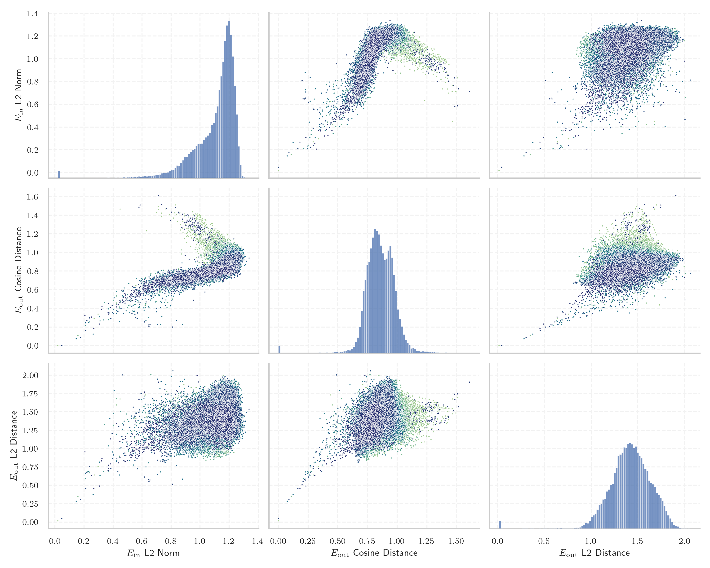

# Report for `meta-llama/Llama-2-70b-hf`

## Model info

* Tied embeddings: no
* LM head uses bias: no
* Indicator for under-trained tokens: E_{in} L2 Norm
  * Overall distribution 1.106 +/- 0.147
  * Token used for verification prompt building: `springframework`
  * Verification threshold: 0.744
  * Threshold for showing candidate under-trained tokens: 0.233
  * Median verified threshold (for bytes, unreachable and special tokens): 0.518
* Embeddings shape: (32000, 8192)
* Vocabulary size: 32000
  * Number of single byte tokens: 351, of which 113 below indicator threshold
  * Number of special tokens: 3, of which 1 below indicator threshold
  * Number of tested under-trained tokens: 625, 625 non-special, 30 below p = 0.01 threshold, 11 below soft indicator threshold

## Under-trained token indicators plot


## Verification plot


## Under-trained token verification results
11 entries below threshold of 0.233

|   token_id | token                       |   indicator | max_prob                                                         | in_other_tokens                                                                                                                                                                            |
|------------|-----------------------------|-------------|------------------------------------------------------------------|--------------------------------------------------------------------------------------------------------------------------------------------------------------------------------------------|
|      28574 | ````` ▁Mediabestanden ````` |   0.0470724 | <span style='border: 1px solid rgb(169, 68, 66);'>5.1e-10</span> |                                                                                                                                                                                            |
|      20609 | ````` ▁Portály `````        |   0.146019  | <span style='border: 1px solid rgb(169, 68, 66);'>4.5e-05</span> |                                                                                                                                                                                            |
|      12731 | ````` ederbörd `````        |   0.14729   | <span style='border: 1px solid rgb(169, 68, 66);'>8.8e-05</span> | <span style='border: 1px solid rgb(251, 189, 8);'>````` ▁nederbörd `````</span>, <span style='border: 1px solid rgb(169, 68, 66);'>````` nederbörd `````</span>, ````` ▁årsnederbörd ````` |
|       3798 | ````` oreferrer `````       |   0.1581    | <span style='border: 1px solid rgb(251, 189, 8);'>0.013</span>   | ````` ▁noreferrer `````, ````` noreferrer `````                                                                                                                                            |
|      28633 | ````` nederbörd `````       |   0.174253  | <span style='border: 1px solid rgb(169, 68, 66);'>0.00029</span> | ````` ▁årsnederbörd `````                                                                                                                                                                  |
|      31664 | ````` ߬ `````                |   0.206375  | <span style='border: 1px solid rgb(251, 189, 8);'>0.088</span>   |                                                                                                                                                                                            |
|      23313 | ````` Obrázky `````         |   0.208841  | <span style='border: 1px solid rgb(40, 167, 69);'>0.99</span>    |                                                                                                                                                                                            |
|      12882 | ````` ITableView `````      |   0.210219  | <span style='border: 1px solid rgb(40, 167, 69);'>0.92</span>    | ````` ▁UITableView `````, <span style='border: 1px solid rgb(40, 167, 69);'>````` UITableView `````</span>                                                                                 |
|      28354 | ````` ▁Расподела `````      |   0.211736  | <span style='border: 1px solid rgb(169, 68, 66);'>1.9e-05</span> |                                                                                                                                                                                            |
|      28623 | ````` ▁Genomsnitt `````     |   0.219933  | <span style='border: 1px solid rgb(40, 167, 69);'>0.14</span>    | <span style='border: 1px solid rgb(40, 167, 69);'>````` ▁Genomsnittlig `````</span>                                                                                                        |
|       9831 | ````` ▁челов `````          |   0.22154   | <span style='border: 1px solid rgb(40, 167, 69);'>0.16</span>    | ````` ▁человек `````, ````` ▁челове `````, ````` ▁человека `````                                                                                                                           |
<details><summary>614 additional entries above threshold</summary>

|   token_id | token                       |   indicator | max_prob                                                         | in_other_tokens                                                                                                                                                                                                                                                                                                           |
|------------|-----------------------------|-------------|------------------------------------------------------------------|---------------------------------------------------------------------------------------------------------------------------------------------------------------------------------------------------------------------------------------------------------------------------------------------------------------------------|
|      19539 | ````` ▁demsel `````         |    0.232836 | <span style='border: 1px solid rgb(169, 68, 66);'>6.7e-05</span> | ````` ▁demselben `````                                                                                                                                                                                                                                                                                                    |
|      11193 | ````` ▁Normdaten `````      |    0.235512 | <span style='border: 1px solid rgb(40, 167, 69);'>0.28</span>    |                                                                                                                                                                                                                                                                                                                           |
|      28642 | ````` ▁regnig `````         |    0.238538 | <span style='border: 1px solid rgb(169, 68, 66);'>0.00079</span> | <span style='border: 1px solid rgb(169, 68, 66);'>````` ▁regnigaste `````</span>                                                                                                                                                                                                                                          |
|      31477 | ````` ⸮ `````               |    0.252757 | <span style='border: 1px solid rgb(40, 167, 69);'>0.14</span>    |                                                                                                                                                                                                                                                                                                                           |
|      20486 | ````` tatywna `````         |    0.262802 | <span style='border: 1px solid rgb(255, 145, 0);'>0.0019</span>  | ````` ▁autorytatywna `````                                                                                                                                                                                                                                                                                                |
|      31899 | ````` ⥤ `````               |    0.267694 | <span style='border: 1px solid rgb(40, 167, 69);'>0.97</span>    |                                                                                                                                                                                                                                                                                                                           |
|      18596 | ````` ципа `````            |    0.30594  | <span style='border: 1px solid rgb(40, 167, 69);'>0.48</span>    | <span style='border: 1px solid rgb(255, 145, 0);'>````` ніципа `````</span>, <span style='border: 1px solid rgb(255, 145, 0);'>````` ніципалі `````</span>, ````` ▁муніципалі `````, <span style='border: 1px solid rgb(40, 167, 69);'>````` ниципа `````</span>, ````` ▁муниципа `````                                   |
|      30772 | ````` ╌ `````               |    0.307817 | <span style='border: 1px solid rgb(40, 167, 69);'>0.99</span>    |                                                                                                                                                                                                                                                                                                                           |
|      16056 | ````` љашње `````           |    0.310347 | <span style='border: 1px solid rgb(255, 145, 0);'>0.0046</span>  | <span style='border: 1px solid rgb(255, 145, 0);'>````` ▁Спољашње `````</span>                                                                                                                                                                                                                                            |
|      31772 | ````` ₗ `````               |    0.321388 | <span style='border: 1px solid rgb(40, 167, 69);'>0.98</span>    |                                                                                                                                                                                                                                                                                                                           |
|      31926 | ````` 𝓝 `````               |    0.323833 | <span style='border: 1px solid rgb(40, 167, 69);'>0.98</span>    |                                                                                                                                                                                                                                                                                                                           |
|      12472 | ````` ateien `````          |    0.332743 | <span style='border: 1px solid rgb(40, 167, 69);'>0.89</span>    | ````` ▁Audiodateien `````                                                                                                                                                                                                                                                                                                 |
|      10688 | ````` ▁gepublic `````       |    0.342714 | <span style='border: 1px solid rgb(251, 189, 8);'>0.016</span>   | ````` ▁gepubliceerd `````                                                                                                                                                                                                                                                                                                 |
|      31483 | ````` ┈ `````               |    0.365984 | <span style='border: 1px solid rgb(40, 167, 69);'>0.96</span>    |                                                                                                                                                                                                                                                                                                                           |
|      11766 | ````` хівовано `````        |    0.367944 | <span style='border: 1px solid rgb(255, 145, 0);'>0.0038</span>  | ````` Архівовано `````                                                                                                                                                                                                                                                                                                    |
|      31591 | ````` ⍵ `````               |    0.368458 | <span style='border: 1px solid rgb(40, 167, 69);'>1</span>       |                                                                                                                                                                                                                                                                                                                           |
|      30994 | ````` 𝕜 `````               |    0.368644 | <span style='border: 1px solid rgb(40, 167, 69);'>0.91</span>    |                                                                                                                                                                                                                                                                                                                           |
|      16013 | ````` temperaturen `````    |    0.370214 | <span style='border: 1px solid rgb(40, 167, 69);'>0.99</span>    | <span style='border: 1px solid rgb(251, 189, 8);'>````` eltemperaturen `````</span>                                                                                                                                                                                                                                       |
|      21721 | ````` archivi `````         |    0.378138 | <span style='border: 1px solid rgb(40, 167, 69);'>1</span>       | <span style='border: 1px solid rgb(40, 167, 69);'>````` archiviato `````</span>                                                                                                                                                                                                                                           |
|      31589 | ````` ▇ `````               |    0.380497 | <span style='border: 1px solid rgb(40, 167, 69);'>0.98</span>    |                                                                                                                                                                                                                                                                                                                           |
|      31884 | ````` ѫ `````               |    0.381076 | <span style='border: 1px solid rgb(40, 167, 69);'>0.97</span>    |                                                                                                                                                                                                                                                                                                                           |
|      28294 | ````` usztus `````          |    0.384957 | <span style='border: 1px solid rgb(40, 167, 69);'>0.18</span>    | ````` ▁augusztus `````                                                                                                                                                                                                                                                                                                    |
|      27706 | ````` ]{' `````             |    0.393708 | <span style='border: 1px solid rgb(40, 167, 69);'>0.99</span>    |                                                                                                                                                                                                                                                                                                                           |
|      21042 | ````` lês `````             |    0.395564 | <span style='border: 1px solid rgb(40, 167, 69);'>0.89</span>    | ````` ▁inglês `````                                                                                                                                                                                                                                                                                                       |
|      26335 | ````` llaços `````          |    0.396809 | <span style='border: 1px solid rgb(40, 167, 69);'>0.27</span>    | ````` ▁Enllaços `````                                                                                                                                                                                                                                                                                                     |
|      23767 | ````` egyzetek `````        |    0.402415 | <span style='border: 1px solid rgb(40, 167, 69);'>0.35</span>    | ````` ▁Jegyzetek `````                                                                                                                                                                                                                                                                                                    |
|      16196 | ````` textt `````           |    0.403567 | <span style='border: 1px solid rgb(40, 167, 69);'>1</span>       | ````` texttt `````                                                                                                                                                                                                                                                                                                        |
|       9236 | ````` ▁pobla `````          |    0.403657 | <span style='border: 1px solid rgb(40, 167, 69);'>0.96</span>    | ````` ▁población `````, ````` ▁població `````                                                                                                                                                                                                                                                                             |
|      20448 | ````` ▁Kontrola `````       |    0.407416 | <span style='border: 1px solid rgb(40, 167, 69);'>0.99</span>    |                                                                                                                                                                                                                                                                                                                           |
|      23441 | ````` któber `````          |    0.422305 | <span style='border: 1px solid rgb(40, 167, 69);'>0.61</span>    | ````` ▁október `````                                                                                                                                                                                                                                                                                                      |
|      31489 | ````` Ḩ `````               |    0.423127 | <span style='border: 1px solid rgb(40, 167, 69);'>0.99</span>    |                                                                                                                                                                                                                                                                                                                           |
|       2639 | ````` Portail `````         |    0.423251 | <span style='border: 1px solid rgb(40, 167, 69);'>1</span>       |                                                                                                                                                                                                                                                                                                                           |
|       6663 | ````` ▁Einzelnach `````     |    0.423823 | <span style='border: 1px solid rgb(251, 189, 8);'>0.016</span>   | ````` ▁Einzelnachweise `````                                                                                                                                                                                                                                                                                              |
|      16916 | ````` ▁invån `````          |    0.424102 | <span style='border: 1px solid rgb(40, 167, 69);'>0.4</span>     | <span style='border: 1px solid rgb(40, 167, 69);'>````` ▁invånare `````</span>                                                                                                                                                                                                                                            |
|      20696 | ````` adratkil `````        |    0.425469 | <span style='border: 1px solid rgb(251, 189, 8);'>0.037</span>   | ````` adratkilometer `````                                                                                                                                                                                                                                                                                                |
|      27660 | ````` ckså `````            |    0.426711 | <span style='border: 1px solid rgb(255, 145, 0);'>0.0043</span>  | ````` ▁också `````                                                                                                                                                                                                                                                                                                        |
|      26498 | ````` >\<^ `````            |    0.433424 | <span style='border: 1px solid rgb(40, 167, 69);'>0.93</span>    |                                                                                                                                                                                                                                                                                                                           |
|      31216 | ````` ╩ `````               |    0.436386 | <span style='border: 1px solid rgb(40, 167, 69);'>0.95</span>    |                                                                                                                                                                                                                                                                                                                           |
|      28090 | ````` ▁Савезне `````        |    0.439559 | <span style='border: 1px solid rgb(40, 167, 69);'>0.47</span>    |                                                                                                                                                                                                                                                                                                                           |
|      20422 | ````` ніципалі `````        |    0.443376 | <span style='border: 1px solid rgb(255, 145, 0);'>0.009</span>   | ````` ▁муніципалі `````                                                                                                                                                                                                                                                                                                   |
|       7368 | ````` ября `````            |    0.443734 | <span style='border: 1px solid rgb(40, 167, 69);'>0.2</span>     | ````` ▁сентября `````, ````` ▁октября `````, ````` ▁ноября `````                                                                                                                                                                                                                                                          |
|      31892 | ````` ҡ `````               |    0.447429 | <span style='border: 1px solid rgb(40, 167, 69);'>0.97</span>    |                                                                                                                                                                                                                                                                                                                           |
|      31626 | ````` ╣ `````               |    0.447789 | <span style='border: 1px solid rgb(40, 167, 69);'>0.97</span>    |                                                                                                                                                                                                                                                                                                                           |
|      20072 | ````` ywna `````            |    0.447806 | <span style='border: 1px solid rgb(40, 167, 69);'>0.96</span>    | <span style='border: 1px solid rgb(255, 145, 0);'>````` tatywna `````</span>, ````` ▁autorytatywna `````                                                                                                                                                                                                                  |
|      12479 | ````` ▁Audiod `````         |    0.451142 | <span style='border: 1px solid rgb(40, 167, 69);'>0.99</span>    | ````` ▁Audiodateien `````                                                                                                                                                                                                                                                                                                 |
|      27600 | ````` prilis `````          |    0.454921 | <span style='border: 1px solid rgb(40, 167, 69);'>0.71</span>    | ````` ▁április `````                                                                                                                                                                                                                                                                                                      |
|      27061 | ````` ▁Резултати `````      |    0.46122  | <span style='border: 1px solid rgb(40, 167, 69);'>0.74</span>    |                                                                                                                                                                                                                                                                                                                           |
|      19330 | ````` ▁Википеди `````       |    0.464459 | <span style='border: 1px solid rgb(40, 167, 69);'>0.94</span>    | <span style='border: 1px solid rgb(40, 167, 69);'>````` ▁Википедии `````</span>                                                                                                                                                                                                                                           |
|      14755 | ````` ewnętrz `````         |    0.464982 | <span style='border: 1px solid rgb(255, 145, 0);'>0.0016</span>  | <span style='border: 1px solid rgb(40, 167, 69);'>````` ▁zewnętrz `````</span>, ````` ▁zewnętrzne `````                                                                                                                                                                                                                   |
|      20739 | ````` ▁надмор `````         |    0.465197 | <span style='border: 1px solid rgb(40, 167, 69);'>0.81</span>    | <span style='border: 1px solid rgb(251, 189, 8);'>````` ▁надморској `````</span>                                                                                                                                                                                                                                          |
|      31670 | ````` ʑ `````               |    0.465988 | <span style='border: 1px solid rgb(40, 167, 69);'>1</span>       |                                                                                                                                                                                                                                                                                                                           |
|      27918 | ````` ▁Хронологија `````    |    0.467039 | <span style='border: 1px solid rgb(169, 68, 66);'>0.00012</span> |                                                                                                                                                                                                                                                                                                                           |
|      31444 | ````` ḩ `````               |    0.4678   | <span style='border: 1px solid rgb(40, 167, 69);'>0.97</span>    |                                                                                                                                                                                                                                                                                                                           |
|      31528 | ````` ℚ `````               |    0.470792 | <span style='border: 1px solid rgb(40, 167, 69);'>1</span>       |                                                                                                                                                                                                                                                                                                                           |
|      26194 | ````` ▁Савез `````          |    0.471864 | <span style='border: 1px solid rgb(40, 167, 69);'>0.63</span>    | <span style='border: 1px solid rgb(40, 167, 69);'>````` ▁Савезне `````</span>                                                                                                                                                                                                                                             |
|      23280 | ````` ździer `````          |    0.473005 | <span style='border: 1px solid rgb(251, 189, 8);'>0.029</span>   | <span style='border: 1px solid rgb(40, 167, 69);'>````` ▁paździer `````</span>, ````` ▁października `````                                                                                                                                                                                                                 |
|      23247 | ````` ▁dátum `````          |    0.473962 | <span style='border: 1px solid rgb(40, 167, 69);'>1</span>       | <span style='border: 1px solid rgb(40, 167, 69);'>````` ▁dátummal `````</span>                                                                                                                                                                                                                                            |
|      30841 | ````` ╠ `````               |    0.474717 | <span style='border: 1px solid rgb(40, 167, 69);'>0.99</span>    |                                                                                                                                                                                                                                                                                                                           |
|      17835 | ````` ▁Станов `````         |    0.47653  | <span style='border: 1px solid rgb(40, 167, 69);'>1</span>       | <span style='border: 1px solid rgb(40, 167, 69);'>````` ▁Становништво `````</span>                                                                                                                                                                                                                                        |
|      23910 | ````` ритор `````           |    0.479392 | <span style='border: 1px solid rgb(40, 167, 69);'>0.57</span>    | ````` ▁територ `````                                                                                                                                                                                                                                                                                                      |
|      31586 | ````` ∉ `````               |    0.481591 | <span style='border: 1px solid rgb(40, 167, 69);'>0.99</span>    |                                                                                                                                                                                                                                                                                                                           |
|      31625 | ````` ൾ `````               |    0.483095 | <span style='border: 1px solid rgb(40, 167, 69);'>0.54</span>    |                                                                                                                                                                                                                                                                                                                           |
|      31794 | ````` ˠ `````               |    0.484307 | <span style='border: 1px solid rgb(40, 167, 69);'>0.99</span>    |                                                                                                                                                                                                                                                                                                                           |
|      31806 | ````` ӏ `````               |    0.486352 | <span style='border: 1px solid rgb(40, 167, 69);'>0.97</span>    |                                                                                                                                                                                                                                                                                                                           |
|      31515 | ````` ⴰ `````               |    0.488614 | <span style='border: 1px solid rgb(40, 167, 69);'>1</span>       |                                                                                                                                                                                                                                                                                                                           |
|      20721 | ````` ▁bezeichneter `````   |    0.490127 | <span style='border: 1px solid rgb(40, 167, 69);'>0.31</span>    |                                                                                                                                                                                                                                                                                                                           |
|      10775 | ````` ▁formatt `````        |    0.494416 | <span style='border: 1px solid rgb(40, 167, 69);'>1</span>       | ````` ▁formatting `````, ````` ▁formatted `````                                                                                                                                                                                                                                                                           |
|      31800 | ````` ܝ `````               |    0.495897 | <span style='border: 1px solid rgb(40, 167, 69);'>0.91</span>    |                                                                                                                                                                                                                                                                                                                           |
|      31336 | ````` ʐ `````               |    0.49597  | <span style='border: 1px solid rgb(40, 167, 69);'>0.99</span>    |                                                                                                                                                                                                                                                                                                                           |
|      14545 | ````` ewnę `````            |    0.499386 | <span style='border: 1px solid rgb(251, 189, 8);'>0.021</span>   | <span style='border: 1px solid rgb(255, 145, 0);'>````` ewnętrz `````</span>, <span style='border: 1px solid rgb(40, 167, 69);'>````` ▁zewnętrz `````</span>, ````` ▁zewnętrzne `````                                                                                                                                     |
|      22918 | ````` prüft `````           |    0.501132 | <span style='border: 1px solid rgb(40, 167, 69);'>0.55</span>    | <span style='border: 1px solid rgb(40, 167, 69);'>````` ▁geprüft `````</span>                                                                                                                                                                                                                                             |
|      31128 | ````` ╦ `````               |    0.501208 | <span style='border: 1px solid rgb(40, 167, 69);'>0.96</span>    |                                                                                                                                                                                                                                                                                                                           |
|       9611 | ````` ViewById `````        |    0.501404 | <span style='border: 1px solid rgb(40, 167, 69);'>1</span>       | ````` findViewById `````, ````` ▁findViewById `````                                                                                                                                                                                                                                                                       |
|      25229 | ````` лтати `````           |    0.505661 | <span style='border: 1px solid rgb(40, 167, 69);'>0.14</span>    | <span style='border: 1px solid rgb(40, 167, 69);'>````` ▁Резултати `````</span>                                                                                                                                                                                                                                           |
|      10553 | ````` \<^ `````             |    0.506943 | <span style='border: 1px solid rgb(40, 167, 69);'>0.96</span>    | <span style='border: 1px solid rgb(40, 167, 69);'>````` >\<^ `````</span>                                                                                                                                                                                                                                                 |
|      15022 | ````` ▁zewnętrz `````       |    0.508477 | <span style='border: 1px solid rgb(40, 167, 69);'>0.91</span>    | ````` ▁zewnętrzne `````                                                                                                                                                                                                                                                                                                   |
|      31956 | ````` ഞ `````               |    0.513402 | <span style='border: 1px solid rgb(40, 167, 69);'>1</span>       |                                                                                                                                                                                                                                                                                                                           |
|      17047 | ````` omsnitt `````         |    0.514766 | <span style='border: 1px solid rgb(40, 167, 69);'>0.9</span>     | ````` ▁genomsnitt `````, <span style='border: 1px solid rgb(40, 167, 69);'>````` ▁Genomsnitt `````</span>, <span style='border: 1px solid rgb(40, 167, 69);'>````` ▁Genomsnittlig `````</span>                                                                                                                            |
|      26782 | ````` ▁пописа `````         |    0.515403 | <span style='border: 1px solid rgb(40, 167, 69);'>0.86</span>    |                                                                                                                                                                                                                                                                                                                           |
|      31644 | ````` ེ `````                |    0.515906 | <span style='border: 1px solid rgb(40, 167, 69);'>0.65</span>    |                                                                                                                                                                                                                                                                                                                           |
|      15394 | ````` usetts `````          |    0.516805 | <span style='border: 1px solid rgb(40, 167, 69);'>0.26</span>    | ````` achusetts `````, ````` ▁Massachusetts `````                                                                                                                                                                                                                                                                         |
|      26734 | ````` ▁Årsmed `````         |    0.517347 | <span style='border: 1px solid rgb(169, 68, 66);'>9.8e-05</span> |                                                                                                                                                                                                                                                                                                                           |
|      21673 | ````` ▁висини `````         |    0.518426 | <span style='border: 1px solid rgb(255, 145, 0);'>0.0057</span>  |                                                                                                                                                                                                                                                                                                                           |
|      31705 | ````` ལ `````               |    0.518607 | <span style='border: 1px solid rgb(40, 167, 69);'>1</span>       |                                                                                                                                                                                                                                                                                                                           |
|      30935 | ````` ╬ `````               |    0.52094  | <span style='border: 1px solid rgb(40, 167, 69);'>1</span>       |                                                                                                                                                                                                                                                                                                                           |
|      27563 | ````` datei `````           |    0.522972 | <span style='border: 1px solid rgb(40, 167, 69);'>1</span>       | <span style='border: 1px solid rgb(255, 145, 0);'>````` ▁Normdatei `````</span>                                                                                                                                                                                                                                           |
|      31638 | ````` ൽ `````               |    0.523812 | <span style='border: 1px solid rgb(40, 167, 69);'>0.96</span>    |                                                                                                                                                                                                                                                                                                                           |
|      31771 | ````` ⊤ `````               |    0.524895 | <span style='border: 1px solid rgb(40, 167, 69);'>1</span>       |                                                                                                                                                                                                                                                                                                                           |
|      25104 | ````` Zygote `````          |    0.526432 | <span style='border: 1px solid rgb(40, 167, 69);'>1</span>       | <span style='border: 1px solid rgb(40, 167, 69);'>````` ZygoteInit `````</span>                                                                                                                                                                                                                                           |
|       6009 | ````` perties `````         |    0.526475 | <span style='border: 1px solid rgb(40, 167, 69);'>1</span>       | ````` properties `````, ````` Properties `````, ````` ▁Properties `````                                                                                                                                                                                                                                                   |
|      31601 | ````` ུ `````                |    0.526604 | <span style='border: 1px solid rgb(40, 167, 69);'>0.97</span>    |                                                                                                                                                                                                                                                                                                                           |
|      31663 | ````` Ս `````               |    0.528433 | <span style='border: 1px solid rgb(40, 167, 69);'>1</span>       |                                                                                                                                                                                                                                                                                                                           |
|      23875 | ````` ▁Насеље `````         |    0.528818 | <span style='border: 1px solid rgb(40, 167, 69);'>0.68</span>    |                                                                                                                                                                                                                                                                                                                           |
|      23217 | ````` ▁zvuky `````          |    0.529648 | <span style='border: 1px solid rgb(40, 167, 69);'>1</span>       |                                                                                                                                                                                                                                                                                                                           |
|      28416 | ````` ▁Мексичка `````       |    0.530388 | <span style='border: 1px solid rgb(169, 68, 66);'>2.3e-05</span> |                                                                                                                                                                                                                                                                                                                           |
|      31808 | ````` എ `````               |    0.53112  | <span style='border: 1px solid rgb(40, 167, 69);'>0.99</span>    |                                                                                                                                                                                                                                                                                                                           |
|      30770 | ````` ℤ `````               |    0.532365 | <span style='border: 1px solid rgb(40, 167, 69);'>1</span>       |                                                                                                                                                                                                                                                                                                                           |
|      31764 | ````` ɫ `````               |    0.534722 | <span style='border: 1px solid rgb(40, 167, 69);'>0.99</span>    |                                                                                                                                                                                                                                                                                                                           |
|      14949 | ````` кипеди `````          |    0.535865 | <span style='border: 1px solid rgb(40, 167, 69);'>0.39</span>    | <span style='border: 1px solid rgb(40, 167, 69);'>````` ▁Википеди `````</span>, <span style='border: 1px solid rgb(40, 167, 69);'>````` ▁Википедии `````</span>                                                                                                                                                           |
|      31896 | ````` ྱ `````                |    0.535898 | <span style='border: 1px solid rgb(40, 167, 69);'>0.3</span>     |                                                                                                                                                                                                                                                                                                                           |
|      21836 | ````` ▁надморској `````     |    0.538483 | <span style='border: 1px solid rgb(251, 189, 8);'>0.023</span>   |                                                                                                                                                                                                                                                                                                                           |
|      27645 | ````` ▁Попис `````          |    0.538847 | <span style='border: 1px solid rgb(255, 145, 0);'>0.0091</span>  |                                                                                                                                                                                                                                                                                                                           |
|      20070 | ````` ▁autory `````         |    0.539168 | <span style='border: 1px solid rgb(40, 167, 69);'>0.6</span>     | ````` ▁autorytatywna `````                                                                                                                                                                                                                                                                                                |
|      18676 | ````` ніципа `````          |    0.539848 | <span style='border: 1px solid rgb(255, 145, 0);'>0.0062</span>  | <span style='border: 1px solid rgb(255, 145, 0);'>````` ніципалі `````</span>, ````` ▁муніципалі `````                                                                                                                                                                                                                    |
|      31913 | ````` ശ `````               |    0.543506 | <span style='border: 1px solid rgb(40, 167, 69);'>1</span>       |                                                                                                                                                                                                                                                                                                                           |
|      31889 | ````` ദ `````               |    0.544693 | <span style='border: 1px solid rgb(40, 167, 69);'>0.98</span>    |                                                                                                                                                                                                                                                                                                                           |
|      31614 | ````` ན `````               |    0.54562  | <span style='border: 1px solid rgb(40, 167, 69);'>0.98</span>    |                                                                                                                                                                                                                                                                                                                           |
|      10164 | ````` loyee `````           |    0.548196 | <span style='border: 1px solid rgb(40, 167, 69);'>0.98</span>    | ````` ▁employee `````, ````` Employee `````, ````` ▁employees `````, ````` ▁Employee `````, ````` employee `````                                                                                                                                                                                                          |
|      13606 | ````` oreign `````          |    0.548372 | <span style='border: 1px solid rgb(40, 167, 69);'>1</span>       | ````` ▁Foreign `````, ````` Foreign `````                                                                                                                                                                                                                                                                                 |
|       6002 | ````` entication `````      |    0.548475 | <span style='border: 1px solid rgb(40, 167, 69);'>1</span>       | ````` ▁authentication `````, ````` Authentication `````, ````` authentication `````, ````` ▁Authentication `````                                                                                                                                                                                                          |
|      28409 | ````` Sito `````            |    0.549132 | <span style='border: 1px solid rgb(40, 167, 69);'>0.99</span>    |                                                                                                                                                                                                                                                                                                                           |
|      20638 | ````` ungsseite `````       |    0.549382 | <span style='border: 1px solid rgb(169, 68, 66);'>0.00085</span> |                                                                                                                                                                                                                                                                                                                           |
|      31673 | ````` ℂ `````               |    0.549798 | <span style='border: 1px solid rgb(40, 167, 69);'>0.99</span>    |                                                                                                                                                                                                                                                                                                                           |
|      26641 | ````` ▁Мексика `````        |    0.549868 | <span style='border: 1px solid rgb(40, 167, 69);'>1</span>       |                                                                                                                                                                                                                                                                                                                           |
|      25587 | ````` ZygoteInit `````      |    0.551035 | <span style='border: 1px solid rgb(40, 167, 69);'>0.98</span>    |                                                                                                                                                                                                                                                                                                                           |
|      26964 | ````` ▁Хронологи `````      |    0.551178 | <span style='border: 1px solid rgb(40, 167, 69);'>0.93</span>    | <span style='border: 1px solid rgb(169, 68, 66);'>````` ▁Хронологија `````</span>                                                                                                                                                                                                                                         |
|      31178 | ````` ⊢ `````               |    0.551594 | <span style='border: 1px solid rgb(40, 167, 69);'>1</span>       |                                                                                                                                                                                                                                                                                                                           |
|      24364 | ````` ▁Licencia `````       |    0.552587 | <span style='border: 1px solid rgb(40, 167, 69);'>1</span>       |                                                                                                                                                                                                                                                                                                                           |
|      24330 | ````` ниципа `````          |    0.553222 | <span style='border: 1px solid rgb(40, 167, 69);'>0.99</span>    | ````` ▁муниципа `````                                                                                                                                                                                                                                                                                                     |
|      28142 | ````` ightarrow `````       |    0.553323 | <span style='border: 1px solid rgb(40, 167, 69);'>0.97</span>    | ````` trightarrow `````                                                                                                                                                                                                                                                                                                   |
|      12867 | ````` лання `````           |    0.554207 | <span style='border: 1px solid rgb(40, 167, 69);'>0.15</span>    | <span style='border: 1px solid rgb(40, 167, 69);'>````` силання `````</span>, ````` ▁Посилання `````                                                                                                                                                                                                                      |
|      26338 | ````` ▁Års `````            |    0.555539 | <span style='border: 1px solid rgb(40, 167, 69);'>1</span>       | <span style='border: 1px solid rgb(169, 68, 66);'>````` ▁Årsmed `````</span>                                                                                                                                                                                                                                              |
|      31777 | ````` ѐ `````               |    0.555697 | <span style='border: 1px solid rgb(40, 167, 69);'>0.98</span>    |                                                                                                                                                                                                                                                                                                                           |
|      31921 | ````` ഷ `````               |    0.555923 | <span style='border: 1px solid rgb(40, 167, 69);'>0.97</span>    |                                                                                                                                                                                                                                                                                                                           |
|      17398 | ````` ништво `````          |    0.557024 | <span style='border: 1px solid rgb(40, 167, 69);'>0.28</span>    | <span style='border: 1px solid rgb(40, 167, 69);'>````` ▁Становништво `````</span>                                                                                                                                                                                                                                        |
|      31342 | ````` അ `````               |    0.557855 | <span style='border: 1px solid rgb(40, 167, 69);'>0.97</span>    |                                                                                                                                                                                                                                                                                                                           |
|      10400 | ````` ▁Mitg `````           |    0.559956 | <span style='border: 1px solid rgb(40, 167, 69);'>1</span>       | ````` ▁Mitglied `````, ````` ▁Mitglieder `````                                                                                                                                                                                                                                                                            |
|      30929 | ````` ┴ `````               |    0.559958 | <span style='border: 1px solid rgb(40, 167, 69);'>0.99</span>    |                                                                                                                                                                                                                                                                                                                           |
|      30375 | ````` ﹕ `````              |    0.560202 | <span style='border: 1px solid rgb(40, 167, 69);'>0.97</span>    |                                                                                                                                                                                                                                                                                                                           |
|      22755 | ````` źdz `````             |    0.560323 | <span style='border: 1px solid rgb(40, 167, 69);'>0.28</span>    | <span style='border: 1px solid rgb(251, 189, 8);'>````` ździer `````</span>, <span style='border: 1px solid rgb(40, 167, 69);'>````` ▁paździer `````</span>, ````` ▁października `````                                                                                                                                    |
|      31372 | ````` ╚ `````               |    0.560584 | <span style='border: 1px solid rgb(40, 167, 69);'>0.94</span>    |                                                                                                                                                                                                                                                                                                                           |
|      16364 | ````` фициаль `````         |    0.560608 | <span style='border: 1px solid rgb(40, 167, 69);'>0.98</span>    | ````` ▁официаль `````, <span style='border: 1px solid rgb(40, 167, 69);'>````` ▁Официаль `````</span>                                                                                                                                                                                                                     |
|      31672 | ````` Ḫ `````               |    0.561341 | <span style='border: 1px solid rgb(40, 167, 69);'>0.97</span>    |                                                                                                                                                                                                                                                                                                                           |
|      13591 | ````` ongodb `````          |    0.561985 | <span style='border: 1px solid rgb(251, 189, 8);'>0.035</span>   | ````` mongodb `````, ````` ▁mongodb `````                                                                                                                                                                                                                                                                                 |
|      24935 | ````` ▁RewriteCond `````    |    0.562415 | <span style='border: 1px solid rgb(40, 167, 69);'>1</span>       |                                                                                                                                                                                                                                                                                                                           |
|      31575 | ````` Մ `````               |    0.56428  | <span style='border: 1px solid rgb(40, 167, 69);'>1</span>       |                                                                                                                                                                                                                                                                                                                           |
|      31401 | ````` ང `````               |    0.564538 | <span style='border: 1px solid rgb(40, 167, 69);'>0.98</span>    |                                                                                                                                                                                                                                                                                                                           |
|      31646 | ````` ൻ `````               |    0.565189 | <span style='border: 1px solid rgb(40, 167, 69);'>0.54</span>    |                                                                                                                                                                                                                                                                                                                           |
|      31452 | ````` ི `````                |    0.565991 | <span style='border: 1px solid rgb(40, 167, 69);'>0.98</span>    |                                                                                                                                                                                                                                                                                                                           |
|      26675 | ````` ▁kallaste `````       |    0.566725 | <span style='border: 1px solid rgb(169, 68, 66);'>0.0002</span>  |                                                                                                                                                                                                                                                                                                                           |
|      26662 | ````` ▁varmaste `````       |    0.568054 | <span style='border: 1px solid rgb(251, 189, 8);'>0.049</span>   |                                                                                                                                                                                                                                                                                                                           |
|      17467 | ````` ▁inwon `````          |    0.569383 | <span style='border: 1px solid rgb(40, 167, 69);'>0.98</span>    | <span style='border: 1px solid rgb(40, 167, 69);'>````` ▁inwoners `````</span>                                                                                                                                                                                                                                            |
|      18206 | ````` braio `````           |    0.57114  | <span style='border: 1px solid rgb(40, 167, 69);'>0.99</span>    | ````` ▁febbraio `````                                                                                                                                                                                                                                                                                                     |
|      20716 | ````` ▁Begriffsklär `````   |    0.572362 | <span style='border: 1px solid rgb(251, 189, 8);'>0.029</span>   |                                                                                                                                                                                                                                                                                                                           |
|       9840 | ````` судар `````           |    0.572991 | <span style='border: 1px solid rgb(40, 167, 69);'>0.93</span>    | ````` ▁государ `````, ````` ▁Государ `````                                                                                                                                                                                                                                                                                |
|      20870 | ````` kreich `````          |    0.574169 | <span style='border: 1px solid rgb(40, 167, 69);'>0.94</span>    | ````` ▁Frankreich `````                                                                                                                                                                                                                                                                                                   |
|      31585 | ````` ർ `````               |    0.574648 | <span style='border: 1px solid rgb(40, 167, 69);'>0.42</span>    |                                                                                                                                                                                                                                                                                                                           |
|      18222 | ````` нцикло `````          |    0.575269 | <span style='border: 1px solid rgb(40, 167, 69);'>0.31</span>    | ````` нциклопеди `````, ````` ▁энциклопеди `````                                                                                                                                                                                                                                                                          |
|      28791 | ````` ▁віці `````           |    0.575674 | <span style='border: 1px solid rgb(40, 167, 69);'>0.77</span>    |                                                                                                                                                                                                                                                                                                                           |
|      26557 | ````` embros `````          |    0.576366 | <span style='border: 1px solid rgb(40, 167, 69);'>0.67</span>    | ````` ▁miembros `````                                                                                                                                                                                                                                                                                                     |
|      30925 | ````` Қ `````               |    0.576411 | <span style='border: 1px solid rgb(40, 167, 69);'>1</span>       |                                                                                                                                                                                                                                                                                                                           |
|       9035 | ````` férés `````           |    0.577262 | <span style='border: 1px solid rgb(40, 167, 69);'>0.55</span>    | <span style='border: 1px solid rgb(40, 167, 69);'>````` ozzáférés `````</span>, ````` Hozzáférés `````                                                                                                                                                                                                                    |
|      27566 | ````` sime `````            |    0.57744  | <span style='border: 1px solid rgb(40, 167, 69);'>1</span>       | ````` simeq `````                                                                                                                                                                                                                                                                                                         |
|      31643 | ````` མ `````               |    0.578484 | <span style='border: 1px solid rgb(40, 167, 69);'>0.99</span>    |                                                                                                                                                                                                                                                                                                                           |
|      31289 | ````` ┤ `````               |    0.579067 | <span style='border: 1px solid rgb(40, 167, 69);'>0.99</span>    |                                                                                                                                                                                                                                                                                                                           |
|      31879 | ````` ▓ `````               |    0.579621 | <span style='border: 1px solid rgb(40, 167, 69);'>1</span>       |                                                                                                                                                                                                                                                                                                                           |
|      31269 | ````` ╝ `````               |    0.579711 | <span style='border: 1px solid rgb(40, 167, 69);'>0.99</span>    |                                                                                                                                                                                                                                                                                                                           |
|       5911 | ````` bolds `````           |    0.58009  | <span style='border: 1px solid rgb(40, 167, 69);'>1</span>       | ````` boldsymbol `````                                                                                                                                                                                                                                                                                                    |
|      30560 | ````` ┼ `````               |    0.580253 | <span style='border: 1px solid rgb(40, 167, 69);'>0.99</span>    |                                                                                                                                                                                                                                                                                                                           |
|      30301 | ````` ₉ `````               |    0.581554 | <span style='border: 1px solid rgb(40, 167, 69);'>1</span>       |                                                                                                                                                                                                                                                                                                                           |
|      30957 | ````` ങ `````               |    0.581726 | <span style='border: 1px solid rgb(40, 167, 69);'>0.83</span>    |                                                                                                                                                                                                                                                                                                                           |
|      10137 | ````` itmap `````           |    0.58212  | <span style='border: 1px solid rgb(40, 167, 69);'>1</span>       | ````` Bitmap `````, ````` ▁Bitmap `````, ````` ▁bitmap `````                                                                                                                                                                                                                                                              |
|      25145 | ````` ▁kwiet `````          |    0.583046 | <span style='border: 1px solid rgb(40, 167, 69);'>0.83</span>    | <span style='border: 1px solid rgb(40, 167, 69);'>````` ▁kwietnia `````</span>                                                                                                                                                                                                                                            |
|      21169 | ````` ▁prüfe `````          |    0.583319 | <span style='border: 1px solid rgb(40, 167, 69);'>0.75</span>    |                                                                                                                                                                                                                                                                                                                           |
|      25026 | ````` ▁Données `````        |    0.583464 | <span style='border: 1px solid rgb(40, 167, 69);'>0.99</span>    |                                                                                                                                                                                                                                                                                                                           |
|      31816 | ````` զ `````               |    0.583933 | <span style='border: 1px solid rgb(40, 167, 69);'>0.99</span>    |                                                                                                                                                                                                                                                                                                                           |
|      27248 | ````` données `````         |    0.584127 | <span style='border: 1px solid rgb(40, 167, 69);'>1</span>       |                                                                                                                                                                                                                                                                                                                           |
|      25908 | ````` éricaine `````        |    0.586267 | <span style='border: 1px solid rgb(40, 167, 69);'>0.76</span>    | ````` ▁américaine `````                                                                                                                                                                                                                                                                                                   |
|      31421 | ````` ܐ `````               |    0.586874 | <span style='border: 1px solid rgb(40, 167, 69);'>0.96</span>    |                                                                                                                                                                                                                                                                                                                           |
|      17391 | ````` ▁савез `````          |    0.587153 | <span style='border: 1px solid rgb(40, 167, 69);'>0.76</span>    | <span style='border: 1px solid rgb(251, 189, 8);'>````` ▁савезној `````</span>                                                                                                                                                                                                                                            |
|      31693 | ````` ზ `````               |    0.588231 | <span style='border: 1px solid rgb(40, 167, 69);'>0.99</span>    |                                                                                                                                                                                                                                                                                                                           |
|      24401 | ````` ▁подацима `````       |    0.58827  | <span style='border: 1px solid rgb(251, 189, 8);'>0.095</span>   |                                                                                                                                                                                                                                                                                                                           |
|      31311 | ````` Ű `````               |    0.58956  | <span style='border: 1px solid rgb(40, 167, 69);'>1</span>       |                                                                                                                                                                                                                                                                                                                           |
|      31720 | ````` շ `````               |    0.591611 | <span style='border: 1px solid rgb(40, 167, 69);'>0.99</span>    |                                                                                                                                                                                                                                                                                                                           |
|      31226 | ````` ە `````               |    0.592846 | <span style='border: 1px solid rgb(40, 167, 69);'>1</span>       |                                                                                                                                                                                                                                                                                                                           |
|      25308 | ````` стову `````           |    0.594086 | <span style='border: 1px solid rgb(40, 167, 69);'>0.45</span>    | ````` ▁використову `````                                                                                                                                                                                                                                                                                                  |
|      16153 | ````` gresql `````          |    0.594496 | <span style='border: 1px solid rgb(40, 167, 69);'>0.16</span>    | ````` ▁postgresql `````, ````` postgresql `````                                                                                                                                                                                                                                                                           |
|      25454 | ````` ▁seizo `````          |    0.595841 | <span style='border: 1px solid rgb(40, 167, 69);'>0.12</span>    | ````` ▁seizoen `````                                                                                                                                                                                                                                                                                                      |
|      26378 | ````` iből `````            |    0.595868 | <span style='border: 1px solid rgb(251, 189, 8);'>0.09</span>    | <span style='border: 1px solid rgb(251, 189, 8);'>````` ▁eredetiből `````</span>                                                                                                                                                                                                                                          |
|      31212 | ````` ұ `````               |    0.597849 | <span style='border: 1px solid rgb(40, 167, 69);'>1</span>       |                                                                                                                                                                                                                                                                                                                           |
|      23795 | ````` ▁paździer `````       |    0.599588 | <span style='border: 1px solid rgb(40, 167, 69);'>0.5</span>     | ````` ▁października `````                                                                                                                                                                                                                                                                                                 |
|      31281 | ````` ‾ `````               |    0.599651 | <span style='border: 1px solid rgb(40, 167, 69);'>1</span>       |                                                                                                                                                                                                                                                                                                                           |
|       8191 | ````` férences `````        |    0.600409 | <span style='border: 1px solid rgb(40, 167, 69);'>0.84</span>    | ````` ▁références `````, ````` ▁Références `````                                                                                                                                                                                                                                                                          |
|      31106 | ````` ച `````               |    0.60196  | <span style='border: 1px solid rgb(40, 167, 69);'>0.99</span>    |                                                                                                                                                                                                                                                                                                                           |
|      31766 | ````` ∷ `````               |    0.602234 | <span style='border: 1px solid rgb(40, 167, 69);'>1</span>       |                                                                                                                                                                                                                                                                                                                           |
|      23105 | ````` ▁videa `````          |    0.603394 | <span style='border: 1px solid rgb(40, 167, 69);'>0.92</span>    |                                                                                                                                                                                                                                                                                                                           |
|      15407 | ````` ▁statunit `````       |    0.603929 | <span style='border: 1px solid rgb(40, 167, 69);'>0.49</span>    | ````` ▁statunitense `````                                                                                                                                                                                                                                                                                                 |
|      31232 | ````` ར `````               |    0.605969 | <span style='border: 1px solid rgb(40, 167, 69);'>0.97</span>    |                                                                                                                                                                                                                                                                                                                           |
|      31104 | ````` ོ `````                |    0.606591 | <span style='border: 1px solid rgb(40, 167, 69);'>0.99</span>    |                                                                                                                                                                                                                                                                                                                           |
|      31344 | ````` ད `````               |    0.60686  | <span style='border: 1px solid rgb(40, 167, 69);'>0.99</span>    |                                                                                                                                                                                                                                                                                                                           |
|      11628 | ````` ▁исполь `````         |    0.606969 | <span style='border: 1px solid rgb(40, 167, 69);'>0.95</span>    | ````` ▁использова `````, ````` ▁использу `````                                                                                                                                                                                                                                                                            |
|      25564 | ````` ▁броја `````          |    0.607254 | <span style='border: 1px solid rgb(40, 167, 69);'>0.86</span>    |                                                                                                                                                                                                                                                                                                                           |
|      31743 | ````` ʎ `````               |    0.607265 | <span style='border: 1px solid rgb(40, 167, 69);'>1</span>       |                                                                                                                                                                                                                                                                                                                           |
|      31891 | ````` ̍ `````                |    0.6077   | <span style='border: 1px solid rgb(40, 167, 69);'>1</span>       |                                                                                                                                                                                                                                                                                                                           |
|      17299 | ````` ▁nederbörd `````      |    0.60807  | <span style='border: 1px solid rgb(251, 189, 8);'>0.069</span>   |                                                                                                                                                                                                                                                                                                                           |
|      20172 | ````` ▁Przyp `````          |    0.608155 | <span style='border: 1px solid rgb(40, 167, 69);'>1</span>       | ````` ▁Przypisy `````                                                                                                                                                                                                                                                                                                     |
|      21532 | ````` чня `````             |    0.609054 | <span style='border: 1px solid rgb(40, 167, 69);'>0.82</span>    | ````` ▁січня `````                                                                                                                                                                                                                                                                                                        |
|      22636 | ````` rások `````           |    0.610365 | <span style='border: 1px solid rgb(40, 167, 69);'>0.26</span>    | ````` ▁Források `````                                                                                                                                                                                                                                                                                                     |
|      31208 | ````` ག `````               |    0.610908 | <span style='border: 1px solid rgb(40, 167, 69);'>0.99</span>    |                                                                                                                                                                                                                                                                                                                           |
|      31983 | ````` ɯ `````               |    0.610981 | <span style='border: 1px solid rgb(40, 167, 69);'>1</span>       |                                                                                                                                                                                                                                                                                                                           |
|      14840 | ````` пня `````             |    0.611155 | <span style='border: 1px solid rgb(40, 167, 69);'>0.65</span>    | <span style='border: 1px solid rgb(40, 167, 69);'>````` ▁липня `````</span>, ````` ▁серпня `````                                                                                                                                                                                                                          |
|      23807 | ````` ▁пун `````            |    0.611201 | <span style='border: 1px solid rgb(40, 167, 69);'>0.99</span>    | ````` ▁пункт `````                                                                                                                                                                                                                                                                                                        |
|      31511 | ````` ☉ `````               |    0.611446 | <span style='border: 1px solid rgb(40, 167, 69);'>1</span>       |                                                                                                                                                                                                                                                                                                                           |
|      17578 | ````` estanden `````        |    0.612075 | <span style='border: 1px solid rgb(40, 167, 69);'>0.83</span>    | <span style='border: 1px solid rgb(251, 189, 8);'>````` abestanden `````</span>, <span style='border: 1px solid rgb(169, 68, 66);'>````` ▁Mediabestanden `````</span>                                                                                                                                                     |
|      31919 | ````` პ `````               |    0.612517 | <span style='border: 1px solid rgb(40, 167, 69);'>0.98</span>    |                                                                                                                                                                                                                                                                                                                           |
|      11547 | ````` ▁konn `````           |    0.613193 | <span style='border: 1px solid rgb(40, 167, 69);'>1</span>       | ````` ▁konnte `````, ````` ▁konnten `````                                                                                                                                                                                                                                                                                 |
|      23996 | ````` ▁живело `````         |    0.61325  | <span style='border: 1px solid rgb(255, 145, 0);'>0.0012</span>  |                                                                                                                                                                                                                                                                                                                           |
|      20527 | ````` AccessorImpl `````    |    0.614085 | <span style='border: 1px solid rgb(40, 167, 69);'>0.97</span>    |                                                                                                                                                                                                                                                                                                                           |
|      21490 | ````` ▁Bedeut `````         |    0.614152 | <span style='border: 1px solid rgb(40, 167, 69);'>0.98</span>    | ````` ▁Bedeutung `````                                                                                                                                                                                                                                                                                                    |
|      31923 | ````` ᵉ `````               |    0.614194 | <span style='border: 1px solid rgb(40, 167, 69);'>0.99</span>    |                                                                                                                                                                                                                                                                                                                           |
|      23406 | ````` ▁општини `````        |    0.61608  | <span style='border: 1px solid rgb(40, 167, 69);'>0.4</span>     |                                                                                                                                                                                                                                                                                                                           |
|      30964 | ````` േ `````                |    0.616912 | <span style='border: 1px solid rgb(40, 167, 69);'>0.29</span>    |                                                                                                                                                                                                                                                                                                                           |
|      31779 | ````` ➖ `````              |    0.617175 | <span style='border: 1px solid rgb(40, 167, 69);'>0.39</span>    |                                                                                                                                                                                                                                                                                                                           |
|      31499 | ````` ⁿ `````               |    0.617419 | <span style='border: 1px solid rgb(40, 167, 69);'>1</span>       |                                                                                                                                                                                                                                                                                                                           |
|      27914 | ````` ▁archiválva `````     |    0.617772 | <span style='border: 1px solid rgb(40, 167, 69);'>0.14</span>    |                                                                                                                                                                                                                                                                                                                           |
|      23171 | ````` ▁теа `````            |    0.617789 | <span style='border: 1px solid rgb(40, 167, 69);'>1</span>       | ````` ▁театра `````                                                                                                                                                                                                                                                                                                       |
|      31769 | ````` Ἐ `````               |    0.617981 | <span style='border: 1px solid rgb(40, 167, 69);'>1</span>       |                                                                                                                                                                                                                                                                                                                           |
|      31326 | ````` བ `````               |    0.618542 | <span style='border: 1px solid rgb(40, 167, 69);'>0.99</span>    |                                                                                                                                                                                                                                                                                                                           |
|      26711 | ````` gså `````             |    0.619548 | <span style='border: 1px solid rgb(251, 189, 8);'>0.048</span>   | ````` ▁også `````                                                                                                                                                                                                                                                                                                         |
|      23582 | ````` ▁RewriteRule `````    |    0.619678 | <span style='border: 1px solid rgb(40, 167, 69);'>1</span>       |                                                                                                                                                                                                                                                                                                                           |
|      13648 | ````` ══ `````              |    0.620129 | <span style='border: 1px solid rgb(40, 167, 69);'>0.99</span>    | ````` ════ `````                                                                                                                                                                                                                                                                                                          |
|      30347 | ````` ℕ `````               |    0.620151 | <span style='border: 1px solid rgb(40, 167, 69);'>0.99</span>    |                                                                                                                                                                                                                                                                                                                           |
|      31470 | ````` ʋ `````               |    0.62035  | <span style='border: 1px solid rgb(40, 167, 69);'>1</span>       |                                                                                                                                                                                                                                                                                                                           |
|      18418 | ````` ▁людя `````           |    0.620537 | <span style='border: 1px solid rgb(251, 189, 8);'>0.029</span>   | <span style='border: 1px solid rgb(40, 167, 69);'>````` ▁людях `````</span>                                                                                                                                                                                                                                               |
|      24184 | ````` achiv `````           |    0.620912 | <span style='border: 1px solid rgb(40, 167, 69);'>1</span>       | <span style='border: 1px solid rgb(255, 145, 0);'>````` Webachiv `````</span>                                                                                                                                                                                                                                             |
|      31119 | ````` ┘ `````               |    0.620943 | <span style='border: 1px solid rgb(40, 167, 69);'>1</span>       |                                                                                                                                                                                                                                                                                                                           |
|      23117 | ````` brázky `````          |    0.621175 | <span style='border: 1px solid rgb(169, 68, 66);'>0.00082</span> | <span style='border: 1px solid rgb(40, 167, 69);'>````` Obrázky `````</span>                                                                                                                                                                                                                                              |
|      16252 | ````` tembre `````          |    0.621371 | <span style='border: 1px solid rgb(40, 167, 69);'>0.8</span>     | ````` ▁settembre `````                                                                                                                                                                                                                                                                                                    |
|      28650 | ````` ▁Genomsnittlig `````  |    0.621532 | <span style='border: 1px solid rgb(40, 167, 69);'>0.21</span>    |                                                                                                                                                                                                                                                                                                                           |
|       9147 | ````` ozzáférés `````       |    0.621957 | <span style='border: 1px solid rgb(40, 167, 69);'>0.23</span>    | ````` Hozzáférés `````                                                                                                                                                                                                                                                                                                    |
|       9108 | ````` ▁Насе `````           |    0.624396 | <span style='border: 1px solid rgb(40, 167, 69);'>1</span>       | <span style='border: 1px solid rgb(40, 167, 69);'>````` ▁Населення `````</span>, <span style='border: 1px solid rgb(40, 167, 69);'>````` ▁Население `````</span>, <span style='border: 1px solid rgb(40, 167, 69);'>````` ▁Насеље `````</span>                                                                            |
|      18092 | ````` министратив `````     |    0.625258 | <span style='border: 1px solid rgb(40, 167, 69);'>0.88</span>    | <span style='border: 1px solid rgb(40, 167, 69);'>````` ▁административ `````</span>                                                                                                                                                                                                                                       |
|      31034 | ````` ས `````               |    0.625571 | <span style='border: 1px solid rgb(40, 167, 69);'>0.99</span>    |                                                                                                                                                                                                                                                                                                                           |
|      31937 | ````` Ġ `````               |    0.625831 | <span style='border: 1px solid rgb(40, 167, 69);'>1</span>       |                                                                                                                                                                                                                                                                                                                           |
|      14498 | ````` äsident `````         |    0.626015 | <span style='border: 1px solid rgb(40, 167, 69);'>0.15</span>    | ````` ▁Präsident `````, ````` präsident `````                                                                                                                                                                                                                                                                             |
|      18894 | ````` sklär `````           |    0.626815 | <span style='border: 1px solid rgb(255, 145, 0);'>0.0092</span>  | <span style='border: 1px solid rgb(251, 189, 8);'>````` ▁Begriffsklär `````</span>                                                                                                                                                                                                                                        |
|      30284 | ````` ₇ `````               |    0.626874 | <span style='border: 1px solid rgb(40, 167, 69);'>1</span>       |                                                                                                                                                                                                                                                                                                                           |
|      31521 | ````` Ď `````               |    0.627372 | <span style='border: 1px solid rgb(40, 167, 69);'>1</span>       |                                                                                                                                                                                                                                                                                                                           |
|      31247 | ````` ძ `````               |    0.627793 | <span style='border: 1px solid rgb(40, 167, 69);'>0.99</span>    |                                                                                                                                                                                                                                                                                                                           |
|      28525 | ````` doFilter `````        |    0.627901 | <span style='border: 1px solid rgb(40, 167, 69);'>1</span>       |                                                                                                                                                                                                                                                                                                                           |
|      26199 | ````` ▁mieszkań `````       |    0.628139 | <span style='border: 1px solid rgb(40, 167, 69);'>0.74</span>    | <span style='border: 1px solid rgb(40, 167, 69);'>````` ▁mieszkańców `````</span>                                                                                                                                                                                                                                         |
|      15534 | ````` ▁mysq `````           |    0.628526 | <span style='border: 1px solid rgb(40, 167, 69);'>0.99</span>    | ````` ▁mysqli `````                                                                                                                                                                                                                                                                                                       |
|      22011 | ````` ▁насељу `````         |    0.629467 | <span style='border: 1px solid rgb(40, 167, 69);'>0.41</span>    |                                                                                                                                                                                                                                                                                                                           |
|      14723 | ````` ingsområ `````        |    0.630073 | <span style='border: 1px solid rgb(40, 167, 69);'>0.6</span>     | <span style='border: 1px solid rgb(251, 189, 8);'>````` rinningsområ `````</span>                                                                                                                                                                                                                                         |
|      25840 | ````` ▁државе `````         |    0.630207 | <span style='border: 1px solid rgb(40, 167, 69);'>0.66</span>    |                                                                                                                                                                                                                                                                                                                           |
|      30849 | ````` ɲ `````               |    0.631247 | <span style='border: 1px solid rgb(40, 167, 69);'>1</span>       |                                                                                                                                                                                                                                                                                                                           |
|      31801 | ````` ြ `````                |    0.632154 | <span style='border: 1px solid rgb(40, 167, 69);'>0.51</span>    |                                                                                                                                                                                                                                                                                                                           |
|      31317 | ````` ̪ `````                |    0.632615 | <span style='border: 1px solid rgb(40, 167, 69);'>1</span>       |                                                                                                                                                                                                                                                                                                                           |
|      31742 | ````` Ė `````               |    0.63267  | <span style='border: 1px solid rgb(40, 167, 69);'>1</span>       |                                                                                                                                                                                                                                                                                                                           |
|      31434 | ````` բ `````               |    0.633501 | <span style='border: 1px solid rgb(40, 167, 69);'>0.99</span>    |                                                                                                                                                                                                                                                                                                                           |
|      15765 | ````` fficiale `````        |    0.633631 | <span style='border: 1px solid rgb(40, 167, 69);'>0.96</span>    | ````` ▁ufficiale `````                                                                                                                                                                                                                                                                                                    |
|      18328 | ````` ▁trakten `````        |    0.634817 | <span style='border: 1px solid rgb(40, 167, 69);'>0.16</span>    |                                                                                                                                                                                                                                                                                                                           |
|      14155 | ````` multicol `````        |    0.634995 | <span style='border: 1px solid rgb(40, 167, 69);'>1</span>       | ````` multicolumn `````                                                                                                                                                                                                                                                                                                   |
|      31799 | ````` Ě `````               |    0.635443 | <span style='border: 1px solid rgb(40, 167, 69);'>1</span>       |                                                                                                                                                                                                                                                                                                                           |
|      26415 | ````` ríguez `````          |    0.635655 | <span style='border: 1px solid rgb(40, 167, 69);'>0.82</span>    | ````` ▁Rodríguez `````                                                                                                                                                                                                                                                                                                    |
|      27422 | ````` шп `````              |    0.637433 | <span style='border: 1px solid rgb(40, 167, 69);'>0.99</span>    |                                                                                                                                                                                                                                                                                                                           |
|      31870 | ````` Ħ `````               |    0.637551 | <span style='border: 1px solid rgb(40, 167, 69);'>1</span>       |                                                                                                                                                                                                                                                                                                                           |
|      31922 | ````` သ `````               |    0.638986 | <span style='border: 1px solid rgb(40, 167, 69);'>0.97</span>    |                                                                                                                                                                                                                                                                                                                           |
|      31162 | ````` Ť `````               |    0.641113 | <span style='border: 1px solid rgb(40, 167, 69);'>1</span>       |                                                                                                                                                                                                                                                                                                                           |
|      20288 | ````` ▁prü `````            |    0.64131  | <span style='border: 1px solid rgb(40, 167, 69);'>0.97</span>    | <span style='border: 1px solid rgb(40, 167, 69);'>````` ▁prüfe `````</span>                                                                                                                                                                                                                                               |
|      21437 | ````` bráz `````            |    0.641583 | <span style='border: 1px solid rgb(40, 167, 69);'>0.15</span>    | <span style='border: 1px solid rgb(169, 68, 66);'>````` brázky `````</span>, <span style='border: 1px solid rgb(40, 167, 69);'>````` Obrázky `````</span>                                                                                                                                                                 |
|      26445 | ````` ▁Düsseld `````        |    0.641614 | <span style='border: 1px solid rgb(40, 167, 69);'>0.62</span>    | ````` ▁Düsseldorf `````                                                                                                                                                                                                                                                                                                   |
|       6610 | ````` ▁Einzeln `````        |    0.641895 | <span style='border: 1px solid rgb(40, 167, 69);'>0.85</span>    | <span style='border: 1px solid rgb(251, 189, 8);'>````` ▁Einzelnach `````</span>, ````` ▁Einzelnachweise `````                                                                                                                                                                                                            |
|      31284 | ````` ള `````               |    0.642785 | <span style='border: 1px solid rgb(40, 167, 69);'>0.97</span>    |                                                                                                                                                                                                                                                                                                                           |
|      31011 | ````` Ա `````               |    0.643084 | <span style='border: 1px solid rgb(40, 167, 69);'>1</span>       |                                                                                                                                                                                                                                                                                                                           |
|      27900 | ````` ▁eredetiből `````     |    0.643535 | <span style='border: 1px solid rgb(251, 189, 8);'>0.03</span>    |                                                                                                                                                                                                                                                                                                                           |
|      21173 | ````` ▁entferne `````       |    0.644443 | <span style='border: 1px solid rgb(40, 167, 69);'>0.97</span>    |                                                                                                                                                                                                                                                                                                                           |
|      31127 | ````` Ə `````               |    0.644662 | <span style='border: 1px solid rgb(40, 167, 69);'>1</span>       |                                                                                                                                                                                                                                                                                                                           |
|      12649 | ````` ederb `````           |    0.644936 | <span style='border: 1px solid rgb(40, 167, 69);'>1</span>       | <span style='border: 1px solid rgb(169, 68, 66);'>````` ederbörd `````</span>, <span style='border: 1px solid rgb(251, 189, 8);'>````` ▁nederbörd `````</span>, <span style='border: 1px solid rgb(169, 68, 66);'>````` nederbörd `````</span>, ````` ▁årsnederbörd `````                                                 |
|      31897 | ````` ḳ `````               |    0.645499 | <span style='border: 1px solid rgb(40, 167, 69);'>0.99</span>    |                                                                                                                                                                                                                                                                                                                           |
|      16068 | ````` eltemperaturen `````  |    0.645774 | <span style='border: 1px solid rgb(251, 189, 8);'>0.028</span>   |                                                                                                                                                                                                                                                                                                                           |
|      18797 | ````` едера `````           |    0.646316 | <span style='border: 1px solid rgb(40, 167, 69);'>0.89</span>    | <span style='border: 1px solid rgb(40, 167, 69);'>````` ▁Федера `````</span>, <span style='border: 1px solid rgb(40, 167, 69);'>````` ▁Федерации `````</span>                                                                                                                                                             |
|      28647 | ````` ▁torraste `````       |    0.646694 | <span style='border: 1px solid rgb(169, 68, 66);'>0.00019</span> |                                                                                                                                                                                                                                                                                                                           |
|      31790 | ````` պ `````               |    0.646704 | <span style='border: 1px solid rgb(40, 167, 69);'>1</span>       |                                                                                                                                                                                                                                                                                                                           |
|      31783 | ````` Ţ `````               |    0.647567 | <span style='border: 1px solid rgb(40, 167, 69);'>1</span>       |                                                                                                                                                                                                                                                                                                                           |
|      28653 | ````` ▁regnigaste `````     |    0.647573 | <span style='border: 1px solid rgb(169, 68, 66);'>6e-05</span>   |                                                                                                                                                                                                                                                                                                                           |
|      23069 | ````` ▁Архив `````          |    0.647593 | <span style='border: 1px solid rgb(40, 167, 69);'>1</span>       | ````` ▁Архивная `````                                                                                                                                                                                                                                                                                                     |
|      31099 | ````` ң `````               |    0.647679 | <span style='border: 1px solid rgb(40, 167, 69);'>0.97</span>    |                                                                                                                                                                                                                                                                                                                           |
|      18051 | ````` ▁савезној `````       |    0.64777  | <span style='border: 1px solid rgb(251, 189, 8);'>0.018</span>   |                                                                                                                                                                                                                                                                                                                           |
|      31518 | ````` ǧ `````               |    0.647855 | <span style='border: 1px solid rgb(40, 167, 69);'>0.99</span>    |                                                                                                                                                                                                                                                                                                                           |
|      24229 | ````` ▁Оте `````            |    0.647898 | <span style='border: 1px solid rgb(40, 167, 69);'>0.96</span>    | ````` ▁Отече `````                                                                                                                                                                                                                                                                                                        |
|      31857 | ````` ਿ `````                |    0.648023 | <span style='border: 1px solid rgb(40, 167, 69);'>0.2</span>     |                                                                                                                                                                                                                                                                                                                           |
|      24366 | ````` ▁sierp `````          |    0.648171 | <span style='border: 1px solid rgb(40, 167, 69);'>0.87</span>    | ````` ▁sierpnia `````                                                                                                                                                                                                                                                                                                     |
|      24814 | ````` ▁információ `````     |    0.648901 | <span style='border: 1px solid rgb(40, 167, 69);'>0.97</span>    | ````` ▁információk `````                                                                                                                                                                                                                                                                                                  |
|       9896 | ````` екси `````            |    0.649186 | <span style='border: 1px solid rgb(40, 167, 69);'>0.97</span>    | <span style='border: 1px solid rgb(40, 167, 69);'>````` ▁Мекси `````</span>, <span style='border: 1px solid rgb(40, 167, 69);'>````` ▁Мексику `````</span>, <span style='border: 1px solid rgb(40, 167, 69);'>````` ▁Мексика `````</span>, <span style='border: 1px solid rgb(169, 68, 66);'>````` ▁Мексичка `````</span> |
|       2054 | ````` indows `````          |    0.649677 | <span style='border: 1px solid rgb(40, 167, 69);'>1</span>       | ````` ▁Windows `````, ````` ▁windows `````, ````` Windows `````, ````` windows `````                                                                                                                                                                                                                                      |
|      13245 | ````` нва `````             |    0.650748 | <span style='border: 1px solid rgb(40, 167, 69);'>0.89</span>    | <span style='border: 1px solid rgb(40, 167, 69);'>````` ▁янва `````</span>, ````` ▁января `````                                                                                                                                                                                                                           |
|      25958 | ````` пени `````            |    0.650853 | <span style='border: 1px solid rgb(40, 167, 69);'>1</span>       | ````` ▁степени `````                                                                                                                                                                                                                                                                                                      |
|      31351 | ````` ╔ `````               |    0.650906 | <span style='border: 1px solid rgb(40, 167, 69);'>0.99</span>    |                                                                                                                                                                                                                                                                                                                           |
|      22768 | ````` ▁жовт `````           |    0.651129 | <span style='border: 1px solid rgb(40, 167, 69);'>0.5</span>     | ````` ▁жовтня `````                                                                                                                                                                                                                                                                                                       |
|      24075 | ````` Wikispecies `````     |    0.651886 | <span style='border: 1px solid rgb(40, 167, 69);'>1</span>       |                                                                                                                                                                                                                                                                                                                           |
|      22841 | ````` дён `````             |    0.652116 | <span style='border: 1px solid rgb(40, 167, 69);'>0.94</span>    | ````` ждён `````                                                                                                                                                                                                                                                                                                          |
|      31560 | ````` တ `````               |    0.653361 | <span style='border: 1px solid rgb(40, 167, 69);'>0.99</span>    |                                                                                                                                                                                                                                                                                                                           |
|      31890 | ````` ɵ `````               |    0.653769 | <span style='border: 1px solid rgb(40, 167, 69);'>1</span>       |                                                                                                                                                                                                                                                                                                                           |
|      20824 | ````` >\< `````             |    0.653949 | <span style='border: 1px solid rgb(40, 167, 69);'>1</span>       | <span style='border: 1px solid rgb(40, 167, 69);'>````` >\<^ `````</span>                                                                                                                                                                                                                                                 |
|      28331 | ````` ▁Normdatei `````      |    0.654265 | <span style='border: 1px solid rgb(255, 145, 0);'>0.0079</span>  |                                                                                                                                                                                                                                                                                                                           |
|      30782 | ````` ʂ `````               |    0.654767 | <span style='border: 1px solid rgb(40, 167, 69);'>1</span>       |                                                                                                                                                                                                                                                                                                                           |
|      30463 | ````` ℝ `````               |    0.654838 | <span style='border: 1px solid rgb(40, 167, 69);'>1</span>       |                                                                                                                                                                                                                                                                                                                           |
|      31726 | ````` Ἰ `````               |    0.655506 | <span style='border: 1px solid rgb(40, 167, 69);'>1</span>       |                                                                                                                                                                                                                                                                                                                           |
|      29487 | ````` ▁Официаль `````       |    0.655887 | <span style='border: 1px solid rgb(40, 167, 69);'>1</span>       |                                                                                                                                                                                                                                                                                                                           |
|      18044 | ````` ▁Становништво `````   |    0.656959 | <span style='border: 1px solid rgb(40, 167, 69);'>0.23</span>    |                                                                                                                                                                                                                                                                                                                           |
|      14262 | ````` ▁фев `````            |    0.657305 | <span style='border: 1px solid rgb(40, 167, 69);'>0.99</span>    | <span style='border: 1px solid rgb(40, 167, 69);'>````` ▁февра `````</span>, ````` ▁февраля `````                                                                                                                                                                                                                         |
|      24264 | ````` '}[ `````             |    0.657649 | <span style='border: 1px solid rgb(40, 167, 69);'>1</span>       |                                                                                                                                                                                                                                                                                                                           |
|      23548 | ````` сторія `````          |    0.65779  | <span style='border: 1px solid rgb(40, 167, 69);'>0.97</span>    | ````` ▁Історія `````                                                                                                                                                                                                                                                                                                      |
|      15571 | ````` ▁февра `````          |    0.657849 | <span style='border: 1px solid rgb(40, 167, 69);'>0.51</span>    | ````` ▁февраля `````                                                                                                                                                                                                                                                                                                      |
|      26796 | ````` ędzy `````            |    0.657966 | <span style='border: 1px solid rgb(40, 167, 69);'>0.11</span>    | ````` ▁między `````                                                                                                                                                                                                                                                                                                       |
|      24465 | ````` virti `````           |    0.658202 | <span style='border: 1px solid rgb(40, 167, 69);'>0.96</span>    | ````` ▁convirti `````                                                                                                                                                                                                                                                                                                     |
|      22949 | ````` ▁wojew `````          |    0.658214 | <span style='border: 1px solid rgb(40, 167, 69);'>0.97</span>    | ````` ▁województ `````                                                                                                                                                                                                                                                                                                    |
|      31146 | ````` ണ `````               |    0.658785 | <span style='border: 1px solid rgb(40, 167, 69);'>0.98</span>    |                                                                                                                                                                                                                                                                                                                           |
|      12752 | ````` kazy `````            |    0.659199 | <span style='border: 1px solid rgb(40, 167, 69);'>0.99</span>    | ````` ▁odkazy `````, ````` ▁Odkazy `````                                                                                                                                                                                                                                                                                  |
|      14086 | ````` demás `````           |    0.659676 | <span style='border: 1px solid rgb(40, 167, 69);'>0.46</span>    | ````` ▁además `````, ````` ▁Además `````                                                                                                                                                                                                                                                                                  |
|      15616 | ````` naio `````            |    0.659765 | <span style='border: 1px solid rgb(40, 167, 69);'>1</span>       | ````` ▁gennaio `````                                                                                                                                                                                                                                                                                                      |
|       7654 | ````` ▁beskre `````         |    0.660914 | <span style='border: 1px solid rgb(40, 167, 69);'>0.95</span>    | ````` ▁beskrevs `````                                                                                                                                                                                                                                                                                                     |
|      19268 | ````` mysq `````            |    0.661795 | <span style='border: 1px solid rgb(40, 167, 69);'>1</span>       | ````` mysqli `````                                                                                                                                                                                                                                                                                                        |
|      13043 | ````` силання `````         |    0.661797 | <span style='border: 1px solid rgb(40, 167, 69);'>0.86</span>    | ````` ▁Посилання `````                                                                                                                                                                                                                                                                                                    |
|      24387 | ````` zález `````           |    0.661971 | <span style='border: 1px solid rgb(40, 167, 69);'>0.23</span>    | ````` ▁González `````                                                                                                                                                                                                                                                                                                     |
|      31332 | ````` ῥ `````               |    0.661976 | <span style='border: 1px solid rgb(40, 167, 69);'>1</span>       |                                                                                                                                                                                                                                                                                                                           |
|      13297 | ````` ісля `````            |    0.662389 | <span style='border: 1px solid rgb(40, 167, 69);'>0.89</span>    | ````` ▁після `````, ````` ▁Після `````                                                                                                                                                                                                                                                                                    |
|      25646 | ````` üsseld `````          |    0.662549 | <span style='border: 1px solid rgb(40, 167, 69);'>0.98</span>    | <span style='border: 1px solid rgb(40, 167, 69);'>````` ▁Düsseld `````</span>, ````` ▁Düsseldorf `````                                                                                                                                                                                                                    |
|      30969 | ````` സ `````               |    0.662697 | <span style='border: 1px solid rgb(40, 167, 69);'>0.99</span>    |                                                                                                                                                                                                                                                                                                                           |
|      29809 | ````` AtIndexPath `````     |    0.662974 | <span style='border: 1px solid rgb(40, 167, 69);'>0.96</span>    |                                                                                                                                                                                                                                                                                                                           |
|      31775 | ````` ပ `````               |    0.663424 | <span style='border: 1px solid rgb(40, 167, 69);'>0.99</span>    |                                                                                                                                                                                                                                                                                                                           |
|      27865 | ````` ]`. `````             |    0.663436 | <span style='border: 1px solid rgb(40, 167, 69);'>0.8</span>     |                                                                                                                                                                                                                                                                                                                           |
|      31723 | ````` ရ `````               |    0.663717 | <span style='border: 1px solid rgb(40, 167, 69);'>0.71</span>    |                                                                                                                                                                                                                                                                                                                           |
|      31215 | ````` ╗ `````               |    0.663965 | <span style='border: 1px solid rgb(40, 167, 69);'>1</span>       |                                                                                                                                                                                                                                                                                                                           |
|      17828 | ````` ▁држави `````         |    0.664685 | <span style='border: 1px solid rgb(40, 167, 69);'>0.66</span>    |                                                                                                                                                                                                                                                                                                                           |
|       6076 | ````` краї `````            |    0.664851 | <span style='border: 1px solid rgb(40, 167, 69);'>1</span>       | ````` ▁Украї `````, ````` ▁України `````, <span style='border: 1px solid rgb(40, 167, 69);'>````` країн `````</span>, ````` ▁україн `````, ````` ▁краї `````                                                                                                                                                              |
|      31752 | ````` ṯ `````               |    0.667135 | <span style='border: 1px solid rgb(40, 167, 69);'>1</span>       |                                                                                                                                                                                                                                                                                                                           |
|      18221 | ````` cowo `````            |    0.66718  | <span style='border: 1px solid rgb(40, 167, 69);'>0.95</span>    | ````` ▁miejscowo `````                                                                                                                                                                                                                                                                                                    |
|      21765 | ````` ▁(\< `````            |    0.667358 | <span style='border: 1px solid rgb(40, 167, 69);'>0.99</span>    |                                                                                                                                                                                                                                                                                                                           |
|      16737 | ````` %;\r `````            |    0.66779  | <span style='border: 1px solid rgb(251, 189, 8);'>0.073</span>   |                                                                                                                                                                                                                                                                                                                           |
|      23658 | ````` ▁geprüft `````        |    0.668451 | <span style='border: 1px solid rgb(40, 167, 69);'>1</span>       |                                                                                                                                                                                                                                                                                                                           |
|      10168 | ````` ▁Мекси `````          |    0.668682 | <span style='border: 1px solid rgb(40, 167, 69);'>0.88</span>    | <span style='border: 1px solid rgb(40, 167, 69);'>````` ▁Мексику `````</span>, <span style='border: 1px solid rgb(40, 167, 69);'>````` ▁Мексика `````</span>, <span style='border: 1px solid rgb(169, 68, 66);'>````` ▁Мексичка `````</span>                                                                              |
|      31248 | ````` ਾ `````                |    0.668779 | <span style='border: 1px solid rgb(251, 189, 8);'>0.05</span>    |                                                                                                                                                                                                                                                                                                                           |
|      30794 | ````` ɕ `````               |    0.668789 | <span style='border: 1px solid rgb(40, 167, 69);'>1</span>       |                                                                                                                                                                                                                                                                                                                           |
|      31588 | ````` ┃ `````               |    0.669819 | <span style='border: 1px solid rgb(40, 167, 69);'>1</span>       |                                                                                                                                                                                                                                                                                                                           |
|      20900 | ````` ostęp `````           |    0.670618 | <span style='border: 1px solid rgb(40, 167, 69);'>0.16</span>    | ````` dostęp `````                                                                                                                                                                                                                                                                                                        |
|      10941 | ````` ША `````              |    0.670686 | <span style='border: 1px solid rgb(40, 167, 69);'>1</span>       | ````` ▁США `````                                                                                                                                                                                                                                                                                                          |
|      28076 | ````` ▁parenthes `````      |    0.6708   | <span style='border: 1px solid rgb(40, 167, 69);'>0.98</span>    | ````` ▁parentheses `````                                                                                                                                                                                                                                                                                                  |
|      27853 | ````` ▁Gemeinsame `````     |    0.671357 | <span style='border: 1px solid rgb(40, 167, 69);'>1</span>       |                                                                                                                                                                                                                                                                                                                           |
|      31946 | ````` ḏ `````               |    0.671555 | <span style='border: 1px solid rgb(40, 167, 69);'>1</span>       |                                                                                                                                                                                                                                                                                                                           |
|      22018 | ````` ▁wrześ `````          |    0.672185 | <span style='border: 1px solid rgb(40, 167, 69);'>0.9</span>     | ````` ▁września `````                                                                                                                                                                                                                                                                                                     |
|      18147 | ````` ▁фамили `````         |    0.672317 | <span style='border: 1px solid rgb(40, 167, 69);'>0.92</span>    | ````` ▁фамилией `````                                                                                                                                                                                                                                                                                                     |
|      31486 | ````` ⊗ `````               |    0.672338 | <span style='border: 1px solid rgb(40, 167, 69);'>1</span>       |                                                                                                                                                                                                                                                                                                                           |
|      31978 | ````` ფ `````               |    0.672429 | <span style='border: 1px solid rgb(40, 167, 69);'>0.9</span>     |                                                                                                                                                                                                                                                                                                                           |
|      31387 | ````` դ `````               |    0.672737 | <span style='border: 1px solid rgb(40, 167, 69);'>1</span>       |                                                                                                                                                                                                                                                                                                                           |
|      31323 | ````` թ `````               |    0.672784 | <span style='border: 1px solid rgb(40, 167, 69);'>0.99</span>    |                                                                                                                                                                                                                                                                                                                           |
|      20798 | ````` ▁жов `````            |    0.672819 | <span style='border: 1px solid rgb(40, 167, 69);'>1</span>       | <span style='border: 1px solid rgb(40, 167, 69);'>````` ▁жовт `````</span>, ````` ▁жовтня `````                                                                                                                                                                                                                           |
|      21449 | ````` ientí `````           |    0.673509 | <span style='border: 1px solid rgb(40, 167, 69);'>0.58</span>    | ````` ▁cientí `````                                                                                                                                                                                                                                                                                                       |
|      31498 | ````` ိ `````                |    0.674024 | <span style='border: 1px solid rgb(40, 167, 69);'>0.52</span>    |                                                                                                                                                                                                                                                                                                                           |
|      21360 | ````` typen `````           |    0.674928 | <span style='border: 1px solid rgb(40, 167, 69);'>1</span>       | ````` typename `````                                                                                                                                                                                                                                                                                                      |
|      19523 | ````` ▁людях `````          |    0.675165 | <span style='border: 1px solid rgb(40, 167, 69);'>0.73</span>    |                                                                                                                                                                                                                                                                                                                           |
|      19838 | ````` ▁Unterscheidung ````` |    0.675198 | <span style='border: 1px solid rgb(40, 167, 69);'>1</span>       |                                                                                                                                                                                                                                                                                                                           |
|      31920 | ````` ċ `````               |    0.675727 | <span style='border: 1px solid rgb(40, 167, 69);'>1</span>       |                                                                                                                                                                                                                                                                                                                           |
|      31165 | ````` ɣ `````               |    0.675818 | <span style='border: 1px solid rgb(40, 167, 69);'>1</span>       |                                                                                                                                                                                                                                                                                                                           |
|       7702 | ````` ▁daugh `````          |    0.676467 | <span style='border: 1px solid rgb(40, 167, 69);'>1</span>       | ````` ▁daughter `````, ````` ▁daughters `````                                                                                                                                                                                                                                                                             |
|      21900 | ````` átum `````            |    0.676571 | <span style='border: 1px solid rgb(40, 167, 69);'>0.99</span>    | <span style='border: 1px solid rgb(40, 167, 69);'>````` ▁dátum `````</span>, <span style='border: 1px solid rgb(40, 167, 69);'>````` ▁dátummal `````</span>                                                                                                                                                               |
|      12195 | ````` ALSE `````            |    0.677093 | <span style='border: 1px solid rgb(40, 167, 69);'>1</span>       | ````` ▁FALSE `````, ````` FALSE `````                                                                                                                                                                                                                                                                                     |
|      31459 | ````` န `````               |    0.677268 | <span style='border: 1px solid rgb(40, 167, 69);'>0.99</span>    |                                                                                                                                                                                                                                                                                                                           |
|      31371 | ````` က `````               |    0.677751 | <span style='border: 1px solid rgb(40, 167, 69);'>0.99</span>    |                                                                                                                                                                                                                                                                                                                           |
|      30674 | ````` യ `````               |    0.677814 | <span style='border: 1px solid rgb(40, 167, 69);'>0.99</span>    |                                                                                                                                                                                                                                                                                                                           |
|      31233 | ````` မ `````               |    0.678181 | <span style='border: 1px solid rgb(40, 167, 69);'>1</span>       |                                                                                                                                                                                                                                                                                                                           |
|      30707 | ````` പ `````               |    0.67867  | <span style='border: 1px solid rgb(40, 167, 69);'>1</span>       |                                                                                                                                                                                                                                                                                                                           |
|      23726 | ````` ▁насеља `````         |    0.678832 | <span style='border: 1px solid rgb(40, 167, 69);'>0.82</span>    |                                                                                                                                                                                                                                                                                                                           |
|      30840 | ````` െ `````                |    0.678985 | <span style='border: 1px solid rgb(40, 167, 69);'>0.83</span>    |                                                                                                                                                                                                                                                                                                                           |
|      23601 | ````` ▁Хро `````            |    0.679371 | <span style='border: 1px solid rgb(40, 167, 69);'>1</span>       | <span style='border: 1px solid rgb(40, 167, 69);'>````` ▁Хронологи `````</span>, <span style='border: 1px solid rgb(169, 68, 66);'>````` ▁Хронологија `````</span>                                                                                                                                                        |
|      31748 | ````` ķ `````               |    0.67945  | <span style='border: 1px solid rgb(40, 167, 69);'>1</span>       |                                                                                                                                                                                                                                                                                                                           |
|      30865 | ````` ല `````               |    0.679625 | <span style='border: 1px solid rgb(40, 167, 69);'>0.99</span>    |                                                                                                                                                                                                                                                                                                                           |
|      31873 | ````` Έ `````               |    0.680294 | <span style='border: 1px solid rgb(40, 167, 69);'>1</span>       |                                                                                                                                                                                                                                                                                                                           |
|      16210 | ````` ▁jú `````             |    0.680747 | <span style='border: 1px solid rgb(40, 167, 69);'>1</span>       | ````` ▁július `````, ````` ▁június `````                                                                                                                                                                                                                                                                                  |
|      24793 | ````` BeanFactory `````     |    0.68084  | <span style='border: 1px solid rgb(40, 167, 69);'>1</span>       |                                                                                                                                                                                                                                                                                                                           |
|      30345 | ````` ⚭ `````               |    0.680857 | <span style='border: 1px solid rgb(40, 167, 69);'>0.97</span>    |                                                                                                                                                                                                                                                                                                                           |
|      31574 | ````` ̱ `````                |    0.681125 | <span style='border: 1px solid rgb(40, 167, 69);'>1</span>       |                                                                                                                                                                                                                                                                                                                           |
|      25823 | ````` ▁spole `````          |    0.681258 | <span style='border: 1px solid rgb(40, 167, 69);'>0.98</span>    | ````` ▁společ `````                                                                                                                                                                                                                                                                                                       |
|      29669 | ````` engelsk `````         |    0.681775 | <span style='border: 1px solid rgb(40, 167, 69);'>1</span>       |                                                                                                                                                                                                                                                                                                                           |
|      10064 | ````` évrier `````          |    0.681938 | <span style='border: 1px solid rgb(40, 167, 69);'>0.99</span>    | ````` ▁février `````                                                                                                                                                                                                                                                                                                      |
|      21087 | ````` ▁Республи `````       |    0.68237  | <span style='border: 1px solid rgb(40, 167, 69);'>0.95</span>    | ````` ▁Республики `````                                                                                                                                                                                                                                                                                                   |
|      30859 | ````` മ `````               |    0.682633 | <span style='border: 1px solid rgb(40, 167, 69);'>0.99</span>    |                                                                                                                                                                                                                                                                                                                           |
|      24047 | ````` ▁póź `````            |    0.683009 | <span style='border: 1px solid rgb(40, 167, 69);'>0.98</span>    | ````` ▁później `````                                                                                                                                                                                                                                                                                                      |
|      31828 | ````` ც `````               |    0.683403 | <span style='border: 1px solid rgb(40, 167, 69);'>0.99</span>    |                                                                                                                                                                                                                                                                                                                           |
|      14374 | ````` ▁апре `````           |    0.683791 | <span style='border: 1px solid rgb(40, 167, 69);'>0.95</span>    | ````` ▁апреля `````                                                                                                                                                                                                                                                                                                       |
|      30976 | ````` റ `````               |    0.683824 | <span style='border: 1px solid rgb(40, 167, 69);'>0.99</span>    |                                                                                                                                                                                                                                                                                                                           |
|      31292 | ````` င `````               |    0.683877 | <span style='border: 1px solid rgb(40, 167, 69);'>0.98</span>    |                                                                                                                                                                                                                                                                                                                           |
|      19196 | ````` ▁Према `````          |    0.684916 | <span style='border: 1px solid rgb(40, 167, 69);'>0.75</span>    |                                                                                                                                                                                                                                                                                                                           |
|      20180 | ````` ▁Мексику `````        |    0.685279 | <span style='border: 1px solid rgb(40, 167, 69);'>0.16</span>    |                                                                                                                                                                                                                                                                                                                           |
|      20188 | ````` зяй `````             |    0.68541  | <span style='border: 1px solid rgb(40, 167, 69);'>0.3</span>     | ````` ▁хозяй `````                                                                                                                                                                                                                                                                                                        |
|      31805 | ````` ŝ `````               |    0.685421 | <span style='border: 1px solid rgb(40, 167, 69);'>1</span>       |                                                                                                                                                                                                                                                                                                                           |
|      31443 | ````` ղ `````               |    0.68545  | <span style='border: 1px solid rgb(40, 167, 69);'>1</span>       |                                                                                                                                                                                                                                                                                                                           |
|      30800 | ````` വ `````               |    0.685683 | <span style='border: 1px solid rgb(40, 167, 69);'>0.99</span>    |                                                                                                                                                                                                                                                                                                                           |
|      30442 | ````` ു `````                |    0.685794 | <span style='border: 1px solid rgb(40, 167, 69);'>0.35</span>    |                                                                                                                                                                                                                                                                                                                           |
|      30996 | ````` ḫ `````               |    0.686953 | <span style='border: 1px solid rgb(40, 167, 69);'>1</span>       |                                                                                                                                                                                                                                                                                                                           |
|      31691 | ````` ਸ `````               |    0.687085 | <span style='border: 1px solid rgb(40, 167, 69);'>1</span>       |                                                                                                                                                                                                                                                                                                                           |
|      22816 | ````` ▁partiellement `````  |    0.687333 | <span style='border: 1px solid rgb(40, 167, 69);'>1</span>       |                                                                                                                                                                                                                                                                                                                           |
|      19209 | ````` ▁inwoners `````       |    0.687819 | <span style='border: 1px solid rgb(40, 167, 69);'>0.91</span>    |                                                                                                                                                                                                                                                                                                                           |
|      30842 | ````` ⊆ `````               |    0.689676 | <span style='border: 1px solid rgb(40, 167, 69);'>1</span>       |                                                                                                                                                                                                                                                                                                                           |
|      30760 | ````` ⁻ `````               |    0.690014 | <span style='border: 1px solid rgb(40, 167, 69);'>1</span>       |                                                                                                                                                                                                                                                                                                                           |
|      20959 | ````` ällor `````           |    0.690146 | <span style='border: 1px solid rgb(251, 189, 8);'>0.023</span>   | ````` ▁Källor `````                                                                                                                                                                                                                                                                                                       |
|      22994 | ````` ▁persones `````       |    0.690625 | <span style='border: 1px solid rgb(40, 167, 69);'>0.97</span>    |                                                                                                                                                                                                                                                                                                                           |
|      31677 | ````` ̩ `````                |    0.691025 | <span style='border: 1px solid rgb(40, 167, 69);'>1</span>       |                                                                                                                                                                                                                                                                                                                           |
|      23543 | ````` ▁onderwerp `````      |    0.69197  | <span style='border: 1px solid rgb(40, 167, 69);'>1</span>       |                                                                                                                                                                                                                                                                                                                           |
|      30278 | ````` ₈ `````               |    0.692098 | <span style='border: 1px solid rgb(40, 167, 69);'>1</span>       |                                                                                                                                                                                                                                                                                                                           |
|      22443 | ````` ▁Резу `````           |    0.692109 | <span style='border: 1px solid rgb(40, 167, 69);'>1</span>       | <span style='border: 1px solid rgb(40, 167, 69);'>````` ▁Резултати `````</span>                                                                                                                                                                                                                                           |
|      16651 | ````` ▁månaden `````        |    0.692385 | <span style='border: 1px solid rgb(40, 167, 69);'>0.71</span>    |                                                                                                                                                                                                                                                                                                                           |
|      25650 | ````` ▁recensement `````    |    0.692656 | <span style='border: 1px solid rgb(40, 167, 69);'>1</span>       |                                                                                                                                                                                                                                                                                                                           |
|      21209 | ````` ▁stycz `````          |    0.693071 | <span style='border: 1px solid rgb(40, 167, 69);'>0.91</span>    | ````` ▁stycznia `````                                                                                                                                                                                                                                                                                                     |
|       8624 | ````` usammen `````         |    0.693397 | <span style='border: 1px solid rgb(40, 167, 69);'>1</span>       | ````` ▁zusammen `````, ````` ▁Zusammen `````                                                                                                                                                                                                                                                                              |
|      16270 | ````` %%%% `````            |    0.693454 | <span style='border: 1px solid rgb(40, 167, 69);'>1</span>       | ````` %%%%%%%% `````                                                                                                                                                                                                                                                                                                      |
|      20091 | ````` сини `````            |    0.693896 | <span style='border: 1px solid rgb(40, 167, 69);'>1</span>       | <span style='border: 1px solid rgb(255, 145, 0);'>````` ▁висини `````</span>                                                                                                                                                                                                                                              |
|      14429 | ````` ▁Einwo `````          |    0.6944   | <span style='border: 1px solid rgb(40, 167, 69);'>0.87</span>    | ````` ▁Einwohner `````                                                                                                                                                                                                                                                                                                    |
|      31094 | ````` ↳ `````               |    0.694747 | <span style='border: 1px solid rgb(40, 167, 69);'>0.99</span>    |                                                                                                                                                                                                                                                                                                                           |
|      30812 | ````` ം `````                |    0.69524  | <span style='border: 1px solid rgb(40, 167, 69);'>0.89</span>    |                                                                                                                                                                                                                                                                                                                           |
|      14572 | ````` шње `````             |    0.695367 | <span style='border: 1px solid rgb(40, 167, 69);'>0.42</span>    | <span style='border: 1px solid rgb(255, 145, 0);'>````` љашње `````</span>, <span style='border: 1px solid rgb(255, 145, 0);'>````` ▁Спољашње `````</span>                                                                                                                                                                |
|      11229 | ````` ▁становника `````     |    0.695473 | <span style='border: 1px solid rgb(40, 167, 69);'>0.98</span>    |                                                                                                                                                                                                                                                                                                                           |
|      31431 | ````` ĉ `````               |    0.695529 | <span style='border: 1px solid rgb(40, 167, 69);'>1</span>       |                                                                                                                                                                                                                                                                                                                           |
|       2781 | ````` ugust `````           |    0.696124 | <span style='border: 1px solid rgb(40, 167, 69);'>1</span>       | ````` ▁August `````, ````` ▁august `````, ````` August `````, ````` ▁augusti `````                                                                                                                                                                                                                                        |
|      11704 | ````` утбо `````            |    0.696351 | <span style='border: 1px solid rgb(40, 167, 69);'>0.89</span>    | ````` ▁футбо `````                                                                                                                                                                                                                                                                                                        |
|      14127 | ````` ▁améric `````         |    0.696952 | <span style='border: 1px solid rgb(40, 167, 69);'>0.99</span>    | ````` ▁américain `````, ````` ▁américaine `````                                                                                                                                                                                                                                                                           |
|      25377 | ````` ▁уні `````            |    0.697279 | <span style='border: 1px solid rgb(40, 167, 69);'>0.97</span>    | ````` ▁університе `````                                                                                                                                                                                                                                                                                                   |
|      31405 | ````` Ζ `````               |    0.69741  | <span style='border: 1px solid rgb(40, 167, 69);'>1</span>       |                                                                                                                                                                                                                                                                                                                           |
|      23654 | ````` ▁dátummal `````       |    0.698054 | <span style='border: 1px solid rgb(40, 167, 69);'>0.16</span>    |                                                                                                                                                                                                                                                                                                                           |
|      11351 | ````` umerate `````         |    0.698091 | <span style='border: 1px solid rgb(40, 167, 69);'>0.98</span>    | ````` enumerate `````, ````` ▁enumerate `````                                                                                                                                                                                                                                                                             |
|      31316 | ````` ⊥ `````               |    0.698119 | <span style='border: 1px solid rgb(40, 167, 69);'>1</span>       |                                                                                                                                                                                                                                                                                                                           |
|      23832 | ````` ▁Gemeins `````        |    0.698248 | <span style='border: 1px solid rgb(40, 167, 69);'>0.99</span>    | <span style='border: 1px solid rgb(40, 167, 69);'>````` ▁Gemeinsame `````</span>                                                                                                                                                                                                                                          |
|      17076 | ````` ▁invånare `````       |    0.698308 | <span style='border: 1px solid rgb(40, 167, 69);'>0.96</span>    |                                                                                                                                                                                                                                                                                                                           |
|        278 | ````` ▁the `````            |    0.698353 | <span style='border: 1px solid rgb(40, 167, 69);'>1</span>       | ````` ▁there `````, ````` ▁then `````, ````` ▁they `````, ````` ▁them `````, ````` ▁their `````, ...                                                                                                                                                                                                                      |
|      31039 | ````` း `````                |    0.698412 | <span style='border: 1px solid rgb(40, 167, 69);'>0.54</span>    |                                                                                                                                                                                                                                                                                                                           |
|      20385 | ````` istiques `````        |    0.698417 | <span style='border: 1px solid rgb(40, 167, 69);'>1</span>       | ````` actéristiques `````                                                                                                                                                                                                                                                                                                 |
|       7784 | ````` ▁underarter `````     |    0.698431 | <span style='border: 1px solid rgb(255, 145, 0);'>0.0097</span>  |                                                                                                                                                                                                                                                                                                                           |
|      31832 | ````` ϊ `````               |    0.698579 | <span style='border: 1px solid rgb(40, 167, 69);'>1</span>       |                                                                                                                                                                                                                                                                                                                           |
|      31211 | ````` ̥ `````                |    0.698736 | <span style='border: 1px solid rgb(40, 167, 69);'>1</span>       |                                                                                                                                                                                                                                                                                                                           |
|      31271 | ````` ქ `````               |    0.699588 | <span style='border: 1px solid rgb(40, 167, 69);'>1</span>       |                                                                                                                                                                                                                                                                                                                           |
|      31307 | ````` Հ `````               |    0.699742 | <span style='border: 1px solid rgb(40, 167, 69);'>1</span>       |                                                                                                                                                                                                                                                                                                                           |
|      25597 | ````` incie `````           |    0.699885 | <span style='border: 1px solid rgb(40, 167, 69);'>0.98</span>    | ````` ▁provincie `````                                                                                                                                                                                                                                                                                                    |
|      31990 | ````` ὀ `````               |    0.70056  | <span style='border: 1px solid rgb(40, 167, 69);'>1</span>       |                                                                                                                                                                                                                                                                                                                           |
|      30668 | ````` ʲ `````               |    0.700585 | <span style='border: 1px solid rgb(40, 167, 69);'>0.99</span>    |                                                                                                                                                                                                                                                                                                                           |
|      25248 | ````` xtart `````           |    0.700711 | <span style='border: 1px solid rgb(40, 167, 69);'>0.67</span>    |                                                                                                                                                                                                                                                                                                                           |
|      30676 | ````` ▀ `````               |    0.701232 | <span style='border: 1px solid rgb(40, 167, 69);'>1</span>       |                                                                                                                                                                                                                                                                                                                           |
|      17383 | ````` ▁estadoun `````       |    0.701278 | <span style='border: 1px solid rgb(40, 167, 69);'>0.79</span>    | ````` ▁estadounidense `````                                                                                                                                                                                                                                                                                               |
|      31256 | ````` գ `````               |    0.701531 | <span style='border: 1px solid rgb(40, 167, 69);'>0.99</span>    |                                                                                                                                                                                                                                                                                                                           |
|      23602 | ````` ▁pił `````            |    0.701784 | <span style='border: 1px solid rgb(40, 167, 69);'>0.96</span>    | ````` ▁piłkar `````                                                                                                                                                                                                                                                                                                       |
|      31802 | ````` ḷ `````               |    0.701914 | <span style='border: 1px solid rgb(40, 167, 69);'>1</span>       |                                                                                                                                                                                                                                                                                                                           |
|      31139 | ````` վ `````               |    0.702648 | <span style='border: 1px solid rgb(40, 167, 69);'>0.99</span>    |                                                                                                                                                                                                                                                                                                                           |
|      17395 | ````` völker `````          |    0.702768 | <span style='border: 1px solid rgb(40, 167, 69);'>0.97</span>    | <span style='border: 1px solid rgb(40, 167, 69);'>````` ▁Bevölker `````</span>, ````` ▁Bevölkerung `````                                                                                                                                                                                                                  |
|      13753 | ````` œuv `````             |    0.70311  | <span style='border: 1px solid rgb(40, 167, 69);'>0.81</span>    | ````` œuvre `````, ````` œuvres `````                                                                                                                                                                                                                                                                                     |
|      20454 | ````` ▁#> `````             |    0.703407 | <span style='border: 1px solid rgb(40, 167, 69);'>1</span>       |                                                                                                                                                                                                                                                                                                                           |
|      28498 | ````` ▁лютого `````         |    0.704814 | <span style='border: 1px solid rgb(40, 167, 69);'>0.96</span>    |                                                                                                                                                                                                                                                                                                                           |
|      31488 | ````` հ `````               |    0.705226 | <span style='border: 1px solid rgb(40, 167, 69);'>1</span>       |                                                                                                                                                                                                                                                                                                                           |
|      12210 | ````` ITable `````          |    0.705499 | <span style='border: 1px solid rgb(40, 167, 69);'>1</span>       | <span style='border: 1px solid rgb(40, 167, 69);'>````` ITableView `````</span>, ````` ▁UITableView `````, <span style='border: 1px solid rgb(40, 167, 69);'>````` UITableView `````</span>                                                                                                                               |
|      23873 | ````` ▁Censo `````          |    0.705515 | <span style='border: 1px solid rgb(40, 167, 69);'>1</span>       |                                                                                                                                                                                                                                                                                                                           |
|      31426 | ````` Ά `````               |    0.705767 | <span style='border: 1px solid rgb(40, 167, 69);'>1</span>       |                                                                                                                                                                                                                                                                                                                           |
|       3469 | ````` gerufen `````         |    0.706254 | <span style='border: 1px solid rgb(40, 167, 69);'>1</span>       | ````` ▁abgerufen `````, ````` ▁Abgerufen `````, ````` abgerufen `````                                                                                                                                                                                                                                                     |
|      16910 | ````` ▁општи `````          |    0.706288 | <span style='border: 1px solid rgb(40, 167, 69);'>0.8</span>     | <span style='border: 1px solid rgb(40, 167, 69);'>````` ▁општини `````</span>                                                                                                                                                                                                                                             |
|      24576 | ````` ▁estaven `````        |    0.706452 | <span style='border: 1px solid rgb(40, 167, 69);'>0.67</span>    |                                                                                                                                                                                                                                                                                                                           |
|      31604 | ````` ਰ `````               |    0.706552 | <span style='border: 1px solid rgb(40, 167, 69);'>0.89</span>    |                                                                                                                                                                                                                                                                                                                           |
|      15553 | ````` ▁соста `````          |    0.706816 | <span style='border: 1px solid rgb(40, 167, 69);'>0.51</span>    | ````` ▁составе `````, ````` ▁составляет `````                                                                                                                                                                                                                                                                             |
|       8258 | ````` ▁Jahrh `````          |    0.707158 | <span style='border: 1px solid rgb(40, 167, 69);'>0.99</span>    | ````` ▁Jahrhundert `````, ````` ▁Jahrhunderts `````                                                                                                                                                                                                                                                                       |
|       9470 | ````` сылки `````           |    0.708024 | <span style='border: 1px solid rgb(40, 167, 69);'>0.58</span>    | ````` ▁Ссылки `````                                                                                                                                                                                                                                                                                                       |
|      30686 | ````` ▒ `````               |    0.708029 | <span style='border: 1px solid rgb(40, 167, 69);'>1</span>       |                                                                                                                                                                                                                                                                                                                           |
|      24294 | ````` Webachiv `````        |    0.708101 | <span style='border: 1px solid rgb(255, 145, 0);'>0.0059</span>  |                                                                                                                                                                                                                                                                                                                           |
|      23787 | ````` besondere `````       |    0.708563 | <span style='border: 1px solid rgb(40, 167, 69);'>1</span>       | ````` ▁insbesondere `````                                                                                                                                                                                                                                                                                                 |
|      31029 | ````` კ `````               |    0.708571 | <span style='border: 1px solid rgb(40, 167, 69);'>1</span>       |                                                                                                                                                                                                                                                                                                                           |
|      28973 | ````` ▁національ `````      |    0.708714 | <span style='border: 1px solid rgb(40, 167, 69);'>1</span>       |                                                                                                                                                                                                                                                                                                                           |
|      21621 | ````` FilterChain `````     |    0.709311 | <span style='border: 1px solid rgb(40, 167, 69);'>1</span>       |                                                                                                                                                                                                                                                                                                                           |
|      11789 | ````` rès `````             |    0.709329 | <span style='border: 1px solid rgb(40, 167, 69);'>0.99</span>    | ````` ▁Après `````, ````` ▁près `````, ````` après `````, ````` ▁Congrès `````, ````` ▁Palmarès `````                                                                                                                                                                                                                     |
|      28388 | ````` ▁Système `````        |    0.709354 | <span style='border: 1px solid rgb(40, 167, 69);'>1</span>       |                                                                                                                                                                                                                                                                                                                           |
|      28247 | ````` ▁indexPath `````      |    0.709431 | <span style='border: 1px solid rgb(40, 167, 69);'>1</span>       |                                                                                                                                                                                                                                                                                                                           |
|      14799 | ````` країн `````           |    0.709677 | <span style='border: 1px solid rgb(40, 167, 69);'>0.93</span>    | ````` ▁україн `````                                                                                                                                                                                                                                                                                                       |
|      23209 | ````` UITableView `````     |    0.710114 | <span style='border: 1px solid rgb(40, 167, 69);'>1</span>       |                                                                                                                                                                                                                                                                                                                           |
|      11635 | ````` ▁држа `````           |    0.710413 | <span style='border: 1px solid rgb(40, 167, 69);'>0.9</span>     | <span style='border: 1px solid rgb(40, 167, 69);'>````` ▁држави `````</span>, <span style='border: 1px solid rgb(40, 167, 69);'>````` ▁државе `````</span>                                                                                                                                                                |
|        297 | ````` ▁in `````             |    0.711179 | <span style='border: 1px solid rgb(40, 167, 69);'>1</span>       | ````` ▁inst `````, ````` ▁int `````, ````` ▁into `````, ````` ▁inter `````, ````` ▁incl `````, ...                                                                                                                                                                                                                        |
|      14753 | ````` ▁fün `````            |    0.711417 | <span style='border: 1px solid rgb(40, 167, 69);'>0.95</span>    | ````` ▁fünf `````                                                                                                                                                                                                                                                                                                         |
|      31497 | ````` ք `````               |    0.711794 | <span style='border: 1px solid rgb(40, 167, 69);'>0.98</span>    |                                                                                                                                                                                                                                                                                                                           |
|      19683 | ````` ▁Bevölker `````       |    0.711864 | <span style='border: 1px solid rgb(40, 167, 69);'>0.99</span>    | ````` ▁Bevölkerung `````                                                                                                                                                                                                                                                                                                  |
|      31224 | ````` ≃ `````               |    0.712188 | <span style='border: 1px solid rgb(40, 167, 69);'>1</span>       |                                                                                                                                                                                                                                                                                                                           |
|      25582 | ````` Fernseh `````         |    0.712485 | <span style='border: 1px solid rgb(40, 167, 69);'>0.99</span>    |                                                                                                                                                                                                                                                                                                                           |
|      13594 | ````` ▁янва `````           |    0.712485 | <span style='border: 1px solid rgb(40, 167, 69);'>0.68</span>    | ````` ▁января `````                                                                                                                                                                                                                                                                                                       |
|      29871 | ````` ▁ `````               |    0.712651 | <span style='border: 1px solid rgb(40, 167, 69);'>1</span>       |                                                                                                                                                                                                                                                                                                                           |
|        322 | ````` ▁and `````            |    0.712681 | <span style='border: 1px solid rgb(40, 167, 69);'>1</span>       | ````` ▁android `````, ````` ▁andere `````, ````` ▁anderen `````, ````` ▁anderem `````, ````` ▁andra `````                                                                                                                                                                                                                 |
|      27762 | ````` IndexPath `````       |    0.713125 | <span style='border: 1px solid rgb(40, 167, 69);'>0.99</span>    | <span style='border: 1px solid rgb(40, 167, 69);'>````` AtIndexPath `````</span>                                                                                                                                                                                                                                          |
|      30468 | ````` ാ `````                |    0.713649 | <span style='border: 1px solid rgb(40, 167, 69);'>0.29</span>    |                                                                                                                                                                                                                                                                                                                           |
|      16110 | ````` ▁Спољашње `````       |    0.71365  | <span style='border: 1px solid rgb(255, 145, 0);'>0.0056</span>  |                                                                                                                                                                                                                                                                                                                           |
|      21658 | ````` ▁czerw `````          |    0.713764 | <span style='border: 1px solid rgb(40, 167, 69);'>1</span>       | ````` ▁czerwca `````                                                                                                                                                                                                                                                                                                      |
|      31235 | ````` լ `````               |    0.71384  | <span style='border: 1px solid rgb(40, 167, 69);'>1</span>       |                                                                                                                                                                                                                                                                                                                           |
|      30623 | ````` ര `````               |    0.714006 | <span style='border: 1px solid rgb(40, 167, 69);'>0.99</span>    |                                                                                                                                                                                                                                                                                                                           |
|      13263 | ````` ▁Externa `````        |    0.714067 | <span style='border: 1px solid rgb(40, 167, 69);'>1</span>       |                                                                                                                                                                                                                                                                                                                           |
|      16154 | ````` ▁weap `````           |    0.714328 | <span style='border: 1px solid rgb(40, 167, 69);'>1</span>       | ````` ▁weapons `````, ````` ▁weapon `````                                                                                                                                                                                                                                                                                 |
|      14558 | ````` ▁фран `````           |    0.71461  | <span style='border: 1px solid rgb(40, 167, 69);'>1</span>       | ````` ▁францу `````, ````` ▁француз `````                                                                                                                                                                                                                                                                                 |
|      10287 | ````` eerd `````            |    0.715128 | <span style='border: 1px solid rgb(40, 167, 69);'>1</span>       | ````` ▁gepubliceerd `````                                                                                                                                                                                                                                                                                                 |
|      21756 | ````` ▁Распо `````          |    0.715587 | <span style='border: 1px solid rgb(40, 167, 69);'>1</span>       | <span style='border: 1px solid rgb(169, 68, 66);'>````` ▁Расподела `````</span>                                                                                                                                                                                                                                           |
|      12746 | ````` AndroidRuntime `````  |    0.715894 | <span style='border: 1px solid rgb(40, 167, 69);'>0.99</span>    |                                                                                                                                                                                                                                                                                                                           |
|      27667 | ````` empio `````           |    0.715961 | <span style='border: 1px solid rgb(40, 167, 69);'>0.93</span>    | ````` ▁esempio `````                                                                                                                                                                                                                                                                                                      |
|      27465 | ````` rvm `````             |    0.716081 | <span style='border: 1px solid rgb(40, 167, 69);'>1</span>       |                                                                                                                                                                                                                                                                                                                           |
|      30695 | ````` ⁸ `````               |    0.717167 | <span style='border: 1px solid rgb(40, 167, 69);'>1</span>       |                                                                                                                                                                                                                                                                                                                           |
|      17337 | ````` ▁Рес `````            |    0.717185 | <span style='border: 1px solid rgb(40, 167, 69);'>1</span>       | <span style='border: 1px solid rgb(40, 167, 69);'>````` ▁Республи `````</span>, ````` ▁Республики `````                                                                                                                                                                                                                   |
|      18590 | ````` скус `````            |    0.717871 | <span style='border: 1px solid rgb(40, 167, 69);'>0.87</span>    | ````` ▁искус `````                                                                                                                                                                                                                                                                                                        |
|      31340 | ````` ု `````                |    0.718001 | <span style='border: 1px solid rgb(40, 167, 69);'>0.66</span>    |                                                                                                                                                                                                                                                                                                                           |
|      22016 | ````` indexPath `````       |    0.718079 | <span style='border: 1px solid rgb(40, 167, 69);'>1</span>       | <span style='border: 1px solid rgb(40, 167, 69);'>````` ▁indexPath `````</span>                                                                                                                                                                                                                                           |
|      31082 | ````` ┐ `````               |    0.71821  | <span style='border: 1px solid rgb(40, 167, 69);'>1</span>       |                                                                                                                                                                                                                                                                                                                           |
|      31934 | ````` ន `````               |    0.718338 | <span style='border: 1px solid rgb(40, 167, 69);'>1</span>       |                                                                                                                                                                                                                                                                                                                           |
|      18773 | ````` стем `````            |    0.718382 | <span style='border: 1px solid rgb(40, 167, 69);'>0.93</span>    | ````` ▁систем `````, ````` ▁система `````                                                                                                                                                                                                                                                                                 |
|      13959 | ````` ▁окт `````            |    0.71859  | <span style='border: 1px solid rgb(40, 167, 69);'>0.97</span>    | ````` ▁октября `````                                                                                                                                                                                                                                                                                                      |
|      20770 | ````` ▁"\< `````            |    0.718786 | <span style='border: 1px solid rgb(40, 167, 69);'>1</span>       |                                                                                                                                                                                                                                                                                                                           |
|      27610 | ````` ▁gminie `````         |    0.719149 | <span style='border: 1px solid rgb(251, 189, 8);'>0.059</span>   |                                                                                                                                                                                                                                                                                                                           |
|      30797 | ````` ട `````               |    0.719206 | <span style='border: 1px solid rgb(40, 167, 69);'>1</span>       |                                                                                                                                                                                                                                                                                                                           |
|      24592 | ````` ▁powie `````          |    0.719365 | <span style='border: 1px solid rgb(40, 167, 69);'>0.98</span>    | ````` ▁powiecie `````                                                                                                                                                                                                                                                                                                     |
|      29033 | ````` доступ `````          |    0.719581 | <span style='border: 1px solid rgb(40, 167, 69);'>1</span>       |                                                                                                                                                                                                                                                                                                                           |
|      15417 | ````` unächst `````         |    0.719717 | <span style='border: 1px solid rgb(40, 167, 69);'>0.79</span>    | ````` ▁zunächst `````                                                                                                                                                                                                                                                                                                     |
|      31228 | ````` ေ `````                |    0.719867 | <span style='border: 1px solid rgb(40, 167, 69);'>0.99</span>    |                                                                                                                                                                                                                                                                                                                           |
|      26146 | ````` фіцій `````           |    0.720048 | <span style='border: 1px solid rgb(40, 167, 69);'>0.76</span>    |                                                                                                                                                                                                                                                                                                                           |
|      31668 | ````` ή `````               |    0.720196 | <span style='border: 1px solid rgb(251, 189, 8);'>0.085</span>   |                                                                                                                                                                                                                                                                                                                           |
|      21636 | ````` ▁Население `````      |    0.720222 | <span style='border: 1px solid rgb(40, 167, 69);'>1</span>       |                                                                                                                                                                                                                                                                                                                           |
|      31418 | ````` ⌘ `````               |    0.720501 | <span style='border: 1px solid rgb(40, 167, 69);'>1</span>       |                                                                                                                                                                                                                                                                                                                           |
|      10622 | ````` версите `````         |    0.720561 | <span style='border: 1px solid rgb(40, 167, 69);'>0.15</span>    | ````` ▁университе `````, ````` ▁университета `````, ````` ▁університе `````                                                                                                                                                                                                                                               |
|      31942 | ````` Ē `````               |    0.720674 | <span style='border: 1px solid rgb(40, 167, 69);'>1</span>       |                                                                                                                                                                                                                                                                                                                           |
|      27932 | ````` Autres `````          |    0.720718 | <span style='border: 1px solid rgb(40, 167, 69);'>1</span>       |                                                                                                                                                                                                                                                                                                                           |
|      21563 | ````` prüng `````           |    0.720719 | <span style='border: 1px solid rgb(40, 167, 69);'>0.72</span>    | ````` ▁ursprüng `````                                                                                                                                                                                                                                                                                                     |
|      28900 | ````` ▁Роди `````           |    0.720748 | <span style='border: 1px solid rgb(40, 167, 69);'>0.99</span>    |                                                                                                                                                                                                                                                                                                                           |
|      30937 | ````` Ľ `````               |    0.720795 | <span style='border: 1px solid rgb(40, 167, 69);'>1</span>       |                                                                                                                                                                                                                                                                                                                           |
|      31246 | ````` შ `````               |    0.721302 | <span style='border: 1px solid rgb(40, 167, 69);'>1</span>       |                                                                                                                                                                                                                                                                                                                           |
|      14028 | ````` ▁сент `````           |    0.72167  | <span style='border: 1px solid rgb(40, 167, 69);'>1</span>       | ````` ▁сентября `````                                                                                                                                                                                                                                                                                                     |
|      22551 | ````` ▁квіт `````           |    0.722643 | <span style='border: 1px solid rgb(40, 167, 69);'>1</span>       | ````` ▁квітня `````                                                                                                                                                                                                                                                                                                       |
|       4217 | ````` yntax `````           |    0.722713 | <span style='border: 1px solid rgb(40, 167, 69);'>0.99</span>    | ````` ▁syntax `````, ````` Syntax `````, ````` ▁Syntax `````, ````` syntax `````                                                                                                                                                                                                                                          |
|      11419 | ````` ROUP `````            |    0.723166 | <span style='border: 1px solid rgb(40, 167, 69);'>1</span>       | ````` ▁GROUP `````, ````` GROUP `````                                                                                                                                                                                                                                                                                     |
|      19441 | ````` ▁alberga `````        |    0.723425 | <span style='border: 1px solid rgb(40, 167, 69);'>0.91</span>    |                                                                                                                                                                                                                                                                                                                           |
|      31708 | ````` ស `````               |    0.723863 | <span style='border: 1px solid rgb(40, 167, 69);'>0.99</span>    |                                                                                                                                                                                                                                                                                                                           |
|      30833 | ````` ░ `````               |    0.723902 | <span style='border: 1px solid rgb(40, 167, 69);'>1</span>       |                                                                                                                                                                                                                                                                                                                           |
|      14709 | ````` ▁einges `````         |    0.724351 | <span style='border: 1px solid rgb(40, 167, 69);'>0.73</span>    | ````` ▁eingesetzt `````                                                                                                                                                                                                                                                                                                   |
|      30619 | ````` ∃ `````               |    0.72454  | <span style='border: 1px solid rgb(40, 167, 69);'>1</span>       |                                                                                                                                                                                                                                                                                                                           |
|      30961 | ````` გ `````               |    0.724996 | <span style='border: 1px solid rgb(40, 167, 69);'>0.99</span>    |                                                                                                                                                                                                                                                                                                                           |
|       3326 | ````` ategory `````         |    0.725139 | <span style='border: 1px solid rgb(40, 167, 69);'>1</span>       | ````` category `````, ````` ▁category `````, ````` Category `````, ````` ▁Category `````                                                                                                                                                                                                                                  |
|      17701 | ````` mbH `````             |    0.725218 | <span style='border: 1px solid rgb(40, 167, 69);'>0.85</span>    | ````` ▁GmbH `````                                                                                                                                                                                                                                                                                                         |
|      31849 | ````` ក `````               |    0.72541  | <span style='border: 1px solid rgb(40, 167, 69);'>1</span>       |                                                                                                                                                                                                                                                                                                                           |
|      31355 | ````` ʷ `````               |    0.725736 | <span style='border: 1px solid rgb(40, 167, 69);'>1</span>       |                                                                                                                                                                                                                                                                                                                           |
|      24749 | ````` entlicht `````        |    0.725767 | <span style='border: 1px solid rgb(40, 167, 69);'>0.9</span>     | ````` ▁veröffentlicht `````                                                                                                                                                                                                                                                                                               |
|      28589 | ````` ▁mieszkańców `````    |    0.725811 | <span style='border: 1px solid rgb(40, 167, 69);'>0.88</span>    |                                                                                                                                                                                                                                                                                                                           |
|      31118 | ````` ∅ `````               |    0.726596 | <span style='border: 1px solid rgb(40, 167, 69);'>1</span>       |                                                                                                                                                                                                                                                                                                                           |
|      31623 | ````` ್ `````                |    0.726752 | <span style='border: 1px solid rgb(40, 167, 69);'>0.18</span>    |                                                                                                                                                                                                                                                                                                                           |
|      30625 | ````` ▄ `````               |    0.727113 | <span style='border: 1px solid rgb(40, 167, 69);'>1</span>       |                                                                                                                                                                                                                                                                                                                           |
|       8822 | ````` pués `````            |    0.727538 | <span style='border: 1px solid rgb(40, 167, 69);'>0.91</span>    | ````` ▁después `````, ````` ▁Después `````                                                                                                                                                                                                                                                                                |
|      17916 | ````` abestanden `````      |    0.727673 | <span style='border: 1px solid rgb(251, 189, 8);'>0.036</span>   | <span style='border: 1px solid rgb(169, 68, 66);'>````` ▁Mediabestanden `````</span>                                                                                                                                                                                                                                      |
|       4126 | ````` teger `````           |    0.728026 | <span style='border: 1px solid rgb(40, 167, 69);'>1</span>       | ````` ▁integer `````, ````` Integer `````, ````` ▁Integer `````, ````` ▁integers `````, ````` integer `````                                                                                                                                                                                                               |
|       9938 | ````` SERT `````            |    0.728396 | <span style='border: 1px solid rgb(40, 167, 69);'>1</span>       | ````` ▁INSERT `````, ````` INSERT `````                                                                                                                                                                                                                                                                                   |
|      30720 | ````` ⁹ `````               |    0.728596 | <span style='border: 1px solid rgb(40, 167, 69);'>1</span>       |                                                                                                                                                                                                                                                                                                                           |
|      26527 | ````` ▁червня `````         |    0.728942 | <span style='border: 1px solid rgb(40, 167, 69);'>0.93</span>    |                                                                                                                                                                                                                                                                                                                           |
|      25872 | ````` ▁жі `````             |    0.729042 | <span style='border: 1px solid rgb(40, 167, 69);'>0.94</span>    |                                                                                                                                                                                                                                                                                                                           |
|      15746 | ````` ActivityThread `````  |    0.729416 | <span style='border: 1px solid rgb(40, 167, 69);'>1</span>       |                                                                                                                                                                                                                                                                                                                           |
|      24621 | ````` ▁листо `````          |    0.730386 | <span style='border: 1px solid rgb(40, 167, 69);'>1</span>       | <span style='border: 1px solid rgb(40, 167, 69);'>````` ▁листопада `````</span>                                                                                                                                                                                                                                           |
|       9439 | ````` ▁Мос `````            |    0.731164 | <span style='border: 1px solid rgb(40, 167, 69);'>0.97</span>    | ````` ▁Моск `````, ````` ▁Москов `````, ````` ▁Москва `````                                                                                                                                                                                                                                                               |
|      30438 | ````` ന `````               |    0.731251 | <span style='border: 1px solid rgb(40, 167, 69);'>1</span>       |                                                                                                                                                                                                                                                                                                                           |
|      21157 | ````` ▁tedes `````          |    0.731393 | <span style='border: 1px solid rgb(40, 167, 69);'>0.92</span>    | ````` ▁tedesco `````                                                                                                                                                                                                                                                                                                      |
|      31130 | ````` ხ `````               |    0.731445 | <span style='border: 1px solid rgb(40, 167, 69);'>1</span>       |                                                                                                                                                                                                                                                                                                                           |
|      22777 | ````` ▁totalité `````       |    0.731485 | <span style='border: 1px solid rgb(40, 167, 69);'>1</span>       |                                                                                                                                                                                                                                                                                                                           |
|      30693 | ````` ် `````                |    0.731924 | <span style='border: 1px solid rgb(40, 167, 69);'>0.72</span>    |                                                                                                                                                                                                                                                                                                                           |
|      23409 | ````` ▁административ `````  |    0.731996 | <span style='border: 1px solid rgb(40, 167, 69);'>1</span>       |                                                                                                                                                                                                                                                                                                                           |
|      15917 | ````` istrzost `````        |    0.732072 | <span style='border: 1px solid rgb(40, 167, 69);'>0.91</span>    | ````` ▁mistrzost `````                                                                                                                                                                                                                                                                                                    |
|      29404 | ````` ▁lutego `````         |    0.732251 | <span style='border: 1px solid rgb(40, 167, 69);'>0.92</span>    |                                                                                                                                                                                                                                                                                                                           |
|      18083 | ````` ▁externas `````       |    0.732412 | <span style='border: 1px solid rgb(40, 167, 69);'>0.94</span>    |                                                                                                                                                                                                                                                                                                                           |
|      21858 | ````` archiviato `````      |    0.732467 | <span style='border: 1px solid rgb(40, 167, 69);'>0.6</span>     |                                                                                                                                                                                                                                                                                                                           |
|      29084 | ````` ▁регі `````           |    0.732719 | <span style='border: 1px solid rgb(40, 167, 69);'>0.99</span>    |                                                                                                                                                                                                                                                                                                                           |
|       6086 | ````` Datos `````           |    0.73272  | <span style='border: 1px solid rgb(40, 167, 69);'>1</span>       |                                                                                                                                                                                                                                                                                                                           |
|      15881 | ````` egründ `````          |    0.733442 | <span style='border: 1px solid rgb(40, 167, 69);'>0.99</span>    | ````` ▁gegründ `````, ````` ▁gegründet `````                                                                                                                                                                                                                                                                              |
|      29426 | ````` кономі `````          |    0.733446 | <span style='border: 1px solid rgb(40, 167, 69);'>0.91</span>    |                                                                                                                                                                                                                                                                                                                           |
|      17605 | ````` lär `````             |    0.733741 | <span style='border: 1px solid rgb(40, 167, 69);'>0.99</span>    | <span style='border: 1px solid rgb(255, 145, 0);'>````` sklär `````</span>, <span style='border: 1px solid rgb(251, 189, 8);'>````` ▁Begriffsklär `````</span>                                                                                                                                                            |
|        304 | ````` ▁to `````             |    0.734209 | <span style='border: 1px solid rgb(40, 167, 69);'>1</span>       | ````` ▁tot `````, ````` ▁too `````, ````` ▁top `````, ````` ▁total `````, ````` ▁took `````, ...                                                                                                                                                                                                                          |
|      27957 | ````` ▁hina `````           |    0.734209 | <span style='border: 1px solid rgb(40, 167, 69);'>1</span>       | ````` ▁hinaus `````                                                                                                                                                                                                                                                                                                       |
|      31513 | ````` ɹ `````               |    0.734234 | <span style='border: 1px solid rgb(40, 167, 69);'>1</span>       |                                                                                                                                                                                                                                                                                                                           |
|      22697 | ````` ipage `````           |    0.734348 | <span style='border: 1px solid rgb(40, 167, 69);'>1</span>       | ````` minipage `````                                                                                                                                                                                                                                                                                                      |
|      31147 | ````` Ъ `````               |    0.734378 | <span style='border: 1px solid rgb(40, 167, 69);'>1</span>       |                                                                                                                                                                                                                                                                                                                           |
|      20357 | ````` ództ `````            |    0.734555 | <span style='border: 1px solid rgb(251, 189, 8);'>0.047</span>   | ````` ▁województ `````                                                                                                                                                                                                                                                                                                    |
|      31097 | ````` ̲ `````                |    0.734724 | <span style='border: 1px solid rgb(40, 167, 69);'>1</span>       |                                                                                                                                                                                                                                                                                                                           |
|      30550 | ````` ത `````               |    0.734783 | <span style='border: 1px solid rgb(40, 167, 69);'>1</span>       |                                                                                                                                                                                                                                                                                                                           |
|        310 | ````` ▁of `````             |    0.734945 | <span style='border: 1px solid rgb(40, 167, 69);'>1</span>       | ````` ▁off `````, ````` ▁offic `````, ````` ▁often `````, ````` ▁offer `````, ````` ▁official `````, ...                                                                                                                                                                                                                  |
|      18557 | ````` ▁člán `````           |    0.735344 | <span style='border: 1px solid rgb(40, 167, 69);'>0.81</span>    | ````` ▁článku `````                                                                                                                                                                                                                                                                                                       |
|      29796 | ````` ським `````           |    0.735427 | <span style='border: 1px solid rgb(40, 167, 69);'>0.27</span>    |                                                                                                                                                                                                                                                                                                                           |
|      18770 | ````` ▁mehrerer `````       |    0.736269 | <span style='border: 1px solid rgb(40, 167, 69);'>0.41</span>    |                                                                                                                                                                                                                                                                                                                           |
|      24140 | ````` ópez `````            |    0.736308 | <span style='border: 1px solid rgb(40, 167, 69);'>0.88</span>    | ````` ▁López `````                                                                                                                                                                                                                                                                                                        |
|      18140 | ````` rinningsområ `````    |    0.736355 | <span style='border: 1px solid rgb(251, 189, 8);'>0.059</span>   |                                                                                                                                                                                                                                                                                                                           |
|      25337 | ````` ))` `````             |    0.736377 | <span style='border: 1px solid rgb(40, 167, 69);'>0.96</span>    |                                                                                                                                                                                                                                                                                                                           |
|      31053 | ````` ာ `````                |    0.737426 | <span style='border: 1px solid rgb(40, 167, 69);'>0.97</span>    |                                                                                                                                                                                                                                                                                                                           |
|      28613 | ````` ▁gminy `````          |    0.737517 | <span style='border: 1px solid rgb(40, 167, 69);'>0.99</span>    |                                                                                                                                                                                                                                                                                                                           |
|      29343 | ````` ▁Федерации `````      |    0.737763 | <span style='border: 1px solid rgb(40, 167, 69);'>0.91</span>    |                                                                                                                                                                                                                                                                                                                           |
|      14951 | ````` ▁бри `````            |    0.73815  | <span style='border: 1px solid rgb(40, 167, 69);'>0.93</span>    | ````` ▁британ `````, ````` ▁брига `````                                                                                                                                                                                                                                                                                   |
|      27802 | ````` ▁kwietnia `````       |    0.73867  | <span style='border: 1px solid rgb(40, 167, 69);'>0.55</span>    |                                                                                                                                                                                                                                                                                                                           |
|      16839 | ````` ціональ `````         |    0.738864 | <span style='border: 1px solid rgb(40, 167, 69);'>0.67</span>    | <span style='border: 1px solid rgb(40, 167, 69);'>````` ▁національ `````</span>                                                                                                                                                                                                                                           |
|      19614 | ````` ▁Википедии `````      |    0.738926 | <span style='border: 1px solid rgb(40, 167, 69);'>0.36</span>    |                                                                                                                                                                                                                                                                                                                           |
|      12250 | ````` ▁резу `````           |    0.739275 | <span style='border: 1px solid rgb(40, 167, 69);'>0.97</span>    | ````` ▁результа `````, ````` ▁результате `````                                                                                                                                                                                                                                                                            |
|      19979 | ````` ▁Wikipédia `````      |    0.739523 | <span style='border: 1px solid rgb(40, 167, 69);'>1</span>       |                                                                                                                                                                                                                                                                                                                           |
|      30977 | ````` մ `````               |    0.739563 | <span style='border: 1px solid rgb(40, 167, 69);'>1</span>       |                                                                                                                                                                                                                                                                                                                           |
|      23015 | ````` ▁tématu `````         |    0.739615 | <span style='border: 1px solid rgb(40, 167, 69);'>0.13</span>    |                                                                                                                                                                                                                                                                                                                           |
|      25070 | ````` ▁solem `````          |    0.73969  | <span style='border: 1px solid rgb(40, 167, 69);'>1</span>       | ````` ▁solemn `````                                                                                                                                                                                                                                                                                                       |
|      24903 | ````` ribución `````        |    0.739918 | <span style='border: 1px solid rgb(40, 167, 69);'>0.96</span>    |                                                                                                                                                                                                                                                                                                                           |
|      24723 | ````` ▁копия `````          |    0.740215 | <span style='border: 1px solid rgb(40, 167, 69);'>0.98</span>    |                                                                                                                                                                                                                                                                                                                           |
|      28906 | ````` ▁листопада `````      |    0.740584 | <span style='border: 1px solid rgb(40, 167, 69);'>0.96</span>    |                                                                                                                                                                                                                                                                                                                           |
|      19738 | ````` führt `````           |    0.740776 | <span style='border: 1px solid rgb(40, 167, 69);'>1</span>       | ````` ▁führte `````, ````` ▁führt `````, ````` geführt `````                                                                                                                                                                                                                                                              |
|      28113 | ````` ▁северо `````         |    0.740845 | <span style='border: 1px solid rgb(40, 167, 69);'>0.98</span>    |                                                                                                                                                                                                                                                                                                                           |
|      31485 | ````` ි `````                |    0.741    | <span style='border: 1px solid rgb(251, 189, 8);'>0.035</span>   |                                                                                                                                                                                                                                                                                                                           |
|      19837 | ````` ▁Населення `````      |    0.741083 | <span style='border: 1px solid rgb(40, 167, 69);'>0.98</span>    |                                                                                                                                                                                                                                                                                                                           |
|      25283 | ````` ▁липня `````          |    0.741194 | <span style='border: 1px solid rgb(40, 167, 69);'>0.99</span>    |                                                                                                                                                                                                                                                                                                                           |
|       5554 | ````` irectory `````        |    0.741195 | <span style='border: 1px solid rgb(40, 167, 69);'>1</span>       | ````` Directory `````, ````` directory `````, ````` ▁Directory `````                                                                                                                                                                                                                                                      |
|      17414 | ````` йской `````           |    0.741279 | <span style='border: 1px solid rgb(40, 167, 69);'>0.11</span>    | ````` ▁Российской `````                                                                                                                                                                                                                                                                                                   |
|      30387 | ````` ി `````                |    0.741322 | <span style='border: 1px solid rgb(40, 167, 69);'>0.89</span>    |                                                                                                                                                                                                                                                                                                                           |
|      22144 | ````` ▁Федера `````         |    0.741334 | <span style='border: 1px solid rgb(40, 167, 69);'>0.96</span>    | <span style='border: 1px solid rgb(40, 167, 69);'>````` ▁Федерации `````</span>                                                                                                                                                                                                                                           |
|       6305 | ````` ▁которы `````         |    0.741657 | <span style='border: 1px solid rgb(40, 167, 69);'>0.59</span>    | ````` ▁который `````, ````` ▁которые `````, ````` ▁которых `````                                                                                                                                                                                                                                                          |
|       7304 | ````` ▁techni `````         |    0.741722 | <span style='border: 1px solid rgb(40, 167, 69);'>0.99</span>    | ````` ▁technique `````, ````` ▁techniques `````, ````` ▁technical `````                                                                                                                                                                                                                                                   |
|      26006 | ````` ensoort `````         |    0.742022 | <span style='border: 1px solid rgb(40, 167, 69);'>0.52</span>    |                                                                                                                                                                                                                                                                                                                           |
|      31917 | ````` ම `````               |    0.742043 | <span style='border: 1px solid rgb(40, 167, 69);'>1</span>       |                                                                                                                                                                                                                                                                                                                           |
|      12484 | ````` onymes `````          |    0.742086 | <span style='border: 1px solid rgb(40, 167, 69);'>0.97</span>    | ````` ▁homonymes `````                                                                                                                                                                                                                                                                                                    |
|      29789 | ````` ською `````           |    0.742266 | <span style='border: 1px solid rgb(40, 167, 69);'>0.13</span>    |                                                                                                                                                                                                                                                                                                                           |
|      31303 | ````` ĝ `````               |    0.742281 | <span style='border: 1px solid rgb(40, 167, 69);'>1</span>       |                                                                                                                                                                                                                                                                                                                           |
|      21243 | ````` ▁eredet `````         |    0.742285 | <span style='border: 1px solid rgb(40, 167, 69);'>0.99</span>    | <span style='border: 1px solid rgb(251, 189, 8);'>````` ▁eredetiből `````</span>                                                                                                                                                                                                                                          |
|       2871 | ````` tml `````             |    0.742371 | <span style='border: 1px solid rgb(40, 167, 69);'>1</span>       | ````` ▁html `````, ````` Html `````, ````` ▁Html `````, ````` xhtml `````                                                                                                                                                                                                                                                 |
|      26598 | ````` ▁publicada `````      |    0.743188 | <span style='border: 1px solid rgb(40, 167, 69);'>1</span>       |                                                                                                                                                                                                                                                                                                                           |
|      13243 | ````` ▁länkar `````         |    0.743262 | <span style='border: 1px solid rgb(40, 167, 69);'>1</span>       |                                                                                                                                                                                                                                                                                                                           |
|       5077 | ````` ▁рай `````            |    0.743537 | <span style='border: 1px solid rgb(40, 167, 69);'>1</span>       | ````` ▁райо `````, ````` ▁район `````, ````` ▁района `````, ````` ▁районе `````, ````` ▁району `````                                                                                                                                                                                                                      |
</details>

## Byte tokens
113 entries below threshold of 0.518

|   token_id | token              |   indicator |   ord | hex   | byte_type   | reencoded             |
|------------|--------------------|-------------|-------|-------|-------------|-----------------------|
|         60 | ````` <0x39> ````` |   0.0193726 |    57 | 0x39  | ascii       | 29929: ````` 9 `````  |
|        121 | ````` <0x76> ````` |   0.019419  |   118 | 0x76  | ascii       | 29894: ````` v `````  |
|         37 | ````` <0x22> ````` |   0.0194569 |    34 | 0x22  | ascii       | 29908: ````` " `````  |
|        101 | ````` <0x62> ````` |   0.0194595 |    98 | 0x62  | ascii       | 29890: ````` b `````  |
|        258 | ````` <0xFF> ````` |   0.0194763 |   255 | 0xFF  | unused_utf8 |                       |
|         71 | ````` <0x44> ````` |   0.0195018 |    68 | 0x44  | ascii       | 29928: ````` D `````  |
|        114 | ````` <0x6F> ````` |   0.0195048 |   111 | 0x6F  | ascii       | 29877: ````` o `````  |
|         16 | ````` <0x0D> ````` |   0.0195087 |    13 | 0x0D  | ascii       | 30004: ````` \r ````` |
|        102 | ````` <0x63> ````` |   0.0195214 |    99 | 0x63  | ascii       | 29883: ````` c `````  |
|        111 | ````` <0x6C> ````` |   0.0195235 |   108 | 0x6C  | ascii       | 29880: ````` l `````  |
|         43 | ````` <0x28> ````` |   0.0195365 |    40 | 0x28  | ascii       | 29898: ````` ( `````  |
|        116 | ````` <0x71> ````` |   0.0195367 |   113 | 0x71  | ascii       | 29939: ````` q `````  |
|        110 | ````` <0x6B> ````` |   0.0195685 |   107 | 0x6B  | ascii       | 29895: ````` k `````  |
|         68 | ````` <0x41> ````` |   0.0195708 |    65 | 0x41  | ascii       | 29909: ````` A `````  |
|         95 | ````` <0x5C> ````` |   0.0195843 |    92 | 0x5C  | ascii       | 29905: ````` \ `````  |
|        253 | ````` <0xFA> ````` |   0.0195851 |   250 | 0xFA  | unused_utf8 |                       |
|         49 | ````` <0x2E> ````` |   0.0195955 |    46 | 0x2E  | ascii       | 29889: ````` . `````  |
|        248 | ````` <0xF5> ````` |   0.0195966 |   245 | 0xF5  | unused_utf8 |                       |
|        255 | ````` <0xFC> ````` |   0.019598  |   252 | 0xFC  | unused_utf8 |                       |
|         53 | ````` <0x32> ````` |   0.0196063 |    50 | 0x32  | ascii       | 29906: ````` 2 `````  |
<details><summary>93 additional entries below threshold</summary>

|   token_id | token              |   indicator |   ord | hex   | byte_type   | reencoded             |
|------------|--------------------|-------------|-------|-------|-------------|-----------------------|
|         93 | ````` <0x5A> ````` |   0.0196075 |    90 | 0x5A  | ascii       | 29999: ````` Z `````  |
|         38 | ````` <0x23> ````` |   0.0196144 |    35 | 0x23  | ascii       | 29937: ````` # `````  |
|        250 | ````` <0xF7> ````` |   0.0196173 |   247 | 0xF7  | unused_utf8 |                       |
|        128 | ````` <0x7D> ````` |   0.0196242 |   125 | 0x7D  | ascii       | 29913: ````` } `````  |
|         79 | ````` <0x4C> ````` |   0.0196289 |    76 | 0x4C  | ascii       | 29931: ````` L `````  |
|        127 | ````` <0x7C> ````` |   0.0196289 |   124 | 0x7C  | ascii       | 29989: ````` \| ````` |
|        196 | ````` <0xC1> ````` |   0.0196295 |   193 | 0xC1  | unused_utf8 |                       |
|         59 | ````` <0x38> ````` |   0.0196315 |    56 | 0x38  | ascii       | 29947: ````` 8 `````  |
|         48 | ````` <0x2D> ````` |   0.0196332 |    45 | 0x2D  | ascii       | 29899: ````` - `````  |
|         92 | ````` <0x59> ````` |   0.0196357 |    89 | 0x59  | ascii       | 29979: ````` Y `````  |
|         73 | ````` <0x46> ````` |   0.0196468 |    70 | 0x46  | ascii       | 29943: ````` F `````  |
|         54 | ````` <0x33> ````` |   0.0196495 |    51 | 0x33  | ascii       | 29941: ````` 3 `````  |
|        120 | ````` <0x75> ````` |   0.0196506 |   117 | 0x75  | ascii       | 29884: ````` u `````  |
|         58 | ````` <0x37> ````` |   0.0196531 |    55 | 0x37  | ascii       | 29955: ````` 7 `````  |
|         67 | ````` <0x40> ````` |   0.0196645 |    64 | 0x40  | ascii       | 29992: ````` @ `````  |
|         89 | ````` <0x56> ````` |   0.0196648 |    86 | 0x56  | ascii       | 29963: ````` V `````  |
|        109 | ````` <0x6A> ````` |   0.0196685 |   106 | 0x6A  | ascii       | 29926: ````` j `````  |
|         45 | ````` <0x2A> ````` |   0.0196737 |    42 | 0x2A  | ascii       | 29930: ````` * `````  |
|         84 | ````` <0x51> ````` |   0.0196742 |    81 | 0x51  | ascii       | 29984: ````` Q `````  |
|         94 | ````` <0x5B> ````` |   0.0196742 |    91 | 0x5B  | ascii       | 29961: ````` [ `````  |
|        254 | ````` <0xFB> ````` |   0.0196758 |   251 | 0xFB  | unused_utf8 |                       |
|         61 | ````` <0x3A> ````` |   0.0196824 |    58 | 0x3A  | ascii       | 29901: ````` : `````  |
|        112 | ````` <0x6D> ````` |   0.0196834 |   109 | 0x6D  | ascii       | 29885: ````` m `````  |
|        125 | ````` <0x7A> ````` |   0.0196846 |   122 | 0x7A  | ascii       | 29920: ````` z `````  |
|         52 | ````` <0x31> ````` |   0.0196853 |    49 | 0x31  | ascii       | 29896: ````` 1 `````  |
|        126 | ````` <0x7B> ````` |   0.0196894 |   123 | 0x7B  | ascii       | 29912: ````` { `````  |
|        104 | ````` <0x65> ````` |   0.0196973 |   101 | 0x65  | ascii       | 29872: ````` e `````  |
|         91 | ````` <0x58> ````` |   0.0197019 |    88 | 0x58  | ascii       | 29990: ````` X `````  |
|        256 | ````` <0xFD> ````` |   0.0197051 |   253 | 0xFD  | unused_utf8 |                       |
|        117 | ````` <0x72> ````` |   0.0197117 |   114 | 0x72  | ascii       | 29878: ````` r `````  |
|         88 | ````` <0x55> ````` |   0.0197122 |    85 | 0x55  | ascii       | 29965: ````` U `````  |
|         41 | ````` <0x26> ````` |   0.0197128 |    38 | 0x26  | ascii       | 29987: ````` & `````  |
|        118 | ````` <0x73> ````` |   0.019717  |   115 | 0x73  | ascii       | 29879: ````` s `````  |
|         44 | ````` <0x29> ````` |   0.0197217 |    41 | 0x29  | ascii       | 29897: ````` ) `````  |
|         55 | ````` <0x34> ````` |   0.0197225 |    52 | 0x34  | ascii       | 29946: ````` 4 `````  |
|         76 | ````` <0x49> ````` |   0.0197228 |    73 | 0x49  | ascii       | 29902: ````` I `````  |
|        108 | ````` <0x69> ````` |   0.0197338 |   105 | 0x69  | ascii       | 29875: ````` i `````  |
|         64 | ````` <0x3D> ````` |   0.0197403 |    61 | 0x3D  | ascii       | 29922: ````` = `````  |
|         75 | ````` <0x48> ````` |   0.0197405 |    72 | 0x48  | ascii       | 29950: ````` H `````  |
|         99 | ````` <0x60> ````` |   0.0197426 |    96 | 0x60  | ascii       | 29952: ````` ` `````  |
|         42 | ````` <0x27> ````` |   0.0197469 |    39 | 0x27  | ascii       | 29915: ````` ' `````  |
|        195 | ````` <0xC0> ````` |   0.0197483 |   192 | 0xC0  | unused_utf8 |                       |
|         62 | ````` <0x3B> ````` |   0.0197488 |    59 | 0x3B  | ascii       | 29936: ````` ; `````  |
|         97 | ````` <0x5E> ````` |   0.0197526 |    94 | 0x5E  | ascii       | 29985: ````` ^ `````  |
|         74 | ````` <0x47> ````` |   0.0197567 |    71 | 0x47  | ascii       | 29954: ````` G `````  |
|        198 | ````` <0xC3> ````` |   0.01976   |   195 | 0xC3  | utf8        |                       |
|        100 | ````` <0x61> ````` |   0.0197634 |    97 | 0x61  | ascii       | 29874: ````` a `````  |
|        105 | ````` <0x66> ````` |   0.0197653 |   102 | 0x66  | ascii       | 29888: ````` f `````  |
|         56 | ````` <0x35> ````` |   0.0197667 |    53 | 0x35  | ascii       | 29945: ````` 5 `````  |
|         72 | ````` <0x45> ````` |   0.0197689 |    69 | 0x45  | ascii       | 29923: ````` E `````  |
|         50 | ````` <0x2F> ````` |   0.0197698 |    47 | 0x2F  | ascii       | 29914: ````` / `````  |
|        129 | ````` <0x7E> ````` |   0.0197712 |   126 | 0x7E  | ascii       | 30022: ````` ~ `````  |
|        122 | ````` <0x77> ````` |   0.0197796 |   119 | 0x77  | ascii       | 29893: ````` w `````  |
|        249 | ````` <0xF6> ````` |   0.0197833 |   246 | 0xF6  | unused_utf8 |                       |
|         83 | ````` <0x50> ````` |   0.0197894 |    80 | 0x50  | ascii       | 29925: ````` P `````  |
|        119 | ````` <0x74> ````` |   0.0197922 |   116 | 0x74  | ascii       | 29873: ````` t `````  |
|         57 | ````` <0x36> ````` |   0.0197949 |    54 | 0x36  | ascii       | 29953: ````` 6 `````  |
|        106 | ````` <0x67> ````` |   0.0197952 |   103 | 0x67  | ascii       | 29887: ````` g `````  |
|         98 | ````` <0x5F> ````` |   0.0197969 |    95 | 0x5F  | ascii       | 29918: ````` _ `````  |
|         82 | ````` <0x4F> ````` |   0.0198077 |    79 | 0x4F  | ascii       | 29949: ````` O `````  |
|         46 | ````` <0x2B> ````` |   0.0198095 |    43 | 0x2B  | ascii       | 29974: ````` + `````  |
|         78 | ````` <0x4B> ````` |   0.0198252 |    75 | 0x4B  | ascii       | 29968: ````` K `````  |
|        257 | ````` <0xFE> ````` |   0.0198317 |   254 | 0xFE  | unused_utf8 |                       |
|         81 | ````` <0x4E> ````` |   0.0198327 |    78 | 0x4E  | ascii       | 29940: ````` N `````  |
|         51 | ````` <0x30> ````` |   0.0198341 |    48 | 0x30  | ascii       | 29900: ````` 0 `````  |
|         70 | ````` <0x43> ````` |   0.0198432 |    67 | 0x43  | ascii       | 29907: ````` C `````  |
|         35 | ````` <0x20> ````` |   0.0198445 |    32 | 0x20  | ascii       | 29871: ````` ▁ `````  |
|         90 | ````` <0x57> ````` |   0.0198493 |    87 | 0x57  | ascii       | 29956: ````` W `````  |
|         87 | ````` <0x54> ````` |   0.0198527 |    84 | 0x54  | ascii       | 29911: ````` T `````  |
|         63 | ````` <0x3C> ````` |   0.0198538 |    60 | 0x3C  | ascii       | 29966: ````` < `````  |
|        113 | ````` <0x6E> ````` |   0.0198644 |   110 | 0x6E  | ascii       | 29876: ````` n `````  |
|        107 | ````` <0x68> ````` |   0.0198696 |   104 | 0x68  | ascii       | 29882: ````` h `````  |
|         69 | ````` <0x42> ````` |   0.0198805 |    66 | 0x42  | ascii       | 29933: ````` B `````  |
|         77 | ````` <0x4A> ````` |   0.0198902 |    74 | 0x4A  | ascii       | 29967: ````` J `````  |
|        123 | ````` <0x78> ````` |   0.0198921 |   120 | 0x78  | ascii       | 29916: ````` x `````  |
|         65 | ````` <0x3E> ````` |   0.0199018 |    62 | 0x3E  | ascii       | 29958: ````` > `````  |
|        252 | ````` <0xF9> ````` |   0.0199086 |   249 | 0xF9  | unused_utf8 |                       |
|        115 | ````` <0x70> ````` |   0.0199114 |   112 | 0x70  | ascii       | 29886: ````` p `````  |
|         85 | ````` <0x52> ````` |   0.0199189 |    82 | 0x52  | ascii       | 29934: ````` R `````  |
|         39 | ````` <0x24> ````` |   0.0199235 |    36 | 0x24  | ascii       | 29938: ````` $ `````  |
|         96 | ````` <0x5D> ````` |   0.0199413 |    93 | 0x5D  | ascii       | 29962: ````` ] `````  |
|        124 | ````` <0x79> ````` |   0.0199443 |   121 | 0x79  | ascii       | 29891: ````` y `````  |
|        103 | ````` <0x64> ````` |   0.0199611 |   100 | 0x64  | ascii       | 29881: ````` d `````  |
|         36 | ````` <0x21> ````` |   0.0199683 |    33 | 0x21  | ascii       | 29991: ````` ! `````  |
|         47 | ````` <0x2C> ````` |   0.0199791 |    44 | 0x2C  | ascii       | 29892: ````` , `````  |
|         66 | ````` <0x3F> ````` |   0.0200014 |    63 | 0x3F  | ascii       | 29973: ````` ? `````  |
|         40 | ````` <0x25> ````` |   0.0200232 |    37 | 0x25  | ascii       | 29995: ````` % `````  |
|         86 | ````` <0x53> ````` |   0.0200364 |    83 | 0x53  | ascii       | 29903: ````` S `````  |
|        251 | ````` <0xF8> ````` |   0.0201184 |   248 | 0xF8  | unused_utf8 |                       |
|         80 | ````` <0x4D> ````` |   0.0201234 |    77 | 0x4D  | ascii       | 29924: ````` M `````  |
|        245 | ````` <0xF2> ````` |   0.270044  |   242 | 0xF2  | utf8        |                       |
|        244 | ````` <0xF1> ````` |   0.296854  |   241 | 0xF1  | utf8        |                       |
|         13 | ````` <0x0A> ````` |   0.448408  |    10 | 0x0A  | ascii       |                       |
</details>
<details><summary>238 additional entries above threshold</summary>

|   token_id | token              |   indicator |   ord | hex   | byte_type   |
|------------|--------------------|-------------|-------|-------|-------------|
|        224 | ````` <0xDD> ````` |    0.557401 |   221 | 0xDD  | utf8        |
|      29889 | ````` . `````      |    0.578852 |    46 | 0x2E  | ascii       |
|      29892 | ````` , `````      |    0.586314 |    44 | 0x2C  | ascii       |
|         31 | ````` <0x1C> ````` |    0.646924 |    28 | 0x1C  | ascii       |
|        225 | ````` <0xDE> ````` |    0.656021 |   222 | 0xDE  | utf8        |
|         26 | ````` <0x17> ````` |    0.667493 |    23 | 0x17  | ascii       |
|         25 | ````` <0x16> ````` |    0.685688 |    22 | 0x16  | ascii       |
|         33 | ````` <0x1E> ````` |    0.691211 |    30 | 0x1E  | ascii       |
|         24 | ````` <0x15> ````` |    0.718571 |    21 | 0x15  | ascii       |
|         17 | ````` <0x0E> ````` |    0.719925 |    14 | 0x0E  | ascii       |
|      29896 | ````` 1 `````      |    0.735746 |    49 | 0x31  | ascii       |
|         18 | ````` <0x0F> ````` |    0.736274 |    15 | 0x0F  | ascii       |
|        226 | ````` <0xDF> ````` |    0.748272 |   223 | 0xDF  | utf8        |
|      29906 | ````` 2 `````      |    0.766659 |    50 | 0x32  | ascii       |
|         20 | ````` <0x11> ````` |    0.767618 |    17 | 0x11  | ascii       |
|         21 | ````` <0x12> ````` |    0.774547 |    18 | 0x12  | ascii       |
|         19 | ````` <0x10> ````` |    0.78439  |    16 | 0x10  | ascii       |
|         30 | ````` <0x1B> ````` |    0.78943  |    27 | 0x1B  | ascii       |
|      29879 | ````` s `````      |    0.798299 |   115 | 0x73  | ascii       |
|      29900 | ````` 0 `````      |    0.803289 |    48 | 0x30  | ascii       |
|          7 | ````` <0x04> ````` |    0.806831 |     4 | 0x04  | ascii       |
|         27 | ````` <0x18> ````` |    0.809026 |    24 | 0x18  | ascii       |
|         34 | ````` <0x1F> ````` |    0.809421 |    31 | 0x1F  | ascii       |
|         32 | ````` <0x1D> ````` |    0.810058 |    29 | 0x1D  | ascii       |
|      29899 | ````` - `````      |    0.831698 |    45 | 0x2D  | ascii       |
|         14 | ````` <0x0B> ````` |    0.832703 |    11 | 0x0B  | ascii       |
|         29 | ````` <0x1A> ````` |    0.835519 |    26 | 0x1A  | ascii       |
|        223 | ````` <0xDC> ````` |    0.836484 |   220 | 0xDC  | utf8        |
|        247 | ````` <0xF4> ````` |    0.842148 |   244 | 0xF4  | utf8        |
|         23 | ````` <0x14> ````` |    0.850343 |    20 | 0x14  | ascii       |
|        212 | ````` <0xD1> ````` |    0.850601 |   209 | 0xD1  | utf8        |
|      29941 | ````` 3 `````      |    0.852468 |    51 | 0x33  | ascii       |
|      29901 | ````` : `````      |    0.854834 |    58 | 0x3A  | ascii       |
|          3 | ````` <0x00> ````` |    0.864765 |       | 0x00  | ascii       |
|         15 | ````` <0x0C> ````` |    0.870894 |    12 | 0x0C  | ascii       |
|      29873 | ````` t `````      |    0.874314 |   116 | 0x74  | ascii       |
|      29915 | ````` ' `````      |    0.878267 |    39 | 0x27  | ascii       |
|      29946 | ````` 4 `````      |    0.878403 |    52 | 0x34  | ascii       |
|         22 | ````` <0x13> ````` |    0.882986 |    19 | 0x13  | ascii       |
|        246 | ````` <0xF3> ````` |    0.888215 |   243 | 0xF3  | utf8        |
|      29891 | ````` y `````      |    0.891157 |   121 | 0x79  | ascii       |
|      29902 | ````` I `````      |    0.89552  |    73 | 0x49  | ascii       |
|          8 | ````` <0x05> ````` |    0.896961 |     5 | 0x05  | ascii       |
|      29949 | ````` O `````      |    0.902465 |    79 | 0x4F  | ascii       |
|      29991 | ````` ! `````      |    0.90312  |    33 | 0x21  | ascii       |
|      29898 | ````` ( `````      |    0.90933  |    40 | 0x28  | ascii       |
|      29897 | ````` ) `````      |    0.910411 |    41 | 0x29  | ascii       |
|      29973 | ````` ? `````      |    0.916067 |    63 | 0x3F  | ascii       |
|      29874 | ````` a `````      |    0.917333 |    97 | 0x61  | ascii       |
|      29875 | ````` i `````      |    0.918127 |   105 | 0x69  | ascii       |
|         28 | ````` <0x19> ````` |    0.918489 |    25 | 0x19  | ascii       |
|      29945 | ````` 5 `````      |    0.922226 |    53 | 0x35  | ascii       |
|        203 | ````` <0xC8> ````` |    0.922293 |   200 | 0xC8  | utf8        |
|      29936 | ````` ; `````      |    0.924763 |    59 | 0x3B  | ascii       |
|        214 | ````` <0xD3> ````` |    0.926417 |   211 | 0xD3  | utf8        |
|      29876 | ````` n `````      |    0.927973 |   110 | 0x6E  | ascii       |
|      29909 | ````` A `````      |    0.931379 |    65 | 0x41  | ascii       |
|        209 | ````` <0xCE> ````` |    0.934208 |   206 | 0xCE  | utf8        |
|        210 | ````` <0xCF> ````` |    0.935043 |   207 | 0xCF  | utf8        |
|      29881 | ````` d `````      |    0.935257 |   100 | 0x64  | ascii       |
|      29955 | ````` 7 `````      |    0.935409 |    55 | 0x37  | ascii       |
|          9 | ````` <0x06> ````` |    0.93588  |     6 | 0x06  | ascii       |
|      29908 | ````` " `````      |    0.936274 |    34 | 0x22  | ascii       |
|      29885 | ````` m `````      |    0.93803  |   109 | 0x6D  | ascii       |
|      29907 | ````` C `````      |    0.944507 |    67 | 0x43  | ascii       |
|      29929 | ````` 9 `````      |    0.946475 |    57 | 0x39  | ascii       |
|      29911 | ````` T `````      |    0.946629 |    84 | 0x54  | ascii       |
|      29930 | ````` * `````      |    0.94887  |    42 | 0x2A  | ascii       |
|      29953 | ````` 6 `````      |    0.94978  |    54 | 0x36  | ascii       |
|      29872 | ````` e `````      |    0.951743 |   101 | 0x65  | ascii       |
|      29913 | ````` } `````      |    0.953465 |   125 | 0x7D  | ascii       |
|      29918 | ````` _ `````      |    0.955612 |    95 | 0x5F  | ascii       |
|      29877 | ````` o `````      |    0.958483 |   111 | 0x6F  | ascii       |
|      29903 | ````` S `````      |    0.958494 |    83 | 0x53  | ascii       |
|      29954 | ````` G `````      |    0.958517 |    71 | 0x47  | ascii       |
|      29979 | ````` Y `````      |    0.96217  |    89 | 0x59  | ascii       |
|        218 | ````` <0xD7> ````` |    0.962685 |   215 | 0xD7  | utf8        |
|      29947 | ````` 8 `````      |    0.962854 |    56 | 0x38  | ascii       |
|      29914 | ````` / `````      |    0.963015 |    47 | 0x2F  | ascii       |
|         12 | ````` <0x09> ````` |    0.963363 |     9 | 0x09  | ascii       |
|      29905 | ````` \ `````      |    0.963615 |    92 | 0x5C  | ascii       |
|      29884 | ````` u `````      |    0.964129 |   117 | 0x75  | ascii       |
|        216 | ````` <0xD5> ````` |    0.966206 |   213 | 0xD5  | utf8        |
|        219 | ````` <0xD8> ````` |    0.969335 |   216 | 0xD8  | utf8        |
|        215 | ````` <0xD4> ````` |    0.971278 |   212 | 0xD4  | utf8        |
|      29968 | ````` K `````      |    0.9724   |    75 | 0x4B  | ascii       |
|         11 | ````` <0x08> ````` |    0.972747 |     8 | 0x08  | ascii       |
|          4 | ````` <0x01> ````` |    0.973819 |     1 | 0x01  | ascii       |
|      29883 | ````` c `````      |    0.974874 |    99 | 0x63  | ascii       |
|        238 | ````` <0xEB> ````` |    0.975131 |   235 | 0xEB  | utf8        |
|      29950 | ````` H `````      |    0.977141 |    72 | 0x48  | ascii       |
|      29895 | ````` k `````      |    0.977469 |   107 | 0x6B  | ascii       |
|      29923 | ````` E `````      |    0.977632 |    69 | 0x45  | ascii       |
|      29886 | ````` p `````      |    0.97784  |   112 | 0x70  | ascii       |
|      29924 | ````` M `````      |    0.979988 |    77 | 0x4D  | ascii       |
|      29940 | ````` N `````      |    0.980365 |    78 | 0x4E  | ascii       |
|        232 | ````` <0xE5> ````` |    0.982306 |   229 | 0xE5  | utf8        |
|      29890 | ````` b `````      |    0.982575 |    98 | 0x62  | ascii       |
|      29887 | ````` g `````      |    0.983732 |   103 | 0x67  | ascii       |
|        130 | ````` <0x7F> ````` |    0.984596 |   127 | 0x7F  | ascii       |
|      29880 | ````` l `````      |    0.986355 |   108 | 0x6C  | ascii       |
|      29878 | ````` r `````      |    0.986478 |   114 | 0x72  | ascii       |
|      29888 | ````` f `````      |    0.987607 |   102 | 0x66  | ascii       |
|      29912 | ````` { `````      |    0.988338 |   123 | 0x7B  | ascii       |
|      29882 | ````` h `````      |    0.988706 |   104 | 0x68  | ascii       |
|      29962 | ````` ] `````      |    0.989213 |    93 | 0x5D  | ascii       |
|      29925 | ````` P `````      |    0.990151 |    80 | 0x50  | ascii       |
|      29928 | ````` D `````      |    0.990388 |    68 | 0x44  | ascii       |
|      29933 | ````` B `````      |    0.990773 |    66 | 0x42  | ascii       |
|      29931 | ````` L `````      |    0.992273 |    76 | 0x4C  | ascii       |
|        211 | ````` <0xD0> ````` |    0.993223 |   208 | 0xD0  | utf8        |
|      29965 | ````` U `````      |    0.994798 |    85 | 0x55  | ascii       |
|      29934 | ````` R `````      |    0.99606  |    82 | 0x52  | ascii       |
|      29894 | ````` v `````      |    0.999867 |   118 | 0x76  | ascii       |
|      29916 | ````` x `````      |    1.00069  |   120 | 0x78  | ascii       |
|      29920 | ````` z `````      |    1.00076  |   122 | 0x7A  | ascii       |
|      29943 | ````` F `````      |    1.00196  |    70 | 0x46  | ascii       |
|      29956 | ````` W `````      |    1.01185  |    87 | 0x57  | ascii       |
|        202 | ````` <0xC7> ````` |    1.01338  |   199 | 0xC7  | utf8        |
|        221 | ````` <0xDA> ````` |    1.01528  |   218 | 0xDA  | utf8        |
|          5 | ````` <0x02> ````` |    1.01624  |     2 | 0x02  | ascii       |
|      29893 | ````` w `````      |    1.01643  |   119 | 0x77  | ascii       |
|        213 | ````` <0xD2> ````` |    1.01665  |   210 | 0xD2  | utf8        |
|      29963 | ````` V `````      |    1.0172   |    86 | 0x56  | ascii       |
|        201 | ````` <0xC6> ````` |    1.02069  |   198 | 0xC6  | utf8        |
|        200 | ````` <0xC5> ````` |    1.02281  |   197 | 0xC5  | utf8        |
|      29926 | ````` j `````      |    1.02692  |   106 | 0x6A  | ascii       |
|        233 | ````` <0xE6> ````` |    1.02788  |   230 | 0xE6  | utf8        |
|      29967 | ````` J `````      |    1.02911  |    74 | 0x4A  | ascii       |
|      29966 | ````` < `````      |    1.04017  |    60 | 0x3C  | ascii       |
|      29961 | ````` [ `````      |    1.04163  |    91 | 0x5B  | ascii       |
|      29938 | ````` $ `````      |    1.0464   |    36 | 0x24  | ascii       |
|      29999 | ````` Z `````      |    1.04648  |    90 | 0x5A  | ascii       |
|        208 | ````` <0xCD> ````` |    1.04711  |   205 | 0xCD  | utf8        |
|        235 | ````` <0xE8> ````` |    1.04954  |   232 | 0xE8  | utf8        |
|      29922 | ````` = `````      |    1.05129  |    61 | 0x3D  | ascii       |
|      29990 | ````` X `````      |    1.05615  |    88 | 0x58  | ascii       |
|        204 | ````` <0xC9> ````` |    1.05682  |   201 | 0xC9  | utf8        |
|      29937 | ````` # `````      |    1.05794  |    35 | 0x23  | ascii       |
|        193 | ````` <0xBE> ````` |    1.06149  |   190 | 0xBE  | utf8        |
|        234 | ````` <0xE7> ````` |    1.06214  |   231 | 0xE7  | utf8        |
|      29987 | ````` & `````      |    1.06394  |    38 | 0x26  | ascii       |
|      29958 | ````` > `````      |    1.06399  |    62 | 0x3E  | ascii       |
|        222 | ````` <0xDB> ````` |    1.06459  |   219 | 0xDB  | utf8        |
|        206 | ````` <0xCB> ````` |    1.06729  |   203 | 0xCB  | utf8        |
|        217 | ````` <0xD6> ````` |    1.06737  |   214 | 0xD6  | utf8        |
|      29952 | ````` ` `````      |    1.07179  |    96 | 0x60  | ascii       |
|         10 | ````` <0x07> ````` |    1.07335  |     7 | 0x07  | ascii       |
|        220 | ````` <0xD9> ````` |    1.07509  |   217 | 0xD9  | utf8        |
|        205 | ````` <0xCA> ````` |    1.08019  |   202 | 0xCA  | utf8        |
|      29974 | ````` + `````      |    1.08213  |    43 | 0x2B  | ascii       |
|        199 | ````` <0xC4> ````` |    1.08379  |   196 | 0xC4  | utf8        |
|      30004 | ````` \r `````     |    1.09009  |    13 | 0x0D  | ascii       |
|      29985 | ````` ^ `````      |    1.09699  |    94 | 0x5E  | ascii       |
|        236 | ````` <0xE9> ````` |    1.09819  |   233 | 0xE9  | utf8        |
|        131 | ````` <0x80> ````` |    1.09905  |   128 | 0x80  | utf8        |
|        228 | ````` <0xE1> ````` |    1.09918  |   225 | 0xE1  | utf8        |
|        163 | ````` <0xA0> ````` |    1.09963  |   160 | 0xA0  | utf8        |
|        152 | ````` <0x95> ````` |    1.10395  |   149 | 0x95  | utf8        |
|      29939 | ````` q `````      |    1.10513  |   113 | 0x71  | ascii       |
|        227 | ````` <0xE0> ````` |    1.10572  |   224 | 0xE0  | utf8        |
|          6 | ````` <0x03> ````` |    1.108    |     3 | 0x03  | ascii       |
|        229 | ````` <0xE2> ````` |    1.10926  |   226 | 0xE2  | utf8        |
|        239 | ````` <0xEC> ````` |    1.11062  |   236 | 0xEC  | utf8        |
|        162 | ````` <0x9F> ````` |    1.11322  |   159 | 0x9F  | utf8        |
|      29984 | ````` Q `````      |    1.11427  |    81 | 0x51  | ascii       |
|        143 | ````` <0x8C> ````` |    1.11521  |   140 | 0x8C  | utf8        |
|        191 | ````` <0xBC> ````` |    1.11539  |   188 | 0xBC  | utf8        |
|        207 | ````` <0xCC> ````` |    1.11728  |   204 | 0xCC  | utf8        |
|        156 | ````` <0x99> ````` |    1.11999  |   153 | 0x99  | utf8        |
|      29995 | ````` % `````      |    1.11999  |    37 | 0x25  | ascii       |
|        167 | ````` <0xA4> ````` |    1.12369  |   164 | 0xA4  | utf8        |
|        172 | ````` <0xA9> ````` |    1.12465  |   169 | 0xA9  | utf8        |
|        133 | ````` <0x82> ````` |    1.12662  |   130 | 0x82  | utf8        |
|        159 | ````` <0x9C> ````` |    1.12855  |   156 | 0x9C  | utf8        |
|        136 | ````` <0x85> ````` |    1.12954  |   133 | 0x85  | utf8        |
|      29992 | ````` @ `````      |    1.12975  |    64 | 0x40  | ascii       |
|        240 | ````` <0xED> ````` |    1.13103  |   237 | 0xED  | utf8        |
|        231 | ````` <0xE4> ````` |    1.13283  |   228 | 0xE4  | utf8        |
|      29989 | ````` \| `````     |    1.1358   |   124 | 0x7C  | ascii       |
|        187 | ````` <0xB8> ````` |    1.13686  |   184 | 0xB8  | utf8        |
|        194 | ````` <0xBF> ````` |    1.13721  |   191 | 0xBF  | utf8        |
|        197 | ````` <0xC2> ````` |    1.13734  |   194 | 0xC2  | utf8        |
|        153 | ````` <0x96> ````` |    1.13908  |   150 | 0x96  | utf8        |
|        164 | ````` <0xA1> ````` |    1.14177  |   161 | 0xA1  | utf8        |
|        137 | ````` <0x86> ````` |    1.14211  |   134 | 0x86  | utf8        |
|        243 | ````` <0xF0> ````` |    1.14297  |   240 | 0xF0  | utf8        |
|        139 | ````` <0x88> ````` |    1.14441  |   136 | 0x88  | utf8        |
|        189 | ````` <0xBA> ````` |    1.14497  |   186 | 0xBA  | utf8        |
|        154 | ````` <0x97> ````` |    1.1454   |   151 | 0x97  | utf8        |
|        151 | ````` <0x94> ````` |    1.14601  |   148 | 0x94  | utf8        |
|        135 | ````` <0x84> ````` |    1.14656  |   132 | 0x84  | utf8        |
|        132 | ````` <0x81> ````` |    1.14749  |   129 | 0x81  | utf8        |
|        155 | ````` <0x98> ````` |    1.14854  |   152 | 0x98  | utf8        |
|        157 | ````` <0x9A> ````` |    1.14872  |   154 | 0x9A  | utf8        |
|        158 | ````` <0x9B> ````` |    1.14966  |   155 | 0x9B  | utf8        |
|        183 | ````` <0xB4> ````` |    1.15177  |   180 | 0xB4  | utf8        |
|        242 | ````` <0xEF> ````` |    1.15258  |   239 | 0xEF  | utf8        |
|        185 | ````` <0xB6> ````` |    1.15269  |   182 | 0xB6  | utf8        |
|        170 | ````` <0xA7> ````` |    1.15473  |   167 | 0xA7  | utf8        |
|        144 | ````` <0x8D> ````` |    1.15629  |   141 | 0x8D  | utf8        |
|        180 | ````` <0xB1> ````` |    1.15789  |   177 | 0xB1  | utf8        |
|        178 | ````` <0xAF> ````` |    1.15935  |   175 | 0xAF  | utf8        |
|        161 | ````` <0x9E> ````` |    1.15944  |   158 | 0x9E  | utf8        |
|        140 | ````` <0x89> ````` |    1.16131  |   137 | 0x89  | utf8        |
|        181 | ````` <0xB2> ````` |    1.16154  |   178 | 0xB2  | utf8        |
|        179 | ````` <0xB0> ````` |    1.16387  |   176 | 0xB0  | utf8        |
|      30022 | ````` ~ `````      |    1.16445  |   126 | 0x7E  | ascii       |
|        141 | ````` <0x8A> ````` |    1.1651   |   138 | 0x8A  | utf8        |
|        171 | ````` <0xA8> ````` |    1.16557  |   168 | 0xA8  | utf8        |
|        146 | ````` <0x8F> ````` |    1.16949  |   143 | 0x8F  | utf8        |
|        145 | ````` <0x8E> ````` |    1.16993  |   142 | 0x8E  | utf8        |
|        192 | ````` <0xBD> ````` |    1.17048  |   189 | 0xBD  | utf8        |
|        142 | ````` <0x8B> ````` |    1.17087  |   139 | 0x8B  | utf8        |
|        160 | ````` <0x9D> ````` |    1.17415  |   157 | 0x9D  | utf8        |
|        138 | ````` <0x87> ````` |    1.17629  |   135 | 0x87  | utf8        |
|        241 | ````` <0xEE> ````` |    1.1787   |   238 | 0xEE  | utf8        |
|        134 | ````` <0x83> ````` |    1.17995  |   131 | 0x83  | utf8        |
|        188 | ````` <0xB9> ````` |    1.18082  |   185 | 0xB9  | utf8        |
|        175 | ````` <0xAC> ````` |    1.18273  |   172 | 0xAC  | utf8        |
|        147 | ````` <0x90> ````` |    1.18532  |   144 | 0x90  | utf8        |
|        176 | ````` <0xAD> ````` |    1.18634  |   173 | 0xAD  | utf8        |
|        184 | ````` <0xB5> ````` |    1.18662  |   181 | 0xB5  | utf8        |
|        166 | ````` <0xA3> ````` |    1.18988  |   163 | 0xA3  | utf8        |
|        186 | ````` <0xB7> ````` |    1.19232  |   183 | 0xB7  | utf8        |
|        237 | ````` <0xEA> ````` |    1.19267  |   234 | 0xEA  | utf8        |
|        177 | ````` <0xAE> ````` |    1.19397  |   174 | 0xAE  | utf8        |
|        169 | ````` <0xA6> ````` |    1.19448  |   166 | 0xA6  | utf8        |
|        182 | ````` <0xB3> ````` |    1.19723  |   179 | 0xB3  | utf8        |
|        190 | ````` <0xBB> ````` |    1.19725  |   187 | 0xBB  | utf8        |
|        168 | ````` <0xA5> ````` |    1.20029  |   165 | 0xA5  | utf8        |
|        150 | ````` <0x93> ````` |    1.20101  |   147 | 0x93  | utf8        |
|        165 | ````` <0xA2> ````` |    1.20422  |   162 | 0xA2  | utf8        |
|        149 | ````` <0x92> ````` |    1.20518  |   146 | 0x92  | utf8        |
|        173 | ````` <0xAA> ````` |    1.20672  |   170 | 0xAA  | utf8        |
|        174 | ````` <0xAB> ````` |    1.20997  |   171 | 0xAB  | utf8        |
|        230 | ````` <0xE3> ````` |    1.21382  |   227 | 0xE3  | utf8        |
|        148 | ````` <0x91> ````` |    1.21539  |   145 | 0x91  | utf8        |
</details>

## Special tokens
1 entries below threshold of 0.518

|   token_id | token             |   indicator | max_prob                                                         |
|------------|-------------------|-------------|------------------------------------------------------------------|
|          0 | ````` <unk> ````` |   0.0195536 | <span style='border: 1px solid rgb(169, 68, 66);'>3.8e-10</span> |
<details><summary>2 additional entries above threshold</summary>

|   token_id | token            |   indicator | max_prob                                                         |
|------------|------------------|-------------|------------------------------------------------------------------|
|          1 | ````` <s> `````  |    0.622645 | <span style='border: 1px solid rgb(169, 68, 66);'>3.1e-06</span> |
|          2 | ````` </s> ````` |    0.631179 | <span style='border: 1px solid rgb(251, 189, 8);'>0.024</span>   |
</details>
