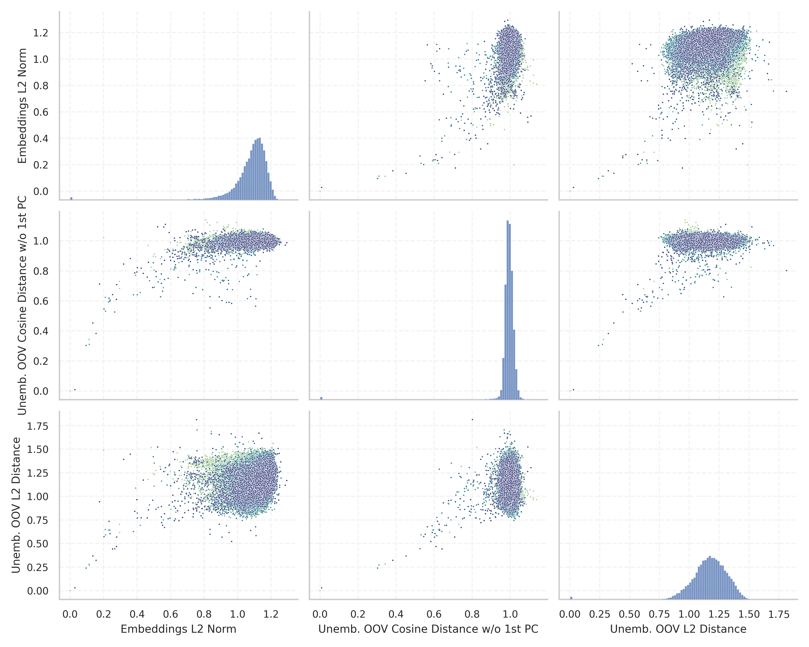

# Report for `meta-llama/Llama-2-7b-hf`

## Model info

* Tied embeddings: no
* Unembeddings use bias: no
* Metric for under-trained tokens: Embeddings L2 Norm
  * Overall distribution 1.080 +/- 0.109
  * Token used for verification prompt building: `springframework`
  * Verification threshold: 0.850
  * Threshold for showing candidate under-trained tokens: 0.232
  * Median verified threshold (for bytes, unreachable and special tokens): 0.378
* Embeddings shape: (32000, 4096)
* Vocabulary size: 32000
  * Number of single byte tokens: 351, of which 115 below metric threshold
  * Number of special tokens: 3, of which 1 below metric threshold
  * Number of tested under-trained tokens: 551, 19 below p = 0.01 threshold, 11 below soft metric threshold

## Metrics plot


## Verification plot


## Under-trained token verification results
11 entries below threshold of 0.232

|   token_id | token                       |    metric | max_prob                                                         | in_other_tokens                                                                                                                   |
|------------|-----------------------------|-----------|------------------------------------------------------------------|-----------------------------------------------------------------------------------------------------------------------------------|
|      28574 | ````` ▁Mediabestanden ````` | 0.0286962 | <span style='border: 1px solid rgb(169, 68, 66);'>1.5e-08</span> |                                                                                                                                   |
|      20609 | ````` ▁Portály `````        | 0.0955797 | <span style='border: 1px solid rgb(169, 68, 66);'>1.2e-06</span> |                                                                                                                                   |
|       3798 | ````` oreferrer `````       | 0.112781  | <span style='border: 1px solid rgb(169, 68, 66);'>2e-05</span>   | ````` ▁noreferrer `````, ````` noreferrer `````                                                                                   |
|      12731 | ````` ederbörd `````        | 0.114027  | <span style='border: 1px solid rgb(169, 68, 66);'>3.6e-06</span> | ````` ▁nederbörd `````, <span style='border: 1px solid rgb(255, 145, 0);'>````` nederbörd `````</span>, ````` ▁årsnederbörd ````` |
|      28354 | ````` ▁Расподела `````      | 0.135537  | <span style='border: 1px solid rgb(169, 68, 66);'>0.00013</span> |                                                                                                                                   |
|      28633 | ````` nederbörd `````       | 0.154854  | <span style='border: 1px solid rgb(255, 145, 0);'>0.0024</span>  | ````` ▁årsnederbörd `````                                                                                                         |
|      31664 | ````` ߬ `````                | 0.175596  | <span style='border: 1px solid rgb(251, 189, 8);'>0.015</span>   |                                                                                                                                   |
|      23313 | ````` Obrázky `````         | 0.202286  | <span style='border: 1px solid rgb(40, 167, 69);'>0.46</span>    |                                                                                                                                   |
|      11193 | ````` ▁Normdaten `````      | 0.209872  | <span style='border: 1px solid rgb(251, 189, 8);'>0.034</span>   |                                                                                                                                   |
|      12882 | ````` ITableView `````      | 0.211368  | <span style='border: 1px solid rgb(40, 167, 69);'>0.91</span>    | ````` ▁UITableView `````, ````` UITableView `````                                                                                 |
|       9831 | ````` ▁челов `````          | 0.228664  | <span style='border: 1px solid rgb(40, 167, 69);'>0.95</span>    | ````` ▁человек `````, ````` ▁челове `````, ````` ▁человека `````                                                                  |
<details><summary>540 additional entries above threshold</summary>

|   token_id | token                     |   metric | max_prob                                                         | in_other_tokens                                                                                                                                                                                                                                                                                                                                                                         |
|------------|---------------------------|----------|------------------------------------------------------------------|-----------------------------------------------------------------------------------------------------------------------------------------------------------------------------------------------------------------------------------------------------------------------------------------------------------------------------------------------------------------------------------------|
|      28642 | ````` ▁regnig `````       | 0.23206  | <span style='border: 1px solid rgb(255, 145, 0);'>0.0012</span>  | <span style='border: 1px solid rgb(169, 68, 66);'>````` ▁regnigaste `````</span>                                                                                                                                                                                                                                                                                                        |
|      19539 | ````` ▁demsel `````       | 0.236618 | <span style='border: 1px solid rgb(169, 68, 66);'>9.8e-05</span> | ````` ▁demselben `````                                                                                                                                                                                                                                                                                                                                                                  |
|      28623 | ````` ▁Genomsnitt `````   | 0.238265 | <span style='border: 1px solid rgb(251, 189, 8);'>0.011</span>   | ````` ▁Genomsnittlig `````                                                                                                                                                                                                                                                                                                                                                              |
|      30772 | ````` ╌ `````             | 0.253437 | <span style='border: 1px solid rgb(40, 167, 69);'>0.98</span>    |                                                                                                                                                                                                                                                                                                                                                                                         |
|      20486 | ````` tatywna `````       | 0.266416 | <span style='border: 1px solid rgb(255, 145, 0);'>0.0047</span>  | ````` ▁autorytatywna `````                                                                                                                                                                                                                                                                                                                                                              |
|      31899 | ````` ⥤ `````             | 0.276749 | <span style='border: 1px solid rgb(40, 167, 69);'>0.84</span>    |                                                                                                                                                                                                                                                                                                                                                                                         |
|      31477 | ````` ⸮ `````             | 0.278053 | <span style='border: 1px solid rgb(40, 167, 69);'>0.88</span>    |                                                                                                                                                                                                                                                                                                                                                                                         |
|      16056 | ````` љашње `````         | 0.378021 | <span style='border: 1px solid rgb(255, 145, 0);'>0.0092</span>  | ````` ▁Спољашње `````                                                                                                                                                                                                                                                                                                                                                                   |
|      31772 | ````` ₗ `````             | 0.385905 | <span style='border: 1px solid rgb(40, 167, 69);'>0.99</span>    |                                                                                                                                                                                                                                                                                                                                                                                         |
|      10688 | ````` ▁gepublic `````     | 0.391154 | <span style='border: 1px solid rgb(251, 189, 8);'>0.061</span>   | ````` ▁gepubliceerd `````                                                                                                                                                                                                                                                                                                                                                               |
|      31926 | ````` 𝓝 `````             | 0.398527 | <span style='border: 1px solid rgb(40, 167, 69);'>0.79</span>    |                                                                                                                                                                                                                                                                                                                                                                                         |
|      18596 | ````` ципа `````          | 0.400826 | <span style='border: 1px solid rgb(40, 167, 69);'>0.99</span>    | ````` ніципа `````, <span style='border: 1px solid rgb(251, 189, 8);'>````` ніципалі `````</span>, ````` ▁муніципалі `````, ````` ниципа `````, ````` ▁муниципа `````                                                                                                                                                                                                                   |
|      31483 | ````` ┈ `````             | 0.401468 | <span style='border: 1px solid rgb(40, 167, 69);'>1</span>       |                                                                                                                                                                                                                                                                                                                                                                                         |
|      12472 | ````` ateien `````        | 0.418931 | <span style='border: 1px solid rgb(40, 167, 69);'>0.36</span>    | ````` ▁Audiodateien `````                                                                                                                                                                                                                                                                                                                                                               |
|      30994 | ````` 𝕜 `````             | 0.424236 | <span style='border: 1px solid rgb(40, 167, 69);'>0.74</span>    |                                                                                                                                                                                                                                                                                                                                                                                         |
|      31884 | ````` ѫ `````             | 0.436651 | <span style='border: 1px solid rgb(40, 167, 69);'>0.99</span>    |                                                                                                                                                                                                                                                                                                                                                                                         |
|      31591 | ````` ⍵ `````             | 0.460256 | <span style='border: 1px solid rgb(40, 167, 69);'>0.98</span>    |                                                                                                                                                                                                                                                                                                                                                                                         |
|        278 | ````` ▁the `````          | 0.466007 | <span style='border: 1px solid rgb(40, 167, 69);'>1</span>       | <span style='border: 1px solid rgb(40, 167, 69);'>````` ▁there `````</span>, ````` ▁then `````, <span style='border: 1px solid rgb(40, 167, 69);'>````` ▁they `````</span>, ````` ▁them `````, <span style='border: 1px solid rgb(40, 167, 69);'>````` ▁their `````</span>, ...                                                                                                         |
|      31589 | ````` ▇ `````             | 0.467678 | <span style='border: 1px solid rgb(40, 167, 69);'>1</span>       |                                                                                                                                                                                                                                                                                                                                                                                         |
|      16013 | ````` temperaturen `````  | 0.474151 | <span style='border: 1px solid rgb(40, 167, 69);'>1</span>       | ````` eltemperaturen `````                                                                                                                                                                                                                                                                                                                                                              |
|      27706 | ````` ]{' `````           | 0.49282  | <span style='border: 1px solid rgb(40, 167, 69);'>0.92</span>    |                                                                                                                                                                                                                                                                                                                                                                                         |
|      20448 | ````` ▁Kontrola `````     | 0.496692 | <span style='border: 1px solid rgb(40, 167, 69);'>0.99</span>    |                                                                                                                                                                                                                                                                                                                                                                                         |
|        304 | ````` ▁to `````           | 0.496999 | <span style='border: 1px solid rgb(40, 167, 69);'>1</span>       | ````` ▁tot `````, ````` ▁too `````, ````` ▁top `````, ````` ▁total `````, ````` ▁took `````, ...                                                                                                                                                                                                                                                                                        |
|       9236 | ````` ▁pobla `````        | 0.501446 | <span style='border: 1px solid rgb(40, 167, 69);'>0.68</span>    | ````` ▁población `````, ````` ▁població `````                                                                                                                                                                                                                                                                                                                                           |
|      16196 | ````` textt `````         | 0.502152 | <span style='border: 1px solid rgb(40, 167, 69);'>1</span>       | ````` texttt `````                                                                                                                                                                                                                                                                                                                                                                      |
|        310 | ````` ▁of `````           | 0.503424 | <span style='border: 1px solid rgb(40, 167, 69);'>1</span>       | ````` ▁off `````, ````` ▁offic `````, ````` ▁often `````, ````` ▁offer `````, ````` ▁official `````, ...                                                                                                                                                                                                                                                                                |
|        297 | ````` ▁in `````           | 0.510731 | <span style='border: 1px solid rgb(40, 167, 69);'>1</span>       | ````` ▁inst `````, ````` ▁int `````, <span style='border: 1px solid rgb(40, 167, 69);'>````` ▁into `````</span>, ````` ▁inter `````, ````` ▁incl `````, ...                                                                                                                                                                                                                             |
|      27660 | ````` ckså `````          | 0.512958 | <span style='border: 1px solid rgb(251, 189, 8);'>0.012</span>   | ````` ▁också `````                                                                                                                                                                                                                                                                                                                                                                      |
|      23767 | ````` egyzetek `````      | 0.514052 | <span style='border: 1px solid rgb(251, 189, 8);'>0.055</span>   | ````` ▁Jegyzetek `````                                                                                                                                                                                                                                                                                                                                                                  |
|      29871 | ````` ▁ `````             | 0.52217  | <span style='border: 1px solid rgb(40, 167, 69);'>1</span>       |                                                                                                                                                                                                                                                                                                                                                                                         |
|      21042 | ````` lês `````           | 0.525851 | <span style='border: 1px solid rgb(40, 167, 69);'>0.89</span>    | ````` ▁inglês `````                                                                                                                                                                                                                                                                                                                                                                     |
|       2639 | ````` Portail `````       | 0.537209 | <span style='border: 1px solid rgb(40, 167, 69);'>1</span>       |                                                                                                                                                                                                                                                                                                                                                                                         |
|        322 | ````` ▁and `````          | 0.539863 | <span style='border: 1px solid rgb(40, 167, 69);'>1</span>       | ````` ▁android `````, ````` ▁andere `````, ````` ▁anderen `````, ````` ▁anderem `````, ````` ▁andra `````                                                                                                                                                                                                                                                                               |
|      21721 | ````` archivi `````       | 0.540432 | <span style='border: 1px solid rgb(40, 167, 69);'>1</span>       | ````` archiviato `````                                                                                                                                                                                                                                                                                                                                                                  |
|      27600 | ````` prilis `````        | 0.544835 | <span style='border: 1px solid rgb(40, 167, 69);'>0.89</span>    | ````` ▁április `````                                                                                                                                                                                                                                                                                                                                                                    |
|      26335 | ````` llaços `````        | 0.544876 | <span style='border: 1px solid rgb(251, 189, 8);'>0.066</span>   | ````` ▁Enllaços `````                                                                                                                                                                                                                                                                                                                                                                   |
|      12479 | ````` ▁Audiod `````       | 0.546042 | <span style='border: 1px solid rgb(40, 167, 69);'>1</span>       | ````` ▁Audiodateien `````                                                                                                                                                                                                                                                                                                                                                               |
|      31216 | ````` ╩ `````             | 0.546382 | <span style='border: 1px solid rgb(40, 167, 69);'>0.98</span>    |                                                                                                                                                                                                                                                                                                                                                                                         |
|      28294 | ````` usztus `````        | 0.552103 | <span style='border: 1px solid rgb(40, 167, 69);'>0.98</span>    | ````` ▁augusztus `````                                                                                                                                                                                                                                                                                                                                                                  |
|      11766 | ````` хівовано `````      | 0.556475 | <span style='border: 1px solid rgb(251, 189, 8);'>0.021</span>   | ````` Архівовано `````                                                                                                                                                                                                                                                                                                                                                                  |
|      26498 | ````` >\<^ `````          | 0.563593 | <span style='border: 1px solid rgb(40, 167, 69);'>0.82</span>    |                                                                                                                                                                                                                                                                                                                                                                                         |
|      31626 | ````` ╣ `````             | 0.563609 | <span style='border: 1px solid rgb(40, 167, 69);'>0.98</span>    |                                                                                                                                                                                                                                                                                                                                                                                         |
|        263 | ````` ▁a `````            | 0.566613 | <span style='border: 1px solid rgb(40, 167, 69);'>1</span>       | <span style='border: 1px solid rgb(40, 167, 69);'>````` ▁and `````</span>, <span style='border: 1px solid rgb(40, 167, 69);'>````` ▁an `````</span>, <span style='border: 1px solid rgb(40, 167, 69);'>````` ▁al `````</span>, <span style='border: 1px solid rgb(40, 167, 69);'>````` ▁as `````</span>, <span style='border: 1px solid rgb(40, 167, 69);'>````` ▁at `````</span>, ...  |
|      16916 | ````` ▁invån `````        | 0.579019 | <span style='border: 1px solid rgb(251, 189, 8);'>0.07</span>    | ````` ▁invånare `````                                                                                                                                                                                                                                                                                                                                                                   |
|      30010 | ````` ’ `````             | 0.582847 | <span style='border: 1px solid rgb(40, 167, 69);'>1</span>       |                                                                                                                                                                                                                                                                                                                                                                                         |
|      23441 | ````` któber `````        | 0.585471 | <span style='border: 1px solid rgb(251, 189, 8);'>0.066</span>   | ````` ▁október `````                                                                                                                                                                                                                                                                                                                                                                    |
|      30267 | ````` 。 `````            | 0.591219 | <span style='border: 1px solid rgb(40, 167, 69);'>1</span>       |                                                                                                                                                                                                                                                                                                                                                                                         |
|      30841 | ````` ╠ `````             | 0.596323 | <span style='border: 1px solid rgb(40, 167, 69);'>0.98</span>    |                                                                                                                                                                                                                                                                                                                                                                                         |
|      31528 | ````` ℚ `````             | 0.600201 | <span style='border: 1px solid rgb(40, 167, 69);'>1</span>       |                                                                                                                                                                                                                                                                                                                                                                                         |
|       7368 | ````` ября `````          | 0.601386 | <span style='border: 1px solid rgb(251, 189, 8);'>0.059</span>   | ````` ▁сентября `````, ````` ▁октября `````, ````` ▁ноября `````                                                                                                                                                                                                                                                                                                                        |
|      30935 | ````` ╬ `````             | 0.610601 | <span style='border: 1px solid rgb(40, 167, 69);'>0.99</span>    |                                                                                                                                                                                                                                                                                                                                                                                         |
|      31336 | ````` ʐ `````             | 0.613597 | <span style='border: 1px solid rgb(40, 167, 69);'>0.92</span>    |                                                                                                                                                                                                                                                                                                                                                                                         |
|        338 | ````` ▁is `````           | 0.614278 | <span style='border: 1px solid rgb(40, 167, 69);'>1</span>       | ````` ▁iss `````, ````` ▁ist `````, ````` ▁issue `````, <span style='border: 1px solid rgb(40, 167, 69);'>````` ▁isn `````</span>, ````` ▁issues `````, ...                                                                                                                                                                                                                             |
|      20072 | ````` ywna `````          | 0.62077  | <span style='border: 1px solid rgb(40, 167, 69);'>0.9</span>     | <span style='border: 1px solid rgb(255, 145, 0);'>````` tatywna `````</span>, ````` ▁autorytatywna `````                                                                                                                                                                                                                                                                                |
|      31625 | ````` ൾ `````             | 0.622474 | <span style='border: 1px solid rgb(40, 167, 69);'>0.33</span>    |                                                                                                                                                                                                                                                                                                                                                                                         |
|       6663 | ````` ▁Einzelnach `````   | 0.622708 | <span style='border: 1px solid rgb(251, 189, 8);'>0.062</span>   | ````` ▁Einzelnachweise `````                                                                                                                                                                                                                                                                                                                                                            |
|        393 | ````` ▁that `````         | 0.624136 | <span style='border: 1px solid rgb(40, 167, 69);'>1</span>       | ````` ▁thats `````                                                                                                                                                                                                                                                                                                                                                                      |
|        363 | ````` ▁for `````          | 0.625213 | <span style='border: 1px solid rgb(40, 167, 69);'>1</span>       | ````` ▁form `````, ````` ▁format `````, ````` ▁former `````, ````` ▁force `````, ````` ▁fort `````, ...                                                                                                                                                                                                                                                                                 |
|      31771 | ````` ⊤ `````             | 0.6255   | <span style='border: 1px solid rgb(40, 167, 69);'>1</span>       |                                                                                                                                                                                                                                                                                                                                                                                         |
|      31489 | ````` Ḩ `````             | 0.626007 | <span style='border: 1px solid rgb(40, 167, 69);'>0.99</span>    |                                                                                                                                                                                                                                                                                                                                                                                         |
|      20696 | ````` adratkil `````      | 0.628716 | <span style='border: 1px solid rgb(251, 189, 8);'>0.033</span>   | ````` adratkilometer `````                                                                                                                                                                                                                                                                                                                                                              |
|      31586 | ````` ∉ `````             | 0.62956  | <span style='border: 1px solid rgb(40, 167, 69);'>0.98</span>    |                                                                                                                                                                                                                                                                                                                                                                                         |
|        408 | ````` ▁as `````           | 0.629896 | <span style='border: 1px solid rgb(40, 167, 69);'>1</span>       | ````` ▁ass `````, ````` ▁ask `````, ````` ▁assign `````, ````` ▁assum `````, ````` ▁associ `````, ...                                                                                                                                                                                                                                                                                   |
|      10553 | ````` \<^ `````           | 0.631176 | <span style='border: 1px solid rgb(40, 167, 69);'>0.98</span>    | <span style='border: 1px solid rgb(40, 167, 69);'>````` >\<^ `````</span>                                                                                                                                                                                                                                                                                                               |
|      31806 | ````` ӏ `````             | 0.638546 | <span style='border: 1px solid rgb(40, 167, 69);'>0.95</span>    |                                                                                                                                                                                                                                                                                                                                                                                         |
|        313 | ````` ▁( `````            | 0.6398   | <span style='border: 1px solid rgb(40, 167, 69);'>1</span>       | ````` ▁(* `````, ````` ▁($ `````, ````` ▁(\ `````, ````` ▁() `````, ````` ▁(" `````, ...                                                                                                                                                                                                                                                                                                |
|        856 | ````` ... `````           | 0.640126 | <span style='border: 1px solid rgb(40, 167, 69);'>1</span>       | <span style='border: 1px solid rgb(40, 167, 69);'>````` ▁... `````</span>, <span style='border: 1px solid rgb(40, 167, 69);'>````` .... `````</span>, ````` ........ `````, ````` ...) `````, ````` ▁.... `````, ...                                                                                                                                                                    |
|      31956 | ````` ഞ `````             | 0.641976 | <span style='border: 1px solid rgb(40, 167, 69);'>0.97</span>    |                                                                                                                                                                                                                                                                                                                                                                                         |
|      23280 | ````` ździer `````        | 0.644954 | <span style='border: 1px solid rgb(251, 189, 8);'>0.027</span>   | <span style='border: 1px solid rgb(40, 167, 69);'>````` ▁paździer `````</span>, ````` ▁października `````                                                                                                                                                                                                                                                                               |
|      10775 | ````` ▁formatt `````      | 0.649433 | <span style='border: 1px solid rgb(40, 167, 69);'>1</span>       | ````` ▁formatting `````, ````` ▁formatted `````                                                                                                                                                                                                                                                                                                                                         |
|      31128 | ````` ╦ `````             | 0.650196 | <span style='border: 1px solid rgb(40, 167, 69);'>0.9</span>     |                                                                                                                                                                                                                                                                                                                                                                                         |
|        373 | ````` ▁on `````           | 0.653508 | <span style='border: 1px solid rgb(40, 167, 69);'>1</span>       | <span style='border: 1px solid rgb(40, 167, 69);'>````` ▁one `````</span>, ````` ▁only `````, ````` ▁once `````, ````` ▁ont `````, ````` ▁onder `````, ...                                                                                                                                                                                                                              |
|      25145 | ````` ▁kwiet `````        | 0.656178 | <span style='border: 1px solid rgb(40, 167, 69);'>0.22</span>    | ````` ▁kwietnia `````                                                                                                                                                                                                                                                                                                                                                                   |
|        292 | ````` ing `````           | 0.656331 | <span style='border: 1px solid rgb(40, 167, 69);'>1</span>       | ````` ▁using `````, <span style='border: 1px solid rgb(40, 167, 69);'>````` ings `````</span>, ````` tring `````, ````` ning `````, <span style='border: 1px solid rgb(40, 167, 69);'>````` ating `````</span>, ...                                                                                                                                                                     |
|      30770 | ````` ℤ `````             | 0.657743 | <span style='border: 1px solid rgb(40, 167, 69);'>0.99</span>    |                                                                                                                                                                                                                                                                                                                                                                                         |
|      31670 | ````` ʑ `````             | 0.661318 | <span style='border: 1px solid rgb(40, 167, 69);'>0.98</span>    |                                                                                                                                                                                                                                                                                                                                                                                         |
|        306 | ````` ▁I `````            | 0.661876 | <span style='border: 1px solid rgb(40, 167, 69);'>1</span>       | <span style='border: 1px solid rgb(40, 167, 69);'>````` ▁In `````</span>, <span style='border: 1px solid rgb(40, 167, 69);'>````` ▁It `````</span>, <span style='border: 1px solid rgb(40, 167, 69);'>````` ▁If `````</span>, ````` ▁Is `````, ````` ▁Il `````, ...                                                                                                                     |
|        491 | ````` ▁by `````           | 0.665202 | <span style='border: 1px solid rgb(40, 167, 69);'>1</span>       | ````` ▁bytes `````, ````` ▁byte `````, ````` ▁byl `````, ````` ▁był `````, ````` ▁byla `````, ...                                                                                                                                                                                                                                                                                       |
|      17835 | ````` ▁Станов `````       | 0.666019 | <span style='border: 1px solid rgb(40, 167, 69);'>1</span>       | ````` ▁Становништво `````                                                                                                                                                                                                                                                                                                                                                               |
|      14545 | ````` ewnę `````          | 0.666601 | <span style='border: 1px solid rgb(251, 189, 8);'>0.01</span>    | <span style='border: 1px solid rgb(251, 189, 8);'>````` ewnętrz `````</span>, <span style='border: 1px solid rgb(40, 167, 69);'>````` ▁zewnętrz `````</span>, ````` ▁zewnętrzne `````                                                                                                                                                                                                   |
|        411 | ````` ▁with `````         | 0.667623 | <span style='border: 1px solid rgb(40, 167, 69);'>1</span>       | ````` ▁without `````, ````` ▁within `````, ````` ▁withdraw `````                                                                                                                                                                                                                                                                                                                        |
|      31178 | ````` ⊢ `````             | 0.667951 | <span style='border: 1px solid rgb(40, 167, 69);'>1</span>       |                                                                                                                                                                                                                                                                                                                                                                                         |
|      31892 | ````` ҡ `````             | 0.66824  | <span style='border: 1px solid rgb(40, 167, 69);'>1</span>       |                                                                                                                                                                                                                                                                                                                                                                                         |
|      31638 | ````` ൽ `````             | 0.671281 | <span style='border: 1px solid rgb(40, 167, 69);'>0.4</span>     |                                                                                                                                                                                                                                                                                                                                                                                         |
|        526 | ````` ▁are `````          | 0.675708 | <span style='border: 1px solid rgb(40, 167, 69);'>1</span>       | ````` ▁area `````, ````` ▁aren `````, ````` ▁areas `````                                                                                                                                                                                                                                                                                                                                |
|      27563 | ````` datei `````         | 0.679052 | <span style='border: 1px solid rgb(40, 167, 69);'>1</span>       | ````` ▁Normdatei `````                                                                                                                                                                                                                                                                                                                                                                  |
|        366 | ````` ▁you `````          | 0.682033 | <span style='border: 1px solid rgb(40, 167, 69);'>1</span>       | <span style='border: 1px solid rgb(40, 167, 69);'>````` ▁your `````</span>, ````` ▁young `````, ````` ▁yourself `````, ````` ▁youth `````, ````` ▁yours `````, ...                                                                                                                                                                                                                      |
|      31808 | ````` എ `````             | 0.684182 | <span style='border: 1px solid rgb(40, 167, 69);'>0.98</span>    |                                                                                                                                                                                                                                                                                                                                                                                         |
|        450 | ````` ▁The `````          | 0.684837 | <span style='border: 1px solid rgb(40, 167, 69);'>1</span>       | ````` ▁There `````, ````` ▁Then `````, <span style='border: 1px solid rgb(40, 167, 69);'>````` ▁They `````</span>, ````` ▁These `````, ````` ▁Therefore `````, ...                                                                                                                                                                                                                      |
|      23247 | ````` ▁dátum `````        | 0.68489  | <span style='border: 1px solid rgb(40, 167, 69);'>1</span>       | ````` ▁dátummal `````                                                                                                                                                                                                                                                                                                                                                                   |
|      13606 | ````` oreign `````        | 0.685292 | <span style='border: 1px solid rgb(40, 167, 69);'>0.98</span>    | ````` ▁Foreign `````, ````` Foreign `````                                                                                                                                                                                                                                                                                                                                               |
|      28416 | ````` ▁Мексичка `````     | 0.685299 | <span style='border: 1px solid rgb(169, 68, 66);'>4.7e-06</span> |                                                                                                                                                                                                                                                                                                                                                                                         |
|      15394 | ````` usetts `````        | 0.685612 | <span style='border: 1px solid rgb(40, 167, 69);'>0.77</span>    | ````` achusetts `````, ````` ▁Massachusetts `````                                                                                                                                                                                                                                                                                                                                       |
|        287 | ````` ed `````            | 0.689768 | <span style='border: 1px solid rgb(40, 167, 69);'>1</span>       | <span style='border: 1px solid rgb(40, 167, 69);'>````` ated `````</span>, ````` ▁need `````, ````` led `````, ````` ied `````, ````` red `````, ...                                                                                                                                                                                                                                    |
|      22918 | ````` prüft `````         | 0.69104  | <span style='border: 1px solid rgb(40, 167, 69);'>0.88</span>    | <span style='border: 1px solid rgb(40, 167, 69);'>````` ▁geprüft `````</span>                                                                                                                                                                                                                                                                                                           |
|      31766 | ````` ∷ `````             | 0.693351 | <span style='border: 1px solid rgb(40, 167, 69);'>1</span>       |                                                                                                                                                                                                                                                                                                                                                                                         |
|      19330 | ````` ▁Википеди `````     | 0.694212 | <span style='border: 1px solid rgb(40, 167, 69);'>0.99</span>    | ````` ▁Википедии `````                                                                                                                                                                                                                                                                                                                                                                  |
|      31794 | ````` ˠ `````             | 0.694586 | <span style='border: 1px solid rgb(40, 167, 69);'>0.98</span>    |                                                                                                                                                                                                                                                                                                                                                                                         |
|        372 | ````` ▁it `````           | 0.696264 | <span style='border: 1px solid rgb(40, 167, 69);'>1</span>       | <span style='border: 1px solid rgb(40, 167, 69);'>````` ▁its `````</span>, ````` ▁item `````, ````` ▁itself `````, ````` ▁iter `````, ````` ▁items `````, ...                                                                                                                                                                                                                           |
|      15022 | ````` ▁zewnętrz `````     | 0.698878 | <span style='border: 1px solid rgb(40, 167, 69);'>0.97</span>    | ````` ▁zewnętrzne `````                                                                                                                                                                                                                                                                                                                                                                 |
|        376 | ````` ▁" `````            | 0.700889 | <span style='border: 1px solid rgb(40, 167, 69);'>1</span>       | ````` ▁"$ `````, ````` ▁"" `````, ````` ▁"/ `````, ````` ▁"\ `````, ````` ▁", `````, ...                                                                                                                                                                                                                                                                                                |
|        367 | ````` ▁be `````           | 0.701545 | <span style='border: 1px solid rgb(40, 167, 69);'>1</span>       | ````` ▁bet `````, ````` ▁been `````, ````` ▁bec `````, ````` ▁bel `````, ````` ▁because `````, ...                                                                                                                                                                                                                                                                                      |
|       6009 | ````` perties `````       | 0.701874 | <span style='border: 1px solid rgb(40, 167, 69);'>0.99</span>    | ````` properties `````, ````` Properties `````, ````` ▁Properties `````                                                                                                                                                                                                                                                                                                                 |
|      26194 | ````` ▁Савез `````        | 0.701947 | <span style='border: 1px solid rgb(40, 167, 69);'>0.99</span>    | <span style='border: 1px solid rgb(169, 68, 66);'>````` ▁Савезне `````</span>                                                                                                                                                                                                                                                                                                           |
|        471 | ````` ▁was `````          | 0.702149 | <span style='border: 1px solid rgb(40, 167, 69);'>1</span>       | <span style='border: 1px solid rgb(40, 167, 69);'>````` ▁wasn `````</span>, ````` ▁waste `````                                                                                                                                                                                                                                                                                          |
|        515 | ````` ▁from `````         | 0.703087 | <span style='border: 1px solid rgb(40, 167, 69);'>1</span>       |                                                                                                                                                                                                                                                                                                                                                                                         |
|      30098 | ````` … `````             | 0.703405 | <span style='border: 1px solid rgb(40, 167, 69);'>1</span>       |                                                                                                                                                                                                                                                                                                                                                                                         |
|       6002 | ````` entication `````    | 0.703582 | <span style='border: 1px solid rgb(40, 167, 69);'>0.98</span>    | ````` ▁authentication `````, ````` Authentication `````, ````` authentication `````, ````` ▁Authentication `````                                                                                                                                                                                                                                                                        |
|        262 | ````` in `````            | 0.70458  | <span style='border: 1px solid rgb(40, 167, 69);'>1</span>       | <span style='border: 1px solid rgb(40, 167, 69);'>````` ing `````</span>, <span style='border: 1px solid rgb(40, 167, 69);'>````` ▁in `````</span>, <span style='border: 1px solid rgb(40, 167, 69);'>````` ine `````</span>, ````` egin `````, ````` begin `````, ...                                                                                                                  |
|       1346 | ````` ▁“ `````            | 0.704837 | <span style='border: 1px solid rgb(40, 167, 69);'>1</span>       |                                                                                                                                                                                                                                                                                                                                                                                         |
|        267 | ````` es `````            | 0.705122 | <span style='border: 1px solid rgb(40, 167, 69);'>1</span>       | <span style='border: 1px solid rgb(40, 167, 69);'>````` est `````</span>, ````` ess `````, ````` ▁des `````, <span style='border: 1px solid rgb(40, 167, 69);'>````` ies `````</span>, ````` estion `````, ...                                                                                                                                                                          |
|        414 | ````` ers `````           | 0.705673 | <span style='border: 1px solid rgb(40, 167, 69);'>1</span>       | ````` vers `````, ````` ▁vers `````, ````` erson `````, ````` ivers `````, ````` ▁version `````, ...                                                                                                                                                                                                                                                                                    |
|        467 | ````` ). `````            | 0.705857 | <span style='border: 1px solid rgb(40, 167, 69);'>1</span>       | ````` (). `````, ````` "). `````, ````` '). `````, ````` .). `````, ````` }). `````, ...                                                                                                                                                                                                                                                                                                |
|      31515 | ````` ⴰ `````             | 0.706253 | <span style='border: 1px solid rgb(40, 167, 69);'>1</span>       |                                                                                                                                                                                                                                                                                                                                                                                         |
|      30330 | ````` 、 `````            | 0.706472 | <span style='border: 1px solid rgb(40, 167, 69);'>1</span>       |                                                                                                                                                                                                                                                                                                                                                                                         |
|        319 | ````` ▁A `````            | 0.706813 | <span style='border: 1px solid rgb(40, 167, 69);'>1</span>       | <span style='border: 1px solid rgb(40, 167, 69);'>````` ▁An `````</span>, ````` ▁Answer `````, ````` ▁Ar `````, ````` ▁Al `````, <span style='border: 1px solid rgb(40, 167, 69);'>````` ▁As `````</span>, ...                                                                                                                                                                          |
|      31673 | ````` ℂ `````             | 0.706914 | <span style='border: 1px solid rgb(40, 167, 69);'>1</span>       |                                                                                                                                                                                                                                                                                                                                                                                         |
|       1966 | ````` \\ `````            | 0.70887  | <span style='border: 1px solid rgb(40, 167, 69);'>1</span>       | ````` ▁\\ `````, ````` }\\ `````, ````` )\\ `````, ````` :\\ `````                                                                                                                                                                                                                                                                                                                      |
|      14755 | ````` ewnętrz `````       | 0.708959 | <span style='border: 1px solid rgb(251, 189, 8);'>0.024</span>   | <span style='border: 1px solid rgb(40, 167, 69);'>````` ▁zewnętrz `````</span>, ````` ▁zewnętrzne `````                                                                                                                                                                                                                                                                                 |
|      13591 | ````` ongodb `````        | 0.709042 | <span style='border: 1px solid rgb(40, 167, 69);'>0.19</span>    | ````` mongodb `````, ````` ▁mongodb `````                                                                                                                                                                                                                                                                                                                                               |
|        472 | ````` ▁at `````           | 0.71051  | <span style='border: 1px solid rgb(40, 167, 69);'>1</span>       | ````` ▁att `````, ````` ▁attempt `````, ````` ▁attack `````, ````` ▁attribute `````, ````` ▁attributes `````, ...                                                                                                                                                                                                                                                                       |
|      28409 | ````` Sito `````          | 0.710765 | <span style='border: 1px solid rgb(40, 167, 69);'>1</span>       |                                                                                                                                                                                                                                                                                                                                                                                         |
|      25104 | ````` Zygote `````        | 0.710799 | <span style='border: 1px solid rgb(40, 167, 69);'>1</span>       | ````` ZygoteInit `````                                                                                                                                                                                                                                                                                                                                                                  |
|        511 | ````` ), `````            | 0.710897 | <span style='border: 1px solid rgb(40, 167, 69);'>1</span>       | ````` (), `````, ````` "), `````, ````` '), `````, ````` )), `````, ````` }), `````, ...                                                                                                                                                                                                                                                                                                |
|       9611 | ````` ViewById `````      | 0.711494 | <span style='border: 1px solid rgb(40, 167, 69);'>0.96</span>    | ````` findViewById `````, ````` ▁findViewById `````                                                                                                                                                                                                                                                                                                                                     |
|      20739 | ````` ▁надмор `````       | 0.711682 | <span style='border: 1px solid rgb(40, 167, 69);'>0.27</span>    | ````` ▁надморској `````                                                                                                                                                                                                                                                                                                                                                                 |
|        385 | ````` ▁an `````           | 0.712137 | <span style='border: 1px solid rgb(40, 167, 69);'>1</span>       | ````` ▁any `````, ````` ▁answer `````, ````` ▁android `````, ````` ▁another `````, ````` ▁ang `````, ...                                                                                                                                                                                                                                                                                |
|      31777 | ````` ѐ `````             | 0.71393  | <span style='border: 1px solid rgb(40, 167, 69);'>0.98</span>    |                                                                                                                                                                                                                                                                                                                                                                                         |
|        540 | ````` ▁he `````           | 0.716529 | <span style='border: 1px solid rgb(40, 167, 69);'>1</span>       | <span style='border: 1px solid rgb(40, 167, 69);'>````` ▁her `````</span>, ````` ▁hel `````, ````` ▁here `````, ````` ▁help `````, ````` ▁het `````, ...                                                                                                                                                                                                                                |
|        591 | ````` ▁we `````           | 0.717607 | <span style='border: 1px solid rgb(40, 167, 69);'>1</span>       | <span style='border: 1px solid rgb(40, 167, 69);'>````` ▁were `````</span>, ````` ▁well `````, ````` ▁web `````, ````` ▁wer `````, ````` ▁went `````, ...                                                                                                                                                                                                                               |
|      31444 | ````` ḩ `````             | 0.718143 | <span style='border: 1px solid rgb(40, 167, 69);'>0.98</span>    |                                                                                                                                                                                                                                                                                                                                                                                         |
|        445 | ````` ▁this `````         | 0.71933  | <span style='border: 1px solid rgb(40, 167, 69);'>1</span>       |                                                                                                                                                                                                                                                                                                                                                                                         |
|        508 | ````` ▁can `````          | 0.720757 | <span style='border: 1px solid rgb(40, 167, 69);'>1</span>       | ````` ▁cannot `````, ````` ▁cant `````, ````` ▁candid `````, ````` ▁canvas `````, ````` ▁cancel `````, ...                                                                                                                                                                                                                                                                              |
|      31281 | ````` ‾ `````             | 0.720993 | <span style='border: 1px solid rgb(40, 167, 69);'>1</span>       |                                                                                                                                                                                                                                                                                                                                                                                         |
|        316 | ````` ▁de `````           | 0.721067 | <span style='border: 1px solid rgb(40, 167, 69);'>1</span>       | ````` ▁des `````, ````` ▁der `````, ````` ▁del `````, ````` ▁def `````, ````` ▁den `````, ...                                                                                                                                                                                                                                                                                           |
|       1576 | ````` The `````           | 0.721348 | <span style='border: 1px solid rgb(40, 167, 69);'>1</span>       | ````` ▁There `````, ````` ▁Then `````, <span style='border: 1px solid rgb(40, 167, 69);'>````` ▁They `````</span>, ````` ▁These `````, ````` ▁Therefore `````, ...                                                                                                                                                                                                                      |
|        470 | ````` ▁or `````           | 0.723038 | <span style='border: 1px solid rgb(40, 167, 69);'>1</span>       | ````` ▁org `````, ````` ▁orig `````, ````` ▁order `````, ````` ▁original `````, ````` ▁organ `````, ...                                                                                                                                                                                                                                                                                 |
|        448 | ````` ▁- `````            | 0.72385  | <span style='border: 1px solid rgb(40, 167, 69);'>1</span>       | ````` ▁-- `````, ````` ▁-> `````, ````` ▁--> `````, ````` ▁--- `````, ````` ▁-\ `````, ...                                                                                                                                                                                                                                                                                              |
|      27061 | ````` ▁Резултати `````    | 0.724027 | <span style='border: 1px solid rgb(40, 167, 69);'>0.91</span>    |                                                                                                                                                                                                                                                                                                                                                                                         |
|        512 | ````` ▁In `````           | 0.724611 | <span style='border: 1px solid rgb(40, 167, 69);'>1</span>       | ````` ▁Ind `````, ````` ▁Intern `````, ````` ▁Inst `````, ````` ▁Int `````, ````` ▁Inter `````, ...                                                                                                                                                                                                                                                                                     |
|        261 | ````` er `````            | 0.725054 | <span style='border: 1px solid rgb(40, 167, 69);'>1</span>       | <span style='border: 1px solid rgb(40, 167, 69);'>````` ter `````</span>, <span style='border: 1px solid rgb(40, 167, 69);'>````` ver `````</span>, ````` ere `````, <span style='border: 1px solid rgb(40, 167, 69);'>````` ers `````</span>, ````` ber `````, ...                                                                                                                     |
|       1213 | ````` ." `````            | 0.725721 | <span style='border: 1px solid rgb(40, 167, 69);'>1</span>       | ````` ..." `````, ````` ."); `````, ````` .", `````, ````` .") `````                                                                                                                                                                                                                                                                                                                    |
|        756 | ````` ▁has `````          | 0.729532 | <span style='border: 1px solid rgb(40, 167, 69);'>1</span>       | ````` ▁hash `````, ````` ▁hasta `````, ````` ▁hast `````, ````` ▁hasn `````                                                                                                                                                                                                                                                                                                             |
|      23658 | ````` ▁geprüft `````      | 0.730693 | <span style='border: 1px solid rgb(40, 167, 69);'>0.89</span>    |                                                                                                                                                                                                                                                                                                                                                                                         |
|      30024 | ````` ” `````             | 0.732824 | <span style='border: 1px solid rgb(40, 167, 69);'>1</span>       |                                                                                                                                                                                                                                                                                                                                                                                         |
|        896 | ````` ▁they `````         | 0.733075 | <span style='border: 1px solid rgb(40, 167, 69);'>1</span>       |                                                                                                                                                                                                                                                                                                                                                                                         |
|      28142 | ````` ightarrow `````     | 0.733924 | <span style='border: 1px solid rgb(40, 167, 69);'>0.76</span>    | ````` trightarrow `````                                                                                                                                                                                                                                                                                                                                                                 |
|      31646 | ````` ൻ `````             | 0.734102 | <span style='border: 1px solid rgb(40, 167, 69);'>0.76</span>    |                                                                                                                                                                                                                                                                                                                                                                                         |
|      28090 | ````` ▁Савезне `````      | 0.734794 | <span style='border: 1px solid rgb(169, 68, 66);'>0.00046</span> |                                                                                                                                                                                                                                                                                                                                                                                         |
|        277 | ````` it `````            | 0.735217 | <span style='border: 1px solid rgb(40, 167, 69);'>1</span>       | <span style='border: 1px solid rgb(40, 167, 69);'>````` ▁it `````</span>, ````` ith `````, <span style='border: 1px solid rgb(40, 167, 69);'>````` ▁with `````</span>, <span style='border: 1px solid rgb(40, 167, 69);'>````` ity `````</span>, ````` ite `````, ...                                                                                                                   |
|      30560 | ````` ┼ `````             | 0.735275 | <span style='border: 1px solid rgb(40, 167, 69);'>1</span>       |                                                                                                                                                                                                                                                                                                                                                                                         |
|      31585 | ````` ർ `````             | 0.736171 | <span style='border: 1px solid rgb(40, 167, 69);'>0.15</span>    |                                                                                                                                                                                                                                                                                                                                                                                         |
|        360 | ````` ▁D `````            | 0.73682  | <span style='border: 1px solid rgb(40, 167, 69);'>1</span>       | ````` ▁De `````, ````` ▁Die `````, ````` ▁Do `````, ````` ▁Der `````, ````` ▁Des `````, ...                                                                                                                                                                                                                                                                                             |
|        636 | ````` .. `````            | 0.736835 | <span style='border: 1px solid rgb(40, 167, 69);'>1</span>       | <span style='border: 1px solid rgb(40, 167, 69);'>````` ... `````</span>, <span style='border: 1px solid rgb(40, 167, 69);'>````` ▁... `````</span>, <span style='border: 1px solid rgb(40, 167, 69);'>````` .... `````</span>, ````` ▁.. `````, ````` ../ `````, ...                                                                                                                   |
|      31913 | ````` ശ `````             | 0.737005 | <span style='border: 1px solid rgb(40, 167, 69);'>0.99</span>    |                                                                                                                                                                                                                                                                                                                                                                                         |
|      10400 | ````` ▁Mitg `````         | 0.737324 | <span style='border: 1px solid rgb(40, 167, 69);'>1</span>       | ````` ▁Mitglied `````, ````` ▁Mitglieder `````                                                                                                                                                                                                                                                                                                                                          |
|        505 | ````` ▁have `````         | 0.737698 | <span style='border: 1px solid rgb(40, 167, 69);'>1</span>       | ````` ▁haven `````, ````` ▁havet `````                                                                                                                                                                                                                                                                                                                                                  |
|      10164 | ````` loyee `````         | 0.737993 | <span style='border: 1px solid rgb(40, 167, 69);'>0.92</span>    | ````` ▁employee `````, ````` Employee `````, ````` ▁employees `````, ````` ▁Employee `````, ````` employee `````                                                                                                                                                                                                                                                                        |
|      26964 | ````` ▁Хронологи `````    | 0.739664 | <span style='border: 1px solid rgb(40, 167, 69);'>0.91</span>    | <span style='border: 1px solid rgb(169, 68, 66);'>````` ▁Хронологија `````</span>                                                                                                                                                                                                                                                                                                       |
|        264 | ````` en `````            | 0.739835 | <span style='border: 1px solid rgb(40, 167, 69);'>1</span>       | <span style='border: 1px solid rgb(40, 167, 69);'>````` ent `````</span>, <span style='border: 1px solid rgb(40, 167, 69);'>````` end `````</span>, <span style='border: 1px solid rgb(40, 167, 69);'>````` ment `````</span>, <span style='border: 1px solid rgb(40, 167, 69);'>````` ▁en `````</span>, ````` ▁Comment `````, ...                                                      |
|        272 | ````` or `````            | 0.741115 | <span style='border: 1px solid rgb(40, 167, 69);'>1</span>       | <span style='border: 1px solid rgb(40, 167, 69);'>````` ▁for `````</span>, ````` ort `````, <span style='border: 1px solid rgb(40, 167, 69);'>````` ▁or `````</span>, ````` ore `````, ````` ord `````, ...                                                                                                                                                                             |
|        451 | ````` ▁not `````          | 0.741546 | <span style='border: 1px solid rgb(40, 167, 69);'>1</span>       | ````` ▁nothing `````, ````` ▁note `````, ````` ▁notice `````, ````` ▁noticed `````, ````` ▁notes `````, ...                                                                                                                                                                                                                                                                             |
|        284 | ````` al `````            | 0.742362 | <span style='border: 1px solid rgb(40, 167, 69);'>1</span>       | <span style='border: 1px solid rgb(40, 167, 69);'>````` ▁al `````</span>, ````` all `````, <span style='border: 1px solid rgb(40, 167, 69);'>````` ▁all `````</span>, ````` ial `````, ````` ally `````, ...                                                                                                                                                                            |
|        341 | ````` ▁M `````            | 0.74241  | <span style='border: 1px solid rgb(40, 167, 69);'>1</span>       | ````` ▁Mar `````, ````` ▁My `````, ````` ▁Me `````, ````` ▁Man `````, ````` ▁Mon `````, ...                                                                                                                                                                                                                                                                                             |
|      30015 | ````` “ `````             | 0.7431   | <span style='border: 1px solid rgb(40, 167, 69);'>0.99</span>    |                                                                                                                                                                                                                                                                                                                                                                                         |
|        739 | ````` ▁It `````           | 0.743645 | <span style='border: 1px solid rgb(40, 167, 69);'>1</span>       | ````` ▁Ital `````, ````` ▁Its `````, ````` ▁Italian `````, ````` ▁Item `````, ````` ▁Italia `````, ...                                                                                                                                                                                                                                                                                  |
|        273 | ````` an `````            | 0.744107 | <span style='border: 1px solid rgb(40, 167, 69);'>1</span>       | <span style='border: 1px solid rgb(40, 167, 69);'>````` ▁and `````</span>, <span style='border: 1px solid rgb(40, 167, 69);'>````` ▁an `````</span>, <span style='border: 1px solid rgb(40, 167, 69);'>````` and `````</span>, <span style='border: 1px solid rgb(40, 167, 69);'>````` ant `````</span>, <span style='border: 1px solid rgb(40, 167, 69);'>````` ▁can `````</span>, ... |
|       2023 | ````` ▁... `````          | 0.744117 | <span style='border: 1px solid rgb(40, 167, 69);'>1</span>       | ````` ▁.... `````, ````` ▁...) `````                                                                                                                                                                                                                                                                                                                                                    |
|        265 | ````` on `````            | 0.744387 | <span style='border: 1px solid rgb(40, 167, 69);'>1</span>       | <span style='border: 1px solid rgb(40, 167, 69);'>````` ion `````</span>, <span style='border: 1px solid rgb(40, 167, 69);'>````` ation `````</span>, <span style='border: 1px solid rgb(40, 167, 69);'>````` ▁on `````</span>, ````` ▁con `````, ````` ction `````, ...                                                                                                                |
|      15571 | ````` ▁февра `````        | 0.744496 | <span style='border: 1px solid rgb(251, 189, 8);'>0.045</span>   | ````` ▁февраля `````                                                                                                                                                                                                                                                                                                                                                                    |
|        315 | ````` ▁C `````            | 0.746425 | <span style='border: 1px solid rgb(40, 167, 69);'>1</span>       | ````` ▁Com `````, ````` ▁Comment `````, ````` ▁Ch `````, ````` ▁Con `````, ````` ▁Col `````, ...                                                                                                                                                                                                                                                                                        |
|        350 | ````` ▁B `````            | 0.74702  | <span style='border: 1px solid rgb(40, 167, 69);'>1</span>       | ````` ▁But `````, ````` ▁Be `````, ````` ▁Br `````, ````` ▁Bo `````, ````` ▁Bar `````, ...                                                                                                                                                                                                                                                                                              |
|        525 | ````` ▁' `````            | 0.747153 | <span style='border: 1px solid rgb(40, 167, 69);'>1</span>       | ````` ▁'' `````, ````` ▁'/ `````, ````` ▁'\ `````, ````` ▁'< `````, ````` ▁', `````, ...                                                                                                                                                                                                                                                                                                |
|        317 | ````` ▁S `````            | 0.747435 | <span style='border: 1px solid rgb(40, 167, 69);'>1</span>       | ````` ▁St `````, ````` ▁Se `````, ````` ▁Sch `````, ````` ▁So `````, <span style='border: 1px solid rgb(40, 167, 69);'>````` ▁Sh `````</span>, ...                                                                                                                                                                                                                                      |
|       3178 | ````` .” `````            | 0.747608 | <span style='border: 1px solid rgb(40, 167, 69);'>0.98</span>    |                                                                                                                                                                                                                                                                                                                                                                                         |
|        785 | ````` ▁– `````            | 0.747623 | <span style='border: 1px solid rgb(40, 167, 69);'>1</span>       |                                                                                                                                                                                                                                                                                                                                                                                         |
|      31672 | ````` Ḫ `````             | 0.747648 | <span style='border: 1px solid rgb(40, 167, 69);'>0.97</span>    |                                                                                                                                                                                                                                                                                                                                                                                         |
|        271 | ````` at `````            | 0.748533 | <span style='border: 1px solid rgb(40, 167, 69);'>1</span>       | <span style='border: 1px solid rgb(40, 167, 69);'>````` ation `````</span>, <span style='border: 1px solid rgb(40, 167, 69);'>````` ▁that `````</span>, <span style='border: 1px solid rgb(40, 167, 69);'>````` ate `````</span>, <span style='border: 1px solid rgb(40, 167, 69);'>````` ▁at `````</span>, ````` ath `````, ...                                                        |
|      15407 | ````` ▁statunit `````     | 0.749229 | <span style='border: 1px solid rgb(40, 167, 69);'>0.43</span>    | ````` ▁statunitense `````                                                                                                                                                                                                                                                                                                                                                               |
|        365 | ````` ▁L `````            | 0.749477 | <span style='border: 1px solid rgb(40, 167, 69);'>1</span>       | ````` ▁Le `````, ````` ▁La `````, ````` ▁List `````, ````` ▁Les `````, ````` ▁Li `````, ...                                                                                                                                                                                                                                                                                             |
|      31342 | ````` അ `````             | 0.74979  | <span style='border: 1px solid rgb(40, 167, 69);'>0.95</span>    |                                                                                                                                                                                                                                                                                                                                                                                         |
|        323 | ````` ▁T `````            | 0.749881 | <span style='border: 1px solid rgb(40, 167, 69);'>1</span>       | <span style='border: 1px solid rgb(40, 167, 69);'>````` ▁The `````</span>, ````` ▁Th `````, <span style='border: 1px solid rgb(40, 167, 69);'>````` ▁This `````</span>, ````` ▁Tags `````, ````` ▁Tr `````, ...                                                                                                                                                                         |
|      20638 | ````` ungsseite `````     | 0.75109  | <span style='border: 1px solid rgb(40, 167, 69);'>0.67</span>    |                                                                                                                                                                                                                                                                                                                                                                                         |
|        349 | ````` ▁P `````            | 0.751925 | <span style='border: 1px solid rgb(40, 167, 69);'>1</span>       | ````` ▁Pro `````, ````` ▁Par `````, ````` ▁Pr `````, ````` ▁Pl `````, ````` ▁Ph `````, ...                                                                                                                                                                                                                                                                                              |
|        402 | ````` ▁G `````            | 0.752072 | <span style='border: 1px solid rgb(40, 167, 69);'>1</span>       | ````` ▁Gr `````, ````` ▁Ge `````, ````` ▁Gu `````, ````` ▁Go `````, ````` ▁Gener `````, ...                                                                                                                                                                                                                                                                                             |
|      31269 | ````` ╝ `````             | 0.752595 | <span style='border: 1px solid rgb(40, 167, 69);'>0.99</span>    |                                                                                                                                                                                                                                                                                                                                                                                         |
|        390 | ````` ▁R `````            | 0.753104 | <span style='border: 1px solid rgb(40, 167, 69);'>1</span>       | ````` ▁Re `````, ````` ▁Ro `````, ````` ▁Reg `````, ````` ▁Res `````, ````` ▁Rec `````, ...                                                                                                                                                                                                                                                                                             |
|      27918 | ````` ▁Хронологија `````  | 0.755252 | <span style='border: 1px solid rgb(169, 68, 66);'>0.00093</span> |                                                                                                                                                                                                                                                                                                                                                                                         |
|      31921 | ````` ഷ `````             | 0.755666 | <span style='border: 1px solid rgb(40, 167, 69);'>0.94</span>    |                                                                                                                                                                                                                                                                                                                                                                                         |
|      30929 | ````` ┴ `````             | 0.755818 | <span style='border: 1px solid rgb(40, 167, 69);'>1</span>       |                                                                                                                                                                                                                                                                                                                                                                                         |
|      31896 | ````` ྱ `````              | 0.756161 | <span style='border: 1px solid rgb(251, 189, 8);'>0.027</span>   |                                                                                                                                                                                                                                                                                                                                                                                         |
|      31889 | ````` ദ `````             | 0.756423 | <span style='border: 1px solid rgb(40, 167, 69);'>0.97</span>    |                                                                                                                                                                                                                                                                                                                                                                                         |
|      31663 | ````` Ս `````             | 0.756946 | <span style='border: 1px solid rgb(40, 167, 69);'>1</span>       |                                                                                                                                                                                                                                                                                                                                                                                         |
|        383 | ````` ▁F `````            | 0.757435 | <span style='border: 1px solid rgb(40, 167, 69);'>1</span>       | <span style='border: 1px solid rgb(40, 167, 69);'>````` ▁For `````</span>, ````` ▁Fran `````, ````` ▁Fl `````, ````` ▁Fil `````, ````` ▁France `````, ...                                                                                                                                                                                                                               |
|      24366 | ````` ▁sierp `````        | 0.757604 | <span style='border: 1px solid rgb(40, 167, 69);'>0.76</span>    | ````` ▁sierpnia `````                                                                                                                                                                                                                                                                                                                                                                   |
|      31800 | ````` ܝ `````             | 0.757795 | <span style='border: 1px solid rgb(40, 167, 69);'>0.83</span>    |                                                                                                                                                                                                                                                                                                                                                                                         |
|      16153 | ````` gresql `````        | 0.758062 | <span style='border: 1px solid rgb(40, 167, 69);'>0.86</span>    | ````` ▁postgresql `````, ````` postgresql `````                                                                                                                                                                                                                                                                                                                                         |
|      20716 | ````` ▁Begriffsklär ````` | 0.758192 | <span style='border: 1px solid rgb(251, 189, 8);'>0.061</span>   |                                                                                                                                                                                                                                                                                                                                                                                         |
|      30375 | ````` ﹕ `````            | 0.759576 | <span style='border: 1px solid rgb(40, 167, 69);'>0.97</span>    |                                                                                                                                                                                                                                                                                                                                                                                         |
|        275 | ````` is `````            | 0.760574 | <span style='border: 1px solid rgb(40, 167, 69);'>1</span>       | <span style='border: 1px solid rgb(40, 167, 69);'>````` ▁is `````</span>, <span style='border: 1px solid rgb(40, 167, 69);'>````` ist `````</span>, <span style='border: 1px solid rgb(40, 167, 69);'>````` ▁this `````</span>, <span style='border: 1px solid rgb(40, 167, 69);'>````` ▁his `````</span>, ````` ish `````, ...                                                         |
|        596 | ````` ▁your `````         | 0.760705 | <span style='border: 1px solid rgb(40, 167, 69);'>1</span>       | ````` ▁yourself `````, ````` ▁yours `````                                                                                                                                                                                                                                                                                                                                               |
|        379 | ````` ▁H `````            | 0.761464 | <span style='border: 1px solid rgb(40, 167, 69);'>1</span>       | <span style='border: 1px solid rgb(40, 167, 69);'>````` ▁He `````</span>, ````` ▁How `````, ````` ▁Here `````, ````` ▁However `````, ````` ▁Her `````, ...                                                                                                                                                                                                                              |
|      12867 | ````` лання `````         | 0.76216  | <span style='border: 1px solid rgb(40, 167, 69);'>0.17</span>    | ````` силання `````, ````` ▁Посилання `````                                                                                                                                                                                                                                                                                                                                             |
|       1763 | ````` ▁To `````           | 0.762175 | <span style='border: 1px solid rgb(40, 167, 69);'>1</span>       | ````` ▁Tom `````, ````` ▁Tor `````, ````` ▁Tour `````, ````` ▁Top `````, ````` ▁Tod `````, ...                                                                                                                                                                                                                                                                                          |
|       1001 | ````` ER `````            | 0.762692 | <span style='border: 1px solid rgb(40, 167, 69);'>1</span>       | ````` HER `````, ````` TER `````, ````` HERE `````, ````` VER `````, ````` ▁WHERE `````, ...                                                                                                                                                                                                                                                                                            |
|        294 | ````` as `````            | 0.763092 | <span style='border: 1px solid rgb(40, 167, 69);'>1</span>       | <span style='border: 1px solid rgb(40, 167, 69);'>````` ▁as `````</span>, ````` ass `````, <span style='border: 1px solid rgb(40, 167, 69);'>````` ▁was `````</span>, ````` ase `````, ````` ast `````, ...                                                                                                                                                                             |
|        405 | ````` ▁N `````            | 0.764016 | <span style='border: 1px solid rgb(40, 167, 69);'>1</span>       | ````` ▁New `````, ````` ▁No `````, ````` ▁Not `````, ````` ▁Ne `````, ````` ▁Now `````, ...                                                                                                                                                                                                                                                                                             |
|      18206 | ````` braio `````         | 0.764144 | <span style='border: 1px solid rgb(40, 167, 69);'>0.3</span>     | ````` ▁febbraio `````                                                                                                                                                                                                                                                                                                                                                                   |
|      31289 | ````` ┤ `````             | 0.764195 | <span style='border: 1px solid rgb(40, 167, 69);'>1</span>       |                                                                                                                                                                                                                                                                                                                                                                                         |
|        674 | ````` ▁will `````         | 0.764756 | <span style='border: 1px solid rgb(40, 167, 69);'>1</span>       | ````` ▁willing `````                                                                                                                                                                                                                                                                                                                                                                    |
|        476 | ````` ▁K `````            | 0.765823 | <span style='border: 1px solid rgb(40, 167, 69);'>1</span>       | ````` ▁Kar `````, ````` ▁King `````, ````` ▁Ke `````, ````` ▁Kir `````, ````` ▁Kon `````, ...                                                                                                                                                                                                                                                                                           |
|        279 | ````` ar `````            | 0.765827 | <span style='border: 1px solid rgb(40, 167, 69);'>1</span>       | ````` art `````, <span style='border: 1px solid rgb(40, 167, 69);'>````` ▁are `````</span>, ````` ard `````, ````` ▁ar `````, ````` are `````, ...                                                                                                                                                                                                                                      |
|        517 | ````` to `````            | 0.766292 | <span style='border: 1px solid rgb(40, 167, 69);'>1</span>       | ````` ton `````, <span style='border: 1px solid rgb(40, 167, 69);'>````` ▁into `````</span>, ````` ator `````, ````` ato `````, ````` ustom `````, ...                                                                                                                                                                                                                                  |
|        399 | ````` ▁W `````            | 0.76696  | <span style='border: 1px solid rgb(40, 167, 69);'>1</span>       | ````` ▁Wh `````, <span style='border: 1px solid rgb(40, 167, 69);'>````` ▁We `````</span>, <span style='border: 1px solid rgb(40, 167, 69);'>````` ▁What `````</span>, ````` ▁When `````, ````` ▁Web `````, ...                                                                                                                                                                         |
|        382 | ````` ▁E `````            | 0.767649 | <span style='border: 1px solid rgb(40, 167, 69);'>1</span>       | ````` ▁En `````, ````` ▁Ex `````, ````` ▁El `````, ````` ▁Er `````, ````` ▁Ed `````, ...                                                                                                                                                                                                                                                                                                |
|       5129 | ````` ▁‘ `````            | 0.76785  | <span style='border: 1px solid rgb(40, 167, 69);'>1</span>       |                                                                                                                                                                                                                                                                                                                                                                                         |
|      22755 | ````` źdz `````           | 0.767895 | <span style='border: 1px solid rgb(40, 167, 69);'>0.69</span>    | <span style='border: 1px solid rgb(251, 189, 8);'>````` ździer `````</span>, <span style='border: 1px solid rgb(40, 167, 69);'>````` ▁paździer `````</span>, ````` ▁października `````                                                                                                                                                                                                  |
|        892 | ````` ▁were `````         | 0.768279 | <span style='border: 1px solid rgb(40, 167, 69);'>1</span>       | ````` ▁wereld `````                                                                                                                                                                                                                                                                                                                                                                     |
|       1838 | ````` ▁doesn `````        | 0.768324 | <span style='border: 1px solid rgb(40, 167, 69);'>0.97</span>    | ````` ▁doesnt `````                                                                                                                                                                                                                                                                                                                                                                     |
|        276 | ````` re `````            | 0.768364 | <span style='border: 1px solid rgb(40, 167, 69);'>1</span>       | ````` ▁re `````, ````` ere `````, ````` ore `````, <span style='border: 1px solid rgb(40, 167, 69);'>````` ▁are `````</span>, ````` ire `````, ...                                                                                                                                                                                                                                      |
|      31705 | ````` ལ `````             | 0.768417 | <span style='border: 1px solid rgb(40, 167, 69);'>0.96</span>    |                                                                                                                                                                                                                                                                                                                                                                                         |
|      23795 | ````` ▁paździer `````     | 0.769237 | <span style='border: 1px solid rgb(40, 167, 69);'>0.1</span>     | ````` ▁października `````                                                                                                                                                                                                                                                                                                                                                               |
|      30957 | ````` ങ `````             | 0.769576 | <span style='border: 1px solid rgb(40, 167, 69);'>0.9</span>     |                                                                                                                                                                                                                                                                                                                                                                                         |
|       1152 | ````` ▁For `````          | 0.769649 | <span style='border: 1px solid rgb(40, 167, 69);'>1</span>       | ````` ▁Form `````, ````` ▁Fort `````, ````` ▁Force `````, ````` ▁Ford `````, ````` ▁Forest `````, ...                                                                                                                                                                                                                                                                                   |
|      22768 | ````` ▁жовт `````         | 0.769739 | <span style='border: 1px solid rgb(40, 167, 69);'>0.96</span>    | <span style='border: 1px solid rgb(40, 167, 69);'>````` ▁жовтня `````</span>                                                                                                                                                                                                                                                                                                            |
|       1334 | ````` ▁We `````           | 0.769835 | <span style='border: 1px solid rgb(40, 167, 69);'>1</span>       | ````` ▁Web `````, ````` ▁West `````, ````` ▁Well `````, ````` ▁Weblinks `````, ````` ▁Welt `````, ...                                                                                                                                                                                                                                                                                   |
|        590 | ````` ▁my `````           | 0.769838 | <span style='border: 1px solid rgb(40, 167, 69);'>1</span>       | ````` ▁mysql `````, ````` ▁myself `````, <span style='border: 1px solid rgb(40, 167, 69);'>````` ▁mysq `````</span>, ````` ▁myst `````, ````` ▁mysqli `````, ...                                                                                                                                                                                                                        |
|        670 | ````` ▁his `````          | 0.770169 | <span style='border: 1px solid rgb(40, 167, 69);'>1</span>       | ````` ▁histor `````, ````` ▁history `````, ````` ▁hist `````, ````` ▁historia `````, ````` ▁historical `````, ...                                                                                                                                                                                                                                                                       |
|      20070 | ````` ▁autory `````       | 0.770414 | <span style='border: 1px solid rgb(40, 167, 69);'>0.56</span>    | ````` ▁autorytatywna `````                                                                                                                                                                                                                                                                                                                                                              |
|        565 | ````` ▁if `````           | 0.771369 | <span style='border: 1px solid rgb(40, 167, 69);'>1</span>       | ````` ▁iframe `````                                                                                                                                                                                                                                                                                                                                                                     |
|        403 | ````` ate `````           | 0.771448 | <span style='border: 1px solid rgb(40, 167, 69);'>1</span>       | <span style='border: 1px solid rgb(40, 167, 69);'>````` ated `````</span>, ````` ater `````, <span style='border: 1px solid rgb(40, 167, 69);'>````` ates `````</span>, ````` date `````, ````` ▁create `````, ...                                                                                                                                                                      |
|       2277 | ````` ## `````            | 0.772135 | <span style='border: 1px solid rgb(40, 167, 69);'>1</span>       | ````` ▁#### `````, ````` #### `````, ````` ######## `````, ````` ################ `````, ````` ▁##### `````                                                                                                                                                                                                                                                                             |
|        293 | ````` ic `````            | 0.772614 | <span style='border: 1px solid rgb(40, 167, 69);'>1</span>       | ````` ich `````, ````` lic `````, <span style='border: 1px solid rgb(40, 167, 69);'>````` ▁which `````</span>, ````` ice `````, ````` ublic `````, ...                                                                                                                                                                                                                                  |
|      17391 | ````` ▁савез `````        | 0.77285  | <span style='border: 1px solid rgb(40, 167, 69);'>0.88</span>    | ````` ▁савезној `````                                                                                                                                                                                                                                                                                                                                                                   |
|        300 | ````` et `````            | 0.77314  | <span style='border: 1px solid rgb(40, 167, 69);'>1</span>       | ````` eth `````, ````` ▁et `````, ````` get `````, <span style='border: 1px solid rgb(40, 167, 69);'>````` ▁get `````</span>, ````` ▁set `````, ...                                                                                                                                                                                                                                     |
|        314 | ````` am `````            | 0.773255 | <span style='border: 1px solid rgb(40, 167, 69);'>1</span>       | ````` ame `````, ````` ▁am `````, ````` name `````, ````` ample `````, ````` ▁same `````, ...                                                                                                                                                                                                                                                                                           |
|      17047 | ````` omsnitt `````       | 0.773649 | <span style='border: 1px solid rgb(40, 167, 69);'>0.11</span>    | ````` ▁genomsnitt `````, <span style='border: 1px solid rgb(251, 189, 8);'>````` ▁Genomsnitt `````</span>, ````` ▁Genomsnittlig `````                                                                                                                                                                                                                                                   |
|      27900 | ````` ▁eredetiből `````   | 0.773994 | <span style='border: 1px solid rgb(255, 145, 0);'>0.0047</span>  |                                                                                                                                                                                                                                                                                                                                                                                         |
|        541 | ````` ▁but `````          | 0.77416  | <span style='border: 1px solid rgb(40, 167, 69);'>1</span>       | ````` ▁button `````, ````` ▁buttons `````                                                                                                                                                                                                                                                                                                                                               |
|       1964 | ````` AL `````            | 0.774616 | <span style='border: 1px solid rgb(40, 167, 69);'>1</span>       | ````` VAL `````, ````` ALL `````, ````` ALSE `````, ````` ▁VAL `````, ````` ▁AL `````, ...                                                                                                                                                                                                                                                                                              |
|      30347 | ````` ℕ `````             | 0.774968 | <span style='border: 1px solid rgb(40, 167, 69);'>1</span>       |                                                                                                                                                                                                                                                                                                                                                                                         |
|        424 | ````` ant `````           | 0.77513  | <span style='border: 1px solid rgb(40, 167, 69);'>1</span>       | ````` ▁want `````, ````` ante `````, ````` ants `````, ````` anti `````, ````` ▁ant `````, ...                                                                                                                                                                                                                                                                                          |
|        355 | ````` end `````           | 0.775139 | <span style='border: 1px solid rgb(40, 167, 69);'>1</span>       | ````` ▁end `````, ````` ender `````, ````` ends `````, ````` enden `````, ````` ending `````, ...                                                                                                                                                                                                                                                                                       |
|      31764 | ````` ɫ `````             | 0.775702 | <span style='border: 1px solid rgb(40, 167, 69);'>1</span>       |                                                                                                                                                                                                                                                                                                                                                                                         |
|      27566 | ````` sime `````          | 0.777157 | <span style='border: 1px solid rgb(40, 167, 69);'>1</span>       | ````` simeq `````                                                                                                                                                                                                                                                                                                                                                                       |
|        333 | ````` id `````            | 0.778476 | <span style='border: 1px solid rgb(40, 167, 69);'>1</span>       | ````` ide `````, ````` roid `````, ````` ▁id `````, ````` ider `````, ````` ▁did `````, ...                                                                                                                                                                                                                                                                                             |
|       1016 | ````` ▁don `````          | 0.778596 | <span style='border: 1px solid rgb(40, 167, 69);'>1</span>       | ````` ▁done `````, ````` ▁dont `````, ````` ▁donde `````, ````` ▁donc `````, ````` ▁donn `````, ...                                                                                                                                                                                                                                                                                     |
|       1699 | ````` ," `````            | 0.778662 | <span style='border: 1px solid rgb(40, 167, 69);'>1</span>       | ````` "," `````, ````` ▁"," `````                                                                                                                                                                                                                                                                                                                                                       |
|       4214 | ````` ING `````           | 0.778983 | <span style='border: 1px solid rgb(40, 167, 69);'>1</span>       | ````` STRING `````, ````` ARNING `````                                                                                                                                                                                                                                                                                                                                                  |
|        362 | ````` ation `````         | 0.779225 | <span style='border: 1px solid rgb(40, 167, 69);'>1</span>       | <span style='border: 1px solid rgb(40, 167, 69);'>````` ations `````</span>, ````` ational `````, ````` lication `````, ````` ization `````, ````` ▁application `````, ...                                                                                                                                                                                                              |
|        359 | ````` os `````            | 0.77998  | <span style='border: 1px solid rgb(40, 167, 69);'>1</span>       | ````` ost `````, ````` ose `````, ````` ▁pos `````, ````` pos `````, ````` ▁los `````, ...                                                                                                                                                                                                                                                                                              |
|      31614 | ````` ན `````             | 0.780165 | <span style='border: 1px solid rgb(40, 167, 69);'>0.96</span>    |                                                                                                                                                                                                                                                                                                                                                                                         |
|       3995 | ````` ,” `````            | 0.780697 | <span style='border: 1px solid rgb(40, 167, 69);'>1</span>       |                                                                                                                                                                                                                                                                                                                                                                                         |
|        295 | ````` el `````            | 0.78108  | <span style='border: 1px solid rgb(40, 167, 69);'>1</span>       | ````` ell `````, ````` ▁el `````, ````` ▁del `````, ````` iel `````, ````` elf `````, ...                                                                                                                                                                                                                                                                                               |
|      31372 | ````` ╚ `````             | 0.781548 | <span style='border: 1px solid rgb(40, 167, 69);'>0.99</span>    |                                                                                                                                                                                                                                                                                                                                                                                         |
|      17578 | ````` estanden `````      | 0.781648 | <span style='border: 1px solid rgb(40, 167, 69);'>0.81</span>    | ````` abestanden `````, <span style='border: 1px solid rgb(169, 68, 66);'>````` ▁Mediabestanden `````</span>                                                                                                                                                                                                                                                                            |
|      31879 | ````` ▓ `````             | 0.782221 | <span style='border: 1px solid rgb(40, 167, 69);'>1</span>       |                                                                                                                                                                                                                                                                                                                                                                                         |
|        280 | ````` le `````            | 0.782356 | <span style='border: 1px solid rgb(40, 167, 69);'>1</span>       | <span style='border: 1px solid rgb(40, 167, 69);'>````` ▁le `````</span>, ````` ile `````, <span style='border: 1px solid rgb(40, 167, 69);'>````` able `````</span>, ````` ple `````, ````` ble `````, ...                                                                                                                                                                             |
|      20870 | ````` kreich `````        | 0.782993 | <span style='border: 1px solid rgb(40, 167, 69);'>0.46</span>    | ````` ▁Frankreich `````                                                                                                                                                                                                                                                                                                                                                                 |
|       9035 | ````` férés `````         | 0.783171 | <span style='border: 1px solid rgb(40, 167, 69);'>0.28</span>    | ````` ozzáférés `````, ````` Hozzáférés `````                                                                                                                                                                                                                                                                                                                                           |
|        869 | ````` ▁. `````            | 0.783199 | <span style='border: 1px solid rgb(40, 167, 69);'>1</span>       | <span style='border: 1px solid rgb(40, 167, 69);'>````` ▁... `````</span>, ````` ▁.. `````, ````` ▁./ `````, ````` ▁.... `````, ````` ▁.= `````, ...                                                                                                                                                                                                                                    |
|        301 | ````` ▁l `````            | 0.784529 | <span style='border: 1px solid rgb(40, 167, 69);'>1</span>       | <span style='border: 1px solid rgb(40, 167, 69);'>````` ▁la `````</span>, <span style='border: 1px solid rgb(40, 167, 69);'>````` ▁le `````</span>, ````` ▁li `````, ````` ▁lo `````, <span style='border: 1px solid rgb(40, 167, 69);'>````` ▁like `````</span>, ...                                                                                                                   |
|      31601 | ````` ུ `````              | 0.784639 | <span style='border: 1px solid rgb(40, 167, 69);'>0.6</span>     |                                                                                                                                                                                                                                                                                                                                                                                         |
|        701 | ````` ▁up `````           | 0.784693 | <span style='border: 1px solid rgb(40, 167, 69);'>1</span>       | ````` ▁upon `````, ````` ▁update `````, ````` ▁upd `````, ````` ▁updated `````, ````` ▁upload `````, ...                                                                                                                                                                                                                                                                                |
|        425 | ````` ▁la `````           | 0.784794 | <span style='border: 1px solid rgb(40, 167, 69);'>1</span>       | ````` ▁last `````, ````` ▁las `````, ````` ▁lar `````, ````` ▁later `````, ````` ▁large `````, ...                                                                                                                                                                                                                                                                                      |
|       1009 | ````` ▁their `````        | 0.78501  | <span style='border: 1px solid rgb(40, 167, 69);'>1</span>       |                                                                                                                                                                                                                                                                                                                                                                                         |
|        309 | ````` il `````            | 0.78523  | <span style='border: 1px solid rgb(40, 167, 69);'>1</span>       | <span style='border: 1px solid rgb(40, 167, 69);'>````` ill `````</span>, ````` ile `````, <span style='border: 1px solid rgb(40, 167, 69);'>````` ▁will `````</span>, ````` ail `````, ````` ild `````, ...                                                                                                                                                                            |
|      23910 | ````` ритор `````         | 0.785594 | <span style='border: 1px solid rgb(40, 167, 69);'>0.69</span>    | ````` ▁територ `````                                                                                                                                                                                                                                                                                                                                                                    |
|       1183 | ````` ▁she `````          | 0.785908 | <span style='border: 1px solid rgb(40, 167, 69);'>1</span>       | ````` ▁shell `````, ````` ▁sheet `````, ````` ▁sheets `````, ````` ▁shelter `````, ````` ▁shed `````, ...                                                                                                                                                                                                                                                                               |
|        887 | ````` ▁You `````          | 0.785941 | <span style='border: 1px solid rgb(40, 167, 69);'>1</span>       | ````` ▁Your `````, ````` ▁Young `````, ````` ▁YouTube `````, ````` ▁Youth `````                                                                                                                                                                                                                                                                                                         |
|       1164 | ````` ON `````            | 0.785945 | <span style='border: 1px solid rgb(40, 167, 69);'>1</span>       | <span style='border: 1px solid rgb(40, 167, 69);'>````` ION `````</span>, ````` SON `````, ````` ▁JSON `````, ````` CON `````, ````` ▁ON `````, ...                                                                                                                                                                                                                                     |
|        438 | ````` ▁O `````            | 0.786866 | <span style='border: 1px solid rgb(40, 167, 69);'>1</span>       | ````` ▁Or `````, <span style='border: 1px solid rgb(40, 167, 69);'>````` ▁On `````</span>, ````` ▁One `````, ````` ▁Ok `````, ````` ▁Ob `````, ...                                                                                                                                                                                                                                      |
|        474 | ````` ▁i `````            | 0.787613 | <span style='border: 1px solid rgb(40, 167, 69);'>1</span>       | ````` ▁im `````, <span style='border: 1px solid rgb(40, 167, 69);'>````` ▁if `````</span>, ````` ▁inst `````, ````` ▁int `````, <span style='border: 1px solid rgb(40, 167, 69);'>````` ▁into `````</span>, ...                                                                                                                                                                         |
|      26641 | ````` ▁Мексика `````      | 0.787652 | <span style='border: 1px solid rgb(40, 167, 69);'>0.65</span>    |                                                                                                                                                                                                                                                                                                                                                                                         |
|      20172 | ````` ▁Przyp `````        | 0.788312 | <span style='border: 1px solid rgb(40, 167, 69);'>0.99</span>    | ````` ▁Przypisy `````                                                                                                                                                                                                                                                                                                                                                                   |
|      24935 | ````` ▁RewriteCond `````  | 0.788473 | <span style='border: 1px solid rgb(40, 167, 69);'>0.9</span>     |                                                                                                                                                                                                                                                                                                                                                                                         |
|      31106 | ````` ച `````             | 0.78855  | <span style='border: 1px solid rgb(40, 167, 69);'>0.98</span>    |                                                                                                                                                                                                                                                                                                                                                                                         |
|        797 | ````` In `````            | 0.789896 | <span style='border: 1px solid rgb(40, 167, 69);'>1</span>       | ````` ▁Ind `````, ````` ▁Intern `````, ````` Ind `````, ````` ▁Inst `````, ````` Int `````, ...                                                                                                                                                                                                                                                                                         |
|        910 | ````` ▁This `````         | 0.790258 | <span style='border: 1px solid rgb(40, 167, 69);'>1</span>       |                                                                                                                                                                                                                                                                                                                                                                                         |
|      31890 | ````` ɵ `````             | 0.790295 | <span style='border: 1px solid rgb(40, 167, 69);'>1</span>       |                                                                                                                                                                                                                                                                                                                                                                                         |
|      30214 | ````` ， `````            | 0.790455 | <span style='border: 1px solid rgb(40, 167, 69);'>1</span>       |                                                                                                                                                                                                                                                                                                                                                                                         |
|        714 | ````` ▁out `````          | 0.790612 | <span style='border: 1px solid rgb(40, 167, 69);'>1</span>       | ````` ▁output `````, ````` ▁outside `````, ````` ▁outer `````, ````` ▁outputs `````, ````` ▁outros `````, ...                                                                                                                                                                                                                                                                           |
|       8079 | ````` ▁OF `````           | 0.791113 | <span style='border: 1px solid rgb(40, 167, 69);'>1</span>       |                                                                                                                                                                                                                                                                                                                                                                                         |
|      20422 | ````` ніципалі `````      | 0.791367 | <span style='border: 1px solid rgb(251, 189, 8);'>0.016</span>   | ````` ▁муніципалі `````                                                                                                                                                                                                                                                                                                                                                                 |
|        327 | ````` ot `````            | 0.791589 | <span style='border: 1px solid rgb(40, 167, 69);'>1</span>       | <span style='border: 1px solid rgb(40, 167, 69);'>````` ▁not `````</span>, ````` oth `````, ````` ote `````, ````` ▁other `````, ````` other `````, ...                                                                                                                                                                                                                                 |
|        368 | ````` ly `````            | 0.79164  | <span style='border: 1px solid rgb(40, 167, 69);'>1</span>       | ````` ally `````, ````` ▁only `````, ````` ely `````, ````` ually `````, ````` ically `````, ...                                                                                                                                                                                                                                                                                        |
|       1058 | ````` ▁who `````          | 0.791885 | <span style='border: 1px solid rgb(40, 167, 69);'>1</span>       | ````` ▁whole `````, ````` ▁whose `````, ````` ▁whom `````                                                                                                                                                                                                                                                                                                                               |
|        270 | ````` ▁d `````            | 0.791887 | <span style='border: 1px solid rgb(40, 167, 69);'>1</span>       | <span style='border: 1px solid rgb(40, 167, 69);'>````` ▁de `````</span>, <span style='border: 1px solid rgb(40, 167, 69);'>````` ▁do `````</span>, ````` ▁des `````, ````` ▁der `````, ````` ▁del `````, ...                                                                                                                                                                           |
|      31588 | ````` ┃ `````             | 0.79226  | <span style='border: 1px solid rgb(40, 167, 69);'>1</span>       |                                                                                                                                                                                                                                                                                                                                                                                         |
|        697 | ````` ▁one `````          | 0.792265 | <span style='border: 1px solid rgb(40, 167, 69);'>1</span>       | ````` ▁ones `````                                                                                                                                                                                                                                                                                                                                                                       |
|       1955 | ````` OR `````            | 0.792583 | <span style='border: 1px solid rgb(40, 167, 69);'>1</span>       | ````` ▁OR `````, ````` ROR `````, ````` ORT `````, ````` ERROR `````, ````` WOR `````, ...                                                                                                                                                                                                                                                                                              |
|        332 | ````` ur `````            | 0.792664 | <span style='border: 1px solid rgb(40, 167, 69);'>1</span>       | ````` our `````, <span style='border: 1px solid rgb(40, 167, 69);'>````` ure `````</span>, ````` urn `````, <span style='border: 1px solid rgb(40, 167, 69);'>````` ▁your `````</span>, ````` turn `````, ...                                                                                                                                                                           |
|       2190 | ````` AN `````            | 0.793038 | <span style='border: 1px solid rgb(40, 167, 69);'>1</span>       | ````` ▁AND `````, ````` AND `````, ````` ANT `````, ````` ▁AN `````, ````` ANG `````, ...                                                                                                                                                                                                                                                                                               |
|      16088 | ````` ▁… `````            | 0.79315  | <span style='border: 1px solid rgb(40, 167, 69);'>1</span>       |                                                                                                                                                                                                                                                                                                                                                                                         |
|      21765 | ````` ▁(\< `````          | 0.793362 | <span style='border: 1px solid rgb(40, 167, 69);'>0.98</span>    |                                                                                                                                                                                                                                                                                                                                                                                         |
|        478 | ````` ▁V `````            | 0.793369 | <span style='border: 1px solid rgb(40, 167, 69);'>1</span>       | ````` ▁Ver `````, ````` ▁Val `````, ````` ▁Vol `````, ````` ▁View `````, ````` ▁Vo `````, ...                                                                                                                                                                                                                                                                                           |
|        296 | ````` ent `````           | 0.793378 | <span style='border: 1px solid rgb(40, 167, 69);'>1</span>       | <span style='border: 1px solid rgb(40, 167, 69);'>````` ment `````</span>, ````` ▁Comment `````, ````` vent `````, ````` ▁ent `````, ````` ement `````, ...                                                                                                                                                                                                                             |
|      18418 | ````` ▁людя `````         | 0.794161 | <span style='border: 1px solid rgb(40, 167, 69);'>0.21</span>    | ````` ▁людях `````                                                                                                                                                                                                                                                                                                                                                                      |
|        940 | ````` ▁He `````           | 0.794396 | <span style='border: 1px solid rgb(40, 167, 69);'>1</span>       | ````` ▁Here `````, ````` ▁Her `````, ````` ▁Hen `````, ````` ▁Het `````, ````` ▁Hel `````, ...                                                                                                                                                                                                                                                                                          |
|        348 | ````` un `````            | 0.794674 | <span style='border: 1px solid rgb(40, 167, 69);'>1</span>       | <span style='border: 1px solid rgb(40, 167, 69);'>````` ▁un `````</span>, ````` ▁und `````, ````` ound `````, ````` unction `````, ````` ung `````, ...                                                                                                                                                                                                                                 |
|        750 | ````` ▁had `````          | 0.794701 | <span style='border: 1px solid rgb(40, 167, 69);'>1</span>       | ````` ▁hade `````, ````` ▁hadn `````                                                                                                                                                                                                                                                                                                                                                    |
|        305 | ````` ch `````            | 0.794887 | <span style='border: 1px solid rgb(40, 167, 69);'>1</span>       | ````` ich `````, ````` ach `````, ````` ▁ch `````, <span style='border: 1px solid rgb(40, 167, 69);'>````` ▁which `````</span>, ````` isch `````, ...                                                                                                                                                                                                                                   |
|        345 | ````` ve `````            | 0.795093 | <span style='border: 1px solid rgb(40, 167, 69);'>1</span>       | <span style='border: 1px solid rgb(40, 167, 69);'>````` ver `````</span>, <span style='border: 1px solid rgb(40, 167, 69);'>````` ▁have `````</span>, <span style='border: 1px solid rgb(40, 167, 69);'>````` ive `````</span>, ````` vent `````, ````` ven `````, ...                                                                                                                  |
|      26338 | ````` ▁Års `````          | 0.795769 | <span style='border: 1px solid rgb(40, 167, 69);'>1</span>       | <span style='border: 1px solid rgb(169, 68, 66);'>````` ▁Årsmed `````</span>                                                                                                                                                                                                                                                                                                            |
|      23875 | ````` ▁Насеље `````       | 0.79712  | <span style='border: 1px solid rgb(251, 189, 8);'>0.09</span>    |                                                                                                                                                                                                                                                                                                                                                                                         |
|        902 | ````` ▁her `````          | 0.797895 | <span style='border: 1px solid rgb(40, 167, 69);'>1</span>       | ````` ▁here `````, ````` ▁hers `````, ````` ▁herself `````, ````` ▁hero `````, ````` ▁herm `````, ...                                                                                                                                                                                                                                                                                   |
|        303 | ````` st `````            | 0.798546 | <span style='border: 1px solid rgb(40, 167, 69);'>1</span>       | <span style='border: 1px solid rgb(40, 167, 69);'>````` est `````</span>, ````` ▁st `````, <span style='border: 1px solid rgb(40, 167, 69);'>````` ist `````</span>, ````` ust `````, ````` ost `````, ...                                                                                                                                                                              |
|      31575 | ````` Մ `````             | 0.798665 | <span style='border: 1px solid rgb(40, 167, 69);'>1</span>       |                                                                                                                                                                                                                                                                                                                                                                                         |
|        328 | ````` ad `````            | 0.799262 | <span style='border: 1px solid rgb(40, 167, 69);'>1</span>       | ````` ▁ad `````, <span style='border: 1px solid rgb(40, 167, 69);'>````` ▁had `````</span>, ````` ▁add `````, ````` ado `````, ````` read `````, ...                                                                                                                                                                                                                                    |
|       4806 | ````` We `````            | 0.799669 | <span style='border: 1px solid rgb(40, 167, 69);'>1</span>       | ````` ▁Well `````, ````` ▁Weblinks `````, ````` ▁Welt `````, ````` ▁Wer `````, ````` ▁Wel `````, ...                                                                                                                                                                                                                                                                                    |
|       2193 | ````` ▁That `````         | 0.80006  | <span style='border: 1px solid rgb(40, 167, 69);'>1</span>       |                                                                                                                                                                                                                                                                                                                                                                                         |
|        260 | ````` ▁t `````            | 0.800686 | <span style='border: 1px solid rgb(40, 167, 69);'>1</span>       | ````` ▁th `````, <span style='border: 1px solid rgb(40, 167, 69);'>````` ▁the `````</span>, <span style='border: 1px solid rgb(40, 167, 69);'>````` ▁to `````</span>, <span style='border: 1px solid rgb(40, 167, 69);'>````` ▁that `````</span>, <span style='border: 1px solid rgb(40, 167, 69);'>````` ▁this `````</span>, ...                                                       |
|       3112 | ````` It `````            | 0.801271 | <span style='border: 1px solid rgb(40, 167, 69);'>1</span>       | ````` ▁Ital `````, ````` Items `````, ````` ▁Its `````, ````` Ital `````, ````` ▁Italian `````, ...                                                                                                                                                                                                                                                                                     |
|      27865 | ````` ]`. `````           | 0.801804 | <span style='border: 1px solid rgb(40, 167, 69);'>0.59</span>    |                                                                                                                                                                                                                                                                                                                                                                                         |
|      11628 | ````` ▁исполь `````       | 0.801844 | <span style='border: 1px solid rgb(40, 167, 69);'>0.94</span>    | ````` ▁использова `````, ````` ▁использу `````                                                                                                                                                                                                                                                                                                                                          |
|        289 | ````` ▁b `````            | 0.801875 | <span style='border: 1px solid rgb(40, 167, 69);'>1</span>       | <span style='border: 1px solid rgb(40, 167, 69);'>````` ▁be `````</span>, <span style='border: 1px solid rgb(40, 167, 69);'>````` ▁by `````</span>, <span style='border: 1px solid rgb(40, 167, 69);'>````` ▁but `````</span>, ````` ▁bet `````, ````` ▁bo `````, ...                                                                                                                   |
|        599 | ````` ▁all `````          | 0.801946 | <span style='border: 1px solid rgb(40, 167, 69);'>1</span>       | ````` ▁allow `````, ````` ▁alla `````, ````` ▁alle `````, ````` ▁allowed `````, ````` ▁allows `````, ...                                                                                                                                                                                                                                                                                |
|        931 | ````` ▁time `````         | 0.802436 | <span style='border: 1px solid rgb(40, 167, 69);'>1</span>       | ````` ▁times `````, ````` ▁timeout `````, ````` ▁timer `````, ````` ▁timestamp `````, ````` ▁timezone `````                                                                                                                                                                                                                                                                             |
|        606 | ````` ▁и `````            | 0.802441 | <span style='border: 1px solid rgb(40, 167, 69);'>1</span>       | ````` ▁из `````, ````` ▁ин `````, ````` ▁или `````, ````` ▁име `````, ````` ▁исто `````, ...                                                                                                                                                                                                                                                                                            |
|        386 | ````` th `````            | 0.802525 | <span style='border: 1px solid rgb(40, 167, 69);'>1</span>       | ````` ith `````, <span style='border: 1px solid rgb(40, 167, 69);'>````` ▁that `````</span>, <span style='border: 1px solid rgb(40, 167, 69);'>````` ▁with `````</span>, <span style='border: 1px solid rgb(40, 167, 69);'>````` ▁this `````</span>, ````` ath `````, ...                                                                                                               |
|       1177 | ````` IN `````            | 0.802603 | <span style='border: 1px solid rgb(40, 167, 69);'>1</span>       | ````` ▁IN `````, <span style='border: 1px solid rgb(40, 167, 69);'>````` ING `````</span>, ````` OIN `````, ````` ▁JOIN `````, ````` INE `````, ...                                                                                                                                                                                                                                     |
|       1430 | ````` EN `````            | 0.802872 | <span style='border: 1px solid rgb(40, 167, 69);'>1</span>       | <span style='border: 1px solid rgb(40, 167, 69);'>````` ENT `````</span>, ````` ▁THEN `````, ````` ▁END `````, ````` END `````, ````` ▁EN `````, ...                                                                                                                                                                                                                                    |
|        437 | ````` ▁do `````           | 0.803212 | <span style='border: 1px solid rgb(40, 167, 69);'>1</span>       | ````` ▁does `````, <span style='border: 1px solid rgb(40, 167, 69);'>````` ▁don `````</span>, ````` ▁doc `````, ````` ▁down `````, <span style='border: 1px solid rgb(40, 167, 69);'>````` ▁doesn `````</span>, ...                                                                                                                                                                     |
|      31644 | ````` ེ `````              | 0.803349 | <span style='border: 1px solid rgb(40, 167, 69);'>0.6</span>     |                                                                                                                                                                                                                                                                                                                                                                                         |
|       1718 | ````` AR `````            | 0.804209 | <span style='border: 1px solid rgb(40, 167, 69);'>1</span>       | ````` ART `````, ````` ▁AR `````, ````` CHAR `````, ````` ARN `````, ````` ARCHAR `````, ...                                                                                                                                                                                                                                                                                            |
|        518 | ````` ▁[ `````            | 0.804391 | <span style='border: 1px solid rgb(40, 167, 69);'>1</span>       | ````` ▁[] `````, ````` ▁[[ `````, ````` ▁[` `````, ````` ▁[' `````, ````` ▁[" `````, ...                                                                                                                                                                                                                                                                                                |
|        326 | ````` im `````            | 0.80445  | <span style='border: 1px solid rgb(40, 167, 69);'>1</span>       | ````` ▁im `````, ````` ime `````, <span style='border: 1px solid rgb(40, 167, 69);'>````` ▁time `````</span>, ````` ▁sim `````, ````` ▁import `````, ...                                                                                                                                                                                                                                |
|        613 | ````` ", `````            | 0.804904 | <span style='border: 1px solid rgb(40, 167, 69);'>1</span>       | ````` "," `````, ````` ▁", `````, ````` ▁"", `````, ````` ",\r `````, ````` }", `````, ...                                                                                                                                                                                                                                                                                              |
|       1749 | ````` ▁our `````          | 0.805432 | <span style='border: 1px solid rgb(40, 167, 69);'>1</span>       | ````` ▁ourselves `````                                                                                                                                                                                                                                                                                                                                                                  |
|      31226 | ````` ە `````             | 0.805628 | <span style='border: 1px solid rgb(40, 167, 69);'>0.96</span>    |                                                                                                                                                                                                                                                                                                                                                                                         |
|        427 | ````` ▁en `````           | 0.805708 | <span style='border: 1px solid rgb(40, 167, 69);'>1</span>       | ````` ▁ent `````, ````` ▁end `````, ````` ▁enc `````, ````` ▁entre `````, ````` ▁eng `````, ...                                                                                                                                                                                                                                                                                         |
|       1218 | ````` ating `````         | 0.805737 | <span style='border: 1px solid rgb(40, 167, 69);'>1</span>       | ````` ▁creating `````, ````` ▁updating `````, ````` ▁operating `````, ````` ▁generating `````, ````` ▁floating `````, ...                                                                                                                                                                                                                                                               |
|       3282 | ````` ▁didn `````         | 0.805836 | <span style='border: 1px solid rgb(40, 167, 69);'>0.97</span>    | ````` ▁didnt `````                                                                                                                                                                                                                                                                                                                                                                      |
|        484 | ````` ne `````            | 0.806328 | <span style='border: 1px solid rgb(40, 167, 69);'>1</span>       | ````` one `````, <span style='border: 1px solid rgb(40, 167, 69);'>````` ▁one `````</span>, ````` ▁new `````, ````` ener `````, ````` ▁need `````, ...                                                                                                                                                                                                                                  |
|        964 | ````` ▁into `````         | 0.80634  | <span style='border: 1px solid rgb(40, 167, 69);'>1</span>       |                                                                                                                                                                                                                                                                                                                                                                                         |
|      13594 | ````` ▁янва `````         | 0.806481 | <span style='border: 1px solid rgb(40, 167, 69);'>0.44</span>    | ````` ▁января `````                                                                                                                                                                                                                                                                                                                                                                     |
|      24264 | ````` '}[ `````           | 0.806639 | <span style='border: 1px solid rgb(40, 167, 69);'>0.99</span>    |                                                                                                                                                                                                                                                                                                                                                                                         |
|      31351 | ````` ╔ `````             | 0.806662 | <span style='border: 1px solid rgb(40, 167, 69);'>0.89</span>    |                                                                                                                                                                                                                                                                                                                                                                                         |
|        311 | ````` de `````            | 0.806729 | <span style='border: 1px solid rgb(40, 167, 69);'>1</span>       | <span style='border: 1px solid rgb(40, 167, 69);'>````` ▁de `````</span>, ````` ode `````, ````` code `````, ````` ▁des `````, ````` ▁der `````, ...                                                                                                                                                                                                                                    |
|        712 | ````` ▁que `````          | 0.807002 | <span style='border: 1px solid rgb(40, 167, 69);'>1</span>       | ````` ▁question `````, ````` ▁query `````, ````` ▁questions `````, ````` ▁quel `````, ````` ▁queries `````, ...                                                                                                                                                                                                                                                                         |
|       1307 | ````` LE `````            | 0.80719  | <span style='border: 1px solid rgb(40, 167, 69);'>1</span>       | ````` LECT `````, ````` ▁SELECT `````, ````` ABLE `````, ````` SELECT `````, ````` FILE `````, ...                                                                                                                                                                                                                                                                                      |
|       3508 | ````` ▁isn `````          | 0.807359 | <span style='border: 1px solid rgb(40, 167, 69);'>1</span>       |                                                                                                                                                                                                                                                                                                                                                                                         |
|        342 | ````` est `````           | 0.807677 | <span style='border: 1px solid rgb(40, 167, 69);'>1</span>       | ````` estion `````, ````` ▁est `````, ````` ▁Question `````, ````` quest `````, ````` ▁question `````, ...                                                                                                                                                                                                                                                                              |
|        269 | ````` ▁s `````            | 0.807712 | <span style='border: 1px solid rgb(40, 167, 69);'>1</span>       | ````` ▁st `````, ````` ▁se `````, ````` ▁su `````, ````` ▁sh `````, <span style='border: 1px solid rgb(40, 167, 69);'>````` ▁so `````</span>, ...                                                                                                                                                                                                                                       |
|        630 | ````` ated `````          | 0.807867 | <span style='border: 1px solid rgb(40, 167, 69);'>1</span>       | ````` ▁created `````, ````` ▁related `````, ````` ▁updated `````, ````` ▁generated `````, ````` ▁located `````, ...                                                                                                                                                                                                                                                                     |
|      13959 | ````` ▁окт `````          | 0.807956 | <span style='border: 1px solid rgb(40, 167, 69);'>0.98</span>    | ````` ▁октября `````                                                                                                                                                                                                                                                                                                                                                                    |
|      31769 | ````` Ἐ `````             | 0.808135 | <span style='border: 1px solid rgb(40, 167, 69);'>0.98</span>    |                                                                                                                                                                                                                                                                                                                                                                                         |
|        607 | ````` ▁which `````        | 0.808269 | <span style='border: 1px solid rgb(40, 167, 69);'>1</span>       |                                                                                                                                                                                                                                                                                                                                                                                         |
|       1207 | ````` ▁make `````         | 0.808397 | <span style='border: 1px solid rgb(40, 167, 69);'>1</span>       | ````` ▁makes `````                                                                                                                                                                                                                                                                                                                                                                      |
|       3045 | ````` .... `````          | 0.8084   | <span style='border: 1px solid rgb(40, 167, 69);'>1</span>       | ````` ........ `````, ````` ▁.... `````, ````` ..... `````, ````` ................ `````                                                                                                                                                                                                                                                                                                |
|        371 | ````` te `````            | 0.808519 | <span style='border: 1px solid rgb(40, 167, 69);'>1</span>       | <span style='border: 1px solid rgb(40, 167, 69);'>````` ate `````</span>, ````` ite `````, <span style='border: 1px solid rgb(40, 167, 69);'>````` ated `````</span>, ````` item `````, ````` tern `````, ...                                                                                                                                                                           |
|        397 | ````` od `````            | 0.808639 | <span style='border: 1px solid rgb(40, 167, 69);'>1</span>       | ````` code `````, ````` ▁code `````, ````` ▁mod `````, ````` ethod `````, ````` ▁method `````, ...                                                                                                                                                                                                                                                                                      |
|        321 | ````` ▁e `````            | 0.808942 | <span style='border: 1px solid rgb(40, 167, 69);'>1</span>       | <span style='border: 1px solid rgb(40, 167, 69);'>````` ▁en `````</span>, ````` ▁ex `````, ````` ▁el `````, ````` ▁er `````, ````` ▁et `````, ...                                                                                                                                                                                                                                       |
|        746 | ````` ▁when `````         | 0.809821 | <span style='border: 1px solid rgb(40, 167, 69);'>1</span>       | ````` ▁whenever `````                                                                                                                                                                                                                                                                                                                                                                   |
|        813 | ````` ▁— `````            | 0.810015 | <span style='border: 1px solid rgb(40, 167, 69);'>1</span>       |                                                                                                                                                                                                                                                                                                                                                                                         |
|        435 | ````` ▁J `````            | 0.810578 | <span style='border: 1px solid rgb(40, 167, 69);'>1</span>       | ````` ▁Joh `````, ````` ▁John `````, ````` ▁Jah `````, ````` ▁Je `````, ````` ▁Jan `````, ...                                                                                                                                                                                                                                                                                           |
|      31923 | ````` ᵉ `````             | 0.810991 | <span style='border: 1px solid rgb(40, 167, 69);'>0.99</span>    |                                                                                                                                                                                                                                                                                                                                                                                         |
|      26782 | ````` ▁пописа `````       | 0.811647 | <span style='border: 1px solid rgb(40, 167, 69);'>0.24</span>    |                                                                                                                                                                                                                                                                                                                                                                                         |
|       1525 | ````` RE `````            | 0.811674 | <span style='border: 1px solid rgb(40, 167, 69);'>1</span>       | ````` HERE `````, ````` ▁RE `````, ````` ▁WHERE `````, ````` REATE `````, ````` URE `````, ...                                                                                                                                                                                                                                                                                          |
|        727 | ````` ▁there `````        | 0.812044 | <span style='border: 1px solid rgb(40, 167, 69);'>1</span>       | ````` ▁therefore `````, ````` ▁thereby `````                                                                                                                                                                                                                                                                                                                                            |
|        577 | ````` ▁so `````           | 0.81222  | <span style='border: 1px solid rgb(40, 167, 69);'>1</span>       | ````` ▁some `````, ````` ▁sol `````, ````` ▁som `````, ````` ▁son `````, ````` ▁something `````, ...                                                                                                                                                                                                                                                                                    |
|      26199 | ````` ▁mieszkań `````     | 0.812228 | <span style='border: 1px solid rgb(40, 167, 69);'>0.44</span>    | ````` ▁mieszkańców `````                                                                                                                                                                                                                                                                                                                                                                |
|       1078 | ````` ates `````          | 0.812789 | <span style='border: 1px solid rgb(40, 167, 69);'>1</span>       | ````` ▁States `````, ````` ▁states `````, ````` ▁latest `````, ````` plates `````, ````` ▁creates `````, ...                                                                                                                                                                                                                                                                            |
|      31511 | ````` ☉ `````             | 0.813018 | <span style='border: 1px solid rgb(40, 167, 69);'>1</span>       |                                                                                                                                                                                                                                                                                                                                                                                         |
|      28906 | ````` ▁листопада `````    | 0.813436 | <span style='border: 1px solid rgb(40, 167, 69);'>0.64</span>    |                                                                                                                                                                                                                                                                                                                                                                                         |
|       1048 | ````` ▁about `````        | 0.813462 | <span style='border: 1px solid rgb(40, 167, 69);'>1</span>       |                                                                                                                                                                                                                                                                                                                                                                                         |
|      31743 | ````` ʎ `````             | 0.813532 | <span style='border: 1px solid rgb(40, 167, 69);'>1</span>       |                                                                                                                                                                                                                                                                                                                                                                                         |
|        381 | ````` ir `````            | 0.814067 | <span style='border: 1px solid rgb(40, 167, 69);'>1</span>       | ````` ire `````, ````` irst `````, <span style='border: 1px solid rgb(40, 167, 69);'>````` ▁first `````</span>, <span style='border: 1px solid rgb(40, 167, 69);'>````` ▁their `````</span>, ````` irect `````, ...                                                                                                                                                                     |
|      14155 | ````` multicol `````      | 0.814708 | <span style='border: 1px solid rgb(40, 167, 69);'>1</span>       | ````` multicolumn `````                                                                                                                                                                                                                                                                                                                                                                 |
|       1094 | ````` ▁As `````           | 0.814822 | <span style='border: 1px solid rgb(40, 167, 69);'>1</span>       | ````` ▁Ass `````, ````` ▁Associ `````, ````` ▁Association `````, ````` ▁Ast `````, ````` ▁Ash `````, ...                                                                                                                                                                                                                                                                                |
|      16252 | ````` tembre `````        | 0.814912 | <span style='border: 1px solid rgb(40, 167, 69);'>0.51</span>    | ````` ▁settembre `````                                                                                                                                                                                                                                                                                                                                                                  |
|        282 | ````` ▁p `````            | 0.814932 | <span style='border: 1px solid rgb(40, 167, 69);'>1</span>       | ````` ▁pro `````, ````` ▁pr `````, ````` ▁par `````, ````` ▁per `````, ````` ▁pl `````, ...                                                                                                                                                                                                                                                                                             |
|        413 | ````` ▁k `````            | 0.815154 | <span style='border: 1px solid rgb(40, 167, 69);'>1</span>       | ````` ▁kn `````, ````` ▁know `````, ````` ▁ke `````, ````` ▁key `````, ````` ▁km `````, ...                                                                                                                                                                                                                                                                                             |
|       1299 | ````` AT `````            | 0.815308 | <span style='border: 1px solid rgb(40, 167, 69);'>1</span>       | ````` ATE `````, ````` DATE `````, ````` ATH `````, <span style='border: 1px solid rgb(40, 167, 69);'>````` ATION `````</span>, ````` ATA `````, ...                                                                                                                                                                                                                                    |
|       2890 | ````` ES `````            | 0.815436 | <span style='border: 1px solid rgb(40, 167, 69);'>1</span>       | ````` UES `````, ````` QUEST `````, ````` ▁VALUES `````, ````` RES `````, ````` REQUEST `````, ...                                                                                                                                                                                                                                                                                      |
|        330 | ````` ▁g `````            | 0.815628 | <span style='border: 1px solid rgb(40, 167, 69);'>1</span>       | <span style='border: 1px solid rgb(40, 167, 69);'>````` ▁get `````</span>, ````` ▁go `````, ````` ▁gr `````, ````` ▁gener `````, ````` ▁gre `````, ...                                                                                                                                                                                                                                  |
|      13648 | ````` ══ `````            | 0.815716 | <span style='border: 1px solid rgb(40, 167, 69);'>0.99</span>    | ````` ════ `````                                                                                                                                                                                                                                                                                                                                                                        |
|        375 | ````` us `````            | 0.816083 | <span style='border: 1px solid rgb(40, 167, 69);'>1</span>       | ````` ▁us `````, ````` ust `````, ````` ▁use `````, ````` ous `````, ````` ▁using `````, ...                                                                                                                                                                                                                                                                                            |
|        396 | ````` ▁# `````            | 0.816103 | <span style='border: 1px solid rgb(40, 167, 69);'>1</span>       | ````` ▁## `````, ````` ▁### `````, ````` ▁#### `````, ````` ▁#[ `````, ````` ▁##### `````, ...                                                                                                                                                                                                                                                                                          |
|       5911 | ````` bolds `````         | 0.81613  | <span style='border: 1px solid rgb(40, 167, 69);'>1</span>       | ````` boldsymbol `````                                                                                                                                                                                                                                                                                                                                                                  |
|        583 | ````` ies `````           | 0.816198 | <span style='border: 1px solid rgb(40, 167, 69);'>1</span>       | ````` ities `````, ````` cies `````, ````` ries `````, ````` ties `````, ````` ▁dies `````, ...                                                                                                                                                                                                                                                                                         |
|        344 | ````` se `````            | 0.816793 | <span style='border: 1px solid rgb(40, 167, 69);'>1</span>       | ````` ▁se `````, ````` ase `````, ````` ser `````, ````` ▁use `````, ````` ▁ser `````, ...                                                                                                                                                                                                                                                                                              |
|        388 | ````` ay `````            | 0.816933 | <span style='border: 1px solid rgb(40, 167, 69);'>1</span>       | ````` ray `````, ````` ▁way `````, ````` ays `````, ````` ▁may `````, ````` ▁array `````, ...                                                                                                                                                                                                                                                                                           |
|        274 | ````` ▁c `````            | 0.817231 | <span style='border: 1px solid rgb(40, 167, 69);'>1</span>       | ````` ▁con `````, ````` ▁com `````, <span style='border: 1px solid rgb(40, 167, 69);'>````` ▁can `````</span>, ````` ▁ch `````, ````` ▁cont `````, ...                                                                                                                                                                                                                                  |
|      31643 | ````` མ `````             | 0.817615 | <span style='border: 1px solid rgb(40, 167, 69);'>0.99</span>    |                                                                                                                                                                                                                                                                                                                                                                                         |
|        370 | ````` ab `````            | 0.817829 | <span style='border: 1px solid rgb(40, 167, 69);'>1</span>       | <span style='border: 1px solid rgb(40, 167, 69);'>````` able `````</span>, ````` ▁ab `````, <span style='border: 1px solid rgb(40, 167, 69);'>````` ▁about `````</span>, ````` abel `````, ````` ▁table `````, ...                                                                                                                                                                      |
|      31119 | ````` ┘ `````             | 0.817946 | <span style='border: 1px solid rgb(40, 167, 69);'>1</span>       |                                                                                                                                                                                                                                                                                                                                                                                         |
|       3026 | ````` ?" `````            | 0.817963 | <span style='border: 1px solid rgb(40, 167, 69);'>1</span>       |                                                                                                                                                                                                                                                                                                                                                                                         |
|      31983 | ````` ɯ `````             | 0.818478 | <span style='border: 1px solid rgb(40, 167, 69);'>1</span>       |                                                                                                                                                                                                                                                                                                                                                                                         |
|       3352 | ````` ED `````            | 0.818798 | <span style='border: 1px solid rgb(40, 167, 69);'>1</span>       | ````` ▁ED `````, ````` ▁EDIT `````, ````` EDIT `````, ````` RED `````, ````` LED `````, ...                                                                                                                                                                                                                                                                                             |
|        290 | ````` om `````            | 0.819087 | <span style='border: 1px solid rgb(40, 167, 69);'>1</span>       | ````` ▁com `````, ````` ▁Com `````, ````` rom `````, ````` ▁Comment `````, ````` com `````, ...                                                                                                                                                                                                                                                                                         |
|        423 | ````` ia `````            | 0.819314 | <span style='border: 1px solid rgb(40, 167, 69);'>1</span>       | ````` ial `````, ````` ian `````, ````` edia `````, ````` cial `````, ````` cia `````, ...                                                                                                                                                                                                                                                                                              |
|      30925 | ````` Қ `````             | 0.819377 | <span style='border: 1px solid rgb(40, 167, 69);'>1</span>       |                                                                                                                                                                                                                                                                                                                                                                                         |
|        307 | ````` ro `````            | 0.819471 | <span style='border: 1px solid rgb(40, 167, 69);'>1</span>       | ````` ▁pro `````, ````` rom `````, <span style='border: 1px solid rgb(40, 167, 69);'>````` ▁from `````</span>, ````` ▁ro `````, ````` ror `````, ...                                                                                                                                                                                                                                    |
|        353 | ````` ▁= `````            | 0.819997 | <span style='border: 1px solid rgb(40, 167, 69);'>1</span>       | ````` ▁=> `````, ````` ▁== `````, ````` ▁=== `````, ````` ▁=~ `````, ````` ▁=\ `````, ...                                                                                                                                                                                                                                                                                               |
|        975 | ````` ▁over `````         | 0.820111 | <span style='border: 1px solid rgb(40, 167, 69);'>1</span>       | ````` ▁override `````, ````` ▁overflow `````, ````` ▁overall `````, ````` ▁overhead `````, ````` ▁overrid `````, ...                                                                                                                                                                                                                                                                    |
|        286 | ````` ▁m `````            | 0.820338 | <span style='border: 1px solid rgb(40, 167, 69);'>1</span>       | <span style='border: 1px solid rgb(40, 167, 69);'>````` ▁my `````</span>, ````` ▁me `````, ````` ▁ma `````, ````` ▁man `````, ````` ▁mod `````, ...                                                                                                                                                                                                                                     |
|        443 | ````` ▁un `````           | 0.820442 | <span style='border: 1px solid rgb(40, 167, 69);'>1</span>       | ````` ▁und `````, ````` ▁under `````, ````` ▁una `````, ````` ▁une `````, ````` ▁understand `````, ...                                                                                                                                                                                                                                                                                  |
|        453 | ````` ill `````           | 0.820582 | <span style='border: 1px solid rgb(40, 167, 69);'>1</span>       | <span style='border: 1px solid rgb(40, 167, 69);'>````` ▁will `````</span>, ````` ▁still `````, ````` ille `````, ````` ▁Will `````, ````` illa `````, ...                                                                                                                                                                                                                              |
|        800 | ````` ations `````        | 0.820681 | <span style='border: 1px solid rgb(40, 167, 69);'>1</span>       | ````` ▁relations `````, ````` lications `````, ````` ▁operations `````, ````` ifications `````, ````` ulations `````, ...                                                                                                                                                                                                                                                               |
|      31816 | ````` զ `````             | 0.820684 | <span style='border: 1px solid rgb(40, 167, 69);'>0.81</span>    |                                                                                                                                                                                                                                                                                                                                                                                         |
|        694 | ````` ▁no `````           | 0.820905 | <span style='border: 1px solid rgb(40, 167, 69);'>1</span>       | ````` ▁now `````, ````` ▁non `````, ````` ▁nom `````, ````` ▁nov `````, ````` ▁node `````, ...                                                                                                                                                                                                                                                                                          |
|      30964 | ````` േ `````              | 0.820945 | <span style='border: 1px solid rgb(40, 167, 69);'>0.36</span>    |                                                                                                                                                                                                                                                                                                                                                                                         |
|       1806 | ````` IT `````            | 0.82126  | <span style='border: 1px solid rgb(40, 167, 69);'>1</span>       | ````` ITE `````, ````` ▁EDIT `````, ````` ITY `````, ````` ITable `````, ````` EDIT `````, ...                                                                                                                                                                                                                                                                                          |
|       1551 | ````` ▁On `````           | 0.82133  | <span style='border: 1px solid rgb(40, 167, 69);'>1</span>       | ````` ▁One `````, ````` ▁Once `````, ````` ▁Only `````, ````` ▁Online `````, ````` ▁Ont `````, ...                                                                                                                                                                                                                                                                                      |
|      25726 | ````` ▁травня `````       | 0.821405 | <span style='border: 1px solid rgb(40, 167, 69);'>0.34</span>    |                                                                                                                                                                                                                                                                                                                                                                                         |
|       2965 | ````` IC `````            | 0.822643 | <span style='border: 1px solid rgb(40, 167, 69);'>1</span>       | ````` ICE `````, ````` ▁IC `````, ````` VICE `````, ````` LIC `````, ````` ICATION `````                                                                                                                                                                                                                                                                                                |
|      11547 | ````` ▁konn `````         | 0.823143 | <span style='border: 1px solid rgb(40, 167, 69);'>1</span>       | ````` ▁konnte `````, ````` ▁konnten `````                                                                                                                                                                                                                                                                                                                                               |
|      31499 | ````` ⁿ `````             | 0.823163 | <span style='border: 1px solid rgb(40, 167, 69);'>0.99</span>    |                                                                                                                                                                                                                                                                                                                                                                                         |
|        391 | ````` ist `````           | 0.823423 | <span style='border: 1px solid rgb(40, 167, 69);'>1</span>       | ````` ▁list `````, ````` List `````, ````` ▁dist `````, ````` ister `````, ````` ▁ist `````, ...                                                                                                                                                                                                                                                                                        |
|      26415 | ````` ríguez `````        | 0.82392  | <span style='border: 1px solid rgb(40, 167, 69);'>0.5</span>     | ````` ▁Rodríguez `````                                                                                                                                                                                                                                                                                                                                                                  |
|      31421 | ````` ܐ `````             | 0.824415 | <span style='border: 1px solid rgb(40, 167, 69);'>1</span>       |                                                                                                                                                                                                                                                                                                                                                                                         |
|       1678 | ````` ▁▁▁ `````           | 0.824427 | <span style='border: 1px solid rgb(40, 167, 69);'>1</span>       | ````` ▁▁▁▁▁▁▁▁▁ `````, ````` ▁▁▁▁▁▁▁ `````, ````` ▁▁▁▁▁▁▁▁▁▁▁ `````, ````` ▁▁▁▁▁▁▁▁▁▁▁▁▁▁▁ `````                                                                                                                                                                                                                                                                                        |
|      30301 | ````` ₉ `````             | 0.824791 | <span style='border: 1px solid rgb(40, 167, 69);'>1</span>       |                                                                                                                                                                                                                                                                                                                                                                                         |
|      31452 | ````` ི `````              | 0.824802 | <span style='border: 1px solid rgb(40, 167, 69);'>0.97</span>    |                                                                                                                                                                                                                                                                                                                                                                                         |
|      26711 | ````` gså `````           | 0.824894 | <span style='border: 1px solid rgb(40, 167, 69);'>0.67</span>    | ````` ▁også `````                                                                                                                                                                                                                                                                                                                                                                       |
|        331 | ````` em `````            | 0.825236 | <span style='border: 1px solid rgb(40, 167, 69);'>1</span>       | ````` item `````, ````` ement `````, ````` lement `````, ````` ▁em `````, ````` ▁them `````, ...                                                                                                                                                                                                                                                                                        |
|        346 | ````` ce `````            | 0.825365 | <span style='border: 1px solid rgb(40, 167, 69);'>1</span>       | ````` ice `````, ````` ence `````, <span style='border: 1px solid rgb(40, 167, 69);'>````` ance `````</span>, ````` ces `````, ````` ace `````, ...                                                                                                                                                                                                                                     |
|      16270 | ````` %%%% `````          | 0.825592 | <span style='border: 1px solid rgb(40, 167, 69);'>1</span>       | ````` %%%%%%%% `````                                                                                                                                                                                                                                                                                                                                                                    |
|      14840 | ````` пня `````           | 0.826108 | <span style='border: 1px solid rgb(40, 167, 69);'>0.82</span>    | ````` ▁липня `````, ````` ▁серпня `````                                                                                                                                                                                                                                                                                                                                                 |
|        335 | ````` ig `````            | 0.826123 | <span style='border: 1px solid rgb(40, 167, 69);'>1</span>       | ````` ight `````, ````` ign `````, ````` fig `````, ````` igh `````, ````` right `````, ...                                                                                                                                                                                                                                                                                             |
|        457 | ````` ine `````           | 0.826473 | <span style='border: 1px solid rgb(40, 167, 69);'>1</span>       | ````` ▁line `````, ````` line `````, ````` ined `````, ````` ines `````, ````` ▁eine `````, ...                                                                                                                                                                                                                                                                                         |
|        329 | ````` ut `````            | 0.826842 | <span style='border: 1px solid rgb(40, 167, 69);'>1</span>       | ````` out `````, <span style='border: 1px solid rgb(40, 167, 69);'>````` ▁but `````</span>, ````` put `````, <span style='border: 1px solid rgb(40, 167, 69);'>````` ▁out `````</span>, ````` ution `````, ...                                                                                                                                                                          |
|       4587 | ````` ▁Of `````           | 0.827148 | <span style='border: 1px solid rgb(40, 167, 69);'>1</span>       | ````` ▁Off `````, ````` ▁Official `````, ````` ▁Office `````, ````` ▁Offic `````, ````` ▁Offiz `````, ...                                                                                                                                                                                                                                                                               |
|       2688 | ````` ▁They `````         | 0.827486 | <span style='border: 1px solid rgb(40, 167, 69);'>1</span>       |                                                                                                                                                                                                                                                                                                                                                                                         |
|      23217 | ````` ▁zvuky `````        | 0.82753  | <span style='border: 1px solid rgb(40, 167, 69);'>0.47</span>    |                                                                                                                                                                                                                                                                                                                                                                                         |
|        347 | ````` ie `````            | 0.82766  | <span style='border: 1px solid rgb(40, 167, 69);'>1</span>       | <span style='border: 1px solid rgb(40, 167, 69);'>````` ies `````</span>, ````` ier `````, ````` iew `````, ````` iel `````, ````` ▁die `````, ...                                                                                                                                                                                                                                      |
|        943 | ````` ors `````           | 0.828163 | <span style='border: 1px solid rgb(40, 167, 69);'>1</span>       | ````` ators `````, ````` ▁errors `````, ````` ▁lors `````, ````` ▁alors `````, ````` ▁horse `````, ...                                                                                                                                                                                                                                                                                  |
|        562 | ````` ac `````            | 0.828743 | <span style='border: 1px solid rgb(40, 167, 69);'>1</span>       | ````` act `````, ````` ace `````, ````` rac `````, ````` ▁acc `````, ````` ▁act `````, ...                                                                                                                                                                                                                                                                                              |
|       1135 | ````` ▁than `````         | 0.828831 | <span style='border: 1px solid rgb(40, 167, 69);'>1</span>       | ````` ▁thanks `````, ````` ▁thank `````                                                                                                                                                                                                                                                                                                                                                 |
|       6677 | ````` ?” `````            | 0.828935 | <span style='border: 1px solid rgb(40, 167, 69);'>0.98</span>    |                                                                                                                                                                                                                                                                                                                                                                                         |
|        298 | ````` ▁h `````            | 0.829181 | <span style='border: 1px solid rgb(40, 167, 69);'>1</span>       | ````` ▁ha `````, <span style='border: 1px solid rgb(40, 167, 69);'>````` ▁have `````</span>, <span style='border: 1px solid rgb(40, 167, 69);'>````` ▁he `````</span>, <span style='border: 1px solid rgb(40, 167, 69);'>````` ▁his `````</span>, <span style='border: 1px solid rgb(40, 167, 69);'>````` ▁had `````</span>, ...                                                        |
|       3143 | ````` ▁book `````         | 0.829556 | <span style='border: 1px solid rgb(40, 167, 69);'>1</span>       | ````` ▁books `````                                                                                                                                                                                                                                                                                                                                                                      |
|       7702 | ````` ▁daugh `````        | 0.829715 | <span style='border: 1px solid rgb(40, 167, 69);'>1</span>       | ````` ▁daughter `````, ````` ▁daughters `````                                                                                                                                                                                                                                                                                                                                           |
|      31742 | ````` Ė `````             | 0.829805 | <span style='border: 1px solid rgb(40, 167, 69);'>1</span>       |                                                                                                                                                                                                                                                                                                                                                                                         |
|      31224 | ````` ≃ `````             | 0.829911 | <span style='border: 1px solid rgb(40, 167, 69);'>0.99</span>    |                                                                                                                                                                                                                                                                                                                                                                                         |
|       6169 | ````` .' `````            | 0.829961 | <span style='border: 1px solid rgb(40, 167, 69);'>1</span>       |                                                                                                                                                                                                                                                                                                                                                                                         |
|      25460 | ````` ▁жовтня `````       | 0.830206 | <span style='border: 1px solid rgb(40, 167, 69);'>0.68</span>    |                                                                                                                                                                                                                                                                                                                                                                                         |
|        392 | ````` and `````           | 0.830416 | <span style='border: 1px solid rgb(40, 167, 69);'>1</span>       | ````` land `````, ````` ▁hand `````, ````` ▁android `````, ````` stand `````, ````` ando `````, ...                                                                                                                                                                                                                                                                                     |
|      23582 | ````` ▁RewriteRule `````  | 0.830449 | <span style='border: 1px solid rgb(40, 167, 69);'>1</span>       |                                                                                                                                                                                                                                                                                                                                                                                         |
|        358 | ````` ment `````          | 0.830566 | <span style='border: 1px solid rgb(40, 167, 69);'>1</span>       | ````` ▁Comment `````, ````` ement `````, ````` ument `````, ````` lement `````, ````` ament `````, ...                                                                                                                                                                                                                                                                                  |
|      26334 | ````` ▁квітня `````       | 0.83071  | <span style='border: 1px solid rgb(40, 167, 69);'>0.66</span>    |                                                                                                                                                                                                                                                                                                                                                                                         |
|      30686 | ````` ▒ `````             | 0.831152 | <span style='border: 1px solid rgb(40, 167, 69);'>1</span>       |                                                                                                                                                                                                                                                                                                                                                                                         |
|      14262 | ````` ▁фев `````          | 0.831519 | <span style='border: 1px solid rgb(40, 167, 69);'>0.98</span>    | <span style='border: 1px solid rgb(251, 189, 8);'>````` ▁февра `````</span>, ````` ▁февраля `````                                                                                                                                                                                                                                                                                       |
|      14374 | ````` ▁апре `````         | 0.831674 | <span style='border: 1px solid rgb(40, 167, 69);'>0.77</span>    | ````` ▁апреля `````                                                                                                                                                                                                                                                                                                                                                                     |
|        325 | ````` ▁v `````            | 0.831699 | <span style='border: 1px solid rgb(40, 167, 69);'>1</span>       | ````` ▁val `````, ````` ▁var `````, ````` ▁vo `````, ````` ▁value `````, ````` ▁von `````, ...                                                                                                                                                                                                                                                                                          |
|        336 | ````` ra `````            | 0.831725 | <span style='border: 1px solid rgb(40, 167, 69);'>1</span>       | ````` ran `````, ````` ray `````, ````` rac `````, ````` ▁tra `````, ````` raph `````, ...                                                                                                                                                                                                                                                                                              |
|        573 | ````` ive `````           | 0.832019 | <span style='border: 1px solid rgb(40, 167, 69);'>1</span>       | ````` ative `````, ````` ivers `````, ````` ▁Univers `````, ````` iver `````, ````` ▁given `````, ...                                                                                                                                                                                                                                                                                   |
|        481 | ````` ap `````            | 0.832292 | <span style='border: 1px solid rgb(40, 167, 69);'>1</span>       | ````` ▁app `````, ````` app `````, ````` raph `````, ````` ograph `````, ````` map `````, ...                                                                                                                                                                                                                                                                                           |
|      31311 | ````` Ű `````             | 0.832677 | <span style='border: 1px solid rgb(40, 167, 69);'>1</span>       |                                                                                                                                                                                                                                                                                                                                                                                         |
|        786 | ````` up `````            | 0.832924 | <span style='border: 1px solid rgb(40, 167, 69);'>1</span>       | ````` oup `````, ````` ▁supp `````, ````` ▁support `````, ````` ▁group `````, ````` ▁super `````, ...                                                                                                                                                                                                                                                                                   |
|        967 | ````` ▁its `````          | 0.833083 | <span style='border: 1px solid rgb(40, 167, 69);'>1</span>       | ````` ▁itself `````                                                                                                                                                                                                                                                                                                                                                                     |
|        454 | ````` ▁le `````           | 0.833248 | <span style='border: 1px solid rgb(40, 167, 69);'>1</span>       | ````` ▁les `````, ````` ▁let `````, ````` ▁left `````, ````` ▁leg `````, ````` ▁less `````, ...                                                                                                                                                                                                                                                                                         |
|        324 | ````` ol `````            | 0.833315 | <span style='border: 1px solid rgb(40, 167, 69);'>1</span>       | ````` ▁col `````, ````` ▁sol `````, ````` ▁fol `````, ````` old `````, ````` col `````, ...                                                                                                                                                                                                                                                                                             |
|      28498 | ````` ▁лютого `````       | 0.833476 | <span style='border: 1px solid rgb(40, 167, 69);'>0.35</span>    |                                                                                                                                                                                                                                                                                                                                                                                         |
|       1383 | ````` ▁Sh `````           | 0.833489 | <span style='border: 1px solid rgb(40, 167, 69);'>1</span>       | ````` ▁She `````, ````` ▁Show `````, ````` ▁Should `````, ````` ▁Short `````, ````` ▁Sher `````, ...                                                                                                                                                                                                                                                                                    |
|      30003 | ````` — `````             | 0.833517 | <span style='border: 1px solid rgb(40, 167, 69);'>1</span>       |                                                                                                                                                                                                                                                                                                                                                                                         |
|        749 | ````` ance `````          | 0.833664 | <span style='border: 1px solid rgb(40, 167, 69);'>1</span>       | ````` ▁instance `````, ````` ances `````, ````` ▁France `````, ````` ▁performance `````, ````` Instance `````, ...                                                                                                                                                                                                                                                                      |
|      30086 | ````` ‘ `````             | 0.833705 | <span style='border: 1px solid rgb(40, 167, 69);'>1</span>       |                                                                                                                                                                                                                                                                                                                                                                                         |
|       1724 | ````` ▁What `````         | 0.833762 | <span style='border: 1px solid rgb(40, 167, 69);'>1</span>       |                                                                                                                                                                                                                                                                                                                                                                                         |
|        901 | ````` ▁more `````         | 0.833945 | <span style='border: 1px solid rgb(40, 167, 69);'>1</span>       | ````` ▁moreover `````                                                                                                                                                                                                                                                                                                                                                                   |
|        519 | ````` able `````          | 0.833963 | <span style='border: 1px solid rgb(40, 167, 69);'>1</span>       | ````` ▁table `````, ````` ables `````, ````` ▁able `````, ````` ▁variable `````, ````` table `````, ...                                                                                                                                                                                                                                                                                 |
|       7495 | ````` ▁TO `````           | 0.834014 | <span style='border: 1px solid rgb(40, 167, 69);'>1</span>       | ````` ▁TODO `````                                                                                                                                                                                                                                                                                                                                                                       |
|       3919 | ````` ENT `````           | 0.834107 | <span style='border: 1px solid rgb(40, 167, 69);'>1</span>       | ````` MENT `````, ````` RENT `````                                                                                                                                                                                                                                                                                                                                                      |
|        490 | ````` ▁в `````            | 0.83422  | <span style='border: 1px solid rgb(40, 167, 69);'>1</span>       | ````` ▁во `````, ````` ▁ви `````, ````` ▁вы `````, ````` ▁ве `````, ````` ▁від `````, ...                                                                                                                                                                                                                                                                                               |
|        398 | ````` um `````            | 0.834374 | <span style='border: 1px solid rgb(40, 167, 69);'>1</span>       | ````` ument `````, ````` ▁num `````, ````` umn `````, ````` ▁number `````, ````` ▁document `````, ...                                                                                                                                                                                                                                                                                   |
|        960 | ````` ▁If `````           | 0.835028 | <span style='border: 1px solid rgb(40, 167, 69);'>1</span>       |                                                                                                                                                                                                                                                                                                                                                                                         |
|      24294 | ````` Webachiv `````      | 0.835318 | <span style='border: 1px solid rgb(169, 68, 66);'>0.00025</span> |                                                                                                                                                                                                                                                                                                                                                                                         |
|        459 | ````` op `````            | 0.835417 | <span style='border: 1px solid rgb(40, 167, 69);'>1</span>       | ````` ▁op `````, ````` rop `````, ````` ▁proper `````, ````` ▁open `````, ````` ▁oper `````, ...                                                                                                                                                                                                                                                                                        |
|        763 | ````` ▁like `````         | 0.835448 | <span style='border: 1px solid rgb(40, 167, 69);'>1</span>       | ````` ▁likely `````, ````` ▁liked `````                                                                                                                                                                                                                                                                                                                                                 |
|      28653 | ````` ▁regnigaste `````   | 0.835609 | <span style='border: 1px solid rgb(169, 68, 66);'>0.00099</span> |                                                                                                                                                                                                                                                                                                                                                                                         |
|      25229 | ````` лтати `````         | 0.835853 | <span style='border: 1px solid rgb(255, 145, 0);'>0.0013</span>  | <span style='border: 1px solid rgb(40, 167, 69);'>````` ▁Резултати `````</span>                                                                                                                                                                                                                                                                                                         |
|        669 | ````` ▁& `````            | 0.836025 | <span style='border: 1px solid rgb(40, 167, 69);'>1</span>       | ````` ▁&& `````, ````` ▁&= `````, ````` ▁&\ `````, ````` ▁&=\ `````                                                                                                                                                                                                                                                                                                                     |
|      25308 | ````` стову `````         | 0.836086 | <span style='border: 1px solid rgb(40, 167, 69);'>0.13</span>    | ````` ▁використову `````                                                                                                                                                                                                                                                                                                                                                                |
|        479 | ````` ge `````            | 0.836145 | <span style='border: 1px solid rgb(40, 167, 69);'>1</span>       | ````` age `````, ````` get `````, <span style='border: 1px solid rgb(40, 167, 69);'>````` ▁get `````</span>, ````` ger `````, ````` ange `````, ...                                                                                                                                                                                                                                     |
|        281 | ````` ▁w `````            | 0.836671 | <span style='border: 1px solid rgb(40, 167, 69);'>1</span>       | ````` ▁wh `````, <span style='border: 1px solid rgb(40, 167, 69);'>````` ▁with `````</span>, <span style='border: 1px solid rgb(40, 167, 69);'>````` ▁was `````</span>, <span style='border: 1px solid rgb(40, 167, 69);'>````` ▁we `````</span>, <span style='border: 1px solid rgb(40, 167, 69);'>````` ▁which `````</span>, ...                                                      |
|        291 | ````` ion `````           | 0.836854 | <span style='border: 1px solid rgb(40, 167, 69);'>1</span>       | <span style='border: 1px solid rgb(40, 167, 69);'>````` ation `````</span>, ````` ction `````, ````` estion `````, ````` unction `````, ````` ition `````, ...                                                                                                                                                                                                                          |
|       1156 | ````` ▁after `````        | 0.837179 | <span style='border: 1px solid rgb(40, 167, 69);'>1</span>       | ````` ▁afterwards `````, ````` ▁afternoon `````                                                                                                                                                                                                                                                                                                                                         |
|        426 | ````` ▁{ `````            | 0.837573 | <span style='border: 1px solid rgb(40, 167, 69);'>1</span>       | ````` ▁{\ `````, ````` ▁{\r `````, ````` ▁{} `````, ````` ▁{{ `````, ````` ▁{" `````, ...                                                                                                                                                                                                                                                                                               |
|       8098 | ````` ATION `````         | 0.837579 | <span style='border: 1px solid rgb(40, 167, 69);'>0.99</span>    | ````` ICATION `````                                                                                                                                                                                                                                                                                                                                                                     |
|        357 | ````` ter `````           | 0.837849 | <span style='border: 1px solid rgb(40, 167, 69);'>1</span>       | ````` tern `````, ````` fter `````, ````` ▁inter `````, ````` ater `````, <span style='border: 1px solid rgb(40, 167, 69);'>````` ▁after `````</span>, ...                                                                                                                                                                                                                              |
|        575 | ````` ens `````           | 0.837913 | <span style='border: 1px solid rgb(40, 167, 69);'>1</span>       | ````` ense `````, ````` ension `````, ````` ensch `````, ````` ▁sense `````, ````` ▁sens `````, ...                                                                                                                                                                                                                                                                                     |
|       3235 | ````` IS `````            | 0.838464 | <span style='border: 1px solid rgb(40, 167, 69);'>1</span>       | ````` ▁IS `````, ````` ISBN `````, ````` IST `````, ````` ▁ISSN `````, ````` ▁ISO `````, ...                                                                                                                                                                                                                                                                                            |
|      31518 | ````` ǧ `````             | 0.838596 | <span style='border: 1px solid rgb(40, 167, 69);'>0.99</span>    |                                                                                                                                                                                                                                                                                                                                                                                         |
|       1438 | ````` ▁these `````        | 0.838762 | <span style='border: 1px solid rgb(40, 167, 69);'>1</span>       |                                                                                                                                                                                                                                                                                                                                                                                         |
|        416 | ````` ); `````            | 0.839243 | <span style='border: 1px solid rgb(40, 167, 69);'>1</span>       | ````` (); `````, ````` "); `````, ````` '); `````, ````` )); `````, ````` ▁}); `````, ...                                                                                                                                                                                                                                                                                               |
|        446 | ````` ke `````            | 0.839317 | <span style='border: 1px solid rgb(40, 167, 69);'>1</span>       | <span style='border: 1px solid rgb(40, 167, 69);'>````` ▁like `````</span>, <span style='border: 1px solid rgb(40, 167, 69);'>````` ▁make `````</span>, ````` ake `````, ````` ▁ke `````, ````` ken `````, ...                                                                                                                                                                          |
|      17467 | ````` ▁inwon `````        | 0.839414 | <span style='border: 1px solid rgb(40, 167, 69);'>0.43</span>    | ````` ▁inwoners `````                                                                                                                                                                                                                                                                                                                                                                   |
|       2973 | ````` ▁With `````         | 0.839776 | <span style='border: 1px solid rgb(40, 167, 69);'>1</span>       | ````` ▁Without `````, ````` ▁Within `````                                                                                                                                                                                                                                                                                                                                               |
|        742 | ````` ', `````            | 0.84032  | <span style='border: 1px solid rgb(40, 167, 69);'>1</span>       | ````` ',' `````, ````` ▁', `````, ````` ▁'', `````, ````` ',\r `````, ````` (', `````                                                                                                                                                                                                                                                                                                   |
|      20824 | ````` >\< `````           | 0.84041  | <span style='border: 1px solid rgb(40, 167, 69);'>0.99</span>    | <span style='border: 1px solid rgb(40, 167, 69);'>````` >\<^ `````</span>                                                                                                                                                                                                                                                                                                               |
|        796 | ````` ▁Z `````            | 0.840531 | <span style='border: 1px solid rgb(40, 167, 69);'>1</span>       | ````` ▁Ze `````, ````` ▁Zeit `````, ````` ▁Zwe `````, ````` ▁Zw `````, ````` ▁Zealand `````, ...                                                                                                                                                                                                                                                                                        |
|      31470 | ````` ʋ `````             | 0.840643 | <span style='border: 1px solid rgb(40, 167, 69);'>1</span>       |                                                                                                                                                                                                                                                                                                                                                                                         |
|       9007 | ````` ▁wasn `````         | 0.841017 | <span style='border: 1px solid rgb(40, 167, 69);'>0.99</span>    |                                                                                                                                                                                                                                                                                                                                                                                         |
|        352 | ````` ul `````            | 0.841126 | <span style='border: 1px solid rgb(40, 167, 69);'>1</span>       | ````` ould `````, ````` ult `````, ````` ▁would `````, ````` ▁should `````, ````` ull `````, ...                                                                                                                                                                                                                                                                                        |
|      16412 | ````` .’ `````            | 0.841312 | <span style='border: 1px solid rgb(40, 167, 69);'>0.98</span>    |                                                                                                                                                                                                                                                                                                                                                                                         |
|      10137 | ````` itmap `````         | 0.841381 | <span style='border: 1px solid rgb(40, 167, 69);'>1</span>       | ````` Bitmap `````, ````` ▁Bitmap `````, ````` ▁bitmap `````                                                                                                                                                                                                                                                                                                                            |
|       3035 | ````` AD `````            | 0.841514 | <span style='border: 1px solid rgb(40, 167, 69);'>1</span>       | ````` ▁AD `````, ````` READ `````, ````` ADD `````, ````` HEAD `````, ````` ▁ADD `````, ...                                                                                                                                                                                                                                                                                             |
|      26557 | ````` embros `````        | 0.842088 | <span style='border: 1px solid rgb(40, 167, 69);'>0.99</span>    | ````` ▁miembros `````                                                                                                                                                                                                                                                                                                                                                                   |
|      25840 | ````` ▁државе `````       | 0.842159 | <span style='border: 1px solid rgb(40, 167, 69);'>0.51</span>    |                                                                                                                                                                                                                                                                                                                                                                                         |
|       6824 | ````` !! `````            | 0.842362 | <span style='border: 1px solid rgb(40, 167, 69);'>1</span>       | ````` !!! `````, ````` ▁!! `````                                                                                                                                                                                                                                                                                                                                                        |
|      25908 | ````` éricaine `````      | 0.842415 | <span style='border: 1px solid rgb(255, 145, 0);'>0.0015</span>  | ````` ▁américaine `````                                                                                                                                                                                                                                                                                                                                                                 |
|        288 | ````` ▁o `````            | 0.842477 | <span style='border: 1px solid rgb(40, 167, 69);'>1</span>       | <span style='border: 1px solid rgb(40, 167, 69);'>````` ▁of `````</span>, <span style='border: 1px solid rgb(40, 167, 69);'>````` ▁on `````</span>, <span style='border: 1px solid rgb(40, 167, 69);'>````` ▁or `````</span>, <span style='border: 1px solid rgb(40, 167, 69);'>````` ▁one `````</span>, ````` ▁ob `````, ...                                                           |
|       1254 | ````` ST `````            | 0.842482 | <span style='border: 1px solid rgb(40, 167, 69);'>1</span>       | ````` OST `````, ````` POST `````, ````` ▁ST `````, ````` IST `````, ````` STR `````, ...                                                                                                                                                                                                                                                                                               |
|        679 | ````` ▁get `````          | 0.842581 | <span style='border: 1px solid rgb(40, 167, 69);'>1</span>       | ````` ▁getting `````, ````` ▁gets `````                                                                                                                                                                                                                                                                                                                                                 |
|       3850 | ````` !" `````            | 0.84281  | <span style='border: 1px solid rgb(40, 167, 69);'>1</span>       | ````` !"); `````                                                                                                                                                                                                                                                                                                                                                                        |
|        530 | ````` ▁An `````           | 0.842991 | <span style='border: 1px solid rgb(40, 167, 69);'>1</span>       | ````` ▁Answer `````, <span style='border: 1px solid rgb(40, 167, 69);'>````` ▁And `````</span>, ````` ▁Any `````, ````` ▁Ang `````, ````` ▁Ant `````, ...                                                                                                                                                                                                                               |
|       7654 | ````` ▁beskre `````       | 0.843145 | <span style='border: 1px solid rgb(251, 189, 8);'>0.01</span>    | ````` ▁beskrevs `````                                                                                                                                                                                                                                                                                                                                                                   |
|        302 | ````` ▁n `````            | 0.84321  | <span style='border: 1px solid rgb(40, 167, 69);'>1</span>       | <span style='border: 1px solid rgb(40, 167, 69);'>````` ▁not `````</span>, ````` ▁ne `````, <span style='border: 1px solid rgb(40, 167, 69);'>````` ▁no `````</span>, ````` ▁new `````, ````` ▁need `````, ...                                                                                                                                                                          |
|      26378 | ````` iből `````          | 0.843666 | <span style='border: 1px solid rgb(251, 189, 8);'>0.041</span>   | <span style='border: 1px solid rgb(255, 145, 0);'>````` ▁eredetiből `````</span>                                                                                                                                                                                                                                                                                                        |
|       2125 | ````` ▁take `````         | 0.843817 | <span style='border: 1px solid rgb(40, 167, 69);'>1</span>       | ````` ▁taken `````, ````` ▁takes `````                                                                                                                                                                                                                                                                                                                                                  |
|      15534 | ````` ▁mysq `````         | 0.844016 | <span style='border: 1px solid rgb(40, 167, 69);'>1</span>       | ````` ▁mysqli `````                                                                                                                                                                                                                                                                                                                                                                     |
|       2725 | ````` ION `````           | 0.844058 | <span style='border: 1px solid rgb(40, 167, 69);'>1</span>       | <span style='border: 1px solid rgb(40, 167, 69);'>````` ATION `````</span>, ````` CTION `````, ````` SION `````, ````` SSION `````, ````` VERSION `````, ...                                                                                                                                                                                                                            |
|      31215 | ````` ╗ `````             | 0.844348 | <span style='border: 1px solid rgb(40, 167, 69);'>0.99</span>    |                                                                                                                                                                                                                                                                                                                                                                                         |
|        343 | ````` ▁y `````            | 0.844906 | <span style='border: 1px solid rgb(40, 167, 69);'>1</span>       | <span style='border: 1px solid rgb(40, 167, 69);'>````` ▁you `````</span>, <span style='border: 1px solid rgb(40, 167, 69);'>````` ▁your `````</span>, ````` ▁year `````, ````` ▁years `````, ````` ▁yet `````, ...                                                                                                                                                                     |
|        364 | ````` ▁r `````            | 0.845036 | <span style='border: 1px solid rgb(40, 167, 69);'>1</span>       | ````` ▁res `````, ````` ▁ro `````, ````` ▁return `````, ````` ▁run `````, ````` ▁reg `````, ...                                                                                                                                                                                                                                                                                         |
|        545 | ````` ure `````           | 0.845093 | <span style='border: 1px solid rgb(40, 167, 69);'>1</span>       | ````` ature `````, ````` ▁sure `````, ````` ures `````, ````` ured `````, ````` atures `````, ...                                                                                                                                                                                                                                                                                       |
|      21437 | ````` bráz `````          | 0.845228 | <span style='border: 1px solid rgb(40, 167, 69);'>0.61</span>    | ````` brázky `````, <span style='border: 1px solid rgb(40, 167, 69);'>````` Obrázky `````</span>                                                                                                                                                                                                                                                                                        |
|        537 | ````` ity `````           | 0.845604 | <span style='border: 1px solid rgb(40, 167, 69);'>1</span>       | ````` ility `````, ````` ivity `````, ````` ality `````, ````` ▁University `````, ````` ability `````, ...                                                                                                                                                                                                                                                                              |
|      30676 | ````` ▀ `````             | 0.845649 | <span style='border: 1px solid rgb(40, 167, 69);'>0.99</span>    |                                                                                                                                                                                                                                                                                                                                                                                         |
|      31401 | ````` ང `````             | 0.845651 | <span style='border: 1px solid rgb(40, 167, 69);'>0.87</span>    |                                                                                                                                                                                                                                                                                                                                                                                         |
|       1372 | ````` ts `````            | 0.845928 | <span style='border: 1px solid rgb(40, 167, 69);'>1</span>       | ````` ats `````, ````` ets `````, ````` ments `````, ````` ots `````, ````` ants `````, ...                                                                                                                                                                                                                                                                                             |
|       1367 | ````` ID `````            | 0.846238 | <span style='border: 1px solid rgb(40, 167, 69);'>1</span>       | ````` ▁ID `````, ````` UID `````, ````` VID `````, ````` ▁IDE `````, ````` WID `````, ...                                                                                                                                                                                                                                                                                               |
|        394 | ````` ▁al `````           | 0.846358 | <span style='border: 1px solid rgb(40, 167, 69);'>1</span>       | <span style='border: 1px solid rgb(40, 167, 69);'>````` ▁all `````</span>, ````` ▁also `````, ````` ▁als `````, ````` ▁already `````, ````` ▁always `````, ...                                                                                                                                                                                                                          |
|        937 | ````` ▁first `````        | 0.846995 | <span style='border: 1px solid rgb(40, 167, 69);'>1</span>       |                                                                                                                                                                                                                                                                                                                                                                                         |
|       2054 | ````` indows `````        | 0.847046 | <span style='border: 1px solid rgb(40, 167, 69);'>1</span>       | ````` ▁Windows `````, ````` ▁windows `````, ````` Windows `````, ````` windows `````                                                                                                                                                                                                                                                                                                    |
|        886 | ````` ings `````          | 0.847102 | <span style='border: 1px solid rgb(40, 167, 69);'>1</span>       | ````` ▁things `````, ````` ▁strings `````, ````` ▁settings `````, ````` ettings `````, ````` Settings `````, ...                                                                                                                                                                                                                                                                        |
|       1642 | ````` ". `````            | 0.847118 | <span style='border: 1px solid rgb(40, 167, 69);'>0.99</span>    | ````` ▁". `````, ````` (". `````, ````` ▁$(". `````, ````` ".$ `````, ````` =". `````, ...                                                                                                                                                                                                                                                                                              |
|       2178 | ````` ▁All `````          | 0.847183 | <span style='border: 1px solid rgb(40, 167, 69);'>1</span>       | ````` ▁Allen `````, ````` ▁Alle `````, ````` ▁Allow `````, ````` ▁AllMovie `````, ````` ▁Alliance `````                                                                                                                                                                                                                                                                                 |
|      26734 | ````` ▁Årsmed `````       | 0.847424 | <span style='border: 1px solid rgb(169, 68, 66);'>0.00011</span> |                                                                                                                                                                                                                                                                                                                                                                                         |
|      29404 | ````` ▁lutego `````       | 0.847523 | <span style='border: 1px solid rgb(40, 167, 69);'>0.77</span>    |                                                                                                                                                                                                                                                                                                                                                                                         |
|        369 | ````` ver `````           | 0.847689 | <span style='border: 1px solid rgb(40, 167, 69);'>1</span>       | ````` vers `````, ````` over `````, <span style='border: 1px solid rgb(40, 167, 69);'>````` ▁over `````</span>, ````` ▁ver `````, ````` very `````, ...                                                                                                                                                                                                                                 |
|       8643 | ````` ”. `````            | 0.847762 | <span style='border: 1px solid rgb(40, 167, 69);'>0.99</span>    |                                                                                                                                                                                                                                                                                                                                                                                         |
|        557 | ````` ak `````            | 0.847844 | <span style='border: 1px solid rgb(40, 167, 69);'>1</span>       | <span style='border: 1px solid rgb(40, 167, 69);'>````` ▁make `````</span>, ````` ake `````, ````` ▁tak `````, <span style='border: 1px solid rgb(40, 167, 69);'>````` ▁take `````</span>, ````` ▁mak `````, ...                                                                                                                                                                        |
|        825 | ````` ▁what `````         | 0.847895 | <span style='border: 1px solid rgb(40, 167, 69);'>1</span>       | ````` ▁whatever `````                                                                                                                                                                                                                                                                                                                                                                   |
|      24184 | ````` achiv `````         | 0.848613 | <span style='border: 1px solid rgb(40, 167, 69);'>1</span>       | <span style='border: 1px solid rgb(169, 68, 66);'>````` Webachiv `````</span>                                                                                                                                                                                                                                                                                                           |
|       4741 | ````` CE `````            | 0.848924 | <span style='border: 1px solid rgb(40, 167, 69);'>1</span>       | ````` ACE `````, ````` ICE `````, ````` ▁CE `````, ````` CCE `````, ````` VICE `````, ...                                                                                                                                                                                                                                                                                               |
|       1126 | ````` ▁And `````          | 0.849246 | <span style='border: 1px solid rgb(40, 167, 69);'>1</span>       | ````` ▁Android `````, ````` ▁Andrew `````, ````` ▁André `````, ````` ▁Anderson `````, ````` ▁Anders `````, ...                                                                                                                                                                                                                                                                          |
|        285 | ````` ▁f `````            | 0.849248 | <span style='border: 1px solid rgb(40, 167, 69);'>1</span>       | <span style='border: 1px solid rgb(40, 167, 69);'>````` ▁for `````</span>, <span style='border: 1px solid rgb(40, 167, 69);'>````` ▁from `````</span>, ````` ▁function `````, ````` ▁form `````, ````` ▁fol `````, ...                                                                                                                                                                  |
|       1080 | ````` ions `````          | 0.849448 | <span style='border: 1px solid rgb(40, 167, 69);'>1</span>       | ````` ctions `````, ````` ptions `````, ````` itions `````, ````` estions `````, ````` questions `````, ...                                                                                                                                                                                                                                                                             |
</details>

## Byte tokens
115 entries below threshold of 0.378

|   token_id | token              |      metric |   ord | hex   | byte_type   | reencoded            |
|------------|--------------------|-------------|-------|-------|-------------|----------------------|
|         40 | ````` <0x25> ````` | 0.000349553 |    37 | 0x25  | ascii       | 29995: ````` % ````` |
|         87 | ````` <0x54> ````` | 0.00035289  |    84 | 0x54  | ascii       | 29911: ````` T ````` |
|        198 | ````` <0xC3> ````` | 0.000352937 |   195 | 0xC3  | utf8        |                      |
|        106 | ````` <0x67> ````` | 0.00035321  |   103 | 0x67  | ascii       | 29887: ````` g ````` |
|         98 | ````` <0x5F> ````` | 0.000353294 |    95 | 0x5F  | ascii       | 29918: ````` _ ````` |
|         75 | ````` <0x48> ````` | 0.000353442 |    72 | 0x48  | ascii       | 29950: ````` H ````` |
|         76 | ````` <0x49> ````` | 0.000353553 |    73 | 0x49  | ascii       | 29902: ````` I ````` |
|         78 | ````` <0x4B> ````` | 0.000353974 |    75 | 0x4B  | ascii       | 29968: ````` K ````` |
|        112 | ````` <0x6D> ````` | 0.000353992 |   109 | 0x6D  | ascii       | 29885: ````` m ````` |
|         36 | ````` <0x21> ````` | 0.000354813 |    33 | 0x21  | ascii       | 29991: ````` ! ````` |
|         71 | ````` <0x44> ````` | 0.000355259 |    68 | 0x44  | ascii       | 29928: ````` D ````` |
|        257 | ````` <0xFE> ````` | 0.00035526  |   254 | 0xFE  | unused_utf8 |                      |
|         54 | ````` <0x33> ````` | 0.000355356 |    51 | 0x33  | ascii       | 29941: ````` 3 ````` |
|         57 | ````` <0x36> ````` | 0.000355367 |    54 | 0x36  | ascii       | 29953: ````` 6 ````` |
|        125 | ````` <0x7A> ````` | 0.000355599 |   122 | 0x7A  | ascii       | 29920: ````` z ````` |
|         51 | ````` <0x30> ````` | 0.000355822 |    48 | 0x30  | ascii       | 29900: ````` 0 ````` |
|        121 | ````` <0x76> ````` | 0.000355903 |   118 | 0x76  | ascii       | 29894: ````` v ````` |
|         72 | ````` <0x45> ````` | 0.000355949 |    69 | 0x45  | ascii       | 29923: ````` E ````` |
|         61 | ````` <0x3A> ````` | 0.000356287 |    58 | 0x3A  | ascii       | 29901: ````` : ````` |
|        115 | ````` <0x70> ````` | 0.000356474 |   112 | 0x70  | ascii       | 29886: ````` p ````` |
<details><summary>95 additional entries below threshold</summary>

|   token_id | token              |      metric |   ord | hex   | byte_type   | reencoded             |
|------------|--------------------|-------------|-------|-------|-------------|-----------------------|
|         62 | ````` <0x3B> ````` | 0.000356522 |    59 | 0x3B  | ascii       | 29936: ````` ; `````  |
|         64 | ````` <0x3D> ````` | 0.000356552 |    61 | 0x3D  | ascii       | 29922: ````` = `````  |
|         73 | ````` <0x46> ````` | 0.000356636 |    70 | 0x46  | ascii       | 29943: ````` F `````  |
|        107 | ````` <0x68> ````` | 0.000356722 |   104 | 0x68  | ascii       | 29882: ````` h `````  |
|        103 | ````` <0x64> ````` | 0.000356724 |   100 | 0x64  | ascii       | 29881: ````` d `````  |
|         53 | ````` <0x32> ````` | 0.000356775 |    50 | 0x32  | ascii       | 29906: ````` 2 `````  |
|         69 | ````` <0x42> ````` | 0.000356784 |    66 | 0x42  | ascii       | 29933: ````` B `````  |
|        105 | ````` <0x66> ````` | 0.000356812 |   102 | 0x66  | ascii       | 29888: ````` f `````  |
|        127 | ````` <0x7C> ````` | 0.000356898 |   124 | 0x7C  | ascii       | 29989: ````` \| ````` |
|         43 | ````` <0x28> ````` | 0.000357088 |    40 | 0x28  | ascii       | 29898: ````` ( `````  |
|         80 | ````` <0x4D> ````` | 0.000357193 |    77 | 0x4D  | ascii       | 29924: ````` M `````  |
|         92 | ````` <0x59> ````` | 0.000357211 |    89 | 0x59  | ascii       | 29979: ````` Y `````  |
|        116 | ````` <0x71> ````` | 0.000357213 |   113 | 0x71  | ascii       | 29939: ````` q `````  |
|         48 | ````` <0x2D> ````` | 0.000357224 |    45 | 0x2D  | ascii       | 29899: ````` - `````  |
|         35 | ````` <0x20> ````` | 0.000357337 |    32 | 0x20  | ascii       | 29871: ````` ▁ `````  |
|         94 | ````` <0x5B> ````` | 0.000357362 |    91 | 0x5B  | ascii       | 29961: ````` [ `````  |
|         70 | ````` <0x43> ````` | 0.000357616 |    67 | 0x43  | ascii       | 29907: ````` C `````  |
|        250 | ````` <0xF7> ````` | 0.000357626 |   247 | 0xF7  | unused_utf8 |                       |
|         68 | ````` <0x41> ````` | 0.000357736 |    65 | 0x41  | ascii       | 29909: ````` A `````  |
|         85 | ````` <0x52> ````` | 0.000357893 |    82 | 0x52  | ascii       | 29934: ````` R `````  |
|         82 | ````` <0x4F> ````` | 0.000357944 |    79 | 0x4F  | ascii       | 29949: ````` O `````  |
|        129 | ````` <0x7E> ````` | 0.000358006 |   126 | 0x7E  | ascii       | 30022: ````` ~ `````  |
|        102 | ````` <0x63> ````` | 0.000358035 |    99 | 0x63  | ascii       | 29883: ````` c `````  |
|        111 | ````` <0x6C> ````` | 0.000358327 |   108 | 0x6C  | ascii       | 29880: ````` l `````  |
|        120 | ````` <0x75> ````` | 0.000358404 |   117 | 0x75  | ascii       | 29884: ````` u `````  |
|        258 | ````` <0xFF> ````` | 0.00035851  |   255 | 0xFF  | unused_utf8 |                       |
|         77 | ````` <0x4A> ````` | 0.000358534 |    74 | 0x4A  | ascii       | 29967: ````` J `````  |
|         50 | ````` <0x2F> ````` | 0.000358599 |    47 | 0x2F  | ascii       | 29914: ````` / `````  |
|         41 | ````` <0x26> ````` | 0.000358785 |    38 | 0x26  | ascii       | 29987: ````` & `````  |
|        128 | ````` <0x7D> ````` | 0.000358788 |   125 | 0x7D  | ascii       | 29913: ````` } `````  |
|         45 | ````` <0x2A> ````` | 0.000358817 |    42 | 0x2A  | ascii       | 29930: ````` * `````  |
|         83 | ````` <0x50> ````` | 0.000359294 |    80 | 0x50  | ascii       | 29925: ````` P `````  |
|        104 | ````` <0x65> ````` | 0.000359346 |   101 | 0x65  | ascii       | 29872: ````` e `````  |
|         63 | ````` <0x3C> ````` | 0.000359508 |    60 | 0x3C  | ascii       | 29966: ````` < `````  |
|        122 | ````` <0x77> ````` | 0.000359554 |   119 | 0x77  | ascii       | 29893: ````` w `````  |
|         66 | ````` <0x3F> ````` | 0.000359587 |    63 | 0x3F  | ascii       | 29973: ````` ? `````  |
|         58 | ````` <0x37> ````` | 0.00035966  |    55 | 0x37  | ascii       | 29955: ````` 7 `````  |
|        254 | ````` <0xFB> ````` | 0.000359866 |   251 | 0xFB  | unused_utf8 |                       |
|         74 | ````` <0x47> ````` | 0.000359876 |    71 | 0x47  | ascii       | 29954: ````` G `````  |
|        119 | ````` <0x74> ````` | 0.000360028 |   116 | 0x74  | ascii       | 29873: ````` t `````  |
|        110 | ````` <0x6B> ````` | 0.000360232 |   107 | 0x6B  | ascii       | 29895: ````` k `````  |
|         95 | ````` <0x5C> ````` | 0.00036028  |    92 | 0x5C  | ascii       | 29905: ````` \ `````  |
|        109 | ````` <0x6A> ````` | 0.000360433 |   106 | 0x6A  | ascii       | 29926: ````` j `````  |
|         47 | ````` <0x2C> ````` | 0.000360453 |    44 | 0x2C  | ascii       | 29892: ````` , `````  |
|         86 | ````` <0x53> ````` | 0.000360453 |    83 | 0x53  | ascii       | 29903: ````` S `````  |
|        196 | ````` <0xC1> ````` | 0.000360566 |   193 | 0xC1  | unused_utf8 |                       |
|         67 | ````` <0x40> ````` | 0.00036067  |    64 | 0x40  | ascii       | 29992: ````` @ `````  |
|        195 | ````` <0xC0> ````` | 0.000360678 |   192 | 0xC0  | unused_utf8 |                       |
|        255 | ````` <0xFC> ````` | 0.000361047 |   252 | 0xFC  | unused_utf8 |                       |
|         39 | ````` <0x24> ````` | 0.000361137 |    36 | 0x24  | ascii       | 29938: ````` $ `````  |
|        100 | ````` <0x61> ````` | 0.000361144 |    97 | 0x61  | ascii       | 29874: ````` a `````  |
|        256 | ````` <0xFD> ````` | 0.00036137  |   253 | 0xFD  | unused_utf8 |                       |
|         88 | ````` <0x55> ````` | 0.000361525 |    85 | 0x55  | ascii       | 29965: ````` U `````  |
|        253 | ````` <0xFA> ````` | 0.000361625 |   250 | 0xFA  | unused_utf8 |                       |
|        101 | ````` <0x62> ````` | 0.000361671 |    98 | 0x62  | ascii       | 29890: ````` b `````  |
|         90 | ````` <0x57> ````` | 0.000361719 |    87 | 0x57  | ascii       | 29956: ````` W `````  |
|        113 | ````` <0x6E> ````` | 0.000361883 |   110 | 0x6E  | ascii       | 29876: ````` n `````  |
|         93 | ````` <0x5A> ````` | 0.000361913 |    90 | 0x5A  | ascii       | 29999: ````` Z `````  |
|         60 | ````` <0x39> ````` | 0.00036192  |    57 | 0x39  | ascii       | 29929: ````` 9 `````  |
|        251 | ````` <0xF8> ````` | 0.000362142 |   248 | 0xF8  | unused_utf8 |                       |
|         81 | ````` <0x4E> ````` | 0.000362173 |    78 | 0x4E  | ascii       | 29940: ````` N `````  |
|        126 | ````` <0x7B> ````` | 0.000362406 |   123 | 0x7B  | ascii       | 29912: ````` { `````  |
|         49 | ````` <0x2E> ````` | 0.000362415 |    46 | 0x2E  | ascii       | 29889: ````` . `````  |
|        118 | ````` <0x73> ````` | 0.000362494 |   115 | 0x73  | ascii       | 29879: ````` s `````  |
|         59 | ````` <0x38> ````` | 0.0003625   |    56 | 0x38  | ascii       | 29947: ````` 8 `````  |
|        123 | ````` <0x78> ````` | 0.000362563 |   120 | 0x78  | ascii       | 29916: ````` x `````  |
|         37 | ````` <0x22> ````` | 0.000362826 |    34 | 0x22  | ascii       | 29908: ````` " `````  |
|         38 | ````` <0x23> ````` | 0.000362847 |    35 | 0x23  | ascii       | 29937: ````` # `````  |
|         52 | ````` <0x31> ````` | 0.000362981 |    49 | 0x31  | ascii       | 29896: ````` 1 `````  |
|         46 | ````` <0x2B> ````` | 0.000363121 |    43 | 0x2B  | ascii       | 29974: ````` + `````  |
|         84 | ````` <0x51> ````` | 0.000363154 |    81 | 0x51  | ascii       | 29984: ````` Q `````  |
|         55 | ````` <0x34> ````` | 0.000363318 |    52 | 0x34  | ascii       | 29946: ````` 4 `````  |
|         79 | ````` <0x4C> ````` | 0.000363319 |    76 | 0x4C  | ascii       | 29931: ````` L `````  |
|         44 | ````` <0x29> ````` | 0.000363431 |    41 | 0x29  | ascii       | 29897: ````` ) `````  |
|         42 | ````` <0x27> ````` | 0.000363599 |    39 | 0x27  | ascii       | 29915: ````` ' `````  |
|         56 | ````` <0x35> ````` | 0.000363746 |    53 | 0x35  | ascii       | 29945: ````` 5 `````  |
|         97 | ````` <0x5E> ````` | 0.000363756 |    94 | 0x5E  | ascii       | 29985: ````` ^ `````  |
|        249 | ````` <0xF6> ````` | 0.00036379  |   246 | 0xF6  | unused_utf8 |                       |
|         16 | ````` <0x0D> ````` | 0.000363873 |    13 | 0x0D  | ascii       | 30004: ````` \r ````` |
|         65 | ````` <0x3E> ````` | 0.000363895 |    62 | 0x3E  | ascii       | 29958: ````` > `````  |
|        252 | ````` <0xF9> ````` | 0.000364292 |   249 | 0xF9  | unused_utf8 |                       |
|        117 | ````` <0x72> ````` | 0.000365058 |   114 | 0x72  | ascii       | 29878: ````` r `````  |
|        124 | ````` <0x79> ````` | 0.000365178 |   121 | 0x79  | ascii       | 29891: ````` y `````  |
|         96 | ````` <0x5D> ````` | 0.00036609  |    93 | 0x5D  | ascii       | 29962: ````` ] `````  |
|        114 | ````` <0x6F> ````` | 0.000366186 |   111 | 0x6F  | ascii       | 29877: ````` o `````  |
|         99 | ````` <0x60> ````` | 0.000366264 |    96 | 0x60  | ascii       | 29952: ````` ` `````  |
|         89 | ````` <0x56> ````` | 0.000366503 |    86 | 0x56  | ascii       | 29963: ````` V `````  |
|        108 | ````` <0x69> ````` | 0.000367985 |   105 | 0x69  | ascii       | 29875: ````` i `````  |
|        248 | ````` <0xF5> ````` | 0.000368799 |   245 | 0xF5  | unused_utf8 |                       |
|         91 | ````` <0x58> ````` | 0.000369175 |    88 | 0x58  | ascii       | 29990: ````` X `````  |
|         13 | ````` <0x0A> ````` | 0.200063    |    10 | 0x0A  | ascii       |                       |
|        244 | ````` <0xF1> ````` | 0.294427    |   241 | 0xF1  | utf8        |                       |
|        245 | ````` <0xF2> ````` | 0.295276    |   242 | 0xF2  | utf8        |                       |
|      29889 | ````` . `````      | 0.319513    |    46 | 0x2E  | ascii       |                       |
|      29892 | ````` , `````      | 0.358964    |    44 | 0x2C  | ascii       |                       |
</details>
<details><summary>236 additional entries above threshold</summary>

|   token_id | token              |   metric |   ord | hex   | byte_type   |
|------------|--------------------|----------|-------|-------|-------------|
|      29906 | ````` 2 `````      | 0.559211 |    50 | 0x32  | ascii       |
|      29896 | ````` 1 `````      | 0.568724 |    49 | 0x31  | ascii       |
|      29915 | ````` ' `````      | 0.590714 |    39 | 0x27  | ascii       |
|      29901 | ````` : `````      | 0.594011 |    58 | 0x3A  | ascii       |
|      29899 | ````` - `````      | 0.6154   |    45 | 0x2D  | ascii       |
|      29949 | ````` O `````      | 0.622797 |    79 | 0x4F  | ascii       |
|      29879 | ````` s `````      | 0.625092 |   115 | 0x73  | ascii       |
|      29991 | ````` ! `````      | 0.644942 |    33 | 0x21  | ascii       |
|      29936 | ````` ; `````      | 0.651857 |    59 | 0x3B  | ascii       |
|      29898 | ````` ( `````      | 0.675037 |    40 | 0x28  | ascii       |
|      29897 | ````` ) `````      | 0.677739 |    41 | 0x29  | ascii       |
|      29908 | ````` " `````      | 0.682318 |    34 | 0x22  | ascii       |
|      29900 | ````` 0 `````      | 0.693217 |    48 | 0x30  | ascii       |
|      29973 | ````` ? `````      | 0.697434 |    63 | 0x3F  | ascii       |
|      29873 | ````` t `````      | 0.711536 |   116 | 0x74  | ascii       |
|      29884 | ````` u `````      | 0.714017 |   117 | 0x75  | ascii       |
|      29891 | ````` y `````      | 0.715158 |   121 | 0x79  | ascii       |
|      29874 | ````` a `````      | 0.719115 |    97 | 0x61  | ascii       |
|      29902 | ````` I `````      | 0.719642 |    73 | 0x49  | ascii       |
|      29903 | ````` S `````      | 0.719642 |    83 | 0x53  | ascii       |
|      29911 | ````` T `````      | 0.721485 |    84 | 0x54  | ascii       |
|      29909 | ````` A `````      | 0.722032 |    65 | 0x41  | ascii       |
|      29979 | ````` Y `````      | 0.723329 |    89 | 0x59  | ascii       |
|      29877 | ````` o `````      | 0.724567 |   111 | 0x6F  | ascii       |
|      29875 | ````` i `````      | 0.726322 |   105 | 0x69  | ascii       |
|      29950 | ````` H `````      | 0.72635  |    72 | 0x48  | ascii       |
|      29928 | ````` D `````      | 0.729377 |    68 | 0x44  | ascii       |
|      29941 | ````` 3 `````      | 0.731278 |    51 | 0x33  | ascii       |
|      29876 | ````` n `````      | 0.737293 |   110 | 0x6E  | ascii       |
|      29907 | ````` C `````      | 0.73769  |    67 | 0x43  | ascii       |
|      29882 | ````` h `````      | 0.738248 |   104 | 0x68  | ascii       |
|      29923 | ````` E `````      | 0.73837  |    69 | 0x45  | ascii       |
|      29883 | ````` c `````      | 0.739972 |    99 | 0x63  | ascii       |
|      29914 | ````` / `````      | 0.740379 |    47 | 0x2F  | ascii       |
|      29924 | ````` M `````      | 0.744238 |    77 | 0x4D  | ascii       |
|      29954 | ````` G `````      | 0.745466 |    71 | 0x47  | ascii       |
|      29885 | ````` m `````      | 0.745968 |   109 | 0x6D  | ascii       |
|      29886 | ````` p `````      | 0.746119 |   112 | 0x70  | ascii       |
|      29946 | ````` 4 `````      | 0.747275 |    52 | 0x34  | ascii       |
|      29890 | ````` b `````      | 0.748493 |    98 | 0x62  | ascii       |
|      29931 | ````` L `````      | 0.749878 |    76 | 0x4C  | ascii       |
|      29872 | ````` e `````      | 0.749895 |   101 | 0x65  | ascii       |
|      29888 | ````` f `````      | 0.753054 |   102 | 0x66  | ascii       |
|      29918 | ````` _ `````      | 0.753355 |    95 | 0x5F  | ascii       |
|      29881 | ````` d `````      | 0.753777 |   100 | 0x64  | ascii       |
|      29940 | ````` N `````      | 0.754321 |    78 | 0x4E  | ascii       |
|      29887 | ````` g `````      | 0.754817 |   103 | 0x67  | ascii       |
|      29878 | ````` r `````      | 0.755272 |   114 | 0x72  | ascii       |
|      29943 | ````` F `````      | 0.755471 |    70 | 0x46  | ascii       |
|      29934 | ````` R `````      | 0.757096 |    82 | 0x52  | ascii       |
|      29945 | ````` 5 `````      | 0.762486 |    53 | 0x35  | ascii       |
|      29933 | ````` B `````      | 0.762505 |    66 | 0x42  | ascii       |
|      29968 | ````` K `````      | 0.763037 |    75 | 0x4B  | ascii       |
|      29895 | ````` k `````      | 0.765298 |   107 | 0x6B  | ascii       |
|      29925 | ````` P `````      | 0.76573  |    80 | 0x50  | ascii       |
|      29893 | ````` w `````      | 0.767202 |   119 | 0x77  | ascii       |
|      29880 | ````` l `````      | 0.770884 |   108 | 0x6C  | ascii       |
|      29894 | ````` v `````      | 0.770886 |   118 | 0x76  | ascii       |
|      29956 | ````` W `````      | 0.781035 |    87 | 0x57  | ascii       |
|      29962 | ````` ] `````      | 0.781241 |    93 | 0x5D  | ascii       |
|      29920 | ````` z `````      | 0.78254  |   122 | 0x7A  | ascii       |
|      29953 | ````` 6 `````      | 0.786947 |    54 | 0x36  | ascii       |
|      29916 | ````` x `````      | 0.791137 |   120 | 0x78  | ascii       |
|      29926 | ````` j `````      | 0.793477 |   106 | 0x6A  | ascii       |
|      29965 | ````` U `````      | 0.79422  |    85 | 0x55  | ascii       |
|        224 | ````` <0xDD> ````` | 0.794313 |   221 | 0xDD  | utf8        |
|      29990 | ````` X `````      | 0.80137  |    88 | 0x58  | ascii       |
|      29963 | ````` V `````      | 0.804148 |    86 | 0x56  | ascii       |
|      29912 | ````` { `````      | 0.804758 |   123 | 0x7B  | ascii       |
|      29947 | ````` 8 `````      | 0.804946 |    56 | 0x38  | ascii       |
|      29955 | ````` 7 `````      | 0.80685  |    55 | 0x37  | ascii       |
|        232 | ````` <0xE5> ````` | 0.809739 |   229 | 0xE5  | utf8        |
|      29930 | ````` * `````      | 0.81135  |    42 | 0x2A  | ascii       |
|      29929 | ````` 9 `````      | 0.811631 |    57 | 0x39  | ascii       |
|         26 | ````` <0x17> ````` | 0.814664 |    23 | 0x17  | ascii       |
|         12 | ````` <0x09> ````` | 0.818432 |     9 | 0x09  | ascii       |
|      29961 | ````` [ `````      | 0.818713 |    91 | 0x5B  | ascii       |
|        233 | ````` <0xE6> ````` | 0.818935 |   230 | 0xE6  | utf8        |
|      29999 | ````` Z `````      | 0.822533 |    90 | 0x5A  | ascii       |
|      29967 | ````` J `````      | 0.825465 |    74 | 0x4A  | ascii       |
|        235 | ````` <0xE8> ````` | 0.83363  |   232 | 0xE8  | utf8        |
|      29913 | ````` } `````      | 0.83586  |   125 | 0x7D  | ascii       |
|        225 | ````` <0xDE> ````` | 0.838118 |   222 | 0xDE  | utf8        |
|         31 | ````` <0x1C> ````` | 0.83904  |    28 | 0x1C  | ascii       |
|      29958 | ````` > `````      | 0.839625 |    62 | 0x3E  | ascii       |
|      29905 | ````` \ `````      | 0.844405 |    92 | 0x5C  | ascii       |
|      29922 | ````` = `````      | 0.84918  |    61 | 0x3D  | ascii       |
|         24 | ````` <0x15> ````` | 0.859993 |    21 | 0x15  | ascii       |
|        247 | ````` <0xF4> ````` | 0.861869 |   244 | 0xF4  | utf8        |
|         25 | ````` <0x16> ````` | 0.865116 |    22 | 0x16  | ascii       |
|      29966 | ````` < `````      | 0.8695   |    60 | 0x3C  | ascii       |
|        234 | ````` <0xE7> ````` | 0.878172 |   231 | 0xE7  | utf8        |
|      29938 | ````` $ `````      | 0.878677 |    36 | 0x24  | ascii       |
|      29984 | ````` Q `````      | 0.878979 |    81 | 0x51  | ascii       |
|      29937 | ````` # `````      | 0.879781 |    35 | 0x23  | ascii       |
|          3 | ````` <0x00> ````` | 0.881064 |       | 0x00  | ascii       |
|         17 | ````` <0x0E> ````` | 0.88375  |    14 | 0x0E  | ascii       |
|         18 | ````` <0x0F> ````` | 0.885594 |    15 | 0x0F  | ascii       |
|      29987 | ````` & `````      | 0.887163 |    38 | 0x26  | ascii       |
|         33 | ````` <0x1E> ````` | 0.887258 |    30 | 0x1E  | ascii       |
|      29974 | ````` + `````      | 0.888913 |    43 | 0x2B  | ascii       |
|      29995 | ````` % `````      | 0.90072  |    37 | 0x25  | ascii       |
|      29939 | ````` q `````      | 0.903412 |   113 | 0x71  | ascii       |
|      29989 | ````` \| `````     | 0.905458 |   124 | 0x7C  | ascii       |
|        226 | ````` <0xDF> ````` | 0.908763 |   223 | 0xDF  | utf8        |
|      30004 | ````` \r `````     | 0.913981 |    13 | 0x0D  | ascii       |
|         20 | ````` <0x11> ````` | 0.915301 |    17 | 0x11  | ascii       |
|        238 | ````` <0xEB> ````` | 0.915337 |   235 | 0xEB  | utf8        |
|      29992 | ````` @ `````      | 0.920946 |    64 | 0x40  | ascii       |
|         21 | ````` <0x12> ````` | 0.921773 |    18 | 0x12  | ascii       |
|        231 | ````` <0xE4> ````` | 0.926385 |   228 | 0xE4  | utf8        |
|        136 | ````` <0x85> ````` | 0.926476 |   133 | 0x85  | utf8        |
|          7 | ````` <0x04> ````` | 0.928402 |     4 | 0x04  | ascii       |
|      29952 | ````` ` `````      | 0.941949 |    96 | 0x60  | ascii       |
|        236 | ````` <0xE9> ````` | 0.943978 |   233 | 0xE9  | utf8        |
|         27 | ````` <0x18> ````` | 0.945344 |    24 | 0x18  | ascii       |
|        239 | ````` <0xEC> ````` | 0.94627  |   236 | 0xEC  | utf8        |
|      29985 | ````` ^ `````      | 0.952448 |    94 | 0x5E  | ascii       |
|         23 | ````` <0x14> ````` | 0.95405  |    20 | 0x14  | ascii       |
|         19 | ````` <0x10> ````` | 0.960914 |    16 | 0x10  | ascii       |
|        156 | ````` <0x99> ````` | 0.96862  |   153 | 0x99  | utf8        |
|         29 | ````` <0x1A> ````` | 0.975459 |    26 | 0x1A  | ascii       |
|        167 | ````` <0xA4> ````` | 0.976253 |   164 | 0xA4  | utf8        |
|        152 | ````` <0x95> ````` | 0.977705 |   149 | 0x95  | utf8        |
|         34 | ````` <0x1F> ````` | 0.979578 |    31 | 0x1F  | ascii       |
|         22 | ````` <0x13> ````` | 0.980158 |    19 | 0x13  | ascii       |
|        132 | ````` <0x81> ````` | 0.98108  |   129 | 0x81  | utf8        |
|        191 | ````` <0xBC> ````` | 0.985249 |   188 | 0xBC  | utf8        |
|        135 | ````` <0x84> ````` | 0.985688 |   132 | 0x84  | utf8        |
|        242 | ````` <0xEF> ````` | 0.98711  |   239 | 0xEF  | utf8        |
|        139 | ````` <0x88> ````` | 0.988618 |   136 | 0x88  | utf8        |
|        240 | ````` <0xED> ````` | 0.989035 |   237 | 0xED  | utf8        |
|        228 | ````` <0xE1> ````` | 0.992292 |   225 | 0xE1  | utf8        |
|        227 | ````` <0xE0> ````` | 0.994288 |   224 | 0xE0  | utf8        |
|        155 | ````` <0x98> ````` | 0.995086 |   152 | 0x98  | utf8        |
|        187 | ````` <0xB8> ````` | 0.996373 |   184 | 0xB8  | utf8        |
|        131 | ````` <0x80> ````` | 0.996599 |   128 | 0x80  | utf8        |
|      30022 | ````` ~ `````      | 0.996621 |   126 | 0x7E  | ascii       |
|        162 | ````` <0x9F> ````` | 0.997467 |   159 | 0x9F  | utf8        |
|        189 | ````` <0xBA> ````` | 0.997707 |   186 | 0xBA  | utf8        |
|        193 | ````` <0xBE> ````` | 0.998706 |   190 | 0xBE  | utf8        |
|        151 | ````` <0x94> ````` | 1.00162  |   148 | 0x94  | utf8        |
|        145 | ````` <0x8E> ````` | 1.00203  |   142 | 0x8E  | utf8        |
|        179 | ````` <0xB0> ````` | 1.00248  |   176 | 0xB0  | utf8        |
|         30 | ````` <0x1B> ````` | 1.00548  |    27 | 0x1B  | ascii       |
|        243 | ````` <0xF0> ````` | 1.00723  |   240 | 0xF0  | utf8        |
|        183 | ````` <0xB4> ````` | 1.00748  |   180 | 0xB4  | utf8        |
|          8 | ````` <0x05> ````` | 1.00766  |     5 | 0x05  | ascii       |
|        223 | ````` <0xDC> ````` | 1.0097   |   220 | 0xDC  | utf8        |
|        159 | ````` <0x9C> ````` | 1.01063  |   156 | 0x9C  | utf8        |
|         32 | ````` <0x1D> ````` | 1.01214  |    29 | 0x1D  | ascii       |
|        169 | ````` <0xA6> ````` | 1.01221  |   166 | 0xA6  | utf8        |
|        146 | ````` <0x8F> ````` | 1.01491  |   143 | 0x8F  | utf8        |
|        134 | ````` <0x83> ````` | 1.01537  |   131 | 0x83  | utf8        |
|        138 | ````` <0x87> ````` | 1.01674  |   135 | 0x87  | utf8        |
|        229 | ````` <0xE2> ````` | 1.01814  |   226 | 0xE2  | utf8        |
|          4 | ````` <0x01> ````` | 1.02057  |     1 | 0x01  | ascii       |
|        178 | ````` <0xAF> ````` | 1.02075  |   175 | 0xAF  | utf8        |
|        144 | ````` <0x8D> ````` | 1.02177  |   141 | 0x8D  | utf8        |
|        181 | ````` <0xB2> ````` | 1.02625  |   178 | 0xB2  | utf8        |
|        192 | ````` <0xBD> ````` | 1.02656  |   189 | 0xBD  | utf8        |
|        143 | ````` <0x8C> ````` | 1.02667  |   140 | 0x8C  | utf8        |
|        148 | ````` <0x91> ````` | 1.02763  |   145 | 0x91  | utf8        |
|        133 | ````` <0x82> ````` | 1.02871  |   130 | 0x82  | utf8        |
|        154 | ````` <0x97> ````` | 1.02876  |   151 | 0x97  | utf8        |
|        237 | ````` <0xEA> ````` | 1.02962  |   234 | 0xEA  | utf8        |
|        137 | ````` <0x86> ````` | 1.03068  |   134 | 0x86  | utf8        |
|        176 | ````` <0xAD> ````` | 1.03135  |   173 | 0xAD  | utf8        |
|        164 | ````` <0xA1> ````` | 1.03277  |   161 | 0xA1  | utf8        |
|        212 | ````` <0xD1> ````` | 1.0328   |   209 | 0xD1  | utf8        |
|         28 | ````` <0x19> ````` | 1.03405  |    25 | 0x19  | ascii       |
|        177 | ````` <0xAE> ````` | 1.03681  |   174 | 0xAE  | utf8        |
|        180 | ````` <0xB1> ````` | 1.03812  |   177 | 0xB1  | utf8        |
|        142 | ````` <0x8B> ````` | 1.0387   |   139 | 0x8B  | utf8        |
|          9 | ````` <0x06> ````` | 1.03871  |     6 | 0x06  | ascii       |
|        168 | ````` <0xA5> ````` | 1.04245  |   165 | 0xA5  | utf8        |
|        190 | ````` <0xBB> ````` | 1.0427   |   187 | 0xBB  | utf8        |
|        158 | ````` <0x9B> ````` | 1.04283  |   155 | 0x9B  | utf8        |
|        184 | ````` <0xB5> ````` | 1.04289  |   181 | 0xB5  | utf8        |
|        161 | ````` <0x9E> ````` | 1.04352  |   158 | 0x9E  | utf8        |
|        188 | ````` <0xB9> ````` | 1.04478  |   185 | 0xB9  | utf8        |
|        153 | ````` <0x96> ````` | 1.04569  |   150 | 0x96  | utf8        |
|        147 | ````` <0x90> ````` | 1.04579  |   144 | 0x90  | utf8        |
|        194 | ````` <0xBF> ````` | 1.04655  |   191 | 0xBF  | utf8        |
|        182 | ````` <0xB3> ````` | 1.04923  |   179 | 0xB3  | utf8        |
|        197 | ````` <0xC2> ````` | 1.05009  |   194 | 0xC2  | utf8        |
|        140 | ````` <0x89> ````` | 1.05022  |   137 | 0x89  | utf8        |
|          5 | ````` <0x02> ````` | 1.05226  |     2 | 0x02  | ascii       |
|        171 | ````` <0xA8> ````` | 1.05256  |   168 | 0xA8  | utf8        |
|        173 | ````` <0xAA> ````` | 1.05265  |   170 | 0xAA  | utf8        |
|        166 | ````` <0xA3> ````` | 1.05291  |   163 | 0xA3  | utf8        |
|        175 | ````` <0xAC> ````` | 1.05383  |   172 | 0xAC  | utf8        |
|        160 | ````` <0x9D> ````` | 1.05422  |   157 | 0x9D  | utf8        |
|        216 | ````` <0xD5> ````` | 1.05593  |   213 | 0xD5  | utf8        |
|        174 | ````` <0xAB> ````` | 1.05647  |   171 | 0xAB  | utf8        |
|         15 | ````` <0x0C> ````` | 1.05699  |    12 | 0x0C  | ascii       |
|         14 | ````` <0x0B> ````` | 1.05754  |    11 | 0x0B  | ascii       |
|        203 | ````` <0xC8> ````` | 1.0604   |   200 | 0xC8  | utf8        |
|        214 | ````` <0xD3> ````` | 1.06043  |   211 | 0xD3  | utf8        |
|        163 | ````` <0xA0> ````` | 1.06218  |   160 | 0xA0  | utf8        |
|        211 | ````` <0xD0> ````` | 1.06461  |   208 | 0xD0  | utf8        |
|        246 | ````` <0xF3> ````` | 1.06576  |   243 | 0xF3  | utf8        |
|        141 | ````` <0x8A> ````` | 1.06626  |   138 | 0x8A  | utf8        |
|        150 | ````` <0x93> ````` | 1.06708  |   147 | 0x93  | utf8        |
|        157 | ````` <0x9A> ````` | 1.06942  |   154 | 0x9A  | utf8        |
|        201 | ````` <0xC6> ````` | 1.07865  |   198 | 0xC6  | utf8        |
|        185 | ````` <0xB6> ````` | 1.07918  |   182 | 0xB6  | utf8        |
|        172 | ````` <0xA9> ````` | 1.0792   |   169 | 0xA9  | utf8        |
|        207 | ````` <0xCC> ````` | 1.07969  |   204 | 0xCC  | utf8        |
|        170 | ````` <0xA7> ````` | 1.08086  |   167 | 0xA7  | utf8        |
|        186 | ````` <0xB7> ````` | 1.08208  |   183 | 0xB7  | utf8        |
|        149 | ````` <0x92> ````` | 1.08253  |   146 | 0x92  | utf8        |
|        222 | ````` <0xDB> ````` | 1.08257  |   219 | 0xDB  | utf8        |
|        218 | ````` <0xD7> ````` | 1.09124  |   215 | 0xD7  | utf8        |
|        213 | ````` <0xD2> ````` | 1.09259  |   210 | 0xD2  | utf8        |
|        165 | ````` <0xA2> ````` | 1.09325  |   162 | 0xA2  | utf8        |
|        208 | ````` <0xCD> ````` | 1.09347  |   205 | 0xCD  | utf8        |
|        210 | ````` <0xCF> ````` | 1.09486  |   207 | 0xCF  | utf8        |
|         11 | ````` <0x08> ````` | 1.09729  |     8 | 0x08  | ascii       |
|        217 | ````` <0xD6> ````` | 1.10089  |   214 | 0xD6  | utf8        |
|        202 | ````` <0xC7> ````` | 1.10894  |   199 | 0xC7  | utf8        |
|        209 | ````` <0xCE> ````` | 1.11113  |   206 | 0xCE  | utf8        |
|        230 | ````` <0xE3> ````` | 1.11225  |   227 | 0xE3  | utf8        |
|        130 | ````` <0x7F> ````` | 1.11301  |   127 | 0x7F  | ascii       |
|        215 | ````` <0xD4> ````` | 1.11486  |   212 | 0xD4  | utf8        |
|        204 | ````` <0xC9> ````` | 1.11921  |   201 | 0xC9  | utf8        |
|         10 | ````` <0x07> ````` | 1.11938  |     7 | 0x07  | ascii       |
|        199 | ````` <0xC4> ````` | 1.12015  |   196 | 0xC4  | utf8        |
|        241 | ````` <0xEE> ````` | 1.12529  |   238 | 0xEE  | utf8        |
|        205 | ````` <0xCA> ````` | 1.12782  |   202 | 0xCA  | utf8        |
|        200 | ````` <0xC5> ````` | 1.13029  |   197 | 0xC5  | utf8        |
|        221 | ````` <0xDA> ````` | 1.13734  |   218 | 0xDA  | utf8        |
|          6 | ````` <0x03> ````` | 1.1526   |     3 | 0x03  | ascii       |
|        206 | ````` <0xCB> ````` | 1.15413  |   203 | 0xCB  | utf8        |
|        219 | ````` <0xD8> ````` | 1.15969  |   216 | 0xD8  | utf8        |
|        220 | ````` <0xD9> ````` | 1.1775   |   217 | 0xD9  | utf8        |
</details>

## Special tokens
1 entries below threshold of 0.378

|   token_id | token             |      metric | max_prob                                                       |
|------------|-------------------|-------------|----------------------------------------------------------------|
|          0 | ````` <unk> ````` | 0.000358604 | <span style='border: 1px solid rgb(169, 68, 66);'>3e-08</span> |
<details><summary>2 additional entries above threshold</summary>

|   token_id | token            |   metric | max_prob                                                       |
|------------|------------------|----------|----------------------------------------------------------------|
|          1 | ````` <s> `````  | 0.484084 | <span style='border: 1px solid rgb(251, 189, 8);'>0.089</span> |
|          2 | ````` </s> ````` | 0.598099 | <span style='border: 1px solid rgb(251, 189, 8);'>0.021</span> |
</details>
