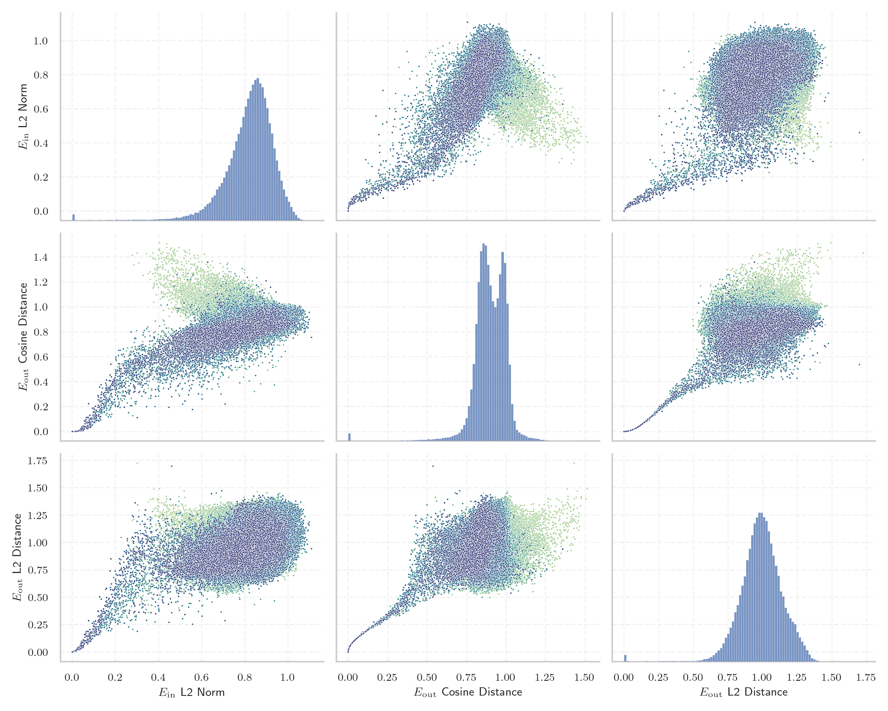
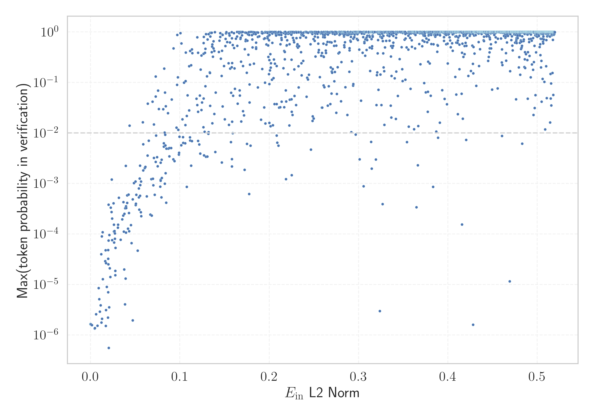

# Report for `meta-llama/Meta-Llama-3.1-70B`

## Model info

* Model Info: 
  * Tied embeddings: False
  * LM head uses bias: False
  * Embeddings shape: [128256, 8192]
* Tokenizer Info: 
  * Vocab Size: 128256
  * Tokenizer Class: PreTrainedTokenizerFast
  * Tokenizer Type: BPE
  * Bytes handling: Byte Input
  * Token for verification prompt building: ABCDEFGHIJKLMNOPQRSTUVWXYZ
  * Token id for verification prompt building: 77002
* Indicator summary: 
  * Indicator for under-trained tokens: E_{in} L2 Norm
  * Overall distribution: 0.818 +/- 0.120
* Detected Token Counts: 
  * Number of tested under-trained tokens: 2539, 2202 non-special, 204 below p = 0.01 threshold, 138 below soft indicator threshold
  * Number of single byte tokens: 256, of which 13 below indicator threshold
  * Number of special tokens: 0, of which 0 below indicator threshold
  * Number of non-single-byte UTF-fragment tokens:  1224, of which 3 below soft indicator threshold

## Under-trained token indicators plot


## Verification plot


## Under-trained token verification results
138 entries below threshold of 0.078

|   token_id | token                             |   indicator | max_prob                                                         | in_other_tokens                                                                                                                                                                                                                                                                                        |
|------------|-----------------------------------|-------------|------------------------------------------------------------------|--------------------------------------------------------------------------------------------------------------------------------------------------------------------------------------------------------------------------------------------------------------------------------------------------------|
|      85071 | ````` $PostalCodesNL `````        | 2.51256e-05 | <span style='border: 1px solid rgb(169, 68, 66);'>1.6e-06</span> |                                                                                                                                                                                                                                                                                                        |
|      80370 | ````` ▁ForCanBeConvertedToF ````` | 2.51853e-05 | <span style='border: 1px solid rgb(169, 68, 66);'>1.6e-06</span> | <span style='border: 1px solid rgb(40, 167, 69);'>````` ▁ForCanBeConvertedToForeach `````</span>                                                                                                                                                                                                       |
|     124292 | ````` илася `````                 | 2.51979e-05 | <span style='border: 1px solid rgb(169, 68, 66);'>1.6e-06</span> |                                                                                                                                                                                                                                                                                                        |
|      89472 | ````` useRalative `````           | 2.5215e-05  | <span style='border: 1px solid rgb(169, 68, 66);'>1.6e-06</span> | <span style='border: 1px solid rgb(169, 68, 66);'>````` useRalativeImagePath `````</span>                                                                                                                                                                                                              |
|     118508 | ````` ávající `````               | 2.5261e-05  | <span style='border: 1px solid rgb(169, 68, 66);'>1.6e-06</span> |                                                                                                                                                                                                                                                                                                        |
|     122746 | ````` илакти `````                | 2.52835e-05 | <span style='border: 1px solid rgb(169, 68, 66);'>1.6e-06</span> | <span style='border: 1px solid rgb(40, 167, 69);'>````` ▁профилакти `````</span>                                                                                                                                                                                                                       |
|     106710 | ````` атися `````                 | 2.52941e-05 | <span style='border: 1px solid rgb(169, 68, 66);'>1.6e-06</span> | <span style='border: 1px solid rgb(169, 68, 66);'>````` уватися `````</span>, <span style='border: 1px solid rgb(169, 68, 66);'>````` ватися `````</span>                                                                                                                                              |
|     125952 | ````` ыџN `````                   | 2.52944e-05 | <span style='border: 1px solid rgb(169, 68, 66);'>1.6e-06</span> | <span style='border: 1px solid rgb(169, 68, 66);'>````` ЎыџN `````</span>, <span style='border: 1px solid rgb(169, 68, 66);'>````` ЎыџNЎыџN `````</span>                                                                                                                                               |
|     126523 | ````` ЎыџN `````                  | 2.53141e-05 | <span style='border: 1px solid rgb(169, 68, 66);'>1.6e-06</span> | <span style='border: 1px solid rgb(169, 68, 66);'>````` ЎыџNЎыџN `````</span>                                                                                                                                                                                                                          |
|     122549 | ````` İTESİ `````                 | 2.53192e-05 | <span style='border: 1px solid rgb(169, 68, 66);'>1.6e-06</span> | ````` ▁ÜNİVERSİTESİ `````                                                                                                                                                                                                                                                                              |
|     127896 | ````` ıldığında `````             | 2.5326e-05  | <span style='border: 1px solid rgb(169, 68, 66);'>1.6e-06</span> |                                                                                                                                                                                                                                                                                                        |
|      85069 | ````` PostalCodesNL `````         | 2.53311e-05 | <span style='border: 1px solid rgb(169, 68, 66);'>1.6e-06</span> | <span style='border: 1px solid rgb(169, 68, 66);'>````` $PostalCodesNL `````</span>                                                                                                                                                                                                                    |
|      64424 | ````` ">\r\r\n `````              | 2.54254e-05 | <span style='border: 1px solid rgb(169, 68, 66);'>1.6e-06</span> |                                                                                                                                                                                                                                                                                                        |
|     127117 | ````` ЎыџNЎыџN `````              | 2.54669e-05 | <span style='border: 1px solid rgb(169, 68, 66);'>1.6e-06</span> |                                                                                                                                                                                                                                                                                                        |
|      79883 | ````` \tTokenNameIdentifier ````` | 2.56267e-05 | <span style='border: 1px solid rgb(169, 68, 66);'>1.6e-06</span> |                                                                                                                                                                                                                                                                                                        |
|      68896 | ````` ;\r\r\r\n `````             | 2.56299e-05 | <span style='border: 1px solid rgb(169, 68, 66);'>1.6e-06</span> | <span style='border: 1px solid rgb(169, 68, 66);'>````` );\r\r\r\n `````</span>                                                                                                                                                                                                                        |
|      80369 | ````` ▁ForCanBeConverted `````    | 2.57053e-05 | <span style='border: 1px solid rgb(169, 68, 66);'>1.6e-06</span> | <span style='border: 1px solid rgb(40, 167, 69);'>````` ▁ForCanBeConvertedToForeach `````</span>, <span style='border: 1px solid rgb(169, 68, 66);'>````` ▁ForCanBeConvertedToF `````</span>                                                                                                           |
|     103003 | ````` аракт `````                 | 2.57138e-05 | <span style='border: 1px solid rgb(169, 68, 66);'>1.6e-06</span> | ````` ▁характер `````, <span style='border: 1px solid rgb(40, 167, 69);'>````` ▁характеристи `````</span>, ````` ▁характеристики `````, <span style='border: 1px solid rgb(40, 167, 69);'>````` ▁характ `````</span>, <span style='border: 1px solid rgb(169, 68, 66);'>````` ▁характериз `````</span> |
|     107658 | ````` итися `````                 | 2.57304e-05 | <span style='border: 1px solid rgb(169, 68, 66);'>1.6e-06</span> |                                                                                                                                                                                                                                                                                                        |
|     126545 | ````` ılmaktadır `````            | 0.000440526 | <span style='border: 1px solid rgb(169, 68, 66);'>1.6e-06</span> |                                                                                                                                                                                                                                                                                                        |
<details><summary>118 additional entries below threshold</summary>

|   token_id | token                            |   indicator | max_prob                                                         | in_other_tokens                                                                                                                                                                                                                    |
|------------|----------------------------------|-------------|------------------------------------------------------------------|------------------------------------------------------------------------------------------------------------------------------------------------------------------------------------------------------------------------------------|
|     126647 | ````` lásil `````                |  0.00155481 | <span style='border: 1px solid rgb(169, 68, 66);'>1.6e-06</span> |                                                                                                                                                                                                                                    |
|     118260 | ````` ávací `````                |  0.00456351 | <span style='border: 1px solid rgb(169, 68, 66);'>1.3e-06</span> |                                                                                                                                                                                                                                    |
|      55716 | ````` ▁?>\r\n\r\n `````          |  0.00482201 | <span style='border: 1px solid rgb(169, 68, 66);'>1.4e-06</span> |                                                                                                                                                                                                                                    |
|     110043 | ````` еристи `````               |  0.00611649 | <span style='border: 1px solid rgb(169, 68, 66);'>2.6e-06</span> | <span style='border: 1px solid rgb(40, 167, 69);'>````` ▁характеристи `````</span>, ````` ▁характеристики `````                                                                                                                    |
|     114533 | ````` ーカー `````               |  0.00768444 | <span style='border: 1px solid rgb(169, 68, 66);'>1.5e-06</span> |                                                                                                                                                                                                                                    |
|     112162 | ````` уватися `````              |  0.00903324 | <span style='border: 1px solid rgb(169, 68, 66);'>8.4e-06</span> |                                                                                                                                                                                                                                    |
|     111067 | ````` ıldığı `````               |  0.00976786 | <span style='border: 1px solid rgb(169, 68, 66);'>5.1e-06</span> | <span style='border: 1px solid rgb(169, 68, 66);'>````` ıldığında `````</span>                                                                                                                                                     |
|     110024 | ````` ▁CLIIIK `````              |  0.0103795  | <span style='border: 1px solid rgb(169, 68, 66);'>2.9e-06</span> |                                                                                                                                                                                                                                    |
|     109045 | ````` krvldkf `````              |  0.0112701  | <span style='border: 1px solid rgb(169, 68, 66);'>3.9e-06</span> | <span style='border: 1px solid rgb(40, 167, 69);'>````` ▁eoqkrvldkf `````</span>                                                                                                                                                   |
|     102564 | ````` ıldı `````                 |  0.0118764  | <span style='border: 1px solid rgb(169, 68, 66);'>4e-05</span>   | ````` ▁yıldız `````, <span style='border: 1px solid rgb(169, 68, 66);'>````` ıldığında `````</span>, ````` ▁yapıldı `````, ````` ▁yıldır `````, <span style='border: 1px solid rgb(169, 68, 66);'>````` ıldığı `````</span>        |
|     112063 | ````` кадем `````                |  0.012189   | <span style='border: 1px solid rgb(169, 68, 66);'>1.8e-06</span> | <span style='border: 1px solid rgb(40, 167, 69);'>````` ▁академ `````</span>                                                                                                                                                       |
|      90050 | ````` _ComCallableWrapper `````  |  0.0125526  | <span style='border: 1px solid rgb(169, 68, 66);'>9e-05</span>   |                                                                                                                                                                                                                                    |
|     108577 | ````` ilmektedir `````           |  0.0128263  | <span style='border: 1px solid rgb(169, 68, 66);'>2.1e-06</span> |                                                                                                                                                                                                                                    |
|     108918 | ````` алася `````                |  0.0133713  | <span style='border: 1px solid rgb(169, 68, 66);'>0.00011</span> |                                                                                                                                                                                                                                    |
|      47073 | ````` webElementXpaths `````     |  0.0136502  | <span style='border: 1px solid rgb(169, 68, 66);'>1.3e-05</span> |                                                                                                                                                                                                                                    |
|     110150 | ````` átku `````                 |  0.0163774  | <span style='border: 1px solid rgb(169, 68, 66);'>2.9e-05</span> | ````` ▁začátku `````                                                                                                                                                                                                               |
|     127748 | ````` ımlar `````                |  0.0168316  | <span style='border: 1px solid rgb(169, 68, 66);'>4.7e-05</span> |                                                                                                                                                                                                                                    |
|     113234 | ````` uştur `````                |  0.0169055  | <span style='border: 1px solid rgb(169, 68, 66);'>1.5e-06</span> | ````` ▁olmuştur `````                                                                                                                                                                                                              |
|     114185 | ````` ımsız `````                |  0.0171958  | <span style='border: 1px solid rgb(169, 68, 66);'>2.6e-05</span> | ````` ▁bağımsız `````                                                                                                                                                                                                              |
|     127367 | ````` ımlı `````                 |  0.0172388  | <span style='border: 1px solid rgb(169, 68, 66);'>3.1e-06</span> |                                                                                                                                                                                                                                    |
|      98668 | ````` );\r\r\r\n `````           |  0.0182162  | <span style='border: 1px solid rgb(169, 68, 66);'>8.9e-06</span> |                                                                                                                                                                                                                                    |
|     116552 | ````` ujícím `````               |  0.0193439  | <span style='border: 1px solid rgb(169, 68, 66);'>2.2e-06</span> |                                                                                                                                                                                                                                    |
|     122032 | ````` áhnout `````               |  0.0196517  | <span style='border: 1px solid rgb(169, 68, 66);'>3.2e-05</span> |                                                                                                                                                                                                                                    |
|     120424 | ````` espoň `````                |  0.0197091  | <span style='border: 1px solid rgb(169, 68, 66);'>7e-06</span>   | ````` ▁alespoň `````                                                                                                                                                                                                               |
|     115721 | ````` átní `````                 |  0.0197633  | <span style='border: 1px solid rgb(169, 68, 66);'>4.8e-05</span> | ````` ▁státní `````                                                                                                                                                                                                                |
|      71785 | ````` .*;\r\n\r\n `````          |  0.0198458  | <span style='border: 1px solid rgb(169, 68, 66);'>2.5e-05</span> |                                                                                                                                                                                                                                    |
|     108653 | ````` átky `````                 |  0.020116   | <span style='border: 1px solid rgb(169, 68, 66);'>7.4e-05</span> | ````` ▁látky `````                                                                                                                                                                                                                 |
|     127438 | ````` ▍▍▍▍▍▍▍▍▍▍▍▍▍▍▍▍ `````     |  0.0201923  | <span style='border: 1px solid rgb(169, 68, 66);'>0.00038</span> |                                                                                                                                                                                                                                    |
|     115614 | ````` ujících `````              |  0.0203164  | <span style='border: 1px solid rgb(169, 68, 66);'>5.6e-07</span> |                                                                                                                                                                                                                                    |
|     114836 | ````` ーション `````             |  0.0206754  | <span style='border: 1px solid rgb(169, 68, 66);'>3.5e-06</span> |                                                                                                                                                                                                                                    |
|     113004 | ````` ▁виріш `````               |  0.0209743  | <span style='border: 1px solid rgb(169, 68, 66);'>9.5e-05</span> |                                                                                                                                                                                                                                    |
|      64448 | ````` ?>\r\n\r\n `````           |  0.0215489  | <span style='border: 1px solid rgb(169, 68, 66);'>2.1e-05</span> |                                                                                                                                                                                                                                    |
|      58508 | ````` :-------------</ `````     |  0.0220552  | <span style='border: 1px solid rgb(169, 68, 66);'>1.4e-05</span> |                                                                                                                                                                                                                                    |
|     117857 | ````` ılmaz `````                |  0.0225981  | <span style='border: 1px solid rgb(169, 68, 66);'>0.00033</span> |                                                                                                                                                                                                                                    |
|      89473 | ````` useRalativeImagePath ````` |  0.0234273  | <span style='border: 1px solid rgb(169, 68, 66);'>0.00027</span> |                                                                                                                                                                                                                                    |
|     112692 | ````` ▍▍▍▍▍▍▍▍ `````             |  0.0237272  | <span style='border: 1px solid rgb(255, 145, 0);'>0.0012</span>  | <span style='border: 1px solid rgb(169, 68, 66);'>````` ▍▍▍▍▍▍▍▍▍▍▍▍▍▍▍▍ `````</span>                                                                                                                                              |
|     115970 | ````` üyordu `````               |  0.0241088  | <span style='border: 1px solid rgb(169, 68, 66);'>7.5e-05</span> |                                                                                                                                                                                                                                    |
|     114860 | ````` ılmıştır `````             |  0.0241771  | <span style='border: 1px solid rgb(169, 68, 66);'>0.0002</span>  |                                                                                                                                                                                                                                    |
|     112907 | ````` uyordu `````               |  0.0256503  | <span style='border: 1px solid rgb(169, 68, 66);'>0.0004</span>  |                                                                                                                                                                                                                                    |
|     106951 | ````` 글상위 `````               |  0.0259969  | <span style='border: 1px solid rgb(169, 68, 66);'>0.00011</span> | <span style='border: 1px solid rgb(40, 167, 69);'>````` ▁구글상위 `````</span>, <span style='border: 1px solid rgb(40, 167, 69);'>````` 구글상위 `````</span>                                                                      |
|     118805 | ````` дивиду `````               |  0.0261613  | <span style='border: 1px solid rgb(169, 68, 66);'>0.00015</span> | <span style='border: 1px solid rgb(40, 167, 69);'>````` ▁индивиду `````</span>                                                                                                                                                     |
|      89471 | ````` useRal `````               |  0.0262287  | <span style='border: 1px solid rgb(169, 68, 66);'>6.8e-05</span> | <span style='border: 1px solid rgb(169, 68, 66);'>````` useRalativeImagePath `````</span>, <span style='border: 1px solid rgb(169, 68, 66);'>````` useRalative `````</span>                                                        |
|      81259 | ````` artisanlib `````           |  0.0268204  | <span style='border: 1px solid rgb(169, 68, 66);'>0.00011</span> |                                                                                                                                                                                                                                    |
|      89475 | ````` elementGuidId `````        |  0.0271072  | <span style='border: 1px solid rgb(169, 68, 66);'>8.1e-05</span> |                                                                                                                                                                                                                                    |
|     115216 | ````` ючись `````                |  0.0273132  | <span style='border: 1px solid rgb(169, 68, 66);'>0.0001</span>  |                                                                                                                                                                                                                                    |
|      93249 | ````` ();\r\r\n `````            |  0.0276507  | <span style='border: 1px solid rgb(169, 68, 66);'>1.9e-05</span> |                                                                                                                                                                                                                                    |
|     115105 | ````` ▁神马收录 `````            |  0.0277409  | <span style='border: 1px solid rgb(169, 68, 66);'>1.5e-05</span> |                                                                                                                                                                                                                                    |
|     106216 | ````` ıntı `````                 |  0.0279154  | <span style='border: 1px solid rgb(169, 68, 66);'>5.3e-05</span> | ````` ▁ayrıntılı `````, <span style='border: 1px solid rgb(40, 167, 69);'>````` ▁ayrıntı `````</span>, ````` ▁sıkıntı `````                                                                                                        |
|     117011 | ````` ımda `````                 |  0.0305303  | <span style='border: 1px solid rgb(169, 68, 66);'>0.00013</span> |                                                                                                                                                                                                                                    |
|      72710 | ````` ▁-->\r\n\r\n `````         |  0.0306587  | <span style='border: 1px solid rgb(169, 68, 66);'>0.00015</span> |                                                                                                                                                                                                                                    |
|      33786 | ````` webElementProperties ````` |  0.0316268  | <span style='border: 1px solid rgb(169, 68, 66);'>0.00052</span> |                                                                                                                                                                                                                                    |
|      96348 | ````` ',\r\r\n `````             |  0.0336813  | <span style='border: 1px solid rgb(169, 68, 66);'>7.6e-05</span> |                                                                                                                                                                                                                                    |
|     112620 | ````` ▁підтрим `````             |  0.0353673  | <span style='border: 1px solid rgb(169, 68, 66);'>0.0002</span>  |                                                                                                                                                                                                                                    |
|     107102 | ````` ıyordu `````               |  0.0364565  | <span style='border: 1px solid rgb(169, 68, 66);'>0.00023</span> |                                                                                                                                                                                                                                    |
|     109744 | ````` acaktır `````              |  0.0366781  | <span style='border: 1px solid rgb(169, 68, 66);'>0.00043</span> | ````` ▁olacaktır `````                                                                                                                                                                                                             |
|     105435 | ````` алась `````                |  0.0372596  | <span style='border: 1px solid rgb(169, 68, 66);'>0.00011</span> |                                                                                                                                                                                                                                    |
|     111691 | ````` abancı `````               |  0.0376968  | <span style='border: 1px solid rgb(169, 68, 66);'>2e-05</span>   | ````` ▁yabancı `````                                                                                                                                                                                                               |
|     126173 | ````` vající `````               |  0.0377906  | <span style='border: 1px solid rgb(169, 68, 66);'>0.00025</span> |                                                                                                                                                                                                                                    |
|     101673 | ````` ektedir `````              |  0.0385531  | <span style='border: 1px solid rgb(169, 68, 66);'>4e-06</span>   | <span style='border: 1px solid rgb(169, 68, 66);'>````` ilmektedir `````</span>, ````` ▁etmektedir `````, <span style='border: 1px solid rgb(40, 167, 69);'>````` mektedir `````</span>, ````` ▁gerekmektedir `````                |
|     120048 | ````` 重複重複 `````             |  0.0387492  | <span style='border: 1px solid rgb(169, 68, 66);'>0.00032</span> |                                                                                                                                                                                                                                    |
|     125265 | ````` україн `````               |  0.0391409  | <span style='border: 1px solid rgb(169, 68, 66);'>1.3e-05</span> | ````` ▁української `````                                                                                                                                                                                                           |
|     105787 | ````` ▍▍▍▍ `````                 |  0.039449   | <span style='border: 1px solid rgb(255, 145, 0);'>0.0022</span>  | <span style='border: 1px solid rgb(255, 145, 0);'>````` ▍▍▍▍▍▍▍▍ `````</span>, <span style='border: 1px solid rgb(169, 68, 66);'>````` ▍▍▍▍▍▍▍▍▍▍▍▍▍▍▍▍ `````</span>                                                               |
|     125700 | ````` rální `````                |  0.0395288  | <span style='border: 1px solid rgb(169, 68, 66);'>0.00011</span> |                                                                                                                                                                                                                                    |
|     104516 | ````` ılmış `````                |  0.0395659  | <span style='border: 1px solid rgb(169, 68, 66);'>0.00035</span> | ````` ▁yapılmış `````, <span style='border: 1px solid rgb(169, 68, 66);'>````` ılmıştır `````</span>                                                                                                                               |
|     126257 | ````` џЭ `````                   |  0.0397465  | <span style='border: 1px solid rgb(169, 68, 66);'>0.00032</span> |                                                                                                                                                                                                                                    |
|     114692 | ````` илась `````                |  0.0409125  | <span style='border: 1px solid rgb(169, 68, 66);'>0.00041</span> |                                                                                                                                                                                                                                    |
|     127577 | ````` lamaktadır `````           |  0.0409383  | <span style='border: 1px solid rgb(169, 68, 66);'>0.00058</span> |                                                                                                                                                                                                                                    |
|     120702 | ````` ▁характериз `````          |  0.0418679  | <span style='border: 1px solid rgb(169, 68, 66);'>0.00013</span> |                                                                                                                                                                                                                                    |
|     127667 | ````` ▁располаг `````            |  0.0424668  | <span style='border: 1px solid rgb(169, 68, 66);'>0.0006</span>  |                                                                                                                                                                                                                                    |
|     127954 | ````` jícím `````                |  0.0429636  | <span style='border: 1px solid rgb(169, 68, 66);'>0.00026</span> |                                                                                                                                                                                                                                    |
|     107572 | ````` ecektir `````              |  0.0430599  | <span style='border: 1px solid rgb(169, 68, 66);'>0.00011</span> |                                                                                                                                                                                                                                    |
|      70316 | ````` erusform `````             |  0.0435338  | <span style='border: 1px solid rgb(251, 189, 8);'>0.014</span>   | <span style='border: 1px solid rgb(40, 167, 69);'>````` numerusform `````</span>                                                                                                                                                   |
|     124393 | ````` sahuje `````               |  0.045091   | <span style='border: 1px solid rgb(169, 68, 66);'>0.00015</span> |                                                                                                                                                                                                                                    |
|     115108 | ````` ▁百度流量 `````            |  0.045927   | <span style='border: 1px solid rgb(169, 68, 66);'>6.6e-05</span> |                                                                                                                                                                                                                                    |
|     107197 | ````` ▁використов `````          |  0.0471361  | <span style='border: 1px solid rgb(169, 68, 66);'>0.00049</span> | <span style='border: 1px solid rgb(40, 167, 69);'>````` ▁використовувати `````</span>                                                                                                                                              |
|     125022 | ````` џN `````                   |  0.0471577  | <span style='border: 1px solid rgb(169, 68, 66);'>1.9e-06</span> | <span style='border: 1px solid rgb(169, 68, 66);'>````` ЎыџN `````</span>, <span style='border: 1px solid rgb(169, 68, 66);'>````` ыџN `````</span>, <span style='border: 1px solid rgb(169, 68, 66);'>````` ЎыџNЎыџN `````</span> |
|     124593 | ````` назнач `````               |  0.0485898  | <span style='border: 1px solid rgb(255, 145, 0);'>0.001</span>   | <span style='border: 1px solid rgb(255, 145, 0);'>````` ▁предназнач `````</span>                                                                                                                                                   |
|     113983 | ````` acılık `````               |  0.0501823  | <span style='border: 1px solid rgb(255, 145, 0);'>0.0011</span>  |                                                                                                                                                                                                                                    |
|     126634 | ````` ▁přiroz `````              |  0.0504886  | <span style='border: 1px solid rgb(169, 68, 66);'>0.00037</span> |                                                                                                                                                                                                                                    |
|     119000 | ````` пеки `````                 |  0.0505923  | <span style='border: 1px solid rgb(169, 68, 66);'>0.0004</span>  | ````` ▁безпеки `````                                                                                                                                                                                                               |
|     126626 | ````` ▁адміністратив `````       |  0.0510779  | <span style='border: 1px solid rgb(169, 68, 66);'>0.00059</span> |                                                                                                                                                                                                                                    |
|     123745 | ````` ▁zahrn `````               |  0.0526516  | <span style='border: 1px solid rgb(169, 68, 66);'>4.7e-05</span> |                                                                                                                                                                                                                                    |
|     117098 | ````` ▁зазнач `````              |  0.0539563  | <span style='border: 1px solid rgb(169, 68, 66);'>0.0008</span>  |                                                                                                                                                                                                                                    |
|     114767 | ````` iyesi `````                |  0.054084   | <span style='border: 1px solid rgb(169, 68, 66);'>0.00053</span> | ````` ▁Belediyesi `````                                                                                                                                                                                                            |
|     121475 | ````` ніцип `````                |  0.0545217  | <span style='border: 1px solid rgb(169, 68, 66);'>0.0003</span>  |                                                                                                                                                                                                                                    |
|     124647 | ````` itelné `````               |  0.0548704  | <span style='border: 1px solid rgb(255, 145, 0);'>0.0013</span>  |                                                                                                                                                                                                                                    |
|      31836 | ````` >\r\r\n `````              |  0.0552892  | <span style='border: 1px solid rgb(255, 145, 0);'>0.0022</span>  | <span style='border: 1px solid rgb(169, 68, 66);'>````` ">\r\r\n `````</span>                                                                                                                                                      |
|     123997 | ````` alardan `````              |  0.0553879  | <span style='border: 1px solid rgb(169, 68, 66);'>0.00057</span> |                                                                                                                                                                                                                                    |
|     117929 | ````` ▁вихов `````               |  0.0554762  | <span style='border: 1px solid rgb(169, 68, 66);'>0.00093</span> |                                                                                                                                                                                                                                    |
|     114091 | ````` üslüman `````              |  0.0562219  | <span style='border: 1px solid rgb(169, 68, 66);'>0.00027</span> | ````` ▁Müslüman `````                                                                                                                                                                                                              |
|      62420 | ````` );\r\r\n `````             |  0.0565002  | <span style='border: 1px solid rgb(255, 145, 0);'>0.0011</span>  | <span style='border: 1px solid rgb(169, 68, 66);'>````` ();\r\r\n `````</span>                                                                                                                                                     |
|     127994 | ````` ватися `````               |  0.056658   | <span style='border: 1px solid rgb(169, 68, 66);'>0.00023</span> |                                                                                                                                                                                                                                    |
|      31960 | ````` quotelev `````             |  0.0584958  | <span style='border: 1px solid rgb(251, 189, 8);'>0.016</span>   |                                                                                                                                                                                                                                    |
|      87829 | ````` ▁}\r\r\n `````             |  0.0588727  | <span style='border: 1px solid rgb(255, 145, 0);'>0.006</span>   |                                                                                                                                                                                                                                    |
|     104121 | ````` iyordu `````               |  0.0588817  | <span style='border: 1px solid rgb(255, 145, 0);'>0.0018</span>  |                                                                                                                                                                                                                                    |
|     120959 | ````` jících `````               |  0.0605783  | <span style='border: 1px solid rgb(255, 145, 0);'>0.002</span>   |                                                                                                                                                                                                                                    |
|     116452 | ````` ▁söyley `````              |  0.0612664  | <span style='border: 1px solid rgb(255, 145, 0);'>0.0021</span>  |                                                                                                                                                                                                                                    |
|     107818 | ````` ární `````                 |  0.0629398  | <span style='border: 1px solid rgb(169, 68, 66);'>0.00055</span> |                                                                                                                                                                                                                                    |
|     117691 | ````` lıklar `````               |  0.063833   | <span style='border: 1px solid rgb(255, 145, 0);'>0.0036</span>  | <span style='border: 1px solid rgb(169, 68, 66);'>````` lıkları `````</span>                                                                                                                                                       |
|      98100 | ````` (stypy `````               |  0.0639644  | <span style='border: 1px solid rgb(251, 189, 8);'>0.038</span>   |                                                                                                                                                                                                                                    |
|     119709 | ````` kyně `````                 |  0.0652111  | <span style='border: 1px solid rgb(255, 145, 0);'>0.007</span>   |                                                                                                                                                                                                                                    |
|     127877 | ````` ▁Coğraf `````              |  0.0668969  | <span style='border: 1px solid rgb(169, 68, 66);'>0.00024</span> |                                                                                                                                                                                                                                    |
|      66534 | ````` '];\r\n\r\n `````          |  0.0680358  | <span style='border: 1px solid rgb(255, 145, 0);'>0.0012</span>  |                                                                                                                                                                                                                                    |
|     120454 | ````` lıkları `````              |  0.0684373  | <span style='border: 1px solid rgb(169, 68, 66);'>0.00023</span> |                                                                                                                                                                                                                                    |
|      47072 | ````` webElementX `````          |  0.0693771  | <span style='border: 1px solid rgb(251, 189, 8);'>0.041</span>   | <span style='border: 1px solid rgb(169, 68, 66);'>````` webElementXpaths `````</span>                                                                                                                                              |
|     119162 | ````` ▁визнача `````             |  0.0698759  | <span style='border: 1px solid rgb(255, 145, 0);'>0.0012</span>  |                                                                                                                                                                                                                                    |
|      38335 | ````` ">\r\n\r\n `````           |  0.0702578  | <span style='border: 1px solid rgb(169, 68, 66);'>0.00092</span> |                                                                                                                                                                                                                                    |
|      70784 | ````` Japgolly `````             |  0.0707997  | <span style='border: 1px solid rgb(255, 145, 0);'>0.0032</span>  | <span style='border: 1px solid rgb(251, 189, 8);'>````` ▁typingsJapgolly `````</span>                                                                                                                                              |
|      51574 | ````` ▁{\r\r\n `````             |  0.0709243  | <span style='border: 1px solid rgb(251, 189, 8);'>0.015</span>   |                                                                                                                                                                                                                                    |
|     122047 | ````` ▁зустрі `````              |  0.0718402  | <span style='border: 1px solid rgb(169, 68, 66);'>0.00059</span> |                                                                                                                                                                                                                                    |
|     118228 | ````` ▁předsed `````             |  0.0728611  | <span style='border: 1px solid rgb(251, 189, 8);'>0.052</span>   |                                                                                                                                                                                                                                    |
|     120592 | ````` тися `````                 |  0.072908   | <span style='border: 1px solid rgb(40, 167, 69);'>0.13</span>    | <span style='border: 1px solid rgb(169, 68, 66);'>````` ватися `````</span>, ````` ▁тисяч `````                                                                                                                                    |
|     122315 | ````` müştür `````               |  0.0729703  | <span style='border: 1px solid rgb(255, 145, 0);'>0.0027</span>  |                                                                                                                                                                                                                                    |
|     116171 | ````` cılık `````                |  0.0732649  | <span style='border: 1px solid rgb(255, 145, 0);'>0.0089</span>  |                                                                                                                                                                                                                                    |
|     110410 | ````` ▁seviy `````               |  0.0743629  | <span style='border: 1px solid rgb(255, 145, 0);'>0.0033</span>  |                                                                                                                                                                                                                                    |
|     127711 | ````` dıktan `````               |  0.0751452  | <span style='border: 1px solid rgb(255, 145, 0);'>0.0022</span>  |                                                                                                                                                                                                                                    |
|     124703 | ````` ırlar `````                |  0.0755995  | <span style='border: 1px solid rgb(251, 189, 8);'>0.069</span>   |                                                                                                                                                                                                                                    |
|     112206 | ````` ▁otevř `````               |  0.0763333  | <span style='border: 1px solid rgb(251, 189, 8);'>0.03</span>    |                                                                                                                                                                                                                                    |
</details>
<details><summary>2064 additional entries above threshold</summary>

|   token_id | token                                        |   indicator | max_prob                                                         | in_other_tokens                                                                                                                                                                                                                                                                                                                                                                                                                                                             |
|------------|----------------------------------------------|-------------|------------------------------------------------------------------|-----------------------------------------------------------------------------------------------------------------------------------------------------------------------------------------------------------------------------------------------------------------------------------------------------------------------------------------------------------------------------------------------------------------------------------------------------------------------------|
|     105672 | ````` ▁розвит `````                          |   0.0780016 | <span style='border: 1px solid rgb(169, 68, 66);'>0.00086</span> | ````` ▁розвитку `````, <span style='border: 1px solid rgb(40, 167, 69);'>````` ▁розвиток `````</span>                                                                                                                                                                                                                                                                                                                                                                       |
|     115487 | ````` ▁králov `````                          |   0.07834   | <span style='border: 1px solid rgb(255, 145, 0);'>0.0026</span>  |                                                                                                                                                                                                                                                                                                                                                                                                                                                                             |
|     107996 | ````` ▁визнач `````                          |   0.0784094 | <span style='border: 1px solid rgb(255, 145, 0);'>0.0012</span>  | <span style='border: 1px solid rgb(255, 145, 0);'>````` ▁визнача `````</span>, ````` ▁визначення `````                                                                                                                                                                                                                                                                                                                                                                      |
|     115129 | ````` lıklı `````                            |   0.0785005 | <span style='border: 1px solid rgb(255, 145, 0);'>0.0011</span>  | ````` ▁sağlıklı `````                                                                                                                                                                                                                                                                                                                                                                                                                                                       |
|     124069 | ````` ▁přibliž `````                         |   0.0793118 | <span style='border: 1px solid rgb(169, 68, 66);'>0.00053</span> |                                                                                                                                                                                                                                                                                                                                                                                                                                                                             |
|     121671 | ````` ▁düşünc `````                          |   0.0794417 | <span style='border: 1px solid rgb(255, 145, 0);'>0.003</span>   |                                                                                                                                                                                                                                                                                                                                                                                                                                                                             |
|     119003 | ````` ▁taşıy `````                           |   0.07977   | <span style='border: 1px solid rgb(255, 145, 0);'>0.0013</span>  |                                                                                                                                                                                                                                                                                                                                                                                                                                                                             |
|     125029 | ````` ▁νεφοκ `````                           |   0.0812801 | <span style='border: 1px solid rgb(251, 189, 8);'>0.029</span>   | ````` ▁νεφοκάλυψης `````                                                                                                                                                                                                                                                                                                                                                                                                                                                    |
|     126357 | ````` ▁предназнач `````                      |   0.0819211 | <span style='border: 1px solid rgb(255, 145, 0);'>0.0062</span>  |                                                                                                                                                                                                                                                                                                                                                                                                                                                                             |
|     125808 | ````` larındaki `````                        |   0.081981  | <span style='border: 1px solid rgb(255, 145, 0);'>0.0053</span>  |                                                                                                                                                                                                                                                                                                                                                                                                                                                                             |
|     115944 | ````` ▁vzdál `````                           |   0.0824478 | <span style='border: 1px solid rgb(40, 167, 69);'>0.19</span>    | <span style='border: 1px solid rgb(40, 167, 69);'>````` ▁vzdálen `````</span>                                                                                                                                                                                                                                                                                                                                                                                               |
|     123611 | ````` ▁Českosloven `````                     |   0.0829112 | <span style='border: 1px solid rgb(251, 189, 8);'>0.01</span>    |                                                                                                                                                                                                                                                                                                                                                                                                                                                                             |
|     123584 | ````` ▁Každ `````                            |   0.0830152 | <span style='border: 1px solid rgb(169, 68, 66);'>0.00098</span> |                                                                                                                                                                                                                                                                                                                                                                                                                                                                             |
|      45222 | ````` ;\r\r\n `````                          |   0.0832509 | <span style='border: 1px solid rgb(251, 189, 8);'>0.063</span>   | <span style='border: 1px solid rgb(255, 145, 0);'>````` );\r\r\n `````</span>, <span style='border: 1px solid rgb(169, 68, 66);'>````` ();\r\r\n `````</span>                                                                                                                                                                                                                                                                                                               |
|     125786 | ````` ▁nebezpeč `````                        |   0.0836027 | <span style='border: 1px solid rgb(255, 145, 0);'>0.0092</span>  |                                                                                                                                                                                                                                                                                                                                                                                                                                                                             |
|     123107 | ````` maması `````                           |   0.0837592 | <span style='border: 1px solid rgb(255, 145, 0);'>0.0057</span>  |                                                                                                                                                                                                                                                                                                                                                                                                                                                                             |
|     125759 | ````` ▁відріз `````                          |   0.0839806 | <span style='border: 1px solid rgb(255, 145, 0);'>0.0016</span>  |                                                                                                                                                                                                                                                                                                                                                                                                                                                                             |
|     124971 | ````` ▁ابراه `````                           |   0.0841921 | <span style='border: 1px solid rgb(251, 189, 8);'>0.034</span>   |                                                                                                                                                                                                                                                                                                                                                                                                                                                                             |
|     127531 | ````` ▁vyrá `````                            |   0.0846294 | <span style='border: 1px solid rgb(169, 68, 66);'>0.00042</span> |                                                                                                                                                                                                                                                                                                                                                                                                                                                                             |
|      44001 | ````` _AdjustorThunk `````                   |   0.0848923 | <span style='border: 1px solid rgb(255, 145, 0);'>0.0049</span>  |                                                                                                                                                                                                                                                                                                                                                                                                                                                                             |
|     118751 | ````` ▁дозволя `````                         |   0.0866736 | <span style='border: 1px solid rgb(251, 189, 8);'>0.025</span>   |                                                                                                                                                                                                                                                                                                                                                                                                                                                                             |
|     103754 | ````` ▁використ `````                        |   0.0871118 | <span style='border: 1px solid rgb(255, 145, 0);'>0.0049</span>  | <span style='border: 1px solid rgb(169, 68, 66);'>````` ▁використов `````</span>, ````` ▁використання `````, <span style='border: 1px solid rgb(40, 167, 69);'>````` ▁використовувати `````</span>                                                                                                                                                                                                                                                                          |
|     119465 | ````` ▁присутств `````                       |   0.0880784 | <span style='border: 1px solid rgb(255, 145, 0);'>0.0034</span>  |                                                                                                                                                                                                                                                                                                                                                                                                                                                                             |
|      76631 | ````` }\r\r\n `````                          |   0.0881545 | <span style='border: 1px solid rgb(255, 145, 0);'>0.005</span>   | <span style='border: 1px solid rgb(255, 145, 0);'>````` ▁}\r\r\n `````</span>                                                                                                                                                                                                                                                                                                                                                                                               |
|     112054 | ````` těz `````                              |   0.0902435 | <span style='border: 1px solid rgb(255, 145, 0);'>0.005</span>   | <span style='border: 1px solid rgb(40, 167, 69);'>````` ▁vítěz `````</span>                                                                                                                                                                                                                                                                                                                                                                                                 |
|     106920 | ````` rodní `````                            |   0.090906  | <span style='border: 1px solid rgb(251, 189, 8);'>0.046</span>   |                                                                                                                                                                                                                                                                                                                                                                                                                                                                             |
|     108457 | ````` lardı `````                            |   0.0926526 | <span style='border: 1px solid rgb(255, 145, 0);'>0.003</span>   | ````` lardır `````                                                                                                                                                                                                                                                                                                                                                                                                                                                          |
|     101056 | ````` џџџџџџџџџџџџџџџџџџџџџџџџџџџџџџџџ ````` |   0.0928547 | <span style='border: 1px solid rgb(40, 167, 69);'>0.47</span>    |                                                                                                                                                                                                                                                                                                                                                                                                                                                                             |
|      82354 | ````` (){\r\n\r\n `````                      |   0.0938314 | <span style='border: 1px solid rgb(255, 145, 0);'>0.0028</span>  |                                                                                                                                                                                                                                                                                                                                                                                                                                                                             |
|     112803 | ````` üslü `````                             |   0.0961177 | <span style='border: 1px solid rgb(251, 189, 8);'>0.013</span>   | <span style='border: 1px solid rgb(169, 68, 66);'>````` üslüman `````</span>, ````` ▁Müslüman `````                                                                                                                                                                                                                                                                                                                                                                         |
|      45794 | ````` >tagger `````                          |   0.0968951 | <span style='border: 1px solid rgb(251, 189, 8);'>0.089</span>   |                                                                                                                                                                                                                                                                                                                                                                                                                                                                             |
|      90412 | ````` selectorMethod `````                   |   0.0970321 | <span style='border: 1px solid rgb(40, 167, 69);'>0.87</span>    |                                                                                                                                                                                                                                                                                                                                                                                                                                                                             |
|     123563 | ````` ▁zvyš `````                            |   0.0975873 | <span style='border: 1px solid rgb(40, 167, 69);'>0.13</span>    |                                                                                                                                                                                                                                                                                                                                                                                                                                                                             |
|      76371 | ````` LANGADM `````                          |   0.0981415 | <span style='border: 1px solid rgb(251, 189, 8);'>0.012</span>   |                                                                                                                                                                                                                                                                                                                                                                                                                                                                             |
|     120894 | ````` ▁přítom `````                          |   0.0987957 | <span style='border: 1px solid rgb(255, 145, 0);'>0.0037</span>  |                                                                                                                                                                                                                                                                                                                                                                                                                                                                             |
|     127769 | ````` ▁выращи `````                          |   0.0989163 | <span style='border: 1px solid rgb(255, 145, 0);'>0.004</span>   |                                                                                                                                                                                                                                                                                                                                                                                                                                                                             |
|      34956 | ````` ▁+#+#+#+ `````                         |   0.0995068 | <span style='border: 1px solid rgb(255, 145, 0);'>0.0084</span>  | ````` ▁+#+#+#+#+#+ `````                                                                                                                                                                                                                                                                                                                                                                                                                                                    |
|      96737 | ````` departureday `````                     |   0.100579  | <span style='border: 1px solid rgb(40, 167, 69);'>0.94</span>    |                                                                                                                                                                                                                                                                                                                                                                                                                                                                             |
|     126157 | ````` ▁найкра `````                          |   0.101402  | <span style='border: 1px solid rgb(255, 145, 0);'>0.0057</span>  |                                                                                                                                                                                                                                                                                                                                                                                                                                                                             |
|     117949 | ````` eştir `````                            |   0.101582  | <span style='border: 1px solid rgb(40, 167, 69);'>0.59</span>    | ````` ▁yerleştir `````, ````` ▁eleştir `````                                                                                                                                                                                                                                                                                                                                                                                                                                |
|     124114 | ````` ▁заним `````                           |   0.102795  | <span style='border: 1px solid rgb(251, 189, 8);'>0.019</span>   |                                                                                                                                                                                                                                                                                                                                                                                                                                                                             |
|     127719 | ````` ▁розви `````                           |   0.1035    | <span style='border: 1px solid rgb(255, 145, 0);'>0.0082</span>  |                                                                                                                                                                                                                                                                                                                                                                                                                                                                             |
|     126754 | ````` dıkları `````                          |   0.103624  | <span style='border: 1px solid rgb(255, 145, 0);'>0.0063</span>  |                                                                                                                                                                                                                                                                                                                                                                                                                                                                             |
|     112969 | ````` ▁nhiễ `````                            |   0.104601  | <span style='border: 1px solid rgb(251, 189, 8);'>0.099</span>   | ````` ▁nhiễm `````                                                                                                                                                                                                                                                                                                                                                                                                                                                          |
|     120325 | ````` ▁дозвол `````                          |   0.105799  | <span style='border: 1px solid rgb(255, 145, 0);'>0.0062</span>  |                                                                                                                                                                                                                                                                                                                                                                                                                                                                             |
|     113774 | ````` ▁považ `````                           |   0.106164  | <span style='border: 1px solid rgb(251, 189, 8);'>0.014</span>   |                                                                                                                                                                                                                                                                                                                                                                                                                                                                             |
|     100323 | ````` џџџџџџџџ `````                         |   0.10634   | <span style='border: 1px solid rgb(40, 167, 69);'>0.11</span>    | <span style='border: 1px solid rgb(40, 167, 69);'>````` џџџџџџџџџџџџџџџџџџџџџџџџџџџџџџџџ `````</span>, <span style='border: 1px solid rgb(251, 189, 8);'>````` џџџџџџџџџџџџџџџџ `````</span>                                                                                                                                                                                                                                                                                |
|      84576 | ````` ▁AppMethodBeat `````                   |   0.106602  | <span style='border: 1px solid rgb(40, 167, 69);'>0.39</span>    |                                                                                                                                                                                                                                                                                                                                                                                                                                                                             |
|     113190 | ````` ▁літерату `````                        |   0.107575  | <span style='border: 1px solid rgb(251, 189, 8);'>0.022</span>   |                                                                                                                                                                                                                                                                                                                                                                                                                                                                             |
|     126169 | ````` ařilo `````                            |   0.10763   | <span style='border: 1px solid rgb(169, 68, 66);'>0.00085</span> | ````` ▁podařilo `````                                                                                                                                                                                                                                                                                                                                                                                                                                                       |
|      95073 | ````` -vesm `````                            |   0.108513  | <span style='border: 1px solid rgb(251, 189, 8);'>0.056</span>   |                                                                                                                                                                                                                                                                                                                                                                                                                                                                             |
|     127865 | ````` ▁ослож `````                           |   0.110404  | <span style='border: 1px solid rgb(251, 189, 8);'>0.028</span>   |                                                                                                                                                                                                                                                                                                                                                                                                                                                                             |
|     123510 | ````` ▁kuchy `````                           |   0.110422  | <span style='border: 1px solid rgb(40, 167, 69);'>0.21</span>    |                                                                                                                                                                                                                                                                                                                                                                                                                                                                             |
|     127671 | ````` ▁vystav `````                          |   0.111209  | <span style='border: 1px solid rgb(255, 145, 0);'>0.0082</span>  |                                                                                                                                                                                                                                                                                                                                                                                                                                                                             |
|     127024 | ````` ▁профилакти `````                      |   0.111377  | <span style='border: 1px solid rgb(40, 167, 69);'>0.42</span>    |                                                                                                                                                                                                                                                                                                                                                                                                                                                                             |
|     119776 | ````` ▁yaptığ `````                          |   0.111536  | <span style='border: 1px solid rgb(255, 145, 0);'>0.0071</span>  |                                                                                                                                                                                                                                                                                                                                                                                                                                                                             |
|     118377 | ````` ▁meziná `````                          |   0.112478  | <span style='border: 1px solid rgb(255, 145, 0);'>0.0023</span>  |                                                                                                                                                                                                                                                                                                                                                                                                                                                                             |
|     123228 | ````` џџџ `````                              |   0.112523  | <span style='border: 1px solid rgb(40, 167, 69);'>0.22</span>    |                                                                                                                                                                                                                                                                                                                                                                                                                                                                             |
|      87551 | ````` CppGuid `````                          |   0.113326  | <span style='border: 1px solid rgb(40, 167, 69);'>0.45</span>    |                                                                                                                                                                                                                                                                                                                                                                                                                                                                             |
|      55722 | ````` ▁},\r\n\r\n `````                      |   0.113474  | <span style='border: 1px solid rgb(255, 145, 0);'>0.0069</span>  |                                                                                                                                                                                                                                                                                                                                                                                                                                                                             |
|      79423 | ````` ▁thuisontvangst `````                  |   0.113875  | <span style='border: 1px solid rgb(40, 167, 69);'>0.38</span>    |                                                                                                                                                                                                                                                                                                                                                                                                                                                                             |
|     105983 | ````` ▁вироб `````                           |   0.118606  | <span style='border: 1px solid rgb(251, 189, 8);'>0.047</span>   | ````` ▁виробництва `````                                                                                                                                                                                                                                                                                                                                                                                                                                                    |
|     125654 | ````` ▁uvědom `````                          |   0.119336  | <span style='border: 1px solid rgb(251, 189, 8);'>0.036</span>   |                                                                                                                                                                                                                                                                                                                                                                                                                                                                             |
|     110525 | ````` ▁vzděl `````                           |   0.119478  | <span style='border: 1px solid rgb(40, 167, 69);'>0.78</span>    | ````` ▁vzdělávání `````                                                                                                                                                                                                                                                                                                                                                                                                                                                     |
|     125837 | ````` ▁।”\n\n `````                          |   0.120306  | <span style='border: 1px solid rgb(255, 145, 0);'>0.007</span>   |                                                                                                                                                                                                                                                                                                                                                                                                                                                                             |
|     100509 | ````` џџџџџџџџџџџџџџџџ `````                 |   0.120369  | <span style='border: 1px solid rgb(251, 189, 8);'>0.026</span>   | <span style='border: 1px solid rgb(40, 167, 69);'>````` џџџџџџџџџџџџџџџџџџџџџџџџџџџџџџџџ `````</span>                                                                                                                                                                                                                                                                                                                                                                       |
|      87474 | ````` 無しさん `````                         |   0.120406  | <span style='border: 1px solid rgb(40, 167, 69);'>0.39</span>    | ````` ▁名無しさん `````, ````` 名無しさん `````                                                                                                                                                                                                                                                                                                                                                                                                                             |
|     117521 | ````` eníze `````                            |   0.121632  | <span style='border: 1px solid rgb(255, 145, 0);'>0.0059</span>  | ````` ▁peníze `````                                                                                                                                                                                                                                                                                                                                                                                                                                                         |
|     115107 | ````` ▁首页第 `````                          |   0.122272  | <span style='border: 1px solid rgb(251, 189, 8);'>0.055</span>   |                                                                                                                                                                                                                                                                                                                                                                                                                                                                             |
|     115109 | ````` 周收录 `````                           |   0.122745  | <span style='border: 1px solid rgb(255, 145, 0);'>0.0039</span>  |                                                                                                                                                                                                                                                                                                                                                                                                                                                                             |
|     111962 | ````` ▁založ `````                           |   0.123283  | <span style='border: 1px solid rgb(40, 167, 69);'>0.18</span>    |                                                                                                                                                                                                                                                                                                                                                                                                                                                                             |
|     126778 | ````` ▁принадлеж `````                       |   0.124091  | <span style='border: 1px solid rgb(40, 167, 69);'>0.34</span>    |                                                                                                                                                                                                                                                                                                                                                                                                                                                                             |
|      79008 | ````` ▁"";\r\n\r\n `````                     |   0.124097  | <span style='border: 1px solid rgb(251, 189, 8);'>0.029</span>   |                                                                                                                                                                                                                                                                                                                                                                                                                                                                             |
|      60934 | ````` ▁typingsSlinky `````                   |   0.124794  | <span style='border: 1px solid rgb(251, 189, 8);'>0.04</span>    |                                                                                                                                                                                                                                                                                                                                                                                                                                                                             |
|     110025 | ````` ▁IICIII `````                          |   0.126249  | <span style='border: 1px solid rgb(251, 189, 8);'>0.013</span>   |                                                                                                                                                                                                                                                                                                                                                                                                                                                                             |
|     100270 | ````` џџџџ `````                             |   0.126518  | <span style='border: 1px solid rgb(40, 167, 69);'>0.6</span>     | <span style='border: 1px solid rgb(40, 167, 69);'>````` џџџџџџџџ `````</span>, <span style='border: 1px solid rgb(40, 167, 69);'>````` џџџџџџџџџџџџџџџџџџџџџџџџџџџџџџџџ `````</span>, <span style='border: 1px solid rgb(251, 189, 8);'>````` џџџџџџџџџџџџџџџџ `````</span>                                                                                                                                                                                                 |
|      71366 | ````` drFc `````                             |   0.126582  | <span style='border: 1px solid rgb(40, 167, 69);'>0.37</span>    | <span style='border: 1px solid rgb(40, 167, 69);'>````` \tNdrFc `````</span>, <span style='border: 1px solid rgb(40, 167, 69);'>````` \tNdrFcShort `````</span>                                                                                                                                                                                                                                                                                                             |
|     108980 | ````` ▁smlou `````                           |   0.126611  | <span style='border: 1px solid rgb(251, 189, 8);'>0.048</span>   | ````` ▁smlouvy `````                                                                                                                                                                                                                                                                                                                                                                                                                                                        |
|     120581 | ````` ▁диза `````                            |   0.126691  | <span style='border: 1px solid rgb(40, 167, 69);'>0.8</span>     |                                                                                                                                                                                                                                                                                                                                                                                                                                                                             |
|     113924 | ````` ▁зуст `````                            |   0.127008  | <span style='border: 1px solid rgb(255, 145, 0);'>0.0036</span>  | <span style='border: 1px solid rgb(169, 68, 66);'>````` ▁зустрі `````</span>                                                                                                                                                                                                                                                                                                                                                                                                |
|     105764 | ````` ▁препара `````                         |   0.12762   | <span style='border: 1px solid rgb(251, 189, 8);'>0.011</span>   | ````` ▁препараты `````                                                                                                                                                                                                                                                                                                                                                                                                                                                      |
|      36397 | ````` \r\r\n\r\r\n `````                     |   0.128019  | <span style='border: 1px solid rgb(40, 167, 69);'>0.39</span>    |                                                                                                                                                                                                                                                                                                                                                                                                                                                                             |
|     113050 | ````` muştur `````                           |   0.128544  | <span style='border: 1px solid rgb(251, 189, 8);'>0.084</span>   | ````` ▁olmuştur `````                                                                                                                                                                                                                                                                                                                                                                                                                                                       |
|      53974 | ````` CppMethodInitialized `````             |   0.128574  | <span style='border: 1px solid rgb(40, 167, 69);'>0.46</span>    |                                                                                                                                                                                                                                                                                                                                                                                                                                                                             |
|      26525 | ````` ');\r\n\r\n `````                      |   0.129144  | <span style='border: 1px solid rgb(255, 145, 0);'>0.0034</span>  |                                                                                                                                                                                                                                                                                                                                                                                                                                                                             |
|      79740 | ````` ▁Hexatrigesimal `````                  |   0.129166  | <span style='border: 1px solid rgb(40, 167, 69);'>0.9</span>     |                                                                                                                                                                                                                                                                                                                                                                                                                                                                             |
|     119833 | ````` ▁mücadel `````                         |   0.130252  | <span style='border: 1px solid rgb(40, 167, 69);'>0.13</span>    | ````` ▁mücadele `````                                                                                                                                                                                                                                                                                                                                                                                                                                                       |
|      94489 | ````` )))));\r\n `````                       |   0.130782  | <span style='border: 1px solid rgb(255, 145, 0);'>0.0034</span>  |                                                                                                                                                                                                                                                                                                                                                                                                                                                                             |
|     119751 | ````` \x80\x80\x80\x80\x80\x80\x80\x80 ````` |   0.13098   | <span style='border: 1px solid rgb(40, 167, 69);'>0.71</span>    |                                                                                                                                                                                                                                                                                                                                                                                                                                                                             |
|      28288 | ````` ';\r\n\r\n `````                       |   0.131858  | <span style='border: 1px solid rgb(255, 145, 0);'>0.0096</span>  |                                                                                                                                                                                                                                                                                                                                                                                                                                                                             |
|     121828 | ````` ▁Olomou `````                          |   0.132025  | <span style='border: 1px solid rgb(40, 167, 69);'>0.9</span>     |                                                                                                                                                                                                                                                                                                                                                                                                                                                                             |
|      72740 | ````` ▁typingsJapgolly `````                 |   0.132073  | <span style='border: 1px solid rgb(251, 189, 8);'>0.01</span>    |                                                                                                                                                                                                                                                                                                                                                                                                                                                                             |
|      80612 | ````` MethodBeat `````                       |   0.133354  | <span style='border: 1px solid rgb(40, 167, 69);'>0.16</span>    | <span style='border: 1px solid rgb(40, 167, 69);'>````` ▁AppMethodBeat `````</span>                                                                                                                                                                                                                                                                                                                                                                                         |
|     113720 | ````` ▁açıklam `````                         |   0.13356   | <span style='border: 1px solid rgb(40, 167, 69);'>0.15</span>    |                                                                                                                                                                                                                                                                                                                                                                                                                                                                             |
|     105046 | ````` larından `````                         |   0.133727  | <span style='border: 1px solid rgb(251, 189, 8);'>0.035</span>   | ````` alarından `````                                                                                                                                                                                                                                                                                                                                                                                                                                                       |
|     115858 | ````` ▏▏ `````                               |   0.134006  | <span style='border: 1px solid rgb(40, 167, 69);'>0.81</span>    |                                                                                                                                                                                                                                                                                                                                                                                                                                                                             |
|     125491 | ````` ▁připoj `````                          |   0.134116  | <span style='border: 1px solid rgb(40, 167, 69);'>0.96</span>    |                                                                                                                                                                                                                                                                                                                                                                                                                                                                             |
|     103870 | ````` ▁každ `````                            |   0.1349    | <span style='border: 1px solid rgb(40, 167, 69);'>0.96</span>    | ````` ▁každé `````, ````` ▁každý `````                                                                                                                                                                                                                                                                                                                                                                                                                                      |
|      99202 | ````` (statearr `````                        |   0.135602  | <span style='border: 1px solid rgb(40, 167, 69);'>0.4</span>     |                                                                                                                                                                                                                                                                                                                                                                                                                                                                             |
|     106176 | ````` ▁úda `````                             |   0.135612  | <span style='border: 1px solid rgb(40, 167, 69);'>0.97</span>    | ````` ▁údajů `````, <span style='border: 1px solid rgb(40, 167, 69);'>````` ▁údaj `````</span>, ````` ▁údaje `````                                                                                                                                                                                                                                                                                                                                                          |
|      99944 | ````` ▁davidjl `````                         |   0.136075  | <span style='border: 1px solid rgb(40, 167, 69);'>0.51</span>    |                                                                                                                                                                                                                                                                                                                                                                                                                                                                             |
|     112210 | ````` lacağ `````                            |   0.136288  | <span style='border: 1px solid rgb(251, 189, 8);'>0.016</span>   | <span style='border: 1px solid rgb(255, 145, 0);'>````` lacağı `````</span>, <span style='border: 1px solid rgb(40, 167, 69);'>````` ▁olacağ `````</span>                                                                                                                                                                                                                                                                                                                   |
|      52362 | ````` SpecWarn `````                         |   0.136325  | <span style='border: 1px solid rgb(40, 167, 69);'>0.56</span>    |                                                                                                                                                                                                                                                                                                                                                                                                                                                                             |
|      94727 | ````` ▁//\r\n\r\n `````                      |   0.137009  | <span style='border: 1px solid rgb(40, 167, 69);'>0.32</span>    |                                                                                                                                                                                                                                                                                                                                                                                                                                                                             |
|     103434 | ````` ▁характ `````                          |   0.137642  | <span style='border: 1px solid rgb(40, 167, 69);'>0.65</span>    | ````` ▁характер `````, <span style='border: 1px solid rgb(40, 167, 69);'>````` ▁характеристи `````</span>, ````` ▁характеристики `````, <span style='border: 1px solid rgb(169, 68, 66);'>````` ▁характериз `````</span>                                                                                                                                                                                                                                                    |
|      43587 | ````` atrigesimal `````                      |   0.137706  | <span style='border: 1px solid rgb(40, 167, 69);'>0.47</span>    | <span style='border: 1px solid rgb(40, 167, 69);'>````` ▁hexatrigesimal `````</span>, <span style='border: 1px solid rgb(40, 167, 69);'>````` ▁Hexatrigesimal `````</span>                                                                                                                                                                                                                                                                                                  |
|     111750 | ````` ▁располож `````                        |   0.138421  | <span style='border: 1px solid rgb(40, 167, 69);'>0.42</span>    |                                                                                                                                                                                                                                                                                                                                                                                                                                                                             |
|     120232 | ````` ▁ovliv `````                           |   0.138518  | <span style='border: 1px solid rgb(251, 189, 8);'>0.024</span>   |                                                                                                                                                                                                                                                                                                                                                                                                                                                                             |
|      45146 | ````` %timeout `````                         |   0.139123  | <span style='border: 1px solid rgb(40, 167, 69);'>0.99</span>    |                                                                                                                                                                                                                                                                                                                                                                                                                                                                             |
|      52722 | ````` >();\r\n\r\n `````                     |   0.139562  | <span style='border: 1px solid rgb(255, 145, 0);'>0.0042</span>  |                                                                                                                                                                                                                                                                                                                                                                                                                                                                             |
|      84459 | ````` :";\r\n `````                          |   0.140065  | <span style='border: 1px solid rgb(251, 189, 8);'>0.063</span>   |                                                                                                                                                                                                                                                                                                                                                                                                                                                                             |
|      71390 | ````` ▁PodsDummy `````                       |   0.143568  | <span style='border: 1px solid rgb(40, 167, 69);'>0.4</span>     |                                                                                                                                                                                                                                                                                                                                                                                                                                                                             |
|     109414 | ````` ▁zdravot `````                         |   0.144151  | <span style='border: 1px solid rgb(40, 167, 69);'>0.67</span>    |                                                                                                                                                                                                                                                                                                                                                                                                                                                                             |
|     120639 | ````` gıç `````                              |   0.145035  | <span style='border: 1px solid rgb(40, 167, 69);'>0.94</span>    |                                                                                                                                                                                                                                                                                                                                                                                                                                                                             |
|     115977 | ````` ▁огранич `````                         |   0.14523   | <span style='border: 1px solid rgb(40, 167, 69);'>0.8</span>     |                                                                                                                                                                                                                                                                                                                                                                                                                                                                             |
|     114178 | ````` ▁jednodu `````                         |   0.145764  | <span style='border: 1px solid rgb(40, 167, 69);'>0.3</span>     | <span style='border: 1px solid rgb(40, 167, 69);'>````` ▁jednoduch `````</span>                                                                                                                                                                                                                                                                                                                                                                                             |
|     121951 | ````` iệng `````                             |   0.146589  | <span style='border: 1px solid rgb(40, 167, 69);'>0.13</span>    | ````` ▁miệng `````                                                                                                                                                                                                                                                                                                                                                                                                                                                          |
|      18706 | ````` \ufeffnamespace `````                  |   0.146804  | <span style='border: 1px solid rgb(255, 145, 0);'>0.0026</span>  |                                                                                                                                                                                                                                                                                                                                                                                                                                                                             |
|     110655 | ````` ▁zprac `````                           |   0.147113  | <span style='border: 1px solid rgb(40, 167, 69);'>0.42</span>    | ````` ▁zpracování `````                                                                                                                                                                                                                                                                                                                                                                                                                                                     |
|     110287 | ````` \x80\x80\x80\x80 `````                 |   0.147554  | <span style='border: 1px solid rgb(40, 167, 69);'>0.89</span>    | <span style='border: 1px solid rgb(40, 167, 69);'>````` \x80\x80\x80\x80\x80\x80\x80\x80 `````</span>                                                                                                                                                                                                                                                                                                                                                                       |
|      88542 | ````` ▁*/\r\n\r\n\r\n `````                  |   0.147766  | <span style='border: 1px solid rgb(251, 189, 8);'>0.034</span>   |                                                                                                                                                                                                                                                                                                                                                                                                                                                                             |
|     100260 | ````` џџ `````                               |   0.147818  | <span style='border: 1px solid rgb(40, 167, 69);'>0.87</span>    | <span style='border: 1px solid rgb(40, 167, 69);'>````` џџџџ `````</span>, <span style='border: 1px solid rgb(40, 167, 69);'>````` џџџџџџџџ `````</span>, <span style='border: 1px solid rgb(40, 167, 69);'>````` џџџџџџџџџџџџџџџџџџџџџџџџџџџџџџџџ `````</span>, <span style='border: 1px solid rgb(251, 189, 8);'>````` џџџџџџџџџџџџџџџџ `````</span>, <span style='border: 1px solid rgb(40, 167, 69);'>````` џџџ `````</span>                                            |
|      74300 | ````` ['<{ `````                             |   0.149389  | <span style='border: 1px solid rgb(40, 167, 69);'>0.21</span>    |                                                                                                                                                                                                                                                                                                                                                                                                                                                                             |
|      95779 | ````` ▁{\r\n\r\n\r\n `````                   |   0.150271  | <span style='border: 1px solid rgb(251, 189, 8);'>0.019</span>   |                                                                                                                                                                                                                                                                                                                                                                                                                                                                             |
|     115456 | ````` ▁наличи `````                          |   0.15091   | <span style='border: 1px solid rgb(40, 167, 69);'>0.52</span>    | ````` ▁наличии `````, ````` ▁наличие `````                                                                                                                                                                                                                                                                                                                                                                                                                                  |
|     123051 | ````` боратор `````                          |   0.151121  | <span style='border: 1px solid rgb(40, 167, 69);'>0.73</span>    | <span style='border: 1px solid rgb(40, 167, 69);'>````` ▁лаборатор `````</span>                                                                                                                                                                                                                                                                                                                                                                                             |
|      59066 | ````` ▁hexatrigesimal `````                  |   0.151506  | <span style='border: 1px solid rgb(40, 167, 69);'>0.94</span>    |                                                                                                                                                                                                                                                                                                                                                                                                                                                                             |
|      61105 | ````` :aload `````                           |   0.152066  | <span style='border: 1px solid rgb(40, 167, 69);'>0.99</span>    |                                                                                                                                                                                                                                                                                                                                                                                                                                                                             |
|     115319 | ````` ▁перева `````                          |   0.15295   | <span style='border: 1px solid rgb(40, 167, 69);'>0.63</span>    |                                                                                                                                                                                                                                                                                                                                                                                                                                                                             |
|      89673 | ````` ▁//{\r\n `````                         |   0.15455   | <span style='border: 1px solid rgb(40, 167, 69);'>0.24</span>    |                                                                                                                                                                                                                                                                                                                                                                                                                                                                             |
|      88023 | ````` /ayushman `````                        |   0.154809  | <span style='border: 1px solid rgb(40, 167, 69);'>0.93</span>    |                                                                                                                                                                                                                                                                                                                                                                                                                                                                             |
|      74016 | ````` ();\r\n\r\n\r\n `````                  |   0.154892  | <span style='border: 1px solid rgb(251, 189, 8);'>0.014</span>   |                                                                                                                                                                                                                                                                                                                                                                                                                                                                             |
|      67705 | ````` _typeDefinition `````                  |   0.155196  | <span style='border: 1px solid rgb(40, 167, 69);'>0.93</span>    | <span style='border: 1px solid rgb(40, 167, 69);'>````` _typeDefinitionSize `````</span>                                                                                                                                                                                                                                                                                                                                                                                    |
|     115969 | ````` ▁янва `````                            |   0.155531  | <span style='border: 1px solid rgb(40, 167, 69);'>0.84</span>    | ````` ▁января `````                                                                                                                                                                                                                                                                                                                                                                                                                                                         |
|      91296 | ````` CppI `````                             |   0.155658  | <span style='border: 1px solid rgb(40, 167, 69);'>0.86</span>    |                                                                                                                                                                                                                                                                                                                                                                                                                                                                             |
|      98414 | ````` \t\t\t\t\t\t\t\t\r\n `````             |   0.155946  | <span style='border: 1px solid rgb(40, 167, 69);'>0.62</span>    |                                                                                                                                                                                                                                                                                                                                                                                                                                                                             |
|     116286 | ````` ▁vữ `````                              |   0.156137  | <span style='border: 1px solid rgb(40, 167, 69);'>0.19</span>    | ````` ▁vững `````                                                                                                                                                                                                                                                                                                                                                                                                                                                           |
|      29475 | ````` ▁});\r\n\r\n `````                     |   0.157096  | <span style='border: 1px solid rgb(255, 145, 0);'>0.0066</span>  |                                                                                                                                                                                                                                                                                                                                                                                                                                                                             |
|      51821 | ````` <>();\r\n `````                        |   0.157286  | <span style='border: 1px solid rgb(251, 189, 8);'>0.062</span>   |                                                                                                                                                                                                                                                                                                                                                                                                                                                                             |
|      68131 | ````` _MetadataUsageId `````                 |   0.158067  | <span style='border: 1px solid rgb(40, 167, 69);'>0.2</span>     |                                                                                                                                                                                                                                                                                                                                                                                                                                                                             |
|      95664 | ````` ETweet `````                           |   0.158091  | <span style='border: 1px solid rgb(40, 167, 69);'>0.98</span>    |                                                                                                                                                                                                                                                                                                                                                                                                                                                                             |
|      85952 | ````` ▁▁▁▁\t\r\n `````                       |   0.158142  | <span style='border: 1px solid rgb(40, 167, 69);'>0.75</span>    |                                                                                                                                                                                                                                                                                                                                                                                                                                                                             |
|      92376 | ````` ▁})\r\n\r\n `````                      |   0.1582    | <span style='border: 1px solid rgb(255, 145, 0);'>0.003</span>   |                                                                                                                                                                                                                                                                                                                                                                                                                                                                             |
|      59319 | ````` ){\r\n\r\n `````                       |   0.158244  | <span style='border: 1px solid rgb(255, 145, 0);'>0.0022</span>  | <span style='border: 1px solid rgb(255, 145, 0);'>````` (){\r\n\r\n `````</span>                                                                                                                                                                                                                                                                                                                                                                                            |
|     117698 | ````` cháze `````                            |   0.158473  | <span style='border: 1px solid rgb(251, 189, 8);'>0.017</span>   |                                                                                                                                                                                                                                                                                                                                                                                                                                                                             |
|     127660 | ````` ▁вияви `````                           |   0.158494  | <span style='border: 1px solid rgb(40, 167, 69);'>0.24</span>    |                                                                                                                                                                                                                                                                                                                                                                                                                                                                             |
|      35183 | ````` });\r\n\r\n `````                      |   0.159003  | <span style='border: 1px solid rgb(255, 145, 0);'>0.0099</span>  |                                                                                                                                                                                                                                                                                                                                                                                                                                                                             |
|     107562 | ````` ▁возду `````                           |   0.159005  | <span style='border: 1px solid rgb(40, 167, 69);'>0.55</span>    | ````` ▁воздух `````, ````` ▁воздуха `````                                                                                                                                                                                                                                                                                                                                                                                                                                   |
|      85658 | ````` ++;\r\n\r\n `````                      |   0.159603  | <span style='border: 1px solid rgb(251, 189, 8);'>0.054</span>   |                                                                                                                                                                                                                                                                                                                                                                                                                                                                             |
|     111949 | ````` ▁характеристи `````                    |   0.160394  | <span style='border: 1px solid rgb(40, 167, 69);'>0.94</span>    | ````` ▁характеристики `````                                                                                                                                                                                                                                                                                                                                                                                                                                                 |
|      73018 | ````` ▁StreamLazy `````                      |   0.160674  | <span style='border: 1px solid rgb(40, 167, 69);'>0.48</span>    |                                                                                                                                                                                                                                                                                                                                                                                                                                                                             |
|      71664 | ````` \tNdrFc `````                          |   0.161113  | <span style='border: 1px solid rgb(40, 167, 69);'>0.19</span>    | <span style='border: 1px solid rgb(40, 167, 69);'>````` \tNdrFcShort `````</span>                                                                                                                                                                                                                                                                                                                                                                                           |
|      79364 | ````` --)\r\n `````                          |   0.161522  | <span style='border: 1px solid rgb(251, 189, 8);'>0.074</span>   |                                                                                                                                                                                                                                                                                                                                                                                                                                                                             |
|     110379 | ````` iễ `````                               |   0.162651  | <span style='border: 1px solid rgb(40, 167, 69);'>0.73</span>    | ````` ▁miễn `````, <span style='border: 1px solid rgb(251, 189, 8);'>````` ▁nhiễ `````</span>, ````` ▁nhiễm `````                                                                                                                                                                                                                                                                                                                                                           |
|      86849 | ````` \tRuntimeObject `````                  |   0.163892  | <span style='border: 1px solid rgb(40, 167, 69);'>0.81</span>    |                                                                                                                                                                                                                                                                                                                                                                                                                                                                             |
|     116144 | ````` ▁اروپ `````                            |   0.164051  | <span style='border: 1px solid rgb(40, 167, 69);'>1</span>       | ````` ▁اروپا `````                                                                                                                                                                                                                                                                                                                                                                                                                                                          |
|     121004 | ````` ▁jednoduch `````                       |   0.16415   | <span style='border: 1px solid rgb(40, 167, 69);'>0.53</span>    |                                                                                                                                                                                                                                                                                                                                                                                                                                                                             |
|      87332 | ````` ;\r\n\r\n\r\n\r\n `````                |   0.164749  | <span style='border: 1px solid rgb(251, 189, 8);'>0.038</span>   |                                                                                                                                                                                                                                                                                                                                                                                                                                                                             |
|      24452 | ````` <lemma `````                           |   0.165936  | <span style='border: 1px solid rgb(40, 167, 69);'>1</span>       |                                                                                                                                                                                                                                                                                                                                                                                                                                                                             |
|     118392 | ````` №№№№ `````                             |   0.166415  | <span style='border: 1px solid rgb(40, 167, 69);'>0.95</span>    |                                                                                                                                                                                                                                                                                                                                                                                                                                                                             |
|      89496 | ````` _FieldOffsetTable `````                |   0.16687   | <span style='border: 1px solid rgb(251, 189, 8);'>0.069</span>   |                                                                                                                                                                                                                                                                                                                                                                                                                                                                             |
|      96240 | ````` }");\r\n `````                         |   0.167132  | <span style='border: 1px solid rgb(251, 189, 8);'>0.055</span>   |                                                                                                                                                                                                                                                                                                                                                                                                                                                                             |
|      57261 | ````` ▁;;^ `````                             |   0.167519  | <span style='border: 1px solid rgb(40, 167, 69);'>0.99</span>    |                                                                                                                                                                                                                                                                                                                                                                                                                                                                             |
|      73530 | ````` (egt `````                             |   0.167557  | <span style='border: 1px solid rgb(40, 167, 69);'>1</span>       |                                                                                                                                                                                                                                                                                                                                                                                                                                                                             |
|     102492 | ````` ▍▍ `````                               |   0.167697  | <span style='border: 1px solid rgb(40, 167, 69);'>0.73</span>    | <span style='border: 1px solid rgb(255, 145, 0);'>````` ▍▍▍▍ `````</span>, <span style='border: 1px solid rgb(255, 145, 0);'>````` ▍▍▍▍▍▍▍▍ `````</span>, <span style='border: 1px solid rgb(169, 68, 66);'>````` ▍▍▍▍▍▍▍▍▍▍▍▍▍▍▍▍ `````</span>                                                                                                                                                                                                                             |
|     114456 | ````` ▁руковод `````                         |   0.167995  | <span style='border: 1px solid rgb(40, 167, 69);'>0.77</span>    |                                                                                                                                                                                                                                                                                                                                                                                                                                                                             |
|     116815 | ````` ▁obvyk `````                           |   0.168467  | <span style='border: 1px solid rgb(40, 167, 69);'>0.26</span>    | ````` ▁obvykle `````                                                                                                                                                                                                                                                                                                                                                                                                                                                        |
|      73433 | ````` \'";\r\n `````                         |   0.168701  | <span style='border: 1px solid rgb(251, 189, 8);'>0.017</span>   |                                                                                                                                                                                                                                                                                                                                                                                                                                                                             |
|      73016 | ````` ▁EnumerableStream `````                |   0.168822  | <span style='border: 1px solid rgb(40, 167, 69);'>1</span>       |                                                                                                                                                                                                                                                                                                                                                                                                                                                                             |
|      85731 | ````` (RuntimeObject `````                   |   0.168908  | <span style='border: 1px solid rgb(40, 167, 69);'>0.98</span>    |                                                                                                                                                                                                                                                                                                                                                                                                                                                                             |
|     106535 | ````` ▁uygulam `````                         |   0.169487  | <span style='border: 1px solid rgb(40, 167, 69);'>0.86</span>    | ````` ▁uygulama `````                                                                                                                                                                                                                                                                                                                                                                                                                                                       |
|     127014 | ````` ▁лаборатор `````                       |   0.170182  | <span style='border: 1px solid rgb(40, 167, 69);'>1</span>       |                                                                                                                                                                                                                                                                                                                                                                                                                                                                             |
|      59437 | ````` ")));\r\n `````                        |   0.17052   | <span style='border: 1px solid rgb(251, 189, 8);'>0.027</span>   |                                                                                                                                                                                                                                                                                                                                                                                                                                                                             |
|      57260 | ````` CppGenericClass `````                  |   0.170701  | <span style='border: 1px solid rgb(40, 167, 69);'>0.21</span>    |                                                                                                                                                                                                                                                                                                                                                                                                                                                                             |
|     122283 | ````` rabilir `````                          |   0.1718    | <span style='border: 1px solid rgb(251, 189, 8);'>0.022</span>   |                                                                                                                                                                                                                                                                                                                                                                                                                                                                             |
|      82823 | ````` \ufeff/*\n `````                       |   0.172378  | <span style='border: 1px solid rgb(255, 145, 0);'>0.0019</span>  |                                                                                                                                                                                                                                                                                                                                                                                                                                                                             |
|     114174 | ````` ezpeč `````                            |   0.172583  | <span style='border: 1px solid rgb(40, 167, 69);'>0.46</span>    | <span style='border: 1px solid rgb(255, 145, 0);'>````` ▁nebezpeč `````</span>, ````` ▁bezpečnost `````                                                                                                                                                                                                                                                                                                                                                                     |
|      37074 | ````` _GenericClass `````                    |   0.173061  | <span style='border: 1px solid rgb(40, 167, 69);'>0.97</span>    |                                                                                                                                                                                                                                                                                                                                                                                                                                                                             |
|     112354 | ````` ▁množ `````                            |   0.17341   | <span style='border: 1px solid rgb(40, 167, 69);'>0.66</span>    | ````` ▁množství `````                                                                                                                                                                                                                                                                                                                                                                                                                                                       |
|      35922 | ````` CppMethodPointer `````                 |   0.173702  | <span style='border: 1px solid rgb(40, 167, 69);'>0.7</span>     |                                                                                                                                                                                                                                                                                                                                                                                                                                                                             |
|     120100 | ````` ▁канди `````                           |   0.174167  | <span style='border: 1px solid rgb(40, 167, 69);'>0.96</span>    |                                                                                                                                                                                                                                                                                                                                                                                                                                                                             |
|     121818 | ````` ▁hudeb `````                           |   0.174858  | <span style='border: 1px solid rgb(40, 167, 69);'>0.16</span>    |                                                                                                                                                                                                                                                                                                                                                                                                                                                                             |
|     126711 | ````` ▁ціка `````                            |   0.175124  | <span style='border: 1px solid rgb(255, 145, 0);'>0.006</span>   |                                                                                                                                                                                                                                                                                                                                                                                                                                                                             |
|      71337 | ````` +lsi `````                             |   0.175571  | <span style='border: 1px solid rgb(40, 167, 69);'>0.67</span>    |                                                                                                                                                                                                                                                                                                                                                                                                                                                                             |
|      73453 | ````` \t\t\t\t\t\t\t\r\n `````               |   0.176142  | <span style='border: 1px solid rgb(40, 167, 69);'>0.9</span>     | <span style='border: 1px solid rgb(40, 167, 69);'>````` \t\t\t\t\t\t\t\t\r\n `````</span>                                                                                                                                                                                                                                                                                                                                                                                   |
|      84676 | ````` ▁wannonce `````                        |   0.176612  | <span style='border: 1px solid rgb(40, 167, 69);'>0.35</span>    |                                                                                                                                                                                                                                                                                                                                                                                                                                                                             |
|     112668 | ````` ▁tüket `````                           |   0.177007  | <span style='border: 1px solid rgb(40, 167, 69);'>0.99</span>    |                                                                                                                                                                                                                                                                                                                                                                                                                                                                             |
|     119407 | ````` ▁çerçev `````                          |   0.177424  | <span style='border: 1px solid rgb(40, 167, 69);'>0.87</span>    |                                                                                                                                                                                                                                                                                                                                                                                                                                                                             |
|      56631 | ````` ]);\r\n\r\n `````                      |   0.177477  | <span style='border: 1px solid rgb(169, 68, 66);'>0.00062</span> |                                                                                                                                                                                                                                                                                                                                                                                                                                                                             |
|     114540 | ````` ▁воздейств `````                       |   0.177951  | <span style='border: 1px solid rgb(251, 189, 8);'>0.04</span>    |                                                                                                                                                                                                                                                                                                                                                                                                                                                                             |
|      72031 | ````` ▁?>">\r\n `````                        |   0.178039  | <span style='border: 1px solid rgb(251, 189, 8);'>0.091</span>   |                                                                                                                                                                                                                                                                                                                                                                                                                                                                             |
|      67750 | ````` _typeDefinitionSize `````              |   0.178344  | <span style='border: 1px solid rgb(40, 167, 69);'>0.22</span>    |                                                                                                                                                                                                                                                                                                                                                                                                                                                                             |
|      84993 | ````` rPid `````                             |   0.178883  | <span style='border: 1px solid rgb(40, 167, 69);'>1</span>       |                                                                                                                                                                                                                                                                                                                                                                                                                                                                             |
|     120348 | ````` ▁udál `````                            |   0.178948  | <span style='border: 1px solid rgb(255, 145, 0);'>0.0056</span>  |                                                                                                                                                                                                                                                                                                                                                                                                                                                                             |
|     120419 | ````` QPCP `````                             |   0.180479  | <span style='border: 1px solid rgb(40, 167, 69);'>1</span>       |                                                                                                                                                                                                                                                                                                                                                                                                                                                                             |
|      43944 | ````` orThunk `````                          |   0.180671  | <span style='border: 1px solid rgb(40, 167, 69);'>0.86</span>    | <span style='border: 1px solid rgb(255, 145, 0);'>````` _AdjustorThunk `````</span>                                                                                                                                                                                                                                                                                                                                                                                         |
|      57361 | ````` _REALTYPE `````                        |   0.181133  | <span style='border: 1px solid rgb(40, 167, 69);'>0.71</span>    |                                                                                                                                                                                                                                                                                                                                                                                                                                                                             |
|     109689 | ````` ▁позволя `````                         |   0.181268  | <span style='border: 1px solid rgb(40, 167, 69);'>0.49</span>    | ````` ▁позволяет `````                                                                                                                                                                                                                                                                                                                                                                                                                                                      |
|      75572 | ````` aincontri `````                        |   0.181916  | <span style='border: 1px solid rgb(40, 167, 69);'>0.98</span>    |                                                                                                                                                                                                                                                                                                                                                                                                                                                                             |
|      98797 | ````` APolynomial `````                      |   0.182063  | <span style='border: 1px solid rgb(40, 167, 69);'>0.99</span>    |                                                                                                                                                                                                                                                                                                                                                                                                                                                                             |
|      67444 | ````` CppTypeDefinitionSizes `````           |   0.182828  | <span style='border: 1px solid rgb(40, 167, 69);'>0.24</span>    |                                                                                                                                                                                                                                                                                                                                                                                                                                                                             |
|     126445 | ````` ▁belirlen `````                        |   0.182904  | <span style='border: 1px solid rgb(40, 167, 69);'>0.92</span>    |                                                                                                                                                                                                                                                                                                                                                                                                                                                                             |
|      88039 | ````` ♀♀♀♀ `````                             |   0.183649  | <span style='border: 1px solid rgb(40, 167, 69);'>0.98</span>    |                                                                                                                                                                                                                                                                                                                                                                                                                                                                             |
|     116983 | ````` ▁професси `````                        |   0.184787  | <span style='border: 1px solid rgb(40, 167, 69);'>0.91</span>    | <span style='border: 1px solid rgb(40, 167, 69);'>````` ▁профессиональ `````</span>                                                                                                                                                                                                                                                                                                                                                                                         |
|      85209 | ````` >;\r\n `````                           |   0.18518   | <span style='border: 1px solid rgb(40, 167, 69);'>0.49</span>    |                                                                                                                                                                                                                                                                                                                                                                                                                                                                             |
|      41459 | ````` rigesimal `````                        |   0.185255  | <span style='border: 1px solid rgb(40, 167, 69);'>0.46</span>    | <span style='border: 1px solid rgb(40, 167, 69);'>````` ▁hexatrigesimal `````</span>, <span style='border: 1px solid rgb(40, 167, 69);'>````` atrigesimal `````</span>, <span style='border: 1px solid rgb(40, 167, 69);'>````` ▁Hexatrigesimal `````</span>                                                                                                                                                                                                                |
|     121267 | ````` ▁позвол `````                          |   0.185255  | <span style='border: 1px solid rgb(40, 167, 69);'>0.61</span>    |                                                                                                                                                                                                                                                                                                                                                                                                                                                                             |
|     117909 | ````` ▁zvlášt `````                          |   0.18644   | <span style='border: 1px solid rgb(40, 167, 69);'>0.98</span>    |                                                                                                                                                                                                                                                                                                                                                                                                                                                                             |
|      96865 | ````` \tiNdEx `````                          |   0.187212  | <span style='border: 1px solid rgb(251, 189, 8);'>0.079</span>   |                                                                                                                                                                                                                                                                                                                                                                                                                                                                             |
|     122451 | ````` ▁издел `````                           |   0.18727   | <span style='border: 1px solid rgb(40, 167, 69);'>0.8</span>     |                                                                                                                                                                                                                                                                                                                                                                                                                                                                             |
|     125015 | ````` ▁odstran `````                         |   0.187574  | <span style='border: 1px solid rgb(40, 167, 69);'>0.98</span>    |                                                                                                                                                                                                                                                                                                                                                                                                                                                                             |
|      73228 | ````` _InternalArray `````                   |   0.188815  | <span style='border: 1px solid rgb(40, 167, 69);'>0.82</span>    |                                                                                                                                                                                                                                                                                                                                                                                                                                                                             |
|      72668 | ````` '])){\r\n `````                        |   0.19085   | <span style='border: 1px solid rgb(251, 189, 8);'>0.018</span>   |                                                                                                                                                                                                                                                                                                                                                                                                                                                                             |
|      69679 | ````` /settingsdialog `````                  |   0.191622  | <span style='border: 1px solid rgb(40, 167, 69);'>0.99</span>    |                                                                                                                                                                                                                                                                                                                                                                                                                                                                             |
|      97935 | ````` ▁sextreffen `````                      |   0.19169   | <span style='border: 1px solid rgb(40, 167, 69);'>0.95</span>    |                                                                                                                                                                                                                                                                                                                                                                                                                                                                             |
|     119201 | ````` ▁электри `````                         |   0.192061  | <span style='border: 1px solid rgb(40, 167, 69);'>0.18</span>    |                                                                                                                                                                                                                                                                                                                                                                                                                                                                             |
|     124765 | ````` ▁назна `````                           |   0.192368  | <span style='border: 1px solid rgb(40, 167, 69);'>0.94</span>    |                                                                                                                                                                                                                                                                                                                                                                                                                                                                             |
|      47526 | ````` \t\t\t\t\t\t\r\n `````                 |   0.194118  | <span style='border: 1px solid rgb(40, 167, 69);'>0.73</span>    | <span style='border: 1px solid rgb(40, 167, 69);'>````` \t\t\t\t\t\t\t\r\n `````</span>, <span style='border: 1px solid rgb(40, 167, 69);'>````` \t\t\t\t\t\t\t\t\r\n `````</span>                                                                                                                                                                                                                                                                                          |
|      77047 | ````` ▁}\r\n\r\n\r\n\r\n `````               |   0.194364  | <span style='border: 1px solid rgb(251, 189, 8);'>0.032</span>   |                                                                                                                                                                                                                                                                                                                                                                                                                                                                             |
|     114612 | ````` ▋▋ `````                               |   0.194799  | <span style='border: 1px solid rgb(40, 167, 69);'>0.97</span>    |                                                                                                                                                                                                                                                                                                                                                                                                                                                                             |
|      79142 | ````` ">\';\r\n `````                        |   0.194964  | <span style='border: 1px solid rgb(40, 167, 69);'>0.75</span>    |                                                                                                                                                                                                                                                                                                                                                                                                                                                                             |
|      55591 | ````` "]);\r\n `````                         |   0.195208  | <span style='border: 1px solid rgb(251, 189, 8);'>0.099</span>   |                                                                                                                                                                                                                                                                                                                                                                                                                                                                             |
|     126612 | ````` ЙЙ `````                               |   0.195501  | <span style='border: 1px solid rgb(40, 167, 69);'>1</span>       |                                                                                                                                                                                                                                                                                                                                                                                                                                                                             |
|      71038 | ````` "));\r\n\r\n `````                     |   0.195757  | <span style='border: 1px solid rgb(251, 189, 8);'>0.015</span>   |                                                                                                                                                                                                                                                                                                                                                                                                                                                                             |
|      67727 | ````` \|()\n `````                           |   0.196209  | <span style='border: 1px solid rgb(40, 167, 69);'>0.98</span>    |                                                                                                                                                                                                                                                                                                                                                                                                                                                                             |
|     127670 | ````` ▁вертик `````                          |   0.196287  | <span style='border: 1px solid rgb(40, 167, 69);'>0.98</span>    |                                                                                                                                                                                                                                                                                                                                                                                                                                                                             |
|     116055 | ````` ▁умень `````                           |   0.196831  | <span style='border: 1px solid rgb(40, 167, 69);'>0.57</span>    | <span style='border: 1px solid rgb(40, 167, 69);'>````` ▁уменьш `````</span>                                                                                                                                                                                                                                                                                                                                                                                                |
|     117319 | ````` ▁академ `````                          |   0.19767   | <span style='border: 1px solid rgb(40, 167, 69);'>0.99</span>    |                                                                                                                                                                                                                                                                                                                                                                                                                                                                             |
|      80408 | ````` =BitConverter `````                    |   0.198014  | <span style='border: 1px solid rgb(40, 167, 69);'>0.75</span>    |                                                                                                                                                                                                                                                                                                                                                                                                                                                                             |
|      92378 | ````` ）\r\n `````                           |   0.198084  | <span style='border: 1px solid rgb(40, 167, 69);'>0.8</span>     |                                                                                                                                                                                                                                                                                                                                                                                                                                                                             |
|     121235 | ````` ▁уменьш `````                          |   0.19813   | <span style='border: 1px solid rgb(40, 167, 69);'>0.96</span>    |                                                                                                                                                                                                                                                                                                                                                                                                                                                                             |
|      85998 | ````` ！');\n `````                          |   0.198723  | <span style='border: 1px solid rgb(40, 167, 69);'>0.54</span>    |                                                                                                                                                                                                                                                                                                                                                                                                                                                                             |
|      96165 | ````` ▁HinderedRotor `````                   |   0.198947  | <span style='border: 1px solid rgb(40, 167, 69);'>0.32</span>    |                                                                                                                                                                                                                                                                                                                                                                                                                                                                             |
|      55557 | ````` ((&___ `````                           |   0.199505  | <span style='border: 1px solid rgb(40, 167, 69);'>0.84</span>    |                                                                                                                                                                                                                                                                                                                                                                                                                                                                             |
|     120318 | ````` 醴醴 `````                             |   0.199613  | <span style='border: 1px solid rgb(40, 167, 69);'>0.69</span>    |                                                                                                                                                                                                                                                                                                                                                                                                                                                                             |
|      98569 | ````` .',\r\n `````                          |   0.1997    | <span style='border: 1px solid rgb(40, 167, 69);'>0.15</span>    |                                                                                                                                                                                                                                                                                                                                                                                                                                                                             |
|      92078 | ````` ▁jylland `````                         |   0.200061  | <span style='border: 1px solid rgb(40, 167, 69);'>1</span>       |                                                                                                                                                                                                                                                                                                                                                                                                                                                                             |
|      78414 | ````` ▁));\r\n `````                         |   0.20008   | <span style='border: 1px solid rgb(251, 189, 8);'>0.093</span>   |                                                                                                                                                                                                                                                                                                                                                                                                                                                                             |
|     118761 | ````` ▁yaptır `````                          |   0.200094  | <span style='border: 1px solid rgb(40, 167, 69);'>1</span>       |                                                                                                                                                                                                                                                                                                                                                                                                                                                                             |
|      76271 | ````` \tNdrFcShort `````                     |   0.20011   | <span style='border: 1px solid rgb(40, 167, 69);'>0.28</span>    |                                                                                                                                                                                                                                                                                                                                                                                                                                                                             |
|      82708 | ````` }")\r\n `````                          |   0.200206  | <span style='border: 1px solid rgb(251, 189, 8);'>0.016</span>   |                                                                                                                                                                                                                                                                                                                                                                                                                                                                             |
|      83043 | ````` ▁bakeka `````                          |   0.200289  | <span style='border: 1px solid rgb(40, 167, 69);'>0.87</span>    |                                                                                                                                                                                                                                                                                                                                                                                                                                                                             |
|      54853 | ````` ETwitter `````                         |   0.200667  | <span style='border: 1px solid rgb(40, 167, 69);'>0.99</span>    |                                                                                                                                                                                                                                                                                                                                                                                                                                                                             |
|     106804 | ````` ▁количе `````                          |   0.200717  | <span style='border: 1px solid rgb(40, 167, 69);'>0.17</span>    | ````` ▁количества `````                                                                                                                                                                                                                                                                                                                                                                                                                                                     |
|      87012 | ````` \t\t\t\r\n\t\t\t\r\n `````             |   0.201213  | <span style='border: 1px solid rgb(40, 167, 69);'>0.36</span>    |                                                                                                                                                                                                                                                                                                                                                                                                                                                                             |
|      97490 | ````` ]){\r\n `````                          |   0.201496  | <span style='border: 1px solid rgb(251, 189, 8);'>0.014</span>   |                                                                                                                                                                                                                                                                                                                                                                                                                                                                             |
|      84670 | ````` ...");\r\n `````                       |   0.201619  | <span style='border: 1px solid rgb(40, 167, 69);'>0.2</span>     |                                                                                                                                                                                                                                                                                                                                                                                                                                                                             |
|      47817 | ````` :semicolon `````                       |   0.201684  | <span style='border: 1px solid rgb(40, 167, 69);'>1</span>       |                                                                                                                                                                                                                                                                                                                                                                                                                                                                             |
|      84079 | ````` },\r\n\r\n `````                       |   0.201916  | <span style='border: 1px solid rgb(40, 167, 69);'>0.24</span>    |                                                                                                                                                                                                                                                                                                                                                                                                                                                                             |
|      46711 | ````` .*;\r\n `````                          |   0.20306   | <span style='border: 1px solid rgb(40, 167, 69);'>0.11</span>    | <span style='border: 1px solid rgb(169, 68, 66);'>````` .*;\r\n\r\n `````</span>                                                                                                                                                                                                                                                                                                                                                                                            |
|     102792 | ````` ▁갤로그 `````                          |   0.203108  | <span style='border: 1px solid rgb(40, 167, 69);'>1</span>       | ````` ▁갤로그로 `````                                                                                                                                                                                                                                                                                                                                                                                                                                                       |
|      91050 | ````` _\r\n\r\n `````                        |   0.20338   | <span style='border: 1px solid rgb(40, 167, 69);'>0.61</span>    |                                                                                                                                                                                                                                                                                                                                                                                                                                                                             |
|      87378 | ````` ▁sexkontakte `````                     |   0.203499  | <span style='border: 1px solid rgb(40, 167, 69);'>0.93</span>    |                                                                                                                                                                                                                                                                                                                                                                                                                                                                             |
|      68718 | ````` :");\r\n `````                         |   0.204104  | <span style='border: 1px solid rgb(251, 189, 8);'>0.014</span>   |                                                                                                                                                                                                                                                                                                                                                                                                                                                                             |
|      93202 | ````` \t\t\r\n\r\n `````                     |   0.204765  | <span style='border: 1px solid rgb(40, 167, 69);'>0.12</span>    |                                                                                                                                                                                                                                                                                                                                                                                                                                                                             |
|     115058 | ````` ▁百度收录 `````                        |   0.204785  | <span style='border: 1px solid rgb(40, 167, 69);'>0.99</span>    |                                                                                                                                                                                                                                                                                                                                                                                                                                                                             |
|      22307 | ````` ";\r\n\r\n `````                       |   0.205312  | <span style='border: 1px solid rgb(40, 167, 69);'>0.28</span>    | <span style='border: 1px solid rgb(251, 189, 8);'>````` ▁"";\r\n\r\n `````</span>                                                                                                                                                                                                                                                                                                                                                                                           |
|      57722 | ````` ▁;;= `````                             |   0.205728  | <span style='border: 1px solid rgb(40, 167, 69);'>1</span>       |                                                                                                                                                                                                                                                                                                                                                                                                                                                                             |
|      26815 | ````` ")]\r\n `````                          |   0.205891  | <span style='border: 1px solid rgb(251, 189, 8);'>0.037</span>   |                                                                                                                                                                                                                                                                                                                                                                                                                                                                             |
|     104912 | ````` ▁практи `````                          |   0.206252  | <span style='border: 1px solid rgb(40, 167, 69);'>0.24</span>    | ````` ▁практически `````                                                                                                                                                                                                                                                                                                                                                                                                                                                    |
|      74475 | ````` (&___ `````                            |   0.207119  | <span style='border: 1px solid rgb(40, 167, 69);'>0.92</span>    |                                                                                                                                                                                                                                                                                                                                                                                                                                                                             |
|      62322 | ````` >xpath `````                           |   0.207384  | <span style='border: 1px solid rgb(40, 167, 69);'>1</span>       |                                                                                                                                                                                                                                                                                                                                                                                                                                                                             |
|      91845 | ````` ▁pornôs `````                          |   0.207538  | <span style='border: 1px solid rgb(40, 167, 69);'>0.85</span>    |                                                                                                                                                                                                                                                                                                                                                                                                                                                                             |
|      80371 | ````` ▁ForCanBeConvertedToForeach `````      |   0.20821   | <span style='border: 1px solid rgb(40, 167, 69);'>0.21</span>    |                                                                                                                                                                                                                                                                                                                                                                                                                                                                             |
|      55780 | ````` >\r\n\r\n\r\n `````                    |   0.208219  | <span style='border: 1px solid rgb(251, 189, 8);'>0.037</span>   |                                                                                                                                                                                                                                                                                                                                                                                                                                                                             |
|      72576 | ````` )];\r\n `````                          |   0.20825   | <span style='border: 1px solid rgb(255, 145, 0);'>0.0089</span>  |                                                                                                                                                                                                                                                                                                                                                                                                                                                                             |
|      51717 | ````` ▁prostituerte `````                    |   0.208773  | <span style='border: 1px solid rgb(40, 167, 69);'>0.97</span>    |                                                                                                                                                                                                                                                                                                                                                                                                                                                                             |
|      81998 | ````` ablytyped `````                        |   0.208953  | <span style='border: 1px solid rgb(255, 145, 0);'>0.0064</span>  | <span style='border: 1px solid rgb(255, 145, 0);'>````` .scalablytyped `````</span>                                                                                                                                                                                                                                                                                                                                                                                         |
|      94652 | ````` BracketAccess `````                    |   0.209502  | <span style='border: 1px solid rgb(40, 167, 69);'>0.97</span>    | <span style='border: 1px solid rgb(255, 145, 0);'>````` ▁JSBracketAccess `````</span>                                                                                                                                                                                                                                                                                                                                                                                       |
|      55553 | ````` ▁();\r\n `````                         |   0.210331  | <span style='border: 1px solid rgb(40, 167, 69);'>0.88</span>    |                                                                                                                                                                                                                                                                                                                                                                                                                                                                             |
|      73308 | ````` ")){\r\n `````                         |   0.210366  | <span style='border: 1px solid rgb(255, 145, 0);'>0.0056</span>  |                                                                                                                                                                                                                                                                                                                                                                                                                                                                             |
|     107286 | ````` ▁geliştir `````                        |   0.210468  | <span style='border: 1px solid rgb(40, 167, 69);'>0.99</span>    |                                                                                                                                                                                                                                                                                                                                                                                                                                                                             |
|      76613 | ````` extracomment `````                     |   0.210558  | <span style='border: 1px solid rgb(40, 167, 69);'>1</span>       |                                                                                                                                                                                                                                                                                                                                                                                                                                                                             |
|     123046 | ````` ▁.**************\n `````               |   0.210899  | <span style='border: 1px solid rgb(251, 189, 8);'>0.032</span>   |                                                                                                                                                                                                                                                                                                                                                                                                                                                                             |
|      25332 | ````` \r\r\r\n `````                         |   0.211287  | <span style='border: 1px solid rgb(40, 167, 69);'>0.88</span>    | <span style='border: 1px solid rgb(169, 68, 66);'>````` ;\r\r\r\n `````</span>, <span style='border: 1px solid rgb(169, 68, 66);'>````` );\r\r\r\n `````</span>                                                                                                                                                                                                                                                                                                             |
|     111994 | ````` ▁zvlá `````                            |   0.21219   | <span style='border: 1px solid rgb(251, 189, 8);'>0.032</span>   | <span style='border: 1px solid rgb(40, 167, 69);'>````` ▁zvlášt `````</span>                                                                                                                                                                                                                                                                                                                                                                                                |
|     112305 | ````` isayar `````                           |   0.21242   | <span style='border: 1px solid rgb(40, 167, 69);'>1</span>       | ````` ▁bilgisayar `````                                                                                                                                                                                                                                                                                                                                                                                                                                                     |
|      63133 | ````` ▁;\r\n\r\n `````                       |   0.212486  | <span style='border: 1px solid rgb(40, 167, 69);'>0.57</span>    |                                                                                                                                                                                                                                                                                                                                                                                                                                                                             |
|      91543 | ````` ▁iNdEx `````                           |   0.213225  | <span style='border: 1px solid rgb(40, 167, 69);'>0.97</span>    |                                                                                                                                                                                                                                                                                                                                                                                                                                                                             |
|     114673 | ````` ▁вико `````                            |   0.213371  | <span style='border: 1px solid rgb(40, 167, 69);'>0.87</span>    | ````` ▁виконав `````, <span style='border: 1px solid rgb(40, 167, 69);'>````` ▁використовувати `````</span>                                                                                                                                                                                                                                                                                                                                                                 |
|      94497 | ````` !";\r\n `````                          |   0.213688  | <span style='border: 1px solid rgb(40, 167, 69);'>0.76</span>    |                                                                                                                                                                                                                                                                                                                                                                                                                                                                             |
|      91817 | ````` (InitializedTypeInfo `````             |   0.213845  | <span style='border: 1px solid rgb(251, 189, 8);'>0.042</span>   |                                                                                                                                                                                                                                                                                                                                                                                                                                                                             |
|      96754 | ````` [];\r\n `````                          |   0.213947  | <span style='border: 1px solid rgb(40, 167, 69);'>0.69</span>    |                                                                                                                                                                                                                                                                                                                                                                                                                                                                             |
|      79354 | ````` .');\r\n `````                         |   0.215804  | <span style='border: 1px solid rgb(40, 167, 69);'>0.19</span>    |                                                                                                                                                                                                                                                                                                                                                                                                                                                                             |
|      86062 | ````` GameObjectWithTag `````                |   0.216029  | <span style='border: 1px solid rgb(40, 167, 69);'>0.96</span>    | ````` .FindGameObjectWithTag `````                                                                                                                                                                                                                                                                                                                                                                                                                                          |
|      77540 | ````` )");\r\n `````                         |   0.216629  | <span style='border: 1px solid rgb(251, 189, 8);'>0.032</span>   |                                                                                                                                                                                                                                                                                                                                                                                                                                                                             |
|      59590 | ````` IntoConstraints `````                  |   0.216681  | <span style='border: 1px solid rgb(40, 167, 69);'>0.42</span>    | ````` AutoresizingMaskIntoConstraints `````, ````` .translatesAutoresizingMaskIntoConstraints `````, ````` latesAutoresizingMaskIntoConstraints `````                                                                                                                                                                                                                                                                                                                       |
|      46954 | ````` ▁swingerclub `````                     |   0.217209  | <span style='border: 1px solid rgb(40, 167, 69);'>1</span>       |                                                                                                                                                                                                                                                                                                                                                                                                                                                                             |
|      66235 | ````` CppTypeDefinition `````                |   0.217306  | <span style='border: 1px solid rgb(40, 167, 69);'>0.4</span>     | <span style='border: 1px solid rgb(40, 167, 69);'>````` CppTypeDefinitionSizes `````</span>                                                                                                                                                                                                                                                                                                                                                                                 |
|      99037 | ````` "};\r\n `````                          |   0.217447  | <span style='border: 1px solid rgb(40, 167, 69);'>0.29</span>    |                                                                                                                                                                                                                                                                                                                                                                                                                                                                             |
|      63216 | ````` \tiVar `````                           |   0.217489  | <span style='border: 1px solid rgb(40, 167, 69);'>1</span>       |                                                                                                                                                                                                                                                                                                                                                                                                                                                                             |
|      99874 | ````` ▁MessageLookup `````                   |   0.217972  | <span style='border: 1px solid rgb(40, 167, 69);'>1</span>       |                                                                                                                                                                                                                                                                                                                                                                                                                                                                             |
|      47598 | ````` NdEx `````                             |   0.218137  | <span style='border: 1px solid rgb(40, 167, 69);'>1</span>       | <span style='border: 1px solid rgb(40, 167, 69);'>````` ▁iNdEx `````</span>, <span style='border: 1px solid rgb(251, 189, 8);'>````` \tiNdEx `````</span>                                                                                                                                                                                                                                                                                                                   |
|      83706 | ````` >"\r\n `````                           |   0.218137  | <span style='border: 1px solid rgb(40, 167, 69);'>0.79</span>    |                                                                                                                                                                                                                                                                                                                                                                                                                                                                             |
|     114040 | ````` ▁вияв `````                            |   0.218381  | <span style='border: 1px solid rgb(40, 167, 69);'>0.9</span>     | <span style='border: 1px solid rgb(40, 167, 69);'>````` ▁вияви `````</span>                                                                                                                                                                                                                                                                                                                                                                                                 |
|      80246 | ````` )";\r\n `````                          |   0.218474  | <span style='border: 1px solid rgb(251, 189, 8);'>0.07</span>    |                                                                                                                                                                                                                                                                                                                                                                                                                                                                             |
|     121273 | ````` lacağı `````                           |   0.218837  | <span style='border: 1px solid rgb(255, 145, 0);'>0.0012</span>  |                                                                                                                                                                                                                                                                                                                                                                                                                                                                             |
|      37468 | ````` );\r\n\r\n\r\n `````                   |   0.219038  | <span style='border: 1px solid rgb(251, 189, 8);'>0.042</span>   | <span style='border: 1px solid rgb(251, 189, 8);'>````` ();\r\n\r\n\r\n `````</span>                                                                                                                                                                                                                                                                                                                                                                                        |
|     126442 | ````` čemž `````                             |   0.219458  | <span style='border: 1px solid rgb(40, 167, 69);'>0.53</span>    | ````` ▁přičemž `````                                                                                                                                                                                                                                                                                                                                                                                                                                                        |
|      96463 | ````` >'\r\n `````                           |   0.21954   | <span style='border: 1px solid rgb(40, 167, 69);'>0.54</span>    |                                                                                                                                                                                                                                                                                                                                                                                                                                                                             |
|     118395 | ````` ▁использовани `````                    |   0.219584  | <span style='border: 1px solid rgb(40, 167, 69);'>0.94</span>    | ````` ▁использования `````                                                                                                                                                                                                                                                                                                                                                                                                                                                  |
|      77664 | ````` ▁_\r\n `````                           |   0.220164  | <span style='border: 1px solid rgb(40, 167, 69);'>0.68</span>    |                                                                                                                                                                                                                                                                                                                                                                                                                                                                             |
|      98656 | ````` )\r\r\n `````                          |   0.220899  | <span style='border: 1px solid rgb(40, 167, 69);'>0.14</span>    |                                                                                                                                                                                                                                                                                                                                                                                                                                                                             |
|      76933 | ````` _gchandle `````                        |   0.2211    | <span style='border: 1px solid rgb(40, 167, 69);'>0.92</span>    |                                                                                                                                                                                                                                                                                                                                                                                                                                                                             |
|     115326 | ````` ▁zahrani `````                         |   0.22122   | <span style='border: 1px solid rgb(40, 167, 69);'>0.98</span>    |                                                                                                                                                                                                                                                                                                                                                                                                                                                                             |
|      71819 | ````` numerusform `````                      |   0.221539  | <span style='border: 1px solid rgb(40, 167, 69);'>0.99</span>    |                                                                                                                                                                                                                                                                                                                                                                                                                                                                             |
|      69024 | ````` ="";\r\n `````                         |   0.222572  | <span style='border: 1px solid rgb(251, 189, 8);'>0.014</span>   |                                                                                                                                                                                                                                                                                                                                                                                                                                                                             |
|      73634 | ````` /\r\n\r\n `````                        |   0.222827  | <span style='border: 1px solid rgb(40, 167, 69);'>0.57</span>    | <span style='border: 1px solid rgb(251, 189, 8);'>````` ▁*/\r\n\r\n\r\n `````</span>, <span style='border: 1px solid rgb(40, 167, 69);'>````` ▁//\r\n\r\n `````</span>                                                                                                                                                                                                                                                                                                      |
|      43619 | ````` ()){\r\n `````                         |   0.222907  | <span style='border: 1px solid rgb(251, 189, 8);'>0.045</span>   |                                                                                                                                                                                                                                                                                                                                                                                                                                                                             |
|      87941 | ````` $fdata `````                           |   0.223209  | <span style='border: 1px solid rgb(40, 167, 69);'>1</span>       |                                                                                                                                                                                                                                                                                                                                                                                                                                                                             |
|     118293 | ````` ▁обеспе `````                          |   0.223638  | <span style='border: 1px solid rgb(40, 167, 69);'>0.93</span>    | ````` ▁обеспечива `````                                                                                                                                                                                                                                                                                                                                                                                                                                                     |
|     112728 | ````` talya `````                            |   0.223995  | <span style='border: 1px solid rgb(40, 167, 69);'>1</span>       | ````` ▁İtalya `````                                                                                                                                                                                                                                                                                                                                                                                                                                                         |
|     124454 | ````` ▁Uygu `````                            |   0.22418   | <span style='border: 1px solid rgb(40, 167, 69);'>0.99</span>    |                                                                                                                                                                                                                                                                                                                                                                                                                                                                             |
|      51345 | ````` )paren `````                           |   0.224617  | <span style='border: 1px solid rgb(40, 167, 69);'>1</span>       |                                                                                                                                                                                                                                                                                                                                                                                                                                                                             |
|      35338 | ````` CppCodeGen `````                       |   0.224727  | <span style='border: 1px solid rgb(40, 167, 69);'>0.88</span>    | <span style='border: 1px solid rgb(251, 189, 8);'>````` CppCodeGenWriteBarrier `````</span>                                                                                                                                                                                                                                                                                                                                                                                 |
|      63547 | ````` _);\r\n `````                          |   0.22487   | <span style='border: 1px solid rgb(40, 167, 69);'>0.28</span>    |                                                                                                                                                                                                                                                                                                                                                                                                                                                                             |
|      30058 | ````` ());\r\n\r\n `````                     |   0.224976  | <span style='border: 1px solid rgb(251, 189, 8);'>0.046</span>   |                                                                                                                                                                                                                                                                                                                                                                                                                                                                             |
|      26977 | ````` ];\r\n\r\n `````                       |   0.225072  | <span style='border: 1px solid rgb(255, 145, 0);'>0.0015</span>  | <span style='border: 1px solid rgb(255, 145, 0);'>````` '];\r\n\r\n `````</span>                                                                                                                                                                                                                                                                                                                                                                                            |
|      83877 | ````` __':\r\n `````                         |   0.225169  | <span style='border: 1px solid rgb(251, 189, 8);'>0.026</span>   |                                                                                                                                                                                                                                                                                                                                                                                                                                                                             |
|     123210 | ````` ▁กรกฎ `````                            |   0.226011  | <span style='border: 1px solid rgb(40, 167, 69);'>0.97</span>    | ````` ▁กรกฎาคม `````                                                                                                                                                                                                                                                                                                                                                                                                                                                        |
|      77961 | ````` _Pods `````                            |   0.22602   | <span style='border: 1px solid rgb(40, 167, 69);'>1</span>       |                                                                                                                                                                                                                                                                                                                                                                                                                                                                             |
|      33031 | ````` ()));\r\n `````                        |   0.226148  | <span style='border: 1px solid rgb(251, 189, 8);'>0.023</span>   |                                                                                                                                                                                                                                                                                                                                                                                                                                                                             |
|     100413 | ````` iể `````                               |   0.226442  | <span style='border: 1px solid rgb(40, 167, 69);'>0.76</span>    | ````` ▁kiểm `````, ````` iểu `````, ````` ▁triển `````, ````` iểm `````, ````` ▁hiển `````, ...                                                                                                                                                                                                                                                                                                                                                                             |
|      40729 | ````` \tTokenName `````                      |   0.226602  | <span style='border: 1px solid rgb(40, 167, 69);'>1</span>       | <span style='border: 1px solid rgb(169, 68, 66);'>````` \tTokenNameIdentifier `````</span>                                                                                                                                                                                                                                                                                                                                                                                  |
|     114903 | ````` ▁сохра `````                           |   0.227264  | <span style='border: 1px solid rgb(40, 167, 69);'>0.68</span>    |                                                                                                                                                                                                                                                                                                                                                                                                                                                                             |
|      55303 | ````` .";\r\n `````                          |   0.227892  | <span style='border: 1px solid rgb(40, 167, 69);'>0.62</span>    |                                                                                                                                                                                                                                                                                                                                                                                                                                                                             |
|      16123 | ````` ");\r\n\r\n `````                      |   0.228057  | <span style='border: 1px solid rgb(40, 167, 69);'>0.18</span>    |                                                                                                                                                                                                                                                                                                                                                                                                                                                                             |
|     108294 | ````` ▁mnoh `````                            |   0.228221  | <span style='border: 1px solid rgb(40, 167, 69);'>0.97</span>    | ````` ▁mnoha `````, ````` ▁mnohem `````, ````` ▁mnoho `````                                                                                                                                                                                                                                                                                                                                                                                                                 |
|      44791 | ````` >");\r\n `````                         |   0.228367  | <span style='border: 1px solid rgb(251, 189, 8);'>0.054</span>   |                                                                                                                                                                                                                                                                                                                                                                                                                                                                             |
|      93600 | ````` ▁kInstruction `````                    |   0.229157  | <span style='border: 1px solid rgb(40, 167, 69);'>1</span>       |                                                                                                                                                                                                                                                                                                                                                                                                                                                                             |
|      61728 | ````` ▁"")\r\n `````                         |   0.230121  | <span style='border: 1px solid rgb(251, 189, 8);'>0.036</span>   |                                                                                                                                                                                                                                                                                                                                                                                                                                                                             |
|      66970 | ````` //\r\n\r\n `````                       |   0.230495  | <span style='border: 1px solid rgb(40, 167, 69);'>0.75</span>    | <span style='border: 1px solid rgb(40, 167, 69);'>````` ▁//\r\n\r\n `````</span>                                                                                                                                                                                                                                                                                                                                                                                            |
|      91954 | ````` ▁GETGLOBAL `````                       |   0.23066   | <span style='border: 1px solid rgb(40, 167, 69);'>1</span>       |                                                                                                                                                                                                                                                                                                                                                                                                                                                                             |
|     107395 | ````` ▁otev `````                            |   0.2307    | <span style='border: 1px solid rgb(40, 167, 69);'>0.97</span>    | <span style='border: 1px solid rgb(251, 189, 8);'>````` ▁otevř `````</span>                                                                                                                                                                                                                                                                                                                                                                                                 |
|      54278 | ````` CppGeneric `````                       |   0.231247  | <span style='border: 1px solid rgb(40, 167, 69);'>0.52</span>    | <span style='border: 1px solid rgb(40, 167, 69);'>````` CppGenericClass `````</span>                                                                                                                                                                                                                                                                                                                                                                                        |
|      31827 | ````` {EIF `````                             |   0.231653  | <span style='border: 1px solid rgb(40, 167, 69);'>0.57</span>    |                                                                                                                                                                                                                                                                                                                                                                                                                                                                             |
|      29670 | ````` */\r\n\r\n `````                       |   0.232135  | <span style='border: 1px solid rgb(40, 167, 69);'>0.49</span>    | <span style='border: 1px solid rgb(251, 189, 8);'>````` ▁*/\r\n\r\n\r\n `````</span>                                                                                                                                                                                                                                                                                                                                                                                        |
|     122971 | ````` римін `````                            |   0.232693  | <span style='border: 1px solid rgb(40, 167, 69);'>0.21</span>    |                                                                                                                                                                                                                                                                                                                                                                                                                                                                             |
|      16300 | ````` >();\r\n `````                         |   0.232997  | <span style='border: 1px solid rgb(251, 189, 8);'>0.08</span>    | <span style='border: 1px solid rgb(251, 189, 8);'>````` <>();\r\n `````</span>, <span style='border: 1px solid rgb(255, 145, 0);'>````` >();\r\n\r\n `````</span>                                                                                                                                                                                                                                                                                                           |
|      63002 | ````` ▁sexdate `````                         |   0.233008  | <span style='border: 1px solid rgb(40, 167, 69);'>1</span>       |                                                                                                                                                                                                                                                                                                                                                                                                                                                                             |
|     119861 | ````` ateř `````                             |   0.233231  | <span style='border: 1px solid rgb(40, 167, 69);'>0.98</span>    |                                                                                                                                                                                                                                                                                                                                                                                                                                                                             |
|      33645 | ````` \t\t\t\t\t\r\n `````                   |   0.23327   | <span style='border: 1px solid rgb(40, 167, 69);'>0.52</span>    | <span style='border: 1px solid rgb(40, 167, 69);'>````` \t\t\t\t\t\t\r\n `````</span>, <span style='border: 1px solid rgb(40, 167, 69);'>````` \t\t\t\t\t\t\t\r\n `````</span>, <span style='border: 1px solid rgb(40, 167, 69);'>````` \t\t\t\t\t\t\t\t\r\n `````</span>                                                                                                                                                                                                   |
|      43040 | ````` _;\r\n `````                           |   0.234687  | <span style='border: 1px solid rgb(40, 167, 69);'>0.77</span>    |                                                                                                                                                                                                                                                                                                                                                                                                                                                                             |
|     115029 | ````` dız `````                              |   0.235263  | <span style='border: 1px solid rgb(40, 167, 69);'>0.98</span>    | ````` ▁yıldız `````                                                                                                                                                                                                                                                                                                                                                                                                                                                         |
|      97581 | ````` ▁JSName `````                          |   0.235281  | <span style='border: 1px solid rgb(40, 167, 69);'>1</span>       |                                                                                                                                                                                                                                                                                                                                                                                                                                                                             |
|      71227 | ````` ▁FINSEQ `````                          |   0.235624  | <span style='border: 1px solid rgb(40, 167, 69);'>0.97</span>    |                                                                                                                                                                                                                                                                                                                                                                                                                                                                             |
|     102909 | ````` mektedir `````                         |   0.235647  | <span style='border: 1px solid rgb(40, 167, 69);'>0.4</span>     | <span style='border: 1px solid rgb(169, 68, 66);'>````` ilmektedir `````</span>, ````` ▁etmektedir `````, ````` ▁gerekmektedir `````                                                                                                                                                                                                                                                                                                                                        |
|      84875 | ````` ！\n\n\n\n `````                       |   0.236026  | <span style='border: 1px solid rgb(40, 167, 69);'>0.88</span>    |                                                                                                                                                                                                                                                                                                                                                                                                                                                                             |
|     122690 | ````` ▁kurtul `````                          |   0.23604   | <span style='border: 1px solid rgb(40, 167, 69);'>0.24</span>    |                                                                                                                                                                                                                                                                                                                                                                                                                                                                             |
|      74634 | ````` };\r\n\r\n\r\n `````                   |   0.23631   | <span style='border: 1px solid rgb(40, 167, 69);'>0.14</span>    |                                                                                                                                                                                                                                                                                                                                                                                                                                                                             |
|      81885 | ````` ketøy `````                            |   0.236658  | <span style='border: 1px solid rgb(40, 167, 69);'>0.94</span>    |                                                                                                                                                                                                                                                                                                                                                                                                                                                                             |
|      94996 | ````` !")\r\n `````                          |   0.236808  | <span style='border: 1px solid rgb(40, 167, 69);'>0.86</span>    |                                                                                                                                                                                                                                                                                                                                                                                                                                                                             |
|      79455 | ````` \t▁\r\n `````                          |   0.237258  | <span style='border: 1px solid rgb(40, 167, 69);'>0.88</span>    |                                                                                                                                                                                                                                                                                                                                                                                                                                                                             |
|      77743 | ````` _)\r\n `````                           |   0.238121  | <span style='border: 1px solid rgb(40, 167, 69);'>0.27</span>    |                                                                                                                                                                                                                                                                                                                                                                                                                                                                             |
|     108058 | ````` ▁čty `````                             |   0.238391  | <span style='border: 1px solid rgb(40, 167, 69);'>0.97</span>    | ````` ▁čtyři `````, ````` ▁čtyř `````                                                                                                                                                                                                                                                                                                                                                                                                                                       |
|     116878 | ````` mızı `````                             |   0.23847   | <span style='border: 1px solid rgb(40, 167, 69);'>0.84</span>    | ````` ımızı `````, ````` ımızın `````, ````` ▁kırmızı `````                                                                                                                                                                                                                                                                                                                                                                                                                 |
|     121866 | ````` ezpe `````                             |   0.240248  | <span style='border: 1px solid rgb(40, 167, 69);'>1</span>       | <span style='border: 1px solid rgb(255, 145, 0);'>````` ▁nebezpeč `````</span>                                                                                                                                                                                                                                                                                                                                                                                              |
|     115490 | ````` ▁GWei `````                            |   0.240615  | <span style='border: 1px solid rgb(40, 167, 69);'>0.99</span>    |                                                                                                                                                                                                                                                                                                                                                                                                                                                                             |
|      62588 | ````` rgctx `````                            |   0.240927  | <span style='border: 1px solid rgb(40, 167, 69);'>0.99</span>    |                                                                                                                                                                                                                                                                                                                                                                                                                                                                             |
|     120280 | ````` lomou `````                            |   0.240961  | <span style='border: 1px solid rgb(40, 167, 69);'>0.99</span>    | <span style='border: 1px solid rgb(40, 167, 69);'>````` ▁Olomou `````</span>                                                                                                                                                                                                                                                                                                                                                                                                |
|      99118 | ````` -Cds `````                             |   0.241005  | <span style='border: 1px solid rgb(40, 167, 69);'>1</span>       |                                                                                                                                                                                                                                                                                                                                                                                                                                                                             |
|     113689 | ````` ・━・━ `````                           |   0.241139  | <span style='border: 1px solid rgb(40, 167, 69);'>0.78</span>    | <span style='border: 1px solid rgb(40, 167, 69);'>````` ・━・━・━・━ `````</span>                                                                                                                                                                                                                                                                                                                                                                                           |
|      91098 | ````` (Initialized `````                     |   0.241775  | <span style='border: 1px solid rgb(40, 167, 69);'>1</span>       | <span style='border: 1px solid rgb(251, 189, 8);'>````` (InitializedTypeInfo `````</span>                                                                                                                                                                                                                                                                                                                                                                                   |
|      19299 | ````` ▁);\r\n\r\n `````                      |   0.24178   | <span style='border: 1px solid rgb(251, 189, 8);'>0.052</span>   |                                                                                                                                                                                                                                                                                                                                                                                                                                                                             |
|      63664 | ````` __\r\n `````                           |   0.24219   | <span style='border: 1px solid rgb(40, 167, 69);'>0.98</span>    |                                                                                                                                                                                                                                                                                                                                                                                                                                                                             |
|      49371 | ````` '){\r\n `````                          |   0.242411  | <span style='border: 1px solid rgb(40, 167, 69);'>0.12</span>    |                                                                                                                                                                                                                                                                                                                                                                                                                                                                             |
|      78867 | ````` "\r\n\r\n\r\n `````                    |   0.243255  | <span style='border: 1px solid rgb(40, 167, 69);'>0.11</span>    |                                                                                                                                                                                                                                                                                                                                                                                                                                                                             |
|     118289 | ````` ▁вули `````                            |   0.243571  | <span style='border: 1px solid rgb(40, 167, 69);'>0.96</span>    |                                                                                                                                                                                                                                                                                                                                                                                                                                                                             |
|      60149 | ````` }>\r\n `````                           |   0.244397  | <span style='border: 1px solid rgb(40, 167, 69);'>0.14</span>    |                                                                                                                                                                                                                                                                                                                                                                                                                                                                             |
|     112759 | ````` ▁внеш `````                            |   0.245569  | <span style='border: 1px solid rgb(40, 167, 69);'>1</span>       |                                                                                                                                                                                                                                                                                                                                                                                                                                                                             |
|     120882 | ````` ±ظ `````                               |   0.246237  | <span style='border: 1px solid rgb(40, 167, 69);'>0.57</span>    |                                                                                                                                                                                                                                                                                                                                                                                                                                                                             |
|      89531 | ````` _IList `````                           |   0.246269  | <span style='border: 1px solid rgb(40, 167, 69);'>1</span>       |                                                                                                                                                                                                                                                                                                                                                                                                                                                                             |
|      76709 | ````` ▁InternalEnumerator `````              |   0.246365  | <span style='border: 1px solid rgb(40, 167, 69);'>0.99</span>    |                                                                                                                                                                                                                                                                                                                                                                                                                                                                             |
|      80016 | ````` >');\r\n `````                         |   0.246596  | <span style='border: 1px solid rgb(255, 145, 0);'>0.0047</span>  |                                                                                                                                                                                                                                                                                                                                                                                                                                                                             |
|     118940 | ````` ▁万円 `````                            |   0.247253  | <span style='border: 1px solid rgb(40, 167, 69);'>1</span>       |                                                                                                                                                                                                                                                                                                                                                                                                                                                                             |
|      41057 | ````` ▁bakeca `````                          |   0.247354  | <span style='border: 1px solid rgb(40, 167, 69);'>0.97</span>    |                                                                                                                                                                                                                                                                                                                                                                                                                                                                             |
|      63979 | ````` (iParam `````                          |   0.247454  | <span style='border: 1px solid rgb(40, 167, 69);'>1</span>       |                                                                                                                                                                                                                                                                                                                                                                                                                                                                             |
|      78109 | ````` ▁')\r\n `````                          |   0.248219  | <span style='border: 1px solid rgb(40, 167, 69);'>0.91</span>    |                                                                                                                                                                                                                                                                                                                                                                                                                                                                             |
|      85965 | ````` ▁datingsider `````                     |   0.248434  | <span style='border: 1px solid rgb(40, 167, 69);'>0.99</span>    |                                                                                                                                                                                                                                                                                                                                                                                                                                                                             |
|      52594 | ````` ▁"");\r\n `````                        |   0.248445  | <span style='border: 1px solid rgb(251, 189, 8);'>0.017</span>   |                                                                                                                                                                                                                                                                                                                                                                                                                                                                             |
|      22174 | ````` ));\r\n\r\n `````                      |   0.248648  | <span style='border: 1px solid rgb(251, 189, 8);'>0.021</span>   | <span style='border: 1px solid rgb(251, 189, 8);'>````` ());\r\n\r\n `````</span>, <span style='border: 1px solid rgb(251, 189, 8);'>````` "));\r\n\r\n `````</span>                                                                                                                                                                                                                                                                                                        |
|     120971 | ````` ▁клу `````                             |   0.249104  | <span style='border: 1px solid rgb(40, 167, 69);'>0.99</span>    |                                                                                                                                                                                                                                                                                                                                                                                                                                                                             |
|      98409 | ````` ▁');\r\n `````                         |   0.249629  | <span style='border: 1px solid rgb(40, 167, 69);'>0.72</span>    |                                                                                                                                                                                                                                                                                                                                                                                                                                                                             |
|      62121 | ````` ]));\r\n `````                         |   0.249762  | <span style='border: 1px solid rgb(251, 189, 8);'>0.019</span>   |                                                                                                                                                                                                                                                                                                                                                                                                                                                                             |
|     113878 | ````` しない `````                           |   0.25052   | <span style='border: 1px solid rgb(40, 167, 69);'>1</span>       |                                                                                                                                                                                                                                                                                                                                                                                                                                                                             |
|     116267 | ````` โลย `````                              |   0.250527  | <span style='border: 1px solid rgb(40, 167, 69);'>1</span>       | ````` เทคโนโลย `````, <span style='border: 1px solid rgb(40, 167, 69);'>````` คโนโลย `````</span>                                                                                                                                                                                                                                                                                                                                                                           |
|     108917 | ````` ▁елек `````                            |   0.250541  | <span style='border: 1px solid rgb(40, 167, 69);'>1</span>       | <span style='border: 1px solid rgb(40, 167, 69);'>````` ▁електрон `````</span>                                                                                                                                                                                                                                                                                                                                                                                              |
|      28105 | ````` .");\r\n `````                         |   0.250908  | <span style='border: 1px solid rgb(40, 167, 69);'>0.66</span>    | <span style='border: 1px solid rgb(40, 167, 69);'>````` ...");\r\n `````</span>                                                                                                                                                                                                                                                                                                                                                                                             |
|      73573 | ````` ▁';\r\n `````                          |   0.251042  | <span style='border: 1px solid rgb(40, 167, 69);'>0.81</span>    |                                                                                                                                                                                                                                                                                                                                                                                                                                                                             |
|     108866 | ````` ▁yüksel `````                          |   0.251092  | <span style='border: 1px solid rgb(40, 167, 69);'>1</span>       |                                                                                                                                                                                                                                                                                                                                                                                                                                                                             |
|     114063 | ````` ▁озна `````                            |   0.251568  | <span style='border: 1px solid rgb(40, 167, 69);'>0.93</span>    | <span style='border: 1px solid rgb(40, 167, 69);'>````` ▁означа `````</span>                                                                                                                                                                                                                                                                                                                                                                                                |
|      27926 | ````` ▁};\r\n\r\n `````                      |   0.251744  | <span style='border: 1px solid rgb(40, 167, 69);'>0.32</span>    |                                                                                                                                                                                                                                                                                                                                                                                                                                                                             |
|      90013 | ````` _IEnumerator `````                     |   0.252296  | <span style='border: 1px solid rgb(40, 167, 69);'>1</span>       |                                                                                                                                                                                                                                                                                                                                                                                                                                                                             |
|     125831 | ````` 网刊 `````                             |   0.253156  | <span style='border: 1px solid rgb(40, 167, 69);'>0.99</span>    | ````` 网刊下载次数 `````                                                                                                                                                                                                                                                                                                                                                                                                                                                    |
|      89443 | ````` ▁kutje `````                           |   0.253929  | <span style='border: 1px solid rgb(40, 167, 69);'>0.92</span>    |                                                                                                                                                                                                                                                                                                                                                                                                                                                                             |
|      91510 | ````` ▁",\r\n `````                          |   0.25444   | <span style='border: 1px solid rgb(40, 167, 69);'>0.78</span>    |                                                                                                                                                                                                                                                                                                                                                                                                                                                                             |
|      61963 | ````` _RGCTX `````                           |   0.254774  | <span style='border: 1px solid rgb(40, 167, 69);'>0.58</span>    |                                                                                                                                                                                                                                                                                                                                                                                                                                                                             |
|      76843 | ````` ！！\n\n `````                         |   0.254984  | <span style='border: 1px solid rgb(40, 167, 69);'>1</span>       |                                                                                                                                                                                                                                                                                                                                                                                                                                                                             |
|      42953 | ````` --;\r\n `````                          |   0.255142  | <span style='border: 1px solid rgb(40, 167, 69);'>0.39</span>    |                                                                                                                                                                                                                                                                                                                                                                                                                                                                             |
|     109702 | ````` ▁chtě `````                            |   0.25545   | <span style='border: 1px solid rgb(40, 167, 69);'>0.44</span>    | ````` ▁chtěl `````                                                                                                                                                                                                                                                                                                                                                                                                                                                          |
|      43112 | ````` !");\r\n `````                         |   0.256567  | <span style='border: 1px solid rgb(40, 167, 69);'>0.13</span>    |                                                                                                                                                                                                                                                                                                                                                                                                                                                                             |
|     111114 | ````` 料無料 `````                           |   0.257435  | <span style='border: 1px solid rgb(40, 167, 69);'>0.93</span>    | ````` 送料無料 `````                                                                                                                                                                                                                                                                                                                                                                                                                                                        |
|      99072 | ````` 。www `````                            |   0.257837  | <span style='border: 1px solid rgb(40, 167, 69);'>0.94</span>    |                                                                                                                                                                                                                                                                                                                                                                                                                                                                             |
|      79972 | ````` CanBeConverted `````                   |   0.257884  | <span style='border: 1px solid rgb(40, 167, 69);'>0.99</span>    | <span style='border: 1px solid rgb(40, 167, 69);'>````` ▁ForCanBeConvertedToForeach `````</span>, <span style='border: 1px solid rgb(169, 68, 66);'>````` ▁ForCanBeConvertedToF `````</span>, <span style='border: 1px solid rgb(169, 68, 66);'>````` ▁ForCanBeConverted `````</span>                                                                                                                                                                                       |
|     115031 | ````` ▁эффек `````                           |   0.258106  | <span style='border: 1px solid rgb(40, 167, 69);'>0.34</span>    |                                                                                                                                                                                                                                                                                                                                                                                                                                                                             |
|      99326 | ````` ▁Prostitutas `````                     |   0.258442  | <span style='border: 1px solid rgb(40, 167, 69);'>1</span>       |                                                                                                                                                                                                                                                                                                                                                                                                                                                                             |
|     107491 | ````` oğraf `````                            |   0.2588    | <span style='border: 1px solid rgb(40, 167, 69);'>0.94</span>    | ````` ▁fotoğraf `````, <span style='border: 1px solid rgb(169, 68, 66);'>````` ▁Coğraf `````</span>                                                                                                                                                                                                                                                                                                                                                                         |
|      99503 | ````` ▁frække `````                          |   0.258841  | <span style='border: 1px solid rgb(40, 167, 69);'>0.98</span>    |                                                                                                                                                                                                                                                                                                                                                                                                                                                                             |
|      68393 | ````` ']))\r\n `````                         |   0.258957  | <span style='border: 1px solid rgb(251, 189, 8);'>0.032</span>   |                                                                                                                                                                                                                                                                                                                                                                                                                                                                             |
|      85751 | ````` ãeste `````                            |   0.259012  | <span style='border: 1px solid rgb(40, 167, 69);'>0.38</span>    |                                                                                                                                                                                                                                                                                                                                                                                                                                                                             |
|      59228 | ````` ()))\r\n `````                         |   0.259192  | <span style='border: 1px solid rgb(251, 189, 8);'>0.032</span>   |                                                                                                                                                                                                                                                                                                                                                                                                                                                                             |
|     119835 | ````` ▁февра `````                           |   0.259538  | <span style='border: 1px solid rgb(40, 167, 69);'>0.93</span>    | ````` ▁февраля `````                                                                                                                                                                                                                                                                                                                                                                                                                                                        |
|      89590 | ````` ▁**/\r\n `````                         |   0.26037   | <span style='border: 1px solid rgb(40, 167, 69);'>0.79</span>    |                                                                                                                                                                                                                                                                                                                                                                                                                                                                             |
|      23145 | ````` ▁");\r\n `````                         |   0.260495  | <span style='border: 1px solid rgb(40, 167, 69);'>0.88</span>    |                                                                                                                                                                                                                                                                                                                                                                                                                                                                             |
|      58474 | ````` .",\r\n `````                          |   0.260565  | <span style='border: 1px solid rgb(40, 167, 69);'>0.33</span>    |                                                                                                                                                                                                                                                                                                                                                                                                                                                                             |
|     103084 | ````` lardan `````                           |   0.260651  | <span style='border: 1px solid rgb(40, 167, 69);'>0.59</span>    | <span style='border: 1px solid rgb(169, 68, 66);'>````` alardan `````</span>                                                                                                                                                                                                                                                                                                                                                                                                |
|      89863 | ````` ▁▁▁▁▁▁▁▁\r\n\r\n `````                 |   0.260737  | <span style='border: 1px solid rgb(251, 189, 8);'>0.087</span>   |                                                                                                                                                                                                                                                                                                                                                                                                                                                                             |
|     110728 | ````` üncü `````                             |   0.26085   | <span style='border: 1px solid rgb(40, 167, 69);'>1</span>       | ````` ▁üçüncü `````                                                                                                                                                                                                                                                                                                                                                                                                                                                         |
|      82929 | ````` CppMethodIntialized `````              |   0.261137  | <span style='border: 1px solid rgb(40, 167, 69);'>0.32</span>    |                                                                                                                                                                                                                                                                                                                                                                                                                                                                             |
|     116603 | ````` ▁růz `````                             |   0.2618    | <span style='border: 1px solid rgb(251, 189, 8);'>0.08</span>    | ````` ▁různé `````                                                                                                                                                                                                                                                                                                                                                                                                                                                          |
|     106028 | ````` ▁.************** `````                 |   0.262091  | <span style='border: 1px solid rgb(40, 167, 69);'>0.78</span>    | <span style='border: 1px solid rgb(251, 189, 8);'>````` ▁.**************\n `````</span>                                                                                                                                                                                                                                                                                                                                                                                     |
|     107959 | ````` ▁člov `````                            |   0.262113  | <span style='border: 1px solid rgb(40, 167, 69);'>0.87</span>    | ````` ▁člově `````, ````` ▁člověka `````, ````` ▁člověk `````                                                                                                                                                                                                                                                                                                                                                                                                               |
|      97169 | ````` ----------\r\n `````                   |   0.262174  | <span style='border: 1px solid rgb(40, 167, 69);'>0.98</span>    |                                                                                                                                                                                                                                                                                                                                                                                                                                                                             |
|      98093 | ````` [iVar `````                            |   0.262579  | <span style='border: 1px solid rgb(40, 167, 69);'>1</span>       |                                                                                                                                                                                                                                                                                                                                                                                                                                                                             |
|      66532 | ````` ,UnityEngine `````                     |   0.262726  | <span style='border: 1px solid rgb(40, 167, 69);'>1</span>       |                                                                                                                                                                                                                                                                                                                                                                                                                                                                             |
|     127213 | ````` ▁písem `````                           |   0.262995  | <span style='border: 1px solid rgb(40, 167, 69);'>0.95</span>    |                                                                                                                                                                                                                                                                                                                                                                                                                                                                             |
|      75630 | ````` 雅黑 `````                             |   0.263231  | <span style='border: 1px solid rgb(40, 167, 69);'>1</span>       | ````` 微软雅黑 `````, <span style='border: 1px solid rgb(40, 167, 69);'>````` 软雅黑 `````</span>                                                                                                                                                                                                                                                                                                                                                                           |
|     121940 | ````` ‚ط `````                               |   0.263264  | <span style='border: 1px solid rgb(40, 167, 69);'>0.43</span>    |                                                                                                                                                                                                                                                                                                                                                                                                                                                                             |
|      15816 | ````` ▁*/\r\n\r\n `````                      |   0.263404  | <span style='border: 1px solid rgb(40, 167, 69);'>0.38</span>    | <span style='border: 1px solid rgb(251, 189, 8);'>````` ▁*/\r\n\r\n\r\n `````</span>                                                                                                                                                                                                                                                                                                                                                                                        |
|      42049 | ````` \t\t\r\n\t\t\r\n `````                 |   0.263953  | <span style='border: 1px solid rgb(40, 167, 69);'>0.56</span>    |                                                                                                                                                                                                                                                                                                                                                                                                                                                                             |
|      38365 | ````` 。\r\n `````                           |   0.26402   | <span style='border: 1px solid rgb(40, 167, 69);'>0.93</span>    |                                                                                                                                                                                                                                                                                                                                                                                                                                                                             |
|      89854 | ````` {lng `````                             |   0.2643    | <span style='border: 1px solid rgb(40, 167, 69);'>1</span>       |                                                                                                                                                                                                                                                                                                                                                                                                                                                                             |
|      59839 | ````` ConstraintMaker `````                  |   0.26438   | <span style='border: 1px solid rgb(40, 167, 69);'>0.99</span>    | ````` MASConstraintMaker `````                                                                                                                                                                                                                                                                                                                                                                                                                                              |
|      27958 | ````` <LM `````                              |   0.264605  | <span style='border: 1px solid rgb(40, 167, 69);'>1</span>       |                                                                                                                                                                                                                                                                                                                                                                                                                                                                             |
|      26356 | ````` {\r\n\r\n `````                        |   0.265     | <span style='border: 1px solid rgb(40, 167, 69);'>0.63</span>    | <span style='border: 1px solid rgb(255, 145, 0);'>````` ){\r\n\r\n `````</span>, <span style='border: 1px solid rgb(255, 145, 0);'>````` (){\r\n\r\n `````</span>, <span style='border: 1px solid rgb(251, 189, 8);'>````` ▁{\r\n\r\n\r\n `````</span>                                                                                                                                                                                                                      |
|      24926 | ````` matchCondition `````                   |   0.265187  | <span style='border: 1px solid rgb(40, 167, 69);'>1</span>       |                                                                                                                                                                                                                                                                                                                                                                                                                                                                             |
|      82812 | ````` ▁beurette `````                        |   0.26523   | <span style='border: 1px solid rgb(40, 167, 69);'>1</span>       |                                                                                                                                                                                                                                                                                                                                                                                                                                                                             |
|     111256 | ````` ▁встре `````                           |   0.265363  | <span style='border: 1px solid rgb(40, 167, 69);'>0.63</span>    |                                                                                                                                                                                                                                                                                                                                                                                                                                                                             |
|      71741 | ````` })\r\n\r\n `````                       |   0.265534  | <span style='border: 1px solid rgb(251, 189, 8);'>0.035</span>   | <span style='border: 1px solid rgb(255, 145, 0);'>````` ▁})\r\n\r\n `````</span>                                                                                                                                                                                                                                                                                                                                                                                            |
|     125779 | ````` ▁νεφώσεις `````                        |   0.265832  | <span style='border: 1px solid rgb(40, 167, 69);'>0.89</span>    |                                                                                                                                                                                                                                                                                                                                                                                                                                                                             |
|     100269 | ````` iệ `````                               |   0.266285  | <span style='border: 1px solid rgb(40, 167, 69);'>0.98</span>    | ````` ▁thiệu `````, ````` ▁niệm `````, ````` ▁kiện `````, ````` ▁liệt `````, ````` ▁nghiệp `````, ...                                                                                                                                                                                                                                                                                                                                                                       |
|      25064 | ````` ▁}\r\n\r\n\r\n `````                   |   0.266701  | <span style='border: 1px solid rgb(251, 189, 8);'>0.084</span>   | <span style='border: 1px solid rgb(251, 189, 8);'>````` ▁}\r\n\r\n\r\n\r\n `````</span>                                                                                                                                                                                                                                                                                                                                                                                     |
|     116834 | ````` ▁prům `````                            |   0.267799  | <span style='border: 1px solid rgb(40, 167, 69);'>0.96</span>    |                                                                                                                                                                                                                                                                                                                                                                                                                                                                             |
|      48284 | ````` ("");\r\n `````                        |   0.26792   | <span style='border: 1px solid rgb(40, 167, 69);'>0.63</span>    |                                                                                                                                                                                                                                                                                                                                                                                                                                                                             |
|      79702 | ````` (tolua `````                           |   0.268346  | <span style='border: 1px solid rgb(40, 167, 69);'>1</span>       |                                                                                                                                                                                                                                                                                                                                                                                                                                                                             |
|      35284 | ````` .”\n\n\n\n `````                       |   0.268409  | <span style='border: 1px solid rgb(251, 189, 8);'>0.037</span>   |                                                                                                                                                                                                                                                                                                                                                                                                                                                                             |
|      23169 | ````` ;\r\n\r\n\r\n `````                    |   0.268893  | <span style='border: 1px solid rgb(40, 167, 69);'>0.2</span>     | <span style='border: 1px solid rgb(251, 189, 8);'>````` );\r\n\r\n\r\n `````</span>, <span style='border: 1px solid rgb(40, 167, 69);'>````` };\r\n\r\n\r\n `````</span>, <span style='border: 1px solid rgb(251, 189, 8);'>````` ();\r\n\r\n\r\n `````</span>, <span style='border: 1px solid rgb(251, 189, 8);'>````` ;\r\n\r\n\r\n\r\n `````</span>                                                                                                                      |
|      89609 | ````` ▁echang `````                          |   0.269595  | <span style='border: 1px solid rgb(40, 167, 69);'>1</span>       |                                                                                                                                                                                                                                                                                                                                                                                                                                                                             |
|     121764 | ````` ▁dolaş `````                           |   0.269611  | <span style='border: 1px solid rgb(40, 167, 69);'>1</span>       |                                                                                                                                                                                                                                                                                                                                                                                                                                                                             |
|      80289 | ````` ())\r\n\r\n `````                      |   0.269751  | <span style='border: 1px solid rgb(251, 189, 8);'>0.06</span>    |                                                                                                                                                                                                                                                                                                                                                                                                                                                                             |
|      96656 | ````` methodPointerType `````                |   0.269771  | <span style='border: 1px solid rgb(40, 167, 69);'>0.62</span>    |                                                                                                                                                                                                                                                                                                                                                                                                                                                                             |
|     111456 | ````` ození `````                            |   0.269989  | <span style='border: 1px solid rgb(40, 167, 69);'>0.16</span>    |                                                                                                                                                                                                                                                                                                                                                                                                                                                                             |
|     120375 | ````` ▁индивиду `````                        |   0.270395  | <span style='border: 1px solid rgb(40, 167, 69);'>1</span>       |                                                                                                                                                                                                                                                                                                                                                                                                                                                                             |
|      81761 | ````` vinfos `````                           |   0.270445  | <span style='border: 1px solid rgb(40, 167, 69);'>1</span>       |                                                                                                                                                                                                                                                                                                                                                                                                                                                                             |
|      93290 | ````` [])\r\n `````                          |   0.270452  | <span style='border: 1px solid rgb(40, 167, 69);'>0.16</span>    |                                                                                                                                                                                                                                                                                                                                                                                                                                                                             |
|      23704 | ````` >';\r\n `````                          |   0.271041  | <span style='border: 1px solid rgb(40, 167, 69);'>0.18</span>    | <span style='border: 1px solid rgb(40, 167, 69);'>````` ">\';\r\n `````</span>                                                                                                                                                                                                                                                                                                                                                                                              |
|      60579 | ````` **\r\n `````                           |   0.271049  | <span style='border: 1px solid rgb(40, 167, 69);'>0.94</span>    | <span style='border: 1px solid rgb(40, 167, 69);'>````` *****\r\n `````</span>, <span style='border: 1px solid rgb(40, 167, 69);'>````` ******\r\n `````</span>, <span style='border: 1px solid rgb(40, 167, 69);'>````` *******\r\n `````</span>                                                                                                                                                                                                                           |
|     115269 | ````` méně `````                             |   0.271094  | <span style='border: 1px solid rgb(40, 167, 69);'>0.93</span>    | ````` ▁méně `````                                                                                                                                                                                                                                                                                                                                                                                                                                                           |
|      70640 | ````` ▁()\r\n `````                          |   0.271413  | <span style='border: 1px solid rgb(40, 167, 69);'>0.98</span>    |                                                                                                                                                                                                                                                                                                                                                                                                                                                                             |
|      84151 | ````` :{\r\n `````                           |   0.27262   | <span style='border: 1px solid rgb(40, 167, 69);'>0.53</span>    |                                                                                                                                                                                                                                                                                                                                                                                                                                                                             |
|      20679 | ````` >";\r\n `````                          |   0.272825  | <span style='border: 1px solid rgb(40, 167, 69);'>0.11</span>    |                                                                                                                                                                                                                                                                                                                                                                                                                                                                             |
|      84915 | ````` sPid `````                             |   0.273179  | <span style='border: 1px solid rgb(40, 167, 69);'>1</span>       |                                                                                                                                                                                                                                                                                                                                                                                                                                                                             |
|     125582 | ````` ็็ `````                                 |   0.273193  | <span style='border: 1px solid rgb(40, 167, 69);'>1</span>       |                                                                                                                                                                                                                                                                                                                                                                                                                                                                             |
|      66325 | ````` ♪\n\n `````                            |   0.273286  | <span style='border: 1px solid rgb(40, 167, 69);'>1</span>       |                                                                                                                                                                                                                                                                                                                                                                                                                                                                             |
|      52038 | ````` "){\r\n `````                          |   0.273382  | <span style='border: 1px solid rgb(40, 167, 69);'>0.16</span>    |                                                                                                                                                                                                                                                                                                                                                                                                                                                                             |
|      71946 | ````` ▁{}\r\n\r\n `````                      |   0.2734    | <span style='border: 1px solid rgb(40, 167, 69);'>0.65</span>    |                                                                                                                                                                                                                                                                                                                                                                                                                                                                             |
|      40270 | ````` wcsstore `````                         |   0.27348   | <span style='border: 1px solid rgb(40, 167, 69);'>0.89</span>    |                                                                                                                                                                                                                                                                                                                                                                                                                                                                             |
|      37742 | ````` -------------</ `````                  |   0.274464  | <span style='border: 1px solid rgb(40, 167, 69);'>1</span>       | <span style='border: 1px solid rgb(169, 68, 66);'>````` :-------------</ `````</span>                                                                                                                                                                                                                                                                                                                                                                                       |
|      90932 | ````` ▁analsex `````                         |   0.274554  | <span style='border: 1px solid rgb(40, 167, 69);'>1</span>       |                                                                                                                                                                                                                                                                                                                                                                                                                                                                             |
|      26727 | ````` ']);\r\n `````                         |   0.275     | <span style='border: 1px solid rgb(251, 189, 8);'>0.025</span>   |                                                                                                                                                                                                                                                                                                                                                                                                                                                                             |
|      64273 | ````` .")\r\n `````                          |   0.275114  | <span style='border: 1px solid rgb(40, 167, 69);'>0.54</span>    |                                                                                                                                                                                                                                                                                                                                                                                                                                                                             |
|      74240 | ````` ******\r\n `````                       |   0.275558  | <span style='border: 1px solid rgb(40, 167, 69);'>0.93</span>    | <span style='border: 1px solid rgb(40, 167, 69);'>````` *******\r\n `````</span>                                                                                                                                                                                                                                                                                                                                                                                            |
|      77666 | ````` okableCall `````                       |   0.275642  | <span style='border: 1px solid rgb(251, 189, 8);'>0.059</span>   |                                                                                                                                                                                                                                                                                                                                                                                                                                                                             |
|      78236 | ````` *****\r\n `````                        |   0.27622   | <span style='border: 1px solid rgb(40, 167, 69);'>0.98</span>    |                                                                                                                                                                                                                                                                                                                                                                                                                                                                             |
|      62961 | ````` \r\n\t\t\r\n `````                     |   0.276484  | <span style='border: 1px solid rgb(40, 167, 69);'>0.2</span>     |                                                                                                                                                                                                                                                                                                                                                                                                                                                                             |
|      74967 | ````` ▁▁▁▁▁▁▁▁\r\n▁▁▁▁▁▁▁▁\r\n `````         |   0.277425  | <span style='border: 1px solid rgb(40, 167, 69);'>0.38</span>    |                                                                                                                                                                                                                                                                                                                                                                                                                                                                             |
|     124041 | ````` ožná `````                             |   0.277655  | <span style='border: 1px solid rgb(40, 167, 69);'>0.99</span>    |                                                                                                                                                                                                                                                                                                                                                                                                                                                                             |
|      53335 | ````` BitFields `````                        |   0.277673  | <span style='border: 1px solid rgb(40, 167, 69);'>1</span>       |                                                                                                                                                                                                                                                                                                                                                                                                                                                                             |
|      13765 | ````` TRGL `````                             |   0.278017  | <span style='border: 1px solid rgb(40, 167, 69);'>1</span>       |                                                                                                                                                                                                                                                                                                                                                                                                                                                                             |
|      84904 | ````` gMaps `````                            |   0.278184  | <span style='border: 1px solid rgb(40, 167, 69);'>1</span>       |                                                                                                                                                                                                                                                                                                                                                                                                                                                                             |
|      82836 | ````` Intialized `````                       |   0.278313  | <span style='border: 1px solid rgb(40, 167, 69);'>1</span>       | <span style='border: 1px solid rgb(40, 167, 69);'>````` CppMethodIntialized `````</span>                                                                                                                                                                                                                                                                                                                                                                                    |
|      87826 | ````` )",\r\n `````                          |   0.278555  | <span style='border: 1px solid rgb(40, 167, 69);'>0.39</span>    |                                                                                                                                                                                                                                                                                                                                                                                                                                                                             |
|      51941 | ````` ▁")\r\n `````                          |   0.278662  | <span style='border: 1px solid rgb(40, 167, 69);'>0.87</span>    |                                                                                                                                                                                                                                                                                                                                                                                                                                                                             |
|     126477 | ````` ▁металли `````                         |   0.279078  | <span style='border: 1px solid rgb(40, 167, 69);'>1</span>       |                                                                                                                                                                                                                                                                                                                                                                                                                                                                             |
|      84765 | ````` ！", `````                             |   0.279263  | <span style='border: 1px solid rgb(40, 167, 69);'>0.96</span>    |                                                                                                                                                                                                                                                                                                                                                                                                                                                                             |
|      95791 | ````` ▁\r\r\n `````                          |   0.27931   | <span style='border: 1px solid rgb(40, 167, 69);'>0.9</span>     |                                                                                                                                                                                                                                                                                                                                                                                                                                                                             |
|      84879 | ````` mPid `````                             |   0.280061  | <span style='border: 1px solid rgb(40, 167, 69);'>1</span>       |                                                                                                                                                                                                                                                                                                                                                                                                                                                                             |
|      40036 | ````` CppCodeGenWriteBarrier `````           |   0.280303  | <span style='border: 1px solid rgb(251, 189, 8);'>0.042</span>   |                                                                                                                                                                                                                                                                                                                                                                                                                                                                             |
|      66978 | ````` ▁thaimassage `````                     |   0.280334  | <span style='border: 1px solid rgb(40, 167, 69);'>1</span>       |                                                                                                                                                                                                                                                                                                                                                                                                                                                                             |
|      81344 | ````` "])\r\n `````                          |   0.280768  | <span style='border: 1px solid rgb(40, 167, 69);'>0.25</span>    |                                                                                                                                                                                                                                                                                                                                                                                                                                                                             |
|     123972 | ````` денти `````                            |   0.281089  | <span style='border: 1px solid rgb(40, 167, 69);'>1</span>       |                                                                                                                                                                                                                                                                                                                                                                                                                                                                             |
|      70336 | ````` ▁spep `````                            |   0.281105  | <span style='border: 1px solid rgb(40, 167, 69);'>1</span>       |                                                                                                                                                                                                                                                                                                                                                                                                                                                                             |
|     127124 | ````` těl `````                              |   0.281933  | <span style='border: 1px solid rgb(40, 167, 69);'>0.93</span>    |                                                                                                                                                                                                                                                                                                                                                                                                                                                                             |
|      77299 | ````` *******\r\n `````                      |   0.281985  | <span style='border: 1px solid rgb(40, 167, 69);'>0.98</span>    |                                                                                                                                                                                                                                                                                                                                                                                                                                                                             |
|      72295 | ````` ▁sexle `````                           |   0.282083  | <span style='border: 1px solid rgb(40, 167, 69);'>0.96</span>    |                                                                                                                                                                                                                                                                                                                                                                                                                                                                             |
|      27765 | ````` >manual `````                          |   0.282259  | <span style='border: 1px solid rgb(40, 167, 69);'>1</span>       |                                                                                                                                                                                                                                                                                                                                                                                                                                                                             |
|     118100 | ````` ▁звичай `````                          |   0.282477  | <span style='border: 1px solid rgb(40, 167, 69);'>1</span>       |                                                                                                                                                                                                                                                                                                                                                                                                                                                                             |
|     116494 | ````` 데이트 `````                           |   0.282703  | <span style='border: 1px solid rgb(40, 167, 69);'>1</span>       | ````` ▁업데이트 `````                                                                                                                                                                                                                                                                                                                                                                                                                                                       |
|     104267 | ````` ▁ulaş `````                            |   0.282844  | <span style='border: 1px solid rgb(40, 167, 69);'>1</span>       |                                                                                                                                                                                                                                                                                                                                                                                                                                                                             |
|      85977 | ````` -----------\r\n `````                  |   0.283278  | <span style='border: 1px solid rgb(40, 167, 69);'>0.92</span>    |                                                                                                                                                                                                                                                                                                                                                                                                                                                                             |
|     120381 | ````` eptal `````                            |   0.283335  | <span style='border: 1px solid rgb(40, 167, 69);'>1</span>       | <span style='border: 1px solid rgb(40, 167, 69);'>````` ▁zeptal `````</span>                                                                                                                                                                                                                                                                                                                                                                                                |
|      65892 | ````` ▁vivastreet `````                      |   0.283335  | <span style='border: 1px solid rgb(40, 167, 69);'>1</span>       |                                                                                                                                                                                                                                                                                                                                                                                                                                                                             |
|     118251 | ````` líb `````                              |   0.283522  | <span style='border: 1px solid rgb(40, 167, 69);'>1</span>       |                                                                                                                                                                                                                                                                                                                                                                                                                                                                             |
|      88136 | ````` ...\n\n\n\n\n\n `````                  |   0.283674  | <span style='border: 1px solid rgb(40, 167, 69);'>0.81</span>    |                                                                                                                                                                                                                                                                                                                                                                                                                                                                             |
|     122929 | ````` ▁множе `````                           |   0.283711  | <span style='border: 1px solid rgb(40, 167, 69);'>0.85</span>    |                                                                                                                                                                                                                                                                                                                                                                                                                                                                             |
|      49744 | ````` ▁'',\r\n `````                         |   0.28384   | <span style='border: 1px solid rgb(40, 167, 69);'>0.54</span>    |                                                                                                                                                                                                                                                                                                                                                                                                                                                                             |
|      75299 | ````` "):\r\n `````                          |   0.284154  | <span style='border: 1px solid rgb(40, 167, 69);'>0.5</span>     |                                                                                                                                                                                                                                                                                                                                                                                                                                                                             |
|     126424 | ````` ظˆط `````                              |   0.284189  | <span style='border: 1px solid rgb(40, 167, 69);'>0.99</span>    |                                                                                                                                                                                                                                                                                                                                                                                                                                                                             |
|     123814 | ````` роничес `````                          |   0.284551  | <span style='border: 1px solid rgb(40, 167, 69);'>0.98</span>    | <span style='border: 1px solid rgb(40, 167, 69);'>````` ▁хроничес `````</span>                                                                                                                                                                                                                                                                                                                                                                                              |
|      82422 | ````` ▁salopes `````                         |   0.284682  | <span style='border: 1px solid rgb(40, 167, 69);'>1</span>       |                                                                                                                                                                                                                                                                                                                                                                                                                                                                             |
|      71449 | ````` ▁weiber `````                          |   0.284749  | <span style='border: 1px solid rgb(40, 167, 69);'>0.99</span>    |                                                                                                                                                                                                                                                                                                                                                                                                                                                                             |
|      49627 | ````` />\r\n `````                           |   0.284777  | <span style='border: 1px solid rgb(40, 167, 69);'>0.63</span>    |                                                                                                                                                                                                                                                                                                                                                                                                                                                                             |
|      70224 | ````` ▁århus `````                           |   0.284863  | <span style='border: 1px solid rgb(40, 167, 69);'>1</span>       |                                                                                                                                                                                                                                                                                                                                                                                                                                                                             |
|     126426 | ````` لكتر `````                             |   0.285073  | <span style='border: 1px solid rgb(40, 167, 69);'>0.9</span>     |                                                                                                                                                                                                                                                                                                                                                                                                                                                                             |
|     117159 | ````` ▁+************** `````                 |   0.285208  | <span style='border: 1px solid rgb(251, 189, 8);'>0.08</span>    |                                                                                                                                                                                                                                                                                                                                                                                                                                                                             |
|     124291 | ````` تامبر `````                            |   0.285409  | <span style='border: 1px solid rgb(40, 167, 69);'>0.97</span>    | ````` ▁سپتامبر `````                                                                                                                                                                                                                                                                                                                                                                                                                                                        |
|     108123 | ````` ▁заяв `````                            |   0.286916  | <span style='border: 1px solid rgb(40, 167, 69);'>0.91</span>    | <span style='border: 1px solid rgb(40, 167, 69);'>````` ▁заяви `````</span>                                                                                                                                                                                                                                                                                                                                                                                                 |
|     118400 | ````` ظˆ `````                               |   0.287148  | <span style='border: 1px solid rgb(40, 167, 69);'>0.87</span>    | <span style='border: 1px solid rgb(40, 167, 69);'>````` ظˆط `````</span>                                                                                                                                                                                                                                                                                                                                                                                                    |
|      93479 | ````` ?"\n\n\n\n `````                       |   0.287174  | <span style='border: 1px solid rgb(40, 167, 69);'>0.98</span>    |                                                                                                                                                                                                                                                                                                                                                                                                                                                                             |
|      29194 | ````` )){\r\n `````                          |   0.287339  | <span style='border: 1px solid rgb(251, 189, 8);'>0.023</span>   | <span style='border: 1px solid rgb(255, 145, 0);'>````` ")){\r\n `````</span>, <span style='border: 1px solid rgb(251, 189, 8);'>````` '])){\r\n `````</span>, <span style='border: 1px solid rgb(251, 189, 8);'>````` ()){\r\n `````</span>                                                                                                                                                                                                                                |
|      96611 | ````` RGBO `````                             |   0.287346  | <span style='border: 1px solid rgb(40, 167, 69);'>1</span>       | ````` .fromRGBO `````                                                                                                                                                                                                                                                                                                                                                                                                                                                       |
|     123496 | ````` ●●●●●●●●●●●●●●●● `````                 |   0.287545  | <span style='border: 1px solid rgb(40, 167, 69);'>0.99</span>    |                                                                                                                                                                                                                                                                                                                                                                                                                                                                             |
|      46848 | ````` ▁\|\|\r\n `````                        |   0.287624  | <span style='border: 1px solid rgb(40, 167, 69);'>0.96</span>    |                                                                                                                                                                                                                                                                                                                                                                                                                                                                             |
|     122646 | ````` 出品者 `````                           |   0.2882    | <span style='border: 1px solid rgb(40, 167, 69);'>1</span>       |                                                                                                                                                                                                                                                                                                                                                                                                                                                                             |
|     124771 | ````` 되었습니다 `````                       |   0.288308  | <span style='border: 1px solid rgb(40, 167, 69);'>0.87</span>    |                                                                                                                                                                                                                                                                                                                                                                                                                                                                             |
|     126813 | ````` наслід `````                           |   0.288522  | <span style='border: 1px solid rgb(40, 167, 69);'>0.96</span>    | ````` наслідок `````                                                                                                                                                                                                                                                                                                                                                                                                                                                        |
|      92305 | ````` ▁▁▁▁▁▁▁▁▁▁▁▁▁▁▁\r\n `````              |   0.289086  | <span style='border: 1px solid rgb(40, 167, 69);'>0.94</span>    |                                                                                                                                                                                                                                                                                                                                                                                                                                                                             |
|     125445 | ````` ظٹط `````                              |   0.289608  | <span style='border: 1px solid rgb(40, 167, 69);'>0.94</span>    |                                                                                                                                                                                                                                                                                                                                                                                                                                                                             |
|      58775 | ````` _DIPSETTING `````                      |   0.289771  | <span style='border: 1px solid rgb(40, 167, 69);'>0.16</span>    |                                                                                                                                                                                                                                                                                                                                                                                                                                                                             |
|     103848 | ````` ▁uygu `````                            |   0.28979   | <span style='border: 1px solid rgb(40, 167, 69);'>0.43</span>    | ````` ▁uygulama `````, ````` ▁uygun `````, <span style='border: 1px solid rgb(40, 167, 69);'>````` ▁uygulam `````</span>, ````` ▁uygulan `````                                                                                                                                                                                                                                                                                                                              |
|      93304 | ````` VertexUvs `````                        |   0.289819  | <span style='border: 1px solid rgb(40, 167, 69);'>0.91</span>    | <span style='border: 1px solid rgb(40, 167, 69);'>````` .faceVertexUvs `````</span>                                                                                                                                                                                                                                                                                                                                                                                         |
|     122566 | ````` ¨ط `````                               |   0.289976  | <span style='border: 1px solid rgb(40, 167, 69);'>0.47</span>    |                                                                                                                                                                                                                                                                                                                                                                                                                                                                             |
|      89917 | ````` ▁porrf `````                           |   0.290459  | <span style='border: 1px solid rgb(40, 167, 69);'>0.98</span>    |                                                                                                                                                                                                                                                                                                                                                                                                                                                                             |
|      94226 | ````` /contentassist `````                   |   0.290684  | <span style='border: 1px solid rgb(40, 167, 69);'>0.67</span>    |                                                                                                                                                                                                                                                                                                                                                                                                                                                                             |
|     111246 | ````` mět `````                              |   0.291125  | <span style='border: 1px solid rgb(40, 167, 69);'>0.99</span>    | ````` ▁předmět `````                                                                                                                                                                                                                                                                                                                                                                                                                                                        |
|     124498 | ````` надлеж `````                           |   0.29116   | <span style='border: 1px solid rgb(40, 167, 69);'>1</span>       | <span style='border: 1px solid rgb(40, 167, 69);'>````` ▁принадлеж `````</span>                                                                                                                                                                                                                                                                                                                                                                                             |
|     125437 | ````` .:.:.:.:.:.:.:.:.:.:.:.:.:.:.:.: ````` |   0.291168  | <span style='border: 1px solid rgb(40, 167, 69);'>0.92</span>    |                                                                                                                                                                                                                                                                                                                                                                                                                                                                             |
|     123073 | ````` ▁ÜNİVERS `````                         |   0.291173  | <span style='border: 1px solid rgb(40, 167, 69);'>1</span>       | ````` ▁ÜNİVERSİTESİ `````                                                                                                                                                                                                                                                                                                                                                                                                                                                   |
|      66238 | ````` ▁''\r\n `````                          |   0.291224  | <span style='border: 1px solid rgb(40, 167, 69);'>0.64</span>    |                                                                                                                                                                                                                                                                                                                                                                                                                                                                             |
|      71370 | ````` ▁pornofil `````                        |   0.291472  | <span style='border: 1px solid rgb(40, 167, 69);'>0.8</span>     | <span style='border: 1px solid rgb(40, 167, 69);'>````` ▁pornofilm `````</span>                                                                                                                                                                                                                                                                                                                                                                                             |
|      97630 | ````` ]):\r\n `````                          |   0.291811  | <span style='border: 1px solid rgb(251, 189, 8);'>0.01</span>    |                                                                                                                                                                                                                                                                                                                                                                                                                                                                             |
|      20254 | ````` \t\t\t\t\r\n `````                     |   0.291815  | <span style='border: 1px solid rgb(40, 167, 69);'>0.91</span>    | <span style='border: 1px solid rgb(40, 167, 69);'>````` \t\t\t\t\t\r\n `````</span>, <span style='border: 1px solid rgb(40, 167, 69);'>````` \t\t\t\t\t\t\r\n `````</span>, <span style='border: 1px solid rgb(40, 167, 69);'>````` \t\t\t\t\t\t\t\r\n `````</span>, <span style='border: 1px solid rgb(40, 167, 69);'>````` \t\t\t\t\t\t\t\t\r\n `````</span>                                                                                                              |
|     104006 | ````` ▁докум `````                           |   0.292064  | <span style='border: 1px solid rgb(40, 167, 69);'>0.98</span>    | ````` ▁документа `````, ````` ▁документ `````, <span style='border: 1px solid rgb(40, 167, 69);'>````` ▁документів `````</span>                                                                                                                                                                                                                                                                                                                                             |
|      66483 | ````` ▁];\r\n `````                          |   0.292437  | <span style='border: 1px solid rgb(40, 167, 69);'>0.26</span>    |                                                                                                                                                                                                                                                                                                                                                                                                                                                                             |
|      25061 | ````` :UIControl `````                       |   0.292613  | <span style='border: 1px solid rgb(40, 167, 69);'>0.95</span>    | ````` :UIControlStateNormal `````, <span style='border: 1px solid rgb(40, 167, 69);'>````` :UIControlEvent `````</span>, ````` :UIControlEventTouchUpInside `````, ````` :UIControlState `````                                                                                                                                                                                                                                                                              |
|     108188 | ````` ▁účin `````                            |   0.292696  | <span style='border: 1px solid rgb(40, 167, 69);'>0.92</span>    |                                                                                                                                                                                                                                                                                                                                                                                                                                                                             |
|     113639 | ````` WidthSpace `````                       |   0.293418  | <span style='border: 1px solid rgb(40, 167, 69);'>0.97</span>    | <span style='border: 1px solid rgb(40, 167, 69);'>````` &ZeroWidthSpace `````</span>, <span style='border: 1px solid rgb(40, 167, 69);'>````` ZeroWidthSpace `````</span>                                                                                                                                                                                                                                                                                                   |
|     114679 | ````` lüğ `````                              |   0.29363   | <span style='border: 1px solid rgb(40, 167, 69);'>0.95</span>    | ````` ▁Müdürlüğü `````                                                                                                                                                                                                                                                                                                                                                                                                                                                      |
|      97558 | ````` JSGlobalScope `````                    |   0.293774  | <span style='border: 1px solid rgb(251, 189, 8);'>0.087</span>   |                                                                                                                                                                                                                                                                                                                                                                                                                                                                             |
|     122951 | ````` ▁електрон `````                        |   0.293785  | <span style='border: 1px solid rgb(40, 167, 69);'>1</span>       |                                                                                                                                                                                                                                                                                                                                                                                                                                                                             |
|      90260 | ````` ▁▁▁▁▁▁▁▁▁▁▁▁▁▁\r\n `````               |   0.293853  | <span style='border: 1px solid rgb(40, 167, 69);'>0.98</span>    | <span style='border: 1px solid rgb(40, 167, 69);'>````` ▁▁▁▁▁▁▁▁▁▁▁▁▁▁▁\r\n `````</span>                                                                                                                                                                                                                                                                                                                                                                                    |
|      64558 | ````` ///\r\n `````                          |   0.294067  | <span style='border: 1px solid rgb(40, 167, 69);'>0.74</span>    |                                                                                                                                                                                                                                                                                                                                                                                                                                                                             |
|      98356 | ````` ']\r\n\r\n `````                       |   0.294136  | <span style='border: 1px solid rgb(251, 189, 8);'>0.093</span>   |                                                                                                                                                                                                                                                                                                                                                                                                                                                                             |
|     126136 | ````` ▁бума `````                            |   0.294961  | <span style='border: 1px solid rgb(40, 167, 69);'>1</span>       |                                                                                                                                                                                                                                                                                                                                                                                                                                                                             |
|     101509 | ````` uyệ `````                              |   0.29521   | <span style='border: 1px solid rgb(40, 167, 69);'>0.91</span>    | ````` ▁tuyệt `````, ````` uyệt `````, ````` ▁chuyện `````, ````` ▁Huyện `````, ````` ▁luyện `````, ...                                                                                                                                                                                                                                                                                                                                                                      |
|     120075 | ````` edeyse `````                           |   0.295251  | <span style='border: 1px solid rgb(40, 167, 69);'>0.79</span>    | ````` ▁neredeyse `````                                                                                                                                                                                                                                                                                                                                                                                                                                                      |
|     119624 | ````` ภาคม `````                             |   0.295435  | <span style='border: 1px solid rgb(40, 167, 69);'>1</span>       | ````` ▁พฤษภาคม `````, <span style='border: 1px solid rgb(40, 167, 69);'>````` ฤษภาคม `````</span>                                                                                                                                                                                                                                                                                                                                                                           |
|      95649 | ````` _UFunction `````                       |   0.295684  | <span style='border: 1px solid rgb(40, 167, 69);'>0.89</span>    |                                                                                                                                                                                                                                                                                                                                                                                                                                                                             |
|      58194 | ````` InternalEnumerator `````               |   0.295787  | <span style='border: 1px solid rgb(40, 167, 69);'>1</span>       | <span style='border: 1px solid rgb(40, 167, 69);'>````` ▁InternalEnumerator `````</span>                                                                                                                                                                                                                                                                                                                                                                                    |
|      66753 | ````` ▁erotiske `````                        |   0.296265  | <span style='border: 1px solid rgb(40, 167, 69);'>0.99</span>    |                                                                                                                                                                                                                                                                                                                                                                                                                                                                             |
|      99071 | ````` -cmpr `````                            |   0.296476  | <span style='border: 1px solid rgb(40, 167, 69);'>1</span>       |                                                                                                                                                                                                                                                                                                                                                                                                                                                                             |
|      21732 | ````` )));\r\n `````                         |   0.296733  | <span style='border: 1px solid rgb(255, 145, 0);'>0.0092</span>  | <span style='border: 1px solid rgb(251, 189, 8);'>````` ()));\r\n `````</span>, <span style='border: 1px solid rgb(251, 189, 8);'>````` ")));\r\n `````</span>, <span style='border: 1px solid rgb(255, 145, 0);'>````` )))));\r\n `````</span>                                                                                                                                                                                                                             |
|      77135 | ````` ▁datingside `````                      |   0.296989  | <span style='border: 1px solid rgb(40, 167, 69);'>0.95</span>    | <span style='border: 1px solid rgb(40, 167, 69);'>````` ▁datingsider `````</span>                                                                                                                                                                                                                                                                                                                                                                                           |
|      80464 | ````` ▁__________________\n\n `````          |   0.297281  | <span style='border: 1px solid rgb(40, 167, 69);'>0.96</span>    |                                                                                                                                                                                                                                                                                                                                                                                                                                                                             |
|      95907 | ````` ---\r\n `````                          |   0.297652  | <span style='border: 1px solid rgb(40, 167, 69);'>0.95</span>    | <span style='border: 1px solid rgb(40, 167, 69);'>````` ----------\r\n `````</span>                                                                                                                                                                                                                                                                                                                                                                                         |
|     115193 | ````` kemiz `````                            |   0.29789   | <span style='border: 1px solid rgb(40, 167, 69);'>1</span>       | ````` ▁ülkemiz `````                                                                                                                                                                                                                                                                                                                                                                                                                                                        |
|      42291 | ````` ▁){\r\n `````                          |   0.298015  | <span style='border: 1px solid rgb(40, 167, 69);'>0.73</span>    |                                                                                                                                                                                                                                                                                                                                                                                                                                                                             |
|      58991 | ````` _\r\n `````                            |   0.298647  | <span style='border: 1px solid rgb(40, 167, 69);'>0.9</span>     | <span style='border: 1px solid rgb(40, 167, 69);'>````` __\r\n `````</span>, <span style='border: 1px solid rgb(40, 167, 69);'>````` _\r\n\r\n `````</span>, <span style='border: 1px solid rgb(40, 167, 69);'>````` ▁_\r\n `````</span>                                                                                                                                                                                                                                    |
|      66417 | ````` ▁▁▁▁▁▁▁▁▁▁▁▁▁▁▁▁▁▁▁▁▁▁▁▁\r\n `````     |   0.298681  | <span style='border: 1px solid rgb(40, 167, 69);'>0.97</span>    |                                                                                                                                                                                                                                                                                                                                                                                                                                                                             |
|      82468 | ````` ▁uLocal `````                          |   0.29885   | <span style='border: 1px solid rgb(40, 167, 69);'>1</span>       |                                                                                                                                                                                                                                                                                                                                                                                                                                                                             |
|     106385 | ````` итуа `````                             |   0.299143  | <span style='border: 1px solid rgb(40, 167, 69);'>0.69</span>    | ````` ▁ситуа `````, ````` ▁ситуации `````                                                                                                                                                                                                                                                                                                                                                                                                                                   |
|      57769 | ````` LIBINT `````                           |   0.299429  | <span style='border: 1px solid rgb(40, 167, 69);'>1</span>       |                                                                                                                                                                                                                                                                                                                                                                                                                                                                             |
|     112102 | ````` ▁огра `````                            |   0.299436  | <span style='border: 1px solid rgb(40, 167, 69);'>0.99</span>    | <span style='border: 1px solid rgb(40, 167, 69);'>````` ▁огранич `````</span>                                                                                                                                                                                                                                                                                                                                                                                               |
|     117749 | ````` ▁zástup `````                          |   0.299534  | <span style='border: 1px solid rgb(40, 167, 69);'>1</span>       |                                                                                                                                                                                                                                                                                                                                                                                                                                                                             |
|      93475 | ````` ▁titten `````                          |   0.299542  | <span style='border: 1px solid rgb(40, 167, 69);'>0.99</span>    |                                                                                                                                                                                                                                                                                                                                                                                                                                                                             |
|      99680 | ````` ▁rumpe `````                           |   0.299871  | <span style='border: 1px solid rgb(40, 167, 69);'>1</span>       |                                                                                                                                                                                                                                                                                                                                                                                                                                                                             |
|      89274 | ````` GuidId `````                           |   0.300027  | <span style='border: 1px solid rgb(40, 167, 69);'>1</span>       | <span style='border: 1px solid rgb(169, 68, 66);'>````` elementGuidId `````</span>                                                                                                                                                                                                                                                                                                                                                                                          |
|      82496 | ````` \uB `````                              |   0.30058   | <span style='border: 1px solid rgb(40, 167, 69);'>0.97</span>    |                                                                                                                                                                                                                                                                                                                                                                                                                                                                             |
|      49453 | ````` EDIATEK `````                          |   0.30074   | <span style='border: 1px solid rgb(40, 167, 69);'>0.44</span>    | <span style='border: 1px solid rgb(40, 167, 69);'>````` ▁MEDIATEK `````</span>                                                                                                                                                                                                                                                                                                                                                                                              |
|      48102 | ````` CALLTYPE `````                         |   0.300956  | <span style='border: 1px solid rgb(40, 167, 69);'>1</span>       | ````` ▁STDMETHODCALLTYPE `````                                                                                                                                                                                                                                                                                                                                                                                                                                              |
|      85972 | ````` CallableWrapper `````                  |   0.301086  | <span style='border: 1px solid rgb(40, 167, 69);'>1</span>       | <span style='border: 1px solid rgb(169, 68, 66);'>````` _ComCallableWrapper `````</span>                                                                                                                                                                                                                                                                                                                                                                                    |
|      97784 | ````` ▁JSBracketAccess `````                 |   0.301229  | <span style='border: 1px solid rgb(255, 145, 0);'>0.003</span>   |                                                                                                                                                                                                                                                                                                                                                                                                                                                                             |
|      70528 | ````` _MethodInfo `````                      |   0.301269  | <span style='border: 1px solid rgb(40, 167, 69);'>1</span>       |                                                                                                                                                                                                                                                                                                                                                                                                                                                                             |
|      53927 | ````` ▁erotique `````                        |   0.30142   | <span style='border: 1px solid rgb(40, 167, 69);'>1</span>       |                                                                                                                                                                                                                                                                                                                                                                                                                                                                             |
|     121357 | ````` ▁kurtar `````                          |   0.301968  | <span style='border: 1px solid rgb(40, 167, 69);'>1</span>       |                                                                                                                                                                                                                                                                                                                                                                                                                                                                             |
|      29138 | ````` ▁)\n\n\n\n\n\n\n\n `````               |   0.302718  | <span style='border: 1px solid rgb(251, 189, 8);'>0.044</span>   |                                                                                                                                                                                                                                                                                                                                                                                                                                                                             |
|      60894 | ````` ичество `````                          |   0.303388  | <span style='border: 1px solid rgb(40, 167, 69);'>0.99</span>    | ````` ▁количество `````, ````` оличество `````                                                                                                                                                                                                                                                                                                                                                                                                                              |
|     106234 | ````` ▁каче `````                            |   0.303617  | <span style='border: 1px solid rgb(40, 167, 69);'>0.93</span>    | ````` ▁качестве `````, ````` ▁качества `````                                                                                                                                                                                                                                                                                                                                                                                                                                |
|     117784 | ````` ▁фунда `````                           |   0.304495  | <span style='border: 1px solid rgb(40, 167, 69);'>0.39</span>    | ````` ▁фундамент `````                                                                                                                                                                                                                                                                                                                                                                                                                                                      |
|      73329 | ````` …\n\n\n\n `````                        |   0.305188  | <span style='border: 1px solid rgb(40, 167, 69);'>0.79</span>    |                                                                                                                                                                                                                                                                                                                                                                                                                                                                             |
|      82465 | ````` _marshaled `````                       |   0.305217  | <span style='border: 1px solid rgb(40, 167, 69);'>1</span>       |                                                                                                                                                                                                                                                                                                                                                                                                                                                                             |
|      24488 | ````` CppMethod `````                        |   0.305382  | <span style='border: 1px solid rgb(40, 167, 69);'>1</span>       | <span style='border: 1px solid rgb(40, 167, 69);'>````` CppMethodIntialized `````</span>, <span style='border: 1px solid rgb(40, 167, 69);'>````` CppMethodInitialized `````</span>, <span style='border: 1px solid rgb(40, 167, 69);'>````` CppMethodPointer `````</span>                                                                                                                                                                                                  |
|      49094 | ````` ----------</ `````                     |   0.305468  | <span style='border: 1px solid rgb(40, 167, 69);'>1</span>       | <span style='border: 1px solid rgb(169, 68, 66);'>````` :-------------</ `````</span>                                                                                                                                                                                                                                                                                                                                                                                       |
|      11910 | ````` ++)\r\n `````                          |   0.305566  | <span style='border: 1px solid rgb(169, 68, 66);'>0.00088</span> |                                                                                                                                                                                                                                                                                                                                                                                                                                                                             |
|     121848 | ````` ▁İmpar `````                           |   0.306399  | <span style='border: 1px solid rgb(40, 167, 69);'>0.92</span>    | ````` ▁İmparator `````                                                                                                                                                                                                                                                                                                                                                                                                                                                      |
|      46532 | ````` ▁▁▁▁\r\n▁▁▁▁\r\n `````                 |   0.306409  | <span style='border: 1px solid rgb(40, 167, 69);'>0.63</span>    |                                                                                                                                                                                                                                                                                                                                                                                                                                                                             |
|      55049 | ````` ▁"",\r\n `````                         |   0.306492  | <span style='border: 1px solid rgb(40, 167, 69);'>0.6</span>     |                                                                                                                                                                                                                                                                                                                                                                                                                                                                             |
|      68080 | ````` UsageId `````                          |   0.306531  | <span style='border: 1px solid rgb(40, 167, 69);'>1</span>       | <span style='border: 1px solid rgb(40, 167, 69);'>````` _MetadataUsageId `````</span>                                                                                                                                                                                                                                                                                                                                                                                       |
|      90334 | ````` ▁pornofilm `````                       |   0.306773  | <span style='border: 1px solid rgb(40, 167, 69);'>0.98</span>    |                                                                                                                                                                                                                                                                                                                                                                                                                                                                             |
|     125440 | ````` ▁собы `````                            |   0.307072  | <span style='border: 1px solid rgb(40, 167, 69);'>0.99</span>    |                                                                                                                                                                                                                                                                                                                                                                                                                                                                             |
|     121209 | ````` ▁профессиональ `````                   |   0.307112  | <span style='border: 1px solid rgb(40, 167, 69);'>0.97</span>    |                                                                                                                                                                                                                                                                                                                                                                                                                                                                             |
|      38806 | ````` >equals `````                          |   0.307288  | <span style='border: 1px solid rgb(40, 167, 69);'>1</span>       |                                                                                                                                                                                                                                                                                                                                                                                                                                                                             |
|       8181 | ````` ▁{\r\n\r\n `````                       |   0.307468  | <span style='border: 1px solid rgb(40, 167, 69);'>0.34</span>    | <span style='border: 1px solid rgb(251, 189, 8);'>````` ▁{\r\n\r\n\r\n `````</span>                                                                                                                                                                                                                                                                                                                                                                                         |
|     124209 | ````` ▁поба `````                            |   0.307584  | <span style='border: 1px solid rgb(40, 167, 69);'>0.71</span>    | ````` ▁побач `````                                                                                                                                                                                                                                                                                                                                                                                                                                                          |
|     112464 | ````` ・━ `````                              |   0.307881  | <span style='border: 1px solid rgb(40, 167, 69);'>0.99</span>    | <span style='border: 1px solid rgb(40, 167, 69);'>````` ・━・━ `````</span>, <span style='border: 1px solid rgb(40, 167, 69);'>````` ・━・━・━・━ `````</span>                                                                                                                                                                                                                                                                                                              |
|     125217 | ````` 駅徒歩 `````                           |   0.30827   | <span style='border: 1px solid rgb(40, 167, 69);'>0.99</span>    |                                                                                                                                                                                                                                                                                                                                                                                                                                                                             |
|      95998 | ````` *angstrom `````                        |   0.308733  | <span style='border: 1px solid rgb(40, 167, 69);'>1</span>       |                                                                                                                                                                                                                                                                                                                                                                                                                                                                             |
|      25924 | ````` ▁";\r\n `````                          |   0.30888   | <span style='border: 1px solid rgb(40, 167, 69);'>0.77</span>    |                                                                                                                                                                                                                                                                                                                                                                                                                                                                             |
|     127796 | ````` ±ط `````                               |   0.309012  | <span style='border: 1px solid rgb(40, 167, 69);'>0.44</span>    |                                                                                                                                                                                                                                                                                                                                                                                                                                                                             |
|      45516 | ````` ！");\n `````                          |   0.309572  | <span style='border: 1px solid rgb(40, 167, 69);'>0.69</span>    |                                                                                                                                                                                                                                                                                                                                                                                                                                                                             |
|      53046 | ````` ▁""\r\n `````                          |   0.309925  | <span style='border: 1px solid rgb(40, 167, 69);'>0.84</span>    |                                                                                                                                                                                                                                                                                                                                                                                                                                                                             |
|      72607 | ````` DECREF `````                           |   0.310575  | <span style='border: 1px solid rgb(40, 167, 69);'>0.99</span>    | ````` _XDECREF `````                                                                                                                                                                                                                                                                                                                                                                                                                                                        |
|     111568 | ````` ▁Yönet `````                           |   0.310728  | <span style='border: 1px solid rgb(40, 167, 69);'>1</span>       | ````` ▁Yönetim `````                                                                                                                                                                                                                                                                                                                                                                                                                                                        |
|      68953 | ````` ▁nakne `````                           |   0.310842  | <span style='border: 1px solid rgb(40, 167, 69);'>1</span>       |                                                                                                                                                                                                                                                                                                                                                                                                                                                                             |
|     127738 | ````` \xa0Bf `````                           |   0.310906  | <span style='border: 1px solid rgb(40, 167, 69);'>1</span>       |                                                                                                                                                                                                                                                                                                                                                                                                                                                                             |
|     122456 | ````` ▁организа `````                        |   0.311106  | <span style='border: 1px solid rgb(40, 167, 69);'>0.97</span>    |                                                                                                                                                                                                                                                                                                                                                                                                                                                                             |
|     119908 | ````` ศจ `````                               |   0.311342  | <span style='border: 1px solid rgb(40, 167, 69);'>1</span>       | <span style='border: 1px solid rgb(251, 189, 8);'>````` ฤศจ `````</span>, ````` ▁พฤศจ `````                                                                                                                                                                                                                                                                                                                                                                                 |
|      92656 | ````` ▁lesbisk `````                         |   0.31138   | <span style='border: 1px solid rgb(40, 167, 69);'>1</span>       |                                                                                                                                                                                                                                                                                                                                                                                                                                                                             |
|      92687 | ````` uParam `````                           |   0.311395  | <span style='border: 1px solid rgb(40, 167, 69);'>1</span>       |                                                                                                                                                                                                                                                                                                                                                                                                                                                                             |
|      96355 | ````` []\r\n `````                           |   0.312127  | <span style='border: 1px solid rgb(40, 167, 69);'>0.84</span>    |                                                                                                                                                                                                                                                                                                                                                                                                                                                                             |
|      79652 | ````` (dAtA `````                            |   0.312393  | <span style='border: 1px solid rgb(40, 167, 69);'>0.49</span>    |                                                                                                                                                                                                                                                                                                                                                                                                                                                                             |
|     105730 | ````` ▁заболева `````                        |   0.312522  | <span style='border: 1px solid rgb(40, 167, 69);'>0.79</span>    | ````` ▁заболевания `````, ````` ▁заболеваний `````                                                                                                                                                                                                                                                                                                                                                                                                                          |
|     114990 | ````` entů `````                             |   0.312938  | <span style='border: 1px solid rgb(40, 167, 69);'>0.17</span>    |                                                                                                                                                                                                                                                                                                                                                                                                                                                                             |
|     116019 | ````` ▁věn `````                             |   0.31294   | <span style='border: 1px solid rgb(40, 167, 69);'>0.99</span>    |                                                                                                                                                                                                                                                                                                                                                                                                                                                                             |
|      14686 | ````` spNet `````                            |   0.313619  | <span style='border: 1px solid rgb(40, 167, 69);'>1</span>       | ````` .AspNet `````, ````` _AspNet `````, ````` .AspNetCore `````, ````` AspNet `````                                                                                                                                                                                                                                                                                                                                                                                       |
|      25803 | ````` yalty `````                            |   0.314058  | <span style='border: 1px solid rgb(40, 167, 69);'>1</span>       | ````` ▁royalty `````, ````` ▁loyalty `````                                                                                                                                                                                                                                                                                                                                                                                                                                  |
|      36796 | ````` '));\r\n `````                         |   0.314131  | <span style='border: 1px solid rgb(255, 145, 0);'>0.0066</span>  |                                                                                                                                                                                                                                                                                                                                                                                                                                                                             |
|     126285 | ````` ▁натураль `````                        |   0.314181  | <span style='border: 1px solid rgb(40, 167, 69);'>0.98</span>    |                                                                                                                                                                                                                                                                                                                                                                                                                                                                             |
|     113077 | ````` ▁зависим `````                         |   0.314372  | <span style='border: 1px solid rgb(40, 167, 69);'>1</span>       | ````` ▁зависимости `````                                                                                                                                                                                                                                                                                                                                                                                                                                                    |
|     100373 | ````` iề `````                               |   0.314591  | <span style='border: 1px solid rgb(40, 167, 69);'>0.72</span>    | ````` ▁tiền `````, ````` ▁điều `````, ````` ▁miền `````, ````` iền `````, ````` Điều `````, ...                                                                                                                                                                                                                                                                                                                                                                             |
|     125385 | ````` ▁Rakou `````                           |   0.314733  | <span style='border: 1px solid rgb(40, 167, 69);'>1</span>       |                                                                                                                                                                                                                                                                                                                                                                                                                                                                             |
|      71889 | ````` езульт `````                           |   0.314745  | <span style='border: 1px solid rgb(255, 145, 0);'>0.002</span>   | ````` езультат `````, ````` ▁результат `````, ````` ▁результ `````, ````` ▁результате `````                                                                                                                                                                                                                                                                                                                                                                                 |
|      43725 | ````` \t\r\n\r\n `````                       |   0.314883  | <span style='border: 1px solid rgb(40, 167, 69);'>0.47</span>    | <span style='border: 1px solid rgb(40, 167, 69);'>````` \t\t\r\n\r\n `````</span>                                                                                                                                                                                                                                                                                                                                                                                           |
|      54666 | ````` >NN `````                              |   0.315062  | <span style='border: 1px solid rgb(40, 167, 69);'>1</span>       |                                                                                                                                                                                                                                                                                                                                                                                                                                                                             |
|     120532 | ````` рогра `````                            |   0.315168  | <span style='border: 1px solid rgb(40, 167, 69);'>0.52</span>    | ````` ▁програми `````                                                                                                                                                                                                                                                                                                                                                                                                                                                       |
|      48457 | ````` ▁pornô `````                           |   0.315421  | <span style='border: 1px solid rgb(40, 167, 69);'>0.99</span>    | <span style='border: 1px solid rgb(40, 167, 69);'>````` ▁pornôs `````</span>                                                                                                                                                                                                                                                                                                                                                                                                |
|     108949 | ````` ？”\n\n `````                          |   0.315686  | <span style='border: 1px solid rgb(40, 167, 69);'>0.85</span>    |                                                                                                                                                                                                                                                                                                                                                                                                                                                                             |
|      72104 | ````` ▁dejtings `````                        |   0.315711  | <span style='border: 1px solid rgb(40, 167, 69);'>0.8</span>     | <span style='border: 1px solid rgb(40, 167, 69);'>````` ▁dejtingsaj `````</span>                                                                                                                                                                                                                                                                                                                                                                                            |
|     114282 | ````` .::.:: `````                           |   0.315878  | <span style='border: 1px solid rgb(40, 167, 69);'>0.99</span>    |                                                                                                                                                                                                                                                                                                                                                                                                                                                                             |
|      45684 | ````` ▁sourceMapping `````                   |   0.316266  | <span style='border: 1px solid rgb(40, 167, 69);'>1</span>       | ````` ▁sourceMappingURL `````                                                                                                                                                                                                                                                                                                                                                                                                                                               |
|      27959 | ````` ▁'\r\n `````                           |   0.316772  | <span style='border: 1px solid rgb(40, 167, 69);'>0.97</span>    |                                                                                                                                                                                                                                                                                                                                                                                                                                                                             |
|      97817 | ````` _mE `````                              |   0.317681  | <span style='border: 1px solid rgb(40, 167, 69);'>0.99</span>    |                                                                                                                                                                                                                                                                                                                                                                                                                                                                             |
|      79852 | ````` ▁JSImport `````                        |   0.318089  | <span style='border: 1px solid rgb(40, 167, 69);'>0.99</span>    |                                                                                                                                                                                                                                                                                                                                                                                                                                                                             |
|      43823 | ````` ▁prostituerade `````                   |   0.31814   | <span style='border: 1px solid rgb(40, 167, 69);'>0.99</span>    |                                                                                                                                                                                                                                                                                                                                                                                                                                                                             |
|     108449 | ````` ▁информа `````                         |   0.318214  | <span style='border: 1px solid rgb(40, 167, 69);'>1</span>       | ````` ▁информации `````                                                                                                                                                                                                                                                                                                                                                                                                                                                     |
|     124048 | ````` імеч `````                             |   0.319304  | <span style='border: 1px solid rgb(255, 145, 0);'>0.003</span>   | ````` ▁Німеч `````                                                                                                                                                                                                                                                                                                                                                                                                                                                          |
|     123171 | ````` ▁эксплуата `````                       |   0.319969  | <span style='border: 1px solid rgb(251, 189, 8);'>0.036</span>   |                                                                                                                                                                                                                                                                                                                                                                                                                                                                             |
|      90737 | ````` HomeAs `````                           |   0.320398  | <span style='border: 1px solid rgb(40, 167, 69);'>0.99</span>    | ````` HomeAsUpEnabled `````, ````` HomeAsUp `````                                                                                                                                                                                                                                                                                                                                                                                                                           |
|      80754 | ````` \r\n▁▁▁▁▁▁▁▁▁▁▁▁\r\n `````             |   0.320558  | <span style='border: 1px solid rgb(40, 167, 69);'>0.14</span>    |                                                                                                                                                                                                                                                                                                                                                                                                                                                                             |
|      67580 | ````` ☴ `````                                |   0.32092   | <span style='border: 1px solid rgb(40, 167, 69);'>1</span>       |                                                                                                                                                                                                                                                                                                                                                                                                                                                                             |
|       7466 | ````` ();\r\n\r\n `````                      |   0.321027  | <span style='border: 1px solid rgb(40, 167, 69);'>0.16</span>    | <span style='border: 1px solid rgb(255, 145, 0);'>````` >();\r\n\r\n `````</span>, <span style='border: 1px solid rgb(251, 189, 8);'>````` ();\r\n\r\n\r\n `````</span>                                                                                                                                                                                                                                                                                                     |
|     125250 | ````` าษฎ `````                              |   0.321281  | <span style='border: 1px solid rgb(40, 167, 69);'>0.38</span>    | ````` าษฎร `````                                                                                                                                                                                                                                                                                                                                                                                                                                                            |
|     102006 | ````` iệm `````                              |   0.321578  | <span style='border: 1px solid rgb(40, 167, 69);'>0.98</span>    | ````` ▁niệm `````, ````` ▁nhiệm `````, ````` ▁kiệm `````, ````` ▁nghiệm `````                                                                                                                                                                                                                                                                                                                                                                                               |
|     102239 | ````` ？」\n\n `````                         |   0.32165   | <span style='border: 1px solid rgb(40, 167, 69);'>0.98</span>    |                                                                                                                                                                                                                                                                                                                                                                                                                                                                             |
|      33414 | ````` "];\r\n `````                          |   0.321791  | <span style='border: 1px solid rgb(40, 167, 69);'>0.69</span>    |                                                                                                                                                                                                                                                                                                                                                                                                                                                                             |
|      68907 | ````` ()\r\n\r\n\r\n `````                   |   0.322147  | <span style='border: 1px solid rgb(251, 189, 8);'>0.071</span>   |                                                                                                                                                                                                                                                                                                                                                                                                                                                                             |
|     120607 | ````` HDATA `````                            |   0.322219  | <span style='border: 1px solid rgb(40, 167, 69);'>1</span>       | ````` _PUSHDATA `````                                                                                                                                                                                                                                                                                                                                                                                                                                                       |
|      93955 | ````` ..\n\n\n\n `````                       |   0.322348  | <span style='border: 1px solid rgb(40, 167, 69);'>0.92</span>    |                                                                                                                                                                                                                                                                                                                                                                                                                                                                             |
|      71927 | ````` ▁guiActive `````                       |   0.322779  | <span style='border: 1px solid rgb(40, 167, 69);'>0.98</span>    |                                                                                                                                                                                                                                                                                                                                                                                                                                                                             |
|     126859 | ````` ・━・━・━・━ `````                     |   0.32278   | <span style='border: 1px solid rgb(40, 167, 69);'>0.99</span>    |                                                                                                                                                                                                                                                                                                                                                                                                                                                                             |
|     111057 | ````` sunuz `````                            |   0.323165  | <span style='border: 1px solid rgb(40, 167, 69);'>0.99</span>    |                                                                                                                                                                                                                                                                                                                                                                                                                                                                             |
|      75987 | ````` ▁odense `````                          |   0.323473  | <span style='border: 1px solid rgb(40, 167, 69);'>1</span>       |                                                                                                                                                                                                                                                                                                                                                                                                                                                                             |
|      72745 | ````` ▁XBOOLE `````                          |   0.323733  | <span style='border: 1px solid rgb(40, 167, 69);'>0.97</span>    |                                                                                                                                                                                                                                                                                                                                                                                                                                                                             |
|     110216 | ````` ejména `````                           |   0.323871  | <span style='border: 1px solid rgb(169, 68, 66);'>3e-06</span>   | ````` ▁zejména `````                                                                                                                                                                                                                                                                                                                                                                                                                                                        |
|     104480 | ````` ！」\n\n `````                         |   0.323874  | <span style='border: 1px solid rgb(40, 167, 69);'>0.91</span>    |                                                                                                                                                                                                                                                                                                                                                                                                                                                                             |
|     104681 | ````` ▁chiế `````                            |   0.324053  | <span style='border: 1px solid rgb(40, 167, 69);'>0.99</span>    | ````` ▁chiếu `````, ````` ▁chiếm `````, ````` ▁chiến `````, ````` ▁chiếc `````                                                                                                                                                                                                                                                                                                                                                                                              |
|     124264 | ````` ▁müda `````                            |   0.324068  | <span style='border: 1px solid rgb(40, 167, 69);'>0.96</span>    |                                                                                                                                                                                                                                                                                                                                                                                                                                                                             |
|      86421 | ````` ・・・\n\n `````                       |   0.3241    | <span style='border: 1px solid rgb(40, 167, 69);'>0.98</span>    |                                                                                                                                                                                                                                                                                                                                                                                                                                                                             |
|      48640 | ````` brakk `````                            |   0.324303  | <span style='border: 1px solid rgb(40, 167, 69);'>1</span>       | ````` rbrakk `````, ````` lbrakk `````                                                                                                                                                                                                                                                                                                                                                                                                                                      |
|      15759 | ````` "));\r\n `````                         |   0.32437   | <span style='border: 1px solid rgb(40, 167, 69);'>0.14</span>    | <span style='border: 1px solid rgb(251, 189, 8);'>````` "));\r\n\r\n `````</span>                                                                                                                                                                                                                                                                                                                                                                                           |
|      81093 | ````` ▁[]\r\n\r\n `````                      |   0.324409  | <span style='border: 1px solid rgb(40, 167, 69);'>0.81</span>    |                                                                                                                                                                                                                                                                                                                                                                                                                                                                             |
|      57050 | ````` aimassage `````                        |   0.324456  | <span style='border: 1px solid rgb(40, 167, 69);'>1</span>       | <span style='border: 1px solid rgb(40, 167, 69);'>````` ▁thaimassage `````</span>                                                                                                                                                                                                                                                                                                                                                                                           |
|      38763 | ````` \|(\n `````                            |   0.324593  | <span style='border: 1px solid rgb(40, 167, 69);'>1</span>       |                                                                                                                                                                                                                                                                                                                                                                                                                                                                             |
|     125898 | ````` dığında `````                          |   0.325354  | <span style='border: 1px solid rgb(40, 167, 69);'>0.99</span>    | <span style='border: 1px solid rgb(169, 68, 66);'>````` ıldığında `````</span>                                                                                                                                                                                                                                                                                                                                                                                              |
|     115684 | ````` ！”\n\n `````                          |   0.325371  | <span style='border: 1px solid rgb(40, 167, 69);'>0.78</span>    |                                                                                                                                                                                                                                                                                                                                                                                                                                                                             |
|      61138 | ````` '):\r\n `````                          |   0.325624  | <span style='border: 1px solid rgb(251, 189, 8);'>0.036</span>   |                                                                                                                                                                                                                                                                                                                                                                                                                                                                             |
|     100312 | ````` iế `````                               |   0.325724  | <span style='border: 1px solid rgb(40, 167, 69);'>0.79</span>    | ````` ▁tiến `````, ````` ▁chiếu `````, ````` ▁viết `````, ````` ▁phiếu `````, ````` ▁khiến `````, ...                                                                                                                                                                                                                                                                                                                                                                       |
|     112763 | ````` اورپ `````                             |   0.325931  | <span style='border: 1px solid rgb(40, 167, 69);'>1</span>       | <span style='border: 1px solid rgb(169, 68, 66);'>````` اورپوینت `````</span>, ````` ▁پاورپوینت `````                                                                                                                                                                                                                                                                                                                                                                       |
|      68515 | ````` \uC `````                              |   0.326042  | <span style='border: 1px solid rgb(40, 167, 69);'>0.99</span>    |                                                                                                                                                                                                                                                                                                                                                                                                                                                                             |
|      22121 | ````` ▁),\r\n `````                          |   0.32619   | <span style='border: 1px solid rgb(40, 167, 69);'>0.76</span>    |                                                                                                                                                                                                                                                                                                                                                                                                                                                                             |
|      94327 | ````` ▁[],\r\n `````                         |   0.326548  | <span style='border: 1px solid rgb(40, 167, 69);'>0.93</span>    |                                                                                                                                                                                                                                                                                                                                                                                                                                                                             |
|      24484 | ````` ++){\r\n `````                         |   0.326863  | <span style='border: 1px solid rgb(169, 68, 66);'>0.00039</span> |                                                                                                                                                                                                                                                                                                                                                                                                                                                                             |
|     120918 | ````` ▁иму `````                             |   0.32703   | <span style='border: 1px solid rgb(40, 167, 69);'>0.99</span>    |                                                                                                                                                                                                                                                                                                                                                                                                                                                                             |
|     118390 | ````` …ط `````                               |   0.32713   | <span style='border: 1px solid rgb(40, 167, 69);'>0.66</span>    |                                                                                                                                                                                                                                                                                                                                                                                                                                                                             |
|      83772 | ````` ▁}}\r\n `````                          |   0.3276    | <span style='border: 1px solid rgb(40, 167, 69);'>0.38</span>    |                                                                                                                                                                                                                                                                                                                                                                                                                                                                             |
|      81974 | ````` ".\n\n\n\n `````                       |   0.327604  | <span style='border: 1px solid rgb(40, 167, 69);'>0.84</span>    |                                                                                                                                                                                                                                                                                                                                                                                                                                                                             |
|      53486 | ````` ]:\r\n `````                           |   0.32769   | <span style='border: 1px solid rgb(40, 167, 69);'>0.83</span>    |                                                                                                                                                                                                                                                                                                                                                                                                                                                                             |
|     104936 | ````` iêm `````                              |   0.327907  | <span style='border: 1px solid rgb(40, 167, 69);'>1</span>       | ````` ▁nghiêm `````, ````` ▁viêm `````                                                                                                                                                                                                                                                                                                                                                                                                                                      |
|     111773 | ````` ظٹ `````                               |   0.327995  | <span style='border: 1px solid rgb(40, 167, 69);'>0.2</span>     | <span style='border: 1px solid rgb(40, 167, 69);'>````` ظٹط `````</span>                                                                                                                                                                                                                                                                                                                                                                                                    |
|      27135 | ````` "))\r\n `````                          |   0.328589  | <span style='border: 1px solid rgb(40, 167, 69);'>0.17</span>    |                                                                                                                                                                                                                                                                                                                                                                                                                                                                             |
|        627 | ````` .\n `````                              |   0.328597  | <span style='border: 1px solid rgb(40, 167, 69);'>1</span>       | ````` "/>.\n `````, ````` />.\n `````, ````` ").\n `````, <span style='border: 1px solid rgb(40, 167, 69);'>````` .\n\n\n\n\n\n\n\n\n\n\n\n `````</span>, <span style='border: 1px solid rgb(40, 167, 69);'>````` ...\n\n\n\n `````</span>, ...                                                                                                                                                                                                                             |
|      48165 | ````` '\r\n\r\n `````                        |   0.328927  | <span style='border: 1px solid rgb(251, 189, 8);'>0.015</span>   |                                                                                                                                                                                                                                                                                                                                                                                                                                                                             |
|      96685 | ````` ]=] `````                              |   0.32895   | <span style='border: 1px solid rgb(40, 167, 69);'>0.98</span>    |                                                                                                                                                                                                                                                                                                                                                                                                                                                                             |
|      16640 | ````` #+#+ `````                             |   0.329055  | <span style='border: 1px solid rgb(40, 167, 69);'>0.97</span>    | ````` ▁+#+#+#+#+#+ `````, <span style='border: 1px solid rgb(255, 145, 0);'>````` ▁+#+#+#+ `````</span>                                                                                                                                                                                                                                                                                                                                                                     |
|     126051 | ````` ▁рань `````                            |   0.329269  | <span style='border: 1px solid rgb(40, 167, 69);'>0.99</span>    | ````` ▁раньше `````                                                                                                                                                                                                                                                                                                                                                                                                                                                         |
|      60049 | ````` ▁▁▁▁\r\n\r\n `````                     |   0.329644  | <span style='border: 1px solid rgb(40, 167, 69);'>0.49</span>    | <span style='border: 1px solid rgb(251, 189, 8);'>````` ▁▁▁▁▁▁▁▁\r\n\r\n `````</span>                                                                                                                                                                                                                                                                                                                                                                                       |
|      26009 | ````` methodVisitor `````                    |   0.330165  | <span style='border: 1px solid rgb(40, 167, 69);'>0.99</span>    |                                                                                                                                                                                                                                                                                                                                                                                                                                                                             |
|     113316 | ````` „ظ `````                               |   0.330799  | <span style='border: 1px solid rgb(40, 167, 69);'>0.67</span>    |                                                                                                                                                                                                                                                                                                                                                                                                                                                                             |
|      66118 | ````` _^( `````                              |   0.331327  | <span style='border: 1px solid rgb(40, 167, 69);'>1</span>       |                                                                                                                                                                                                                                                                                                                                                                                                                                                                             |
|      54851 | ````` --\r\n `````                           |   0.331936  | <span style='border: 1px solid rgb(40, 167, 69);'>0.96</span>    | <span style='border: 1px solid rgb(40, 167, 69);'>````` -----------\r\n `````</span>, <span style='border: 1px solid rgb(40, 167, 69);'>````` ---\r\n `````</span>, <span style='border: 1px solid rgb(40, 167, 69);'>````` ----------\r\n `````</span>                                                                                                                                                                                                                     |
|      47174 | ````` ▁bryster `````                         |   0.332489  | <span style='border: 1px solid rgb(40, 167, 69);'>1</span>       |                                                                                                                                                                                                                                                                                                                                                                                                                                                                             |
|     101593 | ````` tadır `````                            |   0.332494  | <span style='border: 1px solid rgb(40, 167, 69);'>0.85</span>    | ````` maktadır `````, <span style='border: 1px solid rgb(169, 68, 66);'>````` lamaktadır `````</span>, ````` ▁almaktadır `````, <span style='border: 1px solid rgb(169, 68, 66);'>````` ılmaktadır `````</span>, ````` ▁olmaktadır `````, ...                                                                                                                                                                                                                               |
|      99055 | ````` _mD `````                              |   0.332711  | <span style='border: 1px solid rgb(40, 167, 69);'>0.99</span>    |                                                                                                                                                                                                                                                                                                                                                                                                                                                                             |
|     122476 | ````` ▁กรก `````                             |   0.332718  | <span style='border: 1px solid rgb(40, 167, 69);'>1</span>       | ````` ▁กรกฎาคม `````, <span style='border: 1px solid rgb(40, 167, 69);'>````` ▁กรกฎ `````</span>                                                                                                                                                                                                                                                                                                                                                                            |
|      45180 | ````` ▁københavn `````                       |   0.332829  | <span style='border: 1px solid rgb(40, 167, 69);'>1</span>       |                                                                                                                                                                                                                                                                                                                                                                                                                                                                             |
|     103108 | ````` iễn `````                              |   0.333227  | <span style='border: 1px solid rgb(40, 167, 69);'>0.92</span>    | ````` ▁miễn `````, ````` ▁diễn `````                                                                                                                                                                                                                                                                                                                                                                                                                                        |
|      24283 | ````` SequentialGroup `````                  |   0.333473  | <span style='border: 1px solid rgb(40, 167, 69);'>0.98</span>    | ````` .createSequentialGroup `````                                                                                                                                                                                                                                                                                                                                                                                                                                          |
|      76779 | ````` `\r\n `````                            |   0.333528  | <span style='border: 1px solid rgb(40, 167, 69);'>0.93</span>    |                                                                                                                                                                                                                                                                                                                                                                                                                                                                             |
|      65883 | ````` ▁▁▁▁▁▁▁▁▁▁▁\r\n `````                  |   0.333598  | <span style='border: 1px solid rgb(40, 167, 69);'>0.96</span>    | <span style='border: 1px solid rgb(40, 167, 69);'>````` ▁▁▁▁▁▁▁▁▁▁▁▁▁▁\r\n `````</span>, <span style='border: 1px solid rgb(40, 167, 69);'>````` \r\n▁▁▁▁▁▁▁▁▁▁▁▁\r\n `````</span>, <span style='border: 1px solid rgb(40, 167, 69);'>````` ▁▁▁▁▁▁▁▁▁▁▁▁▁▁▁\r\n `````</span>, <span style='border: 1px solid rgb(40, 167, 69);'>````` ▁▁▁▁▁▁▁▁▁▁▁▁▁▁▁▁▁▁▁▁▁▁▁▁\r\n `````</span>                                                                                             |
|     116313 | ````` couz `````                             |   0.333602  | <span style='border: 1px solid rgb(40, 167, 69);'>1</span>       | ````` ▁francouz `````                                                                                                                                                                                                                                                                                                                                                                                                                                                       |
|      26562 | ````` ▁&___ `````                            |   0.333667  | <span style='border: 1px solid rgb(40, 167, 69);'>1</span>       |                                                                                                                                                                                                                                                                                                                                                                                                                                                                             |
|      35866 | ````` \ufeff// `````                         |   0.334334  | <span style='border: 1px solid rgb(40, 167, 69);'>0.82</span>    |                                                                                                                                                                                                                                                                                                                                                                                                                                                                             |
|     110232 | ````` ราะ `````                              |   0.334452  | <span style='border: 1px solid rgb(40, 167, 69);'>0.93</span>    | ````` ิเคราะห `````, ````` เพราะ `````, ````` เคราะห `````, ````` ▁เพราะ `````                                                                                                                                                                                                                                                                                                                                                                                               |
|     115021 | ````` hendis `````                           |   0.334557  | <span style='border: 1px solid rgb(40, 167, 69);'>1</span>       | <span style='border: 1px solid rgb(40, 167, 69);'>````` ▁Mühendis `````</span>                                                                                                                                                                                                                                                                                                                                                                                              |
|     123748 | ````` ▁opráv `````                           |   0.334593  | <span style='border: 1px solid rgb(40, 167, 69);'>0.67</span>    |                                                                                                                                                                                                                                                                                                                                                                                                                                                                             |
|     109153 | ````` №№ `````                               |   0.33468   | <span style='border: 1px solid rgb(40, 167, 69);'>0.99</span>    | <span style='border: 1px solid rgb(40, 167, 69);'>````` №№№№ `````</span>                                                                                                                                                                                                                                                                                                                                                                                                   |
|     127928 | ````` 만원입니다 `````                       |   0.33483   | <span style='border: 1px solid rgb(40, 167, 69);'>0.93</span>    |                                                                                                                                                                                                                                                                                                                                                                                                                                                                             |
|      51809 | ````` ▁MEDIATEK `````                        |   0.335914  | <span style='border: 1px solid rgb(40, 167, 69);'>1</span>       |                                                                                                                                                                                                                                                                                                                                                                                                                                                                             |
|      75027 | ````` =[]\r\n `````                          |   0.335995  | <span style='border: 1px solid rgb(251, 189, 8);'>0.035</span>   |                                                                                                                                                                                                                                                                                                                                                                                                                                                                             |
|      65785 | ````` URLException `````                     |   0.336175  | <span style='border: 1px solid rgb(40, 167, 69);'>1</span>       | ````` formedURLException `````                                                                                                                                                                                                                                                                                                                                                                                                                                              |
|      51017 | ````` '>\r\n `````                           |   0.336235  | <span style='border: 1px solid rgb(40, 167, 69);'>0.33</span>    |                                                                                                                                                                                                                                                                                                                                                                                                                                                                             |
|     104937 | ````` ▁культу `````                          |   0.336377  | <span style='border: 1px solid rgb(40, 167, 69);'>0.53</span>    | ````` ▁культури `````, ````` ▁культуры `````, ````` ▁культур `````                                                                                                                                                                                                                                                                                                                                                                                                          |
|      46675 | ````` ▁▁▁▁▁▁▁▁▁▁▁▁▁▁▁▁▁▁▁▁\r\n `````         |   0.336467  | <span style='border: 1px solid rgb(40, 167, 69);'>0.98</span>    | <span style='border: 1px solid rgb(40, 167, 69);'>````` ▁▁▁▁▁▁▁▁▁▁▁▁▁▁▁▁▁▁▁▁▁▁▁▁\r\n `````</span>                                                                                                                                                                                                                                                                                                                                                                           |
|      44832 | ````` ▁nettsteder `````                      |   0.336594  | <span style='border: 1px solid rgb(40, 167, 69);'>0.99</span>    |                                                                                                                                                                                                                                                                                                                                                                                                                                                                             |
|      50718 | ````` \r\n\t\r\n `````                       |   0.336609  | <span style='border: 1px solid rgb(251, 189, 8);'>0.02</span>    |                                                                                                                                                                                                                                                                                                                                                                                                                                                                             |
|     109676 | ````` §ط `````                               |   0.336869  | <span style='border: 1px solid rgb(40, 167, 69);'>0.9</span>     |                                                                                                                                                                                                                                                                                                                                                                                                                                                                             |
|      79062 | ````` ="">\r\n `````                         |   0.336892  | <span style='border: 1px solid rgb(40, 167, 69);'>0.13</span>    |                                                                                                                                                                                                                                                                                                                                                                                                                                                                             |
|     120967 | ````` ▁есте `````                            |   0.337713  | <span style='border: 1px solid rgb(40, 167, 69);'>0.49</span>    |                                                                                                                                                                                                                                                                                                                                                                                                                                                                             |
|     119927 | ````` 토토 `````                             |   0.337849  | <span style='border: 1px solid rgb(40, 167, 69);'>1</span>       |                                                                                                                                                                                                                                                                                                                                                                                                                                                                             |
|      25250 | ````` ▁//\r\n `````                          |   0.338266  | <span style='border: 1px solid rgb(40, 167, 69);'>0.95</span>    | <span style='border: 1px solid rgb(40, 167, 69);'>````` ▁//\r\n\r\n `````</span>                                                                                                                                                                                                                                                                                                                                                                                            |
|     117432 | ````` Архів `````                            |   0.338578  | <span style='border: 1px solid rgb(40, 167, 69);'>1</span>       | ````` Архівовано `````                                                                                                                                                                                                                                                                                                                                                                                                                                                      |
|      16240 | ````` ▁?>\r\n `````                          |   0.338612  | <span style='border: 1px solid rgb(40, 167, 69);'>0.53</span>    | <span style='border: 1px solid rgb(169, 68, 66);'>````` ▁?>\r\n\r\n `````</span>                                                                                                                                                                                                                                                                                                                                                                                            |
|     126984 | ````` ▁суще `````                            |   0.338818  | <span style='border: 1px solid rgb(40, 167, 69);'>0.83</span>    |                                                                                                                                                                                                                                                                                                                                                                                                                                                                             |
|     108725 | ````` „ط `````                               |   0.338904  | <span style='border: 1px solid rgb(40, 167, 69);'>0.62</span>    |                                                                                                                                                                                                                                                                                                                                                                                                                                                                             |
|      31488 | ````` EMPLARY `````                          |   0.339625  | <span style='border: 1px solid rgb(40, 167, 69);'>0.96</span>    | ````` ▁EXEMPLARY `````                                                                                                                                                                                                                                                                                                                                                                                                                                                      |
|      77427 | ````` '},\r\n `````                          |   0.34045   | <span style='border: 1px solid rgb(40, 167, 69);'>0.12</span>    |                                                                                                                                                                                                                                                                                                                                                                                                                                                                             |
|      40785 | ````` ♀♀ `````                               |   0.341006  | <span style='border: 1px solid rgb(40, 167, 69);'>0.99</span>    | <span style='border: 1px solid rgb(40, 167, 69);'>````` ♀♀♀♀ `````</span>                                                                                                                                                                                                                                                                                                                                                                                                   |
|      51837 | ````` ▁geschichten `````                     |   0.341482  | <span style='border: 1px solid rgb(40, 167, 69);'>1</span>       |                                                                                                                                                                                                                                                                                                                                                                                                                                                                             |
|      14421 | ````` '];\r\n `````                          |   0.341827  | <span style='border: 1px solid rgb(251, 189, 8);'>0.019</span>   | <span style='border: 1px solid rgb(255, 145, 0);'>````` '];\r\n\r\n `````</span>                                                                                                                                                                                                                                                                                                                                                                                            |
|      47219 | ````` HeadersHeightSizeMode `````            |   0.341976  | <span style='border: 1px solid rgb(40, 167, 69);'>0.77</span>    | ````` .ColumnHeadersHeightSizeMode `````, ````` .DataGridViewColumnHeadersHeightSizeMode `````                                                                                                                                                                                                                                                                                                                                                                              |
|      89841 | ````` _tD `````                              |   0.342085  | <span style='border: 1px solid rgb(40, 167, 69);'>0.97</span>    |                                                                                                                                                                                                                                                                                                                                                                                                                                                                             |
|     116595 | ````` ▁генера `````                          |   0.342091  | <span style='border: 1px solid rgb(40, 167, 69);'>0.9</span>     |                                                                                                                                                                                                                                                                                                                                                                                                                                                                             |
|      78405 | ````` ]]\r\n `````                           |   0.342113  | <span style='border: 1px solid rgb(40, 167, 69);'>0.16</span>    |                                                                                                                                                                                                                                                                                                                                                                                                                                                                             |
|      91589 | ````` ImageRelation `````                    |   0.342349  | <span style='border: 1px solid rgb(40, 167, 69);'>1</span>       | ````` .TextImageRelation `````                                                                                                                                                                                                                                                                                                                                                                                                                                              |
|     109043 | ````` ▁eoq `````                             |   0.342759  | <span style='border: 1px solid rgb(40, 167, 69);'>1</span>       | <span style='border: 1px solid rgb(40, 167, 69);'>````` ▁eoqkrvldkf `````</span>                                                                                                                                                                                                                                                                                                                                                                                            |
|     126991 | ````` галі `````                             |   0.343649  | <span style='border: 1px solid rgb(40, 167, 69);'>1</span>       |                                                                                                                                                                                                                                                                                                                                                                                                                                                                             |
|      91198 | ````` externalActionCode `````               |   0.344079  | <span style='border: 1px solid rgb(251, 189, 8);'>0.054</span>   |                                                                                                                                                                                                                                                                                                                                                                                                                                                                             |
|      63317 | ````` ▁▁▁▁▁▁▁▁▁▁\r\n `````                   |   0.344463  | <span style='border: 1px solid rgb(40, 167, 69);'>0.98</span>    | <span style='border: 1px solid rgb(40, 167, 69);'>````` ▁▁▁▁▁▁▁▁▁▁▁▁▁▁\r\n `````</span>, <span style='border: 1px solid rgb(40, 167, 69);'>````` \r\n▁▁▁▁▁▁▁▁▁▁▁▁\r\n `````</span>, <span style='border: 1px solid rgb(40, 167, 69);'>````` ▁▁▁▁▁▁▁▁▁▁▁▁▁▁▁\r\n `````</span>, <span style='border: 1px solid rgb(40, 167, 69);'>````` ▁▁▁▁▁▁▁▁▁▁▁▁▁▁▁▁▁▁▁▁▁▁▁▁\r\n `````</span>, <span style='border: 1px solid rgb(40, 167, 69);'>````` ▁▁▁▁▁▁▁▁▁▁▁\r\n `````</span>       |
|     121961 | ````` ▁ÜNİ `````                             |   0.345259  | <span style='border: 1px solid rgb(40, 167, 69);'>1</span>       | ````` ▁ÜNİVERSİTESİ `````, <span style='border: 1px solid rgb(40, 167, 69);'>````` ▁ÜNİVERS `````</span>                                                                                                                                                                                                                                                                                                                                                                    |
|     121015 | ````` ▁диви `````                            |   0.345333  | <span style='border: 1px solid rgb(40, 167, 69);'>1</span>       |                                                                                                                                                                                                                                                                                                                                                                                                                                                                             |
|      84799 | ````` FilterWhere `````                      |   0.345823  | <span style='border: 1px solid rgb(40, 167, 69);'>1</span>       | ````` andFilterWhere `````                                                                                                                                                                                                                                                                                                                                                                                                                                                  |
|      17288 | ````` };\r\n\r\n `````                       |   0.345929  | <span style='border: 1px solid rgb(40, 167, 69);'>0.29</span>    | <span style='border: 1px solid rgb(40, 167, 69);'>````` ▁};\r\n\r\n `````</span>, <span style='border: 1px solid rgb(40, 167, 69);'>````` };\r\n\r\n\r\n `````</span>                                                                                                                                                                                                                                                                                                       |
|     109041 | ````` ldkf `````                             |   0.346276  | <span style='border: 1px solid rgb(40, 167, 69);'>1</span>       | <span style='border: 1px solid rgb(40, 167, 69);'>````` ▁eoqkrvldkf `````</span>, <span style='border: 1px solid rgb(169, 68, 66);'>````` krvldkf `````</span>                                                                                                                                                                                                                                                                                                              |
|      99404 | ````` _tE `````                              |   0.347345  | <span style='border: 1px solid rgb(40, 167, 69);'>0.98</span>    |                                                                                                                                                                                                                                                                                                                                                                                                                                                                             |
|      39878 | ````` ▁RuntimeMethod `````                   |   0.347537  | <span style='border: 1px solid rgb(40, 167, 69);'>1</span>       |                                                                                                                                                                                                                                                                                                                                                                                                                                                                             |
|      30078 | ````` "),\r\n `````                          |   0.348107  | <span style='border: 1px solid rgb(40, 167, 69);'>0.5</span>     |                                                                                                                                                                                                                                                                                                                                                                                                                                                                             |
|      66752 | ````` ▁Erotische `````                       |   0.348706  | <span style='border: 1px solid rgb(40, 167, 69);'>1</span>       |                                                                                                                                                                                                                                                                                                                                                                                                                                                                             |
|      84845 | ````` PostalCodes `````                      |   0.348708  | <span style='border: 1px solid rgb(40, 167, 69);'>1</span>       | <span style='border: 1px solid rgb(169, 68, 66);'>````` PostalCodesNL `````</span>, <span style='border: 1px solid rgb(169, 68, 66);'>````` $PostalCodesNL `````</span>                                                                                                                                                                                                                                                                                                     |
|      10818 | ````` ▁/**\r\n `````                         |   0.348863  | <span style='border: 1px solid rgb(40, 167, 69);'>0.18</span>    |                                                                                                                                                                                                                                                                                                                                                                                                                                                                             |
|      53631 | ````` ▁)\r\n\r\n `````                       |   0.349287  | <span style='border: 1px solid rgb(40, 167, 69);'>0.11</span>    |                                                                                                                                                                                                                                                                                                                                                                                                                                                                             |
|      59659 | ````` ▁▁▁▁▁▁▁▁▁\r\n `````                    |   0.349558  | <span style='border: 1px solid rgb(40, 167, 69);'>0.95</span>    | <span style='border: 1px solid rgb(40, 167, 69);'>````` ▁▁▁▁▁▁▁▁▁▁▁▁▁▁\r\n `````</span>, <span style='border: 1px solid rgb(40, 167, 69);'>````` \r\n▁▁▁▁▁▁▁▁▁▁▁▁\r\n `````</span>, <span style='border: 1px solid rgb(40, 167, 69);'>````` ▁▁▁▁▁▁▁▁▁▁▁▁▁▁▁\r\n `````</span>, <span style='border: 1px solid rgb(40, 167, 69);'>````` ▁▁▁▁▁▁▁▁▁▁▁▁▁▁▁▁▁▁▁▁▁▁▁▁\r\n `````</span>, <span style='border: 1px solid rgb(40, 167, 69);'>````` ▁▁▁▁▁▁▁▁▁▁\r\n `````</span>, ...   |
|      91097 | ````` EmptyEntries `````                     |   0.349972  | <span style='border: 1px solid rgb(40, 167, 69);'>1</span>       | ````` .RemoveEmptyEntries `````                                                                                                                                                                                                                                                                                                                                                                                                                                             |
|      95765 | ````` _mB `````                              |   0.35021   | <span style='border: 1px solid rgb(40, 167, 69);'>0.98</span>    |                                                                                                                                                                                                                                                                                                                                                                                                                                                                             |
|      85872 | ````` _tC `````                              |   0.350536  | <span style='border: 1px solid rgb(40, 167, 69);'>0.99</span>    |                                                                                                                                                                                                                                                                                                                                                                                                                                                                             |
|     109009 | ````` ▁kaldır `````                          |   0.351048  | <span style='border: 1px solid rgb(40, 167, 69);'>1</span>       |                                                                                                                                                                                                                                                                                                                                                                                                                                                                             |
|      88606 | ````` <translation `````                     |   0.351108  | <span style='border: 1px solid rgb(40, 167, 69);'>1</span>       |                                                                                                                                                                                                                                                                                                                                                                                                                                                                             |
|     101653 | ````` ▁lớ `````                              |   0.351568  | <span style='border: 1px solid rgb(40, 167, 69);'>0.7</span>     | ````` ▁lớp `````, ````` ▁lớn `````                                                                                                                                                                                                                                                                                                                                                                                                                                          |
|      61458 | ````` NICALL `````                           |   0.351622  | <span style='border: 1px solid rgb(40, 167, 69);'>1</span>       | ````` ▁JNICALL `````                                                                                                                                                                                                                                                                                                                                                                                                                                                        |
|     116106 | ````` คโน `````                              |   0.351816  | <span style='border: 1px solid rgb(40, 167, 69);'>1</span>       | ````` เทคโนโลย `````, <span style='border: 1px solid rgb(40, 167, 69);'>````` คโนโลย `````</span>                                                                                                                                                                                                                                                                                                                                                                           |
|        287 | ````` ing `````                              |   0.352095  | <span style='border: 1px solid rgb(40, 167, 69);'>1</span>       | ````` ▁thanking `````, ````` oundingBox `````, ````` Showing `````, ````` paging `````, ````` ▁implementing `````, ...                                                                                                                                                                                                                                                                                                                                                      |
|       7798 | ````` ERCHANTABILITY `````                   |   0.352329  | <span style='border: 1px solid rgb(40, 167, 69);'>0.11</span>    | ````` MERCHANTABILITY `````, ````` ▁MERCHANTABILITY `````                                                                                                                                                                                                                                                                                                                                                                                                                   |
|      19083 | ````` _gshared `````                         |   0.352419  | <span style='border: 1px solid rgb(40, 167, 69);'>0.91</span>    |                                                                                                                                                                                                                                                                                                                                                                                                                                                                             |
|      48122 | ````` "]\r\n `````                           |   0.352603  | <span style='border: 1px solid rgb(40, 167, 69);'>0.74</span>    |                                                                                                                                                                                                                                                                                                                                                                                                                                                                             |
|      14237 | ````` ++;\r\n `````                          |   0.353819  | <span style='border: 1px solid rgb(40, 167, 69);'>0.49</span>    | <span style='border: 1px solid rgb(251, 189, 8);'>````` ++;\r\n\r\n `````</span>                                                                                                                                                                                                                                                                                                                                                                                            |
|      55816 | ````` ])\r\n\r\n `````                       |   0.354192  | <span style='border: 1px solid rgb(255, 145, 0);'>0.0066</span>  |                                                                                                                                                                                                                                                                                                                                                                                                                                                                             |
|      49766 | ````` ▁/*\r\n `````                          |   0.354405  | <span style='border: 1px solid rgb(40, 167, 69);'>0.95</span>    |                                                                                                                                                                                                                                                                                                                                                                                                                                                                             |
|      49250 | ````` ▁FStar `````                           |   0.355477  | <span style='border: 1px solid rgb(40, 167, 69);'>1</span>       |                                                                                                                                                                                                                                                                                                                                                                                                                                                                             |
|      42175 | ````` ▁&&\r\n `````                          |   0.355721  | <span style='border: 1px solid rgb(40, 167, 69);'>0.84</span>    |                                                                                                                                                                                                                                                                                                                                                                                                                                                                             |
|      12064 | ````` \t\t\t\r\n `````                       |   0.355749  | <span style='border: 1px solid rgb(40, 167, 69);'>0.45</span>    | <span style='border: 1px solid rgb(40, 167, 69);'>````` \t\t\t\t\t\r\n `````</span>, <span style='border: 1px solid rgb(40, 167, 69);'>````` \t\t\t\t\t\t\r\n `````</span>, <span style='border: 1px solid rgb(40, 167, 69);'>````` \t\t\t\r\n\t\t\t\r\n `````</span>, <span style='border: 1px solid rgb(40, 167, 69);'>````` \t\t\t\t\t\t\t\r\n `````</span>, <span style='border: 1px solid rgb(40, 167, 69);'>````` \t\t\t\t\r\n `````</span>, ...                      |
|      56130 | ````` */), `````                             |   0.355754  | <span style='border: 1px solid rgb(40, 167, 69);'>1</span>       |                                                                                                                                                                                                                                                                                                                                                                                                                                                                             |
|     124843 | ````` ▁vzdálen `````                         |   0.355966  | <span style='border: 1px solid rgb(40, 167, 69);'>1</span>       |                                                                                                                                                                                                                                                                                                                                                                                                                                                                             |
|      41417 | ````` '))\r\n `````                          |   0.356256  | <span style='border: 1px solid rgb(251, 189, 8);'>0.013</span>   |                                                                                                                                                                                                                                                                                                                                                                                                                                                                             |
|      54759 | ````` ▁RuntimeObject `````                   |   0.35637   | <span style='border: 1px solid rgb(40, 167, 69);'>1</span>       |                                                                                                                                                                                                                                                                                                                                                                                                                                                                             |
|      85469 | ````` /tinyos `````                          |   0.356553  | <span style='border: 1px solid rgb(40, 167, 69);'>1</span>       |                                                                                                                                                                                                                                                                                                                                                                                                                                                                             |
|      81025 | ````` "nil `````                             |   0.356638  | <span style='border: 1px solid rgb(40, 167, 69);'>1</span>       |                                                                                                                                                                                                                                                                                                                                                                                                                                                                             |
|      42968 | ````` \tNullCheck `````                      |   0.357116  | <span style='border: 1px solid rgb(40, 167, 69);'>0.92</span>    |                                                                                                                                                                                                                                                                                                                                                                                                                                                                             |
|      54309 | ````` ontvangst `````                        |   0.357601  | <span style='border: 1px solid rgb(40, 167, 69);'>1</span>       | <span style='border: 1px solid rgb(40, 167, 69);'>````` ▁thuisontvangst `````</span>                                                                                                                                                                                                                                                                                                                                                                                        |
|      21500 | ````` ?>\r\n `````                           |   0.357745  | <span style='border: 1px solid rgb(40, 167, 69);'>0.76</span>    | <span style='border: 1px solid rgb(169, 68, 66);'>````` ▁?>\r\n\r\n `````</span>, <span style='border: 1px solid rgb(169, 68, 66);'>````` ?>\r\n\r\n `````</span>                                                                                                                                                                                                                                                                                                           |
|     119631 | ````` ▁тва `````                             |   0.358047  | <span style='border: 1px solid rgb(40, 167, 69);'>1</span>       |                                                                                                                                                                                                                                                                                                                                                                                                                                                                             |
|      40673 | ````` '])\r\n `````                          |   0.358126  | <span style='border: 1px solid rgb(251, 189, 8);'>0.075</span>   |                                                                                                                                                                                                                                                                                                                                                                                                                                                                             |
|      98830 | ````` ▁fetisch `````                         |   0.358339  | <span style='border: 1px solid rgb(40, 167, 69);'>1</span>       |                                                                                                                                                                                                                                                                                                                                                                                                                                                                             |
|      91508 | ````` ▁:\n\n\n\n `````                       |   0.358805  | <span style='border: 1px solid rgb(40, 167, 69);'>0.94</span>    |                                                                                                                                                                                                                                                                                                                                                                                                                                                                             |
|      94701 | ````` (inertia `````                         |   0.359181  | <span style='border: 1px solid rgb(40, 167, 69);'>1</span>       |                                                                                                                                                                                                                                                                                                                                                                                                                                                                             |
|      46526 | ````` "},\r\n `````                          |   0.359466  | <span style='border: 1px solid rgb(40, 167, 69);'>0.68</span>    |                                                                                                                                                                                                                                                                                                                                                                                                                                                                             |
|      38721 | ````` "],\r\n `````                          |   0.359689  | <span style='border: 1px solid rgb(40, 167, 69);'>0.51</span>    |                                                                                                                                                                                                                                                                                                                                                                                                                                                                             |
|      39267 | ````` ▁eskorte `````                         |   0.359751  | <span style='border: 1px solid rgb(40, 167, 69);'>1</span>       |                                                                                                                                                                                                                                                                                                                                                                                                                                                                             |
|      76684 | ````` SupportedContent `````                 |   0.360143  | <span style='border: 1px solid rgb(40, 167, 69);'>1</span>       | ````` navbarSupportedContent `````                                                                                                                                                                                                                                                                                                                                                                                                                                          |
|      50877 | ````` ▁\|\r\n `````                          |   0.360183  | <span style='border: 1px solid rgb(40, 167, 69);'>0.97</span>    |                                                                                                                                                                                                                                                                                                                                                                                                                                                                             |
|      29233 | ````` -wsj `````                             |   0.360267  | <span style='border: 1px solid rgb(40, 167, 69);'>1</span>       |                                                                                                                                                                                                                                                                                                                                                                                                                                                                             |
|      55337 | ````` Winvalid `````                         |   0.360577  | <span style='border: 1px solid rgb(40, 167, 69);'>0.96</span>    |                                                                                                                                                                                                                                                                                                                                                                                                                                                                             |
|      50210 | ````` .updateDynamic `````                   |   0.36105   | <span style='border: 1px solid rgb(40, 167, 69);'>1</span>       |                                                                                                                                                                                                                                                                                                                                                                                                                                                                             |
|      89005 | ````` #ae `````                              |   0.361127  | <span style='border: 1px solid rgb(40, 167, 69);'>1</span>       |                                                                                                                                                                                                                                                                                                                                                                                                                                                                             |
|      96693 | ````` _Lean `````                            |   0.361206  | <span style='border: 1px solid rgb(40, 167, 69);'>1</span>       |                                                                                                                                                                                                                                                                                                                                                                                                                                                                             |
|        340 | ````` )\n `````                              |   0.361329  | <span style='border: 1px solid rgb(40, 167, 69);'>1</span>       | ````` _)\n `````, ````` ▁"))\n `````, ````` ,))\n `````, ````` ]()\n `````, ````` ()\n\n `````, ...                                                                                                                                                                                                                                                                                                                                                                         |
|     118068 | ````` ▁평당 `````                            |   0.361574  | <span style='border: 1px solid rgb(40, 167, 69);'>1</span>       |                                                                                                                                                                                                                                                                                                                                                                                                                                                                             |
|        323 | ````` ▁and `````                             |   0.361784  | <span style='border: 1px solid rgb(40, 167, 69);'>1</span>       | ````` ▁androidx `````, ````` ▁ander `````, ````` ▁andre `````, ````` ▁anderen `````, ````` ▁andere `````, ...                                                                                                                                                                                                                                                                                                                                                               |
|      10605 | ````` >\r\n\r\n `````                        |   0.362154  | <span style='border: 1px solid rgb(251, 189, 8);'>0.012</span>   | <span style='border: 1px solid rgb(251, 189, 8);'>````` >\r\n\r\n\r\n `````</span>, <span style='border: 1px solid rgb(169, 68, 66);'>````` ▁-->\r\n\r\n `````</span>, <span style='border: 1px solid rgb(169, 68, 66);'>````` ▁?>\r\n\r\n `````</span>, <span style='border: 1px solid rgb(169, 68, 66);'>````` ?>\r\n\r\n `````</span>, <span style='border: 1px solid rgb(169, 68, 66);'>````` ">\r\n\r\n `````</span>                                                   |
|      63523 | ````` ▁pornost `````                         |   0.362185  | <span style='border: 1px solid rgb(40, 167, 69);'>0.99</span>    |                                                                                                                                                                                                                                                                                                                                                                                                                                                                             |
|      72679 | ````` ▁follando `````                        |   0.362481  | <span style='border: 1px solid rgb(40, 167, 69);'>1</span>       |                                                                                                                                                                                                                                                                                                                                                                                                                                                                             |
|     108991 | ````` ▁네이트 `````                          |   0.362497  | <span style='border: 1px solid rgb(40, 167, 69);'>1</span>       | ````` ▁네이트온 `````                                                                                                                                                                                                                                                                                                                                                                                                                                                       |
|     109120 | ````` iếng `````                             |   0.362574  | <span style='border: 1px solid rgb(40, 167, 69);'>0.92</span>    | ````` ▁Tiếng `````                                                                                                                                                                                                                                                                                                                                                                                                                                                          |
|        291 | ````` ed `````                               |   0.362717  | <span style='border: 1px solid rgb(40, 167, 69);'>1</span>       | ````` oked `````, <span style='border: 1px solid rgb(169, 68, 66);'>````` <\|reserved_special_token_194\|> `````</span>, ````` ▁conveyed `````, ````` ▁cheated `````, ````` -shaped `````, ...                                                                                                                                                                                                                                                                              |
|     109980 | ````` IIIK `````                             |   0.363117  | <span style='border: 1px solid rgb(40, 167, 69);'>1</span>       | <span style='border: 1px solid rgb(169, 68, 66);'>````` ▁CLIIIK `````</span>                                                                                                                                                                                                                                                                                                                                                                                                |
|      86415 | ````` BundleOrNil `````                      |   0.363328  | <span style='border: 1px solid rgb(40, 167, 69);'>0.47</span>    | <span style='border: 1px solid rgb(40, 167, 69);'>````` ibBundleOrNil `````</span>                                                                                                                                                                                                                                                                                                                                                                                          |
|     103059 | ````` ažd `````                              |   0.36381   | <span style='border: 1px solid rgb(40, 167, 69);'>0.87</span>    | ````` ▁každé `````, ````` ▁každý `````, <span style='border: 1px solid rgb(40, 167, 69);'>````` ▁každ `````</span>, <span style='border: 1px solid rgb(169, 68, 66);'>````` ▁Každ `````</span>                                                                                                                                                                                                                                                                              |
|     121149 | ````` اپیم `````                             |   0.363889  | <span style='border: 1px solid rgb(40, 167, 69);'>0.99</span>    | ````` ▁هواپیم `````                                                                                                                                                                                                                                                                                                                                                                                                                                                         |
|      62181 | ````` \|`\n `````                            |   0.36431   | <span style='border: 1px solid rgb(40, 167, 69);'>1</span>       | <span style='border: 1px solid rgb(169, 68, 66);'>````` .`\|`\n `````</span>                                                                                                                                                                                                                                                                                                                                                                                                |
|      99273 | ````` .StObject `````                        |   0.364702  | <span style='border: 1px solid rgb(169, 68, 66);'>0.00034</span> |                                                                                                                                                                                                                                                                                                                                                                                                                                                                             |
|      32587 | ````` ▁"\r\n `````                           |   0.36478   | <span style='border: 1px solid rgb(40, 167, 69);'>0.99</span>    |                                                                                                                                                                                                                                                                                                                                                                                                                                                                             |
|     122954 | ````` ้้ `````                                 |   0.364848  | <span style='border: 1px solid rgb(40, 167, 69);'>1</span>       |                                                                                                                                                                                                                                                                                                                                                                                                                                                                             |
|     119277 | ````` rubu `````                             |   0.364901  | <span style='border: 1px solid rgb(40, 167, 69);'>1</span>       |                                                                                                                                                                                                                                                                                                                                                                                                                                                                             |
|     107475 | ````` ücret `````                            |   0.365025  | <span style='border: 1px solid rgb(40, 167, 69);'>1</span>       | ````` ▁ücret `````, ````` ▁ücretsiz `````                                                                                                                                                                                                                                                                                                                                                                                                                                   |
|     105299 | ````` ▁zdrav `````                           |   0.365203  | <span style='border: 1px solid rgb(40, 167, 69);'>1</span>       | ````` ▁zdraví `````, <span style='border: 1px solid rgb(40, 167, 69);'>````` ▁zdravot `````</span>                                                                                                                                                                                                                                                                                                                                                                          |
|     111977 | ````` ▁знов `````                            |   0.365319  | <span style='border: 1px solid rgb(40, 167, 69);'>0.97</span>    | ````` ▁знову `````                                                                                                                                                                                                                                                                                                                                                                                                                                                          |
|      94895 | ````` ：% `````                              |   0.365794  | <span style='border: 1px solid rgb(40, 167, 69);'>1</span>       |                                                                                                                                                                                                                                                                                                                                                                                                                                                                             |
|     127981 | ````` ▁законодавства `````                   |   0.36608   | <span style='border: 1px solid rgb(40, 167, 69);'>0.99</span>    |                                                                                                                                                                                                                                                                                                                                                                                                                                                                             |
|      49998 | ````` ]))\r\n `````                          |   0.366434  | <span style='border: 1px solid rgb(255, 145, 0);'>0.0023</span>  | <span style='border: 1px solid rgb(251, 189, 8);'>````` ']))\r\n `````</span>                                                                                                                                                                                                                                                                                                                                                                                               |
|     124102 | ````` ▁徒歩 `````                            |   0.366526  | <span style='border: 1px solid rgb(40, 167, 69);'>0.97</span>    |                                                                                                                                                                                                                                                                                                                                                                                                                                                                             |
|      50148 | ````` ;">\r\n `````                          |   0.366859  | <span style='border: 1px solid rgb(251, 189, 8);'>0.014</span>   |                                                                                                                                                                                                                                                                                                                                                                                                                                                                             |
|     120921 | ````` ▁табли `````                           |   0.367791  | <span style='border: 1px solid rgb(40, 167, 69);'>0.99</span>    |                                                                                                                                                                                                                                                                                                                                                                                                                                                                             |
|      58944 | ````` /Subthreshold `````                    |   0.367976  | <span style='border: 1px solid rgb(40, 167, 69);'>0.57</span>    |                                                                                                                                                                                                                                                                                                                                                                                                                                                                             |
|      33628 | ````` .Undef `````                           |   0.368463  | <span style='border: 1px solid rgb(40, 167, 69);'>1</span>       | <span style='border: 1px solid rgb(40, 167, 69);'>````` .UndefOr `````</span>                                                                                                                                                                                                                                                                                                                                                                                               |
|      30539 | ````` ▁StObject `````                        |   0.368554  | <span style='border: 1px solid rgb(40, 167, 69);'>0.99</span>    |                                                                                                                                                                                                                                                                                                                                                                                                                                                                             |
|      48046 | ````` _Tis `````                             |   0.368643  | <span style='border: 1px solid rgb(40, 167, 69);'>1</span>       |                                                                                                                                                                                                                                                                                                                                                                                                                                                                             |
|      29481 | ````` GLIGENCE `````                         |   0.368669  | <span style='border: 1px solid rgb(40, 167, 69);'>0.94</span>    | ````` ▁NEGLIGENCE `````                                                                                                                                                                                                                                                                                                                                                                                                                                                     |
|     107124 | ````` орая `````                             |   0.368791  | <span style='border: 1px solid rgb(40, 167, 69);'>1</span>       | ````` ▁которая `````                                                                                                                                                                                                                                                                                                                                                                                                                                                        |
|     124952 | ````` ดาห `````                              |   0.36885   | <span style='border: 1px solid rgb(40, 167, 69);'>1</span>       | ````` ัปดาห `````                                                                                                                                                                                                                                                                                                                                                                                                                                                            |
|     107819 | ````` iếm `````                              |   0.368886  | <span style='border: 1px solid rgb(40, 167, 69);'>0.95</span>    | ````` ▁kiếm `````, ````` ▁chiếm `````                                                                                                                                                                                                                                                                                                                                                                                                                                       |
|      98435 | ````` _mC `````                              |   0.368905  | <span style='border: 1px solid rgb(40, 167, 69);'>0.99</span>    |                                                                                                                                                                                                                                                                                                                                                                                                                                                                             |
|      40572 | ````` ▁erotici `````                         |   0.368909  | <span style='border: 1px solid rgb(40, 167, 69);'>0.99</span>    |                                                                                                                                                                                                                                                                                                                                                                                                                                                                             |
|     122863 | ````` ㆍ동 `````                             |   0.369252  | <span style='border: 1px solid rgb(40, 167, 69);'>0.23</span>    |                                                                                                                                                                                                                                                                                                                                                                                                                                                                             |
|      82712 | ````` _tA `````                              |   0.369541  | <span style='border: 1px solid rgb(40, 167, 69);'>0.99</span>    |                                                                                                                                                                                                                                                                                                                                                                                                                                                                             |
|      91938 | ````` ;]/ `````                              |   0.369568  | <span style='border: 1px solid rgb(40, 167, 69);'>1</span>       |                                                                                                                                                                                                                                                                                                                                                                                                                                                                             |
|      91916 | ````` SOEVER `````                           |   0.36973   | <span style='border: 1px solid rgb(40, 167, 69);'>1</span>       | ````` ▁WHATSOEVER `````                                                                                                                                                                                                                                                                                                                                                                                                                                                     |
|     110378 | ````` ▁отли `````                            |   0.369863  | <span style='border: 1px solid rgb(40, 167, 69);'>0.95</span>    | ````` ▁отлич `````                                                                                                                                                                                                                                                                                                                                                                                                                                                          |
|      81546 | ````` ："+ `````                             |   0.370615  | <span style='border: 1px solid rgb(40, 167, 69);'>0.95</span>    |                                                                                                                                                                                                                                                                                                                                                                                                                                                                             |
|     121172 | ````` ože `````                              |   0.370855  | <span style='border: 1px solid rgb(40, 167, 69);'>1</span>       |                                                                                                                                                                                                                                                                                                                                                                                                                                                                             |
|     113038 | ````` เภท `````                              |   0.371     | <span style='border: 1px solid rgb(40, 167, 69);'>1</span>       | ````` ▁ประเภท `````, ````` ประเภท `````                                                                                                                                                                                                                                                                                                                                                                                                                                     |
|      99145 | ````` ▁"""\r\n\r\n `````                     |   0.371181  | <span style='border: 1px solid rgb(40, 167, 69);'>0.52</span>    |                                                                                                                                                                                                                                                                                                                                                                                                                                                                             |
|      33533 | ````` ▁ragaz `````                           |   0.371428  | <span style='border: 1px solid rgb(40, 167, 69);'>1</span>       | ````` ▁ragazzo `````, ````` ▁ragazze `````, ````` ▁ragazzi `````, ````` ▁ragazza `````                                                                                                                                                                                                                                                                                                                                                                                      |
|      76794 | ````` .)\n\n\n\n `````                       |   0.371468  | <span style='border: 1px solid rgb(40, 167, 69);'>0.99</span>    |                                                                                                                                                                                                                                                                                                                                                                                                                                                                             |
|     103307 | ````` labilir `````                          |   0.371695  | <span style='border: 1px solid rgb(40, 167, 69);'>0.68</span>    | ````` ▁olabilir `````                                                                                                                                                                                                                                                                                                                                                                                                                                                       |
|      80118 | ````` ([\r\n `````                           |   0.372116  | <span style='border: 1px solid rgb(40, 167, 69);'>0.91</span>    |                                                                                                                                                                                                                                                                                                                                                                                                                                                                             |
|      98954 | ````` ▁lesbische `````                       |   0.372438  | <span style='border: 1px solid rgb(40, 167, 69);'>0.97</span>    |                                                                                                                                                                                                                                                                                                                                                                                                                                                                             |
|     109292 | ````` ▁діт `````                             |   0.372688  | <span style='border: 1px solid rgb(40, 167, 69);'>0.85</span>    | ````` ▁дітей `````                                                                                                                                                                                                                                                                                                                                                                                                                                                          |
|        288 | ````` es `````                               |   0.373113  | <span style='border: 1px solid rgb(40, 167, 69);'>1</span>       | ````` ▁presidente `````, <span style='border: 1px solid rgb(169, 68, 66);'>````` <\|reserved_special_token_194\|> `````</span>, ````` .eulerAngles `````, ````` ▁breweries `````, ````` =session `````, ...                                                                                                                                                                                                                                                                 |
|      25895 | ````` (),\r\n `````                          |   0.373367  | <span style='border: 1px solid rgb(40, 167, 69);'>0.94</span>    |                                                                                                                                                                                                                                                                                                                                                                                                                                                                             |
|       4117 | ````` \ufeffusing `````                      |   0.373505  | <span style='border: 1px solid rgb(251, 189, 8);'>0.097</span>   |                                                                                                                                                                                                                                                                                                                                                                                                                                                                             |
|      31490 | ````` '],\r\n `````                          |   0.373651  | <span style='border: 1px solid rgb(40, 167, 69);'>0.64</span>    |                                                                                                                                                                                                                                                                                                                                                                                                                                                                             |
|        315 | ````` ▁of `````                              |   0.3737    | <span style='border: 1px solid rgb(40, 167, 69);'>1</span>       | ````` ▁offenses `````, ````` ▁offsets `````, ````` ▁official `````, ````` ▁offense `````, ````` ▁ofstream `````, ...                                                                                                                                                                                                                                                                                                                                                        |
|     106039 | ````` §ظ `````                               |   0.373969  | <span style='border: 1px solid rgb(40, 167, 69);'>0.9</span>     |                                                                                                                                                                                                                                                                                                                                                                                                                                                                             |
|     119692 | ````` ▁рекоменда `````                       |   0.374245  | <span style='border: 1px solid rgb(40, 167, 69);'>0.83</span>    |                                                                                                                                                                                                                                                                                                                                                                                                                                                                             |
|      81705 | ````` ▁dejtingsaj `````                      |   0.374567  | <span style='border: 1px solid rgb(40, 167, 69);'>0.96</span>    |                                                                                                                                                                                                                                                                                                                                                                                                                                                                             |
|      31318 | ````` ")\r\n\r\n `````                       |   0.375201  | <span style='border: 1px solid rgb(251, 189, 8);'>0.064</span>   |                                                                                                                                                                                                                                                                                                                                                                                                                                                                             |
|      20977 | ````` ":\r\n `````                           |   0.375932  | <span style='border: 1px solid rgb(40, 167, 69);'>0.74</span>    |                                                                                                                                                                                                                                                                                                                                                                                                                                                                             |
|        261 | ````` er `````                               |   0.375975  | <span style='border: 1px solid rgb(40, 167, 69);'>1</span>       | ````` ▁aber `````, ````` ▁hammer `````, ````` ▁libertin `````, ````` renders `````, ````` ▁writers `````, ...                                                                                                                                                                                                                                                                                                                                                               |
|     110549 | ````` пня `````                              |   0.376533  | <span style='border: 1px solid rgb(40, 167, 69);'>1</span>       | ````` ▁липня `````, ````` ▁серпня `````                                                                                                                                                                                                                                                                                                                                                                                                                                     |
|      27189 | ````` \t\r\n\t\r\n `````                     |   0.37675   | <span style='border: 1px solid rgb(40, 167, 69);'>0.62</span>    |                                                                                                                                                                                                                                                                                                                                                                                                                                                                             |
|     120527 | ````` ▁začí `````                            |   0.376857  | <span style='border: 1px solid rgb(40, 167, 69);'>0.99</span>    |                                                                                                                                                                                                                                                                                                                                                                                                                                                                             |
|     118774 | ````` ▁Fakült `````                          |   0.377065  | <span style='border: 1px solid rgb(40, 167, 69);'>0.98</span>    | ````` ▁Fakültesi `````                                                                                                                                                                                                                                                                                                                                                                                                                                                      |
|       1753 | ````` ING `````                              |   0.37717   | <span style='border: 1px solid rgb(40, 167, 69);'>1</span>       | ````` _SETTING `````, ````` ▁USING `````, ````` ▁NOTHING `````, ````` INGS `````, ````` ▁WARNING `````, ...                                                                                                                                                                                                                                                                                                                                                                 |
|     120107 | ````` ฤศจ `````                              |   0.377336  | <span style='border: 1px solid rgb(251, 189, 8);'>0.026</span>   | ````` ▁พฤศจ `````                                                                                                                                                                                                                                                                                                                                                                                                                                                           |
|      12275 | ````` ]);\r\n `````                          |   0.37773   | <span style='border: 1px solid rgb(251, 189, 8);'>0.065</span>   | <span style='border: 1px solid rgb(251, 189, 8);'>````` "]);\r\n `````</span>, <span style='border: 1px solid rgb(251, 189, 8);'>````` ']);\r\n `````</span>, <span style='border: 1px solid rgb(169, 68, 66);'>````` ]);\r\n\r\n `````</span>                                                                                                                                                                                                                              |
|      73628 | ````` ▁amatør `````                          |   0.377794  | <span style='border: 1px solid rgb(40, 167, 69);'>1</span>       |                                                                                                                                                                                                                                                                                                                                                                                                                                                                             |
|      49846 | ````` ,\r\n\r\n `````                        |   0.377835  | <span style='border: 1px solid rgb(40, 167, 69);'>0.26</span>    | <span style='border: 1px solid rgb(40, 167, 69);'>````` },\r\n\r\n `````</span>, <span style='border: 1px solid rgb(255, 145, 0);'>````` ▁},\r\n\r\n `````</span>                                                                                                                                                                                                                                                                                                           |
|        264 | ````` ▁a `````                               |   0.377856  | <span style='border: 1px solid rgb(40, 167, 69);'>1</span>       | ````` ▁aber `````, ````` ▁aggreg `````, ````` ▁altercation `````, ````` ▁apr `````, ````` ▁aggregator `````, ...                                                                                                                                                                                                                                                                                                                                                            |
|      24816 | ````` webElement `````                       |   0.377878  | <span style='border: 1px solid rgb(40, 167, 69);'>1</span>       | <span style='border: 1px solid rgb(251, 189, 8);'>````` webElementX `````</span>, <span style='border: 1px solid rgb(169, 68, 66);'>````` webElementProperties `````</span>, <span style='border: 1px solid rgb(169, 68, 66);'>````` webElementXpaths `````</span>                                                                                                                                                                                                          |
|        311 | ````` ▁to `````                              |   0.377882  | <span style='border: 1px solid rgb(40, 167, 69);'>1</span>       | ````` ▁tomb `````, ````` ▁torpedo `````, ````` ▁toys `````, ````` ▁totals `````, ````` ▁tongue `````, ...                                                                                                                                                                                                                                                                                                                                                                   |
|     116205 | ````` ▁недел `````                           |   0.378159  | <span style='border: 1px solid rgb(40, 167, 69);'>0.99</span>    | ````` ▁недели `````                                                                                                                                                                                                                                                                                                                                                                                                                                                         |
|      80898 | ````` _tF `````                              |   0.378359  | <span style='border: 1px solid rgb(40, 167, 69);'>0.96</span>    |                                                                                                                                                                                                                                                                                                                                                                                                                                                                             |
|     113996 | ````` ▁dří `````                             |   0.37836   | <span style='border: 1px solid rgb(40, 167, 69);'>0.99</span>    | ````` ▁dříve `````                                                                                                                                                                                                                                                                                                                                                                                                                                                          |
|      35441 | ````` ▁],\r\n `````                          |   0.378384  | <span style='border: 1px solid rgb(40, 167, 69);'>0.85</span>    |                                                                                                                                                                                                                                                                                                                                                                                                                                                                             |
|     123381 | ````` ▁трь `````                             |   0.378517  | <span style='border: 1px solid rgb(40, 167, 69);'>0.89</span>    | ````` ▁трьох `````                                                                                                                                                                                                                                                                                                                                                                                                                                                          |
|        388 | ````` ers `````                              |   0.37858   | <span style='border: 1px solid rgb(40, 167, 69);'>1</span>       | ````` renders `````, ````` ▁writers `````, ````` ▁observers `````, ````` ▁practitioners `````, ````` ▁personalized `````, ...                                                                                                                                                                                                                                                                                                                                               |
|     127759 | ````` ▁řid `````                             |   0.378593  | <span style='border: 1px solid rgb(40, 167, 69);'>0.7</span>     |                                                                                                                                                                                                                                                                                                                                                                                                                                                                             |
|     123476 | ````` ▁дитини `````                          |   0.378611  | <span style='border: 1px solid rgb(40, 167, 69);'>0.99</span>    |                                                                                                                                                                                                                                                                                                                                                                                                                                                                             |
|     106959 | ````` ?“\n\n `````                           |   0.378869  | <span style='border: 1px solid rgb(40, 167, 69);'>0.87</span>    |                                                                                                                                                                                                                                                                                                                                                                                                                                                                             |
|      95781 | ````` tolua `````                            |   0.379624  | <span style='border: 1px solid rgb(40, 167, 69);'>1</span>       |                                                                                                                                                                                                                                                                                                                                                                                                                                                                             |
|      61366 | ````` )),\r\n `````                          |   0.37965   | <span style='border: 1px solid rgb(40, 167, 69);'>0.24</span>    |                                                                                                                                                                                                                                                                                                                                                                                                                                                                             |
|      36347 | ````` \tROM `````                            |   0.379785  | <span style='border: 1px solid rgb(40, 167, 69);'>1</span>       |                                                                                                                                                                                                                                                                                                                                                                                                                                                                             |
|      91540 | ````` ▁\r\n▁\r\n `````                       |   0.380284  | <span style='border: 1px solid rgb(40, 167, 69);'>0.89</span>    |                                                                                                                                                                                                                                                                                                                                                                                                                                                                             |
|       5380 | ````` ?\n `````                              |   0.380795  | <span style='border: 1px solid rgb(40, 167, 69);'>1</span>       | ````` "?\n\n `````, ````` )?\n\n `````, ````` ै?\n `````, ````` ▁?\n\n `````, ````` ▁?\n `````, ...                                                                                                                                                                                                                                                                                                                                                                          |
|      40849 | ````` )):\r\n `````                          |   0.380798  | <span style='border: 1px solid rgb(251, 189, 8);'>0.055</span>   |                                                                                                                                                                                                                                                                                                                                                                                                                                                                             |
|     104847 | ````` ▁програ `````                          |   0.381231  | <span style='border: 1px solid rgb(40, 167, 69);'>0.87</span>    | ````` ▁програми `````                                                                                                                                                                                                                                                                                                                                                                                                                                                       |
|     126348 | ````` 中文字幕 `````                         |   0.381306  | <span style='border: 1px solid rgb(40, 167, 69);'>1</span>       |                                                                                                                                                                                                                                                                                                                                                                                                                                                                             |
|     120260 | ````` ▁gerektir `````                        |   0.381351  | <span style='border: 1px solid rgb(40, 167, 69);'>0.57</span>    |                                                                                                                                                                                                                                                                                                                                                                                                                                                                             |
|     105533 | ````` приєм `````                            |   0.381767  | <span style='border: 1px solid rgb(40, 167, 69);'>0.94</span>    | <span style='border: 1px solid rgb(40, 167, 69);'>````` ▁підприємства `````</span>, <span style='border: 1px solid rgb(40, 167, 69);'>````` ▁підприємств `````</span>, ````` ▁підприєм `````                                                                                                                                                                                                                                                                                |
|     123368 | ````` ▁федераль `````                        |   0.382234  | <span style='border: 1px solid rgb(40, 167, 69);'>0.99</span>    |                                                                                                                                                                                                                                                                                                                                                                                                                                                                             |
|      49164 | ````` ▁]\r\n `````                           |   0.382522  | <span style='border: 1px solid rgb(40, 167, 69);'>0.99</span>    |                                                                                                                                                                                                                                                                                                                                                                                                                                                                             |
|        570 | ````` ). `````                               |   0.382655  | <span style='border: 1px solid rgb(40, 167, 69);'>1</span>       | ````` '). `````, ````` "). `````, ````` ").\n `````, ````` ().'/ `````, ````` )." `````, ...                                                                                                                                                                                                                                                                                                                                                                                |
|        320 | ````` ▁( `````                               |   0.383503  | <span style='border: 1px solid rgb(40, 167, 69);'>1</span>       | ````` ▁();\n\n `````, ````` ▁(** `````, ````` ▁((_ `````, ````` ▁(%) `````, ````` ▁($('# `````, ...                                                                                                                                                                                                                                                                                                                                                                         |
|      62300 | ````` .`\|`\n `````                          |   0.383539  | <span style='border: 1px solid rgb(169, 68, 66);'>0.00086</span> |                                                                                                                                                                                                                                                                                                                                                                                                                                                                             |
|     105681 | ````` ▁діяль `````                           |   0.383944  | <span style='border: 1px solid rgb(40, 167, 69);'>0.57</span>    | ````` ▁діяльності `````, ````` ▁діяльність `````                                                                                                                                                                                                                                                                                                                                                                                                                            |
|      38835 | ````` _StaticFields `````                    |   0.38476   | <span style='border: 1px solid rgb(40, 167, 69);'>0.87</span>    |                                                                                                                                                                                                                                                                                                                                                                                                                                                                             |
|     119054 | ````` ▁заяви `````                           |   0.384787  | <span style='border: 1px solid rgb(40, 167, 69);'>0.91</span>    |                                                                                                                                                                                                                                                                                                                                                                                                                                                                             |
|     124057 | ````` ▁yolc `````                            |   0.384854  | <span style='border: 1px solid rgb(40, 167, 69);'>0.99</span>    |                                                                                                                                                                                                                                                                                                                                                                                                                                                                             |
|      77593 | ````` yntaxException `````                   |   0.385066  | <span style='border: 1px solid rgb(40, 167, 69);'>0.9</span>     | ````` ISyntaxException `````                                                                                                                                                                                                                                                                                                                                                                                                                                                |
|     119555 | ````` สาห `````                              |   0.385084  | <span style='border: 1px solid rgb(40, 167, 69);'>0.98</span>    | ````` ุตสาหกรรม `````, <span style='border: 1px solid rgb(40, 167, 69);'>````` ุตสาห `````</span>                                                                                                                                                                                                                                                                                                                                                                             |
|      40748 | ````` ▁▁▁▁▁▁▁\r\n `````                      |   0.385315  | <span style='border: 1px solid rgb(40, 167, 69);'>0.96</span>    | <span style='border: 1px solid rgb(40, 167, 69);'>````` ▁▁▁▁▁▁▁▁▁▁▁▁▁▁\r\n `````</span>, <span style='border: 1px solid rgb(40, 167, 69);'>````` \r\n▁▁▁▁▁▁▁▁▁▁▁▁\r\n `````</span>, <span style='border: 1px solid rgb(251, 189, 8);'>````` ▁▁▁▁▁▁▁▁\r\n\r\n `````</span>, <span style='border: 1px solid rgb(40, 167, 69);'>````` ▁▁▁▁▁▁▁▁\r\n▁▁▁▁▁▁▁▁\r\n `````</span>, <span style='border: 1px solid rgb(40, 167, 69);'>````` ▁▁▁▁▁▁▁▁▁▁▁▁▁▁▁\r\n `````</span>, ...     |
|        276 | ````` an `````                               |   0.385528  | <span style='border: 1px solid rgb(40, 167, 69);'>1</span>       | ````` usband `````, ````` ▁Rwanda `````, ````` ▁thanking `````, ````` antics `````, ````` ▁transpose `````, ...                                                                                                                                                                                                                                                                                                                                                             |
|      28465 | ````` ▁▁▁▁▁▁▁▁▁▁▁▁▁▁▁▁\r\n `````             |   0.385543  | <span style='border: 1px solid rgb(40, 167, 69);'>0.95</span>    | <span style='border: 1px solid rgb(40, 167, 69);'>````` ▁▁▁▁▁▁▁▁▁▁▁▁▁▁▁▁▁▁▁▁\r\n `````</span>, <span style='border: 1px solid rgb(40, 167, 69);'>````` ▁▁▁▁▁▁▁▁▁▁▁▁▁▁▁▁▁▁▁▁▁▁▁▁\r\n `````</span>                                                                                                                                                                                                                                                                            |
|        268 | ````` en `````                               |   0.385687  | <span style='border: 1px solid rgb(40, 167, 69);'>1</span>       | ````` ▁presidente `````, ````` renders `````, <span style='border: 1px solid rgb(169, 68, 66);'>````` <\|reserved_special_token_194\|> `````</span>, ````` listener `````, ````` _attention `````, ...                                                                                                                                                                                                                                                                      |
|      68664 | ````` ?\n\n\n\n\n\n `````                    |   0.385823  | <span style='border: 1px solid rgb(40, 167, 69);'>0.8</span>     |                                                                                                                                                                                                                                                                                                                                                                                                                                                                             |
|      96444 | ````` %%*/ `````                             |   0.385943  | <span style='border: 1px solid rgb(40, 167, 69);'>0.94</span>    |                                                                                                                                                                                                                                                                                                                                                                                                                                                                             |
|     113091 | ````` ▁дити `````                            |   0.386195  | <span style='border: 1px solid rgb(40, 167, 69);'>0.94</span>    | <span style='border: 1px solid rgb(40, 167, 69);'>````` ▁дитини `````</span>                                                                                                                                                                                                                                                                                                                                                                                                |
|     118964 | ````` ▁федера `````                          |   0.386349  | <span style='border: 1px solid rgb(40, 167, 69);'>0.99</span>    | <span style='border: 1px solid rgb(40, 167, 69);'>````` ▁федераль `````</span>                                                                                                                                                                                                                                                                                                                                                                                              |
|     118313 | ````` ▁노출등록 `````                        |   0.386386  | <span style='border: 1px solid rgb(40, 167, 69);'>0.85</span>    |                                                                                                                                                                                                                                                                                                                                                                                                                                                                             |
|      70157 | ````` ▁videoer `````                         |   0.386463  | <span style='border: 1px solid rgb(40, 167, 69);'>1</span>       |                                                                                                                                                                                                                                                                                                                                                                                                                                                                             |
|     126435 | ````` งเศ `````                              |   0.386928  | <span style='border: 1px solid rgb(251, 189, 8);'>0.011</span>   | ````` งเศส `````                                                                                                                                                                                                                                                                                                                                                                                                                                                            |
|      97710 | ````` KANJI `````                            |   0.387564  | <span style='border: 1px solid rgb(40, 167, 69);'>1</span>       |                                                                                                                                                                                                                                                                                                                                                                                                                                                                             |
|      96334 | ````` .bunifuFlatButton `````                |   0.38803   | <span style='border: 1px solid rgb(40, 167, 69);'>0.4</span>     |                                                                                                                                                                                                                                                                                                                                                                                                                                                                             |
|      41492 | ````` THOOK `````                            |   0.388086  | <span style='border: 1px solid rgb(40, 167, 69);'>1</span>       | ````` \tRTHOOK `````                                                                                                                                                                                                                                                                                                                                                                                                                                                        |
|      32383 | ````` ▁neuken `````                          |   0.388137  | <span style='border: 1px solid rgb(40, 167, 69);'>1</span>       |                                                                                                                                                                                                                                                                                                                                                                                                                                                                             |
|     125394 | ````` ávis `````                             |   0.388141  | <span style='border: 1px solid rgb(40, 167, 69);'>0.99</span>    |                                                                                                                                                                                                                                                                                                                                                                                                                                                                             |
|      23431 | ````` '),\r\n `````                          |   0.388325  | <span style='border: 1px solid rgb(40, 167, 69);'>0.55</span>    |                                                                                                                                                                                                                                                                                                                                                                                                                                                                             |
|     121494 | ````` ▁пацієн `````                          |   0.388412  | <span style='border: 1px solid rgb(40, 167, 69);'>1</span>       |                                                                                                                                                                                                                                                                                                                                                                                                                                                                             |
|     117731 | ````` чаются `````                           |   0.388626  | <span style='border: 1px solid rgb(40, 167, 69);'>0.88</span>    |                                                                                                                                                                                                                                                                                                                                                                                                                                                                             |
|     125937 | ````` eckého `````                           |   0.388744  | <span style='border: 1px solid rgb(40, 167, 69);'>0.54</span>    |                                                                                                                                                                                                                                                                                                                                                                                                                                                                             |
|      19103 | ````` "\r\n\r\n `````                        |   0.388924  | <span style='border: 1px solid rgb(255, 145, 0);'>0.0081</span>  | <span style='border: 1px solid rgb(40, 167, 69);'>````` "\r\n\r\n\r\n `````</span>, <span style='border: 1px solid rgb(40, 167, 69);'>````` """\r\n\r\n `````</span>, <span style='border: 1px solid rgb(40, 167, 69);'>````` ▁"""\r\n\r\n `````</span>                                                                                                                                                                                                                     |
|        643 | ````` ER `````                               |   0.389352  | <span style='border: 1px solid rgb(40, 167, 69);'>1</span>       | ````` VERSION `````, ````` INTERFACE `````, ````` VERR `````, ````` _SERIAL `````, ````` INDER `````, ...                                                                                                                                                                                                                                                                                                                                                                   |
|     124429 | ````` лугов `````                            |   0.389399  | <span style='border: 1px solid rgb(40, 167, 69);'>1</span>       |                                                                                                                                                                                                                                                                                                                                                                                                                                                                             |
|     110188 | ````` ●●●●●●●● `````                         |   0.389405  | <span style='border: 1px solid rgb(40, 167, 69);'>0.99</span>    | <span style='border: 1px solid rgb(40, 167, 69);'>````` ●●●●●●●●●●●●●●●● `````</span>                                                                                                                                                                                                                                                                                                                                                                                       |
|        300 | ````` as `````                               |   0.389541  | <span style='border: 1px solid rgb(40, 167, 69);'>1</span>       | ````` ▁emphasize `````, ````` /releases `````, ````` .bias `````, ````` ▁devastating `````, ````` ▁Yas `````, ...                                                                                                                                                                                                                                                                                                                                                           |
|      25049 | ````` MemoryWarning `````                    |   0.390089  | <span style='border: 1px solid rgb(40, 167, 69);'>1</span>       | <span style='border: 1px solid rgb(40, 167, 69);'>````` ReceiveMemoryWarning `````</span>, ````` )didReceiveMemoryWarning `````, ````` ▁didReceiveMemoryWarning `````, ````` .didReceiveMemoryWarning `````                                                                                                                                                                                                                                                                 |
|      31118 | ````` ')\r\n\r\n `````                       |   0.390889  | <span style='border: 1px solid rgb(251, 189, 8);'>0.016</span>   |                                                                                                                                                                                                                                                                                                                                                                                                                                                                             |
|       4999 | ````` !\n `````                              |   0.390902  | <span style='border: 1px solid rgb(40, 167, 69);'>1</span>       | ````` /*!\n `````, ````` !!!\n\n `````, ````` ?!\n\n `````, ````` !\n\n\n\n `````, ````` !!\n `````, ...                                                                                                                                                                                                                                                                                                                                                                    |
|      26535 | ````` ----</ `````                           |   0.391026  | <span style='border: 1px solid rgb(40, 167, 69);'>0.88</span>    | <span style='border: 1px solid rgb(40, 167, 69);'>````` ----------</ `````</span>, <span style='border: 1px solid rgb(169, 68, 66);'>````` :-------------</ `````</span>, <span style='border: 1px solid rgb(40, 167, 69);'>````` -------------</ `````</span>                                                                                                                                                                                                              |
|      40042 | ````` -->\r\n `````                          |   0.391215  | <span style='border: 1px solid rgb(40, 167, 69);'>0.85</span>    | <span style='border: 1px solid rgb(169, 68, 66);'>````` ▁-->\r\n\r\n `````</span>                                                                                                                                                                                                                                                                                                                                                                                           |
|     114217 | ````` ▁хра `````                             |   0.391384  | <span style='border: 1px solid rgb(40, 167, 69);'>0.98</span>    |                                                                                                                                                                                                                                                                                                                                                                                                                                                                             |
|      61619 | ````` ▁lesbienne `````                       |   0.39164   | <span style='border: 1px solid rgb(40, 167, 69);'>1</span>       |                                                                                                                                                                                                                                                                                                                                                                                                                                                                             |
|     100065 | ````` ～\n\n `````                           |   0.39181   | <span style='border: 1px solid rgb(40, 167, 69);'>1</span>       |                                                                                                                                                                                                                                                                                                                                                                                                                                                                             |
|       4390 | ````` ).\n `````                             |   0.391851  | <span style='border: 1px solid rgb(40, 167, 69);'>1</span>       | ````` ").\n `````, ````` ).\n\n\n `````, ````` ).\n\n\n\n `````, ````` ▁).\n `````, ````` .).\n\n `````, ...                                                                                                                                                                                                                                                                                                                                                                |
|     120913 | ````` ▁податков `````                        |   0.392221  | <span style='border: 1px solid rgb(40, 167, 69);'>0.99</span>    |                                                                                                                                                                                                                                                                                                                                                                                                                                                                             |
|     119922 | ````` емати `````                            |   0.392773  | <span style='border: 1px solid rgb(40, 167, 69);'>1</span>       | ````` ▁математи `````                                                                                                                                                                                                                                                                                                                                                                                                                                                       |
|        705 | ````` ), `````                               |   0.392842  | <span style='border: 1px solid rgb(40, 167, 69);'>1</span>       | ````` ')),\n `````, ````` '),(' `````, ````` "]),\n `````, <span style='border: 1px solid rgb(40, 167, 69);'>````` "),\r\n `````</span>, ````` <(), `````, ...                                                                                                                                                                                                                                                                                                              |
|      65258 | ````` ▁coquine `````                         |   0.393027  | <span style='border: 1px solid rgb(40, 167, 69);'>1</span>       |                                                                                                                                                                                                                                                                                                                                                                                                                                                                             |
|      41024 | ````` ▁prostituer `````                      |   0.393293  | <span style='border: 1px solid rgb(40, 167, 69);'>0.99</span>    | <span style='border: 1px solid rgb(40, 167, 69);'>````` ▁prostituerte `````</span>, <span style='border: 1px solid rgb(40, 167, 69);'>````` ▁prostituerade `````</span>                                                                                                                                                                                                                                                                                                     |
|        512 | ````` :\n `````                              |   0.393332  | <span style='border: 1px solid rgb(40, 167, 69);'>1</span>       | ````` ▁):\n\n `````, ````` ))):\n `````, <span style='border: 1px solid rgb(40, 167, 69);'>````` ▁:\n\n\n\n `````</span>, ````` ]:\n\n `````, ````` ▁):\n `````, ...                                                                                                                                                                                                                                                                                                        |
|     126926 | ````` lédl `````                             |   0.393547  | <span style='border: 1px solid rgb(251, 189, 8);'>0.07</span>    |                                                                                                                                                                                                                                                                                                                                                                                                                                                                             |
|      79826 | ````` ▁BCHP `````                            |   0.393695  | <span style='border: 1px solid rgb(40, 167, 69);'>1</span>       |                                                                                                                                                                                                                                                                                                                                                                                                                                                                             |
|        285 | ````` is `````                               |   0.39423   | <span style='border: 1px solid rgb(40, 167, 69);'>1</span>       | ````` Collision `````, ````` listener `````, ````` ▁Episode `````, ````` ▁District `````, ````` "is `````, ...                                                                                                                                                                                                                                                                                                                                                              |
|      14613 | ````` ▁/*<<< `````                           |   0.394295  | <span style='border: 1px solid rgb(40, 167, 69);'>0.98</span>    |                                                                                                                                                                                                                                                                                                                                                                                                                                                                             |
|      80033 | ````` _Parms `````                           |   0.3949    | <span style='border: 1px solid rgb(40, 167, 69);'>1</span>       |                                                                                                                                                                                                                                                                                                                                                                                                                                                                             |
|      75479 | ````` $LANG `````                            |   0.395137  | <span style='border: 1px solid rgb(40, 167, 69);'>1</span>       |                                                                                                                                                                                                                                                                                                                                                                                                                                                                             |
|        263 | ````` on `````                               |   0.395306  | <span style='border: 1px solid rgb(40, 167, 69);'>1</span>       | ````` <ApplicationUser `````, ````` Fonts `````, ````` ▁contraceptive `````, ````` =session `````, ````` Collision `````, ...                                                                                                                                                                                                                                                                                                                                               |
|        278 | ````` al `````                               |   0.395559  | <span style='border: 1px solid rgb(40, 167, 69);'>1</span>       | ````` ▁fatal `````, ````` _total `````, <span style='border: 1px solid rgb(169, 68, 66);'>````` <\|reserved_special_token_194\|> `````</span>, ````` ▁Officials `````, ````` individual `````, ...                                                                                                                                                                                                                                                                          |
|      45198 | ````` ▁...\r\n `````                         |   0.395593  | <span style='border: 1px solid rgb(40, 167, 69);'>0.96</span>    |                                                                                                                                                                                                                                                                                                                                                                                                                                                                             |
|       9844 | ````` utowired `````                         |   0.395628  | <span style='border: 1px solid rgb(40, 167, 69);'>0.78</span>    | ````` Autowired `````, ````` .Autowired `````, ````` @Autowired `````                                                                                                                                                                                                                                                                                                                                                                                                       |
|     122925 | ````` ▁коштів `````                          |   0.395653  | <span style='border: 1px solid rgb(40, 167, 69);'>0.79</span>    |                                                                                                                                                                                                                                                                                                                                                                                                                                                                             |
|      64065 | ````` ▁.\n\n\n\n `````                       |   0.395683  | <span style='border: 1px solid rgb(40, 167, 69);'>0.67</span>    |                                                                                                                                                                                                                                                                                                                                                                                                                                                                             |
|      56323 | ````` ▁#\r\n `````                           |   0.395761  | <span style='border: 1px solid rgb(40, 167, 69);'>0.99</span>    |                                                                                                                                                                                                                                                                                                                                                                                                                                                                             |
|      47436 | ````` ：</ `````                             |   0.396066  | <span style='border: 1px solid rgb(40, 167, 69);'>1</span>       |                                                                                                                                                                                                                                                                                                                                                                                                                                                                             |
|     103642 | ````` корист `````                           |   0.396152  | <span style='border: 1px solid rgb(40, 167, 69);'>1</span>       | <span style='border: 1px solid rgb(255, 145, 0);'>````` ▁використ `````</span>, <span style='border: 1px solid rgb(169, 68, 66);'>````` ▁використов `````</span>, ````` ▁корист `````, ````` ▁використання `````, <span style='border: 1px solid rgb(40, 167, 69);'>````` ▁використовувати `````</span>                                                                                                                                                                     |
|       3155 | ````` );\r\n\r\n `````                       |   0.396183  | <span style='border: 1px solid rgb(251, 189, 8);'>0.047</span>   | <span style='border: 1px solid rgb(251, 189, 8);'>````` ));\r\n\r\n `````</span>, <span style='border: 1px solid rgb(255, 145, 0);'>````` ');\r\n\r\n `````</span>, <span style='border: 1px solid rgb(255, 145, 0);'>````` ▁});\r\n\r\n `````</span>, <span style='border: 1px solid rgb(255, 145, 0);'>````` });\r\n\r\n `````</span>, <span style='border: 1px solid rgb(251, 189, 8);'>````` ());\r\n\r\n `````</span>, ...                                             |
|       6053 | ````` \r\r\n `````                           |   0.396264  | <span style='border: 1px solid rgb(40, 167, 69);'>0.93</span>    | <span style='border: 1px solid rgb(40, 167, 69);'>````` \r\r\r\n `````</span>, <span style='border: 1px solid rgb(255, 145, 0);'>````` );\r\r\n `````</span>, <span style='border: 1px solid rgb(169, 68, 66);'>````` ;\r\r\r\n `````</span>, <span style='border: 1px solid rgb(255, 145, 0);'>````` >\r\r\n `````</span>, <span style='border: 1px solid rgb(255, 145, 0);'>````` }\r\r\n `````</span>, ...                                                               |
|      50611 | ````` VMLINUX `````                          |   0.396486  | <span style='border: 1px solid rgb(40, 167, 69);'>0.99</span>    |                                                                                                                                                                                                                                                                                                                                                                                                                                                                             |
|      23957 | ````` ▁[-]: `````                            |   0.396629  | <span style='border: 1px solid rgb(40, 167, 69);'>1</span>       |                                                                                                                                                                                                                                                                                                                                                                                                                                                                             |
|      75920 | ````` _regeneration `````                    |   0.396845  | <span style='border: 1px solid rgb(40, 167, 69);'>1</span>       |                                                                                                                                                                                                                                                                                                                                                                                                                                                                             |
|     110913 | ````` ▁журн `````                            |   0.396898  | <span style='border: 1px solid rgb(40, 167, 69);'>0.99</span>    |                                                                                                                                                                                                                                                                                                                                                                                                                                                                             |
|      57057 | ````` !\n\n\n\n\n\n `````                    |   0.396978  | <span style='border: 1px solid rgb(40, 167, 69);'>0.9</span>     |                                                                                                                                                                                                                                                                                                                                                                                                                                                                             |
|     102649 | ````` ▁челов `````                           |   0.397168  | <span style='border: 1px solid rgb(40, 167, 69);'>0.99</span>    | ````` ▁человечес `````, ````` ▁человеч `````, ````` ▁человек `````, ````` ▁человека `````                                                                                                                                                                                                                                                                                                                                                                                   |
|      93661 | ````` ▁lecken `````                          |   0.39754   | <span style='border: 1px solid rgb(40, 167, 69);'>1</span>       |                                                                                                                                                                                                                                                                                                                                                                                                                                                                             |
|      92482 | ````` .AddInParameter `````                  |   0.397628  | <span style='border: 1px solid rgb(40, 167, 69);'>0.93</span>    |                                                                                                                                                                                                                                                                                                                                                                                                                                                                             |
|      33486 | ````` ▁'';\r\n `````                         |   0.398079  | <span style='border: 1px solid rgb(40, 167, 69);'>0.57</span>    |                                                                                                                                                                                                                                                                                                                                                                                                                                                                             |
|     116400 | ````` ▁등록대행 `````                        |   0.398124  | <span style='border: 1px solid rgb(40, 167, 69);'>0.87</span>    |                                                                                                                                                                                                                                                                                                                                                                                                                                                                             |
|      98358 | ````` HeaderCode `````                       |   0.398667  | <span style='border: 1px solid rgb(40, 167, 69);'>1</span>       | ````` SmartyHeaderCode `````                                                                                                                                                                                                                                                                                                                                                                                                                                                |
|     120542 | ````` ▁الکترون `````                         |   0.398672  | <span style='border: 1px solid rgb(40, 167, 69);'>1</span>       |                                                                                                                                                                                                                                                                                                                                                                                                                                                                             |
|        258 | ````` in `````                               |   0.398819  | <span style='border: 1px solid rgb(40, 167, 69);'>1</span>       | ````` ▁libertin `````, ````` _main `````, ````` ▁infectious `````, ````` ▁thanking `````, ````` ▁finder `````, ...                                                                                                                                                                                                                                                                                                                                                          |
|      37307 | ````` )))\r\n `````                          |   0.398941  | <span style='border: 1px solid rgb(251, 189, 8);'>0.037</span>   | <span style='border: 1px solid rgb(251, 189, 8);'>````` ()))\r\n `````</span>                                                                                                                                                                                                                                                                                                                                                                                               |
|        279 | ````` ▁the `````                             |   0.398979  | <span style='border: 1px solid rgb(40, 167, 69);'>1</span>       | ````` ▁therein `````, ````` ▁then `````, ````` ▁therapies `````, ````` ▁therapist `````, ````` ▁theor `````, ...                                                                                                                                                                                                                                                                                                                                                            |
|     123535 | ````` ▁zeměděl `````                         |   0.399442  | <span style='border: 1px solid rgb(40, 167, 69);'>0.94</span>    |                                                                                                                                                                                                                                                                                                                                                                                                                                                                             |
|      53355 | ````` igrationBuilder `````                  |   0.399612  | <span style='border: 1px solid rgb(40, 167, 69);'>0.59</span>    | ````` (MigrationBuilder `````                                                                                                                                                                                                                                                                                                                                                                                                                                               |
|     123952 | ````` อดภ `````                              |   0.399816  | <span style='border: 1px solid rgb(40, 167, 69);'>0.24</span>    | ````` ปลอดภ `````                                                                                                                                                                                                                                                                                                                                                                                                                                                           |
|      70897 | ````` ださい `````                           |   0.399872  | <span style='border: 1px solid rgb(40, 167, 69);'>1</span>       | ````` ください `````                                                                                                                                                                                                                                                                                                                                                                                                                                                        |
|      26284 | ````` INFRINGEMENT `````                     |   0.399906  | <span style='border: 1px solid rgb(40, 167, 69);'>1</span>       | ````` -INFRINGEMENT `````, ````` ▁NONINFRINGEMENT `````                                                                                                                                                                                                                                                                                                                                                                                                                     |
|      60673 | ````` ystatechange `````                     |   0.400005  | <span style='border: 1px solid rgb(40, 167, 69);'>1</span>       | ````` .onreadystatechange `````, ````` readystatechange `````                                                                                                                                                                                                                                                                                                                                                                                                               |
|      97663 | ````` ▁erotisch `````                        |   0.400047  | <span style='border: 1px solid rgb(40, 167, 69);'>0.99</span>    |                                                                                                                                                                                                                                                                                                                                                                                                                                                                             |
|      50174 | ````` PlainOldData `````                     |   0.40009   | <span style='border: 1px solid rgb(40, 167, 69);'>0.97</span>    | ````` ▁IsPlainOldData `````                                                                                                                                                                                                                                                                                                                                                                                                                                                 |
|      76683 | ````` """\r\n\r\n `````                      |   0.400413  | <span style='border: 1px solid rgb(40, 167, 69);'>0.96</span>    | <span style='border: 1px solid rgb(40, 167, 69);'>````` ▁"""\r\n\r\n `````</span>                                                                                                                                                                                                                                                                                                                                                                                           |
|      61145 | ````` ▁councill `````                        |   0.400422  | <span style='border: 1px solid rgb(40, 167, 69);'>1</span>       | ````` ▁councillor `````, ````` ▁councillors `````                                                                                                                                                                                                                                                                                                                                                                                                                           |
|     127490 | ````` ▁товарів `````                         |   0.400549  | <span style='border: 1px solid rgb(40, 167, 69);'>0.94</span>    |                                                                                                                                                                                                                                                                                                                                                                                                                                                                             |
|      98715 | ````` .XRLabel `````                         |   0.400553  | <span style='border: 1px solid rgb(40, 167, 69);'>0.89</span>    |                                                                                                                                                                                                                                                                                                                                                                                                                                                                             |
|     124262 | ````` ▁отверсти `````                        |   0.401202  | <span style='border: 1px solid rgb(40, 167, 69);'>0.92</span>    |                                                                                                                                                                                                                                                                                                                                                                                                                                                                             |
|        301 | ````` el `````                               |   0.401215  | <span style='border: 1px solid rgb(40, 167, 69);'>1</span>       | ````` ▁delicious `````, ````` Parcel `````, ````` "Well `````, ````` /releases `````, ````` Developer `````, ...                                                                                                                                                                                                                                                                                                                                                            |
|     119029 | ````` !“\n\n `````                           |   0.401494  | <span style='border: 1px solid rgb(40, 167, 69);'>0.98</span>    |                                                                                                                                                                                                                                                                                                                                                                                                                                                                             |
|     111675 | ````` lüğü `````                             |   0.401931  | <span style='border: 1px solid rgb(40, 167, 69);'>0.78</span>    | ````` ▁Müdürlüğü `````                                                                                                                                                                                                                                                                                                                                                                                                                                                      |
|      95556 | ````` (INVOKE `````                          |   0.402252  | <span style='border: 1px solid rgb(40, 167, 69);'>1</span>       |                                                                                                                                                                                                                                                                                                                                                                                                                                                                             |
|        280 | ````` ;\n `````                              |   0.402464  | <span style='border: 1px solid rgb(40, 167, 69);'>1</span>       | ````` ▁`;\n `````, ````` )';\n `````, <span style='border: 1px solid rgb(40, 167, 69);'>````` ']];\n `````</span>, ````` ▁();\n\n `````, ````` ▁="";\n `````, ...                                                                                                                                                                                                                                                                                                           |
|      94141 | ````` .XRTableCell `````                     |   0.402603  | <span style='border: 1px solid rgb(40, 167, 69);'>0.68</span>    |                                                                                                                                                                                                                                                                                                                                                                                                                                                                             |
|     107269 | ````` ▁BITTE `````                           |   0.402826  | <span style='border: 1px solid rgb(40, 167, 69);'>1</span>       |                                                                                                                                                                                                                                                                                                                                                                                                                                                                             |
|     120579 | ````` ▁відбува `````                         |   0.403115  | <span style='border: 1px solid rgb(40, 167, 69);'>0.5</span>     | ````` ▁відбувається `````                                                                                                                                                                                                                                                                                                                                                                                                                                                   |
|      56259 | ````` CloseOperation `````                   |   0.403893  | <span style='border: 1px solid rgb(40, 167, 69);'>1</span>       | ````` ▁setDefaultCloseOperation `````, ````` DefaultCloseOperation `````                                                                                                                                                                                                                                                                                                                                                                                                    |
|     124279 | ````` ▁odpověd `````                         |   0.403896  | <span style='border: 1px solid rgb(40, 167, 69);'>0.99</span>    |                                                                                                                                                                                                                                                                                                                                                                                                                                                                             |
|      31987 | ````` ▁nuest `````                           |   0.404273  | <span style='border: 1px solid rgb(40, 167, 69);'>0.98</span>    | ````` ▁nuestra `````, ````` ▁nuestras `````, ````` ▁nuestro `````, ````` ▁nuestros `````                                                                                                                                                                                                                                                                                                                                                                                    |
|      35241 | ````` ▁{}\r\n `````                          |   0.404458  | <span style='border: 1px solid rgb(40, 167, 69);'>0.97</span>    | <span style='border: 1px solid rgb(40, 167, 69);'>````` ▁{}\r\n\r\n `````</span>                                                                                                                                                                                                                                                                                                                                                                                            |
|        345 | ````` ,\n `````                              |   0.40465   | <span style='border: 1px solid rgb(40, 167, 69);'>1</span>       | ````` ')),\n `````, ````` ]",\n `````, ````` ▁'',\n `````, ````` }',\n `````, ````` "]),\n `````, ...                                                                                                                                                                                                                                                                                                                                                                       |
|     114851 | ````` ▁Мініст `````                          |   0.404742  | <span style='border: 1px solid rgb(40, 167, 69);'>0.98</span>    | <span style='border: 1px solid rgb(40, 167, 69);'>````` ▁Міністер `````</span>                                                                                                                                                                                                                                                                                                                                                                                              |
|     125103 | ````` ılığıyla `````                         |   0.404756  | <span style='border: 1px solid rgb(40, 167, 69);'>0.6</span>     | ````` ▁aracılığıyla `````                                                                                                                                                                                                                                                                                                                                                                                                                                                   |
|     122269 | ````` ▁багать `````                          |   0.405391  | <span style='border: 1px solid rgb(40, 167, 69);'>0.42</span>    | ````` ▁багатьох `````                                                                                                                                                                                                                                                                                                                                                                                                                                                       |
|      81903 | ````` ););\n `````                           |   0.405448  | <span style='border: 1px solid rgb(40, 167, 69);'>0.89</span>    |                                                                                                                                                                                                                                                                                                                                                                                                                                                                             |
|        304 | ````` ▁in `````                              |   0.405712  | <span style='border: 1px solid rgb(40, 167, 69);'>1</span>       | ````` ▁infectious `````, ````` ▁inmates `````, ````` ▁insight `````, ````` ▁integer `````, ````` ▁initiation `````, ...                                                                                                                                                                                                                                                                                                                                                     |
|     127432 | ````` ovět `````                             |   0.406123  | <span style='border: 1px solid rgb(40, 167, 69);'>0.98</span>    |                                                                                                                                                                                                                                                                                                                                                                                                                                                                             |
|      87268 | ````` .fromFunction `````                    |   0.406126  | <span style='border: 1px solid rgb(40, 167, 69);'>1</span>       |                                                                                                                                                                                                                                                                                                                                                                                                                                                                             |
|      83961 | ````` togroup `````                          |   0.406201  | <span style='border: 1px solid rgb(40, 167, 69);'>1</span>       | ````` addtogroup `````                                                                                                                                                                                                                                                                                                                                                                                                                                                      |
|      61038 | ````` _UnityEngine `````                     |   0.406246  | <span style='border: 1px solid rgb(40, 167, 69);'>0.99</span>    |                                                                                                                                                                                                                                                                                                                                                                                                                                                                             |
|     117931 | ````` ▁елем `````                            |   0.406682  | <span style='border: 1px solid rgb(40, 167, 69);'>0.98</span>    |                                                                                                                                                                                                                                                                                                                                                                                                                                                                             |
|        271 | ````` \n\n `````                             |   0.406709  | <span style='border: 1px solid rgb(40, 167, 69);'>1</span>       | ````` ▁();\n\n `````, ````` ▁*/\n\n `````, <span style='border: 1px solid rgb(251, 189, 8);'>````` .”\n\n\n\n `````</span>, ````` ]));\n\n `````, ````` ()\n\n `````, ...                                                                                                                                                                                                                                                                                                   |
|     120742 | ````` มหานคร `````                           |   0.406774  | <span style='border: 1px solid rgb(40, 167, 69);'>1</span>       | ````` ุงเทพมหานคร `````                                                                                                                                                                                                                                                                                                                                                                                                                                                      |
|        266 | ````` at `````                               |   0.406788  | <span style='border: 1px solid rgb(40, 167, 69);'>1</span>       | ````` ▁fatal `````, ````` <ApplicationUser `````, ````` _attention `````, ````` attachments `````, ````` Datetime `````, ...                                                                                                                                                                                                                                                                                                                                                |
|     111169 | ````` ▁ува `````                             |   0.406879  | <span style='border: 1px solid rgb(40, 167, 69);'>0.94</span>    | ````` ▁увагу `````                                                                                                                                                                                                                                                                                                                                                                                                                                                          |
|      91535 | ````` \x1b[ `````                            |   0.407187  | <span style='border: 1px solid rgb(40, 167, 69);'>0.99</span>    |                                                                                                                                                                                                                                                                                                                                                                                                                                                                             |
|      46118 | ````` CppObject `````                        |   0.407843  | <span style='border: 1px solid rgb(40, 167, 69);'>1</span>       |                                                                                                                                                                                                                                                                                                                                                                                                                                                                             |
|      88348 | ````` .’”\n\n `````                          |   0.40786   | <span style='border: 1px solid rgb(40, 167, 69);'>0.99</span>    |                                                                                                                                                                                                                                                                                                                                                                                                                                                                             |
|     126527 | ````` ▁розрахун `````                        |   0.40787   | <span style='border: 1px solid rgb(40, 167, 69);'>0.98</span>    |                                                                                                                                                                                                                                                                                                                                                                                                                                                                             |
|      70714 | ````` \tafx `````                            |   0.408081  | <span style='border: 1px solid rgb(40, 167, 69);'>1</span>       |                                                                                                                                                                                                                                                                                                                                                                                                                                                                             |
|      62673 | ````` ImplOptions `````                      |   0.408302  | <span style='border: 1px solid rgb(40, 167, 69);'>1</span>       | ````` (MethodImplOptions `````                                                                                                                                                                                                                                                                                                                                                                                                                                              |
|       6333 | ````` ());\r\n `````                         |   0.408359  | <span style='border: 1px solid rgb(40, 167, 69);'>0.13</span>    | <span style='border: 1px solid rgb(251, 189, 8);'>````` ());\r\n\r\n `````</span>                                                                                                                                                                                                                                                                                                                                                                                           |
|      18928 | ````` ':\r\n `````                           |   0.408439  | <span style='border: 1px solid rgb(40, 167, 69);'>0.81</span>    | <span style='border: 1px solid rgb(251, 189, 8);'>````` __':\r\n `````</span>                                                                                                                                                                                                                                                                                                                                                                                               |
|        437 | ````` os `````                               |   0.408581  | <span style='border: 1px solid rgb(40, 167, 69);'>1</span>       | ````` Ros `````, ````` ▁mostr `````, ````` ▁transpose `````, ````` .poster `````, ````` ▁Yugosl `````, ...                                                                                                                                                                                                                                                                                                                                                                  |
|        374 | ````` ▁is `````                              |   0.408959  | <span style='border: 1px solid rgb(40, 167, 69);'>1</span>       | ````` ▁islands `````, ````` ▁isc `````, ````` ▁istedi `````, ````` ▁isNaN `````, ````` ▁isten `````, ...                                                                                                                                                                                                                                                                                                                                                                    |
|      90343 | ````` ▁wireType `````                        |   0.409014  | <span style='border: 1px solid rgb(40, 167, 69);'>1</span>       |                                                                                                                                                                                                                                                                                                                                                                                                                                                                             |
|      50469 | ````` StoryboardSegue `````                  |   0.409237  | <span style='border: 1px solid rgb(40, 167, 69);'>0.98</span>    | ````` ▁UIStoryboardSegue `````, ````` UIStoryboardSegue `````                                                                                                                                                                                                                                                                                                                                                                                                               |
|      13417 | ````` ())\r\n `````                          |   0.40927   | <span style='border: 1px solid rgb(40, 167, 69);'>0.61</span>    | <span style='border: 1px solid rgb(251, 189, 8);'>````` ())\r\n\r\n `````</span>                                                                                                                                                                                                                                                                                                                                                                                            |
|      44105 | ````` \r\n▁▁▁▁▁▁▁▁\r\n `````                 |   0.409336  | <span style='border: 1px solid rgb(251, 189, 8);'>0.057</span>   | <span style='border: 1px solid rgb(40, 167, 69);'>````` ▁▁▁▁▁▁▁▁\r\n▁▁▁▁▁▁▁▁\r\n `````</span>                                                                                                                                                                                                                                                                                                                                                                               |
|     124138 | ````` elease `````                           |   0.40938   | <span style='border: 1px solid rgb(40, 167, 69);'>1</span>       |                                                                                                                                                                                                                                                                                                                                                                                                                                                                             |
|        439 | ````` ▁as `````                              |   0.409423  | <span style='border: 1px solid rgb(40, 167, 69);'>1</span>       | ````` ▁astronomers `````, ````` ▁asynchronous `````, ````` ▁assurance `````, ````` ▁assembler `````, ````` ▁astonishing `````, ...                                                                                                                                                                                                                                                                                                                                          |
|     121053 | ````` ษายน `````                             |   0.409446  | <span style='border: 1px solid rgb(40, 167, 69);'>0.97</span>    | ````` ▁เมษายน `````                                                                                                                                                                                                                                                                                                                                                                                                                                                         |
|      84752 | ````` CHEMY `````                            |   0.409519  | <span style='border: 1px solid rgb(40, 167, 69);'>1</span>       | ````` ALCHEMY `````                                                                                                                                                                                                                                                                                                                                                                                                                                                         |
|      28212 | ````` ."\n\n\n\n `````                       |   0.409631  | <span style='border: 1px solid rgb(40, 167, 69);'>0.82</span>    |                                                                                                                                                                                                                                                                                                                                                                                                                                                                             |
|      30210 | ````` /\r\n `````                            |   0.409913  | <span style='border: 1px solid rgb(40, 167, 69);'>1</span>       | <span style='border: 1px solid rgb(40, 167, 69);'>````` //\r\n\r\n `````</span>, <span style='border: 1px solid rgb(251, 189, 8);'>````` ▁*/\r\n\r\n\r\n `````</span>, <span style='border: 1px solid rgb(40, 167, 69);'>````` ///\r\n `````</span>, <span style='border: 1px solid rgb(40, 167, 69);'>````` ▁//\r\n\r\n `````</span>, <span style='border: 1px solid rgb(40, 167, 69);'>````` /\r\n\r\n `````</span>, ...                                                  |
|        277 | ````` ar `````                               |   0.410025  | <span style='border: 1px solid rgb(40, 167, 69);'>1</span>       | <span style='border: 1px solid rgb(40, 167, 69);'>````` _Parms `````</span>, ````` armacy `````, ````` ▁parms `````, ````` ▁Bihar `````, ````` ▁honorary `````, ...                                                                                                                                                                                                                                                                                                         |
|     127665 | ````` cının `````                            |   0.410676  | <span style='border: 1px solid rgb(40, 167, 69);'>0.61</span>    |                                                                                                                                                                                                                                                                                                                                                                                                                                                                             |
|      94835 | ````` ▁JSGlobal `````                        |   0.41078   | <span style='border: 1px solid rgb(40, 167, 69);'>1</span>       |                                                                                                                                                                                                                                                                                                                                                                                                                                                                             |
|      57102 | ````` ):\r\n\r\n `````                       |   0.411044  | <span style='border: 1px solid rgb(251, 189, 8);'>0.023</span>   |                                                                                                                                                                                                                                                                                                                                                                                                                                                                             |
|       1174 | ````` ▁, `````                               |   0.411093  | <span style='border: 1px solid rgb(40, 167, 69);'>1</span>       | <span style='border: 1px solid rgb(40, 167, 69);'>````` ▁,\r\n `````</span>, ````` ▁,[ `````, ````` ▁,, `````, ````` ▁,$ `````, ````` ▁,- `````, ...                                                                                                                                                                                                                                                                                                                        |
|     106791 | ````` aştır `````                            |   0.411187  | <span style='border: 1px solid rgb(40, 167, 69);'>0.68</span>    | ````` ▁araştırma `````, ````` ▁Araştır `````, ````` ▁araştır `````, ````` laştır `````                                                                                                                                                                                                                                                                                                                                                                                      |
|     124961 | ````` ▁Mühendis `````                        |   0.411267  | <span style='border: 1px solid rgb(40, 167, 69);'>1</span>       |                                                                                                                                                                                                                                                                                                                                                                                                                                                                             |
|      30923 | ````` ernetes `````                          |   0.411494  | <span style='border: 1px solid rgb(40, 167, 69);'>1</span>       | ````` /kubernetes `````, ````` ubernetes `````, ````` ▁Kubernetes `````                                                                                                                                                                                                                                                                                                                                                                                                     |
|     123027 | ````` ▁документів `````                      |   0.411504  | <span style='border: 1px solid rgb(40, 167, 69);'>0.99</span>    |                                                                                                                                                                                                                                                                                                                                                                                                                                                                             |
|     119392 | ````` єте `````                              |   0.411612  | <span style='border: 1px solid rgb(40, 167, 69);'>0.99</span>    |                                                                                                                                                                                                                                                                                                                                                                                                                                                                             |
|     127831 | ````` ▁наче `````                            |   0.411623  | <span style='border: 1px solid rgb(40, 167, 69);'>0.77</span>    |                                                                                                                                                                                                                                                                                                                                                                                                                                                                             |
|      66330 | ````` 'LBL `````                             |   0.411867  | <span style='border: 1px solid rgb(40, 167, 69);'>0.99</span>    |                                                                                                                                                                                                                                                                                                                                                                                                                                                                             |
|      83484 | ````` _icall `````                           |   0.412097  | <span style='border: 1px solid rgb(40, 167, 69);'>1</span>       |                                                                                                                                                                                                                                                                                                                                                                                                                                                                             |
|       1111 | ````` AN `````                               |   0.412131  | <span style='border: 1px solid rgb(40, 167, 69);'>1</span>       | ````` ANTLR `````, ````` _CHANNELS `````, ````` ANCE `````, ````` ANTS `````, ````` _ANDROID `````, ...                                                                                                                                                                                                                                                                                                                                                                     |
|      55859 | ````` VarInsn `````                          |   0.412376  | <span style='border: 1px solid rgb(40, 167, 69);'>0.99</span>    | ````` .visitVarInsn `````                                                                                                                                                                                                                                                                                                                                                                                                                                                   |
|     115868 | ````` eşil `````                             |   0.4126    | <span style='border: 1px solid rgb(40, 167, 69);'>0.99</span>    | ````` ▁yeşil `````                                                                                                                                                                                                                                                                                                                                                                                                                                                          |
|     104399 | ````` rıca `````                             |   0.412891  | <span style='border: 1px solid rgb(40, 167, 69);'>0.56</span>    | ````` ▁ayrıca `````, ````` ▁Ayrıca `````                                                                                                                                                                                                                                                                                                                                                                                                                                    |
|      19450 | ````` ▁"";\r\n `````                         |   0.41293   | <span style='border: 1px solid rgb(40, 167, 69);'>0.18</span>    | <span style='border: 1px solid rgb(251, 189, 8);'>````` ▁"";\r\n\r\n `````</span>                                                                                                                                                                                                                                                                                                                                                                                           |
|     116995 | ````` ▁захворю `````                         |   0.413159  | <span style='border: 1px solid rgb(40, 167, 69);'>0.84</span>    | <span style='border: 1px solid rgb(40, 167, 69);'>````` ▁захворювання `````</span>                                                                                                                                                                                                                                                                                                                                                                                          |
|      47851 | ````` -lnd `````                             |   0.413207  | <span style='border: 1px solid rgb(40, 167, 69);'>1</span>       |                                                                                                                                                                                                                                                                                                                                                                                                                                                                             |
|      16853 | ````` ▁.\n `````                             |   0.413365  | <span style='border: 1px solid rgb(40, 167, 69);'>1</span>       | <span style='border: 1px solid rgb(40, 167, 69);'>````` ▁.\n\n\n\n `````</span>                                                                                                                                                                                                                                                                                                                                                                                             |
|      40088 | ````` ▁erotisk `````                         |   0.413684  | <span style='border: 1px solid rgb(40, 167, 69);'>0.98</span>    | <span style='border: 1px solid rgb(40, 167, 69);'>````` ▁erotiske `````</span>                                                                                                                                                                                                                                                                                                                                                                                              |
|      59395 | ````` ▁mädchen `````                         |   0.413739  | <span style='border: 1px solid rgb(40, 167, 69);'>1</span>       |                                                                                                                                                                                                                                                                                                                                                                                                                                                                             |
|        284 | ````` ▁= `````                               |   0.413889  | <span style='border: 1px solid rgb(40, 167, 69);'>1</span>       | ````` ▁="";\n `````, ````` ▁=\r\n `````, ````` ▁=>' `````, ````` ▁== `````, ````` ▁=$ `````, ...                                                                                                                                                                                                                                                                                                                                                                            |
|     114962 | ````` ▁神马 `````                            |   0.414171  | <span style='border: 1px solid rgb(40, 167, 69);'>1</span>       | <span style='border: 1px solid rgb(169, 68, 66);'>````` ▁神马收录 `````</span>                                                                                                                                                                                                                                                                                                                                                                                              |
|     120215 | ````` براير `````                            |   0.414918  | <span style='border: 1px solid rgb(40, 167, 69);'>1</span>       | ````` ▁فبراير `````                                                                                                                                                                                                                                                                                                                                                                                                                                                         |
|        933 | ````` ]\n `````                              |   0.414936  | <span style='border: 1px solid rgb(40, 167, 69);'>1</span>       | <span style='border: 1px solid rgb(40, 167, 69);'>````` ']]]\n `````</span>, ````` ▁[]\n `````, ````` [:]\n `````, ````` "]\n\n `````, ````` :]\n `````, ...                                                                                                                                                                                                                                                                                                                |
|     125969 | ````` лючается `````                         |   0.415394  | <span style='border: 1px solid rgb(251, 189, 8);'>0.06</span>    |                                                                                                                                                                                                                                                                                                                                                                                                                                                                             |
|      54995 | ````` ▁'''\r\n `````                         |   0.415724  | <span style='border: 1px solid rgb(40, 167, 69);'>0.97</span>    |                                                                                                                                                                                                                                                                                                                                                                                                                                                                             |
|     112903 | ````` اورپوینت `````                         |   0.415765  | <span style='border: 1px solid rgb(169, 68, 66);'>0.00015</span> | ````` ▁پاورپوینت `````                                                                                                                                                                                                                                                                                                                                                                                                                                                      |
|      49768 | ````` ▁=>\r\n `````                          |   0.415835  | <span style='border: 1px solid rgb(40, 167, 69);'>0.39</span>    |                                                                                                                                                                                                                                                                                                                                                                                                                                                                             |
|      93535 | ````` ▁AssemblyProduct `````                 |   0.415914  | <span style='border: 1px solid rgb(40, 167, 69);'>0.98</span>    |                                                                                                                                                                                                                                                                                                                                                                                                                                                                             |
|     118181 | ````` lasyon `````                           |   0.41592   | <span style='border: 1px solid rgb(40, 167, 69);'>0.96</span>    |                                                                                                                                                                                                                                                                                                                                                                                                                                                                             |
|     127165 | ````` ▁змож `````                            |   0.416259  | <span style='border: 1px solid rgb(40, 167, 69);'>0.58</span>    |                                                                                                                                                                                                                                                                                                                                                                                                                                                                             |
|     124204 | ````` \x82Ì `````                            |   0.416716  | <span style='border: 1px solid rgb(251, 189, 8);'>0.019</span>   |                                                                                                                                                                                                                                                                                                                                                                                                                                                                             |
|        430 | ````` ▁that `````                            |   0.417076  | <span style='border: 1px solid rgb(40, 167, 69);'>1</span>       | ````` ▁thats `````                                                                                                                                                                                                                                                                                                                                                                                                                                                          |
|       7686 | ````` /**\r\n `````                          |   0.417266  | <span style='border: 1px solid rgb(40, 167, 69);'>0.32</span>    | <span style='border: 1px solid rgb(40, 167, 69);'>````` ▁/**\r\n `````</span>                                                                                                                                                                                                                                                                                                                                                                                               |
|     126522 | ````` \xa0นาง `````                          |   0.417271  | <span style='border: 1px solid rgb(40, 167, 69);'>1</span>       |                                                                                                                                                                                                                                                                                                                                                                                                                                                                             |
|     105919 | ````` ▁зави `````                            |   0.417417  | <span style='border: 1px solid rgb(40, 167, 69);'>0.96</span>    | <span style='border: 1px solid rgb(40, 167, 69);'>````` ▁зависим `````</span>, ````` ▁зависимости `````, ````` ▁зависит `````                                                                                                                                                                                                                                                                                                                                               |
|     119814 | ````` ฤษภาคม `````                           |   0.417524  | <span style='border: 1px solid rgb(40, 167, 69);'>0.83</span>    | ````` ▁พฤษภาคม `````                                                                                                                                                                                                                                                                                                                                                                                                                                                        |
|     104783 | ````` ▁někol `````                           |   0.417574  | <span style='border: 1px solid rgb(40, 167, 69);'>0.88</span>    | ````` ▁několik `````, ````` ▁několika `````                                                                                                                                                                                                                                                                                                                                                                                                                                 |
|      50722 | ````` (paren `````                           |   0.417695  | <span style='border: 1px solid rgb(40, 167, 69);'>1</span>       |                                                                                                                                                                                                                                                                                                                                                                                                                                                                             |
|        482 | ````` ▁- `````                               |   0.418042  | <span style='border: 1px solid rgb(40, 167, 69);'>1</span>       | ````` ▁---------------------------------------------------------------- `````, ````` ▁->\n `````, ````` ▁----------------------------------------------------------------------\n `````, ````` ▁-$ `````, ````` ▁---------------------------------------------------------------------------\n `````, ...                                                                                                                                                                   |
|        269 | ````` or `````                               |   0.418102  | <span style='border: 1px solid rgb(40, 167, 69);'>1</span>       | ````` omore `````, ````` ▁cort `````, ````` Ignore `````, ````` orce `````, ````` ▁honorary `````, ...                                                                                                                                                                                                                                                                                                                                                                      |
|      49216 | ````` .”\n `````                             |   0.418493  | <span style='border: 1px solid rgb(40, 167, 69);'>0.99</span>    |                                                                                                                                                                                                                                                                                                                                                                                                                                                                             |
|      16638 | ````` });\r\n `````                          |   0.418707  | <span style='border: 1px solid rgb(40, 167, 69);'>0.36</span>    | <span style='border: 1px solid rgb(255, 145, 0);'>````` ▁});\r\n\r\n `````</span>, <span style='border: 1px solid rgb(255, 145, 0);'>````` });\r\n\r\n `````</span>                                                                                                                                                                                                                                                                                                         |
|      96913 | ````` .UltraWin `````                        |   0.418733  | <span style='border: 1px solid rgb(40, 167, 69);'>0.52</span>    |                                                                                                                                                                                                                                                                                                                                                                                                                                                                             |
|     124809 | ````` ▁prázd `````                           |   0.419358  | <span style='border: 1px solid rgb(40, 167, 69);'>1</span>       |                                                                                                                                                                                                                                                                                                                                                                                                                                                                             |
|      87914 | ````` ▁YYSTACK `````                         |   0.41939   | <span style='border: 1px solid rgb(40, 167, 69);'>1</span>       |                                                                                                                                                                                                                                                                                                                                                                                                                                                                             |
|     118311 | ````` ▁evrop `````                           |   0.419486  | <span style='border: 1px solid rgb(40, 167, 69);'>0.98</span>    |                                                                                                                                                                                                                                                                                                                                                                                                                                                                             |
|     126203 | ````` ▁рабо `````                            |   0.419574  | <span style='border: 1px solid rgb(40, 167, 69);'>0.94</span>    | ````` ▁работает `````                                                                                                                                                                                                                                                                                                                                                                                                                                                       |
|     125471 | ````` ▁обличчя `````                         |   0.419619  | <span style='border: 1px solid rgb(40, 167, 69);'>1</span>       |                                                                                                                                                                                                                                                                                                                                                                                                                                                                             |
|      94288 | ````` """),\n `````                          |   0.419641  | <span style='border: 1px solid rgb(40, 167, 69);'>0.85</span>    |                                                                                                                                                                                                                                                                                                                                                                                                                                                                             |
|     123951 | ````` ▁сфері `````                           |   0.419708  | <span style='border: 1px solid rgb(40, 167, 69);'>0.61</span>    |                                                                                                                                                                                                                                                                                                                                                                                                                                                                             |
|     124504 | ````` циклопед `````                         |   0.420063  | <span style='border: 1px solid rgb(40, 167, 69);'>0.88</span>    | ````` нциклопед `````                                                                                                                                                                                                                                                                                                                                                                                                                                                       |
|     120786 | ````` ращи `````                             |   0.420283  | <span style='border: 1px solid rgb(40, 167, 69);'>1</span>       | <span style='border: 1px solid rgb(255, 145, 0);'>````` ▁выращи `````</span>                                                                                                                                                                                                                                                                                                                                                                                                |
|      87817 | ````` AsStringAsync `````                    |   0.420297  | <span style='border: 1px solid rgb(40, 167, 69);'>1</span>       | ````` .ReadAsStringAsync `````                                                                                                                                                                                                                                                                                                                                                                                                                                              |
|      32091 | ````` ))\r\n\r\n `````                       |   0.420457  | <span style='border: 1px solid rgb(255, 145, 0);'>0.0073</span>  | <span style='border: 1px solid rgb(251, 189, 8);'>````` ())\r\n\r\n `````</span>                                                                                                                                                                                                                                                                                                                                                                                            |
|      13029 | ````` .IsNullOr `````                        |   0.420493  | <span style='border: 1px solid rgb(40, 167, 69);'>0.97</span>    | ````` .IsNullOrEmpty `````, ````` .IsNullOrWhiteSpace `````                                                                                                                                                                                                                                                                                                                                                                                                                 |
|      90004 | ````` ▁?>:</ `````                           |   0.420576  | <span style='border: 1px solid rgb(40, 167, 69);'>0.53</span>    |                                                                                                                                                                                                                                                                                                                                                                                                                                                                             |
|        275 | ````` it `````                               |   0.420745  | <span style='border: 1px solid rgb(40, 167, 69);'>1</span>       | ````` ▁writers `````, ````` .website `````, ````` fruit `````, ````` Explicit `````, ````` ▁practitioners `````, ...                                                                                                                                                                                                                                                                                                                                                        |
|      83361 | ````` printStats `````                       |   0.421071  | <span style='border: 1px solid rgb(40, 167, 69);'>1</span>       |                                                                                                                                                                                                                                                                                                                                                                                                                                                                             |
|      17707 | ````` ▁▁▁▁▁▁\r\n `````                       |   0.421145  | <span style='border: 1px solid rgb(40, 167, 69);'>0.93</span>    | <span style='border: 1px solid rgb(40, 167, 69);'>````` ▁▁▁▁▁▁▁▁▁▁▁▁▁▁\r\n `````</span>, <span style='border: 1px solid rgb(40, 167, 69);'>````` \r\n▁▁▁▁▁▁▁▁▁▁▁▁\r\n `````</span>, <span style='border: 1px solid rgb(40, 167, 69);'>````` ▁▁▁▁▁▁▁▁▁▁▁▁▁▁▁▁\r\n `````</span>, <span style='border: 1px solid rgb(251, 189, 8);'>````` ▁▁▁▁▁▁▁▁\r\n\r\n `````</span>, <span style='border: 1px solid rgb(40, 167, 69);'>````` ▁▁▁▁▁▁▁▁\r\n▁▁▁▁▁▁▁▁\r\n `````</span>, ...    |
|      57846 | ````` ~-~- `````                             |   0.421146  | <span style='border: 1px solid rgb(40, 167, 69);'>1</span>       | <span style='border: 1px solid rgb(40, 167, 69);'>````` ~-~-~-~- `````</span>                                                                                                                                                                                                                                                                                                                                                                                               |
|     122161 | ````` ▁впол `````                            |   0.421495  | <span style='border: 1px solid rgb(40, 167, 69);'>0.76</span>    | ````` ▁вполне `````                                                                                                                                                                                                                                                                                                                                                                                                                                                         |
|       3922 | ````` ， `````                               |   0.421855  | <span style='border: 1px solid rgb(40, 167, 69);'>1</span>       | ````` ，该 `````, ````` ，为 `````, ````` ，再 `````, ````` ，小 `````, ````` ，不过 `````, ...                                                                                                                                                                                                                                                                                                                                                                             |
|      96098 | ````` ▁luder `````                           |   0.421936  | <span style='border: 1px solid rgb(40, 167, 69);'>1</span>       |                                                                                                                                                                                                                                                                                                                                                                                                                                                                             |
|       4419 | ````` ERS `````                              |   0.421986  | <span style='border: 1px solid rgb(40, 167, 69);'>1</span>       | ````` VERSION `````, ````` PERSON `````, ````` ▁UNIVERSITY `````, ````` _USERS `````, ````` _MEMBERS `````, ...                                                                                                                                                                                                                                                                                                                                                             |
|      69269 | ````` (ALOAD `````                           |   0.422468  | <span style='border: 1px solid rgb(40, 167, 69);'>1</span>       |                                                                                                                                                                                                                                                                                                                                                                                                                                                                             |
|      35427 | ````` ▁[];\r\n `````                         |   0.422525  | <span style='border: 1px solid rgb(40, 167, 69);'>0.96</span>    |                                                                                                                                                                                                                                                                                                                                                                                                                                                                             |
|        295 | ````` et `````                               |   0.422612  | <span style='border: 1px solid rgb(40, 167, 69);'>1</span>       | ````` Datetime `````, ````` \tMethod `````, ````` bett `````, ````` met `````, ````` Insets `````, ...                                                                                                                                                                                                                                                                                                                                                                      |
|      75631 | ````` 软雅黑 `````                           |   0.422936  | <span style='border: 1px solid rgb(40, 167, 69);'>0.13</span>    | ````` 微软雅黑 `````                                                                                                                                                                                                                                                                                                                                                                                                                                                        |
|        369 | ````` ▁for `````                             |   0.423063  | <span style='border: 1px solid rgb(40, 167, 69);'>1</span>       | ````` ▁formed `````, ````` ▁formulate `````, ````` ▁fora `````, ````` ▁formData `````, ````` ▁forehead `````, ...                                                                                                                                                                                                                                                                                                                                                           |
|      71008 | ````` iParam `````                           |   0.423297  | <span style='border: 1px solid rgb(40, 167, 69);'>1</span>       |                                                                                                                                                                                                                                                                                                                                                                                                                                                                             |
|       1600 | ````` ES `````                               |   0.423359  | <span style='border: 1px solid rgb(40, 167, 69);'>1</span>       | ````` ASSES `````, ````` ▁BUSINESS `````, ````` ▁YES `````, ````` _EXPRESSION `````, ````` _FILES `````, ...                                                                                                                                                                                                                                                                                                                                                                |
|     124469 | ````` atırım `````                           |   0.423452  | <span style='border: 1px solid rgb(40, 167, 69);'>0.96</span>    | ````` ▁Yatırım `````                                                                                                                                                                                                                                                                                                                                                                                                                                                        |
|        715 | ````` ON `````                               |   0.423958  | <span style='border: 1px solid rgb(40, 167, 69);'>1</span>       | ````` VERSION `````, ````` _ON `````, ````` _CONTEXT `````, ````` _EXPRESSION `````, ````` _ICON `````, ...                                                                                                                                                                                                                                                                                                                                                                 |
|     125785 | ````` ahtar `````                            |   0.424217  | <span style='border: 1px solid rgb(40, 167, 69);'>1</span>       |                                                                                                                                                                                                                                                                                                                                                                                                                                                                             |
|      77987 | ````` SplitOptions `````                     |   0.424288  | <span style='border: 1px solid rgb(40, 167, 69);'>1</span>       | ````` ▁StringSplitOptions `````                                                                                                                                                                                                                                                                                                                                                                                                                                             |
|      85639 | ````` \|\r\n `````                           |   0.424445  | <span style='border: 1px solid rgb(40, 167, 69);'>0.96</span>    |                                                                                                                                                                                                                                                                                                                                                                                                                                                                             |
|      39185 | ````` ▁▁▁▁▁\r\n `````                        |   0.424458  | <span style='border: 1px solid rgb(40, 167, 69);'>0.97</span>    | <span style='border: 1px solid rgb(40, 167, 69);'>````` ▁▁▁▁▁▁▁▁▁▁▁▁▁▁\r\n `````</span>, <span style='border: 1px solid rgb(40, 167, 69);'>````` \r\n▁▁▁▁▁▁▁▁▁▁▁▁\r\n `````</span>, <span style='border: 1px solid rgb(251, 189, 8);'>````` ▁▁▁▁▁▁▁▁\r\n\r\n `````</span>, <span style='border: 1px solid rgb(40, 167, 69);'>````` ▁▁▁▁▁▁▁▁\r\n▁▁▁▁▁▁▁▁\r\n `````</span>, <span style='border: 1px solid rgb(40, 167, 69);'>````` ▁▁▁▁▁▁▁▁▁▁▁▁▁▁▁\r\n `````</span>, ...     |
|      56222 | ````` ▁{};\r\n `````                         |   0.424494  | <span style='border: 1px solid rgb(40, 167, 69);'>0.83</span>    |                                                                                                                                                                                                                                                                                                                                                                                                                                                                             |
|        648 | ````` ie `````                               |   0.424692  | <span style='border: 1px solid rgb(40, 167, 69);'>1</span>       | ````` ▁breweries `````, ````` (identifier `````, ````` ▁viewModel `````, ````` .ViewModels `````, ````` .getField `````, ...                                                                                                                                                                                                                                                                                                                                                |
|      57861 | ````` …”\n\n `````                           |   0.424745  | <span style='border: 1px solid rgb(40, 167, 69);'>0.87</span>    |                                                                                                                                                                                                                                                                                                                                                                                                                                                                             |
|      23839 | ````` ▁taxp `````                            |   0.424749  | <span style='border: 1px solid rgb(40, 167, 69);'>1</span>       | ````` ▁taxpayer `````, ````` ▁taxpayers `````                                                                                                                                                                                                                                                                                                                                                                                                                               |
|        358 | ````` ▁I `````                               |   0.424822  | <span style='border: 1px solid rgb(40, 167, 69);'>1</span>       | ````` ▁IDirect `````, ````` ▁Information `````, ````` ▁Insider `````, ````` ▁Improve `````, ````` ▁IllegalAccessException `````, ...                                                                                                                                                                                                                                                                                                                                        |
|     113217 | ````` iếp `````                              |   0.425322  | <span style='border: 1px solid rgb(40, 167, 69);'>0.92</span>    |                                                                                                                                                                                                                                                                                                                                                                                                                                                                             |
|        409 | ````` ▁de `````                              |   0.425726  | <span style='border: 1px solid rgb(40, 167, 69);'>1</span>       | ````` ▁delicious `````, ````` ▁devastating `````, ````` ▁dear `````, ````` ▁described `````, ````` ▁deney `````, ...                                                                                                                                                                                                                                                                                                                                                        |
|     118585 | ````` ізнес `````                            |   0.425811  | <span style='border: 1px solid rgb(40, 167, 69);'>0.17</span>    | ````` ▁бізнес `````                                                                                                                                                                                                                                                                                                                                                                                                                                                         |
|      97913 | ````` .simpleButton `````                    |   0.426083  | <span style='border: 1px solid rgb(40, 167, 69);'>0.98</span>    |                                                                                                                                                                                                                                                                                                                                                                                                                                                                             |
|      27064 | ````` *\r\n `````                            |   0.426357  | <span style='border: 1px solid rgb(40, 167, 69);'>0.96</span>    | <span style='border: 1px solid rgb(40, 167, 69);'>````` *****\r\n `````</span>, <span style='border: 1px solid rgb(40, 167, 69);'>````` ******\r\n `````</span>, <span style='border: 1px solid rgb(40, 167, 69);'>````` **\r\n `````</span>, <span style='border: 1px solid rgb(40, 167, 69);'>````` *******\r\n `````</span>, <span style='border: 1px solid rgb(40, 167, 69);'>````` ▁/*\r\n `````</span>                                                                |
|        449 | ````` ▁with `````                            |   0.426364  | <span style='border: 1px solid rgb(40, 167, 69);'>1</span>       | ````` ▁within `````, ````` ▁withholding `````, ````` ▁withdrawn `````, ````` ▁withdraw `````, ````` ▁withStyles `````, ...                                                                                                                                                                                                                                                                                                                                                  |
|     104934 | ````` اسطة `````                             |   0.426419  | <span style='border: 1px solid rgb(40, 167, 69);'>0.98</span>    | ````` ▁بواسطة `````, ````` بواسطة `````                                                                                                                                                                                                                                                                                                                                                                                                                                     |
|      96081 | ````` ▁dejting `````                         |   0.426428  | <span style='border: 1px solid rgb(40, 167, 69);'>0.99</span>    |                                                                                                                                                                                                                                                                                                                                                                                                                                                                             |
|        309 | ````` am `````                               |   0.426628  | <span style='border: 1px solid rgb(40, 167, 69);'>1</span>       | ````` ▁hammer `````, ````` ▁Rotterdam `````, ````` ampionship `````, ````` ▁stringstream `````, ````` Islamic `````, ...                                                                                                                                                                                                                                                                                                                                                    |
|      84174 | ````` stashop `````                          |   0.427077  | <span style='border: 1px solid rgb(40, 167, 69);'>0.98</span>    | ````` prestashop `````                                                                                                                                                                                                                                                                                                                                                                                                                                                      |
|        389 | ````` ▁on `````                              |   0.427086  | <span style='border: 1px solid rgb(40, 167, 69);'>1</span>       | ````` ▁onStop `````, ````` ▁onBind `````, ````` ▁onChangeText `````, ````` ▁onze `````, ````` ▁onClose `````, ...                                                                                                                                                                                                                                                                                                                                                           |
|      84344 | ````` ).'</ `````                            |   0.427233  | <span style='border: 1px solid rgb(40, 167, 69);'>0.53</span>    |                                                                                                                                                                                                                                                                                                                                                                                                                                                                             |
|      75290 | ````` JSImport `````                         |   0.427451  | <span style='border: 1px solid rgb(40, 167, 69);'>0.99</span>    | <span style='border: 1px solid rgb(40, 167, 69);'>````` ▁JSImport `````</span>                                                                                                                                                                                                                                                                                                                                                                                              |
|      35016 | ````` )\r\n\r\n\r\n `````                    |   0.427911  | <span style='border: 1px solid rgb(40, 167, 69);'>0.23</span>    | <span style='border: 1px solid rgb(251, 189, 8);'>````` ()\r\n\r\n\r\n `````</span>                                                                                                                                                                                                                                                                                                                                                                                         |
|      16462 | ````` ▁▁▁▁▁▁▁▁▁▁▁▁\r\n `````                 |   0.427943  | <span style='border: 1px solid rgb(40, 167, 69);'>0.92</span>    | <span style='border: 1px solid rgb(40, 167, 69);'>````` ▁▁▁▁▁▁▁▁▁▁▁▁▁▁\r\n `````</span>, <span style='border: 1px solid rgb(40, 167, 69);'>````` \r\n▁▁▁▁▁▁▁▁▁▁▁▁\r\n `````</span>, <span style='border: 1px solid rgb(40, 167, 69);'>````` ▁▁▁▁▁▁▁▁▁▁▁▁▁▁▁▁\r\n `````</span>, <span style='border: 1px solid rgb(40, 167, 69);'>````` ▁▁▁▁▁▁▁▁▁▁▁▁▁▁▁\r\n `````</span>, <span style='border: 1px solid rgb(40, 167, 69);'>````` ▁▁▁▁▁▁▁▁▁▁▁▁▁▁▁▁▁▁▁▁\r\n `````</span>, ... |
|     122732 | ````` χεδόν `````                            |   0.428177  | <span style='border: 1px solid rgb(169, 68, 66);'>1.6e-06</span> |                                                                                                                                                                                                                                                                                                                                                                                                                                                                             |
|     114279 | ````` ьогодні `````                          |   0.428456  | <span style='border: 1px solid rgb(40, 167, 69);'>0.15</span>    | ````` ▁сьогодні `````                                                                                                                                                                                                                                                                                                                                                                                                                                                       |
|     127672 | ````` ▁реалізації `````                      |   0.428495  | <span style='border: 1px solid rgb(40, 167, 69);'>0.99</span>    |                                                                                                                                                                                                                                                                                                                                                                                                                                                                             |
|        355 | ````` us `````                               |   0.428579  | <span style='border: 1px solid rgb(40, 167, 69);'>1</span>       | ````` ▁infectious `````, ````` usband `````, ````` ▁delicious `````, ````` .status `````, ````` ▁Aus `````, ...                                                                                                                                                                                                                                                                                                                                                             |
|      92261 | ````` .BorderSide `````                      |   0.428593  | <span style='border: 1px solid rgb(40, 167, 69);'>1</span>       |                                                                                                                                                                                                                                                                                                                                                                                                                                                                             |
|      66915 | ````` ']]]\n `````                           |   0.428751  | <span style='border: 1px solid rgb(40, 167, 69);'>0.5</span>     |                                                                                                                                                                                                                                                                                                                                                                                                                                                                             |
|     124380 | ````` ▁Βροχή `````                           |   0.428985  | <span style='border: 1px solid rgb(40, 167, 69);'>1</span>       |                                                                                                                                                                                                                                                                                                                                                                                                                                                                             |
|        689 | ````` ia `````                               |   0.429278  | <span style='border: 1px solid rgb(40, 167, 69);'>1</span>       | <span style='border: 1px solid rgb(169, 68, 66);'>````` <\|reserved_special_token_194\|> `````</span>, ````` ▁Officials `````, ````` .bias `````, ````` ▁presidential `````, ````` lias `````, ...                                                                                                                                                                                                                                                                          |
|      29773 | ````` ']\r\n `````                           |   0.429321  | <span style='border: 1px solid rgb(40, 167, 69);'>0.85</span>    | <span style='border: 1px solid rgb(251, 189, 8);'>````` ']\r\n\r\n `````</span>                                                                                                                                                                                                                                                                                                                                                                                             |
|      70600 | ````` ▁STDCALL `````                         |   0.429495  | <span style='border: 1px solid rgb(40, 167, 69);'>1</span>       |                                                                                                                                                                                                                                                                                                                                                                                                                                                                             |
|      95327 | ````` (reordered `````                       |   0.429641  | <span style='border: 1px solid rgb(40, 167, 69);'>1</span>       |                                                                                                                                                                                                                                                                                                                                                                                                                                                                             |
|        965 | ````` EN `````                               |   0.42966   | <span style='border: 1px solid rgb(40, 167, 69);'>1</span>       | ````` ▁TOKEN `````, ````` ARENT `````, ````` ENSITY `````, ````` ▁EVENTS `````, ````` _MENU `````, ...                                                                                                                                                                                                                                                                                                                                                                      |
|      75000 | ````` ▁...\n\n\n\n `````                     |   0.429837  | <span style='border: 1px solid rgb(40, 167, 69);'>0.37</span>    |                                                                                                                                                                                                                                                                                                                                                                                                                                                                             |
|      81371 | ````` ▁modne `````                           |   0.429919  | <span style='border: 1px solid rgb(40, 167, 69);'>1</span>       |                                                                                                                                                                                                                                                                                                                                                                                                                                                                             |
|     109066 | ````` üfus `````                             |   0.430089  | <span style='border: 1px solid rgb(40, 167, 69);'>1</span>       | ````` ▁Nüfus `````, ````` ▁nüfus `````                                                                                                                                                                                                                                                                                                                                                                                                                                      |
|      77645 | ````` GenerationStrategy `````               |   0.430144  | <span style='border: 1px solid rgb(40, 167, 69);'>1</span>       | ````` ValueGenerationStrategy `````                                                                                                                                                                                                                                                                                                                                                                                                                                         |
|        702 | ````` "\n `````                              |   0.430394  | <span style='border: 1px solid rgb(40, 167, 69);'>1</span>       | ````` ▁@"\n `````, ````` "\n\n `````, ````` ▁"""\n `````, ````` ."""\n `````, ````` )"\n `````, ...                                                                                                                                                                                                                                                                                                                                                                         |
|     123482 | ````` &ZeroWidthSpace `````                  |   0.430595  | <span style='border: 1px solid rgb(40, 167, 69);'>0.98</span>    |                                                                                                                                                                                                                                                                                                                                                                                                                                                                             |
|     118242 | ````` ▁сигн `````                            |   0.430875  | <span style='border: 1px solid rgb(40, 167, 69);'>0.98</span>    |                                                                                                                                                                                                                                                                                                                                                                                                                                                                             |
|      10246 | ````` ."\n `````                             |   0.430887  | <span style='border: 1px solid rgb(40, 167, 69);'>1</span>       | ````` ..."\n\n `````, <span style='border: 1px solid rgb(40, 167, 69);'>````` ."\n\n\n\n `````</span>, ````` ▁..."\n `````, ````` ▁..."\n\n `````, ````` ..."\n `````, ...                                                                                                                                                                                                                                                                                                  |
|     104476 | ````` รงเร `````                             |   0.431057  | <span style='border: 1px solid rgb(40, 167, 69);'>0.86</span>    | ````` ▁โรงเร `````, ````` โรงเร `````                                                                                                                                                                                                                                                                                                                                                                                                                                       |
|      73120 | ````` ▁muschi `````                          |   0.431162  | <span style='border: 1px solid rgb(40, 167, 69);'>1</span>       |                                                                                                                                                                                                                                                                                                                                                                                                                                                                             |
|     124137 | ````` 긔 `````                               |   0.431538  | <span style='border: 1px solid rgb(40, 167, 69);'>1</span>       |                                                                                                                                                                                                                                                                                                                                                                                                                                                                             |
|        505 | ````` ▁from `````                            |   0.43154   | <span style='border: 1px solid rgb(40, 167, 69);'>1</span>       | ````` ▁fromDate `````                                                                                                                                                                                                                                                                                                                                                                                                                                                       |
|      30629 | ````` )]\r\n `````                           |   0.431684  | <span style='border: 1px solid rgb(251, 189, 8);'>0.086</span>   |                                                                                                                                                                                                                                                                                                                                                                                                                                                                             |
|     113250 | ````` ▁ника `````                            |   0.431837  | <span style='border: 1px solid rgb(40, 167, 69);'>0.99</span>    |                                                                                                                                                                                                                                                                                                                                                                                                                                                                             |
|      35126 | ````` \|;\n `````                            |   0.432044  | <span style='border: 1px solid rgb(40, 167, 69);'>1</span>       |                                                                                                                                                                                                                                                                                                                                                                                                                                                                             |
|      61331 | ````` ▁limburg `````                         |   0.432744  | <span style='border: 1px solid rgb(40, 167, 69);'>1</span>       |                                                                                                                                                                                                                                                                                                                                                                                                                                                                             |
|     124035 | ````` tarı `````                             |   0.432809  | <span style='border: 1px solid rgb(40, 167, 69);'>1</span>       | ````` ▁tarım `````                                                                                                                                                                                                                                                                                                                                                                                                                                                          |
|      70227 | ````` -\r\n `````                            |   0.432915  | <span style='border: 1px solid rgb(40, 167, 69);'>0.97</span>    | <span style='border: 1px solid rgb(40, 167, 69);'>````` -----------\r\n `````</span>, <span style='border: 1px solid rgb(40, 167, 69);'>````` ---\r\n `````</span>, <span style='border: 1px solid rgb(169, 68, 66);'>````` ▁-*-\r\n `````</span>, <span style='border: 1px solid rgb(40, 167, 69);'>````` ----------\r\n `````</span>                                                                                                                                      |
|     121956 | ````` (크기 `````                            |   0.433548  | <span style='border: 1px solid rgb(40, 167, 69);'>1</span>       |                                                                                                                                                                                                                                                                                                                                                                                                                                                                             |
|     116991 | ````` ecký `````                             |   0.433778  | <span style='border: 1px solid rgb(40, 167, 69);'>0.94</span>    |                                                                                                                                                                                                                                                                                                                                                                                                                                                                             |
|     100684 | ````` iệc `````                              |   0.43381   | <span style='border: 1px solid rgb(40, 167, 69);'>1</span>       | ````` Việc `````, ````` ▁việc `````, ````` ▁Việc `````                                                                                                                                                                                                                                                                                                                                                                                                                      |
|     126718 | ````` ▁продукції `````                       |   0.433998  | <span style='border: 1px solid rgb(40, 167, 69);'>0.97</span>    |                                                                                                                                                                                                                                                                                                                                                                                                                                                                             |
|      86984 | ````` PropertyParams `````                   |   0.434226  | <span style='border: 1px solid rgb(40, 167, 69);'>1</span>       |                                                                                                                                                                                                                                                                                                                                                                                                                                                                             |
|     104494 | ````` teří `````                             |   0.434314  | <span style='border: 1px solid rgb(40, 167, 69);'>0.63</span>    | ````` ▁kteří `````                                                                                                                                                                                                                                                                                                                                                                                                                                                          |
|      93245 | ````` _vlog `````                            |   0.434319  | <span style='border: 1px solid rgb(40, 167, 69);'>1</span>       |                                                                                                                                                                                                                                                                                                                                                                                                                                                                             |
|     120666 | ````` ดวก `````                              |   0.434502  | <span style='border: 1px solid rgb(40, 167, 69);'>0.93</span>    | ````` สะดวก `````                                                                                                                                                                                                                                                                                                                                                                                                                                                           |
|      81675 | ````` "struct `````                          |   0.434651  | <span style='border: 1px solid rgb(40, 167, 69);'>1</span>       |                                                                                                                                                                                                                                                                                                                                                                                                                                                                             |
|     119369 | ````` ▁державної `````                       |   0.43477   | <span style='border: 1px solid rgb(40, 167, 69);'>1</span>       |                                                                                                                                                                                                                                                                                                                                                                                                                                                                             |
|        367 | ````` ation `````                            |   0.434811  | <span style='border: 1px solid rgb(40, 167, 69);'>1</span>       | ````` <ApplicationUser `````, ````` ▁altercation `````, ````` ▁documentation `````, ````` ▁Information `````, ````` ▁initiation `````, ...                                                                                                                                                                                                                                                                                                                                  |
|      93695 | ````` .faceVertexUvs `````                   |   0.434896  | <span style='border: 1px solid rgb(40, 167, 69);'>0.21</span>    |                                                                                                                                                                                                                                                                                                                                                                                                                                                                             |
|      92963 | ````` InTheDocument `````                    |   0.435013  | <span style='border: 1px solid rgb(40, 167, 69);'>0.95</span>    | ````` toBeInTheDocument `````                                                                                                                                                                                                                                                                                                                                                                                                                                               |
|      52205 | ````` BOOLE `````                            |   0.43504   | <span style='border: 1px solid rgb(40, 167, 69);'>1</span>       | ````` BOOLEAN `````, <span style='border: 1px solid rgb(40, 167, 69);'>````` ▁XBOOLE `````</span>, ````` ▁BOOLEAN `````                                                                                                                                                                                                                                                                                                                                                     |
|      18927 | ````` ParallelGroup `````                    |   0.435053  | <span style='border: 1px solid rgb(40, 167, 69);'>1</span>       | ````` .createParallelGroup `````                                                                                                                                                                                                                                                                                                                                                                                                                                            |
|        292 | ````` ic `````                               |   0.435289  | <span style='border: 1px solid rgb(40, 167, 69);'>1</span>       | ````` <ApplicationUser `````, ````` ▁Officials `````, ````` antics `````, ````` ▁delicious `````, ````` ▁cortical `````, ...                                                                                                                                                                                                                                                                                                                                                |
|      20803 | ````` VRTX `````                             |   0.435365  | <span style='border: 1px solid rgb(40, 167, 69);'>1</span>       |                                                                                                                                                                                                                                                                                                                                                                                                                                                                             |
|     114691 | ````` osloven `````                          |   0.43569   | <span style='border: 1px solid rgb(40, 167, 69);'>1</span>       | <span style='border: 1px solid rgb(251, 189, 8);'>````` ▁Českosloven `````</span>                                                                                                                                                                                                                                                                                                                                                                                           |
|     120841 | ````` ▁міської `````                         |   0.435889  | <span style='border: 1px solid rgb(40, 167, 69);'>0.99</span>    |                                                                                                                                                                                                                                                                                                                                                                                                                                                                             |
|      86645 | ````` .\n\n\n\n\n\n\n\n\n\n\n\n `````        |   0.435986  | <span style='border: 1px solid rgb(40, 167, 69);'>0.46</span>    |                                                                                                                                                                                                                                                                                                                                                                                                                                                                             |
|      99678 | ````` \|RF `````                             |   0.436043  | <span style='border: 1px solid rgb(40, 167, 69);'>1</span>       |                                                                                                                                                                                                                                                                                                                                                                                                                                                                             |
|        324 | ````` ur `````                               |   0.436163  | <span style='border: 1px solid rgb(40, 167, 69);'>1</span>       | ````` ▁Courses `````, ````` DataSource `````, ````` ▁labour `````, ````` ▁glamour `````, ````` ▁nurturing `````, ...                                                                                                                                                                                                                                                                                                                                                        |
|      33682 | ````` \tIl `````                             |   0.436533  | <span style='border: 1px solid rgb(40, 167, 69);'>1</span>       |                                                                                                                                                                                                                                                                                                                                                                                                                                                                             |
|      79707 | ````` ButtonTitles `````                     |   0.436612  | <span style='border: 1px solid rgb(40, 167, 69);'>1</span>       | ````` ▁otherButtonTitles `````                                                                                                                                                                                                                                                                                                                                                                                                                                              |
|     106338 | ````` воля `````                             |   0.43666   | <span style='border: 1px solid rgb(40, 167, 69);'>1</span>       | <span style='border: 1px solid rgb(251, 189, 8);'>````` ▁дозволя `````</span>, ````` ▁позволяет `````, <span style='border: 1px solid rgb(40, 167, 69);'>````` ▁позволя `````</span>                                                                                                                                                                                                                                                                                        |
|     113628 | ````` ▁نويس `````                            |   0.436934  | <span style='border: 1px solid rgb(40, 167, 69);'>1</span>       | ````` ▁نويسنده `````                                                                                                                                                                                                                                                                                                                                                                                                                                                        |
|      31149 | ````` ▁UIAlert `````                         |   0.437077  | <span style='border: 1px solid rgb(40, 167, 69);'>1</span>       | ````` ▁UIAlertController `````, ````` ▁UIAlertView `````, ````` ▁UIAlertAction `````                                                                                                                                                                                                                                                                                                                                                                                        |
|      42010 | ````` \tNull `````                           |   0.437129  | <span style='border: 1px solid rgb(40, 167, 69);'>1</span>       | <span style='border: 1px solid rgb(40, 167, 69);'>````` \tNullCheck `````</span>                                                                                                                                                                                                                                                                                                                                                                                            |
|        273 | ````` le `````                               |   0.437531  | <span style='border: 1px solid rgb(40, 167, 69);'>1</span>       | ````` .eulerAngles `````, ````` ▁implementing `````, ````` /releases `````, ````` \tglEnable `````, ````` ▁legend `````, ...                                                                                                                                                                                                                                                                                                                                                |
|        329 | ````` ad `````                               |   0.437621  | <span style='border: 1px solid rgb(40, 167, 69);'>1</span>       | ````` ▁hadde `````, ````` adf `````, ````` ▁radioButton `````, ````` Road `````, ````` .RadioButton `````, ...                                                                                                                                                                                                                                                                                                                                                              |
|        336 | ````` em `````                               |   0.437779  | <span style='border: 1px solid rgb(40, 167, 69);'>1</span>       | ````` emiz `````, ````` ▁implementing `````, ````` ▁commem `````, ````` ▁emphasize `````, ````` rem `````, ...                                                                                                                                                                                                                                                                                                                                                              |
|     125826 | ````` ’ї `````                               |   0.437829  | <span style='border: 1px solid rgb(40, 167, 69);'>0.91</span>    |                                                                                                                                                                                                                                                                                                                                                                                                                                                                             |
|        330 | ````` ▁" `````                               |   0.437924  | <span style='border: 1px solid rgb(40, 167, 69);'>1</span>       | ````` ▁"))\n `````, ````` ▁""}\n `````, ````` ▁"?" `````, ````` ▁"", `````, ````` ▁"` `````, ...                                                                                                                                                                                                                                                                                                                                                                            |
|      85521 | ````` #aa `````                              |   0.437926  | <span style='border: 1px solid rgb(40, 167, 69);'>1</span>       |                                                                                                                                                                                                                                                                                                                                                                                                                                                                             |
|     116546 | ````` ▁аналіз `````                          |   0.438159  | <span style='border: 1px solid rgb(40, 167, 69);'>1</span>       |                                                                                                                                                                                                                                                                                                                                                                                                                                                                             |
|      81325 | ````` .bindingNavigatorMove `````            |   0.438312  | <span style='border: 1px solid rgb(40, 167, 69);'>0.98</span>    |                                                                                                                                                                                                                                                                                                                                                                                                                                                                             |
|      94991 | ````` ▁AssemblyCompany `````                 |   0.438683  | <span style='border: 1px solid rgb(40, 167, 69);'>1</span>       |                                                                                                                                                                                                                                                                                                                                                                                                                                                                             |
|      31270 | ````` ▁massasje `````                        |   0.438773  | <span style='border: 1px solid rgb(40, 167, 69);'>1</span>       |                                                                                                                                                                                                                                                                                                                                                                                                                                                                             |
|     117325 | ````` ▁ayrıntı `````                         |   0.439013  | <span style='border: 1px solid rgb(40, 167, 69);'>1</span>       | ````` ▁ayrıntılı `````                                                                                                                                                                                                                                                                                                                                                                                                                                                      |
|     125617 | ````` ▁Všech `````                           |   0.43914   | <span style='border: 1px solid rgb(40, 167, 69);'>1</span>       |                                                                                                                                                                                                                                                                                                                                                                                                                                                                             |
|      73504 | ````` ▁jente `````                           |   0.439179  | <span style='border: 1px solid rgb(40, 167, 69);'>1</span>       |                                                                                                                                                                                                                                                                                                                                                                                                                                                                             |
|      21392 | ````` <src `````                             |   0.439324  | <span style='border: 1px solid rgb(40, 167, 69);'>1</span>       |                                                                                                                                                                                                                                                                                                                                                                                                                                                                             |
|        499 | ````` ▁you `````                             |   0.439743  | <span style='border: 1px solid rgb(40, 167, 69);'>1</span>       | ````` ▁youths `````, ````` ▁young `````, ````` ▁yourselves `````, ````` ▁youtube `````, ````` ▁yours `````, ...                                                                                                                                                                                                                                                                                                                                                             |
|        382 | ````` .\n\n `````                            |   0.439792  | <span style='border: 1px solid rgb(40, 167, 69);'>1</span>       | <span style='border: 1px solid rgb(40, 167, 69);'>````` .\n\n\n\n\n\n\n\n\n\n\n\n `````</span>, <span style='border: 1px solid rgb(40, 167, 69);'>````` ...\n\n\n\n `````</span>, ````` %.\n\n `````, ````` ’.\n\n `````, ````` ).\n\n\n `````, ...                                                                                                                                                                                                                         |
|      88879 | ````` ChildScrollView `````                  |   0.439882  | <span style='border: 1px solid rgb(40, 167, 69);'>1</span>       | ````` ▁SingleChildScrollView `````                                                                                                                                                                                                                                                                                                                                                                                                                                          |
|     121928 | ````` ▁имму `````                            |   0.439933  | <span style='border: 1px solid rgb(40, 167, 69);'>0.68</span>    |                                                                                                                                                                                                                                                                                                                                                                                                                                                                             |
|        612 | ````` ▁& `````                               |   0.440003  | <span style='border: 1px solid rgb(40, 167, 69);'>1</span>       | ````` ▁&) `````, ````` ▁&& `````, ````` ▁&' `````, ````` ▁&);\n `````, <span style='border: 1px solid rgb(40, 167, 69);'>````` ▁&___ `````</span>, ...                                                                                                                                                                                                                                                                                                                      |
|        662 | ````` ▁. `````                               |   0.440162  | <span style='border: 1px solid rgb(40, 167, 69);'>1</span>       | ````` ▁..... `````, <span style='border: 1px solid rgb(40, 167, 69);'>````` ▁.\n `````</span>, ````` ▁.= `````, ````` ▁........ `````, ````` ▁../../ `````, ...                                                                                                                                                                                                                                                                                                             |
|      86714 | ````` ▁noveller `````                        |   0.440199  | <span style='border: 1px solid rgb(40, 167, 69);'>1</span>       |                                                                                                                                                                                                                                                                                                                                                                                                                                                                             |
|      69885 | ````` ، `````                                |   0.440293  | <span style='border: 1px solid rgb(40, 167, 69);'>1</span>       | ````` »، `````, ````` )، `````, ````` ،\n `````, ````` ▁، `````, ````` ً، `````                                                                                                                                                                                                                                                                                                                                                                                              |
|     121609 | ````` ▁реєстра `````                         |   0.44039   | <span style='border: 1px solid rgb(40, 167, 69);'>0.98</span>    |                                                                                                                                                                                                                                                                                                                                                                                                                                                                             |
|      72734 | ````` ."\r\n `````                           |   0.440393  | <span style='border: 1px solid rgb(40, 167, 69);'>0.8</span>     |                                                                                                                                                                                                                                                                                                                                                                                                                                                                             |
|     116430 | ````` คโนโลย `````                           |   0.440426  | <span style='border: 1px solid rgb(40, 167, 69);'>0.66</span>    | ````` เทคโนโลย `````                                                                                                                                                                                                                                                                                                                                                                                                                                                        |
|        574 | ````` ▁was `````                             |   0.440461  | <span style='border: 1px solid rgb(40, 167, 69);'>1</span>       | ````` ▁washer `````, ````` ▁wasn `````, ````` ▁washington `````, ````` ▁wast `````, ````` ▁wasted `````, ...                                                                                                                                                                                                                                                                                                                                                                |
|     108724 | ````` sanız `````                            |   0.44112   | <span style='border: 1px solid rgb(40, 167, 69);'>0.97</span>    |                                                                                                                                                                                                                                                                                                                                                                                                                                                                             |
|     121891 | ````` ▁тобі `````                            |   0.441236  | <span style='border: 1px solid rgb(40, 167, 69);'>0.97</span>    |                                                                                                                                                                                                                                                                                                                                                                                                                                                                             |
|        691 | ````` IN `````                               |   0.441545  | <span style='border: 1px solid rgb(40, 167, 69);'>1</span>       | ````` RAINT `````, ````` INTERFACE `````, ````` CHAIN `````, ````` INDER `````, ````` WINDOW `````, ...                                                                                                                                                                                                                                                                                                                                                                     |
|      55287 | ````` -offsetof `````                        |   0.441669  | <span style='border: 1px solid rgb(40, 167, 69);'>1</span>       |                                                                                                                                                                                                                                                                                                                                                                                                                                                                             |
|      14342 | ````` //\r\n `````                           |   0.441756  | <span style='border: 1px solid rgb(40, 167, 69);'>0.99</span>    | <span style='border: 1px solid rgb(40, 167, 69);'>````` //\r\n\r\n `````</span>, <span style='border: 1px solid rgb(40, 167, 69);'>````` ///\r\n `````</span>, <span style='border: 1px solid rgb(40, 167, 69);'>````` ▁//\r\n `````</span>, <span style='border: 1px solid rgb(40, 167, 69);'>````` ▁//\r\n\r\n `````</span>                                                                                                                                               |
|     121008 | ````` ▁دقی `````                             |   0.441821  | <span style='border: 1px solid rgb(40, 167, 69);'>0.99</span>    | ````` ▁دقیق `````, ````` ▁دقیقه `````                                                                                                                                                                                                                                                                                                                                                                                                                                       |
|      87303 | ````` OffsetTable `````                      |   0.441879  | <span style='border: 1px solid rgb(40, 167, 69);'>1</span>       | <span style='border: 1px solid rgb(251, 189, 8);'>````` _FieldOffsetTable `````</span>                                                                                                                                                                                                                                                                                                                                                                                      |
|     103425 | ````` ▁değiş `````                           |   0.44199   | <span style='border: 1px solid rgb(40, 167, 69);'>0.99</span>    | ````` ▁değiştir `````, ````` ▁değişik `````, ````` ▁değişiklik `````                                                                                                                                                                                                                                                                                                                                                                                                        |
|        459 | ````` ▁an `````                              |   0.442036  | <span style='border: 1px solid rgb(40, 167, 69);'>1</span>       | ````` ▁année `````, ````` ▁animateWithDuration `````, ````` ▁anatom `````, ````` ▁anthem `````, ````` ▁anno `````, ...                                                                                                                                                                                                                                                                                                                                                      |
|     123224 | ````` laví `````                             |   0.442066  | <span style='border: 1px solid rgb(40, 167, 69);'>0.98</span>    |                                                                                                                                                                                                                                                                                                                                                                                                                                                                             |
|      60973 | ````` :maj `````                             |   0.442287  | <span style='border: 1px solid rgb(40, 167, 69);'>1</span>       |                                                                                                                                                                                                                                                                                                                                                                                                                                                                             |
|     126936 | ````` ▁працівників `````                     |   0.442446  | <span style='border: 1px solid rgb(40, 167, 69);'>0.94</span>    |                                                                                                                                                                                                                                                                                                                                                                                                                                                                             |
|      86542 | ````` ->___ `````                            |   0.442749  | <span style='border: 1px solid rgb(40, 167, 69);'>1</span>       |                                                                                                                                                                                                                                                                                                                                                                                                                                                                             |
|        555 | ````` ▁by `````                              |   0.443018  | <span style='border: 1px solid rgb(40, 167, 69);'>1</span>       | ````` ▁bytearray `````, ````` ▁bytes `````, ````` ▁bylo `````, ````` ▁byli `````, ````` ▁byte `````, ...                                                                                                                                                                                                                                                                                                                                                                    |
|     125777 | ````` ▁індив `````                           |   0.443026  | <span style='border: 1px solid rgb(40, 167, 69);'>0.98</span>    |                                                                                                                                                                                                                                                                                                                                                                                                                                                                             |
|      93805 | ````` _TRNS `````                            |   0.443045  | <span style='border: 1px solid rgb(40, 167, 69);'>1</span>       |                                                                                                                                                                                                                                                                                                                                                                                                                                                                             |
|     119729 | ````` กราคม `````                            |   0.44333   | <span style='border: 1px solid rgb(40, 167, 69);'>0.89</span>    | ````` ▁มกราคม `````                                                                                                                                                                                                                                                                                                                                                                                                                                                         |
|     105356 | ````` .:.:.:.:.:.:.:.: `````                 |   0.443345  | <span style='border: 1px solid rgb(40, 167, 69);'>0.82</span>    | <span style='border: 1px solid rgb(40, 167, 69);'>````` .:.:.:.:.:.:.:.:.:.:.:.:.:.:.:.: `````</span>                                                                                                                                                                                                                                                                                                                                                                       |
|      56822 | ````` '''\r\n `````                          |   0.443792  | <span style='border: 1px solid rgb(40, 167, 69);'>0.98</span>    |                                                                                                                                                                                                                                                                                                                                                                                                                                                                             |
|     112256 | ````` ▋ `````                                |   0.44401   | <span style='border: 1px solid rgb(40, 167, 69);'>1</span>       | <span style='border: 1px solid rgb(40, 167, 69);'>````` ▋▋ `````</span>                                                                                                                                                                                                                                                                                                                                                                                                     |
|      99564 | ````` $objPHPExcel `````                     |   0.444016  | <span style='border: 1px solid rgb(40, 167, 69);'>0.99</span>    |                                                                                                                                                                                                                                                                                                                                                                                                                                                                             |
|      61898 | ````` ▁fkk `````                             |   0.444115  | <span style='border: 1px solid rgb(40, 167, 69);'>1</span>       |                                                                                                                                                                                                                                                                                                                                                                                                                                                                             |
|        433 | ````` ▁it `````                              |   0.444332  | <span style='border: 1px solid rgb(40, 167, 69);'>1</span>       | ````` ▁itir `````, ````` ▁italian `````, ````` ▁itself `````, ````` ▁itemId `````, ````` ▁itemprop `````, ...                                                                                                                                                                                                                                                                                                                                                               |
|        321 | ````` il `````                               |   0.444495  | <span style='border: 1px solid rgb(40, 167, 69);'>1</span>       | ````` ▁pillow `````, ````` ▁Phillip `````, ````` iliyor `````, ````` ▁diligent `````, ````` ▁files `````, ...                                                                                                                                                                                                                                                                                                                                                               |
|        265 | ````` re `````                               |   0.444544  | <span style='border: 1px solid rgb(40, 167, 69);'>1</span>       | ````` _recv `````, ````` ▁aggreg `````, ````` ▁presidente `````, ````` renders `````, <span style='border: 1px solid rgb(169, 68, 66);'>````` <\|reserved_special_token_194\|> `````</span>, ...                                                                                                                                                                                                                                                                            |
|        527 | ````` ▁are `````                             |   0.444581  | <span style='border: 1px solid rgb(40, 167, 69);'>1</span>       | ````` ▁areas `````, ````` ▁aren `````, ````` ▁area `````, ````` ▁arenas `````, ````` ▁arena `````                                                                                                                                                                                                                                                                                                                                                                           |
|        765 | ````` ▁\| `````                              |   0.444647  | <span style='border: 1px solid rgb(40, 167, 69);'>1</span>       | <span style='border: 1px solid rgb(40, 167, 69);'>````` ▁\|\|\r\n `````</span>, ````` ▁\|= `````, ````` ▁\|\n\n `````, ````` ▁\|> `````, ````` ▁\|\|\n `````, ...                                                                                                                                                                                                                                                                                                           |
|       6336 | ````` \t\t\r\n `````                         |   0.444736  | <span style='border: 1px solid rgb(40, 167, 69);'>0.9</span>     | <span style='border: 1px solid rgb(40, 167, 69);'>````` \r\n\t\t\r\n `````</span>, <span style='border: 1px solid rgb(40, 167, 69);'>````` \t\t\t\t\t\r\n `````</span>, <span style='border: 1px solid rgb(40, 167, 69);'>````` \t\t\t\t\t\t\r\n `````</span>, <span style='border: 1px solid rgb(40, 167, 69);'>````` \t\t\r\n\t\t\r\n `````</span>, <span style='border: 1px solid rgb(40, 167, 69);'>````` \t\t\t\r\n\t\t\t\r\n `````</span>, ...                        |
|     122055 | ````` ▁اختل `````                            |   0.444852  | <span style='border: 1px solid rgb(40, 167, 69);'>0.98</span>    | ````` ▁اختلاف `````                                                                                                                                                                                                                                                                                                                                                                                                                                                         |
|     116432 | ````` ▁yayım `````                           |   0.445155  | <span style='border: 1px solid rgb(40, 167, 69);'>1</span>       |                                                                                                                                                                                                                                                                                                                                                                                                                                                                             |
|      34279 | ````` \r\n▁▁▁▁\r\n `````                     |   0.445157  | <span style='border: 1px solid rgb(40, 167, 69);'>0.27</span>    | <span style='border: 1px solid rgb(40, 167, 69);'>````` ▁▁▁▁\r\n▁▁▁▁\r\n `````</span>                                                                                                                                                                                                                                                                                                                                                                                       |
|        520 | ````` ▁at `````                              |   0.445248  | <span style='border: 1px solid rgb(40, 167, 69);'>1</span>       | ````` ▁atrib `````, ````` ▁att `````, ````` ▁atol `````, ````` ▁atoi `````, ````` ▁attest `````, ...                                                                                                                                                                                                                                                                                                                                                                        |
|      53559 | ````` ichTextBox `````                       |   0.445484  | <span style='border: 1px solid rgb(40, 167, 69);'>1</span>       | ````` .RichTextBox `````, ````` ▁richTextBox `````, <span style='border: 1px solid rgb(40, 167, 69);'>````` .richTextBox `````</span>                                                                                                                                                                                                                                                                                                                                       |
|      18020 | ````` ▁;\r\n `````                           |   0.445595  | <span style='border: 1px solid rgb(40, 167, 69);'>0.99</span>    | <span style='border: 1px solid rgb(40, 167, 69);'>````` ▁;\r\n\r\n `````</span>                                                                                                                                                                                                                                                                                                                                                                                             |
|     109857 | ````` ▁müc `````                             |   0.445595  | <span style='border: 1px solid rgb(40, 167, 69);'>1</span>       | <span style='border: 1px solid rgb(40, 167, 69);'>````` ▁mücadel `````</span>, ````` ▁mücadele `````                                                                                                                                                                                                                                                                                                                                                                        |
|     116079 | ````` 蜘蛛词 `````                           |   0.445643  | <span style='border: 1px solid rgb(40, 167, 69);'>0.32</span>    |                                                                                                                                                                                                                                                                                                                                                                                                                                                                             |
|      40306 | ````` ▁>\r\n `````                           |   0.445894  | <span style='border: 1px solid rgb(40, 167, 69);'>0.97</span>    |                                                                                                                                                                                                                                                                                                                                                                                                                                                                             |
|      40628 | ````` ;}\r\n `````                           |   0.445965  | <span style='border: 1px solid rgb(40, 167, 69);'>0.82</span>    |                                                                                                                                                                                                                                                                                                                                                                                                                                                                             |
|     120505 | ````` ayıf `````                             |   0.446121  | <span style='border: 1px solid rgb(40, 167, 69);'>1</span>       | ````` ▁zayıf `````                                                                                                                                                                                                                                                                                                                                                                                                                                                          |
|     122848 | ````` ▁ринку `````                           |   0.446194  | <span style='border: 1px solid rgb(40, 167, 69);'>1</span>       |                                                                                                                                                                                                                                                                                                                                                                                                                                                                             |
|     119240 | ````` ▁菲律宾申博 `````                      |   0.446249  | <span style='border: 1px solid rgb(40, 167, 69);'>1</span>       |                                                                                                                                                                                                                                                                                                                                                                                                                                                                             |
|     110052 | ````` vůli `````                             |   0.446632  | <span style='border: 1px solid rgb(40, 167, 69);'>0.39</span>    | ````` ▁kvůli `````                                                                                                                                                                                                                                                                                                                                                                                                                                                          |
|      48134 | ````` .xrTableCell `````                     |   0.44676   | <span style='border: 1px solid rgb(40, 167, 69);'>0.47</span>    |                                                                                                                                                                                                                                                                                                                                                                                                                                                                             |
|      90746 | ````` ▁?>><? `````                           |   0.446817  | <span style='border: 1px solid rgb(40, 167, 69);'>0.77</span>    |                                                                                                                                                                                                                                                                                                                                                                                                                                                                             |
|     126531 | ````` dikleri `````                          |   0.447108  | <span style='border: 1px solid rgb(40, 167, 69);'>0.71</span>    |                                                                                                                                                                                                                                                                                                                                                                                                                                                                             |
|      62162 | ````` RuntimeObject `````                    |   0.447248  | <span style='border: 1px solid rgb(40, 167, 69);'>1</span>       | <span style='border: 1px solid rgb(40, 167, 69);'>````` \tRuntimeObject `````</span>, <span style='border: 1px solid rgb(40, 167, 69);'>````` (RuntimeObject `````</span>                                                                                                                                                                                                                                                                                                   |
|        811 | ````` ations `````                           |   0.447283  | <span style='border: 1px solid rgb(40, 167, 69);'>1</span>       | ````` ▁civilizations `````, ````` ▁accommodations `````, ````` ▁sensations `````, ````` communications `````, ````` .relationship `````, ...                                                                                                                                                                                                                                                                                                                                |
|      47261 | ````` ▁reife `````                           |   0.447384  | <span style='border: 1px solid rgb(40, 167, 69);'>1</span>       |                                                                                                                                                                                                                                                                                                                                                                                                                                                                             |
|      77479 | ````` ,…\n\n `````                           |   0.44763   | <span style='border: 1px solid rgb(40, 167, 69);'>0.99</span>    |                                                                                                                                                                                                                                                                                                                                                                                                                                                                             |
|     116105 | ````` ▁лікування `````                       |   0.447743  | <span style='border: 1px solid rgb(40, 167, 69);'>1</span>       |                                                                                                                                                                                                                                                                                                                                                                                                                                                                             |
|      91397 | ````` ▁[=[ `````                             |   0.447799  | <span style='border: 1px solid rgb(40, 167, 69);'>1</span>       |                                                                                                                                                                                                                                                                                                                                                                                                                                                                             |
|     117458 | ````` ▁kariy `````                           |   0.4478    | <span style='border: 1px solid rgb(40, 167, 69);'>1</span>       |                                                                                                                                                                                                                                                                                                                                                                                                                                                                             |
|     116459 | ````` ▁виступ `````                          |   0.447802  | <span style='border: 1px solid rgb(40, 167, 69);'>1</span>       |                                                                                                                                                                                                                                                                                                                                                                                                                                                                             |
|      83820 | ````` castHit `````                          |   0.447904  | <span style='border: 1px solid rgb(40, 167, 69);'>0.93</span>    | ````` ▁RaycastHit `````                                                                                                                                                                                                                                                                                                                                                                                                                                                     |
|      81303 | ````` ▁hieronta `````                        |   0.447955  | <span style='border: 1px solid rgb(40, 167, 69);'>1</span>       |                                                                                                                                                                                                                                                                                                                                                                                                                                                                             |
|     109046 | ````` ▁eoqkrvldkf `````                      |   0.448104  | <span style='border: 1px solid rgb(40, 167, 69);'>0.57</span>    |                                                                                                                                                                                                                                                                                                                                                                                                                                                                             |
|     122277 | ````` věl `````                              |   0.44816   | <span style='border: 1px solid rgb(40, 167, 69);'>0.97</span>    | ````` ▁skvěl `````                                                                                                                                                                                                                                                                                                                                                                                                                                                          |
|      65769 | ````` ▁männer `````                          |   0.448169  | <span style='border: 1px solid rgb(40, 167, 69);'>1</span>       |                                                                                                                                                                                                                                                                                                                                                                                                                                                                             |
|     120303 | ````` dığını `````                           |   0.448482  | <span style='border: 1px solid rgb(40, 167, 69);'>0.47</span>    |                                                                                                                                                                                                                                                                                                                                                                                                                                                                             |
|     112473 | ````` ▁νεφ `````                             |   0.448622  | <span style='border: 1px solid rgb(40, 167, 69);'>1</span>       | <span style='border: 1px solid rgb(251, 189, 8);'>````` ▁νεφοκ `````</span>, ````` ▁νεφοκάλυψης `````, <span style='border: 1px solid rgb(40, 167, 69);'>````` ▁νεφώσεις `````</span>                                                                                                                                                                                                                                                                                       |
|     106551 | ````` อนไลน `````                            |   0.4487    | <span style='border: 1px solid rgb(40, 167, 69);'>0.99</span>    | ````` ออนไลน `````, ````` ▁ออนไลน `````                                                                                                                                                                                                                                                                                                                                                                                                                                     |
|     112364 | ````` وینت `````                             |   0.448835  | <span style='border: 1px solid rgb(40, 167, 69);'>1</span>       | <span style='border: 1px solid rgb(169, 68, 66);'>````` اورپوینت `````</span>, ````` ▁پاورپوینت `````                                                                                                                                                                                                                                                                                                                                                                       |
|        306 | ````` ent `````                              |   0.449056  | <span style='border: 1px solid rgb(40, 167, 69);'>1</span>       | ````` ▁presidente `````, ````` _attention `````, ````` attachments `````, ````` ▁implementing `````, ````` (identifier `````, ...                                                                                                                                                                                                                                                                                                                                           |
|      43148 | ````` ▁iParam `````                          |   0.449167  | <span style='border: 1px solid rgb(40, 167, 69);'>1</span>       |                                                                                                                                                                                                                                                                                                                                                                                                                                                                             |
|      52630 | ````` ','= `````                             |   0.449181  | <span style='border: 1px solid rgb(40, 167, 69);'>0.99</span>    | ````` ','=', `````, ````` ','=',' `````, ````` ','=',$ `````                                                                                                                                                                                                                                                                                                                                                                                                                |
|     127510 | ````` ▁здійснення `````                      |   0.449582  | <span style='border: 1px solid rgb(251, 189, 8);'>0.072</span>   |                                                                                                                                                                                                                                                                                                                                                                                                                                                                             |
|        331 | ````` ch `````                               |   0.44963   | <span style='border: 1px solid rgb(40, 167, 69);'>1</span>       | ````` -check `````, ````` attachments `````, ````` ▁cheated `````, ````` _attach `````, ````` ▁natürlich `````, ...                                                                                                                                                                                                                                                                                                                                                         |
|       3579 | ````` ATION `````                            |   0.449709  | <span style='border: 1px solid rgb(40, 167, 69);'>1</span>       | ````` ULATION `````, ````` _APPLICATION `````, ````` UNICATION `````, ````` _NOTIFICATION `````, ````` ENTICATION `````, ...                                                                                                                                                                                                                                                                                                                                                |
|        978 | ````` é `````                                |   0.44993   | <span style='border: 1px solid rgb(40, 167, 69);'>1</span>       | <span style='border: 1px solid rgb(40, 167, 69);'>````` méně `````</span>, ````` Dé `````, ````` ▁créd `````, ````` ▁méd `````, ````` ▁présent `````, ...                                                                                                                                                                                                                                                                                                                   |
|      48928 | ````` KindOfClass `````                      |   0.450193  | <span style='border: 1px solid rgb(40, 167, 69);'>0.97</span>    | ````` ▁isKindOfClass `````                                                                                                                                                                                                                                                                                                                                                                                                                                                  |
|       1113 | ````` ating `````                            |   0.450415  | <span style='border: 1px solid rgb(40, 167, 69);'>1</span>       | ````` ▁sweating `````, ````` ▁devastating `````, ````` ▁beating `````, ````` ▁coatings `````, ````` ▁motivating `````, ...                                                                                                                                                                                                                                                                                                                                                  |
|     115164 | ````` ประมาณ `````                           |   0.450738  | <span style='border: 1px solid rgb(40, 167, 69);'>1</span>       |                                                                                                                                                                                                                                                                                                                                                                                                                                                                             |
|       1507 | ````` ED `````                               |   0.451351  | <span style='border: 1px solid rgb(40, 167, 69);'>1</span>       | ````` AMED `````, ````` LED `````, ````` _MEDIA `````, ````` _RECEIVED `````, ````` UED `````, ...                                                                                                                                                                                                                                                                                                                                                                          |
|      71734 | ````` \|=\n `````                            |   0.451467  | <span style='border: 1px solid rgb(40, 167, 69);'>0.94</span>    |                                                                                                                                                                                                                                                                                                                                                                                                                                                                             |
|        552 | ````` ies `````                              |   0.451528  | <span style='border: 1px solid rgb(40, 167, 69);'>1</span>       | ````` ▁breweries `````, ````` ancies `````, ````` ▁happiest `````, ````` ▁flies `````, ````` ▁Queries `````, ...                                                                                                                                                                                                                                                                                                                                                            |
|        578 | ````` ▁The `````                             |   0.451578  | <span style='border: 1px solid rgb(40, 167, 69);'>1</span>       | ````` ▁Them `````, ````` ▁Theatre `````, ````` ▁Their `````, ````` ▁Theo `````, ````` ▁Theater `````, ...                                                                                                                                                                                                                                                                                                                                                                   |
|     112061 | ````` ▁تصم `````                             |   0.451633  | <span style='border: 1px solid rgb(40, 167, 69);'>1</span>       | ````` ▁تصميم `````, ````` ▁تصمیم `````                                                                                                                                                                                                                                                                                                                                                                                                                                      |
|      71455 | ````` imachinery `````                       |   0.451687  | <span style='border: 1px solid rgb(40, 167, 69);'>1</span>       | ````` /apimachinery `````                                                                                                                                                                                                                                                                                                                                                                                                                                                   |
|        349 | ````` ate `````                              |   0.451729  | <span style='border: 1px solid rgb(40, 167, 69);'>1</span>       | ````` Datetime `````, ````` ▁cheated `````, ````` ▁inmates `````, ````` ▁evacuated `````, ````` ▁materi `````, ...                                                                                                                                                                                                                                                                                                                                                          |
|      21812 | ````` ():\r\n `````                          |   0.45198   | <span style='border: 1px solid rgb(40, 167, 69);'>0.87</span>    |                                                                                                                                                                                                                                                                                                                                                                                                                                                                             |
|        709 | ````` ▁up `````                              |   0.452297  | <span style='border: 1px solid rgb(40, 167, 69);'>1</span>       | ````` ▁uplifting `````, ````` ▁upgrades `````, ````` ▁upload `````, ````` ▁uphol `````, ````` ▁uphold `````, ...                                                                                                                                                                                                                                                                                                                                                            |
|     110338 | ````` terní `````                            |   0.452679  | <span style='border: 1px solid rgb(40, 167, 69);'>0.99</span>    | ````` ▁Externí `````                                                                                                                                                                                                                                                                                                                                                                                                                                                        |
|     117613 | ````` ▁органів `````                         |   0.453371  | <span style='border: 1px solid rgb(40, 167, 69);'>0.98</span>    |                                                                                                                                                                                                                                                                                                                                                                                                                                                                             |
|        307 | ````` id `````                               |   0.453438  | <span style='border: 1px solid rgb(40, 167, 69);'>1</span>       | ````` ▁presidente `````, ````` .ids `````, ````` individual `````, ````` (identifier `````, ````` ▁openid `````, ...                                                                                                                                                                                                                                                                                                                                                        |
|     114009 | ````` ▁объек `````                           |   0.453474  | <span style='border: 1px solid rgb(40, 167, 69);'>0.96</span>    |                                                                                                                                                                                                                                                                                                                                                                                                                                                                             |
|      92103 | ````` NavigatorMove `````                    |   0.453492  | <span style='border: 1px solid rgb(40, 167, 69);'>0.78</span>    |                                                                                                                                                                                                                                                                                                                                                                                                                                                                             |
|       2616 | ````` ▁}\r\n\r\n `````                       |   0.453494  | <span style='border: 1px solid rgb(40, 167, 69);'>0.62</span>    | <span style='border: 1px solid rgb(251, 189, 8);'>````` ▁}\r\n\r\n\r\n `````</span>, <span style='border: 1px solid rgb(251, 189, 8);'>````` ▁}\r\n\r\n\r\n\r\n `````</span>                                                                                                                                                                                                                                                                                                |
|       1270 | ````` '\n `````                              |   0.453737  | <span style='border: 1px solid rgb(40, 167, 69);'>1</span>       | ````` ▁'/'\n `````, ````` ;'\n `````, ````` .'''\n `````, ````` ''\n `````, ````` !'\n `````, ...                                                                                                                                                                                                                                                                                                                                                                           |
|      97720 | ````` /Dk `````                              |   0.453893  | <span style='border: 1px solid rgb(40, 167, 69);'>1</span>       |                                                                                                                                                                                                                                                                                                                                                                                                                                                                             |
|      96745 | ````` ,cljs `````                            |   0.453938  | <span style='border: 1px solid rgb(40, 167, 69);'>1</span>       |                                                                                                                                                                                                                                                                                                                                                                                                                                                                             |
|      77436 | ````` #af `````                              |   0.454053  | <span style='border: 1px solid rgb(40, 167, 69);'>1</span>       |                                                                                                                                                                                                                                                                                                                                                                                                                                                                             |
|      80157 | ````` ▁SubLObject `````                      |   0.45441   | <span style='border: 1px solid rgb(40, 167, 69);'>1</span>       |                                                                                                                                                                                                                                                                                                                                                                                                                                                                             |
|      41899 | ````` ▁SimpleName `````                      |   0.454614  | <span style='border: 1px solid rgb(40, 167, 69);'>1</span>       |                                                                                                                                                                                                                                                                                                                                                                                                                                                                             |
|        477 | ````` ▁or `````                              |   0.454655  | <span style='border: 1px solid rgb(40, 167, 69);'>1</span>       | ````` ▁oran `````, ````` ▁organizace `````, ````` ▁orchest `````, ````` ▁orbit `````, ````` ▁organizational `````, ...                                                                                                                                                                                                                                                                                                                                                      |
|      47656 | ````` %\r\n `````                            |   0.454767  | <span style='border: 1px solid rgb(40, 167, 69);'>1</span>       |                                                                                                                                                                                                                                                                                                                                                                                                                                                                             |
|     118880 | ````` “그 `````                              |   0.454773  | <span style='border: 1px solid rgb(40, 167, 69);'>1</span>       |                                                                                                                                                                                                                                                                                                                                                                                                                                                                             |
|      66348 | ````` managedType `````                      |   0.454832  | <span style='border: 1px solid rgb(40, 167, 69);'>1</span>       | ````` (UnmanagedType `````                                                                                                                                                                                                                                                                                                                                                                                                                                                  |
|     113887 | ````` 存档备份 `````                         |   0.455065  | <span style='border: 1px solid rgb(40, 167, 69);'>1</span>       | ````` 页面存档备份 `````                                                                                                                                                                                                                                                                                                                                                                                                                                                    |
|     118085 | ````` їна `````                              |   0.455291  | <span style='border: 1px solid rgb(40, 167, 69);'>1</span>       | ````` ▁Країна `````                                                                                                                                                                                                                                                                                                                                                                                                                                                         |
|     115741 | ````` ▁구글상위 `````                        |   0.455295  | <span style='border: 1px solid rgb(40, 167, 69);'>1</span>       |                                                                                                                                                                                                                                                                                                                                                                                                                                                                             |
|      93313 | ````` ."\'";\n `````                         |   0.455586  | <span style='border: 1px solid rgb(251, 189, 8);'>0.076</span>   |                                                                                                                                                                                                                                                                                                                                                                                                                                                                             |
|      82697 | ````` _cmos `````                            |   0.455649  | <span style='border: 1px solid rgb(40, 167, 69);'>1</span>       |                                                                                                                                                                                                                                                                                                                                                                                                                                                                             |
|     121652 | ````` paněl `````                            |   0.455843  | <span style='border: 1px solid rgb(40, 167, 69);'>0.74</span>    |                                                                                                                                                                                                                                                                                                                                                                                                                                                                             |
|        317 | ````` );\n `````                             |   0.456409  | <span style='border: 1px solid rgb(40, 167, 69);'>1</span>       | ````` ▁();\n\n `````, ````` });\n `````, ````` ]));\n\n `````, ````` /');\n `````, ````` ','');\n `````, ...                                                                                                                                                                                                                                                                                                                                                                |
|      64128 | ````` ":[- `````                             |   0.456453  | <span style='border: 1px solid rgb(40, 167, 69);'>0.99</span>    |                                                                                                                                                                                                                                                                                                                                                                                                                                                                             |
|     111083 | ````` ejte `````                             |   0.456513  | <span style='border: 1px solid rgb(40, 167, 69);'>1</span>       |                                                                                                                                                                                                                                                                                                                                                                                                                                                                             |
|        404 | ````` ir `````                               |   0.456568  | <span style='border: 1px solid rgb(40, 167, 69);'>1</span>       | ````` ▁IDirect `````, ````` ▁AngularFire `````, ````` .Require `````, ````` ▁directives `````, ````` ▁directors `````, ...                                                                                                                                                                                                                                                                                                                                                  |
|        826 | ````` ings `````                             |   0.456767  | <span style='border: 1px solid rgb(40, 167, 69);'>1</span>       | ````` ▁stringstream `````, ````` ▁coatings `````, ````` arnings `````, ````` ▁siblings `````, ````` ▁leggings `````, ...                                                                                                                                                                                                                                                                                                                                                    |
|      31995 | ````` _TypeInfo `````                        |   0.456848  | <span style='border: 1px solid rgb(40, 167, 69);'>1</span>       |                                                                                                                                                                                                                                                                                                                                                                                                                                                                             |
|     117431 | ````` μιλος `````                            |   0.45723   | <span style='border: 1px solid rgb(40, 167, 69);'>1</span>       | ````` ▁Όμιλος `````                                                                                                                                                                                                                                                                                                                                                                                                                                                         |
|        337 | ````` ol `````                               |   0.457428  | <span style='border: 1px solid rgb(40, 167, 69);'>1</span>       | ````` Collision `````, ````` ▁molding `````, ````` olerance `````, ````` ▁abolition `````, ````` \tcol `````, ...                                                                                                                                                                                                                                                                                                                                                           |
|      50960 | ````` $criteria `````                        |   0.457447  | <span style='border: 1px solid rgb(40, 167, 69);'>0.99</span>    |                                                                                                                                                                                                                                                                                                                                                                                                                                                                             |
|        362 | ````` ▁A `````                               |   0.457661  | <span style='border: 1px solid rgb(40, 167, 69);'>1</span>       | ````` ▁ASIC `````, ````` ▁AngularFire `````, ````` ▁ADA `````, ````` ▁Aus `````, ````` ▁As `````, ...                                                                                                                                                                                                                                                                                                                                                                       |
|      98472 | ````` .Butter `````                          |   0.458291  | <span style='border: 1px solid rgb(40, 167, 69);'>1</span>       | ````` .ButterKnife `````                                                                                                                                                                                                                                                                                                                                                                                                                                                    |
|        988 | ````` ates `````                             |   0.458459  | <span style='border: 1px solid rgb(40, 167, 69);'>1</span>       | ````` ▁inmates `````, ````` ▁estimates `````, ````` reatest `````, ````` (states `````, ````` ▁associates `````, ...                                                                                                                                                                                                                                                                                                                                                        |
|       9522 | ````` ...\n `````                            |   0.458525  | <span style='border: 1px solid rgb(40, 167, 69);'>1</span>       | <span style='border: 1px solid rgb(40, 167, 69);'>````` ...\n\n\n\n `````</span>, ````` ▁[…]...\n `````, <span style='border: 1px solid rgb(40, 167, 69);'>````` ▁...\n\n\n\n `````</span>, ````` ',...\n `````, <span style='border: 1px solid rgb(40, 167, 69);'>````` ...\n\n\n\n\n\n `````</span>, ...                                                                                                                                                                  |
|      84043 | ````` .LayoutControlItem `````               |   0.459091  | <span style='border: 1px solid rgb(40, 167, 69);'>0.97</span>    |                                                                                                                                                                                                                                                                                                                                                                                                                                                                             |
|      73845 | ````` ▁▁\r\n\r\n `````                       |   0.459429  | <span style='border: 1px solid rgb(40, 167, 69);'>0.74</span>    | <span style='border: 1px solid rgb(251, 189, 8);'>````` ▁▁▁▁▁▁▁▁\r\n\r\n `````</span>                                                                                                                                                                                                                                                                                                                                                                                       |
|        668 | ````` te `````                               |   0.459657  | <span style='border: 1px solid rgb(40, 167, 69);'>1</span>       | ````` ▁presidente `````, ````` ▁writers `````, ````` ▁Rotterdam `````, ````` listener `````, ````` _attention `````, ...                                                                                                                                                                                                                                                                                                                                                    |
|     113884 | ````` ▁праців `````                          |   0.4597    | <span style='border: 1px solid rgb(40, 167, 69);'>0.99</span>    | <span style='border: 1px solid rgb(40, 167, 69);'>````` ▁працівників `````</span>                                                                                                                                                                                                                                                                                                                                                                                           |
|        519 | ````` ant `````                              |   0.45971   | <span style='border: 1px solid rgb(40, 167, 69);'>1</span>       | ````` antics `````, ````` ▁quarantine `````, ````` ▁pregnant `````, ````` quant `````, ````` ▁pantry `````, ...                                                                                                                                                                                                                                                                                                                                                             |
|      18900 | ````` ▁salope `````                          |   0.459796  | <span style='border: 1px solid rgb(40, 167, 69);'>1</span>       | <span style='border: 1px solid rgb(40, 167, 69);'>````` ▁salopes `````</span>                                                                                                                                                                                                                                                                                                                                                                                               |
|      81393 | ````` UrlParser `````                        |   0.459929  | <span style='border: 1px solid rgb(40, 167, 69);'>1</span>       | ````` NewUrlParser `````, ````` ▁useNewUrlParser `````                                                                                                                                                                                                                                                                                                                                                                                                                      |
|     104765 | ````` едера `````                            |   0.459996  | <span style='border: 1px solid rgb(40, 167, 69);'>1</span>       | <span style='border: 1px solid rgb(40, 167, 69);'>````` ▁федера `````</span>, ````` ▁Федерации `````, ````` ▁Федера `````, <span style='border: 1px solid rgb(40, 167, 69);'>````` ▁федераль `````</span>, ````` ▁Федераль `````                                                                                                                                                                                                                                            |
|        398 | ````` ly `````                               |   0.460223  | <span style='border: 1px solid rgb(40, 167, 69);'>1</span>       | ````` ▁aggressively `````, ````` ▁effortlessly `````, ````` ▁elderly `````, ````` ▁plainly `````, ````` ▁calmly `````, ...                                                                                                                                                                                                                                                                                                                                                  |
|        704 | ````` ▁out `````                             |   0.460261  | <span style='border: 1px solid rgb(40, 167, 69);'>1</span>       | ````` ▁outf `````, ````` ▁outputs `````, ````` ▁outweigh `````, ````` ▁outs `````, ````` ▁outraged `````, ...                                                                                                                                                                                                                                                                                                                                                               |
|      73721 | ````` chandle `````                          |   0.460275  | <span style='border: 1px solid rgb(40, 167, 69);'>1</span>       | <span style='border: 1px solid rgb(40, 167, 69);'>````` _gchandle `````</span>                                                                                                                                                                                                                                                                                                                                                                                              |
|      26906 | ````` ▁})\r\n `````                          |   0.460399  | <span style='border: 1px solid rgb(40, 167, 69);'>0.25</span>    | <span style='border: 1px solid rgb(255, 145, 0);'>````` ▁})\r\n\r\n `````</span>                                                                                                                                                                                                                                                                                                                                                                                            |
|      20513 | ````` itempty `````                          |   0.460401  | <span style='border: 1px solid rgb(40, 167, 69);'>1</span>       | ````` ,omitempty `````, ````` omitempty `````                                                                                                                                                                                                                                                                                                                                                                                                                               |
|     127684 | ````` менту `````                            |   0.460577  | <span style='border: 1px solid rgb(40, 167, 69);'>1</span>       |                                                                                                                                                                                                                                                                                                                                                                                                                                                                             |
|      82000 | ````` .scalablytyped `````                   |   0.460621  | <span style='border: 1px solid rgb(255, 145, 0);'>0.0087</span>  |                                                                                                                                                                                                                                                                                                                                                                                                                                                                             |
|      97299 | ````` _OscInitStruct `````                   |   0.46063   | <span style='border: 1px solid rgb(40, 167, 69);'>0.45</span>    |                                                                                                                                                                                                                                                                                                                                                                                                                                                                             |
|     120137 | ````` θενής `````                            |   0.460959  | <span style='border: 1px solid rgb(40, 167, 69);'>0.22</span>    |                                                                                                                                                                                                                                                                                                                                                                                                                                                                             |
|     119496 | ````` ▁відповідаль `````                     |   0.461021  | <span style='border: 1px solid rgb(40, 167, 69);'>0.96</span>    |                                                                                                                                                                                                                                                                                                                                                                                                                                                                             |
|     127493 | ````` ▁zásob `````                           |   0.46106   | <span style='border: 1px solid rgb(40, 167, 69);'>1</span>       |                                                                                                                                                                                                                                                                                                                                                                                                                                                                             |
|        863 | ````` ” `````                                |   0.461165  | <span style='border: 1px solid rgb(40, 167, 69);'>1</span>       | ````` ”: `````, <span style='border: 1px solid rgb(251, 189, 8);'>````` .”\n\n\n\n `````</span>, <span style='border: 1px solid rgb(40, 167, 69);'>````` 。”\n\n `````</span>, ````` )” `````, ````` ”— `````, ...                                                                                                                                                                                                                                                          |
|      87049 | ````` ▁knull `````                           |   0.461678  | <span style='border: 1px solid rgb(40, 167, 69);'>1</span>       |                                                                                                                                                                                                                                                                                                                                                                                                                                                                             |
|      76692 | ````` LTRB `````                             |   0.461703  | <span style='border: 1px solid rgb(40, 167, 69);'>1</span>       | ````` .fromLTRB `````                                                                                                                                                                                                                                                                                                                                                                                                                                                       |
|      95123 | ````` (pDX `````                             |   0.461737  | <span style='border: 1px solid rgb(40, 167, 69);'>1</span>       |                                                                                                                                                                                                                                                                                                                                                                                                                                                                             |
|        498 | ````` ", `````                               |   0.461895  | <span style='border: 1px solid rgb(40, 167, 69);'>1</span>       | ````` ":""," `````, ````` \"", `````, ````` )", `````, ````` ]",\n `````, ````` ▁"", `````, ...                                                                                                                                                                                                                                                                                                                                                                             |
|     120274 | ````` racat `````                            |   0.461907  | <span style='border: 1px solid rgb(40, 167, 69);'>1</span>       |                                                                                                                                                                                                                                                                                                                                                                                                                                                                             |
|      41950 | ````` ▁carbohydr `````                       |   0.461974  | <span style='border: 1px solid rgb(40, 167, 69);'>1</span>       | ````` ▁carbohydrates `````, ````` ▁carbohydrate `````                                                                                                                                                                                                                                                                                                                                                                                                                       |
|      95430 | ````` ▁filmpjes `````                        |   0.462409  | <span style='border: 1px solid rgb(40, 167, 69);'>1</span>       |                                                                                                                                                                                                                                                                                                                                                                                                                                                                             |
|      36979 | ````` ▁ficken `````                          |   0.462713  | <span style='border: 1px solid rgb(40, 167, 69);'>1</span>       |                                                                                                                                                                                                                                                                                                                                                                                                                                                                             |
|     118163 | ````` eygamber `````                         |   0.462769  | <span style='border: 1px solid rgb(40, 167, 69);'>0.83</span>    | ````` ▁Peygamber `````                                                                                                                                                                                                                                                                                                                                                                                                                                                      |
|      95684 | ````` :invoke `````                          |   0.462904  | <span style='border: 1px solid rgb(40, 167, 69);'>1</span>       |                                                                                                                                                                                                                                                                                                                                                                                                                                                                             |
|        645 | ````` les `````                              |   0.463193  | <span style='border: 1px solid rgb(40, 167, 69);'>1</span>       | ````` .eulerAngles `````, ````` ▁files `````, ````` ▁singles `````, ````` ▁effortlessly `````, ````` locales `````, ...                                                                                                                                                                                                                                                                                                                                                     |
|     117623 | ````` ／／／／／／／／ `````                 |   0.463268  | <span style='border: 1px solid rgb(40, 167, 69);'>0.97</span>    |                                                                                                                                                                                                                                                                                                                                                                                                                                                                             |
|      16309 | ````` Tags `````                             |   0.463391  | <span style='border: 1px solid rgb(40, 167, 69);'>1</span>       | ````` ▁Tags `````, ````` .Tags `````                                                                                                                                                                                                                                                                                                                                                                                                                                        |
|      30851 | ````` ollectors `````                        |   0.463432  | <span style='border: 1px solid rgb(40, 167, 69);'>1</span>       | ````` ▁collectors `````, ````` (Collectors `````, ````` .Collectors `````                                                                                                                                                                                                                                                                                                                                                                                                   |
|     123543 | ````` 디시 `````                             |   0.463438  | <span style='border: 1px solid rgb(40, 167, 69);'>1</span>       | ````` 웨디시 `````                                                                                                                                                                                                                                                                                                                                                                                                                                                          |
|     119484 | ````` ▁шкі `````                             |   0.463588  | <span style='border: 1px solid rgb(40, 167, 69);'>0.98</span>    |                                                                                                                                                                                                                                                                                                                                                                                                                                                                             |
|      16918 | ````` ▁};\r\n `````                          |   0.463664  | <span style='border: 1px solid rgb(40, 167, 69);'>0.93</span>    | <span style='border: 1px solid rgb(40, 167, 69);'>````` ▁};\r\n\r\n `````</span>                                                                                                                                                                                                                                                                                                                                                                                            |
|        660 | ````` ated `````                             |   0.463731  | <span style='border: 1px solid rgb(40, 167, 69);'>1</span>       | ````` ▁cheated `````, ````` ▁evacuated `````, ````` ▁interpolated `````, ````` ▁concentrated `````, ````` reated `````, ...                                                                                                                                                                                                                                                                                                                                                 |
|      42444 | ````` #\r\n `````                            |   0.463787  | <span style='border: 1px solid rgb(40, 167, 69);'>0.99</span>    | <span style='border: 1px solid rgb(40, 167, 69);'>````` ▁#\r\n `````</span>                                                                                                                                                                                                                                                                                                                                                                                                 |
|        354 | ````` ot `````                               |   0.464342  | <span style='border: 1px solid rgb(40, 167, 69);'>1</span>       | ````` _total `````, ````` ▁dots `````, ````` ▁Rotterdam `````, ````` Screenshot `````, ````` &quot `````, ...                                                                                                                                                                                                                                                                                                                                                               |
|      97702 | ````` ▁IDEOGRAPH `````                       |   0.46438   | <span style='border: 1px solid rgb(40, 167, 69);'>1</span>       |                                                                                                                                                                                                                                                                                                                                                                                                                                                                             |
|     124444 | ````` ливих `````                            |   0.464435  | <span style='border: 1px solid rgb(40, 167, 69);'>0.77</span>    |                                                                                                                                                                                                                                                                                                                                                                                                                                                                             |
|        568 | ````` ▁he `````                              |   0.464512  | <span style='border: 1px solid rgb(40, 167, 69);'>1</span>       | ````` ▁heuristic `````, ````` ▁heavily `````, ````` ▁headaches `````, ````` ▁helium `````, ````` ▁heaters `````, ...                                                                                                                                                                                                                                                                                                                                                        |
|        529 | ````` ’ `````                                |   0.46452   | <span style='border: 1px solid rgb(40, 167, 69);'>1</span>       | ````` ’n `````, ````` ’daki `````, ````` ’Brien `````, ````` ’int `````, <span style='border: 1px solid rgb(40, 167, 69);'>````` ’s `````</span>, ...                                                                                                                                                                                                                                                                                                                       |
|       1389 | ````` ▁– `````                               |   0.464658  | <span style='border: 1px solid rgb(40, 167, 69);'>1</span>       | ````` ▁–\n `````, ````` ▁–\n\n `````                                                                                                                                                                                                                                                                                                                                                                                                                                        |
|     115330 | ````` ▁зако `````                            |   0.464749  | <span style='border: 1px solid rgb(40, 167, 69);'>0.94</span>    | ````` ▁законодатель `````, ````` ▁законом `````, <span style='border: 1px solid rgb(40, 167, 69);'>````` ▁законодавства `````</span>                                                                                                                                                                                                                                                                                                                                        |
|     119136 | ````` ▁вимог `````                           |   0.464757  | <span style='border: 1px solid rgb(40, 167, 69);'>0.81</span>    |                                                                                                                                                                                                                                                                                                                                                                                                                                                                             |
|     124026 | ````` ▁варто `````                           |   0.464855  | <span style='border: 1px solid rgb(40, 167, 69);'>0.98</span>    |                                                                                                                                                                                                                                                                                                                                                                                                                                                                             |
|     115084 | ````` ▁фінансов `````                        |   0.464985  | <span style='border: 1px solid rgb(40, 167, 69);'>0.98</span>    |                                                                                                                                                                                                                                                                                                                                                                                                                                                                             |
|     116191 | ````` чної `````                             |   0.465074  | <span style='border: 1px solid rgb(40, 167, 69);'>0.38</span>    | ````` ичної `````, ````` ічної `````                                                                                                                                                                                                                                                                                                                                                                                                                                        |
|      52568 | ````` :UIControlEvent `````                  |   0.465229  | <span style='border: 1px solid rgb(40, 167, 69);'>0.27</span>    | ````` :UIControlEventTouchUpInside `````                                                                                                                                                                                                                                                                                                                                                                                                                                    |
|        587 | ````` ak `````                               |   0.465241  | <span style='border: 1px solid rgb(40, 167, 69);'>1</span>       | ````` akte `````, ````` ırak `````, ````` htaking `````, ````` akening `````, ````` .makedirs `````, ...                                                                                                                                                                                                                                                                                                                                                                    |
|      92491 | ````` ▁AssemblyDescription `````             |   0.465287  | <span style='border: 1px solid rgb(40, 167, 69);'>0.99</span>    |                                                                                                                                                                                                                                                                                                                                                                                                                                                                             |
|     116792 | ````` گیرد `````                             |   0.465369  | <span style='border: 1px solid rgb(40, 167, 69);'>1</span>       | ````` ▁گیرد `````                                                                                                                                                                                                                                                                                                                                                                                                                                                           |
|      71014 | ````` groupon `````                          |   0.465412  | <span style='border: 1px solid rgb(40, 167, 69);'>1</span>       |                                                                                                                                                                                                                                                                                                                                                                                                                                                                             |
|       7291 | ````` ▁);\r\n `````                          |   0.465468  | <span style='border: 1px solid rgb(40, 167, 69);'>0.88</span>    | <span style='border: 1px solid rgb(251, 189, 8);'>````` ▁);\r\n\r\n `````</span>                                                                                                                                                                                                                                                                                                                                                                                            |
|      89476 | ````` .labelX `````                          |   0.465738  | <span style='border: 1px solid rgb(40, 167, 69);'>1</span>       |                                                                                                                                                                                                                                                                                                                                                                                                                                                                             |
|      30074 | ````` ▁:\r\n `````                           |   0.465759  | <span style='border: 1px solid rgb(40, 167, 69);'>0.99</span>    |                                                                                                                                                                                                                                                                                                                                                                                                                                                                             |
|        818 | ````` ne `````                               |   0.46583   | <span style='border: 1px solid rgb(40, 167, 69);'>1</span>       | ````` listener `````, ````` ione `````, ````` teness `````, ````` .phone `````, ````` marine `````, ...                                                                                                                                                                                                                                                                                                                                                                     |
|     124517 | ````` ▁мої `````                             |   0.466013  | <span style='border: 1px solid rgb(40, 167, 69);'>0.99</span>    |                                                                                                                                                                                                                                                                                                                                                                                                                                                                             |
|        438 | ````` and `````                              |   0.466158  | <span style='border: 1px solid rgb(40, 167, 69);'>1</span>       | ````` usband `````, ````` ▁Rwanda `````, ````` standard `````, ````` andard `````, ````` ▁Scandinavian `````, ...                                                                                                                                                                                                                                                                                                                                                           |
|     115663 | ````` ратег `````                            |   0.466167  | <span style='border: 1px solid rgb(40, 167, 69);'>0.62</span>    | ````` ▁стратег `````                                                                                                                                                                                                                                                                                                                                                                                                                                                        |
|      60405 | ````` stringLiteral `````                    |   0.466189  | <span style='border: 1px solid rgb(40, 167, 69);'>1</span>       |                                                                                                                                                                                                                                                                                                                                                                                                                                                                             |
|     126934 | ````` diğini `````                           |   0.466836  | <span style='border: 1px solid rgb(40, 167, 69);'>0.92</span>    | ````` ▁istediğiniz `````                                                                                                                                                                                                                                                                                                                                                                                                                                                    |
|      81075 | ````` ×</ `````                              |   0.466989  | <span style='border: 1px solid rgb(40, 167, 69);'>0.99</span>    | ````` ">×</ `````                                                                                                                                                                                                                                                                                                                                                                                                                                                           |
|        325 | ````` se `````                               |   0.46707   | <span style='border: 1px solid rgb(40, 167, 69);'>1</span>       | ````` <ApplicationUser `````, <span style='border: 1px solid rgb(169, 68, 66);'>````` <\|reserved_special_token_194\|> `````</span>, ````` =session `````, ````` ▁Courses `````, ````` ▁observers `````, ...                                                                                                                                                                                                                                                                |
|        483 | ````` ine `````                              |   0.467219  | <span style='border: 1px solid rgb(40, 167, 69);'>1</span>       | ````` marine `````, ````` Eine `````, ````` -trained `````, ````` ▁quarantine `````, ````` ▁affine `````, ...                                                                                                                                                                                                                                                                                                                                                               |
|     126139 | ````` ▁розповід `````                        |   0.467304  | <span style='border: 1px solid rgb(40, 167, 69);'>0.83</span>    |                                                                                                                                                                                                                                                                                                                                                                                                                                                                             |
|      24022 | ````` ▁[]\r\n `````                          |   0.467548  | <span style='border: 1px solid rgb(40, 167, 69);'>0.98</span>    | <span style='border: 1px solid rgb(40, 167, 69);'>````` ▁[]\r\n\r\n `````</span>                                                                                                                                                                                                                                                                                                                                                                                            |
|     126457 | ````` ▁нанес `````                           |   0.4678    | <span style='border: 1px solid rgb(40, 167, 69);'>1</span>       |                                                                                                                                                                                                                                                                                                                                                                                                                                                                             |
|      85524 | ````` *=*= `````                             |   0.467855  | <span style='border: 1px solid rgb(40, 167, 69);'>1</span>       |                                                                                                                                                                                                                                                                                                                                                                                                                                                                             |
|      27676 | ````` ...\n\n\n\n `````                      |   0.468022  | <span style='border: 1px solid rgb(40, 167, 69);'>0.98</span>    | <span style='border: 1px solid rgb(40, 167, 69);'>````` ▁...\n\n\n\n `````</span>, <span style='border: 1px solid rgb(40, 167, 69);'>````` ...\n\n\n\n\n\n `````</span>                                                                                                                                                                                                                                                                                                     |
|        596 | ````` 's `````                               |   0.468422  | <span style='border: 1px solid rgb(40, 167, 69);'>1</span>       |                                                                                                                                                                                                                                                                                                                                                                                                                                                                             |
|     123668 | ````` děla `````                             |   0.468585  | <span style='border: 1px solid rgb(40, 167, 69);'>0.97</span>    | ````` ▁udělat `````                                                                                                                                                                                                                                                                                                                                                                                                                                                         |
|      92052 | ````` CppClass `````                         |   0.468654  | <span style='border: 1px solid rgb(40, 167, 69);'>1</span>       |                                                                                                                                                                                                                                                                                                                                                                                                                                                                             |
|     117880 | ````` ▁автомати `````                        |   0.468724  | <span style='border: 1px solid rgb(40, 167, 69);'>1</span>       |                                                                                                                                                                                                                                                                                                                                                                                                                                                                             |
|     100685 | ````` iến `````                              |   0.468782  | <span style='border: 1px solid rgb(40, 167, 69);'>1</span>       | ````` ▁tiến `````, ````` ▁khiến `````, ````` ▁Chiến `````, ````` ▁kiến `````, <span style='border: 1px solid rgb(40, 167, 69);'>````` iếng `````</span>, ...                                                                                                                                                                                                                                                                                                                |
|        984 | ````` AL `````                               |   0.468801  | <span style='border: 1px solid rgb(40, 167, 69);'>1</span>       | ````` ▁WALL `````, ````` _SERIAL `````, <span style='border: 1px solid rgb(40, 167, 69);'>````` ▁GETGLOBAL `````</span>, ````` ALLEL `````, ````` STALL `````, ...                                                                                                                                                                                                                                                                                                          |
|      76403 | ````` shaled `````                           |   0.468956  | <span style='border: 1px solid rgb(40, 167, 69);'>1</span>       | <span style='border: 1px solid rgb(40, 167, 69);'>````` _marshaled `````</span>                                                                                                                                                                                                                                                                                                                                                                                             |
|        267 | ````` st `````                               |   0.469192  | <span style='border: 1px solid rgb(40, 167, 69);'>1</span>       | ````` listener `````, ````` ▁mostr `````, ````` .status `````, ````` strap `````, ````` ▁highest `````, ...                                                                                                                                                                                                                                                                                                                                                                 |
|     114701 | ````` ▁нік `````                             |   0.469224  | <span style='border: 1px solid rgb(40, 167, 69);'>0.99</span>    | <span style='border: 1px solid rgb(40, 167, 69);'>````` ▁ніколи `````</span>                                                                                                                                                                                                                                                                                                                                                                                                |
|      83394 | ````` ▁-*-\r\n `````                         |   0.469324  | <span style='border: 1px solid rgb(169, 68, 66);'>1.2e-05</span> |                                                                                                                                                                                                                                                                                                                                                                                                                                                                             |
|     124455 | ````` ▁регулю `````                          |   0.469341  | <span style='border: 1px solid rgb(40, 167, 69);'>0.98</span>    |                                                                                                                                                                                                                                                                                                                                                                                                                                                                             |
|      31271 | ````` ▁practition `````                      |   0.469529  | <span style='border: 1px solid rgb(40, 167, 69);'>1</span>       | ````` ▁practitioners `````, ````` ▁practitioner `````                                                                                                                                                                                                                                                                                                                                                                                                                       |
|      91927 | ````` \');?>" `````                          |   0.469621  | <span style='border: 1px solid rgb(40, 167, 69);'>0.17</span>    |                                                                                                                                                                                                                                                                                                                                                                                                                                                                             |
|     126138 | ````` ▁ліка `````                            |   0.469683  | <span style='border: 1px solid rgb(40, 167, 69);'>0.92</span>    |                                                                                                                                                                                                                                                                                                                                                                                                                                                                             |
|     126608 | ````` ▁підприємств `````                     |   0.469777  | <span style='border: 1px solid rgb(40, 167, 69);'>0.9</span>     |                                                                                                                                                                                                                                                                                                                                                                                                                                                                             |
|        318 | ````` im `````                               |   0.469941  | <span style='border: 1px solid rgb(40, 167, 69);'>1</span>       | ````` .simps `````, ````` Datetime `````, ````` ▁implementing `````, ````` minimal `````, ````` ▁lifetime `````, ...                                                                                                                                                                                                                                                                                                                                                        |
|       4194 | ````` \xa0 `````                             |   0.470496  | <span style='border: 1px solid rgb(40, 167, 69);'>1</span>       | ````` \xa0đ `````, ````` \xa0\xa0▁ `````, ````` ▁\xa0▁\xa0▁\xa0▁\xa0▁\xa0▁\xa0 `````, ````` \xa0h `````, ````` \xa0tom `````, ...                                                                                                                                                                                                                                                                                                                                           |
|        372 | ````` um `````                               |   0.470752  | <span style='border: 1px solid rgb(40, 167, 69);'>1</span>       | ````` ▁documentation `````, ````` .bumptech `````, ````` (summary `````, ````` ▁clums `````, ````` ▁Argument `````, ...                                                                                                                                                                                                                                                                                                                                                     |
|     127187 | ````` ▁звіт `````                            |   0.47088   | <span style='border: 1px solid rgb(40, 167, 69);'>1</span>       |                                                                                                                                                                                                                                                                                                                                                                                                                                                                             |
|      18490 | ````` ()\r\n\r\n `````                       |   0.470915  | <span style='border: 1px solid rgb(40, 167, 69);'>0.69</span>    | <span style='border: 1px solid rgb(251, 189, 8);'>````` ()\r\n\r\n\r\n `````</span>                                                                                                                                                                                                                                                                                                                                                                                         |
|      41373 | ````` NetBar `````                           |   0.470979  | <span style='border: 1px solid rgb(40, 167, 69);'>0.99</span>    | ````` .DotNetBar `````                                                                                                                                                                                                                                                                                                                                                                                                                                                      |
|      96173 | ````` ▁utrecht `````                         |   0.47113   | <span style='border: 1px solid rgb(40, 167, 69);'>1</span>       |                                                                                                                                                                                                                                                                                                                                                                                                                                                                             |
|        584 | ````` ▁we `````                              |   0.471308  | <span style='border: 1px solid rgb(40, 167, 69);'>1</span>       | ````` ▁webinar `````, ````` ▁weighing `````, ````` ▁werk `````, ````` ▁weiß `````, ````` ▁weekday `````, ...                                                                                                                                                                                                                                                                                                                                                                |
|       1609 | ````` ik `````                               |   0.471358  | <span style='border: 1px solid rgb(40, 167, 69);'>1</span>       | ````` atik `````, ````` ▁rizik `````, ````` ▁tik `````, ````` rike `````, ````` lilik `````, ...                                                                                                                                                                                                                                                                                                                                                                            |
|      30850 | ````` ▁earthqu `````                         |   0.471416  | <span style='border: 1px solid rgb(40, 167, 69);'>1</span>       | ````` ▁earthquake `````, ````` ▁earthquakes `````                                                                                                                                                                                                                                                                                                                                                                                                                           |
|        892 | ````` ▁time `````                            |   0.471444  | <span style='border: 1px solid rgb(40, 167, 69);'>1</span>       | ````` ▁timedelta `````, ````` ▁timelines `````, ````` ▁timestamp `````, ````` ▁timetable `````, ````` ▁timeZone `````, ...                                                                                                                                                                                                                                                                                                                                                  |
|      90661 | ````` \tMono `````                           |   0.471552  | <span style='border: 1px solid rgb(40, 167, 69);'>1</span>       |                                                                                                                                                                                                                                                                                                                                                                                                                                                                             |
|       1669 | ````` IS `````                               |   0.471568  | <span style='border: 1px solid rgb(40, 167, 69);'>1</span>       | ````` ▁ISIS `````, ````` AVIS `````, ````` ESIS `````, ````` .ISupportInitialize `````, ````` ISTA `````, ...                                                                                                                                                                                                                                                                                                                                                               |
|     111280 | ````` iềm `````                              |   0.471709  | <span style='border: 1px solid rgb(40, 167, 69);'>0.82</span>    |                                                                                                                                                                                                                                                                                                                                                                                                                                                                             |
|        969 | ````` ra `````                               |   0.471782  | <span style='border: 1px solid rgb(40, 167, 69);'>1</span>       | ````` ▁contraceptive `````, ````` ▁honorary `````, ````` _ratio `````, ````` strap `````, ````` rai `````, ...                                                                                                                                                                                                                                                                                                                                                              |
|      89874 | ````` ”\n `````                              |   0.471935  | <span style='border: 1px solid rgb(40, 167, 69);'>1</span>       | <span style='border: 1px solid rgb(255, 145, 0);'>````` ▁।”\n\n `````</span>, <span style='border: 1px solid rgb(40, 167, 69);'>````` ！”\n\n `````</span>, ````` ▁”\n `````, <span style='border: 1px solid rgb(40, 167, 69);'>````` ？”\n\n `````</span>                                                                                                                                                                                                                  |
|      84877 | ````` "]=$ `````                             |   0.472044  | <span style='border: 1px solid rgb(40, 167, 69);'>0.54</span>    |                                                                                                                                                                                                                                                                                                                                                                                                                                                                             |
|      78598 | ````` richText `````                         |   0.472064  | <span style='border: 1px solid rgb(40, 167, 69);'>1</span>       | <span style='border: 1px solid rgb(40, 167, 69);'>````` richTextPanel `````</span>, ````` ▁richTextBox `````                                                                                                                                                                                                                                                                                                                                                                |
|      58874 | ````` <UnityEngine `````                     |   0.472253  | <span style='border: 1px solid rgb(40, 167, 69);'>0.99</span>    |                                                                                                                                                                                                                                                                                                                                                                                                                                                                             |
|      94336 | ````` ▁arsch `````                           |   0.472338  | <span style='border: 1px solid rgb(40, 167, 69);'>1</span>       |                                                                                                                                                                                                                                                                                                                                                                                                                                                                             |
|      89503 | ````` .='< `````                             |   0.472555  | <span style='border: 1px solid rgb(40, 167, 69);'>0.43</span>    |                                                                                                                                                                                                                                                                                                                                                                                                                                                                             |
|      80582 | ````` NewProp `````                          |   0.47267   | <span style='border: 1px solid rgb(40, 167, 69);'>1</span>       |                                                                                                                                                                                                                                                                                                                                                                                                                                                                             |
|      97568 | ````` \tORDER `````                          |   0.472737  | <span style='border: 1px solid rgb(40, 167, 69);'>1</span>       |                                                                                                                                                                                                                                                                                                                                                                                                                                                                             |
|     120884 | ````` นวย `````                              |   0.472878  | <span style='border: 1px solid rgb(40, 167, 69);'>1</span>       | ````` อำนวย `````                                                                                                                                                                                                                                                                                                                                                                                                                                                           |
|        534 | ````` }\n `````                              |   0.472988  | <span style='border: 1px solid rgb(40, 167, 69);'>1</span>       | ````` ▁//}\n `````, ````` ▁""}\n `````, ````` ");}\n `````, ````` );}\n\n `````, ````` })}\n `````, ...                                                                                                                                                                                                                                                                                                                                                                     |
|     115992 | ````` ▁січ `````                             |   0.473104  | <span style='border: 1px solid rgb(40, 167, 69);'>1</span>       | ````` ▁січня `````                                                                                                                                                                                                                                                                                                                                                                                                                                                          |
|     113806 | ````` ▁전세가 `````                          |   0.473261  | <span style='border: 1px solid rgb(40, 167, 69);'>1</span>       |                                                                                                                                                                                                                                                                                                                                                                                                                                                                             |
|      98161 | ````` (KP `````                              |   0.473357  | <span style='border: 1px solid rgb(40, 167, 69);'>1</span>       |                                                                                                                                                                                                                                                                                                                                                                                                                                                                             |
|      46455 | ````` CppType `````                          |   0.473416  | <span style='border: 1px solid rgb(40, 167, 69);'>1</span>       | <span style='border: 1px solid rgb(40, 167, 69);'>````` CppTypeDefinitionSizes `````</span>, <span style='border: 1px solid rgb(40, 167, 69);'>````` CppTypeDefinition `````</span>                                                                                                                                                                                                                                                                                         |
|      24810 | ````` ा `````                                 |   0.473472  | <span style='border: 1px solid rgb(40, 167, 69);'>0.98</span>    | ````` ा- `````, ````` ामग `````, ````` ाप `````, ````` ाई `````, ````` ाइस `````, ...                                                                                                                                                                                                                                                                                                                                                                                            |
|        729 | ````` ens `````                              |   0.473518  | <span style='border: 1px solid rgb(40, 167, 69);'>1</span>       | ````` Screenshot `````, ````` ▁offenses `````, ````` ▁Svens `````, ````` ▁Census `````, ````` ▁screenshots `````, ...                                                                                                                                                                                                                                                                                                                                                       |
|       1131 | ````` ... `````                              |   0.473747  | <span style='border: 1px solid rgb(40, 167, 69);'>1</span>       | ````` ▁..... `````, ````` ...) `````, ````` ...");\n\n `````, ````` ...( `````, ````` [..., `````, ...                                                                                                                                                                                                                                                                                                                                                                      |
|      38352 | ````` ▁maneu `````                           |   0.473772  | <span style='border: 1px solid rgb(40, 167, 69);'>1</span>       | ````` ▁maneuvers `````, ````` ▁maneuver `````                                                                                                                                                                                                                                                                                                                                                                                                                               |
|        380 | ````` ist `````                              |   0.473913  | <span style='border: 1px solid rgb(40, 167, 69);'>1</span>       | ````` listener `````, ````` ▁District `````, ````` ▁mList `````, ````` <ArrayList `````, ````` Listening `````, ...                                                                                                                                                                                                                                                                                                                                                         |
|     126409 | ````` ває `````                              |   0.473918  | <span style='border: 1px solid rgb(40, 167, 69);'>0.99</span>    |                                                                                                                                                                                                                                                                                                                                                                                                                                                                             |
|        332 | ````` ut `````                               |   0.473982  | <span style='border: 1px solid rgb(40, 167, 69);'>1</span>       | ````` ▁precautions `````, ````` ▁radioButton `````, ````` youtube `````, ````` Execute `````, ````` .putString `````, ...                                                                                                                                                                                                                                                                                                                                                   |
|     123579 | ````` алення `````                           |   0.47412   | <span style='border: 1px solid rgb(40, 167, 69);'>0.9</span>     |                                                                                                                                                                                                                                                                                                                                                                                                                                                                             |
|      91837 | ````` ：< `````                              |   0.474198  | <span style='border: 1px solid rgb(40, 167, 69);'>1</span>       |                                                                                                                                                                                                                                                                                                                                                                                                                                                                             |
|      99875 | ````` \tvo `````                             |   0.474539  | <span style='border: 1px solid rgb(40, 167, 69);'>1</span>       |                                                                                                                                                                                                                                                                                                                                                                                                                                                                             |
|      38150 | ````` ▁víde `````                            |   0.474554  | <span style='border: 1px solid rgb(40, 167, 69);'>0.93</span>    | ````` ▁vídeo `````, ````` ▁vídeos `````                                                                                                                                                                                                                                                                                                                                                                                                                                     |
|      81569 | ````` isContained `````                      |   0.474811  | <span style='border: 1px solid rgb(40, 167, 69);'>1</span>       |                                                                                                                                                                                                                                                                                                                                                                                                                                                                             |
|     111854 | ````` жди `````                              |   0.475131  | <span style='border: 1px solid rgb(40, 167, 69);'>1</span>       | ````` ▁завжди `````                                                                                                                                                                                                                                                                                                                                                                                                                                                         |
|     125964 | ````` атків `````                            |   0.475143  | <span style='border: 1px solid rgb(40, 167, 69);'>0.89</span>    |                                                                                                                                                                                                                                                                                                                                                                                                                                                                             |
|     117563 | ````` ▁Володими `````                        |   0.475151  | <span style='border: 1px solid rgb(40, 167, 69);'>1</span>       |                                                                                                                                                                                                                                                                                                                                                                                                                                                                             |
|      26383 | ````` ▁(\r\n `````                           |   0.47516   | <span style='border: 1px solid rgb(40, 167, 69);'>0.96</span>    |                                                                                                                                                                                                                                                                                                                                                                                                                                                                             |
|     109754 | ````` ▁элем `````                            |   0.475168  | <span style='border: 1px solid rgb(40, 167, 69);'>0.94</span>    |                                                                                                                                                                                                                                                                                                                                                                                                                                                                             |
|     109374 | ````` řejmě `````                            |   0.475233  | <span style='border: 1px solid rgb(40, 167, 69);'>0.62</span>    | ````` ozřejmě `````, ````` ▁samozřejmě `````, ````` ▁zřejmě `````                                                                                                                                                                                                                                                                                                                                                                                                           |
|        397 | ````` >\n `````                              |   0.475253  | <span style='border: 1px solid rgb(40, 167, 69);'>1</span>       | ````` ▁->\n `````, ````` }/>\n `````, ````` ▁}}">\n `````, ````` <>\n `````, ````` >\n\n\n `````, ...                                                                                                                                                                                                                                                                                                                                                                       |
|        420 | ````` ▁this `````                            |   0.475323  | <span style='border: 1px solid rgb(40, 167, 69);'>1</span>       |                                                                                                                                                                                                                                                                                                                                                                                                                                                                             |
|        359 | ````` un `````                               |   0.475369  | <span style='border: 1px solid rgb(40, 167, 69);'>1</span>       | ````` oundingBox `````, ````` ▁Tribune `````, ````` -found `````, ````` foundation `````, ````` ▁unavailable `````, ...                                                                                                                                                                                                                                                                                                                                                     |
|        387 | ````` ▁be `````                              |   0.475425  | <span style='border: 1px solid rgb(40, 167, 69);'>1</span>       | ````` ▁benz `````, ````` ▁beam `````, ````` ▁beating `````, ````` ▁beer `````, ````` ▁beh `````, ...                                                                                                                                                                                                                                                                                                                                                                        |
|      57419 | ````` _Statics `````                         |   0.475477  | <span style='border: 1px solid rgb(40, 167, 69);'>1</span>       |                                                                                                                                                                                                                                                                                                                                                                                                                                                                             |
|     123844 | ````` ▁baktı `````                           |   0.475704  | <span style='border: 1px solid rgb(40, 167, 69);'>1</span>       |                                                                                                                                                                                                                                                                                                                                                                                                                                                                             |
|        877 | ````` LE `````                               |   0.476042  | <span style='border: 1px solid rgb(40, 167, 69);'>1</span>       | ````` LED `````, ````` _SAMPLE `````, ````` ALLEL `````, ````` LETE `````, ````` _FILES `````, ...                                                                                                                                                                                                                                                                                                                                                                          |
|     108640 | ````` elopment `````                         |   0.476074  | <span style='border: 1px solid rgb(40, 167, 69);'>1</span>       |                                                                                                                                                                                                                                                                                                                                                                                                                                                                             |
|      98182 | ````` ']}}</ `````                           |   0.476359  | <span style='border: 1px solid rgb(251, 189, 8);'>0.046</span>   |                                                                                                                                                                                                                                                                                                                                                                                                                                                                             |
|      76148 | ````` ，\n\n `````                           |   0.476389  | <span style='border: 1px solid rgb(40, 167, 69);'>0.88</span>    |                                                                                                                                                                                                                                                                                                                                                                                                                                                                             |
|      42881 | ````` OptionsItemSelected `````              |   0.476411  | <span style='border: 1px solid rgb(40, 167, 69);'>1</span>       | ````` ▁onOptionsItemSelected `````, ````` .onOptionsItemSelected `````                                                                                                                                                                                                                                                                                                                                                                                                      |
|     124159 | ````` циклоп `````                           |   0.476459  | <span style='border: 1px solid rgb(40, 167, 69);'>1</span>       | ````` нциклопед `````, <span style='border: 1px solid rgb(40, 167, 69);'>````` циклопед `````</span>                                                                                                                                                                                                                                                                                                                                                                        |
|      78581 | ````` JSGlobal `````                         |   0.47648   | <span style='border: 1px solid rgb(40, 167, 69);'>1</span>       | <span style='border: 1px solid rgb(40, 167, 69);'>````` ▁JSGlobal `````</span>, <span style='border: 1px solid rgb(251, 189, 8);'>````` JSGlobalScope `````</span>                                                                                                                                                                                                                                                                                                          |
|      83949 | ````` .panelControl `````                    |   0.476571  | <span style='border: 1px solid rgb(40, 167, 69);'>1</span>       |                                                                                                                                                                                                                                                                                                                                                                                                                                                                             |
|     126638 | ````` ecká `````                             |   0.476602  | <span style='border: 1px solid rgb(40, 167, 69);'>0.99</span>    |                                                                                                                                                                                                                                                                                                                                                                                                                                                                             |
|       1967 | ````` ;\r\n\r\n `````                        |   0.476626  | <span style='border: 1px solid rgb(40, 167, 69);'>0.67</span>    | <span style='border: 1px solid rgb(251, 189, 8);'>````` ));\r\n\r\n `````</span>, <span style='border: 1px solid rgb(255, 145, 0);'>````` '];\r\n\r\n `````</span>, <span style='border: 1px solid rgb(255, 145, 0);'>````` ');\r\n\r\n `````</span>, <span style='border: 1px solid rgb(255, 145, 0);'>````` ▁});\r\n\r\n `````</span>, <span style='border: 1px solid rgb(251, 189, 8);'>````` ++;\r\n\r\n `````</span>, ...                                              |
|     127226 | ````` ▁повинна `````                         |   0.476628  | <span style='border: 1px solid rgb(40, 167, 69);'>0.99</span>    |                                                                                                                                                                                                                                                                                                                                                                                                                                                                             |
|     127107 | ````` ορειο `````                            |   0.476726  | <span style='border: 1px solid rgb(40, 167, 69);'>0.72</span>    |                                                                                                                                                                                                                                                                                                                                                                                                                                                                             |
|        316 | ````` om `````                               |   0.476728  | <span style='border: 1px solid rgb(40, 167, 69);'>1</span>       | ````` omore `````, ````` ▁commem `````, ````` home `````, ````` ▁commented `````, ````` Comments `````, ...                                                                                                                                                                                                                                                                                                                                                                 |
|     127472 | ````` ▁электрон `````                        |   0.476742  | <span style='border: 1px solid rgb(40, 167, 69);'>0.99</span>    |                                                                                                                                                                                                                                                                                                                                                                                                                                                                             |
|     115806 | ````` ицин `````                             |   0.476748  | <span style='border: 1px solid rgb(40, 167, 69);'>1</span>       | ````` ▁медицин `````                                                                                                                                                                                                                                                                                                                                                                                                                                                        |
|     120756 | ````` ▁державного `````                      |   0.476791  | <span style='border: 1px solid rgb(40, 167, 69);'>0.97</span>    |                                                                                                                                                                                                                                                                                                                                                                                                                                                                             |
|        822 | ````` io `````                               |   0.476869  | <span style='border: 1px solid rgb(40, 167, 69);'>1</span>       | ````` <ApplicationUser `````, ````` ▁infectious `````, ````` =session `````, ````` Collision `````, ````` _attention `````, ...                                                                                                                                                                                                                                                                                                                                             |
|     120584 | ````` ▁электр `````                          |   0.476942  | <span style='border: 1px solid rgb(40, 167, 69);'>0.98</span>    | <span style='border: 1px solid rgb(40, 167, 69);'>````` ▁электрон `````</span>                                                                                                                                                                                                                                                                                                                                                                                              |
|       1811 | ````` 。 `````                               |   0.476982  | <span style='border: 1px solid rgb(40, 167, 69);'>1</span>       | ````` 。在 `````, <span style='border: 1px solid rgb(40, 167, 69);'>````` 。\r\n `````</span>, ````` 。今 `````, ````` 」。 `````, ````` 。本 `````, ...                                                                                                                                                                                                                                                                                                                    |
|     117585 | ````` алізації `````                         |   0.476995  | <span style='border: 1px solid rgb(40, 167, 69);'>0.93</span>    | <span style='border: 1px solid rgb(40, 167, 69);'>````` ▁реалізації `````</span>                                                                                                                                                                                                                                                                                                                                                                                            |
|       7768 | ````` ▁*\r\n `````                           |   0.47702   | <span style='border: 1px solid rgb(40, 167, 69);'>0.99</span>    |                                                                                                                                                                                                                                                                                                                                                                                                                                                                             |
|     122195 | ````` ▁робити `````                          |   0.477048  | <span style='border: 1px solid rgb(40, 167, 69);'>0.98</span>    |                                                                                                                                                                                                                                                                                                                                                                                                                                                                             |
|       6088 | ````` ];\r\n `````                           |   0.477048  | <span style='border: 1px solid rgb(40, 167, 69);'>0.76</span>    | <span style='border: 1px solid rgb(40, 167, 69);'>````` "];\r\n `````</span>, <span style='border: 1px solid rgb(255, 145, 0);'>````` '];\r\n\r\n `````</span>, <span style='border: 1px solid rgb(40, 167, 69);'>````` ▁[];\r\n `````</span>, <span style='border: 1px solid rgb(255, 145, 0);'>````` ];\r\n\r\n `````</span>, <span style='border: 1px solid rgb(255, 145, 0);'>````` )];\r\n `````</span>, ...                                                           |
|      33761 | ````` .UndefOr `````                         |   0.477083  | <span style='border: 1px solid rgb(40, 167, 69);'>0.6</span>     |                                                                                                                                                                                                                                                                                                                                                                                                                                                                             |
|        551 | ````` ▁: `````                               |   0.477172  | <span style='border: 1px solid rgb(40, 167, 69);'>1</span>       | ````` ▁:) `````, ````` ▁:/: `````, ````` ▁:=\n `````, ````` ▁:\ `````, ````` ▁:/ `````, ...                                                                                                                                                                                                                                                                                                                                                                                 |
|     122425 | ````` рукт `````                             |   0.477549  | <span style='border: 1px solid rgb(40, 167, 69);'>1</span>       | ````` ▁фрукт `````, ````` ▁структур `````                                                                                                                                                                                                                                                                                                                                                                                                                                   |
|        343 | ````` ig `````                               |   0.477608  | <span style='border: 1px solid rgb(40, 167, 69);'>1</span>       | ````` ▁highest `````, ````` ▁diligent `````, ````` digits `````, ````` ▁insight `````, ````` ▁screenHeight `````, ...                                                                                                                                                                                                                                                                                                                                                       |
|     124898 | ````` ▁уник `````                            |   0.477629  | <span style='border: 1px solid rgb(40, 167, 69);'>0.98</span>    |                                                                                                                                                                                                                                                                                                                                                                                                                                                                             |
|     124557 | ````` ▁Міністер `````                        |   0.477682  | <span style='border: 1px solid rgb(40, 167, 69);'>1</span>       |                                                                                                                                                                                                                                                                                                                                                                                                                                                                             |
|        351 | ````` ag `````                               |   0.477809  | <span style='border: 1px solid rgb(40, 167, 69);'>1</span>       | ````` ▁wage `````, ````` ▁aggreg `````, ````` paging `````, ````` /message `````, ````` ▁aggregator `````, ...                                                                                                                                                                                                                                                                                                                                                              |
|     114895 | ````` sında `````                            |   0.477821  | <span style='border: 1px solid rgb(40, 167, 69);'>0.79</span>    | ````` masında `````, ````` ▁karşısında `````, ````` ▁sonrasında `````, ````` masından `````                                                                                                                                                                                                                                                                                                                                                                                 |
|      32123 | ````` ▁embod `````                           |   0.477896  | <span style='border: 1px solid rgb(40, 167, 69);'>1</span>       | ````` ▁embody `````, ````` ▁embodiment `````, ````` ▁embodiments `````, ````` ▁embodied `````, ````` ▁embodies `````                                                                                                                                                                                                                                                                                                                                                        |
|      90784 | ````` ▁());\n\n `````                        |   0.47796   | <span style='border: 1px solid rgb(40, 167, 69);'>0.94</span>    |                                                                                                                                                                                                                                                                                                                                                                                                                                                                             |
|     114993 | ````` ▁їй `````                              |   0.478033  | <span style='border: 1px solid rgb(40, 167, 69);'>0.84</span>    |                                                                                                                                                                                                                                                                                                                                                                                                                                                                             |
|     107056 | ````` ▁органі `````                          |   0.478036  | <span style='border: 1px solid rgb(40, 167, 69);'>0.75</span>    | <span style='border: 1px solid rgb(40, 167, 69);'>````` ▁органів `````</span>, <span style='border: 1px solid rgb(40, 167, 69);'>````` ▁організа `````</span>, ````` ▁організ `````, ````` ▁організації `````                                                                                                                                                                                                                                                               |
|      75382 | ````` ').'</ `````                           |   0.47819   | <span style='border: 1px solid rgb(40, 167, 69);'>0.99</span>    |                                                                                                                                                                                                                                                                                                                                                                                                                                                                             |
|        384 | ````` ▁e `````                               |   0.478244  | <span style='border: 1px solid rgb(40, 167, 69);'>1</span>       | ````` ▁emphasize `````, ````` ▁evangel `````, ````` ▁evacuated `````, ````` ▁encontr `````, ````` ▁emerged `````, ...                                                                                                                                                                                                                                                                                                                                                       |
|      71263 | ````` ▁maduras `````                         |   0.478339  | <span style='border: 1px solid rgb(40, 167, 69);'>1</span>       |                                                                                                                                                                                                                                                                                                                                                                                                                                                                             |
|      51519 | ````` AntiForgeryToken `````                 |   0.478352  | <span style='border: 1px solid rgb(40, 167, 69);'>1</span>       | ````` ValidateAntiForgeryToken `````                                                                                                                                                                                                                                                                                                                                                                                                                                        |
|        813 | ````` ▁his `````                             |   0.478734  | <span style='border: 1px solid rgb(40, 167, 69);'>1</span>       | ````` ▁histoire `````, ````` ▁history `````, ````` ▁historians `````, ````` ▁historic `````, ````` ▁historically `````, ...                                                                                                                                                                                                                                                                                                                                                 |
|      80615 | ````` .…\n\n `````                           |   0.478806  | <span style='border: 1px solid rgb(40, 167, 69);'>0.98</span>    |                                                                                                                                                                                                                                                                                                                                                                                                                                                                             |
|     115501 | ````` ▁означа `````                          |   0.478865  | <span style='border: 1px solid rgb(40, 167, 69);'>1</span>       |                                                                                                                                                                                                                                                                                                                                                                                                                                                                             |
|     107227 | ````` ▁müm `````                             |   0.478928  | <span style='border: 1px solid rgb(40, 167, 69);'>0.98</span>    | ````` ▁mümkün `````                                                                                                                                                                                                                                                                                                                                                                                                                                                         |
|        946 | ````` AR `````                               |   0.479018  | <span style='border: 1px solid rgb(40, 167, 69);'>1</span>       | ````` ARR `````, ````` MARY `````, ````` ARENT `````, ````` ▁UCHAR `````, ````` RAR `````, ...                                                                                                                                                                                                                                                                                                                                                                              |
|     118109 | ````` gamber `````                           |   0.479053  | <span style='border: 1px solid rgb(40, 167, 69);'>1</span>       | <span style='border: 1px solid rgb(40, 167, 69);'>````` eygamber `````</span>, ````` ▁Peygamber `````                                                                                                                                                                                                                                                                                                                                                                       |
|     106774 | ````` ▁наві `````                            |   0.47907   | <span style='border: 1px solid rgb(40, 167, 69);'>0.99</span>    | ````` ▁навіть `````                                                                                                                                                                                                                                                                                                                                                                                                                                                         |
|      70715 | ````` DockControl `````                      |   0.479076  | <span style='border: 1px solid rgb(40, 167, 69);'>1</span>       | <span style='border: 1px solid rgb(40, 167, 69);'>````` .barDockControl `````</span>                                                                                                                                                                                                                                                                                                                                                                                        |
|     124491 | ````` ▁захворювання `````                    |   0.479137  | <span style='border: 1px solid rgb(40, 167, 69);'>1</span>       |                                                                                                                                                                                                                                                                                                                                                                                                                                                                             |
|     104700 | ````` ▁oluştur `````                         |   0.479171  | <span style='border: 1px solid rgb(40, 167, 69);'>1</span>       |                                                                                                                                                                                                                                                                                                                                                                                                                                                                             |
|        518 | ````` ', `````                               |   0.479352  | <span style='border: 1px solid rgb(40, 167, 69);'>1</span>       | ````` ',\r\n `````, ````` ('/', `````, ````` ▁'',\n `````, ````` }',\n `````, ````` ▁'', `````, ...                                                                                                                                                                                                                                                                                                                                                                         |
|        617 | ````` ▁have `````                            |   0.479406  | <span style='border: 1px solid rgb(40, 167, 69);'>1</span>       | ````` ▁haven `````                                                                                                                                                                                                                                                                                                                                                                                                                                                          |
|       4965 | ````` ));\r\n `````                          |   0.479439  | <span style='border: 1px solid rgb(40, 167, 69);'>0.2</span>     | <span style='border: 1px solid rgb(251, 189, 8);'>````` ()));\r\n `````</span>, <span style='border: 1px solid rgb(251, 189, 8);'>````` ));\r\n\r\n `````</span>, <span style='border: 1px solid rgb(251, 189, 8);'>````` ());\r\n\r\n `````</span>, <span style='border: 1px solid rgb(40, 167, 69);'>````` "));\r\n `````</span>, <span style='border: 1px solid rgb(251, 189, 8);'>````` "));\r\n\r\n `````</span>, ...                                                  |
|       1105 | ````` ors `````                              |   0.479485  | <span style='border: 1px solid rgb(40, 167, 69);'>1</span>       | ````` ▁Senators `````, ````` ▁directors `````, ````` ▁Motors `````, ````` ▁warriors `````, ````` orse `````, ...                                                                                                                                                                                                                                                                                                                                                            |
|      92571 | ````` ▁destinationViewController `````       |   0.479573  | <span style='border: 1px solid rgb(40, 167, 69);'>1</span>       |                                                                                                                                                                                                                                                                                                                                                                                                                                                                             |
|      68961 | ````` .MixedReality `````                    |   0.479648  | <span style='border: 1px solid rgb(40, 167, 69);'>0.99</span>    |                                                                                                                                                                                                                                                                                                                                                                                                                                                                             |
|      94053 | ````` YLeaf `````                            |   0.479657  | <span style='border: 1px solid rgb(40, 167, 69);'>1</span>       |                                                                                                                                                                                                                                                                                                                                                                                                                                                                             |
|        753 | ````` ’s `````                               |   0.479697  | <span style='border: 1px solid rgb(40, 167, 69);'>1</span>       |                                                                                                                                                                                                                                                                                                                                                                                                                                                                             |
|      34534 | ````` <AM `````                              |   0.479707  | <span style='border: 1px solid rgb(40, 167, 69);'>1</span>       |                                                                                                                                                                                                                                                                                                                                                                                                                                                                             |
|     125905 | ````` ▁адже `````                            |   0.479789  | <span style='border: 1px solid rgb(40, 167, 69);'>0.32</span>    |                                                                                                                                                                                                                                                                                                                                                                                                                                                                             |
|        259 | ````` ▁t `````                               |   0.479884  | <span style='border: 1px solid rgb(40, 167, 69);'>1</span>       | ````` ▁thanking `````, ````` ▁tất `````, ````` ▁tóc `````, ````` ▁transpose `````, ````` ▁tarafından `````, ...                                                                                                                                                                                                                                                                                                                                                             |
|      87641 | ````` こんに `````                           |   0.479885  | <span style='border: 1px solid rgb(40, 167, 69);'>1</span>       | ````` こんにちは `````                                                                                                                                                                                                                                                                                                                                                                                                                                                      |
|     125458 | ````` ▁нових `````                           |   0.479914  | <span style='border: 1px solid rgb(40, 167, 69);'>1</span>       |                                                                                                                                                                                                                                                                                                                                                                                                                                                                             |
|      93785 | ````` TransparentColor `````                 |   0.48001   | <span style='border: 1px solid rgb(40, 167, 69);'>1</span>       | ````` .ImageTransparentColor `````                                                                                                                                                                                                                                                                                                                                                                                                                                          |
|     119561 | ````` یزات `````                             |   0.480142  | <span style='border: 1px solid rgb(40, 167, 69);'>1</span>       | ````` ▁تجهیزات `````                                                                                                                                                                                                                                                                                                                                                                                                                                                        |
|        352 | ````` ay `````                               |   0.480199  | <span style='border: 1px solid rgb(40, 167, 69);'>1</span>       | ````` Day `````, ````` layan `````, ````` <ArrayList `````, ````` ▁Lay `````, ````` ArrayList `````, ...                                                                                                                                                                                                                                                                                                                                                                    |
|        535 | ````` ive `````                              |   0.480242  | <span style='border: 1px solid rgb(40, 167, 69);'>1</span>       | ````` ▁contraceptive `````, ````` ▁directives `````, ````` ▁aggressively `````, ````` ▁divergence `````, ````` ▁Lives `````, ...                                                                                                                                                                                                                                                                                                                                            |
|       1054 | ````` ▁“ `````                               |   0.480277  | <span style='border: 1px solid rgb(40, 167, 69);'>1</span>       | ````` ▁“[ `````, ````` ▁“… `````                                                                                                                                                                                                                                                                                                                                                                                                                                            |
|     120768 | ````` чає `````                              |   0.480288  | <span style='border: 1px solid rgb(40, 167, 69);'>0.92</span>    |                                                                                                                                                                                                                                                                                                                                                                                                                                                                             |
|        262 | ````` ▁▁▁ `````                              |   0.480438  | <span style='border: 1px solid rgb(40, 167, 69);'>1</span>       | ````` ▁▁▁▁▁▁▁▁▁▁▁▁▁▁▁▁▁▁▁▁▁▁▁▁▁▁▁▁▁▁▁▁▁▁▁▁▁▁▁▁▁▁▁▁▁▁▁▁▁▁▁▁▁▁▁▁▁▁▁▁▁▁▁▁▁▁▁▁▁▁▁▁▁▁ `````, <span style='border: 1px solid rgb(40, 167, 69);'>````` ▁▁▁▁\r\n\r\n `````</span>, ````` ▁▁▁▁\t `````, ````` ▁▁▁▁\t\t `````, ````` ▁▁▁▁▁▁▁▁▁\n `````, ...                                                                                                                                                                                                                           |
|      78506 | ````` '=>$_ `````                            |   0.480457  | <span style='border: 1px solid rgb(40, 167, 69);'>0.61</span>    |                                                                                                                                                                                                                                                                                                                                                                                                                                                                             |
|      72020 | ````` ▁voksen `````                          |   0.480708  | <span style='border: 1px solid rgb(40, 167, 69);'>0.99</span>    |                                                                                                                                                                                                                                                                                                                                                                                                                                                                             |
|      16764 | ````` /*\r\n `````                           |   0.480778  | <span style='border: 1px solid rgb(40, 167, 69);'>0.85</span>    | <span style='border: 1px solid rgb(40, 167, 69);'>````` ▁/*\r\n `````</span>                                                                                                                                                                                                                                                                                                                                                                                                |
|      44747 | ````` ी `````                                 |   0.480883  | <span style='border: 1px solid rgb(40, 167, 69);'>0.98</span>    | ````` ीम `````, ````` ीआई `````, ````` ीर `````, ````` ीटर `````, ````` ीसर `````, ...                                                                                                                                                                                                                                                                                                                                                                                           |
|     118910 | ````` чої `````                              |   0.48104   | <span style='border: 1px solid rgb(40, 167, 69);'>0.14</span>    |                                                                                                                                                                                                                                                                                                                                                                                                                                                                             |
|     125719 | ````` ▁фінанс `````                          |   0.481202  | <span style='border: 1px solid rgb(40, 167, 69);'>1</span>       |                                                                                                                                                                                                                                                                                                                                                                                                                                                                             |
|        814 | ````` ▁they `````                            |   0.481332  | <span style='border: 1px solid rgb(40, 167, 69);'>1</span>       |                                                                                                                                                                                                                                                                                                                                                                                                                                                                             |
|       1077 | ````` ▁her `````                             |   0.481351  | <span style='border: 1px solid rgb(40, 167, 69);'>1</span>       | ````` ▁hern `````, ````` ▁herself `````, ````` ▁herb `````, ````` ▁herkes `````, ````` ▁heroic `````, ...                                                                                                                                                                                                                                                                                                                                                                   |
|     123957 | ````` ▁іншими `````                          |   0.481488  | <span style='border: 1px solid rgb(40, 167, 69);'>0.96</span>    |                                                                                                                                                                                                                                                                                                                                                                                                                                                                             |
|     123387 | ````` skými `````                            |   0.481559  | <span style='border: 1px solid rgb(40, 167, 69);'>0.68</span>    |                                                                                                                                                                                                                                                                                                                                                                                                                                                                             |
|     124430 | ````` ▁цій `````                             |   0.481673  | <span style='border: 1px solid rgb(40, 167, 69);'>0.66</span>    |                                                                                                                                                                                                                                                                                                                                                                                                                                                                             |
|     112080 | ````` ьогод `````                            |   0.481887  | <span style='border: 1px solid rgb(40, 167, 69);'>0.46</span>    | ````` ▁сьогодні `````, <span style='border: 1px solid rgb(40, 167, 69);'>````` ьогодні `````</span>                                                                                                                                                                                                                                                                                                                                                                         |
|     123392 | ````` ▁заходів `````                         |   0.481947  | <span style='border: 1px solid rgb(40, 167, 69);'>0.96</span>    |                                                                                                                                                                                                                                                                                                                                                                                                                                                                             |
|     127692 | ````` ▁сті `````                             |   0.48197   | <span style='border: 1px solid rgb(40, 167, 69);'>1</span>       |                                                                                                                                                                                                                                                                                                                                                                                                                                                                             |
|     109150 | ````` 증금 `````                             |   0.482238  | <span style='border: 1px solid rgb(40, 167, 69);'>0.64</span>    | ````` 보증금 `````                                                                                                                                                                                                                                                                                                                                                                                                                                                          |
|        308 | ````` ▁n `````                               |   0.482349  | <span style='border: 1px solid rgb(40, 167, 69);'>1</span>       | ````` ▁nargin `````, ````` ▁natürlich `````, ````` ▁nz `````, ````` ▁neon `````, ````` ▁noticed `````, ...                                                                                                                                                                                                                                                                                                                                                                  |
|     125629 | ````` ▁політики `````                        |   0.482492  | <span style='border: 1px solid rgb(40, 167, 69);'>0.99</span>    |                                                                                                                                                                                                                                                                                                                                                                                                                                                                             |
|      35964 | ````` ']]],\n `````                          |   0.482545  | <span style='border: 1px solid rgb(40, 167, 69);'>0.49</span>    | ````` ,'']]],\n `````                                                                                                                                                                                                                                                                                                                                                                                                                                                       |
|        328 | ````` ▁S `````                               |   0.482611  | <span style='border: 1px solid rgb(40, 167, 69);'>1</span>       | ````` ▁Superv `````, ````` ▁Senators `````, ````` ▁Sexual `````, ````` ▁Stewart `````, ````` ▁Scandinavian `````, ...                                                                                                                                                                                                                                                                                                                                                       |
|      77504 | ````` ▁Geile `````                           |   0.482684  | <span style='border: 1px solid rgb(40, 167, 69);'>1</span>       |                                                                                                                                                                                                                                                                                                                                                                                                                                                                             |
|       9432 | ````` ▁\|\n `````                            |   0.482695  | <span style='border: 1px solid rgb(40, 167, 69);'>1</span>       | ````` ▁\|\n\n `````                                                                                                                                                                                                                                                                                                                                                                                                                                                         |
|      69961 | ````` CHKERRQ `````                          |   0.482825  | <span style='border: 1px solid rgb(40, 167, 69);'>1</span>       |                                                                                                                                                                                                                                                                                                                                                                                                                                                                             |
|        998 | ````` to `````                               |   0.482876  | <span style='border: 1px solid rgb(40, 167, 69);'>1</span>       | ````` _total `````, <span style='border: 1px solid rgb(169, 68, 66);'>````` <\|reserved_special_token_194\|> `````</span>, ````` ▁Lexington `````, ````` ▁Senators `````, ````` ▁radioButton `````, ...                                                                                                                                                                                                                                                                     |
|     123679 | ````` ▁těl `````                             |   0.482891  | <span style='border: 1px solid rgb(40, 167, 69);'>0.99</span>    |                                                                                                                                                                                                                                                                                                                                                                                                                                                                             |
|     116080 | ````` ویزی `````                             |   0.482909  | <span style='border: 1px solid rgb(40, 167, 69);'>1</span>       | ````` ▁تلویزیون `````, ````` ▁تلویزی `````                                                                                                                                                                                                                                                                                                                                                                                                                                  |
|      86818 | ````` ')?></ `````                           |   0.483001  | <span style='border: 1px solid rgb(40, 167, 69);'>0.53</span>    |                                                                                                                                                                                                                                                                                                                                                                                                                                                                             |
|     123358 | ````` ▁srov `````                            |   0.483099  | <span style='border: 1px solid rgb(40, 167, 69);'>1</span>       |                                                                                                                                                                                                                                                                                                                                                                                                                                                                             |
|     108011 | ````` \u200cپدی `````                        |   0.483154  | <span style='border: 1px solid rgb(255, 145, 0);'>0.0061</span>  | ````` \u200cپدیای `````, ````` \u200cپدیا `````                                                                                                                                                                                                                                                                                                                                                                                                                             |
|     117701 | ````` ▁галуз `````                           |   0.483183  | <span style='border: 1px solid rgb(40, 167, 69);'>0.99</span>    | ````` ▁галузі `````                                                                                                                                                                                                                                                                                                                                                                                                                                                         |
|     120812 | ````` ุตสาห `````                             |   0.483267  | <span style='border: 1px solid rgb(40, 167, 69);'>0.82</span>    | ````` ุตสาหกรรม `````                                                                                                                                                                                                                                                                                                                                                                                                                                                        |
|        706 | ````` ▁has `````                             |   0.483342  | <span style='border: 1px solid rgb(40, 167, 69);'>1</span>       | ````` ▁hashes `````, ````` ▁hastily `````, ````` ▁hass `````, ````` ▁hashCode `````, ````` ▁hasn `````, ...                                                                                                                                                                                                                                                                                                                                                                 |
|      89232 | ````` .Disclaimer `````                      |   0.483442  | <span style='border: 1px solid rgb(40, 167, 69);'>1</span>       |                                                                                                                                                                                                                                                                                                                                                                                                                                                                             |
|        878 | ````` OR `````                               |   0.483488  | <span style='border: 1px solid rgb(40, 167, 69);'>1</span>       | ````` ▁ORM `````, ````` ▁SHORT `````, ````` (PORT `````, ````` _OPERATOR `````, ````` CORE `````, ...                                                                                                                                                                                                                                                                                                                                                                       |
|      92193 | ````` （笑 `````                             |   0.483501  | <span style='border: 1px solid rgb(40, 167, 69);'>1</span>       |                                                                                                                                                                                                                                                                                                                                                                                                                                                                             |
|     115764 | ````` ▁необхідно `````                       |   0.48363   | <span style='border: 1px solid rgb(40, 167, 69);'>0.97</span>    |                                                                                                                                                                                                                                                                                                                                                                                                                                                                             |
|      70595 | ````` ]-$ `````                              |   0.483632  | <span style='border: 1px solid rgb(40, 167, 69);'>1</span>       |                                                                                                                                                                                                                                                                                                                                                                                                                                                                             |
|       1950 | ````` AS `````                               |   0.483683  | <span style='border: 1px solid rgb(40, 167, 69);'>1</span>       | ````` ASSES `````, ````` ▁ASIC `````, ````` MASK `````, ````` _FLASH `````, ````` ▁ASC `````, ...                                                                                                                                                                                                                                                                                                                                                                           |
|     114610 | ````` ▁zvuky `````                           |   0.483822  | <span style='border: 1px solid rgb(40, 167, 69);'>1</span>       |                                                                                                                                                                                                                                                                                                                                                                                                                                                                             |
|     125890 | ````` Що `````                               |   0.483862  | <span style='border: 1px solid rgb(40, 167, 69);'>1</span>       |                                                                                                                                                                                                                                                                                                                                                                                                                                                                             |
|     113650 | ````` nů `````                               |   0.484343  | <span style='border: 1px solid rgb(40, 167, 69);'>0.97</span>    | ````` ▁dnů `````, ````` ▁milionů `````                                                                                                                                                                                                                                                                                                                                                                                                                                      |
|      89658 | ````` uniacid `````                          |   0.484436  | <span style='border: 1px solid rgb(40, 167, 69);'>0.99</span>    |                                                                                                                                                                                                                                                                                                                                                                                                                                                                             |
|      13681 | ````` ▁volunte `````                         |   0.48454   | <span style='border: 1px solid rgb(40, 167, 69);'>1</span>       | ````` ▁volunteered `````, ````` ▁volunteering `````, ````` ▁volunteers `````, ````` ▁volunteer `````                                                                                                                                                                                                                                                                                                                                                                        |
|     120655 | ````` ▁будуть `````                          |   0.484712  | <span style='border: 1px solid rgb(40, 167, 69);'>0.99</span>    |                                                                                                                                                                                                                                                                                                                                                                                                                                                                             |
|        696 | ````` )\n\n `````                            |   0.484771  | <span style='border: 1px solid rgb(40, 167, 69);'>1</span>       | ````` ()\n\n `````, ````` ')\n\n\n\n `````, ````` "))\n\n `````, ````` __)\n\n\n `````, ````` .")\n\n `````, ...                                                                                                                                                                                                                                                                                                                                                            |
|      61903 | ````` …"\n\n `````                           |   0.484805  | <span style='border: 1px solid rgb(40, 167, 69);'>0.66</span>    |                                                                                                                                                                                                                                                                                                                                                                                                                                                                             |
|      73977 | ````` ']>;\n `````                           |   0.48499   | <span style='border: 1px solid rgb(40, 167, 69);'>0.71</span>    |                                                                                                                                                                                                                                                                                                                                                                                                                                                                             |
|     120602 | ````` Якщо `````                             |   0.485044  | <span style='border: 1px solid rgb(40, 167, 69);'>0.98</span>    |                                                                                                                                                                                                                                                                                                                                                                                                                                                                             |
|       1543 | ````` man `````                              |   0.485062  | <span style='border: 1px solid rgb(40, 167, 69);'>1</span>       | ````` ▁commanded `````, ````` emand `````, <span style='border: 1px solid rgb(40, 167, 69);'>````` managedType `````</span>, ````` ▁woman `````, ````` iomanip `````, ...                                                                                                                                                                                                                                                                                                   |
|      39866 | ````` .xrLabel `````                         |   0.485079  | <span style='border: 1px solid rgb(40, 167, 69);'>0.95</span>    |                                                                                                                                                                                                                                                                                                                                                                                                                                                                             |
|        598 | ````` ans `````                              |   0.485148  | <span style='border: 1px solid rgb(40, 167, 69);'>1</span>       | ````` ▁transpose `````, ````` ▁transmit `````, ````` ▁musicians `````, ````` ▁slogans `````, ````` ▁Transitional `````, ...                                                                                                                                                                                                                                                                                                                                                 |
|      90578 | ````` …\n `````                              |   0.48518   | <span style='border: 1px solid rgb(40, 167, 69);'>1</span>       | ````` ▁…\n `````                                                                                                                                                                                                                                                                                                                                                                                                                                                            |
|     119512 | ````` ▁Влади `````                           |   0.485188  | <span style='border: 1px solid rgb(40, 167, 69);'>1</span>       |                                                                                                                                                                                                                                                                                                                                                                                                                                                                             |
|        602 | ````` ▁i `````                               |   0.485193  | <span style='border: 1px solid rgb(40, 167, 69);'>1</span>       | ````` ▁infectious `````, ````` ▁implementing `````, ````` ▁inmates `````, ````` ▁insight `````, ````` ▁integer `````, ...                                                                                                                                                                                                                                                                                                                                                   |
|     127528 | ````` ▁засід `````                           |   0.485284  | <span style='border: 1px solid rgb(40, 167, 69);'>0.96</span>    |                                                                                                                                                                                                                                                                                                                                                                                                                                                                             |
|      89834 | ````` .PLL `````                             |   0.485319  | <span style='border: 1px solid rgb(40, 167, 69);'>1</span>       |                                                                                                                                                                                                                                                                                                                                                                                                                                                                             |
|        290 | ````` ion `````                              |   0.485396  | <span style='border: 1px solid rgb(40, 167, 69);'>1</span>       | ````` <ApplicationUser `````, ````` =session `````, ````` Collision `````, ````` _attention `````, ````` ione `````, ...                                                                                                                                                                                                                                                                                                                                                    |
|        451 | ````` de `````                               |   0.4854    | <span style='border: 1px solid rgb(40, 167, 69);'>1</span>       | ````` ▁hadde `````, ````` ▁presidente `````, ````` renders `````, ````` ▁Episode `````, ````` ▁finder `````, ...                                                                                                                                                                                                                                                                                                                                                            |
|     118371 | ````` ▁організа `````                        |   0.485571  | <span style='border: 1px solid rgb(40, 167, 69);'>0.2</span>     |                                                                                                                                                                                                                                                                                                                                                                                                                                                                             |
|     127544 | ````` ▁допомаг `````                         |   0.485618  | <span style='border: 1px solid rgb(40, 167, 69);'>0.92</span>    |                                                                                                                                                                                                                                                                                                                                                                                                                                                                             |
|        274 | ````` ▁s `````                               |   0.485802  | <span style='border: 1px solid rgb(40, 167, 69);'>1</span>       | ````` ▁sweating `````, ````` ▁safari `````, ````` ▁stanov `````, ````` ▁stringstream `````, ````` ▁serg `````, ...                                                                                                                                                                                                                                                                                                                                                          |
|      84206 | ````` InInspector `````                      |   0.485879  | <span style='border: 1px solid rgb(40, 167, 69);'>1</span>       | ````` HideInInspector `````                                                                                                                                                                                                                                                                                                                                                                                                                                                 |
|        299 | ````` ro `````                               |   0.485995  | <span style='border: 1px solid rgb(40, 167, 69);'>1</span>       | ````` _appro `````, ````` browse `````, ````` Approx `````, ````` ▁approves `````, ````` ▁Improve `````, ...                                                                                                                                                                                                                                                                                                                                                                |
|        379 | ````` ▁y `````                               |   0.486028  | <span style='border: 1px solid rgb(40, 167, 69);'>1</span>       | ````` ▁yemek `````, ````` ▁youths `````, <span style='border: 1px solid rgb(40, 167, 69);'>````` ▁you `````</span>, ````` ▁yellow `````, ````` ▁yüzde `````, ...                                                                                                                                                                                                                                                                                                            |
|      98533 | ````` \');");\n `````                        |   0.486093  | <span style='border: 1px solid rgb(40, 167, 69);'>0.29</span>    |                                                                                                                                                                                                                                                                                                                                                                                                                                                                             |
|       1494 | ````` ah `````                               |   0.486115  | <span style='border: 1px solid rgb(40, 167, 69);'>1</span>       | ````` ▁kah `````, ````` ▁Sarah `````, ````` ahl `````, ````` ▁Salah `````, ````` ▁obsah `````, ...                                                                                                                                                                                                                                                                                                                                                                          |
|      67672 | ````` .toolStripButton `````                 |   0.486136  | <span style='border: 1px solid rgb(40, 167, 69);'>0.91</span>    |                                                                                                                                                                                                                                                                                                                                                                                                                                                                             |
|     126779 | ````` ▁виснов `````                          |   0.486224  | <span style='border: 1px solid rgb(40, 167, 69);'>1</span>       |                                                                                                                                                                                                                                                                                                                                                                                                                                                                             |
|      85591 | ````` ."\',\'".$ `````                       |   0.486258  | <span style='border: 1px solid rgb(40, 167, 69);'>0.4</span>     |                                                                                                                                                                                                                                                                                                                                                                                                                                                                             |
|      95812 | ````` \tRTCK `````                           |   0.4866    | <span style='border: 1px solid rgb(40, 167, 69);'>0.19</span>    |                                                                                                                                                                                                                                                                                                                                                                                                                                                                             |
|     110451 | ````` oğan `````                             |   0.486658  | <span style='border: 1px solid rgb(40, 167, 69);'>1</span>       | ````` ▁Erdoğan `````                                                                                                                                                                                                                                                                                                                                                                                                                                                        |
|       1051 | ````` ▁were `````                            |   0.486677  | <span style='border: 1px solid rgb(40, 167, 69);'>1</span>       | ````` ▁wereld `````, ````` ▁weren `````                                                                                                                                                                                                                                                                                                                                                                                                                                     |
|     127676 | ````` ▁речі `````                            |   0.486905  | <span style='border: 1px solid rgb(40, 167, 69);'>0.99</span>    |                                                                                                                                                                                                                                                                                                                                                                                                                                                                             |
|     120402 | ````` ▁засобів `````                         |   0.487356  | <span style='border: 1px solid rgb(40, 167, 69);'>0.98</span>    |                                                                                                                                                                                                                                                                                                                                                                                                                                                                             |
|      39854 | ````` WriteBarrier `````                     |   0.487441  | <span style='border: 1px solid rgb(40, 167, 69);'>1</span>       | <span style='border: 1px solid rgb(251, 189, 8);'>````` CppCodeGenWriteBarrier `````</span>                                                                                                                                                                                                                                                                                                                                                                                 |
|      67090 | ````` \'].\'" `````                          |   0.487483  | <span style='border: 1px solid rgb(40, 167, 69);'>0.36</span>    |                                                                                                                                                                                                                                                                                                                                                                                                                                                                             |
|        582 | ````` ac `````                               |   0.487494  | <span style='border: 1px solid rgb(40, 167, 69);'>1</span>       | ````` armacy `````, ````` ▁contraceptive `````, ````` attachments `````, ````` _attach `````, ````` mac `````, ...                                                                                                                                                                                                                                                                                                                                                          |
|      56192 | ````` TouchUpInside `````                    |   0.487522  | <span style='border: 1px solid rgb(40, 167, 69);'>1</span>       | ````` :UIControlEventTouchUpInside `````                                                                                                                                                                                                                                                                                                                                                                                                                                    |
|        919 | ````` ions `````                             |   0.487601  | <span style='border: 1px solid rgb(40, 167, 69);'>1</span>       | ````` ampionship `````, ````` ▁precautions `````, ````` scriptions `````, ````` ▁conditions `````, ````` ▁Directions `````, ...                                                                                                                                                                                                                                                                                                                                             |
|     113065 | ````` ▁söylem `````                          |   0.487633  | <span style='border: 1px solid rgb(40, 167, 69);'>1</span>       |                                                                                                                                                                                                                                                                                                                                                                                                                                                                             |
|     124210 | ````` ▁zeptal `````                          |   0.487652  | <span style='border: 1px solid rgb(40, 167, 69);'>0.93</span>    |                                                                                                                                                                                                                                                                                                                                                                                                                                                                             |
|     115453 | ````` كييف `````                             |   0.487827  | <span style='border: 1px solid rgb(40, 167, 69);'>1</span>       | <span style='border: 1px solid rgb(40, 167, 69);'>````` ▁تكييف `````</span>                                                                                                                                                                                                                                                                                                                                                                                                 |
|      63621 | ````` SetBranch `````                        |   0.487904  | <span style='border: 1px solid rgb(40, 167, 69);'>1</span>       | ````` SetBranchAddress `````                                                                                                                                                                                                                                                                                                                                                                                                                                                |
|       9174 | ````` 。\n `````                             |   0.488059  | <span style='border: 1px solid rgb(40, 167, 69);'>0.99</span>    | ````` ▁。\n `````, ````` 。\n\n\n\n `````, ````` ）。\n `````, ````` 。。\n\n `````, ````` ”。\n\n `````, ...                                                                                                                                                                                                                                                                                                                                                               |
|        339 | ````` th `````                               |   0.488061  | <span style='border: 1px solid rgb(40, 167, 69);'>1</span>       | ````` thes `````, ````` ▁thanking `````, ````` \tMethod `````, ````` algorithm `````, ````` ▁therein `````, ...                                                                                                                                                                                                                                                                                                                                                             |
|        665 | ````` ▁en `````                              |   0.488337  | <span style='border: 1px solid rgb(40, 167, 69);'>1</span>       | ````` ▁encontr `````, ````` ▁encuentra `````, ````` ▁enn `````, ````` ▁enfants `````, ````` ▁enslaved `````, ...                                                                                                                                                                                                                                                                                                                                                            |
|     121208 | ````` ▁انر `````                             |   0.488364  | <span style='border: 1px solid rgb(40, 167, 69);'>1</span>       | ````` ▁انرژی `````                                                                                                                                                                                                                                                                                                                                                                                                                                                          |
|      25054 | ````` ReceiveMemoryWarning `````             |   0.488364  | <span style='border: 1px solid rgb(40, 167, 69);'>0.94</span>    | ````` )didReceiveMemoryWarning `````, ````` ▁didReceiveMemoryWarning `````, ````` .didReceiveMemoryWarning `````                                                                                                                                                                                                                                                                                                                                                            |
|     106784 | ````` ▁Üniversit `````                       |   0.488384  | <span style='border: 1px solid rgb(40, 167, 69);'>0.99</span>    | ````` ▁Üniversitesi `````                                                                                                                                                                                                                                                                                                                                                                                                                                                   |
|      64113 | ````` InitStruct `````                       |   0.488396  | <span style='border: 1px solid rgb(40, 167, 69);'>1</span>       | <span style='border: 1px solid rgb(40, 167, 69);'>````` _OscInitStruct `````</span>                                                                                                                                                                                                                                                                                                                                                                                         |
|        548 | ````` are `````                              |   0.488422  | <span style='border: 1px solid rgb(40, 167, 69);'>1</span>       | ````` SharedPtr `````, ````` ▁compareTo `````, ````` _parent `````, ````` ▁Ticaret `````, ````` ▁Prepared `````, ...                                                                                                                                                                                                                                                                                                                                                        |
|     121438 | ````` єш `````                               |   0.488467  | <span style='border: 1px solid rgb(40, 167, 69);'>1</span>       |                                                                                                                                                                                                                                                                                                                                                                                                                                                                             |
|      86547 | ````` ▁"""",\n `````                         |   0.488515  | <span style='border: 1px solid rgb(40, 167, 69);'>0.96</span>    |                                                                                                                                                                                                                                                                                                                                                                                                                                                                             |
|     121872 | ````` ализа `````                            |   0.488597  | <span style='border: 1px solid rgb(40, 167, 69);'>0.99</span>    |                                                                                                                                                                                                                                                                                                                                                                                                                                                                             |
|      88685 | ````` .ComboBoxStyle `````                   |   0.48862   | <span style='border: 1px solid rgb(40, 167, 69);'>0.98</span>    |                                                                                                                                                                                                                                                                                                                                                                                                                                                                             |
|      85695 | ````` )NULL `````                            |   0.488833  | <span style='border: 1px solid rgb(40, 167, 69);'>1</span>       |                                                                                                                                                                                                                                                                                                                                                                                                                                                                             |
|      95634 | ````` \tSpring `````                         |   0.48885   | <span style='border: 1px solid rgb(40, 167, 69);'>1</span>       |                                                                                                                                                                                                                                                                                                                                                                                                                                                                             |
|     120507 | ````` ораль `````                            |   0.48895   | <span style='border: 1px solid rgb(40, 167, 69);'>1</span>       |                                                                                                                                                                                                                                                                                                                                                                                                                                                                             |
|     117471 | ````` nictvím `````                          |   0.488997  | <span style='border: 1px solid rgb(40, 167, 69);'>0.28</span>    | ````` ▁prostřednictvím `````                                                                                                                                                                                                                                                                                                                                                                                                                                                |
|     100583 | ````` ▁đị `````                              |   0.489099  | <span style='border: 1px solid rgb(40, 167, 69);'>1</span>       | ````` ▁địa `````, ````` ▁địch `````, ````` ▁định `````                                                                                                                                                                                                                                                                                                                                                                                                                      |
|      87749 | ````` \uD `````                              |   0.489159  | <span style='border: 1px solid rgb(40, 167, 69);'>0.97</span>    |                                                                                                                                                                                                                                                                                                                                                                                                                                                                             |
|      23002 | ````` ▁erotische `````                       |   0.489186  | <span style='border: 1px solid rgb(40, 167, 69);'>0.9</span>     |                                                                                                                                                                                                                                                                                                                                                                                                                                                                             |
|     127263 | ````` ▁хроничес `````                        |   0.489204  | <span style='border: 1px solid rgb(40, 167, 69);'>0.89</span>    |                                                                                                                                                                                                                                                                                                                                                                                                                                                                             |
|     127750 | ````` ▁レディース `````                      |   0.489246  | <span style='border: 1px solid rgb(40, 167, 69);'>1</span>       |                                                                                                                                                                                                                                                                                                                                                                                                                                                                             |
|      66624 | ````` ▁tolua `````                           |   0.489276  | <span style='border: 1px solid rgb(40, 167, 69);'>1</span>       |                                                                                                                                                                                                                                                                                                                                                                                                                                                                             |
|      71601 | ````` \']?>" `````                           |   0.489284  | <span style='border: 1px solid rgb(251, 189, 8);'>0.047</span>   |                                                                                                                                                                                                                                                                                                                                                                                                                                                                             |
|      45192 | ````` -Semit `````                           |   0.489383  | <span style='border: 1px solid rgb(40, 167, 69);'>1</span>       | ````` -Semitic `````, ````` -Semitism `````                                                                                                                                                                                                                                                                                                                                                                                                                                 |
|      74238 | ````` ▁erotico `````                         |   0.489397  | <span style='border: 1px solid rgb(40, 167, 69);'>0.98</span>    |                                                                                                                                                                                                                                                                                                                                                                                                                                                                             |
|       8786 | ````` ▁)\r\n `````                           |   0.489504  | <span style='border: 1px solid rgb(40, 167, 69);'>0.99</span>    | <span style='border: 1px solid rgb(40, 167, 69);'>````` ▁)\r\n\r\n `````</span>                                                                                                                                                                                                                                                                                                                                                                                             |
|      57904 | ````` ixedReality `````                      |   0.489531  | <span style='border: 1px solid rgb(40, 167, 69);'>0.4</span>     | <span style='border: 1px solid rgb(40, 167, 69);'>````` .MixedReality `````</span>                                                                                                                                                                                                                                                                                                                                                                                          |
|     123956 | ````` ’\n `````                              |   0.489812  | <span style='border: 1px solid rgb(40, 167, 69);'>1</span>       |                                                                                                                                                                                                                                                                                                                                                                                                                                                                             |
|       2439 | ````` ons `````                              |   0.48983   | <span style='border: 1px solid rgb(40, 167, 69);'>1</span>       | ````` ampionship `````, ````` ▁precautions `````, ````` consider `````, ````` scriptions `````, ````` ▁conditions `````, ...                                                                                                                                                                                                                                                                                                                                                |
|        364 | ````` ▁' `````                               |   0.489912  | <span style='border: 1px solid rgb(40, 167, 69);'>1</span>       | <span style='border: 1px solid rgb(40, 167, 69);'>````` ▁'\r\n `````</span>, ````` ▁'',\n `````, ````` ▁'', `````, ````` ▁'.$ `````, <span style='border: 1px solid rgb(40, 167, 69);'>````` ▁')\r\n `````</span>, ...                                                                                                                                                                                                                                                      |
|     118558 | ````` ▁Закону `````                          |   0.489963  | <span style='border: 1px solid rgb(40, 167, 69);'>0.99</span>    |                                                                                                                                                                                                                                                                                                                                                                                                                                                                             |
|      75654 | ````` mpjes `````                            |   0.49      | <span style='border: 1px solid rgb(40, 167, 69);'>0.98</span>    | <span style='border: 1px solid rgb(40, 167, 69);'>````` ▁filmpjes `````</span>                                                                                                                                                                                                                                                                                                                                                                                              |
|     116784 | ````` кості `````                            |   0.490026  | <span style='border: 1px solid rgb(40, 167, 69);'>0.95</span>    | <span style='border: 1px solid rgb(40, 167, 69);'>````` ▁кількості `````</span>, ````` ▁якості `````                                                                                                                                                                                                                                                                                                                                                                        |
|     119210 | ````` менш `````                             |   0.49019   | <span style='border: 1px solid rgb(40, 167, 69);'>1</span>       | ````` ▁менше `````, <span style='border: 1px solid rgb(40, 167, 69);'>````` ▁зменш `````</span>                                                                                                                                                                                                                                                                                                                                                                             |
|     100199 | ````` ▁GNUNET `````                          |   0.490254  | <span style='border: 1px solid rgb(40, 167, 69);'>1</span>       |                                                                                                                                                                                                                                                                                                                                                                                                                                                                             |
|        347 | ````` od `````                               |   0.490339  | <span style='border: 1px solid rgb(40, 167, 69);'>1</span>       | ````` ▁Episode `````, ````` \tMethod `````, ````` ▁viewModel `````, ````` .ViewModels `````, ````` ody `````, ...                                                                                                                                                                                                                                                                                                                                                           |
|        360 | ````` ul `````                               |   0.490414  | <span style='border: 1px solid rgb(40, 167, 69);'>1</span>       | ````` .eulerAngles `````, ````` Could `````, ````` ▁AngularFire `````, ````` ▁Fulton `````, ````` ▁MatButtonModule `````, ...                                                                                                                                                                                                                                                                                                                                               |
|        832 | ````` ▁one `````                             |   0.490602  | <span style='border: 1px solid rgb(40, 167, 69);'>1</span>       | ````` ▁onemocnění `````, ````` ▁oneself `````, ````` ▁onemoc `````, ````` ▁ones `````                                                                                                                                                                                                                                                                                                                                                                                       |
|     113712 | ````` cısı `````                             |   0.490648  | <span style='border: 1px solid rgb(40, 167, 69);'>0.94</span>    |                                                                                                                                                                                                                                                                                                                                                                                                                                                                             |
|     108378 | ````` ▁фін `````                             |   0.490691  | <span style='border: 1px solid rgb(40, 167, 69);'>0.98</span>    | <span style='border: 1px solid rgb(40, 167, 69);'>````` ▁фінансов `````</span>, <span style='border: 1px solid rgb(40, 167, 69);'>````` ▁фінанс `````</span>                                                                                                                                                                                                                                                                                                                |
|     118321 | ````` imální `````                           |   0.49083   | <span style='border: 1px solid rgb(40, 167, 69);'>0.98</span>    |                                                                                                                                                                                                                                                                                                                                                                                                                                                                             |
|     127166 | ````` skému `````                            |   0.490833  | <span style='border: 1px solid rgb(40, 167, 69);'>0.72</span>    |                                                                                                                                                                                                                                                                                                                                                                                                                                                                             |
|      91107 | ````` ~-~-~-~- `````                         |   0.49092   | <span style='border: 1px solid rgb(40, 167, 69);'>0.99</span>    |                                                                                                                                                                                                                                                                                                                                                                                                                                                                             |
|     113793 | ````` σιμοποι `````                          |   0.490964  | <span style='border: 1px solid rgb(40, 167, 69);'>0.63</span>    | ````` ▁χρησιμοποι `````                                                                                                                                                                                                                                                                                                                                                                                                                                                     |
|      97966 | ````` )reader `````                          |   0.491209  | <span style='border: 1px solid rgb(40, 167, 69);'>1</span>       |                                                                                                                                                                                                                                                                                                                                                                                                                                                                             |
|     118412 | ````` ційної `````                           |   0.491482  | <span style='border: 1px solid rgb(40, 167, 69);'>0.33</span>    |                                                                                                                                                                                                                                                                                                                                                                                                                                                                             |
|        294 | ````` ▁d `````                               |   0.491581  | <span style='border: 1px solid rgb(40, 167, 69);'>1</span>       | ````` ▁dots `````, ````` ▁delicious `````, ````` ▁documentation `````, ````` ▁diligent `````, ````` ▁devastating `````, ...                                                                                                                                                                                                                                                                                                                                                 |
|      96884 | ````` ▁pornografia `````                     |   0.491695  | <span style='border: 1px solid rgb(40, 167, 69);'>1</span>       |                                                                                                                                                                                                                                                                                                                                                                                                                                                                             |
|      72681 | ````` @endforeach `````                      |   0.491778  | <span style='border: 1px solid rgb(40, 167, 69);'>0.94</span>    |                                                                                                                                                                                                                                                                                                                                                                                                                                                                             |
|     120302 | ````` ▁bağır `````                           |   0.491859  | <span style='border: 1px solid rgb(40, 167, 69);'>1</span>       |                                                                                                                                                                                                                                                                                                                                                                                                                                                                             |
|      87535 | ````` (pdev `````                            |   0.491993  | <span style='border: 1px solid rgb(40, 167, 69);'>1</span>       |                                                                                                                                                                                                                                                                                                                                                                                                                                                                             |
|     111858 | ````` 구글상위 `````                         |   0.492128  | <span style='border: 1px solid rgb(40, 167, 69);'>0.99</span>    | <span style='border: 1px solid rgb(40, 167, 69);'>````` ▁구글상위 `````</span>                                                                                                                                                                                                                                                                                                                                                                                              |
|     111045 | ````` ▁údaj `````                            |   0.492225  | <span style='border: 1px solid rgb(40, 167, 69);'>0.99</span>    | ````` ▁údajů `````, ````` ▁údaje `````                                                                                                                                                                                                                                                                                                                                                                                                                                      |
|      93844 | ````` ▁søker `````                           |   0.492251  | <span style='border: 1px solid rgb(40, 167, 69);'>0.98</span>    |                                                                                                                                                                                                                                                                                                                                                                                                                                                                             |
|        370 | ````` ab `````                               |   0.492262  | <span style='border: 1px solid rgb(40, 167, 69);'>1</span>       | ````` ▁aber `````, ````` ▁labour `````, ````` \tglEnable `````, ````` ▁abolition `````, ````` labels `````, ...                                                                                                                                                                                                                                                                                                                                                             |
|      63801 | ````` delivr `````                           |   0.492414  | <span style='border: 1px solid rgb(40, 167, 69);'>1</span>       | ````` .jsdelivr `````                                                                                                                                                                                                                                                                                                                                                                                                                                                       |
|     126366 | ````` าตรฐาน `````                           |   0.492526  | <span style='border: 1px solid rgb(40, 167, 69);'>0.93</span>    |                                                                                                                                                                                                                                                                                                                                                                                                                                                                             |
|      92377 | ````` ▁.'</ `````                            |   0.492617  | <span style='border: 1px solid rgb(40, 167, 69);'>1</span>       |                                                                                                                                                                                                                                                                                                                                                                                                                                                                             |
|       1147 | ````` als `````                              |   0.492627  | <span style='border: 1px solid rgb(40, 167, 69);'>1</span>       | ````` ▁Officials `````, ````` Vals `````, ````` .locals `````, ````` ▁Metals `````, ````` ▁totals `````, ...                                                                                                                                                                                                                                                                                                                                                                |
|        922 | ````` ▁about `````                           |   0.49277   | <span style='border: 1px solid rgb(40, 167, 69);'>1</span>       |                                                                                                                                                                                                                                                                                                                                                                                                                                                                             |
|     123582 | ````` รษฐ `````                              |   0.4928    | <span style='border: 1px solid rgb(40, 167, 69);'>0.13</span>    | ````` เศรษฐ `````                                                                                                                                                                                                                                                                                                                                                                                                                                                           |
|        422 | ````` ▁if `````                              |   0.492873  | <span style='border: 1px solid rgb(40, 167, 69);'>1</span>       | ````` ▁ifad `````, ````` ▁ifndef `````, ````` ▁iff `````, ````` ▁ifdef `````, ````` ▁ifade `````, ...                                                                                                                                                                                                                                                                                                                                                                       |
|      14030 | ````` VisualStyleBackColor `````             |   0.492874  | <span style='border: 1px solid rgb(40, 167, 69);'>0.89</span>    | ````` .UseVisualStyleBackColor `````                                                                                                                                                                                                                                                                                                                                                                                                                                        |
|      85881 | ````` @GeneratedValue `````                  |   0.492942  | <span style='border: 1px solid rgb(40, 167, 69);'>0.73</span>    |                                                                                                                                                                                                                                                                                                                                                                                                                                                                             |
|     123958 | ````` ▁зменш `````                           |   0.493115  | <span style='border: 1px solid rgb(40, 167, 69);'>0.98</span>    |                                                                                                                                                                                                                                                                                                                                                                                                                                                                             |
|      44449 | ````` (UnityEngine `````                     |   0.493427  | <span style='border: 1px solid rgb(40, 167, 69);'>0.97</span>    |                                                                                                                                                                                                                                                                                                                                                                                                                                                                             |
|     113568 | ````` ecké `````                             |   0.493683  | <span style='border: 1px solid rgb(40, 167, 69);'>0.99</span>    | <span style='border: 1px solid rgb(40, 167, 69);'>````` eckého `````</span>                                                                                                                                                                                                                                                                                                                                                                                                 |
|      71412 | ````` ▁kontakte `````                        |   0.493781  | <span style='border: 1px solid rgb(40, 167, 69);'>0.99</span>    |                                                                                                                                                                                                                                                                                                                                                                                                                                                                             |
|      90728 | ````` .="< `````                             |   0.493828  | <span style='border: 1px solid rgb(40, 167, 69);'>0.67</span>    |                                                                                                                                                                                                                                                                                                                                                                                                                                                                             |
|      40969 | ````` $MESS `````                            |   0.493866  | <span style='border: 1px solid rgb(40, 167, 69);'>0.99</span>    |                                                                                                                                                                                                                                                                                                                                                                                                                                                                             |
|     109724 | ````` ▏ `````                                |   0.493946  | <span style='border: 1px solid rgb(40, 167, 69);'>1</span>       | <span style='border: 1px solid rgb(40, 167, 69);'>````` ▏▏ `````</span>                                                                                                                                                                                                                                                                                                                                                                                                     |
|        839 | ````` led `````                              |   0.493952  | <span style='border: 1px solid rgb(40, 167, 69);'>1</span>       | ````` ▁puzzled `````, ````` ▁tangled `````, ````` knowledge `````, ````` uled `````, ````` ▁acknowledges `````, ...                                                                                                                                                                                                                                                                                                                                                         |
|      37918 | ````` ]\r\n\r\n `````                        |   0.494036  | <span style='border: 1px solid rgb(40, 167, 69);'>0.23</span>    | <span style='border: 1px solid rgb(251, 189, 8);'>````` ']\r\n\r\n `````</span>, <span style='border: 1px solid rgb(40, 167, 69);'>````` ▁[]\r\n\r\n `````</span>                                                                                                                                                                                                                                                                                                           |
|     127207 | ````` ▁отримання `````                       |   0.494106  | <span style='border: 1px solid rgb(40, 167, 69);'>0.99</span>    |                                                                                                                                                                                                                                                                                                                                                                                                                                                                             |
|     120956 | ````` ▁надання `````                         |   0.494284  | <span style='border: 1px solid rgb(40, 167, 69);'>0.98</span>    |                                                                                                                                                                                                                                                                                                                                                                                                                                                                             |
|     126798 | ````` ▁тиж `````                             |   0.494531  | <span style='border: 1px solid rgb(40, 167, 69);'>0.98</span>    |                                                                                                                                                                                                                                                                                                                                                                                                                                                                             |
|     122147 | ````` ▁ارزی `````                            |   0.494636  | <span style='border: 1px solid rgb(40, 167, 69);'>1</span>       | ````` ▁ارزیابی `````                                                                                                                                                                                                                                                                                                                                                                                                                                                        |
|      67220 | ````` (cps `````                             |   0.494679  | <span style='border: 1px solid rgb(40, 167, 69);'>1</span>       |                                                                                                                                                                                                                                                                                                                                                                                                                                                                             |
|     115308 | ````` ▁підприємства `````                    |   0.494745  | <span style='border: 1px solid rgb(40, 167, 69);'>0.99</span>    |                                                                                                                                                                                                                                                                                                                                                                                                                                                                             |
|        616 | ````` ell `````                              |   0.495031  | <span style='border: 1px solid rgb(40, 167, 69);'>1</span>       | ````` "Well `````, ````` sell `````, ````` ▁yellow `````, ````` Tell `````, ````` ▁elles `````, ...                                                                                                                                                                                                                                                                                                                                                                         |
|     115601 | ````` цієн `````                             |   0.495125  | <span style='border: 1px solid rgb(40, 167, 69);'>0.99</span>    | <span style='border: 1px solid rgb(40, 167, 69);'>````` ▁пацієн `````</span>                                                                                                                                                                                                                                                                                                                                                                                                |
|     119805 | ````` Nİ `````                               |   0.495176  | <span style='border: 1px solid rgb(40, 167, 69);'>1</span>       | <span style='border: 1px solid rgb(40, 167, 69);'>````` ▁ÜNİ `````</span>, ````` ▁ÜNİVERSİTESİ `````, <span style='border: 1px solid rgb(40, 167, 69);'>````` ▁ÜNİVERS `````</span>                                                                                                                                                                                                                                                                                         |
|     109841 | ````` @nate `````                            |   0.495247  | <span style='border: 1px solid rgb(40, 167, 69);'>1</span>       |                                                                                                                                                                                                                                                                                                                                                                                                                                                                             |
|     121428 | ````` ▁хими `````                            |   0.495254  | <span style='border: 1px solid rgb(40, 167, 69);'>1</span>       |                                                                                                                                                                                                                                                                                                                                                                                                                                                                             |
|      71285 | ````` ▁!!}</ `````                           |   0.495282  | <span style='border: 1px solid rgb(40, 167, 69);'>0.18</span>    |                                                                                                                                                                                                                                                                                                                                                                                                                                                                             |
|     120357 | ````` приклад `````                          |   0.49531   | <span style='border: 1px solid rgb(40, 167, 69);'>1</span>       | ````` ▁наприклад `````, ````` ▁приклад `````                                                                                                                                                                                                                                                                                                                                                                                                                                |
|     115024 | ````` ็กหญ `````                              |   0.495458  | <span style='border: 1px solid rgb(40, 167, 69);'>0.75</span>    |                                                                                                                                                                                                                                                                                                                                                                                                                                                                             |
|        510 | ````` ▁[ `````                               |   0.495473  | <span style='border: 1px solid rgb(40, 167, 69);'>1</span>       | ````` ▁[[] `````, ````` ▁[@ `````, <span style='border: 1px solid rgb(40, 167, 69);'>````` ▁[=[ `````</span>, ````` ▁[\ `````, ````` ▁[]\n `````, ...                                                                                                                                                                                                                                                                                                                       |
|      25135 | ````` ▁geile `````                           |   0.495683  | <span style='border: 1px solid rgb(40, 167, 69);'>1</span>       |                                                                                                                                                                                                                                                                                                                                                                                                                                                                             |
|      51490 | ````` IFn `````                              |   0.495749  | <span style='border: 1px solid rgb(40, 167, 69);'>1</span>       | <span style='border: 1px solid rgb(40, 167, 69);'>````` $IFn `````</span>                                                                                                                                                                                                                                                                                                                                                                                                   |
|      46809 | ````` ▁massaggi `````                        |   0.495883  | <span style='border: 1px solid rgb(40, 167, 69);'>1</span>       |                                                                                                                                                                                                                                                                                                                                                                                                                                                                             |
|      98432 | ````` __));\n `````                          |   0.495923  | <span style='border: 1px solid rgb(251, 189, 8);'>0.023</span>   |                                                                                                                                                                                                                                                                                                                                                                                                                                                                             |
|      90292 | ````` ▁danmark `````                         |   0.496026  | <span style='border: 1px solid rgb(40, 167, 69);'>1</span>       |                                                                                                                                                                                                                                                                                                                                                                                                                                                                             |
|     117930 | ````` \xa0เด `````                           |   0.496058  | <span style='border: 1px solid rgb(40, 167, 69);'>1</span>       |                                                                                                                                                                                                                                                                                                                                                                                                                                                                             |
|      43307 | ````` @Spring `````                          |   0.496275  | <span style='border: 1px solid rgb(40, 167, 69);'>0.99</span>    | ````` @SpringBootTest `````, ````` @SpringBootApplication `````                                                                                                                                                                                                                                                                                                                                                                                                             |
|       1210 | ````` ." `````                               |   0.496329  | <span style='border: 1px solid rgb(40, 167, 69);'>1</span>       | ````` "." `````, ````` .""" `````, ````` )." `````, ````` ."), `````, ````` ...");\n\n `````, ...                                                                                                                                                                                                                                                                                                                                                                           |
|      90490 | ````` ibBundleOrNil `````                    |   0.496365  | <span style='border: 1px solid rgb(40, 167, 69);'>0.25</span>    |                                                                                                                                                                                                                                                                                                                                                                                                                                                                             |
|     121917 | ````` eceğiz `````                           |   0.496705  | <span style='border: 1px solid rgb(40, 167, 69);'>0.96</span>    |                                                                                                                                                                                                                                                                                                                                                                                                                                                                             |
|      82346 | ````` )NSString `````                        |   0.497031  | <span style='border: 1px solid rgb(40, 167, 69);'>0.53</span>    |                                                                                                                                                                                                                                                                                                                                                                                                                                                                             |
|      80318 | ````` ']]);\n `````                          |   0.497159  | <span style='border: 1px solid rgb(251, 189, 8);'>0.031</span>   |                                                                                                                                                                                                                                                                                                                                                                                                                                                                             |
|     122627 | ````` ▁파일첨부 `````                        |   0.497278  | <span style='border: 1px solid rgb(40, 167, 69);'>0.99</span>    |                                                                                                                                                                                                                                                                                                                                                                                                                                                                             |
|        469 | ````` ▁E `````                               |   0.497425  | <span style='border: 1px solid rgb(40, 167, 69);'>1</span>       | ````` ▁Episode `````, ````` ▁Essence `````, ````` ▁Estimate `````, ````` ▁Eff `````, ````` ▁EH `````, ...                                                                                                                                                                                                                                                                                                                                                                   |
|      89413 | ````` <location `````                        |   0.497472  | <span style='border: 1px solid rgb(40, 167, 69);'>1</span>       |                                                                                                                                                                                                                                                                                                                                                                                                                                                                             |
|      48469 | ````` ?"\n `````                             |   0.497508  | <span style='border: 1px solid rgb(40, 167, 69);'>1</span>       | <span style='border: 1px solid rgb(40, 167, 69);'>````` ?"\n\n\n\n `````</span>                                                                                                                                                                                                                                                                                                                                                                                             |
|        466 | ````` ter `````                              |   0.497807  | <span style='border: 1px solid rgb(40, 167, 69);'>1</span>       | ````` ▁writers `````, ````` ▁Rotterdam `````, ````` ▁Někter `````, ````` ▁altercation `````, ````` .external `````, ...                                                                                                                                                                                                                                                                                                                                                     |
|      96984 | ````` ▁$\r\n `````                           |   0.497814  | <span style='border: 1px solid rgb(40, 167, 69);'>0.86</span>    |                                                                                                                                                                                                                                                                                                                                                                                                                                                                             |
|      97100 | ````` .barDockControl `````                  |   0.497864  | <span style='border: 1px solid rgb(40, 167, 69);'>0.97</span>    |                                                                                                                                                                                                                                                                                                                                                                                                                                                                             |
|     116458 | ````` alizace `````                          |   0.497879  | <span style='border: 1px solid rgb(40, 167, 69);'>0.99</span>    |                                                                                                                                                                                                                                                                                                                                                                                                                                                                             |
|     117328 | ````` دواج `````                             |   0.497911  | <span style='border: 1px solid rgb(40, 167, 69);'>1</span>       | ````` ▁ازدواج `````                                                                                                                                                                                                                                                                                                                                                                                                                                                         |
|      15364 | ````` ])\r\n `````                           |   0.497935  | <span style='border: 1px solid rgb(251, 189, 8);'>0.056</span>   | <span style='border: 1px solid rgb(255, 145, 0);'>````` ])\r\n\r\n `````</span>, <span style='border: 1px solid rgb(40, 167, 69);'>````` [])\r\n `````</span>, <span style='border: 1px solid rgb(251, 189, 8);'>````` '])\r\n `````</span>, <span style='border: 1px solid rgb(40, 167, 69);'>````` "])\r\n `````</span>                                                                                                                                                   |
|     104663 | ````` бря `````                              |   0.49825   | <span style='border: 1px solid rgb(40, 167, 69);'>1</span>       | ````` ▁ноября `````, ````` ▁октября `````, ````` ▁сентября `````, ````` ▁декабря `````, ````` ября `````                                                                                                                                                                                                                                                                                                                                                                    |
|     114641 | ````` ▁환산 `````                            |   0.498346  | <span style='border: 1px solid rgb(40, 167, 69);'>1</span>       |                                                                                                                                                                                                                                                                                                                                                                                                                                                                             |
|     120928 | ````` ▁трохи `````                           |   0.498405  | <span style='border: 1px solid rgb(40, 167, 69);'>0.99</span>    |                                                                                                                                                                                                                                                                                                                                                                                                                                                                             |
|        350 | ````` ▁T `````                               |   0.498414  | <span style='border: 1px solid rgb(40, 167, 69);'>1</span>       | ````` ▁Tập `````, ````` ▁Tribune `````, ````` ▁Team `````, ````` ▁Title `````, ````` ▁TOKEN `````, ...                                                                                                                                                                                                                                                                                                                                                                      |
|       5987 | ````` IA `````                               |   0.498477  | <span style='border: 1px solid rgb(40, 167, 69);'>1</span>       | ````` _SERIAL `````, ````` ▁LIABILITY `````, ````` _MEDIA `````, ````` ATERIAL `````, ````` VIDIA `````, ...                                                                                                                                                                                                                                                                                                                                                                |
|      78600 | ````` objPHPExcel `````                      |   0.498482  | <span style='border: 1px solid rgb(40, 167, 69);'>0.99</span>    | <span style='border: 1px solid rgb(40, 167, 69);'>````` $objPHPExcel `````</span>                                                                                                                                                                                                                                                                                                                                                                                           |
|      64891 | ````` \tCString `````                        |   0.498581  | <span style='border: 1px solid rgb(40, 167, 69);'>1</span>       |                                                                                                                                                                                                                                                                                                                                                                                                                                                                             |
|      67886 | ````` ▁”\n\n `````                           |   0.498627  | <span style='border: 1px solid rgb(40, 167, 69);'>0.98</span>    |                                                                                                                                                                                                                                                                                                                                                                                                                                                                             |
|     123036 | ````` ็กชาย `````                             |   0.498661  | <span style='border: 1px solid rgb(40, 167, 69);'>0.39</span>    |                                                                                                                                                                                                                                                                                                                                                                                                                                                                             |
|     119721 | ````` ▁спож `````                            |   0.498847  | <span style='border: 1px solid rgb(40, 167, 69);'>0.97</span>    |                                                                                                                                                                                                                                                                                                                                                                                                                                                                             |
|      83205 | ````` _Osc `````                             |   0.498864  | <span style='border: 1px solid rgb(40, 167, 69);'>1</span>       | <span style='border: 1px solid rgb(40, 167, 69);'>````` _OscInitStruct `````</span>                                                                                                                                                                                                                                                                                                                                                                                         |
|      13300 | ````` */\r\n `````                           |   0.49889   | <span style='border: 1px solid rgb(40, 167, 69);'>0.86</span>    | <span style='border: 1px solid rgb(40, 167, 69);'>````` ▁*/\r\n\r\n `````</span>, <span style='border: 1px solid rgb(251, 189, 8);'>````` ▁*/\r\n\r\n\r\n `````</span>, <span style='border: 1px solid rgb(40, 167, 69);'>````` */\r\n\r\n `````</span>, <span style='border: 1px solid rgb(40, 167, 69);'>````` ▁**/\r\n `````</span>                                                                                                                                      |
|      86393 | ````` ▁PropelException `````                 |   0.498942  | <span style='border: 1px solid rgb(40, 167, 69);'>1</span>       |                                                                                                                                                                                                                                                                                                                                                                                                                                                                             |
|        488 | ````` ity `````                              |   0.498942  | <span style='border: 1px solid rgb(40, 167, 69);'>1</span>       | ````` ▁PriorityQueue `````, ````` Quantity `````, ````` .AppCompatActivity `````, ````` ▁susceptibility `````, ````` ActivityResult `````, ...                                                                                                                                                                                                                                                                                                                              |
|     117297 | ````` ▁втра `````                            |   0.498967  | <span style='border: 1px solid rgb(40, 167, 69);'>0.97</span>    |                                                                                                                                                                                                                                                                                                                                                                                                                                                                             |
|     114198 | ````` ▁매매가 `````                          |   0.498972  | <span style='border: 1px solid rgb(40, 167, 69);'>1</span>       |                                                                                                                                                                                                                                                                                                                                                                                                                                                                             |
|       1763 | ````` ▁)\n `````                             |   0.499029  | <span style='border: 1px solid rgb(40, 167, 69);'>1</span>       | ````` ▁)\n\n\n `````, <span style='border: 1px solid rgb(251, 189, 8);'>````` ▁)\n\n\n\n\n\n\n\n `````</span>, ````` ▁)\n\n `````                                                                                                                                                                                                                                                                                                                                           |
|     104972 | ````` ัฒ `````                                |   0.49909   | <span style='border: 1px solid rgb(40, 167, 69);'>0.82</span>    | ````` ัฒน `````, ````` ัฒนา `````                                                                                                                                                                                                                                                                                                                                                                                                                                             |
|      68940 | ````` logradouro `````                       |   0.499403  | <span style='border: 1px solid rgb(40, 167, 69);'>1</span>       |                                                                                                                                                                                                                                                                                                                                                                                                                                                                             |
|      98170 | ````` .StretchImage `````                    |   0.4995    | <span style='border: 1px solid rgb(40, 167, 69);'>0.96</span>    |                                                                                                                                                                                                                                                                                                                                                                                                                                                                             |
|     102449 | ````` ього `````                             |   0.499508  | <span style='border: 1px solid rgb(40, 167, 69);'>0.88</span>    | ````` ▁нього `````, ````` нього `````, ````` ▁сьогодні `````, <span style='border: 1px solid rgb(40, 167, 69);'>````` ьогодні `````</span>, <span style='border: 1px solid rgb(40, 167, 69);'>````` ьогод `````</span>, ...                                                                                                                                                                                                                                                 |
|        426 | ````` ▁B `````                               |   0.499559  | <span style='border: 1px solid rgb(40, 167, 69);'>1</span>       | ````` ▁Bihar `````, ````` ▁Bridge `````, ````` ▁Bright `````, ````` ▁Brass `````, ````` ▁BUSINESS `````, ...                                                                                                                                                                                                                                                                                                                                                                |
|     109944 | ````` чается `````                           |   0.499591  | <span style='border: 1px solid rgb(40, 167, 69);'>0.92</span>    | <span style='border: 1px solid rgb(251, 189, 8);'>````` лючается `````</span>                                                                                                                                                                                                                                                                                                                                                                                               |
|        835 | ````` AT `````                               |   0.499829  | <span style='border: 1px solid rgb(40, 167, 69);'>1</span>       | ````` ▁NAT `````, ````` .CREATE `````, ````` ▁RAT `````, ````` _OPERATOR `````, ````` _CREATE `````, ...                                                                                                                                                                                                                                                                                                                                                                    |
|      71385 | ````` \|{\n `````                            |   0.500009  | <span style='border: 1px solid rgb(40, 167, 69);'>1</span>       |                                                                                                                                                                                                                                                                                                                                                                                                                                                                             |
|      76944 | ````` ▁aalborg `````                         |   0.500015  | <span style='border: 1px solid rgb(40, 167, 69);'>1</span>       |                                                                                                                                                                                                                                                                                                                                                                                                                                                                             |
|       2029 | ````` .” `````                               |   0.500117  | <span style='border: 1px solid rgb(40, 167, 69);'>1</span>       | <span style='border: 1px solid rgb(251, 189, 8);'>````` .”\n\n\n\n `````</span>, <span style='border: 1px solid rgb(40, 167, 69);'>````` .”\n `````</span>, ````` .”\n\n `````                                                                                                                                                                                                                                                                                              |
|      97923 | ````` OMUX `````                             |   0.500127  | <span style='border: 1px solid rgb(40, 167, 69);'>1</span>       |                                                                                                                                                                                                                                                                                                                                                                                                                                                                             |
|      68005 | ````` ']];\n `````                           |   0.500135  | <span style='border: 1px solid rgb(40, 167, 69);'>0.8</span>     |                                                                                                                                                                                                                                                                                                                                                                                                                                                                             |
|     120005 | ````` ▁краще `````                           |   0.500136  | <span style='border: 1px solid rgb(40, 167, 69);'>0.99</span>    |                                                                                                                                                                                                                                                                                                                                                                                                                                                                             |
|     121473 | ````` ▁mír `````                             |   0.500258  | <span style='border: 1px solid rgb(40, 167, 69);'>1</span>       |                                                                                                                                                                                                                                                                                                                                                                                                                                                                             |
|     104782 | ````` าสตร `````                             |   0.500376  | <span style='border: 1px solid rgb(40, 167, 69);'>0.98</span>    | ````` ิศาสตร `````, ````` ศาสตร `````, ````` ิทยาศาสตร `````, ````` าศาสตร `````                                                                                                                                                                                                                                                                                                                                                                                              |
|     122271 | ````` biên `````                             |   0.500423  | <span style='border: 1px solid rgb(40, 167, 69);'>1</span>       |                                                                                                                                                                                                                                                                                                                                                                                                                                                                             |
|      81752 | ````` \tHAL `````                            |   0.500427  | <span style='border: 1px solid rgb(40, 167, 69);'>1</span>       |                                                                                                                                                                                                                                                                                                                                                                                                                                                                             |
|     113859 | ````` розум `````                            |   0.500943  | <span style='border: 1px solid rgb(40, 167, 69);'>1</span>       | ````` ▁зрозум `````                                                                                                                                                                                                                                                                                                                                                                                                                                                         |
|     100121 | ````` cmpeq `````                            |   0.501009  | <span style='border: 1px solid rgb(40, 167, 69);'>1</span>       |                                                                                                                                                                                                                                                                                                                                                                                                                                                                             |
|       1354 | ````` ins `````                              |   0.501096  | <span style='border: 1px solid rgb(40, 167, 69);'>1</span>       | ````` ▁insight `````, ````` inson `````, ````` ▁insured `````, ````` ▁insan `````, ````` ▁domains `````, ...                                                                                                                                                                                                                                                                                                                                                                |
|      26547 | ````` ▁"""\r\n `````                         |   0.501327  | <span style='border: 1px solid rgb(40, 167, 69);'>0.91</span>    | <span style='border: 1px solid rgb(40, 167, 69);'>````` ▁"""\r\n\r\n `````</span>                                                                                                                                                                                                                                                                                                                                                                                           |
|        391 | ````` ap `````                               |   0.50143   | <span style='border: 1px solid rgb(40, 167, 69);'>1</span>       | ````` _appro `````, ````` -shaped `````, ````` strap `````, ````` ▁apr `````, ````` ▁approves `````, ...                                                                                                                                                                                                                                                                                                                                                                    |
|       5441 | ````` MENT `````                             |   0.501463  | <span style='border: 1px solid rgb(40, 167, 69);'>1</span>       | ````` _ELEMENT `````, ````` PARTMENT `````, ````` IRONMENT `````, ````` AMENT `````, <span style='border: 1px solid rgb(40, 167, 69);'>````` INFRINGEMENT `````</span>, ...                                                                                                                                                                                                                                                                                                 |
|        872 | ````` ▁their `````                           |   0.501595  | <span style='border: 1px solid rgb(40, 167, 69);'>1</span>       | ````` ▁theirs `````                                                                                                                                                                                                                                                                                                                                                                                                                                                         |
|       1341 | ````` IC `````                               |   0.501615  | <span style='border: 1px solid rgb(40, 167, 69);'>1</span>       | ````` ▁ASIC `````, ````` ▁QUICK `````, ````` ICE `````, ````` _ICON `````, ````` ICLE `````, ...                                                                                                                                                                                                                                                                                                                                                                            |
|     123883 | ````` ▁іншого `````                          |   0.501676  | <span style='border: 1px solid rgb(40, 167, 69);'>0.97</span>    |                                                                                                                                                                                                                                                                                                                                                                                                                                                                             |
|       1359 | ````` ," `````                               |   0.501787  | <span style='border: 1px solid rgb(40, 167, 69);'>1</span>       | ````` ":""," `````, ````` (",");\n `````, ````` ▁",");\n `````, ````` ▁",";\n `````, ````` ","", `````, ...                                                                                                                                                                                                                                                                                                                                                                 |
|     112940 | ````` ▁законодав `````                       |   0.501813  | <span style='border: 1px solid rgb(40, 167, 69);'>0.84</span>    | <span style='border: 1px solid rgb(40, 167, 69);'>````` ▁законодавства `````</span>                                                                                                                                                                                                                                                                                                                                                                                         |
|        713 | ````` ge `````                               |   0.501885  | <span style='border: 1px solid rgb(40, 167, 69);'>1</span>       | ````` ▁wage `````, ````` gew `````, ````` ▁diligent `````, ````` ▁Danger `````, ````` ▁evangel `````, ...                                                                                                                                                                                                                                                                                                                                                                   |
|      35929 | ````` ...\r\n `````                          |   0.502058  | <span style='border: 1px solid rgb(40, 167, 69);'>1</span>       | <span style='border: 1px solid rgb(40, 167, 69);'>````` ▁...\r\n `````</span>                                                                                                                                                                                                                                                                                                                                                                                               |
|      87252 | ````` ▁><? `````                             |   0.502077  | <span style='border: 1px solid rgb(40, 167, 69);'>0.97</span>    |                                                                                                                                                                                                                                                                                                                                                                                                                                                                             |
|      88208 | ````` \twritel `````                         |   0.502081  | <span style='border: 1px solid rgb(40, 167, 69);'>1</span>       |                                                                                                                                                                                                                                                                                                                                                                                                                                                                             |
|     122546 | ````` ▁швидко `````                          |   0.502156  | <span style='border: 1px solid rgb(40, 167, 69);'>0.98</span>    |                                                                                                                                                                                                                                                                                                                                                                                                                                                                             |
|        539 | ````` ▁not `````                             |   0.502176  | <span style='border: 1px solid rgb(40, 167, 69);'>1</span>       | ````` ▁noticed `````, ````` ▁notebooks `````, ````` ▁noticing `````, ````` ▁notifies `````, ````` ▁notamment `````, ...                                                                                                                                                                                                                                                                                                                                                     |
|        635 | ````` ite `````                              |   0.502216  | <span style='border: 1px solid rgb(40, 167, 69);'>1</span>       | ````` ▁writers `````, ````` .website `````, ````` .sprite `````, ````` (QStringLiteral `````, ````` getitem `````, ...                                                                                                                                                                                                                                                                                                                                                      |
|        757 | ````` ▁me `````                              |   0.502266  | <span style='border: 1px solid rgb(40, 167, 69);'>1</span>       | ````` ▁metrics `````, ````` ▁meat `````, ````` ▁meld `````, ````` ▁meng `````, ````` ▁merk `````, ...                                                                                                                                                                                                                                                                                                                                                                       |
|       5482 | ````` IES `````                              |   0.502305  | <span style='border: 1px solid rgb(40, 167, 69);'>1</span>       | ````` ILITIES `````, ````` ITIES `````, ````` ▁SERIES `````, ````` TRIES `````, ````` ▁WARRANTIES `````, ...                                                                                                                                                                                                                                                                                                                                                                |
|      95610 | ````` .btnExit `````                         |   0.502323  | <span style='border: 1px solid rgb(40, 167, 69);'>1</span>       |                                                                                                                                                                                                                                                                                                                                                                                                                                                                             |
|      52574 | ````` .Utc `````                             |   0.50234   | <span style='border: 1px solid rgb(40, 167, 69);'>0.99</span>    | ````` .UtcNow `````                                                                                                                                                                                                                                                                                                                                                                                                                                                         |
|     118557 | ````` ▁اصفه `````                            |   0.502436  | <span style='border: 1px solid rgb(40, 167, 69);'>1</span>       | ````` ▁اصفهان `````                                                                                                                                                                                                                                                                                                                                                                                                                                                         |
|      87173 | ````` NetMessage `````                       |   0.502564  | <span style='border: 1px solid rgb(40, 167, 69);'>1</span>       |                                                                                                                                                                                                                                                                                                                                                                                                                                                                             |
|     122441 | ````` tığını `````                           |   0.502605  | <span style='border: 1px solid rgb(40, 167, 69);'>0.5</span>     |                                                                                                                                                                                                                                                                                                                                                                                                                                                                             |
|      87667 | ````` _Equals `````                          |   0.502823  | <span style='border: 1px solid rgb(40, 167, 69);'>1</span>       |                                                                                                                                                                                                                                                                                                                                                                                                                                                                             |
|       1372 | ````` ET `````                               |   0.502875  | <span style='border: 1px solid rgb(40, 167, 69);'>1</span>       | <span style='border: 1px solid rgb(40, 167, 69);'>````` ▁GETGLOBAL `````</span>, ````` FETCH `````, ````` LETE `````, ````` _SETTING `````, ````` REET `````, ...                                                                                                                                                                                                                                                                                                           |
|        674 | ````` ▁# `````                               |   0.502919  | <span style='border: 1px solid rgb(40, 167, 69);'>1</span>       | ````` ▁#( `````, ````` ▁################################################ `````, ````` ▁######################## `````, ````` ▁################ `````, ````` ▁######################################################################## `````, ...                                                                                                                                                                                                                            |
|     109752 | ````` yıl `````                              |   0.502957  | <span style='border: 1px solid rgb(40, 167, 69);'>1</span>       | ````` ▁yıllar `````, ````` ▁yıldız `````, ````` ▁yüzyıl `````, ````` ▁yılı `````, ````` ▁yıllık `````, ...                                                                                                                                                                                                                                                                                                                                                                  |
|       1364 | ````` ▁she `````                             |   0.502991  | <span style='border: 1px solid rgb(40, 167, 69);'>1</span>       | ````` ▁sheriff `````, ````` ▁shelters `````, ````` ▁sheer `````, ````` ▁shepherd `````, ````` ▁shelf `````, ...                                                                                                                                                                                                                                                                                                                                                             |
|        356 | ````` ▁C `````                               |   0.503081  | <span style='border: 1px solid rgb(40, 167, 69);'>1</span>       | ````` ▁CCD `````, ````` ▁Courses `````, ````` ▁Coalition `````, ````` ▁Cue `````, ````` ▁Corruption `````, ...                                                                                                                                                                                                                                                                                                                                                              |
|      62890 | ````` ---</ `````                            |   0.503165  | <span style='border: 1px solid rgb(40, 167, 69);'>0.99</span>    |                                                                                                                                                                                                                                                                                                                                                                                                                                                                             |
|       1122 | ````` ian `````                              |   0.503186  | <span style='border: 1px solid rgb(40, 167, 69);'>1</span>       | ````` ▁bian `````, ````` ▁Scandinavian `````, ````` ▁crian `````, ````` ▁Belgian `````, ````` ▁musicians `````, ...                                                                                                                                                                                                                                                                                                                                                         |
|     120973 | ````` ▁розрах `````                          |   0.503294  | <span style='border: 1px solid rgb(40, 167, 69);'>0.98</span>    | <span style='border: 1px solid rgb(40, 167, 69);'>````` ▁розрахун `````</span>                                                                                                                                                                                                                                                                                                                                                                                              |
|        701 | ````` ▁your `````                            |   0.503338  | <span style='border: 1px solid rgb(40, 167, 69);'>1</span>       | ````` ▁yourselves `````, ````` ▁yours `````, ````` ▁yourself `````, ````` ▁youre `````                                                                                                                                                                                                                                                                                                                                                                                      |
|       3097 | ````` AY `````                               |   0.503359  | <span style='border: 1px solid rgb(40, 167, 69);'>1</span>       | ````` ▁MAY `````, ````` PLAYER `````, ````` ▁PLAYER `````, ````` ▁ARRAY `````, ````` _PLAYER `````, ...                                                                                                                                                                                                                                                                                                                                                                     |
|      34791 | ````` PreferredGap `````                     |   0.503422  | <span style='border: 1px solid rgb(40, 167, 69);'>0.57</span>    | ````` addPreferredGap `````                                                                                                                                                                                                                                                                                                                                                                                                                                                 |
|      15751 | ````` ▁guarante `````                        |   0.503453  | <span style='border: 1px solid rgb(40, 167, 69);'>1</span>       | ````` ▁guarantees `````, ````` ▁guarantee `````, ````` ▁guaranteed `````                                                                                                                                                                                                                                                                                                                                                                                                    |
|       1532 | ````` е `````                                |   0.503506  | <span style='border: 1px solid rgb(40, 167, 69);'>1</span>       | ````` егор `````, ````` ▁Ген `````, ````` ▁несп `````, ````` евой `````, ````` ▁през `````, ...                                                                                                                                                                                                                                                                                                                                                                             |
|     125203 | ````` ▁хвилин `````                          |   0.503621  | <span style='border: 1px solid rgb(40, 167, 69);'>0.99</span>    |                                                                                                                                                                                                                                                                                                                                                                                                                                                                             |
|     114979 | ````` луата `````                            |   0.503621  | <span style='border: 1px solid rgb(40, 167, 69);'>0.35</span>    | <span style='border: 1px solid rgb(251, 189, 8);'>````` ▁эксплуата `````</span>                                                                                                                                                                                                                                                                                                                                                                                             |
|     127794 | ````` економ `````                           |   0.503625  | <span style='border: 1px solid rgb(40, 167, 69);'>1</span>       |                                                                                                                                                                                                                                                                                                                                                                                                                                                                             |
|      95697 | ````` \tMD `````                             |   0.50364   | <span style='border: 1px solid rgb(40, 167, 69);'>1</span>       |                                                                                                                                                                                                                                                                                                                                                                                                                                                                             |
|      23811 | ````` ".\n `````                             |   0.503695  | <span style='border: 1px solid rgb(40, 167, 69);'>0.99</span>    | <span style='border: 1px solid rgb(40, 167, 69);'>````` ".\n\n\n\n `````</span>, ````` ▁".\n `````                                                                                                                                                                                                                                                                                                                                                                          |
|     122435 | ````` ▁воно `````                            |   0.503789  | <span style='border: 1px solid rgb(40, 167, 69);'>0.74</span>    |                                                                                                                                                                                                                                                                                                                                                                                                                                                                             |
|       2476 | ````` ,” `````                               |   0.504131  | <span style='border: 1px solid rgb(40, 167, 69);'>1</span>       |                                                                                                                                                                                                                                                                                                                                                                                                                                                                             |
|     121636 | ````` iteleri `````                          |   0.50416   | <span style='border: 1px solid rgb(40, 167, 69);'>0.91</span>    |                                                                                                                                                                                                                                                                                                                                                                                                                                                                             |
|        326 | ````` ▁l `````                               |   0.504183  | <span style='border: 1px solid rgb(40, 167, 69);'>1</span>       | ````` ▁libertin `````, ````` ▁links `````, ````` ▁labour `````, ````` ▁legend `````, ````` ▁lash `````, ...                                                                                                                                                                                                                                                                                                                                                                 |
|      87361 | ````` :UIButtonType `````                    |   0.504233  | <span style='border: 1px solid rgb(40, 167, 69);'>0.2</span>     | ````` :UIButtonTypeCustom `````                                                                                                                                                                                                                                                                                                                                                                                                                                             |
|     117629 | ````` ilendir `````                          |   0.504263  | <span style='border: 1px solid rgb(40, 167, 69);'>0.98</span>    |                                                                                                                                                                                                                                                                                                                                                                                                                                                                             |
|        478 | ````` est `````                              |   0.504356  | <span style='border: 1px solid rgb(40, 167, 69);'>1</span>       | ````` ▁highest `````, ````` chestra `````, ````` ▁Rest `````, ````` ▁estimates `````, ````` bestos `````, ...                                                                                                                                                                                                                                                                                                                                                               |
|      97366 | ````` ']}' `````                             |   0.504412  | <span style='border: 1px solid rgb(40, 167, 69);'>0.73</span>    |                                                                                                                                                                                                                                                                                                                                                                                                                                                                             |
|     118494 | ````` ▁кора `````                            |   0.50443   | <span style='border: 1px solid rgb(40, 167, 69);'>1</span>       | ````` ▁кораб `````                                                                                                                                                                                                                                                                                                                                                                                                                                                          |
|      39659 | ````` queueReusableCell `````                |   0.504437  | <span style='border: 1px solid rgb(40, 167, 69);'>0.91</span>    | ````` ▁dequeueReusableCell `````, ````` ▁dequeueReusableCellWithIdentifier `````, ````` .dequeueReusableCell `````                                                                                                                                                                                                                                                                                                                                                          |
|      91530 | ````` (Expected `````                        |   0.504519  | <span style='border: 1px solid rgb(40, 167, 69);'>1</span>       | ````` (ExpectedConditions `````                                                                                                                                                                                                                                                                                                                                                                                                                                             |
|     125608 | ````` ськими `````                           |   0.504609  | <span style='border: 1px solid rgb(40, 167, 69);'>0.27</span>    |                                                                                                                                                                                                                                                                                                                                                                                                                                                                             |
|     117592 | ````` ▁yaptık `````                          |   0.504611  | <span style='border: 1px solid rgb(40, 167, 69);'>0.99</span>    |                                                                                                                                                                                                                                                                                                                                                                                                                                                                             |
|      36123 | ````` NIEnv `````                            |   0.504668  | <span style='border: 1px solid rgb(40, 167, 69);'>0.92</span>    | ````` ▁JNIEnv `````, ````` (JNIEnv `````, ````` JNIEnv `````                                                                                                                                                                                                                                                                                                                                                                                                                |
|      90666 | ````` \tstatement `````                      |   0.504685  | <span style='border: 1px solid rgb(40, 167, 69);'>1</span>       |                                                                                                                                                                                                                                                                                                                                                                                                                                                                             |
|      71003 | ````` '];?>\n `````                          |   0.504838  | <span style='border: 1px solid rgb(251, 189, 8);'>0.042</span>   |                                                                                                                                                                                                                                                                                                                                                                                                                                                                             |
|        682 | ````` ▁all `````                             |   0.504918  | <span style='border: 1px solid rgb(40, 167, 69);'>1</span>       | ````` ▁allowances `````, ````` ▁allocate `````, ````` ▁allowed `````, ````` ▁allerg `````, ````` ▁ally `````, ...                                                                                                                                                                                                                                                                                                                                                           |
|      34306 | ````` ContainerGap `````                     |   0.50496   | <span style='border: 1px solid rgb(40, 167, 69);'>0.93</span>    | ````` addContainerGap `````                                                                                                                                                                                                                                                                                                                                                                                                                                                 |
|        656 | ````` ▁do `````                              |   0.504961  | <span style='border: 1px solid rgb(40, 167, 69);'>1</span>       | ````` ▁dots `````, ````` ▁documentation `````, ````` ▁donation `````, ````` ▁domains `````, ````` ▁dopo `````, ...                                                                                                                                                                                                                                                                                                                                                          |
|      56919 | ````` ▁,\r\n `````                           |   0.505398  | <span style='border: 1px solid rgb(40, 167, 69);'>1</span>       |                                                                                                                                                                                                                                                                                                                                                                                                                                                                             |
|     121783 | ````` diler `````                            |   0.505557  | <span style='border: 1px solid rgb(40, 167, 69);'>1</span>       |                                                                                                                                                                                                                                                                                                                                                                                                                                                                             |
|        441 | ````` ke `````                               |   0.505589  | <span style='border: 1px solid rgb(40, 167, 69);'>1</span>       | ````` oked `````, <span style='border: 1px solid rgb(169, 68, 66);'>````` <\|reserved_special_token_194\|> `````</span>, ````` _keeper `````, ````` akening `````, ````` .Invoke `````, ...                                                                                                                                                                                                                                                                                 |
|      46241 | ````` HeadersHeight `````                    |   0.505747  | <span style='border: 1px solid rgb(40, 167, 69);'>0.99</span>    | ````` .ColumnHeadersHeightSizeMode `````, ````` .DataGridViewColumnHeadersHeightSizeMode `````, <span style='border: 1px solid rgb(40, 167, 69);'>````` HeadersHeightSizeMode `````</span>                                                                                                                                                                                                                                                                                  |
|     117572 | ````` eceğini `````                          |   0.505808  | <span style='border: 1px solid rgb(40, 167, 69);'>0.73</span>    | ````` ileceğini `````                                                                                                                                                                                                                                                                                                                                                                                                                                                       |
|      88432 | ````` \tREQUIRE `````                        |   0.505813  | <span style='border: 1px solid rgb(40, 167, 69);'>1</span>       |                                                                                                                                                                                                                                                                                                                                                                                                                                                                             |
|     119748 | ````` 랍니다 `````                           |   0.505863  | <span style='border: 1px solid rgb(40, 167, 69);'>0.96</span>    | ````` ▁바랍니다 `````                                                                                                                                                                                                                                                                                                                                                                                                                                                       |
|     125833 | ````` ▁учнів `````                           |   0.505887  | <span style='border: 1px solid rgb(40, 167, 69);'>0.99</span>    |                                                                                                                                                                                                                                                                                                                                                                                                                                                                             |
|       1220 | ````` its `````                              |   0.505932  | <span style='border: 1px solid rgb(40, 167, 69);'>1</span>       | ````` digits `````, ````` ▁petits `````, ````` ▁circuits `````, ````` ▁awaits `````, ````` ▁Spirits `````, ...                                                                                                                                                                                                                                                                                                                                                              |
|      69846 | ````` .'));\n `````                          |   0.506001  | <span style='border: 1px solid rgb(40, 167, 69);'>0.12</span>    |                                                                                                                                                                                                                                                                                                                                                                                                                                                                             |
|      60001 | ````` \']."\' `````                          |   0.506058  | <span style='border: 1px solid rgb(40, 167, 69);'>0.91</span>    |                                                                                                                                                                                                                                                                                                                                                                                                                                                                             |
|       4069 | ````` INE `````                              |   0.506069  | <span style='border: 1px solid rgb(40, 167, 69);'>1</span>       | ````` ▁BUSINESS `````, ````` FINE `````, ````` ▁LINE `````, ````` _DEFINE `````, ````` LINE `````, ...                                                                                                                                                                                                                                                                                                                                                                      |
|     113861 | ````` líd `````                              |   0.506077  | <span style='border: 1px solid rgb(40, 167, 69);'>1</span>       |                                                                                                                                                                                                                                                                                                                                                                                                                                                                             |
|        856 | ````` ▁my `````                              |   0.506081  | <span style='border: 1px solid rgb(40, 167, 69);'>1</span>       | ````` ▁myths `````, ````` ▁mythology `````, ````` ▁myList `````, ````` ▁mysteries `````, ````` ▁mycket `````, ...                                                                                                                                                                                                                                                                                                                                                           |
|      87389 | ````` \tUObject `````                        |   0.50611   | <span style='border: 1px solid rgb(40, 167, 69);'>1</span>       |                                                                                                                                                                                                                                                                                                                                                                                                                                                                             |
|      49765 | ````` OldData `````                          |   0.506371  | <span style='border: 1px solid rgb(40, 167, 69);'>1</span>       | <span style='border: 1px solid rgb(40, 167, 69);'>````` PlainOldData `````</span>, ````` ▁IsPlainOldData `````                                                                                                                                                                                                                                                                                                                                                              |
|      87403 | ````` )'],\n `````                           |   0.506436  | <span style='border: 1px solid rgb(40, 167, 69);'>0.64</span>    |                                                                                                                                                                                                                                                                                                                                                                                                                                                                             |
|     108977 | ````` ▁povin `````                           |   0.506466  | <span style='border: 1px solid rgb(40, 167, 69);'>0.95</span>    |                                                                                                                                                                                                                                                                                                                                                                                                                                                                             |
|      98561 | ````` _mA `````                              |   0.506572  | <span style='border: 1px solid rgb(40, 167, 69);'>0.99</span>    |                                                                                                                                                                                                                                                                                                                                                                                                                                                                             |
|     110762 | ````` ▁şekl `````                            |   0.506623  | <span style='border: 1px solid rgb(40, 167, 69);'>0.89</span>    | ````` ▁şeklinde `````                                                                                                                                                                                                                                                                                                                                                                                                                                                       |
|      92254 | ````` ▁XPAR `````                            |   0.506702  | <span style='border: 1px solid rgb(40, 167, 69);'>1</span>       |                                                                                                                                                                                                                                                                                                                                                                                                                                                                             |
|     118004 | ````` ▁تكييف `````                           |   0.506721  | <span style='border: 1px solid rgb(40, 167, 69);'>1</span>       |                                                                                                                                                                                                                                                                                                                                                                                                                                                                             |
|      97873 | ````` )"},\n `````                           |   0.506755  | <span style='border: 1px solid rgb(40, 167, 69);'>0.59</span>    |                                                                                                                                                                                                                                                                                                                                                                                                                                                                             |
|     123798 | ````` าบาล `````                             |   0.506848  | <span style='border: 1px solid rgb(40, 167, 69);'>0.81</span>    | ````` พยาบาล `````                                                                                                                                                                                                                                                                                                                                                                                                                                                          |
|        297 | ````` ▁o `````                               |   0.506912  | <span style='border: 1px solid rgb(40, 167, 69);'>1</span>       | ````` ▁observers `````, ````` ▁openid `````, ````` ▁onStop `````, ````` ▁oran `````, ````` ▁offenses `````, ...                                                                                                                                                                                                                                                                                                                                                             |
|      44022 | ````` estructor `````                        |   0.506955  | <span style='border: 1px solid rgb(40, 167, 69);'>1</span>       | ````` Destructor `````, ````` ▁destructor `````, ````` ▁Destructor `````                                                                                                                                                                                                                                                                                                                                                                                                    |
|      83839 | ````` .visitInsn `````                       |   0.507023  | <span style='border: 1px solid rgb(40, 167, 69);'>0.94</span>    |                                                                                                                                                                                                                                                                                                                                                                                                                                                                             |
|      94270 | ````` (BitConverter `````                    |   0.507057  | <span style='border: 1px solid rgb(40, 167, 69);'>0.99</span>    |                                                                                                                                                                                                                                                                                                                                                                                                                                                                             |
|     113640 | ````` ZeroWidthSpace `````                   |   0.507065  | <span style='border: 1px solid rgb(40, 167, 69);'>1</span>       | <span style='border: 1px solid rgb(40, 167, 69);'>````` &ZeroWidthSpace `````</span>                                                                                                                                                                                                                                                                                                                                                                                        |
|        417 | ````` res `````                              |   0.507255  | <span style='border: 1px solid rgb(40, 167, 69);'>1</span>       | ````` ▁presidente `````, <span style='border: 1px solid rgb(169, 68, 66);'>````` <\|reserved_special_token_194\|> `````</span>, ````` ▁presidential `````, ````` \tresp `````, ````` ▁aggressively `````, ...                                                                                                                                                                                                                                                               |
|     116841 | ````` ▁вигля `````                           |   0.50729   | <span style='border: 1px solid rgb(40, 167, 69);'>0.97</span>    | ````` ▁вигляді `````                                                                                                                                                                                                                                                                                                                                                                                                                                                        |
|     119308 | ````` ıydı `````                             |   0.507384  | <span style='border: 1px solid rgb(40, 167, 69);'>0.71</span>    |                                                                                                                                                                                                                                                                                                                                                                                                                                                                             |
|     123896 | ````` ▁İb `````                              |   0.507634  | <span style='border: 1px solid rgb(40, 167, 69);'>1</span>       |                                                                                                                                                                                                                                                                                                                                                                                                                                                                             |
|       2629 | ````` ta `````                               |   0.507651  | <span style='border: 1px solid rgb(40, 167, 69);'>1</span>       | ````` ▁fatal `````, ````` _total `````, ````` attachments `````, ````` .status `````, ````` DataSource `````, ...                                                                                                                                                                                                                                                                                                                                                           |
|        346 | ````` ce `````                               |   0.507929  | <span style='border: 1px solid rgb(40, 167, 69);'>1</span>       | ````` ▁contraceptive `````, ````` orce `````, ````` Parcel `````, ````` DataSource `````, ````` @Service `````, ...                                                                                                                                                                                                                                                                                                                                                         |
|     123478 | ````` мага `````                             |   0.508042  | <span style='border: 1px solid rgb(40, 167, 69);'>1</span>       |                                                                                                                                                                                                                                                                                                                                                                                                                                                                             |
|      51840 | ````` $IFn `````                             |   0.508058  | <span style='border: 1px solid rgb(40, 167, 69);'>0.1</span>     |                                                                                                                                                                                                                                                                                                                                                                                                                                                                             |
|        333 | ````` if `````                               |   0.508095  | <span style='border: 1px solid rgb(40, 167, 69);'>1</span>       | ````` (identifier `````, ````` ▁lifetime `````, ````` ▁Fifty `````, ````` modifiers `````, ````` ▁knife `````, ...                                                                                                                                                                                                                                                                                                                                                          |
|      42804 | ````` _Adjust `````                          |   0.508122  | <span style='border: 1px solid rgb(40, 167, 69);'>0.99</span>    | <span style='border: 1px solid rgb(255, 145, 0);'>````` _AdjustorThunk `````</span>                                                                                                                                                                                                                                                                                                                                                                                         |
|        606 | ````` one `````                              |   0.508139  | <span style='border: 1px solid rgb(40, 167, 69);'>1</span>       | ````` ione `````, ````` .phone `````, ````` ▁practitioners `````, ````` oner `````, ````` (Clone `````, ...                                                                                                                                                                                                                                                                                                                                                                 |
|     114670 | ````` ▁ефектив `````                         |   0.508305  | <span style='border: 1px solid rgb(40, 167, 69);'>0.99</span>    |                                                                                                                                                                                                                                                                                                                                                                                                                                                                             |
|      29275 | ````` .)\n `````                             |   0.508346  | <span style='border: 1px solid rgb(40, 167, 69);'>1</span>       | <span style='border: 1px solid rgb(40, 167, 69);'>````` .)\n\n\n\n `````</span>, ````` (...)\n `````, ````` ▁...)\n `````, ````` ...)\n `````, ````` ...)\n\n `````                                                                                                                                                                                                                                                                                                         |
|       1534 | ````` ized `````                             |   0.508474  | <span style='border: 1px solid rgb(40, 167, 69);'>1</span>       | ````` ▁personalized `````, ````` ▁realized `````, ````` Initialized `````, ````` ▁civilized `````, ````` ▁marginalized `````, ...                                                                                                                                                                                                                                                                                                                                           |
|      95525 | ````` ▁dataGridViewTextBoxColumn `````       |   0.508529  | <span style='border: 1px solid rgb(40, 167, 69);'>0.98</span>    |                                                                                                                                                                                                                                                                                                                                                                                                                                                                             |
|      84533 | ````` \tREG `````                            |   0.50863   | <span style='border: 1px solid rgb(40, 167, 69);'>1</span>       |                                                                                                                                                                                                                                                                                                                                                                                                                                                                             |
|     126434 | ````` енню `````                             |   0.508841  | <span style='border: 1px solid rgb(251, 189, 8);'>0.012</span>   |                                                                                                                                                                                                                                                                                                                                                                                                                                                                             |
|       1392 | ````` ments `````                            |   0.508915  | <span style='border: 1px solid rgb(40, 167, 69);'>1</span>       | ````` attachments `````, ````` Comments `````, ````` ▁movements `````, ````` elements `````, ````` ▁reinforcements `````, ...                                                                                                                                                                                                                                                                                                                                               |
|       1124 | ````` ▁them `````                            |   0.509075  | <span style='border: 1px solid rgb(40, 167, 69);'>1</span>       | ````` ▁themes `````, ````` ▁theme `````, ````` ▁thematic `````, ````` ▁themed `````, ````` ▁themselves `````, ...                                                                                                                                                                                                                                                                                                                                                           |
|      75297 | ````` ▁wxT `````                             |   0.50911   | <span style='border: 1px solid rgb(40, 167, 69);'>1</span>       |                                                                                                                                                                                                                                                                                                                                                                                                                                                                             |
|     114558 | ````` ▁поск `````                            |   0.509345  | <span style='border: 1px solid rgb(40, 167, 69);'>0.98</span>    | ````` ▁поскольку `````                                                                                                                                                                                                                                                                                                                                                                                                                                                      |
|       1065 | ````` ys `````                               |   0.509391  | <span style='border: 1px solid rgb(40, 167, 69);'>1</span>       | ````` ▁Keys `````, ````` ▁physics `````, ````` -keys `````, ````` ▁birthdays `````, ````` ▁toys `````, ...                                                                                                                                                                                                                                                                                                                                                                  |
|      43372 | ````` \ufeff# `````                          |   0.50953   | <span style='border: 1px solid rgb(40, 167, 69);'>0.97</span>    |                                                                                                                                                                                                                                                                                                                                                                                                                                                                             |
|       1744 | ````` ▁que `````                             |   0.509532  | <span style='border: 1px solid rgb(40, 167, 69);'>1</span>       | ````` ▁quello `````, ````` ▁queda `````, ````` ▁quem `````, ````` ▁quelle `````, ````` ▁queryString `````, ...                                                                                                                                                                                                                                                                                                                                                              |
|     108339 | ````` ména `````                             |   0.509596  | <span style='border: 1px solid rgb(40, 167, 69);'>0.98</span>    | ````` ▁zejména `````, <span style='border: 1px solid rgb(169, 68, 66);'>````` ejména `````</span>                                                                                                                                                                                                                                                                                                                                                                           |
|       2641 | ````` ts `````                               |   0.50968   | <span style='border: 1px solid rgb(40, 167, 69);'>1</span>       | ````` ▁dots `````, ````` Fonts `````, ````` attachments `````, ````` digits `````, ````` Insets `````, ...                                                                                                                                                                                                                                                                                                                                                                  |
|        479 | ````` ment `````                             |   0.509791  | <span style='border: 1px solid rgb(40, 167, 69);'>1</span>       | ````` attachments `````, ````` ▁implementing `````, ````` ▁documentation `````, ````` ▁commented `````, ````` emento `````, ...                                                                                                                                                                                                                                                                                                                                             |
|        997 | ````` ):\n `````                             |   0.509848  | <span style='border: 1px solid rgb(40, 167, 69);'>1</span>       | ````` ▁):\n\n `````, ````` ))):\n `````, ````` ▁):\n `````, ````` ']):\n `````, ````` ')):\n `````, ...                                                                                                                                                                                                                                                                                                                                                                     |
|       5821 | ````` ا `````                                |   0.509893  | <span style='border: 1px solid rgb(40, 167, 69);'>1</span>       | ````` عاد `````, ````` ▁المه `````, ````` ▁الحل `````, ````` ▁ابت `````, ````` ▁کاربر `````, ...                                                                                                                                                                                                                                                                                                                                                                            |
|      75546 | ````` "]));\n `````                          |   0.509987  | <span style='border: 1px solid rgb(40, 167, 69);'>0.21</span>    |                                                                                                                                                                                                                                                                                                                                                                                                                                                                             |
|       1461 | ````` ▁him `````                             |   0.510004  | <span style='border: 1px solid rgb(40, 167, 69);'>1</span>       | ````` ▁himself `````                                                                                                                                                                                                                                                                                                                                                                                                                                                        |
|      77487 | ````` .NVarChar `````                        |   0.510047  | <span style='border: 1px solid rgb(40, 167, 69);'>1</span>       |                                                                                                                                                                                                                                                                                                                                                                                                                                                                             |
|       1832 | ````` ó `````                                |   0.51007   | <span style='border: 1px solid rgb(40, 167, 69);'>1</span>       | ````` ▁tóc `````, ````` ório `````, ````` Có `````, ````` ▁investigación `````, ````` ▁Hóa `````, ...                                                                                                                                                                                                                                                                                                                                                                       |
|     124002 | ````` \uf70b `````                           |   0.510083  | <span style='border: 1px solid rgb(40, 167, 69);'>0.92</span>    |                                                                                                                                                                                                                                                                                                                                                                                                                                                                             |
|      90207 | ````` actionDate `````                       |   0.51022   | <span style='border: 1px solid rgb(40, 167, 69);'>1</span>       |                                                                                                                                                                                                                                                                                                                                                                                                                                                                             |
|      66195 | ````` .FormStartPosition `````               |   0.510273  | <span style='border: 1px solid rgb(40, 167, 69);'>0.69</span>    |                                                                                                                                                                                                                                                                                                                                                                                                                                                                             |
|      48310 | ````` ▁showc `````                           |   0.510322  | <span style='border: 1px solid rgb(40, 167, 69);'>1</span>       | ````` ▁showcases `````, ````` ▁showcasing `````, ````` ▁showcased `````                                                                                                                                                                                                                                                                                                                                                                                                     |
|      62371 | ````` ▁søger `````                           |   0.510472  | <span style='border: 1px solid rgb(40, 167, 69);'>0.96</span>    |                                                                                                                                                                                                                                                                                                                                                                                                                                                                             |
|        761 | ````` ",\n `````                             |   0.510484  | <span style='border: 1px solid rgb(40, 167, 69);'>1</span>       | ````` ]",\n `````, ````` ":"",\n `````, <span style='border: 1px solid rgb(40, 167, 69);'>````` ▁"""",\n `````</span>, ````` 。",\n `````, ````` )",\n `````, ...                                                                                                                                                                                                                                                                                                           |
|      44792 | ````` dropIfExists `````                     |   0.510489  | <span style='border: 1px solid rgb(40, 167, 69);'>0.98</span>    |                                                                                                                                                                                                                                                                                                                                                                                                                                                                             |
|        385 | ````` lo `````                               |   0.510508  | <span style='border: 1px solid rgb(40, 167, 69);'>1</span>       | ````` ▁pillow `````, ````` _lock `````, ````` Developer `````, ````` ▁flown `````, ````` ▁Glock `````, ...                                                                                                                                                                                                                                                                                                                                                                  |
|        735 | ````` ▁K `````                               |   0.510529  | <span style='border: 1px solid rgb(40, 167, 69);'>1</span>       | ````` ▁KBS `````, ````` ▁Keys `````, ````` ▁Kö `````, ````` ▁Kamp `````, ````` ▁Kul `````, ...                                                                                                                                                                                                                                                                                                                                                                              |
|       1506 | ````` а `````                                |   0.510587  | <span style='border: 1px solid rgb(40, 167, 69);'>1</span>       | ````` Зап `````, ````` аб `````, ````` ▁бак `````, ````` атку `````, ````` ▁На `````, ...                                                                                                                                                                                                                                                                                                                                                                                   |
|      76402 | ````` _softc `````                           |   0.510635  | <span style='border: 1px solid rgb(40, 167, 69);'>0.99</span>    |                                                                                                                                                                                                                                                                                                                                                                                                                                                                             |
|     123819 | ````` άλυψης `````                           |   0.510687  | <span style='border: 1px solid rgb(251, 189, 8);'>0.049</span>   | ````` ▁νεφοκάλυψης `````                                                                                                                                                                                                                                                                                                                                                                                                                                                    |
|        481 | ````` able `````                             |   0.510795  | <span style='border: 1px solid rgb(40, 167, 69);'>1</span>       | ````` \tglEnable `````, ````` ▁unavailable `````, ````` ▁glEnable `````, <span style='border: 1px solid rgb(40, 167, 69);'>````` OffsetTable `````</span>, ````` -disable `````, ...                                                                                                                                                                                                                                                                                        |
|        484 | ````` ill `````                              |   0.510806  | <span style='border: 1px solid rgb(40, 167, 69);'>1</span>       | ````` ▁pillow `````, ````` ▁Phillip `````, ````` ▁Vill `````, ````` ▁grille `````, ````` .fill `````, ...                                                                                                                                                                                                                                                                                                                                                                   |
|       5484 | ````` IE `````                               |   0.510851  | <span style='border: 1px solid rgb(40, 167, 69);'>1</span>       | ````` IEWS `````, ````` IELDS `````, ````` ▁REVIEW `````, ````` IEW `````, ````` ▁JNIEnv `````, ...                                                                                                                                                                                                                                                                                                                                                                         |
|      92448 | ````` .GetOrdinal `````                      |   0.510983  | <span style='border: 1px solid rgb(40, 167, 69);'>1</span>       |                                                                                                                                                                                                                                                                                                                                                                                                                                                                             |
|      83315 | ````` richTextPanel `````                    |   0.511039  | <span style='border: 1px solid rgb(40, 167, 69);'>0.82</span>    |                                                                                                                                                                                                                                                                                                                                                                                                                                                                             |
|      93155 | ````` //}} `````                             |   0.511072  | <span style='border: 1px solid rgb(40, 167, 69);'>1</span>       |                                                                                                                                                                                                                                                                                                                                                                                                                                                                             |
|     107343 | ````` 지노 `````                             |   0.511102  | <span style='border: 1px solid rgb(40, 167, 69);'>1</span>       | ````` 카지노 `````, ````` ▁카지노 `````                                                                                                                                                                                                                                                                                                                                                                                                                                     |
|        994 | ````` ▁when `````                            |   0.511115  | <span style='border: 1px solid rgb(40, 167, 69);'>1</span>       | ````` ▁whenever `````, ````` ▁whence `````                                                                                                                                                                                                                                                                                                                                                                                                                                  |
|     125717 | ````` дая `````                              |   0.51117   | <span style='border: 1px solid rgb(40, 167, 69);'>1</span>       |                                                                                                                                                                                                                                                                                                                                                                                                                                                                             |
|     119853 | ````` ▁інтерес `````                         |   0.51118   | <span style='border: 1px solid rgb(40, 167, 69);'>0.92</span>    |                                                                                                                                                                                                                                                                                                                                                                                                                                                                             |
|      57046 | ````` isicing `````                          |   0.511309  | <span style='border: 1px solid rgb(40, 167, 69);'>0.99</span>    | ````` ▁adipisicing `````                                                                                                                                                                                                                                                                                                                                                                                                                                                    |
|      11192 | ````` ---\n `````                            |   0.511363  | <span style='border: 1px solid rgb(40, 167, 69);'>0.99</span>    | ````` ▁----------------------------------------------------------------------\n `````, ````` --------------\n `````, ````` ------\n\n `````, ````` ----\n `````, ````` ▁---------------------------------------------------------------------------\n `````, ...                                                                                                                                                                                                            |
|        526 | ````` ang `````                              |   0.51138   | <span style='border: 1px solid rgb(40, 167, 69);'>1</span>       | ````` ▁Danger `````, ````` ▁evangel `````, ````` .rectangle `````, ````` ▁onChangeText `````, ````` ▁tangled `````, ...                                                                                                                                                                                                                                                                                                                                                     |
|     126219 | ````` Він `````                              |   0.511399  | <span style='border: 1px solid rgb(40, 167, 69);'>1</span>       |                                                                                                                                                                                                                                                                                                                                                                                                                                                                             |
|     124181 | ````` ▁สพป `````                             |   0.511418  | <span style='border: 1px solid rgb(40, 167, 69);'>1</span>       |                                                                                                                                                                                                                                                                                                                                                                                                                                                                             |
|     119014 | ````` °} `````                               |   0.511445  | <span style='border: 1px solid rgb(40, 167, 69);'>1</span>       | ````` ▁^{°} `````                                                                                                                                                                                                                                                                                                                                                                                                                                                           |
|      39278 | ````` \\r\n `````                            |   0.51145   | <span style='border: 1px solid rgb(40, 167, 69);'>0.98</span>    |                                                                                                                                                                                                                                                                                                                                                                                                                                                                             |
|      58032 | ````` jejer `````                            |   0.511697  | <span style='border: 1px solid rgb(40, 167, 69);'>0.99</span>    | <span style='border: 1px solid rgb(40, 167, 69);'>````` ▁tjejer `````</span>                                                                                                                                                                                                                                                                                                                                                                                                |
|        296 | ````` ▁m `````                               |   0.511747  | <span style='border: 1px solid rgb(40, 167, 69);'>1</span>       | ````` ▁mostr `````, ````` ▁molding `````, ````` ▁materi `````, ````` ▁méd `````, ````` ▁mList `````, ...                                                                                                                                                                                                                                                                                                                                                                    |
|     120486 | ````` ▁ніколи `````                          |   0.51186   | <span style='border: 1px solid rgb(40, 167, 69);'>0.98</span>    |                                                                                                                                                                                                                                                                                                                                                                                                                                                                             |
|       7722 | ````` ';\r\n `````                           |   0.51189   | <span style='border: 1px solid rgb(40, 167, 69);'>0.86</span>    | <span style='border: 1px solid rgb(40, 167, 69);'>````` >';\r\n `````</span>, <span style='border: 1px solid rgb(40, 167, 69);'>````` ▁';\r\n `````</span>, <span style='border: 1px solid rgb(40, 167, 69);'>````` ">\';\r\n `````</span>, <span style='border: 1px solid rgb(255, 145, 0);'>````` ';\r\n\r\n `````</span>, <span style='border: 1px solid rgb(40, 167, 69);'>````` ▁'';\r\n `````</span>                                                                  |
|     123790 | ````` ▁mesel `````                           |   0.511957  | <span style='border: 1px solid rgb(40, 167, 69);'>0.99</span>    |                                                                                                                                                                                                                                                                                                                                                                                                                                                                             |
|     127648 | ````` ağın `````                             |   0.511968  | <span style='border: 1px solid rgb(40, 167, 69);'>1</span>       |                                                                                                                                                                                                                                                                                                                                                                                                                                                                             |
|      66609 | ````` _hresult `````                         |   0.511984  | <span style='border: 1px solid rgb(40, 167, 69);'>1</span>       |                                                                                                                                                                                                                                                                                                                                                                                                                                                                             |
|      70962 | ````` .CenterScreen `````                    |   0.511985  | <span style='border: 1px solid rgb(40, 167, 69);'>0.95</span>    |                                                                                                                                                                                                                                                                                                                                                                                                                                                                             |
|       1294 | ````` ION `````                              |   0.512074  | <span style='border: 1px solid rgb(40, 167, 69);'>1</span>       | ````` VERSION `````, ````` _EXPRESSION `````, ````` _POSITION `````, ````` ▁EXCEPTION `````, ````` ▁OPTIONAL `````, ...                                                                                                                                                                                                                                                                                                                                                     |
|     126429 | ````` ▁інозем `````                          |   0.512115  | <span style='border: 1px solid rgb(40, 167, 69);'>0.99</span>    |                                                                                                                                                                                                                                                                                                                                                                                                                                                                             |
|      16336 | ````` ▁-->\r\n `````                         |   0.512126  | <span style='border: 1px solid rgb(40, 167, 69);'>0.91</span>    | <span style='border: 1px solid rgb(169, 68, 66);'>````` ▁-->\r\n\r\n `````</span>                                                                                                                                                                                                                                                                                                                                                                                           |
|      99062 | ````` (productId `````                       |   0.512257  | <span style='border: 1px solid rgb(40, 167, 69);'>1</span>       |                                                                                                                                                                                                                                                                                                                                                                                                                                                                             |
|        445 | ````` ▁L `````                               |   0.512344  | <span style='border: 1px solid rgb(40, 167, 69);'>1</span>       | ````` ▁Lexington `````, ````` ▁Lexer `````, ````` ▁Lives `````, ````` ▁Lay `````, ````` ▁LIABILITY `````, ...                                                                                                                                                                                                                                                                                                                                                               |
|        763 | ````` ▁In `````                              |   0.512432  | <span style='border: 1px solid rgb(40, 167, 69);'>1</span>       | ````` ▁Information `````, ````` ▁Insider `````, ````` ▁Insets `````, ````` ▁Integrity `````, ````` ▁InvalidArgumentException `````, ...                                                                                                                                                                                                                                                                                                                                     |
|     105804 | ````` formace `````                          |   0.512506  | <span style='border: 1px solid rgb(40, 167, 69);'>0.92</span>    | ````` ▁informace `````                                                                                                                                                                                                                                                                                                                                                                                                                                                      |
|      14924 | ````` Question `````                         |   0.512551  | <span style='border: 1px solid rgb(40, 167, 69);'>1</span>       | ````` ▁Questions `````, ````` ▁Question `````, ````` .Question `````, ````` Questions `````                                                                                                                                                                                                                                                                                                                                                                                 |
|       1482 | ````` о `````                                |   0.512659  | <span style='border: 1px solid rgb(40, 167, 69);'>1</span>       | ````` олуч `````, ````` егор `````, ````` евой `````, ````` ▁Пло `````, ````` ило `````, ...                                                                                                                                                                                                                                                                                                                                                                                |
|     125663 | ````` лених `````                            |   0.512662  | <span style='border: 1px solid rgb(40, 167, 69);'>0.95</span>    |                                                                                                                                                                                                                                                                                                                                                                                                                                                                             |
|       2073 | ````` ▁und `````                             |   0.512913  | <span style='border: 1px solid rgb(40, 167, 69);'>1</span>       | ````` ▁undue `````, ````` ▁underneath `````, ````` ▁underestimated `````, ````` ▁undermin `````, ````` ▁undertaking `````, ...                                                                                                                                                                                                                                                                                                                                              |
|     119403 | ````` ▁vítěz `````                           |   0.512913  | <span style='border: 1px solid rgb(40, 167, 69);'>1</span>       |                                                                                                                                                                                                                                                                                                                                                                                                                                                                             |
|      96107 | ````` ▁gratuiti `````                        |   0.512919  | <span style='border: 1px solid rgb(40, 167, 69);'>1</span>       |                                                                                                                                                                                                                                                                                                                                                                                                                                                                             |
|      96283 | ````` ▁fChain `````                          |   0.512986  | <span style='border: 1px solid rgb(40, 167, 69);'>1</span>       |                                                                                                                                                                                                                                                                                                                                                                                                                                                                             |
|     116163 | ````` ▁щось `````                            |   0.513004  | <span style='border: 1px solid rgb(40, 167, 69);'>0.99</span>    |                                                                                                                                                                                                                                                                                                                                                                                                                                                                             |
|     119919 | ````` سطس `````                              |   0.513007  | <span style='border: 1px solid rgb(40, 167, 69);'>1</span>       | ````` ▁أغسطس `````                                                                                                                                                                                                                                                                                                                                                                                                                                                          |
|        543 | ````` all `````                              |   0.513159  | <span style='border: 1px solid rgb(40, 167, 69);'>1</span>       | ````` ▁shall `````, ````` ▁Basically `````, ````` alleng `````, ````` ▁allowances `````, ````` ▁finally `````, ...                                                                                                                                                                                                                                                                                                                                                          |
|       2078 | ````` US `````                               |   0.51327   | <span style='border: 1px solid rgb(40, 167, 69);'>1</span>       | ````` ▁BUSINESS `````, ````` ▁USING `````, ````` ▁SUS `````, ````` USE `````, ````` ▁MUST `````, ...                                                                                                                                                                                                                                                                                                                                                                        |
|       9109 | ````` LY `````                               |   0.513294  | <span style='border: 1px solid rgb(40, 167, 69);'>1</span>       | ````` ▁REALLY `````, ````` _RDONLY `````, ````` LIKELY `````, ````` ▁ONLY `````, ````` _READONLY `````, ...                                                                                                                                                                                                                                                                                                                                                                 |
|        462 | ````` ri `````                               |   0.513421  | <span style='border: 1px solid rgb(40, 167, 69);'>1</span>       | ````` ▁writers `````, ````` ▁breweries `````, ````` marine `````, ````` ▁safari `````, ````` print `````, ...                                                                                                                                                                                                                                                                                                                                                               |
|     127717 | ````` ▁кількості `````                       |   0.513445  | <span style='border: 1px solid rgb(40, 167, 69);'>0.97</span>    |                                                                                                                                                                                                                                                                                                                                                                                                                                                                             |
|        588 | ````` ve `````                               |   0.513453  | <span style='border: 1px solid rgb(40, 167, 69);'>1</span>       | <span style='border: 1px solid rgb(169, 68, 66);'>````` <\|reserved_special_token_194\|> `````</span>, ````` ▁contraceptive `````, ````` ▁Rover `````, ````` (convert `````, ````` ▁conveyed `````, ...                                                                                                                                                                                                                                                                     |
|      96369 | ````` \xaa `````                             |   0.513556  | <span style='border: 1px solid rgb(40, 167, 69);'>0.99</span>    |                                                                                                                                                                                                                                                                                                                                                                                                                                                                             |
|       2770 | ````` SON `````                              |   0.513564  | <span style='border: 1px solid rgb(40, 167, 69);'>1</span>       | ````` PERSON `````, ````` ASON `````, ````` (JSON `````, ````` JSONArray `````, ````` (JSONObject `````, ...                                                                                                                                                                                                                                                                                                                                                                |
|      82998 | ````` /mainwindow `````                      |   0.513604  | <span style='border: 1px solid rgb(40, 167, 69);'>1</span>       |                                                                                                                                                                                                                                                                                                                                                                                                                                                                             |
|      42288 | ````` .gridColumn `````                      |   0.513685  | <span style='border: 1px solid rgb(40, 167, 69);'>0.99</span>    |                                                                                                                                                                                                                                                                                                                                                                                                                                                                             |
|     120336 | ````` ▁다운받 `````                          |   0.513786  | <span style='border: 1px solid rgb(40, 167, 69);'>1</span>       | ````` ▁다운받기 `````                                                                                                                                                                                                                                                                                                                                                                                                                                                       |
|      83436 | ````` mojom `````                            |   0.513805  | <span style='border: 1px solid rgb(40, 167, 69);'>1</span>       |                                                                                                                                                                                                                                                                                                                                                                                                                                                                             |
|      59601 | ````` .''\n\n `````                          |   0.513837  | <span style='border: 1px solid rgb(40, 167, 69);'>0.96</span>    |                                                                                                                                                                                                                                                                                                                                                                                                                                                                             |
|     121013 | ````` ▁◑ `````                               |   0.513888  | <span style='border: 1px solid rgb(40, 167, 69);'>1</span>       |                                                                                                                                                                                                                                                                                                                                                                                                                                                                             |
|       1047 | ````` ▁had `````                             |   0.513922  | <span style='border: 1px solid rgb(40, 167, 69);'>1</span>       | ````` ▁hadde `````, ````` ▁hade `````, ````` ▁hadn `````                                                                                                                                                                                                                                                                                                                                                                                                                    |
|      38516 | ````` ratulations `````                      |   0.514051  | <span style='border: 1px solid rgb(40, 167, 69);'>0.98</span>    | ````` ▁congratulations `````, ````` Congratulations `````, ````` ▁Congratulations `````                                                                                                                                                                                                                                                                                                                                                                                     |
|     117087 | ````` 太阳城 `````                           |   0.51408   | <span style='border: 1px solid rgb(40, 167, 69);'>1</span>       |                                                                                                                                                                                                                                                                                                                                                                                                                                                                             |
|      88446 | ````` >');\n\n `````                         |   0.514282  | <span style='border: 1px solid rgb(40, 167, 69);'>0.81</span>    |                                                                                                                                                                                                                                                                                                                                                                                                                                                                             |
|        423 | ````` ▁D `````                               |   0.514371  | <span style='border: 1px solid rgb(40, 167, 69);'>1</span>       | ````` ▁District `````, ````` ▁Danger `````, ````` ▁Dortmund `````, ````` ▁Dialogue `````, ````` ▁Dipl `````, ...                                                                                                                                                                                                                                                                                                                                                            |
|     110811 | ````` düğ `````                              |   0.514441  | <span style='border: 1px solid rgb(40, 167, 69);'>0.99</span>    | ````` düğü `````, ````` ▁düğ `````                                                                                                                                                                                                                                                                                                                                                                                                                                          |
|      68439 | ````` \'];?>" `````                          |   0.514453  | <span style='border: 1px solid rgb(251, 189, 8);'>0.016</span>   |                                                                                                                                                                                                                                                                                                                                                                                                                                                                             |
|        436 | ````` ▁r `````                               |   0.514487  | <span style='border: 1px solid rgb(40, 167, 69);'>1</span>       | ````` ▁rút `````, ````` ▁rağmen `````, ````` ▁radioButton `````, ````` ▁rizik `````, ````` ▁reporter `````, ...                                                                                                                                                                                                                                                                                                                                                             |
|        486 | ````` ere `````                              |   0.51455   | <span style='border: 1px solid rgb(40, 167, 69);'>1</span>       | ````` ▁therein `````, ````` -centered `````, ````` eree `````, ````` ▁derece `````, ````` ▁ederek `````, ...                                                                                                                                                                                                                                                                                                                                                                |
|       2637 | ````` ., `````                               |   0.51465   | <span style='border: 1px solid rgb(40, 167, 69);'>1</span>       | ````` [..., `````, ````` ▁..., `````, ````` .,\n `````, ````` ..., `````, ````` ▁., `````                                                                                                                                                                                                                                                                                                                                                                                   |
|       1093 | ````` ▁like `````                            |   0.514728  | <span style='border: 1px solid rgb(40, 167, 69);'>1</span>       | ````` ▁liked `````, ````` ▁likeness `````, ````` ▁liken `````, ````` ▁likewise `````, ````` ▁likely `````, ...                                                                                                                                                                                                                                                                                                                                                              |
|     115586 | ````` ційного `````                          |   0.514802  | <span style='border: 1px solid rgb(40, 167, 69);'>0.15</span>    |                                                                                                                                                                                                                                                                                                                                                                                                                                                                             |
|     107495 | ````` تبال `````                             |   0.514814  | <span style='border: 1px solid rgb(40, 167, 69);'>1</span>       | ````` ▁فوتبال `````                                                                                                                                                                                                                                                                                                                                                                                                                                                         |
|      31725 | ````` ,\n\n\n\n `````                        |   0.514847  | <span style='border: 1px solid rgb(40, 167, 69);'>0.97</span>    |                                                                                                                                                                                                                                                                                                                                                                                                                                                                             |
|     124336 | ````` ▁використовувати `````                 |   0.514906  | <span style='border: 1px solid rgb(40, 167, 69);'>0.97</span>    |                                                                                                                                                                                                                                                                                                                                                                                                                                                                             |
|     120196 | ````` ▁граду `````                           |   0.514909  | <span style='border: 1px solid rgb(40, 167, 69);'>0.99</span>    |                                                                                                                                                                                                                                                                                                                                                                                                                                                                             |
|     124374 | ````` ▁рівень `````                          |   0.515031  | <span style='border: 1px solid rgb(40, 167, 69);'>0.99</span>    |                                                                                                                                                                                                                                                                                                                                                                                                                                                                             |
|     100003 | ````` )}\r\n `````                           |   0.515053  | <span style='border: 1px solid rgb(251, 189, 8);'>0.048</span>   |                                                                                                                                                                                                                                                                                                                                                                                                                                                                             |
|       1441 | ````` ets `````                              |   0.515249  | <span style='border: 1px solid rgb(40, 167, 69);'>1</span>       | ````` Insets `````, ````` ▁Insets `````, ````` ▁brackets `````, ````` ▁offsets `````, ````` ▁Cabinets `````, ...                                                                                                                                                                                                                                                                                                                                                            |
|      77755 | ````` ▁!!} `````                             |   0.515305  | <span style='border: 1px solid rgb(40, 167, 69);'>0.98</span>    |                                                                                                                                                                                                                                                                                                                                                                                                                                                                             |
|      49594 | ````` bstract `````                          |   0.515315  | <span style='border: 1px solid rgb(40, 167, 69);'>1</span>       | ````` _abstract `````, ````` abstractmethod `````, ````` .Abstractions `````, ````` _Abstract `````, ````` .abstract `````, ...                                                                                                                                                                                                                                                                                                                                             |
|       1082 | ````` ise `````                              |   0.51538   | <span style='border: 1px solid rgb(40, 167, 69);'>1</span>       | ````` Raise `````, ````` iseconds `````, ````` ▁realise `````, ````` rise `````, ````` ▁demise `````, ...                                                                                                                                                                                                                                                                                                                                                                   |
|      86715 | ````` "]." `````                             |   0.515491  | <span style='border: 1px solid rgb(251, 189, 8);'>0.095</span>   |                                                                                                                                                                                                                                                                                                                                                                                                                                                                             |
|       1102 | ````` ▁It `````                              |   0.515516  | <span style='border: 1px solid rgb(40, 167, 69);'>1</span>       | ````` ▁Iter `````, ````` ▁Iterate `````, ````` ▁Its `````, ````` ▁Italian `````, ````` ▁Ital `````, ...                                                                                                                                                                                                                                                                                                                                                                     |
|      44691 | ````` BackingField `````                     |   0.515536  | <span style='border: 1px solid rgb(40, 167, 69);'>1</span>       |                                                                                                                                                                                                                                                                                                                                                                                                                                                                             |
|       2192 | ````` ai `````                               |   0.515654  | <span style='border: 1px solid rgb(40, 167, 69);'>1</span>       | ````` _main `````, ````` rai `````, ````` ▁haircut `````, ````` ainter `````, ````` Raise `````, ...                                                                                                                                                                                                                                                                                                                                                                        |
|      99808 | ````` ()}}\n `````                           |   0.515748  | <span style='border: 1px solid rgb(251, 189, 8);'>0.035</span>   |                                                                                                                                                                                                                                                                                                                                                                                                                                                                             |
|        569 | ````` ard `````                              |   0.515819  | <span style='border: 1px solid rgb(40, 167, 69);'>1</span>       | ````` ▁awards `````, ````` standard `````, ````` andard `````, ````` ▁garden `````, ````` ▁cardiac `````, ...                                                                                                                                                                                                                                                                                                                                                               |
|      99488 | ````` ▁<", `````                             |   0.51587   | <span style='border: 1px solid rgb(40, 167, 69);'>1</span>       |                                                                                                                                                                                                                                                                                                                                                                                                                                                                             |
|        383 | ````` he `````                               |   0.51587   | <span style='border: 1px solid rgb(40, 167, 69);'>1</span>       | ````` -check `````, ````` thes `````, ````` ▁cheated `````, ````` ▁highest `````, ````` ▁therein `````, ...                                                                                                                                                                                                                                                                                                                                                                 |
|        401 | ````` ;\n\n `````                            |   0.515921  | <span style='border: 1px solid rgb(40, 167, 69);'>1</span>       | ````` ▁();\n\n `````, ````` ]));\n\n `````, <span style='border: 1px solid rgb(40, 167, 69);'>````` ')));\n\n `````</span>, ````` ();\n\n\n\n `````, ````` ...");\n\n `````, ...                                                                                                                                                                                                                                                                                            |
|      97752 | ````` =".$_ `````                            |   0.515923  | <span style='border: 1px solid rgb(40, 167, 69);'>0.86</span>    |                                                                                                                                                                                                                                                                                                                                                                                                                                                                             |
|       9175 | ````` ▁▁▁▁▁▁▁▁\r\n `````                     |   0.515926  | <span style='border: 1px solid rgb(40, 167, 69);'>0.97</span>    | <span style='border: 1px solid rgb(40, 167, 69);'>````` ▁▁▁▁▁▁▁▁▁▁▁▁▁▁\r\n `````</span>, <span style='border: 1px solid rgb(40, 167, 69);'>````` \r\n▁▁▁▁▁▁▁▁▁▁▁▁\r\n `````</span>, <span style='border: 1px solid rgb(40, 167, 69);'>````` ▁▁▁▁▁▁▁▁▁▁▁▁▁▁▁▁\r\n `````</span>, <span style='border: 1px solid rgb(251, 189, 8);'>````` ▁▁▁▁▁▁▁▁\r\n\r\n `````</span>, <span style='border: 1px solid rgb(40, 167, 69);'>````` ▁▁▁▁▁▁▁▁\r\n▁▁▁▁▁▁▁▁\r\n `````</span>, ...    |
|        869 | ````` ov `````                               |   0.516035  | <span style='border: 1px solid rgb(40, 167, 69);'>1</span>       | ````` ▁Rover `````, ````` ▁stanov `````, ````` ordova `````, ````` ▁joven `````, ````` ▁approves `````, ...                                                                                                                                                                                                                                                                                                                                                                 |
|      60675 | ````` \',\'".$ `````                         |   0.516045  | <span style='border: 1px solid rgb(40, 167, 69);'>0.91</span>    | <span style='border: 1px solid rgb(40, 167, 69);'>````` ."\',\'".$ `````</span>                                                                                                                                                                                                                                                                                                                                                                                             |
|     111025 | ````` ایط `````                              |   0.516084  | <span style='border: 1px solid rgb(40, 167, 69);'>0.96</span>    | ````` ▁شرایط `````                                                                                                                                                                                                                                                                                                                                                                                                                                                          |
|       1139 | ````` ▁into `````                            |   0.516106  | <span style='border: 1px solid rgb(40, 167, 69);'>1</span>       | ````` ▁intolerance `````, ````` ▁intox `````, ````` ▁intoler `````, ````` ▁intoxic `````, ````` ▁intoxicated `````                                                                                                                                                                                                                                                                                                                                                          |
|        344 | ````` iv `````                               |   0.516117  | <span style='border: 1px solid rgb(40, 167, 69);'>1</span>       | ````` ▁contraceptive `````, ````` individual `````, ````` ▁directives `````, ````` ▁aggressively `````, ````` ▁divergence `````, ...                                                                                                                                                                                                                                                                                                                                        |
|      15776 | ````` };\r\n `````                           |   0.516175  | <span style='border: 1px solid rgb(40, 167, 69);'>0.97</span>    | <span style='border: 1px solid rgb(40, 167, 69);'>````` ▁};\r\n\r\n `````</span>, <span style='border: 1px solid rgb(40, 167, 69);'>````` "};\r\n `````</span>, <span style='border: 1px solid rgb(40, 167, 69);'>````` ▁};\r\n `````</span>, <span style='border: 1px solid rgb(40, 167, 69);'>````` ▁{};\r\n `````</span>, <span style='border: 1px solid rgb(40, 167, 69);'>````` };\r\n\r\n `````</span>, ...                                                           |
|      80750 | ````` .groupControl `````                    |   0.516256  | <span style='border: 1px solid rgb(40, 167, 69);'>0.99</span>    |                                                                                                                                                                                                                                                                                                                                                                                                                                                                             |
|       1428 | ````` AM `````                               |   0.516282  | <span style='border: 1px solid rgb(40, 167, 69);'>1</span>       | ````` AMED `````, ````` _SAMPLE `````, ````` _NAMES `````, ````` _DYNAMIC `````, ````` ▁TAM `````, ...                                                                                                                                                                                                                                                                                                                                                                      |
|       4954 | ````` izing `````                            |   0.516312  | <span style='border: 1px solid rgb(40, 167, 69);'>1</span>       | ````` ▁Initializing `````, ````` ▁emphasizing `````, ````` ▁recognizing `````, ````` ▁optimizing `````, ````` resizing `````, ...                                                                                                                                                                                                                                                                                                                                           |
|      73007 | ````` ▁tjejer `````                          |   0.51637   | <span style='border: 1px solid rgb(40, 167, 69);'>1</span>       |                                                                                                                                                                                                                                                                                                                                                                                                                                                                             |
|     117635 | ````` -ни `````                              |   0.516371  | <span style='border: 1px solid rgb(40, 167, 69);'>1</span>       | ````` -нибудь `````                                                                                                                                                                                                                                                                                                                                                                                                                                                         |
|        473 | ````` ▁H `````                               |   0.516513  | <span style='border: 1px solid rgb(40, 167, 69);'>1</span>       | ````` ▁Helpful `````, ````` ▁Highlands `````, ````` ▁Hungary `````, ````` ▁Hamburg `````, ````` ▁Hancock `````, ...                                                                                                                                                                                                                                                                                                                                                         |
|       2818 | ````` EL `````                               |   0.516546  | <span style='border: 1px solid rgb(40, 167, 69);'>1</span>       | ````` ALLEL `````, ````` _CHANNELS `````, ````` IELDS `````, ````` ▁ELSE `````, ````` _EL `````, ...                                                                                                                                                                                                                                                                                                                                                                        |
|      80000 | ````` 。”\n\n `````                          |   0.516552  | <span style='border: 1px solid rgb(40, 167, 69);'>0.86</span>    |                                                                                                                                                                                                                                                                                                                                                                                                                                                                             |
|       3083 | ````` ▁OF `````                              |   0.51656   | <span style='border: 1px solid rgb(40, 167, 69);'>1</span>       | ````` ▁OFFSET `````, ````` ▁OFF `````                                                                                                                                                                                                                                                                                                                                                                                                                                       |
|      78263 | ````` .richTextBox `````                     |   0.516568  | <span style='border: 1px solid rgb(40, 167, 69);'>0.96</span>    |                                                                                                                                                                                                                                                                                                                                                                                                                                                                             |
|        964 | ````` IT `````                               |   0.516675  | <span style='border: 1px solid rgb(40, 167, 69);'>1</span>       | ````` ▁LIABILITY `````, ````` ENSITY `````, ````` ▁SECURITY `````, ````` ▁NUITKA `````, ````` ITY `````, ...                                                                                                                                                                                                                                                                                                                                                                |
|     112018 | ````` ніверсит `````                         |   0.516747  | <span style='border: 1px solid rgb(40, 167, 69);'>0.9</span>     | ````` ▁університет `````, ````` ▁університ `````                                                                                                                                                                                                                                                                                                                                                                                                                            |
|     124084 | ````` ▁останні `````                         |   0.516768  | <span style='border: 1px solid rgb(40, 167, 69);'>1</span>       |                                                                                                                                                                                                                                                                                                                                                                                                                                                                             |
|       1840 | ````` и `````                                |   0.516807  | <span style='border: 1px solid rgb(40, 167, 69);'>1</span>       | ````` иты `````, ````` ▁Ли `````, ````` рий `````, ````` ило `````, ````` ализ `````, ...                                                                                                                                                                                                                                                                                                                                                                                   |
|      12515 | ````` ▁...\n `````                           |   0.516878  | <span style='border: 1px solid rgb(40, 167, 69);'>1</span>       | <span style='border: 1px solid rgb(40, 167, 69);'>````` ▁...\n\n\n\n `````</span>                                                                                                                                                                                                                                                                                                                                                                                           |
|        400 | ````` ▁$ `````                               |   0.516881  | <span style='border: 1px solid rgb(40, 167, 69);'>1</span>       | ````` ▁$( `````, ````` ▁${ `````, ````` ▁$\ `````, ````` ▁${\n `````, <span style='border: 1px solid rgb(40, 167, 69);'>````` ▁$\r\n `````</span>, ...                                                                                                                                                                                                                                                                                                                      |
|      36199 | ````` })\r\n `````                           |   0.517015  | <span style='border: 1px solid rgb(40, 167, 69);'>0.15</span>    | <span style='border: 1px solid rgb(255, 145, 0);'>````` ▁})\r\n\r\n `````</span>, <span style='border: 1px solid rgb(251, 189, 8);'>````` })\r\n\r\n `````</span>                                                                                                                                                                                                                                                                                                           |
|     116628 | ````` ©© `````                               |   0.517019  | <span style='border: 1px solid rgb(40, 167, 69);'>1</span>       |                                                                                                                                                                                                                                                                                                                                                                                                                                                                             |
|      94981 | ````` \tLL `````                             |   0.517085  | <span style='border: 1px solid rgb(40, 167, 69);'>1</span>       |                                                                                                                                                                                                                                                                                                                                                                                                                                                                             |
|       1981 | ````` … `````                                |   0.517117  | <span style='border: 1px solid rgb(40, 167, 69);'>1</span>       | <span style='border: 1px solid rgb(40, 167, 69);'>````` ,…\n\n `````</span>, ````` 「…… `````, ````` ▁…\n `````, ````` ▁… `````, ````` …… `````, ...                                                                                                                                                                                                                                                                                                                        |
|      83793 | ````` "]){\n `````                           |   0.517278  | <span style='border: 1px solid rgb(40, 167, 69);'>0.97</span>    |                                                                                                                                                                                                                                                                                                                                                                                                                                                                             |
|     119285 | ````` ▁повинні `````                         |   0.517325  | <span style='border: 1px solid rgb(40, 167, 69);'>0.99</span>    |                                                                                                                                                                                                                                                                                                                                                                                                                                                                             |
|       3204 | ````` OS `````                               |   0.51735   | <span style='border: 1px solid rgb(40, 167, 69);'>1</span>       | ````` ▁MOS `````, ````` _POSITION `````, ````` RTOS `````, ````` ▁OS `````, ````` ▁SOS `````, ...                                                                                                                                                                                                                                                                                                                                                                           |
|      51885 | ````` ▁UIBar `````                           |   0.517358  | <span style='border: 1px solid rgb(40, 167, 69);'>1</span>       | ````` ▁UIBarButtonItem `````                                                                                                                                                                                                                                                                                                                                                                                                                                                |
|      79108 | ````` 设计器 `````                           |   0.517425  | <span style='border: 1px solid rgb(40, 167, 69);'>1</span>       |                                                                                                                                                                                                                                                                                                                                                                                                                                                                             |
|     124744 | ````` шается `````                           |   0.517478  | <span style='border: 1px solid rgb(40, 167, 69);'>0.69</span>    |                                                                                                                                                                                                                                                                                                                                                                                                                                                                             |
|      27218 | ````` ].\n `````                             |   0.517542  | <span style='border: 1px solid rgb(40, 167, 69);'>1</span>       | ````` ].\n\n `````                                                                                                                                                                                                                                                                                                                                                                                                                                                          |
|      46705 | ````` .bindingNavigator `````                |   0.517561  | <span style='border: 1px solid rgb(40, 167, 69);'>1</span>       | <span style='border: 1px solid rgb(40, 167, 69);'>````` .bindingNavigatorMove `````</span>                                                                                                                                                                                                                                                                                                                                                                                  |
|     111348 | ````` dın `````                              |   0.517668  | <span style='border: 1px solid rgb(40, 167, 69);'>1</span>       | ````` ▁adını `````, ````` ▁Kadın `````, ````` ▁aydın `````, ````` ▁adına `````, ````` ▁kadınlar `````, ...                                                                                                                                                                                                                                                                                                                                                                  |
|     113068 | ````` ”.\n `````                             |   0.517802  | <span style='border: 1px solid rgb(40, 167, 69);'>0.99</span>    |                                                                                                                                                                                                                                                                                                                                                                                                                                                                             |
|      29196 | ````` "group `````                           |   0.517876  | <span style='border: 1px solid rgb(40, 167, 69);'>1</span>       |                                                                                                                                                                                                                                                                                                                                                                                                                                                                             |
|     110409 | ````` ylül `````                             |   0.517943  | <span style='border: 1px solid rgb(40, 167, 69);'>0.88</span>    | ````` ▁Eylül `````                                                                                                                                                                                                                                                                                                                                                                                                                                                          |
|     117660 | ````` ▁olacağ `````                          |   0.517985  | <span style='border: 1px solid rgb(40, 167, 69);'>1</span>       |                                                                                                                                                                                                                                                                                                                                                                                                                                                                             |
|     100066 | ````` 送料 `````                             |   0.518021  | <span style='border: 1px solid rgb(40, 167, 69);'>1</span>       | ````` 送料無料 `````                                                                                                                                                                                                                                                                                                                                                                                                                                                        |
|     120320 | ````` \u200cانبار `````                      |   0.518022  | <span style='border: 1px solid rgb(251, 189, 8);'>0.056</span>   |                                                                                                                                                                                                                                                                                                                                                                                                                                                                             |
|        719 | ````` ▁but `````                             |   0.518179  | <span style='border: 1px solid rgb(40, 167, 69);'>1</span>       | ````` ▁butto `````, ````` ▁buttons `````, ````` ▁button `````, ````` ▁buttonText `````, ````` ▁butterflies `````, ...                                                                                                                                                                                                                                                                                                                                                       |
|      93346 | ````` ▁strapon `````                         |   0.518211  | <span style='border: 1px solid rgb(40, 167, 69);'>1</span>       |                                                                                                                                                                                                                                                                                                                                                                                                                                                                             |
|        452 | ````` ▁N `````                               |   0.518313  | <span style='border: 1px solid rgb(40, 167, 69);'>1</span>       | ````` ▁Někter `````, ````` ▁Neck `````, ````` ▁NAT `````, ````` ▁Nairobi `````, ````` ▁Nội `````, ...                                                                                                                                                                                                                                                                                                                                                                       |
|        480 | ````` ▁G `````                               |   0.51838   | <span style='border: 1px solid rgb(40, 167, 69);'>1</span>       | ````` ▁GC `````, ````` ▁GA `````, ````` ▁Glock `````, <span style='border: 1px solid rgb(40, 167, 69);'>````` ▁GETGLOBAL `````</span>, ````` ▁GOODS `````, ...                                                                                                                                                                                                                                                                                                              |
|       1604 | ````` ale `````                              |   0.518385  | <span style='border: 1px solid rgb(40, 167, 69);'>1</span>       | ````` locales `````, ````` _alert `````, ````` ▁calendar `````, ````` ▁Yale `````, ````` orianCalendar `````, ...                                                                                                                                                                                                                                                                                                                                                           |
|      84297 | ````` (coeffs `````                          |   0.518403  | <span style='border: 1px solid rgb(40, 167, 69);'>1</span>       |                                                                                                                                                                                                                                                                                                                                                                                                                                                                             |
|     118191 | ````` ▁řekla `````                           |   0.51847   | <span style='border: 1px solid rgb(40, 167, 69);'>0.98</span>    |                                                                                                                                                                                                                                                                                                                                                                                                                                                                             |
|        341 | ````` ▁{\n `````                             |   0.518539  | <span style='border: 1px solid rgb(40, 167, 69);'>1</span>       | ````` ▁{\n\n\n\n `````, ````` ▁{\n\n `````, ````` ▁{\n\n\n `````                                                                                                                                                                                                                                                                                                                                                                                                            |
|      93671 | ````` ▁köln `````                            |   0.518606  | <span style='border: 1px solid rgb(40, 167, 69);'>1</span>       |                                                                                                                                                                                                                                                                                                                                                                                                                                                                             |
|     114327 | ````` sınız `````                            |   0.518635  | <span style='border: 1px solid rgb(40, 167, 69);'>0.96</span>    |                                                                                                                                                                                                                                                                                                                                                                                                                                                                             |
|      94145 | ````` ')));\n\n `````                        |   0.518688  | <span style='border: 1px solid rgb(40, 167, 69);'>0.88</span>    |                                                                                                                                                                                                                                                                                                                                                                                                                                                                             |
|     127844 | ````` \x81@ `````                            |   0.518711  | <span style='border: 1px solid rgb(40, 167, 69);'>1</span>       |                                                                                                                                                                                                                                                                                                                                                                                                                                                                             |
|        690 | ````` ▁will `````                            |   0.518865  | <span style='border: 1px solid rgb(40, 167, 69);'>1</span>       | ````` ▁willingly `````, ````` ▁willingness `````, ````` ▁willen `````, ````` ▁willing `````                                                                                                                                                                                                                                                                                                                                                                                 |
|        393 | ````` ▁P `````                               |   0.518964  | <span style='border: 1px solid rgb(40, 167, 69);'>1</span>       | ````` ▁Phillip `````, ````` ▁Pr `````, ````` ▁PREF `````, ````` ▁PriorityQueue `````, ````` ▁Protected `````, ...                                                                                                                                                                                                                                                                                                                                                           |
|        454 | ````` op `````                               |   0.519003  | <span style='border: 1px solid rgb(40, 167, 69);'>1</span>       | ````` ▁openid `````, ````` opencv `````, ````` Developer `````, ````` oop `````, ````` ▁onStop `````, ...                                                                                                                                                                                                                                                                                                                                                                   |
|        746 | ````` ()\n `````                             |   0.519061  | <span style='border: 1px solid rgb(40, 167, 69);'>1</span>       | ````` ]()\n `````, ````` ()\n\n `````, ````` ▁()\n `````, ````` ()\n\n\n `````, ````` __()\n `````, ...                                                                                                                                                                                                                                                                                                                                                                     |
|      72502 | ````` .AllowGet `````                        |   0.51908   | <span style='border: 1px solid rgb(40, 167, 69);'>0.92</span>    |                                                                                                                                                                                                                                                                                                                                                                                                                                                                             |
|     117345 | ````` ▁зробити `````                         |   0.519189  | <span style='border: 1px solid rgb(40, 167, 69);'>0.92</span>    |                                                                                                                                                                                                                                                                                                                                                                                                                                                                             |
|     123422 | ````` ▁розвиток `````                        |   0.519219  | <span style='border: 1px solid rgb(40, 167, 69);'>0.99</span>    |                                                                                                                                                                                                                                                                                                                                                                                                                                                                             |
|     125017 | ````` ▁різні `````                           |   0.519231  | <span style='border: 1px solid rgb(40, 167, 69);'>0.96</span>    |                                                                                                                                                                                                                                                                                                                                                                                                                                                                             |
|        475 | ````` import `````                           |   0.519278  | <span style='border: 1px solid rgb(40, 167, 69);'>1</span>       | ````` ▁importing `````, ````` -import `````, ````` #import `````, ````` .import `````, ````` ▁importantly `````, ...                                                                                                                                                                                                                                                                                                                                                        |
|      92666 | ````` ▁?>' `````                             |   0.519709  | <span style='border: 1px solid rgb(40, 167, 69);'>0.99</span>    |                                                                                                                                                                                                                                                                                                                                                                                                                                                                             |
</details>

## Tokens with partial UTF-8 sequences
3 entries below threshold of 0.078

|   token_id | token                      |   indicator | in_other_tokens                                                                       |
|------------|----------------------------|-------------|---------------------------------------------------------------------------------------|
|     100617 | ````` ۱<0xDB> `````        | 2.51904e-05 | ````` ۱۵ `````, ````` ۱۹۴ `````, ````` ۱۹ `````, ````` ۱۳ `````, ````` ۱۳۹ `````, ... |
|      28587 | ````` <0x8E><0xB7>取 ````` | 0.00563443  | ````` 获取 `````, ````` ▁获取 `````                                                   |
|      52188 | ````` <0x9D>始化 `````     | 0.00646697  | ````` ▁初始化 `````, ````` 初始化 `````                                               |
<details><summary>1221 additional entries above threshold</summary>

|   token_id | token                           |   indicator | in_other_tokens                                                                                                                                                                                                                            |
|------------|---------------------------------|-------------|--------------------------------------------------------------------------------------------------------------------------------------------------------------------------------------------------------------------------------------------|
|      36225 | ````` <0xB7><0xBB>加 `````      |    0.108419 | ````` ▁添加 `````, ````` 添加 `````                                                                                                                                                                                                        |
|     105214 | ````` ▁Gi<0xE1><0xBB> `````     |    0.160556 | ````` ▁Giới `````                                                                                                                                                                                                                          |
|     125799 | ````` <0x89>nh `````            |    0.240398 |                                                                                                                                                                                                                                            |
|     102853 | ````` ▁dư<0xE1><0xBB> `````     |    0.245058 | ````` ▁dược `````, ````` ▁dưới `````, ````` ▁dưỡng `````                                                                                                                                                                                   |
|      80527 | ````` <0x8E><0x98>이지 `````    |    0.276405 | ````` ▁홈페이지 `````, ````` 페이지 `````, ````` ▁페이지 `````                                                                                                                                                                             |
|     107722 | ````` <0xB3>細 `````            |    0.289166 | ````` ▁詳細 `````, ````` 詳細 `````                                                                                                                                                                                                        |
|     100263 | ````` i<0xE1><0xBB> `````       |    0.294231 | ````` ▁miễn `````, ````` ▁tiền `````, ````` ▁thiệu `````, ````` ▁niệm `````, ````` ▁kiện `````, ...                                                                                                                                        |
|     107280 | ````` <0x91>ng `````            |    0.297116 | ````` ▁uống `````, ````` ▁giống `````, ````` ▁xuống `````, ````` ▁ống `````                                                                                                                                                                |
|     100452 | ````` uy<0xE1><0xBB> `````      |    0.316265 | ````` ▁tuyệt `````, ````` ▁tuyển `````, ````` uyệt `````, ````` ▁truyền `````, ````` ▁quyền `````, ...                                                                                                                                     |
|     103273 | ````` ▁<0xEB><0xA8> `````       |    0.338667 | ````` ▁먼 `````, ````` ▁먼저 `````, ````` ▁머 `````, ````` ▁먹 `````                                                                                                                                                                       |
|     100290 | ````` <0xB3>ت `````             |    0.358068 | ````` ▁هستند `````, ````` خواست `````, ````` ▁جست `````, ````` ▁استرات `````, ````` ▁دسته `````, ...                                                                                                                                       |
|     107454 | ````` <0x8D>ng `````            |    0.390736 | ````` ▁vọng `````                                                                                                                                                                                                                          |
|     105394 | ````` <0xA1>ng `````            |    0.393182 | ````` ▁dạng `````, ````` ▁Phương `````, ````` ▁đương `````, ````` ▁ương `````, ````` ▁đáng `````, ...                                                                                                                                      |
|     100554 | ````` <0xAF><0xB8> `````        |    0.402411 | ````` ▁의미 `````, ````` ▁미 `````, ````` ▁이미지 `````, ````` 寸 `````, ````` ▁미국 `````                                                                                                                                                 |
|     112200 | ````` <0xBF><0x90> `````        |    0.405146 | ````` 뿐 `````, ````` 运行 `````, ````` ▁뿐 `````, ````` 运动 `````                                                                                                                                                                        |
|     104217 | ````` ▁<0xEB><0xB8> `````       |    0.406378 | ````` ▁브라 `````, ````` ▁블 `````, ````` ▁브 `````                                                                                                                                                                                        |
|      36393 | ````` <0xE1><0x83> `````        |    0.411295 |                                                                                                                                                                                                                                            |
|      85663 | ````` 無し<0xE3><0x81> `````    |    0.417797 | <span style='border: 1px solid rgb(40, 167, 69);'>````` 無しさん `````</span>, ````` ▁名無しさん `````, ````` 名無しさん `````                                                                                                             |
|      85667 | ````` <0x95>ん `````            |    0.42725  | ````` さんは `````, <span style='border: 1px solid rgb(40, 167, 69);'>````` 無しさん `````</span>, ````` さんの `````, ````` さん `````, ````` ▁名無しさん `````, ...                                                                      |
|     114203 | ````` <0x98>蛛 `````            |    0.430259 | <span style='border: 1px solid rgb(40, 167, 69);'>````` 蜘蛛词 `````</span>, ````` 蜘蛛 `````                                                                                                                                              |
|     101187 | ````` <0xAF><0xBC> `````        |    0.431775 | ````` 민국 `````, ````` ▁대한민국 `````, ````` ▁민 `````, ````` 민주 `````, ````` 指导 `````, ...                                                                                                                                          |
|     124797 | ````` <0xAD>제 `````            |    0.43411  |                                                                                                                                                                                                                                            |
|      41519 | ````` <0xAB><0x98> `````        |    0.453478 | ````` 高等 `````, ````` 高速 `````, ````` 、高 `````, ````` 高い `````, ````` 高中 `````, ...                                                                                                                                              |
|     102384 | ````` <0xEB><0xA8> `````        |    0.457691 | ````` ▁먼 `````, ````` ▁어머니 `````, ````` ▁먼저 `````, ````` 먹 `````, ````` 머니 `````, ...                                                                                                                                             |
|      91657 | ````` <0xA1><0xB4> `````        |    0.467629 | ````` ▁존재 `````, ````` ▁존 `````, ````` 존 `````                                                                                                                                                                                         |
|     109455 | ````` <0xB6><0x81> `````        |    0.469019 | ````` ▁궁금 `````, ````` 북도 `````, ````` ▁궁 `````, ````` ▁경북 `````, ````` 궁 `````                                                                                                                                                    |
|     105911 | ````` <0xA8>부 `````            |    0.471889 | ````` 첨부 `````, <span style='border: 1px solid rgb(40, 167, 69);'>````` ▁파일첨부 `````</span>, ````` ▁첨부 `````, ````` ▁첨부파일 `````                                                                                                 |
|     100756 | ````` ▁gi<0xE1><0xBB> `````     |    0.477014 | ````` ▁giống `````, ````` ▁giữa `````, ````` ▁giữ `````, ````` ▁giới `````, ````` ▁giờ `````                                                                                                                                               |
|     110972 | ````` <0xE3><0x86> `````        |    0.486491 | ````` ㆍ `````, <span style='border: 1px solid rgb(40, 167, 69);'>````` ㆍ동 `````</span>                                                                                                                                                  |
|      20627 | ````` <0xE0><0xAE> `````        |    0.486638 | ````` ்<0xE0><0xAE> `````, ````` ▁<0xE0><0xAE> `````, ````` ி `````, ````` ி<0xE0><0xAE> `````                                                                                                                                                |
|     102032 | ````` <0x8C><0x92> `````        |    0.490577 | ````` ▁⌒ `````, ````` ⌒ `````                                                                                                                                                                                                              |
|      55742 | ````` <0xE0><0xB6> `````        |    0.491194 |                                                                                                                                                                                                                                            |
|     107117 | ````` <0xEC><0xA3> `````        |    0.498971 | ````` ▁주문 `````, ````` 주소 `````, ````` ▁아주 `````, ````` 주의 `````, ````` 주는 `````, ...                                                                                                                                            |
|      49558 | ````` <0xA9>니다 `````          |    0.50535  | ````` ▁이동합니다 `````, ````` 합니다 `````, ````` 됩니다 `````, ````` ▁합니다 `````, ````` ▁됩니다 `````                                                                                                                                  |
|     122252 | ````` ▁<0xEE><0xA1> `````       |    0.515451 |                                                                                                                                                                                                                                            |
|      34656 | ````` <0xE0><0xB2> `````        |    0.515665 | ````` ▁<0xE0><0xB2> `````                                                                                                                                                                                                                  |
|     108376 | ````` <0xA6>情 `````            |    0.51676  | ````` ▁详情 `````                                                                                                                                                                                                                          |
|      40417 | ````` <0xE0><0xA8> `````        |    0.524653 | ````` ▁<0xE0><0xA8> `````                                                                                                                                                                                                                  |
|      34839 | ````` <0xE0><0xB4> `````        |    0.526841 | ````` ്<0xE0><0xB4> `````                                                                                                                                                                                                                   |
|     123903 | ````` <0xBB>璃 `````            |    0.533392 | ````` 玻璃 `````                                                                                                                                                                                                                           |
|      31620 | ````` ▁<0xEB><0xB3> `````       |    0.534659 | ````` ▁보 `````, ````` ▁별 `````, ````` ▁변수 `````, ````` ▁본 `````, ````` ▁변 `````, ...                                                                                                                                                 |
|      25870 | ````` <0xE1><0x80> `````        |    0.538038 |                                                                                                                                                                                                                                            |
|      17732 | ````` ▁<0xD7> `````             |    0.539852 | ````` ▁ש `````, ````` ▁ל `````, ````` ▁ב `````, ````` ▁מ `````, ````` ▁ה `````, ...                                                                                                                                                        |
|     113594 | ````` <0xAF><0xBF> `````        |    0.5512   | ````` ▁믿 `````, ````` 寿 `````                                                                                                                                                                                                            |
|     100382 | ````` ▁th<0xE1><0xBB> `````     |    0.554323 | ````` ▁thừa `````, ````` ▁thống `````, ````` ▁thổ `````, ````` ▁thị `````, ````` ▁thờ `````, ...                                                                                                                                           |
|     112417 | ````` <0xA6>y `````             |    0.559118 | ````` ▁Ủy `````                                                                                                                                                                                                                            |
|     108160 | ````` <0x9C><0xB4> `````        |    0.563722 | ````` 휴 `````, ````` ▁휴 `````                                                                                                                                                                                                            |
|      32405 | ````` <0xE0><0xB0> `````        |    0.567772 | ````` ▁<0xE0><0xB0> `````                                                                                                                                                                                                                  |
|     101560 | ````` <0x84><0x96> `````        |    0.569907 | <span style='border: 1px solid rgb(40, 167, 69);'>````` №№№№ `````</span>, <span style='border: 1px solid rgb(40, 167, 69);'>````` №№ `````</span>, ````` № `````                                                                          |
|      29082 | ````` ▁<0xE0> `````             |    0.570446 | ````` ▁พระ `````, ````` ▁ग `````, ````` ▁आख `````, ````` ▁तब `````, ````` ▁दल `````, ...                                                                                                                                                   |
|     110771 | ````` <0x87><0xBC> `````        |    0.570633 | ````` ▁쇼 `````, ````` 쇼 `````                                                                                                                                                                                                            |
|     107686 | ````` <0x81>m `````             |    0.573702 | <span style='border: 1px solid rgb(40, 167, 69);'>````` iềm `````</span>, ````` ▁mềm `````                                                                                                                                                 |
|      36278 | ````` ▁<0xE0><0xA6> `````       |    0.576252 |                                                                                                                                                                                                                                            |
|      11372 | ````` <0xE0><0xA6> `````        |    0.581143 | ````` া `````, ````` ি `````, ````` ্<0xE0><0xA6> `````, ````` া<0xE0><0xA6> `````, ````` ি<0xE0><0xA6> `````, ...                                                                                                                              |
|      57923 | ````` <0xA6><0xAC> `````        |    0.584891 | ````` 리지 `````, ````` 관리자 `````, ````` 馬 `````, ````` 거리 `````, ````` ▁그리 `````, ...                                                                                                                                             |
|     100593 | ````` <0xED><0x94> `````        |    0.600322 | ````` ▁플레이 `````, ````` 픈 `````, ````` 덤프 `````, ````` ▁프랑스 `````, ````` ▁프로 `````, ...                                                                                                                                         |
|     123375 | ````` <0xB0>다 `````            |    0.600656 |                                                                                                                                                                                                                                            |
|      11001 | ````` ра<0xD0> `````            |    0.605376 | ````` ▁транспор `````, ````` рап `````, ````` ▁рав `````, ````` ▁прави `````, ````` ▁районе `````, ...                                                                                                                                     |
|      41814 | ````` <0xE0><0xAA> `````        |    0.614173 | ````` ▁<0xE0><0xAA> `````                                                                                                                                                                                                                  |
|      46981 | ````` <0x9D><0xBC> `````        |    0.614819 | ````` 라이 `````, ````` ▁라이 `````, ````` ▁브라 `````, ````` ▁일어 `````, ````` ▁사라 `````, ...                                                                                                                                          |
|      66822 | ````` ▁<0xEC><0x9A> `````       |    0.615434 | ````` ▁운영자 `````, ````` ▁운 `````, ````` ▁우 `````, ````` ▁용 `````, ````` ▁운동 `````, ...                                                                                                                                             |
|      49900 | ````` <0xA1><0xB0> `````        |    0.615977 | ````` ▁조선 `````, ````` ▁조사 `````, ````` ▁구조 `````, ````` ▁조금 `````, ````` 조 `````, ...                                                                                                                                            |
|      25010 | ````` <0xA0>除 `````            |    0.617324 | ````` 删除成功 `````, ````` 删除 `````, ````` ▁删除 `````                                                                                                                                                                                  |
|     106509 | ````` <0xEC><0xA2> `````        |    0.618482 | ````` 좀 `````, ````` ▁좀 `````, ````` ▁좌 `````, ````` 좌 `````, ````` 좋 `````, ...                                                                                                                                                      |
|     111549 | ````` <0xBB>게 `````            |    0.618617 | ````` ▁어떻게 `````                                                                                                                                                                                                                        |
|      31055 | ````` <0xED><0x84> `````        |    0.625499 | ````` 부터 `````, ````` 털 `````, ````` ▁데이터 `````, ````` <0x8D><0xB0>이터 `````, ````` ▁인터넷 `````, ...                                                                                                                              |
|     108244 | ````` <0x9F><0x81> `````        |    0.626448 | ````` ▁전쟁 `````, ````` 쟁 `````                                                                                                                                                                                                          |
|      90534 | ````` ▁<0xE0><0xB2> `````       |    0.627169 |                                                                                                                                                                                                                                            |
|      94355 | ````` ▁<0xE0><0xB0> `````       |    0.628883 |                                                                                                                                                                                                                                            |
|      22914 | ````` <0x9F><0xA5> `````        |    0.630596 | ````` 查询 `````, ````` 查看摘要 `````, ````` 知识 `````, ````` 通知 `````, ````` 调查 `````, ...                                                                                                                                          |
|      71697 | ````` ▁<0xE0><0xAE> `````       |    0.63437  |                                                                                                                                                                                                                                            |
|     117653 | ````` <0xA4>다 `````            |    0.64227  | ````` 쳤다 `````                                                                                                                                                                                                                           |
|     103802 | ````` ▁<0xEC><0xA6> `````       |    0.646254 | ````` ▁증가 `````, ````` ▁즉 `````, ````` ▁증 `````, ````` ▁즐 `````                                                                                                                                                                       |
|     119410 | ````` <0x93><0xA8> `````        |    0.647964 | ````` 퓨 `````, ````` 퓨터 `````                                                                                                                                                                                                           |
|      17169 | ````` ▁<0xEC><0x9D> `````       |    0.650231 | ````` ▁의미 `````, ````` ▁은 `````, ````` ▁일어 `````, ````` ▁이전 `````, ````` ▁일정 `````, ...                                                                                                                                           |
|      66619 | ````` <0x82><0xAD>제 `````      |    0.656197 | ````` ▁삭제 `````                                                                                                                                                                                                                          |
|     102246 | ````` <0xB6><0x8C> `````        |    0.659615 | ````` 권 `````, ````` ▁권 `````                                                                                                                                                                                                            |
|     102068 | ````` <0xB4><0x91> `````        |    0.663528 | ````` ▁광고 `````, ````` ▁광 `````, ````` 광고 `````, ````` 광역시 `````, ````` 광 `````                                                                                                                                                   |
|     105098 | ````` <0xBF><0xA0> `````        |    0.665201 | ````` 쿠 `````, ````` 忠 `````, ````` ▁쿠 `````                                                                                                                                                                                            |
|      78696 | ````` ▁<0xEC><0x86> `````       |    0.671649 | ````` ▁소 `````, ````` ▁손을 `````, ````` ▁솔 `````, ````` ▁소개 `````, ````` ▁손 `````, ...                                                                                                                                               |
|      34026 | ````` <0xB7><0xB8> `````        |    0.67454  | ````` ▁그녀 `````, <span style='border: 1px solid rgb(40, 167, 69);'>````` “그 `````</span>, ````` 로그램 `````, ````` 그 `````, ````` ▁그는 `````, ...                                                                                    |
|      87189 | ````` ▁<0xE1> `````             |    0.675182 | ````` ▁Ủy `````, ````` ▁ἐ `````, ````` ▁Ảnh `````, ````` ▁Ả `````, ````` ▁ἀ `````, ...                                                                                                                                                     |
|      91834 | ````` <0xAC><0xB4> `````        |    0.676094 | ````` ▁무료 `````, ````` ▁사무 `````, ````` ▁무엇 `````, ````` ▁무 `````, ````` ▁아무 `````, ...                                                                                                                                           |
|     111972 | ````` <0x93>n `````             |    0.676185 | ````` ▁trồng `````, ````` ▁hồng `````, ````` ▁Hồng `````, ````` ▁chồng `````, ````` ▁tồn `````                                                                                                                                             |
|     109049 | ````` <0x8C><0x93>글 `````      |    0.676515 | ````` ▁댓글 `````                                                                                                                                                                                                                          |
|      38609 | ````` <0x98>认 `````            |    0.676599 | ````` ▁默认 `````, ````` ，默认 `````, ````` 默认 `````                                                                                                                                                                                    |
|      70133 | ````` ▁<0xE0><0xA8> `````       |    0.677043 |                                                                                                                                                                                                                                            |
|     121497 | ````` <0xA2><0xB0> `````        |    0.68049  | ````` 뢰 `````                                                                                                                                                                                                                             |
|     100859 | ````` <0x81>n `````             |    0.683191 | ````` ▁tiền `````, ````` ▁nền `````, ````` ▁miền `````, ````` ▁truyền `````, ````` ▁quyền `````, ...                                                                                                                                       |
|     101168 | ````` ▁<0xEB><0x85> `````       |    0.685985 | ````` ▁녹 `````, ````` ▁논 `````, ````` ▁년도별 `````, ````` ▁년 `````, <span style='border: 1px solid rgb(40, 167, 69);'>````` ▁노출등록 `````</span>, ...                                                                                |
|     102794 | ````` <0x98><0x90> `````        |    0.686695 | ````` ▁또한 `````, ````` ▁또 `````, ````` ▁또는 `````, ````` 또 `````                                                                                                                                                                      |
|     100773 | ````` <0xA3>p `````             |    0.687897 | ````` ▁hợp `````                                                                                                                                                                                                                           |
|     105402 | ````` <0xA3><0xA8> `````        |    0.689373 | ````` 磨 `````, ````` ▁루 `````, ````` ▁이루 `````, ````` ▁하루 `````                                                                                                                                                                      |
|      95591 | ````` ▁<0xE0><0xAA> `````       |    0.691088 |                                                                                                                                                                                                                                            |
|      69394 | ````` ▁<0xE7><0x99> `````       |    0.692244 | ````` ▁発 `````, <span style='border: 1px solid rgb(169, 68, 66);'>````` ▁百度流量 `````</span>, ````` ▁白 `````, <span style='border: 1px solid rgb(40, 167, 69);'>````` ▁百度收录 `````</span>, ````` ▁登 `````, ...                     |
|      47900 | ````` <0xEB><0x9F> `````        |    0.692274 | ````` 럼 `````, ````` 럴 `````, ````` ▁<0xEB><0x9F> `````, ````` ▁여러분 `````, ````` ▁여러 `````, ...                                                                                                                                     |
|     104738 | ````` ▁<0xEE><0xA0> `````       |    0.694484 |                                                                                                                                                                                                                                            |
|     110848 | ````` <0x91><0xB8> `````        |    0.698819 | ````` 푸 `````, ````` 摸 `````, ````` ▁푸 `````                                                                                                                                                                                            |
|     112800 | ````` <0xAE><0xA4> `````        |    0.699686 | ````` 뮤 `````, ````` 认识 `````                                                                                                                                                                                                           |
|     100313 | ````` ▁đ<0xE1><0xBB> `````      |    0.701296 | ````` ▁đọc `````, ````` ▁đứng `````, ````` ▁đỡ `````, ````` ▁đối `````, ````` ▁đọ `````, ...                                                                                                                                               |
|      37769 | ````` ו<0xD7> `````             |    0.701818 |                                                                                                                                                                                                                                            |
|     104074 | ````` <0xB4><0x9D> `````        |    0.706906 | ````` 총 `````, ````` 贝 `````, ````` ▁총 `````                                                                                                                                                                                            |
|     120153 | ````` ﻟ<0xEF><0xBB> `````       |    0.707675 |                                                                                                                                                                                                                                            |
|     100310 | ````` ▁h<0xE1><0xBB> `````      |    0.707876 | ````` ▁hợp `````, ````` ▁hộp `````, ````` ▁hộ `````, ````` ▁hủy `````, ````` ▁hứ `````, ...                                                                                                                                                |
|      38540 | ````` <0x8A><0xB6> `````        |    0.708991 | ````` 状況 `````, ````` 状况 `````, ````` 状态 `````, ````` <0x8A><0xB6>态 `````, ````` 状態 `````, ...                                                                                                                                    |
|      64861 | ````` <0xEA><0xB1> `````        |    0.709159 | ````` 거나 `````, ````` 선거 `````, ````` ▁거의 `````, ````` 거 `````, ````` 거리 `````, ...                                                                                                                                               |
|     101219 | ````` ▁k<0xE1><0xBB> `````      |    0.710103 | ````` ▁kỷ `````, ````` ▁kịp `````, ````` ▁kỳ `````, ````` ▁kể `````, ````` ▁kỹ `````                                                                                                                                                       |
|      51202 | ````` 选<0xE6><0x8B> `````      |    0.713747 | ````` 请选择 `````, ````` 选择 `````                                                                                                                                                                                                       |
|      49849 | ````` <0xE0><0xB7> `````        |    0.714146 |                                                                                                                                                                                                                                            |
|     105143 | ````` <0x93><0xB0> `````        |    0.714372 | ````` 쓰 `````, ````` ▁쓰 `````                                                                                                                                                                                                            |
|     104354 | ````` <0xED><0x9A> `````        |    0.714986 | ````` 위원회 `````, ````` ▁계획 `````, ````` 획 `````, ````` 대회 `````, ````` ▁회사 `````, ...                                                                                                                                            |
|      34643 | ````` <0xAC><0xB8> `````        |    0.715649 | ````` ▁문의 `````, ````` 문제 `````, ````` ▁주문 `````, ````` 문을 `````, ````` ▁질문 `````, ...                                                                                                                                           |
|     111368 | ````` <0xEB><0xB7> `````        |    0.716615 | ````` 뷰 `````                                                                                                                                                                                                                             |
|     110937 | ````` <0xEF><0x9C> `````        |    0.716742 | <span style='border: 1px solid rgb(40, 167, 69);'>````` \uf70b `````</span>                                                                                                                                                                |
|       6026 | ````` <0xEC><0x9D> `````        |    0.716916 | ````` 에서의 `````, ````` 님의 `````, ````` ▁문의 `````, ````` 자인 `````, ````` ▁타이 `````, ...                                                                                                                                          |
|     112039 | ````` <0x90>다 `````            |    0.717591 |                                                                                                                                                                                                                                            |
|     100458 | ````` <0xED><0x96> `````        |    0.719274 | ````` ▁말했다 `````, ````` ▁했 `````, ````` 행 `````, ````` 했 `````, ````` ▁행동 `````, ...                                                                                                                                               |
|     106911 | ````` ▁<0xED><0x82> `````       |    0.720678 | ````` ▁키 `````                                                                                                                                                                                                                            |
|     104340 | ````` <0xAF>u `````             |    0.722544 | ````` ữu `````, ````` ▁hữu `````                                                                                                                                                                                                           |
|     100309 | ````` <0x9B>i `````             |    0.723955 | ````` Với `````, ````` ▁lưới `````, ````` ưới `````, ````` ▁dưới `````, ````` ▁Với `````, ...                                                                                                                                              |
|      15269 | ````` <0xEC><0x9A> `````        |    0.724211 | ````` ▁중요 `````, ````` 군요 `````, ````` 하우 `````, ````` 요 `````, ````` ▁운영자 `````, ...                                                                                                                                            |
|     101085 | ````` ▁<0xED><0x94> `````       |    0.725213 | ````` ▁플레이 `````, ````` ▁프랑스 `````, ````` ▁프로 `````, ````` ▁프리 `````, ````` ▁피해 `````, ...                                                                                                                                     |
|     120388 | ````` <0x9B><0xB0> `````        |    0.725703 | ````` ▁뛰 `````, ````` ▁曰 `````                                                                                                                                                                                                           |
|     109261 | ````` <0xA5><0xA4> `````        |    0.728269 | ````` ▁\ue964 `````, ````` ▁।\n `````, <span style='border: 1px solid rgb(255, 145, 0);'>````` ▁।”\n\n `````</span>, ````` ै।\n\n `````, ````` े।\n `````, ...                                                                               |
|      43336 | ````` י<0xD7> `````             |    0.730851 |                                                                                                                                                                                                                                            |
|      69272 | ````` <0x90>藏 `````            |    0.731248 | ````` 隐藏 `````                                                                                                                                                                                                                           |
|     101065 | ````` <0x94><0x94> `````        |    0.73427  | <span style='border: 1px solid rgb(40, 167, 69);'>````` 디시 `````</span>, ````` ▁아이디 `````, ````` 디어 `````, ````` 웨디시 `````, ````` ▁어디 `````, ...                                                                               |
|      74247 | ````` <0x9D>체 `````            |    0.734585 | ````` ▁객체 `````                                                                                                                                                                                                                          |
|     100465 | ````` <0xAC><0xAC> `````        |    0.734975 | ````` 第三 `````, ````` ▁第二 `````, ````` 第一 `````, ````` 第一次 `````, ````` ▁第三 `````, ...                                                                                                                                          |
|      96841 | ````` フ<0xE3><0x82> `````      |    0.735483 | ````` フィ `````, ````` ▁ファ `````, ````` フォ `````, ````` ファ `````, ````` フェ `````                                                                                                                                                  |
|     103965 | ````` <0x97>i `````             |    0.735814 | ````` ▁mỗi `````, ````` ▁lỗi `````                                                                                                                                                                                                         |
|      37430 | ````` ▁<0xEC><0xB6> `````       |    0.736272 | ````` ▁추가 `````, ````` ▁출력 `````, ````` ▁추천 `````, ````` ▁출장 `````, ````` ▁축구 `````, ...                                                                                                                                         |
|     103497 | ````` <0xAB>a `````             |    0.736701 | ````` ▁thừa `````, ````` ừa `````, ````` ▁vừa `````                                                                                                                                                                                        |
|      40466 | ````` <0x8A><0xB6>态 `````      |    0.738121 | ````` 状态 `````                                                                                                                                                                                                                           |
|     100938 | ````` <0x83>n `````             |    0.738411 | ````` ▁văn `````, ````` ▁ăn `````, ````` ▁triển `````, ````` ▁hiển `````, ````` ▁khăn `````, ...                                                                                                                                           |
|     102526 | ````` ▁<0xEB><0x88> `````       |    0.742079 | ````` ▁누 `````, ````` ▁눈을 `````, ````` ▁눈 `````, ````` ▁누구 `````                                                                                                                                                                     |
|      98038 | ````` <0xEB><0xB8> `````        |    0.743541 | ````` ▁브라 `````, ````` ▁<0xEB><0xB8> `````, ````` ▁블 `````, ````` 브 `````, ````` ▁브 `````, ...                                                                                                                                        |
|      66799 | ````` ▁<0xEC><0xA2> `````       |    0.744404 | ````` ▁좀 `````, ````` ▁좋 `````, ````` ▁좌 `````, ````` ▁종 `````, ````` ▁좋은 `````, ...                                                                                                                                                 |
|     100701 | ````` <0xA4><0x91> `````        |    0.744604 | ````` ▁중요 `````, ````` ▁중국 `````, ````` 중에 `````, ````` ▁ऑ `````, ````` 중 `````, ...                                                                                                                                                |
|     106631 | ````` <0xEC><0xB3> `````        |    0.744955 | ````` 쳤다 `````, ````` 쳐 `````, ````` ▁<0xEC><0xB3> `````                                                                                                                                                                                |
|      76232 | ````` <0xA0>택 `````            |    0.745041 | ````` ▁선택 `````                                                                                                                                                                                                                          |
|     114617 | ````` ▁<0xE7><0xB3> `````       |    0.745374 | ````` ▁系 `````                                                                                                                                                                                                                            |
|     111699 | ````` ▁아<0xEB><0x8B> `````     |    0.745723 | ````` ▁아닌 `````, ````` ▁아니라 `````                                                                                                                                                                                                     |
|     106235 | ````` <0xBC>合 `````            |    0.746395 | ````` 综合 `````                                                                                                                                                                                                                           |
|      90161 | ````` <0xEA><0xB7> `````        |    0.747805 | ````` ▁그녀 `````, <span style='border: 1px solid rgb(40, 167, 69);'>````` “그 `````</span>, ````` 로그램 `````, ````` 규 `````, ````` ▁규 `````, ...                                                                                      |
|      30489 | ````` <0x83><0x9D> `````        |    0.747856 | ````` ▁생각 `````, ````` スポ `````, ````` 학생 `````, ````` ▁생활 `````, ````` ポ `````, ...                                                                                                                                              |
|     104789 | ````` <0x8F>i `````             |    0.748172 | ````` ▁hỏi `````, ````` ▁khỏi `````                                                                                                                                                                                                        |
|     101571 | ````` ▁<0xED><0x96> `````       |    0.74826  | ````` ▁했 `````, ````` ▁행동 `````, ````` ▁향 `````, ````` ▁행 `````, ````` ▁했다 `````, ...                                                                                                                                               |
|     119235 | ````` ▁<0xE6><0xBE> `````       |    0.751713 | ````` ▁澳 `````                                                                                                                                                                                                                            |
|      70041 | ````` <0x90><0x9C>索 `````      |    0.751973 | ````` 搜索 `````                                                                                                                                                                                                                           |
|     111292 | ````` ▁<0xEC><0x89> `````       |    0.752798 | ````` ▁쉬 `````, ````` ▁쉽 `````                                                                                                                                                                                                           |
|     112934 | ````` <0xA8>어 `````            |    0.753392 | ````` ▁떨어 `````, ````` 웨어 `````                                                                                                                                                                                                        |
|      23419 | ````` <0x83><0xBD> `````        |    0.754266 | ````` 不能为空 `````, ````` 才能 `````, ````` 能够 `````, ````` 智能 `````, ````` 都 `````, ...                                                                                                                                            |
|      51211 | ````` <0xE0><0xB5> `````        |    0.754719 | ````` ് `````, ````` ്<0xE0><0xB4> `````                                                                                                                                                                                                     |
|     125483 | ````` ▁<0xE7><0x85> `````       |    0.754792 |                                                                                                                                                                                                                                            |
|     101457 | ````` <0xED><0x8B> `````        |    0.756498 | ````` 틴 `````, ````` 스티 `````, ````` 티 `````, ````` ▁티 `````, ````` 틀 `````, ...                                                                                                                                                     |
|      55799 | ````` обра<0xD0> `````          |    0.756576 | ````` ображ `````, ````` нообраз `````, ````` ▁обработ `````, ````` ▁образ `````, ````` ▁образования `````, ...                                                                                                                            |
|     105742 | ````` ▁<0xEC><0xA1> `````       |    0.756657 | ````` ▁조선 `````, ````` ▁존재 `````, ````` ▁조사 `````, ````` ▁존 `````, ````` ▁조금 `````, ...                                                                                                                                           |
|      27350 | ````` <0x92><0x8C> `````        |    0.757399 | ````` ▁和 `````, ````` 和 `````, ````` 共和国 `````, ````` （昭和 `````, ````` 人民共和国 `````, ...                                                                                                                                       |
|     104694 | ````` ▁<0xE9><0xA6> `````       |    0.758126 | ````` ▁首页 `````, ````` ▁香 `````, ````` ▁香港 `````, ````` ▁首 `````, ````` ▁馬 `````, ...                                                                                                                                               |
|      24339 | ````` <0x97><0x8F> `````        |    0.758646 | ````` 隐藏 `````, ````` ●●●● `````, ````` 民族 `````, <span style='border: 1px solid rgb(40, 167, 69);'>````` ●●●●●●●●●●●●●●●● `````</span>, ````` ● `````, ...                                                                            |
|      66977 | ````` <0xE0><0xA9> `````        |    0.758805 |                                                                                                                                                                                                                                            |
|     123143 | ````` <0x8A>은 `````            |    0.759798 |                                                                                                                                                                                                                                            |
|     100796 | ````` <0xED><0x8F> `````        |    0.761149 | ````` 폴 `````, ````` ▁폭 `````, ````` ▁평가 `````, ````` 포츠 `````, ````` 폐 `````, ...                                                                                                                                                  |
|     104137 | ````` ▁<0xEB><0x86> `````       |    0.761734 | ````` ▁농 `````, ````` ▁높은 `````, ````` ▁놓 `````, ````` ▁놀 `````, ````` ▁높 `````                                                                                                                                                      |
|     102319 | ````` ▁<0xEA><0xB7> `````       |    0.762932 | ````` ▁그녀 `````, ````` ▁규 `````, ````` ▁귀 `````, ````` ▁그는 `````, ````` ▁그림 `````, ...                                                                                                                                             |
|     100112 | ````` ி<0xE0><0xAE> `````        |    0.763535 |                                                                                                                                                                                                                                            |
|     112245 | ````` <0x8F>ng `````            |    0.763749 |                                                                                                                                                                                                                                            |
|     120912 | ````` <0xAC><0x82> `````        |    0.763848 |                                                                                                                                                                                                                                            |
|      84743 | ````` <0xBA><0xAB> `````        |    0.764727 | ````` 庫 `````, ````` ẫn `````, ````` ▁lẫn `````, ````` ▁mẫu `````, ````` ▁身 `````, ...                                                                                                                                                   |
|     104828 | ````` <0x94>다 `````            |    0.765966 | ````` 는다 `````, ````` 왔다 `````, ````` 갔다 `````                                                                                                                                                                                       |
|     113347 | ````` <0x80>로 `````            |    0.766234 | ````` 므로 `````                                                                                                                                                                                                                           |
|     114898 | ````` ▁<0xEA><0xBF> `````       |    0.766286 | ````` ▁꿈 `````                                                                                                                                                                                                                            |
|      56990 | ````` <0xE0><0xB3> `````        |    0.767111 |                                                                                                                                                                                                                                            |
|      33943 | ````` <0xEB><0x90> `````        |    0.767528 | ````` ▁되 `````, ````` 되지 `````, ````` 되고 `````, ````` ▁된 `````, ````` 되어 `````, ...                                                                                                                                                |
|      55592 | ````` <0x90><0x9C> `````        |    0.767529 | ````` 搜 `````, ````` ▁된 `````, ````` 搜索 `````, ````` <0x90><0x9C>索 `````, ````` 된다 `````, ...                                                                                                                                       |
|     110203 | ````` <0xE9><0xB1> `````        |    0.768254 | ````` 鱼 `````                                                                                                                                                                                                                             |
|      73319 | ````` <0xE0><0xAB> `````        |    0.7685   |                                                                                                                                                                                                                                            |
|     105017 | ````` <0xE3><0x8E> `````        |    0.768632 | ````` ㎡ `````, ````` ㎡( `````                                                                                                                                                                                                            |
|      69533 | ````` ▁<0xE7><0xB1> `````       |    0.768819 | ````` ▁类 `````, ````` ▁米 `````                                                                                                                                                                                                           |
|      41871 | ````` ▁<0xEA><0xB8> `````       |    0.768926 | ````` ▁기 `````, ````` ▁글 `````, ````` ▁기다 `````, ````` ▁기준 `````, ````` ▁급 `````, ...                                                                                                                                               |
|     115861 | ````` ▁<0xE8><0xA2> `````       |    0.768949 | ````` ▁被 `````                                                                                                                                                                                                                            |
|      55089 | ````` ▁<0xEC><0xA4> `````       |    0.769139 | ````` ▁중요 `````, ````` ▁중국 `````, ````` ▁준 `````, ````` ▁줄 `````, ````` ▁준비 `````, ...                                                                                                                                             |
|      51462 | ````` <0x8D><0xB0>이터 `````    |    0.769545 | ````` ▁데이터 `````                                                                                                                                                                                                                        |
|     100763 | ````` Ο<0xCE> `````             |    0.770032 | ````` ΟΝ `````, ````` ΟΓ `````, ````` ΙΟΥ `````, ````` ΟΙ `````, ````` ΟΦ `````, ...                                                                                                                                                       |
|       3098 | ````` <0xE0><0xB8> `````        |    0.771189 | ````` ▁พระ `````, ````` ประเทศไทย `````, ````` ่ต `````, ````` ย `````, ````` อาช `````, ...                                                                                                                                                |
|      53898 | ````` <0xE0><0xB1> `````        |    0.771528 |                                                                                                                                                                                                                                            |
|     100262 | ````` เ<0xE0><0xB8> `````       |    0.771851 | ````` ประเทศไทย `````, ````` เขต `````, ````` ▁เห `````, ````` เน `````, <span style='border: 1px solid rgb(40, 167, 69);'>````` รงเร `````</span>, ...                                                                                    |
|      64146 | ````` <0xB4><0x88> `````        |    0.772638 | ````` ▁초기 `````, ````` 초등학교 `````, ````` ▁초 `````, ````` 초 `````                                                                                                                                                                   |
|     112170 | ````` ▁<0xEC><0xB8> `````       |    0.773011 | ````` ▁측 `````                                                                                                                                                                                                                            |
|     122175 | ````` ▁<0xED><0x80> `````       |    0.773891 |                                                                                                                                                                                                                                            |
|      90463 | ````` <0x88>습니다 `````        |    0.774052 | ````` ▁있습니다 `````, <span style='border: 1px solid rgb(40, 167, 69);'>````` 되었습니다 `````</span>, ````` 했습니다 `````                                                                                                               |
|     103298 | ````` ▁<0xEB><0x8A> `````       |    0.774158 | ````` ▁능 `````, ````` ▁는 `````, ````` ▁느<0xEB><0x82> `````, ````` ▁늘 `````, ````` ▁느 `````                                                                                                                                            |
|     103180 | ````` <0xA3>i `````             |    0.774374 | ````` ợi `````, ````` ▁đãi `````, ````` ▁Giải `````, ````` ▁tải `````, ````` ▁Hải `````, ...                                                                                                                                               |
|     104944 | ````` <0xEB><0x9D> `````        |    0.775523 | ````` 라이 `````, ````` ▁라이 `````, ````` ▁브라 `````, ````` ▁사라 `````, ````` 나라 `````, ...                                                                                                                                           |
|     124692 | ````` ▁<0xEC><0xB3> `````       |    0.776277 |                                                                                                                                                                                                                                            |
|      73596 | ````` <0x92><0xE1><0x9E> `````  |    0.777371 | ````` ្<0xE1><0x9E> `````                                                                                                                                                                                                                   |
|     106301 | ````` ▁<0xEB><0x92> `````       |    0.777421 | ````` ▁뒤 `````                                                                                                                                                                                                                            |
|      86513 | ````` ▁<0xEC><0x9B> `````       |    0.778044 | ````` ▁웹 `````, ````` ▁월 `````, ````` ▁워 `````, ````` ▁움 `````, ````` ▁원 `````, ...                                                                                                                                                   |
|     106623 | ````` <0xB1>乐 `````            |    0.780263 | ````` 娱乐 `````                                                                                                                                                                                                                           |
|     122723 | ````` ▁느<0xEB><0x82> `````     |    0.780843 |                                                                                                                                                                                                                                            |
|      43576 | ````` \x80<0xC2> `````          |    0.781551 | <span style='border: 1px solid rgb(40, 167, 69);'>````` \x80\x80\x80\x80 `````</span>, <span style='border: 1px solid rgb(40, 167, 69);'>````` \x80\x80\x80\x80\x80\x80\x80\x80 `````</span>, ````` \x80\x80 `````, ````` \x80\x99 `````   |
|     104759 | ````` <0xB8><0x8F> `````        |    0.781865 | ````` ปฏ `````, ````` <0xAD><0x90>️ `````, ````` 踏 `````, ````` ฏ `````                                                                                                                                                                    |
|      78052 | ````` ▁<0xE7><0xA4> `````       |    0.782259 | ````` ▁示 `````, ````` ▁示例 `````, ````` ▁社 `````                                                                                                                                                                                        |
|     101445 | ````` <0x86><0x92> `````        |    0.782555 | ````` ▁높은 `````, ````` 醒 `````, ````` →→ `````, ````` 冒 `````, ````` ▁높 `````                                                                                                                                                         |
|      50228 | ````` া<0xE0><0xA6> `````        |    0.783315 |                                                                                                                                                                                                                                            |
|       4268 | ````` е<0xD0> `````             |    0.783603 | ````` егор `````, ````` ▁Ген `````, ````` евой `````, ````` ▁през `````, ````` ▁перев `````, ...                                                                                                                                           |
|      38078 | ````` ▁<0xEB><0xAA> `````       |    0.783824 | ````` ▁몇 `````, ````` ▁명 `````, ````` ▁모 `````, ````` ▁몸을 `````, ````` ▁모델 `````, ...                                                                                                                                               |
|     125746 | ````` ▁<0xEC><0xA3> `````       |    0.784724 | ````` ▁주문 `````                                                                                                                                                                                                                          |
|      81278 | ````` ি<0xE0><0xA6> `````        |    0.78532  |                                                                                                                                                                                                                                            |
|      24153 | ````` <0x82><0xB9> `````        |    0.785358 | ````` スの `````, ````` 节点 `````, ````` 有点 `````, ````` バス `````, ````` スク `````, ...                                                                                                                                              |
|      70541 | ````` ▁<0xED><0x8F> `````       |    0.785546 | ````` ▁폭 `````, ````` ▁평가 `````, ````` ▁폐 `````, ````` ▁포 `````, ````` ▁포함 `````, ...                                                                                                                                               |
|     106410 | ````` ▁<0xEF><0xBB> `````       |    0.78555  | ````` ▁ﻣ `````                                                                                                                                                                                                                             |
|     106454 | ````` ▁<0xEF><0xBA> `````       |    0.786235 | ````` ▁ﺍ `````                                                                                                                                                                                                                             |
|      45806 | ````` <0xB5><0xAC> `````        |    0.786739 | <span style='border: 1px solid rgb(40, 167, 69);'>````` ▁구글상위 `````</span>, ````` ▁친구 `````, <span style='border: 1px solid rgb(40, 167, 69);'>````` 구글상위 `````</span>, ````` 연구 `````, ````` ▁구조 `````, ...                 |
|       8321 | ````` <0xE0><0xB9> `````        |    0.786909 | ````` ประเทศไทย `````, ````` ่ต `````, ````` ์ส `````, ````` เขต `````, ````` ใส `````, ...                                                                                                                                                  |
|     122738 | ````` ▁<0xE5><0xA9> `````       |    0.787691 |                                                                                                                                                                                                                                            |
|     119969 | ````` ա<0xD5> `````             |    0.789036 |                                                                                                                                                                                                                                            |
|     124066 | ````` ▁<0xE5><0x9E> `````       |    0.789556 |                                                                                                                                                                                                                                            |
|     112865 | ````` <0x8F>a `````             |    0.790021 | ````` ▁thỏa `````                                                                                                                                                                                                                          |
|       2275 | ````` о<0xD0> `````             |    0.790849 | ````` олуч `````, ````` евой `````, ````` лова `````, ````` ▁могут `````, ````` ▁повыш `````, ...                                                                                                                                          |
|     117262 | ````` <0xE9><0xAE> `````        |    0.790912 | ````` 鮮 `````                                                                                                                                                                                                                             |
|     126443 | ````` ▁<0xE9><0xB9> `````       |    0.79107  |                                                                                                                                                                                                                                            |
|     107745 | ````` ▁<0xED><0x92> `````       |    0.791819 | ````` ▁풀 `````, ````` ▁풍 `````, ````` ▁품 `````                                                                                                                                                                                          |
|     101197 | ````` <0xEC><0xB8> `````        |    0.792013 | ````` ▁측 `````, ````` 포츠 `````, ````` 측 `````, ````` ▁<0xEC><0xB8> `````, ````` ▁스포츠 `````, ...                                                                                                                                     |
|      89059 | ````` <0xEA><0xB5> `````        |    0.792459 | <span style='border: 1px solid rgb(40, 167, 69);'>````` ▁구글상위 `````</span>, ````` ▁학교 `````, ````` 군요 `````, ````` 교 `````, ````` 초등학교 `````, ...                                                                             |
|     127039 | ````` ▁<0xE7><0x91> `````       |    0.79421  |                                                                                                                                                                                                                                            |
|     111109 | ````` ▁<0xED><0x84> `````       |    0.794624 | ````` ▁터 `````                                                                                                                                                                                                                            |
|      67735 | ````` <0x8B>试 `````            |    0.794775 | ````` 测试 `````                                                                                                                                                                                                                           |
|      18202 | ````` <0xEA><0xB8> `````        |    0.79487  | ````` ▁기 `````, <span style='border: 1px solid rgb(40, 167, 69);'>````` ▁구글상위 `````</span>, ````` ▁초기 `````, ````` ▁글 `````, ````` 글 `````, ...                                                                                   |
|      31928 | ````` <0x99><0xA8> `````        |    0.795026 | ````` 武器 `````, ````` 服务器 `````, ````` 器 `````, ````` 晨 `````, <span style='border: 1px solid rgb(40, 167, 69);'>````` 设计器 `````</span>                                                                                          |
|      35677 | ````` <0xEC><0x86> `````        |    0.795787 | ````` ▁소 `````, ````` 송 `````, ````` ▁손을 `````, ````` 주소 `````, ````` 소를 `````, ...                                                                                                                                                |
|     102732 | ````` <0xEC><0xBC> `````        |    0.796126 | ````` ▁케이 `````, ````` 켓 `````, ````` 켜 `````, ````` ▁<0xEC><0xBC> `````, ````` 케이 `````, ...                                                                                                                                        |
|      58233 | ````` <0x9C>력 `````            |    0.796456 | ````` ▁출력 `````                                                                                                                                                                                                                          |
|     118360 | ````` ▁<0xEB><0x95> `````       |    0.796541 | ````` ▁땅 `````                                                                                                                                                                                                                            |
|     124053 | ````` ▁<0xEB><0xA6> `````       |    0.797588 | ````` ▁리그 `````                                                                                                                                                                                                                          |
|     102370 | ````` ▁<0xEC><0xBD> `````       |    0.798086 | ````` ▁콜 `````, ````` ▁코 `````, ````` ▁콘 `````, ````` ▁코로나 `````                                                                                                                                                                     |
|     104247 | ````` <0x8D><0xBC> `````        |    0.79832  | ````` 퍼 `````, ````` ▁퍼 `````                                                                                                                                                                                                            |
|      32438 | ````` <0x9B>建 `````            |    0.79871  | ````` 创建 `````, ````` ▁创建 `````                                                                                                                                                                                                        |
|      63516 | ````` <0xE0><0xBD> `````        |    0.799278 |                                                                                                                                                                                                                                            |
|       8008 | ````` ▁<0xCE> `````             |    0.800417 | ````` ▁Ν `````, ````` ▁μά `````, ````` ▁ήταν `````, ````` ▁επα `````, ````` ▁δε `````, ...                                                                                                                                                 |
|      80979 | ````` <0x84>재 `````            |    0.80105  | ````` ▁현재 `````                                                                                                                                                                                                                          |
|     105126 | ````` ▁<0xED><0x9E> `````       |    0.801127 | ````` ▁힘 `````, ````` ▁히 `````                                                                                                                                                                                                           |
|     103148 | ````` ▁<0xE9><0xAB> `````       |    0.801172 | ````` ▁高 `````                                                                                                                                                                                                                            |
|      73444 | ````` ▁<0xEB><0x90> `````       |    0.801357 | ````` ▁되 `````, ````` ▁된 `````, ````` ▁되었 `````, ````` ▁되어 `````, ````` ▁됩니다 `````, ...                                                                                                                                           |
|     112045 | ````` ▁<0xEB><0xA5> `````       |    0.802581 | ````` ▁를 `````                                                                                                                                                                                                                            |
|     112731 | ````` ▁<0xE6><0xB9> `````       |    0.802657 | ````` ▁湖 `````                                                                                                                                                                                                                            |
|      37777 | ````` <0xAA><0x8C> `````        |    0.803588 | ````` 誌 `````, ````` 实验 `````, ````` 验 `````, ````` 验证码 `````, ````` 验证 `````, ...                                                                                                                                                |
|      62717 | ````` <0x93>名 `````            |    0.803962 | ````` 姓名 `````                                                                                                                                                                                                                           |
|     124761 | ````` ▁<0xEB><0xA3> `````       |    0.803995 |                                                                                                                                                                                                                                            |
|     100602 | ````` ▁l<0xE1><0xBB> `````      |    0.805268 | ````` ▁lệnh `````, ````` ▁lịch `````, ````` ▁lớp `````, ````` ▁lục `````, ````` ▁lệ `````, ...                                                                                                                                             |
|      46413 | ````` ▁<0xED><0x81> `````       |    0.806343 | ````` ▁큰 `````, ````` ▁클 `````, ````` ▁크 `````, ````` ▁클래스 `````                                                                                                                                                                     |
|     101211 | ````` <0xED><0x85> `````        |    0.806946 | ````` 스테 `````, ````` ▁시스템 `````, ````` 텔 `````, ````` ▁호텔 `````, ````` 테 `````, ...                                                                                                                                              |
|     100795 | ````` ▁m<0xE1><0xBB> `````      |    0.807209 | ````` ▁mục `````, ````` ▁mỗi `````, ````` ▁mở `````, ````` ▁mực `````, ````` ▁mọi `````, ...                                                                                                                                               |
|     109633 | ````` <0xE9><0x90> `````        |    0.807573 | ````` 鐘 `````, ````` 鐵 `````                                                                                                                                                                                                             |
|      80010 | ````` <0x91><0x90> `````        |    0.807663 | ````` ▁두 `````, ````` 두 `````, ````` ▁모두 `````                                                                                                                                                                                         |
|      29099 | ````` <0xEB><0xB3> `````        |    0.807844 | ````` 본 `````, ````` ▁보 `````, ````` ▁별 `````, ````` ▁변수 `````, ````` ▁본 `````, ...                                                                                                                                                  |
|      78147 | ````` <0xBD><0x94>드 `````      |    0.808182 | ````` ▁코드 `````                                                                                                                                                                                                                          |
|     117917 | ````` ▁<0xE7><0x97> `````       |    0.808619 |                                                                                                                                                                                                                                            |
|     115617 | ````` <0x99>江 `````            |    0.808754 | ````` ▁浙江 `````                                                                                                                                                                                                                          |
|     122311 | ````` ▁<0xE9><0x84> `````       |    0.809782 |                                                                                                                                                                                                                                            |
|     127771 | ````` <0xEB><0xBB> `````        |    0.809831 |                                                                                                                                                                                                                                            |
|     114417 | ````` ▁<0xEA><0xBD> `````       |    0.809916 | ````` ▁꽃 `````                                                                                                                                                                                                                            |
|      44820 | ````` <0xA2>单 `````            |    0.81     | ````` 订单 `````                                                                                                                                                                                                                           |
|     111345 | ````` <0xBE><0xB8> `````        |    0.810184 | ````` 꾸 `````                                                                                                                                                                                                                             |
|     103990 | ````` ▁<0xE5><0x92> `````       |    0.810283 |                                                                                                                                                                                                                                            |
|     107235 | ````` <0xA4>프 `````            |    0.810568 | ````` 덤프 `````, ````` ▁덤프 `````                                                                                                                                                                                                        |
|     119848 | ````` ━<0xE2><0x94> `````       |    0.811592 | ````` ━━━━━━━━━━━━━━━━ `````                                                                                                                                                                                                               |
|     117190 | ````` ▁<0xE8><0x97> `````       |    0.812151 | ````` ▁藤 `````                                                                                                                                                                                                                            |
|      15291 | ````` <0xEB><0xA1> `````        |    0.812179 | ````` 론 `````, ````` 례 `````, ````` 로그램 `````, ````` 도로 `````, ````` 로나 `````, ...                                                                                                                                                |
|      59815 | ````` <0x9F><0xB3> `````        |    0.81257  | ````` ▁石 `````, ````` 石 `````, ````` 音 `````, ````` 的声音 `````, ````` 声音 `````, ...                                                                                                                                                 |
|      10044 | ````` ▁<0xC4> `````             |    0.812614 | ````` ▁ček `````, ````` ▁články `````, ````` ▁đậu `````, ````` ▁đãi `````, ````` ▁ăn `````, ...                                                                                                                                            |
|     109147 | ````` <0x9B><0x88> `````        |    0.813158 | ````` 훈 `````                                                                                                                                                                                                                             |
|      26856 | ````` ư<0xE1><0xBB> `````       |    0.813322 | ````` ▁thước `````, ````` ▁thường `````, ````` ường `````, ````` ▁lưới `````, ````` ườn `````, ...                                                                                                                                         |
|       2188 | ````` ▁<0xC2> `````             |    0.813598 | ````` ▁\xa0▁\xa0▁\xa0▁\xa0▁\xa0▁\xa0 `````, ````` ▁¥ `````, ````` ▁\xa0 `````, ````` ▁\xa0▁ `````, ````` ▁§§ `````, ...                                                                                                                    |
|     106564 | ````` ▁<0xE9><0x95> `````       |    0.813839 | ````` ▁长 `````, ````` ▁長 `````                                                                                                                                                                                                           |
|     103590 | ````` <0xAA><0xBD> `````        |    0.814253 | ````` 쪽 `````, ````` ▁몽 `````, ````` ▁쪽지 `````, ````` ▁쪽 `````                                                                                                                                                                        |
|     102783 | ````` ▁<0xEC><0xB1> `````       |    0.814361 | ````` ▁책 `````, ````` ▁채 `````, ````` ▁채용 `````                                                                                                                                                                                        |
|     111704 | ````` ▁<0xEC><0xBC> `````       |    0.814988 | ````` ▁케이 `````                                                                                                                                                                                                                          |
|     125825 | ````` ▁<0xEB><0x98> `````       |    0.81511  |                                                                                                                                                                                                                                            |
|     120635 | ````` ▁<0xE6><0x93> `````       |    0.815448 |                                                                                                                                                                                                                                            |
|     107677 | ````` ▁<0xE9><0x9F> `````       |    0.815607 | ````` ▁韓 `````, ````` ▁音 `````                                                                                                                                                                                                           |
|     125820 | ````` ▁<0xE7><0x8A> `````       |    0.815902 |                                                                                                                                                                                                                                            |
|     103557 | ````` <0xEC><0xB1> `````        |    0.815996 | ````` ▁책 `````, ````` ▁채 `````, ````` 책 `````, ````` ▁정책 `````, ````` ▁채용 `````, ...                                                                                                                                                |
|     116131 | ````` ▁<0xE6><0xA9> `````       |    0.816072 | ````` ▁機 `````                                                                                                                                                                                                                            |
|     105547 | ````` ▁어<0xEB><0x96> `````     |    0.816286 | ````` ▁어떤 `````, ````` ▁어떻게 `````                                                                                                                                                                                                     |
|      24715 | ````` <0x9E><0x8B> `````        |    0.816359 | ````` 鞋 `````, ````` 模型 `````, ````` 型 `````, ````` 类型 `````                                                                                                                                                                         |
|      48478 | ````` <0x95><0x8C> `````        |    0.816683 | ````` ▁알 `````, ````` ▁알아 `````, ````` ▁알려 `````, ````` ▁때 `````, ````` ▁때문 `````, ...                                                                                                                                             |
|      72581 | ````` <0xB5><0x9C> `````        |    0.81683  | ````` ▁최 `````, ````` 최신 `````, ````` ▁개최 `````, ````` ▁최신 `````, ````` ▁최저 `````, ...                                                                                                                                            |
|     110838 | ````` ▁<0xEB><0x9F> `````       |    0.817047 | ````` ▁러 `````                                                                                                                                                                                                                            |
|       3299 | ````` <0xBB><0xBF> `````        |    0.817278 | <span style='border: 1px solid rgb(40, 167, 69);'>````` \ufeff# `````</span>, ````` 仿 `````, ````` \ufeff\n `````, ````` ▁\ufeff `````, ````` \ufeff\n\n `````, ...                                                                       |
|      75265 | ````` <0xEB><0x85> `````        |    0.817368 | ````` ▁그녀 `````, <span style='border: 1px solid rgb(40, 167, 69);'>````` 지노 `````</span>, ````` 년에 `````, ````` ▁녹 `````, ````` 노 `````, ...                                                                                       |
|      98272 | ````` ▁<0xEA><0xB1> `````       |    0.817944 | ````` ▁거의 `````, ````` ▁걸 `````, ````` ▁건 `````, ````` ▁거 `````, ````` ▁거래 `````, ...                                                                                                                                               |
|      37648 | ````` <0x93><0x8D>作 `````      |    0.818212 | ````` 操作 `````                                                                                                                                                                                                                           |
|     107142 | ````` ▁<0xE7><0x82> `````       |    0.818263 | ````` ▁点 `````, ````` ▁為 `````, ````` ▁点击 `````                                                                                                                                                                                        |
|     104467 | ````` <0xE8><0x9E> `````        |    0.818297 | ````` 融 `````, ````` 螺 `````, ````` 金融 `````                                                                                                                                                                                           |
|     125906 | ````` ▁<0xEC><0x8F> `````       |    0.819101 |                                                                                                                                                                                                                                            |
|     108138 | ````` ▁<0xE7><0x90> `````       |    0.819241 | ````` ▁理 `````                                                                                                                                                                                                                            |
|      56938 | ````` ▁<0xEB><0x93> `````       |    0.819295 | ````` ▁등을 `````, ````` ▁등장 `````, ````` ▁등 `````, ````` ▁듣 `````, ````` ▁등록 `````, ...                                                                                                                                             |
|      80690 | ````` <0xEC><0x82> `````        |    0.819826 | ````` ▁사무 `````, ````` ▁사람들이 `````, ````` ▁사이트 `````, ````` ▁사항 `````, ````` ▁살 `````, ...                                                                                                                                     |
|      59399 | ````` <0xEC><0x99> `````        |    0.820292 | ````` 외 `````, ````` ▁왔 `````, ````` 왔 `````, ````` 완 `````, ````` ▁왕 `````, ...                                                                                                                                                      |
|     101714 | ````` <0xEC><0xA1> `````        |    0.820807 | ````` ▁조선 `````, ````` 족 `````, ````` ▁존재 `````, ````` ▁조사 `````, ````` ▁구조 `````, ...                                                                                                                                            |
|      26062 | ````` <0x94>回 `````            |    0.820906 | ````` 返回 `````, ````` ▁返回 `````                                                                                                                                                                                                        |
|     110936 | ````` ▁<0xE7><0xA0> `````       |    0.821078 | ````` ▁研 `````                                                                                                                                                                                                                            |
|     101363 | ````` <0x92><0x88> `````        |    0.821508 | ````` 품 `````, ````` ▁상품 `````, ````` ▁제품 `````, ````` 针 `````, ````` ▁작품 `````, ...                                                                                                                                               |
|     116990 | ````` ▁<0xEB><0x83> `````       |    0.821872 |                                                                                                                                                                                                                                            |
|      20541 | ````` <0x88>다 `````            |    0.822233 | ````` <0xA9>니다 `````, ````` ▁입니다 `````, ````` 입니다 `````, ````` ▁말했다 `````, ````` ▁있습니다 `````, ...                                                                                                                           |
|     101223 | ````` <0xA2><0x85> `````        |    0.822273 | ````` 종 `````, ````` 梅 `````                                                                                                                                                                                                             |
|     106562 | ````` ▁<0xEB><0xB4> `````       |    0.822533 | ````` ▁봉 `````, ````` ▁봐 `````                                                                                                                                                                                                           |
|        378 | ````` <0xE2><0x80> `````        |    0.822596 | ````` \u200cشده `````, ````` \u200cای `````, ````` ?“ `````, ````` ▁‘ `````, ````` ’n `````, ...                                                                                                                                           |
|      63840 | ````` ▁<0xEB><0xB6> `````       |    0.822879 | ````` ▁불 `````, ````` ▁분석 `````, ````` ▁북 `````, ````` ▁분야 `````, ````` ▁부분 `````, ...                                                                                                                                             |
|     104637 | ````` ▁<0xED><0x85> `````       |    0.823291 | ````` ▁테 `````                                                                                                                                                                                                                            |
|      50273 | ````` <0xEB><0xAF> `````        |    0.823324 | ````` ▁의미 `````, ````` 미 `````, ````` ▁믿 `````, ````` ▁미 `````, ````` ▁이미지 `````, ...                                                                                                                                              |
|       1717 | ````` ▁<0xC3> `````             |    0.823638 | ````` ▁çoğ `````, ````` ▁étaient `````, ````` ▁çalışma `````, ````` ▁úplně `````, ````` ▁örgüt `````, ...                                                                                                                                  |
|      45501 | ````` <0xA8><0xA1> `````        |    0.824066 | ````` 模式 `````, ````` 规模 `````, ````` 模型 `````, ````` 模 `````                                                                                                                                                                       |
|      82350 | ````` ▁<0xF0><0x9D> `````       |    0.824312 |                                                                                                                                                                                                                                            |
|     114783 | ````` <0x87><0xB4> `````        |    0.824445 | ````` 퇴 `````, ````` 导致 `````                                                                                                                                                                                                           |
|     114125 | ````` ▁H<0xE1><0xBB> `````      |    0.825093 | ````` ▁Học `````, ````` ▁Hệ `````, ````` ▁Hồng `````                                                                                                                                                                                       |
|     127451 | ````` ▁<0xE9><0xA4> `````       |    0.825359 |                                                                                                                                                                                                                                            |
|      26787 | ````` <0xED><0x8A> `````        |    0.825401 | ````` ▁업데이트 `````, ````` ▁사이트 `````, ````` ▁특히 `````, ````` 이트 `````, ````` 특별시 `````, ...                                                                                                                                   |
|     102374 | ````` ▁<0xEB><0xA0> `````       |    0.825458 | ````` ▁레벨 `````, ````` ▁레이 `````, ````` ▁레 `````                                                                                                                                                                                      |
|     122076 | ````` ▁<0xE9><0x92> `````       |    0.826266 |                                                                                                                                                                                                                                            |
|     100257 | ````` ا<0xD9> `````             |    0.826442 | ````` ▁المه `````, ````` ▁الحل `````, ````` ▁دانش `````, ````` اقة `````, ````` اليا `````, ...                                                                                                                                            |
|     101583 | ````` ▁<0xEF><0xBE> `````       |    0.826748 | ````` ▁ﾍ `````, ````` ▁ﾉ `````, ````` ▁ﾊ `````, ````` ▁ﾞ `````, ````` ▁ﾄ `````, ...                                                                                                                                                        |
|     121306 | ````` ▁<0xE5><0xA8> `````       |    0.826785 |                                                                                                                                                                                                                                            |
|      37197 | ````` <0xB3><0xBB> `````        |    0.827017 | ````` 体系 `````, ````` 关系 `````, ````` 系 `````, ````` 系列 `````, ````` 系統 `````, ...                                                                                                                                                |
|     110909 | ````` ▁<0xE9><0x85> `````       |    0.827593 | ````` ▁配 `````                                                                                                                                                                                                                            |
|      15478 | ````` <0xEB><0x8A> `````        |    0.827598 | ````` 는지 `````, ````` 사는 `````, ````` 지는 `````, ````` 주는 `````, ````` ▁이는 `````, ...                                                                                                                                             |
|     125705 | ````` ▁<0xE6><0xBD> `````       |    0.828265 |                                                                                                                                                                                                                                            |
|      31041 | ````` <0xBD>数 `````            |    0.828384 | ````` ▁生命周期函数 `````, ````` 函数 `````                                                                                                                                                                                                |
|     100966 | ````` <0xEC><0xBD> `````        |    0.829228 | ````` ▁아이콘 `````, ````` 콘 `````, ````` ▁콜 `````, ````` ▁코 `````, ````` 콜걸 `````, ...                                                                                                                                               |
|     114503 | ````` <0xB9>果 `````            |    0.829566 | ````` 苹果 `````                                                                                                                                                                                                                           |
|     101389 | ````` ▁<0xEC><0x82> `````       |    0.830057 | ````` ▁사무 `````, ````` ▁사람들이 `````, ````` ▁사이트 `````, ````` ▁사항 `````, ````` ▁살 `````, ...                                                                                                                                     |
|     108220 | ````` <0xEC><0xB4> `````        |    0.830474 | ````` 초등학교 `````, ````` 총 `````, ````` 촌 `````, ````` ▁<0xEC><0xB4> `````                                                                                                                                                            |
|     111963 | ````` १<0xE0><0xA5> `````       |    0.831535 | ````` १९ `````                                                                                                                                                                                                                             |
|     106278 | ````` ▁<0xEC><0xBA> `````       |    0.831672 | ````` ▁캐 `````                                                                                                                                                                                                                            |
|     112351 | ````` ▁<0xE9><0xA9> `````       |    0.831715 | ````` ▁马 `````                                                                                                                                                                                                                            |
|      33595 | ````` ▁<0xEF> `````             |    0.831725 | ````` ▁ﾍ `````, ````` ▁ｌ `````, ````` ▁���� `````, ````` ▁<0xEF><0xBD> `````, ````` ▁， `````, ...                                                                                                                                        |
|     127467 | ````` <0xEB><0x8C> `````        |    0.83216  |                                                                                                                                                                                                                                            |
|     100383 | ````` ▁เ<0xE0><0xB8> `````      |    0.832317 | ````` ▁เห `````, ````` ▁เจ `````, ````` ▁เก `````, ````` ▁เน `````, ````` ▁เล `````, ...                                                                                                                                                   |
|     111335 | ````` ▁<0xEC><0x94> `````       |    0.832342 | ````` ▁씨 `````                                                                                                                                                                                                                            |
|      14806 | ````` <0xEC><0xA0> `````        |    0.832365 | ````` ▁정말 `````, ````` ▁제가 `````, ````` ▁실제 `````, ````` 젝 `````, ````` ▁예정 `````, ...                                                                                                                                            |
|     121586 | ````` <0xEC><0x8C> `````        |    0.832905 |                                                                                                                                                                                                                                            |
|      71831 | ````` <0xAC><0x81> `````        |    0.832974 |                                                                                                                                                                                                                                            |
|     118047 | ````` ▁<0xE9><0xBE> `````       |    0.833068 |                                                                                                                                                                                                                                            |
|      93220 | ````` <0x82><0xA4> `````        |    0.833081 | ````` ▁키 `````, ````` ライン `````, ````` タイ `````, ````` バイ `````, ````` 시키 `````, ...                                                                                                                                             |
|     102236 | ````` ▁<0xED><0x8A> `````       |    0.833429 | ````` ▁특히 `````, ````` ▁특 `````, ````` ▁특별 `````, ````` ▁트 `````                                                                                                                                                                     |
|     116649 | ````` ▁<0xEC><0xB4> `````       |    0.83364  |                                                                                                                                                                                                                                            |
|     127437 | ````` ▁<0xE5><0x98> `````       |    0.834007 |                                                                                                                                                                                                                                            |
|     103897 | ````` <0xEC><0x94> `````        |    0.834528 | ````` 씨 `````, ````` 씩 `````, ````` ▁<0xEC><0x94> `````, ````` ▁말씀 `````, ````` ▁씨 `````, ...                                                                                                                                         |
|     100646 | ````` <0x9D>i `````             |    0.8347   | ````` ▁Người `````, ````` ▁rời `````, ````` ▁đời `````, ````` ▁mời `````, ````` ▁vời `````, ...                                                                                                                                            |
|     112470 | ````` ▁<0xE7><0x81> `````       |    0.834875 | ````` ▁火 `````                                                                                                                                                                                                                            |
|     102821 | ````` <0xEC><0xBB> `````        |    0.835134 | ````` 커스 `````, ````` ▁커 `````, ````` 컵 `````, ````` 커 `````, ````` 컬 `````, ...                                                                                                                                                     |
|     102958 | ````` <0x88><0xAC> `````        |    0.835475 | ````` 一般 `````, ````` ▁一般 `````, ````` 투 `````, ````` ▁투 `````, ````` 般 `````                                                                                                                                                       |
|      75984 | ````` ▁<0xEC><0x99> `````       |    0.835961 | ````` ▁왔 `````, ````` ▁왕 `````, ````` ▁왜 `````, ````` ▁완 `````, ````` ▁외국 `````, ...                                                                                                                                                 |
|      45934 | ````` <0x8F>述 `````            |    0.836055 | ````` 描述 `````                                                                                                                                                                                                                           |
|      60239 | ````` <0x9E>性 `````            |    0.836119 | ````` 属性 `````                                                                                                                                                                                                                           |
|     108061 | ````` ▁<0xE6><0x84> `````       |    0.836148 | ````` ▁愛 `````, ````` ▁意 `````                                                                                                                                                                                                           |
|     101497 | ````` ▁<0xED><0x86> `````       |    0.836783 | ````` ▁통 `````, ````` ▁통해 `````, ````` ▁토 `````, ````` ▁통합 `````                                                                                                                                                                     |
|      47318 | ````` <0x8D><0xB0>이 `````      |    0.836936 | ````` ▁업데이트 `````, ````` ▁데이터 `````, ````` <0x8D><0xB0>이터 `````, <span style='border: 1px solid rgb(40, 167, 69);'>````` 데이트 `````</span>                                                                                      |
|     113010 | ````` <0xEC><0x89> `````        |    0.837234 | ````` 쉬 `````, ````` ▁쉬 `````, ````` ▁쉽 `````                                                                                                                                                                                           |
|      65905 | ````` ▁<0xEB><0x8F> `````       |    0.837245 | ````` ▁돈 `````, ````` ▁돌 `````, ````` ▁동 `````, ````` ▁돌아 `````, ````` ▁도 `````, ...                                                                                                                                                 |
|     100289 | ````` ▁v<0xE1><0xBB> `````      |    0.837873 | ````` ▁vệ `````, ````` ▁vị `````, ````` ▁vọng `````, ````` ▁vợ `````, ````` ▁vụ `````, ...                                                                                                                                                 |
|      71397 | ````` <0xB4><0x80> `````        |    0.837983 | ````` ▁관심 `````, ````` 관계 `````, ````` 관리자 `````, ````` 서관 `````, ````` ▁관한 `````, ...                                                                                                                                          |
|      19097 | ````` ▁<0xEC><0xA0> `````       |    0.837983 | ````` ▁정말 `````, ````` ▁제가 `````, ````` ▁제목 `````, ````` ▁정확 `````, ````` ▁전화 `````, ...                                                                                                                                         |
|     121151 | ````` ▁<0xE6><0x85> `````       |    0.838183 |                                                                                                                                                                                                                                            |
|     124928 | ````` ▁<0xE6><0xA4> `````       |    0.838253 |                                                                                                                                                                                                                                            |
|      92871 | ````` <0x85><0xA7> `````        |    0.838268 | ````` 慧 `````, ````` 內 `````, ````` 照片 `````, ````` 按照 `````, ````` 参照 `````, ...                                                                                                                                                  |
|      62085 | ````` ▁실<0xED> `````           |    0.838386 | ````` ▁실행 `````                                                                                                                                                                                                                          |
|     125149 | ````` \u3000<0xEF><0xBD> `````  |    0.838408 |                                                                                                                                                                                                                                            |
|      70483 | ````` <0x8E><0x98>이 `````      |    0.838458 | ````` ▁홈페이지 `````, ````` 페이지 `````, ````` ▁페이지 `````, ````` <0x8E><0x98>이지 `````                                                                                                                                               |
|      34693 | ````` <0xED><0x99> `````        |    0.838664 | ````` ▁홈페이지 `````, ````` 황 `````, ````` ▁확인 `````, ````` 환 `````, ````` ▁확 `````, ...                                                                                                                                             |
|     117523 | ````` <0xAB>ng `````            |    0.83885  | ````` ▁dừng `````, ````` ▁rừng `````, ````` ▁ngừng `````                                                                                                                                                                                   |
|      75461 | ````` ▁<0xED><0x83> `````       |    0.839099 | ````` ▁타이 `````, ````` ▁태 `````, ````` ▁탈 `````, ````` ▁타 `````, ````` ▁탐 `````, ...                                                                                                                                                 |
|     124934 | ````` ▁<0xE9><0x8A> `````       |    0.839351 |                                                                                                                                                                                                                                            |
|     113168 | ````` ▁<0xE8><0xBB> `````       |    0.839618 | ````` ▁車 `````                                                                                                                                                                                                                            |
|     100265 | ````` ▁ا<0xD8> `````            |    0.839651 | ````` ▁ابت `````, <span style='border: 1px solid rgb(40, 167, 69);'>````` ▁اصفه `````</span>, ````` ▁اختی `````, ````` ▁ارشد `````, ````` ▁اجازه `````, ...                                                                                |
|      96064 | ````` <0xEC><0xA6> `````        |    0.840655 | ````` 증 `````, ````` 보증금 `````, ````` ▁시즌 `````, ````` ▁증가 `````, ````` ▁인증 `````, ...                                                                                                                                           |
|     121077 | ````` <0xED><0x80> `````        |    0.840893 | ````` ▁<0xED><0x80> `````                                                                                                                                                                                                                  |
|      95405 | ````` ▁<0xE5><0x8C> `````       |    0.841978 | ````` ▁北 `````, ````` ▁北京 `````, ````` ▁医 `````, ````` ▁区 `````, ````` ▁化 `````, ...                                                                                                                                                 |
|      61857 | ````` <0x82><0xA8> `````        |    0.842406 | ````` 만남 `````, ````` 킨 `````, ````` 您的 `````, ````` 남 `````, ````` ▁남 `````, ...                                                                                                                                                   |
|      59622 | ````` <0xA7>行 `````            |    0.843093 | ````` 执行 `````                                                                                                                                                                                                                           |
|     100992 | ````` <0xEF><0xBA> `````        |    0.843433 | ````` ▁ﺍ `````, ````` ﺮ `````, ````` ▁<0xEF><0xBA> `````, ````` ﺎ `````, ````` ﺔ `````, ...                                                                                                                                                |
|      20701 | ````` <0xEB><0xA6> `````        |    0.843796 | ````` 릿 `````, ````` 리지 `````, ````` 관리자 `````, ````` 립 `````, ````` 거리 `````, ...                                                                                                                                                |
|     122586 | ````` ▁<0xE9><0xBA> `````       |    0.844023 |                                                                                                                                                                                                                                            |
|     101350 | ````` <0xED><0x97> `````        |    0.844194 | ````` ▁허 `````, ````` 허 `````, ````` 보험 `````, ````` ▁헤 `````, ````` 헤 `````, ...                                                                                                                                                    |
|      47932 | ````` ▁<0xED><0x99> `````       |    0.844408 | ````` ▁홈페이지 `````, ````` ▁확인 `````, ````` ▁확 `````, ````` ▁황 `````, ````` ▁홈 `````, ...                                                                                                                                           |
|     122075 | ````` <0xEC><0x87> `````        |    0.84447  |                                                                                                                                                                                                                                            |
|     106717 | ````` ▁<0xE8><0x89> `````       |    0.845808 | ````` ▁良 `````, ````` ▁色 `````                                                                                                                                                                                                           |
|     109056 | ````` ▁<0xE9><0x97> `````       |    0.845936 |                                                                                                                                                                                                                                            |
|     126293 | ````` ▁<0xE8><0x92> `````       |    0.846647 |                                                                                                                                                                                                                                            |
|     122266 | ````` ▁<0xE6><0xBF> `````       |    0.846685 |                                                                                                                                                                                                                                            |
|     119611 | ````` <0xA5><0x90> `````        |    0.847066 |                                                                                                                                                                                                                                            |
|      45204 | ````` <0x85><0x8D> `````        |    0.847082 | ````` ▁配 `````, ````` 配 `````, ````` 配置 `````, ````` 免费 `````, ````` ▁免 `````, ...                                                                                                                                                  |
|      63644 | ````` <0x94><0x84> `````        |    0.847494 | ````` ▁프 `````, ````` 덤프 `````, ````` ▁프랑스 `````, ````` ▁프로 `````, ````` 프 `````, ...                                                                                                                                             |
|     110347 | ````` ▁<0xEB><0x91> `````       |    0.847688 | ````` ▁둘 `````                                                                                                                                                                                                                            |
|      90279 | ````` <0x86><0xB5> `````        |    0.848035 | ````` ▁통 `````, ````` 状况 `````, ````` 통 `````, ````` ▁통해 `````, ````` 情况 `````, ...                                                                                                                                                |
|       2928 | ````` ▁<0xE2> `````             |    0.848211 | ````` ▁‘ `````, ````` ▁› `````, ````` ▁≥ `````, ````` ▁├ `````, ````` ▁№ `````, ...                                                                                                                                                        |
|     124805 | ````` ▁ε<0xE1><0xBC> `````      |    0.849108 |                                                                                                                                                                                                                                            |
|     122828 | ````` ▁<0xE8><0x96> `````       |    0.849327 |                                                                                                                                                                                                                                            |
|      71685 | ````` ▁<0xEB><0xA1> `````       |    0.84935  | ````` ▁로 `````                                                                                                                                                                                                                            |
|     114292 | ````` ▁<0xE8><0x8E> `````       |    0.849499 |                                                                                                                                                                                                                                            |
|     104799 | ````` ▁<0xE9><0x83> `````       |    0.8498   | ````` ▁部 `````, ````` ▁都 `````                                                                                                                                                                                                           |
|     127815 | ````` ▁<0xE7><0xA2> `````       |    0.849829 |                                                                                                                                                                                                                                            |
|     123252 | ````` ▁<0xE8><0x85> `````       |    0.849943 |                                                                                                                                                                                                                                            |
|      80071 | ````` ▁<0xE5><0x95> `````       |    0.849983 | ````` ▁商 `````, ````` ▁商品 `````                                                                                                                                                                                                         |
|     123585 | ````` <0xEA><0xBD> `````        |    0.850034 | ````` ▁꽃 `````                                                                                                                                                                                                                            |
|     111648 | ````` ▁<0xE9><0x93> `````       |    0.850154 | ````` ▁铁 `````                                                                                                                                                                                                                            |
|     105338 | ````` <0xE8><0x98> `````        |    0.850486 | ````` 蘭 `````, ````` 蘇 `````                                                                                                                                                                                                             |
|     116741 | ````` ▁<0xE6><0xBB> `````       |    0.850732 |                                                                                                                                                                                                                                            |
|     124022 | ````` ▁<0xE7><0x9D> `````       |    0.851256 |                                                                                                                                                                                                                                            |
|      47600 | ````` ▁t<0xE1><0xBB> `````      |    0.852037 | ````` ▁tệ `````, ````` ▁tộc `````, ````` ▁tờ `````, ````` ▁tốc `````, ````` ▁tự `````, ...                                                                                                                                                 |
|     120801 | ````` ▁<0xE7><0xB8> `````       |    0.852234 |                                                                                                                                                                                                                                            |
|      18550 | ````` <0xEC><0x8A> `````        |    0.85233  | ````` 스토 `````, ````` 스테 `````, ````` 슴 `````, ````` 커스 `````, ````` ▁스타 `````, ...                                                                                                                                               |
|      55570 | ````` <0x80>장 `````            |    0.852338 | ````` ▁가장 `````, ````` ▁저장 `````                                                                                                                                                                                                       |
|      70292 | ````` ▁<0xEC><0x88> `````       |    0.852401 | ````` ▁수정 `````, ````` ▁수행 `````, ````` ▁순간 `````, ````` ▁숨 `````, ````` ▁술 `````, ...                                                                                                                                             |
|     115799 | ````` ▁<0xE5><0x84> `````       |    0.852519 |                                                                                                                                                                                                                                            |
|     100261 | ````` ▁<0xE0><0xB8> `````       |    0.852793 | ````` ▁พระ `````, ````` ▁มหาว `````, ````` ▁ฉ `````, ````` ▁สาข `````, ````` ▁รวม `````, ...                                                                                                                                               |
|     120066 | ````` ▁<0xE5><0xA6> `````       |    0.852911 |                                                                                                                                                                                                                                            |
|     127802 | ````` <0x87><0x8C> `````        |    0.85293  |                                                                                                                                                                                                                                            |
|     118083 | ````` ▁<0xE7><0x83> `````       |    0.852931 |                                                                                                                                                                                                                                            |
|     121785 | ````` Ư<0xE1><0xBB> `````       |    0.852962 |                                                                                                                                                                                                                                            |
|      90195 | ````` ▁<0xEC><0xBB> `````       |    0.853076 | ````` ▁커 `````, ````` ▁컴 `````, ````` ▁컨 `````                                                                                                                                                                                          |
|     104849 | ````` ▁<0xE7><0xA5> `````       |    0.853261 | <span style='border: 1px solid rgb(169, 68, 66);'>````` ▁神马收录 `````</span>, ````` ▁神 `````, <span style='border: 1px solid rgb(40, 167, 69);'>````` ▁神马 `````</span>                                                                |
|      22289 | ````` <0xEB><0xA0> `````        |    0.853658 | ````` 려 `````, ````` 력을 `````, ````` 렸다 `````, ````` ▁플레이 `````, ````` 렴 `````, ...                                                                                                                                               |
|      93287 | ````` <0xAB>자 `````            |    0.854212 |                                                                                                                                                                                                                                            |
|     100571 | ````` <0xEF><0xBB> `````        |    0.854909 | ````` ﻟ `````, ````` ▁ﻣ `````, ````` ▁<0xEF><0xBB> `````, ````` ﻟ<0xEF><0xBB> `````, ````` ﻠ `````, ...                                                                                                                                    |
|     122704 | ````` <0xAD>州 `````            |    0.855001 |                                                                                                                                                                                                                                            |
|     105694 | ````` ▁<0xE7><0x9C> `````       |    0.855374 | ````` ▁省 `````, ````` ▁真 `````, ````` ▁看 `````                                                                                                                                                                                          |
|     102008 | ````` ▁<0xE9><0x87> `````       |    0.8557   | ````` ▁里 `````, ````` ▁重 `````, ````` ▁金 `````, ````` ▁野 `````                                                                                                                                                                         |
|     110523 | ````` ▁<0xE8><0x90> `````       |    0.855916 | ````` ▁萬 `````                                                                                                                                                                                                                            |
|     127038 | ````` <0xEB><0x9A> `````        |    0.856315 |                                                                                                                                                                                                                                            |
|     102266 | ````` ▁<0xED><0x8E> `````       |    0.856355 | ````` ▁페 `````, ````` ▁편집 `````, ````` ▁편 `````                                                                                                                                                                                        |
|     108366 | ````` ▁<0xED><0x9A> `````       |    0.856444 | ````` ▁회사 `````, ````` ▁회원 `````, ````` ▁효과 `````, ````` ▁효 `````                                                                                                                                                                   |
|      75309 | ````` <0x9B><0x84> `````        |    0.856475 | ````` 雄 `````, ````` ▁오후 `````, ````` 英雄 `````, ````` ▁이후 `````, ````` 후기 `````, ...                                                                                                                                              |
|     116231 | ````` ▁<0xED><0x9B> `````       |    0.856708 | ````` ▁후보 `````                                                                                                                                                                                                                          |
|      66391 | ````` <0xBD><0x94> `````        |    0.857095 | ````` ▁코 `````, ````` ▁코드 `````, ````` 코 `````, ````` 스코 `````, ````` <0xBD><0x94>드 `````, ...                                                                                                                                      |
|      57352 | ````` <0xF0><0x9D> `````        |    0.857578 | ````` ▁<0xF0><0x9D> `````                                                                                                                                                                                                                  |
|      69350 | ````` ا<0xD8> `````             |    0.857658 | ````` عاد `````, ````` ▁ابت `````, ````` ▁کاربر `````, ````` ▁مادر `````, ````` ابق `````, ...                                                                                                                                             |
|      38389 | ````` <0xEC><0x9B> `````        |    0.857852 | ````` 위원 `````, ````` ▁웹 `````, ````` 워크 `````, ````` 원의 `````, ````` 위원회 `````, ...                                                                                                                                             |
|      84326 | ````` ▁<0xE8><0x8B> `````       |    0.858105 | ````` ▁英语 `````, ````` ▁若 `````, ````` ▁英 `````, ````` ▁若要 `````                                                                                                                                                                     |
|      80426 | ````` <0xA4>断 `````            |    0.858425 | ````` 判断 `````                                                                                                                                                                                                                           |
|     103346 | ````` <0xEA><0xBB> `````        |    0.858486 | ````` 께서 `````, ````` 께 `````, ````` ▁함께 `````                                                                                                                                                                                        |
|       1301 | ````` ▁<0xD0> `````             |    0.858509 | ````` ▁Ли `````, ````` ▁Ген `````, ````` ▁несп `````, ````` ▁бак `````, ````` ▁СРСР `````, ...                                                                                                                                             |
|      11882 | ````` <0xE2><0x94> `````        |    0.858805 | ````` ▁├ `````, ````` ┘ `````, ````` ━━ `````, ````` ▁├── `````, ````` ┃ `````, ...                                                                                                                                                        |
|      63718 | ````` <0x98>이 `````            |    0.85907  | ````` ▁홈페이지 `````, ````` 페이지 `````, ````` <0x8E><0x98>이 `````, ````` 님이 `````, ````` ▁페이지 `````, ...                                                                                                                          |
|      48479 | ````` <0x9A><0x8C> `````        |    0.859179 | ````` 위원회 `````, ````` 대회 `````, ````` ▁회사 `````, ````` 회 `````, ````` 회사 `````, ...                                                                                                                                             |
|     116814 | ````` ▁<0xE5><0xA1> `````       |    0.859181 |                                                                                                                                                                                                                                            |
|      47382 | ````` <0xB9><0x84> `````        |    0.85938  | ````` ประเทศไทย `````, ````` 대비 `````, ````` 비아 `````, ````` ▁ไม `````, ````` ได `````, ...                                                                                                                                            |
|       3732 | ````` а<0xD0> `````             |    0.85944  | ````` Зап `````, ````` аб `````, ````` ▁бак `````, ````` ▁мам `````, ````` ализ `````, ...                                                                                                                                                 |
|      43411 | ````` ि<0xE0><0xA4> `````        |    0.859596 | ````` िद `````, ````` िनक `````, ````` िल `````, ````` िप `````, ````` िशत `````, ...                                                                                                                                                           |
|     101792 | ````` <0x85>n `````             |    0.859738 | ````` ▁miễn `````, ````` uyễn `````, ````` ▁diễn `````, ````` ▁Nguyễn `````, <span style='border: 1px solid rgb(40, 167, 69);'>````` iễn `````</span>                                                                                      |
|      28359 | ````` <0x82>数 `````            |    0.859764 | ````` 参数 `````, ````` ▁参数 `````                                                                                                                                                                                                        |
|     103222 | ````` <0xEB><0x83> `````        |    0.859975 | ````` ▁<0xEB><0x83> `````, ````` 냥 `````, ````` 냐 `````, ````` ▁그냥 `````                                                                                                                                                               |
|      15272 | ````` ▁<0xE0><0xA4> `````       |    0.860019 | ````` ▁ग `````, ````` ▁आख `````, ````` ▁तब `````, ````` ▁दल `````, ````` ▁तक `````, ...                                                                                                                                                    |
|      28498 | ````` <0xEC><0x96> `````        |    0.860133 | ````` ▁얼 `````, ````` ▁다양한 `````, ````` ▁어머니 `````, ````` ▁일어 `````, ````` ▁얻 `````, ...                                                                                                                                         |
|     112243 | ````` ▁<0xE8><0x91> `````       |    0.860427 |                                                                                                                                                                                                                                            |
|     111584 | ````` ▁<0xE7><0xB2> `````       |    0.860512 | ````` ▁精 `````                                                                                                                                                                                                                            |
|      73033 | ````` <0xB7><0xA8> `````        |    0.860571 | ````` ▁취 `````, ````` 巨 `````, ````` 編 `````, ````` 취 `````, ````` 跨 `````, ...                                                                                                                                                       |
|     100514 | ````` ▁<0xEC><0x83> `````       |    0.860904 | ````` ▁샤 `````, ````` ▁색 `````, ````` ▁생각 `````, ````` ▁상황 `````, ````` ▁상대 `````, ...                                                                                                                                             |
|      99742 | ````` <0x8C><0xA8> `````        |    0.860973 | ````` 패 `````, ````` ▁패 `````, ````` 茨 `````                                                                                                                                                                                            |
|     105863 | ````` ▁<0xE7><0x9F> `````       |    0.861041 | ````` ▁石 `````, ````` ▁知 `````                                                                                                                                                                                                           |
|      21370 | ````` ▁<0xE3><0x83> `````       |    0.861175 | ````` ▁ピ `````, ````` ▁マ `````, ````` ▁ワ `````, ````` ▁ラ `````, ````` ▁プ `````, ...                                                                                                                                                   |
|     116804 | ````` ▁<0xE7><0x86> `````       |    0.86125  |                                                                                                                                                                                                                                            |
|     108575 | ````` ▁<0xE7><0xA9> `````       |    0.861258 | ````` ▁空 `````                                                                                                                                                                                                                            |
|      97908 | ````` <0x9F>能 `````            |    0.861524 | ````` 機能 `````, ````` 功能 `````                                                                                                                                                                                                         |
|      53233 | ````` <0xE2><0x81> `````        |    0.861646 | ````` ▁<0xE2><0x81> `````                                                                                                                                                                                                                  |
|      43002 | ````` <0x8D><0xB0> `````        |    0.861707 | ````` ▁업데이트 `````, ````` ▁데이터 `````, ````` 인데 `````, ````` 데 `````, ````` <0x8D><0xB0>이터 `````, ...                                                                                                                            |
|     108864 | ````` ▁<0xE7><0xB6> `````       |    0.861823 | ````` ▁網 `````                                                                                                                                                                                                                            |
|        639 | ````` ▁<0xE2><0x80> `````       |    0.861915 | ````` ▁‘ `````, ````` ▁› `````, ````` ▁‐ `````, ````` ▁…\n `````, ````` ▁\u202a `````, ...                                                                                                                                                 |
|     123768 | ````` ▁<0xE7><0xBF> `````       |    0.861984 |                                                                                                                                                                                                                                            |
|     103241 | ````` ▁<0xE6><0xB0> `````       |    0.862526 | ````` ▁水 `````, ````` ▁民 `````, ````` ▁永 `````                                                                                                                                                                                          |
|      27006 | ````` ▁<0xC5> `````             |    0.862556 | ````` ▁že `````, ````` ▁şarkı `````, ````` ▁života `````, ````` ▁şey `````, ````` ▁Şampiyon `````, ...                                                                                                                                     |
|      28025 | ````` <0xE0><0xA7> `````        |    0.862789 | ````` ্<0xE0><0xA6> `````, ````` ে `````, ````` ্ `````                                                                                                                                                                                       |
|      48555 | ````` ▁<0xED><0x98> `````       |    0.862803 | ````` ▁현 `````, ````` ▁협 `````, ````` ▁형 `````, ````` ▁호텔 `````, ````` ▁호 `````, ...                                                                                                                                                 |
|     121533 | ````` ▁Đ<0xE1><0xBB> `````      |    0.86289  | ````` ▁Định `````, ````` ▁Địa `````, ````` ▁Đề `````                                                                                                                                                                                       |
|     113604 | ````` <0xE9><0x8F> `````        |    0.862897 | ````` 鏡 `````                                                                                                                                                                                                                             |
|     105505 | ````` <0xA3><0xBD> `````        |    0.863475 | ````` 죽 `````, ````` ▁죽 `````, ````` 製作 `````                                                                                                                                                                                          |
|     117411 | ````` ▁<0xE8><0x8C> `````       |    0.863825 |                                                                                                                                                                                                                                            |
|      46204 | ````` ▁<0xED><0x8C> `````       |    0.864015 | ````` ▁판매 `````, ````` ▁팔 `````, ````` ▁팀 `````, ````` ▁팬 `````, ````` ▁파 `````, ...                                                                                                                                                 |
|      35911 | ````` <0xB7><0xBB> `````        |    0.864047 | ````` ▁添加 `````, ````` 添加 `````, ````` 巻 `````, ````` 添 `````, ````` <0xB7><0xBB>加 `````                                                                                                                                            |
|     113752 | ````` ▁<0xE6><0xB6> `````       |    0.864331 |                                                                                                                                                                                                                                            |
|      12906 | ````` <0xE0><0xA5> `````        |    0.864433 | ````` ृ `````, ````` ौत `````, ````` ोक `````, ````` ैज `````, ````` ेज `````, ...                                                                                                                                                              |
|     103462 | ````` ▁<0xE9><0x9D> `````       |    0.864622 | ````` ▁面 `````, ````` ▁青 `````, ````` ▁非 `````                                                                                                                                                                                          |
|     101712 | ````` <0xED><0x82> `````        |    0.864631 | ````` ▁키 `````, ````` 킨 `````, ````` 시키 `````, ````` 킬 `````, ````` 키 `````, ...                                                                                                                                                     |
|     108607 | ````` <0xEC><0xBA> `````        |    0.864724 | ````` ▁캐 `````, ````` 캐 `````                                                                                                                                                                                                            |
|      38248 | ````` ー<0xE3><0x82> `````      |    0.865076 | ````` メージ `````, <span style='border: 1px solid rgb(169, 68, 66);'>````` ーション `````</span>, ````` ページ `````, ````` ケース `````, ````` ースト `````, ...                                                                         |
|      29207 | ````` <0xE7><0x8E> `````        |    0.865418 | ````` ▁<0xE7><0x8E> `````, ````` 环境 `````, ````` 表现 `````, ````` 玄 `````, ````` ▁玩家 `````, ...                                                                                                                                      |
|      92988 | ````` <0xE0><0xBC> `````        |    0.865452 |                                                                                                                                                                                                                                            |
|     118807 | ````` ▁<0xE6><0x92> `````       |    0.865474 |                                                                                                                                                                                                                                            |
|     107569 | ````` <0x8C><0x93> `````        |    0.865818 | ````` ▁댓글 `````, ````` <0x8C><0x93>글 `````                                                                                                                                                                                              |
|     103480 | ````` ▁<0xE6><0x99> `````       |    0.866074 | ````` ▁普 `````, ````` ▁晴 `````, ````` ▁時 `````, ````` ▁普通 `````                                                                                                                                                                       |
|      59198 | ````` <0xA5><0xBF> `````        |    0.866396 | ````` ▁西 `````, ````` 东西 `````, ````` 西 `````, ````` 西省 `````                                                                                                                                                                        |
|      90183 | ````` <0xB6><0x9A> `````        |    0.866601 | ````` 続 `````                                                                                                                                                                                                                             |
|     125613 | ````` <0xE8><0x9F> `````        |    0.866739 |                                                                                                                                                                                                                                            |
|     100757 | ````` <0xED><0x86> `````        |    0.866968 | ````` 스토 `````, ````` ▁통 `````, ````` 톡 `````, ````` 통 `````, ````` ▁통해 `````, ...                                                                                                                                                  |
|     110606 | ````` ▁<0xEA><0xBC> `````       |    0.867274 | ````` ▁꼭 `````                                                                                                                                                                                                                            |
|       9015 | ````` ▁<0xD1> `````             |    0.867416 | ````` ▁тан `````, ````` ▁створення `````, ````` ▁сог `````, ````` ▁самостоятельно `````, ````` ▁ук `````, ...                                                                                                                              |
|     126743 | ````` ▁<0xE6><0x90> `````       |    0.867627 |                                                                                                                                                                                                                                            |
|     119786 | ````` ▁<0xE7><0xA1> `````       |    0.867641 |                                                                                                                                                                                                                                            |
|     107860 | ````` ▁<0xE9><0xA3> `````       |    0.867709 | ````` ▁食 `````                                                                                                                                                                                                                            |
|      19658 | ````` <0xE8><0xA7> `````        |    0.867972 | ````` 觉得 `````, ````` 理解 `````, ````` 规划 `````, ````` 观 `````, ````` 电视 `````, ...                                                                                                                                                |
|     126176 | ````` ▁<0xE5><0x83> `````       |    0.868046 |                                                                                                                                                                                                                                            |
|     103345 | ````` ▁<0xED><0x97> `````       |    0.868052 | ````` ▁허 `````, ````` ▁헤 `````                                                                                                                                                                                                           |
|     105697 | ````` ▁<0xE7><0xAD> `````       |    0.868053 | ````` ▁答 `````, ````` ▁等 `````                                                                                                                                                                                                           |
|     122226 | ````` <0x96>에 `````            |    0.868353 |                                                                                                                                                                                                                                            |
|     107798 | ````` ▁<0xE6><0xB7> `````       |    0.868365 | ````` ▁深 `````                                                                                                                                                                                                                            |
|      17196 | ````` ▁<0xEA><0xB0> `````       |    0.868405 | ````` ▁가지고 `````, ````` ▁개인 `````, ````` ▁객 `````, ````` ▁강 `````, ````` ▁객체 `````, ...                                                                                                                                           |
|     120657 | ````` ▁<0xEC><0x93> `````       |    0.868654 |                                                                                                                                                                                                                                            |
|     106459 | ````` ▁<0xE1><0xBB> `````       |    0.868654 | ````` ▁Ủy `````, ````` ▁ổn `````, ````` ▁ủy `````, ````` ▁Ở `````, ````` ▁ổ `````, ...                                                                                                                                                     |
|      32601 | ````` <0xE0><0xAF> `````        |    0.868807 | ````` ு `````, ````` ்<0xE0><0xAE> `````, ````` ் `````                                                                                                                                                                                       |
|     106925 | ````` ▁<0xE7><0xA6> `````       |    0.868936 | ````` ▁福 `````                                                                                                                                                                                                                            |
|     110329 | ````` ▁<0xEB><0x9C> `````       |    0.869091 | ````` ▁뜻 `````                                                                                                                                                                                                                            |
|      65993 | ````` <0xED><0x81> `````        |    0.869262 | ````` ▁링크 `````, ````` 워크 `````, <span style='border: 1px solid rgb(40, 167, 69);'>````` (크기 `````</span>, ````` 이크 `````, ````` 클 `````, ...                                                                                     |
|     116209 | ````` ▁<0xE6><0xA2> `````       |    0.870031 |                                                                                                                                                                                                                                            |
|      31584 | ````` ्<0xE0><0xA4> `````        |    0.870048 | ````` ्श `````, ````` ्वय `````, ````` ्रध `````, ````` ्ग `````, ````` ्रस `````, ...                                                                                                                                                          |
|     110385 | ````` ▁<0xE6><0xBC> `````       |    0.87008  | ````` ▁演 `````                                                                                                                                                                                                                            |
|      94537 | ````` <0x84>件 `````            |    0.87072  |                                                                                                                                                                                                                                            |
|     109697 | ````` ▁<0xF0> `````             |    0.870909 |                                                                                                                                                                                                                                            |
|     100401 | ````` ु<0xE0><0xA4> `````        |    0.871062 | ````` ुग `````, ````` ुआ `````, ````` ुए `````, ````` ुई `````, ````` ुरस `````, ...                                                                                                                                                            |
|      30027 | ````` ▁<0xEC><0x8B> `````       |    0.871351 | ````` ▁실행 `````, ````` ▁실제 `````, ````` ▁싸 `````, ````` ▁시스템 `````, ````` ▁실 `````, ...                                                                                                                                           |
|     109864 | ````` <0x8D><0xA8> `````        |    0.87147  | ````` 써 `````, ````` 獨 `````                                                                                                                                                                                                             |
|      40934 | ````` <0x8C><0x80> `````        |    0.871569 | ````` 대비 `````, ````` ▁대답 `````, ````` ▁대해 `````, ````` 대학 `````, ````` 대의 `````, ...                                                                                                                                            |
|     106076 | ````` <0xE9><0xB2> `````        |    0.871713 | ````` 鲜 `````, ````` 鲁 `````                                                                                                                                                                                                             |
|     110680 | ````` ▁<0xE7><0x8F> `````       |    0.872153 | ````` ▁現 `````                                                                                                                                                                                                                            |
|      25005 | ````` ー<0xE3><0x83> `````      |    0.872187 | ````` ーテ `````, ````` ーツ `````, ````` ーニ `````, ````` ーブル `````, ````` ーティ `````, ...                                                                                                                                          |
|      26530 | ````` <0x8E><0xB7> `````        |    0.872197 | ````` 获取 `````, ````` <0x8E><0xB7>取 `````, ````` 获 `````, ````` ▁获取 `````, ````` 获得 `````                                                                                                                                          |
|     114450 | ````` ▁<0xEA><0xB4> `````       |    0.872431 | ````` ▁관심 `````, ````` ▁관한 `````, ````` ▁관계 `````                                                                                                                                                                                    |
|     103850 | ````` <0xEB><0xB4> `````        |    0.872455 | ````` ▁봉 `````, ````` ▁봐 `````, ````` ▁<0xEB><0xB4> `````, ````` 봉 `````, ````` 봐 `````                                                                                                                                                |
|     116808 | ````` ▁<0xE8><0xB1> `````       |    0.872576 |                                                                                                                                                                                                                                            |
|     115100 | ````` <0xE8><0xA5> `````        |    0.872615 | ````` 襲 `````, ````` 西省 `````                                                                                                                                                                                                           |
|      19044 | ````` <0x99><0x82> `````        |    0.872633 | ````` 時間 `````, ````` ▁🙂\n\n `````, ````` 療 `````, ````` 時に `````, ````` 同時 `````, ...                                                                                                                                             |
|      70482 | ````` <0xEC><0x83> `````        |    0.87267  | ````` 출장샵 `````, <span style='border: 1px solid rgb(40, 167, 69);'>````` ▁구글상위 `````</span>, ````` ▁샤 `````, ````` ▁색 `````, ````` 상의 `````, ...                                                                                |
|      85338 | ````` ▁<0xE7><0xBC> `````       |    0.873044 | ````` ▁编辑 `````, ````` ▁编 `````                                                                                                                                                                                                         |
|     101370 | ````` ▁<0xEF><0xBD> `````       |    0.873113 | ````` ▁ｌ `````, ````` ▁｀ `````, ````` ▁､ `````, ````` ▁ｉ `````, ````` ▁ｲ `````, ...                                                                                                                                                     |
|     107893 | ````` ▁<0xE8><0x8F> `````       |    0.873124 | <span style='border: 1px solid rgb(40, 167, 69);'>````` ▁菲律宾申博 `````</span>, ````` ▁菲律宾 `````, ````` ▁菲 `````                                                                                                                     |
|      59564 | ````` ▁<0xE8><0x87> `````       |    0.873162 | ````` ▁自动生成 `````, ````` ▁自 `````, ````` ▁至 `````, ````` ▁臺 `````                                                                                                                                                                   |
|     113375 | ````` ▁<0xEC><0x85> `````       |    0.873513 |                                                                                                                                                                                                                                            |
|     108166 | ````` ▁<0xE7><0xAE> `````       |    0.873518 | ````` ▁管 `````                                                                                                                                                                                                                            |
|     105357 | ````` ▁<0xE9><0x96> `````       |    0.873619 | ````` ▁関連 `````, ````` ▁関 `````, ````` ▁開 `````                                                                                                                                                                                        |
|     101253 | ````` <0xE1><0xBD> `````        |    0.873981 | ````` ▁καὶ `````, ````` ὰ `````, ````` ▁<0xE1><0xBD> `````, ````` ὐ `````, ````` ὴ `````, ...                                                                                                                                              |
|     121882 | ````` ▁<0xE6><0xAE> `````       |    0.874063 |                                                                                                                                                                                                                                            |
|      55699 | ````` ▁<0xE5><0x8A> `````       |    0.874186 | ````` ▁加 `````, ````` ▁动 `````                                                                                                                                                                                                           |
|     110944 | ````` ▁<0xE5><0xA3> `````       |    0.874222 | ````` ▁声 `````                                                                                                                                                                                                                            |
|       7459 | ````` <0xED><0x95> `````        |    0.874297 | ````` 하자 `````, ````` 하시 `````, ````` ▁대해 `````, ````` ▁학교 `````, ````` 하지 `````, ...                                                                                                                                            |
|      12264 | ````` ▁<0xE2><0x88> `````       |    0.874607 | ````` ▁∈ `````, ````` ▁− `````, ````` ▁√ `````, ````` ▁∧ `````, ````` ▁∨ `````, ...                                                                                                                                                        |
|     112558 | ````` ▁<0xE8><0x8D> `````       |    0.874659 |                                                                                                                                                                                                                                            |
|     117953 | ````` ▁<0xE8><0xAD> `````       |    0.875127 |                                                                                                                                                                                                                                            |
|     100258 | ````` า<0xE0><0xB8> `````       |    0.875161 | ````` อาช `````, ````` าษ `````, ````` อาจ `````, ````` ▁มหาว `````, ````` มาร `````, ...                                                                                                                                                  |
|     100371 | ````` <0xEB><0xAC> `````        |    0.875174 | ````` ▁문의 `````, ````` 문제 `````, ````` ▁무료 `````, ````` ▁사무 `````, ````` ▁무엇 `````, ...                                                                                                                                          |
|     104553 | ````` ▁<0xE5><0x9F> `````       |    0.875518 | ````` ▁基 `````, ````` ▁城 `````                                                                                                                                                                                                           |
|     103618 | ````` <0x80>이 `````            |    0.875594 | ````` ▁타이 `````, ````` ▁케이 `````, ````` 타이 `````, ````` 케이 `````                                                                                                                                                                   |
|      54699 | ````` ▁<0xE5><0x9C> `````       |    0.875622 | ````` ▁土 `````, ````` ▁地 `````, ````` ▁在线 `````, ````` ▁在 `````, ````` ▁國 `````                                                                                                                                                      |
|       9468 | ````` <0xF0><0x9F> `````        |    0.875637 | ````` ▁<0xF0><0x9F><0x92> `````, ````` ▁<0xF0><0x9F><0x98> `````, ````` ▁🙂\n\n `````, ````` ▁<0xF0><0x9F><0x94> `````, ````` ▁😀 `````, ...                                                                                               |
|      49464 | ````` ▁<0xEC><0xB2> `````       |    0.876185 | ````` ▁천 `````, ````` ▁처 `````, ````` ▁체 `````, ````` ▁처리 `````, ````` ▁청 `````, ...                                                                                                                                                 |
|      22447 | ````` <0xE2><0x88> `````        |    0.876216 | ````` ∏ `````, ````` ▁(<0xE2><0x88> `````, ````` ∨ `````, ````` − `````, ````` ▁∈ `````, ...                                                                                                                                               |
|     103593 | ````` ▁<0xE8><0x80> `````       |    0.876434 | ````` ▁者 `````, ````` ▁而 `````, ````` ▁老 `````, ````` ▁考 `````                                                                                                                                                                         |
|      56159 | ````` ▁<0xE6><0x8F> `````       |    0.876562 | ````` ▁提 `````                                                                                                                                                                                                                            |
|     103667 | ````` ▁<0xE3><0x85> `````       |    0.876993 | ````` ▁ㅋㅋ `````, ````` ▁ㅡ `````                                                                                                                                                                                                         |
|     109293 | ````` ▁<0xE6><0x83> `````       |    0.87756  | ````` ▁情 `````                                                                                                                                                                                                                            |
|     107964 | ````` ▁<0xE5><0x8B> `````       |    0.877627 |                                                                                                                                                                                                                                            |
|      80402 | ````` ▁<0xEC><0x96> `````       |    0.877745 | ````` ▁얼 `````, ````` ▁어머니 `````, ````` ▁얻 `````, ````` ▁어느 `````, ````` ▁얼굴 `````, ...                                                                                                                                           |
|      25038 | ````` <0xE8><0xA6> `````        |    0.877781 | ````` 查看摘要 `````, ````` 見 `````, ````` 規 `````, ````` を見る `````, ````` 重要 `````, ...                                                                                                                                            |
|      59269 | ````` <0xEC><0xA4> `````        |    0.877967 | ````` ▁중요 `````, ````` 준 `````, ````` 줄 `````, ````` ▁중국 `````, ````` ▁기준 `````, ...                                                                                                                                               |
|      53987 | ````` <0xEB><0xA3> `````        |    0.878401 | ````` ▁무료 `````, ````` 룸 `````, ````` 룹 `````, ````` ▁자료 `````, ````` 자료 `````, ...                                                                                                                                                |
|     105897 | ````` <0xE9><0xBC> `````        |    0.878497 | ````` 鼻 `````, ````` 鼠 `````, ````` 鼓 `````                                                                                                                                                                                             |
|     107879 | ````` ▁<0xE7><0xB5> `````       |    0.878527 | ````` ▁結 `````                                                                                                                                                                                                                            |
|     116195 | ````` ▁<0xE6><0xBA> `````       |    0.878545 |                                                                                                                                                                                                                                            |
|     100560 | ````` ン<0xE3><0x83> `````      |    0.878725 | ````` ンド `````, ````` ンディ `````, ````` ンパ `````, ````` ンダ `````, ````` ンティ `````, ...                                                                                                                                          |
|      28867 | ````` ▁<0xEC><0x84> `````       |    0.87905  | ````` ▁선 `````, ````` ▁세 `````, ````` ▁성공 `````, ````` ▁서울 `````, ````` ▁설 `````, ...                                                                                                                                               |
|     105136 | ````` ▁<0xEB><0x96> `````       |    0.87908  | ````` ▁떠 `````, ````` ▁떨어 `````                                                                                                                                                                                                         |
|     107194 | ````` <0xEB><0x91> `````        |    0.879288 | ````` ▁둘 `````, ````` ▁<0xEB><0x91> `````, ````` 둥 `````, ````` ▁모두 `````, ````` 둘 `````                                                                                                                                              |
|      78507 | ````` ▁<0xE8><0xA1> `````       |    0.879321 | ````` ▁行 `````, ````` ▁表 `````, ````` ▁行政 `````                                                                                                                                                                                        |
|       1300 | ````` <0xE3><0x80> `````        |    0.879591 | ````` \u3000\u3000\u3000\u3000\u3000\u3000\u3000\u3000\u3000\u3000\u3000\u3000\u3000\u3000 `````, ````` \u3000\u3000 `````, ````` ▁\u3000▁\u3000▁\u3000▁\u3000▁\u3000▁\u3000▁\u3000▁\u3000 `````, ````` 】,【 `````, ````` 。在 `````, ... |
|     105750 | ````` ▁<0xE5><0x91> `````       |    0.879735 | ````` ▁周 `````                                                                                                                                                                                                                            |
|      20740 | ````` ▁<0xED><0x95> `````       |    0.879872 | ````` ▁학교 `````, ````` ▁핵 `````, ````` ▁학 `````, ````` ▁하면 `````, ````` ▁하고 `````, ...                                                                                                                                             |
|     121881 | ````` <0xE8><0x9A> `````        |    0.879968 |                                                                                                                                                                                                                                            |
|     108587 | ````` ▁<0xE7><0xA8> `````       |    0.880112 | ````` ▁程 `````                                                                                                                                                                                                                            |
|      27433 | ````` <0xEC><0x9C> `````        |    0.880203 | <span style='border: 1px solid rgb(40, 167, 69);'>````` ▁구글상위 `````</span>, ````` ▁유저 `````, ````` 위원 `````, ````` ▁유지 `````, ````` 으 `````, ...                                                                                |
|     116747 | ````` ▁<0xE8><0xAB> `````       |    0.880268 |                                                                                                                                                                                                                                            |
|     106217 | ````` ▁<0xE5><0xBB> `````       |    0.880312 | ````` ▁建 `````                                                                                                                                                                                                                            |
|     115328 | ````` ▁<0xE7><0xAF> `````       |    0.880331 |                                                                                                                                                                                                                                            |
|     114201 | ````` ▁<0xE5><0x82> `````       |    0.880363 |                                                                                                                                                                                                                                            |
|      35529 | ````` <0x93><0x8D> `````        |    0.880473 | ````` 响 `````, ````` <0x93><0x8D>作 `````, ````` 影响 `````, ````` 操 `````, ````` 操作 `````                                                                                                                                             |
|      55884 | ````` े<0xE0><0xA4> `````        |    0.880524 | ````` ेज `````, ````` ेर `````, ````` ेष `````, ````` ेहतर `````, ````` ेब `````, ...                                                                                                                                                           |
|     108119 | ````` <0xE5><0xAA> `````        |    0.880629 | ````` 媒 `````, ````` 媒体 `````                                                                                                                                                                                                           |
|     110233 | ````` ▁<0xE7><0x88> `````       |    0.880803 | ````` ▁爱 `````                                                                                                                                                                                                                            |
|     107399 | ````` ▁<0xE8><0x82> `````       |    0.880855 | ````` ▁股 `````                                                                                                                                                                                                                            |
|      14860 | ````` ▁<0xE2><0x96> `````       |    0.881178 | ````` ▁△ `````, ````` ▁░ `````, ````` ▁▼ `````, ````` ▁██ `````, ````` ▁▲ `````, ...                                                                                                                                                       |
|      71279 | ````` <0xEC><0x85> `````        |    0.881185 | ````` 션 `````, ````` ▁<0xEC><0x85> `````, ````` 셜 `````, ````` 셨 `````, ````` 이션 `````, ...                                                                                                                                           |
|     107040 | ````` <0xE9><0xB3> `````        |    0.881187 | ````` 鳴 `````, ````` 鳥 `````                                                                                                                                                                                                             |
|      54596 | ````` <0xEC><0xB6> `````        |    0.881217 | ````` 출장샵 `````, ````` 추 `````, ````` ▁추가 `````, ````` 출 `````, ````` 충 `````, ...                                                                                                                                                 |
|     109478 | ````` ▁<0xE1><0xBD> `````       |    0.881575 |                                                                                                                                                                                                                                            |
|     107710 | ````` ▁<0xE5><0x93> `````       |    0.881599 | ````` ▁品 `````                                                                                                                                                                                                                            |
|      28857 | ````` <0xB6><0x88> `````        |    0.881624 | ````` 불 `````, ````` ▁불 `````, ````` 消 `````, ````` 消息 `````, ````` 消费 `````, ...                                                                                                                                                   |
|      18630 | ````` ▁<0xE9> `````             |    0.881797 | ````` ▁<0xE9><0x9A> `````, ````` ▁<0xE9><0xAB> `````, ````` ▁马 `````, ````` ▁<0xE9><0x96> `````, ````` ▁里 `````, ...                                                                                                                     |
|      22783 | ````` <0xEA><0xB3> `````        |    0.881883 | ````` ▁가지고 `````, ````` 곤 `````, ````` 지고 `````, ````` ▁공격 `````, ````` ▁<0xEA><0xB3> `````, ...                                                                                                                                   |
|      53906 | ````` ্<0xE0><0xA6> `````        |    0.881889 |                                                                                                                                                                                                                                            |
|     107049 | ````` <0xE9><0x89> `````        |    0.882039 | ````` 鉄 `````, ````` 鉄道 `````                                                                                                                                                                                                           |
|      45154 | ````` ▁<0xE7><0xBB> `````       |    0.882089 | ````` ▁结 `````, ````` ▁经 `````                                                                                                                                                                                                           |
|     109349 | ````` <0xE9><0x8E> `````        |    0.88225  | ````` 鎮 `````                                                                                                                                                                                                                             |
|      36246 | ````` <0xA3><0xBC> `````        |    0.882386 | ````` 주세요 `````, ````` ▁주문 `````, ````` 주소 `````, ````` ▁아주 `````, ````` 주의 `````, ...                                                                                                                                          |
|     117261 | ````` ▁<0xE0><0xA5> `````       |    0.882398 | ````` ▁।\n `````, <span style='border: 1px solid rgb(255, 145, 0);'>````` ▁।”\n\n `````</span>, ````` ▁।\n\n `````                                                                                                                         |
|     103872 | ````` ▁<0xE7><0xBE> `````       |    0.882555 | ````` ▁美 `````, ````` ▁美国 `````                                                                                                                                                                                                         |
|     104626 | ````` ▁<0xE8><0xA9> `````       |    0.882678 | ````` ▁評価 `````, ````` ▁評 `````, ````` ▁詳細 `````                                                                                                                                                                                      |
|     102839 | ````` <0x81><0xB5> `````        |    0.882769 | ````` 恵 `````, ````` 灵 `````, ````` ▁\ue075 `````, ````` ふ `````                                                                                                                                                                        |
|     118375 | ````` ▁<0xE6><0x82> `````       |    0.882815 |                                                                                                                                                                                                                                            |
|      49072 | ````` <0xEC><0xB9> `````        |    0.882881 | ````` ▁<0xEC><0xB9> `````, ````` ▁친구 `````, ````` 친 `````, ````` ▁설치 `````, ````` ▁치 `````, ...                                                                                                                                      |
|      66653 | ````` ▁<0xEB><0x84> `````       |    0.88307  | ````` ▁네 `````, ````` ▁넘 `````, ````` ▁네이트온 `````, ````` ▁너 `````, ````` ▁넣 `````, ...                                                                                                                                             |
|     123225 | ````` <0xEA><0xBF> `````        |    0.88314  |                                                                                                                                                                                                                                            |
|     104814 | ````` ▁<0xE8><0xB4> `````       |    0.883171 | ````` ▁购 `````                                                                                                                                                                                                                            |
|     103423 | ````` ▁<0xE8><0xB5> `````       |    0.883281 | ````` ▁赤 `````, ````` ▁资 `````, ````` ▁起 `````                                                                                                                                                                                          |
|     107429 | ````` ▁<0xE8><0xB6> `````       |    0.883628 | ````` ▁超 `````                                                                                                                                                                                                                            |
|     111370 | ````` ▁<0xE8><0xB0> `````       |    0.883841 |                                                                                                                                                                                                                                            |
|     113222 | ````` <0xEC><0x81> `````        |    0.883963 |                                                                                                                                                                                                                                            |
|      85805 | ````` ്<0xE0><0xB4> `````        |    0.884125 |                                                                                                                                                                                                                                            |
|      47971 | ````` <0xBE>示 `````            |    0.884178 | ````` 显示 `````                                                                                                                                                                                                                           |
|      69505 | ````` <0xEF><0xBE> `````        |    0.8842   | ````` ▁ﾍ `````, ````` ﾑ `````, ````` \u3000ﾞ `````, ````` ニﾆ `````, ````` ﾞ `````, ...                                                                                                                                                    |
|     108834 | ````` ▁<0xE8><0x88> `````       |    0.88421  |                                                                                                                                                                                                                                            |
|      81190 | ````` ▁<0xE6><0x94> `````       |    0.884346 | ````` ▁放 `````, ````` ▁支 `````, ````` ▁收 `````, ````` ▁政 `````                                                                                                                                                                         |
|     112362 | ````` ▁<0xE7><0x8B> `````       |    0.88449  |                                                                                                                                                                                                                                            |
|       7644 | ````` <0x82><0xAC> `````        |    0.884511 | ````` ▁사무 `````, ````` ▁사람들이 `````, ````` ▁사이트 `````, ````` ▁사항 `````, ````` ▁사망 `````, ...                                                                                                                                   |
|      17920 | ````` <0xE7><0xA4> `````        |    0.884709 | ````` ▁示 `````, ````` 株式会社 `````, ````` 社区 `````, ````` ▁示例 `````, ````` ▁<0xE7><0xA4> `````, ...                                                                                                                                 |
|      52375 | ````` <0x96><0x89> `````        |    0.884783 | ````` ▁실행 `````, ````` 행 `````, ````` 閉 `````, ````` ▁행동 `````, ````` ▁수행 `````, ...                                                                                                                                               |
|      10447 | ````` ▁<0xE7> `````             |    0.885027 | ````` ▁<0xE7><0xB5> `````, ````` ▁<0xE7><0xBA> `````, ````` ▁生 `````, ````` ▁<0xE7><0xA6> `````, ````` ▁<0xE7><0xBD> `````, ...                                                                                                           |
|     101563 | ````` <0xED><0x8E> `````        |    0.885268 | ````` ▁페 `````, ````` ▁홈페이지 `````, ````` ▁편집 `````, ````` 편 `````, ````` 페이지 `````, ...                                                                                                                                         |
|     107934 | ````` ▁<0xE6><0xB4> `````       |    0.885285 | ````` ▁活 `````                                                                                                                                                                                                                            |
|     116201 | ````` ▁<0xE7><0xB7> `````       |    0.885382 | ````` ▁編 `````                                                                                                                                                                                                                            |
|     110646 | ````` ▁<0xE5><0x96> `````       |    0.885484 |                                                                                                                                                                                                                                            |
|     109897 | ````` <0xED><0x92> `````        |    0.886063 | ````` ▁풀 `````, ````` 풍 `````, ````` ▁제품 `````, ````` ▁풍 `````, ````` ▁작품 `````, ...                                                                                                                                                |
|     110124 | ````` ▁<0xE8><0xB3> `````       |    0.886179 |                                                                                                                                                                                                                                            |
|      22605 | ````` <0xE2><0x95> `````        |    0.886253 | ````` ═ `````, ````` ║ `````, ````` ╝ `````, ````` ╗ `````, ````` ▁<0xE2><0x95> `````, ...                                                                                                                                                 |
|      49940 | ````` ▁<0xE7><0xAC> `````       |    0.886294 | ````` ▁第二 `````, ````` ▁第三 `````, ````` ▁第 `````, ````` ▁第一 `````                                                                                                                                                                   |
|     103952 | ````` <0xE7><0x93> `````        |    0.886381 | ````` 瓦 `````, ````` 瓶 `````, ````` 瓜 `````                                                                                                                                                                                             |
|     100570 | ````` ▁<0xEB><0xAC> `````       |    0.886541 | ````` ▁문의 `````, ````` ▁무료 `````, ````` ▁무엇 `````, ````` ▁무 `````, ````` ▁문제 `````, ...                                                                                                                                           |
|      16050 | ````` <0xA0><0x81> `````        |    0.886588 | ````` 码 `````, ````` ▁전용면적 `````, ````` 代码 `````, ````` ▁적 `````, ````` 면적 `````, ...                                                                                                                                            |
|     115740 | ````` <0xEC><0xBF> `````        |    0.886625 | ````` ▁쿠 `````                                                                                                                                                                                                                            |
|     117067 | ````` <0xBA><0xBC> `````        |    0.886696 |                                                                                                                                                                                                                                            |
|       8979 | ````` ▁<0xD8> `````             |    0.887055 | ````` ▁بعدی `````, ````` ▁المه `````, ````` ▁الحل `````, ````` ▁ابت `````, ````` ▁دانش `````, ...                                                                                                                                          |
|     103043 | ````` ▁<0xE7><0x8E> `````       |    0.887087 | ````` ▁玩家 `````, ````` ▁王 `````, ````` ▁现 `````, ````` ▁玩 `````                                                                                                                                                                       |
|     102735 | ````` <0xED><0x9D> `````        |    0.887133 | ````` 흥 `````, ````` ▁<0xED><0x9D> `````, ````` ▁희 `````, ````` 희 `````, ````` ▁흐 `````, ...                                                                                                                                           |
|      17839 | ````` ▁<0xCF> `````             |    0.887408 | ````` ▁του `````, ````` ▁ύ `````, ````` ▁συ `````, ````` ▁ποι `````, ````` ▁πρω `````, ...                                                                                                                                                 |
|     119487 | ````` ▁<0xE6><0x8D> `````       |    0.887485 |                                                                                                                                                                                                                                            |
|     102227 | ````` ▁<0xE8><0xAF> `````       |    0.887486 | ````` ▁详情 `````, ````` ▁说 `````                                                                                                                                                                                                         |
|     107292 | ````` ▁<0xE7><0xBD> `````       |    0.887487 | ````` ▁网 `````                                                                                                                                                                                                                            |
|      73136 | ````` ▁<0xE9><0xBB> `````       |    0.88766  | ````` ▁默认 `````, ````` ▁黑 `````, ````` ▁黄 `````                                                                                                                                                                                        |
|      32386 | ````` ▁<0xE6><0x96> `````       |    0.887833 | ````` ▁新 `````, ````` ▁方 `````, ````` ▁文 `````, ````` ▁於 `````, ````` ▁文章 `````, ...                                                                                                                                                 |
|     109649 | ````` ▁<0xE9><0x82> `````       |    0.887922 | ````` ▁那 `````                                                                                                                                                                                                                            |
|      75966 | ````` ▁<0xE7><0x9B> `````       |    0.887959 | ````` ▁直 `````, ````` ▁目 `````, ````` ▁相 `````                                                                                                                                                                                          |
|      56055 | ````` ▁<0xE8><0xA7> `````       |    0.888286 | ````` ▁解 `````                                                                                                                                                                                                                            |
|      39623 | ````` ▁<0xEC><0x98> `````       |    0.88841  | ````` ▁예정 `````, ````` ▁오후 `````, ````` ▁오늘 `````, ````` ▁예 `````, ````` ▁옆 `````, ...                                                                                                                                             |
|      77597 | ````` ▁<0xEB><0x94> `````       |    0.888491 | ````` ▁딸 `````, ````` ▁따른 `````, ````` ▁따라 `````, ````` ▁디자인 `````, ````` ▁따 `````, ...                                                                                                                                           |
|     102708 | ````` ▁<0xE1><0xBC> `````       |    0.888602 | ````` ▁ἐ `````, ````` ▁ἀ `````                                                                                                                                                                                                             |
|      27951 | ````` ▁<0xE5><0x8F> `````       |    0.888956 | ````` ▁双线 `````, ````` ▁可 `````, ````` ▁受 `````, ````` ▁号 `````, ````` ▁參 `````, ...                                                                                                                                                 |
|     115468 | ````` <0xAD><0x94> `````        |    0.889031 | ````` ▁答 `````, ````` 孔 `````, ````` 答案 `````                                                                                                                                                                                          |
|      61727 | ````` <0xED><0x83> `````        |    0.889229 | ````` ▁타이 `````, ````` ▁스타 `````, ````` 탁 `````, ````` ▁태 `````, ````` 탕 `````, ...                                                                                                                                                 |
|     106198 | ````` ▁<0xE8><0xA6> `````       |    0.889301 | ````` ▁要 `````                                                                                                                                                                                                                            |
|     109158 | ````` ▁<0xE1><0xBA> `````       |    0.889336 | ````` ▁Ảnh `````, ````` ▁Ả `````, ````` ▁ấm `````, ````` ▁ẩn `````, ````` ▁ấn `````, ...                                                                                                                                                   |
|      24814 | ````` ▁<0xEC><0x95> `````       |    0.8894   | ````` ▁아이콘 `````, ````` ▁아주 `````, ````` ▁아<0xEB><0x8B> `````, ````` ▁알 `````, ````` ▁애 `````, ...                                                                                                                                 |
|     108333 | ````` ▁<0xE8><0xBD> `````       |    0.889699 |                                                                                                                                                                                                                                            |
|       6704 | ````` ▁<0xE6> `````             |    0.889944 | ````` ▁普 `````, ````` ▁晴 `````, ````` ▁<0xE6><0x9E> `````, ````` ▁注 `````, ````` ▁武 `````, ...                                                                                                                                         |
|     105682 | ````` <0xEB><0x86> `````        |    0.890056 | ````` ▁농 `````, ````` ▁높은 `````, ````` ▁놓 `````, ````` 농 `````, ````` 놓 `````, ...                                                                                                                                                   |
|     111023 | ````` <0xE9><0x91> `````        |    0.890099 | ````` 鑑 `````                                                                                                                                                                                                                             |
|      80988 | ````` <0xE9><0xA0> `````        |    0.89029  | ````` 頂 `````, ````` 項 `````, ````` 頭 `````, ````` 頻 `````, ````` 須 `````, ...                                                                                                                                                        |
|     101694 | ````` <0x98><0x85> `````        |    0.890475 | ````` 阅读 `````, ````` 阅读次数 `````, ````` 在线阅读 `````, ````` 阅 `````                                                                                                                                                               |
|     115003 | ````` <0xE5><0xAC> `````        |    0.890491 |                                                                                                                                                                                                                                            |
|     104645 | ````` ▁<0xE9><0x98> `````       |    0.890606 | ````` ▁阿 `````, ````` ▁防 `````                                                                                                                                                                                                           |
|      84012 | ````` <0xE9><0xBE> `````        |    0.890625 | ````` 年龄 `````, ````` 龍 `````, ````` ▁<0xE9><0xBE> `````, ````` 龙 `````, ````` 龄 `````                                                                                                                                                |
|     103402 | ````` ▁<0xED><0x9D> `````       |    0.890734 | ````` ▁희 `````, ````` ▁흐 `````, ````` ▁흔 `````                                                                                                                                                                                          |
|     120355 | ````` <0xEF><0x80> `````        |    0.890941 |                                                                                                                                                                                                                                            |
|     108341 | ````` ▁<0xE6><0xA5> `````       |    0.891076 | ````` ▁業 `````                                                                                                                                                                                                                            |
|      18049 | ````` ▁<0xE3><0x82> `````       |    0.891185 | ````` ▁オ `````, ````` ▁も `````, ````` ▁グ `````, ````` ▁キャ `````, ````` ▁ジ `````, ...                                                                                                                                                 |
|     113566 | ````` ▁<0xE8><0xB7> `````       |    0.891231 | ````` ▁路 `````                                                                                                                                                                                                                            |
|     123451 | ````` <0xE5><0xB5> `````        |    0.891645 |                                                                                                                                                                                                                                            |
|      94278 | ````` ▁<0xE9><0x94> `````       |    0.89173  |                                                                                                                                                                                                                                            |
|      21549 | ````` <0xE1><0x9E> `````        |    0.891746 | ````` <0x92><0xE1><0x9E> `````, ````` ា `````, ````` ្<0xE1><0x9E> `````, ````` ា<0xE1><0x9E> `````                                                                                                                                           |
|       4996 | ````` ▁<0xE5> `````             |    0.891782 | ````` ▁名前 `````, ````` ▁女 `````, ````` ▁和 `````, ````` ▁<0xE5><0xA1> `````, ````` ▁公司 `````, ...                                                                                                                                     |
|      16306 | ````` <0xEB><0xA5> `````        |    0.891949 | ````` 도를 `````, ````` ▁따른 `````, ````` ▁를 `````, ````` 소를 `````, ````` 지를 `````, ...                                                                                                                                              |
|     106793 | ````` ▁<0xE9><0xA1> `````       |    0.89196  | ````` ▁项 `````                                                                                                                                                                                                                            |
|      14705 | ````` <0xEA><0xB0> `````        |    0.892226 | ````` ▁제가 `````, ````` ▁가지고 `````, ````` 자가 `````, ````` ▁개인 `````, ````` 개의 `````, ...                                                                                                                                         |
|     105382 | ````` ▁<0xE6><0xAC> `````       |    0.892281 | ````` ▁欧 `````, ````` ▁次 `````, ````` ▁欧美 `````                                                                                                                                                                                        |
|     106955 | ````` ▁<0xE8><0x83> `````       |    0.892483 | ````` ▁能 `````                                                                                                                                                                                                                            |
|     113204 | ````` ▁<0xE6><0x9A> `````       |    0.892608 |                                                                                                                                                                                                                                            |
|      35859 | ````` <0xED><0x98> `````        |    0.892686 | ````` ▁현 `````, ````` 혀 `````, ````` ▁협 `````, ````` 혹 `````, ````` ▁유형 `````, ...                                                                                                                                                   |
|     107820 | ````` ▁<0xE8><0x8A> `````       |    0.892692 | ````` ▁花 `````                                                                                                                                                                                                                            |
|      91811 | ````` ▁<0xEC><0xB9> `````       |    0.892779 | ````` ▁친구 `````, ````` ▁치 `````, ````` ▁침 `````, ````` ▁칼 `````, ````` ▁카 `````, ...                                                                                                                                                 |
|     109517 | ````` ▁<0xE8><0xB2> `````       |    0.892875 |                                                                                                                                                                                                                                            |
|      41847 | ````` <0xEB><0xAA> `````        |    0.892945 | ````` 목 `````, ````` 명을 `````, ````` ▁제목 `````, ````` ▁몇 `````, ````` ▁명 `````, ...                                                                                                                                                 |
|     123778 | ````` <0xE1><0xBE> `````        |    0.893016 |                                                                                                                                                                                                                                            |
|     105656 | ````` ▁<0xE7><0x84> `````       |    0.893541 | ````` ▁無 `````                                                                                                                                                                                                                            |
|       9019 | ````` <0xEB><0x8B> `````        |    0.893597 | ````` 님의 `````, ````` <0xA9>니다 `````, ````` ▁입니다 `````, ````` ▁대답 `````, ````` 겠다 `````, ...                                                                                                                                    |
|      43244 | ````` <0xE5><0xA2> `````        |    0.89363  | ````` 墙 `````, ````` ▁<0xE5><0xA2> `````, ````` 增 `````, ````` 环境 `````, ````` 增加 `````, ...                                                                                                                                         |
|      70787 | ````` <0xE3><0x85> `````        |    0.893704 | ````` ㅠ `````, ````` ㅎ `````, ````` ㅋㅋㅋㅋ `````, ````` ▁<0xE3><0x85> `````, ````` ▁ㅋㅋ `````, ...                                                                                                                                    |
|      17164 | ````` <0xEC><0xA7> `````        |    0.893947 | ````` ▁가지고 `````, ````` 리지 `````, ````` ▁홈페이지 `````, ````` 하지 `````, ````` 는지 `````, ...                                                                                                                                      |
|      39519 | ````` <0xEB><0x9E> `````        |    0.894074 | ````` 랍 `````, ````` ▁사람들이 `````, ````` 랫 `````, <span style='border: 1px solid rgb(40, 167, 69);'>````` 랍니다 `````</span>, ````` ▁바람 `````, ...                                                                                 |
|      63199 | ````` ▁<0xEC><0xB0> `````       |    0.894238 | ````` ▁창 `````, ````` ▁차 `````, ````` ▁참여 `````, ````` ▁착 `````, ````` ▁찾아 `````, ...                                                                                                                                               |
|     116115 | ````` <0xEC><0xA9> `````        |    0.894391 |                                                                                                                                                                                                                                            |
|     114354 | ````` ▁<0xE6><0x81> `````       |    0.894554 |                                                                                                                                                                                                                                            |
|      65620 | ````` <0x82><0xAD> `````        |    0.894558 | ````` ▁キャ `````, ````` キャ `````, ````` ▁삭제 `````, ````` ▁キ `````, ````` キー `````, ...                                                                                                                                             |
|     104351 | ````` ▁<0xE5><0x8E> `````       |    0.894613 | ````` ▁原 `````                                                                                                                                                                                                                            |
|      35729 | ````` <0xE2><0x9F> `````        |    0.894873 | ````` ⟩ `````, ````` ▁⟨ `````                                                                                                                                                                                                              |
|     103773 | ````` ▁<0xE6><0xB1> `````       |    0.895051 | ````` ▁江 `````                                                                                                                                                                                                                            |
|     122901 | ````` ▁<0xE6><0x91> `````       |    0.89569  |                                                                                                                                                                                                                                            |
|     106986 | ````` ▁<0xE9><0xA2> `````       |    0.895734 | ````` ▁風 `````, ````` ▁预 `````                                                                                                                                                                                                           |
|     109546 | ````` <0xE9><0x84> `````        |    0.895792 | ````` ▁<0xE9><0x84> `````, ````` 鄉 `````                                                                                                                                                                                                  |
|     112451 | ````` ▁<0xEB><0x9E> `````       |    0.896042 |                                                                                                                                                                                                                                            |
|     117484 | ````` <0xEA><0xB4> `````        |    0.896053 | ````` ▁관심 `````, ````` 관계 `````, ````` 관리자 `````, ````` 서관 `````, ````` 기관 `````, ...                                                                                                                                           |
|      84102 | ````` ▁<0xE5><0xB7> `````       |    0.896125 | ````` ▁川 `````, ````` ▁已 `````, ````` ▁巴 `````, ````` ▁工 `````                                                                                                                                                                         |
|      95020 | ````` ▁<0xE6><0x9E> `````       |    0.896232 | ````` ▁林 `````                                                                                                                                                                                                                            |
|      28740 | ````` <0xEA><0xB2> `````        |    0.896255 | ````` 겠 `````, ````` 겠다 `````, ````` ▁공격 `````, ````` ▁검 `````, ````` 격 `````, ...                                                                                                                                                  |
|     101790 | ````` <0xE8><0xAB> `````        |    0.896354 | ````` ▁<0xE8><0xAB> `````, ````` 請 `````, ````` 諸 `````, ````` 談 `````, ````` 諾 `````, ...                                                                                                                                             |
|     101477 | ````` <0xE8><0xBC> `````        |    0.896375 | ````` 較 `````, ````` 載 `````, ````` 輔 `````, ````` 輕 `````, ````` 輝 `````, ...                                                                                                                                                        |
|      52561 | ````` ▁<0xE6><0xA0> `````       |    0.896659 | ````` ▁校 `````, ````` ▁标 `````, ````` ▁根 `````, ````` ▁格 `````                                                                                                                                                                         |
|      89641 | ````` <0xEC><0xB0> `````        |    0.896679 | ````` ▁창 `````, ````` 찮 `````, ````` ▁차 `````, ````` 찰 `````, ````` 착 `````, ...                                                                                                                                                      |
|       2845 | ````` <0xE3><0x83> `````        |    0.896694 | ````` リー `````, ````` ヨ `````, ````` ーテ `````, ````` ヌ `````, ````` ▁<0xE3><0x83> `````, ...                                                                                                                                         |
|      98359 | ````` ▁<0xE6><0xB8> `````       |    0.896766 | ````` ▁清 `````                                                                                                                                                                                                                            |
|      36155 | ````` <0xEC><0xB2> `````        |    0.897056 | ````` 첨부 `````, ````` 신청 `````, ````` 척 `````, ````` ▁객체 `````, ````` 천 `````, ...                                                                                                                                                 |
|     102147 | ````` <0xE9><0xA7> `````        |    0.897074 | ````` 駐 `````, <span style='border: 1px solid rgb(40, 167, 69);'>````` 駅徒歩 `````</span>, ````` 駆 `````, ````` 駅 `````                                                                                                                |
|      37209 | ````` <0x83><0x81> `````        |    0.897126 | <span style='border: 1px solid rgb(40, 167, 69);'>````` ▁구글상위 `````</span>, ````` チャ `````, ````` 상의 `````, ````` 탁 `````, <span style='border: 1px solid rgb(40, 167, 69);'>````` 구글상위 `````</span>, ...                     |
|      58254 | ````` <0xE7><0xB5> `````        |    0.89724  | ````` ▁<0xE7><0xB5> `````, ````` 絡 `````, ````` 統 `````, ````` 結果 `````, ````` 絵 `````, ...                                                                                                                                           |
|     105522 | ````` <0xE9><0xA8> `````        |    0.897339 | ````` 騎 `````, ````` 験 `````                                                                                                                                                                                                             |
|      60153 | ````` ▁<0xE6><0xB3> `````       |    0.897407 | ````` ▁注 `````, ````` ▁注意 `````, ````` ▁法 `````                                                                                                                                                                                        |
|     101392 | ````` <0xEC><0x88> `````        |    0.897466 | ````` 술 `````, ````` 숙 `````, ````` ▁교수 `````, ````` 수를 `````, ````` ▁수행 `````, ...                                                                                                                                                |
|     114114 | ````` ▁<0xE5><0xA2> `````       |    0.897664 |                                                                                                                                                                                                                                            |
|     103885 | ````` <0xE7><0x91> `````        |    0.897761 | ````` ▁<0xE7><0x91> `````, ````` 瑞 `````, ````` 瑟 `````                                                                                                                                                                                  |
|      90040 | ````` ▁<0xE5><0xBF> `````       |    0.897974 | ````` ▁心 `````, ````` ▁快 `````, ````` ▁必 `````                                                                                                                                                                                          |
|      40003 | ````` ▁<0xE6><0x98> `````       |    0.898008 | ````` ▁春 `````, ````` ▁是 `````, ````` ▁星 `````, ````` ▁明 `````, ````` ▁是否 `````                                                                                                                                                      |
|      49208 | ````` ▁<0xEB><0xA9> `````       |    0.898194 | ````` ▁멀 `````, ````` ▁메 `````, ````` ▁면 `````                                                                                                                                                                                          |
|     106992 | ````` ▁<0xE7><0xBA> `````       |    0.898277 |                                                                                                                                                                                                                                            |
|     108425 | ````` ▁<0xE6><0xA8> `````       |    0.898719 |                                                                                                                                                                                                                                            |
|     113851 | ````` ▁<0xE8><0x99> `````       |    0.898889 |                                                                                                                                                                                                                                            |
|      28617 | ````` <0xEB><0xB2> `````        |    0.898909 | ````` ▁법 `````, ````` 버 `````, ````` 벨 `````, ````` 이버 `````, ````` ▁번 `````, ...                                                                                                                                                    |
|     109481 | ````` ▁<0xE5><0xB2> `````       |    0.898986 |                                                                                                                                                                                                                                            |
|      36092 | ````` <0xEC><0x98> `````        |    0.899026 | ````` ▁예정 `````, ````` 하였 `````, ````` ▁운영자 `````, ````` 시오 `````, ````` ▁오후 `````, ...                                                                                                                                         |
|      85300 | ````` <0xE6><0xB9> `````        |    0.899065 | ````` 湿 `````, ````` 湯 `````, ````` 湾 `````, ````` ▁湖 `````, ````` ▁<0xE6><0xB9> `````, ...                                                                                                                                            |
|       3484 | ````` <0xE3><0x82> `````        |    0.899164 | ````` ありません `````, ````` くる `````, ````` くん `````, ````` をか `````, ````` クラ `````, ...                                                                                                                                        |
|      69398 | ````` ▁<0xEF><0x82> `````       |    0.899229 |                                                                                                                                                                                                                                            |
|     111092 | ````` ▁<0xE5><0xA7> `````       |    0.899275 |                                                                                                                                                                                                                                            |
|      39622 | ````` <0xE9><0x95> `````        |    0.899364 | ````` 长 `````, ````` 長 `````, ````` 长度 `````, ````` 增长 `````, ````` 镇 `````, ...                                                                                                                                                    |
|      43949 | ````` ▁<0xE8><0xBE> `````       |    0.899457 | ````` ▁输 `````, ````` ▁输入 `````, ````` ▁输出 `````                                                                                                                                                                                      |
|      76242 | ````` <0xEB><0x84> `````        |    0.899553 | ````` ▁네 `````, ````` 네요 `````, ````` 너 `````, ````` ▁인터넷 `````, ````` 넷 `````, ...                                                                                                                                                |
|     105120 | ````` ▁<0xE6><0xAF> `````       |    0.899659 | ````` ▁每 `````, ````` ▁比 `````                                                                                                                                                                                                           |
|      67361 | ````` <0x95>인 `````            |    0.899719 | ````` ▁확인 `````                                                                                                                                                                                                                          |
|      10634 | ````` <0xE2><0x96> `````        |    0.899783 | ````` █ `````, ````` ▍ `````, ````` □□ `````, <span style='border: 1px solid rgb(40, 167, 69);'>````` ▏ `````</span>, ````` □ `````, ...                                                                                                   |
|      50534 | ````` ▁<0xE6><0x88> `````       |    0.899978 | ````` ▁成 `````, ````` ▁我 `````, ````` ▁或 `````                                                                                                                                                                                          |
|      49854 | ````` ▁<0xE5><0xAF> `````       |    0.900019 | ````` ▁富 `````, ````` ▁对 `````                                                                                                                                                                                                           |
|     100499 | ````` <0xE9><0xAB> `````        |    0.900349 | ````` ▁<0xE9><0xAB> `````, ````` 高等 `````, ````` 高速 `````, ````` 、高 `````, ````` 高い `````, ...                                                                                                                                     |
|     104227 | ````` <0xE3><0x84> `````        |    0.90052  | ````` ㄷ `````, ````` ▁<0xE3><0x84> `````                                                                                                                                                                                                  |
|      47702 | ````` ▁<0xE6><0x8E> `````       |    0.900705 | ````` ▁控 `````, ````` ▁接 `````, ````` ▁推 `````                                                                                                                                                                                          |
|     110502 | ````` ▁<0xE6><0xA1> `````       |    0.900715 |                                                                                                                                                                                                                                            |
|     110544 | ````` <0xE9><0x8B> `````        |    0.900736 | ````` 鋼 `````                                                                                                                                                                                                                             |
|      72543 | ````` <0x91><0x9C> `````        |    0.900776 | ````` ▁표 `````, ````` ▁표시 `````, ````` ▁발표 `````, ````` ▁표현 `````, ````` 표 `````, ...                                                                                                                                              |
|     117580 | ````` ▁<0xE5><0x94> `````       |    0.900839 |                                                                                                                                                                                                                                            |
|     107090 | ````` ▁<0xE6><0x8C> `````       |    0.900982 | ````` ▁指 `````                                                                                                                                                                                                                            |
|      54597 | ````` ▁<0xE5><0xAD> `````       |    0.901016 | ````` ▁字 `````, ````` ▁學 `````, ````` ▁学 `````, ````` ▁子 `````                                                                                                                                                                         |
|     101814 | ````` <0xE1><0xBC> `````        |    0.901123 | ````` ▁ἐ `````, ````` ▁ἀ `````, ````` ▁ε<0xE1><0xBC> `````, ````` ▁<0xE1><0xBC> `````                                                                                                                                                      |
|      66556 | ````` ▁<0xE6><0x9B> `````       |    0.901189 | ````` ▁更新 `````, ````` ▁曰 `````, ````` ▁更 `````                                                                                                                                                                                        |
|      99413 | ````` ▁<0xE6><0xB5> `````       |    0.901665 | ````` ▁流 `````, ````` ▁浙江 `````, ````` ▁海 `````                                                                                                                                                                                        |
|     104812 | ````` <0xE7><0x92> `````        |    0.901738 | ````` 環境 `````, ````` 璃 `````, ````` <0xBB>璃 `````, ````` 玻璃 `````, ````` 環 `````                                                                                                                                                   |
|     101762 | ````` <0xE5><0xB3> `````        |    0.90182  | ````` 島 `````, ````` 峰 `````                                                                                                                                                                                                             |
|     100818 | ````` <0xE8><0xBB> `````        |    0.901914 | ````` ▁<0xE8><0xBB> `````, ````` 軟 `````, ````` 車 `````, ````` 転 `````, ````` ▁車 `````, ...                                                                                                                                            |
|      75677 | ````` ▁<0xE5><0xB9> `````       |    0.902062 | ````` ▁并 `````, ````` ▁平 `````, ````` ▁广 `````, ````` ▁平方 `````, ````` ▁年 `````                                                                                                                                                      |
|      21784 | ````` ▁<0xE2><0x89> `````       |    0.902083 | ````` ▁≥ `````, ````` ▁≈ `````, ````` ▁≤ `````, ````` ▁≠ `````                                                                                                                                                                             |
|      27280 | ````` <0xE7><0x9C> `````        |    0.902246 | ````` 真是 `````, ````` 查看摘要 `````, ````` ，看 `````, ````` 看看 `````, ````` 真正 `````, ...                                                                                                                                          |
|      36735 | ````` <0xE8><0x81> `````        |    0.902431 | ````` 聞 `````, ````` 新聞 `````, ````` 聊 `````, ````` ▁<0xE8><0x81> `````, ````` 互联网 `````, ...                                                                                                                                       |
|     112606 | ````` ▁<0xE5><0xA0> `````       |    0.902456 |                                                                                                                                                                                                                                            |
|     112399 | ````` ▁<0xE3><0x84> `````       |    0.902458 |                                                                                                                                                                                                                                            |
|     125099 | ````` <0xE0><0xBB> `````        |    0.90247  |                                                                                                                                                                                                                                            |
|      16633 | ````` ▁<0xEC><0x9E> `````       |    0.902499 | ````` ▁입니다 `````, ````` ▁임 `````, ````` ▁잡담 `````, ````` ▁있습니다 `````, ````` ▁있으며 `````, ...                                                                                                                                   |
|       9085 | ````` ▁<0xE8> `````             |    0.902705 | ````` ▁評価 `````, ````` ▁输 `````, ````` ▁英语 `````, ````` ▁<0xE8><0x83> `````, ````` ▁这 `````, ...                                                                                                                                     |
|      44852 | ````` <0xEB><0xB6> `````        |    0.902865 | ````` 부터 `````, ````` 불 `````, ````` ▁불 `````, ````` 첨부 `````, ````` 정부 `````, ...                                                                                                                                                 |
|     115175 | ````` <0xEA><0xBC> `````        |    0.903137 | ````` ▁꼭 `````                                                                                                                                                                                                                            |
|     112086 | ````` <0xE7><0x80> `````        |    0.903173 | ````` 瀬 `````                                                                                                                                                                                                                             |
|      59308 | ````` ▁<0xE2><0x95> `````       |    0.903205 |                                                                                                                                                                                                                                            |
|      11410 | ````` ▁<0xF0><0x9F> `````       |    0.90323  | ````` ▁<0xF0><0x9F><0x92> `````, ````` ▁<0xF0><0x9F><0x98> `````, ````` ▁🙂\n\n `````, ````` ▁<0xF0><0x9F><0x94> `````, ````` ▁😀 `````, ...                                                                                               |
|     110565 | ````` ▁<0xED><0x8B> `````       |    0.903308 | ````` ▁티 `````                                                                                                                                                                                                                            |
|     114769 | ````` <0xE8><0x9D> `````        |    0.903403 |                                                                                                                                                                                                                                            |
|     113384 | ````` ▁<0xE2><0x82> `````       |    0.903406 |                                                                                                                                                                                                                                            |
|      28313 | ````` <0xEB><0xA9> `````        |    0.903437 | ````` 으면 `````, ````` ▁하면 `````, ````` ▁있으며 `````, ````` 이며 `````, ````` ▁전용면적 `````, ...                                                                                                                                     |
|     106181 | ````` ▁<0xE4><0xB8> `````       |    0.903459 | ````` ▁上海 `````, ````` ▁中国 `````, ````` ▁专 `````, ````` ▁世界 `````, ````` ▁为 `````, ...                                                                                                                                             |
|      38798 | ````` <0xE2><0x9C> `````        |    0.903509 | ````` ▁✓ `````, ````` ✔ `````, ````` ▁✔ `````                                                                                                                                                                                              |
|      69697 | ````` <0xEB><0x8D> `````        |    0.90355  | ````` ▁업데이트 `````, ````` ▁더욱 `````, ````` 인데 `````, ````` 데 `````, ````` ▁더 `````, ...                                                                                                                                           |
|      60094 | ````` <0xE2><0x89> `````        |    0.903737 | ````` ▁≥ `````, ````` ▁≈ `````, ````` ≡≡ `````, ````` ▁≠ `````, ````` ≠ `````, ...                                                                                                                                                         |
|     112722 | ````` <0xEB><0x9C> `````        |    0.903833 | ````` ▁뜻 `````                                                                                                                                                                                                                            |
|     104974 | ````` ▁<0xE6><0x9F> `````       |    0.904195 | ````` ▁查看 `````                                                                                                                                                                                                                          |
|      84949 | ````` <0xE7><0x9D> `````        |    0.904352 | ````` 睛 `````, ````` ▁<0xE7><0x9D> `````, ````` 监督 `````, ````` 監督 `````, ````` 督 `````, ...                                                                                                                                         |
|     100529 | ````` ▁<0xE3><0x80> `````       |    0.904643 | ````` ▁\u3000▁\u3000▁\u3000▁\u3000▁\u3000▁\u3000▁\u3000▁\u3000 `````, ````` ▁\u3000\u3000\u3000\u3000 `````, ````` ▁。\n `````, ````` ▁\u3000▁\u3000▁\u3000▁\u3000▁\u3000▁\u3000▁\u3000 `````, ````` ▁〉 `````, ...                        |
|      48765 | ````` ▁<0xEB><0xB2> `````       |    0.904751 | ````` ▁법 `````, ````` ▁번 `````, ````` ▁벌 `````, ````` ▁베스트 `````, ````` ▁버 `````, ...                                                                                                                                               |
|     102542 | ````` ▁<0xE9><0x80> `````       |    0.904793 | ````` ▁送 `````, ````` ▁通 `````                                                                                                                                                                                                           |
|     121390 | ````` <0xAD><0x90>️ `````        |    0.904801 |                                                                                                                                                                                                                                            |
|      91576 | ````` ▁<0xE6><0x80> `````       |    0.904811 | ````` ▁总 `````, ````` ▁性 `````                                                                                                                                                                                                           |
|      67218 | ````` <0xED><0x8C> `````        |    0.904826 | ````` ▁판매 `````, ````` ▁팔 `````, ````` ▁게시판 `````, ````` ▁팀 `````, ````` ▁팬 `````, ...                                                                                                                                             |
|      69839 | ````` ▁<0xE5><0x86> `````       |    0.905082 | ````` ▁円 `````, ````` ▁内 `````                                                                                                                                                                                                           |
|      56829 | ````` ▁<0xE2><0x97> `````       |    0.905173 | <span style='border: 1px solid rgb(40, 167, 69);'>````` ▁◑ `````</span>, ````` ▁◎ `````, ````` ▁○ `````, ````` ▁◆ `````, ````` ▁◄ `````                                                                                                    |
|     115594 | ````` <0x9C><0x98> `````        |    0.905222 | <span style='border: 1px solid rgb(40, 167, 69);'>````` 蜘蛛词 `````</span>                                                                                                                                                                |
|     104207 | ````` <0xEB><0x96> `````        |    0.905397 | ````` ▁<0xEB><0x96> `````, ````` ▁떠 `````, ````` ▁떨어 `````, ````` ▁어떤 `````, ````` ▁어<0xEB><0x96> `````, ...                                                                                                                         |
|     107443 | ````` ▁<0xE5><0x80> `````       |    0.905596 | ````` ▁個 `````                                                                                                                                                                                                                            |
|      80242 | ````` <0xE7><0x8F> `````        |    0.905616 | ````` ▁<0xE7><0x8F> `````, ````` 珠 `````, ````` 班 `````, ````` 珍 `````, ````` ▁現 `````, ...                                                                                                                                            |
|      25493 | ````` ▁<0xEC><0x97> `````       |    0.905796 | ````` ▁업데이트 `````, ````` ▁엔 `````, ````` ▁엄 `````, ````` ▁없다 `````, ````` ▁연 `````, ...                                                                                                                                           |
|     107023 | ````` ▁<0xE4><0xB9> `````       |    0.905822 | ````` ▁之 `````, ````` ▁也 `````, ````` ▁九 `````                                                                                                                                                                                          |
|     116196 | ````` ▁<0xE8><0x84> `````       |    0.905836 |                                                                                                                                                                                                                                            |
|      91779 | ````` <0xE9><0x8C> `````        |    0.905869 | ````` 錢 `````, ````` 登録 `````, ````` 録 `````, ````` 錯 `````, ````` 錄 `````                                                                                                                                                           |
|      25190 | ````` ▁ра<0xD0> `````           |    0.9059   | ````` ▁рав `````, ````` ▁районе `````, ````` ▁развити `````, ````` ▁ран `````, ````` ▁размещ `````, ...                                                                                                                                    |
|     103067 | ````` ▁<0xE9><0x9B> `````       |    0.905976 | ````` ▁集 `````, ````` ▁電 `````                                                                                                                                                                                                           |
|       8790 | ````` ▁<0xEA> `````             |    0.906002 | ````` ▁가지고 `````, ````` ▁기 `````, <span style='border: 1px solid rgb(40, 167, 69);'>````` ▁구글상위 `````</span>, ````` ▁관심 `````, ````` ▁그녀 `````, ...                                                                            |
|      76475 | ````` <0xE6><0x9F> `````        |    0.906115 | ````` 柄 `````, ````` 柜 `````, ````` 查看摘要 `````, ````` 调查 `````, ````` 柱 `````, ...                                                                                                                                                |
|      59330 | ````` ▁<0xE5><0xB0> `````       |    0.906135 | ````` ▁就 `````, ````` ▁小 `````, ````` ▁将 `````, ````` ▁少 `````                                                                                                                                                                         |
|     105588 | ````` ▁<0xE7><0xAB> `````       |    0.906202 | ````` ▁立 `````                                                                                                                                                                                                                            |
|     111909 | ````` ▁<0xE6><0xA3> `````       |    0.906481 |                                                                                                                                                                                                                                            |
|     101443 | ````` <0xED><0x9E> `````        |    0.906549 | ````` ▁특히 `````, ````` ▁힘 `````, ````` 히 `````, ````` ▁히 `````, ````` ▁<0xED><0x9E> `````, ...                                                                                                                                        |
|     122160 | ````` <0xE5><0xB6> `````        |    0.9066   |                                                                                                                                                                                                                                            |
|     107929 | ````` ▁<0xE7><0x95> `````       |    0.906619 | ````` ▁留 `````                                                                                                                                                                                                                            |
|     102535 | ````` <0xE5><0xA9> `````        |    0.906678 | ````` 婦 `````, ````` ▁<0xE5><0xA9> `````, ````` 婚 `````, ````` 婷 `````, ````` 結婚 `````, ...                                                                                                                                           |
|      21589 | ````` <0xE5><0xA7> `````        |    0.906728 | ````` <0x9D>始化 `````, ````` <0x9D>始 `````, ````` 姑 `````, ````` 委员会 `````, ````` 原始 `````, ...                                                                                                                                    |
|      26602 | ````` ▁<0xE2><0x9C> `````       |    0.906889 | ````` ▁✓ `````, ````` ▁✔ `````                                                                                                                                                                                                             |
|      66827 | ````` ▁<0xE5><0x87> `````       |    0.906899 | ````` ▁出 `````                                                                                                                                                                                                                            |
|      33281 | ````` ▁<0xE8><0xBF> `````       |    0.907245 | ````` ▁这 `````, ````` ▁近 `````, ````` ▁连 `````, ````` ▁返回 `````                                                                                                                                                                       |
|      36820 | ````` <0xB1>от `````            |    0.907339 | ````` ▁работать `````, ````` ▁обработ `````, ````` ▁работает `````, ````` ▁работу `````, ````` ▁роботу `````, ...                                                                                                                          |
|      53606 | ````` ▁<0xE5><0xBC> `````       |    0.907519 | ````` ▁张 `````, ````` ▁張 `````, ````` ▁引 `````, ````` ▁开始 `````, ````` ▁开 `````                                                                                                                                                      |
|      36596 | ````` <0xE8><0xB7> `````        |    0.907524 | ````` 距離 `````, ````` 跳 `````, ````` 跑 `````, ````` 路径 `````, ````` 跟 `````, ...                                                                                                                                                    |
|      73609 | ````` <0x85><0x8C> `````        |    0.90763  | ````` 스테 `````, ````` 테 `````, ````` ▁테 `````, ````` 慌 `````, ````` 한테 `````                                                                                                                                                        |
|      30868 | ````` <0xE9><0xBB> `````        |    0.907638 | ````` 黑 `````, ````` ▁默认 `````, ````` ，默认 `````, ````` 黃 `````, ````` 默 `````, ...                                                                                                                                                 |
|     102754 | ````` <0xE6><0xBF> `````        |    0.907756 | ````` 激 `````, ````` 濟 `````, ````` ▁<0xE6><0xBF> `````, ````` 濃 `````                                                                                                                                                                  |
|       1569 | ````` <0xEF><0xBC> `````        |    0.907919 | ````` ，该 `````, <span style='border: 1px solid rgb(40, 167, 69);'>````` ）\r\n `````</span>, ````` ，为 `````, ````` ！ `````, ````` _／ `````, ...                                                                                      |
|      20033 | ````` ▁<0xE5><0x88> `````       |    0.907955 | ````` ▁到 `````, ````` ▁初始化 `````, ````` ▁刘 `````, ````` ▁分 `````, ````` ▁删除 `````, ...                                                                                                                                             |
|     106782 | ````` <0xE8><0xA4> `````        |    0.908077 | ````` 重複 `````, <span style='border: 1px solid rgb(169, 68, 66);'>````` 重複重複 `````</span>, ````` 複 `````                                                                                                                            |
|       5619 | ````` <0xE0><0xA4> `````        |    0.908299 | ````` ा- `````, ````` ▁ग `````, ````` िद `````, ````` टन `````, ````` ▁आख `````, ...                                                                                                                                                         |
|      10997 | ````` ▁<0xED> `````             |    0.90854  | ````` ▁키 `````, ````` ▁페 `````, ````` ▁타이 `````, ````` ▁홈페이지 `````, ````` ▁학교 `````, ...                                                                                                                                         |
|      64319 | ````` <0xA0><0x80> `````        |    0.90859  | ````` ▁유저 `````, ````` ▁먼저 `````, ````` 저 `````, ````` ⠀⠀ `````, ````` ▁최저 `````, ...                                                                                                                                               |
|      92150 | ````` <0xB7>新 `````            |    0.908678 |                                                                                                                                                                                                                                            |
|     116041 | ````` ▁<0xE9><0x9C> `````       |    0.90899  |                                                                                                                                                                                                                                            |
|     101057 | ````` <0xE6><0xA9> `````        |    0.909019 | ````` ▁機 `````, ````` 機能 `````, ````` 橋 `````, ````` 機 `````, ````` ▁<0xE6><0xA9> `````                                                                                                                                               |
|      23706 | ````` <0xE7><0x99> `````        |    0.909266 | ````` 開発 `````, ````` 発表 `````, ````` ▁発 `````, <span style='border: 1px solid rgb(169, 68, 66);'>````` ▁百度流量 `````</span>, ````` ▁<0xE7><0x99> `````, ...                                                                        |
|      15755 | ````` <0xEF><0xBD> `````        |    0.909267 | ````` ､: `````, ````` -､ `````, ````` ▁ｌ `````, <span style='border: 1px solid rgb(40, 167, 69);'>````` ～\n\n `````</span>, ````` ｗ `````, ...                                                                                          |
|     108477 | ````` ▁<0xE8><0xAA> `````       |    0.909413 |                                                                                                                                                                                                                                            |
|     117482 | ````` ▁<0xD2> `````             |    0.90942  | ````` ▁Ґ `````, ````` ▁ґ `````                                                                                                                                                                                                             |
|      44816 | ````` <0x9D>始 `````            |    0.909442 | ````` <0x9D>始化 `````, ````` ▁初始化 `````, ````` 初始化 `````                                                                                                                                                                            |
|     106890 | ````` <0xE9><0xAC> `````        |    0.90947  | ````` 鬼 `````                                                                                                                                                                                                                             |
|      23436 | ````` ▁<0xE2><0x94> `````       |    0.909531 | ````` ▁├ `````, ````` ▁├── `````, ````` ▁┃ `````, ````` ▁─ `````, ````` ▁│ `````                                                                                                                                                           |
|     105864 | ````` ▁<0xE8><0xA8> `````       |    0.909579 | ````` ▁言 `````                                                                                                                                                                                                                            |
|     102966 | ````` ▁<0xE5><0xB8> `````       |    0.909583 | ````` ▁市 `````, ````` ▁常 `````, ````` ▁布 `````                                                                                                                                                                                          |
|     110453 | ````` ▁<0xE9><0xA0> `````       |    0.909768 |                                                                                                                                                                                                                                            |
|     103433 | ````` <0xE6><0xA4> `````        |    0.909899 | ````` ▁<0xE6><0xA4> `````, ````` 椅 `````, ````` 植 `````, ````` 植物 `````, ````` 検 `````                                                                                                                                                |
|      50702 | ````` ▁<0xE5><0x9B> `````       |    0.910066 | ````` ▁国家 `````, ````` ▁图 `````, ````` ▁国 `````, ````` ▁因 `````, ````` ▁回 `````, ...                                                                                                                                                 |
|     104102 | ````` ▁<0xE9><0x81> `````       |    0.910187 | ````` ▁道 `````                                                                                                                                                                                                                            |
|      44714 | ````` ▁<0xE6><0x95> `````       |    0.910336 | ````` ▁数 `````, ````` ▁数据 `````, ````` ▁故 `````, ````` ▁教 `````                                                                                                                                                                       |
|     105444 | ````` <0xE6><0xBE> `````        |    0.910453 | ````` ▁<0xE6><0xBE> `````, ````` 澤 `````, ````` 澳 `````, ````` ▁澳 `````                                                                                                                                                                 |
|      21819 | ````` <0xEB><0x93> `````        |    0.910636 | ````` 이드 `````, ````` 들은 `````, ````` ▁사람들이 `````, ````` 초등학교 `````, ````` 들이 `````, ...                                                                                                                                     |
|     105432 | ````` ▁<0xE8><0x81> `````       |    0.910703 | ````` ▁联 `````                                                                                                                                                                                                                            |
|     103879 | ````` ▁<0xE6><0xB2> `````       |    0.910731 | ````` ▁河 `````                                                                                                                                                                                                                            |
|      66297 | ````` ▁<0xE5><0xBD> `````       |    0.910736 | ````` ▁影 `````, ````` ▁当 `````                                                                                                                                                                                                           |
|      80307 | ````` ▁<0xEC><0x8A> `````       |    0.910852 | ````` ▁스타 `````, ````` ▁슈 `````, ````` ▁스트 `````, ````` ▁스포츠 `````, ````` ▁승 `````, ...                                                                                                                                           |
|      14888 | ````` <0xE6><0xB3> `````        |    0.910885 | ````` ▁注 `````, ````` 泊 `````, ````` 状況 `````, ````` 況 `````, ````` 泉 `````, ...                                                                                                                                                     |
|      40011 | ````` <0xEB><0xA7> `````        |    0.910921 | ````` ▁정말 `````, ````` 만남 `````, ````` ▁링크 `````, ````` 맹 `````, ````` ▁맡 `````, ...                                                                                                                                               |
|      61696 | ````` ▁<0xE6><0x9D> `````       |    0.911211 | ````` ▁東 `````, ````` ▁李 `````, ````` ▁来 `````, ````` ▁松 `````, ````` ▁条 `````, ...                                                                                                                                                   |
|      76771 | ````` ▁<0xE7><0xA7> `````       |    0.911377 | ````` ▁秋 `````, ````` ▁科 `````                                                                                                                                                                                                           |
|     109304 | ````` <0xE8><0x95> `````        |    0.911509 | ````` 香蕉 `````, ````` 蕉 `````                                                                                                                                                                                                           |
|      17245 | ````` <0xE2><0x99> `````        |    0.911588 | ````` ♥ `````, ````` ♡ `````, <span style='border: 1px solid rgb(40, 167, 69);'>````` ♀♀♀♀ `````</span>, ````` ♀ `````, ````` ▁♥ `````, ...                                                                                                |
|     103230 | ````` ▁<0xE9><0x99> `````       |    0.911909 | ````` ▁限 `````, ````` ▁陈 `````, ````` ▁陳 `````                                                                                                                                                                                          |
|      29245 | ````` <0xE8><0xA8> `````        |    0.912041 | ````` 訓 `````, ````` 言う `````, ````` 記事 `````, ````` 言った `````, ````` 訳 `````, ...                                                                                                                                                |
|     100762 | ````` <0xE6><0xA8> `````        |    0.912069 | ````` 標準 `````, ````` 模式 `````, ````` 横 `````, ````` 樓 `````, ````` 规模 `````, ...                                                                                                                                                  |
|      14901 | ````` <0xEC><0x84> `````        |    0.912098 | ````` 에서의 `````, ````` ▁선 `````, ````` ▁세 `````, ````` ▁조선 `````, ````` 선거 `````, ...                                                                                                                                             |
|      35722 | ````` <0xE5><0x9F> `````        |    0.912206 | ````` 培 `````, ````` 城市 `````, ````` 基地 `````, ````` ▁<0xE5><0x9F> `````, ````` 阳城 `````, ...                                                                                                                                       |
|     115581 | ````` <0xE9><0x88> `````        |    0.912373 |                                                                                                                                                                                                                                            |
|     102558 | ````` ▁<0xEB><0xB9> `````       |    0.912394 | ````` ▁빠 `````, ````` ▁빛 `````, ````` ▁빨 `````, ````` ▁빌 `````, ````` ▁비밀 `````, ...                                                                                                                                                 |
|      34452 | ````` <0xE8><0x89> `````        |    0.912449 | ````` 艺术 `````, ````` ▁良 `````, ````` 良 `````, ````` 角色 `````, ````` 艺 `````, ...                                                                                                                                                   |
|      97255 | ````` ▁<0xE6><0x8A> `````       |    0.912541 | ````` ▁投 `````, ````` ▁投稿日 `````, ````` ▁报 `````, ````` ▁技 `````, ````` ▁投稿 `````                                                                                                                                                  |
|      32016 | ````` <0xE7><0x84> `````        |    0.912599 | ````` 然 `````, ````` 焼 `````, <span style='border: 1px solid rgb(40, 167, 69);'>````` 無しさん `````</span>, ````` 虽然 `````, ````` 無し<0xE3><0x81> `````, ...                                                                         |
|      65488 | ````` ▁<0xE7><0x89> `````       |    0.912655 | ````` ▁特 `````, ````` ▁物 `````, ````` ▁版 `````                                                                                                                                                                                          |
|     101355 | ````` <0xE8><0x8E> `````        |    0.912804 | ````` 莫 `````, ````` 莱 `````, ````` 莉 `````, ````` 获 `````, ````` ▁<0xE8><0x8E> `````, ...                                                                                                                                             |
|     104238 | ````` <0xE8><0x9B> `````        |    0.912841 | ````` 蛛 `````, ````` <0x98>蛛 `````, ````` 蛋 `````, <span style='border: 1px solid rgb(40, 167, 69);'>````` 蜘蛛词 `````</span>, ````` 蛇 `````, ...                                                                                     |
|      86894 | ````` <0xE8><0x8F> `````        |    0.912987 | ````` ▁<0xE8><0x8F> `````, ````` 菜 `````, ````` 菌 `````, ````` 華 `````, <span style='border: 1px solid rgb(40, 167, 69);'>````` ▁菲律宾申博 `````</span>, ...                                                                           |
|      41832 | ````` <0xE2><0x97> `````        |    0.913016 | ````` ●●●● `````, <span style='border: 1px solid rgb(40, 167, 69);'>````` ▁◑ `````</span>, <span style='border: 1px solid rgb(40, 167, 69);'>````` ●●●●●●●●●●●●●●●● `````</span>, ````` ◆ `````, ````` ● `````, ...                        |
|     102457 | ````` <0xEB><0xB9> `````        |    0.91303  | ````` 대비 `````, ````` 비아 `````, ````` 빈 `````, ````` 빌 `````, ````` 이비 `````, ...                                                                                                                                                  |
|      20321 | ````` <0xE7><0x90> `````        |    0.91312  | ````` 理论 `````, ````` 理解 `````, ````` 全球 `````, ````` 地球 `````, ````` 料理 `````, ...                                                                                                                                              |
|     115189 | ````` ▁<0xE8><0xA3> `````       |    0.913234 |                                                                                                                                                                                                                                            |
|      73028 | ````` ▁<0xE6><0xAD> `````       |    0.913409 | ````` ▁武 `````, ````` ▁正 `````, ````` ▁此 `````                                                                                                                                                                                          |
|      41766 | ````` ▁<0xE5><0xA4> `````       |    0.913601 | ````` ▁多 `````, ````` ▁夏 `````, ````` ▁外部 `````, ````` ▁大阪 `````, ````` ▁外 `````, ...                                                                                                                                               |
|      64500 | ````` ்<0xE0><0xAE> `````        |    0.914083 |                                                                                                                                                                                                                                            |
|     103842 | ````` <0xE9><0x8A> `````        |    0.91428  | ````` 銀行 `````, ````` 銷 `````, ````` 銀 `````, ````` ▁<0xE9><0x8A> `````                                                                                                                                                                |
|      96622 | ````` ▁<0xE5><0xBA> `````       |    0.914303 | ````` ▁度 `````, ````` ▁应 `````                                                                                                                                                                                                           |
|     102601 | ````` ▁<0xE5><0xA5> `````       |    0.914412 | ````` ▁女 `````, ````` ▁奥 `````, ````` ▁好 `````                                                                                                                                                                                          |
|     108837 | ````` ▁<0xE5><0x81> `````       |    0.914598 |                                                                                                                                                                                                                                            |
|      67598 | ````` <0xEB><0x94> `````        |    0.914643 | ````` ▁딸 `````, ````` ▁<0xEB><0x94> `````, ````` ▁따른 `````, ````` 딩 `````, <span style='border: 1px solid rgb(40, 167, 69);'>````` 디시 `````</span>, ...                                                                              |
|     105940 | ````` <0xEB><0x88> `````        |    0.914733 | ````` 누 `````, ````` ▁누 `````, ````` ▁눈을 `````, ````` ▁누구 `````                                                                                                                                                                      |
|      72406 | ````` <0xE9><0xA3> `````        |    0.914758 | ````` 飞 `````, ````` 风险 `````, ````` 飲 `````, ````` 飯店 `````, ````` 飯 `````, ...                                                                                                                                                    |
|     103553 | ````` <0xE5><0xB4> `````        |    0.914843 | ````` 崇 `````, ````` 崎 `````                                                                                                                                                                                                             |
|     102448 | ````` <0xE7><0x86> `````        |    0.914856 | ````` 熱 `````, ````` 熟 `````, ````` 熊 `````, ````` ▁<0xE7><0x86> `````                                                                                                                                                                  |
|     100256 | ````` ▁<0xD9> `````             |    0.914966 | ````` ▁مادر `````, ````` ▁وهو `````, ````` ▁می `````, ````` ▁هنا `````, ````` ▁مهر `````, ...                                                                                                                                              |
|      95925 | ````` ▁(<0xE2><0x88> `````      |    0.915083 |                                                                                                                                                                                                                                            |
|     100950 | ````` <0xE9><0x9F> `````        |    0.915598 | ````` ▁韓 `````, ````` 的声音 `````, ````` 声音 `````, ````` 韓 `````, ````` 音乐 `````, ...                                                                                                                                               |
|      22817 | ````` ▁<0xEB><0xB0> `````       |    0.915861 | ````` ▁발 `````, ````` ▁바람 `````, ````` ▁배열 `````, ````` ▁받아 `````, ````` ▁배 `````, ...                                                                                                                                             |
|      44647 | ````` <0xE6><0xB4> `````        |    0.915934 | ````` 洗 `````, ````` 活 `````, ````` 亚洲 `````, ````` 津 `````, ````` 生活 `````, ...                                                                                                                                                    |
|      32582 | ````` <0xE7><0xA1> `````        |    0.915965 | ````` 确定 `````, ````` 础 `````, ````` 确 `````, ````` 基础 `````, ````` 正确 `````, ...                                                                                                                                                  |
|      35469 | ````` ▁<0xE5><0x85> `````       |    0.916147 | ````` ▁公司 `````, ````` ▁光 `````, ````` ▁其他 `````, ````` ▁先 `````, ````` ▁六 `````, ...                                                                                                                                               |
|      33308 | ````` <0xEB><0x8F> `````        |    0.916187 | ````` ▁돈 `````, ````` 도를 `````, ````` ▁돌 `````, ````` 도로 `````, ````` ▁동 `````, ...                                                                                                                                                 |
|     103809 | ````` <0xE7><0x87> `````        |    0.91642  | ````` 營 `````, ````` 燕 `````, ````` 燃 `````                                                                                                                                                                                             |
|      52514 | ````` ▁<0xE2><0x9D> `````       |    0.916616 | ````` ▁❤ `````                                                                                                                                                                                                                             |
|     101837 | ````` <0xE6><0xA7> `````        |    0.916699 | ````` 様 `````, ````` 構 `````                                                                                                                                                                                                             |
|      39533 | ````` ▁<0xE5><0x90> `````       |    0.916779 | ````` ▁名前 `````, ````` ▁同 `````, ````` ▁合 `````, ````` ▁名 `````, ````` ▁名無しさん `````, ...                                                                                                                                         |
|      34524 | ````` ▁<0xE8><0xAE> `````       |    0.916799 | ````` ▁设 `````, ````` ▁设置 `````, ````` ▁计 `````                                                                                                                                                                                        |
|      12554 | ````` <0xE5><0x9C> `````        |    0.916917 | ````` 。在 `````, ````` 圍 `````, ````` 地方 `````, ````` 实在 `````, ````` 地区 `````, ...                                                                                                                                                |
|      10414 | ````` <0xE8><0xAE> `````        |    0.916976 | ````` 记录 `````, ````` 计 `````, ````` 理论 `````, ````` 议 `````, ````` ▁默认 `````, ...                                                                                                                                                 |
|     106536 | ````` ▁<0xE6><0x8B> `````       |    0.917069 | ````` ▁招 `````                                                                                                                                                                                                                            |
|      18107 | ````` <0xE2><0x98> `````        |    0.917584 | ````` ▁☆ `````, <span style='border: 1px solid rgb(40, 167, 69);'>````` ☴ `````</span>, ````` ▁★ `````, ````` ▁<0xE2><0x98> `````, ````` ☆ `````, ...                                                                                      |
|      84150 | ````` <0xE5><0x94> `````        |    0.917747 | ````` 销售 `````, ````` 唯一 `````, ````` 唐 `````, ````` 唱 `````, ````` 出售 `````, ...                                                                                                                                                  |
|     100702 | ````` <0xE7><0xA0> `````        |    0.91777  | ````` 研 `````, ````` ▁研 `````, ````` ▁<0xE7><0xA0> `````, ````` 研究所 `````, ````` 研究 `````, ...                                                                                                                                      |
|     103558 | ````` <0xE6><0xBD> `````        |    0.918195 | ````` ▁<0xE6><0xBD> `````, ````` 潜 `````, ````` 潮 `````                                                                                                                                                                                  |
|      10890 | ````` <0xE5><0xAD> `````        |    0.918347 | ````` 季 `````, ````` 数字 `````, ````` 中学 `````, ````` 存于 `````, ````` 子供 `````, ...                                                                                                                                                |
|     101576 | ````` <0xE7><0x97> `````        |    0.91839  | ````` 病院 `````, ````` 痛 `````, ````` 病 `````, ````` ▁<0xE7><0x97> `````, ````` 症 `````                                                                                                                                                |
|      42579 | ````` ▁<0xE5><0xAE> `````       |    0.9184   | ````` ▁定 `````, ````` ▁客 `````, ````` ▁完 `````, ````` ▁宮 `````, ````` ▁安 `````, ...                                                                                                                                                   |
|     101890 | ````` <0xE7><0x8A> `````        |    0.918656 | ````` 状況 `````, ````` 状况 `````, ````` 犯 `````, ````` ▁<0xE7><0x8A> `````, ````` 状態 `````, ...                                                                                                                                       |
|     109778 | ````` <0xE6><0xAA> `````        |    0.918732 | ````` 檢 `````                                                                                                                                                                                                                             |
|      68995 | ````` <0x93><0x98> `````        |    0.918765 | ````` ▁ⓘ `````                                                                                                                                                                                                                             |
|     106665 | ````` <0xE9><0xB9> `````        |    0.918983 | ````` ▁<0xE9><0xB9> `````, ````` 鹿 `````                                                                                                                                                                                                  |
|      80721 | ````` ▁<0xE5><0xB1> `````       |    0.919061 | ````` ▁山 `````                                                                                                                                                                                                                            |
|      81180 | ````` <0xE8><0x90> `````        |    0.919371 | ````` 营业 `````, ````` 落 `````, ````` 营 `````, ````` 萬 `````, ````` 萨 `````, ...                                                                                                                                                      |
|      84291 | ````` <0xEA><0xB9> `````        |    0.91957  | ````` 김 `````, ````` 월까지 `````, ````` 까지 `````, ````` ▁김 `````, ````` ▁깨 `````, ...                                                                                                                                                |
|      29753 | ````` ▁<0xE2><0x84> `````       |    0.919618 | ````` ▁№ `````, ````` ▁ℕ `````, ````` ▁ℝ `````                                                                                                                                                                                             |
|      21688 | ````` <0xE9><0x9D> `````        |    0.919695 | ````` ▁面 `````, ````` 改革 `````, ````` 靈 `````, ````` 非常 `````, ````` ▁青 `````, ...                                                                                                                                                  |
|     102267 | ````` <0xE9><0xBA> `````        |    0.919725 | ````` 麦 `````, ````` 麻 `````, ````` 麗 `````, ````` ▁<0xE9><0xBA> `````, ````` 麼 `````                                                                                                                                                  |
|     126058 | ````` <0xE1><0xB9> `````        |    0.919821 |                                                                                                                                                                                                                                            |
|     101012 | ````` ▁<0xEB><0x8D> `````       |    0.919916 | ````` ▁더욱 `````, ````` ▁더 `````, ````` ▁덤프 `````, ````` ▁데 `````                                                                                                                                                                     |
|      47850 | ````` ▁<0xE6><0x89> `````       |    0.919953 | ````` ▁所 `````, ````` ▁手机 `````, ````` ▁打 `````, ````` ▁手 `````                                                                                                                                                                       |
|     101960 | ````` <0xE9><0xA4> `````        |    0.919956 | ````` 館 `````, ````` 養 `````, ````` 書館 `````, ````` ▁<0xE9><0xA4> `````, ````` 餐 `````                                                                                                                                                |
|      19630 | ````` <0xE7><0xB1> `````        |    0.919972 | ````` 分类 `````, ````` 米 `````, ````` ▁类 `````, ````` ▁<0xE7><0xB1> `````, ````` 籍 `````, ...                                                                                                                                          |
|     101851 | ````` <0xE7><0x85> `````        |    0.920041 | ````` 煤 `````, ````` 照片 `````, ````` 按照 `````, ````` 煙 `````, ````` ▁<0xE7><0x85> `````, ...                                                                                                                                         |
|      63923 | ````` ▁<0xEF><0xBC> `````       |    0.92021  | ````` ▁） `````, ````` ▁）\n `````, ````` ▁＞ `````, ````` ▁＿ `````, ````` ▁． `````, ...                                                                                                                                                 |
|     103206 | ````` <0xE1><0xBF> `````        |    0.920355 | ````` ῦ `````, ````` ῆ `````, ````` ῆς `````, ````` ῶν `````, ````` ῖ `````, ...                                                                                                                                                           |
|      36458 | ````` ▁<0xE2><0x99> `````       |    0.92042  | ````` ▁♥ `````                                                                                                                                                                                                                             |
|     102508 | ````` <0xE8><0x97> `````        |    0.920457 | ````` 藤 `````, ````` 藍 `````, ````` 藥 `````, ````` 藝 `````, ````` ▁藤 `````, ...                                                                                                                                                       |
|      16281 | ````` <0x88><0x98> `````        |    0.920593 | ````` 刘 `````, ````` 战争 `````, ````` ▁변수 `````, ````` ▁수정 `````, ````` ▁교수 `````, ...                                                                                                                                             |
|      45951 | ````` <0xE8><0x8A> `````        |    0.920994 | ````` 芯 `````, ````` 节点 `````, ````` 芙 `````, ````` 芸 `````, ````` 花 `````, ...                                                                                                                                                      |
|      35510 | ````` ▁<0xE2><0x9F> `````       |    0.921064 | ````` ▁⟨ `````                                                                                                                                                                                                                             |
|     106007 | ````` <0xE8><0x9C> `````        |    0.921308 | ````` 蜜 `````, <span style='border: 1px solid rgb(40, 167, 69);'>````` 蜘蛛词 `````</span>, ````` 蜘蛛 `````                                                                                                                              |
|       7688 | ````` <0xE6><0x88> `````        |    0.921362 | ````` 或者 `````, ````` 成了 `````, ````` 成功 `````, ````` 戻 `````, ````` 截 `````, ...                                                                                                                                                  |
|     104381 | ````` <0xEB><0x81> `````        |    0.921427 | ````` ▁끝 `````, ````` ▁<0xEB><0x81> `````, ````` 끔 `````, ````` 끼 `````                                                                                                                                                                 |
|     104519 | ````` ▁<0xEB><0x81> `````       |    0.921487 | ````` ▁끝 `````                                                                                                                                                                                                                            |
|      84264 | ````` <0xE8><0x99> `````        |    0.92174  | ````` 虑 `````, ````` 虫 `````, ````` 虽然 `````, ````` 虎 `````, ````` 虽 `````, ...                                                                                                                                                      |
|      38164 | ````` ▁<0xEC><0x9C> `````       |    0.922025 | ````` ▁유저 `````, ````` ▁유지 `````, ````` ▁유형 `````, ````` ▁위한 `````, ````` ▁위치 `````, ...                                                                                                                                         |
|     103013 | ````` <0xE8><0x96> `````        |    0.922117 | ````` 薄 `````, ````` ▁<0xE8><0x96> `````, ````` 薩 `````, ````` 薬 `````, ````` 薦 `````, ...                                                                                                                                             |
|      26203 | ````` <0xE5><0xBF> `````        |    0.922472 | ````` ▁心 `````, ````` 忽 `````, ````` 忘 `````, ````` 概念 `````, ````` 必须 `````, ...                                                                                                                                                   |
|      46230 | ````` ▁<0xEA><0xB3> `````       |    0.922685 | ````` ▁공격 `````, ````` ▁골 `````, ````` ▁계 `````, ````` ▁공간 `````, ````` ▁계획 `````, ...                                                                                                                                             |
|     103858 | ````` <0xE8><0x92> `````        |    0.922696 | ````` ▁<0xE8><0x92> `````, ````` 蒂 `````, ````` 蒙 `````                                                                                                                                                                                  |
|     101310 | ````` <0xE5><0xA8> `````        |    0.922736 | ````` 娱乐 `````, ````` 娜 `````, ````` ▁<0xE5><0xA8> `````, ````` 娘 `````, ````` 威 `````                                                                                                                                                |
|      40275 | ````` <0xEB><0x82> `````        |    0.922811 | ````` 거나 `````, ````` 만남 `````, ````` ▁나 `````, ````` 나라 `````, ````` 이나 `````, ...                                                                                                                                               |
|      32511 | ````` ा<0xE0><0xA4> `````        |    0.922856 | ````` ामग `````, ````` ाप `````, ````` ाई `````, ````` ाइस `````, ````` ाइव `````, ...                                                                                                                                                          |
|      17486 | ````` <0xE6><0x80> `````        |    0.922881 | ````` 怕 `````, ````` <0x9E>性 `````, ````` 女性 `````, ````` 性 `````, ````` 总 `````, ...                                                                                                                                                |
|     101161 | ````` <0xE8><0x91> `````        |    0.922883 | ````` 董 `````, ````` 著 `````, ````` 言葉 `````, ````` 葉 `````, ````` ▁<0xE8><0x91> `````, ...                                                                                                                                           |
|      49691 | ````` <0xE5><0x81> `````        |    0.92293  | ````` 偷 `````, ````` 偏 `````, ````` 假 `````, ````` 偶 `````, ````` 做 `````, ...                                                                                                                                                        |
|      24839 | ````` ▁<0xEA><0xB2> `````       |    0.923018 | ````` ▁검 `````, ````` ▁결과 `````, ````` ▁게임 `````, ````` ▁견 `````, ````` ▁게시판 `````, ...                                                                                                                                           |
|      25451 | ````` <0xA6><0x82> `````        |    0.923223 | ````` 如 `````, ````` 概 `````, ````` 概念 `````, ````` ▁如果 `````, ````` 。如果 `````, ...                                                                                                                                               |
|      83042 | ````` <0x88>权 `````            |    0.923316 |                                                                                                                                                                                                                                            |
|     102729 | ````` <0xE6><0x90> `````        |    0.923735 | ````` 搜 `````, ````` 搬 `````, ````` ▁<0xE6><0x90> `````, ````` 搭 `````, ````` 搞 `````, ...                                                                                                                                             |
|      30320 | ````` <0xE6><0xB0> `````        |    0.923895 | ````` (水 `````, ````` 民 `````, ````` 永久 `````, ````` 水 `````, ````` 民族 `````, ...                                                                                                                                                   |
|     108005 | ````` っ<0xE3><0x81> `````      |    0.923922 | ````` っぱい `````, ````` 言った `````, ````` になった `````, ````` まった `````, ````` っぱ `````, ...                                                                                                                                    |
|      87743 | ````` <0xE8><0xA2> `````        |    0.923988 | ````` 袖 `````, ````` 袋 `````, ````` ▁<0xE8><0xA2> `````, ````` ，被 `````, ````` 被 `````, ...                                                                                                                                           |
|      78256 | ````` <0xE6><0xBC> `````        |    0.924035 | ````` 漂 `````, ````` 漫画 `````, ````` 演 `````, ````` ▁演 `````, ````` 漫 `````, ...                                                                                                                                                     |
|      31495 | ````` <0xEC><0x95> `````        |    0.924169 | ````` 비아 `````, ````` 았 `````, ````` ▁아이콘 `````, ````` 악 `````, ````` 안마 `````, ...                                                                                                                                               |
|      25340 | ````` <0xE6><0xAC> `````        |    0.92421  | ````` 一次 `````, ````` ▁<0xE6><0xAC> `````, ````` 欢 `````, ````` 下载次数 `````, ````` ▁欧 `````, ...                                                                                                                                    |
|     102333 | ````` <0xE7><0x8C> `````        |    0.924337 | ````` 猪 `````, ````` 文献 `````, ````` 猫 `````, ````` 献 `````, ````` 猛 `````, ...                                                                                                                                                      |
|       8067 | ````` <0xE6><0x95> `````        |    0.924427 | ````` 指数 `````, ````` 敢 `````, ````` 数组 `````, ````` 数字 `````, ````` 敷 `````, ...                                                                                                                                                  |
|     111896 | ````` <0xE9><0x9E> `````        |    0.924583 | ````` 鞋 `````                                                                                                                                                                                                                             |
|       3396 | ````` ▁<0xEC> `````             |    0.924742 | ````` ▁정말 `````, ````` ▁제가 `````, ````` ▁실행 `````, ````` ▁실제 `````, ````` ▁선 `````, ...                                                                                                                                           |
|      34085 | ````` ▁<0xEB><0xA7> `````       |    0.924831 | ````` ▁링크 `````, ````` ▁맡 `````, ````` ▁말했다 `````, ````` ▁많은 `````, <span style='border: 1px solid rgb(40, 167, 69);'>````` ▁매매가 `````</span>, ...                                                                              |
|     106036 | ````` <0xE9><0xBD> `````        |    0.92514  | ````` 齐 `````                                                                                                                                                                                                                             |
|      22254 | ````` <0xEC><0x8B> `````        |    0.925168 | ````` ▁실행 `````, ````` ▁실제 `````, ````` 하시 `````, ````` ▁관심 `````, ````` 하신 `````, ...                                                                                                                                           |
|     111020 | ````` ▁<0xE5><0x9D> `````       |    0.925175 |                                                                                                                                                                                                                                            |
|     108269 | ````` <0xE6><0xA6> `````        |    0.925217 | ````` 概念 `````, ````` 榜 `````                                                                                                                                                                                                           |
|       5080 | ````` <0xE1><0xBB> `````        |    0.925298 | ````` ▁miễn `````, ````` ▁vệ `````, ````` ▁Nội `````, ````` ▁xử `````, ````` ▁trứng `````, ...                                                                                                                                             |
|     100844 | ````` ▁<0xE6><0x97> `````       |    0.925524 | ````` ▁无 `````, ````` ▁日期 `````, ````` ▁时 `````, ````` ▁日本 `````                                                                                                                                                                     |
|     101413 | ````` ▁<0xEA><0xB9> `````       |    0.925724 | ````` ▁김 `````, ````` ▁깨 `````, ````` ▁까 `````                                                                                                                                                                                          |
|      92148 | ````` <0xE8><0xAD> `````        |    0.925862 | ````` 保護 `````, ````` 證 `````, ````` 譜 `````, ````` 識 `````, ````` ▁<0xE8><0xAD> `````, ...                                                                                                                                           |
|     127587 | ````` <0xE2><0x87> `````        |    0.925923 |                                                                                                                                                                                                                                            |
|     107494 | ````` ▁<0xE9><0x9A> `````       |    0.925951 |                                                                                                                                                                                                                                            |
|      14276 | ````` <0xE6><0x9D> `````        |    0.926029 | ````` ▁東 `````, ````` ▁李 `````, ````` 杰 `````, ````` 下来 `````, ````` 東京 `````, ...                                                                                                                                                  |
|      23964 | ````` <0xE7><0xAE> `````        |    0.926033 | ````` 算 `````, ````` 管 `````, ````` 尽管 `````, ````` 邮箱 `````, ````` 简单 `````, ...                                                                                                                                                  |
|     101519 | ````` <0xE7><0x83> `````        |    0.926047 | ````` 烦 `````, ````` 烟 `````, ````` 烈 `````, ````` ▁<0xE7><0x83> `````, ````` 烧 `````, ...                                                                                                                                             |
|      39277 | ````` <0xEB><0xB0> `````        |    0.92617  | ````` ▁발 `````, ````` 방 `````, ````` ▁바람 `````, ````` ▁배열 `````, ````` ▁받아 `````, ...                                                                                                                                              |
|     115064 | ````` <0xE8><0xB9> `````        |    0.926895 |                                                                                                                                                                                                                                            |
|      47453 | ````` <0xE7><0xBE> `````        |    0.927396 | ````` 群 `````, ````` 義 `````, ````` 羽 `````, ````` 欧美 `````, ````` 美元 `````, ...                                                                                                                                                    |
|      80631 | ````` <0xE8><0xB2> `````        |    0.927428 | ````` 貝 `````, ````` 貼 `````, ````` 買 `````, ````` 財 `````, ````` 責 `````, ...                                                                                                                                                        |
|      45918 | ````` <0xE8><0xAA> `````        |    0.927522 | ````` 読 `````, ````` 説明 `````, ````` 認 `````, ````` 説 `````, ````` 誉 `````, ...                                                                                                                                                      |
|     101462 | ````` <0xE7><0x8B> `````        |    0.927571 | ````` 狠 `````, ````` 独 `````, ````` 狀 `````, ````` 狂 `````, ````` 狐 `````, ...                                                                                                                                                        |
|     104037 | ````` ▁<0xE5><0x89> `````       |    0.927722 | ````` ▁前 `````                                                                                                                                                                                                                            |
|     105490 | ````` ▁<0xE7><0xB4> `````       |    0.927774 |                                                                                                                                                                                                                                            |
|      67621 | ````` ▁<0xE5><0x8D> `````       |    0.927809 | ````` ▁十 `````, ````` ▁千 `````, ````` ▁即 `````, ````` ▁卡 `````, ````` ▁华 `````, ...                                                                                                                                                   |
|      59999 | ````` <0xE5><0x83> `````        |    0.927814 | ````` 画像 `````, ````` 働 `````, ````` 價 `````, ````` 好像 `````, ````` 像 `````, ...                                                                                                                                                    |
|      66950 | ````` <0xE0><0xBA> `````        |    0.927993 |                                                                                                                                                                                                                                            |
|     108419 | ````` <0xE7><0xA3> `````        |    0.928148 | ````` 磨 `````, ````` 磁 `````                                                                                                                                                                                                             |
|       6655 | ````` <0xE1><0xBA> `````        |    0.92842  | ````` ▁tất `````, ````` ạo `````, ````` ▁Tập `````, ````` ạc `````, ````` ▁mẹ `````, ...                                                                                                                                                   |
|      13647 | ````` <0xE8><0xB4> `````        |    0.928487 | ````` 贴 `````, ````` 质量 `````, ````` ▁<0xE8><0xB4> `````, ````` 费 `````, ````` 贵 `````, ...                                                                                                                                           |
|      85241 | ````` ▁<0xE5><0xBE> `````       |    0.928549 | ````` ▁得 `````, ````` ▁德 `````, ````` ▁後 `````, <span style='border: 1px solid rgb(40, 167, 69);'>````` ▁徒歩 `````</span>, ````` ▁徒 `````, ...                                                                                        |
|      99046 | ````` <0xE6><0x91> `````        |    0.928767 | ````` 查看摘要 `````, ````` 摘 `````, ````` 摸 `````, ````` 摇 `````, ````` 摘要 `````, ...                                                                                                                                                |
|     102048 | ````` <0xE7><0xBF> `````        |    0.928892 | ````` 翔 `````, ````` 翻 `````, ````` 翼 `````, ````` 翰 `````, ````` 習 `````, ...                                                                                                                                                        |
|     107218 | ````` <0xE7><0xB0> `````        |    0.92893  | ````` 簡 `````                                                                                                                                                                                                                             |
|     114431 | ````` <0xE7><0x98> `````        |    0.928962 |                                                                                                                                                                                                                                            |
|      98115 | ````` <0xE2><0x9E> `````        |    0.929128 |                                                                                                                                                                                                                                            |
|     103001 | ````` <0xE5><0x98> `````        |    0.929176 | ````` 嘛 `````, ````` ▁<0xE5><0x98> `````, ````` 嘴 `````, ````` 嘉 `````                                                                                                                                                                  |
|      44510 | ````` <0xE8><0xB1> `````        |    0.929229 | ````` 豆 `````, ````` 象 `````, ````` 豊 `````, ````` 对象 `````, ````` 豪 `````, ...                                                                                                                                                      |
|     112258 | ````` <0xE9><0x8D> `````        |    0.929394 |                                                                                                                                                                                                                                            |
|      17599 | ````` <0xE5><0xBE> `````        |    0.929515 | ````` 觉得 `````, ````` 御 `````, ````` 期待 `````, ````` 很多 `````, ````` 往 `````, ...                                                                                                                                                  |
|      14191 | ````` <0xE7><0xA7> `````        |    0.929678 | ````` 这种 `````, ````` 、私 `````, ````` 秦 `````, ````` 科学 `````, ````` 秒 `````, ...                                                                                                                                                  |
|     109526 | ````` <0xE8><0xBA> `````        |    0.929938 | ````` ▁身 `````, ````` 身份 `````, ````` 自身 `````, ````` 身体 `````, ````` 身上 `````                                                                                                                                                    |
|     100783 | ````` <0xE7><0xB7> `````        |    0.93015  | ````` 総 `````, ````` 締 `````, ````` ▁<0xE7><0xB7> `````, ````` 編 `````, ````` 緊 `````, ...                                                                                                                                             |
|     107139 | ````` <0xE8><0x94> `````        |    0.930372 | ````` 蔵 `````                                                                                                                                                                                                                             |
|     100487 | ````` ▁<0xEA><0xB5> `````       |    0.930435 | <span style='border: 1px solid rgb(40, 167, 69);'>````` ▁구글상위 `````</span>, ````` ▁국가 `````, ````` ▁교육 `````, ````` ▁구조 `````, ````` ▁교수 `````, ...                                                                            |
|     115833 | ````` <0xE5><0x9A> `````        |    0.930595 |                                                                                                                                                                                                                                            |
|     105037 | ````` <0xE8><0xAC> `````        |    0.930638 | ````` 謝 `````, ````` 講 `````                                                                                                                                                                                                             |
|      93273 | ````` <0xF0><0x9F><0x92> `````  |    0.930707 |                                                                                                                                                                                                                                            |
|      17857 | ````` <0xE5><0x91> `````        |    0.930743 | ````` 周 `````, ````` 呢 `````, ````` ▁生命周期 `````, ````` 命 `````, ````` 委员会 `````, ...                                                                                                                                             |
|      36149 | ````` <0xE6><0xAE> `````        |    0.930783 | ````` 段 `````, ````` 字段 `````, ````` ▁<0xE6><0xAE> `````, ````` 残 `````, ````` 殊 `````, ...                                                                                                                                           |
|      21980 | ````` <0xE6><0xB1> `````        |    0.931135 | ````` 汇 `````, ````` 汽 `````, ````` ▁请求 `````, ````` 污 `````, ````` 池 `````, ...                                                                                                                                                     |
|      15308 | ````` <0xE6><0xA0> `````        |    0.931235 | ````` 核 `````, ````` 根据 `````, ````` 价格 `````, ````` 根 `````, ````` 株式会社 `````, ...                                                                                                                                              |
|     106984 | ````` <0xE5><0xAB> `````        |    0.93132  | ````` 嫌 `````                                                                                                                                                                                                                             |
|      30337 | ````` <0xEF><0xB8> `````        |    0.931465 | ````` <0xAD><0x90>️ `````, ````` ️ `````                                                                                                                                                                                                     |
|      38295 | ````` ▁<0xEB><0x82> `````       |    0.931606 | ````` ▁나 `````, ````` ▁날 `````, ````` ▁나오 `````, ````` ▁남 `````, ````` ▁내려 `````, ...                                                                                                                                               |
|      76460 | ````` <0xF0><0x9F><0x98> `````  |    0.931625 | ````` ▁😀 `````, ````` ▁😉\n\n `````                                                                                                                                                                                                       |
|     105194 | ````` <0xE9><0x86> `````        |    0.931744 | ````` 醫 `````, <span style='border: 1px solid rgb(40, 167, 69);'>````` 醴醴 `````</span>, ````` 醒 `````, ````` 醴 `````                                                                                                                  |
|      78086 | ````` <0xEF><0x82> `````        |    0.931792 |                                                                                                                                                                                                                                            |
|      77180 | ````` <0xE9><0xA9> `````        |    0.93202  | ````` 驗 `````, ````` ▁马 `````, ````` 驚 `````, <span style='border: 1px solid rgb(169, 68, 66);'>````` ▁神马收录 `````</span>, ````` 驶 `````, ...                                                                                       |
|      13879 | ````` <0xEC><0x97> `````        |    0.932075 | ````` 에서의 `````, ````` 엘 `````, ````` 열 `````, ````` 년에 `````, ````` 없 `````, ...                                                                                                                                                  |
|      18259 | ````` <0xE4><0xB9> `````        |    0.932395 | ````` 乎 `````, ````` ▁之 `````, ````` 主义 `````, ````` 也有 `````, ````` 乳 `````, ...                                                                                                                                                   |
|      91994 | ````` <0xE8><0x8C> `````        |    0.932411 | ````` 茶 `````, ````` ▁<0xE8><0x8C> `````, ````` 范 `````, ````` 茂 `````, ````` 茨 `````, ...                                                                                                                                             |
|     100853 | ````` <0xE7><0xB3> `````        |    0.932441 | ````` 体系 `````, ````` 关系 `````, ````` 系列 `````, ````` 系統 `````, ````` ▁系 `````, ...                                                                                                                                               |
|      83806 | ````` ▁<0xE2><0x9E> `````       |    0.932529 |                                                                                                                                                                                                                                            |
|      52597 | ````` <0xE9><0x9C> `````        |    0.93282  | ````` 震 `````, ````` 露 `````, ````` 霊 `````, ````` 露出 `````, ````` 霍 `````, ...                                                                                                                                                      |
|      27869 | ````` <0xE7><0xB4> `````        |    0.932921 | ````` 索 `````, ````` 級 `````, ````` 累 `````, ````` 紅 `````, ````` 予約 `````, ...                                                                                                                                                      |
|      83898 | ````` <0xE7><0xAF> `````        |    0.932985 | ````` 築 `````, ````` ▁<0xE7><0xAF> `````, ````` 節 `````, ````` 建築 `````, ````` 篇 `````, ...                                                                                                                                           |
|      15568 | ````` <0xE8><0xBD> `````        |    0.933097 | ````` 转 `````, ````` 软件 `````, ````` 载 `````, ````` 下载次数 `````, ````` ▁<0xE8><0xBD> `````, ...                                                                                                                                     |
|      50520 | ````` <0xE8><0xA9> `````        |    0.933399 | ````` ▁評価 `````, ````` 該 `````, ````` 電話 `````, ````` 話 `````, ````` 試 `````, ...                                                                                                                                                   |
|      76698 | ````` <0xE8><0x8D> `````        |    0.93356  | ````` 草 `````, ````` ▁<0xE8><0x8D> `````, ````` 荷 `````, ````` 荐 `````, ````` 荣 `````, ...                                                                                                                                             |
|      16906 | ````` <0xE5><0x8E> `````        |    0.93365  | ````` 出去 `````, ````` 原因 `````, ````` ▁<0xE5><0x8E> `````, ````` 过去 `````, ````` 原始 `````, ...                                                                                                                                     |
|      46065 | ````` <0xE9><0xA6> `````        |    0.933846 | ````` 香蕉 `````, ````` 香港 `````, ````` ▁首页 `````, ````` 首页 `````, ````` 馬 `````, ...                                                                                                                                               |
|     111930 | ````` <0xE8><0xB8> `````        |    0.933868 | ````` 踏 `````                                                                                                                                                                                                                             |
|      13841 | ````` <0xE6><0x94> `````        |    0.933974 | ````` 收录 `````, ````` 改 `````, ````` 攻击 `````, ````` 攻撃 `````, ````` 政策 `````, ...                                                                                                                                                |
|      11589 | ````` <0xE9><0x80> `````        |    0.934132 | ````` 速度 `````, ````` 适 `````, ````` 透 `````, ````` 高速 `````, ````` 逆 `````, ...                                                                                                                                                    |
|       9921 | ````` <0xE5><0x9B> `````        |    0.93428  | ````` 回到 `````, ````` 园 `````, ````` 因 `````, ````` 原因 `````, ````` 国家 `````, ...                                                                                                                                                  |
|     101128 | ````` <0xE6><0x82> `````        |    0.934291 | ````` 悟 `````, ````` ▁<0xE6><0x82> `````, ````` 患者 `````, ````` 您的 `````, ````` 悠 `````, ...                                                                                                                                         |
|      16175 | ````` <0xE5><0xB0> `````        |    0.934333 | ````` 尿 `````, ````` 尼 `````, ````` 就 `````, ````` ，小 `````, ````` 尔 `````, ...                                                                                                                                                      |
|      29857 | ````` <0xE7><0xAD> `````        |    0.934449 | ````` ▁答 `````, ````` 高等 `````, ````` ▁等 `````, ````` 策 `````, ````` 政策 `````, ...                                                                                                                                                  |
|      44559 | ````` <0xE6><0xA1> `````        |    0.934494 | ````` 案 `````, ````` 框 `````, ````` ▁<0xE6><0xA1> `````, ````` 页面存档备份 `````, ````` 桑 `````, ...                                                                                                                                   |
|     116489 | ````` <0xE2><0x8A> `````        |    0.934535 |                                                                                                                                                                                                                                            |
|      61964 | ````` <0xE6><0xA5> `````        |    0.934674 | ````` 業 `````, ````` 楚 `````, ````` 工業 `````, ````` 楼 `````, ````` 業務 `````, ...                                                                                                                                                    |
|      16275 | ````` <0xE2><0x82> `````        |    0.934715 | ````` €“ `````, ````` ▁<0xE2><0x82> `````, ````` ₂ `````, ````` ▁₹ `````, ````` ₃ `````, ...                                                                                                                                               |
|      33443 | ````` <0xE9><0x98> `````        |    0.934817 | ````` 队 `````, ````` 阳城 `````, ````` 阅读 `````, ````` 阴 `````, ````` 阿 `````, ...                                                                                                                                                    |
|      45358 | ````` <0xE1><0x9F> `````        |    0.934907 | ````` ្<0xE1><0x9E> `````                                                                                                                                                                                                                   |
|     100990 | ````` <0xE7><0xB6> `````        |    0.934975 | ````` 網 `````, ````` 經 `````, ````` 維 `````, ````` ▁網 `````, ````` 継 `````, ...                                                                                                                                                       |
|     107063 | ````` <0xE6><0x86> `````        |    0.935032 | ````` 憶 `````                                                                                                                                                                                                                             |
|      28425 | ````` <0xE8><0xB5> `````        |    0.935048 | ````` 赫 `````, ````` 赤 `````, ````` 赛 `````, ````` 赢 `````, ````` 赞 `````, ...                                                                                                                                                        |
|      83812 | ````` <0xE8><0xB3> `````        |    0.935109 | ````` 賽 `````, ````` 購 `````, ````` 質 `````, ````` 賞 `````, ````` 賢 `````, ...                                                                                                                                                        |
|     101862 | ````` <0xE6><0xA2> `````        |    0.935299 | ````` 梦 `````, ````` 梯 `````, ````` 械 `````, ````` ▁<0xE6><0xA2> `````, ````` 梨 `````, ...                                                                                                                                             |
|      49412 | ````` <0xE2><0x91> `````        |    0.935656 | ````` ① `````, ````` ② `````, ````` ③ `````                                                                                                                                                                                                |
|      39013 | ````` <0xE8><0xB0> `````        |    0.935737 | ````` 谷 `````, ````` 调查 `````, ````` 谈 `````, ````` 谓 `````, ````` 谢 `````, ...                                                                                                                                                      |
|      91939 | ````` <0xE8><0x83> `````        |    0.936032 | ````` 才能 `````, ````` ▁<0xE8><0x83> `````, ````` 胞 `````, ````` 胸 `````, ````` 能够 `````, ...                                                                                                                                         |
|     104921 | ````` <0xE7><0x9E> `````        |    0.936133 | ````` 瞬 `````                                                                                                                                                                                                                             |
|      66285 | ````` <0xE7><0x81> `````        |    0.936183 | ````` 臺灣 `````, ````` 台灣 `````, ````` ▁<0xE7><0x81> `````, ````` 灵 `````, ````` 灣 `````, ...                                                                                                                                         |
|      27017 | ````` <0xE2><0x86> `````        |    0.936242 | ````` ▁↘ `````, ````` → `````, ````` ▁← `````, ````` →→ `````, ````` ▁↔ `````, ...                                                                                                                                                         |
|      31938 | ````` <0xE9><0x83> `````        |    0.936286 | ````` 部分 `````, ````` 郡 `````, ````` 都 `````, ````` ▁外部 `````, ````` 都是 `````, ...                                                                                                                                                 |
|      59657 | ````` <0xE5><0xA1> `````        |    0.936373 | ````` ▁<0xE5><0xA1> `````, ````` 塔 `````, ````` 塚 `````, ````` 填 `````, ````` 塑 `````, ...                                                                                                                                             |
|     103198 | ````` <0xE7><0x8D> `````        |    0.936566 | ````` 獨 `````, ````` 獎 `````, ````` 獲得 `````, ````` 獲 `````                                                                                                                                                                           |
|     102057 | ````` <0xE7><0xB8> `````        |    0.936753 | ````` 總 `````, ````` 縣 `````, ````` 縮 `````, ````` 績 `````, ````` ▁<0xE7><0xB8> `````                                                                                                                                                  |
|      21105 | ````` し<0xE3><0x81> `````      |    0.936916 | ````` しかし `````, ````` しました `````, ````` しく `````, ````` しか `````, ````` しま `````, ...                                                                                                                                        |
|       7741 | ````` <0xE6><0x96> `````        |    0.936976 | ````` ▁<0xE6><0x96> `````, ````` 斯 `````, ````` 判断 `````, ````` 地方 `````, ````` 实施 `````, ...                                                                                                                                       |
|      25132 | ````` <0xE9><0x9B> `````        |    0.937202 | ````` 雄 `````, ````` 距離 `````, ````` 雙 `````, ````` ▁集 `````, ````` 電影 `````, ...                                                                                                                                                   |
|     101427 | ````` <0xE5><0x82> `````        |    0.937334 | ````` 储 `````, ````` ▁<0xE5><0x82> `````, ````` 設備 `````, ````` 傳 `````, ````` 催 `````, ...                                                                                                                                           |
|      64139 | ````` ▁<0xF0><0x9F><0x92> ````` |    0.937933 |                                                                                                                                                                                                                                            |
|      35243 | ````` ▁<0xEB><0x8B> `````       |    0.938281 | ````` ▁다양한 `````, ````` ▁당 `````, ````` ▁답 `````, ````` ▁단 `````, ````` ▁당시 `````, ...                                                                                                                                             |
|      31374 | ````` <0xE6><0x84> `````        |    0.938395 | ````` 感到 `````, ````` 愛 `````, ````` ▁愛 `````, ````` 意义 `````, ````` 意 `````, ...                                                                                                                                                   |
|       6701 | ````` <0xE5><0x88> `````        |    0.938616 | ````` 切り `````, ````` 分别 `````, ````` 回到 `````, ````` 判断 `````, ````` 刘 `````, ...                                                                                                                                                |
|      31075 | ````` <0xE6><0xAF> `````        |    0.938873 | ````` 母 `````, ````` 比较 `````, ````` 每 `````, ````` ，每 `````, ````` 比赛 `````, ...                                                                                                                                                  |
|     104735 | ````` <0xE8><0x86> `````        |    0.939004 | ````` 膜 `````                                                                                                                                                                                                                             |
|     101523 | ````` <0xE9><0xAD> `````        |    0.939031 | ````` 魂 `````, ````` 魯 `````, ````` 魔 `````, ````` 魚 `````, ````` 魔法 `````                                                                                                                                                           |
|     106101 | ````` <0xE9><0xB8> `````        |    0.939032 | ````` 鸡 `````, ````` 鸟 `````                                                                                                                                                                                                             |
|     101037 | ````` <0xE5><0x9E> `````        |    0.939538 | ````` 垂 `````, ````` 模型 `````, ````` ▁<0xE5><0x9E> `````                                                                                                                                                                                |
|     106347 | ````` <0xE5><0x97> `````        |    0.939929 | ````` 嗯 `````, ````` 嗎 `````                                                                                                                                                                                                             |
|      90397 | ````` <0xE7><0xB2> `````        |    0.940252 | ````` 精 `````, ````` ▁精 `````, ````` 粉 `````, ````` 精品 `````, ````` 精神 `````, ...                                                                                                                                                   |
|      10287 | ````` <0xE8><0xBF> `````        |    0.940287 | ````` 这种 `````, ````` 运行 `````, ````` 迫 `````, ````` 连 `````, ````` 过程 `````, ...                                                                                                                                                  |
|     101268 | ````` <0xE5><0x84> `````        |    0.940292 | ````` 億 `````, ````` 優 `````, ````` 儿 `````, ````` 儀 `````, ````` ▁<0xE5><0x84> `````                                                                                                                                                  |
|     103721 | ````` <0xE7><0xB9> `````        |    0.940608 | ````` 織 `````, ````` 繁 `````, ````` 組織 `````                                                                                                                                                                                           |
|      34273 | ````` <0xE9><0x96> `````        |    0.94083  | ````` ▁<0xE9><0x96> `````, ````` 開発 `````, ````` 時間 `````, ````` 関係 `````, ````` 閉 `````, ...                                                                                                                                       |
|      27699 | ````` <0xE6><0xB5> `````        |    0.940851 | ````` 海道 `````, ````` ▁上海 `````, ````` 检测 `````, <span style='border: 1px solid rgb(169, 68, 66);'>````` ▁百度流量 `````</span>, ````` 流 `````, ...                                                                                 |
|      99834 | ````` <0xAD><0x90> `````        |    0.941045 | ````` 子供 `````, ````` 電子 `````, ````` <0xAD><0x90>️ `````, ````` 电子 `````, ````` の子 `````, ...                                                                                                                                      |
|     101557 | ````` <0xE6><0x85> `````        |    0.941058 | ````` 慧 `````, ````` ▁<0xE6><0x85> `````, ````` 態 `````, ````` 慶 `````, ````` 状態 `````, ...                                                                                                                                           |
|      13467 | ````` <0xEC><0x9E> `````        |    0.941444 | ````` 하자 `````, ````` 출장샵 `````, ````` ▁입니다 `````, ````` 자인 `````, ````` ▁임 `````, ...                                                                                                                                          |
|      30250 | ````` <0xE9><0x81> `````        |    0.941566 | ````` 海道 `````, ````` ▁<0xE9><0x81> `````, ````` ▁道 `````, ````` 適用 `````, ````` 適 `````, ...                                                                                                                                        |
|       2243 | ````` <0xE3><0x81> `````        |    0.941601 | ````` ありません `````, ````` はない `````, ````` くる `````, ````` かけ `````, ````` だが `````, ...                                                                                                                                      |
|     101042 | ````` <0xE5><0x99> `````        |    0.941607 | ````` 武器 `````                                                                                                                                                                                                                           |
|      31106 | ````` <0xE6><0xB2> `````        |    0.941799 | ````` 沢 `````, ````` 沟 `````, ````` 沙 `````, ````` 治 `````, ````` 沖 `````, ...                                                                                                                                                        |
|      53508 | ````` <0xE5><0x8B> `````        |    0.941804 | ````` ▁<0xE5><0x8B> `````, ````` 務 `````, ````` 業務 `````, ````` 勒 `````, ````` 移動 `````, ...                                                                                                                                         |
|      47118 | ````` ▁<0xE2><0x87> `````       |    0.941818 | ````` ▁⇒ `````                                                                                                                                                                                                                             |
|     100479 | ````` <0xE7><0x82> `````        |    0.941824 | ````` 有点 `````, ````` ▁点 `````, ````` 重点 `````, ````` 成為 `````, ````` 炎 `````, ...                                                                                                                                                 |
|      98629 | ````` ា<0xE1><0x9E> `````        |    0.941887 |                                                                                                                                                                                                                                            |
|      15722 | ````` <0xE6><0xAD> `````        |    0.941961 | ````` 歡 `````, ````` ▁武 `````, <span style='border: 1px solid rgb(40, 167, 69);'>````` 駅徒歩 `````</span>, ````` 正常 `````, ````` 武器 `````, ...                                                                                      |
|      25781 | ````` <0xE7><0xAB> `````        |    0.942299 | ````` 立て `````, ````` 童 `````, ````` 成立 `````, ````` 立刻 `````, ````` 站在 `````, ...                                                                                                                                                |
|      28638 | ````` <0xE5><0x9D> `````        |    0.942675 | ````` 坊 `````, ````` 平均 `````, ````` 坐 `````, ````` 坐在 `````, ````` 均 `````, ...                                                                                                                                                    |
|      58843 | ````` <0xE6><0x92> `````        |    0.942726 | ````` 直播 `````, ````` 撤 `````, ````` 攻撃 `````, ````` 播放 `````, ````` 播 `````, ...                                                                                                                                                  |
|      27552 | ````` <0xE6><0x9B> `````        |    0.942726 | ````` 替 `````, ````` 更新 `````, ````` ▁<0xE6><0x9B> `````, ````` 書館 `````, ````` 変更 `````, ...                                                                                                                                       |
|      49633 | ````` <0xE2><0x9D> `````        |    0.942869 | ````` ❤ `````, ````` ▁❤ `````, ````` ▁<0xE2><0x9D> `````                                                                                                                                                                                   |
|       7518 | ````` <0xE7><0x94> `````        |    0.943126 | ````` 卫生 `````, ````` ▁生 `````, ````` 男 `````, ````` 电脑 `````, ````` 画像 `````, ...                                                                                                                                                 |
|      70892 | ````` <0xE8><0xA3> `````        |    0.94324  | ````` 装 `````, ````` ▁<0xE8><0xA3> `````, ````` 補 `````, ````` 裝 `````, ````` 安装 `````, ...                                                                                                                                           |
|      13393 | ````` <0xE9><0x87> `````        |    0.943331 | ````` 质量 `````, ````` 这里 `````, ````` 金额 `````, ````` (金 `````, ````` ▁里 `````, ...                                                                                                                                                |
|      13828 | ````` <0xE5><0x86> `````        |    0.943894 | ````` ，再 `````, ````` 农业 `````, ````` 状况 `````, ````` 内 `````, ````` 决 `````, ...                                                                                                                                                  |
|      14309 | ````` <0xE9><0x99> `````        |    0.944021 | ````` 附近 `````, ````` ▁限 `````, ````` 陣 `````, ````` 删除成功 `````, ````` ▁陈 `````, ...                                                                                                                                              |
|      50266 | ````` <0xE8><0xB6> `````        |    0.944065 | ````` ▁超 `````, ````` 超过 `````, ````` 足 `````, ````` 足球 `````, ````` 超 `````, ...                                                                                                                                                   |
|      73597 | ````` <0xE6><0xBB> `````        |    0.944143 | ````` 滑 `````, ````` ▁<0xE6><0xBB> `````, ````` 满 `````, ````` 滅 `````, ````` 滿 `````                                                                                                                                                  |
|      63105 | ````` <0xE8><0x88> `````        |    0.944305 | ````` 一般 `````, ````` 舒 `````, ````` 與 `````, ````` 舍 `````, ````` 舌 `````, ...                                                                                                                                                      |
|      28194 | ````` <0xE5><0xA5> `````        |    0.944319 | ````` ▁女 `````, ````` 女性 `````, ````` 她们 `````, ````` ▁<0xE5><0xA5> `````, ````` 好 `````, ...                                                                                                                                        |
|      51043 | ````` <0xE8><0x8B> `````        |    0.94434  | ````` 英 `````, ````` ▁英语 `````, ````` 英国 `````, ````` 苦 `````, ````` 若 `````, ...                                                                                                                                                   |
|      13870 | ````` <0xE5><0xBC> `````        |    0.944655 | ````` 开发 `````, ````` 离开 `````, ````` 弃 `````, ````` 株式会社 `````, ````` 弄 `````, ...                                                                                                                                              |
|      78237 | ````` ▁<0xE2><0x81> `````       |    0.944705 |                                                                                                                                                                                                                                            |
|      88399 | ````` <0xE6><0x9A> `````        |    0.944735 | ````` ▁<0xE6><0x9A> `````, ````` 暗 `````, ````` 暴 `````, ````` 暮 `````, ````` 暂 `````, ...                                                                                                                                             |
|     100845 | ````` <0xE9><0x85> `````        |    0.94485  | ````` 酒店 `````, ````` ▁配 `````, ````` 酸 `````, ````` ▁<0xE9><0x85> `````, ````` 配合 `````, ...                                                                                                                                        |
|      14167 | ````` <0xE9><0xA1> `````        |    0.945037 | ````` 页 `````, ````` 顔 `````, ````` 顯 `````, ````` ▁首页 `````, ````` 首页 `````, ...                                                                                                                                                   |
|      26274 | ````` <0xE8><0x87> `````        |    0.945159 | ````` 臺灣 `````, ````` 臺 `````, ````` 自分の `````, ````` 自 `````, ````` 自己的 `````, ...                                                                                                                                              |
|      15284 | ````` <0xE2><0x84> `````        |    0.945168 | ````` ▁№ `````, <span style='border: 1px solid rgb(40, 167, 69);'>````` №№№№ `````</span>, ````` ℃ `````, ````` ▁ℕ `````, ````` ▁ℝ `````, ...                                                                                              |
|      45826 | ````` <0xE5><0xA3> `````        |    0.945304 | ````` ▁声 `````, ````` 声を `````, ````` 博士 `````, ````` 壁 `````, ````` 的声音 `````, ...                                                                                                                                               |
|     105623 | ````` <0xE8><0x93> `````        |    0.945774 | ````` 蓝 `````                                                                                                                                                                                                                             |
|      54656 | ````` <0xE7><0xA6> `````        |    0.945867 | ````` ▁<0xE7><0xA6> `````, ````` 离开 `````, ````` 禁 `````, ````` 禮 `````, ````` 幸福 `````, ...                                                                                                                                         |
|      11795 | ````` <0xE5><0xBA> `````        |    0.945996 | ````` 速度 `````, ````` 年度 `````, ````` 庫 `````, ````` 酒店 `````, ````` 床 `````, ...                                                                                                                                                  |
|      21555 | ````` <0xE6><0x81> `````        |    0.946069 | ````` 恵 `````, ````` 息 `````, ````` 恋 `````, ````` ▁<0xE6><0x81> `````, ````` 恒 `````, ...                                                                                                                                             |
|      20022 | ````` <0xE5><0x80> `````        |    0.946234 | ````` 倍 `````, ````` ▁<0xE5><0x80> `````, ````` 倫 `````, ````` 一個 `````, ````` 的时候 `````, ...                                                                                                                                       |
|      58699 | ````` <0xE5><0xB2> `````        |    0.946256 | ````` 岳 `````, ````` 岡 `````, ````` 岗 `````, ````` 岸 `````, ````` 岁 `````, ...                                                                                                                                                        |
|      21403 | ````` <0xE5><0x89> `````        |    0.946282 | ````` 剣 `````, ````` ▁名前 `````, ````` 剑 `````, ````` 剛 `````, ````` 剂 `````, ...                                                                                                                                                     |
|     101658 | ````` <0xE6><0x93> `````        |    0.946346 | ````` 據 `````, ````` 擦 `````, ````` 擊 `````, ````` ▁<0xE6><0x93> `````, ````` 操 `````                                                                                                                                                  |
|      96169 | ````` ▁<0xF0><0x9F><0x94> ````` |    0.946356 |                                                                                                                                                                                                                                            |
|      20551 | ````` <0xE8><0x80> `````        |    0.94646  | ````` 或者 `````, ````` 耶 `````, ````` ▁者 `````, ````` ▁而 `````, ````` 老师 `````, ...                                                                                                                                                  |
|      12774 | ````` <0xE7><0xBB> `````        |    0.946473 | ````` 经 `````, ````` 数组 `````, ````` 织 `````, ````` 络 `````, ````` 统计 `````, ...                                                                                                                                                    |
|      96311 | ````` <0xE6><0xB6> `````        |    0.946557 | ````` 液 `````, ````` 涉 `````, ````` 涨 `````, ````` ▁上涨 `````, ````` 润 `````, ...                                                                                                                                                     |
|      15355 | ````` <0xE6><0x89> `````        |    0.946645 | ````` 才 `````, ````` 托 `````, ````` 才能 `````, ````` 手机 `````, ````` 找到 `````, ...                                                                                                                                                  |
|      44659 | ````` <0xE9><0x93> `````        |    0.94706  | ````` 链接 `````, ````` 链 `````, ````` 铺 `````, ````` 银 `````, ````` 银行 `````, ...                                                                                                                                                    |
|       5251 | ````` ▁<0xEB> `````             |    0.947101 | ````` ▁먼 `````, ````` ▁발 `````, ````` ▁법 `````, ````` ▁문의 `````, ````` ▁대답 `````, ...                                                                                                                                               |
|     101805 | ````` <0xE9><0xAA> `````        |    0.947557 | ````` 实验 `````, ````` 骨 `````, ````` 经验 `````, ````` 骑 `````                                                                                                                                                                         |
|      11239 | ````` <0xE5><0x8D> `````        |    0.947979 | ````` 卫生 `````, ````` 半 `````, ````` 协 `````, ````` 占 `````, ````` 千 `````, ...                                                                                                                                                      |
|      13079 | ````` <0xE8><0xA1> `````        |    0.948205 | ````` 运行 `````, ````` 旅行 `````, ````` 衛 `````, ````` 行动 `````, ````` 発表 `````, ...                                                                                                                                                |
|      21441 | ````` <0xE6><0x8F> `````        |    0.948348 | ````` 提 `````, ````` 揮 `````, ````` 提供 `````, ````` ▁<0xE6><0x8F> `````, ````` 援 `````, ...                                                                                                                                           |
|      33354 | ````` <0xE7><0xA9> `````        |    0.948539 | ````` 不能为空 `````, ````` ▁<0xE7><0xA9> `````, ````` 穿 `````, ````` 究 `````, ````` 研究所 `````, ...                                                                                                                                   |
|      81802 | ````` <0xE7><0xA2> `````        |    0.948542 | ````` 確 `````, ````` 碎 `````, ````` 碰 `````, ````` 確認 `````, ````` 碼 `````, ...                                                                                                                                                      |
|      13357 | ````` <0xE9><0x97> `````        |    0.948554 | ````` 闘 `````, ````` 闻 `````, ````` 闪 `````, ````` 的问题 `````, ````` 闲 `````, ...                                                                                                                                                    |
|      11881 | ````` <0xE6><0x98> `````        |    0.94994  | ````` 星 `````, ````` 还是 `````, ````` 真是 `````, ````` 的是 `````, ````` 是什么 `````, ...                                                                                                                                              |
|      16555 | ````` <0xE7><0x9B> `````        |    0.950028 | ````` 目の `````, ````` 直播 `````, ````` 盗 `````, ````` 監 `````, ````` 一直 `````, ...                                                                                                                                                  |
|      36117 | ````` <0xE6><0xBA> `````        |    0.950248 | ````` 溪 `````, ````` 標準 `````, ````` 来源 `````, ````` 溫 `````, ````` 资源 `````, ...                                                                                                                                                  |
|       6708 | ````` <0xE5><0x85> `````        |    0.950347 | ````` 党 `````, ````` 內 `````, ````` ▁公司 `````, ````` 办公 `````, ````` ，全 `````, ...                                                                                                                                                 |
|       8676 | ````` <0xE5><0xAE> `````        |    0.950466 | ````` 宽 `````, ````` 确定 `````, ````` 宏 `````, ````` 害 `````, ````` 实在 `````, ...                                                                                                                                                    |
|       4916 | ````` <0xE6><0x9C> `````        |    0.950515 | ````` 最佳 `````, ````` 艺术 `````, ````` 札 `````, ````` 服务 `````, ````` 期待 `````, ...                                                                                                                                                |
|      62904 | ````` ▁<0xF0><0x9F><0x91> ````` |    0.95058  |                                                                                                                                                                                                                                            |
|       5877 | ````` <0xE5><0x8F> `````        |    0.950728 | ````` 只 `````, ````` 不可 `````, ````` ▁公司 `````, ````` ▁双线 `````, ````` 开发 `````, ...                                                                                                                                              |
|      13821 | ````` <0xE5><0xB8> `````        |    0.950796 | ````` 帖 `````, ````` 城市 `````, ````` 正常 `````, ````` 師 `````, ````` 异常 `````, ...                                                                                                                                                  |
|     101274 | ````` ▁<0xEE> `````             |    0.950904 | ````` ▁<0xEE><0xA0> `````, ````` ▁\ue964 `````, ````` ▁\ue075 `````, ````` ▁<0xEE><0xA1> `````                                                                                                                                             |
|      26955 | ````` <0xE6><0x8B> `````        |    0.950974 | ````` 担 `````, ````` 拍 `````, ````` 拉 `````, ````` 拜 `````, ````` 拟 `````, ...                                                                                                                                                        |
|      14608 | ````` <0xE5><0xBD> `````        |    0.950981 | ````` 记录 `````, ````` ▁影 `````, ````` 收录 `````, ````` 彼女 `````, ````` 目录 `````, ...                                                                                                                                               |
|      17925 | ````` <0xE7><0xAC> `````        |    0.951211 | ````` 第三 `````, ````` 符合 `````, ````` 字符串 `````, ````` 字符 `````, ````` 笔 `````, ...                                                                                                                                              |
|       7305 | ````` <0xE5><0x90> `````        |    0.951511 | ````` ▁名前 `````, ````` 含 `````, ````` に向 `````, ````` 吗 `````, ````` 向 `````, ...                                                                                                                                                   |
|      17597 | ````` <0xE5><0xB7> `````        |    0.952159 | ````` 巡 `````, ````` 巴 `````, ````` 工業 `````, ````` ▁<0xE5><0xB7> `````, ````` 己 `````, ...                                                                                                                                           |
|      35086 | ````` <0xE6><0xB8> `````        |    0.95222  | ````` 測 `````, ````` 済 `````, ````` 游戏 `````, ````` ▁<0xE6><0xB8> `````, ````` 香港 `````, ...                                                                                                                                         |
|       5681 | ````` <0xEF><0xBF> `````        |    0.952258 | ````` ▁���� `````, ````` .� `````, ````` ▁� `````, ````` ��� `````, ````` ￥ `````, ...                                                                                                                                                    |
|       9444 | ````` <0xE7><0x9A> `````        |    0.953185 | ````` 下的 `````, ````` 的事情 `````, ````` 新的 `````, ````` 中的 `````, ````` 出的 `````, ...                                                                                                                                            |
|     100543 | ````` <0xE7><0x9F> `````        |    0.953541 | ````` ▁石 `````, ````` 短 `````, ````` 石 `````, ````` 知识 `````, ````` 通知 `````, ...                                                                                                                                                   |
|     101734 | ````` <0xE7><0x96> `````        |    0.953639 | ````` 疫 `````, ````` 疑 `````, ````` 治疗 `````, ````` 疲 `````, ````` 疗 `````, ...                                                                                                                                                      |
|      54125 | ````` ▁<0xE2><0x8A> `````       |    0.953836 |                                                                                                                                                                                                                                            |
|      27623 | ````` ▁<0xF0><0x9F><0x98> ````` |    0.953899 | ````` ▁😀 `````, ````` ▁😉 `````, ````` ▁😉\n\n `````                                                                                                                                                                                      |
|     104258 | ````` <0x89><0xB4> `````        |    0.954081 | ````` ▁뉴 `````, ````` 뉴스 `````, ````` 뉴 `````                                                                                                                                                                                          |
|      15973 | ````` <0xE5><0xAF> `````        |    0.954205 | ````` 对于 `````, ````` 寶 `````, ````` 密 `````, ````` 対 `````, ````` に対 `````, ...                                                                                                                                                    |
|      77062 | ````` <0xE6><0xA3> `````        |    0.954316 | ````` 棋 `````, ````` 棋牌 `````, ````` 检测 `````, ````` ▁<0xE6><0xA3> `````, ````` 检 `````, ...                                                                                                                                         |
|      25906 | ````` <0xE7><0xBC> `````        |    0.954486 | ````` 缺 `````, ````` 编辑 `````, ````` 编 `````, ````` ▁编辑 `````, ````` 编号 `````, ...                                                                                                                                                 |
|       6079 | ````` <0xE6><0x97> `````        |    0.955074 | ````` 旅行 `````, ````` ▁无 `````, ````` 日の `````, ````` 日に `````, ````` 日本 `````, ...                                                                                                                                               |
|      15017 | ````` <0xE6><0x8D> `````        |    0.955123 | ````` 换 `````, ````` 根据 `````, ````` 捕 `````, ````` 捷 `````, ````` ▁数据 `````, ...                                                                                                                                                   |
|     100389 | ````` <0xE5><0x92> `````        |    0.955273 | ````` ▁<0xE5><0x92> `````, ````` 咨 `````, ````` 咲 `````, ````` 共和国 `````, ````` （昭和 `````, ...                                                                                                                                     |
|      45932 | ````` <0xE9><0x82> `````        |    0.955496 | ````` 那个 `````, ````` 。那 `````, ````` ，那 `````, ````` 邮箱 `````, ````` 還 `````, ...                                                                                                                                                |
|      45114 | ````` <0xE6><0x99> `````        |    0.955539 | ````` ▁普 `````, ````` ▁晴 `````, ````` 時間 `````, ````` 智能 `````, ````` 晚 `````, ...                                                                                                                                                  |
|     103435 | ````` <0xE6><0x87> `````        |    0.95619  | ````` 應 `````, ````` 懂 `````                                                                                                                                                                                                             |
|      45780 | ````` <0xA4><0xED> `````        |    0.956362 | ````` 스토 `````, ````` ▁실행 `````, ````` 스테 `````, ````` ▁스타 `````, ````` ▁시스템 `````, ...                                                                                                                                         |
|      24326 | ````` <0xE6><0x8A> `````        |    0.956425 | ````` 押 `````, ````` ▁投 `````, ````` 抱 `````, ````` 抗 `````, ````` ▁投稿日 `````, ...                                                                                                                                                  |
|      83601 | ````` <0xE5><0x96> `````        |    0.956477 | ````` 営 `````, ````` 喝 `````, ````` 喊 `````, ````` ▁<0xE5><0x96> `````, ````` 單 `````, ...                                                                                                                                             |
|      19012 | ````` <0xE6><0x8E> `````        |    0.956987 | ````` 排 `````, ````` 排序 `````, ````` 接 `````, ````` 连接 `````, ````` 接受 `````, ...                                                                                                                                                  |
|      57942 | ````` <0xE8><0x82> `````        |    0.957143 | ````` 肃 `````, ````` ▁<0xE8><0x82> `````, ````` 股份 `````, ````` 股东 `````, ````` 肖 `````, ...                                                                                                                                         |
|      55228 | ````` <0xE7><0xA5> `````        |    0.957148 | ````` 神 `````, ````` 祥 `````, ````` 祝 `````, <span style='border: 1px solid rgb(169, 68, 66);'>````` ▁神马收录 `````</span>, ````` 精神 `````, ...                                                                                      |
|      20119 | ````` <0xE6><0x9E> `````        |    0.95716  | ````` ▁<0xE6><0x9E> `````, ````` 果 `````, ````` <0xB9>果 `````, ````` 結果 `````, ````` ▁如果 `````, ...                                                                                                                                  |
|      23043 | ````` <0xE7><0xBA> `````        |    0.957221 | ````` ▁<0xE7><0xBA> `````, ````` ▁双线 `````, ````` 约 `````, ````` 在线 `````, ````` 三级 `````, ...                                                                                                                                      |
|       6823 | ````` <0xE4><0xBA> `````        |    0.957751 | ````` 享 `````, ````` 对于 `````, ````` 的事情 `````, ````` 成了 `````, ````` 人が `````, ...                                                                                                                                              |
|      76207 | ````` <0xE7><0x88> `````        |    0.958205 | ````` 爷 `````, ````` 爵 `````, ````` 父 `````, ````` 爸 `````, ````` 父亲 `````, ...                                                                                                                                                      |
|      24615 | ````` <0xE7><0xA8> `````        |    0.958315 | ````` 过程 `````, ````` 稱 `````, ````` ▁程 `````, ````` ▁<0xE7><0xA8> `````, ````` ▁投稿日 `````, ...                                                                                                                                     |
|     104145 | ````` <0xE9><0xA5> `````        |    0.958679 | ````` 饭 `````, ````` 饮 `````, ````` 饰 `````                                                                                                                                                                                             |
|      13773 | ````` <0xE5><0x8C> `````        |    0.958717 | ````` <0x9D>始化 `````, ````` 地区 `````, ````` 化 `````, ````` 医学 `````, ````` ▁北 `````, ...                                                                                                                                           |
|      28308 | ````` <0xE5><0x95> `````        |    0.959114 | ````` 問 `````, ````` 問題 `````, ````` 啊 `````, ````` 啊啊 `````, ````` ▁<0xE5><0x95> `````, ...                                                                                                                                         |
|       6271 | ````` <0xE4><0xBB> `````        |    0.95924  | ````` 。今 `````, ````` 价格 `````, ````` 她们 `````, ````` 仲 `````, ````` 仪 `````, ...                                                                                                                                                  |
|      49011 | ````` ▁<0xEC><0xA7> `````       |    0.95959  | ````` ▁직 `````, ````` ▁지금 `````, ````` ▁질문 `````, ````` ▁직접 `````, ````` ▁지 `````, ...                                                                                                                                             |
|      21007 | ````` <0xE9><0x94> `````        |    0.960095 | ````` 错 `````, ````` 销售 `````, ````` 键 `````, ````` 错误 `````, ````` ▁<0xE9><0x94> `````, ...                                                                                                                                         |
|      16205 | ````` <0xE8><0xBE> `````        |    0.960317 | ````` ▁输 `````, ````` 辆 `````, ````` 比较 `````, ````` 辛 `````, ````` 边 `````, ...                                                                                                                                                     |
|       7190 | ````` <0xE5><0xB9> `````        |    0.960626 | ````` 年度 `````, ````` 平均 `````, ````` 平方公里 `````, ````` 年龄 `````, ````` 幻 `````, ...                                                                                                                                            |
|      15581 | ````` <0xE7><0xBD> `````        |    0.961227 | ````` ▁<0xE7><0xBD> `````, ````` 网 `````, ````` 设置 `````, <span style='border: 1px solid rgb(40, 167, 69);'>````` 网刊 `````</span>, ````` 互联网 `````, ...                                                                            |
|      17044 | ````` <0xE7><0x89> `````        |    0.961646 | ````` ▁特 `````, ````` 片 `````, ````` 棋牌 `````, ````` 出版 `````, ````` 版 `````, ...                                                                                                                                                   |
|     101921 | ````` <0xE8><0x85> `````        |    0.962256 | ````` 腕 `````, ````` 腐 `````, ````` 腦 `````, ````` 腰 `````, ````` 腿 `````, ...                                                                                                                                                        |
|     100525 | ````` <0xE5><0xA6> `````        |    0.962728 | ````` 妃 `````, ````` 妙 `````, ````` 妮 `````, ````` 妖 `````, ````` 妹 `````, ...                                                                                                                                                        |
|       8239 | ````` <0xE5><0x8A> `````        |    0.962843 | ````` 办公 `````, ````` 服务 `````, ````` 行动 `````, ````` 成功 `````, ````` 办 `````, ...                                                                                                                                                |
|      25766 | ````` <0xE5><0xBB> `````        |    0.963168 | ````` ▁<0xE5><0xBB> `````, ````` 创建 `````, ````` 建 `````, ````` 廳 `````, ````` 廷 `````, ...                                                                                                                                           |
|      19817 | ````` <0xE9><0xA2> `````        |    0.963214 | ````` 金额 `````, ````` ▁<0xE9><0xA2> `````, ````` ▁風 `````, ````` 主题 `````, ````` 频次 `````, ...                                                                                                                                      |
|      20135 | ````` <0xE4><0xBE> `````        |    0.96458  | ````` ▁評価 `````, ````` 子供 `````, ````` ▁示例 `````, ````` 提供 `````, ````` 価格 `````, ...                                                                                                                                            |
|      20648 | ````` <0xE5><0x93> `````        |    0.964925 | ````` 响 `````, ````` 作品 `````, ````` 員 `````, ````` 品牌 `````, ````` ▁品 `````, ...                                                                                                                                                   |
|      33565 | ````` <0xE6><0x83> `````        |    0.965406 | ````` 详情 `````, ````` 的事情 `````, ````` 情况 `````, ````` 感情 `````, ````` 的情 `````, ...                                                                                                                                            |
|      58260 | ````` <0xA0><0xED> `````        |    0.965437 | ````` ▁유형 `````, <span style='border: 1px solid rgb(40, 167, 69);'>````` 토토 `````</span>, ````` <0xA0>택 `````, ````` ▁선택 `````                                                                                                      |
|       8192 | ````` <0xE5><0xA4> `````        |    0.967092 | ````` 大 `````, ````` 很多 `````, ````` 夜 `````, ````` 多い `````, ````` ▁多 `````, ...                                                                                                                                                   |
|      91739 | ````` <0xE7><0xAA> `````        |    0.967784 | ````` 突 `````, ````` 突然 `````, ````` 窗 `````                                                                                                                                                                                           |
|      40198 | ````` <0xE7><0x95> `````        |    0.967929 | ````` 異 `````, ````` 番 `````, ````` 當 `````, ````` 略 `````, ````` 世界 `````, ...                                                                                                                                                      |
|      45144 | ````` <0xE5><0xA0> `````        |    0.968563 | ````` 堡 `````, ````` 堂 `````, ````` 報告 `````, ````` 報 `````, ````` 場所 `````, ...                                                                                                                                                    |
|       6744 | ````` <0xE8><0xAF> `````        |    0.969109 | ````` 查询 `````, ````` 详情 `````, ````` ，该 `````, ````` ▁英语 `````, ````` 证 `````, ...                                                                                                                                               |
|      17885 | ````` <0xE4><0xBC> `````        |    0.970064 | ````` 伍 `````, ````` 估 `````, ````` 伙 `````, ````` 休 `````, ````` 传 `````, ...                                                                                                                                                        |
|      12870 | ````` <0xE5><0x87> `````        |    0.970119 | ````` 几个 `````, ````` 出去 `````, ````` ▁<0xE5><0x87> `````, ````` 攻击 `````, ````` 出版 `````, ...                                                                                                                                     |
|      26182 | ````` ▁<0xE2><0x98> `````       |    0.970324 | ````` ▁☆ `````, ````` ▁★ `````                                                                                                                                                                                                             |
|      23602 | ````` <0xE5><0xB1> `````        |    0.970364 | ````` 屏 `````, ````` 屆 `````, ````` ▁<0xE5><0xB1> `````, ````` 山 `````, ````` 属 `````, ...                                                                                                                                             |
|      71567 | ````` <0xE2><0x85> `````        |    0.97263  | ````` Ⅵ `````                                                                                                                                                                                                                              |
|     101171 | ````` <0xE8><0x84> `````        |    0.973575 | ````` 电脑 `````, ````` 脂 `````, ````` ▁<0xE8><0x84> `````, ````` 脚 `````, ````` 脱 `````, ...                                                                                                                                           |
|      37795 | ````` <0xE9><0x9A> `````        |    0.973729 | ````` ▁<0xE9><0x9A> `````, ````` 隐藏 `````, ````` 国際 `````, ````` 階 `````, ````` 隆 `````, ...                                                                                                                                         |
|      11743 | ````` <0xE4><0xBF> `````        |    0.975313 | ````` 関係 `````, ````` 修改 `````, ````` 促 `````, ````` 保存 `````, ````` 俺は `````, ...                                                                                                                                                |
|       8687 | ````` <0xE4><0xBD> `````        |    0.977621 | ````` 最佳 `````, ````` 体系 `````, ````` 佳 `````, ````` <0x93><0x8D>作 `````, ````` 使 `````, ...                                                                                                                                        |
|      38572 | ````` <0xE9><0x92> `````        |    0.980215 | ````` 钮 `````, ````` 按钮 `````, ````` 针 `````, ````` 分钟 `````, ````` 钟 `````, ...                                                                                                                                                    |
|      30775 | ````` <0xE6><0x8C> `````        |    0.980975 | ````` 指数 `````, ````` 挺 `````, ````` ▁指 `````, ````` 持续 `````, ````` 支持 `````, ...                                                                                                                                                 |
|       3574 | ````` <0xE4><0xB8> `````        |    0.985692 | ````` 下的 `````, ````` 一次 `````, ````` 不能为空 `````, ````` 不可 `````, ````` ，为 `````, ...                                                                                                                                          |
|      85315 | ````` <0xE6><0xB7> `````        |    0.98575  | ````` 深 `````, ````` 混合 `````, ````` 混 `````, ````` 淡 `````, ````` 深圳 `````, ...                                                                                                                                                    |
|      73673 | ````` ្<0xE1><0x9E> `````        |    0.988485 |                                                                                                                                                                                                                                            |
|       9212 | ````` ▁<0xE2><0x86> `````       |    1.00622  | ````` ▁↘ `````, ````` ▁← `````, ````` ▁↔ `````, ````` ▁↓ `````, ````` ▁→\n\n `````, ...                                                                                                                                                    |
</details>

## Byte tokens
13 entries below threshold of 0.054

|   token_id | token              |   indicator |   ord | hex   | byte_type   |
|------------|--------------------|-------------|-------|-------|-------------|
|        186 | ````` <0xFE> ````` | 2.51846e-05 |   254 | 0xFE  | unused_utf8 |
|        178 | ````` <0xF6> ````` | 2.52171e-05 |   246 | 0xF6  | unused_utf8 |
|        125 | ````` <0xC1> ````` | 2.52974e-05 |   193 | 0xC1  | unused_utf8 |
|        185 | ````` <0xFD> ````` | 2.53145e-05 |   253 | 0xFD  | unused_utf8 |
|        187 | ````` <0xFF> ````` | 2.53643e-05 |   255 | 0xFF  | unused_utf8 |
|        183 | ````` <0xFB> ````` | 2.53736e-05 |   251 | 0xFB  | unused_utf8 |
|        184 | ````` <0xFC> ````` | 2.54732e-05 |   252 | 0xFC  | unused_utf8 |
|        179 | ````` <0xF7> ````` | 2.54832e-05 |   247 | 0xF7  | unused_utf8 |
|        177 | ````` <0xF5> ````` | 2.54987e-05 |   245 | 0xF5  | unused_utf8 |
|        181 | ````` <0xF9> ````` | 2.55615e-05 |   249 | 0xF9  | unused_utf8 |
|        180 | ````` <0xF8> ````` | 2.55643e-05 |   248 | 0xF8  | unused_utf8 |
|        124 | ````` <0xC0> ````` | 2.56389e-05 |   192 | 0xC0  | unused_utf8 |
|        182 | ````` <0xFA> ````` | 2.57039e-05 |   250 | 0xFA  | unused_utf8 |
<details><summary>243 additional entries above threshold</summary>

|   token_id | token              |   indicator |   ord | hex   | byte_type   |
|------------|--------------------|-------------|-------|-------|-------------|
|         13 | ````` . `````      |    0.278472 |    46 | 0x2E  | ascii       |
|         11 | ````` , `````      |    0.284682 |    44 | 0x2C  | ascii       |
|        220 | ````` ▁ `````      |    0.301098 |    32 | 0x20  | ascii       |
|        198 | ````` \n `````     |    0.308681 |    10 | 0x0A  | ascii       |
|         25 | ````` : `````      |    0.343619 |    58 | 0x3A  | ascii       |
|          8 | ````` ) `````      |    0.361485 |    41 | 0x29  | ascii       |
|        174 | ````` <0xF2> ````` |    0.368077 |   242 | 0xF2  | utf8        |
|         72 | ````` i `````      |    0.372239 |   105 | 0x69  | ascii       |
|         64 | ````` a `````      |    0.373538 |    97 | 0x61  | ascii       |
|         82 | ````` s `````      |    0.378146 |   115 | 0x73  | ascii       |
|         26 | ````` ; `````      |    0.386662 |    59 | 0x3B  | ascii       |
|         78 | ````` o `````      |    0.393249 |   111 | 0x6F  | ascii       |
|         88 | ````` y `````      |    0.395609 |   121 | 0x79  | ascii       |
|          1 | ````` " `````      |    0.398624 |    34 | 0x22  | ascii       |
|         68 | ````` e `````      |    0.400315 |   101 | 0x65  | ascii       |
|         84 | ````` u `````      |    0.401781 |   117 | 0x75  | ascii       |
|         83 | ````` t `````      |    0.401886 |   116 | 0x74  | ascii       |
|         12 | ````` - `````      |    0.403551 |    45 | 0x2D  | ascii       |
|         30 | ````` ? `````      |    0.403753 |    63 | 0x3F  | ascii       |
|         32 | ````` A `````      |    0.405214 |    65 | 0x41  | ascii       |
|        145 | ````` <0xD5> ````` |    0.408096 |   213 | 0xD5  | utf8        |
|         40 | ````` I `````      |    0.40953  |    73 | 0x49  | ascii       |
|         56 | ````` Y `````      |    0.410637 |    89 | 0x59  | ascii       |
|         77 | ````` n `````      |    0.413068 |   110 | 0x6E  | ascii       |
|         50 | ````` S `````      |    0.414991 |    83 | 0x53  | ascii       |
|         74 | ````` k `````      |    0.415833 |   107 | 0x6B  | ascii       |
|         15 | ````` 0 `````      |    0.419744 |    48 | 0x30  | ascii       |
|         89 | ````` z `````      |    0.420808 |   122 | 0x7A  | ascii       |
|         67 | ````` d `````      |    0.424344 |   100 | 0x64  | ascii       |
|         76 | ````` m `````      |    0.425525 |   109 | 0x6D  | ascii       |
|         71 | ````` h `````      |    0.426028 |   104 | 0x68  | ascii       |
|         70 | ````` g `````      |    0.43162  |   103 | 0x67  | ascii       |
|         60 | ````` ] `````      |    0.431963 |    93 | 0x5D  | ascii       |
|         81 | ````` r `````      |    0.433965 |   114 | 0x72  | ascii       |
|         75 | ````` l `````      |    0.434115 |   108 | 0x6C  | ascii       |
|         66 | ````` c `````      |    0.436831 |    99 | 0x63  | ascii       |
|         16 | ````` 1 `````      |    0.437279 |    49 | 0x31  | ascii       |
|         46 | ````` O `````      |    0.438052 |    79 | 0x4F  | ascii       |
|         14 | ````` / `````      |    0.43824  |    47 | 0x2F  | ascii       |
|         69 | ````` f `````      |    0.440036 |   102 | 0x66  | ascii       |
|         79 | ````` p `````      |    0.440613 |   112 | 0x70  | ascii       |
|         65 | ````` b `````      |    0.441969 |    98 | 0x62  | ascii       |
|         90 | ````` { `````      |    0.444565 |   123 | 0x7B  | ascii       |
|         35 | ````` D `````      |    0.444638 |    68 | 0x44  | ascii       |
|         36 | ````` E `````      |    0.446842 |    69 | 0x45  | ascii       |
|        101 | ````` <0xA8> ````` |    0.447203 |   168 | 0xA8  | utf8        |
|          6 | ````` ' `````      |    0.447558 |    39 | 0x27  | ascii       |
|         85 | ````` v `````      |    0.451361 |   118 | 0x76  | ascii       |
|          0 | ````` ! `````      |    0.453755 |    33 | 0x21  | ascii       |
|         42 | ````` K `````      |    0.457284 |    75 | 0x4B  | ascii       |
|         34 | ````` C `````      |    0.457354 |    67 | 0x43  | ascii       |
|         38 | ````` G `````      |    0.458502 |    71 | 0x47  | ascii       |
|         17 | ````` 2 `````      |    0.458809 |    50 | 0x32  | ascii       |
|         51 | ````` T `````      |    0.460501 |    84 | 0x54  | ascii       |
|         44 | ````` M `````      |    0.460643 |    77 | 0x4D  | ascii       |
|         97 | ````` <0xA4> ````` |    0.461716 |   164 | 0xA4  | utf8        |
|         73 | ````` j `````      |    0.461778 |   106 | 0x6A  | ascii       |
|        253 | ````` <0x9F> ````` |    0.462248 |   159 | 0x9F  | utf8        |
|         20 | ````` 5 `````      |    0.462584 |    53 | 0x35  | ascii       |
|         47 | ````` P `````      |    0.462863 |    80 | 0x50  | ascii       |
|        108 | ````` <0xB0> ````` |    0.463412 |   176 | 0xB0  | utf8        |
|         39 | ````` H `````      |    0.463723 |    72 | 0x48  | ascii       |
|         37 | ````` F `````      |    0.464742 |    70 | 0x46  | ascii       |
|         91 | ````` \| `````     |    0.465235 |   124 | 0x7C  | ascii       |
|         18 | ````` 3 `````      |    0.465352 |    51 | 0x33  | ascii       |
|         45 | ````` N `````      |    0.465555 |    78 | 0x4E  | ascii       |
|         52 | ````` U `````      |    0.466807 |    85 | 0x55  | ascii       |
|        250 | ````` <0x9C> ````` |    0.467405 |   156 | 0x9C  | utf8        |
|         87 | ````` x `````      |    0.468654 |   120 | 0x78  | ascii       |
|        173 | ````` <0xF1> ````` |    0.468963 |   241 | 0xF1  | utf8        |
|         94 | ````` <0xA1> ````` |    0.469367 |   161 | 0xA1  | utf8        |
|         33 | ````` B `````      |    0.470949 |    66 | 0x42  | ascii       |
|          9 | ````` * `````      |    0.47289  |    42 | 0x2A  | ascii       |
|         49 | ````` R `````      |    0.473338 |    82 | 0x52  | ascii       |
|        243 | ````` <0x95> ````` |    0.473396 |   149 | 0x95  | utf8        |
|         53 | ````` V `````      |    0.475057 |    86 | 0x56  | ascii       |
|         19 | ````` 4 `````      |    0.475195 |    52 | 0x34  | ascii       |
|         43 | ````` L `````      |    0.475689 |    76 | 0x4C  | ascii       |
|        223 | ````` <0x81> ````` |    0.479664 |   129 | 0x81  | utf8        |
|        103 | ````` <0xAA> ````` |    0.480413 |   170 | 0xAA  | utf8        |
|         92 | ````` } `````      |    0.481258 |   125 | 0x7D  | ascii       |
|        116 | ````` <0xB8> ````` |    0.48233  |   184 | 0xB8  | utf8        |
|         22 | ````` 7 `````      |    0.484536 |    55 | 0x37  | ascii       |
|        248 | ````` <0x9A> ````` |    0.485452 |   154 | 0x9A  | utf8        |
|        123 | ````` <0xBF> ````` |    0.485762 |   191 | 0xBF  | utf8        |
|         23 | ````` 8 `````      |    0.48587  |    56 | 0x38  | ascii       |
|        110 | ````` <0xB2> ````` |    0.486282 |   178 | 0xB2  | utf8        |
|         21 | ````` 6 `````      |    0.486288 |    54 | 0x36  | ascii       |
|         59 | ````` \ `````      |    0.486588 |    92 | 0x5C  | ascii       |
|         24 | ````` 9 `````      |    0.487499 |    57 | 0x39  | ascii       |
|        222 | ````` <0x80> ````` |    0.489045 |   128 | 0x80  | utf8        |
|        107 | ````` <0xAF> ````` |    0.490243 |   175 | 0xAF  | utf8        |
|         86 | ````` w `````      |    0.490275 |   119 | 0x77  | ascii       |
|         57 | ````` Z `````      |    0.492259 |    90 | 0x5A  | ascii       |
|         62 | ````` _ `````      |    0.494621 |    95 | 0x5F  | ascii       |
|        241 | ````` <0x93> ````` |    0.495807 |   147 | 0x93  | utf8        |
|        246 | ````` <0x98> ````` |    0.502399 |   152 | 0x98  | utf8        |
|        114 | ````` <0xB6> ````` |    0.503581 |   182 | 0xB6  | utf8        |
|        242 | ````` <0x94> ````` |    0.503851 |   148 | 0x94  | utf8        |
|         54 | ````` W `````      |    0.505029 |    87 | 0x57  | ascii       |
|        105 | ````` <0xAC> ````` |    0.505829 |   172 | 0xAC  | utf8        |
|         55 | ````` X `````      |    0.50646  |    88 | 0x58  | ascii       |
|        254 | ````` <0xA0> ````` |    0.507784 |   160 | 0xA0  | utf8        |
|         99 | ````` <0xA6> ````` |    0.508113 |   166 | 0xA6  | utf8        |
|         96 | ````` <0xA3> ````` |    0.510937 |   163 | 0xA3  | utf8        |
|        106 | ````` <0xAE> ````` |    0.511594 |   174 | 0xAE  | utf8        |
|        118 | ````` <0xBA> ````` |    0.512232 |   186 | 0xBA  | utf8        |
|         80 | ````` q `````      |    0.512978 |   113 | 0x71  | ascii       |
|        240 | ````` <0x92> ````` |    0.513953 |   146 | 0x92  | utf8        |
|        251 | ````` <0x9D> ````` |    0.517144 |   157 | 0x9D  | utf8        |
|          7 | ````` ( `````      |    0.517946 |    40 | 0x28  | ascii       |
|         29 | ````` > `````      |    0.518401 |    62 | 0x3E  | ascii       |
|        197 | ````` \t `````     |    0.518587 |     9 | 0x09  | ascii       |
|        100 | ````` <0xA7> ````` |    0.518618 |   167 | 0xA7  | utf8        |
|         58 | ````` [ `````      |    0.522191 |    91 | 0x5B  | ascii       |
|        224 | ````` <0x82> ````` |    0.522928 |   130 | 0x82  | utf8        |
|        104 | ````` <0xAB> ````` |    0.523292 |   171 | 0xAB  | utf8        |
|        230 | ````` <0x88> ````` |    0.524893 |   136 | 0x88  | utf8        |
|        121 | ````` <0xBD> ````` |    0.526205 |   189 | 0xBD  | utf8        |
|         28 | ````` = `````      |    0.526758 |    61 | 0x3D  | ascii       |
|        109 | ````` <0xB1> ````` |    0.527365 |   177 | 0xB1  | utf8        |
|         95 | ````` <0xA2> ````` |    0.527757 |   162 | 0xA2  | utf8        |
|         41 | ````` J `````      |    0.528617 |    74 | 0x4A  | ascii       |
|        247 | ````` <0x99> ````` |    0.528753 |   153 | 0x99  | utf8        |
|          3 | ````` $ `````      |    0.529464 |    36 | 0x24  | ascii       |
|        102 | ````` <0xA9> ````` |    0.530072 |   169 | 0xA9  | utf8        |
|          2 | ````` # `````      |    0.530936 |    35 | 0x23  | ascii       |
|        245 | ````` <0x97> ````` |    0.531983 |   151 | 0x97  | utf8        |
|        229 | ````` <0x87> ````` |    0.532161 |   135 | 0x87  | utf8        |
|        112 | ````` <0xB4> ````` |    0.535705 |   180 | 0xB4  | utf8        |
|        122 | ````` <0xBE> ````` |    0.537006 |   190 | 0xBE  | utf8        |
|        120 | ````` <0xBC> ````` |    0.538104 |   188 | 0xBC  | utf8        |
|        239 | ````` <0x91> ````` |    0.538501 |   145 | 0x91  | utf8        |
|        252 | ````` <0x9E> ````` |    0.53903  |   158 | 0x9E  | utf8        |
|        238 | ````` <0x90> ````` |    0.540146 |   144 | 0x90  | utf8        |
|        249 | ````` <0x9B> ````` |    0.541846 |   155 | 0x9B  | utf8        |
|        119 | ````` <0xBB> ````` |    0.54195  |   187 | 0xBB  | utf8        |
|         10 | ````` + `````      |    0.542791 |    43 | 0x2B  | ascii       |
|        117 | ````` <0xB9> ````` |    0.544838 |   185 | 0xB9  | utf8        |
|        228 | ````` <0x86> ````` |    0.545473 |   134 | 0x86  | utf8        |
|        113 | ````` <0xB5> ````` |    0.546202 |   181 | 0xB5  | utf8        |
|        255 | ````` <0xAD> ````` |    0.54902  |   173 | 0xAD  | utf8        |
|        216 | ````` \x1c `````   |    0.54969  |    28 | 0x1C  | ascii       |
|         98 | ````` <0xA5> ````` |    0.550149 |   165 | 0xA5  | utf8        |
|        235 | ````` <0x8D> ````` |    0.56022  |   141 | 0x8D  | utf8        |
|        111 | ````` <0xB3> ````` |    0.56202  |   179 | 0xB3  | utf8        |
|         48 | ````` Q `````      |    0.564268 |    81 | 0x51  | ascii       |
|          4 | ````` % `````      |    0.56892  |    37 | 0x25  | ascii       |
|        233 | ````` <0x8B> ````` |    0.571289 |   139 | 0x8B  | utf8        |
|        244 | ````` <0x96> ````` |    0.572338 |   150 | 0x96  | utf8        |
|        232 | ````` <0x8A> ````` |    0.574273 |   138 | 0x8A  | utf8        |
|        211 | ````` \x17 `````   |    0.575099 |    23 | 0x17  | ascii       |
|        226 | ````` <0x84> ````` |    0.580967 |   132 | 0x84  | utf8        |
|         63 | ````` ` `````      |    0.582182 |    96 | 0x60  | ascii       |
|        225 | ````` <0x83> ````` |    0.583015 |   131 | 0x83  | utf8        |
|        115 | ````` <0xB7> ````` |    0.583195 |   183 | 0xB7  | utf8        |
|        231 | ````` <0x89> ````` |    0.585257 |   137 | 0x89  | utf8        |
|        218 | ````` \x1e `````   |    0.5922   |    30 | 0x1E  | ascii       |
|        227 | ````` <0x85> ````` |    0.592359 |   133 | 0x85  | utf8        |
|        209 | ````` \x15 `````   |    0.592682 |    21 | 0x15  | ascii       |
|        210 | ````` \x16 `````   |    0.599231 |    22 | 0x16  | ascii       |
|          5 | ````` & `````      |    0.601123 |    38 | 0x26  | ascii       |
|        237 | ````` <0x8F> ````` |    0.60883  |   143 | 0x8F  | utf8        |
|         27 | ````` < `````      |    0.621556 |    60 | 0x3C  | ascii       |
|        147 | ````` <0xD7> ````` |    0.62235  |   215 | 0xD7  | utf8        |
|        205 | ````` \x11 `````   |    0.624171 |    17 | 0x11  | ascii       |
|        202 | ````` \x0e `````   |    0.625837 |    14 | 0x0E  | ascii       |
|        126 | ````` <0xC2> ````` |    0.627994 |   194 | 0xC2  | utf8        |
|        212 | ````` \x18 `````   |    0.629645 |    24 | 0x18  | ascii       |
|         31 | ````` @ `````      |    0.639697 |    64 | 0x40  | ascii       |
|        236 | ````` <0x8E> ````` |    0.641045 |   142 | 0x8E  | utf8        |
|        203 | ````` \x0f `````   |    0.643432 |    15 | 0x0F  | ascii       |
|         61 | ````` ^ `````      |    0.648814 |    94 | 0x5E  | ascii       |
|        234 | ````` <0x8C> ````` |    0.650797 |   140 | 0x8C  | utf8        |
|        206 | ````` \x12 `````   |    0.666927 |    18 | 0x12  | ascii       |
|        217 | ````` \x1d `````   |    0.682853 |    29 | 0x1D  | ascii       |
|        199 | ````` \x0b `````   |    0.688209 |    11 | 0x0B  | ascii       |
|        214 | ````` \x1a `````   |    0.692048 |    26 | 0x1A  | ascii       |
|        204 | ````` \x10 `````   |    0.693517 |    16 | 0x10  | ascii       |
|        151 | ````` <0xDB> ````` |    0.694584 |   219 | 0xDB  | utf8        |
|        192 | ````` \x04 `````   |    0.697563 |     4 | 0x04  | ascii       |
|         93 | ````` ~ `````      |    0.69811  |   126 | 0x7E  | ascii       |
|        208 | ````` \x14 `````   |    0.700786 |    20 | 0x14  | ascii       |
|        219 | ````` \x1f `````   |    0.704841 |    31 | 0x1F  | ascii       |
|        215 | ````` \x1b `````   |    0.708301 |    27 | 0x1B  | ascii       |
|        188 | ````` \x00 `````   |    0.709032 |       | 0x00  | ascii       |
|        156 | ````` <0xE0> ````` |    0.710177 |   224 | 0xE0  | utf8        |
|        201 | ````` \r `````     |    0.714475 |    13 | 0x0D  | ascii       |
|        207 | ````` \x13 `````   |    0.716574 |    19 | 0x13  | ascii       |
|        146 | ````` <0xD6> ````` |    0.726082 |   214 | 0xD6  | utf8        |
|        144 | ````` <0xD4> ````` |    0.749141 |   212 | 0xD4  | utf8        |
|        193 | ````` \x05 `````   |    0.768296 |     5 | 0x05  | ascii       |
|        194 | ````` \x06 `````   |    0.769395 |     6 | 0x06  | ascii       |
|        213 | ````` \x19 `````   |    0.785065 |    25 | 0x19  | ascii       |
|        157 | ````` <0xE1> ````` |    0.786016 |   225 | 0xE1  | utf8        |
|        128 | ````` <0xC4> ````` |    0.798406 |   196 | 0xC4  | utf8        |
|        190 | ````` \x02 `````   |    0.803635 |     2 | 0x02  | ascii       |
|        189 | ````` \x01 `````   |    0.809095 |     1 | 0x01  | ascii       |
|        148 | ````` <0xD8> ````` |    0.810364 |   216 | 0xD8  | utf8        |
|        142 | ````` <0xD2> ````` |    0.814889 |   210 | 0xD2  | utf8        |
|        200 | ````` \x0c `````   |    0.827979 |    12 | 0x0C  | ascii       |
|        140 | ````` <0xD0> ````` |    0.841302 |   208 | 0xD0  | utf8        |
|        129 | ````` <0xC5> ````` |    0.844797 |   197 | 0xC5  | utf8        |
|        160 | ````` <0xE4> ````` |    0.850551 |   228 | 0xE4  | utf8        |
|        196 | ````` \x08 `````   |    0.851709 |     8 | 0x08  | ascii       |
|        162 | ````` <0xE6> ````` |    0.863107 |   230 | 0xE6  | utf8        |
|        158 | ````` <0xE2> ````` |    0.86594  |   226 | 0xE2  | utf8        |
|        171 | ````` <0xEF> ````` |    0.866451 |   239 | 0xEF  | utf8        |
|        155 | ````` <0xDF> ````` |    0.875231 |   223 | 0xDF  | utf8        |
|        175 | ````` <0xF3> ````` |    0.878718 |   243 | 0xF3  | utf8        |
|        176 | ````` <0xF4> ````` |    0.8805   |   244 | 0xF4  | utf8        |
|        143 | ````` <0xD3> ````` |    0.884166 |   211 | 0xD3  | utf8        |
|        169 | ````` <0xED> ````` |    0.888489 |   237 | 0xED  | utf8        |
|        163 | ````` <0xE7> ````` |    0.888624 |   231 | 0xE7  | utf8        |
|        138 | ````` <0xCE> ````` |    0.888898 |   206 | 0xCE  | utf8        |
|        135 | ````` <0xCB> ````` |    0.890124 |   203 | 0xCB  | utf8        |
|        141 | ````` <0xD1> ````` |    0.8902   |   209 | 0xD1  | utf8        |
|        139 | ````` <0xCF> ````` |    0.891424 |   207 | 0xCF  | utf8        |
|        150 | ````` <0xDA> ````` |    0.894025 |   218 | 0xDA  | utf8        |
|        164 | ````` <0xE8> ````` |    0.894811 |   232 | 0xE8  | utf8        |
|        195 | ````` \x07 `````   |    0.897944 |     7 | 0x07  | ascii       |
|        127 | ````` <0xC3> ````` |    0.900057 |   195 | 0xC3  | utf8        |
|        153 | ````` <0xDD> ````` |    0.901515 |   221 | 0xDD  | utf8        |
|        133 | ````` <0xC9> ````` |    0.9032   |   201 | 0xC9  | utf8        |
|        166 | ````` <0xEA> ````` |    0.905228 |   234 | 0xEA  | utf8        |
|        149 | ````` <0xD9> ````` |    0.906904 |   217 | 0xD9  | utf8        |
|        172 | ````` <0xF0> ````` |    0.907811 |   240 | 0xF0  | utf8        |
|        191 | ````` \x03 `````   |    0.909417 |     3 | 0x03  | ascii       |
|        134 | ````` <0xCA> ````` |    0.909558 |   202 | 0xCA  | utf8        |
|        161 | ````` <0xE5> ````` |    0.918426 |   229 | 0xE5  | utf8        |
|        132 | ````` <0xC8> ````` |    0.922873 |   200 | 0xC8  | utf8        |
|        170 | ````` <0xEE> ````` |    0.923249 |   238 | 0xEE  | utf8        |
|        154 | ````` <0xDE> ````` |    0.924408 |   222 | 0xDE  | utf8        |
|        159 | ````` <0xE3> ````` |    0.928814 |   227 | 0xE3  | utf8        |
|        165 | ````` <0xE9> ````` |    0.936547 |   233 | 0xE9  | utf8        |
|        152 | ````` <0xDC> ````` |    0.939022 |   220 | 0xDC  | utf8        |
|        168 | ````` <0xEC> ````` |    0.941133 |   236 | 0xEC  | utf8        |
|        130 | ````` <0xC6> ````` |    0.941221 |   198 | 0xC6  | utf8        |
|        136 | ````` <0xCC> ````` |    0.946182 |   204 | 0xCC  | utf8        |
|        167 | ````` <0xEB> ````` |    0.947098 |   235 | 0xEB  | utf8        |
|        131 | ````` <0xC7> ````` |    0.953104 |   199 | 0xC7  | utf8        |
|        137 | ````` <0xCD> ````` |    0.958258 |   205 | 0xCD  | utf8        |
|        221 | ````` \x7f `````   |    0.986014 |   127 | 0x7F  | ascii       |
</details>

## Special tokens
254 entries below threshold of 0.054

|   token_id | token                                        |   indicator | max_prob                                                         |
|------------|----------------------------------------------|-------------|------------------------------------------------------------------|
|     128127 | ````` <\|reserved_special_token_119\|> ````` | 2.49171e-05 | <span style='border: 1px solid rgb(169, 68, 66);'>1.6e-06</span> |
|     128192 | ````` <\|reserved_special_token_184\|> ````` | 2.49211e-05 | <span style='border: 1px solid rgb(169, 68, 66);'>1.6e-06</span> |
|     128252 | ````` <\|reserved_special_token_244\|> ````` | 2.4947e-05  | <span style='border: 1px solid rgb(169, 68, 66);'>1.6e-06</span> |
|     128122 | ````` <\|reserved_special_token_114\|> ````` | 2.49606e-05 | <span style='border: 1px solid rgb(169, 68, 66);'>1.6e-06</span> |
|     128224 | ````` <\|reserved_special_token_216\|> ````` | 2.49687e-05 | <span style='border: 1px solid rgb(169, 68, 66);'>1.6e-06</span> |
|     128102 | ````` <\|reserved_special_token_94\|> `````  | 2.49888e-05 | <span style='border: 1px solid rgb(169, 68, 66);'>1.6e-06</span> |
|     128100 | ````` <\|reserved_special_token_92\|> `````  | 2.50455e-05 | <span style='border: 1px solid rgb(169, 68, 66);'>1.6e-06</span> |
|     128032 | ````` <\|reserved_special_token_24\|> `````  | 2.50467e-05 | <span style='border: 1px solid rgb(169, 68, 66);'>1.6e-06</span> |
|     128208 | ````` <\|reserved_special_token_200\|> ````` | 2.50512e-05 | <span style='border: 1px solid rgb(169, 68, 66);'>1.6e-06</span> |
|     128055 | ````` <\|reserved_special_token_47\|> `````  | 2.50591e-05 | <span style='border: 1px solid rgb(169, 68, 66);'>1.6e-06</span> |
|     128135 | ````` <\|reserved_special_token_127\|> ````` | 2.50626e-05 | <span style='border: 1px solid rgb(169, 68, 66);'>1.6e-06</span> |
|     128038 | ````` <\|reserved_special_token_30\|> `````  | 2.50721e-05 | <span style='border: 1px solid rgb(169, 68, 66);'>1.6e-06</span> |
|     128211 | ````` <\|reserved_special_token_203\|> ````` | 2.50794e-05 | <span style='border: 1px solid rgb(169, 68, 66);'>1.6e-06</span> |
|     128062 | ````` <\|reserved_special_token_54\|> `````  | 2.50834e-05 | <span style='border: 1px solid rgb(169, 68, 66);'>1.6e-06</span> |
|     128183 | ````` <\|reserved_special_token_175\|> ````` | 2.51024e-05 | <span style='border: 1px solid rgb(169, 68, 66);'>1.6e-06</span> |
|     128185 | ````` <\|reserved_special_token_177\|> ````` | 2.51043e-05 | <span style='border: 1px solid rgb(169, 68, 66);'>1.6e-06</span> |
|     128101 | ````` <\|reserved_special_token_93\|> `````  | 2.51151e-05 | <span style='border: 1px solid rgb(169, 68, 66);'>1.6e-06</span> |
|     128148 | ````` <\|reserved_special_token_140\|> ````` | 2.51232e-05 | <span style='border: 1px solid rgb(169, 68, 66);'>1.6e-06</span> |
|     128044 | ````` <\|reserved_special_token_36\|> `````  | 2.51293e-05 | <span style='border: 1px solid rgb(169, 68, 66);'>1.6e-06</span> |
|     128139 | ````` <\|reserved_special_token_131\|> ````` | 2.51427e-05 | <span style='border: 1px solid rgb(169, 68, 66);'>1.6e-06</span> |
<details><summary>234 additional entries below threshold</summary>

|   token_id | token                                        |   indicator | max_prob                                                         |
|------------|----------------------------------------------|-------------|------------------------------------------------------------------|
|     128018 | ````` <\|reserved_special_token_10\|> `````  | 2.51529e-05 | <span style='border: 1px solid rgb(169, 68, 66);'>1.6e-06</span> |
|     128117 | ````` <\|reserved_special_token_109\|> ````` | 2.51721e-05 | <span style='border: 1px solid rgb(169, 68, 66);'>1.6e-06</span> |
|     128163 | ````` <\|reserved_special_token_155\|> ````` | 2.51748e-05 | <span style='border: 1px solid rgb(169, 68, 66);'>1.6e-06</span> |
|     128033 | ````` <\|reserved_special_token_25\|> `````  | 2.51774e-05 | <span style='border: 1px solid rgb(169, 68, 66);'>1.6e-06</span> |
|     128056 | ````` <\|reserved_special_token_48\|> `````  | 2.51804e-05 | <span style='border: 1px solid rgb(169, 68, 66);'>1.6e-06</span> |
|     128112 | ````` <\|reserved_special_token_104\|> ````` | 2.51845e-05 | <span style='border: 1px solid rgb(169, 68, 66);'>1.6e-06</span> |
|     128054 | ````` <\|reserved_special_token_46\|> `````  | 2.51914e-05 | <span style='border: 1px solid rgb(169, 68, 66);'>1.6e-06</span> |
|     128013 | ````` <\|reserved_special_token_5\|> `````   | 2.51926e-05 | <span style='border: 1px solid rgb(169, 68, 66);'>1.6e-06</span> |
|     128047 | ````` <\|reserved_special_token_39\|> `````  | 2.51964e-05 | <span style='border: 1px solid rgb(169, 68, 66);'>1.6e-06</span> |
|     128077 | ````` <\|reserved_special_token_69\|> `````  | 2.5197e-05  | <span style='border: 1px solid rgb(169, 68, 66);'>1.6e-06</span> |
|     128244 | ````` <\|reserved_special_token_236\|> ````` | 2.51983e-05 | <span style='border: 1px solid rgb(169, 68, 66);'>1.6e-06</span> |
|     128129 | ````` <\|reserved_special_token_121\|> ````` | 2.51987e-05 | <span style='border: 1px solid rgb(169, 68, 66);'>1.6e-06</span> |
|     128243 | ````` <\|reserved_special_token_235\|> ````` | 2.52032e-05 | <span style='border: 1px solid rgb(169, 68, 66);'>1.6e-06</span> |
|     128119 | ````` <\|reserved_special_token_111\|> ````` | 2.52038e-05 | <span style='border: 1px solid rgb(169, 68, 66);'>1.6e-06</span> |
|     128023 | ````` <\|reserved_special_token_15\|> `````  | 2.5207e-05  | <span style='border: 1px solid rgb(169, 68, 66);'>1.6e-06</span> |
|     128233 | ````` <\|reserved_special_token_225\|> ````` | 2.52163e-05 | <span style='border: 1px solid rgb(169, 68, 66);'>1.6e-06</span> |
|     128248 | ````` <\|reserved_special_token_240\|> ````` | 2.52173e-05 | <span style='border: 1px solid rgb(169, 68, 66);'>1.6e-06</span> |
|     128116 | ````` <\|reserved_special_token_108\|> ````` | 2.52181e-05 | <span style='border: 1px solid rgb(169, 68, 66);'>1.6e-06</span> |
|     128229 | ````` <\|reserved_special_token_221\|> ````` | 2.52238e-05 | <span style='border: 1px solid rgb(169, 68, 66);'>1.6e-06</span> |
|     128016 | ````` <\|reserved_special_token_8\|> `````   | 2.52261e-05 | <span style='border: 1px solid rgb(169, 68, 66);'>1.6e-06</span> |
|     128205 | ````` <\|reserved_special_token_197\|> ````` | 2.52294e-05 | <span style='border: 1px solid rgb(169, 68, 66);'>1.6e-06</span> |
|     128114 | ````` <\|reserved_special_token_106\|> ````` | 2.5233e-05  | <span style='border: 1px solid rgb(169, 68, 66);'>1.6e-06</span> |
|     128020 | ````` <\|reserved_special_token_12\|> `````  | 2.52378e-05 | <span style='border: 1px solid rgb(169, 68, 66);'>1.6e-06</span> |
|     128068 | ````` <\|reserved_special_token_60\|> `````  | 2.52491e-05 | <span style='border: 1px solid rgb(169, 68, 66);'>1.6e-06</span> |
|     128075 | ````` <\|reserved_special_token_67\|> `````  | 2.52509e-05 | <span style='border: 1px solid rgb(169, 68, 66);'>1.6e-06</span> |
|     128242 | ````` <\|reserved_special_token_234\|> ````` | 2.52528e-05 | <span style='border: 1px solid rgb(169, 68, 66);'>1.6e-06</span> |
|     128190 | ````` <\|reserved_special_token_182\|> ````` | 2.52529e-05 | <span style='border: 1px solid rgb(169, 68, 66);'>1.6e-06</span> |
|     128210 | ````` <\|reserved_special_token_202\|> ````` | 2.52607e-05 | <span style='border: 1px solid rgb(169, 68, 66);'>1.6e-06</span> |
|     128046 | ````` <\|reserved_special_token_38\|> `````  | 2.52619e-05 | <span style='border: 1px solid rgb(169, 68, 66);'>1.6e-06</span> |
|     128144 | ````` <\|reserved_special_token_136\|> ````` | 2.5263e-05  | <span style='border: 1px solid rgb(169, 68, 66);'>1.6e-06</span> |
|     128105 | ````` <\|reserved_special_token_97\|> `````  | 2.52712e-05 | <span style='border: 1px solid rgb(169, 68, 66);'>1.6e-06</span> |
|     128249 | ````` <\|reserved_special_token_241\|> ````` | 2.52723e-05 | <span style='border: 1px solid rgb(169, 68, 66);'>1.6e-06</span> |
|     128204 | ````` <\|reserved_special_token_196\|> ````` | 2.52732e-05 | <span style='border: 1px solid rgb(169, 68, 66);'>1.6e-06</span> |
|     128221 | ````` <\|reserved_special_token_213\|> ````` | 2.52796e-05 | <span style='border: 1px solid rgb(169, 68, 66);'>1.6e-06</span> |
|     128084 | ````` <\|reserved_special_token_76\|> `````  | 2.52808e-05 | <span style='border: 1px solid rgb(169, 68, 66);'>1.6e-06</span> |
|     128200 | ````` <\|reserved_special_token_192\|> ````` | 2.52824e-05 | <span style='border: 1px solid rgb(169, 68, 66);'>1.6e-06</span> |
|     128247 | ````` <\|reserved_special_token_239\|> ````` | 2.52828e-05 | <span style='border: 1px solid rgb(169, 68, 66);'>1.6e-06</span> |
|     128115 | ````` <\|reserved_special_token_107\|> ````` | 2.52843e-05 | <span style='border: 1px solid rgb(169, 68, 66);'>1.6e-06</span> |
|     128060 | ````` <\|reserved_special_token_52\|> `````  | 2.52879e-05 | <span style='border: 1px solid rgb(169, 68, 66);'>1.6e-06</span> |
|     128042 | ````` <\|reserved_special_token_34\|> `````  | 2.52924e-05 | <span style='border: 1px solid rgb(169, 68, 66);'>1.6e-06</span> |
|     128125 | ````` <\|reserved_special_token_117\|> ````` | 2.52926e-05 | <span style='border: 1px solid rgb(169, 68, 66);'>1.6e-06</span> |
|     128006 | ````` <\|start_header_id\|> `````            | 2.52993e-05 | <span style='border: 1px solid rgb(169, 68, 66);'>1.6e-06</span> |
|     128225 | ````` <\|reserved_special_token_217\|> ````` | 2.52994e-05 | <span style='border: 1px solid rgb(169, 68, 66);'>1.6e-06</span> |
|     128143 | ````` <\|reserved_special_token_135\|> ````` | 2.52996e-05 | <span style='border: 1px solid rgb(169, 68, 66);'>1.6e-06</span> |
|     128010 | ````` <\|python_tag\|> `````                 | 2.53021e-05 | <span style='border: 1px solid rgb(169, 68, 66);'>1.6e-06</span> |
|     128236 | ````` <\|reserved_special_token_228\|> ````` | 2.53042e-05 | <span style='border: 1px solid rgb(169, 68, 66);'>1.6e-06</span> |
|     128246 | ````` <\|reserved_special_token_238\|> ````` | 2.53088e-05 | <span style='border: 1px solid rgb(169, 68, 66);'>1.6e-06</span> |
|     128151 | ````` <\|reserved_special_token_143\|> ````` | 2.53117e-05 | <span style='border: 1px solid rgb(169, 68, 66);'>1.6e-06</span> |
|     128218 | ````` <\|reserved_special_token_210\|> ````` | 2.53129e-05 | <span style='border: 1px solid rgb(169, 68, 66);'>1.6e-06</span> |
|     128004 | ````` <\|finetune_right_pad_id\|> `````      | 2.53133e-05 | <span style='border: 1px solid rgb(169, 68, 66);'>1.6e-06</span> |
|     128217 | ````` <\|reserved_special_token_209\|> ````` | 2.53151e-05 | <span style='border: 1px solid rgb(169, 68, 66);'>1.6e-06</span> |
|     128212 | ````` <\|reserved_special_token_204\|> ````` | 2.53158e-05 | <span style='border: 1px solid rgb(169, 68, 66);'>1.6e-06</span> |
|     128081 | ````` <\|reserved_special_token_73\|> `````  | 2.53162e-05 | <span style='border: 1px solid rgb(169, 68, 66);'>1.6e-06</span> |
|     128219 | ````` <\|reserved_special_token_211\|> ````` | 2.5317e-05  | <span style='border: 1px solid rgb(169, 68, 66);'>1.6e-06</span> |
|     128238 | ````` <\|reserved_special_token_230\|> ````` | 2.53244e-05 | <span style='border: 1px solid rgb(169, 68, 66);'>1.6e-06</span> |
|     128095 | ````` <\|reserved_special_token_87\|> `````  | 2.53263e-05 | <span style='border: 1px solid rgb(169, 68, 66);'>1.6e-06</span> |
|     128106 | ````` <\|reserved_special_token_98\|> `````  | 2.53274e-05 | <span style='border: 1px solid rgb(169, 68, 66);'>1.6e-06</span> |
|     128152 | ````` <\|reserved_special_token_144\|> ````` | 2.53281e-05 | <span style='border: 1px solid rgb(169, 68, 66);'>1.6e-06</span> |
|     128111 | ````` <\|reserved_special_token_103\|> ````` | 2.53292e-05 | <span style='border: 1px solid rgb(169, 68, 66);'>1.6e-06</span> |
|     128093 | ````` <\|reserved_special_token_85\|> `````  | 2.53317e-05 | <span style='border: 1px solid rgb(169, 68, 66);'>1.6e-06</span> |
|     128132 | ````` <\|reserved_special_token_124\|> ````` | 2.53332e-05 | <span style='border: 1px solid rgb(169, 68, 66);'>1.6e-06</span> |
|     128021 | ````` <\|reserved_special_token_13\|> `````  | 2.53361e-05 | <span style='border: 1px solid rgb(169, 68, 66);'>1.6e-06</span> |
|     128147 | ````` <\|reserved_special_token_139\|> ````` | 2.53365e-05 | <span style='border: 1px solid rgb(169, 68, 66);'>1.6e-06</span> |
|     128209 | ````` <\|reserved_special_token_201\|> ````` | 2.53368e-05 | <span style='border: 1px solid rgb(169, 68, 66);'>1.6e-06</span> |
|     128074 | ````` <\|reserved_special_token_66\|> `````  | 2.53376e-05 | <span style='border: 1px solid rgb(169, 68, 66);'>1.6e-06</span> |
|     128015 | ````` <\|reserved_special_token_7\|> `````   | 2.53385e-05 | <span style='border: 1px solid rgb(169, 68, 66);'>1.6e-06</span> |
|     128157 | ````` <\|reserved_special_token_149\|> ````` | 2.53391e-05 | <span style='border: 1px solid rgb(169, 68, 66);'>1.6e-06</span> |
|     128041 | ````` <\|reserved_special_token_33\|> `````  | 2.53391e-05 | <span style='border: 1px solid rgb(169, 68, 66);'>1.6e-06</span> |
|     128164 | ````` <\|reserved_special_token_156\|> ````` | 2.53449e-05 | <span style='border: 1px solid rgb(169, 68, 66);'>1.6e-06</span> |
|     128154 | ````` <\|reserved_special_token_146\|> ````` | 2.5346e-05  | <span style='border: 1px solid rgb(169, 68, 66);'>1.6e-06</span> |
|     128165 | ````` <\|reserved_special_token_157\|> ````` | 2.53467e-05 | <span style='border: 1px solid rgb(169, 68, 66);'>1.6e-06</span> |
|     128130 | ````` <\|reserved_special_token_122\|> ````` | 2.53468e-05 | <span style='border: 1px solid rgb(169, 68, 66);'>1.6e-06</span> |
|     128181 | ````` <\|reserved_special_token_173\|> ````` | 2.53487e-05 | <span style='border: 1px solid rgb(169, 68, 66);'>1.6e-06</span> |
|     128049 | ````` <\|reserved_special_token_41\|> `````  | 2.53557e-05 | <span style='border: 1px solid rgb(169, 68, 66);'>1.6e-06</span> |
|     128088 | ````` <\|reserved_special_token_80\|> `````  | 2.53564e-05 | <span style='border: 1px solid rgb(169, 68, 66);'>1.6e-06</span> |
|     128149 | ````` <\|reserved_special_token_141\|> ````` | 2.53569e-05 | <span style='border: 1px solid rgb(169, 68, 66);'>1.6e-06</span> |
|     128026 | ````` <\|reserved_special_token_18\|> `````  | 2.53575e-05 | <span style='border: 1px solid rgb(169, 68, 66);'>1.6e-06</span> |
|     128090 | ````` <\|reserved_special_token_82\|> `````  | 2.53576e-05 | <span style='border: 1px solid rgb(169, 68, 66);'>1.6e-06</span> |
|     128250 | ````` <\|reserved_special_token_242\|> ````` | 2.53601e-05 | <span style='border: 1px solid rgb(169, 68, 66);'>1.6e-06</span> |
|     128108 | ````` <\|reserved_special_token_100\|> ````` | 2.53603e-05 | <span style='border: 1px solid rgb(169, 68, 66);'>1.6e-06</span> |
|     128053 | ````` <\|reserved_special_token_45\|> `````  | 2.53647e-05 | <span style='border: 1px solid rgb(169, 68, 66);'>1.6e-06</span> |
|     128138 | ````` <\|reserved_special_token_130\|> ````` | 2.53672e-05 | <span style='border: 1px solid rgb(169, 68, 66);'>1.6e-06</span> |
|     128078 | ````` <\|reserved_special_token_70\|> `````  | 2.53694e-05 | <span style='border: 1px solid rgb(169, 68, 66);'>1.6e-06</span> |
|     128037 | ````` <\|reserved_special_token_29\|> `````  | 2.53697e-05 | <span style='border: 1px solid rgb(169, 68, 66);'>1.6e-06</span> |
|     128168 | ````` <\|reserved_special_token_160\|> ````` | 2.53715e-05 | <span style='border: 1px solid rgb(169, 68, 66);'>1.6e-06</span> |
|     128072 | ````` <\|reserved_special_token_64\|> `````  | 2.53716e-05 | <span style='border: 1px solid rgb(169, 68, 66);'>1.6e-06</span> |
|     128059 | ````` <\|reserved_special_token_51\|> `````  | 2.5372e-05  | <span style='border: 1px solid rgb(169, 68, 66);'>1.6e-06</span> |
|     128239 | ````` <\|reserved_special_token_231\|> ````` | 2.53727e-05 | <span style='border: 1px solid rgb(169, 68, 66);'>1.6e-06</span> |
|     128003 | ````` <\|reserved_special_token_1\|> `````   | 2.53743e-05 | <span style='border: 1px solid rgb(169, 68, 66);'>1.6e-06</span> |
|     128187 | ````` <\|reserved_special_token_179\|> ````` | 2.53771e-05 | <span style='border: 1px solid rgb(169, 68, 66);'>1.6e-06</span> |
|     128159 | ````` <\|reserved_special_token_151\|> ````` | 2.53791e-05 | <span style='border: 1px solid rgb(169, 68, 66);'>1.6e-06</span> |
|     128034 | ````` <\|reserved_special_token_26\|> `````  | 2.53793e-05 | <span style='border: 1px solid rgb(169, 68, 66);'>1.6e-06</span> |
|     128092 | ````` <\|reserved_special_token_84\|> `````  | 2.53816e-05 | <span style='border: 1px solid rgb(169, 68, 66);'>1.6e-06</span> |
|     128171 | ````` <\|reserved_special_token_163\|> ````` | 2.53833e-05 | <span style='border: 1px solid rgb(169, 68, 66);'>1.6e-06</span> |
|     128176 | ````` <\|reserved_special_token_168\|> ````` | 2.53862e-05 | <span style='border: 1px solid rgb(169, 68, 66);'>1.6e-06</span> |
|     128036 | ````` <\|reserved_special_token_28\|> `````  | 2.53881e-05 | <span style='border: 1px solid rgb(169, 68, 66);'>1.6e-06</span> |
|     128029 | ````` <\|reserved_special_token_21\|> `````  | 2.53887e-05 | <span style='border: 1px solid rgb(169, 68, 66);'>1.6e-06</span> |
|     128201 | ````` <\|reserved_special_token_193\|> ````` | 2.53891e-05 | <span style='border: 1px solid rgb(169, 68, 66);'>1.6e-06</span> |
|     128158 | ````` <\|reserved_special_token_150\|> ````` | 2.53895e-05 | <span style='border: 1px solid rgb(169, 68, 66);'>1.6e-06</span> |
|     128160 | ````` <\|reserved_special_token_152\|> ````` | 2.53924e-05 | <span style='border: 1px solid rgb(169, 68, 66);'>1.6e-06</span> |
|     128240 | ````` <\|reserved_special_token_232\|> ````` | 2.53926e-05 | <span style='border: 1px solid rgb(169, 68, 66);'>1.6e-06</span> |
|     128045 | ````` <\|reserved_special_token_37\|> `````  | 2.53946e-05 | <span style='border: 1px solid rgb(169, 68, 66);'>1.6e-06</span> |
|     128080 | ````` <\|reserved_special_token_72\|> `````  | 2.5396e-05  | <span style='border: 1px solid rgb(169, 68, 66);'>1.6e-06</span> |
|     128096 | ````` <\|reserved_special_token_88\|> `````  | 2.53964e-05 | <span style='border: 1px solid rgb(169, 68, 66);'>1.6e-06</span> |
|     128137 | ````` <\|reserved_special_token_129\|> ````` | 2.54029e-05 | <span style='border: 1px solid rgb(169, 68, 66);'>1.6e-06</span> |
|     128175 | ````` <\|reserved_special_token_167\|> ````` | 2.54035e-05 | <span style='border: 1px solid rgb(169, 68, 66);'>1.6e-06</span> |
|     128063 | ````` <\|reserved_special_token_55\|> `````  | 2.54044e-05 | <span style='border: 1px solid rgb(169, 68, 66);'>1.6e-06</span> |
|     128169 | ````` <\|reserved_special_token_161\|> ````` | 2.54082e-05 | <span style='border: 1px solid rgb(169, 68, 66);'>1.6e-06</span> |
|     128076 | ````` <\|reserved_special_token_68\|> `````  | 2.54121e-05 | <span style='border: 1px solid rgb(169, 68, 66);'>1.6e-06</span> |
|     128241 | ````` <\|reserved_special_token_233\|> ````` | 2.54131e-05 | <span style='border: 1px solid rgb(169, 68, 66);'>1.6e-06</span> |
|     128011 | ````` <\|reserved_special_token_3\|> `````   | 2.54138e-05 | <span style='border: 1px solid rgb(169, 68, 66);'>1.6e-06</span> |
|     128156 | ````` <\|reserved_special_token_148\|> ````` | 2.54156e-05 | <span style='border: 1px solid rgb(169, 68, 66);'>1.6e-06</span> |
|     128043 | ````` <\|reserved_special_token_35\|> `````  | 2.54158e-05 | <span style='border: 1px solid rgb(169, 68, 66);'>1.6e-06</span> |
|     128174 | ````` <\|reserved_special_token_166\|> ````` | 2.54176e-05 | <span style='border: 1px solid rgb(169, 68, 66);'>1.6e-06</span> |
|     128061 | ````` <\|reserved_special_token_53\|> `````  | 2.54219e-05 | <span style='border: 1px solid rgb(169, 68, 66);'>1.6e-06</span> |
|     128253 | ````` <\|reserved_special_token_245\|> ````` | 2.54243e-05 | <span style='border: 1px solid rgb(169, 68, 66);'>1.6e-06</span> |
|     128199 | ````` <\|reserved_special_token_191\|> ````` | 2.54294e-05 | <span style='border: 1px solid rgb(169, 68, 66);'>1.6e-06</span> |
|     128170 | ````` <\|reserved_special_token_162\|> ````` | 2.54327e-05 | <span style='border: 1px solid rgb(169, 68, 66);'>1.6e-06</span> |
|     128191 | ````` <\|reserved_special_token_183\|> ````` | 2.54341e-05 | <span style='border: 1px solid rgb(169, 68, 66);'>1.6e-06</span> |
|     128140 | ````` <\|reserved_special_token_132\|> ````` | 2.54348e-05 | <span style='border: 1px solid rgb(169, 68, 66);'>1.6e-06</span> |
|     128070 | ````` <\|reserved_special_token_62\|> `````  | 2.54365e-05 | <span style='border: 1px solid rgb(169, 68, 66);'>1.6e-06</span> |
|     128091 | ````` <\|reserved_special_token_83\|> `````  | 2.54375e-05 | <span style='border: 1px solid rgb(169, 68, 66);'>1.6e-06</span> |
|     128025 | ````` <\|reserved_special_token_17\|> `````  | 2.54409e-05 | <span style='border: 1px solid rgb(169, 68, 66);'>1.6e-06</span> |
|     128009 | ````` <\|eot_id\|> `````                     | 2.54414e-05 | <span style='border: 1px solid rgb(169, 68, 66);'>1.6e-06</span> |
|     128099 | ````` <\|reserved_special_token_91\|> `````  | 2.54414e-05 | <span style='border: 1px solid rgb(169, 68, 66);'>1.6e-06</span> |
|     128085 | ````` <\|reserved_special_token_77\|> `````  | 2.54416e-05 | <span style='border: 1px solid rgb(169, 68, 66);'>1.6e-06</span> |
|     128133 | ````` <\|reserved_special_token_125\|> ````` | 2.54483e-05 | <span style='border: 1px solid rgb(169, 68, 66);'>1.6e-06</span> |
|     128255 | ````` <\|reserved_special_token_247\|> ````` | 2.54491e-05 | <span style='border: 1px solid rgb(169, 68, 66);'>1.6e-06</span> |
|     128024 | ````` <\|reserved_special_token_16\|> `````  | 2.54502e-05 | <span style='border: 1px solid rgb(169, 68, 66);'>1.6e-06</span> |
|     128220 | ````` <\|reserved_special_token_212\|> ````` | 2.54554e-05 | <span style='border: 1px solid rgb(169, 68, 66);'>1.6e-06</span> |
|     128197 | ````` <\|reserved_special_token_189\|> ````` | 2.54562e-05 | <span style='border: 1px solid rgb(169, 68, 66);'>1.6e-06</span> |
|     128118 | ````` <\|reserved_special_token_110\|> ````` | 2.54601e-05 | <span style='border: 1px solid rgb(169, 68, 66);'>1.6e-06</span> |
|     128162 | ````` <\|reserved_special_token_154\|> ````` | 2.54608e-05 | <span style='border: 1px solid rgb(169, 68, 66);'>1.6e-06</span> |
|     128031 | ````` <\|reserved_special_token_23\|> `````  | 2.5461e-05  | <span style='border: 1px solid rgb(169, 68, 66);'>1.6e-06</span> |
|     128251 | ````` <\|reserved_special_token_243\|> ````` | 2.54613e-05 | <span style='border: 1px solid rgb(169, 68, 66);'>1.6e-06</span> |
|     128126 | ````` <\|reserved_special_token_118\|> ````` | 2.54615e-05 | <span style='border: 1px solid rgb(169, 68, 66);'>1.6e-06</span> |
|     128104 | ````` <\|reserved_special_token_96\|> `````  | 2.54643e-05 | <span style='border: 1px solid rgb(169, 68, 66);'>1.6e-06</span> |
|     128141 | ````` <\|reserved_special_token_133\|> ````` | 2.54655e-05 | <span style='border: 1px solid rgb(169, 68, 66);'>1.6e-06</span> |
|     128083 | ````` <\|reserved_special_token_75\|> `````  | 2.54657e-05 | <span style='border: 1px solid rgb(169, 68, 66);'>1.6e-06</span> |
|     128107 | ````` <\|reserved_special_token_99\|> `````  | 2.54667e-05 | <span style='border: 1px solid rgb(169, 68, 66);'>1.6e-06</span> |
|     128173 | ````` <\|reserved_special_token_165\|> ````` | 2.5467e-05  | <span style='border: 1px solid rgb(169, 68, 66);'>1.6e-06</span> |
|     128103 | ````` <\|reserved_special_token_95\|> `````  | 2.54755e-05 | <span style='border: 1px solid rgb(169, 68, 66);'>1.6e-06</span> |
|     128086 | ````` <\|reserved_special_token_78\|> `````  | 2.54774e-05 | <span style='border: 1px solid rgb(169, 68, 66);'>1.6e-06</span> |
|     128254 | ````` <\|reserved_special_token_246\|> ````` | 2.5482e-05  | <span style='border: 1px solid rgb(169, 68, 66);'>1.6e-06</span> |
|     128196 | ````` <\|reserved_special_token_188\|> ````` | 2.5485e-05  | <span style='border: 1px solid rgb(169, 68, 66);'>1.6e-06</span> |
|     128071 | ````` <\|reserved_special_token_63\|> `````  | 2.54853e-05 | <span style='border: 1px solid rgb(169, 68, 66);'>1.6e-06</span> |
|     128030 | ````` <\|reserved_special_token_22\|> `````  | 2.54864e-05 | <span style='border: 1px solid rgb(169, 68, 66);'>1.6e-06</span> |
|     128136 | ````` <\|reserved_special_token_128\|> ````` | 2.54881e-05 | <span style='border: 1px solid rgb(169, 68, 66);'>1.6e-06</span> |
|     128178 | ````` <\|reserved_special_token_170\|> ````` | 2.54967e-05 | <span style='border: 1px solid rgb(169, 68, 66);'>1.6e-06</span> |
|     128186 | ````` <\|reserved_special_token_178\|> ````` | 2.54974e-05 | <span style='border: 1px solid rgb(169, 68, 66);'>1.6e-06</span> |
|     128012 | ````` <\|reserved_special_token_4\|> `````   | 2.54988e-05 | <span style='border: 1px solid rgb(169, 68, 66);'>1.6e-06</span> |
|     128008 | ````` <\|eom_id\|> `````                     | 2.55052e-05 | <span style='border: 1px solid rgb(169, 68, 66);'>1.6e-06</span> |
|     128079 | ````` <\|reserved_special_token_71\|> `````  | 2.55072e-05 | <span style='border: 1px solid rgb(169, 68, 66);'>1.6e-06</span> |
|     128110 | ````` <\|reserved_special_token_102\|> ````` | 2.55077e-05 | <span style='border: 1px solid rgb(169, 68, 66);'>1.6e-06</span> |
|     128202 | ````` <\|reserved_special_token_194\|> ````` | 2.55144e-05 | <span style='border: 1px solid rgb(169, 68, 66);'>1.6e-06</span> |
|     128230 | ````` <\|reserved_special_token_222\|> ````` | 2.55169e-05 | <span style='border: 1px solid rgb(169, 68, 66);'>1.6e-06</span> |
|     128040 | ````` <\|reserved_special_token_32\|> `````  | 2.55181e-05 | <span style='border: 1px solid rgb(169, 68, 66);'>1.6e-06</span> |
|     128142 | ````` <\|reserved_special_token_134\|> ````` | 2.55232e-05 | <span style='border: 1px solid rgb(169, 68, 66);'>1.6e-06</span> |
|     128153 | ````` <\|reserved_special_token_145\|> ````` | 2.55245e-05 | <span style='border: 1px solid rgb(169, 68, 66);'>1.6e-06</span> |
|     128019 | ````` <\|reserved_special_token_11\|> `````  | 2.5526e-05  | <span style='border: 1px solid rgb(169, 68, 66);'>1.6e-06</span> |
|     128014 | ````` <\|reserved_special_token_6\|> `````   | 2.55274e-05 | <span style='border: 1px solid rgb(169, 68, 66);'>1.6e-06</span> |
|     128089 | ````` <\|reserved_special_token_81\|> `````  | 2.55281e-05 | <span style='border: 1px solid rgb(169, 68, 66);'>1.6e-06</span> |
|     128198 | ````` <\|reserved_special_token_190\|> ````` | 2.55291e-05 | <span style='border: 1px solid rgb(169, 68, 66);'>1.6e-06</span> |
|     128180 | ````` <\|reserved_special_token_172\|> ````` | 2.55311e-05 | <span style='border: 1px solid rgb(169, 68, 66);'>1.6e-06</span> |
|     128184 | ````` <\|reserved_special_token_176\|> ````` | 2.55338e-05 | <span style='border: 1px solid rgb(169, 68, 66);'>1.6e-06</span> |
|     128065 | ````` <\|reserved_special_token_57\|> `````  | 2.55342e-05 | <span style='border: 1px solid rgb(169, 68, 66);'>1.6e-06</span> |
|     128231 | ````` <\|reserved_special_token_223\|> ````` | 2.55352e-05 | <span style='border: 1px solid rgb(169, 68, 66);'>1.6e-06</span> |
|     128161 | ````` <\|reserved_special_token_153\|> ````` | 2.55369e-05 | <span style='border: 1px solid rgb(169, 68, 66);'>1.6e-06</span> |
|     128177 | ````` <\|reserved_special_token_169\|> ````` | 2.55428e-05 | <span style='border: 1px solid rgb(169, 68, 66);'>1.6e-06</span> |
|     128207 | ````` <\|reserved_special_token_199\|> ````` | 2.55441e-05 | <span style='border: 1px solid rgb(169, 68, 66);'>1.6e-06</span> |
|     128050 | ````` <\|reserved_special_token_42\|> `````  | 2.55491e-05 | <span style='border: 1px solid rgb(169, 68, 66);'>1.6e-06</span> |
|     128234 | ````` <\|reserved_special_token_226\|> ````` | 2.55512e-05 | <span style='border: 1px solid rgb(169, 68, 66);'>1.6e-06</span> |
|     128195 | ````` <\|reserved_special_token_187\|> ````` | 2.55531e-05 | <span style='border: 1px solid rgb(169, 68, 66);'>1.6e-06</span> |
|     128146 | ````` <\|reserved_special_token_138\|> ````` | 2.55557e-05 | <span style='border: 1px solid rgb(169, 68, 66);'>1.6e-06</span> |
|     128216 | ````` <\|reserved_special_token_208\|> ````` | 2.55563e-05 | <span style='border: 1px solid rgb(169, 68, 66);'>1.6e-06</span> |
|     128228 | ````` <\|reserved_special_token_220\|> ````` | 2.55587e-05 | <span style='border: 1px solid rgb(169, 68, 66);'>1.6e-06</span> |
|     128215 | ````` <\|reserved_special_token_207\|> ````` | 2.55627e-05 | <span style='border: 1px solid rgb(169, 68, 66);'>1.6e-06</span> |
|     128002 | ````` <\|reserved_special_token_0\|> `````   | 2.55631e-05 | <span style='border: 1px solid rgb(169, 68, 66);'>1.6e-06</span> |
|     128058 | ````` <\|reserved_special_token_50\|> `````  | 2.55648e-05 | <span style='border: 1px solid rgb(169, 68, 66);'>1.6e-06</span> |
|     128189 | ````` <\|reserved_special_token_181\|> ````` | 2.55685e-05 | <span style='border: 1px solid rgb(169, 68, 66);'>1.6e-06</span> |
|     128188 | ````` <\|reserved_special_token_180\|> ````` | 2.55707e-05 | <span style='border: 1px solid rgb(169, 68, 66);'>1.6e-06</span> |
|     128131 | ````` <\|reserved_special_token_123\|> ````` | 2.55711e-05 | <span style='border: 1px solid rgb(169, 68, 66);'>1.6e-06</span> |
|     128206 | ````` <\|reserved_special_token_198\|> ````` | 2.55756e-05 | <span style='border: 1px solid rgb(169, 68, 66);'>1.6e-06</span> |
|     128226 | ````` <\|reserved_special_token_218\|> ````` | 2.55813e-05 | <span style='border: 1px solid rgb(169, 68, 66);'>1.6e-06</span> |
|     128097 | ````` <\|reserved_special_token_89\|> `````  | 2.55861e-05 | <span style='border: 1px solid rgb(169, 68, 66);'>1.6e-06</span> |
|     128039 | ````` <\|reserved_special_token_31\|> `````  | 2.55928e-05 | <span style='border: 1px solid rgb(169, 68, 66);'>1.6e-06</span> |
|     128237 | ````` <\|reserved_special_token_229\|> ````` | 2.55936e-05 | <span style='border: 1px solid rgb(169, 68, 66);'>1.6e-06</span> |
|     128167 | ````` <\|reserved_special_token_159\|> ````` | 2.55963e-05 | <span style='border: 1px solid rgb(169, 68, 66);'>1.6e-06</span> |
|     128022 | ````` <\|reserved_special_token_14\|> `````  | 2.56002e-05 | <span style='border: 1px solid rgb(169, 68, 66);'>1.6e-06</span> |
|     128064 | ````` <\|reserved_special_token_56\|> `````  | 2.56029e-05 | <span style='border: 1px solid rgb(169, 68, 66);'>1.6e-06</span> |
|     128028 | ````` <\|reserved_special_token_20\|> `````  | 2.56051e-05 | <span style='border: 1px solid rgb(169, 68, 66);'>1.6e-06</span> |
|     128051 | ````` <\|reserved_special_token_43\|> `````  | 2.56077e-05 | <span style='border: 1px solid rgb(169, 68, 66);'>1.6e-06</span> |
|     128235 | ````` <\|reserved_special_token_227\|> ````` | 2.56096e-05 | <span style='border: 1px solid rgb(169, 68, 66);'>1.6e-06</span> |
|     128150 | ````` <\|reserved_special_token_142\|> ````` | 2.56145e-05 | <span style='border: 1px solid rgb(169, 68, 66);'>1.6e-06</span> |
|     128052 | ````` <\|reserved_special_token_44\|> `````  | 2.5618e-05  | <span style='border: 1px solid rgb(169, 68, 66);'>1.6e-06</span> |
|     128193 | ````` <\|reserved_special_token_185\|> ````` | 2.56182e-05 | <span style='border: 1px solid rgb(169, 68, 66);'>1.6e-06</span> |
|     128223 | ````` <\|reserved_special_token_215\|> ````` | 2.56185e-05 | <span style='border: 1px solid rgb(169, 68, 66);'>1.6e-06</span> |
|     128166 | ````` <\|reserved_special_token_158\|> ````` | 2.56187e-05 | <span style='border: 1px solid rgb(169, 68, 66);'>1.6e-06</span> |
|     128048 | ````` <\|reserved_special_token_40\|> `````  | 2.56203e-05 | <span style='border: 1px solid rgb(169, 68, 66);'>1.6e-06</span> |
|     128087 | ````` <\|reserved_special_token_79\|> `````  | 2.56204e-05 | <span style='border: 1px solid rgb(169, 68, 66);'>1.6e-06</span> |
|     128128 | ````` <\|reserved_special_token_120\|> ````` | 2.56255e-05 | <span style='border: 1px solid rgb(169, 68, 66);'>1.6e-06</span> |
|     128073 | ````` <\|reserved_special_token_65\|> `````  | 2.56337e-05 | <span style='border: 1px solid rgb(169, 68, 66);'>1.6e-06</span> |
|     128066 | ````` <\|reserved_special_token_58\|> `````  | 2.56365e-05 | <span style='border: 1px solid rgb(169, 68, 66);'>1.6e-06</span> |
|     128017 | ````` <\|reserved_special_token_9\|> `````   | 2.56427e-05 | <span style='border: 1px solid rgb(169, 68, 66);'>1.6e-06</span> |
|     128123 | ````` <\|reserved_special_token_115\|> ````` | 2.56463e-05 | <span style='border: 1px solid rgb(169, 68, 66);'>1.6e-06</span> |
|     128179 | ````` <\|reserved_special_token_171\|> ````` | 2.56619e-05 | <span style='border: 1px solid rgb(169, 68, 66);'>1.6e-06</span> |
|     128094 | ````` <\|reserved_special_token_86\|> `````  | 2.56619e-05 | <span style='border: 1px solid rgb(169, 68, 66);'>1.6e-06</span> |
|     128245 | ````` <\|reserved_special_token_237\|> ````` | 2.56656e-05 | <span style='border: 1px solid rgb(169, 68, 66);'>1.6e-06</span> |
|     128121 | ````` <\|reserved_special_token_113\|> ````` | 2.56678e-05 | <span style='border: 1px solid rgb(169, 68, 66);'>1.6e-06</span> |
|     128227 | ````` <\|reserved_special_token_219\|> ````` | 2.56746e-05 | <span style='border: 1px solid rgb(169, 68, 66);'>1.6e-06</span> |
|     128082 | ````` <\|reserved_special_token_74\|> `````  | 2.56749e-05 | <span style='border: 1px solid rgb(169, 68, 66);'>1.6e-06</span> |
|     128155 | ````` <\|reserved_special_token_147\|> ````` | 2.56753e-05 | <span style='border: 1px solid rgb(169, 68, 66);'>1.6e-06</span> |
|     128172 | ````` <\|reserved_special_token_164\|> ````` | 2.56875e-05 | <span style='border: 1px solid rgb(169, 68, 66);'>1.6e-06</span> |
|     128057 | ````` <\|reserved_special_token_49\|> `````  | 2.569e-05   | <span style='border: 1px solid rgb(169, 68, 66);'>1.6e-06</span> |
|     128069 | ````` <\|reserved_special_token_61\|> `````  | 2.56904e-05 | <span style='border: 1px solid rgb(169, 68, 66);'>1.6e-06</span> |
|     128124 | ````` <\|reserved_special_token_116\|> ````` | 2.56956e-05 | <span style='border: 1px solid rgb(169, 68, 66);'>1.6e-06</span> |
|     128214 | ````` <\|reserved_special_token_206\|> ````` | 2.57068e-05 | <span style='border: 1px solid rgb(169, 68, 66);'>1.6e-06</span> |
|     128120 | ````` <\|reserved_special_token_112\|> ````` | 2.57088e-05 | <span style='border: 1px solid rgb(169, 68, 66);'>1.6e-06</span> |
|     128134 | ````` <\|reserved_special_token_126\|> ````` | 2.57242e-05 | <span style='border: 1px solid rgb(169, 68, 66);'>1.6e-06</span> |
|     128222 | ````` <\|reserved_special_token_214\|> ````` | 2.57347e-05 | <span style='border: 1px solid rgb(169, 68, 66);'>1.6e-06</span> |
|     128098 | ````` <\|reserved_special_token_90\|> `````  | 2.57426e-05 | <span style='border: 1px solid rgb(169, 68, 66);'>1.6e-06</span> |
|     128194 | ````` <\|reserved_special_token_186\|> ````` | 2.5749e-05  | <span style='border: 1px solid rgb(169, 68, 66);'>1.6e-06</span> |
|     128145 | ````` <\|reserved_special_token_137\|> ````` | 2.57495e-05 | <span style='border: 1px solid rgb(169, 68, 66);'>1.6e-06</span> |
|     128027 | ````` <\|reserved_special_token_19\|> `````  | 2.57602e-05 | <span style='border: 1px solid rgb(169, 68, 66);'>1.6e-06</span> |
|     128232 | ````` <\|reserved_special_token_224\|> ````` | 2.57778e-05 | <span style='border: 1px solid rgb(169, 68, 66);'>1.6e-06</span> |
|     128005 | ````` <\|reserved_special_token_2\|> `````   | 2.57778e-05 | <span style='border: 1px solid rgb(169, 68, 66);'>1.6e-06</span> |
|     128109 | ````` <\|reserved_special_token_101\|> ````` | 2.57826e-05 | <span style='border: 1px solid rgb(169, 68, 66);'>1.6e-06</span> |
|     128213 | ````` <\|reserved_special_token_205\|> ````` | 2.57886e-05 | <span style='border: 1px solid rgb(169, 68, 66);'>1.6e-06</span> |
|     128067 | ````` <\|reserved_special_token_59\|> `````  | 2.58034e-05 | <span style='border: 1px solid rgb(169, 68, 66);'>1.6e-06</span> |
|     128182 | ````` <\|reserved_special_token_174\|> ````` | 2.58091e-05 | <span style='border: 1px solid rgb(169, 68, 66);'>1.6e-06</span> |
|     128113 | ````` <\|reserved_special_token_105\|> ````` | 2.58462e-05 | <span style='border: 1px solid rgb(169, 68, 66);'>1.6e-06</span> |
|     128035 | ````` <\|reserved_special_token_27\|> `````  | 2.58511e-05 | <span style='border: 1px solid rgb(169, 68, 66);'>1.6e-06</span> |
|     128007 | ````` <\|end_header_id\|> `````              | 2.58735e-05 | <span style='border: 1px solid rgb(169, 68, 66);'>1.6e-06</span> |
|     128203 | ````` <\|reserved_special_token_195\|> ````` | 2.5889e-05  | <span style='border: 1px solid rgb(169, 68, 66);'>1.6e-06</span> |
</details>
<details><summary>2 additional entries above threshold</summary>

|   token_id | token                           |   indicator |
|------------|---------------------------------|-------------|
|     128000 | ````` <\|begin_of_text\|> ````` |     0.62472 |
|     128001 | ````` <\|end_of_text\|> `````   |     0.62751 |
</details>
