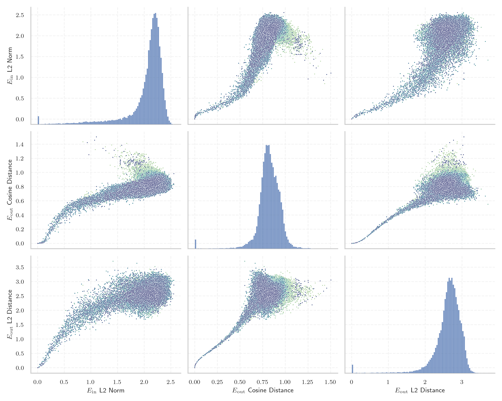
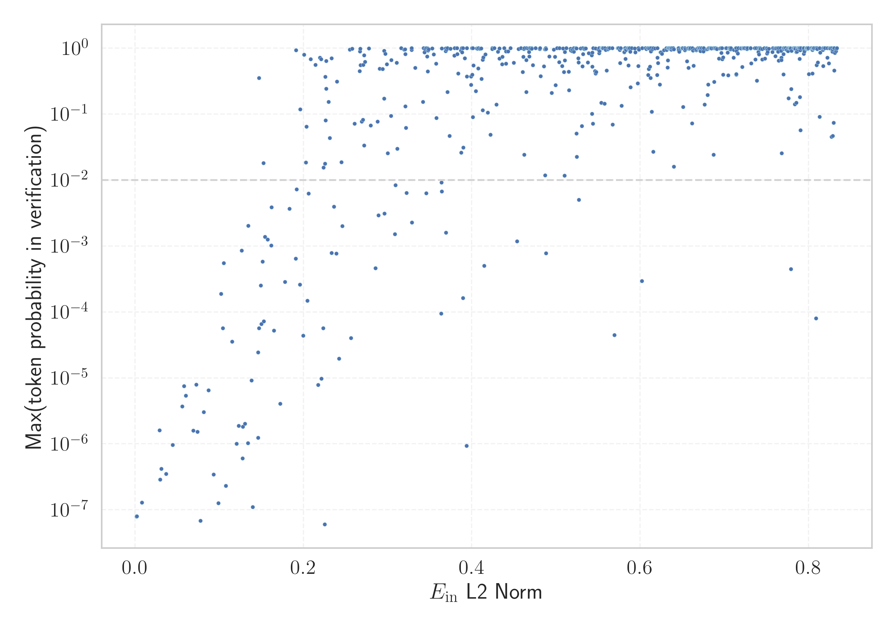

# Report for `microsoft/Phi-3.5-mini-instruct`

## Model info

* Model Info: 
  * Tied embeddings: False
  * LM head uses bias: False
  * Embeddings shape: [32064, 3072]
* Tokenizer Info: 
  * Vocab Size: 32011
  * Tokenizer Class: LlamaTokenizer
  * Tokenizer Type: BPE
  * Bytes handling: Byte Fallback
  * Token for verification prompt building: springframework
  * Token id for verification prompt building: 6688
* Indicator summary: 
  * Indicator for under-trained tokens: E_{in} L2 Norm
  * Overall distribution: 2.042 +/- 0.379
* Detected Token Counts: 
  * Number of tested under-trained tokens: 636, 633 non-special, 87 below p = 0.01 threshold, 53 below soft indicator threshold
  * Number of single byte tokens: 351, of which 110 below indicator threshold
  * Number of special tokens: 0, of which 0 below indicator threshold

## Under-trained token indicators plot


## Verification plot


## Under-trained token verification results
53 entries below threshold of 0.191

|   token_id | token                       |   indicator | max_prob                                                         | in_other_tokens                                                                 |
|------------|-----------------------------|-------------|------------------------------------------------------------------|---------------------------------------------------------------------------------|
|      27918 | ````` ▁Хронологија `````    |  0.0020083  | <span style='border: 1px solid rgb(169, 68, 66);'>8e-08</span>   |                                                                                 |
|      11804 | ````` Архівовано `````      |  0.00204477 | <span style='border: 1px solid rgb(169, 68, 66);'>7.9e-08</span> |                                                                                 |
|      16110 | ````` ▁Спољашње `````       |  0.00205848 | <span style='border: 1px solid rgb(169, 68, 66);'>8e-08</span>   |                                                                                 |
|      28574 | ````` ▁Mediabestanden ````` |  0.00816141 | <span style='border: 1px solid rgb(169, 68, 66);'>1.3e-07</span> |                                                                                 |
|      11766 | ````` хівовано `````        |  0.0291486  | <span style='border: 1px solid rgb(169, 68, 66);'>1.6e-06</span> | <span style='border: 1px solid rgb(169, 68, 66);'>````` Архівовано `````</span> |
|      20528 | ````` ▁autorytatywna `````  |  0.0300114  | <span style='border: 1px solid rgb(169, 68, 66);'>2.9e-07</span> |                                                                                 |
|      24294 | ````` Webachiv `````        |  0.0312532  | <span style='border: 1px solid rgb(169, 68, 66);'>4.2e-07</span> |                                                                                 |
|      21836 | ````` ▁надморској `````     |  0.037093   | <span style='border: 1px solid rgb(169, 68, 66);'>3.5e-07</span> |                                                                                 |
|      28653 | ````` ▁regnigaste `````     |  0.0449602  | <span style='border: 1px solid rgb(169, 68, 66);'>9.7e-07</span> |                                                                                 |
|      28649 | ````` ▁årsnederbörd `````   |  0.0560103  | <span style='border: 1px solid rgb(169, 68, 66);'>3.7e-06</span> |                                                                                 |
|      18051 | ````` ▁савезној `````       |  0.0583401  | <span style='border: 1px solid rgb(169, 68, 66);'>7.5e-06</span> |                                                                                 |
|      21673 | ````` ▁висини `````         |  0.0604344  | <span style='border: 1px solid rgb(169, 68, 66);'>5.4e-06</span> |                                                                                 |
|      20609 | ````` ▁Portály `````        |  0.0692194  | <span style='border: 1px solid rgb(169, 68, 66);'>1.6e-06</span> |                                                                                 |
|      28416 | ````` ▁Мексичка `````       |  0.072975   | <span style='border: 1px solid rgb(169, 68, 66);'>7.9e-06</span> |                                                                                 |
|      27914 | ````` ▁archiválva `````     |  0.0744049  | <span style='border: 1px solid rgb(169, 68, 66);'>1.5e-06</span> |                                                                                 |
|      26821 | ````` ▁Enllaços `````       |  0.0778059  | <span style='border: 1px solid rgb(169, 68, 66);'>6.9e-08</span> |                                                                                 |
|      23996 | ````` ▁живело `````         |  0.0817867  | <span style='border: 1px solid rgb(169, 68, 66);'>3e-06</span>   |                                                                                 |
|      16056 | ````` љашње `````           |  0.0874579  | <span style='border: 1px solid rgb(169, 68, 66);'>6.5e-06</span> | <span style='border: 1px solid rgb(169, 68, 66);'>````` ▁Спољашње `````</span>  |
|      27900 | ````` ▁eredetiből `````     |  0.09333    | <span style='border: 1px solid rgb(169, 68, 66);'>3.4e-07</span> |                                                                                 |
|      28354 | ````` ▁Расподела `````      |  0.0991035  | <span style='border: 1px solid rgb(169, 68, 66);'>1.3e-07</span> |                                                                                 |
<details><summary>33 additional entries below threshold</summary>

|   token_id | token                      |   indicator | max_prob                                                         | in_other_tokens                                                                                                                                                 |
|------------|----------------------------|-------------|------------------------------------------------------------------|-----------------------------------------------------------------------------------------------------------------------------------------------------------------|
|      22835 | ````` ▁муніципалі `````    |    0.102419 | <span style='border: 1px solid rgb(169, 68, 66);'>0.00019</span> |                                                                                                                                                                 |
|      20422 | ````` ніципалі `````       |    0.104534 | <span style='border: 1px solid rgb(169, 68, 66);'>5.7e-05</span> | <span style='border: 1px solid rgb(169, 68, 66);'>````` ▁муніципалі `````</span>                                                                                |
|      20486 | ````` tatywna `````        |    0.105312 | <span style='border: 1px solid rgb(169, 68, 66);'>0.00055</span> | <span style='border: 1px solid rgb(169, 68, 66);'>````` ▁autorytatywna `````</span>                                                                             |
|      26847 | ````` .:\u200a `````       |    0.107959 | <span style='border: 1px solid rgb(169, 68, 66);'>2.3e-07</span> |                                                                                                                                                                 |
|      24029 | ````` ▁Jegyzetek `````     |    0.115315 | <span style='border: 1px solid rgb(169, 68, 66);'>3.5e-05</span> |                                                                                                                                                                 |
|      27645 | ````` ▁Попис `````         |    0.12052  | <span style='border: 1px solid rgb(169, 68, 66);'>1e-06</span>   |                                                                                                                                                                 |
|      17981 | ````` ▁Externí `````       |    0.123353 | <span style='border: 1px solid rgb(169, 68, 66);'>1.9e-06</span> |                                                                                                                                                                 |
|      28623 | ````` ▁Genomsnitt `````    |    0.126617 | <span style='border: 1px solid rgb(169, 68, 66);'>0.00085</span> | <span style='border: 1px solid rgb(169, 68, 66);'>````` ▁Genomsnittlig `````</span>                                                                             |
|      22011 | ````` ▁насељу `````        |    0.127706 | <span style='border: 1px solid rgb(169, 68, 66);'>6e-07</span>   |                                                                                                                                                                 |
|      28642 | ````` ▁regnig `````        |    0.128057 | <span style='border: 1px solid rgb(169, 68, 66);'>1.8e-06</span> | <span style='border: 1px solid rgb(169, 68, 66);'>````` ▁regnigaste `````</span>                                                                                |
|       7784 | ````` ▁underarter `````    |    0.130677 | <span style='border: 1px solid rgb(169, 68, 66);'>2e-06</span>   |                                                                                                                                                                 |
|      28090 | ````` ▁Савезне `````       |    0.134002 | <span style='border: 1px solid rgb(169, 68, 66);'>1e-06</span>   |                                                                                                                                                                 |
|      19837 | ````` ▁Населення `````     |    0.134641 | <span style='border: 1px solid rgb(255, 145, 0);'>0.002</span>   |                                                                                                                                                                 |
|       7651 | ````` ▁släktet `````       |    0.138297 | <span style='border: 1px solid rgb(169, 68, 66);'>9.2e-06</span> |                                                                                                                                                                 |
|      26734 | ````` ▁Årsmed `````        |    0.139852 | <span style='border: 1px solid rgb(169, 68, 66);'>1.1e-07</span> |                                                                                                                                                                 |
|      20739 | ````` ▁надмор `````        |    0.146287 | <span style='border: 1px solid rgb(169, 68, 66);'>1.2e-06</span> | <span style='border: 1px solid rgb(169, 68, 66);'>````` ▁надморској `````</span>                                                                                |
|      24631 | ````` ▁Források `````      |    0.146353 | <span style='border: 1px solid rgb(169, 68, 66);'>2.4e-05</span> |                                                                                                                                                                 |
|       9462 | ````` Hozzáférés `````     |    0.147194 | <span style='border: 1px solid rgb(40, 167, 69);'>0.35</span>    |                                                                                                                                                                 |
|      28647 | ````` ▁torraste `````      |    0.147393 | <span style='border: 1px solid rgb(169, 68, 66);'>5.7e-05</span> |                                                                                                                                                                 |
|      23406 | ````` ▁општини `````       |    0.149424 | <span style='border: 1px solid rgb(169, 68, 66);'>0.00025</span> |                                                                                                                                                                 |
|      11229 | ````` ▁становника `````    |    0.150174 | <span style='border: 1px solid rgb(169, 68, 66);'>6.6e-05</span> |                                                                                                                                                                 |
|      23654 | ````` ▁dátummal `````      |    0.151579 | <span style='border: 1px solid rgb(169, 68, 66);'>0.00058</span> |                                                                                                                                                                 |
|      14562 | ````` ▁Посилання `````     |    0.152758 | <span style='border: 1px solid rgb(251, 189, 8);'>0.018</span>   |                                                                                                                                                                 |
|      28650 | ````` ▁Genomsnittlig ````` |    0.152887 | <span style='border: 1px solid rgb(169, 68, 66);'>7.2e-05</span> |                                                                                                                                                                 |
|      28263 | ````` ▁Odkazy `````        |    0.154312 | <span style='border: 1px solid rgb(255, 145, 0);'>0.0014</span>  |                                                                                                                                                                 |
|      23875 | ````` ▁Насеље `````        |    0.157526 | <span style='border: 1px solid rgb(255, 145, 0);'>0.0013</span>  |                                                                                                                                                                 |
|      24971 | ````` ▁Джерела `````       |    0.161929 | <span style='border: 1px solid rgb(255, 145, 0);'>0.001</span>   |                                                                                                                                                                 |
|      28633 | ````` nederbörd `````      |    0.162271 | <span style='border: 1px solid rgb(255, 145, 0);'>0.0039</span>  | <span style='border: 1px solid rgb(169, 68, 66);'>````` ▁årsnederbörd `````</span>                                                                              |
|      23726 | ````` ▁насеља `````        |    0.165142 | <span style='border: 1px solid rgb(169, 68, 66);'>5.2e-05</span> |                                                                                                                                                                 |
|      18044 | ````` ▁Становништво `````  |    0.172487 | <span style='border: 1px solid rgb(169, 68, 66);'>4e-06</span>   |                                                                                                                                                                 |
|      25840 | ````` ▁државе `````        |    0.178296 | <span style='border: 1px solid rgb(169, 68, 66);'>0.00028</span> |                                                                                                                                                                 |
|      18140 | ````` rinningsområ `````   |    0.183606 | <span style='border: 1px solid rgb(255, 145, 0);'>0.0037</span>  |                                                                                                                                                                 |
|      18676 | ````` ніципа `````         |    0.191077 | <span style='border: 1px solid rgb(169, 68, 66);'>0.00064</span> | <span style='border: 1px solid rgb(169, 68, 66);'>````` ніципалі `````</span>, <span style='border: 1px solid rgb(169, 68, 66);'>````` ▁муніципалі `````</span> |
</details>
<details><summary>580 additional entries above threshold</summary>

|   token_id | token                      |   indicator | max_prob                                                         | in_other_tokens                                                                                                                                                                                                                                                                                                                                                                                           |
|------------|----------------------------|-------------|------------------------------------------------------------------|-----------------------------------------------------------------------------------------------------------------------------------------------------------------------------------------------------------------------------------------------------------------------------------------------------------------------------------------------------------------------------------------------------------|
|      24291 | ````` IABot `````          |    0.191329 | <span style='border: 1px solid rgb(40, 167, 69);'>0.93</span>    |                                                                                                                                                                                                                                                                                                                                                                                                           |
|      27610 | ````` ▁gminie `````        |    0.192155 | <span style='border: 1px solid rgb(255, 145, 0);'>0.0072</span>  |                                                                                                                                                                                                                                                                                                                                                                                                           |
|      16916 | ````` ▁invån `````         |    0.19605  | <span style='border: 1px solid rgb(169, 68, 66);'>0.00026</span> | <span style='border: 1px solid rgb(40, 167, 69);'>````` ▁invånare `````</span>                                                                                                                                                                                                                                                                                                                            |
|      20645 | ````` ▁Przypisy `````      |    0.19625  | <span style='border: 1px solid rgb(40, 167, 69);'>0.12</span>    |                                                                                                                                                                                                                                                                                                                                                                                                           |
|      23117 | ````` brázky `````         |    0.199934 | <span style='border: 1px solid rgb(169, 68, 66);'>4.3e-05</span> | <span style='border: 1px solid rgb(251, 189, 8);'>````` Obrázky `````</span>                                                                                                                                                                                                                                                                                                                              |
|      23715 | ````` ▁Källor `````        |    0.200886 | <span style='border: 1px solid rgb(40, 167, 69);'>0.79</span>    |                                                                                                                                                                                                                                                                                                                                                                                                           |
|      20180 | ````` ▁Мексику `````       |    0.202885 | <span style='border: 1px solid rgb(251, 189, 8);'>0.018</span>   |                                                                                                                                                                                                                                                                                                                                                                                                           |
|      22768 | ````` ▁жовт `````          |    0.203854 | <span style='border: 1px solid rgb(251, 189, 8);'>0.065</span>   | <span style='border: 1px solid rgb(40, 167, 69);'>````` ▁жовтня `````</span>                                                                                                                                                                                                                                                                                                                              |
|      17916 | ````` abestanden `````     |    0.204828 | <span style='border: 1px solid rgb(169, 68, 66);'>0.00015</span> | <span style='border: 1px solid rgb(169, 68, 66);'>````` ▁Mediabestanden `````</span>                                                                                                                                                                                                                                                                                                                      |
|      12731 | ````` ederbörd `````       |    0.206319 | <span style='border: 1px solid rgb(255, 145, 0);'>0.0063</span>  | <span style='border: 1px solid rgb(40, 167, 69);'>````` ▁nederbörd `````</span>, <span style='border: 1px solid rgb(255, 145, 0);'>````` nederbörd `````</span>, <span style='border: 1px solid rgb(169, 68, 66);'>````` ▁årsnederbörd `````</span>                                                                                                                                                       |
|      25283 | ````` ▁липня `````         |    0.208777 | <span style='border: 1px solid rgb(40, 167, 69);'>0.68</span>    |                                                                                                                                                                                                                                                                                                                                                                                                           |
|      24309 | ````` ▁чемпі `````         |    0.214511 | <span style='border: 1px solid rgb(40, 167, 69);'>0.56</span>    |                                                                                                                                                                                                                                                                                                                                                                                                           |
|       7718 | ````` ▁beskrevs `````      |    0.217395 | <span style='border: 1px solid rgb(169, 68, 66);'>7.8e-06</span> |                                                                                                                                                                                                                                                                                                                                                                                                           |
|      24852 | ````` ▁грудня `````        |    0.219545 | <span style='border: 1px solid rgb(40, 167, 69);'>0.71</span>    |                                                                                                                                                                                                                                                                                                                                                                                                           |
|      28791 | ````` ▁віці `````          |    0.220908 | <span style='border: 1px solid rgb(40, 167, 69);'>0.68</span>    |                                                                                                                                                                                                                                                                                                                                                                                                           |
|      24401 | ````` ▁подацима `````      |    0.221376 | <span style='border: 1px solid rgb(169, 68, 66);'>9.8e-06</span> |                                                                                                                                                                                                                                                                                                                                                                                                           |
|      27061 | ````` ▁Резултати `````     |    0.22353  | <span style='border: 1px solid rgb(169, 68, 66);'>5.7e-05</span> |                                                                                                                                                                                                                                                                                                                                                                                                           |
|      18328 | ````` ▁trakten `````       |    0.224033 | <span style='border: 1px solid rgb(251, 189, 8);'>0.015</span>   |                                                                                                                                                                                                                                                                                                                                                                                                           |
|      26011 | ````` ▁Архивная `````      |    0.22543  | <span style='border: 1px solid rgb(169, 68, 66);'>6e-08</span>   |                                                                                                                                                                                                                                                                                                                                                                                                           |
|      24097 | ````` ▁huvudstaden `````   |    0.2256   | <span style='border: 1px solid rgb(251, 189, 8);'>0.018</span>   |                                                                                                                                                                                                                                                                                                                                                                                                           |
|      26527 | ````` ▁червня `````        |    0.226185 | <span style='border: 1px solid rgb(40, 167, 69);'>0.37</span>    |                                                                                                                                                                                                                                                                                                                                                                                                           |
|      23313 | ````` Obrázky `````        |    0.22649  | <span style='border: 1px solid rgb(251, 189, 8);'>0.08</span>    |                                                                                                                                                                                                                                                                                                                                                                                                           |
|      25460 | ````` ▁жовтня `````        |    0.227005 | <span style='border: 1px solid rgb(40, 167, 69);'>0.24</span>    |                                                                                                                                                                                                                                                                                                                                                                                                           |
|      26502 | ````` ▁вересня `````       |    0.2272   | <span style='border: 1px solid rgb(40, 167, 69);'>0.63</span>    |                                                                                                                                                                                                                                                                                                                                                                                                           |
|      25696 | ````` ▁роках `````         |    0.229964 | <span style='border: 1px solid rgb(40, 167, 69);'>0.15</span>    |                                                                                                                                                                                                                                                                                                                                                                                                           |
|      25528 | ````` ▁серпня `````        |    0.231363 | <span style='border: 1px solid rgb(251, 189, 8);'>0.043</span>   |                                                                                                                                                                                                                                                                                                                                                                                                           |
|      26334 | ````` ▁квітня `````        |    0.233339 | <span style='border: 1px solid rgb(40, 167, 69);'>0.7</span>     |                                                                                                                                                                                                                                                                                                                                                                                                           |
|      14414 | ````` ▁Archivlink `````    |    0.233569 | <span style='border: 1px solid rgb(169, 68, 66);'>0.00079</span> |                                                                                                                                                                                                                                                                                                                                                                                                           |
|      26782 | ````` ▁пописа `````        |    0.23646  | <span style='border: 1px solid rgb(255, 145, 0);'>0.0039</span>  |                                                                                                                                                                                                                                                                                                                                                                                                           |
|      26675 | ````` ▁kallaste `````      |    0.239114 | <span style='border: 1px solid rgb(169, 68, 66);'>0.00076</span> |                                                                                                                                                                                                                                                                                                                                                                                                           |
|      23015 | ````` ▁tématu `````        |    0.239811 | <span style='border: 1px solid rgb(40, 167, 69);'>0.31</span>    |                                                                                                                                                                                                                                                                                                                                                                                                           |
|      19196 | ````` ▁Према `````         |    0.242259 | <span style='border: 1px solid rgb(169, 68, 66);'>2e-05</span>   |                                                                                                                                                                                                                                                                                                                                                                                                           |
|      28365 | ````` ▁розташ `````        |    0.245107 | <span style='border: 1px solid rgb(251, 189, 8);'>0.019</span>   |                                                                                                                                                                                                                                                                                                                                                                                                           |
|      26964 | ````` ▁Хронологи `````     |    0.246246 | <span style='border: 1px solid rgb(255, 145, 0);'>0.002</span>   | <span style='border: 1px solid rgb(169, 68, 66);'>````` ▁Хронологија `````</span>                                                                                                                                                                                                                                                                                                                         |
|      25145 | ````` ▁kwiet `````         |    0.255244 | <span style='border: 1px solid rgb(40, 167, 69);'>0.95</span>    | <span style='border: 1px solid rgb(40, 167, 69);'>````` ▁kwietnia `````</span>                                                                                                                                                                                                                                                                                                                            |
|      26662 | ````` ▁varmaste `````      |    0.256704 | <span style='border: 1px solid rgb(169, 68, 66);'>4e-05</span>   |                                                                                                                                                                                                                                                                                                                                                                                                           |
|      28906 | ````` ▁листопада `````     |    0.258143 | <span style='border: 1px solid rgb(40, 167, 69);'>0.98</span>    |                                                                                                                                                                                                                                                                                                                                                                                                           |
|      20568 | ````` ▁сайті `````         |    0.260824 | <span style='border: 1px solid rgb(251, 189, 8);'>0.072</span>   |                                                                                                                                                                                                                                                                                                                                                                                                           |
|      28498 | ````` ▁лютого `````        |    0.2668   | <span style='border: 1px solid rgb(40, 167, 69);'>0.45</span>    |                                                                                                                                                                                                                                                                                                                                                                                                           |
|      29451 | ````` ▁piłkar `````        |    0.267281 | <span style='border: 1px solid rgb(40, 167, 69);'>0.89</span>    |                                                                                                                                                                                                                                                                                                                                                                                                           |
|      21284 | ````` ▁березня `````       |    0.267482 | <span style='border: 1px solid rgb(40, 167, 69);'>0.97</span>    |                                                                                                                                                                                                                                                                                                                                                                                                           |
|      24576 | ````` ▁estaven `````       |    0.268029 | <span style='border: 1px solid rgb(40, 167, 69);'>0.55</span>    |                                                                                                                                                                                                                                                                                                                                                                                                           |
|      23767 | ````` egyzetek `````       |    0.269409 | <span style='border: 1px solid rgb(251, 189, 8);'>0.077</span>   | <span style='border: 1px solid rgb(169, 68, 66);'>````` ▁Jegyzetek `````</span>                                                                                                                                                                                                                                                                                                                           |
|       3798 | ````` oreferrer `````      |    0.270898 | <span style='border: 1px solid rgb(251, 189, 8);'>0.082</span>   | ````` ▁noreferrer `````, ````` noreferrer `````                                                                                                                                                                                                                                                                                                                                                           |
|      24675 | ````` ▁mistrzost `````     |    0.2712   | <span style='border: 1px solid rgb(40, 167, 69);'>0.56</span>    |                                                                                                                                                                                                                                                                                                                                                                                                           |
|      27513 | ````` ▁півден `````        |    0.272201 | <span style='border: 1px solid rgb(40, 167, 69);'>0.78</span>    |                                                                                                                                                                                                                                                                                                                                                                                                           |
|      23217 | ````` ▁zvuky `````         |    0.272308 | <span style='border: 1px solid rgb(251, 189, 8);'>0.033</span>   |                                                                                                                                                                                                                                                                                                                                                                                                           |
|      24708 | ````` ▁січня `````         |    0.27323  | <span style='border: 1px solid rgb(40, 167, 69);'>0.62</span>    |                                                                                                                                                                                                                                                                                                                                                                                                           |
|      31899 | ````` ⥤ `````              |    0.277672 | <span style='border: 1px solid rgb(40, 167, 69);'>0.99</span>    |                                                                                                                                                                                                                                                                                                                                                                                                           |
|      10688 | ````` ▁gepublic `````      |    0.279831 | <span style='border: 1px solid rgb(251, 189, 8);'>0.067</span>   | <span style='border: 1px solid rgb(40, 167, 69);'>````` ▁gepubliceerd `````</span>                                                                                                                                                                                                                                                                                                                        |
|      29640 | ````` ▁powiecie `````      |    0.285618 | <span style='border: 1px solid rgb(169, 68, 66);'>0.00046</span> |                                                                                                                                                                                                                                                                                                                                                                                                           |
|       9147 | ````` ozzáférés `````      |    0.288273 | <span style='border: 1px solid rgb(251, 189, 8);'>0.077</span>   | <span style='border: 1px solid rgb(40, 167, 69);'>````` Hozzáférés `````</span>                                                                                                                                                                                                                                                                                                                           |
|      27660 | ````` ckså `````           |    0.289288 | <span style='border: 1px solid rgb(255, 145, 0);'>0.0029</span>  | ````` ▁också `````                                                                                                                                                                                                                                                                                                                                                                                        |
|      26335 | ````` llaços `````         |    0.290578 | <span style='border: 1px solid rgb(40, 167, 69);'>0.48</span>    | <span style='border: 1px solid rgb(169, 68, 66);'>````` ▁Enllaços `````</span>                                                                                                                                                                                                                                                                                                                            |
|      21887 | ````` ▁складі `````        |    0.294191 | <span style='border: 1px solid rgb(40, 167, 69);'>0.48</span>    |                                                                                                                                                                                                                                                                                                                                                                                                           |
|      16194 | ````` ▁Биография `````     |    0.295798 | <span style='border: 1px solid rgb(40, 167, 69);'>0.17</span>    |                                                                                                                                                                                                                                                                                                                                                                                                           |
|      27646 | ````` ▁július `````        |    0.29599  | <span style='border: 1px solid rgb(40, 167, 69);'>0.91</span>    |                                                                                                                                                                                                                                                                                                                                                                                                           |
|      13297 | ````` ісля `````           |    0.296236 | <span style='border: 1px solid rgb(255, 145, 0);'>0.0031</span>  | <span style='border: 1px solid rgb(40, 167, 69);'>````` ▁після `````</span>, <span style='border: 1px solid rgb(40, 167, 69);'>````` ▁Після `````</span>                                                                                                                                                                                                                                                  |
|      28182 | ````` ▁півні `````         |    0.297184 | <span style='border: 1px solid rgb(40, 167, 69);'>0.81</span>    |                                                                                                                                                                                                                                                                                                                                                                                                           |
|      22744 | ````` ▁település `````     |    0.298939 | <span style='border: 1px solid rgb(40, 167, 69);'>0.57</span>    |                                                                                                                                                                                                                                                                                                                                                                                                           |
|      17391 | ````` ▁савез `````         |    0.30014  | <span style='border: 1px solid rgb(251, 189, 8);'>0.026</span>   | <span style='border: 1px solid rgb(169, 68, 66);'>````` ▁савезној `````</span>                                                                                                                                                                                                                                                                                                                            |
|      11193 | ````` ▁Normdaten `````     |    0.304165 | <span style='border: 1px solid rgb(251, 189, 8);'>0.093</span>   |                                                                                                                                                                                                                                                                                                                                                                                                           |
|      22018 | ````` ▁wrześ `````         |    0.304341 | <span style='border: 1px solid rgb(40, 167, 69);'>0.66</span>    | <span style='border: 1px solid rgb(40, 167, 69);'>````` ▁września `````</span>                                                                                                                                                                                                                                                                                                                            |
|      16068 | ````` eltemperaturen ````` |    0.308664 | <span style='border: 1px solid rgb(255, 145, 0);'>0.0015</span>  |                                                                                                                                                                                                                                                                                                                                                                                                           |
|      17398 | ````` ништво `````         |    0.309336 | <span style='border: 1px solid rgb(255, 145, 0);'>0.0084</span>  | <span style='border: 1px solid rgb(169, 68, 66);'>````` ▁Становништво `````</span>                                                                                                                                                                                                                                                                                                                        |
|      27191 | ````` ▁szeptember `````    |    0.310715 | <span style='border: 1px solid rgb(40, 167, 69);'>0.6</span>     |                                                                                                                                                                                                                                                                                                                                                                                                           |
|      26194 | ````` ▁Савез `````         |    0.31155  | <span style='border: 1px solid rgb(251, 189, 8);'>0.03</span>    | <span style='border: 1px solid rgb(169, 68, 66);'>````` ▁Савезне `````</span>                                                                                                                                                                                                                                                                                                                             |
|      28044 | ````` ▁округу `````        |    0.316254 | <span style='border: 1px solid rgb(40, 167, 69);'>0.99</span>    |                                                                                                                                                                                                                                                                                                                                                                                                           |
|      26641 | ````` ▁Мексика `````       |    0.319601 | <span style='border: 1px solid rgb(40, 167, 69);'>0.95</span>    |                                                                                                                                                                                                                                                                                                                                                                                                           |
|      25069 | ````` $}}% `````           |    0.320673 | <span style='border: 1px solid rgb(40, 167, 69);'>0.96</span>    |                                                                                                                                                                                                                                                                                                                                                                                                           |
|      25726 | ````` ▁травня `````        |    0.320945 | <span style='border: 1px solid rgb(40, 167, 69);'>0.81</span>    |                                                                                                                                                                                                                                                                                                                                                                                                           |
|      12867 | ````` лання `````          |    0.321098 | <span style='border: 1px solid rgb(40, 167, 69);'>0.13</span>    | <span style='border: 1px solid rgb(40, 167, 69);'>````` силання `````</span>, <span style='border: 1px solid rgb(251, 189, 8);'>````` ▁Посилання `````</span>                                                                                                                                                                                                                                             |
|      23795 | ````` ▁paździer `````      |    0.321844 | <span style='border: 1px solid rgb(251, 189, 8);'>0.062</span>   | <span style='border: 1px solid rgb(40, 167, 69);'>````` ▁października `````</span>                                                                                                                                                                                                                                                                                                                        |
|       9831 | ````` ▁челов `````         |    0.322466 | <span style='border: 1px solid rgb(255, 145, 0);'>0.0063</span>  | ````` ▁человек `````, ````` ▁челове `````, ````` ▁человека `````                                                                                                                                                                                                                                                                                                                                          |
|      18596 | ````` ципа `````           |    0.328473 | <span style='border: 1px solid rgb(40, 167, 69);'>0.94</span>    | <span style='border: 1px solid rgb(169, 68, 66);'>````` ніципа `````</span>, <span style='border: 1px solid rgb(169, 68, 66);'>````` ніципалі `````</span>, <span style='border: 1px solid rgb(169, 68, 66);'>````` ▁муніципалі `````</span>, <span style='border: 1px solid rgb(169, 68, 66);'>````` ниципа `````</span>, <span style='border: 1px solid rgb(40, 167, 69);'>````` ▁муниципа `````</span> |
|      17871 | ````` ▁odkazy `````        |    0.328567 | <span style='border: 1px solid rgb(40, 167, 69);'>1</span>       |                                                                                                                                                                                                                                                                                                                                                                                                           |
|      17828 | ````` ▁држави `````        |    0.32897  | <span style='border: 1px solid rgb(255, 145, 0);'>0.0023</span>  |                                                                                                                                                                                                                                                                                                                                                                                                           |
|      23910 | ````` ритор `````          |    0.332785 | <span style='border: 1px solid rgb(40, 167, 69);'>0.5</span>     | <span style='border: 1px solid rgb(40, 167, 69);'>````` ▁територ `````</span>                                                                                                                                                                                                                                                                                                                             |
|      17076 | ````` ▁invånare `````      |    0.341991 | <span style='border: 1px solid rgb(40, 167, 69);'>0.15</span>    |                                                                                                                                                                                                                                                                                                                                                                                                           |
|      15871 | ````` ▁везе `````          |    0.342899 | <span style='border: 1px solid rgb(40, 167, 69);'>1</span>       |                                                                                                                                                                                                                                                                                                                                                                                                           |
|      17835 | ````` ▁Станов `````        |    0.343792 | <span style='border: 1px solid rgb(40, 167, 69);'>0.86</span>    | <span style='border: 1px solid rgb(169, 68, 66);'>````` ▁Становништво `````</span>                                                                                                                                                                                                                                                                                                                        |
|      25563 | ````` ▁Після `````         |    0.344491 | <span style='border: 1px solid rgb(40, 167, 69);'>0.96</span>    |                                                                                                                                                                                                                                                                                                                                                                                                           |
|      22551 | ````` ▁квіт `````          |    0.345948 | <span style='border: 1px solid rgb(40, 167, 69);'>1</span>       | <span style='border: 1px solid rgb(40, 167, 69);'>````` ▁квітня `````</span>                                                                                                                                                                                                                                                                                                                              |
|      23441 | ````` któber `````         |    0.34601  | <span style='border: 1px solid rgb(255, 145, 0);'>0.0063</span>  | <span style='border: 1px solid rgb(40, 167, 69);'>````` ▁október `````</span>                                                                                                                                                                                                                                                                                                                             |
|      14572 | ````` шње `````            |    0.347111 | <span style='border: 1px solid rgb(40, 167, 69);'>0.74</span>    | <span style='border: 1px solid rgb(169, 68, 66);'>````` љашње `````</span>, <span style='border: 1px solid rgb(169, 68, 66);'>````` ▁Спољашње `````</span>                                                                                                                                                                                                                                                |
|      27124 | ````` ▁sierpnia `````      |    0.347698 | <span style='border: 1px solid rgb(40, 167, 69);'>0.44</span>    |                                                                                                                                                                                                                                                                                                                                                                                                           |
|      28187 | ````` ▁április `````       |    0.347856 | <span style='border: 1px solid rgb(40, 167, 69);'>0.99</span>    |                                                                                                                                                                                                                                                                                                                                                                                                           |
|      22945 | ````` ▁január `````        |    0.348139 | <span style='border: 1px solid rgb(40, 167, 69);'>0.92</span>    |                                                                                                                                                                                                                                                                                                                                                                                                           |
|      21858 | ````` archiviato `````     |    0.348749 | <span style='border: 1px solid rgb(40, 167, 69);'>0.96</span>    |                                                                                                                                                                                                                                                                                                                                                                                                           |
|      24605 | ````` ▁március `````       |    0.352924 | <span style='border: 1px solid rgb(40, 167, 69);'>0.98</span>    |                                                                                                                                                                                                                                                                                                                                                                                                           |
|      28535 | ````` ▁február `````       |    0.354832 | <span style='border: 1px solid rgb(40, 167, 69);'>0.8</span>     |                                                                                                                                                                                                                                                                                                                                                                                                           |
|      19735 | ````` ▁розта `````         |    0.357795 | <span style='border: 1px solid rgb(40, 167, 69);'>0.58</span>    | <span style='border: 1px solid rgb(251, 189, 8);'>````` ▁розташ `````</span>                                                                                                                                                                                                                                                                                                                              |
|      16651 | ````` ▁månaden `````       |    0.357839 | <span style='border: 1px solid rgb(251, 189, 8);'>0.087</span>   |                                                                                                                                                                                                                                                                                                                                                                                                           |
|      19539 | ````` ▁demsel `````        |    0.363558 | <span style='border: 1px solid rgb(169, 68, 66);'>9.4e-05</span> | ````` ▁demselben `````                                                                                                                                                                                                                                                                                                                                                                                    |
|       8061 | ````` ▁године `````        |    0.363987 | <span style='border: 1px solid rgb(255, 145, 0);'>0.0091</span>  |                                                                                                                                                                                                                                                                                                                                                                                                           |
|      25564 | ````` ▁броја `````         |    0.364288 | <span style='border: 1px solid rgb(255, 145, 0);'>0.0067</span>  |                                                                                                                                                                                                                                                                                                                                                                                                           |
|      26457 | ````` ▁május `````         |    0.36431  | <span style='border: 1px solid rgb(40, 167, 69);'>0.99</span>    |                                                                                                                                                                                                                                                                                                                                                                                                           |
|      27071 | ````` ▁Історія `````       |    0.368878 | <span style='border: 1px solid rgb(40, 167, 69);'>0.99</span>    |                                                                                                                                                                                                                                                                                                                                                                                                           |
|      26908 | ````` ▁lipca `````         |    0.368907 | <span style='border: 1px solid rgb(40, 167, 69);'>0.9</span>     |                                                                                                                                                                                                                                                                                                                                                                                                           |
|      25229 | ````` лтати `````          |    0.369317 | <span style='border: 1px solid rgb(255, 145, 0);'>0.0016</span>  | <span style='border: 1px solid rgb(169, 68, 66);'>````` ▁Резултати `````</span>                                                                                                                                                                                                                                                                                                                           |
|      29162 | ````` ▁сельсов `````       |    0.370155 | <span style='border: 1px solid rgb(40, 167, 69);'>0.94</span>    |                                                                                                                                                                                                                                                                                                                                                                                                           |
|      15653 | ````` ској `````           |    0.371193 | <span style='border: 1px solid rgb(40, 167, 69);'>0.21</span>    | <span style='border: 1px solid rgb(169, 68, 66);'>````` ▁надморској `````</span>                                                                                                                                                                                                                                                                                                                          |
|      23939 | ````` ▁Див `````           |    0.371287 | <span style='border: 1px solid rgb(40, 167, 69);'>1</span>       |                                                                                                                                                                                                                                                                                                                                                                                                           |
|      15412 | ````` ▁zewnętrzne `````    |    0.37363  | <span style='border: 1px solid rgb(251, 189, 8);'>0.046</span>   |                                                                                                                                                                                                                                                                                                                                                                                                           |
|      29079 | ````` ▁augusztus `````     |    0.374698 | <span style='border: 1px solid rgb(40, 167, 69);'>0.98</span>    |                                                                                                                                                                                                                                                                                                                                                                                                           |
|      23882 | ````` ▁október `````       |    0.379173 | <span style='border: 1px solid rgb(40, 167, 69);'>0.77</span>    |                                                                                                                                                                                                                                                                                                                                                                                                           |
|      28294 | ````` usztus `````         |    0.379498 | <span style='border: 1px solid rgb(40, 167, 69);'>0.99</span>    | <span style='border: 1px solid rgb(40, 167, 69);'>````` ▁augusztus `````</span>                                                                                                                                                                                                                                                                                                                           |
|      26867 | ````` ▁збір `````          |    0.382306 | <span style='border: 1px solid rgb(40, 167, 69);'>0.99</span>    |                                                                                                                                                                                                                                                                                                                                                                                                           |
|      29404 | ````` ▁lutego `````        |    0.38297  | <span style='border: 1px solid rgb(40, 167, 69);'>0.81</span>    |                                                                                                                                                                                                                                                                                                                                                                                                           |
|       8554 | ````` ▁році `````          |    0.383945 | <span style='border: 1px solid rgb(40, 167, 69);'>0.41</span>    |                                                                                                                                                                                                                                                                                                                                                                                                           |
|      28531 | ````` ▁війни `````         |    0.387178 | <span style='border: 1px solid rgb(40, 167, 69);'>0.92</span>    |                                                                                                                                                                                                                                                                                                                                                                                                           |
|      16910 | ````` ▁општи `````         |    0.387375 | <span style='border: 1px solid rgb(251, 189, 8);'>0.026</span>   | <span style='border: 1px solid rgb(169, 68, 66);'>````` ▁општини `````</span>                                                                                                                                                                                                                                                                                                                             |
|      23105 | ````` ▁videa `````         |    0.387986 | <span style='border: 1px solid rgb(40, 167, 69);'>1</span>       |                                                                                                                                                                                                                                                                                                                                                                                                           |
|      27376 | ````` лії `````            |    0.38855  | <span style='border: 1px solid rgb(40, 167, 69);'>0.86</span>    |                                                                                                                                                                                                                                                                                                                                                                                                           |
|      28729 | ````` ▁június `````        |    0.389446 | <span style='border: 1px solid rgb(40, 167, 69);'>0.99</span>    |                                                                                                                                                                                                                                                                                                                                                                                                           |
|      14503 | ````` ▁насеље `````        |    0.38966  | <span style='border: 1px solid rgb(169, 68, 66);'>0.00016</span> |                                                                                                                                                                                                                                                                                                                                                                                                           |
|      17270 | ````` ▁налази `````        |    0.389974 | <span style='border: 1px solid rgb(251, 189, 8);'>0.031</span>   |                                                                                                                                                                                                                                                                                                                                                                                                           |
|      26146 | ````` фіцій `````          |    0.391757 | <span style='border: 1px solid rgb(40, 167, 69);'>0.7</span>     |                                                                                                                                                                                                                                                                                                                                                                                                           |
|      15887 | ````` ▁још `````           |    0.393944 | <span style='border: 1px solid rgb(169, 68, 66);'>9.4e-07</span> |                                                                                                                                                                                                                                                                                                                                                                                                           |
|      10168 | ````` ▁Мекси `````         |    0.394032 | <span style='border: 1px solid rgb(40, 167, 69);'>0.37</span>    | <span style='border: 1px solid rgb(251, 189, 8);'>````` ▁Мексику `````</span>, <span style='border: 1px solid rgb(40, 167, 69);'>````` ▁Мексика `````</span>, <span style='border: 1px solid rgb(169, 68, 66);'>````` ▁Мексичка `````</span>                                                                                                                                                              |
|      12882 | ````` ITableView `````     |    0.394295 | <span style='border: 1px solid rgb(40, 167, 69);'>1</span>       | ````` ▁UITableView `````, ````` UITableView `````                                                                                                                                                                                                                                                                                                                                                         |
|      26773 | ````` ▁című `````          |    0.39902  | <span style='border: 1px solid rgb(40, 167, 69);'>0.37</span>    |                                                                                                                                                                                                                                                                                                                                                                                                           |
|      11635 | ````` ▁држа `````          |    0.399216 | <span style='border: 1px solid rgb(40, 167, 69);'>0.28</span>    | <span style='border: 1px solid rgb(255, 145, 0);'>````` ▁држави `````</span>, <span style='border: 1px solid rgb(169, 68, 66);'>````` ▁државе `````</span>                                                                                                                                                                                                                                                |
|      20798 | ````` ▁жов `````           |    0.400224 | <span style='border: 1px solid rgb(40, 167, 69);'>1</span>       | <span style='border: 1px solid rgb(251, 189, 8);'>````` ▁жовт `````</span>, <span style='border: 1px solid rgb(40, 167, 69);'>````` ▁жовтня `````</span>                                                                                                                                                                                                                                                  |
|      26643 | ````` ▁października `````  |    0.400691 | <span style='border: 1px solid rgb(40, 167, 69);'>0.39</span>    |                                                                                                                                                                                                                                                                                                                                                                                                           |
|      18030 | ````` ▁nyelven `````       |    0.401134 | <span style='border: 1px solid rgb(251, 189, 8);'>0.09</span>    |                                                                                                                                                                                                                                                                                                                                                                                                           |
|      29146 | ````` ▁філь `````          |    0.401354 | <span style='border: 1px solid rgb(40, 167, 69);'>1</span>       |                                                                                                                                                                                                                                                                                                                                                                                                           |
|      31664 | ````` ߬ `````               |    0.401883 | <span style='border: 1px solid rgb(40, 167, 69);'>0.55</span>    |                                                                                                                                                                                                                                                                                                                                                                                                           |
|      13243 | ````` ▁länkar `````        |    0.404967 | <span style='border: 1px solid rgb(40, 167, 69);'>0.22</span>    |                                                                                                                                                                                                                                                                                                                                                                                                           |
|      24696 | ````` ▁рік `````           |    0.405748 | <span style='border: 1px solid rgb(40, 167, 69);'>0.99</span>    |                                                                                                                                                                                                                                                                                                                                                                                                           |
|      25248 | ````` xtart `````          |    0.407051 | <span style='border: 1px solid rgb(40, 167, 69);'>0.98</span>    |                                                                                                                                                                                                                                                                                                                                                                                                           |
|      26444 | ````` ▁czerwca `````       |    0.407574 | <span style='border: 1px solid rgb(40, 167, 69);'>0.49</span>    |                                                                                                                                                                                                                                                                                                                                                                                                           |
|      25191 | ````` ▁міста `````         |    0.408152 | <span style='border: 1px solid rgb(40, 167, 69);'>1</span>       |                                                                                                                                                                                                                                                                                                                                                                                                           |
|      13765 | ````` ▁пів `````           |    0.409752 | <span style='border: 1px solid rgb(40, 167, 69);'>0.98</span>    | <span style='border: 1px solid rgb(40, 167, 69);'>````` ▁півден `````</span>, <span style='border: 1px solid rgb(40, 167, 69);'>````` ▁півні `````</span>                                                                                                                                                                                                                                                 |
|      15242 | ````` ▁населення `````     |    0.411075 | <span style='border: 1px solid rgb(40, 167, 69);'>0.99</span>    |                                                                                                                                                                                                                                                                                                                                                                                                           |
|      24002 | ````` ▁stycznia `````      |    0.411436 | <span style='border: 1px solid rgb(40, 167, 69);'>0.34</span>    |                                                                                                                                                                                                                                                                                                                                                                                                           |
|      18675 | ````` ▁població `````      |    0.413109 | <span style='border: 1px solid rgb(40, 167, 69);'>0.11</span>    |                                                                                                                                                                                                                                                                                                                                                                                                           |
|      26106 | ````` ▁grudnia `````       |    0.413149 | <span style='border: 1px solid rgb(40, 167, 69);'>0.67</span>    |                                                                                                                                                                                                                                                                                                                                                                                                           |
|      23046 | ````` ▁miejscowo `````     |    0.413562 | <span style='border: 1px solid rgb(40, 167, 69);'>0.72</span>    |                                                                                                                                                                                                                                                                                                                                                                                                           |
|      26498 | ````` >\<^ `````           |    0.414642 | <span style='border: 1px solid rgb(169, 68, 66);'>0.0005</span>  |                                                                                                                                                                                                                                                                                                                                                                                                           |
|      27190 | ````` РСР `````            |    0.416311 | <span style='border: 1px solid rgb(40, 167, 69);'>0.8</span>     |                                                                                                                                                                                                                                                                                                                                                                                                           |
|      18222 | ````` нцикло `````         |    0.419037 | <span style='border: 1px solid rgb(40, 167, 69);'>0.1</span>     | <span style='border: 1px solid rgb(169, 68, 66);'>````` нциклопеди `````</span>, <span style='border: 1px solid rgb(40, 167, 69);'>````` ▁энциклопеди `````</span>                                                                                                                                                                                                                                        |
|      28589 | ````` ▁mieszkańców `````   |    0.422251 | <span style='border: 1px solid rgb(251, 189, 8);'>0.049</span>   |                                                                                                                                                                                                                                                                                                                                                                                                           |
|      23548 | ````` сторія `````         |    0.424259 | <span style='border: 1px solid rgb(40, 167, 69);'>1</span>       | <span style='border: 1px solid rgb(40, 167, 69);'>````` ▁Історія `````</span>                                                                                                                                                                                                                                                                                                                             |
|      19082 | ````` ▁області `````       |    0.424361 | <span style='border: 1px solid rgb(40, 167, 69);'>0.97</span>    |                                                                                                                                                                                                                                                                                                                                                                                                           |
|      13040 | ````` ▁осіб `````          |    0.426959 | <span style='border: 1px solid rgb(40, 167, 69);'>0.99</span>    |                                                                                                                                                                                                                                                                                                                                                                                                           |
|      27929 | ````` ▁genomsnitt `````    |    0.429324 | <span style='border: 1px solid rgb(40, 167, 69);'>0.14</span>    |                                                                                                                                                                                                                                                                                                                                                                                                           |
|      25298 | ````` ▁września `````      |    0.431117 | <span style='border: 1px solid rgb(40, 167, 69);'>0.88</span>    |                                                                                                                                                                                                                                                                                                                                                                                                           |
|      28825 | ````` ▁інших `````         |    0.432767 | <span style='border: 1px solid rgb(40, 167, 69);'>0.98</span>    |                                                                                                                                                                                                                                                                                                                                                                                                           |
|      29526 | ````` ▁столі `````         |    0.432773 | <span style='border: 1px solid rgb(40, 167, 69);'>0.69</span>    |                                                                                                                                                                                                                                                                                                                                                                                                           |
|      25683 | ````` ▁складу `````        |    0.436019 | <span style='border: 1px solid rgb(40, 167, 69);'>0.57</span>    |                                                                                                                                                                                                                                                                                                                                                                                                           |
|      27802 | ````` ▁kwietnia `````      |    0.436327 | <span style='border: 1px solid rgb(40, 167, 69);'>0.74</span>    |                                                                                                                                                                                                                                                                                                                                                                                                           |
|       9108 | ````` ▁Насе `````          |    0.438394 | <span style='border: 1px solid rgb(40, 167, 69);'>1</span>       | <span style='border: 1px solid rgb(255, 145, 0);'>````` ▁Населення `````</span>, <span style='border: 1px solid rgb(40, 167, 69);'>````` ▁Население `````</span>, <span style='border: 1px solid rgb(255, 145, 0);'>````` ▁Насеље `````</span>                                                                                                                                                            |
|      24353 | ````` ▁článku `````        |    0.440607 | <span style='border: 1px solid rgb(40, 167, 69);'>0.89</span>    |                                                                                                                                                                                                                                                                                                                                                                                                           |
|      17299 | ````` ▁nederbörd `````     |    0.440626 | <span style='border: 1px solid rgb(40, 167, 69);'>0.58</span>    |                                                                                                                                                                                                                                                                                                                                                                                                           |
|      25247 | ````` ▁wieś `````          |    0.442968 | <span style='border: 1px solid rgb(40, 167, 69);'>0.89</span>    |                                                                                                                                                                                                                                                                                                                                                                                                           |
|      26006 | ````` ensoort `````        |    0.44607  | <span style='border: 1px solid rgb(40, 167, 69);'>1</span>       |                                                                                                                                                                                                                                                                                                                                                                                                           |
|      21902 | ````` нії `````            |    0.449961 | <span style='border: 1px solid rgb(40, 167, 69);'>0.6</span>     |                                                                                                                                                                                                                                                                                                                                                                                                           |
|      28824 | ````` ▁које `````          |    0.453845 | <span style='border: 1px solid rgb(255, 145, 0);'>0.0012</span>  |                                                                                                                                                                                                                                                                                                                                                                                                           |
|      14723 | ````` ingsområ `````       |    0.455545 | <span style='border: 1px solid rgb(40, 167, 69);'>0.96</span>    | <span style='border: 1px solid rgb(255, 145, 0);'>````` rinningsområ `````</span>                                                                                                                                                                                                                                                                                                                         |
|      21636 | ````` ▁Население `````     |    0.458315 | <span style='border: 1px solid rgb(40, 167, 69);'>0.99</span>    |                                                                                                                                                                                                                                                                                                                                                                                                           |
|      13043 | ````` силання `````        |    0.460406 | <span style='border: 1px solid rgb(40, 167, 69);'>0.43</span>    | <span style='border: 1px solid rgb(251, 189, 8);'>````` ▁Посилання `````</span>                                                                                                                                                                                                                                                                                                                           |
|      15571 | ````` ▁февра `````         |    0.461322 | <span style='border: 1px solid rgb(40, 167, 69);'>0.74</span>    | <span style='border: 1px solid rgb(40, 167, 69);'>````` ▁февраля `````</span>                                                                                                                                                                                                                                                                                                                             |
|      25858 | ````` ▁війсь `````         |    0.461848 | <span style='border: 1px solid rgb(40, 167, 69);'>0.97</span>    |                                                                                                                                                                                                                                                                                                                                                                                                           |
|      25872 | ````` ▁жі `````            |    0.462264 | <span style='border: 1px solid rgb(251, 189, 8);'>0.024</span>   |                                                                                                                                                                                                                                                                                                                                                                                                           |
|      23763 | ````` ▁През `````          |    0.46266  | <span style='border: 1px solid rgb(40, 167, 69);'>1</span>       |                                                                                                                                                                                                                                                                                                                                                                                                           |
|       7654 | ````` ▁beskre `````        |    0.464727 | <span style='border: 1px solid rgb(40, 167, 69);'>0.66</span>    | <span style='border: 1px solid rgb(169, 68, 66);'>````` ▁beskrevs `````</span>                                                                                                                                                                                                                                                                                                                            |
|      29409 | ````` ▁anglès `````        |    0.464731 | <span style='border: 1px solid rgb(40, 167, 69);'>0.22</span>    |                                                                                                                                                                                                                                                                                                                                                                                                           |
|      27422 | ````` шп `````             |    0.464975 | <span style='border: 1px solid rgb(40, 167, 69);'>1</span>       |                                                                                                                                                                                                                                                                                                                                                                                                           |
|      28892 | ````` ▁Пів `````           |    0.466762 | <span style='border: 1px solid rgb(40, 167, 69);'>0.99</span>    |                                                                                                                                                                                                                                                                                                                                                                                                           |
|      26378 | ````` iből `````           |    0.467916 | <span style='border: 1px solid rgb(40, 167, 69);'>0.87</span>    | <span style='border: 1px solid rgb(169, 68, 66);'>````` ▁eredetiből `````</span>                                                                                                                                                                                                                                                                                                                          |
|      25929 | ````` ництво `````         |    0.468443 | <span style='border: 1px solid rgb(40, 167, 69);'>0.74</span>    |                                                                                                                                                                                                                                                                                                                                                                                                           |
|      10553 | ````` \<^ `````            |    0.468549 | <span style='border: 1px solid rgb(40, 167, 69);'>1</span>       | <span style='border: 1px solid rgb(169, 68, 66);'>````` >\<^ `````</span>                                                                                                                                                                                                                                                                                                                                 |
|      24366 | ````` ▁sierp `````         |    0.469463 | <span style='border: 1px solid rgb(40, 167, 69);'>1</span>       | <span style='border: 1px solid rgb(40, 167, 69);'>````` ▁sierpnia `````</span>                                                                                                                                                                                                                                                                                                                            |
|      29255 | ````` ▁Tová `````          |    0.47119  | <span style='border: 1px solid rgb(40, 167, 69);'>1</span>       |                                                                                                                                                                                                                                                                                                                                                                                                           |
|      22258 | ````` dostęp `````         |    0.471215 | <span style='border: 1px solid rgb(40, 167, 69);'>0.98</span>    |                                                                                                                                                                                                                                                                                                                                                                                                           |
|      26199 | ````` ▁mieszkań `````      |    0.472731 | <span style='border: 1px solid rgb(40, 167, 69);'>0.55</span>    | <span style='border: 1px solid rgb(251, 189, 8);'>````` ▁mieszkańców `````</span>                                                                                                                                                                                                                                                                                                                         |
|      21209 | ````` ▁stycz `````         |    0.475609 | <span style='border: 1px solid rgb(40, 167, 69);'>1</span>       | <span style='border: 1px solid rgb(40, 167, 69);'>````` ▁stycznia `````</span>                                                                                                                                                                                                                                                                                                                            |
|      29084 | ````` ▁регі `````          |    0.480839 | <span style='border: 1px solid rgb(40, 167, 69);'>0.96</span>    |                                                                                                                                                                                                                                                                                                                                                                                                           |
|      21243 | ````` ▁eredet `````        |    0.481007 | <span style='border: 1px solid rgb(40, 167, 69);'>0.99</span>    | <span style='border: 1px solid rgb(169, 68, 66);'>````` ▁eredetiből `````</span>                                                                                                                                                                                                                                                                                                                          |
|      14755 | ````` ewnętrz `````        |    0.481862 | <span style='border: 1px solid rgb(40, 167, 69);'>0.38</span>    | <span style='border: 1px solid rgb(40, 167, 69);'>````` ▁zewnętrz `````</span>, <span style='border: 1px solid rgb(251, 189, 8);'>````` ▁zewnętrzne `````</span>                                                                                                                                                                                                                                          |
|      29796 | ````` ським `````          |    0.485712 | <span style='border: 1px solid rgb(40, 167, 69);'>0.53</span>    |                                                                                                                                                                                                                                                                                                                                                                                                           |
|       7172 | ````` ▁familjen `````      |    0.48674  | <span style='border: 1px solid rgb(40, 167, 69);'>0.96</span>    |                                                                                                                                                                                                                                                                                                                                                                                                           |
|      29608 | ````` ▁према `````         |    0.487123 | <span style='border: 1px solid rgb(251, 189, 8);'>0.012</span>   |                                                                                                                                                                                                                                                                                                                                                                                                           |
|      28471 | ````` зько `````           |    0.487296 | <span style='border: 1px solid rgb(40, 167, 69);'>0.95</span>    |                                                                                                                                                                                                                                                                                                                                                                                                           |
|      23247 | ````` ▁dátum `````         |    0.487657 | <span style='border: 1px solid rgb(40, 167, 69);'>1</span>       | <span style='border: 1px solid rgb(169, 68, 66);'>````` ▁dátummal `````</span>                                                                                                                                                                                                                                                                                                                            |
|      28528 | ````` ▁која `````          |    0.488064 | <span style='border: 1px solid rgb(169, 68, 66);'>0.00078</span> |                                                                                                                                                                                                                                                                                                                                                                                                           |
|      25377 | ````` ▁уні `````           |    0.488115 | <span style='border: 1px solid rgb(40, 167, 69);'>0.97</span>    | <span style='border: 1px solid rgb(40, 167, 69);'>````` ▁університе `````</span>                                                                                                                                                                                                                                                                                                                          |
|      25526 | ````` цького `````         |    0.492091 | <span style='border: 1px solid rgb(40, 167, 69);'>0.75</span>    |                                                                                                                                                                                                                                                                                                                                                                                                           |
|      26711 | ````` gså `````            |    0.495088 | <span style='border: 1px solid rgb(40, 167, 69);'>0.21</span>    | ````` ▁også `````                                                                                                                                                                                                                                                                                                                                                                                         |
|      26137 | ````` ▁információk `````   |    0.497518 | <span style='border: 1px solid rgb(40, 167, 69);'>0.95</span>    |                                                                                                                                                                                                                                                                                                                                                                                                           |
|      13717 | ````` ној `````            |    0.498807 | <span style='border: 1px solid rgb(40, 167, 69);'>0.74</span>    | <span style='border: 1px solid rgb(169, 68, 66);'>````` ▁савезној `````</span>                                                                                                                                                                                                                                                                                                                            |
|      15022 | ````` ▁zewnętrz `````      |    0.499591 | <span style='border: 1px solid rgb(40, 167, 69);'>0.27</span>    | <span style='border: 1px solid rgb(251, 189, 8);'>````` ▁zewnętrzne `````</span>                                                                                                                                                                                                                                                                                                                          |
|      28162 | ````` ▁юго `````           |    0.501426 | <span style='border: 1px solid rgb(40, 167, 69);'>1</span>       |                                                                                                                                                                                                                                                                                                                                                                                                           |
|      26159 | ````` ▁listopada `````     |    0.503718 | <span style='border: 1px solid rgb(40, 167, 69);'>0.61</span>    |                                                                                                                                                                                                                                                                                                                                                                                                           |
|      17331 | ````` ▁Linki `````         |    0.504028 | <span style='border: 1px solid rgb(40, 167, 69);'>1</span>       |                                                                                                                                                                                                                                                                                                                                                                                                           |
|      29325 | ````` ▁ју `````            |    0.507463 | <span style='border: 1px solid rgb(40, 167, 69);'>0.53</span>    |                                                                                                                                                                                                                                                                                                                                                                                                           |
|       7917 | ````` ▁listade `````       |    0.508344 | <span style='border: 1px solid rgb(40, 167, 69);'>0.98</span>    |                                                                                                                                                                                                                                                                                                                                                                                                           |
|      12200 | ````` ▁чемпи `````         |    0.5093   | <span style='border: 1px solid rgb(40, 167, 69);'>0.43</span>    | <span style='border: 1px solid rgb(40, 167, 69);'>````` ▁чемпиона `````</span>                                                                                                                                                                                                                                                                                                                            |
|      24493 | ````` ▁ње `````            |    0.510009 | <span style='border: 1px solid rgb(251, 189, 8);'>0.012</span>   |                                                                                                                                                                                                                                                                                                                                                                                                           |
|      17638 | ````` ському `````         |    0.510489 | <span style='border: 1px solid rgb(40, 167, 69);'>0.65</span>    |                                                                                                                                                                                                                                                                                                                                                                                                           |
|      21547 | ````` ській `````          |    0.510508 | <span style='border: 1px solid rgb(40, 167, 69);'>0.87</span>    |                                                                                                                                                                                                                                                                                                                                                                                                           |
|      21316 | ````` ▁чолові `````        |    0.512408 | <span style='border: 1px solid rgb(40, 167, 69);'>1</span>       |                                                                                                                                                                                                                                                                                                                                                                                                           |
|      23280 | ````` ździer `````         |    0.515166 | <span style='border: 1px solid rgb(40, 167, 69);'>0.44</span>    | <span style='border: 1px solid rgb(251, 189, 8);'>````` ▁paździer `````</span>, <span style='border: 1px solid rgb(40, 167, 69);'>````` ▁października `````</span>                                                                                                                                                                                                                                        |
|      22636 | ````` rások `````          |    0.515461 | <span style='border: 1px solid rgb(40, 167, 69);'>0.23</span>    | <span style='border: 1px solid rgb(169, 68, 66);'>````` ▁Források `````</span>                                                                                                                                                                                                                                                                                                                            |
|      20072 | ````` ywna `````           |    0.517417 | <span style='border: 1px solid rgb(40, 167, 69);'>0.98</span>    | <span style='border: 1px solid rgb(169, 68, 66);'>````` tatywna `````</span>, <span style='border: 1px solid rgb(169, 68, 66);'>````` ▁autorytatywna `````</span>                                                                                                                                                                                                                                         |
|      23776 | ````` мії `````            |    0.517689 | <span style='border: 1px solid rgb(40, 167, 69);'>0.92</span>    |                                                                                                                                                                                                                                                                                                                                                                                                           |
|      20366 | ````` ▁сезо `````          |    0.519108 | <span style='border: 1px solid rgb(40, 167, 69);'>0.89</span>    |                                                                                                                                                                                                                                                                                                                                                                                                           |
|      23171 | ````` ▁теа `````           |    0.519572 | <span style='border: 1px solid rgb(40, 167, 69);'>0.95</span>    | <span style='border: 1px solid rgb(40, 167, 69);'>````` ▁театра `````</span>                                                                                                                                                                                                                                                                                                                              |
|      28372 | ````` ▁відбу `````         |    0.521038 | <span style='border: 1px solid rgb(40, 167, 69);'>0.88</span>    |                                                                                                                                                                                                                                                                                                                                                                                                           |
|      25412 | ````` ▁советский `````     |    0.521332 | <span style='border: 1px solid rgb(40, 167, 69);'>1</span>       |                                                                                                                                                                                                                                                                                                                                                                                                           |
|      23069 | ````` ▁Архив `````         |    0.523454 | <span style='border: 1px solid rgb(40, 167, 69);'>0.98</span>    | <span style='border: 1px solid rgb(169, 68, 66);'>````` ▁Архивная `````</span>                                                                                                                                                                                                                                                                                                                            |
|      22505 | ````` ▁Уи `````            |    0.523474 | <span style='border: 1px solid rgb(40, 167, 69);'>1</span>       |                                                                                                                                                                                                                                                                                                                                                                                                           |
|      15917 | ````` istrzost `````       |    0.524349 | <span style='border: 1px solid rgb(251, 189, 8);'>0.051</span>   | <span style='border: 1px solid rgb(40, 167, 69);'>````` ▁mistrzost `````</span>                                                                                                                                                                                                                                                                                                                           |
|       4577 | ````` ▁року `````          |    0.524363 | <span style='border: 1px solid rgb(40, 167, 69);'>0.98</span>    |                                                                                                                                                                                                                                                                                                                                                                                                           |
|      14545 | ````` ewnę `````           |    0.524648 | <span style='border: 1px solid rgb(251, 189, 8);'>0.022</span>   | <span style='border: 1px solid rgb(40, 167, 69);'>````` ewnętrz `````</span>, <span style='border: 1px solid rgb(40, 167, 69);'>````` ▁zewnętrz `````</span>, <span style='border: 1px solid rgb(251, 189, 8);'>````` ▁zewnętrzne `````</span>                                                                                                                                                            |
|      11835 | ````` ▁вій `````           |    0.526324 | <span style='border: 1px solid rgb(40, 167, 69);'>0.7</span>     | <span style='border: 1px solid rgb(40, 167, 69);'>````` ▁війсь `````</span>, <span style='border: 1px solid rgb(40, 167, 69);'>````` ▁війни `````</span>                                                                                                                                                                                                                                                  |
|      21781 | ````` лася `````           |    0.52686  | <span style='border: 1px solid rgb(40, 167, 69);'>0.61</span>    |                                                                                                                                                                                                                                                                                                                                                                                                           |
|       6723 | ````` ▁ingår `````         |    0.527085 | <span style='border: 1px solid rgb(255, 145, 0);'>0.005</span>   |                                                                                                                                                                                                                                                                                                                                                                                                           |
|      17467 | ````` ▁inwon `````         |    0.529276 | <span style='border: 1px solid rgb(40, 167, 69);'>0.99</span>    | <span style='border: 1px solid rgb(40, 167, 69);'>````` ▁inwoners `````</span>                                                                                                                                                                                                                                                                                                                            |
|      19895 | ````` ▁фамилией `````      |    0.530728 | <span style='border: 1px solid rgb(251, 189, 8);'>0.066</span>   |                                                                                                                                                                                                                                                                                                                                                                                                           |
|      25336 | ````` ▁територ `````       |    0.531607 | <span style='border: 1px solid rgb(40, 167, 69);'>0.53</span>    |                                                                                                                                                                                                                                                                                                                                                                                                           |
|      15984 | ````` ▁були `````          |    0.531636 | <span style='border: 1px solid rgb(40, 167, 69);'>1</span>       |                                                                                                                                                                                                                                                                                                                                                                                                           |
|      18557 | ````` ▁člán `````          |    0.532129 | <span style='border: 1px solid rgb(40, 167, 69);'>0.81</span>    | <span style='border: 1px solid rgb(40, 167, 69);'>````` ▁článku `````</span>                                                                                                                                                                                                                                                                                                                              |
|      12149 | ````` ▁років `````         |    0.53354  | <span style='border: 1px solid rgb(40, 167, 69);'>0.97</span>    |                                                                                                                                                                                                                                                                                                                                                                                                           |
|      25018 | ````` ську `````           |    0.533917 | <span style='border: 1px solid rgb(40, 167, 69);'>0.99</span>    |                                                                                                                                                                                                                                                                                                                                                                                                           |
|      28158 | ````` ▁północ `````        |    0.535233 | <span style='border: 1px solid rgb(40, 167, 69);'>0.99</span>    |                                                                                                                                                                                                                                                                                                                                                                                                           |
|      14840 | ````` пня `````            |    0.537861 | <span style='border: 1px solid rgb(40, 167, 69);'>0.6</span>     | <span style='border: 1px solid rgb(40, 167, 69);'>````` ▁липня `````</span>, <span style='border: 1px solid rgb(251, 189, 8);'>````` ▁серпня `````</span>                                                                                                                                                                                                                                                 |
|      22690 | ````` лися `````           |    0.538983 | <span style='border: 1px solid rgb(40, 167, 69);'>0.84</span>    |                                                                                                                                                                                                                                                                                                                                                                                                           |
|      26593 | ````` ▁отрима `````        |    0.542495 | <span style='border: 1px solid rgb(40, 167, 69);'>0.78</span>    |                                                                                                                                                                                                                                                                                                                                                                                                           |
|       8806 | ````` ▁Archivado `````     |    0.542761 | <span style='border: 1px solid rgb(40, 167, 69);'>0.1</span>     |                                                                                                                                                                                                                                                                                                                                                                                                           |
|      13259 | ````` ▁міс `````           |    0.543197 | <span style='border: 1px solid rgb(40, 167, 69);'>0.53</span>    | <span style='border: 1px solid rgb(40, 167, 69);'>````` ▁місце `````</span>, <span style='border: 1px solid rgb(40, 167, 69);'>````` ▁міста `````</span>                                                                                                                                                                                                                                                  |
|      27038 | ````` ▁století `````       |    0.543328 | <span style='border: 1px solid rgb(40, 167, 69);'>0.85</span>    |                                                                                                                                                                                                                                                                                                                                                                                                           |
|      28331 | ````` ▁Normdatei `````     |    0.543915 | <span style='border: 1px solid rgb(251, 189, 8);'>0.071</span>   |                                                                                                                                                                                                                                                                                                                                                                                                           |
|      20448 | ````` ▁Kontrola `````      |    0.544137 | <span style='border: 1px solid rgb(40, 167, 69);'>1</span>       |                                                                                                                                                                                                                                                                                                                                                                                                           |
|      29426 | ````` кономі `````         |    0.546442 | <span style='border: 1px solid rgb(40, 167, 69);'>0.45</span>    |                                                                                                                                                                                                                                                                                                                                                                                                           |
|      25454 | ````` ▁seizo `````         |    0.547164 | <span style='border: 1px solid rgb(40, 167, 69);'>0.41</span>    | <span style='border: 1px solid rgb(40, 167, 69);'>````` ▁seizoen `````</span>                                                                                                                                                                                                                                                                                                                             |
|      26853 | ````` ▁zdoby `````         |    0.547203 | <span style='border: 1px solid rgb(40, 167, 69);'>0.99</span>    |                                                                                                                                                                                                                                                                                                                                                                                                           |
|      29752 | ````` ńskim `````          |    0.547783 | <span style='border: 1px solid rgb(40, 167, 69);'>0.43</span>    |                                                                                                                                                                                                                                                                                                                                                                                                           |
|      29521 | ````` ▁още `````           |    0.55008  | <span style='border: 1px solid rgb(40, 167, 69);'>0.94</span>    |                                                                                                                                                                                                                                                                                                                                                                                                           |
|       9439 | ````` ▁Мос `````           |    0.55118  | <span style='border: 1px solid rgb(40, 167, 69);'>1</span>       | ````` ▁Моск `````, ````` ▁Москов `````, ````` ▁Москва `````                                                                                                                                                                                                                                                                                                                                               |
|      28622 | ````` ▁seizoen `````       |    0.551239 | <span style='border: 1px solid rgb(40, 167, 69);'>1</span>       |                                                                                                                                                                                                                                                                                                                                                                                                           |
|      10711 | ````` ▁gepubliceerd `````  |    0.551306 | <span style='border: 1px solid rgb(40, 167, 69);'>0.84</span>    |                                                                                                                                                                                                                                                                                                                                                                                                           |
|      29679 | ````` ▁zespo `````         |    0.551561 | <span style='border: 1px solid rgb(40, 167, 69);'>0.9</span>     |                                                                                                                                                                                                                                                                                                                                                                                                           |
|      30994 | ````` 𝕜 `````              |    0.553744 | <span style='border: 1px solid rgb(40, 167, 69);'>1</span>       |                                                                                                                                                                                                                                                                                                                                                                                                           |
|      15279 | ````` ▁који `````          |    0.553898 | <span style='border: 1px solid rgb(40, 167, 69);'>0.15</span>    |                                                                                                                                                                                                                                                                                                                                                                                                           |
|      25926 | ````` ▁британ `````        |    0.554525 | <span style='border: 1px solid rgb(40, 167, 69);'>0.99</span>    |                                                                                                                                                                                                                                                                                                                                                                                                           |
|      25623 | ````` ▁церкви `````        |    0.554571 | <span style='border: 1px solid rgb(40, 167, 69);'>1</span>       |                                                                                                                                                                                                                                                                                                                                                                                                           |
|      23601 | ````` ▁Хро `````           |    0.555023 | <span style='border: 1px solid rgb(40, 167, 69);'>1</span>       | <span style='border: 1px solid rgb(255, 145, 0);'>````` ▁Хронологи `````</span>, <span style='border: 1px solid rgb(169, 68, 66);'>````` ▁Хронологија `````</span>                                                                                                                                                                                                                                        |
|      21857 | ````` ▁генерал `````       |    0.555171 | <span style='border: 1px solid rgb(40, 167, 69);'>1</span>       |                                                                                                                                                                                                                                                                                                                                                                                                           |
|      23595 | ````` ▁працю `````         |    0.555561 | <span style='border: 1px solid rgb(40, 167, 69);'>0.99</span>    |                                                                                                                                                                                                                                                                                                                                                                                                           |
|      24608 | ````` ▁музи `````          |    0.556004 | <span style='border: 1px solid rgb(40, 167, 69);'>1</span>       |                                                                                                                                                                                                                                                                                                                                                                                                           |
|      28361 | ````` ▁Zobacz `````        |    0.557801 | <span style='border: 1px solid rgb(40, 167, 69);'>0.14</span>    |                                                                                                                                                                                                                                                                                                                                                                                                           |
|      26937 | ````` ▁Він `````           |    0.557901 | <span style='border: 1px solid rgb(40, 167, 69);'>1</span>       |                                                                                                                                                                                                                                                                                                                                                                                                           |
|      19940 | ````` ▁ць `````            |    0.559218 | <span style='border: 1px solid rgb(40, 167, 69);'>0.94</span>    | <span style='border: 1px solid rgb(40, 167, 69);'>````` ▁цього `````</span>                                                                                                                                                                                                                                                                                                                               |
|      29789 | ````` ською `````          |    0.560052 | <span style='border: 1px solid rgb(40, 167, 69);'>0.46</span>    |                                                                                                                                                                                                                                                                                                                                                                                                           |
|      23866 | ````` ▁краї `````          |    0.561532 | <span style='border: 1px solid rgb(40, 167, 69);'>0.96</span>    |                                                                                                                                                                                                                                                                                                                                                                                                           |
|      22123 | ````` ▁född `````          |    0.561934 | <span style='border: 1px solid rgb(40, 167, 69);'>1</span>       |                                                                                                                                                                                                                                                                                                                                                                                                           |
|      15799 | ````` ▁Литература `````    |    0.563527 | <span style='border: 1px solid rgb(40, 167, 69);'>1</span>       |                                                                                                                                                                                                                                                                                                                                                                                                           |
|      20070 | ````` ▁autory `````        |    0.563837 | <span style='border: 1px solid rgb(40, 167, 69);'>1</span>       | <span style='border: 1px solid rgb(169, 68, 66);'>````` ▁autorytatywna `````</span>                                                                                                                                                                                                                                                                                                                       |
|      20091 | ````` сини `````           |    0.566984 | <span style='border: 1px solid rgb(40, 167, 69);'>1</span>       | <span style='border: 1px solid rgb(169, 68, 66);'>````` ▁висини `````</span>                                                                                                                                                                                                                                                                                                                              |
|      22041 | ````` ▁stolet `````        |    0.567235 | <span style='border: 1px solid rgb(251, 189, 8);'>0.069</span>   | <span style='border: 1px solid rgb(40, 167, 69);'>````` ▁století `````</span>                                                                                                                                                                                                                                                                                                                             |
|      25052 | ````` ▁letech `````        |    0.569414 | <span style='border: 1px solid rgb(169, 68, 66);'>4.5e-05</span> |                                                                                                                                                                                                                                                                                                                                                                                                           |
|      13195 | ````` ▁цер `````           |    0.573312 | <span style='border: 1px solid rgb(40, 167, 69);'>1</span>       | <span style='border: 1px solid rgb(40, 167, 69);'>````` ▁церкви `````</span>, ````` ▁церков `````                                                                                                                                                                                                                                                                                                         |
|      21562 | ````` ▁zdob `````          |    0.573848 | <span style='border: 1px solid rgb(40, 167, 69);'>1</span>       | <span style='border: 1px solid rgb(40, 167, 69);'>````` ▁zdoby `````</span>                                                                                                                                                                                                                                                                                                                               |
|      21483 | ````` лося `````           |    0.574394 | <span style='border: 1px solid rgb(40, 167, 69);'>1</span>       |                                                                                                                                                                                                                                                                                                                                                                                                           |
|      15318 | ````` ▁він `````           |    0.575685 | <span style='border: 1px solid rgb(40, 167, 69);'>0.94</span>    |                                                                                                                                                                                                                                                                                                                                                                                                           |
|      27312 | ````` ової `````           |    0.576185 | <span style='border: 1px solid rgb(40, 167, 69);'>0.6</span>     |                                                                                                                                                                                                                                                                                                                                                                                                           |
|      20959 | ````` ällor `````          |    0.576836 | <span style='border: 1px solid rgb(40, 167, 69);'>0.99</span>    | <span style='border: 1px solid rgb(40, 167, 69);'>````` ▁Källor `````</span>                                                                                                                                                                                                                                                                                                                              |
|      26447 | ````` ▁amery `````         |    0.576989 | <span style='border: 1px solid rgb(40, 167, 69);'>1</span>       |                                                                                                                                                                                                                                                                                                                                                                                                           |
|      20214 | ````` ског `````           |    0.578044 | <span style='border: 1px solid rgb(40, 167, 69);'>0.13</span>    |                                                                                                                                                                                                                                                                                                                                                                                                           |
|      28113 | ````` ▁северо `````        |    0.581191 | <span style='border: 1px solid rgb(40, 167, 69);'>0.87</span>    |                                                                                                                                                                                                                                                                                                                                                                                                           |
|      25833 | ````` лимпий `````         |    0.581219 | <span style='border: 1px solid rgb(40, 167, 69);'>0.87</span>    |                                                                                                                                                                                                                                                                                                                                                                                                           |
|      16201 | ````` ▁францу `````        |    0.581811 | <span style='border: 1px solid rgb(40, 167, 69);'>1</span>       | ````` ▁француз `````                                                                                                                                                                                                                                                                                                                                                                                      |
|      21932 | ````` ▁Итали `````         |    0.582161 | <span style='border: 1px solid rgb(40, 167, 69);'>1</span>       |                                                                                                                                                                                                                                                                                                                                                                                                           |
|      26497 | ````` ▁органі `````        |    0.582392 | <span style='border: 1px solid rgb(40, 167, 69);'>0.94</span>    |                                                                                                                                                                                                                                                                                                                                                                                                           |
|      26573 | ````` ▁яких `````          |    0.582546 | <span style='border: 1px solid rgb(40, 167, 69);'>0.69</span>    |                                                                                                                                                                                                                                                                                                                                                                                                           |
|      11394 | ````` ▁був `````           |    0.58322  | <span style='border: 1px solid rgb(40, 167, 69);'>0.93</span>    |                                                                                                                                                                                                                                                                                                                                                                                                           |
|      18221 | ````` cowo `````           |    0.584984 | <span style='border: 1px solid rgb(40, 167, 69);'>1</span>       | <span style='border: 1px solid rgb(40, 167, 69);'>````` ▁miejscowo `````</span>                                                                                                                                                                                                                                                                                                                           |
|      24047 | ````` ▁póź `````           |    0.585698 | <span style='border: 1px solid rgb(40, 167, 69);'>0.97</span>    | <span style='border: 1px solid rgb(40, 167, 69);'>````` ▁później `````</span>                                                                                                                                                                                                                                                                                                                             |
|      22590 | ````` álva `````           |    0.585766 | <span style='border: 1px solid rgb(40, 167, 69);'>0.98</span>    | <span style='border: 1px solid rgb(169, 68, 66);'>````` ▁archiválva `````</span>                                                                                                                                                                                                                                                                                                                          |
|      25418 | ````` ския `````           |    0.586134 | <span style='border: 1px solid rgb(40, 167, 69);'>0.54</span>    |                                                                                                                                                                                                                                                                                                                                                                                                           |
|      17145 | ````` ▁година `````        |    0.586772 | <span style='border: 1px solid rgb(40, 167, 69);'>1</span>       |                                                                                                                                                                                                                                                                                                                                                                                                           |
|      23865 | ````` ▁Ні `````            |    0.587543 | <span style='border: 1px solid rgb(40, 167, 69);'>1</span>       |                                                                                                                                                                                                                                                                                                                                                                                                           |
|      25625 | ````` ▁свої `````          |    0.588229 | <span style='border: 1px solid rgb(40, 167, 69);'>0.88</span>    |                                                                                                                                                                                                                                                                                                                                                                                                           |
|      28202 | ````` ▁Olympedia `````     |    0.588678 | <span style='border: 1px solid rgb(40, 167, 69);'>0.26</span>    |                                                                                                                                                                                                                                                                                                                                                                                                           |
|      29669 | ````` engelsk `````        |    0.590071 | <span style='border: 1px solid rgb(40, 167, 69);'>1</span>       |                                                                                                                                                                                                                                                                                                                                                                                                           |
|      19904 | ````` ▁після `````         |    0.593425 | <span style='border: 1px solid rgb(40, 167, 69);'>0.99</span>    |                                                                                                                                                                                                                                                                                                                                                                                                           |
|      19209 | ````` ▁inwoners `````      |    0.594327 | <span style='border: 1px solid rgb(40, 167, 69);'>0.86</span>    |                                                                                                                                                                                                                                                                                                                                                                                                           |
|      19523 | ````` ▁людях `````         |    0.59703  | <span style='border: 1px solid rgb(40, 167, 69);'>0.29</span>    |                                                                                                                                                                                                                                                                                                                                                                                                           |
|      12517 | ````` ▁авгу `````          |    0.597628 | <span style='border: 1px solid rgb(40, 167, 69);'>0.99</span>    | <span style='border: 1px solid rgb(40, 167, 69);'>````` ▁августа `````</span>                                                                                                                                                                                                                                                                                                                             |
|      29016 | ````` ▁університе `````    |    0.59789  | <span style='border: 1px solid rgb(40, 167, 69);'>0.54</span>    |                                                                                                                                                                                                                                                                                                                                                                                                           |
|      29728 | ````` ▁później `````       |    0.598619 | <span style='border: 1px solid rgb(40, 167, 69);'>0.95</span>    |                                                                                                                                                                                                                                                                                                                                                                                                           |
|      24330 | ````` ниципа `````         |    0.602151 | <span style='border: 1px solid rgb(169, 68, 66);'>0.00029</span> | <span style='border: 1px solid rgb(40, 167, 69);'>````` ▁муниципа `````</span>                                                                                                                                                                                                                                                                                                                            |
|      14558 | ````` ▁фран `````          |    0.602301 | <span style='border: 1px solid rgb(40, 167, 69);'>1</span>       | <span style='border: 1px solid rgb(40, 167, 69);'>````` ▁францу `````</span>, ````` ▁француз `````                                                                                                                                                                                                                                                                                                        |
|      28973 | ````` ▁національ `````     |    0.602408 | <span style='border: 1px solid rgb(40, 167, 69);'>1</span>       |                                                                                                                                                                                                                                                                                                                                                                                                           |
|      20271 | ````` ▁sezon `````         |    0.606138 | <span style='border: 1px solid rgb(40, 167, 69);'>1</span>       |                                                                                                                                                                                                                                                                                                                                                                                                           |
|      18969 | ````` ▁села `````          |    0.607264 | <span style='border: 1px solid rgb(40, 167, 69);'>0.96</span>    |                                                                                                                                                                                                                                                                                                                                                                                                           |
|      29031 | ````` оні `````            |    0.60865  | <span style='border: 1px solid rgb(40, 167, 69);'>1</span>       |                                                                                                                                                                                                                                                                                                                                                                                                           |
|      23602 | ````` ▁pił `````           |    0.609385 | <span style='border: 1px solid rgb(40, 167, 69);'>1</span>       | <span style='border: 1px solid rgb(40, 167, 69);'>````` ▁piłkar `````</span>                                                                                                                                                                                                                                                                                                                              |
|      25743 | ````` ябре `````           |    0.609438 | <span style='border: 1px solid rgb(40, 167, 69);'>0.39</span>    |                                                                                                                                                                                                                                                                                                                                                                                                           |
|      26969 | ````` ▁segle `````         |    0.610275 | <span style='border: 1px solid rgb(40, 167, 69);'>0.48</span>    |                                                                                                                                                                                                                                                                                                                                                                                                           |
|      15895 | ````` ▁чемпиона `````      |    0.610776 | <span style='border: 1px solid rgb(40, 167, 69);'>0.99</span>    |                                                                                                                                                                                                                                                                                                                                                                                                           |
|      24229 | ````` ▁Оте `````           |    0.610792 | <span style='border: 1px solid rgb(40, 167, 69);'>0.99</span>    | <span style='border: 1px solid rgb(40, 167, 69);'>````` ▁Отече `````</span>                                                                                                                                                                                                                                                                                                                               |
|      24951 | ````` ▁bazie `````         |    0.611451 | <span style='border: 1px solid rgb(40, 167, 69);'>0.52</span>    |                                                                                                                                                                                                                                                                                                                                                                                                           |
|      20705 | ````` чної `````           |    0.612393 | <span style='border: 1px solid rgb(40, 167, 69);'>0.35</span>    |                                                                                                                                                                                                                                                                                                                                                                                                           |
|      10361 | ````` ▁також `````         |    0.61257  | <span style='border: 1px solid rgb(40, 167, 69);'>0.99</span>    |                                                                                                                                                                                                                                                                                                                                                                                                           |
|      24814 | ````` ▁információ `````    |    0.612615 | <span style='border: 1px solid rgb(40, 167, 69);'>0.89</span>    | <span style='border: 1px solid rgb(40, 167, 69);'>````` ▁információk `````</span>                                                                                                                                                                                                                                                                                                                         |
|      17047 | ````` omsnitt `````        |    0.613888 | <span style='border: 1px solid rgb(40, 167, 69);'>0.11</span>    | <span style='border: 1px solid rgb(40, 167, 69);'>````` ▁genomsnitt `````</span>, <span style='border: 1px solid rgb(169, 68, 66);'>````` ▁Genomsnitt `````</span>, <span style='border: 1px solid rgb(169, 68, 66);'>````` ▁Genomsnittlig `````</span>                                                                                                                                                   |
|      24975 | ````` сподар `````         |    0.61428  | <span style='border: 1px solid rgb(40, 167, 69);'>0.96</span>    |                                                                                                                                                                                                                                                                                                                                                                                                           |
|      10588 | ````` widet `````          |    0.615397 | <span style='border: 1px solid rgb(40, 167, 69);'>1</span>       | ````` widetilde `````                                                                                                                                                                                                                                                                                                                                                                                     |
|      26339 | ````` ▁нај `````           |    0.615615 | <span style='border: 1px solid rgb(251, 189, 8);'>0.027</span>   |                                                                                                                                                                                                                                                                                                                                                                                                           |
|      11166 | ````` ▁село `````          |    0.61752  | <span style='border: 1px solid rgb(40, 167, 69);'>0.99</span>    |                                                                                                                                                                                                                                                                                                                                                                                                           |
|      26499 | ````` ціаль `````          |    0.620272 | <span style='border: 1px solid rgb(40, 167, 69);'>0.39</span>    |                                                                                                                                                                                                                                                                                                                                                                                                           |
|      17490 | ````` ▁као `````           |    0.620364 | <span style='border: 1px solid rgb(40, 167, 69);'>0.71</span>    |                                                                                                                                                                                                                                                                                                                                                                                                           |
|      25690 | ````` ▁району `````        |    0.620583 | <span style='border: 1px solid rgb(40, 167, 69);'>0.99</span>    |                                                                                                                                                                                                                                                                                                                                                                                                           |
|       7368 | ````` ября `````           |    0.621358 | <span style='border: 1px solid rgb(40, 167, 69);'>0.59</span>    | <span style='border: 1px solid rgb(40, 167, 69);'>````` ▁сентября `````</span>, <span style='border: 1px solid rgb(40, 167, 69);'>````` ▁октября `````</span>, <span style='border: 1px solid rgb(40, 167, 69);'>````` ▁ноября `````</span>                                                                                                                                                               |
|      21618 | ````` ограф `````          |    0.623156 | <span style='border: 1px solid rgb(40, 167, 69);'>0.28</span>    |                                                                                                                                                                                                                                                                                                                                                                                                           |
|      26042 | ````` ▁округа `````        |    0.6242   | <span style='border: 1px solid rgb(40, 167, 69);'>0.86</span>    |                                                                                                                                                                                                                                                                                                                                                                                                           |
|      14374 | ````` ▁апре `````          |    0.624517 | <span style='border: 1px solid rgb(40, 167, 69);'>0.86</span>    | <span style='border: 1px solid rgb(40, 167, 69);'>````` ▁апреля `````</span>                                                                                                                                                                                                                                                                                                                              |
|      12581 | ````` ських `````          |    0.625724 | <span style='border: 1px solid rgb(40, 167, 69);'>0.81</span>    |                                                                                                                                                                                                                                                                                                                                                                                                           |
|      28184 | ````` ▁цього `````         |    0.628198 | <span style='border: 1px solid rgb(40, 167, 69);'>0.93</span>    |                                                                                                                                                                                                                                                                                                                                                                                                           |
|      25592 | ````` щі `````             |    0.630953 | <span style='border: 1px solid rgb(40, 167, 69);'>1</span>       |                                                                                                                                                                                                                                                                                                                                                                                                           |
|      18985 | ````` ників `````          |    0.631319 | <span style='border: 1px solid rgb(40, 167, 69);'>0.94</span>    |                                                                                                                                                                                                                                                                                                                                                                                                           |
|      21288 | ````` ▁її `````            |    0.632485 | <span style='border: 1px solid rgb(40, 167, 69);'>0.51</span>    |                                                                                                                                                                                                                                                                                                                                                                                                           |
|      24902 | ````` owała `````          |    0.632802 | <span style='border: 1px solid rgb(40, 167, 69);'>1</span>       |                                                                                                                                                                                                                                                                                                                                                                                                           |
|      27417 | ````` ▁niemieck `````      |    0.632925 | <span style='border: 1px solid rgb(40, 167, 69);'>0.65</span>    |                                                                                                                                                                                                                                                                                                                                                                                                           |
|      23932 | ````` ▁Від `````           |    0.633544 | <span style='border: 1px solid rgb(40, 167, 69);'>1</span>       |                                                                                                                                                                                                                                                                                                                                                                                                           |
|      25937 | ````` ▁okrę `````          |    0.634277 | <span style='border: 1px solid rgb(40, 167, 69);'>1</span>       |                                                                                                                                                                                                                                                                                                                                                                                                           |
|      29780 | ````` ▁však `````          |    0.634285 | <span style='border: 1px solid rgb(40, 167, 69);'>0.99</span>    |                                                                                                                                                                                                                                                                                                                                                                                                           |
|      29774 | ````` ▁Лон `````           |    0.635511 | <span style='border: 1px solid rgb(40, 167, 69);'>1</span>       |                                                                                                                                                                                                                                                                                                                                                                                                           |
|      28617 | ````` ▁hrab `````          |    0.636145 | <span style='border: 1px solid rgb(40, 167, 69);'>1</span>       |                                                                                                                                                                                                                                                                                                                                                                                                           |
|      21407 | ````` ▁després `````       |    0.636876 | <span style='border: 1px solid rgb(40, 167, 69);'>0.95</span>    |                                                                                                                                                                                                                                                                                                                                                                                                           |
|      18092 | ````` министратив `````    |    0.637056 | <span style='border: 1px solid rgb(40, 167, 69);'>0.99</span>    | ````` ▁административ `````                                                                                                                                                                                                                                                                                                                                                                                |
|      18843 | ````` ▁Лі `````            |    0.637515 | <span style='border: 1px solid rgb(40, 167, 69);'>1</span>       |                                                                                                                                                                                                                                                                                                                                                                                                           |
|      22943 | ````` ▁дія `````           |    0.639245 | <span style='border: 1px solid rgb(40, 167, 69);'>1</span>       |                                                                                                                                                                                                                                                                                                                                                                                                           |
|      25805 | ````` ▁альбо `````         |    0.639991 | <span style='border: 1px solid rgb(40, 167, 69);'>0.95</span>    |                                                                                                                                                                                                                                                                                                                                                                                                           |
|      20721 | ````` ▁bezeichneter `````  |    0.640095 | <span style='border: 1px solid rgb(251, 189, 8);'>0.016</span>   |                                                                                                                                                                                                                                                                                                                                                                                                           |
|       5077 | ````` ▁рай `````           |    0.645176 | <span style='border: 1px solid rgb(40, 167, 69);'>1</span>       | ````` ▁райо `````, ````` ▁район `````, <span style='border: 1px solid rgb(40, 167, 69);'>````` ▁района `````</span>, <span style='border: 1px solid rgb(251, 189, 8);'>````` ▁районе `````</span>, <span style='border: 1px solid rgb(40, 167, 69);'>````` ▁району `````</span>                                                                                                                           |
|      26967 | ````` ▁театра `````        |    0.645502 | <span style='border: 1px solid rgb(40, 167, 69);'>1</span>       |                                                                                                                                                                                                                                                                                                                                                                                                           |
|      17264 | ````` кої `````            |    0.645736 | <span style='border: 1px solid rgb(40, 167, 69);'>0.93</span>    |                                                                                                                                                                                                                                                                                                                                                                                                           |
|      23742 | ````` њу `````             |    0.64624  | <span style='border: 1px solid rgb(40, 167, 69);'>0.88</span>    |                                                                                                                                                                                                                                                                                                                                                                                                           |
|      17337 | ````` ▁Рес `````           |    0.647988 | <span style='border: 1px solid rgb(40, 167, 69);'>0.98</span>    | ````` ▁Республи `````, <span style='border: 1px solid rgb(40, 167, 69);'>````` ▁Республики `````</span>                                                                                                                                                                                                                                                                                                   |
|      16872 | ````` ▁місце `````         |    0.649556 | <span style='border: 1px solid rgb(40, 167, 69);'>1</span>       |                                                                                                                                                                                                                                                                                                                                                                                                           |
|      24621 | ````` ▁листо `````         |    0.649896 | <span style='border: 1px solid rgb(40, 167, 69);'>1</span>       | <span style='border: 1px solid rgb(40, 167, 69);'>````` ▁листопада `````</span>                                                                                                                                                                                                                                                                                                                           |
|      19792 | ````` ▁деревня `````       |    0.650272 | <span style='border: 1px solid rgb(40, 167, 69);'>1</span>       |                                                                                                                                                                                                                                                                                                                                                                                                           |
|      14028 | ````` ▁сент `````          |    0.650723 | <span style='border: 1px solid rgb(40, 167, 69);'>1</span>       | <span style='border: 1px solid rgb(40, 167, 69);'>````` ▁сентября `````</span>                                                                                                                                                                                                                                                                                                                            |
|      15394 | ````` usetts `````         |    0.650963 | <span style='border: 1px solid rgb(40, 167, 69);'>0.13</span>    | ````` achusetts `````, ````` ▁Massachusetts `````                                                                                                                                                                                                                                                                                                                                                         |
|      29597 | ````` ▁світ `````          |    0.652662 | <span style='border: 1px solid rgb(40, 167, 69);'>0.99</span>    |                                                                                                                                                                                                                                                                                                                                                                                                           |
|      16629 | ````` ▁який `````          |    0.653236 | <span style='border: 1px solid rgb(40, 167, 69);'>0.93</span>    |                                                                                                                                                                                                                                                                                                                                                                                                           |
|      28458 | ````` ▁położ `````         |    0.653269 | <span style='border: 1px solid rgb(40, 167, 69);'>1</span>       |                                                                                                                                                                                                                                                                                                                                                                                                           |
|      22263 | ````` ▁турни `````         |    0.653725 | <span style='border: 1px solid rgb(40, 167, 69);'>0.97</span>    |                                                                                                                                                                                                                                                                                                                                                                                                           |
|      24487 | ````` дії `````            |    0.655631 | <span style='border: 1px solid rgb(40, 167, 69);'>0.63</span>    |                                                                                                                                                                                                                                                                                                                                                                                                           |
|      28829 | ````` ▁Під `````           |    0.656334 | <span style='border: 1px solid rgb(40, 167, 69);'>0.99</span>    |                                                                                                                                                                                                                                                                                                                                                                                                           |
|      25731 | ````` ▁Верхов `````        |    0.657347 | <span style='border: 1px solid rgb(40, 167, 69);'>1</span>       |                                                                                                                                                                                                                                                                                                                                                                                                           |
|      26659 | ````` ńskiej `````         |    0.657443 | <span style='border: 1px solid rgb(40, 167, 69);'>0.5</span>     |                                                                                                                                                                                                                                                                                                                                                                                                           |
|      26708 | ````` ▁депута `````        |    0.657465 | <span style='border: 1px solid rgb(40, 167, 69);'>1</span>       |                                                                                                                                                                                                                                                                                                                                                                                                           |
|      27277 | ````` ▁byly `````          |    0.658285 | <span style='border: 1px solid rgb(40, 167, 69);'>0.98</span>    |                                                                                                                                                                                                                                                                                                                                                                                                           |
|      13959 | ````` ▁окт `````           |    0.659048 | <span style='border: 1px solid rgb(40, 167, 69);'>1</span>       | <span style='border: 1px solid rgb(40, 167, 69);'>````` ▁октября `````</span>                                                                                                                                                                                                                                                                                                                             |
|      22460 | ````` нього `````          |    0.65946  | <span style='border: 1px solid rgb(40, 167, 69);'>0.99</span>    |                                                                                                                                                                                                                                                                                                                                                                                                           |
|      26948 | ````` ▁należ `````         |    0.661629 | <span style='border: 1px solid rgb(251, 189, 8);'>0.072</span>   |                                                                                                                                                                                                                                                                                                                                                                                                           |
|      15949 | ````` ▁Укра `````          |    0.661917 | <span style='border: 1px solid rgb(40, 167, 69);'>1</span>       | ````` ▁Украи `````, <span style='border: 1px solid rgb(40, 167, 69);'>````` ▁Украины `````</span>                                                                                                                                                                                                                                                                                                         |
|      26720 | ````` ▁використову `````   |    0.66264  | <span style='border: 1px solid rgb(40, 167, 69);'>0.92</span>    |                                                                                                                                                                                                                                                                                                                                                                                                           |
|      28151 | ````` ▁Отече `````         |    0.663536 | <span style='border: 1px solid rgb(40, 167, 69);'>0.54</span>    |                                                                                                                                                                                                                                                                                                                                                                                                           |
|      14262 | ````` ▁фев `````           |    0.664814 | <span style='border: 1px solid rgb(40, 167, 69);'>0.96</span>    | <span style='border: 1px solid rgb(40, 167, 69);'>````` ▁февра `````</span>, <span style='border: 1px solid rgb(40, 167, 69);'>````` ▁февраля `````</span>                                                                                                                                                                                                                                                |
|      23269 | ````` ције `````           |    0.666426 | <span style='border: 1px solid rgb(40, 167, 69);'>0.93</span>    |                                                                                                                                                                                                                                                                                                                                                                                                           |
|      27452 | ````` ▁Київ `````          |    0.666701 | <span style='border: 1px solid rgb(40, 167, 69);'>0.96</span>    |                                                                                                                                                                                                                                                                                                                                                                                                           |
|      17480 | ````` ▁була `````          |    0.668367 | <span style='border: 1px solid rgb(40, 167, 69);'>0.99</span>    |                                                                                                                                                                                                                                                                                                                                                                                                           |
|      31926 | ````` 𝓝 `````              |    0.668707 | <span style='border: 1px solid rgb(40, 167, 69);'>1</span>       |                                                                                                                                                                                                                                                                                                                                                                                                           |
|      18922 | ````` ▁меда `````          |    0.668744 | <span style='border: 1px solid rgb(40, 167, 69);'>1</span>       |                                                                                                                                                                                                                                                                                                                                                                                                           |
|      20432 | ````` ▁Бі `````            |    0.670143 | <span style='border: 1px solid rgb(40, 167, 69);'>1</span>       |                                                                                                                                                                                                                                                                                                                                                                                                           |
|      24805 | ````` ▁яка `````           |    0.670587 | <span style='border: 1px solid rgb(40, 167, 69);'>1</span>       |                                                                                                                                                                                                                                                                                                                                                                                                           |
|      18262 | ````` ▁listop `````        |    0.670755 | <span style='border: 1px solid rgb(40, 167, 69);'>1</span>       | <span style='border: 1px solid rgb(40, 167, 69);'>````` ▁listopada `````</span>                                                                                                                                                                                                                                                                                                                           |
|      15751 | ````` ▁августа `````       |    0.671637 | <span style='border: 1px solid rgb(40, 167, 69);'>0.9</span>     |                                                                                                                                                                                                                                                                                                                                                                                                           |
|      28718 | ````` ▁энциклопеди `````   |    0.672538 | <span style='border: 1px solid rgb(40, 167, 69);'>1</span>       |                                                                                                                                                                                                                                                                                                                                                                                                           |
|      29487 | ````` ▁Официаль `````      |    0.673054 | <span style='border: 1px solid rgb(40, 167, 69);'>1</span>       |                                                                                                                                                                                                                                                                                                                                                                                                           |
|      25425 | ````` ▁zawod `````         |    0.67499  | <span style='border: 1px solid rgb(40, 167, 69);'>1</span>       |                                                                                                                                                                                                                                                                                                                                                                                                           |
|      20896 | ````` цима `````           |    0.675204 | <span style='border: 1px solid rgb(40, 167, 69);'>0.89</span>    | <span style='border: 1px solid rgb(169, 68, 66);'>````` ▁подацима `````</span>                                                                                                                                                                                                                                                                                                                            |
|      27125 | ````` ▁титу `````          |    0.675577 | <span style='border: 1px solid rgb(40, 167, 69);'>0.99</span>    |                                                                                                                                                                                                                                                                                                                                                                                                           |
|      24783 | ````` ▁Украины `````       |    0.676558 | <span style='border: 1px solid rgb(40, 167, 69);'>0.14</span>    |                                                                                                                                                                                                                                                                                                                                                                                                           |
|      16006 | ````` ,\u200e `````        |    0.679055 | <span style='border: 1px solid rgb(40, 167, 69);'>0.96</span>    |                                                                                                                                                                                                                                                                                                                                                                                                           |
|       9198 | ````` хів `````            |    0.679911 | <span style='border: 1px solid rgb(40, 167, 69);'>0.97</span>    | <span style='border: 1px solid rgb(169, 68, 66);'>````` хівовано `````</span>, <span style='border: 1px solid rgb(169, 68, 66);'>````` Архівовано `````</span>                                                                                                                                                                                                                                            |
|      17414 | ````` йской `````          |    0.680103 | <span style='border: 1px solid rgb(40, 167, 69);'>0.2</span>     | ````` ▁Российской `````                                                                                                                                                                                                                                                                                                                                                                                   |
|      11518 | ````` ▁geldig `````        |    0.680643 | <span style='border: 1px solid rgb(40, 167, 69);'>0.28</span>    |                                                                                                                                                                                                                                                                                                                                                                                                           |
|      29203 | ````` ▁treball `````       |    0.681126 | <span style='border: 1px solid rgb(40, 167, 69);'>1</span>       |                                                                                                                                                                                                                                                                                                                                                                                                           |
|      20857 | ````` ▁Ін `````            |    0.681558 | <span style='border: 1px solid rgb(40, 167, 69);'>1</span>       |                                                                                                                                                                                                                                                                                                                                                                                                           |
|      20167 | ````` ▁Демо `````          |    0.682625 | <span style='border: 1px solid rgb(40, 167, 69);'>1</span>       |                                                                                                                                                                                                                                                                                                                                                                                                           |
|      18536 | ````` ▁реки `````          |    0.683563 | <span style='border: 1px solid rgb(40, 167, 69);'>1</span>       |                                                                                                                                                                                                                                                                                                                                                                                                           |
|      28338 | ````` лін `````            |    0.684102 | <span style='border: 1px solid rgb(40, 167, 69);'>0.99</span>    |                                                                                                                                                                                                                                                                                                                                                                                                           |
|      16819 | ````` ▁июня `````          |    0.684619 | <span style='border: 1px solid rgb(40, 167, 69);'>0.99</span>    |                                                                                                                                                                                                                                                                                                                                                                                                           |
|      21498 | ````` ▁została `````       |    0.687036 | <span style='border: 1px solid rgb(251, 189, 8);'>0.024</span>   |                                                                                                                                                                                                                                                                                                                                                                                                           |
|       9236 | ````` ▁pobla `````         |    0.687243 | <span style='border: 1px solid rgb(40, 167, 69);'>1</span>       | ````` ▁población `````, <span style='border: 1px solid rgb(40, 167, 69);'>````` ▁població `````</span>                                                                                                                                                                                                                                                                                                    |
|      15208 | ````` чних `````           |    0.687846 | <span style='border: 1px solid rgb(40, 167, 69);'>0.31</span>    |                                                                                                                                                                                                                                                                                                                                                                                                           |
|      23099 | ````` ▁Ль `````            |    0.688748 | <span style='border: 1px solid rgb(40, 167, 69);'>1</span>       | <span style='border: 1px solid rgb(40, 167, 69);'>````` ▁Льв `````</span>                                                                                                                                                                                                                                                                                                                                 |
|      22994 | ````` ▁persones `````      |    0.689213 | <span style='border: 1px solid rgb(40, 167, 69);'>0.99</span>    |                                                                                                                                                                                                                                                                                                                                                                                                           |
|      19664 | ````` ▁пові `````          |    0.689402 | <span style='border: 1px solid rgb(40, 167, 69);'>1</span>       |                                                                                                                                                                                                                                                                                                                                                                                                           |
|      28501 | ````` нім `````            |    0.690777 | <span style='border: 1px solid rgb(40, 167, 69);'>0.98</span>    |                                                                                                                                                                                                                                                                                                                                                                                                           |
|      17121 | ````` ▁ноября `````        |    0.691062 | <span style='border: 1px solid rgb(40, 167, 69);'>0.97</span>    |                                                                                                                                                                                                                                                                                                                                                                                                           |
|      22841 | ````` дён `````            |    0.693587 | <span style='border: 1px solid rgb(40, 167, 69);'>0.69</span>    | <span style='border: 1px solid rgb(40, 167, 69);'>````` ждён `````</span>                                                                                                                                                                                                                                                                                                                                 |
|       7702 | ````` ▁daugh `````         |    0.694684 | <span style='border: 1px solid rgb(40, 167, 69);'>0.99</span>    | ````` ▁daughter `````, ````` ▁daughters `````                                                                                                                                                                                                                                                                                                                                                             |
|      24164 | ````` ▁армии `````         |    0.695559 | <span style='border: 1px solid rgb(40, 167, 69);'>1</span>       |                                                                                                                                                                                                                                                                                                                                                                                                           |
|      19749 | ````` ▁викори `````        |    0.696219 | <span style='border: 1px solid rgb(40, 167, 69);'>0.85</span>    | <span style='border: 1px solid rgb(40, 167, 69);'>````` ▁використову `````</span>                                                                                                                                                                                                                                                                                                                         |
|      26181 | ````` ▁Джон `````          |    0.697055 | <span style='border: 1px solid rgb(40, 167, 69);'>1</span>       |                                                                                                                                                                                                                                                                                                                                                                                                           |
|      27194 | ````` ▁держав `````        |    0.697093 | <span style='border: 1px solid rgb(40, 167, 69);'>0.99</span>    |                                                                                                                                                                                                                                                                                                                                                                                                           |
|      13594 | ````` ▁янва `````          |    0.69754  | <span style='border: 1px solid rgb(40, 167, 69);'>0.68</span>    | ````` ▁января `````                                                                                                                                                                                                                                                                                                                                                                                       |
|      20716 | ````` ▁Begriffsklär `````  |    0.69854  | <span style='border: 1px solid rgb(40, 167, 69);'>0.72</span>    |                                                                                                                                                                                                                                                                                                                                                                                                           |
|      16780 | ````` ▁годах `````         |    0.69866  | <span style='border: 1px solid rgb(40, 167, 69);'>0.39</span>    |                                                                                                                                                                                                                                                                                                                                                                                                           |
|      21124 | ````` міні `````           |    0.701647 | <span style='border: 1px solid rgb(40, 167, 69);'>1</span>       |                                                                                                                                                                                                                                                                                                                                                                                                           |
|      25958 | ````` пени `````           |    0.70226  | <span style='border: 1px solid rgb(40, 167, 69);'>1</span>       | ````` ▁степени `````                                                                                                                                                                                                                                                                                                                                                                                      |
|      24575 | ````` ▁Герма `````         |    0.703823 | <span style='border: 1px solid rgb(40, 167, 69);'>0.85</span>    |                                                                                                                                                                                                                                                                                                                                                                                                           |
|      19330 | ````` ▁Википеди `````      |    0.704686 | <span style='border: 1px solid rgb(40, 167, 69);'>0.39</span>    | <span style='border: 1px solid rgb(40, 167, 69);'>````` ▁Википедии `````</span>                                                                                                                                                                                                                                                                                                                           |
|      18381 | ````` лові `````           |    0.705727 | <span style='border: 1px solid rgb(40, 167, 69);'>0.99</span>    | <span style='border: 1px solid rgb(40, 167, 69);'>````` ▁чолові `````</span>                                                                                                                                                                                                                                                                                                                              |
|      21363 | ````` ▁сіль `````          |    0.705996 | <span style='border: 1px solid rgb(40, 167, 69);'>1</span>       |                                                                                                                                                                                                                                                                                                                                                                                                           |
|      22620 | ````` ђу `````             |    0.706847 | <span style='border: 1px solid rgb(40, 167, 69);'>0.97</span>    |                                                                                                                                                                                                                                                                                                                                                                                                           |
|      28291 | ````` ▁импе `````          |    0.706911 | <span style='border: 1px solid rgb(40, 167, 69);'>0.99</span>    |                                                                                                                                                                                                                                                                                                                                                                                                           |
|      16839 | ````` ціональ `````        |    0.707537 | <span style='border: 1px solid rgb(40, 167, 69);'>0.95</span>    | <span style='border: 1px solid rgb(40, 167, 69);'>````` ▁національ `````</span>                                                                                                                                                                                                                                                                                                                           |
|      26888 | ````` ouwd `````           |    0.707677 | <span style='border: 1px solid rgb(40, 167, 69);'>1</span>       |                                                                                                                                                                                                                                                                                                                                                                                                           |
|      14397 | ````` ▁района `````        |    0.710756 | <span style='border: 1px solid rgb(40, 167, 69);'>0.71</span>    |                                                                                                                                                                                                                                                                                                                                                                                                           |
|      16482 | ````` ▁октября `````       |    0.711428 | <span style='border: 1px solid rgb(40, 167, 69);'>0.93</span>    |                                                                                                                                                                                                                                                                                                                                                                                                           |
|      27785 | ````` ▁fjär `````          |    0.713502 | <span style='border: 1px solid rgb(40, 167, 69);'>1</span>       |                                                                                                                                                                                                                                                                                                                                                                                                           |
|      29133 | ````` ▁музе `````          |    0.714056 | <span style='border: 1px solid rgb(40, 167, 69);'>0.98</span>    |                                                                                                                                                                                                                                                                                                                                                                                                           |
|      29806 | ````` ▁факуль `````        |    0.714174 | <span style='border: 1px solid rgb(40, 167, 69);'>1</span>       |                                                                                                                                                                                                                                                                                                                                                                                                           |
|      12887 | ````` ▁ј `````             |    0.714253 | <span style='border: 1px solid rgb(40, 167, 69);'>0.39</span>    | <span style='border: 1px solid rgb(169, 68, 66);'>````` ▁још `````</span>, <span style='border: 1px solid rgb(40, 167, 69);'>````` ▁ју `````</span>                                                                                                                                                                                                                                                       |
|      28290 | ````` ждён `````           |    0.714284 | <span style='border: 1px solid rgb(40, 167, 69);'>0.4</span>     |                                                                                                                                                                                                                                                                                                                                                                                                           |
|      17539 | ````` ових `````           |    0.714452 | <span style='border: 1px solid rgb(40, 167, 69);'>0.9</span>     |                                                                                                                                                                                                                                                                                                                                                                                                           |
|      28851 | ````` ▁университета `````  |    0.715895 | <span style='border: 1px solid rgb(40, 167, 69);'>0.83</span>    |                                                                                                                                                                                                                                                                                                                                                                                                           |
|      26715 | ````` єдна `````           |    0.716609 | <span style='border: 1px solid rgb(40, 167, 69);'>0.99</span>    |                                                                                                                                                                                                                                                                                                                                                                                                           |
|      24592 | ````` ▁powie `````         |    0.719427 | <span style='border: 1px solid rgb(40, 167, 69);'>1</span>       | <span style='border: 1px solid rgb(169, 68, 66);'>````` ▁powiecie `````</span>                                                                                                                                                                                                                                                                                                                            |
|      26574 | ````` ▁муниципа `````      |    0.719671 | <span style='border: 1px solid rgb(40, 167, 69);'>0.99</span>    |                                                                                                                                                                                                                                                                                                                                                                                                           |
|      17672 | ````` ▁февраля `````       |    0.721148 | <span style='border: 1px solid rgb(40, 167, 69);'>0.52</span>    |                                                                                                                                                                                                                                                                                                                                                                                                           |
|      28568 | ````` ▁Йо `````            |    0.721782 | <span style='border: 1px solid rgb(40, 167, 69);'>1</span>       |                                                                                                                                                                                                                                                                                                                                                                                                           |
|      18347 | ````` ▁особи `````         |    0.722097 | <span style='border: 1px solid rgb(40, 167, 69);'>1</span>       |                                                                                                                                                                                                                                                                                                                                                                                                           |
|      20100 | ````` ▁між `````           |    0.722404 | <span style='border: 1px solid rgb(40, 167, 69);'>0.99</span>    |                                                                                                                                                                                                                                                                                                                                                                                                           |
|      16353 | ````` ▁июля `````          |    0.723357 | <span style='border: 1px solid rgb(40, 167, 69);'>0.99</span>    |                                                                                                                                                                                                                                                                                                                                                                                                           |
|      29398 | ````` ▁Роб `````           |    0.724    | <span style='border: 1px solid rgb(40, 167, 69);'>1</span>       |                                                                                                                                                                                                                                                                                                                                                                                                           |
|      26672 | ````` ▁брига `````         |    0.726308 | <span style='border: 1px solid rgb(40, 167, 69);'>0.99</span>    |                                                                                                                                                                                                                                                                                                                                                                                                           |
|      12497 | ````` ▁Audiodateien `````  |    0.726858 | <span style='border: 1px solid rgb(40, 167, 69);'>0.97</span>    |                                                                                                                                                                                                                                                                                                                                                                                                           |
|      26899 | ````` ▁ciutat `````        |    0.727465 | <span style='border: 1px solid rgb(40, 167, 69);'>1</span>       |                                                                                                                                                                                                                                                                                                                                                                                                           |
|      22457 | ````` пису `````           |    0.730737 | <span style='border: 1px solid rgb(40, 167, 69);'>1</span>       |                                                                                                                                                                                                                                                                                                                                                                                                           |
|      25786 | ````` ▁geslacht `````      |    0.730945 | <span style='border: 1px solid rgb(40, 167, 69);'>1</span>       |                                                                                                                                                                                                                                                                                                                                                                                                           |
|      15272 | ````` ців `````            |    0.731013 | <span style='border: 1px solid rgb(40, 167, 69);'>0.99</span>    |                                                                                                                                                                                                                                                                                                                                                                                                           |
|      18086 | ````` ▁живе `````          |    0.731113 | <span style='border: 1px solid rgb(40, 167, 69);'>1</span>       | <span style='border: 1px solid rgb(169, 68, 66);'>````` ▁живело `````</span>                                                                                                                                                                                                                                                                                                                              |
|      16550 | ````` ▁апреля `````        |    0.73185  | <span style='border: 1px solid rgb(40, 167, 69);'>0.59</span>    |                                                                                                                                                                                                                                                                                                                                                                                                           |
|      24944 | ````` ▁Бри `````           |    0.736204 | <span style='border: 1px solid rgb(40, 167, 69);'>1</span>       |                                                                                                                                                                                                                                                                                                                                                                                                           |
|      24908 | ````` ▁різ `````           |    0.736886 | <span style='border: 1px solid rgb(40, 167, 69);'>0.67</span>    |                                                                                                                                                                                                                                                                                                                                                                                                           |
|      19240 | ````` ▁ім `````            |    0.738014 | <span style='border: 1px solid rgb(40, 167, 69);'>1</span>       |                                                                                                                                                                                                                                                                                                                                                                                                           |
|       7022 | ````` ської `````          |    0.738557 | <span style='border: 1px solid rgb(40, 167, 69);'>0.32</span>    |                                                                                                                                                                                                                                                                                                                                                                                                           |
|      18396 | ````` ▁фі `````            |    0.740256 | <span style='border: 1px solid rgb(40, 167, 69);'>0.87</span>    | <span style='border: 1px solid rgb(40, 167, 69);'>````` ▁філь `````</span>                                                                                                                                                                                                                                                                                                                                |
|      26951 | ````` ▁oldal `````         |    0.740399 | <span style='border: 1px solid rgb(40, 167, 69);'>1</span>       |                                                                                                                                                                                                                                                                                                                                                                                                           |
|      22857 | ````` ▁była `````          |    0.74119  | <span style='border: 1px solid rgb(40, 167, 69);'>0.8</span>     |                                                                                                                                                                                                                                                                                                                                                                                                           |
|      23807 | ````` ▁пун `````           |    0.741343 | <span style='border: 1px solid rgb(40, 167, 69);'>1</span>       | ````` ▁пункт `````                                                                                                                                                                                                                                                                                                                                                                                        |
|      27872 | ````` берг `````           |    0.742072 | <span style='border: 1px solid rgb(40, 167, 69);'>0.97</span>    |                                                                                                                                                                                                                                                                                                                                                                                                           |
|      27203 | ````` abgerufen `````      |    0.742486 | <span style='border: 1px solid rgb(40, 167, 69);'>1</span>       |                                                                                                                                                                                                                                                                                                                                                                                                           |
|      23037 | ````` ▁відо `````          |    0.742873 | <span style='border: 1px solid rgb(40, 167, 69);'>0.98</span>    |                                                                                                                                                                                                                                                                                                                                                                                                           |
|      31625 | ````` ൾ `````              |    0.744889 | <span style='border: 1px solid rgb(40, 167, 69);'>0.67</span>    |                                                                                                                                                                                                                                                                                                                                                                                                           |
|      15051 | ````` ▁марта `````         |    0.744951 | <span style='border: 1px solid rgb(40, 167, 69);'>0.96</span>    |                                                                                                                                                                                                                                                                                                                                                                                                           |
|      27600 | ````` prilis `````         |    0.747399 | <span style='border: 1px solid rgb(40, 167, 69);'>0.99</span>    | <span style='border: 1px solid rgb(40, 167, 69);'>````` ▁április `````</span>                                                                                                                                                                                                                                                                                                                             |
|      29085 | ````` ▁świata `````        |    0.748232 | <span style='border: 1px solid rgb(40, 167, 69);'>0.69</span>    |                                                                                                                                                                                                                                                                                                                                                                                                           |
|       9674 | ````` ▁Ссылки `````        |    0.750092 | <span style='border: 1px solid rgb(40, 167, 69);'>1</span>       |                                                                                                                                                                                                                                                                                                                                                                                                           |
|      15214 | ````` єю `````             |    0.750259 | <span style='border: 1px solid rgb(40, 167, 69);'>0.99</span>    |                                                                                                                                                                                                                                                                                                                                                                                                           |
|      27322 | ````` ▁Республики `````    |    0.750674 | <span style='border: 1px solid rgb(40, 167, 69);'>0.82</span>    |                                                                                                                                                                                                                                                                                                                                                                                                           |
|      29571 | ````` ▁всі `````           |    0.750935 | <span style='border: 1px solid rgb(40, 167, 69);'>0.94</span>    |                                                                                                                                                                                                                                                                                                                                                                                                           |
|      18797 | ````` едера `````          |    0.751358 | <span style='border: 1px solid rgb(40, 167, 69);'>0.87</span>    | <span style='border: 1px solid rgb(40, 167, 69);'>````` ▁Федера `````</span>, <span style='border: 1px solid rgb(40, 167, 69);'>````` ▁Федерации `````</span>                                                                                                                                                                                                                                             |
|      19991 | ````` ▁полі `````          |    0.752777 | <span style='border: 1px solid rgb(40, 167, 69);'>0.98</span>    |                                                                                                                                                                                                                                                                                                                                                                                                           |
|      28275 | ````` ▁osób `````          |    0.756996 | <span style='border: 1px solid rgb(40, 167, 69);'>0.87</span>    |                                                                                                                                                                                                                                                                                                                                                                                                           |
|      26298 | ````` ▁Льв `````           |    0.757237 | <span style='border: 1px solid rgb(40, 167, 69);'>1</span>       |                                                                                                                                                                                                                                                                                                                                                                                                           |
|      15977 | ````` ▁декабря `````       |    0.757615 | <span style='border: 1px solid rgb(40, 167, 69);'>1</span>       |                                                                                                                                                                                                                                                                                                                                                                                                           |
|      24279 | ````` ▁rör `````           |    0.757884 | <span style='border: 1px solid rgb(40, 167, 69);'>1</span>       |                                                                                                                                                                                                                                                                                                                                                                                                           |
|      15365 | ````` ▁террито `````       |    0.759499 | <span style='border: 1px solid rgb(40, 167, 69);'>0.98</span>    | <span style='border: 1px solid rgb(40, 167, 69);'>````` ▁территории `````</span>                                                                                                                                                                                                                                                                                                                          |
|      16687 | ````` ються `````          |    0.760513 | <span style='border: 1px solid rgb(40, 167, 69);'>0.75</span>    |                                                                                                                                                                                                                                                                                                                                                                                                           |
|      20276 | ````` ската `````          |    0.761078 | <span style='border: 1px solid rgb(40, 167, 69);'>1</span>       |                                                                                                                                                                                                                                                                                                                                                                                                           |
|      22499 | ````` ▁cím `````           |    0.761362 | <span style='border: 1px solid rgb(40, 167, 69);'>0.99</span>    | <span style='border: 1px solid rgb(40, 167, 69);'>````` ▁című `````</span>                                                                                                                                                                                                                                                                                                                                |
|      15553 | ````` ▁соста `````         |    0.763181 | <span style='border: 1px solid rgb(40, 167, 69);'>1</span>       | ````` ▁составе `````, ````` ▁составляет `````                                                                                                                                                                                                                                                                                                                                                             |
|      23259 | ````` ▁februari `````      |    0.763929 | <span style='border: 1px solid rgb(40, 167, 69);'>0.88</span>    |                                                                                                                                                                                                                                                                                                                                                                                                           |
|      26615 | ````` ivatal `````         |    0.764386 | <span style='border: 1px solid rgb(40, 167, 69);'>0.64</span>    |                                                                                                                                                                                                                                                                                                                                                                                                           |
|      23903 | ````` ▁Сере `````          |    0.764526 | <span style='border: 1px solid rgb(40, 167, 69);'>1</span>       |                                                                                                                                                                                                                                                                                                                                                                                                           |
|      25560 | ````` ▁карь `````          |    0.76654  | <span style='border: 1px solid rgb(40, 167, 69);'>0.99</span>    |                                                                                                                                                                                                                                                                                                                                                                                                           |
|      17597 | ````` ▁україн `````        |    0.767472 | <span style='border: 1px solid rgb(40, 167, 69);'>0.91</span>    |                                                                                                                                                                                                                                                                                                                                                                                                           |
|      15610 | ````` ▁també `````         |    0.767537 | <span style='border: 1px solid rgb(40, 167, 69);'>0.72</span>    |                                                                                                                                                                                                                                                                                                                                                                                                           |
|      22189 | ````` нення `````          |    0.767778 | <span style='border: 1px solid rgb(40, 167, 69);'>0.65</span>    |                                                                                                                                                                                                                                                                                                                                                                                                           |
|      14799 | ````` країн `````          |    0.768071 | <span style='border: 1px solid rgb(251, 189, 8);'>0.025</span>   | <span style='border: 1px solid rgb(40, 167, 69);'>````` ▁україн `````</span>                                                                                                                                                                                                                                                                                                                              |
|      21232 | ````` ▁pół `````           |    0.769968 | <span style='border: 1px solid rgb(40, 167, 69);'>1</span>       | <span style='border: 1px solid rgb(40, 167, 69);'>````` ▁północ `````</span>                                                                                                                                                                                                                                                                                                                              |
|      16471 | ````` ▁сентября `````      |    0.770028 | <span style='border: 1px solid rgb(40, 167, 69);'>0.81</span>    |                                                                                                                                                                                                                                                                                                                                                                                                           |
|      18311 | ````` ▁дивизи `````        |    0.770083 | <span style='border: 1px solid rgb(40, 167, 69);'>0.97</span>    |                                                                                                                                                                                                                                                                                                                                                                                                           |
|      12063 | ````` мерикан `````        |    0.770268 | <span style='border: 1px solid rgb(40, 167, 69);'>0.4</span>     | ````` ▁американ `````                                                                                                                                                                                                                                                                                                                                                                                     |
|      28380 | ````` ▁Санкт `````         |    0.770453 | <span style='border: 1px solid rgb(40, 167, 69);'>1</span>       |                                                                                                                                                                                                                                                                                                                                                                                                           |
|      23988 | ````` ▁Пари `````          |    0.770921 | <span style='border: 1px solid rgb(40, 167, 69);'>1</span>       |                                                                                                                                                                                                                                                                                                                                                                                                           |
|      21658 | ````` ▁czerw `````         |    0.772156 | <span style='border: 1px solid rgb(40, 167, 69);'>1</span>       | <span style='border: 1px solid rgb(40, 167, 69);'>````` ▁czerwca `````</span>                                                                                                                                                                                                                                                                                                                             |
|      24680 | ````` ską `````            |    0.77277  | <span style='border: 1px solid rgb(40, 167, 69);'>1</span>       |                                                                                                                                                                                                                                                                                                                                                                                                           |
|      21728 | ````` цію `````            |    0.774189 | <span style='border: 1px solid rgb(40, 167, 69);'>0.96</span>    |                                                                                                                                                                                                                                                                                                                                                                                                           |
|      21127 | ````` дян `````            |    0.774217 | <span style='border: 1px solid rgb(40, 167, 69);'>0.94</span>    |                                                                                                                                                                                                                                                                                                                                                                                                           |
|      11748 | ````` ▁його `````          |    0.775355 | <span style='border: 1px solid rgb(40, 167, 69);'>0.9</span>     |                                                                                                                                                                                                                                                                                                                                                                                                           |
|      21093 | ````` ▁miesz `````         |    0.775863 | <span style='border: 1px solid rgb(40, 167, 69);'>1</span>       | <span style='border: 1px solid rgb(40, 167, 69);'>````` ▁mieszkań `````</span>, <span style='border: 1px solid rgb(251, 189, 8);'>````` ▁mieszkańców `````</span>                                                                                                                                                                                                                                         |
|      10622 | ````` версите `````        |    0.776249 | <span style='border: 1px solid rgb(40, 167, 69);'>0.17</span>    | ````` ▁университе `````, <span style='border: 1px solid rgb(40, 167, 69);'>````` ▁университета `````</span>, <span style='border: 1px solid rgb(40, 167, 69);'>````` ▁університе `````</span>                                                                                                                                                                                                             |
|      28882 | ````` поді `````           |    0.776768 | <span style='border: 1px solid rgb(40, 167, 69);'>1</span>       |                                                                                                                                                                                                                                                                                                                                                                                                           |
|      22144 | ````` ▁Федера `````        |    0.777678 | <span style='border: 1px solid rgb(40, 167, 69);'>1</span>       | <span style='border: 1px solid rgb(40, 167, 69);'>````` ▁Федерации `````</span>                                                                                                                                                                                                                                                                                                                           |
|      25172 | ````` ▁majd `````          |    0.778325 | <span style='border: 1px solid rgb(40, 167, 69);'>1</span>       |                                                                                                                                                                                                                                                                                                                                                                                                           |
|      13503 | ````` ▁проф `````          |    0.778486 | <span style='border: 1px solid rgb(40, 167, 69);'>1</span>       | ````` ▁профес `````                                                                                                                                                                                                                                                                                                                                                                                       |
|       6076 | ````` краї `````           |    0.778637 | <span style='border: 1px solid rgb(40, 167, 69);'>0.98</span>    | ````` ▁Украї `````, ````` ▁України `````, <span style='border: 1px solid rgb(251, 189, 8);'>````` країн `````</span>, <span style='border: 1px solid rgb(40, 167, 69);'>````` ▁україн `````</span>, <span style='border: 1px solid rgb(40, 167, 69);'>````` ▁краї `````</span>                                                                                                                            |
|      19962 | ````` нциклопеди `````     |    0.779079 | <span style='border: 1px solid rgb(169, 68, 66);'>0.00044</span> | <span style='border: 1px solid rgb(40, 167, 69);'>````` ▁энциклопеди `````</span>                                                                                                                                                                                                                                                                                                                         |
|      22066 | ````` ▁їх `````            |    0.779493 | <span style='border: 1px solid rgb(40, 167, 69);'>0.24</span>    |                                                                                                                                                                                                                                                                                                                                                                                                           |
|       3243 | ````` сько `````           |    0.77979  | <span style='border: 1px solid rgb(40, 167, 69);'>0.91</span>    | <span style='border: 1px solid rgb(40, 167, 69);'>````` ського `````</span>, <span style='border: 1px solid rgb(40, 167, 69);'>````` ської `````</span>, <span style='border: 1px solid rgb(40, 167, 69);'>````` ському `````</span>, <span style='border: 1px solid rgb(40, 167, 69);'>````` ською `````</span>                                                                                          |
|      21315 | ````` ▁рос `````           |    0.781842 | <span style='border: 1px solid rgb(40, 167, 69);'>1</span>       |                                                                                                                                                                                                                                                                                                                                                                                                           |
|      17621 | ````` ▁Мі `````            |    0.782493 | <span style='border: 1px solid rgb(40, 167, 69);'>1</span>       |                                                                                                                                                                                                                                                                                                                                                                                                           |
|      26930 | ````` слід `````           |    0.783118 | <span style='border: 1px solid rgb(40, 167, 69);'>0.99</span>    |                                                                                                                                                                                                                                                                                                                                                                                                           |
|      20900 | ````` ostęp `````          |    0.783606 | <span style='border: 1px solid rgb(40, 167, 69);'>0.14</span>    | <span style='border: 1px solid rgb(40, 167, 69);'>````` dostęp `````</span>                                                                                                                                                                                                                                                                                                                               |
|      23543 | ````` ▁onderwerp `````     |    0.784025 | <span style='border: 1px solid rgb(40, 167, 69);'>1</span>       |                                                                                                                                                                                                                                                                                                                                                                                                           |
|      29407 | ````` ▁Националь `````     |    0.784284 | <span style='border: 1px solid rgb(40, 167, 69);'>0.98</span>    |                                                                                                                                                                                                                                                                                                                                                                                                           |
|      22117 | ````` ності `````          |    0.78525  | <span style='border: 1px solid rgb(40, 167, 69);'>0.15</span>    |                                                                                                                                                                                                                                                                                                                                                                                                           |
|      18485 | ````` ські `````           |    0.785494 | <span style='border: 1px solid rgb(40, 167, 69);'>0.88</span>    | <span style='border: 1px solid rgb(40, 167, 69);'>````` ській `````</span>                                                                                                                                                                                                                                                                                                                                |
|      26145 | ````` цький `````          |    0.786037 | <span style='border: 1px solid rgb(40, 167, 69);'>0.88</span>    |                                                                                                                                                                                                                                                                                                                                                                                                           |
|      29704 | ````` ▁miasta `````        |    0.786701 | <span style='border: 1px solid rgb(40, 167, 69);'>1</span>       |                                                                                                                                                                                                                                                                                                                                                                                                           |
|      12762 | ````` ▁дея `````           |    0.786771 | <span style='border: 1px solid rgb(40, 167, 69);'>0.97</span>    | ````` ▁деятель `````                                                                                                                                                                                                                                                                                                                                                                                      |
|       9896 | ````` екси `````           |    0.786806 | <span style='border: 1px solid rgb(40, 167, 69);'>0.98</span>    | <span style='border: 1px solid rgb(40, 167, 69);'>````` ▁Мекси `````</span>, <span style='border: 1px solid rgb(251, 189, 8);'>````` ▁Мексику `````</span>, <span style='border: 1px solid rgb(40, 167, 69);'>````` ▁Мексика `````</span>, <span style='border: 1px solid rgb(169, 68, 66);'>````` ▁Мексичка `````</span>                                                                                 |
|      29343 | ````` ▁Федерации `````     |    0.787059 | <span style='border: 1px solid rgb(40, 167, 69);'>0.96</span>    |                                                                                                                                                                                                                                                                                                                                                                                                           |
|      25095 | ````` ▁кі `````            |    0.788332 | <span style='border: 1px solid rgb(40, 167, 69);'>1</span>       |                                                                                                                                                                                                                                                                                                                                                                                                           |
|      20172 | ````` ▁Przyp `````         |    0.789081 | <span style='border: 1px solid rgb(40, 167, 69);'>1</span>       | <span style='border: 1px solid rgb(40, 167, 69);'>````` ▁Przypisy `````</span>                                                                                                                                                                                                                                                                                                                            |
|      10690 | ````` іб `````             |    0.789431 | <span style='border: 1px solid rgb(40, 167, 69);'>1</span>       | <span style='border: 1px solid rgb(40, 167, 69);'>````` ▁осіб `````</span>                                                                                                                                                                                                                                                                                                                                |
|       6100 | ````` ського `````         |    0.789474 | <span style='border: 1px solid rgb(40, 167, 69);'>0.68</span>    |                                                                                                                                                                                                                                                                                                                                                                                                           |
|      19614 | ````` ▁Википедии `````     |    0.789817 | <span style='border: 1px solid rgb(40, 167, 69);'>0.18</span>    |                                                                                                                                                                                                                                                                                                                                                                                                           |
|      20825 | ````` лій `````            |    0.789971 | <span style='border: 1px solid rgb(40, 167, 69);'>0.93</span>    |                                                                                                                                                                                                                                                                                                                                                                                                           |
|      15560 | ````` ▁районе `````        |    0.790547 | <span style='border: 1px solid rgb(251, 189, 8);'>0.057</span>   |                                                                                                                                                                                                                                                                                                                                                                                                           |
|      20681 | ````` ▁акт `````           |    0.790708 | <span style='border: 1px solid rgb(40, 167, 69);'>1</span>       |                                                                                                                                                                                                                                                                                                                                                                                                           |
|      27851 | ````` ▁telt `````          |    0.79079  | <span style='border: 1px solid rgb(40, 167, 69);'>1</span>       |                                                                                                                                                                                                                                                                                                                                                                                                           |
|      20108 | ````` ▁ен `````            |    0.793944 | <span style='border: 1px solid rgb(40, 167, 69);'>1</span>       |                                                                                                                                                                                                                                                                                                                                                                                                           |
|      20804 | ````` ▁территории `````    |    0.79396  | <span style='border: 1px solid rgb(40, 167, 69);'>0.97</span>    |                                                                                                                                                                                                                                                                                                                                                                                                           |
|      14230 | ````` ▁сі `````            |    0.794295 | <span style='border: 1px solid rgb(40, 167, 69);'>0.82</span>    | <span style='border: 1px solid rgb(40, 167, 69);'>````` ▁сіль `````</span>, <span style='border: 1px solid rgb(40, 167, 69);'>````` ▁січня `````</span>                                                                                                                                                                                                                                                   |
|      26685 | ````` ▁polski `````        |    0.794461 | <span style='border: 1px solid rgb(40, 167, 69);'>1</span>       |                                                                                                                                                                                                                                                                                                                                                                                                           |
|      25093 | ````` шення `````          |    0.794963 | <span style='border: 1px solid rgb(40, 167, 69);'>0.89</span>    |                                                                                                                                                                                                                                                                                                                                                                                                           |
|      28654 | ````` ▁честь `````         |    0.797026 | <span style='border: 1px solid rgb(40, 167, 69);'>1</span>       |                                                                                                                                                                                                                                                                                                                                                                                                           |
|      30879 | ````` Ћ `````              |    0.797258 | <span style='border: 1px solid rgb(40, 167, 69);'>0.97</span>    |                                                                                                                                                                                                                                                                                                                                                                                                           |
|      29029 | ````` вропей `````         |    0.79747  | <span style='border: 1px solid rgb(40, 167, 69);'>0.99</span>    |                                                                                                                                                                                                                                                                                                                                                                                                           |
|      29464 | ````` éső `````            |    0.797846 | <span style='border: 1px solid rgb(40, 167, 69);'>0.99</span>    |                                                                                                                                                                                                                                                                                                                                                                                                           |
|      26522 | ````` ▁száz `````          |    0.798192 | <span style='border: 1px solid rgb(40, 167, 69);'>1</span>       |                                                                                                                                                                                                                                                                                                                                                                                                           |
|      29665 | ````` ▁Сове `````          |    0.799242 | <span style='border: 1px solid rgb(40, 167, 69);'>0.98</span>    |                                                                                                                                                                                                                                                                                                                                                                                                           |
|      22749 | ````` дія `````            |    0.799449 | <span style='border: 1px solid rgb(40, 167, 69);'>0.99</span>    | <span style='border: 1px solid rgb(40, 167, 69);'>````` ▁дія `````</span>                                                                                                                                                                                                                                                                                                                                 |
|      23317 | ````` ▁гг `````            |    0.799603 | <span style='border: 1px solid rgb(40, 167, 69);'>1</span>       |                                                                                                                                                                                                                                                                                                                                                                                                           |
|      29483 | ````` ▁katol `````         |    0.800364 | <span style='border: 1px solid rgb(40, 167, 69);'>0.4</span>     |                                                                                                                                                                                                                                                                                                                                                                                                           |
|       9276 | ````` вав `````            |    0.802647 | <span style='border: 1px solid rgb(40, 167, 69);'>0.99</span>    |                                                                                                                                                                                                                                                                                                                                                                                                           |
|      29063 | ````` ▁Государ `````       |    0.803691 | <span style='border: 1px solid rgb(40, 167, 69);'>1</span>       |                                                                                                                                                                                                                                                                                                                                                                                                           |
|      28242 | ````` ített `````          |    0.804207 | <span style='border: 1px solid rgb(40, 167, 69);'>0.95</span>    |                                                                                                                                                                                                                                                                                                                                                                                                           |
|      20625 | ````` писко `````          |    0.804433 | <span style='border: 1px solid rgb(40, 167, 69);'>0.94</span>    |                                                                                                                                                                                                                                                                                                                                                                                                           |
|      11523 | ````` ография `````        |    0.80455  | <span style='border: 1px solid rgb(40, 167, 69);'>0.41</span>    | <span style='border: 1px solid rgb(40, 167, 69);'>````` ▁Биография `````</span>                                                                                                                                                                                                                                                                                                                           |
|      16902 | ````` ▁які `````           |    0.804971 | <span style='border: 1px solid rgb(40, 167, 69);'>0.97</span>    |                                                                                                                                                                                                                                                                                                                                                                                                           |
|      19137 | ````` ▁команди `````       |    0.805334 | <span style='border: 1px solid rgb(40, 167, 69);'>1</span>       |                                                                                                                                                                                                                                                                                                                                                                                                           |
|      24427 | ````` ▁мм `````            |    0.805641 | <span style='border: 1px solid rgb(40, 167, 69);'>1</span>       |                                                                                                                                                                                                                                                                                                                                                                                                           |
|      27143 | ````` ▁Амери `````         |    0.806509 | <span style='border: 1px solid rgb(40, 167, 69);'>1</span>       |                                                                                                                                                                                                                                                                                                                                                                                                           |
|      28571 | ````` ▁augusti `````       |    0.808301 | <span style='border: 1px solid rgb(40, 167, 69);'>1</span>       |                                                                                                                                                                                                                                                                                                                                                                                                           |
|      20188 | ````` зяй `````            |    0.809587 | <span style='border: 1px solid rgb(40, 167, 69);'>0.55</span>    | ````` ▁хозяй `````                                                                                                                                                                                                                                                                                                                                                                                        |
|       8129 | ````` ▁Abgerufen `````     |    0.809796 | <span style='border: 1px solid rgb(40, 167, 69);'>1</span>       |                                                                                                                                                                                                                                                                                                                                                                                                           |
|      27676 | ````` ▁рів `````           |    0.810329 | <span style='border: 1px solid rgb(40, 167, 69);'>0.97</span>    |                                                                                                                                                                                                                                                                                                                                                                                                           |
|      22811 | ````` ított `````          |    0.81109  | <span style='border: 1px solid rgb(40, 167, 69);'>0.6</span>     |                                                                                                                                                                                                                                                                                                                                                                                                           |
|      20094 | ````` кін `````            |    0.812951 | <span style='border: 1px solid rgb(40, 167, 69);'>1</span>       |                                                                                                                                                                                                                                                                                                                                                                                                           |
|      12525 | ````` ▁latach `````        |    0.813043 | <span style='border: 1px solid rgb(251, 189, 8);'>0.091</span>   |                                                                                                                                                                                                                                                                                                                                                                                                           |
|      18418 | ````` ▁людя `````          |    0.813863 | <span style='border: 1px solid rgb(40, 167, 69);'>0.85</span>    | <span style='border: 1px solid rgb(40, 167, 69);'>````` ▁людях `````</span>                                                                                                                                                                                                                                                                                                                               |
|      15288 | ````` ▁januari `````       |    0.816869 | <span style='border: 1px solid rgb(40, 167, 69);'>0.94</span>    |                                                                                                                                                                                                                                                                                                                                                                                                           |
|      19853 | ````` ▁сві `````           |    0.816971 | <span style='border: 1px solid rgb(40, 167, 69);'>1</span>       | <span style='border: 1px solid rgb(40, 167, 69);'>````` ▁світ `````</span>                                                                                                                                                                                                                                                                                                                                |
|      15262 | ````` ▁чо `````            |    0.817177 | <span style='border: 1px solid rgb(40, 167, 69);'>0.99</span>    | <span style='border: 1px solid rgb(40, 167, 69);'>````` ▁чолові `````</span>                                                                                                                                                                                                                                                                                                                              |
|      15803 | ````` ськ `````            |    0.817278 | <span style='border: 1px solid rgb(40, 167, 69);'>0.53</span>    | <span style='border: 1px solid rgb(40, 167, 69);'>````` ському `````</span>, <span style='border: 1px solid rgb(40, 167, 69);'>````` ські `````</span>, ````` ське `````, <span style='border: 1px solid rgb(40, 167, 69);'>````` ській `````</span>, <span style='border: 1px solid rgb(40, 167, 69);'>````` ську `````</span>, ...                                                                      |
|      19801 | ````` ülés `````           |    0.818906 | <span style='border: 1px solid rgb(40, 167, 69);'>1</span>       | <span style='border: 1px solid rgb(40, 167, 69);'>````` ▁település `````</span>                                                                                                                                                                                                                                                                                                                           |
|      19115 | ````` ▁біль `````          |    0.818933 | <span style='border: 1px solid rgb(40, 167, 69);'>1</span>       |                                                                                                                                                                                                                                                                                                                                                                                                           |
|      22254 | ````` ▁кіль `````          |    0.819456 | <span style='border: 1px solid rgb(40, 167, 69);'>1</span>       |                                                                                                                                                                                                                                                                                                                                                                                                           |
|      27307 | ````` ▁револю `````        |    0.82218  | <span style='border: 1px solid rgb(40, 167, 69);'>1</span>       |                                                                                                                                                                                                                                                                                                                                                                                                           |
|      21169 | ````` ▁prüfe `````         |    0.822222 | <span style='border: 1px solid rgb(40, 167, 69);'>0.72</span>    |                                                                                                                                                                                                                                                                                                                                                                                                           |
|      20902 | ````` ▁См `````            |    0.824147 | <span style='border: 1px solid rgb(40, 167, 69);'>0.58</span>    |                                                                                                                                                                                                                                                                                                                                                                                                           |
|      29681 | ````` ▁přek `````          |    0.824259 | <span style='border: 1px solid rgb(40, 167, 69);'>1</span>       |                                                                                                                                                                                                                                                                                                                                                                                                           |
|      27653 | ````` ▁död `````           |    0.825377 | <span style='border: 1px solid rgb(40, 167, 69);'>1</span>       |                                                                                                                                                                                                                                                                                                                                                                                                           |
|      31483 | ````` ┈ `````              |    0.825724 | <span style='border: 1px solid rgb(40, 167, 69);'>1</span>       |                                                                                                                                                                                                                                                                                                                                                                                                           |
|      10833 | ````` ▁клу `````           |    0.825896 | <span style='border: 1px solid rgb(40, 167, 69);'>0.98</span>    | ````` ▁клуб `````                                                                                                                                                                                                                                                                                                                                                                                         |
|      16364 | ````` фициаль `````        |    0.827151 | <span style='border: 1px solid rgb(251, 189, 8);'>0.045</span>   | ````` ▁официаль `````, <span style='border: 1px solid rgb(40, 167, 69);'>````` ▁Официаль `````</span>                                                                                                                                                                                                                                                                                                     |
|       4291 | ````` :\u2009 `````        |    0.827579 | <span style='border: 1px solid rgb(40, 167, 69);'>1</span>       |                                                                                                                                                                                                                                                                                                                                                                                                           |
|      29555 | ````` ▁város `````         |    0.828251 | <span style='border: 1px solid rgb(40, 167, 69);'>0.88</span>    |                                                                                                                                                                                                                                                                                                                                                                                                           |
|      20020 | ````` ▁také `````          |    0.828786 | <span style='border: 1px solid rgb(40, 167, 69);'>0.95</span>    |                                                                                                                                                                                                                                                                                                                                                                                                           |
|      23005 | ````` ▁має `````           |    0.829924 | <span style='border: 1px solid rgb(40, 167, 69);'>1</span>       |                                                                                                                                                                                                                                                                                                                                                                                                           |
|      11917 | ````` ▁Сан `````           |    0.830384 | <span style='border: 1px solid rgb(40, 167, 69);'>1</span>       | <span style='border: 1px solid rgb(40, 167, 69);'>````` ▁Санкт `````</span>                                                                                                                                                                                                                                                                                                                               |
|      29210 | ````` ▁Николай `````       |    0.830605 | <span style='border: 1px solid rgb(40, 167, 69);'>0.45</span>    |                                                                                                                                                                                                                                                                                                                                                                                                           |
|      21949 | ````` ▁után `````          |    0.831079 | <span style='border: 1px solid rgb(40, 167, 69);'>0.84</span>    |                                                                                                                                                                                                                                                                                                                                                                                                           |
|      26174 | ````` ▁szerint `````       |    0.832522 | <span style='border: 1px solid rgb(40, 167, 69);'>0.9</span>     |                                                                                                                                                                                                                                                                                                                                                                                                           |
|      15027 | ````` ▁войны `````         |    0.832952 | <span style='border: 1px solid rgb(40, 167, 69);'>0.97</span>    |                                                                                                                                                                                                                                                                                                                                                                                                           |
|      17155 | ````` ▁поча `````          |    0.833579 | <span style='border: 1px solid rgb(40, 167, 69);'>1</span>       |                                                                                                                                                                                                                                                                                                                                                                                                           |
</details>

## Byte tokens
110 entries below threshold of 0.158

|   token_id | token              |   indicator |   ord | hex   | byte_type   | reencoded             |
|------------|--------------------|-------------|-------|-------|-------------|-----------------------|
|         67 | ````` <0x40> ````` |  0.00192622 |    64 | 0x40  | ascii       | 29992: ````` @ `````  |
|         75 | ````` <0x48> ````` |  0.00193883 |    72 | 0x48  | ascii       | 29950: ````` H `````  |
|        127 | ````` <0x7C> ````` |  0.00194765 |   124 | 0x7C  | ascii       | 29989: ````` \| ````` |
|         95 | ````` <0x5C> ````` |  0.00194926 |    92 | 0x5C  | ascii       | 29905: ````` \ `````  |
|        109 | ````` <0x6A> ````` |  0.00195508 |   106 | 0x6A  | ascii       | 29926: ````` j `````  |
|         66 | ````` <0x3F> ````` |  0.00195511 |    63 | 0x3F  | ascii       | 29973: ````` ? `````  |
|         43 | ````` <0x28> ````` |  0.0019565  |    40 | 0x28  | ascii       | 29898: ````` ( `````  |
|         65 | ````` <0x3E> ````` |  0.00196026 |    62 | 0x3E  | ascii       | 29958: ````` > `````  |
|        123 | ````` <0x78> ````` |  0.00196048 |   120 | 0x78  | ascii       | 29916: ````` x `````  |
|        112 | ````` <0x6D> ````` |  0.00196374 |   109 | 0x6D  | ascii       | 29885: ````` m `````  |
|         96 | ````` <0x5D> ````` |  0.00196398 |    93 | 0x5D  | ascii       | 29962: ````` ] `````  |
|         41 | ````` <0x26> ````` |  0.00196404 |    38 | 0x26  | ascii       | 29987: ````` & `````  |
|         63 | ````` <0x3C> ````` |  0.00196526 |    60 | 0x3C  | ascii       | 29966: ````` < `````  |
|        129 | ````` <0x7E> ````` |  0.00196626 |   126 | 0x7E  | ascii       | 30022: ````` ~ `````  |
|        118 | ````` <0x73> ````` |  0.00196629 |   115 | 0x73  | ascii       | 29879: ````` s `````  |
|        255 | ````` <0xFC> ````` |  0.00196815 |   252 | 0xFC  | unused_utf8 |                       |
|        103 | ````` <0x64> ````` |  0.00196995 |   100 | 0x64  | ascii       | 29881: ````` d `````  |
|         53 | ````` <0x32> ````` |  0.00197103 |    50 | 0x32  | ascii       | 29906: ````` 2 `````  |
|         35 | ````` <0x20> ````` |  0.00197223 |    32 | 0x20  | ascii       | 29871: ````` ▁ `````  |
|         86 | ````` <0x53> ````` |  0.00197231 |    83 | 0x53  | ascii       | 29903: ````` S `````  |
<details><summary>90 additional entries below threshold</summary>

|   token_id | token              |   indicator |   ord | hex   | byte_type   | reencoded             |
|------------|--------------------|-------------|-------|-------|-------------|-----------------------|
|         98 | ````` <0x5F> ````` |  0.00197643 |    95 | 0x5F  | ascii       | 29918: ````` _ `````  |
|         16 | ````` <0x0D> ````` |  0.00197673 |    13 | 0x0D  | ascii       | 30004: ````` \r ````` |
|         71 | ````` <0x44> ````` |  0.00197709 |    68 | 0x44  | ascii       | 29928: ````` D `````  |
|         51 | ````` <0x30> ````` |  0.00197873 |    48 | 0x30  | ascii       | 29900: ````` 0 `````  |
|        104 | ````` <0x65> ````` |  0.00197959 |   101 | 0x65  | ascii       | 29872: ````` e `````  |
|        102 | ````` <0x63> ````` |  0.0019796  |    99 | 0x63  | ascii       | 29883: ````` c `````  |
|         55 | ````` <0x34> ````` |  0.0019797  |    52 | 0x34  | ascii       | 29946: ````` 4 `````  |
|        106 | ````` <0x67> ````` |  0.00198126 |   103 | 0x67  | ascii       | 29887: ````` g `````  |
|         74 | ````` <0x47> ````` |  0.00198159 |    71 | 0x47  | ascii       | 29954: ````` G `````  |
|        122 | ````` <0x77> ````` |  0.00198283 |   119 | 0x77  | ascii       | 29893: ````` w `````  |
|         88 | ````` <0x55> ````` |  0.00198376 |    85 | 0x55  | ascii       | 29965: ````` U `````  |
|         42 | ````` <0x27> ````` |  0.0019839  |    39 | 0x27  | ascii       | 29915: ````` ' `````  |
|        111 | ````` <0x6C> ````` |  0.00198434 |   108 | 0x6C  | ascii       | 29880: ````` l `````  |
|         37 | ````` <0x22> ````` |  0.00198492 |    34 | 0x22  | ascii       | 29908: ````` " `````  |
|        249 | ````` <0xF6> ````` |  0.00198568 |   246 | 0xF6  | unused_utf8 |                       |
|        116 | ````` <0x71> ````` |  0.0019861  |   113 | 0x71  | ascii       | 29939: ````` q `````  |
|         82 | ````` <0x4F> ````` |  0.00198651 |    79 | 0x4F  | ascii       | 29949: ````` O `````  |
|        115 | ````` <0x70> ````` |  0.00198724 |   112 | 0x70  | ascii       | 29886: ````` p `````  |
|         90 | ````` <0x57> ````` |  0.00198818 |    87 | 0x57  | ascii       | 29956: ````` W `````  |
|         49 | ````` <0x2E> ````` |  0.00199185 |    46 | 0x2E  | ascii       | 29889: ````` . `````  |
|         87 | ````` <0x54> ````` |  0.00199193 |    84 | 0x54  | ascii       | 29911: ````` T `````  |
|         40 | ````` <0x25> ````` |  0.00199279 |    37 | 0x25  | ascii       | 29995: ````` % `````  |
|        250 | ````` <0xF7> ````` |  0.00199385 |   247 | 0xF7  | unused_utf8 |                       |
|         61 | ````` <0x3A> ````` |  0.00199542 |    58 | 0x3A  | ascii       | 29901: ````` : `````  |
|         93 | ````` <0x5A> ````` |  0.00199569 |    90 | 0x5A  | ascii       | 29999: ````` Z `````  |
|        195 | ````` <0xC0> ````` |  0.00199586 |   192 | 0xC0  | unused_utf8 |                       |
|         91 | ````` <0x58> ````` |  0.00199589 |    88 | 0x58  | ascii       | 29990: ````` X `````  |
|        128 | ````` <0x7D> ````` |  0.00199677 |   125 | 0x7D  | ascii       | 29913: ````` } `````  |
|         78 | ````` <0x4B> ````` |  0.00199791 |    75 | 0x4B  | ascii       | 29968: ````` K `````  |
|        101 | ````` <0x62> ````` |  0.00200054 |    98 | 0x62  | ascii       | 29890: ````` b `````  |
|        254 | ````` <0xFB> ````` |  0.00200079 |   251 | 0xFB  | unused_utf8 |                       |
|         52 | ````` <0x31> ````` |  0.00200166 |    49 | 0x31  | ascii       | 29896: ````` 1 `````  |
|         50 | ````` <0x2F> ````` |  0.00200203 |    47 | 0x2F  | ascii       | 29914: ````` / `````  |
|         39 | ````` <0x24> ````` |  0.00200253 |    36 | 0x24  | ascii       | 29938: ````` $ `````  |
|        252 | ````` <0xF9> ````` |  0.00200263 |   249 | 0xF9  | unused_utf8 |                       |
|        117 | ````` <0x72> ````` |  0.00200282 |   114 | 0x72  | ascii       | 29878: ````` r `````  |
|         72 | ````` <0x45> ````` |  0.00200421 |    69 | 0x45  | ascii       | 29923: ````` E `````  |
|        124 | ````` <0x79> ````` |  0.00200427 |   121 | 0x79  | ascii       | 29891: ````` y `````  |
|         38 | ````` <0x23> ````` |  0.00200528 |    35 | 0x23  | ascii       | 29937: ````` # `````  |
|        258 | ````` <0xFF> ````` |  0.0020059  |   255 | 0xFF  | unused_utf8 |                       |
|        107 | ````` <0x68> ````` |  0.00200598 |   104 | 0x68  | ascii       | 29882: ````` h `````  |
|         46 | ````` <0x2B> ````` |  0.00200688 |    43 | 0x2B  | ascii       | 29974: ````` + `````  |
|         47 | ````` <0x2C> ````` |  0.00200691 |    44 | 0x2C  | ascii       | 29892: ````` , `````  |
|         73 | ````` <0x46> ````` |  0.00200711 |    70 | 0x46  | ascii       | 29943: ````` F `````  |
|         69 | ````` <0x42> ````` |  0.00200755 |    66 | 0x42  | ascii       | 29933: ````` B `````  |
|         80 | ````` <0x4D> ````` |  0.00200853 |    77 | 0x4D  | ascii       | 29924: ````` M `````  |
|         85 | ````` <0x52> ````` |  0.00200891 |    82 | 0x52  | ascii       | 29934: ````` R `````  |
|         62 | ````` <0x3B> ````` |  0.0020096  |    59 | 0x3B  | ascii       | 29936: ````` ; `````  |
|         77 | ````` <0x4A> ````` |  0.00200961 |    74 | 0x4A  | ascii       | 29967: ````` J `````  |
|        251 | ````` <0xF8> ````` |  0.00200994 |   248 | 0xF8  | unused_utf8 |                       |
|         56 | ````` <0x35> ````` |  0.00201105 |    53 | 0x35  | ascii       | 29945: ````` 5 `````  |
|         58 | ````` <0x37> ````` |  0.00201147 |    55 | 0x37  | ascii       | 29955: ````` 7 `````  |
|         92 | ````` <0x59> ````` |  0.00201192 |    89 | 0x59  | ascii       | 29979: ````` Y `````  |
|         99 | ````` <0x60> ````` |  0.00201198 |    96 | 0x60  | ascii       | 29952: ````` ` `````  |
|         89 | ````` <0x56> ````` |  0.00201286 |    86 | 0x56  | ascii       | 29963: ````` V `````  |
|         59 | ````` <0x38> ````` |  0.00201333 |    56 | 0x38  | ascii       | 29947: ````` 8 `````  |
|        196 | ````` <0xC1> ````` |  0.00201401 |   193 | 0xC1  | unused_utf8 |                       |
|         68 | ````` <0x41> ````` |  0.0020148  |    65 | 0x41  | ascii       | 29909: ````` A `````  |
|         48 | ````` <0x2D> ````` |  0.00201658 |    45 | 0x2D  | ascii       | 29899: ````` - `````  |
|        256 | ````` <0xFD> ````` |  0.00201672 |   253 | 0xFD  | unused_utf8 |                       |
|         70 | ````` <0x43> ````` |  0.00201754 |    67 | 0x43  | ascii       | 29907: ````` C `````  |
|         54 | ````` <0x33> ````` |  0.00201761 |    51 | 0x33  | ascii       | 29941: ````` 3 `````  |
|         97 | ````` <0x5E> ````` |  0.00201832 |    94 | 0x5E  | ascii       | 29985: ````` ^ `````  |
|         60 | ````` <0x39> ````` |  0.00201925 |    57 | 0x39  | ascii       | 29929: ````` 9 `````  |
|         36 | ````` <0x21> ````` |  0.00201926 |    33 | 0x21  | ascii       | 29991: ````` ! `````  |
|         64 | ````` <0x3D> ````` |  0.00202062 |    61 | 0x3D  | ascii       | 29922: ````` = `````  |
|        253 | ````` <0xFA> ````` |  0.00202105 |   250 | 0xFA  | unused_utf8 |                       |
|        198 | ````` <0xC3> ````` |  0.00202128 |   195 | 0xC3  | utf8        |                       |
|        121 | ````` <0x76> ````` |  0.00202135 |   118 | 0x76  | ascii       | 29894: ````` v `````  |
|        120 | ````` <0x75> ````` |  0.00202297 |   117 | 0x75  | ascii       | 29884: ````` u `````  |
|         83 | ````` <0x50> ````` |  0.00202334 |    80 | 0x50  | ascii       | 29925: ````` P `````  |
|         79 | ````` <0x4C> ````` |  0.00202405 |    76 | 0x4C  | ascii       | 29931: ````` L `````  |
|        257 | ````` <0xFE> ````` |  0.0020246  |   254 | 0xFE  | unused_utf8 |                       |
|        100 | ````` <0x61> ````` |  0.00202484 |    97 | 0x61  | ascii       | 29874: ````` a `````  |
|        108 | ````` <0x69> ````` |  0.00202518 |   105 | 0x69  | ascii       | 29875: ````` i `````  |
|        248 | ````` <0xF5> ````` |  0.00202536 |   245 | 0xF5  | unused_utf8 |                       |
|        110 | ````` <0x6B> ````` |  0.00202738 |   107 | 0x6B  | ascii       | 29895: ````` k `````  |
|        126 | ````` <0x7B> ````` |  0.00202792 |   123 | 0x7B  | ascii       | 29912: ````` { `````  |
|        119 | ````` <0x74> ````` |  0.00202865 |   116 | 0x74  | ascii       | 29873: ````` t `````  |
|        113 | ````` <0x6E> ````` |  0.0020289  |   110 | 0x6E  | ascii       | 29876: ````` n `````  |
|         57 | ````` <0x36> ````` |  0.00202909 |    54 | 0x36  | ascii       | 29953: ````` 6 `````  |
|        125 | ````` <0x7A> ````` |  0.00202911 |   122 | 0x7A  | ascii       | 29920: ````` z `````  |
|         44 | ````` <0x29> ````` |  0.00203289 |    41 | 0x29  | ascii       | 29897: ````` ) `````  |
|        105 | ````` <0x66> ````` |  0.00203565 |   102 | 0x66  | ascii       | 29888: ````` f `````  |
|         76 | ````` <0x49> ````` |  0.00203871 |    73 | 0x49  | ascii       | 29902: ````` I `````  |
|        114 | ````` <0x6F> ````` |  0.00204017 |   111 | 0x6F  | ascii       | 29877: ````` o `````  |
|         81 | ````` <0x4E> ````` |  0.00204544 |    78 | 0x4E  | ascii       | 29940: ````` N `````  |
|         45 | ````` <0x2A> ````` |  0.00204599 |    42 | 0x2A  | ascii       | 29930: ````` * `````  |
|         94 | ````` <0x5B> ````` |  0.0020465  |    91 | 0x5B  | ascii       | 29961: ````` [ `````  |
|         84 | ````` <0x51> ````` |  0.00205725 |    81 | 0x51  | ascii       | 29984: ````` Q `````  |
</details>
<details><summary>241 additional entries above threshold</summary>

|   token_id | token              |   indicator |   ord | hex   | byte_type   |
|------------|--------------------|-------------|-------|-------|-------------|
|        245 | ````` <0xF2> ````` |    0.350306 |   242 | 0xF2  | utf8        |
|        244 | ````` <0xF1> ````` |    0.415046 |   241 | 0xF1  | utf8        |
|          9 | ````` <0x06> ````` |    0.808919 |     6 | 0x06  | ascii       |
|         26 | ````` <0x17> ````` |    0.828733 |    23 | 0x17  | ascii       |
|         18 | ````` <0x0F> ````` |    0.829921 |    15 | 0x0F  | ascii       |
|         24 | ````` <0x15> ````` |    0.841015 |    21 | 0x15  | ascii       |
|         25 | ````` <0x16> ````` |    0.850598 |    22 | 0x16  | ascii       |
|         13 | ````` <0x0A> ````` |    0.850654 |    10 | 0x0A  | ascii       |
|         22 | ````` <0x13> ````` |    0.879971 |    19 | 0x13  | ascii       |
|         28 | ````` <0x19> ````` |    0.88198  |    25 | 0x19  | ascii       |
|         21 | ````` <0x12> ````` |    0.886222 |    18 | 0x12  | ascii       |
|         31 | ````` <0x1C> ````` |    0.893057 |    28 | 0x1C  | ascii       |
|         29 | ````` <0x1A> ````` |    0.899314 |    26 | 0x1A  | ascii       |
|         17 | ````` <0x0E> ````` |    0.899571 |    14 | 0x0E  | ascii       |
|         27 | ````` <0x18> ````` |    0.901716 |    24 | 0x18  | ascii       |
|         10 | ````` <0x07> ````` |    0.918248 |     7 | 0x07  | ascii       |
|         32 | ````` <0x1D> ````` |    0.923479 |    29 | 0x1D  | ascii       |
|         33 | ````` <0x1E> ````` |    0.93054  |    30 | 0x1E  | ascii       |
|         20 | ````` <0x11> ````` |    0.932053 |    17 | 0x11  | ascii       |
|      29889 | ````` . `````      |    0.932766 |    46 | 0x2E  | ascii       |
|          8 | ````` <0x05> ````` |    0.937245 |     5 | 0x05  | ascii       |
|          7 | ````` <0x04> ````` |    0.945216 |     4 | 0x04  | ascii       |
|         23 | ````` <0x14> ````` |    0.948038 |    20 | 0x14  | ascii       |
|         14 | ````` <0x0B> ````` |    0.993272 |    11 | 0x0B  | ascii       |
|          6 | ````` <0x03> ````` |    1.00161  |     3 | 0x03  | ascii       |
|         34 | ````` <0x1F> ````` |    1.00259  |    31 | 0x1F  | ascii       |
|         19 | ````` <0x10> ````` |    1.02592  |    16 | 0x10  | ascii       |
|      29892 | ````` , `````      |    1.0699   |    44 | 0x2C  | ascii       |
|        246 | ````` <0xF3> ````` |    1.09529  |   243 | 0xF3  | utf8        |
|          5 | ````` <0x02> ````` |    1.09694  |     2 | 0x02  | ascii       |
|        247 | ````` <0xF4> ````` |    1.12975  |   244 | 0xF4  | utf8        |
|      29896 | ````` 1 `````      |    1.2269   |    49 | 0x31  | ascii       |
|          4 | ````` <0x01> ````` |    1.23636  |     1 | 0x01  | ascii       |
|        226 | ````` <0xDF> ````` |    1.24977  |   223 | 0xDF  | utf8        |
|        130 | ````` <0x7F> ````` |    1.27421  |   127 | 0x7F  | ascii       |
|      29901 | ````` : `````      |    1.28023  |    58 | 0x3A  | ascii       |
|        224 | ````` <0xDD> ````` |    1.32453  |   221 | 0xDD  | utf8        |
|      29879 | ````` s `````      |    1.41169  |   115 | 0x73  | ascii       |
|      29915 | ````` ' `````      |    1.43652  |    39 | 0x27  | ascii       |
|         12 | ````` <0x09> ````` |    1.44933  |     9 | 0x09  | ascii       |
|        211 | ````` <0xD0> ````` |    1.4584   |   208 | 0xD0  | utf8        |
|         15 | ````` <0x0C> ````` |    1.52894  |    12 | 0x0C  | ascii       |
|      29897 | ````` ) `````      |    1.53249  |    41 | 0x29  | ascii       |
|         11 | ````` <0x08> ````` |    1.53972  |     8 | 0x08  | ascii       |
|      29903 | ````` S `````      |    1.54767  |    83 | 0x53  | ascii       |
|      29873 | ````` t `````      |    1.54884  |   116 | 0x74  | ascii       |
|      29937 | ````` # `````      |    1.55229  |    35 | 0x23  | ascii       |
|      29908 | ````` " `````      |    1.55261  |    34 | 0x22  | ascii       |
|      29989 | ````` \| `````     |    1.55718  |   124 | 0x7C  | ascii       |
|      29995 | ````` % `````      |    1.57779  |    37 | 0x25  | ascii       |
|      29899 | ````` - `````      |    1.57839  |    45 | 0x2D  | ascii       |
|        225 | ````` <0xDE> ````` |    1.60895  |   222 | 0xDE  | utf8        |
|      29900 | ````` 0 `````      |    1.61562  |    48 | 0x30  | ascii       |
|      29906 | ````` 2 `````      |    1.61996  |    50 | 0x32  | ascii       |
|      29922 | ````` = `````      |    1.62114  |    61 | 0x3D  | ascii       |
|      29962 | ````` ] `````      |    1.63849  |    93 | 0x5D  | ascii       |
|      29876 | ````` n `````      |    1.64327  |   110 | 0x6E  | ascii       |
|      29898 | ````` ( `````      |    1.66523  |    40 | 0x28  | ascii       |
|      29925 | ````` P `````      |    1.68972  |    80 | 0x50  | ascii       |
|      29958 | ````` > `````      |    1.69007  |    62 | 0x3E  | ascii       |
|      29872 | ````` e `````      |    1.698    |   101 | 0x65  | ascii       |
|      29949 | ````` O `````      |    1.70408  |    79 | 0x4F  | ascii       |
|      29905 | ````` \ `````      |    1.70451  |    92 | 0x5C  | ascii       |
|      29974 | ````` + `````      |    1.70495  |    43 | 0x2B  | ascii       |
|      29881 | ````` d `````      |    1.70989  |   100 | 0x64  | ascii       |
|      29891 | ````` y `````      |    1.71883  |   121 | 0x79  | ascii       |
|      29885 | ````` m `````      |    1.72735  |   109 | 0x6D  | ascii       |
|        241 | ````` <0xEE> ````` |    1.7286   |   238 | 0xEE  | utf8        |
|      30004 | ````` \r `````     |    1.73311  |    13 | 0x0D  | ascii       |
|      29877 | ````` o `````      |    1.734    |   111 | 0x6F  | ascii       |
|      29902 | ````` I `````      |    1.74574  |    73 | 0x49  | ascii       |
|      29874 | ````` a `````      |    1.74892  |    97 | 0x61  | ascii       |
|      29875 | ````` i `````      |    1.75003  |   105 | 0x69  | ascii       |
|      29883 | ````` c `````      |    1.75788  |    99 | 0x63  | ascii       |
|      29966 | ````` < `````      |    1.75884  |    60 | 0x3C  | ascii       |
|      29914 | ````` / `````      |    1.76046  |    47 | 0x2F  | ascii       |
|      29886 | ````` p `````      |    1.76989  |   112 | 0x70  | ascii       |
|      29909 | ````` A `````      |    1.77399  |    65 | 0x41  | ascii       |
|      29888 | ````` f `````      |    1.78742  |   102 | 0x66  | ascii       |
|      29911 | ````` T `````      |    1.79201  |    84 | 0x54  | ascii       |
|      29973 | ````` ? `````      |    1.79202  |    63 | 0x3F  | ascii       |
|      29907 | ````` C `````      |    1.79313  |    67 | 0x43  | ascii       |
|        232 | ````` <0xE5> ````` |    1.7938   |   229 | 0xE5  | utf8        |
|      29934 | ````` R `````      |    1.79567  |    82 | 0x52  | ascii       |
|      29991 | ````` ! `````      |    1.79754  |    33 | 0x21  | ascii       |
|      29930 | ````` * `````      |    1.80161  |    42 | 0x2A  | ascii       |
|      29961 | ````` [ `````      |    1.80515  |    91 | 0x5B  | ascii       |
|      29968 | ````` K `````      |    1.82269  |    75 | 0x4B  | ascii       |
|      29979 | ````` Y `````      |    1.82277  |    89 | 0x59  | ascii       |
|      29878 | ````` r `````      |    1.82719  |   114 | 0x72  | ascii       |
|      29884 | ````` u `````      |    1.82883  |   117 | 0x75  | ascii       |
|      29916 | ````` x `````      |    1.8295   |   120 | 0x78  | ascii       |
|      29924 | ````` M `````      |    1.83108  |    77 | 0x4D  | ascii       |
|      29928 | ````` D `````      |    1.8423   |    68 | 0x44  | ascii       |
|      29965 | ````` U `````      |    1.84788  |    85 | 0x55  | ascii       |
|        215 | ````` <0xD4> ````` |    1.85076  |   212 | 0xD4  | utf8        |
|      29936 | ````` ; `````      |    1.85148  |    59 | 0x3B  | ascii       |
|      29940 | ````` N `````      |    1.8533   |    78 | 0x4E  | ascii       |
|      29912 | ````` { `````      |    1.85405  |   123 | 0x7B  | ascii       |
|      29923 | ````` E `````      |    1.85493  |    69 | 0x45  | ascii       |
|      29890 | ````` b `````      |    1.85742  |    98 | 0x62  | ascii       |
|          3 | ````` <0x00> ````` |    1.86851  |       | 0x00  | ascii       |
|      29943 | ````` F `````      |    1.87273  |    70 | 0x46  | ascii       |
|      29941 | ````` 3 `````      |    1.87936  |    51 | 0x33  | ascii       |
|      29954 | ````` G `````      |    1.88713  |    71 | 0x47  | ascii       |
|        214 | ````` <0xD3> ````` |    1.88933  |   211 | 0xD3  | utf8        |
|        209 | ````` <0xCE> ````` |    1.88947  |   206 | 0xCE  | utf8        |
|      29880 | ````` l `````      |    1.89079  |   108 | 0x6C  | ascii       |
|      29887 | ````` g `````      |    1.90137  |   103 | 0x67  | ascii       |
|      29918 | ````` _ `````      |    1.90532  |    95 | 0x5F  | ascii       |
|      29895 | ````` k `````      |    1.90812  |   107 | 0x6B  | ascii       |
|      29882 | ````` h `````      |    1.90921  |   104 | 0x68  | ascii       |
|      29913 | ````` } `````      |    1.91453  |   125 | 0x7D  | ascii       |
|      29999 | ````` Z `````      |    1.91489  |    90 | 0x5A  | ascii       |
|      29894 | ````` v `````      |    1.9156   |   118 | 0x76  | ascii       |
|      29933 | ````` B `````      |    1.91576  |    66 | 0x42  | ascii       |
|        218 | ````` <0xD7> ````` |    1.91723  |   215 | 0xD7  | utf8        |
|      29893 | ````` w `````      |    1.91937  |   119 | 0x77  | ascii       |
|      29938 | ````` $ `````      |    1.9209   |    36 | 0x24  | ascii       |
|      29920 | ````` z `````      |    1.92673  |   122 | 0x7A  | ascii       |
|        213 | ````` <0xD2> ````` |    1.93014  |   210 | 0xD2  | utf8        |
|      29990 | ````` X `````      |    1.93067  |    88 | 0x58  | ascii       |
|      29931 | ````` L `````      |    1.93088  |    76 | 0x4C  | ascii       |
|        219 | ````` <0xD8> ````` |    1.93497  |   216 | 0xD8  | utf8        |
|      29956 | ````` W `````      |    1.9356   |    87 | 0x57  | ascii       |
|        223 | ````` <0xDC> ````` |    1.93721  |   220 | 0xDC  | utf8        |
|      29963 | ````` V `````      |    1.9414   |    86 | 0x56  | ascii       |
|        210 | ````` <0xCF> ````` |    1.94297  |   207 | 0xCF  | utf8        |
|        152 | ````` <0x95> ````` |    1.94322  |   149 | 0x95  | utf8        |
|        212 | ````` <0xD1> ````` |    1.95222  |   209 | 0xD1  | utf8        |
|      29950 | ````` H `````      |    1.95387  |    72 | 0x48  | ascii       |
|      29926 | ````` j `````      |    1.96151  |   106 | 0x6A  | ascii       |
|        197 | ````` <0xC2> ````` |    1.97137  |   194 | 0xC2  | utf8        |
|      29952 | ````` ` `````      |    1.97452  |    96 | 0x60  | ascii       |
|        221 | ````` <0xDA> ````` |    1.98659  |   218 | 0xDA  | utf8        |
|      29955 | ````` 7 `````      |    1.98855  |    55 | 0x37  | ascii       |
|        201 | ````` <0xC6> ````` |    1.98909  |   198 | 0xC6  | utf8        |
|      29939 | ````` q `````      |    1.98928  |   113 | 0x71  | ascii       |
|      29929 | ````` 9 `````      |    1.99551  |    57 | 0x39  | ascii       |
|      29946 | ````` 4 `````      |    2.00066  |    52 | 0x34  | ascii       |
|      29947 | ````` 8 `````      |    2.00301  |    56 | 0x38  | ascii       |
|      29967 | ````` J `````      |    2.00386  |    74 | 0x4A  | ascii       |
|      29985 | ````` ^ `````      |    2.02083  |    94 | 0x5E  | ascii       |
|        216 | ````` <0xD5> ````` |    2.03086  |   213 | 0xD5  | utf8        |
|      29984 | ````` Q `````      |    2.04315  |    81 | 0x51  | ascii       |
|        233 | ````` <0xE6> ````` |    2.05688  |   230 | 0xE6  | utf8        |
|      29992 | ````` @ `````      |    2.06335  |    64 | 0x40  | ascii       |
|        222 | ````` <0xDB> ````` |    2.06908  |   219 | 0xDB  | utf8        |
|        208 | ````` <0xCD> ````` |    2.07683  |   205 | 0xCD  | utf8        |
|      29945 | ````` 5 `````      |    2.08177  |    53 | 0x35  | ascii       |
|        235 | ````` <0xE8> ````` |    2.08209  |   232 | 0xE8  | utf8        |
|      29953 | ````` 6 `````      |    2.09062  |    54 | 0x36  | ascii       |
|        220 | ````` <0xD9> ````` |    2.0987   |   217 | 0xD9  | utf8        |
|        200 | ````` <0xC5> ````` |    2.10214  |   197 | 0xC5  | utf8        |
|        203 | ````` <0xC8> ````` |    2.12254  |   200 | 0xC8  | utf8        |
|        205 | ````` <0xCA> ````` |    2.12778  |   202 | 0xCA  | utf8        |
|        202 | ````` <0xC7> ````` |    2.13355  |   199 | 0xC7  | utf8        |
|      29987 | ````` & `````      |    2.14107  |    38 | 0x26  | ascii       |
|        204 | ````` <0xC9> ````` |    2.14737  |   201 | 0xC9  | utf8        |
|        238 | ````` <0xEB> ````` |    2.14923  |   235 | 0xEB  | utf8        |
|        199 | ````` <0xC4> ````` |    2.16453  |   196 | 0xC4  | utf8        |
|        150 | ````` <0x93> ````` |    2.19876  |   147 | 0x93  | utf8        |
|        206 | ````` <0xCB> ````` |    2.2139   |   203 | 0xCB  | utf8        |
|         30 | ````` <0x1B> ````` |    2.21791  |    27 | 0x1B  | ascii       |
|        217 | ````` <0xD6> ````` |    2.22058  |   214 | 0xD6  | utf8        |
|      30022 | ````` ~ `````      |    2.22219  |   126 | 0x7E  | ascii       |
|        243 | ````` <0xF0> ````` |    2.22264  |   240 | 0xF0  | utf8        |
|        229 | ````` <0xE2> ````` |    2.22612  |   226 | 0xE2  | utf8        |
|        234 | ````` <0xE7> ````` |    2.22939  |   231 | 0xE7  | utf8        |
|        142 | ````` <0x8B> ````` |    2.23098  |   139 | 0x8B  | utf8        |
|        134 | ````` <0x83> ````` |    2.23258  |   131 | 0x83  | utf8        |
|        191 | ````` <0xBC> ````` |    2.24995  |   188 | 0xBC  | utf8        |
|        176 | ````` <0xAD> ````` |    2.25195  |   173 | 0xAD  | utf8        |
|        239 | ````` <0xEC> ````` |    2.2568   |   236 | 0xEC  | utf8        |
|        171 | ````` <0xA8> ````` |    2.25842  |   168 | 0xA8  | utf8        |
|        138 | ````` <0x87> ````` |    2.27708  |   135 | 0x87  | utf8        |
|        175 | ````` <0xAC> ````` |    2.27989  |   172 | 0xAC  | utf8        |
|        207 | ````` <0xCC> ````` |    2.29744  |   204 | 0xCC  | utf8        |
|        143 | ````` <0x8C> ````` |    2.30871  |   140 | 0x8C  | utf8        |
|        158 | ````` <0x9B> ````` |    2.30981  |   155 | 0x9B  | utf8        |
|        182 | ````` <0xB3> ````` |    2.31533  |   179 | 0xB3  | utf8        |
|        174 | ````` <0xAB> ````` |    2.32024  |   171 | 0xAB  | utf8        |
|        155 | ````` <0x98> ````` |    2.32665  |   152 | 0x98  | utf8        |
|        230 | ````` <0xE3> ````` |    2.32702  |   227 | 0xE3  | utf8        |
|        236 | ````` <0xE9> ````` |    2.32713  |   233 | 0xE9  | utf8        |
|        231 | ````` <0xE4> ````` |    2.33201  |   228 | 0xE4  | utf8        |
|        190 | ````` <0xBB> ````` |    2.33351  |   187 | 0xBB  | utf8        |
|        165 | ````` <0xA2> ````` |    2.33963  |   162 | 0xA2  | utf8        |
|        159 | ````` <0x9C> ````` |    2.34099  |   156 | 0x9C  | utf8        |
|        240 | ````` <0xED> ````` |    2.34374  |   237 | 0xED  | utf8        |
|        141 | ````` <0x8A> ````` |    2.34562  |   138 | 0x8A  | utf8        |
|        156 | ````` <0x99> ````` |    2.34574  |   153 | 0x99  | utf8        |
|        145 | ````` <0x8E> ````` |    2.34644  |   142 | 0x8E  | utf8        |
|        227 | ````` <0xE0> ````` |    2.35077  |   224 | 0xE0  | utf8        |
|        228 | ````` <0xE1> ````` |    2.35176  |   225 | 0xE1  | utf8        |
|        184 | ````` <0xB5> ````` |    2.3562   |   181 | 0xB5  | utf8        |
|        183 | ````` <0xB4> ````` |    2.35716  |   180 | 0xB4  | utf8        |
|        132 | ````` <0x81> ````` |    2.36175  |   129 | 0x81  | utf8        |
|        193 | ````` <0xBE> ````` |    2.36604  |   190 | 0xBE  | utf8        |
|        194 | ````` <0xBF> ````` |    2.36723  |   191 | 0xBF  | utf8        |
|        237 | ````` <0xEA> ````` |    2.36899  |   234 | 0xEA  | utf8        |
|        166 | ````` <0xA3> ````` |    2.36932  |   163 | 0xA3  | utf8        |
|        162 | ````` <0x9F> ````` |    2.37106  |   159 | 0x9F  | utf8        |
|        177 | ````` <0xAE> ````` |    2.37349  |   174 | 0xAE  | utf8        |
|        146 | ````` <0x8F> ````` |    2.37373  |   143 | 0x8F  | utf8        |
|        154 | ````` <0x97> ````` |    2.37384  |   151 | 0x97  | utf8        |
|        131 | ````` <0x80> ````` |    2.37436  |   128 | 0x80  | utf8        |
|        168 | ````` <0xA5> ````` |    2.37449  |   165 | 0xA5  | utf8        |
|        187 | ````` <0xB8> ````` |    2.37576  |   184 | 0xB8  | utf8        |
|        163 | ````` <0xA0> ````` |    2.37697  |   160 | 0xA0  | utf8        |
|        172 | ````` <0xA9> ````` |    2.3806   |   169 | 0xA9  | utf8        |
|        170 | ````` <0xA7> ````` |    2.38178  |   167 | 0xA7  | utf8        |
|        137 | ````` <0x86> ````` |    2.38369  |   134 | 0x86  | utf8        |
|        135 | ````` <0x84> ````` |    2.38662  |   132 | 0x84  | utf8        |
|        149 | ````` <0x92> ````` |    2.38928  |   146 | 0x92  | utf8        |
|        185 | ````` <0xB6> ````` |    2.39036  |   182 | 0xB6  | utf8        |
|        186 | ````` <0xB7> ````` |    2.39059  |   183 | 0xB7  | utf8        |
|        144 | ````` <0x8D> ````` |    2.39129  |   141 | 0x8D  | utf8        |
|        160 | ````` <0x9D> ````` |    2.39218  |   157 | 0x9D  | utf8        |
|        189 | ````` <0xBA> ````` |    2.39267  |   186 | 0xBA  | utf8        |
|        151 | ````` <0x94> ````` |    2.39406  |   148 | 0x94  | utf8        |
|        157 | ````` <0x9A> ````` |    2.39816  |   154 | 0x9A  | utf8        |
|        181 | ````` <0xB2> ````` |    2.39836  |   178 | 0xB2  | utf8        |
|        242 | ````` <0xEF> ````` |    2.39893  |   239 | 0xEF  | utf8        |
|        167 | ````` <0xA4> ````` |    2.40019  |   164 | 0xA4  | utf8        |
|        192 | ````` <0xBD> ````` |    2.40315  |   189 | 0xBD  | utf8        |
|        180 | ````` <0xB1> ````` |    2.40442  |   177 | 0xB1  | utf8        |
|        161 | ````` <0x9E> ````` |    2.40491  |   158 | 0x9E  | utf8        |
|        169 | ````` <0xA6> ````` |    2.4061   |   166 | 0xA6  | utf8        |
|        188 | ````` <0xB9> ````` |    2.41157  |   185 | 0xB9  | utf8        |
|        173 | ````` <0xAA> ````` |    2.41792  |   170 | 0xAA  | utf8        |
|        153 | ````` <0x96> ````` |    2.41847  |   150 | 0x96  | utf8        |
|        139 | ````` <0x88> ````` |    2.4188   |   136 | 0x88  | utf8        |
|        133 | ````` <0x82> ````` |    2.41962  |   130 | 0x82  | utf8        |
|        178 | ````` <0xAF> ````` |    2.42818  |   175 | 0xAF  | utf8        |
|        147 | ````` <0x90> ````` |    2.43571  |   144 | 0x90  | utf8        |
|        179 | ````` <0xB0> ````` |    2.43931  |   176 | 0xB0  | utf8        |
|        164 | ````` <0xA1> ````` |    2.44199  |   161 | 0xA1  | utf8        |
|        148 | ````` <0x91> ````` |    2.44357  |   145 | 0x91  | utf8        |
|        140 | ````` <0x89> ````` |    2.44819  |   137 | 0x89  | utf8        |
|        136 | ````` <0x85> ````` |    2.45601  |   133 | 0x85  | utf8        |
</details>

## Special tokens
3 entries below threshold of 0.158

|   token_id | token                          |   indicator | reencoded                                                   |
|------------|--------------------------------|-------------|-------------------------------------------------------------|
|      32002 | ````` <\|placeholder1\|> ````` |  0.00197536 | 29871: ````` ▁ `````, 32002: ````` <\|placeholder1\|> ````` |
|      32004 | ````` <\|placeholder3\|> ````` |  0.0019867  | 29871: ````` ▁ `````, 32004: ````` <\|placeholder3\|> ````` |
|      32003 | ````` <\|placeholder2\|> ````` |  0.00201634 | 29871: ````` ▁ `````, 32003: ````` <\|placeholder2\|> ````` |
<details><summary>11 additional entries above threshold</summary>

|   token_id | token                          |   indicator | reencoded                                                   |
|------------|--------------------------------|-------------|-------------------------------------------------------------|
|      32000 | ````` <\|endoftext\|> `````    |    0.962247 |                                                             |
|      32006 | ````` <\|system\|> `````       |    0.977938 | 29871: ````` ▁ `````, 32006: ````` <\|system\|> `````       |
|      32010 | ````` <\|user\|> `````         |    1.66972  | 29871: ````` ▁ `````, 32010: ````` <\|user\|> `````         |
|      32001 | ````` <\|assistant\|> `````    |    1.70821  | 29871: ````` ▁ `````, 32001: ````` <\|assistant\|> `````    |
|      32007 | ````` <\|end\|> `````          |    1.71233  | 29871: ````` ▁ `````, 32007: ````` <\|end\|> `````          |
|      32008 | ````` <\|placeholder5\|> ````` |    2.10086  | 29871: ````` ▁ `````, 32008: ````` <\|placeholder5\|> ````` |
|      32005 | ````` <\|placeholder4\|> ````` |    2.17773  | 29871: ````` ▁ `````, 32005: ````` <\|placeholder4\|> ````` |
|          0 | ````` <unk> `````              |    2.18117  |                                                             |
|      32009 | ````` <\|placeholder6\|> ````` |    2.2775   | 29871: ````` ▁ `````, 32009: ````` <\|placeholder6\|> ````` |
|          2 | ````` </s> `````               |    2.28278  | 29871: ````` ▁ `````, 2: ````` </s> `````                   |
|          1 | ````` <s> `````                |    2.33648  |                                                             |
</details>
