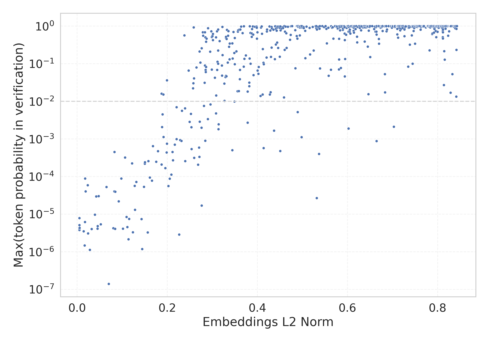

# Report for `microsoft/Phi-3-medium-128k-instruct`

## Model info

* Tied embeddings: no
* Unembeddings use bias: no
* Metric for under-trained tokens: Embeddings L2 Norm
  * Overall distribution 1.806 +/- 0.296
  * Token used for verification prompt building: `springframework`
  * Verification threshold: 0.843
  * Threshold for showing candidate under-trained tokens: 0.253
  * Median verified threshold (for bytes, unreachable and special tokens): 0.179
* Embeddings shape: (32064, 5120)
* Vocabulary size: 32011
  * Number of single byte tokens: 351, of which 110 below metric threshold
  * Number of special tokens: 14, of which 6 below metric threshold
  * Number of tested under-trained tokens: 615, 103 below p = 0.01 threshold, 80 below soft metric threshold

## Metrics plot


## Verification plot


## Under-trained token verification results
80 entries below threshold of 0.253

|   token_id | token                       |     metric | max_prob                                                         | in_other_tokens                                                                 |
|------------|-----------------------------|------------|------------------------------------------------------------------|---------------------------------------------------------------------------------|
|      27918 | ````` ▁Хронологија `````    | 0.00504622 | <span style='border: 1px solid rgb(169, 68, 66);'>5.1e-06</span> |                                                                                 |
|      16110 | ````` ▁Спољашње `````       | 0.00508677 | <span style='border: 1px solid rgb(169, 68, 66);'>3.8e-06</span> |                                                                                 |
|      28574 | ````` ▁Mediabestanden ````` | 0.00508702 | <span style='border: 1px solid rgb(169, 68, 66);'>7.9e-06</span> |                                                                                 |
|      11804 | ````` Архівовано `````      | 0.00509727 | <span style='border: 1px solid rgb(169, 68, 66);'>4.2e-06</span> |                                                                                 |
|      20609 | ````` ▁Portály `````        | 0.00535905 | <span style='border: 1px solid rgb(169, 68, 66);'>4.3e-06</span> |                                                                                 |
|      20528 | ````` ▁autorytatywna `````  | 0.0145529  | <span style='border: 1px solid rgb(169, 68, 66);'>3.5e-06</span> |                                                                                 |
|      27914 | ````` ▁archiválva `````     | 0.0167464  | <span style='border: 1px solid rgb(169, 68, 66);'>1.5e-06</span> |                                                                                 |
|      24294 | ````` Webachiv `````        | 0.0174329  | <span style='border: 1px solid rgb(169, 68, 66);'>6.2e-06</span> |                                                                                 |
|      28649 | ````` ▁årsnederbörd `````   | 0.0177334  | <span style='border: 1px solid rgb(169, 68, 66);'>8.9e-05</span> |                                                                                 |
|      28653 | ````` ▁regnigaste `````     | 0.0188105  | <span style='border: 1px solid rgb(169, 68, 66);'>4e-05</span>   |                                                                                 |
|      21836 | ````` ▁надморској `````     | 0.0235979  | <span style='border: 1px solid rgb(169, 68, 66);'>5.9e-05</span> |                                                                                 |
|      27900 | ````` ▁eredetiből `````     | 0.024284   | <span style='border: 1px solid rgb(169, 68, 66);'>3.1e-06</span> |                                                                                 |
|      18051 | ````` ▁савезној `````       | 0.0280877  | <span style='border: 1px solid rgb(169, 68, 66);'>1.1e-06</span> |                                                                                 |
|      26821 | ````` ▁Enllaços `````       | 0.0323475  | <span style='border: 1px solid rgb(169, 68, 66);'>4e-06</span>   |                                                                                 |
|      28416 | ````` ▁Мексичка `````       | 0.0393862  | <span style='border: 1px solid rgb(169, 68, 66);'>9.7e-06</span> |                                                                                 |
|      16056 | ````` љашње `````           | 0.0422659  | <span style='border: 1px solid rgb(169, 68, 66);'>3e-05</span>   | <span style='border: 1px solid rgb(169, 68, 66);'>````` ▁Спољашње `````</span>  |
|      11766 | ````` хівовано `````        | 0.0453346  | <span style='border: 1px solid rgb(169, 68, 66);'>4.1e-06</span> | <span style='border: 1px solid rgb(169, 68, 66);'>````` Архівовано `````</span> |
|      21673 | ````` ▁висини `````         | 0.0457657  | <span style='border: 1px solid rgb(169, 68, 66);'>4.8e-06</span> |                                                                                 |
|      26734 | ````` ▁Årsmed `````         | 0.0477096  | <span style='border: 1px solid rgb(169, 68, 66);'>3e-05</span>   |                                                                                 |
|      23654 | ````` ▁dátummal `````       | 0.0526075  | <span style='border: 1px solid rgb(169, 68, 66);'>5.4e-06</span> |                                                                                 |
<details><summary>60 additional entries below threshold</summary>

|   token_id | token                      |    metric | max_prob                                                         | in_other_tokens                                                                                                                                                                                                                                     |
|------------|----------------------------|-----------|------------------------------------------------------------------|-----------------------------------------------------------------------------------------------------------------------------------------------------------------------------------------------------------------------------------------------------|
|      23996 | ````` ▁живело `````        | 0.0651073 | <span style='border: 1px solid rgb(169, 68, 66);'>5.3e-05</span> |                                                                                                                                                                                                                                                     |
|      28354 | ````` ▁Расподела `````     | 0.070246  | <span style='border: 1px solid rgb(169, 68, 66);'>1.4e-07</span> |                                                                                                                                                                                                                                                     |
|      28650 | ````` ▁Genomsnittlig ````` | 0.0803348 | <span style='border: 1px solid rgb(169, 68, 66);'>4.2e-06</span> |                                                                                                                                                                                                                                                     |
|      24401 | ````` ▁подацима `````      | 0.0826623 | <span style='border: 1px solid rgb(169, 68, 66);'>4e-05</span>   |                                                                                                                                                                                                                                                     |
|      22011 | ````` ▁насељу `````        | 0.08279   | <span style='border: 1px solid rgb(169, 68, 66);'>0.00045</span> |                                                                                                                                                                                                                                                     |
|       7784 | ````` ▁underarter `````    | 0.0841525 | <span style='border: 1px solid rgb(169, 68, 66);'>4.1e-06</span> |                                                                                                                                                                                                                                                     |
|      20486 | ````` tatywna `````        | 0.0845577 | <span style='border: 1px solid rgb(169, 68, 66);'>3.9e-05</span> | <span style='border: 1px solid rgb(169, 68, 66);'>````` ▁autorytatywna `````</span>                                                                                                                                                                 |
|      28623 | ````` ▁Genomsnitt `````    | 0.0922417 | <span style='border: 1px solid rgb(169, 68, 66);'>2.2e-05</span> | <span style='border: 1px solid rgb(169, 68, 66);'>````` ▁Genomsnittlig `````</span>                                                                                                                                                                 |
|      22835 | ````` ▁муніципалі `````    | 0.0980773 | <span style='border: 1px solid rgb(169, 68, 66);'>8.8e-05</span> |                                                                                                                                                                                                                                                     |
|      28642 | ````` ▁regnig `````        | 0.101764  | <span style='border: 1px solid rgb(169, 68, 66);'>4.1e-06</span> | <span style='border: 1px solid rgb(169, 68, 66);'>````` ▁regnigaste `````</span>                                                                                                                                                                    |
|       7651 | ````` ▁släktet `````       | 0.106374  | <span style='border: 1px solid rgb(169, 68, 66);'>0.00032</span> |                                                                                                                                                                                                                                                     |
|      24631 | ````` ▁Források `````      | 0.109697  | <span style='border: 1px solid rgb(169, 68, 66);'>8.5e-06</span> |                                                                                                                                                                                                                                                     |
|      28647 | ````` ▁torraste `````      | 0.111471  | <span style='border: 1px solid rgb(169, 68, 66);'>4.5e-06</span> |                                                                                                                                                                                                                                                     |
|      26847 | ````` .:\u200a `````       | 0.113954  | <span style='border: 1px solid rgb(169, 68, 66);'>2.1e-06</span> |                                                                                                                                                                                                                                                     |
|      17916 | ````` abestanden `````     | 0.115349  | <span style='border: 1px solid rgb(169, 68, 66);'>7.4e-06</span> | <span style='border: 1px solid rgb(169, 68, 66);'>````` ▁Mediabestanden `````</span>                                                                                                                                                                |
|      23406 | ````` ▁општини `````       | 0.122092  | <span style='border: 1px solid rgb(169, 68, 66);'>0.00022</span> |                                                                                                                                                                                                                                                     |
|      14562 | ````` ▁Посилання `````     | 0.123866  | <span style='border: 1px solid rgb(169, 68, 66);'>3.3e-06</span> |                                                                                                                                                                                                                                                     |
|       9462 | ````` Hozzáférés `````     | 0.12754   | <span style='border: 1px solid rgb(169, 68, 66);'>5.6e-05</span> |                                                                                                                                                                                                                                                     |
|      28263 | ````` ▁Odkazy `````        | 0.128285  | <span style='border: 1px solid rgb(169, 68, 66);'>1.3e-05</span> |                                                                                                                                                                                                                                                     |
|      23117 | ````` brázky `````         | 0.131303  | <span style='border: 1px solid rgb(169, 68, 66);'>7.2e-05</span> | <span style='border: 1px solid rgb(169, 68, 66);'>````` Obrázky `````</span>                                                                                                                                                                        |
|      20645 | ````` ▁Przypisy `````      | 0.142867  | <span style='border: 1px solid rgb(169, 68, 66);'>7.4e-06</span> |                                                                                                                                                                                                                                                     |
|      24029 | ````` ▁Jegyzetek `````     | 0.144338  | <span style='border: 1px solid rgb(169, 68, 66);'>1.2e-06</span> |                                                                                                                                                                                                                                                     |
|      17981 | ````` ▁Externí `````       | 0.148268  | <span style='border: 1px solid rgb(169, 68, 66);'>5.3e-05</span> |                                                                                                                                                                                                                                                     |
|      23875 | ````` ▁Насеље `````        | 0.150047  | <span style='border: 1px solid rgb(169, 68, 66);'>0.00022</span> |                                                                                                                                                                                                                                                     |
|      23726 | ````` ▁насеља `````        | 0.15068   | <span style='border: 1px solid rgb(169, 68, 66);'>0.00024</span> |                                                                                                                                                                                                                                                     |
|      27645 | ````` ▁Попис `````         | 0.156623  | <span style='border: 1px solid rgb(169, 68, 66);'>3.3e-06</span> |                                                                                                                                                                                                                                                     |
|      23715 | ````` ▁Källor `````        | 0.158241  | <span style='border: 1px solid rgb(169, 68, 66);'>0.00026</span> |                                                                                                                                                                                                                                                     |
|      20422 | ````` ніципалі `````       | 0.161358  | <span style='border: 1px solid rgb(169, 68, 66);'>9.4e-05</span> | <span style='border: 1px solid rgb(169, 68, 66);'>````` ▁муніципалі `````</span>                                                                                                                                                                    |
|      20739 | ````` ▁надмор `````        | 0.166027  | <span style='border: 1px solid rgb(169, 68, 66);'>7.8e-05</span> | <span style='border: 1px solid rgb(169, 68, 66);'>````` ▁надморској `````</span>                                                                                                                                                                    |
|      11229 | ````` ▁становника `````    | 0.168269  | <span style='border: 1px solid rgb(169, 68, 66);'>0.00064</span> |                                                                                                                                                                                                                                                     |
|      12731 | ````` ederbörd `````       | 0.175333  | <span style='border: 1px solid rgb(169, 68, 66);'>0.00025</span> | <span style='border: 1px solid rgb(255, 145, 0);'>````` ▁nederbörd `````</span>, <span style='border: 1px solid rgb(169, 68, 66);'>````` nederbörd `````</span>, <span style='border: 1px solid rgb(169, 68, 66);'>````` ▁årsnederbörd `````</span> |
|      18044 | ````` ▁Становништво `````  | 0.179293  | <span style='border: 1px solid rgb(169, 68, 66);'>0.00047</span> |                                                                                                                                                                                                                                                     |
|      19837 | ````` ▁Населення `````     | 0.187318  | <span style='border: 1px solid rgb(169, 68, 66);'>0.00021</span> |                                                                                                                                                                                                                                                     |
|       7718 | ````` ▁beskrevs `````      | 0.187439  | <span style='border: 1px solid rgb(251, 189, 8);'>0.016</span>   |                                                                                                                                                                                                                                                     |
|      27610 | ````` ▁gminie `````        | 0.188365  | <span style='border: 1px solid rgb(255, 145, 0);'>0.0021</span>  |                                                                                                                                                                                                                                                     |
|      28090 | ````` ▁Савезне `````       | 0.189646  | <span style='border: 1px solid rgb(255, 145, 0);'>0.0045</span>  |                                                                                                                                                                                                                                                     |
|      25840 | ````` ▁државе `````        | 0.191367  | <span style='border: 1px solid rgb(251, 189, 8);'>0.015</span>   |                                                                                                                                                                                                                                                     |
|      10688 | ````` ▁gepublic `````      | 0.191818  | <span style='border: 1px solid rgb(255, 145, 0);'>0.0011</span>  | <span style='border: 1px solid rgb(40, 167, 69);'>````` ▁gepubliceerd `````</span>                                                                                                                                                                  |
|      28633 | ````` nederbörd `````      | 0.195628  | <span style='border: 1px solid rgb(169, 68, 66);'>0.00017</span> | <span style='border: 1px solid rgb(169, 68, 66);'>````` ▁årsnederbörd `````</span>                                                                                                                                                                  |
|      24971 | ````` ▁Джерела `````       | 0.198455  | <span style='border: 1px solid rgb(169, 68, 66);'>0.00044</span> |                                                                                                                                                                                                                                                     |
|      28791 | ````` ▁віці `````          | 0.199203  | <span style='border: 1px solid rgb(251, 189, 8);'>0.036</span>   |                                                                                                                                                                                                                                                     |
|      26675 | ````` ▁kallaste `````      | 0.199401  | <span style='border: 1px solid rgb(169, 68, 66);'>0.00075</span> |                                                                                                                                                                                                                                                     |
|      23015 | ````` ▁tématu `````        | 0.20262   | <span style='border: 1px solid rgb(169, 68, 66);'>5.6e-05</span> |                                                                                                                                                                                                                                                     |
|      14414 | ````` ▁Archivlink `````    | 0.205489  | <span style='border: 1px solid rgb(169, 68, 66);'>8.8e-05</span> |                                                                                                                                                                                                                                                     |
|      16916 | ````` ▁invån `````         | 0.20895   | <span style='border: 1px solid rgb(169, 68, 66);'>0.00011</span> | <span style='border: 1px solid rgb(40, 167, 69);'>````` ▁invånare `````</span>                                                                                                                                                                      |
|      23313 | ````` Obrázky `````        | 0.211511  | <span style='border: 1px solid rgb(169, 68, 66);'>0.00045</span> |                                                                                                                                                                                                                                                     |
|      20568 | ````` ▁сайті `````         | 0.212828  | <span style='border: 1px solid rgb(169, 68, 66);'>0.00027</span> |                                                                                                                                                                                                                                                     |
|      18140 | ````` rinningsområ `````   | 0.216522  | <span style='border: 1px solid rgb(169, 68, 66);'>0.0007</span>  |                                                                                                                                                                                                                                                     |
|      18676 | ````` ніципа `````         | 0.22064   | <span style='border: 1px solid rgb(169, 68, 66);'>0.00098</span> | <span style='border: 1px solid rgb(169, 68, 66);'>````` ніципалі `````</span>, <span style='border: 1px solid rgb(169, 68, 66);'>````` ▁муніципалі `````</span>                                                                                     |
|      16068 | ````` eltemperaturen ````` | 0.220703  | <span style='border: 1px solid rgb(255, 145, 0);'>0.007</span>   |                                                                                                                                                                                                                                                     |
|      23217 | ````` ▁zvuky `````         | 0.226486  | <span style='border: 1px solid rgb(169, 68, 66);'>2.9e-06</span> |                                                                                                                                                                                                                                                     |
|      26335 | ````` llaços `````         | 0.228768  | <span style='border: 1px solid rgb(169, 68, 66);'>0.00094</span> | <span style='border: 1px solid rgb(169, 68, 66);'>````` ▁Enllaços `````</span>                                                                                                                                                                      |
|      18328 | ````` ▁trakten `````       | 0.231646  | <span style='border: 1px solid rgb(169, 68, 66);'>0.00089</span> |                                                                                                                                                                                                                                                     |
|      28365 | ````` ▁розташ `````        | 0.232579  | <span style='border: 1px solid rgb(255, 145, 0);'>0.0056</span>  |                                                                                                                                                                                                                                                     |
|      31899 | ````` ⥤ `````              | 0.237894  | <span style='border: 1px solid rgb(40, 167, 69);'>0.57</span>    |                                                                                                                                                                                                                                                     |
|      24097 | ````` ▁huvudstaden `````   | 0.239436  | <span style='border: 1px solid rgb(255, 145, 0);'>0.0065</span>  |                                                                                                                                                                                                                                                     |
|      26662 | ````` ▁varmaste `````      | 0.239895  | <span style='border: 1px solid rgb(169, 68, 66);'>0.00026</span> |                                                                                                                                                                                                                                                     |
|      27646 | ````` ▁július `````        | 0.247595  | <span style='border: 1px solid rgb(251, 189, 8);'>0.066</span>   |                                                                                                                                                                                                                                                     |
|      24852 | ````` ▁грудня `````        | 0.249715  | <span style='border: 1px solid rgb(255, 145, 0);'>0.0029</span>  |                                                                                                                                                                                                                                                     |
|       9147 | ````` ozzáférés `````      | 0.252525  | <span style='border: 1px solid rgb(255, 145, 0);'>0.0046</span>  | <span style='border: 1px solid rgb(169, 68, 66);'>````` Hozzáférés `````</span>                                                                                                                                                                     |
</details>
<details><summary>535 additional entries above threshold</summary>

|   token_id | token                     |   metric | max_prob                                                         | in_other_tokens                                                                                                                                                                                                                                                                         |
|------------|---------------------------|----------|------------------------------------------------------------------|-----------------------------------------------------------------------------------------------------------------------------------------------------------------------------------------------------------------------------------------------------------------------------------------|
|      29451 | ````` ▁piłkar `````       | 0.253428 | <span style='border: 1px solid rgb(255, 145, 0);'>0.002</span>   |                                                                                                                                                                                                                                                                                         |
|      22744 | ````` ▁település `````    | 0.253876 | <span style='border: 1px solid rgb(169, 68, 66);'>0.00054</span> |                                                                                                                                                                                                                                                                                         |
|      27191 | ````` ▁szeptember `````   | 0.257229 | <span style='border: 1px solid rgb(251, 189, 8);'>0.022</span>   |                                                                                                                                                                                                                                                                                         |
|       3798 | ````` oreferrer `````     | 0.257975 | <span style='border: 1px solid rgb(251, 189, 8);'>0.03</span>    | ````` ▁noreferrer `````, ````` noreferrer `````                                                                                                                                                                                                                                         |
|      22945 | ````` ▁január `````       | 0.258508 | <span style='border: 1px solid rgb(40, 167, 69);'>0.92</span>    |                                                                                                                                                                                                                                                                                         |
|      15887 | ````` ▁још `````          | 0.259258 | <span style='border: 1px solid rgb(251, 189, 8);'>0.041</span>   |                                                                                                                                                                                                                                                                                         |
|      17828 | ````` ▁држави `````       | 0.259655 | <span style='border: 1px solid rgb(169, 68, 66);'>0.00032</span> |                                                                                                                                                                                                                                                                                         |
|      24576 | ````` ▁estaven `````      | 0.264934 | <span style='border: 1px solid rgb(251, 189, 8);'>0.079</span>   |                                                                                                                                                                                                                                                                                         |
|      27061 | ````` ▁Резултати `````    | 0.268293 | <span style='border: 1px solid rgb(169, 68, 66);'>0.00021</span> |                                                                                                                                                                                                                                                                                         |
|      28361 | ````` ▁Zobacz `````       | 0.270526 | <span style='border: 1px solid rgb(169, 68, 66);'>0.00059</span> |                                                                                                                                                                                                                                                                                         |
|      25528 | ````` ▁серпня `````       | 0.271478 | <span style='border: 1px solid rgb(169, 68, 66);'>0.00034</span> |                                                                                                                                                                                                                                                                                         |
|      24675 | ````` ▁mistrzost `````    | 0.271563 | <span style='border: 1px solid rgb(40, 167, 69);'>0.21</span>    |                                                                                                                                                                                                                                                                                         |
|      22768 | ````` ▁жовт `````         | 0.272135 | <span style='border: 1px solid rgb(255, 145, 0);'>0.0029</span>  | <span style='border: 1px solid rgb(40, 167, 69);'>````` ▁жовтня `````</span>                                                                                                                                                                                                            |
|      25145 | ````` ▁kwiet `````        | 0.273375 | <span style='border: 1px solid rgb(40, 167, 69);'>0.11</span>    | <span style='border: 1px solid rgb(40, 167, 69);'>````` ▁kwietnia `````</span>                                                                                                                                                                                                          |
|      23767 | ````` egyzetek `````      | 0.275957 | <span style='border: 1px solid rgb(255, 145, 0);'>0.002</span>   | <span style='border: 1px solid rgb(169, 68, 66);'>````` ▁Jegyzetek `````</span>                                                                                                                                                                                                         |
|      25460 | ````` ▁жовтня `````       | 0.276259 | <span style='border: 1px solid rgb(40, 167, 69);'>0.26</span>    |                                                                                                                                                                                                                                                                                         |
|      15412 | ````` ▁zewnętrzne `````   | 0.276455 | <span style='border: 1px solid rgb(169, 68, 66);'>1.7e-05</span> |                                                                                                                                                                                                                                                                                         |
|      13243 | ````` ▁länkar `````       | 0.278812 | <span style='border: 1px solid rgb(40, 167, 69);'>0.69</span>    |                                                                                                                                                                                                                                                                                         |
|      26527 | ````` ▁червня `````       | 0.279514 | <span style='border: 1px solid rgb(40, 167, 69);'>0.56</span>    |                                                                                                                                                                                                                                                                                         |
|      25696 | ````` ▁роках `````        | 0.281555 | <span style='border: 1px solid rgb(255, 145, 0);'>0.0076</span>  |                                                                                                                                                                                                                                                                                         |
|      25564 | ````` ▁броја `````        | 0.282844 | <span style='border: 1px solid rgb(251, 189, 8);'>0.031</span>   |                                                                                                                                                                                                                                                                                         |
|      17871 | ````` ▁odkazy `````       | 0.283635 | <span style='border: 1px solid rgb(40, 167, 69);'>0.69</span>    |                                                                                                                                                                                                                                                                                         |
|      26643 | ````` ▁października ````` | 0.283714 | <span style='border: 1px solid rgb(251, 189, 8);'>0.089</span>   |                                                                                                                                                                                                                                                                                         |
|      27660 | ````` ckså `````          | 0.284198 | <span style='border: 1px solid rgb(169, 68, 66);'>0.00089</span> | <span style='border: 1px solid rgb(40, 167, 69);'>````` ▁också `````</span>                                                                                                                                                                                                             |
|      26334 | ````` ▁квітня `````       | 0.284833 | <span style='border: 1px solid rgb(40, 167, 69);'>0.51</span>    |                                                                                                                                                                                                                                                                                         |
|      22018 | ````` ▁wrześ `````        | 0.284937 | <span style='border: 1px solid rgb(251, 189, 8);'>0.068</span>   | <span style='border: 1px solid rgb(251, 189, 8);'>````` ▁września `````</span>                                                                                                                                                                                                          |
|      23795 | ````` ▁paździer `````     | 0.285286 | <span style='border: 1px solid rgb(251, 189, 8);'>0.06</span>    | <span style='border: 1px solid rgb(251, 189, 8);'>````` ▁października `````</span>                                                                                                                                                                                                      |
|      24002 | ````` ▁stycznia `````     | 0.28617  | <span style='border: 1px solid rgb(40, 167, 69);'>0.38</span>    |                                                                                                                                                                                                                                                                                         |
|      23105 | ````` ▁videa `````        | 0.286204 | <span style='border: 1px solid rgb(251, 189, 8);'>0.082</span>   |                                                                                                                                                                                                                                                                                         |
|      27124 | ````` ▁sierpnia `````     | 0.287098 | <span style='border: 1px solid rgb(40, 167, 69);'>0.47</span>    |                                                                                                                                                                                                                                                                                         |
|      26498 | ````` >\<^ `````          | 0.290217 | <span style='border: 1px solid rgb(255, 145, 0);'>0.0034</span>  |                                                                                                                                                                                                                                                                                         |
|      23247 | ````` ▁dátum `````        | 0.290599 | <span style='border: 1px solid rgb(40, 167, 69);'>0.88</span>    | <span style='border: 1px solid rgb(169, 68, 66);'>````` ▁dátummal `````</span>                                                                                                                                                                                                          |
|      24353 | ````` ▁článku `````       | 0.295204 | <span style='border: 1px solid rgb(40, 167, 69);'>0.21</span>    |                                                                                                                                                                                                                                                                                         |
|      23441 | ````` któber `````        | 0.295856 | <span style='border: 1px solid rgb(255, 145, 0);'>0.0083</span>  | <span style='border: 1px solid rgb(40, 167, 69);'>````` ▁október `````</span>                                                                                                                                                                                                           |
|      12882 | ````` ITableView `````    | 0.297672 | <span style='border: 1px solid rgb(40, 167, 69);'>0.73</span>    | ````` ▁UITableView `````, ````` UITableView `````                                                                                                                                                                                                                                       |
|      21858 | ````` archiviato `````    | 0.298919 | <span style='border: 1px solid rgb(40, 167, 69);'>0.51</span>    |                                                                                                                                                                                                                                                                                         |
|      24708 | ````` ▁січня `````        | 0.298922 | <span style='border: 1px solid rgb(251, 189, 8);'>0.07</span>    |                                                                                                                                                                                                                                                                                         |
|      17076 | ````` ▁invånare `````     | 0.300398 | <span style='border: 1px solid rgb(40, 167, 69);'>0.55</span>    |                                                                                                                                                                                                                                                                                         |
|      29404 | ````` ▁lutego `````       | 0.301253 | <span style='border: 1px solid rgb(40, 167, 69);'>0.62</span>    |                                                                                                                                                                                                                                                                                         |
|      28535 | ````` ▁február `````      | 0.301415 | <span style='border: 1px solid rgb(40, 167, 69);'>0.43</span>    |                                                                                                                                                                                                                                                                                         |
|      25229 | ````` лтати `````         | 0.305746 | <span style='border: 1px solid rgb(251, 189, 8);'>0.042</span>   | <span style='border: 1px solid rgb(169, 68, 66);'>````` ▁Резултати `````</span>                                                                                                                                                                                                         |
|      17299 | ````` ▁nederbörd `````    | 0.308136 | <span style='border: 1px solid rgb(255, 145, 0);'>0.0048</span>  |                                                                                                                                                                                                                                                                                         |
|      14572 | ````` шње `````           | 0.308217 | <span style='border: 1px solid rgb(40, 167, 69);'>0.5</span>     | <span style='border: 1px solid rgb(169, 68, 66);'>````` љашње `````</span>, <span style='border: 1px solid rgb(169, 68, 66);'>````` ▁Спољашње `````</span>                                                                                                                              |
|      26908 | ````` ▁lipca `````        | 0.308683 | <span style='border: 1px solid rgb(251, 189, 8);'>0.014</span>   |                                                                                                                                                                                                                                                                                         |
|      28187 | ````` ▁április `````      | 0.310475 | <span style='border: 1px solid rgb(40, 167, 69);'>0.73</span>    |                                                                                                                                                                                                                                                                                         |
|      24605 | ````` ▁március `````      | 0.310698 | <span style='border: 1px solid rgb(251, 189, 8);'>0.069</span>   |                                                                                                                                                                                                                                                                                         |
|      13043 | ````` силання `````       | 0.311526 | <span style='border: 1px solid rgb(40, 167, 69);'>0.11</span>    | <span style='border: 1px solid rgb(169, 68, 66);'>````` ▁Посилання `````</span>                                                                                                                                                                                                         |
|      29079 | ````` ▁augusztus `````    | 0.31285  | <span style='border: 1px solid rgb(40, 167, 69);'>0.22</span>    |                                                                                                                                                                                                                                                                                         |
|      16651 | ````` ▁månaden `````      | 0.312947 | <span style='border: 1px solid rgb(40, 167, 69);'>0.81</span>    |                                                                                                                                                                                                                                                                                         |
|      13297 | ````` ісля `````          | 0.313    | <span style='border: 1px solid rgb(40, 167, 69);'>0.1</span>     | <span style='border: 1px solid rgb(40, 167, 69);'>````` ▁після `````</span>, <span style='border: 1px solid rgb(255, 145, 0);'>````` ▁Після `````</span>                                                                                                                                |
|      25563 | ````` ▁Після `````        | 0.313733 | <span style='border: 1px solid rgb(255, 145, 0);'>0.0018</span>  |                                                                                                                                                                                                                                                                                         |
|      18030 | ````` ▁nyelven `````      | 0.31409  | <span style='border: 1px solid rgb(255, 145, 0);'>0.0025</span>  |                                                                                                                                                                                                                                                                                         |
|      23882 | ````` ▁október `````      | 0.316011 | <span style='border: 1px solid rgb(40, 167, 69);'>0.4</span>     |                                                                                                                                                                                                                                                                                         |
|      26502 | ````` ▁вересня `````      | 0.321325 | <span style='border: 1px solid rgb(251, 189, 8);'>0.09</span>    |                                                                                                                                                                                                                                                                                         |
|      11193 | ````` ▁Normdaten `````    | 0.321528 | <span style='border: 1px solid rgb(251, 189, 8);'>0.049</span>   |                                                                                                                                                                                                                                                                                         |
|      26006 | ````` ensoort `````       | 0.322322 | <span style='border: 1px solid rgb(40, 167, 69);'>0.95</span>    |                                                                                                                                                                                                                                                                                         |
|      14503 | ````` ▁насеље `````       | 0.32279  | <span style='border: 1px solid rgb(40, 167, 69);'>0.17</span>    |                                                                                                                                                                                                                                                                                         |
|      25069 | ````` $}}% `````          | 0.326624 | <span style='border: 1px solid rgb(251, 189, 8);'>0.03</span>    |                                                                                                                                                                                                                                                                                         |
|      21887 | ````` ▁складі `````       | 0.32703  | <span style='border: 1px solid rgb(251, 189, 8);'>0.01</span>    |                                                                                                                                                                                                                                                                                         |
|      28528 | ````` ▁која `````         | 0.329185 | <span style='border: 1px solid rgb(251, 189, 8);'>0.044</span>   |                                                                                                                                                                                                                                                                                         |
|      24309 | ````` ▁чемпі `````        | 0.33019  | <span style='border: 1px solid rgb(40, 167, 69);'>0.48</span>    |                                                                                                                                                                                                                                                                                         |
|      28825 | ````` ▁інших `````        | 0.330345 | <span style='border: 1px solid rgb(40, 167, 69);'>0.52</span>    |                                                                                                                                                                                                                                                                                         |
|      13040 | ````` ▁осіб `````         | 0.33044  | <span style='border: 1px solid rgb(251, 189, 8);'>0.048</span>   |                                                                                                                                                                                                                                                                                         |
|      19735 | ````` ▁розта `````        | 0.331352 | <span style='border: 1px solid rgb(251, 189, 8);'>0.046</span>   | <span style='border: 1px solid rgb(255, 145, 0);'>````` ▁розташ `````</span>                                                                                                                                                                                                            |
|      26457 | ````` ▁május `````        | 0.33173  | <span style='border: 1px solid rgb(40, 167, 69);'>0.46</span>    |                                                                                                                                                                                                                                                                                         |
|      28729 | ````` ▁június `````       | 0.332285 | <span style='border: 1px solid rgb(40, 167, 69);'>0.8</span>     |                                                                                                                                                                                                                                                                                         |
|      26199 | ````` ▁mieszkań `````     | 0.334216 | <span style='border: 1px solid rgb(40, 167, 69);'>0.11</span>    | <span style='border: 1px solid rgb(40, 167, 69);'>````` ▁mieszkańców `````</span>                                                                                                                                                                                                       |
|      26593 | ````` ▁отрима `````       | 0.334923 | <span style='border: 1px solid rgb(40, 167, 69);'>0.55</span>    |                                                                                                                                                                                                                                                                                         |
|      17398 | ````` ништво `````        | 0.335699 | <span style='border: 1px solid rgb(40, 167, 69);'>0.73</span>    | <span style='border: 1px solid rgb(169, 68, 66);'>````` ▁Становништво `````</span>                                                                                                                                                                                                      |
|      17270 | ````` ▁налази `````       | 0.337034 | <span style='border: 1px solid rgb(40, 167, 69);'>0.28</span>    |                                                                                                                                                                                                                                                                                         |
|      28294 | ````` usztus `````        | 0.338364 | <span style='border: 1px solid rgb(40, 167, 69);'>0.13</span>    | <span style='border: 1px solid rgb(40, 167, 69);'>````` ▁augusztus `````</span>                                                                                                                                                                                                         |
|      28589 | ````` ▁mieszkańców `````  | 0.338699 | <span style='border: 1px solid rgb(40, 167, 69);'>0.34</span>    |                                                                                                                                                                                                                                                                                         |
|      29640 | ````` ▁powiecie `````     | 0.344219 | <span style='border: 1px solid rgb(169, 68, 66);'>0.0005</span>  |                                                                                                                                                                                                                                                                                         |
|      24951 | ````` ▁bazie `````        | 0.344315 | <span style='border: 1px solid rgb(40, 167, 69);'>0.35</span>    |                                                                                                                                                                                                                                                                                         |
|      26444 | ````` ▁czerwca `````      | 0.345245 | <span style='border: 1px solid rgb(40, 167, 69);'>0.14</span>    |                                                                                                                                                                                                                                                                                         |
|      28182 | ````` ▁півні `````        | 0.346939 | <span style='border: 1px solid rgb(40, 167, 69);'>0.7</span>     |                                                                                                                                                                                                                                                                                         |
|      15022 | ````` ▁zewnętrz `````     | 0.348726 | <span style='border: 1px solid rgb(40, 167, 69);'>0.19</span>    | <span style='border: 1px solid rgb(169, 68, 66);'>````` ▁zewnętrzne `````</span>                                                                                                                                                                                                        |
|      27513 | ````` ▁півден `````       | 0.349107 | <span style='border: 1px solid rgb(255, 145, 0);'>0.0099</span>  |                                                                                                                                                                                                                                                                                         |
|      28824 | ````` ▁које `````         | 0.349812 | <span style='border: 1px solid rgb(251, 189, 8);'>0.097</span>   |                                                                                                                                                                                                                                                                                         |
|      29146 | ````` ▁філь `````         | 0.349978 | <span style='border: 1px solid rgb(40, 167, 69);'>0.48</span>    |                                                                                                                                                                                                                                                                                         |
|      17391 | ````` ▁савез `````        | 0.353426 | <span style='border: 1px solid rgb(40, 167, 69);'>0.21</span>    | <span style='border: 1px solid rgb(169, 68, 66);'>````` ▁савезној `````</span>                                                                                                                                                                                                          |
|      25454 | ````` ▁seizo `````        | 0.355891 | <span style='border: 1px solid rgb(251, 189, 8);'>0.019</span>   | <span style='border: 1px solid rgb(40, 167, 69);'>````` ▁seizoen `````</span>                                                                                                                                                                                                           |
|      26146 | ````` фіцій `````         | 0.356701 | <span style='border: 1px solid rgb(40, 167, 69);'>0.71</span>    |                                                                                                                                                                                                                                                                                         |
|       7917 | ````` ▁listade `````      | 0.357241 | <span style='border: 1px solid rgb(40, 167, 69);'>0.78</span>    |                                                                                                                                                                                                                                                                                         |
|      25298 | ````` ▁września `````     | 0.358927 | <span style='border: 1px solid rgb(251, 189, 8);'>0.019</span>   |                                                                                                                                                                                                                                                                                         |
|      27802 | ````` ▁kwietnia `````     | 0.359717 | <span style='border: 1px solid rgb(40, 167, 69);'>0.81</span>    |                                                                                                                                                                                                                                                                                         |
|      26773 | ````` ▁című `````         | 0.361202 | <span style='border: 1px solid rgb(251, 189, 8);'>0.039</span>   |                                                                                                                                                                                                                                                                                         |
|      12867 | ````` лання `````         | 0.36137  | <span style='border: 1px solid rgb(251, 189, 8);'>0.069</span>   | <span style='border: 1px solid rgb(40, 167, 69);'>````` силання `````</span>, <span style='border: 1px solid rgb(169, 68, 66);'>````` ▁Посилання `````</span>                                                                                                                           |
|      25248 | ````` xtart `````         | 0.362292 | <span style='border: 1px solid rgb(40, 167, 69);'>0.82</span>    |                                                                                                                                                                                                                                                                                         |
|      10711 | ````` ▁gepubliceerd ````` | 0.364088 | <span style='border: 1px solid rgb(40, 167, 69);'>0.97</span>    |                                                                                                                                                                                                                                                                                         |
|      25726 | ````` ▁травня `````       | 0.36731  | <span style='border: 1px solid rgb(40, 167, 69);'>0.65</span>    |                                                                                                                                                                                                                                                                                         |
|       7654 | ````` ▁beskre `````       | 0.36959  | <span style='border: 1px solid rgb(251, 189, 8);'>0.084</span>   | <span style='border: 1px solid rgb(251, 189, 8);'>````` ▁beskrevs `````</span>                                                                                                                                                                                                          |
|      29409 | ````` ▁anglès `````       | 0.369973 | <span style='border: 1px solid rgb(40, 167, 69);'>0.99</span>    |                                                                                                                                                                                                                                                                                         |
|      26378 | ````` iből `````          | 0.370993 | <span style='border: 1px solid rgb(40, 167, 69);'>0.13</span>    | <span style='border: 1px solid rgb(169, 68, 66);'>````` ▁eredetiből `````</span>                                                                                                                                                                                                        |
|      14723 | ````` ingsområ `````      | 0.374587 | <span style='border: 1px solid rgb(40, 167, 69);'>0.17</span>    | <span style='border: 1px solid rgb(169, 68, 66);'>````` rinningsområ `````</span>                                                                                                                                                                                                       |
|      26106 | ````` ▁grudnia `````      | 0.378306 | <span style='border: 1px solid rgb(251, 189, 8);'>0.018</span>   |                                                                                                                                                                                                                                                                                         |
|       8554 | ````` ▁році `````         | 0.378425 | <span style='border: 1px solid rgb(255, 145, 0);'>0.0027</span>  |                                                                                                                                                                                                                                                                                         |
|      19539 | ````` ▁demsel `````       | 0.381862 | <span style='border: 1px solid rgb(251, 189, 8);'>0.031</span>   | ````` ▁demselben `````                                                                                                                                                                                                                                                                  |
|      18675 | ````` ▁població `````     | 0.382126 | <span style='border: 1px solid rgb(251, 189, 8);'>0.025</span>   |                                                                                                                                                                                                                                                                                         |
|      26194 | ````` ▁Савез `````        | 0.382863 | <span style='border: 1px solid rgb(40, 167, 69);'>0.14</span>    | <span style='border: 1px solid rgb(255, 145, 0);'>````` ▁Савезне `````</span>                                                                                                                                                                                                           |
|      24291 | ````` IABot `````         | 0.383243 | <span style='border: 1px solid rgb(40, 167, 69);'>1</span>       |                                                                                                                                                                                                                                                                                         |
|      29728 | ````` ▁później `````      | 0.384487 | <span style='border: 1px solid rgb(40, 167, 69);'>0.66</span>    |                                                                                                                                                                                                                                                                                         |
|      29255 | ````` ▁Tová `````         | 0.384921 | <span style='border: 1px solid rgb(40, 167, 69);'>0.1</span>     |                                                                                                                                                                                                                                                                                         |
|      21209 | ````` ▁stycz `````        | 0.387407 | <span style='border: 1px solid rgb(40, 167, 69);'>0.52</span>    | <span style='border: 1px solid rgb(40, 167, 69);'>````` ▁stycznia `````</span>                                                                                                                                                                                                          |
|      22551 | ````` ▁квіт `````         | 0.387514 | <span style='border: 1px solid rgb(40, 167, 69);'>0.64</span>    | <span style='border: 1px solid rgb(40, 167, 69);'>````` ▁квітня `````</span>                                                                                                                                                                                                            |
|      26159 | ````` ▁listopada `````    | 0.388031 | <span style='border: 1px solid rgb(40, 167, 69);'>0.84</span>    |                                                                                                                                                                                                                                                                                         |
|      20072 | ````` ywna `````          | 0.389861 | <span style='border: 1px solid rgb(40, 167, 69);'>0.98</span>    | <span style='border: 1px solid rgb(169, 68, 66);'>````` tatywna `````</span>, <span style='border: 1px solid rgb(169, 68, 66);'>````` ▁autorytatywna `````</span>                                                                                                                       |
|       8061 | ````` ▁године `````       | 0.390668 | <span style='border: 1px solid rgb(40, 167, 69);'>0.6</span>     |                                                                                                                                                                                                                                                                                         |
|      25283 | ````` ▁липня `````        | 0.391283 | <span style='border: 1px solid rgb(251, 189, 8);'>0.05</span>    |                                                                                                                                                                                                                                                                                         |
|      24696 | ````` ▁рік `````          | 0.394826 | <span style='border: 1px solid rgb(40, 167, 69);'>0.96</span>    |                                                                                                                                                                                                                                                                                         |
|       7172 | ````` ▁familjen `````     | 0.398179 | <span style='border: 1px solid rgb(40, 167, 69);'>0.97</span>    |                                                                                                                                                                                                                                                                                         |
|      28622 | ````` ▁seizoen `````      | 0.398511 | <span style='border: 1px solid rgb(40, 167, 69);'>0.91</span>    |                                                                                                                                                                                                                                                                                         |
|      15653 | ````` ској `````          | 0.399131 | <span style='border: 1px solid rgb(40, 167, 69);'>0.46</span>    | <span style='border: 1px solid rgb(169, 68, 66);'>````` ▁надморској `````</span>                                                                                                                                                                                                        |
|      21243 | ````` ▁eredet `````       | 0.399919 | <span style='border: 1px solid rgb(40, 167, 69);'>0.68</span>    | <span style='border: 1px solid rgb(169, 68, 66);'>````` ▁eredetiből `````</span>                                                                                                                                                                                                        |
|      31664 | ````` ߬ `````              | 0.400593 | <span style='border: 1px solid rgb(251, 189, 8);'>0.066</span>   |                                                                                                                                                                                                                                                                                         |
|      18557 | ````` ▁člán `````         | 0.40214  | <span style='border: 1px solid rgb(251, 189, 8);'>0.054</span>   | <span style='border: 1px solid rgb(40, 167, 69);'>````` ▁článku `````</span>                                                                                                                                                                                                            |
|      27929 | ````` ▁genomsnitt `````   | 0.402824 | <span style='border: 1px solid rgb(251, 189, 8);'>0.082</span>   |                                                                                                                                                                                                                                                                                         |
|      28906 | ````` ▁листопада `````    | 0.406913 | <span style='border: 1px solid rgb(251, 189, 8);'>0.014</span>   |                                                                                                                                                                                                                                                                                         |
|      25247 | ````` ▁wieś `````         | 0.408089 | <span style='border: 1px solid rgb(40, 167, 69);'>0.92</span>    |                                                                                                                                                                                                                                                                                         |
|      20448 | ````` ▁Kontrola `````     | 0.409332 | <span style='border: 1px solid rgb(40, 167, 69);'>0.98</span>    |                                                                                                                                                                                                                                                                                         |
|      17331 | ````` ▁Linki `````        | 0.410334 | <span style='border: 1px solid rgb(40, 167, 69);'>0.63</span>    |                                                                                                                                                                                                                                                                                         |
|      11635 | ````` ▁држа `````         | 0.411709 | <span style='border: 1px solid rgb(251, 189, 8);'>0.015</span>   | <span style='border: 1px solid rgb(169, 68, 66);'>````` ▁држави `````</span>, <span style='border: 1px solid rgb(251, 189, 8);'>````` ▁државе `````</span>                                                                                                                              |
|      16910 | ````` ▁општи `````        | 0.411971 | <span style='border: 1px solid rgb(40, 167, 69);'>0.24</span>    | <span style='border: 1px solid rgb(169, 68, 66);'>````` ▁општини `````</span>                                                                                                                                                                                                           |
|      14755 | ````` ewnętrz `````       | 0.413344 | <span style='border: 1px solid rgb(40, 167, 69);'>0.11</span>    | <span style='border: 1px solid rgb(40, 167, 69);'>````` ▁zewnętrz `````</span>, <span style='border: 1px solid rgb(169, 68, 66);'>````` ▁zewnętrzne `````</span>                                                                                                                        |
|      26137 | ````` ▁információk `````  | 0.414021 | <span style='border: 1px solid rgb(169, 68, 66);'>0.00057</span> |                                                                                                                                                                                                                                                                                         |
|      26011 | ````` ▁Архивная `````     | 0.414048 | <span style='border: 1px solid rgb(251, 189, 8);'>0.097</span>   |                                                                                                                                                                                                                                                                                         |
|      21498 | ````` ▁została `````      | 0.420529 | <span style='border: 1px solid rgb(40, 167, 69);'>0.15</span>    |                                                                                                                                                                                                                                                                                         |
|      10553 | ````` \<^ `````           | 0.421151 | <span style='border: 1px solid rgb(40, 167, 69);'>0.72</span>    | <span style='border: 1px solid rgb(255, 145, 0);'>````` >\<^ `````</span>                                                                                                                                                                                                               |
|      19209 | ````` ▁inwoners `````     | 0.421515 | <span style='border: 1px solid rgb(40, 167, 69);'>0.81</span>    |                                                                                                                                                                                                                                                                                         |
|      22590 | ````` álva `````          | 0.426763 | <span style='border: 1px solid rgb(40, 167, 69);'>0.98</span>    | <span style='border: 1px solid rgb(169, 68, 66);'>````` ▁archiválva `````</span>                                                                                                                                                                                                        |
|      22636 | ````` rások `````         | 0.427564 | <span style='border: 1px solid rgb(251, 189, 8);'>0.015</span>   | <span style='border: 1px solid rgb(169, 68, 66);'>````` ▁Források `````</span>                                                                                                                                                                                                          |
|      29679 | ````` ▁zespo `````        | 0.428741 | <span style='border: 1px solid rgb(40, 167, 69);'>0.77</span>    |                                                                                                                                                                                                                                                                                         |
|      14545 | ````` ewnę `````          | 0.429539 | <span style='border: 1px solid rgb(251, 189, 8);'>0.017</span>   | <span style='border: 1px solid rgb(40, 167, 69);'>````` ewnętrz `````</span>, <span style='border: 1px solid rgb(40, 167, 69);'>````` ▁zewnętrz `````</span>, <span style='border: 1px solid rgb(169, 68, 66);'>````` ▁zewnętrzne `````</span>                                          |
|      21902 | ````` нії `````           | 0.430085 | <span style='border: 1px solid rgb(40, 167, 69);'>0.15</span>    |                                                                                                                                                                                                                                                                                         |
|      23280 | ````` ździer `````        | 0.431518 | <span style='border: 1px solid rgb(40, 167, 69);'>0.27</span>    | <span style='border: 1px solid rgb(251, 189, 8);'>````` ▁paździer `````</span>, <span style='border: 1px solid rgb(251, 189, 8);'>````` ▁października `````</span>                                                                                                                      |
|      15279 | ````` ▁који `````         | 0.431559 | <span style='border: 1px solid rgb(40, 167, 69);'>0.96</span>    |                                                                                                                                                                                                                                                                                         |
|      19082 | ````` ▁області `````      | 0.432167 | <span style='border: 1px solid rgb(40, 167, 69);'>0.87</span>    |                                                                                                                                                                                                                                                                                         |
|      23046 | ````` ▁miejscowo `````    | 0.435643 | <span style='border: 1px solid rgb(40, 167, 69);'>0.81</span>    |                                                                                                                                                                                                                                                                                         |
|       6723 | ````` ▁ingår `````        | 0.436871 | <span style='border: 1px solid rgb(255, 145, 0);'>0.0017</span>  |                                                                                                                                                                                                                                                                                         |
|      20900 | ````` ostęp `````         | 0.4388   | <span style='border: 1px solid rgb(40, 167, 69);'>0.13</span>    | <span style='border: 1px solid rgb(40, 167, 69);'>````` dostęp `````</span>                                                                                                                                                                                                             |
|      13765 | ````` ▁пів `````          | 0.439492 | <span style='border: 1px solid rgb(40, 167, 69);'>0.99</span>    | <span style='border: 1px solid rgb(255, 145, 0);'>````` ▁півден `````</span>, <span style='border: 1px solid rgb(40, 167, 69);'>````` ▁півні `````</span>                                                                                                                               |
|      28184 | ````` ▁цього `````        | 0.440816 | <span style='border: 1px solid rgb(40, 167, 69);'>0.32</span>    |                                                                                                                                                                                                                                                                                         |
|      17467 | ````` ▁inwon `````        | 0.440821 | <span style='border: 1px solid rgb(40, 167, 69);'>0.84</span>    | <span style='border: 1px solid rgb(40, 167, 69);'>````` ▁inwoners `````</span>                                                                                                                                                                                                          |
|      28531 | ````` ▁війни `````        | 0.44264  | <span style='border: 1px solid rgb(40, 167, 69);'>0.75</span>    |                                                                                                                                                                                                                                                                                         |
|      26853 | ````` ▁zdoby `````        | 0.443436 | <span style='border: 1px solid rgb(40, 167, 69);'>0.97</span>    |                                                                                                                                                                                                                                                                                         |
|      24493 | ````` ▁ње `````           | 0.443938 | <span style='border: 1px solid rgb(40, 167, 69);'>0.92</span>    |                                                                                                                                                                                                                                                                                         |
|      26948 | ````` ▁należ `````        | 0.444003 | <span style='border: 1px solid rgb(40, 167, 69);'>0.37</span>    |                                                                                                                                                                                                                                                                                         |
|      24366 | ````` ▁sierp `````        | 0.445422 | <span style='border: 1px solid rgb(40, 167, 69);'>0.97</span>    | <span style='border: 1px solid rgb(40, 167, 69);'>````` ▁sierpnia `````</span>                                                                                                                                                                                                          |
|      28372 | ````` ▁відбу `````        | 0.445858 | <span style='border: 1px solid rgb(40, 167, 69);'>0.26</span>    |                                                                                                                                                                                                                                                                                         |
|      22258 | ````` dostęp `````        | 0.448237 | <span style='border: 1px solid rgb(40, 167, 69);'>0.97</span>    |                                                                                                                                                                                                                                                                                         |
|      23595 | ````` ▁працю `````        | 0.4492   | <span style='border: 1px solid rgb(40, 167, 69);'>0.9</span>     |                                                                                                                                                                                                                                                                                         |
|      26573 | ````` ▁яких `````         | 0.44949  | <span style='border: 1px solid rgb(40, 167, 69);'>0.15</span>    |                                                                                                                                                                                                                                                                                         |
|      24814 | ````` ▁információ `````   | 0.450659 | <span style='border: 1px solid rgb(169, 68, 66);'>0.00048</span> | <span style='border: 1px solid rgb(169, 68, 66);'>````` ▁információk `````</span>                                                                                                                                                                                                       |
|      20070 | ````` ▁autory `````       | 0.450927 | <span style='border: 1px solid rgb(40, 167, 69);'>0.98</span>    | <span style='border: 1px solid rgb(169, 68, 66);'>````` ▁autorytatywna `````</span>                                                                                                                                                                                                     |
|      26447 | ````` ▁amery `````        | 0.451361 | <span style='border: 1px solid rgb(40, 167, 69);'>0.77</span>    |                                                                                                                                                                                                                                                                                         |
|      30994 | ````` 𝕜 `````             | 0.453687 | <span style='border: 1px solid rgb(40, 167, 69);'>0.87</span>    |                                                                                                                                                                                                                                                                                         |
|      25872 | ````` ▁жі `````           | 0.456481 | <span style='border: 1px solid rgb(40, 167, 69);'>0.94</span>    |                                                                                                                                                                                                                                                                                         |
|      27376 | ````` лії `````           | 0.456868 | <span style='border: 1px solid rgb(40, 167, 69);'>0.89</span>    |                                                                                                                                                                                                                                                                                         |
|      29752 | ````` ńskim `````         | 0.459047 | <span style='border: 1px solid rgb(251, 189, 8);'>0.013</span>   |                                                                                                                                                                                                                                                                                         |
|      13717 | ````` ној `````           | 0.459606 | <span style='border: 1px solid rgb(40, 167, 69);'>1</span>       | <span style='border: 1px solid rgb(169, 68, 66);'>````` ▁савезној `````</span>                                                                                                                                                                                                          |
|      29608 | ````` ▁према `````        | 0.460362 | <span style='border: 1px solid rgb(40, 167, 69);'>0.23</span>    |                                                                                                                                                                                                                                                                                         |
|      24047 | ````` ▁póź `````          | 0.461083 | <span style='border: 1px solid rgb(40, 167, 69);'>0.71</span>    | <span style='border: 1px solid rgb(40, 167, 69);'>````` ▁później `````</span>                                                                                                                                                                                                           |
|      15242 | ````` ▁населення `````    | 0.462775 | <span style='border: 1px solid rgb(40, 167, 69);'>0.98</span>    |                                                                                                                                                                                                                                                                                         |
|      22123 | ````` ▁född `````         | 0.464034 | <span style='border: 1px solid rgb(40, 167, 69);'>0.65</span>    |                                                                                                                                                                                                                                                                                         |
|      29796 | ````` ським `````         | 0.464887 | <span style='border: 1px solid rgb(40, 167, 69);'>0.26</span>    |                                                                                                                                                                                                                                                                                         |
|      25858 | ````` ▁війсь `````        | 0.467706 | <span style='border: 1px solid rgb(40, 167, 69);'>0.97</span>    |                                                                                                                                                                                                                                                                                         |
|      26720 | ````` ▁використову `````  | 0.472336 | <span style='border: 1px solid rgb(40, 167, 69);'>0.43</span>    |                                                                                                                                                                                                                                                                                         |
|      13259 | ````` ▁міс `````          | 0.473725 | <span style='border: 1px solid rgb(40, 167, 69);'>0.58</span>    | <span style='border: 1px solid rgb(40, 167, 69);'>````` ▁місце `````</span>, <span style='border: 1px solid rgb(40, 167, 69);'>````` ▁міста `````</span>                                                                                                                                |
|      26867 | ````` ▁збір `````         | 0.474277 | <span style='border: 1px solid rgb(40, 167, 69);'>0.99</span>    |                                                                                                                                                                                                                                                                                         |
|      20798 | ````` ▁жов `````          | 0.475725 | <span style='border: 1px solid rgb(40, 167, 69);'>1</span>       | <span style='border: 1px solid rgb(255, 145, 0);'>````` ▁жовт `````</span>, <span style='border: 1px solid rgb(40, 167, 69);'>````` ▁жовтня `````</span>                                                                                                                                |
|       8806 | ````` ▁Archivado `````    | 0.477312 | <span style='border: 1px solid rgb(40, 167, 69);'>1</span>       |                                                                                                                                                                                                                                                                                         |
|      26782 | ````` ▁пописа `````       | 0.483977 | <span style='border: 1px solid rgb(40, 167, 69);'>0.78</span>    |                                                                                                                                                                                                                                                                                         |
|      19749 | ````` ▁викори `````       | 0.484392 | <span style='border: 1px solid rgb(251, 189, 8);'>0.076</span>   | <span style='border: 1px solid rgb(40, 167, 69);'>````` ▁використову `````</span>                                                                                                                                                                                                       |
|      26497 | ````` ▁органі `````       | 0.487406 | <span style='border: 1px solid rgb(40, 167, 69);'>0.55</span>    |                                                                                                                                                                                                                                                                                         |
|      29669 | ````` engelsk `````       | 0.487655 | <span style='border: 1px solid rgb(40, 167, 69);'>1</span>       |                                                                                                                                                                                                                                                                                         |
|      19940 | ````` ▁ць `````           | 0.48876  | <span style='border: 1px solid rgb(40, 167, 69);'>1</span>       | <span style='border: 1px solid rgb(40, 167, 69);'>````` ▁цього `````</span>                                                                                                                                                                                                             |
|      29526 | ````` ▁столі `````        | 0.488787 | <span style='border: 1px solid rgb(40, 167, 69);'>0.46</span>    |                                                                                                                                                                                                                                                                                         |
|      22041 | ````` ▁stolet `````       | 0.489338 | <span style='border: 1px solid rgb(255, 145, 0);'>0.0052</span>  | <span style='border: 1px solid rgb(40, 167, 69);'>````` ▁století `````</span>                                                                                                                                                                                                           |
|      23602 | ````` ▁pił `````          | 0.490345 | <span style='border: 1px solid rgb(40, 167, 69);'>0.98</span>    | <span style='border: 1px solid rgb(255, 145, 0);'>````` ▁piłkar `````</span>                                                                                                                                                                                                            |
|      18221 | ````` cowo `````          | 0.49061  | <span style='border: 1px solid rgb(40, 167, 69);'>1</span>       | <span style='border: 1px solid rgb(40, 167, 69);'>````` ▁miejscowo `````</span>                                                                                                                                                                                                         |
|      19904 | ````` ▁після `````        | 0.490905 | <span style='border: 1px solid rgb(40, 167, 69);'>0.95</span>    |                                                                                                                                                                                                                                                                                         |
|      20959 | ````` ällor `````         | 0.493071 | <span style='border: 1px solid rgb(40, 167, 69);'>0.95</span>    | <span style='border: 1px solid rgb(169, 68, 66);'>````` ▁Källor `````</span>                                                                                                                                                                                                            |
|      25191 | ````` ▁міста `````        | 0.49374  | <span style='border: 1px solid rgb(40, 167, 69);'>0.98</span>    |                                                                                                                                                                                                                                                                                         |
|      28158 | ````` ▁północ `````       | 0.494312 | <span style='border: 1px solid rgb(40, 167, 69);'>0.57</span>    |                                                                                                                                                                                                                                                                                         |
|      11518 | ````` ▁geldig `````       | 0.494496 | <span style='border: 1px solid rgb(40, 167, 69);'>0.92</span>    |                                                                                                                                                                                                                                                                                         |
|      20271 | ````` ▁sezon `````        | 0.494617 | <span style='border: 1px solid rgb(40, 167, 69);'>0.98</span>    |                                                                                                                                                                                                                                                                                         |
|      10588 | ````` widet `````         | 0.4966   | <span style='border: 1px solid rgb(40, 167, 69);'>1</span>       | ````` widetilde `````                                                                                                                                                                                                                                                                   |
|      27312 | ````` ової `````          | 0.497501 | <span style='border: 1px solid rgb(40, 167, 69);'>0.92</span>    |                                                                                                                                                                                                                                                                                         |
|      29084 | ````` ▁регі `````         | 0.497847 | <span style='border: 1px solid rgb(40, 167, 69);'>0.96</span>    |                                                                                                                                                                                                                                                                                         |
|      17047 | ````` omsnitt `````       | 0.497965 | <span style='border: 1px solid rgb(255, 145, 0);'>0.0011</span>  | <span style='border: 1px solid rgb(251, 189, 8);'>````` ▁genomsnitt `````</span>, <span style='border: 1px solid rgb(169, 68, 66);'>````` ▁Genomsnitt `````</span>, <span style='border: 1px solid rgb(169, 68, 66);'>````` ▁Genomsnittlig `````</span>                                 |
|      31483 | ````` ┈ `````             | 0.498432 | <span style='border: 1px solid rgb(40, 167, 69);'>1</span>       |                                                                                                                                                                                                                                                                                         |
|      24902 | ````` owała `````         | 0.501191 | <span style='border: 1px solid rgb(40, 167, 69);'>0.91</span>    |                                                                                                                                                                                                                                                                                         |
|      21562 | ````` ▁zdob `````         | 0.502295 | <span style='border: 1px solid rgb(40, 167, 69);'>0.96</span>    | <span style='border: 1px solid rgb(40, 167, 69);'>````` ▁zdoby `````</span>                                                                                                                                                                                                             |
|      23866 | ````` ▁краї `````         | 0.502848 | <span style='border: 1px solid rgb(40, 167, 69);'>0.89</span>    |                                                                                                                                                                                                                                                                                         |
|      26711 | ````` gså `````           | 0.506044 | <span style='border: 1px solid rgb(40, 167, 69);'>0.75</span>    | ````` ▁også `````                                                                                                                                                                                                                                                                       |
|      27038 | ````` ▁století `````      | 0.506512 | <span style='border: 1px solid rgb(40, 167, 69);'>0.14</span>    |                                                                                                                                                                                                                                                                                         |
|      21316 | ````` ▁чолові `````       | 0.508995 | <span style='border: 1px solid rgb(40, 167, 69);'>0.97</span>    |                                                                                                                                                                                                                                                                                         |
|      26339 | ````` ▁нај `````          | 0.51567  | <span style='border: 1px solid rgb(40, 167, 69);'>0.89</span>    |                                                                                                                                                                                                                                                                                         |
|      28331 | ````` ▁Normdatei `````    | 0.516771 | <span style='border: 1px solid rgb(40, 167, 69);'>0.18</span>    |                                                                                                                                                                                                                                                                                         |
|      29325 | ````` ▁ју `````           | 0.522627 | <span style='border: 1px solid rgb(40, 167, 69);'>0.95</span>    |                                                                                                                                                                                                                                                                                         |
|      28202 | ````` ▁Olympedia `````    | 0.525049 | <span style='border: 1px solid rgb(40, 167, 69);'>0.22</span>    |                                                                                                                                                                                                                                                                                         |
|      21407 | ````` ▁després `````      | 0.529384 | <span style='border: 1px solid rgb(40, 167, 69);'>1</span>       |                                                                                                                                                                                                                                                                                         |
|      21547 | ````` ській `````         | 0.530687 | <span style='border: 1px solid rgb(40, 167, 69);'>0.88</span>    |                                                                                                                                                                                                                                                                                         |
|      25786 | ````` ▁geslacht `````     | 0.530771 | <span style='border: 1px solid rgb(40, 167, 69);'>1</span>       |                                                                                                                                                                                                                                                                                         |
|      25052 | ````` ▁letech `````       | 0.531793 | <span style='border: 1px solid rgb(169, 68, 66);'>2.7e-05</span> |                                                                                                                                                                                                                                                                                         |
|      15394 | ````` usetts `````        | 0.532307 | <span style='border: 1px solid rgb(40, 167, 69);'>0.81</span>    | ````` achusetts `````, ````` ▁Massachusetts `````                                                                                                                                                                                                                                       |
|      27071 | ````` ▁Історія `````      | 0.534844 | <span style='border: 1px solid rgb(40, 167, 69);'>0.93</span>    |                                                                                                                                                                                                                                                                                         |
|      23269 | ````` ције `````          | 0.535351 | <span style='border: 1px solid rgb(40, 167, 69);'>0.96</span>    |                                                                                                                                                                                                                                                                                         |
|      16331 | ````` ▁także `````        | 0.536655 | <span style='border: 1px solid rgb(169, 68, 66);'>0.0004</span>  |                                                                                                                                                                                                                                                                                         |
|      28458 | ````` ▁położ `````        | 0.537853 | <span style='border: 1px solid rgb(40, 167, 69);'>0.85</span>    |                                                                                                                                                                                                                                                                                         |
|      19196 | ````` ▁Према `````        | 0.538728 | <span style='border: 1px solid rgb(40, 167, 69);'>1</span>       |                                                                                                                                                                                                                                                                                         |
|      29780 | ````` ▁však `````         | 0.539116 | <span style='border: 1px solid rgb(251, 189, 8);'>0.075</span>   |                                                                                                                                                                                                                                                                                         |
|      26951 | ````` ▁oldal `````        | 0.543917 | <span style='border: 1px solid rgb(40, 167, 69);'>1</span>       |                                                                                                                                                                                                                                                                                         |
|      28275 | ````` ▁osób `````         | 0.547885 | <span style='border: 1px solid rgb(40, 167, 69);'>0.95</span>    |                                                                                                                                                                                                                                                                                         |
|      23742 | ````` њу `````            | 0.551475 | <span style='border: 1px solid rgb(40, 167, 69);'>1</span>       |                                                                                                                                                                                                                                                                                         |
|      25625 | ````` ▁свої `````         | 0.553221 | <span style='border: 1px solid rgb(40, 167, 69);'>0.84</span>    |                                                                                                                                                                                                                                                                                         |
|      25425 | ````` ▁zawod `````        | 0.554203 | <span style='border: 1px solid rgb(40, 167, 69);'>0.35</span>    |                                                                                                                                                                                                                                                                                         |
|      23776 | ````` мії `````           | 0.557404 | <span style='border: 1px solid rgb(40, 167, 69);'>0.91</span>    |                                                                                                                                                                                                                                                                                         |
|      20316 | ````` ▁również `````      | 0.558018 | <span style='border: 1px solid rgb(251, 189, 8);'>0.048</span>   |                                                                                                                                                                                                                                                                                         |
|      17638 | ````` ському `````        | 0.563335 | <span style='border: 1px solid rgb(251, 189, 8);'>0.069</span>   |                                                                                                                                                                                                                                                                                         |
|      31926 | ````` 𝓝 `````             | 0.563499 | <span style='border: 1px solid rgb(40, 167, 69);'>0.99</span>    |                                                                                                                                                                                                                                                                                         |
|      12149 | ````` ▁років `````        | 0.565556 | <span style='border: 1px solid rgb(40, 167, 69);'>0.93</span>    |                                                                                                                                                                                                                                                                                         |
|      28085 | ````` ▁utwor `````        | 0.565812 | <span style='border: 1px solid rgb(40, 167, 69);'>0.91</span>    |                                                                                                                                                                                                                                                                                         |
|      22460 | ````` нього `````         | 0.56706  | <span style='border: 1px solid rgb(40, 167, 69);'>0.93</span>    |                                                                                                                                                                                                                                                                                         |
|      25336 | ````` ▁територ `````      | 0.56863  | <span style='border: 1px solid rgb(40, 167, 69);'>0.47</span>    |                                                                                                                                                                                                                                                                                         |
|      29203 | ````` ▁treball `````      | 0.571804 | <span style='border: 1px solid rgb(40, 167, 69);'>1</span>       |                                                                                                                                                                                                                                                                                         |
|      20172 | ````` ▁Przyp `````        | 0.572282 | <span style='border: 1px solid rgb(40, 167, 69);'>1</span>       | <span style='border: 1px solid rgb(169, 68, 66);'>````` ▁Przypisy `````</span>                                                                                                                                                                                                          |
|      15610 | ````` ▁també `````        | 0.575057 | <span style='border: 1px solid rgb(40, 167, 69);'>1</span>       |                                                                                                                                                                                                                                                                                         |
|      23259 | ````` ▁februari `````     | 0.575086 | <span style='border: 1px solid rgb(40, 167, 69);'>0.99</span>    |                                                                                                                                                                                                                                                                                         |
|      23037 | ````` ▁відо `````         | 0.576075 | <span style='border: 1px solid rgb(40, 167, 69);'>0.95</span>    |                                                                                                                                                                                                                                                                                         |
|      27277 | ````` ▁byly `````         | 0.576468 | <span style='border: 1px solid rgb(40, 167, 69);'>0.97</span>    |                                                                                                                                                                                                                                                                                         |
|      26787 | ````` ▁główn `````        | 0.578191 | <span style='border: 1px solid rgb(40, 167, 69);'>0.85</span>    |                                                                                                                                                                                                                                                                                         |
|      24592 | ````` ▁powie `````        | 0.578504 | <span style='border: 1px solid rgb(40, 167, 69);'>0.88</span>    | <span style='border: 1px solid rgb(169, 68, 66);'>````` ▁powiecie `````</span>                                                                                                                                                                                                          |
|      16872 | ````` ▁місце `````        | 0.580064 | <span style='border: 1px solid rgb(40, 167, 69);'>0.98</span>    |                                                                                                                                                                                                                                                                                         |
|      20705 | ````` чної `````          | 0.581064 | <span style='border: 1px solid rgb(251, 189, 8);'>0.07</span>    |                                                                                                                                                                                                                                                                                         |
|      27417 | ````` ▁niemieck `````     | 0.581149 | <span style='border: 1px solid rgb(40, 167, 69);'>0.46</span>    |                                                                                                                                                                                                                                                                                         |
|      29789 | ````` ською `````         | 0.581433 | <span style='border: 1px solid rgb(40, 167, 69);'>0.13</span>    |                                                                                                                                                                                                                                                                                         |
|      16983 | ````` ▁też `````          | 0.582028 | <span style='border: 1px solid rgb(40, 167, 69);'>0.92</span>    |                                                                                                                                                                                                                                                                                         |
|      24177 | ````` ▁części `````       | 0.582322 | <span style='border: 1px solid rgb(40, 167, 69);'>0.97</span>    |                                                                                                                                                                                                                                                                                         |
|      23518 | ````` obox `````          | 0.583385 | <span style='border: 1px solid rgb(40, 167, 69);'>1</span>       |                                                                                                                                                                                                                                                                                         |
|      28892 | ````` ▁Пів `````          | 0.583405 | <span style='border: 1px solid rgb(40, 167, 69);'>0.77</span>    |                                                                                                                                                                                                                                                                                         |
|      25937 | ````` ▁okrę `````         | 0.583638 | <span style='border: 1px solid rgb(40, 167, 69);'>0.95</span>    |                                                                                                                                                                                                                                                                                         |
|      26659 | ````` ńskiej `````        | 0.585141 | <span style='border: 1px solid rgb(251, 189, 8);'>0.077</span>   |                                                                                                                                                                                                                                                                                         |
|      22857 | ````` ▁była `````         | 0.586362 | <span style='border: 1px solid rgb(40, 167, 69);'>0.96</span>    |                                                                                                                                                                                                                                                                                         |
|      27190 | ````` РСР `````           | 0.587863 | <span style='border: 1px solid rgb(40, 167, 69);'>1</span>       |                                                                                                                                                                                                                                                                                         |
|      24908 | ````` ▁різ `````          | 0.589801 | <span style='border: 1px solid rgb(40, 167, 69);'>0.8</span>     |                                                                                                                                                                                                                                                                                         |
|      16629 | ````` ▁який `````         | 0.589932 | <span style='border: 1px solid rgb(40, 167, 69);'>0.86</span>    |                                                                                                                                                                                                                                                                                         |
|      23543 | ````` ▁onderwerp `````    | 0.590876 | <span style='border: 1px solid rgb(40, 167, 69);'>1</span>       |                                                                                                                                                                                                                                                                                         |
|      27203 | ````` abgerufen `````     | 0.591766 | <span style='border: 1px solid rgb(40, 167, 69);'>1</span>       |                                                                                                                                                                                                                                                                                         |
|      15318 | ````` ▁він `````          | 0.592654 | <span style='border: 1px solid rgb(40, 167, 69);'>0.92</span>    |                                                                                                                                                                                                                                                                                         |
|      22254 | ````` ▁кіль `````         | 0.592823 | <span style='border: 1px solid rgb(40, 167, 69);'>0.98</span>    |                                                                                                                                                                                                                                                                                         |
|      26390 | ````` ▁następ `````       | 0.592995 | <span style='border: 1px solid rgb(40, 167, 69);'>0.99</span>    |                                                                                                                                                                                                                                                                                         |
|      25526 | ````` цького `````        | 0.593638 | <span style='border: 1px solid rgb(40, 167, 69);'>0.63</span>    |                                                                                                                                                                                                                                                                                         |
|      26969 | ````` ▁segle `````        | 0.593778 | <span style='border: 1px solid rgb(40, 167, 69);'>0.94</span>    |                                                                                                                                                                                                                                                                                         |
|      20020 | ````` ▁také `````         | 0.593884 | <span style='border: 1px solid rgb(40, 167, 69);'>0.43</span>    |                                                                                                                                                                                                                                                                                         |
|      15917 | ````` istrzost `````      | 0.593986 | <span style='border: 1px solid rgb(251, 189, 8);'>0.046</span>   | <span style='border: 1px solid rgb(40, 167, 69);'>````` ▁mistrzost `````</span>                                                                                                                                                                                                         |
|      25929 | ````` ництво `````        | 0.594712 | <span style='border: 1px solid rgb(40, 167, 69);'>0.13</span>    |                                                                                                                                                                                                                                                                                         |
|      11835 | ````` ▁вій `````          | 0.596744 | <span style='border: 1px solid rgb(40, 167, 69);'>0.59</span>    | <span style='border: 1px solid rgb(40, 167, 69);'>````` ▁війсь `````</span>, <span style='border: 1px solid rgb(40, 167, 69);'>````` ▁війни `````</span>                                                                                                                                |
|      22620 | ````` ђу `````            | 0.597934 | <span style='border: 1px solid rgb(40, 167, 69);'>0.89</span>    |                                                                                                                                                                                                                                                                                         |
|      18985 | ````` ників `````         | 0.599716 | <span style='border: 1px solid rgb(40, 167, 69);'>0.99</span>    |                                                                                                                                                                                                                                                                                         |
|       7702 | ````` ▁daugh `````        | 0.599923 | <span style='border: 1px solid rgb(40, 167, 69);'>1</span>       | ````` ▁daughter `````, ````` ▁daughters `````                                                                                                                                                                                                                                           |
|      18262 | ````` ▁listop `````       | 0.600361 | <span style='border: 1px solid rgb(40, 167, 69);'>0.99</span>    | <span style='border: 1px solid rgb(40, 167, 69);'>````` ▁listopada `````</span>                                                                                                                                                                                                         |
|      27676 | ````` ▁рів `````          | 0.601678 | <span style='border: 1px solid rgb(40, 167, 69);'>0.98</span>    |                                                                                                                                                                                                                                                                                         |
|      21658 | ````` ▁czerw `````        | 0.602039 | <span style='border: 1px solid rgb(40, 167, 69);'>1</span>       | <span style='border: 1px solid rgb(40, 167, 69);'>````` ▁czerwca `````</span>                                                                                                                                                                                                           |
|      27453 | ````` jící `````          | 0.602159 | <span style='border: 1px solid rgb(255, 145, 0);'>0.0019</span>  |                                                                                                                                                                                                                                                                                         |
|      19251 | ````` ▁első `````         | 0.602474 | <span style='border: 1px solid rgb(40, 167, 69);'>0.71</span>    |                                                                                                                                                                                                                                                                                         |
|      19664 | ````` ▁пові `````         | 0.603284 | <span style='border: 1px solid rgb(40, 167, 69);'>0.95</span>    |                                                                                                                                                                                                                                                                                         |
|      29085 | ````` ▁świata `````       | 0.604796 | <span style='border: 1px solid rgb(40, 167, 69);'>0.7</span>     |                                                                                                                                                                                                                                                                                         |
|      21288 | ````` ▁її `````           | 0.605067 | <span style='border: 1px solid rgb(40, 167, 69);'>0.81</span>    |                                                                                                                                                                                                                                                                                         |
|      17264 | ````` кої `````           | 0.605587 | <span style='border: 1px solid rgb(40, 167, 69);'>0.98</span>    |                                                                                                                                                                                                                                                                                         |
|       9236 | ````` ▁pobla `````        | 0.605801 | <span style='border: 1px solid rgb(40, 167, 69);'>0.98</span>    | ````` ▁población `````, <span style='border: 1px solid rgb(251, 189, 8);'>````` ▁població `````</span>                                                                                                                                                                                  |
|      22562 | ````` ▁znajdu `````       | 0.606346 | <span style='border: 1px solid rgb(40, 167, 69);'>0.64</span>    |                                                                                                                                                                                                                                                                                         |
|      24487 | ````` дії `````           | 0.607451 | <span style='border: 1px solid rgb(40, 167, 69);'>0.99</span>    |                                                                                                                                                                                                                                                                                         |
|      29067 | ````` ▁další `````        | 0.609928 | <span style='border: 1px solid rgb(40, 167, 69);'>0.97</span>    |                                                                                                                                                                                                                                                                                         |
|      30772 | ````` ╌ `````             | 0.610086 | <span style='border: 1px solid rgb(40, 167, 69);'>1</span>       |                                                                                                                                                                                                                                                                                         |
|      15288 | ````` ▁januari `````      | 0.613252 | <span style='border: 1px solid rgb(40, 167, 69);'>0.99</span>    |                                                                                                                                                                                                                                                                                         |
|      25297 | ````` ▁která `````        | 0.61342  | <span style='border: 1px solid rgb(40, 167, 69);'>0.75</span>    |                                                                                                                                                                                                                                                                                         |
|      27785 | ````` ▁fjär `````         | 0.613619 | <span style='border: 1px solid rgb(40, 167, 69);'>0.92</span>    |                                                                                                                                                                                                                                                                                         |
|      19306 | ````` ▁oktober `````      | 0.614125 | <span style='border: 1px solid rgb(40, 167, 69);'>1</span>       |                                                                                                                                                                                                                                                                                         |
|      26937 | ````` ▁Він `````          | 0.614758 | <span style='border: 1px solid rgb(40, 167, 69);'>1</span>       |                                                                                                                                                                                                                                                                                         |
|      16045 | ````` ▁miejsce `````      | 0.615642 | <span style='border: 1px solid rgb(40, 167, 69);'>0.99</span>    |                                                                                                                                                                                                                                                                                         |
|      20721 | ````` ▁bezeichneter ````` | 0.617092 | <span style='border: 1px solid rgb(40, 167, 69);'>0.83</span>    |                                                                                                                                                                                                                                                                                         |
|       6442 | ````` ostał `````         | 0.617685 | <span style='border: 1px solid rgb(40, 167, 69);'>0.83</span>    | <span style='border: 1px solid rgb(251, 189, 8);'>````` ▁został `````</span>, <span style='border: 1px solid rgb(40, 167, 69);'>````` ▁została `````</span>                                                                                                                             |
|      21093 | ````` ▁miesz `````        | 0.619016 | <span style='border: 1px solid rgb(40, 167, 69);'>0.99</span>    | <span style='border: 1px solid rgb(40, 167, 69);'>````` ▁mieszkań `````</span>, <span style='border: 1px solid rgb(40, 167, 69);'>````` ▁mieszkańców `````</span>                                                                                                                       |
|      25172 | ````` ▁majd `````         | 0.619166 | <span style='border: 1px solid rgb(40, 167, 69);'>1</span>       |                                                                                                                                                                                                                                                                                         |
|      28242 | ````` ített `````         | 0.621288 | <span style='border: 1px solid rgb(40, 167, 69);'>0.53</span>    |                                                                                                                                                                                                                                                                                         |
|      21949 | ````` ▁után `````         | 0.621624 | <span style='border: 1px solid rgb(40, 167, 69);'>0.37</span>    |                                                                                                                                                                                                                                                                                         |
|      29681 | ````` ▁přek `````         | 0.622671 | <span style='border: 1px solid rgb(40, 167, 69);'>0.96</span>    |                                                                                                                                                                                                                                                                                         |
|      15214 | ````` єю `````            | 0.626485 | <span style='border: 1px solid rgb(40, 167, 69);'>0.95</span>    |                                                                                                                                                                                                                                                                                         |
|      26852 | ````` oemd `````          | 0.627174 | <span style='border: 1px solid rgb(40, 167, 69);'>0.89</span>    |                                                                                                                                                                                                                                                                                         |
|      10143 | ````` ▁wetenschapp `````  | 0.628529 | <span style='border: 1px solid rgb(40, 167, 69);'>1</span>       |                                                                                                                                                                                                                                                                                         |
|      15208 | ````` чних `````          | 0.6301   | <span style='border: 1px solid rgb(40, 167, 69);'>0.78</span>    |                                                                                                                                                                                                                                                                                         |
|      27600 | ````` prilis `````        | 0.630728 | <span style='border: 1px solid rgb(40, 167, 69);'>1</span>       | <span style='border: 1px solid rgb(40, 167, 69);'>````` ▁április `````</span>                                                                                                                                                                                                           |
|      20716 | ````` ▁Begriffsklär ````` | 0.631073 | <span style='border: 1px solid rgb(40, 167, 69);'>0.98</span>    |                                                                                                                                                                                                                                                                                         |
|      29704 | ````` ▁miasta `````       | 0.634623 | <span style='border: 1px solid rgb(40, 167, 69);'>0.91</span>    |                                                                                                                                                                                                                                                                                         |
|      22943 | ````` ▁дія `````          | 0.635474 | <span style='border: 1px solid rgb(40, 167, 69);'>0.95</span>    |                                                                                                                                                                                                                                                                                         |
|      26715 | ````` єдна `````          | 0.636142 | <span style='border: 1px solid rgb(40, 167, 69);'>1</span>       |                                                                                                                                                                                                                                                                                         |
|      20100 | ````` ▁між `````          | 0.637988 | <span style='border: 1px solid rgb(40, 167, 69);'>0.98</span>    |                                                                                                                                                                                                                                                                                         |
|      27460 | ````` ▁tweede `````       | 0.638033 | <span style='border: 1px solid rgb(40, 167, 69);'>0.99</span>    |                                                                                                                                                                                                                                                                                         |
|      28498 | ````` ▁лютого `````       | 0.638163 | <span style='border: 1px solid rgb(40, 167, 69);'>0.39</span>    |                                                                                                                                                                                                                                                                                         |
|      28617 | ````` ▁hrab `````         | 0.638521 | <span style='border: 1px solid rgb(40, 167, 69);'>1</span>       |                                                                                                                                                                                                                                                                                         |
|      29357 | ````` ację `````          | 0.639156 | <span style='border: 1px solid rgb(40, 167, 69);'>0.93</span>    |                                                                                                                                                                                                                                                                                         |
|      22994 | ````` ▁persones `````     | 0.640968 | <span style='border: 1px solid rgb(40, 167, 69);'>1</span>       |                                                                                                                                                                                                                                                                                         |
|      23932 | ````` ▁Від `````          | 0.641831 | <span style='border: 1px solid rgb(40, 167, 69);'>1</span>       |                                                                                                                                                                                                                                                                                         |
|      26174 | ````` ▁szerint `````      | 0.642545 | <span style='border: 1px solid rgb(40, 167, 69);'>0.93</span>    |                                                                                                                                                                                                                                                                                         |
|      25199 | ````` ▁část `````         | 0.643471 | <span style='border: 1px solid rgb(40, 167, 69);'>0.99</span>    |                                                                                                                                                                                                                                                                                         |
|      19115 | ````` ▁біль `````         | 0.644151 | <span style='border: 1px solid rgb(40, 167, 69);'>0.97</span>    |                                                                                                                                                                                                                                                                                         |
|      22811 | ````` ított `````         | 0.645095 | <span style='border: 1px solid rgb(40, 167, 69);'>0.28</span>    |                                                                                                                                                                                                                                                                                         |
|      25377 | ````` ▁уні `````          | 0.645194 | <span style='border: 1px solid rgb(40, 167, 69);'>0.98</span>    | <span style='border: 1px solid rgb(40, 167, 69);'>````` ▁університе `````</span>                                                                                                                                                                                                        |
|      12525 | ````` ▁latach `````       | 0.646419 | <span style='border: 1px solid rgb(251, 189, 8);'>0.015</span>   |                                                                                                                                                                                                                                                                                         |
|      29016 | ````` ▁університе `````   | 0.647281 | <span style='border: 1px solid rgb(40, 167, 69);'>0.76</span>    |                                                                                                                                                                                                                                                                                         |
|      23005 | ````` ▁має `````          | 0.648687 | <span style='border: 1px solid rgb(40, 167, 69);'>1</span>       |                                                                                                                                                                                                                                                                                         |
|      22499 | ````` ▁cím `````          | 0.648737 | <span style='border: 1px solid rgb(40, 167, 69);'>0.97</span>    | <span style='border: 1px solid rgb(251, 189, 8);'>````` ▁című `````</span>                                                                                                                                                                                                              |
|      29843 | ````` ▁první `````        | 0.648966 | <span style='border: 1px solid rgb(40, 167, 69);'>0.96</span>    |                                                                                                                                                                                                                                                                                         |
|      17145 | ````` ▁година `````       | 0.650144 | <span style='border: 1px solid rgb(40, 167, 69);'>1</span>       |                                                                                                                                                                                                                                                                                         |
|      26615 | ````` ivatal `````        | 0.650496 | <span style='border: 1px solid rgb(40, 167, 69);'>0.15</span>    |                                                                                                                                                                                                                                                                                         |
|      27851 | ````` ▁telt `````         | 0.654706 | <span style='border: 1px solid rgb(40, 167, 69);'>1</span>       |                                                                                                                                                                                                                                                                                         |
|      18646 | ````` ▁között `````       | 0.659117 | <span style='border: 1px solid rgb(40, 167, 69);'>0.84</span>    |                                                                                                                                                                                                                                                                                         |
|      29464 | ````` éső `````           | 0.660499 | <span style='border: 1px solid rgb(40, 167, 69);'>0.98</span>    |                                                                                                                                                                                                                                                                                         |
|      25093 | ````` шення `````         | 0.661898 | <span style='border: 1px solid rgb(40, 167, 69);'>0.71</span>    |                                                                                                                                                                                                                                                                                         |
|      26522 | ````` ▁száz `````         | 0.663565 | <span style='border: 1px solid rgb(40, 167, 69);'>0.95</span>    |                                                                                                                                                                                                                                                                                         |
|      12581 | ````` ських `````         | 0.664125 | <span style='border: 1px solid rgb(40, 167, 69);'>0.72</span>    |                                                                                                                                                                                                                                                                                         |
|      16687 | ````` ються `````         | 0.664536 | <span style='border: 1px solid rgb(40, 167, 69);'>0.59</span>    |                                                                                                                                                                                                                                                                                         |
|      21124 | ````` міні `````          | 0.664648 | <span style='border: 1px solid rgb(40, 167, 69);'>1</span>       |                                                                                                                                                                                                                                                                                         |
|       9611 | ````` ViewById `````      | 0.668206 | <span style='border: 1px solid rgb(40, 167, 69);'>1</span>       | ````` findViewById `````, ````` ▁findViewById `````                                                                                                                                                                                                                                     |
|      12497 | ````` ▁Audiodateien ````` | 0.669015 | <span style='border: 1px solid rgb(40, 167, 69);'>1</span>       |                                                                                                                                                                                                                                                                                         |
|      25684 | ````` ▁podczas `````      | 0.66944  | <span style='border: 1px solid rgb(40, 167, 69);'>0.46</span>    |                                                                                                                                                                                                                                                                                         |
|      31625 | ````` ൾ `````             | 0.670002 | <span style='border: 1px solid rgb(40, 167, 69);'>0.34</span>    |                                                                                                                                                                                                                                                                                         |
|      29597 | ````` ▁світ `````         | 0.672616 | <span style='border: 1px solid rgb(40, 167, 69);'>0.99</span>    |                                                                                                                                                                                                                                                                                         |
|      27936 | ````` ąpi `````           | 0.673508 | <span style='border: 1px solid rgb(40, 167, 69);'>0.91</span>    |                                                                                                                                                                                                                                                                                         |
|      26209 | ````` ▁skład `````        | 0.674461 | <span style='border: 1px solid rgb(40, 167, 69);'>0.99</span>    |                                                                                                                                                                                                                                                                                         |
|      22066 | ````` ▁їх `````           | 0.675312 | <span style='border: 1px solid rgb(40, 167, 69);'>0.93</span>    |                                                                                                                                                                                                                                                                                         |
|      24054 | ````` ▁powst `````        | 0.675383 | <span style='border: 1px solid rgb(40, 167, 69);'>0.99</span>    |                                                                                                                                                                                                                                                                                         |
|      19991 | ````` ▁полі `````         | 0.675628 | <span style='border: 1px solid rgb(40, 167, 69);'>0.99</span>    |                                                                                                                                                                                                                                                                                         |
|      18657 | ````` ▁znaj `````         | 0.677086 | <span style='border: 1px solid rgb(40, 167, 69);'>1</span>       | <span style='border: 1px solid rgb(40, 167, 69);'>````` ▁znajdu `````</span>                                                                                                                                                                                                            |
|      29549 | ````` ▁pels `````         | 0.677413 | <span style='border: 1px solid rgb(40, 167, 69);'>1</span>       |                                                                                                                                                                                                                                                                                         |
|      16006 | ````` ,\u200e `````       | 0.678082 | <span style='border: 1px solid rgb(40, 167, 69);'>0.74</span>    |                                                                                                                                                                                                                                                                                         |
|      13570 | ````` ▁вико `````         | 0.681407 | <span style='border: 1px solid rgb(40, 167, 69);'>0.99</span>    | <span style='border: 1px solid rgb(251, 189, 8);'>````` ▁викори `````</span>, <span style='border: 1px solid rgb(40, 167, 69);'>````` ▁використову `````</span>                                                                                                                         |
|      29555 | ````` ▁város `````        | 0.682121 | <span style='border: 1px solid rgb(40, 167, 69);'>0.99</span>    |                                                                                                                                                                                                                                                                                         |
|      23098 | ````` ()`]( `````         | 0.682873 | <span style='border: 1px solid rgb(251, 189, 8);'>0.053</span>   |                                                                                                                                                                                                                                                                                         |
|       7227 | ````` ▁został `````       | 0.683413 | <span style='border: 1px solid rgb(251, 189, 8);'>0.017</span>   | <span style='border: 1px solid rgb(40, 167, 69);'>````` ▁została `````</span>                                                                                                                                                                                                           |
|      26899 | ````` ▁ciutat `````       | 0.684313 | <span style='border: 1px solid rgb(40, 167, 69);'>1</span>       |                                                                                                                                                                                                                                                                                         |
|      21232 | ````` ▁pół `````          | 0.684765 | <span style='border: 1px solid rgb(40, 167, 69);'>0.99</span>    | <span style='border: 1px solid rgb(40, 167, 69);'>````` ▁północ `````</span>                                                                                                                                                                                                            |
|      11394 | ````` ▁був `````          | 0.684946 | <span style='border: 1px solid rgb(40, 167, 69);'>1</span>       |                                                                                                                                                                                                                                                                                         |
|      13606 | ````` oreign `````        | 0.685915 | <span style='border: 1px solid rgb(40, 167, 69);'>1</span>       | ````` ▁Foreign `````, ````` Foreign `````                                                                                                                                                                                                                                               |
|      29571 | ````` ▁всі `````          | 0.686596 | <span style='border: 1px solid rgb(40, 167, 69);'>0.72</span>    |                                                                                                                                                                                                                                                                                         |
|      21363 | ````` ▁сіль `````         | 0.687496 | <span style='border: 1px solid rgb(40, 167, 69);'>0.81</span>    |                                                                                                                                                                                                                                                                                         |
|      30879 | ````` Ћ `````             | 0.691118 | <span style='border: 1px solid rgb(40, 167, 69);'>1</span>       |                                                                                                                                                                                                                                                                                         |
|      28949 | ````` ▁prowad `````       | 0.695794 | <span style='border: 1px solid rgb(40, 167, 69);'>1</span>       |                                                                                                                                                                                                                                                                                         |
|      26657 | ````` ▁pierw `````        | 0.696224 | <span style='border: 1px solid rgb(40, 167, 69);'>1</span>       |                                                                                                                                                                                                                                                                                         |
|      26338 | ````` ▁Års `````          | 0.69648  | <span style='border: 1px solid rgb(40, 167, 69);'>0.98</span>    | <span style='border: 1px solid rgb(169, 68, 66);'>````` ▁Årsmed `````</span>                                                                                                                                                                                                            |
|      18625 | ````` ▁který `````        | 0.698228 | <span style='border: 1px solid rgb(40, 167, 69);'>0.93</span>    |                                                                                                                                                                                                                                                                                         |
|       8129 | ````` ▁Abgerufen `````    | 0.698626 | <span style='border: 1px solid rgb(40, 167, 69);'>0.9</span>     |                                                                                                                                                                                                                                                                                         |
|      10164 | ````` loyee `````         | 0.6991   | <span style='border: 1px solid rgb(40, 167, 69);'>1</span>       | ````` ▁employee `````, ````` Employee `````, ````` ▁employees `````, ````` ▁Employee `````, ````` employee `````                                                                                                                                                                        |
|      20857 | ````` ▁Ін `````           | 0.699496 | <span style='border: 1px solid rgb(40, 167, 69);'>1</span>       |                                                                                                                                                                                                                                                                                         |
|      28591 | ````` ~$\ `````           | 0.700011 | <span style='border: 1px solid rgb(40, 167, 69);'>1</span>       |                                                                                                                                                                                                                                                                                         |
|      28829 | ````` ▁Під `````          | 0.700399 | <span style='border: 1px solid rgb(40, 167, 69);'>0.98</span>    |                                                                                                                                                                                                                                                                                         |
|      21777 | ````` ▁wieku `````        | 0.702969 | <span style='border: 1px solid rgb(255, 145, 0);'>0.0021</span>  |                                                                                                                                                                                                                                                                                         |
|      25415 | ````` ▁válto `````        | 0.703674 | <span style='border: 1px solid rgb(40, 167, 69);'>0.98</span>    |                                                                                                                                                                                                                                                                                         |
|      29791 | ````` iczn `````          | 0.705319 | <span style='border: 1px solid rgb(40, 167, 69);'>0.99</span>    |                                                                                                                                                                                                                                                                                         |
|      21169 | ````` ▁prüfe `````        | 0.705464 | <span style='border: 1px solid rgb(40, 167, 69);'>1</span>       |                                                                                                                                                                                                                                                                                         |
|      20306 | ````` zetek `````         | 0.70554  | <span style='border: 1px solid rgb(40, 167, 69);'>0.95</span>    | <span style='border: 1px solid rgb(255, 145, 0);'>````` egyzetek `````</span>, <span style='border: 1px solid rgb(169, 68, 66);'>````` ▁Jegyzetek `````</span>                                                                                                                          |
|      22202 | ````` ▁mely `````         | 0.705569 | <span style='border: 1px solid rgb(40, 167, 69);'>1</span>       |                                                                                                                                                                                                                                                                                         |
|       6870 | ````` ▁slä `````          | 0.709436 | <span style='border: 1px solid rgb(40, 167, 69);'>1</span>       | <span style='border: 1px solid rgb(169, 68, 66);'>````` ▁släktet `````</span>                                                                                                                                                                                                           |
|      24279 | ````` ▁rör `````          | 0.7101   | <span style='border: 1px solid rgb(40, 167, 69);'>0.99</span>    |                                                                                                                                                                                                                                                                                         |
|      21765 | ````` ▁(\< `````          | 0.710148 | <span style='border: 1px solid rgb(40, 167, 69);'>1</span>       |                                                                                                                                                                                                                                                                                         |
|      27859 | ````` ▁związ `````        | 0.710319 | <span style='border: 1px solid rgb(40, 167, 69);'>0.6</span>     |                                                                                                                                                                                                                                                                                         |
|      31311 | ````` Ű `````             | 0.710534 | <span style='border: 1px solid rgb(40, 167, 69);'>1</span>       |                                                                                                                                                                                                                                                                                         |
|      17805 | ````` ▁równ `````         | 0.710618 | <span style='border: 1px solid rgb(40, 167, 69);'>0.85</span>    | <span style='border: 1px solid rgb(251, 189, 8);'>````` ▁również `````</span>                                                                                                                                                                                                           |
|      18124 | ````` ▁gemeente `````     | 0.711021 | <span style='border: 1px solid rgb(40, 167, 69);'>1</span>       |                                                                                                                                                                                                                                                                                         |
|      28370 | ````` ▁svě `````          | 0.711905 | <span style='border: 1px solid rgb(40, 167, 69);'>1</span>       |                                                                                                                                                                                                                                                                                         |
|      16196 | ````` textt `````         | 0.712065 | <span style='border: 1px solid rgb(40, 167, 69);'>1</span>       | ````` texttt `````                                                                                                                                                                                                                                                                      |
|      25024 | ````` owano `````         | 0.712398 | <span style='border: 1px solid rgb(40, 167, 69);'>0.49</span>    |                                                                                                                                                                                                                                                                                         |
|      31808 | ````` എ `````             | 0.714217 | <span style='border: 1px solid rgb(40, 167, 69);'>0.96</span>    |                                                                                                                                                                                                                                                                                         |
|      20453 | ````` ▁godine `````       | 0.714423 | <span style='border: 1px solid rgb(40, 167, 69);'>1</span>       |                                                                                                                                                                                                                                                                                         |
|      16902 | ````` ▁які `````          | 0.715965 | <span style='border: 1px solid rgb(40, 167, 69);'>0.89</span>    |                                                                                                                                                                                                                                                                                         |
|      24680 | ````` ską `````           | 0.716477 | <span style='border: 1px solid rgb(40, 167, 69);'>1</span>       |                                                                                                                                                                                                                                                                                         |
|      24491 | ````` ských `````         | 0.716841 | <span style='border: 1px solid rgb(40, 167, 69);'>0.77</span>    |                                                                                                                                                                                                                                                                                         |
|      26685 | ````` ▁polski `````       | 0.716946 | <span style='border: 1px solid rgb(40, 167, 69);'>1</span>       |                                                                                                                                                                                                                                                                                         |
|      14291 | ````` ▁czę `````          | 0.719049 | <span style='border: 1px solid rgb(40, 167, 69);'>0.86</span>    | <span style='border: 1px solid rgb(40, 167, 69);'>````` ▁części `````</span>                                                                                                                                                                                                            |
|      28782 | ````` ▁pochod `````       | 0.720016 | <span style='border: 1px solid rgb(40, 167, 69);'>1</span>       |                                                                                                                                                                                                                                                                                         |
|      29483 | ````` ▁katol `````        | 0.720354 | <span style='border: 1px solid rgb(40, 167, 69);'>0.98</span>    |                                                                                                                                                                                                                                                                                         |
|      19240 | ````` ▁ім `````           | 0.720445 | <span style='border: 1px solid rgb(40, 167, 69);'>1</span>       |                                                                                                                                                                                                                                                                                         |
|      19938 | ````` ▁зі `````           | 0.721847 | <span style='border: 1px solid rgb(40, 167, 69);'>0.99</span>    |                                                                                                                                                                                                                                                                                         |
|      30300 | ````` Њ `````             | 0.721879 | <span style='border: 1px solid rgb(40, 167, 69);'>1</span>       |                                                                                                                                                                                                                                                                                         |
|      21284 | ````` ▁березня `````      | 0.722549 | <span style='border: 1px solid rgb(40, 167, 69);'>0.9</span>     |                                                                                                                                                                                                                                                                                         |
|      19853 | ````` ▁сві `````          | 0.726268 | <span style='border: 1px solid rgb(40, 167, 69);'>0.81</span>    | <span style='border: 1px solid rgb(40, 167, 69);'>````` ▁світ `````</span>                                                                                                                                                                                                              |
|      23341 | ````` jąc `````           | 0.726441 | <span style='border: 1px solid rgb(40, 167, 69);'>0.54</span>    |                                                                                                                                                                                                                                                                                         |
|      23104 | ````` ▁gdzie `````        | 0.726454 | <span style='border: 1px solid rgb(40, 167, 69);'>0.98</span>    |                                                                                                                                                                                                                                                                                         |
|      22189 | ````` нення `````         | 0.727532 | <span style='border: 1px solid rgb(40, 167, 69);'>0.93</span>    |                                                                                                                                                                                                                                                                                         |
|      15272 | ````` ців `````           | 0.728004 | <span style='border: 1px solid rgb(40, 167, 69);'>0.98</span>    |                                                                                                                                                                                                                                                                                         |
|      25319 | ````` talet `````         | 0.729168 | <span style='border: 1px solid rgb(40, 167, 69);'>1</span>       |                                                                                                                                                                                                                                                                                         |
|      28571 | ````` ▁augusti `````      | 0.729189 | <span style='border: 1px solid rgb(40, 167, 69);'>0.98</span>    |                                                                                                                                                                                                                                                                                         |
|      24949 | ````` ільки `````         | 0.734803 | <span style='border: 1px solid rgb(251, 189, 8);'>0.084</span>   |                                                                                                                                                                                                                                                                                         |
|      28471 | ````` зько `````          | 0.734887 | <span style='border: 1px solid rgb(40, 167, 69);'>1</span>       |                                                                                                                                                                                                                                                                                         |
|        278 | ````` ▁the `````          | 0.734948 | <span style='border: 1px solid rgb(40, 167, 69);'>1</span>       | ````` ▁there `````, ````` ▁then `````, ````` ▁they `````, ````` ▁them `````, ````` ▁their `````, ...                                                                                                                                                                                    |
|      24411 | ````` ▁Polsce `````       | 0.735917 | <span style='border: 1px solid rgb(40, 167, 69);'>0.9</span>     |                                                                                                                                                                                                                                                                                         |
|      12479 | ````` ▁Audiod `````       | 0.735964 | <span style='border: 1px solid rgb(40, 167, 69);'>1</span>       | <span style='border: 1px solid rgb(40, 167, 69);'>````` ▁Audiodateien `````</span>                                                                                                                                                                                                      |
|      28501 | ````` нім `````           | 0.736463 | <span style='border: 1px solid rgb(40, 167, 69);'>0.99</span>    |                                                                                                                                                                                                                                                                                         |
|      20963 | ````` ▁poł `````          | 0.737118 | <span style='border: 1px solid rgb(40, 167, 69);'>0.93</span>    | <span style='border: 1px solid rgb(40, 167, 69);'>````` ▁położ `````</span>                                                                                                                                                                                                             |
|      19815 | ````` ▁které `````        | 0.738142 | <span style='border: 1px solid rgb(40, 167, 69);'>0.32</span>    |                                                                                                                                                                                                                                                                                         |
|      21931 | ````` ▁rész `````         | 0.74101  | <span style='border: 1px solid rgb(40, 167, 69);'>0.97</span>    |                                                                                                                                                                                                                                                                                         |
|      27834 | ````` ▁också `````        | 0.742746 | <span style='border: 1px solid rgb(40, 167, 69);'>0.57</span>    |                                                                                                                                                                                                                                                                                         |
|       9720 | ````` ▁eerst `````        | 0.742829 | <span style='border: 1px solid rgb(40, 167, 69);'>1</span>       | ````` ▁eerste `````                                                                                                                                                                                                                                                                     |
|      29631 | ````` ▁amerik `````       | 0.743198 | <span style='border: 1px solid rgb(40, 167, 69);'>1</span>       |                                                                                                                                                                                                                                                                                         |
|      21917 | ````` ępu `````           | 0.744295 | <span style='border: 1px solid rgb(40, 167, 69);'>0.1</span>     |                                                                                                                                                                                                                                                                                         |
|      16022 | ````` kań `````           | 0.744514 | <span style='border: 1px solid rgb(40, 167, 69);'>1</span>       | <span style='border: 1px solid rgb(40, 167, 69);'>````` ▁mieszkań `````</span>, <span style='border: 1px solid rgb(40, 167, 69);'>````` ▁mieszkańców `````</span>                                                                                                                       |
|      28882 | ````` поді `````          | 0.744749 | <span style='border: 1px solid rgb(40, 167, 69);'>1</span>       |                                                                                                                                                                                                                                                                                         |
|       9911 | ````` ▁рі `````           | 0.744892 | <span style='border: 1px solid rgb(40, 167, 69);'>0.96</span>    | <span style='border: 1px solid rgb(40, 167, 69);'>````` ▁рік `````</span>, <span style='border: 1px solid rgb(40, 167, 69);'>````` ▁різ `````</span>, <span style='border: 1px solid rgb(40, 167, 69);'>````` ▁рів `````</span>                                                         |
|      10287 | ````` eerd `````          | 0.746271 | <span style='border: 1px solid rgb(40, 167, 69);'>1</span>       | <span style='border: 1px solid rgb(40, 167, 69);'>````` ▁gepubliceerd `````</span>                                                                                                                                                                                                      |
|      29031 | ````` оні `````           | 0.746281 | <span style='border: 1px solid rgb(40, 167, 69);'>0.99</span>    |                                                                                                                                                                                                                                                                                         |
|      21390 | ````` ▁czł `````          | 0.746753 | <span style='border: 1px solid rgb(40, 167, 69);'>0.74</span>    |                                                                                                                                                                                                                                                                                         |
|      21041 | ````` ▁jednak `````       | 0.748169 | <span style='border: 1px solid rgb(40, 167, 69);'>0.89</span>    |                                                                                                                                                                                                                                                                                         |
|       9604 | ````` ▁VIAF `````         | 0.749246 | <span style='border: 1px solid rgb(40, 167, 69);'>1</span>       |                                                                                                                                                                                                                                                                                         |
|       8786 | ````` ▁miejs `````        | 0.749884 | <span style='border: 1px solid rgb(40, 167, 69);'>0.34</span>    | <span style='border: 1px solid rgb(40, 167, 69);'>````` ▁miejsce `````</span>, <span style='border: 1px solid rgb(40, 167, 69);'>````` ▁miejscowo `````</span>                                                                                                                          |
|      27653 | ````` ▁död `````          | 0.749954 | <span style='border: 1px solid rgb(40, 167, 69);'>1</span>       |                                                                                                                                                                                                                                                                                         |
|       6738 | ````` ▁któ `````          | 0.749974 | <span style='border: 1px solid rgb(40, 167, 69);'>0.97</span>    | ````` ▁który `````, ````` ▁które `````                                                                                                                                                                                                                                                  |
|      24519 | ````` ▁csak `````         | 0.751307 | <span style='border: 1px solid rgb(40, 167, 69);'>0.98</span>    |                                                                                                                                                                                                                                                                                         |
|      23865 | ````` ▁Ні `````           | 0.75323  | <span style='border: 1px solid rgb(40, 167, 69);'>1</span>       |                                                                                                                                                                                                                                                                                         |
|      24100 | ````` ▁követ `````        | 0.753473 | <span style='border: 1px solid rgb(40, 167, 69);'>0.97</span>    |                                                                                                                                                                                                                                                                                         |
|      28216 | ````` ných `````          | 0.754084 | <span style='border: 1px solid rgb(40, 167, 69);'>0.98</span>    |                                                                                                                                                                                                                                                                                         |
|      29815 | ````` ▁między `````       | 0.754118 | <span style='border: 1px solid rgb(40, 167, 69);'>1</span>       |                                                                                                                                                                                                                                                                                         |
|      18787 | ````` ▁#!/ `````          | 0.754637 | <span style='border: 1px solid rgb(40, 167, 69);'>0.95</span>    |                                                                                                                                                                                                                                                                                         |
|      17539 | ````` ових `````          | 0.756084 | <span style='border: 1px solid rgb(40, 167, 69);'>0.99</span>    |                                                                                                                                                                                                                                                                                         |
|      29249 | ````` ▁svensk `````       | 0.7572   | <span style='border: 1px solid rgb(40, 167, 69);'>1</span>       |                                                                                                                                                                                                                                                                                         |
|      21721 | ````` archivi `````       | 0.757619 | <span style='border: 1px solid rgb(40, 167, 69);'>1</span>       | <span style='border: 1px solid rgb(40, 167, 69);'>````` archiviato `````</span>                                                                                                                                                                                                         |
|      14134 | ````` ▁även `````         | 0.759617 | <span style='border: 1px solid rgb(40, 167, 69);'>1</span>       |                                                                                                                                                                                                                                                                                         |
|       8770 | ````` .~\ `````           | 0.76006  | <span style='border: 1px solid rgb(40, 167, 69);'>1</span>       |                                                                                                                                                                                                                                                                                         |
|      22823 | ````` mathchar `````      | 0.76206  | <span style='border: 1px solid rgb(40, 167, 69);'>0.8</span>     |                                                                                                                                                                                                                                                                                         |
|      27713 | ````` ▁świat `````        | 0.763276 | <span style='border: 1px solid rgb(40, 167, 69);'>0.95</span>    | <span style='border: 1px solid rgb(40, 167, 69);'>````` ▁świata `````</span>                                                                                                                                                                                                            |
|      15245 | ````` ▁із `````           | 0.763433 | <span style='border: 1px solid rgb(40, 167, 69);'>1</span>       |                                                                                                                                                                                                                                                                                         |
|      27897 | ````` ším `````           | 0.765839 | <span style='border: 1px solid rgb(40, 167, 69);'>1</span>       |                                                                                                                                                                                                                                                                                         |
|      31477 | ````` ⸮ `````             | 0.765923 | <span style='border: 1px solid rgb(40, 167, 69);'>1</span>       |                                                                                                                                                                                                                                                                                         |
|      28092 | ````` ▁nazw `````         | 0.766892 | <span style='border: 1px solid rgb(40, 167, 69);'>1</span>       |                                                                                                                                                                                                                                                                                         |
|      26930 | ````` слід `````          | 0.767631 | <span style='border: 1px solid rgb(40, 167, 69);'>0.99</span>    |                                                                                                                                                                                                                                                                                         |
|      27609 | ````` ències `````        | 0.768337 | <span style='border: 1px solid rgb(40, 167, 69);'>0.98</span>    |                                                                                                                                                                                                                                                                                         |
|      12887 | ````` ▁ј `````            | 0.769574 | <span style='border: 1px solid rgb(40, 167, 69);'>1</span>       | <span style='border: 1px solid rgb(251, 189, 8);'>````` ▁још `````</span>, <span style='border: 1px solid rgb(40, 167, 69);'>````` ▁ју `````</span>                                                                                                                                     |
|      17577 | ````` ▁reprezent `````    | 0.773734 | <span style='border: 1px solid rgb(40, 167, 69);'>0.92</span>    |                                                                                                                                                                                                                                                                                         |
|      22380 | ````` ▁kwam `````         | 0.775659 | <span style='border: 1px solid rgb(40, 167, 69);'>1</span>       |                                                                                                                                                                                                                                                                                         |
|      17597 | ````` ▁україн `````       | 0.775998 | <span style='border: 1px solid rgb(40, 167, 69);'>1</span>       |                                                                                                                                                                                                                                                                                         |
|      27764 | ````` ▁talál `````        | 0.776404 | <span style='border: 1px solid rgb(40, 167, 69);'>0.98</span>    |                                                                                                                                                                                                                                                                                         |
|      27638 | ````` ▁kró `````          | 0.776621 | <span style='border: 1px solid rgb(40, 167, 69);'>1</span>       |                                                                                                                                                                                                                                                                                         |
|      21437 | ````` bráz `````          | 0.776854 | <span style='border: 1px solid rgb(40, 167, 69);'>0.99</span>    | <span style='border: 1px solid rgb(169, 68, 66);'>````` brázky `````</span>, <span style='border: 1px solid rgb(169, 68, 66);'>````` Obrázky `````</span>                                                                                                                               |
|      22504 | ````` ▁bylo `````         | 0.777439 | <span style='border: 1px solid rgb(40, 167, 69);'>1</span>       |                                                                                                                                                                                                                                                                                         |
|      21057 | ````` біль `````          | 0.777585 | <span style='border: 1px solid rgb(40, 167, 69);'>1</span>       |                                                                                                                                                                                                                                                                                         |
|      15984 | ````` ▁були `````         | 0.778586 | <span style='border: 1px solid rgb(40, 167, 69);'>1</span>       |                                                                                                                                                                                                                                                                                         |
|      27700 | ````` kiej `````          | 0.778749 | <span style='border: 1px solid rgb(40, 167, 69);'>1</span>       |                                                                                                                                                                                                                                                                                         |
|      11573 | ````` ▁był `````          | 0.780649 | <span style='border: 1px solid rgb(40, 167, 69);'>0.98</span>    | <span style='border: 1px solid rgb(40, 167, 69);'>````` ▁była `````</span>                                                                                                                                                                                                              |
|      31738 | ````` ✿ `````             | 0.781721 | <span style='border: 1px solid rgb(40, 167, 69);'>1</span>       |                                                                                                                                                                                                                                                                                         |
|      24594 | ````` $}; `````           | 0.781837 | <span style='border: 1px solid rgb(40, 167, 69);'>0.99</span>    |                                                                                                                                                                                                                                                                                         |
|      18485 | ````` ські `````          | 0.782234 | <span style='border: 1px solid rgb(40, 167, 69);'>0.23</span>    | <span style='border: 1px solid rgb(40, 167, 69);'>````` ській `````</span>                                                                                                                                                                                                              |
|        660 | ````` ▁Q `````            | 0.782849 | <span style='border: 1px solid rgb(40, 167, 69);'>1</span>       | ````` ▁Qu `````, ````` ▁Question `````, ````` ▁Que `````, ````` ▁Queen `````, ````` ▁Query `````, ...                                                                                                                                                                                   |
|      28346 | ````` ▁společ `````       | 0.783623 | <span style='border: 1px solid rgb(40, 167, 69);'>0.92</span>    |                                                                                                                                                                                                                                                                                         |
|      28317 | ````` ▁király `````       | 0.783758 | <span style='border: 1px solid rgb(40, 167, 69);'>1</span>       |                                                                                                                                                                                                                                                                                         |
|      18882 | ````` któ `````           | 0.785005 | <span style='border: 1px solid rgb(40, 167, 69);'>1</span>       | <span style='border: 1px solid rgb(255, 145, 0);'>````` któber `````</span>, <span style='border: 1px solid rgb(40, 167, 69);'>````` ▁október `````</span>                                                                                                                              |
|      14265 | ````` ▁nyel `````         | 0.786774 | <span style='border: 1px solid rgb(40, 167, 69);'>1</span>       | <span style='border: 1px solid rgb(255, 145, 0);'>````` ▁nyelven `````</span>                                                                                                                                                                                                           |
|       6663 | ````` ▁Einzelnach `````   | 0.787779 | <span style='border: 1px solid rgb(40, 167, 69);'>0.61</span>    | ````` ▁Einzelnachweise `````                                                                                                                                                                                                                                                            |
|      28142 | ````` ightarrow `````     | 0.78852  | <span style='border: 1px solid rgb(40, 167, 69);'>0.64</span>    | ````` trightarrow `````                                                                                                                                                                                                                                                                 |
|      31589 | ````` ▇ `````             | 0.789694 | <span style='border: 1px solid rgb(40, 167, 69);'>1</span>       |                                                                                                                                                                                                                                                                                         |
|      23564 | ````` ▁första `````       | 0.789879 | <span style='border: 1px solid rgb(40, 167, 69);'>0.97</span>    |                                                                                                                                                                                                                                                                                         |
|      23877 | ````` ▁jaren `````        | 0.790244 | <span style='border: 1px solid rgb(40, 167, 69);'>1</span>       |                                                                                                                                                                                                                                                                                         |
|      25788 | ````` ými `````           | 0.790385 | <span style='border: 1px solid rgb(40, 167, 69);'>1</span>       |                                                                                                                                                                                                                                                                                         |
|      19330 | ````` ▁Википеди `````     | 0.791827 | <span style='border: 1px solid rgb(40, 167, 69);'>0.67</span>    | ````` ▁Википедии `````                                                                                                                                                                                                                                                                  |
|      31779 | ````` ➖ `````            | 0.792037 | <span style='border: 1px solid rgb(40, 167, 69);'>1</span>       |                                                                                                                                                                                                                                                                                         |
|      15105 | ````` owym `````          | 0.792195 | <span style='border: 1px solid rgb(40, 167, 69);'>0.88</span>    |                                                                                                                                                                                                                                                                                         |
|      27522 | ````` ových `````         | 0.79284  | <span style='border: 1px solid rgb(40, 167, 69);'>0.97</span>    |                                                                                                                                                                                                                                                                                         |
|      14041 | ````` ▁jego `````         | 0.793044 | <span style='border: 1px solid rgb(40, 167, 69);'>0.84</span>    |                                                                                                                                                                                                                                                                                         |
|      26389 | ````` ▁gebied `````       | 0.795667 | <span style='border: 1px solid rgb(40, 167, 69);'>1</span>       |                                                                                                                                                                                                                                                                                         |
|      25509 | ````` ▁województ `````    | 0.795739 | <span style='border: 1px solid rgb(40, 167, 69);'>0.74</span>    |                                                                                                                                                                                                                                                                                         |
|      19801 | ````` ülés `````          | 0.795785 | <span style='border: 1px solid rgb(40, 167, 69);'>0.99</span>    | <span style='border: 1px solid rgb(169, 68, 66);'>````` ▁település `````</span>                                                                                                                                                                                                         |
|      29708 | ````` ▁AllMovie `````     | 0.796351 | <span style='border: 1px solid rgb(40, 167, 69);'>1</span>       |                                                                                                                                                                                                                                                                                         |
|      17218 | ````` ▁či `````           | 0.796447 | <span style='border: 1px solid rgb(40, 167, 69);'>0.99</span>    |                                                                                                                                                                                                                                                                                         |
|      31638 | ````` ൽ `````             | 0.796876 | <span style='border: 1px solid rgb(40, 167, 69);'>0.51</span>    |                                                                                                                                                                                                                                                                                         |
|      28364 | ````` ▁sjö `````          | 0.79826  | <span style='border: 1px solid rgb(40, 167, 69);'>1</span>       |                                                                                                                                                                                                                                                                                         |
|       6224 | ````` {{ `````            | 0.798825 | <span style='border: 1px solid rgb(40, 167, 69);'>1</span>       | ````` ▁{{ `````, ````` {{\ `````, ````` _{{\ `````, ````` ={{ `````                                                                                                                                                                                                                     |
|      20855 | ````` ową `````           | 0.799523 | <span style='border: 1px solid rgb(40, 167, 69);'>0.96</span>    |                                                                                                                                                                                                                                                                                         |
|       6076 | ````` краї `````          | 0.799683 | <span style='border: 1px solid rgb(40, 167, 69);'>0.99</span>    | ````` ▁Украї `````, ````` ▁України `````, <span style='border: 1px solid rgb(251, 189, 8);'>````` країн `````</span>, <span style='border: 1px solid rgb(40, 167, 69);'>````` ▁україн `````</span>, <span style='border: 1px solid rgb(40, 167, 69);'>````` ▁краї `````</span>          |
|      28261 | ````` ▁při `````          | 0.799693 | <span style='border: 1px solid rgb(40, 167, 69);'>0.71</span>    |                                                                                                                                                                                                                                                                                         |
|      22199 | ````` ńskiego `````       | 0.802075 | <span style='border: 1px solid rgb(40, 167, 69);'>0.96</span>    |                                                                                                                                                                                                                                                                                         |
|      28338 | ````` лін `````           | 0.802231 | <span style='border: 1px solid rgb(40, 167, 69);'>1</span>       |                                                                                                                                                                                                                                                                                         |
|      12472 | ````` ateien `````        | 0.802517 | <span style='border: 1px solid rgb(40, 167, 69);'>0.91</span>    | <span style='border: 1px solid rgb(40, 167, 69);'>````` ▁Audiodateien `````</span>                                                                                                                                                                                                      |
|      26363 | ````` ▁azon `````         | 0.802621 | <span style='border: 1px solid rgb(40, 167, 69);'>1</span>       |                                                                                                                                                                                                                                                                                         |
|      22852 | ````` ▁rozp `````         | 0.803881 | <span style='border: 1px solid rgb(40, 167, 69);'>1</span>       |                                                                                                                                                                                                                                                                                         |
|      25823 | ````` ▁spole `````        | 0.806108 | <span style='border: 1px solid rgb(40, 167, 69);'>1</span>       | <span style='border: 1px solid rgb(40, 167, 69);'>````` ▁společ `````</span>                                                                                                                                                                                                            |
|      15871 | ````` ▁везе `````         | 0.806592 | <span style='border: 1px solid rgb(40, 167, 69);'>1</span>       |                                                                                                                                                                                                                                                                                         |
|      29846 | ````` ▁lloc `````         | 0.807189 | <span style='border: 1px solid rgb(40, 167, 69);'>1</span>       |                                                                                                                                                                                                                                                                                         |
|      27452 | ````` ▁Київ `````         | 0.80842  | <span style='border: 1px solid rgb(40, 167, 69);'>1</span>       |                                                                                                                                                                                                                                                                                         |
|      18596 | ````` ципа `````          | 0.808648 | <span style='border: 1px solid rgb(40, 167, 69);'>0.96</span>    | <span style='border: 1px solid rgb(169, 68, 66);'>````` ніципа `````</span>, <span style='border: 1px solid rgb(169, 68, 66);'>````` ніципалі `````</span>, <span style='border: 1px solid rgb(169, 68, 66);'>````` ▁муніципалі `````</span>, ````` ниципа `````, ````` ▁муниципа ````` |
|       9198 | ````` хів `````           | 0.810155 | <span style='border: 1px solid rgb(40, 167, 69);'>0.99</span>    | <span style='border: 1px solid rgb(169, 68, 66);'>````` хівовано `````</span>, <span style='border: 1px solid rgb(169, 68, 66);'>````` Архівовано `````</span>                                                                                                                          |
|      26898 | ````` ▁világ `````        | 0.810849 | <span style='border: 1px solid rgb(40, 167, 69);'>0.88</span>    |                                                                                                                                                                                                                                                                                         |
|      22654 | ````` ▁több `````         | 0.81132  | <span style='border: 1px solid rgb(40, 167, 69);'>0.51</span>    |                                                                                                                                                                                                                                                                                         |
|      26741 | ````` ható `````          | 0.81134  | <span style='border: 1px solid rgb(40, 167, 69);'>1</span>       |                                                                                                                                                                                                                                                                                         |
|      20214 | ````` ског `````          | 0.811369 | <span style='border: 1px solid rgb(40, 167, 69);'>0.74</span>    |                                                                                                                                                                                                                                                                                         |
|      27705 | ````` ▁tijdens `````      | 0.811596 | <span style='border: 1px solid rgb(40, 167, 69);'>0.8</span>     |                                                                                                                                                                                                                                                                                         |
|      20696 | ````` adratkil `````      | 0.811825 | <span style='border: 1px solid rgb(40, 167, 69);'>0.47</span>    | ````` adratkilometer `````                                                                                                                                                                                                                                                              |
|      19103 | ````` cció `````          | 0.811838 | <span style='border: 1px solid rgb(40, 167, 69);'>0.68</span>    | ````` ▁producción `````                                                                                                                                                                                                                                                                 |
|      24955 | ````` ▁bekend `````       | 0.812484 | <span style='border: 1px solid rgb(40, 167, 69);'>1</span>       |                                                                                                                                                                                                                                                                                         |
|       7022 | ````` ської `````         | 0.813809 | <span style='border: 1px solid rgb(251, 189, 8);'>0.027</span>   |                                                                                                                                                                                                                                                                                         |
|      31956 | ````` ഞ `````             | 0.814312 | <span style='border: 1px solid rgb(40, 167, 69);'>1</span>       |                                                                                                                                                                                                                                                                                         |
|      18810 | ````` ského `````         | 0.814462 | <span style='border: 1px solid rgb(40, 167, 69);'>0.22</span>    |                                                                                                                                                                                                                                                                                         |
|      24805 | ````` ▁яка `````          | 0.814932 | <span style='border: 1px solid rgb(40, 167, 69);'>1</span>       |                                                                                                                                                                                                                                                                                         |
|      22755 | ````` źdz `````           | 0.81585  | <span style='border: 1px solid rgb(40, 167, 69);'>0.13</span>    | <span style='border: 1px solid rgb(40, 167, 69);'>````` ździer `````</span>, <span style='border: 1px solid rgb(251, 189, 8);'>````` ▁paździer `````</span>, <span style='border: 1px solid rgb(251, 189, 8);'>````` ▁października `````</span>                                         |
|      29421 | ````` ▁csal `````         | 0.816751 | <span style='border: 1px solid rgb(40, 167, 69);'>1</span>       |                                                                                                                                                                                                                                                                                         |
|      28583 | ````` väst `````          | 0.817135 | <span style='border: 1px solid rgb(40, 167, 69);'>1</span>       |                                                                                                                                                                                                                                                                                         |
|      28021 | ````` ystycz `````        | 0.817649 | <span style='border: 1px solid rgb(40, 167, 69);'>0.86</span>    |                                                                                                                                                                                                                                                                                         |
|      30282 | ````` Џ `````             | 0.81925  | <span style='border: 1px solid rgb(40, 167, 69);'>1</span>       |                                                                                                                                                                                                                                                                                         |
|      12752 | ````` kazy `````          | 0.819282 | <span style='border: 1px solid rgb(40, 167, 69);'>1</span>       | <span style='border: 1px solid rgb(40, 167, 69);'>````` ▁odkazy `````</span>, <span style='border: 1px solid rgb(169, 68, 66);'>````` ▁Odkazy `````</span>                                                                                                                              |
|      18728 | ````` ▁dział `````        | 0.821971 | <span style='border: 1px solid rgb(40, 167, 69);'>0.99</span>    |                                                                                                                                                                                                                                                                                         |
|      24822 | ````` ząt `````           | 0.82319  | <span style='border: 1px solid rgb(40, 167, 69);'>0.56</span>    |                                                                                                                                                                                                                                                                                         |
|      20004 | ````` ▁ці `````           | 0.824813 | <span style='border: 1px solid rgb(40, 167, 69);'>1</span>       |                                                                                                                                                                                                                                                                                         |
|       2781 | ````` ugust `````         | 0.824991 | <span style='border: 1px solid rgb(40, 167, 69);'>1</span>       | ````` ▁August `````, ````` ▁august `````, ````` August `````, <span style='border: 1px solid rgb(40, 167, 69);'>````` ▁augusti `````</span>                                                                                                                                             |
|       8272 | ````` ється `````         | 0.82557  | <span style='border: 1px solid rgb(40, 167, 69);'>0.72</span>    |                                                                                                                                                                                                                                                                                         |
|      24608 | ````` ▁музи `````         | 0.826173 | <span style='border: 1px solid rgb(40, 167, 69);'>1</span>       |                                                                                                                                                                                                                                                                                         |
|      10001 | ````` citep `````         | 0.827286 | <span style='border: 1px solid rgb(40, 167, 69);'>1</span>       |                                                                                                                                                                                                                                                                                         |
|      31626 | ````` ╣ `````             | 0.82777  | <span style='border: 1px solid rgb(40, 167, 69);'>1</span>       |                                                                                                                                                                                                                                                                                         |
|      27025 | ````` ▁szó `````          | 0.828317 | <span style='border: 1px solid rgb(40, 167, 69);'>1</span>       |                                                                                                                                                                                                                                                                                         |
|       8706 | ````` ozzá `````          | 0.828581 | <span style='border: 1px solid rgb(251, 189, 8);'>0.017</span>   | <span style='border: 1px solid rgb(255, 145, 0);'>````` ozzáférés `````</span>, <span style='border: 1px solid rgb(169, 68, 66);'>````` Hozzáférés `````</span>                                                                                                                         |
|      26151 | ````` ází `````           | 0.828925 | <span style='border: 1px solid rgb(40, 167, 69);'>0.99</span>    |                                                                                                                                                                                                                                                                                         |
|      15186 | ````` ▁mån `````          | 0.829677 | <span style='border: 1px solid rgb(40, 167, 69);'>1</span>       | <span style='border: 1px solid rgb(40, 167, 69);'>````` ▁månaden `````</span>                                                                                                                                                                                                           |
|      29426 | ````` кономі `````        | 0.832904 | <span style='border: 1px solid rgb(251, 189, 8);'>0.053</span>   |                                                                                                                                                                                                                                                                                         |
|      24711 | ````` ▁zde `````          | 0.833952 | <span style='border: 1px solid rgb(40, 167, 69);'>1</span>       |                                                                                                                                                                                                                                                                                         |
|      17476 | ````` ▁mű `````           | 0.835603 | <span style='border: 1px solid rgb(40, 167, 69);'>1</span>       |                                                                                                                                                                                                                                                                                         |
|      17490 | ````` ▁као `````          | 0.836191 | <span style='border: 1px solid rgb(40, 167, 69);'>0.99</span>    |                                                                                                                                                                                                                                                                                         |
|       6009 | ````` perties `````       | 0.836245 | <span style='border: 1px solid rgb(40, 167, 69);'>1</span>       | ````` properties `````, ````` Properties `````, ````` ▁Properties `````                                                                                                                                                                                                                 |
|      18143 | ````` ▁pierws `````       | 0.836927 | <span style='border: 1px solid rgb(40, 167, 69);'>0.95</span>    |                                                                                                                                                                                                                                                                                         |
|      20242 | ````` ének `````          | 0.837826 | <span style='border: 1px solid rgb(40, 167, 69);'>1</span>       |                                                                                                                                                                                                                                                                                         |
|      29090 | ````` мін `````           | 0.838273 | <span style='border: 1px solid rgb(40, 167, 69);'>1</span>       |                                                                                                                                                                                                                                                                                         |
|      28781 | ````` ▁mezi `````         | 0.839181 | <span style='border: 1px solid rgb(40, 167, 69);'>1</span>       |                                                                                                                                                                                                                                                                                         |
|      10361 | ````` ▁також `````        | 0.839263 | <span style='border: 1px solid rgb(40, 167, 69);'>0.87</span>    |                                                                                                                                                                                                                                                                                         |
|      15413 | ````` ▁програ `````       | 0.840653 | <span style='border: 1px solid rgb(40, 167, 69);'>1</span>       | ````` ▁програм `````                                                                                                                                                                                                                                                                    |
|      14799 | ````` країн `````         | 0.841585 | <span style='border: 1px solid rgb(251, 189, 8);'>0.013</span>   | <span style='border: 1px solid rgb(40, 167, 69);'>````` ▁україн `````</span>                                                                                                                                                                                                            |
|      16590 | ````` тів `````           | 0.841615 | <span style='border: 1px solid rgb(40, 167, 69);'>0.85</span>    |                                                                                                                                                                                                                                                                                         |
|      18222 | ````` нцикло `````        | 0.841849 | <span style='border: 1px solid rgb(40, 167, 69);'>0.23</span>    | ````` нциклопеди `````, ````` ▁энциклопеди `````                                                                                                                                                                                                                                        |
|      13007 | ````` xspace `````        | 0.842723 | <span style='border: 1px solid rgb(40, 167, 69);'>1</span>       |                                                                                                                                                                                                                                                                                         |
|      20045 | ````` ▁Externe `````      | 0.842921 | <span style='border: 1px solid rgb(40, 167, 69);'>1</span>       |                                                                                                                                                                                                                                                                                         |
</details>

## Byte tokens
110 entries below threshold of 0.179

|   token_id | token              |     metric |   ord | hex   | byte_type   | reencoded            |
|------------|--------------------|------------|-------|-------|-------------|----------------------|
|         43 | ````` <0x28> ````` | 0.00499166 |    40 | 0x28  | ascii       | 29898: ````` ( ````` |
|        122 | ````` <0x77> ````` | 0.00501374 |   119 | 0x77  | ascii       | 29893: ````` w ````` |
|        124 | ````` <0x79> ````` | 0.0050157  |   121 | 0x79  | ascii       | 29891: ````` y ````` |
|         70 | ````` <0x43> ````` | 0.00501624 |    67 | 0x43  | ascii       | 29907: ````` C ````` |
|         68 | ````` <0x41> ````` | 0.00503014 |    65 | 0x41  | ascii       | 29909: ````` A ````` |
|         85 | ````` <0x52> ````` | 0.00503139 |    82 | 0x52  | ascii       | 29934: ````` R ````` |
|        101 | ````` <0x62> ````` | 0.00503658 |    98 | 0x62  | ascii       | 29890: ````` b ````` |
|         79 | ````` <0x4C> ````` | 0.00503914 |    76 | 0x4C  | ascii       | 29931: ````` L ````` |
|         81 | ````` <0x4E> ````` | 0.00504132 |    78 | 0x4E  | ascii       | 29940: ````` N ````` |
|        109 | ````` <0x6A> ````` | 0.00504346 |   106 | 0x6A  | ascii       | 29926: ````` j ````` |
|         54 | ````` <0x33> ````` | 0.00504613 |    51 | 0x33  | ascii       | 29941: ````` 3 ````` |
|         92 | ````` <0x59> ````` | 0.00504818 |    89 | 0x59  | ascii       | 29979: ````` Y ````` |
|         60 | ````` <0x39> ````` | 0.00505438 |    57 | 0x39  | ascii       | 29929: ````` 9 ````` |
|         51 | ````` <0x30> ````` | 0.00505502 |    48 | 0x30  | ascii       | 29900: ````` 0 ````` |
|        255 | ````` <0xFC> ````` | 0.0050567  |   252 | 0xFC  | unused_utf8 |                      |
|         35 | ````` <0x20> ````` | 0.00505703 |    32 | 0x20  | ascii       | 29871: ````` ▁ ````` |
|         72 | ````` <0x45> ````` | 0.00506071 |    69 | 0x45  | ascii       | 29923: ````` E ````` |
|         71 | ````` <0x44> ````` | 0.00506193 |    68 | 0x44  | ascii       | 29928: ````` D ````` |
|        196 | ````` <0xC1> ````` | 0.00506248 |   193 | 0xC1  | unused_utf8 |                      |
|         89 | ````` <0x56> ````` | 0.00506326 |    86 | 0x56  | ascii       | 29963: ````` V ````` |
<details><summary>90 additional entries below threshold</summary>

|   token_id | token              |     metric |   ord | hex   | byte_type   | reencoded             |
|------------|--------------------|------------|-------|-------|-------------|-----------------------|
|         49 | ````` <0x2E> ````` | 0.00506364 |    46 | 0x2E  | ascii       | 29889: ````` . `````  |
|         97 | ````` <0x5E> ````` | 0.00506473 |    94 | 0x5E  | ascii       | 29985: ````` ^ `````  |
|        126 | ````` <0x7B> ````` | 0.00506602 |   123 | 0x7B  | ascii       | 29912: ````` { `````  |
|         73 | ````` <0x46> ````` | 0.00506603 |    70 | 0x46  | ascii       | 29943: ````` F `````  |
|        254 | ````` <0xFB> ````` | 0.00506614 |   251 | 0xFB  | unused_utf8 |                       |
|        128 | ````` <0x7D> ````` | 0.00506673 |   125 | 0x7D  | ascii       | 29913: ````` } `````  |
|         67 | ````` <0x40> ````` | 0.00506856 |    64 | 0x40  | ascii       | 29992: ````` @ `````  |
|        107 | ````` <0x68> ````` | 0.00507014 |   104 | 0x68  | ascii       | 29882: ````` h `````  |
|        127 | ````` <0x7C> ````` | 0.00507026 |   124 | 0x7C  | ascii       | 29989: ````` \| ````` |
|         48 | ````` <0x2D> ````` | 0.00507088 |    45 | 0x2D  | ascii       | 29899: ````` - `````  |
|        250 | ````` <0xF7> ````` | 0.00507763 |   247 | 0xF7  | unused_utf8 |                       |
|        100 | ````` <0x61> ````` | 0.00507808 |    97 | 0x61  | ascii       | 29874: ````` a `````  |
|        121 | ````` <0x76> ````` | 0.00507906 |   118 | 0x76  | ascii       | 29894: ````` v `````  |
|         64 | ````` <0x3D> ````` | 0.00508137 |    61 | 0x3D  | ascii       | 29922: ````` = `````  |
|        248 | ````` <0xF5> ````` | 0.00508227 |   245 | 0xF5  | unused_utf8 |                       |
|        120 | ````` <0x75> ````` | 0.00508536 |   117 | 0x75  | ascii       | 29884: ````` u `````  |
|        106 | ````` <0x67> ````` | 0.00508579 |   103 | 0x67  | ascii       | 29887: ````` g `````  |
|         16 | ````` <0x0D> ````` | 0.0050865  |    13 | 0x0D  | ascii       | 30004: ````` \r ````` |
|         82 | ````` <0x4F> ````` | 0.00508764 |    79 | 0x4F  | ascii       | 29949: ````` O `````  |
|         38 | ````` <0x23> ````` | 0.00509066 |    35 | 0x23  | ascii       | 29937: ````` # `````  |
|        114 | ````` <0x6F> ````` | 0.00509117 |   111 | 0x6F  | ascii       | 29877: ````` o `````  |
|         66 | ````` <0x3F> ````` | 0.00509267 |    63 | 0x3F  | ascii       | 29973: ````` ? `````  |
|         44 | ````` <0x29> ````` | 0.00509401 |    41 | 0x29  | ascii       | 29897: ````` ) `````  |
|        251 | ````` <0xF8> ````` | 0.00509503 |   248 | 0xF8  | unused_utf8 |                       |
|         62 | ````` <0x3B> ````` | 0.00509552 |    59 | 0x3B  | ascii       | 29936: ````` ; `````  |
|         52 | ````` <0x31> ````` | 0.00509597 |    49 | 0x31  | ascii       | 29896: ````` 1 `````  |
|         42 | ````` <0x27> ````` | 0.0050999  |    39 | 0x27  | ascii       | 29915: ````` ' `````  |
|         41 | ````` <0x26> ````` | 0.00510029 |    38 | 0x26  | ascii       | 29987: ````` & `````  |
|         99 | ````` <0x60> ````` | 0.00510065 |    96 | 0x60  | ascii       | 29952: ````` ` `````  |
|        116 | ````` <0x71> ````` | 0.00510149 |   113 | 0x71  | ascii       | 29939: ````` q `````  |
|        258 | ````` <0xFF> ````` | 0.00510405 |   255 | 0xFF  | unused_utf8 |                       |
|         94 | ````` <0x5B> ````` | 0.00510448 |    91 | 0x5B  | ascii       | 29961: ````` [ `````  |
|        117 | ````` <0x72> ````` | 0.00510497 |   114 | 0x72  | ascii       | 29878: ````` r `````  |
|         40 | ````` <0x25> ````` | 0.00510499 |    37 | 0x25  | ascii       | 29995: ````` % `````  |
|         87 | ````` <0x54> ````` | 0.00510515 |    84 | 0x54  | ascii       | 29911: ````` T `````  |
|         75 | ````` <0x48> ````` | 0.00510585 |    72 | 0x48  | ascii       | 29950: ````` H `````  |
|        111 | ````` <0x6C> ````` | 0.00510612 |   108 | 0x6C  | ascii       | 29880: ````` l `````  |
|        119 | ````` <0x74> ````` | 0.00510626 |   116 | 0x74  | ascii       | 29873: ````` t `````  |
|        195 | ````` <0xC0> ````` | 0.00510651 |   192 | 0xC0  | unused_utf8 |                       |
|        110 | ````` <0x6B> ````` | 0.00510753 |   107 | 0x6B  | ascii       | 29895: ````` k `````  |
|         58 | ````` <0x37> ````` | 0.00510772 |    55 | 0x37  | ascii       | 29955: ````` 7 `````  |
|        253 | ````` <0xFA> ````` | 0.00510811 |   250 | 0xFA  | unused_utf8 |                       |
|         88 | ````` <0x55> ````` | 0.00511009 |    85 | 0x55  | ascii       | 29965: ````` U `````  |
|         50 | ````` <0x2F> ````` | 0.00511097 |    47 | 0x2F  | ascii       | 29914: ````` / `````  |
|         69 | ````` <0x42> ````` | 0.00511114 |    66 | 0x42  | ascii       | 29933: ````` B `````  |
|         96 | ````` <0x5D> ````` | 0.00511611 |    93 | 0x5D  | ascii       | 29962: ````` ] `````  |
|         83 | ````` <0x50> ````` | 0.00511918 |    80 | 0x50  | ascii       | 29925: ````` P `````  |
|        249 | ````` <0xF6> ````` | 0.00511943 |   246 | 0xF6  | unused_utf8 |                       |
|         39 | ````` <0x24> ````` | 0.00512297 |    36 | 0x24  | ascii       | 29938: ````` $ `````  |
|        105 | ````` <0x66> ````` | 0.00512357 |   102 | 0x66  | ascii       | 29888: ````` f `````  |
|         45 | ````` <0x2A> ````` | 0.00512435 |    42 | 0x2A  | ascii       | 29930: ````` * `````  |
|         57 | ````` <0x36> ````` | 0.00512507 |    54 | 0x36  | ascii       | 29953: ````` 6 `````  |
|         84 | ````` <0x51> ````` | 0.00512566 |    81 | 0x51  | ascii       | 29984: ````` Q `````  |
|         98 | ````` <0x5F> ````` | 0.00512692 |    95 | 0x5F  | ascii       | 29918: ````` _ `````  |
|         93 | ````` <0x5A> ````` | 0.00512776 |    90 | 0x5A  | ascii       | 29999: ````` Z `````  |
|        252 | ````` <0xF9> ````` | 0.00512851 |   249 | 0xF9  | unused_utf8 |                       |
|         53 | ````` <0x32> ````` | 0.0051305  |    50 | 0x32  | ascii       | 29906: ````` 2 `````  |
|         63 | ````` <0x3C> ````` | 0.00513136 |    60 | 0x3C  | ascii       | 29966: ````` < `````  |
|         55 | ````` <0x34> ````` | 0.00513253 |    52 | 0x34  | ascii       | 29946: ````` 4 `````  |
|        115 | ````` <0x70> ````` | 0.00513478 |   112 | 0x70  | ascii       | 29886: ````` p `````  |
|        113 | ````` <0x6E> ````` | 0.00513581 |   110 | 0x6E  | ascii       | 29876: ````` n `````  |
|         36 | ````` <0x21> ````` | 0.0051372  |    33 | 0x21  | ascii       | 29991: ````` ! `````  |
|         56 | ````` <0x35> ````` | 0.00513736 |    53 | 0x35  | ascii       | 29945: ````` 5 `````  |
|         86 | ````` <0x53> ````` | 0.00513838 |    83 | 0x53  | ascii       | 29903: ````` S `````  |
|         80 | ````` <0x4D> ````` | 0.00513887 |    77 | 0x4D  | ascii       | 29924: ````` M `````  |
|         74 | ````` <0x47> ````` | 0.0051391  |    71 | 0x47  | ascii       | 29954: ````` G `````  |
|         59 | ````` <0x38> ````` | 0.00514042 |    56 | 0x38  | ascii       | 29947: ````` 8 `````  |
|         91 | ````` <0x58> ````` | 0.0051427  |    88 | 0x58  | ascii       | 29990: ````` X `````  |
|         95 | ````` <0x5C> ````` | 0.00514716 |    92 | 0x5C  | ascii       | 29905: ````` \ `````  |
|        108 | ````` <0x69> ````` | 0.00515223 |   105 | 0x69  | ascii       | 29875: ````` i `````  |
|         37 | ````` <0x22> ````` | 0.00515303 |    34 | 0x22  | ascii       | 29908: ````` " `````  |
|         61 | ````` <0x3A> ````` | 0.00515315 |    58 | 0x3A  | ascii       | 29901: ````` : `````  |
|         46 | ````` <0x2B> ````` | 0.00515432 |    43 | 0x2B  | ascii       | 29974: ````` + `````  |
|        129 | ````` <0x7E> ````` | 0.00515933 |   126 | 0x7E  | ascii       | 30022: ````` ~ `````  |
|        102 | ````` <0x63> ````` | 0.00516009 |    99 | 0x63  | ascii       | 29883: ````` c `````  |
|         77 | ````` <0x4A> ````` | 0.00516062 |    74 | 0x4A  | ascii       | 29967: ````` J `````  |
|         65 | ````` <0x3E> ````` | 0.00516153 |    62 | 0x3E  | ascii       | 29958: ````` > `````  |
|        123 | ````` <0x78> ````` | 0.00516344 |   120 | 0x78  | ascii       | 29916: ````` x `````  |
|        256 | ````` <0xFD> ````` | 0.00516943 |   253 | 0xFD  | unused_utf8 |                       |
|        198 | ````` <0xC3> ````` | 0.00517178 |   195 | 0xC3  | utf8        |                       |
|         90 | ````` <0x57> ````` | 0.00517342 |    87 | 0x57  | ascii       | 29956: ````` W `````  |
|        118 | ````` <0x73> ````` | 0.00517915 |   115 | 0x73  | ascii       | 29879: ````` s `````  |
|        103 | ````` <0x64> ````` | 0.00517992 |   100 | 0x64  | ascii       | 29881: ````` d `````  |
|         78 | ````` <0x4B> ````` | 0.00518063 |    75 | 0x4B  | ascii       | 29968: ````` K `````  |
|        112 | ````` <0x6D> ````` | 0.00518681 |   109 | 0x6D  | ascii       | 29885: ````` m `````  |
|         76 | ````` <0x49> ````` | 0.00519199 |    73 | 0x49  | ascii       | 29902: ````` I `````  |
|         47 | ````` <0x2C> ````` | 0.00519614 |    44 | 0x2C  | ascii       | 29892: ````` , `````  |
|        125 | ````` <0x7A> ````` | 0.00520036 |   122 | 0x7A  | ascii       | 29920: ````` z `````  |
|        257 | ````` <0xFE> ````` | 0.00520795 |   254 | 0xFE  | unused_utf8 |                       |
|        104 | ````` <0x65> ````` | 0.0052106  |   101 | 0x65  | ascii       | 29872: ````` e `````  |
</details>
<details><summary>241 additional entries above threshold</summary>

|   token_id | token              |   metric |   ord | hex   | byte_type   |
|------------|--------------------|----------|-------|-------|-------------|
|        245 | ````` <0xF2> ````` | 0.293502 |   242 | 0xF2  | utf8        |
|        244 | ````` <0xF1> ````` | 0.453563 |   241 | 0xF1  | utf8        |
|         33 | ````` <0x1E> ````` | 0.590582 |    30 | 0x1E  | ascii       |
|         27 | ````` <0x18> ````` | 0.612236 |    24 | 0x18  | ascii       |
|         26 | ````` <0x17> ````` | 0.614212 |    23 | 0x17  | ascii       |
|         29 | ````` <0x1A> ````` | 0.619106 |    26 | 0x1A  | ascii       |
|          9 | ````` <0x06> ````` | 0.62534  |     6 | 0x06  | ascii       |
|         31 | ````` <0x1C> ````` | 0.644216 |    28 | 0x1C  | ascii       |
|         17 | ````` <0x0E> ````` | 0.664121 |    14 | 0x0E  | ascii       |
|         25 | ````` <0x16> ````` | 0.676624 |    22 | 0x16  | ascii       |
|         32 | ````` <0x1D> ````` | 0.685697 |    29 | 0x1D  | ascii       |
|         34 | ````` <0x1F> ````` | 0.704849 |    31 | 0x1F  | ascii       |
|          7 | ````` <0x04> ````` | 0.712908 |     4 | 0x04  | ascii       |
|         13 | ````` <0x0A> ````` | 0.722011 |    10 | 0x0A  | ascii       |
|          8 | ````` <0x05> ````` | 0.724648 |     5 | 0x05  | ascii       |
|         24 | ````` <0x15> ````` | 0.749802 |    21 | 0x15  | ascii       |
|         28 | ````` <0x19> ````` | 0.766248 |    25 | 0x19  | ascii       |
|         10 | ````` <0x07> ````` | 0.781888 |     7 | 0x07  | ascii       |
|         22 | ````` <0x13> ````` | 0.783035 |    19 | 0x13  | ascii       |
|         21 | ````` <0x12> ````` | 0.794746 |    18 | 0x12  | ascii       |
|         19 | ````` <0x10> ````` | 0.809641 |    16 | 0x10  | ascii       |
|         23 | ````` <0x14> ````` | 0.823261 |    20 | 0x14  | ascii       |
|         14 | ````` <0x0B> ````` | 0.827878 |    11 | 0x0B  | ascii       |
|         18 | ````` <0x0F> ````` | 0.865139 |    15 | 0x0F  | ascii       |
|        247 | ````` <0xF4> ````` | 0.866921 |   244 | 0xF4  | utf8        |
|        130 | ````` <0x7F> ````` | 0.885406 |   127 | 0x7F  | ascii       |
|      29889 | ````` . `````      | 0.897732 |    46 | 0x2E  | ascii       |
|         20 | ````` <0x11> ````` | 0.902946 |    17 | 0x11  | ascii       |
|          5 | ````` <0x02> ````` | 0.938967 |     2 | 0x02  | ascii       |
|         11 | ````` <0x08> ````` | 0.959241 |     8 | 0x08  | ascii       |
|        226 | ````` <0xDF> ````` | 1.00906  |   223 | 0xDF  | utf8        |
|      29892 | ````` , `````      | 1.0274   |    44 | 0x2C  | ascii       |
|          4 | ````` <0x01> ````` | 1.0496   |     1 | 0x01  | ascii       |
|          6 | ````` <0x03> ````` | 1.07513  |     3 | 0x03  | ascii       |
|         30 | ````` <0x1B> ````` | 1.11687  |    27 | 0x1B  | ascii       |
|      29901 | ````` : `````      | 1.17188  |    58 | 0x3A  | ascii       |
|        224 | ````` <0xDD> ````` | 1.19378  |   221 | 0xDD  | utf8        |
|        233 | ````` <0xE6> ````` | 1.19713  |   230 | 0xE6  | utf8        |
|      29906 | ````` 2 `````      | 1.23973  |    50 | 0x32  | ascii       |
|         12 | ````` <0x09> ````` | 1.26321  |     9 | 0x09  | ascii       |
|        211 | ````` <0xD0> ````` | 1.27861  |   208 | 0xD0  | utf8        |
|          3 | ````` <0x00> ````` | 1.29651  |       | 0x00  | ascii       |
|      29879 | ````` s `````      | 1.30722  |   115 | 0x73  | ascii       |
|      29896 | ````` 1 `````      | 1.30729  |    49 | 0x31  | ascii       |
|      29937 | ````` # `````      | 1.30892  |    35 | 0x23  | ascii       |
|         15 | ````` <0x0C> ````` | 1.32441  |    12 | 0x0C  | ascii       |
|        246 | ````` <0xF3> ````` | 1.33421  |   243 | 0xF3  | utf8        |
|      29900 | ````` 0 `````      | 1.34458  |    48 | 0x30  | ascii       |
|      29915 | ````` ' `````      | 1.36594  |    39 | 0x27  | ascii       |
|      29989 | ````` \| `````     | 1.37864  |   124 | 0x7C  | ascii       |
|      29873 | ````` t `````      | 1.39719  |   116 | 0x74  | ascii       |
|      29897 | ````` ) `````      | 1.40808  |    41 | 0x29  | ascii       |
|      29899 | ````` - `````      | 1.41449  |    45 | 0x2D  | ascii       |
|      29891 | ````` y `````      | 1.43842  |   121 | 0x79  | ascii       |
|      29874 | ````` a `````      | 1.45851  |    97 | 0x61  | ascii       |
|      29872 | ````` e `````      | 1.46504  |   101 | 0x65  | ascii       |
|      29995 | ````` % `````      | 1.47044  |    37 | 0x25  | ascii       |
|      29973 | ````` ? `````      | 1.47612  |    63 | 0x3F  | ascii       |
|      29877 | ````` o `````      | 1.47696  |   111 | 0x6F  | ascii       |
|      29875 | ````` i `````      | 1.48079  |   105 | 0x69  | ascii       |
|      29876 | ````` n `````      | 1.48219  |   110 | 0x6E  | ascii       |
|      29930 | ````` * `````      | 1.51204  |    42 | 0x2A  | ascii       |
|        225 | ````` <0xDE> ````` | 1.51954  |   222 | 0xDE  | utf8        |
|      29949 | ````` O `````      | 1.52048  |    79 | 0x4F  | ascii       |
|      29908 | ````` " `````      | 1.53143  |    34 | 0x22  | ascii       |
|      29961 | ````` [ `````      | 1.53621  |    91 | 0x5B  | ascii       |
|      29914 | ````` / `````      | 1.54001  |    47 | 0x2F  | ascii       |
|      29884 | ````` u `````      | 1.55076  |   117 | 0x75  | ascii       |
|      29885 | ````` m `````      | 1.5518   |   109 | 0x6D  | ascii       |
|      29883 | ````` c `````      | 1.55301  |    99 | 0x63  | ascii       |
|        235 | ````` <0xE8> ````` | 1.55388  |   232 | 0xE8  | utf8        |
|      29881 | ````` d `````      | 1.55848  |   100 | 0x64  | ascii       |
|      29918 | ````` _ `````      | 1.55967  |    95 | 0x5F  | ascii       |
|        232 | ````` <0xE5> ````` | 1.57096  |   229 | 0xE5  | utf8        |
|      29903 | ````` S `````      | 1.57128  |    83 | 0x53  | ascii       |
|      29878 | ````` r `````      | 1.57333  |   114 | 0x72  | ascii       |
|      29936 | ````` ; `````      | 1.5816   |    59 | 0x3B  | ascii       |
|      29898 | ````` ( `````      | 1.58372  |    40 | 0x28  | ascii       |
|        215 | ````` <0xD4> ````` | 1.58553  |   212 | 0xD4  | utf8        |
|      29934 | ````` R `````      | 1.58571  |    82 | 0x52  | ascii       |
|      29909 | ````` A `````      | 1.59245  |    65 | 0x41  | ascii       |
|      29905 | ````` \ `````      | 1.59282  |    92 | 0x5C  | ascii       |
|      29902 | ````` I `````      | 1.59727  |    73 | 0x49  | ascii       |
|      29929 | ````` 9 `````      | 1.60108  |    57 | 0x39  | ascii       |
|      29958 | ````` > `````      | 1.60149  |    62 | 0x3E  | ascii       |
|      29941 | ````` 3 `````      | 1.60216  |    51 | 0x33  | ascii       |
|      29886 | ````` p `````      | 1.60551  |   112 | 0x70  | ascii       |
|        209 | ````` <0xCE> ````` | 1.60582  |   206 | 0xCE  | utf8        |
|      29962 | ````` ] `````      | 1.6065   |    93 | 0x5D  | ascii       |
|        219 | ````` <0xD8> ````` | 1.60848  |   216 | 0xD8  | utf8        |
|      29953 | ````` 6 `````      | 1.61242  |    54 | 0x36  | ascii       |
|      29890 | ````` b `````      | 1.61467  |    98 | 0x62  | ascii       |
|      29888 | ````` f `````      | 1.61561  |   102 | 0x66  | ascii       |
|        234 | ````` <0xE7> ````` | 1.62332  |   231 | 0xE7  | utf8        |
|        197 | ````` <0xC2> ````` | 1.62908  |   194 | 0xC2  | utf8        |
|        218 | ````` <0xD7> ````` | 1.64105  |   215 | 0xD7  | utf8        |
|        201 | ````` <0xC6> ````` | 1.64231  |   198 | 0xC6  | utf8        |
|      29947 | ````` 8 `````      | 1.64506  |    56 | 0x38  | ascii       |
|      29916 | ````` x `````      | 1.64932  |   120 | 0x78  | ascii       |
|      29946 | ````` 4 `````      | 1.65039  |    52 | 0x34  | ascii       |
|        210 | ````` <0xCF> ````` | 1.65112  |   207 | 0xCF  | utf8        |
|      29979 | ````` Y `````      | 1.65174  |    89 | 0x59  | ascii       |
|      29945 | ````` 5 `````      | 1.65306  |    53 | 0x35  | ascii       |
|      29880 | ````` l `````      | 1.65567  |   108 | 0x6C  | ascii       |
|      29911 | ````` T `````      | 1.65894  |    84 | 0x54  | ascii       |
|      29887 | ````` g `````      | 1.66061  |   103 | 0x67  | ascii       |
|        241 | ````` <0xEE> ````` | 1.66354  |   238 | 0xEE  | utf8        |
|      29882 | ````` h `````      | 1.66467  |   104 | 0x68  | ascii       |
|        222 | ````` <0xDB> ````` | 1.66535  |   219 | 0xDB  | utf8        |
|      29974 | ````` + `````      | 1.66981  |    43 | 0x2B  | ascii       |
|      29922 | ````` = `````      | 1.67395  |    61 | 0x3D  | ascii       |
|      29966 | ````` < `````      | 1.67724  |    60 | 0x3C  | ascii       |
|      29928 | ````` D `````      | 1.67959  |    68 | 0x44  | ascii       |
|      29895 | ````` k `````      | 1.6845   |   107 | 0x6B  | ascii       |
|      29894 | ````` v `````      | 1.68495  |   118 | 0x76  | ascii       |
|        158 | ````` <0x9B> ````` | 1.68956  |   155 | 0x9B  | utf8        |
|      29920 | ````` z `````      | 1.69448  |   122 | 0x7A  | ascii       |
|      29968 | ````` K `````      | 1.69501  |    75 | 0x4B  | ascii       |
|      29991 | ````` ! `````      | 1.69605  |    33 | 0x21  | ascii       |
|      29933 | ````` B `````      | 1.70058  |    66 | 0x42  | ascii       |
|        139 | ````` <0x88> ````` | 1.70218  |   136 | 0x88  | utf8        |
|      29923 | ````` E `````      | 1.70805  |    69 | 0x45  | ascii       |
|      29940 | ````` N `````      | 1.70853  |    78 | 0x4E  | ascii       |
|        221 | ````` <0xDA> ````` | 1.71287  |   218 | 0xDA  | utf8        |
|      29955 | ````` 7 `````      | 1.7149   |    55 | 0x37  | ascii       |
|        212 | ````` <0xD1> ````` | 1.7159   |   209 | 0xD1  | utf8        |
|      29924 | ````` M `````      | 1.71712  |    77 | 0x4D  | ascii       |
|      29965 | ````` U `````      | 1.71958  |    85 | 0x55  | ascii       |
|      29925 | ````` P `````      | 1.7206   |    80 | 0x50  | ascii       |
|      29913 | ````` } `````      | 1.72095  |   125 | 0x7D  | ascii       |
|        208 | ````` <0xCD> ````` | 1.72332  |   205 | 0xCD  | utf8        |
|        213 | ````` <0xD2> ````` | 1.72341  |   210 | 0xD2  | utf8        |
|        138 | ````` <0x87> ````` | 1.72445  |   135 | 0x87  | utf8        |
|      29907 | ````` C `````      | 1.73006  |    67 | 0x43  | ascii       |
|        149 | ````` <0x92> ````` | 1.73736  |   146 | 0x92  | utf8        |
|      29893 | ````` w `````      | 1.73924  |   119 | 0x77  | ascii       |
|        223 | ````` <0xDC> ````` | 1.7439   |   220 | 0xDC  | utf8        |
|        214 | ````` <0xD3> ````` | 1.75641  |   211 | 0xD3  | utf8        |
|      29954 | ````` G `````      | 1.75801  |    71 | 0x47  | ascii       |
|      29956 | ````` W `````      | 1.76166  |    87 | 0x57  | ascii       |
|      29950 | ````` H `````      | 1.76178  |    72 | 0x48  | ascii       |
|      29943 | ````` F `````      | 1.76362  |    70 | 0x46  | ascii       |
|        179 | ````` <0xB0> ````` | 1.76391  |   176 | 0xB0  | utf8        |
|        236 | ````` <0xE9> ````` | 1.76573  |   233 | 0xE9  | utf8        |
|        199 | ````` <0xC4> ````` | 1.76947  |   196 | 0xC4  | utf8        |
|        137 | ````` <0x86> ````` | 1.76971  |   134 | 0x86  | utf8        |
|      29938 | ````` $ `````      | 1.77405  |    36 | 0x24  | ascii       |
|        133 | ````` <0x82> ````` | 1.78059  |   130 | 0x82  | utf8        |
|        231 | ````` <0xE4> ````` | 1.78403  |   228 | 0xE4  | utf8        |
|      29912 | ````` { `````      | 1.78821  |   123 | 0x7B  | ascii       |
|        200 | ````` <0xC5> ````` | 1.78921  |   197 | 0xC5  | utf8        |
|      29931 | ````` L `````      | 1.79086  |    76 | 0x4C  | ascii       |
|      29990 | ````` X `````      | 1.7919   |    88 | 0x58  | ascii       |
|      29963 | ````` V `````      | 1.79435  |    86 | 0x56  | ascii       |
|        162 | ````` <0x9F> ````` | 1.79441  |   159 | 0x9F  | utf8        |
|        203 | ````` <0xC8> ````` | 1.79954  |   200 | 0xC8  | utf8        |
|        220 | ````` <0xD9> ````` | 1.80146  |   217 | 0xD9  | utf8        |
|        207 | ````` <0xCC> ````` | 1.80189  |   204 | 0xCC  | utf8        |
|        131 | ````` <0x80> ````` | 1.81007  |   128 | 0x80  | utf8        |
|        140 | ````` <0x89> ````` | 1.81102  |   137 | 0x89  | utf8        |
|        166 | ````` <0xA3> ````` | 1.81133  |   163 | 0xA3  | utf8        |
|        189 | ````` <0xBA> ````` | 1.81434  |   186 | 0xBA  | utf8        |
|        152 | ````` <0x95> ````` | 1.81638  |   149 | 0x95  | utf8        |
|        159 | ````` <0x9C> ````` | 1.81953  |   156 | 0x9C  | utf8        |
|        216 | ````` <0xD5> ````` | 1.8226   |   213 | 0xD5  | utf8        |
|        217 | ````` <0xD6> ````` | 1.82367  |   214 | 0xD6  | utf8        |
|        144 | ````` <0x8D> ````` | 1.82575  |   141 | 0x8D  | utf8        |
|        169 | ````` <0xA6> ````` | 1.83099  |   166 | 0xA6  | utf8        |
|        174 | ````` <0xAB> ````` | 1.83408  |   171 | 0xAB  | utf8        |
|        184 | ````` <0xB5> ````` | 1.83431  |   181 | 0xB5  | utf8        |
|        204 | ````` <0xC9> ````` | 1.83845  |   201 | 0xC9  | utf8        |
|      29999 | ````` Z `````      | 1.84048  |    90 | 0x5A  | ascii       |
|        141 | ````` <0x8A> ````` | 1.84298  |   138 | 0x8A  | utf8        |
|        180 | ````` <0xB1> ````` | 1.84322  |   177 | 0xB1  | utf8        |
|      29926 | ````` j `````      | 1.84347  |   106 | 0x6A  | ascii       |
|        242 | ````` <0xEF> ````` | 1.84468  |   239 | 0xEF  | utf8        |
|        172 | ````` <0xA9> ````` | 1.84743  |   169 | 0xA9  | utf8        |
|        193 | ````` <0xBE> ````` | 1.84842  |   190 | 0xBE  | utf8        |
|        205 | ````` <0xCA> ````` | 1.84906  |   202 | 0xCA  | utf8        |
|        132 | ````` <0x81> ````` | 1.84971  |   129 | 0x81  | utf8        |
|      29967 | ````` J `````      | 1.85382  |    74 | 0x4A  | ascii       |
|        178 | ````` <0xAF> ````` | 1.85607  |   175 | 0xAF  | utf8        |
|      29984 | ````` Q `````      | 1.8585   |    81 | 0x51  | ascii       |
|        135 | ````` <0x84> ````` | 1.85883  |   132 | 0x84  | utf8        |
|        194 | ````` <0xBF> ````` | 1.86088  |   191 | 0xBF  | utf8        |
|        202 | ````` <0xC7> ````` | 1.86377  |   199 | 0xC7  | utf8        |
|        185 | ````` <0xB6> ````` | 1.86379  |   182 | 0xB6  | utf8        |
|        165 | ````` <0xA2> ````` | 1.86522  |   162 | 0xA2  | utf8        |
|        156 | ````` <0x99> ````` | 1.8664   |   153 | 0x99  | utf8        |
|        191 | ````` <0xBC> ````` | 1.86781  |   188 | 0xBC  | utf8        |
|      29939 | ````` q `````      | 1.8686   |   113 | 0x71  | ascii       |
|        181 | ````` <0xB2> ````` | 1.86916  |   178 | 0xB2  | utf8        |
|        143 | ````` <0x8C> ````` | 1.87026  |   140 | 0x8C  | utf8        |
|        148 | ````` <0x91> ````` | 1.87165  |   145 | 0x91  | utf8        |
|        182 | ````` <0xB3> ````` | 1.87282  |   179 | 0xB3  | utf8        |
|        160 | ````` <0x9D> ````` | 1.87333  |   157 | 0x9D  | utf8        |
|        153 | ````` <0x96> ````` | 1.87573  |   150 | 0x96  | utf8        |
|        154 | ````` <0x97> ````` | 1.87592  |   151 | 0x97  | utf8        |
|        206 | ````` <0xCB> ````` | 1.87827  |   203 | 0xCB  | utf8        |
|        229 | ````` <0xE2> ````` | 1.88383  |   226 | 0xE2  | utf8        |
|        187 | ````` <0xB8> ````` | 1.88545  |   184 | 0xB8  | utf8        |
|        150 | ````` <0x93> ````` | 1.88663  |   147 | 0x93  | utf8        |
|        177 | ````` <0xAE> ````` | 1.88904  |   174 | 0xAE  | utf8        |
|        230 | ````` <0xE3> ````` | 1.88922  |   227 | 0xE3  | utf8        |
|        161 | ````` <0x9E> ````` | 1.89046  |   158 | 0x9E  | utf8        |
|        173 | ````` <0xAA> ````` | 1.89048  |   170 | 0xAA  | utf8        |
|        192 | ````` <0xBD> ````` | 1.89129  |   189 | 0xBD  | utf8        |
|        145 | ````` <0x8E> ````` | 1.89198  |   142 | 0x8E  | utf8        |
|        175 | ````` <0xAC> ````` | 1.89298  |   172 | 0xAC  | utf8        |
|        134 | ````` <0x83> ````` | 1.89713  |   131 | 0x83  | utf8        |
|      29985 | ````` ^ `````      | 1.90057  |    94 | 0x5E  | ascii       |
|        183 | ````` <0xB4> ````` | 1.91072  |   180 | 0xB4  | utf8        |
|        227 | ````` <0xE0> ````` | 1.91468  |   224 | 0xE0  | utf8        |
|      30004 | ````` \r `````     | 1.91481  |    13 | 0x0D  | ascii       |
|      29987 | ````` & `````      | 1.91513  |    38 | 0x26  | ascii       |
|        142 | ````` <0x8B> ````` | 1.91549  |   139 | 0x8B  | utf8        |
|        171 | ````` <0xA8> ````` | 1.91754  |   168 | 0xA8  | utf8        |
|      29952 | ````` ` `````      | 1.91961  |    96 | 0x60  | ascii       |
|        243 | ````` <0xF0> ````` | 1.92151  |   240 | 0xF0  | utf8        |
|        157 | ````` <0x9A> ````` | 1.92276  |   154 | 0x9A  | utf8        |
|        167 | ````` <0xA4> ````` | 1.92323  |   164 | 0xA4  | utf8        |
|      30022 | ````` ~ `````      | 1.92611  |   126 | 0x7E  | ascii       |
|        239 | ````` <0xEC> ````` | 1.92651  |   236 | 0xEC  | utf8        |
|        147 | ````` <0x90> ````` | 1.92787  |   144 | 0x90  | utf8        |
|        155 | ````` <0x98> ````` | 1.9279   |   152 | 0x98  | utf8        |
|        190 | ````` <0xBB> ````` | 1.92819  |   187 | 0xBB  | utf8        |
|        176 | ````` <0xAD> ````` | 1.92862  |   173 | 0xAD  | utf8        |
|        146 | ````` <0x8F> ````` | 1.9305   |   143 | 0x8F  | utf8        |
|      29992 | ````` @ `````      | 1.9307   |    64 | 0x40  | ascii       |
|        168 | ````` <0xA5> ````` | 1.93422  |   165 | 0xA5  | utf8        |
|        136 | ````` <0x85> ````` | 1.93988  |   133 | 0x85  | utf8        |
|        151 | ````` <0x94> ````` | 1.94552  |   148 | 0x94  | utf8        |
|        170 | ````` <0xA7> ````` | 1.94849  |   167 | 0xA7  | utf8        |
|        228 | ````` <0xE1> ````` | 1.95166  |   225 | 0xE1  | utf8        |
|        186 | ````` <0xB7> ````` | 1.95748  |   183 | 0xB7  | utf8        |
|        164 | ````` <0xA1> ````` | 1.97922  |   161 | 0xA1  | utf8        |
|        188 | ````` <0xB9> ````` | 1.98627  |   185 | 0xB9  | utf8        |
|        163 | ````` <0xA0> ````` | 1.99529  |   160 | 0xA0  | utf8        |
|        237 | ````` <0xEA> ````` | 2.01458  |   234 | 0xEA  | utf8        |
|        240 | ````` <0xED> ````` | 2.03312  |   237 | 0xED  | utf8        |
|        238 | ````` <0xEB> ````` | 2.05853  |   235 | 0xEB  | utf8        |
</details>

## Special tokens
6 entries below threshold of 0.179

|   token_id | token                          |   metric | reencoded                                                   |
|------------|--------------------------------|----------|-------------------------------------------------------------|
|      32002 | ````` <\|placeholder1\|> ````` |        0 | 29871: ````` ▁ `````, 32002: ````` <\|placeholder1\|> ````` |
|      32003 | ````` <\|placeholder2\|> ````` |        0 | 29871: ````` ▁ `````, 32003: ````` <\|placeholder2\|> ````` |
|      32004 | ````` <\|placeholder3\|> ````` |        0 | 29871: ````` ▁ `````, 32004: ````` <\|placeholder3\|> ````` |
|      32005 | ````` <\|placeholder4\|> ````` |        0 | 29871: ````` ▁ `````, 32005: ````` <\|placeholder4\|> ````` |
|      32008 | ````` <\|placeholder5\|> ````` |        0 | 29871: ````` ▁ `````, 32008: ````` <\|placeholder5\|> ````` |
|      32009 | ````` <\|placeholder6\|> ````` |        0 | 29871: ````` ▁ `````, 32009: ````` <\|placeholder6\|> ````` |
<details><summary>8 additional entries above threshold</summary>

|   token_id | token                       |   metric | max_prob                                                         | reencoded                                                |
|------------|-----------------------------|----------|------------------------------------------------------------------|----------------------------------------------------------|
|      32000 | ````` <\|endoftext\|> ````` | 0.664347 | <span style='border: 1px solid rgb(169, 68, 66);'>0.00088</span> |                                                          |
|      32006 | ````` <\|system\|> `````    | 0.813576 |                                                                  | 29871: ````` ▁ `````, 32006: ````` <\|system\|> `````    |
|      32007 | ````` <\|end\|> `````       | 1.70452  |                                                                  | 29871: ````` ▁ `````, 32007: ````` <\|end\|> `````       |
|      32001 | ````` <\|assistant\|> ````` | 1.72483  |                                                                  | 29871: ````` ▁ `````, 32001: ````` <\|assistant\|> ````` |
|      32010 | ````` <\|user\|> `````      | 1.74388  |                                                                  | 29871: ````` ▁ `````, 32010: ````` <\|user\|> `````      |
|          2 | ````` </s> `````            | 1.75975  |                                                                  | 29871: ````` ▁ `````, 2: ````` </s> `````                |
|          1 | ````` <s> `````             | 1.80448  |                                                                  |                                                          |
|          0 | ````` <unk> `````           | 1.86692  |                                                                  |                                                          |
</details>
