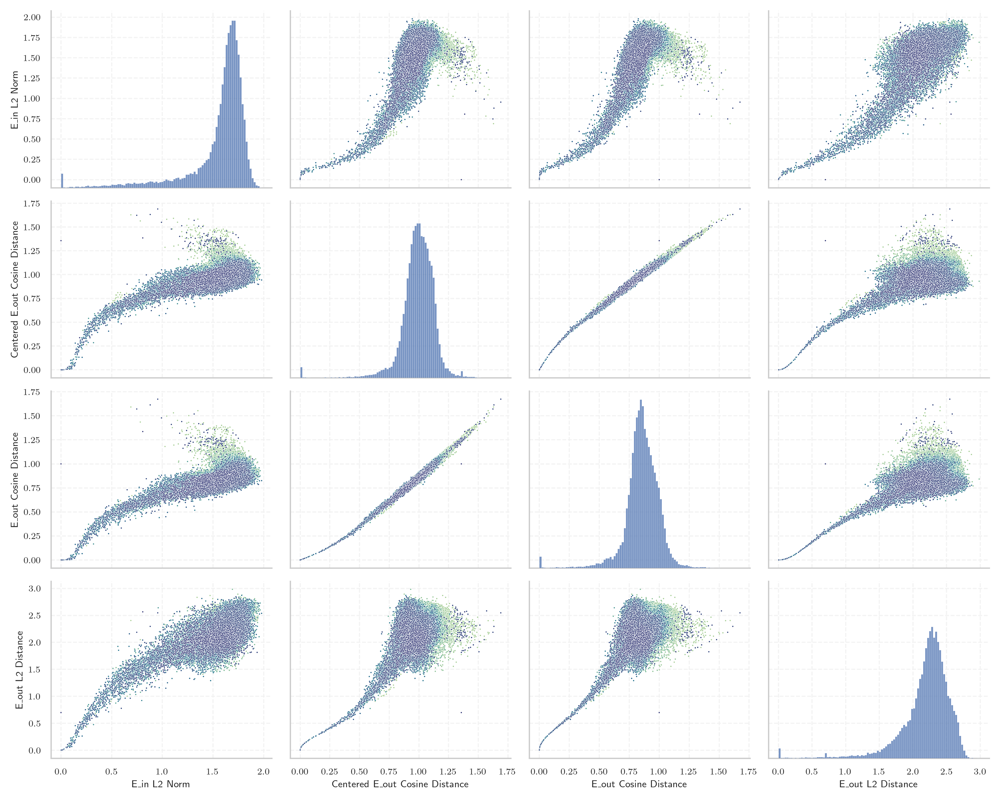
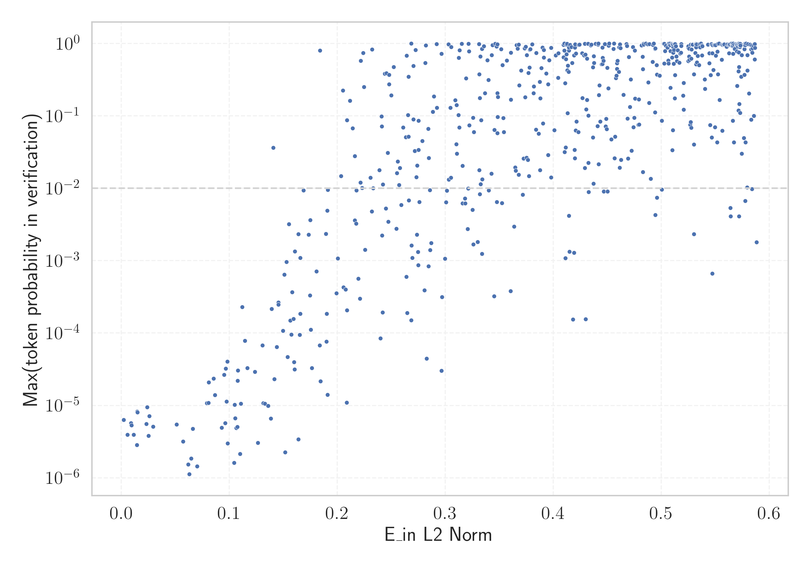

# Report for `microsoft/Phi-3-mini-128k-instruct`

## Model info

* Tied embeddings: no
* LM head uses bias: no
* Indicator for under-trained tokens: E_{in} L2 Norm
  * Overall distribution 1.558 +/- 0.305
  * Token used for verification prompt building: `springframework`
  * Verification threshold: 0.588
  * Threshold for showing candidate under-trained tokens: 0.209
  * Median verified threshold (for bytes, unreachable and special tokens): 0.182
* Embeddings shape: (32064, 3072)
* Vocabulary size: 32011
  * Number of single byte tokens: 351, of which 110 below indicator threshold
  * Number of special tokens: 14, of which 6 below indicator threshold
  * Number of tested under-trained tokens: 620, 620 non-special, 172 below p = 0.01 threshold, 102 below soft indicator threshold

## Under-trained token indicators plot


## Verification plot


## Under-trained token verification results
102 entries below threshold of 0.209

|   token_id | token                       |   indicator | max_prob                                                         | in_other_tokens                                                                 |
|------------|-----------------------------|-------------|------------------------------------------------------------------|---------------------------------------------------------------------------------|
|      16110 | ````` ▁Спољашње `````       |  0.00201051 | <span style='border: 1px solid rgb(169, 68, 66);'>6.4e-06</span> |                                                                                 |
|      28574 | ````` ▁Mediabestanden ````` |  0.00201276 | <span style='border: 1px solid rgb(169, 68, 66);'>6.4e-06</span> |                                                                                 |
|      20528 | ````` ▁autorytatywna `````  |  0.00202321 | <span style='border: 1px solid rgb(169, 68, 66);'>6.4e-06</span> |                                                                                 |
|      27918 | ````` ▁Хронологија `````    |  0.002026   | <span style='border: 1px solid rgb(169, 68, 66);'>6.3e-06</span> |                                                                                 |
|      20609 | ````` ▁Portály `````        |  0.00204529 | <span style='border: 1px solid rgb(169, 68, 66);'>6.4e-06</span> |                                                                                 |
|      11804 | ````` Архівовано `````      |  0.00206332 | <span style='border: 1px solid rgb(169, 68, 66);'>6.3e-06</span> |                                                                                 |
|      21836 | ````` ▁надморској `````     |  0.00566266 | <span style='border: 1px solid rgb(169, 68, 66);'>3.9e-06</span> |                                                                                 |
|      23996 | ````` ▁живело `````         |  0.00888786 | <span style='border: 1px solid rgb(169, 68, 66);'>5.7e-06</span> |                                                                                 |
|      24294 | ````` Webachiv `````        |  0.00948074 | <span style='border: 1px solid rgb(169, 68, 66);'>5.3e-06</span> |                                                                                 |
|      28653 | ````` ▁regnigaste `````     |  0.0114744  | <span style='border: 1px solid rgb(169, 68, 66);'>3.9e-06</span> |                                                                                 |
|      18051 | ````` ▁савезној `````       |  0.014531   | <span style='border: 1px solid rgb(169, 68, 66);'>2.8e-06</span> |                                                                                 |
|      28649 | ````` ▁årsnederbörd `````   |  0.0146256  | <span style='border: 1px solid rgb(169, 68, 66);'>8.3e-06</span> |                                                                                 |
|      27914 | ````` ▁archiválva `````     |  0.0150005  | <span style='border: 1px solid rgb(169, 68, 66);'>8.1e-06</span> |                                                                                 |
|      27900 | ````` ▁eredetiből `````     |  0.0232916  | <span style='border: 1px solid rgb(169, 68, 66);'>5.6e-06</span> |                                                                                 |
|      26821 | ````` ▁Enllaços `````       |  0.0239937  | <span style='border: 1px solid rgb(169, 68, 66);'>9.5e-06</span> |                                                                                 |
|      11766 | ````` хівовано `````        |  0.0250883  | <span style='border: 1px solid rgb(169, 68, 66);'>3.8e-06</span> | <span style='border: 1px solid rgb(169, 68, 66);'>````` Архівовано `````</span> |
|      21673 | ````` ▁висини `````         |  0.0259494  | <span style='border: 1px solid rgb(169, 68, 66);'>7.2e-06</span> |                                                                                 |
|      23654 | ````` ▁dátummal `````       |  0.0295117  | <span style='border: 1px solid rgb(169, 68, 66);'>5.1e-06</span> |                                                                                 |
|      28416 | ````` ▁Мексичка `````       |  0.0512673  | <span style='border: 1px solid rgb(169, 68, 66);'>5.5e-06</span> |                                                                                 |
|      26734 | ````` ▁Årsmed `````         |  0.0571039  | <span style='border: 1px solid rgb(169, 68, 66);'>3.2e-06</span> |                                                                                 |
<details><summary>82 additional entries below threshold</summary>

|   token_id | token                      |   indicator | max_prob                                                         | in_other_tokens                                                                                                                                                                                                                                     |
|------------|----------------------------|-------------|------------------------------------------------------------------|-----------------------------------------------------------------------------------------------------------------------------------------------------------------------------------------------------------------------------------------------------|
|      28623 | ````` ▁Genomsnitt `````    |   0.0620495 | <span style='border: 1px solid rgb(169, 68, 66);'>1.5e-06</span> | <span style='border: 1px solid rgb(169, 68, 66);'>````` ▁Genomsnittlig `````</span>                                                                                                                                                                 |
|      28650 | ````` ▁Genomsnittlig ````` |   0.0628445 | <span style='border: 1px solid rgb(169, 68, 66);'>1.1e-06</span> |                                                                                                                                                                                                                                                     |
|      28354 | ````` ▁Расподела `````     |   0.0647205 | <span style='border: 1px solid rgb(169, 68, 66);'>1.8e-06</span> |                                                                                                                                                                                                                                                     |
|      16056 | ````` љашње `````          |   0.0661741 | <span style='border: 1px solid rgb(169, 68, 66);'>4.8e-06</span> | <span style='border: 1px solid rgb(169, 68, 66);'>````` ▁Спољашње `````</span>                                                                                                                                                                      |
|      17981 | ````` ▁Externí `````       |   0.0701503 | <span style='border: 1px solid rgb(169, 68, 66);'>1.4e-06</span> |                                                                                                                                                                                                                                                     |
|       7651 | ````` ▁släktet `````       |   0.0792316 | <span style='border: 1px solid rgb(169, 68, 66);'>1.1e-05</span> |                                                                                                                                                                                                                                                     |
|      22011 | ````` ▁насељу `````        |   0.0807262 | <span style='border: 1px solid rgb(169, 68, 66);'>1.1e-05</span> |                                                                                                                                                                                                                                                     |
|      28642 | ````` ▁regnig `````        |   0.0808125 | <span style='border: 1px solid rgb(169, 68, 66);'>2.1e-05</span> | <span style='border: 1px solid rgb(169, 68, 66);'>````` ▁regnigaste `````</span>                                                                                                                                                                    |
|       7784 | ````` ▁underarter `````    |   0.0854089 | <span style='border: 1px solid rgb(169, 68, 66);'>2.4e-05</span> |                                                                                                                                                                                                                                                     |
|      28263 | ````` ▁Odkazy `````        |   0.0865755 | <span style='border: 1px solid rgb(169, 68, 66);'>1.4e-05</span> |                                                                                                                                                                                                                                                     |
|      24029 | ````` ▁Jegyzetek `````     |   0.0929318 | <span style='border: 1px solid rgb(169, 68, 66);'>4.9e-06</span> |                                                                                                                                                                                                                                                     |
|      20486 | ````` tatywna `````        |   0.0953065 | <span style='border: 1px solid rgb(169, 68, 66);'>2.7e-05</span> | <span style='border: 1px solid rgb(169, 68, 66);'>````` ▁autorytatywna `````</span>                                                                                                                                                                 |
|      28090 | ````` ▁Савезне `````       |   0.096245  | <span style='border: 1px solid rgb(169, 68, 66);'>5.7e-06</span> |                                                                                                                                                                                                                                                     |
|      20422 | ````` ніципалі `````       |   0.0966726 | <span style='border: 1px solid rgb(169, 68, 66);'>3.2e-05</span> | <span style='border: 1px solid rgb(169, 68, 66);'>````` ▁муніципалі `````</span>                                                                                                                                                                    |
|      23117 | ````` brázky `````         |   0.0973689 | <span style='border: 1px solid rgb(169, 68, 66);'>1.1e-05</span> | <span style='border: 1px solid rgb(169, 68, 66);'>````` Obrázky `````</span>                                                                                                                                                                        |
|      22835 | ````` ▁муніципалі `````    |   0.0983095 | <span style='border: 1px solid rgb(169, 68, 66);'>4e-05</span>   |                                                                                                                                                                                                                                                     |
|      24401 | ````` ▁подацима `````      |   0.0983596 | <span style='border: 1px solid rgb(169, 68, 66);'>3e-06</span>   |                                                                                                                                                                                                                                                     |
|      28647 | ````` ▁torraste `````      |   0.104481  | <span style='border: 1px solid rgb(169, 68, 66);'>1.6e-06</span> |                                                                                                                                                                                                                                                     |
|      23406 | ````` ▁општини `````       |   0.105034  | <span style='border: 1px solid rgb(169, 68, 66);'>1e-05</span>   |                                                                                                                                                                                                                                                     |
|      19837 | ````` ▁Населення `````     |   0.10536   | <span style='border: 1px solid rgb(169, 68, 66);'>6.7e-06</span> |                                                                                                                                                                                                                                                     |
|      24631 | ````` ▁Források `````      |   0.106376  | <span style='border: 1px solid rgb(169, 68, 66);'>4.9e-06</span> |                                                                                                                                                                                                                                                     |
|      14562 | ````` ▁Посилання `````     |   0.107502  | <span style='border: 1px solid rgb(169, 68, 66);'>5.1e-06</span> |                                                                                                                                                                                                                                                     |
|      27645 | ````` ▁Попис `````         |   0.107614  | <span style='border: 1px solid rgb(169, 68, 66);'>2.2e-05</span> |                                                                                                                                                                                                                                                     |
|      20739 | ````` ▁надмор `````        |   0.107973  | <span style='border: 1px solid rgb(169, 68, 66);'>3.1e-05</span> | <span style='border: 1px solid rgb(169, 68, 66);'>````` ▁надморској `````</span>                                                                                                                                                                    |
|      17916 | ````` abestanden `````     |   0.109997  | <span style='border: 1px solid rgb(169, 68, 66);'>2.1e-06</span> | <span style='border: 1px solid rgb(169, 68, 66);'>````` ▁Mediabestanden `````</span>                                                                                                                                                                |
|       7718 | ````` ▁beskrevs `````      |   0.110645  | <span style='border: 1px solid rgb(169, 68, 66);'>1.1e-05</span> |                                                                                                                                                                                                                                                     |
|       9462 | ````` Hozzáférés `````     |   0.111895  | <span style='border: 1px solid rgb(169, 68, 66);'>0.00023</span> |                                                                                                                                                                                                                                                     |
|      20180 | ````` ▁Мексику `````       |   0.114557  | <span style='border: 1px solid rgb(169, 68, 66);'>7.8e-05</span> |                                                                                                                                                                                                                                                     |
|      11229 | ````` ▁становника `````    |   0.1168    | <span style='border: 1px solid rgb(169, 68, 66);'>3.3e-05</span> |                                                                                                                                                                                                                                                     |
|      23726 | ````` ▁насеља `````        |   0.123727  | <span style='border: 1px solid rgb(169, 68, 66);'>2.9e-05</span> |                                                                                                                                                                                                                                                     |
|      26011 | ````` ▁Архивная `````      |   0.126411  | <span style='border: 1px solid rgb(169, 68, 66);'>3.1e-06</span> |                                                                                                                                                                                                                                                     |
|      23715 | ````` ▁Källor `````        |   0.130737  | <span style='border: 1px solid rgb(169, 68, 66);'>6.8e-05</span> |                                                                                                                                                                                                                                                     |
|      18044 | ````` ▁Становништво `````  |   0.131513  | <span style='border: 1px solid rgb(169, 68, 66);'>1.1e-05</span> |                                                                                                                                                                                                                                                     |
|      26847 | ````` .:\u200a `````       |   0.132821  | <span style='border: 1px solid rgb(169, 68, 66);'>1.1e-05</span> |                                                                                                                                                                                                                                                     |
|      24971 | ````` ▁Джерела `````       |   0.135934  | <span style='border: 1px solid rgb(169, 68, 66);'>9.9e-06</span> |                                                                                                                                                                                                                                                     |
|      20645 | ````` ▁Przypisy `````      |   0.138476  | <span style='border: 1px solid rgb(169, 68, 66);'>6.6e-06</span> |                                                                                                                                                                                                                                                     |
|      25283 | ````` ▁липня `````         |   0.139258  | <span style='border: 1px solid rgb(169, 68, 66);'>0.00022</span> |                                                                                                                                                                                                                                                     |
|      23875 | ````` ▁Насеље `````        |   0.140676  | <span style='border: 1px solid rgb(251, 189, 8);'>0.036</span>   |                                                                                                                                                                                                                                                     |
|      26964 | ````` ▁Хронологи `````     |   0.141754  | <span style='border: 1px solid rgb(169, 68, 66);'>2.3e-05</span> | <span style='border: 1px solid rgb(169, 68, 66);'>````` ▁Хронологија `````</span>                                                                                                                                                                   |
|      10688 | ````` ▁gepublic `````      |   0.143958  | <span style='border: 1px solid rgb(169, 68, 66);'>6.4e-05</span> | <span style='border: 1px solid rgb(40, 167, 69);'>````` ▁gepubliceerd `````</span>                                                                                                                                                                  |
|      25840 | ````` ▁државе `````        |   0.145544  | <span style='border: 1px solid rgb(169, 68, 66);'>0.00026</span> |                                                                                                                                                                                                                                                     |
|      28906 | ````` ▁листопада `````     |   0.145551  | <span style='border: 1px solid rgb(169, 68, 66);'>0.00025</span> |                                                                                                                                                                                                                                                     |
|      28633 | ````` nederbörd `````      |   0.149653  | <span style='border: 1px solid rgb(169, 68, 66);'>0.00011</span> | <span style='border: 1px solid rgb(169, 68, 66);'>````` ▁årsnederbörd `````</span>                                                                                                                                                                  |
|      23313 | ````` Obrázky `````        |   0.150916  | <span style='border: 1px solid rgb(169, 68, 66);'>0.00064</span> |                                                                                                                                                                                                                                                     |
|      19196 | ````` ▁Према `````         |   0.151589  | <span style='border: 1px solid rgb(169, 68, 66);'>2.2e-06</span> |                                                                                                                                                                                                                                                     |
|      27610 | ````` ▁gminie `````        |   0.152853  | <span style='border: 1px solid rgb(169, 68, 66);'>0.00096</span> |                                                                                                                                                                                                                                                     |
|      18140 | ````` rinningsområ `````   |   0.154067  | <span style='border: 1px solid rgb(169, 68, 66);'>4.7e-05</span> |                                                                                                                                                                                                                                                     |
|      12731 | ````` ederbörd `````       |   0.15512   | <span style='border: 1px solid rgb(255, 145, 0);'>0.0032</span>  | <span style='border: 1px solid rgb(169, 68, 66);'>````` ▁nederbörd `````</span>, <span style='border: 1px solid rgb(169, 68, 66);'>````` nederbörd `````</span>, <span style='border: 1px solid rgb(169, 68, 66);'>````` ▁årsnederbörd `````</span> |
|      16916 | ````` ▁invån `````         |   0.156367  | <span style='border: 1px solid rgb(169, 68, 66);'>0.00015</span> | <span style='border: 1px solid rgb(251, 189, 8);'>````` ▁invånare `````</span>                                                                                                                                                                      |
|      23015 | ````` ▁tématu `````        |   0.157348  | <span style='border: 1px solid rgb(169, 68, 66);'>9.6e-05</span> |                                                                                                                                                                                                                                                     |
|      26502 | ````` ▁вересня `````       |   0.158219  | <span style='border: 1px solid rgb(169, 68, 66);'>0.00037</span> |                                                                                                                                                                                                                                                     |
|      25460 | ````` ▁жовтня `````        |   0.159329  | <span style='border: 1px solid rgb(169, 68, 66);'>0.00016</span> |                                                                                                                                                                                                                                                     |
|      14414 | ````` ▁Archivlink `````    |   0.159843  | <span style='border: 1px solid rgb(169, 68, 66);'>4e-05</span>   |                                                                                                                                                                                                                                                     |
|      27061 | ````` ▁Резултати `````     |   0.160475  | <span style='border: 1px solid rgb(169, 68, 66);'>3.2e-05</span> |                                                                                                                                                                                                                                                     |
|      24852 | ````` ▁грудня `````        |   0.160779  | <span style='border: 1px solid rgb(255, 145, 0);'>0.0013</span>  |                                                                                                                                                                                                                                                     |
|      26334 | ````` ▁квітня `````        |   0.163826  | <span style='border: 1px solid rgb(255, 145, 0);'>0.0023</span>  |                                                                                                                                                                                                                                                     |
|      16068 | ````` eltemperaturen ````` |   0.163958  | <span style='border: 1px solid rgb(169, 68, 66);'>3.4e-06</span> |                                                                                                                                                                                                                                                     |
|      26527 | ````` ▁червня `````        |   0.165224  | <span style='border: 1px solid rgb(169, 68, 66);'>9.5e-05</span> |                                                                                                                                                                                                                                                     |
|      25696 | ````` ▁роках `````         |   0.165628  | <span style='border: 1px solid rgb(169, 68, 66);'>0.00018</span> |                                                                                                                                                                                                                                                     |
|      18676 | ````` ніципа `````         |   0.16571   | <span style='border: 1px solid rgb(255, 145, 0);'>0.0011</span>  | <span style='border: 1px solid rgb(169, 68, 66);'>````` ніципалі `````</span>, <span style='border: 1px solid rgb(169, 68, 66);'>````` ▁муніципалі `````</span>                                                                                     |
|      28044 | ````` ▁округу `````        |   0.168744  | <span style='border: 1px solid rgb(255, 145, 0);'>0.0093</span>  |                                                                                                                                                                                                                                                     |
|      26675 | ````` ▁kallaste `````      |   0.173566  | <span style='border: 1px solid rgb(255, 145, 0);'>0.0023</span>  |                                                                                                                                                                                                                                                     |
|      20568 | ````` ▁сайті `````         |   0.17471   | <span style='border: 1px solid rgb(169, 68, 66);'>0.00033</span> |                                                                                                                                                                                                                                                     |
|      28498 | ````` ▁лютого `````        |   0.174927  | <span style='border: 1px solid rgb(255, 145, 0);'>0.0036</span>  |                                                                                                                                                                                                                                                     |
|      25528 | ````` ▁серпня `````        |   0.17548   | <span style='border: 1px solid rgb(169, 68, 66);'>0.00011</span> |                                                                                                                                                                                                                                                     |
|      22768 | ````` ▁жовт `````          |   0.176428  | <span style='border: 1px solid rgb(169, 68, 66);'>3.3e-05</span> | <span style='border: 1px solid rgb(169, 68, 66);'>````` ▁жовтня `````</span>                                                                                                                                                                        |
|      24708 | ````` ▁січня `````         |   0.180815  | <span style='border: 1px solid rgb(169, 68, 66);'>0.00071</span> |                                                                                                                                                                                                                                                     |
|      28365 | ````` ▁розташ `````        |   0.18377   | <span style='border: 1px solid rgb(169, 68, 66);'>6.8e-05</span> |                                                                                                                                                                                                                                                     |
|      31899 | ````` ⥤ `````              |   0.184028  | <span style='border: 1px solid rgb(40, 167, 69);'>0.8</span>     |                                                                                                                                                                                                                                                     |
|      26782 | ````` ▁пописа `````        |   0.184427  | <span style='border: 1px solid rgb(169, 68, 66);'>2.2e-05</span> |                                                                                                                                                                                                                                                     |
|      24309 | ````` ▁чемпі `````         |   0.189381  | <span style='border: 1px solid rgb(255, 145, 0);'>0.0023</span>  |                                                                                                                                                                                                                                                     |
|      26335 | ````` llaços `````         |   0.189978  | <span style='border: 1px solid rgb(169, 68, 66);'>7.6e-05</span> | <span style='border: 1px solid rgb(169, 68, 66);'>````` ▁Enllaços `````</span>                                                                                                                                                                      |
|      16194 | ````` ▁Биография `````     |   0.19031   | <span style='border: 1px solid rgb(169, 68, 66);'>0.00019</span> |                                                                                                                                                                                                                                                     |
|      18328 | ````` ▁trakten `````       |   0.190743  | <span style='border: 1px solid rgb(255, 145, 0);'>0.0049</span>  |                                                                                                                                                                                                                                                     |
|      24576 | ````` ▁estaven `````       |   0.191031  | <span style='border: 1px solid rgb(169, 68, 66);'>1.4e-05</span> |                                                                                                                                                                                                                                                     |
|      28791 | ````` ▁віці `````          |   0.191254  | <span style='border: 1px solid rgb(255, 145, 0);'>0.0095</span>  |                                                                                                                                                                                                                                                     |
|      24097 | ````` ▁huvudstaden `````   |   0.199273  | <span style='border: 1px solid rgb(169, 68, 66);'>0.00035</span> |                                                                                                                                                                                                                                                     |
|      21284 | ````` ▁березня `````       |   0.20056   | <span style='border: 1px solid rgb(255, 145, 0);'>0.0011</span>  |                                                                                                                                                                                                                                                     |
|       9147 | ````` ozzáférés `````      |   0.203452  | <span style='border: 1px solid rgb(251, 189, 8);'>0.015</span>   | <span style='border: 1px solid rgb(169, 68, 66);'>````` Hozzáférés `````</span>                                                                                                                                                                     |
|      17871 | ````` ▁odkazy `````        |   0.205296  | <span style='border: 1px solid rgb(40, 167, 69);'>0.22</span>    |                                                                                                                                                                                                                                                     |
|      26662 | ````` ▁varmaste `````      |   0.205717  | <span style='border: 1px solid rgb(169, 68, 66);'>0.00043</span> |                                                                                                                                                                                                                                                     |
|      15887 | ````` ▁још `````           |   0.207694  | <span style='border: 1px solid rgb(169, 68, 66);'>0.0004</span>  |                                                                                                                                                                                                                                                     |
</details>
<details><summary>518 additional entries above threshold</summary>

|   token_id | token                     |   indicator | max_prob                                                         | in_other_tokens                                                                                                                                                                                                                                                                                                                                                                                           |
|------------|---------------------------|-------------|------------------------------------------------------------------|-----------------------------------------------------------------------------------------------------------------------------------------------------------------------------------------------------------------------------------------------------------------------------------------------------------------------------------------------------------------------------------------------------------|
|      23217 | ````` ▁zvuky `````        |    0.208708 | <span style='border: 1px solid rgb(169, 68, 66);'>1.1e-05</span> |                                                                                                                                                                                                                                                                                                                                                                                                           |
|      29451 | ````` ▁piłkar `````       |    0.209034 | <span style='border: 1px solid rgb(251, 189, 8);'>0.087</span>   |                                                                                                                                                                                                                                                                                                                                                                                                           |
|      13297 | ````` ісля `````          |    0.209034 | <span style='border: 1px solid rgb(169, 68, 66);'>0.00021</span> | <span style='border: 1px solid rgb(40, 167, 69);'>````` ▁після `````</span>, <span style='border: 1px solid rgb(169, 68, 66);'>````` ▁Після `````</span>                                                                                                                                                                                                                                                  |
|      25564 | ````` ▁броја `````        |    0.211828 | <span style='border: 1px solid rgb(40, 167, 69);'>0.16</span>    |                                                                                                                                                                                                                                                                                                                                                                                                           |
|      24675 | ````` ▁mistrzost `````    |    0.214305 | <span style='border: 1px solid rgb(251, 189, 8);'>0.067</span>   |                                                                                                                                                                                                                                                                                                                                                                                                           |
|       3798 | ````` oreferrer `````     |    0.216094 | <span style='border: 1px solid rgb(251, 189, 8);'>0.028</span>   | ````` ▁noreferrer `````, ````` noreferrer `````                                                                                                                                                                                                                                                                                                                                                           |
|      23767 | ````` egyzetek `````      |    0.21611  | <span style='border: 1px solid rgb(255, 145, 0);'>0.0036</span>  | <span style='border: 1px solid rgb(169, 68, 66);'>````` ▁Jegyzetek `````</span>                                                                                                                                                                                                                                                                                                                           |
|      25145 | ````` ▁kwiet `````        |    0.217378 | <span style='border: 1px solid rgb(255, 145, 0);'>0.0032</span>  | <span style='border: 1px solid rgb(40, 167, 69);'>````` ▁kwietnia `````</span>                                                                                                                                                                                                                                                                                                                            |
|      15412 | ````` ▁zewnętrzne `````   |    0.217778 | <span style='border: 1px solid rgb(255, 145, 0);'>0.0094</span>  |                                                                                                                                                                                                                                                                                                                                                                                                           |
|      28361 | ````` ▁Zobacz `````       |    0.219499 | <span style='border: 1px solid rgb(169, 68, 66);'>0.00056</span> |                                                                                                                                                                                                                                                                                                                                                                                                           |
|      27513 | ````` ▁півден `````       |    0.220919 | <span style='border: 1px solid rgb(169, 68, 66);'>0.0003</span>  |                                                                                                                                                                                                                                                                                                                                                                                                           |
|      27660 | ````` ckså `````          |    0.22148  | <span style='border: 1px solid rgb(251, 189, 8);'>0.012</span>   | ````` ▁också `````                                                                                                                                                                                                                                                                                                                                                                                        |
|      27646 | ````` ▁július `````       |    0.221781 | <span style='border: 1px solid rgb(40, 167, 69);'>0.58</span>    |                                                                                                                                                                                                                                                                                                                                                                                                           |
|      13243 | ````` ▁länkar `````       |    0.222858 | <span style='border: 1px solid rgb(251, 189, 8);'>0.01</span>    |                                                                                                                                                                                                                                                                                                                                                                                                           |
|      15871 | ````` ▁везе `````         |    0.223977 | <span style='border: 1px solid rgb(40, 167, 69);'>0.74</span>    |                                                                                                                                                                                                                                                                                                                                                                                                           |
|      26641 | ````` ▁Мексика `````      |    0.224621 | <span style='border: 1px solid rgb(40, 167, 69);'>0.25</span>    |                                                                                                                                                                                                                                                                                                                                                                                                           |
|      29640 | ````` ▁powiecie `````     |    0.225744 | <span style='border: 1px solid rgb(255, 145, 0);'>0.0014</span>  |                                                                                                                                                                                                                                                                                                                                                                                                           |
|      23105 | ````` ▁videa `````        |    0.230614 | <span style='border: 1px solid rgb(251, 189, 8);'>0.014</span>   |                                                                                                                                                                                                                                                                                                                                                                                                           |
|      27124 | ````` ▁sierpnia `````     |    0.231938 | <span style='border: 1px solid rgb(255, 145, 0);'>0.0048</span>  |                                                                                                                                                                                                                                                                                                                                                                                                           |
|      21858 | ````` archiviato `````    |    0.232258 | <span style='border: 1px solid rgb(40, 167, 69);'>0.82</span>    |                                                                                                                                                                                                                                                                                                                                                                                                           |
|      27191 | ````` ▁szeptember `````   |    0.233239 | <span style='border: 1px solid rgb(251, 189, 8);'>0.01</span>    |                                                                                                                                                                                                                                                                                                                                                                                                           |
|      22018 | ````` ▁wrześ `````        |    0.238867 | <span style='border: 1px solid rgb(251, 189, 8);'>0.018</span>   | <span style='border: 1px solid rgb(255, 145, 0);'>````` ▁września `````</span>                                                                                                                                                                                                                                                                                                                            |
|      21887 | ````` ▁складі `````       |    0.23987  | <span style='border: 1px solid rgb(169, 68, 66);'>8.4e-05</span> |                                                                                                                                                                                                                                                                                                                                                                                                           |
|      25069 | ````` $}}% `````          |    0.241049 | <span style='border: 1px solid rgb(251, 189, 8);'>0.098</span>   |                                                                                                                                                                                                                                                                                                                                                                                                           |
|      17076 | ````` ▁invånare `````     |    0.241311 | <span style='border: 1px solid rgb(251, 189, 8);'>0.071</span>   |                                                                                                                                                                                                                                                                                                                                                                                                           |
|      24002 | ````` ▁stycznia `````     |    0.241546 | <span style='border: 1px solid rgb(255, 145, 0);'>0.0022</span>  |                                                                                                                                                                                                                                                                                                                                                                                                           |
|      23795 | ````` ▁paździer `````     |    0.242029 | <span style='border: 1px solid rgb(169, 68, 66);'>0.00019</span> | <span style='border: 1px solid rgb(251, 189, 8);'>````` ▁października `````</span>                                                                                                                                                                                                                                                                                                                        |
|      17835 | ````` ▁Станов `````       |    0.242102 | <span style='border: 1px solid rgb(251, 189, 8);'>0.011</span>   | <span style='border: 1px solid rgb(169, 68, 66);'>````` ▁Становништво `````</span>                                                                                                                                                                                                                                                                                                                        |
|      21636 | ````` ▁Население `````    |    0.243919 | <span style='border: 1px solid rgb(40, 167, 69);'>0.38</span>    |                                                                                                                                                                                                                                                                                                                                                                                                           |
|       9831 | ````` ▁челов `````        |    0.244928 | <span style='border: 1px solid rgb(255, 145, 0);'>0.0053</span>  | ````` ▁человек `````, ````` ▁челове `````, ````` ▁человека `````                                                                                                                                                                                                                                                                                                                                          |
|      28535 | ````` ▁február `````      |    0.24544  | <span style='border: 1px solid rgb(40, 167, 69);'>0.39</span>    |                                                                                                                                                                                                                                                                                                                                                                                                           |
|      22744 | ````` ▁település `````    |    0.246766 | <span style='border: 1px solid rgb(251, 189, 8);'>0.031</span>   |                                                                                                                                                                                                                                                                                                                                                                                                           |
|      26908 | ````` ▁lipca `````        |    0.247317 | <span style='border: 1px solid rgb(255, 145, 0);'>0.0035</span>  |                                                                                                                                                                                                                                                                                                                                                                                                           |
|      22945 | ````` ▁január `````       |    0.247948 | <span style='border: 1px solid rgb(40, 167, 69);'>0.37</span>    |                                                                                                                                                                                                                                                                                                                                                                                                           |
|      10168 | ````` ▁Мекси `````        |    0.248009 | <span style='border: 1px solid rgb(40, 167, 69);'>0.27</span>    | <span style='border: 1px solid rgb(169, 68, 66);'>````` ▁Мексику `````</span>, <span style='border: 1px solid rgb(40, 167, 69);'>````` ▁Мексика `````</span>, <span style='border: 1px solid rgb(169, 68, 66);'>````` ▁Мексичка `````</span>                                                                                                                                                              |
|      24353 | ````` ▁článku `````       |    0.250008 | <span style='border: 1px solid rgb(40, 167, 69);'>0.19</span>    |                                                                                                                                                                                                                                                                                                                                                                                                           |
|      23247 | ````` ▁dátum `````        |    0.252325 | <span style='border: 1px solid rgb(40, 167, 69);'>0.47</span>    | <span style='border: 1px solid rgb(169, 68, 66);'>````` ▁dátummal `````</span>                                                                                                                                                                                                                                                                                                                            |
|      28182 | ````` ▁півні `````        |    0.254789 | <span style='border: 1px solid rgb(255, 145, 0);'>0.0028</span>  |                                                                                                                                                                                                                                                                                                                                                                                                           |
|      23441 | ````` któber `````        |    0.255182 | <span style='border: 1px solid rgb(251, 189, 8);'>0.016</span>   | <span style='border: 1px solid rgb(251, 189, 8);'>````` ▁október `````</span>                                                                                                                                                                                                                                                                                                                             |
|      25229 | ````` лтати `````         |    0.256079 | <span style='border: 1px solid rgb(251, 189, 8);'>0.023</span>   | <span style='border: 1px solid rgb(169, 68, 66);'>````` ▁Резултати `````</span>                                                                                                                                                                                                                                                                                                                           |
|      26643 | ````` ▁października ````` |    0.257182 | <span style='border: 1px solid rgb(251, 189, 8);'>0.011</span>   |                                                                                                                                                                                                                                                                                                                                                                                                           |
|      29404 | ````` ▁lutego `````       |    0.258031 | <span style='border: 1px solid rgb(251, 189, 8);'>0.019</span>   |                                                                                                                                                                                                                                                                                                                                                                                                           |
|      28187 | ````` ▁április `````      |    0.259131 | <span style='border: 1px solid rgb(255, 145, 0);'>0.0059</span>  |                                                                                                                                                                                                                                                                                                                                                                                                           |
|      24605 | ````` ▁március `````      |    0.261053 | <span style='border: 1px solid rgb(251, 189, 8);'>0.069</span>   |                                                                                                                                                                                                                                                                                                                                                                                                           |
|      17391 | ````` ▁савез `````        |    0.263567 | <span style='border: 1px solid rgb(251, 189, 8);'>0.051</span>   | <span style='border: 1px solid rgb(169, 68, 66);'>````` ▁савезној `````</span>                                                                                                                                                                                                                                                                                                                            |
|      25563 | ````` ▁Після `````        |    0.264016 | <span style='border: 1px solid rgb(169, 68, 66);'>0.0006</span>  |                                                                                                                                                                                                                                                                                                                                                                                                           |
|      14572 | ````` шње `````           |    0.264157 | <span style='border: 1px solid rgb(40, 167, 69);'>0.68</span>    | <span style='border: 1px solid rgb(169, 68, 66);'>````` љашње `````</span>, <span style='border: 1px solid rgb(169, 68, 66);'>````` ▁Спољашње `````</span>                                                                                                                                                                                                                                                |
|      26498 | ````` >\<^ `````          |    0.264667 | <span style='border: 1px solid rgb(169, 68, 66);'>0.00019</span> |                                                                                                                                                                                                                                                                                                                                                                                                           |
|      27802 | ````` ▁kwietnia `````     |    0.265554 | <span style='border: 1px solid rgb(40, 167, 69);'>0.1</span>     |                                                                                                                                                                                                                                                                                                                                                                                                           |
|      23910 | ````` ритор `````         |    0.265902 | <span style='border: 1px solid rgb(251, 189, 8);'>0.052</span>   | <span style='border: 1px solid rgb(251, 189, 8);'>````` ▁територ `````</span>                                                                                                                                                                                                                                                                                                                             |
|      17398 | ````` ништво `````        |    0.265958 | <span style='border: 1px solid rgb(40, 167, 69);'>0.35</span>    | <span style='border: 1px solid rgb(169, 68, 66);'>````` ▁Становништво `````</span>                                                                                                                                                                                                                                                                                                                        |
|      13043 | ````` силання `````       |    0.266137 | <span style='border: 1px solid rgb(255, 145, 0);'>0.0068</span>  | <span style='border: 1px solid rgb(169, 68, 66);'>````` ▁Посилання `````</span>                                                                                                                                                                                                                                                                                                                           |
|      17828 | ````` ▁држави `````       |    0.268356 | <span style='border: 1px solid rgb(169, 68, 66);'>0.00015</span> |                                                                                                                                                                                                                                                                                                                                                                                                           |
|      24291 | ````` IABot `````         |    0.268523 | <span style='border: 1px solid rgb(40, 167, 69);'>1</span>       |                                                                                                                                                                                                                                                                                                                                                                                                           |
|      11193 | ````` ▁Normdaten `````    |    0.268666 | <span style='border: 1px solid rgb(255, 145, 0);'>0.0016</span>  |                                                                                                                                                                                                                                                                                                                                                                                                           |
|      12867 | ````` лання `````         |    0.269414 | <span style='border: 1px solid rgb(255, 145, 0);'>0.0011</span>  | <span style='border: 1px solid rgb(255, 145, 0);'>````` силання `````</span>, <span style='border: 1px solid rgb(169, 68, 66);'>````` ▁Посилання `````</span>                                                                                                                                                                                                                                             |
|      23882 | ````` ▁október `````      |    0.270475 | <span style='border: 1px solid rgb(251, 189, 8);'>0.09</span>    |                                                                                                                                                                                                                                                                                                                                                                                                           |
|      18596 | ````` ципа `````          |    0.270548 | <span style='border: 1px solid rgb(40, 167, 69);'>0.49</span>    | <span style='border: 1px solid rgb(255, 145, 0);'>````` ніципа `````</span>, <span style='border: 1px solid rgb(169, 68, 66);'>````` ніципалі `````</span>, <span style='border: 1px solid rgb(169, 68, 66);'>````` ▁муніципалі `````</span>, <span style='border: 1px solid rgb(251, 189, 8);'>````` ниципа `````</span>, <span style='border: 1px solid rgb(251, 189, 8);'>````` ▁муниципа `````</span> |
|      12882 | ````` ITableView `````    |    0.271825 | <span style='border: 1px solid rgb(251, 189, 8);'>0.033</span>   | ````` ▁UITableView `````, ````` UITableView `````                                                                                                                                                                                                                                                                                                                                                         |
|       9108 | ````` ▁Насе `````         |    0.27257  | <span style='border: 1px solid rgb(40, 167, 69);'>0.81</span>    | <span style='border: 1px solid rgb(169, 68, 66);'>````` ▁Населення `````</span>, <span style='border: 1px solid rgb(40, 167, 69);'>````` ▁Население `````</span>, <span style='border: 1px solid rgb(251, 189, 8);'>````` ▁Насеље `````</span>                                                                                                                                                            |
|      15571 | ````` ▁февра `````        |    0.2732   | <span style='border: 1px solid rgb(251, 189, 8);'>0.014</span>   | <span style='border: 1px solid rgb(40, 167, 69);'>````` ▁февраля `````</span>                                                                                                                                                                                                                                                                                                                             |
|      16651 | ````` ▁månaden `````      |    0.273603 | <span style='border: 1px solid rgb(255, 145, 0);'>0.0023</span>  |                                                                                                                                                                                                                                                                                                                                                                                                           |
|      17270 | ````` ▁налази `````       |    0.273987 | <span style='border: 1px solid rgb(251, 189, 8);'>0.021</span>   |                                                                                                                                                                                                                                                                                                                                                                                                           |
|      26106 | ````` ▁grudnia `````      |    0.2746   | <span style='border: 1px solid rgb(255, 145, 0);'>0.0013</span>  |                                                                                                                                                                                                                                                                                                                                                                                                           |
|       8554 | ````` ▁році `````         |    0.274895 | <span style='border: 1px solid rgb(169, 68, 66);'>0.00087</span> |                                                                                                                                                                                                                                                                                                                                                                                                           |
|      25726 | ````` ▁травня `````       |    0.275233 | <span style='border: 1px solid rgb(251, 189, 8);'>0.034</span>   |                                                                                                                                                                                                                                                                                                                                                                                                           |
|      26194 | ````` ▁Савез `````        |    0.275341 | <span style='border: 1px solid rgb(251, 189, 8);'>0.085</span>   | <span style='border: 1px solid rgb(169, 68, 66);'>````` ▁Савезне `````</span>                                                                                                                                                                                                                                                                                                                             |
|      19735 | ````` ▁розта `````        |    0.275953 | <span style='border: 1px solid rgb(255, 145, 0);'>0.0064</span>  | <span style='border: 1px solid rgb(169, 68, 66);'>````` ▁розташ `````</span>                                                                                                                                                                                                                                                                                                                              |
|      22551 | ````` ▁квіт `````         |    0.27878  | <span style='border: 1px solid rgb(251, 189, 8);'>0.045</span>   | <span style='border: 1px solid rgb(255, 145, 0);'>````` ▁квітня `````</span>                                                                                                                                                                                                                                                                                                                              |
|      26444 | ````` ▁czerwca `````      |    0.28084  | <span style='border: 1px solid rgb(169, 68, 66);'>0.00039</span> |                                                                                                                                                                                                                                                                                                                                                                                                           |
|      26457 | ````` ▁május `````        |    0.281486 | <span style='border: 1px solid rgb(40, 167, 69);'>0.54</span>    |                                                                                                                                                                                                                                                                                                                                                                                                           |
|      26006 | ````` ensoort `````       |    0.281982 | <span style='border: 1px solid rgb(40, 167, 69);'>0.94</span>    |                                                                                                                                                                                                                                                                                                                                                                                                           |
|      29608 | ````` ▁према `````        |    0.282675 | <span style='border: 1px solid rgb(169, 68, 66);'>4.4e-05</span> |                                                                                                                                                                                                                                                                                                                                                                                                           |
|      29079 | ````` ▁augusztus `````    |    0.284255 | <span style='border: 1px solid rgb(251, 189, 8);'>0.066</span>   |                                                                                                                                                                                                                                                                                                                                                                                                           |
|      28589 | ````` ▁mieszkańców `````  |    0.284423 | <span style='border: 1px solid rgb(169, 68, 66);'>0.00084</span> |                                                                                                                                                                                                                                                                                                                                                                                                           |
|       8061 | ````` ▁године `````       |    0.284666 | <span style='border: 1px solid rgb(251, 189, 8);'>0.026</span>   |                                                                                                                                                                                                                                                                                                                                                                                                           |
|      26146 | ````` фіцій `````         |    0.285772 | <span style='border: 1px solid rgb(255, 145, 0);'>0.0095</span>  |                                                                                                                                                                                                                                                                                                                                                                                                           |
|      28824 | ````` ▁које `````         |    0.286045 | <span style='border: 1px solid rgb(255, 145, 0);'>0.0014</span>  |                                                                                                                                                                                                                                                                                                                                                                                                           |
|      28528 | ````` ▁која `````         |    0.287047 | <span style='border: 1px solid rgb(255, 145, 0);'>0.0018</span>  |                                                                                                                                                                                                                                                                                                                                                                                                           |
|      24696 | ````` ▁рік `````          |    0.288493 | <span style='border: 1px solid rgb(40, 167, 69);'>0.11</span>    |                                                                                                                                                                                                                                                                                                                                                                                                           |
|      20366 | ````` ▁сезо `````         |    0.289584 | <span style='border: 1px solid rgb(40, 167, 69);'>0.18</span>    |                                                                                                                                                                                                                                                                                                                                                                                                           |
|      23939 | ````` ▁Див `````          |    0.291887 | <span style='border: 1px solid rgb(40, 167, 69);'>0.98</span>    |                                                                                                                                                                                                                                                                                                                                                                                                           |
|      14723 | ````` ingsområ `````      |    0.292191 | <span style='border: 1px solid rgb(40, 167, 69);'>0.13</span>    | <span style='border: 1px solid rgb(169, 68, 66);'>````` rinningsområ `````</span>                                                                                                                                                                                                                                                                                                                         |
|      17299 | ````` ▁nederbörd `````    |    0.296364 | <span style='border: 1px solid rgb(169, 68, 66);'>3e-05</span>   |                                                                                                                                                                                                                                                                                                                                                                                                           |
|      28294 | ````` usztus `````        |    0.296554 | <span style='border: 1px solid rgb(40, 167, 69);'>0.72</span>    | <span style='border: 1px solid rgb(251, 189, 8);'>````` ▁augusztus `````</span>                                                                                                                                                                                                                                                                                                                           |
|      18030 | ````` ▁nyelven `````      |    0.296906 | <span style='border: 1px solid rgb(169, 68, 66);'>0.00031</span> |                                                                                                                                                                                                                                                                                                                                                                                                           |
|      28825 | ````` ▁інших `````        |    0.299685 | <span style='border: 1px solid rgb(255, 145, 0);'>0.0011</span>  |                                                                                                                                                                                                                                                                                                                                                                                                           |
|      26199 | ````` ▁mieszkań `````     |    0.300839 | <span style='border: 1px solid rgb(255, 145, 0);'>0.0064</span>  | <span style='border: 1px solid rgb(169, 68, 66);'>````` ▁mieszkańców `````</span>                                                                                                                                                                                                                                                                                                                         |
|      29146 | ````` ▁філь `````         |    0.30158  | <span style='border: 1px solid rgb(255, 145, 0);'>0.0093</span>  |                                                                                                                                                                                                                                                                                                                                                                                                           |
|      25248 | ````` xtart `````         |    0.302937 | <span style='border: 1px solid rgb(40, 167, 69);'>0.97</span>    |                                                                                                                                                                                                                                                                                                                                                                                                           |
|      24951 | ````` ▁bazie `````        |    0.303217 | <span style='border: 1px solid rgb(251, 189, 8);'>0.013</span>   |                                                                                                                                                                                                                                                                                                                                                                                                           |
|      29162 | ````` ▁сельсов `````      |    0.304644 | <span style='border: 1px solid rgb(40, 167, 69);'>0.13</span>    |                                                                                                                                                                                                                                                                                                                                                                                                           |
|      15022 | ````` ▁zewnętrz `````     |    0.305229 | <span style='border: 1px solid rgb(251, 189, 8);'>0.014</span>   | <span style='border: 1px solid rgb(255, 145, 0);'>````` ▁zewnętrzne `````</span>                                                                                                                                                                                                                                                                                                                          |
|      23763 | ````` ▁През `````         |    0.305566 | <span style='border: 1px solid rgb(40, 167, 69);'>0.89</span>    |                                                                                                                                                                                                                                                                                                                                                                                                           |
|      27929 | ````` ▁genomsnitt `````   |    0.309136 | <span style='border: 1px solid rgb(40, 167, 69);'>0.16</span>    |                                                                                                                                                                                                                                                                                                                                                                                                           |
|      28729 | ````` ▁június `````       |    0.310253 | <span style='border: 1px solid rgb(251, 189, 8);'>0.041</span>   |                                                                                                                                                                                                                                                                                                                                                                                                           |
|      23046 | ````` ▁miejscowo `````    |    0.310506 | <span style='border: 1px solid rgb(40, 167, 69);'>0.14</span>    |                                                                                                                                                                                                                                                                                                                                                                                                           |
|      27071 | ````` ▁Історія `````      |    0.310769 | <span style='border: 1px solid rgb(251, 189, 8);'>0.03</span>    |                                                                                                                                                                                                                                                                                                                                                                                                           |
|      26378 | ````` iből `````          |    0.312172 | <span style='border: 1px solid rgb(40, 167, 69);'>0.1</span>     | <span style='border: 1px solid rgb(169, 68, 66);'>````` ▁eredetiből `````</span>                                                                                                                                                                                                                                                                                                                          |
|       7917 | ````` ▁listade `````      |    0.312428 | <span style='border: 1px solid rgb(40, 167, 69);'>0.63</span>    |                                                                                                                                                                                                                                                                                                                                                                                                           |
|      16910 | ````` ▁општи `````        |    0.312883 | <span style='border: 1px solid rgb(251, 189, 8);'>0.069</span>   | <span style='border: 1px solid rgb(169, 68, 66);'>````` ▁општини `````</span>                                                                                                                                                                                                                                                                                                                             |
|      29409 | ````` ▁anglès `````       |    0.313307 | <span style='border: 1px solid rgb(40, 167, 69);'>0.8</span>     |                                                                                                                                                                                                                                                                                                                                                                                                           |
|      22258 | ````` dostęp `````        |    0.315203 | <span style='border: 1px solid rgb(40, 167, 69);'>0.99</span>    |                                                                                                                                                                                                                                                                                                                                                                                                           |
|      23548 | ````` сторія `````        |    0.315991 | <span style='border: 1px solid rgb(255, 145, 0);'>0.0062</span>  | <span style='border: 1px solid rgb(251, 189, 8);'>````` ▁Історія `````</span>                                                                                                                                                                                                                                                                                                                             |
|      15653 | ````` ској `````          |    0.316102 | <span style='border: 1px solid rgb(251, 189, 8);'>0.02</span>    | <span style='border: 1px solid rgb(169, 68, 66);'>````` ▁надморској `````</span>                                                                                                                                                                                                                                                                                                                          |
|       7654 | ````` ▁beskre `````       |    0.318261 | <span style='border: 1px solid rgb(255, 145, 0);'>0.0072</span>  | <span style='border: 1px solid rgb(169, 68, 66);'>````` ▁beskrevs `````</span>                                                                                                                                                                                                                                                                                                                            |
|      28622 | ````` ▁seizoen `````      |    0.318576 | <span style='border: 1px solid rgb(255, 145, 0);'>0.0062</span>  |                                                                                                                                                                                                                                                                                                                                                                                                           |
|      20072 | ````` ywna `````          |    0.319263 | <span style='border: 1px solid rgb(40, 167, 69);'>0.33</span>    | <span style='border: 1px solid rgb(169, 68, 66);'>````` tatywna `````</span>, <span style='border: 1px solid rgb(169, 68, 66);'>````` ▁autorytatywna `````</span>                                                                                                                                                                                                                                         |
|      14503 | ````` ▁насеље `````       |    0.320776 | <span style='border: 1px solid rgb(255, 145, 0);'>0.0027</span>  |                                                                                                                                                                                                                                                                                                                                                                                                           |
|      28531 | ````` ▁війни `````        |    0.321267 | <span style='border: 1px solid rgb(255, 145, 0);'>0.0099</span>  |                                                                                                                                                                                                                                                                                                                                                                                                           |
|      20448 | ````` ▁Kontrola `````     |    0.321523 | <span style='border: 1px solid rgb(40, 167, 69);'>0.99</span>    |                                                                                                                                                                                                                                                                                                                                                                                                           |
|      12200 | ````` ▁чемпи `````        |    0.321905 | <span style='border: 1px solid rgb(40, 167, 69);'>0.78</span>    | <span style='border: 1px solid rgb(40, 167, 69);'>````` ▁чемпиона `````</span>                                                                                                                                                                                                                                                                                                                            |
|      29255 | ````` ▁Tová `````         |    0.322344 | <span style='border: 1px solid rgb(251, 189, 8);'>0.074</span>   |                                                                                                                                                                                                                                                                                                                                                                                                           |
|      25298 | ````` ▁września `````     |    0.325117 | <span style='border: 1px solid rgb(255, 145, 0);'>0.005</span>   |                                                                                                                                                                                                                                                                                                                                                                                                           |
|      19082 | ````` ▁області `````      |    0.325782 | <span style='border: 1px solid rgb(251, 189, 8);'>0.094</span>   |                                                                                                                                                                                                                                                                                                                                                                                                           |
|      19539 | ````` ▁demsel `````       |    0.325922 | <span style='border: 1px solid rgb(255, 145, 0);'>0.0017</span>  | ````` ▁demselben `````                                                                                                                                                                                                                                                                                                                                                                                    |
|      22505 | ````` ▁Уи `````           |    0.326526 | <span style='border: 1px solid rgb(251, 189, 8);'>0.06</span>    |                                                                                                                                                                                                                                                                                                                                                                                                           |
|      26867 | ````` ▁збір `````         |    0.329974 | <span style='border: 1px solid rgb(255, 145, 0);'>0.0018</span>  |                                                                                                                                                                                                                                                                                                                                                                                                           |
|      10553 | ````` \<^ `````           |    0.331153 | <span style='border: 1px solid rgb(40, 167, 69);'>0.98</span>    | <span style='border: 1px solid rgb(169, 68, 66);'>````` >\<^ `````</span>                                                                                                                                                                                                                                                                                                                                 |
|      21209 | ````` ▁stycz `````        |    0.331398 | <span style='border: 1px solid rgb(40, 167, 69);'>0.37</span>    | <span style='border: 1px solid rgb(255, 145, 0);'>````` ▁stycznia `````</span>                                                                                                                                                                                                                                                                                                                            |
|      27376 | ````` лії `````           |    0.331531 | <span style='border: 1px solid rgb(251, 189, 8);'>0.018</span>   |                                                                                                                                                                                                                                                                                                                                                                                                           |
|      25454 | ````` ▁seizo `````        |    0.331872 | <span style='border: 1px solid rgb(255, 145, 0);'>0.0083</span>  | <span style='border: 1px solid rgb(255, 145, 0);'>````` ▁seizoen `````</span>                                                                                                                                                                                                                                                                                                                             |
|      25191 | ````` ▁міста `````        |    0.331964 | <span style='border: 1px solid rgb(40, 167, 69);'>0.18</span>    |                                                                                                                                                                                                                                                                                                                                                                                                           |
|      25412 | ````` ▁советский `````    |    0.332519 | <span style='border: 1px solid rgb(40, 167, 69);'>0.66</span>    |                                                                                                                                                                                                                                                                                                                                                                                                           |
|      29728 | ````` ▁później `````      |    0.332785 | <span style='border: 1px solid rgb(251, 189, 8);'>0.011</span>   |                                                                                                                                                                                                                                                                                                                                                                                                           |
|      13040 | ````` ▁осіб `````         |    0.33335  | <span style='border: 1px solid rgb(251, 189, 8);'>0.087</span>   |                                                                                                                                                                                                                                                                                                                                                                                                           |
|      11635 | ````` ▁држа `````         |    0.334053 | <span style='border: 1px solid rgb(40, 167, 69);'>0.84</span>    | <span style='border: 1px solid rgb(169, 68, 66);'>````` ▁држави `````</span>, <span style='border: 1px solid rgb(169, 68, 66);'>````` ▁државе `````</span>                                                                                                                                                                                                                                                |
|      15242 | ````` ▁населення `````    |    0.334067 | <span style='border: 1px solid rgb(255, 145, 0);'>0.0012</span>  |                                                                                                                                                                                                                                                                                                                                                                                                           |
|      26159 | ````` ▁listopada `````    |    0.334148 | <span style='border: 1px solid rgb(251, 189, 8);'>0.013</span>   |                                                                                                                                                                                                                                                                                                                                                                                                           |
|      23069 | ````` ▁Архив `````        |    0.335855 | <span style='border: 1px solid rgb(40, 167, 69);'>0.92</span>    | <span style='border: 1px solid rgb(169, 68, 66);'>````` ▁Архивная `````</span>                                                                                                                                                                                                                                                                                                                            |
|      10711 | ````` ▁gepubliceerd ````` |    0.336712 | <span style='border: 1px solid rgb(40, 167, 69);'>0.21</span>    |                                                                                                                                                                                                                                                                                                                                                                                                           |
|      17331 | ````` ▁Linki `````        |    0.338909 | <span style='border: 1px solid rgb(40, 167, 69);'>0.59</span>    |                                                                                                                                                                                                                                                                                                                                                                                                           |
|      14755 | ````` ewnętrz `````       |    0.339884 | <span style='border: 1px solid rgb(40, 167, 69);'>0.31</span>    | <span style='border: 1px solid rgb(251, 189, 8);'>````` ▁zewnętrz `````</span>, <span style='border: 1px solid rgb(255, 145, 0);'>````` ▁zewnętrzne `````</span>                                                                                                                                                                                                                                          |
|      18675 | ````` ▁població `````     |    0.340263 | <span style='border: 1px solid rgb(255, 145, 0);'>0.0093</span>  |                                                                                                                                                                                                                                                                                                                                                                                                           |
|      26773 | ````` ▁című `````         |    0.342838 | <span style='border: 1px solid rgb(251, 189, 8);'>0.016</span>   |                                                                                                                                                                                                                                                                                                                                                                                                           |
|      28162 | ````` ▁юго `````          |    0.343107 | <span style='border: 1px solid rgb(40, 167, 69);'>0.69</span>    |                                                                                                                                                                                                                                                                                                                                                                                                           |
|      19209 | ````` ▁inwoners `````     |    0.34375  | <span style='border: 1px solid rgb(40, 167, 69);'>0.95</span>    |                                                                                                                                                                                                                                                                                                                                                                                                           |
|      25683 | ````` ▁складу `````       |    0.345163 | <span style='border: 1px solid rgb(169, 68, 66);'>0.00032</span> |                                                                                                                                                                                                                                                                                                                                                                                                           |
|      31664 | ````` ߬ `````              |    0.345593 | <span style='border: 1px solid rgb(251, 189, 8);'>0.064</span>   |                                                                                                                                                                                                                                                                                                                                                                                                           |
|      27422 | ````` шп `````            |    0.346319 | <span style='border: 1px solid rgb(40, 167, 69);'>0.99</span>    |                                                                                                                                                                                                                                                                                                                                                                                                           |
|      21932 | ````` ▁Итали `````        |    0.347503 | <span style='border: 1px solid rgb(40, 167, 69);'>0.9</span>     |                                                                                                                                                                                                                                                                                                                                                                                                           |
|      18222 | ````` нцикло `````        |    0.347664 | <span style='border: 1px solid rgb(255, 145, 0);'>0.0064</span>  | <span style='border: 1px solid rgb(255, 145, 0);'>````` нциклопеди `````</span>, <span style='border: 1px solid rgb(40, 167, 69);'>````` ▁энциклопеди `````</span>                                                                                                                                                                                                                                        |
|      21902 | ````` нії `````           |    0.348138 | <span style='border: 1px solid rgb(251, 189, 8);'>0.057</span>   |                                                                                                                                                                                                                                                                                                                                                                                                           |
|      25926 | ````` ▁британ `````       |    0.348164 | <span style='border: 1px solid rgb(40, 167, 69);'>0.97</span>    |                                                                                                                                                                                                                                                                                                                                                                                                           |
|      27190 | ````` РСР `````           |    0.348203 | <span style='border: 1px solid rgb(40, 167, 69);'>0.21</span>    |                                                                                                                                                                                                                                                                                                                                                                                                           |
|      25247 | ````` ▁wieś `````         |    0.348416 | <span style='border: 1px solid rgb(251, 189, 8);'>0.096</span>   |                                                                                                                                                                                                                                                                                                                                                                                                           |
|      20798 | ````` ▁жов `````          |    0.34871  | <span style='border: 1px solid rgb(40, 167, 69);'>0.18</span>    | <span style='border: 1px solid rgb(169, 68, 66);'>````` ▁жовт `````</span>, <span style='border: 1px solid rgb(169, 68, 66);'>````` ▁жовтня `````</span>                                                                                                                                                                                                                                                  |
|       7172 | ````` ▁familjen `````     |    0.351655 | <span style='border: 1px solid rgb(40, 167, 69);'>0.83</span>    |                                                                                                                                                                                                                                                                                                                                                                                                           |
|      29526 | ````` ▁столі `````        |    0.352409 | <span style='border: 1px solid rgb(255, 145, 0);'>0.0062</span>  |                                                                                                                                                                                                                                                                                                                                                                                                           |
|      17467 | ````` ▁inwon `````        |    0.353009 | <span style='border: 1px solid rgb(40, 167, 69);'>0.5</span>     | <span style='border: 1px solid rgb(40, 167, 69);'>````` ▁inwoners `````</span>                                                                                                                                                                                                                                                                                                                            |
|      12517 | ````` ▁авгу `````         |    0.353712 | <span style='border: 1px solid rgb(251, 189, 8);'>0.093</span>   | <span style='border: 1px solid rgb(40, 167, 69);'>````` ▁августа `````</span>                                                                                                                                                                                                                                                                                                                             |
|      19895 | ````` ▁фамилией `````     |    0.354301 | <span style='border: 1px solid rgb(251, 189, 8);'>0.06</span>    |                                                                                                                                                                                                                                                                                                                                                                                                           |
|      13765 | ````` ▁пів `````          |    0.356892 | <span style='border: 1px solid rgb(40, 167, 69);'>0.58</span>    | <span style='border: 1px solid rgb(169, 68, 66);'>````` ▁півден `````</span>, <span style='border: 1px solid rgb(255, 145, 0);'>````` ▁півні `````</span>                                                                                                                                                                                                                                                 |
|      26593 | ````` ▁отрима `````       |    0.360595 | <span style='border: 1px solid rgb(169, 68, 66);'>0.00038</span> |                                                                                                                                                                                                                                                                                                                                                                                                           |
|      21243 | ````` ▁eredet `````       |    0.360732 | <span style='border: 1px solid rgb(40, 167, 69);'>0.75</span>    | <span style='border: 1px solid rgb(169, 68, 66);'>````` ▁eredetiből `````</span>                                                                                                                                                                                                                                                                                                                          |
|      23280 | ````` ździer `````        |    0.360794 | <span style='border: 1px solid rgb(40, 167, 69);'>0.17</span>    | <span style='border: 1px solid rgb(169, 68, 66);'>````` ▁paździer `````</span>, <span style='border: 1px solid rgb(251, 189, 8);'>````` ▁października `````</span>                                                                                                                                                                                                                                        |
|      21498 | ````` ▁została `````      |    0.363733 | <span style='border: 1px solid rgb(255, 145, 0);'>0.0029</span>  |                                                                                                                                                                                                                                                                                                                                                                                                           |
|      15279 | ````` ▁који `````         |    0.36481  | <span style='border: 1px solid rgb(251, 189, 8);'>0.019</span>   |                                                                                                                                                                                                                                                                                                                                                                                                           |
|      25929 | ````` ництво `````        |    0.365208 | <span style='border: 1px solid rgb(251, 189, 8);'>0.017</span>   |                                                                                                                                                                                                                                                                                                                                                                                                           |
|      30994 | ````` 𝕜 `````             |    0.365872 | <span style='border: 1px solid rgb(40, 167, 69);'>0.95</span>    |                                                                                                                                                                                                                                                                                                                                                                                                           |
|      13717 | ````` ној `````           |    0.366976 | <span style='border: 1px solid rgb(40, 167, 69);'>0.85</span>    | <span style='border: 1px solid rgb(169, 68, 66);'>````` ▁савезној `````</span>                                                                                                                                                                                                                                                                                                                            |
|      26137 | ````` ▁információk `````  |    0.367944 | <span style='border: 1px solid rgb(251, 189, 8);'>0.015</span>   |                                                                                                                                                                                                                                                                                                                                                                                                           |
|      15799 | ````` ▁Литература `````   |    0.368018 | <span style='border: 1px solid rgb(40, 167, 69);'>0.97</span>    |                                                                                                                                                                                                                                                                                                                                                                                                           |
|      18557 | ````` ▁člán `````         |    0.368462 | <span style='border: 1px solid rgb(40, 167, 69);'>0.26</span>    | <span style='border: 1px solid rgb(40, 167, 69);'>````` ▁článku `````</span>                                                                                                                                                                                                                                                                                                                              |
|      12149 | ````` ▁років `````        |    0.37022  | <span style='border: 1px solid rgb(40, 167, 69);'>0.42</span>    |                                                                                                                                                                                                                                                                                                                                                                                                           |
|      25872 | ````` ▁жі `````           |    0.371701 | <span style='border: 1px solid rgb(255, 145, 0);'>0.0081</span>  |                                                                                                                                                                                                                                                                                                                                                                                                           |
|      22636 | ````` rások `````         |    0.372378 | <span style='border: 1px solid rgb(251, 189, 8);'>0.026</span>   | <span style='border: 1px solid rgb(169, 68, 66);'>````` ▁Források `````</span>                                                                                                                                                                                                                                                                                                                            |
|      26853 | ````` ▁zdoby `````        |    0.373525 | <span style='border: 1px solid rgb(40, 167, 69);'>0.86</span>    |                                                                                                                                                                                                                                                                                                                                                                                                           |
|      24493 | ````` ▁ње `````           |    0.374092 | <span style='border: 1px solid rgb(40, 167, 69);'>0.18</span>    |                                                                                                                                                                                                                                                                                                                                                                                                           |
|      29521 | ````` ▁още `````          |    0.374388 | <span style='border: 1px solid rgb(40, 167, 69);'>0.9</span>     |                                                                                                                                                                                                                                                                                                                                                                                                           |
|      19523 | ````` ▁людях `````        |    0.375121 | <span style='border: 1px solid rgb(251, 189, 8);'>0.026</span>   |                                                                                                                                                                                                                                                                                                                                                                                                           |
|      15984 | ````` ▁були `````         |    0.375399 | <span style='border: 1px solid rgb(40, 167, 69);'>0.69</span>    |                                                                                                                                                                                                                                                                                                                                                                                                           |
|       6723 | ````` ▁ingår `````        |    0.376474 | <span style='border: 1px solid rgb(251, 189, 8);'>0.025</span>   |                                                                                                                                                                                                                                                                                                                                                                                                           |
|      29084 | ````` ▁регі `````         |    0.377118 | <span style='border: 1px solid rgb(40, 167, 69);'>0.39</span>    |                                                                                                                                                                                                                                                                                                                                                                                                           |
|      17490 | ````` ▁као `````          |    0.377458 | <span style='border: 1px solid rgb(251, 189, 8);'>0.015</span>   |                                                                                                                                                                                                                                                                                                                                                                                                           |
|      15895 | ````` ▁чемпиона `````     |    0.377918 | <span style='border: 1px solid rgb(40, 167, 69);'>0.46</span>    |                                                                                                                                                                                                                                                                                                                                                                                                           |
|      24366 | ````` ▁sierp `````        |    0.378249 | <span style='border: 1px solid rgb(40, 167, 69);'>0.82</span>    | <span style='border: 1px solid rgb(255, 145, 0);'>````` ▁sierpnia `````</span>                                                                                                                                                                                                                                                                                                                            |
|      23171 | ````` ▁теа `````          |    0.378632 | <span style='border: 1px solid rgb(40, 167, 69);'>0.83</span>    | <span style='border: 1px solid rgb(40, 167, 69);'>````` ▁театра `````</span>                                                                                                                                                                                                                                                                                                                              |
|      22823 | ````` mathchar `````      |    0.380566 | <span style='border: 1px solid rgb(40, 167, 69);'>0.97</span>    |                                                                                                                                                                                                                                                                                                                                                                                                           |
|      25743 | ````` ябре `````          |    0.381796 | <span style='border: 1px solid rgb(40, 167, 69);'>0.21</span>    |                                                                                                                                                                                                                                                                                                                                                                                                           |
|      23595 | ````` ▁працю `````        |    0.382103 | <span style='border: 1px solid rgb(40, 167, 69);'>0.25</span>    |                                                                                                                                                                                                                                                                                                                                                                                                           |
|      25858 | ````` ▁війсь `````        |    0.384041 | <span style='border: 1px solid rgb(251, 189, 8);'>0.065</span>   |                                                                                                                                                                                                                                                                                                                                                                                                           |
|      14028 | ````` ▁сент `````         |    0.384273 | <span style='border: 1px solid rgb(40, 167, 69);'>0.74</span>    | <span style='border: 1px solid rgb(40, 167, 69);'>````` ▁сентября `````</span>                                                                                                                                                                                                                                                                                                                            |
|      29796 | ````` ським `````         |    0.386379 | <span style='border: 1px solid rgb(251, 189, 8);'>0.056</span>   |                                                                                                                                                                                                                                                                                                                                                                                                           |
|      16201 | ````` ▁францу `````       |    0.387374 | <span style='border: 1px solid rgb(40, 167, 69);'>0.3</span>     | ````` ▁француз `````                                                                                                                                                                                                                                                                                                                                                                                      |
|      15318 | ````` ▁він `````          |    0.387633 | <span style='border: 1px solid rgb(251, 189, 8);'>0.018</span>   |                                                                                                                                                                                                                                                                                                                                                                                                           |
|      25377 | ````` ▁уні `````          |    0.388078 | <span style='border: 1px solid rgb(40, 167, 69);'>0.17</span>    | <span style='border: 1px solid rgb(251, 189, 8);'>````` ▁університе `````</span>                                                                                                                                                                                                                                                                                                                          |
|      28113 | ````` ▁северо `````       |    0.389109 | <span style='border: 1px solid rgb(40, 167, 69);'>0.46</span>    |                                                                                                                                                                                                                                                                                                                                                                                                           |
|       9439 | ````` ▁Мос `````          |    0.390007 | <span style='border: 1px solid rgb(40, 167, 69);'>0.88</span>    | ````` ▁Моск `````, ````` ▁Москов `````, ````` ▁Москва `````                                                                                                                                                                                                                                                                                                                                               |
|      21316 | ````` ▁чолові `````       |    0.390512 | <span style='border: 1px solid rgb(251, 189, 8);'>0.079</span>   |                                                                                                                                                                                                                                                                                                                                                                                                           |
|      25623 | ````` ▁церкви `````       |    0.391321 | <span style='border: 1px solid rgb(40, 167, 69);'>0.82</span>    |                                                                                                                                                                                                                                                                                                                                                                                                           |
|       4577 | ````` ▁року `````         |    0.391324 | <span style='border: 1px solid rgb(40, 167, 69);'>0.64</span>    |                                                                                                                                                                                                                                                                                                                                                                                                           |
|      14840 | ````` пня `````           |    0.393561 | <span style='border: 1px solid rgb(40, 167, 69);'>0.38</span>    | <span style='border: 1px solid rgb(169, 68, 66);'>````` ▁липня `````</span>, <span style='border: 1px solid rgb(169, 68, 66);'>````` ▁серпня `````</span>                                                                                                                                                                                                                                                 |
|       8806 | ````` ▁Archivado `````    |    0.395194 | <span style='border: 1px solid rgb(40, 167, 69);'>0.27</span>    |                                                                                                                                                                                                                                                                                                                                                                                                           |
|      25526 | ````` цького `````        |    0.395348 | <span style='border: 1px solid rgb(251, 189, 8);'>0.029</span>   |                                                                                                                                                                                                                                                                                                                                                                                                           |
|      22263 | ````` ▁турни `````        |    0.396235 | <span style='border: 1px solid rgb(40, 167, 69);'>0.59</span>    |                                                                                                                                                                                                                                                                                                                                                                                                           |
|      22590 | ````` álva `````          |    0.397892 | <span style='border: 1px solid rgb(40, 167, 69);'>0.87</span>    | <span style='border: 1px solid rgb(169, 68, 66);'>````` ▁archiválva `````</span>                                                                                                                                                                                                                                                                                                                          |
|      14545 | ````` ewnę `````          |    0.398004 | <span style='border: 1px solid rgb(251, 189, 8);'>0.014</span>   | <span style='border: 1px solid rgb(40, 167, 69);'>````` ewnętrz `````</span>, <span style='border: 1px solid rgb(251, 189, 8);'>````` ▁zewnętrz `````</span>, <span style='border: 1px solid rgb(255, 145, 0);'>````` ▁zewnętrzne `````</span>                                                                                                                                                            |
|      21547 | ````` ській `````         |    0.401094 | <span style='border: 1px solid rgb(251, 189, 8);'>0.063</span>   |                                                                                                                                                                                                                                                                                                                                                                                                           |
|      25018 | ````` ську `````          |    0.402349 | <span style='border: 1px solid rgb(40, 167, 69);'>0.68</span>    |                                                                                                                                                                                                                                                                                                                                                                                                           |
|      13959 | ````` ▁окт `````          |    0.404401 | <span style='border: 1px solid rgb(40, 167, 69);'>0.34</span>    | <span style='border: 1px solid rgb(40, 167, 69);'>````` ▁октября `````</span>                                                                                                                                                                                                                                                                                                                             |
|      23601 | ````` ▁Хро `````          |    0.404657 | <span style='border: 1px solid rgb(40, 167, 69);'>0.73</span>    | <span style='border: 1px solid rgb(169, 68, 66);'>````` ▁Хронологи `````</span>, <span style='border: 1px solid rgb(169, 68, 66);'>````` ▁Хронологија `````</span>                                                                                                                                                                                                                                        |
|      29325 | ````` ▁ју `````           |    0.40942  | <span style='border: 1px solid rgb(40, 167, 69);'>0.65</span>    |                                                                                                                                                                                                                                                                                                                                                                                                           |
|      20271 | ````` ▁sezon `````        |    0.409619 | <span style='border: 1px solid rgb(40, 167, 69);'>0.95</span>    |                                                                                                                                                                                                                                                                                                                                                                                                           |
|      18221 | ````` cowo `````          |    0.410131 | <span style='border: 1px solid rgb(40, 167, 69);'>0.99</span>    | <span style='border: 1px solid rgb(40, 167, 69);'>````` ▁miejscowo `````</span>                                                                                                                                                                                                                                                                                                                           |
|      21562 | ````` ▁zdob `````         |    0.410164 | <span style='border: 1px solid rgb(40, 167, 69);'>0.8</span>     | <span style='border: 1px solid rgb(40, 167, 69);'>````` ▁zdoby `````</span>                                                                                                                                                                                                                                                                                                                               |
|      29679 | ````` ▁zespo `````        |    0.410428 | <span style='border: 1px solid rgb(251, 189, 8);'>0.032</span>   |                                                                                                                                                                                                                                                                                                                                                                                                           |
|      21781 | ````` лася `````          |    0.411038 | <span style='border: 1px solid rgb(40, 167, 69);'>0.28</span>    |                                                                                                                                                                                                                                                                                                                                                                                                           |
|      22041 | ````` ▁stolet `````       |    0.411221 | <span style='border: 1px solid rgb(255, 145, 0);'>0.0011</span>  | <span style='border: 1px solid rgb(40, 167, 69);'>````` ▁století `````</span>                                                                                                                                                                                                                                                                                                                             |
|      10361 | ````` ▁також `````        |    0.411484 | <span style='border: 1px solid rgb(251, 189, 8);'>0.037</span>   |                                                                                                                                                                                                                                                                                                                                                                                                           |
|      28471 | ````` зько `````          |    0.411844 | <span style='border: 1px solid rgb(40, 167, 69);'>0.61</span>    |                                                                                                                                                                                                                                                                                                                                                                                                           |
|      21857 | ````` ▁генерал `````      |    0.412133 | <span style='border: 1px solid rgb(40, 167, 69);'>0.96</span>    |                                                                                                                                                                                                                                                                                                                                                                                                           |
|      22690 | ````` лися `````          |    0.412377 | <span style='border: 1px solid rgb(40, 167, 69);'>0.71</span>    |                                                                                                                                                                                                                                                                                                                                                                                                           |
|      10588 | ````` widet `````         |    0.412835 | <span style='border: 1px solid rgb(40, 167, 69);'>0.99</span>    | ````` widetilde `````                                                                                                                                                                                                                                                                                                                                                                                     |
|      24047 | ````` ▁póź `````          |    0.413056 | <span style='border: 1px solid rgb(40, 167, 69);'>0.43</span>    | <span style='border: 1px solid rgb(251, 189, 8);'>````` ▁później `````</span>                                                                                                                                                                                                                                                                                                                             |
|      28892 | ````` ▁Пів `````          |    0.413318 | <span style='border: 1px solid rgb(40, 167, 69);'>0.11</span>    |                                                                                                                                                                                                                                                                                                                                                                                                           |
|      17121 | ````` ▁ноября `````       |    0.41345  | <span style='border: 1px solid rgb(40, 167, 69);'>0.49</span>    |                                                                                                                                                                                                                                                                                                                                                                                                           |
|      19940 | ````` ▁ць `````           |    0.414366 | <span style='border: 1px solid rgb(40, 167, 69);'>0.41</span>    | <span style='border: 1px solid rgb(255, 145, 0);'>````` ▁цього `````</span>                                                                                                                                                                                                                                                                                                                               |
|      22123 | ````` ▁född `````         |    0.414449 | <span style='border: 1px solid rgb(40, 167, 69);'>0.8</span>     |                                                                                                                                                                                                                                                                                                                                                                                                           |
|      24814 | ````` ▁információ `````   |    0.414543 | <span style='border: 1px solid rgb(255, 145, 0);'>0.0042</span>  | <span style='border: 1px solid rgb(251, 189, 8);'>````` ▁információk `````</span>                                                                                                                                                                                                                                                                                                                         |
|      26042 | ````` ▁округа `````       |    0.414546 | <span style='border: 1px solid rgb(40, 167, 69);'>0.87</span>    |                                                                                                                                                                                                                                                                                                                                                                                                           |
|      28184 | ````` ▁цього `````        |    0.415097 | <span style='border: 1px solid rgb(255, 145, 0);'>0.0013</span>  |                                                                                                                                                                                                                                                                                                                                                                                                           |
|      24621 | ````` ▁листо `````        |    0.415412 | <span style='border: 1px solid rgb(40, 167, 69);'>0.96</span>    | <span style='border: 1px solid rgb(169, 68, 66);'>````` ▁листопада `````</span>                                                                                                                                                                                                                                                                                                                           |
|      20959 | ````` ällor `````         |    0.416631 | <span style='border: 1px solid rgb(40, 167, 69);'>0.89</span>    | <span style='border: 1px solid rgb(169, 68, 66);'>````` ▁Källor `````</span>                                                                                                                                                                                                                                                                                                                              |
|      20900 | ````` ostęp `````         |    0.417465 | <span style='border: 1px solid rgb(40, 167, 69);'>0.54</span>    | <span style='border: 1px solid rgb(40, 167, 69);'>````` dostęp `````</span>                                                                                                                                                                                                                                                                                                                               |
|      25052 | ````` ▁letech `````       |    0.418212 | <span style='border: 1px solid rgb(169, 68, 66);'>0.00015</span> |                                                                                                                                                                                                                                                                                                                                                                                                           |
|      26711 | ````` gså `````           |    0.419135 | <span style='border: 1px solid rgb(40, 167, 69);'>0.68</span>    | ````` ▁også `````                                                                                                                                                                                                                                                                                                                                                                                         |
|      28372 | ````` ▁відбу `````        |    0.419275 | <span style='border: 1px solid rgb(255, 145, 0);'>0.0013</span>  |                                                                                                                                                                                                                                                                                                                                                                                                           |
|      17638 | ````` ському `````        |    0.419699 | <span style='border: 1px solid rgb(251, 189, 8);'>0.034</span>   |                                                                                                                                                                                                                                                                                                                                                                                                           |
|      29752 | ````` ńskim `````         |    0.41989  | <span style='border: 1px solid rgb(251, 189, 8);'>0.026</span>   |                                                                                                                                                                                                                                                                                                                                                                                                           |
|      27125 | ````` ▁титу `````         |    0.419971 | <span style='border: 1px solid rgb(40, 167, 69);'>0.88</span>    |                                                                                                                                                                                                                                                                                                                                                                                                           |
|      14558 | ````` ▁фран `````         |    0.420229 | <span style='border: 1px solid rgb(40, 167, 69);'>0.98</span>    | <span style='border: 1px solid rgb(40, 167, 69);'>````` ▁францу `````</span>, ````` ▁француз `````                                                                                                                                                                                                                                                                                                        |
|      13259 | ````` ▁міс `````          |    0.420772 | <span style='border: 1px solid rgb(251, 189, 8);'>0.063</span>   | <span style='border: 1px solid rgb(40, 167, 69);'>````` ▁місце `````</span>, <span style='border: 1px solid rgb(40, 167, 69);'>````` ▁міста `````</span>                                                                                                                                                                                                                                                  |
|      14374 | ````` ▁апре `````         |    0.420915 | <span style='border: 1px solid rgb(40, 167, 69);'>0.73</span>    | <span style='border: 1px solid rgb(40, 167, 69);'>````` ▁апреля `````</span>                                                                                                                                                                                                                                                                                                                              |
|      16629 | ````` ▁який `````         |    0.421492 | <span style='border: 1px solid rgb(251, 189, 8);'>0.083</span>   |                                                                                                                                                                                                                                                                                                                                                                                                           |
|      26948 | ````` ▁należ `````        |    0.423191 | <span style='border: 1px solid rgb(251, 189, 8);'>0.06</span>    |                                                                                                                                                                                                                                                                                                                                                                                                           |
|      26447 | ````` ▁amery `````        |    0.423505 | <span style='border: 1px solid rgb(40, 167, 69);'>0.96</span>    |                                                                                                                                                                                                                                                                                                                                                                                                           |
|      11518 | ````` ▁geldig `````       |    0.42432  | <span style='border: 1px solid rgb(40, 167, 69);'>0.96</span>    |                                                                                                                                                                                                                                                                                                                                                                                                           |
|      14262 | ````` ▁фев `````          |    0.426786 | <span style='border: 1px solid rgb(40, 167, 69);'>0.73</span>    | <span style='border: 1px solid rgb(251, 189, 8);'>````` ▁февра `````</span>, <span style='border: 1px solid rgb(40, 167, 69);'>````` ▁февраля `````</span>                                                                                                                                                                                                                                                |
|      26937 | ````` ▁Він `````          |    0.427087 | <span style='border: 1px solid rgb(40, 167, 69);'>0.18</span>    |                                                                                                                                                                                                                                                                                                                                                                                                           |
|      20070 | ````` ▁autory `````       |    0.428393 | <span style='border: 1px solid rgb(40, 167, 69);'>0.68</span>    | <span style='border: 1px solid rgb(169, 68, 66);'>````` ▁autorytatywna `````</span>                                                                                                                                                                                                                                                                                                                       |
|       7368 | ````` ября `````          |    0.429237 | <span style='border: 1px solid rgb(251, 189, 8);'>0.019</span>   | <span style='border: 1px solid rgb(40, 167, 69);'>````` ▁сентября `````</span>, <span style='border: 1px solid rgb(40, 167, 69);'>````` ▁октября `````</span>, <span style='border: 1px solid rgb(40, 167, 69);'>````` ▁ноября `````</span>                                                                                                                                                               |
|      21483 | ````` лося `````          |    0.429368 | <span style='border: 1px solid rgb(40, 167, 69);'>0.99</span>    |                                                                                                                                                                                                                                                                                                                                                                                                           |
|      13195 | ````` ▁цер `````          |    0.429782 | <span style='border: 1px solid rgb(40, 167, 69);'>0.7</span>     | <span style='border: 1px solid rgb(40, 167, 69);'>````` ▁церкви `````</span>, ````` ▁церков `````                                                                                                                                                                                                                                                                                                         |
|      26573 | ````` ▁яких `````         |    0.430098 | <span style='border: 1px solid rgb(169, 68, 66);'>0.00016</span> |                                                                                                                                                                                                                                                                                                                                                                                                           |
|      20214 | ````` ског `````          |    0.430562 | <span style='border: 1px solid rgb(40, 167, 69);'>0.12</span>    |                                                                                                                                                                                                                                                                                                                                                                                                           |
|      25805 | ````` ▁альбо `````        |    0.431152 | <span style='border: 1px solid rgb(40, 167, 69);'>0.62</span>    |                                                                                                                                                                                                                                                                                                                                                                                                           |
|      15751 | ````` ▁августа `````      |    0.431246 | <span style='border: 1px solid rgb(40, 167, 69);'>0.17</span>    |                                                                                                                                                                                                                                                                                                                                                                                                           |
|      24229 | ````` ▁Оте `````          |    0.432381 | <span style='border: 1px solid rgb(40, 167, 69);'>0.99</span>    | <span style='border: 1px solid rgb(40, 167, 69);'>````` ▁Отече `````</span>                                                                                                                                                                                                                                                                                                                               |
|      11394 | ````` ▁був `````          |    0.432459 | <span style='border: 1px solid rgb(251, 189, 8);'>0.022</span>   |                                                                                                                                                                                                                                                                                                                                                                                                           |
|      27038 | ````` ▁století `````      |    0.432477 | <span style='border: 1px solid rgb(40, 167, 69);'>0.1</span>     |                                                                                                                                                                                                                                                                                                                                                                                                           |
|      28331 | ````` ▁Normdatei `````    |    0.432872 | <span style='border: 1px solid rgb(255, 145, 0);'>0.0089</span>  |                                                                                                                                                                                                                                                                                                                                                                                                           |
|      17145 | ````` ▁година `````       |    0.434788 | <span style='border: 1px solid rgb(40, 167, 69);'>0.94</span>    |                                                                                                                                                                                                                                                                                                                                                                                                           |
|      23602 | ````` ▁pił `````          |    0.435201 | <span style='border: 1px solid rgb(40, 167, 69);'>0.96</span>    | <span style='border: 1px solid rgb(251, 189, 8);'>````` ▁piłkar `````</span>                                                                                                                                                                                                                                                                                                                              |
|      25833 | ````` лимпий `````        |    0.43673  | <span style='border: 1px solid rgb(251, 189, 8);'>0.05</span>    |                                                                                                                                                                                                                                                                                                                                                                                                           |
|      18969 | ````` ▁села `````         |    0.436825 | <span style='border: 1px solid rgb(40, 167, 69);'>0.47</span>    |                                                                                                                                                                                                                                                                                                                                                                                                           |
|      27312 | ````` ової `````          |    0.437304 | <span style='border: 1px solid rgb(251, 189, 8);'>0.012</span>   |                                                                                                                                                                                                                                                                                                                                                                                                           |
|      29487 | ````` ▁Официаль `````     |    0.437633 | <span style='border: 1px solid rgb(40, 167, 69);'>0.67</span>    |                                                                                                                                                                                                                                                                                                                                                                                                           |
|      24608 | ````` ▁музи `````         |    0.437836 | <span style='border: 1px solid rgb(40, 167, 69);'>0.54</span>    |                                                                                                                                                                                                                                                                                                                                                                                                           |
|      24902 | ````` owała `````         |    0.439305 | <span style='border: 1px solid rgb(40, 167, 69);'>0.99</span>    |                                                                                                                                                                                                                                                                                                                                                                                                           |
|      23776 | ````` мії `````           |    0.441021 | <span style='border: 1px solid rgb(251, 189, 8);'>0.072</span>   |                                                                                                                                                                                                                                                                                                                                                                                                           |
|      29774 | ````` ▁Лон `````          |    0.441507 | <span style='border: 1px solid rgb(40, 167, 69);'>0.96</span>    |                                                                                                                                                                                                                                                                                                                                                                                                           |
|      26708 | ````` ▁депута `````       |    0.441702 | <span style='border: 1px solid rgb(40, 167, 69);'>1</span>       |                                                                                                                                                                                                                                                                                                                                                                                                           |
|      11835 | ````` ▁вій `````          |    0.44212  | <span style='border: 1px solid rgb(251, 189, 8);'>0.021</span>   | <span style='border: 1px solid rgb(251, 189, 8);'>````` ▁війсь `````</span>, <span style='border: 1px solid rgb(255, 145, 0);'>````` ▁війни `````</span>                                                                                                                                                                                                                                                  |
|      28158 | ````` ▁północ `````       |    0.442321 | <span style='border: 1px solid rgb(40, 167, 69);'>0.19</span>    |                                                                                                                                                                                                                                                                                                                                                                                                           |
|      29426 | ````` кономі `````        |    0.442647 | <span style='border: 1px solid rgb(40, 167, 69);'>0.26</span>    |                                                                                                                                                                                                                                                                                                                                                                                                           |
|      28202 | ````` ▁Olympedia `````    |    0.443474 | <span style='border: 1px solid rgb(251, 189, 8);'>0.084</span>   |                                                                                                                                                                                                                                                                                                                                                                                                           |
|      16819 | ````` ▁июня `````         |    0.444884 | <span style='border: 1px solid rgb(40, 167, 69);'>0.51</span>    |                                                                                                                                                                                                                                                                                                                                                                                                           |
|      15051 | ````` ▁марта `````        |    0.445415 | <span style='border: 1px solid rgb(40, 167, 69);'>0.52</span>    |                                                                                                                                                                                                                                                                                                                                                                                                           |
|      16471 | ````` ▁сентября `````     |    0.445522 | <span style='border: 1px solid rgb(40, 167, 69);'>0.88</span>    |                                                                                                                                                                                                                                                                                                                                                                                                           |
|      17672 | ````` ▁февраля `````      |    0.44565  | <span style='border: 1px solid rgb(40, 167, 69);'>0.64</span>    |                                                                                                                                                                                                                                                                                                                                                                                                           |
|      21618 | ````` ограф `````         |    0.446465 | <span style='border: 1px solid rgb(40, 167, 69);'>0.58</span>    |                                                                                                                                                                                                                                                                                                                                                                                                           |
|      26720 | ````` ▁використову `````  |    0.446795 | <span style='border: 1px solid rgb(255, 145, 0);'>0.009</span>   |                                                                                                                                                                                                                                                                                                                                                                                                           |
|      26967 | ````` ▁театра `````       |    0.447757 | <span style='border: 1px solid rgb(40, 167, 69);'>0.98</span>    |                                                                                                                                                                                                                                                                                                                                                                                                           |
|      26339 | ````` ▁нај `````          |    0.448411 | <span style='border: 1px solid rgb(251, 189, 8);'>0.071</span>   |                                                                                                                                                                                                                                                                                                                                                                                                           |
|      21288 | ````` ▁її `````           |    0.448914 | <span style='border: 1px solid rgb(251, 189, 8);'>0.091</span>   |                                                                                                                                                                                                                                                                                                                                                                                                           |
|      17047 | ````` omsnitt `````       |    0.44941  | <span style='border: 1px solid rgb(251, 189, 8);'>0.066</span>   | <span style='border: 1px solid rgb(40, 167, 69);'>````` ▁genomsnitt `````</span>, <span style='border: 1px solid rgb(169, 68, 66);'>````` ▁Genomsnitt `````</span>, <span style='border: 1px solid rgb(169, 68, 66);'>````` ▁Genomsnittlig `````</span>                                                                                                                                                   |
|      13594 | ````` ▁янва `````         |    0.449943 | <span style='border: 1px solid rgb(40, 167, 69);'>0.46</span>    | ````` ▁января `````                                                                                                                                                                                                                                                                                                                                                                                       |
|      29780 | ````` ▁však `````         |    0.450336 | <span style='border: 1px solid rgb(255, 145, 0);'>0.009</span>   |                                                                                                                                                                                                                                                                                                                                                                                                           |
|      26497 | ````` ▁органі `````       |    0.450917 | <span style='border: 1px solid rgb(40, 167, 69);'>0.24</span>    |                                                                                                                                                                                                                                                                                                                                                                                                           |
|      16353 | ````` ▁июля `````         |    0.451314 | <span style='border: 1px solid rgb(40, 167, 69);'>0.93</span>    |                                                                                                                                                                                                                                                                                                                                                                                                           |
|      29669 | ````` engelsk `````       |    0.451877 | <span style='border: 1px solid rgb(40, 167, 69);'>1</span>       |                                                                                                                                                                                                                                                                                                                                                                                                           |
|      29789 | ````` ською `````         |    0.45366  | <span style='border: 1px solid rgb(251, 189, 8);'>0.047</span>   |                                                                                                                                                                                                                                                                                                                                                                                                           |
|      14397 | ````` ▁района `````       |    0.455856 | <span style='border: 1px solid rgb(40, 167, 69);'>0.84</span>    |                                                                                                                                                                                                                                                                                                                                                                                                           |
|      31483 | ````` ┈ `````             |    0.45634  | <span style='border: 1px solid rgb(40, 167, 69);'>1</span>       |                                                                                                                                                                                                                                                                                                                                                                                                           |
|      18092 | ````` министратив `````   |    0.456884 | <span style='border: 1px solid rgb(251, 189, 8);'>0.026</span>   | ````` ▁административ `````                                                                                                                                                                                                                                                                                                                                                                                |
|      24783 | ````` ▁Украины `````      |    0.457332 | <span style='border: 1px solid rgb(251, 189, 8);'>0.052</span>   |                                                                                                                                                                                                                                                                                                                                                                                                           |
|      16780 | ````` ▁годах `````        |    0.458126 | <span style='border: 1px solid rgb(40, 167, 69);'>0.33</span>    |                                                                                                                                                                                                                                                                                                                                                                                                           |
|      21407 | ````` ▁després `````      |    0.45863  | <span style='border: 1px solid rgb(40, 167, 69);'>0.36</span>    |                                                                                                                                                                                                                                                                                                                                                                                                           |
|      23866 | ````` ▁краї `````         |    0.459005 | <span style='border: 1px solid rgb(40, 167, 69);'>0.53</span>    |                                                                                                                                                                                                                                                                                                                                                                                                           |
|      19792 | ````` ▁деревня `````      |    0.459092 | <span style='border: 1px solid rgb(40, 167, 69);'>0.45</span>    |                                                                                                                                                                                                                                                                                                                                                                                                           |
|      15560 | ````` ▁районе `````       |    0.45962  | <span style='border: 1px solid rgb(40, 167, 69);'>0.57</span>    |                                                                                                                                                                                                                                                                                                                                                                                                           |
|      19904 | ````` ▁після `````        |    0.46087  | <span style='border: 1px solid rgb(40, 167, 69);'>0.41</span>    |                                                                                                                                                                                                                                                                                                                                                                                                           |
|      24164 | ````` ▁армии `````        |    0.460912 | <span style='border: 1px solid rgb(40, 167, 69);'>0.89</span>    |                                                                                                                                                                                                                                                                                                                                                                                                           |
|      25625 | ````` ▁свої `````         |    0.461455 | <span style='border: 1px solid rgb(251, 189, 8);'>0.019</span>   |                                                                                                                                                                                                                                                                                                                                                                                                           |
|      11166 | ````` ▁село `````         |    0.461776 | <span style='border: 1px solid rgb(40, 167, 69);'>0.97</span>    |                                                                                                                                                                                                                                                                                                                                                                                                           |
|      16550 | ````` ▁апреля `````       |    0.462174 | <span style='border: 1px solid rgb(40, 167, 69);'>0.86</span>    |                                                                                                                                                                                                                                                                                                                                                                                                           |
|      25336 | ````` ▁територ `````      |    0.462648 | <span style='border: 1px solid rgb(251, 189, 8);'>0.025</span>   |                                                                                                                                                                                                                                                                                                                                                                                                           |
|      28458 | ````` ▁położ `````        |    0.465062 | <span style='border: 1px solid rgb(40, 167, 69);'>0.2</span>     |                                                                                                                                                                                                                                                                                                                                                                                                           |
|       5077 | ````` ▁рай `````          |    0.467663 | <span style='border: 1px solid rgb(40, 167, 69);'>0.98</span>    | ````` ▁райо `````, ````` ▁район `````, <span style='border: 1px solid rgb(40, 167, 69);'>````` ▁района `````</span>, <span style='border: 1px solid rgb(40, 167, 69);'>````` ▁районе `````</span>, <span style='border: 1px solid rgb(40, 167, 69);'>````` ▁району `````</span>                                                                                                                           |
|      20091 | ````` сини `````          |    0.468305 | <span style='border: 1px solid rgb(40, 167, 69);'>0.92</span>    | <span style='border: 1px solid rgb(169, 68, 66);'>````` ▁висини `````</span>                                                                                                                                                                                                                                                                                                                              |
|      25418 | ````` ския `````          |    0.468765 | <span style='border: 1px solid rgb(251, 189, 8);'>0.092</span>   |                                                                                                                                                                                                                                                                                                                                                                                                           |
|      24330 | ````` ниципа `````        |    0.469349 | <span style='border: 1px solid rgb(251, 189, 8);'>0.026</span>   | <span style='border: 1px solid rgb(251, 189, 8);'>````` ▁муниципа `````</span>                                                                                                                                                                                                                                                                                                                            |
|      19330 | ````` ▁Википеди `````     |    0.469913 | <span style='border: 1px solid rgb(40, 167, 69);'>0.65</span>    | <span style='border: 1px solid rgb(40, 167, 69);'>````` ▁Википедии `````</span>                                                                                                                                                                                                                                                                                                                           |
|      27277 | ````` ▁byly `````         |    0.471045 | <span style='border: 1px solid rgb(40, 167, 69);'>0.13</span>    |                                                                                                                                                                                                                                                                                                                                                                                                           |
|      16482 | ````` ▁октября `````      |    0.471802 | <span style='border: 1px solid rgb(40, 167, 69);'>0.32</span>    |                                                                                                                                                                                                                                                                                                                                                                                                           |
|      15917 | ````` istrzost `````      |    0.472521 | <span style='border: 1px solid rgb(251, 189, 8);'>0.033</span>   | <span style='border: 1px solid rgb(251, 189, 8);'>````` ▁mistrzost `````</span>                                                                                                                                                                                                                                                                                                                           |
|      29806 | ````` ▁факуль `````       |    0.473738 | <span style='border: 1px solid rgb(40, 167, 69);'>0.89</span>    |                                                                                                                                                                                                                                                                                                                                                                                                           |
|      28290 | ````` ждён `````          |    0.474229 | <span style='border: 1px solid rgb(251, 189, 8);'>0.07</span>    |                                                                                                                                                                                                                                                                                                                                                                                                           |
|      15394 | ````` usetts `````        |    0.475138 | <span style='border: 1px solid rgb(251, 189, 8);'>0.094</span>   | ````` achusetts `````, ````` ▁Massachusetts `````                                                                                                                                                                                                                                                                                                                                                         |
|      25958 | ````` пени `````          |    0.475556 | <span style='border: 1px solid rgb(40, 167, 69);'>0.8</span>     | ````` ▁степени `````                                                                                                                                                                                                                                                                                                                                                                                      |
|      24805 | ````` ▁яка `````          |    0.475666 | <span style='border: 1px solid rgb(40, 167, 69);'>0.17</span>    |                                                                                                                                                                                                                                                                                                                                                                                                           |
|      17264 | ````` кої `````           |    0.478733 | <span style='border: 1px solid rgb(251, 189, 8);'>0.075</span>   |                                                                                                                                                                                                                                                                                                                                                                                                           |
|      23932 | ````` ▁Від `````          |    0.479317 | <span style='border: 1px solid rgb(40, 167, 69);'>0.17</span>    |                                                                                                                                                                                                                                                                                                                                                                                                           |
|      26499 | ````` ціаль `````         |    0.479508 | <span style='border: 1px solid rgb(251, 189, 8);'>0.076</span>   |                                                                                                                                                                                                                                                                                                                                                                                                           |
|      17480 | ````` ▁була `````         |    0.481703 | <span style='border: 1px solid rgb(40, 167, 69);'>0.94</span>    |                                                                                                                                                                                                                                                                                                                                                                                                           |
|      20167 | ````` ▁Демо `````         |    0.482711 | <span style='border: 1px solid rgb(40, 167, 69);'>0.65</span>    |                                                                                                                                                                                                                                                                                                                                                                                                           |
|      23865 | ````` ▁Ні `````           |    0.483089 | <span style='border: 1px solid rgb(40, 167, 69);'>0.44</span>    |                                                                                                                                                                                                                                                                                                                                                                                                           |
|      29016 | ````` ▁університе `````   |    0.483103 | <span style='border: 1px solid rgb(251, 189, 8);'>0.017</span>   |                                                                                                                                                                                                                                                                                                                                                                                                           |
|      22841 | ````` дён `````           |    0.483401 | <span style='border: 1px solid rgb(40, 167, 69);'>0.99</span>    | <span style='border: 1px solid rgb(251, 189, 8);'>````` ждён `````</span>                                                                                                                                                                                                                                                                                                                                 |
|      18922 | ````` ▁меда `````         |    0.483889 | <span style='border: 1px solid rgb(40, 167, 69);'>0.96</span>    |                                                                                                                                                                                                                                                                                                                                                                                                           |
|      26951 | ````` ▁oldal `````        |    0.485697 | <span style='border: 1px solid rgb(40, 167, 69);'>0.99</span>    |                                                                                                                                                                                                                                                                                                                                                                                                           |
|      15949 | ````` ▁Укра `````         |    0.487551 | <span style='border: 1px solid rgb(40, 167, 69);'>0.97</span>    | <span style='border: 1px solid rgb(40, 167, 69);'>````` ▁Украи `````</span>, <span style='border: 1px solid rgb(251, 189, 8);'>````` ▁Украины `````</span>                                                                                                                                                                                                                                                |
|      22460 | ````` нього `````         |    0.488091 | <span style='border: 1px solid rgb(40, 167, 69);'>0.29</span>    |                                                                                                                                                                                                                                                                                                                                                                                                           |
|      17414 | ````` йской `````         |    0.488873 | <span style='border: 1px solid rgb(40, 167, 69);'>0.15</span>    | ````` ▁Российской `````                                                                                                                                                                                                                                                                                                                                                                                   |
|      25425 | ````` ▁zawod `````        |    0.488986 | <span style='border: 1px solid rgb(40, 167, 69);'>0.98</span>    |                                                                                                                                                                                                                                                                                                                                                                                                           |
|      20705 | ````` чної `````          |    0.490189 | <span style='border: 1px solid rgb(251, 189, 8);'>0.014</span>   |                                                                                                                                                                                                                                                                                                                                                                                                           |
|      29203 | ````` ▁treball `````      |    0.492084 | <span style='border: 1px solid rgb(40, 167, 69);'>0.56</span>    |                                                                                                                                                                                                                                                                                                                                                                                                           |
|      25786 | ````` ▁geslacht `````     |    0.492221 | <span style='border: 1px solid rgb(40, 167, 69);'>0.96</span>    |                                                                                                                                                                                                                                                                                                                                                                                                           |
|      24427 | ````` ▁мм `````           |    0.493088 | <span style='border: 1px solid rgb(40, 167, 69);'>1</span>       |                                                                                                                                                                                                                                                                                                                                                                                                           |
|      15977 | ````` ▁декабря `````      |    0.494216 | <span style='border: 1px solid rgb(40, 167, 69);'>0.84</span>    |                                                                                                                                                                                                                                                                                                                                                                                                           |
|      19749 | ````` ▁викори `````       |    0.494239 | <span style='border: 1px solid rgb(40, 167, 69);'>0.11</span>    | <span style='border: 1px solid rgb(255, 145, 0);'>````` ▁використову `````</span>                                                                                                                                                                                                                                                                                                                         |
|      15208 | ````` чних `````          |    0.494451 | <span style='border: 1px solid rgb(255, 145, 0);'>0.0043</span>  |                                                                                                                                                                                                                                                                                                                                                                                                           |
|      23742 | ````` њу `````            |    0.494542 | <span style='border: 1px solid rgb(40, 167, 69);'>0.86</span>    |                                                                                                                                                                                                                                                                                                                                                                                                           |
|      24487 | ````` дії `````           |    0.495659 | <span style='border: 1px solid rgb(40, 167, 69);'>0.5</span>     |                                                                                                                                                                                                                                                                                                                                                                                                           |
|      20316 | ````` ▁również `````      |    0.495966 | <span style='border: 1px solid rgb(255, 145, 0);'>0.0074</span>  |                                                                                                                                                                                                                                                                                                                                                                                                           |
|      28851 | ````` ▁университета ````` |    0.496133 | <span style='border: 1px solid rgb(40, 167, 69);'>0.37</span>    |                                                                                                                                                                                                                                                                                                                                                                                                           |
|      25172 | ````` ▁majd `````         |    0.49845  | <span style='border: 1px solid rgb(40, 167, 69);'>0.36</span>    |                                                                                                                                                                                                                                                                                                                                                                                                           |
|      16331 | ````` ▁także `````        |    0.500553 | <span style='border: 1px solid rgb(255, 145, 0);'>0.0096</span>  |                                                                                                                                                                                                                                                                                                                                                                                                           |
|      19664 | ````` ▁пові `````         |    0.50061  | <span style='border: 1px solid rgb(251, 189, 8);'>0.085</span>   |                                                                                                                                                                                                                                                                                                                                                                                                           |
|      24575 | ````` ▁Герма `````        |    0.501904 | <span style='border: 1px solid rgb(40, 167, 69);'>0.99</span>    |                                                                                                                                                                                                                                                                                                                                                                                                           |
|      26181 | ````` ▁Джон `````         |    0.50252  | <span style='border: 1px solid rgb(40, 167, 69);'>0.99</span>    |                                                                                                                                                                                                                                                                                                                                                                                                           |
|      23543 | ````` ▁onderwerp `````    |    0.502837 | <span style='border: 1px solid rgb(40, 167, 69);'>0.99</span>    |                                                                                                                                                                                                                                                                                                                                                                                                           |
|      28275 | ````` ▁osób `````         |    0.502869 | <span style='border: 1px solid rgb(40, 167, 69);'>0.53</span>    |                                                                                                                                                                                                                                                                                                                                                                                                           |
|      18536 | ````` ▁реки `````         |    0.503545 | <span style='border: 1px solid rgb(40, 167, 69);'>0.78</span>    |                                                                                                                                                                                                                                                                                                                                                                                                           |
|      23269 | ````` ције `````          |    0.50416  | <span style='border: 1px solid rgb(40, 167, 69);'>0.94</span>    |                                                                                                                                                                                                                                                                                                                                                                                                           |
|      31926 | ````` 𝓝 `````             |    0.505874 | <span style='border: 1px solid rgb(40, 167, 69);'>0.87</span>    |                                                                                                                                                                                                                                                                                                                                                                                                           |
|      29398 | ````` ▁Роб `````          |    0.506631 | <span style='border: 1px solid rgb(40, 167, 69);'>0.58</span>    |                                                                                                                                                                                                                                                                                                                                                                                                           |
|      18950 | ````` ▁сез `````          |    0.506784 | <span style='border: 1px solid rgb(40, 167, 69);'>0.53</span>    | <span style='border: 1px solid rgb(40, 167, 69);'>````` ▁сезо `````</span>                                                                                                                                                                                                                                                                                                                                |
|      29133 | ````` ▁музе `````         |    0.507064 | <span style='border: 1px solid rgb(40, 167, 69);'>1</span>       |                                                                                                                                                                                                                                                                                                                                                                                                           |
|      27452 | ````` ▁Київ `````         |    0.507439 | <span style='border: 1px solid rgb(40, 167, 69);'>0.96</span>    |                                                                                                                                                                                                                                                                                                                                                                                                           |
|      16751 | ````` boldmath `````      |    0.507942 | <span style='border: 1px solid rgb(40, 167, 69);'>1</span>       |                                                                                                                                                                                                                                                                                                                                                                                                           |
|      25731 | ````` ▁Верхов `````       |    0.508244 | <span style='border: 1px solid rgb(40, 167, 69);'>0.95</span>    |                                                                                                                                                                                                                                                                                                                                                                                                           |
|      25937 | ````` ▁okrę `````         |    0.508401 | <span style='border: 1px solid rgb(40, 167, 69);'>0.78</span>    |                                                                                                                                                                                                                                                                                                                                                                                                           |
|      20020 | ````` ▁také `````         |    0.508545 | <span style='border: 1px solid rgb(40, 167, 69);'>0.24</span>    |                                                                                                                                                                                                                                                                                                                                                                                                           |
|      18262 | ````` ▁listop `````       |    0.509797 | <span style='border: 1px solid rgb(40, 167, 69);'>0.99</span>    | <span style='border: 1px solid rgb(251, 189, 8);'>````` ▁listopada `````</span>                                                                                                                                                                                                                                                                                                                           |
|      24975 | ````` сподар `````        |    0.509976 | <span style='border: 1px solid rgb(40, 167, 69);'>0.64</span>    |                                                                                                                                                                                                                                                                                                                                                                                                           |
|      18086 | ````` ▁живе `````         |    0.510246 | <span style='border: 1px solid rgb(40, 167, 69);'>0.97</span>    | <span style='border: 1px solid rgb(169, 68, 66);'>````` ▁живело `````</span>                                                                                                                                                                                                                                                                                                                              |
|      12581 | ````` ських `````         |    0.510355 | <span style='border: 1px solid rgb(251, 189, 8);'>0.034</span>   |                                                                                                                                                                                                                                                                                                                                                                                                           |
|      28973 | ````` ▁національ `````    |    0.510861 | <span style='border: 1px solid rgb(251, 189, 8);'>0.063</span>   |                                                                                                                                                                                                                                                                                                                                                                                                           |
|      23807 | ````` ▁пун `````          |    0.510911 | <span style='border: 1px solid rgb(40, 167, 69);'>0.9</span>     | ````` ▁пункт `````                                                                                                                                                                                                                                                                                                                                                                                        |
|      23099 | ````` ▁Ль `````           |    0.510953 | <span style='border: 1px solid rgb(40, 167, 69);'>0.74</span>    | <span style='border: 1px solid rgb(40, 167, 69);'>````` ▁Льв `````</span>                                                                                                                                                                                                                                                                                                                                 |
|      22457 | ````` пису `````          |    0.511099 | <span style='border: 1px solid rgb(40, 167, 69);'>0.97</span>    |                                                                                                                                                                                                                                                                                                                                                                                                           |
|      28151 | ````` ▁Отече `````        |    0.511406 | <span style='border: 1px solid rgb(40, 167, 69);'>0.52</span>    |                                                                                                                                                                                                                                                                                                                                                                                                           |
|      16872 | ````` ▁місце `````        |    0.511698 | <span style='border: 1px solid rgb(40, 167, 69);'>0.81</span>    |                                                                                                                                                                                                                                                                                                                                                                                                           |
|      22994 | ````` ▁persones `````     |    0.512336 | <span style='border: 1px solid rgb(40, 167, 69);'>0.98</span>    |                                                                                                                                                                                                                                                                                                                                                                                                           |
|      26659 | ````` ńskiej `````        |    0.512447 | <span style='border: 1px solid rgb(40, 167, 69);'>0.17</span>    |                                                                                                                                                                                                                                                                                                                                                                                                           |
|       9674 | ````` ▁Ссылки `````       |    0.512724 | <span style='border: 1px solid rgb(40, 167, 69);'>0.98</span>    |                                                                                                                                                                                                                                                                                                                                                                                                           |
|      18985 | ````` ників `````         |    0.512832 | <span style='border: 1px solid rgb(40, 167, 69);'>0.36</span>    |                                                                                                                                                                                                                                                                                                                                                                                                           |
|      27872 | ````` берг `````          |    0.513546 | <span style='border: 1px solid rgb(40, 167, 69);'>0.91</span>    |                                                                                                                                                                                                                                                                                                                                                                                                           |
|      24592 | ````` ▁powie `````        |    0.514091 | <span style='border: 1px solid rgb(40, 167, 69);'>0.66</span>    | <span style='border: 1px solid rgb(255, 145, 0);'>````` ▁powiecie `````</span>                                                                                                                                                                                                                                                                                                                            |
|      27417 | ````` ▁niemieck `````     |    0.514542 | <span style='border: 1px solid rgb(40, 167, 69);'>0.57</span>    |                                                                                                                                                                                                                                                                                                                                                                                                           |
|      22620 | ````` ђу `````            |    0.515313 | <span style='border: 1px solid rgb(40, 167, 69);'>0.8</span>     |                                                                                                                                                                                                                                                                                                                                                                                                           |
|      19614 | ````` ▁Википедии `````    |    0.516739 | <span style='border: 1px solid rgb(40, 167, 69);'>0.54</span>    |                                                                                                                                                                                                                                                                                                                                                                                                           |
|      18843 | ````` ▁Лі `````           |    0.517455 | <span style='border: 1px solid rgb(40, 167, 69);'>0.73</span>    |                                                                                                                                                                                                                                                                                                                                                                                                           |
|      15553 | ````` ▁соста `````        |    0.518342 | <span style='border: 1px solid rgb(40, 167, 69);'>0.74</span>    | <span style='border: 1px solid rgb(40, 167, 69);'>````` ▁составе `````</span>, ````` ▁составляет `````                                                                                                                                                                                                                                                                                                    |
|      24944 | ````` ▁Бри `````          |    0.518428 | <span style='border: 1px solid rgb(40, 167, 69);'>0.98</span>    |                                                                                                                                                                                                                                                                                                                                                                                                           |
|       7702 | ````` ▁daugh `````        |    0.518494 | <span style='border: 1px solid rgb(40, 167, 69);'>0.93</span>    | ````` ▁daughter `````, ````` ▁daughters `````                                                                                                                                                                                                                                                                                                                                                             |
|      25690 | ````` ▁району `````       |    0.520297 | <span style='border: 1px solid rgb(40, 167, 69);'>0.19</span>    |                                                                                                                                                                                                                                                                                                                                                                                                           |
|      16983 | ````` ▁też `````          |    0.52068  | <span style='border: 1px solid rgb(40, 167, 69);'>0.12</span>    |                                                                                                                                                                                                                                                                                                                                                                                                           |
|      28829 | ````` ▁Під `````          |    0.520878 | <span style='border: 1px solid rgb(40, 167, 69);'>0.29</span>    |                                                                                                                                                                                                                                                                                                                                                                                                           |
|      28291 | ````` ▁импе `````         |    0.524929 | <span style='border: 1px solid rgb(40, 167, 69);'>0.87</span>    |                                                                                                                                                                                                                                                                                                                                                                                                           |
|      17337 | ````` ▁Рес `````          |    0.524989 | <span style='border: 1px solid rgb(40, 167, 69);'>0.91</span>    | ````` ▁Республи `````, ````` ▁Республики `````                                                                                                                                                                                                                                                                                                                                                            |
|      12762 | ````` ▁дея `````          |    0.525058 | <span style='border: 1px solid rgb(40, 167, 69);'>0.57</span>    | ````` ▁деятель `````                                                                                                                                                                                                                                                                                                                                                                                      |
|      22857 | ````` ▁była `````         |    0.525736 | <span style='border: 1px solid rgb(40, 167, 69);'>0.66</span>    |                                                                                                                                                                                                                                                                                                                                                                                                           |
|      28617 | ````` ▁hrab `````         |    0.525836 | <span style='border: 1px solid rgb(40, 167, 69);'>0.84</span>    |                                                                                                                                                                                                                                                                                                                                                                                                           |
|      15610 | ````` ▁també `````        |    0.525949 | <span style='border: 1px solid rgb(40, 167, 69);'>0.59</span>    |                                                                                                                                                                                                                                                                                                                                                                                                           |
|      11748 | ````` ▁його `````         |    0.526762 | <span style='border: 1px solid rgb(251, 189, 8);'>0.075</span>   |                                                                                                                                                                                                                                                                                                                                                                                                           |
|      26672 | ````` ▁брига `````        |    0.527178 | <span style='border: 1px solid rgb(40, 167, 69);'>0.96</span>    |                                                                                                                                                                                                                                                                                                                                                                                                           |
|      18347 | ````` ▁особи `````        |    0.527258 | <span style='border: 1px solid rgb(251, 189, 8);'>0.082</span>   |                                                                                                                                                                                                                                                                                                                                                                                                           |
|      20857 | ````` ▁Ін `````           |    0.527733 | <span style='border: 1px solid rgb(40, 167, 69);'>0.62</span>    |                                                                                                                                                                                                                                                                                                                                                                                                           |
|      26969 | ````` ▁segle `````        |    0.527858 | <span style='border: 1px solid rgb(251, 189, 8);'>0.068</span>   |                                                                                                                                                                                                                                                                                                                                                                                                           |
|      19137 | ````` ▁команди `````      |    0.528093 | <span style='border: 1px solid rgb(40, 167, 69);'>0.83</span>    |                                                                                                                                                                                                                                                                                                                                                                                                           |
|      15365 | ````` ▁террито `````      |    0.528705 | <span style='border: 1px solid rgb(40, 167, 69);'>0.96</span>    | <span style='border: 1px solid rgb(251, 189, 8);'>````` ▁территории `````</span>                                                                                                                                                                                                                                                                                                                          |
|      20172 | ````` ▁Przyp `````        |    0.529119 | <span style='border: 1px solid rgb(40, 167, 69);'>0.96</span>    | <span style='border: 1px solid rgb(169, 68, 66);'>````` ▁Przypisy `````</span>                                                                                                                                                                                                                                                                                                                            |
|      12063 | ````` мерикан `````       |    0.530261 | <span style='border: 1px solid rgb(255, 145, 0);'>0.0023</span>  | <span style='border: 1px solid rgb(40, 167, 69);'>````` ▁американ `````</span>                                                                                                                                                                                                                                                                                                                            |
|      21728 | ````` цію `````           |    0.530271 | <span style='border: 1px solid rgb(40, 167, 69);'>0.38</span>    |                                                                                                                                                                                                                                                                                                                                                                                                           |
|      27453 | ````` jící `````          |    0.530274 | <span style='border: 1px solid rgb(251, 189, 8);'>0.04</span>    |                                                                                                                                                                                                                                                                                                                                                                                                           |
|      27194 | ````` ▁держав `````       |    0.531601 | <span style='border: 1px solid rgb(40, 167, 69);'>0.74</span>    |                                                                                                                                                                                                                                                                                                                                                                                                           |
|      27143 | ````` ▁Амери `````        |    0.531703 | <span style='border: 1px solid rgb(40, 167, 69);'>0.99</span>    |                                                                                                                                                                                                                                                                                                                                                                                                           |
|       8599 | ````` ▁ию `````           |    0.531993 | <span style='border: 1px solid rgb(40, 167, 69);'>0.99</span>    | <span style='border: 1px solid rgb(40, 167, 69);'>````` ▁июля `````</span>, <span style='border: 1px solid rgb(40, 167, 69);'>````` ▁июня `````</span>                                                                                                                                                                                                                                                    |
|      28882 | ````` поді `````          |    0.532018 | <span style='border: 1px solid rgb(40, 167, 69);'>0.97</span>    |                                                                                                                                                                                                                                                                                                                                                                                                           |
|      17539 | ````` ових `````          |    0.532286 | <span style='border: 1px solid rgb(40, 167, 69);'>0.52</span>    |                                                                                                                                                                                                                                                                                                                                                                                                           |
|      22943 | ````` ▁дія `````          |    0.532363 | <span style='border: 1px solid rgb(40, 167, 69);'>0.88</span>    |                                                                                                                                                                                                                                                                                                                                                                                                           |
|      21658 | ````` ▁czerw `````        |    0.532695 | <span style='border: 1px solid rgb(40, 167, 69);'>0.97</span>    | <span style='border: 1px solid rgb(169, 68, 66);'>````` ▁czerwca `````</span>                                                                                                                                                                                                                                                                                                                             |
|      29597 | ````` ▁світ `````         |    0.532993 | <span style='border: 1px solid rgb(40, 167, 69);'>0.55</span>    |                                                                                                                                                                                                                                                                                                                                                                                                           |
|      25560 | ````` ▁карь `````         |    0.533711 | <span style='border: 1px solid rgb(40, 167, 69);'>0.67</span>    |                                                                                                                                                                                                                                                                                                                                                                                                           |
|      24177 | ````` ▁części `````       |    0.535102 | <span style='border: 1px solid rgb(40, 167, 69);'>0.5</span>     |                                                                                                                                                                                                                                                                                                                                                                                                           |
|      25592 | ````` щі `````            |    0.535521 | <span style='border: 1px solid rgb(40, 167, 69);'>0.98</span>    |                                                                                                                                                                                                                                                                                                                                                                                                           |
|      14888 | ````` ▁американ `````     |    0.536124 | <span style='border: 1px solid rgb(40, 167, 69);'>0.89</span>    |                                                                                                                                                                                                                                                                                                                                                                                                           |
|      25313 | ````` тета `````          |    0.536712 | <span style='border: 1px solid rgb(40, 167, 69);'>1</span>       | <span style='border: 1px solid rgb(40, 167, 69);'>````` ▁университета `````</span>                                                                                                                                                                                                                                                                                                                        |
|      28718 | ````` ▁энциклопеди `````  |    0.536836 | <span style='border: 1px solid rgb(40, 167, 69);'>0.99</span>    |                                                                                                                                                                                                                                                                                                                                                                                                           |
|      25297 | ````` ▁která `````        |    0.5377   | <span style='border: 1px solid rgb(40, 167, 69);'>0.68</span>    |                                                                                                                                                                                                                                                                                                                                                                                                           |
|      29031 | ````` оні `````           |    0.53775  | <span style='border: 1px solid rgb(40, 167, 69);'>0.94</span>    |                                                                                                                                                                                                                                                                                                                                                                                                           |
|      28085 | ````` ▁utwor `````        |    0.538081 | <span style='border: 1px solid rgb(40, 167, 69);'>0.92</span>    |                                                                                                                                                                                                                                                                                                                                                                                                           |
|      10622 | ````` версите `````       |    0.540332 | <span style='border: 1px solid rgb(40, 167, 69);'>0.32</span>    | ````` ▁университе `````, <span style='border: 1px solid rgb(40, 167, 69);'>````` ▁университета `````</span>, <span style='border: 1px solid rgb(251, 189, 8);'>````` ▁університе `````</span>                                                                                                                                                                                                             |
|      14949 | ````` кипеди `````        |    0.540527 | <span style='border: 1px solid rgb(40, 167, 69);'>0.24</span>    | <span style='border: 1px solid rgb(40, 167, 69);'>````` ▁Википеди `````</span>, <span style='border: 1px solid rgb(40, 167, 69);'>````` ▁Википедии `````</span>                                                                                                                                                                                                                                           |
|       4291 | ````` :\u2009 `````       |    0.543177 | <span style='border: 1px solid rgb(40, 167, 69);'>0.97</span>    |                                                                                                                                                                                                                                                                                                                                                                                                           |
|      18381 | ````` лові `````          |    0.544542 | <span style='border: 1px solid rgb(40, 167, 69);'>0.53</span>    | <span style='border: 1px solid rgb(251, 189, 8);'>````` ▁чолові `````</span>                                                                                                                                                                                                                                                                                                                              |
|      26390 | ````` ▁następ `````       |    0.544543 | <span style='border: 1px solid rgb(40, 167, 69);'>0.73</span>    |                                                                                                                                                                                                                                                                                                                                                                                                           |
|      26574 | ````` ▁муниципа `````     |    0.545285 | <span style='border: 1px solid rgb(251, 189, 8);'>0.075</span>   |                                                                                                                                                                                                                                                                                                                                                                                                           |
|      16006 | ````` ,\u200e `````       |    0.545743 | <span style='border: 1px solid rgb(40, 167, 69);'>0.37</span>    |                                                                                                                                                                                                                                                                                                                                                                                                           |
|      15288 | ````` ▁januari `````      |    0.546391 | <span style='border: 1px solid rgb(40, 167, 69);'>0.98</span>    |                                                                                                                                                                                                                                                                                                                                                                                                           |
|       9236 | ````` ▁pobla `````        |    0.546636 | <span style='border: 1px solid rgb(40, 167, 69);'>0.98</span>    | ````` ▁población `````, <span style='border: 1px solid rgb(255, 145, 0);'>````` ▁població `````</span>                                                                                                                                                                                                                                                                                                    |
|      20804 | ````` ▁территории `````   |    0.546703 | <span style='border: 1px solid rgb(251, 189, 8);'>0.05</span>    |                                                                                                                                                                                                                                                                                                                                                                                                           |
|      16687 | ````` ються `````         |    0.547198 | <span style='border: 1px solid rgb(169, 68, 66);'>0.00066</span> |                                                                                                                                                                                                                                                                                                                                                                                                           |
|      11378 | ````` ▁США `````          |    0.54723  | <span style='border: 1px solid rgb(40, 167, 69);'>0.74</span>    |                                                                                                                                                                                                                                                                                                                                                                                                           |
|      28242 | ````` ített `````         |    0.547637 | <span style='border: 1px solid rgb(40, 167, 69);'>0.95</span>    |                                                                                                                                                                                                                                                                                                                                                                                                           |
|      26787 | ````` ▁główn `````        |    0.548177 | <span style='border: 1px solid rgb(40, 167, 69);'>0.43</span>    |                                                                                                                                                                                                                                                                                                                                                                                                           |
|      12887 | ````` ▁ј `````            |    0.549027 | <span style='border: 1px solid rgb(40, 167, 69);'>0.96</span>    | <span style='border: 1px solid rgb(169, 68, 66);'>````` ▁још `````</span>, <span style='border: 1px solid rgb(40, 167, 69);'>````` ▁ју `````</span>                                                                                                                                                                                                                                                       |
|      15027 | ````` ▁войны `````        |    0.549196 | <span style='border: 1px solid rgb(40, 167, 69);'>0.95</span>    |                                                                                                                                                                                                                                                                                                                                                                                                           |
|      21363 | ````` ▁сіль `````         |    0.549672 | <span style='border: 1px solid rgb(251, 189, 8);'>0.07</span>    |                                                                                                                                                                                                                                                                                                                                                                                                           |
|      28568 | ````` ▁Йо `````           |    0.550392 | <span style='border: 1px solid rgb(40, 167, 69);'>0.94</span>    |                                                                                                                                                                                                                                                                                                                                                                                                           |
|      23259 | ````` ▁februari `````     |    0.550481 | <span style='border: 1px solid rgb(40, 167, 69);'>0.68</span>    |                                                                                                                                                                                                                                                                                                                                                                                                           |
|      18670 | ````` ▁населения `````    |    0.551694 | <span style='border: 1px solid rgb(251, 189, 8);'>0.043</span>   |                                                                                                                                                                                                                                                                                                                                                                                                           |
|      19251 | ````` ▁első `````         |    0.552025 | <span style='border: 1px solid rgb(40, 167, 69);'>0.77</span>    |                                                                                                                                                                                                                                                                                                                                                                                                           |
|      12497 | ````` ▁Audiodateien ````` |    0.552547 | <span style='border: 1px solid rgb(40, 167, 69);'>0.37</span>    |                                                                                                                                                                                                                                                                                                                                                                                                           |
|      28654 | ````` ▁честь `````        |    0.552598 | <span style='border: 1px solid rgb(40, 167, 69);'>0.99</span>    |                                                                                                                                                                                                                                                                                                                                                                                                           |
|      27851 | ````` ▁telt `````         |    0.553591 | <span style='border: 1px solid rgb(40, 167, 69);'>1</span>       |                                                                                                                                                                                                                                                                                                                                                                                                           |
|      20721 | ````` ▁bezeichneter ````` |    0.553927 | <span style='border: 1px solid rgb(40, 167, 69);'>0.17</span>    |                                                                                                                                                                                                                                                                                                                                                                                                           |
|      19306 | ````` ▁oktober `````      |    0.555983 | <span style='border: 1px solid rgb(40, 167, 69);'>0.96</span>    |                                                                                                                                                                                                                                                                                                                                                                                                           |
|      29067 | ````` ▁další `````        |    0.556133 | <span style='border: 1px solid rgb(40, 167, 69);'>0.6</span>     |                                                                                                                                                                                                                                                                                                                                                                                                           |
|      31625 | ````` ൾ `````             |    0.556653 | <span style='border: 1px solid rgb(251, 189, 8);'>0.062</span>   |                                                                                                                                                                                                                                                                                                                                                                                                           |
|      27785 | ````` ▁fjär `````         |    0.556903 | <span style='border: 1px solid rgb(40, 167, 69);'>0.95</span>    |                                                                                                                                                                                                                                                                                                                                                                                                           |
|      11917 | ````` ▁Сан `````          |    0.557711 | <span style='border: 1px solid rgb(40, 167, 69);'>0.96</span>    | <span style='border: 1px solid rgb(40, 167, 69);'>````` ▁Санкт `````</span>                                                                                                                                                                                                                                                                                                                               |
|      16045 | ````` ▁miejsce `````      |    0.558325 | <span style='border: 1px solid rgb(40, 167, 69);'>0.97</span>    |                                                                                                                                                                                                                                                                                                                                                                                                           |
|      10941 | ````` ША `````            |    0.560638 | <span style='border: 1px solid rgb(40, 167, 69);'>0.9</span>     | <span style='border: 1px solid rgb(40, 167, 69);'>````` ▁США `````</span>                                                                                                                                                                                                                                                                                                                                 |
|      17384 | ````` ▁Види `````         |    0.561174 | <span style='border: 1px solid rgb(40, 167, 69);'>0.97</span>    |                                                                                                                                                                                                                                                                                                                                                                                                           |
|      21124 | ````` міні `````          |    0.562628 | <span style='border: 1px solid rgb(40, 167, 69);'>0.95</span>    |                                                                                                                                                                                                                                                                                                                                                                                                           |
|      20896 | ````` цима `````          |    0.562822 | <span style='border: 1px solid rgb(40, 167, 69);'>0.97</span>    | <span style='border: 1px solid rgb(169, 68, 66);'>````` ▁подацима `````</span>                                                                                                                                                                                                                                                                                                                            |
|      20432 | ````` ▁Бі `````           |    0.56291  | <span style='border: 1px solid rgb(40, 167, 69);'>0.73</span>    |                                                                                                                                                                                                                                                                                                                                                                                                           |
|      13503 | ````` ▁проф `````         |    0.563659 | <span style='border: 1px solid rgb(40, 167, 69);'>0.97</span>    | ````` ▁профес `````                                                                                                                                                                                                                                                                                                                                                                                       |
|      19962 | ````` нциклопеди `````    |    0.564153 | <span style='border: 1px solid rgb(255, 145, 0);'>0.0053</span>  | <span style='border: 1px solid rgb(40, 167, 69);'>````` ▁энциклопеди `````</span>                                                                                                                                                                                                                                                                                                                         |
|      20188 | ````` зяй `````           |    0.564223 | <span style='border: 1px solid rgb(255, 145, 0);'>0.0041</span>  | ````` ▁хозяй `````                                                                                                                                                                                                                                                                                                                                                                                        |
|      30772 | ````` ╌ `````             |    0.565028 | <span style='border: 1px solid rgb(40, 167, 69);'>1</span>       |                                                                                                                                                                                                                                                                                                                                                                                                           |
|      28501 | ````` нім `````           |    0.565699 | <span style='border: 1px solid rgb(40, 167, 69);'>0.96</span>    |                                                                                                                                                                                                                                                                                                                                                                                                           |
|      22398 | ````` ▁участие `````      |    0.565703 | <span style='border: 1px solid rgb(40, 167, 69);'>0.93</span>    |                                                                                                                                                                                                                                                                                                                                                                                                           |
|      28922 | ````` ▁моря `````         |    0.566161 | <span style='border: 1px solid rgb(40, 167, 69);'>0.98</span>    |                                                                                                                                                                                                                                                                                                                                                                                                           |
|      25061 | ````` ▁политиче `````     |    0.566328 | <span style='border: 1px solid rgb(40, 167, 69);'>0.94</span>    |                                                                                                                                                                                                                                                                                                                                                                                                           |
|      18418 | ````` ▁людя `````         |    0.566345 | <span style='border: 1px solid rgb(251, 189, 8);'>0.086</span>   | <span style='border: 1px solid rgb(251, 189, 8);'>````` ▁людях `````</span>                                                                                                                                                                                                                                                                                                                               |
|      23903 | ````` ▁Сере `````         |    0.566543 | <span style='border: 1px solid rgb(40, 167, 69);'>1</span>       |                                                                                                                                                                                                                                                                                                                                                                                                           |
|      17932 | ````` ▁составе `````      |    0.56661  | <span style='border: 1px solid rgb(40, 167, 69);'>0.72</span>    |                                                                                                                                                                                                                                                                                                                                                                                                           |
|      25093 | ````` шення `````         |    0.56733  | <span style='border: 1px solid rgb(251, 189, 8);'>0.043</span>   |                                                                                                                                                                                                                                                                                                                                                                                                           |
|      26715 | ````` єдна `````          |    0.567594 | <span style='border: 1px solid rgb(40, 167, 69);'>0.97</span>    |                                                                                                                                                                                                                                                                                                                                                                                                           |
|      20902 | ````` ▁См `````           |    0.56803  | <span style='border: 1px solid rgb(40, 167, 69);'>0.84</span>    |                                                                                                                                                                                                                                                                                                                                                                                                           |
|      15272 | ````` ців `````           |    0.569268 | <span style='border: 1px solid rgb(40, 167, 69);'>0.95</span>    |                                                                                                                                                                                                                                                                                                                                                                                                           |
|       9896 | ````` екси `````          |    0.569308 | <span style='border: 1px solid rgb(40, 167, 69);'>0.98</span>    | <span style='border: 1px solid rgb(40, 167, 69);'>````` ▁Мекси `````</span>, <span style='border: 1px solid rgb(169, 68, 66);'>````` ▁Мексику `````</span>, <span style='border: 1px solid rgb(40, 167, 69);'>````` ▁Мексика `````</span>, <span style='border: 1px solid rgb(169, 68, 66);'>````` ▁Мексичка `````</span>                                                                                 |
|      29407 | ````` ▁Националь `````    |    0.569969 | <span style='border: 1px solid rgb(40, 167, 69);'>0.78</span>    |                                                                                                                                                                                                                                                                                                                                                                                                           |
|      10143 | ````` ▁wetenschapp `````  |    0.570017 | <span style='border: 1px solid rgb(40, 167, 69);'>0.96</span>    |                                                                                                                                                                                                                                                                                                                                                                                                           |
|      29704 | ````` ▁miasta `````       |    0.570232 | <span style='border: 1px solid rgb(40, 167, 69);'>0.26</span>    |                                                                                                                                                                                                                                                                                                                                                                                                           |
|      29681 | ````` ▁přek `````         |    0.570798 | <span style='border: 1px solid rgb(40, 167, 69);'>0.98</span>    |                                                                                                                                                                                                                                                                                                                                                                                                           |
|      26615 | ````` ivatal `````        |    0.571098 | <span style='border: 1px solid rgb(40, 167, 69);'>0.9</span>     |                                                                                                                                                                                                                                                                                                                                                                                                           |
|      20100 | ````` ▁між `````          |    0.571585 | <span style='border: 1px solid rgb(40, 167, 69);'>0.41</span>    |                                                                                                                                                                                                                                                                                                                                                                                                           |
|      11523 | ````` ография `````       |    0.571627 | <span style='border: 1px solid rgb(40, 167, 69);'>0.12</span>    | <span style='border: 1px solid rgb(169, 68, 66);'>````` ▁Биография `````</span>                                                                                                                                                                                                                                                                                                                           |
|      23988 | ````` ▁Пари `````         |    0.57183  | <span style='border: 1px solid rgb(40, 167, 69);'>1</span>       |                                                                                                                                                                                                                                                                                                                                                                                                           |
|      27600 | ````` prilis `````        |    0.571852 | <span style='border: 1px solid rgb(40, 167, 69);'>0.75</span>    | <span style='border: 1px solid rgb(255, 145, 0);'>````` ▁április `````</span>                                                                                                                                                                                                                                                                                                                             |
|      12261 | ````` тература `````      |    0.572043 | <span style='border: 1px solid rgb(255, 145, 0);'>0.0041</span>  | <span style='border: 1px solid rgb(40, 167, 69);'>````` ▁Литература `````</span>                                                                                                                                                                                                                                                                                                                          |
|       7725 | ````` ▁км `````           |    0.572075 | <span style='border: 1px solid rgb(40, 167, 69);'>0.97</span>    |                                                                                                                                                                                                                                                                                                                                                                                                           |
|      23037 | ````` ▁відо `````         |    0.572086 | <span style='border: 1px solid rgb(40, 167, 69);'>0.47</span>    |                                                                                                                                                                                                                                                                                                                                                                                                           |
|      24908 | ````` ▁різ `````          |    0.572294 | <span style='border: 1px solid rgb(40, 167, 69);'>0.15</span>    |                                                                                                                                                                                                                                                                                                                                                                                                           |
|       6442 | ````` ostał `````         |    0.572706 | <span style='border: 1px solid rgb(40, 167, 69);'>0.89</span>    | ````` ▁został `````, <span style='border: 1px solid rgb(255, 145, 0);'>````` ▁została `````</span>                                                                                                                                                                                                                                                                                                        |
|      22499 | ````` ▁cím `````          |    0.57274  | <span style='border: 1px solid rgb(40, 167, 69);'>0.94</span>    | <span style='border: 1px solid rgb(251, 189, 8);'>````` ▁című `````</span>                                                                                                                                                                                                                                                                                                                                |
|      17155 | ````` ▁поча `````         |    0.572998 | <span style='border: 1px solid rgb(40, 167, 69);'>0.98</span>    |                                                                                                                                                                                                                                                                                                                                                                                                           |
|       6076 | ````` краї `````          |    0.573057 | <span style='border: 1px solid rgb(40, 167, 69);'>0.99</span>    | ````` ▁Украї `````, ````` ▁України `````, ````` країн `````, ````` ▁україн `````, <span style='border: 1px solid rgb(40, 167, 69);'>````` ▁краї `````</span>                                                                                                                                                                                                                                              |
|      22189 | ````` нення `````         |    0.573134 | <span style='border: 1px solid rgb(40, 167, 69);'>0.11</span>    |                                                                                                                                                                                                                                                                                                                                                                                                           |
|      24279 | ````` ▁rör `````          |    0.573183 | <span style='border: 1px solid rgb(40, 167, 69);'>0.94</span>    |                                                                                                                                                                                                                                                                                                                                                                                                           |
|      18797 | ````` едера `````         |    0.574094 | <span style='border: 1px solid rgb(40, 167, 69);'>0.35</span>    | <span style='border: 1px solid rgb(40, 167, 69);'>````` ▁Федера `````</span>, ````` ▁Федерации `````                                                                                                                                                                                                                                                                                                      |
|      19240 | ````` ▁ім `````           |    0.574489 | <span style='border: 1px solid rgb(251, 189, 8);'>0.03</span>    |                                                                                                                                                                                                                                                                                                                                                                                                           |
|      26462 | ````` ▁што `````          |    0.574549 | <span style='border: 1px solid rgb(40, 167, 69);'>0.69</span>    |                                                                                                                                                                                                                                                                                                                                                                                                           |
|      22117 | ````` ності `````         |    0.576535 | <span style='border: 1px solid rgb(251, 189, 8);'>0.049</span>   |                                                                                                                                                                                                                                                                                                                                                                                                           |
|      12472 | ````` ateien `````        |    0.576989 | <span style='border: 1px solid rgb(40, 167, 69);'>0.84</span>    | <span style='border: 1px solid rgb(40, 167, 69);'>````` ▁Audiodateien `````</span>                                                                                                                                                                                                                                                                                                                        |
|      22562 | ````` ▁znajdu `````       |    0.577016 | <span style='border: 1px solid rgb(40, 167, 69);'>0.37</span>    |                                                                                                                                                                                                                                                                                                                                                                                                           |
|      21295 | ````` ▁награ `````        |    0.577063 | <span style='border: 1px solid rgb(40, 167, 69);'>0.98</span>    |                                                                                                                                                                                                                                                                                                                                                                                                           |
|      21093 | ````` ▁miesz `````        |    0.577411 | <span style='border: 1px solid rgb(40, 167, 69);'>0.94</span>    | <span style='border: 1px solid rgb(255, 145, 0);'>````` ▁mieszkań `````</span>, <span style='border: 1px solid rgb(169, 68, 66);'>````` ▁mieszkańców `````</span>                                                                                                                                                                                                                                         |
|      16364 | ````` фициаль `````       |    0.577713 | <span style='border: 1px solid rgb(255, 145, 0);'>0.0067</span>  | ````` ▁официаль `````, <span style='border: 1px solid rgb(40, 167, 69);'>````` ▁Официаль `````</span>                                                                                                                                                                                                                                                                                                     |
|      28338 | ````` лін `````           |    0.577746 | <span style='border: 1px solid rgb(40, 167, 69);'>1</span>       |                                                                                                                                                                                                                                                                                                                                                                                                           |
|      22144 | ````` ▁Федера `````       |    0.577758 | <span style='border: 1px solid rgb(40, 167, 69);'>0.95</span>    | ````` ▁Федерации `````                                                                                                                                                                                                                                                                                                                                                                                    |
|      29029 | ````` вропей `````        |    0.577926 | <span style='border: 1px solid rgb(251, 189, 8);'>0.043</span>   |                                                                                                                                                                                                                                                                                                                                                                                                           |
|      28591 | ````` ~$\ `````           |    0.578533 | <span style='border: 1px solid rgb(40, 167, 69);'>1</span>       |                                                                                                                                                                                                                                                                                                                                                                                                           |
|      16839 | ````` ціональ `````       |    0.579605 | <span style='border: 1px solid rgb(251, 189, 8);'>0.01</span>    | <span style='border: 1px solid rgb(251, 189, 8);'>````` ▁національ `````</span>                                                                                                                                                                                                                                                                                                                           |
|      20210 | ````` зиден `````         |    0.5798   | <span style='border: 1px solid rgb(40, 167, 69);'>0.42</span>    | <span style='border: 1px solid rgb(251, 189, 8);'>````` зидент `````</span>                                                                                                                                                                                                                                                                                                                               |
|      26174 | ````` ▁szerint `````      |    0.57989  | <span style='border: 1px solid rgb(40, 167, 69);'>0.69</span>    |                                                                                                                                                                                                                                                                                                                                                                                                           |
|      28055 | ````` ▁запад `````        |    0.580397 | <span style='border: 1px solid rgb(40, 167, 69);'>0.98</span>    |                                                                                                                                                                                                                                                                                                                                                                                                           |
|      21949 | ````` ▁után `````         |    0.581408 | <span style='border: 1px solid rgb(40, 167, 69);'>0.2</span>     |                                                                                                                                                                                                                                                                                                                                                                                                           |
|      19189 | ````` ▁Украи `````        |    0.582197 | <span style='border: 1px solid rgb(40, 167, 69);'>0.96</span>    | <span style='border: 1px solid rgb(251, 189, 8);'>````` ▁Украины `````</span>                                                                                                                                                                                                                                                                                                                             |
|      26852 | ````` oemd `````          |    0.583247 | <span style='border: 1px solid rgb(40, 167, 69);'>0.83</span>    |                                                                                                                                                                                                                                                                                                                                                                                                           |
|      27027 | ````` зидент `````        |    0.583328 | <span style='border: 1px solid rgb(251, 189, 8);'>0.089</span>   |                                                                                                                                                                                                                                                                                                                                                                                                           |
|      28380 | ````` ▁Санкт `````        |    0.583835 | <span style='border: 1px solid rgb(40, 167, 69);'>0.94</span>    |                                                                                                                                                                                                                                                                                                                                                                                                           |
|      20716 | ````` ▁Begriffsklär ````` |    0.584081 | <span style='border: 1px solid rgb(255, 145, 0);'>0.0098</span>  |                                                                                                                                                                                                                                                                                                                                                                                                           |
|      22254 | ````` ▁кіль `````         |    0.584248 | <span style='border: 1px solid rgb(40, 167, 69);'>0.75</span>    |                                                                                                                                                                                                                                                                                                                                                                                                           |
|      23897 | ````` ▁град `````         |    0.584561 | <span style='border: 1px solid rgb(40, 167, 69);'>0.85</span>    |                                                                                                                                                                                                                                                                                                                                                                                                           |
|      25199 | ````` ▁část `````         |    0.585225 | <span style='border: 1px solid rgb(40, 167, 69);'>0.93</span>    |                                                                                                                                                                                                                                                                                                                                                                                                           |
|      29571 | ````` ▁всі `````          |    0.58582  | <span style='border: 1px solid rgb(40, 167, 69);'>0.1</span>     |                                                                                                                                                                                                                                                                                                                                                                                                           |
|      22811 | ````` ított `````         |    0.586471 | <span style='border: 1px solid rgb(40, 167, 69);'>0.6</span>     |                                                                                                                                                                                                                                                                                                                                                                                                           |
|      27771 | ````` ▁Нью `````          |    0.586518 | <span style='border: 1px solid rgb(40, 167, 69);'>0.98</span>    |                                                                                                                                                                                                                                                                                                                                                                                                           |
|      20108 | ````` ▁ен `````           |    0.586629 | <span style='border: 1px solid rgb(40, 167, 69);'>0.98</span>    |                                                                                                                                                                                                                                                                                                                                                                                                           |
|      26298 | ````` ▁Льв `````          |    0.586865 | <span style='border: 1px solid rgb(40, 167, 69);'>0.87</span>    |                                                                                                                                                                                                                                                                                                                                                                                                           |
|      12525 | ````` ▁latach `````       |    0.588237 | <span style='border: 1px solid rgb(255, 145, 0);'>0.0018</span>  |                                                                                                                                                                                                                                                                                                                                                                                                           |
</details>

## Byte tokens
110 entries below threshold of 0.182

|   token_id | token              |   indicator |   ord | hex   | byte_type   | reencoded             |
|------------|--------------------|-------------|-------|-------|-------------|-----------------------|
|         67 | ````` <0x40> ````` |  0.00194363 |    64 | 0x40  | ascii       | 29992: ````` @ `````  |
|         75 | ````` <0x48> ````` |  0.00195629 |    72 | 0x48  | ascii       | 29950: ````` H `````  |
|        127 | ````` <0x7C> ````` |  0.0019651  |   124 | 0x7C  | ascii       | 29989: ````` \| ````` |
|         95 | ````` <0x5C> ````` |  0.00196687 |    92 | 0x5C  | ascii       | 29905: ````` \ `````  |
|        109 | ````` <0x6A> ````` |  0.00197249 |   106 | 0x6A  | ascii       | 29926: ````` j `````  |
|         66 | ````` <0x3F> ````` |  0.00197267 |    63 | 0x3F  | ascii       | 29973: ````` ? `````  |
|         43 | ````` <0x28> ````` |  0.00197391 |    40 | 0x28  | ascii       | 29898: ````` ( `````  |
|         65 | ````` <0x3E> ````` |  0.00197781 |    62 | 0x3E  | ascii       | 29958: ````` > `````  |
|        123 | ````` <0x78> ````` |  0.00197809 |   120 | 0x78  | ascii       | 29916: ````` x `````  |
|         41 | ````` <0x26> ````` |  0.0019814  |    38 | 0x26  | ascii       | 29987: ````` & `````  |
|        112 | ````` <0x6D> ````` |  0.0019816  |   109 | 0x6D  | ascii       | 29885: ````` m `````  |
|         96 | ````` <0x5D> ````` |  0.00198174 |    93 | 0x5D  | ascii       | 29962: ````` ] `````  |
|         63 | ````` <0x3C> ````` |  0.0019828  |    60 | 0x3C  | ascii       | 29966: ````` < `````  |
|        129 | ````` <0x7E> ````` |  0.00198395 |   126 | 0x7E  | ascii       | 30022: ````` ~ `````  |
|        118 | ````` <0x73> ````` |  0.00198417 |   115 | 0x73  | ascii       | 29879: ````` s `````  |
|        255 | ````` <0xFC> ````` |  0.00198543 |   252 | 0xFC  | unused_utf8 |                       |
|        103 | ````` <0x64> ````` |  0.00198736 |   100 | 0x64  | ascii       | 29881: ````` d `````  |
|         53 | ````` <0x32> ````` |  0.00198865 |    50 | 0x32  | ascii       | 29906: ````` 2 `````  |
|         35 | ````` <0x20> ````` |  0.00198964 |    32 | 0x20  | ascii       | 29871: ````` ▁ `````  |
|         86 | ````` <0x53> ````` |  0.00199001 |    83 | 0x53  | ascii       | 29903: ````` S `````  |
<details><summary>90 additional entries below threshold</summary>

|   token_id | token              |   indicator |   ord | hex   | byte_type   | reencoded             |
|------------|--------------------|-------------|-------|-------|-------------|-----------------------|
|         98 | ````` <0x5F> ````` |  0.00199416 |    95 | 0x5F  | ascii       | 29918: ````` _ `````  |
|         16 | ````` <0x0D> ````` |  0.00199429 |    13 | 0x0D  | ascii       | 30004: ````` \r ````` |
|         71 | ````` <0x44> ````` |  0.00199478 |    68 | 0x44  | ascii       | 29928: ````` D `````  |
|         51 | ````` <0x30> ````` |  0.00199635 |    48 | 0x30  | ascii       | 29900: ````` 0 `````  |
|        102 | ````` <0x63> ````` |  0.00199725 |    99 | 0x63  | ascii       | 29883: ````` c `````  |
|        104 | ````` <0x65> ````` |  0.00199735 |   101 | 0x65  | ascii       | 29872: ````` e `````  |
|         55 | ````` <0x34> ````` |  0.00199755 |    52 | 0x34  | ascii       | 29946: ````` 4 `````  |
|        106 | ````` <0x67> ````` |  0.00199884 |   103 | 0x67  | ascii       | 29887: ````` g `````  |
|         74 | ````` <0x47> ````` |  0.0019991  |    71 | 0x47  | ascii       | 29954: ````` G `````  |
|        122 | ````` <0x77> ````` |  0.00200095 |   119 | 0x77  | ascii       | 29893: ````` w `````  |
|         88 | ````` <0x55> ````` |  0.00200146 |    85 | 0x55  | ascii       | 29965: ````` U `````  |
|         42 | ````` <0x27> ````` |  0.00200162 |    39 | 0x27  | ascii       | 29915: ````` ' `````  |
|        111 | ````` <0x6C> ````` |  0.00200224 |   108 | 0x6C  | ascii       | 29880: ````` l `````  |
|         37 | ````` <0x22> ````` |  0.00200274 |    34 | 0x22  | ascii       | 29908: ````` " `````  |
|        249 | ````` <0xF6> ````` |  0.00200337 |   246 | 0xF6  | unused_utf8 |                       |
|        116 | ````` <0x71> ````` |  0.00200368 |   113 | 0x71  | ascii       | 29939: ````` q `````  |
|         82 | ````` <0x4F> ````` |  0.00200416 |    79 | 0x4F  | ascii       | 29949: ````` O `````  |
|        115 | ````` <0x70> ````` |  0.00200493 |   112 | 0x70  | ascii       | 29886: ````` p `````  |
|         90 | ````` <0x57> ````` |  0.0020058  |    87 | 0x57  | ascii       | 29956: ````` W `````  |
|         87 | ````` <0x54> ````` |  0.00200968 |    84 | 0x54  | ascii       | 29911: ````` T `````  |
|         49 | ````` <0x2E> ````` |  0.0020097  |    46 | 0x2E  | ascii       | 29889: ````` . `````  |
|         40 | ````` <0x25> ````` |  0.00201061 |    37 | 0x25  | ascii       | 29995: ````` % `````  |
|        250 | ````` <0xF7> ````` |  0.00201154 |   247 | 0xF7  | unused_utf8 |                       |
|         61 | ````` <0x3A> ````` |  0.00201311 |    58 | 0x3A  | ascii       | 29901: ````` : `````  |
|         93 | ````` <0x5A> ````` |  0.00201363 |    90 | 0x5A  | ascii       | 29999: ````` Z `````  |
|        195 | ````` <0xC0> ````` |  0.00201367 |   192 | 0xC0  | unused_utf8 |                       |
|         91 | ````` <0x58> ````` |  0.00201377 |    88 | 0x58  | ascii       | 29990: ````` X `````  |
|        128 | ````` <0x7D> ````` |  0.00201461 |   125 | 0x7D  | ascii       | 29913: ````` } `````  |
|         78 | ````` <0x4B> ````` |  0.00201553 |    75 | 0x4B  | ascii       | 29968: ````` K `````  |
|        101 | ````` <0x62> ````` |  0.00201845 |    98 | 0x62  | ascii       | 29890: ````` b `````  |
|        254 | ````` <0xFB> ````` |  0.00201851 |   251 | 0xFB  | unused_utf8 |                       |
|         52 | ````` <0x31> ````` |  0.00201926 |    49 | 0x31  | ascii       | 29896: ````` 1 `````  |
|         50 | ````` <0x2F> ````` |  0.00201974 |    47 | 0x2F  | ascii       | 29914: ````` / `````  |
|        117 | ````` <0x72> ````` |  0.00202046 |   114 | 0x72  | ascii       | 29878: ````` r `````  |
|         39 | ````` <0x24> ````` |  0.00202049 |    36 | 0x24  | ascii       | 29938: ````` $ `````  |
|        252 | ````` <0xF9> ````` |  0.00202058 |   249 | 0xF9  | unused_utf8 |                       |
|        124 | ````` <0x79> ````` |  0.0020219  |   121 | 0x79  | ascii       | 29891: ````` y `````  |
|         72 | ````` <0x45> ````` |  0.0020222  |    69 | 0x45  | ascii       | 29923: ````` E `````  |
|         38 | ````` <0x23> ````` |  0.00202324 |    35 | 0x23  | ascii       | 29937: ````` # `````  |
|        107 | ````` <0x68> ````` |  0.00202398 |   104 | 0x68  | ascii       | 29882: ````` h `````  |
|        258 | ````` <0xFF> ````` |  0.00202403 |   255 | 0xFF  | unused_utf8 |                       |
|         47 | ````` <0x2C> ````` |  0.00202474 |    44 | 0x2C  | ascii       | 29892: ````` , `````  |
|         46 | ````` <0x2B> ````` |  0.002025   |    43 | 0x2B  | ascii       | 29974: ````` + `````  |
|         73 | ````` <0x46> ````` |  0.00202518 |    70 | 0x46  | ascii       | 29943: ````` F `````  |
|         69 | ````` <0x42> ````` |  0.00202533 |    66 | 0x42  | ascii       | 29933: ````` B `````  |
|         80 | ````` <0x4D> ````` |  0.00202639 |    77 | 0x4D  | ascii       | 29924: ````` M `````  |
|         85 | ````` <0x52> ````` |  0.00202704 |    82 | 0x52  | ascii       | 29934: ````` R `````  |
|         62 | ````` <0x3B> ````` |  0.00202753 |    59 | 0x3B  | ascii       | 29936: ````` ; `````  |
|         77 | ````` <0x4A> ````` |  0.00202763 |    74 | 0x4A  | ascii       | 29967: ````` J `````  |
|        251 | ````` <0xF8> ````` |  0.00202812 |   248 | 0xF8  | unused_utf8 |                       |
|         56 | ````` <0x35> ````` |  0.0020287  |    53 | 0x35  | ascii       | 29945: ````` 5 `````  |
|         58 | ````` <0x37> ````` |  0.00202913 |    55 | 0x37  | ascii       | 29955: ````` 7 `````  |
|         92 | ````` <0x59> ````` |  0.00202966 |    89 | 0x59  | ascii       | 29979: ````` Y `````  |
|         99 | ````` <0x60> ````` |  0.00202998 |    96 | 0x60  | ascii       | 29952: ````` ` `````  |
|         89 | ````` <0x56> ````` |  0.00203097 |    86 | 0x56  | ascii       | 29963: ````` V `````  |
|         59 | ````` <0x38> ````` |  0.00203117 |    56 | 0x38  | ascii       | 29947: ````` 8 `````  |
|        196 | ````` <0xC1> ````` |  0.00203206 |   193 | 0xC1  | unused_utf8 |                       |
|         68 | ````` <0x41> ````` |  0.00203242 |    65 | 0x41  | ascii       | 29909: ````` A `````  |
|         48 | ````` <0x2D> ````` |  0.0020347  |    45 | 0x2D  | ascii       | 29899: ````` - `````  |
|        256 | ````` <0xFD> ````` |  0.0020349  |   253 | 0xFD  | unused_utf8 |                       |
|         70 | ````` <0x43> ````` |  0.00203577 |    67 | 0x43  | ascii       | 29907: ````` C `````  |
|         54 | ````` <0x33> ````` |  0.00203583 |    51 | 0x33  | ascii       | 29941: ````` 3 `````  |
|         97 | ````` <0x5E> ````` |  0.00203642 |    94 | 0x5E  | ascii       | 29985: ````` ^ `````  |
|         36 | ````` <0x21> ````` |  0.00203712 |    33 | 0x21  | ascii       | 29991: ````` ! `````  |
|         60 | ````` <0x39> ````` |  0.00203725 |    57 | 0x39  | ascii       | 29929: ````` 9 `````  |
|         64 | ````` <0x3D> ````` |  0.00203859 |    61 | 0x3D  | ascii       | 29922: ````` = `````  |
|        253 | ````` <0xFA> ````` |  0.00203878 |   250 | 0xFA  | unused_utf8 |                       |
|        121 | ````` <0x76> ````` |  0.00203927 |   118 | 0x76  | ascii       | 29894: ````` v `````  |
|        198 | ````` <0xC3> ````` |  0.00203949 |   195 | 0xC3  | utf8        |                       |
|        120 | ````` <0x75> ````` |  0.00204085 |   117 | 0x75  | ascii       | 29884: ````` u `````  |
|         83 | ````` <0x50> ````` |  0.0020415  |    80 | 0x50  | ascii       | 29925: ````` P `````  |
|         79 | ````` <0x4C> ````` |  0.0020419  |    76 | 0x4C  | ascii       | 29931: ````` L `````  |
|        257 | ````` <0xFE> ````` |  0.00204268 |   254 | 0xFE  | unused_utf8 |                       |
|        100 | ````` <0x61> ````` |  0.00204287 |    97 | 0x61  | ascii       | 29874: ````` a `````  |
|        108 | ````` <0x69> ````` |  0.00204354 |   105 | 0x69  | ascii       | 29875: ````` i `````  |
|        248 | ````` <0xF5> ````` |  0.00204377 |   245 | 0xF5  | unused_utf8 |                       |
|        110 | ````` <0x6B> ````` |  0.00204598 |   107 | 0x6B  | ascii       | 29895: ````` k `````  |
|        126 | ````` <0x7B> ````` |  0.00204621 |   123 | 0x7B  | ascii       | 29912: ````` { `````  |
|        119 | ````` <0x74> ````` |  0.00204692 |   116 | 0x74  | ascii       | 29873: ````` t `````  |
|         57 | ````` <0x36> ````` |  0.00204713 |    54 | 0x36  | ascii       | 29953: ````` 6 `````  |
|        113 | ````` <0x6E> ````` |  0.00204715 |   110 | 0x6E  | ascii       | 29876: ````` n `````  |
|        125 | ````` <0x7A> ````` |  0.00204734 |   122 | 0x7A  | ascii       | 29920: ````` z `````  |
|         44 | ````` <0x29> ````` |  0.00205088 |    41 | 0x29  | ascii       | 29897: ````` ) `````  |
|        105 | ````` <0x66> ````` |  0.00205401 |   102 | 0x66  | ascii       | 29888: ````` f `````  |
|         76 | ````` <0x49> ````` |  0.00205695 |    73 | 0x49  | ascii       | 29902: ````` I `````  |
|        114 | ````` <0x6F> ````` |  0.00205833 |   111 | 0x6F  | ascii       | 29877: ````` o `````  |
|         81 | ````` <0x4E> ````` |  0.00206368 |    78 | 0x4E  | ascii       | 29940: ````` N `````  |
|         45 | ````` <0x2A> ````` |  0.00206432 |    42 | 0x2A  | ascii       | 29930: ````` * `````  |
|         94 | ````` <0x5B> ````` |  0.00206441 |    91 | 0x5B  | ascii       | 29961: ````` [ `````  |
|         84 | ````` <0x51> ````` |  0.00207566 |    81 | 0x51  | ascii       | 29984: ````` Q `````  |
</details>
<details><summary>241 additional entries above threshold</summary>

|   token_id | token              |   indicator |   ord | hex   | byte_type   |
|------------|--------------------|-------------|-------|-------|-------------|
|        245 | ````` <0xF2> ````` |    0.251708 |   242 | 0xF2  | utf8        |
|        244 | ````` <0xF1> ````` |    0.340077 |   241 | 0xF1  | utf8        |
|         29 | ````` <0x1A> ````` |    0.479461 |    26 | 0x1A  | ascii       |
|         26 | ````` <0x17> ````` |    0.493081 |    23 | 0x17  | ascii       |
|         25 | ````` <0x16> ````` |    0.503762 |    22 | 0x16  | ascii       |
|          9 | ````` <0x06> ````` |    0.504588 |     6 | 0x06  | ascii       |
|         24 | ````` <0x15> ````` |    0.505695 |    21 | 0x15  | ascii       |
|         17 | ````` <0x0E> ````` |    0.514152 |    14 | 0x0E  | ascii       |
|         18 | ````` <0x0F> ````` |    0.523622 |    15 | 0x0F  | ascii       |
|         21 | ````` <0x12> ````` |    0.530187 |    18 | 0x12  | ascii       |
|         22 | ````` <0x13> ````` |    0.537331 |    19 | 0x13  | ascii       |
|         28 | ````` <0x19> ````` |    0.539919 |    25 | 0x19  | ascii       |
|         27 | ````` <0x18> ````` |    0.543854 |    24 | 0x18  | ascii       |
|         31 | ````` <0x1C> ````` |    0.547825 |    28 | 0x1C  | ascii       |
|         32 | ````` <0x1D> ````` |    0.560374 |    29 | 0x1D  | ascii       |
|         23 | ````` <0x14> ````` |    0.561999 |    20 | 0x14  | ascii       |
|         33 | ````` <0x1E> ````` |    0.578879 |    30 | 0x1E  | ascii       |
|         34 | ````` <0x1F> ````` |    0.586663 |    31 | 0x1F  | ascii       |
|          8 | ````` <0x05> ````` |    0.588629 |     5 | 0x05  | ascii       |
|          7 | ````` <0x04> ````` |    0.590526 |     4 | 0x04  | ascii       |
|         10 | ````` <0x07> ````` |    0.601463 |     7 | 0x07  | ascii       |
|          6 | ````` <0x03> ````` |    0.646486 |     3 | 0x03  | ascii       |
|         20 | ````` <0x11> ````` |    0.653377 |    17 | 0x11  | ascii       |
|         19 | ````` <0x10> ````` |    0.66535  |    16 | 0x10  | ascii       |
|         13 | ````` <0x0A> ````` |    0.689132 |    10 | 0x0A  | ascii       |
|          5 | ````` <0x02> ````` |    0.699581 |     2 | 0x02  | ascii       |
|         14 | ````` <0x0B> ````` |    0.720865 |    11 | 0x0B  | ascii       |
|        247 | ````` <0xF4> ````` |    0.745848 |   244 | 0xF4  | utf8        |
|      29889 | ````` . `````      |    0.747299 |    46 | 0x2E  | ascii       |
|         11 | ````` <0x08> ````` |    0.784677 |     8 | 0x08  | ascii       |
|        130 | ````` <0x7F> ````` |    0.810642 |   127 | 0x7F  | ascii       |
|        246 | ````` <0xF3> ````` |    0.867572 |   243 | 0xF3  | utf8        |
|        226 | ````` <0xDF> ````` |    0.871579 |   223 | 0xDF  | utf8        |
|      29892 | ````` , `````      |    0.880077 |    44 | 0x2C  | ascii       |
|          4 | ````` <0x01> ````` |    0.916844 |     1 | 0x01  | ascii       |
|      29896 | ````` 1 `````      |    0.991135 |    49 | 0x31  | ascii       |
|         30 | ````` <0x1B> ````` |    1.01344  |    27 | 0x1B  | ascii       |
|         12 | ````` <0x09> ````` |    1.02605  |     9 | 0x09  | ascii       |
|        211 | ````` <0xD0> ````` |    1.03402  |   208 | 0xD0  | utf8        |
|        224 | ````` <0xDD> ````` |    1.03445  |   221 | 0xDD  | utf8        |
|      29901 | ````` : `````      |    1.0885   |    58 | 0x3A  | ascii       |
|         15 | ````` <0x0C> ````` |    1.08997  |    12 | 0x0C  | ascii       |
|      29879 | ````` s `````      |    1.17078  |   115 | 0x73  | ascii       |
|      29915 | ````` ' `````      |    1.19096  |    39 | 0x27  | ascii       |
|      29995 | ````` % `````      |    1.20368  |    37 | 0x25  | ascii       |
|      29989 | ````` \| `````     |    1.23867  |   124 | 0x7C  | ascii       |
|      29897 | ````` ) `````      |    1.23887  |    41 | 0x29  | ascii       |
|        241 | ````` <0xEE> ````` |    1.25231  |   238 | 0xEE  | utf8        |
|      29937 | ````` # `````      |    1.25428  |    35 | 0x23  | ascii       |
|      29873 | ````` t `````      |    1.25776  |   116 | 0x74  | ascii       |
|      29962 | ````` ] `````      |    1.26869  |    93 | 0x5D  | ascii       |
|        225 | ````` <0xDE> ````` |    1.2735   |   222 | 0xDE  | utf8        |
|      29908 | ````` " `````      |    1.28289  |    34 | 0x22  | ascii       |
|      29876 | ````` n `````      |    1.30383  |   110 | 0x6E  | ascii       |
|      29899 | ````` - `````      |    1.31371  |    45 | 0x2D  | ascii       |
|      29903 | ````` S `````      |    1.32543  |    83 | 0x53  | ascii       |
|      29906 | ````` 2 `````      |    1.35889  |    50 | 0x32  | ascii       |
|      29958 | ````` > `````      |    1.36477  |    62 | 0x3E  | ascii       |
|      29991 | ````` ! `````      |    1.37199  |    33 | 0x21  | ascii       |
|      29905 | ````` \ `````      |    1.37281  |    92 | 0x5C  | ascii       |
|      29949 | ````` O `````      |    1.37728  |    79 | 0x4F  | ascii       |
|      29925 | ````` P `````      |    1.38699  |    80 | 0x50  | ascii       |
|      29902 | ````` I `````      |    1.3938   |    73 | 0x49  | ascii       |
|        209 | ````` <0xCE> ````` |    1.39672  |   206 | 0xCE  | utf8        |
|      29900 | ````` 0 `````      |    1.39905  |    48 | 0x30  | ascii       |
|          3 | ````` <0x00> ````` |    1.39984  |       | 0x00  | ascii       |
|      29974 | ````` + `````      |    1.40559  |    43 | 0x2B  | ascii       |
|        214 | ````` <0xD3> ````` |    1.40653  |   211 | 0xD3  | utf8        |
|        219 | ````` <0xD8> ````` |    1.40673  |   216 | 0xD8  | utf8        |
|      29973 | ````` ? `````      |    1.41009  |    63 | 0x3F  | ascii       |
|      29872 | ````` e `````      |    1.41751  |   101 | 0x65  | ascii       |
|      29891 | ````` y `````      |    1.41921  |   121 | 0x79  | ascii       |
|      29922 | ````` = `````      |    1.42271  |    61 | 0x3D  | ascii       |
|        215 | ````` <0xD4> ````` |    1.42442  |   212 | 0xD4  | utf8        |
|      30004 | ````` \r `````     |    1.43064  |    13 | 0x0D  | ascii       |
|      29881 | ````` d `````      |    1.4313   |   100 | 0x64  | ascii       |
|        218 | ````` <0xD7> ````` |    1.43457  |   215 | 0xD7  | utf8        |
|      29914 | ````` / `````      |    1.43658  |    47 | 0x2F  | ascii       |
|      29885 | ````` m `````      |    1.43832  |   109 | 0x6D  | ascii       |
|        210 | ````` <0xCF> ````` |    1.4408   |   207 | 0xCF  | utf8        |
|      29875 | ````` i `````      |    1.44351  |   105 | 0x69  | ascii       |
|      29874 | ````` a `````      |    1.44374  |    97 | 0x61  | ascii       |
|      29936 | ````` ; `````      |    1.44605  |    59 | 0x3B  | ascii       |
|      29877 | ````` o `````      |    1.44674  |   111 | 0x6F  | ascii       |
|      29898 | ````` ( `````      |    1.45075  |    40 | 0x28  | ascii       |
|      29966 | ````` < `````      |    1.45678  |    60 | 0x3C  | ascii       |
|      29934 | ````` R `````      |    1.45894  |    82 | 0x52  | ascii       |
|      29979 | ````` Y `````      |    1.46188  |    89 | 0x59  | ascii       |
|      29883 | ````` c `````      |    1.462    |    99 | 0x63  | ascii       |
|        221 | ````` <0xDA> ````` |    1.4621   |   218 | 0xDA  | utf8        |
|        213 | ````` <0xD2> ````` |    1.46243  |   210 | 0xD2  | utf8        |
|        197 | ````` <0xC2> ````` |    1.46638  |   194 | 0xC2  | utf8        |
|        212 | ````` <0xD1> ````` |    1.46779  |   209 | 0xD1  | utf8        |
|      29930 | ````` * `````      |    1.47018  |    42 | 0x2A  | ascii       |
|      29884 | ````` u `````      |    1.474    |   117 | 0x75  | ascii       |
|      29907 | ````` C `````      |    1.48036  |    67 | 0x43  | ascii       |
|      29909 | ````` A `````      |    1.48509  |    65 | 0x41  | ascii       |
|        201 | ````` <0xC6> ````` |    1.4944   |   198 | 0xC6  | utf8        |
|        223 | ````` <0xDC> ````` |    1.50011  |   220 | 0xDC  | utf8        |
|      29968 | ````` K `````      |    1.50124  |    75 | 0x4B  | ascii       |
|      29961 | ````` [ `````      |    1.50164  |    91 | 0x5B  | ascii       |
|      29886 | ````` p `````      |    1.50295  |   112 | 0x70  | ascii       |
|      29965 | ````` U `````      |    1.50803  |    85 | 0x55  | ascii       |
|      29940 | ````` N `````      |    1.50966  |    78 | 0x4E  | ascii       |
|        222 | ````` <0xDB> ````` |    1.51347  |   219 | 0xDB  | utf8        |
|      29918 | ````` _ `````      |    1.5157   |    95 | 0x5F  | ascii       |
|      29888 | ````` f `````      |    1.52526  |   102 | 0x66  | ascii       |
|      29923 | ````` E `````      |    1.5281   |    69 | 0x45  | ascii       |
|      29916 | ````` x `````      |    1.53133  |   120 | 0x78  | ascii       |
|      29912 | ````` { `````      |    1.53539  |   123 | 0x7B  | ascii       |
|      29911 | ````` T `````      |    1.53554  |    84 | 0x54  | ascii       |
|        208 | ````` <0xCD> ````` |    1.53645  |   205 | 0xCD  | utf8        |
|      29928 | ````` D `````      |    1.53881  |    68 | 0x44  | ascii       |
|      29943 | ````` F `````      |    1.53903  |    70 | 0x46  | ascii       |
|      29913 | ````` } `````      |    1.54519  |   125 | 0x7D  | ascii       |
|        220 | ````` <0xD9> ````` |    1.54869  |   217 | 0xD9  | utf8        |
|      29924 | ````` M `````      |    1.54915  |    77 | 0x4D  | ascii       |
|        216 | ````` <0xD5> ````` |    1.54924  |   213 | 0xD5  | utf8        |
|        232 | ````` <0xE5> ````` |    1.55023  |   229 | 0xE5  | utf8        |
|        200 | ````` <0xC5> ````` |    1.55083  |   197 | 0xC5  | utf8        |
|      29999 | ````` Z `````      |    1.55281  |    90 | 0x5A  | ascii       |
|      29878 | ````` r `````      |    1.5547   |   114 | 0x72  | ascii       |
|      29882 | ````` h `````      |    1.5549   |   104 | 0x68  | ascii       |
|      29938 | ````` $ `````      |    1.55641  |    36 | 0x24  | ascii       |
|      29880 | ````` l `````      |    1.55804  |   108 | 0x6C  | ascii       |
|      29887 | ````` g `````      |    1.56992  |   103 | 0x67  | ascii       |
|      29950 | ````` H `````      |    1.57222  |    72 | 0x48  | ascii       |
|        203 | ````` <0xC8> ````` |    1.5735   |   200 | 0xC8  | utf8        |
|      29933 | ````` B `````      |    1.57388  |    66 | 0x42  | ascii       |
|      29890 | ````` b `````      |    1.57445  |    98 | 0x62  | ascii       |
|      29893 | ````` w `````      |    1.57828  |   119 | 0x77  | ascii       |
|      29954 | ````` G `````      |    1.58196  |    71 | 0x47  | ascii       |
|      29895 | ````` k `````      |    1.58472  |   107 | 0x6B  | ascii       |
|      29956 | ````` W `````      |    1.58845  |    87 | 0x57  | ascii       |
|      29894 | ````` v `````      |    1.59035  |   118 | 0x76  | ascii       |
|        204 | ````` <0xC9> ````` |    1.59991  |   201 | 0xC9  | utf8        |
|      29929 | ````` 9 `````      |    1.60124  |    57 | 0x39  | ascii       |
|        205 | ````` <0xCA> ````` |    1.60222  |   202 | 0xCA  | utf8        |
|      29920 | ````` z `````      |    1.60304  |   122 | 0x7A  | ascii       |
|      29985 | ````` ^ `````      |    1.60465  |    94 | 0x5E  | ascii       |
|      29931 | ````` L `````      |    1.60834  |    76 | 0x4C  | ascii       |
|        202 | ````` <0xC7> ````` |    1.60842  |   199 | 0xC7  | utf8        |
|        199 | ````` <0xC4> ````` |    1.61338  |   196 | 0xC4  | utf8        |
|      29947 | ````` 8 `````      |    1.61875  |    56 | 0x38  | ascii       |
|      29939 | ````` q `````      |    1.62095  |   113 | 0x71  | ascii       |
|      29984 | ````` Q `````      |    1.6223   |    81 | 0x51  | ascii       |
|      29963 | ````` V `````      |    1.62254  |    86 | 0x56  | ascii       |
|      29955 | ````` 7 `````      |    1.62765  |    55 | 0x37  | ascii       |
|      29967 | ````` J `````      |    1.62955  |    74 | 0x4A  | ascii       |
|      29941 | ````` 3 `````      |    1.63452  |    51 | 0x33  | ascii       |
|      29990 | ````` X `````      |    1.63626  |    88 | 0x58  | ascii       |
|        152 | ````` <0x95> ````` |    1.64266  |   149 | 0x95  | utf8        |
|      29992 | ````` @ `````      |    1.64955  |    64 | 0x40  | ascii       |
|        206 | ````` <0xCB> ````` |    1.66804  |   203 | 0xCB  | utf8        |
|        235 | ````` <0xE8> ````` |    1.67559  |   232 | 0xE8  | utf8        |
|        233 | ````` <0xE6> ````` |    1.67661  |   230 | 0xE6  | utf8        |
|        217 | ````` <0xD6> ````` |    1.67672  |   214 | 0xD6  | utf8        |
|      29952 | ````` ` `````      |    1.68666  |    96 | 0x60  | ascii       |
|        238 | ````` <0xEB> ````` |    1.69537  |   235 | 0xEB  | utf8        |
|      29946 | ````` 4 `````      |    1.69671  |    52 | 0x34  | ascii       |
|      29926 | ````` j `````      |    1.71745  |   106 | 0x6A  | ascii       |
|      29945 | ````` 5 `````      |    1.72592  |    53 | 0x35  | ascii       |
|        207 | ````` <0xCC> ````` |    1.73514  |   204 | 0xCC  | utf8        |
|        230 | ````` <0xE3> ````` |    1.74225  |   227 | 0xE3  | utf8        |
|      29953 | ````` 6 `````      |    1.74949  |    54 | 0x36  | ascii       |
|        150 | ````` <0x93> ````` |    1.75084  |   147 | 0x93  | utf8        |
|      29987 | ````` & `````      |    1.75512  |    38 | 0x26  | ascii       |
|        234 | ````` <0xE7> ````` |    1.75918  |   231 | 0xE7  | utf8        |
|        171 | ````` <0xA8> ````` |    1.76567  |   168 | 0xA8  | utf8        |
|        134 | ````` <0x83> ````` |    1.77     |   131 | 0x83  | utf8        |
|        237 | ````` <0xEA> ````` |    1.77765  |   234 | 0xEA  | utf8        |
|        142 | ````` <0x8B> ````` |    1.77867  |   139 | 0x8B  | utf8        |
|        229 | ````` <0xE2> ````` |    1.77947  |   226 | 0xE2  | utf8        |
|        176 | ````` <0xAD> ````` |    1.78143  |   173 | 0xAD  | utf8        |
|      30022 | ````` ~ `````      |    1.78572  |   126 | 0x7E  | ascii       |
|        231 | ````` <0xE4> ````` |    1.78653  |   228 | 0xE4  | utf8        |
|        239 | ````` <0xEC> ````` |    1.79358  |   236 | 0xEC  | utf8        |
|        240 | ````` <0xED> ````` |    1.80224  |   237 | 0xED  | utf8        |
|        191 | ````` <0xBC> ````` |    1.804    |   188 | 0xBC  | utf8        |
|        243 | ````` <0xF0> ````` |    1.80581  |   240 | 0xF0  | utf8        |
|        138 | ````` <0x87> ````` |    1.81629  |   135 | 0x87  | utf8        |
|        175 | ````` <0xAC> ````` |    1.81881  |   172 | 0xAC  | utf8        |
|        193 | ````` <0xBE> ````` |    1.81983  |   190 | 0xBE  | utf8        |
|        174 | ````` <0xAB> ````` |    1.8241   |   171 | 0xAB  | utf8        |
|        227 | ````` <0xE0> ````` |    1.82761  |   224 | 0xE0  | utf8        |
|        143 | ````` <0x8C> ````` |    1.82896  |   140 | 0x8C  | utf8        |
|        228 | ````` <0xE1> ````` |    1.83021  |   225 | 0xE1  | utf8        |
|        182 | ````` <0xB3> ````` |    1.83353  |   179 | 0xB3  | utf8        |
|        242 | ````` <0xEF> ````` |    1.83357  |   239 | 0xEF  | utf8        |
|        158 | ````` <0x9B> ````` |    1.83769  |   155 | 0x9B  | utf8        |
|        155 | ````` <0x98> ````` |    1.83903  |   152 | 0x98  | utf8        |
|        165 | ````` <0xA2> ````` |    1.8416   |   162 | 0xA2  | utf8        |
|        156 | ````` <0x99> ````` |    1.85454  |   153 | 0x99  | utf8        |
|        159 | ````` <0x9C> ````` |    1.8628   |   156 | 0x9C  | utf8        |
|        194 | ````` <0xBF> ````` |    1.86355  |   191 | 0xBF  | utf8        |
|        177 | ````` <0xAE> ````` |    1.8692   |   174 | 0xAE  | utf8        |
|        167 | ````` <0xA4> ````` |    1.86984  |   164 | 0xA4  | utf8        |
|        172 | ````` <0xA9> ````` |    1.87061  |   169 | 0xA9  | utf8        |
|        157 | ````` <0x9A> ````` |    1.87094  |   154 | 0x9A  | utf8        |
|        236 | ````` <0xE9> ````` |    1.87194  |   233 | 0xE9  | utf8        |
|        161 | ````` <0x9E> ````` |    1.87222  |   158 | 0x9E  | utf8        |
|        183 | ````` <0xB4> ````` |    1.87227  |   180 | 0xB4  | utf8        |
|        141 | ````` <0x8A> ````` |    1.87313  |   138 | 0x8A  | utf8        |
|        189 | ````` <0xBA> ````` |    1.87359  |   186 | 0xBA  | utf8        |
|        166 | ````` <0xA3> ````` |    1.87574  |   163 | 0xA3  | utf8        |
|        190 | ````` <0xBB> ````` |    1.87618  |   187 | 0xBB  | utf8        |
|        184 | ````` <0xB5> ````` |    1.87671  |   181 | 0xB5  | utf8        |
|        145 | ````` <0x8E> ````` |    1.87794  |   142 | 0x8E  | utf8        |
|        154 | ````` <0x97> ````` |    1.87797  |   151 | 0x97  | utf8        |
|        169 | ````` <0xA6> ````` |    1.87823  |   166 | 0xA6  | utf8        |
|        187 | ````` <0xB8> ````` |    1.88116  |   184 | 0xB8  | utf8        |
|        160 | ````` <0x9D> ````` |    1.8815   |   157 | 0x9D  | utf8        |
|        170 | ````` <0xA7> ````` |    1.88525  |   167 | 0xA7  | utf8        |
|        162 | ````` <0x9F> ````` |    1.88652  |   159 | 0x9F  | utf8        |
|        151 | ````` <0x94> ````` |    1.88794  |   148 | 0x94  | utf8        |
|        131 | ````` <0x80> ````` |    1.889    |   128 | 0x80  | utf8        |
|        186 | ````` <0xB7> ````` |    1.8893   |   183 | 0xB7  | utf8        |
|        149 | ````` <0x92> ````` |    1.89306  |   146 | 0x92  | utf8        |
|        168 | ````` <0xA5> ````` |    1.89361  |   165 | 0xA5  | utf8        |
|        163 | ````` <0xA0> ````` |    1.8947   |   160 | 0xA0  | utf8        |
|        133 | ````` <0x82> ````` |    1.89615  |   130 | 0x82  | utf8        |
|        146 | ````` <0x8F> ````` |    1.89829  |   143 | 0x8F  | utf8        |
|        188 | ````` <0xB9> ````` |    1.90026  |   185 | 0xB9  | utf8        |
|        180 | ````` <0xB1> ````` |    1.9025   |   177 | 0xB1  | utf8        |
|        164 | ````` <0xA1> ````` |    1.90393  |   161 | 0xA1  | utf8        |
|        185 | ````` <0xB6> ````` |    1.90917  |   182 | 0xB6  | utf8        |
|        153 | ````` <0x96> ````` |    1.91084  |   150 | 0x96  | utf8        |
|        137 | ````` <0x86> ````` |    1.9121   |   134 | 0x86  | utf8        |
|        132 | ````` <0x81> ````` |    1.91264  |   129 | 0x81  | utf8        |
|        178 | ````` <0xAF> ````` |    1.91533  |   175 | 0xAF  | utf8        |
|        136 | ````` <0x85> ````` |    1.91573  |   133 | 0x85  | utf8        |
|        139 | ````` <0x88> ````` |    1.91862  |   136 | 0x88  | utf8        |
|        144 | ````` <0x8D> ````` |    1.91862  |   141 | 0x8D  | utf8        |
|        173 | ````` <0xAA> ````` |    1.92496  |   170 | 0xAA  | utf8        |
|        181 | ````` <0xB2> ````` |    1.92503  |   178 | 0xB2  | utf8        |
|        192 | ````` <0xBD> ````` |    1.92786  |   189 | 0xBD  | utf8        |
|        140 | ````` <0x89> ````` |    1.92892  |   137 | 0x89  | utf8        |
|        179 | ````` <0xB0> ````` |    1.93224  |   176 | 0xB0  | utf8        |
|        147 | ````` <0x90> ````` |    1.93773  |   144 | 0x90  | utf8        |
|        135 | ````` <0x84> ````` |    1.94109  |   132 | 0x84  | utf8        |
|        148 | ````` <0x91> ````` |    1.94337  |   145 | 0x91  | utf8        |
</details>

## Special tokens
6 entries below threshold of 0.182

|   token_id | token                          |   indicator | reencoded                                                   |
|------------|--------------------------------|-------------|-------------------------------------------------------------|
|      32002 | ````` <\|placeholder1\|> ````` |           0 | 29871: ````` ▁ `````, 32002: ````` <\|placeholder1\|> ````` |
|      32003 | ````` <\|placeholder2\|> ````` |           0 | 29871: ````` ▁ `````, 32003: ````` <\|placeholder2\|> ````` |
|      32004 | ````` <\|placeholder3\|> ````` |           0 | 29871: ````` ▁ `````, 32004: ````` <\|placeholder3\|> ````` |
|      32005 | ````` <\|placeholder4\|> ````` |           0 | 29871: ````` ▁ `````, 32005: ````` <\|placeholder4\|> ````` |
|      32008 | ````` <\|placeholder5\|> ````` |           0 | 29871: ````` ▁ `````, 32008: ````` <\|placeholder5\|> ````` |
|      32009 | ````` <\|placeholder6\|> ````` |           0 | 29871: ````` ▁ `````, 32009: ````` <\|placeholder6\|> ````` |
<details><summary>8 additional entries above threshold</summary>

|   token_id | token                       |   indicator | reencoded                                                |
|------------|-----------------------------|-------------|----------------------------------------------------------|
|      32006 | ````` <\|system\|> `````    |    0.743334 | 29871: ````` ▁ `````, 32006: ````` <\|system\|> `````    |
|      32000 | ````` <\|endoftext\|> ````` |    0.806584 |                                                          |
|      32007 | ````` <\|end\|> `````       |    1.22295  | 29871: ````` ▁ `````, 32007: ````` <\|end\|> `````       |
|      32001 | ````` <\|assistant\|> ````` |    1.25273  | 29871: ````` ▁ `````, 32001: ````` <\|assistant\|> ````` |
|      32010 | ````` <\|user\|> `````      |    1.27557  | 29871: ````` ▁ `````, 32010: ````` <\|user\|> `````      |
|          0 | ````` <unk> `````           |    1.476    |                                                          |
|          2 | ````` </s> `````            |    1.6975   | 29871: ````` ▁ `````, 2: ````` </s> `````                |
|          1 | ````` <s> `````             |    1.70415  |                                                          |
</details>
