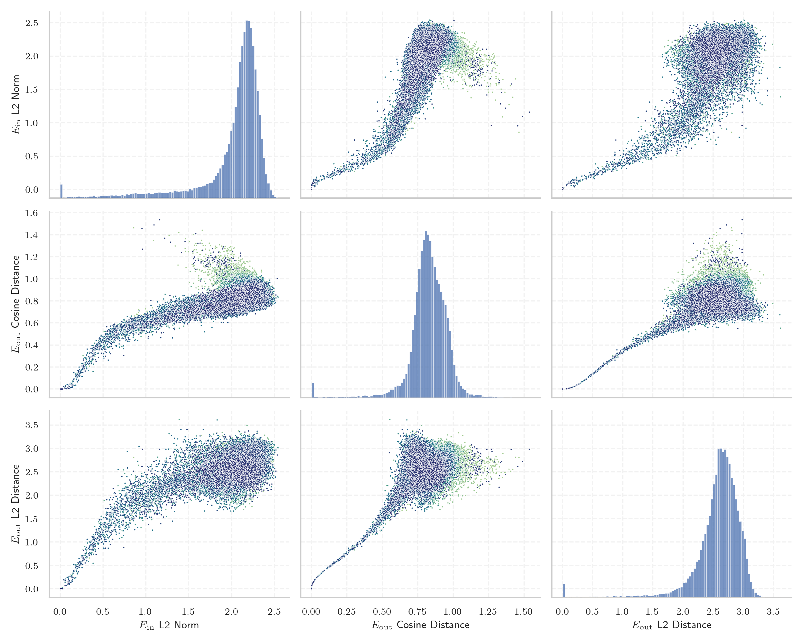

# Report for `microsoft/Phi-3-mini-128k-instruct`

## Model info

* Model Info: 
  * Tied embeddings: False
  * LM head uses bias: False
  * Embeddings shape: [32064, 3072]
* Tokenizer Info: 
  * Vocab Size: 32011
  * Tokenizer Class: LlamaTokenizer
  * Tokenizer Type: BPE
  * Bytes handling: Byte Fallback
  * Token for verification prompt building: springframework
  * Token id for verification prompt building: 6688
* Indicator summary: 
  * Indicator for under-trained tokens: E_{in} L2 Norm
  * Overall distribution: 2.028 +/- 0.382
* Detected Token Counts: 
  * Number of tested under-trained tokens: 636, 635 non-special, 169 below p = 0.01 threshold, 97 below soft indicator threshold
  * Number of single byte tokens: 351, of which 110 below indicator threshold
  * Number of special tokens: 0, of which 0 below indicator threshold

## Under-trained token indicators plot


## Verification plot


## Under-trained token verification results
97 entries below threshold of 0.261

|   token_id | token                       |   indicator | max_prob                                                         | in_other_tokens                                                                     |
|------------|-----------------------------|-------------|------------------------------------------------------------------|-------------------------------------------------------------------------------------|
|      28574 | ````` ▁Mediabestanden ````` |  0.00199483 | <span style='border: 1px solid rgb(169, 68, 66);'>6.4e-06</span> |                                                                                     |
|      20528 | ````` ▁autorytatywna `````  |  0.00200511 | <span style='border: 1px solid rgb(169, 68, 66);'>6.4e-06</span> |                                                                                     |
|      27918 | ````` ▁Хронологија `````    |  0.0020083  | <span style='border: 1px solid rgb(169, 68, 66);'>6.3e-06</span> |                                                                                     |
|      20609 | ````` ▁Portály `````        |  0.00202689 | <span style='border: 1px solid rgb(169, 68, 66);'>6.4e-06</span> |                                                                                     |
|      11804 | ````` Архівовано `````      |  0.00204477 | <span style='border: 1px solid rgb(169, 68, 66);'>6.3e-06</span> |                                                                                     |
|      24294 | ````` Webachiv `````        |  0.00939883 | <span style='border: 1px solid rgb(169, 68, 66);'>5.3e-06</span> |                                                                                     |
|      16110 | ````` ▁Спољашње `````       |  0.0110712  | <span style='border: 1px solid rgb(169, 68, 66);'>6.4e-06</span> |                                                                                     |
|      27914 | ````` ▁archiválva `````     |  0.0148674  | <span style='border: 1px solid rgb(169, 68, 66);'>8.1e-06</span> |                                                                                     |
|      11766 | ````` хівовано `````        |  0.0249311  | <span style='border: 1px solid rgb(169, 68, 66);'>3.8e-06</span> | <span style='border: 1px solid rgb(169, 68, 66);'>````` Архівовано `````</span>     |
|      28653 | ````` ▁regnigaste `````     |  0.0403179  | <span style='border: 1px solid rgb(169, 68, 66);'>3.9e-06</span> |                                                                                     |
|      21836 | ````` ▁надморској `````     |  0.0489446  | <span style='border: 1px solid rgb(169, 68, 66);'>3.9e-06</span> |                                                                                     |
|      18051 | ````` ▁савезној `````       |  0.0577595  | <span style='border: 1px solid rgb(169, 68, 66);'>2.8e-06</span> |                                                                                     |
|      28649 | ````` ▁årsnederbörd `````   |  0.0602276  | <span style='border: 1px solid rgb(169, 68, 66);'>8.3e-06</span> |                                                                                     |
|      21673 | ````` ▁висини `````         |  0.063432   | <span style='border: 1px solid rgb(169, 68, 66);'>7.2e-06</span> |                                                                                     |
|      26821 | ````` ▁Enllaços `````       |  0.0747744  | <span style='border: 1px solid rgb(169, 68, 66);'>9.5e-06</span> |                                                                                     |
|      23996 | ````` ▁живело `````         |  0.0822947  | <span style='border: 1px solid rgb(169, 68, 66);'>5.7e-06</span> |                                                                                     |
|      16056 | ````` љашње `````           |  0.0844199  | <span style='border: 1px solid rgb(169, 68, 66);'>4.8e-06</span> | <span style='border: 1px solid rgb(169, 68, 66);'>````` ▁Спољашње `````</span>      |
|      28623 | ````` ▁Genomsnitt `````     |  0.0889924  | <span style='border: 1px solid rgb(169, 68, 66);'>1.5e-06</span> | <span style='border: 1px solid rgb(169, 68, 66);'>````` ▁Genomsnittlig `````</span> |
|      17981 | ````` ▁Externí `````        |  0.0889966  | <span style='border: 1px solid rgb(169, 68, 66);'>1.4e-06</span> |                                                                                     |
|      27900 | ````` ▁eredetiből `````     |  0.0895897  | <span style='border: 1px solid rgb(169, 68, 66);'>5.6e-06</span> |                                                                                     |
<details><summary>77 additional entries below threshold</summary>

|   token_id | token                      |   indicator | max_prob                                                         | in_other_tokens                                                                                                                                                                                                                                     |
|------------|----------------------------|-------------|------------------------------------------------------------------|-----------------------------------------------------------------------------------------------------------------------------------------------------------------------------------------------------------------------------------------------------|
|      20486 | ````` tatywna `````        |   0.0953026 | <span style='border: 1px solid rgb(169, 68, 66);'>2.7e-05</span> | <span style='border: 1px solid rgb(169, 68, 66);'>````` ▁autorytatywna `````</span>                                                                                                                                                                 |
|      28354 | ````` ▁Расподела `````     |   0.0970301 | <span style='border: 1px solid rgb(169, 68, 66);'>1.8e-06</span> |                                                                                                                                                                                                                                                     |
|      28416 | ````` ▁Мексичка `````      |   0.0973658 | <span style='border: 1px solid rgb(169, 68, 66);'>5.5e-06</span> |                                                                                                                                                                                                                                                     |
|      20422 | ````` ніципалі `````       |   0.104245  | <span style='border: 1px solid rgb(169, 68, 66);'>3.2e-05</span> | <span style='border: 1px solid rgb(169, 68, 66);'>````` ▁муніципалі `````</span>                                                                                                                                                                    |
|      23654 | ````` ▁dátummal `````      |   0.104587  | <span style='border: 1px solid rgb(169, 68, 66);'>5.1e-06</span> |                                                                                                                                                                                                                                                     |
|      22835 | ````` ▁муніципалі `````    |   0.105292  | <span style='border: 1px solid rgb(169, 68, 66);'>4e-05</span>   |                                                                                                                                                                                                                                                     |
|      28642 | ````` ▁regnig `````        |   0.106802  | <span style='border: 1px solid rgb(169, 68, 66);'>2.1e-05</span> | <span style='border: 1px solid rgb(169, 68, 66);'>````` ▁regnigaste `````</span>                                                                                                                                                                    |
|      26847 | ````` .:\u200a `````       |   0.108869  | <span style='border: 1px solid rgb(169, 68, 66);'>1.1e-05</span> |                                                                                                                                                                                                                                                     |
|      24029 | ````` ▁Jegyzetek `````     |   0.109509  | <span style='border: 1px solid rgb(169, 68, 66);'>4.9e-06</span> |                                                                                                                                                                                                                                                     |
|      28650 | ````` ▁Genomsnittlig ````` |   0.115266  | <span style='border: 1px solid rgb(169, 68, 66);'>1.1e-06</span> |                                                                                                                                                                                                                                                     |
|      27645 | ````` ▁Попис `````         |   0.118672  | <span style='border: 1px solid rgb(169, 68, 66);'>2.2e-05</span> |                                                                                                                                                                                                                                                     |
|       7784 | ````` ▁underarter `````    |   0.125647  | <span style='border: 1px solid rgb(169, 68, 66);'>2.4e-05</span> |                                                                                                                                                                                                                                                     |
|      26011 | ````` ▁Архивная `````      |   0.128281  | <span style='border: 1px solid rgb(169, 68, 66);'>3.1e-06</span> |                                                                                                                                                                                                                                                     |
|      19837 | ````` ▁Населення `````     |   0.131483  | <span style='border: 1px solid rgb(169, 68, 66);'>6.7e-06</span> |                                                                                                                                                                                                                                                     |
|      22011 | ````` ▁насељу `````        |   0.132251  | <span style='border: 1px solid rgb(169, 68, 66);'>1.1e-05</span> |                                                                                                                                                                                                                                                     |
|      14562 | ````` ▁Посилання `````     |   0.135106  | <span style='border: 1px solid rgb(169, 68, 66);'>5.1e-06</span> |                                                                                                                                                                                                                                                     |
|      26734 | ````` ▁Årsmed `````        |   0.137241  | <span style='border: 1px solid rgb(169, 68, 66);'>3.2e-06</span> |                                                                                                                                                                                                                                                     |
|       9462 | ````` Hozzáférés `````     |   0.137987  | <span style='border: 1px solid rgb(169, 68, 66);'>0.00023</span> |                                                                                                                                                                                                                                                     |
|      28647 | ````` ▁torraste `````      |   0.13958   | <span style='border: 1px solid rgb(169, 68, 66);'>1.6e-06</span> |                                                                                                                                                                                                                                                     |
|       7651 | ````` ▁släktet `````       |   0.139762  | <span style='border: 1px solid rgb(169, 68, 66);'>1.1e-05</span> |                                                                                                                                                                                                                                                     |
|      24631 | ````` ▁Források `````      |   0.140626  | <span style='border: 1px solid rgb(169, 68, 66);'>4.9e-06</span> |                                                                                                                                                                                                                                                     |
|      20180 | ````` ▁Мексику `````       |   0.142628  | <span style='border: 1px solid rgb(169, 68, 66);'>7.8e-05</span> |                                                                                                                                                                                                                                                     |
|      28263 | ````` ▁Odkazy `````        |   0.142864  | <span style='border: 1px solid rgb(169, 68, 66);'>1.4e-05</span> |                                                                                                                                                                                                                                                     |
|      24971 | ````` ▁Джерела `````       |   0.145297  | <span style='border: 1px solid rgb(169, 68, 66);'>9.9e-06</span> |                                                                                                                                                                                                                                                     |
|      20739 | ````` ▁надмор `````        |   0.148667  | <span style='border: 1px solid rgb(169, 68, 66);'>3.1e-05</span> | <span style='border: 1px solid rgb(169, 68, 66);'>````` ▁надморској `````</span>                                                                                                                                                                    |
|      11229 | ````` ▁становника `````    |   0.149832  | <span style='border: 1px solid rgb(169, 68, 66);'>3.3e-05</span> |                                                                                                                                                                                                                                                     |
|      28090 | ````` ▁Савезне `````       |   0.150406  | <span style='border: 1px solid rgb(169, 68, 66);'>5.7e-06</span> |                                                                                                                                                                                                                                                     |
|      23406 | ````` ▁општини `````       |   0.150545  | <span style='border: 1px solid rgb(169, 68, 66);'>1e-05</span>   |                                                                                                                                                                                                                                                     |
|      28633 | ````` nederbörd `````      |   0.158638  | <span style='border: 1px solid rgb(169, 68, 66);'>0.00011</span> | <span style='border: 1px solid rgb(169, 68, 66);'>````` ▁årsnederbörd `````</span>                                                                                                                                                                  |
|      23875 | ````` ▁Насеље `````        |   0.160807  | <span style='border: 1px solid rgb(251, 189, 8);'>0.036</span>   |                                                                                                                                                                                                                                                     |
|      14414 | ````` ▁Archivlink `````    |   0.161014  | <span style='border: 1px solid rgb(169, 68, 66);'>4e-05</span>   |                                                                                                                                                                                                                                                     |
|      23726 | ````` ▁насеља `````        |   0.161063  | <span style='border: 1px solid rgb(169, 68, 66);'>2.9e-05</span> |                                                                                                                                                                                                                                                     |
|      17916 | ````` abestanden `````     |   0.16379   | <span style='border: 1px solid rgb(169, 68, 66);'>2.1e-06</span> | <span style='border: 1px solid rgb(169, 68, 66);'>````` ▁Mediabestanden `````</span>                                                                                                                                                                |
|      18044 | ````` ▁Становништво `````  |   0.17093   | <span style='border: 1px solid rgb(169, 68, 66);'>1.1e-05</span> |                                                                                                                                                                                                                                                     |
|      25840 | ````` ▁државе `````        |   0.178857  | <span style='border: 1px solid rgb(169, 68, 66);'>0.00026</span> |                                                                                                                                                                                                                                                     |
|      18140 | ````` rinningsområ `````   |   0.181259  | <span style='border: 1px solid rgb(169, 68, 66);'>4.7e-05</span> |                                                                                                                                                                                                                                                     |
|      20645 | ````` ▁Przypisy `````      |   0.183177  | <span style='border: 1px solid rgb(169, 68, 66);'>6.6e-06</span> |                                                                                                                                                                                                                                                     |
|      18676 | ````` ніципа `````         |   0.184698  | <span style='border: 1px solid rgb(255, 145, 0);'>0.0011</span>  | <span style='border: 1px solid rgb(169, 68, 66);'>````` ніципалі `````</span>, <span style='border: 1px solid rgb(169, 68, 66);'>````` ▁муніципалі `````</span>                                                                                     |
|      24291 | ````` IABot `````          |   0.187117  | <span style='border: 1px solid rgb(40, 167, 69);'>1</span>       |                                                                                                                                                                                                                                                     |
|      16916 | ````` ▁invån `````         |   0.188034  | <span style='border: 1px solid rgb(169, 68, 66);'>0.00015</span> | <span style='border: 1px solid rgb(251, 189, 8);'>````` ▁invånare `````</span>                                                                                                                                                                      |
|      27610 | ````` ▁gminie `````        |   0.189999  | <span style='border: 1px solid rgb(169, 68, 66);'>0.00096</span> |                                                                                                                                                                                                                                                     |
|      23117 | ````` brázky `````         |   0.190894  | <span style='border: 1px solid rgb(169, 68, 66);'>1.1e-05</span> | <span style='border: 1px solid rgb(169, 68, 66);'>````` Obrázky `````</span>                                                                                                                                                                        |
|      10688 | ````` ▁gepublic `````      |   0.197517  | <span style='border: 1px solid rgb(169, 68, 66);'>6.4e-05</span> | <span style='border: 1px solid rgb(40, 167, 69);'>````` ▁gepubliceerd `````</span>                                                                                                                                                                  |
|      23715 | ````` ▁Källor `````        |   0.19757   | <span style='border: 1px solid rgb(169, 68, 66);'>6.8e-05</span> |                                                                                                                                                                                                                                                     |
|      12731 | ````` ederbörd `````       |   0.197678  | <span style='border: 1px solid rgb(255, 145, 0);'>0.0032</span>  | <span style='border: 1px solid rgb(169, 68, 66);'>````` ▁nederbörd `````</span>, <span style='border: 1px solid rgb(169, 68, 66);'>````` nederbörd `````</span>, <span style='border: 1px solid rgb(169, 68, 66);'>````` ▁årsnederbörd `````</span> |
|      25283 | ````` ▁липня `````         |   0.198478  | <span style='border: 1px solid rgb(169, 68, 66);'>0.00022</span> |                                                                                                                                                                                                                                                     |
|      22768 | ````` ▁жовт `````          |   0.200147  | <span style='border: 1px solid rgb(169, 68, 66);'>3.3e-05</span> | <span style='border: 1px solid rgb(169, 68, 66);'>````` ▁жовтня `````</span>                                                                                                                                                                        |
|       7718 | ````` ▁beskrevs `````      |   0.201887  | <span style='border: 1px solid rgb(169, 68, 66);'>1.1e-05</span> |                                                                                                                                                                                                                                                     |
|      28906 | ````` ▁листопада `````     |   0.20466   | <span style='border: 1px solid rgb(169, 68, 66);'>0.00025</span> |                                                                                                                                                                                                                                                     |
|      24309 | ````` ▁чемпі `````         |   0.208272  | <span style='border: 1px solid rgb(255, 145, 0);'>0.0023</span>  |                                                                                                                                                                                                                                                     |
|      26782 | ````` ▁пописа `````        |   0.209006  | <span style='border: 1px solid rgb(169, 68, 66);'>2.2e-05</span> |                                                                                                                                                                                                                                                     |
|      26964 | ````` ▁Хронологи `````     |   0.21286   | <span style='border: 1px solid rgb(169, 68, 66);'>2.3e-05</span> | <span style='border: 1px solid rgb(169, 68, 66);'>````` ▁Хронологија `````</span>                                                                                                                                                                   |
|      28791 | ````` ▁віці `````          |   0.213572  | <span style='border: 1px solid rgb(255, 145, 0);'>0.0095</span>  |                                                                                                                                                                                                                                                     |
|      26527 | ````` ▁червня `````        |   0.216537  | <span style='border: 1px solid rgb(169, 68, 66);'>9.5e-05</span> |                                                                                                                                                                                                                                                     |
|      18328 | ````` ▁trakten `````       |   0.216854  | <span style='border: 1px solid rgb(255, 145, 0);'>0.0049</span>  |                                                                                                                                                                                                                                                     |
|      24852 | ````` ▁грудня `````        |   0.217065  | <span style='border: 1px solid rgb(255, 145, 0);'>0.0013</span>  |                                                                                                                                                                                                                                                     |
|      25460 | ````` ▁жовтня `````        |   0.217765  | <span style='border: 1px solid rgb(169, 68, 66);'>0.00016</span> |                                                                                                                                                                                                                                                     |
|      24097 | ````` ▁huvudstaden `````   |   0.219299  | <span style='border: 1px solid rgb(169, 68, 66);'>0.00035</span> |                                                                                                                                                                                                                                                     |
|      24401 | ````` ▁подацима `````      |   0.220262  | <span style='border: 1px solid rgb(169, 68, 66);'>3e-06</span>   |                                                                                                                                                                                                                                                     |
|      23313 | ````` Obrázky `````        |   0.221171  | <span style='border: 1px solid rgb(169, 68, 66);'>0.00064</span> |                                                                                                                                                                                                                                                     |
|      26334 | ````` ▁квітня `````        |   0.222318  | <span style='border: 1px solid rgb(255, 145, 0);'>0.0023</span>  |                                                                                                                                                                                                                                                     |
|      26502 | ````` ▁вересня `````       |   0.222429  | <span style='border: 1px solid rgb(169, 68, 66);'>0.00037</span> |                                                                                                                                                                                                                                                     |
|      27061 | ````` ▁Резултати `````     |   0.223467  | <span style='border: 1px solid rgb(169, 68, 66);'>3.2e-05</span> |                                                                                                                                                                                                                                                     |
|      25696 | ````` ▁роках `````         |   0.224173  | <span style='border: 1px solid rgb(169, 68, 66);'>0.00018</span> |                                                                                                                                                                                                                                                     |
|      26675 | ````` ▁kallaste `````      |   0.227604  | <span style='border: 1px solid rgb(255, 145, 0);'>0.0023</span>  |                                                                                                                                                                                                                                                     |
|      25528 | ````` ▁серпня `````        |   0.229016  | <span style='border: 1px solid rgb(169, 68, 66);'>0.00011</span> |                                                                                                                                                                                                                                                     |
|      23015 | ````` ▁tématu `````        |   0.233542  | <span style='border: 1px solid rgb(169, 68, 66);'>9.6e-05</span> |                                                                                                                                                                                                                                                     |
|      28365 | ````` ▁розташ `````        |   0.236781  | <span style='border: 1px solid rgb(169, 68, 66);'>6.8e-05</span> |                                                                                                                                                                                                                                                     |
|      19196 | ````` ▁Према `````         |   0.23914   | <span style='border: 1px solid rgb(169, 68, 66);'>2.2e-06</span> |                                                                                                                                                                                                                                                     |
|      26662 | ````` ▁varmaste `````      |   0.24112   | <span style='border: 1px solid rgb(169, 68, 66);'>0.00043</span> |                                                                                                                                                                                                                                                     |
|      20568 | ````` ▁сайті `````         |   0.247995  | <span style='border: 1px solid rgb(169, 68, 66);'>0.00033</span> |                                                                                                                                                                                                                                                     |
|      28044 | ````` ▁округу `````        |   0.248123  | <span style='border: 1px solid rgb(255, 145, 0);'>0.0093</span>  |                                                                                                                                                                                                                                                     |
|      25145 | ````` ▁kwiet `````         |   0.250032  | <span style='border: 1px solid rgb(255, 145, 0);'>0.0032</span>  | <span style='border: 1px solid rgb(40, 167, 69);'>````` ▁kwietnia `````</span>                                                                                                                                                                      |
|      21284 | ````` ▁березня `````       |   0.251841  | <span style='border: 1px solid rgb(255, 145, 0);'>0.0011</span>  |                                                                                                                                                                                                                                                     |
|      16194 | ````` ▁Биография `````     |   0.254009  | <span style='border: 1px solid rgb(169, 68, 66);'>0.00019</span> |                                                                                                                                                                                                                                                     |
|      29451 | ````` ▁piłkar `````        |   0.255623  | <span style='border: 1px solid rgb(251, 189, 8);'>0.087</span>   |                                                                                                                                                                                                                                                     |
|      23217 | ````` ▁zvuky `````         |   0.255865  | <span style='border: 1px solid rgb(169, 68, 66);'>1.1e-05</span> |                                                                                                                                                                                                                                                     |
</details>
<details><summary>538 additional entries above threshold</summary>

|   token_id | token                      |   indicator | max_prob                                                         | in_other_tokens                                                                                                                                                                                                                                                                                                                                                                                           |
|------------|----------------------------|-------------|------------------------------------------------------------------|-----------------------------------------------------------------------------------------------------------------------------------------------------------------------------------------------------------------------------------------------------------------------------------------------------------------------------------------------------------------------------------------------------------|
|      28498 | ````` ▁лютого `````        |    0.261073 | <span style='border: 1px solid rgb(255, 145, 0);'>0.0036</span>  |                                                                                                                                                                                                                                                                                                                                                                                                           |
|      26641 | ````` ▁Мексика `````       |    0.261134 | <span style='border: 1px solid rgb(40, 167, 69);'>0.25</span>    |                                                                                                                                                                                                                                                                                                                                                                                                           |
|      27513 | ````` ▁півден `````        |    0.263804 | <span style='border: 1px solid rgb(169, 68, 66);'>0.0003</span>  |                                                                                                                                                                                                                                                                                                                                                                                                           |
|      24576 | ````` ▁estaven `````       |    0.2644   | <span style='border: 1px solid rgb(169, 68, 66);'>1.4e-05</span> |                                                                                                                                                                                                                                                                                                                                                                                                           |
|      24675 | ````` ▁mistrzost `````     |    0.264609 | <span style='border: 1px solid rgb(251, 189, 8);'>0.067</span>   |                                                                                                                                                                                                                                                                                                                                                                                                           |
|      23767 | ````` egyzetek `````       |    0.266404 | <span style='border: 1px solid rgb(255, 145, 0);'>0.0036</span>  | <span style='border: 1px solid rgb(169, 68, 66);'>````` ▁Jegyzetek `````</span>                                                                                                                                                                                                                                                                                                                           |
|       3798 | ````` oreferrer `````      |    0.267827 | <span style='border: 1px solid rgb(251, 189, 8);'>0.028</span>   | ````` ▁noreferrer `````, ````` noreferrer `````                                                                                                                                                                                                                                                                                                                                                           |
|      24708 | ````` ▁січня `````         |    0.27332  | <span style='border: 1px solid rgb(169, 68, 66);'>0.00071</span> |                                                                                                                                                                                                                                                                                                                                                                                                           |
|      31899 | ````` ⥤ `````              |    0.274512 | <span style='border: 1px solid rgb(40, 167, 69);'>0.8</span>     |                                                                                                                                                                                                                                                                                                                                                                                                           |
|      21858 | ````` archiviato `````     |    0.276364 | <span style='border: 1px solid rgb(40, 167, 69);'>0.82</span>    |                                                                                                                                                                                                                                                                                                                                                                                                           |
|      27660 | ````` ckså `````           |    0.277028 | <span style='border: 1px solid rgb(251, 189, 8);'>0.012</span>   | ````` ▁också `````                                                                                                                                                                                                                                                                                                                                                                                        |
|      29640 | ````` ▁powiecie `````      |    0.279973 | <span style='border: 1px solid rgb(255, 145, 0);'>0.0014</span>  |                                                                                                                                                                                                                                                                                                                                                                                                           |
|       9147 | ````` ozzáférés `````      |    0.281008 | <span style='border: 1px solid rgb(251, 189, 8);'>0.015</span>   | <span style='border: 1px solid rgb(169, 68, 66);'>````` Hozzáférés `````</span>                                                                                                                                                                                                                                                                                                                           |
|      27646 | ````` ▁július `````        |    0.282968 | <span style='border: 1px solid rgb(40, 167, 69);'>0.58</span>    |                                                                                                                                                                                                                                                                                                                                                                                                           |
|      21887 | ````` ▁складі `````        |    0.283311 | <span style='border: 1px solid rgb(169, 68, 66);'>8.4e-05</span> |                                                                                                                                                                                                                                                                                                                                                                                                           |
|      17835 | ````` ▁Станов `````        |    0.286634 | <span style='border: 1px solid rgb(251, 189, 8);'>0.011</span>   | <span style='border: 1px solid rgb(169, 68, 66);'>````` ▁Становништво `````</span>                                                                                                                                                                                                                                                                                                                        |
|      11193 | ````` ▁Normdaten `````     |    0.287723 | <span style='border: 1px solid rgb(255, 145, 0);'>0.0016</span>  |                                                                                                                                                                                                                                                                                                                                                                                                           |
|      13297 | ````` ісля `````           |    0.290673 | <span style='border: 1px solid rgb(169, 68, 66);'>0.00021</span> | <span style='border: 1px solid rgb(40, 167, 69);'>````` ▁після `````</span>, <span style='border: 1px solid rgb(169, 68, 66);'>````` ▁Після `````</span>                                                                                                                                                                                                                                                  |
|      16068 | ````` eltemperaturen ````` |    0.290937 | <span style='border: 1px solid rgb(169, 68, 66);'>3.4e-06</span> |                                                                                                                                                                                                                                                                                                                                                                                                           |
|      28182 | ````` ▁півні `````         |    0.29198  | <span style='border: 1px solid rgb(255, 145, 0);'>0.0028</span>  |                                                                                                                                                                                                                                                                                                                                                                                                           |
|      26335 | ````` llaços `````         |    0.292119 | <span style='border: 1px solid rgb(169, 68, 66);'>7.6e-05</span> | <span style='border: 1px solid rgb(169, 68, 66);'>````` ▁Enllaços `````</span>                                                                                                                                                                                                                                                                                                                            |
|      22744 | ````` ▁település `````     |    0.294376 | <span style='border: 1px solid rgb(251, 189, 8);'>0.031</span>   |                                                                                                                                                                                                                                                                                                                                                                                                           |
|      10168 | ````` ▁Мекси `````         |    0.296999 | <span style='border: 1px solid rgb(40, 167, 69);'>0.27</span>    | <span style='border: 1px solid rgb(169, 68, 66);'>````` ▁Мексику `````</span>, <span style='border: 1px solid rgb(40, 167, 69);'>````` ▁Мексика `````</span>, <span style='border: 1px solid rgb(169, 68, 66);'>````` ▁Мексичка `````</span>                                                                                                                                                              |
|      17391 | ````` ▁савез `````         |    0.297735 | <span style='border: 1px solid rgb(251, 189, 8);'>0.051</span>   | <span style='border: 1px solid rgb(169, 68, 66);'>````` ▁савезној `````</span>                                                                                                                                                                                                                                                                                                                            |
|      22018 | ````` ▁wrześ `````         |    0.298275 | <span style='border: 1px solid rgb(251, 189, 8);'>0.018</span>   | <span style='border: 1px solid rgb(255, 145, 0);'>````` ▁września `````</span>                                                                                                                                                                                                                                                                                                                            |
|      18596 | ````` ципа `````           |    0.304077 | <span style='border: 1px solid rgb(40, 167, 69);'>0.49</span>    | <span style='border: 1px solid rgb(255, 145, 0);'>````` ніципа `````</span>, <span style='border: 1px solid rgb(169, 68, 66);'>````` ніципалі `````</span>, <span style='border: 1px solid rgb(169, 68, 66);'>````` ▁муніципалі `````</span>, <span style='border: 1px solid rgb(251, 189, 8);'>````` ниципа `````</span>, <span style='border: 1px solid rgb(251, 189, 8);'>````` ▁муниципа `````</span> |
|      17398 | ````` ништво `````         |    0.304343 | <span style='border: 1px solid rgb(40, 167, 69);'>0.35</span>    | <span style='border: 1px solid rgb(169, 68, 66);'>````` ▁Становништво `````</span>                                                                                                                                                                                                                                                                                                                        |
|       9831 | ````` ▁челов `````         |    0.305733 | <span style='border: 1px solid rgb(255, 145, 0);'>0.0053</span>  | ````` ▁человек `````, ````` ▁челове `````, ````` ▁человека `````                                                                                                                                                                                                                                                                                                                                          |
|      26194 | ````` ▁Савез `````         |    0.307894 | <span style='border: 1px solid rgb(251, 189, 8);'>0.085</span>   | <span style='border: 1px solid rgb(169, 68, 66);'>````` ▁Савезне `````</span>                                                                                                                                                                                                                                                                                                                             |
|      12867 | ````` лання `````          |    0.308244 | <span style='border: 1px solid rgb(255, 145, 0);'>0.0011</span>  | <span style='border: 1px solid rgb(255, 145, 0);'>````` силання `````</span>, <span style='border: 1px solid rgb(169, 68, 66);'>````` ▁Посилання `````</span>                                                                                                                                                                                                                                             |
|      27191 | ````` ▁szeptember `````    |    0.308354 | <span style='border: 1px solid rgb(251, 189, 8);'>0.01</span>    |                                                                                                                                                                                                                                                                                                                                                                                                           |
|      15871 | ````` ▁везе `````          |    0.310825 | <span style='border: 1px solid rgb(40, 167, 69);'>0.74</span>    |                                                                                                                                                                                                                                                                                                                                                                                                           |
|      23795 | ````` ▁paździer `````      |    0.311122 | <span style='border: 1px solid rgb(169, 68, 66);'>0.00019</span> | <span style='border: 1px solid rgb(251, 189, 8);'>````` ▁października `````</span>                                                                                                                                                                                                                                                                                                                        |
|      25069 | ````` $}}% `````           |    0.31523  | <span style='border: 1px solid rgb(251, 189, 8);'>0.098</span>   |                                                                                                                                                                                                                                                                                                                                                                                                           |
|      25726 | ````` ▁травня `````        |    0.31872  | <span style='border: 1px solid rgb(251, 189, 8);'>0.034</span>   |                                                                                                                                                                                                                                                                                                                                                                                                           |
|      17871 | ````` ▁odkazy `````        |    0.319204 | <span style='border: 1px solid rgb(40, 167, 69);'>0.22</span>    |                                                                                                                                                                                                                                                                                                                                                                                                           |
|      23910 | ````` ритор `````          |    0.328402 | <span style='border: 1px solid rgb(251, 189, 8);'>0.052</span>   | <span style='border: 1px solid rgb(251, 189, 8);'>````` ▁територ `````</span>                                                                                                                                                                                                                                                                                                                             |
|      17828 | ````` ▁држави `````        |    0.329528 | <span style='border: 1px solid rgb(169, 68, 66);'>0.00015</span> |                                                                                                                                                                                                                                                                                                                                                                                                           |
|      25563 | ````` ▁Після `````         |    0.332926 | <span style='border: 1px solid rgb(169, 68, 66);'>0.0006</span>  |                                                                                                                                                                                                                                                                                                                                                                                                           |
|      28187 | ````` ▁április `````       |    0.334913 | <span style='border: 1px solid rgb(255, 145, 0);'>0.0059</span>  |                                                                                                                                                                                                                                                                                                                                                                                                           |
|      23939 | ````` ▁Див `````           |    0.338493 | <span style='border: 1px solid rgb(40, 167, 69);'>0.98</span>    |                                                                                                                                                                                                                                                                                                                                                                                                           |
|      16651 | ````` ▁månaden `````       |    0.339171 | <span style='border: 1px solid rgb(255, 145, 0);'>0.0023</span>  |                                                                                                                                                                                                                                                                                                                                                                                                           |
|      22551 | ````` ▁квіт `````          |    0.339406 | <span style='border: 1px solid rgb(251, 189, 8);'>0.045</span>   | <span style='border: 1px solid rgb(255, 145, 0);'>````` ▁квітня `````</span>                                                                                                                                                                                                                                                                                                                              |
|      29162 | ````` ▁сельсов `````       |    0.339624 | <span style='border: 1px solid rgb(40, 167, 69);'>0.13</span>    |                                                                                                                                                                                                                                                                                                                                                                                                           |
|      17076 | ````` ▁invånare `````      |    0.339656 | <span style='border: 1px solid rgb(251, 189, 8);'>0.071</span>   |                                                                                                                                                                                                                                                                                                                                                                                                           |
|      24605 | ````` ▁március `````       |    0.34096  | <span style='border: 1px solid rgb(251, 189, 8);'>0.069</span>   |                                                                                                                                                                                                                                                                                                                                                                                                           |
|      23441 | ````` któber `````         |    0.341044 | <span style='border: 1px solid rgb(251, 189, 8);'>0.016</span>   | <span style='border: 1px solid rgb(251, 189, 8);'>````` ▁október `````</span>                                                                                                                                                                                                                                                                                                                             |
|      22945 | ````` ▁január `````        |    0.342088 | <span style='border: 1px solid rgb(40, 167, 69);'>0.37</span>    |                                                                                                                                                                                                                                                                                                                                                                                                           |
|      14572 | ````` шње `````            |    0.343317 | <span style='border: 1px solid rgb(40, 167, 69);'>0.68</span>    | <span style='border: 1px solid rgb(169, 68, 66);'>````` љашње `````</span>, <span style='border: 1px solid rgb(169, 68, 66);'>````` ▁Спољашње `````</span>                                                                                                                                                                                                                                                |
|      27124 | ````` ▁sierpnia `````      |    0.344723 | <span style='border: 1px solid rgb(255, 145, 0);'>0.0048</span>  |                                                                                                                                                                                                                                                                                                                                                                                                           |
|      28535 | ````` ▁február `````       |    0.347887 | <span style='border: 1px solid rgb(40, 167, 69);'>0.39</span>    |                                                                                                                                                                                                                                                                                                                                                                                                           |
|      19735 | ````` ▁розта `````         |    0.351588 | <span style='border: 1px solid rgb(255, 145, 0);'>0.0064</span>  | <span style='border: 1px solid rgb(169, 68, 66);'>````` ▁розташ `````</span>                                                                                                                                                                                                                                                                                                                              |
|      26457 | ````` ▁május `````         |    0.354793 | <span style='border: 1px solid rgb(40, 167, 69);'>0.54</span>    |                                                                                                                                                                                                                                                                                                                                                                                                           |
|      19539 | ````` ▁demsel `````        |    0.357186 | <span style='border: 1px solid rgb(255, 145, 0);'>0.0017</span>  | ````` ▁demselben `````                                                                                                                                                                                                                                                                                                                                                                                    |
|      25564 | ````` ▁броја `````         |    0.357749 | <span style='border: 1px solid rgb(40, 167, 69);'>0.16</span>    |                                                                                                                                                                                                                                                                                                                                                                                                           |
|      26908 | ````` ▁lipca `````         |    0.360306 | <span style='border: 1px solid rgb(255, 145, 0);'>0.0035</span>  |                                                                                                                                                                                                                                                                                                                                                                                                           |
|       8061 | ````` ▁године `````        |    0.360748 | <span style='border: 1px solid rgb(251, 189, 8);'>0.026</span>   |                                                                                                                                                                                                                                                                                                                                                                                                           |
|      27071 | ````` ▁Історія `````       |    0.36076  | <span style='border: 1px solid rgb(251, 189, 8);'>0.03</span>    |                                                                                                                                                                                                                                                                                                                                                                                                           |
|       9108 | ````` ▁Насе `````          |    0.361945 | <span style='border: 1px solid rgb(40, 167, 69);'>0.81</span>    | <span style='border: 1px solid rgb(169, 68, 66);'>````` ▁Населення `````</span>, <span style='border: 1px solid rgb(40, 167, 69);'>````` ▁Население `````</span>, <span style='border: 1px solid rgb(251, 189, 8);'>````` ▁Насеље `````</span>                                                                                                                                                            |
|      25229 | ````` лтати `````          |    0.363081 | <span style='border: 1px solid rgb(251, 189, 8);'>0.023</span>   | <span style='border: 1px solid rgb(169, 68, 66);'>````` ▁Резултати `````</span>                                                                                                                                                                                                                                                                                                                           |
|      15653 | ````` ској `````           |    0.368085 | <span style='border: 1px solid rgb(251, 189, 8);'>0.02</span>    | <span style='border: 1px solid rgb(169, 68, 66);'>````` ▁надморској `````</span>                                                                                                                                                                                                                                                                                                                          |
|      29079 | ````` ▁augusztus `````     |    0.371807 | <span style='border: 1px solid rgb(251, 189, 8);'>0.066</span>   |                                                                                                                                                                                                                                                                                                                                                                                                           |
|       8554 | ````` ▁році `````          |    0.372036 | <span style='border: 1px solid rgb(169, 68, 66);'>0.00087</span> |                                                                                                                                                                                                                                                                                                                                                                                                           |
|      23105 | ````` ▁videa `````         |    0.372417 | <span style='border: 1px solid rgb(251, 189, 8);'>0.014</span>   |                                                                                                                                                                                                                                                                                                                                                                                                           |
|      23882 | ````` ▁október `````       |    0.372722 | <span style='border: 1px solid rgb(251, 189, 8);'>0.09</span>    |                                                                                                                                                                                                                                                                                                                                                                                                           |
|      28294 | ````` usztus `````         |    0.373379 | <span style='border: 1px solid rgb(40, 167, 69);'>0.72</span>    | <span style='border: 1px solid rgb(251, 189, 8);'>````` ▁augusztus `````</span>                                                                                                                                                                                                                                                                                                                           |
|      15412 | ````` ▁zewnętrzne `````    |    0.375896 | <span style='border: 1px solid rgb(255, 145, 0);'>0.0094</span>  |                                                                                                                                                                                                                                                                                                                                                                                                           |
|      26006 | ````` ensoort `````        |    0.376667 | <span style='border: 1px solid rgb(40, 167, 69);'>0.94</span>    |                                                                                                                                                                                                                                                                                                                                                                                                           |
|      26146 | ````` фіцій `````          |    0.376996 | <span style='border: 1px solid rgb(255, 145, 0);'>0.0095</span>  |                                                                                                                                                                                                                                                                                                                                                                                                           |
|      26867 | ````` ▁збір `````          |    0.378347 | <span style='border: 1px solid rgb(255, 145, 0);'>0.0018</span>  |                                                                                                                                                                                                                                                                                                                                                                                                           |
|      29404 | ````` ▁lutego `````        |    0.380774 | <span style='border: 1px solid rgb(251, 189, 8);'>0.019</span>   |                                                                                                                                                                                                                                                                                                                                                                                                           |
|      28531 | ````` ▁війни `````         |    0.381658 | <span style='border: 1px solid rgb(255, 145, 0);'>0.0099</span>  |                                                                                                                                                                                                                                                                                                                                                                                                           |
|      14503 | ````` ▁насеље `````        |    0.384017 | <span style='border: 1px solid rgb(255, 145, 0);'>0.0027</span>  |                                                                                                                                                                                                                                                                                                                                                                                                           |
|      28729 | ````` ▁június `````        |    0.384305 | <span style='border: 1px solid rgb(251, 189, 8);'>0.041</span>   |                                                                                                                                                                                                                                                                                                                                                                                                           |
|      16910 | ````` ▁општи `````         |    0.384705 | <span style='border: 1px solid rgb(251, 189, 8);'>0.069</span>   | <span style='border: 1px solid rgb(169, 68, 66);'>````` ▁општини `````</span>                                                                                                                                                                                                                                                                                                                             |
|      17270 | ````` ▁налази `````        |    0.386927 | <span style='border: 1px solid rgb(251, 189, 8);'>0.021</span>   |                                                                                                                                                                                                                                                                                                                                                                                                           |
|      18030 | ````` ▁nyelven `````       |    0.387089 | <span style='border: 1px solid rgb(169, 68, 66);'>0.00031</span> |                                                                                                                                                                                                                                                                                                                                                                                                           |
|      27376 | ````` лії `````            |    0.387188 | <span style='border: 1px solid rgb(251, 189, 8);'>0.018</span>   |                                                                                                                                                                                                                                                                                                                                                                                                           |
|      12882 | ````` ITableView `````     |    0.387268 | <span style='border: 1px solid rgb(251, 189, 8);'>0.033</span>   | ````` ▁UITableView `````, ````` UITableView `````                                                                                                                                                                                                                                                                                                                                                         |
|      15887 | ````` ▁још `````           |    0.390498 | <span style='border: 1px solid rgb(169, 68, 66);'>0.0004</span>  |                                                                                                                                                                                                                                                                                                                                                                                                           |
|      20798 | ````` ▁жов `````           |    0.390582 | <span style='border: 1px solid rgb(40, 167, 69);'>0.18</span>    | <span style='border: 1px solid rgb(169, 68, 66);'>````` ▁жовт `````</span>, <span style='border: 1px solid rgb(169, 68, 66);'>````` ▁жовтня `````</span>                                                                                                                                                                                                                                                  |
|      26773 | ````` ▁című `````          |    0.391135 | <span style='border: 1px solid rgb(251, 189, 8);'>0.016</span>   |                                                                                                                                                                                                                                                                                                                                                                                                           |
|      24696 | ````` ▁рік `````           |    0.391458 | <span style='border: 1px solid rgb(40, 167, 69);'>0.11</span>    |                                                                                                                                                                                                                                                                                                                                                                                                           |
|      29146 | ````` ▁філь `````          |    0.391914 | <span style='border: 1px solid rgb(255, 145, 0);'>0.0093</span>  |                                                                                                                                                                                                                                                                                                                                                                                                           |
|      26643 | ````` ▁października `````  |    0.394621 | <span style='border: 1px solid rgb(251, 189, 8);'>0.011</span>   |                                                                                                                                                                                                                                                                                                                                                                                                           |
|      18675 | ````` ▁població `````      |    0.395216 | <span style='border: 1px solid rgb(255, 145, 0);'>0.0093</span>  |                                                                                                                                                                                                                                                                                                                                                                                                           |
|      31664 | ````` ߬ `````               |    0.395753 | <span style='border: 1px solid rgb(251, 189, 8);'>0.064</span>   |                                                                                                                                                                                                                                                                                                                                                                                                           |
|      15571 | ````` ▁февра `````         |    0.395887 | <span style='border: 1px solid rgb(251, 189, 8);'>0.014</span>   | <span style='border: 1px solid rgb(40, 167, 69);'>````` ▁февраля `````</span>                                                                                                                                                                                                                                                                                                                             |
|      11635 | ````` ▁држа `````          |    0.396095 | <span style='border: 1px solid rgb(40, 167, 69);'>0.84</span>    | <span style='border: 1px solid rgb(169, 68, 66);'>````` ▁држави `````</span>, <span style='border: 1px solid rgb(169, 68, 66);'>````` ▁државе `````</span>                                                                                                                                                                                                                                                |
|      26444 | ````` ▁czerwca `````       |    0.396819 | <span style='border: 1px solid rgb(169, 68, 66);'>0.00039</span> |                                                                                                                                                                                                                                                                                                                                                                                                           |
|      21636 | ````` ▁Население `````     |    0.397869 | <span style='border: 1px solid rgb(40, 167, 69);'>0.38</span>    |                                                                                                                                                                                                                                                                                                                                                                                                           |
|      25191 | ````` ▁міста `````         |    0.400229 | <span style='border: 1px solid rgb(40, 167, 69);'>0.18</span>    |                                                                                                                                                                                                                                                                                                                                                                                                           |
|      26106 | ````` ▁grudnia `````       |    0.40024  | <span style='border: 1px solid rgb(255, 145, 0);'>0.0013</span>  |                                                                                                                                                                                                                                                                                                                                                                                                           |
|      13040 | ````` ▁осіб `````          |    0.40043  | <span style='border: 1px solid rgb(251, 189, 8);'>0.087</span>   |                                                                                                                                                                                                                                                                                                                                                                                                           |
|      23548 | ````` сторія `````         |    0.401006 | <span style='border: 1px solid rgb(255, 145, 0);'>0.0062</span>  | <span style='border: 1px solid rgb(251, 189, 8);'>````` ▁Історія `````</span>                                                                                                                                                                                                                                                                                                                             |
|      13765 | ````` ▁пів `````           |    0.401808 | <span style='border: 1px solid rgb(40, 167, 69);'>0.58</span>    | <span style='border: 1px solid rgb(169, 68, 66);'>````` ▁півден `````</span>, <span style='border: 1px solid rgb(255, 145, 0);'>````` ▁півні `````</span>                                                                                                                                                                                                                                                 |
|      25248 | ````` xtart `````          |    0.403148 | <span style='border: 1px solid rgb(40, 167, 69);'>0.97</span>    |                                                                                                                                                                                                                                                                                                                                                                                                           |
|      13243 | ````` ▁länkar `````        |    0.403536 | <span style='border: 1px solid rgb(251, 189, 8);'>0.01</span>    |                                                                                                                                                                                                                                                                                                                                                                                                           |
|      15242 | ````` ▁населення `````     |    0.40389  | <span style='border: 1px solid rgb(255, 145, 0);'>0.0012</span>  |                                                                                                                                                                                                                                                                                                                                                                                                           |
|      24002 | ````` ▁stycznia `````      |    0.403916 | <span style='border: 1px solid rgb(255, 145, 0);'>0.0022</span>  |                                                                                                                                                                                                                                                                                                                                                                                                           |
|      26498 | ````` >\<^ `````           |    0.40765  | <span style='border: 1px solid rgb(169, 68, 66);'>0.00019</span> |                                                                                                                                                                                                                                                                                                                                                                                                           |
|      25683 | ````` ▁складу `````        |    0.408284 | <span style='border: 1px solid rgb(169, 68, 66);'>0.00032</span> |                                                                                                                                                                                                                                                                                                                                                                                                           |
|      27190 | ````` РСР `````            |    0.410213 | <span style='border: 1px solid rgb(40, 167, 69);'>0.21</span>    |                                                                                                                                                                                                                                                                                                                                                                                                           |
|      19082 | ````` ▁області `````       |    0.412182 | <span style='border: 1px solid rgb(251, 189, 8);'>0.094</span>   |                                                                                                                                                                                                                                                                                                                                                                                                           |
|      23046 | ````` ▁miejscowo `````     |    0.413217 | <span style='border: 1px solid rgb(40, 167, 69);'>0.14</span>    |                                                                                                                                                                                                                                                                                                                                                                                                           |
|      28589 | ````` ▁mieszkańców `````   |    0.414354 | <span style='border: 1px solid rgb(169, 68, 66);'>0.00084</span> |                                                                                                                                                                                                                                                                                                                                                                                                           |
|      18222 | ````` нцикло `````         |    0.414755 | <span style='border: 1px solid rgb(255, 145, 0);'>0.0064</span>  | <span style='border: 1px solid rgb(255, 145, 0);'>````` нциклопеди `````</span>, <span style='border: 1px solid rgb(40, 167, 69);'>````` ▁энциклопеди `````</span>                                                                                                                                                                                                                                        |
|      28825 | ````` ▁інших `````         |    0.416011 | <span style='border: 1px solid rgb(255, 145, 0);'>0.0011</span>  |                                                                                                                                                                                                                                                                                                                                                                                                           |
|      29526 | ````` ▁столі `````         |    0.419436 | <span style='border: 1px solid rgb(255, 145, 0);'>0.0062</span>  |                                                                                                                                                                                                                                                                                                                                                                                                           |
|      27802 | ````` ▁kwietnia `````      |    0.420184 | <span style='border: 1px solid rgb(40, 167, 69);'>0.1</span>     |                                                                                                                                                                                                                                                                                                                                                                                                           |
|      22505 | ````` ▁Уи `````            |    0.420976 | <span style='border: 1px solid rgb(251, 189, 8);'>0.06</span>    |                                                                                                                                                                                                                                                                                                                                                                                                           |
|      25298 | ````` ▁września `````      |    0.421037 | <span style='border: 1px solid rgb(255, 145, 0);'>0.005</span>   |                                                                                                                                                                                                                                                                                                                                                                                                           |
|      27929 | ````` ▁genomsnitt `````    |    0.422531 | <span style='border: 1px solid rgb(40, 167, 69);'>0.16</span>    |                                                                                                                                                                                                                                                                                                                                                                                                           |
|      24353 | ````` ▁článku `````        |    0.427133 | <span style='border: 1px solid rgb(40, 167, 69);'>0.19</span>    |                                                                                                                                                                                                                                                                                                                                                                                                           |
|      23763 | ````` ▁През `````          |    0.428567 | <span style='border: 1px solid rgb(40, 167, 69);'>0.89</span>    |                                                                                                                                                                                                                                                                                                                                                                                                           |
|      28162 | ````` ▁юго `````           |    0.433435 | <span style='border: 1px solid rgb(40, 167, 69);'>0.69</span>    |                                                                                                                                                                                                                                                                                                                                                                                                           |
|      17299 | ````` ▁nederbörd `````     |    0.433682 | <span style='border: 1px solid rgb(169, 68, 66);'>3e-05</span>   |                                                                                                                                                                                                                                                                                                                                                                                                           |
|      12200 | ````` ▁чемпи `````         |    0.436763 | <span style='border: 1px solid rgb(40, 167, 69);'>0.78</span>    | <span style='border: 1px solid rgb(40, 167, 69);'>````` ▁чемпиона `````</span>                                                                                                                                                                                                                                                                                                                            |
|      25247 | ````` ▁wieś `````          |    0.437689 | <span style='border: 1px solid rgb(251, 189, 8);'>0.096</span>   |                                                                                                                                                                                                                                                                                                                                                                                                           |
|      27422 | ````` шп `````             |    0.439037 | <span style='border: 1px solid rgb(40, 167, 69);'>0.99</span>    |                                                                                                                                                                                                                                                                                                                                                                                                           |
|      21902 | ````` нії `````            |    0.440264 | <span style='border: 1px solid rgb(251, 189, 8);'>0.057</span>   |                                                                                                                                                                                                                                                                                                                                                                                                           |
|      13043 | ````` силання `````        |    0.444151 | <span style='border: 1px solid rgb(255, 145, 0);'>0.0068</span>  | <span style='border: 1px solid rgb(169, 68, 66);'>````` ▁Посилання `````</span>                                                                                                                                                                                                                                                                                                                           |
|      25412 | ````` ▁советский `````     |    0.445293 | <span style='border: 1px solid rgb(40, 167, 69);'>0.66</span>    |                                                                                                                                                                                                                                                                                                                                                                                                           |
|      14723 | ````` ingsområ `````       |    0.446595 | <span style='border: 1px solid rgb(40, 167, 69);'>0.13</span>    | <span style='border: 1px solid rgb(169, 68, 66);'>````` rinningsområ `````</span>                                                                                                                                                                                                                                                                                                                         |
|      10711 | ````` ▁gepubliceerd `````  |    0.447245 | <span style='border: 1px solid rgb(40, 167, 69);'>0.21</span>    |                                                                                                                                                                                                                                                                                                                                                                                                           |
|      28824 | ````` ▁које `````          |    0.448719 | <span style='border: 1px solid rgb(255, 145, 0);'>0.0014</span>  |                                                                                                                                                                                                                                                                                                                                                                                                           |
|      17467 | ````` ▁inwon `````         |    0.449351 | <span style='border: 1px solid rgb(40, 167, 69);'>0.5</span>     | <span style='border: 1px solid rgb(40, 167, 69);'>````` ▁inwoners `````</span>                                                                                                                                                                                                                                                                                                                            |
|      20366 | ````` ▁сезо `````          |    0.450129 | <span style='border: 1px solid rgb(40, 167, 69);'>0.18</span>    |                                                                                                                                                                                                                                                                                                                                                                                                           |
|      25872 | ````` ▁жі `````            |    0.450923 | <span style='border: 1px solid rgb(255, 145, 0);'>0.0081</span>  |                                                                                                                                                                                                                                                                                                                                                                                                           |
|      25454 | ````` ▁seizo `````         |    0.451644 | <span style='border: 1px solid rgb(255, 145, 0);'>0.0083</span>  | <span style='border: 1px solid rgb(255, 145, 0);'>````` ▁seizoen `````</span>                                                                                                                                                                                                                                                                                                                             |
|      29409 | ````` ▁anglès `````        |    0.453947 | <span style='border: 1px solid rgb(40, 167, 69);'>0.8</span>     |                                                                                                                                                                                                                                                                                                                                                                                                           |
|      25858 | ````` ▁війсь `````         |    0.454106 | <span style='border: 1px solid rgb(251, 189, 8);'>0.065</span>   |                                                                                                                                                                                                                                                                                                                                                                                                           |
|       7654 | ````` ▁beskre `````        |    0.456565 | <span style='border: 1px solid rgb(255, 145, 0);'>0.0072</span>  | <span style='border: 1px solid rgb(169, 68, 66);'>````` ▁beskrevs `````</span>                                                                                                                                                                                                                                                                                                                            |
|      28622 | ````` ▁seizoen `````       |    0.456837 | <span style='border: 1px solid rgb(255, 145, 0);'>0.0062</span>  |                                                                                                                                                                                                                                                                                                                                                                                                           |
|      25929 | ````` ництво `````         |    0.457672 | <span style='border: 1px solid rgb(251, 189, 8);'>0.017</span>   |                                                                                                                                                                                                                                                                                                                                                                                                           |
|      25926 | ````` ▁британ `````        |    0.458662 | <span style='border: 1px solid rgb(40, 167, 69);'>0.97</span>    |                                                                                                                                                                                                                                                                                                                                                                                                           |
|      10553 | ````` \<^ `````            |    0.459069 | <span style='border: 1px solid rgb(40, 167, 69);'>0.98</span>    | <span style='border: 1px solid rgb(169, 68, 66);'>````` >\<^ `````</span>                                                                                                                                                                                                                                                                                                                                 |
|      26378 | ````` iből `````           |    0.459255 | <span style='border: 1px solid rgb(40, 167, 69);'>0.1</span>     | <span style='border: 1px solid rgb(169, 68, 66);'>````` ▁eredetiből `````</span>                                                                                                                                                                                                                                                                                                                          |
|      26199 | ````` ▁mieszkań `````      |    0.460309 | <span style='border: 1px solid rgb(255, 145, 0);'>0.0064</span>  | <span style='border: 1px solid rgb(169, 68, 66);'>````` ▁mieszkańców `````</span>                                                                                                                                                                                                                                                                                                                         |
|      28892 | ````` ▁Пів `````           |    0.462956 | <span style='border: 1px solid rgb(40, 167, 69);'>0.11</span>    |                                                                                                                                                                                                                                                                                                                                                                                                           |
|      21209 | ````` ▁stycz `````         |    0.463131 | <span style='border: 1px solid rgb(40, 167, 69);'>0.37</span>    | <span style='border: 1px solid rgb(255, 145, 0);'>````` ▁stycznia `````</span>                                                                                                                                                                                                                                                                                                                            |
|      22258 | ````` dostęp `````         |    0.463432 | <span style='border: 1px solid rgb(40, 167, 69);'>0.99</span>    |                                                                                                                                                                                                                                                                                                                                                                                                           |
|      29084 | ````` ▁регі `````          |    0.463517 | <span style='border: 1px solid rgb(40, 167, 69);'>0.39</span>    |                                                                                                                                                                                                                                                                                                                                                                                                           |
|      24366 | ````` ▁sierp `````         |    0.46553  | <span style='border: 1px solid rgb(40, 167, 69);'>0.82</span>    | <span style='border: 1px solid rgb(255, 145, 0);'>````` ▁sierpnia `````</span>                                                                                                                                                                                                                                                                                                                            |
|      29255 | ````` ▁Tová `````          |    0.467163 | <span style='border: 1px solid rgb(251, 189, 8);'>0.074</span>   |                                                                                                                                                                                                                                                                                                                                                                                                           |
|      14755 | ````` ewnętrz `````        |    0.469679 | <span style='border: 1px solid rgb(40, 167, 69);'>0.31</span>    | <span style='border: 1px solid rgb(251, 189, 8);'>````` ▁zewnętrz `````</span>, <span style='border: 1px solid rgb(255, 145, 0);'>````` ▁zewnętrzne `````</span>                                                                                                                                                                                                                                          |
|      29796 | ````` ським `````          |    0.471373 | <span style='border: 1px solid rgb(251, 189, 8);'>0.056</span>   |                                                                                                                                                                                                                                                                                                                                                                                                           |
|      23171 | ````` ▁теа `````           |    0.471983 | <span style='border: 1px solid rgb(40, 167, 69);'>0.83</span>    | <span style='border: 1px solid rgb(40, 167, 69);'>````` ▁театра `````</span>                                                                                                                                                                                                                                                                                                                              |
|      23247 | ````` ▁dátum `````         |    0.473477 | <span style='border: 1px solid rgb(40, 167, 69);'>0.47</span>    | <span style='border: 1px solid rgb(169, 68, 66);'>````` ▁dátummal `````</span>                                                                                                                                                                                                                                                                                                                            |
|      25623 | ````` ▁церкви `````        |    0.473591 | <span style='border: 1px solid rgb(40, 167, 69);'>0.82</span>    |                                                                                                                                                                                                                                                                                                                                                                                                           |
|      14840 | ````` пня `````            |    0.474124 | <span style='border: 1px solid rgb(40, 167, 69);'>0.38</span>    | <span style='border: 1px solid rgb(169, 68, 66);'>````` ▁липня `````</span>, <span style='border: 1px solid rgb(169, 68, 66);'>````` ▁серпня `````</span>                                                                                                                                                                                                                                                 |
|      25526 | ````` цького `````         |    0.474653 | <span style='border: 1px solid rgb(251, 189, 8);'>0.029</span>   |                                                                                                                                                                                                                                                                                                                                                                                                           |
|      21243 | ````` ▁eredet `````        |    0.476673 | <span style='border: 1px solid rgb(40, 167, 69);'>0.75</span>    | <span style='border: 1px solid rgb(169, 68, 66);'>````` ▁eredetiből `````</span>                                                                                                                                                                                                                                                                                                                          |
|       7172 | ````` ▁familjen `````      |    0.476755 | <span style='border: 1px solid rgb(40, 167, 69);'>0.83</span>    |                                                                                                                                                                                                                                                                                                                                                                                                           |
|      23069 | ````` ▁Архив `````         |    0.477616 | <span style='border: 1px solid rgb(40, 167, 69);'>0.92</span>    | <span style='border: 1px solid rgb(169, 68, 66);'>````` ▁Архивная `````</span>                                                                                                                                                                                                                                                                                                                            |
|      15022 | ````` ▁zewnętrz `````      |    0.477904 | <span style='border: 1px solid rgb(251, 189, 8);'>0.014</span>   | <span style='border: 1px solid rgb(255, 145, 0);'>````` ▁zewnętrzne `````</span>                                                                                                                                                                                                                                                                                                                          |
|       9439 | ````` ▁Мос `````           |    0.478016 | <span style='border: 1px solid rgb(40, 167, 69);'>0.88</span>    | ````` ▁Моск `````, ````` ▁Москов `````, ````` ▁Москва `````                                                                                                                                                                                                                                                                                                                                               |
|      28471 | ````` зько `````           |    0.478952 | <span style='border: 1px solid rgb(40, 167, 69);'>0.61</span>    |                                                                                                                                                                                                                                                                                                                                                                                                           |
|      28528 | ````` ▁која `````          |    0.481136 | <span style='border: 1px solid rgb(255, 145, 0);'>0.0018</span>  |                                                                                                                                                                                                                                                                                                                                                                                                           |
|      29608 | ````` ▁према `````         |    0.481247 | <span style='border: 1px solid rgb(169, 68, 66);'>4.4e-05</span> |                                                                                                                                                                                                                                                                                                                                                                                                           |
|      25377 | ````` ▁уні `````           |    0.482389 | <span style='border: 1px solid rgb(40, 167, 69);'>0.17</span>    | <span style='border: 1px solid rgb(251, 189, 8);'>````` ▁університе `````</span>                                                                                                                                                                                                                                                                                                                          |
|      26137 | ````` ▁információk `````   |    0.484219 | <span style='border: 1px solid rgb(251, 189, 8);'>0.015</span>   |                                                                                                                                                                                                                                                                                                                                                                                                           |
|       8806 | ````` ▁Archivado `````     |    0.484383 | <span style='border: 1px solid rgb(40, 167, 69);'>0.27</span>    |                                                                                                                                                                                                                                                                                                                                                                                                           |
|      26711 | ````` gså `````            |    0.487767 | <span style='border: 1px solid rgb(40, 167, 69);'>0.68</span>    | ````` ▁også `````                                                                                                                                                                                                                                                                                                                                                                                         |
|      23601 | ````` ▁Хро `````           |    0.489078 | <span style='border: 1px solid rgb(40, 167, 69);'>0.73</span>    | <span style='border: 1px solid rgb(169, 68, 66);'>````` ▁Хронологи `````</span>, <span style='border: 1px solid rgb(169, 68, 66);'>````` ▁Хронологија `````</span>                                                                                                                                                                                                                                        |
|      21857 | ````` ▁генерал `````       |    0.491971 | <span style='border: 1px solid rgb(40, 167, 69);'>0.96</span>    |                                                                                                                                                                                                                                                                                                                                                                                                           |
|      17331 | ````` ▁Linki `````         |    0.49276  | <span style='border: 1px solid rgb(40, 167, 69);'>0.59</span>    |                                                                                                                                                                                                                                                                                                                                                                                                           |
|      13717 | ````` ној `````            |    0.492855 | <span style='border: 1px solid rgb(40, 167, 69);'>0.85</span>    | <span style='border: 1px solid rgb(169, 68, 66);'>````` ▁савезној `````</span>                                                                                                                                                                                                                                                                                                                            |
|      26159 | ````` ▁listopada `````     |    0.494815 | <span style='border: 1px solid rgb(251, 189, 8);'>0.013</span>   |                                                                                                                                                                                                                                                                                                                                                                                                           |
|      21316 | ````` ▁чолові `````        |    0.497144 | <span style='border: 1px solid rgb(251, 189, 8);'>0.079</span>   |                                                                                                                                                                                                                                                                                                                                                                                                           |
|      21547 | ````` ській `````          |    0.498529 | <span style='border: 1px solid rgb(251, 189, 8);'>0.063</span>   |                                                                                                                                                                                                                                                                                                                                                                                                           |
|      17638 | ````` ському `````         |    0.502611 | <span style='border: 1px solid rgb(251, 189, 8);'>0.034</span>   |                                                                                                                                                                                                                                                                                                                                                                                                           |
|      29325 | ````` ▁ју `````            |    0.502898 | <span style='border: 1px solid rgb(40, 167, 69);'>0.65</span>    |                                                                                                                                                                                                                                                                                                                                                                                                           |
|      19895 | ````` ▁фамилией `````      |    0.502986 | <span style='border: 1px solid rgb(251, 189, 8);'>0.06</span>    |                                                                                                                                                                                                                                                                                                                                                                                                           |
|      15984 | ````` ▁були `````          |    0.503081 | <span style='border: 1px solid rgb(40, 167, 69);'>0.69</span>    |                                                                                                                                                                                                                                                                                                                                                                                                           |
|      22636 | ````` rások `````          |    0.505499 | <span style='border: 1px solid rgb(251, 189, 8);'>0.026</span>   | <span style='border: 1px solid rgb(169, 68, 66);'>````` ▁Források `````</span>                                                                                                                                                                                                                                                                                                                            |
|       7917 | ````` ▁listade `````       |    0.505753 | <span style='border: 1px solid rgb(40, 167, 69);'>0.63</span>    |                                                                                                                                                                                                                                                                                                                                                                                                           |
|      23776 | ````` мії `````            |    0.505786 | <span style='border: 1px solid rgb(251, 189, 8);'>0.072</span>   |                                                                                                                                                                                                                                                                                                                                                                                                           |
|      13195 | ````` ▁цер `````           |    0.506182 | <span style='border: 1px solid rgb(40, 167, 69);'>0.7</span>     | <span style='border: 1px solid rgb(40, 167, 69);'>````` ▁церкви `````</span>, ````` ▁церков `````                                                                                                                                                                                                                                                                                                         |
|      25018 | ````` ську `````           |    0.506703 | <span style='border: 1px solid rgb(40, 167, 69);'>0.68</span>    |                                                                                                                                                                                                                                                                                                                                                                                                           |
|      20072 | ````` ywna `````           |    0.507711 | <span style='border: 1px solid rgb(40, 167, 69);'>0.33</span>    | <span style='border: 1px solid rgb(169, 68, 66);'>````` tatywna `````</span>, <span style='border: 1px solid rgb(169, 68, 66);'>````` ▁autorytatywna `````</span>                                                                                                                                                                                                                                         |
|      24493 | ````` ▁ње `````            |    0.508172 | <span style='border: 1px solid rgb(40, 167, 69);'>0.18</span>    |                                                                                                                                                                                                                                                                                                                                                                                                           |
|      19209 | ````` ▁inwoners `````      |    0.508654 | <span style='border: 1px solid rgb(40, 167, 69);'>0.95</span>    |                                                                                                                                                                                                                                                                                                                                                                                                           |
|       4577 | ````` ▁року `````          |    0.508946 | <span style='border: 1px solid rgb(40, 167, 69);'>0.64</span>    |                                                                                                                                                                                                                                                                                                                                                                                                           |
|      21781 | ````` лася `````           |    0.509351 | <span style='border: 1px solid rgb(40, 167, 69);'>0.28</span>    |                                                                                                                                                                                                                                                                                                                                                                                                           |
|      23280 | ````` ździer `````         |    0.510949 | <span style='border: 1px solid rgb(40, 167, 69);'>0.17</span>    | <span style='border: 1px solid rgb(169, 68, 66);'>````` ▁paździer `````</span>, <span style='border: 1px solid rgb(251, 189, 8);'>````` ▁października `````</span>                                                                                                                                                                                                                                        |
|      15917 | ````` istrzost `````       |    0.511803 | <span style='border: 1px solid rgb(251, 189, 8);'>0.033</span>   | <span style='border: 1px solid rgb(251, 189, 8);'>````` ▁mistrzost `````</span>                                                                                                                                                                                                                                                                                                                           |
|      29521 | ````` ▁още `````           |    0.512089 | <span style='border: 1px solid rgb(40, 167, 69);'>0.9</span>     |                                                                                                                                                                                                                                                                                                                                                                                                           |
|      28113 | ````` ▁северо `````        |    0.512532 | <span style='border: 1px solid rgb(40, 167, 69);'>0.46</span>    |                                                                                                                                                                                                                                                                                                                                                                                                           |
|      21932 | ````` ▁Итали `````         |    0.512787 | <span style='border: 1px solid rgb(40, 167, 69);'>0.9</span>     |                                                                                                                                                                                                                                                                                                                                                                                                           |
|       6723 | ````` ▁ingår `````         |    0.512889 | <span style='border: 1px solid rgb(251, 189, 8);'>0.025</span>   |                                                                                                                                                                                                                                                                                                                                                                                                           |
|      12149 | ````` ▁років `````         |    0.513238 | <span style='border: 1px solid rgb(40, 167, 69);'>0.42</span>    |                                                                                                                                                                                                                                                                                                                                                                                                           |
|      14545 | ````` ewnę `````           |    0.515597 | <span style='border: 1px solid rgb(251, 189, 8);'>0.014</span>   | <span style='border: 1px solid rgb(40, 167, 69);'>````` ewnętrz `````</span>, <span style='border: 1px solid rgb(251, 189, 8);'>````` ▁zewnętrz `````</span>, <span style='border: 1px solid rgb(255, 145, 0);'>````` ▁zewnętrzne `````</span>                                                                                                                                                            |
|      28372 | ````` ▁відбу `````         |    0.516947 | <span style='border: 1px solid rgb(255, 145, 0);'>0.0013</span>  |                                                                                                                                                                                                                                                                                                                                                                                                           |
|      11835 | ````` ▁вій `````           |    0.518595 | <span style='border: 1px solid rgb(251, 189, 8);'>0.021</span>   | <span style='border: 1px solid rgb(251, 189, 8);'>````` ▁війсь `````</span>, <span style='border: 1px solid rgb(255, 145, 0);'>````` ▁війни `````</span>                                                                                                                                                                                                                                                  |
|      22690 | ````` лися `````           |    0.520776 | <span style='border: 1px solid rgb(40, 167, 69);'>0.71</span>    |                                                                                                                                                                                                                                                                                                                                                                                                           |
|      25336 | ````` ▁територ `````       |    0.521355 | <span style='border: 1px solid rgb(251, 189, 8);'>0.025</span>   |                                                                                                                                                                                                                                                                                                                                                                                                           |
|      25833 | ````` лимпий `````         |    0.521493 | <span style='border: 1px solid rgb(251, 189, 8);'>0.05</span>    |                                                                                                                                                                                                                                                                                                                                                                                                           |
|      16201 | ````` ▁францу `````        |    0.523819 | <span style='border: 1px solid rgb(40, 167, 69);'>0.3</span>     | ````` ▁француз `````                                                                                                                                                                                                                                                                                                                                                                                      |
|      28331 | ````` ▁Normdatei `````     |    0.524492 | <span style='border: 1px solid rgb(255, 145, 0);'>0.0089</span>  |                                                                                                                                                                                                                                                                                                                                                                                                           |
|      12517 | ````` ▁авгу `````          |    0.524548 | <span style='border: 1px solid rgb(251, 189, 8);'>0.093</span>   | <span style='border: 1px solid rgb(40, 167, 69);'>````` ▁августа `````</span>                                                                                                                                                                                                                                                                                                                             |
|      18557 | ````` ▁člán `````          |    0.525785 | <span style='border: 1px solid rgb(40, 167, 69);'>0.26</span>    | <span style='border: 1px solid rgb(40, 167, 69);'>````` ▁článku `````</span>                                                                                                                                                                                                                                                                                                                              |
|      28158 | ````` ▁północ `````        |    0.526185 | <span style='border: 1px solid rgb(40, 167, 69);'>0.19</span>    |                                                                                                                                                                                                                                                                                                                                                                                                           |
|      29426 | ````` кономі `````         |    0.528933 | <span style='border: 1px solid rgb(40, 167, 69);'>0.26</span>    |                                                                                                                                                                                                                                                                                                                                                                                                           |
|      13259 | ````` ▁міс `````           |    0.529232 | <span style='border: 1px solid rgb(251, 189, 8);'>0.063</span>   | <span style='border: 1px solid rgb(40, 167, 69);'>````` ▁місце `````</span>, <span style='border: 1px solid rgb(40, 167, 69);'>````` ▁міста `````</span>                                                                                                                                                                                                                                                  |
|      26593 | ````` ▁отрима `````        |    0.530099 | <span style='border: 1px solid rgb(169, 68, 66);'>0.00038</span> |                                                                                                                                                                                                                                                                                                                                                                                                           |
|      15799 | ````` ▁Литература `````    |    0.531139 | <span style='border: 1px solid rgb(40, 167, 69);'>0.97</span>    |                                                                                                                                                                                                                                                                                                                                                                                                           |
|      15895 | ````` ▁чемпиона `````      |    0.531472 | <span style='border: 1px solid rgb(40, 167, 69);'>0.46</span>    |                                                                                                                                                                                                                                                                                                                                                                                                           |
|      27038 | ````` ▁století `````       |    0.533039 | <span style='border: 1px solid rgb(40, 167, 69);'>0.1</span>     |                                                                                                                                                                                                                                                                                                                                                                                                           |
|      20448 | ````` ▁Kontrola `````      |    0.533677 | <span style='border: 1px solid rgb(40, 167, 69);'>0.99</span>    |                                                                                                                                                                                                                                                                                                                                                                                                           |
|      26853 | ````` ▁zdoby `````         |    0.534058 | <span style='border: 1px solid rgb(40, 167, 69);'>0.86</span>    |                                                                                                                                                                                                                                                                                                                                                                                                           |
|      18969 | ````` ▁села `````          |    0.534473 | <span style='border: 1px solid rgb(40, 167, 69);'>0.47</span>    |                                                                                                                                                                                                                                                                                                                                                                                                           |
|      24608 | ````` ▁музи `````          |    0.535146 | <span style='border: 1px solid rgb(40, 167, 69);'>0.54</span>    |                                                                                                                                                                                                                                                                                                                                                                                                           |
|      25743 | ````` ябре `````           |    0.537485 | <span style='border: 1px solid rgb(40, 167, 69);'>0.21</span>    |                                                                                                                                                                                                                                                                                                                                                                                                           |
|      20091 | ````` сини `````           |    0.538898 | <span style='border: 1px solid rgb(40, 167, 69);'>0.92</span>    | <span style='border: 1px solid rgb(169, 68, 66);'>````` ▁висини `````</span>                                                                                                                                                                                                                                                                                                                              |
|      29679 | ````` ▁zespo `````         |    0.538946 | <span style='border: 1px solid rgb(251, 189, 8);'>0.032</span>   |                                                                                                                                                                                                                                                                                                                                                                                                           |
|      29752 | ````` ńskim `````          |    0.540548 | <span style='border: 1px solid rgb(251, 189, 8);'>0.026</span>   |                                                                                                                                                                                                                                                                                                                                                                                                           |
|      23595 | ````` ▁працю `````         |    0.542223 | <span style='border: 1px solid rgb(40, 167, 69);'>0.25</span>    |                                                                                                                                                                                                                                                                                                                                                                                                           |
|      14558 | ````` ▁фран `````          |    0.543357 | <span style='border: 1px solid rgb(40, 167, 69);'>0.98</span>    | <span style='border: 1px solid rgb(40, 167, 69);'>````` ▁францу `````</span>, ````` ▁француз `````                                                                                                                                                                                                                                                                                                        |
|      19523 | ````` ▁людях `````         |    0.544326 | <span style='border: 1px solid rgb(251, 189, 8);'>0.026</span>   |                                                                                                                                                                                                                                                                                                                                                                                                           |
|      21483 | ````` лося `````           |    0.544344 | <span style='border: 1px solid rgb(40, 167, 69);'>0.99</span>    |                                                                                                                                                                                                                                                                                                                                                                                                           |
|      28361 | ````` ▁Zobacz `````        |    0.544578 | <span style='border: 1px solid rgb(169, 68, 66);'>0.00056</span> |                                                                                                                                                                                                                                                                                                                                                                                                           |
|      26042 | ````` ▁округа `````        |    0.545863 | <span style='border: 1px solid rgb(40, 167, 69);'>0.87</span>    |                                                                                                                                                                                                                                                                                                                                                                                                           |
|      19940 | ````` ▁ць `````            |    0.546494 | <span style='border: 1px solid rgb(40, 167, 69);'>0.41</span>    | <span style='border: 1px solid rgb(255, 145, 0);'>````` ▁цього `````</span>                                                                                                                                                                                                                                                                                                                               |
|      22123 | ````` ▁född `````          |    0.54663  | <span style='border: 1px solid rgb(40, 167, 69);'>0.8</span>     |                                                                                                                                                                                                                                                                                                                                                                                                           |
|      26937 | ````` ▁Він `````           |    0.547062 | <span style='border: 1px solid rgb(40, 167, 69);'>0.18</span>    |                                                                                                                                                                                                                                                                                                                                                                                                           |
|      29789 | ````` ською `````          |    0.547642 | <span style='border: 1px solid rgb(251, 189, 8);'>0.047</span>   |                                                                                                                                                                                                                                                                                                                                                                                                           |
|      30994 | ````` 𝕜 `````              |    0.547898 | <span style='border: 1px solid rgb(40, 167, 69);'>0.95</span>    |                                                                                                                                                                                                                                                                                                                                                                                                           |
|      15279 | ````` ▁који `````          |    0.550713 | <span style='border: 1px solid rgb(251, 189, 8);'>0.019</span>   |                                                                                                                                                                                                                                                                                                                                                                                                           |
|      25052 | ````` ▁letech `````        |    0.550855 | <span style='border: 1px solid rgb(169, 68, 66);'>0.00015</span> |                                                                                                                                                                                                                                                                                                                                                                                                           |
|      23866 | ````` ▁краї `````          |    0.551455 | <span style='border: 1px solid rgb(40, 167, 69);'>0.53</span>    |                                                                                                                                                                                                                                                                                                                                                                                                           |
|      20070 | ````` ▁autory `````        |    0.55397  | <span style='border: 1px solid rgb(40, 167, 69);'>0.68</span>    | <span style='border: 1px solid rgb(169, 68, 66);'>````` ▁autorytatywna `````</span>                                                                                                                                                                                                                                                                                                                       |
|      29774 | ````` ▁Лон `````           |    0.555346 | <span style='border: 1px solid rgb(40, 167, 69);'>0.96</span>    |                                                                                                                                                                                                                                                                                                                                                                                                           |
|      24229 | ````` ▁Оте `````           |    0.556238 | <span style='border: 1px solid rgb(40, 167, 69);'>0.99</span>    | <span style='border: 1px solid rgb(40, 167, 69);'>````` ▁Отече `````</span>                                                                                                                                                                                                                                                                                                                               |
|      24330 | ````` ниципа `````         |    0.560214 | <span style='border: 1px solid rgb(251, 189, 8);'>0.026</span>   | <span style='border: 1px solid rgb(251, 189, 8);'>````` ▁муниципа `````</span>                                                                                                                                                                                                                                                                                                                            |
|      22041 | ````` ▁stolet `````        |    0.56029  | <span style='border: 1px solid rgb(255, 145, 0);'>0.0011</span>  | <span style='border: 1px solid rgb(40, 167, 69);'>````` ▁století `````</span>                                                                                                                                                                                                                                                                                                                             |
|      11394 | ````` ▁був `````           |    0.560812 | <span style='border: 1px solid rgb(251, 189, 8);'>0.022</span>   |                                                                                                                                                                                                                                                                                                                                                                                                           |
|      25418 | ````` ския `````           |    0.560836 | <span style='border: 1px solid rgb(251, 189, 8);'>0.092</span>   |                                                                                                                                                                                                                                                                                                                                                                                                           |
|      20214 | ````` ског `````           |    0.563492 | <span style='border: 1px solid rgb(40, 167, 69);'>0.12</span>    |                                                                                                                                                                                                                                                                                                                                                                                                           |
|      21562 | ````` ▁zdob `````          |    0.564015 | <span style='border: 1px solid rgb(40, 167, 69);'>0.8</span>     | <span style='border: 1px solid rgb(40, 167, 69);'>````` ▁zdoby `````</span>                                                                                                                                                                                                                                                                                                                               |
|      26447 | ````` ▁amery `````         |    0.564881 | <span style='border: 1px solid rgb(40, 167, 69);'>0.96</span>    |                                                                                                                                                                                                                                                                                                                                                                                                           |
|      15318 | ````` ▁він `````           |    0.56545  | <span style='border: 1px solid rgb(251, 189, 8);'>0.018</span>   |                                                                                                                                                                                                                                                                                                                                                                                                           |
|      27312 | ````` ової `````           |    0.567118 | <span style='border: 1px solid rgb(251, 189, 8);'>0.012</span>   |                                                                                                                                                                                                                                                                                                                                                                                                           |
|      21618 | ````` ограф `````          |    0.567472 | <span style='border: 1px solid rgb(40, 167, 69);'>0.58</span>    |                                                                                                                                                                                                                                                                                                                                                                                                           |
|      14374 | ````` ▁апре `````          |    0.567763 | <span style='border: 1px solid rgb(40, 167, 69);'>0.73</span>    | <span style='border: 1px solid rgb(40, 167, 69);'>````` ▁апреля `````</span>                                                                                                                                                                                                                                                                                                                              |
|      22590 | ````` álva `````           |    0.568671 | <span style='border: 1px solid rgb(40, 167, 69);'>0.87</span>    | <span style='border: 1px solid rgb(169, 68, 66);'>````` ▁archiválva `````</span>                                                                                                                                                                                                                                                                                                                          |
|      28202 | ````` ▁Olympedia `````     |    0.570444 | <span style='border: 1px solid rgb(251, 189, 8);'>0.084</span>   |                                                                                                                                                                                                                                                                                                                                                                                                           |
|      17145 | ````` ▁година `````        |    0.571041 | <span style='border: 1px solid rgb(40, 167, 69);'>0.94</span>    |                                                                                                                                                                                                                                                                                                                                                                                                           |
|      26497 | ````` ▁органі `````        |    0.571301 | <span style='border: 1px solid rgb(40, 167, 69);'>0.24</span>    |                                                                                                                                                                                                                                                                                                                                                                                                           |
|      23865 | ````` ▁Ні `````            |    0.5717   | <span style='border: 1px solid rgb(40, 167, 69);'>0.44</span>    |                                                                                                                                                                                                                                                                                                                                                                                                           |
|      25625 | ````` ▁свої `````          |    0.571865 | <span style='border: 1px solid rgb(251, 189, 8);'>0.019</span>   |                                                                                                                                                                                                                                                                                                                                                                                                           |
|      20959 | ````` ällor `````          |    0.572469 | <span style='border: 1px solid rgb(40, 167, 69);'>0.89</span>    | <span style='border: 1px solid rgb(169, 68, 66);'>````` ▁Källor `````</span>                                                                                                                                                                                                                                                                                                                              |
|      26573 | ````` ▁яких `````          |    0.572896 | <span style='border: 1px solid rgb(169, 68, 66);'>0.00016</span> |                                                                                                                                                                                                                                                                                                                                                                                                           |
|      24621 | ````` ▁листо `````         |    0.573133 | <span style='border: 1px solid rgb(40, 167, 69);'>0.96</span>    | <span style='border: 1px solid rgb(169, 68, 66);'>````` ▁листопада `````</span>                                                                                                                                                                                                                                                                                                                           |
|      24047 | ````` ▁póź `````           |    0.575465 | <span style='border: 1px solid rgb(40, 167, 69);'>0.43</span>    | <span style='border: 1px solid rgb(251, 189, 8);'>````` ▁później `````</span>                                                                                                                                                                                                                                                                                                                             |
|       7368 | ````` ября `````           |    0.577286 | <span style='border: 1px solid rgb(251, 189, 8);'>0.019</span>   | <span style='border: 1px solid rgb(40, 167, 69);'>````` ▁сентября `````</span>, <span style='border: 1px solid rgb(40, 167, 69);'>````` ▁октября `````</span>, <span style='border: 1px solid rgb(40, 167, 69);'>````` ▁ноября `````</span>                                                                                                                                                               |
|      18092 | ````` министратив `````    |    0.577709 | <span style='border: 1px solid rgb(251, 189, 8);'>0.026</span>   | ````` ▁административ `````                                                                                                                                                                                                                                                                                                                                                                                |
|      18221 | ````` cowo `````           |    0.579166 | <span style='border: 1px solid rgb(40, 167, 69);'>0.99</span>    | <span style='border: 1px solid rgb(40, 167, 69);'>````` ▁miejscowo `````</span>                                                                                                                                                                                                                                                                                                                           |
|      26967 | ````` ▁театра `````        |    0.580885 | <span style='border: 1px solid rgb(40, 167, 69);'>0.98</span>    |                                                                                                                                                                                                                                                                                                                                                                                                           |
|      26708 | ````` ▁депута `````        |    0.581527 | <span style='border: 1px solid rgb(40, 167, 69);'>1</span>       |                                                                                                                                                                                                                                                                                                                                                                                                           |
|      29669 | ````` engelsk `````        |    0.581581 | <span style='border: 1px solid rgb(40, 167, 69);'>1</span>       |                                                                                                                                                                                                                                                                                                                                                                                                           |
|      29728 | ````` ▁później `````       |    0.583323 | <span style='border: 1px solid rgb(251, 189, 8);'>0.011</span>   |                                                                                                                                                                                                                                                                                                                                                                                                           |
|      23602 | ````` ▁pił `````           |    0.585084 | <span style='border: 1px solid rgb(40, 167, 69);'>0.96</span>    | <span style='border: 1px solid rgb(251, 189, 8);'>````` ▁piłkar `````</span>                                                                                                                                                                                                                                                                                                                              |
|      29016 | ````` ▁університе `````    |    0.585144 | <span style='border: 1px solid rgb(251, 189, 8);'>0.017</span>   |                                                                                                                                                                                                                                                                                                                                                                                                           |
|      11166 | ````` ▁село `````          |    0.585296 | <span style='border: 1px solid rgb(40, 167, 69);'>0.97</span>    |                                                                                                                                                                                                                                                                                                                                                                                                           |
|      26888 | ````` ouwd `````           |    0.585745 | <span style='border: 1px solid rgb(40, 167, 69);'>0.89</span>    |                                                                                                                                                                                                                                                                                                                                                                                                           |
|      28973 | ````` ▁національ `````     |    0.585864 | <span style='border: 1px solid rgb(251, 189, 8);'>0.063</span>   |                                                                                                                                                                                                                                                                                                                                                                                                           |
|      19904 | ````` ▁після `````         |    0.586603 | <span style='border: 1px solid rgb(40, 167, 69);'>0.41</span>    |                                                                                                                                                                                                                                                                                                                                                                                                           |
|      17490 | ````` ▁као `````           |    0.589458 | <span style='border: 1px solid rgb(251, 189, 8);'>0.015</span>   |                                                                                                                                                                                                                                                                                                                                                                                                           |
|      24951 | ````` ▁bazie `````         |    0.589848 | <span style='border: 1px solid rgb(251, 189, 8);'>0.013</span>   |                                                                                                                                                                                                                                                                                                                                                                                                           |
|      20705 | ````` чної `````           |    0.590648 | <span style='border: 1px solid rgb(251, 189, 8);'>0.014</span>   |                                                                                                                                                                                                                                                                                                                                                                                                           |
|      20271 | ````` ▁sezon `````         |    0.591065 | <span style='border: 1px solid rgb(40, 167, 69);'>0.95</span>    |                                                                                                                                                                                                                                                                                                                                                                                                           |
|      18922 | ````` ▁меда `````          |    0.591262 | <span style='border: 1px solid rgb(40, 167, 69);'>0.96</span>    |                                                                                                                                                                                                                                                                                                                                                                                                           |
|      14028 | ````` ▁сент `````          |    0.592275 | <span style='border: 1px solid rgb(40, 167, 69);'>0.74</span>    | <span style='border: 1px solid rgb(40, 167, 69);'>````` ▁сентября `````</span>                                                                                                                                                                                                                                                                                                                            |
|      10361 | ````` ▁також `````         |    0.592604 | <span style='border: 1px solid rgb(251, 189, 8);'>0.037</span>   |                                                                                                                                                                                                                                                                                                                                                                                                           |
|      25731 | ````` ▁Верхов `````        |    0.593123 | <span style='border: 1px solid rgb(40, 167, 69);'>0.95</span>    |                                                                                                                                                                                                                                                                                                                                                                                                           |
|      29031 | ````` оні `````            |    0.596924 | <span style='border: 1px solid rgb(40, 167, 69);'>0.94</span>    |                                                                                                                                                                                                                                                                                                                                                                                                           |
|      17414 | ````` йской `````          |    0.597448 | <span style='border: 1px solid rgb(40, 167, 69);'>0.15</span>    | ````` ▁Российской `````                                                                                                                                                                                                                                                                                                                                                                                   |
|      17047 | ````` omsnitt `````        |    0.598322 | <span style='border: 1px solid rgb(251, 189, 8);'>0.066</span>   | <span style='border: 1px solid rgb(40, 167, 69);'>````` ▁genomsnitt `````</span>, <span style='border: 1px solid rgb(169, 68, 66);'>````` ▁Genomsnitt `````</span>, <span style='border: 1px solid rgb(169, 68, 66);'>````` ▁Genomsnittlig `````</span>                                                                                                                                                   |
|      24975 | ````` сподар `````         |    0.599012 | <span style='border: 1px solid rgb(40, 167, 69);'>0.64</span>    |                                                                                                                                                                                                                                                                                                                                                                                                           |
|      24814 | ````` ▁információ `````    |    0.599125 | <span style='border: 1px solid rgb(255, 145, 0);'>0.0042</span>  | <span style='border: 1px solid rgb(251, 189, 8);'>````` ▁információk `````</span>                                                                                                                                                                                                                                                                                                                         |
|      28184 | ````` ▁цього `````         |    0.599767 | <span style='border: 1px solid rgb(255, 145, 0);'>0.0013</span>  |                                                                                                                                                                                                                                                                                                                                                                                                           |
|      18985 | ````` ників `````          |    0.599839 | <span style='border: 1px solid rgb(40, 167, 69);'>0.36</span>    |                                                                                                                                                                                                                                                                                                                                                                                                           |
|      26969 | ````` ▁segle `````         |    0.602265 | <span style='border: 1px solid rgb(251, 189, 8);'>0.068</span>   |                                                                                                                                                                                                                                                                                                                                                                                                           |
|      19792 | ````` ▁деревня `````       |    0.602312 | <span style='border: 1px solid rgb(40, 167, 69);'>0.45</span>    |                                                                                                                                                                                                                                                                                                                                                                                                           |
|      15949 | ````` ▁Укра `````          |    0.602532 | <span style='border: 1px solid rgb(40, 167, 69);'>0.97</span>    | <span style='border: 1px solid rgb(40, 167, 69);'>````` ▁Украи `````</span>, <span style='border: 1px solid rgb(251, 189, 8);'>````` ▁Украины `````</span>                                                                                                                                                                                                                                                |
|      26339 | ````` ▁нај `````           |    0.602705 | <span style='border: 1px solid rgb(251, 189, 8);'>0.071</span>   |                                                                                                                                                                                                                                                                                                                                                                                                           |
|      25690 | ````` ▁району `````        |    0.603045 | <span style='border: 1px solid rgb(40, 167, 69);'>0.19</span>    |                                                                                                                                                                                                                                                                                                                                                                                                           |
|      22263 | ````` ▁турни `````         |    0.60368  | <span style='border: 1px solid rgb(40, 167, 69);'>0.59</span>    |                                                                                                                                                                                                                                                                                                                                                                                                           |
|       5077 | ````` ▁рай `````           |    0.603729 | <span style='border: 1px solid rgb(40, 167, 69);'>0.98</span>    | ````` ▁райо `````, ````` ▁район `````, <span style='border: 1px solid rgb(40, 167, 69);'>````` ▁района `````</span>, <span style='border: 1px solid rgb(40, 167, 69);'>````` ▁районе `````</span>, <span style='border: 1px solid rgb(40, 167, 69);'>````` ▁району `````</span>                                                                                                                           |
|      24783 | ````` ▁Украины `````       |    0.604088 | <span style='border: 1px solid rgb(251, 189, 8);'>0.052</span>   |                                                                                                                                                                                                                                                                                                                                                                                                           |
|      24164 | ````` ▁армии `````         |    0.604396 | <span style='border: 1px solid rgb(40, 167, 69);'>0.89</span>    |                                                                                                                                                                                                                                                                                                                                                                                                           |
|      10588 | ````` widet `````          |    0.605264 | <span style='border: 1px solid rgb(40, 167, 69);'>0.99</span>    | ````` widetilde `````                                                                                                                                                                                                                                                                                                                                                                                     |
|      21288 | ````` ▁її `````            |    0.606654 | <span style='border: 1px solid rgb(251, 189, 8);'>0.091</span>   |                                                                                                                                                                                                                                                                                                                                                                                                           |
|      28151 | ````` ▁Отече `````         |    0.606994 | <span style='border: 1px solid rgb(40, 167, 69);'>0.52</span>    |                                                                                                                                                                                                                                                                                                                                                                                                           |
|      29487 | ````` ▁Официаль `````      |    0.607856 | <span style='border: 1px solid rgb(40, 167, 69);'>0.67</span>    |                                                                                                                                                                                                                                                                                                                                                                                                           |
|      25805 | ````` ▁альбо `````         |    0.608286 | <span style='border: 1px solid rgb(40, 167, 69);'>0.62</span>    |                                                                                                                                                                                                                                                                                                                                                                                                           |
|      13959 | ````` ▁окт `````           |    0.610838 | <span style='border: 1px solid rgb(40, 167, 69);'>0.34</span>    | <span style='border: 1px solid rgb(40, 167, 69);'>````` ▁октября `````</span>                                                                                                                                                                                                                                                                                                                             |
|      27125 | ````` ▁титу `````          |    0.611289 | <span style='border: 1px solid rgb(40, 167, 69);'>0.88</span>    |                                                                                                                                                                                                                                                                                                                                                                                                           |
|      26499 | ````` ціаль `````          |    0.61282  | <span style='border: 1px solid rgb(251, 189, 8);'>0.076</span>   |                                                                                                                                                                                                                                                                                                                                                                                                           |
|      25592 | ````` щі `````             |    0.614074 | <span style='border: 1px solid rgb(40, 167, 69);'>0.98</span>    |                                                                                                                                                                                                                                                                                                                                                                                                           |
|      12581 | ````` ських `````          |    0.618543 | <span style='border: 1px solid rgb(251, 189, 8);'>0.034</span>   |                                                                                                                                                                                                                                                                                                                                                                                                           |
|      18843 | ````` ▁Лі `````            |    0.618677 | <span style='border: 1px solid rgb(40, 167, 69);'>0.73</span>    |                                                                                                                                                                                                                                                                                                                                                                                                           |
|      29780 | ````` ▁však `````          |    0.61899  | <span style='border: 1px solid rgb(255, 145, 0);'>0.009</span>   |                                                                                                                                                                                                                                                                                                                                                                                                           |
|      24902 | ````` owała `````          |    0.61922  | <span style='border: 1px solid rgb(40, 167, 69);'>0.99</span>    |                                                                                                                                                                                                                                                                                                                                                                                                           |
|      18536 | ````` ▁реки `````          |    0.619656 | <span style='border: 1px solid rgb(40, 167, 69);'>0.78</span>    |                                                                                                                                                                                                                                                                                                                                                                                                           |
|      23932 | ````` ▁Від `````           |    0.619688 | <span style='border: 1px solid rgb(40, 167, 69);'>0.17</span>    |                                                                                                                                                                                                                                                                                                                                                                                                           |
|      14262 | ````` ▁фев `````           |    0.622108 | <span style='border: 1px solid rgb(40, 167, 69);'>0.73</span>    | <span style='border: 1px solid rgb(251, 189, 8);'>````` ▁февра `````</span>, <span style='border: 1px solid rgb(40, 167, 69);'>````` ▁февраля `````</span>                                                                                                                                                                                                                                                |
|      17337 | ````` ▁Рес `````           |    0.622349 | <span style='border: 1px solid rgb(40, 167, 69);'>0.91</span>    | ````` ▁Республи `````, <span style='border: 1px solid rgb(40, 167, 69);'>````` ▁Республики `````</span>                                                                                                                                                                                                                                                                                                   |
|      27417 | ````` ▁niemieck `````      |    0.622659 | <span style='border: 1px solid rgb(40, 167, 69);'>0.57</span>    |                                                                                                                                                                                                                                                                                                                                                                                                           |
|      22841 | ````` дён `````            |    0.623244 | <span style='border: 1px solid rgb(40, 167, 69);'>0.99</span>    | <span style='border: 1px solid rgb(251, 189, 8);'>````` ждён `````</span>                                                                                                                                                                                                                                                                                                                                 |
|      25937 | ````` ▁okrę `````          |    0.623703 | <span style='border: 1px solid rgb(40, 167, 69);'>0.78</span>    |                                                                                                                                                                                                                                                                                                                                                                                                           |
|      17480 | ````` ▁була `````          |    0.623978 | <span style='border: 1px solid rgb(40, 167, 69);'>0.94</span>    |                                                                                                                                                                                                                                                                                                                                                                                                           |
|      21407 | ````` ▁després `````       |    0.624459 | <span style='border: 1px solid rgb(40, 167, 69);'>0.36</span>    |                                                                                                                                                                                                                                                                                                                                                                                                           |
|      23099 | ````` ▁Ль `````            |    0.625474 | <span style='border: 1px solid rgb(40, 167, 69);'>0.74</span>    | <span style='border: 1px solid rgb(40, 167, 69);'>````` ▁Льв `````</span>                                                                                                                                                                                                                                                                                                                                 |
|      17264 | ````` кої `````            |    0.626405 | <span style='border: 1px solid rgb(251, 189, 8);'>0.075</span>   |                                                                                                                                                                                                                                                                                                                                                                                                           |
|      22943 | ````` ▁дія `````           |    0.628856 | <span style='border: 1px solid rgb(40, 167, 69);'>0.88</span>    |                                                                                                                                                                                                                                                                                                                                                                                                           |
|      20721 | ````` ▁bezeichneter `````  |    0.629816 | <span style='border: 1px solid rgb(40, 167, 69);'>0.17</span>    |                                                                                                                                                                                                                                                                                                                                                                                                           |
|      11518 | ````` ▁geldig `````        |    0.630302 | <span style='border: 1px solid rgb(40, 167, 69);'>0.96</span>    |                                                                                                                                                                                                                                                                                                                                                                                                           |
|      28617 | ````` ▁hrab `````          |    0.630433 | <span style='border: 1px solid rgb(40, 167, 69);'>0.84</span>    |                                                                                                                                                                                                                                                                                                                                                                                                           |
|      15751 | ````` ▁августа `````       |    0.63062  | <span style='border: 1px solid rgb(40, 167, 69);'>0.17</span>    |                                                                                                                                                                                                                                                                                                                                                                                                           |
|      20167 | ````` ▁Демо `````          |    0.632326 | <span style='border: 1px solid rgb(40, 167, 69);'>0.65</span>    |                                                                                                                                                                                                                                                                                                                                                                                                           |
|      29133 | ````` ▁музе `````          |    0.632659 | <span style='border: 1px solid rgb(40, 167, 69);'>1</span>       |                                                                                                                                                                                                                                                                                                                                                                                                           |
|      28718 | ````` ▁энциклопеди `````   |    0.634751 | <span style='border: 1px solid rgb(40, 167, 69);'>0.99</span>    |                                                                                                                                                                                                                                                                                                                                                                                                           |
|      24575 | ````` ▁Герма `````         |    0.635397 | <span style='border: 1px solid rgb(40, 167, 69);'>0.99</span>    |                                                                                                                                                                                                                                                                                                                                                                                                           |
|      28291 | ````` ▁импе `````          |    0.635702 | <span style='border: 1px solid rgb(40, 167, 69);'>0.87</span>    |                                                                                                                                                                                                                                                                                                                                                                                                           |
|      16780 | ````` ▁годах `````         |    0.635855 | <span style='border: 1px solid rgb(40, 167, 69);'>0.33</span>    |                                                                                                                                                                                                                                                                                                                                                                                                           |
|      27277 | ````` ▁byly `````          |    0.635899 | <span style='border: 1px solid rgb(40, 167, 69);'>0.13</span>    |                                                                                                                                                                                                                                                                                                                                                                                                           |
|      29597 | ````` ▁світ `````          |    0.636966 | <span style='border: 1px solid rgb(40, 167, 69);'>0.55</span>    |                                                                                                                                                                                                                                                                                                                                                                                                           |
|      17121 | ````` ▁ноября `````        |    0.63736  | <span style='border: 1px solid rgb(40, 167, 69);'>0.49</span>    |                                                                                                                                                                                                                                                                                                                                                                                                           |
|      16819 | ````` ▁июня `````          |    0.637885 | <span style='border: 1px solid rgb(40, 167, 69);'>0.51</span>    |                                                                                                                                                                                                                                                                                                                                                                                                           |
|      16872 | ````` ▁місце `````         |    0.638654 | <span style='border: 1px solid rgb(40, 167, 69);'>0.81</span>    |                                                                                                                                                                                                                                                                                                                                                                                                           |
|      15394 | ````` usetts `````         |    0.638704 | <span style='border: 1px solid rgb(251, 189, 8);'>0.094</span>   | ````` achusetts `````, ````` ▁Massachusetts `````                                                                                                                                                                                                                                                                                                                                                         |
|      13594 | ````` ▁янва `````          |    0.639662 | <span style='border: 1px solid rgb(40, 167, 69);'>0.46</span>    | ````` ▁января `````                                                                                                                                                                                                                                                                                                                                                                                       |
|      24487 | ````` дії `````            |    0.641221 | <span style='border: 1px solid rgb(40, 167, 69);'>0.5</span>     |                                                                                                                                                                                                                                                                                                                                                                                                           |
|      28458 | ````` ▁położ `````         |    0.641761 | <span style='border: 1px solid rgb(40, 167, 69);'>0.2</span>     |                                                                                                                                                                                                                                                                                                                                                                                                           |
|      28829 | ````` ▁Під `````           |    0.641923 | <span style='border: 1px solid rgb(40, 167, 69);'>0.29</span>    |                                                                                                                                                                                                                                                                                                                                                                                                           |
|      25958 | ````` пени `````           |    0.643074 | <span style='border: 1px solid rgb(40, 167, 69);'>0.8</span>     | ````` ▁степени `````                                                                                                                                                                                                                                                                                                                                                                                      |
|      26659 | ````` ńskiej `````         |    0.643404 | <span style='border: 1px solid rgb(40, 167, 69);'>0.17</span>    |                                                                                                                                                                                                                                                                                                                                                                                                           |
|      16482 | ````` ▁октября `````       |    0.644391 | <span style='border: 1px solid rgb(40, 167, 69);'>0.32</span>    |                                                                                                                                                                                                                                                                                                                                                                                                           |
|      24805 | ````` ▁яка `````           |    0.644854 | <span style='border: 1px solid rgb(40, 167, 69);'>0.17</span>    |                                                                                                                                                                                                                                                                                                                                                                                                           |
|      22460 | ````` нього `````          |    0.645628 | <span style='border: 1px solid rgb(40, 167, 69);'>0.29</span>    |                                                                                                                                                                                                                                                                                                                                                                                                           |
|      23742 | ````` њу `````             |    0.645774 | <span style='border: 1px solid rgb(40, 167, 69);'>0.86</span>    |                                                                                                                                                                                                                                                                                                                                                                                                           |
|      16629 | ````` ▁який `````          |    0.645853 | <span style='border: 1px solid rgb(251, 189, 8);'>0.083</span>   |                                                                                                                                                                                                                                                                                                                                                                                                           |
|      26720 | ````` ▁використову `````   |    0.646475 | <span style='border: 1px solid rgb(255, 145, 0);'>0.009</span>   |                                                                                                                                                                                                                                                                                                                                                                                                           |
|      20432 | ````` ▁Бі `````            |    0.646669 | <span style='border: 1px solid rgb(40, 167, 69);'>0.73</span>    |                                                                                                                                                                                                                                                                                                                                                                                                           |
|      14397 | ````` ▁района `````        |    0.648216 | <span style='border: 1px solid rgb(40, 167, 69);'>0.84</span>    |                                                                                                                                                                                                                                                                                                                                                                                                           |
|      29398 | ````` ▁Роб `````           |    0.64914  | <span style='border: 1px solid rgb(40, 167, 69);'>0.58</span>    |                                                                                                                                                                                                                                                                                                                                                                                                           |
|      28851 | ````` ▁университета `````  |    0.65143  | <span style='border: 1px solid rgb(40, 167, 69);'>0.37</span>    |                                                                                                                                                                                                                                                                                                                                                                                                           |
|      26181 | ````` ▁Джон `````          |    0.651921 | <span style='border: 1px solid rgb(40, 167, 69);'>0.99</span>    |                                                                                                                                                                                                                                                                                                                                                                                                           |
|      23269 | ````` ције `````           |    0.652248 | <span style='border: 1px solid rgb(40, 167, 69);'>0.94</span>    |                                                                                                                                                                                                                                                                                                                                                                                                           |
|      26948 | ````` ▁należ `````         |    0.652423 | <span style='border: 1px solid rgb(251, 189, 8);'>0.06</span>    |                                                                                                                                                                                                                                                                                                                                                                                                           |
|      20896 | ````` цима `````           |    0.653148 | <span style='border: 1px solid rgb(40, 167, 69);'>0.97</span>    | <span style='border: 1px solid rgb(169, 68, 66);'>````` ▁подацима `````</span>                                                                                                                                                                                                                                                                                                                            |
|      27194 | ````` ▁держав `````        |    0.655263 | <span style='border: 1px solid rgb(40, 167, 69);'>0.74</span>    |                                                                                                                                                                                                                                                                                                                                                                                                           |
|      15208 | ````` чних `````           |    0.659131 | <span style='border: 1px solid rgb(255, 145, 0);'>0.0043</span>  |                                                                                                                                                                                                                                                                                                                                                                                                           |
|      27452 | ````` ▁Київ `````          |    0.659223 | <span style='border: 1px solid rgb(40, 167, 69);'>0.96</span>    |                                                                                                                                                                                                                                                                                                                                                                                                           |
|      31926 | ````` 𝓝 `````              |    0.660014 | <span style='border: 1px solid rgb(40, 167, 69);'>0.87</span>    |                                                                                                                                                                                                                                                                                                                                                                                                           |
|      16353 | ````` ▁июля `````          |    0.660227 | <span style='border: 1px solid rgb(40, 167, 69);'>0.93</span>    |                                                                                                                                                                                                                                                                                                                                                                                                           |
|      25425 | ````` ▁zawod `````         |    0.660395 | <span style='border: 1px solid rgb(40, 167, 69);'>0.98</span>    |                                                                                                                                                                                                                                                                                                                                                                                                           |
|      28290 | ````` ждён `````           |    0.660981 | <span style='border: 1px solid rgb(251, 189, 8);'>0.07</span>    |                                                                                                                                                                                                                                                                                                                                                                                                           |
|      29806 | ````` ▁факуль `````        |    0.662041 | <span style='border: 1px solid rgb(40, 167, 69);'>0.89</span>    |                                                                                                                                                                                                                                                                                                                                                                                                           |
|      18262 | ````` ▁listop `````        |    0.662931 | <span style='border: 1px solid rgb(40, 167, 69);'>0.99</span>    | <span style='border: 1px solid rgb(251, 189, 8);'>````` ▁listopada `````</span>                                                                                                                                                                                                                                                                                                                           |
|      28568 | ````` ▁Йо `````            |    0.663584 | <span style='border: 1px solid rgb(40, 167, 69);'>0.94</span>    |                                                                                                                                                                                                                                                                                                                                                                                                           |
|      26574 | ````` ▁муниципа `````      |    0.665081 | <span style='border: 1px solid rgb(251, 189, 8);'>0.075</span>   |                                                                                                                                                                                                                                                                                                                                                                                                           |
|      21498 | ````` ▁została `````       |    0.66675  | <span style='border: 1px solid rgb(255, 145, 0);'>0.0029</span>  |                                                                                                                                                                                                                                                                                                                                                                                                           |
|      29203 | ````` ▁treball `````       |    0.666922 | <span style='border: 1px solid rgb(40, 167, 69);'>0.56</span>    |                                                                                                                                                                                                                                                                                                                                                                                                           |
|      25786 | ````` ▁geslacht `````      |    0.670101 | <span style='border: 1px solid rgb(40, 167, 69);'>0.96</span>    |                                                                                                                                                                                                                                                                                                                                                                                                           |
|      20857 | ````` ▁Ін `````            |    0.670757 | <span style='border: 1px solid rgb(40, 167, 69);'>0.62</span>    |                                                                                                                                                                                                                                                                                                                                                                                                           |
|      16006 | ````` ,\u200e `````        |    0.670838 | <span style='border: 1px solid rgb(40, 167, 69);'>0.37</span>    |                                                                                                                                                                                                                                                                                                                                                                                                           |
|      19330 | ````` ▁Википеди `````      |    0.671021 | <span style='border: 1px solid rgb(40, 167, 69);'>0.65</span>    | <span style='border: 1px solid rgb(40, 167, 69);'>````` ▁Википедии `````</span>                                                                                                                                                                                                                                                                                                                           |
|      26672 | ````` ▁брига `````         |    0.67136  | <span style='border: 1px solid rgb(40, 167, 69);'>0.96</span>    |                                                                                                                                                                                                                                                                                                                                                                                                           |
|      24944 | ````` ▁Бри `````           |    0.671398 | <span style='border: 1px solid rgb(40, 167, 69);'>0.98</span>    |                                                                                                                                                                                                                                                                                                                                                                                                           |
|       9198 | ````` хів `````            |    0.671566 | <span style='border: 1px solid rgb(40, 167, 69);'>0.8</span>     | <span style='border: 1px solid rgb(169, 68, 66);'>````` хівовано `````</span>, <span style='border: 1px solid rgb(169, 68, 66);'>````` Архівовано `````</span>                                                                                                                                                                                                                                            |
|      16550 | ````` ▁апреля `````        |    0.673423 | <span style='border: 1px solid rgb(40, 167, 69);'>0.86</span>    |                                                                                                                                                                                                                                                                                                                                                                                                           |
|      28501 | ````` нім `````            |    0.673875 | <span style='border: 1px solid rgb(40, 167, 69);'>0.96</span>    |                                                                                                                                                                                                                                                                                                                                                                                                           |
|      28338 | ````` лін `````            |    0.674582 | <span style='border: 1px solid rgb(40, 167, 69);'>1</span>       |                                                                                                                                                                                                                                                                                                                                                                                                           |
|       9236 | ````` ▁pobla `````         |    0.674912 | <span style='border: 1px solid rgb(40, 167, 69);'>0.98</span>    | ````` ▁población `````, <span style='border: 1px solid rgb(255, 145, 0);'>````` ▁població `````</span>                                                                                                                                                                                                                                                                                                    |
|      27872 | ````` берг `````           |    0.676327 | <span style='border: 1px solid rgb(40, 167, 69);'>0.91</span>    |                                                                                                                                                                                                                                                                                                                                                                                                           |
|      20716 | ````` ▁Begriffsklär `````  |    0.676703 | <span style='border: 1px solid rgb(255, 145, 0);'>0.0098</span>  |                                                                                                                                                                                                                                                                                                                                                                                                           |
|      18347 | ````` ▁особи `````         |    0.677343 | <span style='border: 1px solid rgb(251, 189, 8);'>0.082</span>   |                                                                                                                                                                                                                                                                                                                                                                                                           |
|      19749 | ````` ▁викори `````        |    0.680289 | <span style='border: 1px solid rgb(40, 167, 69);'>0.11</span>    | <span style='border: 1px solid rgb(255, 145, 0);'>````` ▁використову `````</span>                                                                                                                                                                                                                                                                                                                         |
|      22994 | ````` ▁persones `````      |    0.681592 | <span style='border: 1px solid rgb(40, 167, 69);'>0.98</span>    |                                                                                                                                                                                                                                                                                                                                                                                                           |
|      17672 | ````` ▁февраля `````       |    0.682801 | <span style='border: 1px solid rgb(40, 167, 69);'>0.64</span>    |                                                                                                                                                                                                                                                                                                                                                                                                           |
|      19664 | ````` ▁пові `````          |    0.683936 | <span style='border: 1px solid rgb(251, 189, 8);'>0.085</span>   |                                                                                                                                                                                                                                                                                                                                                                                                           |
|      18381 | ````` лові `````           |    0.686259 | <span style='border: 1px solid rgb(40, 167, 69);'>0.53</span>    | <span style='border: 1px solid rgb(251, 189, 8);'>````` ▁чолові `````</span>                                                                                                                                                                                                                                                                                                                              |
|       7702 | ````` ▁daugh `````         |    0.686983 | <span style='border: 1px solid rgb(40, 167, 69);'>0.93</span>    | ````` ▁daughter `````, ````` ▁daughters `````                                                                                                                                                                                                                                                                                                                                                             |
|      21363 | ````` ▁сіль `````          |    0.687413 | <span style='border: 1px solid rgb(251, 189, 8);'>0.07</span>    |                                                                                                                                                                                                                                                                                                                                                                                                           |
|      18086 | ````` ▁живе `````          |    0.688854 | <span style='border: 1px solid rgb(40, 167, 69);'>0.97</span>    | <span style='border: 1px solid rgb(169, 68, 66);'>````` ▁живело `````</span>                                                                                                                                                                                                                                                                                                                              |
|      21124 | ````` міні `````           |    0.689305 | <span style='border: 1px solid rgb(40, 167, 69);'>0.95</span>    |                                                                                                                                                                                                                                                                                                                                                                                                           |
|      18797 | ````` едера `````          |    0.690145 | <span style='border: 1px solid rgb(40, 167, 69);'>0.35</span>    | <span style='border: 1px solid rgb(40, 167, 69);'>````` ▁Федера `````</span>, <span style='border: 1px solid rgb(40, 167, 69);'>````` ▁Федерации `````</span>                                                                                                                                                                                                                                             |
|      16839 | ````` ціональ `````        |    0.690941 | <span style='border: 1px solid rgb(251, 189, 8);'>0.01</span>    | <span style='border: 1px solid rgb(251, 189, 8);'>````` ▁національ `````</span>                                                                                                                                                                                                                                                                                                                           |
|      16471 | ````` ▁сентября `````      |    0.692948 | <span style='border: 1px solid rgb(40, 167, 69);'>0.88</span>    |                                                                                                                                                                                                                                                                                                                                                                                                           |
|      17539 | ````` ових `````           |    0.693278 | <span style='border: 1px solid rgb(40, 167, 69);'>0.52</span>    |                                                                                                                                                                                                                                                                                                                                                                                                           |
|      26715 | ````` єдна `````           |    0.696289 | <span style='border: 1px solid rgb(40, 167, 69);'>0.97</span>    |                                                                                                                                                                                                                                                                                                                                                                                                           |
|      22620 | ````` ђу `````             |    0.696556 | <span style='border: 1px solid rgb(40, 167, 69);'>0.8</span>     |                                                                                                                                                                                                                                                                                                                                                                                                           |
|      15051 | ````` ▁марта `````         |    0.697358 | <span style='border: 1px solid rgb(40, 167, 69);'>0.52</span>    |                                                                                                                                                                                                                                                                                                                                                                                                           |
|      24592 | ````` ▁powie `````         |    0.698302 | <span style='border: 1px solid rgb(40, 167, 69);'>0.66</span>    | <span style='border: 1px solid rgb(255, 145, 0);'>````` ▁powiecie `````</span>                                                                                                                                                                                                                                                                                                                            |
|      15365 | ````` ▁террито `````       |    0.698521 | <span style='border: 1px solid rgb(40, 167, 69);'>0.96</span>    | <span style='border: 1px solid rgb(251, 189, 8);'>````` ▁территории `````</span>                                                                                                                                                                                                                                                                                                                          |
|      15553 | ````` ▁соста `````         |    0.698855 | <span style='border: 1px solid rgb(40, 167, 69);'>0.74</span>    | <span style='border: 1px solid rgb(40, 167, 69);'>````` ▁составе `````</span>, ````` ▁составляет `````                                                                                                                                                                                                                                                                                                    |
|      23259 | ````` ▁februari `````      |    0.699468 | <span style='border: 1px solid rgb(40, 167, 69);'>0.68</span>    |                                                                                                                                                                                                                                                                                                                                                                                                           |
|      12063 | ````` мерикан `````        |    0.701311 | <span style='border: 1px solid rgb(255, 145, 0);'>0.0023</span>  | <span style='border: 1px solid rgb(40, 167, 69);'>````` ▁американ `````</span>                                                                                                                                                                                                                                                                                                                            |
|      23903 | ````` ▁Сере `````          |    0.702432 | <span style='border: 1px solid rgb(40, 167, 69);'>1</span>       |                                                                                                                                                                                                                                                                                                                                                                                                           |
|      15560 | ````` ▁районе `````        |    0.702437 | <span style='border: 1px solid rgb(40, 167, 69);'>0.57</span>    |                                                                                                                                                                                                                                                                                                                                                                                                           |
|      27785 | ````` ▁fjär `````          |    0.703196 | <span style='border: 1px solid rgb(40, 167, 69);'>0.95</span>    |                                                                                                                                                                                                                                                                                                                                                                                                           |
|      22457 | ````` пису `````           |    0.705187 | <span style='border: 1px solid rgb(40, 167, 69);'>0.97</span>    |                                                                                                                                                                                                                                                                                                                                                                                                           |
|      27322 | ````` ▁Республики `````    |    0.705519 | <span style='border: 1px solid rgb(40, 167, 69);'>0.18</span>    |                                                                                                                                                                                                                                                                                                                                                                                                           |
|      15977 | ````` ▁декабря `````       |    0.705714 | <span style='border: 1px solid rgb(40, 167, 69);'>0.84</span>    |                                                                                                                                                                                                                                                                                                                                                                                                           |
|      12887 | ````` ▁ј `````             |    0.708979 | <span style='border: 1px solid rgb(40, 167, 69);'>0.96</span>    | <span style='border: 1px solid rgb(169, 68, 66);'>````` ▁још `````</span>, <span style='border: 1px solid rgb(40, 167, 69);'>````` ▁ју `````</span>                                                                                                                                                                                                                                                       |
|      25560 | ````` ▁карь `````          |    0.710364 | <span style='border: 1px solid rgb(40, 167, 69);'>0.67</span>    |                                                                                                                                                                                                                                                                                                                                                                                                           |
|      20100 | ````` ▁між `````           |    0.710768 | <span style='border: 1px solid rgb(40, 167, 69);'>0.41</span>    |                                                                                                                                                                                                                                                                                                                                                                                                           |
|      29407 | ````` ▁Националь `````     |    0.710987 | <span style='border: 1px solid rgb(40, 167, 69);'>0.78</span>    |                                                                                                                                                                                                                                                                                                                                                                                                           |
|      20804 | ````` ▁территории `````    |    0.71127  | <span style='border: 1px solid rgb(251, 189, 8);'>0.05</span>    |                                                                                                                                                                                                                                                                                                                                                                                                           |
|      26899 | ````` ▁ciutat `````        |    0.712004 | <span style='border: 1px solid rgb(40, 167, 69);'>1</span>       |                                                                                                                                                                                                                                                                                                                                                                                                           |
|      23543 | ````` ▁onderwerp `````     |    0.712106 | <span style='border: 1px solid rgb(40, 167, 69);'>0.99</span>    |                                                                                                                                                                                                                                                                                                                                                                                                           |
|      12497 | ````` ▁Audiodateien `````  |    0.71292  | <span style='border: 1px solid rgb(40, 167, 69);'>0.37</span>    |                                                                                                                                                                                                                                                                                                                                                                                                           |
|      15272 | ````` ців `````            |    0.713726 | <span style='border: 1px solid rgb(40, 167, 69);'>0.95</span>    |                                                                                                                                                                                                                                                                                                                                                                                                           |
|      26298 | ````` ▁Льв `````           |    0.713835 | <span style='border: 1px solid rgb(40, 167, 69);'>0.87</span>    |                                                                                                                                                                                                                                                                                                                                                                                                           |
|      23988 | ````` ▁Пари `````          |    0.713985 | <span style='border: 1px solid rgb(40, 167, 69);'>1</span>       |                                                                                                                                                                                                                                                                                                                                                                                                           |
|      13503 | ````` ▁проф `````          |    0.714145 | <span style='border: 1px solid rgb(40, 167, 69);'>0.97</span>    | ````` ▁профес `````                                                                                                                                                                                                                                                                                                                                                                                       |
|      23807 | ````` ▁пун `````           |    0.714235 | <span style='border: 1px solid rgb(40, 167, 69);'>0.9</span>     | ````` ▁пункт `````                                                                                                                                                                                                                                                                                                                                                                                        |
|      27143 | ````` ▁Амери `````         |    0.714701 | <span style='border: 1px solid rgb(40, 167, 69);'>0.99</span>    |                                                                                                                                                                                                                                                                                                                                                                                                           |
|      24427 | ````` ▁мм `````            |    0.715119 | <span style='border: 1px solid rgb(40, 167, 69);'>1</span>       |                                                                                                                                                                                                                                                                                                                                                                                                           |
|      24908 | ````` ▁різ `````           |    0.715944 | <span style='border: 1px solid rgb(40, 167, 69);'>0.15</span>    |                                                                                                                                                                                                                                                                                                                                                                                                           |
|      28380 | ````` ▁Санкт `````         |    0.718782 | <span style='border: 1px solid rgb(40, 167, 69);'>0.94</span>    |                                                                                                                                                                                                                                                                                                                                                                                                           |
|      27203 | ````` abgerufen `````      |    0.719625 | <span style='border: 1px solid rgb(40, 167, 69);'>1</span>       |                                                                                                                                                                                                                                                                                                                                                                                                           |
|      10622 | ````` версите `````        |    0.719645 | <span style='border: 1px solid rgb(40, 167, 69);'>0.32</span>    | ````` ▁университе `````, <span style='border: 1px solid rgb(40, 167, 69);'>````` ▁университета `````</span>, <span style='border: 1px solid rgb(251, 189, 8);'>````` ▁університе `````</span>                                                                                                                                                                                                             |
|      18311 | ````` ▁дивизи `````        |    0.721663 | <span style='border: 1px solid rgb(40, 167, 69);'>0.99</span>    |                                                                                                                                                                                                                                                                                                                                                                                                           |
|       7022 | ````` ської `````          |    0.722945 | <span style='border: 1px solid rgb(251, 189, 8);'>0.029</span>   |                                                                                                                                                                                                                                                                                                                                                                                                           |
|      22144 | ````` ▁Федера `````        |    0.725523 | <span style='border: 1px solid rgb(40, 167, 69);'>0.95</span>    | <span style='border: 1px solid rgb(40, 167, 69);'>````` ▁Федерации `````</span>                                                                                                                                                                                                                                                                                                                           |
|      18396 | ````` ▁фі `````            |    0.726203 | <span style='border: 1px solid rgb(40, 167, 69);'>0.42</span>    | <span style='border: 1px solid rgb(255, 145, 0);'>````` ▁філь `````</span>                                                                                                                                                                                                                                                                                                                                |
|      12762 | ````` ▁дея `````           |    0.726794 | <span style='border: 1px solid rgb(40, 167, 69);'>0.57</span>    | ````` ▁деятель `````                                                                                                                                                                                                                                                                                                                                                                                      |
|      22857 | ````` ▁była `````          |    0.727061 | <span style='border: 1px solid rgb(40, 167, 69);'>0.66</span>    |                                                                                                                                                                                                                                                                                                                                                                                                           |
|      27851 | ````` ▁telt `````          |    0.727201 | <span style='border: 1px solid rgb(40, 167, 69);'>1</span>       |                                                                                                                                                                                                                                                                                                                                                                                                           |
|      15214 | ````` єю `````             |    0.727815 | <span style='border: 1px solid rgb(40, 167, 69);'>0.88</span>    |                                                                                                                                                                                                                                                                                                                                                                                                           |
|      19240 | ````` ▁ім `````            |    0.728078 | <span style='border: 1px solid rgb(251, 189, 8);'>0.03</span>    |                                                                                                                                                                                                                                                                                                                                                                                                           |
|      26951 | ````` ▁oldal `````         |    0.729219 | <span style='border: 1px solid rgb(40, 167, 69);'>0.99</span>    |                                                                                                                                                                                                                                                                                                                                                                                                           |
|      29665 | ````` ▁Сове `````          |    0.729239 | <span style='border: 1px solid rgb(40, 167, 69);'>0.97</span>    |                                                                                                                                                                                                                                                                                                                                                                                                           |
|      23037 | ````` ▁відо `````          |    0.730511 | <span style='border: 1px solid rgb(40, 167, 69);'>0.47</span>    |                                                                                                                                                                                                                                                                                                                                                                                                           |
|      29085 | ````` ▁świata `````        |    0.732492 | <span style='border: 1px solid rgb(40, 167, 69);'>0.35</span>    |                                                                                                                                                                                                                                                                                                                                                                                                           |
|      27600 | ````` prilis `````         |    0.732819 | <span style='border: 1px solid rgb(40, 167, 69);'>0.75</span>    | <span style='border: 1px solid rgb(255, 145, 0);'>````` ▁április `````</span>                                                                                                                                                                                                                                                                                                                             |
|      20276 | ````` ската `````          |    0.73286  | <span style='border: 1px solid rgb(40, 167, 69);'>1</span>       |                                                                                                                                                                                                                                                                                                                                                                                                           |
|      20681 | ````` ▁акт `````           |    0.733024 | <span style='border: 1px solid rgb(40, 167, 69);'>1</span>       |                                                                                                                                                                                                                                                                                                                                                                                                           |
|      29029 | ````` вропей `````         |    0.733284 | <span style='border: 1px solid rgb(251, 189, 8);'>0.043</span>   |                                                                                                                                                                                                                                                                                                                                                                                                           |
|      19991 | ````` ▁полі `````          |    0.734519 | <span style='border: 1px solid rgb(40, 167, 69);'>0.9</span>     |                                                                                                                                                                                                                                                                                                                                                                                                           |
|      29571 | ````` ▁всі `````           |    0.734796 | <span style='border: 1px solid rgb(40, 167, 69);'>0.1</span>     |                                                                                                                                                                                                                                                                                                                                                                                                           |
|      21315 | ````` ▁рос `````           |    0.735036 | <span style='border: 1px solid rgb(40, 167, 69);'>1</span>       |                                                                                                                                                                                                                                                                                                                                                                                                           |
|      28654 | ````` ▁честь `````         |    0.735214 | <span style='border: 1px solid rgb(40, 167, 69);'>0.99</span>    |                                                                                                                                                                                                                                                                                                                                                                                                           |
|      11748 | ````` ▁його `````          |    0.735613 | <span style='border: 1px solid rgb(251, 189, 8);'>0.075</span>   |                                                                                                                                                                                                                                                                                                                                                                                                           |
|      19962 | ````` нциклопеди `````     |    0.736727 | <span style='border: 1px solid rgb(255, 145, 0);'>0.0053</span>  | <span style='border: 1px solid rgb(40, 167, 69);'>````` ▁энциклопеди `````</span>                                                                                                                                                                                                                                                                                                                         |
|      31625 | ````` ൾ `````              |    0.736738 | <span style='border: 1px solid rgb(251, 189, 8);'>0.062</span>   |                                                                                                                                                                                                                                                                                                                                                                                                           |
|      21127 | ````` дян `````            |    0.737532 | <span style='border: 1px solid rgb(40, 167, 69);'>0.98</span>    |                                                                                                                                                                                                                                                                                                                                                                                                           |
|      16687 | ````` ються `````          |    0.738256 | <span style='border: 1px solid rgb(169, 68, 66);'>0.00066</span> |                                                                                                                                                                                                                                                                                                                                                                                                           |
|       9896 | ````` екси `````           |    0.739437 | <span style='border: 1px solid rgb(40, 167, 69);'>0.98</span>    | <span style='border: 1px solid rgb(40, 167, 69);'>````` ▁Мекси `````</span>, <span style='border: 1px solid rgb(169, 68, 66);'>````` ▁Мексику `````</span>, <span style='border: 1px solid rgb(40, 167, 69);'>````` ▁Мексика `````</span>, <span style='border: 1px solid rgb(169, 68, 66);'>````` ▁Мексичка `````</span>                                                                                 |
|      20188 | ````` зяй `````            |    0.739683 | <span style='border: 1px solid rgb(255, 145, 0);'>0.0041</span>  | ````` ▁хозяй `````                                                                                                                                                                                                                                                                                                                                                                                        |
|       9674 | ````` ▁Ссылки `````        |    0.740565 | <span style='border: 1px solid rgb(40, 167, 69);'>0.98</span>    |                                                                                                                                                                                                                                                                                                                                                                                                           |
|      29343 | ````` ▁Федерации `````     |    0.741229 | <span style='border: 1px solid rgb(40, 167, 69);'>0.39</span>    |                                                                                                                                                                                                                                                                                                                                                                                                           |
|      18418 | ````` ▁людя `````          |    0.744818 | <span style='border: 1px solid rgb(251, 189, 8);'>0.086</span>   | <span style='border: 1px solid rgb(251, 189, 8);'>````` ▁людях `````</span>                                                                                                                                                                                                                                                                                                                               |
|      28275 | ````` ▁osób `````          |    0.745481 | <span style='border: 1px solid rgb(40, 167, 69);'>0.53</span>    |                                                                                                                                                                                                                                                                                                                                                                                                           |
|      20625 | ````` писко `````          |    0.746002 | <span style='border: 1px solid rgb(40, 167, 69);'>0.28</span>    |                                                                                                                                                                                                                                                                                                                                                                                                           |
|      26615 | ````` ivatal `````         |    0.746267 | <span style='border: 1px solid rgb(40, 167, 69);'>0.9</span>     |                                                                                                                                                                                                                                                                                                                                                                                                           |
|      19137 | ````` ▁команди `````       |    0.747389 | <span style='border: 1px solid rgb(40, 167, 69);'>0.83</span>    |                                                                                                                                                                                                                                                                                                                                                                                                           |
|      11523 | ````` ография `````        |    0.748288 | <span style='border: 1px solid rgb(40, 167, 69);'>0.12</span>    | <span style='border: 1px solid rgb(169, 68, 66);'>````` ▁Биография `````</span>                                                                                                                                                                                                                                                                                                                           |
|      24279 | ````` ▁rör `````           |    0.749625 | <span style='border: 1px solid rgb(40, 167, 69);'>0.94</span>    |                                                                                                                                                                                                                                                                                                                                                                                                           |
|      22499 | ````` ▁cím `````           |    0.750131 | <span style='border: 1px solid rgb(40, 167, 69);'>0.94</span>    | <span style='border: 1px solid rgb(251, 189, 8);'>````` ▁című `````</span>                                                                                                                                                                                                                                                                                                                                |
|      23317 | ````` ▁гг `````            |    0.750733 | <span style='border: 1px solid rgb(40, 167, 69);'>0.68</span>    |                                                                                                                                                                                                                                                                                                                                                                                                           |
|      21658 | ````` ▁czerw `````         |    0.752219 | <span style='border: 1px solid rgb(40, 167, 69);'>0.97</span>    | <span style='border: 1px solid rgb(169, 68, 66);'>````` ▁czerwca `````</span>                                                                                                                                                                                                                                                                                                                             |
|       9276 | ````` вав `````            |    0.753221 | <span style='border: 1px solid rgb(40, 167, 69);'>1</span>       |                                                                                                                                                                                                                                                                                                                                                                                                           |
|      15610 | ````` ▁també `````         |    0.756452 | <span style='border: 1px solid rgb(40, 167, 69);'>0.59</span>    |                                                                                                                                                                                                                                                                                                                                                                                                           |
|      25172 | ````` ▁majd `````          |    0.756726 | <span style='border: 1px solid rgb(40, 167, 69);'>0.36</span>    |                                                                                                                                                                                                                                                                                                                                                                                                           |
|      14799 | ````` країн `````          |    0.756819 | <span style='border: 1px solid rgb(251, 189, 8);'>0.076</span>   | <span style='border: 1px solid rgb(40, 167, 69);'>````` ▁україн `````</span>                                                                                                                                                                                                                                                                                                                              |
|       3243 | ````` сько `````           |    0.756951 | <span style='border: 1px solid rgb(40, 167, 69);'>0.66</span>    | <span style='border: 1px solid rgb(40, 167, 69);'>````` ського `````</span>, <span style='border: 1px solid rgb(251, 189, 8);'>````` ської `````</span>, <span style='border: 1px solid rgb(251, 189, 8);'>````` ському `````</span>, <span style='border: 1px solid rgb(251, 189, 8);'>````` ською `````</span>                                                                                          |
|      21232 | ````` ▁pół `````           |    0.757031 | <span style='border: 1px solid rgb(40, 167, 69);'>0.98</span>    | <span style='border: 1px solid rgb(40, 167, 69);'>````` ▁północ `````</span>                                                                                                                                                                                                                                                                                                                              |
|      28922 | ````` ▁моря `````          |    0.758722 | <span style='border: 1px solid rgb(40, 167, 69);'>0.98</span>    |                                                                                                                                                                                                                                                                                                                                                                                                           |
|      22189 | ````` нення `````          |    0.758852 | <span style='border: 1px solid rgb(40, 167, 69);'>0.11</span>    |                                                                                                                                                                                                                                                                                                                                                                                                           |
|      24680 | ````` ską `````            |    0.758901 | <span style='border: 1px solid rgb(40, 167, 69);'>0.99</span>    |                                                                                                                                                                                                                                                                                                                                                                                                           |
|      19614 | ````` ▁Википедии `````     |    0.760703 | <span style='border: 1px solid rgb(40, 167, 69);'>0.54</span>    |                                                                                                                                                                                                                                                                                                                                                                                                           |
|      15027 | ````` ▁войны `````         |    0.762525 | <span style='border: 1px solid rgb(40, 167, 69);'>0.95</span>    |                                                                                                                                                                                                                                                                                                                                                                                                           |
|      27307 | ````` ▁револю `````        |    0.762726 | <span style='border: 1px solid rgb(40, 167, 69);'>0.98</span>    |                                                                                                                                                                                                                                                                                                                                                                                                           |
|      28882 | ````` поді `````           |    0.762833 | <span style='border: 1px solid rgb(40, 167, 69);'>0.97</span>    |                                                                                                                                                                                                                                                                                                                                                                                                           |
|      21728 | ````` цію `````            |    0.763785 | <span style='border: 1px solid rgb(40, 167, 69);'>0.38</span>    |                                                                                                                                                                                                                                                                                                                                                                                                           |
|       6076 | ````` краї `````           |    0.763858 | <span style='border: 1px solid rgb(40, 167, 69);'>0.99</span>    | ````` ▁Украї `````, ````` ▁України `````, <span style='border: 1px solid rgb(251, 189, 8);'>````` країн `````</span>, <span style='border: 1px solid rgb(40, 167, 69);'>````` ▁україн `````</span>, <span style='border: 1px solid rgb(40, 167, 69);'>````` ▁краї `````</span>                                                                                                                            |
|      17597 | ````` ▁україн `````        |    0.764139 | <span style='border: 1px solid rgb(40, 167, 69);'>0.76</span>    |                                                                                                                                                                                                                                                                                                                                                                                                           |
|      22066 | ````` ▁їх `````            |    0.764421 | <span style='border: 1px solid rgb(40, 167, 69);'>0.34</span>    |                                                                                                                                                                                                                                                                                                                                                                                                           |
|      29063 | ````` ▁Государ `````       |    0.76475  | <span style='border: 1px solid rgb(40, 167, 69);'>1</span>       |                                                                                                                                                                                                                                                                                                                                                                                                           |
|      15288 | ````` ▁januari `````       |    0.764957 | <span style='border: 1px solid rgb(40, 167, 69);'>0.98</span>    |                                                                                                                                                                                                                                                                                                                                                                                                           |
|      17621 | ````` ▁Мі `````            |    0.765702 | <span style='border: 1px solid rgb(40, 167, 69);'>0.96</span>    |                                                                                                                                                                                                                                                                                                                                                                                                           |
|       8129 | ````` ▁Abgerufen `````     |    0.767028 | <span style='border: 1px solid rgb(40, 167, 69);'>0.99</span>    |                                                                                                                                                                                                                                                                                                                                                                                                           |
|      20825 | ````` лій `````            |    0.768059 | <span style='border: 1px solid rgb(40, 167, 69);'>0.65</span>    |                                                                                                                                                                                                                                                                                                                                                                                                           |
|      10833 | ````` ▁клу `````           |    0.768285 | <span style='border: 1px solid rgb(40, 167, 69);'>0.83</span>    | ````` ▁клуб `````                                                                                                                                                                                                                                                                                                                                                                                         |
|      28055 | ````` ▁запад `````         |    0.768391 | <span style='border: 1px solid rgb(40, 167, 69);'>0.98</span>    |                                                                                                                                                                                                                                                                                                                                                                                                           |
|      21093 | ````` ▁miesz `````         |    0.768876 | <span style='border: 1px solid rgb(40, 167, 69);'>0.94</span>    | <span style='border: 1px solid rgb(255, 145, 0);'>````` ▁mieszkań `````</span>, <span style='border: 1px solid rgb(169, 68, 66);'>````` ▁mieszkańców `````</span>                                                                                                                                                                                                                                         |
|      29704 | ````` ▁miasta `````        |    0.769257 | <span style='border: 1px solid rgb(40, 167, 69);'>0.26</span>    |                                                                                                                                                                                                                                                                                                                                                                                                           |
|      26930 | ````` слід `````           |    0.770088 | <span style='border: 1px solid rgb(40, 167, 69);'>0.55</span>    |                                                                                                                                                                                                                                                                                                                                                                                                           |
|      25095 | ````` ▁кі `````            |    0.77022  | <span style='border: 1px solid rgb(40, 167, 69);'>0.74</span>    |                                                                                                                                                                                                                                                                                                                                                                                                           |
|      20900 | ````` ostęp `````          |    0.771139 | <span style='border: 1px solid rgb(40, 167, 69);'>0.54</span>    | <span style='border: 1px solid rgb(40, 167, 69);'>````` dostęp `````</span>                                                                                                                                                                                                                                                                                                                               |
|      20108 | ````` ▁ен `````            |    0.771326 | <span style='border: 1px solid rgb(40, 167, 69);'>0.98</span>    |                                                                                                                                                                                                                                                                                                                                                                                                           |
|      11917 | ````` ▁Сан `````           |    0.771337 | <span style='border: 1px solid rgb(40, 167, 69);'>0.96</span>    | <span style='border: 1px solid rgb(40, 167, 69);'>````` ▁Санкт `````</span>                                                                                                                                                                                                                                                                                                                               |
|      18485 | ````` ські `````           |    0.772465 | <span style='border: 1px solid rgb(40, 167, 69);'>0.13</span>    | <span style='border: 1px solid rgb(251, 189, 8);'>````` ській `````</span>                                                                                                                                                                                                                                                                                                                                |
|      26145 | ````` цький `````          |    0.773039 | <span style='border: 1px solid rgb(40, 167, 69);'>0.66</span>    |                                                                                                                                                                                                                                                                                                                                                                                                           |
|      22117 | ````` ності `````          |    0.774435 | <span style='border: 1px solid rgb(251, 189, 8);'>0.049</span>   |                                                                                                                                                                                                                                                                                                                                                                                                           |
|      28231 | ````` ▁школа `````         |    0.775224 | <span style='border: 1px solid rgb(40, 167, 69);'>1</span>       |                                                                                                                                                                                                                                                                                                                                                                                                           |
|      29464 | ````` éső `````            |    0.775532 | <span style='border: 1px solid rgb(40, 167, 69);'>0.94</span>    |                                                                                                                                                                                                                                                                                                                                                                                                           |
|       6100 | ````` ського `````         |    0.775707 | <span style='border: 1px solid rgb(40, 167, 69);'>0.17</span>    |                                                                                                                                                                                                                                                                                                                                                                                                           |
|      10690 | ````` іб `````             |    0.776112 | <span style='border: 1px solid rgb(40, 167, 69);'>0.89</span>    | <span style='border: 1px solid rgb(251, 189, 8);'>````` ▁осіб `````</span>                                                                                                                                                                                                                                                                                                                                |
|      14888 | ````` ▁американ `````      |    0.776914 | <span style='border: 1px solid rgb(40, 167, 69);'>0.89</span>    |                                                                                                                                                                                                                                                                                                                                                                                                           |
|      10941 | ````` ША `````             |    0.777419 | <span style='border: 1px solid rgb(40, 167, 69);'>0.9</span>     | <span style='border: 1px solid rgb(40, 167, 69);'>````` ▁США `````</span>                                                                                                                                                                                                                                                                                                                                 |
|      29210 | ````` ▁Николай `````       |    0.778474 | <span style='border: 1px solid rgb(40, 167, 69);'>0.98</span>    |                                                                                                                                                                                                                                                                                                                                                                                                           |
|      21169 | ````` ▁prüfe `````         |    0.778801 | <span style='border: 1px solid rgb(40, 167, 69);'>0.13</span>    |                                                                                                                                                                                                                                                                                                                                                                                                           |
|      26685 | ````` ▁polski `````        |    0.778854 | <span style='border: 1px solid rgb(40, 167, 69);'>1</span>       |                                                                                                                                                                                                                                                                                                                                                                                                           |
|      17932 | ````` ▁составе `````       |    0.779233 | <span style='border: 1px solid rgb(40, 167, 69);'>0.72</span>    |                                                                                                                                                                                                                                                                                                                                                                                                           |
|      20172 | ````` ▁Przyp `````         |    0.780585 | <span style='border: 1px solid rgb(40, 167, 69);'>0.96</span>    | <span style='border: 1px solid rgb(169, 68, 66);'>````` ▁Przypisy `````</span>                                                                                                                                                                                                                                                                                                                            |
|      26522 | ````` ▁száz `````          |    0.781414 | <span style='border: 1px solid rgb(40, 167, 69);'>1</span>       |                                                                                                                                                                                                                                                                                                                                                                                                           |
|      15262 | ````` ▁чо `````            |    0.781971 | <span style='border: 1px solid rgb(40, 167, 69);'>0.87</span>    | <span style='border: 1px solid rgb(251, 189, 8);'>````` ▁чолові `````</span>                                                                                                                                                                                                                                                                                                                              |
|      16364 | ````` фициаль `````        |    0.782045 | <span style='border: 1px solid rgb(255, 145, 0);'>0.0067</span>  | ````` ▁официаль `````, <span style='border: 1px solid rgb(40, 167, 69);'>````` ▁Официаль `````</span>                                                                                                                                                                                                                                                                                                     |
|      14230 | ````` ▁сі `````            |    0.782494 | <span style='border: 1px solid rgb(40, 167, 69);'>0.6</span>     | <span style='border: 1px solid rgb(251, 189, 8);'>````` ▁сіль `````</span>, <span style='border: 1px solid rgb(169, 68, 66);'>````` ▁січня `````</span>                                                                                                                                                                                                                                                   |
|      20902 | ````` ▁См `````            |    0.782887 | <span style='border: 1px solid rgb(40, 167, 69);'>0.84</span>    |                                                                                                                                                                                                                                                                                                                                                                                                           |
|      25093 | ````` шення `````          |    0.783946 | <span style='border: 1px solid rgb(251, 189, 8);'>0.043</span>   |                                                                                                                                                                                                                                                                                                                                                                                                           |
|      30879 | ````` Ћ `````              |    0.784164 | <span style='border: 1px solid rgb(40, 167, 69);'>1</span>       |                                                                                                                                                                                                                                                                                                                                                                                                           |
|      28242 | ````` ített `````          |    0.784926 | <span style='border: 1px solid rgb(40, 167, 69);'>0.95</span>    |                                                                                                                                                                                                                                                                                                                                                                                                           |
|      25756 | ````` )». `````            |    0.784982 | <span style='border: 1px solid rgb(40, 167, 69);'>0.84</span>    |                                                                                                                                                                                                                                                                                                                                                                                                           |
|      22749 | ````` дія `````            |    0.785692 | <span style='border: 1px solid rgb(40, 167, 69);'>0.97</span>    | <span style='border: 1px solid rgb(40, 167, 69);'>````` ▁дія `````</span>                                                                                                                                                                                                                                                                                                                                 |
|      16902 | ````` ▁які `````           |    0.785692 | <span style='border: 1px solid rgb(40, 167, 69);'>0.91</span>    |                                                                                                                                                                                                                                                                                                                                                                                                           |
|      26462 | ````` ▁што `````           |    0.786301 | <span style='border: 1px solid rgb(40, 167, 69);'>0.69</span>    |                                                                                                                                                                                                                                                                                                                                                                                                           |
|      25061 | ````` ▁политиче `````      |    0.787227 | <span style='border: 1px solid rgb(40, 167, 69);'>0.94</span>    |                                                                                                                                                                                                                                                                                                                                                                                                           |
|      10143 | ````` ▁wetenschapp `````   |    0.789123 | <span style='border: 1px solid rgb(40, 167, 69);'>0.96</span>    |                                                                                                                                                                                                                                                                                                                                                                                                           |
|      14951 | ````` ▁бри `````           |    0.789516 | <span style='border: 1px solid rgb(40, 167, 69);'>0.97</span>    | <span style='border: 1px solid rgb(40, 167, 69);'>````` ▁британ `````</span>, <span style='border: 1px solid rgb(40, 167, 69);'>````` ▁брига `````</span>                                                                                                                                                                                                                                                 |
|      29483 | ````` ▁katol `````         |    0.791017 | <span style='border: 1px solid rgb(40, 167, 69);'>0.88</span>    |                                                                                                                                                                                                                                                                                                                                                                                                           |
|      28571 | ````` ▁augusti `````       |    0.791047 | <span style='border: 1px solid rgb(40, 167, 69);'>1</span>       |                                                                                                                                                                                                                                                                                                                                                                                                           |
|      27027 | ````` зидент `````         |    0.793265 | <span style='border: 1px solid rgb(251, 189, 8);'>0.089</span>   |                                                                                                                                                                                                                                                                                                                                                                                                           |
|       7725 | ````` ▁км `````            |    0.793539 | <span style='border: 1px solid rgb(40, 167, 69);'>0.97</span>    |                                                                                                                                                                                                                                                                                                                                                                                                           |
|      19306 | ````` ▁oktober `````       |    0.793701 | <span style='border: 1px solid rgb(40, 167, 69);'>0.96</span>    |                                                                                                                                                                                                                                                                                                                                                                                                           |
|      22811 | ````` ított `````          |    0.793996 | <span style='border: 1px solid rgb(40, 167, 69);'>0.6</span>     |                                                                                                                                                                                                                                                                                                                                                                                                           |
|      17155 | ````` ▁поча `````          |    0.794765 | <span style='border: 1px solid rgb(40, 167, 69);'>0.98</span>    |                                                                                                                                                                                                                                                                                                                                                                                                           |
|      18374 | ````` ▁орган `````         |    0.796102 | <span style='border: 1px solid rgb(40, 167, 69);'>0.92</span>    | <span style='border: 1px solid rgb(40, 167, 69);'>````` ▁органі `````</span>                                                                                                                                                                                                                                                                                                                              |
|      27676 | ````` ▁рів `````           |    0.797152 | <span style='border: 1px solid rgb(40, 167, 69);'>0.32</span>    |                                                                                                                                                                                                                                                                                                                                                                                                           |
|      12261 | ````` тература `````       |    0.797227 | <span style='border: 1px solid rgb(255, 145, 0);'>0.0041</span>  | <span style='border: 1px solid rgb(40, 167, 69);'>````` ▁Литература `````</span>                                                                                                                                                                                                                                                                                                                          |
|      26852 | ````` oemd `````           |    0.799349 | <span style='border: 1px solid rgb(40, 167, 69);'>0.83</span>    |                                                                                                                                                                                                                                                                                                                                                                                                           |
|      20094 | ````` кін `````            |    0.800358 | <span style='border: 1px solid rgb(40, 167, 69);'>1</span>       |                                                                                                                                                                                                                                                                                                                                                                                                           |
</details>

## Byte tokens
110 entries below threshold of 0.234

|   token_id | token              |   indicator |   ord | hex   | byte_type   | reencoded             |
|------------|--------------------|-------------|-------|-------|-------------|-----------------------|
|         67 | ````` <0x40> ````` |  0.00192622 |    64 | 0x40  | ascii       | 29992: ````` @ `````  |
|         75 | ````` <0x48> ````` |  0.00193883 |    72 | 0x48  | ascii       | 29950: ````` H `````  |
|        127 | ````` <0x7C> ````` |  0.00194765 |   124 | 0x7C  | ascii       | 29989: ````` \| ````` |
|         95 | ````` <0x5C> ````` |  0.00194926 |    92 | 0x5C  | ascii       | 29905: ````` \ `````  |
|        109 | ````` <0x6A> ````` |  0.00195508 |   106 | 0x6A  | ascii       | 29926: ````` j `````  |
|         66 | ````` <0x3F> ````` |  0.00195511 |    63 | 0x3F  | ascii       | 29973: ````` ? `````  |
|         43 | ````` <0x28> ````` |  0.0019565  |    40 | 0x28  | ascii       | 29898: ````` ( `````  |
|         65 | ````` <0x3E> ````` |  0.00196026 |    62 | 0x3E  | ascii       | 29958: ````` > `````  |
|        123 | ````` <0x78> ````` |  0.00196048 |   120 | 0x78  | ascii       | 29916: ````` x `````  |
|        112 | ````` <0x6D> ````` |  0.00196374 |   109 | 0x6D  | ascii       | 29885: ````` m `````  |
|         96 | ````` <0x5D> ````` |  0.00196398 |    93 | 0x5D  | ascii       | 29962: ````` ] `````  |
|         41 | ````` <0x26> ````` |  0.00196404 |    38 | 0x26  | ascii       | 29987: ````` & `````  |
|         63 | ````` <0x3C> ````` |  0.00196526 |    60 | 0x3C  | ascii       | 29966: ````` < `````  |
|        129 | ````` <0x7E> ````` |  0.00196626 |   126 | 0x7E  | ascii       | 30022: ````` ~ `````  |
|        118 | ````` <0x73> ````` |  0.00196629 |   115 | 0x73  | ascii       | 29879: ````` s `````  |
|        255 | ````` <0xFC> ````` |  0.00196815 |   252 | 0xFC  | unused_utf8 |                       |
|        103 | ````` <0x64> ````` |  0.00196995 |   100 | 0x64  | ascii       | 29881: ````` d `````  |
|         53 | ````` <0x32> ````` |  0.00197103 |    50 | 0x32  | ascii       | 29906: ````` 2 `````  |
|         35 | ````` <0x20> ````` |  0.00197223 |    32 | 0x20  | ascii       | 29871: ````` ▁ `````  |
|         86 | ````` <0x53> ````` |  0.00197231 |    83 | 0x53  | ascii       | 29903: ````` S `````  |
<details><summary>90 additional entries below threshold</summary>

|   token_id | token              |   indicator |   ord | hex   | byte_type   | reencoded             |
|------------|--------------------|-------------|-------|-------|-------------|-----------------------|
|         98 | ````` <0x5F> ````` |  0.00197643 |    95 | 0x5F  | ascii       | 29918: ````` _ `````  |
|         16 | ````` <0x0D> ````` |  0.00197673 |    13 | 0x0D  | ascii       | 30004: ````` \r ````` |
|         71 | ````` <0x44> ````` |  0.00197709 |    68 | 0x44  | ascii       | 29928: ````` D `````  |
|         51 | ````` <0x30> ````` |  0.00197873 |    48 | 0x30  | ascii       | 29900: ````` 0 `````  |
|        104 | ````` <0x65> ````` |  0.00197959 |   101 | 0x65  | ascii       | 29872: ````` e `````  |
|        102 | ````` <0x63> ````` |  0.0019796  |    99 | 0x63  | ascii       | 29883: ````` c `````  |
|         55 | ````` <0x34> ````` |  0.0019797  |    52 | 0x34  | ascii       | 29946: ````` 4 `````  |
|        106 | ````` <0x67> ````` |  0.00198126 |   103 | 0x67  | ascii       | 29887: ````` g `````  |
|         74 | ````` <0x47> ````` |  0.00198159 |    71 | 0x47  | ascii       | 29954: ````` G `````  |
|        122 | ````` <0x77> ````` |  0.00198283 |   119 | 0x77  | ascii       | 29893: ````` w `````  |
|         88 | ````` <0x55> ````` |  0.00198376 |    85 | 0x55  | ascii       | 29965: ````` U `````  |
|         42 | ````` <0x27> ````` |  0.0019839  |    39 | 0x27  | ascii       | 29915: ````` ' `````  |
|        111 | ````` <0x6C> ````` |  0.00198434 |   108 | 0x6C  | ascii       | 29880: ````` l `````  |
|         37 | ````` <0x22> ````` |  0.00198492 |    34 | 0x22  | ascii       | 29908: ````` " `````  |
|        249 | ````` <0xF6> ````` |  0.00198568 |   246 | 0xF6  | unused_utf8 |                       |
|        116 | ````` <0x71> ````` |  0.0019861  |   113 | 0x71  | ascii       | 29939: ````` q `````  |
|         82 | ````` <0x4F> ````` |  0.00198651 |    79 | 0x4F  | ascii       | 29949: ````` O `````  |
|        115 | ````` <0x70> ````` |  0.00198724 |   112 | 0x70  | ascii       | 29886: ````` p `````  |
|         90 | ````` <0x57> ````` |  0.00198818 |    87 | 0x57  | ascii       | 29956: ````` W `````  |
|         49 | ````` <0x2E> ````` |  0.00199185 |    46 | 0x2E  | ascii       | 29889: ````` . `````  |
|         87 | ````` <0x54> ````` |  0.00199193 |    84 | 0x54  | ascii       | 29911: ````` T `````  |
|         40 | ````` <0x25> ````` |  0.00199279 |    37 | 0x25  | ascii       | 29995: ````` % `````  |
|        250 | ````` <0xF7> ````` |  0.00199385 |   247 | 0xF7  | unused_utf8 |                       |
|         61 | ````` <0x3A> ````` |  0.00199542 |    58 | 0x3A  | ascii       | 29901: ````` : `````  |
|         93 | ````` <0x5A> ````` |  0.00199569 |    90 | 0x5A  | ascii       | 29999: ````` Z `````  |
|        195 | ````` <0xC0> ````` |  0.00199586 |   192 | 0xC0  | unused_utf8 |                       |
|         91 | ````` <0x58> ````` |  0.00199589 |    88 | 0x58  | ascii       | 29990: ````` X `````  |
|        128 | ````` <0x7D> ````` |  0.00199677 |   125 | 0x7D  | ascii       | 29913: ````` } `````  |
|         78 | ````` <0x4B> ````` |  0.00199791 |    75 | 0x4B  | ascii       | 29968: ````` K `````  |
|        101 | ````` <0x62> ````` |  0.00200054 |    98 | 0x62  | ascii       | 29890: ````` b `````  |
|        254 | ````` <0xFB> ````` |  0.00200079 |   251 | 0xFB  | unused_utf8 |                       |
|         52 | ````` <0x31> ````` |  0.00200166 |    49 | 0x31  | ascii       | 29896: ````` 1 `````  |
|         50 | ````` <0x2F> ````` |  0.00200203 |    47 | 0x2F  | ascii       | 29914: ````` / `````  |
|         39 | ````` <0x24> ````` |  0.00200253 |    36 | 0x24  | ascii       | 29938: ````` $ `````  |
|        252 | ````` <0xF9> ````` |  0.00200263 |   249 | 0xF9  | unused_utf8 |                       |
|        117 | ````` <0x72> ````` |  0.00200282 |   114 | 0x72  | ascii       | 29878: ````` r `````  |
|         72 | ````` <0x45> ````` |  0.00200421 |    69 | 0x45  | ascii       | 29923: ````` E `````  |
|        124 | ````` <0x79> ````` |  0.00200427 |   121 | 0x79  | ascii       | 29891: ````` y `````  |
|         38 | ````` <0x23> ````` |  0.00200528 |    35 | 0x23  | ascii       | 29937: ````` # `````  |
|        258 | ````` <0xFF> ````` |  0.0020059  |   255 | 0xFF  | unused_utf8 |                       |
|        107 | ````` <0x68> ````` |  0.00200598 |   104 | 0x68  | ascii       | 29882: ````` h `````  |
|         46 | ````` <0x2B> ````` |  0.00200688 |    43 | 0x2B  | ascii       | 29974: ````` + `````  |
|         47 | ````` <0x2C> ````` |  0.00200691 |    44 | 0x2C  | ascii       | 29892: ````` , `````  |
|         73 | ````` <0x46> ````` |  0.00200711 |    70 | 0x46  | ascii       | 29943: ````` F `````  |
|         69 | ````` <0x42> ````` |  0.00200755 |    66 | 0x42  | ascii       | 29933: ````` B `````  |
|         80 | ````` <0x4D> ````` |  0.00200853 |    77 | 0x4D  | ascii       | 29924: ````` M `````  |
|         85 | ````` <0x52> ````` |  0.00200891 |    82 | 0x52  | ascii       | 29934: ````` R `````  |
|         62 | ````` <0x3B> ````` |  0.0020096  |    59 | 0x3B  | ascii       | 29936: ````` ; `````  |
|         77 | ````` <0x4A> ````` |  0.00200961 |    74 | 0x4A  | ascii       | 29967: ````` J `````  |
|        251 | ````` <0xF8> ````` |  0.00200994 |   248 | 0xF8  | unused_utf8 |                       |
|         56 | ````` <0x35> ````` |  0.00201105 |    53 | 0x35  | ascii       | 29945: ````` 5 `````  |
|         58 | ````` <0x37> ````` |  0.00201147 |    55 | 0x37  | ascii       | 29955: ````` 7 `````  |
|         92 | ````` <0x59> ````` |  0.00201192 |    89 | 0x59  | ascii       | 29979: ````` Y `````  |
|         99 | ````` <0x60> ````` |  0.00201198 |    96 | 0x60  | ascii       | 29952: ````` ` `````  |
|         89 | ````` <0x56> ````` |  0.00201286 |    86 | 0x56  | ascii       | 29963: ````` V `````  |
|         59 | ````` <0x38> ````` |  0.00201333 |    56 | 0x38  | ascii       | 29947: ````` 8 `````  |
|        196 | ````` <0xC1> ````` |  0.00201401 |   193 | 0xC1  | unused_utf8 |                       |
|         68 | ````` <0x41> ````` |  0.0020148  |    65 | 0x41  | ascii       | 29909: ````` A `````  |
|         48 | ````` <0x2D> ````` |  0.00201658 |    45 | 0x2D  | ascii       | 29899: ````` - `````  |
|        256 | ````` <0xFD> ````` |  0.00201672 |   253 | 0xFD  | unused_utf8 |                       |
|         70 | ````` <0x43> ````` |  0.00201754 |    67 | 0x43  | ascii       | 29907: ````` C `````  |
|         54 | ````` <0x33> ````` |  0.00201761 |    51 | 0x33  | ascii       | 29941: ````` 3 `````  |
|         97 | ````` <0x5E> ````` |  0.00201832 |    94 | 0x5E  | ascii       | 29985: ````` ^ `````  |
|         60 | ````` <0x39> ````` |  0.00201925 |    57 | 0x39  | ascii       | 29929: ````` 9 `````  |
|         36 | ````` <0x21> ````` |  0.00201926 |    33 | 0x21  | ascii       | 29991: ````` ! `````  |
|         64 | ````` <0x3D> ````` |  0.00202062 |    61 | 0x3D  | ascii       | 29922: ````` = `````  |
|        253 | ````` <0xFA> ````` |  0.00202105 |   250 | 0xFA  | unused_utf8 |                       |
|        198 | ````` <0xC3> ````` |  0.00202128 |   195 | 0xC3  | utf8        |                       |
|        121 | ````` <0x76> ````` |  0.00202135 |   118 | 0x76  | ascii       | 29894: ````` v `````  |
|        120 | ````` <0x75> ````` |  0.00202297 |   117 | 0x75  | ascii       | 29884: ````` u `````  |
|         83 | ````` <0x50> ````` |  0.00202334 |    80 | 0x50  | ascii       | 29925: ````` P `````  |
|         79 | ````` <0x4C> ````` |  0.00202405 |    76 | 0x4C  | ascii       | 29931: ````` L `````  |
|        257 | ````` <0xFE> ````` |  0.0020246  |   254 | 0xFE  | unused_utf8 |                       |
|        100 | ````` <0x61> ````` |  0.00202484 |    97 | 0x61  | ascii       | 29874: ````` a `````  |
|        108 | ````` <0x69> ````` |  0.00202518 |   105 | 0x69  | ascii       | 29875: ````` i `````  |
|        248 | ````` <0xF5> ````` |  0.00202536 |   245 | 0xF5  | unused_utf8 |                       |
|        110 | ````` <0x6B> ````` |  0.00202738 |   107 | 0x6B  | ascii       | 29895: ````` k `````  |
|        126 | ````` <0x7B> ````` |  0.00202792 |   123 | 0x7B  | ascii       | 29912: ````` { `````  |
|        119 | ````` <0x74> ````` |  0.00202865 |   116 | 0x74  | ascii       | 29873: ````` t `````  |
|        113 | ````` <0x6E> ````` |  0.0020289  |   110 | 0x6E  | ascii       | 29876: ````` n `````  |
|         57 | ````` <0x36> ````` |  0.00202909 |    54 | 0x36  | ascii       | 29953: ````` 6 `````  |
|        125 | ````` <0x7A> ````` |  0.00202911 |   122 | 0x7A  | ascii       | 29920: ````` z `````  |
|         44 | ````` <0x29> ````` |  0.00203289 |    41 | 0x29  | ascii       | 29897: ````` ) `````  |
|        105 | ````` <0x66> ````` |  0.00203565 |   102 | 0x66  | ascii       | 29888: ````` f `````  |
|         76 | ````` <0x49> ````` |  0.00203871 |    73 | 0x49  | ascii       | 29902: ````` I `````  |
|        114 | ````` <0x6F> ````` |  0.00204017 |   111 | 0x6F  | ascii       | 29877: ````` o `````  |
|         81 | ````` <0x4E> ````` |  0.00204544 |    78 | 0x4E  | ascii       | 29940: ````` N `````  |
|         45 | ````` <0x2A> ````` |  0.00204599 |    42 | 0x2A  | ascii       | 29930: ````` * `````  |
|         94 | ````` <0x5B> ````` |  0.0020465  |    91 | 0x5B  | ascii       | 29961: ````` [ `````  |
|         84 | ````` <0x51> ````` |  0.00205725 |    81 | 0x51  | ascii       | 29984: ````` Q `````  |
</details>
<details><summary>241 additional entries above threshold</summary>

|   token_id | token              |   indicator |   ord | hex   | byte_type   |
|------------|--------------------|-------------|-------|-------|-------------|
|        245 | ````` <0xF2> ````` |    0.344151 |   242 | 0xF2  | utf8        |
|        244 | ````` <0xF1> ````` |    0.407212 |   241 | 0xF1  | utf8        |
|          9 | ````` <0x06> ````` |    0.798842 |     6 | 0x06  | ascii       |
|         18 | ````` <0x0F> ````` |    0.820345 |    15 | 0x0F  | ascii       |
|         26 | ````` <0x17> ````` |    0.821861 |    23 | 0x17  | ascii       |
|         24 | ````` <0x15> ````` |    0.833449 |    21 | 0x15  | ascii       |
|         25 | ````` <0x16> ````` |    0.841475 |    22 | 0x16  | ascii       |
|         13 | ````` <0x0A> ````` |    0.858547 |    10 | 0x0A  | ascii       |
|         22 | ````` <0x13> ````` |    0.863409 |    19 | 0x13  | ascii       |
|         28 | ````` <0x19> ````` |    0.870251 |    25 | 0x19  | ascii       |
|         21 | ````` <0x12> ````` |    0.87655  |    18 | 0x12  | ascii       |
|         31 | ````` <0x1C> ````` |    0.887603 |    28 | 0x1C  | ascii       |
|         29 | ````` <0x1A> ````` |    0.888521 |    26 | 0x1A  | ascii       |
|         17 | ````` <0x0E> ````` |    0.890102 |    14 | 0x0E  | ascii       |
|         27 | ````` <0x18> ````` |    0.891487 |    24 | 0x18  | ascii       |
|         10 | ````` <0x07> ````` |    0.904611 |     7 | 0x07  | ascii       |
|         33 | ````` <0x1E> ````` |    0.91389  |    30 | 0x1E  | ascii       |
|         32 | ````` <0x1D> ````` |    0.916193 |    29 | 0x1D  | ascii       |
|         20 | ````` <0x11> ````` |    0.921929 |    17 | 0x11  | ascii       |
|          8 | ````` <0x05> ````` |    0.93204  |     5 | 0x05  | ascii       |
|          7 | ````` <0x04> ````` |    0.934929 |     4 | 0x04  | ascii       |
|         23 | ````` <0x14> ````` |    0.93547  |    20 | 0x14  | ascii       |
|      29889 | ````` . `````      |    0.954209 |    46 | 0x2E  | ascii       |
|         14 | ````` <0x0B> ````` |    0.974991 |    11 | 0x0B  | ascii       |
|          6 | ````` <0x03> ````` |    0.989748 |     3 | 0x03  | ascii       |
|         34 | ````` <0x1F> ````` |    0.993465 |    31 | 0x1F  | ascii       |
|         19 | ````` <0x10> ````` |    1.01296  |    16 | 0x10  | ascii       |
|          5 | ````` <0x02> ````` |    1.07376  |     2 | 0x02  | ascii       |
|        246 | ````` <0xF3> ````` |    1.08143  |   243 | 0xF3  | utf8        |
|      29892 | ````` , `````      |    1.0943   |    44 | 0x2C  | ascii       |
|        247 | ````` <0xF4> ````` |    1.1103   |   244 | 0xF4  | utf8        |
|      29896 | ````` 1 `````      |    1.2185   |    49 | 0x31  | ascii       |
|          4 | ````` <0x01> ````` |    1.21875  |     1 | 0x01  | ascii       |
|        226 | ````` <0xDF> ````` |    1.2351   |   223 | 0xDF  | utf8        |
|        130 | ````` <0x7F> ````` |    1.25338  |   127 | 0x7F  | ascii       |
|      29901 | ````` : `````      |    1.28393  |    58 | 0x3A  | ascii       |
|        224 | ````` <0xDD> ````` |    1.30564  |   221 | 0xDD  | utf8        |
|      29879 | ````` s `````      |    1.41633  |   115 | 0x73  | ascii       |
|        211 | ````` <0xD0> ````` |    1.43414  |   208 | 0xD0  | utf8        |
|      29915 | ````` ' `````      |    1.45609  |    39 | 0x27  | ascii       |
|         12 | ````` <0x09> ````` |    1.46738  |     9 | 0x09  | ascii       |
|         15 | ````` <0x0C> ````` |    1.50794  |    12 | 0x0C  | ascii       |
|         11 | ````` <0x08> ````` |    1.51546  |     8 | 0x08  | ascii       |
|      29897 | ````` ) `````      |    1.54584  |    41 | 0x29  | ascii       |
|      29903 | ````` S `````      |    1.55468  |    83 | 0x53  | ascii       |
|      29989 | ````` \| `````     |    1.55713  |   124 | 0x7C  | ascii       |
|      29937 | ````` # `````      |    1.55727  |    35 | 0x23  | ascii       |
|      29908 | ````` " `````      |    1.56497  |    34 | 0x22  | ascii       |
|      29873 | ````` t `````      |    1.56585  |   116 | 0x74  | ascii       |
|      29899 | ````` - `````      |    1.58149  |    45 | 0x2D  | ascii       |
|      29995 | ````` % `````      |    1.58289  |    37 | 0x25  | ascii       |
|        225 | ````` <0xDE> ````` |    1.58865  |   222 | 0xDE  | utf8        |
|      29900 | ````` 0 `````      |    1.6059   |    48 | 0x30  | ascii       |
|      29922 | ````` = `````      |    1.61058  |    61 | 0x3D  | ascii       |
|      29906 | ````` 2 `````      |    1.63051  |    50 | 0x32  | ascii       |
|      29962 | ````` ] `````      |    1.64151  |    93 | 0x5D  | ascii       |
|      29876 | ````` n `````      |    1.65176  |   110 | 0x6E  | ascii       |
|      29898 | ````` ( `````      |    1.66164  |    40 | 0x28  | ascii       |
|      29925 | ````` P `````      |    1.68701  |    80 | 0x50  | ascii       |
|      29958 | ````` > `````      |    1.7019   |    62 | 0x3E  | ascii       |
|        241 | ````` <0xEE> ````` |    1.70217  |   238 | 0xEE  | utf8        |
|      29974 | ````` + `````      |    1.71088  |    43 | 0x2B  | ascii       |
|      29872 | ````` e `````      |    1.712    |   101 | 0x65  | ascii       |
|      29905 | ````` \ `````      |    1.71445  |    92 | 0x5C  | ascii       |
|      29881 | ````` d `````      |    1.71812  |   100 | 0x64  | ascii       |
|      29949 | ````` O `````      |    1.72217  |    79 | 0x4F  | ascii       |
|      29891 | ````` y `````      |    1.73304  |   121 | 0x79  | ascii       |
|      29885 | ````` m `````      |    1.73368  |   109 | 0x6D  | ascii       |
|      30004 | ````` \r `````     |    1.7361   |    13 | 0x0D  | ascii       |
|      29877 | ````` o `````      |    1.75208  |   111 | 0x6F  | ascii       |
|      29902 | ````` I `````      |    1.75742  |    73 | 0x49  | ascii       |
|      29883 | ````` c `````      |    1.76398  |    99 | 0x63  | ascii       |
|      29874 | ````` a `````      |    1.77142  |    97 | 0x61  | ascii       |
|      29966 | ````` < `````      |    1.77254  |    60 | 0x3C  | ascii       |
|      29875 | ````` i `````      |    1.77261  |   105 | 0x69  | ascii       |
|      29914 | ````` / `````      |    1.77648  |    47 | 0x2F  | ascii       |
|      29909 | ````` A `````      |    1.78407  |    65 | 0x41  | ascii       |
|      29973 | ````` ? `````      |    1.78421  |    63 | 0x3F  | ascii       |
|      29886 | ````` p `````      |    1.79052  |   112 | 0x70  | ascii       |
|      29907 | ````` C `````      |    1.7922   |    67 | 0x43  | ascii       |
|      29911 | ````` T `````      |    1.79355  |    84 | 0x54  | ascii       |
|      29930 | ````` * `````      |    1.799    |    42 | 0x2A  | ascii       |
|      29934 | ````` R `````      |    1.80094  |    82 | 0x52  | ascii       |
|      29888 | ````` f `````      |    1.80455  |   102 | 0x66  | ascii       |
|      29991 | ````` ! `````      |    1.80548  |    33 | 0x21  | ascii       |
|      29961 | ````` [ `````      |    1.80844  |    91 | 0x5B  | ascii       |
|      29979 | ````` Y `````      |    1.82273  |    89 | 0x59  | ascii       |
|      29968 | ````` K `````      |    1.82737  |    75 | 0x4B  | ascii       |
|      29916 | ````` x `````      |    1.83015  |   120 | 0x78  | ascii       |
|      29878 | ````` r `````      |    1.83389  |   114 | 0x72  | ascii       |
|        215 | ````` <0xD4> ````` |    1.83411  |   212 | 0xD4  | utf8        |
|      29924 | ````` M `````      |    1.8367   |    77 | 0x4D  | ascii       |
|      29884 | ````` u `````      |    1.84496  |   117 | 0x75  | ascii       |
|          3 | ````` <0x00> ````` |    1.84738  |       | 0x00  | ascii       |
|      29936 | ````` ; `````      |    1.84761  |    59 | 0x3B  | ascii       |
|        232 | ````` <0xE5> ````` |    1.84846  |   229 | 0xE5  | utf8        |
|      29928 | ````` D `````      |    1.84962  |    68 | 0x44  | ascii       |
|      29890 | ````` b `````      |    1.85754  |    98 | 0x62  | ascii       |
|        209 | ````` <0xCE> ````` |    1.86169  |   206 | 0xCE  | utf8        |
|      29912 | ````` { `````      |    1.86176  |   123 | 0x7B  | ascii       |
|      29923 | ````` E `````      |    1.86182  |    69 | 0x45  | ascii       |
|        214 | ````` <0xD3> ````` |    1.86951  |   211 | 0xD3  | utf8        |
|      29965 | ````` U `````      |    1.87045  |    85 | 0x55  | ascii       |
|      29940 | ````` N `````      |    1.87897  |    78 | 0x4E  | ascii       |
|      29943 | ````` F `````      |    1.88088  |    70 | 0x46  | ascii       |
|      29954 | ````` G `````      |    1.89363  |    71 | 0x47  | ascii       |
|      29941 | ````` 3 `````      |    1.89565  |    51 | 0x33  | ascii       |
|        218 | ````` <0xD7> ````` |    1.898    |   215 | 0xD7  | utf8        |
|      29880 | ````` l `````      |    1.90072  |   108 | 0x6C  | ascii       |
|      29918 | ````` _ `````      |    1.90335  |    95 | 0x5F  | ascii       |
|        219 | ````` <0xD8> ````` |    1.90565  |   216 | 0xD8  | utf8        |
|        213 | ````` <0xD2> ````` |    1.90647  |   210 | 0xD2  | utf8        |
|      29999 | ````` Z `````      |    1.90765  |    90 | 0x5A  | ascii       |
|        223 | ````` <0xDC> ````` |    1.91455  |   220 | 0xDC  | utf8        |
|      29938 | ````` $ `````      |    1.91507  |    36 | 0x24  | ascii       |
|      29882 | ````` h `````      |    1.91765  |   104 | 0x68  | ascii       |
|      29913 | ````` } `````      |    1.91779  |   125 | 0x7D  | ascii       |
|      29895 | ````` k `````      |    1.91805  |   107 | 0x6B  | ascii       |
|      29887 | ````` g `````      |    1.91962  |   103 | 0x67  | ascii       |
|      29893 | ````` w `````      |    1.92024  |   119 | 0x77  | ascii       |
|        210 | ````` <0xCF> ````` |    1.92129  |   207 | 0xCF  | utf8        |
|      29990 | ````` X `````      |    1.92375  |    88 | 0x58  | ascii       |
|      29933 | ````` B `````      |    1.92609  |    66 | 0x42  | ascii       |
|      29894 | ````` v `````      |    1.9276   |   118 | 0x76  | ascii       |
|      29956 | ````` W `````      |    1.93195  |    87 | 0x57  | ascii       |
|      29931 | ````` L `````      |    1.93253  |    76 | 0x4C  | ascii       |
|        212 | ````` <0xD1> ````` |    1.93525  |   209 | 0xD1  | utf8        |
|      29920 | ````` z `````      |    1.93945  |   122 | 0x7A  | ascii       |
|      29963 | ````` V `````      |    1.94456  |    86 | 0x56  | ascii       |
|      29950 | ````` H `````      |    1.95001  |    72 | 0x48  | ascii       |
|        197 | ````` <0xC2> ````` |    1.95072  |   194 | 0xC2  | utf8        |
|        152 | ````` <0x95> ````` |    1.95473  |   149 | 0x95  | utf8        |
|      29926 | ````` j `````      |    1.96865  |   106 | 0x6A  | ascii       |
|        221 | ````` <0xDA> ````` |    1.97185  |   218 | 0xDA  | utf8        |
|        201 | ````` <0xC6> ````` |    1.9728   |   198 | 0xC6  | utf8        |
|      29929 | ````` 9 `````      |    1.9771   |    57 | 0x39  | ascii       |
|      29952 | ````` ` `````      |    1.97781  |    96 | 0x60  | ascii       |
|      29955 | ````` 7 `````      |    1.99528  |    55 | 0x37  | ascii       |
|      29967 | ````` J `````      |    1.99563  |    74 | 0x4A  | ascii       |
|      29939 | ````` q `````      |    2.00196  |   113 | 0x71  | ascii       |
|        216 | ````` <0xD5> ````` |    2.00997  |   213 | 0xD5  | utf8        |
|      29946 | ````` 4 `````      |    2.01081  |    52 | 0x34  | ascii       |
|      29985 | ````` ^ `````      |    2.01471  |    94 | 0x5E  | ascii       |
|      29947 | ````` 8 `````      |    2.01571  |    56 | 0x38  | ascii       |
|      29984 | ````` Q `````      |    2.03101  |    81 | 0x51  | ascii       |
|        222 | ````` <0xDB> ````` |    2.03469  |   219 | 0xDB  | utf8        |
|      29992 | ````` @ `````      |    2.05111  |    64 | 0x40  | ascii       |
|        208 | ````` <0xCD> ````` |    2.05362  |   205 | 0xCD  | utf8        |
|        200 | ````` <0xC5> ````` |    2.07926  |   197 | 0xC5  | utf8        |
|        220 | ````` <0xD9> ````` |    2.08097  |   217 | 0xD9  | utf8        |
|        235 | ````` <0xE8> ````` |    2.09335  |   232 | 0xE8  | utf8        |
|        203 | ````` <0xC8> ````` |    2.09905  |   200 | 0xC8  | utf8        |
|        233 | ````` <0xE6> ````` |    2.09968  |   230 | 0xE6  | utf8        |
|      29945 | ````` 5 `````      |    2.10244  |    53 | 0x35  | ascii       |
|      29953 | ````` 6 `````      |    2.10363  |    54 | 0x36  | ascii       |
|        205 | ````` <0xCA> ````` |    2.10841  |   202 | 0xCA  | utf8        |
|        202 | ````` <0xC7> ````` |    2.11113  |   199 | 0xC7  | utf8        |
|        204 | ````` <0xC9> ````` |    2.12737  |   201 | 0xC9  | utf8        |
|        199 | ````` <0xC4> ````` |    2.13451  |   196 | 0xC4  | utf8        |
|      29987 | ````` & `````      |    2.14793  |    38 | 0x26  | ascii       |
|        238 | ````` <0xEB> ````` |    2.15267  |   235 | 0xEB  | utf8        |
|        206 | ````` <0xCB> ````` |    2.19071  |   203 | 0xCB  | utf8        |
|         30 | ````` <0x1B> ````` |    2.19172  |    27 | 0x1B  | ascii       |
|        217 | ````` <0xD6> ````` |    2.19493  |   214 | 0xD6  | utf8        |
|        243 | ````` <0xF0> ````` |    2.21602  |   240 | 0xF0  | utf8        |
|        229 | ````` <0xE2> ````` |    2.21979  |   226 | 0xE2  | utf8        |
|        150 | ````` <0x93> ````` |    2.22464  |   147 | 0x93  | utf8        |
|      30022 | ````` ~ `````      |    2.22629  |   126 | 0x7E  | ascii       |
|        134 | ````` <0x83> ````` |    2.24444  |   131 | 0x83  | utf8        |
|        142 | ````` <0x8B> ````` |    2.24765  |   139 | 0x8B  | utf8        |
|        234 | ````` <0xE7> ````` |    2.2592   |   231 | 0xE7  | utf8        |
|        239 | ````` <0xEC> ````` |    2.26627  |   236 | 0xEC  | utf8        |
|        176 | ````` <0xAD> ````` |    2.27474  |   173 | 0xAD  | utf8        |
|        191 | ````` <0xBC> ````` |    2.27824  |   188 | 0xBC  | utf8        |
|        207 | ````` <0xCC> ````` |    2.27837  |   204 | 0xCC  | utf8        |
|        171 | ````` <0xA8> ````` |    2.28418  |   168 | 0xA8  | utf8        |
|        175 | ````` <0xAC> ````` |    2.30198  |   172 | 0xAC  | utf8        |
|        138 | ````` <0x87> ````` |    2.30429  |   135 | 0x87  | utf8        |
|        230 | ````` <0xE3> ````` |    2.31775  |   227 | 0xE3  | utf8        |
|        158 | ````` <0x9B> ````` |    2.32569  |   155 | 0x9B  | utf8        |
|        228 | ````` <0xE1> ````` |    2.33173  |   225 | 0xE1  | utf8        |
|        143 | ````` <0x8C> ````` |    2.33526  |   140 | 0x8C  | utf8        |
|        182 | ````` <0xB3> ````` |    2.33818  |   179 | 0xB3  | utf8        |
|        174 | ````` <0xAB> ````` |    2.34373  |   171 | 0xAB  | utf8        |
|        240 | ````` <0xED> ````` |    2.34528  |   237 | 0xED  | utf8        |
|        231 | ````` <0xE4> ````` |    2.35004  |   228 | 0xE4  | utf8        |
|        236 | ````` <0xE9> ````` |    2.35017  |   233 | 0xE9  | utf8        |
|        155 | ````` <0x98> ````` |    2.35872  |   152 | 0x98  | utf8        |
|        165 | ````` <0xA2> ````` |    2.36824  |   162 | 0xA2  | utf8        |
|        227 | ````` <0xE0> ````` |    2.36924  |   224 | 0xE0  | utf8        |
|        141 | ````` <0x8A> ````` |    2.36953  |   138 | 0x8A  | utf8        |
|        159 | ````` <0x9C> ````` |    2.37015  |   156 | 0x9C  | utf8        |
|        184 | ````` <0xB5> ````` |    2.3745   |   181 | 0xB5  | utf8        |
|        183 | ````` <0xB4> ````` |    2.37765  |   180 | 0xB4  | utf8        |
|        156 | ````` <0x99> ````` |    2.37786  |   153 | 0x99  | utf8        |
|        190 | ````` <0xBB> ````` |    2.37805  |   187 | 0xBB  | utf8        |
|        237 | ````` <0xEA> ````` |    2.37819  |   234 | 0xEA  | utf8        |
|        145 | ````` <0x8E> ````` |    2.38123  |   142 | 0x8E  | utf8        |
|        193 | ````` <0xBE> ````` |    2.38466  |   190 | 0xBE  | utf8        |
|        132 | ````` <0x81> ````` |    2.38502  |   129 | 0x81  | utf8        |
|        194 | ````` <0xBF> ````` |    2.38883  |   191 | 0xBF  | utf8        |
|        177 | ````` <0xAE> ````` |    2.39469  |   174 | 0xAE  | utf8        |
|        146 | ````` <0x8F> ````` |    2.39492  |   143 | 0x8F  | utf8        |
|        162 | ````` <0x9F> ````` |    2.39822  |   159 | 0x9F  | utf8        |
|        168 | ````` <0xA5> ````` |    2.39931  |   165 | 0xA5  | utf8        |
|        154 | ````` <0x97> ````` |    2.40388  |   151 | 0x97  | utf8        |
|        166 | ````` <0xA3> ````` |    2.40419  |   163 | 0xA3  | utf8        |
|        131 | ````` <0x80> ````` |    2.40554  |   128 | 0x80  | utf8        |
|        187 | ````` <0xB8> ````` |    2.40728  |   184 | 0xB8  | utf8        |
|        160 | ````` <0x9D> ````` |    2.41187  |   157 | 0x9D  | utf8        |
|        137 | ````` <0x86> ````` |    2.41318  |   134 | 0x86  | utf8        |
|        163 | ````` <0xA0> ````` |    2.41339  |   160 | 0xA0  | utf8        |
|        170 | ````` <0xA7> ````` |    2.41456  |   167 | 0xA7  | utf8        |
|        172 | ````` <0xA9> ````` |    2.41594  |   169 | 0xA9  | utf8        |
|        185 | ````` <0xB6> ````` |    2.41768  |   182 | 0xB6  | utf8        |
|        135 | ````` <0x84> ````` |    2.41788  |   132 | 0x84  | utf8        |
|        189 | ````` <0xBA> ````` |    2.41825  |   186 | 0xBA  | utf8        |
|        242 | ````` <0xEF> ````` |    2.41868  |   239 | 0xEF  | utf8        |
|        144 | ````` <0x8D> ````` |    2.4202   |   141 | 0x8D  | utf8        |
|        181 | ````` <0xB2> ````` |    2.4202   |   178 | 0xB2  | utf8        |
|        149 | ````` <0x92> ````` |    2.42157  |   146 | 0x92  | utf8        |
|        186 | ````` <0xB7> ````` |    2.42324  |   183 | 0xB7  | utf8        |
|        151 | ````` <0x94> ````` |    2.42549  |   148 | 0x94  | utf8        |
|        157 | ````` <0x9A> ````` |    2.42584  |   154 | 0x9A  | utf8        |
|        180 | ````` <0xB1> ````` |    2.42933  |   177 | 0xB1  | utf8        |
|        167 | ````` <0xA4> ````` |    2.43207  |   164 | 0xA4  | utf8        |
|        161 | ````` <0x9E> ````` |    2.43426  |   158 | 0x9E  | utf8        |
|        192 | ````` <0xBD> ````` |    2.43955  |   189 | 0xBD  | utf8        |
|        188 | ````` <0xB9> ````` |    2.44212  |   185 | 0xB9  | utf8        |
|        173 | ````` <0xAA> ````` |    2.4422   |   170 | 0xAA  | utf8        |
|        153 | ````` <0x96> ````` |    2.44298  |   150 | 0x96  | utf8        |
|        133 | ````` <0x82> ````` |    2.44478  |   130 | 0x82  | utf8        |
|        169 | ````` <0xA6> ````` |    2.44522  |   166 | 0xA6  | utf8        |
|        139 | ````` <0x88> ````` |    2.45066  |   136 | 0x88  | utf8        |
|        178 | ````` <0xAF> ````` |    2.45542  |   175 | 0xAF  | utf8        |
|        147 | ````` <0x90> ````` |    2.46622  |   144 | 0x90  | utf8        |
|        148 | ````` <0x91> ````` |    2.46908  |   145 | 0x91  | utf8        |
|        179 | ````` <0xB0> ````` |    2.47004  |   176 | 0xB0  | utf8        |
|        164 | ````` <0xA1> ````` |    2.47182  |   161 | 0xA1  | utf8        |
|        140 | ````` <0x89> ````` |    2.48341  |   137 | 0x89  | utf8        |
|        136 | ````` <0x85> ````` |    2.4839   |   133 | 0x85  | utf8        |
</details>

## Special tokens
3 entries below threshold of 0.234

|   token_id | token                          |   indicator | reencoded                                                   |
|------------|--------------------------------|-------------|-------------------------------------------------------------|
|      32002 | ````` <\|placeholder1\|> ````` |  0.00197536 | 29871: ````` ▁ `````, 32002: ````` <\|placeholder1\|> ````` |
|      32004 | ````` <\|placeholder3\|> ````` |  0.00198296 | 29871: ````` ▁ `````, 32004: ````` <\|placeholder3\|> ````` |
|      32003 | ````` <\|placeholder2\|> ````` |  0.00201634 | 29871: ````` ▁ `````, 32003: ````` <\|placeholder2\|> ````` |
<details><summary>11 additional entries above threshold</summary>

|   token_id | token                          |   indicator | reencoded                                                   |
|------------|--------------------------------|-------------|-------------------------------------------------------------|
|      32000 | ````` <\|endoftext\|> `````    |    0.959297 |                                                             |
|      32006 | ````` <\|system\|> `````       |    0.962262 | 29871: ````` ▁ `````, 32006: ````` <\|system\|> `````       |
|      32010 | ````` <\|user\|> `````         |    1.63982  | 29871: ````` ▁ `````, 32010: ````` <\|user\|> `````         |
|      32007 | ````` <\|end\|> `````          |    1.69309  | 29871: ````` ▁ `````, 32007: ````` <\|end\|> `````          |
|      32001 | ````` <\|assistant\|> `````    |    1.69906  | 29871: ````` ▁ `````, 32001: ````` <\|assistant\|> `````    |
|      32008 | ````` <\|placeholder5\|> ````` |    2.13841  | 29871: ````` ▁ `````, 32008: ````` <\|placeholder5\|> ````` |
|          0 | ````` <unk> `````              |    2.16021  |                                                             |
|      32005 | ````` <\|placeholder4\|> ````` |    2.16647  | 29871: ````` ▁ `````, 32005: ````` <\|placeholder4\|> ````` |
|          2 | ````` </s> `````               |    2.26708  | 29871: ````` ▁ `````, 2: ````` </s> `````                   |
|      32009 | ````` <\|placeholder6\|> ````` |    2.28407  | 29871: ````` ▁ `````, 32009: ````` <\|placeholder6\|> ````` |
|          1 | ````` <s> `````                |    2.31779  |                                                             |
</details>
