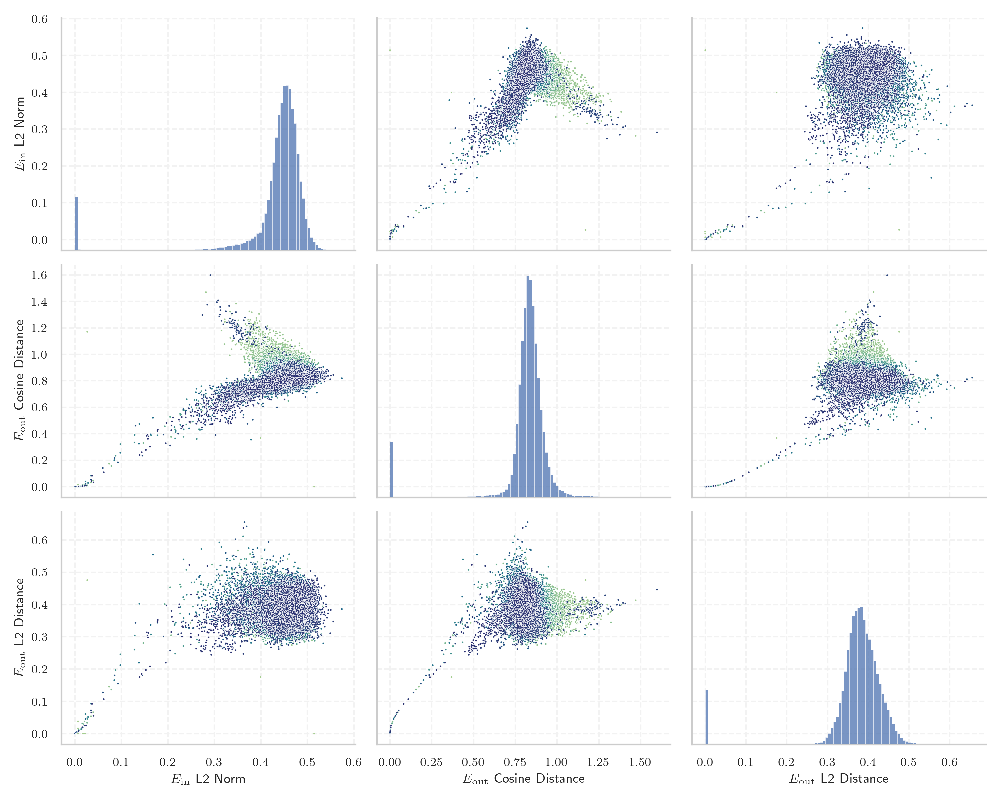
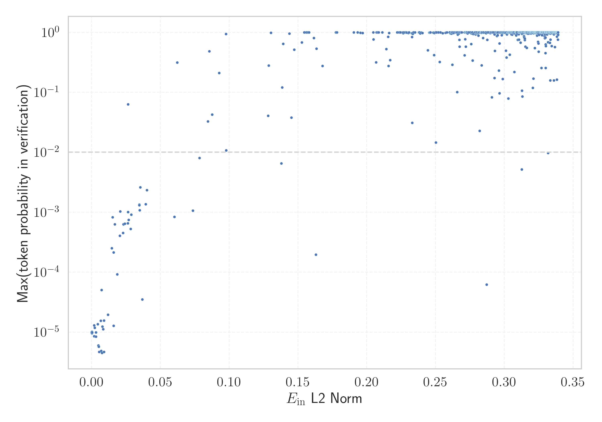

# Report for `mistralai/Codestral-22B-v0.1`

## Model info

* Model Info: 
  * Tied embeddings: False
  * LM head uses bias: False
  * Embeddings shape: [32768, 6144]
* Tokenizer Info: 
  * Vocab Size: 32768
  * Tokenizer Class: LlamaTokenizer
  * Tokenizer Type: BPE
  * Bytes handling: Byte Fallback
  * Token for verification prompt building: includegraphics
  * Token id for verification prompt building: 8389
* Indicator summary: 
  * Indicator for under-trained tokens: E_{in} L2 Norm
  * Overall distribution: 0.434 +/- 0.083
* Detected Token Counts: 
  * Number of tested under-trained tokens: 637, 602 non-special, 48 below p = 0.01 threshold, 38 below soft indicator threshold
  * Number of single byte tokens: 380, of which 142 below indicator threshold
  * Number of special tokens: 0, of which 0 below indicator threshold

## Under-trained token indicators plot


## Verification plot


## Under-trained token verification results
38 entries below threshold of 0.037

|   token_id | token              |   indicator | max_prob                                                         | in_other_tokens                                                             |
|------------|--------------------|-------------|------------------------------------------------------------------|-----------------------------------------------------------------------------|
|      21186 | ````` ▁/**\r ````` | 0.000203366 | <span style='border: 1px solid rgb(169, 68, 66);'>1e-05</span>   |                                                                             |
|      27404 | ````` });\r `````  | 0.000211239 | <span style='border: 1px solid rgb(169, 68, 66);'>9.6e-06</span> |                                                                             |
|      26851 | ````` ▁//\r `````  | 0.000290398 | <span style='border: 1px solid rgb(169, 68, 66);'>1e-05</span>   |                                                                             |
|      19527 | ````` ';\r `````   | 0.000359093 | <span style='border: 1px solid rgb(169, 68, 66);'>9.9e-06</span> |                                                                             |
|      21460 | ````` ▁},\r `````  | 0.00181144  | <span style='border: 1px solid rgb(169, 68, 66);'>8.5e-06</span> |                                                                             |
|      28939 | ````` ]);\r `````  | 0.00188571  | <span style='border: 1px solid rgb(169, 68, 66);'>1.3e-05</span> |                                                                             |
|      12961 | ````` ▁);\r `````  | 0.00231518  | <span style='border: 1px solid rgb(169, 68, 66);'>1.2e-05</span> |                                                                             |
|      15824 | ````` ());\r ````` | 0.00308073  | <span style='border: 1px solid rgb(169, 68, 66);'>9.9e-06</span> |                                                                             |
|       8376 | ````` ▁*/\r `````  | 0.00311985  | <span style='border: 1px solid rgb(169, 68, 66);'>8.4e-06</span> |                                                                             |
|      23907 | ````` ▁};\r `````  | 0.00443081  | <span style='border: 1px solid rgb(169, 68, 66);'>1.4e-05</span> |                                                                             |
|      18463 | ````` },\r `````   | 0.00495453  | <span style='border: 1px solid rgb(169, 68, 66);'>6e-06</span>   | <span style='border: 1px solid rgb(169, 68, 66);'>````` ▁},\r `````</span>  |
|      17711 | ````` ');\r `````  | 0.00518807  | <span style='border: 1px solid rgb(169, 68, 66);'>5.7e-06</span> |                                                                             |
|      10591 | ````` */\r `````   | 0.0055115   | <span style='border: 1px solid rgb(169, 68, 66);'>4.7e-06</span> |                                                                             |
|      15188 | ````` ];\r `````   | 0.00659078  | <span style='border: 1px solid rgb(169, 68, 66);'>1.5e-05</span> |                                                                             |
|      27175 | ````` };\r `````   | 0.00700302  | <span style='border: 1px solid rgb(169, 68, 66);'>4.9e-06</span> |                                                                             |
|      27160 | ````` ▁});\r ````` | 0.00729657  | <span style='border: 1px solid rgb(169, 68, 66);'>5e-05</span>   |                                                                             |
|      15524 | ````` /**\r `````  | 0.00757506  | <span style='border: 1px solid rgb(169, 68, 66);'>4.5e-06</span> | <span style='border: 1px solid rgb(169, 68, 66);'>````` ▁/**\r `````</span> |
|      11709 | ````` ));\r `````  | 0.00843535  | <span style='border: 1px solid rgb(169, 68, 66);'>1.1e-05</span> | <span style='border: 1px solid rgb(169, 68, 66);'>````` ());\r `````</span> |
|      11046 | ````` ',\r `````   | 0.00892226  | <span style='border: 1px solid rgb(169, 68, 66);'>4.7e-06</span> |                                                                             |
|      18823 | ````` ){\r `````   | 0.00903896  | <span style='border: 1px solid rgb(169, 68, 66);'>1.6e-05</span> |                                                                             |
<details><summary>18 additional entries below threshold</summary>

|   token_id | token             |   indicator | max_prob                                                         | in_other_tokens                                                                                                                                                                                                                                                                                                                                                                                  |
|------------|-------------------|-------------|------------------------------------------------------------------|--------------------------------------------------------------------------------------------------------------------------------------------------------------------------------------------------------------------------------------------------------------------------------------------------------------------------------------------------------------------------------------------------|
|      12648 | ````` ";\r `````  |   0.0118458 | <span style='border: 1px solid rgb(169, 68, 66);'>1.9e-05</span> |                                                                                                                                                                                                                                                                                                                                                                                                  |
|      15748 | ````` ">\r `````  |   0.0146075 | <span style='border: 1px solid rgb(169, 68, 66);'>0.00025</span> |                                                                                                                                                                                                                                                                                                                                                                                                  |
|      11707 | ````` ",\r `````  |   0.015295  | <span style='border: 1px solid rgb(169, 68, 66);'>0.00082</span> |                                                                                                                                                                                                                                                                                                                                                                                                  |
|       7681 | ````` ");\r ````` |   0.0160486 | <span style='border: 1px solid rgb(169, 68, 66);'>1.3e-05</span> |                                                                                                                                                                                                                                                                                                                                                                                                  |
|      22954 | ````` ')\r `````  |   0.0168856 | <span style='border: 1px solid rgb(169, 68, 66);'>0.00063</span> |                                                                                                                                                                                                                                                                                                                                                                                                  |
|       5188 | ````` ();\r ````` |   0.0186392 | <span style='border: 1px solid rgb(169, 68, 66);'>9.2e-05</span> |                                                                                                                                                                                                                                                                                                                                                                                                  |
|       4194 | ````` ▁}\r `````  |   0.0207344 | <span style='border: 1px solid rgb(255, 145, 0);'>0.001</span>   |                                                                                                                                                                                                                                                                                                                                                                                                  |
|      18102 | ````` (\r `````   |   0.0229008 | <span style='border: 1px solid rgb(169, 68, 66);'>0.00045</span> |                                                                                                                                                                                                                                                                                                                                                                                                  |
|      24254 | ````` ),\r `````  |   0.02308   | <span style='border: 1px solid rgb(169, 68, 66);'>0.00063</span> |                                                                                                                                                                                                                                                                                                                                                                                                  |
|       5209 | ````` {\r `````   |   0.0263287 | <span style='border: 1px solid rgb(169, 68, 66);'>0.00065</span> | <span style='border: 1px solid rgb(169, 68, 66);'>````` ){\r `````</span>                                                                                                                                                                                                                                                                                                                        |
|      15387 | ````` ▁)\r `````  |   0.0265098 | <span style='border: 1px solid rgb(255, 145, 0);'>0.001</span>   |                                                                                                                                                                                                                                                                                                                                                                                                  |
|      10730 | ````` ()\r `````  |   0.0268872 | <span style='border: 1px solid rgb(169, 68, 66);'>0.00075</span> |                                                                                                                                                                                                                                                                                                                                                                                                  |
|      17717 | ````` ")\r `````  |   0.028431  | <span style='border: 1px solid rgb(169, 68, 66);'>0.00053</span> |                                                                                                                                                                                                                                                                                                                                                                                                  |
|       3287 | ````` }\r `````   |   0.0288134 | <span style='border: 1px solid rgb(169, 68, 66);'>0.00091</span> | <span style='border: 1px solid rgb(255, 145, 0);'>````` ▁}\r `````</span>                                                                                                                                                                                                                                                                                                                        |
|      28500 | ````` '\r `````   |   0.0347272 | <span style='border: 1px solid rgb(255, 145, 0);'>0.0013</span>  |                                                                                                                                                                                                                                                                                                                                                                                                  |
|       2529 | ````` );\r `````  |   0.0347302 | <span style='border: 1px solid rgb(255, 145, 0);'>0.0013</span>  | <span style='border: 1px solid rgb(169, 68, 66);'>````` ();\r `````</span>, <span style='border: 1px solid rgb(169, 68, 66);'>````` ");\r `````</span>, <span style='border: 1px solid rgb(169, 68, 66);'>````` ));\r `````</span>, <span style='border: 1px solid rgb(169, 68, 66);'>````` ▁);\r `````</span>, <span style='border: 1px solid rgb(169, 68, 66);'>````` ());\r `````</span>, ... |
|      15436 | ````` ))\r `````  |   0.0348915 | <span style='border: 1px solid rgb(255, 145, 0);'>0.0011</span>  |                                                                                                                                                                                                                                                                                                                                                                                                  |
|      32131 | ````` \x85 `````  |   0.0353565 | <span style='border: 1px solid rgb(255, 145, 0);'>0.0026</span>  |                                                                                                                                                                                                                                                                                                                                                                                                  |
</details>
<details><summary>564 additional entries above threshold</summary>

|   token_id | token                      |   indicator | max_prob                                                         | in_other_tokens                                                                                                                                                                                                                                                                                                                                                                               |
|------------|----------------------------|-------------|------------------------------------------------------------------|-----------------------------------------------------------------------------------------------------------------------------------------------------------------------------------------------------------------------------------------------------------------------------------------------------------------------------------------------------------------------------------------------|
|      32506 | ````` \uefc0 `````         |   0.036861  | <span style='border: 1px solid rgb(169, 68, 66);'>3.5e-05</span> |                                                                                                                                                                                                                                                                                                                                                                                               |
|       2737 | ````` ▁{\r `````           |   0.0392685 | <span style='border: 1px solid rgb(255, 145, 0);'>0.0014</span>  |                                                                                                                                                                                                                                                                                                                                                                                               |
|      27599 | ````` ▁febbra `````        |   0.0601993 | <span style='border: 1px solid rgb(169, 68, 66);'>0.00084</span> | <span style='border: 1px solid rgb(40, 167, 69);'>````` ▁febbraio `````</span>                                                                                                                                                                                                                                                                                                                |
|      31697 | ````` ᥀ `````              |   0.0622133 | <span style='border: 1px solid rgb(40, 167, 69);'>0.31</span>    |                                                                                                                                                                                                                                                                                                                                                                                               |
|       2039 | ````` ;\r `````            |   0.0735863 | <span style='border: 1px solid rgb(255, 145, 0);'>0.0011</span>  | <span style='border: 1px solid rgb(255, 145, 0);'>````` );\r `````</span>, <span style='border: 1px solid rgb(169, 68, 66);'>````` ();\r `````</span>, <span style='border: 1px solid rgb(169, 68, 66);'>````` ");\r `````</span>, <span style='border: 1px solid rgb(169, 68, 66);'>````` ));\r `````</span>, <span style='border: 1px solid rgb(169, 68, 66);'>````` ";\r `````</span>, ... |
|       4453 | ````` >\r `````            |   0.0784138 | <span style='border: 1px solid rgb(255, 145, 0);'>0.008</span>   | <span style='border: 1px solid rgb(169, 68, 66);'>````` ">\r `````</span>                                                                                                                                                                                                                                                                                                                     |
|      19534 | ````` ]\r `````            |   0.0846131 | <span style='border: 1px solid rgb(251, 189, 8);'>0.033</span>   |                                                                                                                                                                                                                                                                                                                                                                                               |
|      26668 | ````` iNdEx `````          |   0.085506  | <span style='border: 1px solid rgb(40, 167, 69);'>0.48</span>    |                                                                                                                                                                                                                                                                                                                                                                                               |
|      12293 | ````` "\r `````            |   0.0876469 | <span style='border: 1px solid rgb(251, 189, 8);'>0.042</span>   |                                                                                                                                                                                                                                                                                                                                                                                               |
|      26601 | ````` >?[< `````           |   0.0926743 | <span style='border: 1px solid rgb(40, 167, 69);'>0.21</span>    |                                                                                                                                                                                                                                                                                                                                                                                               |
|      20016 | ````` NdEx `````           |   0.0976566 | <span style='border: 1px solid rgb(40, 167, 69);'>0.93</span>    | <span style='border: 1px solid rgb(40, 167, 69);'>````` iNdEx `````</span>                                                                                                                                                                                                                                                                                                                    |
|      14820 | ````` ▁Jahrhund `````      |   0.0978351 | <span style='border: 1px solid rgb(251, 189, 8);'>0.011</span>   | ````` ▁Jahrhundert `````, ````` ▁Jahrhunderts `````                                                                                                                                                                                                                                                                                                                                           |
|      14435 | ````` *\r `````            |   0.128298  | <span style='border: 1px solid rgb(251, 189, 8);'>0.04</span>    | <span style='border: 1px solid rgb(169, 68, 66);'>````` /**\r `````</span>, <span style='border: 1px solid rgb(169, 68, 66);'>````` ▁/**\r `````</span>                                                                                                                                                                                                                                       |
|      16409 | ````` ▁uitgen `````        |   0.128718  | <span style='border: 1px solid rgb(40, 167, 69);'>0.28</span>    | <span style='border: 1px solid rgb(40, 167, 69);'>````` ▁uitgenodigd `````</span>                                                                                                                                                                                                                                                                                                             |
|      27707 | ````` ▁invån `````         |   0.130345  | <span style='border: 1px solid rgb(40, 167, 69);'>0.99</span>    | <span style='border: 1px solid rgb(40, 167, 69);'>````` ▁invånare `````</span>                                                                                                                                                                                                                                                                                                                |
|      21126 | ````` ):\r `````           |   0.137877  | <span style='border: 1px solid rgb(255, 145, 0);'>0.0065</span>  |                                                                                                                                                                                                                                                                                                                                                                                               |
|      18547 | ````` ▁gepublice `````     |   0.138599  | <span style='border: 1px solid rgb(40, 167, 69);'>0.12</span>    | ````` ▁gepubliceerd `````                                                                                                                                                                                                                                                                                                                                                                     |
|      32501 | ````` ⵙ `````              |   0.139205  | <span style='border: 1px solid rgb(40, 167, 69);'>0.64</span>    |                                                                                                                                                                                                                                                                                                                                                                                               |
|      32690 | ````` ⵓ `````              |   0.143783  | <span style='border: 1px solid rgb(40, 167, 69);'>0.95</span>    |                                                                                                                                                                                                                                                                                                                                                                                               |
|      28224 | ````` :%.*]] `````         |   0.145207  | <span style='border: 1px solid rgb(251, 189, 8);'>0.038</span>   |                                                                                                                                                                                                                                                                                                                                                                                               |
|       5372 | ````` ,\r `````            |   0.147213  | <span style='border: 1px solid rgb(40, 167, 69);'>0.51</span>    | <span style='border: 1px solid rgb(169, 68, 66);'>````` ',\r `````</span>, <span style='border: 1px solid rgb(169, 68, 66);'>````` ",\r `````</span>, <span style='border: 1px solid rgb(169, 68, 66);'>````` },\r `````</span>, <span style='border: 1px solid rgb(169, 68, 66);'>````` ▁},\r `````</span>, <span style='border: 1px solid rgb(169, 68, 66);'>````` ),\r `````</span>        |
|      32211 | ````` ⵏ `````              |   0.152813  | <span style='border: 1px solid rgb(40, 167, 69);'>0.68</span>    |                                                                                                                                                                                                                                                                                                                                                                                               |
|      32413 | ````` ≯ `````              |   0.154607  | <span style='border: 1px solid rgb(40, 167, 69);'>1</span>       |                                                                                                                                                                                                                                                                                                                                                                                               |
|      32237 | ````` ӏ `````              |   0.156059  | <span style='border: 1px solid rgb(40, 167, 69);'>1</span>       |                                                                                                                                                                                                                                                                                                                                                                                               |
|      32621 | ````` ⇽ `````              |   0.157164  | <span style='border: 1px solid rgb(40, 167, 69);'>1</span>       |                                                                                                                                                                                                                                                                                                                                                                                               |
|      31181 | ````` ⌁ `````              |   0.158118  | <span style='border: 1px solid rgb(40, 167, 69);'>1</span>       |                                                                                                                                                                                                                                                                                                                                                                                               |
|      32085 | ````` ⵉ `````              |   0.161584  | <span style='border: 1px solid rgb(40, 167, 69);'>0.8</span>     |                                                                                                                                                                                                                                                                                                                                                                                               |
|      22027 | ````` \r\r `````           |   0.16311   | <span style='border: 1px solid rgb(169, 68, 66);'>0.0002</span>  |                                                                                                                                                                                                                                                                                                                                                                                               |
|      16349 | ````` achuset `````        |   0.163407  | <span style='border: 1px solid rgb(40, 167, 69);'>0.53</span>    | ````` achusetts `````, ````` ▁Massachusetts `````                                                                                                                                                                                                                                                                                                                                             |
|      21664 | ````` ▁Станов `````        |   0.167905  | <span style='border: 1px solid rgb(40, 167, 69);'>0.28</span>    | <span style='border: 1px solid rgb(40, 167, 69);'>````` ▁Становништво `````</span>                                                                                                                                                                                                                                                                                                            |
|      17492 | ````` tagHelper `````      |   0.17754   | <span style='border: 1px solid rgb(40, 167, 69);'>1</span>       |                                                                                                                                                                                                                                                                                                                                                                                               |
|      32609 | ````` ❒ `````              |   0.177651  | <span style='border: 1px solid rgb(40, 167, 69);'>1</span>       |                                                                                                                                                                                                                                                                                                                                                                                               |
|      32424 | ````` ≮ `````              |   0.178403  | <span style='border: 1px solid rgb(40, 167, 69);'>1</span>       |                                                                                                                                                                                                                                                                                                                                                                                               |
|      28033 | ````` ▁SDValue `````       |   0.190601  | <span style='border: 1px solid rgb(40, 167, 69);'>1</span>       |                                                                                                                                                                                                                                                                                                                                                                                               |
|       8709 | ````` ICENSE `````         |   0.193382  | <span style='border: 1px solid rgb(40, 167, 69);'>1</span>       | ````` LICENSE `````, ````` ▁LICENSE `````                                                                                                                                                                                                                                                                                                                                                     |
|      31422 | ````` ⴰ `````              |   0.195438  | <span style='border: 1px solid rgb(40, 167, 69);'>0.98</span>    |                                                                                                                                                                                                                                                                                                                                                                                               |
|      32700 | ````` ҽ `````              |   0.197063  | <span style='border: 1px solid rgb(40, 167, 69);'>0.98</span>    |                                                                                                                                                                                                                                                                                                                                                                                               |
|       8731 | ````` ▁citiz `````         |   0.204749  | <span style='border: 1px solid rgb(40, 167, 69);'>1</span>       | ````` ▁citizens `````, ````` ▁citizen `````                                                                                                                                                                                                                                                                                                                                                   |
|      29361 | ````` pgfscope `````       |   0.204957  | <span style='border: 1px solid rgb(40, 167, 69);'>0.76</span>    |                                                                                                                                                                                                                                                                                                                                                                                               |
|       3942 | ````` )\r `````            |   0.20687   | <span style='border: 1px solid rgb(40, 167, 69);'>0.32</span>    | <span style='border: 1px solid rgb(169, 68, 66);'>````` ()\r `````</span>, <span style='border: 1px solid rgb(255, 145, 0);'>````` ▁)\r `````</span>, <span style='border: 1px solid rgb(255, 145, 0);'>````` ))\r `````</span>, <span style='border: 1px solid rgb(169, 68, 66);'>````` ")\r `````</span>, <span style='border: 1px solid rgb(169, 68, 66);'>````` ')\r `````</span>         |
|      32499 | ````` Ӏ `````              |   0.207145  | <span style='border: 1px solid rgb(40, 167, 69);'>0.99</span>    |                                                                                                                                                                                                                                                                                                                                                                                               |
|      31581 | ````` ︙ `````             |   0.207801  | <span style='border: 1px solid rgb(40, 167, 69);'>1</span>       |                                                                                                                                                                                                                                                                                                                                                                                               |
|      31428 | ````` ☽ `````              |   0.208636  | <span style='border: 1px solid rgb(40, 167, 69);'>1</span>       |                                                                                                                                                                                                                                                                                                                                                                                               |
|      31635 | ````` 🟠 `````             |   0.211327  | <span style='border: 1px solid rgb(40, 167, 69);'>1</span>       |                                                                                                                                                                                                                                                                                                                                                                                               |
|      16398 | ````` odigd `````          |   0.214302  | <span style='border: 1px solid rgb(40, 167, 69);'>0.52</span>    | <span style='border: 1px solid rgb(40, 167, 69);'>````` ▁uitgenodigd `````</span>                                                                                                                                                                                                                                                                                                             |
|       8998 | ````` :\r `````            |   0.215559  | <span style='border: 1px solid rgb(40, 167, 69);'>0.84</span>    | <span style='border: 1px solid rgb(255, 145, 0);'>````` ):\r `````</span>                                                                                                                                                                                                                                                                                                                     |
|      13451 | ````` pgfpathlineto `````  |   0.215787  | <span style='border: 1px solid rgb(40, 167, 69);'>0.27</span>    |                                                                                                                                                                                                                                                                                                                                                                                               |
|      16648 | ````` >:]< `````           |   0.216282  | <span style='border: 1px solid rgb(40, 167, 69);'>0.97</span>    |                                                                                                                                                                                                                                                                                                                                                                                               |
|      17449 | ````` börd `````           |   0.217068  | <span style='border: 1px solid rgb(40, 167, 69);'>0.34</span>    | ````` ederbörd `````, <span style='border: 1px solid rgb(40, 167, 69);'>````` ▁nederbörd `````</span>                                                                                                                                                                                                                                                                                         |
|      28684 | ````` ▁Marcatori `````     |   0.222141  | <span style='border: 1px solid rgb(40, 167, 69);'>1</span>       |                                                                                                                                                                                                                                                                                                                                                                                               |
|      32663 | ````` ❍ `````              |   0.223532  | <span style='border: 1px solid rgb(40, 167, 69);'>1</span>       |                                                                                                                                                                                                                                                                                                                                                                                               |
|      32541 | ````` ѐ `````              |   0.224614  | <span style='border: 1px solid rgb(40, 167, 69);'>1</span>       |                                                                                                                                                                                                                                                                                                                                                                                               |
|      10431 | ````` ▁laug `````          |   0.226304  | <span style='border: 1px solid rgb(40, 167, 69);'>1</span>       | ````` ▁laughed `````, ````` ▁laughing `````, ````` ▁laughter `````                                                                                                                                                                                                                                                                                                                            |
|      11298 | ````` ▁franç `````         |   0.226516  | <span style='border: 1px solid rgb(40, 167, 69);'>0.97</span>    | ````` ▁français `````, ````` ▁française `````                                                                                                                                                                                                                                                                                                                                                 |
|      16385 | ````` netje `````          |   0.226531  | <span style='border: 1px solid rgb(40, 167, 69);'>0.99</span>    | <span style='border: 1px solid rgb(169, 68, 66);'>````` ▁beginnetje `````</span>                                                                                                                                                                                                                                                                                                              |
|       8772 | ````` bolds `````          |   0.227839  | <span style='border: 1px solid rgb(40, 167, 69);'>1</span>       | ````` boldsymbol `````                                                                                                                                                                                                                                                                                                                                                                        |
|      30910 | ````` ⚭ `````              |   0.228754  | <span style='border: 1px solid rgb(40, 167, 69);'>1</span>       |                                                                                                                                                                                                                                                                                                                                                                                               |
|      32470 | ````` ʐ `````              |   0.229172  | <span style='border: 1px solid rgb(40, 167, 69);'>0.99</span>    |                                                                                                                                                                                                                                                                                                                                                                                               |
|      32044 | ````` ን `````              |   0.230268  | <span style='border: 1px solid rgb(40, 167, 69);'>0.97</span>    |                                                                                                                                                                                                                                                                                                                                                                                               |
|      32717 | ````` Ḩ `````              |   0.230723  | <span style='border: 1px solid rgb(40, 167, 69);'>1</span>       |                                                                                                                                                                                                                                                                                                                                                                                               |
|      32681 | ````` ḩ `````              |   0.232765  | <span style='border: 1px solid rgb(40, 167, 69);'>0.97</span>    |                                                                                                                                                                                                                                                                                                                                                                                               |
|      16417 | ````` ▁uitgenodigd `````   |   0.232868  | <span style='border: 1px solid rgb(40, 167, 69);'>0.84</span>    |                                                                                                                                                                                                                                                                                                                                                                                               |
|      25992 | ````` ▁февра `````         |   0.233006  | <span style='border: 1px solid rgb(251, 189, 8);'>0.031</span>   | <span style='border: 1px solid rgb(40, 167, 69);'>````` ▁февраля `````</span>                                                                                                                                                                                                                                                                                                                 |
|      11533 | ````` pgfqpoint `````      |   0.233442  | <span style='border: 1px solid rgb(40, 167, 69);'>0.98</span>    |                                                                                                                                                                                                                                                                                                                                                                                               |
|      17540 | ````` :%.* `````           |   0.233462  | <span style='border: 1px solid rgb(40, 167, 69);'>0.95</span>    | <span style='border: 1px solid rgb(251, 189, 8);'>````` :%.*]] `````</span>                                                                                                                                                                                                                                                                                                                   |
|      17953 | ````` ublice `````         |   0.233905  | <span style='border: 1px solid rgb(40, 167, 69);'>1</span>       | <span style='border: 1px solid rgb(40, 167, 69);'>````` ▁gepublice `````</span>, ````` ▁gepubliceerd `````                                                                                                                                                                                                                                                                                    |
|       7552 | ````` ▁WARRAN `````        |   0.235107  | <span style='border: 1px solid rgb(40, 167, 69);'>1</span>       | ````` ▁WARRANTIES `````, ````` ▁WARRANTY `````                                                                                                                                                                                                                                                                                                                                                |
|      31869 | ````` ḫ `````              |   0.237934  | <span style='border: 1px solid rgb(40, 167, 69);'>1</span>       |                                                                                                                                                                                                                                                                                                                                                                                               |
|      32095 | ````` ̞ `````               |   0.238136  | <span style='border: 1px solid rgb(40, 167, 69);'>1</span>       |                                                                                                                                                                                                                                                                                                                                                                                               |
|      32378 | ````` ṯ `````              |   0.238297  | <span style='border: 1px solid rgb(40, 167, 69);'>1</span>       |                                                                                                                                                                                                                                                                                                                                                                                               |
|      24010 | ````` ▁апре `````          |   0.238862  | <span style='border: 1px solid rgb(40, 167, 69);'>0.96</span>    | <span style='border: 1px solid rgb(40, 167, 69);'>````` ▁апреля `````</span>                                                                                                                                                                                                                                                                                                                  |
|      11935 | ````` ityEngine `````      |   0.239643  | <span style='border: 1px solid rgb(40, 167, 69);'>0.99</span>    | ````` ▁UnityEngine `````, ````` UnityEngine `````                                                                                                                                                                                                                                                                                                                                             |
|      16476 | ````` ▁klikken `````       |   0.240523  | <span style='border: 1px solid rgb(40, 167, 69);'>0.98</span>    |                                                                                                                                                                                                                                                                                                                                                                                               |
|      29425 | ````` ▁honom `````         |   0.244392  | <span style='border: 1px solid rgb(40, 167, 69);'>0.5</span>     |                                                                                                                                                                                                                                                                                                                                                                                               |
|      31538 | ````` 🟡 `````             |   0.245392  | <span style='border: 1px solid rgb(40, 167, 69);'>0.99</span>    |                                                                                                                                                                                                                                                                                                                                                                                               |
|      21392 | ````` ништво `````         |   0.24577   | <span style='border: 1px solid rgb(40, 167, 69);'>0.99</span>    | <span style='border: 1px solid rgb(40, 167, 69);'>````` ▁Становништво `````</span>                                                                                                                                                                                                                                                                                                            |
|      32527 | ````` \ufeff `````         |   0.246074  | <span style='border: 1px solid rgb(40, 167, 69);'>1</span>       |                                                                                                                                                                                                                                                                                                                                                                                               |
|      23051 | ````` ▁сент `````          |   0.246326  | <span style='border: 1px solid rgb(40, 167, 69);'>1</span>       | <span style='border: 1px solid rgb(40, 167, 69);'>````` ▁сентября `````</span>                                                                                                                                                                                                                                                                                                                |
|      32631 | ````` Մ `````              |   0.248332  | <span style='border: 1px solid rgb(40, 167, 69);'>0.99</span>    |                                                                                                                                                                                                                                                                                                                                                                                               |
|      32254 | ````` ્ `````               |   0.248962  | <span style='border: 1px solid rgb(40, 167, 69);'>0.42</span>    |                                                                                                                                                                                                                                                                                                                                                                                               |
|      32671 | ````` Ս `````              |   0.249153  | <span style='border: 1px solid rgb(40, 167, 69);'>0.97</span>    |                                                                                                                                                                                                                                                                                                                                                                                               |
|      32544 | ````` ✭ `````              |   0.250038  | <span style='border: 1px solid rgb(40, 167, 69);'>1</span>       |                                                                                                                                                                                                                                                                                                                                                                                               |
|      32482 | ````` ਾ `````               |   0.250223  | <span style='border: 1px solid rgb(251, 189, 8);'>0.015</span>   |                                                                                                                                                                                                                                                                                                                                                                                               |
|      17381 | ````` CLUD `````           |   0.250812  | <span style='border: 1px solid rgb(40, 167, 69);'>1</span>       | <span style='border: 1px solid rgb(40, 167, 69);'>````` CLUDING `````</span>, ````` ▁INCLUDING `````, <span style='border: 1px solid rgb(40, 167, 69);'>````` INCLUDING `````</span>                                                                                                                                                                                                          |
|      29331 | ````` ▁саве `````          |   0.252182  | <span style='border: 1px solid rgb(40, 167, 69);'>1</span>       |                                                                                                                                                                                                                                                                                                                                                                                               |
|      23465 | ````` ▁янва `````          |   0.25304   | <span style='border: 1px solid rgb(40, 167, 69);'>0.32</span>    | <span style='border: 1px solid rgb(40, 167, 69);'>````` ▁января `````</span>                                                                                                                                                                                                                                                                                                                  |
|      11530 | ````` qpoint `````         |   0.253583  | <span style='border: 1px solid rgb(40, 167, 69);'>1</span>       | <span style='border: 1px solid rgb(40, 167, 69);'>````` pgfqpoint `````</span>                                                                                                                                                                                                                                                                                                                |
|      27926 | ````` ▁invånare `````      |   0.255299  | <span style='border: 1px solid rgb(40, 167, 69);'>0.97</span>    |                                                                                                                                                                                                                                                                                                                                                                                               |
|      13241 | ````` ▁Насе `````          |   0.257281  | <span style='border: 1px solid rgb(40, 167, 69);'>0.99</span>    | <span style='border: 1px solid rgb(40, 167, 69);'>````` ▁Население `````</span>, <span style='border: 1px solid rgb(40, 167, 69);'>````` ▁Населення `````</span>                                                                                                                                                                                                                              |
|      32450 | ````` ǧ `````              |   0.25824   | <span style='border: 1px solid rgb(40, 167, 69);'>1</span>       |                                                                                                                                                                                                                                                                                                                                                                                               |
|      19729 | ````` ▁чемпи `````         |   0.260253  | <span style='border: 1px solid rgb(40, 167, 69);'>1</span>       | <span style='border: 1px solid rgb(40, 167, 69);'>````` ▁чемпиона `````</span>                                                                                                                                                                                                                                                                                                                |
|      32401 | ````` ʋ `````              |   0.26032   | <span style='border: 1px solid rgb(40, 167, 69);'>1</span>       |                                                                                                                                                                                                                                                                                                                                                                                               |
|      32709 | ````` ಮ `````              |   0.260922  | <span style='border: 1px solid rgb(40, 167, 69);'>0.96</span>    |                                                                                                                                                                                                                                                                                                                                                                                               |
|       2070 | ````` ▁\r `````            |   0.261312  | <span style='border: 1px solid rgb(40, 167, 69);'>0.98</span>    |                                                                                                                                                                                                                                                                                                                                                                                               |
|      19552 | ````` ▁авгу `````          |   0.261589  | <span style='border: 1px solid rgb(40, 167, 69);'>0.95</span>    | <span style='border: 1px solid rgb(40, 167, 69);'>````` ▁августа `````</span>                                                                                                                                                                                                                                                                                                                 |
|      19941 | ````` ▁janu `````          |   0.261636  | <span style='border: 1px solid rgb(40, 167, 69);'>1</span>       | <span style='border: 1px solid rgb(40, 167, 69);'>````` ▁januari `````</span>                                                                                                                                                                                                                                                                                                                 |
|      27375 | ````` ▁Arbitro `````       |   0.261802  | <span style='border: 1px solid rgb(40, 167, 69);'>1</span>       |                                                                                                                                                                                                                                                                                                                                                                                               |
|      13846 | ````` ERCHANTABILITY ````` |   0.262187  | <span style='border: 1px solid rgb(40, 167, 69);'>0.29</span>    | ````` ▁MERCHANTABILITY `````                                                                                                                                                                                                                                                                                                                                                                  |
|      31496 | ````` ʂ `````              |   0.262298  | <span style='border: 1px solid rgb(40, 167, 69);'>1</span>       |                                                                                                                                                                                                                                                                                                                                                                                               |
|      32638 | ````` ǀ `````              |   0.262762  | <span style='border: 1px solid rgb(40, 167, 69);'>1</span>       |                                                                                                                                                                                                                                                                                                                                                                                               |
|      32701 | ````` ថ `````              |   0.263168  | <span style='border: 1px solid rgb(40, 167, 69);'>0.97</span>    |                                                                                                                                                                                                                                                                                                                                                                                               |
|      29325 | ````` referto `````        |   0.263966  | <span style='border: 1px solid rgb(40, 167, 69);'>1</span>       |                                                                                                                                                                                                                                                                                                                                                                                               |
|      10830 | ````` ▁acknow `````        |   0.264759  | <span style='border: 1px solid rgb(40, 167, 69);'>1</span>       | ````` ▁acknowled `````, ````` ▁acknowledge `````, ````` ▁acknowledged `````                                                                                                                                                                                                                                                                                                                   |
|      32426 | ````` Ṭ `````              |   0.265012  | <span style='border: 1px solid rgb(40, 167, 69);'>1</span>       |                                                                                                                                                                                                                                                                                                                                                                                               |
|       5771 | ````` ▁thous `````         |   0.265383  | <span style='border: 1px solid rgb(40, 167, 69);'>1</span>       | ````` ▁thousand `````, ````` ▁thousands `````                                                                                                                                                                                                                                                                                                                                                 |
|      32648 | ````` ਰ `````              |   0.265763  | <span style='border: 1px solid rgb(40, 167, 69);'>0.1</span>     |                                                                                                                                                                                                                                                                                                                                                                                               |
|      12060 | ````` краї `````           |   0.265825  | <span style='border: 1px solid rgb(40, 167, 69);'>1</span>       | <span style='border: 1px solid rgb(40, 167, 69);'>````` ▁Украї `````</span>, ````` ▁України `````, <span style='border: 1px solid rgb(40, 167, 69);'>````` країн `````</span>, <span style='border: 1px solid rgb(40, 167, 69);'>````` ▁україн `````</span>                                                                                                                                   |
|      32723 | ````` 😤 `````             |   0.266211  | <span style='border: 1px solid rgb(40, 167, 69);'>0.91</span>    |                                                                                                                                                                                                                                                                                                                                                                                               |
|      26634 | ````` bbra `````           |   0.266842  | <span style='border: 1px solid rgb(40, 167, 69);'>1</span>       | <span style='border: 1px solid rgb(169, 68, 66);'>````` ▁febbra `````</span>, <span style='border: 1px solid rgb(40, 167, 69);'>````` ▁febbraio `````</span>                                                                                                                                                                                                                                  |
|      12138 | ````` pgfpath `````        |   0.266973  | <span style='border: 1px solid rgb(40, 167, 69);'>0.95</span>    | <span style='border: 1px solid rgb(40, 167, 69);'>````` pgfpathlineto `````</span>                                                                                                                                                                                                                                                                                                            |
|      24947 | ````` ▁febr `````          |   0.267049  | <span style='border: 1px solid rgb(40, 167, 69);'>1</span>       | <span style='border: 1px solid rgb(40, 167, 69);'>````` ▁febrero `````</span>                                                                                                                                                                                                                                                                                                                 |
|      32734 | ````` ಂ `````               |   0.267322  | <span style='border: 1px solid rgb(40, 167, 69);'>0.75</span>    |                                                                                                                                                                                                                                                                                                                                                                                               |
|      22404 | ````` стратив `````        |   0.267453  | <span style='border: 1px solid rgb(40, 167, 69);'>0.58</span>    | <span style='border: 1px solid rgb(40, 167, 69);'>````` министратив `````</span>                                                                                                                                                                                                                                                                                                              |
|      32710 | ````` አ `````              |   0.267579  | <span style='border: 1px solid rgb(40, 167, 69);'>1</span>       |                                                                                                                                                                                                                                                                                                                                                                                               |
|      32673 | ````` ẓ `````              |   0.267988  | <span style='border: 1px solid rgb(40, 167, 69);'>1</span>       |                                                                                                                                                                                                                                                                                                                                                                                               |
|      27060 | ````` emperaturen `````    |   0.268494  | <span style='border: 1px solid rgb(40, 167, 69);'>1</span>       | ````` eltemperaturen `````                                                                                                                                                                                                                                                                                                                                                                    |
|      16268 | ````` itempty `````        |   0.269019  | <span style='border: 1px solid rgb(40, 167, 69);'>0.99</span>    | ````` omitempty `````                                                                                                                                                                                                                                                                                                                                                                         |
|      22619 | ````` ▁фев `````           |   0.269129  | <span style='border: 1px solid rgb(40, 167, 69);'>1</span>       | <span style='border: 1px solid rgb(251, 189, 8);'>````` ▁февра `````</span>, <span style='border: 1px solid rgb(40, 167, 69);'>````` ▁февраля `````</span>                                                                                                                                                                                                                                    |
|      14096 | ````` ▁oppon `````         |   0.271132  | <span style='border: 1px solid rgb(40, 167, 69);'>1</span>       | ````` ▁opponent `````, ````` ▁opponents `````                                                                                                                                                                                                                                                                                                                                                 |
|      31794 | ````` ಾ `````               |   0.271203  | <span style='border: 1px solid rgb(40, 167, 69);'>0.41</span>    |                                                                                                                                                                                                                                                                                                                                                                                               |
|      32416 | ````` ಲ `````              |   0.271574  | <span style='border: 1px solid rgb(40, 167, 69);'>0.77</span>    |                                                                                                                                                                                                                                                                                                                                                                                               |
|       8522 | ````` imary `````          |   0.27168   | <span style='border: 1px solid rgb(40, 167, 69);'>1</span>       | ````` primary `````, ````` Primary `````, ````` ▁Primary `````                                                                                                                                                                                                                                                                                                                                |
|      31118 | ````` ѣ `````              |   0.271848  | <span style='border: 1px solid rgb(40, 167, 69);'>1</span>       |                                                                                                                                                                                                                                                                                                                                                                                               |
|      17402 | ````` CLUDING `````        |   0.272011  | <span style='border: 1px solid rgb(40, 167, 69);'>0.58</span>    | ````` ▁INCLUDING `````, <span style='border: 1px solid rgb(40, 167, 69);'>````` INCLUDING `````</span>                                                                                                                                                                                                                                                                                        |
|      32274 | ````` ት `````              |   0.272161  | <span style='border: 1px solid rgb(40, 167, 69);'>0.99</span>    |                                                                                                                                                                                                                                                                                                                                                                                               |
|      26544 | ````` ▁држа `````          |   0.272486  | <span style='border: 1px solid rgb(40, 167, 69);'>1</span>       |                                                                                                                                                                                                                                                                                                                                                                                               |
|       7916 | ````` sembly `````         |   0.272537  | <span style='border: 1px solid rgb(40, 167, 69);'>1</span>       | ````` ▁Assembly `````, ````` ▁assembly `````, ````` assembly `````, ````` Assembly `````                                                                                                                                                                                                                                                                                                      |
|      22644 | ````` imeq `````           |   0.272803  | <span style='border: 1px solid rgb(40, 167, 69);'>1</span>       | ````` simeq `````                                                                                                                                                                                                                                                                                                                                                                             |
|      32594 | ````` ಯ `````              |   0.273081  | <span style='border: 1px solid rgb(40, 167, 69);'>0.97</span>    |                                                                                                                                                                                                                                                                                                                                                                                               |
|      32566 | ````` ም `````              |   0.273383  | <span style='border: 1px solid rgb(40, 167, 69);'>0.96</span>    |                                                                                                                                                                                                                                                                                                                                                                                               |
|      31734 | ````` Ἀ `````              |   0.273765  | <span style='border: 1px solid rgb(40, 167, 69);'>1</span>       |                                                                                                                                                                                                                                                                                                                                                                                               |
|      13350 | ````` lineto `````         |   0.275273  | <span style='border: 1px solid rgb(40, 167, 69);'>1</span>       | <span style='border: 1px solid rgb(40, 167, 69);'>````` pgfpathlineto `````</span>                                                                                                                                                                                                                                                                                                            |
|      25504 | ````` ској `````           |   0.27592   | <span style='border: 1px solid rgb(40, 167, 69);'>0.64</span>    |                                                                                                                                                                                                                                                                                                                                                                                               |
|      16420 | ````` ▁voegen `````        |   0.276119  | <span style='border: 1px solid rgb(40, 167, 69);'>0.96</span>    |                                                                                                                                                                                                                                                                                                                                                                                               |
|      32557 | ````` ಗ `````              |   0.276352  | <span style='border: 1px solid rgb(40, 167, 69);'>0.99</span>    |                                                                                                                                                                                                                                                                                                                                                                                               |
|      28460 | ````` ▁inwon `````         |   0.276456  | <span style='border: 1px solid rgb(40, 167, 69);'>1</span>       |                                                                                                                                                                                                                                                                                                                                                                                               |
|      31389 | ````` ɕ `````              |   0.276778  | <span style='border: 1px solid rgb(40, 167, 69);'>1</span>       |                                                                                                                                                                                                                                                                                                                                                                                               |
|      31174 | ````` ್ `````               |   0.276965  | <span style='border: 1px solid rgb(40, 167, 69);'>0.34</span>    |                                                                                                                                                                                                                                                                                                                                                                                               |
|      26743 | ````` ▁Населення `````     |   0.277344  | <span style='border: 1px solid rgb(40, 167, 69);'>0.93</span>    |                                                                                                                                                                                                                                                                                                                                                                                               |
|      32138 | ````` 🤡 `````             |   0.277785  | <span style='border: 1px solid rgb(40, 167, 69);'>0.97</span>    |                                                                                                                                                                                                                                                                                                                                                                                               |
|      32494 | ````` ስ `````              |   0.278537  | <span style='border: 1px solid rgb(40, 167, 69);'>1</span>       |                                                                                                                                                                                                                                                                                                                                                                                               |
|      31724 | ````` ̪ `````               |   0.278643  | <span style='border: 1px solid rgb(40, 167, 69);'>1</span>       |                                                                                                                                                                                                                                                                                                                                                                                               |
|      32550 | ````` ǫ `````              |   0.278833  | <span style='border: 1px solid rgb(40, 167, 69);'>1</span>       |                                                                                                                                                                                                                                                                                                                                                                                               |
|      32570 | ````` ವ `````              |   0.279223  | <span style='border: 1px solid rgb(40, 167, 69);'>0.92</span>    |                                                                                                                                                                                                                                                                                                                                                                                               |
|      32209 | ````` ូ `````               |   0.27942   | <span style='border: 1px solid rgb(40, 167, 69);'>0.96</span>    |                                                                                                                                                                                                                                                                                                                                                                                               |
|      13019 | ````` ября `````           |   0.279509  | <span style='border: 1px solid rgb(40, 167, 69);'>0.97</span>    | <span style='border: 1px solid rgb(40, 167, 69);'>````` ▁сентября `````</span>, <span style='border: 1px solid rgb(40, 167, 69);'>````` ▁октября `````</span>, <span style='border: 1px solid rgb(40, 167, 69);'>````` ▁ноября `````</span>                                                                                                                                                   |
|      15569 | ````` plaatst `````        |   0.279817  | <span style='border: 1px solid rgb(40, 167, 69);'>0.98</span>    | ````` Geplaatst `````                                                                                                                                                                                                                                                                                                                                                                         |
|      30266 | ````` ѝ `````              |   0.280001  | <span style='border: 1px solid rgb(40, 167, 69);'>0.99</span>    |                                                                                                                                                                                                                                                                                                                                                                                               |
|      28200 | ````` ▁månaden `````       |   0.280033  | <span style='border: 1px solid rgb(40, 167, 69);'>1</span>       |                                                                                                                                                                                                                                                                                                                                                                                               |
|      28496 | ````` ▁дивизи `````        |   0.280632  | <span style='border: 1px solid rgb(40, 167, 69);'>0.97</span>    |                                                                                                                                                                                                                                                                                                                                                                                               |
|      32475 | ````` ಸ `````              |   0.280981  | <span style='border: 1px solid rgb(40, 167, 69);'>0.98</span>    |                                                                                                                                                                                                                                                                                                                                                                                               |
|      26595 | ````` ския `````           |   0.281179  | <span style='border: 1px solid rgb(40, 167, 69);'>0.89</span>    |                                                                                                                                                                                                                                                                                                                                                                                               |
|      32617 | ````` ತ `````              |   0.281332  | <span style='border: 1px solid rgb(40, 167, 69);'>0.98</span>    |                                                                                                                                                                                                                                                                                                                                                                                               |
|      16463 | ````` ▁bewerken `````      |   0.281538  | <span style='border: 1px solid rgb(40, 167, 69);'>1</span>       |                                                                                                                                                                                                                                                                                                                                                                                               |
|      32605 | ````` ે `````               |   0.282138  | <span style='border: 1px solid rgb(251, 189, 8);'>0.023</span>   |                                                                                                                                                                                                                                                                                                                                                                                               |
|      31574 | ````` ◼ `````              |   0.282576  | <span style='border: 1px solid rgb(40, 167, 69);'>1</span>       |                                                                                                                                                                                                                                                                                                                                                                                               |
|      32257 | ````` ڈ `````              |   0.282999  | <span style='border: 1px solid rgb(40, 167, 69);'>1</span>       |                                                                                                                                                                                                                                                                                                                                                                                               |
|      31639 | ````` Ṣ `````              |   0.283121  | <span style='border: 1px solid rgb(40, 167, 69);'>1</span>       |                                                                                                                                                                                                                                                                                                                                                                                               |
|      32236 | ````` ಕ `````              |   0.28327   | <span style='border: 1px solid rgb(40, 167, 69);'>0.99</span>    |                                                                                                                                                                                                                                                                                                                                                                                               |
|      29859 | ````` ↘ `````              |   0.283319  | <span style='border: 1px solid rgb(40, 167, 69);'>1</span>       |                                                                                                                                                                                                                                                                                                                                                                                               |
|      32290 | ````` ር `````              |   0.28338   | <span style='border: 1px solid rgb(40, 167, 69);'>0.98</span>    |                                                                                                                                                                                                                                                                                                                                                                                               |
|      23747 | ````` anzös `````          |   0.283504  | <span style='border: 1px solid rgb(40, 167, 69);'>0.28</span>    | ````` ▁französ `````                                                                                                                                                                                                                                                                                                                                                                          |
|      32406 | ````` Հ `````              |   0.283628  | <span style='border: 1px solid rgb(40, 167, 69);'>1</span>       |                                                                                                                                                                                                                                                                                                                                                                                               |
|      31442 | ````` ɲ `````              |   0.283781  | <span style='border: 1px solid rgb(40, 167, 69);'>1</span>       |                                                                                                                                                                                                                                                                                                                                                                                               |
|      32568 | ````` 😩 `````             |   0.284602  | <span style='border: 1px solid rgb(40, 167, 69);'>0.81</span>    |                                                                                                                                                                                                                                                                                                                                                                                               |
|      32762 | ````` ٓ `````               |   0.284699  | <span style='border: 1px solid rgb(40, 167, 69);'>1</span>       |                                                                                                                                                                                                                                                                                                                                                                                               |
|      31365 | ````` \ue934 `````         |   0.284842  | <span style='border: 1px solid rgb(40, 167, 69);'>0.99</span>    |                                                                                                                                                                                                                                                                                                                                                                                               |
|       5245 | ````` opyright `````       |   0.284857  | <span style='border: 1px solid rgb(40, 167, 69);'>1</span>       | ````` ▁Copyright `````, ````` ▁copyright `````, ````` Copyright `````, ````` copyright `````                                                                                                                                                                                                                                                                                                  |
|      32509 | ````` ል `````              |   0.285924  | <span style='border: 1px solid rgb(40, 167, 69);'>0.99</span>    |                                                                                                                                                                                                                                                                                                                                                                                               |
|      32438 | ````` ☉ `````              |   0.28631   | <span style='border: 1px solid rgb(40, 167, 69);'>1</span>       |                                                                                                                                                                                                                                                                                                                                                                                               |
|      13142 | ````` ▁enthus `````        |   0.286689  | <span style='border: 1px solid rgb(40, 167, 69);'>0.97</span>    | ````` ▁enthusi `````, ````` ▁enthusiasm `````                                                                                                                                                                                                                                                                                                                                                 |
|      16507 | ````` ▁beginnetje `````    |   0.287199  | <span style='border: 1px solid rgb(169, 68, 66);'>6.2e-05</span> |                                                                                                                                                                                                                                                                                                                                                                                               |
|      32187 | ````` Қ `````              |   0.287306  | <span style='border: 1px solid rgb(40, 167, 69);'>1</span>       |                                                                                                                                                                                                                                                                                                                                                                                               |
|      32672 | ````` ນ `````              |   0.28755   | <span style='border: 1px solid rgb(40, 167, 69);'>0.75</span>    |                                                                                                                                                                                                                                                                                                                                                                                               |
|      32505 | ````` የ `````              |   0.287842  | <span style='border: 1px solid rgb(40, 167, 69);'>1</span>       |                                                                                                                                                                                                                                                                                                                                                                                               |
|      32032 | ````` ⬛ `````             |   0.28875   | <span style='border: 1px solid rgb(40, 167, 69);'>1</span>       |                                                                                                                                                                                                                                                                                                                                                                                               |
|      27876 | ````` ▁налази `````        |   0.289804  | <span style='border: 1px solid rgb(40, 167, 69);'>0.97</span>    |                                                                                                                                                                                                                                                                                                                                                                                               |
|      32180 | ````` វ `````              |   0.289877  | <span style='border: 1px solid rgb(40, 167, 69);'>0.99</span>    |                                                                                                                                                                                                                                                                                                                                                                                               |
|      28710 | ````` ське `````           |   0.289878  | <span style='border: 1px solid rgb(40, 167, 69);'>0.99</span>    |                                                                                                                                                                                                                                                                                                                                                                                               |
|      31500 | ````` ٱ `````              |   0.290164  | <span style='border: 1px solid rgb(40, 167, 69);'>1</span>       |                                                                                                                                                                                                                                                                                                                                                                                               |
|      19875 | ````` pgfset `````         |   0.290236  | <span style='border: 1px solid rgb(40, 167, 69);'>1</span>       |                                                                                                                                                                                                                                                                                                                                                                                               |
|      31911 | ````` ು `````               |   0.290987  | <span style='border: 1px solid rgb(251, 189, 8);'>0.082</span>   |                                                                                                                                                                                                                                                                                                                                                                                               |
|      27606 | ````` ▁живе `````          |   0.291045  | <span style='border: 1px solid rgb(40, 167, 69);'>1</span>       |                                                                                                                                                                                                                                                                                                                                                                                               |
|      29473 | ````` ▁ `````              |   0.291235  | <span style='border: 1px solid rgb(40, 167, 69);'>1</span>       |                                                                                                                                                                                                                                                                                                                                                                                               |
|      13898 | ````` ▁aapt `````          |   0.291704  | <span style='border: 1px solid rgb(40, 167, 69);'>1</span>       |                                                                                                                                                                                                                                                                                                                                                                                               |
|      23314 | ````` ▁окт `````           |   0.292427  | <span style='border: 1px solid rgb(40, 167, 69);'>1</span>       | <span style='border: 1px solid rgb(40, 167, 69);'>````` ▁октября `````</span>                                                                                                                                                                                                                                                                                                                 |
|      32584 | ````` 🥺 `````             |   0.292916  | <span style='border: 1px solid rgb(40, 167, 69);'>0.93</span>    |                                                                                                                                                                                                                                                                                                                                                                                               |
|      31633 | ````` ్ `````               |   0.292916  | <span style='border: 1px solid rgb(40, 167, 69);'>0.17</span>    |                                                                                                                                                                                                                                                                                                                                                                                               |
|      31530 | ````` ಿ `````               |   0.293096  | <span style='border: 1px solid rgb(40, 167, 69);'>0.49</span>    |                                                                                                                                                                                                                                                                                                                                                                                               |
|      31947 | ````` ┈ `````              |   0.293454  | <span style='border: 1px solid rgb(40, 167, 69);'>1</span>       |                                                                                                                                                                                                                                                                                                                                                                                               |
|      24038 | ````` ByComparator `````   |   0.293471  | <span style='border: 1px solid rgb(40, 167, 69);'>1</span>       |                                                                                                                                                                                                                                                                                                                                                                                               |
|      31656 | ````` Ћ `````              |   0.29383   | <span style='border: 1px solid rgb(40, 167, 69);'>1</span>       |                                                                                                                                                                                                                                                                                                                                                                                               |
|      32724 | ````` ោ `````               |   0.294331  | <span style='border: 1px solid rgb(40, 167, 69);'>0.99</span>    |                                                                                                                                                                                                                                                                                                                                                                                               |
|      25430 | ````` rezent `````         |   0.294686  | <span style='border: 1px solid rgb(40, 167, 69);'>1</span>       | ````` ▁reprezent `````                                                                                                                                                                                                                                                                                                                                                                        |
|      32342 | ````` 😏 `````             |   0.294694  | <span style='border: 1px solid rgb(40, 167, 69);'>0.87</span>    |                                                                                                                                                                                                                                                                                                                                                                                               |
|      17162 | ````` ▁йо `````            |   0.294708  | <span style='border: 1px solid rgb(40, 167, 69);'>0.99</span>    | ````` ▁його `````                                                                                                                                                                                                                                                                                                                                                                             |
|      23575 | ````` ▁населення `````     |   0.295005  | <span style='border: 1px solid rgb(40, 167, 69);'>1</span>       |                                                                                                                                                                                                                                                                                                                                                                                               |
|       6808 | ````` ▁strugg `````        |   0.295177  | <span style='border: 1px solid rgb(40, 167, 69);'>0.9</span>     | ````` ▁struggle `````, ````` ▁struggling `````, ````` ▁struggled `````, ````` ▁struggles `````                                                                                                                                                                                                                                                                                                |
|      20018 | ````` ▁/******/ `````      |   0.295524  | <span style='border: 1px solid rgb(40, 167, 69);'>1</span>       |                                                                                                                                                                                                                                                                                                                                                                                               |
|      21928 | ````` ▁Становништво `````  |   0.296012  | <span style='border: 1px solid rgb(40, 167, 69);'>0.23</span>    |                                                                                                                                                                                                                                                                                                                                                                                               |
|      32195 | ````` ર `````              |   0.296449  | <span style='border: 1px solid rgb(40, 167, 69);'>0.65</span>    |                                                                                                                                                                                                                                                                                                                                                                                               |
|       6256 | ````` .\r `````            |   0.296464  | <span style='border: 1px solid rgb(251, 189, 8);'>0.096</span>   |                                                                                                                                                                                                                                                                                                                                                                                               |
|      15137 | ````` plaat `````          |   0.296522  | <span style='border: 1px solid rgb(40, 167, 69);'>1</span>       | <span style='border: 1px solid rgb(40, 167, 69);'>````` plaatst `````</span>, ````` Geplaatst `````, ````` ▁plaats `````                                                                                                                                                                                                                                                                      |
|      30983 | ````` Љ `````              |   0.297125  | <span style='border: 1px solid rgb(40, 167, 69);'>1</span>       |                                                                                                                                                                                                                                                                                                                                                                                               |
|      32006 | ````` ដ `````              |   0.297164  | <span style='border: 1px solid rgb(40, 167, 69);'>0.99</span>    |                                                                                                                                                                                                                                                                                                                                                                                               |
|      25053 | ````` ▁соста `````         |   0.297257  | <span style='border: 1px solid rgb(40, 167, 69);'>0.99</span>    | ````` ▁составе `````                                                                                                                                                                                                                                                                                                                                                                          |
|      18459 | ````` ▁Roose `````         |   0.297862  | <span style='border: 1px solid rgb(40, 167, 69);'>1</span>       | ````` ▁Roosevelt `````                                                                                                                                                                                                                                                                                                                                                                        |
|      32155 | ````` 😬 `````             |   0.298167  | <span style='border: 1px solid rgb(40, 167, 69);'>0.9</span>     |                                                                                                                                                                                                                                                                                                                                                                                               |
|      19721 | ````` утбо `````           |   0.298259  | <span style='border: 1px solid rgb(40, 167, 69);'>0.99</span>    | ````` ▁футбо `````                                                                                                                                                                                                                                                                                                                                                                            |
|      32458 | ````` 😡 `````             |   0.298352  | <span style='border: 1px solid rgb(40, 167, 69);'>0.98</span>    |                                                                                                                                                                                                                                                                                                                                                                                               |
|      32446 | ````` ɯ `````              |   0.298594  | <span style='border: 1px solid rgb(40, 167, 69);'>1</span>       |                                                                                                                                                                                                                                                                                                                                                                                               |
|      32384 | ````` າ `````              |   0.298824  | <span style='border: 1px solid rgb(40, 167, 69);'>0.17</span>    |                                                                                                                                                                                                                                                                                                                                                                                               |
|       7245 | ````` ▁weap `````          |   0.298943  | <span style='border: 1px solid rgb(40, 167, 69);'>1</span>       | ````` ▁weapons `````, ````` ▁weapon `````                                                                                                                                                                                                                                                                                                                                                     |
|      26954 | ````` ▁фран `````          |   0.299043  | <span style='border: 1px solid rgb(40, 167, 69);'>0.97</span>    |                                                                                                                                                                                                                                                                                                                                                                                               |
|      32669 | ````` ញ `````              |   0.29907   | <span style='border: 1px solid rgb(40, 167, 69);'>1</span>       |                                                                                                                                                                                                                                                                                                                                                                                               |
|      32125 | ````` ұ `````              |   0.299408  | <span style='border: 1px solid rgb(40, 167, 69);'>1</span>       |                                                                                                                                                                                                                                                                                                                                                                                               |
|      32542 | ````` ḷ `````              |   0.299787  | <span style='border: 1px solid rgb(40, 167, 69);'>1</span>       |                                                                                                                                                                                                                                                                                                                                                                                               |
|      32543 | ````` ದ `````              |   0.300157  | <span style='border: 1px solid rgb(40, 167, 69);'>0.99</span>    |                                                                                                                                                                                                                                                                                                                                                                                               |
|      31816 | ````` ರ `````              |   0.300201  | <span style='border: 1px solid rgb(40, 167, 69);'>0.99</span>    |                                                                                                                                                                                                                                                                                                                                                                                               |
|      31600 | ````` 🟢 `````             |   0.300379  | <span style='border: 1px solid rgb(40, 167, 69);'>0.99</span>    |                                                                                                                                                                                                                                                                                                                                                                                               |
|      24994 | ````` країн `````          |   0.300844  | <span style='border: 1px solid rgb(40, 167, 69);'>0.99</span>    | <span style='border: 1px solid rgb(40, 167, 69);'>````` ▁україн `````</span>                                                                                                                                                                                                                                                                                                                  |
|      32571 | ````` ណ `````              |   0.301217  | <span style='border: 1px solid rgb(40, 167, 69);'>0.49</span>    |                                                                                                                                                                                                                                                                                                                                                                                               |
|      32061 | ````` բ `````              |   0.301376  | <span style='border: 1px solid rgb(40, 167, 69);'>1</span>       |                                                                                                                                                                                                                                                                                                                                                                                               |
|      15874 | ````` THOD `````           |   0.301516  | <span style='border: 1px solid rgb(40, 167, 69);'>1</span>       | ````` METHOD `````                                                                                                                                                                                                                                                                                                                                                                            |
|      31613 | ````` ិ `````               |   0.301675  | <span style='border: 1px solid rgb(40, 167, 69);'>0.38</span>    |                                                                                                                                                                                                                                                                                                                                                                                               |
|      29329 | ````` ▁області `````       |   0.301852  | <span style='border: 1px solid rgb(40, 167, 69);'>0.92</span>    |                                                                                                                                                                                                                                                                                                                                                                                               |
|      23069 | ````` ▁През `````          |   0.302178  | <span style='border: 1px solid rgb(40, 167, 69);'>0.98</span>    |                                                                                                                                                                                                                                                                                                                                                                                               |
|      22538 | ````` ▁міс `````           |   0.302357  | <span style='border: 1px solid rgb(40, 167, 69);'>1</span>       | ````` ▁місце `````                                                                                                                                                                                                                                                                                                                                                                            |
|      32758 | ````` ἡ `````              |   0.302437  | <span style='border: 1px solid rgb(40, 167, 69);'>1</span>       |                                                                                                                                                                                                                                                                                                                                                                                               |
|      29141 | ````` ▁nederbörd `````     |   0.302599  | <span style='border: 1px solid rgb(40, 167, 69);'>0.98</span>    |                                                                                                                                                                                                                                                                                                                                                                                               |
|      32646 | ````` ͜ `````               |   0.302737  | <span style='border: 1px solid rgb(40, 167, 69);'>1</span>       |                                                                                                                                                                                                                                                                                                                                                                                               |
|      26972 | ````` ▁фі `````            |   0.302869  | <span style='border: 1px solid rgb(40, 167, 69);'>0.99</span>    |                                                                                                                                                                                                                                                                                                                                                                                               |
|      32714 | ````` ન `````              |   0.30299   | <span style='border: 1px solid rgb(251, 189, 8);'>0.079</span>   |                                                                                                                                                                                                                                                                                                                                                                                               |
|      18908 | ````` ССР `````            |   0.303047  | <span style='border: 1px solid rgb(40, 167, 69);'>1</span>       | ````` ▁СССР `````                                                                                                                                                                                                                                                                                                                                                                             |
|      17589 | ````` іб `````             |   0.303328  | <span style='border: 1px solid rgb(40, 167, 69);'>1</span>       | <span style='border: 1px solid rgb(40, 167, 69);'>````` ▁осіб `````</span>                                                                                                                                                                                                                                                                                                                    |
|      32311 | ````` ជ `````              |   0.303489  | <span style='border: 1px solid rgb(40, 167, 69);'>1</span>       |                                                                                                                                                                                                                                                                                                                                                                                               |
|      22167 | ````` TagHelpers `````     |   0.303746  | <span style='border: 1px solid rgb(40, 167, 69);'>1</span>       |                                                                                                                                                                                                                                                                                                                                                                                               |
|      29215 | ````` ▁havet `````         |   0.303811  | <span style='border: 1px solid rgb(40, 167, 69);'>1</span>       |                                                                                                                                                                                                                                                                                                                                                                                               |
|      32460 | ````` ែ `````               |   0.303941  | <span style='border: 1px solid rgb(40, 167, 69);'>0.42</span>    |                                                                                                                                                                                                                                                                                                                                                                                               |
|      14126 | ````` ▁noten `````         |   0.304067  | <span style='border: 1px solid rgb(40, 167, 69);'>1</span>       |                                                                                                                                                                                                                                                                                                                                                                                               |
|      31458 | ````` ێ `````              |   0.304211  | <span style='border: 1px solid rgb(40, 167, 69);'>1</span>       |                                                                                                                                                                                                                                                                                                                                                                                               |
|      32366 | ````` ₄ `````              |   0.304214  | <span style='border: 1px solid rgb(40, 167, 69);'>1</span>       |                                                                                                                                                                                                                                                                                                                                                                                               |
|      13538 | ````` ▁рай `````           |   0.304306  | <span style='border: 1px solid rgb(40, 167, 69);'>1</span>       | <span style='border: 1px solid rgb(40, 167, 69);'>````` ▁райо `````</span>, ````` ▁район `````, ````` ▁района `````, ````` ▁районе `````                                                                                                                                                                                                                                                      |
|      24838 | ````` ▁fün `````           |   0.304467  | <span style='border: 1px solid rgb(40, 167, 69);'>0.99</span>    | ````` ▁fünf `````                                                                                                                                                                                                                                                                                                                                                                             |
|      16157 | ````` ▁kennis `````        |   0.304804  | <span style='border: 1px solid rgb(40, 167, 69);'>1</span>       |                                                                                                                                                                                                                                                                                                                                                                                               |
|      14690 | ````` ▁shru `````          |   0.305085  | <span style='border: 1px solid rgb(40, 167, 69);'>1</span>       | ````` ▁shrugged `````                                                                                                                                                                                                                                                                                                                                                                         |
|      31821 | ````` პ `````              |   0.305114  | <span style='border: 1px solid rgb(40, 167, 69);'>1</span>       |                                                                                                                                                                                                                                                                                                                                                                                               |
|      20305 | ````` ската `````          |   0.30518   | <span style='border: 1px solid rgb(40, 167, 69);'>0.92</span>    |                                                                                                                                                                                                                                                                                                                                                                                               |
|      21964 | ````` ▁худо `````          |   0.305412  | <span style='border: 1px solid rgb(40, 167, 69);'>1</span>       | ````` ▁худож `````                                                                                                                                                                                                                                                                                                                                                                            |
|      28488 | ````` ▁Мекси `````         |   0.30567   | <span style='border: 1px solid rgb(40, 167, 69);'>0.92</span>    |                                                                                                                                                                                                                                                                                                                                                                                               |
|      27035 | ````` ▁Мі `````            |   0.305678  | <span style='border: 1px solid rgb(40, 167, 69);'>1</span>       |                                                                                                                                                                                                                                                                                                                                                                                               |
|      31751 | ````` ڕ `````              |   0.306026  | <span style='border: 1px solid rgb(40, 167, 69);'>1</span>       |                                                                                                                                                                                                                                                                                                                                                                                               |
|      30517 | ````` Ț `````              |   0.306096  | <span style='border: 1px solid rgb(40, 167, 69);'>1</span>       |                                                                                                                                                                                                                                                                                                                                                                                               |
|      19913 | ````` ▁осіб `````          |   0.306277  | <span style='border: 1px solid rgb(40, 167, 69);'>1</span>       |                                                                                                                                                                                                                                                                                                                                                                                               |
|      32029 | ````` \uf0d8 `````         |   0.306284  | <span style='border: 1px solid rgb(40, 167, 69);'>0.96</span>    |                                                                                                                                                                                                                                                                                                                                                                                               |
|      31964 | ````` ព `````              |   0.306297  | <span style='border: 1px solid rgb(40, 167, 69);'>1</span>       |                                                                                                                                                                                                                                                                                                                                                                                               |
|      31834 | ````` ನ `````              |   0.306377  | <span style='border: 1px solid rgb(40, 167, 69);'>0.98</span>    |                                                                                                                                                                                                                                                                                                                                                                                               |
|      20277 | ````` jsce `````           |   0.306718  | <span style='border: 1px solid rgb(40, 167, 69);'>1</span>       | ````` ▁miejsce `````                                                                                                                                                                                                                                                                                                                                                                          |
|      21050 | ````` ▁IMPLIED `````       |   0.306796  | <span style='border: 1px solid rgb(40, 167, 69);'>1</span>       |                                                                                                                                                                                                                                                                                                                                                                                               |
|      32147 | ````` អ `````              |   0.307075  | <span style='border: 1px solid rgb(40, 167, 69);'>1</span>       |                                                                                                                                                                                                                                                                                                                                                                                               |
|      27128 | ````` ському `````         |   0.30733   | <span style='border: 1px solid rgb(40, 167, 69);'>0.22</span>    |                                                                                                                                                                                                                                                                                                                                                                                               |
|      24998 | ````` ▁чемпиона `````      |   0.307468  | <span style='border: 1px solid rgb(40, 167, 69);'>0.96</span>    |                                                                                                                                                                                                                                                                                                                                                                                               |
|      31048 | ````` ʲ `````              |   0.307973  | <span style='border: 1px solid rgb(40, 167, 69);'>1</span>       |                                                                                                                                                                                                                                                                                                                                                                                               |
|      25857 | ````` ▁Население `````     |   0.308095  | <span style='border: 1px solid rgb(40, 167, 69);'>0.98</span>    |                                                                                                                                                                                                                                                                                                                                                                                               |
|      32328 | ````` ☼ `````              |   0.308394  | <span style='border: 1px solid rgb(40, 167, 69);'>1</span>       |                                                                                                                                                                                                                                                                                                                                                                                               |
|      32162 | ````` ើ `````               |   0.308518  | <span style='border: 1px solid rgb(40, 167, 69);'>0.99</span>    |                                                                                                                                                                                                                                                                                                                                                                                               |
|      28019 | ````` ▁ноября `````        |   0.308647  | <span style='border: 1px solid rgb(40, 167, 69);'>0.89</span>    |                                                                                                                                                                                                                                                                                                                                                                                               |
|      32434 | ````` ☃ `````              |   0.308773  | <span style='border: 1px solid rgb(40, 167, 69);'>1</span>       |                                                                                                                                                                                                                                                                                                                                                                                               |
|      27663 | ````` ција `````           |   0.308812  | <span style='border: 1px solid rgb(40, 167, 69);'>1</span>       |                                                                                                                                                                                                                                                                                                                                                                                               |
|      28214 | ````` INCLUDING `````      |   0.308893  | <span style='border: 1px solid rgb(40, 167, 69);'>1</span>       |                                                                                                                                                                                                                                                                                                                                                                                               |
|      27380 | ````` impse `````          |   0.30897   | <span style='border: 1px solid rgb(40, 167, 69);'>1</span>       | ````` ▁glimpse `````                                                                                                                                                                                                                                                                                                                                                                          |
|      32608 | ````` ☠ `````              |   0.30909   | <span style='border: 1px solid rgb(40, 167, 69);'>1</span>       |                                                                                                                                                                                                                                                                                                                                                                                               |
|      13942 | ````` ▁vess `````          |   0.309127  | <span style='border: 1px solid rgb(40, 167, 69);'>1</span>       | ````` ▁vessel `````, ````` ▁vessels `````                                                                                                                                                                                                                                                                                                                                                     |
|      32744 | ````` వ `````              |   0.309185  | <span style='border: 1px solid rgb(40, 167, 69);'>1</span>       |                                                                                                                                                                                                                                                                                                                                                                                               |
|      31775 | ````` 🏽 `````               |   0.309531  | <span style='border: 1px solid rgb(40, 167, 69);'>0.95</span>    |                                                                                                                                                                                                                                                                                                                                                                                               |
|      20567 | ````` ських `````          |   0.309731  | <span style='border: 1px solid rgb(40, 167, 69);'>0.75</span>    |                                                                                                                                                                                                                                                                                                                                                                                               |
|      27085 | ````` ▁декабря `````       |   0.310473  | <span style='border: 1px solid rgb(40, 167, 69);'>0.93</span>    |                                                                                                                                                                                                                                                                                                                                                                                               |
|      19608 | ````` iejsc `````          |   0.310567  | <span style='border: 1px solid rgb(40, 167, 69);'>0.99</span>    | ````` ▁miejsc `````, ````` ▁miejsce `````                                                                                                                                                                                                                                                                                                                                                     |
|      17917 | ````` ▁biologie `````      |   0.310637  | <span style='border: 1px solid rgb(40, 167, 69);'>1</span>       |                                                                                                                                                                                                                                                                                                                                                                                               |
|      26844 | ````` ▁июля `````          |   0.310648  | <span style='border: 1px solid rgb(40, 167, 69);'>0.76</span>    |                                                                                                                                                                                                                                                                                                                                                                                               |
|      28588 | ````` ▁акаде `````         |   0.31078   | <span style='border: 1px solid rgb(40, 167, 69);'>0.99</span>    |                                                                                                                                                                                                                                                                                                                                                                                               |
|      11926 | ````` ▁slä `````           |   0.311129  | <span style='border: 1px solid rgb(40, 167, 69);'>0.99</span>    | ````` ▁släktet `````                                                                                                                                                                                                                                                                                                                                                                          |
|      23446 | ````` hemal `````          |   0.311175  | <span style='border: 1px solid rgb(40, 167, 69);'>1</span>       | ````` ▁ehemal `````                                                                                                                                                                                                                                                                                                                                                                           |
|      23660 | ````` ▁Ј `````             |   0.311385  | <span style='border: 1px solid rgb(40, 167, 69);'>1</span>       |                                                                                                                                                                                                                                                                                                                                                                                               |
|      32716 | ````` ǝ `````              |   0.311399  | <span style='border: 1px solid rgb(40, 167, 69);'>1</span>       |                                                                                                                                                                                                                                                                                                                                                                                               |
|      32477 | ````` ✦ `````              |   0.311563  | <span style='border: 1px solid rgb(40, 167, 69);'>1</span>       |                                                                                                                                                                                                                                                                                                                                                                                               |
|      12480 | ````` ▁Ukr `````           |   0.311846  | <span style='border: 1px solid rgb(40, 167, 69);'>1</span>       | ````` ▁Ukraine `````, ````` ▁Ukrain `````                                                                                                                                                                                                                                                                                                                                                     |
|      32326 | ````` ང `````              |   0.311873  | <span style='border: 1px solid rgb(40, 167, 69);'>0.67</span>    |                                                                                                                                                                                                                                                                                                                                                                                               |
|      28428 | ````` ▁oktober `````       |   0.312499  | <span style='border: 1px solid rgb(40, 167, 69);'>1</span>       |                                                                                                                                                                                                                                                                                                                                                                                               |
|      22988 | ````` нва `````            |   0.312719  | <span style='border: 1px solid rgb(40, 167, 69);'>0.99</span>    | <span style='border: 1px solid rgb(40, 167, 69);'>````` ▁янва `````</span>, <span style='border: 1px solid rgb(40, 167, 69);'>````` ▁января `````</span>                                                                                                                                                                                                                                      |
|      32294 | ````` ി `````               |   0.312784  | <span style='border: 1px solid rgb(255, 145, 0);'>0.0052</span>  |                                                                                                                                                                                                                                                                                                                                                                                               |
|      25274 | ````` нії `````            |   0.312881  | <span style='border: 1px solid rgb(40, 167, 69);'>0.94</span>    |                                                                                                                                                                                                                                                                                                                                                                                               |
|      32058 | ````` ા `````               |   0.312887  | <span style='border: 1px solid rgb(40, 167, 69);'>0.11</span>    |                                                                                                                                                                                                                                                                                                                                                                                               |
|      31829 | ````` ុ `````               |   0.313201  | <span style='border: 1px solid rgb(251, 189, 8);'>0.085</span>   |                                                                                                                                                                                                                                                                                                                                                                                               |
|      32404 | ````` ⬜ `````             |   0.313218  | <span style='border: 1px solid rgb(40, 167, 69);'>1</span>       |                                                                                                                                                                                                                                                                                                                                                                                               |
|      25769 | ````` naio `````           |   0.313367  | <span style='border: 1px solid rgb(40, 167, 69);'>1</span>       | ````` ▁gennaio `````                                                                                                                                                                                                                                                                                                                                                                          |
|      25481 | ````` vscale `````         |   0.313447  | <span style='border: 1px solid rgb(40, 167, 69);'>1</span>       |                                                                                                                                                                                                                                                                                                                                                                                               |
|      26469 | ````` ▁Бра `````           |   0.313477  | <span style='border: 1px solid rgb(40, 167, 69);'>1</span>       |                                                                                                                                                                                                                                                                                                                                                                                               |
|      25827 | ````` ▁августа `````       |   0.313479  | <span style='border: 1px solid rgb(40, 167, 69);'>0.97</span>    |                                                                                                                                                                                                                                                                                                                                                                                               |
|       5151 | ````` ecause `````         |   0.313859  | <span style='border: 1px solid rgb(40, 167, 69);'>1</span>       | ````` ▁Because `````, ````` Because `````, ````` because `````                                                                                                                                                                                                                                                                                                                                |
|      31665 | ````` ⠄ `````              |   0.314167  | <span style='border: 1px solid rgb(40, 167, 69);'>0.99</span>    |                                                                                                                                                                                                                                                                                                                                                                                               |
|      27350 | ````` ▁апреля `````        |   0.314305  | <span style='border: 1px solid rgb(40, 167, 69);'>0.86</span>    |                                                                                                                                                                                                                                                                                                                                                                                               |
|      26571 | ````` ▁сентября `````      |   0.314314  | <span style='border: 1px solid rgb(40, 167, 69);'>0.98</span>    |                                                                                                                                                                                                                                                                                                                                                                                               |
|      31783 | ````` ី `````               |   0.314418  | <span style='border: 1px solid rgb(40, 167, 69);'>0.83</span>    |                                                                                                                                                                                                                                                                                                                                                                                               |
|      32443 | ````` ὴ `````              |   0.314657  | <span style='border: 1px solid rgb(40, 167, 69);'>0.99</span>    |                                                                                                                                                                                                                                                                                                                                                                                               |
|      28933 | ````` ▁меда `````          |   0.314846  | <span style='border: 1px solid rgb(40, 167, 69);'>1</span>       |                                                                                                                                                                                                                                                                                                                                                                                               |
|      16045 | ````` enschapp `````       |   0.3149    | <span style='border: 1px solid rgb(40, 167, 69);'>0.74</span>    | ````` ▁wetenschapp `````                                                                                                                                                                                                                                                                                                                                                                      |
|      32309 | ````` 🏾 `````               |   0.314952  | <span style='border: 1px solid rgb(40, 167, 69);'>0.78</span>    |                                                                                                                                                                                                                                                                                                                                                                                               |
|      18042 | ````` akespe `````         |   0.315116  | <span style='border: 1px solid rgb(40, 167, 69);'>1</span>       | ````` akespeare `````, ````` ▁Shakespeare `````                                                                                                                                                                                                                                                                                                                                               |
|      20470 | ````` ▁Исто `````          |   0.315178  | <span style='border: 1px solid rgb(40, 167, 69);'>1</span>       | ````` ▁История `````                                                                                                                                                                                                                                                                                                                                                                          |
|      12822 | ````` ktet `````           |   0.31531   | <span style='border: 1px solid rgb(40, 167, 69);'>1</span>       | ````` ▁släktet `````                                                                                                                                                                                                                                                                                                                                                                          |
|      30483 | ````` Њ `````              |   0.315369  | <span style='border: 1px solid rgb(40, 167, 69);'>1</span>       |                                                                                                                                                                                                                                                                                                                                                                                               |
|       1139 | ````` ▁{ `````             |   0.315371  | <span style='border: 1px solid rgb(40, 167, 69);'>1</span>       | <span style='border: 1px solid rgb(255, 145, 0);'>````` ▁{\r `````</span>, ````` ▁{\ `````, ````` ▁{} `````, ````` ▁{@ `````, ````` ▁{" `````, ...                                                                                                                                                                                                                                            |
|      32562 | ````` 🙃 `````             |   0.315374  | <span style='border: 1px solid rgb(40, 167, 69);'>0.58</span>    |                                                                                                                                                                                                                                                                                                                                                                                               |
|      25249 | ````` ▁mån `````           |   0.315413  | <span style='border: 1px solid rgb(40, 167, 69);'>0.97</span>    | <span style='border: 1px solid rgb(40, 167, 69);'>````` ▁månaden `````</span>                                                                                                                                                                                                                                                                                                                 |
|      31940 | ````` ┆ `````              |   0.315529  | <span style='border: 1px solid rgb(40, 167, 69);'>0.98</span>    |                                                                                                                                                                                                                                                                                                                                                                                               |
|      22482 | ````` ▁Вла `````           |   0.315683  | <span style='border: 1px solid rgb(40, 167, 69);'>1</span>       | ````` ▁Влади `````                                                                                                                                                                                                                                                                                                                                                                            |
|      28703 | ````` ▁реки `````          |   0.315816  | <span style='border: 1px solid rgb(40, 167, 69);'>1</span>       |                                                                                                                                                                                                                                                                                                                                                                                               |
|      18047 | ````` uvud `````           |   0.315982  | <span style='border: 1px solid rgb(40, 167, 69);'>1</span>       | <span style='border: 1px solid rgb(40, 167, 69);'>````` ▁huvud `````</span>                                                                                                                                                                                                                                                                                                                   |
|      29169 | ````` ције `````           |   0.316069  | <span style='border: 1px solid rgb(40, 167, 69);'>0.99</span>    |                                                                                                                                                                                                                                                                                                                                                                                               |
|      28923 | ````` ▁són `````           |   0.316351  | <span style='border: 1px solid rgb(40, 167, 69);'>0.97</span>    |                                                                                                                                                                                                                                                                                                                                                                                               |
|      32189 | ````` ೆ `````               |   0.31637   | <span style='border: 1px solid rgb(40, 167, 69);'>0.55</span>    |                                                                                                                                                                                                                                                                                                                                                                                               |
|       5614 | ````` ▁Febru `````         |   0.316376  | <span style='border: 1px solid rgb(40, 167, 69);'>0.99</span>    | ````` ▁February `````, ````` ▁Februar `````                                                                                                                                                                                                                                                                                                                                                   |
|      31673 | ````` ♯ `````              |   0.31644   | <span style='border: 1px solid rgb(40, 167, 69);'>1</span>       |                                                                                                                                                                                                                                                                                                                                                                                               |
|      25364 | ````` ▁були `````          |   0.316449  | <span style='border: 1px solid rgb(40, 167, 69);'>1</span>       |                                                                                                                                                                                                                                                                                                                                                                                               |
|      22461 | ````` ▁În `````            |   0.316613  | <span style='border: 1px solid rgb(40, 167, 69);'>1</span>       |                                                                                                                                                                                                                                                                                                                                                                                               |
|      19825 | ````` ▁років `````         |   0.316705  | <span style='border: 1px solid rgb(40, 167, 69);'>1</span>       |                                                                                                                                                                                                                                                                                                                                                                                               |
|      32164 | ````` េ `````               |   0.316968  | <span style='border: 1px solid rgb(40, 167, 69);'>0.95</span>    |                                                                                                                                                                                                                                                                                                                                                                                               |
|      31958 | ````` ర `````              |   0.317291  | <span style='border: 1px solid rgb(40, 167, 69);'>1</span>       |                                                                                                                                                                                                                                                                                                                                                                                               |
|      18143 | ````` версите `````        |   0.317351  | <span style='border: 1px solid rgb(40, 167, 69);'>1</span>       | <span style='border: 1px solid rgb(40, 167, 69);'>````` ▁университе `````</span>                                                                                                                                                                                                                                                                                                              |
|      32020 | ````` ۆ `````              |   0.317543  | <span style='border: 1px solid rgb(40, 167, 69);'>1</span>       |                                                                                                                                                                                                                                                                                                                                                                                               |
|      29008 | ````` ▁февраля `````       |   0.317637  | <span style='border: 1px solid rgb(40, 167, 69);'>0.95</span>    |                                                                                                                                                                                                                                                                                                                                                                                               |
|      30999 | ````` Ḥ `````              |   0.31784   | <span style='border: 1px solid rgb(40, 167, 69);'>1</span>       |                                                                                                                                                                                                                                                                                                                                                                                               |
|      27110 | ````` ▁була `````          |   0.31787   | <span style='border: 1px solid rgb(40, 167, 69);'>0.99</span>    |                                                                                                                                                                                                                                                                                                                                                                                               |
|      24169 | ````` лази `````           |   0.318027  | <span style='border: 1px solid rgb(40, 167, 69);'>0.99</span>    | <span style='border: 1px solid rgb(40, 167, 69);'>````` ▁налази `````</span>                                                                                                                                                                                                                                                                                                                  |
|      17515 | ````` судар `````          |   0.318357  | <span style='border: 1px solid rgb(40, 167, 69);'>1</span>       | ````` ▁государ `````                                                                                                                                                                                                                                                                                                                                                                          |
|      30637 | ````` ŏ `````              |   0.318416  | <span style='border: 1px solid rgb(40, 167, 69);'>1</span>       |                                                                                                                                                                                                                                                                                                                                                                                               |
|      28619 | ````` ціональ `````        |   0.318644  | <span style='border: 1px solid rgb(40, 167, 69);'>0.97</span>    |                                                                                                                                                                                                                                                                                                                                                                                               |
|      10768 | ````` widet `````          |   0.31866   | <span style='border: 1px solid rgb(40, 167, 69);'>1</span>       | ````` widetilde `````                                                                                                                                                                                                                                                                                                                                                                         |
|      19765 | ````` ▁вій `````           |   0.318921  | <span style='border: 1px solid rgb(40, 167, 69);'>0.98</span>    |                                                                                                                                                                                                                                                                                                                                                                                               |
|      25666 | ````` ▁марта `````         |   0.318953  | <span style='border: 1px solid rgb(40, 167, 69);'>0.99</span>    |                                                                                                                                                                                                                                                                                                                                                                                               |
|      32753 | ````` క `````              |   0.318994  | <span style='border: 1px solid rgb(40, 167, 69);'>1</span>       |                                                                                                                                                                                                                                                                                                                                                                                               |
|      32660 | ````` ᴜ `````              |   0.318996  | <span style='border: 1px solid rgb(40, 167, 69);'>0.99</span>    |                                                                                                                                                                                                                                                                                                                                                                                               |
|      31400 | ````` 🤦 `````             |   0.319355  | <span style='border: 1px solid rgb(40, 167, 69);'>0.96</span>    |                                                                                                                                                                                                                                                                                                                                                                                               |
|      23930 | ````` ▁januari `````       |   0.319419  | <span style='border: 1px solid rgb(40, 167, 69);'>1</span>       |                                                                                                                                                                                                                                                                                                                                                                                               |
|      32731 | ````` ස `````              |   0.319562  | <span style='border: 1px solid rgb(40, 167, 69);'>1</span>       |                                                                                                                                                                                                                                                                                                                                                                                               |
|      32649 | ````` պ `````              |   0.319592  | <span style='border: 1px solid rgb(40, 167, 69);'>1</span>       |                                                                                                                                                                                                                                                                                                                                                                                               |
|      27329 | ````` ън `````             |   0.319687  | <span style='border: 1px solid rgb(40, 167, 69);'>0.99</span>    |                                                                                                                                                                                                                                                                                                                                                                                               |
|      31800 | ````` ច `````              |   0.319771  | <span style='border: 1px solid rgb(40, 167, 69);'>1</span>       |                                                                                                                                                                                                                                                                                                                                                                                               |
|      32296 | ````` ὁ `````              |   0.319925  | <span style='border: 1px solid rgb(40, 167, 69);'>1</span>       |                                                                                                                                                                                                                                                                                                                                                                                               |
|      32343 | ````` ʏ `````              |   0.319999  | <span style='border: 1px solid rgb(40, 167, 69);'>1</span>       |                                                                                                                                                                                                                                                                                                                                                                                               |
|      23774 | ````` графі `````          |   0.320055  | <span style='border: 1px solid rgb(40, 167, 69);'>0.99</span>    |                                                                                                                                                                                                                                                                                                                                                                                               |
|      20829 | ````` istrz `````          |   0.320232  | <span style='border: 1px solid rgb(40, 167, 69);'>1</span>       | <span style='border: 1px solid rgb(40, 167, 69);'>````` istrzost `````</span>                                                                                                                                                                                                                                                                                                                 |
|      31664 | ````` ǒ `````              |   0.320524  | <span style='border: 1px solid rgb(40, 167, 69);'>1</span>       |                                                                                                                                                                                                                                                                                                                                                                                               |
|      31825 | ````` 🌍 `````             |   0.320663  | <span style='border: 1px solid rgb(40, 167, 69);'>1</span>       |                                                                                                                                                                                                                                                                                                                                                                                               |
|      32552 | ````` ാ `````               |   0.32071   | <span style='border: 1px solid rgb(40, 167, 69);'>0.12</span>    |                                                                                                                                                                                                                                                                                                                                                                                               |
|      27258 | ````` ▁октября `````       |   0.320757  | <span style='border: 1px solid rgb(40, 167, 69);'>0.98</span>    |                                                                                                                                                                                                                                                                                                                                                                                               |
|      24895 | ````` ▁otto `````          |   0.321013  | <span style='border: 1px solid rgb(40, 167, 69);'>1</span>       | <span style='border: 1px solid rgb(40, 167, 69);'>````` ▁ottobre `````</span>                                                                                                                                                                                                                                                                                                                 |
|      29348 | ````` ▁ARISING `````       |   0.321113  | <span style='border: 1px solid rgb(40, 167, 69);'>1</span>       |                                                                                                                                                                                                                                                                                                                                                                                               |
|      32395 | ````` ා `````               |   0.321202  | <span style='border: 1px solid rgb(40, 167, 69);'>0.17</span>    |                                                                                                                                                                                                                                                                                                                                                                                               |
|      27601 | ````` ▁febbraio `````      |   0.321335  | <span style='border: 1px solid rgb(40, 167, 69);'>0.97</span>    |                                                                                                                                                                                                                                                                                                                                                                                               |
|      31234 | ````` ǔ `````              |   0.321416  | <span style='border: 1px solid rgb(40, 167, 69);'>1</span>       |                                                                                                                                                                                                                                                                                                                                                                                               |
|       1776 | ````` ▁self `````          |   0.321576  | <span style='border: 1px solid rgb(40, 167, 69);'>1</span>       | ````` ▁selfish `````                                                                                                                                                                                                                                                                                                                                                                          |
|      32139 | ````` ĕ `````              |   0.32161   | <span style='border: 1px solid rgb(40, 167, 69);'>1</span>       |                                                                                                                                                                                                                                                                                                                                                                                               |
|      32112 | ````` դ `````              |   0.321618  | <span style='border: 1px solid rgb(40, 167, 69);'>0.99</span>    |                                                                                                                                                                                                                                                                                                                                                                                               |
|      31222 | ````` ṃ `````              |   0.321722  | <span style='border: 1px solid rgb(40, 167, 69);'>1</span>       |                                                                                                                                                                                                                                                                                                                                                                                               |
|      31870 | ````` ῆ `````              |   0.321726  | <span style='border: 1px solid rgb(40, 167, 69);'>0.99</span>    |                                                                                                                                                                                                                                                                                                                                                                                               |
|      22353 | ````` orsz `````           |   0.321763  | <span style='border: 1px solid rgb(40, 167, 69);'>1</span>       | ````` ország `````                                                                                                                                                                                                                                                                                                                                                                            |
|       7260 | ````` ▁advant `````        |   0.322009  | <span style='border: 1px solid rgb(40, 167, 69);'>1</span>       | ````` ▁advantage `````, ````` ▁advantages `````                                                                                                                                                                                                                                                                                                                                               |
|      31459 | ````` ് `````               |   0.322212  | <span style='border: 1px solid rgb(40, 167, 69);'>0.55</span>    |                                                                                                                                                                                                                                                                                                                                                                                               |
|      32019 | ````` ំ `````               |   0.322235  | <span style='border: 1px solid rgb(40, 167, 69);'>1</span>       |                                                                                                                                                                                                                                                                                                                                                                                               |
|      14565 | ````` ▁nurs `````          |   0.322313  | <span style='border: 1px solid rgb(40, 167, 69);'>1</span>       | ````` ▁nurse `````, ````` ▁nursing `````, ````` ▁nurses `````                                                                                                                                                                                                                                                                                                                                 |
|       1095 | ````` ▁= `````             |   0.322547  | <span style='border: 1px solid rgb(40, 167, 69);'>1</span>       | ````` ▁== `````, ````` ▁=> `````, ````` ▁=== `````, ````` ▁=\ `````, ````` ▁==> `````                                                                                                                                                                                                                                                                                                         |
|      26924 | ````` ▁годах `````         |   0.322549  | <span style='border: 1px solid rgb(40, 167, 69);'>1</span>       |                                                                                                                                                                                                                                                                                                                                                                                               |
|      12175 | ````` ▁galax `````         |   0.322609  | <span style='border: 1px solid rgb(40, 167, 69);'>1</span>       | ````` ▁galaxies `````, ````` ▁galaxy `````                                                                                                                                                                                                                                                                                                                                                    |
|      32590 | ````` ἄ `````              |   0.322633  | <span style='border: 1px solid rgb(40, 167, 69);'>0.98</span>    |                                                                                                                                                                                                                                                                                                                                                                                               |
|      28674 | ````` ▁febrero `````       |   0.322782  | <span style='border: 1px solid rgb(40, 167, 69);'>1</span>       |                                                                                                                                                                                                                                                                                                                                                                                               |
|      32549 | ````` ἔ `````              |   0.322823  | <span style='border: 1px solid rgb(40, 167, 69);'>0.99</span>    |                                                                                                                                                                                                                                                                                                                                                                                               |
|      29176 | ````` ▁LIABLE `````        |   0.322893  | <span style='border: 1px solid rgb(40, 167, 69);'>1</span>       |                                                                                                                                                                                                                                                                                                                                                                                               |
|      28721 | ````` ▁особи `````         |   0.322907  | <span style='border: 1px solid rgb(40, 167, 69);'>0.99</span>    |                                                                                                                                                                                                                                                                                                                                                                                               |
|      28255 | ````` ▁aprile `````        |   0.322917  | <span style='border: 1px solid rgb(40, 167, 69);'>1</span>       |                                                                                                                                                                                                                                                                                                                                                                                               |
|      32569 | ````` շ `````              |   0.323064  | <span style='border: 1px solid rgb(40, 167, 69);'>0.99</span>    |                                                                                                                                                                                                                                                                                                                                                                                               |
|      31402 | ````` ٹ `````              |   0.323288  | <span style='border: 1px solid rgb(40, 167, 69);'>1</span>       |                                                                                                                                                                                                                                                                                                                                                                                               |
|      22639 | ````` ▁дека `````          |   0.323412  | <span style='border: 1px solid rgb(40, 167, 69);'>1</span>       | <span style='border: 1px solid rgb(40, 167, 69);'>````` ▁декабря `````</span>                                                                                                                                                                                                                                                                                                                 |
|      25802 | ````` ▁мая `````           |   0.32357   | <span style='border: 1px solid rgb(40, 167, 69);'>0.99</span>    |                                                                                                                                                                                                                                                                                                                                                                                               |
|      19623 | ````` ▁mús `````           |   0.32362   | <span style='border: 1px solid rgb(40, 167, 69);'>0.99</span>    | ````` ▁música `````                                                                                                                                                                                                                                                                                                                                                                           |
|      32374 | ````` མ `````              |   0.323709  | <span style='border: 1px solid rgb(40, 167, 69);'>0.98</span>    |                                                                                                                                                                                                                                                                                                                                                                                               |
|      27593 | ````` ▁июня `````          |   0.323847  | <span style='border: 1px solid rgb(40, 167, 69);'>0.88</span>    |                                                                                                                                                                                                                                                                                                                                                                                               |
|      26847 | ````` skich `````          |   0.323858  | <span style='border: 1px solid rgb(40, 167, 69);'>1</span>       |                                                                                                                                                                                                                                                                                                                                                                                               |
|      31615 | ````` ʷ `````              |   0.323978  | <span style='border: 1px solid rgb(40, 167, 69);'>1</span>       |                                                                                                                                                                                                                                                                                                                                                                                               |
|      19597 | ````` bitro `````          |   0.324015  | <span style='border: 1px solid rgb(40, 167, 69);'>1</span>       | <span style='border: 1px solid rgb(40, 167, 69);'>````` ▁Arbitro `````</span>                                                                                                                                                                                                                                                                                                                 |
|      31971 | ````` 💎 `````             |   0.324047  | <span style='border: 1px solid rgb(40, 167, 69);'>1</span>       |                                                                                                                                                                                                                                                                                                                                                                                               |
|      31741 | ````` ទ `````              |   0.324462  | <span style='border: 1px solid rgb(40, 167, 69);'>1</span>       |                                                                                                                                                                                                                                                                                                                                                                                               |
|      26687 | ````` ▁dicembre `````      |   0.324477  | <span style='border: 1px solid rgb(40, 167, 69);'>0.99</span>    |                                                                                                                                                                                                                                                                                                                                                                                               |
|      32530 | ````` 💜 `````             |   0.324492  | <span style='border: 1px solid rgb(40, 167, 69);'>0.96</span>    |                                                                                                                                                                                                                                                                                                                                                                                               |
|      25768 | ````` istrzost `````       |   0.324493  | <span style='border: 1px solid rgb(40, 167, 69);'>0.7</span>     |                                                                                                                                                                                                                                                                                                                                                                                               |
|       7884 | ````` ournal `````         |   0.324659  | <span style='border: 1px solid rgb(40, 167, 69);'>1</span>       | ````` ▁Journal `````, ````` ▁journalist `````, ````` journal `````, ````` Journal `````, ````` ▁journalists `````                                                                                                                                                                                                                                                                             |
|      26837 | ````` ▁января `````        |   0.324802  | <span style='border: 1px solid rgb(40, 167, 69);'>0.98</span>    |                                                                                                                                                                                                                                                                                                                                                                                               |
|      28171 | ````` ▁furono `````        |   0.324846  | <span style='border: 1px solid rgb(40, 167, 69);'>0.65</span>    |                                                                                                                                                                                                                                                                                                                                                                                               |
|      27827 | ````` ▁luglio `````        |   0.324867  | <span style='border: 1px solid rgb(40, 167, 69);'>0.97</span>    |                                                                                                                                                                                                                                                                                                                                                                                               |
|      31995 | ````` ి `````               |   0.324972  | <span style='border: 1px solid rgb(40, 167, 69);'>0.48</span>    |                                                                                                                                                                                                                                                                                                                                                                                               |
|      32295 | ````` ჩ `````              |   0.325197  | <span style='border: 1px solid rgb(40, 167, 69);'>1</span>       |                                                                                                                                                                                                                                                                                                                                                                                               |
|      21179 | ````` ][< `````            |   0.325221  | <span style='border: 1px solid rgb(40, 167, 69);'>0.97</span>    |                                                                                                                                                                                                                                                                                                                                                                                               |
|      32427 | ````` 😢 `````             |   0.325246  | <span style='border: 1px solid rgb(40, 167, 69);'>0.91</span>    |                                                                                                                                                                                                                                                                                                                                                                                               |
|      32372 | ````` ಠ `````              |   0.325818  | <span style='border: 1px solid rgb(40, 167, 69);'>1</span>       |                                                                                                                                                                                                                                                                                                                                                                                               |
|      22162 | ````` ▁сезо `````          |   0.326008  | <span style='border: 1px solid rgb(40, 167, 69);'>1</span>       |                                                                                                                                                                                                                                                                                                                                                                                               |
|      22044 | ````` ▁цер `````           |   0.32633   | <span style='border: 1px solid rgb(40, 167, 69);'>1</span>       |                                                                                                                                                                                                                                                                                                                                                                                               |
|      22108 | ````` ▁къ `````            |   0.326352  | <span style='border: 1px solid rgb(40, 167, 69);'>1</span>       |                                                                                                                                                                                                                                                                                                                                                                                               |
|      23615 | ````` omsnitt `````        |   0.326363  | <span style='border: 1px solid rgb(40, 167, 69);'>0.98</span>    |                                                                                                                                                                                                                                                                                                                                                                                               |
|      32255 | ````` න `````              |   0.326454  | <span style='border: 1px solid rgb(40, 167, 69);'>0.98</span>    |                                                                                                                                                                                                                                                                                                                                                                                               |
|      13574 | ````` ▁Inga `````          |   0.326546  | <span style='border: 1px solid rgb(40, 167, 69);'>1</span>       |                                                                                                                                                                                                                                                                                                                                                                                               |
|      26039 | ````` ▁сві `````           |   0.326554  | <span style='border: 1px solid rgb(40, 167, 69);'>0.95</span>    |                                                                                                                                                                                                                                                                                                                                                                                               |
|      32300 | ````` ර `````              |   0.326618  | <span style='border: 1px solid rgb(40, 167, 69);'>1</span>       |                                                                                                                                                                                                                                                                                                                                                                                               |
|      27228 | ````` ▁listop `````        |   0.326806  | <span style='border: 1px solid rgb(40, 167, 69);'>1</span>       |                                                                                                                                                                                                                                                                                                                                                                                               |
|      32433 | ````` ʟ `````              |   0.326965  | <span style='border: 1px solid rgb(40, 167, 69);'>1</span>       |                                                                                                                                                                                                                                                                                                                                                                                               |
|      31630 | ````` ზ `````              |   0.326986  | <span style='border: 1px solid rgb(40, 167, 69);'>1</span>       |                                                                                                                                                                                                                                                                                                                                                                                               |
|      28714 | ````` пня `````            |   0.326987  | <span style='border: 1px solid rgb(40, 167, 69);'>1</span>       |                                                                                                                                                                                                                                                                                                                                                                                               |
|      32103 | ````` ు `````               |   0.327021  | <span style='border: 1px solid rgb(40, 167, 69);'>0.25</span>    |                                                                                                                                                                                                                                                                                                                                                                                               |
|      29801 | ````` Ј `````              |   0.327034  | <span style='border: 1px solid rgb(40, 167, 69);'>1</span>       |                                                                                                                                                                                                                                                                                                                                                                                               |
|      23799 | ````` ▁населения `````     |   0.327067  | <span style='border: 1px solid rgb(40, 167, 69);'>1</span>       |                                                                                                                                                                                                                                                                                                                                                                                               |
|      21659 | ````` sbur `````           |   0.327148  | <span style='border: 1px solid rgb(40, 167, 69);'>1</span>       | ````` sburgh `````, ````` sburg `````, ````` ▁Pittsburgh `````                                                                                                                                                                                                                                                                                                                                |
|      22427 | ````` ▁Floren `````        |   0.327307  | <span style='border: 1px solid rgb(40, 167, 69);'>1</span>       | ````` ▁Florence `````                                                                                                                                                                                                                                                                                                                                                                         |
|      23569 | ````` crtc `````           |   0.327327  | <span style='border: 1px solid rgb(40, 167, 69);'>1</span>       |                                                                                                                                                                                                                                                                                                                                                                                               |
|      25451 | ````` ▁murmured `````      |   0.327391  | <span style='border: 1px solid rgb(40, 167, 69);'>0.9</span>     |                                                                                                                                                                                                                                                                                                                                                                                               |
|      32435 | ````` ✪ `````              |   0.327395  | <span style='border: 1px solid rgb(40, 167, 69);'>1</span>       |                                                                                                                                                                                                                                                                                                                                                                                               |
|      20063 | ````` ▁huvud `````         |   0.327423  | <span style='border: 1px solid rgb(40, 167, 69);'>1</span>       |                                                                                                                                                                                                                                                                                                                                                                                               |
|      24717 | ````` ▁anys `````          |   0.327616  | <span style='border: 1px solid rgb(40, 167, 69);'>1</span>       |                                                                                                                                                                                                                                                                                                                                                                                               |
|      31867 | ````` ɒ `````              |   0.327647  | <span style='border: 1px solid rgb(40, 167, 69);'>1</span>       |                                                                                                                                                                                                                                                                                                                                                                                               |
|      21927 | ````` каде `````           |   0.327691  | <span style='border: 1px solid rgb(40, 167, 69);'>1</span>       | <span style='border: 1px solid rgb(40, 167, 69);'>````` ▁акаде `````</span>                                                                                                                                                                                                                                                                                                                   |
|      21968 | ````` ▁świ `````           |   0.327774  | <span style='border: 1px solid rgb(40, 167, 69);'>1</span>       |                                                                                                                                                                                                                                                                                                                                                                                               |
|      32760 | ````` Ħ `````              |   0.328263  | <span style='border: 1px solid rgb(40, 167, 69);'>1</span>       |                                                                                                                                                                                                                                                                                                                                                                                               |
|      30968 | ````` ɨ `````              |   0.328288  | <span style='border: 1px solid rgb(40, 167, 69);'>1</span>       |                                                                                                                                                                                                                                                                                                                                                                                               |
|      24732 | ````` ▁сі `````            |   0.328321  | <span style='border: 1px solid rgb(40, 167, 69);'>0.98</span>    |                                                                                                                                                                                                                                                                                                                                                                                               |
|      29757 | ````` џ `````              |   0.328336  | <span style='border: 1px solid rgb(40, 167, 69);'>1</span>       |                                                                                                                                                                                                                                                                                                                                                                                               |
|      18936 | ````` ография `````        |   0.32843   | <span style='border: 1px solid rgb(40, 167, 69);'>0.97</span>    | <span style='border: 1px solid rgb(40, 167, 69);'>````` ▁Биография `````</span>                                                                                                                                                                                                                                                                                                               |
|      32146 | ````` հ `````              |   0.328478  | <span style='border: 1px solid rgb(40, 167, 69);'>1</span>       |                                                                                                                                                                                                                                                                                                                                                                                               |
|      27549 | ````` ▁ottobre `````       |   0.328503  | <span style='border: 1px solid rgb(40, 167, 69);'>0.97</span>    |                                                                                                                                                                                                                                                                                                                                                                                               |
|      32502 | ````` 丶 `````             |   0.328521  | <span style='border: 1px solid rgb(40, 167, 69);'>1</span>       |                                                                                                                                                                                                                                                                                                                                                                                               |
|      12151 | ````` ▁occas `````         |   0.328609  | <span style='border: 1px solid rgb(40, 167, 69);'>1</span>       | ````` ▁occasionally `````, ````` ▁occasions `````, ````` ▁occasional `````                                                                                                                                                                                                                                                                                                                    |
|      31868 | ````` យ `````              |   0.328687  | <span style='border: 1px solid rgb(40, 167, 69);'>0.99</span>    |                                                                                                                                                                                                                                                                                                                                                                                               |
|      29435 | ````` ▁села `````          |   0.328736  | <span style='border: 1px solid rgb(40, 167, 69);'>0.99</span>    |                                                                                                                                                                                                                                                                                                                                                                                               |
|      31528 | ````` ὐ `````              |   0.32905   | <span style='border: 1px solid rgb(40, 167, 69);'>1</span>       |                                                                                                                                                                                                                                                                                                                                                                                               |
|      32329 | ````` ུ `````               |   0.329379  | <span style='border: 1px solid rgb(40, 167, 69);'>0.86</span>    |                                                                                                                                                                                                                                                                                                                                                                                               |
|      32071 | ````` 😔 `````             |   0.329439  | <span style='border: 1px solid rgb(40, 167, 69);'>0.91</span>    |                                                                                                                                                                                                                                                                                                                                                                                               |
|      26242 | ````` рії `````            |   0.329444  | <span style='border: 1px solid rgb(40, 167, 69);'>0.8</span>     |                                                                                                                                                                                                                                                                                                                                                                                               |
|      31732 | ````` ល `````              |   0.329507  | <span style='border: 1px solid rgb(40, 167, 69);'>1</span>       |                                                                                                                                                                                                                                                                                                                                                                                               |
|      19476 | ````` ські `````           |   0.329508  | <span style='border: 1px solid rgb(40, 167, 69);'>0.91</span>    |                                                                                                                                                                                                                                                                                                                                                                                               |
|      32325 | ````` Ə `````              |   0.329519  | <span style='border: 1px solid rgb(40, 167, 69);'>1</span>       |                                                                                                                                                                                                                                                                                                                                                                                               |
|      31721 | ````` Ա `````              |   0.329676  | <span style='border: 1px solid rgb(40, 167, 69);'>1</span>       |                                                                                                                                                                                                                                                                                                                                                                                               |
|      31930 | ````` ོ `````               |   0.329695  | <span style='border: 1px solid rgb(40, 167, 69);'>0.95</span>    |                                                                                                                                                                                                                                                                                                                                                                                               |
|      31781 | ````` ɣ `````              |   0.329822  | <span style='border: 1px solid rgb(40, 167, 69);'>1</span>       |                                                                                                                                                                                                                                                                                                                                                                                               |
|      23913 | ````` ▁бри `````           |   0.329836  | <span style='border: 1px solid rgb(40, 167, 69);'>0.99</span>    |                                                                                                                                                                                                                                                                                                                                                                                               |
|      32516 | ````` ண `````              |   0.32987   | <span style='border: 1px solid rgb(40, 167, 69);'>0.45</span>    |                                                                                                                                                                                                                                                                                                                                                                                               |
|      26867 | ````` ▁Васи `````          |   0.329959  | <span style='border: 1px solid rgb(40, 167, 69);'>1</span>       |                                                                                                                                                                                                                                                                                                                                                                                               |
|      21803 | ````` taient `````         |   0.329963  | <span style='border: 1px solid rgb(40, 167, 69);'>0.82</span>    | ````` ▁étaient `````                                                                                                                                                                                                                                                                                                                                                                          |
|      32316 | ````` ం `````               |   0.330062  | <span style='border: 1px solid rgb(40, 167, 69);'>0.99</span>    |                                                                                                                                                                                                                                                                                                                                                                                               |
|      28264 | ````` олові `````          |   0.3301    | <span style='border: 1px solid rgb(40, 167, 69);'>0.63</span>    |                                                                                                                                                                                                                                                                                                                                                                                               |
|      32270 | ````` թ `````              |   0.330102  | <span style='border: 1px solid rgb(40, 167, 69);'>1</span>       |                                                                                                                                                                                                                                                                                                                                                                                               |
|      19382 | ````` ▁година `````        |   0.330111  | <span style='border: 1px solid rgb(40, 167, 69);'>1</span>       |                                                                                                                                                                                                                                                                                                                                                                                               |
|      32626 | ````` ེ `````               |   0.330137  | <span style='border: 1px solid rgb(40, 167, 69);'>0.26</span>    |                                                                                                                                                                                                                                                                                                                                                                                               |
|      32344 | ````` ெ `````               |   0.330221  | <span style='border: 1px solid rgb(40, 167, 69);'>0.59</span>    |                                                                                                                                                                                                                                                                                                                                                                                               |
|      32447 | ````` త `````              |   0.330252  | <span style='border: 1px solid rgb(40, 167, 69);'>1</span>       |                                                                                                                                                                                                                                                                                                                                                                                               |
|      32442 | ````` న `````              |   0.33028   | <span style='border: 1px solid rgb(40, 167, 69);'>0.99</span>    |                                                                                                                                                                                                                                                                                                                                                                                               |
|      14255 | ````` ▁Indep `````         |   0.330331  | <span style='border: 1px solid rgb(40, 167, 69);'>1</span>       | ````` ▁Independent `````, ````` ▁Independ `````                                                                                                                                                                                                                                                                                                                                               |
|      24245 | ````` рія `````            |   0.330346  | <span style='border: 1px solid rgb(40, 167, 69);'>0.98</span>    |                                                                                                                                                                                                                                                                                                                                                                                               |
|      15023 | ````` adelph `````         |   0.330664  | <span style='border: 1px solid rgb(40, 167, 69);'>1</span>       | ````` adelphia `````, ````` ▁Philadelphia `````                                                                                                                                                                                                                                                                                                                                               |
|      25388 | ````` вої `````            |   0.330878  | <span style='border: 1px solid rgb(40, 167, 69);'>0.99</span>    |                                                                                                                                                                                                                                                                                                                                                                                               |
|      32680 | ````` 💖 `````             |   0.331047  | <span style='border: 1px solid rgb(40, 167, 69);'>0.99</span>    |                                                                                                                                                                                                                                                                                                                                                                                               |
|      21488 | ````` ▁дея `````           |   0.331091  | <span style='border: 1px solid rgb(40, 167, 69);'>0.92</span>    | ````` ▁деятель `````                                                                                                                                                                                                                                                                                                                                                                          |
|      16284 | ````` ▁Украї `````         |   0.331229  | <span style='border: 1px solid rgb(40, 167, 69);'>1</span>       | ````` ▁України `````                                                                                                                                                                                                                                                                                                                                                                          |
|       5337 | ````` ▁behav `````         |   0.331287  | <span style='border: 1px solid rgb(40, 167, 69);'>0.99</span>    | ````` ▁behavior `````, ````` ▁behavi `````, ````` ▁behaviour `````, ````` ▁behaviors `````, ````` ▁behave `````                                                                                                                                                                                                                                                                               |
|      32678 | ````` ක `````              |   0.331293  | <span style='border: 1px solid rgb(40, 167, 69);'>1</span>       |                                                                                                                                                                                                                                                                                                                                                                                               |
|      19856 | ````` ▁geldig `````        |   0.331367  | <span style='border: 1px solid rgb(40, 167, 69);'>0.99</span>    |                                                                                                                                                                                                                                                                                                                                                                                               |
|      26015 | ````` ▁Blockly `````       |   0.33141   | <span style='border: 1px solid rgb(40, 167, 69);'>1</span>       |                                                                                                                                                                                                                                                                                                                                                                                               |
|      28449 | ````` ▁spett `````         |   0.33153   | <span style='border: 1px solid rgb(40, 167, 69);'>1</span>       |                                                                                                                                                                                                                                                                                                                                                                                               |
|      31634 | ````` ῶ `````              |   0.331581  | <span style='border: 1px solid rgb(40, 167, 69);'>1</span>       |                                                                                                                                                                                                                                                                                                                                                                                               |
|      17295 | ````` ША `````             |   0.331694  | <span style='border: 1px solid rgb(40, 167, 69);'>1</span>       | ````` ▁США `````                                                                                                                                                                                                                                                                                                                                                                              |
|      32273 | ````` ད `````              |   0.331703  | <span style='border: 1px solid rgb(40, 167, 69);'>0.99</span>    |                                                                                                                                                                                                                                                                                                                                                                                               |
|      20229 | ````` ▁ál `````            |   0.331735  | <span style='border: 1px solid rgb(40, 167, 69);'>0.98</span>    | ````` ▁áll `````, ````` ▁álbum `````                                                                                                                                                                                                                                                                                                                                                          |
|      19467 | ````` ▁становника `````    |   0.331811  | <span style='border: 1px solid rgb(255, 145, 0);'>0.0097</span>  |                                                                                                                                                                                                                                                                                                                                                                                               |
|      31772 | ````` ් `````               |   0.331826  | <span style='border: 1px solid rgb(40, 167, 69);'>0.69</span>    |                                                                                                                                                                                                                                                                                                                                                                                               |
|      32319 | ````` 💕 `````             |   0.331887  | <span style='border: 1px solid rgb(40, 167, 69);'>0.98</span>    |                                                                                                                                                                                                                                                                                                                                                                                               |
|      31803 | ````` ག `````              |   0.331892  | <span style='border: 1px solid rgb(40, 167, 69);'>1</span>       |                                                                                                                                                                                                                                                                                                                                                                                               |
|      31648 | ````` ფ `````              |   0.331894  | <span style='border: 1px solid rgb(40, 167, 69);'>1</span>       |                                                                                                                                                                                                                                                                                                                                                                                               |
|      31032 | ````` ម `````              |   0.331933  | <span style='border: 1px solid rgb(40, 167, 69);'>0.99</span>    |                                                                                                                                                                                                                                                                                                                                                                                               |
|      32123 | ````` ි `````               |   0.332478  | <span style='border: 1px solid rgb(40, 167, 69);'>0.99</span>    |                                                                                                                                                                                                                                                                                                                                                                                               |
|      16877 | ````` лександ `````        |   0.332592  | <span style='border: 1px solid rgb(40, 167, 69);'>0.98</span>    | ````` ▁Александ `````                                                                                                                                                                                                                                                                                                                                                                         |
|      31392 | ````` \uf0a7 `````         |   0.332663  | <span style='border: 1px solid rgb(40, 167, 69);'>1</span>       |                                                                                                                                                                                                                                                                                                                                                                                               |
|      26106 | ````` ▁família `````       |   0.332745  | <span style='border: 1px solid rgb(40, 167, 69);'>1</span>       |                                                                                                                                                                                                                                                                                                                                                                                               |
|      28045 | ````` ▁музы `````          |   0.332749  | <span style='border: 1px solid rgb(40, 167, 69);'>0.99</span>    |                                                                                                                                                                                                                                                                                                                                                                                               |
|       9249 | ````` ▁годи `````          |   0.33279   | <span style='border: 1px solid rgb(40, 167, 69);'>0.97</span>    | ````` ▁године `````, <span style='border: 1px solid rgb(40, 167, 69);'>````` ▁година `````</span>                                                                                                                                                                                                                                                                                             |
|       1712 | ````` self `````           |   0.332965  | <span style='border: 1px solid rgb(40, 167, 69);'>1</span>       | <span style='border: 1px solid rgb(40, 167, 69);'>````` ▁self `````</span>, ````` ▁himself `````, ````` ▁myself `````, ````` ▁itself `````, ````` ▁yourself `````, ...                                                                                                                                                                                                                        |
|      16909 | ````` ▁станов `````        |   0.333154  | <span style='border: 1px solid rgb(40, 167, 69);'>0.67</span>    | <span style='border: 1px solid rgb(255, 145, 0);'>````` ▁становника `````</span>, ````` ▁станови `````                                                                                                                                                                                                                                                                                        |
|      32659 | ````` ̌ `````               |   0.333176  | <span style='border: 1px solid rgb(40, 167, 69);'>1</span>       |                                                                                                                                                                                                                                                                                                                                                                                               |
|      25652 | ````` ▁университе `````    |   0.333294  | <span style='border: 1px solid rgb(40, 167, 69);'>0.98</span>    |                                                                                                                                                                                                                                                                                                                                                                                               |
|      13430 | ````` ntil `````           |   0.3333    | <span style='border: 1px solid rgb(40, 167, 69);'>1</span>       | ````` ▁Until `````, ````` Until `````, ````` until `````                                                                                                                                                                                                                                                                                                                                      |
|      32757 | ````` འ `````              |   0.333386  | <span style='border: 1px solid rgb(40, 167, 69);'>0.99</span>    |                                                                                                                                                                                                                                                                                                                                                                                               |
|      17271 | ````` мерикан `````        |   0.33349   | <span style='border: 1px solid rgb(40, 167, 69);'>0.16</span>    | ````` ▁американ `````                                                                                                                                                                                                                                                                                                                                                                         |
|      14927 | ````` ▁райо `````          |   0.333552  | <span style='border: 1px solid rgb(40, 167, 69);'>0.96</span>    | ````` ▁район `````, ````` ▁района `````, ````` ▁районе `````                                                                                                                                                                                                                                                                                                                                  |
|      27100 | ````` министратив `````    |   0.333584  | <span style='border: 1px solid rgb(40, 167, 69);'>0.76</span>    |                                                                                                                                                                                                                                                                                                                                                                                               |
|      32625 | ````` ය `````              |   0.333721  | <span style='border: 1px solid rgb(40, 167, 69);'>0.99</span>    |                                                                                                                                                                                                                                                                                                                                                                                               |
|      16715 | ````` BPACK `````          |   0.333739  | <span style='border: 1px solid rgb(40, 167, 69);'>1</span>       | ````` WEBPACK `````                                                                                                                                                                                                                                                                                                                                                                           |
|       3055 | ````` ▁▁▁ `````            |   0.333766  | <span style='border: 1px solid rgb(40, 167, 69);'>1</span>       | ````` ▁▁▁▁▁▁▁▁▁ `````, ````` ▁▁▁▁▁▁▁ `````, ````` ▁▁▁▁▁▁▁▁▁▁▁ `````                                                                                                                                                                                                                                                                                                                           |
|      32003 | ````` ὰ `````              |   0.333795  | <span style='border: 1px solid rgb(40, 167, 69);'>1</span>       |                                                                                                                                                                                                                                                                                                                                                                                               |
|       9905 | ````` ▁newsp `````         |   0.333851  | <span style='border: 1px solid rgb(40, 167, 69);'>1</span>       | ````` ▁newspaper `````, ````` ▁newspapers `````                                                                                                                                                                                                                                                                                                                                               |
|      26210 | ````` ▁giugno `````        |   0.333997  | <span style='border: 1px solid rgb(40, 167, 69);'>0.98</span>    |                                                                                                                                                                                                                                                                                                                                                                                               |
|       1224 | ````` ▁this `````          |   0.334042  | <span style='border: 1px solid rgb(40, 167, 69);'>1</span>       |                                                                                                                                                                                                                                                                                                                                                                                               |
|       2591 | ````` icense `````         |   0.334064  | <span style='border: 1px solid rgb(40, 167, 69);'>1</span>       | ````` ▁License `````, ````` ▁license `````, ````` licenses `````, ````` License `````, ````` ▁Licensed `````, ...                                                                                                                                                                                                                                                                             |
|      26432 | ````` хі `````             |   0.334377  | <span style='border: 1px solid rgb(40, 167, 69);'>1</span>       |                                                                                                                                                                                                                                                                                                                                                                                               |
|      32379 | ````` ക `````              |   0.334488  | <span style='border: 1px solid rgb(40, 167, 69);'>0.96</span>    |                                                                                                                                                                                                                                                                                                                                                                                               |
|      25177 | ````` чних `````           |   0.334523  | <span style='border: 1px solid rgb(40, 167, 69);'>0.59</span>    |                                                                                                                                                                                                                                                                                                                                                                                               |
|      32615 | ````` ན `````              |   0.334592  | <span style='border: 1px solid rgb(40, 167, 69);'>0.98</span>    |                                                                                                                                                                                                                                                                                                                                                                                               |
|      32586 | ````` 🇸 `````              |   0.334656  | <span style='border: 1px solid rgb(40, 167, 69);'>0.99</span>    |                                                                                                                                                                                                                                                                                                                                                                                               |
|      27402 | ````` ▁noviembre `````     |   0.335055  | <span style='border: 1px solid rgb(40, 167, 69);'>1</span>       |                                                                                                                                                                                                                                                                                                                                                                                               |
|      32706 | ````` ම `````              |   0.335121  | <span style='border: 1px solid rgb(40, 167, 69);'>1</span>       |                                                                                                                                                                                                                                                                                                                                                                                               |
|      25091 | ````` ▁Muham `````         |   0.335257  | <span style='border: 1px solid rgb(40, 167, 69);'>1</span>       | ````` ▁Muhammad `````                                                                                                                                                                                                                                                                                                                                                                         |
|      15552 | ````` ографи `````         |   0.335437  | <span style='border: 1px solid rgb(40, 167, 69);'>0.98</span>    | <span style='border: 1px solid rgb(40, 167, 69);'>````` ография `````</span>, <span style='border: 1px solid rgb(40, 167, 69);'>````` ▁Биография `````</span>                                                                                                                                                                                                                                 |
|      32126 | ````` ₃ `````              |   0.335599  | <span style='border: 1px solid rgb(40, 167, 69);'>1</span>       |                                                                                                                                                                                                                                                                                                                                                                                               |
|      28204 | ````` ▁Аль `````           |   0.33561   | <span style='border: 1px solid rgb(40, 167, 69);'>1</span>       |                                                                                                                                                                                                                                                                                                                                                                                               |
|      32654 | ````` ව `````              |   0.33582   | <span style='border: 1px solid rgb(40, 167, 69);'>1</span>       |                                                                                                                                                                                                                                                                                                                                                                                               |
|      32055 | ````` ყ `````              |   0.335927  | <span style='border: 1px solid rgb(40, 167, 69);'>1</span>       |                                                                                                                                                                                                                                                                                                                                                                                               |
|      32143 | ````` ི `````               |   0.336057  | <span style='border: 1px solid rgb(40, 167, 69);'>0.16</span>    |                                                                                                                                                                                                                                                                                                                                                                                               |
|      31976 | ````` 😳 `````             |   0.336126  | <span style='border: 1px solid rgb(40, 167, 69);'>0.92</span>    |                                                                                                                                                                                                                                                                                                                                                                                               |
|      31228 | ````` ត `````              |   0.336129  | <span style='border: 1px solid rgb(40, 167, 69);'>1</span>       |                                                                                                                                                                                                                                                                                                                                                                                               |
|      25516 | ````` ▁secolo `````        |   0.336213  | <span style='border: 1px solid rgb(40, 167, 69);'>0.99</span>    |                                                                                                                                                                                                                                                                                                                                                                                               |
|      31851 | ````` ᴛ `````              |   0.336412  | <span style='border: 1px solid rgb(40, 167, 69);'>1</span>       |                                                                                                                                                                                                                                                                                                                                                                                               |
|      27257 | ````` ▁juni `````          |   0.336504  | <span style='border: 1px solid rgb(40, 167, 69);'>1</span>       |                                                                                                                                                                                                                                                                                                                                                                                               |
|      28843 | ````` ▁україн `````        |   0.336506  | <span style='border: 1px solid rgb(40, 167, 69);'>1</span>       |                                                                                                                                                                                                                                                                                                                                                                                               |
|      22757 | ````` ▁bekan `````         |   0.336551  | <span style='border: 1px solid rgb(40, 167, 69);'>0.96</span>    | ````` ▁bekannt `````                                                                                                                                                                                                                                                                                                                                                                          |
|       1112 | ````` ); `````             |   0.336701  | <span style='border: 1px solid rgb(40, 167, 69);'>1</span>       | ````` (); `````, ````` "); `````, ````` )); `````, ````` ()); `````, <span style='border: 1px solid rgb(255, 145, 0);'>````` );\r `````</span>, ...                                                                                                                                                                                                                                           |
|      31912 | ````` ἰ `````              |   0.336727  | <span style='border: 1px solid rgb(40, 167, 69);'>1</span>       |                                                                                                                                                                                                                                                                                                                                                                                               |
|      23368 | ````` ▁muttered `````      |   0.336747  | <span style='border: 1px solid rgb(40, 167, 69);'>0.98</span>    |                                                                                                                                                                                                                                                                                                                                                                                               |
|      32409 | ````` ே `````               |   0.336764  | <span style='border: 1px solid rgb(40, 167, 69);'>0.57</span>    |                                                                                                                                                                                                                                                                                                                                                                                               |
|      23929 | ````` ▁Бер `````           |   0.336787  | <span style='border: 1px solid rgb(40, 167, 69);'>1</span>       |                                                                                                                                                                                                                                                                                                                                                                                               |
|      30792 | ````` ʁ `````              |   0.336895  | <span style='border: 1px solid rgb(40, 167, 69);'>1</span>       |                                                                                                                                                                                                                                                                                                                                                                                               |
|      25865 | ````` ▁Биография `````     |   0.336929  | <span style='border: 1px solid rgb(40, 167, 69);'>0.99</span>    |                                                                                                                                                                                                                                                                                                                                                                                               |
|      14329 | ````` ▁орга `````          |   0.337111  | <span style='border: 1px solid rgb(40, 167, 69);'>0.99</span>    | ````` ▁органи `````, ````` ▁организа `````                                                                                                                                                                                                                                                                                                                                                    |
|      24638 | ````` ▁Ві `````            |   0.337416  | <span style='border: 1px solid rgb(40, 167, 69);'>1</span>       |                                                                                                                                                                                                                                                                                                                                                                                               |
|       1113 | ````` ▁" `````             |   0.337447  | <span style='border: 1px solid rgb(40, 167, 69);'>1</span>       | ````` ▁""" `````, ````` ▁"\ `````, ````` ▁"< `````, ````` ▁"/ `````, ````` ▁"" `````, ...                                                                                                                                                                                                                                                                                                     |
|      28403 | ````` ▁ост `````           |   0.337522  | <span style='border: 1px solid rgb(40, 167, 69);'>1</span>       |                                                                                                                                                                                                                                                                                                                                                                                               |
|      22976 | ````` ▁LIABILITY `````     |   0.337533  | <span style='border: 1px solid rgb(40, 167, 69);'>1</span>       |                                                                                                                                                                                                                                                                                                                                                                                               |
|      20926 | ````` évrier `````         |   0.337738  | <span style='border: 1px solid rgb(40, 167, 69);'>1</span>       | ````` ▁février `````                                                                                                                                                                                                                                                                                                                                                                          |
|      20029 | ````` ueto `````           |   0.337838  | <span style='border: 1px solid rgb(40, 167, 69);'>1</span>       | ````` uetooth `````                                                                                                                                                                                                                                                                                                                                                                           |
|      14678 | ````` peror `````          |   0.337846  | <span style='border: 1px solid rgb(40, 167, 69);'>1</span>       | ````` ▁Emperor `````, ````` ▁emperor `````                                                                                                                                                                                                                                                                                                                                                    |
|      27120 | ````` спубли `````         |   0.33795   | <span style='border: 1px solid rgb(40, 167, 69);'>1</span>       |                                                                                                                                                                                                                                                                                                                                                                                               |
|      30241 | ````` Џ `````              |   0.337989  | <span style='border: 1px solid rgb(40, 167, 69);'>1</span>       |                                                                                                                                                                                                                                                                                                                                                                                               |
|       8009 | ````` ALSE `````           |   0.338184  | <span style='border: 1px solid rgb(40, 167, 69);'>1</span>       | ````` ▁FALSE `````, ````` FALSE `````                                                                                                                                                                                                                                                                                                                                                         |
|      26125 | ````` cció `````           |   0.338187  | <span style='border: 1px solid rgb(40, 167, 69);'>0.16</span>    |                                                                                                                                                                                                                                                                                                                                                                                               |
|      32073 | ````` գ `````              |   0.338207  | <span style='border: 1px solid rgb(40, 167, 69);'>1</span>       |                                                                                                                                                                                                                                                                                                                                                                                               |
|      32371 | ````` ״ `````              |   0.338229  | <span style='border: 1px solid rgb(40, 167, 69);'>0.99</span>    |                                                                                                                                                                                                                                                                                                                                                                                               |
|      13621 | ````` CHANT `````          |   0.338246  | <span style='border: 1px solid rgb(40, 167, 69);'>1</span>       | ````` ERCHANT `````, <span style='border: 1px solid rgb(40, 167, 69);'>````` ERCHANTABILITY `````</span>, ````` ▁MERCHANTABILITY `````                                                                                                                                                                                                                                                        |
|      32333 | ````` ղ `````              |   0.338262  | <span style='border: 1px solid rgb(40, 167, 69);'>0.85</span>    |                                                                                                                                                                                                                                                                                                                                                                                               |
|      31091 | ````` 🙄 `````             |   0.338301  | <span style='border: 1px solid rgb(40, 167, 69);'>0.96</span>    |                                                                                                                                                                                                                                                                                                                                                                                               |
|      31975 | ````` བ `````              |   0.338421  | <span style='border: 1px solid rgb(40, 167, 69);'>1</span>       |                                                                                                                                                                                                                                                                                                                                                                                               |
|       1054 | ````` ed `````             |   0.338469  | <span style='border: 1px solid rgb(40, 167, 69);'>1</span>       | ````` ated `````, ````` ied `````, ````` hed `````, ````` red `````, ````` ▁need `````, ...                                                                                                                                                                                                                                                                                                   |
|      12655 | ````` ▁arrang `````        |   0.338486  | <span style='border: 1px solid rgb(40, 167, 69);'>1</span>       | ````` ▁arranged `````, ````` ▁arrangement `````, ````` ▁arrangements `````, ````` ▁arrange `````                                                                                                                                                                                                                                                                                              |
|      32453 | ````` 💯 `````             |   0.338503  | <span style='border: 1px solid rgb(40, 167, 69);'>0.99</span>    |                                                                                                                                                                                                                                                                                                                                                                                               |
|      22257 | ````` ▁grinned `````       |   0.338524  | <span style='border: 1px solid rgb(40, 167, 69);'>0.97</span>    |                                                                                                                                                                                                                                                                                                                                                                                               |
|      25067 | ````` їв `````             |   0.338671  | <span style='border: 1px solid rgb(40, 167, 69);'>1</span>       |                                                                                                                                                                                                                                                                                                                                                                                               |
|      31861 | ````` ᴀ `````              |   0.338787  | <span style='border: 1px solid rgb(40, 167, 69);'>1</span>       |                                                                                                                                                                                                                                                                                                                                                                                               |
|      30500 | ````` ្ `````               |   0.338897  | <span style='border: 1px solid rgb(40, 167, 69);'>1</span>       |                                                                                                                                                                                                                                                                                                                                                                                               |
|      23697 | ````` ▁који `````          |   0.338949  | <span style='border: 1px solid rgb(40, 167, 69);'>0.76</span>    |                                                                                                                                                                                                                                                                                                                                                                                               |
|      32050 | ````` ా `````               |   0.339083  | <span style='border: 1px solid rgb(40, 167, 69);'>0.91</span>    |                                                                                                                                                                                                                                                                                                                                                                                               |
|      30882 | ````` ប `````              |   0.339143  | <span style='border: 1px solid rgb(40, 167, 69);'>1</span>       |                                                                                                                                                                                                                                                                                                                                                                                               |
</details>

## Byte tokens
142 entries below threshold of 0.016

|   token_id | token              |   indicator |   ord | hex   | byte_type   | reencoded               |
|------------|--------------------|-------------|-------|-------|-------------|-------------------------|
|        878 | ````` <0x6B> ````` | 3.71737e-16 |   107 | 0x6B  | ascii       | 29497: ````` k `````    |
|        839 | ````` <0x44> ````` | 3.73017e-16 |    68 | 0x44  | ascii       | 29525: ````` D `````    |
|        783 | ````` <0x0C> ````` | 3.73077e-16 |    12 | 0x0C  | ascii       | 30451: ````` \x0c ````` |
|        891 | ````` <0x78> ````` | 3.73529e-16 |   120 | 0x78  | ascii       | 29512: ````` x `````    |
|        778 | ````` <0x07> ````` | 3.74045e-16 |     7 | 0x07  | ascii       | 31731: ````` \x07 ````` |
|        854 | ````` <0x53> ````` | 3.74075e-16 |    83 | 0x53  | ascii       | 29503: ````` S `````    |
|       1026 | ````` <0xFF> ````` | 3.74085e-16 |   255 | 0xFF  | unused_utf8 |                         |
|        842 | ````` <0x47> ````` | 3.74108e-16 |    71 | 0x47  | ascii       | 29545: ````` G `````    |
|        860 | ````` <0x59> ````` | 3.75094e-16 |    89 | 0x59  | ascii       | 29570: ````` Y `````    |
|        894 | ````` <0x7B> ````` | 3.7515e-16  |   123 | 0x7B  | ascii       | 29519: ````` { `````    |
|        790 | ````` <0x13> ````` | 3.75239e-16 |    19 | 0x13  | ascii       | 31221: ````` \x13 ````` |
|        841 | ````` <0x46> ````` | 3.75808e-16 |    70 | 0x46  | ascii       | 29533: ````` F `````    |
|        822 | ````` <0x33> ````` | 3.75833e-16 |    51 | 0x33  | ascii       | 29538: ````` 3 `````    |
|        823 | ````` <0x34> ````` | 3.76086e-16 |    52 | 0x34  | ascii       | 29549: ````` 4 `````    |
|        964 | ````` <0xC1> ````` | 3.7616e-16  |   193 | 0xC1  | unused_utf8 |                         |
|        867 | ````` <0x60> ````` | 3.76464e-16 |    96 | 0x60  | ascii       | 29600: ````` ` `````    |
|        859 | ````` <0x58> ````` | 3.76584e-16 |    88 | 0x58  | ascii       | 29582: ````` X `````    |
|        779 | ````` <0x08> ````` | 3.76597e-16 |     8 | 0x08  | ascii       | 31897: ````` \x08 ````` |
|        782 | ````` <0x0B> ````` | 3.76766e-16 |    11 | 0x0B  | ascii       | 31406: ````` \x0b ````` |
|        846 | ````` <0x4B> ````` | 3.76771e-16 |    75 | 0x4B  | ascii       | 29564: ````` K `````    |
<details><summary>122 additional entries below threshold</summary>

|   token_id | token              |   indicator |   ord | hex   | byte_type   | reencoded               |
|------------|--------------------|-------------|-------|-------|-------------|-------------------------|
|        833 | ````` <0x3E> ````` | 3.77072e-16 |    62 | 0x3E  | ascii       | 29535: ````` > `````    |
|        787 | ````` <0x10> ````` | 3.77148e-16 |    16 | 0x10  | ascii       | 31156: ````` \x10 ````` |
|        965 | ````` <0xC2> ````` | 3.77297e-16 |   194 | 0xC2  | utf8        |                         |
|        845 | ````` <0x4A> ````` | 3.77355e-16 |    74 | 0x4A  | ascii       | 29566: ````` J `````    |
|        887 | ````` <0x74> ````` | 3.77446e-16 |   116 | 0x74  | ascii       | 29475: ````` t `````    |
|        855 | ````` <0x54> ````` | 3.77486e-16 |    84 | 0x54  | ascii       | 29506: ````` T `````    |
|        786 | ````` <0x0F> ````` | 3.77541e-16 |    15 | 0x0F  | ascii       | 31466: ````` \x0f ````` |
|        873 | ````` <0x66> ````` | 3.77648e-16 |   102 | 0x66  | ascii       | 29490: ````` f `````    |
|        876 | ````` <0x69> ````` | 3.77691e-16 |   105 | 0x69  | ascii       | 29478: ````` i `````    |
|        871 | ````` <0x64> ````` | 3.77694e-16 |   100 | 0x64  | ascii       | 29483: ````` d `````    |
|       1025 | ````` <0xFE> ````` | 3.77744e-16 |   254 | 0xFE  | unused_utf8 |                         |
|        803 | ````` <0x20> ````` | 3.77848e-16 |    32 | 0x20  | ascii       | 29473: ````` ▁ `````    |
|        810 | ````` <0x27> ````` | 3.77897e-16 |    39 | 0x27  | ascii       | 29510: ````` ' `````    |
|        825 | ````` <0x36> ````` | 3.77904e-16 |    54 | 0x36  | ascii       | 29552: ````` 6 `````    |
|        772 | ````` <0x01> ````` | 3.77924e-16 |     1 | 0x01  | ascii       | 30302: ````` \x01 ````` |
|        898 | ````` <0x7F> ````` | 3.78178e-16 |   127 | 0x7F  | ascii       | 31750: ````` \x7f ````` |
|        853 | ````` <0x52> ````` | 3.78204e-16 |    82 | 0x52  | ascii       | 29522: ````` R `````    |
|        834 | ````` <0x3F> ````` | 3.78416e-16 |    63 | 0x3F  | ascii       | 29572: ````` ? `````    |
|        863 | ````` <0x5C> ````` | 3.78636e-16 |    92 | 0x5C  | ascii       | 29524: ````` \ `````    |
|        784 | ````` <0x0D> ````` | 3.78688e-16 |    13 | 0x0D  | ascii       | 29569: ````` \r `````   |
|        814 | ````` <0x2B> ````` | 3.78777e-16 |    43 | 0x2B  | ascii       | 29574: ````` + `````    |
|        838 | ````` <0x43> ````` | 3.78802e-16 |    67 | 0x43  | ascii       | 29511: ````` C `````    |
|        830 | ````` <0x3B> ````` | 3.78808e-16 |    59 | 0x3B  | ascii       | 29513: ````` ; `````    |
|        796 | ````` <0x19> ````` | 3.78818e-16 |    25 | 0x19  | ascii       | 31737: ````` \x19 ````` |
|        885 | ````` <0x72> ````` | 3.79003e-16 |   114 | 0x72  | ascii       | 29480: ````` r `````    |
|        826 | ````` <0x37> ````` | 3.7901e-16  |    55 | 0x37  | ascii       | 29555: ````` 7 `````    |
|        861 | ````` <0x5A> ````` | 3.7904e-16  |    90 | 0x5A  | ascii       | 29596: ````` Z `````    |
|        809 | ````` <0x26> ````` | 3.79119e-16 |    38 | 0x26  | ascii       | 29568: ````` & `````    |
|        801 | ````` <0x1E> ````` | 3.79165e-16 |    30 | 0x1E  | ascii       | 31918: ````` \x1e ````` |
|       1018 | ````` <0xF7> ````` | 3.79216e-16 |   247 | 0xF7  | unused_utf8 |                         |
|        804 | ````` <0x21> ````` | 3.79252e-16 |    33 | 0x21  | ascii       | 29576: ````` ! `````    |
|        793 | ````` <0x16> ````` | 3.79447e-16 |    22 | 0x16  | ascii       | 31703: ````` \x16 ````` |
|        884 | ````` <0x71> ````` | 3.79764e-16 |   113 | 0x71  | ascii       | 29543: ````` q `````    |
|        848 | ````` <0x4D> ````` | 3.79805e-16 |    77 | 0x4D  | ascii       | 29523: ````` M `````    |
|        829 | ````` <0x3A> ````` | 3.79837e-16 |    58 | 0x3A  | ascii       | 29515: ````` : `````    |
|        844 | ````` <0x49> ````` | 3.79879e-16 |    73 | 0x49  | ascii       | 29505: ````` I `````    |
|        865 | ````` <0x5E> ````` | 3.79887e-16 |    94 | 0x5E  | ascii       | 29583: ````` ^ `````    |
|        820 | ````` <0x31> ````` | 3.7994e-16  |    49 | 0x31  | ascii       | 29508: ````` 1 `````    |
|        963 | ````` <0xC0> ````` | 3.7999e-16  |   192 | 0xC0  | unused_utf8 |                         |
|        851 | ````` <0x50> ````` | 3.80202e-16 |    80 | 0x50  | ascii       | 29521: ````` P `````    |
|        774 | ````` <0x03> ````` | 3.80233e-16 |     3 | 0x03  | ascii       | 31430: ````` \x03 ````` |
|        835 | ````` <0x40> ````` | 3.80259e-16 |    64 | 0x40  | ascii       | 29586: ````` @ `````    |
|        847 | ````` <0x4C> ````` | 3.80263e-16 |    76 | 0x4C  | ascii       | 29526: ````` L `````    |
|        773 | ````` <0x02> ````` | 3.80267e-16 |     2 | 0x02  | ascii       | 31319: ````` \x02 ````` |
|        864 | ````` <0x5D> ````` | 3.8027e-16  |    93 | 0x5D  | ascii       | 29561: ````` ] `````    |
|        776 | ````` <0x05> ````` | 3.80341e-16 |     5 | 0x05  | ascii       | 31318: ````` \x05 ````` |
|        837 | ````` <0x42> ````` | 3.80354e-16 |    66 | 0x42  | ascii       | 29528: ````` B `````    |
|        880 | ````` <0x6D> ````` | 3.80425e-16 |   109 | 0x6D  | ascii       | 29487: ````` m `````    |
|        832 | ````` <0x3D> ````` | 3.80492e-16 |    61 | 0x3D  | ascii       | 29514: ````` = `````    |
|        866 | ````` <0x5F> ````` | 3.80654e-16 |    95 | 0x5F  | ascii       | 29498: ````` _ `````    |
|       1022 | ````` <0xFB> ````` | 3.8073e-16  |   251 | 0xFB  | unused_utf8 |                         |
|       1023 | ````` <0xFC> ````` | 3.8073e-16  |   252 | 0xFC  | unused_utf8 |                         |
|        815 | ````` <0x2C> ````` | 3.80747e-16 |    44 | 0x2C  | ascii       | 29493: ````` , `````    |
|        843 | ````` <0x48> ````` | 3.80892e-16 |    72 | 0x48  | ascii       | 29537: ````` H `````    |
|        818 | ````` <0x2F> ````` | 3.809e-16   |    47 | 0x2F  | ascii       | 29516: ````` / `````    |
|        874 | ````` <0x67> ````` | 3.81035e-16 |   103 | 0x67  | ascii       | 29489: ````` g `````    |
|        789 | ````` <0x12> ````` | 3.81094e-16 |    18 | 0x12  | ascii       | 31066: ````` \x12 ````` |
|        858 | ````` <0x57> ````` | 3.81151e-16 |    87 | 0x57  | ascii       | 29548: ````` W `````    |
|        850 | ````` <0x4F> ````` | 3.81291e-16 |    79 | 0x4F  | ascii       | 29530: ````` O `````    |
|        879 | ````` <0x6C> ````` | 3.81295e-16 |   108 | 0x6C  | ascii       | 29482: ````` l `````    |
|        862 | ````` <0x5B> ````` | 3.81297e-16 |    91 | 0x5B  | ascii       | 29560: ````` [ `````    |
|       1017 | ````` <0xF6> ````` | 3.81351e-16 |   246 | 0xF6  | unused_utf8 |                         |
|        881 | ````` <0x6E> ````` | 3.81465e-16 |   110 | 0x6E  | ascii       | 29479: ````` n `````    |
|        794 | ````` <0x17> ````` | 3.81483e-16 |    23 | 0x17  | ascii       | 31609: ````` \x17 ````` |
|        777 | ````` <0x06> ````` | 3.8151e-16  |     6 | 0x06  | ascii       | 31082: ````` \x06 ````` |
|        836 | ````` <0x41> ````` | 3.81529e-16 |    65 | 0x41  | ascii       | 29509: ````` A `````    |
|        892 | ````` <0x79> ````` | 3.81536e-16 |   121 | 0x79  | ascii       | 29492: ````` y `````    |
|        869 | ````` <0x62> ````` | 3.81568e-16 |    98 | 0x62  | ascii       | 29494: ````` b `````    |
|       1024 | ````` <0xFD> ````` | 3.81618e-16 |   253 | 0xFD  | unused_utf8 |                         |
|       1016 | ````` <0xF5> ````` | 3.81632e-16 |   245 | 0xF5  | unused_utf8 |                         |
|        828 | ````` <0x39> ````` | 3.81666e-16 |    57 | 0x39  | ascii       | 29542: ````` 9 `````    |
|        785 | ````` <0x0E> ````` | 3.81717e-16 |    14 | 0x0E  | ascii       | 31285: ````` \x0e ````` |
|        812 | ````` <0x29> ````` | 3.81838e-16 |    41 | 0x29  | ascii       | 29499: ````` ) `````    |
|       1020 | ````` <0xF9> ````` | 3.81918e-16 |   249 | 0xF9  | unused_utf8 |                         |
|        870 | ````` <0x63> ````` | 3.81937e-16 |    99 | 0x63  | ascii       | 29485: ````` c `````    |
|        802 | ````` <0x1F> ````` | 3.8194e-16  |    31 | 0x1F  | ascii       | 31985: ````` \x1f ````` |
|        797 | ````` <0x1A> ````` | 3.81996e-16 |    26 | 0x1A  | ascii       | 31527: ````` \x1a ````` |
|        811 | ````` <0x28> ````` | 3.82191e-16 |    40 | 0x28  | ascii       | 29500: ````` ( `````    |
|        798 | ````` <0x1B> ````` | 3.82291e-16 |    27 | 0x1B  | ascii       | 31014: ````` \x1b ````` |
|        896 | ````` <0x7D> ````` | 3.82321e-16 |   125 | 0x7D  | ascii       | 29520: ````` } `````    |
|        819 | ````` <0x30> ````` | 3.82367e-16 |    48 | 0x30  | ascii       | 29502: ````` 0 `````    |
|        775 | ````` <0x04> ````` | 3.82474e-16 |     4 | 0x04  | ascii       | 31492: ````` \x04 ````` |
|        893 | ````` <0x7A> ````` | 3.82547e-16 |   122 | 0x7A  | ascii       | 29532: ````` z `````    |
|        852 | ````` <0x51> ````` | 3.8264e-16  |    81 | 0x51  | ascii       | 29592: ````` Q `````    |
|        895 | ````` <0x7C> ````` | 3.82663e-16 |   124 | 0x7C  | ascii       | 29534: ````` \| `````   |
|        827 | ````` <0x38> ````` | 3.82666e-16 |    56 | 0x38  | ascii       | 29551: ````` 8 `````    |
|        857 | ````` <0x56> ````` | 3.82732e-16 |    86 | 0x56  | ascii       | 29558: ````` V `````    |
|        795 | ````` <0x18> ````` | 3.82759e-16 |    24 | 0x18  | ascii       | 31323: ````` \x18 ````` |
|        872 | ````` <0x65> ````` | 3.82945e-16 |   101 | 0x65  | ascii       | 29474: ````` e `````    |
|        788 | ````` <0x11> ````` | 3.83085e-16 |    17 | 0x11  | ascii       | 31325: ````` \x11 ````` |
|        890 | ````` <0x77> ````` | 3.83088e-16 |   119 | 0x77  | ascii       | 29495: ````` w `````    |
|        831 | ````` <0x3C> ````` | 3.83178e-16 |    60 | 0x3C  | ascii       | 29557: ````` < `````    |
|        889 | ````` <0x76> ````` | 3.83278e-16 |   118 | 0x76  | ascii       | 29496: ````` v `````    |
|        882 | ````` <0x6F> ````` | 3.83347e-16 |   111 | 0x6F  | ascii       | 29477: ````` o `````    |
|        792 | ````` <0x15> ````` | 3.83534e-16 |    21 | 0x15  | ascii       | 31443: ````` \x15 ````` |
|        805 | ````` <0x22> ````` | 3.83625e-16 |    34 | 0x22  | ascii       | 29507: ````` " `````    |
|        840 | ````` <0x45> ````` | 3.83677e-16 |    69 | 0x45  | ascii       | 29517: ````` E `````    |
|        817 | ````` <0x2E> ````` | 3.83683e-16 |    46 | 0x2E  | ascii       | 29491: ````` . `````    |
|        877 | ````` <0x6A> ````` | 3.83836e-16 |   106 | 0x6A  | ascii       | 29536: ````` j `````    |
|        821 | ````` <0x32> ````` | 3.83867e-16 |    50 | 0x32  | ascii       | 29518: ````` 2 `````    |
|       1021 | ````` <0xFA> ````` | 3.8387e-16  |   250 | 0xFA  | unused_utf8 |                         |
|        813 | ````` <0x2A> ````` | 3.83956e-16 |    42 | 0x2A  | ascii       | 29504: ````` * `````    |
|        868 | ````` <0x61> ````` | 3.8397e-16  |    97 | 0x61  | ascii       | 29476: ````` a `````    |
|        824 | ````` <0x35> ````` | 3.84221e-16 |    53 | 0x35  | ascii       | 29550: ````` 5 `````    |
|        886 | ````` <0x73> ````` | 3.84251e-16 |   115 | 0x73  | ascii       | 29481: ````` s `````    |
|        897 | ````` <0x7E> ````` | 3.84282e-16 |   126 | 0x7E  | ascii       | 29613: ````` ~ `````    |
|        875 | ````` <0x68> ````` | 3.84521e-16 |   104 | 0x68  | ascii       | 29484: ````` h `````    |
|        849 | ````` <0x4E> ````` | 3.84714e-16 |    78 | 0x4E  | ascii       | 29527: ````` N `````    |
|        888 | ````` <0x75> ````` | 3.84871e-16 |   117 | 0x75  | ascii       | 29486: ````` u `````    |
|        816 | ````` <0x2D> ````` | 3.84987e-16 |    45 | 0x2D  | ascii       | 29501: ````` - `````    |
|        966 | ````` <0xC3> ````` | 3.85132e-16 |   195 | 0xC3  | utf8        |                         |
|        883 | ````` <0x70> ````` | 3.85134e-16 |   112 | 0x70  | ascii       | 29488: ````` p `````    |
|        791 | ````` <0x14> ````` | 3.85369e-16 |    20 | 0x14  | ascii       | 31489: ````` \x14 ````` |
|        808 | ````` <0x25> ````` | 3.85394e-16 |    37 | 0x25  | ascii       | 29591: ````` % `````    |
|        806 | ````` <0x23> ````` | 3.85508e-16 |    35 | 0x23  | ascii       | 29539: ````` # `````    |
|       1019 | ````` <0xF8> ````` | 3.85941e-16 |   248 | 0xF8  | unused_utf8 |                         |
|        807 | ````` <0x24> ````` | 3.86444e-16 |    36 | 0x24  | ascii       | 29544: ````` $ `````    |
|        799 | ````` <0x1C> ````` | 3.86649e-16 |    28 | 0x1C  | ascii       | 31902: ````` \x1c ````` |
|        800 | ````` <0x1D> ````` | 3.86686e-16 |    29 | 0x1D  | ascii       | 32004: ````` \x1d ````` |
|        856 | ````` <0x55> ````` | 3.89949e-16 |    85 | 0x55  | ascii       | 29547: ````` U `````    |
|      31918 | ````` \x1e `````   | 0.00783138  |    30 | 0x1E  | ascii       |                         |
|      31406 | ````` \x0b `````   | 0.0159206   |    11 | 0x0B  | ascii       |                         |
</details>
<details><summary>238 additional entries above threshold</summary>

|   token_id | token              |   indicator |   ord | hex   | byte_type   |
|------------|--------------------|-------------|-------|-------|-------------|
|      30451 | ````` \x0c `````   |   0.0205726 |    12 | 0x0C  | ascii       |
|      31902 | ````` \x1c `````   |   0.0242192 |    28 | 0x1C  | ascii       |
|      32004 | ````` \x1d `````   |   0.0401389 |    29 | 0x1D  | ascii       |
|       1012 | ````` <0xF1> ````` |   0.248575  |   241 | 0xF1  | utf8        |
|      29498 | ````` _ `````      |   0.274232  |    95 | 0x5F  | ascii       |
|       1013 | ````` <0xF2> ````` |   0.27467   |   242 | 0xF2  | utf8        |
|        781 | ````` <0x0A> ````` |   0.281852  |    10 | 0x0A  | ascii       |
|      29491 | ````` . `````      |   0.284725  |    46 | 0x2E  | ascii       |
|      29508 | ````` 1 `````      |   0.3054    |    49 | 0x31  | ascii       |
|      29493 | ````` , `````      |   0.308028  |    44 | 0x2C  | ascii       |
|      29481 | ````` s `````      |   0.31055   |   115 | 0x73  | ascii       |
|      29515 | ````` : `````      |   0.312053  |    58 | 0x3A  | ascii       |
|       1015 | ````` <0xF4> ````` |   0.312168  |   244 | 0xF4  | utf8        |
|      29518 | ````` 2 `````      |   0.312287  |    50 | 0x32  | ascii       |
|      29500 | ````` ( `````      |   0.313181  |    40 | 0x28  | ascii       |
|      29510 | ````` ' `````      |   0.315283  |    39 | 0x27  | ascii       |
|      29513 | ````` ; `````      |   0.319209  |    59 | 0x3B  | ascii       |
|        780 | ````` <0x09> ````` |   0.322126  |     9 | 0x09  | ascii       |
|      29502 | ````` 0 `````      |   0.324747  |    48 | 0x30  | ascii       |
|      29487 | ````` m `````      |   0.326718  |   109 | 0x6D  | ascii       |
|      31703 | ````` \x16 `````   |   0.32824   |    22 | 0x16  | ascii       |
|      29479 | ````` n `````      |   0.330529  |   110 | 0x6E  | ascii       |
|      29501 | ````` - `````      |   0.33162   |    45 | 0x2D  | ascii       |
|      29503 | ````` S `````      |   0.331702  |    83 | 0x53  | ascii       |
|      29511 | ````` C `````      |   0.332221  |    67 | 0x43  | ascii       |
|      29485 | ````` c `````      |   0.333638  |    99 | 0x63  | ascii       |
|      29478 | ````` i `````      |   0.333974  |   105 | 0x69  | ascii       |
|      29475 | ````` t `````      |   0.334405  |   116 | 0x74  | ascii       |
|      29476 | ````` a `````      |   0.336528  |    97 | 0x61  | ascii       |
|      31609 | ````` \x17 `````   |   0.337386  |    23 | 0x17  | ascii       |
|        979 | ````` <0xD0> ````` |   0.337467  |   208 | 0xD0  | utf8        |
|      29482 | ````` l `````      |   0.337547  |   108 | 0x6C  | ascii       |
|      29496 | ````` v `````      |   0.337679  |   118 | 0x76  | ascii       |
|      29538 | ````` 3 `````      |   0.338161  |    51 | 0x33  | ascii       |
|      31443 | ````` \x15 `````   |   0.339007  |    21 | 0x15  | ascii       |
|      29484 | ````` h `````      |   0.33941   |   104 | 0x68  | ascii       |
|      29490 | ````` f `````      |   0.339429  |   102 | 0x66  | ascii       |
|      31066 | ````` \x12 `````   |   0.339629  |    18 | 0x12  | ascii       |
|      29488 | ````` p `````      |   0.339926  |   112 | 0x70  | ascii       |
|      29506 | ````` T `````      |   0.340235  |    84 | 0x54  | ascii       |
|      31985 | ````` \x1f `````   |   0.340914  |    31 | 0x1F  | ascii       |
|      29535 | ````` > `````      |   0.34097   |    62 | 0x3E  | ascii       |
|      29494 | ````` b `````      |   0.341046  |    98 | 0x62  | ascii       |
|      29519 | ````` { `````      |   0.342182  |   123 | 0x7B  | ascii       |
|      31737 | ````` \x19 `````   |   0.342408  |    25 | 0x19  | ascii       |
|      29499 | ````` ) `````      |   0.342577  |    41 | 0x29  | ascii       |
|      29560 | ````` [ `````      |   0.343121  |    91 | 0x5B  | ascii       |
|      29521 | ````` P `````      |   0.343394  |    80 | 0x50  | ascii       |
|      29533 | ````` F `````      |   0.343702  |    70 | 0x46  | ascii       |
|      31285 | ````` \x0e `````   |   0.344092  |    14 | 0x0E  | ascii       |
|      29526 | ````` L `````      |   0.344327  |    76 | 0x4C  | ascii       |
|      29483 | ````` d `````      |   0.344586  |   100 | 0x64  | ascii       |
|      29489 | ````` g `````      |   0.34484   |   103 | 0x67  | ascii       |
|      31325 | ````` \x11 `````   |   0.345018  |    17 | 0x11  | ascii       |
|      29474 | ````` e `````      |   0.345296  |   101 | 0x65  | ascii       |
|      29516 | ````` / `````      |   0.346353  |    47 | 0x2F  | ascii       |
|      29512 | ````` x `````      |   0.346478  |   120 | 0x78  | ascii       |
|      29480 | ````` r `````      |   0.346778  |   114 | 0x72  | ascii       |
|      29525 | ````` D `````      |   0.346868  |    68 | 0x44  | ascii       |
|      29536 | ````` j `````      |   0.346968  |   106 | 0x6A  | ascii       |
|      29509 | ````` A `````      |   0.347306  |    65 | 0x41  | ascii       |
|      29477 | ````` o `````      |   0.347691  |   111 | 0x6F  | ascii       |
|      29520 | ````` } `````      |   0.347779  |   125 | 0x7D  | ascii       |
|      29522 | ````` R `````      |   0.348015  |    82 | 0x52  | ascii       |
|      29545 | ````` G `````      |   0.34849   |    71 | 0x47  | ascii       |
|      29495 | ````` w `````      |   0.34906   |   119 | 0x77  | ascii       |
|      29528 | ````` B `````      |   0.349334  |    66 | 0x42  | ascii       |
|      29514 | ````` = `````      |   0.349368  |    61 | 0x3D  | ascii       |
|      31221 | ````` \x13 `````   |   0.3509    |    19 | 0x13  | ascii       |
|      29523 | ````` M `````      |   0.351811  |    77 | 0x4D  | ascii       |
|      29517 | ````` E `````      |   0.351821  |    69 | 0x45  | ascii       |
|      29558 | ````` V `````      |   0.35284   |    86 | 0x56  | ascii       |
|      29505 | ````` I `````      |   0.354711  |    73 | 0x49  | ascii       |
|      29561 | ````` ] `````      |   0.355321  |    93 | 0x5D  | ascii       |
|      31466 | ````` \x0f `````   |   0.355442  |    15 | 0x0F  | ascii       |
|      31082 | ````` \x06 `````   |   0.355862  |     6 | 0x06  | ascii       |
|      29497 | ````` k `````      |   0.35629   |   107 | 0x6B  | ascii       |
|      29527 | ````` N `````      |   0.356801  |    78 | 0x4E  | ascii       |
|      29492 | ````` y `````      |   0.357769  |   121 | 0x79  | ascii       |
|      31492 | ````` \x04 `````   |   0.357815  |     4 | 0x04  | ascii       |
|      29507 | ````` " `````      |   0.357836  |    34 | 0x22  | ascii       |
|      31323 | ````` \x18 `````   |   0.35841   |    24 | 0x18  | ascii       |
|        992 | ````` <0xDD> ````` |   0.358425  |   221 | 0xDD  | utf8        |
|      29486 | ````` u `````      |   0.358962  |   117 | 0x75  | ascii       |
|      31489 | ````` \x14 `````   |   0.359115  |    20 | 0x14  | ascii       |
|      29530 | ````` O `````      |   0.360928  |    79 | 0x4F  | ascii       |
|      29547 | ````` U `````      |   0.361194  |    85 | 0x55  | ascii       |
|      29548 | ````` W `````      |   0.361619  |    87 | 0x57  | ascii       |
|        991 | ````` <0xDC> ````` |   0.361816  |   220 | 0xDC  | utf8        |
|      31527 | ````` \x1a `````   |   0.362681  |    26 | 0x1A  | ascii       |
|      29550 | ````` 5 `````      |   0.363188  |    53 | 0x35  | ascii       |
|        986 | ````` <0xD7> ````` |   0.364956  |   215 | 0xD7  | utf8        |
|      29532 | ````` z `````      |   0.36541   |   122 | 0x7A  | ascii       |
|      29549 | ````` 4 `````      |   0.366051  |    52 | 0x34  | ascii       |
|      29537 | ````` H `````      |   0.366499  |    72 | 0x48  | ascii       |
|        993 | ````` <0xDE> ````` |   0.367938  |   222 | 0xDE  | utf8        |
|      31318 | ````` \x05 `````   |   0.368047  |     5 | 0x05  | ascii       |
|        995 | ````` <0xE0> ````` |   0.368696  |   224 | 0xE0  | utf8        |
|      29564 | ````` K `````      |   0.369713  |    75 | 0x4B  | ascii       |
|      29582 | ````` X `````      |   0.370146  |    88 | 0x58  | ascii       |
|      29543 | ````` q `````      |   0.37036   |   113 | 0x71  | ascii       |
|        980 | ````` <0xD1> ````` |   0.372766  |   209 | 0xD1  | utf8        |
|      29569 | ````` \r `````     |   0.373892  |    13 | 0x0D  | ascii       |
|      29552 | ````` 6 `````      |   0.374089  |    54 | 0x36  | ascii       |
|      29557 | ````` < `````      |   0.374714  |    60 | 0x3C  | ascii       |
|      29566 | ````` J `````      |   0.376636  |    74 | 0x4A  | ascii       |
|      29524 | ````` \ `````      |   0.377191  |    92 | 0x5C  | ascii       |
|        981 | ````` <0xD2> ````` |   0.377232  |   210 | 0xD2  | utf8        |
|      29574 | ````` + `````      |   0.377863  |    43 | 0x2B  | ascii       |
|      29555 | ````` 7 `````      |   0.379759  |    55 | 0x37  | ascii       |
|      29539 | ````` # `````      |   0.38065   |    35 | 0x23  | ascii       |
|      29570 | ````` Y `````      |   0.380773  |    89 | 0x59  | ascii       |
|      29596 | ````` Z `````      |   0.383056  |    90 | 0x5A  | ascii       |
|      29551 | ````` 8 `````      |   0.383324  |    56 | 0x38  | ascii       |
|      29504 | ````` * `````      |   0.383842  |    42 | 0x2A  | ascii       |
|      31156 | ````` \x10 `````   |   0.383923  |    16 | 0x10  | ascii       |
|      29568 | ````` & `````      |   0.383929  |    38 | 0x26  | ascii       |
|        982 | ````` <0xD3> ````` |   0.384078  |   211 | 0xD3  | utf8        |
|        994 | ````` <0xDF> ````` |   0.384272  |   223 | 0xDF  | utf8        |
|      29534 | ````` \| `````     |   0.385856  |   124 | 0x7C  | ascii       |
|        984 | ````` <0xD5> ````` |   0.386337  |   213 | 0xD5  | utf8        |
|      31731 | ````` \x07 `````   |   0.3865    |     7 | 0x07  | ascii       |
|        771 | ````` <0x00> ````` |   0.387922  |       | 0x00  | ascii       |
|      29592 | ````` Q `````      |   0.389642  |    81 | 0x51  | ascii       |
|      29544 | ````` $ `````      |   0.389813  |    36 | 0x24  | ascii       |
|      29542 | ````` 9 `````      |   0.391501  |    57 | 0x39  | ascii       |
|       1014 | ````` <0xF3> ````` |   0.392721  |   243 | 0xF3  | utf8        |
|        968 | ````` <0xC5> ````` |   0.392846  |   197 | 0xC5  | utf8        |
|        983 | ````` <0xD4> ````` |   0.394003  |   212 | 0xD4  | utf8        |
|        976 | ````` <0xCD> ````` |   0.396231  |   205 | 0xCD  | utf8        |
|        996 | ````` <0xE1> ````` |   0.397589  |   225 | 0xE1  | utf8        |
|      29591 | ````` % `````      |   0.401279  |    37 | 0x25  | ascii       |
|      31430 | ````` \x03 `````   |   0.40402   |     3 | 0x03  | ascii       |
|        985 | ````` <0xD6> ````` |   0.405174  |   214 | 0xD6  | utf8        |
|      29586 | ````` @ `````      |   0.40563   |    64 | 0x40  | ascii       |
|        977 | ````` <0xCE> ````` |   0.40609   |   206 | 0xCE  | utf8        |
|      29600 | ````` ` `````      |   0.409029  |    96 | 0x60  | ascii       |
|      30302 | ````` \x01 `````   |   0.409209  |     1 | 0x01  | ascii       |
|        997 | ````` <0xE2> ````` |   0.409291  |   226 | 0xE2  | utf8        |
|        967 | ````` <0xC4> ````` |   0.409443  |   196 | 0xC4  | utf8        |
|        972 | ````` <0xC9> ````` |   0.410014  |   201 | 0xC9  | utf8        |
|        975 | ````` <0xCC> ````` |   0.410069  |   204 | 0xCC  | utf8        |
|        987 | ````` <0xD8> ````` |   0.410237  |   216 | 0xD8  | utf8        |
|      29572 | ````` ? `````      |   0.410569  |    63 | 0x3F  | ascii       |
|        974 | ````` <0xCB> ````` |   0.410903  |   203 | 0xCB  | utf8        |
|      29576 | ````` ! `````      |   0.412728  |    33 | 0x21  | ascii       |
|       1007 | ````` <0xEC> ````` |   0.414685  |   236 | 0xEC  | utf8        |
|       1006 | ````` <0xEB> ````` |   0.420637  |   235 | 0xEB  | utf8        |
|       1000 | ````` <0xE5> ````` |   0.420793  |   229 | 0xE5  | utf8        |
|       1008 | ````` <0xED> ````` |   0.422427  |   237 | 0xED  | utf8        |
|      29583 | ````` ^ `````      |   0.422618  |    94 | 0x5E  | ascii       |
|       1010 | ````` <0xEF> ````` |   0.423765  |   239 | 0xEF  | utf8        |
|      31014 | ````` \x1b `````   |   0.42436   |    27 | 0x1B  | ascii       |
|        990 | ````` <0xDB> ````` |   0.425266  |   219 | 0xDB  | utf8        |
|        902 | ````` <0x83> ````` |   0.425632  |   131 | 0x83  | utf8        |
|      31750 | ````` \x7f `````   |   0.428094  |   127 | 0x7F  | ascii       |
|        971 | ````` <0xC8> ````` |   0.428171  |   200 | 0xC8  | utf8        |
|        969 | ````` <0xC6> ````` |   0.429405  |   198 | 0xC6  | utf8        |
|      29613 | ````` ~ `````      |   0.430133  |   126 | 0x7E  | ascii       |
|       1001 | ````` <0xE6> ````` |   0.430239  |   230 | 0xE6  | utf8        |
|        989 | ````` <0xDA> ````` |   0.431452  |   218 | 0xDA  | utf8        |
|       1002 | ````` <0xE7> ````` |   0.432252  |   231 | 0xE7  | utf8        |
|       1004 | ````` <0xE9> ````` |   0.433625  |   233 | 0xE9  | utf8        |
|        978 | ````` <0xCF> ````` |   0.4338    |   207 | 0xCF  | utf8        |
|       1003 | ````` <0xE8> ````` |   0.436076  |   232 | 0xE8  | utf8        |
|        899 | ````` <0x80> ````` |   0.438766  |   128 | 0x80  | utf8        |
|      31319 | ````` \x02 `````   |   0.439654  |     2 | 0x02  | ascii       |
|        943 | ````` <0xAC> ````` |   0.440991  |   172 | 0xAC  | utf8        |
|        988 | ````` <0xD9> ````` |   0.441649  |   217 | 0xD9  | utf8        |
|        970 | ````` <0xC7> ````` |   0.441897  |   199 | 0xC7  | utf8        |
|        940 | ````` <0xA9> ````` |   0.443692  |   169 | 0xA9  | utf8        |
|        937 | ````` <0xA6> ````` |   0.444829  |   166 | 0xA6  | utf8        |
|        935 | ````` <0xA4> ````` |   0.447129  |   164 | 0xA4  | utf8        |
|        925 | ````` <0x9A> ````` |   0.450005  |   154 | 0x9A  | utf8        |
|        932 | ````` <0xA1> ````` |   0.450525  |   161 | 0xA1  | utf8        |
|        934 | ````` <0xA3> ````` |   0.451045  |   163 | 0xA3  | utf8        |
|        973 | ````` <0xCA> ````` |   0.451803  |   202 | 0xCA  | utf8        |
|       1011 | ````` <0xF0> ````` |   0.451808  |   240 | 0xF0  | utf8        |
|        998 | ````` <0xE3> ````` |   0.452203  |   227 | 0xE3  | utf8        |
|        946 | ````` <0xAF> ````` |   0.453072  |   175 | 0xAF  | utf8        |
|        942 | ````` <0xAB> ````` |   0.453732  |   171 | 0xAB  | utf8        |
|        936 | ````` <0xA5> ````` |   0.455468  |   165 | 0xA5  | utf8        |
|        948 | ````` <0xB1> ````` |   0.455689  |   177 | 0xB1  | utf8        |
|        938 | ````` <0xA7> ````` |   0.455783  |   167 | 0xA7  | utf8        |
|        939 | ````` <0xA8> ````` |   0.456433  |   168 | 0xA8  | utf8        |
|        955 | ````` <0xB8> ````` |   0.456477  |   184 | 0xB8  | utf8        |
|        944 | ````` <0xAD> ````` |   0.458525  |   173 | 0xAD  | utf8        |
|        949 | ````` <0xB2> ````` |   0.459763  |   178 | 0xB2  | utf8        |
|        960 | ````` <0xBD> ````` |   0.460801  |   189 | 0xBD  | utf8        |
|        945 | ````` <0xAE> ````` |   0.461714  |   174 | 0xAE  | utf8        |
|        900 | ````` <0x81> ````` |   0.462031  |   129 | 0x81  | utf8        |
|        954 | ````` <0xB7> ````` |   0.462181  |   183 | 0xB7  | utf8        |
|        957 | ````` <0xBA> ````` |   0.462719  |   186 | 0xBA  | utf8        |
|        915 | ````` <0x90> ````` |   0.463075  |   144 | 0x90  | utf8        |
|        951 | ````` <0xB4> ````` |   0.46314   |   180 | 0xB4  | utf8        |
|       1009 | ````` <0xEE> ````` |   0.46315   |   238 | 0xEE  | utf8        |
|        919 | ````` <0x94> ````` |   0.464127  |   148 | 0x94  | utf8        |
|        904 | ````` <0x85> ````` |   0.465019  |   133 | 0x85  | utf8        |
|        920 | ````` <0x95> ````` |   0.465276  |   149 | 0x95  | utf8        |
|        901 | ````` <0x82> ````` |   0.465943  |   130 | 0x82  | utf8        |
|        961 | ````` <0xBE> ````` |   0.466033  |   190 | 0xBE  | utf8        |
|        956 | ````` <0xB9> ````` |   0.466244  |   185 | 0xB9  | utf8        |
|        927 | ````` <0x9C> ````` |   0.466739  |   156 | 0x9C  | utf8        |
|        916 | ````` <0x91> ````` |   0.466894  |   145 | 0x91  | utf8        |
|        912 | ````` <0x8D> ````` |   0.467391  |   141 | 0x8D  | utf8        |
|        926 | ````` <0x9B> ````` |   0.46819   |   155 | 0x9B  | utf8        |
|        910 | ````` <0x8B> ````` |   0.468254  |   139 | 0x8B  | utf8        |
|        914 | ````` <0x8F> ````` |   0.468572  |   143 | 0x8F  | utf8        |
|        924 | ````` <0x99> ````` |   0.46882   |   153 | 0x99  | utf8        |
|        953 | ````` <0xB6> ````` |   0.469083  |   182 | 0xB6  | utf8        |
|        907 | ````` <0x88> ````` |   0.469089  |   136 | 0x88  | utf8        |
|        906 | ````` <0x87> ````` |   0.469302  |   135 | 0x87  | utf8        |
|        950 | ````` <0xB3> ````` |   0.469915  |   179 | 0xB3  | utf8        |
|        918 | ````` <0x93> ````` |   0.470179  |   147 | 0x93  | utf8        |
|        959 | ````` <0xBC> ````` |   0.471095  |   188 | 0xBC  | utf8        |
|        917 | ````` <0x92> ````` |   0.471615  |   146 | 0x92  | utf8        |
|        913 | ````` <0x8E> ````` |   0.471946  |   142 | 0x8E  | utf8        |
|        921 | ````` <0x96> ````` |   0.472324  |   150 | 0x96  | utf8        |
|        958 | ````` <0xBB> ````` |   0.472477  |   187 | 0xBB  | utf8        |
|        928 | ````` <0x9D> ````` |   0.473425  |   157 | 0x9D  | utf8        |
|        909 | ````` <0x8A> ````` |   0.473654  |   138 | 0x8A  | utf8        |
|        952 | ````` <0xB5> ````` |   0.474201  |   181 | 0xB5  | utf8        |
|        922 | ````` <0x97> ````` |   0.474308  |   151 | 0x97  | utf8        |
|        931 | ````` <0xA0> ````` |   0.47433   |   160 | 0xA0  | utf8        |
|        933 | ````` <0xA2> ````` |   0.474967  |   162 | 0xA2  | utf8        |
|        903 | ````` <0x84> ````` |   0.475424  |   132 | 0x84  | utf8        |
|        947 | ````` <0xB0> ````` |   0.47545   |   176 | 0xB0  | utf8        |
|        999 | ````` <0xE4> ````` |   0.47563   |   228 | 0xE4  | utf8        |
|       1005 | ````` <0xEA> ````` |   0.477679  |   234 | 0xEA  | utf8        |
|        930 | ````` <0x9F> ````` |   0.479003  |   159 | 0x9F  | utf8        |
|        908 | ````` <0x89> ````` |   0.479753  |   137 | 0x89  | utf8        |
|        923 | ````` <0x98> ````` |   0.479874  |   152 | 0x98  | utf8        |
|        905 | ````` <0x86> ````` |   0.483193  |   134 | 0x86  | utf8        |
|        962 | ````` <0xBF> ````` |   0.484083  |   191 | 0xBF  | utf8        |
|        941 | ````` <0xAA> ````` |   0.486813  |   170 | 0xAA  | utf8        |
|        929 | ````` <0x9E> ````` |   0.488322  |   158 | 0x9E  | utf8        |
|        911 | ````` <0x8C> ````` |   0.489733  |   140 | 0x8C  | utf8        |
|      31897 | ````` \x08 `````   |   0.496147  |     8 | 0x08  | ascii       |
</details>

## Special tokens
765 entries below threshold of 0.016

|   token_id | token                    |   indicator | max_prob                                                         | reencoded                                          |
|------------|--------------------------|-------------|------------------------------------------------------------------|----------------------------------------------------|
|          0 | ````` <unk> `````        |  3.7887e-16 | <span style='border: 1px solid rgb(169, 68, 66);'>9.9e-06</span> |                                                    |
|         10 | ````` [IMG] `````        |  3.7887e-16 |                                                                  | 29473: ````` ▁ `````, 10: ````` [IMG] `````        |
|         14 | ````` [control_12] ````` |  3.7887e-16 |                                                                  | 29473: ````` ▁ `````, 14: ````` [control_12] ````` |
|         15 | ````` [control_13] ````` |  3.7887e-16 |                                                                  | 29473: ````` ▁ `````, 15: ````` [control_13] ````` |
|         16 | ````` [control_14] ````` |  3.7887e-16 |                                                                  | 29473: ````` ▁ `````, 16: ````` [control_14] ````` |
|         17 | ````` [control_15] ````` |  3.7887e-16 |                                                                  | 29473: ````` ▁ `````, 17: ````` [control_15] ````` |
|         18 | ````` [control_16] ````` |  3.7887e-16 |                                                                  | 29473: ````` ▁ `````, 18: ````` [control_16] ````` |
|         19 | ````` [control_17] ````` |  3.7887e-16 |                                                                  | 29473: ````` ▁ `````, 19: ````` [control_17] ````` |
|         20 | ````` [control_18] ````` |  3.7887e-16 |                                                                  | 29473: ````` ▁ `````, 20: ````` [control_18] ````` |
|         21 | ````` [control_19] ````` |  3.7887e-16 |                                                                  | 29473: ````` ▁ `````, 21: ````` [control_19] ````` |
|         22 | ````` [control_20] ````` |  3.7887e-16 |                                                                  | 29473: ````` ▁ `````, 22: ````` [control_20] ````` |
|         23 | ````` [control_21] ````` |  3.7887e-16 |                                                                  | 29473: ````` ▁ `````, 23: ````` [control_21] ````` |
|         24 | ````` [control_22] ````` |  3.7887e-16 |                                                                  | 29473: ````` ▁ `````, 24: ````` [control_22] ````` |
|         25 | ````` [control_23] ````` |  3.7887e-16 |                                                                  | 29473: ````` ▁ `````, 25: ````` [control_23] ````` |
|         26 | ````` [control_24] ````` |  3.7887e-16 |                                                                  | 29473: ````` ▁ `````, 26: ````` [control_24] ````` |
|         27 | ````` [control_25] ````` |  3.7887e-16 |                                                                  | 29473: ````` ▁ `````, 27: ````` [control_25] ````` |
|         28 | ````` [control_26] ````` |  3.7887e-16 |                                                                  | 29473: ````` ▁ `````, 28: ````` [control_26] ````` |
|         29 | ````` [control_27] ````` |  3.7887e-16 |                                                                  | 29473: ````` ▁ `````, 29: ````` [control_27] ````` |
|         30 | ````` [control_28] ````` |  3.7887e-16 |                                                                  | 29473: ````` ▁ `````, 30: ````` [control_28] ````` |
|         31 | ````` [control_29] ````` |  3.7887e-16 |                                                                  | 29473: ````` ▁ `````, 31: ````` [control_29] ````` |
<details><summary>745 additional entries below threshold</summary>

|   token_id | token                          |   indicator | reencoded                                                 |
|------------|--------------------------------|-------------|-----------------------------------------------------------|
|         32 | ````` [control_30] `````       |  3.7887e-16 | 29473: ````` ▁ `````, 32: ````` [control_30] `````        |
|         33 | ````` [control_31] `````       |  3.7887e-16 | 29473: ````` ▁ `````, 33: ````` [control_31] `````        |
|         34 | ````` [control_32] `````       |  3.7887e-16 | 29473: ````` ▁ `````, 34: ````` [control_32] `````        |
|         35 | ````` [control_33] `````       |  3.7887e-16 | 29473: ````` ▁ `````, 35: ````` [control_33] `````        |
|         36 | ````` [control_34] `````       |  3.7887e-16 | 29473: ````` ▁ `````, 36: ````` [control_34] `````        |
|         37 | ````` [control_35] `````       |  3.7887e-16 | 29473: ````` ▁ `````, 37: ````` [control_35] `````        |
|         38 | ````` [control_36] `````       |  3.7887e-16 | 29473: ````` ▁ `````, 38: ````` [control_36] `````        |
|         39 | ````` [control_37] `````       |  3.7887e-16 | 29473: ````` ▁ `````, 39: ````` [control_37] `````        |
|         40 | ````` [control_38] `````       |  3.7887e-16 | 29473: ````` ▁ `````, 40: ````` [control_38] `````        |
|         41 | ````` [control_39] `````       |  3.7887e-16 | 29473: ````` ▁ `````, 41: ````` [control_39] `````        |
|         42 | ````` [control_40] `````       |  3.7887e-16 | 29473: ````` ▁ `````, 42: ````` [control_40] `````        |
|         43 | ````` [control_41] `````       |  3.7887e-16 | 29473: ````` ▁ `````, 43: ````` [control_41] `````        |
|         44 | ````` [control_42] `````       |  3.7887e-16 | 29473: ````` ▁ `````, 44: ````` [control_42] `````        |
|         45 | ````` [control_43] `````       |  3.7887e-16 | 29473: ````` ▁ `````, 45: ````` [control_43] `````        |
|         46 | ````` [control_44] `````       |  3.7887e-16 | 29473: ````` ▁ `````, 46: ````` [control_44] `````        |
|         47 | ````` [control_45] `````       |  3.7887e-16 | 29473: ````` ▁ `````, 47: ````` [control_45] `````        |
|         48 | ````` [control_46] `````       |  3.7887e-16 | 29473: ````` ▁ `````, 48: ````` [control_46] `````        |
|         49 | ````` [control_47] `````       |  3.7887e-16 | 29473: ````` ▁ `````, 49: ````` [control_47] `````        |
|         50 | ````` [control_48] `````       |  3.7887e-16 | 29473: ````` ▁ `````, 50: ````` [control_48] `````        |
|         51 | ````` [control_49] `````       |  3.7887e-16 | 29473: ````` ▁ `````, 51: ````` [control_49] `````        |
|         52 | ````` [control_50] `````       |  3.7887e-16 | 29473: ````` ▁ `````, 52: ````` [control_50] `````        |
|         53 | ````` [control_51] `````       |  3.7887e-16 | 29473: ````` ▁ `````, 53: ````` [control_51] `````        |
|         54 | ````` [control_52] `````       |  3.7887e-16 | 29473: ````` ▁ `````, 54: ````` [control_52] `````        |
|         55 | ````` [control_53] `````       |  3.7887e-16 | 29473: ````` ▁ `````, 55: ````` [control_53] `````        |
|         56 | ````` [control_54] `````       |  3.7887e-16 | 29473: ````` ▁ `````, 56: ````` [control_54] `````        |
|         57 | ````` [control_55] `````       |  3.7887e-16 | 29473: ````` ▁ `````, 57: ````` [control_55] `````        |
|         58 | ````` [control_56] `````       |  3.7887e-16 | 29473: ````` ▁ `````, 58: ````` [control_56] `````        |
|         59 | ````` [control_57] `````       |  3.7887e-16 | 29473: ````` ▁ `````, 59: ````` [control_57] `````        |
|         60 | ````` [control_58] `````       |  3.7887e-16 | 29473: ````` ▁ `````, 60: ````` [control_58] `````        |
|         61 | ````` [control_59] `````       |  3.7887e-16 | 29473: ````` ▁ `````, 61: ````` [control_59] `````        |
|         62 | ````` [control_60] `````       |  3.7887e-16 | 29473: ````` ▁ `````, 62: ````` [control_60] `````        |
|         63 | ````` [control_61] `````       |  3.7887e-16 | 29473: ````` ▁ `````, 63: ````` [control_61] `````        |
|         64 | ````` [control_62] `````       |  3.7887e-16 | 29473: ````` ▁ `````, 64: ````` [control_62] `````        |
|         65 | ````` [control_63] `````       |  3.7887e-16 | 29473: ````` ▁ `````, 65: ````` [control_63] `````        |
|         66 | ````` [control_64] `````       |  3.7887e-16 | 29473: ````` ▁ `````, 66: ````` [control_64] `````        |
|         67 | ````` [control_65] `````       |  3.7887e-16 | 29473: ````` ▁ `````, 67: ````` [control_65] `````        |
|         68 | ````` [control_66] `````       |  3.7887e-16 | 29473: ````` ▁ `````, 68: ````` [control_66] `````        |
|         69 | ````` [control_67] `````       |  3.7887e-16 | 29473: ````` ▁ `````, 69: ````` [control_67] `````        |
|         70 | ````` [control_68] `````       |  3.7887e-16 | 29473: ````` ▁ `````, 70: ````` [control_68] `````        |
|         71 | ````` [control_69] `````       |  3.7887e-16 | 29473: ````` ▁ `````, 71: ````` [control_69] `````        |
|         72 | ````` [control_70] `````       |  3.7887e-16 | 29473: ````` ▁ `````, 72: ````` [control_70] `````        |
|         73 | ````` [control_71] `````       |  3.7887e-16 | 29473: ````` ▁ `````, 73: ````` [control_71] `````        |
|         74 | ````` [control_72] `````       |  3.7887e-16 | 29473: ````` ▁ `````, 74: ````` [control_72] `````        |
|         75 | ````` [control_73] `````       |  3.7887e-16 | 29473: ````` ▁ `````, 75: ````` [control_73] `````        |
|         76 | ````` [control_74] `````       |  3.7887e-16 | 29473: ````` ▁ `````, 76: ````` [control_74] `````        |
|         77 | ````` [control_75] `````       |  3.7887e-16 | 29473: ````` ▁ `````, 77: ````` [control_75] `````        |
|         78 | ````` [control_76] `````       |  3.7887e-16 | 29473: ````` ▁ `````, 78: ````` [control_76] `````        |
|         79 | ````` [control_77] `````       |  3.7887e-16 | 29473: ````` ▁ `````, 79: ````` [control_77] `````        |
|         80 | ````` [control_78] `````       |  3.7887e-16 | 29473: ````` ▁ `````, 80: ````` [control_78] `````        |
|         81 | ````` [control_79] `````       |  3.7887e-16 | 29473: ````` ▁ `````, 81: ````` [control_79] `````        |
|         82 | ````` [control_80] `````       |  3.7887e-16 | 29473: ````` ▁ `````, 82: ````` [control_80] `````        |
|         83 | ````` [control_81] `````       |  3.7887e-16 | 29473: ````` ▁ `````, 83: ````` [control_81] `````        |
|         84 | ````` [control_82] `````       |  3.7887e-16 | 29473: ````` ▁ `````, 84: ````` [control_82] `````        |
|         85 | ````` [control_83] `````       |  3.7887e-16 | 29473: ````` ▁ `````, 85: ````` [control_83] `````        |
|         86 | ````` [control_84] `````       |  3.7887e-16 | 29473: ````` ▁ `````, 86: ````` [control_84] `````        |
|         87 | ````` [control_85] `````       |  3.7887e-16 | 29473: ````` ▁ `````, 87: ````` [control_85] `````        |
|         88 | ````` [control_86] `````       |  3.7887e-16 | 29473: ````` ▁ `````, 88: ````` [control_86] `````        |
|         89 | ````` [control_87] `````       |  3.7887e-16 | 29473: ````` ▁ `````, 89: ````` [control_87] `````        |
|         90 | ````` [control_88] `````       |  3.7887e-16 | 29473: ````` ▁ `````, 90: ````` [control_88] `````        |
|         91 | ````` [control_89] `````       |  3.7887e-16 | 29473: ````` ▁ `````, 91: ````` [control_89] `````        |
|         92 | ````` [control_90] `````       |  3.7887e-16 | 29473: ````` ▁ `````, 92: ````` [control_90] `````        |
|         93 | ````` [control_91] `````       |  3.7887e-16 | 29473: ````` ▁ `````, 93: ````` [control_91] `````        |
|         94 | ````` [control_92] `````       |  3.7887e-16 | 29473: ````` ▁ `````, 94: ````` [control_92] `````        |
|         95 | ````` [control_93] `````       |  3.7887e-16 | 29473: ````` ▁ `````, 95: ````` [control_93] `````        |
|         96 | ````` [control_94] `````       |  3.7887e-16 | 29473: ````` ▁ `````, 96: ````` [control_94] `````        |
|         97 | ````` [control_95] `````       |  3.7887e-16 | 29473: ````` ▁ `````, 97: ````` [control_95] `````        |
|         98 | ````` [control_96] `````       |  3.7887e-16 | 29473: ````` ▁ `````, 98: ````` [control_96] `````        |
|         99 | ````` [control_97] `````       |  3.7887e-16 | 29473: ````` ▁ `````, 99: ````` [control_97] `````        |
|        100 | ````` [control_98] `````       |  3.7887e-16 | 29473: ````` ▁ `````, 100: ````` [control_98] `````       |
|        101 | ````` [control_99] `````       |  3.7887e-16 | 29473: ````` ▁ `````, 101: ````` [control_99] `````       |
|        102 | ````` [control_100] `````      |  3.7887e-16 | 29473: ````` ▁ `````, 102: ````` [control_100] `````      |
|        103 | ````` [control_101] `````      |  3.7887e-16 | 29473: ````` ▁ `````, 103: ````` [control_101] `````      |
|        104 | ````` [control_102] `````      |  3.7887e-16 | 29473: ````` ▁ `````, 104: ````` [control_102] `````      |
|        105 | ````` [control_103] `````      |  3.7887e-16 | 29473: ````` ▁ `````, 105: ````` [control_103] `````      |
|        106 | ````` [control_104] `````      |  3.7887e-16 | 29473: ````` ▁ `````, 106: ````` [control_104] `````      |
|        107 | ````` [control_105] `````      |  3.7887e-16 | 29473: ````` ▁ `````, 107: ````` [control_105] `````      |
|        108 | ````` [control_106] `````      |  3.7887e-16 | 29473: ````` ▁ `````, 108: ````` [control_106] `````      |
|        109 | ````` [control_107] `````      |  3.7887e-16 | 29473: ````` ▁ `````, 109: ````` [control_107] `````      |
|        110 | ````` [control_108] `````      |  3.7887e-16 | 29473: ````` ▁ `````, 110: ````` [control_108] `````      |
|        111 | ````` [control_109] `````      |  3.7887e-16 | 29473: ````` ▁ `````, 111: ````` [control_109] `````      |
|        112 | ````` [control_110] `````      |  3.7887e-16 | 29473: ````` ▁ `````, 112: ````` [control_110] `````      |
|        113 | ````` [control_111] `````      |  3.7887e-16 | 29473: ````` ▁ `````, 113: ````` [control_111] `````      |
|        114 | ````` [control_112] `````      |  3.7887e-16 | 29473: ````` ▁ `````, 114: ````` [control_112] `````      |
|        115 | ````` [control_113] `````      |  3.7887e-16 | 29473: ````` ▁ `````, 115: ````` [control_113] `````      |
|        116 | ````` [control_114] `````      |  3.7887e-16 | 29473: ````` ▁ `````, 116: ````` [control_114] `````      |
|        117 | ````` [control_115] `````      |  3.7887e-16 | 29473: ````` ▁ `````, 117: ````` [control_115] `````      |
|        118 | ````` [control_116] `````      |  3.7887e-16 | 29473: ````` ▁ `````, 118: ````` [control_116] `````      |
|        119 | ````` [control_117] `````      |  3.7887e-16 | 29473: ````` ▁ `````, 119: ````` [control_117] `````      |
|        120 | ````` [control_118] `````      |  3.7887e-16 | 29473: ````` ▁ `````, 120: ````` [control_118] `````      |
|        121 | ````` [control_119] `````      |  3.7887e-16 | 29473: ````` ▁ `````, 121: ````` [control_119] `````      |
|        122 | ````` [control_120] `````      |  3.7887e-16 | 29473: ````` ▁ `````, 122: ````` [control_120] `````      |
|        123 | ````` [control_121] `````      |  3.7887e-16 | 29473: ````` ▁ `````, 123: ````` [control_121] `````      |
|        124 | ````` [control_122] `````      |  3.7887e-16 | 29473: ````` ▁ `````, 124: ````` [control_122] `````      |
|        125 | ````` [control_123] `````      |  3.7887e-16 | 29473: ````` ▁ `````, 125: ````` [control_123] `````      |
|        126 | ````` [control_124] `````      |  3.7887e-16 | 29473: ````` ▁ `````, 126: ````` [control_124] `````      |
|        127 | ````` [control_125] `````      |  3.7887e-16 | 29473: ````` ▁ `````, 127: ````` [control_125] `````      |
|        128 | ````` [control_126] `````      |  3.7887e-16 | 29473: ````` ▁ `````, 128: ````` [control_126] `````      |
|        129 | ````` [control_127] `````      |  3.7887e-16 | 29473: ````` ▁ `````, 129: ````` [control_127] `````      |
|        130 | ````` [control_128] `````      |  3.7887e-16 | 29473: ````` ▁ `````, 130: ````` [control_128] `````      |
|        131 | ````` [control_129] `````      |  3.7887e-16 | 29473: ````` ▁ `````, 131: ````` [control_129] `````      |
|        132 | ````` [control_130] `````      |  3.7887e-16 | 29473: ````` ▁ `````, 132: ````` [control_130] `````      |
|        133 | ````` [control_131] `````      |  3.7887e-16 | 29473: ````` ▁ `````, 133: ````` [control_131] `````      |
|        134 | ````` [control_132] `````      |  3.7887e-16 | 29473: ````` ▁ `````, 134: ````` [control_132] `````      |
|        135 | ````` [control_133] `````      |  3.7887e-16 | 29473: ````` ▁ `````, 135: ````` [control_133] `````      |
|        136 | ````` [control_134] `````      |  3.7887e-16 | 29473: ````` ▁ `````, 136: ````` [control_134] `````      |
|        137 | ````` [control_135] `````      |  3.7887e-16 | 29473: ````` ▁ `````, 137: ````` [control_135] `````      |
|        138 | ````` [control_136] `````      |  3.7887e-16 | 29473: ````` ▁ `````, 138: ````` [control_136] `````      |
|        139 | ````` [control_137] `````      |  3.7887e-16 | 29473: ````` ▁ `````, 139: ````` [control_137] `````      |
|        140 | ````` [control_138] `````      |  3.7887e-16 | 29473: ````` ▁ `````, 140: ````` [control_138] `````      |
|        141 | ````` [control_139] `````      |  3.7887e-16 | 29473: ````` ▁ `````, 141: ````` [control_139] `````      |
|        142 | ````` [control_140] `````      |  3.7887e-16 | 29473: ````` ▁ `````, 142: ````` [control_140] `````      |
|        143 | ````` [control_141] `````      |  3.7887e-16 | 29473: ````` ▁ `````, 143: ````` [control_141] `````      |
|        144 | ````` [control_142] `````      |  3.7887e-16 | 29473: ````` ▁ `````, 144: ````` [control_142] `````      |
|        145 | ````` [control_143] `````      |  3.7887e-16 | 29473: ````` ▁ `````, 145: ````` [control_143] `````      |
|        146 | ````` [control_144] `````      |  3.7887e-16 | 29473: ````` ▁ `````, 146: ````` [control_144] `````      |
|        147 | ````` [control_145] `````      |  3.7887e-16 | 29473: ````` ▁ `````, 147: ````` [control_145] `````      |
|        148 | ````` [control_146] `````      |  3.7887e-16 | 29473: ````` ▁ `````, 148: ````` [control_146] `````      |
|        149 | ````` [control_147] `````      |  3.7887e-16 | 29473: ````` ▁ `````, 149: ````` [control_147] `````      |
|        150 | ````` [control_148] `````      |  3.7887e-16 | 29473: ````` ▁ `````, 150: ````` [control_148] `````      |
|        151 | ````` [control_149] `````      |  3.7887e-16 | 29473: ````` ▁ `````, 151: ````` [control_149] `````      |
|        152 | ````` [control_150] `````      |  3.7887e-16 | 29473: ````` ▁ `````, 152: ````` [control_150] `````      |
|        153 | ````` [control_151] `````      |  3.7887e-16 | 29473: ````` ▁ `````, 153: ````` [control_151] `````      |
|        154 | ````` [control_152] `````      |  3.7887e-16 | 29473: ````` ▁ `````, 154: ````` [control_152] `````      |
|        155 | ````` [control_153] `````      |  3.7887e-16 | 29473: ````` ▁ `````, 155: ````` [control_153] `````      |
|        156 | ````` [control_154] `````      |  3.7887e-16 | 29473: ````` ▁ `````, 156: ````` [control_154] `````      |
|        157 | ````` [control_155] `````      |  3.7887e-16 | 29473: ````` ▁ `````, 157: ````` [control_155] `````      |
|        158 | ````` [control_156] `````      |  3.7887e-16 | 29473: ````` ▁ `````, 158: ````` [control_156] `````      |
|        159 | ````` [control_157] `````      |  3.7887e-16 | 29473: ````` ▁ `````, 159: ````` [control_157] `````      |
|        160 | ````` [control_158] `````      |  3.7887e-16 | 29473: ````` ▁ `````, 160: ````` [control_158] `````      |
|        161 | ````` [control_159] `````      |  3.7887e-16 | 29473: ````` ▁ `````, 161: ````` [control_159] `````      |
|        162 | ````` [control_160] `````      |  3.7887e-16 | 29473: ````` ▁ `````, 162: ````` [control_160] `````      |
|        163 | ````` [control_161] `````      |  3.7887e-16 | 29473: ````` ▁ `````, 163: ````` [control_161] `````      |
|        164 | ````` [control_162] `````      |  3.7887e-16 | 29473: ````` ▁ `````, 164: ````` [control_162] `````      |
|        165 | ````` [control_163] `````      |  3.7887e-16 | 29473: ````` ▁ `````, 165: ````` [control_163] `````      |
|        166 | ````` [control_164] `````      |  3.7887e-16 | 29473: ````` ▁ `````, 166: ````` [control_164] `````      |
|        167 | ````` [control_165] `````      |  3.7887e-16 | 29473: ````` ▁ `````, 167: ````` [control_165] `````      |
|        168 | ````` [control_166] `````      |  3.7887e-16 | 29473: ````` ▁ `````, 168: ````` [control_166] `````      |
|        169 | ````` [control_167] `````      |  3.7887e-16 | 29473: ````` ▁ `````, 169: ````` [control_167] `````      |
|        170 | ````` [control_168] `````      |  3.7887e-16 | 29473: ````` ▁ `````, 170: ````` [control_168] `````      |
|        171 | ````` [control_169] `````      |  3.7887e-16 | 29473: ````` ▁ `````, 171: ````` [control_169] `````      |
|        172 | ````` [control_170] `````      |  3.7887e-16 | 29473: ````` ▁ `````, 172: ````` [control_170] `````      |
|        173 | ````` [control_171] `````      |  3.7887e-16 | 29473: ````` ▁ `````, 173: ````` [control_171] `````      |
|        174 | ````` [control_172] `````      |  3.7887e-16 | 29473: ````` ▁ `````, 174: ````` [control_172] `````      |
|        175 | ````` [control_173] `````      |  3.7887e-16 | 29473: ````` ▁ `````, 175: ````` [control_173] `````      |
|        176 | ````` [control_174] `````      |  3.7887e-16 | 29473: ````` ▁ `````, 176: ````` [control_174] `````      |
|        177 | ````` [control_175] `````      |  3.7887e-16 | 29473: ````` ▁ `````, 177: ````` [control_175] `````      |
|        178 | ````` [control_176] `````      |  3.7887e-16 | 29473: ````` ▁ `````, 178: ````` [control_176] `````      |
|        179 | ````` [control_177] `````      |  3.7887e-16 | 29473: ````` ▁ `````, 179: ````` [control_177] `````      |
|        180 | ````` [control_178] `````      |  3.7887e-16 | 29473: ````` ▁ `````, 180: ````` [control_178] `````      |
|        181 | ````` [control_179] `````      |  3.7887e-16 | 29473: ````` ▁ `````, 181: ````` [control_179] `````      |
|        182 | ````` [control_180] `````      |  3.7887e-16 | 29473: ````` ▁ `````, 182: ````` [control_180] `````      |
|        183 | ````` [control_181] `````      |  3.7887e-16 | 29473: ````` ▁ `````, 183: ````` [control_181] `````      |
|        184 | ````` [control_182] `````      |  3.7887e-16 | 29473: ````` ▁ `````, 184: ````` [control_182] `````      |
|        185 | ````` [control_183] `````      |  3.7887e-16 | 29473: ````` ▁ `````, 185: ````` [control_183] `````      |
|        186 | ````` [control_184] `````      |  3.7887e-16 | 29473: ````` ▁ `````, 186: ````` [control_184] `````      |
|        187 | ````` [control_185] `````      |  3.7887e-16 | 29473: ````` ▁ `````, 187: ````` [control_185] `````      |
|        188 | ````` [control_186] `````      |  3.7887e-16 | 29473: ````` ▁ `````, 188: ````` [control_186] `````      |
|        189 | ````` [control_187] `````      |  3.7887e-16 | 29473: ````` ▁ `````, 189: ````` [control_187] `````      |
|        190 | ````` [control_188] `````      |  3.7887e-16 | 29473: ````` ▁ `````, 190: ````` [control_188] `````      |
|        191 | ````` [control_189] `````      |  3.7887e-16 | 29473: ````` ▁ `````, 191: ````` [control_189] `````      |
|        192 | ````` [control_190] `````      |  3.7887e-16 | 29473: ````` ▁ `````, 192: ````` [control_190] `````      |
|        193 | ````` [control_191] `````      |  3.7887e-16 | 29473: ````` ▁ `````, 193: ````` [control_191] `````      |
|        194 | ````` [control_192] `````      |  3.7887e-16 | 29473: ````` ▁ `````, 194: ````` [control_192] `````      |
|        195 | ````` [control_193] `````      |  3.7887e-16 | 29473: ````` ▁ `````, 195: ````` [control_193] `````      |
|        196 | ````` [control_194] `````      |  3.7887e-16 | 29473: ````` ▁ `````, 196: ````` [control_194] `````      |
|        197 | ````` [control_195] `````      |  3.7887e-16 | 29473: ````` ▁ `````, 197: ````` [control_195] `````      |
|        198 | ````` [control_196] `````      |  3.7887e-16 | 29473: ````` ▁ `````, 198: ````` [control_196] `````      |
|        199 | ````` [control_197] `````      |  3.7887e-16 | 29473: ````` ▁ `````, 199: ````` [control_197] `````      |
|        200 | ````` [control_198] `````      |  3.7887e-16 | 29473: ````` ▁ `````, 200: ````` [control_198] `````      |
|        201 | ````` [control_199] `````      |  3.7887e-16 | 29473: ````` ▁ `````, 201: ````` [control_199] `````      |
|        202 | ````` [control_200] `````      |  3.7887e-16 | 29473: ````` ▁ `````, 202: ````` [control_200] `````      |
|        203 | ````` [control_201] `````      |  3.7887e-16 | 29473: ````` ▁ `````, 203: ````` [control_201] `````      |
|        204 | ````` [control_202] `````      |  3.7887e-16 | 29473: ````` ▁ `````, 204: ````` [control_202] `````      |
|        205 | ````` [control_203] `````      |  3.7887e-16 | 29473: ````` ▁ `````, 205: ````` [control_203] `````      |
|        206 | ````` [control_204] `````      |  3.7887e-16 | 29473: ````` ▁ `````, 206: ````` [control_204] `````      |
|        207 | ````` [control_205] `````      |  3.7887e-16 | 29473: ````` ▁ `````, 207: ````` [control_205] `````      |
|        208 | ````` [control_206] `````      |  3.7887e-16 | 29473: ````` ▁ `````, 208: ````` [control_206] `````      |
|        209 | ````` [control_207] `````      |  3.7887e-16 | 29473: ````` ▁ `````, 209: ````` [control_207] `````      |
|        210 | ````` [control_208] `````      |  3.7887e-16 | 29473: ````` ▁ `````, 210: ````` [control_208] `````      |
|        211 | ````` [control_209] `````      |  3.7887e-16 | 29473: ````` ▁ `````, 211: ````` [control_209] `````      |
|        212 | ````` [control_210] `````      |  3.7887e-16 | 29473: ````` ▁ `````, 212: ````` [control_210] `````      |
|        213 | ````` [control_211] `````      |  3.7887e-16 | 29473: ````` ▁ `````, 213: ````` [control_211] `````      |
|        214 | ````` [control_212] `````      |  3.7887e-16 | 29473: ````` ▁ `````, 214: ````` [control_212] `````      |
|        215 | ````` [control_213] `````      |  3.7887e-16 | 29473: ````` ▁ `````, 215: ````` [control_213] `````      |
|        216 | ````` [control_214] `````      |  3.7887e-16 | 29473: ````` ▁ `````, 216: ````` [control_214] `````      |
|        217 | ````` [control_215] `````      |  3.7887e-16 | 29473: ````` ▁ `````, 217: ````` [control_215] `````      |
|        218 | ````` [control_216] `````      |  3.7887e-16 | 29473: ````` ▁ `````, 218: ````` [control_216] `````      |
|        219 | ````` [control_217] `````      |  3.7887e-16 | 29473: ````` ▁ `````, 219: ````` [control_217] `````      |
|        220 | ````` [control_218] `````      |  3.7887e-16 | 29473: ````` ▁ `````, 220: ````` [control_218] `````      |
|        221 | ````` [control_219] `````      |  3.7887e-16 | 29473: ````` ▁ `````, 221: ````` [control_219] `````      |
|        222 | ````` [control_220] `````      |  3.7887e-16 | 29473: ````` ▁ `````, 222: ````` [control_220] `````      |
|        223 | ````` [control_221] `````      |  3.7887e-16 | 29473: ````` ▁ `````, 223: ````` [control_221] `````      |
|        224 | ````` [control_222] `````      |  3.7887e-16 | 29473: ````` ▁ `````, 224: ````` [control_222] `````      |
|        225 | ````` [control_223] `````      |  3.7887e-16 | 29473: ````` ▁ `````, 225: ````` [control_223] `````      |
|        226 | ````` [control_224] `````      |  3.7887e-16 | 29473: ````` ▁ `````, 226: ````` [control_224] `````      |
|        227 | ````` [control_225] `````      |  3.7887e-16 | 29473: ````` ▁ `````, 227: ````` [control_225] `````      |
|        228 | ````` [control_226] `````      |  3.7887e-16 | 29473: ````` ▁ `````, 228: ````` [control_226] `````      |
|        229 | ````` [control_227] `````      |  3.7887e-16 | 29473: ````` ▁ `````, 229: ````` [control_227] `````      |
|        230 | ````` [control_228] `````      |  3.7887e-16 | 29473: ````` ▁ `````, 230: ````` [control_228] `````      |
|        231 | ````` [control_229] `````      |  3.7887e-16 | 29473: ````` ▁ `````, 231: ````` [control_229] `````      |
|        232 | ````` [control_230] `````      |  3.7887e-16 | 29473: ````` ▁ `````, 232: ````` [control_230] `````      |
|        233 | ````` [control_231] `````      |  3.7887e-16 | 29473: ````` ▁ `````, 233: ````` [control_231] `````      |
|        234 | ````` [control_232] `````      |  3.7887e-16 | 29473: ````` ▁ `````, 234: ````` [control_232] `````      |
|        235 | ````` [control_233] `````      |  3.7887e-16 | 29473: ````` ▁ `````, 235: ````` [control_233] `````      |
|        236 | ````` [control_234] `````      |  3.7887e-16 | 29473: ````` ▁ `````, 236: ````` [control_234] `````      |
|        237 | ````` [control_235] `````      |  3.7887e-16 | 29473: ````` ▁ `````, 237: ````` [control_235] `````      |
|        238 | ````` [control_236] `````      |  3.7887e-16 | 29473: ````` ▁ `````, 238: ````` [control_236] `````      |
|        239 | ````` [control_237] `````      |  3.7887e-16 | 29473: ````` ▁ `````, 239: ````` [control_237] `````      |
|        240 | ````` [control_238] `````      |  3.7887e-16 | 29473: ````` ▁ `````, 240: ````` [control_238] `````      |
|        241 | ````` [control_239] `````      |  3.7887e-16 | 29473: ````` ▁ `````, 241: ````` [control_239] `````      |
|        242 | ````` [control_240] `````      |  3.7887e-16 | 29473: ````` ▁ `````, 242: ````` [control_240] `````      |
|        243 | ````` [control_241] `````      |  3.7887e-16 | 29473: ````` ▁ `````, 243: ````` [control_241] `````      |
|        244 | ````` [control_242] `````      |  3.7887e-16 | 29473: ````` ▁ `````, 244: ````` [control_242] `````      |
|        245 | ````` [control_243] `````      |  3.7887e-16 | 29473: ````` ▁ `````, 245: ````` [control_243] `````      |
|        246 | ````` [control_244] `````      |  3.7887e-16 | 29473: ````` ▁ `````, 246: ````` [control_244] `````      |
|        247 | ````` [control_245] `````      |  3.7887e-16 | 29473: ````` ▁ `````, 247: ````` [control_245] `````      |
|        248 | ````` [control_246] `````      |  3.7887e-16 | 29473: ````` ▁ `````, 248: ````` [control_246] `````      |
|        249 | ````` [control_247] `````      |  3.7887e-16 | 29473: ````` ▁ `````, 249: ````` [control_247] `````      |
|        250 | ````` [control_248] `````      |  3.7887e-16 | 29473: ````` ▁ `````, 250: ````` [control_248] `````      |
|        251 | ````` [control_249] `````      |  3.7887e-16 | 29473: ````` ▁ `````, 251: ````` [control_249] `````      |
|        252 | ````` [control_250] `````      |  3.7887e-16 | 29473: ````` ▁ `````, 252: ````` [control_250] `````      |
|        253 | ````` [control_251] `````      |  3.7887e-16 | 29473: ````` ▁ `````, 253: ````` [control_251] `````      |
|        254 | ````` [control_252] `````      |  3.7887e-16 | 29473: ````` ▁ `````, 254: ````` [control_252] `````      |
|        255 | ````` [control_253] `````      |  3.7887e-16 | 29473: ````` ▁ `````, 255: ````` [control_253] `````      |
|        256 | ````` [control_254] `````      |  3.7887e-16 | 29473: ````` ▁ `````, 256: ````` [control_254] `````      |
|        257 | ````` [control_255] `````      |  3.7887e-16 | 29473: ````` ▁ `````, 257: ````` [control_255] `````      |
|        258 | ````` [control_256] `````      |  3.7887e-16 | 29473: ````` ▁ `````, 258: ````` [control_256] `````      |
|        259 | ````` [control_257] `````      |  3.7887e-16 | 29473: ````` ▁ `````, 259: ````` [control_257] `````      |
|        260 | ````` [control_258] `````      |  3.7887e-16 | 29473: ````` ▁ `````, 260: ````` [control_258] `````      |
|        261 | ````` [control_259] `````      |  3.7887e-16 | 29473: ````` ▁ `````, 261: ````` [control_259] `````      |
|        262 | ````` [control_260] `````      |  3.7887e-16 | 29473: ````` ▁ `````, 262: ````` [control_260] `````      |
|        263 | ````` [control_261] `````      |  3.7887e-16 | 29473: ````` ▁ `````, 263: ````` [control_261] `````      |
|        264 | ````` [control_262] `````      |  3.7887e-16 | 29473: ````` ▁ `````, 264: ````` [control_262] `````      |
|        265 | ````` [control_263] `````      |  3.7887e-16 | 29473: ````` ▁ `````, 265: ````` [control_263] `````      |
|        266 | ````` [control_264] `````      |  3.7887e-16 | 29473: ````` ▁ `````, 266: ````` [control_264] `````      |
|        267 | ````` [control_265] `````      |  3.7887e-16 | 29473: ````` ▁ `````, 267: ````` [control_265] `````      |
|        268 | ````` [control_266] `````      |  3.7887e-16 | 29473: ````` ▁ `````, 268: ````` [control_266] `````      |
|        269 | ````` [control_267] `````      |  3.7887e-16 | 29473: ````` ▁ `````, 269: ````` [control_267] `````      |
|        270 | ````` [control_268] `````      |  3.7887e-16 | 29473: ````` ▁ `````, 270: ````` [control_268] `````      |
|        271 | ````` [control_269] `````      |  3.7887e-16 | 29473: ````` ▁ `````, 271: ````` [control_269] `````      |
|        272 | ````` [control_270] `````      |  3.7887e-16 | 29473: ````` ▁ `````, 272: ````` [control_270] `````      |
|        273 | ````` [control_271] `````      |  3.7887e-16 | 29473: ````` ▁ `````, 273: ````` [control_271] `````      |
|        274 | ````` [control_272] `````      |  3.7887e-16 | 29473: ````` ▁ `````, 274: ````` [control_272] `````      |
|        275 | ````` [control_273] `````      |  3.7887e-16 | 29473: ````` ▁ `````, 275: ````` [control_273] `````      |
|        276 | ````` [control_274] `````      |  3.7887e-16 | 29473: ````` ▁ `````, 276: ````` [control_274] `````      |
|        277 | ````` [control_275] `````      |  3.7887e-16 | 29473: ````` ▁ `````, 277: ````` [control_275] `````      |
|        278 | ````` [control_276] `````      |  3.7887e-16 | 29473: ````` ▁ `````, 278: ````` [control_276] `````      |
|        279 | ````` [control_277] `````      |  3.7887e-16 | 29473: ````` ▁ `````, 279: ````` [control_277] `````      |
|        280 | ````` [control_278] `````      |  3.7887e-16 | 29473: ````` ▁ `````, 280: ````` [control_278] `````      |
|        281 | ````` [control_279] `````      |  3.7887e-16 | 29473: ````` ▁ `````, 281: ````` [control_279] `````      |
|        282 | ````` [control_280] `````      |  3.7887e-16 | 29473: ````` ▁ `````, 282: ````` [control_280] `````      |
|        283 | ````` [control_281] `````      |  3.7887e-16 | 29473: ````` ▁ `````, 283: ````` [control_281] `````      |
|        284 | ````` [control_282] `````      |  3.7887e-16 | 29473: ````` ▁ `````, 284: ````` [control_282] `````      |
|        285 | ````` [control_283] `````      |  3.7887e-16 | 29473: ````` ▁ `````, 285: ````` [control_283] `````      |
|        286 | ````` [control_284] `````      |  3.7887e-16 | 29473: ````` ▁ `````, 286: ````` [control_284] `````      |
|        287 | ````` [control_285] `````      |  3.7887e-16 | 29473: ````` ▁ `````, 287: ````` [control_285] `````      |
|        288 | ````` [control_286] `````      |  3.7887e-16 | 29473: ````` ▁ `````, 288: ````` [control_286] `````      |
|        289 | ````` [control_287] `````      |  3.7887e-16 | 29473: ````` ▁ `````, 289: ````` [control_287] `````      |
|        290 | ````` [control_288] `````      |  3.7887e-16 | 29473: ````` ▁ `````, 290: ````` [control_288] `````      |
|        291 | ````` [control_289] `````      |  3.7887e-16 | 29473: ````` ▁ `````, 291: ````` [control_289] `````      |
|        292 | ````` [control_290] `````      |  3.7887e-16 | 29473: ````` ▁ `````, 292: ````` [control_290] `````      |
|        293 | ````` [control_291] `````      |  3.7887e-16 | 29473: ````` ▁ `````, 293: ````` [control_291] `````      |
|        294 | ````` [control_292] `````      |  3.7887e-16 | 29473: ````` ▁ `````, 294: ````` [control_292] `````      |
|        295 | ````` [control_293] `````      |  3.7887e-16 | 29473: ````` ▁ `````, 295: ````` [control_293] `````      |
|        296 | ````` [control_294] `````      |  3.7887e-16 | 29473: ````` ▁ `````, 296: ````` [control_294] `````      |
|        297 | ````` [control_295] `````      |  3.7887e-16 | 29473: ````` ▁ `````, 297: ````` [control_295] `````      |
|        298 | ````` [control_296] `````      |  3.7887e-16 | 29473: ````` ▁ `````, 298: ````` [control_296] `````      |
|        299 | ````` [control_297] `````      |  3.7887e-16 | 29473: ````` ▁ `````, 299: ````` [control_297] `````      |
|        300 | ````` [control_298] `````      |  3.7887e-16 | 29473: ````` ▁ `````, 300: ````` [control_298] `````      |
|        301 | ````` [control_299] `````      |  3.7887e-16 | 29473: ````` ▁ `````, 301: ````` [control_299] `````      |
|        302 | ````` [control_300] `````      |  3.7887e-16 | 29473: ````` ▁ `````, 302: ````` [control_300] `````      |
|        303 | ````` [control_301] `````      |  3.7887e-16 | 29473: ````` ▁ `````, 303: ````` [control_301] `````      |
|        304 | ````` [control_302] `````      |  3.7887e-16 | 29473: ````` ▁ `````, 304: ````` [control_302] `````      |
|        305 | ````` [control_303] `````      |  3.7887e-16 | 29473: ````` ▁ `````, 305: ````` [control_303] `````      |
|        306 | ````` [control_304] `````      |  3.7887e-16 | 29473: ````` ▁ `````, 306: ````` [control_304] `````      |
|        307 | ````` [control_305] `````      |  3.7887e-16 | 29473: ````` ▁ `````, 307: ````` [control_305] `````      |
|        308 | ````` [control_306] `````      |  3.7887e-16 | 29473: ````` ▁ `````, 308: ````` [control_306] `````      |
|        309 | ````` [control_307] `````      |  3.7887e-16 | 29473: ````` ▁ `````, 309: ````` [control_307] `````      |
|        310 | ````` [control_308] `````      |  3.7887e-16 | 29473: ````` ▁ `````, 310: ````` [control_308] `````      |
|        311 | ````` [control_309] `````      |  3.7887e-16 | 29473: ````` ▁ `````, 311: ````` [control_309] `````      |
|        312 | ````` [control_310] `````      |  3.7887e-16 | 29473: ````` ▁ `````, 312: ````` [control_310] `````      |
|        313 | ````` [control_311] `````      |  3.7887e-16 | 29473: ````` ▁ `````, 313: ````` [control_311] `````      |
|        314 | ````` [control_312] `````      |  3.7887e-16 | 29473: ````` ▁ `````, 314: ````` [control_312] `````      |
|        315 | ````` [control_313] `````      |  3.7887e-16 | 29473: ````` ▁ `````, 315: ````` [control_313] `````      |
|        316 | ````` [control_314] `````      |  3.7887e-16 | 29473: ````` ▁ `````, 316: ````` [control_314] `````      |
|        317 | ````` [control_315] `````      |  3.7887e-16 | 29473: ````` ▁ `````, 317: ````` [control_315] `````      |
|        318 | ````` [control_316] `````      |  3.7887e-16 | 29473: ````` ▁ `````, 318: ````` [control_316] `````      |
|        319 | ````` [control_317] `````      |  3.7887e-16 | 29473: ````` ▁ `````, 319: ````` [control_317] `````      |
|        320 | ````` [control_318] `````      |  3.7887e-16 | 29473: ````` ▁ `````, 320: ````` [control_318] `````      |
|        321 | ````` [control_319] `````      |  3.7887e-16 | 29473: ````` ▁ `````, 321: ````` [control_319] `````      |
|        322 | ````` [control_320] `````      |  3.7887e-16 | 29473: ````` ▁ `````, 322: ````` [control_320] `````      |
|        323 | ````` [control_321] `````      |  3.7887e-16 | 29473: ````` ▁ `````, 323: ````` [control_321] `````      |
|        324 | ````` [control_322] `````      |  3.7887e-16 | 29473: ````` ▁ `````, 324: ````` [control_322] `````      |
|        325 | ````` [control_323] `````      |  3.7887e-16 | 29473: ````` ▁ `````, 325: ````` [control_323] `````      |
|        326 | ````` [control_324] `````      |  3.7887e-16 | 29473: ````` ▁ `````, 326: ````` [control_324] `````      |
|        327 | ````` [control_325] `````      |  3.7887e-16 | 29473: ````` ▁ `````, 327: ````` [control_325] `````      |
|        328 | ````` [control_326] `````      |  3.7887e-16 | 29473: ````` ▁ `````, 328: ````` [control_326] `````      |
|        329 | ````` [control_327] `````      |  3.7887e-16 | 29473: ````` ▁ `````, 329: ````` [control_327] `````      |
|        330 | ````` [control_328] `````      |  3.7887e-16 | 29473: ````` ▁ `````, 330: ````` [control_328] `````      |
|        331 | ````` [control_329] `````      |  3.7887e-16 | 29473: ````` ▁ `````, 331: ````` [control_329] `````      |
|        332 | ````` [control_330] `````      |  3.7887e-16 | 29473: ````` ▁ `````, 332: ````` [control_330] `````      |
|        333 | ````` [control_331] `````      |  3.7887e-16 | 29473: ````` ▁ `````, 333: ````` [control_331] `````      |
|        334 | ````` [control_332] `````      |  3.7887e-16 | 29473: ````` ▁ `````, 334: ````` [control_332] `````      |
|        335 | ````` [control_333] `````      |  3.7887e-16 | 29473: ````` ▁ `````, 335: ````` [control_333] `````      |
|        336 | ````` [control_334] `````      |  3.7887e-16 | 29473: ````` ▁ `````, 336: ````` [control_334] `````      |
|        337 | ````` [control_335] `````      |  3.7887e-16 | 29473: ````` ▁ `````, 337: ````` [control_335] `````      |
|        338 | ````` [control_336] `````      |  3.7887e-16 | 29473: ````` ▁ `````, 338: ````` [control_336] `````      |
|        339 | ````` [control_337] `````      |  3.7887e-16 | 29473: ````` ▁ `````, 339: ````` [control_337] `````      |
|        340 | ````` [control_338] `````      |  3.7887e-16 | 29473: ````` ▁ `````, 340: ````` [control_338] `````      |
|        341 | ````` [control_339] `````      |  3.7887e-16 | 29473: ````` ▁ `````, 341: ````` [control_339] `````      |
|        342 | ````` [control_340] `````      |  3.7887e-16 | 29473: ````` ▁ `````, 342: ````` [control_340] `````      |
|        343 | ````` [control_341] `````      |  3.7887e-16 | 29473: ````` ▁ `````, 343: ````` [control_341] `````      |
|        344 | ````` [control_342] `````      |  3.7887e-16 | 29473: ````` ▁ `````, 344: ````` [control_342] `````      |
|        345 | ````` [control_343] `````      |  3.7887e-16 | 29473: ````` ▁ `````, 345: ````` [control_343] `````      |
|        346 | ````` [control_344] `````      |  3.7887e-16 | 29473: ````` ▁ `````, 346: ````` [control_344] `````      |
|        347 | ````` [control_345] `````      |  3.7887e-16 | 29473: ````` ▁ `````, 347: ````` [control_345] `````      |
|        348 | ````` [control_346] `````      |  3.7887e-16 | 29473: ````` ▁ `````, 348: ````` [control_346] `````      |
|        349 | ````` [control_347] `````      |  3.7887e-16 | 29473: ````` ▁ `````, 349: ````` [control_347] `````      |
|        350 | ````` [control_348] `````      |  3.7887e-16 | 29473: ````` ▁ `````, 350: ````` [control_348] `````      |
|        351 | ````` [control_349] `````      |  3.7887e-16 | 29473: ````` ▁ `````, 351: ````` [control_349] `````      |
|        352 | ````` [control_350] `````      |  3.7887e-16 | 29473: ````` ▁ `````, 352: ````` [control_350] `````      |
|        353 | ````` [control_351] `````      |  3.7887e-16 | 29473: ````` ▁ `````, 353: ````` [control_351] `````      |
|        354 | ````` [control_352] `````      |  3.7887e-16 | 29473: ````` ▁ `````, 354: ````` [control_352] `````      |
|        355 | ````` [control_353] `````      |  3.7887e-16 | 29473: ````` ▁ `````, 355: ````` [control_353] `````      |
|        356 | ````` [control_354] `````      |  3.7887e-16 | 29473: ````` ▁ `````, 356: ````` [control_354] `````      |
|        357 | ````` [control_355] `````      |  3.7887e-16 | 29473: ````` ▁ `````, 357: ````` [control_355] `````      |
|        358 | ````` [control_356] `````      |  3.7887e-16 | 29473: ````` ▁ `````, 358: ````` [control_356] `````      |
|        359 | ````` [control_357] `````      |  3.7887e-16 | 29473: ````` ▁ `````, 359: ````` [control_357] `````      |
|        360 | ````` [control_358] `````      |  3.7887e-16 | 29473: ````` ▁ `````, 360: ````` [control_358] `````      |
|        361 | ````` [control_359] `````      |  3.7887e-16 | 29473: ````` ▁ `````, 361: ````` [control_359] `````      |
|        362 | ````` [control_360] `````      |  3.7887e-16 | 29473: ````` ▁ `````, 362: ````` [control_360] `````      |
|        363 | ````` [control_361] `````      |  3.7887e-16 | 29473: ````` ▁ `````, 363: ````` [control_361] `````      |
|        364 | ````` [control_362] `````      |  3.7887e-16 | 29473: ````` ▁ `````, 364: ````` [control_362] `````      |
|        365 | ````` [control_363] `````      |  3.7887e-16 | 29473: ````` ▁ `````, 365: ````` [control_363] `````      |
|        366 | ````` [control_364] `````      |  3.7887e-16 | 29473: ````` ▁ `````, 366: ````` [control_364] `````      |
|        367 | ````` [control_365] `````      |  3.7887e-16 | 29473: ````` ▁ `````, 367: ````` [control_365] `````      |
|        368 | ````` [control_366] `````      |  3.7887e-16 | 29473: ````` ▁ `````, 368: ````` [control_366] `````      |
|        369 | ````` [control_367] `````      |  3.7887e-16 | 29473: ````` ▁ `````, 369: ````` [control_367] `````      |
|        370 | ````` [control_368] `````      |  3.7887e-16 | 29473: ````` ▁ `````, 370: ````` [control_368] `````      |
|        371 | ````` [control_369] `````      |  3.7887e-16 | 29473: ````` ▁ `````, 371: ````` [control_369] `````      |
|        372 | ````` [control_370] `````      |  3.7887e-16 | 29473: ````` ▁ `````, 372: ````` [control_370] `````      |
|        373 | ````` [control_371] `````      |  3.7887e-16 | 29473: ````` ▁ `````, 373: ````` [control_371] `````      |
|        374 | ````` [control_372] `````      |  3.7887e-16 | 29473: ````` ▁ `````, 374: ````` [control_372] `````      |
|        375 | ````` [control_373] `````      |  3.7887e-16 | 29473: ````` ▁ `````, 375: ````` [control_373] `````      |
|        376 | ````` [control_374] `````      |  3.7887e-16 | 29473: ````` ▁ `````, 376: ````` [control_374] `````      |
|        377 | ````` [control_375] `````      |  3.7887e-16 | 29473: ````` ▁ `````, 377: ````` [control_375] `````      |
|        378 | ````` [control_376] `````      |  3.7887e-16 | 29473: ````` ▁ `````, 378: ````` [control_376] `````      |
|        379 | ````` [control_377] `````      |  3.7887e-16 | 29473: ````` ▁ `````, 379: ````` [control_377] `````      |
|        380 | ````` [control_378] `````      |  3.7887e-16 | 29473: ````` ▁ `````, 380: ````` [control_378] `````      |
|        381 | ````` [control_379] `````      |  3.7887e-16 | 29473: ````` ▁ `````, 381: ````` [control_379] `````      |
|        382 | ````` [control_380] `````      |  3.7887e-16 | 29473: ````` ▁ `````, 382: ````` [control_380] `````      |
|        383 | ````` [control_381] `````      |  3.7887e-16 | 29473: ````` ▁ `````, 383: ````` [control_381] `````      |
|        384 | ````` [control_382] `````      |  3.7887e-16 | 29473: ````` ▁ `````, 384: ````` [control_382] `````      |
|        385 | ````` [control_383] `````      |  3.7887e-16 | 29473: ````` ▁ `````, 385: ````` [control_383] `````      |
|        386 | ````` [control_384] `````      |  3.7887e-16 | 29473: ````` ▁ `````, 386: ````` [control_384] `````      |
|        387 | ````` [control_385] `````      |  3.7887e-16 | 29473: ````` ▁ `````, 387: ````` [control_385] `````      |
|        388 | ````` [control_386] `````      |  3.7887e-16 | 29473: ````` ▁ `````, 388: ````` [control_386] `````      |
|        389 | ````` [control_387] `````      |  3.7887e-16 | 29473: ````` ▁ `````, 389: ````` [control_387] `````      |
|        390 | ````` [control_388] `````      |  3.7887e-16 | 29473: ````` ▁ `````, 390: ````` [control_388] `````      |
|        391 | ````` [control_389] `````      |  3.7887e-16 | 29473: ````` ▁ `````, 391: ````` [control_389] `````      |
|        392 | ````` [control_390] `````      |  3.7887e-16 | 29473: ````` ▁ `````, 392: ````` [control_390] `````      |
|        393 | ````` [control_391] `````      |  3.7887e-16 | 29473: ````` ▁ `````, 393: ````` [control_391] `````      |
|        394 | ````` [control_392] `````      |  3.7887e-16 | 29473: ````` ▁ `````, 394: ````` [control_392] `````      |
|        395 | ````` [control_393] `````      |  3.7887e-16 | 29473: ````` ▁ `````, 395: ````` [control_393] `````      |
|        396 | ````` [control_394] `````      |  3.7887e-16 | 29473: ````` ▁ `````, 396: ````` [control_394] `````      |
|        397 | ````` [control_395] `````      |  3.7887e-16 | 29473: ````` ▁ `````, 397: ````` [control_395] `````      |
|        398 | ````` [control_396] `````      |  3.7887e-16 | 29473: ````` ▁ `````, 398: ````` [control_396] `````      |
|        399 | ````` [control_397] `````      |  3.7887e-16 | 29473: ````` ▁ `````, 399: ````` [control_397] `````      |
|        400 | ````` [control_398] `````      |  3.7887e-16 | 29473: ````` ▁ `````, 400: ````` [control_398] `````      |
|        401 | ````` [control_399] `````      |  3.7887e-16 | 29473: ````` ▁ `````, 401: ````` [control_399] `````      |
|        402 | ````` [control_400] `````      |  3.7887e-16 | 29473: ````` ▁ `````, 402: ````` [control_400] `````      |
|        403 | ````` [control_401] `````      |  3.7887e-16 | 29473: ````` ▁ `````, 403: ````` [control_401] `````      |
|        404 | ````` [control_402] `````      |  3.7887e-16 | 29473: ````` ▁ `````, 404: ````` [control_402] `````      |
|        405 | ````` [control_403] `````      |  3.7887e-16 | 29473: ````` ▁ `````, 405: ````` [control_403] `````      |
|        406 | ````` [control_404] `````      |  3.7887e-16 | 29473: ````` ▁ `````, 406: ````` [control_404] `````      |
|        407 | ````` [control_405] `````      |  3.7887e-16 | 29473: ````` ▁ `````, 407: ````` [control_405] `````      |
|        408 | ````` [control_406] `````      |  3.7887e-16 | 29473: ````` ▁ `````, 408: ````` [control_406] `````      |
|        409 | ````` [control_407] `````      |  3.7887e-16 | 29473: ````` ▁ `````, 409: ````` [control_407] `````      |
|        410 | ````` [control_408] `````      |  3.7887e-16 | 29473: ````` ▁ `````, 410: ````` [control_408] `````      |
|        411 | ````` [control_409] `````      |  3.7887e-16 | 29473: ````` ▁ `````, 411: ````` [control_409] `````      |
|        412 | ````` [control_410] `````      |  3.7887e-16 | 29473: ````` ▁ `````, 412: ````` [control_410] `````      |
|        413 | ````` [control_411] `````      |  3.7887e-16 | 29473: ````` ▁ `````, 413: ````` [control_411] `````      |
|        414 | ````` [control_412] `````      |  3.7887e-16 | 29473: ````` ▁ `````, 414: ````` [control_412] `````      |
|        415 | ````` [control_413] `````      |  3.7887e-16 | 29473: ````` ▁ `````, 415: ````` [control_413] `````      |
|        416 | ````` [control_414] `````      |  3.7887e-16 | 29473: ````` ▁ `````, 416: ````` [control_414] `````      |
|        417 | ````` [control_415] `````      |  3.7887e-16 | 29473: ````` ▁ `````, 417: ````` [control_415] `````      |
|        418 | ````` [control_416] `````      |  3.7887e-16 | 29473: ````` ▁ `````, 418: ````` [control_416] `````      |
|        419 | ````` [control_417] `````      |  3.7887e-16 | 29473: ````` ▁ `````, 419: ````` [control_417] `````      |
|        420 | ````` [control_418] `````      |  3.7887e-16 | 29473: ````` ▁ `````, 420: ````` [control_418] `````      |
|        421 | ````` [control_419] `````      |  3.7887e-16 | 29473: ````` ▁ `````, 421: ````` [control_419] `````      |
|        422 | ````` [control_420] `````      |  3.7887e-16 | 29473: ````` ▁ `````, 422: ````` [control_420] `````      |
|        423 | ````` [control_421] `````      |  3.7887e-16 | 29473: ````` ▁ `````, 423: ````` [control_421] `````      |
|        424 | ````` [control_422] `````      |  3.7887e-16 | 29473: ````` ▁ `````, 424: ````` [control_422] `````      |
|        425 | ````` [control_423] `````      |  3.7887e-16 | 29473: ````` ▁ `````, 425: ````` [control_423] `````      |
|        426 | ````` [control_424] `````      |  3.7887e-16 | 29473: ````` ▁ `````, 426: ````` [control_424] `````      |
|        427 | ````` [control_425] `````      |  3.7887e-16 | 29473: ````` ▁ `````, 427: ````` [control_425] `````      |
|        428 | ````` [control_426] `````      |  3.7887e-16 | 29473: ````` ▁ `````, 428: ````` [control_426] `````      |
|        429 | ````` [control_427] `````      |  3.7887e-16 | 29473: ````` ▁ `````, 429: ````` [control_427] `````      |
|        430 | ````` [control_428] `````      |  3.7887e-16 | 29473: ````` ▁ `````, 430: ````` [control_428] `````      |
|        431 | ````` [control_429] `````      |  3.7887e-16 | 29473: ````` ▁ `````, 431: ````` [control_429] `````      |
|        432 | ````` [control_430] `````      |  3.7887e-16 | 29473: ````` ▁ `````, 432: ````` [control_430] `````      |
|        433 | ````` [control_431] `````      |  3.7887e-16 | 29473: ````` ▁ `````, 433: ````` [control_431] `````      |
|        434 | ````` [control_432] `````      |  3.7887e-16 | 29473: ````` ▁ `````, 434: ````` [control_432] `````      |
|        435 | ````` [control_433] `````      |  3.7887e-16 | 29473: ````` ▁ `````, 435: ````` [control_433] `````      |
|        436 | ````` [control_434] `````      |  3.7887e-16 | 29473: ````` ▁ `````, 436: ````` [control_434] `````      |
|        437 | ````` [control_435] `````      |  3.7887e-16 | 29473: ````` ▁ `````, 437: ````` [control_435] `````      |
|        438 | ````` [control_436] `````      |  3.7887e-16 | 29473: ````` ▁ `````, 438: ````` [control_436] `````      |
|        439 | ````` [control_437] `````      |  3.7887e-16 | 29473: ````` ▁ `````, 439: ````` [control_437] `````      |
|        440 | ````` [control_438] `````      |  3.7887e-16 | 29473: ````` ▁ `````, 440: ````` [control_438] `````      |
|        441 | ````` [control_439] `````      |  3.7887e-16 | 29473: ````` ▁ `````, 441: ````` [control_439] `````      |
|        442 | ````` [control_440] `````      |  3.7887e-16 | 29473: ````` ▁ `````, 442: ````` [control_440] `````      |
|        443 | ````` [control_441] `````      |  3.7887e-16 | 29473: ````` ▁ `````, 443: ````` [control_441] `````      |
|        444 | ````` [control_442] `````      |  3.7887e-16 | 29473: ````` ▁ `````, 444: ````` [control_442] `````      |
|        445 | ````` [control_443] `````      |  3.7887e-16 | 29473: ````` ▁ `````, 445: ````` [control_443] `````      |
|        446 | ````` [control_444] `````      |  3.7887e-16 | 29473: ````` ▁ `````, 446: ````` [control_444] `````      |
|        447 | ````` [control_445] `````      |  3.7887e-16 | 29473: ````` ▁ `````, 447: ````` [control_445] `````      |
|        448 | ````` [control_446] `````      |  3.7887e-16 | 29473: ````` ▁ `````, 448: ````` [control_446] `````      |
|        449 | ````` [control_447] `````      |  3.7887e-16 | 29473: ````` ▁ `````, 449: ````` [control_447] `````      |
|        450 | ````` [control_448] `````      |  3.7887e-16 | 29473: ````` ▁ `````, 450: ````` [control_448] `````      |
|        451 | ````` [control_449] `````      |  3.7887e-16 | 29473: ````` ▁ `````, 451: ````` [control_449] `````      |
|        452 | ````` [control_450] `````      |  3.7887e-16 | 29473: ````` ▁ `````, 452: ````` [control_450] `````      |
|        453 | ````` [control_451] `````      |  3.7887e-16 | 29473: ````` ▁ `````, 453: ````` [control_451] `````      |
|        454 | ````` [control_452] `````      |  3.7887e-16 | 29473: ````` ▁ `````, 454: ````` [control_452] `````      |
|        455 | ````` [control_453] `````      |  3.7887e-16 | 29473: ````` ▁ `````, 455: ````` [control_453] `````      |
|        456 | ````` [control_454] `````      |  3.7887e-16 | 29473: ````` ▁ `````, 456: ````` [control_454] `````      |
|        457 | ````` [control_455] `````      |  3.7887e-16 | 29473: ````` ▁ `````, 457: ````` [control_455] `````      |
|        458 | ````` [control_456] `````      |  3.7887e-16 | 29473: ````` ▁ `````, 458: ````` [control_456] `````      |
|        459 | ````` [control_457] `````      |  3.7887e-16 | 29473: ````` ▁ `````, 459: ````` [control_457] `````      |
|        460 | ````` [control_458] `````      |  3.7887e-16 | 29473: ````` ▁ `````, 460: ````` [control_458] `````      |
|        461 | ````` [control_459] `````      |  3.7887e-16 | 29473: ````` ▁ `````, 461: ````` [control_459] `````      |
|        462 | ````` [control_460] `````      |  3.7887e-16 | 29473: ````` ▁ `````, 462: ````` [control_460] `````      |
|        463 | ````` [control_461] `````      |  3.7887e-16 | 29473: ````` ▁ `````, 463: ````` [control_461] `````      |
|        464 | ````` [control_462] `````      |  3.7887e-16 | 29473: ````` ▁ `````, 464: ````` [control_462] `````      |
|        465 | ````` [control_463] `````      |  3.7887e-16 | 29473: ````` ▁ `````, 465: ````` [control_463] `````      |
|        466 | ````` [control_464] `````      |  3.7887e-16 | 29473: ````` ▁ `````, 466: ````` [control_464] `````      |
|        467 | ````` [control_465] `````      |  3.7887e-16 | 29473: ````` ▁ `````, 467: ````` [control_465] `````      |
|        468 | ````` [control_466] `````      |  3.7887e-16 | 29473: ````` ▁ `````, 468: ````` [control_466] `````      |
|        469 | ````` [control_467] `````      |  3.7887e-16 | 29473: ````` ▁ `````, 469: ````` [control_467] `````      |
|        470 | ````` [control_468] `````      |  3.7887e-16 | 29473: ````` ▁ `````, 470: ````` [control_468] `````      |
|        471 | ````` [control_469] `````      |  3.7887e-16 | 29473: ````` ▁ `````, 471: ````` [control_469] `````      |
|        472 | ````` [control_470] `````      |  3.7887e-16 | 29473: ````` ▁ `````, 472: ````` [control_470] `````      |
|        473 | ````` [control_471] `````      |  3.7887e-16 | 29473: ````` ▁ `````, 473: ````` [control_471] `````      |
|        474 | ````` [control_472] `````      |  3.7887e-16 | 29473: ````` ▁ `````, 474: ````` [control_472] `````      |
|        475 | ````` [control_473] `````      |  3.7887e-16 | 29473: ````` ▁ `````, 475: ````` [control_473] `````      |
|        476 | ````` [control_474] `````      |  3.7887e-16 | 29473: ````` ▁ `````, 476: ````` [control_474] `````      |
|        477 | ````` [control_475] `````      |  3.7887e-16 | 29473: ````` ▁ `````, 477: ````` [control_475] `````      |
|        478 | ````` [control_476] `````      |  3.7887e-16 | 29473: ````` ▁ `````, 478: ````` [control_476] `````      |
|        479 | ````` [control_477] `````      |  3.7887e-16 | 29473: ````` ▁ `````, 479: ````` [control_477] `````      |
|        480 | ````` [control_478] `````      |  3.7887e-16 | 29473: ````` ▁ `````, 480: ````` [control_478] `````      |
|        481 | ````` [control_479] `````      |  3.7887e-16 | 29473: ````` ▁ `````, 481: ````` [control_479] `````      |
|        482 | ````` [control_480] `````      |  3.7887e-16 | 29473: ````` ▁ `````, 482: ````` [control_480] `````      |
|        483 | ````` [control_481] `````      |  3.7887e-16 | 29473: ````` ▁ `````, 483: ````` [control_481] `````      |
|        484 | ````` [control_482] `````      |  3.7887e-16 | 29473: ````` ▁ `````, 484: ````` [control_482] `````      |
|        485 | ````` [control_483] `````      |  3.7887e-16 | 29473: ````` ▁ `````, 485: ````` [control_483] `````      |
|        486 | ````` [control_484] `````      |  3.7887e-16 | 29473: ````` ▁ `````, 486: ````` [control_484] `````      |
|        487 | ````` [control_485] `````      |  3.7887e-16 | 29473: ````` ▁ `````, 487: ````` [control_485] `````      |
|        488 | ````` [control_486] `````      |  3.7887e-16 | 29473: ````` ▁ `````, 488: ````` [control_486] `````      |
|        489 | ````` [control_487] `````      |  3.7887e-16 | 29473: ````` ▁ `````, 489: ````` [control_487] `````      |
|        490 | ````` [control_488] `````      |  3.7887e-16 | 29473: ````` ▁ `````, 490: ````` [control_488] `````      |
|        491 | ````` [control_489] `````      |  3.7887e-16 | 29473: ````` ▁ `````, 491: ````` [control_489] `````      |
|        492 | ````` [control_490] `````      |  3.7887e-16 | 29473: ````` ▁ `````, 492: ````` [control_490] `````      |
|        493 | ````` [control_491] `````      |  3.7887e-16 | 29473: ````` ▁ `````, 493: ````` [control_491] `````      |
|        494 | ````` [control_492] `````      |  3.7887e-16 | 29473: ````` ▁ `````, 494: ````` [control_492] `````      |
|        495 | ````` [control_493] `````      |  3.7887e-16 | 29473: ````` ▁ `````, 495: ````` [control_493] `````      |
|        496 | ````` [control_494] `````      |  3.7887e-16 | 29473: ````` ▁ `````, 496: ````` [control_494] `````      |
|        497 | ````` [control_495] `````      |  3.7887e-16 | 29473: ````` ▁ `````, 497: ````` [control_495] `````      |
|        498 | ````` [control_496] `````      |  3.7887e-16 | 29473: ````` ▁ `````, 498: ````` [control_496] `````      |
|        499 | ````` [control_497] `````      |  3.7887e-16 | 29473: ````` ▁ `````, 499: ````` [control_497] `````      |
|        500 | ````` [control_498] `````      |  3.7887e-16 | 29473: ````` ▁ `````, 500: ````` [control_498] `````      |
|        501 | ````` [control_499] `````      |  3.7887e-16 | 29473: ````` ▁ `````, 501: ````` [control_499] `````      |
|        502 | ````` [control_500] `````      |  3.7887e-16 | 29473: ````` ▁ `````, 502: ````` [control_500] `````      |
|        503 | ````` [control_501] `````      |  3.7887e-16 | 29473: ````` ▁ `````, 503: ````` [control_501] `````      |
|        504 | ````` [control_502] `````      |  3.7887e-16 | 29473: ````` ▁ `````, 504: ````` [control_502] `````      |
|        505 | ````` [control_503] `````      |  3.7887e-16 | 29473: ````` ▁ `````, 505: ````` [control_503] `````      |
|        506 | ````` [control_504] `````      |  3.7887e-16 | 29473: ````` ▁ `````, 506: ````` [control_504] `````      |
|        507 | ````` [control_505] `````      |  3.7887e-16 | 29473: ````` ▁ `````, 507: ````` [control_505] `````      |
|        508 | ````` [control_506] `````      |  3.7887e-16 | 29473: ````` ▁ `````, 508: ````` [control_506] `````      |
|        509 | ````` [control_507] `````      |  3.7887e-16 | 29473: ````` ▁ `````, 509: ````` [control_507] `````      |
|        510 | ````` [control_508] `````      |  3.7887e-16 | 29473: ````` ▁ `````, 510: ````` [control_508] `````      |
|        511 | ````` [control_509] `````      |  3.7887e-16 | 29473: ````` ▁ `````, 511: ````` [control_509] `````      |
|        512 | ````` [control_510] `````      |  3.7887e-16 | 29473: ````` ▁ `````, 512: ````` [control_510] `````      |
|        513 | ````` [control_511] `````      |  3.7887e-16 | 29473: ````` ▁ `````, 513: ````` [control_511] `````      |
|        514 | ````` [control_512] `````      |  3.7887e-16 | 29473: ````` ▁ `````, 514: ````` [control_512] `````      |
|        515 | ````` [control_513] `````      |  3.7887e-16 | 29473: ````` ▁ `````, 515: ````` [control_513] `````      |
|        516 | ````` [control_514] `````      |  3.7887e-16 | 29473: ````` ▁ `````, 516: ````` [control_514] `````      |
|        517 | ````` [control_515] `````      |  3.7887e-16 | 29473: ````` ▁ `````, 517: ````` [control_515] `````      |
|        518 | ````` [control_516] `````      |  3.7887e-16 | 29473: ````` ▁ `````, 518: ````` [control_516] `````      |
|        519 | ````` [control_517] `````      |  3.7887e-16 | 29473: ````` ▁ `````, 519: ````` [control_517] `````      |
|        520 | ````` [control_518] `````      |  3.7887e-16 | 29473: ````` ▁ `````, 520: ````` [control_518] `````      |
|        521 | ````` [control_519] `````      |  3.7887e-16 | 29473: ````` ▁ `````, 521: ````` [control_519] `````      |
|        522 | ````` [control_520] `````      |  3.7887e-16 | 29473: ````` ▁ `````, 522: ````` [control_520] `````      |
|        523 | ````` [control_521] `````      |  3.7887e-16 | 29473: ````` ▁ `````, 523: ````` [control_521] `````      |
|        524 | ````` [control_522] `````      |  3.7887e-16 | 29473: ````` ▁ `````, 524: ````` [control_522] `````      |
|        525 | ````` [control_523] `````      |  3.7887e-16 | 29473: ````` ▁ `````, 525: ````` [control_523] `````      |
|        526 | ````` [control_524] `````      |  3.7887e-16 | 29473: ````` ▁ `````, 526: ````` [control_524] `````      |
|        527 | ````` [control_525] `````      |  3.7887e-16 | 29473: ````` ▁ `````, 527: ````` [control_525] `````      |
|        528 | ````` [control_526] `````      |  3.7887e-16 | 29473: ````` ▁ `````, 528: ````` [control_526] `````      |
|        529 | ````` [control_527] `````      |  3.7887e-16 | 29473: ````` ▁ `````, 529: ````` [control_527] `````      |
|        530 | ````` [control_528] `````      |  3.7887e-16 | 29473: ````` ▁ `````, 530: ````` [control_528] `````      |
|        531 | ````` [control_529] `````      |  3.7887e-16 | 29473: ````` ▁ `````, 531: ````` [control_529] `````      |
|        532 | ````` [control_530] `````      |  3.7887e-16 | 29473: ````` ▁ `````, 532: ````` [control_530] `````      |
|        533 | ````` [control_531] `````      |  3.7887e-16 | 29473: ````` ▁ `````, 533: ````` [control_531] `````      |
|        534 | ````` [control_532] `````      |  3.7887e-16 | 29473: ````` ▁ `````, 534: ````` [control_532] `````      |
|        535 | ````` [control_533] `````      |  3.7887e-16 | 29473: ````` ▁ `````, 535: ````` [control_533] `````      |
|        536 | ````` [control_534] `````      |  3.7887e-16 | 29473: ````` ▁ `````, 536: ````` [control_534] `````      |
|        537 | ````` [control_535] `````      |  3.7887e-16 | 29473: ````` ▁ `````, 537: ````` [control_535] `````      |
|        538 | ````` [control_536] `````      |  3.7887e-16 | 29473: ````` ▁ `````, 538: ````` [control_536] `````      |
|        539 | ````` [control_537] `````      |  3.7887e-16 | 29473: ````` ▁ `````, 539: ````` [control_537] `````      |
|        540 | ````` [control_538] `````      |  3.7887e-16 | 29473: ````` ▁ `````, 540: ````` [control_538] `````      |
|        541 | ````` [control_539] `````      |  3.7887e-16 | 29473: ````` ▁ `````, 541: ````` [control_539] `````      |
|        542 | ````` [control_540] `````      |  3.7887e-16 | 29473: ````` ▁ `````, 542: ````` [control_540] `````      |
|        543 | ````` [control_541] `````      |  3.7887e-16 | 29473: ````` ▁ `````, 543: ````` [control_541] `````      |
|        544 | ````` [control_542] `````      |  3.7887e-16 | 29473: ````` ▁ `````, 544: ````` [control_542] `````      |
|        545 | ````` [control_543] `````      |  3.7887e-16 | 29473: ````` ▁ `````, 545: ````` [control_543] `````      |
|        546 | ````` [control_544] `````      |  3.7887e-16 | 29473: ````` ▁ `````, 546: ````` [control_544] `````      |
|        547 | ````` [control_545] `````      |  3.7887e-16 | 29473: ````` ▁ `````, 547: ````` [control_545] `````      |
|        548 | ````` [control_546] `````      |  3.7887e-16 | 29473: ````` ▁ `````, 548: ````` [control_546] `````      |
|        549 | ````` [control_547] `````      |  3.7887e-16 | 29473: ````` ▁ `````, 549: ````` [control_547] `````      |
|        550 | ````` [control_548] `````      |  3.7887e-16 | 29473: ````` ▁ `````, 550: ````` [control_548] `````      |
|        551 | ````` [control_549] `````      |  3.7887e-16 | 29473: ````` ▁ `````, 551: ````` [control_549] `````      |
|        552 | ````` [control_550] `````      |  3.7887e-16 | 29473: ````` ▁ `````, 552: ````` [control_550] `````      |
|        553 | ````` [control_551] `````      |  3.7887e-16 | 29473: ````` ▁ `````, 553: ````` [control_551] `````      |
|        554 | ````` [control_552] `````      |  3.7887e-16 | 29473: ````` ▁ `````, 554: ````` [control_552] `````      |
|        555 | ````` [control_553] `````      |  3.7887e-16 | 29473: ````` ▁ `````, 555: ````` [control_553] `````      |
|        556 | ````` [control_554] `````      |  3.7887e-16 | 29473: ````` ▁ `````, 556: ````` [control_554] `````      |
|        557 | ````` [control_555] `````      |  3.7887e-16 | 29473: ````` ▁ `````, 557: ````` [control_555] `````      |
|        558 | ````` [control_556] `````      |  3.7887e-16 | 29473: ````` ▁ `````, 558: ````` [control_556] `````      |
|        559 | ````` [control_557] `````      |  3.7887e-16 | 29473: ````` ▁ `````, 559: ````` [control_557] `````      |
|        560 | ````` [control_558] `````      |  3.7887e-16 | 29473: ````` ▁ `````, 560: ````` [control_558] `````      |
|        561 | ````` [control_559] `````      |  3.7887e-16 | 29473: ````` ▁ `````, 561: ````` [control_559] `````      |
|        562 | ````` [control_560] `````      |  3.7887e-16 | 29473: ````` ▁ `````, 562: ````` [control_560] `````      |
|        563 | ````` [control_561] `````      |  3.7887e-16 | 29473: ````` ▁ `````, 563: ````` [control_561] `````      |
|        564 | ````` [control_562] `````      |  3.7887e-16 | 29473: ````` ▁ `````, 564: ````` [control_562] `````      |
|        565 | ````` [control_563] `````      |  3.7887e-16 | 29473: ````` ▁ `````, 565: ````` [control_563] `````      |
|        566 | ````` [control_564] `````      |  3.7887e-16 | 29473: ````` ▁ `````, 566: ````` [control_564] `````      |
|        567 | ````` [control_565] `````      |  3.7887e-16 | 29473: ````` ▁ `````, 567: ````` [control_565] `````      |
|        568 | ````` [control_566] `````      |  3.7887e-16 | 29473: ````` ▁ `````, 568: ````` [control_566] `````      |
|        569 | ````` [control_567] `````      |  3.7887e-16 | 29473: ````` ▁ `````, 569: ````` [control_567] `````      |
|        570 | ````` [control_568] `````      |  3.7887e-16 | 29473: ````` ▁ `````, 570: ````` [control_568] `````      |
|        571 | ````` [control_569] `````      |  3.7887e-16 | 29473: ````` ▁ `````, 571: ````` [control_569] `````      |
|        572 | ````` [control_570] `````      |  3.7887e-16 | 29473: ````` ▁ `````, 572: ````` [control_570] `````      |
|        573 | ````` [control_571] `````      |  3.7887e-16 | 29473: ````` ▁ `````, 573: ````` [control_571] `````      |
|        574 | ````` [control_572] `````      |  3.7887e-16 | 29473: ````` ▁ `````, 574: ````` [control_572] `````      |
|        575 | ````` [control_573] `````      |  3.7887e-16 | 29473: ````` ▁ `````, 575: ````` [control_573] `````      |
|        576 | ````` [control_574] `````      |  3.7887e-16 | 29473: ````` ▁ `````, 576: ````` [control_574] `````      |
|        577 | ````` [control_575] `````      |  3.7887e-16 | 29473: ````` ▁ `````, 577: ````` [control_575] `````      |
|        578 | ````` [control_576] `````      |  3.7887e-16 | 29473: ````` ▁ `````, 578: ````` [control_576] `````      |
|        579 | ````` [control_577] `````      |  3.7887e-16 | 29473: ````` ▁ `````, 579: ````` [control_577] `````      |
|        580 | ````` [control_578] `````      |  3.7887e-16 | 29473: ````` ▁ `````, 580: ````` [control_578] `````      |
|        581 | ````` [control_579] `````      |  3.7887e-16 | 29473: ````` ▁ `````, 581: ````` [control_579] `````      |
|        582 | ````` [control_580] `````      |  3.7887e-16 | 29473: ````` ▁ `````, 582: ````` [control_580] `````      |
|        583 | ````` [control_581] `````      |  3.7887e-16 | 29473: ````` ▁ `````, 583: ````` [control_581] `````      |
|        584 | ````` [control_582] `````      |  3.7887e-16 | 29473: ````` ▁ `````, 584: ````` [control_582] `````      |
|        585 | ````` [control_583] `````      |  3.7887e-16 | 29473: ````` ▁ `````, 585: ````` [control_583] `````      |
|        586 | ````` [control_584] `````      |  3.7887e-16 | 29473: ````` ▁ `````, 586: ````` [control_584] `````      |
|        587 | ````` [control_585] `````      |  3.7887e-16 | 29473: ````` ▁ `````, 587: ````` [control_585] `````      |
|        588 | ````` [control_586] `````      |  3.7887e-16 | 29473: ````` ▁ `````, 588: ````` [control_586] `````      |
|        589 | ````` [control_587] `````      |  3.7887e-16 | 29473: ````` ▁ `````, 589: ````` [control_587] `````      |
|        590 | ````` [control_588] `````      |  3.7887e-16 | 29473: ````` ▁ `````, 590: ````` [control_588] `````      |
|        591 | ````` [control_589] `````      |  3.7887e-16 | 29473: ````` ▁ `````, 591: ````` [control_589] `````      |
|        592 | ````` [control_590] `````      |  3.7887e-16 | 29473: ````` ▁ `````, 592: ````` [control_590] `````      |
|        593 | ````` [control_591] `````      |  3.7887e-16 | 29473: ````` ▁ `````, 593: ````` [control_591] `````      |
|        594 | ````` [control_592] `````      |  3.7887e-16 | 29473: ````` ▁ `````, 594: ````` [control_592] `````      |
|        595 | ````` [control_593] `````      |  3.7887e-16 | 29473: ````` ▁ `````, 595: ````` [control_593] `````      |
|        596 | ````` [control_594] `````      |  3.7887e-16 | 29473: ````` ▁ `````, 596: ````` [control_594] `````      |
|        597 | ````` [control_595] `````      |  3.7887e-16 | 29473: ````` ▁ `````, 597: ````` [control_595] `````      |
|        598 | ````` [control_596] `````      |  3.7887e-16 | 29473: ````` ▁ `````, 598: ````` [control_596] `````      |
|        599 | ````` [control_597] `````      |  3.7887e-16 | 29473: ````` ▁ `````, 599: ````` [control_597] `````      |
|        600 | ````` [control_598] `````      |  3.7887e-16 | 29473: ````` ▁ `````, 600: ````` [control_598] `````      |
|        601 | ````` [control_599] `````      |  3.7887e-16 | 29473: ````` ▁ `````, 601: ````` [control_599] `````      |
|        602 | ````` [control_600] `````      |  3.7887e-16 | 29473: ````` ▁ `````, 602: ````` [control_600] `````      |
|        603 | ````` [control_601] `````      |  3.7887e-16 | 29473: ````` ▁ `````, 603: ````` [control_601] `````      |
|        604 | ````` [control_602] `````      |  3.7887e-16 | 29473: ````` ▁ `````, 604: ````` [control_602] `````      |
|        605 | ````` [control_603] `````      |  3.7887e-16 | 29473: ````` ▁ `````, 605: ````` [control_603] `````      |
|        606 | ````` [control_604] `````      |  3.7887e-16 | 29473: ````` ▁ `````, 606: ````` [control_604] `````      |
|        607 | ````` [control_605] `````      |  3.7887e-16 | 29473: ````` ▁ `````, 607: ````` [control_605] `````      |
|        608 | ````` [control_606] `````      |  3.7887e-16 | 29473: ````` ▁ `````, 608: ````` [control_606] `````      |
|        609 | ````` [control_607] `````      |  3.7887e-16 | 29473: ````` ▁ `````, 609: ````` [control_607] `````      |
|        610 | ````` [control_608] `````      |  3.7887e-16 | 29473: ````` ▁ `````, 610: ````` [control_608] `````      |
|        611 | ````` [control_609] `````      |  3.7887e-16 | 29473: ````` ▁ `````, 611: ````` [control_609] `````      |
|        612 | ````` [control_610] `````      |  3.7887e-16 | 29473: ````` ▁ `````, 612: ````` [control_610] `````      |
|        613 | ````` [control_611] `````      |  3.7887e-16 | 29473: ````` ▁ `````, 613: ````` [control_611] `````      |
|        614 | ````` [control_612] `````      |  3.7887e-16 | 29473: ````` ▁ `````, 614: ````` [control_612] `````      |
|        615 | ````` [control_613] `````      |  3.7887e-16 | 29473: ````` ▁ `````, 615: ````` [control_613] `````      |
|        616 | ````` [control_614] `````      |  3.7887e-16 | 29473: ````` ▁ `````, 616: ````` [control_614] `````      |
|        617 | ````` [control_615] `````      |  3.7887e-16 | 29473: ````` ▁ `````, 617: ````` [control_615] `````      |
|        618 | ````` [control_616] `````      |  3.7887e-16 | 29473: ````` ▁ `````, 618: ````` [control_616] `````      |
|        619 | ````` [control_617] `````      |  3.7887e-16 | 29473: ````` ▁ `````, 619: ````` [control_617] `````      |
|        620 | ````` [control_618] `````      |  3.7887e-16 | 29473: ````` ▁ `````, 620: ````` [control_618] `````      |
|        621 | ````` [control_619] `````      |  3.7887e-16 | 29473: ````` ▁ `````, 621: ````` [control_619] `````      |
|        622 | ````` [control_620] `````      |  3.7887e-16 | 29473: ````` ▁ `````, 622: ````` [control_620] `````      |
|        623 | ````` [control_621] `````      |  3.7887e-16 | 29473: ````` ▁ `````, 623: ````` [control_621] `````      |
|        624 | ````` [control_622] `````      |  3.7887e-16 | 29473: ````` ▁ `````, 624: ````` [control_622] `````      |
|        625 | ````` [control_623] `````      |  3.7887e-16 | 29473: ````` ▁ `````, 625: ````` [control_623] `````      |
|        626 | ````` [control_624] `````      |  3.7887e-16 | 29473: ````` ▁ `````, 626: ````` [control_624] `````      |
|        627 | ````` [control_625] `````      |  3.7887e-16 | 29473: ````` ▁ `````, 627: ````` [control_625] `````      |
|        628 | ````` [control_626] `````      |  3.7887e-16 | 29473: ````` ▁ `````, 628: ````` [control_626] `````      |
|        629 | ````` [control_627] `````      |  3.7887e-16 | 29473: ````` ▁ `````, 629: ````` [control_627] `````      |
|        630 | ````` [control_628] `````      |  3.7887e-16 | 29473: ````` ▁ `````, 630: ````` [control_628] `````      |
|        631 | ````` [control_629] `````      |  3.7887e-16 | 29473: ````` ▁ `````, 631: ````` [control_629] `````      |
|        632 | ````` [control_630] `````      |  3.7887e-16 | 29473: ````` ▁ `````, 632: ````` [control_630] `````      |
|        633 | ````` [control_631] `````      |  3.7887e-16 | 29473: ````` ▁ `````, 633: ````` [control_631] `````      |
|        634 | ````` [control_632] `````      |  3.7887e-16 | 29473: ````` ▁ `````, 634: ````` [control_632] `````      |
|        635 | ````` [control_633] `````      |  3.7887e-16 | 29473: ````` ▁ `````, 635: ````` [control_633] `````      |
|        636 | ````` [control_634] `````      |  3.7887e-16 | 29473: ````` ▁ `````, 636: ````` [control_634] `````      |
|        637 | ````` [control_635] `````      |  3.7887e-16 | 29473: ````` ▁ `````, 637: ````` [control_635] `````      |
|        638 | ````` [control_636] `````      |  3.7887e-16 | 29473: ````` ▁ `````, 638: ````` [control_636] `````      |
|        639 | ````` [control_637] `````      |  3.7887e-16 | 29473: ````` ▁ `````, 639: ````` [control_637] `````      |
|        640 | ````` [control_638] `````      |  3.7887e-16 | 29473: ````` ▁ `````, 640: ````` [control_638] `````      |
|        641 | ````` [control_639] `````      |  3.7887e-16 | 29473: ````` ▁ `````, 641: ````` [control_639] `````      |
|        642 | ````` [control_640] `````      |  3.7887e-16 | 29473: ````` ▁ `````, 642: ````` [control_640] `````      |
|        643 | ````` [control_641] `````      |  3.7887e-16 | 29473: ````` ▁ `````, 643: ````` [control_641] `````      |
|        644 | ````` [control_642] `````      |  3.7887e-16 | 29473: ````` ▁ `````, 644: ````` [control_642] `````      |
|        645 | ````` [control_643] `````      |  3.7887e-16 | 29473: ````` ▁ `````, 645: ````` [control_643] `````      |
|        646 | ````` [control_644] `````      |  3.7887e-16 | 29473: ````` ▁ `````, 646: ````` [control_644] `````      |
|        647 | ````` [control_645] `````      |  3.7887e-16 | 29473: ````` ▁ `````, 647: ````` [control_645] `````      |
|        648 | ````` [control_646] `````      |  3.7887e-16 | 29473: ````` ▁ `````, 648: ````` [control_646] `````      |
|        649 | ````` [control_647] `````      |  3.7887e-16 | 29473: ````` ▁ `````, 649: ````` [control_647] `````      |
|        650 | ````` [control_648] `````      |  3.7887e-16 | 29473: ````` ▁ `````, 650: ````` [control_648] `````      |
|        651 | ````` [control_649] `````      |  3.7887e-16 | 29473: ````` ▁ `````, 651: ````` [control_649] `````      |
|        652 | ````` [control_650] `````      |  3.7887e-16 | 29473: ````` ▁ `````, 652: ````` [control_650] `````      |
|        653 | ````` [control_651] `````      |  3.7887e-16 | 29473: ````` ▁ `````, 653: ````` [control_651] `````      |
|        654 | ````` [control_652] `````      |  3.7887e-16 | 29473: ````` ▁ `````, 654: ````` [control_652] `````      |
|        655 | ````` [control_653] `````      |  3.7887e-16 | 29473: ````` ▁ `````, 655: ````` [control_653] `````      |
|        656 | ````` [control_654] `````      |  3.7887e-16 | 29473: ````` ▁ `````, 656: ````` [control_654] `````      |
|        657 | ````` [control_655] `````      |  3.7887e-16 | 29473: ````` ▁ `````, 657: ````` [control_655] `````      |
|        658 | ````` [control_656] `````      |  3.7887e-16 | 29473: ````` ▁ `````, 658: ````` [control_656] `````      |
|        659 | ````` [control_657] `````      |  3.7887e-16 | 29473: ````` ▁ `````, 659: ````` [control_657] `````      |
|        660 | ````` [control_658] `````      |  3.7887e-16 | 29473: ````` ▁ `````, 660: ````` [control_658] `````      |
|        661 | ````` [control_659] `````      |  3.7887e-16 | 29473: ````` ▁ `````, 661: ````` [control_659] `````      |
|        662 | ````` [control_660] `````      |  3.7887e-16 | 29473: ````` ▁ `````, 662: ````` [control_660] `````      |
|        663 | ````` [control_661] `````      |  3.7887e-16 | 29473: ````` ▁ `````, 663: ````` [control_661] `````      |
|        664 | ````` [control_662] `````      |  3.7887e-16 | 29473: ````` ▁ `````, 664: ````` [control_662] `````      |
|        665 | ````` [control_663] `````      |  3.7887e-16 | 29473: ````` ▁ `````, 665: ````` [control_663] `````      |
|        666 | ````` [control_664] `````      |  3.7887e-16 | 29473: ````` ▁ `````, 666: ````` [control_664] `````      |
|        667 | ````` [control_665] `````      |  3.7887e-16 | 29473: ````` ▁ `````, 667: ````` [control_665] `````      |
|        668 | ````` [control_666] `````      |  3.7887e-16 | 29473: ````` ▁ `````, 668: ````` [control_666] `````      |
|        669 | ````` [control_667] `````      |  3.7887e-16 | 29473: ````` ▁ `````, 669: ````` [control_667] `````      |
|        670 | ````` [control_668] `````      |  3.7887e-16 | 29473: ````` ▁ `````, 670: ````` [control_668] `````      |
|        671 | ````` [control_669] `````      |  3.7887e-16 | 29473: ````` ▁ `````, 671: ````` [control_669] `````      |
|        672 | ````` [control_670] `````      |  3.7887e-16 | 29473: ````` ▁ `````, 672: ````` [control_670] `````      |
|        673 | ````` [control_671] `````      |  3.7887e-16 | 29473: ````` ▁ `````, 673: ````` [control_671] `````      |
|        674 | ````` [control_672] `````      |  3.7887e-16 | 29473: ````` ▁ `````, 674: ````` [control_672] `````      |
|        675 | ````` [control_673] `````      |  3.7887e-16 | 29473: ````` ▁ `````, 675: ````` [control_673] `````      |
|        676 | ````` [control_674] `````      |  3.7887e-16 | 29473: ````` ▁ `````, 676: ````` [control_674] `````      |
|        677 | ````` [control_675] `````      |  3.7887e-16 | 29473: ````` ▁ `````, 677: ````` [control_675] `````      |
|        678 | ````` [control_676] `````      |  3.7887e-16 | 29473: ````` ▁ `````, 678: ````` [control_676] `````      |
|        679 | ````` [control_677] `````      |  3.7887e-16 | 29473: ````` ▁ `````, 679: ````` [control_677] `````      |
|        680 | ````` [control_678] `````      |  3.7887e-16 | 29473: ````` ▁ `````, 680: ````` [control_678] `````      |
|        681 | ````` [control_679] `````      |  3.7887e-16 | 29473: ````` ▁ `````, 681: ````` [control_679] `````      |
|        682 | ````` [control_680] `````      |  3.7887e-16 | 29473: ````` ▁ `````, 682: ````` [control_680] `````      |
|        683 | ````` [control_681] `````      |  3.7887e-16 | 29473: ````` ▁ `````, 683: ````` [control_681] `````      |
|        684 | ````` [control_682] `````      |  3.7887e-16 | 29473: ````` ▁ `````, 684: ````` [control_682] `````      |
|        685 | ````` [control_683] `````      |  3.7887e-16 | 29473: ````` ▁ `````, 685: ````` [control_683] `````      |
|        686 | ````` [control_684] `````      |  3.7887e-16 | 29473: ````` ▁ `````, 686: ````` [control_684] `````      |
|        687 | ````` [control_685] `````      |  3.7887e-16 | 29473: ````` ▁ `````, 687: ````` [control_685] `````      |
|        688 | ````` [control_686] `````      |  3.7887e-16 | 29473: ````` ▁ `````, 688: ````` [control_686] `````      |
|        689 | ````` [control_687] `````      |  3.7887e-16 | 29473: ````` ▁ `````, 689: ````` [control_687] `````      |
|        690 | ````` [control_688] `````      |  3.7887e-16 | 29473: ````` ▁ `````, 690: ````` [control_688] `````      |
|        691 | ````` [control_689] `````      |  3.7887e-16 | 29473: ````` ▁ `````, 691: ````` [control_689] `````      |
|        692 | ````` [control_690] `````      |  3.7887e-16 | 29473: ````` ▁ `````, 692: ````` [control_690] `````      |
|        693 | ````` [control_691] `````      |  3.7887e-16 | 29473: ````` ▁ `````, 693: ````` [control_691] `````      |
|        694 | ````` [control_692] `````      |  3.7887e-16 | 29473: ````` ▁ `````, 694: ````` [control_692] `````      |
|        695 | ````` [control_693] `````      |  3.7887e-16 | 29473: ````` ▁ `````, 695: ````` [control_693] `````      |
|        696 | ````` [control_694] `````      |  3.7887e-16 | 29473: ````` ▁ `````, 696: ````` [control_694] `````      |
|        697 | ````` [control_695] `````      |  3.7887e-16 | 29473: ````` ▁ `````, 697: ````` [control_695] `````      |
|        698 | ````` [control_696] `````      |  3.7887e-16 | 29473: ````` ▁ `````, 698: ````` [control_696] `````      |
|        699 | ````` [control_697] `````      |  3.7887e-16 | 29473: ````` ▁ `````, 699: ````` [control_697] `````      |
|        700 | ````` [control_698] `````      |  3.7887e-16 | 29473: ````` ▁ `````, 700: ````` [control_698] `````      |
|        701 | ````` [control_699] `````      |  3.7887e-16 | 29473: ````` ▁ `````, 701: ````` [control_699] `````      |
|        702 | ````` [control_700] `````      |  3.7887e-16 | 29473: ````` ▁ `````, 702: ````` [control_700] `````      |
|        703 | ````` [control_701] `````      |  3.7887e-16 | 29473: ````` ▁ `````, 703: ````` [control_701] `````      |
|        704 | ````` [control_702] `````      |  3.7887e-16 | 29473: ````` ▁ `````, 704: ````` [control_702] `````      |
|        705 | ````` [control_703] `````      |  3.7887e-16 | 29473: ````` ▁ `````, 705: ````` [control_703] `````      |
|        706 | ````` [control_704] `````      |  3.7887e-16 | 29473: ````` ▁ `````, 706: ````` [control_704] `````      |
|        707 | ````` [control_705] `````      |  3.7887e-16 | 29473: ````` ▁ `````, 707: ````` [control_705] `````      |
|        708 | ````` [control_706] `````      |  3.7887e-16 | 29473: ````` ▁ `````, 708: ````` [control_706] `````      |
|        709 | ````` [control_707] `````      |  3.7887e-16 | 29473: ````` ▁ `````, 709: ````` [control_707] `````      |
|        710 | ````` [control_708] `````      |  3.7887e-16 | 29473: ````` ▁ `````, 710: ````` [control_708] `````      |
|        711 | ````` [control_709] `````      |  3.7887e-16 | 29473: ````` ▁ `````, 711: ````` [control_709] `````      |
|        712 | ````` [control_710] `````      |  3.7887e-16 | 29473: ````` ▁ `````, 712: ````` [control_710] `````      |
|        713 | ````` [control_711] `````      |  3.7887e-16 | 29473: ````` ▁ `````, 713: ````` [control_711] `````      |
|        714 | ````` [control_712] `````      |  3.7887e-16 | 29473: ````` ▁ `````, 714: ````` [control_712] `````      |
|        715 | ````` [control_713] `````      |  3.7887e-16 | 29473: ````` ▁ `````, 715: ````` [control_713] `````      |
|        716 | ````` [control_714] `````      |  3.7887e-16 | 29473: ````` ▁ `````, 716: ````` [control_714] `````      |
|        717 | ````` [control_715] `````      |  3.7887e-16 | 29473: ````` ▁ `````, 717: ````` [control_715] `````      |
|        718 | ````` [control_716] `````      |  3.7887e-16 | 29473: ````` ▁ `````, 718: ````` [control_716] `````      |
|        719 | ````` [control_717] `````      |  3.7887e-16 | 29473: ````` ▁ `````, 719: ````` [control_717] `````      |
|        720 | ````` [control_718] `````      |  3.7887e-16 | 29473: ````` ▁ `````, 720: ````` [control_718] `````      |
|        721 | ````` [control_719] `````      |  3.7887e-16 | 29473: ````` ▁ `````, 721: ````` [control_719] `````      |
|        722 | ````` [control_720] `````      |  3.7887e-16 | 29473: ````` ▁ `````, 722: ````` [control_720] `````      |
|        723 | ````` [control_721] `````      |  3.7887e-16 | 29473: ````` ▁ `````, 723: ````` [control_721] `````      |
|        724 | ````` [control_722] `````      |  3.7887e-16 | 29473: ````` ▁ `````, 724: ````` [control_722] `````      |
|        725 | ````` [control_723] `````      |  3.7887e-16 | 29473: ````` ▁ `````, 725: ````` [control_723] `````      |
|        726 | ````` [control_724] `````      |  3.7887e-16 | 29473: ````` ▁ `````, 726: ````` [control_724] `````      |
|        727 | ````` [control_725] `````      |  3.7887e-16 | 29473: ````` ▁ `````, 727: ````` [control_725] `````      |
|        728 | ````` [control_726] `````      |  3.7887e-16 | 29473: ````` ▁ `````, 728: ````` [control_726] `````      |
|        729 | ````` [control_727] `````      |  3.7887e-16 | 29473: ````` ▁ `````, 729: ````` [control_727] `````      |
|        730 | ````` [control_728] `````      |  3.7887e-16 | 29473: ````` ▁ `````, 730: ````` [control_728] `````      |
|        731 | ````` [control_729] `````      |  3.7887e-16 | 29473: ````` ▁ `````, 731: ````` [control_729] `````      |
|        732 | ````` [control_730] `````      |  3.7887e-16 | 29473: ````` ▁ `````, 732: ````` [control_730] `````      |
|        733 | ````` [control_731] `````      |  3.7887e-16 | 29473: ````` ▁ `````, 733: ````` [control_731] `````      |
|        734 | ````` [control_732] `````      |  3.7887e-16 | 29473: ````` ▁ `````, 734: ````` [control_732] `````      |
|        735 | ````` [control_733] `````      |  3.7887e-16 | 29473: ````` ▁ `````, 735: ````` [control_733] `````      |
|        736 | ````` [control_734] `````      |  3.7887e-16 | 29473: ````` ▁ `````, 736: ````` [control_734] `````      |
|        737 | ````` [control_735] `````      |  3.7887e-16 | 29473: ````` ▁ `````, 737: ````` [control_735] `````      |
|        738 | ````` [control_736] `````      |  3.7887e-16 | 29473: ````` ▁ `````, 738: ````` [control_736] `````      |
|        739 | ````` [control_737] `````      |  3.7887e-16 | 29473: ````` ▁ `````, 739: ````` [control_737] `````      |
|        740 | ````` [control_738] `````      |  3.7887e-16 | 29473: ````` ▁ `````, 740: ````` [control_738] `````      |
|        741 | ````` [control_739] `````      |  3.7887e-16 | 29473: ````` ▁ `````, 741: ````` [control_739] `````      |
|        742 | ````` [control_740] `````      |  3.7887e-16 | 29473: ````` ▁ `````, 742: ````` [control_740] `````      |
|        743 | ````` [control_741] `````      |  3.7887e-16 | 29473: ````` ▁ `````, 743: ````` [control_741] `````      |
|        744 | ````` [control_742] `````      |  3.7887e-16 | 29473: ````` ▁ `````, 744: ````` [control_742] `````      |
|        745 | ````` [control_743] `````      |  3.7887e-16 | 29473: ````` ▁ `````, 745: ````` [control_743] `````      |
|        746 | ````` [control_744] `````      |  3.7887e-16 | 29473: ````` ▁ `````, 746: ````` [control_744] `````      |
|        747 | ````` [control_745] `````      |  3.7887e-16 | 29473: ````` ▁ `````, 747: ````` [control_745] `````      |
|        748 | ````` [control_746] `````      |  3.7887e-16 | 29473: ````` ▁ `````, 748: ````` [control_746] `````      |
|        749 | ````` [control_747] `````      |  3.7887e-16 | 29473: ````` ▁ `````, 749: ````` [control_747] `````      |
|        750 | ````` [control_748] `````      |  3.7887e-16 | 29473: ````` ▁ `````, 750: ````` [control_748] `````      |
|        751 | ````` [REFERENCE_DOC_19] ````` |  3.7887e-16 | 29473: ````` ▁ `````, 751: ````` [REFERENCE_DOC_19] ````` |
|        752 | ````` [REFERENCE_DOC_18] ````` |  3.7887e-16 | 29473: ````` ▁ `````, 752: ````` [REFERENCE_DOC_18] ````` |
|        753 | ````` [REFERENCE_DOC_17] ````` |  3.7887e-16 | 29473: ````` ▁ `````, 753: ````` [REFERENCE_DOC_17] ````` |
|        754 | ````` [REFERENCE_DOC_16] ````` |  3.7887e-16 | 29473: ````` ▁ `````, 754: ````` [REFERENCE_DOC_16] ````` |
|        755 | ````` [REFERENCE_DOC_15] ````` |  3.7887e-16 | 29473: ````` ▁ `````, 755: ````` [REFERENCE_DOC_15] ````` |
|        756 | ````` [REFERENCE_DOC_14] ````` |  3.7887e-16 | 29473: ````` ▁ `````, 756: ````` [REFERENCE_DOC_14] ````` |
|        757 | ````` [REFERENCE_DOC_13] ````` |  3.7887e-16 | 29473: ````` ▁ `````, 757: ````` [REFERENCE_DOC_13] ````` |
|        758 | ````` [REFERENCE_DOC_12] ````` |  3.7887e-16 | 29473: ````` ▁ `````, 758: ````` [REFERENCE_DOC_12] ````` |
|        759 | ````` [REFERENCE_DOC_11] ````` |  3.7887e-16 | 29473: ````` ▁ `````, 759: ````` [REFERENCE_DOC_11] ````` |
|        760 | ````` [REFERENCE_DOC_10] ````` |  3.7887e-16 | 29473: ````` ▁ `````, 760: ````` [REFERENCE_DOC_10] ````` |
|        761 | ````` [REFERENCE_DOC_9] `````  |  3.7887e-16 | 29473: ````` ▁ `````, 761: ````` [REFERENCE_DOC_9] `````  |
|        762 | ````` [REFERENCE_DOC_8] `````  |  3.7887e-16 | 29473: ````` ▁ `````, 762: ````` [REFERENCE_DOC_8] `````  |
|        763 | ````` [REFERENCE_DOC_7] `````  |  3.7887e-16 | 29473: ````` ▁ `````, 763: ````` [REFERENCE_DOC_7] `````  |
|        764 | ````` [REFERENCE_DOC_6] `````  |  3.7887e-16 | 29473: ````` ▁ `````, 764: ````` [REFERENCE_DOC_6] `````  |
|        765 | ````` [REFERENCE_DOC_5] `````  |  3.7887e-16 | 29473: ````` ▁ `````, 765: ````` [REFERENCE_DOC_5] `````  |
|        766 | ````` [REFERENCE_DOC_4] `````  |  3.7887e-16 | 29473: ````` ▁ `````, 766: ````` [REFERENCE_DOC_4] `````  |
|        767 | ````` [REFERENCE_DOC_3] `````  |  3.7887e-16 | 29473: ````` ▁ `````, 767: ````` [REFERENCE_DOC_3] `````  |
|        768 | ````` [REFERENCE_DOC_2] `````  |  3.7887e-16 | 29473: ````` ▁ `````, 768: ````` [REFERENCE_DOC_2] `````  |
|        769 | ````` [REFERENCE_DOC_1] `````  |  3.7887e-16 | 29473: ````` ▁ `````, 769: ````` [REFERENCE_DOC_1] `````  |
|        770 | ````` [REFERENCE_DOC_0] `````  |  3.7887e-16 | 29473: ````` ▁ `````, 770: ````` [REFERENCE_DOC_0] `````  |
|          7 | ````` [/AVAILABLE_TOOLS] ````` |  0.0057455  | 29473: ````` ▁ `````, 7: ````` [/AVAILABLE_TOOLS] `````   |
|          8 | ````` [TOOL_RESULTS] `````     |  0.00596833 | 29473: ````` ▁ `````, 8: ````` [TOOL_RESULTS] `````       |
|          6 | ````` [AVAILABLE_TOOLS] `````  |  0.00606957 | 29473: ````` ▁ `````, 6: ````` [AVAILABLE_TOOLS] `````    |
|         12 | ````` [MIDDLE] `````           |  0.00646066 | 29473: ````` ▁ `````, 12: ````` [MIDDLE] `````            |
|          9 | ````` [/TOOL_RESULTS] `````    |  0.00662595 | 29473: ````` ▁ `````, 9: ````` [/TOOL_RESULTS] `````      |
|          5 | ````` [TOOL_CALLS] `````       |  0.0069367  | 29473: ````` ▁ `````, 5: ````` [TOOL_CALLS] `````         |
</details>
<details><summary>6 additional entries above threshold</summary>

|   token_id | token                |   indicator | reencoded                                      | max_prob                                                       |
|------------|----------------------|-------------|------------------------------------------------|----------------------------------------------------------------|
|          3 | ````` [INST] `````   |   0.0175948 | 29473: ````` ▁ `````, 3: ````` [INST] `````    |                                                                |
|          4 | ````` [/INST] `````  |   0.0217938 | 29473: ````` ▁ `````, 4: ````` [/INST] `````   |                                                                |
|          2 | ````` </s> `````     |   0.0265461 |                                                | <span style='border: 1px solid rgb(251, 189, 8);'>0.063</span> |
|         11 | ````` [PREFIX] ````` |   0.345291  | 29473: ````` ▁ `````, 11: ````` [PREFIX] ````` |                                                                |
|         13 | ````` [SUFFIX] ````` |   0.39943   | 29473: ````` ▁ `````, 13: ````` [SUFFIX] ````` |                                                                |
|          1 | ````` <s> `````      |   0.514492  |                                                |                                                                |
</details>
