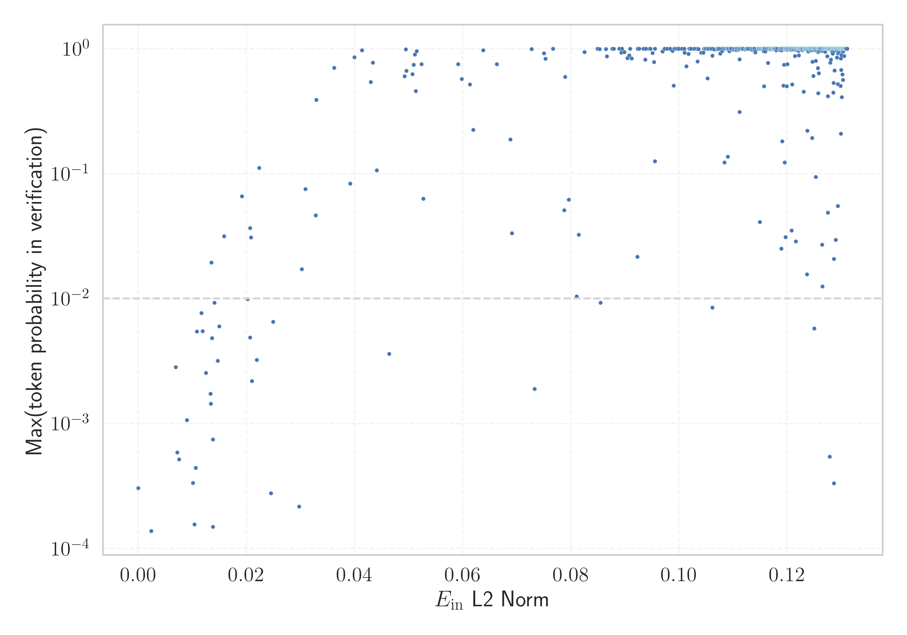

# Report for `mistralai/Mistral-7B-Instruct-v0.2`

## Model info

* Model Info: 
  * Tied embeddings: False
  * LM head uses bias: False
  * Embeddings shape: [32000, 4096]
* Tokenizer Info: 
  * Vocab Size: 32000
  * Tokenizer Class: LlamaTokenizer
  * Tokenizer Type: BPE
  * Bytes handling: Byte Fallback
  * Token for verification prompt building: includegraphics
  * Token id for verification prompt building: 7621
* Indicator summary: 
  * Indicator for under-trained tokens: E_{in} L2 Norm
  * Overall distribution: 0.172 +/- 0.020
* Detected Token Counts: 
  * Number of tested under-trained tokens: 637, 529 non-special, 28 below p = 0.01 threshold, 17 below soft indicator threshold
  * Number of single byte tokens: 380, of which 143 below indicator threshold
  * Number of special tokens: 0, of which 0 below indicator threshold

## Under-trained token indicators plot


## Verification plot


## Under-trained token verification results
17 entries below threshold of 0.015

|   token_id | token              |   indicator | max_prob                                                         | in_other_tokens                                                             |
|------------|--------------------|-------------|------------------------------------------------------------------|-----------------------------------------------------------------------------|
|      31738 | ````` \uefc0 ````` |  0.0023863  | <span style='border: 1px solid rgb(169, 68, 66);'>0.00014</span> |                                                                             |
|      20418 | ````` ▁/**\r ````` |  0.00689903 | <span style='border: 1px solid rgb(255, 145, 0);'>0.0028</span>  |                                                                             |
|      26083 | ````` ▁//\r `````  |  0.00719365 | <span style='border: 1px solid rgb(169, 68, 66);'>0.00059</span> |                                                                             |
|      25833 | ````` >?[< `````   |  0.0075466  | <span style='border: 1px solid rgb(169, 68, 66);'>0.00052</span> |                                                                             |
|       9823 | ````` */\r `````   |  0.0089834  | <span style='border: 1px solid rgb(255, 145, 0);'>0.0011</span>  |                                                                             |
|      31363 | ````` \x85 `````   |  0.0101242  | <span style='border: 1px solid rgb(169, 68, 66);'>0.00033</span> |                                                                             |
|      26636 | ````` });\r `````  |  0.0108428  | <span style='border: 1px solid rgb(255, 145, 0);'>0.0054</span>  |                                                                             |
|      26407 | ````` };\r `````   |  0.0116664  | <span style='border: 1px solid rgb(255, 145, 0);'>0.0077</span>  |                                                                             |
|      18759 | ````` ';\r `````   |  0.0119077  | <span style='border: 1px solid rgb(255, 145, 0);'>0.0055</span>  |                                                                             |
|      14756 | ````` /**\r `````  |  0.0125281  | <span style='border: 1px solid rgb(255, 145, 0);'>0.0025</span>  | <span style='border: 1px solid rgb(255, 145, 0);'>````` ▁/**\r `````</span> |
|      12193 | ````` ▁);\r `````  |  0.0133504  | <span style='border: 1px solid rgb(255, 145, 0);'>0.0017</span>  |                                                                             |
|      26392 | ````` ▁});\r ````` |  0.0134211  | <span style='border: 1px solid rgb(255, 145, 0);'>0.0014</span>  |                                                                             |
|       7608 | ````` ▁*/\r `````  |  0.0135035  | <span style='border: 1px solid rgb(251, 189, 8);'>0.019</span>   |                                                                             |
|      23139 | ````` ▁};\r `````  |  0.0136007  | <span style='border: 1px solid rgb(255, 145, 0);'>0.0048</span>  |                                                                             |
|      30929 | ````` ᥀ `````      |  0.0137812  | <span style='border: 1px solid rgb(169, 68, 66);'>0.00015</span> |                                                                             |
|      28171 | ````` ]);\r `````  |  0.0140675  | <span style='border: 1px solid rgb(255, 145, 0);'>0.0092</span>  |                                                                             |
|      15056 | ````` ());\r ````` |  0.0146594  | <span style='border: 1px solid rgb(255, 145, 0);'>0.0032</span>  |                                                                             |
<details><summary>512 additional entries above threshold</summary>

|   token_id | token                      |   indicator | max_prob                                                         | in_other_tokens                                                                                                                                                                                                                                                                                                                                                                                  |
|------------|----------------------------|-------------|------------------------------------------------------------------|--------------------------------------------------------------------------------------------------------------------------------------------------------------------------------------------------------------------------------------------------------------------------------------------------------------------------------------------------------------------------------------------------|
|      16943 | ````` ');\r `````          |   0.0149521 | <span style='border: 1px solid rgb(255, 145, 0);'>0.006</span>   |                                                                                                                                                                                                                                                                                                                                                                                                  |
|      17695 | ````` },\r `````           |   0.015838  | <span style='border: 1px solid rgb(251, 189, 8);'>0.032</span>   | <span style='border: 1px solid rgb(251, 189, 8);'>````` ▁},\r `````</span>                                                                                                                                                                                                                                                                                                                       |
|      20692 | ````` ▁},\r `````          |   0.0191721 | <span style='border: 1px solid rgb(251, 189, 8);'>0.066</span>   |                                                                                                                                                                                                                                                                                                                                                                                                  |
|      11880 | ````` ";\r `````           |   0.020222  | <span style='border: 1px solid rgb(255, 145, 0);'>0.0099</span>  |                                                                                                                                                                                                                                                                                                                                                                                                  |
|      18055 | ````` ){\r `````           |   0.0206458 | <span style='border: 1px solid rgb(251, 189, 8);'>0.037</span>   |                                                                                                                                                                                                                                                                                                                                                                                                  |
|      14420 | ````` ];\r `````           |   0.0206478 | <span style='border: 1px solid rgb(255, 145, 0);'>0.0049</span>  |                                                                                                                                                                                                                                                                                                                                                                                                  |
|      10278 | ````` ',\r `````           |   0.020818  | <span style='border: 1px solid rgb(251, 189, 8);'>0.031</span>   |                                                                                                                                                                                                                                                                                                                                                                                                  |
|      10941 | ````` ));\r `````          |   0.0219077 | <span style='border: 1px solid rgb(255, 145, 0);'>0.0032</span>  | <span style='border: 1px solid rgb(255, 145, 0);'>````` ());\r `````</span>                                                                                                                                                                                                                                                                                                                      |
|      14980 | ````` ">\r `````           |   0.0223662 | <span style='border: 1px solid rgb(40, 167, 69);'>0.11</span>    |                                                                                                                                                                                                                                                                                                                                                                                                  |
|      25900 | ````` iNdEx `````          |   0.0249352 | <span style='border: 1px solid rgb(255, 145, 0);'>0.0065</span>  |                                                                                                                                                                                                                                                                                                                                                                                                  |
|      26831 | ````` ▁febbra `````        |   0.0297467 | <span style='border: 1px solid rgb(169, 68, 66);'>0.00022</span> | ````` ▁febbraio `````                                                                                                                                                                                                                                                                                                                                                                            |
|       6913 | ````` ");\r `````          |   0.0302182 | <span style='border: 1px solid rgb(251, 189, 8);'>0.017</span>   |                                                                                                                                                                                                                                                                                                                                                                                                  |
|      19248 | ````` NdEx `````           |   0.0308986 | <span style='border: 1px solid rgb(251, 189, 8);'>0.075</span>   | <span style='border: 1px solid rgb(255, 145, 0);'>````` iNdEx `````</span>                                                                                                                                                                                                                                                                                                                       |
|      22186 | ````` ')\r `````           |   0.03279   | <span style='border: 1px solid rgb(251, 189, 8);'>0.046</span>   |                                                                                                                                                                                                                                                                                                                                                                                                  |
|      10939 | ````` ",\r `````           |   0.0329138 | <span style='border: 1px solid rgb(40, 167, 69);'>0.39</span>    |                                                                                                                                                                                                                                                                                                                                                                                                  |
|       4420 | ````` ();\r `````          |   0.0362084 | <span style='border: 1px solid rgb(40, 167, 69);'>0.7</span>     |                                                                                                                                                                                                                                                                                                                                                                                                  |
|      31853 | ````` ⇽ `````              |   0.0391913 | <span style='border: 1px solid rgb(251, 189, 8);'>0.083</span>   |                                                                                                                                                                                                                                                                                                                                                                                                  |
|       3426 | ````` ▁}\r `````           |   0.0399708 | <span style='border: 1px solid rgb(40, 167, 69);'>0.85</span>    |                                                                                                                                                                                                                                                                                                                                                                                                  |
|       9962 | ````` ()\r `````           |   0.0413476 | <span style='border: 1px solid rgb(40, 167, 69);'>0.97</span>    |                                                                                                                                                                                                                                                                                                                                                                                                  |
|      23486 | ````` ),\r `````           |   0.0429832 | <span style='border: 1px solid rgb(40, 167, 69);'>0.54</span>    |                                                                                                                                                                                                                                                                                                                                                                                                  |
|       4441 | ````` {\r `````            |   0.0433875 | <span style='border: 1px solid rgb(40, 167, 69);'>0.77</span>    | <span style='border: 1px solid rgb(251, 189, 8);'>````` ){\r `````</span>                                                                                                                                                                                                                                                                                                                        |
|      14619 | ````` ▁)\r `````           |   0.044104  | <span style='border: 1px solid rgb(40, 167, 69);'>0.11</span>    |                                                                                                                                                                                                                                                                                                                                                                                                  |
|      15641 | ````` ▁uitgen `````        |   0.0464082 | <span style='border: 1px solid rgb(255, 145, 0);'>0.0036</span>  | ````` ▁uitgenodigd `````                                                                                                                                                                                                                                                                                                                                                                         |
|      27732 | ````` '\r `````            |   0.0492417 | <span style='border: 1px solid rgb(40, 167, 69);'>0.6</span>     |                                                                                                                                                                                                                                                                                                                                                                                                  |
|       2519 | ````` }\r `````            |   0.0494532 | <span style='border: 1px solid rgb(40, 167, 69);'>0.99</span>    | <span style='border: 1px solid rgb(40, 167, 69);'>````` ▁}\r `````</span>                                                                                                                                                                                                                                                                                                                        |
|      31656 | ````` ≮ `````              |   0.0495611 | <span style='border: 1px solid rgb(40, 167, 69);'>0.66</span>    |                                                                                                                                                                                                                                                                                                                                                                                                  |
|      31645 | ````` ≯ `````              |   0.0506941 | <span style='border: 1px solid rgb(40, 167, 69);'>0.62</span>    |                                                                                                                                                                                                                                                                                                                                                                                                  |
|      17334 | ````` (\r `````            |   0.0508999 | <span style='border: 1px solid rgb(40, 167, 69);'>0.74</span>    |                                                                                                                                                                                                                                                                                                                                                                                                  |
|       1761 | ````` );\r `````           |   0.0511285 | <span style='border: 1px solid rgb(40, 167, 69);'>0.9</span>     | <span style='border: 1px solid rgb(40, 167, 69);'>````` ();\r `````</span>, <span style='border: 1px solid rgb(251, 189, 8);'>````` ");\r `````</span>, <span style='border: 1px solid rgb(255, 145, 0);'>````` ));\r `````</span>, <span style='border: 1px solid rgb(255, 145, 0);'>````` ▁);\r `````</span>, <span style='border: 1px solid rgb(255, 145, 0);'>````` ());\r `````</span>, ... |
|      30413 | ````` ⌁ `````              |   0.0513111 | <span style='border: 1px solid rgb(40, 167, 69);'>0.46</span>    |                                                                                                                                                                                                                                                                                                                                                                                                  |
|       1969 | ````` ▁{\r `````           |   0.0514888 | <span style='border: 1px solid rgb(40, 167, 69);'>0.95</span>    |                                                                                                                                                                                                                                                                                                                                                                                                  |
|      16949 | ````` ")\r `````           |   0.0523773 | <span style='border: 1px solid rgb(40, 167, 69);'>0.75</span>    |                                                                                                                                                                                                                                                                                                                                                                                                  |
|      27456 | ````` :%.*]] `````         |   0.0527322 | <span style='border: 1px solid rgb(251, 189, 8);'>0.063</span>   |                                                                                                                                                                                                                                                                                                                                                                                                  |
|      16724 | ````` tagHelper `````      |   0.0591338 | <span style='border: 1px solid rgb(40, 167, 69);'>0.75</span>    |                                                                                                                                                                                                                                                                                                                                                                                                  |
|      16772 | ````` :%.* `````           |   0.0597828 | <span style='border: 1px solid rgb(40, 167, 69);'>0.57</span>    | <span style='border: 1px solid rgb(251, 189, 8);'>````` :%.*]] `````</span>                                                                                                                                                                                                                                                                                                                      |
|      14668 | ````` ))\r `````           |   0.0613335 | <span style='border: 1px solid rgb(40, 167, 69);'>0.52</span>    |                                                                                                                                                                                                                                                                                                                                                                                                  |
|      15880 | ````` >:]< `````           |   0.061935  | <span style='border: 1px solid rgb(40, 167, 69);'>0.22</span>    |                                                                                                                                                                                                                                                                                                                                                                                                  |
|      30813 | ````` ︙ `````             |   0.0638043 | <span style='border: 1px solid rgb(40, 167, 69);'>0.97</span>    |                                                                                                                                                                                                                                                                                                                                                                                                  |
|      31932 | ````` ҽ `````              |   0.0663182 | <span style='border: 1px solid rgb(40, 167, 69);'>0.75</span>    |                                                                                                                                                                                                                                                                                                                                                                                                  |
|      27265 | ````` ▁SDValue `````       |   0.0687904 | <span style='border: 1px solid rgb(40, 167, 69);'>0.19</span>    |                                                                                                                                                                                                                                                                                                                                                                                                  |
|       7941 | ````` ICENSE `````         |   0.0691148 | <span style='border: 1px solid rgb(251, 189, 8);'>0.033</span>   | ````` LICENSE `````, ````` ▁LICENSE `````                                                                                                                                                                                                                                                                                                                                                        |
|      10762 | ````` qpoint `````         |   0.0727135 | <span style='border: 1px solid rgb(40, 167, 69);'>1</span>       | <span style='border: 1px solid rgb(40, 167, 69);'>````` pgfqpoint `````</span>                                                                                                                                                                                                                                                                                                                   |
|      31179 | ````` ┈ `````              |   0.074992  | <span style='border: 1px solid rgb(40, 167, 69);'>0.92</span>    |                                                                                                                                                                                                                                                                                                                                                                                                  |
|      15500 | ````` itempty `````        |   0.0753192 | <span style='border: 1px solid rgb(40, 167, 69);'>0.83</span>    | ````` omitempty `````                                                                                                                                                                                                                                                                                                                                                                            |
|        272 | ````` ▁the `````           |   0.076677  | <span style='border: 1px solid rgb(40, 167, 69);'>1</span>       | <span style='border: 1px solid rgb(40, 167, 69);'>````` ▁they `````</span>, ````` ▁their `````, ````` ▁them `````, ````` ▁there `````, ````` ▁then `````, ...                                                                                                                                                                                                                                    |
|      31733 | ````` ⵙ `````              |   0.078737  | <span style='border: 1px solid rgb(251, 189, 8);'>0.051</span>   |                                                                                                                                                                                                                                                                                                                                                                                                  |
|      31841 | ````` ❒ `````              |   0.0789443 | <span style='border: 1px solid rgb(40, 167, 69);'>0.6</span>     |                                                                                                                                                                                                                                                                                                                                                                                                  |
|      17779 | ````` ▁gepublice `````     |   0.0796022 | <span style='border: 1px solid rgb(251, 189, 8);'>0.062</span>   | ````` ▁gepubliceerd `````                                                                                                                                                                                                                                                                                                                                                                        |
|      31922 | ````` ⵓ `````              |   0.0810583 | <span style='border: 1px solid rgb(251, 189, 8);'>0.01</span>    |                                                                                                                                                                                                                                                                                                                                                                                                  |
|      15630 | ````` odigd `````          |   0.0814349 | <span style='border: 1px solid rgb(251, 189, 8);'>0.032</span>   | ````` ▁uitgenodigd `````                                                                                                                                                                                                                                                                                                                                                                         |
|      30897 | ````` ⠄ `````              |   0.0824974 | <span style='border: 1px solid rgb(40, 167, 69);'>0.94</span>    |                                                                                                                                                                                                                                                                                                                                                                                                  |
|       3685 | ````` >\r `````            |   0.0852785 | <span style='border: 1px solid rgb(40, 167, 69);'>0.99</span>    | <span style='border: 1px solid rgb(40, 167, 69);'>````` ">\r `````</span>                                                                                                                                                                                                                                                                                                                        |
|      14052 | ````` ▁Jahrhund `````      |   0.085462  | <span style='border: 1px solid rgb(255, 145, 0);'>0.0093</span>  | ````` ▁Jahrhundert `````, ````` ▁Jahrhunderts `````                                                                                                                                                                                                                                                                                                                                              |
|      31895 | ````` ❍ `````              |   0.0864541 | <span style='border: 1px solid rgb(40, 167, 69);'>0.99</span>    |                                                                                                                                                                                                                                                                                                                                                                                                  |
|      11167 | ````` ityEngine `````      |   0.0866365 | <span style='border: 1px solid rgb(40, 167, 69);'>0.87</span>    | ````` ▁UnityEngine `````, ````` UnityEngine `````                                                                                                                                                                                                                                                                                                                                                |
|        288 | ````` ing `````            |   0.0876491 | <span style='border: 1px solid rgb(40, 167, 69);'>1</span>       | ````` ring `````, <span style='border: 1px solid rgb(40, 167, 69);'>````` ings `````</span>, ````` tring `````, ````` ning `````, <span style='border: 1px solid rgb(40, 167, 69);'>````` ating `````</span>, ...                                                                                                                                                                                |
|        302 | ````` ▁of `````            |   0.0889275 | <span style='border: 1px solid rgb(40, 167, 69);'>1</span>       | ````` ▁off `````, ````` ▁offer `````, ````` ▁often `````, ````` ▁offic `````, ````` ▁office `````, ...                                                                                                                                                                                                                                                                                           |
|      18766 | ````` ]\r `````            |   0.0893214 | <span style='border: 1px solid rgb(40, 167, 69);'>0.93</span>    |                                                                                                                                                                                                                                                                                                                                                                                                  |
|       1271 | ````` ;\r `````            |   0.089912  | <span style='border: 1px solid rgb(40, 167, 69);'>0.94</span>    | <span style='border: 1px solid rgb(40, 167, 69);'>````` );\r `````</span>, <span style='border: 1px solid rgb(40, 167, 69);'>````` ();\r `````</span>, <span style='border: 1px solid rgb(251, 189, 8);'>````` ");\r `````</span>, <span style='border: 1px solid rgb(255, 145, 0);'>````` ));\r `````</span>, <span style='border: 1px solid rgb(255, 145, 0);'>````` ";\r `````</span>, ...    |
|      30867 | ````` 🟠 `````             |   0.0904618 | <span style='border: 1px solid rgb(40, 167, 69);'>0.84</span>    |                                                                                                                                                                                                                                                                                                                                                                                                  |
|      31172 | ````` ┆ `````              |   0.0907849 | <span style='border: 1px solid rgb(40, 167, 69);'>0.89</span>    |                                                                                                                                                                                                                                                                                                                                                                                                  |
|        264 | ````` ▁a `````             |   0.0909289 | <span style='border: 1px solid rgb(40, 167, 69);'>1</span>       | <span style='border: 1px solid rgb(40, 167, 69);'>````` ▁and `````</span>, ````` ▁al `````, <span style='border: 1px solid rgb(40, 167, 69);'>````` ▁as `````</span>, <span style='border: 1px solid rgb(40, 167, 69);'>````` ▁an `````</span>, <span style='border: 1px solid rgb(40, 167, 69);'>````` ▁at `````</span>, ...                                                                    |
|      31469 | ````` ӏ `````              |   0.0912364 | <span style='border: 1px solid rgb(40, 167, 69);'>0.84</span>    |                                                                                                                                                                                                                                                                                                                                                                                                  |
|      31443 | ````` ⵏ `````              |   0.092279  | <span style='border: 1px solid rgb(251, 189, 8);'>0.022</span>   |                                                                                                                                                                                                                                                                                                                                                                                                  |
|        286 | ````` ed `````             |   0.0926119 | <span style='border: 1px solid rgb(40, 167, 69);'>1</span>       | <span style='border: 1px solid rgb(40, 167, 69);'>````` ated `````</span>, ````` ied `````, ````` hed `````, ````` red `````, ````` ▁need `````, ...                                                                                                                                                                                                                                             |
|        298 | ````` ▁to `````            |   0.0934033 | <span style='border: 1px solid rgb(40, 167, 69);'>1</span>       | ````` ▁too `````, ````` ▁top `````, ````` ▁took `````, ````` ▁tot `````, ````` ▁told `````, ...                                                                                                                                                                                                                                                                                                  |
|      11525 | ````` "\r `````            |   0.0937502 | <span style='border: 1px solid rgb(40, 167, 69);'>0.82</span>    |                                                                                                                                                                                                                                                                                                                                                                                                  |
|        274 | ````` es `````             |   0.0938456 | <span style='border: 1px solid rgb(40, 167, 69);'>1</span>       | <span style='border: 1px solid rgb(40, 167, 69);'>````` est `````</span>, ````` ess `````, <span style='border: 1px solid rgb(40, 167, 69);'>````` res `````</span>, <span style='border: 1px solid rgb(40, 167, 69);'>````` ies `````</span>, ````` ▁res `````, ...                                                                                                                             |
|      30983 | ````` ڕ `````              |   0.0950991 | <span style='border: 1px solid rgb(40, 167, 69);'>0.92</span>    |                                                                                                                                                                                                                                                                                                                                                                                                  |
|      28593 | ````` pgfscope `````       |   0.0953871 | <span style='border: 1px solid rgb(40, 167, 69);'>0.78</span>    |                                                                                                                                                                                                                                                                                                                                                                                                  |
|      31317 | ````` ⵉ `````              |   0.0955224 | <span style='border: 1px solid rgb(40, 167, 69);'>0.13</span>    |                                                                                                                                                                                                                                                                                                                                                                                                  |
|      29934 | ````` ⣿ `````              |   0.0969354 | <span style='border: 1px solid rgb(40, 167, 69);'>0.95</span>    |                                                                                                                                                                                                                                                                                                                                                                                                  |
|      28705 | ````` ▁ `````              |   0.097251  | <span style='border: 1px solid rgb(40, 167, 69);'>1</span>       |                                                                                                                                                                                                                                                                                                                                                                                                  |
|        263 | ````` er `````             |   0.0973438 | <span style='border: 1px solid rgb(40, 167, 69);'>1</span>       | <span style='border: 1px solid rgb(40, 167, 69);'>````` ver `````</span>, <span style='border: 1px solid rgb(40, 167, 69);'>````` ter `````</span>, ````` ere `````, <span style='border: 1px solid rgb(40, 167, 69);'>````` ers `````</span>, ````` ser `````, ...                                                                                                                              |
|      30770 | ````` 🟡 `````             |   0.0987576 | <span style='border: 1px solid rgb(40, 167, 69);'>0.96</span>    |                                                                                                                                                                                                                                                                                                                                                                                                  |
|      12683 | ````` pgfpathlineto `````  |   0.0990205 | <span style='border: 1px solid rgb(40, 167, 69);'>0.51</span>    |                                                                                                                                                                                                                                                                                                                                                                                                  |
|        404 | ````` ers `````            |   0.0990407 | <span style='border: 1px solid rgb(40, 167, 69);'>1</span>       | ````` vers `````, ````` erson `````, ````` ▁person `````, <span style='border: 1px solid rgb(40, 167, 69);'>````` ters `````</span>, ````` ivers `````, ...                                                                                                                                                                                                                                      |
|        269 | ````` en `````             |   0.100963  | <span style='border: 1px solid rgb(40, 167, 69);'>1</span>       | <span style='border: 1px solid rgb(40, 167, 69);'>````` ent `````</span>, <span style='border: 1px solid rgb(40, 167, 69);'>````` end `````</span>, <span style='border: 1px solid rgb(40, 167, 69);'>````` ment `````</span>, ````` ▁en `````, ````` hen `````, ...                                                                                                                             |
|      31731 | ````` Ӏ `````              |   0.101038  | <span style='border: 1px solid rgb(40, 167, 69);'>0.93</span>    |                                                                                                                                                                                                                                                                                                                                                                                                  |
|      10765 | ````` pgfqpoint `````      |   0.101333  | <span style='border: 1px solid rgb(40, 167, 69);'>0.72</span>    |                                                                                                                                                                                                                                                                                                                                                                                                  |
|      24713 | ````` vscale `````         |   0.101879  | <span style='border: 1px solid rgb(40, 167, 69);'>1</span>       |                                                                                                                                                                                                                                                                                                                                                                                                  |
|        352 | ````` ation `````          |   0.101928  | <span style='border: 1px solid rgb(40, 167, 69);'>1</span>       | <span style='border: 1px solid rgb(40, 167, 69);'>````` ations `````</span>, ````` ational `````, ````` lation `````, ````` formation `````, ````` translation `````, ...                                                                                                                                                                                                                        |
|        262 | ````` in `````             |   0.102192  | <span style='border: 1px solid rgb(40, 167, 69);'>1</span>       | <span style='border: 1px solid rgb(40, 167, 69);'>````` ing `````</span>, <span style='border: 1px solid rgb(40, 167, 69);'>````` ▁in `````</span>, <span style='border: 1px solid rgb(40, 167, 69);'>````` ain `````</span>, <span style='border: 1px solid rgb(40, 167, 69);'>````` ine `````</span>, ````` int `````, ...                                                                     |
|        282 | ````` al `````             |   0.102215  | <span style='border: 1px solid rgb(40, 167, 69);'>1</span>       | ````` ▁al `````, <span style='border: 1px solid rgb(40, 167, 69);'>````` all `````</span>, ````` ial `````, ````` ▁all `````, <span style='border: 1px solid rgb(40, 167, 69);'>````` ally `````</span>, ...                                                                                                                                                                                     |
|        266 | ````` on `````             |   0.103227  | <span style='border: 1px solid rgb(40, 167, 69);'>1</span>       | <span style='border: 1px solid rgb(40, 167, 69);'>````` ion `````</span>, <span style='border: 1px solid rgb(40, 167, 69);'>````` ation `````</span>, <span style='border: 1px solid rgb(40, 167, 69);'>````` ▁on `````</span>, ````` ▁con `````, ````` ction `````, ...                                                                                                                         |
|      31933 | ````` ថ `````              |   0.103441  | <span style='border: 1px solid rgb(40, 167, 69);'>0.79</span>    |                                                                                                                                                                                                                                                                                                                                                                                                  |
|        297 | ````` ▁in `````            |   0.103548  | <span style='border: 1px solid rgb(40, 167, 69);'>1</span>       | ````` ▁int `````, ````` ▁into `````, ````` ▁inter `````, ````` ▁inst `````, ````` ▁incl `````, ...                                                                                                                                                                                                                                                                                               |
|      31636 | ````` ⬜ `````             |   0.103569  | <span style='border: 1px solid rgb(40, 167, 69);'>0.99</span>    |                                                                                                                                                                                                                                                                                                                                                                                                  |
|      31901 | ````` ញ `````              |   0.10448   | <span style='border: 1px solid rgb(40, 167, 69);'>0.93</span>    |                                                                                                                                                                                                                                                                                                                                                                                                  |
|        304 | ````` ▁and `````           |   0.104573  | <span style='border: 1px solid rgb(40, 167, 69);'>1</span>       | ````` ▁android `````, ````` ▁andere `````, ````` ▁anderen `````, ````` ▁ander `````, ````` ▁andra `````, ...                                                                                                                                                                                                                                                                                     |
|        276 | ````` an `````             |   0.104911  | <span style='border: 1px solid rgb(40, 167, 69);'>1</span>       | <span style='border: 1px solid rgb(40, 167, 69);'>````` ▁and `````</span>, <span style='border: 1px solid rgb(40, 167, 69);'>````` and `````</span>, <span style='border: 1px solid rgb(40, 167, 69);'>````` ▁an `````</span>, <span style='border: 1px solid rgb(40, 167, 69);'>````` ant `````</span>, <span style='border: 1px solid rgb(40, 167, 69);'>````` ans `````</span>, ...           |
|        395 | ````` ▁with `````          |   0.105256  | <span style='border: 1px solid rgb(40, 167, 69);'>1</span>       | ````` ▁without `````, ````` ▁within `````, ````` ▁withdraw `````, ````` ▁withd `````, ````` ▁withdrawal `````                                                                                                                                                                                                                                                                                    |
|      23270 | ````` ByComparator `````   |   0.105284  | <span style='border: 1px solid rgb(40, 167, 69);'>0.58</span>    |                                                                                                                                                                                                                                                                                                                                                                                                  |
|        497 | ````` ies `````            |   0.105491  | <span style='border: 1px solid rgb(40, 167, 69);'>1</span>       | <span style='border: 1px solid rgb(40, 167, 69);'>````` ities `````</span>, ````` ries `````, ````` ories `````, ````` perties `````, ````` ▁series `````, ...                                                                                                                                                                                                                                   |
|        725 | ````` ER `````             |   0.105854  | <span style='border: 1px solid rgb(40, 167, 69);'>1</span>       | ````` ERR `````, ````` VER `````, ````` ERT `````, ````` ERROR `````, ````` TER `````, ...                                                                                                                                                                                                                                                                                                       |
|        354 | ````` ▁for `````           |   0.105938  | <span style='border: 1px solid rgb(40, 167, 69);'>1</span>       | ````` ▁form `````, ````` ▁fore `````, ````` ▁forward `````, ````` ▁force `````, ````` ▁former `````, ...                                                                                                                                                                                                                                                                                         |
|      26939 | ````` ▁invån `````         |   0.106137  | <span style='border: 1px solid rgb(255, 145, 0);'>0.0085</span>  | ````` ▁invånare `````                                                                                                                                                                                                                                                                                                                                                                            |
|      20411 | ````` ][< `````            |   0.106503  | <span style='border: 1px solid rgb(40, 167, 69);'>0.99</span>    |                                                                                                                                                                                                                                                                                                                                                                                                  |
|       2043 | ````` ING `````            |   0.106978  | <span style='border: 1px solid rgb(40, 167, 69);'>1</span>       | ````` STRING `````, ````` TING `````, ````` CLUDING `````, ````` WARNING `````, ````` SETTING `````, ...                                                                                                                                                                                                                                                                                         |
|        415 | ````` ▁The `````           |   0.107349  | <span style='border: 1px solid rgb(40, 167, 69);'>1</span>       | ````` ▁They `````, ````` ▁There `````, ````` ▁Then `````, ````` ▁These `````, ````` ▁Their `````, ...                                                                                                                                                                                                                                                                                            |
|        278 | ````` is `````             |   0.107884  | <span style='border: 1px solid rgb(40, 167, 69);'>1</span>       | <span style='border: 1px solid rgb(40, 167, 69);'>````` ▁is `````</span>, <span style='border: 1px solid rgb(40, 167, 69);'>````` ist `````</span>, <span style='border: 1px solid rgb(40, 167, 69);'>````` ▁this `````</span>, <span style='border: 1px solid rgb(40, 167, 69);'>````` ▁his `````</span>, ````` ▁dis `````, ...                                                                 |
|        385 | ````` os `````             |   0.107884  | <span style='border: 1px solid rgb(40, 167, 69);'>1</span>       | ````` ost `````, ````` ose `````, ````` ▁pos `````, ````` pos `````, ````` ▁most `````, ...                                                                                                                                                                                                                                                                                                      |
|      31394 | ````` ើ `````               |   0.108386  | <span style='border: 1px solid rgb(40, 167, 69);'>0.12</span>    |                                                                                                                                                                                                                                                                                                                                                                                                  |
|        356 | ````` ▁on `````            |   0.108392  | <span style='border: 1px solid rgb(40, 167, 69);'>1</span>       | <span style='border: 1px solid rgb(40, 167, 69);'>````` ▁one `````</span>, ````` ▁only `````, ````` ▁once `````, ````` ▁online `````, ````` ▁ones `````, ...                                                                                                                                                                                                                                     |
|        349 | ````` ▁is `````            |   0.108865  | <span style='border: 1px solid rgb(40, 167, 69);'>1</span>       | ````` ▁iss `````, ````` ▁ist `````, ````` ▁isn `````, ````` ▁issue `````, ````` ▁issues `````, ...                                                                                                                                                                                                                                                                                               |
|      11370 | ````` pgfpath `````        |   0.109016  | <span style='border: 1px solid rgb(40, 167, 69);'>0.14</span>    | <span style='border: 1px solid rgb(40, 167, 69);'>````` pgfpathlineto `````</span>                                                                                                                                                                                                                                                                                                               |
|        301 | ````` el `````             |   0.109337  | <span style='border: 1px solid rgb(40, 167, 69);'>1</span>       | ````` ell `````, ````` elf `````, ````` ▁el `````, ````` ely `````, ````` iel `````, ...                                                                                                                                                                                                                                                                                                         |
|        369 | ````` ▁that `````          |   0.109531  | <span style='border: 1px solid rgb(40, 167, 69);'>1</span>       | ````` ▁thats `````                                                                                                                                                                                                                                                                                                                                                                               |
|        380 | ````` ate `````            |   0.109576  | <span style='border: 1px solid rgb(40, 167, 69);'>1</span>       | <span style='border: 1px solid rgb(40, 167, 69);'>````` ated `````</span>, ````` ater `````, <span style='border: 1px solid rgb(40, 167, 69);'>````` ates `````</span>, ````` rivate `````, ````` date `````, ...                                                                                                                                                                                |
|        697 | ````` ations `````         |   0.109645  | <span style='border: 1px solid rgb(40, 167, 69);'>1</span>       | ````` ▁relations `````, ````` ▁relationship `````, ````` ulations `````, ````` ▁operations `````, ````` ifications `````, ...                                                                                                                                                                                                                                                                    |
|        271 | ````` or `````             |   0.109648  | <span style='border: 1px solid rgb(40, 167, 69);'>1</span>       | <span style='border: 1px solid rgb(40, 167, 69);'>````` ▁for `````</span>, ````` ort `````, ````` ore `````, <span style='border: 1px solid rgb(40, 167, 69);'>````` ▁or `````</span>, ````` port `````, ...                                                                                                                                                                                     |
|      29091 | ````` ↘ `````              |   0.110025  | <span style='border: 1px solid rgb(40, 167, 69);'>0.98</span>    |                                                                                                                                                                                                                                                                                                                                                                                                  |
|        294 | ````` ic `````             |   0.110258  | <span style='border: 1px solid rgb(40, 167, 69);'>1</span>       | <span style='border: 1px solid rgb(40, 167, 69);'>````` ice `````</span>, ````` ich `````, ````` lic `````, ````` ublic `````, ````` ick `````, ...                                                                                                                                                                                                                                              |
|      31264 | ````` ⬛ `````             |   0.110499  | <span style='border: 1px solid rgb(40, 167, 69);'>0.98</span>    |                                                                                                                                                                                                                                                                                                                                                                                                  |
|        291 | ````` le `````             |   0.110507  | <span style='border: 1px solid rgb(40, 167, 69);'>1</span>       | ````` ▁le `````, <span style='border: 1px solid rgb(40, 167, 69);'>````` able `````</span>, ````` ile `````, ````` ple `````, ````` lect `````, ...                                                                                                                                                                                                                                              |
|        293 | ````` as `````             |   0.110704  | <span style='border: 1px solid rgb(40, 167, 69);'>1</span>       | <span style='border: 1px solid rgb(40, 167, 69);'>````` ▁as `````</span>, <span style='border: 1px solid rgb(40, 167, 69);'>````` ▁was `````</span>, ````` ass `````, <span style='border: 1px solid rgb(40, 167, 69);'>````` ast `````</span>, ````` ase `````, ...                                                                                                                             |
|        325 | ````` ▁( `````             |   0.110768  | <span style='border: 1px solid rgb(40, 167, 69);'>1</span>       | ````` ▁(! `````, ````` ▁(* `````, ````` ▁(( `````, ````` ▁() `````, ````` ▁($ `````, ...                                                                                                                                                                                                                                                                                                         |
|        299 | ````` et `````             |   0.110964  | <span style='border: 1px solid rgb(40, 167, 69);'>1</span>       | ````` get `````, ````` ▁return `````, ````` ▁get `````, ````` set `````, ````` eth `````, ...                                                                                                                                                                                                                                                                                                    |
|        390 | ````` ▁as `````            |   0.111042  | <span style='border: 1px solid rgb(40, 167, 69);'>1</span>       | ````` ▁ass `````, ````` ▁ask `````, ````` ▁assert `````, ````` ▁asked `````, ````` ▁associ `````, ...                                                                                                                                                                                                                                                                                            |
|      30690 | ````` ێ `````              |   0.111177  | <span style='border: 1px solid rgb(40, 167, 69);'>0.31</span>    |                                                                                                                                                                                                                                                                                                                                                                                                  |
|      21876 | ````` imeq `````           |   0.111186  | <span style='border: 1px solid rgb(40, 167, 69);'>0.99</span>    | ````` simeq `````                                                                                                                                                                                                                                                                                                                                                                                |
|      31692 | ````` ែ `````               |   0.111194  | <span style='border: 1px solid rgb(40, 167, 69);'>0.82</span>    |                                                                                                                                                                                                                                                                                                                                                                                                  |
|        267 | ````` re `````             |   0.111225  | <span style='border: 1px solid rgb(40, 167, 69);'>1</span>       | ````` ▁re `````, ````` ere `````, <span style='border: 1px solid rgb(40, 167, 69);'>````` res `````</span>, ````` ore `````, <span style='border: 1px solid rgb(40, 167, 69);'>````` ▁are `````</span>, ...                                                                                                                                                                                      |
|        477 | ````` ▁from `````          |   0.111253  | <span style='border: 1px solid rgb(40, 167, 69);'>1</span>       |                                                                                                                                                                                                                                                                                                                                                                                                  |
|        283 | ````` ar `````             |   0.111509  | <span style='border: 1px solid rgb(40, 167, 69);'>1</span>       | ````` art `````, <span style='border: 1px solid rgb(40, 167, 69);'>````` ▁are `````</span>, <span style='border: 1px solid rgb(40, 167, 69);'>````` ard `````</span>, <span style='border: 1px solid rgb(40, 167, 69);'>````` are `````</span>, ````` ▁ar `````, ...                                                                                                                             |
|        270 | ````` at `````             |   0.11185   | <span style='border: 1px solid rgb(40, 167, 69);'>1</span>       | <span style='border: 1px solid rgb(40, 167, 69);'>````` ation `````</span>, <span style='border: 1px solid rgb(40, 167, 69);'>````` ▁that `````</span>, <span style='border: 1px solid rgb(40, 167, 69);'>````` ate `````</span>, <span style='border: 1px solid rgb(40, 167, 69);'>````` ▁at `````</span>, ````` ath `````, ...                                                                 |
|        381 | ````` us `````             |   0.112297  | <span style='border: 1px solid rgb(40, 167, 69);'>1</span>       | ````` ust `````, ````` ▁us `````, ````` ous `````, ````` ▁just `````, ````` ause `````, ...                                                                                                                                                                                                                                                                                                      |
|      31734 | ````` 丶 `````             |   0.112469  | <span style='border: 1px solid rgb(40, 167, 69);'>1</span>       |                                                                                                                                                                                                                                                                                                                                                                                                  |
|       2255 | ````` ES `````             |   0.112569  | <span style='border: 1px solid rgb(40, 167, 69);'>1</span>       | ````` EST `````, ````` CESS `````, ````` TIES `````, ````` RES `````, ````` ▁WARRANTIES `````, ...                                                                                                                                                                                                                                                                                               |
|        346 | ````` ly `````             |   0.112619  | <span style='border: 1px solid rgb(40, 167, 69);'>1</span>       | <span style='border: 1px solid rgb(40, 167, 69);'>````` ally `````</span>, ````` ely `````, ````` ▁only `````, ````` ily `````, ````` ually `````, ...                                                                                                                                                                                                                                           |
|        515 | ````` ia `````             |   0.11265   | <span style='border: 1px solid rgb(40, 167, 69);'>1</span>       | <span style='border: 1px solid rgb(40, 167, 69);'>````` ian `````</span>, ````` ially `````, ````` ential `````, ````` aterial `````, ````` iam `````, ...                                                                                                                                                                                                                                       |
|        330 | ````` ▁A `````             |   0.11289   | <span style='border: 1px solid rgb(40, 167, 69);'>1</span>       | ````` ▁Al `````, ````` ▁Ar `````, ````` ▁And `````, ````` ▁An `````, <span style='border: 1px solid rgb(40, 167, 69);'>````` ▁As `````</span>, ...                                                                                                                                                                                                                                               |
|      30660 | ````` ☽ `````              |   0.11343   | <span style='border: 1px solid rgb(40, 167, 69);'>0.98</span>    |                                                                                                                                                                                                                                                                                                                                                                                                  |
|        279 | ````` it `````             |   0.113712  | <span style='border: 1px solid rgb(40, 167, 69);'>1</span>       | ````` ith `````, <span style='border: 1px solid rgb(40, 167, 69);'>````` ▁it `````</span>, <span style='border: 1px solid rgb(40, 167, 69);'>````` ▁with `````</span>, <span style='border: 1px solid rgb(40, 167, 69);'>````` ity `````</span>, <span style='border: 1px solid rgb(40, 167, 69);'>````` ite `````</span>, ...                                                                   |
|       1014 | ````` The `````            |   0.113909  | <span style='border: 1px solid rgb(40, 167, 69);'>1</span>       | ````` ▁They `````, ````` ▁There `````, ````` ▁Then `````, ````` ▁These `````, ````` There `````, ...                                                                                                                                                                                                                                                                                             |
|      31849 | ````` ತ `````              |   0.113973  | <span style='border: 1px solid rgb(40, 167, 69);'>0.96</span>    |                                                                                                                                                                                                                                                                                                                                                                                                  |
|      31238 | ````` ដ `````              |   0.114082  | <span style='border: 1px solid rgb(40, 167, 69);'>0.94</span>    |                                                                                                                                                                                                                                                                                                                                                                                                  |
|      21399 | ````` TagHelpers `````     |   0.114189  | <span style='border: 1px solid rgb(40, 167, 69);'>0.98</span>    |                                                                                                                                                                                                                                                                                                                                                                                                  |
|        460 | ````` ▁are `````           |   0.114559  | <span style='border: 1px solid rgb(40, 167, 69);'>1</span>       | ````` ▁area `````, ````` ▁areas `````, ````` ▁aren `````, ````` ▁arena `````                                                                                                                                                                                                                                                                                                                     |
|        486 | ````` ▁by `````            |   0.114569  | <span style='border: 1px solid rgb(40, 167, 69);'>1</span>       | ````` ▁byte `````, ````` ▁bytes `````, ````` ▁byl `````, ````` ▁był `````, ````` ▁byla `````                                                                                                                                                                                                                                                                                                     |
|       1020 | ````` EN `````             |   0.114658  | <span style='border: 1px solid rgb(40, 167, 69);'>1</span>       | ````` ENT `````, ````` END `````, ````` MENT `````, ````` ENSE `````, <span style='border: 1px solid rgb(251, 189, 8);'>````` ICENSE `````</span>, ...                                                                                                                                                                                                                                           |
|        601 | ````` ated `````           |   0.114758  | <span style='border: 1px solid rgb(40, 167, 69);'>1</span>       | ````` ▁created `````, ````` ▁related `````, ````` dated `````, ````` ▁associated `````, ````` inated `````, ...                                                                                                                                                                                                                                                                                  |
|      31441 | ````` ូ `````               |   0.11496   | <span style='border: 1px solid rgb(251, 189, 8);'>0.041</span>   |                                                                                                                                                                                                                                                                                                                                                                                                  |
|       1002 | ````` ates `````           |   0.115016  | <span style='border: 1px solid rgb(40, 167, 69);'>1</span>       | ````` ▁States `````, ````` ▁states `````, ````` ▁latest `````, ````` ▁rates `````, ````` dates `````, ...                                                                                                                                                                                                                                                                                        |
|        396 | ````` ▁an `````            |   0.115073  | <span style='border: 1px solid rgb(40, 167, 69);'>1</span>       | ````` ▁any `````, ````` ▁another `````, ````` ▁ann `````, ````` ▁anything `````, ````` ▁ant `````, ...                                                                                                                                                                                                                                                                                           |
|        495 | ````` ive `````            |   0.115213  | <span style='border: 1px solid rgb(40, 167, 69);'>1</span>       | ````` ative `````, ````` ivers `````, ````` ives `````, ````` ived `````, ````` iver `````, ...                                                                                                                                                                                                                                                                                                  |
|       1086 | ````` AL `````             |   0.115398  | <span style='border: 1px solid rgb(40, 167, 69);'>1</span>       | ````` VAL `````, ````` ALL `````, ````` INVAL `````, ````` ALSE `````, ````` VALUE `````, ...                                                                                                                                                                                                                                                                                                    |
|        734 | ````` ors `````            |   0.115422  | <span style='border: 1px solid rgb(40, 167, 69);'>1</span>       | ````` ators `````, ````` ctors `````, ````` ▁worse `````, ````` ▁errors `````, ````` ▁horse `````, ...                                                                                                                                                                                                                                                                                           |
|        472 | ````` ity `````            |   0.115592  | <span style='border: 1px solid rgb(40, 167, 69);'>1</span>       | ````` ility `````, ````` ality `````, ````` ability `````, ````` ivity `````, ````` ▁University `````, ...                                                                                                                                                                                                                                                                                       |
|       1077 | ````` ating `````          |   0.115647  | <span style='border: 1px solid rgb(40, 167, 69);'>1</span>       | ````` ▁creating `````, ````` ▁dating `````, ````` ▁eating `````, ````` ▁operating `````, ````` inating `````, ...                                                                                                                                                                                                                                                                                |
|       1251 | ````` AN `````             |   0.115666  | <span style='border: 1px solid rgb(40, 167, 69);'>1</span>       | ````` ▁AN `````, ````` RAN `````, ````` AND `````, ````` ▁AND `````, ````` ▁ANY `````, ...                                                                                                                                                                                                                                                                                                       |
|      31949 | ````` Ḩ `````              |   0.115667  | <span style='border: 1px solid rgb(40, 167, 69);'>0.96</span>    |                                                                                                                                                                                                                                                                                                                                                                                                  |
|      31956 | ````` ោ `````               |   0.115732  | <span style='border: 1px solid rgb(40, 167, 69);'>0.5</span>     |                                                                                                                                                                                                                                                                                                                                                                                                  |
|        313 | ````` id `````             |   0.115863  | <span style='border: 1px solid rgb(40, 167, 69);'>1</span>       | <span style='border: 1px solid rgb(40, 167, 69);'>````` ide `````</span>, ````` ▁said `````, ````` oid `````, ````` ▁did `````, ````` ▁void `````, ...                                                                                                                                                                                                                                           |
|      31826 | ````` ಯ `````              |   0.115908  | <span style='border: 1px solid rgb(40, 167, 69);'>0.98</span>    |                                                                                                                                                                                                                                                                                                                                                                                                  |
|      31648 | ````` ಲ `````              |   0.115964  | <span style='border: 1px solid rgb(40, 167, 69);'>0.95</span>    |                                                                                                                                                                                                                                                                                                                                                                                                  |
|        314 | ````` am `````             |   0.116224  | <span style='border: 1px solid rgb(40, 167, 69);'>1</span>       | ````` ame `````, ````` aram `````, ````` ▁am `````, ````` name `````, ````` Name `````, ...                                                                                                                                                                                                                                                                                                      |
|        345 | ````` ▁" `````             |   0.11631   | <span style='border: 1px solid rgb(40, 167, 69);'>1</span>       | ````` ▁""" `````, ````` ▁"\ `````, ````` ▁"< `````, ````` ▁"/ `````, ````` ▁"" `````, ...                                                                                                                                                                                                                                                                                                        |
|      31803 | ````` ណ `````              |   0.116475  | <span style='border: 1px solid rgb(40, 167, 69);'>0.77</span>    |                                                                                                                                                                                                                                                                                                                                                                                                  |
|        557 | ````` ), `````             |   0.116479  | <span style='border: 1px solid rgb(40, 167, 69);'>1</span>       | ````` (), `````, ````` "), `````, ````` '), `````, ````` ▁), `````, ````` }), `````, ...                                                                                                                                                                                                                                                                                                         |
|       1906 | ````` ED `````             |   0.116572  | <span style='border: 1px solid rgb(40, 167, 69);'>1</span>       | ````` RED `````, ````` ATED `````, ````` LED `````, ````` ▁ED `````, ````` DED `````, ...                                                                                                                                                                                                                                                                                                        |
|        466 | ````` ment `````           |   0.116832  | <span style='border: 1px solid rgb(40, 167, 69);'>1</span>       | ````` lement `````, ````` ement `````, ````` ument `````, <span style='border: 1px solid rgb(40, 167, 69);'>````` ments `````</span>, ````` ament `````, ...                                                                                                                                                                                                                                     |
|        522 | ````` able `````           |   0.116866  | <span style='border: 1px solid rgb(40, 167, 69);'>1</span>       | ````` ailable `````, ````` ▁able `````, ````` ▁table `````, ````` ables `````, ````` table `````, ...                                                                                                                                                                                                                                                                                            |
|        360 | ````` ter `````            |   0.116895  | <span style='border: 1px solid rgb(40, 167, 69);'>1</span>       | ````` ▁inter `````, ````` ater `````, ````` fter `````, ````` tern `````, ````` ▁after `````, ...                                                                                                                                                                                                                                                                                                |
|        412 | ````` ie `````             |   0.116999  | <span style='border: 1px solid rgb(40, 167, 69);'>1</span>       | <span style='border: 1px solid rgb(40, 167, 69);'>````` ies `````</span>, ````` ient `````, <span style='border: 1px solid rgb(40, 167, 69);'>````` ier `````</span>, ````` iel `````, ````` ied `````, ...                                                                                                                                                                                      |
|        438 | ````` ▁at `````            |   0.117     | <span style='border: 1px solid rgb(40, 167, 69);'>1</span>       | ````` ▁att `````, ````` ▁attack `````, ````` ▁attempt `````, ````` ▁attention `````, ````` ▁attribute `````, ...                                                                                                                                                                                                                                                                                 |
|      28786 | ````` т `````              |   0.117057  | <span style='border: 1px solid rgb(40, 167, 69);'>1</span>       |                                                                                                                                                                                                                                                                                                                                                                                                  |
|        473 | ````` ine `````            |   0.117238  | <span style='border: 1px solid rgb(40, 167, 69);'>1</span>       | <span style='border: 1px solid rgb(40, 167, 69);'>````` line `````</span>, <span style='border: 1px solid rgb(40, 167, 69);'>````` ines `````</span>, ````` ined `````, ````` ▁line `````, ````` iness `````, ...                                                                                                                                                                                |
|        322 | ````` ot `````             |   0.117261  | <span style='border: 1px solid rgb(40, 167, 69);'>1</span>       | <span style='border: 1px solid rgb(40, 167, 69);'>````` ▁not `````</span>, ````` ▁other `````, ````` oth `````, ````` other `````, ````` ▁got `````, ...                                                                                                                                                                                                                                         |
|      15320 | ````` ▁/***/ `````         |   0.117306  | <span style='border: 1px solid rgb(40, 167, 69);'>1</span>       |                                                                                                                                                                                                                                                                                                                                                                                                  |
|        296 | ````` ion `````            |   0.117341  | <span style='border: 1px solid rgb(40, 167, 69);'>1</span>       | <span style='border: 1px solid rgb(40, 167, 69);'>````` ation `````</span>, ````` ction `````, <span style='border: 1px solid rgb(40, 167, 69);'>````` ions `````</span>, ````` ition `````, <span style='border: 1px solid rgb(40, 167, 69);'>````` ations `````</span>, ...                                                                                                                    |
|        742 | ````` ings `````           |   0.117437  | <span style='border: 1px solid rgb(40, 167, 69);'>1</span>       | ````` ▁things `````, ````` tings `````, ````` Settings `````, ````` settings `````, ````` ▁settings `````, ...                                                                                                                                                                                                                                                                                   |
|        440 | ````` ant `````            |   0.117467  | <span style='border: 1px solid rgb(40, 167, 69);'>1</span>       | ````` ▁want `````, <span style='border: 1px solid rgb(40, 167, 69);'>````` ants `````</span>, ````` ante `````, ````` ▁important `````, ````` ▁wanted `````, ...                                                                                                                                                                                                                                 |
|        609 | ````` ). `````             |   0.117485  | <span style='border: 1px solid rgb(40, 167, 69);'>1</span>       | ````` (). `````, ````` "). `````, ````` '). `````, ````` }). `````, ````` )). `````, ...                                                                                                                                                                                                                                                                                                         |
|        424 | ````` te `````             |   0.117583  | <span style='border: 1px solid rgb(40, 167, 69);'>1</span>       | <span style='border: 1px solid rgb(40, 167, 69);'>````` ite `````</span>, <span style='border: 1px solid rgb(40, 167, 69);'>````` ated `````</span>, ````` ▁te `````, ````` text `````, ````` ▁inter `````, ...                                                                                                                                                                                  |
|        594 | ````` ions `````           |   0.117603  | <span style='border: 1px solid rgb(40, 167, 69);'>1</span>       | <span style='border: 1px solid rgb(40, 167, 69);'>````` ations `````</span>, <span style='border: 1px solid rgb(40, 167, 69);'>````` ctions `````</span>, ````` ptions `````, ````` itions `````, ````` ▁options `````, ...                                                                                                                                                                      |
|        832 | ````` ON `````             |   0.11766   | <span style='border: 1px solid rgb(40, 167, 69);'>1</span>       | <span style='border: 1px solid rgb(40, 167, 69);'>````` ION `````</span>, ````` CON `````, ````` ▁CON `````, ````` SON `````, <span style='border: 1px solid rgb(40, 167, 69);'>````` ATION `````</span>, ...                                                                                                                                                                                    |
|        338 | ````` ch `````             |   0.117918  | <span style='border: 1px solid rgb(40, 167, 69);'>1</span>       | ````` ▁ch `````, ````` ich `````, ````` ach `````, ````` che `````, ````` ▁which `````, ...                                                                                                                                                                                                                                                                                                      |
|      31032 | ````` ច `````              |   0.117971  | <span style='border: 1px solid rgb(40, 167, 69);'>0.97</span>    |                                                                                                                                                                                                                                                                                                                                                                                                  |
|        867 | ````` les `````            |   0.118066  | <span style='border: 1px solid rgb(40, 167, 69);'>1</span>       | ````` less `````, ````` ▁les `````, ````` ▁less `````, ````` ales `````, ````` ules `````, ...                                                                                                                                                                                                                                                                                                   |
|      31941 | ````` ಮ `````              |   0.118515  | <span style='border: 1px solid rgb(40, 167, 69);'>0.99</span>    |                                                                                                                                                                                                                                                                                                                                                                                                  |
|      31412 | ````` វ `````              |   0.118625  | <span style='border: 1px solid rgb(40, 167, 69);'>0.98</span>    |                                                                                                                                                                                                                                                                                                                                                                                                  |
|        532 | ````` to `````             |   0.11863   | <span style='border: 1px solid rgb(40, 167, 69);'>1</span>       | ````` ▁into `````, ````` ator `````, ````` ton `````, ````` ▁too `````, ````` ustom `````, ...                                                                                                                                                                                                                                                                                                   |
|        465 | ````` age `````            |   0.118689  | <span style='border: 1px solid rgb(40, 167, 69);'>1</span>       | ````` essage `````, <span style='border: 1px solid rgb(40, 167, 69);'>````` ages `````</span>, ````` message `````, ````` ager `````, ````` aged `````, ...                                                                                                                                                                                                                                      |
|        315 | ````` ▁I `````             |   0.118865  | <span style='border: 1px solid rgb(40, 167, 69);'>1</span>       | <span style='border: 1px solid rgb(40, 167, 69);'>````` ▁In `````</span>, <span style='border: 1px solid rgb(40, 167, 69);'>````` ▁It `````</span>, ````` ▁If `````, ````` ▁Is `````, ````` ▁Ind `````, ...                                                                                                                                                                                      |
|        896 | ````` RE `````             |   0.118907  | <span style='border: 1px solid rgb(40, 167, 69);'>1</span>       | ````` ▁RE `````, ````` REG `````, ````` URE `````, ````` PRE `````, ````` ARE `````, ...                                                                                                                                                                                                                                                                                                         |
|      30890 | ````` ់ `````               |   0.118935  | <span style='border: 1px solid rgb(251, 189, 8);'>0.025</span>   |                                                                                                                                                                                                                                                                                                                                                                                                  |
|      31707 | ````` ಸ `````              |   0.11896   | <span style='border: 1px solid rgb(40, 167, 69);'>0.97</span>    |                                                                                                                                                                                                                                                                                                                                                                                                  |
|        628 | ````` ary `````            |   0.119004  | <span style='border: 1px solid rgb(40, 167, 69);'>1</span>       | ````` mary `````, ````` inary `````, ````` summary `````, ````` uary `````, ````` ibrary `````, ...                                                                                                                                                                                                                                                                                              |
|      30654 | ````` ⴰ `````              |   0.119079  | <span style='border: 1px solid rgb(40, 167, 69);'>0.18</span>    |                                                                                                                                                                                                                                                                                                                                                                                                  |
|        403 | ````` ▁was `````           |   0.119182  | <span style='border: 1px solid rgb(40, 167, 69);'>1</span>       | ````` ▁wasn `````, ````` ▁waste `````, ````` ▁wash `````, ````` ▁washing `````, ````` ▁washed `````, ...                                                                                                                                                                                                                                                                                         |
|      31798 | ````` ም `````              |   0.119283  | <span style='border: 1px solid rgb(40, 167, 69);'>0.51</span>    |                                                                                                                                                                                                                                                                                                                                                                                                  |
|        378 | ````` ▁it `````            |   0.119351  | <span style='border: 1px solid rgb(40, 167, 69);'>1</span>       | ````` ▁its `````, ````` ▁item `````, ````` ▁itself `````, ````` ▁items `````, ````` ▁iter `````, ...                                                                                                                                                                                                                                                                                             |
|      31396 | ````` េ `````               |   0.119402  | <span style='border: 1px solid rgb(40, 167, 69);'>0.74</span>    |                                                                                                                                                                                                                                                                                                                                                                                                  |
|        482 | ````` ure `````            |   0.119425  | <span style='border: 1px solid rgb(40, 167, 69);'>1</span>       | <span style='border: 1px solid rgb(40, 167, 69);'>````` ures `````</span>, ````` ature `````, ````` ▁sure `````, ````` ured `````, ````` atures `````, ...                                                                                                                                                                                                                                       |
|      31015 | ````` ី `````               |   0.119521  | <span style='border: 1px solid rgb(40, 167, 69);'>0.12</span>    |                                                                                                                                                                                                                                                                                                                                                                                                  |
|      13130 | ````` ▁aapt `````          |   0.119562  | <span style='border: 1px solid rgb(40, 167, 69);'>0.99</span>    |                                                                                                                                                                                                                                                                                                                                                                                                  |
|        316 | ````` ad `````             |   0.119658  | <span style='border: 1px solid rgb(40, 167, 69);'>1</span>       | ````` ▁had `````, ````` ▁ad `````, ````` ade `````, ````` read `````, ````` ▁add `````, ...                                                                                                                                                                                                                                                                                                      |
|      31837 | ````` ે `````               |   0.119711  | <span style='border: 1px solid rgb(251, 189, 8);'>0.031</span>   |                                                                                                                                                                                                                                                                                                                                                                                                  |
|        308 | ````` ent `````            |   0.119711  | <span style='border: 1px solid rgb(40, 167, 69);'>1</span>       | <span style='border: 1px solid rgb(40, 167, 69);'>````` ment `````</span>, ````` ient `````, ````` ents `````, ````` ▁ent `````, ````` lement `````, ...                                                                                                                                                                                                                                         |
|       1180 | ````` LE `````             |   0.119761  | <span style='border: 1px solid rgb(40, 167, 69);'>1</span>       | ````` ABLE `````, ````` FILE `````, ````` ULE `````, ````` LECT `````, ````` LEN `````, ...                                                                                                                                                                                                                                                                                                      |
|        324 | ````` ur `````             |   0.119876  | <span style='border: 1px solid rgb(40, 167, 69);'>1</span>       | ````` our `````, ````` urn `````, <span style='border: 1px solid rgb(40, 167, 69);'>````` ure `````</span>, ````` turn `````, <span style='border: 1px solid rgb(40, 167, 69);'>````` ▁your `````</span>, ...                                                                                                                                                                                    |
|      31966 | ````` ಂ `````               |   0.11989   | <span style='border: 1px solid rgb(40, 167, 69);'>0.5</span>     |                                                                                                                                                                                                                                                                                                                                                                                                  |
|      10291 | ````` ERS `````            |   0.119905  | <span style='border: 1px solid rgb(40, 167, 69);'>1</span>       |                                                                                                                                                                                                                                                                                                                                                                                                  |
|      31789 | ````` ಗ `````              |   0.12001   | <span style='border: 1px solid rgb(40, 167, 69);'>0.98</span>    |                                                                                                                                                                                                                                                                                                                                                                                                  |
|      31802 | ````` ವ `````              |   0.120027  | <span style='border: 1px solid rgb(40, 167, 69);'>0.98</span>    |                                                                                                                                                                                                                                                                                                                                                                                                  |
|      31741 | ````` ል `````              |   0.12003   | <span style='border: 1px solid rgb(40, 167, 69);'>0.75</span>    |                                                                                                                                                                                                                                                                                                                                                                                                  |
|       1074 | ````` ts `````             |   0.120058  | <span style='border: 1px solid rgb(40, 167, 69);'>1</span>       | <span style='border: 1px solid rgb(40, 167, 69);'>````` ments `````</span>, <span style='border: 1px solid rgb(40, 167, 69);'>````` ats `````</span>, <span style='border: 1px solid rgb(40, 167, 69);'>````` ets `````</span>, <span style='border: 1px solid rgb(40, 167, 69);'>````` ants `````</span>, ````` ists `````, ...                                                                 |
|      30832 | ````` 🟢 `````             |   0.120196  | <span style='border: 1px solid rgb(40, 167, 69);'>0.99</span>    |                                                                                                                                                                                                                                                                                                                                                                                                  |
|        318 | ````` ▁S `````             |   0.120204  | <span style='border: 1px solid rgb(40, 167, 69);'>1</span>       | ````` ▁St `````, ````` ▁She `````, ````` ▁Se `````, ````` ▁Sh `````, ````` ▁So `````, ...                                                                                                                                                                                                                                                                                                        |
|        745 | ````` ical `````           |   0.120238  | <span style='border: 1px solid rgb(40, 167, 69);'>1</span>       | ````` ically `````, ````` ▁political `````, ````` ological `````, ````` ▁physical `````, ````` ▁medical `````, ...                                                                                                                                                                                                                                                                               |
|        973 | ````` als `````            |   0.12033   | <span style='border: 1px solid rgb(40, 167, 69);'>1</span>       | ````` alse `````, ````` ▁false `````, ````` ▁als `````, ````` false `````, ````` Equals `````, ...                                                                                                                                                                                                                                                                                               |
|        309 | ````` il `````             |   0.120546  | <span style='border: 1px solid rgb(40, 167, 69);'>1</span>       | <span style='border: 1px solid rgb(40, 167, 69);'>````` ill `````</span>, ````` ile `````, ````` ail `````, ````` ▁will `````, ````` ild `````, ...                                                                                                                                                                                                                                              |
|      28809 | ````` ’ `````              |   0.120569  | <span style='border: 1px solid rgb(40, 167, 69);'>1</span>       |                                                                                                                                                                                                                                                                                                                                                                                                  |
|       1532 | ````` ters `````           |   0.12066   | <span style='border: 1px solid rgb(40, 167, 69);'>1</span>       | ````` eters `````, ````` ▁parameters `````, ````` acters `````, ````` ▁characters `````, ````` Parameters `````, ...                                                                                                                                                                                                                                                                             |
|      31100 | ````` យ `````              |   0.1207    | <span style='border: 1px solid rgb(40, 167, 69);'>0.98</span>    |                                                                                                                                                                                                                                                                                                                                                                                                  |
|       1053 | ````` ons `````            |   0.120764  | <span style='border: 1px solid rgb(40, 167, 69);'>1</span>       | ````` ▁cons `````, <span style='border: 1px solid rgb(40, 167, 69);'>````` ctions `````</span>, ````` ponse `````, ````` ptions `````, ````` ▁consider `````, ...                                                                                                                                                                                                                                |
|      30762 | ````` ಿ `````               |   0.120805  | <span style='border: 1px solid rgb(251, 189, 8);'>0.035</span>   |                                                                                                                                                                                                                                                                                                                                                                                                  |
|      31904 | ````` ນ `````              |   0.120934  | <span style='border: 1px solid rgb(40, 167, 69);'>0.52</span>    |                                                                                                                                                                                                                                                                                                                                                                                                  |
|        374 | ````` est `````            |   0.121007  | <span style='border: 1px solid rgb(40, 167, 69);'>1</span>       | ````` ▁est `````, ````` ▁test `````, ````` ▁best `````, ````` test `````, ````` ▁quest `````, ...                                                                                                                                                                                                                                                                                                |
|      31737 | ````` የ `````              |   0.121026  | <span style='border: 1px solid rgb(40, 167, 69);'>0.99</span>    |                                                                                                                                                                                                                                                                                                                                                                                                  |
|       1126 | ````` ins `````            |   0.12107   | <span style='border: 1px solid rgb(40, 167, 69);'>1</span>       | ````` ▁inst `````, ````` ▁ins `````, ````` ains `````, ````` ▁against `````, ````` ▁instance `````, ...                                                                                                                                                                                                                                                                                          |
|       1339 | ````` ments `````          |   0.121093  | <span style='border: 1px solid rgb(40, 167, 69);'>1</span>       | ````` uments `````, ````` ements `````, ````` ▁elements `````, ````` ▁arguments `````, ````` ▁comments `````, ...                                                                                                                                                                                                                                                                                |
|        339 | ````` ay `````             |   0.121179  | <span style='border: 1px solid rgb(40, 167, 69);'>1</span>       | <span style='border: 1px solid rgb(40, 167, 69);'>````` ays `````</span>, ````` ray `````, ````` ▁may `````, ````` ▁way `````, ````` way `````, ...                                                                                                                                                                                                                                              |
|        362 | ````` th `````             |   0.121243  | <span style='border: 1px solid rgb(40, 167, 69);'>1</span>       | <span style='border: 1px solid rgb(40, 167, 69);'>````` ▁that `````</span>, ````` ith `````, <span style='border: 1px solid rgb(40, 167, 69);'>````` ▁with `````</span>, <span style='border: 1px solid rgb(40, 167, 69);'>````` ▁this `````</span>, ````` ath `````, ...                                                                                                                        |
|      31527 | ````` ჩ `````              |   0.12125   | <span style='border: 1px solid rgb(40, 167, 69);'>0.99</span>    |                                                                                                                                                                                                                                                                                                                                                                                                  |
|      31083 | ````` ᴛ `````              |   0.121415  | <span style='border: 1px solid rgb(40, 167, 69);'>0.87</span>    |                                                                                                                                                                                                                                                                                                                                                                                                  |
|        303 | ````` st `````             |   0.121441  | <span style='border: 1px solid rgb(40, 167, 69);'>1</span>       | ````` ▁st `````, <span style='border: 1px solid rgb(40, 167, 69);'>````` est `````</span>, <span style='border: 1px solid rgb(40, 167, 69);'>````` ist `````</span>, ````` ust `````, ````` ost `````, ...                                                                                                                                                                                       |
|        411 | ````` res `````            |   0.121447  | <span style='border: 1px solid rgb(40, 167, 69);'>1</span>       | ````` ▁res `````, ````` ress `````, ````` ▁result `````, <span style='border: 1px solid rgb(40, 167, 69);'>````` ures `````</span>, ````` ▁pres `````, ...                                                                                                                                                                                                                                       |
|      31543 | ````` ជ `````              |   0.121458  | <span style='border: 1px solid rgb(40, 167, 69);'>0.99</span>    |                                                                                                                                                                                                                                                                                                                                                                                                  |
|        311 | ````` ro `````             |   0.121518  | <span style='border: 1px solid rgb(40, 167, 69);'>1</span>       | ````` ▁pro `````, ````` rom `````, <span style='border: 1px solid rgb(40, 167, 69);'>````` ▁from `````</span>, ````` rou `````, ````` row `````, ...                                                                                                                                                                                                                                             |
|        383 | ````` um `````             |   0.121523  | <span style='border: 1px solid rgb(40, 167, 69);'>1</span>       | ````` umber `````, ````` ument `````, ````` ▁number `````, ````` umn `````, ````` sum `````, ...                                                                                                                                                                                                                                                                                                 |
|      31903 | ````` Ս `````              |   0.121554  | <span style='border: 1px solid rgb(40, 167, 69);'>0.98</span>    |                                                                                                                                                                                                                                                                                                                                                                                                  |
|        331 | ````` se `````             |   0.121596  | <span style='border: 1px solid rgb(40, 167, 69);'>1</span>       | ````` ▁se `````, ````` ser `````, ````` ase `````, ````` ose `````, ````` set `````, ...                                                                                                                                                                                                                                                                                                         |
|      31026 | ````` ಾ `````               |   0.121613  | <span style='border: 1px solid rgb(251, 189, 8);'>0.029</span>   |                                                                                                                                                                                                                                                                                                                                                                                                  |
|       1468 | ````` ets `````            |   0.121691  | <span style='border: 1px solid rgb(40, 167, 69);'>1</span>       | ````` ▁gets `````, ````` ▁sets `````, ````` sets `````, ````` lets `````, ````` ▁streets `````, ...                                                                                                                                                                                                                                                                                              |
|        506 | ````` ▁have `````          |   0.121902  | <span style='border: 1px solid rgb(40, 167, 69);'>1</span>       | ````` ▁haven `````, ````` ▁havet `````                                                                                                                                                                                                                                                                                                                                                           |
|        491 | ````` ak `````             |   0.121921  | <span style='border: 1px solid rgb(40, 167, 69);'>1</span>       | ````` ake `````, ````` ▁make `````, ````` reak `````, ````` aking `````, ````` ▁take `````, ...                                                                                                                                                                                                                                                                                                  |
|        391 | ````` and `````            |   0.121939  | <span style='border: 1px solid rgb(40, 167, 69);'>1</span>       | ````` ▁hand `````, ````` land `````, ````` stand `````, ````` ▁stand `````, ````` ands `````, ...                                                                                                                                                                                                                                                                                                |
|        775 | ````` IN `````             |   0.121977  | <span style='border: 1px solid rgb(40, 167, 69);'>1</span>       | <span style='border: 1px solid rgb(40, 167, 69);'>````` ING `````</span>, ````` ▁IN `````, ````` INT `````, ````` INE `````, ````` IND `````, ...                                                                                                                                                                                                                                                |
|      28788 | ````` с `````              |   0.122055  | <span style='border: 1px solid rgb(40, 167, 69);'>1</span>       |                                                                                                                                                                                                                                                                                                                                                                                                  |
|        414 | ````` ▁\ `````             |   0.122069  | <span style='border: 1px solid rgb(40, 167, 69);'>1</span>       | ````` ▁\\ `````, ````` ▁\, `````, ````` ▁\] `````, ````` ▁\[ `````, ````` ▁\" `````, ...                                                                                                                                                                                                                                                                                                         |
|        368 | ````` ▁you `````           |   0.122069  | <span style='border: 1px solid rgb(40, 167, 69);'>1</span>       | <span style='border: 1px solid rgb(40, 167, 69);'>````` ▁your `````</span>, ````` ▁young `````, ````` ▁yourself `````, ````` ▁youth `````, ````` ▁younger `````, ...                                                                                                                                                                                                                             |
|       2435 | ````` .” `````             |   0.122123  | <span style='border: 1px solid rgb(40, 167, 69);'>0.96</span>    |                                                                                                                                                                                                                                                                                                                                                                                                  |
|      31252 | ````` ۆ `````              |   0.122133  | <span style='border: 1px solid rgb(40, 167, 69);'>0.88</span>    |                                                                                                                                                                                                                                                                                                                                                                                                  |
|      28799 | ````` д `````              |   0.122135  | <span style='border: 1px solid rgb(40, 167, 69);'>1</span>       |                                                                                                                                                                                                                                                                                                                                                                                                  |
|        582 | ````` ▁up `````            |   0.122166  | <span style='border: 1px solid rgb(40, 167, 69);'>1</span>       | ````` ▁upon `````, ````` ▁update `````, ````` ▁upper `````, ````` ▁updated `````, ````` ▁updates `````, ...                                                                                                                                                                                                                                                                                      |
|        300 | ````` om `````             |   0.122204  | <span style='border: 1px solid rgb(40, 167, 69);'>1</span>       | ````` ▁com `````, ````` rom `````, <span style='border: 1px solid rgb(40, 167, 69);'>````` ▁from `````</span>, ````` ome `````, ````` ▁comp `````, ...                                                                                                                                                                                                                                           |
|      10530 | ````` ▁franç `````         |   0.122215  | <span style='border: 1px solid rgb(40, 167, 69);'>0.99</span>    | ````` ▁français `````, ````` ▁française `````                                                                                                                                                                                                                                                                                                                                                    |
|       1238 | ````` ures `````           |   0.12227   | <span style='border: 1px solid rgb(40, 167, 69);'>1</span>       | ````` atures `````, ````` ▁features `````, ````` ▁pictures `````, ````` ▁figures `````, ````` ▁measures `````, ...                                                                                                                                                                                                                                                                               |
|        612 | ````` на `````             |   0.122322  | <span style='border: 1px solid rgb(40, 167, 69);'>1</span>       | ````` ▁на `````, ````` она `````, ````` ная `````, ````` зна `````, ````` ▁насе `````, ...                                                                                                                                                                                                                                                                                                       |
|        321 | ````` im `````             |   0.122323  | <span style='border: 1px solid rgb(40, 167, 69);'>1</span>       | ````` ▁im `````, ````` ime `````, ````` ▁him `````, ````` ▁import `````, <span style='border: 1px solid rgb(40, 167, 69);'>````` ▁time `````</span>, ...                                                                                                                                                                                                                                         |
|        596 | ````` ens `````            |   0.122362  | <span style='border: 1px solid rgb(40, 167, 69);'>1</span>       | ````` ense `````, ````` icense `````, ````` ▁License `````, ````` ension `````, ````` ▁sense `````, ...                                                                                                                                                                                                                                                                                          |
|        416 | ````` end `````            |   0.122365  | <span style='border: 1px solid rgb(40, 167, 69);'>1</span>       | ````` ▁end `````, ````` riend `````, ````` pend `````, ````` ▁friend `````, ````` ender `````, ...                                                                                                                                                                                                                                                                                               |
|       1063 | ````` ics `````            |   0.122432  | <span style='border: 1px solid rgb(40, 167, 69);'>1</span>       | ````` istics `````, ````` graphics `````, ````` rics `````, ````` includegraphics `````, ````` ▁politics `````, ...                                                                                                                                                                                                                                                                              |
|       4033 | ````` ▁OF `````            |   0.122468  | <span style='border: 1px solid rgb(40, 167, 69);'>1</span>       | ````` ▁OFF `````                                                                                                                                                                                                                                                                                                                                                                                 |
|        981 | ````` ▁“ `````             |   0.122551  | <span style='border: 1px solid rgb(40, 167, 69);'>1</span>       |                                                                                                                                                                                                                                                                                                                                                                                                  |
|       4866 | ````` ATION `````          |   0.122604  | <span style='border: 1px solid rgb(40, 167, 69);'>1</span>       | ````` ICATION `````                                                                                                                                                                                                                                                                                                                                                                              |
|        946 | ````` та `````             |   0.122702  | <span style='border: 1px solid rgb(40, 167, 69);'>1</span>       | ````` ста `````, ````` ▁та `````, ````` ▁ста `````, ````` став `````, ````` ▁так `````, ...                                                                                                                                                                                                                                                                                                      |
|        715 | ````` up `````             |   0.122802  | <span style='border: 1px solid rgb(40, 167, 69);'>1</span>       | ````` roup `````, ````` ▁sup `````, ````` ▁support `````, ````` ▁group `````, ````` ▁super `````, ...                                                                                                                                                                                                                                                                                            |
|        659 | ````` ▁has `````           |   0.12281   | <span style='border: 1px solid rgb(40, 167, 69);'>1</span>       | ````` ▁hash `````, ````` ▁hasta `````, ````` ▁hasn `````, ````` ▁hast `````, ````` ▁hass `````                                                                                                                                                                                                                                                                                                   |
|      30964 | ````` ល `````              |   0.122824  | <span style='border: 1px solid rgb(40, 167, 69);'>0.98</span>    |                                                                                                                                                                                                                                                                                                                                                                                                  |
|        323 | ````` ac `````             |   0.122854  | <span style='border: 1px solid rgb(40, 167, 69);'>1</span>       | ````` ack `````, ````` ace `````, ````` act `````, ````` ach `````, ````` ▁back `````, ...                                                                                                                                                                                                                                                                                                       |
|       1332 | ````` ized `````           |   0.123025  | <span style='border: 1px solid rgb(40, 167, 69);'>1</span>       | ````` ▁realized `````, ````` ialized `````, ````` ▁recognized `````, ````` ▁organized `````, ````` sized `````, ...                                                                                                                                                                                                                                                                              |
|      31726 | ````` ስ `````              |   0.123031  | <span style='border: 1px solid rgb(40, 167, 69);'>0.45</span>    |                                                                                                                                                                                                                                                                                                                                                                                                  |
|        488 | ````` ard `````            |   0.123162  | <span style='border: 1px solid rgb(40, 167, 69);'>1</span>       | ````` ward `````, ````` ▁hard `````, <span style='border: 1px solid rgb(40, 167, 69);'>````` ards `````</span>, ````` wards `````, ````` ▁heard `````, ...                                                                                                                                                                                                                                       |
|        520 | ````` ra `````             |   0.123205  | <span style='border: 1px solid rgb(40, 167, 69);'>1</span>       | ````` aram `````, ````` ray `````, ````` param `````, ````` ▁trans `````, ````` rap `````, ...                                                                                                                                                                                                                                                                                                   |
|      31863 | ````` Մ `````              |   0.123243  | <span style='border: 1px solid rgb(40, 167, 69);'>1</span>       |                                                                                                                                                                                                                                                                                                                                                                                                  |
|        333 | ````` ve `````             |   0.123271  | <span style='border: 1px solid rgb(40, 167, 69);'>1</span>       | <span style='border: 1px solid rgb(40, 167, 69);'>````` ver `````</span>, ````` ave `````, <span style='border: 1px solid rgb(40, 167, 69);'>````` ive `````</span>, <span style='border: 1px solid rgb(40, 167, 69);'>````` ▁have `````</span>, ````` very `````, ...                                                                                                                           |
|        485 | ````` ne `````             |   0.123303  | <span style='border: 1px solid rgb(40, 167, 69);'>1</span>       | <span style='border: 1px solid rgb(40, 167, 69);'>````` one `````</span>, <span style='border: 1px solid rgb(40, 167, 69);'>````` ▁one `````</span>, ````` ▁new `````, ````` ener `````, ````` ▁need `````, ...                                                                                                                                                                                  |
|       1294 | ````` man `````            |   0.123409  | <span style='border: 1px solid rgb(40, 167, 69);'>1</span>       | ````` ▁human `````, ````` ▁woman `````, ````` ▁command `````, ````` ▁performance `````, ````` Command `````, ...                                                                                                                                                                                                                                                                                 |
|        400 | ````` ▁he `````            |   0.123423  | <span style='border: 1px solid rgb(40, 167, 69);'>1</span>       | ````` ▁her `````, ````` ▁hel `````, ````` ▁here `````, ````` ▁help `````, ````` ▁head `````, ...                                                                                                                                                                                                                                                                                                 |
|        392 | ````` ist `````            |   0.123434  | <span style='border: 1px solid rgb(40, 167, 69);'>1</span>       | ````` List `````, ````` ▁dist `````, ````` ▁list `````, ````` ister `````, ````` ists `````, ...                                                                                                                                                                                                                                                                                                 |
|      26570 | ````` AtA `````            |   0.123442  | <span style='border: 1px solid rgb(40, 167, 69);'>1</span>       |                                                                                                                                                                                                                                                                                                                                                                                                  |
|        643 | ````` ry `````             |   0.123559  | <span style='border: 1px solid rgb(40, 167, 69);'>1</span>       | ````` very `````, ````` ory `````, ````` ▁every `````, ````` ery `````, ````` ▁very `````, ...                                                                                                                                                                                                                                                                                                   |
|        575 | ````` ▁out `````           |   0.123563  | <span style='border: 1px solid rgb(40, 167, 69);'>1</span>       | ````` ▁outside `````, ````` ▁output `````, ````` ▁outer `````, ````` ▁outcome `````, ````` ▁outdoor `````, ...                                                                                                                                                                                                                                                                                   |
|        328 | ````` ol `````             |   0.123646  | <span style='border: 1px solid rgb(40, 167, 69);'>1</span>       | ````` old `````, ````` oll `````, ````` ool `````, ````` ▁col `````, ````` ▁pol `````, ...                                                                                                                                                                                                                                                                                                       |
|      31143 | ````` ು `````               |   0.123674  | <span style='border: 1px solid rgb(251, 189, 8);'>0.016</span>   |                                                                                                                                                                                                                                                                                                                                                                                                  |
|      15947 | ````` BPACK `````          |   0.123697  | <span style='border: 1px solid rgb(40, 167, 69);'>0.98</span>    | ````` WEBPACK `````                                                                                                                                                                                                                                                                                                                                                                              |
|        653 | ````` ize `````            |   0.123711  | <span style='border: 1px solid rgb(40, 167, 69);'>1</span>       | <span style='border: 1px solid rgb(40, 167, 69);'>````` ized `````</span>, ````` size `````, ````` ▁size `````, ````` Size `````, ````` izer `````, ...                                                                                                                                                                                                                                          |
|      31946 | ````` ન `````              |   0.12373   | <span style='border: 1px solid rgb(40, 167, 69);'>0.22</span>    |                                                                                                                                                                                                                                                                                                                                                                                                  |
|        846 | ````` ys `````             |   0.123794  | <span style='border: 1px solid rgb(40, 167, 69);'>1</span>       | ````` ystem `````, ````` ways `````, ````` ▁system `````, ````` ▁always `````, ````` ▁System `````, ...                                                                                                                                                                                                                                                                                          |
|       2287 | ````` ▁▁▁ `````            |   0.123807  | <span style='border: 1px solid rgb(40, 167, 69);'>1</span>       | ````` ▁▁▁▁▁▁▁▁▁ `````, ````` ▁▁▁▁▁▁▁ `````, ````` ▁▁▁▁▁▁▁▁▁▁▁ `````                                                                                                                                                                                                                                                                                                                              |
|        351 | ````` ▁M `````             |   0.123851  | <span style='border: 1px solid rgb(40, 167, 69);'>1</span>       | ````` ▁Mar `````, ````` ▁My `````, ````` ▁Man `````, ````` ▁May `````, ````` ▁Me `````, ...                                                                                                                                                                                                                                                                                                      |
|        578 | ````` ally `````           |   0.12389   | <span style='border: 1px solid rgb(40, 167, 69);'>1</span>       | ````` ually `````, ````` ▁really `````, ````` ially `````, ````` ically `````, ````` ▁actually `````, ...                                                                                                                                                                                                                                                                                        |
|      31066 | ````` ನ `````              |   0.123906  | <span style='border: 1px solid rgb(40, 167, 69);'>0.95</span>    |                                                                                                                                                                                                                                                                                                                                                                                                  |
|      31702 | ````` ʐ `````              |   0.123913  | <span style='border: 1px solid rgb(40, 167, 69);'>0.98</span>    |                                                                                                                                                                                                                                                                                                                                                                                                  |
|        375 | ````` ab `````             |   0.123937  | <span style='border: 1px solid rgb(40, 167, 69);'>1</span>       | <span style='border: 1px solid rgb(40, 167, 69);'>````` able `````</span>, ````` ▁ab `````, <span style='border: 1px solid rgb(40, 167, 69);'>````` ▁about `````</span>, ````` abel `````, ````` label `````, ...                                                                                                                                                                                |
|        617 | ````` ance `````           |   0.123994  | <span style='border: 1px solid rgb(40, 167, 69);'>1</span>       | ````` ances `````, ````` stance `````, ````` ▁instance `````, ````` anced `````, ````` Instance `````, ...                                                                                                                                                                                                                                                                                       |
|      13667 | ````` *\r `````            |   0.124042  | <span style='border: 1px solid rgb(40, 167, 69);'>0.98</span>    | <span style='border: 1px solid rgb(255, 145, 0);'>````` /**\r `````</span>, <span style='border: 1px solid rgb(255, 145, 0);'>````` ▁/**\r `````</span>                                                                                                                                                                                                                                          |
|        326 | ````` ig `````             |   0.124121  | <span style='border: 1px solid rgb(40, 167, 69);'>1</span>       | ````` ight `````, ````` ign `````, ````` fig `````, ````` igh `````, ````` ▁right `````, ...                                                                                                                                                                                                                                                                                                     |
|        864 | ````` ise `````            |   0.124125  | <span style='border: 1px solid rgb(40, 167, 69);'>1</span>       | <span style='border: 1px solid rgb(40, 167, 69);'>````` ised `````</span>, ````` wise `````, ````` ises `````, ````` aise `````, ````` ▁otherwise `````, ...                                                                                                                                                                                                                                     |
|       1046 | ````` its `````            |   0.124144  | <span style='border: 1px solid rgb(40, 167, 69);'>1</span>       | ````` ▁itself `````, ````` ▁benefits `````, ````` bits `````, ````` ▁units `````, ````` ▁bits `````, ...                                                                                                                                                                                                                                                                                         |
|        509 | ````` ans `````            |   0.124268  | <span style='border: 1px solid rgb(40, 167, 69);'>1</span>       | ````` ▁trans `````, ````` trans `````, ````` translation `````, ````` ▁dans `````, ````` ▁means `````, ...                                                                                                                                                                                                                                                                                       |
|       3864 | ````` izing `````          |   0.124295  | <span style='border: 1px solid rgb(40, 167, 69);'>1</span>       | ````` ▁realizing `````, ````` ▁utilizing `````                                                                                                                                                                                                                                                                                                                                                   |
|        410 | ````` op `````             |   0.124316  | <span style='border: 1px solid rgb(40, 167, 69);'>1</span>       | ````` ople `````, ````` ▁people `````, ````` ▁op `````, ````` rop `````, ````` ▁open `````, ...                                                                                                                                                                                                                                                                                                  |
|       1087 | ````` AR `````             |   0.12432   | <span style='border: 1px solid rgb(40, 167, 69);'>1</span>       | ````` ART `````, ````` ▁AR `````, ````` ▁WAR `````, ````` ARE `````, ````` ▁WARRAN `````, ...                                                                                                                                                                                                                                                                                                    |
|       1905 | ````` ling `````           |   0.124337  | <span style='border: 1px solid rgb(40, 167, 69);'>1</span>       | ````` elling `````, ````` ▁feeling `````, ````` aling `````, ````` iling `````, ````` bling `````, ...                                                                                                                                                                                                                                                                                           |
|        366 | ````` em `````             |   0.124364  | <span style='border: 1px solid rgb(40, 167, 69);'>1</span>       | ````` ▁them `````, ````` ▁em `````, ````` ystem `````, ````` ▁rem `````, ````` lement `````, ...                                                                                                                                                                                                                                                                                                 |
|       1218 | ````` ities `````          |   0.124417  | <span style='border: 1px solid rgb(40, 167, 69);'>1</span>       | ````` ilities `````, ````` ▁activities `````, ````` abilities `````, ````` ▁opportunities `````, ````` ▁cities `````, ...                                                                                                                                                                                                                                                                        |
|      31775 | ````` ದ `````              |   0.124484  | <span style='border: 1px solid rgb(40, 167, 69);'>0.97</span>    |                                                                                                                                                                                                                                                                                                                                                                                                  |
|        727 | ````` ▁time `````          |   0.124522  | <span style='border: 1px solid rgb(40, 167, 69);'>1</span>       | ````` ▁times `````, ````` ▁timeout `````, ````` ▁timer `````, ````` ▁timestamp `````                                                                                                                                                                                                                                                                                                             |
|       1017 | ````` OR `````             |   0.124578  | <span style='border: 1px solid rgb(40, 167, 69);'>1</span>       | ````` ORT `````, ````` ▁OR `````, ````` ERROR `````, ````` PORT `````, ````` ORD `````, ...                                                                                                                                                                                                                                                                                                      |
|      31196 | ````` ព `````              |   0.124601  | <span style='border: 1px solid rgb(40, 167, 69);'>0.98</span>    |                                                                                                                                                                                                                                                                                                                                                                                                  |
|      12251 | ````` ября `````           |   0.124602  | <span style='border: 1px solid rgb(40, 167, 69);'>0.19</span>    | ````` ▁сентября `````, ````` ▁октября `````, ````` ▁ноября `````                                                                                                                                                                                                                                                                                                                                 |
|      31913 | ````` ḩ `````              |   0.124667  | <span style='border: 1px solid rgb(40, 167, 69);'>0.79</span>    |                                                                                                                                                                                                                                                                                                                                                                                                  |
|        753 | ````` ian `````            |   0.124713  | <span style='border: 1px solid rgb(40, 167, 69);'>1</span>       | ````` ians `````, ````` iant `````, ````` iance `````, ````` iano `````, ````` iana `````, ...                                                                                                                                                                                                                                                                                                   |
|        611 | ````` ." `````             |   0.124783  | <span style='border: 1px solid rgb(40, 167, 69);'>1</span>       | ````` ..." `````, ````` .", `````, ````` ."); `````, ````` ▁." `````, ````` .""" `````, ...                                                                                                                                                                                                                                                                                                      |
|      30845 | ````` ិ `````               |   0.124812  | <span style='border: 1px solid rgb(40, 167, 69);'>0.61</span>    |                                                                                                                                                                                                                                                                                                                                                                                                  |
|        418 | ````` ▁N `````             |   0.124848  | <span style='border: 1px solid rgb(40, 167, 69);'>1</span>       | ````` ▁New `````, ````` ▁No `````, ````` ▁NULL `````, ````` ▁Not `````, ````` ▁Now `````, ...                                                                                                                                                                                                                                                                                                    |
|        399 | ````` ▁R `````             |   0.124849  | <span style='border: 1px solid rgb(40, 167, 69);'>1</span>       | ````` ▁Re `````, ````` ▁Res `````, ````` ▁Reg `````, ````` ▁Rep `````, ````` ▁Rec `````, ...                                                                                                                                                                                                                                                                                                     |
|        590 | ````` ▁they `````          |   0.124868  | <span style='border: 1px solid rgb(40, 167, 69);'>1</span>       |                                                                                                                                                                                                                                                                                                                                                                                                  |
|        387 | ````` ▁- `````             |   0.124938  | <span style='border: 1px solid rgb(40, 167, 69);'>1</span>       | ````` ▁-- `````, ````` ▁-> `````, ````` ▁--> `````, ````` ▁-= `````, ````` ▁--- `````, ...                                                                                                                                                                                                                                                                                                       |
|        560 | ````` ▁In `````            |   0.124942  | <span style='border: 1px solid rgb(40, 167, 69);'>1</span>       | ````` ▁Ind `````, ````` ▁Inst `````, ````` ▁Intern `````, ````` ▁Inter `````, ````` ▁Int `````, ...                                                                                                                                                                                                                                                                                              |
|      28778 | ````` н `````              |   0.125007  | <span style='border: 1px solid rgb(40, 167, 69);'>1</span>       |                                                                                                                                                                                                                                                                                                                                                                                                  |
|      13078 | ````` ERCHANTABILITY ````` |   0.125015  | <span style='border: 1px solid rgb(255, 145, 0);'>0.0058</span>  | ````` ▁MERCHANTABILITY `````                                                                                                                                                                                                                                                                                                                                                                     |
|        405 | ````` ke `````             |   0.125041  | <span style='border: 1px solid rgb(40, 167, 69);'>1</span>       | ````` ake `````, <span style='border: 1px solid rgb(40, 167, 69);'>````` ▁like `````</span>, ````` ▁ke `````, ````` ▁make `````, ````` ▁take `````, ...                                                                                                                                                                                                                                          |
|        344 | ````` ); `````             |   0.125068  | <span style='border: 1px solid rgb(40, 167, 69);'>1</span>       | ````` (); `````, ````` "); `````, ````` )); `````, ````` ()); `````, <span style='border: 1px solid rgb(40, 167, 69);'>````` );\r `````</span>, ...                                                                                                                                                                                                                                              |
|        401 | ````` ▁F `````             |   0.125069  | <span style='border: 1px solid rgb(40, 167, 69);'>1</span>       | <span style='border: 1px solid rgb(40, 167, 69);'>````` ▁For `````</span>, ````` ▁Fr `````, ````` ▁Fl `````, ````` ▁From `````, ````` ▁Fin `````, ...                                                                                                                                                                                                                                            |
|        320 | ````` ▁T `````             |   0.125089  | <span style='border: 1px solid rgb(40, 167, 69);'>1</span>       | <span style='border: 1px solid rgb(40, 167, 69);'>````` ▁The `````</span>, ````` ▁Th `````, ````` ▁This `````, ````` ▁They `````, ````` ▁Tr `````, ...                                                                                                                                                                                                                                           |
|        456 | ````` ▁this `````          |   0.12514   | <span style='border: 1px solid rgb(40, 167, 69);'>1</span>       |                                                                                                                                                                                                                                                                                                                                                                                                  |
|      16613 | ````` CLUD `````           |   0.125213  | <span style='border: 1px solid rgb(40, 167, 69);'>0.97</span>    | ````` CLUDING `````, ````` ▁INCLUDING `````, ````` INCLUDING `````                                                                                                                                                                                                                                                                                                                               |
|       1157 | ````` ting `````           |   0.125234  | <span style='border: 1px solid rgb(40, 167, 69);'>1</span>       | ````` tings `````, ````` ▁getting `````, ````` itting `````, ````` ▁writing `````, ````` iting `````, ...                                                                                                                                                                                                                                                                                        |
|      31251 | ````` ំ `````               |   0.125267  | <span style='border: 1px solid rgb(251, 189, 8);'>0.094</span>   |                                                                                                                                                                                                                                                                                                                                                                                                  |
|      31938 | ````` ම `````              |   0.125282  | <span style='border: 1px solid rgb(40, 167, 69);'>0.8</span>     |                                                                                                                                                                                                                                                                                                                                                                                                  |
|        377 | ````` ap `````             |   0.125374  | <span style='border: 1px solid rgb(40, 167, 69);'>1</span>       | ````` app `````, ````` ▁app `````, ````` ▁ap `````, ````` rap `````, ````` apt `````, ...                                                                                                                                                                                                                                                                                                        |
|        384 | ````` ▁D `````             |   0.125423  | <span style='border: 1px solid rgb(40, 167, 69);'>1</span>       | ````` ▁De `````, ````` ▁Do `````, ````` ▁Des `````, ````` ▁Die `````, ````` ▁Dr `````, ...                                                                                                                                                                                                                                                                                                       |
|        487 | ````` per `````            |   0.125441  | <span style='border: 1px solid rgb(40, 167, 69);'>1</span>       | ````` ▁per `````, ````` ▁person `````, ````` ▁exper `````, ````` perty `````, ````` ▁oper `````, ...                                                                                                                                                                                                                                                                                             |
|       4604 | ````` ,\r `````            |   0.125443  | <span style='border: 1px solid rgb(40, 167, 69);'>0.98</span>    | <span style='border: 1px solid rgb(251, 189, 8);'>````` ',\r `````</span>, <span style='border: 1px solid rgb(40, 167, 69);'>````` ",\r `````</span>, <span style='border: 1px solid rgb(251, 189, 8);'>````` },\r `````</span>, <span style='border: 1px solid rgb(251, 189, 8);'>````` ▁},\r `````</span>, <span style='border: 1px solid rgb(40, 167, 69);'>````` ),\r `````</span>           |
|      31048 | ````` ರ `````              |   0.125533  | <span style='border: 1px solid rgb(40, 167, 69);'>0.99</span>    |                                                                                                                                                                                                                                                                                                                                                                                                  |
|        367 | ````` ▁P `````             |   0.125645  | <span style='border: 1px solid rgb(40, 167, 69);'>1</span>       | ````` ▁Pro `````, ````` ▁Pl `````, ````` ▁Pr `````, ````` ▁Ph `````, ````` ▁Par `````, ...                                                                                                                                                                                                                                                                                                       |
|      26292 | ````` emperaturen `````    |   0.125649  | <span style='border: 1px solid rgb(40, 167, 69);'>0.7</span>     | ````` eltemperaturen `````                                                                                                                                                                                                                                                                                                                                                                       |
|        538 | ````` one `````            |   0.125672  | <span style='border: 1px solid rgb(40, 167, 69);'>1</span>       | <span style='border: 1px solid rgb(40, 167, 69);'>````` ▁one `````</span>, ````` oney `````, ````` ▁done `````, ````` ione `````, ````` ones `````, ...                                                                                                                                                                                                                                          |
|        358 | ````` ce `````             |   0.125715  | <span style='border: 1px solid rgb(40, 167, 69);'>1</span>       | <span style='border: 1px solid rgb(40, 167, 69);'>````` ice `````</span>, ````` ace `````, <span style='border: 1px solid rgb(40, 167, 69);'>````` ance `````</span>, <span style='border: 1px solid rgb(40, 167, 69);'>````` ence `````</span>, ````` ource `````, ...                                                                                                                          |
|      31061 | ````` ុ `````               |   0.125735  | <span style='border: 1px solid rgb(40, 167, 69);'>0.44</span>    |                                                                                                                                                                                                                                                                                                                                                                                                  |
|      31942 | ````` አ `````              |   0.125739  | <span style='border: 1px solid rgb(40, 167, 69);'>0.94</span>    |                                                                                                                                                                                                                                                                                                                                                                                                  |
|        393 | ````` ▁L `````             |   0.125745  | <span style='border: 1px solid rgb(40, 167, 69);'>1</span>       | ````` ▁Le `````, ````` ▁La `````, ````` ▁License `````, ````` ▁Let `````, ````` ▁List `````, ...                                                                                                                                                                                                                                                                                                 |
|        350 | ````` od `````             |   0.12577   | <span style='border: 1px solid rgb(40, 167, 69);'>1</span>       | ````` ode `````, ````` ▁mod `````, ````` ood `````, ````` ody `````, ````` ▁good `````, ...                                                                                                                                                                                                                                                                                                      |
|       2458 | ````` ised `````           |   0.125793  | <span style='border: 1px solid rgb(40, 167, 69);'>1</span>       | ````` ▁raised `````, ````` ▁surprised `````, ````` ▁promised `````, ````` ▁advised `````, ````` vised `````, ...                                                                                                                                                                                                                                                                                 |
|        459 | ````` ▁not `````           |   0.125842  | <span style='border: 1px solid rgb(40, 167, 69);'>1</span>       | ````` ▁nothing `````, ````` ▁note `````, ````` ▁notice `````, ````` ▁noticed `````, ````` ▁notes `````, ...                                                                                                                                                                                                                                                                                      |
|      31976 | ````` వ `````              |   0.125857  | <span style='border: 1px solid rgb(40, 167, 69);'>0.64</span>    |                                                                                                                                                                                                                                                                                                                                                                                                  |
|        570 | ````` ite `````            |   0.125864  | <span style='border: 1px solid rgb(40, 167, 69);'>1</span>       | ````` ited `````, ````` iter `````, ````` item `````, ````` cite `````, ````` rite `````, ...                                                                                                                                                                                                                                                                                                    |
|      30460 | ````` ត `````              |   0.125873  | <span style='border: 1px solid rgb(40, 167, 69);'>0.95</span>    |                                                                                                                                                                                                                                                                                                                                                                                                  |
|       1006 | ````` led `````            |   0.125902  | <span style='border: 1px solid rgb(40, 167, 69);'>1</span>       | ````` ▁called `````, ````` ailed `````, ````` illed `````, ````` abled `````, ````` ledge `````, ...                                                                                                                                                                                                                                                                                             |
|      28794 | ````` л `````              |   0.125934  | <span style='border: 1px solid rgb(40, 167, 69);'>1</span>       |                                                                                                                                                                                                                                                                                                                                                                                                  |
|      31468 | ````` ಕ `````              |   0.125963  | <span style='border: 1px solid rgb(40, 167, 69);'>0.97</span>    |                                                                                                                                                                                                                                                                                                                                                                                                  |
|       5004 | ````` izes `````           |   0.126042  | <span style='border: 1px solid rgb(40, 167, 69);'>1</span>       | ````` ▁sizes `````, ````` Sizes `````                                                                                                                                                                                                                                                                                                                                                            |
|        334 | ````` ▁C `````             |   0.126052  | <span style='border: 1px solid rgb(40, 167, 69);'>1</span>       | ````` ▁Ch `````, ````` ▁Com `````, ````` ▁Con `````, ````` ▁Cl `````, ````` ▁Col `````, ...                                                                                                                                                                                                                                                                                                      |
|        265 | ````` he `````             |   0.126148  | <span style='border: 1px solid rgb(40, 167, 69);'>1</span>       | <span style='border: 1px solid rgb(40, 167, 69);'>````` ▁the `````</span>, <span style='border: 1px solid rgb(40, 167, 69);'>````` ▁he `````</span>, <span style='border: 1px solid rgb(40, 167, 69);'>````` ▁The `````</span>, ````` hen `````, ````` ▁her `````, ...                                                                                                                           |
|        361 | ````` ir `````             |   0.126205  | <span style='border: 1px solid rgb(40, 167, 69);'>1</span>       | <span style='border: 1px solid rgb(40, 167, 69);'>````` ire `````</span>, ````` ▁their `````, ````` irst `````, ````` ▁first `````, ````` air `````, ...                                                                                                                                                                                                                                         |
|      30765 | ````` ង `````              |   0.126384  | <span style='border: 1px solid rgb(40, 167, 69);'>0.97</span>    |                                                                                                                                                                                                                                                                                                                                                                                                  |
|      31616 | ````` າ `````              |   0.126476  | <span style='border: 1px solid rgb(251, 189, 8);'>0.027</span>   |                                                                                                                                                                                                                                                                                                                                                                                                  |
|      31379 | ````` អ `````              |   0.126497  | <span style='border: 1px solid rgb(40, 167, 69);'>0.96</span>    |                                                                                                                                                                                                                                                                                                                                                                                                  |
|      31486 | ````` ્ `````               |   0.126538  | <span style='border: 1px solid rgb(251, 189, 8);'>0.013</span>   |                                                                                                                                                                                                                                                                                                                                                                                                  |
|      28803 | ````` м `````              |   0.126552  | <span style='border: 1px solid rgb(40, 167, 69);'>1</span>       |                                                                                                                                                                                                                                                                                                                                                                                                  |
|        365 | ````` ▁B `````             |   0.126569  | <span style='border: 1px solid rgb(40, 167, 69);'>1</span>       | ````` ▁But `````, ````` ▁Be `````, ````` ▁Br `````, ````` ▁Bl `````, ````` ▁By `````, ...                                                                                                                                                                                                                                                                                                        |
|        450 | ````` de `````             |   0.126656  | <span style='border: 1px solid rgb(40, 167, 69);'>1</span>       | <span style='border: 1px solid rgb(40, 167, 69);'>````` ide `````</span>, ````` ode `````, ````` ▁des `````, ````` ade `````, ````` ▁def `````, ...                                                                                                                                                                                                                                              |
|        524 | ````` ▁K `````             |   0.126773  | <span style='border: 1px solid rgb(40, 167, 69);'>1</span>       | ````` ▁King `````, ````` ▁Ke `````, ````` ▁Kl `````, ````` ▁Key `````, ````` ▁Kar `````, ...                                                                                                                                                                                                                                                                                                     |
|        290 | ````` ▁m `````             |   0.126788  | <span style='border: 1px solid rgb(40, 167, 69);'>1</span>       | ````` ▁me `````, <span style='border: 1px solid rgb(40, 167, 69);'>````` ▁my `````</span>, ````` ▁man `````, ````` ▁more `````, ````` ▁mod `````, ...                                                                                                                                                                                                                                            |
|      28513 | ````` dentry `````         |   0.126915  | <span style='border: 1px solid rgb(40, 167, 69);'>1</span>       |                                                                                                                                                                                                                                                                                                                                                                                                  |
|        962 | ````` AT `````             |   0.126999  | <span style='border: 1px solid rgb(40, 167, 69);'>1</span>       | ````` ATE `````, <span style='border: 1px solid rgb(40, 167, 69);'>````` ATION `````</span>, ````` ATA `````, ````` STAT `````, ````` ATH `````, ...                                                                                                                                                                                                                                             |
|      30973 | ````` ទ `````              |   0.127003  | <span style='border: 1px solid rgb(40, 167, 69);'>0.94</span>    |                                                                                                                                                                                                                                                                                                                                                                                                  |
|        547 | ````` ide `````            |   0.127027  | <span style='border: 1px solid rgb(40, 167, 69);'>1</span>       | ````` ident `````, ````` ider `````, ````` ▁ide `````, ````` ▁consider `````, ````` ides `````, ...                                                                                                                                                                                                                                                                                              |
|        737 | ````` ▁like `````          |   0.127115  | <span style='border: 1px solid rgb(40, 167, 69);'>1</span>       | ````` ▁likely `````, ````` ▁liked `````, ````` ▁likes `````, ````` ▁likelihood `````, ````` ▁likewise `````                                                                                                                                                                                                                                                                                      |
|        371 | ````` ▁{ `````             |   0.12713   | <span style='border: 1px solid rgb(40, 167, 69);'>1</span>       | <span style='border: 1px solid rgb(40, 167, 69);'>````` ▁{\r `````</span>, ````` ▁{\ `````, ````` ▁{} `````, ````` ▁{@ `````, ````` ▁{" `````, ...                                                                                                                                                                                                                                               |
|        347 | ````` ▁be `````            |   0.127163  | <span style='border: 1px solid rgb(40, 167, 69);'>1</span>       | ````` ▁been `````, ````` ▁bec `````, ````` ▁bet `````, ````` ▁because `````, ````` ▁before `````, ...                                                                                                                                                                                                                                                                                            |
|        370 | ````` un `````             |   0.127228  | <span style='border: 1px solid rgb(40, 167, 69);'>1</span>       | ````` ▁un `````, ````` ▁und `````, ````` ound `````, ````` ount `````, ````` ▁fun `````, ...                                                                                                                                                                                                                                                                                                     |
|        426 | ````` ain `````            |   0.127238  | <span style='border: 1px solid rgb(40, 167, 69);'>1</span>       | ````` ▁again `````, ````` ains `````, ````` aint `````, ````` ained `````, ````` aining `````, ...                                                                                                                                                                                                                                                                                               |
|        782 | ````` ps `````             |   0.127269  | <span style='border: 1px solid rgb(40, 167, 69);'>1</span>       | ````` aps `````, ````` ips `````, ````` ops `````, ````` eps `````, ````` roups `````, ...                                                                                                                                                                                                                                                                                                       |
|        764 | ````` ▁– `````             |   0.127283  | <span style='border: 1px solid rgb(40, 167, 69);'>1</span>       | ````` ▁–, `````                                                                                                                                                                                                                                                                                                                                                                                  |
|      28838 | ````` ” `````              |   0.127311  | <span style='border: 1px solid rgb(40, 167, 69);'>1</span>       |                                                                                                                                                                                                                                                                                                                                                                                                  |
|       1449 | ````` ats `````            |   0.127343  | <span style='border: 1px solid rgb(40, 167, 69);'>1</span>       | ````` stats `````, ````` aats `````, ````` Stats `````, ````` ▁seats `````, ````` ▁stats `````, ...                                                                                                                                                                                                                                                                                              |
|        665 | ````` ра `````             |   0.127371  | <span style='border: 1px solid rgb(40, 167, 69);'>1</span>       | ````` ▁ра `````, ````` гра `````, ````` ран `````, ````` ▁раз `````, ````` кра `````, ...                                                                                                                                                                                                                                                                                                        |
|      20896 | ````` ▁Станов `````        |   0.127405  | <span style='border: 1px solid rgb(40, 167, 69);'>0.87</span>    | ````` ▁Становништво `````                                                                                                                                                                                                                                                                                                                                                                        |
|        420 | ````` ▁G `````             |   0.127476  | <span style='border: 1px solid rgb(40, 167, 69);'>1</span>       | ````` ▁Gr `````, ````` ▁Ge `````, ````` ▁Gu `````, ````` ▁Get `````, ````` ▁God `````, ...                                                                                                                                                                                                                                                                                                       |
|       1151 | ````` SE `````             |   0.127499  | <span style='border: 1px solid rgb(40, 167, 69);'>1</span>       | ````` SET `````, ````` ▁SE `````, ````` ALSE `````, ````` ENSE `````, <span style='border: 1px solid rgb(251, 189, 8);'>````` ICENSE `````</span>, ...                                                                                                                                                                                                                                           |
|      31427 | ````` ર `````              |   0.127515  | <span style='border: 1px solid rgb(251, 189, 8);'>0.049</span>   |                                                                                                                                                                                                                                                                                                                                                                                                  |
|      31674 | ````` న `````              |   0.127523  | <span style='border: 1px solid rgb(40, 167, 69);'>0.42</span>    |                                                                                                                                                                                                                                                                                                                                                                                                  |
|        464 | ````` ▁' `````             |   0.127528  | <span style='border: 1px solid rgb(40, 167, 69);'>1</span>       | ````` ▁'./ `````, ````` ▁'/ `````, ````` ▁'@ `````, ````` ▁'\ `````, ````` ▁'< `````, ...                                                                                                                                                                                                                                                                                                        |
|        406 | ````` out `````            |   0.127553  | <span style='border: 1px solid rgb(40, 167, 69);'>1</span>       | <span style='border: 1px solid rgb(40, 167, 69);'>````` ▁out `````</span>, <span style='border: 1px solid rgb(40, 167, 69);'>````` ▁about `````</span>, ````` ▁without `````, ````` outh `````, ````` ayout `````, ...                                                                                                                                                                           |
|       1549 | ````` ants `````           |   0.127634  | <span style='border: 1px solid rgb(40, 167, 69);'>1</span>       | ````` ▁wants `````, ````` ▁plants `````, ````` Constants `````, ````` ▁participants `````, ````` ▁restaurants `````, ...                                                                                                                                                                                                                                                                         |
|      31053 | ````` პ `````              |   0.127638  | <span style='border: 1px solid rgb(40, 167, 69);'>0.99</span>    |                                                                                                                                                                                                                                                                                                                                                                                                  |
|       2252 | ````` US `````             |   0.127645  | <span style='border: 1px solid rgb(40, 167, 69);'>1</span>       | ````` ▁USA `````, ````` USE `````, ````` STATUS `````, ````` UST `````, ````` USER `````, ...                                                                                                                                                                                                                                                                                                    |
|       1263 | ````` ▁For `````           |   0.127669  | <span style='border: 1px solid rgb(40, 167, 69);'>1</span>       | ````` ▁Form `````, ````` ▁Fort `````, ````` ▁Fore `````, ````` ▁Force `````, ````` ▁Ford `````, ...                                                                                                                                                                                                                                                                                              |
|        630 | ````` ▁she `````           |   0.127705  | <span style='border: 1px solid rgb(40, 167, 69);'>1</span>       | ````` ▁shel `````, ````` ▁shell `````, ````` ▁sheet `````, ````` ▁shelter `````, ````` ▁sheets `````, ...                                                                                                                                                                                                                                                                                        |
|        425 | ````` ill `````            |   0.127713  | <span style='border: 1px solid rgb(40, 167, 69);'>1</span>       | ````` ▁will `````, ````` ▁still `````, ````` ille `````, ````` ▁mill `````, ````` illed `````, ...                                                                                                                                                                                                                                                                                               |
|       2980 | ````` EL `````             |   0.12774   | <span style='border: 1px solid rgb(40, 167, 69);'>1</span>       | ````` SELECT `````, ````` ELD `````, ````` FIELD `````, ````` VEL `````, ````` SEL `````, ...                                                                                                                                                                                                                                                                                                    |
|       1009 | ````` of `````             |   0.127754  | <span style='border: 1px solid rgb(40, 167, 69);'>1</span>       | ````` off `````, ````` ▁prof `````, ````` ▁offer `````, ````` ▁often `````, ````` ▁soft `````, ...                                                                                                                                                                                                                                                                                               |
|        490 | ````` ge `````             |   0.127769  | <span style='border: 1px solid rgb(40, 167, 69);'>1</span>       | ````` get `````, ````` ▁get `````, ````` essage `````, ````` ange `````, ````` ger `````, ...                                                                                                                                                                                                                                                                                                    |
|       1791 | ````` ▁To `````            |   0.127807  | <span style='border: 1px solid rgb(40, 167, 69);'>1</span>       | ````` ▁Tom `````, ````` ▁Tor `````, ````` ▁Tod `````, ````` ▁Top `````, ````` ▁Tour `````, ...                                                                                                                                                                                                                                                                                                   |
|      20358 | ````` ):\r `````           |   0.127875  | <span style='border: 1px solid rgb(169, 68, 66);'>0.00054</span> |                                                                                                                                                                                                                                                                                                                                                                                                  |
|       1079 | ````` ner `````            |   0.127894  | <span style='border: 1px solid rgb(40, 167, 69);'>1</span>       | ````` ▁gener `````, ````` ainer `````, ````` ▁Gener `````, ````` ▁general `````, ````` ▁ener `````, ...                                                                                                                                                                                                                                                                                          |
|       1702 | ````` ION `````            |   0.127917  | <span style='border: 1px solid rgb(40, 167, 69);'>1</span>       | <span style='border: 1px solid rgb(40, 167, 69);'>````` ATION `````</span>, ````` CTION `````, ````` ITION `````, ````` SION `````, ````` VERSION `````, ...                                                                                                                                                                                                                                     |
|      31963 | ````` ස `````              |   0.12795   | <span style='border: 1px solid rgb(40, 167, 69);'>0.77</span>    |                                                                                                                                                                                                                                                                                                                                                                                                  |
|       2094 | ````` ET `````             |   0.12802   | <span style='border: 1px solid rgb(40, 167, 69);'>1</span>       | ````` SET `````, ````` GET `````, ````` NET `````, ````` RET `````, ````` LETE `````, ...                                                                                                                                                                                                                                                                                                        |
|      31506 | ````` ት `````              |   0.128057  | <span style='border: 1px solid rgb(40, 167, 69);'>0.82</span>    |                                                                                                                                                                                                                                                                                                                                                                                                  |
|       2047 | ````` ley `````            |   0.128104  | <span style='border: 1px solid rgb(40, 167, 69);'>1</span>       | ````` ▁Valley `````, ````` iley `````, ````` ▁valley `````, ````` ▁Stanley `````, ````` keley `````, ...                                                                                                                                                                                                                                                                                         |
|        684 | ````` ▁about `````         |   0.128138  | <span style='border: 1px solid rgb(40, 167, 69);'>1</span>       |                                                                                                                                                                                                                                                                                                                                                                                                  |
|       1520 | ````` na `````             |   0.128139  | <span style='border: 1px solid rgb(40, 167, 69);'>1</span>       | ````` ▁una `````, ````` ▁na `````, ````` ination `````, ````` ana `````, ````` nal `````, ...                                                                                                                                                                                                                                                                                                    |
|        535 | ````` ice `````            |   0.128166  | <span style='border: 1px solid rgb(40, 167, 69);'>1</span>       | ````` ices `````, ````` icense `````, ````` ervice `````, ````` ▁License `````, ````` Service `````, ...                                                                                                                                                                                                                                                                                         |
|      31892 | ````` ᴜ `````              |   0.128311  | <span style='border: 1px solid rgb(40, 167, 69);'>0.95</span>    |                                                                                                                                                                                                                                                                                                                                                                                                  |
|        329 | ````` ut `````             |   0.128326  | <span style='border: 1px solid rgb(40, 167, 69);'>1</span>       | <span style='border: 1px solid rgb(40, 167, 69);'>````` out `````</span>, ````` ▁but `````, <span style='border: 1px solid rgb(40, 167, 69);'>````` ▁out `````</span>, <span style='border: 1px solid rgb(40, 167, 69);'>````` ▁about `````</span>, ````` put `````, ...                                                                                                                         |
|        382 | ````` ▁H `````             |   0.128364  | <span style='border: 1px solid rgb(40, 167, 69);'>1</span>       | ````` ▁He `````, ````` ▁How `````, ````` ▁His `````, ````` ▁Her `````, ````` ▁However `````, ...                                                                                                                                                                                                                                                                                                 |
|       1100 | ````` ta `````             |   0.128388  | <span style='border: 1px solid rgb(40, 167, 69);'>1</span>       | ````` ▁start `````, ````` ▁data `````, ````` Data `````, ````` ▁take `````, ````` eta `````, ...                                                                                                                                                                                                                                                                                                 |
|      31287 | ````` ყ `````              |   0.128422  | <span style='border: 1px solid rgb(40, 167, 69);'>0.91</span>    |                                                                                                                                                                                                                                                                                                                                                                                                  |
|       1190 | ````` els `````            |   0.128443  | <span style='border: 1px solid rgb(40, 167, 69);'>1</span>       | ````` else `````, ````` ▁models `````, ````` ▁levels `````, ````` annels `````, ````` ▁els `````, ...                                                                                                                                                                                                                                                                                            |
|       3728 | ````` VE `````             |   0.128494  | <span style='border: 1px solid rgb(40, 167, 69);'>1</span>       | ````` IVE `````, ````` VERSION `````, ````` EVENT `````, ````` VEL `````, ````` ACTIVE `````, ...                                                                                                                                                                                                                                                                                                |
|       2854 | ````` AM `````             |   0.128514  | <span style='border: 1px solid rgb(40, 167, 69);'>1</span>       | ````` NAME `````, ````` AME `````, ````` ▁AM `````, ````` PARAM `````, ````` AMP `````, ...                                                                                                                                                                                                                                                                                                      |
|        336 | ````` ow `````             |   0.128515  | <span style='border: 1px solid rgb(40, 167, 69);'>1</span>       | ````` own `````, ````` row `````, ````` ▁know `````, ````` ▁how `````, ````` ▁now `````, ...                                                                                                                                                                                                                                                                                                     |
|      31880 | ````` ਰ `````              |   0.128518  | <span style='border: 1px solid rgb(40, 167, 69);'>0.45</span>    |                                                                                                                                                                                                                                                                                                                                                                                                  |
|      31865 | ````` ٔ `````               |   0.12852   | <span style='border: 1px solid rgb(40, 167, 69);'>0.99</span>    |                                                                                                                                                                                                                                                                                                                                                                                                  |
|       1237 | ````` the `````            |   0.12858   | <span style='border: 1px solid rgb(40, 167, 69);'>1</span>       | ````` ▁another `````, ````` ither `````, ````` thers `````, ````` ▁either `````, ````` ▁together `````, ...                                                                                                                                                                                                                                                                                      |
|      28797 | ````` é `````              |   0.128583  | <span style='border: 1px solid rgb(40, 167, 69);'>1</span>       |                                                                                                                                                                                                                                                                                                                                                                                                  |
|      31679 | ````` త `````              |   0.128588  | <span style='border: 1px solid rgb(40, 167, 69);'>0.53</span>    |                                                                                                                                                                                                                                                                                                                                                                                                  |
|      31355 | ````` ි `````               |   0.128618  | <span style='border: 1px solid rgb(251, 189, 8);'>0.021</span>   |                                                                                                                                                                                                                                                                                                                                                                                                  |
|      31227 | ````` ి `````               |   0.128634  | <span style='border: 1px solid rgb(169, 68, 66);'>0.00033</span> |                                                                                                                                                                                                                                                                                                                                                                                                  |
|       1308 | ````` ctions `````         |   0.128647  | <span style='border: 1px solid rgb(40, 167, 69);'>0.96</span>    | ````` lections `````, ````` actions `````, ````` ▁functions `````, ````` ▁actions `````, ````` ructions `````, ...                                                                                                                                                                                                                                                                               |
|      28811 | ````` я `````              |   0.128686  | <span style='border: 1px solid rgb(40, 167, 69);'>1</span>       |                                                                                                                                                                                                                                                                                                                                                                                                  |
|        357 | ````` ag `````             |   0.128723  | <span style='border: 1px solid rgb(40, 167, 69);'>1</span>       | <span style='border: 1px solid rgb(40, 167, 69);'>````` age `````</span>, ````` ▁ag `````, ````` essage `````, ````` ▁again `````, <span style='border: 1px solid rgb(40, 167, 69);'>````` ages `````</span>, ...                                                                                                                                                                                |
|      28773 | ````` е `````              |   0.128747  | <span style='border: 1px solid rgb(40, 167, 69);'>1</span>       |                                                                                                                                                                                                                                                                                                                                                                                                  |
|      31985 | ````` క `````              |   0.128751  | <span style='border: 1px solid rgb(40, 167, 69);'>0.67</span>    |                                                                                                                                                                                                                                                                                                                                                                                                  |
|       1033 | ````` ms `````             |   0.128794  | <span style='border: 1px solid rgb(40, 167, 69);'>1</span>       | ````` ▁himself `````, ````` ▁terms `````, ````` params `````, ````` ▁themselves `````, ````` msg `````, ...                                                                                                                                                                                                                                                                                      |
|       1403 | ````` by `````             |   0.128822  | <span style='border: 1px solid rgb(40, 167, 69);'>1</span>       | ````` aby `````, ````` byte `````, ````` ▁baby `````, ````` bytes `````, ````` ▁byte `````, ...                                                                                                                                                                                                                                                                                                  |
|       1265 | ````` son `````            |   0.128844  | <span style='border: 1px solid rgb(40, 167, 69);'>1</span>       | ````` ▁person `````, ````` ason `````, ````` ▁son `````, ````` ison `````, ````` ▁reason `````, ...                                                                                                                                                                                                                                                                                              |
|        470 | ````` () `````             |   0.128852  | <span style='border: 1px solid rgb(40, 167, 69);'>1</span>       | ````` (); `````, ````` (). `````, ````` (), `````, ````` ()); `````, ````` ()) `````, ...                                                                                                                                                                                                                                                                                                        |
|       1851 | ````` IS `````             |   0.128953  | <span style='border: 1px solid rgb(40, 167, 69);'>1</span>       | ````` ▁IS `````, ````` IST `````, ````` ▁ISBN `````, ````` DIS `````, ````` LIST `````, ...                                                                                                                                                                                                                                                                                                      |
|       1927 | ````` ches `````           |   0.128956  | <span style='border: 1px solid rgb(40, 167, 69);'>1</span>       | ````` aches `````, ````` ▁chest `````, ````` ▁matches `````, ````` chester `````, ````` anches `````, ...                                                                                                                                                                                                                                                                                        |
|      31627 | ````` ා `````               |   0.128978  | <span style='border: 1px solid rgb(251, 189, 8);'>0.03</span>    |                                                                                                                                                                                                                                                                                                                                                                                                  |
|        492 | ````` are `````            |   0.128983  | <span style='border: 1px solid rgb(40, 167, 69);'>1</span>       | ````` ared `````, ````` arent `````, ````` ▁care `````, ````` ware `````, ````` ▁parent `````, ...                                                                                                                                                                                                                                                                                               |
|       1604 | ````` IC `````             |   0.128991  | <span style='border: 1px solid rgb(40, 167, 69);'>1</span>       | ````` ICE `````, <span style='border: 1px solid rgb(251, 189, 8);'>````` ICENSE `````</span>, ````` LICENSE `````, ````` DEVICE `````, ````` ▁PARTIC `````, ...                                                                                                                                                                                                                                  |
|      25931 | ````` tcx `````            |   0.128996  | <span style='border: 1px solid rgb(40, 167, 69);'>1</span>       |                                                                                                                                                                                                                                                                                                                                                                                                  |
|       1224 | ````` ти `````             |   0.129008  | <span style='border: 1px solid rgb(40, 167, 69);'>1</span>       | ````` сти `````, ````` тив `````, ````` ности `````, ````` ▁ти `````, ````` кти `````, ...                                                                                                                                                                                                                                                                                                       |
|        550 | ````` ▁V `````             |   0.129027  | <span style='border: 1px solid rgb(40, 167, 69);'>1</span>       | ````` ▁Ver `````, ````` ▁Val `````, ````` ▁Vol `````, ````` ▁Vir `````, ````` ▁Vis `````, ...                                                                                                                                                                                                                                                                                                    |
|       2178 | ````` ards `````           |   0.129065  | <span style='border: 1px solid rgb(40, 167, 69);'>1</span>       | ````` wards `````, ````` ▁towards `````, ````` ▁cards `````, ````` ▁standards `````, ````` ▁Awards `````, ...                                                                                                                                                                                                                                                                                    |
|      31943 | ````` 轩 `````             |   0.129096  | <span style='border: 1px solid rgb(40, 167, 69);'>0.99</span>    |                                                                                                                                                                                                                                                                                                                                                                                                  |
|        691 | ````` io `````             |   0.1291    | <span style='border: 1px solid rgb(40, 167, 69);'>1</span>       | <span style='border: 1px solid rgb(40, 167, 69);'>````` ations `````</span>, ````` ption `````, ````` ▁function `````, ````` ious `````, ````` ational `````, ...                                                                                                                                                                                                                                |
|        884 | ````` ty `````             |   0.129119  | <span style='border: 1px solid rgb(40, 167, 69);'>1</span>       | ````` type `````, ````` ▁type `````, ````` ility `````, ````` perty `````, ````` ality `````, ...                                                                                                                                                                                                                                                                                                |
|      31489 | ````` ڈ `````              |   0.129155  | <span style='border: 1px solid rgb(40, 167, 69);'>0.98</span>    |                                                                                                                                                                                                                                                                                                                                                                                                  |
|       1523 | ````` ler `````            |   0.129177  | <span style='border: 1px solid rgb(40, 167, 69);'>1</span>       | ````` roller `````, ````` Handler `````, ````` eller `````, ````` Controller `````, ````` iler `````, ...                                                                                                                                                                                                                                                                                        |
|      31532 | ````` ර `````              |   0.129206  | <span style='border: 1px solid rgb(40, 167, 69);'>0.85</span>    |                                                                                                                                                                                                                                                                                                                                                                                                  |
|        548 | ````` ", `````             |   0.129243  | <span style='border: 1px solid rgb(40, 167, 69);'>1</span>       | ````` "," `````, ````` ▁", `````, ````` ▁"", `````, ````` .", `````, ````` )", `````, ...                                                                                                                                                                                                                                                                                                        |
|      30073 | ````` ▌ `````              |   0.129254  | <span style='border: 1px solid rgb(40, 167, 69);'>0.97</span>    |                                                                                                                                                                                                                                                                                                                                                                                                  |
|        567 | ````` ▁& `````             |   0.129267  | <span style='border: 1px solid rgb(40, 167, 69);'>1</span>       | ````` ▁&& `````, ````` ▁&= `````, ````` ▁&\ `````, ````` ▁&# `````, ````` ▁&=& `````, ...                                                                                                                                                                                                                                                                                                        |
|      31266 | ````` 錢 `````             |   0.129305  | <span style='border: 1px solid rgb(40, 167, 69);'>1</span>       |                                                                                                                                                                                                                                                                                                                                                                                                  |
|      28795 | ````` к `````              |   0.129322  | <span style='border: 1px solid rgb(40, 167, 69);'>1</span>       |                                                                                                                                                                                                                                                                                                                                                                                                  |
|      30078 | ````` ន `````              |   0.129355  | <span style='border: 1px solid rgb(40, 167, 69);'>0.92</span>    |                                                                                                                                                                                                                                                                                                                                                                                                  |
|      31421 | ````` ೆ `````               |   0.129372  | <span style='border: 1px solid rgb(251, 189, 8);'>0.055</span>   |                                                                                                                                                                                                                                                                                                                                                                                                  |
|      31190 | ````` ర `````              |   0.12939   | <span style='border: 1px solid rgb(40, 167, 69);'>0.52</span>    |                                                                                                                                                                                                                                                                                                                                                                                                  |
|        647 | ````` ', `````             |   0.129435  | <span style='border: 1px solid rgb(40, 167, 69);'>1</span>       | ````` ',' `````, ````` ▁'', `````, <span style='border: 1px solid rgb(251, 189, 8);'>````` ',\r `````</span>, ````` .', `````, ````` ▁', `````, ...                                                                                                                                                                                                                                              |
|        513 | ````` ▁if `````            |   0.129477  | <span style='border: 1px solid rgb(40, 167, 69);'>1</span>       |                                                                                                                                                                                                                                                                                                                                                                                                  |
|        343 | ````` ver `````            |   0.129494  | <span style='border: 1px solid rgb(40, 167, 69);'>1</span>       | ````` very `````, ````` vers `````, ````` ▁over `````, ````` ▁every `````, ````` ▁very `````, ...                                                                                                                                                                                                                                                                                                |
|       1168 | ````` ars `````            |   0.129512  | <span style='border: 1px solid rgb(40, 167, 69);'>1</span>       | ````` ▁years `````, ````` parse `````, ````` ears `````, ````` ▁parse `````, ````` ▁stars `````, ...                                                                                                                                                                                                                                                                                             |
|        586 | ````` ▁my `````            |   0.129517  | <span style='border: 1px solid rgb(40, 167, 69);'>1</span>       | ````` ▁myself `````, ````` ▁myst `````, ````` ▁myth `````, ````` ▁myster `````, ````` ▁mystery `````, ...                                                                                                                                                                                                                                                                                        |
|      15617 | ````` netje `````          |   0.129542  | <span style='border: 1px solid rgb(40, 167, 69);'>0.94</span>    | ````` ▁beginnetje `````                                                                                                                                                                                                                                                                                                                                                                          |
|        373 | ````` ri `````             |   0.129546  | <span style='border: 1px solid rgb(40, 167, 69);'>1</span>       | ````` ring `````, ````` rib `````, ````` riv `````, ````` tring `````, ````` rit `````, ...                                                                                                                                                                                                                                                                                                      |
|      28785 | ````` р `````              |   0.129583  | <span style='border: 1px solid rgb(40, 167, 69);'>1</span>       |                                                                                                                                                                                                                                                                                                                                                                                                  |
|       1225 | ````` да `````             |   0.129638  | <span style='border: 1px solid rgb(40, 167, 69);'>1</span>       | ````` ▁года `````, ````` ▁да `````, ````` дар `````, ````` зда `````, ````` жда `````, ...                                                                                                                                                                                                                                                                                                       |
|      30208 | ````` ក `````              |   0.129638  | <span style='border: 1px solid rgb(40, 167, 69);'>0.98</span>    |                                                                                                                                                                                                                                                                                                                                                                                                  |
|       1303 | ````` ines `````           |   0.129684  | <span style='border: 1px solid rgb(40, 167, 69);'>1</span>       | ````` iness `````, ````` ▁business `````, ````` ▁lines `````, ````` inese `````, ````` ▁Chinese `````, ...                                                                                                                                                                                                                                                                                       |
|        327 | ````` ▁= `````             |   0.129692  | <span style='border: 1px solid rgb(40, 167, 69);'>1</span>       | ````` ▁== `````, ````` ▁=> `````, ````` ▁=== `````, ````` ▁=\ `````, ````` ▁==> `````                                                                                                                                                                                                                                                                                                            |
|       1136 | ````` ▁As `````            |   0.129731  | <span style='border: 1px solid rgb(40, 167, 69);'>1</span>       | ````` ▁Ass `````, ````` ▁Associ `````, ````` ▁Assert `````, ````` ▁Association `````, ````` ▁Ash `````, ...                                                                                                                                                                                                                                                                                      |
|        478 | ````` ▁we `````            |   0.129732  | <span style='border: 1px solid rgb(40, 167, 69);'>1</span>       | <span style='border: 1px solid rgb(40, 167, 69);'>````` ▁were `````</span>, ````` ▁well `````, ````` ▁week `````, ````` ▁went `````, ````` ▁wer `````, ...                                                                                                                                                                                                                                       |
|        413 | ````` ▁E `````             |   0.129733  | <span style='border: 1px solid rgb(40, 167, 69);'>1</span>       | ````` ▁Ex `````, ````` ▁En `````, ````` ▁El `````, ````` ▁Eng `````, ````` ▁Ed `````, ...                                                                                                                                                                                                                                                                                                        |
|       4896 | ````` GE `````             |   0.12974   | <span style='border: 1px solid rgb(40, 167, 69);'>1</span>       | ````` GET `````, ````` AGE `````, ````` GER `````, ````` GEN `````, ````` MAGE `````, ...                                                                                                                                                                                                                                                                                                        |
|       6991 | ````` ▁TO `````            |   0.129745  | <span style='border: 1px solid rgb(40, 167, 69);'>1</span>       | ````` ▁TODO `````                                                                                                                                                                                                                                                                                                                                                                                |
|        516 | ````` ▁his `````           |   0.129749  | <span style='border: 1px solid rgb(40, 167, 69);'>1</span>       | ````` ▁hist `````, ````` ▁history `````, ````` ▁histor `````, ````` ▁historical `````, ````` ▁historic `````, ...                                                                                                                                                                                                                                                                                |
|       1536 | ````` time `````           |   0.129767  | <span style='border: 1px solid rgb(40, 167, 69);'>1</span>       | ````` ▁times `````, ````` times `````, ````` ▁sometimes `````, ````` etime `````, ````` ometimes `````, ...                                                                                                                                                                                                                                                                                      |
|        624 | ````` ▁one `````           |   0.129768  | <span style='border: 1px solid rgb(40, 167, 69);'>1</span>       | ````` ▁ones `````                                                                                                                                                                                                                                                                                                                                                                                |
|        636 | ````` ence `````           |   0.129813  | <span style='border: 1px solid rgb(40, 167, 69);'>1</span>       | ````` ience `````, ````` ference `````, ````` ences `````, ````` ▁experience `````, ````` idence `````, ...                                                                                                                                                                                                                                                                                      |
|      31487 | ````` න `````              |   0.129869  | <span style='border: 1px solid rgb(40, 167, 69);'>0.5</span>     |                                                                                                                                                                                                                                                                                                                                                                                                  |
|        749 | ````` ier `````            |   0.129903  | <span style='border: 1px solid rgb(40, 167, 69);'>1</span>       | ````` iers `````, ````` ifier `````, ````` rier `````, ````` arlier `````, ````` ▁earlier `````, ...                                                                                                                                                                                                                                                                                             |
|       1392 | ````` for `````            |   0.129912  | <span style='border: 1px solid rgb(40, 167, 69);'>1</span>       | ````` formation `````, ````` ▁information `````, ````` ▁perform `````, ````` ▁fore `````, ````` fort `````, ...                                                                                                                                                                                                                                                                                  |
|        317 | ````` ▁e `````             |   0.129917  | <span style='border: 1px solid rgb(40, 167, 69);'>1</span>       | ````` ▁ex `````, ````` ▁en `````, ````` ▁el `````, ````` ▁ev `````, ````` ▁em `````, ...                                                                                                                                                                                                                                                                                                         |
|      31522 | ````` ር `````              |   0.129934  | <span style='border: 1px solid rgb(40, 167, 69);'>0.21</span>    |                                                                                                                                                                                                                                                                                                                                                                                                  |
|        455 | ````` all `````            |   0.129946  | <span style='border: 1px solid rgb(40, 167, 69);'>1</span>       | ````` ▁all `````, <span style='border: 1px solid rgb(40, 167, 69);'>````` ally `````</span>, ````` ▁call `````, ````` ually `````, ````` ▁really `````, ...                                                                                                                                                                                                                                      |
|      31994 | ````` ٓ `````               |   0.129954  | <span style='border: 1px solid rgb(40, 167, 69);'>0.84</span>    |                                                                                                                                                                                                                                                                                                                                                                                                  |
|        277 | ````` ▁c `````             |   0.129969  | <span style='border: 1px solid rgb(40, 167, 69);'>1</span>       | ````` ▁con `````, ````` ▁com `````, ````` ▁ch `````, ````` ▁cl `````, <span style='border: 1px solid rgb(40, 167, 69);'>````` ▁can `````</span>, ...                                                                                                                                                                                                                                             |
|      31857 | ````` ය `````              |   0.129975  | <span style='border: 1px solid rgb(40, 167, 69);'>0.68</span>    |                                                                                                                                                                                                                                                                                                                                                                                                  |
|        429 | ````` ▁$ `````             |   0.130002  | <span style='border: 1px solid rgb(40, 167, 69);'>1</span>       | ````` ▁$\ `````, ````` ▁$( `````, ````` ▁${\ `````, ````` ▁$$ `````, ````` ▁${ `````, ...                                                                                                                                                                                                                                                                                                        |
|       1837 | ````` ization `````        |   0.130023  | <span style='border: 1px solid rgb(40, 167, 69);'>1</span>       | ````` ▁organization `````, ````` ▁organizations `````, ````` izations `````, ````` ▁optimization `````, ````` Serialization `````, ...                                                                                                                                                                                                                                                           |
|        705 | ````` ma `````             |   0.130024  | <span style='border: 1px solid rgb(40, 167, 69);'>1</span>       | ````` math `````, ````` ▁may `````, ````` ▁make `````, ````` ▁made `````, ````` ▁many `````, ...                                                                                                                                                                                                                                                                                                 |
|      31886 | ````` ව `````              |   0.130027  | <span style='border: 1px solid rgb(40, 167, 69);'>0.89</span>    |                                                                                                                                                                                                                                                                                                                                                                                                  |
|      19107 | ````` pgfset `````         |   0.130086  | <span style='border: 1px solid rgb(40, 167, 69);'>0.41</span>    |                                                                                                                                                                                                                                                                                                                                                                                                  |
|       7148 | ````` sembly `````         |   0.130101  | <span style='border: 1px solid rgb(40, 167, 69);'>1</span>       | ````` ▁Assembly `````, ````` ▁assembly `````, ````` assembly `````, ````` Assembly `````                                                                                                                                                                                                                                                                                                         |
|        661 | ````` ▁It `````            |   0.130115  | <span style='border: 1px solid rgb(40, 167, 69);'>1</span>       | ````` ▁Ital `````, ````` ▁Its `````, ````` ▁Italian `````, ````` ▁Italy `````, ````` ▁Item `````, ...                                                                                                                                                                                                                                                                                            |
|        748 | ````` ays `````            |   0.130139  | <span style='border: 1px solid rgb(40, 167, 69);'>1</span>       | ````` ways `````, ````` ▁always `````, ````` ▁days `````, ````` ▁says `````, ````` ▁ways `````, ...                                                                                                                                                                                                                                                                                              |
|       3836 | ````` AY `````             |   0.130166  | <span style='border: 1px solid rgb(40, 167, 69);'>1</span>       | ````` RAY `````, ````` LAY `````, ````` PLAY `````, ````` ARRAY `````, ````` DAY `````, ...                                                                                                                                                                                                                                                                                                      |
|       1000 | ````` ла `````             |   0.130209  | <span style='border: 1px solid rgb(40, 167, 69);'>1</span>       | ````` кла `````, ````` ▁обла `````, ````` лав `````, ````` лан `````, ````` лась `````, ...                                                                                                                                                                                                                                                                                                      |
|      31276 | ````` ን `````              |   0.130228  | <span style='border: 1px solid rgb(40, 167, 69);'>0.62</span>    |                                                                                                                                                                                                                                                                                                                                                                                                  |
|        574 | ````` ▁your `````          |   0.130255  | <span style='border: 1px solid rgb(40, 167, 69);'>1</span>       | ````` ▁yourself `````, ````` ▁yours `````                                                                                                                                                                                                                                                                                                                                                        |
|       1081 | ````` line `````           |   0.130279  | <span style='border: 1px solid rgb(40, 167, 69);'>1</span>       | ````` ▁line `````, ````` ▁online `````, ````` eline `````, ````` ▁lines `````, ````` overline `````, ...                                                                                                                                                                                                                                                                                         |
|      30264 | ````` ម `````              |   0.130297  | <span style='border: 1px solid rgb(40, 167, 69);'>0.95</span>    |                                                                                                                                                                                                                                                                                                                                                                                                  |
|        912 | ````` ah `````             |   0.130312  | <span style='border: 1px solid rgb(40, 167, 69);'>1</span>       | ````` ▁Jah `````, ````` eah `````, ````` ▁ahead `````, ````` ▁Jahr `````, ````` ahl `````, ...                                                                                                                                                                                                                                                                                                   |
|       1291 | ````` ages `````           |   0.130322  | <span style='border: 1px solid rgb(40, 167, 69);'>1</span>       | ````` ▁images `````, ````` ▁pages `````, ````` ▁messages `````, ````` essages `````, ````` pages `````, ...                                                                                                                                                                                                                                                                                      |
|      31848 | ````` ల `````              |   0.130336  | <span style='border: 1px solid rgb(40, 167, 69);'>0.56</span>    |                                                                                                                                                                                                                                                                                                                                                                                                  |
|       4529 | ````` ▁Of `````            |   0.130395  | <span style='border: 1px solid rgb(40, 167, 69);'>1</span>       | ````` ▁Office `````, ````` ▁Officer `````, ````` ▁Often `````, ````` ▁Official `````                                                                                                                                                                                                                                                                                                             |
|        536 | ````` ire `````            |   0.130435  | <span style='border: 1px solid rgb(40, 167, 69);'>1</span>       | ````` irect `````, ````` ired `````, ````` ▁direct `````, ````` ▁require `````, ````` ▁required `````, ...                                                                                                                                                                                                                                                                                       |
|        541 | ````` ▁can `````           |   0.130435  | <span style='border: 1px solid rgb(40, 167, 69);'>1</span>       | ````` ▁cannot `````, ````` ▁candid `````, ````` ▁cant `````, ````` ▁cancer `````, ````` ▁candidate `````, ...                                                                                                                                                                                                                                                                                    |
|      31910 | ````` ක `````              |   0.13055   | <span style='border: 1px solid rgb(40, 167, 69);'>0.87</span>    |                                                                                                                                                                                                                                                                                                                                                                                                  |
|        949 | ````` ▁don `````           |   0.130575  | <span style='border: 1px solid rgb(40, 167, 69);'>1</span>       | ````` ▁done `````, ````` ▁dont `````, ````` ▁donde `````, ````` ▁donc `````, ````` ▁donne `````                                                                                                                                                                                                                                                                                                  |
|      22801 | ````` crtc `````           |   0.130615  | <span style='border: 1px solid rgb(40, 167, 69);'>1</span>       |                                                                                                                                                                                                                                                                                                                                                                                                  |
|        441 | ````` ue `````             |   0.130616  | <span style='border: 1px solid rgb(40, 167, 69);'>1</span>       | ````` alue `````, ````` ▁que `````, ````` que `````, ````` ▁true `````, ````` ues `````, ...                                                                                                                                                                                                                                                                                                     |
|        394 | ````` ▁W `````             |   0.130649  | <span style='border: 1px solid rgb(40, 167, 69);'>1</span>       | ````` ▁We `````, ````` ▁Wh `````, ````` ▁When `````, ````` ▁What `````, <span style='border: 1px solid rgb(40, 167, 69);'>````` ▁With `````</span>, ...                                                                                                                                                                                                                                          |
|        922 | ````` ли `````             |   0.130674  | <span style='border: 1px solid rgb(40, 167, 69);'>1</span>       | ````` ▁ли `````, ````` бли `````, ````` вали `````, ````` ▁или `````, ````` лия `````, ...                                                                                                                                                                                                                                                                                                       |
|        654 | ````` ▁were `````          |   0.130715  | <span style='border: 1px solid rgb(40, 167, 69);'>1</span>       | ````` ▁weren `````                                                                                                                                                                                                                                                                                                                                                                               |
|        442 | ````` ▁or `````            |   0.130748  | <span style='border: 1px solid rgb(40, 167, 69);'>1</span>       | ````` ▁order `````, ````` ▁organ `````, ````` ▁orig `````, ````` ▁org `````, ````` ▁original `````, ...                                                                                                                                                                                                                                                                                          |
|        789 | ````` ish `````            |   0.130801  | <span style='border: 1px solid rgb(40, 167, 69);'>1</span>       | ````` ished `````, ````` lish `````, ````` lished `````, ````` ▁English `````, ````` ▁British `````, ...                                                                                                                                                                                                                                                                                         |
|        529 | ````` ast `````            |   0.130805  | <span style='border: 1px solid rgb(40, 167, 69);'>1</span>       | ````` ▁last `````, ````` aster `````, ````` ▁least `````, ````` ▁past `````, ````` cast `````, ...                                                                                                                                                                                                                                                                                               |
|        657 | ````` In `````             |   0.130815  | <span style='border: 1px solid rgb(40, 167, 69);'>1</span>       | ````` ▁Ind `````, ````` Info `````, ````` Ind `````, ````` Index `````, ````` Int `````, ...                                                                                                                                                                                                                                                                                                     |
|       2326 | ````` ▁With `````          |   0.130846  | <span style='border: 1px solid rgb(40, 167, 69);'>1</span>       | ````` ▁Without `````, ````` ▁Within `````                                                                                                                                                                                                                                                                                                                                                        |
|       2979 | ````` ising `````          |   0.130869  | <span style='border: 1px solid rgb(40, 167, 69);'>1</span>       | ````` ▁rising `````, ````` ▁surprising `````, ````` ▁advertising `````, ````` ▁raising `````, ````` ▁promising `````, ...                                                                                                                                                                                                                                                                        |
|       1841 | ````` AD `````             |   0.131088  | <span style='border: 1px solid rgb(40, 167, 69);'>1</span>       | ````` READ `````, ````` ▁AD `````, ````` LOAD `````, ````` ADD `````, ````` ADDR `````, ...                                                                                                                                                                                                                                                                                                      |
</details>

## Byte tokens
143 entries below threshold of 0.014

|   token_id | token              |   indicator |   ord | hex   | byte_type   | reencoded               |
|------------|--------------------|-------------|-------|-------|-------------|-------------------------|
|          4 | ````` <0x01> ````` |           0 |     1 | 0x01  | ascii       | 29534: ````` \x01 ````` |
|          5 | ````` <0x02> ````` |           0 |     2 | 0x02  | ascii       | 30551: ````` \x02 ````` |
|          6 | ````` <0x03> ````` |           0 |     3 | 0x03  | ascii       | 30662: ````` \x03 ````` |
|          7 | ````` <0x04> ````` |           0 |     4 | 0x04  | ascii       | 30724: ````` \x04 ````` |
|          8 | ````` <0x05> ````` |           0 |     5 | 0x05  | ascii       | 30550: ````` \x05 ````` |
|          9 | ````` <0x06> ````` |           0 |     6 | 0x06  | ascii       | 30314: ````` \x06 ````` |
|         10 | ````` <0x07> ````` |           0 |     7 | 0x07  | ascii       | 30963: ````` \x07 ````` |
|         11 | ````` <0x08> ````` |           0 |     8 | 0x08  | ascii       | 31129: ````` \x08 ````` |
|         14 | ````` <0x0B> ````` |           0 |    11 | 0x0B  | ascii       | 30638: ````` \x0b ````` |
|         15 | ````` <0x0C> ````` |           0 |    12 | 0x0C  | ascii       | 29683: ````` \x0c ````` |
|         16 | ````` <0x0D> ````` |           0 |    13 | 0x0D  | ascii       | 28801: ````` \r `````   |
|         17 | ````` <0x0E> ````` |           0 |    14 | 0x0E  | ascii       | 30517: ````` \x0e ````` |
|         18 | ````` <0x0F> ````` |           0 |    15 | 0x0F  | ascii       | 30698: ````` \x0f ````` |
|         19 | ````` <0x10> ````` |           0 |    16 | 0x10  | ascii       | 30388: ````` \x10 ````` |
|         20 | ````` <0x11> ````` |           0 |    17 | 0x11  | ascii       | 30557: ````` \x11 ````` |
|         21 | ````` <0x12> ````` |           0 |    18 | 0x12  | ascii       | 30298: ````` \x12 ````` |
|         22 | ````` <0x13> ````` |           0 |    19 | 0x13  | ascii       | 30453: ````` \x13 ````` |
|         23 | ````` <0x14> ````` |           0 |    20 | 0x14  | ascii       | 30721: ````` \x14 ````` |
|         24 | ````` <0x15> ````` |           0 |    21 | 0x15  | ascii       | 30675: ````` \x15 ````` |
|         25 | ````` <0x16> ````` |           0 |    22 | 0x16  | ascii       | 30935: ````` \x16 ````` |
<details><summary>123 additional entries below threshold</summary>

|   token_id | token              |   indicator |   ord | hex   | byte_type   | reencoded               |
|------------|--------------------|-------------|-------|-------|-------------|-------------------------|
|         26 | ````` <0x17> ````` |   0         |    23 | 0x17  | ascii       | 30841: ````` \x17 ````` |
|         27 | ````` <0x18> ````` |   0         |    24 | 0x18  | ascii       | 30555: ````` \x18 ````` |
|         28 | ````` <0x19> ````` |   0         |    25 | 0x19  | ascii       | 30969: ````` \x19 ````` |
|         29 | ````` <0x1A> ````` |   0         |    26 | 0x1A  | ascii       | 30759: ````` \x1a ````` |
|         30 | ````` <0x1B> ````` |   0         |    27 | 0x1B  | ascii       | 30246: ````` \x1b ````` |
|         31 | ````` <0x1C> ````` |   0         |    28 | 0x1C  | ascii       | 31134: ````` \x1c ````` |
|         32 | ````` <0x1D> ````` |   0         |    29 | 0x1D  | ascii       | 31236: ````` \x1d ````` |
|         33 | ````` <0x1E> ````` |   0         |    30 | 0x1E  | ascii       | 31150: ````` \x1e ````` |
|         34 | ````` <0x1F> ````` |   0         |    31 | 0x1F  | ascii       | 31217: ````` \x1f ````` |
|         35 | ````` <0x20> ````` |   0         |    32 | 0x20  | ascii       | 28705: ````` ▁ `````    |
|         36 | ````` <0x21> ````` |   0         |    33 | 0x21  | ascii       | 28808: ````` ! `````    |
|         37 | ````` <0x22> ````` |   0         |    34 | 0x22  | ascii       | 28739: ````` " `````    |
|         38 | ````` <0x23> ````` |   0         |    35 | 0x23  | ascii       | 28771: ````` # `````    |
|         39 | ````` <0x24> ````` |   0         |    36 | 0x24  | ascii       | 28776: ````` $ `````    |
|         40 | ````` <0x25> ````` |   0         |    37 | 0x25  | ascii       | 28823: ````` % `````    |
|         41 | ````` <0x26> ````` |   0         |    38 | 0x26  | ascii       | 28800: ````` & `````    |
|         42 | ````` <0x27> ````` |   0         |    39 | 0x27  | ascii       | 28742: ````` ' `````    |
|         43 | ````` <0x28> ````` |   0         |    40 | 0x28  | ascii       | 28732: ````` ( `````    |
|         44 | ````` <0x29> ````` |   0         |    41 | 0x29  | ascii       | 28731: ````` ) `````    |
|         45 | ````` <0x2A> ````` |   0         |    42 | 0x2A  | ascii       | 28736: ````` * `````    |
|         46 | ````` <0x2B> ````` |   0         |    43 | 0x2B  | ascii       | 28806: ````` + `````    |
|         47 | ````` <0x2C> ````` |   0         |    44 | 0x2C  | ascii       | 28725: ````` , `````    |
|         48 | ````` <0x2D> ````` |   0         |    45 | 0x2D  | ascii       | 28733: ````` - `````    |
|         49 | ````` <0x2E> ````` |   0         |    46 | 0x2E  | ascii       | 28723: ````` . `````    |
|         50 | ````` <0x2F> ````` |   0         |    47 | 0x2F  | ascii       | 28748: ````` / `````    |
|         51 | ````` <0x30> ````` |   0         |    48 | 0x30  | ascii       | 28734: ````` 0 `````    |
|         52 | ````` <0x31> ````` |   0         |    49 | 0x31  | ascii       | 28740: ````` 1 `````    |
|         53 | ````` <0x32> ````` |   0         |    50 | 0x32  | ascii       | 28750: ````` 2 `````    |
|         54 | ````` <0x33> ````` |   0         |    51 | 0x33  | ascii       | 28770: ````` 3 `````    |
|         55 | ````` <0x34> ````` |   0         |    52 | 0x34  | ascii       | 28781: ````` 4 `````    |
|         56 | ````` <0x35> ````` |   0         |    53 | 0x35  | ascii       | 28782: ````` 5 `````    |
|         57 | ````` <0x36> ````` |   0         |    54 | 0x36  | ascii       | 28784: ````` 6 `````    |
|         58 | ````` <0x37> ````` |   0         |    55 | 0x37  | ascii       | 28787: ````` 7 `````    |
|         59 | ````` <0x38> ````` |   0         |    56 | 0x38  | ascii       | 28783: ````` 8 `````    |
|         60 | ````` <0x39> ````` |   0         |    57 | 0x39  | ascii       | 28774: ````` 9 `````    |
|         61 | ````` <0x3A> ````` |   0         |    58 | 0x3A  | ascii       | 28747: ````` : `````    |
|         62 | ````` <0x3B> ````` |   0         |    59 | 0x3B  | ascii       | 28745: ````` ; `````    |
|         63 | ````` <0x3C> ````` |   0         |    60 | 0x3C  | ascii       | 28789: ````` < `````    |
|         64 | ````` <0x3D> ````` |   0         |    61 | 0x3D  | ascii       | 28746: ````` = `````    |
|         65 | ````` <0x3E> ````` |   0         |    62 | 0x3E  | ascii       | 28767: ````` > `````    |
|         66 | ````` <0x3F> ````` |   0         |    63 | 0x3F  | ascii       | 28804: ````` ? `````    |
|         67 | ````` <0x40> ````` |   0         |    64 | 0x40  | ascii       | 28818: ````` @ `````    |
|         68 | ````` <0x41> ````` |   0         |    65 | 0x41  | ascii       | 28741: ````` A `````    |
|         69 | ````` <0x42> ````` |   0         |    66 | 0x42  | ascii       | 28760: ````` B `````    |
|         70 | ````` <0x43> ````` |   0         |    67 | 0x43  | ascii       | 28743: ````` C `````    |
|         71 | ````` <0x44> ````` |   0         |    68 | 0x44  | ascii       | 28757: ````` D `````    |
|         72 | ````` <0x45> ````` |   0         |    69 | 0x45  | ascii       | 28749: ````` E `````    |
|         73 | ````` <0x46> ````` |   0         |    70 | 0x46  | ascii       | 28765: ````` F `````    |
|         74 | ````` <0x47> ````` |   0         |    71 | 0x47  | ascii       | 28777: ````` G `````    |
|         75 | ````` <0x48> ````` |   0         |    72 | 0x48  | ascii       | 28769: ````` H `````    |
|         76 | ````` <0x49> ````` |   0         |    73 | 0x49  | ascii       | 28737: ````` I `````    |
|         77 | ````` <0x4A> ````` |   0         |    74 | 0x4A  | ascii       | 28798: ````` J `````    |
|         78 | ````` <0x4B> ````` |   0         |    75 | 0x4B  | ascii       | 28796: ````` K `````    |
|         79 | ````` <0x4C> ````` |   0         |    76 | 0x4C  | ascii       | 28758: ````` L `````    |
|         80 | ````` <0x4D> ````` |   0         |    77 | 0x4D  | ascii       | 28755: ````` M `````    |
|         81 | ````` <0x4E> ````` |   0         |    78 | 0x4E  | ascii       | 28759: ````` N `````    |
|         82 | ````` <0x4F> ````` |   0         |    79 | 0x4F  | ascii       | 28762: ````` O `````    |
|         83 | ````` <0x50> ````` |   0         |    80 | 0x50  | ascii       | 28753: ````` P `````    |
|         84 | ````` <0x51> ````` |   0         |    81 | 0x51  | ascii       | 28824: ````` Q `````    |
|         85 | ````` <0x52> ````` |   0         |    82 | 0x52  | ascii       | 28754: ````` R `````    |
|         86 | ````` <0x53> ````` |   0         |    83 | 0x53  | ascii       | 28735: ````` S `````    |
|         87 | ````` <0x54> ````` |   0         |    84 | 0x54  | ascii       | 28738: ````` T `````    |
|         88 | ````` <0x55> ````` |   0         |    85 | 0x55  | ascii       | 28779: ````` U `````    |
|         89 | ````` <0x56> ````` |   0         |    86 | 0x56  | ascii       | 28790: ````` V `````    |
|         90 | ````` <0x57> ````` |   0         |    87 | 0x57  | ascii       | 28780: ````` W `````    |
|         91 | ````` <0x58> ````` |   0         |    88 | 0x58  | ascii       | 28814: ````` X `````    |
|         92 | ````` <0x59> ````` |   0         |    89 | 0x59  | ascii       | 28802: ````` Y `````    |
|         93 | ````` <0x5A> ````` |   0         |    90 | 0x5A  | ascii       | 28828: ````` Z `````    |
|         94 | ````` <0x5B> ````` |   0         |    91 | 0x5B  | ascii       | 28792: ````` [ `````    |
|         95 | ````` <0x5C> ````` |   0         |    92 | 0x5C  | ascii       | 28756: ````` \ `````    |
|         96 | ````` <0x5D> ````` |   0         |    93 | 0x5D  | ascii       | 28793: ````` ] `````    |
|         97 | ````` <0x5E> ````` |   0         |    94 | 0x5E  | ascii       | 28815: ````` ^ `````    |
|         98 | ````` <0x5F> ````` |   0         |    95 | 0x5F  | ascii       | 28730: ````` _ `````    |
|         99 | ````` <0x60> ````` |   0         |    96 | 0x60  | ascii       | 28832: ````` ` `````    |
|        100 | ````` <0x61> ````` |   0         |    97 | 0x61  | ascii       | 28708: ````` a `````    |
|        101 | ````` <0x62> ````` |   0         |    98 | 0x62  | ascii       | 28726: ````` b `````    |
|        102 | ````` <0x63> ````` |   0         |    99 | 0x63  | ascii       | 28717: ````` c `````    |
|        103 | ````` <0x64> ````` |   0         |   100 | 0x64  | ascii       | 28715: ````` d `````    |
|        104 | ````` <0x65> ````` |   0         |   101 | 0x65  | ascii       | 28706: ````` e `````    |
|        105 | ````` <0x66> ````` |   0         |   102 | 0x66  | ascii       | 28722: ````` f `````    |
|        106 | ````` <0x67> ````` |   0         |   103 | 0x67  | ascii       | 28721: ````` g `````    |
|        107 | ````` <0x68> ````` |   0         |   104 | 0x68  | ascii       | 28716: ````` h `````    |
|        108 | ````` <0x69> ````` |   0         |   105 | 0x69  | ascii       | 28710: ````` i `````    |
|        109 | ````` <0x6A> ````` |   0         |   106 | 0x6A  | ascii       | 28768: ````` j `````    |
|        110 | ````` <0x6B> ````` |   0         |   107 | 0x6B  | ascii       | 28729: ````` k `````    |
|        111 | ````` <0x6C> ````` |   0         |   108 | 0x6C  | ascii       | 28714: ````` l `````    |
|        112 | ````` <0x6D> ````` |   0         |   109 | 0x6D  | ascii       | 28719: ````` m `````    |
|        113 | ````` <0x6E> ````` |   0         |   110 | 0x6E  | ascii       | 28711: ````` n `````    |
|        114 | ````` <0x6F> ````` |   0         |   111 | 0x6F  | ascii       | 28709: ````` o `````    |
|        115 | ````` <0x70> ````` |   0         |   112 | 0x70  | ascii       | 28720: ````` p `````    |
|        116 | ````` <0x71> ````` |   0         |   113 | 0x71  | ascii       | 28775: ````` q `````    |
|        117 | ````` <0x72> ````` |   0         |   114 | 0x72  | ascii       | 28712: ````` r `````    |
|        118 | ````` <0x73> ````` |   0         |   115 | 0x73  | ascii       | 28713: ````` s `````    |
|        119 | ````` <0x74> ````` |   0         |   116 | 0x74  | ascii       | 28707: ````` t `````    |
|        120 | ````` <0x75> ````` |   0         |   117 | 0x75  | ascii       | 28718: ````` u `````    |
|        121 | ````` <0x76> ````` |   0         |   118 | 0x76  | ascii       | 28728: ````` v `````    |
|        122 | ````` <0x77> ````` |   0         |   119 | 0x77  | ascii       | 28727: ````` w `````    |
|        123 | ````` <0x78> ````` |   0         |   120 | 0x78  | ascii       | 28744: ````` x `````    |
|        124 | ````` <0x79> ````` |   0         |   121 | 0x79  | ascii       | 28724: ````` y `````    |
|        125 | ````` <0x7A> ````` |   0         |   122 | 0x7A  | ascii       | 28764: ````` z `````    |
|        126 | ````` <0x7B> ````` |   0         |   123 | 0x7B  | ascii       | 28751: ````` { `````    |
|        127 | ````` <0x7C> ````` |   0         |   124 | 0x7C  | ascii       | 28766: ````` \| `````   |
|        128 | ````` <0x7D> ````` |   0         |   125 | 0x7D  | ascii       | 28752: ````` } `````    |
|        129 | ````` <0x7E> ````` |   0         |   126 | 0x7E  | ascii       | 28845: ````` ~ `````    |
|        130 | ````` <0x7F> ````` |   0         |   127 | 0x7F  | ascii       | 30982: ````` \x7f ````` |
|        195 | ````` <0xC0> ````` |   0         |   192 | 0xC0  | unused_utf8 |                         |
|        196 | ````` <0xC1> ````` |   0         |   193 | 0xC1  | unused_utf8 |                         |
|        197 | ````` <0xC2> ````` |   0         |   194 | 0xC2  | utf8        |                         |
|        198 | ````` <0xC3> ````` |   0         |   195 | 0xC3  | utf8        |                         |
|        248 | ````` <0xF5> ````` |   0         |   245 | 0xF5  | unused_utf8 |                         |
|        249 | ````` <0xF6> ````` |   0         |   246 | 0xF6  | unused_utf8 |                         |
|        250 | ````` <0xF7> ````` |   0         |   247 | 0xF7  | unused_utf8 |                         |
|        251 | ````` <0xF8> ````` |   0         |   248 | 0xF8  | unused_utf8 |                         |
|        252 | ````` <0xF9> ````` |   0         |   249 | 0xF9  | unused_utf8 |                         |
|        253 | ````` <0xFA> ````` |   0         |   250 | 0xFA  | unused_utf8 |                         |
|        254 | ````` <0xFB> ````` |   0         |   251 | 0xFB  | unused_utf8 |                         |
|        255 | ````` <0xFC> ````` |   0         |   252 | 0xFC  | unused_utf8 |                         |
|        256 | ````` <0xFD> ````` |   0         |   253 | 0xFD  | unused_utf8 |                         |
|        257 | ````` <0xFE> ````` |   0         |   254 | 0xFE  | unused_utf8 |                         |
|        258 | ````` <0xFF> ````` |   0         |   255 | 0xFF  | unused_utf8 |                         |
|      31150 | ````` \x1e `````   |   0.010385  |    30 | 0x1E  | ascii       |                         |
|      31134 | ````` \x1c `````   |   0.0105862 |    28 | 0x1C  | ascii       |                         |
|      31236 | ````` \x1d `````   |   0.013776  |    29 | 0x1D  | ascii       |                         |
</details>
<details><summary>237 additional entries above threshold</summary>

|   token_id | token              |   indicator |   ord | hex   | byte_type   |
|------------|--------------------|-------------|-------|-------|-------------|
|      29683 | ````` \x0c `````   |   0.02099   |    12 | 0x0C  | ascii       |
|      30638 | ````` \x0b `````   |   0.0244988 |    11 | 0x0B  | ascii       |
|        244 | ````` <0xF1> ````` |   0.0727694 |   241 | 0xF1  | utf8        |
|        245 | ````` <0xF2> ````` |   0.0837721 |   242 | 0xF2  | utf8        |
|      28713 | ````` s `````      |   0.0849023 |   115 | 0x73  | ascii       |
|      28723 | ````` . `````      |   0.0879079 |    46 | 0x2E  | ascii       |
|      28740 | ````` 1 `````      |   0.0894382 |    49 | 0x31  | ascii       |
|      28725 | ````` , `````      |   0.0923751 |    44 | 0x2C  | ascii       |
|      28750 | ````` 2 `````      |   0.0945352 |    50 | 0x32  | ascii       |
|      28724 | ````` y `````      |   0.0946934 |   121 | 0x79  | ascii       |
|      28731 | ````` ) `````      |   0.0955448 |    41 | 0x29  | ascii       |
|      28735 | ````` S `````      |   0.0977622 |    83 | 0x53  | ascii       |
|      28708 | ````` a `````      |   0.0983583 |    97 | 0x61  | ascii       |
|      28734 | ````` 0 `````      |   0.0991854 |    48 | 0x30  | ascii       |
|      28707 | ````` t `````      |   0.0994806 |   116 | 0x74  | ascii       |
|      28710 | ````` i `````      |   0.0997474 |   105 | 0x69  | ascii       |
|      28706 | ````` e `````      |   0.0999625 |   101 | 0x65  | ascii       |
|      28747 | ````` : `````      |   0.100492  |    58 | 0x3A  | ascii       |
|      30841 | ````` \x17 `````   |   0.101723  |    23 | 0x17  | ascii       |
|      28709 | ````` o `````      |   0.102113  |   111 | 0x6F  | ascii       |
|      28802 | ````` Y `````      |   0.10282   |    89 | 0x59  | ascii       |
|      31217 | ````` \x1f `````   |   0.104121  |    31 | 0x1F  | ascii       |
|      28741 | ````` A `````      |   0.104761  |    65 | 0x41  | ascii       |
|         13 | ````` <0x0A> ````` |   0.104809  |    10 | 0x0A  | ascii       |
|      28719 | ````` m `````      |   0.105325  |   109 | 0x6D  | ascii       |
|      30453 | ````` \x13 `````   |   0.106171  |    19 | 0x13  | ascii       |
|      28757 | ````` D `````      |   0.106228  |    68 | 0x44  | ascii       |
|      28711 | ````` n `````      |   0.107026  |   110 | 0x6E  | ascii       |
|      30298 | ````` \x12 `````   |   0.107058  |    18 | 0x12  | ascii       |
|      28770 | ````` 3 `````      |   0.107137  |    51 | 0x33  | ascii       |
|      28715 | ````` d `````      |   0.107284  |   100 | 0x64  | ascii       |
|      28738 | ````` T `````      |   0.107379  |    84 | 0x54  | ascii       |
|      30935 | ````` \x16 `````   |   0.107598  |    22 | 0x16  | ascii       |
|      30675 | ````` \x15 `````   |   0.107949  |    21 | 0x15  | ascii       |
|      28733 | ````` - `````      |   0.108147  |    45 | 0x2D  | ascii       |
|      28749 | ````` E `````      |   0.108434  |    69 | 0x45  | ascii       |
|      28717 | ````` c `````      |   0.108654  |    99 | 0x63  | ascii       |
|      28718 | ````` u `````      |   0.108916  |   117 | 0x75  | ascii       |
|      28729 | ````` k `````      |   0.108967  |   107 | 0x6B  | ascii       |
|      28781 | ````` 4 `````      |   0.109012  |    52 | 0x34  | ascii       |
|      28720 | ````` p `````      |   0.109115  |   112 | 0x70  | ascii       |
|      30698 | ````` \x0f `````   |   0.109268  |    15 | 0x0F  | ascii       |
|      30517 | ````` \x0e `````   |   0.109522  |    14 | 0x0E  | ascii       |
|      28782 | ````` 5 `````      |   0.110136  |    53 | 0x35  | ascii       |
|      28714 | ````` l `````      |   0.110448  |   108 | 0x6C  | ascii       |
|      30721 | ````` \x14 `````   |   0.110979  |    20 | 0x14  | ascii       |
|      28712 | ````` r `````      |   0.111198  |   114 | 0x72  | ascii       |
|      28762 | ````` O `````      |   0.111478  |    79 | 0x4F  | ascii       |
|      28755 | ````` M `````      |   0.111522  |    77 | 0x4D  | ascii       |
|      28743 | ````` C `````      |   0.111704  |    67 | 0x43  | ascii       |
|      28764 | ````` z `````      |   0.11177   |   122 | 0x7A  | ascii       |
|      30314 | ````` \x06 `````   |   0.112177  |     6 | 0x06  | ascii       |
|      28742 | ````` ' `````      |   0.112357  |    39 | 0x27  | ascii       |
|      28726 | ````` b `````      |   0.113247  |    98 | 0x62  | ascii       |
|      28722 | ````` f `````      |   0.113416  |   102 | 0x66  | ascii       |
|      28721 | ````` g `````      |   0.113509  |   103 | 0x67  | ascii       |
|      28784 | ````` 6 `````      |   0.11385   |    54 | 0x36  | ascii       |
|      30557 | ````` \x11 `````   |   0.113907  |    17 | 0x11  | ascii       |
|      28769 | ````` H `````      |   0.114641  |    72 | 0x48  | ascii       |
|      28744 | ````` x `````      |   0.114735  |   120 | 0x78  | ascii       |
|      28759 | ````` N `````      |   0.11492   |    78 | 0x4E  | ascii       |
|      28739 | ````` " `````      |   0.115103  |    34 | 0x22  | ascii       |
|      28716 | ````` h `````      |   0.11523   |   104 | 0x68  | ascii       |
|      28756 | ````` \ `````      |   0.115494  |    92 | 0x5C  | ascii       |
|      28737 | ````` I `````      |   0.115518  |    73 | 0x49  | ascii       |
|      28783 | ````` 8 `````      |   0.115548  |    56 | 0x38  | ascii       |
|      28765 | ````` F `````      |   0.115709  |    70 | 0x46  | ascii       |
|      28753 | ````` P `````      |   0.115726  |    80 | 0x50  | ascii       |
|      28793 | ````` ] `````      |   0.116628  |    93 | 0x5D  | ascii       |
|      28758 | ````` L `````      |   0.116792  |    76 | 0x4C  | ascii       |
|      30724 | ````` \x04 `````   |   0.116847  |     4 | 0x04  | ascii       |
|      28796 | ````` K `````      |   0.117021  |    75 | 0x4B  | ascii       |
|      28745 | ````` ; `````      |   0.117282  |    59 | 0x3B  | ascii       |
|      28728 | ````` v `````      |   0.117298  |   118 | 0x76  | ascii       |
|      28732 | ````` ( `````      |   0.11745   |    40 | 0x28  | ascii       |
|      28727 | ````` w `````      |   0.117485  |   119 | 0x77  | ascii       |
|      28730 | ````` _ `````      |   0.117668  |    95 | 0x5F  | ascii       |
|      28777 | ````` G `````      |   0.11784   |    71 | 0x47  | ascii       |
|      28754 | ````` R `````      |   0.118116  |    82 | 0x52  | ascii       |
|      28760 | ````` B `````      |   0.118928  |    66 | 0x42  | ascii       |
|      28751 | ````` { `````      |   0.119576  |   123 | 0x7B  | ascii       |
|      30969 | ````` \x19 `````   |   0.119637  |    25 | 0x19  | ascii       |
|      28787 | ````` 7 `````      |   0.119639  |    55 | 0x37  | ascii       |
|      28767 | ````` > `````      |   0.11988   |    62 | 0x3E  | ascii       |
|      28752 | ````` } `````      |   0.120474  |   125 | 0x7D  | ascii       |
|      28774 | ````` 9 `````      |   0.120647  |    57 | 0x39  | ascii       |
|      28780 | ````` W `````      |   0.120753  |    87 | 0x57  | ascii       |
|      28779 | ````` U `````      |   0.120937  |    85 | 0x55  | ascii       |
|      28828 | ````` Z `````      |   0.121818  |    90 | 0x5A  | ascii       |
|      30963 | ````` \x07 `````   |   0.122325  |     7 | 0x07  | ascii       |
|      28790 | ````` V `````      |   0.122887  |    86 | 0x56  | ascii       |
|      28768 | ````` j `````      |   0.123174  |   106 | 0x6A  | ascii       |
|      28748 | ````` / `````      |   0.123356  |    47 | 0x2F  | ascii       |
|      28804 | ````` ? `````      |   0.124578  |    63 | 0x3F  | ascii       |
|      28814 | ````` X `````      |   0.124797  |    88 | 0x58  | ascii       |
|        224 | ````` <0xDD> ````` |   0.125201  |   221 | 0xDD  | utf8        |
|         12 | ````` <0x09> ````` |   0.126367  |     9 | 0x09  | ascii       |
|      30555 | ````` \x18 `````   |   0.126541  |    24 | 0x18  | ascii       |
|      28736 | ````` * `````      |   0.126853  |    42 | 0x2A  | ascii       |
|      28808 | ````` ! `````      |   0.127796  |    33 | 0x21  | ascii       |
|      30550 | ````` \x05 `````   |   0.128283  |     5 | 0x05  | ascii       |
|      28775 | ````` q `````      |   0.129538  |   113 | 0x71  | ascii       |
|      30388 | ````` \x10 `````   |   0.129547  |    16 | 0x10  | ascii       |
|      28771 | ````` # `````      |   0.129834  |    35 | 0x23  | ascii       |
|      30662 | ````` \x03 `````   |   0.129957  |     3 | 0x03  | ascii       |
|      28798 | ````` J `````      |   0.130504  |    74 | 0x4A  | ascii       |
|      28792 | ````` [ `````      |   0.131638  |    91 | 0x5B  | ascii       |
|      28776 | ````` $ `````      |   0.131899  |    36 | 0x24  | ascii       |
|      28746 | ````` = `````      |   0.132654  |    61 | 0x3D  | ascii       |
|      28824 | ````` Q `````      |   0.136435  |    81 | 0x51  | ascii       |
|        226 | ````` <0xDF> ````` |   0.137288  |   223 | 0xDF  | utf8        |
|        225 | ````` <0xDE> ````` |   0.137751  |   222 | 0xDE  | utf8        |
|      30551 | ````` \x02 `````   |   0.138555  |     2 | 0x02  | ascii       |
|      28832 | ````` ` `````      |   0.138868  |    96 | 0x60  | ascii       |
|      28766 | ````` \| `````     |   0.139859  |   124 | 0x7C  | ascii       |
|      28789 | ````` < `````      |   0.139957  |    60 | 0x3C  | ascii       |
|      30246 | ````` \x1b `````   |   0.140319  |    27 | 0x1B  | ascii       |
|      28806 | ````` + `````      |   0.142116  |    43 | 0x2B  | ascii       |
|          3 | ````` <0x00> ````` |   0.142536  |       | 0x00  | ascii       |
|        247 | ````` <0xF4> ````` |   0.142733  |   244 | 0xF4  | utf8        |
|      28815 | ````` ^ `````      |   0.144661  |    94 | 0x5E  | ascii       |
|      29534 | ````` \x01 `````   |   0.14526   |     1 | 0x01  | ascii       |
|      28845 | ````` ~ `````      |   0.146706  |   126 | 0x7E  | ascii       |
|        131 | ````` <0x80> ````` |   0.146959  |   128 | 0x80  | utf8        |
|        223 | ````` <0xDC> ````` |   0.149086  |   220 | 0xDC  | utf8        |
|      30759 | ````` \x1a `````   |   0.14938   |    26 | 0x1A  | ascii       |
|        163 | ````` <0xA0> ````` |   0.14999   |   160 | 0xA0  | utf8        |
|      28823 | ````` % `````      |   0.150045  |    37 | 0x25  | ascii       |
|        233 | ````` <0xE6> ````` |   0.152223  |   230 | 0xE6  | utf8        |
|      28800 | ````` & `````      |   0.153384  |    38 | 0x26  | ascii       |
|      28818 | ````` @ `````      |   0.155852  |    64 | 0x40  | ascii       |
|        174 | ````` <0xAB> ````` |   0.156913  |   171 | 0xAB  | utf8        |
|        137 | ````` <0x86> ````` |   0.157     |   134 | 0x86  | utf8        |
|        175 | ````` <0xAC> ````` |   0.157157  |   172 | 0xAC  | utf8        |
|        147 | ````` <0x90> ````` |   0.157929  |   144 | 0x90  | utf8        |
|        178 | ````` <0xAF> ````` |   0.158114  |   175 | 0xAF  | utf8        |
|        179 | ````` <0xB0> ````` |   0.15829   |   176 | 0xB0  | utf8        |
|        229 | ````` <0xE2> ````` |   0.158362  |   226 | 0xE2  | utf8        |
|        180 | ````` <0xB1> ````` |   0.158456  |   177 | 0xB1  | utf8        |
|        139 | ````` <0x88> ````` |   0.15923   |   136 | 0x88  | utf8        |
|        152 | ````` <0x95> ````` |   0.15927   |   149 | 0x95  | utf8        |
|        159 | ````` <0x9C> ````` |   0.159319  |   156 | 0x9C  | utf8        |
|        161 | ````` <0x9E> ````` |   0.159813  |   158 | 0x9E  | utf8        |
|        167 | ````` <0xA4> ````` |   0.159915  |   164 | 0xA4  | utf8        |
|        227 | ````` <0xE0> ````` |   0.160171  |   224 | 0xE0  | utf8        |
|        184 | ````` <0xB5> ````` |   0.160425  |   181 | 0xB5  | utf8        |
|        155 | ````` <0x98> ````` |   0.160438  |   152 | 0x98  | utf8        |
|        219 | ````` <0xD8> ````` |   0.160501  |   216 | 0xD8  | utf8        |
|        138 | ````` <0x87> ````` |   0.160683  |   135 | 0x87  | utf8        |
|        168 | ````` <0xA5> ````` |   0.160684  |   165 | 0xA5  | utf8        |
|        140 | ````` <0x89> ````` |   0.160837  |   137 | 0x89  | utf8        |
|        144 | ````` <0x8D> ````` |   0.161202  |   141 | 0x8D  | utf8        |
|        181 | ````` <0xB2> ````` |   0.161289  |   178 | 0xB2  | utf8        |
|        177 | ````` <0xAE> ````` |   0.161396  |   174 | 0xAE  | utf8        |
|        173 | ````` <0xAA> ````` |   0.16156   |   170 | 0xAA  | utf8        |
|        135 | ````` <0x84> ````` |   0.161582  |   132 | 0x84  | utf8        |
|        171 | ````` <0xA8> ````` |   0.161784  |   168 | 0xA8  | utf8        |
|        134 | ````` <0x83> ````` |   0.161871  |   131 | 0x83  | utf8        |
|        148 | ````` <0x91> ````` |   0.16189   |   145 | 0x91  | utf8        |
|        166 | ````` <0xA3> ````` |   0.162101  |   163 | 0xA3  | utf8        |
|        169 | ````` <0xA6> ````` |   0.162143  |   166 | 0xA6  | utf8        |
|        188 | ````` <0xB9> ````` |   0.16215   |   185 | 0xB9  | utf8        |
|        211 | ````` <0xD0> ````` |   0.162231  |   208 | 0xD0  | utf8        |
|        191 | ````` <0xBC> ````` |   0.162366  |   188 | 0xBC  | utf8        |
|        183 | ````` <0xB4> ````` |   0.162584  |   180 | 0xB4  | utf8        |
|        187 | ````` <0xB8> ````` |   0.162745  |   184 | 0xB8  | utf8        |
|        157 | ````` <0x9A> ````` |   0.16308   |   154 | 0x9A  | utf8        |
|        182 | ````` <0xB3> ````` |   0.163447  |   179 | 0xB3  | utf8        |
|        143 | ````` <0x8C> ````` |   0.163633  |   140 | 0x8C  | utf8        |
|        154 | ````` <0x97> ````` |   0.163829  |   151 | 0x97  | utf8        |
|        176 | ````` <0xAD> ````` |   0.164131  |   173 | 0xAD  | utf8        |
|        151 | ````` <0x94> ````` |   0.164159  |   148 | 0x94  | utf8        |
|        185 | ````` <0xB6> ````` |   0.164374  |   182 | 0xB6  | utf8        |
|        164 | ````` <0xA1> ````` |   0.164553  |   161 | 0xA1  | utf8        |
|        170 | ````` <0xA7> ````` |   0.164581  |   167 | 0xA7  | utf8        |
|        172 | ````` <0xA9> ````` |   0.164777  |   169 | 0xA9  | utf8        |
|        193 | ````` <0xBE> ````` |   0.164784  |   190 | 0xBE  | utf8        |
|        145 | ````` <0x8E> ````` |   0.164943  |   142 | 0x8E  | utf8        |
|        158 | ````` <0x9B> ````` |   0.164984  |   155 | 0x9B  | utf8        |
|        132 | ````` <0x81> ````` |   0.165007  |   129 | 0x81  | utf8        |
|        162 | ````` <0x9F> ````` |   0.165063  |   159 | 0x9F  | utf8        |
|        190 | ````` <0xBB> ````` |   0.165072  |   187 | 0xBB  | utf8        |
|        192 | ````` <0xBD> ````` |   0.165147  |   189 | 0xBD  | utf8        |
|        153 | ````` <0x96> ````` |   0.16526   |   150 | 0x96  | utf8        |
|        189 | ````` <0xBA> ````` |   0.165304  |   186 | 0xBA  | utf8        |
|        141 | ````` <0x8A> ````` |   0.165534  |   138 | 0x8A  | utf8        |
|        186 | ````` <0xB7> ````` |   0.166156  |   183 | 0xB7  | utf8        |
|        150 | ````` <0x93> ````` |   0.166456  |   147 | 0x93  | utf8        |
|        136 | ````` <0x85> ````` |   0.166504  |   133 | 0x85  | utf8        |
|        232 | ````` <0xE5> ````` |   0.166604  |   229 | 0xE5  | utf8        |
|        160 | ````` <0x9D> ````` |   0.166665  |   157 | 0x9D  | utf8        |
|      31129 | ````` \x08 `````   |   0.167028  |     8 | 0x08  | ascii       |
|        142 | ````` <0x8B> ````` |   0.167034  |   139 | 0x8B  | utf8        |
|        234 | ````` <0xE7> ````` |   0.167237  |   231 | 0xE7  | utf8        |
|        149 | ````` <0x92> ````` |   0.167387  |   146 | 0x92  | utf8        |
|        212 | ````` <0xD1> ````` |   0.167486  |   209 | 0xD1  | utf8        |
|        165 | ````` <0xA2> ````` |   0.167842  |   162 | 0xA2  | utf8        |
|        133 | ````` <0x82> ````` |   0.16802   |   130 | 0x82  | utf8        |
|        221 | ````` <0xDA> ````` |   0.168076  |   218 | 0xDA  | utf8        |
|        156 | ````` <0x99> ````` |   0.1681    |   153 | 0x99  | utf8        |
|        239 | ````` <0xEC> ````` |   0.168101  |   236 | 0xEC  | utf8        |
|        235 | ````` <0xE8> ````` |   0.169035  |   232 | 0xE8  | utf8        |
|        146 | ````` <0x8F> ````` |   0.169296  |   143 | 0x8F  | utf8        |
|        194 | ````` <0xBF> ````` |   0.169324  |   191 | 0xBF  | utf8        |
|        215 | ````` <0xD4> ````` |   0.170802  |   212 | 0xD4  | utf8        |
|        243 | ````` <0xF0> ````` |   0.171425  |   240 | 0xF0  | utf8        |
|        228 | ````` <0xE1> ````` |   0.17143   |   225 | 0xE1  | utf8        |
|        238 | ````` <0xEB> ````` |   0.171569  |   235 | 0xEB  | utf8        |
|        213 | ````` <0xD2> ````` |   0.172732  |   210 | 0xD2  | utf8        |
|        240 | ````` <0xED> ````` |   0.174507  |   237 | 0xED  | utf8        |
|        216 | ````` <0xD5> ````` |   0.175357  |   213 | 0xD5  | utf8        |
|        237 | ````` <0xEA> ````` |   0.175598  |   234 | 0xEA  | utf8        |
|        246 | ````` <0xF3> ````` |   0.176259  |   243 | 0xF3  | utf8        |
|        220 | ````` <0xD9> ````` |   0.176437  |   217 | 0xD9  | utf8        |
|        236 | ````` <0xE9> ````` |   0.177547  |   233 | 0xE9  | utf8        |
|        218 | ````` <0xD7> ````` |   0.179867  |   215 | 0xD7  | utf8        |
|        222 | ````` <0xDB> ````` |   0.180546  |   219 | 0xDB  | utf8        |
|        242 | ````` <0xEF> ````` |   0.181074  |   239 | 0xEF  | utf8        |
|        214 | ````` <0xD3> ````` |   0.181661  |   211 | 0xD3  | utf8        |
|        208 | ````` <0xCD> ````` |   0.18298   |   205 | 0xCD  | utf8        |
|        231 | ````` <0xE4> ````` |   0.183156  |   228 | 0xE4  | utf8        |
|        217 | ````` <0xD6> ````` |   0.183245  |   214 | 0xD6  | utf8        |
|        201 | ````` <0xC6> ````` |   0.183746  |   198 | 0xC6  | utf8        |
|        203 | ````` <0xC8> ````` |   0.183948  |   200 | 0xC8  | utf8        |
|        202 | ````` <0xC7> ````` |   0.185782  |   199 | 0xC7  | utf8        |
|        209 | ````` <0xCE> ````` |   0.187285  |   206 | 0xCE  | utf8        |
|        207 | ````` <0xCC> ````` |   0.188351  |   204 | 0xCC  | utf8        |
|        204 | ````` <0xC9> ````` |   0.189948  |   201 | 0xC9  | utf8        |
|        210 | ````` <0xCF> ````` |   0.191382  |   207 | 0xCF  | utf8        |
|        206 | ````` <0xCB> ````` |   0.191585  |   203 | 0xCB  | utf8        |
|        241 | ````` <0xEE> ````` |   0.191699  |   238 | 0xEE  | utf8        |
|        230 | ````` <0xE3> ````` |   0.193837  |   227 | 0xE3  | utf8        |
|      30982 | ````` \x7f `````   |   0.195432  |   127 | 0x7F  | ascii       |
|        199 | ````` <0xC4> ````` |   0.195519  |   196 | 0xC4  | utf8        |
|        205 | ````` <0xCA> ````` |   0.195766  |   202 | 0xCA  | utf8        |
|        200 | ````` <0xC5> ````` |   0.195972  |   197 | 0xC5  | utf8        |
|      28801 | ````` \r `````     |   0.203338  |    13 | 0x0D  | ascii       |
</details>

## Special tokens
1 entries below threshold of 0.014

|   token_id | token             |   indicator | max_prob                                                        |
|------------|-------------------|-------------|-----------------------------------------------------------------|
|          0 | ````` <unk> ````` |           0 | <span style='border: 1px solid rgb(169, 68, 66);'>0.0003</span> |
<details><summary>2 additional entries above threshold</summary>

|   token_id | token            |   indicator | max_prob                                                        |
|------------|------------------|-------------|-----------------------------------------------------------------|
|          2 | ````` </s> ````` |    0.073277 | <span style='border: 1px solid rgb(255, 145, 0);'>0.0019</span> |
|          1 | ````` <s> `````  |    0.159273 |                                                                 |
</details>
