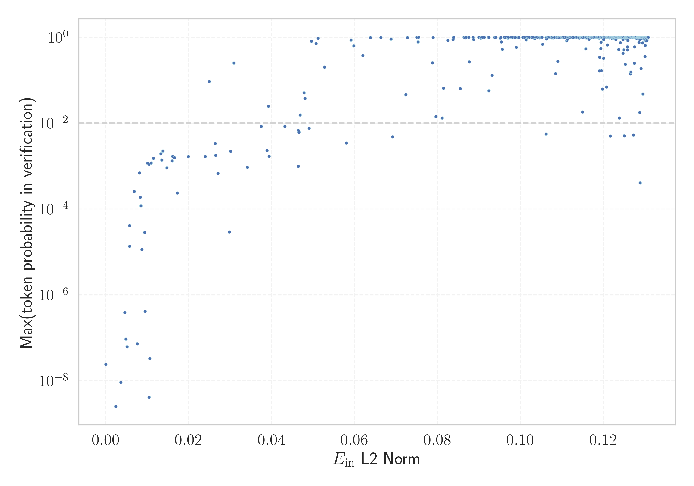

# Report for `mistralai/Mistral-7B-v0.3`

## Model info

* Tied embeddings: no
* LM head uses bias: no
* Indicator for under-trained tokens: E_{in} L2 Norm
  * Overall distribution 0.168 +/- 0.033
  * Token used for verification prompt building: `includegraphics`
  * Verification threshold: 0.131
  * Threshold for showing candidate under-trained tokens: 0.039
  * Median verified threshold (for bytes, unreachable and special tokens): 0.016
* Embeddings shape: (32768, 4096)
* Vocabulary size: 32768
  * Number of single byte tokens: 380, of which 143 below indicator threshold
  * Number of special tokens: 771, of which 769 below indicator threshold
  * Number of tested under-trained tokens: 637, 529 non-special, 47 below p = 0.01 threshold, 35 below soft indicator threshold

## Under-trained token indicators plot


## Verification plot


## Under-trained token verification results
35 entries below threshold of 0.039

|   token_id | token              |   indicator | max_prob                                                         | in_other_tokens                                                             |
|------------|--------------------|-------------|------------------------------------------------------------------|-----------------------------------------------------------------------------|
|      32506 | ````` \uefc0 ````` |  0.0023863  | <span style='border: 1px solid rgb(169, 68, 66);'>2.5e-09</span> |                                                                             |
|      21186 | ````` ▁/**\r ````` |  0.0035944  | <span style='border: 1px solid rgb(169, 68, 66);'>9.2e-09</span> |                                                                             |
|      27404 | ````` });\r `````  |  0.00453165 | <span style='border: 1px solid rgb(169, 68, 66);'>3.9e-07</span> |                                                                             |
|      27175 | ````` };\r `````   |  0.0048359  | <span style='border: 1px solid rgb(169, 68, 66);'>9.3e-08</span> |                                                                             |
|      27160 | ````` ▁});\r ````` |  0.0050999  | <span style='border: 1px solid rgb(169, 68, 66);'>6.2e-08</span> |                                                                             |
|      26851 | ````` ▁//\r `````  |  0.00571319 | <span style='border: 1px solid rgb(169, 68, 66);'>4.1e-05</span> |                                                                             |
|      19527 | ````` ';\r `````   |  0.00572306 | <span style='border: 1px solid rgb(169, 68, 66);'>1.4e-05</span> |                                                                             |
|      10591 | ````` */\r `````   |  0.00684861 | <span style='border: 1px solid rgb(169, 68, 66);'>0.00026</span> |                                                                             |
|      26601 | ````` >?[< `````   |  0.0075466  | <span style='border: 1px solid rgb(169, 68, 66);'>7.3e-08</span> |                                                                             |
|       8376 | ````` ▁*/\r `````  |  0.00811301 | <span style='border: 1px solid rgb(169, 68, 66);'>0.0007</span>  |                                                                             |
|      28939 | ````` ]);\r `````  |  0.00829246 | <span style='border: 1px solid rgb(169, 68, 66);'>0.00019</span> |                                                                             |
|      23907 | ````` ▁};\r `````  |  0.00844843 | <span style='border: 1px solid rgb(169, 68, 66);'>0.00012</span> |                                                                             |
|      15824 | ````` ());\r ````` |  0.00866532 | <span style='border: 1px solid rgb(169, 68, 66);'>1.1e-05</span> |                                                                             |
|      18463 | ````` },\r `````   |  0.00934692 | <span style='border: 1px solid rgb(169, 68, 66);'>2.8e-05</span> | <span style='border: 1px solid rgb(255, 145, 0);'>````` ▁},\r `````</span>  |
|      32131 | ````` \x85 `````   |  0.00946441 | <span style='border: 1px solid rgb(169, 68, 66);'>4.2e-07</span> |                                                                             |
|      12961 | ````` ▁);\r `````  |  0.0100997  | <span style='border: 1px solid rgb(255, 145, 0);'>0.0012</span>  |                                                                             |
|      17711 | ````` ');\r `````  |  0.0104318  | <span style='border: 1px solid rgb(255, 145, 0);'>0.0011</span>  |                                                                             |
|      15524 | ````` /**\r `````  |  0.0108952  | <span style='border: 1px solid rgb(255, 145, 0);'>0.0012</span>  | <span style='border: 1px solid rgb(169, 68, 66);'>````` ▁/**\r `````</span> |
|      21460 | ````` ▁},\r `````  |  0.0114855  | <span style='border: 1px solid rgb(255, 145, 0);'>0.0015</span>  |                                                                             |
|      11046 | ````` ',\r `````   |  0.0132816  | <span style='border: 1px solid rgb(255, 145, 0);'>0.0019</span>  |                                                                             |
<details><summary>15 additional entries below threshold</summary>

|   token_id | token               |   indicator | max_prob                                                         | in_other_tokens                                                                |
|------------|---------------------|-------------|------------------------------------------------------------------|--------------------------------------------------------------------------------|
|      31697 | ````` ᥀ `````       |   0.0137812 | <span style='border: 1px solid rgb(255, 145, 0);'>0.0022</span>  |                                                                                |
|      12648 | ````` ";\r `````    |   0.014684  | <span style='border: 1px solid rgb(169, 68, 66);'>0.00091</span> |                                                                                |
|      18823 | ````` ){\r `````    |   0.0160179 | <span style='border: 1px solid rgb(255, 145, 0);'>0.0013</span>  |                                                                                |
|      15188 | ````` ];\r `````    |   0.0161055 | <span style='border: 1px solid rgb(255, 145, 0);'>0.0017</span>  |                                                                                |
|      15748 | ````` ">\r `````    |   0.0165545 | <span style='border: 1px solid rgb(255, 145, 0);'>0.0016</span>  |                                                                                |
|      11709 | ````` ));\r `````   |   0.0172253 | <span style='border: 1px solid rgb(169, 68, 66);'>0.00023</span> | <span style='border: 1px solid rgb(169, 68, 66);'>````` ());\r `````</span>    |
|      26668 | ````` iNdEx `````   |   0.0249352 | <span style='border: 1px solid rgb(251, 189, 8);'>0.093</span>   |                                                                                |
|      11707 | ````` ",\r `````    |   0.0263567 | <span style='border: 1px solid rgb(255, 145, 0);'>0.0034</span>  |                                                                                |
|       7681 | ````` ");\r `````   |   0.0264557 | <span style='border: 1px solid rgb(255, 145, 0);'>0.0018</span>  |                                                                                |
|      22954 | ````` ')\r `````    |   0.0270351 | <span style='border: 1px solid rgb(169, 68, 66);'>0.00068</span> |                                                                                |
|      27599 | ````` ▁febbra ````` |   0.0297467 | <span style='border: 1px solid rgb(169, 68, 66);'>2.9e-05</span> | <span style='border: 1px solid rgb(40, 167, 69);'>````` ▁febbraio `````</span> |
|       5188 | ````` ();\r `````   |   0.0300879 | <span style='border: 1px solid rgb(255, 145, 0);'>0.0022</span>  |                                                                                |
|      20016 | ````` NdEx `````    |   0.0308986 | <span style='border: 1px solid rgb(40, 167, 69);'>0.25</span>    | <span style='border: 1px solid rgb(251, 189, 8);'>````` iNdEx `````</span>     |
|       4194 | ````` ▁}\r `````    |   0.0341155 | <span style='border: 1px solid rgb(169, 68, 66);'>0.00093</span> |                                                                                |
|      10730 | ````` ()\r `````    |   0.0374806 | <span style='border: 1px solid rgb(255, 145, 0);'>0.0084</span>  |                                                                                |
</details>
<details><summary>494 additional entries above threshold</summary>

|   token_id | token                      |   indicator | max_prob                                                         | in_other_tokens                                                                                                                                                                                                                                                                                                                                                                                  |
|------------|----------------------------|-------------|------------------------------------------------------------------|--------------------------------------------------------------------------------------------------------------------------------------------------------------------------------------------------------------------------------------------------------------------------------------------------------------------------------------------------------------------------------------------------|
|      24254 | ````` ),\r `````           |   0.0388686 | <span style='border: 1px solid rgb(255, 145, 0);'>0.0023</span>  |                                                                                                                                                                                                                                                                                                                                                                                                  |
|      32621 | ````` ⇽ `````              |   0.0391913 | <span style='border: 1px solid rgb(251, 189, 8);'>0.025</span>   |                                                                                                                                                                                                                                                                                                                                                                                                  |
|       5209 | ````` {\r `````            |   0.0393482 | <span style='border: 1px solid rgb(255, 145, 0);'>0.0017</span>  | <span style='border: 1px solid rgb(255, 145, 0);'>````` ){\r `````</span>                                                                                                                                                                                                                                                                                                                        |
|      15387 | ````` ▁)\r `````           |   0.0431789 | <span style='border: 1px solid rgb(255, 145, 0);'>0.0084</span>  |                                                                                                                                                                                                                                                                                                                                                                                                  |
|       3287 | ````` }\r `````            |   0.0463822 | <span style='border: 1px solid rgb(255, 145, 0);'>0.0067</span>  | <span style='border: 1px solid rgb(169, 68, 66);'>````` ▁}\r `````</span>                                                                                                                                                                                                                                                                                                                        |
|      16409 | ````` ▁uitgen `````        |   0.0464082 | <span style='border: 1px solid rgb(169, 68, 66);'>0.00099</span> | <span style='border: 1px solid rgb(40, 167, 69);'>````` ▁uitgenodigd `````</span>                                                                                                                                                                                                                                                                                                                |
|      28500 | ````` '\r `````            |   0.0465594 | <span style='border: 1px solid rgb(255, 145, 0);'>0.0061</span>  |                                                                                                                                                                                                                                                                                                                                                                                                  |
|      18102 | ````` (\r `````            |   0.0468181 | <span style='border: 1px solid rgb(251, 189, 8);'>0.015</span>   |                                                                                                                                                                                                                                                                                                                                                                                                  |
|       2529 | ````` );\r `````           |   0.0477945 | <span style='border: 1px solid rgb(251, 189, 8);'>0.05</span>    | <span style='border: 1px solid rgb(255, 145, 0);'>````` ();\r `````</span>, <span style='border: 1px solid rgb(255, 145, 0);'>````` ");\r `````</span>, <span style='border: 1px solid rgb(169, 68, 66);'>````` ));\r `````</span>, <span style='border: 1px solid rgb(255, 145, 0);'>````` ▁);\r `````</span>, <span style='border: 1px solid rgb(169, 68, 66);'>````` ());\r `````</span>, ... |
|       2737 | ````` ▁{\r `````           |   0.0480194 | <span style='border: 1px solid rgb(251, 189, 8);'>0.038</span>   |                                                                                                                                                                                                                                                                                                                                                                                                  |
|      17717 | ````` ")\r `````           |   0.0490151 | <span style='border: 1px solid rgb(255, 145, 0);'>0.0076</span>  |                                                                                                                                                                                                                                                                                                                                                                                                  |
|      32424 | ````` ≮ `````              |   0.0495611 | <span style='border: 1px solid rgb(40, 167, 69);'>0.81</span>    |                                                                                                                                                                                                                                                                                                                                                                                                  |
|      32413 | ````` ≯ `````              |   0.0506941 | <span style='border: 1px solid rgb(40, 167, 69);'>0.72</span>    |                                                                                                                                                                                                                                                                                                                                                                                                  |
|      31181 | ````` ⌁ `````              |   0.0511946 | <span style='border: 1px solid rgb(40, 167, 69);'>0.95</span>    |                                                                                                                                                                                                                                                                                                                                                                                                  |
|      28224 | ````` :%.*]] `````         |   0.0527322 | <span style='border: 1px solid rgb(40, 167, 69);'>0.2</span>     |                                                                                                                                                                                                                                                                                                                                                                                                  |
|      15436 | ````` ))\r `````           |   0.0580102 | <span style='border: 1px solid rgb(255, 145, 0);'>0.0034</span>  |                                                                                                                                                                                                                                                                                                                                                                                                  |
|      17492 | ````` tagHelper `````      |   0.0591338 | <span style='border: 1px solid rgb(40, 167, 69);'>0.86</span>    |                                                                                                                                                                                                                                                                                                                                                                                                  |
|      17540 | ````` :%.* `````           |   0.0597828 | <span style='border: 1px solid rgb(40, 167, 69);'>0.63</span>    | <span style='border: 1px solid rgb(40, 167, 69);'>````` :%.*]] `````</span>                                                                                                                                                                                                                                                                                                                      |
|      16648 | ````` >:]< `````           |   0.061935  | <span style='border: 1px solid rgb(40, 167, 69);'>0.38</span>    |                                                                                                                                                                                                                                                                                                                                                                                                  |
|      31581 | ````` ︙ `````             |   0.0638043 | <span style='border: 1px solid rgb(40, 167, 69);'>0.98</span>    |                                                                                                                                                                                                                                                                                                                                                                                                  |
|      32700 | ````` ҽ `````              |   0.0663182 | <span style='border: 1px solid rgb(40, 167, 69);'>0.98</span>    |                                                                                                                                                                                                                                                                                                                                                                                                  |
|      28033 | ````` ▁SDValue `````       |   0.0687904 | <span style='border: 1px solid rgb(40, 167, 69);'>0.9</span>     |                                                                                                                                                                                                                                                                                                                                                                                                  |
|       8709 | ````` ICENSE `````         |   0.0691708 | <span style='border: 1px solid rgb(255, 145, 0);'>0.0048</span>  | ````` LICENSE `````, ````` ▁LICENSE `````                                                                                                                                                                                                                                                                                                                                                        |
|      11530 | ````` qpoint `````         |   0.0727135 | <span style='border: 1px solid rgb(40, 167, 69);'>0.99</span>    | <span style='border: 1px solid rgb(40, 167, 69);'>````` pgfqpoint `````</span>                                                                                                                                                                                                                                                                                                                   |
|      31947 | ````` ┈ `````              |   0.074992  | <span style='border: 1px solid rgb(40, 167, 69);'>0.99</span>    |                                                                                                                                                                                                                                                                                                                                                                                                  |
|      16268 | ````` itempty `````        |   0.0753192 | <span style='border: 1px solid rgb(40, 167, 69);'>0.78</span>    | <span style='border: 1px solid rgb(40, 167, 69);'>````` omitempty `````</span>                                                                                                                                                                                                                                                                                                                   |
|       1040 | ````` ▁the `````           |   0.0754115 | <span style='border: 1px solid rgb(40, 167, 69);'>1</span>       | <span style='border: 1px solid rgb(40, 167, 69);'>````` ▁they `````</span>, <span style='border: 1px solid rgb(40, 167, 69);'>````` ▁their `````</span>, ````` ▁them `````, <span style='border: 1px solid rgb(40, 167, 69);'>````` ▁there `````</span>, <span style='border: 1px solid rgb(40, 167, 69);'>````` ▁then `````</span>, ...                                                         |
|      32501 | ````` ⵙ `````              |   0.078737  | <span style='border: 1px solid rgb(40, 167, 69);'>0.26</span>    |                                                                                                                                                                                                                                                                                                                                                                                                  |
|      32609 | ````` ❒ `````              |   0.0789443 | <span style='border: 1px solid rgb(40, 167, 69);'>0.98</span>    |                                                                                                                                                                                                                                                                                                                                                                                                  |
|      18547 | ````` ▁gepublice `````     |   0.0796022 | <span style='border: 1px solid rgb(251, 189, 8);'>0.014</span>   | ````` ▁gepubliceerd `````                                                                                                                                                                                                                                                                                                                                                                        |
|      32690 | ````` ⵓ `````              |   0.0811147 | <span style='border: 1px solid rgb(251, 189, 8);'>0.013</span>   |                                                                                                                                                                                                                                                                                                                                                                                                  |
|      16398 | ````` odigd `````          |   0.0814349 | <span style='border: 1px solid rgb(251, 189, 8);'>0.065</span>   | <span style='border: 1px solid rgb(40, 167, 69);'>````` ▁uitgenodigd `````</span>                                                                                                                                                                                                                                                                                                                |
|      31665 | ````` ⠄ `````              |   0.082486  | <span style='border: 1px solid rgb(40, 167, 69);'>0.84</span>    |                                                                                                                                                                                                                                                                                                                                                                                                  |
|       4453 | ````` >\r `````            |   0.0837463 | <span style='border: 1px solid rgb(40, 167, 69);'>0.88</span>    | <span style='border: 1px solid rgb(255, 145, 0);'>````` ">\r `````</span>                                                                                                                                                                                                                                                                                                                        |
|      14820 | ````` ▁Jahrhund `````      |   0.085462  | <span style='border: 1px solid rgb(251, 189, 8);'>0.063</span>   | ````` ▁Jahrhundert `````, <span style='border: 1px solid rgb(40, 167, 69);'>````` ▁Jahrhunderts `````</span>                                                                                                                                                                                                                                                                                     |
|      32663 | ````` ❍ `````              |   0.086401  | <span style='border: 1px solid rgb(40, 167, 69);'>1</span>       |                                                                                                                                                                                                                                                                                                                                                                                                  |
|      11935 | ````` ityEngine `````      |   0.0866365 | <span style='border: 1px solid rgb(40, 167, 69);'>0.97</span>    | ````` ▁UnityEngine `````, ````` UnityEngine `````                                                                                                                                                                                                                                                                                                                                                |
|       1056 | ````` ing `````            |   0.0868837 | <span style='border: 1px solid rgb(40, 167, 69);'>1</span>       | ````` ring `````, <span style='border: 1px solid rgb(40, 167, 69);'>````` ings `````</span>, ````` tring `````, ````` ning `````, <span style='border: 1px solid rgb(40, 167, 69);'>````` ating `````</span>, ...                                                                                                                                                                                |
|       1070 | ````` ▁of `````            |   0.0875401 | <span style='border: 1px solid rgb(40, 167, 69);'>1</span>       | <span style='border: 1px solid rgb(40, 167, 69);'>````` ▁off `````</span>, ````` ▁offer `````, <span style='border: 1px solid rgb(40, 167, 69);'>````` ▁often `````</span>, ````` ▁offic `````, ````` ▁office `````, ...                                                                                                                                                                         |
|      19534 | ````` ]\r `````            |   0.0876285 | <span style='border: 1px solid rgb(40, 167, 69);'>0.27</span>    |                                                                                                                                                                                                                                                                                                                                                                                                  |
|       2039 | ````` ;\r `````            |   0.088713  | <span style='border: 1px solid rgb(40, 167, 69);'>0.88</span>    | <span style='border: 1px solid rgb(251, 189, 8);'>````` );\r `````</span>, <span style='border: 1px solid rgb(255, 145, 0);'>````` ();\r `````</span>, <span style='border: 1px solid rgb(255, 145, 0);'>````` ");\r `````</span>, <span style='border: 1px solid rgb(169, 68, 66);'>````` ));\r `````</span>, <span style='border: 1px solid rgb(169, 68, 66);'>````` ";\r `````</span>, ...    |
|       1032 | ````` ▁a `````             |   0.0899828 | <span style='border: 1px solid rgb(40, 167, 69);'>1</span>       | <span style='border: 1px solid rgb(40, 167, 69);'>````` ▁and `````</span>, ````` ▁al `````, <span style='border: 1px solid rgb(40, 167, 69);'>````` ▁as `````</span>, <span style='border: 1px solid rgb(40, 167, 69);'>````` ▁an `````</span>, <span style='border: 1px solid rgb(40, 167, 69);'>````` ▁at `````</span>, ...                                                                    |
|      31635 | ````` 🟠 `````             |   0.0904375 | <span style='border: 1px solid rgb(40, 167, 69);'>0.96</span>    |                                                                                                                                                                                                                                                                                                                                                                                                  |
|      31940 | ````` ┆ `````              |   0.0907849 | <span style='border: 1px solid rgb(40, 167, 69);'>0.99</span>    |                                                                                                                                                                                                                                                                                                                                                                                                  |
|      32237 | ````` ӏ `````              |   0.0912419 | <span style='border: 1px solid rgb(40, 167, 69);'>0.99</span>    |                                                                                                                                                                                                                                                                                                                                                                                                  |
|       1054 | ````` ed `````             |   0.0922648 | <span style='border: 1px solid rgb(40, 167, 69);'>1</span>       | <span style='border: 1px solid rgb(40, 167, 69);'>````` ated `````</span>, ````` ied `````, ````` hed `````, ````` red `````, <span style='border: 1px solid rgb(40, 167, 69);'>````` ▁need `````</span>, ...                                                                                                                                                                                    |
|      32211 | ````` ⵏ `````              |   0.0923425 | <span style='border: 1px solid rgb(251, 189, 8);'>0.057</span>   |                                                                                                                                                                                                                                                                                                                                                                                                  |
|       1066 | ````` ▁to `````            |   0.0923599 | <span style='border: 1px solid rgb(40, 167, 69);'>1</span>       | <span style='border: 1px solid rgb(40, 167, 69);'>````` ▁too `````</span>, <span style='border: 1px solid rgb(40, 167, 69);'>````` ▁top `````</span>, ````` ▁took `````, ````` ▁tot `````, ````` ▁told `````, ...                                                                                                                                                                                |
|      12293 | ````` "\r `````            |   0.0931461 | <span style='border: 1px solid rgb(40, 167, 69);'>0.13</span>    |                                                                                                                                                                                                                                                                                                                                                                                                  |
|       1042 | ````` es `````             |   0.0937615 | <span style='border: 1px solid rgb(40, 167, 69);'>1</span>       | <span style='border: 1px solid rgb(40, 167, 69);'>````` est `````</span>, ````` ess `````, <span style='border: 1px solid rgb(40, 167, 69);'>````` res `````</span>, <span style='border: 1px solid rgb(40, 167, 69);'>````` ies `````</span>, <span style='border: 1px solid rgb(40, 167, 69);'>````` ▁res `````</span>, ...                                                                    |
|      31751 | ````` ڕ `````              |   0.0950991 | <span style='border: 1px solid rgb(40, 167, 69);'>0.96</span>    |                                                                                                                                                                                                                                                                                                                                                                                                  |
|      29361 | ````` pgfscope `````       |   0.0953871 | <span style='border: 1px solid rgb(40, 167, 69);'>0.78</span>    |                                                                                                                                                                                                                                                                                                                                                                                                  |
|      32085 | ````` ⵉ `````              |   0.0956057 | <span style='border: 1px solid rgb(40, 167, 69);'>0.52</span>    |                                                                                                                                                                                                                                                                                                                                                                                                  |
|       1031 | ````` er `````             |   0.0961277 | <span style='border: 1px solid rgb(40, 167, 69);'>1</span>       | <span style='border: 1px solid rgb(40, 167, 69);'>````` ver `````</span>, <span style='border: 1px solid rgb(40, 167, 69);'>````` ter `````</span>, ````` ere `````, <span style='border: 1px solid rgb(40, 167, 69);'>````` ers `````</span>, ````` ser `````, ...                                                                                                                              |
|      29473 | ````` ▁ `````              |   0.0964717 | <span style='border: 1px solid rgb(40, 167, 69);'>1</span>       |                                                                                                                                                                                                                                                                                                                                                                                                  |
|      30702 | ````` ⣿ `````              |   0.0969354 | <span style='border: 1px solid rgb(40, 167, 69);'>0.96</span>    |                                                                                                                                                                                                                                                                                                                                                                                                  |
|       1172 | ````` ers `````            |   0.0980734 | <span style='border: 1px solid rgb(40, 167, 69);'>1</span>       | ````` vers `````, ````` erson `````, ````` ▁person `````, <span style='border: 1px solid rgb(40, 167, 69);'>````` ters `````</span>, ````` ivers `````, ...                                                                                                                                                                                                                                      |
|      31538 | ````` 🟡 `````             |   0.0987071 | <span style='border: 1px solid rgb(40, 167, 69);'>0.99</span>    |                                                                                                                                                                                                                                                                                                                                                                                                  |
|      13451 | ````` pgfpathlineto `````  |   0.0990205 | <span style='border: 1px solid rgb(40, 167, 69);'>0.58</span>    |                                                                                                                                                                                                                                                                                                                                                                                                  |
|       1037 | ````` en `````             |   0.10055   | <span style='border: 1px solid rgb(40, 167, 69);'>1</span>       | <span style='border: 1px solid rgb(40, 167, 69);'>````` ent `````</span>, <span style='border: 1px solid rgb(40, 167, 69);'>````` end `````</span>, <span style='border: 1px solid rgb(40, 167, 69);'>````` ment `````</span>, <span style='border: 1px solid rgb(40, 167, 69);'>````` ▁en `````</span>, ````` hen `````, ...                                                                    |
|      32499 | ````` Ӏ `````              |   0.101038  | <span style='border: 1px solid rgb(40, 167, 69);'>0.98</span>    |                                                                                                                                                                                                                                                                                                                                                                                                  |
|      11533 | ````` pgfqpoint `````      |   0.101333  | <span style='border: 1px solid rgb(40, 167, 69);'>0.87</span>    |                                                                                                                                                                                                                                                                                                                                                                                                  |
|       1120 | ````` ation `````          |   0.101795  | <span style='border: 1px solid rgb(40, 167, 69);'>1</span>       | <span style='border: 1px solid rgb(40, 167, 69);'>````` ations `````</span>, ````` ational `````, ````` lation `````, ````` formation `````, ````` translation `````, ...                                                                                                                                                                                                                        |
|       1030 | ````` in `````             |   0.1018    | <span style='border: 1px solid rgb(40, 167, 69);'>1</span>       | <span style='border: 1px solid rgb(40, 167, 69);'>````` ing `````</span>, <span style='border: 1px solid rgb(40, 167, 69);'>````` ▁in `````</span>, <span style='border: 1px solid rgb(40, 167, 69);'>````` ain `````</span>, <span style='border: 1px solid rgb(40, 167, 69);'>````` ine `````</span>, ````` int `````, ...                                                                     |
|      25481 | ````` vscale `````         |   0.101879  | <span style='border: 1px solid rgb(40, 167, 69);'>1</span>       |                                                                                                                                                                                                                                                                                                                                                                                                  |
|       1050 | ````` al `````             |   0.102071  | <span style='border: 1px solid rgb(40, 167, 69);'>1</span>       | ````` ▁al `````, <span style='border: 1px solid rgb(40, 167, 69);'>````` all `````</span>, ````` ial `````, <span style='border: 1px solid rgb(40, 167, 69);'>````` ▁all `````</span>, <span style='border: 1px solid rgb(40, 167, 69);'>````` ally `````</span>, ...                                                                                                                            |
|       1034 | ````` on `````             |   0.102719  | <span style='border: 1px solid rgb(40, 167, 69);'>1</span>       | <span style='border: 1px solid rgb(40, 167, 69);'>````` ion `````</span>, <span style='border: 1px solid rgb(40, 167, 69);'>````` ation `````</span>, <span style='border: 1px solid rgb(40, 167, 69);'>````` ▁on `````</span>, <span style='border: 1px solid rgb(40, 167, 69);'>````` ▁con `````</span>, ````` ction `````, ...                                                                |
|       1065 | ````` ▁in `````            |   0.103047  | <span style='border: 1px solid rgb(40, 167, 69);'>1</span>       | ````` ▁int `````, ````` ▁into `````, <span style='border: 1px solid rgb(40, 167, 69);'>````` ▁inter `````</span>, ````` ▁inst `````, ````` ▁incl `````, ...                                                                                                                                                                                                                                      |
|      32701 | ````` ថ `````              |   0.103489  | <span style='border: 1px solid rgb(40, 167, 69);'>0.93</span>    |                                                                                                                                                                                                                                                                                                                                                                                                  |
|       1072 | ````` ▁and `````           |   0.103601  | <span style='border: 1px solid rgb(40, 167, 69);'>1</span>       | ````` ▁android `````, ````` ▁andere `````, ````` ▁anderen `````, ````` ▁ander `````, ````` ▁andra `````, ...                                                                                                                                                                                                                                                                                     |
|      32404 | ````` ⬜ `````             |   0.103652  | <span style='border: 1px solid rgb(40, 167, 69);'>1</span>       |                                                                                                                                                                                                                                                                                                                                                                                                  |
|      32669 | ````` ញ `````              |   0.104523  | <span style='border: 1px solid rgb(40, 167, 69);'>0.97</span>    |                                                                                                                                                                                                                                                                                                                                                                                                  |
|       1163 | ````` ▁with `````          |   0.10459   | <span style='border: 1px solid rgb(40, 167, 69);'>1</span>       | <span style='border: 1px solid rgb(40, 167, 69);'>````` ▁without `````</span>, <span style='border: 1px solid rgb(40, 167, 69);'>````` ▁within `````</span>, ````` ▁withdraw `````, ````` ▁withd `````, ````` ▁withdrawal `````                                                                                                                                                                  |
|       1044 | ````` an `````             |   0.104858  | <span style='border: 1px solid rgb(40, 167, 69);'>1</span>       | <span style='border: 1px solid rgb(40, 167, 69);'>````` ▁and `````</span>, <span style='border: 1px solid rgb(40, 167, 69);'>````` and `````</span>, <span style='border: 1px solid rgb(40, 167, 69);'>````` ▁an `````</span>, <span style='border: 1px solid rgb(40, 167, 69);'>````` ant `````</span>, <span style='border: 1px solid rgb(40, 167, 69);'>````` ans `````</span>, ...           |
|       1493 | ````` ER `````             |   0.105002  | <span style='border: 1px solid rgb(40, 167, 69);'>1</span>       | ````` ERR `````, ````` VER `````, ````` ERT `````, ````` ERROR `````, ````` TER `````, ...                                                                                                                                                                                                                                                                                                       |
|       1122 | ````` ▁for `````           |   0.105107  | <span style='border: 1px solid rgb(40, 167, 69);'>1</span>       | <span style='border: 1px solid rgb(40, 167, 69);'>````` ▁form `````</span>, <span style='border: 1px solid rgb(40, 167, 69);'>````` ▁fore `````</span>, ````` ▁forward `````, ````` ▁force `````, ````` ▁former `````, ...                                                                                                                                                                       |
|       1265 | ````` ies `````            |   0.1052    | <span style='border: 1px solid rgb(40, 167, 69);'>1</span>       | <span style='border: 1px solid rgb(40, 167, 69);'>````` ities `````</span>, ````` ries `````, ````` ories `````, <span style='border: 1px solid rgb(40, 167, 69);'>````` perties `````</span>, ````` ▁series `````, ...                                                                                                                                                                          |
|      24038 | ````` ByComparator `````   |   0.105284  | <span style='border: 1px solid rgb(40, 167, 69);'>0.68</span>    |                                                                                                                                                                                                                                                                                                                                                                                                  |
|       1183 | ````` ▁The `````           |   0.106154  | <span style='border: 1px solid rgb(40, 167, 69);'>1</span>       | ````` ▁They `````, ````` ▁There `````, ````` ▁Then `````, ````` ▁These `````, ````` ▁Their `````, ...                                                                                                                                                                                                                                                                                            |
|      27707 | ````` ▁invån `````         |   0.106172  | <span style='border: 1px solid rgb(255, 145, 0);'>0.0056</span>  | <span style='border: 1px solid rgb(251, 189, 8);'>````` ▁invånare `````</span>                                                                                                                                                                                                                                                                                                                   |
|       2811 | ````` ING `````            |   0.106518  | <span style='border: 1px solid rgb(40, 167, 69);'>1</span>       | ````` STRING `````, ````` TING `````, ````` CLUDING `````, ````` WARNING `````, ````` SETTING `````, ...                                                                                                                                                                                                                                                                                         |
|      21179 | ````` ][< `````            |   0.106607  | <span style='border: 1px solid rgb(40, 167, 69);'>0.99</span>    |                                                                                                                                                                                                                                                                                                                                                                                                  |
|       1124 | ````` ▁on `````            |   0.107511  | <span style='border: 1px solid rgb(40, 167, 69);'>1</span>       | <span style='border: 1px solid rgb(40, 167, 69);'>````` ▁one `````</span>, <span style='border: 1px solid rgb(40, 167, 69);'>````` ▁only `````</span>, ````` ▁once `````, ````` ▁online `````, ````` ▁ones `````, ...                                                                                                                                                                            |
|       1153 | ````` os `````             |   0.107517  | <span style='border: 1px solid rgb(40, 167, 69);'>1</span>       | ````` ost `````, ````` ose `````, ````` ▁pos `````, ````` pos `````, <span style='border: 1px solid rgb(40, 167, 69);'>````` ▁most `````</span>, ...                                                                                                                                                                                                                                             |
|       1046 | ````` is `````             |   0.10766   | <span style='border: 1px solid rgb(40, 167, 69);'>1</span>       | <span style='border: 1px solid rgb(40, 167, 69);'>````` ▁is `````</span>, <span style='border: 1px solid rgb(40, 167, 69);'>````` ist `````</span>, <span style='border: 1px solid rgb(40, 167, 69);'>````` ▁this `````</span>, <span style='border: 1px solid rgb(40, 167, 69);'>````` ▁his `````</span>, <span style='border: 1px solid rgb(40, 167, 69);'>````` ▁dis `````</span>, ...        |
|       1117 | ````` ▁is `````            |   0.10789   | <span style='border: 1px solid rgb(40, 167, 69);'>1</span>       | ````` ▁iss `````, ````` ▁ist `````, ````` ▁isn `````, ````` ▁issue `````, ````` ▁issues `````, ...                                                                                                                                                                                                                                                                                               |
|      32162 | ````` ើ `````               |   0.108433  | <span style='border: 1px solid rgb(40, 167, 69);'>0.14</span>    |                                                                                                                                                                                                                                                                                                                                                                                                  |
|       1137 | ````` ▁that `````          |   0.108721  | <span style='border: 1px solid rgb(40, 167, 69);'>1</span>       | ````` ▁thats `````                                                                                                                                                                                                                                                                                                                                                                               |
|       1465 | ````` ations `````         |   0.10899   | <span style='border: 1px solid rgb(40, 167, 69);'>0.99</span>    | ````` ▁relations `````, ````` ▁relationship `````, ````` ulations `````, ````` ▁operations `````, ````` ifications `````, ...                                                                                                                                                                                                                                                                    |
|      12138 | ````` pgfpath `````        |   0.109016  | <span style='border: 1px solid rgb(40, 167, 69);'>0.27</span>    | <span style='border: 1px solid rgb(40, 167, 69);'>````` pgfpathlineto `````</span>                                                                                                                                                                                                                                                                                                               |
|       1039 | ````` or `````             |   0.109151  | <span style='border: 1px solid rgb(40, 167, 69);'>1</span>       | <span style='border: 1px solid rgb(40, 167, 69);'>````` ▁for `````</span>, ````` ort `````, ````` ore `````, <span style='border: 1px solid rgb(40, 167, 69);'>````` ▁or `````</span>, ````` port `````, ...                                                                                                                                                                                     |
|       1148 | ````` ate `````            |   0.109271  | <span style='border: 1px solid rgb(40, 167, 69);'>1</span>       | <span style='border: 1px solid rgb(40, 167, 69);'>````` ated `````</span>, ````` ater `````, <span style='border: 1px solid rgb(40, 167, 69);'>````` ates `````</span>, ````` rivate `````, ````` date `````, ...                                                                                                                                                                                |
|       1069 | ````` el `````             |   0.10929   | <span style='border: 1px solid rgb(40, 167, 69);'>1</span>       | ````` ell `````, ````` elf `````, <span style='border: 1px solid rgb(40, 167, 69);'>````` ▁el `````</span>, ````` ely `````, ````` iel `````, ...                                                                                                                                                                                                                                                |
|       1093 | ````` ▁( `````             |   0.109503  | <span style='border: 1px solid rgb(40, 167, 69);'>1</span>       | ````` ▁(! `````, ````` ▁(* `````, ````` ▁(( `````, ````` ▁() `````, ````` ▁($ `````, ...                                                                                                                                                                                                                                                                                                         |
|       1059 | ````` le `````             |   0.1099    | <span style='border: 1px solid rgb(40, 167, 69);'>1</span>       | <span style='border: 1px solid rgb(40, 167, 69);'>````` ▁le `````</span>, <span style='border: 1px solid rgb(40, 167, 69);'>````` able `````</span>, ````` ile `````, ````` ple `````, ````` lect `````, ...                                                                                                                                                                                     |
|       1062 | ````` ic `````             |   0.109981  | <span style='border: 1px solid rgb(40, 167, 69);'>1</span>       | <span style='border: 1px solid rgb(40, 167, 69);'>````` ice `````</span>, ````` ich `````, ````` lic `````, ````` ublic `````, ````` ick `````, ...                                                                                                                                                                                                                                              |
|      29859 | ````` ↘ `````              |   0.110025  | <span style='border: 1px solid rgb(40, 167, 69);'>0.99</span>    |                                                                                                                                                                                                                                                                                                                                                                                                  |
|       1158 | ````` ▁as `````            |   0.11009   | <span style='border: 1px solid rgb(40, 167, 69);'>1</span>       | ````` ▁ass `````, ````` ▁ask `````, ````` ▁assert `````, ````` ▁asked `````, ````` ▁associ `````, ...                                                                                                                                                                                                                                                                                            |
|       1061 | ````` as `````             |   0.110095  | <span style='border: 1px solid rgb(40, 167, 69);'>1</span>       | <span style='border: 1px solid rgb(40, 167, 69);'>````` ▁as `````</span>, <span style='border: 1px solid rgb(40, 167, 69);'>````` ▁was `````</span>, ````` ass `````, ````` ast `````, ````` ase `````, ...                                                                                                                                                                                      |
|      32032 | ````` ⬛ `````             |   0.110181  | <span style='border: 1px solid rgb(40, 167, 69);'>1</span>       |                                                                                                                                                                                                                                                                                                                                                                                                  |
|       1067 | ````` et `````             |   0.110347  | <span style='border: 1px solid rgb(40, 167, 69);'>1</span>       | ````` get `````, ````` ▁return `````, ````` ▁get `````, ````` set `````, ````` eth `````, ...                                                                                                                                                                                                                                                                                                    |
|       1245 | ````` ▁from `````          |   0.110521  | <span style='border: 1px solid rgb(40, 167, 69);'>1</span>       |                                                                                                                                                                                                                                                                                                                                                                                                  |
|       1051 | ````` ar `````             |   0.110527  | <span style='border: 1px solid rgb(40, 167, 69);'>1</span>       | ````` art `````, <span style='border: 1px solid rgb(40, 167, 69);'>````` ▁are `````</span>, <span style='border: 1px solid rgb(40, 167, 69);'>````` ard `````</span>, <span style='border: 1px solid rgb(40, 167, 69);'>````` are `````</span>, ````` ▁ar `````, ...                                                                                                                             |
|       1035 | ````` re `````             |   0.110928  | <span style='border: 1px solid rgb(40, 167, 69);'>1</span>       | <span style='border: 1px solid rgb(40, 167, 69);'>````` ▁re `````</span>, ````` ere `````, <span style='border: 1px solid rgb(40, 167, 69);'>````` res `````</span>, ````` ore `````, <span style='border: 1px solid rgb(40, 167, 69);'>````` ▁are `````</span>, ...                                                                                                                             |
|      31458 | ````` ێ `````              |   0.111177  | <span style='border: 1px solid rgb(40, 167, 69);'>0.83</span>    |                                                                                                                                                                                                                                                                                                                                                                                                  |
|      32460 | ````` ែ `````               |   0.111271  | <span style='border: 1px solid rgb(40, 167, 69);'>0.9</span>     |                                                                                                                                                                                                                                                                                                                                                                                                  |
|      22644 | ````` imeq `````           |   0.111341  | <span style='border: 1px solid rgb(40, 167, 69);'>0.98</span>    | ````` simeq `````                                                                                                                                                                                                                                                                                                                                                                                |
|       1038 | ````` at `````             |   0.111604  | <span style='border: 1px solid rgb(40, 167, 69);'>1</span>       | <span style='border: 1px solid rgb(40, 167, 69);'>````` ation `````</span>, <span style='border: 1px solid rgb(40, 167, 69);'>````` ▁that `````</span>, <span style='border: 1px solid rgb(40, 167, 69);'>````` ate `````</span>, <span style='border: 1px solid rgb(40, 167, 69);'>````` ▁at `````</span>, ````` ath `````, ...                                                                 |
|       3023 | ````` ES `````             |   0.111624  | <span style='border: 1px solid rgb(40, 167, 69);'>1</span>       | ````` EST `````, ````` CESS `````, ````` TIES `````, ````` RES `````, ````` ▁WARRANTIES `````, ...                                                                                                                                                                                                                                                                                               |
|       1149 | ````` us `````             |   0.111863  | <span style='border: 1px solid rgb(40, 167, 69);'>1</span>       | ````` ust `````, ````` ▁us `````, ````` ous `````, <span style='border: 1px solid rgb(40, 167, 69);'>````` ▁just `````</span>, ````` ause `````, ...                                                                                                                                                                                                                                             |
|       1114 | ````` ly `````             |   0.111923  | <span style='border: 1px solid rgb(40, 167, 69);'>1</span>       | <span style='border: 1px solid rgb(40, 167, 69);'>````` ally `````</span>, ````` ely `````, <span style='border: 1px solid rgb(40, 167, 69);'>````` ▁only `````</span>, ````` ily `````, ````` ually `````, ...                                                                                                                                                                                  |
|       1283 | ````` ia `````             |   0.112238  | <span style='border: 1px solid rgb(40, 167, 69);'>1</span>       | <span style='border: 1px solid rgb(40, 167, 69);'>````` ian `````</span>, ````` ially `````, ````` ential `````, ````` aterial `````, ````` iam `````, ...                                                                                                                                                                                                                                       |
|       1098 | ````` ▁A `````             |   0.11238   | <span style='border: 1px solid rgb(40, 167, 69);'>1</span>       | ````` ▁Al `````, ````` ▁Ar `````, ````` ▁And `````, ````` ▁An `````, <span style='border: 1px solid rgb(40, 167, 69);'>````` ▁As `````</span>, ...                                                                                                                                                                                                                                               |
|      32502 | ````` 丶 `````             |   0.112532  | <span style='border: 1px solid rgb(40, 167, 69);'>1</span>       |                                                                                                                                                                                                                                                                                                                                                                                                  |
|       1228 | ````` ▁are `````           |   0.113271  | <span style='border: 1px solid rgb(40, 167, 69);'>1</span>       | <span style='border: 1px solid rgb(40, 167, 69);'>````` ▁area `````</span>, <span style='border: 1px solid rgb(40, 167, 69);'>````` ▁areas `````</span>, ````` ▁aren `````, ````` ▁arena `````                                                                                                                                                                                                   |
|      31428 | ````` ☽ `````              |   0.113456  | <span style='border: 1px solid rgb(40, 167, 69);'>1</span>       |                                                                                                                                                                                                                                                                                                                                                                                                  |
|       1782 | ````` The `````            |   0.113542  | <span style='border: 1px solid rgb(40, 167, 69);'>1</span>       | ````` ▁They `````, ````` ▁There `````, ````` ▁Then `````, ````` ▁These `````, ````` There `````, ...                                                                                                                                                                                                                                                                                             |
|       1047 | ````` it `````             |   0.113662  | <span style='border: 1px solid rgb(40, 167, 69);'>1</span>       | ````` ith `````, <span style='border: 1px solid rgb(40, 167, 69);'>````` ▁it `````</span>, <span style='border: 1px solid rgb(40, 167, 69);'>````` ▁with `````</span>, <span style='border: 1px solid rgb(40, 167, 69);'>````` ity `````</span>, <span style='border: 1px solid rgb(40, 167, 69);'>````` ite `````</span>, ...                                                                   |
|      32617 | ````` ತ `````              |   0.113995  | <span style='border: 1px solid rgb(40, 167, 69);'>0.98</span>    |                                                                                                                                                                                                                                                                                                                                                                                                  |
|       1254 | ````` ▁by `````            |   0.114008  | <span style='border: 1px solid rgb(40, 167, 69);'>1</span>       | ````` ▁byte `````, ````` ▁bytes `````, ````` ▁byl `````, ````` ▁był `````, ````` ▁byla `````                                                                                                                                                                                                                                                                                                     |
|       1369 | ````` ated `````           |   0.114078  | <span style='border: 1px solid rgb(40, 167, 69);'>1</span>       | ````` ▁created `````, <span style='border: 1px solid rgb(40, 167, 69);'>````` ▁related `````</span>, ````` dated `````, ````` ▁associated `````, ````` inated `````, ...                                                                                                                                                                                                                         |
|      32006 | ````` ដ `````              |   0.114168  | <span style='border: 1px solid rgb(40, 167, 69);'>0.96</span>    |                                                                                                                                                                                                                                                                                                                                                                                                  |
|      22167 | ````` TagHelpers `````     |   0.114189  | <span style='border: 1px solid rgb(40, 167, 69);'>0.98</span>    |                                                                                                                                                                                                                                                                                                                                                                                                  |
|       1164 | ````` ▁an `````            |   0.114575  | <span style='border: 1px solid rgb(40, 167, 69);'>1</span>       | ````` ▁any `````, ````` ▁another `````, ````` ▁ann `````, ````` ▁anything `````, ````` ▁ant `````, ...                                                                                                                                                                                                                                                                                           |
|       1325 | ````` ), `````             |   0.114753  | <span style='border: 1px solid rgb(40, 167, 69);'>1</span>       | ````` (), `````, ````` "), `````, ````` '), `````, ````` ▁), `````, <span style='border: 1px solid rgb(40, 167, 69);'>````` }), `````</span>, ...                                                                                                                                                                                                                                                |
|       1770 | ````` ates `````           |   0.114805  | <span style='border: 1px solid rgb(40, 167, 69);'>1</span>       | ````` ▁States `````, ````` ▁states `````, ````` ▁latest `````, ````` ▁rates `````, ````` dates `````, ...                                                                                                                                                                                                                                                                                        |
|       1263 | ````` ive `````            |   0.114828  | <span style='border: 1px solid rgb(40, 167, 69);'>1</span>       | ````` ative `````, ````` ivers `````, ````` ives `````, ````` ived `````, ````` iver `````, ...                                                                                                                                                                                                                                                                                                  |
|       1788 | ````` EN `````             |   0.114855  | <span style='border: 1px solid rgb(40, 167, 69);'>1</span>       | ````` ENT `````, ````` END `````, ````` MENT `````, ````` ENSE `````, <span style='border: 1px solid rgb(255, 145, 0);'>````` ICENSE `````</span>, ...                                                                                                                                                                                                                                           |
|      32209 | ````` ូ `````               |   0.114977  | <span style='border: 1px solid rgb(251, 189, 8);'>0.018</span>   |                                                                                                                                                                                                                                                                                                                                                                                                  |
|       1240 | ````` ity `````            |   0.115273  | <span style='border: 1px solid rgb(40, 167, 69);'>1</span>       | ````` ility `````, ````` ality `````, ````` ability `````, ````` ivity `````, ````` ▁University `````, ...                                                                                                                                                                                                                                                                                       |
|       1502 | ````` ors `````            |   0.115274  | <span style='border: 1px solid rgb(40, 167, 69);'>1</span>       | ````` ators `````, ````` ctors `````, ````` ▁worse `````, ````` ▁errors `````, ````` ▁horse `````, ...                                                                                                                                                                                                                                                                                           |
|       1854 | ````` AL `````             |   0.115309  | <span style='border: 1px solid rgb(40, 167, 69);'>1</span>       | ````` VAL `````, ````` ALL `````, ````` INVAL `````, <span style='border: 1px solid rgb(40, 167, 69);'>````` ALSE `````</span>, ````` VALUE `````, ...                                                                                                                                                                                                                                           |
|       1845 | ````` ating `````          |   0.115366  | <span style='border: 1px solid rgb(40, 167, 69);'>1</span>       | ````` ▁creating `````, ````` ▁dating `````, ````` ▁eating `````, ````` ▁operating `````, ````` inating `````, ...                                                                                                                                                                                                                                                                                |
|      32724 | ````` ោ `````               |   0.115747  | <span style='border: 1px solid rgb(40, 167, 69);'>0.53</span>    |                                                                                                                                                                                                                                                                                                                                                                                                  |
|      32717 | ````` Ḩ `````              |   0.115754  | <span style='border: 1px solid rgb(40, 167, 69);'>0.98</span>    |                                                                                                                                                                                                                                                                                                                                                                                                  |
|       2019 | ````` AN `````             |   0.115761  | <span style='border: 1px solid rgb(40, 167, 69);'>1</span>       | ````` ▁AN `````, ````` RAN `````, ````` AND `````, ````` ▁AND `````, ````` ▁ANY `````, ...                                                                                                                                                                                                                                                                                                       |
|       1081 | ````` id `````             |   0.115766  | <span style='border: 1px solid rgb(40, 167, 69);'>1</span>       | <span style='border: 1px solid rgb(40, 167, 69);'>````` ide `````</span>, ````` ▁said `````, ````` oid `````, ````` ▁did `````, ````` ▁void `````, ...                                                                                                                                                                                                                                           |
|       1082 | ````` am `````             |   0.115875  | <span style='border: 1px solid rgb(40, 167, 69);'>1</span>       | ````` ame `````, ````` aram `````, <span style='border: 1px solid rgb(40, 167, 69);'>````` ▁am `````</span>, ````` name `````, ````` Name `````, ...                                                                                                                                                                                                                                             |
|      32416 | ````` ಲ `````              |   0.115919  | <span style='border: 1px solid rgb(40, 167, 69);'>0.97</span>    |                                                                                                                                                                                                                                                                                                                                                                                                  |
|      32594 | ````` ಯ `````              |   0.11594   | <span style='border: 1px solid rgb(40, 167, 69);'>0.99</span>    |                                                                                                                                                                                                                                                                                                                                                                                                  |
|       1113 | ````` ▁" `````             |   0.116258  | <span style='border: 1px solid rgb(40, 167, 69);'>1</span>       | ````` ▁""" `````, ````` ▁"\ `````, ````` ▁"< `````, ````` ▁"/ `````, ````` ▁"" `````, ...                                                                                                                                                                                                                                                                                                        |
|       2674 | ````` ED `````             |   0.116259  | <span style='border: 1px solid rgb(40, 167, 69);'>1</span>       | ````` RED `````, ````` ATED `````, ````` LED `````, ````` ▁ED `````, ````` DED `````, ...                                                                                                                                                                                                                                                                                                        |
|       1234 | ````` ment `````           |   0.11639   | <span style='border: 1px solid rgb(40, 167, 69);'>1</span>       | ````` lement `````, ````` ement `````, ````` ument `````, <span style='border: 1px solid rgb(40, 167, 69);'>````` ments `````</span>, ````` ament `````, ...                                                                                                                                                                                                                                     |
|       1206 | ````` ▁at `````            |   0.116468  | <span style='border: 1px solid rgb(40, 167, 69);'>1</span>       | ````` ▁att `````, ````` ▁attack `````, ````` ▁attempt `````, ````` ▁attention `````, ````` ▁attribute `````, ...                                                                                                                                                                                                                                                                                 |
|       1128 | ````` ter `````            |   0.116471  | <span style='border: 1px solid rgb(40, 167, 69);'>1</span>       | <span style='border: 1px solid rgb(40, 167, 69);'>````` ▁inter `````</span>, ````` ater `````, ````` fter `````, ````` tern `````, <span style='border: 1px solid rgb(40, 167, 69);'>````` ▁after `````</span>, ...                                                                                                                                                                              |
|      32571 | ````` ណ `````              |   0.116553  | <span style='border: 1px solid rgb(40, 167, 69);'>0.9</span>     |                                                                                                                                                                                                                                                                                                                                                                                                  |
|       1290 | ````` able `````           |   0.116734  | <span style='border: 1px solid rgb(40, 167, 69);'>1</span>       | ````` ailable `````, ````` ▁able `````, ````` ▁table `````, ````` ables `````, ````` table `````, ...                                                                                                                                                                                                                                                                                            |
|       1180 | ````` ie `````             |   0.116872  | <span style='border: 1px solid rgb(40, 167, 69);'>1</span>       | <span style='border: 1px solid rgb(40, 167, 69);'>````` ies `````</span>, ````` ient `````, <span style='border: 1px solid rgb(40, 167, 69);'>````` ier `````</span>, ````` iel `````, ````` ied `````, ...                                                                                                                                                                                      |
|       1600 | ````` ON `````             |   0.116901  | <span style='border: 1px solid rgb(40, 167, 69);'>1</span>       | <span style='border: 1px solid rgb(40, 167, 69);'>````` ION `````</span>, ````` CON `````, ````` ▁CON `````, ````` SON `````, <span style='border: 1px solid rgb(40, 167, 69);'>````` ATION `````</span>, ...                                                                                                                                                                                    |
|       1064 | ````` ion `````            |   0.116916  | <span style='border: 1px solid rgb(40, 167, 69);'>1</span>       | <span style='border: 1px solid rgb(40, 167, 69);'>````` ation `````</span>, ````` ction `````, <span style='border: 1px solid rgb(40, 167, 69);'>````` ions `````</span>, ````` ition `````, <span style='border: 1px solid rgb(40, 167, 69);'>````` ations `````</span>, ...                                                                                                                    |
|       1090 | ````` ot `````             |   0.117017  | <span style='border: 1px solid rgb(40, 167, 69);'>1</span>       | <span style='border: 1px solid rgb(40, 167, 69);'>````` ▁not `````</span>, <span style='border: 1px solid rgb(40, 167, 69);'>````` ▁other `````</span>, ````` oth `````, ````` other `````, ````` ▁got `````, ...                                                                                                                                                                                |
|      29554 | ````` т `````              |   0.117018  | <span style='border: 1px solid rgb(40, 167, 69);'>1</span>       |                                                                                                                                                                                                                                                                                                                                                                                                  |
|       1208 | ````` ant `````            |   0.117042  | <span style='border: 1px solid rgb(40, 167, 69);'>1</span>       | ````` ▁want `````, <span style='border: 1px solid rgb(40, 167, 69);'>````` ants `````</span>, ````` ante `````, ````` ▁important `````, ````` ▁wanted `````, ...                                                                                                                                                                                                                                 |
|       1510 | ````` ings `````           |   0.117086  | <span style='border: 1px solid rgb(40, 167, 69);'>1</span>       | ````` ▁things `````, ````` tings `````, ````` Settings `````, ````` settings `````, ````` ▁settings `````, ...                                                                                                                                                                                                                                                                                   |
|       1377 | ````` ). `````             |   0.117144  | <span style='border: 1px solid rgb(40, 167, 69);'>1</span>       | ````` (). `````, ````` "). `````, ````` '). `````, ````` }). `````, ````` )). `````, ...                                                                                                                                                                                                                                                                                                         |
|       1241 | ````` ine `````            |   0.117154  | <span style='border: 1px solid rgb(40, 167, 69);'>1</span>       | <span style='border: 1px solid rgb(40, 167, 69);'>````` line `````</span>, <span style='border: 1px solid rgb(40, 167, 69);'>````` ines `````</span>, ````` ined `````, <span style='border: 1px solid rgb(40, 167, 69);'>````` ▁line `````</span>, ````` iness `````, ...                                                                                                                       |
|       1362 | ````` ions `````           |   0.117406  | <span style='border: 1px solid rgb(40, 167, 69);'>1</span>       | <span style='border: 1px solid rgb(40, 167, 69);'>````` ations `````</span>, <span style='border: 1px solid rgb(40, 167, 69);'>````` ctions `````</span>, ````` ptions `````, ````` itions `````, ````` ▁options `````, ...                                                                                                                                                                      |
|       1192 | ````` te `````             |   0.117414  | <span style='border: 1px solid rgb(40, 167, 69);'>1</span>       | <span style='border: 1px solid rgb(40, 167, 69);'>````` ite `````</span>, <span style='border: 1px solid rgb(40, 167, 69);'>````` ated `````</span>, ````` ▁te `````, ````` text `````, <span style='border: 1px solid rgb(40, 167, 69);'>````` ▁inter `````</span>, ...                                                                                                                         |
|      16088 | ````` ▁/***/ `````         |   0.117522  | <span style='border: 1px solid rgb(40, 167, 69);'>1</span>       |                                                                                                                                                                                                                                                                                                                                                                                                  |
|       1635 | ````` les `````            |   0.117779  | <span style='border: 1px solid rgb(40, 167, 69);'>1</span>       | ````` less `````, ````` ▁les `````, <span style='border: 1px solid rgb(40, 167, 69);'>````` ▁less `````</span>, ````` ales `````, ````` ules `````, ...                                                                                                                                                                                                                                          |
|       1106 | ````` ch `````             |   0.117893  | <span style='border: 1px solid rgb(40, 167, 69);'>1</span>       | <span style='border: 1px solid rgb(40, 167, 69);'>````` ▁ch `````</span>, ````` ich `````, ````` ach `````, ````` che `````, <span style='border: 1px solid rgb(40, 167, 69);'>````` ▁which `````</span>, ...                                                                                                                                                                                    |
|      31800 | ````` ច `````              |   0.118045  | <span style='border: 1px solid rgb(40, 167, 69);'>0.99</span>    |                                                                                                                                                                                                                                                                                                                                                                                                  |
|       1300 | ````` to `````             |   0.118319  | <span style='border: 1px solid rgb(40, 167, 69);'>1</span>       | ````` ▁into `````, ````` ator `````, ````` ton `````, <span style='border: 1px solid rgb(40, 167, 69);'>````` ▁too `````</span>, ````` ustom `````, ...                                                                                                                                                                                                                                          |
|       1233 | ````` age `````            |   0.118351  | <span style='border: 1px solid rgb(40, 167, 69);'>1</span>       | ````` essage `````, <span style='border: 1px solid rgb(40, 167, 69);'>````` ages `````</span>, ````` message `````, ````` ager `````, ````` aged `````, ...                                                                                                                                                                                                                                      |
|       1396 | ````` ary `````            |   0.118387  | <span style='border: 1px solid rgb(40, 167, 69);'>1</span>       | ````` mary `````, ````` inary `````, ````` summary `````, ````` uary `````, ````` ibrary `````, ...                                                                                                                                                                                                                                                                                              |
|      32709 | ````` ಮ `````              |   0.118474  | <span style='border: 1px solid rgb(40, 167, 69);'>0.99</span>    |                                                                                                                                                                                                                                                                                                                                                                                                  |
|       1083 | ````` ▁I `````             |   0.118513  | <span style='border: 1px solid rgb(40, 167, 69);'>1</span>       | <span style='border: 1px solid rgb(40, 167, 69);'>````` ▁In `````</span>, <span style='border: 1px solid rgb(40, 167, 69);'>````` ▁It `````</span>, ````` ▁If `````, ````` ▁Is `````, ````` ▁Ind `````, ...                                                                                                                                                                                      |
|       1171 | ````` ▁was `````           |   0.118517  | <span style='border: 1px solid rgb(40, 167, 69);'>1</span>       | ````` ▁wasn `````, ````` ▁waste `````, ````` ▁wash `````, ````` ▁washing `````, ````` ▁washed `````, ...                                                                                                                                                                                                                                                                                         |
|      32180 | ````` វ `````              |   0.118656  | <span style='border: 1px solid rgb(40, 167, 69);'>0.99</span>    |                                                                                                                                                                                                                                                                                                                                                                                                  |
|       1664 | ````` RE `````             |   0.118816  | <span style='border: 1px solid rgb(40, 167, 69);'>1</span>       | ````` ▁RE `````, ````` REG `````, ````` URE `````, ````` PRE `````, ````` ARE `````, ...                                                                                                                                                                                                                                                                                                         |
|      32475 | ````` ಸ `````              |   0.119001  | <span style='border: 1px solid rgb(40, 167, 69);'>0.96</span>    |                                                                                                                                                                                                                                                                                                                                                                                                  |
|      31658 | ````` ់ `````               |   0.119014  | <span style='border: 1px solid rgb(40, 167, 69);'>0.17</span>    |                                                                                                                                                                                                                                                                                                                                                                                                  |
|       1250 | ````` ure `````            |   0.119024  | <span style='border: 1px solid rgb(40, 167, 69);'>1</span>       | <span style='border: 1px solid rgb(40, 167, 69);'>````` ures `````</span>, ````` ature `````, ````` ▁sure `````, ````` ured `````, ````` atures `````, ...                                                                                                                                                                                                                                       |
|       1146 | ````` ▁it `````            |   0.11905   | <span style='border: 1px solid rgb(40, 167, 69);'>1</span>       | ````` ▁its `````, ````` ▁item `````, ````` ▁itself `````, ````` ▁items `````, ````` ▁iter `````, ...                                                                                                                                                                                                                                                                                             |
|      31422 | ````` ⴰ `````              |   0.119114  | <span style='border: 1px solid rgb(40, 167, 69);'>0.34</span>    |                                                                                                                                                                                                                                                                                                                                                                                                  |
|       1076 | ````` ent `````            |   0.11933   | <span style='border: 1px solid rgb(40, 167, 69);'>1</span>       | <span style='border: 1px solid rgb(40, 167, 69);'>````` ment `````</span>, ````` ient `````, ````` ents `````, ````` ▁ent `````, ````` lement `````, ...                                                                                                                                                                                                                                         |
|       1842 | ````` ts `````             |   0.119359  | <span style='border: 1px solid rgb(40, 167, 69);'>1</span>       | <span style='border: 1px solid rgb(40, 167, 69);'>````` ments `````</span>, <span style='border: 1px solid rgb(40, 167, 69);'>````` ats `````</span>, <span style='border: 1px solid rgb(40, 167, 69);'>````` ets `````</span>, <span style='border: 1px solid rgb(40, 167, 69);'>````` ants `````</span>, <span style='border: 1px solid rgb(40, 167, 69);'>````` ists `````</span>, ...        |
|      32566 | ````` ም `````              |   0.119365  | <span style='border: 1px solid rgb(40, 167, 69);'>0.54</span>    |                                                                                                                                                                                                                                                                                                                                                                                                  |
|       1084 | ````` ad `````             |   0.119412  | <span style='border: 1px solid rgb(40, 167, 69);'>1</span>       | <span style='border: 1px solid rgb(40, 167, 69);'>````` ▁had `````</span>, <span style='border: 1px solid rgb(40, 167, 69);'>````` ▁ad `````</span>, ````` ade `````, ````` read `````, <span style='border: 1px solid rgb(40, 167, 69);'>````` ▁add `````</span>, ...                                                                                                                           |
|      32164 | ````` េ `````               |   0.119423  | <span style='border: 1px solid rgb(40, 167, 69);'>0.76</span>    |                                                                                                                                                                                                                                                                                                                                                                                                  |
|       1948 | ````` LE `````             |   0.11946   | <span style='border: 1px solid rgb(40, 167, 69);'>1</span>       | ````` ABLE `````, ````` FILE `````, ````` ULE `````, ````` LECT `````, ````` LEN `````, ...                                                                                                                                                                                                                                                                                                      |
|      31783 | ````` ី `````               |   0.119508  | <span style='border: 1px solid rgb(40, 167, 69);'>0.17</span>    |                                                                                                                                                                                                                                                                                                                                                                                                  |
|      13898 | ````` ▁aapt `````          |   0.1196    | <span style='border: 1px solid rgb(40, 167, 69);'>1</span>       |                                                                                                                                                                                                                                                                                                                                                                                                  |
|       1092 | ````` ur `````             |   0.119638  | <span style='border: 1px solid rgb(40, 167, 69);'>1</span>       | ````` our `````, ````` urn `````, <span style='border: 1px solid rgb(40, 167, 69);'>````` ure `````</span>, ````` turn `````, <span style='border: 1px solid rgb(40, 167, 69);'>````` ▁your `````</span>, ...                                                                                                                                                                                    |
|       1741 | ````` als `````            |   0.119711  | <span style='border: 1px solid rgb(40, 167, 69);'>1</span>       | ````` alse `````, ````` ▁false `````, ````` ▁als `````, ````` false `````, ````` Equals `````, ...                                                                                                                                                                                                                                                                                               |
|      32605 | ````` ે `````               |   0.119775  | <span style='border: 1px solid rgb(251, 189, 8);'>0.062</span>   |                                                                                                                                                                                                                                                                                                                                                                                                  |
|      29577 | ````` ’ `````              |   0.119842  | <span style='border: 1px solid rgb(40, 167, 69);'>1</span>       |                                                                                                                                                                                                                                                                                                                                                                                                  |
|       2300 | ````` ters `````           |   0.119984  | <span style='border: 1px solid rgb(40, 167, 69);'>1</span>       | ````` eters `````, ````` ▁parameters `````, ````` acters `````, ````` ▁characters `````, ````` Parameters `````, ...                                                                                                                                                                                                                                                                             |
|      31600 | ````` 🟢 `````             |   0.119988  | <span style='border: 1px solid rgb(40, 167, 69);'>0.99</span>    |                                                                                                                                                                                                                                                                                                                                                                                                  |
|      11059 | ````` ERS `````            |   0.119994  | <span style='border: 1px solid rgb(40, 167, 69);'>1</span>       |                                                                                                                                                                                                                                                                                                                                                                                                  |
|      32734 | ````` ಂ `````               |   0.120017  | <span style='border: 1px solid rgb(40, 167, 69);'>0.32</span>    |                                                                                                                                                                                                                                                                                                                                                                                                  |
|      32509 | ````` ል `````              |   0.120044  | <span style='border: 1px solid rgb(40, 167, 69);'>0.88</span>    |                                                                                                                                                                                                                                                                                                                                                                                                  |
|      32570 | ````` ವ `````              |   0.120051  | <span style='border: 1px solid rgb(40, 167, 69);'>0.99</span>    |                                                                                                                                                                                                                                                                                                                                                                                                  |
|      32557 | ````` ಗ `````              |   0.120059  | <span style='border: 1px solid rgb(40, 167, 69);'>0.98</span>    |                                                                                                                                                                                                                                                                                                                                                                                                  |
|       1086 | ````` ▁S `````             |   0.120064  | <span style='border: 1px solid rgb(40, 167, 69);'>1</span>       | <span style='border: 1px solid rgb(40, 167, 69);'>````` ▁St `````</span>, ````` ▁She `````, ````` ▁Se `````, <span style='border: 1px solid rgb(40, 167, 69);'>````` ▁Sh `````</span>, ````` ▁So `````, ...                                                                                                                                                                                      |
|       1077 | ````` il `````             |   0.120171  | <span style='border: 1px solid rgb(40, 167, 69);'>1</span>       | <span style='border: 1px solid rgb(40, 167, 69);'>````` ill `````</span>, ````` ile `````, ````` ail `````, <span style='border: 1px solid rgb(40, 167, 69);'>````` ▁will `````</span>, ````` ild `````, ...                                                                                                                                                                                     |
|       1513 | ````` ical `````           |   0.12018   | <span style='border: 1px solid rgb(40, 167, 69);'>1</span>       | ````` ically `````, ````` ▁political `````, ````` ological `````, <span style='border: 1px solid rgb(40, 167, 69);'>````` ▁physical `````</span>, ````` ▁medical `````, ...                                                                                                                                                                                                                      |
|       1821 | ````` ons `````            |   0.120309  | <span style='border: 1px solid rgb(40, 167, 69);'>1</span>       | ````` ▁cons `````, <span style='border: 1px solid rgb(40, 167, 69);'>````` ctions `````</span>, ````` ponse `````, ````` ptions `````, ````` ▁consider `````, ...                                                                                                                                                                                                                                |
|       1142 | ````` est `````            |   0.120575  | <span style='border: 1px solid rgb(40, 167, 69);'>1</span>       | ````` ▁est `````, ````` ▁test `````, <span style='border: 1px solid rgb(40, 167, 69);'>````` ▁best `````</span>, ````` test `````, ````` ▁quest `````, ...                                                                                                                                                                                                                                       |
|      31868 | ````` យ `````              |   0.120691  | <span style='border: 1px solid rgb(40, 167, 69);'>1</span>       |                                                                                                                                                                                                                                                                                                                                                                                                  |
|       1130 | ````` th `````             |   0.120727  | <span style='border: 1px solid rgb(40, 167, 69);'>1</span>       | <span style='border: 1px solid rgb(40, 167, 69);'>````` ▁that `````</span>, ````` ith `````, <span style='border: 1px solid rgb(40, 167, 69);'>````` ▁with `````</span>, <span style='border: 1px solid rgb(40, 167, 69);'>````` ▁this `````</span>, ````` ath `````, ...                                                                                                                        |
|      31530 | ````` ಿ `````               |   0.120784  | <span style='border: 1px solid rgb(251, 189, 8);'>0.069</span>   |                                                                                                                                                                                                                                                                                                                                                                                                  |
|       1894 | ````` ins `````            |   0.120792  | <span style='border: 1px solid rgb(40, 167, 69);'>1</span>       | ````` ▁inst `````, ````` ▁ins `````, ````` ains `````, ````` ▁against `````, ````` ▁instance `````, ...                                                                                                                                                                                                                                                                                          |
|       1151 | ````` um `````             |   0.120797  | <span style='border: 1px solid rgb(40, 167, 69);'>1</span>       | ````` umber `````, ````` ument `````, <span style='border: 1px solid rgb(40, 167, 69);'>````` ▁number `````</span>, ````` umn `````, ````` sum `````, ...                                                                                                                                                                                                                                        |
|       1182 | ````` ▁\ `````             |   0.120828  | <span style='border: 1px solid rgb(40, 167, 69);'>1</span>       | ````` ▁\\ `````, ````` ▁\, `````, ````` ▁\] `````, ````` ▁\[ `````, ````` ▁\" `````, ...                                                                                                                                                                                                                                                                                                         |
|      32672 | ````` ນ `````              |   0.120959  | <span style='border: 1px solid rgb(40, 167, 69);'>0.67</span>    |                                                                                                                                                                                                                                                                                                                                                                                                  |
|       1107 | ````` ay `````             |   0.120995  | <span style='border: 1px solid rgb(40, 167, 69);'>1</span>       | <span style='border: 1px solid rgb(40, 167, 69);'>````` ays `````</span>, ````` ray `````, <span style='border: 1px solid rgb(40, 167, 69);'>````` ▁may `````</span>, <span style='border: 1px solid rgb(40, 167, 69);'>````` ▁way `````</span>, ````` way `````, ...                                                                                                                            |
|       1071 | ````` st `````             |   0.121001  | <span style='border: 1px solid rgb(40, 167, 69);'>1</span>       | <span style='border: 1px solid rgb(40, 167, 69);'>````` ▁st `````</span>, <span style='border: 1px solid rgb(40, 167, 69);'>````` est `````</span>, <span style='border: 1px solid rgb(40, 167, 69);'>````` ist `````</span>, ````` ust `````, ````` ost `````, ...                                                                                                                              |
|      32505 | ````` የ `````              |   0.121066  | <span style='border: 1px solid rgb(40, 167, 69);'>0.99</span>    |                                                                                                                                                                                                                                                                                                                                                                                                  |
|       1099 | ````` se `````             |   0.121104  | <span style='border: 1px solid rgb(40, 167, 69);'>1</span>       | <span style='border: 1px solid rgb(40, 167, 69);'>````` ▁se `````</span>, ````` ser `````, ````` ase `````, ````` ose `````, ````` set `````, ...                                                                                                                                                                                                                                                |
|       1079 | ````` ro `````             |   0.12112   | <span style='border: 1px solid rgb(40, 167, 69);'>1</span>       | <span style='border: 1px solid rgb(40, 167, 69);'>````` ▁pro `````</span>, ````` rom `````, <span style='border: 1px solid rgb(40, 167, 69);'>````` ▁from `````</span>, ````` rou `````, ````` row `````, ...                                                                                                                                                                                    |
|      32295 | ````` ჩ `````              |   0.121273  | <span style='border: 1px solid rgb(40, 167, 69);'>0.99</span>    |                                                                                                                                                                                                                                                                                                                                                                                                  |
|       1274 | ````` ▁have `````          |   0.121278  | <span style='border: 1px solid rgb(40, 167, 69);'>1</span>       | ````` ▁haven `````, <span style='border: 1px solid rgb(40, 167, 69);'>````` ▁havet `````</span>                                                                                                                                                                                                                                                                                                  |
|       2236 | ````` ets `````            |   0.121293  | <span style='border: 1px solid rgb(40, 167, 69);'>1</span>       | ````` ▁gets `````, ````` ▁sets `````, ````` sets `````, ````` lets `````, ````` ▁streets `````, ...                                                                                                                                                                                                                                                                                              |
|       2107 | ````` ments `````          |   0.121311  | <span style='border: 1px solid rgb(40, 167, 69);'>1</span>       | ````` uments `````, ````` ements `````, ````` ▁elements `````, ````` ▁arguments `````, ````` ▁comments `````, ...                                                                                                                                                                                                                                                                                |
|      31851 | ````` ᴛ `````              |   0.121415  | <span style='border: 1px solid rgb(40, 167, 69);'>0.97</span>    |                                                                                                                                                                                                                                                                                                                                                                                                  |
|       4801 | ````` ▁OF `````            |   0.121432  | <span style='border: 1px solid rgb(40, 167, 69);'>1</span>       | ````` ▁OFF `````                                                                                                                                                                                                                                                                                                                                                                                 |
|       1179 | ````` res `````            |   0.121435  | <span style='border: 1px solid rgb(40, 167, 69);'>1</span>       | <span style='border: 1px solid rgb(40, 167, 69);'>````` ▁res `````</span>, ````` ress `````, ````` ▁result `````, <span style='border: 1px solid rgb(40, 167, 69);'>````` ures `````</span>, ````` ▁pres `````, ...                                                                                                                                                                              |
|      32311 | ````` ជ `````              |   0.121535  | <span style='border: 1px solid rgb(40, 167, 69);'>1</span>       |                                                                                                                                                                                                                                                                                                                                                                                                  |
|      31794 | ````` ಾ `````               |   0.121639  | <span style='border: 1px solid rgb(255, 145, 0);'>0.005</span>   |                                                                                                                                                                                                                                                                                                                                                                                                  |
|       1159 | ````` and `````            |   0.12164   | <span style='border: 1px solid rgb(40, 167, 69);'>1</span>       | <span style='border: 1px solid rgb(40, 167, 69);'>````` ▁hand `````</span>, ````` land `````, ````` stand `````, <span style='border: 1px solid rgb(40, 167, 69);'>````` ▁stand `````</span>, ````` ands `````, ...                                                                                                                                                                              |
|      32671 | ````` Ս `````              |   0.121653  | <span style='border: 1px solid rgb(40, 167, 69);'>0.99</span>    |                                                                                                                                                                                                                                                                                                                                                                                                  |
|       1749 | ````` ▁“ `````             |   0.121736  | <span style='border: 1px solid rgb(40, 167, 69);'>1</span>       |                                                                                                                                                                                                                                                                                                                                                                                                  |
|       1831 | ````` ics `````            |   0.121755  | <span style='border: 1px solid rgb(40, 167, 69);'>1</span>       | ````` istics `````, ````` graphics `````, ````` rics `````, <span style='border: 1px solid rgb(40, 167, 69);'>````` includegraphics `````</span>, ````` ▁politics `````, ...                                                                                                                                                                                                                     |
|       1068 | ````` om `````             |   0.121766  | <span style='border: 1px solid rgb(40, 167, 69);'>1</span>       | ````` ▁com `````, ````` rom `````, <span style='border: 1px solid rgb(40, 167, 69);'>````` ▁from `````</span>, ````` ome `````, ````` ▁comp `````, ...                                                                                                                                                                                                                                           |
|       1259 | ````` ak `````             |   0.121835  | <span style='border: 1px solid rgb(40, 167, 69);'>1</span>       | ````` ake `````, <span style='border: 1px solid rgb(40, 167, 69);'>````` ▁make `````</span>, ````` reak `````, ````` aking `````, <span style='border: 1px solid rgb(40, 167, 69);'>````` ▁take `````</span>, ...                                                                                                                                                                                |
|       1350 | ````` ▁up `````            |   0.121865  | <span style='border: 1px solid rgb(40, 167, 69);'>1</span>       | ````` ▁upon `````, ````` ▁update `````, ````` ▁upper `````, ````` ▁updated `````, ````` ▁updates `````, ...                                                                                                                                                                                                                                                                                      |
|      29556 | ````` с `````              |   0.121886  | <span style='border: 1px solid rgb(40, 167, 69);'>1</span>       |                                                                                                                                                                                                                                                                                                                                                                                                  |
|       1136 | ````` ▁you `````           |   0.121908  | <span style='border: 1px solid rgb(40, 167, 69);'>1</span>       | <span style='border: 1px solid rgb(40, 167, 69);'>````` ▁your `````</span>, ````` ▁young `````, ````` ▁yourself `````, ````` ▁youth `````, ````` ▁younger `````, ...                                                                                                                                                                                                                             |
|       1184 | ````` end `````            |   0.121918  | <span style='border: 1px solid rgb(40, 167, 69);'>1</span>       | ````` ▁end `````, ````` riend `````, ````` pend `````, ````` ▁friend `````, ````` ender `````, ...                                                                                                                                                                                                                                                                                               |
|       1427 | ````` ▁has `````           |   0.12192   | <span style='border: 1px solid rgb(40, 167, 69);'>1</span>       | ````` ▁hash `````, ````` ▁hasta `````, ````` ▁hasn `````, ````` ▁hast `````, ````` ▁hass `````                                                                                                                                                                                                                                                                                                   |
|       1380 | ````` на `````             |   0.121973  | <span style='border: 1px solid rgb(40, 167, 69);'>1</span>       | ````` ▁на `````, ````` она `````, ````` ная `````, ````` зна `````, ````` ▁насе `````, ...                                                                                                                                                                                                                                                                                                       |
|      29567 | ````` д `````              |   0.122021  | <span style='border: 1px solid rgb(40, 167, 69);'>1</span>       |                                                                                                                                                                                                                                                                                                                                                                                                  |
|      32020 | ````` ۆ `````              |   0.122098  | <span style='border: 1px solid rgb(40, 167, 69);'>0.94</span>    |                                                                                                                                                                                                                                                                                                                                                                                                  |
|       1543 | ````` IN `````             |   0.122116  | <span style='border: 1px solid rgb(40, 167, 69);'>1</span>       | <span style='border: 1px solid rgb(40, 167, 69);'>````` ING `````</span>, ````` ▁IN `````, ````` INT `````, ````` INE `````, ````` IND `````, ...                                                                                                                                                                                                                                                |
|       1089 | ````` im `````             |   0.122143  | <span style='border: 1px solid rgb(40, 167, 69);'>1</span>       | ````` ▁im `````, ````` ime `````, ````` ▁him `````, ````` ▁import `````, <span style='border: 1px solid rgb(40, 167, 69);'>````` ▁time `````</span>, ...                                                                                                                                                                                                                                         |
|       3203 | ````` .” `````             |   0.122146  | <span style='border: 1px solid rgb(40, 167, 69);'>0.99</span>    |                                                                                                                                                                                                                                                                                                                                                                                                  |
|       2006 | ````` ures `````           |   0.122148  | <span style='border: 1px solid rgb(40, 167, 69);'>1</span>       | ````` atures `````, ````` ▁features `````, ````` ▁pictures `````, ````` ▁figures `````, ````` ▁measures `````, ...                                                                                                                                                                                                                                                                               |
|       5634 | ````` ATION `````          |   0.122189  | <span style='border: 1px solid rgb(40, 167, 69);'>1</span>       | ````` ICATION `````                                                                                                                                                                                                                                                                                                                                                                              |
|       1364 | ````` ens `````            |   0.122191  | <span style='border: 1px solid rgb(40, 167, 69);'>1</span>       | ````` ense `````, <span style='border: 1px solid rgb(40, 167, 69);'>````` icense `````</span>, ````` ▁License `````, ````` ension `````, ````` ▁sense `````, ...                                                                                                                                                                                                                                 |
|      11298 | ````` ▁franç `````         |   0.122278  | <span style='border: 1px solid rgb(40, 167, 69);'>0.96</span>    | ````` ▁français `````, ````` ▁française `````                                                                                                                                                                                                                                                                                                                                                    |
|       1483 | ````` up `````             |   0.12235   | <span style='border: 1px solid rgb(40, 167, 69);'>1</span>       | ````` roup `````, ````` ▁sup `````, <span style='border: 1px solid rgb(40, 167, 69);'>````` ▁support `````</span>, <span style='border: 1px solid rgb(40, 167, 69);'>````` ▁group `````</span>, <span style='border: 1px solid rgb(40, 167, 69);'>````` ▁super `````</span>, ...                                                                                                                 |
|       1101 | ````` ve `````             |   0.122424  | <span style='border: 1px solid rgb(40, 167, 69);'>1</span>       | <span style='border: 1px solid rgb(40, 167, 69);'>````` ver `````</span>, ````` ave `````, <span style='border: 1px solid rgb(40, 167, 69);'>````` ive `````</span>, <span style='border: 1px solid rgb(40, 167, 69);'>````` ▁have `````</span>, ````` very `````, ...                                                                                                                           |
|       2100 | ````` ized `````           |   0.122469  | <span style='border: 1px solid rgb(40, 167, 69);'>1</span>       | ````` ▁realized `````, ````` ialized `````, ````` ▁recognized `````, ````` ▁organized `````, ````` sized `````, ...                                                                                                                                                                                                                                                                              |
|       1160 | ````` ist `````            |   0.122737  | <span style='border: 1px solid rgb(40, 167, 69);'>1</span>       | ````` List `````, ````` ▁dist `````, ````` ▁list `````, ````` ister `````, <span style='border: 1px solid rgb(40, 167, 69);'>````` ists `````</span>, ...                                                                                                                                                                                                                                        |
|       2062 | ````` man `````            |   0.122804  | <span style='border: 1px solid rgb(40, 167, 69);'>1</span>       | ````` ▁human `````, ````` ▁woman `````, ````` ▁command `````, <span style='border: 1px solid rgb(40, 167, 69);'>````` ▁performance `````</span>, ````` Command `````, ...                                                                                                                                                                                                                        |
|      31732 | ````` ល `````              |   0.122814  | <span style='border: 1px solid rgb(40, 167, 69);'>0.99</span>    |                                                                                                                                                                                                                                                                                                                                                                                                  |
|       1256 | ````` ard `````            |   0.12284   | <span style='border: 1px solid rgb(40, 167, 69);'>1</span>       | ````` ward `````, <span style='border: 1px solid rgb(40, 167, 69);'>````` ▁hard `````</span>, <span style='border: 1px solid rgb(40, 167, 69);'>````` ards `````</span>, ````` wards `````, ````` ▁heard `````, ...                                                                                                                                                                              |
|       1168 | ````` ▁he `````            |   0.122854  | <span style='border: 1px solid rgb(40, 167, 69);'>1</span>       | <span style='border: 1px solid rgb(40, 167, 69);'>````` ▁her `````</span>, ````` ▁hel `````, ````` ▁here `````, <span style='border: 1px solid rgb(40, 167, 69);'>````` ▁help `````</span>, <span style='border: 1px solid rgb(40, 167, 69);'>````` ▁head `````</span>, ...                                                                                                                      |
|       1714 | ````` та `````             |   0.122912  | <span style='border: 1px solid rgb(40, 167, 69);'>1</span>       | ````` ста `````, ````` ▁та `````, ````` ▁ста `````, ````` став `````, ````` ▁так `````, ...                                                                                                                                                                                                                                                                                                      |
|       1091 | ````` ac `````             |   0.12297   | <span style='border: 1px solid rgb(40, 167, 69);'>1</span>       | ````` ack `````, ````` ace `````, ````` act `````, ````` ach `````, <span style='border: 1px solid rgb(40, 167, 69);'>````` ▁back `````</span>, ...                                                                                                                                                                                                                                              |
|      32494 | ````` ስ `````              |   0.123009  | <span style='border: 1px solid rgb(40, 167, 69);'>0.88</span>    |                                                                                                                                                                                                                                                                                                                                                                                                  |
|       1614 | ````` ys `````             |   0.123011  | <span style='border: 1px solid rgb(40, 167, 69);'>1</span>       | ````` ystem `````, ````` ways `````, <span style='border: 1px solid rgb(40, 167, 69);'>````` ▁system `````</span>, ````` ▁always `````, ````` ▁System `````, ...                                                                                                                                                                                                                                 |
|       3055 | ````` ▁▁▁ `````            |   0.123042  | <span style='border: 1px solid rgb(40, 167, 69);'>1</span>       | ````` ▁▁▁▁▁▁▁▁▁ `````, ````` ▁▁▁▁▁▁▁ `````, ````` ▁▁▁▁▁▁▁▁▁▁▁ `````                                                                                                                                                                                                                                                                                                                              |
|       1288 | ````` ra `````             |   0.123106  | <span style='border: 1px solid rgb(40, 167, 69);'>1</span>       | ````` aram `````, ````` ray `````, ````` param `````, ````` ▁trans `````, ````` rap `````, ...                                                                                                                                                                                                                                                                                                   |
|       1411 | ````` ry `````             |   0.123167  | <span style='border: 1px solid rgb(40, 167, 69);'>1</span>       | ````` very `````, ````` ory `````, <span style='border: 1px solid rgb(40, 167, 69);'>````` ▁every `````</span>, ````` ery `````, <span style='border: 1px solid rgb(40, 167, 69);'>````` ▁very `````</span>, ...                                                                                                                                                                                 |
|       1253 | ````` ne `````             |   0.123188  | <span style='border: 1px solid rgb(40, 167, 69);'>1</span>       | <span style='border: 1px solid rgb(40, 167, 69);'>````` one `````</span>, <span style='border: 1px solid rgb(40, 167, 69);'>````` ▁one `````</span>, <span style='border: 1px solid rgb(40, 167, 69);'>````` ▁new `````</span>, ````` ener `````, <span style='border: 1px solid rgb(40, 167, 69);'>````` ▁need `````</span>, ...                                                                |
|       1346 | ````` ally `````           |   0.123205  | <span style='border: 1px solid rgb(40, 167, 69);'>1</span>       | ````` ually `````, <span style='border: 1px solid rgb(40, 167, 69);'>````` ▁really `````</span>, ````` ially `````, ````` ically `````, ````` ▁actually `````, ...                                                                                                                                                                                                                               |
|       1421 | ````` ize `````            |   0.123308  | <span style='border: 1px solid rgb(40, 167, 69);'>1</span>       | <span style='border: 1px solid rgb(40, 167, 69);'>````` ized `````</span>, ````` size `````, ````` ▁size `````, ````` Size `````, ````` izer `````, ...                                                                                                                                                                                                                                          |
|      32631 | ````` Մ `````              |   0.123319  | <span style='border: 1px solid rgb(40, 167, 69);'>0.99</span>    |                                                                                                                                                                                                                                                                                                                                                                                                  |
|       1632 | ````` ise `````            |   0.123395  | <span style='border: 1px solid rgb(40, 167, 69);'>1</span>       | <span style='border: 1px solid rgb(40, 167, 69);'>````` ised `````</span>, ````` wise `````, ````` ises `````, ````` aise `````, ````` ▁otherwise `````, ...                                                                                                                                                                                                                                     |
|       1096 | ````` ol `````             |   0.123428  | <span style='border: 1px solid rgb(40, 167, 69);'>1</span>       | ````` old `````, ````` oll `````, ````` ool `````, ````` ▁col `````, ````` ▁pol `````, ...                                                                                                                                                                                                                                                                                                       |
|       1343 | ````` ▁out `````           |   0.123548  | <span style='border: 1px solid rgb(40, 167, 69);'>1</span>       | ````` ▁outside `````, ````` ▁output `````, ````` ▁outer `````, ````` ▁outcome `````, ````` ▁outdoor `````, ...                                                                                                                                                                                                                                                                                   |
|       1814 | ````` its `````            |   0.123555  | <span style='border: 1px solid rgb(40, 167, 69);'>1</span>       | ````` ▁itself `````, <span style='border: 1px solid rgb(40, 167, 69);'>````` ▁benefits `````</span>, ````` bits `````, ````` ▁units `````, ````` ▁bits `````, ...                                                                                                                                                                                                                                |
|      27338 | ````` AtA `````            |   0.123616  | <span style='border: 1px solid rgb(40, 167, 69);'>1</span>       |                                                                                                                                                                                                                                                                                                                                                                                                  |
|       1385 | ````` ance `````           |   0.123636  | <span style='border: 1px solid rgb(40, 167, 69);'>1</span>       | ````` ances `````, ````` stance `````, ````` ▁instance `````, ````` anced `````, ````` Instance `````, ...                                                                                                                                                                                                                                                                                       |
|       1178 | ````` op `````             |   0.123651  | <span style='border: 1px solid rgb(40, 167, 69);'>1</span>       | ````` ople `````, <span style='border: 1px solid rgb(40, 167, 69);'>````` ▁people `````</span>, ````` ▁op `````, ````` rop `````, <span style='border: 1px solid rgb(40, 167, 69);'>````` ▁open `````</span>, ...                                                                                                                                                                                |
|       1143 | ````` ab `````             |   0.123659  | <span style='border: 1px solid rgb(40, 167, 69);'>1</span>       | <span style='border: 1px solid rgb(40, 167, 69);'>````` able `````</span>, ````` ▁ab `````, <span style='border: 1px solid rgb(40, 167, 69);'>````` ▁about `````</span>, ````` abel `````, ````` label `````, ...                                                                                                                                                                                |
|      32714 | ````` ન `````              |   0.123671  | <span style='border: 1px solid rgb(40, 167, 69);'>0.52</span>    |                                                                                                                                                                                                                                                                                                                                                                                                  |
|      16715 | ````` BPACK `````          |   0.123697  | <span style='border: 1px solid rgb(40, 167, 69);'>0.99</span>    | <span style='border: 1px solid rgb(40, 167, 69);'>````` WEBPACK `````</span>                                                                                                                                                                                                                                                                                                                     |
|       4632 | ````` izing `````          |   0.123751  | <span style='border: 1px solid rgb(40, 167, 69);'>1</span>       | ````` ▁realizing `````, ````` ▁utilizing `````                                                                                                                                                                                                                                                                                                                                                   |
|       1119 | ````` ▁M `````             |   0.123753  | <span style='border: 1px solid rgb(40, 167, 69);'>1</span>       | ````` ▁Mar `````, ````` ▁My `````, ````` ▁Man `````, ````` ▁May `````, ````` ▁Me `````, ...                                                                                                                                                                                                                                                                                                      |
|       2673 | ````` ling `````           |   0.123783  | <span style='border: 1px solid rgb(40, 167, 69);'>1</span>       | ````` elling `````, ````` ▁feeling `````, ````` aling `````, ````` iling `````, ````` bling `````, ...                                                                                                                                                                                                                                                                                           |
|      31911 | ````` ು `````               |   0.123833  | <span style='border: 1px solid rgb(251, 189, 8);'>0.013</span>   |                                                                                                                                                                                                                                                                                                                                                                                                  |
|      32470 | ````` ʐ `````              |   0.123887  | <span style='border: 1px solid rgb(40, 167, 69);'>0.99</span>    |                                                                                                                                                                                                                                                                                                                                                                                                  |
|       1094 | ````` ig `````             |   0.123921  | <span style='border: 1px solid rgb(40, 167, 69);'>1</span>       | ````` ight `````, ````` ign `````, ````` fig `````, ````` igh `````, <span style='border: 1px solid rgb(40, 167, 69);'>````` ▁right `````</span>, ...                                                                                                                                                                                                                                            |
|       1495 | ````` ▁time `````          |   0.123994  | <span style='border: 1px solid rgb(40, 167, 69);'>1</span>       | ````` ▁times `````, ````` ▁timeout `````, ````` ▁timer `````, ````` ▁timestamp `````                                                                                                                                                                                                                                                                                                             |
|       1277 | ````` ans `````            |   0.124019  | <span style='border: 1px solid rgb(40, 167, 69);'>1</span>       | ````` ▁trans `````, ````` trans `````, ````` translation `````, ````` ▁dans `````, <span style='border: 1px solid rgb(40, 167, 69);'>````` ▁means `````</span>, ...                                                                                                                                                                                                                              |
|       1785 | ````` OR `````             |   0.124044  | <span style='border: 1px solid rgb(40, 167, 69);'>1</span>       | ````` ORT `````, ````` ▁OR `````, ````` ERROR `````, ````` PORT `````, ````` ORD `````, ...                                                                                                                                                                                                                                                                                                      |
|      14435 | ````` *\r `````            |   0.124067  | <span style='border: 1px solid rgb(40, 167, 69);'>0.75</span>    | <span style='border: 1px solid rgb(255, 145, 0);'>````` /**\r `````</span>, <span style='border: 1px solid rgb(169, 68, 66);'>````` ▁/**\r `````</span>                                                                                                                                                                                                                                          |
|       1134 | ````` em `````             |   0.124092  | <span style='border: 1px solid rgb(40, 167, 69);'>1</span>       | ````` ▁them `````, <span style='border: 1px solid rgb(40, 167, 69);'>````` ▁em `````</span>, ````` ystem `````, <span style='border: 1px solid rgb(40, 167, 69);'>````` ▁rem `````</span>, ````` lement `````, ...                                                                                                                                                                               |
|       1112 | ````` ); `````             |   0.124177  | <span style='border: 1px solid rgb(40, 167, 69);'>1</span>       | ````` (); `````, ````` "); `````, ````` )); `````, ````` ()); `````, <span style='border: 1px solid rgb(251, 189, 8);'>````` );\r `````</span>, ...                                                                                                                                                                                                                                              |
|      31834 | ````` ನ `````              |   0.124183  | <span style='border: 1px solid rgb(40, 167, 69);'>0.99</span>    |                                                                                                                                                                                                                                                                                                                                                                                                  |
|       1521 | ````` ian `````            |   0.124202  | <span style='border: 1px solid rgb(40, 167, 69);'>1</span>       | ````` ians `````, ````` iant `````, ````` iance `````, ````` iano `````, ````` iana `````, ...                                                                                                                                                                                                                                                                                                   |
|       1358 | ````` ▁they `````          |   0.124327  | <span style='border: 1px solid rgb(40, 167, 69);'>1</span>       |                                                                                                                                                                                                                                                                                                                                                                                                  |
|       1986 | ````` ities `````          |   0.124348  | <span style='border: 1px solid rgb(40, 167, 69);'>1</span>       | ````` ilities `````, ````` ▁activities `````, ````` abilities `````, ````` ▁opportunities `````, ````` ▁cities `````, ...                                                                                                                                                                                                                                                                        |
|       1167 | ````` ▁R `````             |   0.124369  | <span style='border: 1px solid rgb(40, 167, 69);'>1</span>       | <span style='border: 1px solid rgb(40, 167, 69);'>````` ▁Re `````</span>, <span style='border: 1px solid rgb(40, 167, 69);'>````` ▁Res `````</span>, ````` ▁Reg `````, ````` ▁Rep `````, ````` ▁Rec `````, ...                                                                                                                                                                                   |
|       1224 | ````` ▁this `````          |   0.124413  | <span style='border: 1px solid rgb(40, 167, 69);'>1</span>       |                                                                                                                                                                                                                                                                                                                                                                                                  |
|       1379 | ````` ." `````             |   0.124434  | <span style='border: 1px solid rgb(40, 167, 69);'>1</span>       | ````` ..." `````, ````` .", `````, ````` ."); `````, ````` ▁." `````, <span style='border: 1px solid rgb(40, 167, 69);'>````` .""" `````</span>, ...                                                                                                                                                                                                                                             |
|       1855 | ````` AR `````             |   0.124512  | <span style='border: 1px solid rgb(40, 167, 69);'>1</span>       | ````` ART `````, ````` ▁AR `````, ````` ▁WAR `````, ````` ARE `````, ````` ▁WARRAN `````, ...                                                                                                                                                                                                                                                                                                    |
|      31964 | ````` ព `````              |   0.124547  | <span style='border: 1px solid rgb(40, 167, 69);'>0.99</span>    |                                                                                                                                                                                                                                                                                                                                                                                                  |
|      32543 | ````` ದ `````              |   0.12463   | <span style='border: 1px solid rgb(40, 167, 69);'>0.98</span>    |                                                                                                                                                                                                                                                                                                                                                                                                  |
|       1328 | ````` ▁In `````            |   0.124684  | <span style='border: 1px solid rgb(40, 167, 69);'>1</span>       | ````` ▁Ind `````, ````` ▁Inst `````, ````` ▁Intern `````, ````` ▁Inter `````, ````` ▁Int `````, ...                                                                                                                                                                                                                                                                                              |
|       1925 | ````` ting `````           |   0.124716  | <span style='border: 1px solid rgb(40, 167, 69);'>1</span>       | ````` tings `````, <span style='border: 1px solid rgb(40, 167, 69);'>````` ▁getting `````</span>, ````` itting `````, ````` ▁writing `````, ````` iting `````, ...                                                                                                                                                                                                                               |
|       1186 | ````` ▁N `````             |   0.124725  | <span style='border: 1px solid rgb(40, 167, 69);'>1</span>       | <span style='border: 1px solid rgb(40, 167, 69);'>````` ▁New `````</span>, ````` ▁No `````, ````` ▁NULL `````, ````` ▁Not `````, ````` ▁Now `````, ...                                                                                                                                                                                                                                           |
|      13019 | ````` ября `````           |   0.124738  | <span style='border: 1px solid rgb(40, 167, 69);'>0.42</span>    | <span style='border: 1px solid rgb(40, 167, 69);'>````` ▁сентября `````</span>, <span style='border: 1px solid rgb(40, 167, 69);'>````` ▁октября `````</span>, <span style='border: 1px solid rgb(40, 167, 69);'>````` ▁ноября `````</span>                                                                                                                                                      |
|      32681 | ````` ḩ `````              |   0.12474   | <span style='border: 1px solid rgb(40, 167, 69);'>0.88</span>    |                                                                                                                                                                                                                                                                                                                                                                                                  |
|       1306 | ````` one `````            |   0.124781  | <span style='border: 1px solid rgb(40, 167, 69);'>1</span>       | <span style='border: 1px solid rgb(40, 167, 69);'>````` ▁one `````</span>, ````` oney `````, ````` ▁done `````, ````` ione `````, ````` ones `````, ...                                                                                                                                                                                                                                          |
|       1155 | ````` ▁- `````             |   0.124815  | <span style='border: 1px solid rgb(40, 167, 69);'>1</span>       | ````` ▁-- `````, ````` ▁-> `````, ````` ▁--> `````, ````` ▁-= `````, ````` ▁--- `````, ...                                                                                                                                                                                                                                                                                                       |
|      31613 | ````` ិ `````               |   0.124874  | <span style='border: 1px solid rgb(40, 167, 69);'>0.51</span>    |                                                                                                                                                                                                                                                                                                                                                                                                  |
|       1173 | ````` ke `````             |   0.125012  | <span style='border: 1px solid rgb(40, 167, 69);'>1</span>       | ````` ake `````, <span style='border: 1px solid rgb(40, 167, 69);'>````` ▁like `````</span>, ````` ▁ke `````, <span style='border: 1px solid rgb(40, 167, 69);'>````` ▁make `````</span>, <span style='border: 1px solid rgb(40, 167, 69);'>````` ▁take `````</span>, ...                                                                                                                        |
|      13846 | ````` ERCHANTABILITY ````` |   0.125015  | <span style='border: 1px solid rgb(255, 145, 0);'>0.0051</span>  | <span style='border: 1px solid rgb(40, 167, 69);'>````` ▁MERCHANTABILITY `````</span>                                                                                                                                                                                                                                                                                                            |
|      29546 | ````` н `````              |   0.125071  | <span style='border: 1px solid rgb(40, 167, 69);'>1</span>       |                                                                                                                                                                                                                                                                                                                                                                                                  |
|       1152 | ````` ▁D `````             |   0.125204  | <span style='border: 1px solid rgb(40, 167, 69);'>1</span>       | ````` ▁De `````, ````` ▁Do `````, ````` ▁Des `````, ````` ▁Die `````, ````` ▁Dr `````, ...                                                                                                                                                                                                                                                                                                       |
|      17381 | ````` CLUD `````           |   0.125213  | <span style='border: 1px solid rgb(40, 167, 69);'>0.96</span>    | ````` CLUDING `````, ````` ▁INCLUDING `````, <span style='border: 1px solid rgb(40, 167, 69);'>````` INCLUDING `````</span>                                                                                                                                                                                                                                                                      |
|       1088 | ````` ▁T `````             |   0.125214  | <span style='border: 1px solid rgb(40, 167, 69);'>1</span>       | <span style='border: 1px solid rgb(40, 167, 69);'>````` ▁The `````</span>, ````` ▁Th `````, ````` ▁This `````, ````` ▁They `````, ````` ▁Tr `````, ...                                                                                                                                                                                                                                           |
|       1102 | ````` ▁C `````             |   0.125295  | <span style='border: 1px solid rgb(40, 167, 69);'>1</span>       | <span style='border: 1px solid rgb(40, 167, 69);'>````` ▁Ch `````</span>, <span style='border: 1px solid rgb(40, 167, 69);'>````` ▁Com `````</span>, <span style='border: 1px solid rgb(40, 167, 69);'>````` ▁Con `````</span>, <span style='border: 1px solid rgb(40, 167, 69);'>````` ▁Cl `````</span>, ````` ▁Col `````, ...                                                                  |
|       5772 | ````` izes `````           |   0.125297  | <span style='border: 1px solid rgb(40, 167, 69);'>1</span>       | ````` ▁sizes `````, ````` Sizes `````                                                                                                                                                                                                                                                                                                                                                            |
|      32019 | ````` ំ `````               |   0.125302  | <span style='border: 1px solid rgb(40, 167, 69);'>0.23</span>    |                                                                                                                                                                                                                                                                                                                                                                                                  |
|       1161 | ````` ▁L `````             |   0.125309  | <span style='border: 1px solid rgb(40, 167, 69);'>1</span>       | <span style='border: 1px solid rgb(40, 167, 69);'>````` ▁Le `````</span>, ````` ▁La `````, ````` ▁License `````, ````` ▁Let `````, ````` ▁List `````, ...                                                                                                                                                                                                                                        |
|      32706 | ````` ම `````              |   0.125327  | <span style='border: 1px solid rgb(40, 167, 69);'>0.97</span>    |                                                                                                                                                                                                                                                                                                                                                                                                  |
|       1135 | ````` ▁P `````             |   0.12534   | <span style='border: 1px solid rgb(40, 167, 69);'>1</span>       | <span style='border: 1px solid rgb(40, 167, 69);'>````` ▁Pro `````</span>, <span style='border: 1px solid rgb(40, 167, 69);'>````` ▁Pl `````</span>, ````` ▁Pr `````, ````` ▁Ph `````, ````` ▁Par `````, ...                                                                                                                                                                                     |
|       1169 | ````` ▁F `````             |   0.125347  | <span style='border: 1px solid rgb(40, 167, 69);'>1</span>       | <span style='border: 1px solid rgb(40, 167, 69);'>````` ▁For `````</span>, <span style='border: 1px solid rgb(40, 167, 69);'>````` ▁Fr `````</span>, <span style='border: 1px solid rgb(40, 167, 69);'>````` ▁Fl `````</span>, ````` ▁From `````, ````` ▁Fin `````, ...                                                                                                                          |
|       1338 | ````` ite `````            |   0.12536   | <span style='border: 1px solid rgb(40, 167, 69);'>1</span>       | ````` ited `````, ````` iter `````, ````` item `````, ````` cite `````, ````` rite `````, ...                                                                                                                                                                                                                                                                                                    |
|       1118 | ````` od `````             |   0.125378  | <span style='border: 1px solid rgb(40, 167, 69);'>1</span>       | ````` ode `````, ````` ▁mod `````, ````` ood `````, ````` ody `````, <span style='border: 1px solid rgb(40, 167, 69);'>````` ▁good `````</span>, ...                                                                                                                                                                                                                                             |
|       1255 | ````` per `````            |   0.12541   | <span style='border: 1px solid rgb(40, 167, 69);'>1</span>       | <span style='border: 1px solid rgb(40, 167, 69);'>````` ▁per `````</span>, ````` ▁person `````, ````` ▁exper `````, <span style='border: 1px solid rgb(40, 167, 69);'>````` perty `````</span>, ````` ▁oper `````, ...                                                                                                                                                                           |
|       1145 | ````` ap `````             |   0.125444  | <span style='border: 1px solid rgb(40, 167, 69);'>1</span>       | ````` app `````, ````` ▁app `````, ````` ▁ap `````, ````` rap `````, ````` apt `````, ...                                                                                                                                                                                                                                                                                                        |
|       1227 | ````` ▁not `````           |   0.125531  | <span style='border: 1px solid rgb(40, 167, 69);'>1</span>       | ````` ▁nothing `````, ````` ▁note `````, ````` ▁notice `````, ````` ▁noticed `````, ````` ▁notes `````, ...                                                                                                                                                                                                                                                                                      |
|       1126 | ````` ce `````             |   0.12558   | <span style='border: 1px solid rgb(40, 167, 69);'>1</span>       | <span style='border: 1px solid rgb(40, 167, 69);'>````` ice `````</span>, ````` ace `````, <span style='border: 1px solid rgb(40, 167, 69);'>````` ance `````</span>, <span style='border: 1px solid rgb(40, 167, 69);'>````` ence `````</span>, ````` ource `````, ...                                                                                                                          |
|      31816 | ````` ರ `````              |   0.125663  | <span style='border: 1px solid rgb(40, 167, 69);'>1</span>       |                                                                                                                                                                                                                                                                                                                                                                                                  |
|       1532 | ````` ▁– `````             |   0.125689  | <span style='border: 1px solid rgb(40, 167, 69);'>1</span>       | ````` ▁–, `````                                                                                                                                                                                                                                                                                                                                                                                  |
|       1129 | ````` ir `````             |   0.125699  | <span style='border: 1px solid rgb(40, 167, 69);'>1</span>       | <span style='border: 1px solid rgb(40, 167, 69);'>````` ire `````</span>, <span style='border: 1px solid rgb(40, 167, 69);'>````` ▁their `````</span>, ````` irst `````, <span style='border: 1px solid rgb(40, 167, 69);'>````` ▁first `````</span>, ````` air `````, ...                                                                                                                       |
|       1033 | ````` he `````             |   0.125706  | <span style='border: 1px solid rgb(40, 167, 69);'>1</span>       | <span style='border: 1px solid rgb(40, 167, 69);'>````` ▁the `````</span>, <span style='border: 1px solid rgb(40, 167, 69);'>````` ▁he `````</span>, <span style='border: 1px solid rgb(40, 167, 69);'>````` ▁The `````</span>, ````` hen `````, <span style='border: 1px solid rgb(40, 167, 69);'>````` ▁her `````</span>, ...                                                                  |
|       5372 | ````` ,\r `````            |   0.125717  | <span style='border: 1px solid rgb(40, 167, 69);'>0.86</span>    | <span style='border: 1px solid rgb(255, 145, 0);'>````` ',\r `````</span>, <span style='border: 1px solid rgb(255, 145, 0);'>````` ",\r `````</span>, <span style='border: 1px solid rgb(169, 68, 66);'>````` },\r `````</span>, <span style='border: 1px solid rgb(255, 145, 0);'>````` ▁},\r `````</span>, <span style='border: 1px solid rgb(255, 145, 0);'>````` ),\r `````</span>           |
|      31829 | ````` ុ `````               |   0.125773  | <span style='border: 1px solid rgb(40, 167, 69);'>0.6</span>     |                                                                                                                                                                                                                                                                                                                                                                                                  |
|      27060 | ````` emperaturen `````    |   0.125783  | <span style='border: 1px solid rgb(40, 167, 69);'>0.51</span>    | <span style='border: 1px solid rgb(255, 145, 0);'>````` eltemperaturen `````</span>                                                                                                                                                                                                                                                                                                              |
|      32710 | ````` አ `````              |   0.125799  | <span style='border: 1px solid rgb(40, 167, 69);'>1</span>       |                                                                                                                                                                                                                                                                                                                                                                                                  |
|       1774 | ````` led `````            |   0.125824  | <span style='border: 1px solid rgb(40, 167, 69);'>1</span>       | ````` ▁called `````, ````` ailed `````, ````` illed `````, ````` abled `````, ````` ledge `````, ...                                                                                                                                                                                                                                                                                             |
|      32744 | ````` వ `````              |   0.125925  | <span style='border: 1px solid rgb(40, 167, 69);'>0.85</span>    |                                                                                                                                                                                                                                                                                                                                                                                                  |
|      32236 | ````` ಕ `````              |   0.125926  | <span style='border: 1px solid rgb(40, 167, 69);'>0.98</span>    |                                                                                                                                                                                                                                                                                                                                                                                                  |
|       3226 | ````` ised `````           |   0.125972  | <span style='border: 1px solid rgb(40, 167, 69);'>1</span>       | ````` ▁raised `````, ````` ▁surprised `````, ````` ▁promised `````, ````` ▁advised `````, ````` vised `````, ...                                                                                                                                                                                                                                                                                 |
|      31228 | ````` ត `````              |   0.126013  | <span style='border: 1px solid rgb(40, 167, 69);'>0.99</span>    |                                                                                                                                                                                                                                                                                                                                                                                                  |
|       1292 | ````` ▁K `````             |   0.126031  | <span style='border: 1px solid rgb(40, 167, 69);'>1</span>       | ````` ▁King `````, ````` ▁Ke `````, ````` ▁Kl `````, ````` ▁Key `````, ````` ▁Kar `````, ...                                                                                                                                                                                                                                                                                                     |
|      29562 | ````` л `````              |   0.126115  | <span style='border: 1px solid rgb(40, 167, 69);'>1</span>       |                                                                                                                                                                                                                                                                                                                                                                                                  |
|      29606 | ````` ” `````              |   0.126175  | <span style='border: 1px solid rgb(40, 167, 69);'>1</span>       |                                                                                                                                                                                                                                                                                                                                                                                                  |
|       1730 | ````` AT `````             |   0.126239  | <span style='border: 1px solid rgb(40, 167, 69);'>1</span>       | ````` ATE `````, <span style='border: 1px solid rgb(40, 167, 69);'>````` ATION `````</span>, ````` ATA `````, ````` STAT `````, ````` ATH `````, ...                                                                                                                                                                                                                                             |
|      29571 | ````` м `````              |   0.126298  | <span style='border: 1px solid rgb(40, 167, 69);'>1</span>       |                                                                                                                                                                                                                                                                                                                                                                                                  |
|       1115 | ````` ▁be `````            |   0.126453  | <span style='border: 1px solid rgb(40, 167, 69);'>1</span>       | ````` ▁been `````, ````` ▁bec `````, ````` ▁bet `````, ````` ▁because `````, ````` ▁before `````, ...                                                                                                                                                                                                                                                                                            |
|      32254 | ````` ્ `````               |   0.126514  | <span style='border: 1px solid rgb(40, 167, 69);'>0.14</span>    |                                                                                                                                                                                                                                                                                                                                                                                                  |
|       1138 | ````` un `````             |   0.126528  | <span style='border: 1px solid rgb(40, 167, 69);'>1</span>       | <span style='border: 1px solid rgb(40, 167, 69);'>````` ▁un `````</span>, ````` ▁und `````, ````` ound `````, ````` ount `````, ````` ▁fun `````, ...                                                                                                                                                                                                                                            |
|      31533 | ````` ង `````              |   0.126541  | <span style='border: 1px solid rgb(40, 167, 69);'>0.98</span>    |                                                                                                                                                                                                                                                                                                                                                                                                  |
|       1133 | ````` ▁B `````             |   0.126596  | <span style='border: 1px solid rgb(40, 167, 69);'>1</span>       | ````` ▁But `````, ````` ▁Be `````, ````` ▁Br `````, ````` ▁Bl `````, ````` ▁By `````, ...                                                                                                                                                                                                                                                                                                        |
|      32384 | ````` າ `````              |   0.126597  | <span style='border: 1px solid rgb(40, 167, 69);'>0.16</span>    |                                                                                                                                                                                                                                                                                                                                                                                                  |
|       1218 | ````` de `````             |   0.126619  | <span style='border: 1px solid rgb(40, 167, 69);'>1</span>       | <span style='border: 1px solid rgb(40, 167, 69);'>````` ide `````</span>, ````` ode `````, ````` ▁des `````, ````` ade `````, ````` ▁def `````, ...                                                                                                                                                                                                                                              |
|      32147 | ````` អ `````              |   0.126639  | <span style='border: 1px solid rgb(40, 167, 69);'>0.99</span>    |                                                                                                                                                                                                                                                                                                                                                                                                  |
|       1139 | ````` ▁{ `````             |   0.12664   | <span style='border: 1px solid rgb(40, 167, 69);'>1</span>       | <span style='border: 1px solid rgb(251, 189, 8);'>````` ▁{\r `````</span>, ````` ▁{\ `````, ````` ▁{} `````, ````` ▁{@ `````, ````` ▁{" `````, ...                                                                                                                                                                                                                                               |
|       1194 | ````` ain `````            |   0.126648  | <span style='border: 1px solid rgb(40, 167, 69);'>1</span>       | ````` ▁again `````, ````` ains `````, ````` aint `````, ````` ained `````, ````` aining `````, ...                                                                                                                                                                                                                                                                                               |
|       1058 | ````` ▁m `````             |   0.126808  | <span style='border: 1px solid rgb(40, 167, 69);'>1</span>       | <span style='border: 1px solid rgb(40, 167, 69);'>````` ▁me `````</span>, <span style='border: 1px solid rgb(40, 167, 69);'>````` ▁my `````</span>, <span style='border: 1px solid rgb(40, 167, 69);'>````` ▁man `````</span>, <span style='border: 1px solid rgb(40, 167, 69);'>````` ▁more `````</span>, ````` ▁mod `````, ...                                                                 |
|       1505 | ````` ▁like `````          |   0.126873  | <span style='border: 1px solid rgb(40, 167, 69);'>1</span>       | ````` ▁likely `````, ````` ▁liked `````, ````` ▁likes `````, ````` ▁likelihood `````, ````` ▁likewise `````                                                                                                                                                                                                                                                                                      |
|       1315 | ````` ide `````            |   0.126893  | <span style='border: 1px solid rgb(40, 167, 69);'>1</span>       | ````` ident `````, ````` ider `````, ````` ▁ide `````, ````` ▁consider `````, ````` ides `````, ...                                                                                                                                                                                                                                                                                              |
|       1174 | ````` out `````            |   0.126894  | <span style='border: 1px solid rgb(40, 167, 69);'>1</span>       | <span style='border: 1px solid rgb(40, 167, 69);'>````` ▁out `````</span>, <span style='border: 1px solid rgb(40, 167, 69);'>````` ▁about `````</span>, <span style='border: 1px solid rgb(40, 167, 69);'>````` ▁without `````</span>, ````` outh `````, ````` ayout `````, ...                                                                                                                  |
|       1232 | ````` ▁' `````             |   0.126959  | <span style='border: 1px solid rgb(40, 167, 69);'>1</span>       | ````` ▁'./ `````, ````` ▁'/ `````, ````` ▁'@ `````, ````` ▁'\ `````, ````` ▁'< `````, ...                                                                                                                                                                                                                                                                                                        |
|       2317 | ````` ants `````           |   0.126969  | <span style='border: 1px solid rgb(40, 167, 69);'>1</span>       | ````` ▁wants `````, ````` ▁plants `````, ````` Constants `````, ````` ▁participants `````, ````` ▁restaurants `````, ...                                                                                                                                                                                                                                                                         |
|       1188 | ````` ▁G `````             |   0.12697   | <span style='border: 1px solid rgb(40, 167, 69);'>1</span>       | ````` ▁Gr `````, ````` ▁Ge `````, ````` ▁Gu `````, ````` ▁Get `````, ````` ▁God `````, ...                                                                                                                                                                                                                                                                                                       |
|      31741 | ````` ទ `````              |   0.127073  | <span style='border: 1px solid rgb(40, 167, 69);'>0.98</span>    |                                                                                                                                                                                                                                                                                                                                                                                                  |
|      29281 | ````` dentry `````         |   0.127083  | <span style='border: 1px solid rgb(40, 167, 69);'>1</span>       |                                                                                                                                                                                                                                                                                                                                                                                                  |
|       1398 | ````` ▁she `````           |   0.127103  | <span style='border: 1px solid rgb(40, 167, 69);'>1</span>       | ````` ▁shel `````, ````` ▁shell `````, ````` ▁sheet `````, ````` ▁shelter `````, ````` ▁sheets `````, ...                                                                                                                                                                                                                                                                                        |
|       3748 | ````` EL `````             |   0.12717   | <span style='border: 1px solid rgb(40, 167, 69);'>1</span>       | ````` SELECT `````, ````` ELD `````, ````` FIELD `````, ````` VEL `````, ````` SEL `````, ...                                                                                                                                                                                                                                                                                                    |
|       2217 | ````` ats `````            |   0.127176  | <span style='border: 1px solid rgb(40, 167, 69);'>1</span>       | ````` stats `````, ````` aats `````, ````` Stats `````, ````` ▁seats `````, ````` ▁stats `````, ...                                                                                                                                                                                                                                                                                              |
|      21126 | ````` ):\r `````           |   0.127234  | <span style='border: 1px solid rgb(255, 145, 0);'>0.0053</span>  |                                                                                                                                                                                                                                                                                                                                                                                                  |
|       1550 | ````` ps `````             |   0.127287  | <span style='border: 1px solid rgb(40, 167, 69);'>1</span>       | ````` aps `````, ````` ips `````, ````` ops `````, ````` eps `````, ````` roups `````, ...                                                                                                                                                                                                                                                                                                       |
|       1150 | ````` ▁H `````             |   0.127351  | <span style='border: 1px solid rgb(40, 167, 69);'>1</span>       | <span style='border: 1px solid rgb(40, 167, 69);'>````` ▁He `````</span>, ````` ▁How `````, ````` ▁His `````, ````` ▁Her `````, ````` ▁However `````, ...                                                                                                                                                                                                                                        |
|       2559 | ````` ▁To `````            |   0.127392  | <span style='border: 1px solid rgb(40, 167, 69);'>1</span>       | ````` ▁Tom `````, ````` ▁Tor `````, ````` ▁Tod `````, ````` ▁Top `````, ````` ▁Tour `````, ...                                                                                                                                                                                                                                                                                                   |
|       1193 | ````` ill `````            |   0.1274    | <span style='border: 1px solid rgb(40, 167, 69);'>1</span>       | <span style='border: 1px solid rgb(40, 167, 69);'>````` ▁will `````</span>, <span style='border: 1px solid rgb(40, 167, 69);'>````` ▁still `````</span>, ````` ille `````, ````` ▁mill `````, ````` illed `````, ...                                                                                                                                                                             |
|       2031 | ````` ▁For `````           |   0.1274    | <span style='border: 1px solid rgb(40, 167, 69);'>1</span>       | ````` ▁Form `````, ````` ▁Fort `````, ````` ▁Fore `````, ````` ▁Force `````, ````` ▁Ford `````, ...                                                                                                                                                                                                                                                                                              |
|      21664 | ````` ▁Станов `````        |   0.127405  | <span style='border: 1px solid rgb(40, 167, 69);'>0.98</span>    | <span style='border: 1px solid rgb(251, 189, 8);'>````` ▁Становништво `````</span>                                                                                                                                                                                                                                                                                                               |
|       1433 | ````` ра `````             |   0.127446  | <span style='border: 1px solid rgb(40, 167, 69);'>1</span>       | ````` ▁ра `````, ````` гра `````, ````` ран `````, ````` ▁раз `````, ````` кра `````, ...                                                                                                                                                                                                                                                                                                        |
|      32195 | ````` ર `````              |   0.127458  | <span style='border: 1px solid rgb(40, 167, 69);'>0.25</span>    |                                                                                                                                                                                                                                                                                                                                                                                                  |
|       1452 | ````` ▁about `````         |   0.127473  | <span style='border: 1px solid rgb(40, 167, 69);'>1</span>       |                                                                                                                                                                                                                                                                                                                                                                                                  |
|      32442 | ````` న `````              |   0.127539  | <span style='border: 1px solid rgb(40, 167, 69);'>0.6</span>     |                                                                                                                                                                                                                                                                                                                                                                                                  |
|       1258 | ````` ge `````             |   0.12754   | <span style='border: 1px solid rgb(40, 167, 69);'>1</span>       | ````` get `````, ````` ▁get `````, ````` essage `````, ````` ange `````, ````` ger `````, ...                                                                                                                                                                                                                                                                                                    |
|       1777 | ````` of `````             |   0.127595  | <span style='border: 1px solid rgb(40, 167, 69);'>1</span>       | ````` off `````, ````` ▁prof `````, ````` ▁offer `````, <span style='border: 1px solid rgb(40, 167, 69);'>````` ▁often `````</span>, ````` ▁soft `````, ...                                                                                                                                                                                                                                      |
|      31821 | ````` პ `````              |   0.127655  | <span style='border: 1px solid rgb(40, 167, 69);'>1</span>       |                                                                                                                                                                                                                                                                                                                                                                                                  |
|       1303 | ````` ice `````            |   0.127718  | <span style='border: 1px solid rgb(40, 167, 69);'>1</span>       | ````` ices `````, <span style='border: 1px solid rgb(40, 167, 69);'>````` icense `````</span>, ````` ervice `````, ````` ▁License `````, ````` Service `````, ...                                                                                                                                                                                                                                |
|       1847 | ````` ner `````            |   0.127747  | <span style='border: 1px solid rgb(40, 167, 69);'>1</span>       | ````` ▁gener `````, ````` ainer `````, ````` ▁Gener `````, <span style='border: 1px solid rgb(40, 167, 69);'>````` ▁general `````</span>, ````` ▁ener `````, ...                                                                                                                                                                                                                                 |
|       1919 | ````` SE `````             |   0.127758  | <span style='border: 1px solid rgb(40, 167, 69);'>1</span>       | ````` SET `````, ````` ▁SE `````, <span style='border: 1px solid rgb(40, 167, 69);'>````` ALSE `````</span>, ````` ENSE `````, <span style='border: 1px solid rgb(255, 145, 0);'>````` ICENSE `````</span>, ...                                                                                                                                                                                  |
|       3020 | ````` US `````             |   0.127778  | <span style='border: 1px solid rgb(40, 167, 69);'>1</span>       | ````` ▁USA `````, ````` USE `````, ````` STATUS `````, ````` UST `````, ````` USER `````, ...                                                                                                                                                                                                                                                                                                    |
|       1958 | ````` els `````            |   0.127868  | <span style='border: 1px solid rgb(40, 167, 69);'>1</span>       | ````` else `````, ````` ▁models `````, ````` ▁levels `````, ````` annels `````, ````` ▁els `````, ...                                                                                                                                                                                                                                                                                            |
|       2862 | ````` ET `````             |   0.127871  | <span style='border: 1px solid rgb(40, 167, 69);'>1</span>       | ````` SET `````, ````` GET `````, ````` NET `````, ````` RET `````, ````` LETE `````, ...                                                                                                                                                                                                                                                                                                        |
|       2470 | ````` ION `````            |   0.127887  | <span style='border: 1px solid rgb(40, 167, 69);'>1</span>       | <span style='border: 1px solid rgb(40, 167, 69);'>````` ATION `````</span>, ````` CTION `````, ````` ITION `````, ````` SION `````, ````` VERSION `````, ...                                                                                                                                                                                                                                     |
|       2288 | ````` na `````             |   0.127912  | <span style='border: 1px solid rgb(40, 167, 69);'>1</span>       | ````` ▁una `````, ````` ▁na `````, ````` ination `````, ````` ana `````, ````` nal `````, ...                                                                                                                                                                                                                                                                                                    |
|       2815 | ````` ley `````            |   0.127927  | <span style='border: 1px solid rgb(40, 167, 69);'>1</span>       | ````` ▁Valley `````, ````` iley `````, ````` ▁valley `````, ````` ▁Stanley `````, ````` keley `````, ...                                                                                                                                                                                                                                                                                         |
|      32731 | ````` ස `````              |   0.128007  | <span style='border: 1px solid rgb(40, 167, 69);'>0.94</span>    |                                                                                                                                                                                                                                                                                                                                                                                                  |
|      32274 | ````` ት `````              |   0.128139  | <span style='border: 1px solid rgb(40, 167, 69);'>0.94</span>    |                                                                                                                                                                                                                                                                                                                                                                                                  |
|       2005 | ````` the `````            |   0.128236  | <span style='border: 1px solid rgb(40, 167, 69);'>1</span>       | ````` ▁another `````, ````` ither `````, ````` thers `````, ````` ▁either `````, <span style='border: 1px solid rgb(40, 167, 69);'>````` ▁together `````</span>, ...                                                                                                                                                                                                                             |
|       1097 | ````` ut `````             |   0.128269  | <span style='border: 1px solid rgb(40, 167, 69);'>1</span>       | <span style='border: 1px solid rgb(40, 167, 69);'>````` out `````</span>, <span style='border: 1px solid rgb(40, 167, 69);'>````` ▁but `````</span>, <span style='border: 1px solid rgb(40, 167, 69);'>````` ▁out `````</span>, <span style='border: 1px solid rgb(40, 167, 69);'>````` ▁about `````</span>, ````` put `````, ...                                                                |
|       1868 | ````` ta `````             |   0.128275  | <span style='border: 1px solid rgb(40, 167, 69);'>1</span>       | ````` ▁start `````, <span style='border: 1px solid rgb(40, 167, 69);'>````` ▁data `````</span>, ````` Data `````, <span style='border: 1px solid rgb(40, 167, 69);'>````` ▁take `````</span>, ````` eta `````, ...                                                                                                                                                                               |
|       1104 | ````` ow `````             |   0.128295  | <span style='border: 1px solid rgb(40, 167, 69);'>1</span>       | ````` own `````, ````` row `````, <span style='border: 1px solid rgb(40, 167, 69);'>````` ▁know `````</span>, ````` ▁how `````, <span style='border: 1px solid rgb(40, 167, 69);'>````` ▁now `````</span>, ...                                                                                                                                                                                   |
|      32660 | ````` ᴜ `````              |   0.128311  | <span style='border: 1px solid rgb(40, 167, 69);'>0.97</span>    |                                                                                                                                                                                                                                                                                                                                                                                                  |
|       3622 | ````` AM `````             |   0.128337  | <span style='border: 1px solid rgb(40, 167, 69);'>1</span>       | ````` NAME `````, ````` AME `````, ````` ▁AM `````, ````` PARAM `````, ````` AMP `````, ...                                                                                                                                                                                                                                                                                                      |
|       1125 | ````` ag `````             |   0.128357  | <span style='border: 1px solid rgb(40, 167, 69);'>1</span>       | <span style='border: 1px solid rgb(40, 167, 69);'>````` age `````</span>, ````` ▁ag `````, ````` essage `````, ````` ▁again `````, <span style='border: 1px solid rgb(40, 167, 69);'>````` ages `````</span>, ...                                                                                                                                                                                |
|       2619 | ````` IS `````             |   0.128361  | <span style='border: 1px solid rgb(40, 167, 69);'>1</span>       | ````` ▁IS `````, ````` IST `````, ````` ▁ISBN `````, ````` DIS `````, ````` LIST `````, ...                                                                                                                                                                                                                                                                                                      |
|       2033 | ````` son `````            |   0.128386  | <span style='border: 1px solid rgb(40, 167, 69);'>1</span>       | ````` ▁person `````, ````` ason `````, ````` ▁son `````, ````` ison `````, ````` ▁reason `````, ...                                                                                                                                                                                                                                                                                              |
|      32055 | ````` ყ `````              |   0.128422  | <span style='border: 1px solid rgb(40, 167, 69);'>0.96</span>    |                                                                                                                                                                                                                                                                                                                                                                                                  |
|      29565 | ````` é `````              |   0.12845   | <span style='border: 1px solid rgb(40, 167, 69);'>1</span>       |                                                                                                                                                                                                                                                                                                                                                                                                  |
|       1316 | ````` ", `````             |   0.128479  | <span style='border: 1px solid rgb(40, 167, 69);'>1</span>       | ````` "," `````, ````` ▁", `````, ````` ▁"", `````, ````` .", `````, ````` )", `````, ...                                                                                                                                                                                                                                                                                                        |
|      32633 | ````` ٔ `````               |   0.12852   | <span style='border: 1px solid rgb(40, 167, 69);'>0.99</span>    |                                                                                                                                                                                                                                                                                                                                                                                                  |
|       2695 | ````` ches `````           |   0.12856   | <span style='border: 1px solid rgb(40, 167, 69);'>1</span>       | ````` aches `````, ````` ▁chest `````, ````` ▁matches `````, ````` chester `````, ````` anches `````, ...                                                                                                                                                                                                                                                                                        |
|      32648 | ````` ਰ `````              |   0.128565  | <span style='border: 1px solid rgb(40, 167, 69);'>0.75</span>    |                                                                                                                                                                                                                                                                                                                                                                                                  |
|       1318 | ````` ▁V `````             |   0.12857   | <span style='border: 1px solid rgb(40, 167, 69);'>1</span>       | ````` ▁Ver `````, ````` ▁Val `````, ````` ▁Vol `````, ````` ▁Vir `````, ````` ▁Vis `````, ...                                                                                                                                                                                                                                                                                                    |
|       1415 | ````` ', `````             |   0.12858   | <span style='border: 1px solid rgb(40, 167, 69);'>1</span>       | ````` ',' `````, <span style='border: 1px solid rgb(40, 167, 69);'>````` ▁'', `````</span>, <span style='border: 1px solid rgb(255, 145, 0);'>````` ',\r `````</span>, ````` .', `````, ````` ▁', `````, ...                                                                                                                                                                                     |
|       2076 | ````` ctions `````         |   0.128603  | <span style='border: 1px solid rgb(40, 167, 69);'>0.96</span>    | ````` lections `````, ````` actions `````, ````` ▁functions `````, ````` ▁actions `````, ````` ructions `````, ...                                                                                                                                                                                                                                                                               |
|       1392 | ````` ▁one `````           |   0.128605  | <span style='border: 1px solid rgb(40, 167, 69);'>1</span>       | ````` ▁ones `````                                                                                                                                                                                                                                                                                                                                                                                |
|      32447 | ````` త `````              |   0.128623  | <span style='border: 1px solid rgb(40, 167, 69);'>0.9</span>     |                                                                                                                                                                                                                                                                                                                                                                                                  |
|       2171 | ````` by `````             |   0.128634  | <span style='border: 1px solid rgb(40, 167, 69);'>1</span>       | ````` aby `````, ````` byte `````, ````` ▁baby `````, ````` bytes `````, ````` ▁byte `````, ...                                                                                                                                                                                                                                                                                                  |
|       1459 | ````` io `````             |   0.128661  | <span style='border: 1px solid rgb(40, 167, 69);'>1</span>       | <span style='border: 1px solid rgb(40, 167, 69);'>````` ations `````</span>, ````` ption `````, ````` ▁function `````, ````` ious `````, ````` ational `````, ...                                                                                                                                                                                                                                |
|       1260 | ````` are `````            |   0.128698  | <span style='border: 1px solid rgb(40, 167, 69);'>1</span>       | ````` ared `````, ````` arent `````, <span style='border: 1px solid rgb(40, 167, 69);'>````` ▁care `````</span>, ````` ware `````, ````` ▁parent `````, ...                                                                                                                                                                                                                                      |
|      32123 | ````` ි `````               |   0.128738  | <span style='border: 1px solid rgb(251, 189, 8);'>0.018</span>   |                                                                                                                                                                                                                                                                                                                                                                                                  |
|       1652 | ````` ty `````             |   0.128741  | <span style='border: 1px solid rgb(40, 167, 69);'>1</span>       | ````` type `````, ````` ▁type `````, ````` ility `````, <span style='border: 1px solid rgb(40, 167, 69);'>````` perty `````</span>, ````` ality `````, ...                                                                                                                                                                                                                                       |
|       1238 | ````` () `````             |   0.128756  | <span style='border: 1px solid rgb(40, 167, 69);'>1</span>       | ````` (); `````, ````` (). `````, ````` (), `````, ````` ()); `````, ````` ()) `````, ...                                                                                                                                                                                                                                                                                                        |
|      32753 | ````` క `````              |   0.128784  | <span style='border: 1px solid rgb(40, 167, 69);'>0.89</span>    |                                                                                                                                                                                                                                                                                                                                                                                                  |
|       4496 | ````` VE `````             |   0.128792  | <span style='border: 1px solid rgb(40, 167, 69);'>1</span>       | ````` IVE `````, ````` VERSION `````, ````` EVENT `````, ````` VEL `````, ````` ACTIVE `````, ...                                                                                                                                                                                                                                                                                                |
|       1801 | ````` ms `````             |   0.128794  | <span style='border: 1px solid rgb(40, 167, 69);'>1</span>       | ````` ▁himself `````, ````` ▁terms `````, ````` params `````, ````` ▁themselves `````, ````` msg `````, ...                                                                                                                                                                                                                                                                                      |
|      29579 | ````` я `````              |   0.128828  | <span style='border: 1px solid rgb(40, 167, 69);'>1</span>       |                                                                                                                                                                                                                                                                                                                                                                                                  |
|      31995 | ````` ి `````               |   0.128872  | <span style='border: 1px solid rgb(169, 68, 66);'>0.00041</span> |                                                                                                                                                                                                                                                                                                                                                                                                  |
|       1111 | ````` ver `````            |   0.128872  | <span style='border: 1px solid rgb(40, 167, 69);'>1</span>       | ````` very `````, ````` vers `````, <span style='border: 1px solid rgb(40, 167, 69);'>````` ▁over `````</span>, <span style='border: 1px solid rgb(40, 167, 69);'>````` ▁every `````</span>, <span style='border: 1px solid rgb(40, 167, 69);'>````` ▁very `````</span>, ...                                                                                                                     |
|      29541 | ````` е `````              |   0.128897  | <span style='border: 1px solid rgb(40, 167, 69);'>1</span>       |                                                                                                                                                                                                                                                                                                                                                                                                  |
|       1992 | ````` ти `````             |   0.12891   | <span style='border: 1px solid rgb(40, 167, 69);'>1</span>       | ````` сти `````, ````` тив `````, ````` ности `````, ````` ▁ти `````, ````` кти `````, ...                                                                                                                                                                                                                                                                                                       |
|       1429 | ````` ▁It `````            |   0.128911  | <span style='border: 1px solid rgb(40, 167, 69);'>1</span>       | ````` ▁Ital `````, ````` ▁Its `````, ````` ▁Italian `````, ````` ▁Italy `````, ````` ▁Item `````, ...                                                                                                                                                                                                                                                                                            |
|       1335 | ````` ▁& `````             |   0.128917  | <span style='border: 1px solid rgb(40, 167, 69);'>1</span>       | ````` ▁&& `````, ````` ▁&= `````, ````` ▁&\ `````, ````` ▁&# `````, <span style='border: 1px solid rgb(40, 167, 69);'>````` ▁&=& `````</span>, ...                                                                                                                                                                                                                                               |
|       2291 | ````` ler `````            |   0.128937  | <span style='border: 1px solid rgb(40, 167, 69);'>1</span>       | ````` roller `````, ````` Handler `````, ````` eller `````, ````` Controller `````, ````` iler `````, ...                                                                                                                                                                                                                                                                                        |
|       1281 | ````` ▁if `````            |   0.128984  | <span style='border: 1px solid rgb(40, 167, 69);'>1</span>       |                                                                                                                                                                                                                                                                                                                                                                                                  |
|       1354 | ````` ▁my `````            |   0.128989  | <span style='border: 1px solid rgb(40, 167, 69);'>1</span>       | ````` ▁myself `````, ````` ▁myst `````, ````` ▁myth `````, ````` ▁myster `````, ````` ▁mystery `````, ...                                                                                                                                                                                                                                                                                        |
|      26699 | ````` tcx `````            |   0.128996  | <span style='border: 1px solid rgb(40, 167, 69);'>1</span>       |                                                                                                                                                                                                                                                                                                                                                                                                  |
|       2372 | ````` IC `````             |   0.129042  | <span style='border: 1px solid rgb(40, 167, 69);'>1</span>       | ````` ICE `````, <span style='border: 1px solid rgb(255, 145, 0);'>````` ICENSE `````</span>, ````` LICENSE `````, ````` DEVICE `````, ````` ▁PARTIC `````, ...                                                                                                                                                                                                                                  |
|      30841 | ````` ▌ `````              |   0.129045  | <span style='border: 1px solid rgb(40, 167, 69);'>1</span>       |                                                                                                                                                                                                                                                                                                                                                                                                  |
|       2946 | ````` ards `````           |   0.129049  | <span style='border: 1px solid rgb(40, 167, 69);'>1</span>       | ````` wards `````, ````` ▁towards `````, ````` ▁cards `````, ````` ▁standards `````, ````` ▁Awards `````, ...                                                                                                                                                                                                                                                                                    |
|       1246 | ````` ▁we `````            |   0.12906   | <span style='border: 1px solid rgb(40, 167, 69);'>1</span>       | <span style='border: 1px solid rgb(40, 167, 69);'>````` ▁were `````</span>, <span style='border: 1px solid rgb(40, 167, 69);'>````` ▁well `````</span>, ````` ▁week `````, ````` ▁went `````, ````` ▁wer `````, ...                                                                                                                                                                              |
|      32395 | ````` ා `````               |   0.129075  | <span style='border: 1px solid rgb(40, 167, 69);'>0.19</span>    |                                                                                                                                                                                                                                                                                                                                                                                                  |
|      29563 | ````` к `````              |   0.129076  | <span style='border: 1px solid rgb(40, 167, 69);'>1</span>       |                                                                                                                                                                                                                                                                                                                                                                                                  |
|      32711 | ````` 轩 `````             |   0.129096  | <span style='border: 1px solid rgb(40, 167, 69);'>1</span>       |                                                                                                                                                                                                                                                                                                                                                                                                  |
|       1309 | ````` ▁can `````           |   0.129201  | <span style='border: 1px solid rgb(40, 167, 69);'>1</span>       | ````` ▁cannot `````, ````` ▁candid `````, ````` ▁cant `````, ````` ▁cancer `````, ````` ▁candidate `````, ...                                                                                                                                                                                                                                                                                    |
|       1095 | ````` ▁= `````             |   0.129232  | <span style='border: 1px solid rgb(40, 167, 69);'>1</span>       | ````` ▁== `````, ````` ▁=> `````, ````` ▁=== `````, ````` ▁=\ `````, ````` ▁==> `````                                                                                                                                                                                                                                                                                                            |
|       5664 | ````` GE `````             |   0.129239  | <span style='border: 1px solid rgb(40, 167, 69);'>1</span>       | ````` GET `````, ````` AGE `````, ````` GER `````, ````` GEN `````, ````` MAGE `````, ...                                                                                                                                                                                                                                                                                                        |
|      32257 | ````` ڈ `````              |   0.129247  | <span style='border: 1px solid rgb(40, 167, 69);'>0.99</span>    |                                                                                                                                                                                                                                                                                                                                                                                                  |
|       2160 | ````` for `````            |   0.129291  | <span style='border: 1px solid rgb(40, 167, 69);'>1</span>       | ````` formation `````, <span style='border: 1px solid rgb(40, 167, 69);'>````` ▁information `````</span>, ````` ▁perform `````, <span style='border: 1px solid rgb(40, 167, 69);'>````` ▁fore `````</span>, ````` fort `````, ...                                                                                                                                                                |
|      32300 | ````` ර `````              |   0.129297  | <span style='border: 1px solid rgb(40, 167, 69);'>0.95</span>    |                                                                                                                                                                                                                                                                                                                                                                                                  |
|      32034 | ````` 錢 `````             |   0.129334  | <span style='border: 1px solid rgb(40, 167, 69);'>1</span>       |                                                                                                                                                                                                                                                                                                                                                                                                  |
|       1936 | ````` ars `````            |   0.129336  | <span style='border: 1px solid rgb(40, 167, 69);'>1</span>       | ````` ▁years `````, ````` parse `````, ````` ears `````, ````` ▁parse `````, ````` ▁stars `````, ...                                                                                                                                                                                                                                                                                             |
|       7759 | ````` ▁TO `````            |   0.129371  | <span style='border: 1px solid rgb(40, 167, 69);'>1</span>       | ````` ▁TODO `````                                                                                                                                                                                                                                                                                                                                                                                |
|       2071 | ````` ines `````           |   0.129381  | <span style='border: 1px solid rgb(40, 167, 69);'>1</span>       | ````` iness `````, <span style='border: 1px solid rgb(40, 167, 69);'>````` ▁business `````</span>, ````` ▁lines `````, ````` inese `````, ````` ▁Chinese `````, ...                                                                                                                                                                                                                              |
|       1993 | ````` да `````             |   0.129382  | <span style='border: 1px solid rgb(40, 167, 69);'>1</span>       | ````` ▁года `````, ````` ▁да `````, ````` дар `````, ````` зда `````, ````` жда `````, ...                                                                                                                                                                                                                                                                                                       |
|       1404 | ````` ence `````           |   0.129388  | <span style='border: 1px solid rgb(40, 167, 69);'>1</span>       | ````` ience `````, ````` ference `````, ````` ences `````, <span style='border: 1px solid rgb(40, 167, 69);'>````` ▁experience `````</span>, ````` idence `````, ...                                                                                                                                                                                                                             |
|       2059 | ````` ages `````           |   0.129401  | <span style='border: 1px solid rgb(40, 167, 69);'>1</span>       | ````` ▁images `````, ````` ▁pages `````, ````` ▁messages `````, ````` essages `````, ````` pages `````, ...                                                                                                                                                                                                                                                                                      |
|       1517 | ````` ier `````            |   0.129442  | <span style='border: 1px solid rgb(40, 167, 69);'>1</span>       | ````` iers `````, ````` ifier `````, ````` rier `````, ````` arlier `````, <span style='border: 1px solid rgb(40, 167, 69);'>````` ▁earlier `````</span>, ...                                                                                                                                                                                                                                    |
|      31958 | ````` ర `````              |   0.129443  | <span style='border: 1px solid rgb(40, 167, 69);'>0.74</span>    |                                                                                                                                                                                                                                                                                                                                                                                                  |
|      30846 | ````` ន `````              |   0.129519  | <span style='border: 1px solid rgb(40, 167, 69);'>0.99</span>    |                                                                                                                                                                                                                                                                                                                                                                                                  |
|      29553 | ````` р `````              |   0.129527  | <span style='border: 1px solid rgb(40, 167, 69);'>1</span>       |                                                                                                                                                                                                                                                                                                                                                                                                  |
|       1181 | ````` ▁E `````             |   0.129541  | <span style='border: 1px solid rgb(40, 167, 69);'>1</span>       | <span style='border: 1px solid rgb(40, 167, 69);'>````` ▁Ex `````</span>, ````` ▁En `````, ````` ▁El `````, ````` ▁Eng `````, ````` ▁Ed `````, ...                                                                                                                                                                                                                                               |
|      32189 | ````` ೆ `````               |   0.129542  | <span style='border: 1px solid rgb(251, 189, 8);'>0.048</span>   |                                                                                                                                                                                                                                                                                                                                                                                                  |
|      16385 | ````` netje `````          |   0.129546  | <span style='border: 1px solid rgb(40, 167, 69);'>0.96</span>    | <span style='border: 1px solid rgb(169, 68, 66);'>````` ▁beginnetje `````</span>                                                                                                                                                                                                                                                                                                                 |
|       1284 | ````` ▁his `````           |   0.12955   | <span style='border: 1px solid rgb(40, 167, 69);'>1</span>       | ````` ▁hist `````, ````` ▁history `````, ````` ▁histor `````, ````` ▁historical `````, ````` ▁historic `````, ...                                                                                                                                                                                                                                                                                |
|       1473 | ````` ma `````             |   0.129616  | <span style='border: 1px solid rgb(40, 167, 69);'>1</span>       | ````` math `````, <span style='border: 1px solid rgb(40, 167, 69);'>````` ▁may `````</span>, <span style='border: 1px solid rgb(40, 167, 69);'>````` ▁make `````</span>, <span style='border: 1px solid rgb(40, 167, 69);'>````` ▁made `````</span>, <span style='border: 1px solid rgb(40, 167, 69);'>````` ▁many `````</span>, ...                                                             |
|       1223 | ````` all `````            |   0.129645  | <span style='border: 1px solid rgb(40, 167, 69);'>1</span>       | <span style='border: 1px solid rgb(40, 167, 69);'>````` ▁all `````</span>, <span style='border: 1px solid rgb(40, 167, 69);'>````` ally `````</span>, ````` ▁call `````, ````` ually `````, <span style='border: 1px solid rgb(40, 167, 69);'>````` ▁really `````</span>, ...                                                                                                                    |
|      30976 | ````` ក `````              |   0.129669  | <span style='border: 1px solid rgb(40, 167, 69);'>0.99</span>    |                                                                                                                                                                                                                                                                                                                                                                                                  |
|       5297 | ````` ▁Of `````            |   0.129686  | <span style='border: 1px solid rgb(40, 167, 69);'>1</span>       | ````` ▁Office `````, ````` ▁Officer `````, ````` ▁Often `````, ````` ▁Official `````                                                                                                                                                                                                                                                                                                             |
|       2605 | ````` ization `````        |   0.129725  | <span style='border: 1px solid rgb(40, 167, 69);'>1</span>       | ````` ▁organization `````, ````` ▁organizations `````, ````` izations `````, ````` ▁optimization `````, ````` Serialization `````, ...                                                                                                                                                                                                                                                           |
|       1141 | ````` ri `````             |   0.129772  | <span style='border: 1px solid rgb(40, 167, 69);'>1</span>       | ````` ring `````, ````` rib `````, ````` riv `````, ````` tring `````, ````` rit `````, ...                                                                                                                                                                                                                                                                                                      |
|       2304 | ````` time `````           |   0.129824  | <span style='border: 1px solid rgb(40, 167, 69);'>1</span>       | ````` ▁times `````, ````` times `````, ````` ▁sometimes `````, ````` etime `````, ````` ometimes `````, ...                                                                                                                                                                                                                                                                                      |
|       1045 | ````` ▁c `````             |   0.129883  | <span style='border: 1px solid rgb(40, 167, 69);'>1</span>       | <span style='border: 1px solid rgb(40, 167, 69);'>````` ▁con `````</span>, ````` ▁com `````, <span style='border: 1px solid rgb(40, 167, 69);'>````` ▁ch `````</span>, <span style='border: 1px solid rgb(40, 167, 69);'>````` ▁cl `````</span>, <span style='border: 1px solid rgb(40, 167, 69);'>````` ▁can `````</span>, ...                                                                  |
|       1425 | ````` In `````             |   0.12991   | <span style='border: 1px solid rgb(40, 167, 69);'>1</span>       | ````` ▁Ind `````, ````` Info `````, ````` Ind `````, ````` Index `````, ````` Int `````, ...                                                                                                                                                                                                                                                                                                     |
|       1516 | ````` ays `````            |   0.129936  | <span style='border: 1px solid rgb(40, 167, 69);'>1</span>       | ````` ways `````, ````` ▁always `````, ````` ▁days `````, ````` ▁says `````, ````` ▁ways `````, ...                                                                                                                                                                                                                                                                                              |
|      32762 | ````` ٓ `````               |   0.129954  | <span style='border: 1px solid rgb(40, 167, 69);'>0.94</span>    |                                                                                                                                                                                                                                                                                                                                                                                                  |
|       1162 | ````` ▁W `````             |   0.129976  | <span style='border: 1px solid rgb(40, 167, 69);'>1</span>       | ````` ▁We `````, ````` ▁Wh `````, ````` ▁When `````, ````` ▁What `````, ````` ▁With `````, ...                                                                                                                                                                                                                                                                                                   |
|       1342 | ````` ▁your `````          |   0.129978  | <span style='border: 1px solid rgb(40, 167, 69);'>1</span>       | ````` ▁yourself `````, ````` ▁yours `````                                                                                                                                                                                                                                                                                                                                                        |
|      32255 | ````` න `````              |   0.129987  | <span style='border: 1px solid rgb(40, 167, 69);'>0.88</span>    |                                                                                                                                                                                                                                                                                                                                                                                                  |
|      32290 | ````` ር `````              |   0.130015  | <span style='border: 1px solid rgb(40, 167, 69);'>0.36</span>    |                                                                                                                                                                                                                                                                                                                                                                                                  |
|       1197 | ````` ▁$ `````             |   0.130032  | <span style='border: 1px solid rgb(40, 167, 69);'>1</span>       | ````` ▁$\ `````, ````` ▁$( `````, ````` ▁${\ `````, ````` ▁$$ `````, ````` ▁${ `````, ...                                                                                                                                                                                                                                                                                                        |
|       1717 | ````` ▁don `````           |   0.130064  | <span style='border: 1px solid rgb(40, 167, 69);'>1</span>       | ````` ▁done `````, ````` ▁dont `````, ````` ▁donde `````, ````` ▁donc `````, ````` ▁donne `````                                                                                                                                                                                                                                                                                                  |
|       7916 | ````` sembly `````         |   0.130073  | <span style='border: 1px solid rgb(40, 167, 69);'>1</span>       | ````` ▁Assembly `````, ````` ▁assembly `````, ````` assembly `````, ````` Assembly `````                                                                                                                                                                                                                                                                                                         |
|      32625 | ````` ය `````              |   0.130083  | <span style='border: 1px solid rgb(40, 167, 69);'>0.94</span>    |                                                                                                                                                                                                                                                                                                                                                                                                  |
|      19875 | ````` pgfset `````         |   0.130086  | <span style='border: 1px solid rgb(40, 167, 69);'>0.65</span>    |                                                                                                                                                                                                                                                                                                                                                                                                  |
|       1085 | ````` ▁e `````             |   0.130127  | <span style='border: 1px solid rgb(40, 167, 69);'>1</span>       | ````` ▁ex `````, <span style='border: 1px solid rgb(40, 167, 69);'>````` ▁en `````</span>, <span style='border: 1px solid rgb(40, 167, 69);'>````` ▁el `````</span>, ````` ▁ev `````, <span style='border: 1px solid rgb(40, 167, 69);'>````` ▁em `````</span>, ...                                                                                                                              |
|       1210 | ````` ▁or `````            |   0.130128  | <span style='border: 1px solid rgb(40, 167, 69);'>1</span>       | ````` ▁order `````, ````` ▁organ `````, ````` ▁orig `````, ````` ▁org `````, ````` ▁original `````, ...                                                                                                                                                                                                                                                                                          |
|      32654 | ````` ව `````              |   0.13014   | <span style='border: 1px solid rgb(40, 167, 69);'>0.97</span>    |                                                                                                                                                                                                                                                                                                                                                                                                  |
|       4604 | ````` AY `````             |   0.130149  | <span style='border: 1px solid rgb(40, 167, 69);'>1</span>       | ````` RAY `````, ````` LAY `````, ````` PLAY `````, ````` ARRAY `````, ````` DAY `````, ...                                                                                                                                                                                                                                                                                                      |
|       1768 | ````` ла `````             |   0.130167  | <span style='border: 1px solid rgb(40, 167, 69);'>1</span>       | ````` кла `````, ````` ▁обла `````, ````` лав `````, ````` лан `````, ````` лась `````, ...                                                                                                                                                                                                                                                                                                      |
|       1849 | ````` line `````           |   0.130169  | <span style='border: 1px solid rgb(40, 167, 69);'>1</span>       | <span style='border: 1px solid rgb(40, 167, 69);'>````` ▁line `````</span>, ````` ▁online `````, ````` eline `````, ````` ▁lines `````, ````` overline `````, ...                                                                                                                                                                                                                                |
|       1209 | ````` ue `````             |   0.130187  | <span style='border: 1px solid rgb(40, 167, 69);'>1</span>       | ````` alue `````, ````` ▁que `````, ````` que `````, ````` ▁true `````, ````` ues `````, ...                                                                                                                                                                                                                                                                                                     |
|      32044 | ````` ን `````              |   0.130254  | <span style='border: 1px solid rgb(40, 167, 69);'>0.83</span>    |                                                                                                                                                                                                                                                                                                                                                                                                  |
|       1680 | ````` ah `````             |   0.130309  | <span style='border: 1px solid rgb(40, 167, 69);'>1</span>       | ````` ▁Jah `````, ````` eah `````, ````` ▁ahead `````, ````` ▁Jahr `````, ````` ahl `````, ...                                                                                                                                                                                                                                                                                                   |
|       1304 | ````` ire `````            |   0.13042   | <span style='border: 1px solid rgb(40, 167, 69);'>1</span>       | ````` irect `````, ````` ired `````, <span style='border: 1px solid rgb(40, 167, 69);'>````` ▁direct `````</span>, ````` ▁require `````, <span style='border: 1px solid rgb(40, 167, 69);'>````` ▁required `````</span>, ...                                                                                                                                                                     |
|      31032 | ````` ម `````              |   0.130422  | <span style='border: 1px solid rgb(40, 167, 69);'>0.97</span>    |                                                                                                                                                                                                                                                                                                                                                                                                  |
|       1422 | ````` ▁were `````          |   0.130454  | <span style='border: 1px solid rgb(40, 167, 69);'>1</span>       | ````` ▁weren `````                                                                                                                                                                                                                                                                                                                                                                               |
|      32616 | ````` ల `````              |   0.130493  | <span style='border: 1px solid rgb(40, 167, 69);'>0.85</span>    |                                                                                                                                                                                                                                                                                                                                                                                                  |
|       1052 | ````` ▁p `````             |   0.130517  | <span style='border: 1px solid rgb(40, 167, 69);'>1</span>       | <span style='border: 1px solid rgb(40, 167, 69);'>````` ▁pro `````</span>, ````` ▁pl `````, <span style='border: 1px solid rgb(40, 167, 69);'>````` ▁per `````</span>, <span style='border: 1px solid rgb(40, 167, 69);'>````` ▁pre `````</span>, ````` ▁pr `````, ...                                                                                                                           |
|       1557 | ````` ish `````            |   0.130542  | <span style='border: 1px solid rgb(40, 167, 69);'>1</span>       | ````` ished `````, ````` lish `````, ````` lished `````, ````` ▁English `````, ````` ▁British `````, ...                                                                                                                                                                                                                                                                                         |
|      32678 | ````` ක `````              |   0.130625  | <span style='border: 1px solid rgb(40, 167, 69);'>0.97</span>    |                                                                                                                                                                                                                                                                                                                                                                                                  |
|      23569 | ````` crtc `````           |   0.130631  | <span style='border: 1px solid rgb(40, 167, 69);'>0.98</span>    |                                                                                                                                                                                                                                                                                                                                                                                                  |
|       3747 | ````` ising `````          |   0.130634  | <span style='border: 1px solid rgb(40, 167, 69);'>1</span>       | ````` ▁rising `````, ````` ▁surprising `````, ````` ▁advertising `````, ````` ▁raising `````, ````` ▁promising `````, ...                                                                                                                                                                                                                                                                        |
|       1904 | ````` ▁As `````            |   0.130647  | <span style='border: 1px solid rgb(40, 167, 69);'>1</span>       | ````` ▁Ass `````, ````` ▁Associ `````, ````` ▁Assert `````, ````` ▁Association `````, ````` ▁Ash `````, ...                                                                                                                                                                                                                                                                                      |
|       1170 | ````` oc `````             |   0.130676  | <span style='border: 1px solid rgb(40, 167, 69);'>1</span>       | ````` ock `````, ````` ▁loc `````, ````` lock `````, ````` loc `````, ````` ▁process `````, ...                                                                                                                                                                                                                                                                                                  |
|       2609 | ````` AD `````             |   0.130754  | <span style='border: 1px solid rgb(40, 167, 69);'>1</span>       | ````` READ `````, ````` ▁AD `````, ````` LOAD `````, ````` ADD `````, ````` ADDR `````, ...                                                                                                                                                                                                                                                                                                      |
|       2351 | ````` ists `````           |   0.130797  | <span style='border: 1px solid rgb(40, 167, 69);'>1</span>       | ````` ▁exists `````, ````` exists `````, ````` ▁artists `````, ````` ▁consists `````, ````` ▁lists `````, ...                                                                                                                                                                                                                                                                                    |
</details>

## Byte tokens
143 entries below threshold of 0.016

|   token_id | token              |   indicator |   ord | hex   | byte_type   | reencoded               |
|------------|--------------------|-------------|-------|-------|-------------|-------------------------|
|        772 | ````` <0x01> ````` |           0 |     1 | 0x01  | ascii       | 30302: ````` \x01 ````` |
|        773 | ````` <0x02> ````` |           0 |     2 | 0x02  | ascii       | 31319: ````` \x02 ````` |
|        774 | ````` <0x03> ````` |           0 |     3 | 0x03  | ascii       | 31430: ````` \x03 ````` |
|        775 | ````` <0x04> ````` |           0 |     4 | 0x04  | ascii       | 31492: ````` \x04 ````` |
|        776 | ````` <0x05> ````` |           0 |     5 | 0x05  | ascii       | 31318: ````` \x05 ````` |
|        777 | ````` <0x06> ````` |           0 |     6 | 0x06  | ascii       | 31082: ````` \x06 ````` |
|        778 | ````` <0x07> ````` |           0 |     7 | 0x07  | ascii       | 31731: ````` \x07 ````` |
|        779 | ````` <0x08> ````` |           0 |     8 | 0x08  | ascii       | 31897: ````` \x08 ````` |
|        782 | ````` <0x0B> ````` |           0 |    11 | 0x0B  | ascii       | 31406: ````` \x0b ````` |
|        783 | ````` <0x0C> ````` |           0 |    12 | 0x0C  | ascii       | 30451: ````` \x0c ````` |
|        784 | ````` <0x0D> ````` |           0 |    13 | 0x0D  | ascii       | 29569: ````` \r `````   |
|        785 | ````` <0x0E> ````` |           0 |    14 | 0x0E  | ascii       | 31285: ````` \x0e ````` |
|        786 | ````` <0x0F> ````` |           0 |    15 | 0x0F  | ascii       | 31466: ````` \x0f ````` |
|        787 | ````` <0x10> ````` |           0 |    16 | 0x10  | ascii       | 31156: ````` \x10 ````` |
|        788 | ````` <0x11> ````` |           0 |    17 | 0x11  | ascii       | 31325: ````` \x11 ````` |
|        789 | ````` <0x12> ````` |           0 |    18 | 0x12  | ascii       | 31066: ````` \x12 ````` |
|        790 | ````` <0x13> ````` |           0 |    19 | 0x13  | ascii       | 31221: ````` \x13 ````` |
|        791 | ````` <0x14> ````` |           0 |    20 | 0x14  | ascii       | 31489: ````` \x14 ````` |
|        792 | ````` <0x15> ````` |           0 |    21 | 0x15  | ascii       | 31443: ````` \x15 ````` |
|        793 | ````` <0x16> ````` |           0 |    22 | 0x16  | ascii       | 31703: ````` \x16 ````` |
<details><summary>123 additional entries below threshold</summary>

|   token_id | token              |   indicator |   ord | hex   | byte_type   | reencoded               |
|------------|--------------------|-------------|-------|-------|-------------|-------------------------|
|        794 | ````` <0x17> ````` |   0         |    23 | 0x17  | ascii       | 31609: ````` \x17 ````` |
|        795 | ````` <0x18> ````` |   0         |    24 | 0x18  | ascii       | 31323: ````` \x18 ````` |
|        796 | ````` <0x19> ````` |   0         |    25 | 0x19  | ascii       | 31737: ````` \x19 ````` |
|        797 | ````` <0x1A> ````` |   0         |    26 | 0x1A  | ascii       | 31527: ````` \x1a ````` |
|        798 | ````` <0x1B> ````` |   0         |    27 | 0x1B  | ascii       | 31014: ````` \x1b ````` |
|        799 | ````` <0x1C> ````` |   0         |    28 | 0x1C  | ascii       | 31902: ````` \x1c ````` |
|        800 | ````` <0x1D> ````` |   0         |    29 | 0x1D  | ascii       | 32004: ````` \x1d ````` |
|        801 | ````` <0x1E> ````` |   0         |    30 | 0x1E  | ascii       | 31918: ````` \x1e ````` |
|        802 | ````` <0x1F> ````` |   0         |    31 | 0x1F  | ascii       | 31985: ````` \x1f ````` |
|        803 | ````` <0x20> ````` |   0         |    32 | 0x20  | ascii       | 29473: ````` ▁ `````    |
|        804 | ````` <0x21> ````` |   0         |    33 | 0x21  | ascii       | 29576: ````` ! `````    |
|        805 | ````` <0x22> ````` |   0         |    34 | 0x22  | ascii       | 29507: ````` " `````    |
|        806 | ````` <0x23> ````` |   0         |    35 | 0x23  | ascii       | 29539: ````` # `````    |
|        807 | ````` <0x24> ````` |   0         |    36 | 0x24  | ascii       | 29544: ````` $ `````    |
|        808 | ````` <0x25> ````` |   0         |    37 | 0x25  | ascii       | 29591: ````` % `````    |
|        809 | ````` <0x26> ````` |   0         |    38 | 0x26  | ascii       | 29568: ````` & `````    |
|        810 | ````` <0x27> ````` |   0         |    39 | 0x27  | ascii       | 29510: ````` ' `````    |
|        811 | ````` <0x28> ````` |   0         |    40 | 0x28  | ascii       | 29500: ````` ( `````    |
|        812 | ````` <0x29> ````` |   0         |    41 | 0x29  | ascii       | 29499: ````` ) `````    |
|        813 | ````` <0x2A> ````` |   0         |    42 | 0x2A  | ascii       | 29504: ````` * `````    |
|        814 | ````` <0x2B> ````` |   0         |    43 | 0x2B  | ascii       | 29574: ````` + `````    |
|        815 | ````` <0x2C> ````` |   0         |    44 | 0x2C  | ascii       | 29493: ````` , `````    |
|        816 | ````` <0x2D> ````` |   0         |    45 | 0x2D  | ascii       | 29501: ````` - `````    |
|        817 | ````` <0x2E> ````` |   0         |    46 | 0x2E  | ascii       | 29491: ````` . `````    |
|        818 | ````` <0x2F> ````` |   0         |    47 | 0x2F  | ascii       | 29516: ````` / `````    |
|        819 | ````` <0x30> ````` |   0         |    48 | 0x30  | ascii       | 29502: ````` 0 `````    |
|        820 | ````` <0x31> ````` |   0         |    49 | 0x31  | ascii       | 29508: ````` 1 `````    |
|        821 | ````` <0x32> ````` |   0         |    50 | 0x32  | ascii       | 29518: ````` 2 `````    |
|        822 | ````` <0x33> ````` |   0         |    51 | 0x33  | ascii       | 29538: ````` 3 `````    |
|        823 | ````` <0x34> ````` |   0         |    52 | 0x34  | ascii       | 29549: ````` 4 `````    |
|        824 | ````` <0x35> ````` |   0         |    53 | 0x35  | ascii       | 29550: ````` 5 `````    |
|        825 | ````` <0x36> ````` |   0         |    54 | 0x36  | ascii       | 29552: ````` 6 `````    |
|        826 | ````` <0x37> ````` |   0         |    55 | 0x37  | ascii       | 29555: ````` 7 `````    |
|        827 | ````` <0x38> ````` |   0         |    56 | 0x38  | ascii       | 29551: ````` 8 `````    |
|        828 | ````` <0x39> ````` |   0         |    57 | 0x39  | ascii       | 29542: ````` 9 `````    |
|        829 | ````` <0x3A> ````` |   0         |    58 | 0x3A  | ascii       | 29515: ````` : `````    |
|        830 | ````` <0x3B> ````` |   0         |    59 | 0x3B  | ascii       | 29513: ````` ; `````    |
|        831 | ````` <0x3C> ````` |   0         |    60 | 0x3C  | ascii       | 29557: ````` < `````    |
|        832 | ````` <0x3D> ````` |   0         |    61 | 0x3D  | ascii       | 29514: ````` = `````    |
|        833 | ````` <0x3E> ````` |   0         |    62 | 0x3E  | ascii       | 29535: ````` > `````    |
|        834 | ````` <0x3F> ````` |   0         |    63 | 0x3F  | ascii       | 29572: ````` ? `````    |
|        835 | ````` <0x40> ````` |   0         |    64 | 0x40  | ascii       | 29586: ````` @ `````    |
|        836 | ````` <0x41> ````` |   0         |    65 | 0x41  | ascii       | 29509: ````` A `````    |
|        837 | ````` <0x42> ````` |   0         |    66 | 0x42  | ascii       | 29528: ````` B `````    |
|        838 | ````` <0x43> ````` |   0         |    67 | 0x43  | ascii       | 29511: ````` C `````    |
|        839 | ````` <0x44> ````` |   0         |    68 | 0x44  | ascii       | 29525: ````` D `````    |
|        840 | ````` <0x45> ````` |   0         |    69 | 0x45  | ascii       | 29517: ````` E `````    |
|        841 | ````` <0x46> ````` |   0         |    70 | 0x46  | ascii       | 29533: ````` F `````    |
|        842 | ````` <0x47> ````` |   0         |    71 | 0x47  | ascii       | 29545: ````` G `````    |
|        843 | ````` <0x48> ````` |   0         |    72 | 0x48  | ascii       | 29537: ````` H `````    |
|        844 | ````` <0x49> ````` |   0         |    73 | 0x49  | ascii       | 29505: ````` I `````    |
|        845 | ````` <0x4A> ````` |   0         |    74 | 0x4A  | ascii       | 29566: ````` J `````    |
|        846 | ````` <0x4B> ````` |   0         |    75 | 0x4B  | ascii       | 29564: ````` K `````    |
|        847 | ````` <0x4C> ````` |   0         |    76 | 0x4C  | ascii       | 29526: ````` L `````    |
|        848 | ````` <0x4D> ````` |   0         |    77 | 0x4D  | ascii       | 29523: ````` M `````    |
|        849 | ````` <0x4E> ````` |   0         |    78 | 0x4E  | ascii       | 29527: ````` N `````    |
|        850 | ````` <0x4F> ````` |   0         |    79 | 0x4F  | ascii       | 29530: ````` O `````    |
|        851 | ````` <0x50> ````` |   0         |    80 | 0x50  | ascii       | 29521: ````` P `````    |
|        852 | ````` <0x51> ````` |   0         |    81 | 0x51  | ascii       | 29592: ````` Q `````    |
|        853 | ````` <0x52> ````` |   0         |    82 | 0x52  | ascii       | 29522: ````` R `````    |
|        854 | ````` <0x53> ````` |   0         |    83 | 0x53  | ascii       | 29503: ````` S `````    |
|        855 | ````` <0x54> ````` |   0         |    84 | 0x54  | ascii       | 29506: ````` T `````    |
|        856 | ````` <0x55> ````` |   0         |    85 | 0x55  | ascii       | 29547: ````` U `````    |
|        857 | ````` <0x56> ````` |   0         |    86 | 0x56  | ascii       | 29558: ````` V `````    |
|        858 | ````` <0x57> ````` |   0         |    87 | 0x57  | ascii       | 29548: ````` W `````    |
|        859 | ````` <0x58> ````` |   0         |    88 | 0x58  | ascii       | 29582: ````` X `````    |
|        860 | ````` <0x59> ````` |   0         |    89 | 0x59  | ascii       | 29570: ````` Y `````    |
|        861 | ````` <0x5A> ````` |   0         |    90 | 0x5A  | ascii       | 29596: ````` Z `````    |
|        862 | ````` <0x5B> ````` |   0         |    91 | 0x5B  | ascii       | 29560: ````` [ `````    |
|        863 | ````` <0x5C> ````` |   0         |    92 | 0x5C  | ascii       | 29524: ````` \ `````    |
|        864 | ````` <0x5D> ````` |   0         |    93 | 0x5D  | ascii       | 29561: ````` ] `````    |
|        865 | ````` <0x5E> ````` |   0         |    94 | 0x5E  | ascii       | 29583: ````` ^ `````    |
|        866 | ````` <0x5F> ````` |   0         |    95 | 0x5F  | ascii       | 29498: ````` _ `````    |
|        867 | ````` <0x60> ````` |   0         |    96 | 0x60  | ascii       | 29600: ````` ` `````    |
|        868 | ````` <0x61> ````` |   0         |    97 | 0x61  | ascii       | 29476: ````` a `````    |
|        869 | ````` <0x62> ````` |   0         |    98 | 0x62  | ascii       | 29494: ````` b `````    |
|        870 | ````` <0x63> ````` |   0         |    99 | 0x63  | ascii       | 29485: ````` c `````    |
|        871 | ````` <0x64> ````` |   0         |   100 | 0x64  | ascii       | 29483: ````` d `````    |
|        872 | ````` <0x65> ````` |   0         |   101 | 0x65  | ascii       | 29474: ````` e `````    |
|        873 | ````` <0x66> ````` |   0         |   102 | 0x66  | ascii       | 29490: ````` f `````    |
|        874 | ````` <0x67> ````` |   0         |   103 | 0x67  | ascii       | 29489: ````` g `````    |
|        875 | ````` <0x68> ````` |   0         |   104 | 0x68  | ascii       | 29484: ````` h `````    |
|        876 | ````` <0x69> ````` |   0         |   105 | 0x69  | ascii       | 29478: ````` i `````    |
|        877 | ````` <0x6A> ````` |   0         |   106 | 0x6A  | ascii       | 29536: ````` j `````    |
|        878 | ````` <0x6B> ````` |   0         |   107 | 0x6B  | ascii       | 29497: ````` k `````    |
|        879 | ````` <0x6C> ````` |   0         |   108 | 0x6C  | ascii       | 29482: ````` l `````    |
|        880 | ````` <0x6D> ````` |   0         |   109 | 0x6D  | ascii       | 29487: ````` m `````    |
|        881 | ````` <0x6E> ````` |   0         |   110 | 0x6E  | ascii       | 29479: ````` n `````    |
|        882 | ````` <0x6F> ````` |   0         |   111 | 0x6F  | ascii       | 29477: ````` o `````    |
|        883 | ````` <0x70> ````` |   0         |   112 | 0x70  | ascii       | 29488: ````` p `````    |
|        884 | ````` <0x71> ````` |   0         |   113 | 0x71  | ascii       | 29543: ````` q `````    |
|        885 | ````` <0x72> ````` |   0         |   114 | 0x72  | ascii       | 29480: ````` r `````    |
|        886 | ````` <0x73> ````` |   0         |   115 | 0x73  | ascii       | 29481: ````` s `````    |
|        887 | ````` <0x74> ````` |   0         |   116 | 0x74  | ascii       | 29475: ````` t `````    |
|        888 | ````` <0x75> ````` |   0         |   117 | 0x75  | ascii       | 29486: ````` u `````    |
|        889 | ````` <0x76> ````` |   0         |   118 | 0x76  | ascii       | 29496: ````` v `````    |
|        890 | ````` <0x77> ````` |   0         |   119 | 0x77  | ascii       | 29495: ````` w `````    |
|        891 | ````` <0x78> ````` |   0         |   120 | 0x78  | ascii       | 29512: ````` x `````    |
|        892 | ````` <0x79> ````` |   0         |   121 | 0x79  | ascii       | 29492: ````` y `````    |
|        893 | ````` <0x7A> ````` |   0         |   122 | 0x7A  | ascii       | 29532: ````` z `````    |
|        894 | ````` <0x7B> ````` |   0         |   123 | 0x7B  | ascii       | 29519: ````` { `````    |
|        895 | ````` <0x7C> ````` |   0         |   124 | 0x7C  | ascii       | 29534: ````` \| `````   |
|        896 | ````` <0x7D> ````` |   0         |   125 | 0x7D  | ascii       | 29520: ````` } `````    |
|        897 | ````` <0x7E> ````` |   0         |   126 | 0x7E  | ascii       | 29613: ````` ~ `````    |
|        898 | ````` <0x7F> ````` |   0         |   127 | 0x7F  | ascii       | 31750: ````` \x7f ````` |
|        963 | ````` <0xC0> ````` |   0         |   192 | 0xC0  | unused_utf8 |                         |
|        964 | ````` <0xC1> ````` |   0         |   193 | 0xC1  | unused_utf8 |                         |
|        965 | ````` <0xC2> ````` |   0         |   194 | 0xC2  | utf8        |                         |
|        966 | ````` <0xC3> ````` |   0         |   195 | 0xC3  | utf8        |                         |
|       1016 | ````` <0xF5> ````` |   0         |   245 | 0xF5  | unused_utf8 |                         |
|       1017 | ````` <0xF6> ````` |   0         |   246 | 0xF6  | unused_utf8 |                         |
|       1018 | ````` <0xF7> ````` |   0         |   247 | 0xF7  | unused_utf8 |                         |
|       1019 | ````` <0xF8> ````` |   0         |   248 | 0xF8  | unused_utf8 |                         |
|       1020 | ````` <0xF9> ````` |   0         |   249 | 0xF9  | unused_utf8 |                         |
|       1021 | ````` <0xFA> ````` |   0         |   250 | 0xFA  | unused_utf8 |                         |
|       1022 | ````` <0xFB> ````` |   0         |   251 | 0xFB  | unused_utf8 |                         |
|       1023 | ````` <0xFC> ````` |   0         |   252 | 0xFC  | unused_utf8 |                         |
|       1024 | ````` <0xFD> ````` |   0         |   253 | 0xFD  | unused_utf8 |                         |
|       1025 | ````` <0xFE> ````` |   0         |   254 | 0xFE  | unused_utf8 |                         |
|       1026 | ````` <0xFF> ````` |   0         |   255 | 0xFF  | unused_utf8 |                         |
|      31902 | ````` \x1c `````   |   0.0104199 |    28 | 0x1C  | ascii       |                         |
|      31918 | ````` \x1e `````   |   0.0105567 |    30 | 0x1E  | ascii       |                         |
|      32004 | ````` \x1d `````   |   0.0134644 |    29 | 0x1D  | ascii       |                         |
</details>
<details><summary>237 additional entries above threshold</summary>

|   token_id | token              |   indicator |   ord | hex   | byte_type   |
|------------|--------------------|-------------|-------|-------|-------------|
|      30451 | ````` \x0c `````   |   0.0198743 |    12 | 0x0C  | ascii       |
|      31406 | ````` \x0b `````   |   0.0239566 |    11 | 0x0B  | ascii       |
|       1012 | ````` <0xF1> ````` |   0.0727694 |   241 | 0xF1  | utf8        |
|       1013 | ````` <0xF2> ````` |   0.0838318 |   242 | 0xF2  | utf8        |
|      29481 | ````` s `````      |   0.083883  |   115 | 0x73  | ascii       |
|      29491 | ````` . `````      |   0.0863445 |    46 | 0x2E  | ascii       |
|      29508 | ````` 1 `````      |   0.0885504 |    49 | 0x31  | ascii       |
|      29493 | ````` , `````      |   0.0906629 |    44 | 0x2C  | ascii       |
|      29518 | ````` 2 `````      |   0.0937709 |    50 | 0x32  | ascii       |
|      29492 | ````` y `````      |   0.0940513 |   121 | 0x79  | ascii       |
|      29499 | ````` ) `````      |   0.0952576 |    41 | 0x29  | ascii       |
|      29503 | ````` S `````      |   0.0970378 |    83 | 0x53  | ascii       |
|      29476 | ````` a `````      |   0.097759  |    97 | 0x61  | ascii       |
|      29502 | ````` 0 `````      |   0.0986338 |    48 | 0x30  | ascii       |
|      29515 | ````` : `````      |   0.0992725 |    58 | 0x3A  | ascii       |
|      29478 | ````` i `````      |   0.0992867 |   105 | 0x69  | ascii       |
|      29475 | ````` t `````      |   0.099541  |   116 | 0x74  | ascii       |
|      29474 | ````` e `````      |   0.0996315 |   101 | 0x65  | ascii       |
|      29477 | ````` o `````      |   0.101622  |   111 | 0x6F  | ascii       |
|      31609 | ````` \x17 `````   |   0.101756  |    23 | 0x17  | ascii       |
|      29570 | ````` Y `````      |   0.102124  |    89 | 0x59  | ascii       |
|      31985 | ````` \x1f `````   |   0.103849  |    31 | 0x1F  | ascii       |
|        781 | ````` <0x0A> ````` |   0.104081  |    10 | 0x0A  | ascii       |
|      29509 | ````` A `````      |   0.104427  |    65 | 0x41  | ascii       |
|      29487 | ````` m `````      |   0.104527  |   109 | 0x6D  | ascii       |
|      29538 | ````` 3 `````      |   0.106121  |    51 | 0x33  | ascii       |
|      31221 | ````` \x13 `````   |   0.106273  |    19 | 0x13  | ascii       |
|      29525 | ````` D `````      |   0.10633   |    68 | 0x44  | ascii       |
|      29506 | ````` T `````      |   0.106837  |    84 | 0x54  | ascii       |
|      29479 | ````` n `````      |   0.106874  |   110 | 0x6E  | ascii       |
|      29483 | ````` d `````      |   0.106962  |   100 | 0x64  | ascii       |
|      31066 | ````` \x12 `````   |   0.107255  |    18 | 0x12  | ascii       |
|      29501 | ````` - `````      |   0.107514  |    45 | 0x2D  | ascii       |
|      31703 | ````` \x16 `````   |   0.107587  |    22 | 0x16  | ascii       |
|      31443 | ````` \x15 `````   |   0.107954  |    21 | 0x15  | ascii       |
|      29549 | ````` 4 `````      |   0.107984  |    52 | 0x34  | ascii       |
|      29485 | ````` c `````      |   0.108142  |    99 | 0x63  | ascii       |
|      29517 | ````` E `````      |   0.108222  |    69 | 0x45  | ascii       |
|      29486 | ````` u `````      |   0.108614  |   117 | 0x75  | ascii       |
|      29488 | ````` p `````      |   0.10867   |   112 | 0x70  | ascii       |
|      29497 | ````` k `````      |   0.108714  |   107 | 0x6B  | ascii       |
|      29550 | ````` 5 `````      |   0.108807  |    53 | 0x35  | ascii       |
|      31466 | ````` \x0f `````   |   0.109308  |    15 | 0x0F  | ascii       |
|      31285 | ````` \x0e `````   |   0.109627  |    14 | 0x0E  | ascii       |
|      29482 | ````` l `````      |   0.11022   |   108 | 0x6C  | ascii       |
|      31489 | ````` \x14 `````   |   0.110985  |    20 | 0x14  | ascii       |
|      29480 | ````` r `````      |   0.111023  |   114 | 0x72  | ascii       |
|      29523 | ````` M `````      |   0.111267  |    77 | 0x4D  | ascii       |
|      29532 | ````` z `````      |   0.111272  |   122 | 0x7A  | ascii       |
|      29530 | ````` O `````      |   0.111366  |    79 | 0x4F  | ascii       |
|      29510 | ````` ' `````      |   0.111591  |    39 | 0x27  | ascii       |
|      29511 | ````` C `````      |   0.112144  |    67 | 0x43  | ascii       |
|      29494 | ````` b `````      |   0.112166  |    98 | 0x62  | ascii       |
|      31082 | ````` \x06 `````   |   0.112192  |     6 | 0x06  | ascii       |
|      29552 | ````` 6 `````      |   0.112568  |    54 | 0x36  | ascii       |
|      29489 | ````` g `````      |   0.112894  |   103 | 0x67  | ascii       |
|      29490 | ````` f `````      |   0.113269  |   102 | 0x66  | ascii       |
|      31325 | ````` \x11 `````   |   0.11397   |    17 | 0x11  | ascii       |
|      29524 | ````` \ `````      |   0.113995  |    92 | 0x5C  | ascii       |
|      29537 | ````` H `````      |   0.114034  |    72 | 0x48  | ascii       |
|      29551 | ````` 8 `````      |   0.11452   |    56 | 0x38  | ascii       |
|      29527 | ````` N `````      |   0.114536  |    78 | 0x4E  | ascii       |
|      29512 | ````` x `````      |   0.114592  |   120 | 0x78  | ascii       |
|      29505 | ````` I `````      |   0.114611  |    73 | 0x49  | ascii       |
|      29484 | ````` h `````      |   0.114617  |   104 | 0x68  | ascii       |
|      29507 | ````` " `````      |   0.114946  |    34 | 0x22  | ascii       |
|      29533 | ````` F `````      |   0.114947  |    70 | 0x46  | ascii       |
|      29521 | ````` P `````      |   0.115707  |    80 | 0x50  | ascii       |
|      29526 | ````` L `````      |   0.116302  |    76 | 0x4C  | ascii       |
|      29561 | ````` ] `````      |   0.116318  |    93 | 0x5D  | ascii       |
|      29564 | ````` K `````      |   0.1165    |    75 | 0x4B  | ascii       |
|      29513 | ````` ; `````      |   0.116547  |    59 | 0x3B  | ascii       |
|      31492 | ````` \x04 `````   |   0.116675  |     4 | 0x04  | ascii       |
|      29545 | ````` G `````      |   0.11678   |    71 | 0x47  | ascii       |
|      29500 | ````` ( `````      |   0.117071  |    40 | 0x28  | ascii       |
|      29498 | ````` _ `````      |   0.117243  |    95 | 0x5F  | ascii       |
|      29496 | ````` v `````      |   0.117394  |   118 | 0x76  | ascii       |
|      29495 | ````` w `````      |   0.117614  |   119 | 0x77  | ascii       |
|      29522 | ````` R `````      |   0.117619  |    82 | 0x52  | ascii       |
|      29528 | ````` B `````      |   0.118541  |    66 | 0x42  | ascii       |
|      29555 | ````` 7 `````      |   0.118626  |    55 | 0x37  | ascii       |
|      29519 | ````` { `````      |   0.118826  |   123 | 0x7B  | ascii       |
|      29535 | ````` > `````      |   0.118937  |    62 | 0x3E  | ascii       |
|      29542 | ````` 9 `````      |   0.11927   |    57 | 0x39  | ascii       |
|      31737 | ````` \x19 `````   |   0.11968   |    25 | 0x19  | ascii       |
|      29520 | ````` } `````      |   0.120038  |   125 | 0x7D  | ascii       |
|      29547 | ````` U `````      |   0.120107  |    85 | 0x55  | ascii       |
|      29548 | ````` W `````      |   0.120138  |    87 | 0x57  | ascii       |
|      29596 | ````` Z `````      |   0.121705  |    90 | 0x5A  | ascii       |
|      29558 | ````` V `````      |   0.122285  |    86 | 0x56  | ascii       |
|      31731 | ````` \x07 `````   |   0.122466  |     7 | 0x07  | ascii       |
|      29516 | ````` / `````      |   0.122578  |    47 | 0x2F  | ascii       |
|      29536 | ````` j `````      |   0.12304   |   106 | 0x6A  | ascii       |
|      29572 | ````` ? `````      |   0.12355   |    63 | 0x3F  | ascii       |
|      29582 | ````` X `````      |   0.124049  |    88 | 0x58  | ascii       |
|        992 | ````` <0xDD> ````` |   0.125201  |   221 | 0xDD  | utf8        |
|        780 | ````` <0x09> ````` |   0.125377  |     9 | 0x09  | ascii       |
|      29504 | ````` * `````      |   0.126235  |    42 | 0x2A  | ascii       |
|      31323 | ````` \x18 `````   |   0.126614  |    24 | 0x18  | ascii       |
|      29576 | ````` ! `````      |   0.127618  |    33 | 0x21  | ascii       |
|      31318 | ````` \x05 `````   |   0.128504  |     5 | 0x05  | ascii       |
|      29539 | ````` # `````      |   0.129176  |    35 | 0x23  | ascii       |
|      29543 | ````` q `````      |   0.129348  |   113 | 0x71  | ascii       |
|      31156 | ````` \x10 `````   |   0.129763  |    16 | 0x10  | ascii       |
|      31430 | ````` \x03 `````   |   0.130118  |     3 | 0x03  | ascii       |
|      29566 | ````` J `````      |   0.130145  |    74 | 0x4A  | ascii       |
|      29560 | ````` [ `````      |   0.131183  |    91 | 0x5B  | ascii       |
|      29544 | ````` $ `````      |   0.131629  |    36 | 0x24  | ascii       |
|      29514 | ````` = `````      |   0.132831  |    61 | 0x3D  | ascii       |
|      29592 | ````` Q `````      |   0.136259  |    81 | 0x51  | ascii       |
|        994 | ````` <0xDF> ````` |   0.137288  |   223 | 0xDF  | utf8        |
|        993 | ````` <0xDE> ````` |   0.137942  |   222 | 0xDE  | utf8        |
|      31319 | ````` \x02 `````   |   0.138514  |     2 | 0x02  | ascii       |
|      29600 | ````` ` `````      |   0.138919  |    96 | 0x60  | ascii       |
|      29534 | ````` \| `````     |   0.139541  |   124 | 0x7C  | ascii       |
|      29557 | ````` < `````      |   0.140155  |    60 | 0x3C  | ascii       |
|      31014 | ````` \x1b `````   |   0.140371  |    27 | 0x1B  | ascii       |
|      29574 | ````` + `````      |   0.142119  |    43 | 0x2B  | ascii       |
|        771 | ````` <0x00> ````` |   0.142606  |       | 0x00  | ascii       |
|       1015 | ````` <0xF4> ````` |   0.142745  |   244 | 0xF4  | utf8        |
|      29583 | ````` ^ `````      |   0.144329  |    94 | 0x5E  | ascii       |
|      30302 | ````` \x01 `````   |   0.145311  |     1 | 0x01  | ascii       |
|        899 | ````` <0x80> ````` |   0.146414  |   128 | 0x80  | utf8        |
|      29613 | ````` ~ `````      |   0.146577  |   126 | 0x7E  | ascii       |
|        991 | ````` <0xDC> ````` |   0.149319  |   220 | 0xDC  | utf8        |
|      29591 | ````` % `````      |   0.149399  |    37 | 0x25  | ascii       |
|      31527 | ````` \x1a `````   |   0.149488  |    26 | 0x1A  | ascii       |
|        931 | ````` <0xA0> ````` |   0.150047  |   160 | 0xA0  | utf8        |
|       1001 | ````` <0xE6> ````` |   0.151711  |   230 | 0xE6  | utf8        |
|      29568 | ````` & `````      |   0.153136  |    38 | 0x26  | ascii       |
|      29586 | ````` @ `````      |   0.155844  |    64 | 0x40  | ascii       |
|        942 | ````` <0xAB> ````` |   0.156628  |   171 | 0xAB  | utf8        |
|        905 | ````` <0x86> ````` |   0.157076  |   134 | 0x86  | utf8        |
|        943 | ````` <0xAC> ````` |   0.157274  |   172 | 0xAC  | utf8        |
|        915 | ````` <0x90> ````` |   0.15745   |   144 | 0x90  | utf8        |
|        946 | ````` <0xAF> ````` |   0.15776   |   175 | 0xAF  | utf8        |
|        997 | ````` <0xE2> ````` |   0.158208  |   226 | 0xE2  | utf8        |
|        947 | ````` <0xB0> ````` |   0.158342  |   176 | 0xB0  | utf8        |
|        948 | ````` <0xB1> ````` |   0.158564  |   177 | 0xB1  | utf8        |
|        907 | ````` <0x88> ````` |   0.158968  |   136 | 0x88  | utf8        |
|        920 | ````` <0x95> ````` |   0.159072  |   149 | 0x95  | utf8        |
|        927 | ````` <0x9C> ````` |   0.159449  |   156 | 0x9C  | utf8        |
|        935 | ````` <0xA4> ````` |   0.159672  |   164 | 0xA4  | utf8        |
|        929 | ````` <0x9E> ````` |   0.159856  |   158 | 0x9E  | utf8        |
|        952 | ````` <0xB5> ````` |   0.160018  |   181 | 0xB5  | utf8        |
|        995 | ````` <0xE0> ````` |   0.16016   |   224 | 0xE0  | utf8        |
|        923 | ````` <0x98> ````` |   0.160349  |   152 | 0x98  | utf8        |
|        908 | ````` <0x89> ````` |   0.160388  |   137 | 0x89  | utf8        |
|        936 | ````` <0xA5> ````` |   0.160397  |   165 | 0xA5  | utf8        |
|        906 | ````` <0x87> ````` |   0.16076   |   135 | 0x87  | utf8        |
|        987 | ````` <0xD8> ````` |   0.160761  |   216 | 0xD8  | utf8        |
|        912 | ````` <0x8D> ````` |   0.160943  |   141 | 0x8D  | utf8        |
|        949 | ````` <0xB2> ````` |   0.161175  |   178 | 0xB2  | utf8        |
|        945 | ````` <0xAE> ````` |   0.161243  |   174 | 0xAE  | utf8        |
|        941 | ````` <0xAA> ````` |   0.161328  |   170 | 0xAA  | utf8        |
|        903 | ````` <0x84> ````` |   0.16146   |   132 | 0x84  | utf8        |
|        939 | ````` <0xA8> ````` |   0.16187   |   168 | 0xA8  | utf8        |
|        937 | ````` <0xA6> ````` |   0.16193   |   166 | 0xA6  | utf8        |
|        916 | ````` <0x91> ````` |   0.162025  |   145 | 0x91  | utf8        |
|        902 | ````` <0x83> ````` |   0.162062  |   131 | 0x83  | utf8        |
|        956 | ````` <0xB9> ````` |   0.16208   |   185 | 0xB9  | utf8        |
|        934 | ````` <0xA3> ````` |   0.162153  |   163 | 0xA3  | utf8        |
|        979 | ````` <0xD0> ````` |   0.162231  |   208 | 0xD0  | utf8        |
|        959 | ````` <0xBC> ````` |   0.162419  |   188 | 0xBC  | utf8        |
|        925 | ````` <0x9A> ````` |   0.162693  |   154 | 0x9A  | utf8        |
|        955 | ````` <0xB8> ````` |   0.162742  |   184 | 0xB8  | utf8        |
|        951 | ````` <0xB4> ````` |   0.162748  |   180 | 0xB4  | utf8        |
|        950 | ````` <0xB3> ````` |   0.163128  |   179 | 0xB3  | utf8        |
|        911 | ````` <0x8C> ````` |   0.163377  |   140 | 0x8C  | utf8        |
|        922 | ````` <0x97> ````` |   0.163722  |   151 | 0x97  | utf8        |
|        919 | ````` <0x94> ````` |   0.163876  |   148 | 0x94  | utf8        |
|        944 | ````` <0xAD> ````` |   0.164022  |   173 | 0xAD  | utf8        |
|        938 | ````` <0xA7> ````` |   0.164279  |   167 | 0xA7  | utf8        |
|        953 | ````` <0xB6> ````` |   0.164354  |   182 | 0xB6  | utf8        |
|        932 | ````` <0xA1> ````` |   0.16443   |   161 | 0xA1  | utf8        |
|        940 | ````` <0xA9> ````` |   0.164446  |   169 | 0xA9  | utf8        |
|        961 | ````` <0xBE> ````` |   0.164698  |   190 | 0xBE  | utf8        |
|        900 | ````` <0x81> ````` |   0.164701  |   129 | 0x81  | utf8        |
|        913 | ````` <0x8E> ````` |   0.164703  |   142 | 0x8E  | utf8        |
|        930 | ````` <0x9F> ````` |   0.164754  |   159 | 0x9F  | utf8        |
|        926 | ````` <0x9B> ````` |   0.16485   |   155 | 0x9B  | utf8        |
|        921 | ````` <0x96> ````` |   0.164963  |   150 | 0x96  | utf8        |
|        958 | ````` <0xBB> ````` |   0.165023  |   187 | 0xBB  | utf8        |
|        957 | ````` <0xBA> ````` |   0.165073  |   186 | 0xBA  | utf8        |
|        960 | ````` <0xBD> ````` |   0.165121  |   189 | 0xBD  | utf8        |
|        909 | ````` <0x8A> ````` |   0.165529  |   138 | 0x8A  | utf8        |
|        954 | ````` <0xB7> ````` |   0.165911  |   183 | 0xB7  | utf8        |
|        918 | ````` <0x93> ````` |   0.166284  |   147 | 0x93  | utf8        |
|        928 | ````` <0x9D> ````` |   0.166462  |   157 | 0x9D  | utf8        |
|        904 | ````` <0x85> ````` |   0.16658   |   133 | 0x85  | utf8        |
|        910 | ````` <0x8B> ````` |   0.166662  |   139 | 0x8B  | utf8        |
|       1000 | ````` <0xE5> ````` |   0.166827  |   229 | 0xE5  | utf8        |
|       1002 | ````` <0xE7> ````` |   0.166911  |   231 | 0xE7  | utf8        |
|      31897 | ````` \x08 `````   |   0.167147  |     8 | 0x08  | ascii       |
|        917 | ````` <0x92> ````` |   0.167162  |   146 | 0x92  | utf8        |
|        980 | ````` <0xD1> ````` |   0.167572  |   209 | 0xD1  | utf8        |
|        933 | ````` <0xA2> ````` |   0.167723  |   162 | 0xA2  | utf8        |
|        924 | ````` <0x99> ````` |   0.168042  |   153 | 0x99  | utf8        |
|        901 | ````` <0x82> ````` |   0.168245  |   130 | 0x82  | utf8        |
|       1007 | ````` <0xEC> ````` |   0.168331  |   236 | 0xEC  | utf8        |
|        989 | ````` <0xDA> ````` |   0.168368  |   218 | 0xDA  | utf8        |
|       1003 | ````` <0xE8> ````` |   0.168616  |   232 | 0xE8  | utf8        |
|        962 | ````` <0xBF> ````` |   0.169372  |   191 | 0xBF  | utf8        |
|        914 | ````` <0x8F> ````` |   0.169554  |   143 | 0x8F  | utf8        |
|        983 | ````` <0xD4> ````` |   0.170957  |   212 | 0xD4  | utf8        |
|       1011 | ````` <0xF0> ````` |   0.171179  |   240 | 0xF0  | utf8        |
|       1006 | ````` <0xEB> ````` |   0.171188  |   235 | 0xEB  | utf8        |
|        996 | ````` <0xE1> ````` |   0.172067  |   225 | 0xE1  | utf8        |
|        981 | ````` <0xD2> ````` |   0.172925  |   210 | 0xD2  | utf8        |
|       1008 | ````` <0xED> ````` |   0.174415  |   237 | 0xED  | utf8        |
|        984 | ````` <0xD5> ````` |   0.175433  |   213 | 0xD5  | utf8        |
|       1005 | ````` <0xEA> ````` |   0.175764  |   234 | 0xEA  | utf8        |
|       1014 | ````` <0xF3> ````` |   0.176304  |   243 | 0xF3  | utf8        |
|        988 | ````` <0xD9> ````` |   0.176529  |   217 | 0xD9  | utf8        |
|       1004 | ````` <0xE9> ````` |   0.177261  |   233 | 0xE9  | utf8        |
|        986 | ````` <0xD7> ````` |   0.179904  |   215 | 0xD7  | utf8        |
|        990 | ````` <0xDB> ````` |   0.180606  |   219 | 0xDB  | utf8        |
|       1010 | ````` <0xEF> ````` |   0.181022  |   239 | 0xEF  | utf8        |
|        982 | ````` <0xD3> ````` |   0.181854  |   211 | 0xD3  | utf8        |
|        976 | ````` <0xCD> ````` |   0.183097  |   205 | 0xCD  | utf8        |
|        985 | ````` <0xD6> ````` |   0.183145  |   214 | 0xD6  | utf8        |
|        999 | ````` <0xE4> ````` |   0.183231  |   228 | 0xE4  | utf8        |
|        969 | ````` <0xC6> ````` |   0.183863  |   198 | 0xC6  | utf8        |
|        971 | ````` <0xC8> ````` |   0.184133  |   200 | 0xC8  | utf8        |
|        970 | ````` <0xC7> ````` |   0.185787  |   199 | 0xC7  | utf8        |
|        977 | ````` <0xCE> ````` |   0.187406  |   206 | 0xCE  | utf8        |
|        975 | ````` <0xCC> ````` |   0.188261  |   204 | 0xCC  | utf8        |
|        972 | ````` <0xC9> ````` |   0.189874  |   201 | 0xC9  | utf8        |
|        978 | ````` <0xCF> ````` |   0.191156  |   207 | 0xCF  | utf8        |
|        974 | ````` <0xCB> ````` |   0.191666  |   203 | 0xCB  | utf8        |
|       1009 | ````` <0xEE> ````` |   0.191854  |   238 | 0xEE  | utf8        |
|        998 | ````` <0xE3> ````` |   0.194077  |   227 | 0xE3  | utf8        |
|      31750 | ````` \x7f `````   |   0.195454  |   127 | 0x7F  | ascii       |
|        967 | ````` <0xC4> ````` |   0.195534  |   196 | 0xC4  | utf8        |
|        973 | ````` <0xCA> ````` |   0.195877  |   202 | 0xCA  | utf8        |
|        968 | ````` <0xC5> ````` |   0.195913  |   197 | 0xC5  | utf8        |
|      29569 | ````` \r `````     |   0.203284  |    13 | 0x0D  | ascii       |
</details>

## Special tokens
769 entries below threshold of 0.016

|   token_id | token                    |   indicator | max_prob                                                         | reencoded                                          |
|------------|--------------------------|-------------|------------------------------------------------------------------|----------------------------------------------------|
|          0 | ````` <unk> `````        |           0 | <span style='border: 1px solid rgb(169, 68, 66);'>2.4e-08</span> |                                                    |
|         10 | ````` [control_8] `````  |           0 |                                                                  | 29473: ````` ▁ `````, 10: ````` [control_8] `````  |
|         11 | ````` [control_9] `````  |           0 |                                                                  | 29473: ````` ▁ `````, 11: ````` [control_9] `````  |
|         12 | ````` [control_10] ````` |           0 |                                                                  | 29473: ````` ▁ `````, 12: ````` [control_10] ````` |
|         13 | ````` [control_11] ````` |           0 |                                                                  | 29473: ````` ▁ `````, 13: ````` [control_11] ````` |
|         14 | ````` [control_12] ````` |           0 |                                                                  | 29473: ````` ▁ `````, 14: ````` [control_12] ````` |
|         15 | ````` [control_13] ````` |           0 |                                                                  | 29473: ````` ▁ `````, 15: ````` [control_13] ````` |
|         16 | ````` [control_14] ````` |           0 |                                                                  | 29473: ````` ▁ `````, 16: ````` [control_14] ````` |
|         17 | ````` [control_15] ````` |           0 |                                                                  | 29473: ````` ▁ `````, 17: ````` [control_15] ````` |
|         18 | ````` [control_16] ````` |           0 |                                                                  | 29473: ````` ▁ `````, 18: ````` [control_16] ````` |
|         19 | ````` [control_17] ````` |           0 |                                                                  | 29473: ````` ▁ `````, 19: ````` [control_17] ````` |
|         20 | ````` [control_18] ````` |           0 |                                                                  | 29473: ````` ▁ `````, 20: ````` [control_18] ````` |
|         21 | ````` [control_19] ````` |           0 |                                                                  | 29473: ````` ▁ `````, 21: ````` [control_19] ````` |
|         22 | ````` [control_20] ````` |           0 |                                                                  | 29473: ````` ▁ `````, 22: ````` [control_20] ````` |
|         23 | ````` [control_21] ````` |           0 |                                                                  | 29473: ````` ▁ `````, 23: ````` [control_21] ````` |
|         24 | ````` [control_22] ````` |           0 |                                                                  | 29473: ````` ▁ `````, 24: ````` [control_22] ````` |
|         25 | ````` [control_23] ````` |           0 |                                                                  | 29473: ````` ▁ `````, 25: ````` [control_23] ````` |
|         26 | ````` [control_24] ````` |           0 |                                                                  | 29473: ````` ▁ `````, 26: ````` [control_24] ````` |
|         27 | ````` [control_25] ````` |           0 |                                                                  | 29473: ````` ▁ `````, 27: ````` [control_25] ````` |
|         28 | ````` [control_26] ````` |           0 |                                                                  | 29473: ````` ▁ `````, 28: ````` [control_26] ````` |
<details><summary>749 additional entries below threshold</summary>

|   token_id | token                          |   indicator | reencoded                                               |
|------------|--------------------------------|-------------|---------------------------------------------------------|
|         29 | ````` [control_27] `````       |  0          | 29473: ````` ▁ `````, 29: ````` [control_27] `````      |
|         30 | ````` [control_28] `````       |  0          | 29473: ````` ▁ `````, 30: ````` [control_28] `````      |
|         31 | ````` [control_29] `````       |  0          | 29473: ````` ▁ `````, 31: ````` [control_29] `````      |
|         32 | ````` [control_30] `````       |  0          | 29473: ````` ▁ `````, 32: ````` [control_30] `````      |
|         33 | ````` [control_31] `````       |  0          | 29473: ````` ▁ `````, 33: ````` [control_31] `````      |
|         34 | ````` [control_32] `````       |  0          | 29473: ````` ▁ `````, 34: ````` [control_32] `````      |
|         35 | ````` [control_33] `````       |  0          | 29473: ````` ▁ `````, 35: ````` [control_33] `````      |
|         36 | ````` [control_34] `````       |  0          | 29473: ````` ▁ `````, 36: ````` [control_34] `````      |
|         37 | ````` [control_35] `````       |  0          | 29473: ````` ▁ `````, 37: ````` [control_35] `````      |
|         38 | ````` [control_36] `````       |  0          | 29473: ````` ▁ `````, 38: ````` [control_36] `````      |
|         39 | ````` [control_37] `````       |  0          | 29473: ````` ▁ `````, 39: ````` [control_37] `````      |
|         40 | ````` [control_38] `````       |  0          | 29473: ````` ▁ `````, 40: ````` [control_38] `````      |
|         41 | ````` [control_39] `````       |  0          | 29473: ````` ▁ `````, 41: ````` [control_39] `````      |
|         42 | ````` [control_40] `````       |  0          | 29473: ````` ▁ `````, 42: ````` [control_40] `````      |
|         43 | ````` [control_41] `````       |  0          | 29473: ````` ▁ `````, 43: ````` [control_41] `````      |
|         44 | ````` [control_42] `````       |  0          | 29473: ````` ▁ `````, 44: ````` [control_42] `````      |
|         45 | ````` [control_43] `````       |  0          | 29473: ````` ▁ `````, 45: ````` [control_43] `````      |
|         46 | ````` [control_44] `````       |  0          | 29473: ````` ▁ `````, 46: ````` [control_44] `````      |
|         47 | ````` [control_45] `````       |  0          | 29473: ````` ▁ `````, 47: ````` [control_45] `````      |
|         48 | ````` [control_46] `````       |  0          | 29473: ````` ▁ `````, 48: ````` [control_46] `````      |
|         49 | ````` [control_47] `````       |  0          | 29473: ````` ▁ `````, 49: ````` [control_47] `````      |
|         50 | ````` [control_48] `````       |  0          | 29473: ````` ▁ `````, 50: ````` [control_48] `````      |
|         51 | ````` [control_49] `````       |  0          | 29473: ````` ▁ `````, 51: ````` [control_49] `````      |
|         52 | ````` [control_50] `````       |  0          | 29473: ````` ▁ `````, 52: ````` [control_50] `````      |
|         53 | ````` [control_51] `````       |  0          | 29473: ````` ▁ `````, 53: ````` [control_51] `````      |
|         54 | ````` [control_52] `````       |  0          | 29473: ````` ▁ `````, 54: ````` [control_52] `````      |
|         55 | ````` [control_53] `````       |  0          | 29473: ````` ▁ `````, 55: ````` [control_53] `````      |
|         56 | ````` [control_54] `````       |  0          | 29473: ````` ▁ `````, 56: ````` [control_54] `````      |
|         57 | ````` [control_55] `````       |  0          | 29473: ````` ▁ `````, 57: ````` [control_55] `````      |
|         58 | ````` [control_56] `````       |  0          | 29473: ````` ▁ `````, 58: ````` [control_56] `````      |
|         59 | ````` [control_57] `````       |  0          | 29473: ````` ▁ `````, 59: ````` [control_57] `````      |
|         60 | ````` [control_58] `````       |  0          | 29473: ````` ▁ `````, 60: ````` [control_58] `````      |
|         61 | ````` [control_59] `````       |  0          | 29473: ````` ▁ `````, 61: ````` [control_59] `````      |
|         62 | ````` [control_60] `````       |  0          | 29473: ````` ▁ `````, 62: ````` [control_60] `````      |
|         63 | ````` [control_61] `````       |  0          | 29473: ````` ▁ `````, 63: ````` [control_61] `````      |
|         64 | ````` [control_62] `````       |  0          | 29473: ````` ▁ `````, 64: ````` [control_62] `````      |
|         65 | ````` [control_63] `````       |  0          | 29473: ````` ▁ `````, 65: ````` [control_63] `````      |
|         66 | ````` [control_64] `````       |  0          | 29473: ````` ▁ `````, 66: ````` [control_64] `````      |
|         67 | ````` [control_65] `````       |  0          | 29473: ````` ▁ `````, 67: ````` [control_65] `````      |
|         68 | ````` [control_66] `````       |  0          | 29473: ````` ▁ `````, 68: ````` [control_66] `````      |
|         69 | ````` [control_67] `````       |  0          | 29473: ````` ▁ `````, 69: ````` [control_67] `````      |
|         70 | ````` [control_68] `````       |  0          | 29473: ````` ▁ `````, 70: ````` [control_68] `````      |
|         71 | ````` [control_69] `````       |  0          | 29473: ````` ▁ `````, 71: ````` [control_69] `````      |
|         72 | ````` [control_70] `````       |  0          | 29473: ````` ▁ `````, 72: ````` [control_70] `````      |
|         73 | ````` [control_71] `````       |  0          | 29473: ````` ▁ `````, 73: ````` [control_71] `````      |
|         74 | ````` [control_72] `````       |  0          | 29473: ````` ▁ `````, 74: ````` [control_72] `````      |
|         75 | ````` [control_73] `````       |  0          | 29473: ````` ▁ `````, 75: ````` [control_73] `````      |
|         76 | ````` [control_74] `````       |  0          | 29473: ````` ▁ `````, 76: ````` [control_74] `````      |
|         77 | ````` [control_75] `````       |  0          | 29473: ````` ▁ `````, 77: ````` [control_75] `````      |
|         78 | ````` [control_76] `````       |  0          | 29473: ````` ▁ `````, 78: ````` [control_76] `````      |
|         79 | ````` [control_77] `````       |  0          | 29473: ````` ▁ `````, 79: ````` [control_77] `````      |
|         80 | ````` [control_78] `````       |  0          | 29473: ````` ▁ `````, 80: ````` [control_78] `````      |
|         81 | ````` [control_79] `````       |  0          | 29473: ````` ▁ `````, 81: ````` [control_79] `````      |
|         82 | ````` [control_80] `````       |  0          | 29473: ````` ▁ `````, 82: ````` [control_80] `````      |
|         83 | ````` [control_81] `````       |  0          | 29473: ````` ▁ `````, 83: ````` [control_81] `````      |
|         84 | ````` [control_82] `````       |  0          | 29473: ````` ▁ `````, 84: ````` [control_82] `````      |
|         85 | ````` [control_83] `````       |  0          | 29473: ````` ▁ `````, 85: ````` [control_83] `````      |
|         86 | ````` [control_84] `````       |  0          | 29473: ````` ▁ `````, 86: ````` [control_84] `````      |
|         87 | ````` [control_85] `````       |  0          | 29473: ````` ▁ `````, 87: ````` [control_85] `````      |
|         88 | ````` [control_86] `````       |  0          | 29473: ````` ▁ `````, 88: ````` [control_86] `````      |
|         89 | ````` [control_87] `````       |  0          | 29473: ````` ▁ `````, 89: ````` [control_87] `````      |
|         90 | ````` [control_88] `````       |  0          | 29473: ````` ▁ `````, 90: ````` [control_88] `````      |
|         91 | ````` [control_89] `````       |  0          | 29473: ````` ▁ `````, 91: ````` [control_89] `````      |
|         92 | ````` [control_90] `````       |  0          | 29473: ````` ▁ `````, 92: ````` [control_90] `````      |
|         93 | ````` [control_91] `````       |  0          | 29473: ````` ▁ `````, 93: ````` [control_91] `````      |
|         94 | ````` [control_92] `````       |  0          | 29473: ````` ▁ `````, 94: ````` [control_92] `````      |
|         95 | ````` [control_93] `````       |  0          | 29473: ````` ▁ `````, 95: ````` [control_93] `````      |
|         96 | ````` [control_94] `````       |  0          | 29473: ````` ▁ `````, 96: ````` [control_94] `````      |
|         97 | ````` [control_95] `````       |  0          | 29473: ````` ▁ `````, 97: ````` [control_95] `````      |
|         98 | ````` [control_96] `````       |  0          | 29473: ````` ▁ `````, 98: ````` [control_96] `````      |
|         99 | ````` [control_97] `````       |  0          | 29473: ````` ▁ `````, 99: ````` [control_97] `````      |
|        100 | ````` [control_98] `````       |  0          | 29473: ````` ▁ `````, 100: ````` [control_98] `````     |
|        101 | ````` [control_99] `````       |  0          | 29473: ````` ▁ `````, 101: ````` [control_99] `````     |
|        102 | ````` [control_100] `````      |  0          | 29473: ````` ▁ `````, 102: ````` [control_100] `````    |
|        103 | ````` [control_101] `````      |  0          | 29473: ````` ▁ `````, 103: ````` [control_101] `````    |
|        104 | ````` [control_102] `````      |  0          | 29473: ````` ▁ `````, 104: ````` [control_102] `````    |
|        105 | ````` [control_103] `````      |  0          | 29473: ````` ▁ `````, 105: ````` [control_103] `````    |
|        106 | ````` [control_104] `````      |  0          | 29473: ````` ▁ `````, 106: ````` [control_104] `````    |
|        107 | ````` [control_105] `````      |  0          | 29473: ````` ▁ `````, 107: ````` [control_105] `````    |
|        108 | ````` [control_106] `````      |  0          | 29473: ````` ▁ `````, 108: ````` [control_106] `````    |
|        109 | ````` [control_107] `````      |  0          | 29473: ````` ▁ `````, 109: ````` [control_107] `````    |
|        110 | ````` [control_108] `````      |  0          | 29473: ````` ▁ `````, 110: ````` [control_108] `````    |
|        111 | ````` [control_109] `````      |  0          | 29473: ````` ▁ `````, 111: ````` [control_109] `````    |
|        112 | ````` [control_110] `````      |  0          | 29473: ````` ▁ `````, 112: ````` [control_110] `````    |
|        113 | ````` [control_111] `````      |  0          | 29473: ````` ▁ `````, 113: ````` [control_111] `````    |
|        114 | ````` [control_112] `````      |  0          | 29473: ````` ▁ `````, 114: ````` [control_112] `````    |
|        115 | ````` [control_113] `````      |  0          | 29473: ````` ▁ `````, 115: ````` [control_113] `````    |
|        116 | ````` [control_114] `````      |  0          | 29473: ````` ▁ `````, 116: ````` [control_114] `````    |
|        117 | ````` [control_115] `````      |  0          | 29473: ````` ▁ `````, 117: ````` [control_115] `````    |
|        118 | ````` [control_116] `````      |  0          | 29473: ````` ▁ `````, 118: ````` [control_116] `````    |
|        119 | ````` [control_117] `````      |  0          | 29473: ````` ▁ `````, 119: ````` [control_117] `````    |
|        120 | ````` [control_118] `````      |  0          | 29473: ````` ▁ `````, 120: ````` [control_118] `````    |
|        121 | ````` [control_119] `````      |  0          | 29473: ````` ▁ `````, 121: ````` [control_119] `````    |
|        122 | ````` [control_120] `````      |  0          | 29473: ````` ▁ `````, 122: ````` [control_120] `````    |
|        123 | ````` [control_121] `````      |  0          | 29473: ````` ▁ `````, 123: ````` [control_121] `````    |
|        124 | ````` [control_122] `````      |  0          | 29473: ````` ▁ `````, 124: ````` [control_122] `````    |
|        125 | ````` [control_123] `````      |  0          | 29473: ````` ▁ `````, 125: ````` [control_123] `````    |
|        126 | ````` [control_124] `````      |  0          | 29473: ````` ▁ `````, 126: ````` [control_124] `````    |
|        127 | ````` [control_125] `````      |  0          | 29473: ````` ▁ `````, 127: ````` [control_125] `````    |
|        128 | ````` [control_126] `````      |  0          | 29473: ````` ▁ `````, 128: ````` [control_126] `````    |
|        129 | ````` [control_127] `````      |  0          | 29473: ````` ▁ `````, 129: ````` [control_127] `````    |
|        130 | ````` [control_128] `````      |  0          | 29473: ````` ▁ `````, 130: ````` [control_128] `````    |
|        131 | ````` [control_129] `````      |  0          | 29473: ````` ▁ `````, 131: ````` [control_129] `````    |
|        132 | ````` [control_130] `````      |  0          | 29473: ````` ▁ `````, 132: ````` [control_130] `````    |
|        133 | ````` [control_131] `````      |  0          | 29473: ````` ▁ `````, 133: ````` [control_131] `````    |
|        134 | ````` [control_132] `````      |  0          | 29473: ````` ▁ `````, 134: ````` [control_132] `````    |
|        135 | ````` [control_133] `````      |  0          | 29473: ````` ▁ `````, 135: ````` [control_133] `````    |
|        136 | ````` [control_134] `````      |  0          | 29473: ````` ▁ `````, 136: ````` [control_134] `````    |
|        137 | ````` [control_135] `````      |  0          | 29473: ````` ▁ `````, 137: ````` [control_135] `````    |
|        138 | ````` [control_136] `````      |  0          | 29473: ````` ▁ `````, 138: ````` [control_136] `````    |
|        139 | ````` [control_137] `````      |  0          | 29473: ````` ▁ `````, 139: ````` [control_137] `````    |
|        140 | ````` [control_138] `````      |  0          | 29473: ````` ▁ `````, 140: ````` [control_138] `````    |
|        141 | ````` [control_139] `````      |  0          | 29473: ````` ▁ `````, 141: ````` [control_139] `````    |
|        142 | ````` [control_140] `````      |  0          | 29473: ````` ▁ `````, 142: ````` [control_140] `````    |
|        143 | ````` [control_141] `````      |  0          | 29473: ````` ▁ `````, 143: ````` [control_141] `````    |
|        144 | ````` [control_142] `````      |  0          | 29473: ````` ▁ `````, 144: ````` [control_142] `````    |
|        145 | ````` [control_143] `````      |  0          | 29473: ````` ▁ `````, 145: ````` [control_143] `````    |
|        146 | ````` [control_144] `````      |  0          | 29473: ````` ▁ `````, 146: ````` [control_144] `````    |
|        147 | ````` [control_145] `````      |  0          | 29473: ````` ▁ `````, 147: ````` [control_145] `````    |
|        148 | ````` [control_146] `````      |  0          | 29473: ````` ▁ `````, 148: ````` [control_146] `````    |
|        149 | ````` [control_147] `````      |  0          | 29473: ````` ▁ `````, 149: ````` [control_147] `````    |
|        150 | ````` [control_148] `````      |  0          | 29473: ````` ▁ `````, 150: ````` [control_148] `````    |
|        151 | ````` [control_149] `````      |  0          | 29473: ````` ▁ `````, 151: ````` [control_149] `````    |
|        152 | ````` [control_150] `````      |  0          | 29473: ````` ▁ `````, 152: ````` [control_150] `````    |
|        153 | ````` [control_151] `````      |  0          | 29473: ````` ▁ `````, 153: ````` [control_151] `````    |
|        154 | ````` [control_152] `````      |  0          | 29473: ````` ▁ `````, 154: ````` [control_152] `````    |
|        155 | ````` [control_153] `````      |  0          | 29473: ````` ▁ `````, 155: ````` [control_153] `````    |
|        156 | ````` [control_154] `````      |  0          | 29473: ````` ▁ `````, 156: ````` [control_154] `````    |
|        157 | ````` [control_155] `````      |  0          | 29473: ````` ▁ `````, 157: ````` [control_155] `````    |
|        158 | ````` [control_156] `````      |  0          | 29473: ````` ▁ `````, 158: ````` [control_156] `````    |
|        159 | ````` [control_157] `````      |  0          | 29473: ````` ▁ `````, 159: ````` [control_157] `````    |
|        160 | ````` [control_158] `````      |  0          | 29473: ````` ▁ `````, 160: ````` [control_158] `````    |
|        161 | ````` [control_159] `````      |  0          | 29473: ````` ▁ `````, 161: ````` [control_159] `````    |
|        162 | ````` [control_160] `````      |  0          | 29473: ````` ▁ `````, 162: ````` [control_160] `````    |
|        163 | ````` [control_161] `````      |  0          | 29473: ````` ▁ `````, 163: ````` [control_161] `````    |
|        164 | ````` [control_162] `````      |  0          | 29473: ````` ▁ `````, 164: ````` [control_162] `````    |
|        165 | ````` [control_163] `````      |  0          | 29473: ````` ▁ `````, 165: ````` [control_163] `````    |
|        166 | ````` [control_164] `````      |  0          | 29473: ````` ▁ `````, 166: ````` [control_164] `````    |
|        167 | ````` [control_165] `````      |  0          | 29473: ````` ▁ `````, 167: ````` [control_165] `````    |
|        168 | ````` [control_166] `````      |  0          | 29473: ````` ▁ `````, 168: ````` [control_166] `````    |
|        169 | ````` [control_167] `````      |  0          | 29473: ````` ▁ `````, 169: ````` [control_167] `````    |
|        170 | ````` [control_168] `````      |  0          | 29473: ````` ▁ `````, 170: ````` [control_168] `````    |
|        171 | ````` [control_169] `````      |  0          | 29473: ````` ▁ `````, 171: ````` [control_169] `````    |
|        172 | ````` [control_170] `````      |  0          | 29473: ````` ▁ `````, 172: ````` [control_170] `````    |
|        173 | ````` [control_171] `````      |  0          | 29473: ````` ▁ `````, 173: ````` [control_171] `````    |
|        174 | ````` [control_172] `````      |  0          | 29473: ````` ▁ `````, 174: ````` [control_172] `````    |
|        175 | ````` [control_173] `````      |  0          | 29473: ````` ▁ `````, 175: ````` [control_173] `````    |
|        176 | ````` [control_174] `````      |  0          | 29473: ````` ▁ `````, 176: ````` [control_174] `````    |
|        177 | ````` [control_175] `````      |  0          | 29473: ````` ▁ `````, 177: ````` [control_175] `````    |
|        178 | ````` [control_176] `````      |  0          | 29473: ````` ▁ `````, 178: ````` [control_176] `````    |
|        179 | ````` [control_177] `````      |  0          | 29473: ````` ▁ `````, 179: ````` [control_177] `````    |
|        180 | ````` [control_178] `````      |  0          | 29473: ````` ▁ `````, 180: ````` [control_178] `````    |
|        181 | ````` [control_179] `````      |  0          | 29473: ````` ▁ `````, 181: ````` [control_179] `````    |
|        182 | ````` [control_180] `````      |  0          | 29473: ````` ▁ `````, 182: ````` [control_180] `````    |
|        183 | ````` [control_181] `````      |  0          | 29473: ````` ▁ `````, 183: ````` [control_181] `````    |
|        184 | ````` [control_182] `````      |  0          | 29473: ````` ▁ `````, 184: ````` [control_182] `````    |
|        185 | ````` [control_183] `````      |  0          | 29473: ````` ▁ `````, 185: ````` [control_183] `````    |
|        186 | ````` [control_184] `````      |  0          | 29473: ````` ▁ `````, 186: ````` [control_184] `````    |
|        187 | ````` [control_185] `````      |  0          | 29473: ````` ▁ `````, 187: ````` [control_185] `````    |
|        188 | ````` [control_186] `````      |  0          | 29473: ````` ▁ `````, 188: ````` [control_186] `````    |
|        189 | ````` [control_187] `````      |  0          | 29473: ````` ▁ `````, 189: ````` [control_187] `````    |
|        190 | ````` [control_188] `````      |  0          | 29473: ````` ▁ `````, 190: ````` [control_188] `````    |
|        191 | ````` [control_189] `````      |  0          | 29473: ````` ▁ `````, 191: ````` [control_189] `````    |
|        192 | ````` [control_190] `````      |  0          | 29473: ````` ▁ `````, 192: ````` [control_190] `````    |
|        193 | ````` [control_191] `````      |  0          | 29473: ````` ▁ `````, 193: ````` [control_191] `````    |
|        194 | ````` [control_192] `````      |  0          | 29473: ````` ▁ `````, 194: ````` [control_192] `````    |
|        195 | ````` [control_193] `````      |  0          | 29473: ````` ▁ `````, 195: ````` [control_193] `````    |
|        196 | ````` [control_194] `````      |  0          | 29473: ````` ▁ `````, 196: ````` [control_194] `````    |
|        197 | ````` [control_195] `````      |  0          | 29473: ````` ▁ `````, 197: ````` [control_195] `````    |
|        198 | ````` [control_196] `````      |  0          | 29473: ````` ▁ `````, 198: ````` [control_196] `````    |
|        199 | ````` [control_197] `````      |  0          | 29473: ````` ▁ `````, 199: ````` [control_197] `````    |
|        200 | ````` [control_198] `````      |  0          | 29473: ````` ▁ `````, 200: ````` [control_198] `````    |
|        201 | ````` [control_199] `````      |  0          | 29473: ````` ▁ `````, 201: ````` [control_199] `````    |
|        202 | ````` [control_200] `````      |  0          | 29473: ````` ▁ `````, 202: ````` [control_200] `````    |
|        203 | ````` [control_201] `````      |  0          | 29473: ````` ▁ `````, 203: ````` [control_201] `````    |
|        204 | ````` [control_202] `````      |  0          | 29473: ````` ▁ `````, 204: ````` [control_202] `````    |
|        205 | ````` [control_203] `````      |  0          | 29473: ````` ▁ `````, 205: ````` [control_203] `````    |
|        206 | ````` [control_204] `````      |  0          | 29473: ````` ▁ `````, 206: ````` [control_204] `````    |
|        207 | ````` [control_205] `````      |  0          | 29473: ````` ▁ `````, 207: ````` [control_205] `````    |
|        208 | ````` [control_206] `````      |  0          | 29473: ````` ▁ `````, 208: ````` [control_206] `````    |
|        209 | ````` [control_207] `````      |  0          | 29473: ````` ▁ `````, 209: ````` [control_207] `````    |
|        210 | ````` [control_208] `````      |  0          | 29473: ````` ▁ `````, 210: ````` [control_208] `````    |
|        211 | ````` [control_209] `````      |  0          | 29473: ````` ▁ `````, 211: ````` [control_209] `````    |
|        212 | ````` [control_210] `````      |  0          | 29473: ````` ▁ `````, 212: ````` [control_210] `````    |
|        213 | ````` [control_211] `````      |  0          | 29473: ````` ▁ `````, 213: ````` [control_211] `````    |
|        214 | ````` [control_212] `````      |  0          | 29473: ````` ▁ `````, 214: ````` [control_212] `````    |
|        215 | ````` [control_213] `````      |  0          | 29473: ````` ▁ `````, 215: ````` [control_213] `````    |
|        216 | ````` [control_214] `````      |  0          | 29473: ````` ▁ `````, 216: ````` [control_214] `````    |
|        217 | ````` [control_215] `````      |  0          | 29473: ````` ▁ `````, 217: ````` [control_215] `````    |
|        218 | ````` [control_216] `````      |  0          | 29473: ````` ▁ `````, 218: ````` [control_216] `````    |
|        219 | ````` [control_217] `````      |  0          | 29473: ````` ▁ `````, 219: ````` [control_217] `````    |
|        220 | ````` [control_218] `````      |  0          | 29473: ````` ▁ `````, 220: ````` [control_218] `````    |
|        221 | ````` [control_219] `````      |  0          | 29473: ````` ▁ `````, 221: ````` [control_219] `````    |
|        222 | ````` [control_220] `````      |  0          | 29473: ````` ▁ `````, 222: ````` [control_220] `````    |
|        223 | ````` [control_221] `````      |  0          | 29473: ````` ▁ `````, 223: ````` [control_221] `````    |
|        224 | ````` [control_222] `````      |  0          | 29473: ````` ▁ `````, 224: ````` [control_222] `````    |
|        225 | ````` [control_223] `````      |  0          | 29473: ````` ▁ `````, 225: ````` [control_223] `````    |
|        226 | ````` [control_224] `````      |  0          | 29473: ````` ▁ `````, 226: ````` [control_224] `````    |
|        227 | ````` [control_225] `````      |  0          | 29473: ````` ▁ `````, 227: ````` [control_225] `````    |
|        228 | ````` [control_226] `````      |  0          | 29473: ````` ▁ `````, 228: ````` [control_226] `````    |
|        229 | ````` [control_227] `````      |  0          | 29473: ````` ▁ `````, 229: ````` [control_227] `````    |
|        230 | ````` [control_228] `````      |  0          | 29473: ````` ▁ `````, 230: ````` [control_228] `````    |
|        231 | ````` [control_229] `````      |  0          | 29473: ````` ▁ `````, 231: ````` [control_229] `````    |
|        232 | ````` [control_230] `````      |  0          | 29473: ````` ▁ `````, 232: ````` [control_230] `````    |
|        233 | ````` [control_231] `````      |  0          | 29473: ````` ▁ `````, 233: ````` [control_231] `````    |
|        234 | ````` [control_232] `````      |  0          | 29473: ````` ▁ `````, 234: ````` [control_232] `````    |
|        235 | ````` [control_233] `````      |  0          | 29473: ````` ▁ `````, 235: ````` [control_233] `````    |
|        236 | ````` [control_234] `````      |  0          | 29473: ````` ▁ `````, 236: ````` [control_234] `````    |
|        237 | ````` [control_235] `````      |  0          | 29473: ````` ▁ `````, 237: ````` [control_235] `````    |
|        238 | ````` [control_236] `````      |  0          | 29473: ````` ▁ `````, 238: ````` [control_236] `````    |
|        239 | ````` [control_237] `````      |  0          | 29473: ````` ▁ `````, 239: ````` [control_237] `````    |
|        240 | ````` [control_238] `````      |  0          | 29473: ````` ▁ `````, 240: ````` [control_238] `````    |
|        241 | ````` [control_239] `````      |  0          | 29473: ````` ▁ `````, 241: ````` [control_239] `````    |
|        242 | ````` [control_240] `````      |  0          | 29473: ````` ▁ `````, 242: ````` [control_240] `````    |
|        243 | ````` [control_241] `````      |  0          | 29473: ````` ▁ `````, 243: ````` [control_241] `````    |
|        244 | ````` [control_242] `````      |  0          | 29473: ````` ▁ `````, 244: ````` [control_242] `````    |
|        245 | ````` [control_243] `````      |  0          | 29473: ````` ▁ `````, 245: ````` [control_243] `````    |
|        246 | ````` [control_244] `````      |  0          | 29473: ````` ▁ `````, 246: ````` [control_244] `````    |
|        247 | ````` [control_245] `````      |  0          | 29473: ````` ▁ `````, 247: ````` [control_245] `````    |
|        248 | ````` [control_246] `````      |  0          | 29473: ````` ▁ `````, 248: ````` [control_246] `````    |
|        249 | ````` [control_247] `````      |  0          | 29473: ````` ▁ `````, 249: ````` [control_247] `````    |
|        250 | ````` [control_248] `````      |  0          | 29473: ````` ▁ `````, 250: ````` [control_248] `````    |
|        251 | ````` [control_249] `````      |  0          | 29473: ````` ▁ `````, 251: ````` [control_249] `````    |
|        252 | ````` [control_250] `````      |  0          | 29473: ````` ▁ `````, 252: ````` [control_250] `````    |
|        253 | ````` [control_251] `````      |  0          | 29473: ````` ▁ `````, 253: ````` [control_251] `````    |
|        254 | ````` [control_252] `````      |  0          | 29473: ````` ▁ `````, 254: ````` [control_252] `````    |
|        255 | ````` [control_253] `````      |  0          | 29473: ````` ▁ `````, 255: ````` [control_253] `````    |
|        256 | ````` [control_254] `````      |  0          | 29473: ````` ▁ `````, 256: ````` [control_254] `````    |
|        257 | ````` [control_255] `````      |  0          | 29473: ````` ▁ `````, 257: ````` [control_255] `````    |
|        258 | ````` [control_256] `````      |  0          | 29473: ````` ▁ `````, 258: ````` [control_256] `````    |
|        259 | ````` [control_257] `````      |  0          | 29473: ````` ▁ `````, 259: ````` [control_257] `````    |
|        260 | ````` [control_258] `````      |  0          | 29473: ````` ▁ `````, 260: ````` [control_258] `````    |
|        261 | ````` [control_259] `````      |  0          | 29473: ````` ▁ `````, 261: ````` [control_259] `````    |
|        262 | ````` [control_260] `````      |  0          | 29473: ````` ▁ `````, 262: ````` [control_260] `````    |
|        263 | ````` [control_261] `````      |  0          | 29473: ````` ▁ `````, 263: ````` [control_261] `````    |
|        264 | ````` [control_262] `````      |  0          | 29473: ````` ▁ `````, 264: ````` [control_262] `````    |
|        265 | ````` [control_263] `````      |  0          | 29473: ````` ▁ `````, 265: ````` [control_263] `````    |
|        266 | ````` [control_264] `````      |  0          | 29473: ````` ▁ `````, 266: ````` [control_264] `````    |
|        267 | ````` [control_265] `````      |  0          | 29473: ````` ▁ `````, 267: ````` [control_265] `````    |
|        268 | ````` [control_266] `````      |  0          | 29473: ````` ▁ `````, 268: ````` [control_266] `````    |
|        269 | ````` [control_267] `````      |  0          | 29473: ````` ▁ `````, 269: ````` [control_267] `````    |
|        270 | ````` [control_268] `````      |  0          | 29473: ````` ▁ `````, 270: ````` [control_268] `````    |
|        271 | ````` [control_269] `````      |  0          | 29473: ````` ▁ `````, 271: ````` [control_269] `````    |
|        272 | ````` [control_270] `````      |  0          | 29473: ````` ▁ `````, 272: ````` [control_270] `````    |
|        273 | ````` [control_271] `````      |  0          | 29473: ````` ▁ `````, 273: ````` [control_271] `````    |
|        274 | ````` [control_272] `````      |  0          | 29473: ````` ▁ `````, 274: ````` [control_272] `````    |
|        275 | ````` [control_273] `````      |  0          | 29473: ````` ▁ `````, 275: ````` [control_273] `````    |
|        276 | ````` [control_274] `````      |  0          | 29473: ````` ▁ `````, 276: ````` [control_274] `````    |
|        277 | ````` [control_275] `````      |  0          | 29473: ````` ▁ `````, 277: ````` [control_275] `````    |
|        278 | ````` [control_276] `````      |  0          | 29473: ````` ▁ `````, 278: ````` [control_276] `````    |
|        279 | ````` [control_277] `````      |  0          | 29473: ````` ▁ `````, 279: ````` [control_277] `````    |
|        280 | ````` [control_278] `````      |  0          | 29473: ````` ▁ `````, 280: ````` [control_278] `````    |
|        281 | ````` [control_279] `````      |  0          | 29473: ````` ▁ `````, 281: ````` [control_279] `````    |
|        282 | ````` [control_280] `````      |  0          | 29473: ````` ▁ `````, 282: ````` [control_280] `````    |
|        283 | ````` [control_281] `````      |  0          | 29473: ````` ▁ `````, 283: ````` [control_281] `````    |
|        284 | ````` [control_282] `````      |  0          | 29473: ````` ▁ `````, 284: ````` [control_282] `````    |
|        285 | ````` [control_283] `````      |  0          | 29473: ````` ▁ `````, 285: ````` [control_283] `````    |
|        286 | ````` [control_284] `````      |  0          | 29473: ````` ▁ `````, 286: ````` [control_284] `````    |
|        287 | ````` [control_285] `````      |  0          | 29473: ````` ▁ `````, 287: ````` [control_285] `````    |
|        288 | ````` [control_286] `````      |  0          | 29473: ````` ▁ `````, 288: ````` [control_286] `````    |
|        289 | ````` [control_287] `````      |  0          | 29473: ````` ▁ `````, 289: ````` [control_287] `````    |
|        290 | ````` [control_288] `````      |  0          | 29473: ````` ▁ `````, 290: ````` [control_288] `````    |
|        291 | ````` [control_289] `````      |  0          | 29473: ````` ▁ `````, 291: ````` [control_289] `````    |
|        292 | ````` [control_290] `````      |  0          | 29473: ````` ▁ `````, 292: ````` [control_290] `````    |
|        293 | ````` [control_291] `````      |  0          | 29473: ````` ▁ `````, 293: ````` [control_291] `````    |
|        294 | ````` [control_292] `````      |  0          | 29473: ````` ▁ `````, 294: ````` [control_292] `````    |
|        295 | ````` [control_293] `````      |  0          | 29473: ````` ▁ `````, 295: ````` [control_293] `````    |
|        296 | ````` [control_294] `````      |  0          | 29473: ````` ▁ `````, 296: ````` [control_294] `````    |
|        297 | ````` [control_295] `````      |  0          | 29473: ````` ▁ `````, 297: ````` [control_295] `````    |
|        298 | ````` [control_296] `````      |  0          | 29473: ````` ▁ `````, 298: ````` [control_296] `````    |
|        299 | ````` [control_297] `````      |  0          | 29473: ````` ▁ `````, 299: ````` [control_297] `````    |
|        300 | ````` [control_298] `````      |  0          | 29473: ````` ▁ `````, 300: ````` [control_298] `````    |
|        301 | ````` [control_299] `````      |  0          | 29473: ````` ▁ `````, 301: ````` [control_299] `````    |
|        302 | ````` [control_300] `````      |  0          | 29473: ````` ▁ `````, 302: ````` [control_300] `````    |
|        303 | ````` [control_301] `````      |  0          | 29473: ````` ▁ `````, 303: ````` [control_301] `````    |
|        304 | ````` [control_302] `````      |  0          | 29473: ````` ▁ `````, 304: ````` [control_302] `````    |
|        305 | ````` [control_303] `````      |  0          | 29473: ````` ▁ `````, 305: ````` [control_303] `````    |
|        306 | ````` [control_304] `````      |  0          | 29473: ````` ▁ `````, 306: ````` [control_304] `````    |
|        307 | ````` [control_305] `````      |  0          | 29473: ````` ▁ `````, 307: ````` [control_305] `````    |
|        308 | ````` [control_306] `````      |  0          | 29473: ````` ▁ `````, 308: ````` [control_306] `````    |
|        309 | ````` [control_307] `````      |  0          | 29473: ````` ▁ `````, 309: ````` [control_307] `````    |
|        310 | ````` [control_308] `````      |  0          | 29473: ````` ▁ `````, 310: ````` [control_308] `````    |
|        311 | ````` [control_309] `````      |  0          | 29473: ````` ▁ `````, 311: ````` [control_309] `````    |
|        312 | ````` [control_310] `````      |  0          | 29473: ````` ▁ `````, 312: ````` [control_310] `````    |
|        313 | ````` [control_311] `````      |  0          | 29473: ````` ▁ `````, 313: ````` [control_311] `````    |
|        314 | ````` [control_312] `````      |  0          | 29473: ````` ▁ `````, 314: ````` [control_312] `````    |
|        315 | ````` [control_313] `````      |  0          | 29473: ````` ▁ `````, 315: ````` [control_313] `````    |
|        316 | ````` [control_314] `````      |  0          | 29473: ````` ▁ `````, 316: ````` [control_314] `````    |
|        317 | ````` [control_315] `````      |  0          | 29473: ````` ▁ `````, 317: ````` [control_315] `````    |
|        318 | ````` [control_316] `````      |  0          | 29473: ````` ▁ `````, 318: ````` [control_316] `````    |
|        319 | ````` [control_317] `````      |  0          | 29473: ````` ▁ `````, 319: ````` [control_317] `````    |
|        320 | ````` [control_318] `````      |  0          | 29473: ````` ▁ `````, 320: ````` [control_318] `````    |
|        321 | ````` [control_319] `````      |  0          | 29473: ````` ▁ `````, 321: ````` [control_319] `````    |
|        322 | ````` [control_320] `````      |  0          | 29473: ````` ▁ `````, 322: ````` [control_320] `````    |
|        323 | ````` [control_321] `````      |  0          | 29473: ````` ▁ `````, 323: ````` [control_321] `````    |
|        324 | ````` [control_322] `````      |  0          | 29473: ````` ▁ `````, 324: ````` [control_322] `````    |
|        325 | ````` [control_323] `````      |  0          | 29473: ````` ▁ `````, 325: ````` [control_323] `````    |
|        326 | ````` [control_324] `````      |  0          | 29473: ````` ▁ `````, 326: ````` [control_324] `````    |
|        327 | ````` [control_325] `````      |  0          | 29473: ````` ▁ `````, 327: ````` [control_325] `````    |
|        328 | ````` [control_326] `````      |  0          | 29473: ````` ▁ `````, 328: ````` [control_326] `````    |
|        329 | ````` [control_327] `````      |  0          | 29473: ````` ▁ `````, 329: ````` [control_327] `````    |
|        330 | ````` [control_328] `````      |  0          | 29473: ````` ▁ `````, 330: ````` [control_328] `````    |
|        331 | ````` [control_329] `````      |  0          | 29473: ````` ▁ `````, 331: ````` [control_329] `````    |
|        332 | ````` [control_330] `````      |  0          | 29473: ````` ▁ `````, 332: ````` [control_330] `````    |
|        333 | ````` [control_331] `````      |  0          | 29473: ````` ▁ `````, 333: ````` [control_331] `````    |
|        334 | ````` [control_332] `````      |  0          | 29473: ````` ▁ `````, 334: ````` [control_332] `````    |
|        335 | ````` [control_333] `````      |  0          | 29473: ````` ▁ `````, 335: ````` [control_333] `````    |
|        336 | ````` [control_334] `````      |  0          | 29473: ````` ▁ `````, 336: ````` [control_334] `````    |
|        337 | ````` [control_335] `````      |  0          | 29473: ````` ▁ `````, 337: ````` [control_335] `````    |
|        338 | ````` [control_336] `````      |  0          | 29473: ````` ▁ `````, 338: ````` [control_336] `````    |
|        339 | ````` [control_337] `````      |  0          | 29473: ````` ▁ `````, 339: ````` [control_337] `````    |
|        340 | ````` [control_338] `````      |  0          | 29473: ````` ▁ `````, 340: ````` [control_338] `````    |
|        341 | ````` [control_339] `````      |  0          | 29473: ````` ▁ `````, 341: ````` [control_339] `````    |
|        342 | ````` [control_340] `````      |  0          | 29473: ````` ▁ `````, 342: ````` [control_340] `````    |
|        343 | ````` [control_341] `````      |  0          | 29473: ````` ▁ `````, 343: ````` [control_341] `````    |
|        344 | ````` [control_342] `````      |  0          | 29473: ````` ▁ `````, 344: ````` [control_342] `````    |
|        345 | ````` [control_343] `````      |  0          | 29473: ````` ▁ `````, 345: ````` [control_343] `````    |
|        346 | ````` [control_344] `````      |  0          | 29473: ````` ▁ `````, 346: ````` [control_344] `````    |
|        347 | ````` [control_345] `````      |  0          | 29473: ````` ▁ `````, 347: ````` [control_345] `````    |
|        348 | ````` [control_346] `````      |  0          | 29473: ````` ▁ `````, 348: ````` [control_346] `````    |
|        349 | ````` [control_347] `````      |  0          | 29473: ````` ▁ `````, 349: ````` [control_347] `````    |
|        350 | ````` [control_348] `````      |  0          | 29473: ````` ▁ `````, 350: ````` [control_348] `````    |
|        351 | ````` [control_349] `````      |  0          | 29473: ````` ▁ `````, 351: ````` [control_349] `````    |
|        352 | ````` [control_350] `````      |  0          | 29473: ````` ▁ `````, 352: ````` [control_350] `````    |
|        353 | ````` [control_351] `````      |  0          | 29473: ````` ▁ `````, 353: ````` [control_351] `````    |
|        354 | ````` [control_352] `````      |  0          | 29473: ````` ▁ `````, 354: ````` [control_352] `````    |
|        355 | ````` [control_353] `````      |  0          | 29473: ````` ▁ `````, 355: ````` [control_353] `````    |
|        356 | ````` [control_354] `````      |  0          | 29473: ````` ▁ `````, 356: ````` [control_354] `````    |
|        357 | ````` [control_355] `````      |  0          | 29473: ````` ▁ `````, 357: ````` [control_355] `````    |
|        358 | ````` [control_356] `````      |  0          | 29473: ````` ▁ `````, 358: ````` [control_356] `````    |
|        359 | ````` [control_357] `````      |  0          | 29473: ````` ▁ `````, 359: ````` [control_357] `````    |
|        360 | ````` [control_358] `````      |  0          | 29473: ````` ▁ `````, 360: ````` [control_358] `````    |
|        361 | ````` [control_359] `````      |  0          | 29473: ````` ▁ `````, 361: ````` [control_359] `````    |
|        362 | ````` [control_360] `````      |  0          | 29473: ````` ▁ `````, 362: ````` [control_360] `````    |
|        363 | ````` [control_361] `````      |  0          | 29473: ````` ▁ `````, 363: ````` [control_361] `````    |
|        364 | ````` [control_362] `````      |  0          | 29473: ````` ▁ `````, 364: ````` [control_362] `````    |
|        365 | ````` [control_363] `````      |  0          | 29473: ````` ▁ `````, 365: ````` [control_363] `````    |
|        366 | ````` [control_364] `````      |  0          | 29473: ````` ▁ `````, 366: ````` [control_364] `````    |
|        367 | ````` [control_365] `````      |  0          | 29473: ````` ▁ `````, 367: ````` [control_365] `````    |
|        368 | ````` [control_366] `````      |  0          | 29473: ````` ▁ `````, 368: ````` [control_366] `````    |
|        369 | ````` [control_367] `````      |  0          | 29473: ````` ▁ `````, 369: ````` [control_367] `````    |
|        370 | ````` [control_368] `````      |  0          | 29473: ````` ▁ `````, 370: ````` [control_368] `````    |
|        371 | ````` [control_369] `````      |  0          | 29473: ````` ▁ `````, 371: ````` [control_369] `````    |
|        372 | ````` [control_370] `````      |  0          | 29473: ````` ▁ `````, 372: ````` [control_370] `````    |
|        373 | ````` [control_371] `````      |  0          | 29473: ````` ▁ `````, 373: ````` [control_371] `````    |
|        374 | ````` [control_372] `````      |  0          | 29473: ````` ▁ `````, 374: ````` [control_372] `````    |
|        375 | ````` [control_373] `````      |  0          | 29473: ````` ▁ `````, 375: ````` [control_373] `````    |
|        376 | ````` [control_374] `````      |  0          | 29473: ````` ▁ `````, 376: ````` [control_374] `````    |
|        377 | ````` [control_375] `````      |  0          | 29473: ````` ▁ `````, 377: ````` [control_375] `````    |
|        378 | ````` [control_376] `````      |  0          | 29473: ````` ▁ `````, 378: ````` [control_376] `````    |
|        379 | ````` [control_377] `````      |  0          | 29473: ````` ▁ `````, 379: ````` [control_377] `````    |
|        380 | ````` [control_378] `````      |  0          | 29473: ````` ▁ `````, 380: ````` [control_378] `````    |
|        381 | ````` [control_379] `````      |  0          | 29473: ````` ▁ `````, 381: ````` [control_379] `````    |
|        382 | ````` [control_380] `````      |  0          | 29473: ````` ▁ `````, 382: ````` [control_380] `````    |
|        383 | ````` [control_381] `````      |  0          | 29473: ````` ▁ `````, 383: ````` [control_381] `````    |
|        384 | ````` [control_382] `````      |  0          | 29473: ````` ▁ `````, 384: ````` [control_382] `````    |
|        385 | ````` [control_383] `````      |  0          | 29473: ````` ▁ `````, 385: ````` [control_383] `````    |
|        386 | ````` [control_384] `````      |  0          | 29473: ````` ▁ `````, 386: ````` [control_384] `````    |
|        387 | ````` [control_385] `````      |  0          | 29473: ````` ▁ `````, 387: ````` [control_385] `````    |
|        388 | ````` [control_386] `````      |  0          | 29473: ````` ▁ `````, 388: ````` [control_386] `````    |
|        389 | ````` [control_387] `````      |  0          | 29473: ````` ▁ `````, 389: ````` [control_387] `````    |
|        390 | ````` [control_388] `````      |  0          | 29473: ````` ▁ `````, 390: ````` [control_388] `````    |
|        391 | ````` [control_389] `````      |  0          | 29473: ````` ▁ `````, 391: ````` [control_389] `````    |
|        392 | ````` [control_390] `````      |  0          | 29473: ````` ▁ `````, 392: ````` [control_390] `````    |
|        393 | ````` [control_391] `````      |  0          | 29473: ````` ▁ `````, 393: ````` [control_391] `````    |
|        394 | ````` [control_392] `````      |  0          | 29473: ````` ▁ `````, 394: ````` [control_392] `````    |
|        395 | ````` [control_393] `````      |  0          | 29473: ````` ▁ `````, 395: ````` [control_393] `````    |
|        396 | ````` [control_394] `````      |  0          | 29473: ````` ▁ `````, 396: ````` [control_394] `````    |
|        397 | ````` [control_395] `````      |  0          | 29473: ````` ▁ `````, 397: ````` [control_395] `````    |
|        398 | ````` [control_396] `````      |  0          | 29473: ````` ▁ `````, 398: ````` [control_396] `````    |
|        399 | ````` [control_397] `````      |  0          | 29473: ````` ▁ `````, 399: ````` [control_397] `````    |
|        400 | ````` [control_398] `````      |  0          | 29473: ````` ▁ `````, 400: ````` [control_398] `````    |
|        401 | ````` [control_399] `````      |  0          | 29473: ````` ▁ `````, 401: ````` [control_399] `````    |
|        402 | ````` [control_400] `````      |  0          | 29473: ````` ▁ `````, 402: ````` [control_400] `````    |
|        403 | ````` [control_401] `````      |  0          | 29473: ````` ▁ `````, 403: ````` [control_401] `````    |
|        404 | ````` [control_402] `````      |  0          | 29473: ````` ▁ `````, 404: ````` [control_402] `````    |
|        405 | ````` [control_403] `````      |  0          | 29473: ````` ▁ `````, 405: ````` [control_403] `````    |
|        406 | ````` [control_404] `````      |  0          | 29473: ````` ▁ `````, 406: ````` [control_404] `````    |
|        407 | ````` [control_405] `````      |  0          | 29473: ````` ▁ `````, 407: ````` [control_405] `````    |
|        408 | ````` [control_406] `````      |  0          | 29473: ````` ▁ `````, 408: ````` [control_406] `````    |
|        409 | ````` [control_407] `````      |  0          | 29473: ````` ▁ `````, 409: ````` [control_407] `````    |
|        410 | ````` [control_408] `````      |  0          | 29473: ````` ▁ `````, 410: ````` [control_408] `````    |
|        411 | ````` [control_409] `````      |  0          | 29473: ````` ▁ `````, 411: ````` [control_409] `````    |
|        412 | ````` [control_410] `````      |  0          | 29473: ````` ▁ `````, 412: ````` [control_410] `````    |
|        413 | ````` [control_411] `````      |  0          | 29473: ````` ▁ `````, 413: ````` [control_411] `````    |
|        414 | ````` [control_412] `````      |  0          | 29473: ````` ▁ `````, 414: ````` [control_412] `````    |
|        415 | ````` [control_413] `````      |  0          | 29473: ````` ▁ `````, 415: ````` [control_413] `````    |
|        416 | ````` [control_414] `````      |  0          | 29473: ````` ▁ `````, 416: ````` [control_414] `````    |
|        417 | ````` [control_415] `````      |  0          | 29473: ````` ▁ `````, 417: ````` [control_415] `````    |
|        418 | ````` [control_416] `````      |  0          | 29473: ````` ▁ `````, 418: ````` [control_416] `````    |
|        419 | ````` [control_417] `````      |  0          | 29473: ````` ▁ `````, 419: ````` [control_417] `````    |
|        420 | ````` [control_418] `````      |  0          | 29473: ````` ▁ `````, 420: ````` [control_418] `````    |
|        421 | ````` [control_419] `````      |  0          | 29473: ````` ▁ `````, 421: ````` [control_419] `````    |
|        422 | ````` [control_420] `````      |  0          | 29473: ````` ▁ `````, 422: ````` [control_420] `````    |
|        423 | ````` [control_421] `````      |  0          | 29473: ````` ▁ `````, 423: ````` [control_421] `````    |
|        424 | ````` [control_422] `````      |  0          | 29473: ````` ▁ `````, 424: ````` [control_422] `````    |
|        425 | ````` [control_423] `````      |  0          | 29473: ````` ▁ `````, 425: ````` [control_423] `````    |
|        426 | ````` [control_424] `````      |  0          | 29473: ````` ▁ `````, 426: ````` [control_424] `````    |
|        427 | ````` [control_425] `````      |  0          | 29473: ````` ▁ `````, 427: ````` [control_425] `````    |
|        428 | ````` [control_426] `````      |  0          | 29473: ````` ▁ `````, 428: ````` [control_426] `````    |
|        429 | ````` [control_427] `````      |  0          | 29473: ````` ▁ `````, 429: ````` [control_427] `````    |
|        430 | ````` [control_428] `````      |  0          | 29473: ````` ▁ `````, 430: ````` [control_428] `````    |
|        431 | ````` [control_429] `````      |  0          | 29473: ````` ▁ `````, 431: ````` [control_429] `````    |
|        432 | ````` [control_430] `````      |  0          | 29473: ````` ▁ `````, 432: ````` [control_430] `````    |
|        433 | ````` [control_431] `````      |  0          | 29473: ````` ▁ `````, 433: ````` [control_431] `````    |
|        434 | ````` [control_432] `````      |  0          | 29473: ````` ▁ `````, 434: ````` [control_432] `````    |
|        435 | ````` [control_433] `````      |  0          | 29473: ````` ▁ `````, 435: ````` [control_433] `````    |
|        436 | ````` [control_434] `````      |  0          | 29473: ````` ▁ `````, 436: ````` [control_434] `````    |
|        437 | ````` [control_435] `````      |  0          | 29473: ````` ▁ `````, 437: ````` [control_435] `````    |
|        438 | ````` [control_436] `````      |  0          | 29473: ````` ▁ `````, 438: ````` [control_436] `````    |
|        439 | ````` [control_437] `````      |  0          | 29473: ````` ▁ `````, 439: ````` [control_437] `````    |
|        440 | ````` [control_438] `````      |  0          | 29473: ````` ▁ `````, 440: ````` [control_438] `````    |
|        441 | ````` [control_439] `````      |  0          | 29473: ````` ▁ `````, 441: ````` [control_439] `````    |
|        442 | ````` [control_440] `````      |  0          | 29473: ````` ▁ `````, 442: ````` [control_440] `````    |
|        443 | ````` [control_441] `````      |  0          | 29473: ````` ▁ `````, 443: ````` [control_441] `````    |
|        444 | ````` [control_442] `````      |  0          | 29473: ````` ▁ `````, 444: ````` [control_442] `````    |
|        445 | ````` [control_443] `````      |  0          | 29473: ````` ▁ `````, 445: ````` [control_443] `````    |
|        446 | ````` [control_444] `````      |  0          | 29473: ````` ▁ `````, 446: ````` [control_444] `````    |
|        447 | ````` [control_445] `````      |  0          | 29473: ````` ▁ `````, 447: ````` [control_445] `````    |
|        448 | ````` [control_446] `````      |  0          | 29473: ````` ▁ `````, 448: ````` [control_446] `````    |
|        449 | ````` [control_447] `````      |  0          | 29473: ````` ▁ `````, 449: ````` [control_447] `````    |
|        450 | ````` [control_448] `````      |  0          | 29473: ````` ▁ `````, 450: ````` [control_448] `````    |
|        451 | ````` [control_449] `````      |  0          | 29473: ````` ▁ `````, 451: ````` [control_449] `````    |
|        452 | ````` [control_450] `````      |  0          | 29473: ````` ▁ `````, 452: ````` [control_450] `````    |
|        453 | ````` [control_451] `````      |  0          | 29473: ````` ▁ `````, 453: ````` [control_451] `````    |
|        454 | ````` [control_452] `````      |  0          | 29473: ````` ▁ `````, 454: ````` [control_452] `````    |
|        455 | ````` [control_453] `````      |  0          | 29473: ````` ▁ `````, 455: ````` [control_453] `````    |
|        456 | ````` [control_454] `````      |  0          | 29473: ````` ▁ `````, 456: ````` [control_454] `````    |
|        457 | ````` [control_455] `````      |  0          | 29473: ````` ▁ `````, 457: ````` [control_455] `````    |
|        458 | ````` [control_456] `````      |  0          | 29473: ````` ▁ `````, 458: ````` [control_456] `````    |
|        459 | ````` [control_457] `````      |  0          | 29473: ````` ▁ `````, 459: ````` [control_457] `````    |
|        460 | ````` [control_458] `````      |  0          | 29473: ````` ▁ `````, 460: ````` [control_458] `````    |
|        461 | ````` [control_459] `````      |  0          | 29473: ````` ▁ `````, 461: ````` [control_459] `````    |
|        462 | ````` [control_460] `````      |  0          | 29473: ````` ▁ `````, 462: ````` [control_460] `````    |
|        463 | ````` [control_461] `````      |  0          | 29473: ````` ▁ `````, 463: ````` [control_461] `````    |
|        464 | ````` [control_462] `````      |  0          | 29473: ````` ▁ `````, 464: ````` [control_462] `````    |
|        465 | ````` [control_463] `````      |  0          | 29473: ````` ▁ `````, 465: ````` [control_463] `````    |
|        466 | ````` [control_464] `````      |  0          | 29473: ````` ▁ `````, 466: ````` [control_464] `````    |
|        467 | ````` [control_465] `````      |  0          | 29473: ````` ▁ `````, 467: ````` [control_465] `````    |
|        468 | ````` [control_466] `````      |  0          | 29473: ````` ▁ `````, 468: ````` [control_466] `````    |
|        469 | ````` [control_467] `````      |  0          | 29473: ````` ▁ `````, 469: ````` [control_467] `````    |
|        470 | ````` [control_468] `````      |  0          | 29473: ````` ▁ `````, 470: ````` [control_468] `````    |
|        471 | ````` [control_469] `````      |  0          | 29473: ````` ▁ `````, 471: ````` [control_469] `````    |
|        472 | ````` [control_470] `````      |  0          | 29473: ````` ▁ `````, 472: ````` [control_470] `````    |
|        473 | ````` [control_471] `````      |  0          | 29473: ````` ▁ `````, 473: ````` [control_471] `````    |
|        474 | ````` [control_472] `````      |  0          | 29473: ````` ▁ `````, 474: ````` [control_472] `````    |
|        475 | ````` [control_473] `````      |  0          | 29473: ````` ▁ `````, 475: ````` [control_473] `````    |
|        476 | ````` [control_474] `````      |  0          | 29473: ````` ▁ `````, 476: ````` [control_474] `````    |
|        477 | ````` [control_475] `````      |  0          | 29473: ````` ▁ `````, 477: ````` [control_475] `````    |
|        478 | ````` [control_476] `````      |  0          | 29473: ````` ▁ `````, 478: ````` [control_476] `````    |
|        479 | ````` [control_477] `````      |  0          | 29473: ````` ▁ `````, 479: ````` [control_477] `````    |
|        480 | ````` [control_478] `````      |  0          | 29473: ````` ▁ `````, 480: ````` [control_478] `````    |
|        481 | ````` [control_479] `````      |  0          | 29473: ````` ▁ `````, 481: ````` [control_479] `````    |
|        482 | ````` [control_480] `````      |  0          | 29473: ````` ▁ `````, 482: ````` [control_480] `````    |
|        483 | ````` [control_481] `````      |  0          | 29473: ````` ▁ `````, 483: ````` [control_481] `````    |
|        484 | ````` [control_482] `````      |  0          | 29473: ````` ▁ `````, 484: ````` [control_482] `````    |
|        485 | ````` [control_483] `````      |  0          | 29473: ````` ▁ `````, 485: ````` [control_483] `````    |
|        486 | ````` [control_484] `````      |  0          | 29473: ````` ▁ `````, 486: ````` [control_484] `````    |
|        487 | ````` [control_485] `````      |  0          | 29473: ````` ▁ `````, 487: ````` [control_485] `````    |
|        488 | ````` [control_486] `````      |  0          | 29473: ````` ▁ `````, 488: ````` [control_486] `````    |
|        489 | ````` [control_487] `````      |  0          | 29473: ````` ▁ `````, 489: ````` [control_487] `````    |
|        490 | ````` [control_488] `````      |  0          | 29473: ````` ▁ `````, 490: ````` [control_488] `````    |
|        491 | ````` [control_489] `````      |  0          | 29473: ````` ▁ `````, 491: ````` [control_489] `````    |
|        492 | ````` [control_490] `````      |  0          | 29473: ````` ▁ `````, 492: ````` [control_490] `````    |
|        493 | ````` [control_491] `````      |  0          | 29473: ````` ▁ `````, 493: ````` [control_491] `````    |
|        494 | ````` [control_492] `````      |  0          | 29473: ````` ▁ `````, 494: ````` [control_492] `````    |
|        495 | ````` [control_493] `````      |  0          | 29473: ````` ▁ `````, 495: ````` [control_493] `````    |
|        496 | ````` [control_494] `````      |  0          | 29473: ````` ▁ `````, 496: ````` [control_494] `````    |
|        497 | ````` [control_495] `````      |  0          | 29473: ````` ▁ `````, 497: ````` [control_495] `````    |
|        498 | ````` [control_496] `````      |  0          | 29473: ````` ▁ `````, 498: ````` [control_496] `````    |
|        499 | ````` [control_497] `````      |  0          | 29473: ````` ▁ `````, 499: ````` [control_497] `````    |
|        500 | ````` [control_498] `````      |  0          | 29473: ````` ▁ `````, 500: ````` [control_498] `````    |
|        501 | ````` [control_499] `````      |  0          | 29473: ````` ▁ `````, 501: ````` [control_499] `````    |
|        502 | ````` [control_500] `````      |  0          | 29473: ````` ▁ `````, 502: ````` [control_500] `````    |
|        503 | ````` [control_501] `````      |  0          | 29473: ````` ▁ `````, 503: ````` [control_501] `````    |
|        504 | ````` [control_502] `````      |  0          | 29473: ````` ▁ `````, 504: ````` [control_502] `````    |
|        505 | ````` [control_503] `````      |  0          | 29473: ````` ▁ `````, 505: ````` [control_503] `````    |
|        506 | ````` [control_504] `````      |  0          | 29473: ````` ▁ `````, 506: ````` [control_504] `````    |
|        507 | ````` [control_505] `````      |  0          | 29473: ````` ▁ `````, 507: ````` [control_505] `````    |
|        508 | ````` [control_506] `````      |  0          | 29473: ````` ▁ `````, 508: ````` [control_506] `````    |
|        509 | ````` [control_507] `````      |  0          | 29473: ````` ▁ `````, 509: ````` [control_507] `````    |
|        510 | ````` [control_508] `````      |  0          | 29473: ````` ▁ `````, 510: ````` [control_508] `````    |
|        511 | ````` [control_509] `````      |  0          | 29473: ````` ▁ `````, 511: ````` [control_509] `````    |
|        512 | ````` [control_510] `````      |  0          | 29473: ````` ▁ `````, 512: ````` [control_510] `````    |
|        513 | ````` [control_511] `````      |  0          | 29473: ````` ▁ `````, 513: ````` [control_511] `````    |
|        514 | ````` [control_512] `````      |  0          | 29473: ````` ▁ `````, 514: ````` [control_512] `````    |
|        515 | ````` [control_513] `````      |  0          | 29473: ````` ▁ `````, 515: ````` [control_513] `````    |
|        516 | ````` [control_514] `````      |  0          | 29473: ````` ▁ `````, 516: ````` [control_514] `````    |
|        517 | ````` [control_515] `````      |  0          | 29473: ````` ▁ `````, 517: ````` [control_515] `````    |
|        518 | ````` [control_516] `````      |  0          | 29473: ````` ▁ `````, 518: ````` [control_516] `````    |
|        519 | ````` [control_517] `````      |  0          | 29473: ````` ▁ `````, 519: ````` [control_517] `````    |
|        520 | ````` [control_518] `````      |  0          | 29473: ````` ▁ `````, 520: ````` [control_518] `````    |
|        521 | ````` [control_519] `````      |  0          | 29473: ````` ▁ `````, 521: ````` [control_519] `````    |
|        522 | ````` [control_520] `````      |  0          | 29473: ````` ▁ `````, 522: ````` [control_520] `````    |
|        523 | ````` [control_521] `````      |  0          | 29473: ````` ▁ `````, 523: ````` [control_521] `````    |
|        524 | ````` [control_522] `````      |  0          | 29473: ````` ▁ `````, 524: ````` [control_522] `````    |
|        525 | ````` [control_523] `````      |  0          | 29473: ````` ▁ `````, 525: ````` [control_523] `````    |
|        526 | ````` [control_524] `````      |  0          | 29473: ````` ▁ `````, 526: ````` [control_524] `````    |
|        527 | ````` [control_525] `````      |  0          | 29473: ````` ▁ `````, 527: ````` [control_525] `````    |
|        528 | ````` [control_526] `````      |  0          | 29473: ````` ▁ `````, 528: ````` [control_526] `````    |
|        529 | ````` [control_527] `````      |  0          | 29473: ````` ▁ `````, 529: ````` [control_527] `````    |
|        530 | ````` [control_528] `````      |  0          | 29473: ````` ▁ `````, 530: ````` [control_528] `````    |
|        531 | ````` [control_529] `````      |  0          | 29473: ````` ▁ `````, 531: ````` [control_529] `````    |
|        532 | ````` [control_530] `````      |  0          | 29473: ````` ▁ `````, 532: ````` [control_530] `````    |
|        533 | ````` [control_531] `````      |  0          | 29473: ````` ▁ `````, 533: ````` [control_531] `````    |
|        534 | ````` [control_532] `````      |  0          | 29473: ````` ▁ `````, 534: ````` [control_532] `````    |
|        535 | ````` [control_533] `````      |  0          | 29473: ````` ▁ `````, 535: ````` [control_533] `````    |
|        536 | ````` [control_534] `````      |  0          | 29473: ````` ▁ `````, 536: ````` [control_534] `````    |
|        537 | ````` [control_535] `````      |  0          | 29473: ````` ▁ `````, 537: ````` [control_535] `````    |
|        538 | ````` [control_536] `````      |  0          | 29473: ````` ▁ `````, 538: ````` [control_536] `````    |
|        539 | ````` [control_537] `````      |  0          | 29473: ````` ▁ `````, 539: ````` [control_537] `````    |
|        540 | ````` [control_538] `````      |  0          | 29473: ````` ▁ `````, 540: ````` [control_538] `````    |
|        541 | ````` [control_539] `````      |  0          | 29473: ````` ▁ `````, 541: ````` [control_539] `````    |
|        542 | ````` [control_540] `````      |  0          | 29473: ````` ▁ `````, 542: ````` [control_540] `````    |
|        543 | ````` [control_541] `````      |  0          | 29473: ````` ▁ `````, 543: ````` [control_541] `````    |
|        544 | ````` [control_542] `````      |  0          | 29473: ````` ▁ `````, 544: ````` [control_542] `````    |
|        545 | ````` [control_543] `````      |  0          | 29473: ````` ▁ `````, 545: ````` [control_543] `````    |
|        546 | ````` [control_544] `````      |  0          | 29473: ````` ▁ `````, 546: ````` [control_544] `````    |
|        547 | ````` [control_545] `````      |  0          | 29473: ````` ▁ `````, 547: ````` [control_545] `````    |
|        548 | ````` [control_546] `````      |  0          | 29473: ````` ▁ `````, 548: ````` [control_546] `````    |
|        549 | ````` [control_547] `````      |  0          | 29473: ````` ▁ `````, 549: ````` [control_547] `````    |
|        550 | ````` [control_548] `````      |  0          | 29473: ````` ▁ `````, 550: ````` [control_548] `````    |
|        551 | ````` [control_549] `````      |  0          | 29473: ````` ▁ `````, 551: ````` [control_549] `````    |
|        552 | ````` [control_550] `````      |  0          | 29473: ````` ▁ `````, 552: ````` [control_550] `````    |
|        553 | ````` [control_551] `````      |  0          | 29473: ````` ▁ `````, 553: ````` [control_551] `````    |
|        554 | ````` [control_552] `````      |  0          | 29473: ````` ▁ `````, 554: ````` [control_552] `````    |
|        555 | ````` [control_553] `````      |  0          | 29473: ````` ▁ `````, 555: ````` [control_553] `````    |
|        556 | ````` [control_554] `````      |  0          | 29473: ````` ▁ `````, 556: ````` [control_554] `````    |
|        557 | ````` [control_555] `````      |  0          | 29473: ````` ▁ `````, 557: ````` [control_555] `````    |
|        558 | ````` [control_556] `````      |  0          | 29473: ````` ▁ `````, 558: ````` [control_556] `````    |
|        559 | ````` [control_557] `````      |  0          | 29473: ````` ▁ `````, 559: ````` [control_557] `````    |
|        560 | ````` [control_558] `````      |  0          | 29473: ````` ▁ `````, 560: ````` [control_558] `````    |
|        561 | ````` [control_559] `````      |  0          | 29473: ````` ▁ `````, 561: ````` [control_559] `````    |
|        562 | ````` [control_560] `````      |  0          | 29473: ````` ▁ `````, 562: ````` [control_560] `````    |
|        563 | ````` [control_561] `````      |  0          | 29473: ````` ▁ `````, 563: ````` [control_561] `````    |
|        564 | ````` [control_562] `````      |  0          | 29473: ````` ▁ `````, 564: ````` [control_562] `````    |
|        565 | ````` [control_563] `````      |  0          | 29473: ````` ▁ `````, 565: ````` [control_563] `````    |
|        566 | ````` [control_564] `````      |  0          | 29473: ````` ▁ `````, 566: ````` [control_564] `````    |
|        567 | ````` [control_565] `````      |  0          | 29473: ````` ▁ `````, 567: ````` [control_565] `````    |
|        568 | ````` [control_566] `````      |  0          | 29473: ````` ▁ `````, 568: ````` [control_566] `````    |
|        569 | ````` [control_567] `````      |  0          | 29473: ````` ▁ `````, 569: ````` [control_567] `````    |
|        570 | ````` [control_568] `````      |  0          | 29473: ````` ▁ `````, 570: ````` [control_568] `````    |
|        571 | ````` [control_569] `````      |  0          | 29473: ````` ▁ `````, 571: ````` [control_569] `````    |
|        572 | ````` [control_570] `````      |  0          | 29473: ````` ▁ `````, 572: ````` [control_570] `````    |
|        573 | ````` [control_571] `````      |  0          | 29473: ````` ▁ `````, 573: ````` [control_571] `````    |
|        574 | ````` [control_572] `````      |  0          | 29473: ````` ▁ `````, 574: ````` [control_572] `````    |
|        575 | ````` [control_573] `````      |  0          | 29473: ````` ▁ `````, 575: ````` [control_573] `````    |
|        576 | ````` [control_574] `````      |  0          | 29473: ````` ▁ `````, 576: ````` [control_574] `````    |
|        577 | ````` [control_575] `````      |  0          | 29473: ````` ▁ `````, 577: ````` [control_575] `````    |
|        578 | ````` [control_576] `````      |  0          | 29473: ````` ▁ `````, 578: ````` [control_576] `````    |
|        579 | ````` [control_577] `````      |  0          | 29473: ````` ▁ `````, 579: ````` [control_577] `````    |
|        580 | ````` [control_578] `````      |  0          | 29473: ````` ▁ `````, 580: ````` [control_578] `````    |
|        581 | ````` [control_579] `````      |  0          | 29473: ````` ▁ `````, 581: ````` [control_579] `````    |
|        582 | ````` [control_580] `````      |  0          | 29473: ````` ▁ `````, 582: ````` [control_580] `````    |
|        583 | ````` [control_581] `````      |  0          | 29473: ````` ▁ `````, 583: ````` [control_581] `````    |
|        584 | ````` [control_582] `````      |  0          | 29473: ````` ▁ `````, 584: ````` [control_582] `````    |
|        585 | ````` [control_583] `````      |  0          | 29473: ````` ▁ `````, 585: ````` [control_583] `````    |
|        586 | ````` [control_584] `````      |  0          | 29473: ````` ▁ `````, 586: ````` [control_584] `````    |
|        587 | ````` [control_585] `````      |  0          | 29473: ````` ▁ `````, 587: ````` [control_585] `````    |
|        588 | ````` [control_586] `````      |  0          | 29473: ````` ▁ `````, 588: ````` [control_586] `````    |
|        589 | ````` [control_587] `````      |  0          | 29473: ````` ▁ `````, 589: ````` [control_587] `````    |
|        590 | ````` [control_588] `````      |  0          | 29473: ````` ▁ `````, 590: ````` [control_588] `````    |
|        591 | ````` [control_589] `````      |  0          | 29473: ````` ▁ `````, 591: ````` [control_589] `````    |
|        592 | ````` [control_590] `````      |  0          | 29473: ````` ▁ `````, 592: ````` [control_590] `````    |
|        593 | ````` [control_591] `````      |  0          | 29473: ````` ▁ `````, 593: ````` [control_591] `````    |
|        594 | ````` [control_592] `````      |  0          | 29473: ````` ▁ `````, 594: ````` [control_592] `````    |
|        595 | ````` [control_593] `````      |  0          | 29473: ````` ▁ `````, 595: ````` [control_593] `````    |
|        596 | ````` [control_594] `````      |  0          | 29473: ````` ▁ `````, 596: ````` [control_594] `````    |
|        597 | ````` [control_595] `````      |  0          | 29473: ````` ▁ `````, 597: ````` [control_595] `````    |
|        598 | ````` [control_596] `````      |  0          | 29473: ````` ▁ `````, 598: ````` [control_596] `````    |
|        599 | ````` [control_597] `````      |  0          | 29473: ````` ▁ `````, 599: ````` [control_597] `````    |
|        600 | ````` [control_598] `````      |  0          | 29473: ````` ▁ `````, 600: ````` [control_598] `````    |
|        601 | ````` [control_599] `````      |  0          | 29473: ````` ▁ `````, 601: ````` [control_599] `````    |
|        602 | ````` [control_600] `````      |  0          | 29473: ````` ▁ `````, 602: ````` [control_600] `````    |
|        603 | ````` [control_601] `````      |  0          | 29473: ````` ▁ `````, 603: ````` [control_601] `````    |
|        604 | ````` [control_602] `````      |  0          | 29473: ````` ▁ `````, 604: ````` [control_602] `````    |
|        605 | ````` [control_603] `````      |  0          | 29473: ````` ▁ `````, 605: ````` [control_603] `````    |
|        606 | ````` [control_604] `````      |  0          | 29473: ````` ▁ `````, 606: ````` [control_604] `````    |
|        607 | ````` [control_605] `````      |  0          | 29473: ````` ▁ `````, 607: ````` [control_605] `````    |
|        608 | ````` [control_606] `````      |  0          | 29473: ````` ▁ `````, 608: ````` [control_606] `````    |
|        609 | ````` [control_607] `````      |  0          | 29473: ````` ▁ `````, 609: ````` [control_607] `````    |
|        610 | ````` [control_608] `````      |  0          | 29473: ````` ▁ `````, 610: ````` [control_608] `````    |
|        611 | ````` [control_609] `````      |  0          | 29473: ````` ▁ `````, 611: ````` [control_609] `````    |
|        612 | ````` [control_610] `````      |  0          | 29473: ````` ▁ `````, 612: ````` [control_610] `````    |
|        613 | ````` [control_611] `````      |  0          | 29473: ````` ▁ `````, 613: ````` [control_611] `````    |
|        614 | ````` [control_612] `````      |  0          | 29473: ````` ▁ `````, 614: ````` [control_612] `````    |
|        615 | ````` [control_613] `````      |  0          | 29473: ````` ▁ `````, 615: ````` [control_613] `````    |
|        616 | ````` [control_614] `````      |  0          | 29473: ````` ▁ `````, 616: ````` [control_614] `````    |
|        617 | ````` [control_615] `````      |  0          | 29473: ````` ▁ `````, 617: ````` [control_615] `````    |
|        618 | ````` [control_616] `````      |  0          | 29473: ````` ▁ `````, 618: ````` [control_616] `````    |
|        619 | ````` [control_617] `````      |  0          | 29473: ````` ▁ `````, 619: ````` [control_617] `````    |
|        620 | ````` [control_618] `````      |  0          | 29473: ````` ▁ `````, 620: ````` [control_618] `````    |
|        621 | ````` [control_619] `````      |  0          | 29473: ````` ▁ `````, 621: ````` [control_619] `````    |
|        622 | ````` [control_620] `````      |  0          | 29473: ````` ▁ `````, 622: ````` [control_620] `````    |
|        623 | ````` [control_621] `````      |  0          | 29473: ````` ▁ `````, 623: ````` [control_621] `````    |
|        624 | ````` [control_622] `````      |  0          | 29473: ````` ▁ `````, 624: ````` [control_622] `````    |
|        625 | ````` [control_623] `````      |  0          | 29473: ````` ▁ `````, 625: ````` [control_623] `````    |
|        626 | ````` [control_624] `````      |  0          | 29473: ````` ▁ `````, 626: ````` [control_624] `````    |
|        627 | ````` [control_625] `````      |  0          | 29473: ````` ▁ `````, 627: ````` [control_625] `````    |
|        628 | ````` [control_626] `````      |  0          | 29473: ````` ▁ `````, 628: ````` [control_626] `````    |
|        629 | ````` [control_627] `````      |  0          | 29473: ````` ▁ `````, 629: ````` [control_627] `````    |
|        630 | ````` [control_628] `````      |  0          | 29473: ````` ▁ `````, 630: ````` [control_628] `````    |
|        631 | ````` [control_629] `````      |  0          | 29473: ````` ▁ `````, 631: ````` [control_629] `````    |
|        632 | ````` [control_630] `````      |  0          | 29473: ````` ▁ `````, 632: ````` [control_630] `````    |
|        633 | ````` [control_631] `````      |  0          | 29473: ````` ▁ `````, 633: ````` [control_631] `````    |
|        634 | ````` [control_632] `````      |  0          | 29473: ````` ▁ `````, 634: ````` [control_632] `````    |
|        635 | ````` [control_633] `````      |  0          | 29473: ````` ▁ `````, 635: ````` [control_633] `````    |
|        636 | ````` [control_634] `````      |  0          | 29473: ````` ▁ `````, 636: ````` [control_634] `````    |
|        637 | ````` [control_635] `````      |  0          | 29473: ````` ▁ `````, 637: ````` [control_635] `````    |
|        638 | ````` [control_636] `````      |  0          | 29473: ````` ▁ `````, 638: ````` [control_636] `````    |
|        639 | ````` [control_637] `````      |  0          | 29473: ````` ▁ `````, 639: ````` [control_637] `````    |
|        640 | ````` [control_638] `````      |  0          | 29473: ````` ▁ `````, 640: ````` [control_638] `````    |
|        641 | ````` [control_639] `````      |  0          | 29473: ````` ▁ `````, 641: ````` [control_639] `````    |
|        642 | ````` [control_640] `````      |  0          | 29473: ````` ▁ `````, 642: ````` [control_640] `````    |
|        643 | ````` [control_641] `````      |  0          | 29473: ````` ▁ `````, 643: ````` [control_641] `````    |
|        644 | ````` [control_642] `````      |  0          | 29473: ````` ▁ `````, 644: ````` [control_642] `````    |
|        645 | ````` [control_643] `````      |  0          | 29473: ````` ▁ `````, 645: ````` [control_643] `````    |
|        646 | ````` [control_644] `````      |  0          | 29473: ````` ▁ `````, 646: ````` [control_644] `````    |
|        647 | ````` [control_645] `````      |  0          | 29473: ````` ▁ `````, 647: ````` [control_645] `````    |
|        648 | ````` [control_646] `````      |  0          | 29473: ````` ▁ `````, 648: ````` [control_646] `````    |
|        649 | ````` [control_647] `````      |  0          | 29473: ````` ▁ `````, 649: ````` [control_647] `````    |
|        650 | ````` [control_648] `````      |  0          | 29473: ````` ▁ `````, 650: ````` [control_648] `````    |
|        651 | ````` [control_649] `````      |  0          | 29473: ````` ▁ `````, 651: ````` [control_649] `````    |
|        652 | ````` [control_650] `````      |  0          | 29473: ````` ▁ `````, 652: ````` [control_650] `````    |
|        653 | ````` [control_651] `````      |  0          | 29473: ````` ▁ `````, 653: ````` [control_651] `````    |
|        654 | ````` [control_652] `````      |  0          | 29473: ````` ▁ `````, 654: ````` [control_652] `````    |
|        655 | ````` [control_653] `````      |  0          | 29473: ````` ▁ `````, 655: ````` [control_653] `````    |
|        656 | ````` [control_654] `````      |  0          | 29473: ````` ▁ `````, 656: ````` [control_654] `````    |
|        657 | ````` [control_655] `````      |  0          | 29473: ````` ▁ `````, 657: ````` [control_655] `````    |
|        658 | ````` [control_656] `````      |  0          | 29473: ````` ▁ `````, 658: ````` [control_656] `````    |
|        659 | ````` [control_657] `````      |  0          | 29473: ````` ▁ `````, 659: ````` [control_657] `````    |
|        660 | ````` [control_658] `````      |  0          | 29473: ````` ▁ `````, 660: ````` [control_658] `````    |
|        661 | ````` [control_659] `````      |  0          | 29473: ````` ▁ `````, 661: ````` [control_659] `````    |
|        662 | ````` [control_660] `````      |  0          | 29473: ````` ▁ `````, 662: ````` [control_660] `````    |
|        663 | ````` [control_661] `````      |  0          | 29473: ````` ▁ `````, 663: ````` [control_661] `````    |
|        664 | ````` [control_662] `````      |  0          | 29473: ````` ▁ `````, 664: ````` [control_662] `````    |
|        665 | ````` [control_663] `````      |  0          | 29473: ````` ▁ `````, 665: ````` [control_663] `````    |
|        666 | ````` [control_664] `````      |  0          | 29473: ````` ▁ `````, 666: ````` [control_664] `````    |
|        667 | ````` [control_665] `````      |  0          | 29473: ````` ▁ `````, 667: ````` [control_665] `````    |
|        668 | ````` [control_666] `````      |  0          | 29473: ````` ▁ `````, 668: ````` [control_666] `````    |
|        669 | ````` [control_667] `````      |  0          | 29473: ````` ▁ `````, 669: ````` [control_667] `````    |
|        670 | ````` [control_668] `````      |  0          | 29473: ````` ▁ `````, 670: ````` [control_668] `````    |
|        671 | ````` [control_669] `````      |  0          | 29473: ````` ▁ `````, 671: ````` [control_669] `````    |
|        672 | ````` [control_670] `````      |  0          | 29473: ````` ▁ `````, 672: ````` [control_670] `````    |
|        673 | ````` [control_671] `````      |  0          | 29473: ````` ▁ `````, 673: ````` [control_671] `````    |
|        674 | ````` [control_672] `````      |  0          | 29473: ````` ▁ `````, 674: ````` [control_672] `````    |
|        675 | ````` [control_673] `````      |  0          | 29473: ````` ▁ `````, 675: ````` [control_673] `````    |
|        676 | ````` [control_674] `````      |  0          | 29473: ````` ▁ `````, 676: ````` [control_674] `````    |
|        677 | ````` [control_675] `````      |  0          | 29473: ````` ▁ `````, 677: ````` [control_675] `````    |
|        678 | ````` [control_676] `````      |  0          | 29473: ````` ▁ `````, 678: ````` [control_676] `````    |
|        679 | ````` [control_677] `````      |  0          | 29473: ````` ▁ `````, 679: ````` [control_677] `````    |
|        680 | ````` [control_678] `````      |  0          | 29473: ````` ▁ `````, 680: ````` [control_678] `````    |
|        681 | ````` [control_679] `````      |  0          | 29473: ````` ▁ `````, 681: ````` [control_679] `````    |
|        682 | ````` [control_680] `````      |  0          | 29473: ````` ▁ `````, 682: ````` [control_680] `````    |
|        683 | ````` [control_681] `````      |  0          | 29473: ````` ▁ `````, 683: ````` [control_681] `````    |
|        684 | ````` [control_682] `````      |  0          | 29473: ````` ▁ `````, 684: ````` [control_682] `````    |
|        685 | ````` [control_683] `````      |  0          | 29473: ````` ▁ `````, 685: ````` [control_683] `````    |
|        686 | ````` [control_684] `````      |  0          | 29473: ````` ▁ `````, 686: ````` [control_684] `````    |
|        687 | ````` [control_685] `````      |  0          | 29473: ````` ▁ `````, 687: ````` [control_685] `````    |
|        688 | ````` [control_686] `````      |  0          | 29473: ````` ▁ `````, 688: ````` [control_686] `````    |
|        689 | ````` [control_687] `````      |  0          | 29473: ````` ▁ `````, 689: ````` [control_687] `````    |
|        690 | ````` [control_688] `````      |  0          | 29473: ````` ▁ `````, 690: ````` [control_688] `````    |
|        691 | ````` [control_689] `````      |  0          | 29473: ````` ▁ `````, 691: ````` [control_689] `````    |
|        692 | ````` [control_690] `````      |  0          | 29473: ````` ▁ `````, 692: ````` [control_690] `````    |
|        693 | ````` [control_691] `````      |  0          | 29473: ````` ▁ `````, 693: ````` [control_691] `````    |
|        694 | ````` [control_692] `````      |  0          | 29473: ````` ▁ `````, 694: ````` [control_692] `````    |
|        695 | ````` [control_693] `````      |  0          | 29473: ````` ▁ `````, 695: ````` [control_693] `````    |
|        696 | ````` [control_694] `````      |  0          | 29473: ````` ▁ `````, 696: ````` [control_694] `````    |
|        697 | ````` [control_695] `````      |  0          | 29473: ````` ▁ `````, 697: ````` [control_695] `````    |
|        698 | ````` [control_696] `````      |  0          | 29473: ````` ▁ `````, 698: ````` [control_696] `````    |
|        699 | ````` [control_697] `````      |  0          | 29473: ````` ▁ `````, 699: ````` [control_697] `````    |
|        700 | ````` [control_698] `````      |  0          | 29473: ````` ▁ `````, 700: ````` [control_698] `````    |
|        701 | ````` [control_699] `````      |  0          | 29473: ````` ▁ `````, 701: ````` [control_699] `````    |
|        702 | ````` [control_700] `````      |  0          | 29473: ````` ▁ `````, 702: ````` [control_700] `````    |
|        703 | ````` [control_701] `````      |  0          | 29473: ````` ▁ `````, 703: ````` [control_701] `````    |
|        704 | ````` [control_702] `````      |  0          | 29473: ````` ▁ `````, 704: ````` [control_702] `````    |
|        705 | ````` [control_703] `````      |  0          | 29473: ````` ▁ `````, 705: ````` [control_703] `````    |
|        706 | ````` [control_704] `````      |  0          | 29473: ````` ▁ `````, 706: ````` [control_704] `````    |
|        707 | ````` [control_705] `````      |  0          | 29473: ````` ▁ `````, 707: ````` [control_705] `````    |
|        708 | ````` [control_706] `````      |  0          | 29473: ````` ▁ `````, 708: ````` [control_706] `````    |
|        709 | ````` [control_707] `````      |  0          | 29473: ````` ▁ `````, 709: ````` [control_707] `````    |
|        710 | ````` [control_708] `````      |  0          | 29473: ````` ▁ `````, 710: ````` [control_708] `````    |
|        711 | ````` [control_709] `````      |  0          | 29473: ````` ▁ `````, 711: ````` [control_709] `````    |
|        712 | ````` [control_710] `````      |  0          | 29473: ````` ▁ `````, 712: ````` [control_710] `````    |
|        713 | ````` [control_711] `````      |  0          | 29473: ````` ▁ `````, 713: ````` [control_711] `````    |
|        714 | ````` [control_712] `````      |  0          | 29473: ````` ▁ `````, 714: ````` [control_712] `````    |
|        715 | ````` [control_713] `````      |  0          | 29473: ````` ▁ `````, 715: ````` [control_713] `````    |
|        716 | ````` [control_714] `````      |  0          | 29473: ````` ▁ `````, 716: ````` [control_714] `````    |
|        717 | ````` [control_715] `````      |  0          | 29473: ````` ▁ `````, 717: ````` [control_715] `````    |
|        718 | ````` [control_716] `````      |  0          | 29473: ````` ▁ `````, 718: ````` [control_716] `````    |
|        719 | ````` [control_717] `````      |  0          | 29473: ````` ▁ `````, 719: ````` [control_717] `````    |
|        720 | ````` [control_718] `````      |  0          | 29473: ````` ▁ `````, 720: ````` [control_718] `````    |
|        721 | ````` [control_719] `````      |  0          | 29473: ````` ▁ `````, 721: ````` [control_719] `````    |
|        722 | ````` [control_720] `````      |  0          | 29473: ````` ▁ `````, 722: ````` [control_720] `````    |
|        723 | ````` [control_721] `````      |  0          | 29473: ````` ▁ `````, 723: ````` [control_721] `````    |
|        724 | ````` [control_722] `````      |  0          | 29473: ````` ▁ `````, 724: ````` [control_722] `````    |
|        725 | ````` [control_723] `````      |  0          | 29473: ````` ▁ `````, 725: ````` [control_723] `````    |
|        726 | ````` [control_724] `````      |  0          | 29473: ````` ▁ `````, 726: ````` [control_724] `````    |
|        727 | ````` [control_725] `````      |  0          | 29473: ````` ▁ `````, 727: ````` [control_725] `````    |
|        728 | ````` [control_726] `````      |  0          | 29473: ````` ▁ `````, 728: ````` [control_726] `````    |
|        729 | ````` [control_727] `````      |  0          | 29473: ````` ▁ `````, 729: ````` [control_727] `````    |
|        730 | ````` [control_728] `````      |  0          | 29473: ````` ▁ `````, 730: ````` [control_728] `````    |
|        731 | ````` [control_729] `````      |  0          | 29473: ````` ▁ `````, 731: ````` [control_729] `````    |
|        732 | ````` [control_730] `````      |  0          | 29473: ````` ▁ `````, 732: ````` [control_730] `````    |
|        733 | ````` [control_731] `````      |  0          | 29473: ````` ▁ `````, 733: ````` [control_731] `````    |
|        734 | ````` [control_732] `````      |  0          | 29473: ````` ▁ `````, 734: ````` [control_732] `````    |
|        735 | ````` [control_733] `````      |  0          | 29473: ````` ▁ `````, 735: ````` [control_733] `````    |
|        736 | ````` [control_734] `````      |  0          | 29473: ````` ▁ `````, 736: ````` [control_734] `````    |
|        737 | ````` [control_735] `````      |  0          | 29473: ````` ▁ `````, 737: ````` [control_735] `````    |
|        738 | ````` [control_736] `````      |  0          | 29473: ````` ▁ `````, 738: ````` [control_736] `````    |
|        739 | ````` [control_737] `````      |  0          | 29473: ````` ▁ `````, 739: ````` [control_737] `````    |
|        740 | ````` [control_738] `````      |  0          | 29473: ````` ▁ `````, 740: ````` [control_738] `````    |
|        741 | ````` [control_739] `````      |  0          | 29473: ````` ▁ `````, 741: ````` [control_739] `````    |
|        742 | ````` [control_740] `````      |  0          | 29473: ````` ▁ `````, 742: ````` [control_740] `````    |
|        743 | ````` [control_741] `````      |  0          | 29473: ````` ▁ `````, 743: ````` [control_741] `````    |
|        744 | ````` [control_742] `````      |  0          | 29473: ````` ▁ `````, 744: ````` [control_742] `````    |
|        745 | ````` [control_743] `````      |  0          | 29473: ````` ▁ `````, 745: ````` [control_743] `````    |
|        746 | ````` [control_744] `````      |  0          | 29473: ````` ▁ `````, 746: ````` [control_744] `````    |
|        747 | ````` [control_745] `````      |  0          | 29473: ````` ▁ `````, 747: ````` [control_745] `````    |
|        748 | ````` [control_746] `````      |  0          | 29473: ````` ▁ `````, 748: ````` [control_746] `````    |
|        749 | ````` [control_747] `````      |  0          | 29473: ````` ▁ `````, 749: ````` [control_747] `````    |
|        750 | ````` [control_748] `````      |  0          | 29473: ````` ▁ `````, 750: ````` [control_748] `````    |
|        751 | ````` [control_749] `````      |  0          | 29473: ````` ▁ `````, 751: ````` [control_749] `````    |
|        752 | ````` [control_750] `````      |  0          | 29473: ````` ▁ `````, 752: ````` [control_750] `````    |
|        753 | ````` [control_751] `````      |  0          | 29473: ````` ▁ `````, 753: ````` [control_751] `````    |
|        754 | ````` [control_752] `````      |  0          | 29473: ````` ▁ `````, 754: ````` [control_752] `````    |
|        755 | ````` [control_753] `````      |  0          | 29473: ````` ▁ `````, 755: ````` [control_753] `````    |
|        756 | ````` [control_754] `````      |  0          | 29473: ````` ▁ `````, 756: ````` [control_754] `````    |
|        757 | ````` [control_755] `````      |  0          | 29473: ````` ▁ `````, 757: ````` [control_755] `````    |
|        758 | ````` [control_756] `````      |  0          | 29473: ````` ▁ `````, 758: ````` [control_756] `````    |
|        759 | ````` [control_757] `````      |  0          | 29473: ````` ▁ `````, 759: ````` [control_757] `````    |
|        760 | ````` [control_758] `````      |  0          | 29473: ````` ▁ `````, 760: ````` [control_758] `````    |
|        761 | ````` [control_759] `````      |  0          | 29473: ````` ▁ `````, 761: ````` [control_759] `````    |
|        762 | ````` [control_760] `````      |  0          | 29473: ````` ▁ `````, 762: ````` [control_760] `````    |
|        763 | ````` [control_761] `````      |  0          | 29473: ````` ▁ `````, 763: ````` [control_761] `````    |
|        764 | ````` [control_762] `````      |  0          | 29473: ````` ▁ `````, 764: ````` [control_762] `````    |
|        765 | ````` [control_763] `````      |  0          | 29473: ````` ▁ `````, 765: ````` [control_763] `````    |
|        766 | ````` [control_764] `````      |  0          | 29473: ````` ▁ `````, 766: ````` [control_764] `````    |
|        767 | ````` [control_765] `````      |  0          | 29473: ````` ▁ `````, 767: ````` [control_765] `````    |
|        768 | ````` [control_766] `````      |  0          | 29473: ````` ▁ `````, 768: ````` [control_766] `````    |
|        769 | ````` [control_767] `````      |  0          | 29473: ````` ▁ `````, 769: ````` [control_767] `````    |
|        770 | ````` [control_768] `````      |  0          | 29473: ````` ▁ `````, 770: ````` [control_768] `````    |
|          7 | ````` [/AVAILABLE_TOOLS] ````` |  0.00286485 | 29473: ````` ▁ `````, 7: ````` [/AVAILABLE_TOOLS] ````` |
|          8 | ````` [TOOL_RESULTS] `````     |  0.00301769 | 29473: ````` ▁ `````, 8: ````` [TOOL_RESULTS] `````     |
|          9 | ````` [/TOOL_RESULTS] `````    |  0.00313204 | 29473: ````` ▁ `````, 9: ````` [/TOOL_RESULTS] `````    |
|          6 | ````` [AVAILABLE_TOOLS] `````  |  0.00345934 | 29473: ````` ▁ `````, 6: ````` [AVAILABLE_TOOLS] `````  |
|          5 | ````` [TOOL_CALLS] `````       |  0.00380179 | 29473: ````` ▁ `````, 5: ````` [TOOL_CALLS] `````       |
|          3 | ````` [INST] `````             |  0.00396519 | 29473: ````` ▁ `````, 3: ````` [INST] `````             |
|          4 | ````` [/INST] `````            |  0.00494005 | 29473: ````` ▁ `````, 4: ````` [/INST] `````            |
</details>
<details><summary>2 additional entries above threshold</summary>

|   token_id | token            |   indicator | max_prob                                                         |
|------------|------------------|-------------|------------------------------------------------------------------|
|          2 | ````` </s> ````` |   0.0723372 | <span style='border: 1px solid rgb(251, 189, 8);'>0.046</span>   |
|          1 | ````` <s> `````  |   0.162236  | <span style='border: 1px solid rgb(169, 68, 66);'>7.5e-09</span> |
</details>
